# The AI Imperative: A Comparative Analysis of Global Consulting Firms' Investments, Strategies, and Outputs
## 1 Defining the Competitive Landscape: Major Consulting Firms and Their AI Context

The global consulting industry stands at a pivotal inflection point as artificial intelligence transforms not only the services firms deliver but also the fundamental nature of how they operate and compete. Understanding the AI strategies of leading consulting firms requires first establishing a clear framework of who these players are, where they came from, and how their distinct organizational DNA shapes their approach to this technological revolution. This chapter provides that foundational analysis by examining the core identities, historical trajectories, and current market positions of the Big Four accounting firms, the MBB strategy houses, and the major technology-oriented consultancies, revealing how **deeply embedded organizational characteristics fundamentally determine each firm's AI strategic posture**.

### 1.1 Firm Cohort Classification and Core Identities

The global consulting landscape comprises three distinct cohorts of firms, each with fundamentally different origins, core competencies, and traditional value propositions that now shape their approaches to AI integration.

**The Big Four: Accounting-Origin Powerhouses**

The Big Four—**Deloitte, PricewaterhouseCoopers (PwC), Ernst & Young (EY), and KPMG**—represent the largest professional services organizations globally, with roots extending to the 19th century auditing profession[^1]. These firms trace their origins to small auditing businesses in Europe and the United States, where their primary role was checking financial statements for errors[^1]. Their foundational DNA centers on **compliance, verification, and risk management**—characteristics that continue to define their organizational culture and client relationships.

| Firm | Origin Year | Original Focus | 2025 Global Revenue (Est.) |
|------|-------------|----------------|---------------------------|
| Deloitte | 1845 | Auditing (London) | ~$65B |
| PwC | 1849/1854 (merged 1998) | Auditing | ~$53B |
| EY | 1989 (merger) | Auditing/Tax | ~$51B |
| KPMG | 1987 (merger) | Auditing | ~$36B |

The Big Four's core competency lies in their **unparalleled global reach and deep institutional client relationships** built through decades of mandatory audit services. This positioning grants them privileged access to corporate decision-makers and intimate knowledge of client operations, financial systems, and regulatory environments[^1]. Their traditional value proposition centers on trust, compliance assurance, and the ability to deploy large, standardized teams across complex global engagements.

**The MBB Strategy Houses: Pure Strategy Pedigree**

McKinsey & Company, Boston Consulting Group (BCG), and Bain & Company—collectively known as **MBB**—represent the apex of strategy consulting, commanding premium positioning through intellectual capital and elite talent[^2]. Unlike the Big Four's compliance origins, MBB firms were purpose-built to provide **strategic counsel to senior executives on the most complex business decisions**.

McKinsey, founded in 1926, developed its original value proposition against a backdrop where formal business training was in its infancy and companies faced a dearth of management talent[^3]. The firm positioned itself to provide "sage management advice, backed by a codified, logical approach to business"[^3]. BCG, launched in 1963 by Bruce Henderson, revolutionized the industry by defining "business strategy" as a distinct discipline and introducing frameworks like the growth-share matrix that made strategic analysis data-driven and visual[^4][^3]. Bain & Company, founded in 1973 by former BCG partner Bill Bain, differentiated through its emphasis on long-term client relationships and implementation support[^4][^3].

The MBB firms' core competency resides in their **intellectual frameworks, analytical rigor, and ability to synthesize complex information into actionable strategic recommendations**. Their traditional value proposition emphasizes objectivity, elite problem-solving capabilities, and access to proprietary research and benchmarking data accumulated across thousands of engagements[^2].

**Technology-Focused Consultancies: Implementation at Scale**

The third cohort comprises firms whose origins lie in technology services and systems implementation, with **Accenture, IBM Consulting, and Capgemini** serving as the primary representatives. These organizations emerged from the technology boom of the 1980s-1990s, when enterprises required assistance implementing large software platforms and managing digital transformation[^4].

Accenture, which traces its lineage to Arthur Andersen's consulting division before its 2001 separation, has evolved into a **technology-first professional services company** with approximately 790,000 employees and operations in 120 countries[^5][^6]. IBM Consulting leverages the company's deep technology heritage and hybrid cloud capabilities, while Capgemini has established itself as a major player in the European modernization landscape through its Intelligent Industry strategy[^7].

The core competency of technology consultancies lies in their **ability to design, build, and operate complex technology systems at scale**. Their traditional value proposition centers on bridging the gap between strategic vision and technical execution, offering end-to-end transformation capabilities that span from strategy formulation through implementation and ongoing operations[^7][^6].

### 1.2 Historical Evolution and Strategic Transformation

The evolutionary trajectories of each firm cohort reveal how past strategic pivots have created distinct organizational capabilities now being leveraged for AI adoption.

**The Big Four's Expansion from Audit to Advisory**

The Big Four's transformation from pure auditing firms to diversified professional services giants represents one of the most significant strategic pivots in business history. The real game-changer was their shift from pure auditing to full-scale business consulting, driven by two key developments: **strategic mergers and the consulting revolution of the 1990s-2000s**[^1].

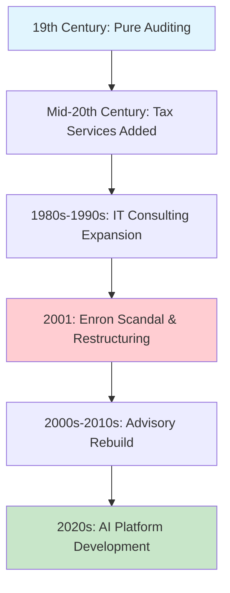

The dot-com boom made technology and digital transformation essential, leading the Big Four to invest heavily in IT consulting, risk management, and corporate strategy[^1]. However, the 2001 Enron scandal and the collapse of Arthur Andersen forced fundamental restructuring. Regulations required many firms to separate or divest their consulting operations—PwC sold its consulting arm to IBM, while KPMG and EY underwent significant reorganization[^4]. Deloitte notably chose to retain and isolate its consulting business, a decision that positioned it for subsequent growth[^4].

This tumultuous period shaped the Big Four's current approach to AI: they developed **sophisticated risk management frameworks and compliance-oriented cultures** that now inform their emphasis on AI governance, transparency, and regulatory alignment[^1][^8].

**MBB's Codification of Strategy as a Discipline**

The MBB firms' evolution reflects the maturation of strategy consulting from an emergent practice to a codified profession. The 1950s-1970s represented the "golden age of strategy," during which BCG's frameworks (growth-share matrix, experience curve) and McKinsey's analytical tools (GE/McKinsey nine-box matrix) transformed strategic consulting into a data-driven, visually communicable discipline[^4].

The subsequent decades saw MBB firms expand their service portfolios while maintaining their premium positioning. McKinsey developed specialized practices across industries and functions, BCG emphasized creative and innovative thinking, and Bain cultivated its reputation for collaborative client relationships and private equity expertise[^2]. Critically, the firms' "up or out" talent models created a **continuous cycle of training elite consultants who then populated leadership positions across corporate America**, simultaneously building brand prestige and creating future client relationships[^2].

This evolutionary path positioned MBB firms to approach AI as an **enhancement to their core analytical and advisory capabilities** rather than a fundamental business model disruption. Their historical emphasis on intellectual frameworks and client counsel shapes their current "hybrid model" approach to AI integration[^9].

**Technology Consultancies' Rise Through Implementation Excellence**

The technology consultancies emerged from the recognition that enterprises needed assistance not just with strategy formulation but with **executing complex technology transformations**. The 1980s-1990s technology boom created enormous demand for professionals who could implement enterprise resource planning systems (SAP, Oracle, PeopleSoft) and manage the integration of technology with business processes[^4].

Accenture's trajectory exemplifies this evolution. Originally structured as the consulting arm of Arthur Andersen, the firm developed deep expertise in technology implementation before its 2001 separation. Subsequently, Accenture has pursued aggressive expansion through acquisitions—over 20 in the past two years alone, adding more than 10,000 professionals to support its government AI services[^6]. IBM Consulting has leveraged its parent company's hardware and software heritage to position itself as the architect of hybrid cloud solutions, while Capgemini has focused on blending enterprise IT with operational technology[^7].

This implementation-focused heritage positions technology consultancies to approach AI as a **natural extension of their existing transformation capabilities**, with particular emphasis on deploying AI solutions at scale within complex enterprise environments[^7][^6].

### 1.3 Current Market Positions and Competitive Dynamics

The contemporary market standing of each firm cohort reflects both their historical evolution and their strategic responses to emerging opportunities, with significant implications for AI investment capacity and strategic incentives.

**Revenue Scale and Global Footprint**

The consulting industry exhibits substantial variation in scale across cohorts, with the Big Four and technology consultancies commanding significantly larger revenue bases than the MBB strategy houses.

| Firm Cohort | Representative Firms | Revenue Range (2023-2024) | Global Offices | Employee Count |
|-------------|---------------------|---------------------------|----------------|----------------|
| Big Four | Deloitte, PwC, EY, KPMG | $36B - $65B | 100+ each | 300,000 - 470,000 |
| MBB | McKinsey, BCG, Bain | $4.3B - $16B | 65 - 130 | 19,000 - 45,000 |
| Tech Consultancies | Accenture, IBM, Capgemini | $20B - $64B | 100+ | 100,000 - 790,000 |

*Sources: Firm disclosures and industry analyses*[^2][^5][^10]

McKinsey maintains the largest footprint among MBB firms with approximately 45,000 employees across 130 offices globally and recent revenues of approximately $16 billion[^2]. BCG follows with roughly 32,000 employees across 128 offices and estimated annual revenue of $12 billion, while Bain operates with approximately 19,000 employees across 65 offices[^2]. Accenture dwarfs all competitors in scale, with approximately 790,000 employees and annual revenue exceeding $64 billion[^5][^10].

This scale differential creates distinct strategic contexts for AI investment. **Larger firms possess greater financial capacity for AI infrastructure development** but also face more complex organizational change management challenges. Smaller, more focused firms may achieve faster cultural alignment but lack resources for comprehensive platform development.

**Compensation and Talent Competition**

Compensation structures reveal important competitive dynamics and talent model differences across cohorts. As of 2025, MBB firms offer entry-level consultants in the United States base salaries estimated at $135,000-$140,000, compared to $90,000-$108,000 for similar positions at Big Four consulting divisions[^2]. This differential is substantially driven by performance bonuses, with MBB firms typically offering bonus packages 25-56% higher than Big Four counterparts[^2].

For MBA and doctoral graduates, the compensation gap narrows somewhat, with MBB salaries typically 9-40% higher than Big Four equivalents, though performance bonus differentials remain significant—MBB consultants may receive bonuses reaching $60,000-$65,000[^2]. These compensation structures reflect and reinforce each cohort's talent positioning: **MBB firms compete for elite analytical talent through premium compensation**, while Big Four firms leverage scale, stability, and diverse career paths to attract broader talent pools.

**Client Base and Engagement Models**

Each cohort has developed distinct client engagement models that shape their AI service delivery approaches. The Big Four's audit relationships provide **privileged access to CFO-level relationships and deep knowledge of client financial systems**, creating natural entry points for AI solutions focused on finance, risk, and compliance[^11]. EY's agentic platform, for example, specifically targets tax complexity, reflecting this client relationship strength[^11].

MBB firms maintain relationships primarily at the CEO and board level, focusing on **strategic decision support for the most consequential business questions**[^2]. This positioning shapes their AI approach toward augmenting strategic analysis and executive advisory rather than operational automation.

Technology consultancies have built relationships across the C-suite, with particular strength among CIOs and CTOs responsible for technology infrastructure and digital transformation. Accenture's positioning as "a deep and broad range of business and technology transformation capabilities" reflects this client base characteristic[^5].

**Emerging Competitive Pressures**

The competitive landscape is being reshaped by two significant emerging pressures. First, **AI-native boutique consulting firms** are challenging established players by leveraging advanced AI tools to deliver specialized services at competitive rates. These smaller firms have grown 38% faster than traditional consulting giants over the past two years[^12]. Firms like Xavier AI, Nexstrat, and Consulting IQ are using AI to automate typical consulting tasks and make consulting accessible to small and midsize businesses previously underserved by major firms[^13].

Second, **client organizations are increasingly building internal AI capabilities**, reducing reliance on external consultants for certain functions. Google, for example, maintains an in-house strategy team of over 100 professionals[^3]. This trend pressures consulting firms to demonstrate unique value beyond what clients can develop internally.

### 1.4 Organizational Structures and Cultural Nuances

The internal organizational architectures and cultural attributes of each firm cohort create distinct contexts for AI strategy formulation and execution, influencing everything from investment decision-making to implementation approaches.

**Partnership Models and Decision-Making**

The Big Four and MBB firms operate predominantly under partnership models, though with important structural variations. MBB firms typically follow an "up or out" model where consultants who do not advance to partnership within a defined timeframe are expected to leave, ensuring continuous talent renewal and maintaining partnership exclusivity[^2]. Bain has notably incorporated sabbaticals and external rotations into its career path, allowing consultants to broaden their experience before partnership decisions[^2].

The Big Four's partnership structures accommodate larger partner populations given their scale, with more diverse career paths including technical specializations and alternative advancement tracks. This structural difference influences AI investment decisions: **MBB's concentrated partnership model may enable faster strategic alignment on AI priorities**, while Big Four's distributed decision-making requires broader consensus-building.

Technology consultancies operate with varied governance models. Accenture functions as a publicly traded company, enabling access to capital markets for large-scale investments but also creating shareholder accountability pressures. IBM Consulting operates as a division within IBM Corporation, with strategic decisions influenced by broader corporate priorities around hybrid cloud and AI[^7][^6].

**Hierarchical Structures and Talent Development**

Traditional consulting firm hierarchies follow a pyramid structure, with large numbers of junior analysts supporting progressively smaller cohorts of senior consultants and partners. This model is now being challenged by AI's potential to automate tasks traditionally performed by junior staff.

MBB firms have historically relied on this pyramid to train junior consultants through intensive research and analysis work, creating a developmental pathway to partnership. BCG is reported to be hiring fewer MBA graduates while prioritizing tech talent and data scientists, reflecting a structural shift toward what industry observers describe as a transition from "pyramid shape" to "diamond shape"[^9]. This shift involves reducing mass hiring of junior staff while quickly recruiting mid-level experts who can bridge technology and operational reforms[^9].

The Big Four are similarly adapting their talent structures. At PwC, new hires are expected to perform roles that managers currently perform within three years, as they will be overseeing AI performing routine, repetitive audit tasks[^14]. At KPMG, juniors are being prepared to become "managers of agents," managing teams of AI agents and playing greater roles in strategy decisions[^14].

**Innovation Cultures and Risk Orientation**

Cultural orientations toward innovation and risk vary significantly across cohorts, shaping AI adoption patterns.

The Big Four's audit heritage instills a **conservative, risk-aware culture** that prioritizes accuracy, compliance, and documentation. This orientation manifests in their AI strategies through emphasis on governance frameworks, audit trails, and responsible AI practices. KPMG's Workbench platform, for example, is designed for industries "where transparency is as important as efficiency"[^11].

MBB firms cultivate cultures emphasizing **intellectual rigor, creative problem-solving, and client impact**. BCG's culture is frequently described as more creative and slightly less hierarchical than McKinsey's, with emphasis on innovative thinking[^2][^10]. This cultural orientation shapes their AI approach toward augmenting analytical capabilities and maintaining the premium value of human insight.

Technology consultancies embrace cultures of **technological innovation and implementation excellence**. Accenture's culture is described as "innovation-driven, diverse, and team-oriented," with strong emphasis on flexible work models and continuous learning[^10]. This orientation positions technology consultancies to approach AI as a natural extension of their technology transformation expertise.

**Boutique Firm Cultural Advantages**

Boutique consulting firms offer contrasting cultural attributes that increasingly attract talent and clients. These firms typically feature **flat hierarchical structures**, with direct access between junior consultants and senior partners or founders[^12]. Research indicates that 78% of clients report higher satisfaction working with boutique firms, partly attributable to more direct engagement with experienced professionals[^12].

The cultural dynamics of boutique firms also attract talent seeking alternatives to traditional consulting environments. Consultants increasingly value work-life balance, higher compensation, and better company culture, with boutique firms offering more flexible work arrangements, accelerated promotion timelines, and reduced travel requirements[^12].

### 1.5 Origin-Driven AI Strategic Postures

The preceding analyses reveal how each firm cohort's foundational origins and evolutionary trajectory inform distinctive AI strategic postures, creating differentiated value propositions across the competitive landscape.

**Big Four: AI Productization and Operational Scale**

The Big Four's strategic posture centers on **leveraging their compliance heritage and client relationships to build domain-specialized, agentic AI platforms** aimed at becoming core business operating systems. Their approach reflects a fundamental shift from advisory services toward long-term implementation partnerships.

By 2025, all four firms have launched multi-agent AI platforms signaling a shift from AI as buzzword to business backbone[^11]:

- **Deloitte's Zora AI** (launched March 2025) serves as an "AI-powered procurement specialist," targeting finance and procurement bottlenecks with deep workflow integration[^11]. The platform grew from Deloitte's recognition that finance and procurement processes were massive bottlenecks, and it directly appeals to CFOs and procurement leaders[^11].

- **EY's EY.ai Agentic Platform** (launched March 2025) embeds 150+ specialized tax agents supporting 80,000 professionals worldwide, functioning as a "digital tax colleague" that combines EY's deep tax expertise with AI scalability[^11]. This represents perhaps the most domain-specific approach among Big Four platforms, targeting global corporations facing regulatory uncertainty across 150+ countries[^11].

- **PwC's agent OS** (introduced March 2025) represents the most modular and governance-driven approach, offering a framework that functions "less like a chatbot and more like an AI operating system for enterprises"[^11]. PwC has deployed 25,000 intelligent agents across client operations, with partnerships with Salesforce, CrewAI, and AWS central to driving AI-led growth[^14].

- **KPMG's Workbench** (launched June 2025) emphasizes orchestration of multiple agents working together, mirroring human audit teams[^11]. Developed with Microsoft, it connects 50 AI agents and chatbots with nearly 1,000 more in development[^14]. The platform prioritizes trust and collaboration over speed, designed for regulated industries including finance, healthcare, and government[^11].

This strategic posture reflects the Big Four's recognition that **AI enables a transformation of their commercial model** from time-based billing toward "service-as-a-software" approaches where clients pay based on outcomes[^14]. The shift represents both an opportunity to deepen client relationships and a defensive response to AI-native competitors threatening traditional service delivery models.

**MBB: Premium Preservation via Augmentation**

The MBB firms' strategic posture centers on **integrating AI to enhance traditional strategic analysis and productivity while protecting their premium positioning** as providers of high-value strategic counsel. Their approach emphasizes a "hybrid model" combining AI capabilities with human consultant insight.

Each firm has developed distinct approaches to this integration:

- **McKinsey's QuantumBlack** acquisition in 2015 established the foundation for its AI and machine learning capabilities, originally developed through real-time data analytics for Formula 1 racing[^9]. McKinsey emphasizes combining strategic insight with AI's strengths in large-scale data handling and pattern detection. Among McKinsey's approximately 45,000 employees, more than 7,000 focus on digital or tech roles[^9]. In 2023, McKinsey rolled out "Lilli," an internal large language model platform using retrieval-augmented generation (RAG) to search and summarize the firm's knowledge database, handling more than 500,000 monthly inquiries[^9].

- **BCG's BCG X** unit (formed by merging BCG GAMMA with other technology divisions) employs more than 3,000 engineers, data scientists, designers, and AI experts[^9]. BCG has formed strategic partnerships with AI platform providers including DataRobot, Microsoft, and Google, and announced collaboration with Anthropic in 2023[^9]. BCG emphasizes Explainable AI (XAI), developing visualization tools to maintain transparency in AI-driven analysis[^9].

- **Bain's global alliance with OpenAI** (announced 2023) focuses specifically on generative AI, with the firm equipping all 18,000 consultants worldwide with tools incorporating ChatGPT, GPT-4, and DALL·E[^9]. Bain's specialized "Vector" unit, comprising over 1,500 data scientists and engineers, focuses on digital transformation and AI adoption[^9]. The "Create Real Magic" project with Coca-Cola exemplifies Bain's approach, using GPT-4 and DALL·E for marketing campaign ideation[^9].

A large-scale experiment conducted by Harvard Business School and BCG in 2023 with 758 consultants provides empirical validation of this augmentation approach: consultants using GPT-4 completed 12.2% more tasks, finished them 25.1% faster, and achieved over 40% improvement in output quality compared to those not using AI[^9]. However, performance decreased when tasks exceeded AI capabilities, highlighting that **effectiveness depends on appropriately identifying AI's strengths and limitations**[^9].

This strategic posture acknowledges that while AI can dramatically enhance productivity, **human-driven insight remains indispensable** for organizational transformation, stakeholder management, and decision support requiring interpersonal or political dynamics understanding[^9]. The MBB firms' structural shift toward a "diamond shape" talent model—reducing junior hiring while recruiting mid-level technical experts—reflects this strategic emphasis on human-AI collaboration at higher value levels[^9].

**Technology Consultancies: End-to-End Integration**

Technology consultancies' strategic posture centers on **embedding AI across their vast technology and operations service lines**, offering comprehensive transformation from strategy through execution with particular emphasis on modernizing legacy systems and industrial applications.

Accenture exemplifies this approach with its $3 billion AI investment commitment, resulting in the creation of 60+ AI Innovation Studios and Labs worldwide[^6]. The firm's AI professional services portfolio integrates AI across services, industries, and solutions, with platforms including NAV AI/AI Refinery (a sovereign AI multi-agent platform), GenWizard (full-lifecycle generative AI development), and Method One (AI-powered delivery framework)[^6]. Accenture has bolstered its capabilities through over 20 acquisitions in the past two years, adding more than 10,000 professionals[^6].

IBM Consulting leverages its hybrid cloud architecture and Watsonx capabilities to offer modernization-in-place strategies, using tools like Watsonx Code Assistant for Z to translate COBOL into Java[^7]. This approach allows highly regulated clients in banking and government to modernize core systems securely while avoiding vendor lock-in[^7].

Capgemini's ADMnext offering goes beyond maintenance to promise "Zero Debt," utilizing proprietary economic Application Portfolio Management tools to visualize complex IT estates[^7]. This visualization capability is particularly valuable for sustainability-focused clients seeking to calculate and reduce the carbon footprint of legacy infrastructure[^7].

According to the Everest Group's 2025 PEAK Matrix evaluation, Accenture, Capgemini, Cognizant, Deloitte, IBM Consulting, and TCS are positioned as Leaders in AI and generative AI services[^15]. Accenture, IBM, and Capgemini lead in overall AI services market share[^15]. The evaluation identifies key buyer considerations including value-driven pricing, reliable delivery, and expertise in emerging AI technologies[^15].

**Synthesis: Differentiated Value Propositions**

The integrated analysis reveals a clear bifurcation of the competitive landscape based on origin-driven strategic postures:

```mermaid
graph TD
    subgraph "Big Four Posture"
        A[Compliance Heritage] --> B[Governance-Focused AI]
        B --> C[Domain-Specific Platforms]
        C --> D[Outcome-Based Pricing]
    end
    
    subgraph "MBB Posture"
        E[Strategy Heritage] --> F[Augmented Analysis]
        F --> G[Hybrid Human-AI Model]
        G --> H[Premium Positioning Preserved]
    end
    
    subgraph "Tech Consultancy Posture"
        I[Implementation Heritage] --> J[End-to-End Integration]
        J --> K[Scale & Modernization]
        K --> L[Technology-First Transformation]
    end
    
    style A fill:#e3f2fd
    style E fill:#fff3e0
    style I fill:#e8f5e9
```

**Key Interpretation:**

- **Big Four firms** leverage their compliance and governance strengths to build productized AI platforms targeting specific operational domains (tax, audit, procurement), shifting toward outcome-based commercial models.

- **MBB firms** integrate AI to enhance analytical capabilities while preserving the premium value of human strategic insight, emphasizing hybrid models and structural talent shifts.

- **Technology consultancies** embed AI across comprehensive transformation capabilities, leveraging scale and implementation expertise to offer end-to-end solutions from strategy through operations.

All established firms face common disruptive pressures from AI-native boutiques targeting underserved market segments and from increasing client internal AI capabilities. The global AI consulting and support services market, valued at $14 billion in 2024, is forecast to expand at a 31.6% CAGR to reach $72.8 billion by 2030[^16], creating substantial growth opportunities but also intensifying competitive pressures that will test each firm's ability to execute on its distinctive AI strategic posture.

## 2 Mapping the Financial Commitment: Scale and Focus of AI Investments

The scale of financial commitment to artificial intelligence among major consulting firms has reached unprecedented levels, transforming what was once experimental technology spending into strategic imperatives commanding multi-billion dollar allocations. As established in Chapter 1, each firm cohort—the Big Four, MBB strategy houses, and technology consultancies—approaches AI investment through the lens of their distinct organizational heritage and competitive positioning. This chapter quantifies these commitments, dissects allocation strategies, and evaluates the emerging evidence on returns, revealing how **financial investment patterns serve as the most concrete manifestation of each firm's AI strategic posture**.

The consulting industry's AI investment landscape in 2025 reflects a fundamental recognition that artificial intelligence represents not merely an operational enhancement but a potential transformation of the professional services business model itself. With the AI consulting services market projected to grow from **$11.07 billion in 2025 to $90.99 billion by 2035**—a 26.2% compound annual growth rate—the stakes of investment decisions extend far beyond near-term competitive positioning to encompass long-term market relevance[^17].

### 2.1 Headline Investment Announcements: Quantifying the AI Arms Race

The major consulting firms have announced a series of multi-billion dollar AI investment commitments that collectively represent the largest coordinated technology investment in professional services history. These announcements establish the quantitative baseline for understanding how seriously each firm is treating the AI transformation imperative.

**Accenture: The $3 Billion Benchmark**

Accenture set the industry benchmark on **June 13, 2023**, announcing a **$3 billion investment over three years** in its Data & AI practice to help clients across all industries advance and use AI responsibly[^18]. This commitment encompassed expansion of the Data & AI practice to offer new industry solutions and pre-built models across 19 industries, a pledge to double AI talent to 80,000 people through hiring, acquisitions, and training, and the launch of the AI Navigator for Enterprise platform and Center for Advanced AI[^18]. The investment built on Accenture's existing foundation of more than 1,450 patents and pending patent applications in AI-related technologies[^18].

The results of this investment have been substantial. By fiscal year 2025, Accenture had **tripled its advanced AI revenue year-over-year to $2.7 billion**, with GenAI bookings nearly doubling to $5.9 billion[^19]. In the third quarter of fiscal 2025 alone, the company achieved **$1.5 billion in GenAI bookings and over $700 million in revenues**, bringing year-to-date GenAI bookings to $4.1 billion and revenue to $1.8 billion[^20]. The firm's data and AI workforce grew from 40,000 to approximately 77,000 professionals, progressing toward a goal of 80,000 by the end of fiscal year 2026[^20][^19].

**PwC: Layered Investment Strategy**

PwC has pursued a layered investment approach, beginning with a **$1 billion commitment announced on April 26, 2023**, focused on expanding and scaling AI offerings over three years[^21]. This initial investment featured an industry-leading relationship with Microsoft, creating scalable offerings using OpenAI's GPT-4/ChatGPT and Microsoft's Azure OpenAI Service[^21]. A core component involved upskilling the firm's 65,000 US employees on AI tools and capabilities[^21].

The firm subsequently expanded its commitment. According to PwC's 2024 Global Annual Review, the firm announced a **multi-year investment of $1 billion to leverage technology to transform its audit ecosystem**, while network firms collectively invested **nearly $1.5 billion globally to expand and scale AI capabilities**, launch partnerships, and roll out AI tools across service lines[^22]. This global commitment was described as "not only transforming the way we work, but delivering new opportunities for efficiency, innovation and value"[^22].

**KPMG: The Microsoft Alliance**

KPMG's AI investment strategy centers on its landmark partnership with Microsoft, announced on **July 11, 2023**. The collaboration includes a **KPMG multibillion dollar commitment in Microsoft cloud and AI services over five years**, with the partnership projected to unlock potential incremental growth opportunity for KPMG of **over $12 billion**[^23][^24]. The investment specifically targets a **$2 billion allocation to Microsoft Cloud and AI services**[^25][^26].

This partnership empowers KPMG's global workforce of 265,000 professionals with Microsoft cloud and Azure OpenAI Service capabilities[^23][^24]. As an early access partner for Microsoft 365 Copilot and Azure OpenAI Service, KPMG professionals pilot these technologies before broader market availability[^23][^26]. The collaboration spans KPMG's core business areas: in Audit, 85,000 professionals are empowered through AI integration into the KPMG Clara smart audit platform; in Tax, Azure OpenAI Service and Microsoft Fabric are integrated into KPMG Digital Gateway; and in Advisory, an AI-enabled application development and knowledge platform on Microsoft Azure expedites specialized solution creation[^23][^24].

**EY: Annual Commitment Model**

EY has adopted an annual investment model, committing **more than $1 billion annually in AI platforms and products**[^14]. This approach reflects EY's strategy of continuous capability building rather than a single multi-year announcement. The firm has advanced 1,000 AI agents into development or production in 2025, with plans to scale to 100,000 agents by 2028[^14].

**Deloitte: Partnership-Centric Approach**

Deloitte's AI investment strategy emphasizes strategic partnerships over headline investment announcements. The firm rolled out Zora AI, an agentic platform built with Nvidia, and struck a deal with Anthropic in October 2025 to deploy Claude AI to its 470,000 employees worldwide[^14]. While Deloitte has not announced a single headline investment figure comparable to Accenture's $3 billion, its partnership-centric approach leverages technology provider capabilities while maintaining flexibility.

**Comparative Investment Scale Analysis**

The following table synthesizes the headline investment commitments across major consulting firms:

| Firm | Announced Investment | Timeframe | Announcement Date | Primary Focus |
|------|---------------------|-----------|-------------------|---------------|
| Accenture | $3 billion | 3 years | June 2023 | Data & AI practice expansion, talent doubling |
| PwC (US) | $1 billion | 3 years | April 2023 | Microsoft partnership, workforce upskilling |
| PwC (Global) | $1.5 billion | Multi-year | FY2024 | Network-wide AI capabilities |
| KPMG | $2 billion | 5 years | July 2023 | Microsoft cloud and AI services |
| EY | >$1 billion | Annual | Ongoing | AI platforms and products |
| Deloitte | Not disclosed | Ongoing | Various | Strategic partnerships (Anthropic, Nvidia) |

*Sources: Firm announcements and disclosures*[^14][^20][^21][^23][^18][^22]

The investment scale correlates broadly with firm revenue and strategic positioning. Accenture's $3 billion commitment represents approximately 4.7% of its annual revenue, while PwC's global $1.5 billion investment represents approximately 2.7% of its $55.4 billion fiscal 2024 revenue[^22]. These proportions indicate that **leading firms are allocating substantial but measured percentages of revenue to AI transformation**, balancing aggressive capability building with financial prudence.

### 2.2 Investment Allocation Strategies: Platforms, Talent, and Partnerships

Beyond headline figures, the strategic allocation of AI investments reveals distinct priorities across firm cohorts, with spending directed toward internal platform development, talent transformation, research and development, and strategic acquisitions.

**Internal Platform Development**

All major consulting firms have directed substantial investment toward building proprietary AI platforms that embody their strategic positioning. As detailed in Chapter 1, 2025 witnessed the launch of multi-agent AI platforms across the Big Four:

- **Deloitte's Zora AI** (built with Nvidia) offers "intelligent digital workers" capable of autonomously completing tasks, while the firm expanded generative AI features in Omnia, its cloud-based audit and assurance platform[^14].

- **EY's EY.ai** grants 80,000 tax staff access to 150 AI agents for tasks including data collection, document review, and tax compliance[^14].

- **PwC's agent OS** has deployed 25,000 intelligent agents across client operations, with partnerships with Salesforce, CrewAI, and AWS central to driving AI-led growth[^14].

- **KPMG Workbench** connects 50 AI agents and chatbots with nearly 1,000 more in development, while KPMG Velocity supports advisory work and Clara serves more than 95,000 auditors globally[^14].

Platform investment extends beyond the Big Four. Accenture's platforms include NAV AI/AI Refinery (a sovereign AI multi-agent platform), GenWizard (full-lifecycle generative AI development), and Method One (AI-powered delivery framework). The firm's AI Navigator for Enterprise serves as a generative AI-based platform to guide AI strategy[^18].

**Talent Acquisition and Upskilling Programs**

Consulting firms are making transformative investments in workforce development, recognizing that AI capabilities require both technical specialists and broad-based organizational fluency.

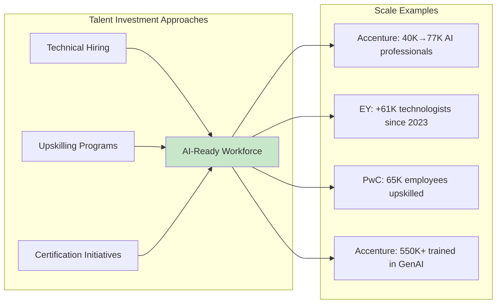

**Accenture** has executed the most aggressive workforce expansion, growing its AI and data employee base from 40,000 to 77,000 professionals and delivering more than 6,000 advanced AI projects in fiscal year 2025[^19]. More than 550,000 Accenture employees have been trained in the fundamentals of GenAI[^19]. The firm announced in 2025 that it was rolling out one of the world's largest corporate AI training programs, reskilling 700,000 employees in agentic AI[^27].

**EY** has added 61,000 technologists to its ranks since 2023, who now make up around 15% of its total workforce[^14]. In January 2025, EY rolled out an AI tool to its employees that helps them identify how their jobs will change because of AI, and nearly 100,000 EY employees—roughly a quarter of the workforce—have earned a digital "AI badge" for completing one of the firm's new AI learning programs[^14].

**PwC** announced investment in upskilling its 65,000 US employees on AI tools and capabilities as part of its $1 billion commitment[^21]. Employees are reporting 20-30% efficiency gains as a result of the "My AI" initiative[^27]. Externally, PwC partnered with Innovate UK to launch an AI Skills Hub to increase employer uptake of sector-specific AI training[^27].

**KPMG's** UK branch partnered with Multiverse to launch a major AI training program to build digital literacy and AI expertise across the business, while KPMG Australia became the first firm globally to receive ISO 42001 certification for AI Management Systems[^27].

**Deloitte**, through its Deloitte AI Academy, teaches AI skills through a curriculum of more than 15 offerings. In 2025, Deloitte announced collaboration with Anthropic to launch a Generative AI and advanced AI applications certification program, aiming to certify 15,000 Deloitte practitioners globally[^27].

**Research and Development Investment**

Consulting firms are investing in R&D to stay competitive and develop differentiated capabilities. According to industry analysis, **68% of leaders expect AI to create demand for entirely new skills in consulting over the next 3–5 years**, highlighting a strong focus on workforce upskilling and adaptation[^17]. Successful consulting firms maintain dedicated AI trend teams that track developments across academic research, technology startups, and enterprise implementations, producing regular briefings on emerging capabilities and their potential business applications[^17].

**Strategic Acquisitions**

Acquisition activity represents a significant investment channel for capability building. Accenture invested over $297 million in four strategic acquisitions during the third quarter of fiscal 2025 alone, with full-year acquisition investment expected at $1 to $1.5 billion[^20]. PwC's network-wide investment of $3.6 billion included 8 acquisitions and 7 strategic investments to expand client value delivery capabilities[^22].

Accenture's strategic investment approach includes participation through Accenture Ventures, which made a strategic investment in Writer, a platform using generative AI to help enterprises create and shape content[^28]. The firm started using Writer in 2021 to augment its writing proficiency and is now scaling these capabilities internally and for clients[^28].

### 2.3 Strategic Partnership Architectures: Technology Provider Alliances

The structure of consulting firms' partnerships with major AI technology providers reveals strategic priorities and competitive positioning approaches. These alliances provide early access to capabilities, technical training, implementation support, and in some cases, exclusive market positioning.

**PwC-OpenAI: First Reseller Partnership**

PwC signed an agreement with Microsoft-backed OpenAI in 2024 to become **the AI company's first resale partner and largest enterprise user**[^29]. The Big Four accounting firm's US and UK operations offer ChatGPT Enterprise, the business-focused version of the generative AI chatbot, to employees and clients[^29]. The deal provides access to the latest tools from OpenAI, including the ChatGPT-4o model and new capabilities focused on voice and image[^29].

PwC hands ChatGPT Enterprise licenses to more than 100,000 employees—75,000 in the US and 26,000 in the UK[^29]. The firm has developed custom GPTs to help its workforce review tax returns, generate proposal responses, and generate reports and dashboards, identifying over 3,000 internal use cases spanning different industries[^29]. This partnership positions PwC as a unique distribution channel for OpenAI technology while providing the firm with differentiated AI capabilities.

**KPMG-Microsoft: Landmark Alliance**

KPMG's partnership with Microsoft represents perhaps the most comprehensive technology alliance in the consulting industry. The collaboration spans more than a decade and includes KPMG's multibillion dollar commitment in Microsoft cloud and AI services over five years, projected to unlock over $12 billion in incremental growth opportunity[^23][^24].

The partnership provides early access to cutting-edge capabilities. As an early access partner for Microsoft 365 Copilot and Azure OpenAI Service, KPMG professionals pilot technologies before general availability[^23][^26]. KPMG recently introduced KymChat, an AI accelerator, as a proof of concept in Australia, with plans to launch it globally[^26]. The firm uses Azure OpenAI Service and works with Microsoft under the Early Access Program for Microsoft 365 Copilot in Word and PowerPoint[^26].

The collaboration extends to specific service line applications. KPMG and Microsoft co-developed an AI solution using Azure OpenAI Service that analyzes environmental, social and governance (ESG) data[^24][^26]. KPMG firms operate a generative-AI powered "virtual assistant" to create new client service models[^24]. The partnership also supports social impact initiatives, including the UNESCO global education coalition and KPMG's 10x30 strategy to economically empower 10 million underprivileged youths by 2030[^24].

**Deloitte: Multi-Provider Strategy**

Deloitte has pursued a multi-provider partnership strategy, establishing relationships with both Anthropic and Nvidia. The firm struck a deal with Anthropic in October 2025 to deploy Claude AI to its 470,000 employees worldwide[^14]. Simultaneously, Deloitte's Zora AI platform was built with Nvidia, leveraging the technology provider's AI infrastructure capabilities[^14].

**Accenture: Ecosystem Approach**

Accenture maintains relationships across the AI technology ecosystem while making targeted strategic investments. The firm's investment in Writer through Accenture Ventures exemplifies this approach, combining financial investment with operational deployment[^28]. According to Accenture Research, up to 40% of all working hours will be impacted by large language models, and 98% of global executives agree AI foundation models will play an important role in their organizations' strategies in the next three to five years[^28].

**Partnership Value Analysis**

The strategic rationale for technology provider partnerships encompasses multiple value dimensions:

| Value Dimension | Description | Example |
|-----------------|-------------|---------|
| Early Access | Pilot technologies before general availability | KPMG's Microsoft 365 Copilot early access |
| Technical Training | Capability building for professional workforce | PwC-OpenAI ChatGPT Enterprise deployment |
| Implementation Support | Accelerated solution development | KPMG-Microsoft Azure OpenAI integration |
| Market Positioning | Differentiated competitive standing | PwC as OpenAI's first reseller |
| Growth Opportunity | Revenue expansion through joint offerings | KPMG's projected $12B growth opportunity |

These partnerships provide consultants with early access to new capabilities, technical training, and implementation support that would be difficult to develop independently[^17]. The relationships also create competitive moats, as exclusive or preferred partnerships limit competitor access to equivalent capabilities.

### 2.4 ROI Expectations and Value Realization Timelines

The question of return on AI investment represents one of the most challenging aspects of the consulting industry's AI transformation. Evidence reveals a **paradox of rising investment alongside elusive returns**, with timelines significantly longer than traditional technology investments.

**The ROI Timeline Challenge**

According to Deloitte's 2025 survey of 1,854 executives across Europe and the Middle East, **85% of organizations increased their AI investment in the past 12 months, and 91% plan to increase it again**[^30][^31]. Despite this momentum, most respondents reported achieving satisfactory ROI on a typical AI use case within **two to four years**, significantly longer than the typical payback period of **seven to twelve months** expected for technology investments[^30][^31]. **Only 6% reported payback in under a year**[^30][^31].

The reasons for this extended timeline are multifaceted. Many AI benefits—such as improved supplier relationships and higher employee satisfaction—are intangible and difficult to monetize[^30]. Isolated platforms and data quality issues make tracking impact difficult, while technology evolves faster than measurement standards[^30]. Additionally, AI is typically deployed alongside broader digital transformation, operational, or structural changes, making it challenging to isolate AI's specific contribution[^30].

**Generative AI vs. Agentic AI ROI Patterns**

The survey data reveals distinct ROI patterns for different AI technologies:

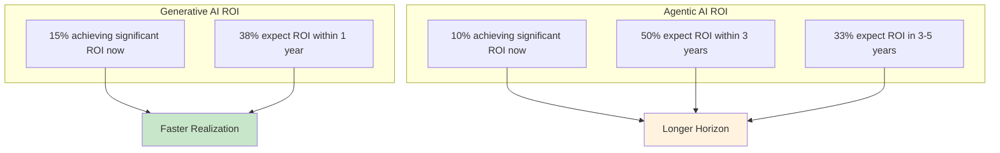

For generative AI, **15% of respondents using the technology report their organizations already achieve significant, measurable ROI**, and **38% expect it within one year of investing**[^30][^31]. In contrast, among respondents already using agentic AI (representing 57% of total respondents), **just 10% said they are currently realizing significant ROI**[^31]. While half expect returns within three years, another third anticipate that ROI will take three to five years due to higher complexity[^30][^31]. **Nearly half of surveyed organizations use different timeframes or expectations for generative and agentic AI initiatives**[^30][^31].

**Evidence of Realized Returns**

Despite the timeline challenges, substantial evidence indicates that AI investments are generating measurable returns. Deloitte's 2025 Tech Value Survey of nearly 550 leaders finds that **84% of those investing in AI and generative AI report gaining ROI**[^32]. Confidence in AI automation ROI is strong, with **more than 95% of respondents expecting moderate to significant value increases in the coming year**[^32].

The survey reveals that digital initiative budgets among organizations with $13.4 billion in average revenue reached $1.8 billion in 2025, marking an increase from 7.5% of revenue in 2024 to 13.7% in 2025[^32]. More than half of respondents now allocate between 21% and 50% (an average of 36%) of their digital initiative budgets to AI, equating to approximately **$700 million for a company with $13 billion in revenue**[^32].

However, a cautionary note emerges from research indicating that **only 5% of generative AI pilots deliver sustained value at scale**[^32]. This gap between pilot success and scaled implementation represents a critical challenge for consulting firms both in their internal deployments and client advisory work.

**Firm-Specific ROI Evidence**

Individual consulting firms report specific ROI metrics from their AI investments:

- **Accenture** reports that when savings are achieved through AI, clients reinvest that budget into their next priorities, driving the company's seven percent growth[^19]. The firm added 37 clients in Q4 alone with quarterly bookings of over $100 million, bringing the total for the year to a record 129, as clients move from small pilots to enterprise-wide deployments[^19].

- **PwC** employees report **20-30% efficiency gains** from AI tool deployment through the "My AI" initiative[^27].

- **EY** reported a **30% rise in revenues driven by AI-related work** such as enterprise-wide transformations and AI governance frameworks[^33].

**Investment Resilience Despite Uncertainty**

Despite uncertain ROI timelines, AI investment demonstrates remarkable resilience. According to KPMG's Q4 2025 AI Pulse Survey, **67% of leaders state they will maintain AI spending even if an economic recession occurs in the next 12 months**, with expected deployment of $124 million in the coming year[^34]. **59% of leaders expect to see measurable ROI within the same timeframe**[^34].

This resilience reflects strategic conviction rather than proven returns. As Deloitte's research notes, investment continues growing despite unclear returns, **driven by strategic necessity and belief in AI's long-term impact**[^30]. Organizations recognize that not all returns are immediate or financial, with **65% now viewing AI as part of company strategy**[^30].

### 2.5 Investment Patterns and Strategic Priority Synthesis

Synthesizing the investment data across firm cohorts reveals how financial commitments align with the origin-driven strategic postures established in Chapter 1, while also illuminating emerging trends that will shape the industry's competitive dynamics.

**Big Four: Governance-Focused Platform Investment**

The Big Four's investment patterns reflect their compliance heritage and client relationship strengths. Their AI spending prioritizes:

1. **Domain-Specific Platforms**: Investments target operational domains where Big Four firms possess deep expertise—tax (EY.ai), audit (KPMG Clara), and procurement (Deloitte Zora AI). These platforms embody the shift from advisory services toward embedded operational systems.

2. **Governance and Risk Frameworks**: Investment in responsible AI frameworks reflects the Big Four's compliance DNA. KPMG's Workbench emphasizes trust and collaboration, designed for regulated industries including finance, healthcare, and government where transparency is paramount[^14].

3. **Commercial Model Transformation**: The Big Four are investing in capabilities that enable outcome-based pricing rather than time-based billing. As noted by EY's global managing partner for growth and innovation, the power of AI agents is forcing reconsideration of commercial models, potentially moving to a "service-as-a-software" approach where clients pay based on outcomes[^14].

4. **Workforce Restructuring**: Investment patterns include reduced entry-level hiring alongside increased technical hiring. PwC US planned to cut graduate hiring by a third over three years, with leadership citing "the impact of AI" as a factor[^14]. Simultaneously, PwC is "looking for hundreds and hundreds of engineers"[^14].

**MBB: Augmentation-Focused Investment**

While MBB firms have not announced headline investment figures comparable to the Big Four or technology consultancies, their investment patterns emphasize augmentation of human capabilities:

1. **Proprietary Knowledge Platforms**: Investment in tools like McKinsey's Lilli focuses on enhancing consultant access to institutional knowledge rather than automating consultant tasks.

2. **Strategic Partnerships**: Alliances with technology providers (BCG-Anthropic, Bain-OpenAI) provide capability access without requiring massive capital outlays.

3. **Talent Model Evolution**: Investment in hiring technical talent and data scientists while reducing traditional MBA hiring reflects the strategic priority of building hybrid human-AI capabilities.

**Technology Consultancies: Scale and Integration Investment**

Accenture's investment patterns exemplify the technology consultancy approach:

1. **Massive Talent Scaling**: Growing from 40,000 to 77,000 AI professionals represents the most aggressive workforce investment in the industry[^19].

2. **Acquisition-Driven Capability Building**: Quarterly acquisition investments of $297 million and annual targets of $1-1.5 billion demonstrate commitment to capability acquisition rather than organic development alone[^20].

3. **Multi-Platform Development**: Investment in multiple platforms (NAV AI, GenWizard, Method One, AI Navigator) reflects the end-to-end integration strategy characteristic of technology consultancies.

**Cross-Cohort Investment Trends**

Several investment patterns emerge across all firm cohorts:

| Trend | Description | Evidence |
|-------|-------------|----------|
| **Budget Consolidation** | AI capturing growing share of digital budgets | 74% of organizations invested in AI/GenAI; average 36% of digital budgets allocated to AI[^32] |
| **Hyperscaler Alliances** | Deep partnerships with technology providers | KPMG-Microsoft $2B alliance; PwC-OpenAI reseller agreement[^23][^29] |
| **Workforce Transformation** | Simultaneous upskilling and restructuring | 550K+ Accenture employees trained; 64% of organizations changing entry-level hiring due to AI[^19][^34] |
| **Platform-Centric Investment** | Shift from project funding to platform development | All Big Four launched agentic platforms in 2025[^14] |

**Investment-Performance Correlation**

The relationship between AI investment and firm performance shows emerging patterns. Among the Big Four in fiscal year 2025:

- **KPMG** recorded 5.1% annual revenue growth to $39.8 billion, with tax revenues growing 7.5%—notably faster than competitors[^33].
- **Deloitte** recorded 4.8% annual revenue growth to $70.5 billion, expanding headcount by 10,000 to 470,000 employees[^33].
- **EY** maintained 4% revenue growth to $53.2 billion, with a 30% rise in AI-related revenues and 3.4% workforce expansion to 406,206 employees[^33].
- **PwC** recorded slower 2.7% growth to $56.9 billion, reducing global headcount by 5,600 to 364,000 employees[^33].

Accenture's performance demonstrates the revenue generation potential of AI investment, with advanced AI revenue tripling to $2.7 billion and full-year revenues growing by $4.8 billion to $69.7 billion, up seven percent[^19].

**Characteristics of AI ROI Leaders**

Research identifies characteristics distinguishing organizations achieving superior AI returns:

- **Strategic Budget Allocation**: 95% of AI ROI Leaders allocate more than 10% of their technology budget to AI[^30][^31].
- **Business Model Orientation**: Leaders view AI as an opportunity to fundamentally rethink business models rather than merely enhance existing processes[^30].
- **Human-Centric Approach**: 83% of leaders believe agentic AI will enable employees to spend more time on strategic and creative tasks[^30].
- **Differentiated Measurement**: Leading organizations use different frameworks or timeframes to measure generative AI versus agentic AI returns[^30].
- **Mandatory Training**: 40% of AI ROI leaders mandate AI training across their organizations[^30].

**Strategic Priority Implications**

The synthesis of investment patterns reveals that financial commitments serve three distinct strategic purposes across firm cohorts:

1. **Market Position Defense**: Large-scale investments by established firms respond to competitive pressure from AI-native boutiques and client internal capability building. The 78% of Fortune 500 companies now employing dedicated AI consultants, up from 23% in 2023, underscores the urgency of this defensive positioning[^17].

2. **Growth Ambition Pursuit**: Investment in AI capabilities targets the projected growth of the AI consulting services market from $11.07 billion to $90.99 billion by 2035[^17]. Firms positioning for this growth recognize that organizations with sophisticated AI consulting partnerships see **3.4x greater efficiency improvements and 2.7x higher revenue growth** than those proceeding independently[^17].

3. **Business Model Transformation**: The most strategic investments aim at fundamental transformation of consulting delivery models. The shift from time-based billing toward outcome-based pricing, from project-based engagements toward long-term implementation partnerships, and from advisory services toward embedded operational platforms represents a reconceptualization of the consulting value proposition.

The evidence suggests that **investment scale alone does not determine competitive success**—rather, the alignment between investment allocation and strategic posture, combined with effective execution, determines which firms will emerge as leaders in the AI-transformed consulting landscape. As organizations continue navigating the paradox of rising investment and extended ROI timelines, the firms that most effectively balance short-term efficiency gains with long-term transformation ambitions will define the industry's future competitive hierarchy.

## 3 Architecting AI Capabilities: Strategic Directions and Organizational Models

The translation of multi-billion dollar AI investments into operational capabilities requires deliberate architectural choices that shape how consulting firms integrate artificial intelligence into their service delivery and internal operations. As established in Chapter 2, the scale of financial commitment varies significantly across firm cohorts, but the strategic frameworks and organizational models through which these investments are operationalized reveal even more fundamental differences in competitive positioning. This chapter dissects the distinct approaches adopted by MBB strategy houses, the Big Four accounting firms, and technology consultancies, examining how **philosophical orientations toward human-AI collaboration, structural choices in capability organization, and commercial model innovations collectively determine each firm's trajectory in the AI-transformed consulting landscape**.

The consulting industry's organizational response to AI represents more than incremental adaptation—it constitutes a fundamental reconceptualization of how intellectual services are produced, delivered, and monetized. The frameworks analyzed in this chapter reveal a spectrum of approaches ranging from augmentation-focused strategies that preserve the primacy of human judgment to automation-oriented models that position AI agents as core operational infrastructure. Understanding these architectural choices is essential for comprehending how the competitive dynamics established in Chapter 1 are being reshaped by the investment patterns documented in Chapter 2.

### 3.1 The Hybrid Intelligence Model: MBB's Approach to AI-Human Collaboration

The MBB strategy houses have adopted a distinctive strategic framework that positions artificial intelligence as a **powerful augmentation tool for human consultants rather than a replacement mechanism**, preserving the premium positioning that defines their market identity while dramatically enhancing analytical capabilities and productivity.

**McKinsey's QuantumBlack-Powered Hybrid Intelligence**

McKinsey's approach to AI integration centers on what the firm terms "hybrid intelligence"—a systematic combination of consultant strategic insight with AI's strengths in large-scale data handling and pattern detection. The foundation for this approach was established through the 2015 acquisition of QuantumBlack, a data analytics firm that originally developed its expertise in real-time data analytics for Formula 1 racing. This acquisition provided McKinsey with capabilities to transform vast volumes of data into actionable insights, establishing a technical foundation that has since been expanded across the firm's service offerings[^9].

The hybrid intelligence model operates on the principle that **AI excels at processing and synthesizing massive datasets while human consultants provide essential contextualization, strategic interpretation, and client relationship management**. In practice, this means AI systems process thousands or even millions of company records and public reports in compressed timeframes, identifying promising market segments or M&A candidates, while consultants take these data-driven insights and adapt them to the client's organizational culture and decision-making processes[^9].

McKinsey's organizational investment in this model is substantial. Among the firm's approximately 45,000 employees, **more than 7,000 focus on digital or tech roles**, many operating under QuantumBlack or McKinsey Digital divisions[^9]. This represents a significant structural commitment to technical capability, with the firm assembling flexible "consultant + AI engineer" hybrid teams capable of handling everything from data analysis to decision support.

The 2023 launch of "Lilli," McKinsey's internal large language model platform, exemplifies the hybrid intelligence approach in action. Using retrieval-augmented generation (RAG) technology, Lilli instantly searches and summarizes the firm's knowledge database, **handling more than 500,000 monthly inquiries** from consultants seeking to leverage institutional knowledge accumulated across thousands of engagements[^9]. This platform accelerates the integration of McKinsey's consulting expertise into AI-accessible modules while maintaining the human consultant's role as the ultimate synthesizer and communicator of insights.

**BCG's Emphasis on Explainable AI**

Boston Consulting Group has developed a complementary but distinct approach to hybrid intelligence, with particular emphasis on **Explainable AI (XAI) as a fundamental requirement for executive decision-making support**. BCG treats explainability not merely as a technical feature but as a core component of strategic consulting value—recognizing that management teams must understand "why" an AI model produces certain results to make informed decisions[^9].

BCG's commitment to transparency manifests in the development of visualization tools designed to make AI-driven decision-making processes accessible to business leaders. The firm has developed tools like FACET that enable executives to understand the reasoning underlying AI recommendations, addressing the "black box" challenge that often undermines confidence in AI-generated insights[^9]. This emphasis on explainability reflects BCG's cultural orientation toward creative problem-solving and client empowerment, ensuring that AI augments rather than replaces the strategic dialogue between consultants and executives.

The firm has also built extensive partnerships with AI technology providers to extend its capabilities while maintaining its explainability standards. Strategic alliances with DataRobot, Microsoft, Google, and Anthropic provide access to advanced AI capabilities, with BCG co-developing solutions for demand forecasting, risk analytics, and supply chain optimization[^9]. The partnership with DataRobot notably saw DataRobot acquire BCG's AI engine (SOURCE AI), combining BCG's strategic knowledge with automated machine learning capabilities.

**Bain's OpenAI Alliance Strategy**

Bain & Company's approach to hybrid intelligence centers on its 2023 global alliance with OpenAI, representing the most direct integration of generative AI capabilities among MBB firms. The firm declared its intention to **equip all 18,000 consultants worldwide with tools incorporating ChatGPT, GPT-4, DALL·E, and related technologies**, aiming to automate research and initial presentation creation while accelerating idea generation and scenario testing[^9].

The "Create Real Magic" project with Coca-Cola exemplifies Bain's approach to generative AI integration. This collaboration used GPT-4 and DALL·E to spark marketing campaign ideas and aid creative production, with Bain's role extending beyond technology installation to integrate "generative AI-driven marketing innovations" into overall strategy[^9]. The project generated substantial market attention within a short timeframe, demonstrating the synergy between generative AI capabilities and strategic consulting guidance.

Bain's specialized "Vector" unit, comprising over 1,500 data scientists and engineers, provides the technical foundation for this generative AI strategy[^9]. The unit focuses on digital transformation, AI adoption, and system implementation, enabling end-to-end delivery that blends traditional strategy consulting with technology deployment.

**The 10-20-70 Framework: Guiding Implementation Philosophy**

Across MBB firms, the approach to AI implementation is guided by what BCG articulates as the **10-20-70 framework for AI transformation**. This framework recognizes that companies typically focus 10% of their attention on the algorithm and 20% on data and technology, but the critical 70% must focus on people and process—including domain expertise, change management, human adoption, and business value realization[^35].

This framework fundamentally shapes MBB's approach to AI integration, emphasizing that technological capability alone is insufficient for successful transformation. The framework guides the approach to move clients from strategy to minimum viable products (MVPs) to scaled transformations, addressing the challenge that **only 8% to 10% of companies manage to scale AI and digital transformations successfully**[^35].

**Empirical Validation of the Hybrid Model**

The effectiveness of MBB's hybrid intelligence approach has been empirically validated through rigorous research. A large-scale experiment conducted by Harvard Business School and BCG in 2023 with 758 consultants demonstrated that **those using GPT-4 completed 12.2% more tasks, finished them 25.1% faster, and achieved over a 40% improvement in output quality** compared to those not using AI[^9].

However, the research also revealed important limitations. Performance declined when tasks exceeded AI's capabilities, with an **approximate 23% dip observed for complex tasks where AI was used without sufficient critique**[^9]. This finding validates the hybrid model's emphasis on appropriate task allocation—AI handles repetitive, standardized tasks while human consultants manage insight generation and complex communication.

| Metric | Improvement with AI | Notes |
|--------|---------------------|-------|
| Tasks Completed | +12.2% | Compared to non-AI users |
| Completion Speed | +25.1% faster | Time efficiency gains |
| Output Quality | +40% improvement | Quality assessment metrics |
| Complex Task Performance | -23% | When AI used without critique |

*Source: Harvard Business School and BCG 2023 experiment with 758 consultants*

The experiment's findings corroborate the ongoing scenario where AI takes on repetitive, standardized tasks while human consultants handle insight and communication, validating the strategic rationale underlying MBB's hybrid intelligence approach.

### 3.2 Integrated Tech Divisions: BCG X and the Build-and-Design Model

BCG X represents the most fully articulated example of the **integrated tech division model**, where consulting firms create dedicated organizational units that combine consulting precision with technology development capabilities to deliver end-to-end AI solutions.

**Organizational Structure and Scale**

BCG X emerged from the merger of BCG GAMMA (established in 2017) with other technology divisions, creating a unified tech build and design unit that **unites nearly 3,000 experts—including technologists, scientists, programmers, engineers, and human-centered designers—operating in over 80 cities worldwide**[^36]. The unit holds 48 patents and patents pending and maintains more than 30 technology and business partnerships, reflecting substantial intellectual property development[^36].

The organizational rationale for this consolidation centers on the recognition that AI transformation requires capabilities spanning the full spectrum from strategy formulation through technical implementation. BCG X's mission is to "disrupt the present and create the future by building bold new products, services, and businesses," bringing together advanced tech knowledge and ambitious entrepreneurship to help organizations launch their next initiatives and enable innovation at scale[^36].

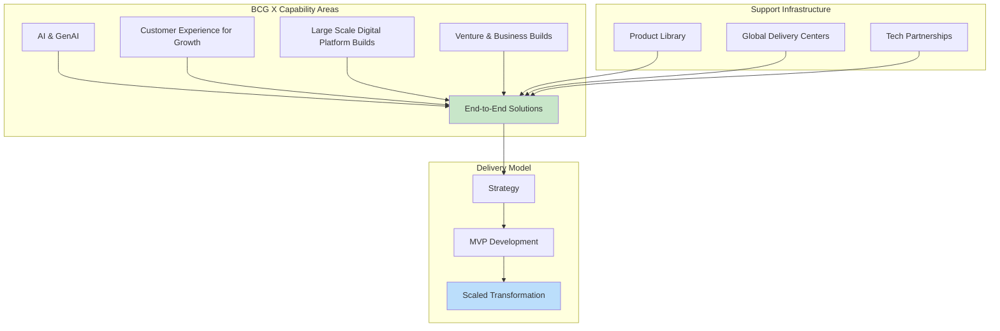

**The Product Library Approach**

A distinctive feature of BCG X is its **comprehensive library of products—backed by scientific rigor, extensive intellectual property, and sophisticated AI components—designed to accelerate AI business transformation**[^37]. This product library approach represents a shift from purely custom consulting engagements toward industrialized solutions that can be adapted to specific client contexts.

BCG X delivers integrated, end-to-end solutions through several key areas of expertise. In AI and GenAI, the unit harnesses predictive AI and generative AI to deliver transformative business impact, powered by a suite of proprietary AI assets. The Customer Experience for Growth practice creates world-class, end-to-end customer journeys to boost topline growth. The Delivery team builds, maintains, and scales client solutions from centers around the world, while the Large Scale Digital Platform and Product Builds practice partners with clients' technology organizations to develop modern, AI-enabled digital products and platforms[^36].

**Addressing the Scaling Challenge**

BCG X explicitly positions itself to address one of the most persistent challenges in enterprise AI adoption: the gap between pilot success and scaled implementation. The unit helps Fortune 500 clients achieve what **only 8% to 10% of companies manage—scaling AI and digital transformations successfully**[^35].

The approach to overcoming this challenge combines the 10-20-70 framework (emphasizing the 70% focus on people and process) with BCG X's technical delivery capabilities. By integrating strategy consultants with technologists, scientists, and engineers, BCG X can address not only the algorithmic and technical dimensions of AI transformation but also the organizational change management requirements that determine ultimate success.

**Agentic AI and the "Man with Machine" Approach**

BCG X is actively helping clients reimagine core processes with agentic AI, positioning for a future where **more than 40% of enterprise workflows are expected to involve autonomous agents by 2027**[^35]. The unit's focus is on a "man with machine" approach—designing and building systems where agents and humans drive outcomes together.

This approach creates what BCG describes as an "enterprise agentic operating system" that changes decision velocity, workflows, organizational structure, ways of working, and the role of leadership. The unit claims this approach delivers tangible results in less than 12 months, addressing the ROI timeline challenges documented in Chapter 2[^35].

**Productivity Validation**

BCG's internal experiments on generative AI productivity provide quantitative validation of the integrated tech division model. Research involving approximately 750 participants demonstrated **30-40% efficiency gains for junior analysts and 20-30% gains for experienced staff** when using generative AI tools appropriately[^9]. However, the research also confirmed that an approximate 23% performance dip occurs for complex tasks where AI is used without sufficient human critique, underscoring the importance of the hybrid "man with machine" approach[^9].

### 3.3 Agentic Platforms and Asset-Based Consulting: The Big Four's Productization Strategy

The Big Four accounting firms have pursued a fundamentally different strategic direction from MBB's augmentation-focused approach, developing **productized AI platforms that function as core business assets and embedded operational systems** within client organizations.

**The Platform Landscape**

As established in Chapter 1, 2025 witnessed the coordinated launch of multi-agent AI platforms across all Big Four firms, each reflecting the compliance heritage and domain expertise that characterizes these organizations:

| Firm | Platform | Agent Count | Primary Domain | Distinctive Feature |
|------|----------|-------------|----------------|---------------------|
| Deloitte | Zora AI | Autonomous workers | Procurement/Finance | Nvidia partnership, intelligent digital workers |
| EY | EY.ai | 150+ agents (scaling to 100,000 by 2028) | Tax | Domain-specific tax expertise across 150+ countries |
| PwC | agent OS | 25,000 deployed | Enterprise operations | Modular, governance-driven framework |
| KPMG | Workbench | 50+ agents (1,000 in development) | Audit/Advisory | Trust-focused, regulated industry design |

*Sources: Firm announcements and industry analyses*

**Deloitte's Zora AI** represents an "AI-powered procurement specialist" targeting finance and procurement bottlenecks with deep workflow integration. Built in partnership with Nvidia, the platform offers "intelligent digital workers" capable of autonomously completing tasks, directly appealing to CFOs and procurement leaders[^38].

**EY's EY.ai Agentic Platform** embeds 150+ specialized tax agents supporting 80,000 professionals worldwide, functioning as a "digital tax colleague" that combines EY's deep tax expertise with AI scalability. This represents perhaps the most domain-specific approach among Big Four platforms, targeting global corporations facing regulatory uncertainty across 150+ countries[^38]. EY has advanced 1,000 AI agents into development or production in 2025, with plans to scale to 100,000 agents by 2028[^38].

**PwC's agent OS** represents the most modular and governance-driven approach, functioning "less like a chatbot and more like an AI operating system for enterprises." PwC has deployed 25,000 intelligent agents across client operations, with partnerships with Salesforce, CrewAI, and AWS central to driving AI-led growth[^38].

**KPMG's Workbench** emphasizes orchestration of multiple agents working together, mirroring human audit teams. Developed with Microsoft, it connects 50 AI agents and chatbots with nearly 1,000 more in development. The platform prioritizes trust and collaboration over speed, designed for regulated industries including finance, healthcare, and government where transparency is paramount[^38].

**The Asset-Based Consulting Model**

The Big Four's platform strategy reflects a fundamental shift toward what can be termed **"asset-based consulting"—where proprietary AI platforms become differentiators, revenue generators, and mechanisms for deepening client relationships**. This approach contrasts sharply with traditional consulting models where value resided primarily in human expertise delivered through project-based engagements.

The strategic intent underlying this shift is to become indispensable operational infrastructure within client organizations. Rather than providing periodic advisory services, the Big Four are positioning their AI platforms as ongoing operational systems that clients rely upon for critical business processes. This creates recurring revenue streams, deepens client lock-in, and fundamentally transforms the commercial relationship from episodic engagement to continuous partnership.

The governance-centric design philosophy evident across Big Four platforms reflects their compliance heritage. These organizations have decades of experience navigating regulatory requirements, managing audit trails, and ensuring accountability in high-stakes environments. This expertise now manifests in AI platforms designed with embedded guardrails, transparency mechanisms, and governance frameworks that address the concerns of regulated industries[^38].

**Workforce Restructuring Implications**

The Big Four's productization strategy carries significant implications for workforce composition. As AI platforms automate tasks traditionally performed by junior staff, these firms are simultaneously **reducing entry-level hiring while expanding technical capabilities**. PwC announced a 30% reduction in graduate hiring in the US over three years, with leadership explicitly citing AI's impact on automating junior-level tasks[^38]. Meanwhile, EY has added 61,000 technologists to its workforce since 2023, now comprising 15% of its total staff[^38].

This restructuring reflects the recognition that AI platforms require different skill sets for development, deployment, and ongoing management than traditional consulting delivery. The firms are actively preparing junior staff to become "managers of agents," overseeing teams of AI agents and playing greater roles in strategy decisions rather than executing repetitive analytical tasks[^38].

### 3.4 Organizational Restructuring: From Pyramids to Diamond-Shaped Talent Models

The integration of AI is fundamentally reshaping consulting firm organizational structures, driving a transition from traditional pyramid hierarchies toward **diamond-shaped models that reduce junior analyst roles while expanding mid-level technical expertise**.

**The Traditional Pyramid Under Pressure**

The "people-intensive" model that large consulting firms have relied upon—employing large numbers of analysts and junior consultants—is being challenged by AI's ability to perform repetitive tasks. As market research, financial data organization, and slide creation become automated or significantly faster, the need to maintain large pools of junior staff diminishes[^9].

This structural pressure is most acute for tasks that have traditionally served dual purposes: delivering client value while providing developmental experiences for junior consultants. The automation of research and analysis work creates what industry observers describe as a potential loss of "on-the-job training" opportunities, raising concerns about how future senior consultants will develop foundational skills[^9].

**The Diamond-Shaped Alternative**

Firms are responding by shifting from a "pyramid shape" to a "diamond shape" in their organizational structures—reducing mass hiring of junior staff while quickly recruiting mid-level experts who can bridge technology and operational reforms[^9]. This structural evolution reflects the recognition that AI-augmented consulting requires different capability profiles than traditional models.

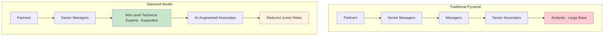

BCG exemplifies this shift, reportedly hiring fewer MBA graduates while prioritizing tech talent and data scientists. Research indicates that BCG, driven by growth in digital domains, is limiting new hires of "generalist MBAs" while actively recruiting engineering and AI-related talent[^9].

**Emerging Talent Profiles**

The agentic organization requires new talent profiles that differ fundamentally from traditional consulting career paths. Research identifies three emerging profiles[^39]:

1. **M-shaped Supervisors**: Broad generalists fluent in AI who can oversee multiple domains and coordinate between human teams and AI agents. These individuals possess sufficient technical literacy to understand AI capabilities and limitations while maintaining the strategic perspective required for client advisory work.

2. **T-shaped Experts**: Deep specialists who reimagine workflows by combining domain expertise with technical knowledge. These professionals can identify opportunities for AI integration within specific functional areas and design human-AI collaborative processes.

3. **AI-augmented Frontline Workers**: Staff who leverage AI tools to enhance their productivity while focusing on tasks requiring human judgment, creativity, and interpersonal skills.

**The "Managers of Agents" Paradigm**

Junior staff at consulting firms are being prepared to assume fundamentally different roles than their predecessors. Rather than executing research and analysis tasks, they are being trained to become **"managers of agents"—overseeing teams of AI agents and playing greater roles in strategy decisions**[^38].

This paradigm shift requires new skill sets including AI fluency, prompt engineering capabilities, and the ability to critically evaluate AI outputs. The emphasis shifts from executing analytical tasks to directing, validating, and contextualizing AI-generated work. At PwC, new hires are expected to perform roles that managers currently perform within three years, as they will be overseeing AI performing routine, repetitive tasks[^38].

**Training and Development Implications**

The automation of traditional developmental tasks creates significant challenges for consulting firm training models. Being freed from repetitive tasks offers the benefit of more direct, early exposure to client-facing work and strategic thinking, but it also eliminates the foundational experiences through which consultants have historically developed analytical rigor and attention to detail[^9].

Consulting firms are responding with comprehensive upskilling initiatives. Nearly 100,000 EY employees—roughly a quarter of the workforce—have earned a digital "AI badge" for completing AI learning programs[^38]. Deloitte's AI Academy teaches AI skills through a curriculum of more than 15 offerings, with plans to certify 15,000 practitioners globally in generative AI and advanced AI applications.

### 3.5 Revenue Model Evolution: From Time-Based Billing to Outcome-Driven Pricing

AI's transformation of consulting delivery economics is driving fundamental changes in commercial models, challenging the time-based billing paradigm that has defined professional services for decades.

**The Economic Challenge to Time-Based Billing**

The traditional consulting revenue model—charging clients based on "person-days × number of days"—faces an existential challenge as AI dramatically compresses delivery timelines. If tasks that once took several weeks can now be completed in three days with AI assistance, continuing to bill according to time spent makes progressively less sense[^9].

This economic pressure creates a paradox: AI investments that enhance productivity simultaneously threaten the revenue model that has sustained consulting firm profitability. Firms must navigate the tension between capturing efficiency gains internally and passing value to clients while maintaining revenue growth.

**Emerging Pricing Models**

Consulting firms are exploring multiple alternative pricing structures to address this challenge:

| Pricing Model | Description | Example Application |
|---------------|-------------|---------------------|
| Value-Based | Fees tied to measurable business outcomes | Percentage of cost savings achieved |
| Success-Fee | Reduced fees if targets unmet, increased if exceeded | Performance-linked advisory engagements |
| Subscription | Ongoing access to AI platforms and advisory support | Continuous monitoring and optimization services |
| Hybrid | Combination of base fees with outcome bonuses | Platform deployment plus performance incentives |

KPMG's partnership with Microsoft exemplifies the subscription approach, integrating AI into the KPMG Clara smart audit platform and Digital Gateway in ways that create ongoing client relationships rather than discrete project engagements[^9]. PwC's move toward outcome-based models, where clients pay for results rather than hours, represents the value-based direction[^38].

**The "Service-as-a-Software" Model**

EY's exploration of a "service-as-a-software" model represents perhaps the most radical departure from traditional consulting economics. This approach positions consulting services as software-like offerings with recurring revenue characteristics, where clients pay based on outcomes or usage rather than consultant time[^38].

The power of AI agents is forcing fundamental reconsideration of commercial models across the industry. As one EY executive noted, the shift potentially moves consulting toward arrangements where clients pay based on outcomes delivered rather than hours consumed[^38].

**Platform Monetization**

Beyond service delivery pricing, consulting firms are exploring monetization of their AI platforms as standalone products. McKinsey plans to offer customized "Lilli" solutions to clients, transforming an internal productivity tool into a revenue-generating product[^9]. This approach represents the convergence of consulting services with software product economics, creating new revenue streams beyond traditional advisory fees.

The Big Four's agentic platforms—Zora AI, EY.ai, agent OS, and Workbench—are designed not merely as internal productivity tools but as **client-facing products that generate revenue through deployment, customization, and ongoing support**. This productization strategy creates recurring revenue streams while deepening client relationships through operational integration.

**Revenue Impact Evidence**

Early evidence suggests that AI-driven commercial model evolution is generating measurable revenue impact. EY reported a **30% rise in revenues driven by AI-related work** such as enterprise-wide transformations and AI governance frameworks[^38]. Deloitte's AI-influenced work accounts for $840 million (30%) of its $2.8 billion technology consulting pipeline[^38]. In India, 30% of EY's client projects are now classified as core AI engagements[^38].

### 3.6 The Agentic Organization: Emerging Operating Models for Human-AI Collaboration

The consulting industry is at the forefront of developing organizational paradigms that unite humans and AI agents to work collaboratively at scale, pioneering operating models that may ultimately transform enterprises across all sectors.

**The Agentic Organization Paradigm**

AI is bringing what McKinsey describes as **"the largest organizational paradigm shift since the industrial and digital revolutions"**—a new paradigm that unites humans and AI agents (both virtual and physical) to work side by side at scale at near-zero marginal cost[^39]. This "agentic organization" represents a fundamental reconceptualization of how work is organized, executed, and governed.

The promise of this paradigm depends upon continued growth in AI capabilities. Research indicates that the length of tasks AI can reliably complete doubled approximately every seven months since 2019 and every four months since 2024, reaching roughly two hours as of current assessment. Projections suggest that **AI systems could potentially complete four days of work without supervision by 2027**[^39].

**The Agent Factory Model**

A defining characteristic of the agentic organization is the emergence of "agent factories"—operational configurations where **small human teams of 2-5 people supervise 50-100 specialized agents running end-to-end processes**[^39]. This model represents a dramatic shift in the ratio of human to automated labor, with profound implications for organizational structure and economics.

One global bank's "agent factory" exemplifies this model in practice, managing know-your-customer processes with ten agent squads and achieving substantial positive impact on quality and consistency. Another bank used humans to oversee squads of AI agents in modernizing its legacy core systems, enabling up to 50% reductions in time and effort[^39].

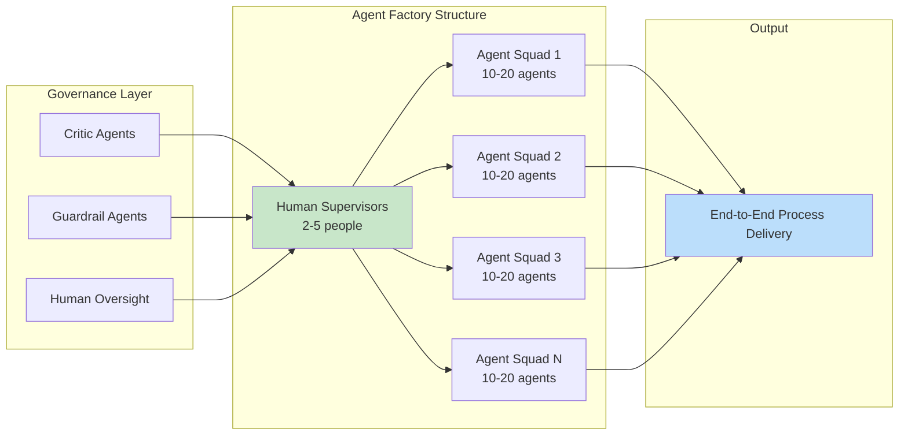

**From Organization Charts to Agentic Networks**

The agentic organization requires fundamental evolution in how organizational structures are conceived and managed. Traditional organization charts give way to **agentic networks or "work charts" that map the relationships between human teams, AI agents, and the processes they collectively execute**[^39].

Winning operating models empower agentic teams with flat decision and communication structures, moving away from hierarchical approval chains toward distributed authority appropriate to the speed of AI-enabled operations. This structural evolution enables the decision velocity required to capitalize on AI capabilities while maintaining appropriate governance and accountability.

**Governance in Real-Time**

In the agentic organization, governance must become **real-time, data-driven, and embedded** rather than periodic and retrospective[^39]. Decision-making accelerates with real-time data, with early movers experimenting with "agentic budgeting" that adjusts resource allocation dynamically based on operational performance.

The governance architecture relies on agents controlling agents through embedded guardrails. Critic agents evaluate outputs for quality and appropriateness, while guardrail agents enforce compliance with policies and constraints. Human accountability and oversight remain essential, but their nature changes to defining policies and monitoring outliers rather than reviewing individual transactions[^39].

This governance evolution presents both opportunity and risk. Governance itself can become a potential bottleneck to productivity if not redesigned for the agentic era. Organizations must balance the imperative for speed with the requirement for appropriate human oversight, particularly in client-facing advisory contexts where trust and accountability are paramount.

**The Five Pillars of Agentic Transformation**

McKinsey's framework identifies five pillars around which the agentic organization must be built[^39]:

1. **Business Model**: Companies gain competitive advantage by getting closer to customers via AI channels for real-time hyperpersonalization, streamlining processes to become AI-first, and building proprietary data as a key differentiator.

2. **Operating Model**: Work and workflows are reimagined as AI-first, with humans and IT systems selectively reintroduced. The operating model pivots to small, outcome-focused agentic teams.

3. **Governance**: Real-time, data-driven governance with embedded guardrails replaces periodic oversight. Agents control agents while humans define policies and monitor exceptions.

4. **Workforce, People, and Culture**: Humans move from executing activities to owning and steering end-to-end outcomes. New talent profiles emerge, and culture acts as both organizational glue and ethical compass.

5. **Technology and Data**: Distributed ownership of IT and data becomes feasible, with agent-to-agent protocols enabling faster experimentation and dynamic sourcing avoiding vendor lock-in.

**Implications for Consulting Firms**

For consulting firms specifically, the agentic organization paradigm carries profound implications. The traditional consulting model—deploying teams of human consultants to analyze problems and develop recommendations—may evolve toward hybrid configurations where consultant teams supervise AI agent networks that execute substantial portions of analytical and delivery work.

This evolution enables consulting firms to operate at scale with dramatically different economics, potentially delivering more value to clients at lower cost while maintaining premium positioning through human oversight, strategic insight, and relationship management. However, it also requires fundamental transformation of organizational structures, talent models, commercial arrangements, and governance frameworks.

The firms that most effectively architect their AI capabilities—balancing automation with augmentation, productization with customization, and efficiency with accountability—will define the consulting industry's competitive hierarchy in the AI-transformed landscape. As documented throughout this chapter, the architectural choices being made today by MBB strategy houses, Big Four accounting firms, and technology consultancies represent strategic bets on fundamentally different visions of how human expertise and artificial intelligence can be combined to create value for clients and sustainable competitive advantage for the firms themselves.

## 4 Productizing Expertise: AI-Driven Platforms, Tools, and Service Offerings

The transformation of consulting expertise from human-delivered advisory services into scalable, technology-embedded platforms represents one of the most consequential strategic shifts in the professional services industry's history. As established in Chapter 3, consulting firms across all cohorts have adopted distinct architectural approaches to AI integration—from MBB's augmentation-focused hybrid models to the Big Four's governance-centric agentic platforms and technology consultancies' end-to-end implementation ecosystems. This chapter moves from strategic frameworks to concrete manifestations, providing a **systematic examination of the specific AI-driven products, platforms, and packaged service offerings** that embody each firm's approach to the productization imperative.

The consulting industry's productization wave reflects a fundamental recognition that sustainable competitive advantage in the AI era requires more than episodic advisory engagements. Firms are racing to encode decades of accumulated expertise into technology assets that can be deployed at scale, generate recurring revenue streams, and create deeper client relationships through operational integration. The platforms analyzed in this chapter represent billions of dollars in investment, thousands of engineering hours, and strategic bets on fundamentally different visions of how consulting value will be created and delivered in the coming decade.

### 4.1 Internal Knowledge Platforms: Augmenting Consultant Productivity

The foundation of consulting firm AI productization lies in internal platforms designed to dramatically enhance consultant productivity by unlocking institutional knowledge accumulated across thousands of engagements and decades of practice. These platforms represent the first wave of AI integration, transforming how consultants access, synthesize, and apply firm expertise.

**McKinsey's Lilli: The Paradigmatic Knowledge Platform**

McKinsey's Lilli platform stands as the most fully articulated example of an internal AI knowledge system, demonstrating how generative AI can transform consultant productivity while preserving the premium value of human strategic insight. Launched in July 2023 and subsequently rolled out firm-wide, Lilli has achieved **adoption by 72% of McKinsey's approximately 45,000 employees**, with users turning to the platform approximately 17 times per week on average[^40].

The platform's core functionality centers on **retrieval-augmented generation (RAG) technology** that searches and synthesizes McKinsey's vast knowledge repositories. Lilli aggregates more than 40 carefully curated knowledge sources, including over 100,000 documents and interview transcripts, along with access to a network of experts across 70 countries[^41]. This comprehensive knowledge base spans what the firm describes as "100 years of intellectual property," representing the accumulated insights from countless client engagements across industries and geographies[^42].

The productivity impact has been substantial and measurable. Consultants report **saving up to 30% of their time** on tasks involving knowledge search and synthesis[^40]. The platform processes **more than 500,000 queries monthly**, a figure that continues to grow as adoption deepens[^40]. Specific use cases demonstrate the platform's versatility: one consultant uses Lilli as a "thought-sparring partner" to identify weaknesses in arguments and anticipate client questions, saving approximately 20% of meeting preparation time; another consultant used Lilli to answer a client question about manufacturing analogues, unexpectedly identifying a paint thickness measurement device as relevant—a connection that would have taken days to discover through traditional research methods[^41].

Lilli operates in two modes: one for searching McKinsey's internal knowledge and another for external sources[^41]. When a user types a question, Lilli scans the knowledge landscape, identifies the five to seven most relevant pieces of content, summarizes key points, includes links to source materials, and identifies relevant internal experts who can provide additional guidance[^41]. This multi-modal approach ensures consultants receive both synthesized insights and pathways to deeper human expertise.

The platform's development followed McKinsey's own "Rewired" transformation framework, with an initial team of three expanding to over 70 experts[^41]. The firm has invested in upskilling users on prompt engineering and content validation, recognizing that effective AI utilization requires new competencies[^41]. Critically, **all interactions and data remain secure** through rigorous risk controls implemented from the platform's inception[^40].

Beyond internal productivity gains, McKinsey is leveraging Lilli to create client value. The firm offers clients a **customizable version of its generative AI platform architecture** that can be tailored to specific industries and workflows[^40]. QuantumBlack, AI by McKinsey, is actively working with clients to bring Lilli's capabilities to their organizations, supporting applications ranging from proposal engine creation to accelerating drug development operations[^40]. The firm has developed over 25 proprietary tools and industry-specific applications through QuantumBlack Labs, with regular contributions to open-source communities[^40].

The most anticipated new features in Lilli's development pipeline include **agents for automating specific time-consuming tasks** and expanded slide-building capabilities[^40]. These enhancements signal the platform's evolution from a knowledge retrieval tool toward a more comprehensive productivity system capable of executing multi-step workflows autonomously.

**BCG's Custom GPT Ecosystem and Specialized Tools**

Boston Consulting Group has pursued a different approach to internal AI productivity, emphasizing **democratized tool creation** alongside centralized platform development. BCG's 33,000 employees have built **over 18,000 custom GPTs for internal use**, reflecting a culture that encourages bottom-up innovation alongside top-down platform investment[^42].

This proliferation of custom tools demonstrates how generative AI enables consultants to address specific workflow challenges without requiring centralized development resources. Individual consultants and teams can create specialized assistants tailored to particular industries, methodologies, or client contexts, generating a diverse ecosystem of AI capabilities that evolves organically with firm needs.

BCG has also developed **eight or nine internal generative AI tools** through centralized efforts, including two particularly notable platforms[^42]:

- **Deckster**: A slideshow editor trained on 800 to 900 slide templates that assists with presentation creation. Approximately **40% of associates use Deckster weekly**, indicating substantial adoption for one of consulting's most time-intensive deliverable formats[^42].

- **GENE**: A conversational chatbot built on GPT-4o with an intentionally robotic voice, designed as a "conversation partner" for consultants developing arguments and testing ideas[^42].

BCG estimates that employees **reinvest approximately 70% of the time they save** through AI tools into "higher value activities"[^42], suggesting that productivity gains translate into enhanced client service rather than simply reduced effort. This reinvestment pattern aligns with BCG's emphasis on the 10-20-70 framework, which prioritizes people and process outcomes over pure efficiency metrics.

The firm also maintains an internal platform for building AI agents currently in beta testing[^42], positioning BCG to expand its internal AI capabilities toward more autonomous task execution as the technology matures.

**Deloitte's Sidekick and Regulated Environment Approach**

Deloitte's approach to internal AI platforms reflects the firm's compliance heritage and risk-conscious culture. Unlike some competitors, **Deloitte has blocked ChatGPT from its internal systems**, instead developing its own ChatGPT alternative called Sidekick[^42]. This approach prioritizes data security and governance over the convenience of third-party tools, ensuring that sensitive client and firm information remains within controlled environments.

The firm has invested billions in artificial intelligence and recently unveiled **Zora AI**, a new fleet of AI agents trained in specific subjects[^42]. Deloitte has also started to support **Agent2Agent**, a new platform designed to improve interoperability between agents[^42], positioning the firm to participate in emerging multi-agent ecosystems while maintaining governance standards.

**KPMG's Retrieval-Augmented Generation Strategy**

KPMG has adopted a distinctive approach to internal AI development, **harvesting data on how employees are prompting AI** to build new tools using retrieval-augmented generation[^42]. This "top-down and bottom-up" methodology analyzes actual usage patterns to inform platform development, ensuring that centralized tools address demonstrated consultant needs rather than hypothetical use cases.

The firm signed an agreement with Google Cloud to purchase licenses for **Agentspace**, a platform that integrates AI agents with company data, for its US workforce[^42]. This partnership provides KPMG employees with access to advanced agentic capabilities while maintaining integration with the firm's proprietary knowledge assets.

**Comparative Analysis of Internal Platform Approaches**

The internal knowledge platforms developed across major consulting firms reveal distinct strategic philosophies:

| Firm | Platform | Adoption | Key Differentiator | Development Approach |
|------|----------|----------|-------------------|---------------------|
| McKinsey | Lilli | 72% of 45,000 employees | 100+ years of curated knowledge, 500K+ monthly queries | Centralized, Rewired framework |
| BCG | Custom GPTs + Deckster + GENE | 18,000+ custom tools, 40% weekly Deckster use | Democratized creation, 70% time reinvestment | Hybrid centralized/distributed |
| Deloitte | Sidekick | Firm-wide | ChatGPT blocked, security-first | Centralized, compliance-focused |
| KPMG | Agentspace (Google) | US workforce | Usage pattern analysis, RAG-based | Data-driven, partnership-centric |

*Sources: Firm disclosures and industry analyses*

These platforms share common underlying technologies—particularly RAG for knowledge retrieval—but differ significantly in governance philosophy, development methodology, and strategic intent. McKinsey's centralized, curated approach prioritizes quality and consistency; BCG's democratized model emphasizes innovation and customization; Deloitte's security-first stance reflects audit heritage; and KPMG's data-driven development ensures alignment with actual usage patterns.

### 4.2 Enterprise Agentic Platforms: The Big Four's Productization Strategy

The Big Four accounting firms have moved decisively beyond internal productivity tools to develop **client-facing agentic platforms** designed to function as enterprise AI infrastructure. These platforms represent the most aggressive productization strategy in the consulting industry, positioning AI agents as core operational systems rather than supplementary advisory tools.

**PwC's agent OS: The Enterprise AI Command Center**

PwC launched its AI Agent Operating System (agent OS) on **March 27, 2025**, positioning it as an enterprise AI command center designed to streamline next-generation AI workflows and orchestrate complex, multi-agent business processes at scale[^43]. The platform represents PwC's most ambitious productization initiative, embodying the firm's vision of AI as an operating system for enterprise operations rather than a collection of discrete tools.

The platform's core value proposition centers on **orchestration and integration**. Agent OS acts as a unified orchestration framework—a "central nervous system" to connect AI agents regardless of their platform or framework[^43]. The system integrates with essential enterprise systems from **Anthropic, AWS, GitHub, Google Cloud, Microsoft Azure, OpenAI, Oracle, Salesforce, SAP, Workday**, and others[^44][^43], enabling deployment across the full spectrum of enterprise technology environments.

PwC has deployed **over 25,000 intelligent agents** across client operations through agent OS[^44], with more than 250 AI agents deployed internally across the firm for specific tasks integrated into workflows[^43]. The platform can deliver results in **as little as 30 days—ten times faster than other approaches**—when the client's technology stack is ready[^44].

Key architectural features of agent OS include:

- **Drag-and-drop interface** for creating workflows, democratizing agent development for both technical and non-technical users[^44][^43]
- **Recursive, graph-based approach** for combining agents into complex workflows[^44]
- **Reusability of agents and workflow components** for faster scaling[^44]
- **Natural language transitions and data flow visualization** to facilitate intuitive use[^43]
- **Cloud-agnostic deployment** across AWS, Google Cloud, Microsoft Azure, Oracle Cloud Infrastructure, Salesforce, and on-premises data centers[^43]
- **Intelligent adaptation** of workflows to multiple languages[^43]

The governance architecture reflects PwC's compliance heritage. Agent OS applies **role-based access control (RBAC)** with Microsoft Graph integration for secure permissions management[^44]. The platform uses a proprietary "language-state" machine-powered orchestration, allowing agents to act on real-time data and natural language inputs[^44]. Security features include the **Model Context Protocol (MCP)** for secure access, code reviews, encrypted credential vaults, schema validation, real-time visibility tools, sandboxed environments, and integration with PwC's Responsible AI framework[^44].

The business impact potential is substantial. According to PwC's AI Agent Survey from May 2025, **92% of executives in companies that have adopted AI agents say they are redesigning processes around AI agents**, 90% agree their operating model will be unrecognizable in two years because of AI agents, and **88% of those adopting AI agents say they are delivering measurable value through increased productivity**[^44].

Hypothetical and real-world examples demonstrate agent OS capabilities:
- A global manufacturing firm could reduce supply delays by an estimated 40%[^43]
- A Fortune 100 retail brand could increase conversion rates by 30% and cut campaign launch times in half[^43]
- A multinational bank could reduce manual compliance review time by an estimated 70%[^43]
- A major technology company deployed an AI agent-powered contact center, reducing phone time by nearly 25%, cutting call transfers by up to 60%, and boosting customer satisfaction by approximately 10%[^43]
- A large hospitality company streamlined brand standards management, reducing review times by up to 94%[^43]
- A global healthcare company transformed cancer care, driving about 50% improved access to clinical insights and a nearly 30% reduction in staff administrative burden[^43]

Unlike GenAI chatbots that support specific tasks, **agent OS is built to reshape operations at scale** by embedding task-specific AI coworkers into workflows[^44]. Its business value includes reducing manual efforts by several orders of magnitude and automating entire workflows to reduce manual effort by **up to 95%**[^44].

**EY's EY.ai: The Unifying Platform for Enterprise Transformation**

EY has developed EY.ai as a **unifying platform for confidently reimagining the enterprise through bold AI-powered transformation**, augmenting human potential to realize exponential value[^45][^46]. The platform helps leaders turn AI ambition into action by building trusted foundations, unlocking new value, and empowering people to lead responsibly.

EY.ai's approach to AI transformation encompasses multiple strategic dimensions:

- **Transforming data into AI-ready assets** so fragmented data becomes structured, trusted, and AI-ready to fuel autonomous decisions[^45][^46]
- **Embedding trust across the AI lifecycle** with responsible AI services spanning strategy, governance, and enablement[^45][^46]
- **Scaling AI beyond pilots and use cases** by evolving operating models and workflows with proven assets and alliances[^45][^46]
- **Reimagining growth with autonomous AI** to unlock new markets, services, and revenue streams[^45][^46]
- **Empowering people to lead with AI** through tailored training and change programs[^45][^46]
- **Shaping AI for human progress** by addressing trust, ethics, and long-term impact[^45][^46]

The platform's capabilities are delivered through strategic partnerships with category-leading organizations including **Adobe, Databricks, Dell, IBM, Microsoft, NVIDIA, Pega, SAP, ServiceNow, Snowflake, Thomson Reuters, and UiPath**[^45][^46]. EY announced the **EY-NVIDIA Alliance**, launching the EY.ai Agentic Platform created with NVIDIA AI[^45][^46].

EY.ai has received significant industry recognition, including the **2024 AI Excellence Award, 2024 Gold Stevie Awards, 2024 Microsoft Partner of the Year Awards, 2024 DataIQ AI Awards**, and 2024 BI Stratus Award[^45][^46]. The platform's EYQ component won a **2025 Gold Stevie Award** in the "Generative AI" category[^46].

**KPMG's Multi-Platform AI Ecosystem**

KPMG has developed a comprehensive ecosystem of AI platforms targeting different service lines and use cases, unified by the firm's emphasis on trust, governance, and regulated industry compliance.

**KPMG Workbench** serves as the firm's multi-agent AI platform, combining advanced, trusted AI agents with the insight and deep industry expertise of KPMG professionals[^47]. The platform is designed for industries "where transparency is as important as efficiency," reflecting KPMG's positioning in regulated sectors including finance, healthcare, and government[^48].

The broader KPMG AI services portfolio includes:

- **KPMG AI Strategy**: Helps identify opportunities and threats to define AI goals, develop tailored strategy and execution plans, and create business cases with clear metrics and milestones[^48][^47]
- **KPMG AI Jumpstart**: Enables safe experimentation with GenAI tools, identification of valuable use cases through replicable proof-of-concept approaches, and scaling of successful applications[^48][^47]
- **KPMG AI Trust**: Helps proactively identify and mitigate risks, strengthen security measures, and simplify compliance to meet regulatory requirements[^48][^47]
- **KPMG AI Workforce**: Identifies key opportunities and roles, enhances knowledge worker performance at scale, and reshapes the workforce to capture maximum value[^48][^47]
- **KPMG AI Technology**: Assists in implementing robust technology plans, enabling cloud data platforms, and tailoring AI solutions with build vs. buy strategies[^48][^47]
- **KPMG Clara**: An AI platform enabling faster, more efficient audits, increasing quality and allowing auditors to focus on where risk truly lies[^47]
- **KPMG Digital Gateway**: Helps tax functions build and deploy responsible, ethical, and fair GenAI programs based on KPMG Trusted AI[^47]

KPMG's approach, termed **"KPMG aIQ,"** combines the power of artificial intelligence with KPMG's human intelligence quotient, representing a human-centric approach to becoming an AI-driven firm rooted in the firm's values and guided by its Trusted AI principles[^47].

Key technologies and accelerators include **KPMG Ignite**, an integrated AI platform and suite of AI-powered solutions, and **Cranium**, a software company that enables organizations to secure their AI technologies[^47].

KPMG has been named a **Market Leader by HFS Research in Generative Enterprise Services 2025** for AI-led enterprise transformation and ranked **No. 1 for quality in AI advice and implementation services** in a 2024 study[^47].

**Deloitte's Zora AI and AI Institute Infrastructure**

Deloitte's productization strategy centers on **Zora AI**, an agentic platform built with Nvidia offering intelligent digital workers for procurement and finance automation. The platform represents Deloitte's recognition that finance and procurement processes constitute massive operational bottlenecks, directly appealing to CFOs and procurement leaders seeking automation of repetitive, high-volume tasks.

The Deloitte AI Institute provides the intellectual foundation for the firm's AI productization efforts. The Institute has published the **Generative AI Dossier**, examining the most compelling use cases across six key industries to help enterprises navigate the transformative impact of generative AI[^49]. The dossier details **60 of the most compelling use cases for businesses today**, serving as a roadmap for executives looking to deploy high-impact generative AI solutions at scale[^49].

The six industries covered include consumer; energy, resources and industrial; financial services; government and public services; life sciences and health care; and technology, media and telecommunications[^49]. The report details various advantages of generative AI in driving efficiency, creativity, speed, scale, and capacity across these sectors.

At the core of Deloitte's Generative AI practice is a **Generative AI Market Incubator** with a dedicated team of engineers developing pilot programs and a research and development team working to train and tune Foundation Models[^49]. Through its AI Academy, Deloitte is on the pathway of training up to **10,000 Deloitte practitioners** globally with tailored generative AI training curricula[^49].

The Deloitte AI Institute has also published an **AI Dossier on RAG automation**, noting that retrieval-augmented generation automation is transforming enterprise operations by simplifying data integration, improving response quality, and reducing operational costs[^50]. The dossier emphasizes RAG automation's critical role in enhancing trustworthiness, ensuring data governance, and promoting responsible AI deployment, while identifying challenges in scaling RAG systems such as data quality, model drift, and scalability[^50].

### 4.3 Domain-Specific AI Solutions and Vertical Applications

Beyond horizontal platforms, consulting firms have developed **specialized AI solutions targeting specific business functions and industry verticals**, encoding domain expertise into productized offerings that address recurring client challenges.

**Tax and Compliance Solutions**

Tax complexity represents one of the most compelling use cases for AI productization given the combination of high volume, rule-based processing, and significant penalty risks for errors.

EY's tax agents, embedded within the EY.ai platform, support **80,000 tax professionals** with access to **150+ specialized agents** covering regulatory requirements across more than 150 countries. These agents function as "digital tax colleagues," combining EY's deep tax expertise with AI scalability to address the compliance challenges facing global corporations operating across multiple jurisdictions.

KPMG's **Digital Gateway** helps tax functions build and deploy responsible, ethical, and fair GenAI programs based on KPMG Trusted AI principles[^47]. The platform integrates Azure OpenAI Service and Microsoft Fabric to provide AI-enhanced tax advisory capabilities.

**Audit Platforms**

The audit function represents a natural domain for AI productization given the Big Four's heritage and the high volume of document review and verification tasks involved.

**KPMG Clara** serves as an AI-enabled audit platform that empowers **85,000 audit professionals** through AI integration[^47]. The platform enables faster, more efficient audits while increasing quality and allowing auditors to focus on areas of genuine risk rather than routine verification tasks.

Deloitte's **Omnia** is a cloud-based audit and assurance platform that has expanded to include generative AI features, enabling auditors to leverage AI capabilities while maintaining the governance and documentation standards required for regulatory compliance.

**Financial Services Applications**

The financial services sector has emerged as a primary target for consulting firm AI solutions given the combination of high transaction volumes, regulatory complexity, and significant efficiency improvement potential.

EY's AI use cases for financial services include an **AI-powered Accounts Receivables Collection Assistant** that uses machine learning to prioritize accounts, identify "at risk" customers, and recommend the "next best action"[^51]. Integrated with ERP applications, this solution can lead to a **30% improvement in Days Sales Outstanding, a 40% improvement in productivity, and a 22% decrease in the receivable period**[^51].

Efficient contract management is addressed with a **GenAI-powered tool** that aids the entire contract lifecycle, validating and extracting key data, providing generative summarizations, validating against checklists, and comparing clauses for risk identification[^51].

For deal sourcing, GenAI automates steps in the private equity process including data sourcing, preliminary due diligence, report drafting, risk analysis, financial modeling, and legal document drafting, increasing target insights, speeding up deal closure, and reducing expenses[^51].

**Supply Chain and Manufacturing Solutions**

Accenture has launched **"Physical AI Orchestrator"** on October 28, 2025, to help manufacturers reinvent existing and future factories and warehouses to become software-defined[^52]. This cloud-based solution combines NVIDIA Omniverse technologies, including the "Mega" NVIDIA Omniverse Blueprint and NVIDIA Metropolis, with AI agents from Accenture's AI Refinery platform.

In a software-defined facility, **live digital twins mirror the physical automated plant or warehouse** and its equipment. These twins detect issues and use accurate physics to simulate the impact of potential process changes in real time. AI Agents then convert insights into precise instructions, enabling the physical plant to adapt to changing demand, quality, or scheduling[^52].

Client applications demonstrate substantial impact:
- **Belden** developed a virtual safety fence solution for worker safety in factories and warehouses using edge AI that detects and models worker, vehicle, and robot movements at centimeter-level fidelity[^52]
- A **life sciences company** validated ideal production conditions for biologics and vaccines faster than with physical equipment, with simulation reducing batch variability and increasing product shelf life[^52]
- A **consumer goods manufacturer** increased warehouse throughput by 20% and saved 15% in capital expenditure by optimizing conveyor flow and eliminating iterative redesign[^52]

Physical AI Orchestrator capabilities include reality capture to generate digital twins, AI agents to aid engineers, vision analytics to capture live video data, asset connectors for plug-and-play integration, and XR extensions for interaction and training in shared virtual spaces[^52].

**Healthcare Applications**

Healthcare represents a high-potential domain for AI productization given the combination of administrative burden, clinical complexity, and patient experience improvement opportunities.

EY's use cases include solutions to **streamline health care operations** through a center for automation with GenAI and machine learning that creates collaborative workspaces, feature stores, and MLOps pipelines to enhance efficiency and improve health outcomes[^51].

Deloitte's Generative AI Dossier identifies life sciences and health care applications where GenAI can enhance operational performance, provide hyper-personalized experiences, and develop enterprise digital and data solutions[^49].

**Public Sector and Government Applications**

Government and public services organizations are exploring how generative AI can help **automate administrative tasks, analyze policy documents, and inform customized citizen services**[^49]. EY's use cases include a **streamlined grant application process** that leverages large language models to simplify identifying federal health grant opportunities and drafting proposals, extracting key concepts, matching them with health factors, and automatically generating draft applications[^51].

### 4.4 Technology Consultancy Platforms: End-to-End AI Infrastructure

Technology consultancies have developed comprehensive AI platform ecosystems designed to enable **end-to-end transformation from strategy through implementation and ongoing operations**, reflecting their heritage in large-scale technology deployment.

**Accenture's AI Platform Ecosystem**

Accenture has assembled the most comprehensive AI platform portfolio among consulting firms, reflecting its $3 billion investment commitment and positioning as a technology-first professional services company.

The **AI Refinery** platform serves as Accenture's sovereign AI multi-agent platform, designed to address the scaling challenges that limit most organizations' AI deployments. According to Accenture, only **9% of companies fully deploy AI use cases** due to scaling barriers; AI Refinery is designed to overcome these obstacles and drive reinvention through AI[^53].

The Accenture Technology Vision 2025 explores how **AI-powered autonomy is shaping the future**, with AI diffusion accelerating across the enterprise and society faster than any prior technology[^54]. The research finds that **69% of executives believe AI brings new urgency to reinvention** and how technology systems and processes are designed, built, and operated[^54].

Key platforms in Accenture's ecosystem include:

- **GenWizard**: Full-lifecycle generative AI development platform
- **SynOps**: Operations platform integrating AI capabilities
- **Method One**: AI-powered delivery framework
- **AI Navigator for Enterprise**: Generative AI-based platform guiding AI strategy

Accenture's platforms offer **prebuilt industry agents and workflows** to accelerate building specialized multiagent systems[^54]. The firm is enabling a future with its platforms that offers intention-based frameworks and agentic systems through generative AI-assisted software development[^54].

The Technology Vision 2025 predicts AI will act as a **technology development partner, a personal brand ambassador, power robotic bodies in the physical world, and foster a new symbiotic relationship with people**[^54]. Julie Sweet, chair and CEO of Accenture, stated that unlocking the benefits of AI requires leaders to develop trust in its performance and outcomes, with **77% of executives believing the true benefits of AI will only be possible when built on a foundation of trust**[^54].

**IBM's Enterprise Advantage and Watsonx Ecosystem**

IBM announced **IBM Enterprise Advantage** on January 19, 2026, as a first-of-its-kind asset-based consulting service that combines proven AI tools and expertise to help clients quickly build, govern, and operate their own tailored internal AI platform at scale[^55].

Organizations can use Enterprise Advantage to **redesign workflows, connect AI to existing systems, and scale new agentic applications** without requiring changes to their cloud providers, AI models, or core infrastructure—including Amazon Web Services, Google Cloud, Microsoft Azure, IBM watsonx, and both open- and closed-source models[^55].

Enterprise Advantage brings together the technical and industry expertise of IBM consultants with technology built from **IBM Consulting Advantage**, IBM's own internal AI-powered delivery platform. IBM Consulting Advantage has a growing marketplace of **industry-specific AI agents and applications**, has supported more than 150 client engagements, and has been shown to **boost consultants' productivity by up to 50%**[^55].

The **watsonx platform** provides the technological foundation for IBM's AI consulting services, comprising multiple integrated components:

- **IBM watsonx Orchestrate**: For building, deploying, and managing AI agents and assistants to automate and accelerate work[^56]
- **IBM watsonx.governance**: For governing agent risk through RAG-based metrics monitoring behavior, evaluating performance, tracking experiments, and simplifying tool selection[^56]
- **IBM watsonx.ai**: An integrated, collaborative, end-to-end, and secure enterprise-grade developer studio for faster and easier development, running, and management of custom AI applications[^56]
- **IBM watsonx Code Assistant**: For accelerating developer productivity and shortening time-to-market by infusing generative AI into the application lifecycle[^56]

IBM provides **pre-built, no-code AI agents** designed for specific business needs across HR, sales, procurement, and customer support[^56]:

- **watsonx HR agent**: Automates HR support, recruiting, onboarding, learning and development, performance, and employee management
- **watsonx sales agent**: Automates important sales tasks without requiring coding or data science teams
- **watsonx procurement agent**: Integrates with daily-use tools to complete common tasks
- **watsonx customer care agent**: Provides 24/7 support, meeting customer needs and resolving inquiries based on business data

IBM's AI agent solutions claim **efficiency improvements of 70% and startup speed 70% faster** through pre-built agents and no-code studio for custom agent building[^56]. The solutions integrate seamlessly with existing business systems and **80+ leading enterprise applications** including Salesforce, Microsoft, and Workday[^56].

Client examples demonstrate platform impact:
- **Avid Solutions** reduced project management errors by 10%[^56]
- **Dun & Bradstreet** provides 360-degree supplier risk assessment through D&B Ask Procurement and IBM watsonx[^56]
- **IBM AskHR** handles over 10 million employee interactions with **94% of inquiries resolved instantly**[^56]

### 4.5 Research and Thought Leadership Assets: The Deloitte AI Institute Model

Consulting firms are increasingly **productizing research and thought leadership capabilities** through dedicated AI institutes and knowledge assets, transforming intellectual capital into client-facing products and competitive differentiators.

**Deloitte AI Institute's Comprehensive Research Portfolio**

The Deloitte AI Institute serves as the firm's primary vehicle for AI research productization, producing comprehensive analyses that guide both internal capabilities development and client advisory services.

The **Generative AI Dossier** represents the Institute's flagship research product, detailing **60 of the most compelling use cases across six major industry verticals**[^49]. The dossier serves as a roadmap for executives looking to deploy high-impact generative AI solutions at scale, covering:

- **Consumer**: Improving interactions, creating compelling content, analyzing large-scale enterprise data at faster speeds
- **Energy, resources and industrial**: Gleaning valuable insights and adapting to industry nuances
- **Financial services**: Enhancing customer lifestyle management, accelerating model development, tuning new data pipelines, delivering enterprise-wide digital transformation
- **Government and public services**: Automating administrative tasks, analyzing policy documents, informing customized citizen services
- **Life sciences and health care**: Enhancing operational performance, providing hyper-personalized experiences, developing enterprise digital and data solutions
- **Technology, media and telecommunications**: Accelerating efficiencies through digitization, shifting organizations to be more customer-centered[^49]

The Institute's **RAG Automation Dossier** provides specialized guidance on retrieval-augmented generation implementation, addressing the critical role of RAG in enhancing trustworthiness, ensuring data governance, and promoting responsible AI deployment[^50]. The dossier identifies challenges in scaling RAG systems including data quality, model drift, and scalability concerns[^50].

The **Generative AI Market Incubator** at the core of Deloitte's practice features a dedicated team of engineers developing pilot programs and a research and development team working to train and tune Foundation Models[^49]. This infrastructure enables rapid prototyping and validation of new AI applications before broader deployment.

**BCG X's Patent-Protected Product Library**

BCG X maintains a **comprehensive library of products backed by scientific rigor, extensive intellectual property, and sophisticated AI components** designed to accelerate AI business transformation[^36]. The unit holds **48 patents and patents pending**, representing substantial proprietary intellectual property[^36].

The product library approach represents a shift from purely custom consulting engagements toward industrialized solutions that can be adapted to specific client contexts. Products span multiple domains:

- **Retail AI by BCG X**: Industry-specific retail applications
- **Auto AI by BCG X**: Automotive sector solutions
- **Supply Chain AI by BCG X**: Supply chain optimization tools
- **Fabriq Personalization AI by BCG X**: Customer personalization capabilities[^37]

BCG X's **Gamma platform** powers the AI & GenAI capability, harnessing the value of predictive AI and GenAI to deliver transformative business impact[^36].

**McKinsey's QuantumBlack Labs and Open Source Contributions**

McKinsey's QuantumBlack Labs regularly **contributes code to open-source communities** and has developed **over 25 proprietary tools and industry-specific applications** to help organizations apply AI quickly and at scale[^40]. This dual approach—contributing to open source while developing proprietary assets—positions McKinsey as both a contributor to the broader AI ecosystem and a provider of differentiated commercial solutions.

Tools developed by QuantumBlack include **CausalNex**, an AI algorithm for causal inference, demonstrating the firm's investment in advanced analytical capabilities beyond standard machine learning applications.

### 4.6 Platform Architectures and Underlying Technologies

The AI platforms developed by consulting firms share common architectural patterns while differing in implementation approaches that reflect strategic priorities around scalability, security, and vendor flexibility.

**Retrieval-Augmented Generation (RAG) Implementations**

RAG technology serves as the foundational architecture for knowledge-intensive AI applications across consulting firms. McKinsey's Lilli platform exemplifies sophisticated RAG implementation, using the technology to instantly search and summarize the firm's knowledge database spanning 40+ curated sources and 100,000+ documents[^40][^41].

The RAG approach addresses a fundamental challenge in enterprise AI: ensuring that generative models produce outputs grounded in accurate, organization-specific information rather than potentially hallucinated content. By retrieving relevant documents before generation, RAG systems combine the fluency of large language models with the accuracy of curated knowledge bases.

Deloitte's AI Institute research on RAG automation emphasizes its critical role in **enhancing trustworthiness, ensuring data governance, and promoting responsible AI deployment**[^50]. The research also identifies scaling challenges including data quality management, model drift monitoring, and infrastructure scalability[^50].

**Multi-Agent Orchestration Frameworks**

The shift toward agentic AI requires sophisticated orchestration capabilities to coordinate multiple specialized agents working collaboratively on complex tasks.

PwC's agent OS employs a **proprietary "language-state" machine-powered orchestration** system, allowing agents to act on real-time data and natural language inputs[^44]. The platform uses a **recursive, graph-based approach** for combining agents into complex workflows[^44], enabling the composition of sophisticated multi-step processes from modular agent components.

The platform integrates with leading orchestration frameworks including **CrewAI and LangGraph**[^44], providing flexibility in agent development while maintaining unified governance and monitoring capabilities.

IBM's watsonx Orchestrate provides similar capabilities for building, deploying, and managing AI agents and assistants[^56], with integration across 80+ enterprise applications enabling agents to interact with existing business systems.

**Governance and Guardrail Mechanisms**

Enterprise AI deployment requires robust governance frameworks to ensure responsible use, regulatory compliance, and risk management.

PwC's agent OS implements **role-based access control (RBAC)** with Microsoft Graph integration for secure permissions management[^44]. The platform uses the **Model Context Protocol (MCP)** for secure access, along with code reviews, encrypted credential vaults, schema validation, real-time visibility tools, and sandboxed environments[^44]. Integration with PwC's Responsible AI framework ensures that governance principles are embedded throughout the agent lifecycle.

IBM's watsonx.governance provides **RAG-based metrics for monitoring agent behavior**, evaluating performance, tracking experiments, and simplifying tool selection[^56]. This governance layer enables organizations to maintain oversight of agent activities while scaling deployment across the enterprise.

**Cloud Deployment Strategies**

Consulting firm platforms are designed for **cloud-agnostic deployment** across major providers, reflecting client requirements for flexibility and avoiding vendor lock-in.

PwC's agent OS supports deployment on **AWS, Google Cloud, Microsoft Azure, Oracle Cloud Infrastructure, and Salesforce**, as well as on-premises data centers[^43]. This flexibility enables clients to deploy AI capabilities within their existing infrastructure without requiring migration to new platforms.

IBM's Enterprise Advantage explicitly supports deployment without requiring changes to cloud providers, AI models, or core infrastructure—including **Amazon Web Services, Google Cloud, Microsoft Azure, IBM watsonx, and both open- and closed-source models**[^55].

**Multi-Tenant Architecture Considerations**

As consulting firms develop platforms for broader client deployment, multi-tenant architecture becomes increasingly important for achieving economies of scale while maintaining security and isolation.

AWS documentation on building multi-tenant architectures for agentic AI identifies critical considerations including **tenant isolation, throttling policies, pricing tiering, and resource management**[^57]. Deployment models range from customer-dedicated (siloed) approaches where each tenant gets a separate agent instance to pooled Agent-as-a-Service (AaaS) models where a single agent serves multiple tenants[^57].

The relationship between Agent-as-a-Service and traditional Software-as-a-Service is evolving. While AaaS may disrupt some SaaS models, it is more likely that agents will shape the SaaS footprint by adopting its core multi-tenant principles[^57]. Success depends on creating architecture that meets requirements for scalability, efficiency, deployment flexibility, and multi-tenancy[^57].

### 4.7 Comparative Assessment: Functionalities, Use Cases, and Market Positioning

Synthesizing the preceding analyses reveals distinct patterns in how consulting firm cohorts have approached AI productization, with implications for competitive positioning and the evolution of asset-based consulting models.

**Functional Capability Matrix**

The following matrix compares AI platform capabilities across firm cohorts:

| Capability Domain | Big Four Platforms | MBB Platforms | Tech Consultancy Platforms |
|-------------------|-------------------|---------------|---------------------------|
| **Knowledge Synthesis** | Moderate (compliance-focused) | Strong (Lilli, custom GPTs) | Strong (AI Refinery, watsonx) |
| **Workflow Automation** | Strong (agent OS, Zora AI) | Emerging (agent development) | Strong (Physical AI Orchestrator) |
| **Domain Specialization** | Very Strong (tax, audit, compliance) | Moderate (strategy-focused) | Strong (industry verticals) |
| **Governance Features** | Very Strong (regulatory heritage) | Moderate (explainability focus) | Strong (enterprise controls) |
| **Multi-Agent Orchestration** | Strong (25,000+ agents at PwC) | Emerging | Strong (AI Refinery) |
| **Client Customization** | Moderate (platform-based) | Strong (bespoke solutions) | Strong (end-to-end implementation) |

**Target Use Case Alignment**

Each firm cohort's platforms align with distinct primary use cases:

**Big Four platforms** primarily target operational transformation and compliance automation, reflecting their heritage in audit, tax, and risk management. The emphasis on governance features and regulatory compliance positions these platforms for adoption in highly regulated industries.

**MBB platforms** focus on productivity enhancement and knowledge access, augmenting consultant capabilities rather than replacing operational processes. This alignment preserves the premium positioning that defines MBB's market identity.

**Technology consultancy platforms** enable comprehensive transformation spanning strategy through implementation, with particular strength in physical-digital integration and system modernization.

**Commercial Model Implications**

Platform productization enables new commercial models that depart from traditional time-based billing:

| Commercial Model | Description | Firm Examples |
|-----------------|-------------|---------------|
| **Subscription** | Ongoing platform access with usage-based components | KPMG Clara, PwC agent OS |
| **Outcome-Based** | Fees tied to measurable results | EY "service-as-a-software" exploration |
| **Hybrid** | Base platform fees plus implementation services | IBM Enterprise Advantage |
| **Productized Advisory** | Packaged solutions with defined deliverables | BCG X product library |

The shift toward asset-based consulting creates **recurring revenue streams** while deepening client relationships through operational integration. However, it also requires significant upfront investment and ongoing platform development costs that may challenge smaller firms.

**Competitive Positioning Relative to AI-Native Boutiques**

The productization strategies of established consulting firms represent both offensive and defensive positioning relative to emerging AI-native competitors. AI-native boutiques leverage advanced AI tools to deliver specialized services at competitive rates, having grown **38% faster than traditional consulting giants** over the past two years.

Established firms' platform investments aim to maintain competitive advantage through:
- **Scale and integration**: Enterprise-wide platforms that boutiques cannot easily replicate
- **Domain expertise**: Deep industry knowledge encoded into specialized agents
- **Trust and governance**: Compliance frameworks essential for regulated industries
- **Client relationships**: Existing relationships that provide distribution advantages

However, boutiques maintain advantages in agility, specialization, and cost structure that may enable them to capture specific market segments despite established firms' platform investments.

**Strategic Posture Reinforcement**

The productization strategies analyzed in this chapter reinforce and extend the origin-driven strategic postures established in earlier chapters:

**Big Four firms** have translated their compliance heritage into governance-centric agentic platforms designed to become operational infrastructure within client organizations. The emphasis on trust, transparency, and regulatory compliance reflects decades of audit experience while positioning these firms for the outcome-based commercial models that AI enables.

**MBB firms** have developed productivity-focused platforms that augment rather than replace human consultants, preserving the premium value of strategic insight while dramatically enhancing analytical capabilities. The emphasis on knowledge synthesis and explainability reflects the intellectual capital that defines MBB's market positioning.

**Technology consultancies** have built comprehensive platform ecosystems enabling end-to-end transformation from strategy through implementation and ongoing operations. The emphasis on integration, scalability, and physical-digital convergence reflects their heritage in large-scale technology deployment.

The evolution toward asset-based consulting models represents a fundamental shift in how consulting value is created and captured. Firms that successfully encode expertise into scalable platforms will establish sustainable competitive advantages; those that fail to productize effectively risk disintermediation by AI-native competitors and commoditization of traditional advisory services. The platforms analyzed in this chapter represent the concrete manifestations of each firm's strategic bet on how this transformation will unfold.

## 5 AI in Action: Client Case Studies and Cross-Industry Application Scenarios

The transformation from AI strategy to measurable business impact represents the ultimate test of consulting firms' capabilities and their clients' execution discipline. While preceding chapters have examined the billions invested in platforms, the organizational restructuring underway, and the productized solutions emerging across firm cohorts, this chapter confronts the fundamental question: **what tangible results are organizations actually achieving when AI moves from pilot to production?** The evidence synthesized here draws from documented client engagements, industry surveys, and quantified outcomes across healthcare, financial services, retail, and manufacturing—revealing both the substantial value being captured by leading organizations and the persistent challenges that keep most enterprises trapped in experimental phases.

The consulting industry's credibility ultimately rests on client outcomes rather than internal capabilities. McKinsey's 2025 Global AI Survey establishes the baseline reality: while **88% of organizations now regularly use AI in at least one business function** (up from 78% a year prior), only approximately one-third have begun scaling AI programs across their enterprises[^58]. The gap between adoption and scaled impact defines the central challenge that consulting firms must help clients navigate—and the case studies analyzed in this chapter illuminate both the pathways to success and the pitfalls that derail transformation efforts.

### 5.1 Healthcare: AI-Driven Transformation in Clinical Operations and Revenue Cycle Management

The healthcare sector presents a compelling laboratory for AI transformation, combining acute operational pressures with substantial improvement opportunities. McKinsey's analysis estimates that **the available improvement opportunity in healthcare is 9 to 15 percent of national health expenditure on a run-rate basis**, driven by advances in AI, automation, efficient care delivery sites, and care model innovation[^59]. This section examines how AI applications are addressing three critical domains: clinical workflow automation, revenue cycle management, and patient-centered care delivery.

**Clinical Workflow Automation and Administrative Burden Reduction**

Healthcare providers face relentless financial pressure, with industry EBITDA as a proportion of national health expenditure falling **230 basis points from 2019 to 2024**, with an additional 20 basis point decline projected through 2027[^59]. Against this backdrop, AI-driven automation of administrative workflows offers immediate relief. Large and immediate opportunities for providers lie in automating high-burden administrative workflows such as prior authorizations, clinical documentation, and coding. McKinsey estimates that **by using currently available technology, providers could see a gross uplift of 11 to 17 percent of net patient service revenue (NPSR)**[^59].

The emergence of ambient listening technology represents a particularly promising development for clinical documentation. These tools generate clinician notes directly from patient conversations, with physicians reporting that such tools could **give them back hours each day**—time that can be redirected from late-night documentation to patient care[^60]. According to Deloitte's model, technology can release **13% to 21% of nurses' time, equivalent to 240 to 400 hours per year per nurse**, by automating low-value administrative tasks that contribute to clinician burnout[^61].

KPMG's collaboration with Anthropic exemplifies the sophisticated application of AI to clinical complexity. The partnership has developed an AI-powered multi-agent system for **dynamic chemotherapy scheduling** that manages shifting clinical protocols, constrained resources, and high patient impact. This system functions as a coordinated team of agents that algorithmically enforces medical protocols, medication timing, and safe staffing ratios while optimizing chair utilization and patient throughput. The results include **reduced disruption, shorter wait times, improved accommodation of patient preferences, and more reliable delivery of care**[^60].

**Revenue Cycle Management: The Agentic AI Frontier**

Revenue cycle management represents perhaps the most immediate high-impact opportunity for AI in healthcare. The investment that health systems make in revenue cycle is staggering—the process typically costs **3 to 4 percent of an at-scale health system's revenue**, with collective annual spending exceeding **$140 billion**[^62]. Nearly 20% of claims are denied on average, and as many as 60% are never appealed, resulting in millions of dollars in lost revenue for the average health system.

McKinsey's analysis indicates that **using AI to enable the revenue cycle could lead to a 30 to 60 percent reduction in cost to collect**[^62]. The latest AI iteration, agentic AI, is unlocking the first credible path to a truly tech-enabled revenue cycle by autonomously making decisions and executing complex end-to-end processes. In 2025, more than **30% of providers prioritized implementation of AI and automation for seven specific use cases across the revenue cycle**, compared with four to five use cases in 2023 and 2024.

The business case for agentic AI in revenue cycle management is compelling. For a health system with $6 billion in patient revenue, a largely agentic AI back-end RCM solution that reduces cost to collect from 3.5-4.0% by one to two percentage points could generate **$60 million to $120 million in savings**[^62]. The back end of the revenue cycle—including accounts receivable follow-up, underpayment management, denials management, and cash posting—is ideal for agentic AI because these functions are labor-intensive, rules-governed, and follow clear patterns that AI can learn.

The ultimate vision is an interconnected network of agents working together across the revenue cycle, from patient scheduling to collections, with humans always in the loop to handle exceptions. Operational metrics such as initial denial rates, denial write-off rates, and accounts receivable days offer early signals that solutions are providing impact.

**Patient-Centered Care Through AI-Powered Personalization**

Beyond operational efficiency, AI enables a fundamental shift toward patient-centered care delivery. With the ability to collect and interpret real-time health data and generate tailored content through AI-powered assistants, providers and payers can now engage patients as an "n of 1"[^59]. This personalization capability holds real potential to meaningfully improve affordability, with adoption of the latest technologies including AI estimated to result in **net savings of 5 to 10 percent of healthcare spending**.

The quality of AI-generated medical responses has achieved remarkable levels. In a recent study, licensed clinicians rated approximately **78% of chatbot-generated medical responses to consumer questions as "good" or "very good"**. Compared with physicians' replies, generative AI medical responses were rated "empathetic" or "very empathetic" at a rate **roughly 40 percentage points higher**[^59].

KPMG's 2025 research on AI in healthcare reveals that **65% of US healthcare organizations report AI is redefining their operations**, with 92% of executives believing AI adoption will bring significant competitive advantage[^63]. Healthcare organizations are allocating substantial resources, with **32% of healthcare leaders reporting AI represents more than 10% of their organization's global technology budget**. The top five AI applications in healthcare include generative AI (71%), voice recognition (70%), agentic AI (68%), machine learning (66%), and robotics (65%).

The transformation pathway for healthcare organizations follows a three-stage journey: **Enable** (building AI foundations through pilot projects in areas like automated medical documentation and AI-assisted diagnostics), **Embed** (integrating AI deeply into clinical workflows, patient care pathways, and operational processes), and **Evolve** (leveraging AI for business model elevation including AI-integrated clinical trials and AI-enhanced remote care)[^63].

### 5.2 Financial Services: Fraud Detection, Compliance Automation, and Risk Management

Financial services organizations face a dual imperative: defending against increasingly sophisticated financial crime while meeting rising regulatory expectations for compliance effectiveness. AI applications in this sector demonstrate both the substantial value available and the implementation challenges that distinguish successful deployments from failed experiments.

**Fraud Detection: Achieving Precision at Scale**

The scale of financial crime is staggering. The International Monetary Fund estimates that **2% to 5% of global GDP is laundered each year**, yet global enforcement remains alarmingly ineffective—the World Economic Forum reports that **less than 1% of illicit financial flows are ever seized or frozen**[^64]. This gap between criminal activity and enforcement creates enormous opportunity for AI-enhanced detection and prevention.

New AI techniques are achieving breakthrough accuracy levels. Long short-term memory (LSTM) networks have achieved **94.2% fraud detection accuracy**, cutting false positives and reducing the burden on compliance teams[^64]. Beyond detection, AI can automate regulatory scanning and map obligations to risks and controls, while real-time analytics flag anomalies that human eyes would miss.

PwC's research on AI's impact on fraud and scams identifies six key ways fraudsters may leverage AI—including text and image content generation, voice cloning, deepfake video, AI-driven chatbots, sophisticated victim targeting, and AI-driven pressure testing of bank systems[^65]. However, the same technologies enable enhanced defense capabilities. AI can improve detection by alerting to possible social engineering attacks, develop systems to identify synthetic content, and improve operational efficiency by using chatbots to handle simple queries or filter false positives to prioritize genuinely suspicious activity.

Evidence from banking implementations demonstrates tangible results. In Ghana, bank executives report a **20% boost in customer satisfaction after integrating AI into customer service**, while another institution **reduced fraud by 15% using AI-driven detection tools**[^66]. The 28th PwC Annual Global CEO Survey reveals that **68% of Ghanaian CEOs reported some level of GenAI adoption within their organizations**, with 47% indicating GenAI adoption has contributed to revenue growth and 43% reporting improved profitability.

**Transaction Monitoring Modernization**

Traditional rule-based transaction monitoring frameworks suffer from inherent limitations, typically resulting in high false positive rates that consume valuable compliance resources. EY's 2025 Nordic Transaction Monitoring Survey reveals that **30% of Nordic banks have implemented AI in their transaction monitoring processes to some degree**, with 75% planning further investment in AI to enhance capabilities[^67].

AI offers four specific ways to enhance transaction monitoring accuracy and efficiency:

| Application | Description | Impact |
|-------------|-------------|--------|
| **Rule Tuning** | ML algorithms analyze rule effectiveness and adjust thresholds based on real-time data | Reduced false positives |
| **Case Narrative Generation** | AI tools automatically generate detailed narratives for flagged transactions | Accelerated investigation |
| **SAR Generation** | AI compiles basic transaction information into pre-defined templates | Reduced manual effort |
| **Customer Clustering** | AI segments customers by behavior patterns and risk profiles | Tailored monitoring |

The 2024 EY Nordic Bank Fraud Survey found that **43% of respondents believe AI will significantly enhance fraud detection, prevention, and anti-money laundering efforts**[^67]. However, many financial institutions remain in early exploration stages, not yet fully capturing the efficiency benefits available.

**Compliance Transformation: From Cost Center to Strategic Advantage**

Financial crime compliance, long viewed as a cost of doing business, is emerging as a strategic differentiator. Institutions are shifting from static control frameworks to data-driven, real-time approaches by embedding advanced tools directly into compliance strategies[^64].

The recommended approach involves moving beyond costly, time-consuming legacy systems by adopting a layered AI approach—intelligent overlays to existing setups that boost efficiency, strengthen compliance, and deliver faster results without the disruption of full system replacement. When applied correctly, AI can turn compliance from a defensive obligation into a strategic advantage, improving risk detection, easing regulatory response, and enabling scale without adding headcount.

PwC research demonstrates that **organizations leveraging managed services for financial crime compliance are not only reducing operational complexity but also gaining strategic advantages through access to best-in-class technology, talent, and insights**[^64]. The demand for talent in areas such as virtual assets compliance, sanctions, fraud, and AI governance is outstripping supply, making managed services and hybrid delivery models increasingly attractive.

### 5.3 Retail: Personalization Engines, Demand Forecasting, and Customer Experience Enhancement

The retail sector stands at the forefront of AI-driven transformation, with generative AI reinventing how retailers attract customers, operate businesses, and engage employees. Accenture research indicates that **75% of retail executives view generative AI as instrumental to their business's revenue growth**, while **93% of retail CxOs are planning to scale up their investments in AI and generative AI over the next 3-5 years**[^68].

**Hyper-Personalization: The Revenue Growth Engine**

Personalized marketing powered by AI represents one of the most validated pathways to revenue growth in retail. McKinsey research reveals that **71% of consumers expect companies to deliver personalized interactions, and 76% get frustrated when it doesn't happen**[^69]. When companies get personalization right, they create significant value—**65% of customers see targeted promotions as a top reason to make a purchase**.

The financial impact of AI-driven personalization is substantial and well-documented:

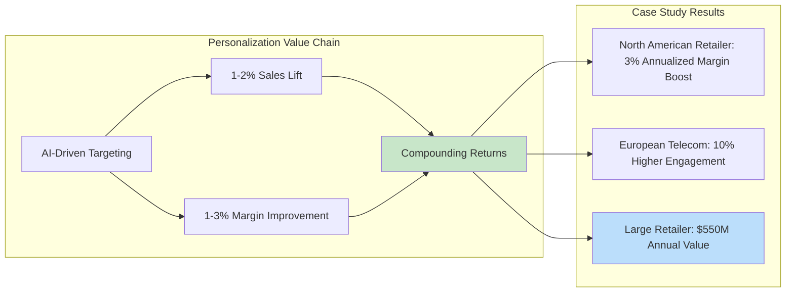

A North American retailer that pivoted to personalized marketing saw a **boost of approximately 3% in annualized margins** after three months of using a targeted approach based on analytical models assessing "promotion propensity"[^69]. A European telecom company deploying generative AI-enhanced messaging found that **customers receiving personalized messages engaged and took action 10% more often** than those receiving standard communications[^69].

The most dramatic results come from comprehensive technology transformation. A large, established North American retailer that integrated its legacy systems with its marketing technology stack **produced $400 million in value from initial pricing improvements and an additional $150 million from generative AI-enabled targeted offers over a single year**[^69]. This demonstrates how foundational technology investments enable AI-driven value creation.

**Conversion Rate Transformation Through AI**

Case studies from AI marketing implementations demonstrate extraordinary conversion improvements. A.S. Watson Group, the world's largest international health and beauty retailer, partnered with Revieve to launch an AI Skincare Advisor across e-commerce sites. The system analyzed 14+ skin metrics using AI-powered computer vision and generated personalized skincare routines. Results showed that **customers who used the AI advisor converted 396% better than those who did not and spent four times more, with average order value increasing by 29%**[^70].

Verizon's GenAI initiatives demonstrate similar impact on customer retention. The company implemented real-time personalization, such as offering tailored promotions when customers entered stores, and used GenAI to predict the reason behind 80% of incoming customer service calls for more effective routing. This **reduced in-store visit time by 7 minutes per customer and helped prevent an estimated 100,000 customers from churning**[^70].

**Content Creation Acceleration and Marketing Efficiency**

Generative AI is transforming marketing operations by dramatically accelerating content creation. McKinsey reports that marketers can deploy generative AI to **personalize content development 50 times faster than manual approaches**[^69]. This acceleration enables retailers to achieve levels of personalization previously impossible due to resource constraints.

Adore Me's implementation of Writer's AI Studio exemplifies this transformation. The company built role-specific AI agents for generating SEO-optimized product descriptions, handling Spanish translations, and drafting personalized stylist notes. Results included **36% reduction in stylist note writing time, product description generation time cut from 20 hours to 20 minutes per batch, and localized launch time slashed from months to 10 days**. The company achieved a **40% increase in non-branded SEO traffic**[^70].

The broader retail industry is poised for comprehensive AI transformation. Accenture analysis indicates that **generative AI has the ability to transform 50% of all working hours across the retail industry**[^68]. An analysis across retail functional roles in the United States showed that 36% of time spent is susceptible to automation, while 28% has potential for augmentation. For example, a front-store retail associate with generative AI tools could provide a new level of personalized assistance to customers, such as creating virtual layouts for patio redesigns.

**Consumer Readiness and the AI-Powered Shopping Experience**

Consumer acceptance of AI-powered shopping experiences is advancing rapidly. Accenture research shows that **roughly one in two consumers are open to using conversational AI to receive advice and recommendations** across beauty, groceries, clothes, and consumer electronics[^68]. Consumers express desire for generative AI to provide a range of options from multiple brands, surprise them with suggestions, and manage negotiating, purchasing, and resolving queries or complaints on their behalf.

However, consumer trust remains a critical challenge. Only **39% of consumers trust companies to have good intentions, and only 43% trust companies to make honest claims**[^71]. Yet winning consumer trust is key to building lasting loyalty—Accenture analysis shows that **consumers who trust a company are 54% more likely to purchase from them again and 73% more likely to recommend the company to others**. Additionally, **78% of consumers say it is important for conversational AI advisors to recognize them and remember their preferences**.

### 5.4 Manufacturing: Predictive Maintenance, Quality Control, and Software-Defined Operations

Manufacturing represents a sector where AI's physical-world applications are achieving measurable operational improvements. Deloitte's 2025 Smart Manufacturing Survey reveals that **92% of manufacturers believe smart manufacturing will be the main driver for competitiveness over the next three years**, a six-percentage-point increase from 2019[^72]. The primary value sought is operational benefits (49% of respondents), followed by financial benefits (44%).

**Quantified Operational Improvements**

Manufacturers implementing smart manufacturing initiatives report tangible improvements across key metrics:

| Metric | Improvement Range | Source |
|--------|------------------|--------|
| Production Output | 10-20% | Deloitte 2025 Survey |
| Employee Productivity | 7-20% | Deloitte 2025 Survey |
| Unlocked Capacity | 10-15% | Deloitte 2025 Survey |
| OEE (Industry 4.0 baseline) | 15% | Capgemini Analysis |
| Labor Productivity (Industry 4.0) | 25% | Capgemini Analysis |
| Cycle Time Reduction | 20% | Capgemini Analysis |

Investment commitment is substantial, with **78% of respondents allocating more than 20% of their overall improvement budget toward smart manufacturing initiatives**, and 88% expecting investments to continue or increase in the next fiscal year[^72]. Priority investment areas include process automation (46% ranked first or second) and physical automation (37%).

**The Next Wave: Generative, Agentic, Edge, and Physical AI**

Capgemini's analysis identifies four key AI transformations reshaping manufacturing:

**Generative AI** focuses on content development, reasoning, and problem-solving. Applications include automated report generation, work instructions, machine programming, defect root cause analysis, and process optimization. Field implementations demonstrate substantial results: an aluminum company using SafetyGPT for safety information achieved faster incident investigations; a pharmaceutical company reduced false rejects by **over 50% with synthetic image datasets**; an aircraft engine manufacturer increased machine utilization by **30% and accelerated fault detection**; an electronics manufacturer reduced reactive maintenance time by **approximately 25%** with a shopfloor copilot[^73].

**Agentic AI** enables systems that near-autonomously learn, analyze, decide, and act. Applications include machine "self-healing," prescriptive maintenance, and production plan adaptation. AI agents could generate up to **$450 billion in economic value by 2028**. A food and beverage processor achieved low six-figure savings in repair costs with a maintenance co-pilot; an electronics manufacturer reduced cycle time by **50%** with an autonomous QC agent; a steel manufacturer decreased LNG consumption by **approximately 2%** with an autonomous control agent[^73].

**Edge AI** processes data locally for real-time decisions, with the market expected to grow from approximately $27 billion in 2024 to approximately $269.82 billion in 2032 (33% CAGR). A cement company saved approximately **$0.2 million in fuel costs** by optimizing kiln operations; an automotive company reduced costs by approximately **20%** with crankshaft defect inspection; a beverage bottler implemented Edge AI for workplace safety monitoring[^73].

**Physical AI** embeds intelligence in robotic systems. Applications include humanoids for assembly, autonomous trucks, and robotic fruit picking. A mining company achieved **20% more efficiency with autonomous trucks**; automotive manufacturers are deploying humanoid robots for assembly preparation[^73].

**The Scaling Challenge: Why Only 5% Achieve End-to-End Digital Operations**

Despite significant investment, **only 5% of manufacturers have industrialized, end-to-end digital operations**, with 80% of AI initiatives requiring investment in technical foundations[^73]. The transition presents significant challenges including leadership buy-in, technology investment, resource constraints, change management, and value tracking. **65% of respondents ranked operational risk as their first or second concern**[^72].

Technology adoption remains focused on foundational elements. At the facility or network level, 57% of manufacturers use cloud computing, 57% leverage data analytics, 46% use industrial IoT solutions, and 42% leverage 5G. AI adoption is more moderate: only **29% are using AI/machine learning at the facility or network level, and 24% have deployed generative AI at the same scale**[^72].

To manage transformation, **52% of respondents reported developing a central team or working group**, with more than half reporting that smart manufacturing initiatives are owned by operations leaders such as the chief operating officer. To address the talent gap, 68% of manufacturers are hiring new talent, 53% use in-house training for executives, and 40% use contract or contingent labor[^72].

### 5.5 Cross-Industry Success Patterns: From Pilot to Scaled Impact

The evidence synthesized across industries reveals consistent patterns distinguishing organizations that achieve scaled AI impact from those trapped in perpetual pilot phases. McKinsey's 2025 Global AI Survey identifies **AI high performers—approximately 6% of respondents who attribute an EBIT impact of 5% or more to AI**—and their distinctive practices illuminate the pathway from experimentation to enterprise transformation[^58].

**The High Performer Profile**

AI high performers demonstrate fundamentally different approaches to AI implementation across multiple dimensions:

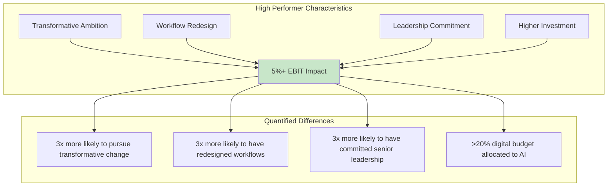

High performers are **more than three times more likely than others to say their organization intends to use AI to bring about transformative change**[^58]. They are **nearly three times as likely to have fundamentally redesigned individual workflows**—a factor identified as having one of the strongest contributions to achieving meaningful business impact. High performers are also **three times more likely to strongly agree that senior leaders demonstrate ownership of and commitment to AI initiatives**[^58].

Investment patterns distinguish high performers significantly. **More than one-third of high performers commit more than 20% of their digital budgets to AI technologies**, compared with lower allocations among other organizations. Approximately **three-quarters of high performers say their organizations are scaling or have scaled AI, compared with one-third of other organizations**[^58].

**The Critical Role of Workflow Redesign**

The most powerful finding from McKinsey's research concerns workflow redesign. **Half of AI high performers intend to use AI to transform their businesses, and most are redesigning workflows**[^58]. This intentional redesigning of workflows has one of the strongest contributions to achieving meaningful business impact—suggesting that technology deployment without process transformation yields limited returns.

This finding aligns with BCG's 10-20-70 framework, which emphasizes that **only about 10% of AI benefits come from the algorithmic model, 20% from the data used, and the remaining 70% from developing new behaviors and ways of working**. Organizations that treat AI as a technology deployment rather than a catalyst for operational transformation consistently underperform.

**Four Conditions for Maximum AI Cost Impact**

BCG's analysis identifies four specific conditions where AI delivers the biggest impact on the cost base:

| Condition | Description | Potential Impact |
|-----------|-------------|------------------|
| **Heavy Reliance on Codified Knowledge** | Content creation, software engineering | 20-30% cost savings, 50x efficiency |
| **Interaction with Individual Customers** | Contact centers, customer service | Up to 90% cost reduction |
| **Large Supply Bases** | Frequent price negotiations, procurement | Up to 50% efficiency gains |
| **Significant Field Forces** | Maintenance, sales teams | 20-30% productivity boost |

For companies with **heavy reliance on codified knowledge**, generative AI can make production processes approximately 50 times more efficient and reduce costs by 20-30%. A consumer goods company used AI to transform marketing processes, leading to projected savings of **€250 million in overall marketing costs**[^74].

For organizations with **large customer bases and frequent interactions**, chatbots and GenAI-enabled assistants can handle inquiries, reducing workload on staff and cutting costs by up to 90%. A global asset manager optimized customer support operations using AI, reducing operating expenses by a third—equivalent to **$100 million in bottom-line impact**[^74].

Companies with **large supply bases** can leverage GenAI to identify price outliers and create tender documents, producing efficiency gains of up to 50%. A logistics company used GenAI to create RFPs, improving efficiency in the procurement function by **30-50%**[^74].

Organizations with **significant field forces** can improve operational workflows with GenAI, boosting individual employee productivity by 20-30%. An oil and gas company uses GenAI to enhance maintenance operations, **reducing errors by 70% and decreasing the cost of preventive maintenance by more than 40%**[^74].

**Avoiding Common Implementation Pitfalls**

BCG's analysis of transformation efforts identifies specific pitfalls that distinguish successful implementations:

**"Don't forget to cash the check"**: Leaders only capitalize on AI's potential if they change processes, reorganize people, and shape culture to execute on the business case. BCG found that **only about 10% of benefits are achieved from the algorithmic model, 20% from data, and 70% from developing new behaviors and ways of working**[^74].

**Be vigilant about rising tech expenses and complexity**: AI at scale can result in higher tech costs and complexity as utilization grows. Companies must track hidden costs, particularly with third-party vendors, and focus on a manageable number of applications to avoid overwhelming complexity[^75].

**Structure implementation to capture savings quickly**: Look for quick wins early to unlock resources and generate momentum for more comprehensive efforts.

**Rigorously track value**: Ensure that AI applications are linked to business objectives, improve productivity, and unlock financial savings that flow through to the bottom line[^74].

### 5.6 Quantified Outcomes and Value Realization: Evidence Synthesis

The evidence synthesized across industries and case studies enables a systematic assessment of AI's documented impact, providing a framework for evaluating investment decisions based on empirical outcomes rather than theoretical potential.

**Consolidated Outcome Summary**

The following table consolidates quantified outcomes from documented case studies and industry surveys:

| Domain | Metric | Documented Range | Representative Example |
|--------|--------|------------------|----------------------|
| **Cost Reduction** | Process-specific savings | 20-95% | Healthcare RCM: 30-60% cost-to-collect reduction |
| **Efficiency Gains** | Productivity improvement | 25-50% | Content creation: 50x faster development |
| **Revenue Impact** | Incremental growth | 1-15% | Personalization: 1-3% margin improvement |
| **Error Reduction** | Quality improvement | 50-70% | Manufacturing: 70% error reduction |
| **Customer Metrics** | Conversion/satisfaction | 10-396% | AI advisor: 396% conversion improvement |

**Cost Reduction Evidence**

Cost reduction outcomes vary substantially by application domain but consistently demonstrate significant potential when implementations achieve scale:

- **Healthcare revenue cycle**: 30-60% reduction in cost to collect through agentic AI[^62]
- **Preventive maintenance**: 40%+ reduction in maintenance spending[^75]
- **Content creation**: Near-elimination of costs (e.g., $20,000 to nearly free for website articles)[^76]
- **Marketing operations**: 20-30% reduction in agency costs through GenAI content generation[^76]
- **Clinical documentation**: 70-90% reduction in drafting time[^76]
- **Compliance operations**: Substantial reduction through automation of manual review processes

IBM's transformation program demonstrates enterprise-scale cost impact, unlocking approximately **$3.5 billion in cost savings and a 50% increase in productivity of enterprise operations** over two years[^76].

**Efficiency and Productivity Gains**

Productivity improvements are consistently documented across industries:

- **Consultant productivity**: 12.2% more tasks completed, 25.1% faster completion, 40%+ quality improvement (Harvard/BCG experiment)
- **R&D productivity**: 30-40% efficiency gains in clinical-science document drafting[^76]
- **Marketing content**: 40% acceleration in content processes[^76]
- **Business reporting**: Processes reduced from one week with six people to less than one hour with GenAI[^76]
- **Manufacturing**: 10-20% production output improvement, 7-20% employee productivity improvement[^72]

**Revenue Impact Evidence**

Revenue growth through AI is most commonly reported in marketing and sales, strategy and corporate finance, and product and service development applications[^58]. Documented examples include:

- **Personalized marketing**: 1-2% sales lift, 1-3% margin improvement[^69]
- **Targeted promotions**: $400 million from pricing improvements plus $150 million from GenAI-enabled offers (single retailer, single year)[^69]
- **Customer engagement**: 10% higher engagement rates from personalized messaging[^69]
- **AI-driven personalization**: 5-15% incremental revenue, 10-30% efficiency in marketing spend (McKinsey research)[^77]

**Timeline to Value Realization**

The timeline to ROI represents a critical consideration for AI investment decisions. Most organizations report achieving satisfactory ROI on typical AI use cases within **two to four years**, significantly longer than the **seven to twelve month payback period** expected for traditional technology investments[^58]. Only **6% reported payback in under a year**.

For generative AI specifically, **15% of respondents using the technology report their organizations already achieve significant, measurable ROI**, and 38% expect it within one year of investing. For agentic AI, just **10% are currently realizing significant ROI**, with half expecting returns within three years and another third anticipating three to five years due to higher complexity[^58].

**The ROI Leader Profile**

Research identifies characteristics distinguishing organizations achieving superior AI returns:

- **95% of AI ROI Leaders** allocate more than 10% of their technology budget to AI
- Leaders view AI as an opportunity to **fundamentally rethink business models** rather than merely enhance existing processes
- **83% of leaders** believe agentic AI will enable employees to spend more time on strategic and creative tasks
- **40% of AI ROI leaders** mandate AI training across their organizations

Front-runners in manufacturing AI achieve **ROI of 2-3x over three years and 4-5x over five years**, with improvements of over 50% in conversion cost, cycle times, and defect rates[^73]. Success requires aligning stakeholders, balancing long-term foundations with quick wins, preparing people and skills, treating use cases as products, and ensuring local adoption and trust.

**Framework for Evaluating AI Investment Decisions**

The evidence synthesized in this chapter supports a framework for evaluating AI investment decisions based on empirical patterns:

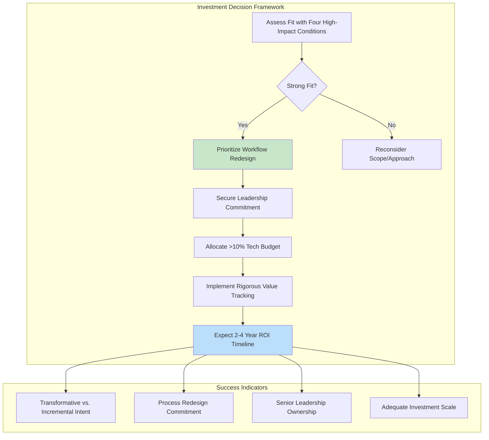

**Key Success Factors**:
1. **Strategic alignment**: AI initiatives must align with conditions where technology delivers maximum impact—codified knowledge, customer interaction, large supply bases, or field forces
2. **Workflow redesign commitment**: Technology deployment without process transformation yields limited returns
3. **Leadership commitment**: Senior leader ownership and active engagement are three times more common among high performers
4. **Adequate investment**: High performers allocate more than 20% of digital budgets to AI
5. **Realistic timeline expectations**: Plan for 2-4 year ROI realization rather than traditional 7-12 month technology payback

**What Fails**: Organizations that treat AI as a technology deployment rather than a catalyst for operational transformation, that lack senior leadership commitment, that underinvest relative to ambition, or that fail to rigorously track value against business objectives consistently underperform—remaining trapped in pilot phases while competitors achieve scaled impact.

The evidence is clear: **AI delivers transformative value when organizations commit to fundamental workflow redesign, secure genuine leadership commitment, invest at scale, and maintain rigorous focus on business outcomes**. The 6% of organizations achieving high-performer status demonstrate that scaled AI impact is achievable—but requires a fundamentally different approach than the incremental experimentation that characterizes most enterprise AI programs.

## 6 Building the AI-Ready Firm: Talent Development and Workforce Transformation Programs

The preceding chapters have documented the billions invested in AI platforms, the organizational architectures being constructed, and the client outcomes achieved across industries. Yet these strategic ambitions and technological capabilities ultimately depend upon a singular enabling factor: **the human workforce's capacity to leverage, guide, and evolve alongside artificial intelligence**. This chapter investigates the internal talent strategies and structured programs implemented by major consulting firms to prepare their workforce for the AI era, revealing how talent development has emerged as the critical determinant of whether firms' AI investments translate into sustainable competitive advantage or remain unrealized potential.

The consulting industry faces a profound paradox. Firms that have built their reputations on advising clients about workforce transformation must now execute that same transformation within their own organizations—often at unprecedented speed and scale. The evidence examined in this chapter demonstrates that **leading consulting firms are not merely adapting their training programs but fundamentally reconceptualizing what it means to be a consultant in an AI-augmented world**. From Deloitte's Academy for AI with its comprehensive curriculum spanning technical bootcamps to executive strategy labs, to PwC's innovative "Prompt Parties" that generated over 500 sessions and reported 20-30% efficiency gains, to Accenture's training of more than 550,000 employees in generative AI fundamentals, the industry is executing the largest coordinated workforce transformation in professional services history.

### 6.1 The Workforce Imperative: Quantifying the AI Skills Gap and Transformation Challenge

The scale of workforce transformation required for AI adoption represents one of the most significant organizational challenges consulting firms have ever confronted. Understanding the quantitative dimensions of this challenge is essential for appreciating why talent development has evolved from a routine HR function into a strategic imperative commanding executive attention and substantial investment.

**The Magnitude of the Skills Gap**

The workforce barriers to digital transformation are both pervasive and consequential. According to Deloitte's Academy for AI research, **82% of enterprises have been prevented from pursuing digital transformation projects due to workforce challenges**[^78]. This statistic illuminates a fundamental disconnect: organizations possess the strategic intent and financial resources to pursue AI-driven transformation, yet lack the human capabilities to execute effectively. The challenge extends beyond technical skills to encompass the broader organizational capacity to integrate AI into workflows, processes, and decision-making structures.

The World Economic Forum has declared what it terms a "reskilling emergency," announcing the need to **upskill or reskill more than one billion people by 2030**[^79]. This global imperative places consulting firms in a dual position—they must transform their own workforces while simultaneously advising clients on navigating the same challenge. The Future of Jobs Report published in January 2025 reinforces this urgency, highlighting that **77% of surveyed employers recognize the need for reskilling and upskilling their workforce through 2030** to foster effective collaboration with AI[^80].

**The Value Creation Framework: Why People Matter More Than Technology**

Perhaps the most consequential finding shaping consulting firms' talent strategies is the empirical evidence on where AI value actually originates. BCG analysis demonstrates that while **10% of AI value creation comes from algorithms and 20% from technology infrastructure, a striking 70% comes from people, processes, and change management**[^81]. This distribution fundamentally reframes the AI investment equation—firms that allocate resources predominantly to technology while underinvesting in workforce capabilities are structurally positioned to capture only a fraction of available value.

This 10-20-70 framework explains a troubling pattern in enterprise AI adoption. BCG research shows that **only 5% of companies are achieving AI value at scale, 60% are hardly achieving any value at all, and 35% are somewhere in between**[^81]. The primary explanation for this distribution is not technological inadequacy but rather how organizations approach upskilling. Many organizations focus on launching AI solutions instead of ensuring people can meaningfully use them in their daily work, creating a skills gap where employees are not using AI tools effectively in ways that both integrate into and transform their workflows.

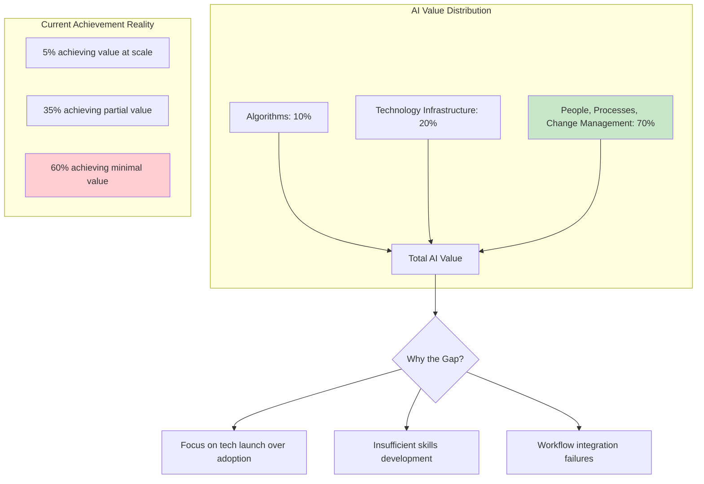

**The Leadership Skills Gap**

The AI skills gap does not reside solely in the workforce—it extends to the executive suite. BCG research emphasizes that **if leaders don't deeply understand AI, they can't set the right vision or move the organization at the speed this transformation demands**[^81]. This finding has profound implications for consulting firms, where partner and senior leadership credibility depends upon demonstrated expertise. Firms are recognizing that upskilling must start at the top, with executives visibly using AI tools and discussing their own learning journeys to create psychological safety for their teams to do the same.

McKinsey's research on AI upskilling as a change imperative reinforces this leadership dimension. According to the latest McKinsey Global AI Survey, **78% of respondents indicate their organizations use AI in at least one business function**[^82]. Yet most companies invest disproportionately in literacy cultivation because it is visible and easily measured, while fewer commit to the more complex work of application—embedding tools and behaviors into core workflows—and only a minority consistently link upskilling to innovation where true performance gains reside.

**The Disconnect Between Investment and Readiness**

The gap between AI investment ambitions and workforce readiness creates strategic vulnerability. Indeed's 2024 Special Report found that **75% of US employees expect their roles to change due to AI within five years, but only 45% have received recent upskilling**[^82]. This 30-percentage-point gap cannot be bridged through training alone—it requires fundamental rethinking of how learning occurs within organizations.

McKinsey research reveals additional dimensions of this readiness gap. A survey of more than 80 leaders of tech-focused US organizations found that **80% of respondents say upskilling is the most effective way to reduce employee skills gaps**—yet **only 28% of organizations are planning to invest in upskilling programs over the next two to three years**[^83]. This disconnect between recognized importance and planned action suggests that many organizations have not yet translated awareness of the skills imperative into committed resource allocation.

The talent race for AI-native capabilities is intensifying competition for skilled professionals. According to McKinsey analysis, **fewer than half the number of potential candidates have the high-demand tech skills listed in job postings** across technology sectors[^83]. The World Economic Forum estimates that **nearly six in ten workers will require training before 2030 and that 22% of jobs globally will change due to technological advancements**[^83]. These projections establish the competitive context within which consulting firms must build and retain AI-capable workforces.

**Framing the Strategic Imperative**

The evidence establishes that talent development has become a strategic imperative for three interconnected reasons:

| Dimension | Challenge | Strategic Implication |
|-----------|-----------|----------------------|
| **Scale** | 82% of enterprises blocked by workforce barriers | Firms cannot execute AI strategies without workforce transformation |
| **Value Distribution** | 70% of AI value from people and processes | Technology investment without capability building yields limited returns |
| **Leadership Gap** | C-suite AI understanding determines organizational velocity | Executive upskilling is prerequisite for enterprise transformation |

For consulting firms specifically, the stakes are elevated. Their business model depends upon possessing capabilities that clients lack—yet clients are increasingly building internal AI expertise. The **78% of Fortune 500 companies now employing dedicated AI consultants**, up from 23% in 2023, demonstrates that consulting firms' traditional knowledge advantages are eroding. Talent development programs represent the mechanism through which firms can maintain differentiated expertise while scaling delivery capacity to meet surging client demand for AI-enabled transformation.

### 6.2 Structured Academy Programs: Deloitte AI Academy, McKinsey Academy, and Firm-Wide Learning Architectures

Major consulting firms have responded to the workforce transformation imperative by establishing comprehensive academy programs that systematize AI skill development across organizational levels. These structured initiatives represent substantial investments in curriculum development, delivery infrastructure, and ongoing program refinement—reflecting recognition that ad hoc training approaches are insufficient for the scale and complexity of required transformation.

**Deloitte's Academy for AI: Comprehensive Curriculum Architecture**

Deloitte's Academy for AI provides what the firm describes as "leading-class AI and Generative AI learning through holistic and immersive experiences tailored to an organization's industry, audience, and market trends"[^78]. The program explicitly addresses the workforce challenges that prevent digital transformation, positioning AI upskilling as an enterprise capability rather than an individual development activity.

The Academy's curriculum is constructed upon **six key building blocks** that span the full spectrum of AI competencies[^84]:

1. **Core Data Fundamentals**: Immersive training in data analysis with Python and relevant libraries, database languages including SQL for structured data, inferential statistics, data engineering and big data processing, introduction to cloud computing for data analysis, and professional data science tools and setup.

2. **Artificial Intelligence and Generative AI**: Coverage of supervised and unsupervised machine learning techniques, neural network and deep learning models, critical AI techniques, AI infrastructure mechanics, foundation models and large language models, differences between model training, fine-tuning, retrieval-augmented generation, and prompt engineering, GenAI applications and use cases, and frameworks for Trustworthy Generative AI.

3. **AI in Today's Industries**: Applications across Consumer; Energy, Resources & Industrials; Financial Services; Government & Public Services; Life Sciences & Health Care; and Technology, Media & Telecommunications sectors.

4. **AI in Business Domains**: How AI drives impact across audit and assurance, customer service and marketing, cybersecurity, enterprise resource planning, supply chain and manufacturing, and tax functions.

5. **Trustworthy AI™ and Generative AI**: Deloitte's proprietary multidimensional framework encompassing fair and impartial use, transparency and explainability, responsibility and accountability, robust reliability, privacy safeguards, and safe and secure cybersecurity[^84].

6. **Professional Services Skills**: Leading practices for professional services environments, building professional relationships, developing presentation skills, self-marketing as an AI practitioner, and managing the AI project lifecycle.

The Academy differentiates its offerings by audience segment, recognizing that different organizational roles require distinct competency profiles[^78]:

| Offering | Target Audience | Sample Topics |
|----------|-----------------|---------------|
| **GenAI-Focused** | Broad workforce | GenAI fluency, prompt engineering, managing GenAI, implementation, governance, ethics |
| **AI Fluency for All** | All employees | AI foundations, data science, machine learning, AI applications, infrastructure, future of AI |
| **AI Leadership for Managers** | Leaders of AI work | Knowing AI, Trustworthy AI ethics, leading and planning, scoping, operating and scaling |
| **AI Bootcamp for Professionals** | Core developers | Data fundamentals, machine learning, deep learning, Trustworthy AI, risk, real-world applications |
| **AI Strategy for Executives** | Senior leadership | Demystifying AI, business process reimagination, AI ethics, functional solutions, scaling AI |

The Academy includes **more than 15 AI and GenAI learning offerings** for practitioners across all businesses, industries, and levels, in addition to vendor- and platform-specific training[^84]. Deloitte builds tailored GenAI curriculum in collaboration with renowned universities and technology institutions for both professionals and clients, ensuring content reflects current academic research and technological developments.

What distinguishes Deloitte's approach includes **customized experiences tailored to strategic objectives**, access to industry professionals for specialist knowledge, industry-specific use cases addressing unique problems, experiential learning with hands-on activities like roundtables and hackathons, and access to signature client experiences[^78]. The program is based on Deloitte's own in-house AI learning programs, meaning the firm is essentially scaling internally validated approaches to external audiences.

**McKinsey Academy: Behavioral Science-Based Capability Building**

McKinsey Academy takes a distinctive approach grounded in behavioral science, designed to help organizations build capabilities at scale to drive sustainable and inclusive growth[^85]. The Academy's programs enable strong leadership teams, enterprise-wide transformations, and performance improvements in functional topics such as digital, operations, sales, and sustainability—unlocking potential across all levels from executive teams to frontline employees.

The Academy's methodology reflects McKinsey's research on organizational change, employing a **behavioral science-based approach** that helps individuals acquire new mindsets and skills, apply them in the context of real work, and build new habits[^85]. Techniques include digital and virtual programs, expert and peer coaching, on-the-job observation and feedback, reflection exercises, and simulations. This approach recognizes that skill acquisition without behavioral change and habit formation yields limited organizational impact.

McKinsey Academy's asset base is substantial:

- **Seamless multi-device experience platform** for flexible learning access
- **Experiential learning infrastructure** via 20+ capability centers, model factories, and immersive experience studios
- **350+ in-person and digital modules** covering diverse capability domains
- **Global delivery team** of hundreds of learning design and delivery consultants, instructional designers, program managers, operations experts, and change facilitators

The Academy has achieved remarkable scale since its 2014 launch. Initially providing clients with toolkits for developing capabilities in problem solving, communications, and strategy, it has grown to **more than 30 offerings** serving **3,000+ organizations** with **1,000,000+ participants**[^85]. McKinsey has received more than 40 Brandon Hall HCM Excellence Awards over the past seven years, with a 98% recommendation rate indicating high participant satisfaction.

Key programs within McKinsey Academy include[^85]:

- **Ability to Execute**: Builds skills and mindsets that matter most for organizational performance
- **Digital**: Equips teams to launch, execute, and scale digital transformations by building leadership, analytics, agile, and technical capabilities
- **McKinsey Management Program**: Unlocks mindsets and behaviors at all organizational levels
- **Connected Leaders Academy**: Equips the next generation of leaders with capabilities, mindsets, behaviors, and networks to achieve their aspirations

**Accenture's LearnVantage and AI Skills Strategy**

Accenture has committed to one of the most ambitious workforce training initiatives in corporate history. In 2025, the firm announced it was rolling out **one of the world's largest corporate AI training programs, reskilling 700,000 employees in agentic AI**[^86]. This commitment reflects Accenture's recognition that talent transformation is essential to unlocking the full potential of a human + AI workforce.

Accenture's talent development strategy rests on three strategic pillars: acquiring talent, developing talent, and unleashing human potential[^87]. In fiscal year 2025, the firm invested **$1 billion in employee learning and development**, delivering approximately **47 million training hours**—a 9% increase from fiscal year 2024 with particular emphasis on generative AI. As of August 31, 2025, **more than 550,000 employees had completed generative AI fundamentals training**[^87].

The firm's AI skills strategy is organized around three pillars: **educate, enable, and embed**[^87]. This framework ensures that training progresses from awareness through application to integration into daily work practices. Accenture continues growing its AI and data talent workforce, reaching approximately **77,000 skilled professionals** by fiscal year 2025 end, with a target of **80,000 by fiscal year 2026 end**[^87].

Accenture LearnVantage serves as the enterprise solution for workforce training within the firm's talent transformation portfolio[^86]. The platform is complemented by additional enterprise solutions including Skills.AI for talent and skilling (an AI-powered analytics tool to understand skill gaps), Intelligent Org Accelerator for organization analytics, Culture DNA for culture assessment, and Transformation GPS for managing large technology transformations.

**Deloitte Academies: The Broader Suite**

Deloitte's Academy for AI operates within a broader suite of Deloitte Academies delivering end-to-end workforce training and leadership development[^79]. This comprehensive approach recognizes that AI capabilities must integrate with broader organizational competencies rather than existing in isolation.

The academy suite includes:

| Academy | Focus Area | Target Audience |
|---------|------------|-----------------|
| **Academy for AI** | AI and GenAI learning solutions | Professionals from senior leaders to developers |
| **Academy for Workforce & Leadership Excellence** | Capabilities for thriving workforce and C-suite | Leadership and workforce broadly |
| **Academy for Finance** | Finance professional upskilling | Finance professionals and leaders |
| **Customer Education & Partner Enablement** | End-to-end managed enablement | Customers and partners |
| **HHS Academy™** | Health and human services learning | HHS professionals |
| **Academy for Product Transformation** | Product delivery techniques | Product teams |
| **Academy for Sustainability** | Climate disclosures, ESG strategy | Sustainability professionals |

Key differentiators of Deloitte Academies include customizable off-the-shelf solutions that integrate within organizational learning plans, the ability to design unique customized programs from scratch, 360-degree learning ranging from self-service to immersive in-person workshops, technical and leadership training affecting every organizational level, and programs led by leading-class faculty, coaches, and thought leaders[^79].

**Comparative Analysis of Academy Approaches**

The structured academy programs across major consulting firms reveal both common elements and distinctive emphases:

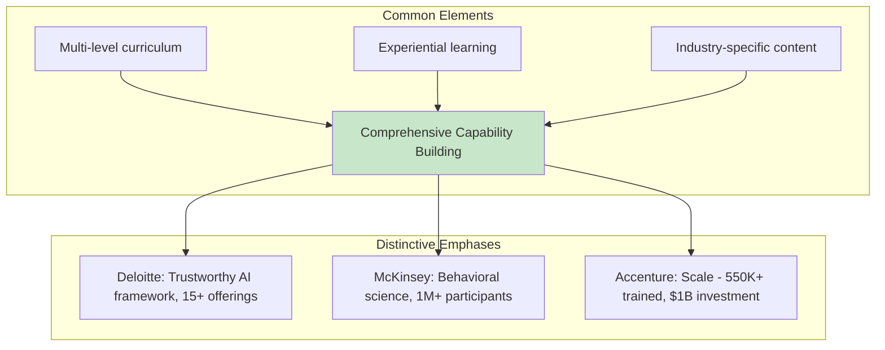

All firms recognize that effective AI capability building requires progression from foundational literacy through technical proficiency to strategic application. The curriculum architectures share common emphases on data fundamentals, machine learning concepts, ethical AI principles, and business application. However, each firm's program reflects its broader strategic posture: Deloitte emphasizes governance and trustworthiness aligned with its compliance heritage; McKinsey focuses on behavioral change and leadership development consistent with its strategy consulting identity; Accenture prioritizes scale and technical depth reflecting its technology implementation orientation.

### 6.3 Talent Acquisition Transformation: From Generalist MBAs to Hybrid Technical-Consulting Profiles

The AI transformation is fundamentally reshaping who consulting firms hire, challenging decades-old recruiting paradigms that prioritized generalist analytical capabilities over technical specialization. The evidence reveals a decisive pivot toward hybrid profiles that combine consulting competencies with technical expertise—a shift that is redefining the talent market for professional services.

**The Technologist Surge**

The quantitative evidence of hiring transformation is striking. **Accenture's latest annual report shows it added nearly 40,000 AI and data professionals in the last two years, who now account for roughly 10% of its global head count**[^88]. This represents a fundamental rebalancing of the firm's capability portfolio, with technical talent growing from a supporting function to a core delivery resource.

**EY has added 61,000 technologists since 2023**, now comprising approximately 15% of its total workforce[^88]. This rapid expansion reflects EY's recognition that AI-driven transformation requires deep technical capabilities integrated throughout the organization rather than concentrated in specialized units.

At McKinsey, **the "AI engineer" is the fastest-growing non-entry-level role**[^88]. This designation signals that technical AI expertise has become essential to the firm's core advisory work, not merely an adjunct capability for specialized engagements. Among McKinsey's approximately 45,000 employees, more than 7,000 focus on digital or tech roles, with the firm's AI arm QuantumBlack driving initiatives that account for 40% of the firm's work.

**BCG's Pivot Toward Technical Talent**

Boston Consulting Group exemplifies the strategic pivot toward technical hiring. The firm reports that **software engineers, frontend developers, and Python developers are the fastest-growing entry-level roles**[^88]. BCG, which brought on 1,000 employees last year, has ramped up hiring technologists since launching its tech and AI arm, BCG X, in late 2022.

A BCG executive characterized the transformation bluntly: the firm is **"essentially building a tech company inside a consulting firm"**[^88]. This framing captures the magnitude of the shift—consulting firms are not merely adding technical capabilities but fundamentally reconstituting their organizational identity to incorporate technology development as a core competency.

The hiring profile evolution extends beyond entry-level roles. BCG is reportedly **hiring fewer MBA graduates while prioritizing tech talent and data scientists**, reflecting a structural shift in how the firm builds its talent pipeline[^89]. This represents a significant departure from the traditional consulting model where MBA recruitment served as the primary talent acquisition channel.

**The "5Xer" Profile: Depth Plus Breadth**

The most sought-after hire in the AI era represents a new professional archetype. **McKinsey looks for "5Xers" who are deep in one thing but can do three or four different things well**[^88]. This profile captures the requirement for professionals who combine specialized technical expertise with the versatility to operate across consulting domains.

The 5Xer concept reflects recognition that AI transformation requires individuals who can bridge engineering and consulting worlds—translating between technical possibilities and business requirements, understanding both algorithmic constraints and organizational dynamics. These hybrid professionals are essential for the human-AI collaboration models that consulting firms are implementing.

QuantumBlack, McKinsey's AI arm, illustrates this integration. The **1,700-person team drives all of McKinsey's AI initiatives**, with approximately 3,500 people building internal technology and another 4,000 to 5,000 consultants leading technical work from the business side[^88]. This structure demonstrates how technical and consulting capabilities must interweave rather than operate in parallel silos.

**Preserving Traditional Consulting Competencies**

Despite the pivot toward technical hiring, consulting firms recognize that traditional consulting competencies remain essential. **Most consulting work still does not require deep engineering expertise**, and firms continue to value strong problem-solving and communication skills[^88].

KPMG's AI workforce lead articulated this balance: **"Communication, collaboration, and agile learning are the standout qualities, as they are the sort of things AI can't really do"**[^88]. This perspective emphasizes that as AI assumes quantitative and analytical tasks, distinctively human capabilities—interpersonal skills, judgment, creative problem-solving—become more rather than less valuable.

McKinsey continues to actively recruit undergraduates, MBAs, and PhDs, **emphasizing judgment, conceptual thinking, resilience, and the ability to learn quickly** in its screening process[^88]. The firm hires for "voracious learners" who are curious and have the ability to learn, unlearn, and relearn—recognizing that adaptability may be more valuable than any specific technical skill in a rapidly evolving landscape.

**The Apprenticeship Model Evolution**

Accenture has developed innovative approaches to talent acquisition that expand traditional pipelines. The firm's apprenticeship programs have become critical talent sources—in the US and Canada, **apprentice hiring accounted for 20% of entry-level recruitment in fiscal year 2025**, up significantly since the program launched in 2016[^87].

This apprenticeship emphasis reflects a broader strategic shift toward **skills-based hiring over credential-based hiring**. Accenture uses core technology to identify untapped talent pools and hires for high learning agility rather than specific qualifications[^87]. In fiscal year 2025, referrals became the largest hiring source, accounting for 24% of total recruitment—suggesting that existing employees are effective at identifying candidates who fit the evolving capability requirements.

**Quantifying the Hiring Transformation**

The following table synthesizes the hiring transformation evidence across major consulting firms:

| Firm | Technical Hiring Scale | Key Indicators | Strategic Emphasis |
|------|----------------------|----------------|-------------------|
| **Accenture** | +40,000 AI/data professionals (2 years) | 10% of global headcount | Scale and breadth |
| **EY** | +61,000 technologists (since 2023) | 15% of workforce | Integration across services |
| **McKinsey** | 7,000+ digital/tech roles | AI engineer fastest-growing role | Hybrid strategy-tech profiles |
| **BCG** | Software engineers fastest-growing entry role | "Building tech company inside consulting firm" | Technical depth |

**Implications for the Consulting Talent Market**

The hiring transformation creates significant implications for both consulting firms and the broader talent market. Firms are competing not only with each other but with technology companies, AI startups, and client organizations building internal capabilities. The demand for professionals who can bridge technical and business domains substantially exceeds supply, creating intense competition for scarce talent.

PwC acknowledges this reality directly: **"The demand for people who can make AI work in the enterprise is growing, but there are not enough experts, so the focus is on upskilling"**[^88]. This statement captures the strategic logic underlying massive upskilling investments—firms cannot hire their way to AI capability and must instead develop existing talent while selectively recruiting technical specialists.

The evolution from generalist MBAs to hybrid technical-consulting profiles represents a fundamental reconstitution of what it means to be a consultant. While traditional competencies in problem-solving, communication, and client relationship management remain essential, they are increasingly necessary but not sufficient. The consultants who will thrive in the AI era must combine these foundational capabilities with technical fluency, AI literacy, and the adaptability to continuously evolve as technology advances.

### 6.4 Upskilling at Scale: Methodologies, Engagement Models, and Effectiveness Evidence

Beyond structured academy programs and hiring transformation, consulting firms have developed diverse approaches to upskilling existing workforces at unprecedented scale. The evidence reveals that methodology matters as much as content—with experiential, social, and workflow-integrated approaches dramatically outperforming traditional didactic training.

**PwC's "Prompt Parties": Experiential Learning Innovation**

PwC's "Prompt Party" initiative represents one of the most innovative approaches to AI upskilling, demonstrating how social and experiential learning can drive adoption at scale. The concept emerged from recognition that while typical learning paths—including guest lecturers and company-wide quiz games—provided foundational knowledge, **employee AI tool usage remained below expectations**[^90].

PwC's Chief Learning Officer Leah Houde identified the missing element: employees had training but lacked **"a place to tinker"—safe spaces to experiment with AI tools without risk**[^90]. This insight led to the Prompt Party concept, where employees gather to see effective use cases demonstrated by super-users while participating themselves to improve each other's prompts.

The results exceeded expectations. Launched in March 2024, **PwC received over 400 requests to host additional parties within the initial months**[^90]. Since launch, the firm has completed **over 500 Prompt Parties—approximately ten per week—with another 800 in preparation**. One early party featuring a guest lecturer attracted over 22,000 employee participants, demonstrating the format's appeal.

The reported impact on productivity is substantial. Employees indicate that Prompt Parties **helped them achieve 20-30% efficiency improvements**[^90]. Participants report that the sessions "opened their aperture about possibilities"—helping them think differently about what AI tools could accomplish beyond basic efficiency tasks like document summarization toward using AI as a "creative partner" or "brainstorming partner."

The social learning dimension proves particularly powerful. Houde describes the collaborative element as "engaging and compelling," with participants building on others' ideas and inputs[^90]. The ability to ask questions, receive feedback, see what others are doing, and practice as a group before refining approaches drives participants to think more expansively about AI possibilities.

The Prompt Party model addresses another organizational challenge: employee engagement in hybrid work environments. With virtual work prevalent since COVID-19, initiatives that help employees feel part of a collaborative process and connected to colleagues are increasingly valuable. Houde notes that **"having those moments where we're together creates a different stickiness and a different experience"**[^90].

**EY's AI Badge Program: Certification at Scale**

EY has implemented one of the largest AI certification initiatives in professional services. **Nearly 100,000 EY employees—roughly a quarter of the workforce—have earned a digital "AI badge" for completing one of the firm's AI learning programs**[^88]. This achievement demonstrates that large-scale certification is achievable when programs are designed for accessibility and relevance.

The firm's approach includes a two-week learning event and 15-hour courses that provide structured pathways to AI competency[^88]. The badge system creates visible recognition of capability development, potentially motivating participation while providing organizational visibility into workforce AI readiness.

In January 2025, EY rolled out an AI tool to employees that **helps them identify how their jobs will change because of AI**[^88]. This personalized approach addresses a critical challenge: helping individual employees understand AI's relevance to their specific roles rather than presenting generic capability development.

**Accenture's Scale: 550,000+ Trained**

Accenture's training numbers represent the largest scale AI upskilling in consulting. **More than 550,000 employees have completed generative AI fundamentals training**[^87], representing the vast majority of the firm's workforce. This achievement required substantial investment—$1 billion in fiscal year 2025 for learning and development overall, delivering approximately 47 million training hours[^87].

The firm's AI skills strategy organized around **educate, enable, and embed** ensures that training progresses from awareness through practical application to workflow integration[^87]. This progression addresses the common failure pattern where training generates awareness without changing actual work practices.

**What Distinguishes Effective Upskilling**

Research on AI upskilling effectiveness identifies several factors that distinguish successful programs from those that fail to drive adoption:

**Persona-Based Learning Journeys**: BCG research demonstrates that **creating bespoke, persona-based learning journeys delivers employee AI adoption at a level 20 times higher than a broad-based approach**[^81]. Generic training that treats all employees identically fails to address the specific contexts and challenges different roles face. Effective programs tailor content and application exercises to specific job functions and work contexts.

**Experiential Over Didactic Approaches**: Evidence from PwC's Prompt Parties and broader research indicates that **hands-on experience outperforms traditional training formats**. In research on Microsoft 365 Copilot adoption, nine of ten participants acknowledged formal training as useful, but **seven of ten ignored training videos in favor of experiential and social learning**[^82]. This finding suggests that traditional e-learning and workshop formats, while valuable for foundational knowledge, must be supplemented with opportunities for practical application.

**Integration into Workflow**: McKinsey's research on AI upskilling as a change imperative emphasizes that **training alone rarely drives sustained behavior change**[^82]. The most effective approaches embed learning directly into AI tools and workflows, breaking down boundaries between work and learning. When training occurs separately from actual work, the transfer of skills to daily practice often fails.

**Time and Incentives**: BCG identifies the two most common barriers to AI adoption as **lack of time and misaligned incentives**[^81]. Employees need protected time to learn new tools and experiment. Performance metrics, promotion criteria, and reward systems must encourage AI experimentation rather than penalize the temporary productivity dip that accompanies learning new approaches.

**Leadership Modeling**: When senior executives visibly use AI tools and discuss their own learning journeys, they **create psychological safety for their teams to do the same**[^81]. This modeling effect proves particularly important given that many employees fear appearing incompetent or worry about job displacement. Leadership demonstration that AI learning is expected and valued across all organizational levels reduces these barriers.

**The Change Management Imperative**

McKinsey's framework positions AI upskilling as a change imperative rather than a training program[^82]. The research identifies three interconnected dimensions along which AI skills development must progress:

1. **AI Literacy**: Building shared baseline fluency across the organization
2. **AI Application**: Embedding tools and behaviors into core workflows
3. **AI Domain Transformation**: Developing domain-specific use cases that extend competitive advantage

Most companies invest disproportionately in literacy because it is visible and easily measured. Fewer commit to application because it is more complex and requires leadership courage. Only a minority consistently link upskilling to innovation—yet this is where true performance gains reside.

The research emphasizes that **when reskilling is designed as a talent and change journey rather than an isolated training project, it promotes application and builds trust**[^82]. Companies that embed learning into AI tools and workflows, integrate upskilling with visible career paths, and align incentives and systems can transform the narrative from mandatory training to professional development opportunity.

**Effectiveness Metrics and Evidence**

The following table summarizes effectiveness evidence across upskilling approaches:

| Approach | Scale | Reported Impact | Key Success Factor |
|----------|-------|-----------------|-------------------|
| **PwC Prompt Parties** | 500+ sessions, 22K+ single-event attendance | 20-30% efficiency gains | Social, experiential learning |
| **EY AI Badges** | ~100,000 certified | Quarter of workforce credentialed | Structured certification pathway |
| **Accenture Fundamentals** | 550,000+ trained | Broad organizational literacy | Scale investment ($1B) |
| **Persona-Based Journeys** | Various implementations | 20x higher adoption vs. generic | Role-specific customization |

The evidence consistently demonstrates that effective AI upskilling requires moving beyond traditional training paradigms. Programs that combine structured curriculum with experiential application, social learning, workflow integration, and aligned incentives achieve adoption rates and performance improvements that conventional approaches cannot match.

### 6.5 Organizational Restructuring: From Pyramid to Diamond and the Emergence of New Talent Archetypes

AI's impact on consulting firms extends beyond training programs to fundamental restructuring of organizational models. The traditional consulting pyramid—with large bases of junior analysts supporting progressively smaller cohorts of senior consultants and partners—is being reshaped by AI's automation of entry-level tasks, creating both opportunities and risks that firms must actively manage.

**The Pyramid Under Pressure**

The traditional pyramid structure faces existential challenge from AI's ability to perform tasks historically assigned to junior staff. GenAI is enabling firms to do more with less—one data processing firm's team reports **saving 10-15% of time overall**, while a global NGO's employees save **seven hours per month**[^91]. These efficiency gains, while valuable, directly reduce the work volume that justified large junior cohorts.

A 2025 Harvard University study crystallizes the concern: **AI has been associated with a "sharp relative decline in junior employment"**[^91]. Microsoft's analysis of AI system data confirms that **jobs in software, administrative support, sales, and legal work are most susceptible to AI automation**[^91]. HR executives are wise to assume that some entry-level jobs will be combined and eventually eliminated.

The structural implications are significant. Typical organizational structures resemble pyramids with wide bases of entry-level workers gradually rising into smaller numbers of mid-career and management roles, topped by a small apex of senior leadership. **AI clipping the outer and lower edges results in a structure resembling a crudely drawn house rather than a pyramid**[^91].

**The Hollowed Middle Risk**

The compression of entry-level hiring creates a cascading risk: without replenishment at the base, the middle layers of organizations will shrink over time through normal attrition and turnover—and potentially the apex as well. Organizations that don't replenish their foundation may find themselves with **fewer experienced mid-career people who know the business**[^91].

The consequences of a hollowed middle layer are severe. Organizations will lack resources who know their customers, competition, and processes. They will also lack a pool of executives in training—the developmental pipeline that has historically produced senior leadership[^91]. The traditional consulting model relied on junior roles not merely for task execution but for talent development; automating those tasks eliminates the learning experiences through which future leaders developed foundational skills.

**The Diamond-Shaped Alternative**

Firms are responding by transitioning from pyramid to diamond-shaped organizational structures—**reducing mass hiring of junior staff while quickly recruiting mid-level experts who can bridge technology and operational reforms**[^89]. This structural evolution reflects recognition that AI-augmented consulting requires different capability profiles than traditional models.

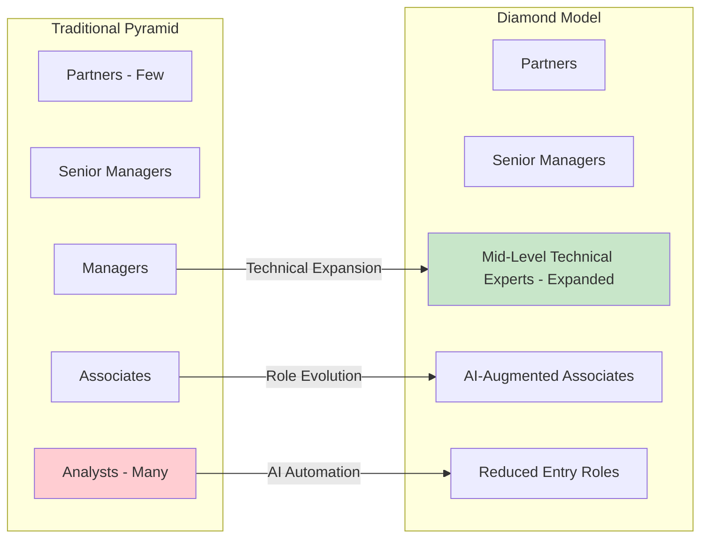

BCG's AI Talent Horizon Framework identifies **four distinct talent archetypes emerging in response** to AI-driven organizational change[^89]:

| Archetype | Strategy | Characteristics |
|-----------|----------|-----------------|
| **The Scaler** | Embed AI tools into existing workflows | Focus on boosting throughput within current structure |
| **The Horizon Builder** | Invest heavily in AI while preserving job ladders | Retrain from within, maintain traditional progression |
| **The Streamliner** | Collapse roles, phase out coordination layers | Build lean, AI-integrated pods |
| **The Reinventor** | Rebuild from ground up | Introduce new AI-centric roles, redesign job ladders |

These archetypes represent different strategic responses to the same underlying pressure. The Scaler approach preserves existing structures while enhancing productivity; the Reinventor approach fundamentally reconstitutes the organization around AI capabilities. Most firms will likely adopt hybrid approaches, with different business units or geographies pursuing different archetypes based on local conditions and strategic priorities.

**New Role Profiles: Managers of Agents and M-Shaped Supervisors**

The agentic organization requires fundamentally new talent profiles. Research identifies three emerging archetypes[^89]:

**M-Shaped Supervisors**: Broad generalists fluent in AI who can oversee multiple domains and coordinate between human teams and AI agents. These individuals possess sufficient technical literacy to understand AI capabilities and limitations while maintaining the strategic perspective required for client advisory work. The "M-shape" refers to competency across multiple peaks rather than the traditional "T-shape" of depth in one area with breadth across others.

**T-Shaped Experts**: Deep specialists who reimagine workflows by combining domain expertise with technical knowledge. These professionals identify opportunities for AI integration within specific functional areas and design human-AI collaborative processes.

**AI-Augmented Frontline Workers**: Staff who leverage AI tools to enhance productivity while focusing on tasks requiring human judgment, creativity, and interpersonal skills.

Junior staff at consulting firms are being prepared to assume fundamentally different roles than their predecessors. Rather than executing research and analysis tasks, they are being trained to become **"managers of agents"—overseeing teams of AI agents and playing greater roles in strategy decisions**[^91]. At PwC, new hires are expected to perform roles that managers currently perform within three years, as they will be overseeing AI performing routine, repetitive tasks.

**Fortifying the Base: New Pathways for Talent Development**

Savvy HR executives are developing strategies to address the structural challenges of the compressed pyramid. One approach involves **expanding recruitment of undergraduate students through co-ops and internships**[^91]. Selective hiring of second- and third-year students provides temporary, AI-savvy workforce capacity while creating pathways to offer top performers future full-time employment.

Firms with existing college recruitment experience and university relations personnel have a head start. These programs can evolve from onboarding shortcuts to developing the skill sets and company culture that qualify entry-level talent for mid-career roles—helping overcome the missing corners of the pyramid and avoid knowledge gaps in the middle[^91].

**The Seven Trends Reshaping Work**

BCG's AI Talent Horizon Framework identifies **seven trends reshaping how work gets done** that inform organizational restructuring decisions[^89]:

1. **Work is being redefined**: AI handles execution while humans focus on strategy, design, and oversight
2. **Roles are blending**: Functional lines disappear as employees combine hybrid skill sets
3. **Skills are shifting**: AI fluency becomes essential alongside systems thinking, problem framing, and sound judgment
4. **Teams are flattening**: AI embeds into operations, phasing out coordination-heavy roles
5. **Rising expectations reshape entry-level pipelines**: AI automates routine tasks that previously trained junior staff
6. **Location strategy is being rethought**: Human work shifts to higher-value activities
7. **The talent race is heating up**: Competition for AI-native talent intensifies

These trends collectively point toward organizations that are flatter, more technically integrated, and more focused on distinctively human contributions. The traditional pyramid that supported both task execution and talent development must evolve into structures that maintain developmental pathways while leveraging AI for operational efficiency.

**Implications for Institutional Knowledge**

A critical concern in organizational restructuring is preservation of institutional knowledge. The automation of traditional developmental tasks creates challenges for how future senior consultants will develop foundational skills[^91]. Being freed from repetitive tasks offers benefits including more direct, early exposure to client-facing work and strategic thinking—but it also eliminates the foundational experiences through which consultants historically developed analytical rigor and attention to detail.

Consulting firms must design new developmental pathways that provide equivalent learning experiences without relying on the repetitive analytical tasks that AI now performs. This may involve structured rotations, simulation-based training, or deliberate exposure to complex problem-solving earlier in careers. The firms that most effectively solve this developmental challenge will maintain their ability to cultivate future leadership while capturing AI's productivity benefits.

### 6.6 Leadership Development and Cultural Transformation for the AI Era

The workforce transformation required for AI success extends beyond technical training and organizational restructuring to encompass fundamental changes in leadership capability and organizational culture. Evidence demonstrates that **AI skills gaps exist not only in the workforce but in the C-suite**, and that leadership behavior profoundly shapes organizational AI adoption.

**The C-Suite Skills Gap**

BCG research emphasizes a critical finding: **if leaders don't deeply understand AI, they can't set the right vision or move the organization at the speed this transformation demands**[^81]. This leadership skills gap creates a ceiling on organizational AI capability—regardless of workforce training investments, organizations cannot advance faster than their leadership's understanding permits.

The implications are significant for consulting firms, where partner and senior leadership credibility depends upon demonstrated expertise. Clients expect consultants to possess deeper AI understanding than their own organizations; if consulting firm leadership lacks AI fluency, the firm's advisory credibility erodes.

McKinsey's research on AI upskilling as a change imperative positions **leadership at the center of successful transformation**[^82]. Leadership must lead—employees take signals from how leaders talk about and use AI. When senior executives visibly use AI tools and discuss their own learning journeys, they create psychological safety for their teams to do the same.

**Executive-Focused Development Programs**

Consulting firms have developed specialized programs targeting executive AI capability development. Deloitte's **AI Strategy for Executives** involves customized strategy labs designed with academic and Deloitte leaders, which can incorporate Deloitte's Greenhouse lab experiences[^78]. Topics include demystifying AI, AI business process reimagination, AI ethics, foundations, functional solutions, Humans with AI, AI vision, and scaling AI.

McKinsey's **Connected Leaders Academy** equips the next generation of leaders with capabilities, mindsets, behaviors, and networks to achieve their aspirations[^85]. The program recognizes that leadership in the AI era requires not merely understanding AI technology but developing the organizational and interpersonal capabilities to lead transformation.

The **Executive Accelerators** program within Deloitte Academies focuses on senior leadership, offering tailored executive coaching programs, innovation labs, and insights[^79]. This program addresses the unique developmental needs of executives who must both personally develop AI fluency and lead organizational transformation.

**Cultural Transformation Requirements**

Successful AI transformation requires cultural change beyond skill development. McKinsey's research identifies that **culture must be reshaped, not just skills**; upskilling success requires creating psychological safety for experimentation and failure[^82]. Organizations that punish AI-related mistakes or create environments where employees fear appearing incompetent will struggle to achieve adoption regardless of training investment.

The cultural transformation extends to how organizations define and reward performance. **Incentives and systems must align**—if employees receive AI training but remain evaluated against pre-AI KPIs, adoption will stall[^82]. Performance metrics, promotion criteria, and reward systems must encourage AI experimentation and recognize the temporary productivity dip that accompanies learning new approaches.

McKinsey's Influence Model identifies four elements that drive organizational change: **role modeling, fostering understanding, building conviction, and formal reinforcement**[^82]. These elements apply directly to AI adoption:

- **Role Modeling**: Leaders demonstrate AI use, creating permission for others
- **Fostering Understanding**: Training builds awareness of AI capabilities and applications
- **Building Conviction**: Employees develop belief in AI's value for their work
- **Formal Reinforcement**: Systems and incentives support AI adoption

Training activates awareness, but **reinforcement sustains change**. Organizations that invest in training without aligning supporting systems achieve temporary awareness gains that fade without lasting behavioral change.

**Case Examples of Leadership-Driven Transformation**

Several organizations illustrate effective leadership-driven AI transformation approaches[^82]:

A **leading consumer products company** developed a customized capability-building program for executives, equipping leadership with the language and skills to model AI use and drive cross-business collaboration. By ensuring executives could credibly discuss and demonstrate AI, the program created conditions for broader organizational adoption.

A **telecommunications industry leader** established a generative AI center and developed customized courses for senior leadership, building the foundation for enterprise-wide adoption. The executive-first approach ensured that leadership could guide and support transformation rather than merely mandate it.

**McKinsey's own transformation** demonstrates the approach in practice. The firm drove organization-wide adoption of its generative AI platform Lilli through leadership storytelling about the change, promotion of new capabilities, and development of learning content. The platform has been deployed to 30,000 users and has reduced insight time by 20%[^82].

The common thread across these examples is that **each organization treated AI upskilling as a leadership-driven transformation rather than an HR-led training rollout**[^82]. By combining AI literacy, application, and domain transformation into coherent journeys and embedding reskilling directly into workflows, leaders enabled organizations to progress from awareness to confidence, from hesitation to momentum, and from incremental adoption to transformative impact.

**New Leadership Roles for the AI Era**

The transformation is also creating demand for new leadership positions. The World Economic Forum's Future of Jobs Report and related analysis suggest emergence of roles such as **Chief Productivity Officer**—an orchestrator dedicated to overcoming organizational inertia and apathy toward change[^80]. This role would optimize AI-human collaboration, drive workforce augmentation, deploy AI to increase value creation, and align AI efficiencies with business growth and employee wellbeing.

Similarly, the **Chief Risk Officer role may evolve into Chief Risk, Trust, and Ethics Officer**, responsible for ensuring AI systems are fair, unbiased, and aligned with ethical and regulatory standards, developing frameworks to mitigate risks, and engaging with regulators[^80]. These emerging roles reflect the organizational complexity that AI introduces and the need for dedicated leadership attention to dimensions that traditional structures may not adequately address.

**The Continuous Learning Imperative**

The AI landscape evolves faster than any training curriculum can track. PwC's approach reflects this reality—the firm works in **"relatively short sprints" on AI** because "we know that we don't know"[^90]. The firm avoids committing to fixed positions that might be overtaken by new innovations, with the learning department collaborating with senior leadership to explore AI's cutting edge.

This continuous learning imperative applies to leadership as much as to the broader workforce. Leaders must model not merely AI competence but AI curiosity—demonstrating ongoing learning and adaptation rather than static expertise. The most effective leaders in the AI era will be those who embrace uncertainty, experiment visibly, and create organizational cultures where continuous learning is expected and rewarded.

### 6.7 Measuring Talent Transformation Success: Metrics, ROI Evidence, and Strategic Alignment

The substantial investments consulting firms are making in talent development require rigorous evaluation of effectiveness and return on investment. This section synthesizes evidence on measurement approaches, documented outcomes, and the characteristics that distinguish organizations achieving superior returns from their talent transformation investments.

**Productivity Impact Evidence**

The most direct evidence of talent transformation effectiveness comes from productivity measurements. PwC reports that **top teams achieve productivity improvements of 30% from AI solutions**[^92]. The firm's "My AI" initiative and Prompt Parties have generated reported **20-30% efficiency gains** among participating employees[^90]. These improvements translate directly to delivery capacity and, potentially, to margin enhancement or competitive pricing.

The PwC EMEA Workforce Hopes & Fears Survey (June 2024) of 24,600 employees found that **56% believe GenAI will boost their efficiency, and 70% are optimistic about technology creating opportunities to learn new skills**[^92]. This employee optimism suggests receptivity to AI adoption that effective training programs can leverage.

Accenture's client work demonstrates similar impact. The firm helped HP University launch a training strategy for a future-ready sales force, finding that **upskilled workers are 12% more likely to exceed sales quotas**[^86]. A global energy firm's talent transformation enabled **88% of workers to apply new skills daily, saving an average of 2.5 hours per day**[^86].

**Characteristics of AI ROI Leaders**

Research identifies specific characteristics distinguishing organizations that achieve superior returns from AI investments, with direct implications for talent development programs:

**Training Mandates**: **40% of AI ROI leaders mandate AI training across their organizations**[^81]. This finding suggests that voluntary training programs, while valuable, may not achieve the organizational penetration required for transformation. Mandatory training signals organizational commitment and ensures baseline capability across the workforce.

**Budget Allocation**: **95% of AI ROI Leaders allocate more than 10% of their technology budget to AI**. Organizations that underinvest relative to their ambitions consistently underperform. Talent development requires sustained investment rather than one-time training initiatives.

**Business Model Orientation**: Leaders view AI as an opportunity to **fundamentally rethink business models** rather than merely enhance existing processes. This orientation shapes how training programs are designed—focusing on transformation rather than incremental improvement.

**Human-Centric Approach**: **83% of leaders believe agentic AI will enable employees to spend more time on strategic and creative tasks**. This belief shapes talent development toward preparing employees for higher-value work rather than merely teaching them to use AI tools.

**The Value Correlation**

McKinsey research demonstrates strong correlation between people development focus and business performance. **Organizations that focus on both human capital development and financial performance are four times as likely to outperform their competitors financially**[^83]. Companies that excel in people development achieve more consistent profits and demonstrate higher resilience, with **attrition rates about five percentage points lower** than organizations focused more heavily on financial performance alone.

This correlation suggests that talent development investments generate returns beyond direct productivity improvements—including retention, engagement, and organizational resilience benefits that compound over time.

**Measurement Frameworks**

Effective talent transformation measurement requires frameworks that capture multiple dimensions of impact:

| Dimension | Metrics | Evidence Sources |
|-----------|---------|------------------|
| **Adoption** | Tool usage rates, active users, query volumes | Platform analytics (e.g., Lilli's 500K+ monthly queries) |
| **Efficiency** | Time savings, task completion rates, productivity ratios | Pre/post measurements, employee surveys |
| **Quality** | Output quality assessments, error rates, client satisfaction | Quality reviews, client feedback |
| **Business Impact** | Revenue attribution, cost reduction, margin improvement | Financial analysis, case attribution |
| **Capability Building** | Certification completion, skill assessments, role readiness | Learning management systems, assessments |

McKinsey's Lilli platform demonstrates comprehensive measurement: **72% adoption among 45,000 employees, 17 times per week average usage, 500,000+ monthly queries, and 30% time savings** on knowledge-intensive tasks. These metrics provide visibility into both adoption and impact, enabling ongoing program refinement.

**Strategic Alignment Assessment**

Talent transformation programs must align with broader strategic objectives to generate sustainable competitive advantage. The evidence suggests several alignment dimensions:

**Investment-Capability Alignment**: Firms must ensure that talent development investments match their strategic AI postures. Accenture's $1 billion annual learning investment and 550,000+ trained employees align with its technology-first positioning. McKinsey's emphasis on behavioral change and leadership development aligns with its strategy consulting identity. Deloitte's focus on Trustworthy AI and governance aligns with its compliance heritage.

**Hiring-Development Balance**: The 28% of organizations planning upskilling investment versus the 80% recognizing its importance reveals a concerning gap[^83]. Firms must balance external hiring of technical talent with internal development of existing workforce—neither approach alone is sufficient.

**Timeline Expectations**: Talent transformation requires sustained commitment. The evidence on AI ROI timelines—typically **two to four years** for satisfactory returns—applies equally to talent investments. Organizations expecting rapid returns from training programs may underinvest or abandon efforts prematurely.

**Sufficiency Assessment**

A critical question emerges from the evidence: **are current talent development investments sufficient to achieve the workforce capabilities required for each firm's AI strategic posture?**

The evidence suggests mixed conclusions. On the positive side, major consulting firms are executing the largest coordinated workforce transformation in professional services history, with substantial investments in academy programs, innovative upskilling approaches, and organizational restructuring. The scale of commitment—Accenture's 550,000+ trained, EY's 100,000 certified, PwC's 500+ Prompt Parties—demonstrates serious engagement with the transformation imperative.

However, concerning gaps remain. Only **5% of organizations achieve AI value at scale**, suggesting that even substantial training investments often fail to translate into business impact[^81]. The **30-percentage-point gap** between employees expecting AI-driven role changes and those receiving recent upskilling indicates that training supply lags demand[^82]. The finding that **only 28% of organizations plan upskilling investment** despite 80% recognizing its importance suggests that many organizations have not yet translated awareness into action[^83].

For consulting firms specifically, the competitive context intensifies the sufficiency question. The 78% of Fortune 500 companies now employing dedicated AI consultants, up from 23% in 2023, demonstrates that clients are building internal capabilities. AI-native boutiques have grown 38% faster than traditional consulting giants. If consulting firms' talent development investments do not maintain differentiated expertise, their traditional knowledge advantages will erode.

**Synthesis: The Talent Transformation Imperative**

The evidence synthesized across this chapter establishes that talent development has become the critical enabler—or constraint—on consulting firms' AI strategic execution. The 70% of AI value that derives from people, processes, and change management cannot be captured through technology investment alone. The firms that most effectively build AI-capable workforces will achieve sustainable competitive advantage; those that underinvest or execute poorly will find their strategic ambitions constrained by workforce limitations.

The characteristics distinguishing successful talent transformation include:

- **Leadership commitment**: Executives visibly using AI and modeling continuous learning
- **Comprehensive curriculum**: Programs spanning technical skills, business application, and ethical principles
- **Experiential methodology**: Hands-on practice integrated into workflow rather than separate training
- **Aligned incentives**: Performance systems that reward AI adoption and experimentation
- **Structural adaptation**: Organizational models that reflect AI's impact on work distribution
- **Sustained investment**: Multi-year commitment rather than one-time training initiatives

The consulting industry's talent transformation represents a strategic bet on the future of professional services. The firms that successfully execute this transformation will define the industry's competitive hierarchy in the AI era; those that fail will find themselves increasingly marginalized as clients build internal capabilities and AI-native competitors capture market share. The evidence is clear: **talent development is not merely an HR function but a strategic imperative that will determine which firms thrive in the AI-transformed consulting landscape**.

# 参考内容如下：
[^1]:[The Rise of the Big 4: How Deloitte, PwC, EY, and KPMG ...](https://medium.com/@gashkarafadinata/the-rise-of-the-big-4-how-deloitte-pwc-ey-and-kpmg-became-the-titans-of-consulting-bd0c1aaacb81)
[^2]:[The Strategy Consulting Industry: Firms, Trends & ...](https://strategyu.co/the-strategy-consulting-industry-firms-trends-compensation-2025/)
[^3]:[The future of consulting: the rise of MBB and what comes next](https://www.rocketblocks.me/blog/consulting-v2.php)
[^4]:[History Of Consulting: 9 Defining Stages That Shaped An ...](https://consultingquest.com/insights/history-of-consulting-industry-evolution/)
[^5]:[IDC MarketScape: Worldwide Experience Build Services ...](https://www.accenture.com/content/dam/accenture/final/accenture-com/document-4/IDC-MarketScape-WW-Experience-Build-Services-2025-Vendor-Assessment-2025-Oct.pdf)
[^6]:[IDC MarketScape: Worldwide AI Services for State and ...](https://www.accenture.com/content/dam/accenture/final/accenture-com/document-4/IDC-WW-AI-Services-for-State-and-Local-Gov-2025-Vendor-Assessment-Oct-2025.pdf)
[^7]:[Top 10: Legacy Modernisation Vendors](https://technologymagazine.com/top10/top-10-legacy-modernisation-vendors)
[^8]:[An Analysis of AI Implementation in the Big Four Accounting ...](https://scholars.unh.edu/cgi/viewcontent.cgi?article=1571&context=honors)
[^9]:[How AI is Redefining Strategy Consulting: McKinsey, BCG, ...](https://medium.com/@takafumi.endo/how-ai-is-redefining-strategy-consulting-insights-from-mckinsey-bcg-and-bain-69d6d82f1bab)
[^10]:[Best Consulting Firms to Work For 2025](https://www.preplounge.com/en/blog/consulting/firms/worldwide)
[^11]:[The Big 4 AI Agents of 2025: Features and Market Impact](https://unity-connect.com/our-resources/blog/big-4-ai-agents/)
[^12]:[The Rise of Boutique Consulting Firms in 2025 - My Framer Site](https://39-consulting.com/page/the-rise-of-boutique-consulting-firms-in-2025)
[^13]:[McKinsey, BCG, and Deloitte's New Competition Is Fast ...](https://www.businessinsider.com/mckinsey-bcg-and-deloitte-competition-small-boutique-specialized-ai-2025-4)
[^14]:[4 key ways AI changed the Big Four in 2025](https://www.businessinsider.com/how-ai-changed-big-four-workflow-hiring-jobs-2025-12)
[^15]:[Everest-Group-AI-and-Generative-AI-Services-PEAK- ...](https://www.accenture.com/content/dam/accenture/final/accenture-com/document-4/Everest-Group-AI-and-Generative-AI-Services-PEAK-Matrix-Assessment-2025-Focus-on-Accenture.pdf)
[^16]:[AI Consulting and Support Services Market Analysis ...](https://finance.yahoo.com/news/ai-consulting-support-services-market-090300922.html)
[^17]:[AI Consulting in 2025: Trends Defining the Future of Business](https://bobhutchins.medium.com/ai-consulting-in-2025-trends-defining-the-future-of-business-a06309516181)
[^18]:[Accenture to Invest $3 Billion in AI to Accelerate Clients ...](https://newsroom.accenture.com/news/2023/accenture-to-invest-3-billion-in-ai-to-accelerate-clients-reinvention)
[^19]:[Accenture's $3B AI Bet Is Paying Off: Inside A Massive ...](https://www.crn.com/news/ai/2025/accenture-s-3b-ai-bet-is-paying-off-inside-a-massive-transformation-fueled-by-advanced-ai)
[^20]:[Accenture Third Quarter Fiscal 2025 Conference Call Transcript](https://investor.accenture.com/~/media/Files/A/accenture-v4/investors/quarterly-earnings/2025/q3-fy25/accenture-third-quarter-fiscal-2025-conference-call-transcript.pdf)
[^21]:[PwC US makes $1 billion investment to expand and scale ...](https://www.pwc.com/us/en/about-us/newsroom/press-releases/pwc-us-makes-billion-investment-in-ai-capabilities.html)
[^22]:[Global Annual Review 2024: A Year of Solving Together](https://www.pwc.com/gx/en/global-annual-review/2024/pwc-global-annual-review-2024.pdf)
[^23]:[KPMG and Microsoft enter landmark agreement to put AI at ...](https://news.microsoft.com/source/2023/07/11/kpmg-and-microsoft-enter-landmark-agreement-to-put-ai-at-the-forefront-of-professional-services/)
[^24]:[KPMG and Microsoft enter landmark agreement to put AI at ...](https://kpmg.com/us/en/media/news/kpmg-microsoft-agreement-2023.html)
[^25]:[The impact of Artificial Intelligence on the accounting profession](https://journalijsra.com/sites/default/files/fulltext_pdf/IJSRA-2025-1873.pdf)
[^26]:[KPMG to invest $2 billion in AI in expanded partnership ...](https://venturebeat.com/ai/kpmg-to-invest-2-billion-in-ai-in-expanded-partnership-with-microsoft)
[^27]:[How Professional Services are Leveraging AI Training and ...](https://virtualspeech.com/blog/professional-services-ai-training-emerging-tech)
[^28]:[Accenture Invests in Writer to Accelerate Enterprise Use of ...](https://newsroom.accenture.com/news/2023/accenture-invests-in-writer-to-accelerate-enterprise-use-of-generative-ai)
[^29]:[PwC agrees deal to become OpenAI's first reseller and ...](https://www.cnbc.com/2024/05/29/pwc-to-become-openais-first-reseller-and-largest-enterprise-user.html)
[^30]:[AI ROI: The paradox of rising investment and elusive returns](https://www.deloitte.com/ro/en/issues/generative-ai/ai-roi-the-paradox-of-rising-investment-and-elusive-returns.html)
[^31]:[AI ROI: The paradox of rising investment and elusive returns](https://www.deloitte.com/uk/en/issues/generative-ai/ai-roi-the-paradox-of-rising-investment-and-elusive-returns.html)
[^32]:[AI and tech investment ROI | Deloitte Insights](https://www.deloitte.com/us/en/insights/topics/digital-transformation/ai-tech-investment-roi.html)
[^33]:[How KPMG, EY, PwC, and Deloitte Performed in 2025](https://www.businessinsider.com/big-four-earnings-compared-ey-deloitte-pwc-kpmg-2025-12)
[^34]:[AI at Scale: How 2025 Set the Stage for Agent-Driven ...](https://kpmg.com/us/en/media/news/q4-ai-pulse.html)
[^35]:[Fortune Favors the Bold: The Building of BCG X](https://www.bcg.com/united-states/work-and-culture/leadership-spotlights/fortune-favors-the-bold-the-building-of-bcg-x)
[^36]:[BCG X | The Tech Build and Design Division of BCG](https://www.bcg.com/x/)
[^37]:[AI @ Scale | AI Consulting and Strategy | BCG](https://www.bcg.com/capabilities/artificial-intelligence)
[^38]:[AI-Driven Restructuring in the Big Four Consulting Sector](https://www.ainvest.com/news/ai-driven-restructuring-big-consulting-sector-strategic-workforce-modernization-competitive-positioning-2025-2601/)
[^39]:[The agentic organization: A new operating model for AI](https://www.mckinsey.com/capabilities/people-and-organizational-performance/our-insights/the-agentic-organization-contours-of-the-next-paradigm-for-the-ai-era)
[^40]:[Rewiring the way McKinsey works with Lilli, our generative ...](https://www.mckinsey.com/capabilities/tech-and-ai/how-we-help-clients/rewiring-the-way-mckinsey-works-with-lilli)
[^41]:[Meet Lilli, our generative AI tool that's a researcher, a time ...](https://www.mckinsey.com/about-us/new-at-mckinsey-blog/meet-lilli-our-generative-ai-tool)
[^42]:[How AI Is Transforming Consulting at McKinsey, BCG, and ...](https://www.businessinsider.com/consulting-ai-mckinsey-bcg-deloitte-pwc-kpmg-chatbots-ai-tools-2025-4)
[^43]:[PwC launches AI Agent Operating System for enterprises](https://www.pwc.com/us/en/about-us/newsroom/press-releases/pwc-launches-ai-agent-operating-system-enterprises.html)
[^44]:[PwC's agent OS: Integrate and govern enterprise AI agents](https://www.pwc.com/us/en/services/ai/agent-os.html)
[^45]:[EY.ai – a Unifying Platform | EY - US](https://www.ey.com/en_us/services/ai/platform)
[^46]:[EY.ai – a Unifying Platform | EY - Global](https://www.ey.com/en_gl/services/ai/platform)
[^47]:[Generative AI](https://kpmg.com/us/en/ai.html)
[^48]:[AI services](https://kpmg.com/xx/en/what-we-do/services/ai/ai-services.html)
[^49]:[Deloitte AI Institute's new Generative AI Dossier reveals ...](https://www.deloitte.com/global/en/about/press-room/ai-institute-new-generative-dossier-reveals-key-business-ready-cases-deployment.html)
[^50]:[Deloitte AI Institute - AI Insights](https://www.deloitte.com/us/en/services/consulting/content/advancing-human-ai-collaboration.html)
[^51]:[AI Use cases](https://www.ey.com/en_us/services/ai/use-cases)
[^52]:[Accenture Launches “Physical AI Orchestrator” to Help ...](https://newsroom.accenture.com/news/2025/accenture-launches-physical-ai-orchestrator-to-help-manufacturers-build-software-defined-facilities)
[^53]:[Artificial Intelligence (AI) Services & Solutions](https://www.accenture.com/us-en/services/data-ai)
[^54]:[Accenture Technology Vision 2025: New Age of AI to Bring ...](https://newsroom.accenture.com/news/2025/accenture-technology-vision-2025-new-age-of-ai-to-bring-unprecedented-autonomy-to-business)
[^55]:[IBM Launches Enterprise Advantage Service to Help ...](https://newsroom.ibm.com/2026-01-19-ibm-launches-enterprise-advantage-service-to-help-businesses-scale-agentic-ai)
[^56]:[AI Agents Solutions](https://www.ibm.com/solutions/ai-agents)
[^57]:[Building multi-tenant architectures for agentic AI on AWS](https://docs.aws.amazon.com/pdfs/prescriptive-guidance/latest/agentic-ai-multitenant/agentic-ai-multitenant.pdf)
[^58]:[The State of AI: Global Survey 2025](https://www.mckinsey.com/capabilities/quantumblack/our-insights/the-state-of-ai)
[^59]:[Future of US healthcare: Gathering storm 2.0 or a golden ...](https://www.mckinsey.com/industries/healthcare/our-insights/future-of-us-healthcare-gathering-storm-2-point-0-or-a-golden-age)
[^60]:[Unlocking AI's Impact on Care Delivery Through the Right ...](https://kpmg.com/us/en/media/news/unlocking-ai-impact-on-care-delivery.html)
[^61]:[2025 global health care outlook | Deloitte Insights](https://www.deloitte.com/us/en/insights/industry/health-care/life-sciences-and-health-care-industry-outlooks/2025-global-health-care-executive-outlook.html)
[^62]:[Agentic AI: The race to a touchless revenue cycle](https://www.mckinsey.com/industries/healthcare/our-insights/agentic-ai-and-the-race-to-a-touchless-revenue-cycle)
[^63]:[A blueprint for creating value through AI-driven ...](https://kpmg.com/kpmg-us/content/dam/kpmg/pdf/2025/intelligent-healthcare-report.pdf)
[^64]:[AI and managed services: A smarter way to tackle financial ...](https://www.pwc.com/m1/en/publications/ai-financial-crime.html)
[^65]:[Impact of Artificial Intelligence on Fraud and Scams](https://www.pwc.co.uk/forensic-services/assets/impact-of-ai-on-fraud-and-scams.pdf)
[^66]:[Artificial Intelligence (AI)/ Generative AI (GenAI) in banking](https://www.pwc.com/gh/en/assets/pdf/ghana-banking-survey-2025.pdf)
[^67]:[How AI is reshaping the future of transaction monitoring](https://www.ey.com/en_se/insights/financial-services/how-ai-is-reshaping-the-future-of-transaction-monitoring)
[^68]:[Retail reinvented: - Unleashing the power of generative AI](https://www.accenture.com/content/dam/accenture/final/accenture-com/document-2/Accenture-Unleashing-The-Power-Of-Generative-AI-In-Retail-Report.pdf)
[^69]:[Unlocking the next frontier of personalized marketing](https://www.mckinsey.com/capabilities/growth-marketing-and-sales/our-insights/unlocking-the-next-frontier-of-personalized-marketing)
[^70]:[AI Marketing Case Studies: 10 Real Examples, Results & ...](https://visme.co/blog/ai-marketing-case-studies/)
[^71]:[The empowered consumer](https://www.accenture.com/content/dam/accenture/final/accenture-com/document-2/Accenture-The-Empowered-Consumer.pdf)
[^72]:[2025 Smart Manufacturing and Operations Survey](https://www.deloitte.com/us/en/insights/industry/manufacturing/2025-smart-manufacturing-survey.html)
[^73]:[The New AI Imperative in Manufacturing](https://www.capgemini.com/wp-content/uploads/2025/10/Capgemini-Microsoft-The-New-AI-Imperative-in-Manufacturing-10.pdf)
[^74]:[AI Amplifies the Benefits of a Cost Transformation](https://www.bcg.com/publications/2025/amplifying-benefits-of-cost-optimization)
[^75]:[Unlocking Impact from AI](https://media-publications.bcg.com/BCG-Executive-Perspectives-Driving-Sustainable-Cost-Adv-with-AI-EP15-20May2025.pdf)
[^76]:[How Four Companies Use AI for Cost Transformation](https://www.bcg.com/publications/2025/how-four-companies-use-ai-for-cost-transformation)
[^77]:[Generative AI for Marketing: Tools, Examples, and Case ...](https://www.m1-project.com/blog/generative-ai-for-marketing-tools-examples-and-case-studies)
[^78]:[Academy for AI: Learning and Upskilling](https://www.deloitte.com/us/en/services/consulting/services/academy-for-ai.html)
[^79]:[Deloitte Academies Workforce Training](https://www.deloitte.com/us/en/services/consulting/services/deloitte-academies-workforce-training.html)
[^80]:[The AI impact: three trends shaping the future of work](https://www.ey.com/en_us/insights/emerging-technologies/three-ai-trends-transforming-the-future-of-work)
[^81]:[How to Tackle the AI Skills Gap](https://www.bcg.com/publications/2025/strategies-tackle-ai-skills-gap)
[^82]:[Redefine AI upskilling as a change imperative](https://www.mckinsey.com/capabilities/people-and-organizational-performance/our-insights/the-organization-blog/redefine-ai-upskilling-as-a-change-imperative)
[^83]:[We're all techies now: Digital skill building for the future](https://www.mckinsey.com/capabilities/people-and-organizational-performance/our-insights/we-are-all-techies-now-digital-skill-building-for-the-future)
[^84]:[Learn artificial intelligence at the Deloitte AI Academy](https://www.deloitte.com/us/en/what-we-do/capabilities/applied-artificial-intelligence/services/deloitte-ai-academy.html)
[^85]:[McKinsey Academy | People & Organizational Performance](https://www.mckinsey.com/capabilities/people-and-organizational-performance/how-we-help-clients/mckinsey-academy)
[^86]:[Talent Strategy & Development Consulting Services](https://www.accenture.com/us-en/services/talent-organization/talent-transformation-skilling)
[^87]:[Talent Development Strategy](https://www.accenture.com/us-en/about/company/integrated-reporting-talent)
[^88]:[How Elite Consulting Firms Are Changing Hiring and ...](https://www.businessinsider.com/how-ai-is-changing-consulting-talent-at-mckinsey-pwc-deloitte-2025-12)
[^89]:[AI Is Outpacing Your Workforce Strategy. Are You Ready?](https://www.bcg.com/publications/2025/ai-is-outpacing-your-workforce-strategy-are-you-ready)
[^90]:[How PwC opened the aperture of upskilling possibilities with ...](https://www.unleash.ai/learning-and-development/how-pwc-opened-the-aperture-of-upskilling-possibilities-with-ai-prompting-parties/)
[^91]:[Reshaping The Pyramid: AI's Impact On Organizational ...](https://www.forbes.com/councils/forbestechcouncil/2025/11/10/reshaping-the-pyramid-ais-impact-on-organizational-structure/)
[^92]:[AI Integration and Upskilling - Workforce](https://www.pwc.com/gx/en/services/workforce/ai-integration-and-upskilling.html)
