# Horizontal Gene Transfer in Plants and Animals: Mechanisms, Examples, and Evolutionary Significance of a Rare but Transformative Phenomenon
## 1 Introduction to Horizontal Gene Transfer in Eukaryotic Systems

Horizontal gene transfer represents one of the most fascinating yet historically underappreciated mechanisms of genetic innovation in complex organisms. While microbiologists have long recognized HGT as a cornerstone of bacterial and archaeal evolution, its occurrence in plants and animals remained largely overlooked until the genomic revolution revealed compelling evidence of cross-species genetic exchange in these multicellular eukaryotes. This chapter establishes the conceptual foundation for understanding why HGT in non-microbial systems is both remarkably rare and extraordinarily significant when it does occur—a paradox that lies at the heart of understanding evolutionary adaptation in complex life forms.

### 1.1 Defining Horizontal Gene Transfer and Its Evolutionary Significance

Horizontal gene transfer (HGT), also known as lateral gene transfer, constitutes the **non-sexual movement of genetic information between genomes belonging to unrelated species**, fundamentally distinguishing it from the vertical transmission of genes from parents to offspring that characterizes conventional inheritance[^1]. This process enables incoming DNA or RNA to either replace existing genes or introduce entirely new genetic elements into a recipient genome, thereby providing a mechanism for evolutionary innovation that operates independently of reproductive lineages[^2]. Unlike the gradual accumulation of mutations that characterizes traditional neo-Darwinian evolution, HGT allows organisms to **acquire complete, functional genes in a single generation**, representing a dramatic departure from gradualist evolutionary principles[^3].

The evolutionary significance of HGT extends far beyond simple gene acquisition. When successful, horizontal transfer enables organisms to rapidly exploit new environments and resources with reduced competition by conferring novel capabilities that would otherwise require extensive evolutionary time to develop through conventional mutational processes[^4]. This mechanism has been recognized as **a pivotal force in shaping evolutionary trajectories**, giving rise to features that allow organisms to adapt to new ecological niches in ways that vertical inheritance alone cannot achieve. The transfer of genetic material across species boundaries effectively creates a shared genetic reservoir from which organisms can draw adaptive innovations, fundamentally altering our understanding of how evolutionary novelty arises in the biological world.

The process involves three essential steps for a foreign gene to be successfully acquired and stably inherited: the genetic material must first enter recipient cells, then be integrated into the recipient genome, and finally be transmitted to offspring[^5]. Each of these steps presents distinct challenges that vary dramatically between prokaryotic and eukaryotic systems, explaining the profound differences in HGT frequency observed across domains of life. Understanding these requirements provides the conceptual framework necessary for appreciating why HGT in plants and animals represents such a remarkable evolutionary phenomenon.

### 1.2 HGT Prevalence in Prokaryotes: A Baseline for Comparison

The prevalence of horizontal gene transfer in bacteria and archaea establishes a critical baseline against which the rarity of eukaryotic HGT can be measured and understood. Quantitative assessments reveal that **between 1.6% and 32.6% of genes in individual microbial genomes have been acquired through horizontal transfer**, with the specific proportion varying substantially among lineages[^6][^3]. When the cumulative impact of HGT toward lineages is considered through network analysis, this figure increases dramatically to approximately **81 ± 15%**, demonstrating that horizontal transfer has been a pervasive force throughout prokaryotic evolutionary history[^3]. These estimates underscore why comparative genomic analysis has fundamentally transformed our understanding of microbial evolution, revealing that genome evolution cannot be adequately described by vertical descent alone[^6].

The mechanisms enabling such extensive genetic exchange in prokaryotes are well-characterized and remarkably diverse. Three classical pathways have been recognized since the mid-twentieth century:

| Mechanism | Discovery | Process Description | Key Features |
|-----------|-----------|---------------------|--------------|
| **Transformation** | Frederick Griffith, 1928 | Uptake and exchange of naked DNA fragments between donor and recipient cells | Does not require cell-to-cell contact; demonstrated in *Streptococcus pneumoniae* |
| **Conjugation** | Tatum & Lederberg, 1946 | Direct cell-to-cell DNA transfer via a conjugation pilus using F factor or plasmid | Requires physical contact; unidirectional transfer mechanism |
| **Transduction** | Zinder & Lederberg, 1952 | Bacteriophage-mediated transfer of DNA fragments between bacteria | Can be generalized (any gene) or specialized (specific genes) |

Beyond these classical mechanisms, additional mediators have been identified that further enhance the scope of prokaryotic gene transfer. Gene transfer agents (GTAs) are small, virus-like particles that transfer random genomic segments between prokaryotic species, representing highly efficient HGT vehicles with major impact on prokaryotic evolution[^7][^8]. The magnitude of GTA-mediated transfer is substantial; gene transfer events in marine prokaryotes alone have been estimated to reach as high as **10^13 per year in the Mediterranean Sea**[^7]. Additional mechanisms including nanotubes and membrane vesicles further expand the repertoire of prokaryotic transfer pathways[^8].

The ecological significance of prokaryotic HGT is perhaps best illustrated by its role in antibiotic resistance acquisition. Gene transfers between bacterial species represent **the major mechanism whereby bacteria acquire resistance to antibiotics**, demonstrating how HGT provides immediate adaptive benefits that can spread rapidly through microbial populations[^7]. In microbial ecosystems, approximately 43% of genes in *Escherichia coli's* pan-genomes have been acquired through HGT, and over 22,000 genes in the human gut microbiome were estimated to be mobilizable[^9]. This extensive genetic fluidity enables dynamic changes in microbial fitness within ecological timescales, promoting stable coexistence beyond what classic ecological models would predict.

### 1.3 Historical Perspectives on HGT Rarity in Eukaryotes

The scientific community's understanding of HGT in eukaryotes has undergone a profound transformation over the past several decades. Initially, horizontal gene transfer was thought to be **essentially absent in eukaryotes**, particularly in complex multicellular organisms[^7]. This assumption stemmed partly from the observation that while many eukaryotic genes appeared to be of bacterial origin, they were routinely interpreted as being derived from ancient endosymbiotic events involving mitochondria and plastids rather than from ongoing horizontal transfer[^10][^5]. The endosymbiotic acquisition of these organelles, which contributed substantial numbers of genes to eukaryotic nuclear genomes, was viewed as a singular ancient event rather than evidence of a continuing process of genetic exchange.

However, this interpretation proved inadequate upon closer examination. Because mitochondria and plastids have fixed gene pools and have experienced substantial gene loss over evolutionary time, **they alone cannot adequately explain the presence of all, or even the majority, of bacterial genes found in eukaryotic genomes**[^10][^5]. The recognition of this limitation prompted researchers to consider alternative explanations for the bacterial-origin sequences detected in eukaryotic genomes, gradually opening the door to acceptance of ongoing HGT as a genuine evolutionary force in complex organisms.

The advent of genome sequencing technologies has been transformative in revealing the true extent of HGT in eukaryotes. Genomic evidence now demonstrates that **HGT has occurred in all major eukaryotic lineages**, including cnidarians, mites, insects, nematodes, fish, and land plants[^5]. While the process remains far less frequent than in prokaryotes—with estimates suggesting only about 2% of prokaryotic genomes may be transferred through HGT mechanisms that also operate in eukaryotes[^7]—it is now clear that horizontal transfer represents a significant, if uncommon, evolutionary mechanism across the tree of life. The discovery of both recent and ancient HGT events in all major eukaryotic groups suggests that **HGT has been a regular occurrence throughout the history of eukaryotic evolution**, fundamentally challenging earlier assumptions about its negligibility[^10].

Recent discoveries have particularly highlighted the importance of understanding HGT in eukaryotic systems. Gene transfers from fungi to plants, such as the *Fhb7* gene conferring Fusarium head blight resistance in wheat relatives, and from plants to insects, such as the *BtPMaT1* gene enabling whiteflies to neutralize plant toxins, demonstrate that **cross-kingdom genetic exchange can drive significant adaptive evolution**[^4]. A comprehensive analysis of 218 high-quality insect genomes revealed that insects have acquired 1,410 genes from 670 unique donors, including 25 plant species, indicating that the scope of eukaryotic HGT may be far greater than previously appreciated[^4].

### 1.4 Biological Barriers to HGT in Multicellular Eukaryotes

The dramatic difference in HGT frequency between prokaryotes and multicellular eukaryotes reflects fundamental differences in cellular organization, reproductive biology, and genome architecture. Understanding these barriers is essential for appreciating why successful HGT events in plants and animals are so remarkable and why the genes that do transfer often confer substantial adaptive benefits.

**Germline sequestration** represents perhaps the most significant barrier to HGT in complex multicellular eukaryotes. The physical isolation of germ cells from somatic cells means that for any foreign gene to be transmitted to offspring, it must somehow reach the specialized reproductive cells that give rise to gametes[^9][^5]. This architectural feature of multicellular development creates a fundamental obstacle that does not exist in unicellular organisms, where any successfully integrated foreign gene is automatically transmitted to daughter cells through mitosis. In plants, this germline barrier is particularly significant because it makes gene flow from external sources, including viruses, far less frequent than in unicellular organisms[^4].

Beyond germline isolation, multiple additional barriers constrain HGT in multicellular eukaryotes:

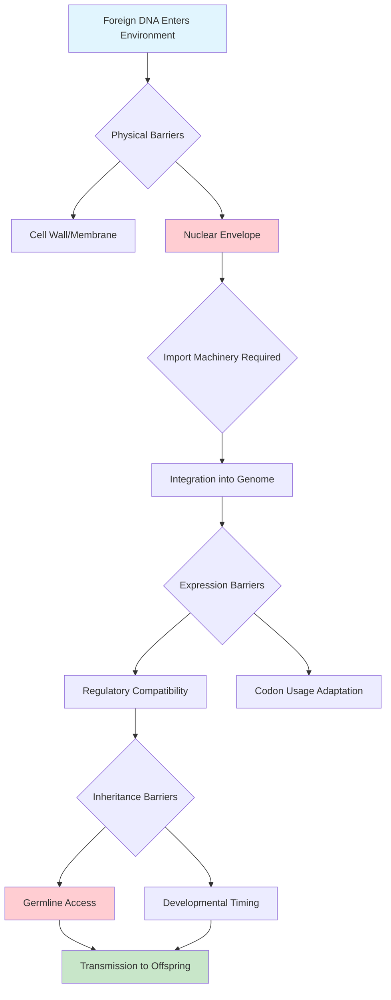

The **nuclear envelope** acts as a critical physical barrier in eukaryotic cells, requiring foreign DNA to utilize host import machinery for nuclear entry[^11]. Unlike prokaryotes, where genetic material exists in the cytoplasm without membrane separation, eukaryotic genomes are compartmentalized within the nucleus, adding an additional step that foreign genetic material must navigate. This barrier is particularly relevant for understanding how bacterial-to-eukaryote transfer occurs, as the demonstrated pathway of trans-kingdom conjugation via type IV secretion systems (T4SS) represents one of the few mechanisms capable of overcoming this obstacle[^11].

**Immune defenses** in multicellular organisms actively work to prevent the incorporation of foreign DNA. Most foreign genetic material entering cells will be broken down by enzymes, and even if foreign material is incorporated into the genome, chemical modification mechanisms can inactivate and eliminate it[^1]. These defensive systems, which evolved to protect against pathogens and parasites, inadvertently create barriers to potentially beneficial horizontal transfer as well.

**Developmental complexity** introduces additional constraints not present in simpler organisms. The intricate regulatory networks controlling gene expression in multicellular eukaryotes mean that even successfully integrated foreign genes may not be expressed appropriately or may interfere with existing developmental programs. The frequency of successful transfers decreases with increased phylogenetic distance between donor and recipient species, reflecting the challenges of genomic compatibility[^4].

Despite these formidable obstacles, available data indicate that **no insurmountable barrier to HGT exists, even in complex multicellular eukaryotes**[^10][^5]. The key insight is that while these barriers dramatically reduce the frequency of successful transfer compared to prokaryotes, they do not eliminate the possibility entirely—and when transfer does succeed, it often represents a significant evolutionary event.

### 1.5 The Weak-Link Model: Explaining HGT Entry Points in Complex Eukaryotes

The weak-link model provides an elegant theoretical framework for understanding how foreign genes can penetrate the defenses of multicellular eukaryotes and achieve stable inheritance despite germline sequestration. This model, which has gained substantial support from observed patterns of HGT in diverse eukaryotic lineages, identifies specific vulnerable stages in organism lifecycles where the barriers to foreign gene entry are reduced or absent[^10][^5].

The central premise of the weak-link model is that **unicellular stages and early developmental stages represent weakly protected entry points** where foreign DNA can be incorporated with greater probability than in mature organisms[^10][^5]. These stages include zygotes, embryos, spores, and other early developmental forms that are exposed to the external environment and may lack the full complement of defensive mechanisms present in differentiated adult tissues. The model elegantly explains how the germline barrier, while significant, can be circumvented through developmental timing.

The mechanism operates as follows: when a plant or animal is exposed to and incorporates foreign DNA during its very early developmental stages, **subsequent cell proliferation and differentiation spread these foreign genes to all tissues, including germ cells**[^5]. This process effectively converts what would otherwise be a somatic acquisition into a heritable genetic change. In organisms with sexual reproduction, the foreign genes present in germ cells give rise to male and female gametes, and subsequent fertilization allows the foreign genetic material to be transmitted to offspring[^10]. For asexual multicellular eukaryotes, propagation of cells carrying foreign genes similarly enables transmission to the next generation.

The weak-link model makes several testable predictions about patterns of HGT in eukaryotes:

| Prediction | Rationale | Supporting Evidence |
|------------|-----------|---------------------|
| **Frequent HGT in unicellular eukaryotes** | All developmental stages represent weak-link entry points | Protists show higher rates of HGT than multicellular organisms |
| **HGT in organisms with exposed early stages** | Fully exposed unicellular or early developmental stages increase vulnerability | Organisms with external fertilization show evidence of HGT |
| **Direct mitotic transmission in unicellular forms** | Foreign genes can be directly passed to offspring without germline complications | Documented HGT in unicellular eukaryotic lineages |

The model also explains why certain ecological relationships facilitate HGT. Organisms that live in biological promiscuity, such as in host-parasite interactions, have increased opportunities for genetic exchange during vulnerable developmental stages[^12]. Parasitic plants that form intimate connections with their hosts through haustoria, for example, create conditions where genetic material can be exchanged during critical developmental windows. Similarly, endosymbiotic relationships provide sustained contact between genomes that can facilitate transfer during susceptible periods.

Importantly, the weak-link model does not suggest that HGT in multicellular eukaryotes is common—rather, it explains why it is possible at all despite the substantial barriers that exist. The model acknowledges that **while isolated germ cells may indeed be barriers to HGT in animals and plants, they are not insurmountable**[^5], providing a mechanistic explanation for the numerous documented cases of successful horizontal transfer in complex organisms.

### 1.6 From Controversy to Recognition: The Shifting Paradigm of Eukaryotic HGT

The scientific understanding of horizontal gene transfer in eukaryotes has undergone a remarkable transformation from initial skepticism to broad acceptance, driven primarily by the accumulating weight of genomic evidence. This paradigm shift represents one of the most significant reconceptualizations in evolutionary biology over the past two decades, with profound implications for how we understand the evolution of plants and animals.

The controversy surrounding eukaryotic HGT stemmed from multiple sources. The assumption that germline sequestration in multicellular organisms would effectively prevent heritable genetic exchange seemed logically sound, and the alternative explanation of endosymbiotic gene transfer from mitochondria and plastids provided a convenient interpretation for bacterial-origin sequences in eukaryotic genomes. Additionally, methodological challenges in distinguishing genuine HGT from other evolutionary processes—including gene loss, incomplete taxon sampling, and contamination—made definitive identification of transfer events difficult[^13].

However, the weight of evidence has now shifted decisively. **HGT in eukaryotes, once controversial, is now well-supported by genomic evidence**[^4]. The discovery of HGT events across all major eukaryotic lineages has established that horizontal transfer has been a regular feature of eukaryotic evolution, not an exceptional occurrence. Recent analyses have documented transfers involving diverse donor-recipient combinations:

- **Bacteria to plants**: T-DNA sequences from *Agrobacterium* found in *Nicotiana glauca*, *Linaria vulgaris*, and sweet potato[^11]
- **Fungi to plants**: The *Fhb7* gene conferring disease resistance transferred from *Epichloe* to wheat relatives[^4][^12]
- **Plants to insects**: The *BtPMaT1* gene enabling whiteflies to detoxify plant compounds[^4][^12][^14]
- **Bacteria to animals**: *Wolbachia* sequences integrated into arthropod genomes[^11]
- **Fungi to animals**: Carotenoid biosynthesis genes transferred to aphids[^7]

A critical reassessment of reported interkingdom HGT cases using updated genomic data found that while many previously reported candidates may be explained by alternative processes, **approximately 29.3% of cases remain consistent with genuine HGT scenarios**[^13]. This finding emphasizes both the reality of eukaryotic HGT and the importance of rigorous phylogenetic analysis in confirming transfer events.

The recognition of eukaryotic HGT carries significant implications beyond evolutionary biology. Understanding the mechanisms and prevalence of HGT in eukaryotes has **contributed to bioengineering tools such as *Agrobacterium*-mediated transformation, CRISPR-Cas technology, and Fanzor-mediated genome editing**[^4]. Insights from natural HGT events have also proven valuable for bioprospecting for novel genes and developing pest management strategies targeting horizontally acquired genes in agricultural pests.

The current scientific consensus recognizes that while HGT in eukaryotes is far less frequent than in prokaryotes, it represents **a significant evolutionary force that has contributed to adaptation and diversification across the tree of life**[^4][^2]. The impact of HGT varies considerably from lineage to lineage, and many of the lineages most affected by HGT remain the least studied at the genomic level, suggesting that the importance of horizontal transfer will likely increase as genomic databases expand[^2]. This shifting paradigm has established the foundation for the detailed examination of specific mechanisms and documented cases that will be explored in subsequent chapters, revealing why these rare transfer events represent some of the most fascinating examples of evolutionary adaptation in complex organisms.

## 2 Mechanisms Enabling Horizontal Gene Transfer in Plants and Animals

The previous chapter established that horizontal gene transfer in multicellular eukaryotes, while rare compared to prokaryotic systems, represents a genuine and significant evolutionary phenomenon. Understanding **how** genetic material crosses species boundaries in plants and animals requires systematic examination of the diverse molecular and ecological pathways that enable such transfers. This chapter dissects each mechanism's operational principles, evaluates their relative contributions to documented HGT events, and provides the mechanistic framework necessary for appreciating the specific case studies presented in subsequent chapters. The diversity of transfer routes—from intimate parasitic connections to viral intermediaries—reveals that eukaryotic HGT is not a single process but rather a collection of distinct pathways, each exploiting different biological relationships and cellular vulnerabilities.

### 2.1 Parasitic Plant Haustorial Connections as HGT Conduits

Parasitic plants have emerged as **the most prolific systems for plant-to-plant horizontal gene transfer**, with over 42% of the more than 600 documented plant-to-plant HGT cases involving parasitic relationships[^15]. This remarkable prevalence stems from the unique biology of parasitic plants, which establish direct vascular connections with their hosts through specialized organs called haustoria. Members of the Orobanchaceae (including *Striga* and *Orobanche*) and Convolvulaceae (including *Cuscuta*, the dodder) families have been particularly well-documented as both donors and recipients of horizontally transferred genes, having acquired hundreds of genes from a diverse range of host plant species[^15].

The haustorium functions as a **physical bridge enabling bidirectional molecular exchange** between parasite and host. This specialized organ penetrates host tissues and connects directly to the xylem and/or phloem vasculature, creating an interface where water, nutrients, and crucially, nucleic acids can move between the two organisms[^15]. The intimacy of this connection is profound—the haustorium establishes prolonged cell-to-cell contact that facilitates the exchange of genetic material at a scale not seen in other plant-plant interactions. Research has documented numerous cases of horizontal transfer involving both nuclear and mitochondrial genes in parasitic plant families, with the frequency of bidirectional mRNA exchange at the haustorial contact zone providing a mechanistic explanation for these observations[^15].

The mechanistic basis for genetic transfer through haustorial connections involves multiple molecular pathways. Transcriptomic surveys have revealed that **mRNA molecules move bidirectionally between parasites and hosts**, suggesting an RNA-based transfer mechanism that could enable gene acquisition if reverse transcription subsequently occurs in recipient cells[^16]. However, evidence also exists for the movement of large genomic DNA regions—in obligate parasitic plants, an estimated 0.1–0.2% of genes originate from HGT events from their hosts, with some transfers involving genomic regions exceeding 100 kilobase pairs[^16]. This scale of transfer suggests that DNA fragments, not merely RNA intermediates, can traverse the haustorial interface.

A classic example illustrating haustorial-mediated HGT is *Striga hermonthica*, which acquired the nuclear gene ShContig948 from its host *Sorghum bicolor*[^4]. The transfer likely occurred via an mRNA or cDNA intermediate, demonstrating that the haustorial connection can facilitate the movement of functional genetic information between distantly related plant species. The preferential transfer of mitochondrial genes in parasitic systems—which constitutes the majority of documented cases—likely reflects unique properties of plant mitochondria, including their **ability to actively uptake DNA and undergo frequent fusion and fission events**[^17]. Additionally, plant mitochondrial genomes possess massive intergenic regions that allow foreign genes to be integrated without disrupting existing functional elements, providing a more permissive genomic environment for horizontal acquisition[^17].

The evolutionary implications of parasitism as an HGT conduit are substantial. Phylogenetic analyses of parasitic plant lineages reveal that HGT has been identified in 10 of the 11 recognized parasitic plant lineages, with evidence suggesting both ancient transfers dating to the late Cretaceous and more recent acquisition events[^17]. Some ancient transfers are broadly shared among related parasites and maintain synteny, suggesting they were acquired from former hosts that may have since gone extinct or are no longer present in the parasite's current geographic range[^17]. This pattern indicates that **HGT can provide insights into historical host associations** that are otherwise invisible in the fossil record, adding a paleobiological dimension to the study of parasitic plant evolution.

### 2.2 Endosymbiotic Relationships and Wolbachia-Mediated Transfer in Animals

Endosymbiotic associations between host eukaryotes and intracellular bacteria represent **particularly favorable conditions for horizontal gene transfer** due to the sustained physical proximity between bacterial and host nuclear genomes. Among these relationships, the intracellular bacterium *Wolbachia pipientis* has emerged as a model system for understanding bacteria-to-eukaryote HGT, demonstrating that such transfers can range from single genes to remarkably large genomic insertions[^18].

The reproductive biology of endosymbiotic bacteria creates unique opportunities for HGT that are not available in free-living bacterial associations. Endosymbiotic bacteria residing in the germ-line cells of their hosts are typically transmitted vertically each generation, meaning they pass from mother to offspring through the egg cytoplasm. This **close reproductive and physical association provides ample opportunities** for both the occurrence of HGT and its subsequent inheritance, as any genetic material transferred to the host germline has the potential for transgenerational transmission[^18]. The sustained nature of these associations—often spanning millions of years of coevolution—means that even rare transfer events can accumulate over evolutionary time.

Surveys of *Wolbachia*-host systems have documented numerous HGT events spanning a remarkable range of scales. In *Drosophila ananassae*, researchers discovered that **the entire *Wolbachia* genome had been inserted into the host nuclear genome**, representing one of the most dramatic examples of bacteria-to-eukaryote HGT ever documented[^18]. Similarly, in the beetle *Callosobruchus chinensis*, approximately 30% of the *Wolbachia* genome has been transferred to the host beetle genome[^18]. These large-scale transfers demonstrate that the barriers to HGT in animals, while substantial, can be overcome when the ecological conditions are favorable.

The functional status of transferred sequences varies considerably among documented cases. Although most of the genes observed in these large transfers appear to be nonfunctional—accumulating mutations and becoming pseudogenes over time—**approximately 2% of the transferred genes in the *D. ananassae* genome show evidence of being actively transcribed**[^18]. This finding illustrates that HGT from a bacterial symbiont to its host can provide novel functions, even when the majority of transferred material degrades into non-functional genomic debris. The persistence of even a small fraction of functional genes represents a significant source of evolutionary innovation, as these genes may confer adaptive benefits that would otherwise require extensive evolutionary time to develop through conventional mutational processes.

The mechanism by which genetic material moves from endosymbiont to host nucleus likely involves multiple pathways. The physical breakdown of bacterial cells within host cytoplasm releases DNA that can potentially be taken up by the host nucleus. Additionally, the type IV secretion systems (T4SS) employed by many intracellular bacteria for delivering effector proteins could potentially mediate DNA transfer directly. The observation that transferred sequences often include bacterial genes involved in diverse functions—rather than being limited to specific gene categories—suggests that the transfer process itself may be relatively non-selective, with subsequent selection determining which transferred genes are retained in functional form.

### 2.3 Agrobacterium-Mediated Natural Transformation

The interaction between *Agrobacterium* species and plants represents **the best-characterized interkingdom HGT pathway** from bacteria to eukaryotes, providing both a natural mechanism for gene transfer and the foundation for modern plant genetic engineering[^4]. While *Agrobacterium*-mediated transformation has been extensively exploited in biotechnology, the discovery of naturally occurring T-DNA sequences in wild plant genomes demonstrates that this transfer mechanism has been operating throughout evolutionary history, creating natural transgenic plants long before human intervention.

*Agrobacterium tumefaciens* and *A. rhizogenes* are soil bacteria that cause crown gall disease and hairy root disease, respectively, by performing interkingdom genetic transfer. Pathogenic strains carry tumor-inducing (Ti) or root-inducing (Ri) plasmids, from which a specific segment called T-DNA is transferred and integrated directly into the plant's nuclear genome[^4]. This transfer is mediated by a sophisticated molecular machinery, including the type IV secretion system (T4SS), which delivers the T-DNA along with associated virulence proteins into plant cells. The T-DNA then integrates into the plant chromosome through a process that exploits the host's DNA repair machinery.

The discovery of **cellular T-DNA (cT-DNA) sequences in untransformed plants** approximately 30 years ago provided the first evidence that *Agrobacterium*-mediated transformation occurs naturally[^19][^20]. In *Nicotiana glauca*, researchers identified sequences homologous to the T-DNA of the Ri plasmid of *A. rhizogenes*, organized as an imperfect inverted repeat containing homologs of several T-DNA oncogenes (*NgrolB*, *NgrolC*, *NgORF13*, *NgORF14*) and an opine synthesis gene (*Ngmis*)[^19][^20]. Similar cT-DNA has been found in other species of the genus *Nicotiana*, and phylogenetic analyses suggest there have been **no fewer than two independent acts of *Agrobacterium*-mediated transformation** in the evolution of *Nicotiana* species[^20].

More recently, T-DNA has been detected and characterized in *Linaria vulgaris* (common toadflax) and *L. dalmatica*[^19][^20]. In *L. vulgaris*, the cT-DNA is present in two copies organized as a tandem imperfect direct repeat, containing a comprehensive set of T-DNA genes including *LvrolA*, *LvrolB*, *LvrolC*, and the *Lvmis* opine synthesis gene[^19]. All *L. vulgaris* and *L. dalmatica* plants screened contained the same T-DNA oncogenes and the *mis* gene, indicating that these sequences have become fixed in these species' genomes. The cultivated sweet potato (*Ipomoea batatas*) stands as another intriguing example of an *Agrobacterium*-mediated natural transgenic food crop, demonstrating that humans have unknowingly consumed naturally transgenic plants for millennia[^4][^16].

The persistence of cT-DNA in these plant lineages suggests that **horizontally transferred genes may confer selective advantages**. Proposed functions include increasing root mass leading to drought tolerance, altering the soil microbiome via opine secretion (which may benefit *Agrobacterium*-associated bacteria), and activating secondary metabolism which may contribute to pest resistance[^20]. The *rolC* homolog is the most conserved gene among the cT-DNA genes found in both *Nicotiana* and *Linaria*, suggesting it may provide the most significant adaptive benefit[^20]. Researchers have speculated that ancient plants transformed by *A. rhizogenes* might have acquired selective advantages in competition with parental species, potentially contributing to speciation events[^19].

Notably, the documented cases of natural *Agrobacterium*-mediated HGT thus far involve transformation by *A. rhizogenes* rather than *A. tumefaciens*[^20]. Additionally, contrary to earlier assumptions, the rate of HGT does not necessarily increase when bacteria share a niche with a plant, and the gene flow is **highly asymmetric, with significantly more genes moving from bacteria to plants than the reverse**[^4]. This asymmetry reflects the specialized molecular machinery that *Agrobacterium* has evolved for transferring DNA into plant cells—a machinery that plants lack for reciprocal transfer.

### 2.4 Grafting as a Mechanism for Plant-to-Plant Genetic Exchange

Grafting—the joining of vascular tissues from two distinct plants—represents an important mechanism for HGT that operates independently of parasitic relationships. While grafting is most commonly associated with agricultural practices, natural grafting events occur in wild plant populations, and both contexts provide opportunities for genetic exchange across species boundaries[^4][^15][^16].

Experimental studies in *Nicotiana* species have demonstrated that grafting can result in the **transfer of nuclear, mitochondrial, and plastid genomes** between stock and scion[^4]. The movement of genetic material across graft junctions involves multiple mechanisms, with chloroplast DNA being exchanged through cell wall pores in a phenomenon known as "plastid capture"[^4]. This process can have profound evolutionary consequences—complete chloroplast transfer and the regeneration of allopolyploid plants from graft sites have been demonstrated experimentally, suggesting that grafting can serve as a route for the formation of new plant species[^4][^16].

The mechanism of genetic transfer during grafting involves the fusion of tissues at the graft junction, creating opportunities for cell-to-cell contact and the movement of genetic material. Experiments have documented the movement of mRNAs, small RNAs, and genomic DNA across graft interfaces[^16]. The efficiency of transfer decreases with increasing genetic divergence between the grafted species, suggesting that **compatibility at the cellular level influences the success of genetic exchange**[^15]. Nevertheless, even distantly related species can exchange genetic material through grafting under appropriate conditions.

Natural grafting occurs when roots or branches of different plants come into contact and fuse, creating permanent vascular connections similar to those established in agricultural grafting. This phenomenon is most common in dense forest environments where root systems of neighboring trees intermingle, and in species with growth habits that promote physical contact between individuals. The ecological context of natural grafting suggests that it may be particularly relevant for HGT in perennial woody plants and in species that form dense stands.

An intriguing observation relates to **rhizomatous grasses, which acquire significantly more genes through HGT** than non-rhizomatous species[^4]. This pattern likely reflects the fact that rhizomatous growth habits boost opportunities for transfer into the germline. Rhizomes are underground stems that can give rise to new shoots, and their lateral growth through soil brings them into contact with roots and rhizomes of neighboring plants. When genetic material is transferred to rhizome tissues, it has the potential to be incorporated into new shoots that will eventually produce flowers and seeds, providing a pathway for transgenerational inheritance of horizontally acquired genes.

### 2.5 Viral Vectors and Endogenous Viral Elements

Viruses have been proposed as **prime candidate vectors for horizontal gene transfer** because they are infectious, can be horizontally transmitted between hosts, and regularly integrate their genetic material into host genomes[^21]. The role of viruses in eukaryotic HGT operates through two primary mechanisms: the integration of viral sequences themselves into host genomes (forming endogenous viral elements, or EVEs), and the virus-mediated transfer of host genetic material between species.

Virus-mediated HGT can be conceptualized as a two-step process: first, a virus acquires a fragment of host genetic material; second, this virus-borne fragment is integrated into the genome of another host during subsequent infection[^21]. Recent evidence from high-throughput sequencing of viral populations and paleovirology demonstrates that **both virus-to-host and host-to-virus gene flow can be common** in a variety of eukaryote lineages[^21]. The discovery of numerous and diverse EVEs reinforces the idea that viruses may serve as important vectors of HGT in eukaryotes.

The most common EVEs in plants are **endogenous caulimovirids (ECVs)**, ancient viral DNA from the *Caulimoviridae* family now found scattered across the genomes of numerous vascular plant species[^4]. These integrated sequences are not merely genomic fossils—they represent major drivers of plant evolution. A striking example is the acquisition of a viral cellulose synthase gene, which is correlated with the evolution of the cellulose-based cell wall in Streptophytes[^4]. Plant genomes also contain genetic "footprints" from past infections by giant viruses, demonstrating that HGT from viruses has been fundamental in shaping core plant biology[^4].

Host-to-virus horizontal transfer of genetic material occurs at measurable frequencies in some virus populations. A substantial fraction of genes encoded by large double-stranded DNA viruses—up to 30% in some herpesviruses—have been captured from eukaryotic hosts[^21]. Host sequence insertions, including transposable elements, have also been identified in RNA viruses[^21]. Importantly, for a gene or transposable element to be transferred from one host to another via a virus, it does not necessarily need to become fixed in the viral population; many host sequences may be regularly introduced into viral genomes and persist at very low frequencies, providing ongoing opportunities for transfer[^21].

Direct evidence for virus-mediated HGT between eukaryotic species comes from the study of bracoviruses, which are symbiotic viruses associated with parasitoid wasps. Researchers discovered that **hymenopteran (wasp) genes have been transferred into the genomes of lepidopteran (moth and butterfly) hosts via bracoviruses**[^21]. This finding provides proof of concept that viruses can mediate gene transfer between highly divergent eukaryotic species, bridging gaps that would be difficult to cross through other mechanisms.

Additional evidence for virus-mediated transfer comes from studies of baculoviruses, which infect insects and have been found to contain host transposable elements[^22][^16]. The cucumber necrosis virus has been shown to encapsidate host transposable elements, and subsequent studies revealed a continuum influx of moth genetic material into baculovirus genomes[^22]. These observations support the role of viruses as major vectors of HGT in eukaryotes, particularly for the transfer of transposable elements.

### 2.6 Horizontal Transposon Transfer Across Species Boundaries

Horizontal transposon transfer (HTT) represents **the most extensively documented form of HGT in eukaryotes**, with more than 2,800 HTT events described and catalogued in a dedicated database[^22]. The prevalence of HTT reflects the unique properties of transposable elements (TEs) that make them particularly prone to horizontal movement—properties that distinguish them from typical protein-coding genes and explain why TEs dominate the landscape of eukaryotic HGT.

Transposable elements are mobile genetic units that can move within and between genomes. Their propensity for horizontal transfer stems from several characteristics: TEs exist as **extrachromosomal forms during the transposition process**, providing mobile intermediates that can potentially be transferred between organisms[^16]. Additionally, HTT may represent a survival mechanism for TEs, allowing them to escape host silencing mechanisms that would otherwise suppress their activity[^16]. This "selfish gene" perspective suggests that horizontal transfer benefits the TEs themselves by providing access to new genomic environments where silencing has not yet evolved.

The scale of HTT in plants is remarkable. A comprehensive study analyzing 40 plant genomes identified 32 new HTT events involving LTR retrotransposons; based on extrapolation from the total number of monocot and eudicot species, researchers estimated that **around 2 million HTT events could have taken place among flowering plants within a 3-million-year timeframe**[^22]. A genome-wide survey similarly estimated that hundreds of thousands of HTTs have occurred among flowering plants within the last two million years[^16]. These estimates suggest that HTT is not a rare curiosity but a pervasive force shaping plant genome evolution.

Different classes of transposable elements show varying propensities for horizontal transfer:

| TE Class | Transfer Frequency | Notable Examples |
|----------|-------------------|------------------|
| **Tc1/Mariner DNA transposons** | Highest | Responsible for majority of HTT events in insects (1,087 of 2,248 events)[^22] |
| **LTR-retrotransposons** | High | Route66 among grasses; Copia25 across angiosperms[^16] |
| **Helitrons** | Moderate-High | Second most common in insect HTT studies[^22] |
| **LINE/RTE** | Moderate | Rex-Babar prominent in teleost fishes[^23] |
| **LINE 1** | Low | Rarely transferred despite high copy numbers[^23] |
| **Endogenous retroviruses** | Very Low | Few documented host switches between vertebrate classes[^23] |

In animals, an extensive analysis of 195 insect species revealed at least 2,248 HTT events[^22]. This large dataset demonstrated a **significant negative correlation between the number of HTT events and species divergence**, indicating that closely related species share more TEs through horizontal transfer. Species originating from the same geographic region also shared more TEs by HTT, suggesting that ecological proximity facilitates transfer[^22]. Among vertebrates, a study of 307 species identified 975 independent HTT events, with ray-finned fishes (Actinopterygii) contributing the vast majority (93.7%) despite representing only 64 of the 307 studied genomes[^23].

Evidence for HTT vectors is accumulating. Laboratory experiments provided direct evidence that the mite *Proctolaelaps regalis* could carry the *P* element, identifying it as a probable vector for this classic example of HTT in *Drosophila*[^22]. The triatomine bug *Rhodnius prolixus* was found to harbor transposons with high sequence identity to opossum and squirrel monkey sequences, suggesting that blood-feeding insects may serve as vectors for HTT between vertebrate hosts[^22]. Baculoviruses have been implicated as vectors based on the presence of moth TEs in their genomes and evidence of continual influx of host genetic material[^22].

The evolutionary impact of HTT extends beyond simply adding new sequences to genomes. Transferred TEs contribute on average 2% of the insect genome, but this can reach up to 24% for some species[^22]. HTT and subsequent transposition bursts can be associated with speciation events and the emergence of new genes, as seen in the co-option of a DNA transposon in murine rodents[^22]. The well-characterized *P* element invasion in *Drosophila* caused a hybrid dysgenesis phenotype characterized by sterility and elevated mutation rates, demonstrating that HTT can have immediate and dramatic phenotypic consequences[^22].

### 2.7 External Fertilization, Illegitimate Pollination, and Animal-Specific Transfer Routes

Beyond the mechanisms discussed above, several additional pathways contribute to HGT in specific lineages, reflecting the diversity of reproductive strategies and ecological interactions across plants and animals. These mechanisms, while perhaps less universal than parasitism or transposon transfer, provide important routes for genetic exchange in particular taxonomic groups.

**Illegitimate pollination** has been proposed as a mechanism for HGT particularly relevant to wind-pollinated species like grasses, where heterospecific pollen can deliver exogenous DNA into the ovule even if fertilization fails[^15]. In this scenario, pollen from one species lands on the stigma of another species, and while successful fertilization may not occur, DNA from the pollen grain can potentially be taken up by ovule cells and integrated into the genome. This mechanism may explain why HGT outside parasitic systems is concentrated in the Poaceae (grass) family, with over 95% of reported non-parasitic plant-to-plant HGT events occurring within this group[^15]. The grass *Alloteropsis semialata* has acquired 59 functional genes from at least nine different donor grasses, with illegitimate pollination proposed as a likely mechanism[^4].

**Sperm-mediated gene transfer (SMGT)** represents a controversial but intriguing mechanism with potential relevance to animal HGT. Research has demonstrated that mature spermatozoa can act as vectors of genetic material, binding and internalizing exogenous DNA molecules that can then be delivered to embryos at fertilization[^24][^25]. The binding of exogenous DNA to sperm cells is not a casual event but a regulated process mediated by specific DNA-binding proteins (DBPs) on the sperm cell's surface[^25]. Interestingly, an **endogenous retrotransposon-encoded reverse transcriptase activity** has been identified in sperm cells, capable of reverse transcribing exogenous RNA molecules into cDNA copies[^24].

The reverse-transcribed molecules generated through SMGT are propagated in tissues as low-copy extrachromosomal structures with mosaic distribution, are transcriptionally competent, can induce phenotypic variations, and can be sexually transferred from one generation to the next in a non-Mendelian fashion[^24]. These observations suggest that sperm-mediated gene transfer is fundamentally a retrotransposon-mediated phenomenon. However, SMGT remains controversial because natural barriers exist against it, including an inhibitory factor in seminal fluid that blocks DNA binding and a sperm endogenous nuclease activity triggered upon interaction with foreign DNA[^25]. These protections minimize unintentional interactions and explain the inconsistent experimental outcomes observed in SMGT studies.

The dramatic difference in HTT rates between **ray-finned fishes and terrestrial vertebrates** provides insights into environmental factors affecting HGT. Among 307 vertebrate genomes analyzed, ray-finned fishes contributed 93.7% of detected HTT events despite representing only 21% of the studied species, while mammals and birds together accounted for less than 3% of events despite representing 71% of species[^23]. This disparity suggests that aquatic environments may facilitate genetic exchange through mechanisms not available to terrestrial organisms. Potential explanations include the external release of gametes during spawning (providing opportunities for DNA uptake), the presence of waterborne vectors, and the higher density of potential donor organisms in aquatic ecosystems.

Ecological interactions beyond parasitism also contribute to HGT opportunities. Close physical interactions in natural ecosystems—such as those between lianas and their host trees, or between roots and soil microbiota—offer potential pathways for genetic exchange[^15]. Predator-prey relationships and parasitism by organisms other than plants (such as nematodes and blood-feeding insects) may facilitate DNA transfer between species that would not otherwise come into genetic contact. The triatomine bug example mentioned above, harboring transposons similar to those of its mammalian blood meal hosts, illustrates how feeding relationships can create HGT opportunities.

### 2.8 Comparative Evaluation of Mechanism Frequency and Evolutionary Impact

Synthesizing the diverse mechanisms examined in this chapter reveals a complex landscape of HGT pathways, each with distinct frequencies, taxonomic relevance, and evolutionary implications. Understanding the relative importance of these mechanisms provides essential context for interpreting documented HGT cases and predicting where future discoveries are most likely to emerge.

**Bacteria represent the most frequent donors of horizontally transferred genes to plants**, with more than 800 genes reported to have been acquired from bacterial sources[^15]. This dominance reflects both the abundance of bacteria in plant-associated environments and the existence of specialized transfer machinery (particularly in *Agrobacterium*) that has evolved specifically for interkingdom DNA transfer. Fungi are also significant donors, with approximately 20 well-supported fungal-to-plant HGT events described[^15], while viruses—particularly from the *Caulimoviridae* family—represent another important source of foreign genes[^15].

For plant-to-plant HGT, **parasitic relationships dominate the documented cases**, accounting for over 42% of the more than 600 reported events[^15]. The remaining plant-to-plant transfers are heavily concentrated in the grass family (Poaceae), likely reflecting the combination of wind pollination (enabling illegitimate pollination) and rhizomatous growth habits (providing germline access for somatically acquired genes)[^4][^15]. The frequency hierarchy for plant HGT mechanisms can be summarized as:

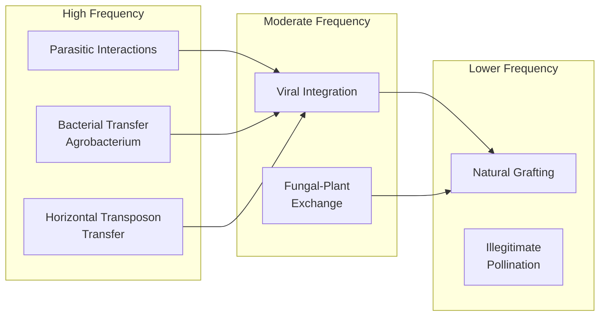

In animals, **endosymbiotic relationships—particularly with *Wolbachia*—represent a major route for bacterial-to-animal HGT**, while horizontal transposon transfer dominates animal-to-animal genetic exchange[^18][^22][^23]. Plant-to-animal HGT events are rare but significant when they occur; the acquisition of plant genes by whiteflies represents a remarkable example of cross-kingdom transfer with clear adaptive significance[^15]. The concentration of HTT events in ray-finned fishes compared to mammals and birds suggests that reproductive biology and environmental context strongly influence HGT frequency in animals[^23].

Several factors determine whether transferred genetic material achieves **stable integration and transgenerational inheritance** versus remaining as transient genomic insertions:

1. **Germline access**: Transfer must occur in germ cells or in somatic tissues that can give rise to germ cells or new individuals via vegetative reproduction[^15]. This is more readily achieved in plants, where germ cells arise from somatic tissues and vegetative propagation is common.

2. **Integration mechanism**: If transferred material is mRNA, it must undergo reverse transcription into complementary DNA before genomic integration[^15]. Most documented HGTs involve DNA transfer, as evidenced by the presence of introns in transferred genes[^15].

3. **Genomic compatibility**: The integration of foreign DNA may be facilitated by transposable elements, which can provide the enzymatic machinery for insertion[^15]. Mitochondrial genomes, with their large intergenic regions, provide particularly permissive environments for integration[^17].

4. **Expression compatibility**: Successfully integrated genes must be expressed appropriately in the new genomic context, requiring compatibility with host regulatory elements.

5. **Selective advantage**: Genes that confer adaptive benefits are more likely to be retained over evolutionary time, while neutral or deleterious transfers will be lost through drift or purifying selection.

The analysis of selective constraints acting on horizontally transferred TEs reveals that **HTT incurs purifying selection (conserved protein evolution) on all TE types**[^23]. In the absence of HTT, DNA transposons appear to evolve neutrally within genomes, unlike most retrotransposons, which evolve under purifying selection even without horizontal transfer[^23]. This selection regime indicates that proteins of most retrotransposon families tend to process their own encoding RNA (cis-preference), helping retrotransposons persist within host lineages over long time periods[^23].

The mechanisms examined in this chapter collectively demonstrate that HGT in plants and animals is not a single process but a diverse collection of pathways, each exploiting different biological relationships and cellular vulnerabilities. While the frequency of successful transfer remains far lower than in prokaryotes, the diversity of mechanisms ensures that genetic exchange across species boundaries is an ongoing feature of eukaryotic evolution. The specific cases documented in subsequent chapters will illustrate how these mechanisms have operated in practice, producing transfers with significant evolutionary and adaptive consequences.

## 3 Documented Cases of Horizontal Gene Transfer in Plants

The previous chapters established the theoretical framework and mechanistic pathways enabling horizontal gene transfer in multicellular eukaryotes. This chapter transitions from mechanism to evidence, providing a comprehensive survey of confirmed HGT events in plant systems that collectively demonstrate the reality and significance of cross-species genetic exchange. These documented cases span diverse transfer categories—from bacterial T-DNA integration to massive mitochondrial gene replacement in parasitic plants—and represent some of the most compelling evidence that HGT shapes plant evolution in ways that were unimaginable just decades ago. Each case study reveals not merely that transfer occurred, but often **why** the transferred genes persisted: they conferred adaptive advantages that enabled recipient plants to survive challenges ranging from fungal pathogens to environmental stress.

### 3.1 Agrobacterium T-DNA Integration in Wild Plant Genomes

The discovery of naturally occurring T-DNA sequences in untransformed plant species provided the first definitive evidence that *Agrobacterium*-mediated transformation has operated throughout evolutionary history, creating natural transgenic plants long before human biotechnology. These cellular T-DNA (cT-DNA) sequences, found in species that have never been deliberately transformed, demonstrate that the molecular machinery exploited in modern plant genetic engineering represents a natural phenomenon with ancient evolutionary roots.

**The *Nicotiana* genus provides the foundational examples of natural *Agrobacterium*-mediated HGT**. In *Nicotiana glauca*, researchers identified sequences homologous to the T-DNA of the Ri plasmid of *Agrobacterium rhizogenes*, organized as an imperfect inverted repeat containing homologs of several T-DNA oncogenes. The cT-DNA in *N. glauca* includes *NgrolB*, *NgrolC*, *NgORF13*, and *NgORF14*, along with an opine synthesis gene (*Ngmis*). Similar cT-DNA sequences have been found in other species within the genus *Nicotiana*, and phylogenetic analyses indicate that **no fewer than two independent acts of *Agrobacterium*-mediated transformation** occurred during the evolution of *Nicotiana* species. This pattern of multiple independent acquisitions suggests that *Agrobacterium*-mediated HGT is not a singular anomaly but rather a recurrent phenomenon in plant evolution.

The discovery of T-DNA in *Linaria vulgaris* (common toadflax) and *L. dalmatica* extended the documented range of natural *Agrobacterium*-mediated transformation beyond the Solanaceae family. In *L. vulgaris*, the cT-DNA is present in two copies organized as a tandem imperfect direct repeat, containing a comprehensive set of T-DNA genes including *LvrolA*, *LvrolB*, *LvrolC*, and the *Lvmis* opine synthesis gene. Importantly, **all *L. vulgaris* and *L. dalmatica* plants screened contained the same T-DNA oncogenes and the *mis* gene**, indicating that these sequences have become fixed in these species' genomes rather than representing polymorphic insertions. This fixation suggests that the transferred genes have been maintained by selection over evolutionary time.

The persistence of cT-DNA in these plant lineages raises compelling questions about potential selective advantages conferred by the transferred genes. Several hypotheses have been proposed to explain why these bacterial-origin sequences have been retained:

| Proposed Function | Mechanism | Supporting Evidence |
|-------------------|-----------|---------------------|
| **Enhanced root development** | *rol* genes alter auxin sensitivity, increasing root mass | Potential drought tolerance advantage |
| **Microbiome modification** | Opine secretion via *mis* genes alters rhizosphere community | May benefit *Agrobacterium*-associated bacteria |
| **Secondary metabolism activation** | *rol* genes can activate secondary metabolite pathways | Potential contribution to pest resistance |

The *rolC* homolog is the most conserved gene among the cT-DNA genes found in both *Nicotiana* and *Linaria*, suggesting it may provide the most significant adaptive benefit[^4]. Researchers have speculated that ancient plants transformed by *A. rhizogenes* might have acquired selective advantages in competition with parental species, potentially contributing to speciation events. Notably, all documented cases of natural *Agrobacterium*-mediated HGT thus far involve transformation by *A. rhizogenes* rather than *A. tumefaciens*, suggesting that the specific genetic cargo of the Ri plasmid may be more compatible with stable, beneficial integration than the Ti plasmid oncogenes[^4].

### 3.2 Sweet Potato as a Natural Transgenic Food Crop

The cultivated sweet potato (*Ipomoea batatas*) represents **one of the most compelling examples of ancient *Agrobacterium*-mediated HGT** and carries profound implications for public understanding of transgenic organisms. The discovery that this staple food crop—consumed by humans for millennia—contains bacterial T-DNA sequences demonstrates that genetic modification across species boundaries is not exclusively a product of modern biotechnology but a natural evolutionary process.

The identification of T-DNA sequences in sweet potato emerged unexpectedly during metagenomic analysis of small interfering RNAs. Researchers discovered sequences homologous to *Agrobacterium* T-DNA and subsequently confirmed through multiple methodologies that the cultivated sweet potato genome contains two distinct T-DNA regions, designated **Ib T-DNA1 and Ib T-DNA2**[^26]. Both T-DNA regions are actively expressed, with transcripts detected across different sweet potato tissues, indicating that these foreign genes have been integrated into the plant's functional genetic repertoire.

The gene content of these two T-DNA regions reflects their bacterial origins while suggesting potential adaptive functions:

**Ib T-DNA1** contains four open reading frames with homology to:
- Tryptophan-2-monooxygenase gene (*iaaM*) from *Agrobacterium*
- Indole-3-acetamide hydrolase gene (*iaaH*) from *Agrobacterium*
- C protein gene (C-prot)
- Agrocinopine synthase gene (*Acs*)[^26]

**Ib T-DNA2** contains at least five open reading frames with significant homology to genes from *A. rhizogenes*, including *ORF14*, *ORF17n*, *RolB/RolC*, *ORF13*, and *ORF18/ORF17n*[^26].

The distribution of these T-DNA sequences across sweet potato germplasm provides crucial insights into the timing and evolutionary significance of the transfer events. In a survey of 291 cultivated sweet potato accessions, **Ib T-DNA1 was detected in all samples**, while it was absent from close wild relatives outside the series Batatas[^26]. Ib T-DNA2 showed a different distribution pattern, being detected in 45 of 217 genotypes that included both cultivated and wild forms[^26]. This differential distribution suggests that the two T-DNA insertions occurred at different times in sweet potato evolutionary history.

Subsequent research demonstrated that these HGT events are not confined to the hexaploid cultivated sweet potato but extend to related species within series Batatas[^27]. Both Ib T-DNA1 and Ib T-DNA2 were found in the tetraploid form of *I. batatas* (Ib 4x) with highly similar sequences and at the same genomic loci as in cultivated sweet potato. Furthermore:

- **Ib T-DNA1** was detected in *I. cordatotriloba* and *I. tenuissima*
- **Ib T-DNA2** was detected in *I. trifida*
- No Ib T-DNA genes were found in *Ipomoea* species outside series Batatas or in species from related genera[^27]

Phylogenetic analyses of Ib T-DNA1 genes showed that hexaploid and tetraploid *I. batatas* accessions group together, with wild relatives forming a sister clade[^27]. The analysis of insertion sites confirmed that hexaploid and tetraploid *I. batatas* share the same T-DNA insertion locations—Ib T-DNA1 inserted into an intron of an F-box gene, while Ib T-DNA2 inserted into a UcpB gene—providing strong evidence for common ancestry rather than independent acquisition events[^26][^27].

The estimated age of these insertions provides a remarkable window into ancient HGT. Pairwise comparisons showed nucleotide sequence identities above 99% for T-DNA genes within the sweetpotato group (hexaploid and tetraploid *I. batatas*), while identities between the sweetpotato group and wild relatives ranged from 96% to 98.8%[^27]. Analysis of divergence between the two inverted repeat copies of Ib T-DNA1 in the hexaploid genome was 1.2%, suggesting an estimated age of **approximately 1.7 million years** for the insertion[^27]. This ancient acquisition indicates that the T-DNA sequences have been stably inherited through countless generations of sexual reproduction.

The implications of these findings extend beyond evolutionary biology to public discourse on genetically modified organisms. **Since sweet potato has been consumed by humans for thousands of years, this discovery challenges the perception that transgenic crops are inherently "unnatural"**[^26]. The presence of bacterial T-DNA in a staple food crop that has sustained human populations across the globe demonstrates that the boundaries between "natural" and "transgenic" are far more permeable than commonly assumed.

### 3.3 Massive Mitochondrial Gene Transfer in Parasitic Plants

Parasitic plants have provided the most dramatic evidence for HGT in plant systems, with some lineages showing **replacement of a substantial fraction of their mitochondrial genomes** through horizontal acquisition from host species. The Rafflesiaceae family, which includes the famous *Rafflesia* genus known for producing the world's largest flowers, exemplifies this phenomenon with quantitative evidence demonstrating HGT on an unprecedented scale.

A comprehensive phylogenomic study of the holoparasite *Rafflesia cantleyi* and related species revealed that **24%-41% of mitochondrial gene sequences show evidence of HGT**, depending on the species examined[^28][^29]. This analysis used next-generation sequencing to obtain 38 protein-coding and ribosomal RNA genes common to angiosperm mitochondrial genomes from *R. cantleyi* and five additional species, including two of its closest relatives and two host species from the Vitaceae family. The striking finding was that roughly one-quarter to nearly half of the mitochondrial genetic repertoire in these parasites derives from horizontal transfer rather than vertical inheritance.

The specific frequencies of HGT varied among the three holoparasitic Rafflesiaceae species examined:

| Species | HGT Frequency (Conservative) | HGT Frequency (Less Conservative) |
|---------|------------------------------|-----------------------------------|
| *Rafflesia cantleyi* | 24% | 29% |
| *Rafflesia tuan-mudae* | 26% | 32% |
| *Sapria himalayana* | 41% | 47% |[^29]

These estimates used phylogenetic analyses with a conservative 70% bootstrap percentage threshold to identify gene sequences whose placement was inconsistent with vertical inheritance from Rafflesiaceae ancestors. Statistical tests rejected vertical placement of these putative transgenic sequences in 18 of 21 cases, providing robust support for the HGT interpretation[^29].

Crucially, the horizontally transferred sequences in Rafflesiaceae are not merely genomic fossils. **Most transgenic sequences possess intact reading frames and are actively transcribed**, indicating they are potentially functional[^28][^29]. All transgenes in *R. cantleyi* show evidence of active transcription, suggesting they have functional promoters and likely play roles in cellular function[^29]. This functional persistence distinguishes these transfers from the degraded pseudogenes that characterize many HGT events, indicating that the acquired genes have been maintained by selection.

The mechanism of gene integration appears to involve **homologous recombination**, which has displaced native genes with their horizontally acquired counterparts. Evidence for this mechanism comes from several observations:

1. For genes that included only transgenic copies in Rafflesiaceae, all had homologs present in the mitochondrial genome of their close relative *Ricinus*, suggesting native copies were present ancestrally and were subsequently displaced by transgenic homologs[^29]
2. Some transgenes maintain synteny with their donor and recipient lineages, supporting integration via recombination rather than random insertion[^28][^29]
3. Seven assembled contigs demonstrated that synteny was maintained between transgenes from Rafflesiaceae and genes from *Vitis*, a close relative of their Vitaceae hosts[^29]
4. Two transgenes bear introns, supporting the suggestion that transgenes are transferred as larger DNA fragments rather than processed mRNA[^29]

The temporal framework for these transfers reveals both ancient and recent acquisition events. For five genes, phylogenetic evidence suggests ancient HGT events, as transgenic sequences from *Rafflesia* and *Sapria* form a clade and some transgenes maintain synteny between them[^29]. These transfers appear to have occurred **after the origin of stem group Rafflesiaceae (83.1–109.5 Ma) and before the origin of crown group Rafflesiaceae (69.5–95.9 Ma)**[^29]. Intriguingly, this timing predates the estimated age of stem group *Tetrastigma* (36.4–65.3 Ma), the current host genus, raising the possibility that Rafflesiaceae had former host associations with other plant lineages that served as past donors of transgenes[^29].

The substantially higher rate of mitochondrial versus nuclear HGT in these parasitic systems is noteworthy. While approximately 2.1% of nuclear gene transcripts in *R. cantleyi* appear to be host-derived, the frequency of mitochondrial HGT (24-41%) is **an order of magnitude higher**[^28][^29]. This disparity likely reflects unique properties of plant mitochondria, including their ability to actively uptake DNA, their frequent fusion and fission events that could facilitate DNA exchange, and their massive intergenic regions that provide permissive environments for foreign gene integration.

### 3.4 Nuclear Gene Transfers in Parasitic Plant Systems

While mitochondrial HGT dominates the documented cases in parasitic plants, nuclear gene transfers also occur and carry important implications for understanding how parasites adapt to their hosts. These nuclear acquisitions, though less frequent than mitochondrial transfers, demonstrate that the haustorial connection can facilitate exchange of genetic material destined for the nuclear genome.

The acquisition of the nuclear gene ShContig948 by *Striga hermonthica* from its host *Sorghum bicolor* represents a well-characterized example of nuclear HGT in parasitic plants[^4]. This transfer is particularly informative because molecular features of the transferred sequence provide clues about the transfer mechanism. **The presence of a poly-A-like sequence at the gene's 3′ end strongly suggests the transfer occurred via an mRNA or cDNA intermediate** rather than direct DNA transfer[^4]. This observation supports the hypothesis that mRNA molecules moving through haustorial connections can be reverse-transcribed and integrated into recipient genomes, providing a pathway for nuclear gene acquisition that parallels retrotransposon activity.

The broader pattern of nuclear HGT in holoparasites extends beyond individual gene transfers. In *Rafflesia cantleyi*, phylogenomic analysis demonstrated that **approximately 2.1% of nuclear gene transcripts were likely acquired from its obligate host**[^28][^29]. While this percentage is substantially lower than the 24-41% observed for mitochondrial genes, it nevertheless represents a significant contribution of foreign genetic material to the nuclear genome. The functional categories of these transferred nuclear genes and their potential contributions to parasitic lifestyle remain active areas of investigation.

The contrast between mitochondrial and nuclear HGT frequencies in parasitic plants likely reflects fundamental differences in organellar versus nuclear genome biology:

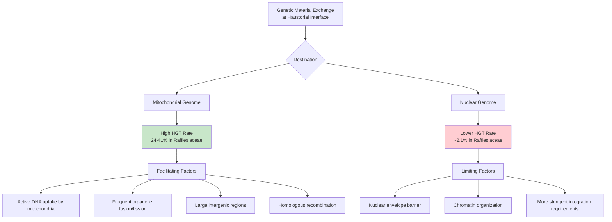

The evolutionary implications of nuclear HGT in parasitic plants are substantial. Acquired genes could potentially provide parasites with host-derived functions that facilitate the parasitic lifestyle, such as enzymes for manipulating host metabolism or proteins that suppress host immune responses. The observation that HGT has been identified in 10 of the 11 recognized parasitic plant lineages suggests that horizontal acquisition may be a general feature of parasitic plant evolution, contributing to the remarkable diversity of parasitic strategies observed across the plant kingdom.

### 3.5 Horizontal Transposon Transfer Among Flowering Plants

Horizontal transposon transfer (HTT) represents **the most extensively documented and quantitatively significant form of HGT in plants**, with evidence suggesting that millions of transfer events have occurred among flowering plants within recent evolutionary time. Unlike the acquisition of functional protein-coding genes, HTT involves the movement of mobile genetic elements that can subsequently proliferate within recipient genomes, potentially driving substantial genomic restructuring.

A systematic computational search for HTT among 40 sequenced angiosperm genomes identified **32 cases of horizontal TE transfer** involving LTR retrotransposons, the major genomic constituents in plants[^30]. The taxonomic breadth of these transfers is remarkable—among the 40 genomes analyzed, 26 (65%) harbored at least one case of HTT[^30]. The transfers involved species as distantly related as:

- Palm (a monocot) and grapevine (a dicot)
- Tomato and bean
- Poplar and peach[^30]

The 32 identified HTT events were categorized by taxonomic distance: one transfer between a monocot and a dicot species (BC), eight between distinct orders within either dicots or monocots (BO), and 23 between genera of the same family (BG)[^30]. This distribution suggests that while HTT can occur across vast phylogenetic distances, it is more frequent among more closely related lineages.

The evidence supporting genuine HTT rather than alternative explanations relies on multiple complementary criteria:

| Evidence Type | Methodology | Findings |
|---------------|-------------|----------|
| **Sequence identity** | Comparison of TE identity vs. genomic divergence | TE sequence identity consistently exceeded background genomic divergence between species pairs |
| **Phylogenetic incongruence** | Gene tree vs. species tree comparison | Confirmed for 15 of the 32 HTT cases |
| **Post-transfer activity** | LTR divergence analysis | Transferred elements remained transpositionally active, with two cases showing transpositional bursts |
| **Functional potential** | Domain analysis | All 32 families contained gag-pol domains, suggesting potential functionality[^30] |

The analysis of sequence divergence between the two LTRs of each transferred element provided particularly compelling evidence. Because LTR sequences are identical at the time of insertion and diverge over time through mutation accumulation, low LTR divergence indicates recent transposition activity. The finding that transferred elements showed evidence of **post-transfer transpositional activity**, with two cases (BG10 and BG11) exhibiting significant copy number increases indicative of transpositional bursts, demonstrates that HTT can introduce actively replicating genetic parasites into new host genomes[^30].

The estimated scale of HTT in flowering plants is staggering. Based on the analysis of 40 species belonging to 36 genera, researchers calculated that **more than 2 million HTT events may have occurred among the 13,551 monocot and dicot genera within the last 3 million years**[^30]. This estimate positions HTT not as a rare curiosity but as a pervasive force in plant genome evolution, continuously introducing new genetic material across species boundaries.

The observation that multiple HTTs were found between the same species pairs—for example, five between sorghum and millet, and five between apple and peach—suggests either mechanisms enabling the transfer of several TE families simultaneously or prolonged sympatric distributions that provide repeated opportunities for transfer[^30]. The vectors mediating HTT in plants remain largely unknown, though proposed candidates include viruses, parasitic plants, and direct physical contact through grafting or root interactions.

The evolutionary significance of HTT extends beyond simply adding sequences to genomes. Transferred TEs can:

1. **Drive genome size expansion** through subsequent transposition and copy number increase
2. **Generate genetic variation** through insertional mutagenesis
3. **Provide raw material for gene evolution** through exaptation of TE sequences
4. **Escape host silencing mechanisms** by entering naïve genomes lacking appropriate defenses

### 3.6 Fungal-to-Plant Gene Transfer and Disease Resistance

The acquisition of fungal genes by plants represents a particularly significant category of HGT because transferred genes have demonstrably contributed to **agriculturally important disease resistance traits**. The bidirectional nature of plant-fungal genetic exchange—with transfers occurring in both directions—reflects the intimate and evolutionarily ancient associations between plants and their fungal partners, whether mutualistic endophytes or pathogenic adversaries.

The *Fhb7* gene provides the most thoroughly characterized example of fungal-to-plant HGT with clear adaptive significance. This gene was transferred from the endophytic fungus *Epichloe* to the wild relative of wheat, *Thinopyrum elongatum*, conferring resistance to Fusarium head blight (FHB), one of the most devastating diseases of wheat and barley worldwide[^4]. The *Fhb7* gene encodes a **glutathione-*S*-transferase (GST) enzyme capable of detoxifying trichothecene toxins** produced by *Fusarium* species[^4]. These trichothecene mycotoxins not only damage plant tissues but also pose serious food safety concerns, making FHB resistance a high priority for wheat breeding programs.

The phylogenetic evidence supporting fungal origin of *Fhb7* is robust. The gene sequence shows clear homology to fungal GST genes rather than to any known plant GST family, and phylogenetic analyses place *Fhb7* within fungal clades rather than with plant sequences. The transfer likely occurred during the intimate association between *Epichloe* endophytes and their grass hosts—a relationship that involves extensive colonization of plant tissues and provides ample opportunity for genetic exchange.

The agricultural implications of this discovery are substantial. **Identifying the HGT event involving the *Fhb7* gene has enabled the development of FHB-resistant wheat varieties**[^4]. Breeders can now introgress this resistance gene from *Thinopyrum elongatum* into cultivated wheat through conventional crossing, providing a natural source of disease resistance that does not require genetic engineering. This case exemplifies how understanding HGT can directly benefit crop improvement by revealing genetic resources that would otherwise remain hidden.

Beyond *Fhb7*, additional examples of fungal-to-plant HGT have been documented. Plants have acquired **glycosyl hydrolase (GH) genes from fungi** that expand and diversify enzyme functions[^4]. These GH genes encode enzymes involved in carbohydrate metabolism and cell wall modification, suggesting that fungal-derived genes have contributed to diverse aspects of plant biology beyond disease resistance.

The bidirectional nature of plant-fungal genetic exchange is equally noteworthy. HGT also fuels the adaptation and host-specific pathogenicity of fungi. For instance, **pathogenic *Colletotrichum* fungi became more effective at infecting plants after acquiring a plant-like subtilisin gene**[^4]. This reciprocal transfer demonstrates that HGT operates as a two-way street in plant-fungal interactions, with both partners potentially benefiting from genetic exchange. In the context of plant-pathogen coevolution, HGT can accelerate the evolutionary arms race by providing both attackers and defenders with new genetic weapons.

The broader pattern of fungal-plant HGT reflects the diverse ecological relationships between these kingdoms:

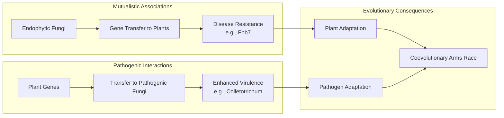

### 3.7 Viral Contributions to Plant Genome Evolution

The integration of viral sequences into plant genomes—forming endogenous viral elements (EVEs)—represents a distinct category of HGT that has contributed to fundamental aspects of plant biology. Unlike bacterial or fungal gene transfers, viral integration introduces genetic material from obligate parasites whose evolutionary dynamics differ substantially from cellular organisms. The discovery that EVEs are not merely genomic fossils but have contributed functional innovations to plant evolution challenges earlier assumptions about the exclusively detrimental nature of viral infection.

**Endogenous caulimovirids (ECVs) are the most common EVEs in plants**, consisting of ancient viral DNA from the *Caulimoviridae* family now found scattered across the genomes of numerous vascular plant species[^4]. These integrated sequences represent the molecular signatures of past infections that became fixed in plant lineages, providing a paleovirological record of plant-virus interactions spanning millions of years. The widespread distribution of ECVs across diverse plant families indicates that viral integration has been a recurrent feature of plant genome evolution.

The most striking example of functional viral contribution to plant biology involves **the acquisition of a viral cellulose synthase gene, which is correlated with the evolution of the cellulose-based cell wall in Streptophytes**—the ancestors of all land plants[^4]. This finding suggests that a viral gene may have provided the enzymatic foundation for one of the most fundamental innovations in plant evolution: the rigid cell wall that enabled plants to colonize terrestrial environments and eventually dominate land ecosystems. If this interpretation is correct, viral HGT contributed to a key innovation that shaped the entire trajectory of plant evolution and, by extension, the evolution of terrestrial life.

Plant genomes also contain genetic "footprints" from past infections by **giant viruses**, demonstrating that HGT from viruses has been fundamental in shaping core plant biology[^4]. These giant virus signatures add to the diversity of viral contributions to plant genomes, suggesting that multiple viral lineages have contributed genetic material to plants throughout evolutionary history.

The functional status of integrated viral sequences varies considerably:

| Category | Characteristics | Examples |
|----------|-----------------|----------|
| **Functional acquisitions** | Intact ORFs, active expression, adaptive function | Viral cellulose synthase in Streptophytes |
| **Regulatory elements** | Viral promoters/enhancers co-opted for host gene regulation | Various EVE-derived regulatory sequences |
| **Genomic fossils** | Degraded sequences, no apparent function | Many ECVs accumulating mutations |
| **Latent elements** | Potentially reactivatable under certain conditions | Some integrated pararetroviral sequences |

The mechanism of viral integration typically involves the reverse transcription of viral RNA genomes into DNA, which can then be inserted into host chromosomes through processes that may involve host DNA repair machinery or transposon-like activities. For DNA viruses like caulimovirids, direct integration of viral DNA can occur during infection, particularly when viral replication intermediates become incorporated into host chromosomes during DNA replication or repair.

### 3.8 Horizontal Gene Transfer in Grasses and C4 Photosynthesis Evolution

The grass family (Poaceae) exhibits an extraordinary concentration of HGT events that sets it apart from other plant families. **Over 95% of reported non-parasitic plant-to-plant HGT events occur within grasses**, a pattern that demands explanation and has important implications for understanding how certain lineages may be predisposed to horizontal genetic exchange[^4]. This remarkable concentration reflects both the unique biology of grasses and their agricultural importance, which has led to intensive genomic investigation.

The grass *Alloteropsis semialata* provides the most dramatic example of HGT in non-parasitic plants. This species has **acquired 59 functional genes from at least nine different donor grasses**, representing an unprecedented level of genetic acquisition from multiple sources[^4]. The transferred genes encompass diverse functional categories:

- **Photosynthesis-related genes** involved in carbon fixation
- **Disease resistance genes** providing defense against pathogens
- **Stress tolerance genes** enabling survival under adverse conditions[^4]

This diversity of acquired functions suggests that HGT has contributed to multiple aspects of *A. semialata* biology, potentially enabling this species to occupy ecological niches that would otherwise be inaccessible. The acquisition of photosynthesis-related genes is particularly intriguing given the complex evolutionary history of C4 photosynthesis in grasses.

The concentration of HGT in grasses likely reflects several biological features that facilitate genetic exchange:

1. **Wind pollination** creates opportunities for illegitimate pollination, where heterospecific pollen delivers exogenous DNA to ovules even without successful fertilization. The massive pollen production and wide dispersal characteristic of wind-pollinated grasses increase the probability of such interspecific pollen encounters.

2. **Rhizomatous growth habits** boost opportunities for transfer into the germline. Grasses with rhizomes—underground stems that can give rise to new shoots—have increased potential for incorporating horizontally acquired genes into reproductive tissues. Research has demonstrated that **rhizomatous grasses acquire significantly more genes through HGT than non-rhizomatous species**[^4].

3. **Polyploidy** is common in grasses and may provide genomic buffering that allows foreign genes to be tolerated without immediate deleterious effects. The redundancy provided by multiple genome copies could facilitate the retention of horizontally acquired genes.

4. **Extensive sympatric distributions** among grass species provide repeated opportunities for genetic exchange through whatever mechanisms operate.

The potential role of HGT in C4 photosynthesis evolution represents one of the most intriguing aspects of grass HGT. C4 photosynthesis—a carbon-concentrating mechanism that evolved independently more than 60 times in flowering plants—is particularly common in grasses and has been associated with ecological dominance in warm, open habitats. The acquisition of photosynthesis-related genes by *A. semialata* raises the possibility that **HGT may have contributed to the evolution, optimization, or spread of C4 photosynthesis** within the grass family. However, establishing a direct causal link between HGT and C4 evolution requires careful analysis of the specific genes transferred and their functional contributions.

The systematic genomic scanning that revealed the prevalence of HGT in grasses has demonstrated that horizontal transfer is **a widespread phenomenon affecting a majority of grass species studied, including major crops like maize and wheat**[^4]. This finding has important implications for understanding crop evolution and for the potential use of HGT-derived genetic variation in plant breeding programs.

### 3.9 Evaluating Evidence Quality and Alternative Explanations

The documentation of HGT events requires rigorous methodological approaches to distinguish genuine horizontal transfer from alternative explanations that can produce similar phylogenetic patterns. As the field of eukaryotic HGT has matured, increasingly stringent criteria have been developed to evaluate claims of horizontal transfer, and several initially reported cases have been reinterpreted upon closer examination. This section establishes the quality standards for HGT identification and assesses the overall strength of evidence across documented plant HGT cases.

**Phylogenetic incongruence** serves as the primary criterion for identifying potential HGT events. When a gene tree shows a different topology than the species tree—particularly when a gene from one lineage nests within an unrelated clade—HGT represents one possible explanation. However, several alternative processes can also produce phylogenetic incongruence:

| Alternative Explanation | Description | Distinguishing Features |
|------------------------|-------------|------------------------|
| **Contamination** | Foreign DNA introduced during sample preparation or sequencing | Absence from multiple independent samples; inconsistent genomic context |
| **Incomplete lineage sorting (ILS)** | Ancestral polymorphisms sorted differently in descendant lineages | Expected under rapid radiation; affects multiple unlinked loci similarly |
| **Ancestral polymorphism** | Retention of ancient allelic variants | Similar to ILS; expected patterns differ from HGT |
| **Long-branch attraction (LBA)** | Phylogenetic artifact causing unrelated sequences to group together | Associated with rate heterogeneity; sensitive to taxon sampling |
| **Gene duplication and loss** | Paralogs mistaken for orthologs | Can be resolved with comprehensive gene family analysis |

Robust HGT identification typically requires multiple lines of evidence:

1. **Statistical rejection of vertical inheritance**: Bootstrap support values exceeding defined thresholds (commonly 70%) for incongruent placements, combined with statistical tests (such as AU tests) that reject vertical inheritance scenarios[^29].

2. **Genomic context analysis**: Genuine HGT events should show integration into recipient genomes flanked by native sequences. The sweet potato T-DNA insertions, for example, were confirmed by sequencing bacterial artificial chromosome clones that demonstrated T-DNA insertion into introns of native genes[^26][^27].

3. **Shared insertion sites**: For recent transfers, related recipient species should share the same insertion site if they inherited the transferred gene from a common ancestor. The demonstration that hexaploid and tetraploid *I. batatas* share identical T-DNA insertion sites provides strong support for genuine HGT followed by vertical inheritance[^27].

4. **Functional validation**: Evidence of transcription and/or translation of transferred sequences supports their genuine presence rather than contamination artifacts. The active transcription of mitochondrial transgenes in Rafflesiaceae provides such functional validation[^29].

5. **Distribution patterns**: Consistent presence across multiple accessions of recipient species, combined with absence from closely related non-recipient species, supports genuine HGT. The presence of Ib T-DNA1 in all 291 cultivated sweet potato accessions examined, but not in wild relatives outside series Batatas, exemplifies this pattern[^26][^27].

The quality of evidence varies across documented plant HGT cases. The strongest cases—including *Agrobacterium* T-DNA in sweet potato and mitochondrial gene transfers in Rafflesiaceae—satisfy multiple criteria and have withstood critical scrutiny. These cases benefit from:

- Multiple independent methodological confirmations
- Clear phylogenetic signals with high statistical support
- Functional evidence (transcription, intact reading frames)
- Consistent distribution patterns across germplasm collections
- Plausible mechanisms based on known biological interactions

Weaker cases may rely primarily on phylogenetic incongruence without additional supporting evidence, making them more susceptible to alternative explanations. The field has appropriately become more cautious about accepting HGT claims, recognizing that **rigorous validation is essential for establishing the true prevalence and significance of horizontal transfer in plant evolution**.

The overall assessment of plant HGT evidence supports the conclusion that horizontal transfer is a genuine and significant phenomenon. The diversity of documented cases—spanning bacterial, fungal, viral, and plant donors; involving nuclear, mitochondrial, and plastid genomes; and affecting both parasitic and free-living plants—demonstrates that multiple HGT pathways operate in plant systems. The functional significance of many transferred genes, from disease resistance (*Fhb7*) to fundamental cellular processes (viral cellulose synthase), indicates that HGT has contributed meaningfully to plant adaptation and evolution. While the frequency of successful HGT remains far lower than in prokaryotes, the documented cases reveal that when transfer does succeed, it often provides substantial adaptive benefits that explain the persistence of foreign genes across evolutionary time.

## 4 Documented Cases of Horizontal Gene Transfer in Animals

The previous chapter documented the remarkable diversity of HGT events in plants, from bacterial T-DNA integration to massive mitochondrial gene replacement in parasitic species. This chapter turns to the animal kingdom, where horizontal gene transfer faces even more formidable obstacles due to germline sequestration, complex developmental programs, and sophisticated immune surveillance. Yet despite these barriers, genomic evidence has revealed that HGT has occurred across diverse animal lineages—from insects and nematodes to vertebrates and even asexual invertebrates. The documented cases presented here demonstrate that when genetic material successfully crosses species boundaries in animals, it often confers **substantial adaptive advantages** that explain why these rare events have been preserved over evolutionary time. From endosymbiont-derived genes that alter fundamental biological processes like sex determination to fungal genes enabling novel biosynthetic capabilities, animal HGT represents some of the most fascinating examples of evolutionary innovation in complex multicellular organisms.

### 4.1 Wolbachia-to-Arthropod Gene Transfers: From Single Genes to Whole Genome Insertions

The intracellular bacterium *Wolbachia pipientis* infects an extraordinarily broad range of arthropods and has emerged as **the most prolific bacterial donor of horizontally transferred genes to animal hosts**. The intimate and sustained association between *Wolbachia* and its hosts—with bacterial cells residing within host cytoplasm and being transmitted maternally through egg cytoplasm—creates uniquely favorable conditions for genetic exchange. Surveys of *Wolbachia*-infected arthropods have revealed HGT events spanning a remarkable spectrum, from individual genes to the integration of nearly complete bacterial genomes into host chromosomes[^31].

The most dramatic example of *Wolbachia*-to-arthropod HGT occurs in the fruit fly *Drosophila ananassae*, where **the entire ~1.4 Mbp *Wolbachia* genome has been integrated into chromosome 2L**[^31]. This represents one of the largest documented bacteria-to-eukaryote gene transfers ever described. The integration was detected in multiple *D. ananassae* lines from Asia and the Pacific, indicating that this massive insertion has become widely distributed within the species[^31]. Crucially, at least 28 genes of *Wolbachia* origin within this integrated genome are actively transcribed, albeit at low levels, demonstrating that some transferred sequences retain functional potential[^31]. While the biological relevance of this low-level transcription remains uncertain, it illustrates that HGT from bacterial endosymbionts can introduce novel genetic material with the capacity for function in animal hosts.

The bean beetle *Callosobruchus chinensis* provides another landmark case of large-scale *Wolbachia*-to-arthropod transfer. In this species, **approximately 30% of the *Wolbachia* genome has been inserted into the host beetle chromosome**[^31]. The first *Wolbachia*-host transfer ever described, this case revealed that approximately half of the transferred genes examined were transcribed, though at low levels[^31]. The pattern of low-level transcription observed in both *D. ananassae* and *C. chinensis* appears to be a common feature of bacteria-to-eukaryote HGT, potentially representing an early stage in the evolutionary process where transferred genes have not yet acquired strong host promoters or have been partially silenced by host regulatory mechanisms[^31].

Beyond these massive insertions, *Wolbachia*-to-arthropod HGT has been documented in numerous other species with varying scales of transfer:

| Host Species | Transfer Scale | Key Features | Evidence for Function |
|--------------|----------------|--------------|----------------------|
| *Drosophila ananassae* | ~1.4 Mbp (entire genome) | Integrated into chromosome 2L | 28+ genes transcribed |
| *Callosobruchus chinensis* | ~30% of genome | First described *Wolbachia*-host HGT | ~50% of genes transcribed |
| *Nasonia vitripennis* | 13 ankyrin repeat proteins | Acquired PRANC domain proteins | Most genes transcribed across life stages |
| *Acyrthosiphon pisum* (pea aphid) | 5 rickettsial-origin genes | Including *ldcA* gene | *ldcA* transcribed in bacteriocyte |
| Multiple mosquito species | Various *Wolbachia* sequences | Part of broader survey | Variable transcription |

The parasitoid wasp *Nasonia vitripennis* exemplifies a more targeted form of *Wolbachia*-to-arthropod HGT. Its genome contains **13 ankyrin repeat proteins with a C-terminal PRANC domain** that phylogenetic analysis places closest to proteins found in diverse *Wolbachia* strains, indicating acquisition from *Wolbachia*[^31]. Unlike the massive genome insertions in *D. ananassae* and *C. chinensis*, this transfer appears to have involved specific gene families rather than wholesale genome integration. Importantly, most of these acquired genes are transcribed in both males and females and across various life stages, suggesting they have been incorporated into the host's functional genetic repertoire[^31].

The prevalence of *Wolbachia*-to-host HGT across arthropod lineages appears to be remarkably high. An analysis of eleven arthropod and nematode genomes available in 2007 found that **eight contained *Wolbachia* sequences, with host-endosymbiont HGT experimentally verified in five cases**[^31]. This suggests that approximately 70% of *Wolbachia*-infected hosts may harbor nuclear inserts of bacterial origin. The pea aphid *Acyrthosiphon pisum*, which maintains an obligate mutualistic symbiosis with *Buchnera aphidicola*, revealed an interesting contrast: while twelve genes or gene fragments of bacterial origin were identified, only two derived from *B. aphidicola* (both truncated with no transcription evidence), whereas five were most closely related to rickettsial bacteria like *Wolbachia*[^31]. One of these rickettsial-origin genes, *ldcA*, is transcribed in the bacteriocyte and encodes an enzyme involved in bacterial cell wall metabolism, potentially allowing aphids to control the growth of their *B. aphidicola* endosymbionts[^31].

The mechanistic factors enabling such large-scale interkingdom genetic exchange likely include the sustained physical proximity between *Wolbachia* cells and host nuclear genomes, the residence of *Wolbachia* within germ cells (ensuring any transfer can be inherited), and the release of bacterial DNA during normal cell turnover or bacterial death within host cytoplasm. The observation that *Wolbachia* transfers are more frequent than transfers from other endosymbionts like *Buchnera* may reflect differences in bacterial density in gametes—*Wolbachia* cells occur at high density in eggs, while *Buchnera* is largely confined to bacteriocytes[^31].

### 4.2 Wolbachia-to-Nematode Transfers and the Evolution of Obligate Mutualism

Filarial nematodes present a particularly compelling system for studying *Wolbachia*-to-host HGT because many species maintain **obligate mutualistic relationships** with their bacterial endosymbionts. Unlike the facultative associations seen in most arthropods, filarial nematodes often cannot survive or reproduce without their *Wolbachia* partners, creating an evolutionary context where genetic exchange may have profound functional implications. The genomic evidence reveals that HGT from *Wolbachia* to filarial nematodes is extensive and may have contributed to the evolutionary dynamics of these intimate symbioses[^31].

The genome of *Brugia malayi*, a filarial nematode that causes lymphatic filariasis in humans, provides striking evidence for pervasive *Wolbachia*-to-host HGT. Sequencing revealed that **the *B. malayi* genome is riddled with 249 contigs containing *Wolbachia* sequence fragments**[^31]. This extensive integration demonstrates that genetic material from the endosymbiont has been repeatedly incorporated into the host nuclear genome over evolutionary time. The fragmented nature of these insertions—distributed across numerous contigs rather than forming a single large insertion—suggests multiple independent transfer events or extensive post-transfer genomic rearrangement.

Perhaps most remarkably, evidence for *Wolbachia*-derived genes has been found even in filarial nematode lineages that have **lost their *Wolbachia* endosymbionts entirely**. Two endosymbiont-free species, *Acanthocheilonema viteae* and *Onchocerca flexuosa*, retain numerous genes of *Wolbachia* ancestry in their nuclear genomes[^31]. This pattern suggests that extensive bacteria-to-host HGT occurred **prior to the loss of the endosymbiont**, potentially providing the host with bacterial functions that reduced dependence on the living symbiont. The evolutionary implications are profound: HGT may have enabled these nematode lineages to capture essential endosymbiont functions, subsequently allowing them to dispense with the metabolic costs of maintaining the symbiotic relationship.

The functional status of transferred *Wolbachia* sequences in nematodes shows variable patterns:

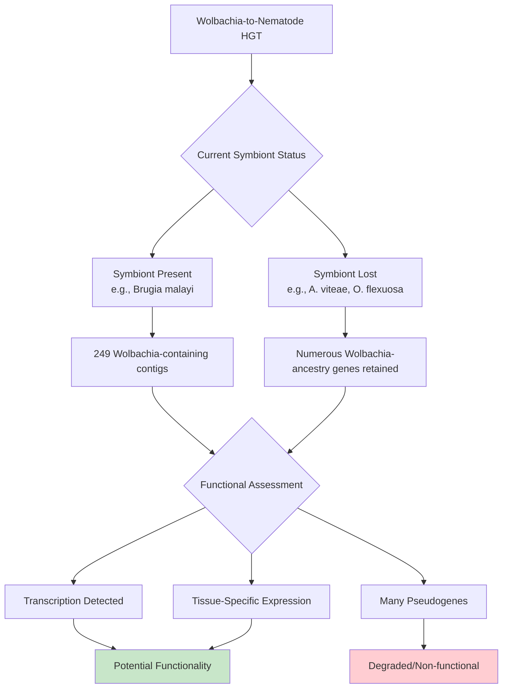

Transcription of HGT fragments has been observed in filarial nematodes, including **tissue-specific transcription patterns** detected by *in situ* hybridization[^31]. This tissue-specific expression suggests that at least some transferred sequences have acquired appropriate regulatory elements and may perform specialized functions in particular cell types. However, many of the transcripts derive from pseudogenes—sequences that have accumulated mutations disrupting their reading frames and would not be expected to encode functional protein products[^31]. The mixture of functional and non-functional transferred sequences reflects the ongoing evolutionary process: recently transferred genes may retain functionality, while older transfers gradually degrade unless maintained by selection.

The origin of the *Wolbachia*-filaria symbiosis has been estimated at **approximately 50 million years ago** based on phylogenetic relationships[^31]. This ancient origin provides ample time for the accumulation of HGT events and subsequent evolutionary divergence of transferred sequences. The independent losses of *Wolbachia* in lineages like *A. viteae* and *O. flexuosa* occurred after this origin, and the retention of *Wolbachia*-derived genes in these species suggests that some transferred functions became essential before the symbiont was lost.

A "HGT ratchet" model has been proposed to explain the accumulation of nuclear genes of endosymbiont origin[^31]. According to this model, the transfer of essential endosymbiont genes to the host nucleus can create a one-way evolutionary trajectory: once a critical function is encoded by a nuclear gene, the corresponding endosymbiont gene may be lost without consequence, but the reverse process—re-establishing the endosymbiont gene after nuclear gene loss—is unlikely. Over evolutionary time, this ratchet mechanism could progressively transfer essential functions from endosymbiont to host, eventually enabling the host to survive without the endosymbiont entirely. The filarial nematode lineages that have lost *Wolbachia* while retaining *Wolbachia*-derived nuclear genes may represent the end stage of this ratchet process.

### 4.3 The f Element: A Wolbachia Insert Driving Sex Determination in Isopods

Among all documented cases of bacteria-to-animal HGT, the "f element" in the terrestrial isopod *Armadillidium vulgare* stands out as **one of the most functionally significant examples**, demonstrating how horizontally transferred bacterial sequences can fundamentally alter host biology. This remarkable case unifies three major areas in evolutionary biology—symbiosis, horizontal gene transfer, and sex determination—and provides unique insights into how HGT can drive the evolution of fundamental biological systems[^32].

In *A. vulgare*, genetic sex determination normally follows female heterogamety: females possess ZW sex chromosomes while males have ZZ. However, feminizing *Wolbachia* endosymbionts can convert ZZ genetic males into phenotypic females, effectively overriding the genetic sex determination system[^32]. An important evolutionary consequence of this manipulation is the elimination of the W sex chromosome from infected populations, shifting sex determination from nuclear (W chromosome-based) to cytoplasmic (*Wolbachia*-based) control[^32]. The f element represents a third category of feminizing agent—a nuclear *Wolbachia* insert that produces female-biased offspring in the absence of *Wolbachia* infection.

Molecular characterization has revealed that the f element is **a ~3 Mb insert of a feminizing *Wolbachia* genome** that has been horizontally transferred into the *A. vulgare* nuclear genome[^32]. The inserted sequence is nearly identical to the feminizing *Wolbachia* strain *w*VulC, allowing researchers to infer both the donor (a feminizing *Wolbachia* closely related to *w*VulC) and the mechanism of integration (a nearly complete genome inserted by micro-homology-mediated recombination)[^32]. This represents an instance of bacteria-to-animal HGT that occurred so recently that its evolutionary history can be reconstructed in detail.

The f element functions as **a female sex-determining region** within the *A. vulgare* genome. It is fully linked to the female sex and hemizygous, meaning that females carrying the f element are effectively ZZ genetic males that have been feminized by the inserted bacterial sequences[^32]. This finding demonstrates that the f element has acquired the regulatory function of determining female development—a function originally performed by the living *Wolbachia* endosymbiont from which it derives.

Several biological features distinguish the f element from its cytoplasmic *Wolbachia* ancestor:

| Feature | Cytoplasmic *Wolbachia* | f Element |
|---------|------------------------|-----------|
| **Sex ratio bias** | Very stable (80-90% females) | Unstable (average 60-70% females, high variability) |
| **Inheritance pattern** | Exclusively maternal | Mainly maternal, occasional paternal transmission |
| **Intersex induction** | Not uncommon | Very rare |
| **Experimental reversal** | More resistant | Susceptible to androgenic gland implantation |

The unstable inheritance pattern of the f element—with sex ratio bias varying considerably among individuals and generations—suggests a non-Mendelian transmission pattern that may involve segregation distortion or other mechanisms[^32]. The occasional paternal transmission of the f element, which is impossible for cytoplasmic *Wolbachia*, demonstrates that nuclear integration has fundamentally altered the inheritance dynamics of the feminizing factor.

The evolutionary implications of the f element are profound. It supports a scenario where ***Wolbachia* generated a turnover of sex chromosomes in *A. vulgare***: first by causing the loss of the original W chromosome through cytoplasmic sex determination, then by introducing a novel sex-determining sequence via HGT, resulting in a new W sex chromosome[^32]. Since its integration, the f element has experienced extensive genomic duplications, approximately doubling its size, which may provide insights into the early evolution of sex chromosomes[^32].

Furthermore, the f element illustrates how sex ratio distorters can induce genetic conflict and strong selection pressure. The presence of feminizing factors like *Wolbachia* and the f element may promote the evolution of nuclear suppressor genes (masculinizing genes) that counteract feminization, potentially establishing new male-determining genes and thus new Y sex chromosomes[^32]. This cascade of evolutionary consequences demonstrates that **a single HGT event can trigger fundamental reorganization of biological systems** that extend far beyond the immediate function of the transferred genes.

The f element is the most common feminizing factor in natural *A. vulgare* populations, more prevalent than either *Wolbachia* or the W sex chromosome[^32]. This ecological success suggests that the nuclear f element may have advantages over cytoplasmic *Wolbachia*—perhaps related to reduced metabolic costs of maintaining living bacterial symbionts or the ability to achieve paternal transmission in some circumstances.

### 4.4 Horizontal Transmission of Wolbachia Between Host Species

While the previous sections focused on HGT from *Wolbachia* to host genomes, understanding the broader evolutionary dynamics of *Wolbachia*-host interactions requires examining how *Wolbachia* itself moves horizontally between host species. This inter-specific transmission creates opportunities for subsequent gene transfer to new host lineages and explains why *Wolbachia* strains from distantly related hosts often show closer phylogenetic relationships than expected from vertical inheritance alone[^33].

*Wolbachia* is typically transferred vertically from mother to offspring through the egg cytoplasm. However, phylogenetic analyses reveal that ***Wolbachia* molecular phylogenies do not parallel host phylogenies**, strongly suggesting that horizontal transmission between species has been common throughout evolutionary history[^34][^33]. This phylogenetic incongruence—where closely related *Wolbachia* strains infect distantly related hosts—provides the primary evidence for inter-specific *Wolbachia* transfer.

Studies using multilocus sequence typing (MLST) have documented horizontal transmission of *Wolbachia* at multiple taxonomic levels within Lepidoptera (butterflies and moths):

- **Inter-specific transmission**: Between different species within the same genus
- **Inter-generic transmission**: Between species in different genera
- **Inter-familial transmission**: Between species in different families
- **Inter-ordinal transmission**: Between Lepidoptera and other arthropod orders

At least seven probable cases of horizontal transmission were identified among 31 lepidopteran species and between Lepidoptera and other arthropod hosts, with **no discernible geographic patterns** to these transfers[^33]. This lack of geographic structure suggests that the mechanisms enabling *Wolbachia* transmission operate across broad spatial scales rather than being limited to local ecological interactions.

Divergence time analysis revealed that ***Wolbachia* was relatively recently introduced into Lepidoptera, approximately 22.6–4.7 million years ago** (95% HPD)[^33]. This relatively recent introduction, combined with the multiple horizontal transmission events detected, indicates that *Wolbachia* can spread rapidly through new host lineages once initial transfer occurs. Approximately 26% of analyzed *Wolbachia* strains (90/345) were associated with lepidopteran hosts, with all strains belonging to either Supergroup A or B[^33].

Host-parasitoid associations have been identified as particularly favorable contexts for *Wolbachia* horizontal transmission[^34]. Parasitoid wasps that develop within or on arthropod hosts create intimate biological relationships that may facilitate bacterial transfer. Research on hymenopteran parasitoids of *Drosophila* demonstrated that these wasps are **particularly susceptible to *Wolbachia* infection**, with four of five common European species infected[^34]. Multiple infections were common—one species was doubly infected and two species were triply infected, representing the first report of triple *Wolbachia* infections[^34].

The phylogenetic analysis of *Wolbachia* strains from this parasitoid-host community revealed **exciting similarities between *Wolbachia* variants found in parasitoids and their hosts**[^34]. Using the highly variable *wsp* gene, researchers demonstrated close relationships between *Wolbachia* from wasps and their *Drosophila* hosts, strongly supporting frequent natural transfer of *Wolbachia* between species[^34]. This host-parasitoid transmission pathway may be particularly important because parasitoids directly access host tissues and hemolymph, creating opportunities for bacterial transfer that would not exist in more casual ecological interactions.

Evidence for lateral gene transfer (LGT) from *Wolbachia* to Lepidoptera genomes has also been detected. Analysis of nine Lepidoptera genomes identified **one possible instance of *Wolbachia* LGT between the *Wolbachia* strain *w*Ha (from *Drosophila simulans*) and the genome of the butterfly *Melitaea cinxia***[^33]. The portion of the *Wolbachia* gene found in *M. cinxia* was 350 bp with >96% identity to the bacterial source[^33]. No evidence of LGT was found in the other eight Lepidoptera genomes examined, suggesting that while *Wolbachia*-to-host gene transfer does occur in Lepidoptera, it may be less frequent than in some other arthropod lineages.

### 4.5 Fungal-to-Animal Gene Transfer: Carotenoid Biosynthesis in Aphids and Related Insects

The horizontal acquisition of carotenoid biosynthesis genes from fungi to insects represents **one of the most remarkable examples of HGT enabling a completely novel metabolic capability in animals**. Carotenoids—the pigments responsible for red, orange, and yellow coloration in many organisms—are typically synthesized only by plants, fungi, and bacteria. Animals generally cannot produce carotenoids and must obtain them through diet. However, aphids and related insects in the Sternorrhyncha suborder possess the extraordinary ability to synthesize carotenoids *de novo*, a capability traced to the horizontal acquisition of fungal genes[^35][^36][^37][^38].

Phylogenetic analyses of carotenoid biosynthesis genes in 23 aphid genomes have revealed that **three key upstream genes—*Geranylgeranyl pyrophosphate synthase* (*GPS*), *Phytoene synthase* (*PS*), and *Carotenoid desaturase* (*CD*)—were acquired via HGT from fungi**[^35][^36]. These three genes encode the enzymes necessary for the early steps of carotenoid biosynthesis, converting common metabolic precursors into colored carotenoid compounds. In contrast, *Carotenoid cleavage oxygenase* (*CCO*), which acts downstream in carotenoid metabolism, appears to be a native insect gene[^35]. This pattern demonstrates that HGT provided the critical upstream enzymatic machinery while existing insect genes were co-opted for downstream processing.

The phylogenetic evidence for fungal origin is robust. Systematic analysis based on homologs in plants, fungi, and bacteria consistently places the aphid *GPS*, *PS*, and *CD* genes within fungal clades rather than with plant or bacterial sequences[^35][^36]. The phylogenetic trees strongly support the Sternorrhyncha species (aphids, adelgids, and phylloxerids) forming a distinct clade separate from other arthropods and fungi, with bootstrap support values of 100% for carotenoid cyclase/synthase and 99% for carotenoid desaturase[^37].

Crucially, this HGT event appears to have occurred **once in the common ancestor of aphids, adelgids, and phylloxerids**, with subsequent divergent evolution in each lineage[^37][^38]. The three Sternorrhyncha families share the same fungal-derived carotenoid genes, indicating a single ancient acquisition event followed by vertical inheritance within the suborder. This finding demonstrates that HGT can introduce genetic material that becomes stably inherited across major taxonomic radiations spanning tens of millions of years.

Following the initial HGT event, the evolutionary trajectories of these genes diverged dramatically among lineages:

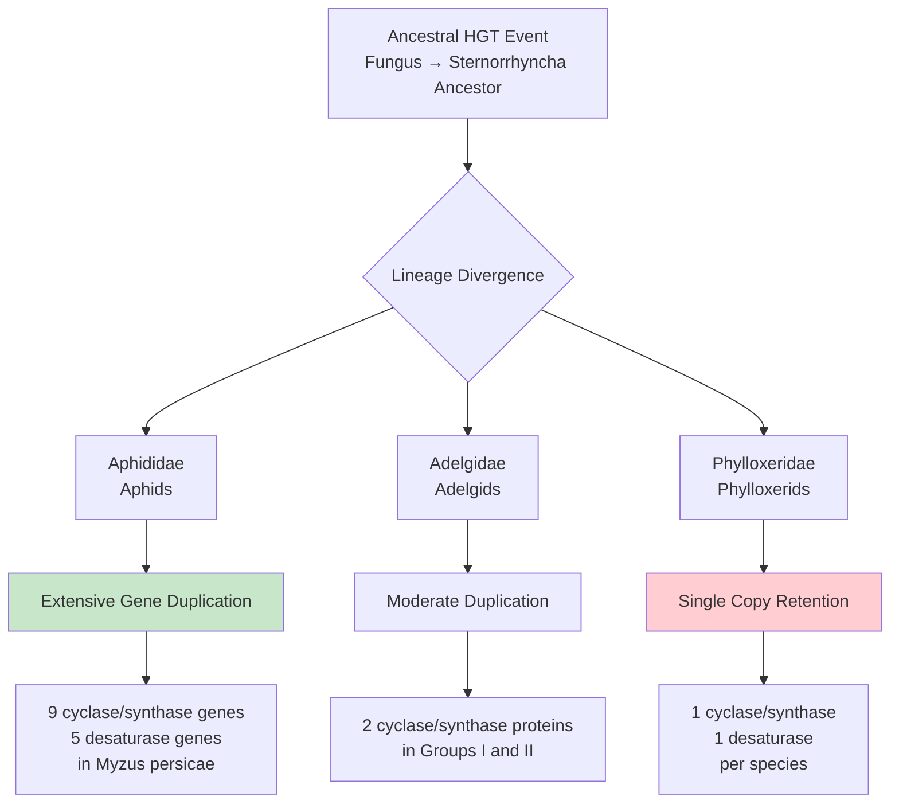

Aphid genomes show **extensive lineage-specific duplications** of carotenoid genes. In *Myzus persicae* (the green peach aphid), nine cyclase/synthase genes and five desaturase genes have been identified[^37]. This pattern of gene family expansion is uncommon in other insects and suggests strong selective pressure for expanded carotenoid biosynthetic capacity in aphids[^35][^36]. Most insect genomes contain only two *GPS* copies, likely resulting from independent HGT events, whereas aphid genomes exhibit extensive duplication of *PS* and *CD*[^35][^36].

In striking contrast, phylloxerids have **retained only single copies** of both carotenoid cyclase/synthase and desaturase genes[^37][^38]. This minimal gene complement suggests that phylloxerids experience reduced selection pressure to expand carotenoid synthesis capacity. The difference may relate to lifestyle: phylloxerids are specialists on few host species and feed on parenchyma tissue rather than phloem, potentially experiencing lower oxidative stress than phloem-feeding aphids and adelgids[^38]. Carotenoids can function as antioxidant scavengers, and phloem feeders may require greater carotenoid production to cope with oxidative stress induced during feeding[^38].

Functional validation of these horizontally acquired genes comes from expression analyses and phenotypic correlations. In *M. persicae*, comparative expression analysis between reddish and greenish clones revealed that ***PS-4390* is a novel candidate for red pigmentation**, in addition to *CD-4400*, a homolog of the *tor* gene in *Acyrthosiphon pisum*[^35][^36]. The correlation between carotenoid gene expression and color polymorphism provides direct evidence that these fungal-derived genes are functional and contribute to ecologically relevant phenotypes.

The broader distribution of carotenogenic genes across insects further supports the significance of this HGT event. Analysis of 288 insect genomes revealed that **carotenogenic genes widely exist across insect genomes**[^35], and more than 1,400 HGT-derived genes have been identified across 218 insect genomes[^35]. The carotenoid biosynthesis pathway represents a striking example where HGT introduced multiple functionally related genes that were subsequently co-opted into a complete biosynthetic pathway, demonstrating that HGT can provide the raw material for metabolic innovation in animals.

### 4.6 Plant-to-Animal Gene Transfer: The BtPMaT1 Gene in Whiteflies

The discovery of plant-to-insect horizontal gene transfer in the whitefly *Bemisia tabaci* represents **a landmark finding that fundamentally expanded our understanding of cross-kingdom genetic exchange**. This case is particularly significant because it demonstrates that genes can move from plants to the animals that feed upon them, with transferred genes providing direct adaptive benefits related to the feeding interaction itself[^39][^40].

Systematic investigation of the *B. tabaci* Middle East Asia Minor 1 (MEAM1) genome identified **49 plant-like genes deriving from at least 24 independent HGT events**[^39]. This finding dramatically expanded upon previous reports of only four such genes, revealing that plant-to-insect HGT is far more extensive than previously appreciated. Among these acquired genes is *BtPMaT1*, a phenolic glucoside malonyltransferase, along with its homolog *BtPMaT2*[^39].

The evidence confirming that these genes are genuinely integrated into the whitefly genome rather than representing contamination is compelling. Researchers assessed the genomic environment of candidate plant-derived genes by assigning taxonomic origins to their nearest flanking protein-coding genes[^39]. After excluding Aleyrodidae proteins from the search database:

- Hits were retrieved for 61 of 76 flanking genes investigated
- All but two flanking genes had metazoan best hits
- 47 of 61 had Pancrustacea (arthropod) best hits
- Among 15 flanking genes without metazoan hits, 13 had no hits (Aleyrodidae-specific), one hit a plant, and one hit a bacterium

For all 49 plant-like genes, **at least one nearest flanking gene showed a best hit to a metazoan gene**, confirming that these plant-derived sequences are located within animal genomic contexts[^39]. This genomic context verification provides strong evidence that the genes are *bona fide* whitefly genes and not contaminants from plant material.

The functional significance of *BtPMaT1* has been extensively validated. Plants synthesize specialized metabolites such as phenolic glycosides with toxic properties against herbivores as a defense mechanism. Functional assays revealed that **the BtPMaT1 protein detoxifies plant phenolic glucosides** by malonylating them, and the acylated forms are far less toxic to the whitefly[^39][^40]. This detoxification capability directly enables whiteflies to feed on toxin-synthesizing plants that would otherwise be harmful.

The experimental evidence for *BtPMaT1* function includes:

| Experimental Approach | Finding | Significance |
|----------------------|---------|--------------|
| Recombinant protein assays | BtPMaT1 malonylates wide range of phenolic glucosides *in vitro* | Demonstrates enzymatic capability |
| Honeydew analysis | Malonylated forms of phenolic glucosides detected | Confirms *in vivo* detoxification |
| RNAi silencing | Increased mortality on phenolic glycoside-containing diets | Validates essential function |
| Gene expression analysis | High expression in gut | Consistent with detoxification role |
| Transgenic plant feeding | ~100% mortality on plants expressing BtPMaT1-targeting hairpin RNA | Demonstrates specificity and essentiality |

The silencing experiments are particularly striking. When *BtPMaT1* was silenced using RNA interference, whiteflies showed **increased mortality when fed diets containing specific phenolic glycosides from tomato**[^40]. Analysis of honeydew from silenced whiteflies showed strongly decreased accumulation of malonylated toxins, confirming that BtPMaT1 is responsible for the detoxification activity[^40]. Most dramatically, transgenic tomato plants expressing hairpin RNA targeting *BtPMaT1* caused the death of **almost 100% of whiteflies within 7 days after ingestion**, without affecting other insects[^40].

Evidence for ongoing purifying selection further supports the functionality of these plant-derived genes. For the *BtPMaT1* gene cluster, 15 out of 15 pairwise comparisons of nonsynonymous to synonymous substitution ratios yielded values below 0.5, indicating **evolution under purifying selection**[^39]. This selective constraint demonstrates that the transferred genes are not merely genomic fossils but are actively maintained by natural selection, presumably because they provide adaptive benefits to the whitefly.

The predicted functions of the 49 plant-derived genes suggest that **most are involved in plant-insect interactions**[^39]. Beyond *BtPMaT1*, identified genes include:

- Delta(12) fatty acid desaturase (FAD) involved in plant response to pathogens
- Subtilisin-like protease
- Pathogen-related proteins
- Ornithine decarboxylase that synthesizes putrescine involved in pathogen response
- Pectinesterase (a plant cell wall degrading enzyme)
- Nicotianamine synthase involved in metal ion transport

Several transfers were followed by gene duplications, with the largest cluster comprising 38 Aleyrodidae members with predicted FAD function[^39]. Eight of these FAD genes are organized in a genomic region spanning about 120 kb, a hotspot also observed in a syntenic position in another cryptic species, indicating this amplification evolved before their speciation[^39].

The agricultural and biotechnological implications of this discovery are substantial. Understanding that *BtPMaT1* enables whiteflies to overcome plant defenses suggests that **targeting this horizontally acquired gene could provide novel pest management strategies**[^39][^40]. The demonstration that transgenic plants expressing *BtPMaT1*-silencing constructs can kill whiteflies while sparing other insects provides proof of concept for this approach.

### 4.7 Animal-to-Animal Horizontal Transposon Transfer: BovB Retrotransposons Across Vertebrates

While most documented animal HGT involves transfers from bacteria, fungi, or plants, horizontal transposon transfer (HTT) between animal lineages demonstrates that **genetic exchange can occur even between complex multicellular animals**. The BovB (Bovine-B) LINE retrotransposon provides a compelling case study, with evidence for repeated horizontal transfers between vertebrate species across millions of years of evolution[^41].

A comprehensive study analyzing 106 snake species, 149 frog species, and 42 parasite species discovered a **unique pattern of BovB horizontal transfer from predators (snakes) to their prey (frogs)**[^41]. At least 54 instances of BovB horizontal transfer were detected, estimated to have occurred between 85 and 1.3 million years ago[^41]. This extended timeframe demonstrates that HTT is not a singular ancient event but an ongoing process that has operated repeatedly throughout vertebrate evolutionary history.

The most striking finding was a **dramatic geographic concentration of BovB transfers in Madagascar**. Using comprehensive transcontinental sampling, the study demonstrated that BovB HT is highly prevalent in this island region while being rare or absent elsewhere[^41]:

| Geographic Region | BovB-Positive Frogs | BovB-Positive Parasites |
|-------------------|---------------------|------------------------|
| Madagascar | 91% | 50% |
| East Asia | 23% | 2.9% (Japan) |
| Africa | 0% | Not reported |

This geographic pattern suggests that regional ecological factors strongly influence the occurrence of horizontal transfer. The correlation between BovB prevalence in frogs and in parasites points to a potential mechanism: **parasites may physically transport BovB elements between vertebrate hosts**[^41]. The high proportion of BovB-positive parasites in Madagascar (50%) compared to Japan (2.9%) supports this hypothesis[^41].

Phylogenetic analysis of 211 new BovB consensus sequences and 74 known BovBs yielded insights into the direction and frequency of transfer[^41]. The resulting phylogenetic tree was largely concordant with host squamate (snake) phylogeny, indicating vertical transmission within snakes. However, **frog BovBs were found in various clades within the snake BovB tree**, indicating recurrent horizontal transfers from snakes to frogs rather than a single ancient event[^41]. This pattern of repeated, independent transfers demonstrates that the mechanism enabling HTT has operated multiple times throughout the evolutionary history of these lineages.

Two frog lineages provided particularly compelling evidence for the geographic specificity of HTT. In these lineages, **BovB horizontal transfer occurred after migration from a non-HT area (Africa) to the HT hotspot (Madagascar)**[^41]. This temporal pattern—absence of BovB in African ancestors, presence in Malagasy descendants—strongly supports the interpretation that Madagascar represents a geographic hotspot for horizontal transfer, with ecological conditions in this region facilitating genetic exchange that does not occur (or occurs rarely) elsewhere.

The mechanism of BovB transfer likely involves blood-feeding parasites as vectors. The discovery of parasite vectors that may plausibly transmit BovB, combined with the correlation between BovB prevalence in parasites and hosts within geographic regions, suggests a transmission mode **analogous to some vector-transmitted endemic diseases**[^41]. Ticks and leeches, which feed on blood from multiple vertebrate species, represent candidate vectors that could acquire retrotransposon sequences from one host and introduce them to another during subsequent feeding.

The evolutionary implications of vertebrate HTT are significant. The results provide a perspective on how **the prevalence of parasites influences the occurrence of HT in a region**[^41]. This ecological dimension to HGT—where regional parasite communities determine the frequency of genetic exchange—highlights that horizontal transfer in animals is not merely a molecular phenomenon but is shaped by ecological interactions and biogeographic history. The findings also highlight the potential for genomic modifications by alien transposable elements in diverse vertebrate taxa, suggesting that HTT may have contributed more broadly to vertebrate genome evolution than previously recognized.

### 4.8 Bacterial Gene Acquisitions Enabling Animal Parasitism

Horizontal gene transfer has played a crucial role in enabling the evolution of parasitic lifestyles in several animal lineages, with **plant-parasitic nematodes providing the most extensively documented examples**. These microscopic worms have acquired suites of bacterial genes encoding enzymes that allow them to degrade plant cell walls and manipulate host metabolism—capabilities that are essential for their parasitic lifestyle and that would otherwise be unavailable to animals[^31].

The root-knot nematode *Meloidogyne incognita*, a devastating agricultural pest, provides compelling evidence for the adaptive significance of bacterial HGT. Its genome contains **60 genes for six protein families that were acquired through HGT from diverse bacterial sources**[^31]. These include:

- **Cellulases**: Enzymes that degrade cellulose, the primary structural component of plant cell walls
- **Pectate lyases**: Enzymes that break down pectin, another major cell wall component
- **Other cell wall-degrading enzymes**: Additional enzymes targeting various plant cell wall polymers

The functional significance of these transferred genes has been directly demonstrated. The proteins encoded by these bacterial-origin genes have been **biochemically characterized, are secreted into plant tissues, and are directly involved in parasitism**[^31]. During infection, the nematode secretes these enzymes to penetrate root tissues and establish feeding sites, using bacterial-derived tools to overcome plant structural defenses that would otherwise exclude the parasite.

Another plant-parasitic nematode, *Heterodera glycines* (the soybean cyst nematode), acquired **an entire biosynthetic pathway for vitamin B6 from bacterial sources**[^31]. This pathway provides an essential nutrient that the nematode cannot synthesize using its native genes. Despite the apparent prokaryotic origin of these genes, they have acquired eukaryotic characteristics:

- The genes contain introns (absent in bacterial genes)
- Transcripts are polyadenylated (a eukaryotic mRNA modification)
- The genes map to nematode chromosomes

These features demonstrate that the bacterial genes have been **fully integrated into the nematode's genetic system**, acquiring the regulatory and processing features characteristic of eukaryotic genes while retaining their ancestral enzymatic functions.

The phylogenetic evidence for bacterial origin of these parasitism-related genes is robust. Analysis places the nematode genes closest to bacterial species such as *Protochlamydia amoebophila*, with clear separation from any known nematode gene families[^31]. The diversity of bacterial donors—with genes acquired from multiple, distantly related bacterial lineages—suggests that plant-parasitic nematodes have been **prolific recipients of bacterial genetic material** throughout their evolutionary history.

The broader pattern of bacteria-to-animal HGT extends beyond nematodes. The freshwater cnidarian *Hydra magnipapillata* contains **71 candidate genes for HGT** that show closer relationships to bacterial genes than to metazoan genes, with 70% of these candidates supported by expressed sequence tags (ESTs)[^31]. While the specific functions of these transferred genes in *Hydra* are less well characterized than in plant-parasitic nematodes, their presence demonstrates that bacteria-to-animal HGT is not limited to parasitic lineages.

The evolutionary significance of these bacterial gene acquisitions lies in their role as **key innovations enabling ecological transitions**. Plant parasitism requires enzymatic capabilities—particularly the ability to degrade plant cell walls—that are not part of the standard animal genetic toolkit. By acquiring these capabilities through HGT from bacteria that already possessed them, nematodes gained access to an ecological niche (plant parasitism) that would otherwise have been inaccessible. This pattern exemplifies how HGT can provide "quantum leaps" in evolutionary adaptation, allowing organisms to acquire complex capabilities in single transfer events rather than through gradual accumulation of mutations.

### 4.9 HGT in Asexual Animals: Bdelloid Rotifers and Hydra

Asexual animal lineages present a particularly intriguing context for studying horizontal gene transfer because **the absence of sexual reproduction may both increase the occurrence of HGT and enhance its evolutionary importance**. Theoretical frameworks, particularly Muller's ratchet, predict that asexual lineages should accumulate deleterious mutations over time without the purifying effects of sexual recombination. HGT may provide an alternative mechanism for introducing genetic variation that can counteract this mutational decay[^31].

Bdelloid rotifers—microscopic aquatic animals that have reproduced asexually for tens of millions of years—provide the most striking evidence for extensive HGT in asexual animals. Their genomes contain **DNA from bacteria, fungi, and plants**, representing an extraordinary diversity of donor sources[^31]. Remarkably, these foreign sequences appear to be **concentrated in telomeric regions** of bdelloid chromosomes, suggesting a specific mechanism or genomic location that facilitates the integration and retention of horizontally acquired DNA[^31].

Functional validation of HGT in bdelloid rotifers has been achieved through multiple approaches:

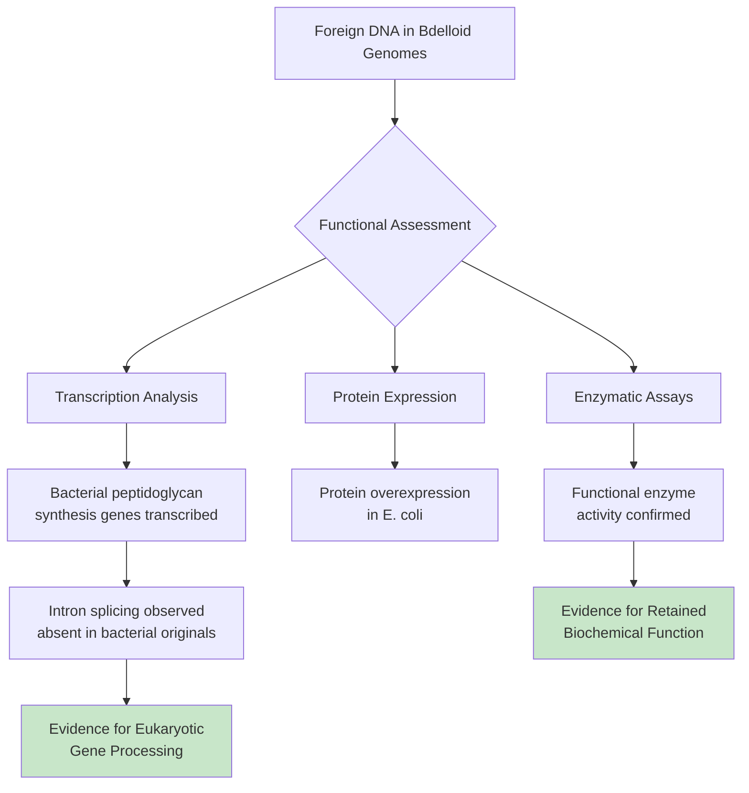

Two genes for bacterial peptidoglycan synthesis in bdelloid rotifers are transcribed with **splicing of introns that are not present in the bacterial source genes**[^31]. This observation demonstrates that the transferred genes have acquired eukaryotic characteristics (introns and splicing) while being actively expressed. One of these proteins was overexpressed in *E. coli* and found to be **a functional enzyme**, providing direct biochemical evidence that horizontally acquired genes can retain their original enzymatic activities in the new host context[^31].

The freshwater cnidarian *Hydra magnipapillata* provides additional evidence for HGT in asexual (or predominantly asexual) animal lineages. Its genome contains **71 candidate genes for HGT**, and 70% of these are supported by ESTs, indicating active transcription[^31]. While *Hydra* can reproduce sexually, its predominant mode of reproduction is asexual budding, potentially creating conditions similar to those in obligately asexual bdelloid rotifers.

The correlation between asexuality and HGT prevalence may reflect several factors:

1. **Reduced barriers**: Without the requirement for germline transmission through sexual reproduction, any cell lineage that acquires foreign DNA can potentially give rise to offspring through asexual reproduction.

2. **Compensatory mechanism**: HGT may provide a source of genetic variation that partially compensates for the loss of recombination in asexual lineages.

3. **Detection bias**: Asexual lineages may simply retain evidence of HGT more readily because transferred sequences are not diluted through sexual recombination.

4. **Ecological factors**: Bdelloid rotifers undergo desiccation as part of their life cycle, which may create opportunities for DNA uptake from the environment during rehydration.

The observation that foreign DNA in bdelloid rotifers is concentrated in telomeric regions suggests a **specific integration mechanism** that may differ from HGT in other animal lineages. Telomeric regions are known to be more permissive for sequence variation and rearrangement than other genomic regions, potentially providing a "safe harbor" for foreign DNA integration that minimizes disruption to essential genes.

These findings in asexual animals are consistent with theoretical predictions and support the idea that HGT may be **more evolutionarily important in asexual lineages** than in sexual ones. By providing a mechanism for introducing novel genetic variation, HGT may help explain the long-term evolutionary persistence of asexual lineages like bdelloid rotifers, which have survived for tens of millions of years despite the theoretical prediction that asexual lineages should be evolutionary dead ends.

### 4.10 Evaluating Evidence Standards and Functional Validation Across Animal HGT Cases

The documentation of HGT events in animals requires rigorous methodological approaches to distinguish genuine horizontal transfer from alternative explanations including contamination, incomplete lineage sorting, and phylogenetic artifacts. As the preceding sections demonstrate, the quality of evidence varies considerably across documented cases, and establishing clear standards for HGT identification is essential for accurately assessing the prevalence and significance of horizontal transfer in animal evolution[^31].

**Phylogenetic incongruence** remains the primary criterion for identifying potential HGT events. When an animal gene shows closer relationships to genes from distantly related organisms (bacteria, fungi, plants, or other animal lineages) than to genes from closely related animals, HGT represents one possible explanation. However, several factors can produce similar patterns:

| Alternative Explanation | Distinguishing Approach | Example Application |
|------------------------|------------------------|---------------------|
| **Contamination** | Genomic context analysis; presence in multiple independent samples | BtPMaT1 flanked by metazoan genes |
| **Ancestral polymorphism** | Expected patterns differ from observed; affects multiple loci | Unlikely for bacteria-animal comparisons |
| **Long-branch attraction** | Sensitivity analysis with varied taxon sampling | Applied in carotenoid gene phylogenies |
| **Gene loss in related lineages** | Comprehensive taxonomic sampling | Addressed through broad genome surveys |

The importance of **genomic context verification** is exemplified by the whitefly *BtPMaT1* case, where researchers systematically demonstrated that all 49 plant-derived candidate genes are flanked by sequences with metazoan best hits[^39]. This approach provides strong evidence against contamination by showing that foreign-origin sequences are embedded within native genomic contexts. Similar approaches should be applied to all claimed HGT events, particularly when the putative donor and recipient are highly divergent.

Determining **functionality** for genes resulting from HGT presents distinct challenges. Finding bacterial or other foreign DNA in an animal genome is not sufficient to imply function—the gold standard for establishing functionality is **a phenotype that correlates with the presence of those genes**[^31]. Key examples of phenotypic validation include:

- **Carotenoid genes in aphids**: Correlation between gene expression and red/green color polymorphism[^35][^36]
- **BtPMaT1 in whiteflies**: Silencing causes mortality on phenolic glycoside-containing diets[^39][^40]
- **f element in isopods**: Determines female sex in carriers[^32]
- **Cell wall-degrading enzymes in nematodes**: Secretion into plant tissues and biochemical characterization[^31]

Two techniques are typically employed to assess functionality: **characterizing transcripts** (sequence and abundance) and **expressing and assaying the corresponding protein**[^31]. However, interpreting transcription data requires caution—transcription is necessary for function but does not imply function. Low-level transcription, commonly observed in bacteria-to-eukaryote HGT (as in *D. ananassae* and *C. chinensis*), may or may not be biologically relevant[^31]. Many transcripts in filarial nematodes derive from pseudogenes that would not encode functional proteins[^31].

A comparative assessment of evidence strength across major categories of animal HGT reveals a hierarchy:

**Strongest evidence**:
- *BtPMaT1* in whiteflies: Genomic context verification, functional assays, RNAi validation, evolutionary selection analysis, agricultural application demonstrated
- Carotenoid genes in aphids: Phylogenetic placement, expression-phenotype correlation, pathway reconstruction, distribution across related lineages
- f element in isopods: Molecular characterization, functional role in sex determination, comparison with cytoplasmic *Wolbachia* phenotypes

**Strong evidence**:
- Cell wall-degrading enzymes in plant-parasitic nematodes: Phylogenetic placement, biochemical characterization, secretion demonstration, role in parasitism
- *Wolbachia* genome insertions (*D. ananassae*, *C. chinensis*): Genomic integration confirmed, transcription detected, though functional significance less clear

**Moderate evidence**:
- Many *Wolbachia*-to-nematode transfers: Integration confirmed, some transcription, but many pseudogenes; function often unclear
- BovB transfers between vertebrates: Phylogenetic evidence strong, mechanism plausible, but direct functional consequences not demonstrated

**Emerging evidence**:
- HGT in bdelloid rotifers and *Hydra*: Multiple candidates identified, some functional validation, but comprehensive characterization ongoing

The patterns emerging from this comparative assessment suggest that **transfers conferring clear adaptive benefits are best supported** by current data, likely because selection maintains transferred sequences in functional form and creates detectable phenotypic consequences. Transfers that are neutral or only marginally beneficial may be more difficult to detect and validate, potentially leading to underestimation of total HGT frequency.

A significant barrier to identifying bacteria-to-animal HGT is that **prokaryotic sequences are routinely removed from eukaryotic genome projects** without description of the methods used[^31]. This creates a circular argument: bacterial sequences are removed because animals are not thought to have HGT from bacteria, and subsequent analysis of "cleaned" genomes reinforces this notion. Resources like the Sequence Read Archive offer opportunities for assembly-independent analyses if raw data is deposited before "contaminant" removal[^31]. The prevailing paradigm to assume vertical inheritance unless other evidence exists means that HGT in eukaryotes may be systematically overlooked.

The documented cases presented in this chapter collectively demonstrate that HGT has occurred across diverse animal lineages, from insects and nematodes to vertebrates and asexual invertebrates. While the frequency of successful transfer remains far lower than in prokaryotes, the cases that have been documented often involve genes with **substantial adaptive significance**—enabling detoxification of plant defenses, synthesis of protective pigments, determination of sex, or exploitation of novel ecological niches. This pattern suggests that the stringent filters facing horizontally transferred genes in animals—including germline access, integration, expression, and positive selection—tend to retain only those transfers that provide meaningful benefits to the recipient organism. The rarity of animal HGT thus reflects not merely the difficulty of transfer, but also the high bar that transferred genes must clear to persist over evolutionary time.

## 5 Evolutionary Advantages and Adaptive Significance of Acquired Genes

The preceding chapters have documented a remarkable diversity of horizontal gene transfer events across plant and animal lineages, from bacterial T-DNA integration in sweet potato to fungal-derived carotenoid biosynthesis genes in aphids. Yet documentation alone does not explain **why** these foreign genes have persisted across millions of years of evolution when the vast majority of horizontally transferred sequences are rapidly degraded or silenced. This chapter addresses the fundamental question underlying the significance of eukaryotic HGT: what selective advantages do acquired genes confer that explain their retention in recipient genomes? The answer reveals that horizontally transferred genes are not random genomic acquisitions but rather represent a highly filtered subset of transfers that provide substantial adaptive benefits—enabling detoxification of chemical defenses, synthesis of protective compounds, degradation of structural barriers, resistance to pathogens, and exploitation of entirely new ecological niches. Understanding these advantages illuminates why HGT, despite its rarity in eukaryotes, represents one of the most fascinating mechanisms of evolutionary innovation in complex organisms.

### 5.1 Detoxification of Plant Chemical Defenses: The BtPMaT1 Paradigm in Whiteflies

The horizontally acquired *BtPMaT1* gene in the whitefly *Bemisia tabaci* represents **the most thoroughly validated example of adaptive HGT conferring a direct fitness benefit to an animal recipient**. This plant-derived gene encodes a phenolic glucoside malonyltransferase that enables whiteflies to neutralize toxic plant defense compounds, providing a molecular explanation for how this agricultural pest can feed on an extraordinarily broad range of host plants spanning more than 600 species across 74 plant families.

Plants synthesize phenolic glucosides as chemical defenses against herbivorous insects, and these compounds can be highly toxic to feeding arthropods. The remarkable discovery is that whiteflies have co-opted a plant gene whose original function was to protect plants from their own toxic metabolites—in plants, malonyltransferases chemically modify phenolic glucosides through malonylation, converting them to less harmful forms. By acquiring this gene through horizontal transfer, whiteflies gained the ability to **detoxify the very compounds that plants produce to defend against insect herbivory**[^42].

The experimental evidence demonstrating the essential role of *BtPMaT1* in whitefly survival is exceptionally robust. A comprehensive research program by Xia and colleagues employed multiple complementary approaches to validate the function and adaptive significance of this horizontally acquired gene:

| Experimental Approach | Key Finding | Significance |
|----------------------|-------------|--------------|
| **In vitro enzyme assays** | BtPMaT1 protein malonylates 3 of 11 tested phenolic glucosides | Demonstrates biochemical capability for detoxification |
| **Honeydew metabolomics** | Malonylated phenolic glucosides detected in whitefly excreta | Confirms in vivo detoxification activity |
| **RNAi silencing** | Increased mortality on phenolic glycoside-containing diets | Validates essential function for survival |
| **Transgenic plant feeding** | ~100% mortality on plants expressing BtPMaT1-targeting hairpin RNA | Demonstrates specificity and essentiality |
| **Metabolite comparison** | Silenced whiteflies show 50 elevated flavonoid glycosides, 4 reduced malonylated forms | Confirms BtPMaT1 is responsible for malonylation |

The RNAi experiments are particularly compelling. When researchers silenced *BtPMaT1* expression using RNA interference, whiteflies showed **dramatically increased mortality when fed diets containing phenolic glycosides from tomato plants**[^42]. Whole-metabolome analysis of honeydew from whiteflies feeding on transgenic versus wild-type plants revealed thousands of metabolites, including 94 flavonoid glycosides and 4 flavonoid malonyl glycoside compounds. Critically, whiteflies feeding on transgenic plants expressing the silencing construct showed elevated levels of 50 flavonoid glycosides (the toxic forms) and significantly reduced levels of all 4 flavonoid malonyl glycosides (the detoxified forms)[^42]. This metabolomic fingerprint provides direct biochemical evidence that BtPMaT1 is responsible for the detoxification reaction.

The most dramatic demonstration of *BtPMaT1*'s essential role came from feeding trials using transgenic tomato plants engineered to silence the whitefly gene. These plants caused **the death of almost 100% of whiteflies within 7 days after ingestion**, while having no effect on other insect species[^42]. This extraordinary specificity—killing whiteflies while sparing other insects—reflects the targeted nature of the silencing construct and demonstrates that *BtPMaT1* represents a genuine vulnerability created by the whitefly's dependence on this horizontally acquired gene.

The evolutionary implications of this discovery extend beyond understanding whitefly biology. The finding that a plant-derived gene enables an insect to overcome plant defenses suggests a remarkable form of molecular co-optation—the herbivore has essentially stolen a protective mechanism from its host and turned it against the host's defensive strategy. This represents **a paradigm for how HGT can fundamentally alter the dynamics of plant-herbivore coevolution**. Rather than evolving novel detoxification mechanisms through gradual mutation and selection, whiteflies acquired a ready-made solution through horizontal transfer from the very organisms they consume.

Furthermore, this discovery has immediate practical applications for pest management. Understanding that *BtPMaT1* is essential for whitefly survival on toxin-producing plants suggests that **targeting this horizontally acquired gene could provide novel, highly specific pest control strategies**[^42]. The demonstration that transgenic plants expressing silencing constructs can kill whiteflies provides proof of concept for this approach, potentially offering alternatives to broad-spectrum insecticides that harm beneficial insects.

### 5.2 Biosynthesis of Protective Compounds: Carotenoid Production in Aphids and Related Insects

The horizontal acquisition of carotenoid biosynthesis genes from fungi represents **one of the most remarkable examples of HGT conferring an entirely novel metabolic capability to animals**. Carotenoids—the pigments responsible for red, orange, and yellow coloration in many organisms—are typically synthesized only by plants, fungi, bacteria, and certain algae. Animals generally lack the enzymatic machinery for carotenoid biosynthesis and must obtain these essential compounds through their diet. The discovery that aphids and related insects can synthesize carotenoids *de novo* using horizontally acquired fungal genes fundamentally challenged this paradigm and demonstrated that HGT can provide animals with biochemical capabilities previously thought to be exclusively the domain of other kingdoms of life.

Phylogenetic analyses have established that **three key upstream carotenoid biosynthesis genes—*Geranylgeranyl pyrophosphate synthase* (*GPS*), *Phytoene synthase* (*PS*), and *Carotenoid desaturase* (*CD*)—were acquired via HGT from fungi** in the common ancestor of aphids, adelgids, and phylloxerids (suborder Sternorrhyncha)[^43]. These three enzymes catalyze the early steps of carotenoid biosynthesis, converting common metabolic precursors into colored carotenoid compounds. The phylogenetic evidence is robust: systematic analysis consistently places the aphid genes within fungal clades rather than with plant or bacterial sequences, with bootstrap support values of 99-100%[^43].

The adaptive significance of carotenoid biosynthesis in these insects operates through multiple functional pathways:

**Antioxidant protection**: Carotenoids function as powerful antioxidant scavengers, neutralizing reactive oxygen species that can damage cellular components. Phloem-feeding insects like aphids may experience significant oxidative stress during feeding, as phloem sap can contain compounds that generate reactive oxygen species. The ability to synthesize carotenoids *de novo* provides a continuous supply of antioxidant molecules independent of dietary intake, potentially conferring a significant survival advantage[^43].

**Color polymorphism and ecological interactions**: In many aphid species, carotenoid-based coloration contributes to visible color polymorphism with important ecological consequences. Color variants may differ in their susceptibility to predation, parasitism, or environmental stress. Research in *Myzus persicae* (the green peach aphid) revealed that comparative expression analysis between reddish and greenish clones identified specific carotenoid biosynthesis genes as candidates for red pigmentation[^43]. The correlation between gene expression and color phenotype provides direct evidence that these horizontally acquired genes contribute to ecologically relevant variation.

**Potential signaling functions**: Beyond their roles in pigmentation and antioxidant defense, carotenoids and their derivatives serve as signaling molecules in various biological contexts. The acquisition of carotenoid biosynthesis capability may have opened new possibilities for chemical communication or physiological regulation in these insects.

The evolutionary trajectory of carotenoid genes following the initial HGT event reveals striking differences among Sternorrhyncha lineages that reflect differential selective pressures:

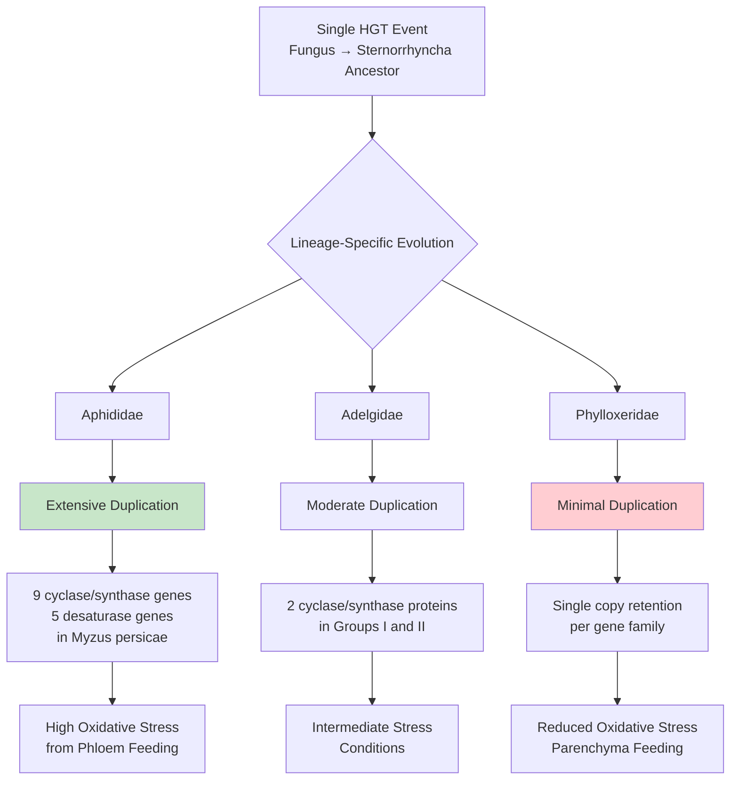

Aphid genomes show **extensive lineage-specific duplications** of carotenoid genes. In *Myzus persicae*, nine cyclase/synthase genes and five desaturase genes have been identified—a level of gene family expansion uncommon in other insects[^43]. This pattern suggests strong selective pressure for expanded carotenoid biosynthetic capacity in aphids. In striking contrast, phylloxerids have **retained only single copies** of both carotenoid cyclase/synthase and desaturase genes[^43]. This minimal gene complement likely reflects the different lifestyle of phylloxerids: they are specialists on few host species and feed on parenchyma tissue rather than phloem, potentially experiencing lower oxidative stress than their phloem-feeding relatives.

The broader distribution of carotenogenic genes across insects further supports the evolutionary significance of this HGT event. Analysis of 288 insect genomes revealed that carotenogenic genes exist widely across insect lineages, and more than 1,400 HGT-derived genes have been identified across 218 insect genomes[^4]. The carotenoid biosynthesis pathway represents a striking example where HGT introduced multiple functionally related genes that were subsequently co-opted into a complete biosynthetic pathway, demonstrating that **HGT can provide the raw material for metabolic innovation in animals**.

### 5.3 Plant Cell Wall Degradation: Enabling Herbivory and Parasitism Through Acquired Enzymes

Plant cell walls represent **the largest reservoir of organic carbon on Earth** and constitute a formidable structural barrier that herbivores and parasites must breach to access the nutrient-rich contents within plant cells[^44]. The acquisition of plant cell wall degrading enzymes (PCWDEs) through horizontal gene transfer has been a pivotal evolutionary innovation enabling diverse animal lineages to exploit plant resources, with experimental evidence demonstrating that these acquired enzymes are essential for parasitic lifestyles, larval development, and dietary specialization.

The horizontal acquisition of polygalacturonases (PGs)—pectin-degrading enzymes—by beetles in the superfamilies Chrysomeloidea (leaf beetles, longhorn beetles) and Curculionoidea (weevils) represents a key event in the evolution of herbivory in these remarkably diverse insect groups. Phylogenetic analyses revealed that **a PG gene was horizontally transferred approximately 200 million years ago from an ascomycete fungus to a common ancestor of Chrysomeloidea and Curculionoidea**[^44]. This ancient transfer has been followed by independent duplications in both lineages, as well as independent replacement in two sublineages of Chrysomeloidea by two subsequent HGT events, demonstrating that the acquisition of PCWDEs has been a recurring theme in beetle evolution.

The functional significance of these horizontally acquired PGs has been rigorously demonstrated through heterologous expression and CRISPR/Cas9 gene knockout experiments. Fifty PGs from beetle digestive systems were heterologously expressed and functionally characterized, revealing **a set of lineage-specific consecutively pectin-degrading enzymes, as well as conserved but enzymatically inactive PG proteins**[^44]. This functional diversification following horizontal transfer demonstrates that acquired genes can evolve novel or specialized functions within their new hosts.

The most compelling experimental evidence for the essential role of horizontally acquired PCWDEs comes from gene knockout studies in the leaf beetle *Phaedon cochleariae*. Using CRISPR/Cas9-guided gene knockout, researchers generated triple and quadruple PG-null mutant lines and demonstrated that:

| Mutant Line | Gut PG Activity | Fecal Pectin Content | Adult Emergence | Developmental Time |
|-------------|-----------------|---------------------|-----------------|-------------------|
| Wild-type | 100% | Baseline | Normal | Normal |
| Triple knockout | <50% | Elevated | Reduced | Prolonged |
| Quadruple knockout | <2% | Much higher | Significantly reduced | +5 days (~25% increase) |

The quadruple knockout mutants showed **dramatically impaired larval growth, reduced survival to adulthood, and significantly prolonged developmental time**[^45]. Crucially, when heterologously expressed GH28-1 PG enzyme was added to the food of quadruple mutant larvae, there was a strong positive effect on larval survivorship (~90% survival versus ~40% in controls), demonstrating that the fitness costs were directly attributable to the loss of PG activity rather than off-target effects of the knockout[^45]. These results provide experimental demonstration of the importance of plant cell wall digestion to herbivore fitness and the selective advantage provided by the pectolytic system in surviving and diversifying on a plant-based diet.

A parallel example in the leaf beetle *Plagiodera versicolora* demonstrates how horizontally acquired cellulases enable dietary specialization and reduce intraspecific competition. Adult beetles prefer to feed on new leaves but selectively oviposit on mature leaves, creating a distinct dietary niche separation between adults and larvae. Larvae show significant preference for and higher fitness on mature leaves despite these leaves having significantly higher cellulose content[^46]. The research identified **two horizontally transferred genes from bacteria, *GH48-1* and *GH48-2*, belonging to the glycosyl hydrolase 48 family and possessing cellulose degradation potential**[^46].

Knockdown experiments demonstrated that silencing *GH48-1* and/or *GH48-2* significantly hampered larval growth, survival rate, and pupation rate, and prolonged development time when feeding on mature leaves—but not when feeding on new leaves[^46]. Cellulose content in larval feces was significantly higher after *GH48* knockdown, confirming that these genes are responsible for cellulose degradation. In contrast, knockdown of these genes in adults did not affect their survival or reproductive success when fed new leaves, consistent with the stage-specific expression pattern where these HGT-acquired genes show higher expression in larvae[^46]. The study concludes that **the acquisition of bacterial-origin cellulase genes via HGT provides a metabolic enhancement essential for larvae to exploit cellulose-rich mature leaves**, allowing dietary specialization that reduces intraspecific competition with adults.

Plant-parasitic nematodes provide additional compelling examples of how horizontally acquired PCWDEs enable parasitic lifestyles. The root-knot nematode *Meloidogyne incognita* contains **60 genes for six protein families acquired through HGT from diverse bacterial sources**, including cellulases and pectate lyases[^4]. These proteins have been biochemically characterized, are secreted into plant tissues, and are directly involved in parasitism. During infection, nematodes secrete these enzymes to penetrate root tissues and establish feeding sites, using bacterial-derived tools to overcome plant structural defenses.

### 5.4 Disease Resistance and Stress Tolerance: Fungal-Derived Genes in Plants

The horizontal acquisition of genes from fungi has provided plants with **critical capabilities for defending against pathogens and tolerating environmental stress**, demonstrating that HGT operates bidirectionally in plant-fungal interactions with significant adaptive consequences for both kingdoms. The *Fhb7* gene represents the most thoroughly characterized example of fungal-to-plant HGT conferring agriculturally important disease resistance.

The *Fhb7* gene was transferred from the endophytic fungus *Epichloe* to *Thinopyrum elongatum*, a wild relative of wheat, conferring resistance to Fusarium head blight (FHB)—one of the most devastating diseases of wheat and barley worldwide[^4]. FHB is caused by *Fusarium* species that produce trichothecene mycotoxins, which not only damage plant tissues but also pose serious food safety concerns when contaminated grain enters the food supply. The *Fhb7* gene encodes a **glutathione-*S*-transferase (GST) enzyme capable of detoxifying trichothecene toxins** produced by *Fusarium* species[^4].

The phylogenetic evidence supporting fungal origin of *Fhb7* is robust—the gene sequence shows clear homology to fungal GST genes rather than to any known plant GST family, and phylogenetic analyses place *Fhb7* within fungal clades rather than with plant sequences. The transfer likely occurred during the intimate association between *Epichloe* endophytes and their grass hosts, a relationship involving extensive colonization of plant tissues that provides ample opportunity for genetic exchange.

The agricultural implications of this discovery have been substantial. **Identifying the HGT event involving the *Fhb7* gene has enabled the development of FHB-resistant wheat varieties**[^4]. Breeders can now introgress this resistance gene from *Thinopyrum elongatum* into cultivated wheat through conventional crossing, providing a natural source of disease resistance without requiring genetic engineering. This case exemplifies how understanding HGT can directly benefit crop improvement by revealing genetic resources that would otherwise remain hidden within wild relatives.

Beyond disease resistance, horizontally acquired genes have contributed to broader aspects of plant adaptation. Analysis of the moss *Physcomitrella patens*—an extant representative of early land plants—identified **57 families of nuclear genes acquired from prokaryotes, fungi, or viruses**, many of which are involved in essential or plant-specific metabolic and developmental processes[^47]. These include:

**Defense and stress-related acquisitions**:
- Glutamate–cysteine ligase (GCL), the first enzyme catalyzing formation of glutathione (essential for plant disease resistance and stress defense), was acquired from bacteria[^47]
- Several gene families acquired from bacteria are involved in purine degradation and nitrogen recycling, potentially enhancing nutrient acquisition under stress[^47]
- Genes functionally related to DNA replication and repair may have conferred early land plants additional abilities to fix DNA damage caused by intense ultraviolet radiation on the early earth surface[^47]

**Developmental and metabolic acquisitions**:
- The large subtilase gene family, acquired from bacteria, is involved in protein degradation, lateral root formation, xylem differentiation, cuticle and epidermal development, and stomata pattern formation[^47]
- At least two acquired gene families (AAE18 and YUC3) are involved in auxin biosynthesis, a hormone regulating apical dominance, cell elongation, and xylem differentiation[^47]
- The arginase gene, responsible for degrading arginine into ornithine (a major precursor for polyamines), was acquired from bacteria[^47]

The bidirectional nature of plant-fungal genetic exchange is equally significant for understanding coevolutionary dynamics. HGT also fuels the adaptation and host-specific pathogenicity of fungi—for instance, **pathogenic *Colletotrichum* fungi became more effective at infecting plants after acquiring a plant-like subtilisin gene**[^4]. Similarly, the pathogenic strain of *Pyricularia oryzae* causing wheat blast has acquired genes from related species through HGT, contributing to the establishment of a fungal niche[^4]. This reciprocal transfer demonstrates that HGT operates as a two-way street in plant-fungal interactions, with both partners potentially acquiring new capabilities that influence the outcome of their ecological relationships.

### 5.5 Metabolic Innovation and Nutritional Adaptation Through Gene Acquisition

Horizontal gene transfer has expanded metabolic capabilities in recipient organisms by providing **complete biosynthetic pathways or individual enzymatic functions** that enable exploitation of nutritional resources unavailable through vertical inheritance alone. These metabolic innovations range from vitamin biosynthesis in parasitic nematodes to nitrogen assimilation in land plants, demonstrating that HGT can address fundamental nutritional challenges across diverse eukaryotic lineages.

The soybean cyst nematode *Heterodera glycines* provides a striking example of pathway-level metabolic acquisition. This plant-parasitic nematode acquired **an entire biosynthetic pathway for vitamin B6 from bacterial sources**[^4]. Vitamin B6 (pyridoxine and related compounds) is an essential cofactor for numerous enzymatic reactions, and the nematode cannot synthesize this vitamin using its native genes. The horizontally acquired pathway provides this essential nutrient independently of dietary intake, potentially enabling the nematode to parasitize hosts with low vitamin B6 content or to maintain vitamin supplies during life stages when feeding is limited.

Despite their prokaryotic origin, these vitamin biosynthesis genes have acquired eukaryotic characteristics that demonstrate full integration into the nematode's genetic system:
- The genes contain introns (absent in bacterial genes)
- Transcripts are polyadenylated (a eukaryotic mRNA modification)
- The genes map to nematode chromosomes rather than existing as extrachromosomal elements

This pattern of "domestication"—where horizontally acquired genes acquire host-like genomic features—appears to be a common theme in successful HGT events and reflects the evolutionary process by which foreign genes become integrated into recipient regulatory networks.

In land plants, horizontally acquired genes have contributed to nitrogen metabolism and nutrient cycling. At least three gene families acquired from bacteria are involved in **purine degradation and nitrogen recycling**, and another acquired gene—glutamine synthetase—is directly responsible for assimilating ammonia into amino acids[^47]. These acquisitions may have been particularly significant during the colonization of terrestrial environments, where nitrogen availability can be limiting and efficient nitrogen recycling provides a competitive advantage.

The broader pattern of metabolic HGT in plants includes acquisitions related to:

| Metabolic Category | Acquired Function | Donor Source | Adaptive Significance |
|-------------------|-------------------|--------------|----------------------|
| **Nitrogen metabolism** | Purine degradation, glutamine synthesis | Bacteria | Nutrient recycling in nitrogen-limited environments |
| **Hormone biosynthesis** | Auxin synthesis (AAE18, YUC3) | Bacteria | Developmental regulation, stress responses |
| **Polyamine synthesis** | Arginase (ornithine production) | Bacteria | Stress tolerance, growth regulation |
| **Antioxidant defense** | Glutathione biosynthesis (GCL) | Bacteria | Disease resistance, oxidative stress protection |
| **Starch metabolism** | Pullulanase | Bacteria | Starch biosynthesis and breakdown |

The acquisition of a bacterial pullulanase involved in starch biosynthesis represents an example of HGT contributing to essential adaptive innovations in plants[^15]. Starch serves as the primary energy storage compound in plants, and the ability to efficiently synthesize and mobilize starch reserves is fundamental to plant survival and reproduction. The horizontal acquisition of enzymes contributing to this central metabolic process demonstrates that HGT can impact core aspects of plant biology, not merely peripheral or specialized functions.

A particularly intriguing aspect of metabolic HGT is the potential for acquired genes to enable **exploitation of entirely new food sources**. The horizontally acquired cellulases in beetles allow larvae to extract nutrients from cellulose-rich mature leaves that would otherwise be nutritionally inaccessible[^46]. Similarly, the pectin-degrading enzymes in beetles and nematodes enable access to the nutrient-rich cell contents that are protected behind plant cell walls[^44][^45]. In these cases, HGT has not merely improved efficiency of existing metabolic processes but has opened access to resources that were previously unavailable, representing a qualitative rather than merely quantitative expansion of metabolic capability.

### 5.6 Evolutionary Signatures of Adaptive Retention: Purifying Selection and Functional Diversification

The persistence of horizontally transferred genes across evolutionary time requires that they provide sufficient adaptive benefit to be maintained by natural selection. Molecular evolutionary analysis of HGT-derived sequences reveals **consistent signatures of purifying selection**, acquisition of eukaryotic regulatory features, and in some cases, functional diversification that together provide compelling evidence for the adaptive significance of these acquisitions.

Evidence for ongoing purifying selection on horizontally acquired genes comes from analysis of nonsynonymous to synonymous substitution ratios (dN/dS or Ka/Ks). For genes under purifying selection—where amino acid changes are deleterious and eliminated by selection—dN/dS values are significantly less than 1.0. Analysis of the *BtPMaT1* gene cluster in whiteflies revealed that **15 out of 15 pairwise comparisons yielded dN/dS values below 0.5**, indicating evolution under purifying selection[^39]. This selective constraint demonstrates that the transferred genes are not merely genomic fossils but are actively maintained by natural selection because they provide adaptive benefits.

The pattern of purifying selection extends across diverse categories of horizontally transferred genes. Analysis of horizontally transferred transposable elements revealed that **HTT incurs purifying selection (conserved protein evolution) on all TE types**[^4]. In the absence of HTT, DNA transposons appear to evolve neutrally within genomes, unlike most retrotransposons, which evolve under purifying selection even without horizontal transfer. This selection regime indicates that proteins of most retrotransposon families tend to process their own encoding RNA (cis-preference), helping retrotransposons persist within host lineages over long time periods.

Beyond purifying selection, horizontally acquired genes frequently undergo **functional diversification following transfer**, evolving novel or specialized functions within their new hosts. A compelling example comes from a plant-to-insect gene transfer where a thaumatin-like protein (TLP) with antifungal activity was transferred from plants to two whitefly species. In *Trialeurodes vaporariorum*, the protein functions similarly to its plant origin, playing an antifungal role. However, in *Bemisia tabaci*, **the TLP has evolved into an effector that suppresses plant immune responses**[^4]. This divergence demonstrates that horizontally acquired genes can evolve distinct, species-specific functions over time, driving unique evolutionary trajectories and niche adaptation.

The acquisition of eukaryotic regulatory features represents another signature of successful HGT and functional integration. Transferred genes must acquire appropriate regulatory elements to be expressed in their new genomic context. Evidence for this domestication process includes:

**Intron acquisition**: Analysis of horizontally transferred genes in *Rafflesia cantleyi* revealed that 16 of 31 verified HGT transcripts contained introns with characteristic splice sites, suggesting the source of transfer was likely genomic DNA rather than processed mRNA[^48]. The presence of introns in transferred genes indicates that they have been integrated into the host's splicing machinery.

**Expression pattern evolution**: Following HGT, transferred genes can evolve tissue-specific or stage-specific expression patterns appropriate to their function in the new host. The bacterial-origin cellulase genes in *Plagiodera versicolora* show higher expression in larvae than adults, consistent with their essential role in larval digestion of cellulose-rich mature leaves[^46].

**Codon usage adaptation**: In the parasitic plant *Rafflesia cantleyi*, 29.8% of vertically inherited genes exhibit codon usage properties more similar to their host *Tetrastigma* than to their closest relatives, and the expression level of these genes was positively correlated with similarity to host-like coding patterns[^48]. This convergence in coding properties may help explain the increased occurrence of HGT in parasitic plants—expressing host-like genes may provide a fitness benefit.

In some cases, horizontally acquired genes have **replaced native homologs**, suggesting that the foreign version provides superior function or regulation. Evidence for homologous replacement comes from the Rafflesiaceae, where phylogenetic analysis indicates that transgenic sequences have displaced native copies through homologous recombination[^48]. For genes that included only transgenic copies in Rafflesiaceae, all had homologs present in the mitochondrial genome of their close relative *Ricinus*, suggesting native copies were present ancestrally and were subsequently displaced by transgenic homologs.

### 5.7 HGT as a Driver of Ecological Transitions and Niche Expansion

The most profound adaptive significance of horizontal gene transfer lies in its capacity to facilitate **major ecological transitions and the colonization of entirely new adaptive zones**. Rather than merely improving performance within existing niches, HGT can provide the genetic innovations necessary to exploit resources or environments that were previously inaccessible, driving diversification and ecological expansion across evolutionary time.

**Plant terrestrialization** represents one of the most significant ecological transitions in the history of life, and growing evidence suggests that HGT contributed substantially to this event. Analysis of the moss *Physcomitrella patens* identified 57 gene families acquired through HGT, with many involved in processes essential for terrestrial life[^47]. The participation of these acquired genes in diverse biological processes—many related to adapting to abiotic stress and defense on land—suggests that **horizontal gene transfer had a critical role in the transition of plants from aquatic to terrestrial environments**[^47].

Two major HGT episodes appear to have shaped the evolution of streptophytes (the lineage leading to land plants) and embryophytes (land plants proper)[^15]. These episodes correlate with the plant terrestrialization event, with 57 gene families potentially acquired through HGT identified as putatively involved in the adaptation of plants to land[^15]. The timing of these acquisitions—coinciding with major evolutionary transitions—suggests that HGT provided genetic innovations that facilitated ecological expansion rather than merely improving fitness within existing niches.

The evolution of **parasitic lifestyles** provides another compelling example of HGT driving ecological transitions. Plant-parasitic nematodes have acquired suites of bacterial genes encoding cell wall-degrading enzymes that are essential for their parasitic lifestyle[^4]. Without these horizontally acquired capabilities, nematodes would lack the enzymatic machinery to penetrate plant tissues and establish feeding sites. Similarly, HGT has played a central role in the evolution of parasitic plants, with transfers contributing to the remarkable diversity of parasitic strategies observed across the plant kingdom[^15].

The evolution of **herbivory in beetles** illustrates how a single ancient HGT event can trigger subsequent adaptive radiation. The horizontal transfer of a polygalacturonase gene from an ascomycete fungus to a common ancestor of Chrysomeloidea and Curculionoidea approximately 200 million years ago was **a key event promoting the evolution of herbivory in these beetles**[^44]. This ancient acquisition has been followed by independent duplications and functional diversification in both lineages, demonstrating that HGT can provide the initial genetic innovation that subsequently enables extensive ecological diversification.

The pattern of ecological transitions facilitated by HGT can be summarized as follows:

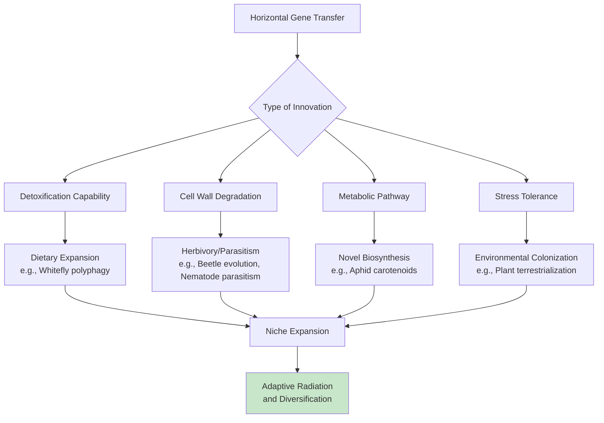

The grass *Alloteropsis semialata* exemplifies the cumulative impact of HGT on niche expansion. This species has acquired **59 functional genes from at least nine different donor grasses**, encompassing photosynthesis-related genes, disease resistance genes, and stress tolerance genes[^4]. This diversity of acquired functions suggests that HGT has contributed to multiple aspects of *A. semialata* biology, potentially enabling this species to occupy ecological niches that would otherwise be inaccessible.

### 5.8 Comparative Assessment: HGT Contribution to Eukaryotic Versus Prokaryotic Adaptation

The central question underlying the significance of eukaryotic HGT is whether horizontal transfer represents a significant source of evolutionary innovation in plants and animals **comparable to its transformative role in prokaryotes**, or whether it remains a curiosity of limited evolutionary importance despite its inherent fascination. Addressing this question requires comparing the frequency, functional impact, and adaptive significance of horizontal transfer across domains of life.

In prokaryotes, HGT is pervasive and transformative. Quantitative assessments reveal that between 1.6% and 32.6% of genes in individual microbial genomes have been acquired through horizontal transfer, and when cumulative impact is considered, approximately 81 ± 15% of genes show evidence of horizontal movement at some point in their evolutionary history. Bacteria and archaea often adapt to new environments primarily through HGT, sampling from a large global gene pool and maintaining fluid genomes that can rapidly incorporate beneficial innovations[^49]. The spread of antibiotic resistance genes represents perhaps the most visible demonstration of HGT's power to drive rapid adaptation in prokaryotes.

In contrast, eukaryotic HGT operates at dramatically lower frequencies. Even in lineages with extensive documented HGT, foreign genes typically constitute only a small percentage of the genome:

| Organism | HGT-Derived Gene Content | Context |
|----------|-------------------------|---------|
| Rumen ciliates | 4-5% | Unicellular eukaryotes with extensive bacterial contact |
| *Galdieria sulphuraria* | 4-5% | Extremophilic red alga |
| Bdelloid rotifers | 8-9% | Asexual animals with telomeric HGT concentration |
| Nematodes | >3% | Plant-parasitic species |
| Most multicellular eukaryotes | <1% | Plants and animals generally |

These frequencies are orders of magnitude lower than in prokaryotes, reflecting the substantial barriers to HGT in eukaryotes discussed in earlier chapters. However, **frequency alone does not determine evolutionary significance**. The appropriate comparison may not be the total number of HGT events but rather the functional impact of those events that do succeed.

A theoretical framework for understanding the relative importance of HGT in eukaryotes versus prokaryotes comes from modeling the advantages and disadvantages of horizontal transfer. If the gene loss rate during replication is high—as in early genomes before the last universal common ancestor—**a high HGT rate is favorable because it allows rapid spread of new genes and enables larger, fitter genomes than vertical inheritance alone**[^49]. In contrast, if the gene loss rate is lower—as in modern organisms with accurate replication—HGT is, on average, unfavorable because it primarily introduces duplicate or incompatible genes[^49].

This framework suggests that the low frequency of HGT in modern eukaryotes reflects an evolutionary optimum rather than merely a barrier-imposed limitation. Modern cells should evolve to reduce HGT because, on average, transferred genes are more likely to be detrimental than beneficial[^49]. The genes that do persist following HGT in eukaryotes have passed through stringent selective filters—they must provide sufficient benefit to overcome the costs of integration, expression, and potential disruption of existing genetic networks.

The evidence reviewed in this chapter supports the hypothesis that **horizontally acquired genes may have contributed more to adaptive evolution of eukaryotes than previously assumed**[^43]. Current candidate sets of horizontally acquired eukaryotic genes may represent only the tip of an iceberg, with many ancient transfers having lost their phylogenetic signal or been overlooked due to methodological limitations. The cases that have been documented—carotenoid biosynthesis in aphids, ice-binding proteins in marine algae, detoxification genes in whiteflies, disease resistance genes in wheat—represent clear examples of HGT driving adaptive innovation[^43].

The functional categories of successfully transferred genes provide insight into what types of innovations HGT can contribute to eukaryotic evolution. Retained genes are overwhelmingly biased toward **operational categories**—enzymes for detoxification, nutrient digestion, metabolite utilization, and extracellular processes—rather than informational genes involved in transcription, translation, and DNA replication. This bias reflects the "complexity hypothesis": operational genes that function independently or interface with central metabolic hubs can be successfully transferred, while informational genes requiring complex, co-adapted protein interactions are rarely retained following transfer.

The conclusion that emerges from this comparative assessment is nuanced. HGT in eukaryotes is **quantitatively rare but qualitatively significant**. The stringent filters facing horizontally transferred genes in plants and animals—including germline access, integration, expression compatibility, and positive selection—mean that only transfers providing substantial adaptive benefits persist over evolutionary time. The rarity of eukaryotic HGT thus reflects not merely the difficulty of transfer but also the high bar that transferred genes must clear to be retained. When that bar is cleared, the result is often a significant evolutionary innovation—a new metabolic capability, a novel defense mechanism, or the ability to exploit an entirely new ecological niche. In this sense, HGT in eukaryotes functions as a **highly selective conduit for innovation**, where gene function directly determines the likelihood of retention and adaptive impact.

## 6 Why Rarity Makes These Transfers Remarkable: Selective Pressures and Retention

The preceding chapters have documented an extraordinary collection of horizontal gene transfer events across plant and animal lineages—from the *BtPMaT1* gene enabling whiteflies to detoxify plant defenses to the fungal-derived carotenoid biosynthesis pathway in aphids. Yet a fundamental question remains: **why do the genes that successfully transfer almost invariably confer substantial adaptive advantages?** This chapter investigates the paradox at the heart of eukaryotic HGT, revealing that the very barriers making horizontal transfer rare in plants and animals simultaneously function as stringent selective filters that ensure only genes providing meaningful fitness benefits persist over evolutionary time. Understanding this filtering process illuminates why eukaryotic HGT, despite its infrequency, represents one of the most fascinating mechanisms of evolutionary innovation in complex organisms.

### 6.1 The Paradox of Rarity and Significance in Eukaryotic HGT

The central paradox defining horizontal gene transfer in multicellular eukaryotes emerges from a striking observation: while HGT frequencies in plants and animals are **orders of magnitude lower than in prokaryotes**, the documented cases consistently involve genes with substantial functional importance. This juxtaposition of rarity and significance demands explanation, as it suggests that the mechanisms limiting HGT in eukaryotes are not merely obstacles to be overcome but rather selective filters that shape the evolutionary outcome of genetic exchange.

Quantitative comparisons reveal the dramatic disparity in HGT prevalence across domains of life. In prokaryotes, horizontal transfer is pervasive—between 1.6% and 32.6% of genes in individual microbial genomes have been acquired through horizontal transfer, and when the cumulative impact is considered through network analysis, approximately **81 ± 15% of prokaryotic genes show evidence of horizontal movement** at some point in their evolutionary history[^50]. Bacteria maintain fluid genomes that can rapidly incorporate beneficial innovations, with gene transfer events in marine prokaryotes alone estimated to reach as high as 10^13 per year in the Mediterranean Sea. In stark contrast, even in eukaryotic lineages with extensive documented HGT, foreign genes typically constitute only a small percentage of the genome:

| Organism Category | HGT-Derived Content | Representative Examples |
|-------------------|---------------------|------------------------|
| **Unicellular eukaryotes** | 4-5% | Rumen ciliates, *Galdieria sulphuraria* |
| **Asexual invertebrates** | 8-9% | Bdelloid rotifers |
| **Parasitic animals** | >3% | Plant-parasitic nematodes |
| **Most multicellular eukaryotes** | <1% | Plants and animals generally |
| **Prokaryotes (cumulative)** | ~81% | Bacteria and archaea |

Yet despite this dramatic frequency differential, the genes that successfully transfer in eukaryotes are not random acquisitions. The documented cases reviewed in previous chapters—*BtPMaT1* in whiteflies, carotenoid biosynthesis genes in aphids, *Fhb7* disease resistance in wheat relatives, cell wall-degrading enzymes in beetles and nematodes—share a common characteristic: they provide **clear, substantial adaptive benefits** to their recipients. This pattern is too consistent to be coincidental and suggests that the barriers limiting eukaryotic HGT function as selective filters rather than absolute barriers.

The multiple barriers to HGT in multicellular eukaryotes—germline sequestration, the nuclear envelope, immune defenses, and developmental complexity—collectively create what can be conceptualized as a **multi-stage filtration system**. Each barrier eliminates a substantial fraction of potential transfers, but the genes that successfully navigate all stages emerge as highly filtered, functionally significant acquisitions. The weak-link model explains how foreign genes can enter eukaryotic genomes despite germline sequestration by identifying vulnerable developmental stages where barriers are reduced[^51]. However, entry is merely the first step; subsequent stages of expression, integration, and selection determine whether transferred sequences achieve long-term retention.

This filtering perspective resolves the apparent paradox: **rarity and functional significance are not independent observations but causally linked outcomes** of the same selective process. The stringent barriers that make HGT rare in eukaryotes simultaneously ensure that only transfers providing sufficient adaptive benefit to overcome these obstacles achieve long-term retention. The paradox dissolves when we recognize that the same mechanisms limiting HGT frequency also guarantee that successful transfers are evolutionarily significant.

### 6.2 Multi-Stage Selective Filters Governing Gene Retention

The journey from initial DNA entry to stable, functional gene retention in eukaryotic genomes involves a series of **sequential selective filters**, each eliminating a substantial proportion of potential transfers. Understanding these filters—and how they collectively shape the landscape of successful HGT—reveals why horizontally acquired genes that persist are overwhelmingly those providing adaptive benefits.

The first filter involves **physical transfer and genomic integration**. For foreign genetic material to be transmitted to offspring, it must first enter recipient cells and then integrate into the nuclear genome in a manner permitting stable inheritance. The nuclear envelope acts as a critical physical barrier in eukaryotic cells, requiring foreign DNA to utilize host import machinery for nuclear entry[^51]. Unlike prokaryotes, where genetic material exists in the cytoplasm without membrane separation, eukaryotic genomes are compartmentalized within the nucleus, adding an additional step that foreign genetic material must navigate.

Integration into the host chromosome typically occurs through mechanisms that exploit host DNA repair machinery or involve transposable element-mediated insertion. Evidence from documented HGT cases suggests that transposable elements may facilitate integration—the concentration of foreign DNA in telomeric regions of bdelloid rotifer chromosomes suggests specific integration mechanisms that minimize disruption to essential genes[^51]. The analysis of horizontally transferred genes in *Rafflesia cantleyi* revealed evidence for integration via **homologous recombination**, which has displaced native genes with their horizontally acquired counterparts[^51]. Seven assembled contigs demonstrated that synteny was maintained between transgenes from Rafflesiaceae and genes from *Vitis*, supporting integration via recombination rather than random insertion.

The second filter involves **expression compatibility**. Successfully integrated genes must acquire appropriate regulatory elements to be expressed in their new genomic context. Foreign genes lacking compatible promoters, enhancers, or other regulatory sequences will remain transcriptionally silent and provide no selective advantage. The observation that many bacteria-to-eukaryote transfers show only low-level transcription—as documented in *Drosophila ananassae* and *Callosobruchus chinensis* where approximately 2% and 50% of transferred *Wolbachia* genes, respectively, show evidence of transcription—indicates that expression compatibility represents a significant bottleneck[^51].

The process of acquiring eukaryotic regulatory features can be observed in successfully retained genes. Analysis of horizontally transferred genes in various eukaryotes reveals acquisition of:

- **Introns**: 16 of 31 verified HGT transcripts in *Rafflesia cantleyi* contained introns with characteristic splice sites[^51]
- **Polyadenylation signals**: Vitamin B6 biosynthesis genes in *Heterodera glycines* produce polyadenylated transcripts
- **Codon usage adaptation**: In *Rafflesia cantleyi*, 29.8% of vertically inherited genes exhibit codon usage properties more similar to their host *Tetrastigma* than to their closest relatives

The third filter involves **post-transcriptional processing and translation efficiency**. Even if transcribed, foreign genes may produce aberrant transcripts that are degraded or inefficiently translated. Codon usage bias represents a significant challenge—genes from distantly related donors may use codons that are rare in the recipient organism, reducing translation efficiency. The observation that candidate HGT genes in *Salpingoeca rosetta* showed higher GC content at the third codon position (GC3) relative to other genes, yet similar codon bias index (CBI) to native genes, suggests that **selection may favor foreign genes with translationally optimal codons** that resemble the host genome composition[^51].

The fourth filter involves **functional integration at the protein level**. The gene product must functionally integrate into existing cellular networks to provide adaptive benefit. This requirement explains the bias toward operational genes in successful HGT events—proteins that function independently or interface with central metabolic hubs can be successfully integrated, while proteins requiring extensive interactions with co-evolved partners face additional compatibility challenges.

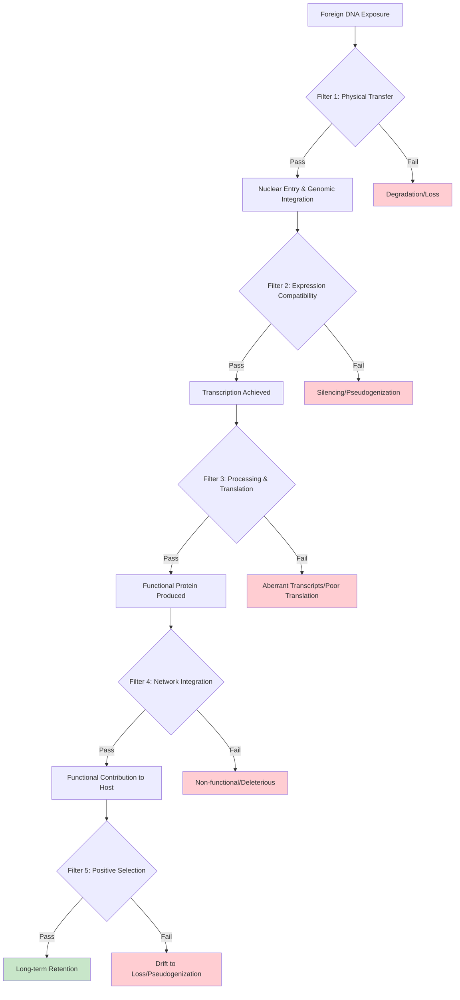

The final filter is **positive selection for adaptive benefit**. Genes that successfully navigate all previous filters but provide no fitness advantage will eventually be lost through genetic drift or accumulate mutations that render them non-functional. Only genes that confer sufficient adaptive benefit to be actively maintained by natural selection will persist over evolutionary time. This final filter explains why documented cases of eukaryotic HGT consistently involve genes with clear functional importance—neutral transfers are eliminated by drift, while deleterious transfers are eliminated by purifying selection against the host.

### 6.3 The Complexity Hypothesis and Operational Gene Bias

A striking pattern emerges from analysis of successfully retained horizontally transferred genes in eukaryotes: they are **overwhelmingly biased toward operational categories**—enzymes, metabolic genes, and proteins functioning independently—rather than informational genes involved in transcription, translation, and DNA replication. This bias, predicted by the **complexity hypothesis**, reflects fundamental constraints on which genes can be successfully transferred and retained across species boundaries.

The complexity hypothesis, originally proposed by Jain and colleagues, holds that gene transferability is dependent on two factors: gene function and protein-protein interaction complexity[^51]. Operational genes—those encoding metabolic enzymes, biosynthetic pathway components, and proteins that function autonomously—are more likely to be passed horizontally because they can function independently of other genes. In contrast, informational genes—those involved in transcription, translation, and DNA replication—physically interact with more gene products, limiting their functionality when transferred individually and reducing the probability of successful retention[^51].

Research on *Escherichia coli* has provided direct evidence supporting the complexity hypothesis in a prokaryotic context. Analysis categorizing genes by their evolutionary conservation revealed that **core genes (present in all strains) show the highest expression levels and slowest evolutionary rates, while horizontally transferred genes show the lowest expression levels and fastest evolutionary rates**[^52]. Crucially, in protein-protein interaction networks, core genes have higher average connectivity than horizontally transferred genes. However, horizontally transferred genes preferentially attach to resident core proteins rather than non-core proteins, suggesting a **differential attachment model** where successful integration requires connection to central network hubs[^52].

The functional categories of successfully transferred genes in plants and animals strongly support the complexity hypothesis predictions:

| Gene Category | Transfer Frequency | Examples | Network Properties |
|---------------|-------------------|----------|-------------------|
| **Detoxification enzymes** | High | *BtPMaT1* (whiteflies), *Fhb7* (wheat) | Function independently; interface with small molecules |
| **Cell wall-degrading enzymes** | High | Polygalacturonases (beetles), cellulases (nematodes) | Secreted; minimal host protein interactions |
| **Biosynthetic enzymes** | High | Carotenoid genes (aphids), vitamin B6 pathway (nematodes) | Pathway components; sequential reactions |
| **Stress response proteins** | Moderate | Various in moss *Physcomitrella patens* | Often function autonomously |
| **Transcription factors** | Very low | Rare documented cases | Require co-evolved binding partners |
| **Ribosomal proteins** | Very low | Essentially absent | Highly integrated into complex assemblies |
| **DNA replication machinery** | Very low | Essentially absent | Extensive protein-protein interactions |

The bias toward operational genes is particularly evident in the choanoflagellate *Salpingoeca rosetta*, where most candidate HGTs with known functions were orthologous to operational genes such as enzymes functioning in amino acid and carbohydrate biosynthesis, as well as genes involved in intercellular signaling and extracellular matrix modification[^51]. The study explicitly noted that **operational genes are more likely to be passed horizontally because they can function independently of other genes**, directly supporting the complexity hypothesis framework.

The complexity hypothesis also explains why certain metabolic pathways appear repeatedly among documented HGT events. The diaminopimelate (DAP) pathway for lysine biosynthesis, for instance, has been identified as horizontally acquired in multiple eukaryotic lineages including choanoflagellates[^51]. This pathway involves sequential enzymatic reactions where each enzyme acts on the product of the previous step—a modular architecture that permits individual genes to be transferred and integrated without requiring simultaneous transfer of interaction partners.

The preferential attachment of horizontally transferred genes to core network components, observed in *E. coli* studies, suggests that **successful integration may require connection to central metabolic hubs** that provide essential substrates or accept pathway products[^52]. This requirement would favor genes encoding enzymes at pathway termini or interface points while disfavoring genes encoding components of tightly integrated complexes where all subunits must be co-adapted.

### 6.4 Signatures of Adaptive Retention: Purifying Selection and Functional Domestication

The distinction between successfully retained horizontally acquired genes and genomic fossils destined for degradation lies in the **molecular evolutionary signatures** that reveal ongoing functional importance. Analysis of retained genes consistently demonstrates evidence for purifying selection—the elimination of deleterious amino acid changes—along with acquisition of eukaryotic regulatory features that indicate successful integration into host genetic networks.

The most direct evidence for adaptive retention comes from analysis of **nonsynonymous to synonymous substitution ratios (dN/dS or Ka/Ks)**. For genes under purifying selection, where amino acid changes are deleterious and eliminated by selection, dN/dS values are significantly less than 1.0. Analysis of the *BtPMaT1* gene cluster in whiteflies revealed that **15 out of 15 pairwise comparisons yielded dN/dS values below 0.5**, indicating evolution under strong purifying selection. This selective constraint demonstrates that the transferred genes are not merely genomic fossils but are actively maintained by natural selection because they provide adaptive benefits.

The pattern of purifying selection extends across diverse categories of horizontally transferred genes. Analysis of horizontally transferred transposable elements revealed that **HTT incurs purifying selection (conserved protein evolution) on all TE types**[^51]. In the absence of HTT, DNA transposons appear to evolve neutrally within genomes, unlike most retrotransposons, which evolve under purifying selection even without horizontal transfer. This selection regime indicates that proteins of most retrotransposon families tend to process their own encoding RNA (cis-preference), helping retrotransposons persist within host lineages over long time periods.

Beyond purifying selection, successfully retained genes undergo a process of **functional domestication** whereby they acquire eukaryotic characteristics indicating integration into host regulatory networks:

**Intron acquisition** represents one of the clearest signatures of domestication. Bacterial genes lack introns, so their presence in horizontally acquired genes indicates post-transfer evolution within the eukaryotic host. In *Salpingoeca rosetta*, candidate HGTs had a similar median number of introns (five) as other genes in the genome, and only 23 of the 175 candidate HGTs lacked introns entirely[^51]. This pattern indicates that transferred genes have been resident in the choanoflagellate genome long enough to acquire host-like genomic architecture.

**Codon usage adaptation** provides another signature of domestication. Foreign genes initially retain the codon preferences of their donor organisms, which may differ substantially from host preferences. Over time, selection for translation efficiency drives convergence toward host-like codon usage. The observation that candidate HGT genes in *S. rosetta* showed **higher GC content at the third codon position (GC3) relative to other genes, yet similar codon bias index (CBI) to native genes**, suggests that selection favors foreign genes with translationally optimal codons resembling the GC-rich host genome[^51].

**Expression pattern evolution** demonstrates functional integration into host developmental programs. Following HGT, transferred genes can evolve tissue-specific or stage-specific expression patterns appropriate to their function in the new host. In *S. rosetta*, **156 of 175 candidate HGTs were expressed in all four life stages examined** (thecate cells, swimming cells, chain colonies, and rosette colonies), with only 3 showing no detectable expression[^51]. This widespread expression indicates that transferred genes have acquired functional promoters and contribute to host biology across developmental stages.

The contrast between successfully domesticated genes and degrading pseudogenes is evident in comparative analyses. Many *Wolbachia*-to-nematode transfers show evidence of transcription, but **many transcripts derive from pseudogenes that have accumulated mutations disrupting their reading frames**[^51]. The mixture of functional and non-functional transferred sequences reflects the ongoing evolutionary process: recently transferred genes may retain functionality, while older transfers gradually degrade unless maintained by selection.

Evidence for **functional replacement of native genes** by horizontally acquired homologs provides particularly compelling evidence for adaptive retention. In the Rafflesiaceae, phylogenetic analysis indicates that transgenic sequences have displaced native copies through homologous recombination. For genes that included only transgenic copies in Rafflesiaceae, all had homologs present in the mitochondrial genome of their close relative *Ricinus*, suggesting native copies were present ancestrally and were subsequently displaced by transgenic homologs[^51]. Such replacement implies that the foreign version provides superior function or regulation—otherwise, the native copy would be retained.

### 6.5 Gene Categories Predisposed to Successful Horizontal Acquisition

Synthesizing patterns across documented HGT cases reveals that certain functional categories of genes are **systematically overrepresented among successful transfers**, while others are essentially absent despite their abundance in donor genomes. This non-random distribution reflects the interaction between gene function, network connectivity, and the selective filters governing retention.

**Detoxification enzymes** represent one of the most consistently successful categories of horizontally transferred genes. The *BtPMaT1* phenolic glucoside malonyltransferase in whiteflies and the *Fhb7* glutathione-*S*-transferase in wheat relatives both encode enzymes that neutralize toxic compounds—plant defense metabolites and fungal mycotoxins, respectively. These enzymes share characteristics that predispose them to successful transfer: they function independently, act on small molecule substrates without requiring protein-protein interactions, and provide immediate, measurable fitness benefits when expressed. The "plug-and-play" nature of detoxification enzymes—where the enzyme simply needs access to its substrate to provide benefit—minimizes the integration challenges that would face more networked proteins.

**Cell wall-degrading enzymes** similarly appear repeatedly among documented HGT events. Polygalacturonases in beetles, cellulases in nematodes and beetles, and pectate lyases in plant-parasitic nematodes all encode secreted enzymes that degrade structural polysaccharides. These enzymes are secreted into the extracellular environment, further reducing requirements for integration into intracellular networks. The functional validation of these enzymes—including biochemical characterization, secretion demonstration, and knockout phenotypes—confirms their essential roles in enabling herbivory and parasitism.

**Biosynthetic pathway components** constitute another successful category, exemplified by the carotenoid biosynthesis genes in aphids. The three key upstream genes (*GPS*, *PS*, *CD*) encode enzymes catalyzing sequential reactions in a linear pathway[^51]. This modular architecture permits individual genes to be transferred and integrated without requiring simultaneous transfer of interaction partners. Notably, the downstream gene (*CCO*) appears to be a native insect gene that was co-opted to complete the pathway, demonstrating how horizontally acquired components can be combined with native genes to create functional pathways.

**Extracellular matrix components and modifiers** appear frequently among candidate HGTs, particularly in choanoflagellates. In *S. rosetta*, the most common functions within the set of putative HGTs were extracellular matrix (ECM) components, including genes with dermatopontin/calcium-binding EGF domains, glycosyl hydrolases, and glycosyltransferases[^51]. These proteins function in the extracellular space or at the cell surface, reducing requirements for intracellular network integration.

In contrast, certain gene categories are **essentially absent from documented eukaryotic HGT events** despite their abundance in potential donor genomes:

| Rarely Transferred Category | Reason for Exclusion | Network Properties |
|----------------------------|---------------------|-------------------|
| **Ribosomal proteins** | Require co-evolution with rRNA and other ribosomal proteins | Highly integrated into 50+ subunit complexes |
| **DNA polymerase subunits** | Must interact with multiple replication factors | Part of multi-protein replication machinery |
| **Transcription factors** | Require co-evolved DNA binding sites and cofactors | Embedded in regulatory networks |
| **Splicing factors** | Must recognize host-specific splice signals | Integrated into spliceosome complex |
| **Developmental regulators** | Require integration into morphogenetic networks | Highly pleiotropic with multiple interactions |

The absence of these categories from successful HGT events is not due to lack of opportunity—bacterial genomes contain abundant genes encoding transcription factors, DNA replication machinery, and other informational components. Rather, the **integration requirements for these genes are incompatible with horizontal acquisition**. A bacterial transcription factor, for instance, would need to recognize eukaryotic promoter sequences, interact with eukaryotic cofactors, and integrate into existing regulatory networks—requirements that are unlikely to be met by chance.

This analysis enables development of a **predictive framework** for identifying genes amenable to horizontal acquisition:

1. **Autonomous function**: Genes encoding proteins that function independently, without requiring specific interaction partners
2. **Peripheral network position**: Genes encoding proteins at pathway termini or interface points rather than central network hubs
3. **Extracellular or secreted products**: Genes encoding proteins that function outside the cell, minimizing intracellular integration requirements
4. **Immediate fitness benefit**: Genes whose products provide measurable advantage upon expression, enabling positive selection to act quickly
5. **Modular pathway components**: Genes encoding enzymes in linear pathways where each step is independent

### 6.6 Why Successful Transfers Confer Substantial Benefits: The High-Bar Hypothesis

The consistent observation that documented cases of eukaryotic HGT involve genes enabling **major adaptive innovations** rather than minor fitness improvements demands explanation. The "high-bar hypothesis" proposes that the stringent selective filters facing horizontally transferred genes in eukaryotes ensure that only transfers providing substantial—rather than marginal—adaptive benefits achieve long-term retention.

Consider the multi-stage filtering process described in Section 6.2. At each stage, a fraction of potential transfers is eliminated:

- **Physical transfer and integration**: Perhaps 1 in 10^6 foreign DNA fragments successfully integrates into the nuclear genome
- **Expression compatibility**: Perhaps 1 in 10^3 integrated sequences acquires functional regulatory elements
- **Processing and translation**: Perhaps 1 in 10^2 expressed genes produces functional protein
- **Network integration**: Perhaps 1 in 10 functional proteins provides benefit rather than disruption
- **Positive selection**: Perhaps 1 in 10^2 beneficial genes provides sufficient advantage to be maintained against drift

The cumulative probability of successful retention through all stages might be on the order of **1 in 10^14 or lower**—meaning that among the countless foreign DNA fragments that organisms encounter over evolutionary time, only an infinitesimal fraction achieves stable, functional retention.

This extreme filtering has a crucial consequence: **genes providing only marginal fitness benefits are unlikely to survive the selection process**. A gene that increases fitness by 0.1% might be eliminated by drift before selection can act to fix it in the population. A gene that increases fitness by 10%, however, faces much stronger positive selection that can overcome drift and maintain the gene against mutational degradation. The high bar imposed by the filtering process thus ensures that genes achieving retention provide substantial rather than marginal benefits.

This hypothesis explains several observations about documented eukaryotic HGT:

**Why acquired genes often enable novel capabilities rather than improving existing ones**: The *BtPMaT1* gene provides whiteflies with an entirely new detoxification capability; the carotenoid genes provide aphids with biosynthetic capacity previously unavailable to animals; the cell wall-degrading enzymes provide beetles and nematodes with access to nutritional resources that were previously inaccessible. These represent qualitative rather than quantitative improvements—new capabilities rather than incremental enhancements of existing functions. Such major innovations provide the substantial fitness benefits needed to survive the filtering process.

**Why acquired genes are often essential for recipient survival in specific contexts**: The experimental demonstration that silencing *BtPMaT1* causes near-complete mortality in whiteflies feeding on phenolic glycoside-containing plants reveals that this horizontally acquired gene is **essential rather than merely beneficial**. Similarly, knockout of polygalacturonase genes in beetles dramatically impairs larval development and survival. Genes providing such essential functions face strong positive selection that maintains them against drift and degradation.

**Why acquired genes show strong signatures of purifying selection**: The dN/dS values below 0.5 observed for *BtPMaT1* and other acquired genes indicate that amino acid changes are strongly deleterious—consistent with genes performing essential functions where protein sequence is constrained by functional requirements. Genes providing only marginal benefits would not show such strong purifying selection.

The high-bar hypothesis also explains the apparent paradox that **eukaryotic HGT is simultaneously rare and evolutionarily significant**. The rarity reflects the stringent filtering process; the significance reflects the fact that only genes providing substantial benefits survive this process. Rarity and significance are not independent observations but causally linked outcomes of the same selective mechanism.

A corollary of the high-bar hypothesis is that **many potentially beneficial transfers may fail to achieve retention** simply because they do not clear the high bar imposed by the filtering process. A gene providing a 1% fitness benefit might be genuinely advantageous, but if it cannot survive the integration and expression challenges, or if drift eliminates it before selection can act, it will not be observed among documented HGT events. This implies that the documented cases represent only the most successful transfers—those providing benefits substantial enough to overcome all barriers—while many modestly beneficial transfers are lost.

### 6.7 Contrasting Prokaryotic and Eukaryotic HGT: Quantity Versus Quality

The fundamental differences in HGT dynamics between prokaryotes and eukaryotes illuminate why horizontal transfer plays such different evolutionary roles in these domains. While prokaryotic HGT operates as a **high-frequency mechanism for rapid adaptation and genome fluidity**, eukaryotic HGT functions as a **rare but high-impact source of evolutionary innovation**. Understanding these differences reveals why reduced HGT rates may be evolutionarily optimal for organisms with larger genomes and more complex regulatory networks.

In prokaryotes, HGT is pervasive and operates through well-characterized mechanisms—transformation, conjugation, transduction, and gene transfer agents—that enable frequent genetic exchange between neighboring cells[^50]. The ecological significance of prokaryotic HGT is exemplified by antibiotic resistance acquisition, where gene transfers between bacterial species represent the major mechanism whereby bacteria acquire resistance. This high-frequency exchange enables bacteria to sample from a large global gene pool, maintaining fluid genomes that can rapidly incorporate beneficial innovations.

Bacteria and eukaryotes exhibit **opposite evolutionary responses to genetic drift** that illuminate fundamental differences in their genome dynamics[^50]. Bacteria in natural selection more effective environments (i.e., larger effective population sizes) tend to have larger genomes, while eukaryotes in similar conditions have more streamlined genomes. This paradox is explained by differences in mutational processes: bacteria exhibit a strong mutational bias toward deletion of redundant sequences, while eukaryotes show bias toward large insertions[^50]. When exposed to drift, bacterial genomes shrink through deletion while eukaryotic genomes expand through accumulation of non-functional sequences.

The evolution of **meiotic sex** in early eukaryotes may have reduced the relative importance of HGT by providing an alternative mechanism for genetic recombination[^53]. Theoretical modeling demonstrates that the benefit of lateral gene transfer (LGT) declines rapidly with increasing genome size—larger genomes gain *de novo* deleterious mutations at a faster rate, and LGT cannot efficiently counteract this mutational burden unless recombination length approaches the same order of magnitude as genome size[^53]. The recombination events required (L=0.2g, where L is recombination length and g is genome size) are unknown among prokaryotes but are easily achievable via meiotic sex. This provides an explanation for why meiotic sex evolved during early eukaryotic evolution and why LGT became less important as a mechanism for maintaining genome integrity.

The transition from prokaryotic to eukaryotic genome architecture created conditions where **reduced HGT rates may be evolutionarily optimal**:

| Factor | Prokaryotic Context | Eukaryotic Context | Implication for HGT |
|--------|--------------------|--------------------|---------------------|
| **Genome size** | Small (1-10 Mb) | Large (10 Mb - 10 Gb) | Larger mutational target reduces LGT benefit |
| **Recombination** | LGT-dependent | Meiotic sex | Alternative mechanism reduces LGT importance |
| **Gene organization** | Operons, polycistronic | Monocistronic, complex regulation | Integration more challenging |
| **Nuclear envelope** | Absent | Present | Physical barrier to DNA entry |
| **Germline** | Absent | Sequestered | Transmission barrier |

Despite these differences, the genes that do transfer successfully in eukaryotes may have **greater individual impact** than typical prokaryotic transfers. In prokaryotes, the high frequency of HGT means that many transfers are neutral or only marginally beneficial—they persist because they are not sufficiently deleterious to be eliminated by selection, not because they provide substantial advantage. In eukaryotes, the stringent filtering process ensures that only transfers providing substantial benefits achieve retention, resulting in a smaller number of transfers with greater average impact.

This quantity-versus-quality distinction has important implications for understanding the evolutionary role of HGT across domains. Prokaryotic HGT operates as a **mechanism for genome fluidity and rapid adaptation**—bacteria can quickly acquire resistance genes, metabolic capabilities, or virulence factors as environmental conditions change. Eukaryotic HGT operates as a **mechanism for major evolutionary innovation**—the acquisition of entirely new capabilities like carotenoid biosynthesis, plant cell wall degradation, or toxin detoxification that open access to new ecological niches.

The complexity hypothesis provides a theoretical framework unifying these observations[^52][^51]. In both prokaryotes and eukaryotes, operational genes are transferred more successfully than informational genes. However, the consequences differ: in prokaryotes, the high frequency of operational gene transfer enables continuous fine-tuning of metabolic capabilities, while in eukaryotes, the rare successful transfer of operational genes represents a major evolutionary event. The same underlying principle—that genes requiring fewer protein-protein interactions are more amenable to horizontal acquisition—operates in both domains, but the filtering intensity differs dramatically.

The implications extend to understanding **why eukaryotic complexity evolved in the first place**. The greater complexity of eukaryotes is linked with larger genomes, which expanded due to the endosymbiotic origin of mitochondria releasing bioenergetic constraints[^53]. This genome expansion created strong selective pressure for meiotic sex as a mechanism to maintain genome integrity against mutational burden. The evolution of meiotic sex, in turn, reduced the importance of LGT while providing the recombination necessary to purge deleterious mutations. The result was a fundamental reorganization of genome dynamics that made HGT rare while enabling the evolution of complex multicellular organisms.

In conclusion, the rarity of HGT in eukaryotes and the functional significance of successfully transferred genes are **two sides of the same evolutionary coin**. The barriers that make transfer rare simultaneously ensure that only genes providing substantial adaptive benefits achieve retention. This high-bar filtering transforms HGT from a mechanism of genome fluidity (as in prokaryotes) to a mechanism of major evolutionary innovation (as in eukaryotes). The genes that successfully navigate all selective filters—*BtPMaT1*, carotenoid biosynthesis genes, cell wall-degrading enzymes, disease resistance genes—represent the exceptional cases where horizontal transfer has provided the raw material for adaptive evolution in complex multicellular organisms. Understanding this filtering process illuminates why eukaryotic HGT, despite its infrequency, represents one of the most fascinating mechanisms of evolutionary innovation in the biological world.

## 7 Bidirectional Transfers Between Plants and Animals: A Special Case

The documented cases of horizontal gene transfer in previous chapters have revealed remarkable genetic exchanges between organisms within the same kingdom or between bacteria and eukaryotes. This chapter examines what may be the most extraordinary category of HGT events: **cross-kingdom genetic exchange between plants and animals**. These transfers span a phylogenetic gulf of staggering proportions—the lineages leading to modern plants and animals diverged over 1.5 billion years ago, representing one of the deepest divisions in the eukaryotic tree of life. Yet despite this immense evolutionary distance, genomic evidence has now confirmed that genes have moved in both directions across this kingdom boundary, with functional consequences that illuminate the remarkable permeability of even the most fundamental taxonomic divisions to genetic exchange. The whitefly *Bemisia tabaci*, which acquired plant genes enabling it to neutralize host defenses, and the cacao tree *Theobroma cacao*, which harbors insect-derived genes, exemplify a phenomenon that challenges conventional assumptions about the barriers separating distinct kingdoms of life.

### 7.1 The Phylogenetic Gulf: Why Plant-Animal Transfers Represent Exceptional HGT Events

The evolutionary distance separating plants and animals creates barriers to horizontal gene transfer that extend far beyond those facing within-kingdom exchanges. To appreciate the extraordinary nature of plant-animal HGT, one must first comprehend the magnitude of the phylogenetic gulf these transfers must bridge. Plants and animals last shared a common ancestor approximately **1.5 billion years ago**, during the early diversification of eukaryotic life. In the intervening eons, these lineages have diverged dramatically in cellular organization, developmental programs, metabolic capabilities, and ecological strategies. The successful transfer of functional genes across this divide represents one of the most remarkable demonstrations of genetic exchange in the biological world.

The barriers to cross-kingdom HGT operate at multiple levels that compound upon those already facing within-kingdom transfers. At the most fundamental level, plants and animals differ in **basic cellular architecture**—plant cells possess rigid cell walls composed of cellulose and pectin that animal cells lack, while animal cells have evolved sophisticated immune surveillance systems that plants do not share. These structural and defensive differences mean that the mechanisms enabling genetic exchange within kingdoms may not function across kingdom boundaries. A virus that efficiently transfers genetic material between plant species, for instance, may be incapable of infecting animal cells, and vice versa.

Beyond cellular barriers, plants and animals have evolved profoundly different **genomic regulatory systems**. Plant promoters, enhancers, and other regulatory elements differ substantially from their animal counterparts, meaning that a gene successfully integrated into an animal genome from a plant source faces the additional challenge of acquiring appropriate regulatory elements to be expressed. The codon usage preferences of plants and animals have also diverged over evolutionary time, potentially reducing translation efficiency of cross-kingdom transferred genes. These compatibility challenges explain why plant-animal HGT is even rarer than the already uncommon phenomenon of within-kingdom eukaryotic HGT.

The documented frequency of plant-animal HGT supports its exceptional status. While bacteria-to-eukaryote transfers are relatively common (with *Wolbachia*-to-arthropod transfers being particularly well-documented), and within-kingdom plant-to-plant transfers occur regularly in parasitic systems, **cross-kingdom transfers between plants and animals represent a small fraction of total documented eukaryotic HGT events**. A comprehensive analysis of 218 high-quality insect genomes revealed that insects have acquired 1,410 genes from 670 unique donors, but only 25 of these donors were plant species[^4]. This ratio—approximately 4% of donor species being plants despite the abundance of plant-insect ecological interactions—underscores the additional barriers that cross-kingdom transfers must overcome.

Yet the very existence of documented plant-animal HGT demonstrates that **no absolute barrier prevents genetic exchange across kingdom boundaries**. The cases examined in this chapter reveal that when ecological circumstances create sustained opportunities for genetic exposure, and when transferred genes provide sufficient adaptive benefit, the barriers separating plants and animals can be breached. This finding has profound implications for understanding the permeability of taxonomic boundaries and the potential for genetic innovation across the tree of life.

### 7.2 Plant-to-Insect Gene Transfer: The BtPMaT1 Paradigm and Beyond

The discovery that the whitefly *Bemisia tabaci* harbors a plant-derived gene enabling it to neutralize host plant defenses represents **the first confirmed example of natural gene transfer from a plant to an insect** and has become the paradigmatic case for understanding cross-kingdom HGT between these kingdoms[^54]. This landmark finding, published in *Cell* in 2021, demonstrated that the molecular boundaries between plants and the insects that feed upon them are more permeable than previously imagined, with profound implications for understanding plant-insect coevolution.

The gene in question, *BtPMaT1*, encodes a **phenolic glucoside malonyltransferase**—an enzyme that plants use to chemically modify their own toxic defense compounds into less harmful forms[^54][^55]. Phenolic glycosides are plant secondary metabolites that function as chemical defenses against herbivorous insects, and most of the over 600 host plants that *B. tabaci* can feed upon contain these compounds. The acquisition of *BtPMaT1* through horizontal transfer provided whiteflies with the remarkable ability to co-opt a plant's own protective mechanism, using it to detoxify the very compounds that plants produce to defend against insect herbivory[^55][^56].

The evidence confirming that *BtPMaT1* is genuinely integrated into the whitefly genome rather than representing contamination from plant material is exceptionally robust. Researchers employed multiple complementary approaches to validate the horizontal transfer:

| Evidence Category | Methodology | Key Finding |
|-------------------|-------------|-------------|
| **Genomic context** | Analysis of flanking sequences | All plant-derived genes flanked by sequences with metazoan best hits[^57] |
| **Phylogenetic placement** | Comparison with plant and insect sequences | Gene clusters with plant sequences, absent from other insects[^54] |
| **Chromosomal mapping** | BAC clone sequencing | T-DNA insertion confirmed within whitefly chromosomes[^54] |
| **Expression analysis** | Transcriptomics | High expression in gut tissue consistent with detoxification role[^55] |
| **Functional validation** | RNAi silencing and transgenic plant feeding | Silencing causes ~100% mortality on toxin-containing plants[^55][^58] |

The evolutionary timeline for this transfer event has been estimated at **approximately 35 million years ago**, based on sequence divergence analysis[^56][^58]. This ancient acquisition indicates that the transferred gene has been stably inherited through countless generations of sexual reproduction, with purifying selection maintaining its function over geological timescales. The estimated age also places the transfer event well before the diversification of modern agricultural systems, demonstrating that this HGT represents a natural evolutionary phenomenon rather than an artifact of human-modified environments.

Beyond *BtPMaT1*, systematic investigation of the *B. tabaci* MEAM1 genome has revealed a **far more extensive pattern of plant-to-insect HGT** than the single gene initially discovered. A comprehensive genomic analysis identified at least 55 genes across three cryptic species of *B. tabaci* that share greater similarity with plant genes than with sequences from any other organisms[^4]. Most of these newly discovered genes are predicted to be associated with plant-insect interactions, suggesting that the acquisition of plant genes has been a recurring theme in whitefly evolution and adaptation to herbivory.

The broader scope of plant-to-insect HGT extends well beyond whiteflies. A comprehensive analysis of 218 high-quality insect genomes demonstrated that **insects have acquired 1,410 genes from 670 unique donors, including 25 plant species**[^4]. While lepidopterans (butterflies and moths) demonstrated the highest rate of horizontally acquired genes, hemipteran insects such as whiteflies and aphids closely followed[^4]. Functional studies reveal these genes play significant roles in insect life, spanning immunity, adaptability, and even lepidopteran courtship behavior[^4]. This extensive survey demonstrates that plant-to-insect HGT is not an isolated curiosity but a widespread phenomenon that has contributed to insect diversification across multiple orders.

The functional categories of plant-derived genes in insects are notably biased toward **roles in plant-insect interactions**[^4][^57]. Beyond detoxification enzymes like BtPMaT1, identified genes include:

- Delta(12) fatty acid desaturase (FAD) involved in plant response to pathogens
- Subtilisin-like proteases potentially involved in plant tissue degradation
- Pathogen-related proteins that may modulate plant immune responses
- Pectinesterases (plant cell wall degrading enzymes)
- Nicotianamine synthases involved in metal ion transport

This functional bias suggests that **the ecological context of plant-insect interactions creates both the opportunity for genetic exchange and the selective pressure favoring retention of transferred genes** that enhance the insect's ability to exploit plant hosts.

### 7.3 Functional Divergence of Horizontally Acquired Plant Genes in Insects

One of the most intriguing aspects of plant-to-insect HGT is the potential for acquired genes to **evolve novel functions distinct from their ancestral roles in plants**. A recent study exploring the transfer of a thaumatin-like protein (TLP) gene from plants to whiteflies provides compelling evidence that horizontally acquired genes can undergo species-specific functional divergence, driving unique evolutionary trajectories and niche adaptation[^4].

Thaumatin-like proteins in plants function primarily as **antifungal defense molecules**, belonging to the pathogenesis-related protein family PR-5. These proteins disrupt fungal cell membranes and inhibit fungal growth, providing plants with protection against fungal pathogens. The TLP gene was transferred from plants to at least two whitefly species: *Trialeurodes vaporariorum* (the greenhouse whitefly) and *Bemisia tabaci* (the sweet potato whitefly). What makes this case particularly fascinating is that the transferred gene has followed **dramatically different evolutionary trajectories in these two recipient species**[^4].

In *Trialeurodes vaporariorum*, the horizontally acquired TLP **retains its ancestral antifungal function**, playing a protective role against fungal pathogens that the whitefly encounters[^4]. This conservation of function across the plant-insect boundary demonstrates that the protein's antifungal activity does not depend on plant-specific cellular contexts—the basic biochemical mechanism of membrane disruption functions similarly in an insect host. The retention of antifungal function provides *T. vaporariorum* with an acquired defense mechanism against fungal pathogens, representing a direct adaptive benefit of the horizontal transfer.

In striking contrast, the TLP in *Bemisia tabaci* has **evolved into an effector that suppresses plant immune responses**[^4]. Rather than functioning as an antifungal agent, the *B. tabaci* TLP appears to have been co-opted into the whitefly's arsenal of proteins that manipulate host plant biology during feeding. This functional transformation represents a remarkable evolutionary innovation—a plant defense protein has been converted into a tool that the insect uses against plants. The molecular mechanisms underlying this functional shift remain under investigation, but the divergence demonstrates that horizontally acquired genes are not static acquisitions but can serve as raw material for evolutionary innovation.

This example of functional divergence carries several important implications for understanding cross-kingdom HGT:

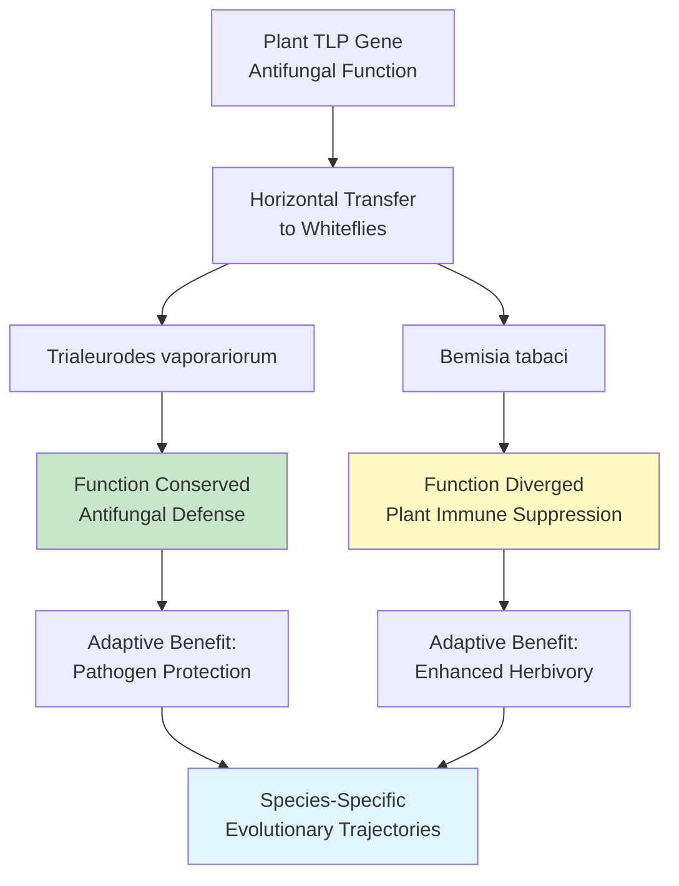

First, the divergence demonstrates that **horizontally acquired genes are subject to the same evolutionary forces as native genes** following integration. Once established in a new genome, transferred genes can accumulate mutations, experience selection for novel functions, and contribute to lineage-specific adaptations. The TLP case shows that the same ancestral gene can evolve in completely different directions in closely related species, depending on the selective pressures each species faces.

Second, the functional divergence suggests that **the adaptive potential of horizontally acquired genes may be greater than their immediate function upon transfer**. While the initial benefit of TLP acquisition may have been antifungal protection, the subsequent evolution of immune-suppressing function in *B. tabaci* represents an additional adaptive innovation enabled by the horizontal transfer. This observation implies that HGT provides not only immediate functional benefits but also raw material for future evolutionary innovation.

Third, the divergence highlights the **complexity of predicting functional outcomes of HGT events**. The same transferred gene can have dramatically different consequences in different recipient lineages, depending on the ecological context and selective environment. This unpredictability underscores the importance of functional validation in addition to phylogenetic identification of HGT events.

### 7.4 Animal-to-Plant Gene Transfer: Evidence and Documented Cases

While plant-to-insect HGT has received considerable attention following the *BtPMaT1* discovery, the reciprocal phenomenon—**gene transfer from animals to plants**—represents an equally significant demonstration that cross-kingdom genetic exchange operates bidirectionally. The documented transfer of *Transferrin* genes from insects to *Theobroma cacao* (the cacao tree) provides compelling evidence that plants can acquire and retain functional genes from animal sources[^12].

Transferrins are iron-binding glycoproteins that play essential roles in iron transport and homeostasis across diverse animal lineages. In insects, transferrins are involved in immune responses, iron sequestration during pathogen challenge, and developmental processes requiring iron mobilization. The discovery of transferrin-like genes in the cacao genome that show closer phylogenetic affinity to insect sequences than to any plant sequences represents **strong evidence for animal-to-plant horizontal gene transfer**[^12].

The phylogenetic evidence supporting insect origin of these cacao genes involves several complementary analyses. The cacao transferrin-like sequences cluster with insect transferrins in phylogenetic trees rather than with sequences from other plants or from bacteria and fungi. The gene structure, including intron positions and exon organization, shows features more consistent with animal genes than with typical plant genes. Additionally, the genes are absent from closely related plant species that would be expected to possess them if they represented ancestral plant sequences inherited vertically.

The functional implications of transferrin acquisition by cacao remain under investigation, but several hypotheses have been proposed:

| Potential Function | Mechanism | Adaptive Significance |
|-------------------|-----------|----------------------|
| **Iron homeostasis** | Enhanced iron uptake or distribution | Improved growth in iron-limited soils |
| **Pathogen defense** | Iron sequestration during infection | Reduced pathogen access to essential nutrient |
| **Symbiont interaction** | Modulation of microbial iron availability | Optimization of beneficial associations |
| **Oxidative stress response** | Iron-mediated antioxidant functions | Enhanced stress tolerance |

The transfer of transferrin genes to cacao suggests that **animal-to-plant HGT may have contributed to the acquisition of new functions** that expand plant metabolic or defensive capabilities. Iron metabolism is fundamental to numerous biological processes, and the acquisition of novel iron-handling proteins could provide significant adaptive benefits in environments where iron availability is limiting or variable.

Beyond the *Theobroma cacao* case, additional evidence for animal-to-plant gene transfer remains limited, reflecting both the genuine rarity of such events and potential methodological biases that may cause them to be overlooked. The standard assumption in plant genomics—that sequences showing similarity to animal genes represent contamination rather than genuine HGT—may have led to the systematic exclusion of animal-derived sequences from plant genome assemblies. As awareness of cross-kingdom HGT increases and analytical methods improve, additional cases may be identified.

The documentation of bidirectional gene transfer between plants and animals carries important conceptual implications. **If genetic exchange can occur in both directions across the plant-animal boundary, then the mechanisms enabling such transfer must operate independently of the specific direction of transfer**. This bidirectionality suggests that the barriers to cross-kingdom HGT, while substantial, are not asymmetric—neither plants nor animals possess absolute defenses against the acquisition of genetic material from the other kingdom.

### 7.5 Ecological Contexts Facilitating Cross-Kingdom Exchange

The ecological relationships between plants and animals create the **physical proximity and biological intimacy** necessary for genetic exchange across kingdom boundaries. Understanding these ecological contexts illuminates why certain plant-animal associations are more likely to result in HGT than others, and why herbivorous insects—particularly those with intimate feeding relationships—are disproportionately represented among documented cases of cross-kingdom transfer.

The most obvious ecological context facilitating plant-to-animal HGT is **herbivory itself**. Herbivorous insects maintain prolonged contact with plant tissues during feeding, creating sustained opportunities for exposure to plant genetic material. Different feeding strategies create different levels of exposure:

**Phloem feeders** such as whiteflies and aphids insert their stylets directly into plant vascular tissue, accessing the nutrient-rich phloem sap that circulates throughout the plant. This feeding mode exposes insects to the full complement of molecules circulating in the phloem, potentially including nucleic acids, small RNAs, and other genetic material. The concentration of documented plant-to-insect HGT events in hemipteran insects (whiteflies, aphids) may reflect the particularly intimate nature of phloem feeding[^4][^57].

**Xylem feeders** access the water-conducting vessels of plants, which contain fewer nutrients but may still carry genetic material. The lower nutrient content of xylem sap may explain why xylem-feeding insects show fewer documented HGT events than phloem feeders, though systematic surveys are needed to confirm this pattern.

**Chewing herbivores** that consume plant tissue wholesale ingest large quantities of plant cells, including their nuclei and organelles. While this feeding mode provides massive exposure to plant genetic material, the digestive processing of consumed tissue may reduce the probability of intact genetic material reaching insect cells in a form capable of integration.

**Gall-forming insects** induce plants to form specialized structures that house and nourish developing larvae. This intimate association involves extensive molecular communication between insect and plant, potentially creating opportunities for genetic exchange. The prolonged developmental period within plant tissues may provide sustained exposure to plant genetic material.

The ecological context also influences the **direction of potential transfer**. During feeding, insects not only ingest plant material but also inject saliva containing digestive enzymes and other proteins into plant tissues. This bidirectional molecular exchange at the feeding interface creates opportunities for genetic material to move in either direction. Tissue damage during feeding may further enhance the potential for genetic exchange by disrupting cellular barriers and releasing genetic material from both plant and insect cells[^57].

The intensity and duration of ecological interactions appear to correlate with HGT frequency. **Polyphagous insects**—those capable of feeding on many plant species—may have more opportunities for HGT simply because they encounter a greater diversity of potential donor species over evolutionary time. The sweet potato whitefly *Bemisia tabaci*, which can feed on over 600 plant species, has accumulated more plant-derived genes than more specialized herbivores[^4]. This pattern suggests that ecological generalism may facilitate HGT by increasing the diversity of genetic material to which an organism is exposed.

The role of **plant secondary metabolites** in shaping HGT patterns deserves particular attention. Many documented plant-to-insect HGT events involve genes related to detoxification or manipulation of plant defense compounds[^4]. This functional bias may reflect the strong selective pressure favoring retention of transferred genes that enhance an insect's ability to cope with plant chemical defenses. The ecological context of plant-insect chemical warfare thus creates both the opportunity for genetic exchange (through intimate feeding relationships) and the selective pressure favoring retention of transferred genes (through the fitness benefits of detoxification capability).

### 7.6 Viral Intermediaries as Vectors for Cross-Kingdom Transfer

The mechanisms enabling genetic material to cross the vast phylogenetic gulf between plants and animals remain incompletely understood, but **viruses have emerged as prime candidates for mediating such transfers**[^21][^56]. The hypothesis that viruses serve as vectors for cross-kingdom HGT is supported by multiple lines of evidence, including the documented capacity of viruses to acquire host genetic material, the existence of viruses that infect both plants and animals (or that can switch between these host types), and the genomic fossil record of viral integration events in both plant and animal genomes.

The virus-mediated HGT hypothesis posits a two-step process[^21]. First, a virus acquires a fragment of genetic material from one host during infection. This acquisition can occur through recombination between viral and host genomes, through the packaging of host sequences into viral particles, or through the integration of host sequences into the viral genome during replication. Second, the virus-borne host sequence is transferred to a new host during subsequent infection, where it may become integrated into the recipient genome.

Evidence supporting the first step—**host-to-virus gene capture**—is substantial. A large fraction of genes encoded by large double-stranded DNA viruses (up to 30% in some herpesviruses) have been captured from eukaryotic hosts[^21]. Host sequence insertions have also been identified in RNA viruses, including Sindbis virus, influenza virus, HIV-1, nodaviruses, and pestiviruses[^21]. Transposable elements are particularly common among captured host sequences, likely reflecting their propensity for mobilization and insertion into viral genomes.

The second step—**virus-to-host transfer**—is documented through the widespread occurrence of endogenous viral elements (EVEs) in eukaryotic genomes[^21][^59]. These integrated viral sequences demonstrate that viruses can deliver genetic material into host chromosomes, where it becomes stably inherited. EVEs have been identified in animal genomes from diverse viral families, including bornaviruses, filoviruses, parvoviruses, and rhabdoviruses[^59]. In plants, endogenous caulimovirids (ECVs) represent the most common EVEs, with ancient viral DNA scattered across the genomes of numerous vascular plant species[^4].

The specific hypothesis for *BtPMaT1* acquisition proposes that **a virus moving between plants and whiteflies served as the transfer vector**[^56][^58]. In this scenario, a virus infecting plants may have captured the *PMaT1* gene or a portion thereof. When this virus subsequently infected whiteflies—either through direct host-switching or through co-infection during whitefly feeding on infected plants—the plant-derived sequence was introduced into the whitefly genome. Integration may have occurred through viral integration mechanisms or through recombination with host sequences during viral replication.

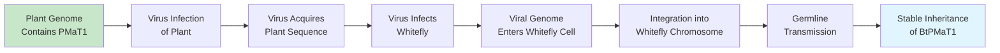

Evidence supporting viral mediation of plant-animal HGT includes the discovery that **viruses can transfer genes across superkingdom boundaries**[^60][^61]. Research analyzing protein fold superfamilies across viral and cellular proteomes revealed that bacterioviruses share protein structures exclusively with Eukarya, and eukaryoviruses share structures exclusively with Bacteria and Archaea[^60]. This pattern indicates genetic exchange across superkingdom boundaries, with viruses serving as intermediaries. The study found particularly strong genetic affiliation between bacterioviruses and eukaryotic proteomes, and between eukaryoviruses and bacterial proteomes—a pattern consistent with viruses mediating genetic exchange between distantly related organisms[^60][^61].

The ecological contexts that bring plant viruses and insect viruses into contact create opportunities for cross-kingdom viral gene transfer. Many plant viruses are transmitted by insect vectors, creating situations where viral genomes from plant and insect sources may co-occur within the same insect cell[^62]. The potential for recombination between plant-derived and insect-derived viral sequences could generate chimeric viruses capable of introducing plant genetic material into insect genomes.

Despite the plausibility of viral mediation, **direct evidence linking specific viruses to documented plant-animal HGT events remains limited**. The *BtPMaT1* transfer occurred approximately 35 million years ago, making it impossible to identify the specific viral vector involved. The hypothesis remains the most plausible mechanistic explanation for cross-kingdom HGT, but confirmation will require either the identification of ongoing viral-mediated transfer events or experimental demonstration that viruses can mediate such transfers under controlled conditions.

### 7.7 Mechanistic Pathways: From Exposure to Genomic Integration

While viral intermediaries represent the most commonly invoked mechanism for plant-animal HGT, **alternative pathways may also contribute to cross-kingdom genetic exchange**. Understanding the full range of potential mechanisms is essential for evaluating the plausibility of documented HGT events and for predicting where future discoveries are most likely to emerge.

**Direct DNA uptake during feeding** represents a conceptually straightforward mechanism that does not require viral intermediaries[^57]. During herbivory, insects ingest plant cells and their contents, including nuclear and organellar DNA. While most ingested DNA is degraded by digestive enzymes, some fraction may escape degradation and enter insect cells. Physical injuries during feeding—both to plant tissues and to the insect's own digestive tract—may facilitate DNA uptake by creating breaches in cellular barriers[^57]. Once inside insect cells, plant DNA could potentially be transported to the nucleus and integrated into the host genome through mechanisms similar to those operating in transformation of competent bacterial cells.

The plausibility of direct uptake is supported by evidence from other systems. Naked environmental DNA adsorbed onto minerals can persist in soil and be taken up by organisms[^4]. The demonstration that DNA can be transferred across species boundaries through feeding relationships in other contexts—such as the acquisition of bacterial genes by plant-parasitic nematodes—suggests that the digestive tract may not represent an absolute barrier to genetic material entering recipient cells.

**RNA-mediated transfer with subsequent reverse transcription** represents another potential pathway[^4][^12]. During feeding, insects may be exposed to plant mRNAs circulating in phloem sap or released from damaged plant cells. If these mRNAs enter insect cells and are reverse-transcribed into cDNA—potentially by endogenous reverse transcriptase activity from retrotransposons—the resulting DNA could be integrated into the insect genome. Evidence supporting this mechanism includes the observation that some horizontally transferred genes lack introns that are present in their donor counterparts, consistent with transfer via processed mRNA intermediates.

However, the analysis of horizontally transferred genes in parasitic plants suggests that **genomic DNA transfer may be more common than RNA-mediated transfer**[^63]. In obligate parasitic plants, evidence indicates that integration of genomic fragments occurs far more often than retro-processed RNA sequences[^63]. All resolvable HGT events in one comprehensive study were likely mediated by genomic fragments containing the donor genes rather than by RT-mediated transfer[^63]. If this pattern extends to plant-animal HGT, it would suggest that DNA-based mechanisms predominate over RNA-based pathways.

**Transposable elements may facilitate integration** of horizontally acquired sequences into recipient genomes[^4]. Transposons possess the enzymatic machinery for DNA cutting and joining, and their activity could potentially be co-opted to integrate foreign DNA. The observation that horizontally transferred genes are sometimes flanked by transposon-related sequences supports this hypothesis. Additionally, the concentration of foreign DNA in telomeric regions of bdelloid rotifer chromosomes suggests that specific genomic locations may be more permissive for integration of horizontally acquired material.

The mechanisms enabling reciprocal animal-to-plant transfer remain even more poorly understood. Plants lack the digestive systems that expose animals to ingested genetic material, so alternative pathways must operate. Possibilities include:

- **Wound-mediated transfer**: When insects feed on plants, they create wounds through which insect-derived material (including nucleic acids from saliva or regurgitated digestive fluids) may enter plant tissues
- **Vector-mediated transfer**: Insects serving as vectors for plant pathogens may inadvertently introduce their own genetic material into plants during transmission events
- **Parasitic plant intermediaries**: If an insect gene were first transferred to a parasitic plant, subsequent plant-to-plant HGT could potentially introduce that gene into non-parasitic plant lineages

The substantial gaps in mechanistic understanding highlight the need for **experimental approaches** to complement genomic surveys. While phylogenetic analysis can identify HGT events, understanding how these events occur requires direct experimental investigation of potential transfer pathways. The development of model systems for studying cross-kingdom HGT—perhaps using laboratory populations of whiteflies and their host plants—could provide crucial insights into the mechanisms enabling genetic exchange across kingdom boundaries.

### 7.8 Evolutionary Implications of Genetic Exchange Across Distant Lineages

The documentation of bidirectional gene transfer between plants and animals carries profound implications for understanding **the permeability of taxonomic boundaries and the potential for genetic innovation across the tree of life**. These cross-kingdom transfers represent the most extreme examples of HGT in eukaryotes, yet their occurrence demonstrates that even the deepest phylogenetic divisions do not constitute absolute barriers to genetic exchange.

The functional bias of successfully transferred genes toward **plant-insect interaction categories** suggests that ecological relationships create both the opportunity and the selective pressure for cross-kingdom HGT[^4]. The genes that have been retained following plant-to-insect transfer are not random samples of plant genomes but are overwhelmingly associated with functions relevant to herbivory—detoxification of plant defenses, manipulation of plant immune responses, and degradation of plant structural components. This bias indicates that the selective filters governing HGT retention operate similarly across kingdom boundaries: genes providing substantial adaptive benefits in the context of the ecological relationship are preferentially retained.

The potential for cross-kingdom HGT to **accelerate coevolutionary dynamics** represents a particularly intriguing implication. The classical model of plant-insect coevolution envisions a gradual escalation of plant defenses and insect counter-adaptations, with each side evolving incrementally in response to the other. The discovery that insects can acquire plant genes through HGT introduces a new dimension to this coevolutionary process. Rather than evolving novel detoxification mechanisms through gradual mutation and selection, an insect can potentially acquire a ready-made solution by capturing a plant gene whose ancestral function was to protect plants from their own toxic metabolites[^55][^56].

This "genetic theft" model of coevolution has several important consequences:

1. **Acceleration of adaptation**: HGT can provide insects with adaptive solutions much faster than conventional evolutionary processes, potentially allowing rapid colonization of previously inaccessible host plants

2. **Unpredictability**: The stochastic nature of HGT events introduces unpredictability into coevolutionary dynamics, as successful transfers cannot be anticipated based on gradual evolutionary trajectories

3. **Asymmetry**: If insects can more readily acquire plant genes than plants can acquire insect genes (due to feeding-related exposure), the coevolutionary balance may be tilted in favor of herbivores

4. **Novel interactions**: Acquired genes can evolve new functions (as seen with TLP), potentially creating entirely new types of plant-insect interactions not predictable from ancestral gene functions

The question of whether plant-animal HGT represents a **qualitatively distinct phenomenon or simply an extreme example of the same processes governing other eukaryotic HGT events** can be addressed by comparing the patterns observed in cross-kingdom transfers with those documented in within-kingdom transfers. Several observations suggest that the fundamental processes are similar:

| Feature | Within-Kingdom HGT | Cross-Kingdom HGT | Interpretation |
|---------|-------------------|-------------------|----------------|
| **Frequency** | Rare | Very rare | Same barriers, greater magnitude |
| **Functional bias** | Operational genes favored | Operational genes favored | Same complexity hypothesis constraints |
| **Selective retention** | Genes with adaptive benefit retained | Genes with adaptive benefit retained | Same selection-based filtering |
| **Mechanistic pathways** | Multiple (parasitism, vectors, direct uptake) | Multiple (viruses, direct uptake, feeding) | Similar diversity of mechanisms |
| **Expression adaptation** | Acquired regulatory elements | Acquired regulatory elements | Same domestication requirements |

These parallels suggest that **cross-kingdom HGT operates through the same fundamental processes as within-kingdom HGT**, with the additional barriers imposed by phylogenetic distance reducing frequency but not fundamentally altering the nature of the phenomenon. The genes that successfully cross kingdom boundaries must clear the same selective filters—integration, expression, functional contribution, and positive selection—that govern retention of any horizontally transferred gene.

The implications for understanding eukaryotic evolution are substantial. If genes can move between plants and animals—organisms that have been evolving independently for over 1.5 billion years—then **the tree of life is better conceptualized as a web or network** in which genetic material can flow across even the deepest phylogenetic divisions. While the frequency of such cross-kingdom transfers is low, the cumulative effect over evolutionary time may be significant. The 1,410 genes acquired by insects from 670 donors (including 25 plant species) documented in a single comprehensive survey[^4] suggests that cross-kingdom HGT has contributed meaningfully to insect genome evolution.

Furthermore, the discovery of plant-animal HGT has **practical implications for pest management and crop protection**. Understanding that whiteflies depend on a horizontally acquired plant gene (*BtPMaT1*) to detoxify plant defenses reveals a vulnerability that can potentially be exploited for pest control[^4][^55]. The demonstration that transgenic plants expressing silencing constructs targeting *BtPMaT1* can kill whiteflies while sparing other insects provides proof of concept for this approach[^55][^58]. More broadly, the identification of horizontally acquired genes essential for pest survival may reveal additional targets for species-specific control strategies.

In conclusion, the bidirectional transfer of genes between plants and animals represents **one of the most remarkable demonstrations of genetic exchange in the biological world**. These transfers span a phylogenetic gulf of over 1.5 billion years, yet they have occurred repeatedly and have contributed functional genes that persist under purifying selection. The mechanisms enabling such transfers—likely involving viral intermediaries, direct DNA uptake during feeding, and other pathways—remain incompletely understood, but their existence demonstrates that the barriers separating kingdoms of life are permeable to genetic exchange. The evolutionary implications are profound: the boundaries between plants and animals, seemingly so fundamental to biological organization, can be breached by the movement of genetic information, with consequences that shape the adaptive evolution of both kingdoms.

## 8 Comparison with Prokaryotic HGT: What Makes Eukaryotic Transfer Different

The preceding chapters have documented a remarkable collection of horizontal gene transfer events across plant and animal lineages, revealing that genetic exchange across species boundaries—while rare in multicellular eukaryotes—represents a genuine and significant evolutionary phenomenon. Yet to fully appreciate why these transfer events are so extraordinary, one must understand them in the context of prokaryotic HGT, where horizontal transfer operates as a dominant evolutionary force rather than an exceptional occurrence. This chapter systematically compares HGT dynamics between prokaryotes and eukaryotes, illuminating the fundamental factors underlying the dramatic disparity in transfer rates. The analysis reveals that the differences extend far beyond simple frequency—they encompass cellular architecture, reproductive strategies, genome organization, and the very nature of how genetic innovation operates in simple versus complex organisms. Understanding these differences explains not only why eukaryotic HGT is rare but also why the transfers that do succeed tend to have disproportionately significant adaptive consequences.

### 8.1 Quantitative Disparities in HGT Frequency Across Domains of Life

The magnitude of difference in HGT frequency between prokaryotes and eukaryotes is so substantial that it demands explanation beyond mere technical barriers. Quantitative estimates reveal that horizontal gene transfer in bacteria and archaea operates on an entirely different scale than in plants and animals—a disparity that reflects fundamental differences in how these organisms interact with genetic material from their environment.

In prokaryotes, comparative genomic analyses have established that **a significant fraction of genes in bacterial and archaeal genomes have been subject to horizontal transfer**[^6]. Rough estimates based on the analysis of taxon-specific best hits indicate remarkably high levels of horizontal gene transfer across most bacterial and archaeal genomes. Interdomain transfers—genetic exchanges between bacteria, archaea, and eukaryotes—involve approximately 3% of genes in most free-living bacteria, with this fraction being significantly lower in parasitic bacteria (except for Chlamydia and Rickettsia). Archaea show even higher rates of interdomain transfer, typically between 4% and 8% of their genes[^6].

More comprehensive estimates that include gene exchange between major bacterial lineages reveal an even more striking picture. The proportion of genes acquired through horizontal transfer varies widely among prokaryotic species:

| Organism | Estimated HGT Proportion | Context |
|----------|-------------------------|---------|
| *Mycoplasma genitalium* | 1.6% | Minimal genome, obligate parasite |
| *Treponema pallidum* | 32.6% | Pathogenic spirochete |
| Typical free-living bacteria | 10-25% | Variable by lifestyle |
| Archaea (interdomain) | 4-8% | Higher than most bacteria |

These estimates represent individual genome snapshots, but the cumulative impact of HGT over evolutionary time is far greater. When network analyses consider the entire evolutionary history of prokaryotic genes, approximately **81 ± 15% of prokaryotic genes show evidence of horizontal movement** at some point in their lineage history. This staggering figure demonstrates that HGT is not a peripheral phenomenon in prokaryotic evolution but rather a dominant force shaping genome content and composition.

The contrast with eukaryotic HGT frequencies is dramatic. Even in eukaryotic lineages with extensive documented horizontal transfer, foreign genes typically constitute only a small percentage of the genome. In rumen ciliates and the extremophilic red alga *Galdieria sulphuraria*, acquired genes account for 4-5% of the total genome[^5]. Bdelloid rotifers, which represent an exceptional case among animals, show HGT contributions of 8-9% of gene content[^5]. For most multicellular eukaryotes, including the majority of plants and animals, HGT-derived sequences constitute **less than 1% of the genome**—a figure orders of magnitude lower than observed in prokaryotes.

Several methodological considerations influence these comparative assessments. Detection of HGT events relies primarily on phylogenetic incongruence—cases where a gene tree differs from the species tree. In prokaryotes, extensive genome sequencing across diverse lineages has enabled robust detection of transfer events. In eukaryotes, particularly plants and animals, the assumption that bacterial sequences represent contamination has historically led to their systematic removal from genome assemblies, potentially causing underestimation of actual HGT frequency. Additionally, ancient transfers may have lost their phylogenetic signal through sequence divergence, making them undetectable by standard methods.

Despite these caveats, the fundamental disparity in HGT frequency between domains is robust and reflects genuine biological differences rather than merely methodological artifacts. The question that demands explanation is not whether this disparity exists, but **why** prokaryotes and eukaryotes differ so dramatically in their rates of horizontal genetic exchange.

### 8.2 Cellular Architecture and Physical Barriers to DNA Entry

The fundamental organization of cells differs profoundly between prokaryotes and eukaryotes, creating distinct landscapes of barriers that foreign genetic material must navigate to achieve genomic integration. These architectural differences explain much of the disparity in HGT frequency between domains and illuminate why the pathways enabling genetic exchange differ so substantially.

In prokaryotic cells, the genetic material exists in the **cytoplasm without membrane separation from the rest of the cellular contents**. The bacterial chromosome, along with any plasmids, occupies a region called the nucleoid but is not enclosed within a membrane-bound compartment. This accessibility means that foreign DNA entering the cytoplasm has relatively direct access to the host genome and the cellular machinery required for integration. The primary barriers to DNA entry in prokaryotes are the cell membrane (and cell wall in most bacteria), which can be overcome through the well-characterized mechanisms of transformation, conjugation, and transduction.

Eukaryotic cells present a fundamentally different architecture. The **nuclear envelope acts as a critical physical barrier** that separates the genome from the cytoplasm[^5]. This double-membrane structure, perforated by nuclear pore complexes, creates a compartmentalized system where foreign DNA must not only enter the cell but also gain access to the nucleus to achieve chromosomal integration. The nuclear pore complexes are selective gates that regulate molecular traffic between cytoplasm and nucleus, requiring foreign DNA to either exploit host import machinery or await nuclear envelope breakdown during cell division.

The nuclear envelope barrier has several important consequences for eukaryotic HGT. First, it **adds an additional step that foreign genetic material must navigate**—a step that does not exist in prokaryotes. Second, the selectivity of nuclear pore complexes means that passive diffusion of DNA into the nucleus is not possible; active transport mechanisms must be exploited. Third, the nuclear envelope presents a particular challenge for large DNA molecules, which may be too large to pass through nuclear pores intact.

Beyond the nuclear envelope, eukaryotic cells possess additional barriers absent in prokaryotes. **Immune defenses in multicellular organisms actively work to prevent the incorporation of foreign DNA**[^5]. Most foreign genetic material entering cells will be broken down by enzymes, and even if foreign material is incorporated into the genome, chemical modification mechanisms can inactivate and eliminate it. These defensive systems, which evolved to protect against pathogens and parasites, inadvertently create barriers to potentially beneficial horizontal transfer as well.

The compartmentalization of eukaryotic cells extends beyond the nucleus to include mitochondria and (in plants and algae) chloroplasts—organelles with their own genomes separated from the nuclear genome by additional membrane barriers. While this compartmentalization creates additional barriers to HGT, it also creates opportunities: the relatively high rate of HGT observed in plant mitochondrial genomes may reflect unique properties of these organelles, including their **ability to actively uptake DNA and undergo frequent fusion and fission events** that could facilitate DNA exchange.

The demonstrated pathway of trans-kingdom conjugation via type IV secretion systems (T4SS) represents one of the few mechanisms capable of overcoming the nuclear envelope barrier. *Agrobacterium tumefaciens* and related species have evolved sophisticated molecular machinery specifically designed to deliver DNA across both the bacterial and plant cell membranes, through the plant cytoplasm, and into the plant nucleus. The evolutionary investment in this complex delivery system underscores the magnitude of the barriers that must be overcome for successful bacteria-to-eukaryote gene transfer.

### 8.3 Germline Sequestration and the Challenge of Heritable Transfer in Multicellular Organisms

Beyond cellular architecture, multicellular eukaryotes face an additional barrier to HGT that has no parallel in prokaryotes or unicellular eukaryotes: **the physical isolation of germ cells from somatic cells**. This germline sequestration creates a fundamental challenge for horizontal transfer because any foreign gene must ultimately reach the specialized cells that give rise to gametes to be transmitted to offspring.

In prokaryotes and unicellular eukaryotes, this barrier simply does not exist. When a bacterium acquires foreign DNA through transformation, conjugation, or transduction, that DNA becomes part of the cell's genome and is automatically transmitted to daughter cells through binary fission. Similarly, in unicellular eukaryotes, **all developmental stages represent weak-link entry points, allowing foreign genes to be integrated and transmitted to offspring through mitosis**[^5]. The absence of germline-soma distinction means that any cell acquiring foreign DNA can potentially found a lineage carrying that DNA.

The situation in multicellular eukaryotes is fundamentally different. The **isolation of germ cells from somatic cells is often considered to be the major barrier to HGT in animals and, to a lesser extent, higher plants**[^5]. In animals with dedicated germline tissues, foreign DNA acquired by somatic cells—regardless of how advantageous it might be—cannot be transmitted to offspring unless it somehow reaches the germline. This architectural constraint dramatically reduces the probability of heritable HGT.

The weak-link model provides a theoretical framework for understanding how this barrier can be circumvented. According to this model, **foreign genes can enter recipient cells at any weakly protected stage of the lifecycle**[^5]. For complex multicellular eukaryotes, foreign genes must be passed through specialized reproductive cells (germ lines) to be transmitted to offspring. Overcoming the barrier of germline isolation is possible if a plant or animal is exposed to and incorporates foreign DNA during its very early developmental stages; subsequent cell proliferation and differentiation will spread these foreign genes to other tissues, including germ cells[^5].

The model makes specific predictions about which organisms should show higher HGT frequencies:

| Organism Type | Germline Protection | Predicted HGT Frequency | Examples |
|---------------|--------------------|-----------------------|----------|
| **Unicellular eukaryotes** | None (all cells reproductive) | High | Protists, unicellular algae |
| **Organisms with external fertilization** | Low (gametes exposed) | Moderate | Many aquatic animals, non-vascular plants |
| **Organisms with asexual reproduction** | None (any cell can propagate) | High | Bdelloid rotifers, many plants |
| **Organisms with internal fertilization** | High (gametes protected) | Low | Most terrestrial vertebrates |

Evidence supports these predictions. In nonvascular and seedless vascular plants, female gametes are weakly protected and exposed to external environments during fertilization, and male gametes are generally exposed completely prior to reaching an oocyte[^5]. External fertilization in aquatic animals means gametes and zygotes are freely exposed to foreign DNA. Foreign genes introduced during zygotic or embryonic development will be propagated through mitosis into germ cells and, therefore, the next generation[^5].

The dramatic concentration of horizontal transposon transfer events in ray-finned fishes compared to terrestrial vertebrates provides empirical support for the importance of reproductive mode. Among 307 vertebrate genomes analyzed, ray-finned fishes contributed **93.7% of detected HTT events despite representing only 21% of the studied species**, while mammals and birds together accounted for less than 3% of events despite representing 71% of species. This disparity likely reflects the external release of gametes during spawning, which provides opportunities for DNA uptake that are unavailable to organisms with internal fertilization.

In multicellular eukaryotes with asexual reproduction, **the absence of specific germ cells means that any cell carrying foreign genes may propagate them into offspring by mitotic propagation**[^5]. This prediction is consistent with the observation that bdelloid rotifers—obligately asexual animals—show unusually high levels of HGT, with foreign DNA concentrated in telomeric regions of their chromosomes. The absence of sexual reproduction removes the germline barrier entirely, potentially explaining why these animals have accumulated more foreign DNA than sexually reproducing relatives.

### 8.4 Mechanisms of Transfer: Classical Prokaryotic Pathways Versus Eukaryotic Routes

The mechanisms enabling horizontal gene transfer differ fundamentally between prokaryotes and eukaryotes, with prokaryotes possessing **dedicated, efficient pathways** for genetic exchange while eukaryotes rely on more **opportunistic, indirect routes**. This mechanistic disparity explains much of the frequency difference between domains and illuminates why prokaryotic HGT operates as a continuous process while eukaryotic HGT represents exceptional events.

Prokaryotic HGT operates through three classical mechanisms that have been well-characterized since the mid-twentieth century. **Transformation** involves the uptake and exchange of naked DNA fragments between donor and recipient cells, demonstrated first in *Streptococcus pneumoniae* by Frederick Griffith in 1928. Many bacteria possess natural competence systems that actively import environmental DNA. **Conjugation**, discovered by Tatum and Lederberg in 1946, involves direct cell-to-cell DNA transfer via a conjugation pilus, enabling the movement of plasmids and chromosomal DNA between bacteria in physical contact. **Transduction**, identified by Zinder and Lederberg in 1952, involves bacteriophage-mediated transfer of DNA fragments between bacteria, either through generalized transduction (transfer of any gene) or specialized transduction (transfer of specific genes adjacent to prophage insertion sites).

Beyond these classical mechanisms, additional prokaryotic transfer pathways have been identified. **Gene transfer agents (GTAs)** are small, virus-like particles that transfer random genomic segments between prokaryotic species, representing highly efficient HGT vehicles with major impact on prokaryotic evolution. The magnitude of GTA-mediated transfer is substantial; gene transfer events in marine prokaryotes alone have been estimated to reach as high as **10^13 per year in the Mediterranean Sea**. Nanotubes and membrane vesicles provide additional routes for genetic exchange between prokaryotic cells.

The net rate of HGT in prokaryotes is adjustable and therefore subject to evolution. Cells can modulate their competence for transformation, their susceptibility to conjugation, and their permissiveness for phage infection. This evolutionary tunability suggests that **prokaryotic HGT rates represent optimized values** reflecting the balance between benefits (acquisition of useful genes) and costs (acquisition of harmful sequences, selfish elements, or incompatible genes)[^49].

Eukaryotic HGT operates through fundamentally different mechanisms that lack the efficiency and directness of prokaryotic pathways:

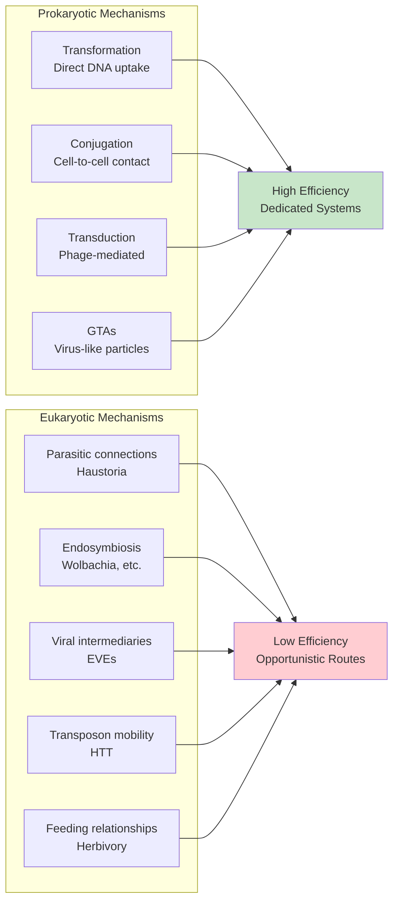

**Parasitic interactions** represent one of the most productive eukaryotic HGT pathways, with over 42% of documented plant-to-plant HGT cases involving parasitic relationships. The haustorial connections that parasitic plants establish with their hosts create direct vascular bridges enabling bidirectional molecular exchange. However, this mechanism requires the evolution of a specialized parasitic lifestyle and operates only between the parasite and its specific hosts.

**Endosymbiotic relationships**, particularly between *Wolbachia* and arthropod hosts, create sustained opportunities for bacteria-to-eukaryote transfer. The residence of *Wolbachia* within host germ cells means that any transferred DNA has the potential for transgenerational inheritance. However, this mechanism depends on the establishment of stable endosymbiotic associations—a process that itself represents an exceptional evolutionary event.

**Viral intermediaries** may mediate HGT between distantly related eukaryotes, with viruses potentially capturing host sequences and transferring them to new hosts during subsequent infections[^4]. However, this mechanism requires a two-step process (host-to-virus capture followed by virus-to-host delivery) and depends on the existence of viruses capable of infecting both donor and recipient species.

**Horizontal transposon transfer** represents the most extensively documented form of eukaryotic HGT, but the mechanisms enabling transposons to move between species remain poorly understood. Proposed vectors include parasites, viruses, and direct physical contact, but direct evidence linking specific vectors to documented HTT events is limited.

The fundamental difference between prokaryotic and eukaryotic HGT mechanisms lies in their **degree of specialization**. Prokaryotic mechanisms represent evolved systems dedicated to genetic exchange, with transformation competence systems, conjugation machinery, and phage infection cycles all representing biological investments in DNA transfer. Eukaryotic mechanisms are largely opportunistic, exploiting ecological relationships (parasitism, herbivory) or biological accidents (viral integration, transposon escape) rather than dedicated transfer systems.

### 8.5 Genome Architecture and Integration Challenges

The organization of genetic information differs substantially between prokaryotes and eukaryotes, creating distinct challenges for the integration and expression of horizontally acquired genes. These architectural differences influence not only whether transferred genes can be integrated but also whether they can be expressed and provide functional benefits to recipient organisms.

Prokaryotic genomes exhibit organizational features that facilitate HGT. Genes are typically organized into **operons**—clusters of functionally related genes transcribed as single polycistronic mRNAs from shared promoters. This organization means that a transferred gene can potentially be expressed simply by inserting downstream of an existing promoter, without requiring acquisition of its own regulatory elements. Additionally, prokaryotic genes generally lack introns, so transferred sequences can be transcribed and translated without requiring splicing machinery.

Eukaryotic genomes present a more complex landscape for gene integration:

| Feature | Prokaryotic Genome | Eukaryotic Genome | Implication for HGT |
|---------|-------------------|-------------------|---------------------|
| **Transcription unit** | Polycistronic operons | Monocistronic genes | Each gene needs own promoter |
| **Introns** | Generally absent | Common, often essential | Splicing required for expression |
| **Regulatory complexity** | Relatively simple | Highly complex enhancers, silencers | Integration into regulatory networks difficult |
| **Chromatin structure** | Minimal | Extensive nucleosome packaging | Chromatin context affects expression |
| **Genome size** | Small (1-10 Mb) | Large (10 Mb - 10 Gb) | Larger target for integration, but also more non-coding |

The requirement for **eukaryotic regulatory elements** creates a significant barrier to expression of transferred genes. A bacterial gene inserted into a eukaryotic genome will not be expressed unless it acquires appropriate promoter sequences, enhancers, and other regulatory elements compatible with the host's transcription machinery. The observation that many bacteria-to-eukaryote transfers show only low-level transcription—as documented in *Drosophila ananassae* and *Callosobruchus chinensis* where approximately 2% and 50% of transferred *Wolbachia* genes, respectively, show evidence of transcription—indicates that expression compatibility represents a significant bottleneck.

**Intron-exon structure** presents another challenge unique to eukaryotic HGT. Bacterial genes lack introns, so their direct integration into eukaryotic genomes produces transcripts that cannot be properly processed. For transferred bacterial genes to produce functional proteins, they must either acquire introns post-transfer or be expressed from genomic locations where intronless transcripts can be processed. Evidence from documented HGT events suggests that intron acquisition does occur: in *Salpingoeca rosetta*, candidate HGTs had a similar median number of introns (five) as other genes in the genome, and only 23 of the 175 candidate HGTs lacked introns entirely.

The **chromatin environment** of eukaryotic genomes adds another layer of complexity. Eukaryotic DNA is packaged with histone proteins into nucleosomes, and the chromatin state (open versus condensed) strongly influences gene expression. Foreign DNA inserted into heterochromatic regions may be silenced regardless of whether it possesses appropriate regulatory elements. The concentration of foreign DNA in telomeric regions of bdelloid rotifer chromosomes may reflect a preference for genomic locations where chromatin is more permissive for expression of novel sequences.

Despite these challenges, successfully retained horizontally transferred genes show evidence of **genomic domestication**—the acquisition of eukaryotic features indicating integration into host regulatory networks. This domestication includes acquisition of introns, adaptation of codon usage toward host preferences, and evolution of appropriate expression patterns. The process of domestication may take substantial evolutionary time, explaining why many transferred sequences exist as non-functional pseudogenes while only a subset achieve stable, functional integration.

### 8.6 The Complexity Hypothesis: Why Informational Genes Resist Transfer

A striking pattern emerges from analysis of successfully retained horizontally transferred genes across both prokaryotes and eukaryotes: they are **overwhelmingly biased toward operational categories**—enzymes, metabolic genes, and proteins functioning independently—rather than informational genes involved in transcription, translation, and DNA replication. This bias, predicted by the **complexity hypothesis**, reflects fundamental constraints on which genes can be successfully transferred and retained across species boundaries.

The complexity hypothesis holds that gene transferability depends on two factors: **gene function and protein-protein interaction complexity**. Operational genes—those encoding metabolic enzymes, biosynthetic pathway components, and proteins that function autonomously—are more likely to be passed horizontally because they can function independently of other genes. In contrast, informational genes—those involved in transcription, translation, and DNA replication—physically interact with more gene products, limiting their functionality when transferred individually and reducing the probability of successful retention.

Evidence supporting the complexity hypothesis comes from multiple sources. In *Escherichia coli*, analysis categorizing genes by evolutionary conservation revealed that **core genes (present in all strains) show the highest expression levels and slowest evolutionary rates, while horizontally transferred genes show the lowest expression levels and fastest evolutionary rates**. Crucially, in protein-protein interaction networks, core genes have higher average connectivity than horizontally transferred genes. However, horizontally transferred genes preferentially attach to resident core proteins rather than non-core proteins, suggesting a **differential attachment model** where successful integration requires connection to central network hubs.

In prokaryotes, the bias toward operational genes in HGT is well-documented. For aminoacyl-tRNA synthetases (aaRS), which are essential components of the translation machinery, **horizontal gene transfer is a common trend despite their informational function**[^6]. However, this represents an exception that proves the rule: aaRS genes function relatively autonomously compared to ribosomal proteins or RNA polymerase subunits, and their transfer often involves xenologous gene displacement (replacement of native genes by foreign homologs) rather than addition of novel functions.

The complexity hypothesis predicts that the same bias should operate in eukaryotic HGT, and the evidence strongly supports this prediction. The functional categories of successfully transferred genes in plants and animals are dominated by:

- **Detoxification enzymes**: *BtPMaT1* (whiteflies), *Fhb7* (wheat)—function independently on small molecule substrates
- **Cell wall-degrading enzymes**: Polygalacturonases (beetles), cellulases (nematodes)—secreted, minimal protein interactions
- **Biosynthetic enzymes**: Carotenoid genes (aphids), vitamin B6 pathway (nematodes)—pathway components with sequential reactions
- **Extracellular proteins**: ECM components in choanoflagellates—function outside the cell

Conversely, certain gene categories are **essentially absent from documented eukaryotic HGT events**:

| Rarely Transferred Category | Network Properties | Reason for Exclusion |
|----------------------------|---------------------|---------------------|
| Ribosomal proteins | Highly integrated into 50+ subunit complexes | Require co-evolution with rRNA and other ribosomal proteins |
| DNA polymerase subunits | Part of multi-protein replication machinery | Must interact with multiple replication factors |
| Transcription factors | Embedded in regulatory networks | Require co-evolved DNA binding sites and cofactors |
| Splicing factors | Integrated into spliceosome complex | Must recognize host-specific splice signals |

The complexity hypothesis explains why HGT in eukaryotes, while rare, tends to involve genes with clear, autonomous functions. The same principle operates in prokaryotes, but the higher overall frequency of prokaryotic HGT means that even genes with some network dependencies can occasionally be transferred successfully. In eukaryotes, where transfer is already rare, only the most autonomous genes—those with minimal integration requirements—can navigate all the barriers to successful retention.

### 8.7 Selection Regimes and the Fate of Transferred Genes

The evolutionary fate of horizontally transferred genes differs substantially between prokaryotes and eukaryotes, reflecting differences in population dynamics, selective pressures, and the stringency of filters governing gene retention. Understanding these different selection regimes explains why prokaryotic HGT often involves neutral or marginally beneficial transfers while **eukaryotic HGT events that achieve retention typically provide substantial adaptive benefits**.

In prokaryotes, the high frequency of HGT means that many transferred sequences are **neutral or only marginally beneficial**. A model for genome evolution incorporating both beneficial and detrimental effects of HGT demonstrates that if the rate of gene loss during genome replication is high, as was probably the case in the earliest genomes, then a high rate of HGT is favorable[^49]. HGT leads to the rapid spread of new genes and allows the build-up of larger, fitter genomes than could be achieved by purely vertical inheritance[^49]. However, in modern prokaryotes with lower gene loss rates, HGT is, on average, unfavorable—suggesting that many transferred genes persist not because they provide substantial benefits but because they are not sufficiently deleterious to be eliminated[^49].

The most obvious benefit of prokaryotic HGT is that a cell can acquire a beneficial gene that arose in another cell[^49]. Additionally, if replication accuracy was poor, accidental gene loss would limit the size and complexity of genomes that could evolve. In this case, HGT would be beneficial because it would enable a cell to regain a gene that it had lost from another member of the population[^49]. The set of genes that could be maintained by the whole population, known as the pan-genome, would be larger than the set contained in any one individual.

HGT also has many potential disadvantages in prokaryotes. Increasing the genome size will increase the replication time. A sequence acquired by HGT may be non-functional. If a newly-inserted gene is expressed, it imposes a cost of transcription and/or translation. The new gene product might also interfere with the function of existing molecules in the cell. Finally, the new gene may be a selfish replicator[^49]. The balance of these effects determines whether HGT is net beneficial or detrimental for a given organism.

In eukaryotes, the selection regime operating on transferred genes is fundamentally different. The multiple barriers to HGT—cellular architecture, germline sequestration, expression compatibility, and network integration—create a **multi-stage filtration system** where each stage eliminates a substantial fraction of potential transfers. Only genes that provide sufficient adaptive benefit to overcome all these barriers achieve long-term retention.

This stringent filtering has a crucial consequence: **genes providing only marginal fitness benefits are unlikely to survive the selection process**. A gene that increases fitness by 0.1% might be eliminated by drift before selection can act to fix it in the population. A gene that increases fitness by 10%, however, faces much stronger positive selection that can overcome drift and maintain the gene against mutational degradation. The high bar imposed by the filtering process ensures that genes achieving retention provide substantial rather than marginal benefits.

Evidence for strong selection on retained eukaryotic HGT genes comes from molecular evolutionary analysis. For the *BtPMaT1* gene cluster in whiteflies, **15 out of 15 pairwise comparisons yielded dN/dS values below 0.5**, indicating evolution under strong purifying selection. This selective constraint demonstrates that the transferred genes are actively maintained by natural selection because they provide essential functions. Similarly, knockout experiments demonstrate that horizontally acquired genes are often essential for recipient survival in specific ecological contexts—the quadruple polygalacturonase knockout in beetles causes dramatically impaired larval growth and reduced survival, while *BtPMaT1* silencing causes near-complete mortality in whiteflies feeding on phenolic glycoside-containing plants.

The contrast between prokaryotic and eukaryotic selection regimes can be summarized as follows:

| Aspect | Prokaryotic HGT | Eukaryotic HGT |
|--------|----------------|----------------|
| **Typical fitness effect** | Neutral to marginally beneficial | Substantially beneficial |
| **Retention mechanism** | Drift + weak selection | Strong positive selection |
| **Functional importance** | Variable | Consistently high |
| **Selection stringency** | Low | High |
| **Outcome** | Many genes, variable impact | Few genes, high impact |

### 8.8 Ecological Context and Opportunity for Genetic Exchange

The ecological circumstances under which organisms encounter foreign genetic material differ dramatically between prokaryotes and eukaryotes, creating fundamentally different landscapes of opportunity for horizontal gene transfer. Prokaryotic communities exist in conditions that **maximize exposure to foreign DNA**, while most eukaryotes experience far more limited opportunities for genetic exchange.

Prokaryotic cells typically exist in **dense communities** where cell-to-cell contact is frequent and environmental DNA is abundant. Biofilms, soil microbial communities, and gut microbiomes all represent environments where bacteria encounter high concentrations of both living cells (potential conjugation partners) and dead cell debris (sources of transforming DNA). The estimate that gene transfer events in marine prokaryotes reach as high as 10^13 per year in the Mediterranean Sea alone reflects the enormous scale of microbial communities and the frequency of transfer opportunities within them.

The ecological context of prokaryotic HGT also includes extensive **horizontal transmission of mobile genetic elements**. Plasmids, transposons, integrons, and phages all represent vehicles for genetic exchange that are specifically adapted for horizontal movement. These elements have evolved sophisticated mechanisms for transfer and integration, representing biological investments in genetic mobility that have no parallel in most eukaryotic systems.

Eukaryotic cells, in contrast, typically exist in **more isolated conditions** with fewer opportunities for genetic exchange. Multicellular organisms present additional barriers because most cells are embedded within tissues, separated from the external environment by epithelial barriers and protected by immune systems. The opportunities for foreign DNA to contact eukaryotic cells, let alone reach the nucleus and achieve integration, are far more limited than in prokaryotic communities.

However, specific ecological relationships create **localized opportunities for eukaryotic HGT** that partially overcome these limitations:

**Parasitic relationships** create sustained physical contact between organisms, enabling genetic exchange through mechanisms unavailable in free-living associations. The haustorial connections of parasitic plants, the intimate association of *Wolbachia* with arthropod germ cells, and the feeding relationships between herbivorous insects and their host plants all represent ecological contexts where barriers to genetic exchange are reduced.

**Endosymbiotic associations** provide particularly favorable conditions for HGT. Endosymbiotic bacteria residing in the germ-line cells of their hosts are typically transmitted vertically each generation, meaning they pass from mother to offspring through the egg cytoplasm. This **close reproductive and physical association provides ample opportunities** for both the occurrence of HGT and its subsequent inheritance[^5]. The sustained nature of these associations—often spanning millions of years of coevolution—means that even rare transfer events can accumulate over evolutionary time.

**Aquatic environments** appear to facilitate HGT more readily than terrestrial environments, as evidenced by the dramatic concentration of horizontal transposon transfer events in ray-finned fishes. The external release of gametes during spawning provides opportunities for DNA uptake, and the aquatic medium may facilitate the movement of genetic material between organisms.

The pattern that emerges is that **eukaryotic HGT is not uniformly rare but rather concentrated in specific ecological contexts** where barriers to transfer are reduced. Parasitic plants show far more HGT than free-living plants; *Wolbachia*-infected arthropods show more bacterial-origin genes than uninfected relatives; aquatic animals show more horizontal transposon transfer than terrestrial species. These patterns reflect the importance of ecological context in creating opportunities for genetic exchange.

### 8.9 Evolutionary Implications: Genome Fluidity Versus Punctuated Innovation

The comparative analysis of HGT dynamics across domains reveals that horizontal gene transfer plays **fundamentally different evolutionary roles** in prokaryotes versus eukaryotes. Rather than representing simply a quantitatively reduced version of the same process, eukaryotic HGT operates as a qualitatively distinct phenomenon with different implications for genome evolution and adaptive innovation.

In prokaryotes, HGT enables **genome fluidity**—the continuous sampling of genes from a global gene pool that allows rapid adaptation to changing environments. Bacteria can quickly acquire resistance genes, metabolic capabilities, or virulence factors as environmental conditions change. This fluidity is reflected in the concept of the pan-genome: the total set of genes found across all strains of a species, which is typically much larger than the genome of any individual strain. The pan-genome represents a shared genetic resource from which individual bacteria can draw as needed.

The model of genome evolution shows that when the HGT rate is high, **there are no groups of genomes that form coherent species** that are separable from other species[^49]. Reduction of the HGT rate leads to the "origin of species" composed of coherent groups of genomes. This transition is the Darwinian Threshold[^49]. However, even before this threshold, genomes contain groups of genes that remain coherent over many generations and can be selected as a team[^49]. The situation where species lose coherence but genomes remain coherent makes sense in this framework.

In eukaryotes, HGT operates as a mechanism for **punctuated evolutionary innovation** rather than continuous genome fluidity. The rare successful transfers introduce novel capabilities—carotenoid biosynthesis, plant cell wall degradation, toxin detoxification—that represent qualitative rather than quantitative improvements. These innovations often enable major ecological transitions: the colonization of new habitats, the exploitation of new food sources, or the evolution of novel defensive capabilities.

The contrast can be summarized through the lens of evolutionary tempo and mode:

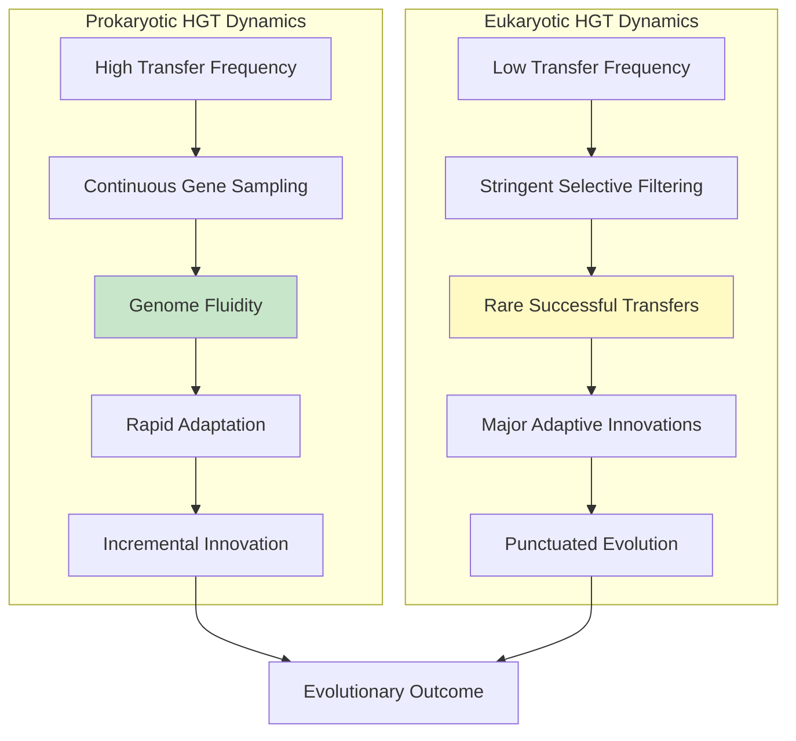

Several factors explain why eukaryotic complexity may have driven the reduction in HGT importance. The evolution of **meiotic sex** in early eukaryotes provided an alternative mechanism for genetic recombination that could maintain genome integrity against mutational burden. Theoretical modeling demonstrates that the benefit of lateral gene transfer declines rapidly with increasing genome size—larger genomes gain *de novo* deleterious mutations at a faster rate, and LGT cannot efficiently counteract this mutational burden unless recombination length approaches the same order of magnitude as genome size. The recombination events required are easily achievable via meiotic sex but unknown among prokaryotes.

The evolution of complex **regulatory networks** in eukaryotes created integration challenges that favor vertical inheritance over horizontal acquisition. The complexity hypothesis explains why informational genes resist transfer in both domains, but in eukaryotes, even operational genes face greater integration challenges due to requirements for eukaryotic promoters, intron acquisition, and chromatin compatibility.

What does this comparison reveal about the nature of genetic innovation in complex organisms? The evidence suggests that **eukaryotic HGT functions as a mechanism for introducing major innovations that would be difficult or impossible to achieve through gradual mutational processes**. The acquisition of carotenoid biosynthesis capability by aphids, the acquisition of cell wall-degrading enzymes by beetles and nematodes, and the acquisition of detoxification capability by whiteflies all represent "quantum leaps" in adaptive capacity—the sudden acquisition of complex capabilities that would require many coordinated mutations to evolve *de novo*.

In this sense, the rarity of eukaryotic HGT may be evolutionarily appropriate. If HGT were as frequent in eukaryotes as in prokaryotes, the resulting genome fluidity might be incompatible with the complex regulatory networks and developmental programs that characterize multicellular life. The stringent filtering that makes eukaryotic HGT rare simultaneously ensures that when transfer does succeed, it represents a significant evolutionary event. The genes that navigate all barriers—*BtPMaT1*, carotenoid biosynthesis genes, cell wall-degrading enzymes, disease resistance genes—represent the exceptional cases where horizontal transfer has provided the raw material for adaptive evolution in complex multicellular organisms.

The comparison with prokaryotic HGT thus illuminates both what makes eukaryotic transfer different and why these rare events are so evolutionarily significant. **Prokaryotic HGT operates as an engine of genome fluidity; eukaryotic HGT operates as a mechanism for punctuated innovation**. Both represent horizontal gene transfer, but they play fundamentally different roles in the evolutionary dynamics of their respective domains. Understanding this distinction is essential for appreciating why the documented cases of HGT in plants and animals—despite their rarity—represent some of the most fascinating examples of evolutionary adaptation in the biological world.

## 9 Implications for Understanding Eukaryotic Evolution and Future Research Directions

The preceding chapters have documented a remarkable collection of horizontal gene transfer events across plant and animal lineages—from bacterial T-DNA integration in sweet potato to fungal-derived disease resistance genes in wheat, from carotenoid biosynthesis capability in aphids to plant-derived detoxification enzymes in whiteflies. These discoveries collectively demonstrate that **HGT in multicellular eukaryotes, while rare compared to prokaryotic systems, represents a genuine and significant evolutionary phenomenon** with profound implications for understanding how complex organisms adapt and diversify. This concluding chapter synthesizes these findings to assess the broader significance of eukaryotic HGT, critically evaluates whether current frequency estimates may underestimate the true prevalence of horizontal transfer, identifies key unanswered questions demanding future investigation, and explores the practical applications emerging from this knowledge in biotechnology, crop improvement, and pest management.

### 9.1 Reassessing HGT Frequency in Eukaryotes: Evidence for Systematic Underestimation

The documented cases of horizontal gene transfer in plants and animals presented throughout this report may represent only the visible portion of a much larger phenomenon. Multiple methodological and conceptual factors suggest that **HGT in eukaryotes has been systematically underestimated**, and emerging evidence indicates that horizontal transfer may be considerably more prevalent than current estimates suggest.

The most significant source of underestimation stems from the **routine removal of bacterial sequences from eukaryotic genome assemblies** as presumed contamination. A critical barrier to identifying bacteria-to-animal HGT is that prokaryotic sequences are routinely removed from eukaryotic genome projects without description of the methods used[^5]. This practice creates a circular argument: bacterial sequences are removed because animals are not thought to have HGT from bacteria, and subsequent analysis of "cleaned" genomes reinforces this notion. Resources like the Sequence Read Archive offer opportunities for assembly-independent analyses if raw data is deposited before "contaminant" removal, but such approaches remain underutilized[^5].

The **erosion of phylogenetic signal over evolutionary time** represents another factor contributing to underestimation. The identification of horizontally acquired genes is complicated because phylogenetic signal erodes over time, and HGT from uncultivated or extinct lineages may not be identified[^5]. Ancient transfer events that occurred tens or hundreds of millions of years ago may have accumulated sufficient sequence divergence that standard phylogenetic methods can no longer detect their foreign origin. Given that many documented HGT events—such as the *BtPMaT1* transfer approximately 35 million years ago and the sweet potato T-DNA integration approximately 1.7 million years ago—represent relatively recent events in evolutionary terms, numerous older transfers may remain undetected.

The **default assumption of vertical inheritance as the null hypothesis** further biases detection toward underestimation. As long as vertical inheritance remains the null hypothesis, HGT will likely be underestimated[^5]. Researchers who view vertical inheritance as dominant rarely find HGT a satisfying explanation, preferring explanations involving gene loss or phylogenetic artifacts[^5]. This interpretive framework means that ambiguous cases—where evidence could support either HGT or alternative explanations—are typically resolved in favor of vertical inheritance. While some reported HGT cases are artifacts, this does not discount its likelihood in many other cases[^5].

Additional factors contributing to underestimation include:

| Factor | Mechanism of Underestimation | Potential Impact |
|--------|------------------------------|------------------|
| **Incomplete taxon sampling** | Missing donor or recipient lineages prevent detection | Unknown but potentially substantial |
| **Patchy gene distributions** | Can be explained by either HGT or differential gene loss | Conservative interpretations favor gene loss |
| **Organellar gene transfer confusion** | Bacterial-origin genes attributed solely to mitochondria/plastids | Overestimates endosymbiotic contribution |
| **Methodological heterogeneity** | Different studies use incomparable parameters | Prevents accurate cross-study comparisons |

The observation that **mitochondria and plastids represent fixed and diminishing gene pools** due to gene loss means that organellar gene transfer alone cannot adequately explain the large number of bacterial genes in eukaryotic genomes[^5]. The recognition of this limitation has prompted researchers to consider alternative explanations for bacterial-origin sequences, gradually opening the door to acceptance of ongoing HGT as a genuine evolutionary force. However, the historical attribution of most bacterial genes to organellar origins means that the contribution of independent HGT events may have been substantially underestimated.

Evidence suggesting higher HGT prevalence than currently recognized comes from multiple sources. The comprehensive analysis of 218 high-quality insect genomes revealed that insects have acquired **1,410 genes from 670 unique donors**, including 25 plant species[^4]. This extensive survey, representing the most comprehensive assessment of HGT in any animal group, suggests that previous estimates based on smaller datasets substantially underestimated the true frequency of horizontal transfer. Functional studies on these genes have revealed their significant roles in insect life, spanning immunity, adaptability, and even lepidopteran courtship behavior[^4].

The recognition that **HGT is likely underestimated** has important implications for understanding eukaryotic evolution. If current estimates represent only a fraction of actual HGT events, then horizontal transfer may have contributed more substantially to eukaryotic genome evolution than currently appreciated. The genes that successfully transfer and persist—those documented in this report—may represent the tip of an iceberg, with many additional transfers having lost their phylogenetic signal or been overlooked due to methodological limitations.

### 9.2 Unresolved Questions Regarding Transfer Mechanisms and Vectors

Despite the growing catalog of documented HGT events in plants and animals, **the mechanisms enabling genetic material to cross species boundaries in multicellular eukaryotes remain largely unknown**[^4]. This knowledge gap represents one of the most significant challenges facing the field and limits our ability to predict where future HGT events are most likely to occur or to harness natural transfer mechanisms for biotechnological applications.

The role of **viral intermediaries** in mediating HGT between distantly related eukaryotes remains incompletely understood. Viruses have been proposed as prime candidate vectors for horizontal gene transfer because they are infectious, can be horizontally transmitted between hosts, and regularly integrate their genetic material into host genomes. The widespread integration of endogenous viral elements (EVEs) into host genomes demonstrates that viruses can deliver genetic material into host chromosomes[^4]. However, direct evidence linking specific viruses to documented HGT events remains limited. The hypothesis that viruses mediated the transfer of *BtPMaT1* from plants to whiteflies is plausible but unconfirmed—the transfer occurred approximately 35 million years ago, making identification of the specific viral vector impossible.

Key unresolved questions regarding viral-mediated transfer include:

- Which viral families are most capable of mediating cross-kingdom genetic exchange?
- What molecular features enable viruses to capture and transfer host sequences?
- How frequently do viruses serve as HGT vectors compared to other mechanisms?
- Can viral-mediated transfer be experimentally demonstrated under controlled conditions?

The **relative contributions of different transfer pathways** remain poorly quantified. Although occurrences of HGT between plants and various organisms are now well founded, the mechanisms of this HGT remain vastly unknown[^4]. Recent hypotheses suggest that HGT in plants occurs through diverse pathways, including viral integration, host-parasite interactions, grafting, environmental DNA uptake, and mobile genetic elements like transposons and mavericks[^4]. However, the relative importance of each pathway for different donor-recipient combinations has not been systematically assessed.

Understanding the mechanisms enabling **horizontal transposon transfer (HTT)** presents particular challenges. HTT represents the most extensively documented form of HGT in eukaryotes, with more than 2,800 events described. Yet the vectors mediating transposon movement between species remain largely unknown. Proposed candidates include:

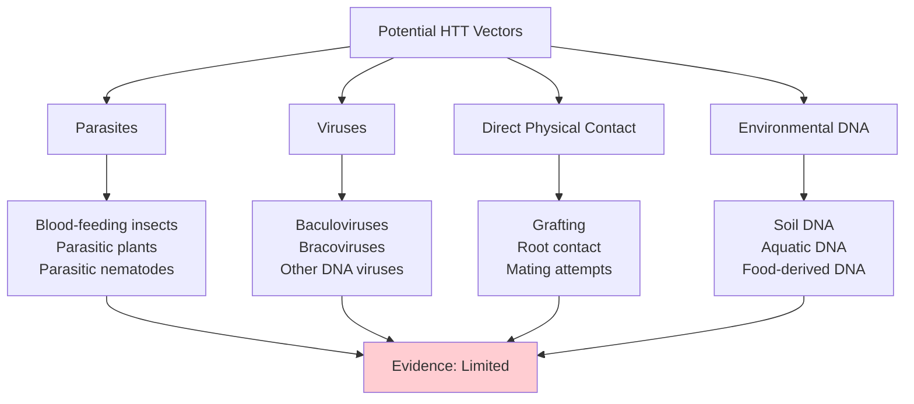

Laboratory experiments have provided some direct evidence—the mite *Proctolaelaps regalis* was identified as a probable vector for *P* element transfer in *Drosophila*—but such demonstrations remain rare. The observation that blood-feeding insects like triatomine bugs harbor transposons with high sequence identity to mammalian sequences suggests that feeding relationships may facilitate HTT, but the mechanism by which transposons would move from host blood to insect germline chromosomes is unclear.

The question of **why certain ecological contexts facilitate transfer while others do not** demands investigation. The dramatic geographic concentration of BovB retrotransposon transfers in Madagascar, with 91% of frogs testing positive compared to 0% in Africa, demonstrates that regional ecological factors strongly influence HGT occurrence. The correlation between BovB prevalence in frogs and in parasites (50% in Madagascar versus 2.9% in Japan) suggests that parasite communities may determine regional HGT frequencies. However, the specific ecological or environmental factors creating such "HGT hotspots" remain unidentified.

The **anticipated implications of HGT in eukaryotes necessitate experimental validation** to assess their effectiveness[^4]. Moving beyond correlative genomic evidence to mechanistic understanding will require the development of experimental systems capable of demonstrating transfer under controlled conditions. Such systems could potentially involve:

- Laboratory populations of parasitic plants and hosts
- Controlled *Wolbachia*-host associations
- Viral infection experiments with known HGT-capable viruses
- Feeding trials with labeled genetic material

Until such experimental validation is achieved, our understanding of HGT mechanisms will remain incomplete, limiting both basic scientific understanding and practical applications.

### 9.3 Gene Integration and Domestication: From Foreign Sequence to Functional Gene

The journey from initial DNA entry to stable, functional gene retention involves a complex process of **genomic domestication** whereby foreign sequences acquire eukaryotic characteristics and become integrated into host regulatory networks. Understanding this domestication process is essential for explaining why some transfers achieve stable retention while others degrade into pseudogenes, yet many aspects of this process remain poorly understood.

The acquisition of **eukaryotic regulatory features** by horizontally transferred genes represents a critical step in domestication. Foreign genes must acquire appropriate promoters, enhancers, and other regulatory elements compatible with the host's transcription machinery. The observation that many bacteria-to-eukaryote transfers show only low-level transcription—as documented in *Drosophila ananassae* and *Callosobruchus chinensis*—indicates that expression compatibility represents a significant bottleneck. Successfully retained genes show evidence of regulatory domestication, including tissue-specific expression patterns appropriate to their function, but the mechanisms by which foreign genes acquire host regulatory elements remain unclear.

**Intron acquisition** represents one of the clearest signatures of domestication. Bacterial genes lack introns, so their presence in horizontally acquired genes indicates post-transfer evolution within the eukaryotic host. Analysis of horizontally transferred genes in *Rafflesia cantleyi* revealed that 16 of 31 verified HGT transcripts contained introns with characteristic splice sites, suggesting the source of transfer was likely genomic DNA rather than processed mRNA[^4]. However, the mechanisms by which introns are inserted into foreign genes—whether through transposon-mediated insertion, recombination with intron-containing sequences, or other processes—remain poorly characterized.

**Codon usage adaptation** provides another signature of domestication, with foreign genes gradually converging toward host-like codon preferences under selection for translation efficiency. In *Rafflesia cantleyi*, 29.8% of vertically inherited genes exhibit codon usage properties more similar to their host *Tetrastigma* than to their closest relatives, and the expression level of these genes was positively correlated with similarity to host-like coding patterns[^4]. This convergence suggests that selection favors genes with translationally optimal codons, but the timeline over which such adaptation occurs and the factors influencing adaptation rate remain unknown.

The **genomic locations permissive for integration** of horizontally acquired material represent another area of uncertainty. The concentration of foreign DNA in telomeric regions of bdelloid rotifer chromosomes suggests that specific genomic locations may be more permissive for integration. Telomeric regions are known to be more permissive for sequence variation and rearrangement than other genomic regions, potentially providing a "safe harbor" for foreign DNA integration that minimizes disruption to essential genes. However, whether this pattern reflects preferential integration at telomeric sites or preferential retention of telomeric insertions remains unclear.

The **timeline of domestication** from initial transfer to full functional integration is poorly constrained. Some transferred genes appear to achieve functional integration rapidly—the *BtPMaT1* gene in whiteflies shows strong purifying selection indicating essential function—while others persist as partially functional or non-functional sequences for extended periods. Understanding the factors that determine domestication rate could inform predictions about which recent transfers are likely to achieve long-term retention.

A central question is **why some transfers achieve stable retention while others degrade into pseudogenes**. The mixture of functional and non-functional transferred sequences observed in many HGT-rich lineages reflects the ongoing evolutionary process: recently transferred genes may retain functionality, while older transfers gradually degrade unless maintained by selection. The high-bar hypothesis suggests that only transfers providing substantial adaptive benefits survive the filtering process, but the threshold benefit required for retention and the factors influencing this threshold remain unquantified.

### 9.4 Implications for Reconstructing Evolutionary Relationships and the Tree of Life

The recognition of HGT in eukaryotes carries significant implications for how we **conceptualize evolutionary relationships and reconstruct phylogenetic history**. While HGT has long been acknowledged as a complicating factor in prokaryotic phylogenetics—to the point where some researchers question whether a tree of life is recoverable for bacteria and archaea—its implications for eukaryotic phylogenetics are only beginning to be appreciated.

The fundamental question is whether **the tree of life paradigm remains appropriate for eukaryotes** given evidence of cross-lineage genetic exchange. In prokaryotes, horizontal gene transfer challenges the correct reconstruction of phylogenetic relationships, with some authors questioning whether it is possible to reconstruct an accurate phylogenetic tree for the microbial world[^3]. A study claims that less than 0.7% of prokaryotic genes may be considered core genes, making the construction of a phylogenetic tree unsustainable[^3]. Some authors support the point that it is impossible to reconstruct a tree of life, proposing metaphors of a **web of life or a ring of life** as alternatives[^3].

For eukaryotes, the situation appears less severe but still significant. The role of horizontal gene transfer in eukaryotic evolution is less important compared with its relevance in prokaryotic evolution, but it is not a negligible force[^3]. HGT is important in unicellular eukaryote evolution, and eukaryotic nuclear genomes contain several genes of microbial origin transferred via ancient endosymbiotic events[^3]. The acquisition of novel genes from living endosymbionts also modulates eukaryotic genome evolution, and the acquisition of foreign genes from bacteria and other eukaryotes is important in fungi and plant evolution[^3].

The practical implications for phylogenetic reconstruction include:

| Challenge | Impact on Phylogenetics | Potential Solutions |
|-----------|------------------------|---------------------|
| **Gene tree/species tree discordance** | Individual gene trees may not reflect species relationships | Use of multiple genes; coalescent methods |
| **Patchy gene distributions** | Presence/absence patterns may reflect HGT rather than loss | Careful evaluation of alternative explanations |
| **Ancient HGT events** | May create spurious deep relationships | Improved detection methods; functional analysis |
| **Cross-kingdom transfers** | Violate assumption of tree-like evolution | Network-based phylogenetic methods |

The observation that **HGT events can be distinguished from other processes producing phylogenetic incongruence** provides some reassurance that phylogenetic reconstruction remains possible. Recovery of accurate phylogenies is difficult, and patchy gene distributions can be controversially explained by either differential gene loss or HGT[^5]. However, multiple lines of evidence—including genomic context, functional validation, and distribution patterns—can distinguish genuine HGT from artifacts. Given these difficulties, putative HGT cases must be investigated carefully with independent lines of evidence, as patchy distributions probably reflect combined effects of duplication, gene loss, and HGT[^5].

The implications of HGT for understanding **major evolutionary transitions** are particularly significant. HGT events between plants and other organisms carry significant functional implications, especially during major ecological transitions[^4]. The acquisition of stress tolerance genes from bacteria is linked to the successful transition of plants to land, and the origin of the major phytohormone auxin synthesis and vascular development in plants is thought to be associated with HGT[^4]. These findings suggest that horizontal transfer may have played crucial roles in enabling the major transitions that shaped eukaryotic diversity.

The coevolution of interacting organisms in any ecosystem is greatly influenced by HGT, as illustrated by the coevolutionary arms race between plants and whiteflies[^4]. The discovery that whiteflies acquired plant genes enabling them to neutralize plant defenses introduces a new dimension to coevolutionary models, suggesting that genetic theft—rather than gradual evolutionary innovation—may accelerate coevolutionary dynamics.

The broader implication is that **eukaryotic evolution is better conceptualized as a network or web** in which genetic material can flow across species boundaries, rather than as a strictly bifurcating tree. While the frequency of such cross-lineage transfers is far lower in eukaryotes than in prokaryotes, the cumulative effect over evolutionary time may be significant. The focus is shifting from whether HGT affected eukaryotes to understanding how it influenced their ecology and evolution[^4].

### 9.5 Biotechnological Applications: From Natural HGT to Engineered Gene Transfer

Understanding the mechanisms and prevalence of HGT in eukaryotes carries **significant implications for plant biotechnology**[^4]. By comprehending the intricacies of HGT, researchers can devise more effective gene transfer techniques, identify novel genetic resources through bioprospecting, and develop innovative approaches to crop improvement and pest management.

The most direct biotechnological application of HGT knowledge comes from ***Agrobacterium*-mediated transformation**, which has become the foundation for modern plant biotechnology[^4]. The natural gene-transfer mechanism of *Agrobacterium tumefaciens*—a remarkable example of interkingdom HGT—is so efficient that it has been exploited for decades to introduce desired genes into crop plants. *A. tumefaciens* has long served as a valuable tool in bioengineering due to its unique ability to transfer genetic material into plant cells, leading to substantial improvements in the yield of crops such as corn, soybean, and cotton[^4]. The discovery that sweet potato is a naturally transgenic food crop, containing T-DNA sequences acquired through ancient *Agrobacterium* infection, demonstrates that the boundaries between "natural" and "transgenic" are more permeable than commonly assumed[^4].

Three prominent examples of HGT applied in bioengineering illustrate the transformative potential of this knowledge[^4]:

**Recombinant DNA technology**: *Agrobacterium*-mediated transformation remains the leading method for generating transgenic plants, with successful applications in major crops including corn, wheat, soybeans, and cotton.

**CRISPR-Cas system**: This revolutionary genome editing technology represents a harnessed HGT event—the CRISPR-Cas system evolved in bacteria as an adaptive immune mechanism that incorporates fragments of viral genomes into bacterial DNA[^4]. This natural process has been harnessed to develop CRISPR technology, enabling precise genome editing with applications spanning medicine, agriculture, and basic research.

**Fanzor-mediated genome editing**: Fanzor, an RNA-guided endonuclease, is presumed to result from horizontal gene transfer from bacteria to eukaryotes[^4]. This system demonstrates precise DNA editing capability, making it a promising tool for various applications including medical research and gene therapy approaches.

**Bioprospecting** represents another significant application of HGT knowledge. Understanding HGT in eukaryotes is instrumental in bioprospecting—the systematic exploration of biological resources to uncover novel compounds, genes, and biochemical processes[^4]. For instance, identifying the HGT event involving the *Fhb7* gene from fungi to plants has enabled the development of FHB-resistant wheat varieties[^4]. Furthermore, understanding how genes are transferred between eukaryotic organisms enables the identification of unique genetic pathways and the bioactive compounds they produce, potentially leading to drug discoveries[^4].

The potential for functional diversification of horizontally transferred genes opens new perspectives for bioprospecting. Evidence of functional diversification in horizontally transferred genes—such as the thaumatin-like protein that evolved antifungal function in one whitefly species but immune-suppressing function in another—highlights the potential for discovering genes with unique or enhanced functions[^4].

Applications in **medical therapeutics** are also emerging. Insights from HGT have led to the development of powerful bioengineering tools with medical applications[^4]. The CRISPR-Cas system has been harnessed for precise genome editing and molecular diagnostics with applications in medicine, as demonstrated by the approval of Casgevy for the treatment of sickle cell disease and transfusion-dependent beta thalassemia[^64]. Clinical trials are investigating CRISPR-based treatments for conditions including hereditary transthyretin amyloidosis, hereditary angioedema, various cancers, cardiovascular disease, HIV/AIDS, and diabetes[^64].

The application of HGT principles to **non-viral gene delivery** represents an emerging frontier. Several examples of HGT from pathogens into eukaryotic cells have been discovered and mimicked to improve non-viral gene delivery techniques[^65]. Viral characteristics used to enhance non-viral techniques include methods of DNA protection/transport, cell invasion, endosomal escape, nuclear transport, and transgene expression/maintenance[^65]. Applying lessons from pathogens that employ horizontal gene transfer has dramatically improved non-viral gene delivery, with pathogenic traits that originally caused diseases potentially being used to treat genetic diseases[^65].

### 9.6 Pest Management Strategies Targeting Horizontally Acquired Genes

The discovery that agricultural pests harbor **horizontally acquired genes essential for their survival** opens novel opportunities for pest management strategies. The *BtPMaT1* paradigm in whiteflies provides a compelling model for how understanding HGT can inform targeted, species-specific pest control approaches.

The sweet potato whitefly *Bemisia tabaci* represents one of the most economically damaging agricultural pests worldwide, capable of feeding on over 600 plant species across 74 plant families. The discovery that whiteflies depend on the horizontally acquired *BtPMaT1* gene to detoxify plant phenolic glucosides reveals a **vulnerability created by the pest's reliance on this foreign gene**[^4]. Understanding HGT mechanisms informs pest management strategies, which can indirectly impact human health by ensuring food security[^4].

The experimental validation of *BtPMaT1* as an essential gene provides proof of concept for targeting horizontally acquired genes:

| Intervention Approach | Mechanism | Demonstrated Efficacy |
|----------------------|-----------|----------------------|
| **RNAi silencing** | dsRNA targeting *BtPMaT1* transcript | Increased mortality on phenolic glycoside-containing diets |
| **Transgenic plant expression** | Plants expressing hairpin RNA | ~100% whitefly mortality within 7 days |
| **Gene drive** | Inactivation of *BtPMaT1* in pest populations | Proposed but not yet demonstrated |

The demonstration that transgenic tomato plants expressing hairpin RNA targeting *BtPMaT1* caused the death of almost 100% of whiteflies within 7 days after ingestion—without affecting other insects—provides compelling evidence for the feasibility of this approach[^4]. This extraordinary specificity reflects the targeted nature of the silencing construct and demonstrates that horizontally acquired genes represent genuine vulnerabilities that can be exploited for pest control.

Identifying the mechanisms of HGT through which crops and pests acquire new genetic material laterally can pave the way for targeted interventions using gene silencing techniques or gene editing tools like CRISPR-Cas[^4]. This knowledge can also aid in predicting the emergence and spread of new crop-harming pests. Moreover, understanding the role of HGT in pests' acquisition of resistance to plant toxins can facilitate the development of genetically modified crops with enhanced resistance to these pests[^4].

An insect-targeted strategy has been proposed for controlling whitefly, involving gene drive technique to inactivate or silence genes involved in detoxifying plant toxins[^4]. Gene drives could potentially spread *BtPMaT1*-inactivating mutations through whitefly populations, reducing their ability to feed on toxin-producing crops and thus contributing to sustainable pest management[^4].

The broader applicability of this approach extends beyond whiteflies. The comprehensive analysis revealing that insects have acquired 1,410 genes from 670 unique donors suggests that **many pest species may harbor horizontally acquired genes essential for their survival or reproduction**[^4]. Systematic identification of such genes across major agricultural pests could reveal additional targets for species-specific control strategies.

However, several considerations must inform the development of HGT-targeted pest management:

**Specificity**: Targeting genes present only in pest species—such as horizontally acquired genes absent from beneficial insects—offers the potential for highly specific interventions with minimal non-target effects.

**Resistance evolution**: Pests may evolve resistance to gene silencing approaches through mutations in target sequences or upregulation of alternative detoxification pathways.

**Ecological safety**: The release of gene drive organisms requires careful assessment of potential ecological consequences, including effects on food webs and non-target species.

**Regulatory frameworks**: Novel pest management approaches based on HGT knowledge will require appropriate regulatory oversight and risk assessment.

### 9.7 Ethical Considerations and Risk Assessment for HGT-Informed Technologies

The application of HGT knowledge in developing genetically modified (GM) crops and other biotechnologies introduces **significant ethical considerations and potential risks** that must be carefully evaluated[^4]. A balanced approach recognizing both the potential benefits and the uncertainties associated with these technologies is essential for responsible innovation.

A primary concern is the **unpredictable nature of gene integration and expression** when employing less understood HGT mechanisms, which could lead to unforeseen metabolic alterations or the creation of novel allergens and toxins in GM plants[^4]. While natural HGT events have occurred throughout evolutionary history without apparent harm, the deliberate application of HGT-derived knowledge to create novel genetic combinations introduces uncertainties that require careful assessment.

The **pervasive nature of HGT within ecosystems** raises the possibility of unintended lateral transfer of engineered genes to non-target organisms[^4]. The same mechanisms that enable natural HGT—viral intermediaries, parasitic connections, transposon mobility—could potentially facilitate the movement of engineered genes beyond their intended recipients. This raises concerns about:

- Transfer of herbicide resistance genes to weedy relatives
- Movement of pest resistance genes to non-crop species
- Ecological disruption from novel gene combinations in wild populations
- Potential for "superweeds" or disrupted ecological balances[^4]

The observed **functional diversification of HGTs further complicates risk assessment**[^4]. The demonstration that the same horizontally acquired gene can evolve different functions in different recipient species—as seen with the thaumatin-like protein in whiteflies—suggests that predicting the long-term consequences of engineered gene transfers may be challenging. A gene designed for one function in a target organism might evolve different, potentially undesirable functions if transferred to non-target species.

Therefore, **robust and comprehensive risk assessment frameworks are indispensable** to ensure the responsible application of HGT-derived knowledge in the advancement of GM crop technology[^4]. Such frameworks should consider:

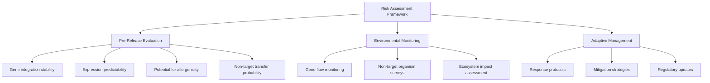

The **balance between innovation and precaution** requires careful consideration. The potential benefits of HGT-informed technologies—including disease-resistant crops, targeted pest management, and novel therapeutic approaches—are substantial. However, the novelty of these applications and the remaining uncertainties about HGT mechanisms argue for a precautionary approach that prioritizes safety while enabling responsible innovation.

The discovery that naturally transgenic crops like sweet potato have been consumed by humans for millennia without apparent harm provides some reassurance about the safety of HGT-derived genetic modifications. However, this does not eliminate the need for case-by-case assessment of novel applications, particularly those involving genes or combinations not found in nature.

### 9.8 Future Research Priorities and Emerging Methodological Approaches

Advancing understanding of eukaryotic HGT requires **concerted efforts across multiple research fronts**, from the development of improved detection methods to experimental validation of proposed mechanisms. This section outlines key priorities for future research and discusses emerging methodological approaches that may accelerate progress.

The development of **standardized pipelines for HGT detection and quantification** represents a critical priority. Comprehensive studies that compare HGT across diverse eukaryotic lineages using consistent parameters are necessary[^4]. Standardizing parameters and methodologies for studying HGT in eukaryotes is critical for ensuring comparability and reproducibility across studies[^4]. Currently, different studies employ different criteria for identifying HGT events, making cross-study comparisons difficult and potentially contributing to inconsistent estimates of HGT frequency.

A major barrier to progress is the **lack of standardized training and validation datasets** for computational approaches[^66]. To the best of current knowledge, no standardized training datasets exist for AI implementation in HGT detection[^66]. The reliability of available validation datasets has not been verified by convincing biological evidence; moreover, the validation datasets are often limited to a few genomes, which do not cover much microbial diversity[^66]. Accurate evaluation and validation of computational approaches are based heavily on high-quality datasets[^66].

To address these challenges and advance the field, **collaborative initiatives within the scientific community are needed** to develop and curate comprehensive benchmark datasets that accurately reflect the complexity of HGT events[^66]. This collaborative approach will facilitate the development of AI-based approaches, thereby promoting innovative computational approaches for HGT detection[^66].

The application of **artificial intelligence and deep learning methods** holds promise for improving HGT detection. The recent progress of AI in modeling complex evolutionary processes shows its potential for HGT detection[^66]. However, the widespread adoption of AI remains constrained by the lack of training and validation datasets[^66]. AI-based approaches, dominated by classical machine learning algorithms, experienced a major increase in 2021, and an up-and-coming approach worthy of consideration is geNomad, a recent deep learning approach that classifies mobile genetic elements[^66].

Current computational approaches for HGT detection can be organized into four primary groups[^66]:

| Approach Category | Strengths | Limitations |
|-------------------|-----------|-------------|
| **AI-based** | Can model complex patterns | Requires training data; limited adoption |
| **Sequence composition** | Reference-free; rapid analysis | High false positive/negative rates |
| **Comparative genomics** | Can identify donors | Dependent on reference quality; time-consuming |
| **Hybrid approaches** | Combines strengths of multiple methods | Performance depends on component methods |

The trend of computational approaches between 2000 and 2023 shows an exponential increase, with comparative genomics approaches outpacing other groups[^66]. Hybrid approaches show a progressive increase over the years, outnumbering sequence composition approaches[^66]. The increase in hybrid approaches, especially in the last two years, is in accordance with previous reviews stating that a combination of methods is often more suitable and desirable for HGT detection[^66].

Moving forward, **integrated interfaces for detecting genomic islands incorporating different approaches and features like visualization are preferable** for comprehensive results and easier analysis[^66]. Embracing AI and leveraging its capabilities in conjunction with comprehensive datasets could unlock opportunities to advance understanding of HGT dynamics[^66].

The importance of **experimental systems for studying transfer mechanisms** cannot be overstated. Until now, there is no reliable method of determining the origin and time period of HGT events[^4]. With the growing wealth of genomic data, advanced bioinformatics tools are crucial for managing biological data effectively[^4]. Additionally, the anticipated implications of HGT in eukaryotes necessitate experimental validation to assess their effectiveness[^4]. This holds promise for the development of climate-smart biotechnologies aimed at sustainable management in agriculture, the environment, and beyond[^4].

Key priorities for future research include:

1. **Elucidating mechanisms**: Employ experimental models to dissect the cellular and molecular pathways of DNA transfer, integration, and germline transmission across different ecological interfaces

2. **Developing robust methodologies**: Create standardized, curated databases of known HGT events for tool validation; develop new bioinformatic frameworks combining phylogenetic, genomic context, and population genetic signals

3. **Comparative phylogenomic studies**: Systematically screen diverse eukaryotic lineages with consistent parameters to map the taxonomic distribution of HGT

4. **Functional and ecological studies**: Shift focus from mere detection to understanding the fitness consequences, regulatory evolution, and ecological drivers of HGT events

5. **Theoretical synthesis**: Develop evolutionary models and paradigms that explicitly incorporate HGT, moving beyond a strictly bifurcating "Tree of Life" to a more realistic network-based framework

The potential for **functional diversification of transferred genes** opens a new perspective in HGT research[^4]. Understanding how horizontally acquired genes evolve distinct, species-specific functions over time could reveal principles governing the evolutionary fate of transferred sequences and inform predictions about the long-term consequences of both natural and engineered gene transfers.

In conclusion, delving into how genetic material is transferred between different eukaryotic species and integrated into recipient genomes can yield valuable insights into the processes driving genetic diversity and unlock new avenues for bioengineering[^4]. A deeper understanding of HGT mechanisms holds immense potential for the future of bioengineering worldwide for ensuring food and nutritional security[^4]. The documented cases of HGT in plants and animals presented throughout this report—from the *BtPMaT1* gene enabling whiteflies to neutralize plant defenses to the fungal-derived *Fhb7* gene conferring disease resistance in wheat—demonstrate that horizontal gene transfer, while rare in multicellular eukaryotes, represents one of the most fascinating mechanisms of evolutionary innovation in complex organisms. These rare transfers succeed precisely because they provide substantial adaptive benefits, transforming HGT from a curiosity into a significant force shaping the adaptive evolution of plants and animals across the tree of life.

# 参考内容如下：
[^1]:[Horizontal Gene Transfer – The Hidden Hazards of Genetic ...](https://biosafety-info.net/articles/biosafety-science/horizontal-gene-transfer/horizontal-gene-transfer-the-hidden-hazards-of-genetic-engineering/)
[^2]:[Horizontal gene transfer in eukaryotic evolution](https://www.nature.com/articles/nrg2386)
[^3]:[Horizontal gene transfer in evolution: facts and challenges](https://pmc.ncbi.nlm.nih.gov/articles/PMC2842723/)
[^4]:[Horizontal Gene Transfer in Plants and Implications for ... - PMC](https://pmc.ncbi.nlm.nih.gov/articles/PMC12451028/)
[^5]:[Horizontal gene transfer in eukaryotes: The weak-link model](https://pmc.ncbi.nlm.nih.gov/articles/PMC4033532/)
[^6]:[Horizontal Gene Transfer in Prokaryotes - NCBI](https://www.ncbi.nlm.nih.gov/books/NBK2228/)
[^7]:[20.3B: Horizontal Gene Transfer](https://bio.libretexts.org/Bookshelves/Introductory_and_General_Biology/General_Biology_(Boundless)/20%3A_Phylogenies_and_the_History_of_Life/20.03%3A_Perspectives_on_the_Phylogenetic_Tree/20.3B%3A_Horizontal_Gene_Transfer)
[^8]:[Horizontal Gene Transfer in Prokaryotes and Eukaryotes](https://microbenotes.com/horizontal-gene-transfer-prokaryotes-eukaryotes/)
[^9]:[Horizontal gene transfer is predicted to overcome the ...](https://www.nature.com/articles/s41467-024-45154-w)
[^10]:[Horizontal gene transfer in eukaryotes: the weak-link model](https://pubmed.ncbi.nlm.nih.gov/24037739/)
[^11]:[Horizontal Gene Transfer from Bacteria to Eukaryotes](https://pmc.ncbi.nlm.nih.gov/articles/PMC9473684/)
[^12]:[Horizontal Gene Transfers in Plants - PMC](https://pmc.ncbi.nlm.nih.gov/articles/PMC8401529/)
[^13]:[Reassessing Interkingdom Horizontal Gene Transfer ...](https://pmc.ncbi.nlm.nih.gov/articles/PMC12711439/)
[^14]:[First Report of Horizontal Gene Transfer Between ...](https://www.the-scientist.com/first-report-of-horizontal-gene-transfer-between-plant-and-animal-68597)
[^15]:[Mechanisms, detection, and impact of horizontal gene transfer ...](https://pmc.ncbi.nlm.nih.gov/articles/PMC12448838/)
[^16]:[Horizontal Gene Transfers in Plants](https://www.mdpi.com/2075-1729/11/8/857)
[^17]:[Horizontal gene transfer in parasitic plants](https://www.sciencedirect.com/science/article/abs/pii/S136952661500059X)
[^18]:[Horizontal Gene Transfer Between Host Eukaryotes and Their ...](https://prizedwriting.ucdavis.edu/horizontal-gene-transfer-between-host-eukaryotes-and-their-bacterial-endosymbionts-analyses-and)
[^19]:[Horizontal gene transfer from Agrobacterium to plants](https://pubmed.ncbi.nlm.nih.gov/25157257/)
[^20]:[Horizontal gene transfer from Agrobacterium to plants](https://www.frontiersin.org/journals/plant-science/articles/10.3389/fpls.2014.00326/full)
[^21]:[Viruses as vectors of horizontal transfer of genetic material ...](https://www.sciencedirect.com/science/article/abs/pii/S1879625716301900)
[^22]:[Genetic exchange in eukaryotes through horizontal transfer](https://pmc.ncbi.nlm.nih.gov/articles/PMC5791352/)
[^23]:[Horizontal transfer and evolution of transposable elements ...](https://www.nature.com/articles/s41467-020-15149-4)
[^24]:[Sperm-mediated gene transfer: mechanisms and implications](https://pubmed.ncbi.nlm.nih.gov/17644984/)
[^25]:[Sperm-mediated gene transfer](https://en.wikipedia.org/wiki/Sperm-mediated_gene_transfer)
[^26]:[The genome of cultivated sweet potato contains ...](https://pmc.ncbi.nlm.nih.gov/articles/PMC4426443/)
[^27]:[The horizontal gene transfer of Agrobacterium T-DNAs into ...](https://www.nature.com/articles/s41598-019-48691-3)
[^28]:[Massive mitochondrial gene transfer in a parasitic ...](https://pubmed.ncbi.nlm.nih.gov/23459037/)
[^29]:[Massive Mitochondrial Gene Transfer in a Parasitic Flowering ...](https://journals.plos.org/plosgenetics/article?id=10.1371/journal.pgen.1003265)
[^30]:[Widespread and frequent horizontal transfers of ...](https://pmc.ncbi.nlm.nih.gov/articles/PMC4009612/)
[^31]:[Horizontal gene transfer between bacteria and animals](https://pmc.ncbi.nlm.nih.gov/articles/PMC3068243/)
[^32]:[Female Sex Determination and the f Element in the Isopod ...](https://pmc.ncbi.nlm.nih.gov/articles/PMC5541319/)
[^33]:[Evidence for common horizontal transmission of Wolbachia ...](https://pmc.ncbi.nlm.nih.gov/articles/PMC4882834/)
[^34]:[Phylogenetic evidence for horizontal transmission of ...](https://pubmed.ncbi.nlm.nih.gov/10605113/)
[^35]:[Coordinated horizontal transfer of multiple genes ...](https://www.sciencedirect.com/science/article/abs/pii/S0965174825001778)
[^36]:[Coordinated horizontal transfer of multiple genes ...](https://www.biorxiv.org/content/10.1101/2025.03.24.644864v3)
[^37]:[Phylloxerids share ancestral carotenoid biosynthesis ...](https://pmc.ncbi.nlm.nih.gov/articles/PMC5636080/)
[^38]:[Phylloxerids share ancestral carotenoid biosynthesis genes of ...](https://journals.plos.org/plosone/article?id=10.1371/journal.pone.0185484)
[^39]:[Multiple Horizontal Acquisitions of Plant Genes in the Whitefly ...](https://pmc.ncbi.nlm.nih.gov/articles/PMC9599486/)
[^40]:[Plant to insect horizontal gene transfer](https://univ-angers.hal.science/hal-03219146/document)
[^41]:[Geography-Dependent Horizontal Gene Transfer from ...](https://pmc.ncbi.nlm.nih.gov/articles/PMC9007160/)
[^42]:[Insects Co-opt Host Genes to Overcome Plant Defences](https://pmc.ncbi.nlm.nih.gov/articles/PMC9066445/)
[^43]:[Horizontal gene acquisitions by eukaryotes as drivers of ...](https://pubmed.ncbi.nlm.nih.gov/24323918/)
[^44]:[Key events in the evolution of herbivory in beetles](https://www.sciencedirect.com/science/article/abs/pii/S0965174814001088)
[^45]:[Metabolic novelty originating from horizontal gene transfer ...](https://www.pnas.org/doi/10.1073/pnas.2205857119)
[^46]:[Metabolic enhancement contributed by horizontal gene ...](https://pmc.ncbi.nlm.nih.gov/articles/PMC11725898/)
[^47]:[Widespread impact of horizontal gene transfer on plant ...](https://pmc.ncbi.nlm.nih.gov/articles/PMC3493653/)
[^48]:[Horizontal transfer of expressed genes in a parasitic flowering ...](https://pmc.ncbi.nlm.nih.gov/articles/PMC3460754/)
[^49]:[The advantages and disadvantages of horizontal gene ...](https://pmc.ncbi.nlm.nih.gov/articles/PMC3043529/)
[^50]:[The Evolution of Bacterial Genome Architecture - PMC](https://pmc.ncbi.nlm.nih.gov/articles/PMC5447742/)
[^51]:[Detection of horizontal gene transfer in the genome ...](https://www.nature.com/articles/s41598-021-85259-6)
[^52]:[The impact of horizontal gene transfer in shaping operons and ...](https://pmc.ncbi.nlm.nih.gov/articles/PMC2259305/)
[^53]:[Genome expansion in early eukaryotes - Transition to meiotic ...](https://elifesciences.org/articles/58873)
[^54]:[Researchers identify first known gene transfer between ...](https://frontlinegenomics.com/researchers-identify-first-known-gene-transfer-between-plants-and-insects/)
[^55]:[Whitefly hijacks a plant detoxification gene that neutralizes ...](https://pubmed.ncbi.nlm.nih.gov/33770502/)
[^56]:[This Insect Has Plant DNA in Its Genome](https://www.smithsonianmag.com/smart-news/insect-has-plant-dna-its-genome-180977366/)
[^57]:[Sidestepping Darwin: horizontal gene transfer from plants ...](https://www.sciencedirect.com/science/article/abs/pii/S2214574523000329)
[^58]:[This insect swiped a gene from plants to help itself survive](https://www.freethink.com/science/plant-to-insect-gene-transfer)
[^59]:[Endogenous Viral Elements in Animal Genomes - PMC](https://pmc.ncbi.nlm.nih.gov/articles/PMC2987831/)
[^60]:[Do Viruses Exchange Genes across Superkingdoms of Life?](https://pmc.ncbi.nlm.nih.gov/articles/PMC5671483/)
[^61]:[Viruses can transfer genes across the superkingdoms of life](https://www.frontiersin.org/news/2018/01/15/frontiers-in-microbiology-viruses-transfer-genes-across-life-superkingdoms-domains)
[^62]:[Insect-Specific Viruses and Their Emerging Role in Plant ...](https://pmc.ncbi.nlm.nih.gov/articles/PMC12474051/)
[^63]:[Horizontal gene transfer is more frequent with increased ...](https://www.pnas.org/doi/10.1073/pnas.1608765113)
[^64]:[CRISPR Clinical Trials: A 2024 Update](https://innovativegenomics.org/news/crispr-clinical-trials-2024/)
[^65]:[Applying horizontal gene transfer phenomena to enhance ...](https://pmc.ncbi.nlm.nih.gov/articles/PMC4258102/)
[^66]:[Current state and future prospects of Horizontal Gene ...](https://pmc.ncbi.nlm.nih.gov/articles/PMC11811736/)
