# Avian Migration Navigation: Mechanisms, Cues, Precision, and Ecological Disturbances
## 1 Fundamentals of Avian Navigation Systems

This chapter establishes the theoretical and empirical foundations of avian navigation, examining the core distinction between orientation (maintaining a compass-based directional heading) and true navigation (determining position relative to a goal using map-like spatial representations). The analysis introduces the map-and-compass conceptual framework as the dominant paradigm for understanding how birds accomplish long-distance migration, investigates the hierarchical integration of multiple navigational information sources, and critically assesses the interplay between innate genetic programming and experiential learning in the ontogeny of navigational competence across juvenile and adult life stages.

### 1.1 Orientation versus True Navigation: Conceptual Distinctions

The study of avian navigation requires a precise understanding of two fundamentally distinct but interrelated capabilities: **orientation** and **true navigation**. Orientation refers to the ability of birds to move along a specific compass direction—essentially maintaining a predetermined heading without necessarily knowing their current geographic position[^1]. True navigation, in contrast, represents a far more sophisticated cognitive achievement, first formally described by Gustav Kramer in the 1950s as a **two-step process**: the bird must first determine the correct direction to travel toward its goal, and then it must be able to locate or identify that direction using available environmental cues[^1][^2]. In other words, true navigation requires both positional awareness (knowing where one is relative to a destination) and directional capability (the compass function to orient toward that destination).

The distinction between these two navigational modes carries profound implications for understanding how different categories of migrants accomplish their journeys. Research has consistently demonstrated that **true navigation is typically achieved only by "experienced" birds**—those that have familiarized themselves with local areas at small scales or, for long-distance migration, have successfully completed at least one migratory journey[^1]. Young, inexperienced birds often appear capable only of **vector navigation**, which involves maintaining a particular compass direction for a specified time or distance without the ability to compensate for unexpected displacements[^1][^3]. This fundamental asymmetry between adult and juvenile navigational capabilities has been revealed through elegant displacement experiments conducted over several decades.

The classic displacement experiments provide the most compelling evidence for this age-related dichotomy in navigational competence. In studies involving European starlings, common teal, and white-crowned sparrows captured during autumn migration and transported to locations outside their normal migratory corridor, **adult birds typically compensated for the displacement** by reorienting toward directions that would bring them to their normal wintering grounds[^1][^4][^3]. Juvenile birds, however, continued flying in the same compass direction they had been maintaining before displacement, ultimately arriving at locations parallel to but displaced from their species-typical wintering areas[^1][^4]. Perdeck's foundational experiments in the 1950s and 1960s, involving the displacement of over 11,000 common starlings from the Netherlands to Switzerland, demonstrated this pattern definitively: adult birds corrected their route toward traditional wintering grounds, while young birds showed only orientation ability, continuing their innate southwest heading[^3].

| **Navigational Mode** | **Definition** | **Typical Age Class** | **Response to Displacement** |
|----------------------|----------------|----------------------|------------------------------|
| Orientation (Vector Navigation) | Maintaining a specific compass direction for a predetermined duration | Juvenile/First-time migrants | Continue original heading; no compensation |
| True Navigation | Two-step process: determine position relative to goal, then orient toward goal | Experienced adults | Compensate for displacement; reorient toward destination |

However, the picture has grown more nuanced with additional research. Åkesson and colleagues documented that both adult and juvenile white-crowned sparrows compensated for longitudinal displacements of 266 to 2,862 kilometers, changing their orientation in ways that would return them to their normal wintering grounds or migratory corridors[^1]. Thorup and Rabøl's reanalysis of multiple displacement experiments similarly found that in many cases, both age classes showed directional changes following displacement[^1]. These findings suggest that **for some species, even first-time migrants may possess more sophisticated navigational capabilities than simple vector navigation would predict**—capabilities that must be at least partially innate[^1]. The question of whether such abilities represent true navigation or a more complex form of inherited spatial programming remains an active area of investigation.

The conceptual framework distinguishing orientation from true navigation thus provides the essential foundation for understanding the mechanisms underlying avian migration. A compass alone, regardless of how accurate, cannot guide a bird to a specific destination if the bird does not know whether it is north, south, east, or west of that destination[^4][^5]. The internal map provides positional information—the bird's location relative to its homing or migration goal—while the internal compass guides flight and maintains course[^4][^5][^6]. This elegant division of labor forms the basis of the map-and-compass model that has dominated avian navigation research for over seven decades.

### 1.2 The Map-and-Compass Framework: Theoretical Architecture

The **map-and-compass model**, proposed by Gustav Kramer in the 1950s, remains the foundational theoretical framework for understanding avian navigation[^2]. This model conceptualizes homing and migration as a two-step process: the first step involves determining the direction to the goal as a compass course (the "map" function), and the second step involves locating this course with the help of a compass (the "compass" function)[^2]. The model gained widespread acceptance when experiments with clock-shifted homing pigeons demonstrated their use of the sun compass—birds whose internal clocks had been experimentally altered by several hours showed predictable deviations in their initial orientation, corresponding to the apparent shift in the sun's position[^2].

The **compass component** of this framework is now understood to encompass multiple directional mechanisms that birds can employ depending on time of day, weather conditions, and species-specific sensory capabilities. These include:

- **The Sun Compass**: Discovered by Gustav Kramer in 1951 using European starlings, this time-compensated compass allows diurnal migrants to determine direction based on the sun's position relative to the time of day as measured by their circadian rhythm[^4][^5][^6]. Birds must learn the sun's arc across the sky to use this compass effectively—young pigeons allowed to see the sun only in the morning lack the ability to navigate using it in the afternoon[^7].

- **The Star Compass**: Used by nocturnal migrants, this compass was demonstrated through Stephen Emlen's elegant planetarium experiments with indigo buntings in the 1960s[^4][^5]. Crucially, young birds do not innately recognize star patterns but rather **learn a north-south orientation from observing the rotational pattern of the night sky** around the celestial pole[^4][^5][^7]. Birds raised under an artificial sky rotating around the star Betelgeuse instead of Polaris subsequently oriented away from Betelgeuse when exposed to a normal sky[^7].

- **The Magnetic Compass**: Research with European robins in the early 1960s established that birds can detect the Earth's magnetic field and use it for orientation[^4][^5][^6]. This compass operates as an **inclination compass**, detecting the angle at which magnetic field lines intersect the Earth's surface rather than polarity[^1][^8]. When the direction of the magnetic field was experimentally altered using Helmholtz coils, robins changed their hopping direction accordingly[^5][^6].

- **The Polarized Light Compass**: Patterns of polarized light, particularly at sunrise and sunset, provide directional information that birds use for initial migratory orientation[^4][^5]. The strongest polarized light runs at a 90-degree angle to the sun, and birds use this directional scattering of light waves as a reliable orientation cue[^4].

The **map component** of the framework remains considerably more enigmatic and controversial than the compass systems. The "map" is assumed to use local site-specific information to determine the bird's position relative to its goal, leading to the concept of a **gradient map** based on environmental parameters that vary systematically across geographic space[^2][^9]. Several mechanisms have been proposed:

**Geomagnetic Gradient Maps**: The Earth's magnetic field varies predictably with latitude (field intensity increases toward the poles) and longitude (magnetic declination varies from east to west)[^5][^2][^8]. A theoretical bi-coordinate geomagnetic map could use magnetic inclination and intensity to estimate latitude, and declination to estimate longitude[^9]. Recent experimental evidence from Eurasian reed warblers has demonstrated that birds can extract positional information from **magnetic inclination and declination alone**, even when these cues conflict with unchanged total magnetic intensity[^8][^10]. When exposed to artificially altered inclination and declination values simulating displacement approximately 2,700 kilometers to the east-northeast, the birds shifted their orientation in a direction consistent with compensatory reorientation back toward their capture site[^8][^10]. This finding challenges previous assumptions that all components of the magnetic field, particularly total intensity, are necessary for accurate navigation[^10].

**Olfactory Maps**: Floriano Papi and colleagues at the University of Pisa proposed that homing pigeons may use an olfactory map based on gradients of airborne odors[^4][^5][^6]. According to this hypothesis, birds learn to associate specific odor concentrations with wind directions while at their home loft, creating a gradient map that provides directional information even when displaced to unfamiliar locations[^9]. Evidence suggests that olfactory navigation may extend to distances of approximately 500 kilometers[^5][^6], though the existence of stable, extensive odor gradients in the turbulent lower atmosphere has been questioned[^11].

**Infrasound Direction-Finding**: An alternative hypothesis proposes that birds may use infrasound—very low-frequency acoustic signals—for navigation, analogous to maritime and aeronautical radio direction-finding techniques[^11][^9]. While theoretically plausible, this mechanism remains largely unconfirmed empirically.

A critical recent development in understanding the map-and-compass framework concerns whether the map and compass represent **truly separate sensory systems or are functionally integrated**. Traditional views held that birds require two separate magnetic sensory systems: one for the compass step located in the eye (the radical pair mechanism involving cryptochrome proteins), and a second for the map step located in the beak (magnetite-based receptors)[^2]. However, recent evidence calls into question whether the beak-based sense exists in the form originally proposed[^2]. The discovery that declination—calculated by comparing magnetic north detected by the magnetic compass with geographic north detected by celestial compasses—can provide longitude information suggests that **the sensory systems used in the map may not be separate from the compass but integrated into it**[^2]. This reconceptualization implies that the sun, stars, and magnetic inclination, previously thought to be used only for direction-finding, may also contribute to the map component of navigation[^2].

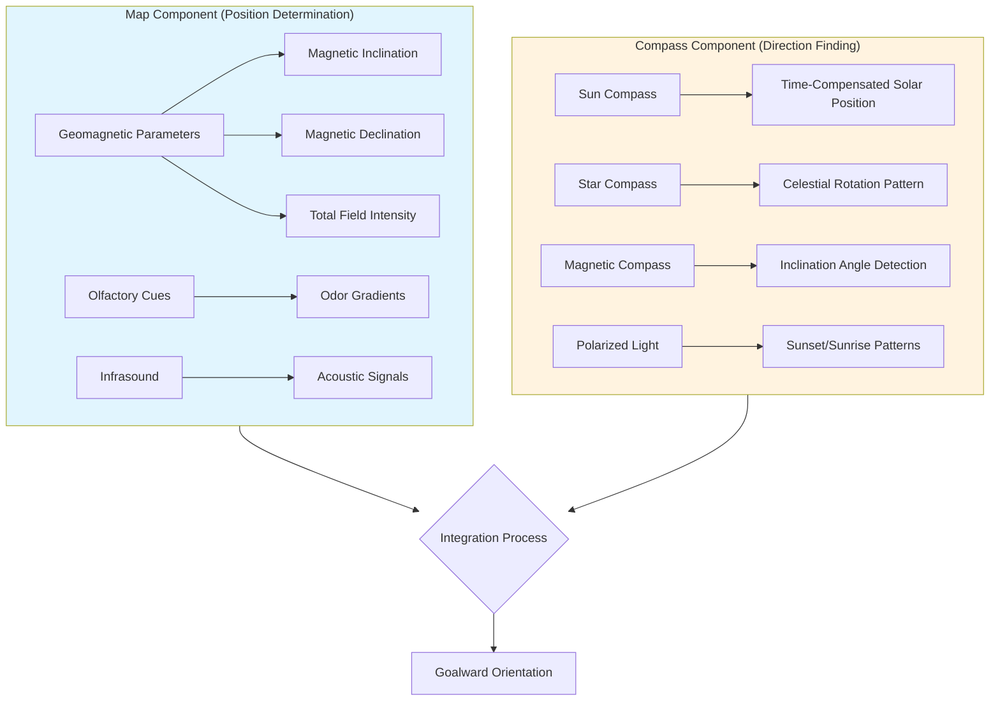
```mermaid
flowchart TD
    subgraph MAP["Map Component (Position Determination)"]
        A[Geomagnetic Parameters] --> A1[Magnetic Inclination]
        A --> A2[Magnetic Declination]
        A --> A3[Total Field Intensity]
        B[Olfactory Cues] --> B1[Odor Gradients]
        C[Infrasound] --> C1[Acoustic Signals]
    end
    
    subgraph COMPASS["Compass Component (Direction Finding)"]
        D[Sun Compass] --> D1[Time-Compensated Solar Position]
        E[Star Compass] --> E1[Celestial Rotation Pattern]
        F[Magnetic Compass] --> F1[Inclination Angle Detection]
        G[Polarized Light] --> G1[Sunset/Sunrise Patterns]
    end
    
    MAP --> H{Integration Process}
    COMPASS --> H
    H --> I[Goalward Orientation]
    
    style MAP fill:#e1f5fe
    style COMPASS fill:#fff3e0
```

The diagram above illustrates the theoretical architecture of the map-and-compass model, showing how multiple map cues and compass systems converge through an integration process to produce goalward orientation. The emerging view suggests that this integration may be more tightly coupled than previously recognized, with certain cues (particularly magnetic parameters) serving dual functions in both positional and directional determination.

### 1.3 Hierarchical Integration of Multiple Navigational Cues

Avian navigation operates as a **multi-modal and multi-scale process**, wherein birds may employ different cues at different times in response to environmental conditions and switch between strategies across different phases of their journey[^11][^9]. This complexity presents significant challenges for researchers, as understanding navigational decision-making requires tracking data paired with contemporaneous information on all potentially relevant environmental cues[^11][^9]. Bingman and Cheng have proposed a framework in which different sensory cues and spatial representations are used at different spatial scales, resulting in a multi-modal decision-making process where birds continuously switch between modalities[^11][^9].

Mouritsen's influential model proposes that **long-distance navigation operates across three distinct spatial scales**[^11][^9]:

1. **The Long-Distance Phase**: During this phase, birds rely on global cues such as celestial information (sun, stars) or geomagnetic parameters, prioritizing compass-based orientation to maintain their general migratory heading across hundreds or thousands of kilometers[^11][^9].

2. **The Narrowing-In or Homing Phase**: As birds approach their destination region, they transition to using local learned maps within their home range, such as familiar olfactory landscapes or recognized landscape features[^11][^9].

3. **The Pinpointing-the-Goal Phase**: In the final approach to their specific destination (nest site, roosting location, or favored feeding area), birds rely on visual or olfactory landmarks in close proximity to precisely locate their goal[^1][^11][^9].

The process of switching between global and local phases may repeat multiple times during a single journey, particularly when stopovers serve as intermediate targets[^11][^9]. Two possible control processes have been proposed for how birds manage these transitions: navigational strategies may be employed sequentially and triggered by specific environmental conditions, or alternatively, multiple strategies may operate in parallel throughout the journey with different modalities dominating at different times[^9]. The switching between several strategies may enhance navigational accuracy through the use of multiple, redundant cues[^9].

A particularly contentious area of research concerns the **calibration hierarchy among different compass systems**. Because the availability of different compass mechanisms varies with time of day, weather conditions, season, and latitude, and because directional information from different systems sometimes diverges, birds must calibrate their compasses against a common reference to avoid navigational errors[^1][^2][^12]. However, cue-conflict studies have produced contradictory results regarding which compass system serves as the primary calibration reference.

Based on a comprehensive meta-analysis of the available literature, Muheim and colleagues proposed an **extended unifying theory on compass cue hierarchy**[^2][^12][^13]:

| **Phase** | **Primary Calibration Reference** | **Calibration Process** |
|-----------|----------------------------------|------------------------|
| Pre-migratory Season | Celestial cues (sunset polarized light) | Magnetic compass recalibrated by polarized light patterns from the region of sky near the horizon |
| Migratory Season | Magnetic field (under restricted sky view) | Celestial compasses calibrated by magnetic compass |
| Migratory Season | Sunset polarized light (with full horizon view) | Magnetic compass recalibrated by polarized light, then star compass calibrated by recalibrated magnetic compass |

According to this scheme, birds recalibrate their magnetic compass using **sunrise/sunset polarized light cues**, provided they have access to the vertically aligned band of maximum polarization near the horizon and a view of landmarks[^2][^12][^13]. If sunrise and sunset information can be viewed from the same location, birds average the information to obtain a true geographic reference[^2][^13]. Once the stars appear in the sky, birds then recalibrate their star compass with respect to the recalibrated magnetic compass[^2][^13]. If polarized light information is not available near the horizon at sunrise or sunset, birds temporarily transfer the previously calibrated magnetic compass information to the available celestial compasses[^2][^13].

The conflicting results reported by different research groups appear to be explained by two key factors: **the type of cue-conflict manipulation and the availability of stars during exposure**[^2][^12][^13]. Birds exposed to cue conflicts with a full view of the entire sunset sky, including the region near the horizon, tended to recalibrate their magnetic compass regardless of whether the conflict occurred during the pre-migratory or migratory period[^12]. In contrast, birds exposed to cue conflicts in orientation funnels and registration cages that restricted their view of the horizon did not recalibrate the magnetic compass but instead used the magnetic compass to calibrate other celestial systems[^12].

Field experiments have provided additional insights into compass calibration dynamics. Cochran and colleagues radio-tracked free-flying gray-cheeked thrushes and Swainson's thrushes exposed to a rotated magnetic field at twilight[^12]. The birds flew in a deflected direction (approximately 80° counterclockwise of normal) upon release that same night but returned to their normal direction the following night, suggesting **daily recalibration of the magnetic compass based on twilight cues**[^12]. However, Chernetsov and colleagues found no effect of magnetic field rotation on the flight directions of song thrushes, suggesting either no calibration occurred or simple dominance of one compass system over another without integration[^12].

Species-specific variation in calibration behavior may reflect ecological differences in migratory requirements. Long-distance North American migrants that cross areas with broadly varying magnetic declination values may require more precise calibration than European migrants or Australian silvereyes that remain within zones of similar inclination[^12]. Additionally, long-distance migrants may tolerate less angular deviation than short- and medium-distance migrants, necessitating more frequent and accurate compass recalibration[^12].

### 1.4 Innate Genetic Programming in First-Time Migrants

The majority of songbirds rely on a **genetic program inherited from their parents** that guides them during their first solo migration[^14]. This endogenous program includes crucial phenotypic components for individual fitness and survival, encoding information about migratory timing, compass direction, and distance[^14]. The program is constructed to both guide behavior and regulate flexible responses to the environment at different stages of the annual cycle, driven by a circannual rhythm that allows for and resets carry-over effects[^14].

The **clock-and-compass concept** (also termed vector navigation) represents the most widely accepted theory explaining how young birds of species that migrate alone, without following experienced conspecifics, find their way to population-specific wintering grounds[^3]. According to this concept, naïve migrants follow a certain compass direction for a pre-defined period, essentially executing a genetically encoded vector[^3]. Young birds possess innate knowledge of the direction and distance they should travel but lack a specific goal location; after arriving at their wintering grounds for the first time, they select and imprint on a winter range to which they can subsequently return[^4][^6].

Classic displacement experiments provided the foundational evidence for this mechanism. Rüppell's 1944 study displaced 507 hooded crows 750 kilometers west during spring migration; neither young nor adult birds compensated for the displacement[^3]. Perdeck's extensive experiments displacing over 11,000 common starlings from the Netherlands to Switzerland demonstrated that **adult birds corrected their route toward traditional wintering grounds while young birds continued migrating in their innate southwest direction**, ultimately arriving in areas they would not normally inhabit[^3]. More recently, Thorup and colleagues transported white-crowned sparrows 3,700 kilometers across the United States; adults compensated for the displacement, whereas young birds did not[^3]. Similarly, juvenile streaked shearwaters flew across the landmass of Honshu Island, apparently relying on an inherited compass direction, whereas experienced adults circumvented it[^3].

Laboratory studies have confirmed the existence of a **spatio-temporal program** governing migratory orientation. Gwinner and Wiltschko demonstrated that hand-reared garden warblers followed an innate sequence of orientation behaviors corresponding to the flight directions of their free-living counterparts[^3]. The migratory direction exhibited by naïve songbirds tested in Emlen funnels represents an innate, seasonally appropriate spring orientation[^3]. Experimental studies with European blackcaps have particularly emphasized the **genetic determination of directional preference and duration of migratory restlessness**, with these polyphenisms now being used in comparative genomic studies to reveal the genetic underpinnings of migration[^14].

Research on hybrid birds has provided compelling evidence for the heritability of migratory traits. Studies on hybrids of blackcaps, European robins, blackbirds, and song sparrows demonstrated that migratory direction is inherited[^3]. A GPS-telemetry study comparing greater spotted eagles, lesser spotted eagles, and their hybrids revealed **strong genetic influences on migration strategy through trait-dependent dominance effects**[^15]. The timing of migration in hybrids was similar to that of lesser spotted eagles, but the wintering distributions and home range sizes resembled those of greater spotted eagles[^15]. Habitat suitability modeling indicated that the overlap of suitable wintering range was only 7.6% between greater spotted eagles and hybrids, 1.1% between hybrids and lesser spotted eagles, and a mere 0.02% between the two parental species[^15]. These findings argue against predominantly social determination of migration in these solitary raptors and corroborate genetic influences on migration strategy selection[^15].

Genetic studies have begun to identify specific molecular mechanisms underlying migratory navigation. The **VPS13A gene** has been associated with wintering region selection in golden-winged and blue-winged warblers[^3]. In willow warblers, migration direction is determined by a combination of two genes, MARB-a and InvP-Ch1, with MARB-a suppressing the effect of InvP-Ch1 through epistatic mechanisms[^3]. Interestingly, willow warblers from a hybrid zone did not show an intermediate migratory direction but instead migrated in either parental direction, suggesting discrete genetic control rather than continuous blending of directional programs[^3].

Geomagnetic information can modify the directional output of the migration program in sophisticated ways. Long-distance migrants crossing the geomagnetic equator possess **inherited responses whereby they adaptively change their preferred orientation with respect to the inclination angle**[^14]. This feedback from geomagnetic information helps migratory birds meet the challenge of crossing the magnetic equator, which involves a 180-degree shift of the angle of inclination—a key feature of the birds' magnetic inclination compass[^14]. Geomagnetic cues can also trigger ecophysiological changes, such as increased mass gain in response to magnetic parameters associated with sites just before a large barrier, suggesting this response is inherited and encoded in the endogenous migration program[^14].

Despite the clock-and-compass concept being the mainstream view, **evidence suggests that some first-time migrants possess more sophisticated navigational capabilities**. Juvenile northern giant petrels, Eleonora's falcons, and common cuckoos demonstrate complex routes or an ability to compensate for displacements[^3]. Thorup and colleagues showed that young common whitethroats, garden warblers, willow warblers, and common cuckoos are capable of compensating for shifts in their autumn migration route by more than 1,000 kilometers[^3]. These findings suggest that inexperienced migrants may possess an **innate understanding of the magnetic and/or photoperiodic conditions expected during an "on-schedule" migration**, enabling them to adjust their behavior upon deviation[^3]. First-time migrants may possess a system of beacons based on geomagnetic or other cues that help them navigate their location along the migration route, rather than simply following a blind vector[^3].

### 1.5 Experiential Learning and the Development of True Navigation

While innate genetic programming provides the foundation for first-time migration, **experiential learning plays a crucial role in the development and refinement of navigational competence** as birds mature. The transition from vector navigation to true navigation capabilities represents one of the most significant developmental achievements in migratory species, enabling experienced birds to compensate for displacement, innovate shortcuts, and achieve increasingly efficient migratory performance over successive journeys.

The **exploration-refinement hypothesis** conceptualizes how long-lived migratory animals balance energy, time, and information across their lifetime[^16][^17]. This hypothesis predicts that exploratory behavior for information gain is favored early in life, followed by more rapid and direct movement later in life[^16][^17]. A comprehensive tracking study of white storks provides compelling support for this framework[^16][^17]. Young storks reduced energy expenditure during migratory flight and explored new locations to gain information during early life[^16]. As birds aged and gained experience, they ceased exploring new places and instead performed faster, more direct movements, resulting in increased energy consumption during migratory flight[^16].

| **Age-Related Change** | **Young Birds** | **Experienced Birds** |
|----------------------|-----------------|----------------------|
| Migration Duration | Longer | Shorter |
| Energy Expenditure (ODBA) | Lower | Higher |
| Route Fidelity | Lower (more exploratory) | Higher (more faithful to learned routes) |
| Route Directness | Less straight | More straight, with novel shortcuts |
| Timing (Spring) | Later departure and arrival | Earlier departure, faster completion |

The tracking data revealed that **route dissimilarity decreased with age**, demonstrating that younger birds were more exploratory while older birds became increasingly faithful to previously used routes[^16][^17]. Particularly striking was the finding that individuals **innovated novel shortcuts during spring migration**, especially during the transition from early life to adulthood[^16][^17]. The increased straightness of fine-scale route deviations from the previous year's path suggests a reliance on spatial memory acquired through learning[^16]. These incremental improvements in migratory behavior—including timing, route selection, and flight energetics—provide strong evidence for the critical role of individual learning in the ontogeny of long-distance migration[^16][^17].

The learning of celestial compass systems illustrates the interplay between innate predispositions and experiential acquisition. While the magnetic compass appears to be primarily innate, **celestial compasses are primarily learned**[^17]. Stephen Emlen's planetarium experiments demonstrated that young indigo buntings do not learn specific star patterns but rather learn to identify the axis of celestial rotation[^4][^5][^7]. Birds raised without exposure to a rotating night sky showed no ability to recognize a southerly migration direction when tested under a normal fixed sky[^7]. Birds raised with a sky rotating around the North Star oriented away from it appropriately, while birds raised with an artificial sky rotating around Betelgeuse subsequently oriented away from Betelgeuse[^7]. This indicates that **the star compass is calibrated through early experience with the rotating night sky**, not through recognition of specific constellations.

Similarly, pigeons must learn the sun's path to use it effectively for navigation[^5][^6][^7]. Young pigeons allowed to see the sun only in the morning lack the ability to use the sun compass in the afternoon[^7]. This learning process involves acquiring the relationship between solar position and time of day as measured by the bird's circadian clock, enabling time-compensated sun compass orientation.

The acquisition of map information during the first migratory journey appears critical for the development of true navigation capabilities. Eurasian reed warblers have been shown to **learn the relationship between their magnetic compass and celestial compasses in their geospatial context** to establish their navigational map[^8]. This learning process may involve imprinting on natal magnetic or olfactory conditions, as demonstrated in loggerhead turtles, salmon, Manx shearwaters, and reed warblers[^17]. Homing pigeons have a sensitive learning period for developing an olfactory map by associating olfactants with wind direction while confined to their loft, though they can also learn cues outside this period[^17].

Cross-fostering experiments have revealed the remarkable spatial memory abilities that underpin site fidelity in migratory birds. A study with pied flycatchers showed that **most returning young birds came to the forest patch from which they had fledged**, regardless of whether they had been cross-fostered within or between patches[^17]. This demonstrates that 1-year-old birds can relocate a small patch of their natal forest after a round-trip migration of thousands of kilometers, indicating exceptional navigational and spatial memory abilities[^17]. Site fidelity is even stronger in breeding adults than in young birds, suggesting continued refinement of spatial knowledge with experience[^17].

The role of social learning in the development of navigational competence varies among species but can significantly enhance migratory efficiency. Juvenile whooping cranes migrate using **more direct routes when flying with older individuals** compared to groups consisting only of young birds[^17]. In species where young birds follow experienced conspecifics, learned migratory behaviors prove more flexible than genetic instructions, allowing changes in migratory patterns to spread through populations[^17]. Collective navigational accuracy can be increased through the "many wrongs" principle, where individuals pool their imperfect directional estimates to improve overall accuracy[^17]. Homing pigeons released with a small flock flew faster and more direct routes compared to their routes when released alone[^17].

The neural substrates supporting spatial navigation and memory consolidation in birds include the hippocampus, which plays a critical role in pilotage—the use of known landmarks or landscape features to navigate a route and re-orient when needed[^17]. Hippocampal-lesioned pigeons can only use a familiar landscape scene to recall a compass direction (termed "site-specific compass orientation") rather than engaging in the flexible re-orientation enabled by hippocampal-dependent pilotage[^17]. Interestingly, hippocampal lesions do not disrupt sun-compass orientation in homing pigeons nor geomagnetic compass orientation in migratory savannah sparrows, suggesting that **long-range directional behaviors may be supported by neural systems distinct from those mediating cognitive map-based navigation**[^17].

The data collectively indicate that migratory birds undergo a profound developmental transition from reliance on inherited compass directions and temporal programs to increasingly sophisticated true navigation capabilities built through experiential learning. This transition involves the calibration of multiple compass systems, the acquisition of map information at various spatial scales, and the accumulation of spatial memories that enable experienced birds to innovate efficient routes and compensate for unexpected displacements. The exploration-refinement framework captures this ontogenetic trajectory, wherein young birds prioritize information gathering despite energetic costs, while experienced birds exploit their accumulated spatial knowledge to achieve rapid, direct, and energetically costly but time-efficient migrations.

## 2 Magnetic Compass Mechanisms and Quantum Biology

This chapter provides a comprehensive analysis of the biophysical mechanisms underlying avian magnetoreception, examining how birds detect and utilize Earth's magnetic field for directional orientation. The analysis compares two distinct sensory systems—the radical pair mechanism mediated by cryptochrome proteins in the retina and the magnetite-based receptors in the trigeminal nerve system—evaluating their respective roles in compass orientation versus map-based navigation. The chapter synthesizes experimental evidence demonstrating the inclination compass properties, assesses the quantum biological foundations of magnetic sensing including spin dynamics and light-dependency requirements, and evaluates the ecological precision these mechanisms provide for migratory orientation.

### 2.1 The Radical Pair Mechanism and Cryptochrome-Based Magnetoreception

The leading hypothesis for avian magnetic compass sensing centers on the **radical pair mechanism**, which proposes that magnetically sensitive chemical intermediates formed by photoexcitation of cryptochrome proteins in the retina enable birds to detect the direction of Earth's magnetic field[^18]. This extraordinary sensory capability appears to allow migratory birds to literally "see" magnetic field lines, integrating geomagnetic information with their visual perception of the environment[^19][^20].

The photochemical process underlying this mechanism begins when **cryptochrome proteins absorb blue light**, triggering a cascade of electron transfer events that generate radical pairs with unique quantum properties[^14]. Cryptochromes contain a flavin adenine dinucleotide (FAD) molecule that serves as the primary chromophore, absorbing photons in the blue spectral range with absorption maxima at approximately 450 nm and 366 nm[^21]. A chain of tryptophan amino acids extends from the FAD to the protein's surface, providing a pathway for sequential electron transfer[^20]. When FAD absorbs a blue photon, an electron hops along this tryptophan chain, resulting in a radical pair consisting of a negatively charged FAD radical (FAD•⁻) and a positively charged tryptophan radical (TrpH•⁺)[^14][^22].

The magnetic sensitivity of these radical pairs arises from the **quantum mechanical property of electron spin**. Immediately after a radical pair is created, the spins of the two unpaired electrons are correlated and can exist in either a singlet state (antiparallel spins) or a triplet state (parallel spins)[^19]. Internal magnetic fields from nearby atomic nuclei cause the two electronic spins to undergo a complex quantum oscillation—a "quantum waltz"—that can be influenced by external magnetic fields such as Earth's geomagnetic field[^14]. This subtle quantum effect, first proposed by Klaus Schulten in 1978, forms the theoretical basis for the magnetic compass sense[^20].

Research on **cryptochrome-4a (Cry4a)** from European robins has provided compelling evidence supporting this mechanism. Computer simulations revealed that robin Cry4a possesses a chain of four tryptophan amino acids, and experiments demonstrated that both the third and fourth tryptophan radicals at the end of this chain are magnetically sensitive when paired with the FAD radical[^20][^14]. Critically, the robin Cry4a protein exhibited **larger magnetic sensitivity compared to Cry4a from non-migratory species** such as pigeons and chickens, suggesting that evolution may have optimized this protein specifically for navigation in migratory birds[^19][^20].

| **Species** | **Migratory Status** | **Cry4a Magnetic Sensitivity** | **Evolutionary Implications** |
|-------------|---------------------|-------------------------------|------------------------------|
| European Robin | Long-distance nocturnal migrant | Enhanced sensitivity | Optimized for magnetoreception |
| Domestic Pigeon | Non-migratory (homing) | Lower sensitivity | Less selective pressure |
| Domestic Chicken | Non-migratory | Lower sensitivity | Minimal selective pressure |

A comprehensive genetic study analyzing cryptochrome genes across 363 bird species has provided further support for the magnetoreceptor hypothesis[^23][^13]. The analysis revealed that **Cry4a is characterized by strong positive selection and high variability**—typical characteristics of sensor proteins—while Cry1 and Cry2 showed high sequence conservation consistent with their roles in circadian clock regulation rather than magnetoreception[^23]. Seven amino acid sites were identified as being under positive selection across all species, with four positively selected sites organized in a symmetrical pattern within the protein[^23]. In passerines specifically, nine additional sites showed evidence of positive selection, with two sites (residues 320 and 330) located within the potentially magnetosensitive FAD-binding domain, close to the tryptophan tetrad[^23].

The evolutionary analysis also identified **key candidate sites that likely facilitated the evolution of an optimized sensory protein** for night-time orientation in songbirds[^23][^13]. Molecular dynamics simulations demonstrated that mutations at these candidate sites impacted fluctuations at specific locations throughout the whole protein, suggesting that residues in the magnetosensitive area interact with sites under positive selection that are distant from the tryptophan tetrad[^23]. The identified candidate sites show very early substitutions on the phylogenetic tree (approximately 55–35 million years ago), suggesting a gradual evolution of sensitive radical-pair-based magnetoreception in passerines[^23].

Intriguingly, the study revealed that **Cry4 was lost entirely in three clades** comprising mostly resident tropical species: parrots (Psittaciformes), hummingbirds (Trochilidae), and Tyranni (Suboscines)[^23][^13]. This gene deletion provides natural "knockout" models for testing the function of Cry4a in birds—if behavioral experiments on these species reveal magnetic compass orientation using the same mechanism as in songbirds, this would challenge the Cry4a-based magnetoreception hypothesis; if they show no magnetic compass orientation or an independent mechanism, it would support Cry4a's role as a magnetoreceptor[^23].

The localization of cryptochrome within the avian retina provides additional support for its role in magnetoreception. **Cryptochrome 1a (Cry1a) has been identified at the discs of the outer segments of UV/violet cones** in European robins and chickens[^24]. Immunohistological studies examining the activation characteristics of Cry1a under natural conditions revealed that an antiserum labels only an illuminated, activated form of the protein[^24]. Exposure to narrow-bandwidth lights of various wavelengths showed activated Cry1a at UV (373 nm), blue (424 nm), and turquoise (502 nm) light, with reduced amounts at green (565 nm) and yellow (590 nm) light, and no activated Cry1a detected under red light (645 nm) or in darkness[^24]. This activation pattern corresponds closely with the wavelengths at which birds can orient using their magnetic inclination compass, strongly supporting the role of Cry1a as a receptor molecule[^24].

The brain region **Cluster N**, which receives and processes visual information, represents the most active part of the brain when night-migrating birds use their magnetic compass[^14][^13]. If Cluster N is rendered dysfunctional, birds become incapable of orienting using Earth's magnetic field, providing clear evidence that the magnetic compass sensors are located in the birds' retinas[^14][^13]. This anatomical evidence, combined with the molecular and genetic findings, establishes a compelling case for cryptochrome-based magnetoreception as the primary mechanism underlying the avian magnetic compass.

### 2.2 Magnetite-Based Receptors and the Trigeminal Nerve System

In contrast to the light-dependent radical pair mechanism in the eye, a second magnetoreception system based on **iron-rich magnetite structures** has been identified in the beak region of birds, associated with the ophthalmic branch of the trigeminal nerve[^25][^5][^26]. This system appears to serve a fundamentally different function from the radical pair compass, providing information about magnetic field intensity rather than direction, and thus contributing to the navigational "map" rather than the compass component of avian navigation.

The first report of magnetite in birds was published in 1979, when Walcott and colleagues found permanently magnetic material, presumably single-domain magnetite, in the head of pigeons[^26]. Subsequent histological investigations have described iron-rich structures in multiple locations, including the nasal region and the skin of the upper beak[^26]. Two distinct types of magnetite have been identified: **superparamagnetic (SPM) magnetite**, consisting of crystals smaller than approximately 50 nm that are subject to thermal agitation, and **single-domain magnetite**, comprising larger crystals (>50 nm) that retain magnetization[^13].

Detailed histological studies in pigeons revealed SPM magnetite contained within specialized structures in the subcutis of the upper beak[^13]. These magnetite-containing structures are located within nerve terminals, found in six spots along the rim of the beak, each aligned differently[^13]. The SPM magnetite is contained within a fibrous basket and appears to be connected to the plasma membrane via thin filaments, linked to iron-rich platelets[^13]. A proposed transduction model suggests that magnetic field changes trigger movement of the SPM magnetite clusters, inducing deformation of the plasma membrane that could open mechanosensitive ion channels[^13].

**Electrophysiological recordings** from the ophthalmic nerve and trigeminal ganglion of bobolinks provided the first direct evidence for neural transmission of magnetic information through this pathway[^25][^5][^26]. Beason and Semm's pioneering studies recorded responses to magnetic stimulation, with cells showing sensitivity to changes in magnetic field direction and intensity[^5]. The recordings demonstrated responses to increases in the vertical components of the magnetic field, and the number of action potential spikes showed a logarithmic relationship with magnetic intensity, with cells responsive to changes as small as 200 nT[^5][^13]. From these findings, Beason and Semm concluded that the ophthalmic nerve mediates magnetic information, and that this information is primarily about magnetic intensity involved in the navigational "map"[^25][^5].

Behavioral experiments have confirmed the involvement of the trigeminal system in magnetoreception. Injecting an anesthetic into the ophthalmic nerve of caged bobolinks suppressed the effect of a short, strong magnetic pulse[^5]. In a conditioning study, homing pigeons trained to respond to a small, strong magnetic anomaly could no longer perform the task after locally anesthetizing or sectioning the ophthalmic nerve[^25][^5]. Similar results were obtained with young Pekin ducks trained to associate a magnetic anomaly with food[^5]. A ZENK study with European robins confirmed the involvement of the trigeminal system: after magnetic stimulation, significantly more ZENK-positive neurons were found in two areas of the trigeminal brain stem, and this activation decreased significantly when the ophthalmic nerve was sectioned[^25][^27].

The ZENK study provided particularly detailed quantitative data on neural activation patterns[^27]. When birds experienced a strongly changing magnetic field compared to a compensated zero magnetic field condition, **significantly more ZENK-positive neurons were activated** in the principal (PrV) and spinal tract (SpV) nuclei of the trigeminal brainstem complex[^27]. In PrV, an average of 852 ± 298 neurons were activated under the changing magnetic field condition versus 325 ± 92 under the zero field condition—a 162% increase[^27]. In medial SpV, activation increased more than 300%, from 120 ± 44 neurons to 513 ± 304 neurons[^27]. Bilateral sectioning of the ophthalmic nerve significantly reduced neuronal activation to levels similar to the zero field group, while no significant differences occurred in control regions such as the optic tectum[^27].

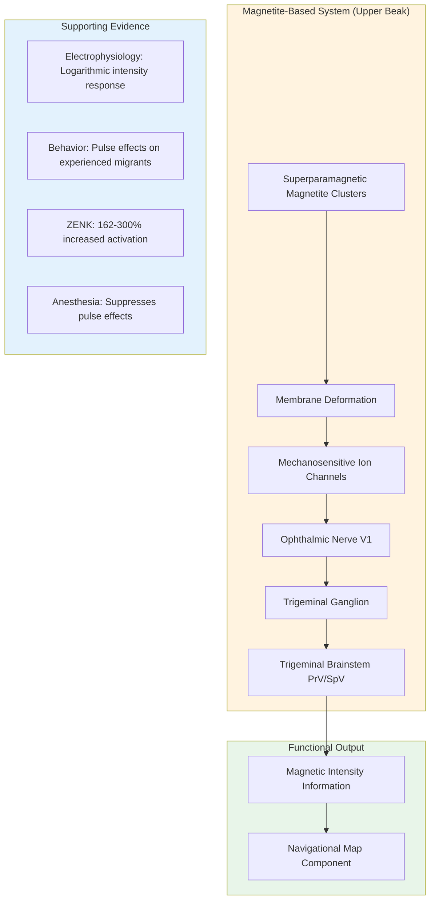
```mermaid
flowchart TD
    subgraph BEAK["Magnetite-Based System (Upper Beak)"]
        A[Superparamagnetic Magnetite Clusters] --> B[Membrane Deformation]
        B --> C[Mechanosensitive Ion Channels]
        C --> D[Ophthalmic Nerve V1]
        D --> E[Trigeminal Ganglion]
        E --> F[Trigeminal Brainstem PrV/SpV]
    end
    
    subgraph FUNCTION["Functional Output"]
        F --> G[Magnetic Intensity Information]
        G --> H[Navigational Map Component]
    end
    
    subgraph EVIDENCE["Supporting Evidence"]
        I[Electrophysiology: Logarithmic intensity response]
        J[Behavior: Pulse effects on experienced migrants]
        K[ZENK: 162-300% increased activation]
        L[Anesthesia: Suppresses pulse effects]
    end
    
    style BEAK fill:#fff3e0
    style FUNCTION fill:#e8f5e9
    style EVIDENCE fill:#e3f2fd
```

**Magnetic pulse experiments** have provided crucial evidence identifying magnetite as the receptor material[^25][^5][^26]. A strong, short magnetic pulse (e.g., 0.5 Tesla with duration <5 ms) affects magnetite-based receptors but not other types of magnetoreception[^26]. When Australian silvereyes were subjected to such a pulse, it caused a roughly 90° shift in orientation during spring and autumn migration[^5][^26]. Critically, **this effect was observed only in old, experienced migrants**; young birds did not respond to the pulse, continuing in their normal migratory direction despite the treatment that disrupted their magnetite-based receptors[^5][^26]. This age-dependent response suggests that the magnetite-based system is not involved in the innate compass mechanism but rather in learned navigational processes.

Treating the ophthalmic nerve or upper beak with local anesthetic suppressed the pulse effect, and the pulse-induced orientation changes were found to be temporary, with orientation returning to normal approximately 8–10 days after treatment[^5][^26]. The observation that deviations induced by pulsing depended on the direction in which the pulse was applied suggests that the magnetite particles in the receptors are not evenly arranged[^26].

These findings **clearly demonstrate that the magnetite-based receptors are not involved in the avian magnetic compass**[^25][^5][^26][^13]. The inclination compass represents a different mechanism based on radical-pair processes in the eye[^5][^26]. Young silvereyes remained unaffected by magnetic pulse treatment despite disruption of their magnetite-based receptors—they continued in their normal migratory direction, demonstrating that their magnetic compass mechanism was not affected[^5]. When pulse-treated silvereyes were tested in a magnetic field with the vertical component reversed, they located their changed course with their normal inclination compass[^5]. In otherwise untreated robins and silvereyes, local anesthesia of the upper beak did not affect migratory orientation, and cutting the ophthalmic nerve produced similar null results for compass orientation[^5].

The **natural function of the magnetite-based receptors** appears to be recording magnetic intensity and thus providing one component of the multi-factorial navigational "map"[^25][^5][^26][^13]. Observations suggest that magnetic information is normally included in navigational decisions, but it represents only one factor among several in the map mechanism[^25]. Pigeons released in strong, irregular magnetic anomalies showed confusion, and local anesthesia of the upper beak affected their navigational decisions at some sites[^26]. However, under certain extreme light conditions that disrupt the radical pair compass, migrating birds show "fixed direction" responses to the magnetic field that originate in the beak receptors[^26][^13]. These fixed direction responses can be disrupted by local anesthesia of the upper beak, indicating that the magnetic information involved originates in the magnetite-based receptors[^26][^13].

### 2.3 Inclination Compass Properties and Experimental Validation

The avian magnetic compass has been extensively characterized through behavioral experiments, revealing that it operates as an **"inclination compass"** based on the inclination of magnetic field lines rather than on magnetic polarity[^14]. This fundamental property distinguishes the avian compass from a conventional human compass and has profound implications for understanding how birds navigate across different latitudes and hemispheres.

The inclination compass detects the **axis of the magnetic field and the angle it makes with Earth's surface**, rather than distinguishing between magnetic north and south poles[^19][^20][^14]. This means that birds perceive the direction toward the pole where field lines point downward into the Earth and the direction toward the equator where field lines are more horizontal, but they cannot distinguish between the northern and southern hemispheres based on polarity alone[^13]. The compass essentially provides information about "poleward" versus "equatorward" rather than "north" versus "south."

Experimental validation of the inclination compass properties has come from elegant studies manipulating magnetic field parameters using Helmholtz coils. When European robins were tested in magnetic fields where the vertical component was reversed while maintaining the same horizontal direction, the birds reversed their orientation accordingly[^5]. This response is consistent with an inclination compass but would not occur with a polarity-based compass. The birds orient based on the angle of inclination—the angle at which magnetic field lines intersect the Earth's surface—which varies systematically with latitude, being steeper near the poles and more horizontal near the equator.

The inclination compass presents a particular challenge for birds that must **cross the geomagnetic equator** during their migrations[^28]. At the magnetic equator, field lines run parallel to the Earth's surface (inclination = 0°), and on either side of the equator, the inclination angle reverses—pointing downward in the Northern Hemisphere and upward in the Southern Hemisphere. Long-distance migrants crossing this boundary possess **inherited responses whereby they adaptively change their preferred orientation with respect to the inclination angle**, enabling them to maintain appropriate migratory directions despite the 180-degree shift in inclination[^28].

Recent virtual magnetic displacement experiments with Eurasian reed warblers have provided remarkable insights into how birds use magnetic parameters for both compass and map functions[^29][^30][^31][^28]. In these experiments, birds were exposed to artificially altered magnetic inclination and declination values that simulated displacement from their natural migratory corridor, while the total intensity of the field remained unchanged[^29][^28]. In the natural magnetic field of the study site in Illmitz, Austria (total magnetic intensity ~48,730 nT, magnetic inclination ~64.3°, magnetic declination ~4.6°), the birds oriented toward the south-southeast (mean direction α = 169°)[^29][^28].

When the same birds were exposed to a changed magnetic field with total intensity maintained at the natural value but magnetic inclination increased by 8.6° and magnetic declination increased by 9.8° to match values naturally found approximately 2,700 km to the east-northeast at a virtual displacement site in Neftekamsk, Russia, **the birds shifted their orientation toward the west-southwest** (mean direction α = 266°)[^29][^28]. This directional shift is consistent with compensatory reorientation toward the site of capture or the natural migratory corridor[^29][^30].

| **Condition** | **Location** | **Magnetic Inclination** | **Magnetic Declination** | **Total Intensity** | **Bird Orientation** |
|--------------|-------------|-------------------------|-------------------------|--------------------|--------------------|
| Natural Magnetic Field | Illmitz, Austria | 64.3° | 4.6° | ~48,730 nT | South-Southeast (169°) |
| Changed Magnetic Field | Virtual: Neftekamsk, Russia | 72.9° (+8.6°) | 14.4° (+9.8°) | ~48,730 nT (unchanged) | West-Southwest (266°) |

These results demonstrate that **birds can extract positional as well as directional information from magnetic inclination and magnetic declination**, even when these cues conflict with another component of the magnetic field (total intensity)[^29][^30][^31]. The changed magnetic field did not correspond to any natural magnetic field found on Earth, as the total intensity was inconsistent with the inclination and declination values, yet the birds still responded as if displaced[^28]. A statistical model did not support an effect of the time within the season on the birds' orientation, confirming that the behavioral response was specifically due to the experimentally changed magnetic conditions[^28].

This discovery **challenges the long-held belief that all components of the Earth's magnetic field, especially total intensity, are essential for accurate navigation**[^32][^33][^18]. Professor Richard Holland, who led the study, stated that the findings reveal birds don't necessarily need all components of the Earth's magnetic field to determine their position—they can rely solely on inclination and declination to extract their location[^33][^18]. The results suggest that either any two of the three magnetic components are sufficient to recognize a change in location (a "majority rule"), or that total magnetic intensity does not form part of the magnetic map in reed warblers[^28].

The apparent use of magnetic declination as a positional cue raises the question of how birds determine this parameter, since declination represents the angular difference between magnetic north and geographic (true) north[^31][^28]. Birds are known to have a time-independent star compass based on locating the center of celestial rotation, which could provide the geographic reference needed to calculate declination[^31]. Alternatively, the magnetic compass may be calibrated by sunset cues, possibly related to polarized light patterns[^31]. The finding that cues associated with the birds' magnetic compass (inclination and declination) are also incorporated into their navigational map suggests that **the sensory systems used for direction-finding and position-determination may be more integrated than previously thought**[^30][^31][^28].

### 2.4 Quantum Biological Foundations: Spin Dynamics and Magnetic Field Effects

The radical pair mechanism represents one of the most remarkable examples of **quantum biology**—the application of quantum mechanical principles to biological processes[^18][^34]. Understanding how the extraordinarily weak geomagnetic field (approximately 50 μT) can influence chemical reactions in a warm, wet biological environment requires a detailed examination of the quantum mechanical processes involved, including electron spin dynamics, hyperfine interactions, and the Zeeman effect.

When a radical pair is created through photoexcitation of cryptochrome, the spins of the two unpaired electrons are initially correlated and can exist in a **superposition of singlet (antiparallel spins) and triplet (parallel spins) states**[^17]. The interconversion between these spin states is facilitated by hyperfine interactions—the coupling between electron spins and the magnetic moments of nearby atomic nuclei[^24][^17]. An external magnetic field interferes with this interconversion through the **Zeeman interaction**, which describes how external magnetic fields affect electron spins[^24][^17]. The organism can detect this disruption in spin dynamics because the chemical fate of the radical pair—whether it recombines or proceeds to form different products—depends on its spin state[^17].

For optimal magnetic sensitivity, a radical pair must satisfy several stringent requirements[^22][^23]. First, the **radical pair lifetime must exceed the Larmor period**—the time for a precessing electron to complete one cycle in the geomagnetic field, approximately 700 nanoseconds[^22]. Second, spin-selective reactions must occur on a time scale competitive with spin-independent reactions before spin relaxation disrupts coherent spin dynamics[^22]. Research on cryptochrome-4a from garden warblers demonstrated that illumination produces radical pair species with lifetimes on the order of milliseconds—approximately five orders of magnitude longer than the minimum required lifetime of ~1 μs for a geomagnetic field effect[^21]. These biophysical characteristics suggest that avian cryptochromes are ideally suited as primary light-mediated, radical-pair-based magnetic compass receptors[^21].

Sophisticated resonance experiments have provided critical insights into the properties of the radical pair underlying magnetoreception[^14]. European robins were tested under various oscillating magnetic fields added to the static geomagnetic field[^14]. At low frequencies (0.01 MHz and 0.03 MHz), birds oriented normally in their migratory direction[^14]. At intermediate frequencies (0.10 MHz and 0.50 MHz), they showed weak axial responses, while at 0.658 MHz, the Larmor frequency, birds became completely disoriented[^14]. Higher frequencies (1.315 MHz, 2.63 MHz, 7.0 MHz) consistently resulted in disorientation at the test intensity of 470–480 nT[^14]. These data indicate a **radical pair lifetime of 2–10 microseconds**[^14].

The most striking finding was the **intense resonance at the Larmor frequency**[^14]. At the local Larmor frequency (1.315 MHz in the Frankfurt geomagnetic field of ~47 μT), robins were disoriented even when the oscillating field was as weak as 15 nT, and were only unaffected at 5 nT[^14]. In contrast, at half (0.658 MHz) and twice (2.63 MHz) the Larmor frequency, birds remained oriented when the oscillating field intensity was 150 nT[^14]. When tested in a static magnetic field of approximately double intensity (92 μT), the birds then responded most sensitively to oscillating fields at 2.63 MHz (the new Larmor frequency), with a 15 nT field disrupting orientation, whereas the 1.315 MHz field no longer affected orientation at 150 nT or 48 nT[^14]. This shift confirms that the resonance arises from the Zeeman interaction[^14].

The intense resonance at the Larmor frequency indicates a radical pair in which **one radical is devoid of hyperfine interactions**—a "magnetically isolated" radical[^14]. Such a design is optimal for a biological compass sensor because it is more sensitive to weak external fields, the anisotropy crucial for directional sensitivity is maximized, and the radical is more likely to undergo slow spin relaxation[^14]. While the radical pairs formed during the forward photoactivation of cryptochrome (FAD•⁻/TrpH•⁺) cannot be reconciled with these resonance data, researchers have speculated that a **flavin-superoxide radical pair** (FADH•/O₂•⁻), potentially formed during the dark reversion reaction of cryptochrome in the presence of molecular oxygen, could match the required design because the superoxide radical is devoid of hyperfine couplings[^14].

Recent theoretical work has examined whether this FAD-superoxide radical pair could function as a magnetoreceptor despite the challenge of strong inter-radical coupling at short distances[^34]. Traditionally, magnetic field sensitivity in the radical pair mechanism was attributed only to weakly interacting, well-separated electrons; closely bound pairs were considered unresponsive to weak fields due to arrested spin dynamics[^34]. However, the study found that **the quantum Zeno effect** can enable magnetosensitivity in tightly bound radical pairs[^34]. The quantum Zeno effect describes the retardation of state evolution brought about by fast, repeated measurements or quantum operations—in this context, performed by the spin-selective recombination reaction[^34].

For a tightly bound radical pair (e.g., at ~4.5 Å separation), **strongly asymmetric recombination rates** (k_S >> k_T, where singlet recombination greatly exceeds triplet recombination) can enable remarkable directional magnetosensitivity in the geomagnetic field, despite strong inter-radical coupling[^34]. Molecular dynamics simulations of superoxide bound in the FAD-binding pocket of pigeon cryptochrome 4a showed that magnetosensitivity is possible under realistic conditions, with peak sensitivities of several percent predicted for models of increasing biological accuracy[^34]. The model proved resilient to distance fluctuations, which can even enhance the magnetic field effect, though it is susceptible to random field relaxation[^34].

Advanced modeling of radical pair magnetoreception has addressed the question of how birds achieve the extraordinary directional precision (5° or less) observed in behavioral studies[^23]. Previous calculations of how magnetically sensitive chemical reactions in the retina respond to the direction of a weak magnetic field found that "you can vary the direction of the field by many degrees without greatly changing the output signal"[^23]. To address this shortcoming, researchers built a more realistic model incorporating many more nuclear spins with realistic couplings to the electron spins, and assumed that spin coherences are much longer lived than in previous models[^23].

The modeling revealed that when spin coherence times exceed a few microseconds, there is a **marked "spike" in the yield of the signalling state** produced by spin-selective reactions of the radical pairs[^23]. As the spin lifetime is prolonged from 1 μs toward 100 μs, the spike emerges, strengthens, and narrows[^23]. Such a feature could provide birds with directional information with sufficient precision to explain their navigational behavior[^23]. The long-lived spin coherences provide enough time for the interconversion of singlet and triplet states, and therefore the yield of the signalling state, to respond sensitively to the direction of the geomagnetic field[^23].

The source of spin relaxation that would normally destroy coherence is the stochastic fluctuations of the radicals in their binding sites in the protein[^23]. Researchers suggest that if mutations in the proteins made those motions both fast and of relatively low amplitude, then the loss of coherence should be inefficient, allowing the spin-correlated state to persist for 5–10 μs—sufficient to produce the spikes in the signalling state yield[^23]. This provides a clear evolutionary reason why the magnetic compass might have evolved to support extraordinarily long spin-coherence times[^23].

### 2.5 Light-Dependency and Wavelength Specificity of Magnetic Orientation

The avian magnetic compass exhibits a striking **light-dependent nature**, requiring short-wavelength light from the ultraviolet through green portions of the spectrum for proper function[^19][^14][^24][^22]. This light-dependency provides critical support for the radical pair mechanism, as it indicates that the magnetoreceptor must be a photoreceptor capable of absorbing light to initiate the magnetically sensitive photochemistry.

Behavioral experiments have consistently demonstrated that birds can orient using their magnetic compass under light from UV through green wavelengths (approximately 373–565 nm) but become disoriented under red light (>630 nm) or in complete darkness[^24][^22]. The magnetic compass operates within a **narrow functional window around the local field strength**, and this window appears to be wavelength-dependent[^22]. Under high-intensity narrow-band lights and when yellow light is added to short-wavelength illumination, the magnetic compass can be disrupted[^22].

Immunohistological studies examining cryptochrome activation patterns under different light conditions have provided molecular-level support for these behavioral findings[^24][^22]. When chickens were exposed for 30 minutes to different light regimes, the amount of Cry1a labeled with an antiserum against an epitope at the C-terminus showed clear wavelength dependence[^24]. **Activated Cry1a was found at UV (373 nm), blue (424 nm), and turquoise (502 nm) light**[^24]. With green (565 nm) and yellow (590 nm) light, the amount of activated Cry1a was reduced, and with red (645 nm) light, as in darkness, no activated Cry1a was detected[^24].

| **Wavelength** | **Color** | **Activated Cry1a** | **Magnetic Compass Function** |
|----------------|-----------|---------------------|------------------------------|
| 373 nm | UV | Present | Functional |
| 424 nm | Blue | Present | Functional |
| 502 nm | Turquoise | Present | Functional |
| 565 nm | Green | Reduced | Marginal/Disrupted at high intensity |
| 590 nm | Yellow | Reduced | Disrupted |
| 645 nm | Red | Absent | Non-functional |

The correspondence between cryptochrome activation and magnetic compass function is remarkable: **activated Cry1a is found at all wavelengths at which birds can orient using their magnetic inclination compass**[^24]. The observation that activated Cry1a and well-oriented behavior both occur at 565 nm green light—a wavelength not absorbed by the fully oxidized form of cryptochrome—suggests that a state other than the previously proposed Trp•/FAD• radical pair formed during photoreduction is crucial for detecting magnetic directions[^24].

Further analysis of the activation patterns suggests that the activated form of avian Cry1a occurs when the flavin is fully reduced (RED), under light conditions that largely match the behavioral orientation of birds[^24]. The sole currently known mechanism consistent with these data is that cryptochrome in the bird retina absorbs light through both the fully oxidized form (FADox) and the semiquinone radical (RAD), which drives photoreduction to the fully reduced form (RED)[^24]. It appears to be during the transition to the fully reduced form that the conformational change occurs that is recognized by the antiserum[^24]. The only currently known radical pair that may explain magnetic orientation consistent with these results is **FADH•/O₂•⁻**, formed during the re-oxidation of RED to FADox[^24].

Detailed studies of Cry1a activation under various light intensities revealed additional complexity[^22]. No activated Cry1a was present under 565 nm green light of medium and high intensity, and hardly any under high-intensity 502 nm turquoise, whereas activated Cry1a was found at all three tested intensities of 373 nm UV and 424 nm blue light[^22]. Interestingly, activated Cry1a was also found when 590 nm yellow light was added to low-intensity light of the four shorter wavelengths, yet these light combinations result in impaired magnetic orientation[^22]. This indicates that **the disruption of the magnetic compass by yellow light does not occur at the receptor level in the retina but at higher processing stages**[^22].

Gene expression studies have provided complementary evidence supporting Cry4 as the magnetoreceptor[^17]. Measurements of Cry1, Cry2, and Cry4 gene expression in the retina, muscle, and brain of zebra finches over the circadian day revealed distinct patterns[^17]. Cry1 and Cry2 displayed daily variation in the retina as expected for circadian clock genes, with Cry1 expression increasing over the circadian day and Cry2 expression higher at the onset of the light period[^17]. By contrast, **Cry4 was expressed at constant levels over time in the retina**, and its expression was significantly higher in the retina compared to brain tissue[^17]. The constant availability of Cry4 is consistent with its hypothesized role in magnetoreception, as birds use their magnetic compass for spatial orientation in daily life, not only during migration[^17].

### 2.6 Radio-Frequency Interference and Anthropogenic Electromagnetic Noise

One of the most compelling lines of evidence supporting the radical pair mechanism comes from experiments demonstrating that **weak radio-frequency (RF) electromagnetic fields disrupt avian magnetic compass orientation**[^22][^13][^17]. This sensitivity to RF fields provides a diagnostic test for radical pair magnetoreception, as the competing magnetite-based hypothesis would not predict such effects—magnetic iron-containing minerals would not be affected by weak, rapidly oscillating fields[^14][^13].

The discovery of RF interference effects emerged from unexpected failures in basic orientation experiments[^22][^13]. Professor Henrik Mouritsen's research group at the University of Oldenburg found that experiments that had worked successfully for over 40 years at other locations were not functioning in Oldenburg[^22][^13]. When the researchers screened their experimental huts with aluminum plates, **reducing the electromagnetic noise approximately 100-fold**, the birds suddenly began orienting correctly[^22][^13]. Over seven years of rigorous experiments, the team found that birds exposed to electromagnetic noise between 50 kHz and 5 MHz lost all sense of direction, but they regained their bearings when the field was blocked[^22][^13].

A landmark study published in Nature documented these effects under fully double-blinded conditions[^17]. European robins were unable to use their magnetic compass in the presence of urban electromagnetic noise when tested in unscreened wooden huts on the University of Oldenburg campus[^17]. Their magnetic orientation capabilities reappeared in electrically grounded, aluminum-screened huts, which attenuated electromagnetic noise in the frequency range from 50 kHz to 5 MHz by approximately two orders of magnitude[^17]. When the grounding was removed or when broadband electromagnetic noise was deliberately generated inside the screened and grounded huts, the birds again lost their magnetic orientation capabilities[^17].

The experiments employed a sophisticated design to eliminate potential confounds. On nights when the aluminum shields were grounded, the birds oriented well toward their expected migratory direction; on nights when the grounding was disconnected, the birds jumped in random directions[^14][^13]. These results provide compelling evidence that a radical pair mechanism underpins the magnetic compass, as the main competing hypothesis involving magnetic iron-containing minerals would not be affected by such weak, rapidly oscillating fields[^14][^13].

The **disruptive effect of radio-frequency fields is not confined to a narrow frequency band**[^17]. However, recent research has identified specific frequency thresholds that determine whether RF fields interfere with magnetoreception[^17]. A study examining the effects of different frequency bands found that while radio and television broadcasting as well as CB radio emissions disrupt the magnetic compass, **mobile communication network frequencies do not cause interference because they are too high**[^17]. Behavioral experiments with Eurasian blackcaps demonstrated that frequencies of 75–85 MHz disrupted the magnetic compass sense, but frequencies of 140–150 MHz and 235–245 MHz did not affect the birds' magnetic compass[^17].

Model calculations simulating quantum mechanical processes within the cryptochrome protein enabled researchers to narrow the cutoff frequency to approximately 116 MHz[^17]. According to these simulations, radio waves above this frequency would have only weak effects on birds' magnetic orientation[^17]. Professor Mouritsen explained that the experiments combined with detailed theoretical predictions provide strong evidence that the compass magnetoreceptor in migratory birds is based on flavin-containing radical pairs, rather than completely different types of receptors such as magnetic nanoparticles[^17].

| **Frequency Range** | **Source Examples** | **Effect on Magnetic Compass** |
|--------------------|--------------------|-----------------------------|
| 50 kHz – 5 MHz | AM radio, electrical equipment | Disrupts orientation |
| 75–85 MHz | FM radio broadcasting | Disrupts orientation |
| 116 MHz (threshold) | Theoretical cutoff | Above: minimal effect |
| 140–150 MHz | Some broadcasting | No effect observed |
| 235–245 MHz | Some broadcasting | No effect observed |
| Mobile frequencies | Cellular networks | No interference |

The inability of birds to adjust to radio-frequency fields contrasts sharply with their capacity to adjust to static magnetic fields outside the normal functional range[^22]. In behavioral studies with European robins, birds exposed to a 2-hour pre-exposure in a 7.0 MHz field at 480 nT were unable to orient in the same field afterward[^22]. Similarly, a 7-hour pre-exposure in a 1.315 MHz field at 15 nT did not allow birds to regain their orientation ability[^22]. This inability to adjust suggests that **RF fields interfere directly with the primary processes of magnetoreception** and therefore disable the avian compass as long as they are present[^22].

Importantly, radio-frequency fields do not have lasting adverse after-effects[^22]. Robins exposed for 3 hours to a 1.315 MHz, 480 nT field were able to orient in the local geomagnetic field immediately afterward, although they showed more scatter[^22]. This indicates that RF fields disrupt magnetoreception only while they are present, without causing lasting damage to the reception mechanisms[^22]. The disruptive effect depends on the alignment of RF fields with the static field—they disrupt orientation only if applied at an angle to the magnetic vector, ruling out general artifacts[^22]. The effect appears to be a specific interference that alters the activation pattern on the retina, possibly by decreasing the difference in singlet/triplet yield in various directions[^22].

Immunohistological studies have tested whether RF fields interfere with the photoreduction of cryptochrome, but this does not appear to be the case[^22]. Activated cryptochrome 1a was labeled in the retina of both control birds and experimental birds treated with radio-frequency fields, with no obvious difference caused by the treatment[^22]. This suggests that the RF field did not disrupt the photoreduction of the Cry1a chromophore but rather interferes with subsequent spin dynamics within the radical pair[^22].

The ecological implications of these findings are significant. **Anthropogenic electromagnetic pollution** from power lines, Wi-Fi networks, and mobile phones raises concerns about effects on migratory bird navigation[^17]. An increase in cellular mobile base station proliferation has been correlated with declines in bird diversity in some studies[^17]. In Valladolid, Spain, the installation of cell phone base stations between 1997 and 2007 was associated with decreased species diversity of birds and nesting pairs, with three of fourteen bird species disappearing entirely[^17]. White stork productivity was higher in nests situated far from cell phone base stations compared to those within 200 meters of antennas[^17].

Professor Mouritsen suggested that migratory birds affected by anthropogenic electromagnetic noise over towns and cities would probably resort to backup navigational systems, such as their star compass or sun compass, as they have three different compasses that work independently[^22][^13]. However, the extremely low intensity of the disruptive electromagnetic fields points toward a quantum-based explanation, as conventional physics cannot account for the effect[^22][^13]. Better understanding of magnetoreception is important for improving migratory bird conservation, providing insights into which electromagnetic radiation causes birds to deviate from their routes and should therefore be avoided in areas such as nature reserves where migratory birds rest[^17].

### 2.7 Integration of Dual Magnetoreception Systems in Navigation

The evidence reviewed in preceding sections establishes that birds possess **two distinct magnetoreception systems** with fundamentally different biophysical mechanisms, anatomical locations, and functional roles[^25][^5][^26][^13]. Understanding how these systems integrate to support the remarkable navigational abilities of migratory birds represents one of the most important current challenges in the field.

The **radical pair mechanism in the eye** provides compass information—the direction of the magnetic field relative to the bird's orientation[^18][^19][^14]. This system operates as an inclination compass, detecting the angle of magnetic field lines with respect to gravity, and requires short-wavelength light for function[^14][^24]. The compass appears to be primarily innate and is used by both young and experienced migrants for maintaining directional orientation during flight[^5][^26].

The **magnetite-based system in the beak** provides information about magnetic field intensity and possibly other parameters relevant to positional determination[^25][^5][^26][^13]. This system transmits information through the trigeminal nerve and appears to contribute to the navigational "map" rather than the compass[^5][^26]. Behavioral evidence indicates that this system becomes functionally important only in experienced migrants who have learned to incorporate magnetic intensity information into their navigational decisions[^5][^26].

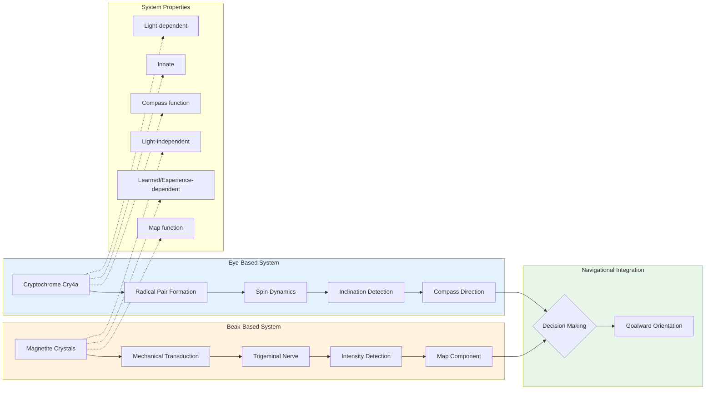
```mermaid
flowchart LR
    subgraph EYE["Eye-Based System"]
        A[Cryptochrome Cry4a] --> B[Radical Pair Formation]
        B --> C[Spin Dynamics]
        C --> D[Inclination Detection]
        D --> E[Compass Direction]
    end
    
    subgraph BEAK["Beak-Based System"]
        F[Magnetite Crystals] --> G[Mechanical Transduction]
        G --> H[Trigeminal Nerve]
        H --> I[Intensity Detection]
        I --> J[Map Component]
    end
    
    subgraph INTEGRATION["Navigational Integration"]
        E --> K{Decision Making}
        J --> K
        K --> L[Goalward Orientation]
    end
    
    subgraph PROPERTIES["System Properties"]
        M[Light-dependent]
        N[Innate]
        O[Compass function]
        P[Light-independent]
        Q[Learned/Experience-dependent]
        R[Map function]
    end
    
    A -.-> M
    A -.-> N
    A -.-> O
    F -.-> P
    F -.-> Q
    F -.-> R
    
    style EYE fill:#e3f2fd
    style BEAK fill:#fff3e0
    style INTEGRATION fill:#e8f5e9
```

Recent findings on the sufficiency of magnetic inclination and declination for position determination raise important questions about the functional architecture of avian magnetoreception[^29][^30][^31][^28][^32][^33][^18]. The virtual magnetic displacement experiments with Eurasian reed warblers demonstrated that birds can extract positional information from inclination and declination alone, even when total intensity remains unchanged and inconsistent with the other parameters[^29][^28]. This finding challenges the traditional view that the magnetite-based intensity detector is essential for the map component of navigation.

Several interpretations of these results are possible[^28]. First, any two of the three magnetic components (inclination, declination, intensity) may be sufficient to recognize a change in location—a "majority rule" where birds rely on the components that are internally consistent[^28]. Second, total magnetic intensity may not form part of the magnetic map in reed warblers at all, with inclination and declination providing sufficient positional information[^28]. Third, the magnetite-based system may provide redundant information that becomes important only under certain conditions or in certain species[^28].

The apparent use of **magnetic declination as a positional cue** is particularly significant because declination—the angular difference between magnetic north and geographic north—requires comparison between the magnetic compass and a geographic reference[^31][^28]. Birds are known to have a time-independent star compass based on locating the center of celestial rotation, which could provide this geographic reference[^31]. Alternatively, the magnetic compass may be calibrated by sunset polarized light cues[^31]. This suggests that **cues associated with the birds' magnetic compass are also incorporated into their navigational map**, challenging the traditional separation between compass and map functions[^30][^31][^28].

The multi-modal nature of avian navigation—using different cues at different times and scales—means that the relative importance of the two magnetoreception systems may vary depending on context[^9]. During the long-distance phase of migration, birds may rely primarily on the eye-based compass for directional guidance, with the beak-based system contributing to positional assessment[^9]. During the narrowing-in phase as birds approach familiar areas, learned magnetic intensity patterns detected by the beak system may become more important[^9]. The pinpointing-the-goal phase likely relies more heavily on visual and olfactory landmarks than on magnetic cues[^9].

There is intense debate around the nature of navigational maps in birds, with some studies suggesting a significant role for the Earth's magnetic field as a source of positional information while others have not found such effects[^28]. In gray catbirds, anosmia but not magnetic manipulation disrupted their ability to correct for displacement, and olfactory rather than magnetic cues seem crucial for navigation in migrating or homing seabirds[^28]. A virtual magnetic displacement study did not observe any behavioral response to a change in magnetic declination in European robins and garden warblers, even though an experiment at the same site observed a clear response in reed warblers[^28]. These species-specific differences highlight the complexity of avian navigation and suggest that different species may weight magnetic and non-magnetic cues differently in their navigational decisions.

The question of whether the two magnetoreception systems are truly independent or functionally integrated remains open. Under normal conditions, the radical pair compass in the eye provides directional information while the magnetite-based system in the beak may contribute intensity information to the map[^25][^5][^26]. However, under certain extreme light conditions that disrupt the radical pair compass, birds show "fixed direction" responses that originate in the beak receptors[^26][^13]. This suggests that the beak-based system can provide directional information under some circumstances, potentially serving as a backup when the primary compass is compromised[^26][^13].

The exact position of the magnetite-based receptors remains unclear, with histological studies describing iron-rich structures in both the nasal region and in the skin of the upper beak[^25][^13]. Some recent histological work has called into question the existence of the receptors described in the skin of the upper beak, which may point to the single-domain receptors described in the nasal region as the primary magnetite-based sensors[^13]. Resolving these anatomical questions will be important for understanding the full functional architecture of avian magnetoreception.

In conclusion, the dual magnetoreception systems of birds—the quantum-mechanical radical pair compass in the eye and the magnetite-based intensity detector in the beak—appear to provide complementary information that supports the remarkable navigational abilities of migratory species. The eye-based system serves primarily compass functions, enabling birds to determine and maintain directional headings, while the beak-based system contributes to the map component by providing information about magnetic intensity. However, recent evidence suggests that the boundaries between these functions may be less rigid than previously thought, with inclination and declination information potentially serving both compass and map purposes. The integration of these systems, along with celestial and olfactory cues, enables migratory birds to navigate with extraordinary precision across thousands of kilometers—a feat that continues to inspire both scientific inquiry and conservation concern in an era of increasing anthropogenic electromagnetic pollution.

## 3 Celestial Navigation: Solar, Stellar, and Polarized Light Cues

This chapter provides a comprehensive analysis of how migratory birds utilize celestial information for directional orientation, examining the biophysical mechanisms, learning processes, and ecological constraints governing each celestial compass system. Building upon the magnetic compass foundations established in Chapter 2, this chapter investigates the complementary role of celestial cues in the multi-modal navigational toolkit, analyzing how birds integrate time-dependent solar information, stellar rotation patterns, and polarized light signals to achieve precise directional orientation across diverse environmental conditions.

### 3.1 The Time-Compensated Sun Compass: Mechanisms and Circadian Integration

The discovery that birds use a **time-compensated sun compass** for orientation represents one of the foundational achievements of animal navigation research. Gustav Kramer's pioneering experiments with European starlings in 1951 established that diurnal migrants can determine compass direction from the sun's position by compensating for its apparent daily movement in azimuth through their internal circadian clock sense. This sophisticated mechanism allows birds to maintain consistent directional orientation throughout the day despite the sun's continuous movement across the sky—a feat that requires precise integration of visual information with endogenous timing systems.

The operational principle of the time-compensated sun compass relies on the bird's ability to **measure both the sun's azimuthal position and the time of day simultaneously**. Because the sun's azimuth changes predictably throughout the day (approximately 15° per hour on average, though this rate varies with latitude and season), a bird must know the current time to correctly interpret what compass direction a particular solar azimuth indicates. For example, a sun positioned due east indicates a different compass direction in the morning (when the bird should fly away from it to head west) than in the afternoon (when flying toward it would lead east). The circadian clock provides the temporal reference that allows birds to resolve this ambiguity and extract absolute geographical direction from solar position.

The **clock-shift paradigm** has provided the most compelling experimental validation of time-compensated sun compass orientation. In these experiments, birds are housed under artificial light-dark cycles that are phase-shifted by several hours relative to local time, effectively resetting their internal clocks. When subsequently tested for orientation, clock-shifted birds show predictable deviations in their directional choices corresponding to their shifted subjective time. A bird whose clock has been advanced by 6 hours perceives the sun as being in a position appropriate for a time 6 hours later than actual local time, causing systematic directional errors of approximately 90° (6 hours × 15°/hour). The magnitude and direction of these orientation shifts provide quantitative confirmation that birds are indeed using time-compensated solar information rather than simply orienting at a fixed angle relative to the sun[^14].

| **Clock Shift** | **Predicted Orientation Deviation** | **Mechanism** |
|----------------|-------------------------------------|---------------|
| +6 hours (advanced) | ~90° clockwise | Bird perceives sun as being in afternoon position when it is morning |
| -6 hours (delayed) | ~90° counterclockwise | Bird perceives sun as being in morning position when it is afternoon |
| +12 hours | ~180° reversal | Complete day-night reversal of perceived time |

The flexibility of the avian sun compass extends beyond simple time compensation to include **adjustments for differential rates of solar azimuth change** throughout the day. The sun's azimuth does not change at a constant rate—it moves more slowly near solar noon when it is highest in the sky and more rapidly during morning and evening hours. Research with homing pigeons has demonstrated that their compensation mechanism is highly tuned to these differential rates, with accuracy closely matching the actual speed of azimuthal changes specific to the time of year and testing location[^35]. This precision suggests that birds either possess an innate ephemeris function (a mental model of the sun's path) or learn the local solar trajectory through experience.

The **learning processes** underlying sun compass acquisition have been extensively studied in homing pigeons. Young pigeons must observe the sun's movement across the sky to develop a functional sun compass—birds raised without exposure to the sun's arc cannot use it for orientation. Critically, **partial experience with the sun's arc is insufficient for all-day compass use**. Young pigeons allowed to see the sun only during morning hours lack the ability to navigate using it in the afternoon, indicating that birds must learn the complete daily trajectory rather than extrapolating from limited observations. This learning requirement contrasts with the magnetic compass, which appears to be largely innate, and highlights the experiential component of celestial navigation development.

Recent theoretical work has distinguished between two potential functions of solar information in bird navigation: the **compass mechanism** (using the sun's azimuth to provide absolute geographical direction) and the **heading indicator mechanism** (using the sun to detect changes in heading on shorter timescales)[^14]. The heading indicator function need not require full time compensation if used on sufficiently brief timescales. A bird maintaining a constant heading angle with respect to the sun would trace a circular arc rather than a straight line, but the curvature of this arc is negligible over short flight segments. At a cruising speed of 60 km/h, a homing pigeon maintaining a constant heading with respect to the sun would fly a circular arc of radius 229 km—over a 15-minute period, the bird would make 15 km progress on its initial heading while straying less than 0.5 km from it. Eliminating this curvature completely would require perfect knowledge of the ephemeris function, but the trajectory becomes much straighter if the heading angle is simply adjusted at a constant rate of 15°/hour[^14].

This distinction has important implications for interpreting clock-shift experiments. While predictable responses to clock shift have been considered an "acid test" of sun compass use, **clock shift experiments alone are neither necessary nor sufficient to identify all conceivable uses of solar information**[^14]. A bird using the sun primarily as a heading indicator on short timescales might show reduced sensitivity to clock shift compared to one relying on it for absolute compass direction. The paradigm may therefore obscure other ways in which solar-derived information contributes to avian orientation, suggesting that the full scope of sun compass function remains incompletely understood.

The **precision of sun compass orientation** has been estimated at approximately 5° based on behavioral variability in orientation experiments, though this represents the combined error from both compass reading and motor execution. The sun compass provides highly reliable directional information under clear sky conditions, but its accuracy depends on the bird's ability to precisely estimate time and correctly apply the ephemeris function. Clock-shifted pigeons show orientation deviations that closely match predictions, indicating that the time-compensation mechanism operates with considerable precision. However, the sun compass becomes unavailable under completely overcast conditions, when birds must resort to alternative compass mechanisms such as the magnetic compass.

### 3.2 Stellar Compass Orientation in Nocturnal Migrants

The majority of small migratory passerines are **nocturnal migrants**, taking off at nightfall and flying non-stop until the following morning. These birds face the challenge of maintaining directional orientation in darkness, when the sun is unavailable as a compass reference. The stellar compass provides the primary celestial orientation mechanism for nocturnal migrants, enabling them to extract directional information from star patterns without requiring the time compensation necessary for sun compass use.

The foundational understanding of stellar compass orientation emerged from **Stephen Emlen's elegant planetarium experiments** with indigo buntings (*Passerina cyanea*) in the 1960s[^14]. Emlen exploited the phenomenon of migratory restlessness (*Zugunruhe*)—the characteristic hopping behavior exhibited by caged migratory birds during their normal migration seasons—to assess directional preferences under controlled celestial conditions. By placing birds in specially designed funnel cages lined with ink-absorbing paper, Emlen could record the directional distribution of their activity and determine their preferred orientation relative to the artificial sky projected in the planetarium dome.

The experiments revealed that indigo buntings could orient in seasonally appropriate directions when viewing the planetarium sky: **northward during spring and southward during autumn**[^14]. Critically, when the birds were denied a view of the night sky, their activity became randomly oriented, demonstrating that stellar cues were essential for their directional choices. By systematically occluding different portions of the artificial sky, Emlen further demonstrated that the birds relied specifically on **star patterns near the celestial pole**—the region around Polaris (the North Star) where all stars appear to rotate. The stars closest to the pole, which show the least apparent movement, provided the most reliable directional reference[^14].

The most remarkable finding from Emlen's research concerned **how birds learn to use the stellar compass**. Young indigo buntings raised under an artificial sky that rotated around Betelgeuse (a bright star in Orion) instead of Polaris subsequently oriented away from Betelgeuse when tested under a normal sky[^14]. This demonstrated that birds do not innately recognize specific star patterns or constellations; rather, they **learn to identify the axis of celestial rotation** during early development. The center of rotation—the point around which all stars appear to revolve at a rate of 15° per hour—provides a reliable indicator of geographic north (in the Northern Hemisphere) regardless of which specific stars are visible. This learning mechanism is elegant in its simplicity: by observing stellar movement over time, young birds can identify the rotational pole without needing to memorize complex constellation patterns.

| **Experimental Condition** | **Bird Response** | **Interpretation** |
|---------------------------|-------------------|-------------------|
| Normal planetarium sky (rotation around Polaris) | Oriented away from Polaris (southward in autumn) | Birds use center of celestial rotation as reference |
| Sky rotation around Betelgeuse | Oriented away from Betelgeuse | Birds learn rotational center, not specific stars |
| Stationary sky (no rotation) | Random orientation | Rotation cues essential for compass calibration |
| No sky visible | Random orientation | Stellar cues required for nocturnal orientation |

The stellar compass differs fundamentally from the sun compass in that it is **not time-compensated**[^14]. Because birds identify direction by locating the center of celestial rotation rather than by tracking the position of specific stars, they do not need to know the time to interpret stellar information. The rotational center remains fixed relative to geographic north throughout the night (and indeed throughout the year), providing a stable directional reference that requires no temporal adjustment. This time-independence makes the stellar compass particularly robust for nocturnal orientation, as birds can use it at any point during the night without needing to track elapsed time.

The **developmental calibration** of the stellar compass occurs during a sensitive period before the bird's first migration. Young birds must have access to a rotating night sky during this period to develop a functional stellar compass. Experiments have shown that migratory birds use their **magnetic compass to locate the axis of rotation of the night sky** during this learning phase[^36]. The magnetic compass, which is largely innate, provides an initial directional reference that allows young birds to identify which point in the sky corresponds to geographic north. Once calibrated, the stellar compass can operate independently of magnetic information, though birds continue to recalibrate their compasses throughout their lives.

**Trans-equatorial migrants** face a particular challenge with stellar navigation, as they encounter completely different star configurations when crossing from the Northern to the Southern Hemisphere[^23]. The familiar circumpolar constellations of the Northern Hemisphere are replaced by entirely different stellar patterns, and the center of celestial rotation shifts from the northern to the southern celestial pole. Research indicates that these long-distance migrants **regularly recalibrate their stellar compass by reference to the magnetic compass** to account for changes in constellation configurations as they move across latitudes[^23][^36]. This ongoing recalibration process ensures that the stellar compass remains accurate despite the dramatic changes in the visible sky encountered during trans-hemispheric migration.

The **precision and reliability** of stellar orientation depend critically on sky visibility conditions. Under clear skies with good star visibility, nocturnal migrants can maintain highly accurate directional orientation. However, overcast conditions, fog, or light pollution can obscure stellar cues and force birds to rely on alternative compass systems. The magnetic compass serves as the primary backup under such conditions, providing an all-weather orientation capability that complements the stellar compass. Studies have shown that birds prioritize celestial cues when available, as they typically provide more precise compass bearings than magnetic information, but they can seamlessly switch to magnetic orientation when celestial cues are unavailable[^14].

### 3.3 Polarized Light Patterns as Compass Calibration Reference

The role of **skylight polarization patterns** in avian navigation represents one of the most intriguing aspects of celestial compass systems. Unlike the time-compensated sun compass used during daylight hours, polarized light cues appear to serve a specialized function as a **compass calibration reference** rather than as a component of ongoing directional orientation. This calibration function is most prominent during the twilight periods of sunrise and sunset, when the geometric properties of skylight polarization provide birds with a seasonally and latitudinally independent reference for aligning their multiple compass systems.

Skylight polarization arises when unpolarized sunlight is scattered upon entering Earth's atmosphere, reaching the surface as partially polarized light[^35]. The degree of polarization depends on the scattering angle—the angle between the incident sunlight and the scattered skylight—with **maximum polarization occurring at 90° from the sun**. The direction of vibration (e-vector orientation) of polarized skylight is always perpendicular to the plane of the scattering angle, creating a well-defined pattern across the sky with the sun as its center. This pattern provides directional information that many organisms, including various invertebrates and some vertebrates, use for orientation and navigation[^35].

The **physical geometry of polarized light at sunrise and sunset** creates particularly useful conditions for compass calibration. At these times, the band of maximum polarization runs through the zenith and **intersects the horizon vertically**, 90° from the sun's position[^23][^35]. The e-vector orientation at the horizon is also vertical during twilight. This geometric arrangement provides a stable reference that is independent of season and latitude—regardless of where a bird is located or what time of year it is, the polarization pattern at sunrise and sunset maintains the same relationship to geographic directions. By averaging the information from both sunrise and sunset (which occur in opposite directions), birds can obtain a true geographic reference that transcends local variations in magnetic declination or other potentially confounding factors[^35].

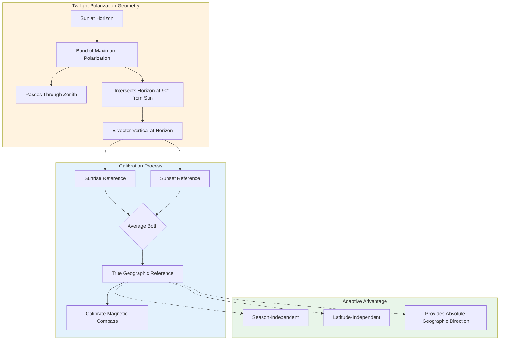
```mermaid
flowchart TD
    subgraph TWILIGHT["Twilight Polarization Geometry"]
        A[Sun at Horizon] --> B[Band of Maximum Polarization]
        B --> C[Passes Through Zenith]
        B --> D[Intersects Horizon at 90° from Sun]
        D --> E[E-vector Vertical at Horizon]
    end
    
    subgraph CALIBRATION["Calibration Process"]
        E --> F[Sunrise Reference]
        E --> G[Sunset Reference]
        F --> H{Average Both}
        G --> H
        H --> I[True Geographic Reference]
        I --> J[Calibrate Magnetic Compass]
    end
    
    subgraph ADVANTAGE["Adaptive Advantage"]
        K[Season-Independent]
        L[Latitude-Independent]
        M[Provides Absolute Geographic Direction]
    end
    
    I -.-> K
    I -.-> L
    I -.-> M
    
    style TWILIGHT fill:#fff3e0
    style CALIBRATION fill:#e3f2fd
    style ADVANTAGE fill:#e8f5e9
```

Experimental evidence for the **calibration function of polarized light** comes from multiple research paradigms. Short-term deflector loft experiments with homing pigeons demonstrated that polarized light cues near the horizon at sunrise and sunset can recalibrate the sun compass[^35]. In these experiments, non-resident pigeons were housed in lofts with deflector panels installed on side windows that preferentially reflected vertically polarized light, shifting the apparent polarization pattern relative to natural conditions. The deflector panels only affected light cues near the horizon—the sun overhead remained visible in its true position—yet the pigeons showed systematic orientation shifts consistent with recalibration of their compass systems by the manipulated polarized light cues[^35].

Cue-conflict experiments with migratory songbirds have provided the most compelling evidence that **polarized light serves as the primary calibration reference** for the magnetic compass[^23]. In these experiments, birds are exposed to conflicting information between magnetic and celestial cues—typically by shifting the horizontal component of the geomagnetic field relative to the natural skylight polarization pattern, or by artificially shifting the band of maximum polarization relative to the natural magnetic field. When later tested for magnetic compass orientation without access to celestial cues, birds that had been exposed to the cue conflict with a **full view of the sunset sky, including the region near the horizon, showed recalibration of their magnetic compass** reflecting the shifted relationship to polarized light cues[^23].

The importance of **horizon visibility** for compass calibration has been repeatedly demonstrated. A comprehensive review of cue-conflict literature concluded that only birds with access to the lower parts of the morning or evening sky recalibrated their magnetic compass, whereas birds exposed to the cue conflict in orientation funnels or cages that blocked the view of the horizon did not show recalibration[^23]. Specific experiments testing this hypothesis by shielding the lower part of the sky during the cue-calibration phase confirmed these findings—birds required a view of the polarization pattern near the horizon to successfully recalibrate their magnetic compass[^35]. This restriction to the horizon region makes functional sense, as this is where the e-vector intersects the horizon vertically, providing the clearest directional signal.

The **restriction of polarized light use to twilight periods** is a distinctive feature of avian polarized light sensitivity. Unlike some insects that use the skylight polarization pattern throughout the day as part of a time-compensated sun compass, birds appear to ignore polarization information during midday hours[^23][^35]. Experiments exposing birds to cue conflicts at local noon found no recalibration of the magnetic compass, whereas identical treatments at sunrise or sunset produced clear recalibration effects[^35]. This temporal restriction suggests that birds either cannot perceive polarized light with sufficient precision during midday (when the polarization pattern is more complex and the e-vector does not intersect the horizon vertically) or that they have evolved to weight polarized light information only during the twilight periods when it provides the most reliable calibration reference.

Despite convincing behavioral evidence that birds use polarized light cues for compass calibration, **direct experimental demonstration of polarized light sensitivity in birds remains elusive**[^23][^35]. Two early conditioning experiments successfully demonstrated polarized light sensitivity in homing pigeons, but other studies reported negative findings, and recent discrimination experiments with Japanese quails and European starlings were unsuccessful[^35]. The mixed results may reflect methodological challenges—reflectance artifacts can be significant problems in indoor experimental setups, and birds may need to be tested in behavioral contexts that closely simulate natural orientation situations. The most convincing evidence for polarized light sensitivity therefore comes from cue-calibration experiments that did not manipulate polarized light information during the actual orientation tests but rather during a calibration period prior to testing[^35].

The **physiological mechanism** for polarized light detection in birds remains one of the major unsolved problems in sensory biology. Avian double cones have been proposed as putative polarized light receptors based on their structural similarities to the double cones that mediate polarized light sensitivity in fish[^35]. The presence of oil droplets in the principal cone and the lack of screening pigment between the outer segments could theoretically provide a basis for polarized light detection through polarization-dependent light scattering. Intriguingly, there are parallels between the functional and physiological properties of polarized light reception and light-dependent magnetoreception, which could point to a common receptor system[^35]. Both systems appear to require short-wavelength light, both involve receptors that must be fixed in an ordered array to detect directional information, and both may involve cryptochrome proteins. Whether these parallels reflect a genuine mechanistic connection or convergent functional requirements remains an important question for future research.

### 3.4 Hierarchical Integration and Calibration Among Celestial and Magnetic Compasses

Migratory birds possess **multiple compass systems**—magnetic, solar, stellar, and polarized light—that must be kept in register to avoid navigational errors arising from discrepancies between different directional cues. The availability of these compass mechanisms varies with time of day, weather conditions, season, and latitude, and the directional information they provide can sometimes diverge due to magnetic declination (the angular difference between magnetic and geographic north) or other factors. Understanding how birds integrate and calibrate these multiple compass systems represents one of the central challenges in avian navigation research.

Based on a comprehensive meta-analysis of the available cue-conflict literature, researchers have proposed an **extended unifying theory on compass cue hierarchy** that explains the apparently contradictory results from different calibration studies[^14]. According to this scheme, the calibration process follows a hierarchical sequence that depends critically on the availability of specific environmental cues:

**Step 1: Magnetic compass calibration by polarized light.** Birds recalibrate their magnetic compass using sunrise/sunset polarized light cues, provided they have access to the **vertically aligned band of maximum polarization near the horizon** and a **view of landmarks**[^14]. The requirement for landmark visibility suggests that birds need contextual information to successfully interpret the polarization pattern. If sunrise and sunset information can be viewed from the same location, birds average the information to obtain a true geographic reference that is independent of season and latitude[^14].

**Step 2: Star compass calibration by magnetic compass.** Once the stars appear in the sky, birds then recalibrate their star compass with respect to the recalibrated magnetic compass[^14]. This secondary calibration ensures that the stellar compass remains aligned with the magnetic compass, which has itself been calibrated to the geographic reference provided by polarized light.

**Step 3: Fallback to magnetic compass transfer.** If polarized light information is not available near the horizon at sunrise or sunset (due to cloud cover, restricted sky view, or other factors), birds temporarily transfer the previously calibrated magnetic compass information to the available celestial compasses instead of performing a full recalibration[^14].

| **Condition** | **Calibration Outcome** | **Mechanism** |
|--------------|------------------------|---------------|
| Full horizon view + polarized light at twilight + landmarks | Magnetic compass recalibrated by polarized light | Primary calibration reference |
| Full horizon view + polarized light + stars visible | Both magnetic and star compass recalibrated | Complete compass alignment |
| Restricted horizon view (funnel/cage) | No magnetic recalibration; magnetic calibrates celestial | Magnetic compass dominates |
| Overcast/no polarized light | Previous calibration transferred to celestial compasses | Fallback mechanism |
| No stars during cue conflict | Magnetic recalibrated but star compass unchanged | Partial calibration |

This extended theory explains the **discrepancies between different cue-conflict studies** by identifying two critical factors: the type of cue-conflict manipulation (particularly whether the horizon was visible) and the availability of stars during the cue-conflict exposure[^14][^13]. Studies that found celestial dominance over magnetic cues typically allowed birds full access to the sunset sky including the horizon, whereas studies finding magnetic dominance typically restricted the birds' view in orientation funnels or cages. Similarly, if stars were not available during the cue conflict, birds might recalibrate their magnetic compass but not their star compass; upon release under a starry sky, they would then follow their unchanged star compass, showing no overall shift in orientation[^14].

The **presence of landmarks** near the horizon has emerged as a crucial but previously underappreciated factor in compass calibration[^14]. Birds exposed to a cue conflict in funnels or cages that block the view of the horizon show no recalibration of the magnetic compass, even when polarized light cues are theoretically available. This suggests that contextual information from the surrounding landscape is necessary for birds to successfully interpret and apply polarized light calibration cues. The mechanism by which landmarks facilitate calibration is not fully understood, but may involve providing a stable spatial reference frame against which the polarization pattern can be evaluated.

**Field evidence from radio-tracking studies** has provided important insights into compass calibration dynamics during actual migration. Cochran and colleagues tracked free-flying gray-cheeked thrushes and Swainson's thrushes that had been exposed to a rotated magnetic field at twilight[^14]. The birds flew in a deflected direction (approximately 80° counterclockwise of normal) upon release that same night, demonstrating that they had recalibrated their star compass based on the shifted magnetic field experienced at twilight. Remarkably, the birds returned to their normal migratory direction the following night, indicating **daily recalibration of compass systems based on twilight cues**. This finding suggests that migratory birds do not maintain a fixed compass calibration throughout their journey but continuously update their compass alignment, potentially correcting for accumulated errors or adapting to changing magnetic declination as they cross longitudes.

Species-specific and seasonal variations in calibration behavior add further complexity to the compass hierarchy. Experiments with four species of North American songbirds—red-eyed vireos, northern waterthrushes, indigo buntings, and grey catbirds—revealed **species-specific differences in compass cue usage**[^14]. In cage tests at dusk, vireos and waterthrushes selected seasonally appropriate southerly directions and shifted their orientation according to magnetic field deflection, whereas buntings and catbirds oriented toward the sunset direction and failed to respond to magnetic manipulation. However, in release tests, all four species showed evidence of having recalibrated their star compass based on the magnetic field experienced in the cage tests[^14]. This suggests that while species differ in their immediate behavioral responses to compass cues, they share a common mechanism for transferring calibration information between compass systems.

The **seasonal reversal of calibration hierarchy** observed in some studies adds another dimension to compass integration[^23]. During the pre-migratory season, celestial information (particularly sunset polarized light) appears to be given the greatest salience and is used to recalibrate the magnetic compass by both juvenile and adult birds. In contrast, during active migration, some experiments suggest that birds rely on the magnetic field as the primary source of compass information and use it to calibrate celestial compass cues—a reversal of the pre-migratory pattern[^23]. However, this apparent seasonal reversal may be an artifact of experimental design rather than a true biological phenomenon. The general pattern emerging from careful analysis is that birds exposed to cue conflicts with a full view of the entire sunset sky tend to recalibrate their magnetic compass regardless of season, while birds tested in apparatus that restricts horizon visibility use the magnetic compass to calibrate celestial systems[^23].

An **interesting asymmetry** has been observed in birds' responses to magnetic fields shifted clockwise versus counterclockwise relative to celestial cues[^23]. Two possible explanations have been proposed: lateral asymmetry in the role of the right and left eye in mediating light-dependent magnetic compass orientation, and interference from the spectral and intensity distribution of skylight at sunset with the response of the light-dependent magnetic compass[^23]. This asymmetry suggests that the compass calibration process is more complex than a simple averaging of directional information and may involve sophisticated neural processing of multi-modal sensory inputs.

### 3.5 Feasibility and Adaptive Value of Celestial Compass Mechanisms Across Migration Routes

The practical consequences of using different compass mechanisms for migration have been evaluated through **modeling studies that simulate the routes birds would fly** if they consistently applied particular compass strategies throughout their journeys. These analyses reveal that the feasibility and adaptive value of celestial compass mechanisms vary substantially with latitude, migratory direction, season, and geographic location, providing insights into which compass strategies are most likely to be employed by different migrant populations.

A **time-compensated sun compass** (TCSC) allows birds to determine compass direction from the sun by compensating for its apparent daily movement through their circadian clock. When birds establish their orientation at a new site without resetting their internal clock to local time, their course will differ from previous courses, resulting in **curved routes as birds migrate across longitudes**[^23]. These routes are similar to great circle routes (the shortest paths on a sphere) at high latitudes, but only if birds use the compass at sunset or sunrise rather than at other times of day[^23]. The TCSC route geometry arises because the bird's internal clock gradually becomes desynchronized from local time as it crosses longitudes, causing systematic changes in the compass direction it derives from the sun.

Modeling studies have revealed a crucial **self-correcting property** of time-compensated sun compass headings[^14]. When a bird makes an orientation error that causes it to deviate from its intended course, the resulting change in longitude partially compensates for the error on subsequent flight steps. The expected self-correcting offset in heading follows the relationship: Δα ≅ Δλ sin∅, where Δλ is the longitude error and ∅ is the latitude[^14]. This self-correction provides 5–25% error mitigation at mid to high latitudes across a broad range of directions, offering a potential explanation for how naïve migrants can successfully complete long-distance journeys despite inevitable orientation errors. For eight common cuckoos tracked by satellite following a 28° longitude displacement, the estimated overall orientation shift relative to non-displaced individuals (21°) closely matched the prediction for a time-compensated sun compass (23°)[^14].

| **Compass Mechanism** | **Route Geometry** | **Best Performance** | **Limitations** |
|----------------------|-------------------|---------------------|-----------------|
| Time-compensated sunset compass | Curved, great circle-like | Autumn migration; spring at >30°N | Critical limitations for spring departure from tropics |
| Fixed (menotactic) sunset compass | Closer to rhumbline | NE/SW migratory axis in Northern Hemisphere | Less distance-saving on other axes |
| Time-compensated noon sun compass | Variable | Limited applicability | Not feasible at lower latitudes |

An alternative mechanism is the **fixed (menotactic) sunset compass**, where birds orient at a fixed angle relative to the local sunset azimuth throughout their migratory journey[^23]. This strategy does not require time compensation—the bird simply maintains a constant angular relationship to the setting sun each evening. The resulting flight courses change according to the change in sunset azimuth along the migration route, producing routes that are generally closer to rhumblines (constant compass heading) than to great circles[^23]. The feasibility of this mechanism depends on the migratory axis: in the Northern Hemisphere, routes along the **NE/SW axis shift in a distance-saving way** during both spring and autumn migration[^23].

A comparison of routes for three populations of nocturnal passerine migrants—northern wheatears, pied flycatchers, and willow warblers—demonstrated that **all compass mechanisms could successfully lead birds to their destinations** with relatively small extra distances (≤1–9%) compared to the shortest possible route[^23]. However, the costs depend on geographic location, migratory season, and migratory axis. For northern wheatears breeding in Alaska and migrating to eastern Africa, fixed (menotactic) sunset compass routes most closely matched the actual routes flown by individual birds based on light-level geolocation data during both autumn and spring migration[^23]. These routes successfully led the birds to their migratory destination without needing to reset the compass, suggesting that at least some long-distance migrants may employ relatively simple compass strategies that do not require sophisticated time compensation or frequent recalibration.

The **time-compensated sunset compass faces critical limitations** when birds attempt to use it for northward spring migration out of the tropics[^23]. At low latitudes, the sun's azimuth changes rapidly near sunrise and sunset, and small errors in timing or compass reading can produce large directional errors. Modeling analyses indicate that using this compass strategy for spring migration departing from tropical latitudes leads to sensitivity to small differences in departure courses and often results in distance-wasting routes[^23]. It is therefore probably impractical for birds to use the time-compensated sunset compass when departing from the tropics on spring migration, and they may need to employ alternative strategies such as the fixed sunset compass or magnetic compass orientation during this phase of their journey.

The **time-compensated sun compass based on the sun's position at noon or at hourly intervals during the day** has also been evaluated but shows significant limitations[^23]. This mechanism is not feasible at lower latitudes on either side of the equator, where the sun's azimuth changes most rapidly around midday. The sunset (or sunrise) compass mechanisms appear to be more robust because the sun's azimuth changes more slowly near the horizon, providing a more stable directional reference that is less sensitive to timing errors.

For **shorter-distance nocturnal migrations**, modeling suggests that geomagnetic or star compass routes may be most robust because they do not require nightly cue transfers between different compass systems[^14]. The time-compensated sun compass requires birds to establish their orientation at sunset and then transfer this directional information to their star compass for use during the night flight. Any errors in this transfer process would accumulate over successive nights, potentially degrading navigational accuracy. In contrast, a star compass or magnetic compass can be used directly throughout the night without requiring cue transfer, reducing the opportunity for error accumulation.

The conclusion emerging from these modeling studies is that **routes following a single compass course throughout the migratory journey are feasible for many bird populations**, but the underlying compass mechanisms likely differ between populations depending on their geographic location, migratory axis, and the distances involved[^23]. In many cases, birds probably need to reorient once to a few times along the migration route and/or use map information to successfully reach their migratory destination, rather than relying on a single compass mechanism throughout their entire journey.

### 3.6 Environmental Constraints and Anthropogenic Disruptions to Celestial Navigation

Celestial navigation systems, while providing precise directional information under favorable conditions, are subject to **significant environmental constraints** that can limit their availability and reliability. Understanding these constraints—and the behavioral responses birds employ to cope with them—is essential for assessing the robustness of avian navigation and the potential impacts of anthropogenic disturbances on migratory success.

**Overcast skies** represent the most fundamental environmental constraint on celestial navigation, as cloud cover can completely obscure the sun, stars, and polarized light patterns that birds rely upon for directional orientation. Under completely overcast conditions, birds become either disoriented or resort to other compass mechanisms, primarily the magnetic compass[^35]. The magnetic compass provides an **all-weather orientation capability** that is independent of sky visibility, serving as a crucial backup system when celestial cues are unavailable[^14]. Studies have shown that birds prioritize celestial cues when available, as they typically provide more precise compass bearings, but they can seamlessly switch to magnetic orientation when celestial information is obscured[^14].

The **interaction between obscured celestial cues and geomagnetic disturbances** has been investigated using long-term radar data characterizing nightly migration dynamics. A study analyzing 22 years of radar observations of nocturnally migrating North American birds found evidence that geomagnetic disturbances might impact navigation, with effects **magnified when celestial cues are simultaneously obscured**[^14]. During fall migration, decreases in effort flying against the wind were observed during geomagnetic disturbances, suggesting that birds drift more with the wind when their navigation is compromised. This effect was most pronounced under both overcast conditions and high geomagnetic disturbance, with the model predicting a **25.4% decrease in the crosswind component** (effort flying against the wind) at 100% cloud cover combined with high magnetic disturbance[^14].

| **Condition** | **Navigation Impact** | **Behavioral Response** |
|--------------|----------------------|------------------------|
| Clear sky + normal geomagnetic field | Optimal navigation | Full use of celestial and magnetic compasses |
| Overcast + normal geomagnetic field | Celestial cues unavailable | Switch to magnetic compass backup |
| Clear sky + geomagnetic disturbance | Magnetic compass compromised | Rely on celestial cues |
| Overcast + geomagnetic disturbance | Both systems compromised | Increased wind drift; navigation difficulty |

The differential impact of combined celestial and magnetic disturbances on **experienced versus inexperienced migrants** provides important insights into the redundancy and resilience of avian navigation systems[^14]. The relationships between geomagnetic disturbance and navigation effort were found only in fall migration, not in spring[^14]. The fall migration cohort includes many inexperienced juveniles migrating for the first time, whereas spring migration is composed of more experienced birds that have successfully completed at least one migratory journey. The differences may therefore reflect a more disruptive effect of magnetic disturbance on the migration of inexperienced young birds, which may depend on simpler orientation strategies and have less developed backup systems compared to experienced adults[^14].

**Artificial light at night (ALAN)** represents a major anthropogenic threat to nocturnal migrants' celestial orientation. Light pollution disorients nocturnal migrating birds, causing them to deviate from their established routes, and attracts them to circle bright lights, wasting crucial energy and increasing their risk of collision with structures[^14]. This disruption interferes with birds' internal navigation systems, which rely on celestial cues like the moon and stars for directional orientation. Prolonged exposure to artificial light can lead to exhaustion, starvation, and death, significantly impacting population numbers[^14].

A dramatic demonstration of ALAN's effects comes from studies of the **"Tribute in Light" installation** at the National September 11 Memorial in New York City[^14]. This high-intensity urban light installation was found to dramatically alter nocturnal bird migration behavior, with effects observed up to altitudes of 4 km. When illuminated, birds aggregated in high densities (exceeding 20 times baseline densities), decreased flight speeds, followed circular flight paths, and vocalized frequently[^14]. Statistical analyses confirmed a high probability of disorientation for nearby birds, with a characteristic disorientation distance of 1,500 meters. The observed bird concentrations could only be explained by models that included directed flight toward the artificial light, indicating that the lights actively attracted birds rather than simply confusing those that happened to pass nearby[^14].

Crucially, the behavioral disruptions caused by the Tribute in Light **disappeared within minutes when the lights were extinguished**, with birds dispersing, increasing flight speeds, and decreasing calling activity almost instantaneously[^14]. This rapid recovery demonstrates that short-term removal of ALAN eliminates its disruptive effects almost immediately, suggesting that selective removal of light during nights with substantial bird migration is a viable conservation strategy. The study concluded that high-intensity lights can greatly impact avian migratory behavior under a wide range of conditions, but that these impacts are reversible if lighting is managed appropriately.

Research specifically investigating the relationship between **building-emitted light and bird collisions** found that the area of glass emitting ALAN was the most important factor influencing collision rates, with this effect independent of overall glass area[^14][^37]. Lighting area had a stronger effect on collisions than any glass variables measured, providing strong empirical support for turning off lights at night to reduce bird-building collisions. The study also investigated polarized light pollution (PLP) reflected from dark glass surfaces but found no relationship between PLP and collision rates[^14][^37], suggesting that while birds may use polarized light for compass calibration, they do not appear to be attracted to or confused by polarized light reflected from buildings in the same way they are attracted to ALAN.

The overall picture emerging from these studies is that **celestial navigation systems provide highly reliable directional information under favorable conditions** but are vulnerable to both natural environmental constraints (overcast skies, fog) and anthropogenic disturbances (light pollution, electromagnetic interference). Birds have evolved sophisticated backup systems—particularly the magnetic compass—that allow them to maintain orientation when celestial cues are unavailable. However, when multiple navigation systems are simultaneously compromised (as when overcast conditions coincide with geomagnetic disturbances), even experienced migrants may have difficulty maintaining accurate orientation. The combination of increasing light pollution, electromagnetic noise from human activities, and potential increases in geomagnetic storm frequency associated with solar cycles raises concerns about cumulative impacts on migratory bird populations, particularly for species that depend heavily on celestial cues for nocturnal orientation.

## 4 Genetic Programming and the Clock-and-Compass Hypothesis

This chapter examines the inherited components of migratory navigation, analyzing the genetic architecture underlying directional preferences, timing programs, and distance parameters in avian migrants. The analysis evaluates the clock-and-compass hypothesis as the dominant framework for understanding first-time migration, critically assesses alternative theories including navigation by goal area and beacon-based systems, synthesizes displacement experiment evidence revealing fundamental differences between naïve and experienced migrants, and investigates how genetic variation in navigational programs—including specific loci such as MARB-a, InvP-Ch1, and VPS13A—enables population-level adaptation and the maintenance of migratory divides.

### 4.1 The Clock-and-Compass Hypothesis: Theoretical Framework and Empirical Foundations

The **clock-and-compass hypothesis** (also termed vector navigation) represents the most widely accepted theoretical framework explaining how young birds of species that migrate solitarily—without following experienced conspecifics—successfully navigate to population-specific wintering grounds during their first migration[^38]. According to this concept, naïve migrants follow a genetically encoded spatio-temporal program consisting of a predetermined compass direction maintained for a specified duration. In its simplest formulation, when this internal program "runs out," the birds find themselves within their species-specific non-breeding range[^38]. This elegant mechanism requires no prior knowledge of the destination, no map sense, and no ability to compensate for navigational errors—only inherited compass directions and an internal clock that determines how long to fly in each direction.

The theoretical architecture of vector navigation can be conceptualized as a **sequence of discrete migratory steps**: begin migration at a certain age, head toward direction α and fly for d₁ days, then change course to direction β and maintain it for d₂ days, and so on[^38]. After several iterations of this programmed sequence, juvenile migrants reach their population-specific winter quarters. The change of migratory direction at specific points along the route is termed *Zugknick* (from German, meaning "bend of migratory path"), representing genetically encoded course corrections that enable birds to navigate around geographic barriers or follow optimal routes to distant wintering areas[^38]. This spatio-temporal program is driven by circannual rhythms and is constructed to both guide behavior and regulate flexible responses to environmental cues at different stages of the annual cycle[^39].

The **foundational empirical evidence** for the clock-and-compass hypothesis emerged from classic displacement experiments conducted over several decades. Perdeck's landmark studies from 1958 to 1967, involving the displacement of **11,247 common starlings** from the Netherlands to Switzerland, provided the most compelling early demonstration of the mechanism[^38]. Analysis of ringing recovery data revealed a striking dichotomy: adult birds corrected their route, flying toward the northwest to reach their population-specific wintering areas in traditional grounds, thereby demonstrating true navigation capabilities. In contrast, **young birds continued migrating in their innate southwest direction** without compensating for the displacement, ultimately arriving in southern France and Spain—areas parallel to but displaced from their normal wintering range[^38]. This differential response established that juveniles possess only orientation ability (compass function) while adults possess navigation ability (map-and-compass function).

| **Study** | **Species** | **Displacement** | **Adult Response** | **Juvenile Response** |
|-----------|-------------|------------------|-------------------|----------------------|
| Perdeck (1958-1967) | Common Starling | Netherlands → Switzerland | Corrected route toward NW | Continued innate SW direction |
| Rüppell (1944) | Hooded Crow | 750 km west | No compensation | No compensation |
| Thorup et al. (2007) | White-crowned Sparrow | 3,700 km (NW → NE USA) | Compensated for displacement | Did not compensate |
| Yoda et al. (2017, 2021) | Streaked Shearwater | Natural observation | Circumvented Honshu Island | Flew across landmass |

Subsequent displacement experiments have reinforced these foundational findings. Thorup and colleagues transported white-crowned sparrows **3,700 kilometers** from the northwestern to northeastern United States during autumn migration[^38]. Consistent with Perdeck's starling results, adults compensated for the longitudinal displacement by adjusting their route toward their usual wintering grounds, while juveniles neglected to reorient themselves and continued flying in the direction of their expected migration route[^12]. Studies of streaked shearwaters by Yoda and colleagues provided particularly striking visual evidence: experienced adults circumvented the landmass of Honshu Island during post-breeding migration, while **juveniles flew directly across the island**, apparently relying on an inherited compass direction without regard for geographic obstacles[^38].

Henrik Mouritsen's rigorous mathematical modeling of clock-and-compass migration provided quantitative validation of the hypothesis[^12]. The model describes the migratory program as a series of unrelated migratory steps oriented in an almost constant direction (the compass) under a predetermined time schedule (the clock). A critical prediction of this model is that birds using a simple clock-and-compass strategy would accumulate directional errors over distance, whereas birds with true navigational abilities would correct for such errors. When Mouritsen compared the model's predictions with **ringing recovery data from 1,138 Scandinavian pied flycatchers** recovered within the same autumn north of the Sahara, the directional concentrations (r-values) from real data correlated strongly with model predictions[^12]. A Wilcoxon's signed rank test showed no significant difference (T⁻ = 238, n = 35, P > 0.20) between predicted and observed directional distributions, providing strong quantitative support for the clock-and-compass mechanism[^12].

The model's predictive power was further demonstrated through visualization analysis. Imagining all birds starting from a central point, the model predicted that **66% of recoveries would fall within a specific parabolic distribution**; remarkably, 65% of actual recoveries matched this prediction[^12]. This close correspondence between theoretical predictions and empirical observations suggests that the clock-and-compass mechanism accurately describes the navigational strategy employed by first-time migrants, at least for species like the pied flycatcher.

Laboratory studies have independently confirmed the existence of **innate spatio-temporal programs** governing migratory orientation. Gwinner and Wiltschko demonstrated that hand-reared garden warblers (*Sylvia borin*) from Germany followed an innate sequence of orientation behaviors when tested in circular arenas, which corresponded precisely to the flight directions of their free-living counterparts[^38]. These naïve birds, having never migrated or observed conspecifics migrating, nonetheless exhibited seasonally appropriate directional preferences that matched the complex, multi-leg routes of their wild populations. The program is inherited and manifests in intermediate forms in first-generation hybrids, as demonstrated in studies on blackcaps, European robins, blackbirds, and song sparrows showing intermediate migration direction in hybrid offspring[^38].

The clock-and-compass hypothesis thus provides an elegant explanation for how millions of young songbirds successfully complete their first migration each year without guidance from experienced adults. The mechanism requires only **two inherited components**—at least one compass system (magnetic, stellar, or solar) and an internal time schedule—but no map sense or sophisticated cognitive abilities. This parsimonious framework has dominated migration biology for decades, though recent evidence suggests that the navigational capabilities of some first-time migrants may be considerably more sophisticated than the simple vector navigation model predicts.

### 4.2 Genetic Architecture of Migratory Direction: Loci, Inheritance Patterns, and Epistatic Interactions

The identification of specific genetic loci controlling migratory direction represents one of the most significant recent breakthroughs in understanding the molecular basis of bird navigation. While the heritability of migratory traits has been recognized for decades through breeding experiments and hybrid studies, **the underlying genes and molecular pathways have remained largely unexplained** until recent advances in comparative genomics and tracking technology enabled researchers to link genotypes directly to migratory phenotypes[^38].

The **willow warbler (*Phylloscopus trochilus*) system** has emerged as the most comprehensively characterized model for understanding the genetic architecture of migratory direction[^3]. Two subspecies of willow warbler exhibit dramatically different migratory routes: the nominate subspecies *P. t. trochilus*, breeding in western Europe, migrates toward the southwest to western Africa, while the subspecies *P. t. acredula*, breeding in northern and eastern Europe, migrates southeast to eastern and southern Africa[^3]. Despite these profoundly different migratory strategies, the two subspecies are **nearly genetically identical**, with a genome-wide F_st of only 0.001[^3]. However, three genomic regions show almost fixed differences between the subspecies: inversion polymorphisms on chromosomes 1 (InvP-Ch1) and 5 (InvP-Ch5), and a large repeat-rich block characterized by multiple copies of a specific transposable element motif (MARB-a, Migration Associated Repeat Block in *acredula*)[^3].

A groundbreaking study by Sokolovskis and colleagues deployed **466 geolocators** on adult male willow warblers across Sweden, tracking birds from both allopatric populations and the migratory divide where the subspecies hybridize[^3]. The results revealed that **MARB-a alone explains 62% of variation in autumn migration direction** (F₄₉ = 82.4, p = 4.8 × 10⁻¹²), with the presence of this repeat-rich region associated with southeastern migratory direction regardless of genotype combinations at the chromosomal inversions[^3]. The effect of InvP-Ch1 was smaller but still significant (F₄₈ = 7.6, p = 1.4 × 10⁻³, R² = 0.2), with the *trochilus* allele associated with southwestern migratory direction[^3].

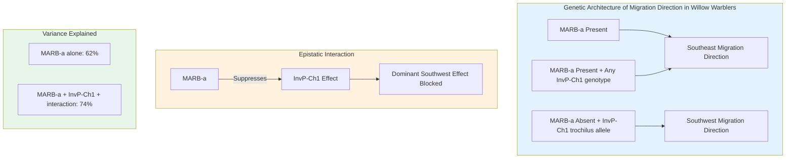
```mermaid
flowchart TD
    subgraph GENETICS["Genetic Architecture of Migration Direction in Willow Warblers"]
        A[MARB-a Present] --> B[Southeast Migration Direction]
        C[MARB-a Absent + InvP-Ch1 trochilus allele] --> D[Southwest Migration Direction]
        E[MARB-a Present + Any InvP-Ch1 genotype] --> B
    end
    
    subgraph EPISTASIS["Epistatic Interaction"]
        F[MARB-a] -->|Suppresses| G[InvP-Ch1 Effect]
        G --> H[Dominant Southwest Effect Blocked]
    end
    
    subgraph VARIANCE["Variance Explained"]
        I[MARB-a alone: 62%]
        J[MARB-a + InvP-Ch1 + interaction: 74%]
    end
    
    style GENETICS fill:#e3f2fd
    style EPISTASIS fill:#fff3e0
    style VARIANCE fill:#e8f5e9
```

The most remarkable finding was the **dominant inheritance pattern with epistatic interactions** between these loci. The *trochilus* allele on InvP-Ch1 appears to have a dominant effect for southwestern migratory direction, but this effect is epistatically suppressed by the presence of MARB-a[^3]. Individuals that are heterozygotes or homozygotes for the *trochilus* allele on InvP-Ch1 tend to follow the western route unless they also possess MARB-a, in which case they follow the eastern route. A linear model including MARB-a, InvP-Ch1, and their interaction explains **74% of total variation in autumn migration direction** (F₄₅ = 29.5, p = 3.6 × 10⁻¹³)[^3].

The dominance of MARB-a was further investigated by examining the relationship between transposable element copy number and migratory direction. If MARB-a had a codominant effect, a positive correlation between copy number and migration direction would be expected. However, there was **no statistical effect of TE copy number** on either winter longitude (R² = 0.0006, F₁,₂₂ = 0.01, p = 0.9) or migration direction (R² = −0.012, F₁,₂₂ = 0.7, p = 0.4)[^3]. This demonstrates that the effect on migration direction is caused by the mere presence of MARB-a rather than copy number per se, supporting the interpretation of dominant inheritance.

| **Genotype Combination** | **MARB-a Status** | **Migration Direction** | **Interpretation** |
|-------------------------|-------------------|------------------------|-------------------|
| InvP-Ch1: *trochilus*/*trochilus* | Absent | Southwest | Dominant *trochilus* effect expressed |
| InvP-Ch1: *trochilus*/*acredula* | Absent | Southwest | Dominant *trochilus* effect expressed |
| InvP-Ch1: *acredula*/*acredula* | Absent | Variable/Southwest | No dominant effect |
| Any InvP-Ch1 genotype | Present | Southeast | MARB-a suppresses InvP-Ch1 effect |

This dominant inheritance pattern contrasts sharply with the **codominant inheritance** observed in European blackcaps (*Sylvia atricapilla*), where F1 hybrids between southwest-migrating and southeast-migrating populations expressed intermediate orientations relative to the parental forms[^3]. Helbig's classic cross-breeding experiments with blackcaps concluded that migration direction is controlled by one or few strong-effect codominant loci, leading to the expectation that hybrid birds would follow potentially inferior intermediate routes[^3]. A codominant and additive inheritance pattern was also favored to explain the diverse migration routes of hybrid Swainson's thrushes[^3].

The **VPS13A gene** (Vacuolar Protein Sorting 13 Homolog A) has been identified as another locus correlating with different winter longitudes in migratory passerines[^3]. Comparative genomic analyses of golden-winged (*Vermivora chrysoptera*) and blue-winged (*V. cyanoptera*) warblers found that selection on VPS13A is linked to the selection of wintering regions[^38]. However, neither VPS13A nor any region on chromosome 4 (which was associated with migratory orientation in Swainson's thrushes) showed as an outlier in genomic comparisons of willow warbler subspecies[^3], suggesting that different species may have evolved distinct genetic architectures for controlling migratory direction.

Recent genetic studies on willow warblers have identified **two genes, MARB-a and InvP-Ch1**, that determine migration direction through epistatic mechanisms[^38]. The direction of migration is primarily determined by a combination of these two genes, with MARB-a suppressing the effect of InvP-Ch1 through epistatic mechanisms[^38]. This discovery has supported the hypothesis that the direction of bird migration can be inherited through complex polygenic mechanisms, challenging earlier views that migration direction might be controlled by a single major locus.

The implications of dominant inheritance for **population genetics and evolution** are profound. A consequence of this inheritance mode is that the migratory direction of most hybrids (76% in the willow warbler study) resembled either allopatric *trochilus* or *acredula*[^3]. This means that **alternative migratory phenotypes can remain hidden within recessive alleles** and stay in populations at low frequencies until demographic events create recessive homozygotes[^3]. Sutherland suggested that genetic dominance might be one of the mechanisms explaining observed cases of rapid evolution of new migratory routes[^3]. Populations can evolve new migratory directions within timescales too short for de novo mutations to occur, suggesting that the genetic variation necessary for alternative migratory strategies already exists within populations as hidden recessive alleles.

### 4.3 Endogenous Timing Programs: Circannual Rhythms and Photoperiodic Regulation

The temporal dimension of migratory navigation is governed by **endogenous programs that regulate annual cycles**, integrating internally generated circannual rhythms with responses to environmental cues such as photoperiod[^39]. These timing programs determine not only when birds initiate migration but also how long they fly in each direction, when they undergo seasonal physiological changes, and how they coordinate the multiple components of the migratory phenotype across the annual cycle.

**Circannual rhythms** provide the fundamental temporal framework for migration, generating approximately year-long cycles of physiological and behavioral changes even in the absence of external time cues[^39]. Birds maintained under constant environmental conditions continue to show rhythmic cycles of migratory restlessness, molt, and reproductive activity with periods close to 12 months, demonstrating that these rhythms are truly endogenous rather than simply responses to environmental seasonality[^39]. The migration program is driven by these circannual rhythms and is constructed to both guide behavior and regulate flexible responses to the environment at different stages of the annual cycle[^39].

**Photoperiod acts as the primary synchronizer** (zeitgeber) of circannual rhythms, calibrating the internal clock to local environmental conditions[^38]. The changing day length through the seasons provides birds with reliable information about the time of year, allowing them to anticipate seasonal transitions and prepare physiologically for migration. One of the key factors regulating migration is the photoperiod, which acts as a synchronizer of circannual rhythms[^38]. Birds that hatch later in the breeding season and are exposed to shorter day lengths show an accelerated completion of molt and begin migration at an earlier age, demonstrating the flexibility of the timing program in response to photoperiodic information[^38].

The **dissociation between directional and temporal control** in the migratory program has been demonstrated through genetic studies. In willow warblers, autumn departure timing from the migratory divide did not associate with any of the three genomic markers (MARB-a, InvP-Ch1, or InvP-Ch5) that control migratory direction (F₄₅ = 0.26, adjusted R² = −0.08, p = 0.93)[^3]. However, autumn departure date was positively associated with breeding latitude (F₇₁ = 16.29, R² = 0.08, p = 0.0001), suggesting that migration timing is either a **polygenic additive trait** that cannot be explained by the major directional loci and/or is to a large degree controlled by environmental factors[^3]. This finding indicates that the genetic architecture of migratory timing is distinct from that controlling migratory direction, with timing likely influenced by many genes of small effect rather than a few loci of major effect.

| **Migratory Trait** | **Genetic Architecture** | **Environmental Influence** | **Key Regulators** |
|--------------------|-------------------------|---------------------------|-------------------|
| Migration Direction | Few loci, large effects (MARB-a, InvP-Ch1) | Minimal | Genetic dominance, epistasis |
| Migration Timing | Polygenic, additive | Substantial (photoperiod) | Circannual rhythms, latitude |
| Migration Distance | Unknown, possibly polygenic | Variable | Genetic + experiential |

The endogenous program encodes not only direction and timing but also **distance parameters** that determine how far birds fly before terminating migration. The duration of migratory restlessness in caged birds correlates with the migration distance of free-living conspecifics, suggesting that the internal clock measures out an appropriate flight duration for each population[^39]. However, from the migratory divide in willow warblers, the great circle distance to the wintering range of allopatric *acredula* is about 50% longer than to the wintering range of allopatric *trochilus*[^3]. Analysis restricted to birds wintering east of longitude 15°E (where distance variation is greatest) found that neither InvP-Ch1 nor InvP-Ch5 had any effect on migration distance (F₁₆ = 0.41, p = 0.79)[^3], suggesting that distance may be controlled by different genetic factors than direction.

The spatio-temporal programs integrate **inherited information with flexible responses** to environmental conditions encountered during migration[^39]. Even naïve individuals can perform effective migrations using these programs, which encode directional preference and duration of migratory restlessness[^39]. However, the program also allows for adaptive modifications based on experience. Adherence to the inherited migration program is typically strong in first-time migrants but may be supplanted by experience in subsequent years[^39]. This ontogenetic shift from rigid program execution to flexible, experience-based navigation represents a fundamental transition in the bird's navigational strategy.

Geomagnetic information can also **modify the temporal and physiological components** of the migratory program. Studies have shown that magnetic parameters can prompt inherited ecophysiological changes, such as increased fuel deposition in response to magnetic conditions associated with sites just before a major barrier[^39]. This suggests that the endogenous program includes not only directional and temporal information but also **inherited expectations about environmental conditions** that should be encountered at specific points along the migration route. When birds experience magnetic conditions matching these expectations, they initiate appropriate physiological responses such as hyperphagia (increased feeding) to prepare for barrier crossing.

### 4.4 Challenges to the Clock-and-Compass Model: Evidence for Goal-Area Navigation and Beacon Systems

While the clock-and-compass hypothesis remains the dominant framework for understanding first-time migration, **accumulating evidence suggests that the navigational capabilities of some naïve migrants are considerably more sophisticated** than simple vector navigation would predict[^38]. Alternative hypotheses, including navigation by goal area and beacon-based systems, propose that first-time migrants possess inherited spatial information that enables them to detect and correct for deviations from their intended routes.

The **"navigation by goal area" concept** represents the most direct challenge to the clock-and-compass model. This hypothesis suggests that migratory routes are determined by genetically encoded information about the geographic coordinates of destinations or stopover sites, rather than simply by compass directions and flight durations[^38]. Rabøl analyzed recoveries of three passerine species in Europe and proposed that it is the geographic coordinates of wintering or stopover sites that are inherited, placing inherited spatial targeting at the core of migratory behavior rather than orientation based on directions or temporal parameters[^38]. This approach challenges the traditional paradigm and emphasizes the need to reconsider established views about the nature of migration.

Compelling evidence for sophisticated navigational capabilities in first-time migrants comes from **displacement experiments showing compensation for route deviations**. Thorup and colleagues demonstrated that young common cuckoos (*Cuculus canorus*) displaced **1,800 km east** from the Baltic coast to Kazan were able to return to their species-specific migration route[^38]. Similarly, young common whitethroats (*Curruca communis*), garden warblers, and willow warblers are capable of compensating for shifts in their autumn migration route by **more than 1,000 km**[^38]. These findings are difficult to reconcile with a simple clock-and-compass mechanism, which would predict that displaced birds should continue in their innate compass direction without compensation.

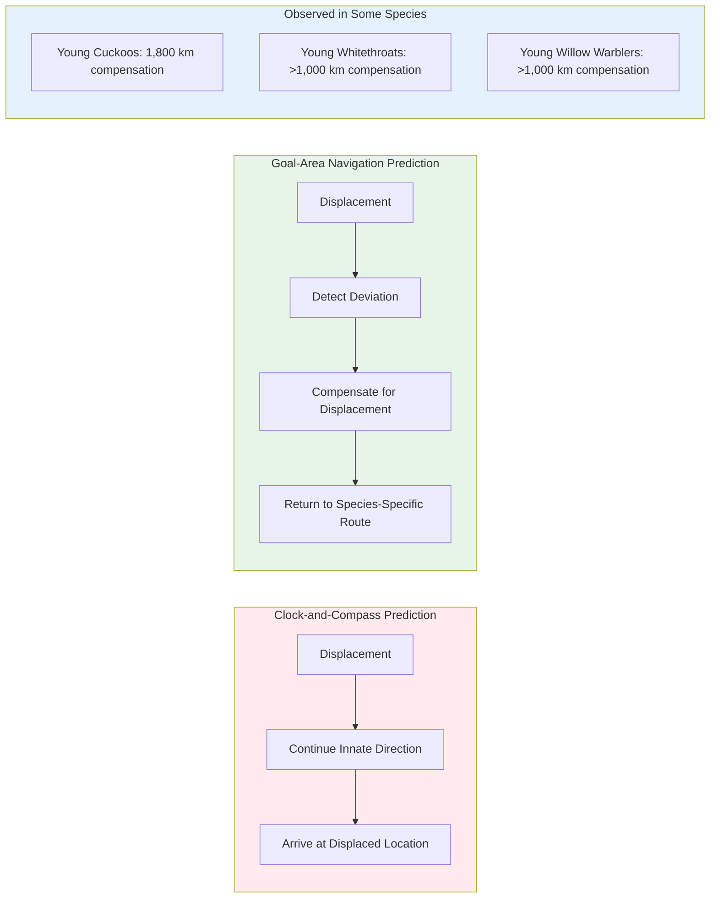
```mermaid
flowchart LR
    subgraph CLOCKCOMPASS["Clock-and-Compass Prediction"]
        A[Displacement] --> B[Continue Innate Direction]
        B --> C[Arrive at Displaced Location]
    end
    
    subgraph GOALAREA["Goal-Area Navigation Prediction"]
        D[Displacement] --> E[Detect Deviation]
        E --> F[Compensate for Displacement]
        F --> G[Return to Species-Specific Route]
    end
    
    subgraph EVIDENCE["Observed in Some Species"]
        H[Young Cuckoos: 1,800 km compensation]
        I[Young Whitethroats: >1,000 km compensation]
        J[Young Willow Warblers: >1,000 km compensation]
    end
    
    style CLOCKCOMPASS fill:#ffebee
    style GOALAREA fill:#e8f5e9
    style EVIDENCE fill:#e3f2fd
```

The **beacon hypothesis** proposes an intermediate position between simple vector navigation and full goal-area navigation. According to this view, first-time migrants may not possess a detailed map but rather a **system of beacons based on geomagnetic or other information** that allows them to control their position along the migration route to some extent[^38]. These inherited signposts would enable birds to detect when they have deviated from the expected sequence of environmental conditions and adjust their behavior accordingly.

Experimental evidence for **magnetic conditions serving as inherited beacons** comes from studies manipulating the magnetic fields experienced by captive migrants. Fransson and colleagues showed that first-time migrating thrush nightingales (*Luscinia luscinia*) exposed to the magnetic field of northern Egypt (simulating conditions just before the Sahara Desert barrier) **gained significantly more fuel** than birds maintained in the magnetic conditions of their capture site in central Sweden[^38]. This response suggests that the birds possess an inherited expectation of encountering specific magnetic parameters before a major barrier and respond with appropriate physiological preparation (increased fat deposition) when these conditions are detected[^38].

| **Experiment** | **Species** | **Manipulation** | **Result** | **Interpretation** |
|---------------|-------------|-----------------|-----------|-------------------|
| Fransson et al. (2001) | Thrush Nightingale | Exposed to Egyptian magnetic field | Increased fuel deposition | Innate response to pre-barrier magnetic signature |
| Wiltschko & Wiltschko (1992) | Garden Warbler | Horizontal magnetic field (simulated equator) | Changed orientation direction | Magnetic equator acts as behavioral trigger |
| Henshaw et al. (similar) | Northern Wheatear | Exposed to route magnetic conditions | Decreased fuel deposition | Species-specific variation in response |

Garden warblers subjected to laboratory conditions simulating the crossing of the magnetic equator during their autumn migration showed **behavioral changes triggered by magnetic parameters**. Exposure to a horizontal magnetic field (characteristic of the magnetic equator where inclination = 0°) caused a change in their orientation direction, acting as a trigger for significant changes in migratory behavior[^38]. This suggests that the magnetic equator—a geographic feature that all trans-equatorial migrants must cross—serves as an inherited signpost that triggers a switch from "toward equator" to "toward pole" orientation. However, a recent experiment with marsh warblers and spotted flycatchers did not reveal a shift in orientation direction after exposure to a horizontal magnetic field, suggesting **species-specific variation** in the use of magnetic beacons[^38].

The role of **stars as potential beacons** during first migration has also been investigated. Despite the fact that the star compass itself is not innate but learned, experiments under starry skies showed that birds adjusted for positional shifts, whereas in cloudy weather their orientation remained unchanged[^38]. It is possible that young birds use stars as beacons during migrations, learning and adapting their star compass to specific migration conditions. The formation and calibration of the star compass are particularly crucial for crossing the magnetic equator, where the inclination magnetic compass malfunctions[^38].

One dataset suggested that **some first-time migrants need additional non-social information** for successful autumn migration beyond simple compass directions. Pied flycatchers needed to experience the characteristics of the magnetic field encountered *en route*, in the southern Iberian Peninsula and in northern Africa, to display seasonally appropriate orientation[^38]. This finding implies that the migratory program includes inherited expectations about the magnetic conditions that should be encountered at specific points along the route, and that experiencing these conditions is necessary for proper compass calibration or behavioral triggering.

The data described above suggest that, in addition to a clock and a compass, **inexperienced migrants may possess an innate understanding of the magnetic and/or photoperiodic conditions** they are expected to encounter during an "on-schedule" migration[^38]. This innate knowledge may enable them to adjust their migratory behavior in the event of deviations from this expected schedule. The concept of clock-and-compass in young migrants thus requires further clarification—what is involved may not be a detailed map, but a system of beacons that allows first-year migrants to control their position along the migration route, at least to some extent[^38].

### 4.5 Displacement Experiments: Differential Responses of Naïve versus Experienced Migrants

The **differential response to displacement** between first-time and experienced migrants represents one of the most robust findings in avian navigation research, providing the empirical foundation for distinguishing between vector navigation (compass-only orientation) and true navigation (map-and-compass positioning)[^12]. However, the interpretation of displacement experiments requires careful attention to methodological considerations, and the literature contains conflicting results that have been the subject of extensive debate.

Mouritsen's comprehensive **review and re-evaluation of displacement experiments** on night-migrating passerines applied standardized statistical criteria to assess the evidence for and against the clock-and-compass hypothesis[^12]. The analysis revealed that many experiments suggesting navigational responses in young birds were confounded by **site-specific anomalies** rather than reflecting genuine compensatory orientation. At the Danish site Blåvand, locally caught birds consistently showed an atypical south-east orientation regardless of whether they had been displaced, likely due to a local anomaly (possibly related to coastline effects) rather than displacement compensation[^12]. After excluding Blåvand-influenced data, only two studies provided evidence for navigation in young birds, and both had methodological issues.

| **Methodological Issue** | **Affected Studies** | **Consequence** |
|-------------------------|---------------------|-----------------|
| Site-specific anomalous orientation (Blåvand) | Multiple Scandinavian studies | False positive for navigation |
| Atypical pre-displacement orientation | Garden Warbler displacement | Baseline direction uncertain |
| Lack of control group at origin | Several studies | Cannot distinguish displacement effect from site effect |
| Repeated transport with little rest | Redstart study | Birds in poor condition; possible reverse orientation |

Mouritsen's **empirical displacement experiment** with 48 young pied flycatchers provided a rigorous test of the clock-and-compass hypothesis[^12]. Birds caught during their first autumn migration in Scandinavia were tested for orientation at the capture site (Christiansø, Denmark), showing the expected south-southwest direction. The birds were then split into three groups: one displaced approximately 500 km due south, one displaced approximately 400 km due west (near the maximum biologically realistic displacement distance), and a control group remaining at Christiansø. Post-displacement orientation tests showed **no significant difference in directional preferences between the groups**, with all 95% confidence intervals overlapping[^12]. This result provides strong evidence against compensatory orientation in first-time migrants.

The **mathematical model of clock-and-compass migration** developed by Mouritsen provided quantitative predictions that could be tested against real-world data[^12]. The model predicted the expected directional distribution as a function of distance covered, assuming birds accumulate orientation errors at each step. For comparison with natural migration, ringing recovery data from Scandinavian pied flycatchers were analyzed. The directional concentration after one migratory step (100-149 km) had a sample mean vector length of 0.665 (angular standard deviation ±52°)[^12]. When this value was inserted into the model, the predicted directional concentrations as a function of distance **strongly correlated with actual data from 1,138 recoveries**. A Wilcoxon's signed rank test showed no significant difference (T⁻ = 238, n = 35, P > 0.20), supporting the clock-and-compass model[^12].

The evidence from theory, laboratory experiments, field data, and literature review led Mouritsen to conclude that **young pied flycatchers, and likely young night-migrating passerines in general, do not navigate during their first autumn migration** but use a clock-and-compass strategy[^12]. They are equipped with compasses (at least two: magnetic and celestial) and an internal clock, but no map. For the navigation hypothesis to remain viable for young birds, it must be supported by future carefully designed experiments with large sample sizes, clear predictions, and meticulous controls, avoiding sites like coastlines that may cause anomalous orientation[^12].

However, the picture has grown more nuanced with additional research revealing **species-specific variation** in displacement responses. While pied flycatchers and common starlings show clear evidence of vector navigation in juveniles, other species demonstrate more sophisticated capabilities. The displacement studies with young common cuckoos, whitethroats, garden warblers, and willow warblers showing compensation for displacements exceeding 1,000 km suggest that **some first-time migrants possess navigational capabilities beyond simple vector navigation**[^38]. These species-specific differences may reflect ecological variation in migratory requirements—species crossing areas with broadly varying magnetic declination values or facing complex geographic barriers may have evolved more sophisticated innate navigational systems.

The **transition from vector navigation to true navigation** represents a critical developmental achievement that requires experiential learning. Displacement experiments consistently show that adults correct for displacement while juveniles do not, indicating that the map component of navigation is acquired through experience during the first migration[^12]. Once birds have successfully completed their first journey and established a winter range, they can use the learned spatial information to navigate back to specific locations in subsequent years. This experiential acquisition of map information explains the high site fidelity observed in adult migrants—birds return not only to the same breeding areas but often to the same wintering grounds and even the same stopover sites year after year.

The clock-and-compass strategy is considered **sufficient for successful first migration when supplemented with emergency plans**[^12]. Emergency plan A involves turning approximately 90° toward the sunrise if the bird finds itself over water at dawn during autumn migration, as suggested by radar observations of thrushes over the North Sea. Emergency plan B involves flying with the wind until encountering land if winds are too strong for plan A, as evidenced by vagrants like North American passerines appearing in Great Britain. These backup strategies, combined with the inherited compass directions and timing, enable young birds to complete their first migration successfully despite the lack of true navigational abilities.

### 4.6 Genetic Variation and Population-Level Adaptation at Migratory Divides

**Migratory divides**—geographic zones where populations with different migratory strategies meet and hybridize—provide natural laboratories for investigating how genetic variation in navigational programs enables population-level adaptation to environmental heterogeneity[^3]. These contact zones offer unique opportunities to study the genetic architecture of migration because they bring together divergent migratory phenotypes in a common genetic background, allowing researchers to identify the specific genetic variants responsible for navigational differences.

The **Scandinavian willow warbler migratory divide** represents the most thoroughly characterized system for understanding the genetics of migratory direction at population boundaries[^3]. The breeding ranges of the subspecies *trochilus* (southwest-migrating) and *acredula* (southeast-migrating) overlap in central Scandinavia, where they form a hybrid swarm[^3]. Despite their dramatically different migratory routes—*trochilus* wintering in western Africa and *acredula* in eastern and southern Africa—the two subspecies are **nearly genetically identical** with a genome-wide F_st of only 0.001[^3]. This remarkable genetic similarity, combined with the sharp differences in migratory phenotype, indicates that very few genomic regions control the divergent migratory strategies.

Allele frequencies at the three divergent loci (InvP-Ch1, InvP-Ch5, and MARB-a) show **coinciding geographic clines** with the change in migration direction as inferred from analyses of feather stable isotopes[^3]. The geographic structure of these genetic markers closely matches the transition zone between southwest and southeast migration, providing strong evidence that these loci contain or are closely linked to genes encoding migratory strategies. The tracking study confirmed this association: migration routes of genetic *trochilus* and *acredula* breeding in sympatry in the migratory divide resembled those of their allopatric counterparts, while birds with mixed ancestry showed routes distributed across most of sub-Saharan Africa[^3].

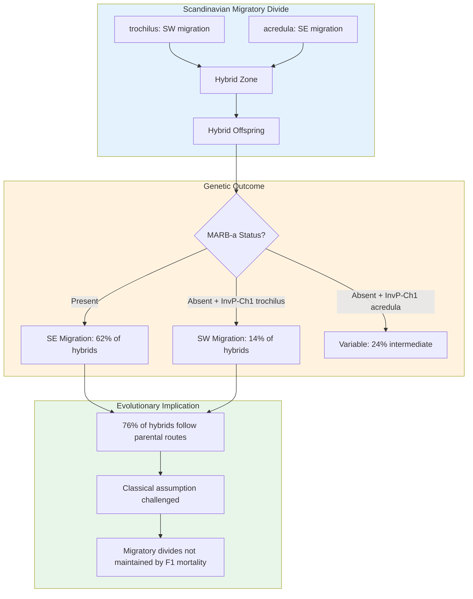
```mermaid
flowchart TD
    subgraph DIVIDE["Scandinavian Migratory Divide"]
        A[trochilus: SW migration] --> B[Hybrid Zone]
        C[acredula: SE migration] --> B
        B --> D[Hybrid Offspring]
    end
    
    subgraph GENETICS["Genetic Outcome"]
        D --> E{MARB-a Status?}
        E -->|Present| F[SE Migration: 62% of hybrids]
        E -->|Absent + InvP-Ch1 trochilus| G[SW Migration: 14% of hybrids]
        E -->|Absent + InvP-Ch1 acredula| H[Variable: 24% intermediate]
    end
    
    subgraph IMPLICATION["Evolutionary Implication"]
        I[76% of hybrids follow parental routes]
        J[Classical assumption challenged]
        K[Migratory divides not maintained by F1 mortality]
    end
    
    F --> I
    G --> I
    I --> J
    J --> K
    
    style DIVIDE fill:#e3f2fd
    style GENETICS fill:#fff3e0
    style IMPLICATION fill:#e8f5e9
```

The **dominant inheritance pattern** observed in willow warblers has profound implications for understanding how migratory divides are maintained. The classical assumption has been that migratory divides are maintained through **higher mortality of F1 hybrids** that take inferior intermediate routes between the parental migration corridors[^3]. Intermediate routes might cross ecological barriers (such as the central Sahara) or lead to unsuitable wintering habitats, resulting in reduced survival of hybrid offspring and thus maintaining reproductive isolation between the divergent populations.

However, the willow warbler data challenge this assumption. Because MARB-a and the *trochilus* allele of InvP-Ch1 both show dominant inheritance, **most hybrids (76%) migrate similarly to one of the parental subspecies** rather than following intermediate routes[^3]. The wintering locations of birds with mixed ancestry from the migratory divide were distributed across most of sub-Saharan Africa, but only 23% of sites were located between the wintering quarters of the allopatric subspecies[^3]. This means that the majority of hybrid offspring do not suffer the presumed fitness cost of following an inferior intermediate route, fundamentally changing our understanding of the selective forces maintaining migratory divides.

| **Inheritance Pattern** | **Species** | **Hybrid Route** | **Implications for Divide Maintenance** |
|------------------------|-------------|-----------------|----------------------------------------|
| Dominant (with epistasis) | Willow Warbler | 76% parental-like | F1 hybrids mostly avoid intermediate routes |
| Codominant | European Blackcap | Intermediate | F1 hybrids may suffer fitness costs |
| Codominant/Additive | Swainson's Thrush | Variable/Intermediate | Diverse hybrid routes |
| Dominant | Pied × Collared Flycatcher | Parental-like | Hybrids migrate like pied flycatcher |

The finding that **alternative migratory phenotypes can remain hidden within recessive alleles** has important implications for understanding rapid evolutionary change in migratory behavior[^3]. Populations can evolve new migratory directions within timescales too short for de novo mutations to occur, as observed in cases where populations have rapidly established new migration routes in response to environmental change. The genetic variation necessary for these alternative strategies already exists within populations as hidden recessive alleles, and demographic events (such as population bottlenecks, range expansions, or hybridization) can bring together the combinations of alleles necessary to express novel migratory phenotypes.

A stable isotope analysis of winter-grown feathers in hybrids of pied (*Ficedula hypoleuca*) and collared (*F. albicollis*) flycatchers indicated that **hybrids were migrating similar to one of the parental species**, the pied flycatcher[^3]. This pattern is consistent with dominant inheritance of migratory direction and suggests that the willow warbler system may represent a more general phenomenon rather than an isolated case. If dominant inheritance of migratory direction is common across bird species, the classical model of migratory divide maintenance through hybrid mortality may need substantial revision.

The **rapid evolution of new migratory routes** documented in several species provides additional evidence for the role of existing genetic variation in adaptive responses to environmental change[^3]. Long-distance range expansion and rapid adjustment of migration have been documented in newly established populations of barn swallows breeding in Argentina, where birds established new migratory routes within a few generations. Such rapid changes are difficult to explain through new mutations but are readily explained if the genetic variants for alternative migratory strategies were already present in the founding population at low frequencies.

Despite the geographic structure of **InvP-Ch5** matching the locations of the migratory divides, this locus did not associate with migration direction in the tracking data (F₄₈ = 1.8, R² = 0.03, p = 0.17)[^3]. This finding suggests that InvP-Ch5 may be involved in other aspects of the migratory phenotype (such as timing, physiology, or morphology) rather than directional control, or that it is in linkage disequilibrium with the true causative variants without being directly involved. The functional roles of InvP-Ch1 and MARB-a in willow warblers also remain unknown at the molecular level, representing an important frontier for future research.

In conclusion, the study of migratory divides reveals that the genetic architecture of migration direction can be surprisingly simple, with a few loci of large effect explaining most of the phenotypic variation. The dominant inheritance patterns and epistatic interactions observed in willow warblers demonstrate that **navigational phenotypes can be inherited in discrete rather than continuous fashion**, allowing most hybrid offspring to follow successful parental routes rather than potentially maladaptive intermediate paths. This genetic architecture may facilitate rapid evolutionary responses to environmental change by allowing alternative migratory strategies to persist as hidden variation within populations until conditions favor their expression.

## 5 Spatial Memory and Cognitive Map Development

This chapter explores how migratory birds develop, store, and utilize mental representations of space for navigation, examining the cognitive processes underlying the transition from innate compass-based orientation to experience-dependent true navigation. The analysis investigates the role of geographic landmarks, learned routes, and spatial memory in achieving the pinpoint accuracy observed in experienced migrants, synthesizes evidence on how first-time migrants acquire and consolidate navigational information during initial journeys, compares cognitive mapping abilities across species with different migratory ecologies, and evaluates the neural substrates—particularly the hippocampal formation—that support spatial navigation and memory consolidation in birds.

### 5.1 Theoretical Frameworks for Avian Cognitive Maps

The concept of a **cognitive map** in avian navigation refers to internal spatial representations that enable birds to determine their position relative to goals and navigate flexibly through their environment. Understanding the theoretical architecture of these maps is essential for explaining how experienced migrants achieve the remarkable navigational precision documented in tracking studies—precision that cannot be explained by compass mechanisms alone. The map component of the map-and-compass navigation system provides the positional information that tells a bird where it is relative to its destination, while compasses provide the directional capability to orient toward that destination once position is known.

Two fundamentally different theoretical frameworks have been proposed for the structure of avian cognitive maps: **mosaic maps** and **gradient maps**. A mosaic map, analogous to the cognitive maps described in mammals, consists of learned spatial relationships among discrete landmarks, landscape features, or location-specific cues such as odors[^9]. This type of map represents space as a network of recognized places connected by learned spatial relationships, enabling birds to navigate by recognizing familiar landmarks and recalling their positions relative to goals. In contrast, a gradient map is based on systematic variations in environmental cues that change predictably across geographic space—such as the gradual changes in magnetic field parameters, atmospheric odor concentrations, or infrasound patterns with latitude and longitude[^9]. A gradient map enables birds to determine their position by comparing currently perceived cue values with remembered values associated with their goal location.

The distinction between **discrete and continuous map structures** carries important implications for understanding navigational mechanisms. Discrete maps, such as mosaic maps based on landmarks or signposts based on specific magnetic signatures, represent space as a collection of distinct recognized locations[^17]. Birds using discrete maps navigate by identifying which known location they are at or near, then recalling the appropriate response (direction to travel, behavioral change to execute). Continuous maps, such as bi-coordinate gradient maps, represent space as a continuous field where position can be determined anywhere by measuring local cue values and comparing them to remembered gradients[^17]. The ontogeny of map information may involve inherited rules for some species—as seen in hatchling loggerhead turtles and juvenile salmon that orient to magnetic cues without prior experience—or may require imprinting and learning, as documented in homing pigeons that develop olfactory maps during a sensitive period at their home loft[^17].

| **Map Type** | **Structure** | **Cue Basis** | **Learning Requirement** | **Spatial Scale** |
|-------------|--------------|---------------|-------------------------|------------------|
| Mosaic Map | Discrete landmarks | Visual, olfactory, acoustic | Extensive learning of spatial relationships | Local to regional |
| Gradient Map | Continuous fields | Geomagnetic, olfactory gradients | Learning of gradient directions and values | Regional to global |
| Signpost/Beacon | Discrete triggers | Magnetic intensity, specific cues | Inherited or imprinted responses | Route-specific |

Evidence for **geomagnetic gradient maps** in birds has accumulated from virtual magnetic displacement experiments. Eurasian reed warblers exposed to artificially altered magnetic inclination and declination values—simulating displacement approximately 2,700 km to the east-northeast—shifted their orientation in a direction consistent with compensatory reorientation back toward their capture site, even when total magnetic intensity remained unchanged[^9]. This finding demonstrates that birds can extract positional information from magnetic parameters, supporting the existence of a magnetic gradient map. A theoretical bi-coordinate geomagnetic map could use magnetic inclination and intensity for latitude estimation, with declination potentially providing longitude information[^9]. However, the sensory basis for such a map remains debated, and empirical evidence from tracking studies for the use of all proposed gradient components is still lacking.

The **olfactory map hypothesis** proposes that birds learn windborne odors associated with wind directions at their home location, then use local odor concentrations when displaced to determine the direction home[^9]. This mechanism is well-established in homing pigeons, which learn the olfactory landscape during a sensitive period by associating specific olfactants with wind directions while confined to their loft[^17]. However, strategies may differ in wild migratory birds, and the existence of stable, extensive odor gradients in the turbulent lower atmosphere has been questioned. Pelagic seabirds might learn the olfactory topography of the ocean, using odor gradients associated with oceanographic features for navigation[^9].

An ongoing debate concerns whether birds possess **true allocentric cognitive maps**—representations of space that are independent of the bird's own position and orientation—or whether they rely on simpler egocentric spatial strategies that encode space relative to the self[^40]. Allocentric representations would enable flexible navigation, allowing birds to compute novel routes and shortcuts between locations they have never directly traveled between. Egocentric strategies, while simpler, would constrain navigation to learned routes and familiar landmarks. Evidence from homing pigeon studies suggests that hippocampal-dependent pilotage enables flexible re-orientation and route modification, consistent with allocentric mapping, while hippocampal-lesioned pigeons can only use familiar landscape scenes to recall compass directions in what is termed "site-specific compass orientation"[^17]. This distinction suggests that birds may employ both allocentric and egocentric spatial strategies, with the hippocampus supporting the more flexible allocentric representations.

The **navigation toolbox framework** provides a hierarchical organization of spatial cognition across four levels of spatial representation[^17]. Level 1 involves sensorimotor responses to simple gradients. Level 2 comprises spatial primitives such as compass directions. Level 3 involves spatial constructs that combine primitives to represent place through metric relations—including vectors combining distance and direction. Level 4 involves spatial symbols, which in birds may include the honeybee-like dance communication of outbound vectors. The first-time migration of birds, guided by an inherited program predisposing a particular direction for a defined time, represents an approximate Level 3 vector that falls short of true cognitive mapping[^17]. In experienced migrants, compass mechanisms are typically coupled to avian maps of space encoding distances and directions, representing more complex Level 3 spatial constructs. This hierarchical framework helps explain how birds can transition from simple compass-based orientation to sophisticated map-based navigation as they gain experience.

### 5.2 Ontogeny of Spatial Memory in First-Time Migrants

The transition from innate vector navigation to experience-dependent true navigation represents one of the most significant developmental achievements in the lives of migratory birds. Understanding how **naïve migrants acquire spatial information** during their initial journeys is essential for explaining how young birds that depart with only compass directions and timing programs eventually develop the sophisticated navigational capabilities observed in experienced adults.

First-time migrants face the challenge of building navigational maps while simultaneously executing their inaugural migration—a journey during which they cannot rely on prior spatial knowledge. The learning processes through which young birds acquire map information appear to involve multiple mechanisms operating at different spatial scales[^40][^9]. At the broadest scale, birds may sample environmental gradients—magnetic, olfactory, or acoustic—as they travel, learning the relationships between cue values and geographic position. At intermediate scales, they may learn to recognize landscape features, coastlines, mountain ranges, and other prominent landmarks that can serve as beacons or reference points. At the finest scales, they imprint on specific site characteristics at breeding grounds, stopover sites, and wintering areas that enable precise return navigation in subsequent years.

**Path integration**—the process of tracking self-motion vectors to maintain an estimate of position relative to a starting point—may play an important role in map learning during first migration[^17]. By integrating distance and direction traveled, birds can maintain a running estimate of their displacement from their natal site, even in unfamiliar terrain. This egocentric spatial information could then be combined with changes in environmental cues (magnetic parameters, odor concentrations, landmark configurations) to learn the relationships between cue values and geographic position. Path integration is well-documented in mammals over small scales and has been suggested to potentially play a similar role in birds over larger spatial scales, though direct evidence remains limited[^17].

The concept of **route-based navigation** (also called path integration in some contexts) describes how individuals record their movements relative to a starting point using a compass and return by reversing their net outward movements[^40]. During route-based navigation, individuals acquire information about unfamiliar areas *en route*, building their exocentric navigation strategies for future use. This learning is egocentric and structured around self-movement, meaning the individual does not need to be familiar with the landscape initially because landmarks are not required for the immediate navigation task. However, the information acquired during route-based navigation can be consolidated into more sophisticated spatial representations that support future landmark-based and gradient-based navigation.

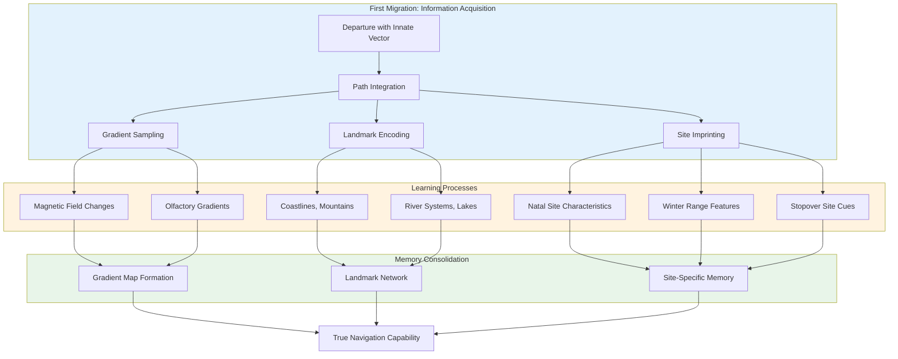
```mermaid
flowchart TD
    subgraph FIRSTMIGRATION["First Migration: Information Acquisition"]
        A[Departure with Innate Vector] --> B[Path Integration]
        B --> C[Gradient Sampling]
        B --> D[Landmark Encoding]
        B --> E[Site Imprinting]
    end
    
    subgraph LEARNING["Learning Processes"]
        C --> F[Magnetic Field Changes]
        C --> G[Olfactory Gradients]
        D --> H[Coastlines, Mountains]
        D --> I[River Systems, Lakes]
        E --> J[Natal Site Characteristics]
        E --> K[Winter Range Features]
        E --> L[Stopover Site Cues]
    end
    
    subgraph CONSOLIDATION["Memory Consolidation"]
        F --> M[Gradient Map Formation]
        G --> M
        H --> N[Landmark Network]
        I --> N
        J --> O[Site-Specific Memory]
        K --> O
        L --> O
    end
    
    M --> P[True Navigation Capability]
    N --> P
    O --> P
    
    style FIRSTMIGRATION fill:#e3f2fd
    style LEARNING fill:#fff3e0
    style CONSOLIDATION fill:#e8f5e9
```

Evidence for **sensitive periods in spatial learning** comes from studies of homing pigeon development. Young pigeons have a sensitive learning period for developing an olfactory map by associating olfactants with wind direction while confined to their loft, though they can also learn cues outside this period[^17]. Similar sensitive periods may exist for other aspects of navigational map development in migratory species, though this has been less thoroughly investigated. The imprinting on natal magnetic or olfactory conditions documented in loggerhead turtles, salmon, Manx shearwaters, and Eurasian reed warblers suggests that early experience during a sensitive period may be critical for establishing the spatial reference points that anchor navigational maps[^17].

The acquisition of map information during first migration appears to be **critical for the development of true navigation capabilities**. Displacement experiments consistently demonstrate that adults can compensate for displacement while juveniles typically cannot, indicating that the map component of navigation is acquired through experience[^40]. Once birds have successfully completed their first journey and established a winter range, they can use the learned spatial information to navigate back to specific locations in subsequent years. This experiential acquisition of map information explains the high site fidelity observed in adult migrants—birds return not only to the same breeding areas but often to the same wintering grounds and even the same stopover sites year after year.

Young birds appear to **learn the relationship between their magnetic compass and celestial compasses in their geospatial context** to establish their navigational map[^40]. This calibration process involves experiencing the local magnetic field parameters while simultaneously observing celestial cues, allowing birds to integrate information from multiple compass systems into a coherent spatial framework. The ongoing recalibration of compass systems throughout migration—documented in radio-tracking studies showing daily recalibration based on twilight cues—suggests that map learning is not a one-time event but a continuous process of refinement and updating.

The mechanisms by which first-time migrants **consolidate route information** for use in subsequent migrations remain incompletely understood. Memory consolidation likely involves hippocampal processing, as this brain region is critical for spatial memory in birds as in mammals. The observation that migratory garden warblers can remember the location of a particular feeding site for at least 12 months suggests that the memory consolidation processes in migrants are adapted for the long retention intervals required by annual migration cycles[^40]. The neural mechanisms supporting this extended memory retention may involve structural changes in the hippocampus, as discussed in Section 5.6.

### 5.3 Long-Term Memory Retention and Site Fidelity

The ability of migratory birds to return to specific breeding, wintering, and stopover sites across successive years demonstrates **remarkable long-term memory capabilities** that are essential for the precision of experienced migrants' navigation. Understanding the duration, specificity, and maintenance of these spatial memories provides critical insights into the cognitive mechanisms underlying site fidelity and the transition from first-time to experienced migrant status.

Experimental evidence has demonstrated that **memory of particular locations can persist for 12 months or longer** in migratory species. A controlled study comparing memory duration in the long-distance migratory garden warbler (*Sylvia borin*) and the closely related non-migratory Sardinian warbler (*Sylvia melanocephala momus*) revealed striking differences in retention capabilities[^40]. In the experimental design, birds were allowed to explore two rooms, one containing food (representing high-quality habitat) and one without. Memory was then tested after intervals ranging from 4 days to 12 months. Garden warblers tested after 2 weeks, 5.5 months, 8.5 months, and 12 months all spent significantly more time in the correct room, demonstrating memory persistence spanning the entire annual cycle. In contrast, Sardinian warblers showed a preference for the food-containing room only after 4 days and 2 weeks, with no evidence of memory beyond this short interval[^40].

| **Species** | **Migratory Status** | **Memory Duration** | **Ecological Interpretation** |
|------------|---------------------|--------------------|-----------------------------|
| Garden Warbler | Long-distance migrant | ≥12 months | Memory of stopover/wintering sites across annual cycle |
| Sardinian Warbler | Non-migratory resident | ~2 weeks | Continuous updating possible; long-term memory unnecessary |
| Clark's Nutcracker | Food-caching specialist | Months (for cache locations) | Comparable long-term memory for different ecological function |

The comparison between migratory and non-migratory species revealed a **significant interaction between species and retention interval**, confirming that the differences in long-term memory represent genuine species-specific adaptations rather than methodological artifacts[^40]. The authors concluded that the migratory lifestyle appears to have influenced learning and memorizing capacities, with long-distance migrants evolving enhanced long-term memory to support the ecological demands of annual migration. Non-migratory birds may not require such long-lasting memory because they can continuously update their knowledge of local resources through ongoing experience in a stable home range.

The **functional significance of long-term memory** in migrants relates directly to the benefits of site fidelity. The long-lasting memory demonstrated in garden warblers likely helps them remember high-quality stopover sites, optimizing migratory performance by enabling efficient refueling during subsequent migrations[^40]. Memory of stopover site locations, resource availability, and local conditions allows experienced migrants to plan their journeys more effectively, potentially reducing search time and energy expenditure compared to naïve birds encountering sites for the first time. Additionally, long-term memory is a prerequisite for breeding-site fidelity, which provides numerous fitness benefits including familiarity with local predators, competitors, and resource distributions.

Field observations confirm that **a substantial proportion of migratory individuals return to the same breeding, wintering, and stopover sites in successive years**, suggesting that the long-term memory capabilities demonstrated in laboratory studies translate directly to natural navigation behavior[^40]. Many of the estimated 50 billion birds that carry out regular seasonal migrations return to the same sites year after year. Many small passerine long-distance migrants travel by night and singly, so social learning probably plays only a minor role in their navigation—they must rely on individual spatial memories formed during previous migrations.

The mechanisms by which spatial memories are **maintained during non-migratory periods** remain an important question. During the breeding season, migrants are not actively using their memories of wintering grounds and migration routes, yet these memories must persist intact for use during the subsequent autumn migration. Similarly, memories of breeding sites must be maintained throughout the wintering period. The garden warbler study demonstrated that memories persisted across the full 12-month interval without any opportunity for reinforcement or updating, suggesting that the memory consolidation processes in migrants are adapted for long-term retention without ongoing experience[^40].

Birds also use **prior reproductive success and environmental quality assessments to modulate site fidelity decisions**. Elegant experimental manipulation of nesting success in prothonotary warblers demonstrated that success rates strongly affected return rates in the following season[^40]. Birds randomly assigned to rear zero, one, or two successful broods showed dramatically different site fidelity, with successful breeders much more likely to return to the same territory. Intriguingly, males whose own nesting attempts failed were three times more likely to show site fidelity if they had successful neighbors, indicating that birds incorporate information about local habitat quality from multiple sources when making site fidelity decisions. This demonstrates that spatial memory interacts with assessment of reproductive outcomes to produce adaptive patterns of site fidelity versus dispersal.

### 5.4 Exploration-Refinement Hypothesis and Route Optimization

The **exploration-refinement hypothesis** provides a theoretical framework for understanding how migratory birds balance information acquisition against energy expenditure across their lifespan. This hypothesis predicts that exploratory behavior for information gain is favored early in life, when birds have limited spatial knowledge and much to learn, followed by more rapid and direct movement later in life, when accumulated experience enables efficient navigation[^17]. Testing this hypothesis requires longitudinal tracking data that can document how individual birds modify their migratory behavior as they age and gain experience.

A comprehensive tracking study of white storks (*Ciconia ciconia*) using GPS/GPRS tracking devices and biologging provided compelling support for the exploration-refinement framework[^17]. The research analyzed 301 migration events from 40 individuals that completed at least two consecutive fall migrations, enabling direct comparison of migratory behavior across age classes within individuals. The results revealed systematic age-related changes in multiple aspects of migratory performance that align closely with the predictions of the exploration-refinement hypothesis.

**Migration duration decreased with age**, with older birds completing their journeys more rapidly than younger birds[^17]. In fall migration, younger birds started migration earlier and ended later, while in spring migration, younger birds started and ended later than older birds. This pattern suggests that young birds require more time to complete their migrations, consistent with less efficient navigation and more exploratory behavior. The age-related acceleration of migration timing represents a measurable improvement in migratory performance that accumulates with experience.

| **Migratory Parameter** | **Young Birds** | **Experienced Birds** | **Interpretation** |
|------------------------|-----------------|----------------------|-------------------|
| Migration Duration | Longer | Shorter | Improved efficiency with experience |
| Energy Expenditure (ODBA) | Lower | Higher | Shift from energy-saving to time-saving strategy |
| Route Fidelity (DTW) | Lower | Higher | Exploration gives way to route faithfulness |
| Route Directness | Less straight | More straight with shortcuts | Spatial memory enables optimization |

Surprisingly, **energy expenditure during migratory flight increased with age**[^17]. Overall Dynamic Body Acceleration (ODBA), a proxy for energy expenditure, was higher in older birds and was also higher during spring migration compared to fall. This finding initially appears counterintuitive—one might expect experienced birds to fly more efficiently and thus expend less energy. However, the pattern is consistent with a shift from an energy-saving strategy in early life to a more energetically costly but time-saving strategy in adulthood. Young birds, with limited spatial knowledge and uncertain of their route, may prioritize energy conservation over speed. Experienced birds, confident in their route and able to navigate efficiently, may prioritize rapid migration completion even at higher energetic cost.

**Route fidelity increased with age**, demonstrating that younger birds were more exploratory while older birds became increasingly faithful to previously used routes[^17]. Route dissimilarity, measured using Dynamic Time Warping (DTW), decreased with age, providing quantitative evidence for the transition from exploration to refinement. Young birds sampled alternative routes, potentially gathering information about different migration corridors, while older birds converged on preferred routes that they repeated in subsequent years.

Perhaps most remarkably, **individuals innovated novel shortcuts during spring migration**, particularly during the transition from early life to adulthood[^17]. Analysis of fine-scale route deviations from the previous year's path revealed increased straightness in older birds, suggesting that experienced migrants were able to identify and execute more direct routes than they had previously traveled. This incremental straightening of routes provides strong evidence for the role of spatial memory in route optimization—birds must remember their previous routes in sufficient detail to recognize opportunities for improvement and must possess the navigational capabilities to execute novel shortcuts through unfamiliar terrain.

```mermaid
flowchart LR
    subgraph YOUNG["Young Birds (Exploration Phase)"]
        A[Low Route Fidelity] --> B[Energy-Saving Flight]
        B --> C[Longer Migration Duration]
        C --> D[Information Acquisition]
    end
    
    subgraph TRANSITION["Transition Period"]
        D --> E[Route Learning]
        E --> F[Shortcut Innovation]
        F --> G[Spatial Memory Consolidation]
    end
    
    subgraph EXPERIENCED["Experienced Birds (Refinement Phase)"]
        G --> H[High Route Fidelity]
        H --> I[Time-Saving Flight]
        I --> J[Shorter Migration Duration]
        J --> K[Optimized Performance]
    end
    
    style YOUNG fill:#ffebee
    style TRANSITION fill:#fff3e0
    style EXPERIENCED fill:#e8f5e9
```

The exploration-refinement hypothesis thus receives strong empirical support from longitudinal tracking data. White storks reduce energy expenditure and explore new places to gain information during early life, then switch to a faster, more direct, and energetically costly migratory strategy as they age and gain experience[^17]. The refinement of migration timing and routes, including the innovation of shortcuts, provides evidence for the critical role of individual learning and spatial memory in the ontogeny of migration. These findings demonstrate that **accumulated spatial knowledge enables experienced migrants to optimize migration timing, reduce journey duration, and improve navigational efficiency** through learned route modifications—capabilities that are simply not available to first-time migrants operating on inherited compass directions alone.

### 5.5 Species-Specific Variation in Cognitive Mapping Abilities

Cognitive mapping abilities vary substantially across bird species, reflecting differences in **migratory strategies, ecological requirements, and life histories** that impose different demands on spatial cognition. Understanding this variation provides insights into the selective pressures that have shaped avian spatial memory and helps explain why some species achieve greater navigational precision than others.

**Migration distance** represents one of the most important factors influencing cognitive mapping demands. Long-distance migrants that travel thousands of kilometers between breeding and wintering grounds face fundamentally different navigational challenges than short-distance migrants or resident species. The garden warbler study demonstrating 12-month memory retention specifically highlighted that this extended memory duration is likely related to the demands of long-distance migration, as the closely related non-migratory Sardinian warbler showed memory persistence of only about 2 weeks[^40]. Long-distance migrants must remember information about sites they will not revisit for many months, requiring memory systems adapted for extended retention without reinforcement.

The comparison of memory capabilities between migratory and non-migratory species suggests that **migratory birds may possess enhanced spatial memory as an adaptation to their mobile lifestyle**[^40]. This enhancement appears to be specific to the temporal dimension of memory—the ability to retain information over long intervals—rather than necessarily reflecting superior spatial resolution or learning speed. Non-migratory species can continuously update their spatial knowledge through ongoing experience, reducing the selective pressure for long-term retention. Migratory species, in contrast, must maintain accurate spatial memories across the annual cycle despite extended periods without access to the remembered locations.

| **Ecological Factor** | **High Spatial Memory Demand** | **Lower Spatial Memory Demand** |
|----------------------|-------------------------------|--------------------------------|
| Migration Distance | Long-distance migrants | Short-distance migrants, residents |
| Habitat Complexity | Complex, heterogeneous landscapes | Simple, uniform habitats |
| Foraging Ecology | Food-caching, patchy resources | Abundant, predictable resources |
| Social Structure | Solitary migrants | Social migrants with information sharing |
| Site Fidelity | High fidelity to specific sites | Flexible, opportunistic settlement |

**Habitat complexity** and foraging ecology also influence cognitive mapping demands. Species that forage on patchy, unpredictable resources may require more sophisticated spatial memory to track resource locations than species exploiting abundant, uniformly distributed food sources. The remarkable spatial memory of food-caching species like Clark's nutcrackers, which can remember the locations of thousands of cached seeds for months, demonstrates that strong selective pressure for spatial memory can arise from foraging ecology independent of migration[^40]. In migratory species, the combination of migration demands and foraging ecology may produce particularly strong selection for enhanced spatial cognition.

**Social structure** influences the relative importance of individual spatial memory versus social information use. Species that migrate in family groups or flocks may rely partly on social learning and collective navigation, potentially reducing the demands on individual cognitive mapping[^40]. Juvenile whooping cranes migrate using more direct routes when flying with older individuals compared to groups consisting only of young birds, demonstrating that social information can substitute for individual spatial knowledge[^17]. In contrast, species that migrate solitarily—including many small passerines that travel by night—must rely entirely on individual spatial memories and cannot benefit from collective navigation or social learning during the journey itself.

**Philopatry patterns and dispersal strategies** relate to spatial memory demands through the requirement for precise return navigation. Species with high site fidelity to specific breeding territories, wintering sites, or stopover locations require more precise spatial memories than species with flexible, opportunistic settlement patterns[^40]. The cross-fostering experiments with pied flycatchers demonstrating that young birds return to the forest patch from which they fledged—rather than their natal patch—illustrate the remarkable precision of spatial memory in species with strong philopatry. This precision requires not only long-term retention but also fine spatial resolution sufficient to distinguish among nearby potential settlement sites.

Comparative studies of **long-distance versus short-distance migrants** suggest that the spatial information learned by migrants may be represented at different scales depending on migratory requirements[^40]. Migratory animals probably learn spatial information at a larger scale but lower acuity compared to non-migratory navigators, reflecting the different demands of long-distance navigation versus local orientation. A bird that must navigate across continents may prioritize learning the general locations of major stopover regions and the gradients that enable position determination at broad scales, while a resident species may invest more heavily in fine-scale knowledge of local landmarks and resource locations.

The **sensory modalities** available for navigation also vary among species and influence cognitive mapping strategies. Homing pigeons have a well-established olfactory map, while pelagic seabirds might learn the olfactory topography of the ocean or use infrasound[^9]. Species differences in the relative importance of magnetic, olfactory, visual, and acoustic cues for navigation likely reflect both ecological differences in cue availability and evolutionary differences in sensory system development. The multi-modal nature of avian navigation means that different species may weight different cue types differently in their navigational decisions, leading to species-specific cognitive mapping strategies even among birds facing similar migratory challenges.

### 5.6 Neural Substrates of Spatial Navigation: The Hippocampal Formation

The **hippocampal formation** represents the primary neural substrate for cognitive map representation in birds, playing a critical role in the acquisition, storage, and retrieval of spatial memories that support navigation[^40][^17]. Understanding the neuroanatomical and neurophysiological basis of spatial memory in birds provides essential insights into the biological mechanisms underlying the remarkable navigational abilities documented in behavioral studies.

Evidence for **hippocampal involvement in avian spatial navigation** comes from multiple experimental approaches, including lesion studies, neuroimaging, and comparative neuroanatomy. Lesion studies in homing pigeons have demonstrated that the hippocampus is essential for flexible, map-based navigation but not for simpler compass-based orientation[^40][^17]. Hippocampal-dependent pilotage enables pigeons to use known landmarks or landscape features to navigate a route home and to re-orient when needed—capabilities consistent with the use of an allocentric cognitive map. By contrast, hippocampal-lesioned pigeons can only use a familiar landscape scene to recall a Level 2 compass direction, in what is termed "site-specific compass orientation"[^17]. This pattern demonstrates that the hippocampus supports flexible spatial problem-solving and route modification, while simpler directional responses can be mediated by non-hippocampal systems.

The **distinction between hippocampal-dependent and hippocampal-independent navigation** has important implications for understanding the multi-modal nature of avian navigation. Hippocampal lesions do not disrupt sun-compass orientation in homing pigeons nor geomagnetic compass orientation in migratory savannah sparrows[^40][^17]. This finding suggests that long-range directional behaviors—the compass component of map-and-compass navigation—may be supported by a different neural system than the map component. The compass systems, including magnetic, solar, and stellar compasses, appear to operate independently of hippocampal processing, while the cognitive map that provides positional information requires intact hippocampal function.

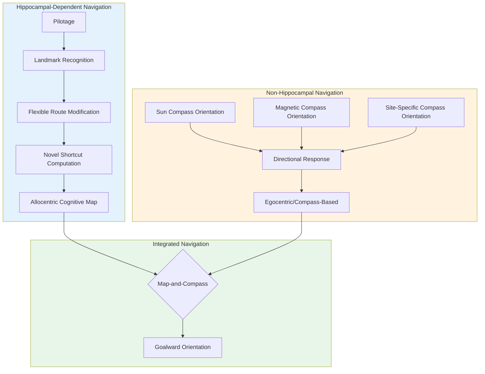
```mermaid
flowchart TD
    subgraph HIPPOCAMPAL["Hippocampal-Dependent Navigation"]
        A[Pilotage] --> B[Landmark Recognition]
        B --> C[Flexible Route Modification]
        C --> D[Novel Shortcut Computation]
        D --> E[Allocentric Cognitive Map]
    end
    
    subgraph NONHIPPOCAMPAL["Non-Hippocampal Navigation"]
        F[Sun Compass Orientation] --> G[Directional Response]
        H[Magnetic Compass Orientation] --> G
        I[Site-Specific Compass Orientation] --> G
        G --> J[Egocentric/Compass-Based]
    end
    
    subgraph INTEGRATION["Integrated Navigation"]
        E --> K{Map-and-Compass}
        J --> K
        K --> L[Goalward Orientation]
    end
    
    style HIPPOCAMPAL fill:#e3f2fd
    style NONHIPPOCAMPAL fill:#fff3e0
    style INTEGRATION fill:#e8f5e9
```

**Comparative neuroanatomical studies** have revealed that the hippocampal formation shows enlargement in migratory species and undergoes age-related changes associated with navigational experience[^40]. A study comparing the migratory garden warbler with the non-migratory Sardinian warbler found that the garden warbler showed an increase in relative hippocampal size from the first to the second year of life, while no such increase was observed in the non-migratory species[^40]. This finding suggests that the enhanced long-term memory capabilities of migratory species may be associated with structural changes in the hippocampus that develop as birds gain navigational experience during their first migration.

The correlation between **hippocampal changes and memory capabilities** provides a neuroanatomical bridge between field observations of site fidelity and laboratory demonstrations of long-term memory. The hippocampal formation is a crucial brain region for processing spatial information, and the age-related hippocampal enlargement observed in migratory garden warblers is plausibly related to the 12-month memory retention demonstrated in the same species[^40]. The behavioral data thus bridge the gap between field observations of site fidelity—the tendency of experienced migrants to return to the same locations year after year—and neuroanatomical evidence of hippocampal changes that may support this remarkable spatial memory.

The **avian hippocampus contains head direction cells** that encode the bird's directional heading, analogous to the head direction cells found in the mammalian limbic system[^17]. However, hippocampal lesions do not disrupt compass orientation behaviors, suggesting that the head direction information represented in the hippocampus may be integrated with other spatial information to support map-based navigation rather than being directly responsible for compass orientation. The relationship between hippocampal head direction cells and the compass systems mediated by other neural structures remains an important question for understanding how birds integrate directional and positional information.

The corrective re-orientation enabled by hippocampal-dependent pilotage has the properties of a **true cognitive map**[^17]. Birds with intact hippocampal function can modify their routes in response to displacement or obstacles, compute novel shortcuts, and navigate flexibly to goals from unfamiliar starting points. These capabilities require more than simple stimulus-response associations or route memories—they require a representation of space that encodes the metric relationships among locations and enables inference about spatial relationships that have not been directly experienced. The hippocampus appears to be essential for constructing and using such allocentric spatial representations.

The **development of hippocampal spatial representations** during the ontogeny of navigation remains an important area for future research. The observation that hippocampal size increases between the first and second year of life in migratory garden warblers suggests that the first migration may be a critical period for hippocampal development[^40]. During this period, young birds are acquiring the spatial information that will support their future navigation, and the hippocampus may undergo structural changes to accommodate this new information. Understanding the cellular and molecular mechanisms underlying these changes could provide insights into how spatial memories are consolidated and maintained over the extended intervals required by annual migration.

### 5.7 Multi-Scale Integration of Spatial Information

Navigation in migratory birds operates across **multiple spatial scales**, requiring the integration of different types of spatial information as birds transition from long-distance orientation to local homing to precise goal localization. Understanding how birds coordinate these multi-scale navigational processes is essential for explaining the remarkable precision achieved by experienced migrants in returning to specific sites.

The influential model proposed by Mouritsen describes **three distinct phases of long-distance navigation**, each relying on different spatial information and cognitive processes[^9]. During the long-distance phase, birds rely on global cues such as celestial information (sun, stars) or geomagnetic parameters, prioritizing compass-based orientation to maintain their general migratory heading across hundreds or thousands of kilometers. During the narrowing-in or homing phase, birds transition to using local learned maps within their home range, such as familiar olfactory landscapes or recognized landscape features. During the pinpointing-the-goal phase, birds rely on visual or olfactory landmarks in close proximity to precisely locate their specific destination[^9].

| **Navigation Phase** | **Spatial Scale** | **Primary Cues** | **Cognitive Process** |
|---------------------|------------------|-----------------|----------------------|
| Long-Distance | 100s–1000s km | Celestial, geomagnetic | Compass orientation, gradient navigation |
| Narrowing-In/Homing | 10s–100s km | Learned landmarks, local gradients | Map-based position determination |
| Pinpointing-the-Goal | <10 km | Visual/olfactory beacons | Landmark recognition, pilotage |

The process of **switching between global and local phases may repeat multiple times** during a single migratory journey[^9]. When stopovers serve as intermediate targets, birds must transition from long-distance navigation to local homing to locate the stopover site, then reverse this transition when departing for the next leg of their journey. Each stopover thus represents a complete cycle through the three navigational phases, requiring birds to integrate spatial information at multiple scales throughout their migration. This repeated cycling between scales places substantial demands on cognitive flexibility and the ability to coordinate different navigational strategies.

Two possible control processes have been proposed for how birds manage **transitions between navigational modalities**[^9]. One hypothesis suggests that navigational strategies are employed sequentially and triggered by specific environmental conditions—for example, birds might switch from compass navigation to landmark-based pilotage when they detect familiar landscape features. The alternative hypothesis proposes that all strategies operate in parallel throughout the journey, but that one or several dominate at different times depending on cue availability, reliability, and proximity to the goal. Switching between several strategies may lead to better navigational accuracy as a consequence of using multiple, redundant cues.

The **hierarchical organization of spatial cues** during the narrowing-in phase has been investigated through studies of homing pigeon navigation. Pigeons released at unfamiliar locations initially rely on gradient-based navigation (using magnetic or olfactory gradients) to determine their approximate position and establish a homeward heading[^40]. As they approach familiar terrain, they transition to landmark-based pilotage, using recognized landscape features to guide their route. Finally, as they near their loft, they may rely on local beacons—the loft itself or nearby landmarks—for precise localization. This hierarchical progression from gradient to landmark to beacon navigation illustrates how birds integrate spatial information across scales to achieve precise homing.

**Spatial memory plays a critical role** in enabling flexible responses to displacement and novel environmental conditions. Experienced migrants that have developed detailed cognitive maps can compensate for displacement by recognizing their position relative to their goal and computing appropriate corrective headings. This capability requires not only memory for the goal location but also memory for the spatial relationships among multiple reference points that enable position determination. The multi-scale integration of spatial information thus depends critically on the accumulated spatial knowledge that distinguishes experienced navigators from first-time migrants.

The role of spatial memory in enabling **novel shortcut computation** provides particularly compelling evidence for true cognitive mapping. The observation that white storks innovate shortcuts during spring migration, progressively straightening their routes across successive years, demonstrates that birds can use their spatial memories to identify more efficient paths than they have previously traveled[^17]. This capability requires an allocentric representation of space that encodes the metric relationships among locations—only with such a representation can a bird recognize that a novel direct route would be shorter than a previously traveled indirect route. The hippocampus, as the neural substrate for allocentric spatial representation, is presumably essential for this shortcut computation.

The **multi-modal and multi-scale nature of navigation** has been challenging to study because it requires long-term tracking data along with contemporaneous and co-located information on environmental cues[^9]. Recent technological advances now allow researchers to collect data on both the perceptual world (environmental data) and effector world (GPS tracking data) of migrating birds, enabling new approaches to understanding navigational decision-making. Data mining techniques such as clustering can identify groups of tracking points with similar movement behavior in relation to environmental variables, potentially revealing when birds switch between navigational modalities and how the timing of these decisions relates to specific environmental conditions[^9]. This data-driven approach offers unprecedented opportunities to understand the complexities of multi-scale spatial integration in avian navigation.

In conclusion, the spatial memory and cognitive mapping capabilities of migratory birds represent sophisticated adaptations that enable the remarkable navigational precision observed in experienced migrants. From the theoretical frameworks distinguishing mosaic and gradient maps, through the ontogenetic processes by which first-time migrants acquire spatial information, to the neural substrates in the hippocampal formation that support spatial memory, the evidence reveals a complex cognitive system that develops through the interaction of innate predispositions and experiential learning. The exploration-refinement hypothesis captures the developmental trajectory of this system, with young birds prioritizing information acquisition and older birds exploiting accumulated spatial knowledge for efficient navigation. Species-specific variation in cognitive mapping abilities reflects the diverse ecological demands faced by different migratory species, while the multi-scale integration of spatial information enables birds to navigate flexibly across the vast distances of their annual migrations. These cognitive capabilities, built upon the foundation of inherited compass mechanisms, transform first-time migrants following simple vector programs into experienced navigators capable of returning to specific sites with extraordinary precision.

## 6 Multi-Modal Integration and Hierarchical Cue Processing

This chapter analyzes how migratory birds integrate information from multiple navigational systems to achieve robust and precise orientation, examining the evidence for hierarchical cue usage patterns, compass calibration processes, and context-dependent switching between sensory modalities. The analysis investigates the mechanisms by which magnetic information calibrates celestial compasses and vice versa, assesses the environmental and physiological conditions under which birds prioritize different cue types, evaluates the adaptive significance of multi-modal redundancy in ensuring navigational reliability across diverse and unpredictable conditions, and synthesizes emerging data-driven approaches that reveal the complexity of real-time navigational decision-making during migration.

### 6.1 Theoretical Frameworks for Multi-Modal Navigation

Avian navigation operates as a **multi-modal and multi-scale process**, wherein birds may employ different sensory cues at different times in response to environmental conditions and switch between navigational strategies across different phases of their journey[^41]. This complexity presents significant challenges for researchers seeking to understand how birds integrate information from magnetic, celestial, olfactory, and other sensory systems to achieve the remarkable navigational precision documented in tracking studies. Understanding the theoretical frameworks that describe multi-modal integration is essential for interpreting experimental findings and predicting how birds will respond to novel navigational challenges.

Two primary theoretical models have been proposed to explain how birds coordinate multiple navigational systems: the **parallel processing model** and the **sequential deployment model**. The parallel processing model, articulated by Bingman and Cheng, proposes a framework where different sensory cues and spatial representations are used at different spatial scales, resulting in a multi-modal navigation decision-making process where birds **continuously switch between different modalities**[^9]. According to this view, all navigational strategies operate simultaneously throughout the journey, but one or several dominate at different times depending on cue availability, reliability, and the bird's current navigational requirements. The switching between several strategies may lead to better navigational accuracy as a consequence of using multiple cues that can be cross-validated against each other[^9].

The alternative sequential deployment model proposes that navigational strategies are employed **sequentially and triggered by specific environmental conditions** rather than operating in parallel[^9]. Under this framework, birds would use one navigational modality until encountering a specific environmental trigger—such as detecting familiar landmarks, experiencing a particular magnetic signature, or reaching a certain distance from the goal—that prompts a switch to a different strategy. This model implies a more hierarchical organization of navigational systems, with clear transitions between phases rather than continuous modulation of multiple simultaneous inputs.

| **Theoretical Model** | **Core Mechanism** | **Cue Integration** | **Switching Trigger** |
|----------------------|-------------------|--------------------|-----------------------|
| Parallel Processing | Multiple systems operate simultaneously | Continuous weighting and comparison | Reliability-based dominance shifts |
| Sequential Deployment | Systems activated in sequence | One system dominant at a time | Environmental condition triggers |
| Hybrid Model | Elements of both approaches | Context-dependent integration | Both reliability and triggers |

The concept of the **navigational Umwelt**—adapted from Jakob von Uexküll's theoretical framework—provides a useful lens for understanding the perceptual and effector dimensions of migratory decision-making[^42]. The navigational Umwelt of a migrating individual consists of the environmental conditions experienced during migration (the perceptual world) and the navigational decisions based on these conditions, the bird's internal state, motion capabilities, and navigation capacity (the effector world)[^9]. This framework emphasizes that understanding navigation requires knowledge of both what the bird can perceive and how it responds to those perceptions—a dual requirement that has driven the development of integrated tracking and environmental sensing methodologies.

Mouritsen's influential model proposes that **long-distance navigation operates across three distinct spatial scales**, each characterized by different cue usage and cognitive processes[^9]. During the long-distance phase, birds rely on global cues such as celestial information or geomagnetic parameters, prioritizing compass-based orientation to maintain their general migratory heading across hundreds or thousands of kilometers. During the narrowing-in or homing phase, birds transition to using local learned maps within their home range, such as familiar olfactory landscapes or recognized landscape features. During the pinpointing-the-goal phase, birds rely on visual or olfactory landmarks in close proximity to precisely locate their specific destination[^9].

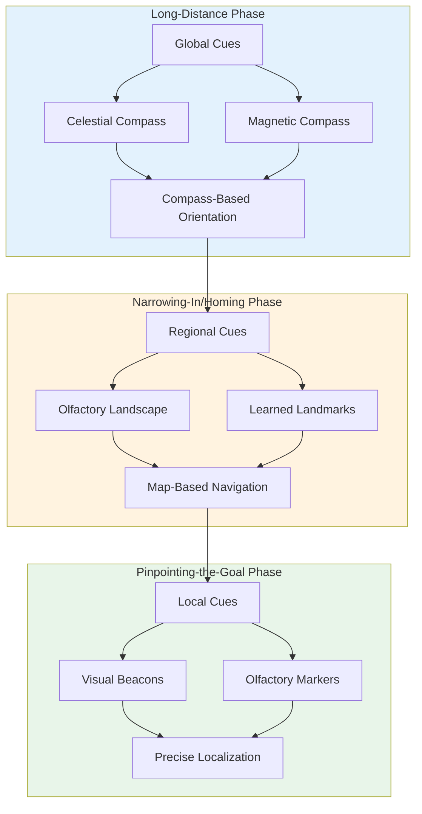
```mermaid
flowchart TD
    subgraph LONGDISTANCE["Long-Distance Phase"]
        A[Global Cues] --> B[Celestial Compass]
        A --> C[Magnetic Compass]
        B --> D[Compass-Based Orientation]
        C --> D
    end
    
    subgraph HOMING["Narrowing-In/Homing Phase"]
        E[Regional Cues] --> F[Olfactory Landscape]
        E --> G[Learned Landmarks]
        F --> H[Map-Based Navigation]
        G --> H
    end
    
    subgraph PINPOINTING["Pinpointing-the-Goal Phase"]
        I[Local Cues] --> J[Visual Beacons]
        I --> K[Olfactory Markers]
        J --> L[Precise Localization]
        K --> L
    end
    
    D --> E
    H --> I
    
    style LONGDISTANCE fill:#e3f2fd
    style HOMING fill:#fff3e0
    style PINPOINTING fill:#e8f5e9
```

The process of switching between global and local phases may repeat multiple times during a single migratory journey, particularly when stopovers serve as intermediate targets[^9]. Each stopover represents a complete cycle through the navigational phases—from long-distance orientation to local homing to precise site localization, then back to long-distance orientation upon departure. This repeated cycling places substantial demands on cognitive flexibility and the ability to coordinate different navigational strategies. Birds must also adjust and re-orient during the journey from time to time, and navigation at both global and local scales may be affected by local atmospheric conditions such as wind, uplift, or air pollution[^9].

The **unsolved question** at the heart of multi-modal navigation theory is how and when birds change from one navigational mode to another, and whether these switches are related to encountered environmental conditions or follow an internally programmed sequence[^9]. Resolving this question requires long-term tracking data from wild migrants combined with contemporaneous, co-located environmental data on all potential navigational cues—a methodological challenge that has only recently become tractable with advances in GPS tracking and environmental data integration[^41]. The multi-modal and multi-scale nature of navigation means that studies focusing on single cue types or single spatial scales may miss the complex interactions that characterize real-world navigational decision-making.

### 6.2 Compass Calibration Hierarchy and the Extended Unifying Theory

The possession of multiple compass systems—magnetic, stellar, and solar/polarized light—creates a fundamental challenge for migratory birds: these systems must be kept **in register with respect to a common reference** to avoid navigational errors arising from discrepancies between different directional cues[^42]. The availability of different compass mechanisms varies with time of day, weather conditions, season, and latitude, and the directional information they provide can diverge due to magnetic declination or other factors. Understanding the hierarchical relationships among these compass systems, and the calibration processes that maintain their alignment, represents one of the most intensively studied aspects of avian navigation.

Cue-conflict studies, in which birds are exposed to artificially manipulated relationships between magnetic and celestial cues, have produced **apparently contradictory results** regarding the compass hierarchy. Some studies have found that celestial cues serve as the primary calibration reference, with birds recalibrating their magnetic compass based on sunset polarized light information. Other studies have found the opposite pattern, with the magnetic compass appearing dominant and birds calibrating their celestial compasses relative to magnetic north[^43]. These conflicting findings generated substantial debate in the field until a comprehensive meta-analysis proposed an **extended unifying theory** that reconciles the disparate results by identifying the specific conditions under which each pattern emerges[^42].

According to the extended unifying theory proposed by Muheim and colleagues, the compass calibration hierarchy follows a **specific sequence that depends critically on the availability of environmental cues**[^13]:

**Step 1: Magnetic compass calibration by polarized light.** Birds recalibrate their magnetic compass using sunrise/sunset polarized light cues, provided they have access to the **vertically aligned band of maximum polarization near the horizon** and a **view of landmarks**[^42]. The polarization pattern at twilight provides a particularly reliable directional reference because the e-vector orientation at the horizon is vertical, independent of season and latitude. By averaging the information from both sunrise and sunset, which occur in opposite directions, birds can obtain a true geographic reference that transcends local variations in magnetic declination[^13].

**Step 2: Star compass calibration by magnetic compass.** Once the stars appear in the sky, birds then recalibrate their star compass with respect to the recalibrated magnetic compass[^42]. This secondary calibration ensures that the stellar compass remains aligned with the magnetic compass, which has itself been calibrated to the geographic reference provided by polarized light. The star compass, being time-independent, provides a stable directional reference throughout the night once properly calibrated.

**Step 3: Fallback to magnetic compass transfer.** If polarized light information is not available near the horizon at sunrise or sunset—due to cloud cover, restricted sky view, or other factors—birds temporarily transfer the previously calibrated magnetic compass information to the available celestial compasses instead of performing a full recalibration[^13]. This fallback mechanism ensures that birds can maintain compass alignment even when optimal calibration conditions are not available.

| **Calibration Condition** | **Primary Reference** | **Calibration Outcome** | **Key Requirements** |
|--------------------------|----------------------|------------------------|---------------------|
| Full horizon view at twilight + landmarks | Polarized light | Magnetic compass recalibrated to geographic reference | Access to maximum polarization band |
| Full horizon + polarized light + stars visible | Polarized light → Magnetic → Stars | Complete multi-compass alignment | Sequential cue availability |
| Restricted horizon view (funnel/cage) | Magnetic field | Celestial compasses calibrated by magnetic | Magnetic cues available |
| Overcast/no polarized light | Previous calibration | Transfer of existing alignment | Prior successful calibration |

The **importance of horizon visibility** has emerged as a crucial factor in determining calibration outcomes. A garden warbler study tested whether birds recalibrated their compasses when exposed to natural celestial cues at sunset in a shifted magnetic field—conditions necessary for the use of a compass reference based on polarized light cues[^42]. The researchers found no evidence of compass recalibration, even though the birds had a full view of polarized light cues near the horizon at sunset during the cue-conflict exposure. This negative result, combined with the meta-analysis of previous studies, led to the conclusion that **the type of cue-conflict manipulation and the availability of stars can explain the discrepancies between studies**[^42].

The requirement for landmark visibility during polarized light calibration suggests that birds need **contextual spatial information** to successfully interpret the polarization pattern[^13]. Simply perceiving the polarized light may be insufficient; birds may need to anchor this directional information to a stable spatial framework provided by the surrounding landscape. This requirement explains why birds tested in orientation funnels or cages that block the view of the horizon typically do not show recalibration of their magnetic compass based on polarized light cues, even when the upper sky is visible.

The extended unifying theory thus provides a coherent framework for understanding the apparently contradictory results from decades of cue-conflict research. Rather than representing fundamental disagreements about avian compass systems, the different findings reflect **different experimental conditions** that activate different calibration pathways. Studies finding celestial dominance typically allowed birds full access to the twilight sky including the horizon, while studies finding magnetic dominance typically restricted the birds' view in ways that prevented successful polarized light calibration. This resolution demonstrates the importance of careful attention to experimental methodology in navigation research and highlights how seemingly minor procedural differences can produce dramatically different results.

### 6.3 Species-Specific and Context-Dependent Variation in Cue Prioritization

The response to cue conflicts and the prioritization of different compass systems varies substantially among species, reflecting **genuine biological variation** rather than methodological inconsistencies[^17]. Understanding this species-specific variation is essential for developing a comprehensive theory of avian navigation and for predicting how different migrant populations will respond to navigational challenges. The variation appears to reflect ecological differences in migratory requirements, including route complexity, magnetic declination variation encountered during migration, and the relative reliability of different cue types in different environments.

Laboratory-based cue-conflict experiments have revealed that the **relative importance of celestial and magnetic cues varies among species and across migratory phases**[^43]. During the pre-migratory period, celestial cues often serve as the primary calibration reference for recalibrating the magnetic compass. Conversely, during migration, many experiments show a precedence of magnetic cues, with birds recalibrating their celestial compass relative to the magnetic field. However, a study by Able and Able with Savannah Sparrows showed the opposite pattern, with birds calibrating their magnetic compass relative to celestial cues during migration[^43]. This variation suggests that no single calibration hierarchy applies universally across all species and contexts.

Experiments with **four species of North American songbirds**—red-eyed vireos, northern waterthrushes, indigo buntings, and gray catbirds—revealed striking species-specific differences in compass cue usage[^42]. In cage tests at dusk conducted in the local geomagnetic field, vireos and waterthrushes selected seasonally appropriate southerly directions, whereas buntings and catbirds oriented toward the sunset direction. When tested in a deflected magnetic field, vireos and waterthrushes adjusted their orientation according to the magnetic field deflection, but buntings and catbirds showed no response to the magnetic manipulation[^42]. However, in release tests conducted under a starry sky in the local geomagnetic field, all four species showed evidence that they had recalibrated their star compass based on the magnetic field experienced in the prior cage tests. This indicates that while species differ in their immediate behavioral responses to compass cues, they share a common mechanism for transferring calibration information between compass systems.

| **Species** | **Cage Test Response** | **Magnetic Field Response** | **Star Compass Recalibration** |
|------------|----------------------|---------------------------|------------------------------|
| Red-eyed Vireo | Seasonally appropriate (S) | Adjusted to deflection | Yes |
| Northern Waterthrush | Seasonally appropriate (S) | Adjusted to deflection | Yes |
| Indigo Bunting | Oriented toward sunset | No response | Yes |
| Gray Catbird | Oriented toward sunset | No response | Yes |

The variation in results among species may be explained by **differing migratory challenges and ecological requirements**[^43]. One hypothesis suggests that long-distance North American migrants, which cross areas with varying magnetic declination, may require more frequent and precise recalibration than European migrants and Australian silvereyes that remain within zones of similar inclination. Another possibility is that long-distance migrants need more precise orientation, tolerating less deviation from optimal compass directions, whereas short- and medium-distance migrants may tolerate larger angular deviations from their inherited compass directions. Therefore, the impressive results demonstrating cue calibration in some species should not be generalized to all avian migrants[^43].

**Field evidence from radio-tracking studies** has demonstrated species-specific variation in calibration dynamics during actual migration. Cochran and colleagues tracked free-flying gray-cheeked thrushes and Swainson's thrushes exposed to a rotated magnetic field at twilight[^43]. The birds flew in a deflected direction upon release that same night but returned to their normal direction the following night, suggesting daily recalibration of the magnetic compass based on twilight cues. In contrast, a study by Chernetsov and colleagues on song thrushes found **no evidence of compass calibration**; birds showed simple domination of either a magnetic or stellar compass, as their flight direction was unaffected by pre-release magnetic field rotation[^43]. This species difference may reflect genuine variation in calibration requirements or differences in the ecological contexts of the two study systems.

The role of **migratory experience** in modulating cue hierarchy has also been documented. Studies have shown that the magnetite-based receptors in the beak, which provide information about magnetic field intensity, become functionally important only in experienced migrants who have learned to incorporate magnetic intensity information into their navigational decisions. Young birds do not respond to magnetic pulse treatment that disrupts magnetite-based receptors—they continue in their normal migratory direction, demonstrating that their magnetic compass mechanism was not affected. This age-dependent response suggests that the integration of different magnetic information sources (radical pair compass versus magnetite-based intensity detection) develops with experience and may involve learning to weight different cue types appropriately.

Australian silvereyes provide a particularly interesting case study in species-specific cue usage. When exposed to cue conflicts between magnetic and celestial information, these birds **paid no attention to the cue conflict**, maintaining their migratory direction regardless of the manipulation[^43]. This finding suggests that some species may have evolved to rely predominantly on a single compass system without the flexible calibration observed in other migrants. The ecological factors that favor such specialization versus multi-modal flexibility remain an important question for future research.

### 6.4 Magnetic-Celestial Information Transfer During Active Migration

Understanding how directional information is transferred between compass systems during active migratory flight is essential for explaining how birds maintain accurate orientation across changing environmental conditions. Field tracking studies and laboratory experiments have provided complementary evidence for the mechanisms and timing of information transfer between magnetic and celestial compass systems, revealing a dynamic process of continuous calibration that enables birds to integrate information from multiple sources.

The most compelling field evidence for **magnetic-celestial information transfer** comes from radio-tracking studies of free-flying nocturnal migrants. Cochran and colleagues conducted a landmark study tracking gray-cheeked thrushes and Swainson's thrushes that had been exposed to a rotated magnetic field at twilight before release[^43]. The birds were captured during migration, exposed to a magnetic field rotated approximately 80° from natural north during the twilight period, and then released to continue their migration. The results were striking: birds flew in a deflected direction—approximately 80° counterclockwise of their normal migratory heading—upon release that same night. This demonstrated that the birds had **recalibrated their star compass based on the shifted magnetic field** experienced at twilight, transferring the erroneous magnetic information to their nocturnal orientation system.

Crucially, the birds returned to their normal migratory direction the following night, indicating **daily recalibration of compass systems based on twilight cues**[^43]. This finding suggests that migratory birds do not maintain a fixed compass calibration throughout their journey but continuously update their compass alignment. The daily recalibration cycle provides a mechanism for correcting accumulated errors and adapting to changing magnetic declination as birds cross longitudes during their migration. The temporal dynamics of this calibration process—occurring during the twilight transition between diurnal and nocturnal navigation—highlight the importance of the sunset and sunrise periods for compass integration.

```mermaid
flowchart LR
    subgraph TWILIGHT["Twilight Calibration Period"]
        A[Sunset Polarized Light] --> B[Magnetic Compass Calibration]
        B --> C[Recalibrated Magnetic Reference]
        C --> D[Star Compass Calibration]
    end
    
    subgraph NIGHT["Nocturnal Flight"]
        D --> E[Star Compass Navigation]
        E --> F[Maintain Migratory Heading]
    end
    
    subgraph NEXTDAY["Following Twilight"]
        F --> G[New Sunset Observation]
        G --> H[Recalibration Cycle Repeats]
        H --> I[Error Correction]
    end
    
    style TWILIGHT fill:#fff3e0
    style NIGHT fill:#e3f2fd
    style NEXTDAY fill:#e8f5e9
```

Laboratory experiments have confirmed and extended these field observations. Studies exposing caged migrants to cue conflicts between magnetic and celestial information during the pre-release period, followed by orientation testing under different conditions, have demonstrated that birds can transfer directional information between compass systems in both directions[^42]. The direction of information transfer—whether magnetic calibrates celestial or celestial calibrates magnetic—depends on the specific conditions of the experiment, particularly the availability of polarized light cues near the horizon and the presence of visible stars.

The **temporal precision of information transfer** has been investigated through experiments manipulating the timing of cue-conflict exposure. Birds exposed to magnetic field shifts during sunset show recalibration effects, while exposure at other times of day may not produce the same results. This temporal specificity suggests that birds have evolved to weight compass information differently depending on when it is received, with twilight information receiving the highest priority for calibration purposes. The restriction of calibration sensitivity to twilight periods makes functional sense, as this is when polarized light cues provide the most reliable geographic reference.

An important finding from the release experiments is that **information transfer occurs even when birds do not show immediate behavioral responses** to cue manipulation in cage tests[^42]. Indigo buntings and gray catbirds showed no response to magnetic field deflection in cage tests at dusk, orienting toward the sunset direction regardless of the magnetic manipulation. However, when subsequently released under a starry sky, these same birds showed evidence of having recalibrated their star compass based on the magnetic field experienced during the cage tests. This dissociation between immediate behavioral responses and subsequent calibration effects suggests that compass calibration operates through mechanisms distinct from those producing immediate orientation responses.

The mechanisms by which birds **detect discrepancies between compass systems** and initiate recalibration remain incompletely understood. One possibility is that birds continuously compare information from different compass systems and detect when they diverge beyond some threshold. Another possibility is that calibration occurs automatically during specific temporal windows (such as twilight) regardless of whether discrepancies are detected. The finding that birds recalibrate daily, even when no artificial cue conflict has been introduced, suggests that regular recalibration may be a routine maintenance process rather than a response to detected errors.

### 6.5 Environmental Conditions Triggering Modality Switching

The multi-modal nature of avian navigation means that birds must continuously assess the availability and reliability of different navigational cues and adjust their reliance on different sensory systems accordingly. Understanding the **environmental factors that prompt birds to switch between navigational modalities** is essential for predicting how migrants will respond to varying conditions and for assessing the resilience of navigation systems to environmental perturbations.

**Overcast conditions** represent one of the most important environmental factors triggering modality switching. When clouds obscure the sun, stars, and polarized light patterns, birds cannot rely on celestial compass systems and must increase their reliance on geomagnetic cues[^41]. The lack of visible landmarks during the night or overcast conditions that prevent birds from seeing the sun or stars may lead toward increased use of geomagnetic cues[^41]. This context-dependent switching ensures that birds can maintain orientation even when their preferred cue types are unavailable, though the accuracy of navigation may be reduced when birds are forced to rely on backup systems.

The **interaction between celestial cue obscuration and geomagnetic disturbances** creates particularly challenging conditions for navigation. A study analyzing 22 years of radar observations of nocturnally migrating North American birds found evidence that geomagnetic disturbances might impact navigation, with effects magnified when celestial cues are simultaneously obscured. During fall migration, decreases in effort flying against the wind were observed during geomagnetic disturbances, suggesting that birds drift more with the wind when their navigation is compromised. The model predicted a **25.4% decrease in the crosswind component** at 100% cloud cover combined with high magnetic disturbance, indicating substantial navigational impairment when both celestial and magnetic systems are simultaneously compromised.

| **Environmental Condition** | **Primary Cue Availability** | **Backup Cue Availability** | **Expected Navigation Outcome** |
|---------------------------|-----------------------------|-----------------------------|--------------------------------|
| Clear sky, normal magnetic field | Celestial: High | Magnetic: High | Optimal navigation |
| Overcast, normal magnetic field | Celestial: Low | Magnetic: High | Reduced accuracy; magnetic reliance |
| Clear sky, geomagnetic storm | Celestial: High | Magnetic: Low | Celestial reliance; some impairment |
| Overcast, geomagnetic storm | Celestial: Low | Magnetic: Low | Significant impairment; wind drift |

The differential impact of combined environmental disturbances on **experienced versus inexperienced migrants** provides important insights into the development of navigational resilience. The relationships between geomagnetic disturbance and navigation effort were found only in fall migration, not in spring. The fall migration cohort includes many inexperienced juveniles migrating for the first time, whereas spring migration is composed of more experienced birds that have successfully completed at least one migratory journey. The differences may therefore reflect a more disruptive effect of magnetic disturbance on the migration of inexperienced young birds, which may depend on simpler orientation strategies and have less developed backup systems compared to experienced adults.

**Time of day** represents another critical factor influencing modality selection. Diurnal migrants rely primarily on the sun compass during daylight hours, while nocturnal migrants use the star compass after dark. The twilight periods of sunrise and sunset serve as critical transition times when birds recalibrate their compass systems and transfer directional information between solar and stellar references. The magnetic compass provides an all-weather, all-hours orientation capability that can be used regardless of time of day, making it particularly important during the transitions between diurnal and nocturnal navigation phases.

**Geographic location** also influences cue selection, as the availability and reliability of different cues vary with latitude and longitude. Near the magnetic equator, where field lines run parallel to the Earth's surface, the inclination compass becomes less reliable, and birds may need to rely more heavily on celestial cues. Similarly, at high latitudes during polar summer, the continuous daylight eliminates the availability of stellar cues, forcing birds to rely on solar and magnetic information. These geographic variations in cue availability have likely shaped the evolution of species-specific cue preferences and calibration strategies in different migrant populations.

Navigational strategies may vary during the journey depending on encountered conditions, as birds take advantage of the cue that is most available at any given time[^41]. This flexibility allows birds to optimize their navigation by using the most reliable information available, rather than rigidly adhering to a single sensory modality. The ability to detect and respond to cue reliability—switching to backup systems when primary cues become unreliable—represents a sophisticated cognitive capability that enhances navigational robustness across the diverse conditions encountered during long-distance migration.

### 6.6 Adaptive Significance of Multi-Modal Redundancy

The possession of multiple redundant compass systems—magnetic, solar, stellar, and polarized light—represents a remarkable evolutionary adaptation that provides migratory birds with **exceptional navigational resilience**. Understanding the adaptive significance of this redundancy requires considering both the benefits it provides and the costs it imposes, as well as the ecological and evolutionary contexts that have favored multi-modal navigation over specialized reliance on single sensory systems.

The primary adaptive benefit of multi-modal redundancy is **insurance against cue unavailability or unreliability**. Each compass system has characteristic limitations: the sun compass is unavailable at night and under overcast conditions; the star compass is unavailable during the day and when clouds obscure the sky; the magnetic compass can be disrupted by geomagnetic storms or anthropogenic electromagnetic interference. By maintaining multiple compass systems, birds can seamlessly switch to backup systems when their primary cues are unavailable, ensuring continuous navigational capability across diverse environmental conditions[^41].

Migratory birds flying over towns and cities affected by anthropogenic electromagnetic noise would probably resort to **backup navigational systems**, such as their star compass or sun compass, as they have three different compasses that work independently. This redundancy provides crucial resilience against the increasing electromagnetic pollution of modern environments. The ability to maintain orientation using alternative compass systems when one system is compromised represents a form of **fail-safe navigation** that reduces the risk of disorientation and its potentially fatal consequences.

The **many-wrongs principle** provides another perspective on the adaptive value of multi-modal processing. When individuals pool their imperfect estimates of direction—either across different sensory modalities within an individual or across different individuals in a group—the averaged result tends to be more accurate than any single estimate. Homing pigeons released with a small flock flew faster and more direct routes compared to their routes when released alone, demonstrating that collective information integration can enhance navigational accuracy. Within an individual bird, the integration of information from multiple compass systems may provide similar benefits, with the averaged directional estimate being more accurate than reliance on any single system.

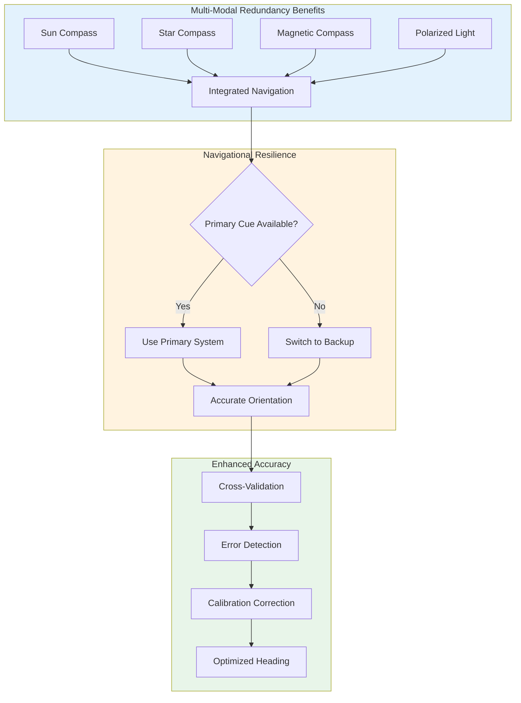
```mermaid
flowchart TD
    subgraph REDUNDANCY["Multi-Modal Redundancy Benefits"]
        A[Sun Compass] --> E[Integrated Navigation]
        B[Star Compass] --> E
        C[Magnetic Compass] --> E
        D[Polarized Light] --> E
    end
    
    subgraph RESILIENCE["Navigational Resilience"]
        E --> F{Primary Cue Available?}
        F -->|Yes| G[Use Primary System]
        F -->|No| H[Switch to Backup]
        G --> I[Accurate Orientation]
        H --> I
    end
    
    subgraph ACCURACY["Enhanced Accuracy"]
        I --> J[Cross-Validation]
        J --> K[Error Detection]
        K --> L[Calibration Correction]
        L --> M[Optimized Heading]
    end
    
    style REDUNDANCY fill:#e3f2fd
    style RESILIENCE fill:#fff3e0
    style ACCURACY fill:#e8f5e9
```

The **costs of maintaining multiple sensory systems** must be weighed against these benefits. Each compass system requires dedicated neural circuitry, sensory receptors, and cognitive processing capacity. The cryptochrome-based magnetic compass requires specialized photoreceptors in the retina and associated neural pathways; the magnetite-based intensity detection system requires iron-containing structures in the beak and trigeminal nerve processing; celestial compasses require visual processing and circadian clock integration. These requirements impose metabolic and developmental costs that would be unnecessary if birds could rely on a single, always-reliable compass system.

The evolutionary persistence of multi-modal navigation suggests that the **benefits of redundancy outweigh its costs** for most migratory species. The unpredictability of environmental conditions during migration—including weather patterns, geomagnetic disturbances, and increasingly, anthropogenic interference—creates strong selection pressure for navigational systems that can function across a wide range of conditions. Species that specialized exclusively on a single compass type would be vulnerable to conditions that compromised that system, potentially leading to disorientation, delayed migration, or mortality. The multi-modal approach provides a more robust solution that sacrifices some efficiency for greatly enhanced reliability.

The observation that some species, such as Australian silvereyes, appear to rely predominantly on a single compass system without flexible calibration[^43] suggests that the optimal balance between specialization and redundancy may vary depending on ecological circumstances. Species migrating through relatively stable environments with predictable cue availability may benefit from specializing on the most reliable local cues, while species crossing diverse environments with variable conditions may benefit more from maintaining flexible multi-modal capabilities. Understanding the ecological factors that favor different navigational strategies remains an important area for future research.

### 6.7 Data-Driven Approaches to Understanding Real-Time Cue Integration

Traditional approaches to studying avian navigation have relied primarily on **hypothesis-driven experimental designs** that test specific predictions about compass mechanisms and cue integration. While these approaches have been enormously productive, they are inherently limited in their ability to capture the full complexity of navigational decision-making during actual migration. A new **data-driven paradigm** has emerged that leverages large-scale tracking data and environmental information to identify previously unknown patterns in migratory behavior and reveal the complexity of real-time cue integration[^42].

The data-driven approach involves analyzing large amounts of existing data, not purposefully collected for a specific question, to identify as-yet-unknown patterns in behavior[^42]. Current technological developments have led to large collections of both animal tracking data and environmental data, which are openly available. Long-term movement data are widely collected and stored in portals like **Movebank**, which contains over 6.3 billion animal location data points[^41]. Environmental data for navigational cues are widely available from sources such as astronomical software packages (for sun and stars), geomagnetic networks (e.g., INTERMAGNET, ESA Swarm constellation), atmospheric composition measurements (e.g., from Sentinel-5P, Aura satellites), and meteorological data (e.g., ECMWF ERA5 reanalysis)[^41].

**Data mining techniques** offer powerful tools for exploring navigational multi-modality. Clustering methods can identify groups of GPS points with similar movement behavior annotated with environmental variables, potentially revealing when birds switch between navigational modalities[^9]. One question which data mining might resolve is to identify when birds decide to switch between different navigational modalities and how the timing of these decisions relates to specific environmental conditions[^9]. Ongoing work uses hierarchical clustering to explore this process by clustering GPS points annotated with geomagnetic, meteorological, geographical, and movement variables to find groups of points with similar movement behavior. The goal is to identify which cues and strategies dominate the flights at different points in time, how this differs among individuals, and when these strategies switch from one to another[^9].

| **Data-Driven Method** | **Application to Navigation** | **Potential Insights** |
|----------------------|------------------------------|----------------------|
| Clustering | Group tracking points by movement and environmental similarity | Identify modality switching patterns |
| Inverse Reinforcement Learning | Infer latent preferences from observed trajectories | Reveal navigational decision rules |
| Machine Learning/AI | Predict trajectories under specific conditions | Model complex cue integration |
| Individual-Based Simulation | Simulate navigation with dynamic environmental data | Test mechanistic hypotheses |

**Spatial optimization models** offer another promising approach for understanding navigational decision-making. Navigation could be defined as a spatial optimization problem, and inverse reinforcement learning (IRL) could identify latent preferences in decision-making from observed sequential behavior[^9]. By analyzing GPS trajectories in relation to environmental conditions, IRL approaches could reveal the implicit rules that birds use to weight different navigational cues and make directional decisions. This approach has the potential to uncover navigational strategies that would be difficult to detect through traditional experimental methods.

**Machine learning and artificial intelligence models** represent a frontier for navigation research that has not yet been fully exploited[^9]. Neural networks and deep learning approaches used in human mobility research for next-location prediction and trajectory generation could be adapted to model complex navigational decision-making in birds. These models could forecast migration routes under specific environmental conditions, potentially revealing how birds integrate multiple cues to produce their observed trajectories. However, these approaches require large training datasets, necessitating collaborative data sharing within large research collaborations[^42].

A critical challenge for data-driven approaches is **data fusion**—linking tracking data with environmental data on all potential navigational cues[^9]. The navigational Umwelt of a migrating individual includes information about the sun, stars, Earth's magnetic field, atmospheric composition, infrasound, and other potential cues, yet tools for integrating these diverse data sources with animal tracking data are largely lacking. Developing robust methods for data fusion represents an important methodological priority for advancing data-driven navigation research.

**Individual-based models and simulations** can incorporate dynamic environmental data to test mechanistic hypotheses about navigation[^9]. Using correct, temporally changing values of environmental variables is crucial—for instance, using dynamic geomagnetic field data instead of static models can reveal effects that would be missed with simplified assumptions. Studies have shown that greater white-fronted geese exhibited increased speed and wider turning angles during geomagnetic storms, an effect that would only be detectable using temporally resolved magnetic field data[^9].

The data-driven paradigm complements rather than replaces traditional hypothesis-driven approaches. While experimental studies provide the controlled conditions necessary to establish causal relationships between cues and behavior, data-driven analyses can identify patterns in natural behavior that generate new hypotheses for experimental testing. The combination of these approaches—using data mining to discover unexpected patterns, then designing experiments to test mechanistic explanations for those patterns—offers a powerful framework for advancing understanding of the multi-modal, multi-scale nature of avian navigation[^42]. As tracking technologies continue to improve and environmental data become increasingly accessible, data-driven approaches will likely play an increasingly important role in revealing the complexity of navigational decision-making during migration.

## 7 Precision and Accuracy in Migratory Navigation

This chapter quantifies the spatial precision achieved by migratory birds across different scales and contexts, analyzing the multifactorial determinants of navigational accuracy including species-specific sensory capabilities, individual variation in experience and learning, and the distinct navigational challenges encountered during different journey phases. The analysis synthesizes empirical evidence from GPS tracking, ringing recoveries, and controlled experiments to establish the remarkable precision documented in avian navigation, examines the developmental trajectory from first-time migrants using vector navigation to experienced adults achieving centimeter-scale homing accuracy, and evaluates how collective behavior, social learning, and information pooling contribute to route efficiency improvements and the intergenerational transmission of navigational knowledge.

### 7.1 Quantifying Navigational Precision: Methodological Approaches and Measurement Scales

The rigorous quantification of navigational precision in migratory birds requires careful attention to both the **conceptual distinction between accuracy and precision** and the methodological constraints imposed by different tracking technologies. Accuracy refers to how close a bird's actual position or trajectory is to its intended target or optimal route, while precision refers to the consistency or repeatability of navigational performance across repeated measurements or journeys. Understanding these distinctions is essential for interpreting the diverse metrics used across avian navigation studies and for comparing results obtained through different methodological approaches.

**GPS/GPRS tracking devices** have revolutionized the study of avian navigation by providing high-resolution spatial data that enable precise quantification of individual flight paths. A comprehensive evaluation of GPS/GPRS tracking device performance using the Flyways-50 model deployed on white storks demonstrated that **horizontal accuracy decreases significantly with increasing fix intervals**, from 3.40 m (±3.10 m) at 1-minute intervals to 6.50 m (±8.34 m) at 60-minute intervals[^17]. Vertical accuracy showed a similar pattern, decreasing from 4.95 m (±4.12 m) at 1-minute intervals to 9.69 m (±19.28 m) at 60-minute intervals[^17]. These findings confirm that device performance improves substantially with shorter fix intervals and that studies requiring accuracies of 5-10 meters should employ intensive GPS fix intervals, though this has implications for battery life and device size[^17].

The evaluation also revealed **significant variability in accuracy between individual devices**, highlighting the importance of device-specific calibration and quality control in tracking studies[^17]. After deployment on white storks, the devices showed no negative impact on performance, with horizontal accuracy similar before (4.21 m ± 18 m) and after deployment (4.10 m ± 15 m)[^17]. Over 84% of horizontal positions and 71% of vertical positions had errors of less than 10 meters after deployment, establishing the suitability of modern GPS tracking for fine-scale navigation studies[^17]. The built-in *GPS-Error* metric proved effective for identifying inaccurate locations in high-frequency data—eliminating the 3% of data with the highest GPS-Error removed over 99% of inaccurate horizontal and vertical positions at 1-minute intervals—though this metric was not effective for lower frequency intervals[^17].

| **Tracking Technology** | **Typical Accuracy** | **Temporal Resolution** | **Study Applications** |
|------------------------|---------------------|------------------------|----------------------|
| GPS/GPRS (1-min interval) | 3.4 m horizontal | Continuous | Fine-scale route analysis, pilotage studies |
| GPS/GPRS (60-min interval) | 6.5 m horizontal | Hourly | Long-distance migration tracking |
| Geolocators (GLS) | ~100-200 km | Daily positions | Broad-scale migration routes |
| Satellite/GPS tracking | Variable (5-50 m) | Minutes to hours | Ocean and remote area tracking |
| Ring recoveries | Site-specific only | Single recovery events | Population-level patterns |

**Route efficiency** represents one of the most commonly employed metrics for quantifying navigational precision. Route efficiency is calculated as the ratio of the beeline distance (the straight-line distance between start and end points) to the actual distance traveled, with values approaching 1.0 indicating highly efficient, direct routes[^44]. In homing pigeon studies, route efficiency has been used to compare individual and flock performance, with larger flocks achieving significantly more efficient routes than smaller flocks or solo birds[^44]. The efficiency metric captures both the directional accuracy of initial orientation and the consistency of heading maintenance throughout the journey, providing an integrated measure of overall navigational performance.

**Directional concentration**, typically quantified using the mean vector length (r-value) from circular statistics, provides a measure of how consistently birds orient in a particular direction. Higher r-values indicate tighter clustering of individual headings around the mean direction, reflecting greater precision in compass orientation. Mouritsen's mathematical modeling of clock-and-compass migration used directional concentration data from ringing recoveries to validate predictions about how precision should change with distance traveled—the directional concentration after one migratory step (100-149 km) had a sample mean vector length of 0.665 (angular standard deviation ±52°), and this value was used to parameterize models predicting precision at greater distances.

The **spatial scales** at which navigational precision is typically assessed range from continental (thousands of kilometers) to site-specific (meters). At the continental scale, precision is evaluated in terms of successful arrival within species-specific wintering or breeding ranges. At regional scales (tens to hundreds of kilometers), precision concerns the selection of appropriate stopover sites and the maintenance of population-specific migration corridors. At local scales (kilometers), precision involves homing to familiar areas and territories. At the finest site-specific scale (meters), precision involves the exact localization of nest sites, roost locations, or specific foraging patches. Different navigational mechanisms and cue types are likely to be most important at different scales, with compass-based orientation dominating long-distance phases and landmark-based pilotage becoming critical for fine-scale localization.

### 7.2 Species-Specific Variation in Navigational Accuracy

Substantial variation in navigational precision exists across avian taxa, reflecting differences in **sensory capabilities, migratory ecology, and life history strategies** that impose different demands on spatial cognition and navigational performance. Understanding this species-specific variation provides insights into the selective pressures that have shaped avian navigation systems and helps explain why some species achieve greater precision than others.

A comprehensive systematic review and meta-analysis quantifying the **individual repeatability of avian migration phenology** across 47 species revealed significant variation among ecological groups[^44]. The analysis of 177 effect sizes from 54 papers found an overall mean repeatability estimate (intraclass correlation coefficient, ICC) for avian migratory timings of **0.414** (95% confidence interval: 0.313–0.508)[^44]. While no statistically significant differences were found across ecological groups, the point estimates suggested variation: seabirds showed the highest repeatability (ICC = 0.520, CI = 0.398–0.626), followed by waterbirds (ICC = 0.404, CI = 0.289–0.513), and landbirds (ICC = 0.333, CI = 0.205–0.454)[^44].

| **Ecological Group** | **Repeatability (ICC)** | **95% Confidence Interval** | **Sample (Species)** |
|---------------------|------------------------|---------------------------|---------------------|
| Seabirds | 0.520 | 0.398–0.626 | 15 species |
| Waterbirds | 0.404 | 0.289–0.513 | 14 species |
| Landbirds | 0.333 | 0.205–0.454 | 18 species |
| **Overall** | **0.414** | **0.313–0.508** | **47 species** |

The higher repeatability observed in seabirds may reflect their reliance on **oceanographic features and predictable resource distributions** that favor precise return to productive foraging areas. Pelagic seabirds might learn the olfactory topography of the ocean, using odor gradients associated with oceanographic features for navigation. The combination of olfactory navigation and the relatively stable spatial structure of oceanic productivity zones may enable seabirds to achieve particularly consistent migration timing and route selection.

**Migration distance** represents one of the most important factors influencing navigational demands and, consequently, the evolution of navigational precision. Long-distance migrants that travel thousands of kilometers between breeding and wintering grounds face fundamentally different navigational challenges than short-distance migrants or resident species. The garden warbler study demonstrating 12-month memory retention specifically highlighted that this extended memory duration is likely related to the demands of long-distance migration, as the closely related non-migratory Sardinian warbler showed memory persistence of only about 2 weeks. Long-distance migrants must remember information about sites they will not revisit for many months, requiring memory systems adapted for extended retention without reinforcement.

The **genetic study of cryptochrome 4** across 363 bird species revealed that this putative magnetoreceptor protein has been **highly variable during evolution**, suggesting strong positive selection for adaptation to specific environmental conditions[^13]. The gene sequences of comparison cryptochromes (Cry1 and Cry2), which regulate the internal clock, were very similar across all bird species, while Cry4 proved to have been highly variable[^13]. In the passerine order specifically, the protein appears to have been optimized through rapid selection, indicating that evolutionary processes could have led to Cry4 specializing as a magnetoreceptor in songbirds[^13]. This molecular evidence suggests that long-distance migratory songbirds have evolved enhanced magnetic sensing capabilities compared to non-migratory species.

Intriguingly, the genetic analysis revealed that **Cry4 was lost entirely in three clades** comprising mostly resident tropical species: parrots (Psittaciformes), hummingbirds (Trochilidae), and Tyranni (Suboscines)[^13][^17]. This gene deletion indicates that cryptochrome 4 does not play a vital role in the survival of these birds[^13]. However, some Tyranni are long-distance migrants, and the fact that they do not have cryptochrome 4 makes them an ideal system for investigating whether they have a magnetic sense independent of this protein[^13]. Researchers plan to investigate magnetic orientation in Tyranni to clarify whether they possess alternative magnetoreception mechanisms, which could corroborate or challenge the cryptochrome 4 hypothesis[^13].

Species differences in **compass calibration behavior** also contribute to variation in navigational accuracy. Long-distance North American migrants that cross areas with broadly varying magnetic declination values may require more precise calibration than European migrants or Australian silvereyes that remain within zones of similar inclination. Additionally, long-distance migrants may tolerate less angular deviation than short- and medium-distance migrants, necessitating more frequent and accurate compass recalibration. These differences in calibration requirements likely reflect evolved differences in the precision of compass systems and the flexibility of cue integration mechanisms.

### 7.3 Individual Variation and the Role of Experience in Precision Development

Within-species variation in navigational accuracy reflects the profound influence of **age, experience, and individual learning history** on navigational performance. The developmental trajectory from first-time migrants relying on inherited vector navigation to experienced adults achieving true navigation represents one of the most significant transitions in the navigational capabilities of migratory birds, with measurable consequences for precision and route efficiency.

The **systematic review of individual repeatability** in avian migration phenology provides quantitative evidence for the consistency of individual navigational performance[^44]. The overall mean repeatability estimate of 0.414 indicates that approximately 41% of the variation in migratory timing is attributable to consistent among-individual differences, while the remaining variation reflects within-individual plasticity and measurement error[^44]. Importantly, repeatability varied significantly across the annual cycle, with **departure from non-breeding grounds showing the highest repeatability** (ICC = 0.522, CI = 0.391–0.636), followed by arrival at non-breeding grounds (ICC = 0.416, CI = 0.274–0.547), arrival at breeding grounds (ICC = 0.381, CI = 0.250–0.503), and departure from breeding grounds (ICC = 0.326, CI = 0.172–0.469)[^44].

| **Migratory Event** | **Repeatability (ICC)** | **95% Confidence Interval** | **Interpretation** |
|--------------------|------------------------|---------------------------|-------------------|
| Departure from non-breeding grounds | 0.522 | 0.391–0.636 | Highest individual consistency |
| Arrival at non-breeding grounds | 0.416 | 0.274–0.547 | Moderate consistency |
| Arrival at breeding grounds | 0.381 | 0.250–0.503 | Moderate consistency |
| Departure from breeding grounds | 0.326 | 0.172–0.469 | Lowest individual consistency |

The statistically significant differences between departure from breeding grounds and both arrival at and departure from non-breeding grounds suggest that **individual consistency in navigational behavior varies across the annual cycle**[^44]. The higher repeatability of departure from non-breeding grounds may reflect the importance of precise timing for arrival at breeding sites, where early arrival can confer reproductive advantages. The lower repeatability of departure from breeding grounds may reflect greater flexibility in post-breeding movements or the influence of variable breeding success on subsequent migratory decisions.

The **exploration-refinement hypothesis** provides a theoretical framework for understanding how individual experience shapes navigational precision over the lifespan. The comprehensive tracking study of white storks demonstrated that as birds age, **migration duration decreases**, with older birds migrating faster[^17]. Route dissimilarity, measured using Dynamic Time Warping, decreased with age, showing that younger birds were more exploratory while older birds became increasingly faithful to previously used routes[^17]. This transition from exploration to route fidelity represents a fundamental shift in navigational strategy that produces measurable improvements in precision.

Perhaps most remarkably, the white stork study revealed that **individuals innovated novel shortcuts during spring migration**, particularly during the transition from early life to adulthood[^17]. The increased straightness of fine-scale route deviations from the previous year's path provides strong evidence for the role of spatial memory in route optimization[^17]. Birds must remember their previous routes in sufficient detail to recognize opportunities for improvement and must possess the navigational capabilities to execute novel shortcuts through unfamiliar terrain. This incremental straightening of routes demonstrates that accumulated spatial knowledge enables experienced migrants to achieve levels of precision that are simply not available to first-time migrants operating on inherited compass directions alone.

The **displacement experiments** reviewed in previous chapters provide the clearest evidence for the qualitative difference between juvenile and adult navigational capabilities. While adults consistently compensate for displacement by reorienting toward their intended destinations, juveniles typically continue in their innate compass direction without compensation. This fundamental asymmetry reflects the absence of map information in first-time migrants—they possess compasses but not the positional awareness necessary for true navigation. The acquisition of map information during the first migration represents a critical developmental achievement that transforms the precision achievable by experienced birds.

### 7.4 Journey Phase Effects on Navigational Accuracy

Navigational precision varies systematically across different phases of the migratory journey, reflecting the **distinct cue usage patterns, cognitive demands, and environmental challenges** characteristic of each phase. Understanding these phase-specific variations is essential for predicting when and where birds are most vulnerable to navigational errors and for assessing the overall robustness of migratory navigation systems.

The repeatability data from the systematic meta-analysis reveal that **departure timing from non-breeding grounds shows the highest individual consistency** (ICC = 0.522), while departure from breeding grounds shows the lowest (ICC = 0.326)[^44]. This asymmetry suggests that the precision requirements and constraints differ between spring and autumn migration. The higher repeatability of spring departure may reflect stronger selection pressure for precise timing of arrival at breeding sites, where competition for territories and mates favors early arrival. The lower repeatability of autumn departure may reflect greater flexibility in post-breeding movements, as birds respond to variable breeding success, molt timing, and local resource availability.

Mouritsen's influential model proposes that **long-distance navigation operates across three distinct spatial scales**, each characterized by different precision requirements and cue usage patterns:

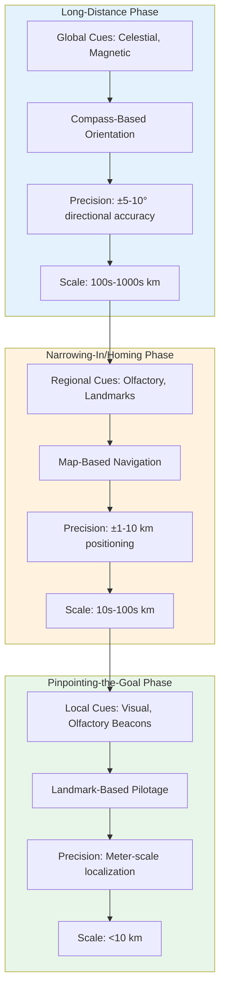
```mermaid
flowchart TD
    subgraph PHASE1["Long-Distance Phase"]
        A[Global Cues: Celestial, Magnetic] --> B[Compass-Based Orientation]
        B --> C[Precision: ±5-10° directional accuracy]
        C --> D[Scale: 100s-1000s km]
    end
    
    subgraph PHASE2["Narrowing-In/Homing Phase"]
        E[Regional Cues: Olfactory, Landmarks] --> F[Map-Based Navigation]
        F --> G[Precision: ±1-10 km positioning]
        G --> H[Scale: 10s-100s km]
    end
    
    subgraph PHASE3["Pinpointing-the-Goal Phase"]
        I[Local Cues: Visual, Olfactory Beacons] --> J[Landmark-Based Pilotage]
        J --> K[Precision: Meter-scale localization]
        K --> L[Scale: <10 km]
    end
    
    D --> E
    H --> I
    
    style PHASE1 fill:#e3f2fd
    style PHASE2 fill:#fff3e0
    style PHASE3 fill:#e8f5e9
```

During the **long-distance phase**, birds rely on global cues such as celestial information and geomagnetic parameters, prioritizing compass-based orientation to maintain their general migratory heading. The precision achievable during this phase is limited by compass reading accuracy (estimated at approximately 5° based on behavioral variability) and the accumulation of small directional errors over extended distances. However, the self-correcting properties of certain compass mechanisms (discussed in Section 7.8) help limit error accumulation during this phase.

During the **narrowing-in or homing phase**, birds transition to using local learned maps within their home range, such as familiar olfactory landscapes or recognized landscape features. The precision requirements increase substantially during this phase, as birds must locate specific regions rather than simply maintaining a general heading. The transition from compass-based to map-based navigation represents a qualitative shift in the cognitive demands of navigation, requiring spatial memories that encode the relationships among multiple reference points.

During the **pinpointing-the-goal phase**, birds rely on visual or olfactory landmarks in close proximity to precisely locate their specific destination. The precision achievable during this phase approaches meter-scale accuracy in experienced birds, as documented in homing pigeon studies showing the development of highly stereotyped routes controlled by localized geocentric cues[^9]. This phase places the greatest demands on spatial memory and landmark recognition, requiring the hippocampal-dependent pilotage capabilities discussed in Chapter 5.

**Environmental conditions** encountered during each phase modulate the achievable accuracy. The interaction between celestial cue obscuration and geomagnetic disturbances creates particularly challenging conditions for navigation during the long-distance phase. Studies have shown that the combined effect of overcast conditions and high geomagnetic disturbance can produce a 25.4% decrease in the crosswind component of flight, indicating substantial navigational impairment when both celestial and magnetic systems are simultaneously compromised. These environmental effects are most pronounced during the long-distance phase, when birds are most dependent on compass-based orientation.

### 7.5 Evidence for Fine-Scale Homing Precision and Site Fidelity

The remarkable precision achieved by experienced migrants in returning to **specific breeding territories, wintering sites, and stopover locations** across successive years provides some of the most compelling evidence for the sophistication of avian navigation systems. This fine-scale precision, often achieving meter-scale accuracy, cannot be explained by compass mechanisms alone and requires the landmark-based pilotage and spatial memory capabilities that develop through experience.

**Cross-fostering experiments** with pied flycatchers demonstrated that young birds return to the forest patch from which they fledged—rather than their natal patch—after completing round-trip migrations of thousands of kilometers. This finding illustrates the remarkable precision of spatial memory in species with strong philopatry, requiring not only long-term retention but also fine spatial resolution sufficient to distinguish among nearby potential settlement sites. The ability of 1-year-old birds to relocate a small patch of natal forest after a trans-continental migration demonstrates exceptional navigational and spatial memory abilities.

**GPS tracking studies of homing pigeons** have revealed the development of **highly stereotyped yet individually distinctive routes** over the landscape as birds become progressively familiar with local homing tasks[^9]. Analysis of GPS tracks from 20-24 repeated homing flights revealed three core findings: first, tracks of individual pigeons became stereotyped with increasing experience, with route variability decreasing progressively; second, individuals varied in their choice of tracks, showing significantly higher intra- than inter-individual similarity; third, although the birds' tracks became more efficient with experience, they remained substantially longer than the beeline distance home[^9].

| **Experiment** | **Mean Track Efficiency (Final Flight)** | **Extra Distance Traveled** | **Beeline Distance** |
|---------------|----------------------------------------|---------------------------|---------------------|
| Experiment 1 | 0.66 | 2.6 km extra | 5.0 km |
| Experiment 2 | 0.81 | 1.3 km extra | 5.3 km |

The **precise aerial route recapitulation** observed in these studies implies close control by localized geocentric cues[^9]. Magnetic cues are unlikely to have been used, since recapitulation remained despite magnetic disruption treatment using neodymium iron boron magnets attached at the base of the cere[^9]. Olfactory cues would have been positionally unstable under the variable wind conditions experienced by the birds, making **visual landmarks the most likely cues** used for fine-scale route control[^9]. This conclusion is further supported by the observation that one of the only birds that did not develop a highly stereotyped route was found to be blind in one eye[^9].

The results suggest that **visual cues are critical to familiar area orientation** not just near release and on final approach, but throughout the homeward route[^9]. This contrasts with the established mosaic map hypothesis, which proposed that landmarks are used only to recognize a familiar start position before compass orientation takes over. Instead, the stereotyped routes are consistent with a form of **pilotage**, where the route is remembered in fine detail with primary reference to visual landmarks, rather than solely relying on a compass bearing[^9]. This pilotage strategy may reduce cognitive load by ensuring landmarks are always encountered from a familiar distance and angle, enabling the meter-scale precision observed in experienced homers.

The **hippocampal formation** plays a critical role in supporting this fine-scale precision. Hippocampal-dependent pilotage enables pigeons to use known landmarks or landscape features to navigate a route home and to re-orient when needed—capabilities consistent with the use of an allocentric cognitive map. By contrast, hippocampal-lesioned pigeons can only use a familiar landscape scene to recall a compass direction in what is termed "site-specific compass orientation," demonstrating that the flexible, meter-scale precision of experienced navigators requires intact hippocampal function.

### 7.6 Collective Navigation and the Many-Wrongs Principle

Group behavior can enhance navigational accuracy through **information pooling and collective decision-making**, a phenomenon predicted by the "many-wrongs hypothesis." This hypothesis proposes that groups improve decision-making by aggregating members' diverse opinions, which has been considered a major benefit of collective migration. However, empirical tests have revealed that the mechanisms underlying collective navigation improvements are more nuanced than simple averaging of individual inputs.

An empirical test of the many-wrongs hypothesis demonstrated that **larger homing pigeon flocks had significantly more efficient homing routes than smaller flocks**, consistent with the predictions of collective information pooling[^44]. However, detailed analysis revealed that flock routes were not simply averages of individual routes[^44]. The efficiency of flock routes was actually lower than that of hypothetical mean routes calculated from all flock members' solo routes, especially for large flock sizes (Nemenyi test: p=0.49, 0.03, 0.02 for flock sizes=2, 4, and 8, respectively)[^44]. This finding conflicts with a simple many-wrongs averaging mechanism.

To investigate how flocks actually aggregate their members' routes, researchers used a heuristic optimization procedure to quantify each pigeon's influence on the flock route by assigning individual weights[^44]. The hypothetical routes based on these different individual weights were **significantly more similar to the empirical flock routes** than those based on equal individual weights (Wilcoxon signed-rank test: V=493, p<0.01)[^44]. The distributions of weights showed that neither did just a single bird determine the flock route nor did all birds contribute equally[^44].

Of four measured individual traits—fine-scale leadership rank, flight speed, route efficiency, and route fidelity—**only route fidelity was positively correlated with individual weights of influence** on flock routes[^44]. Pigeons that recapitulated their routes more closely during solo flights had a higher influence on flock routes[^44]. No significant correlations were found for the other three traits, indicating that route consistency rather than leadership behavior or performance determines influence in collective navigation[^44].

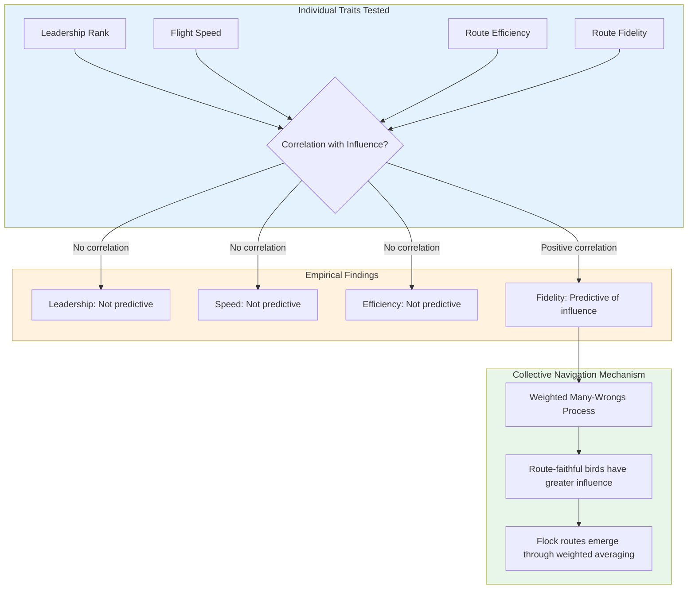
```mermaid
flowchart TD
    subgraph INDIVIDUAL["Individual Traits Tested"]
        A[Leadership Rank] --> E{Correlation with Influence?}
        B[Flight Speed] --> E
        C[Route Efficiency] --> E
        D[Route Fidelity] --> E
    end
    
    subgraph RESULTS["Empirical Findings"]
        E -->|No correlation| F[Leadership: Not predictive]
        E -->|No correlation| G[Speed: Not predictive]
        E -->|No correlation| H[Efficiency: Not predictive]
        E -->|Positive correlation| I[Fidelity: Predictive of influence]
    end
    
    subgraph MECHANISM["Collective Navigation Mechanism"]
        I --> J[Weighted Many-Wrongs Process]
        J --> K[Route-faithful birds have greater influence]
        K --> L[Flock routes emerge through weighted averaging]
    end
    
    style INDIVIDUAL fill:#e3f2fd
    style RESULTS fill:#fff3e0
    style MECHANISM fill:#e8f5e9
```

These results indicate that **flock routes emerge through a weighted many-wrongs process**, not a pure averaging of inputs or a despotic following of the best member[^44]. The finding that "leaders" identified by fine-scale leadership rank did not have higher influence on the overall structure of flock routes than followers suggests that leadership may operate differently at different spatial and temporal scales[^44]. At fine temporal scales, certain individuals may lead moment-to-moment directional changes, but the overall route structure is determined by the collective weighting of route-faithful individuals rather than by any single leader.

The **many-wrongs principle** operates most effectively when individuals pool their imperfect estimates of direction to improve accuracy. When individuals are uncertain about navigational decisions, averaging group information reduces error. Homing pigeons released with a small flock flew faster and more direct routes compared to their routes when released alone, demonstrating that collective information integration can enhance navigational accuracy even when the underlying mechanism is weighted averaging rather than simple mean-taking.

### 7.7 Social Learning and Intergenerational Route Improvement

Social transmission of navigational information enables **route efficiency improvements across generations**, representing a form of cultural evolution in migratory behavior. However, experimental investigations have revealed that the mechanisms underlying intergenerational improvement are simpler than initially hypothesized, relying on cognitively simple averaging processes rather than complex cultural learning.

A detailed investigation of **collective route improvements in homing pigeons** tested whether these improvements require complex cognitive abilities associated with cumulative cultural evolution (CCE)[^44]. The experiment involved creating sequential chains of five bird pairs flying home from a release site 8.4 km away, with each chain consisting of five generations of 12 flights each[^44]. In each generation, an experienced bird was paired with a naïve bird; after 12 flights, the experienced bird was replaced by a new naïve bird, and the previously naïve bird became the experienced one for the next generation[^44].

Researchers simulated seven plausible social learning strategies, categorized into three types based on cognitive complexity[^44]:

| **Strategy Type** | **Cognitive Requirement** | **Example Strategies** | **Prediction** |
|------------------|--------------------------|----------------------|---------------|
| T1 (Simplest) | No knowledge of partner's experience or performance | Averaging (equal weights) | Both birds contribute equally |
| T2 (Intermediate) | Recognition of more experienced individual | Experienced bird weighting | Experienced bird dominates |
| T3 (Most Complex) | Evaluation of individual/paired performance | Better bird weighting, maximize flight | Performance-based dominance |

Results showed that **all strategies led to improved route efficiency over generations**[^44]. However, when comparing both route efficiency and the social weight of the experienced bird to the experimental data, **only the simplest averaging strategy** (where the weighting parameter w_E = 0.5, meaning equal influence) was statistically indistinguishable from the observed results[^44]. The experimental birds showed no evidence of assigning greater weight to the experienced or better-performing bird[^44].

The study introduced the concept of **"effective group size"** to quantify the information integration achieved by the chain structure[^44]. Due to the sequential replacement of birds, information from earlier generations was diluted; the contribution of each bird in a five-bird chain followed a geometric series (1/2, 1/4, 1/8, 1/16, 1/32)[^44]. The experimental chains achieved an effective group size of only 2.12, meaning they performed only marginally better than a pair of birds[^44]. In contrast, some complex T3 strategies could theoretically achieve effective group sizes larger than five, suggesting that the simple averaging mechanism observed in pigeons does not fully exploit the potential for collective improvement[^44].

The conclusion that observed route improvements are driven by a **cognitively simple route averaging mechanism**, not by the more complex processes associated with CCE, has important implications for understanding social learning in avian navigation[^44]. The "wisdom of crowds" effect, where averaging cancels out individual noise, is sufficient to explain the improvements within the specific experimental design[^44]. The simple averaging strategy may be less risky and beneficial in larger, more fluid flocks typical of natural pigeon behavior, where the costs of assessing partner quality may outweigh the benefits of weighted integration[^44].

**Field evidence from whooping cranes** demonstrates that social learning can nonetheless substantially enhance navigational performance in natural contexts. Juvenile whooping cranes migrate using more direct routes when flying with older individuals compared to groups consisting only of young birds. This improvement reflects the transfer of route knowledge from experienced to naïve individuals, even if the underlying mechanism is cognitively simple information pooling rather than complex cultural transmission. In species where young birds follow experienced conspecifics, learned migratory behaviors prove more flexible than genetic instructions, allowing changes in migratory patterns to spread through populations.

### 7.8 Factors Limiting Navigational Precision and Error Accumulation

Despite the remarkable precision achieved by migratory birds, navigational performance is constrained by **multiple sources of error** that accumulate during extended journeys. Understanding these error sources and the mechanisms by which birds detect and correct for accumulated deviations is essential for explaining how migrants successfully complete journeys of thousands of kilometers despite inevitable imperfections in their navigational systems.

**Compass reading errors** represent one of the primary sources of navigational imprecision. The precision of sun compass orientation has been estimated at approximately 5° based on behavioral variability in orientation experiments, though this estimate reflects the combined error from both compass reading and motor execution. Even small directional errors, if uncorrected, would accumulate over distance—a 5° error maintained over 1,000 km would result in displacement of approximately 87 km from the intended course. The fact that migrants routinely achieve much better precision than this accumulated error would predict indicates that error correction mechanisms must operate during migration.

The **self-correcting properties of time-compensated sun compass headings** provide one mechanism for limiting error accumulation. Modeling studies have revealed that when a bird makes an orientation error that causes it to deviate from its intended course, the resulting change in longitude partially compensates for the error on subsequent flight steps. The expected self-correcting offset in heading follows the relationship: Δα ≅ Δλ sin∅, where Δλ is the longitude error and ∅ is the latitude. This self-correction provides **5–25% error mitigation at mid to high latitudes** across a broad range of directions, offering a potential explanation for how naïve migrants can successfully complete long-distance journeys despite inevitable orientation errors.

Empirical support for this self-correcting mechanism comes from tracking studies of displaced birds. For eight common cuckoos tracked by satellite following a 28° longitude displacement, the estimated overall orientation shift relative to non-displaced individuals (21°) closely matched the prediction for a time-compensated sun compass (23°). This correspondence suggests that the self-correcting properties of sun compass navigation may indeed help migrants compensate for displacement and accumulated errors during natural migration.

**Daily compass recalibration cycles** provide another mechanism for limiting error accumulation. Field tracking studies have demonstrated that birds recalibrate their compass systems based on twilight cues, with the effects of artificial magnetic field rotation disappearing by the following night. This daily recalibration provides regular opportunities to correct for accumulated compass errors and to adapt to changing magnetic declination as birds cross longitudes during their migration. The temporal dynamics of this calibration process—occurring during the twilight transition between diurnal and nocturnal navigation—highlight the importance of the sunset and sunrise periods for maintaining navigational accuracy.

**Multi-modal cue integration** represents a third mechanism for limiting error accumulation. By maintaining multiple redundant compass systems—magnetic, solar, stellar, and polarized light—birds can cross-validate directional information from different sources and detect when one system is providing erroneous information. The switching between several strategies may lead to better navigational accuracy as a consequence of using multiple cues that can be compared against each other. When discrepancies are detected, birds can weight their reliance on different systems based on assessed reliability, reducing the impact of errors in any single compass mechanism.

| **Error Source** | **Magnitude** | **Correction Mechanism** | **Effectiveness** |
|-----------------|--------------|-------------------------|------------------|
| Compass reading error | ~5° | Multi-modal cross-validation | Reduces systematic bias |
| Motor execution variability | Variable | Continuous course correction | Limits random drift |
| Environmental perturbation | Context-dependent | Backup compass systems | Maintains orientation capability |
| Accumulated drift | Distance-dependent | Self-correcting sun compass | 5-25% error mitigation |
| Calibration drift | Time-dependent | Daily twilight recalibration | Resets compass alignment |

Despite these error correction mechanisms, **route efficiency in experienced birds remains substantially below the theoretical optimum**. Homing pigeon studies found that even after extensive experience with a route, mean track efficiency in the final flight was only 0.66-0.81, with birds traveling 1.3-2.6 km extra beyond the 5.0-5.3 km beeline distance[^9]. This persistent inefficiency suggests that the pilotage strategy used by experienced birds—following learned landmark sequences rather than computing optimal straight-line routes—may sacrifice some efficiency for the reliability and reduced cognitive load provided by familiar routes. The individually distinctive, stereotyped routes developed by experienced homers may represent an optimal trade-off between efficiency and reliability rather than a failure to achieve maximum precision.

The **environmental factors** that most severely limit navigational precision include overcast conditions that obscure celestial cues, geomagnetic disturbances that compromise magnetic compass function, and anthropogenic electromagnetic interference. When multiple navigational systems are simultaneously compromised—as when overcast conditions coincide with geomagnetic disturbances—even experienced migrants may have difficulty maintaining accurate orientation, showing increased wind drift and reduced directional consistency. These environmental constraints on precision highlight the importance of multi-modal redundancy for maintaining navigational capability across the diverse and unpredictable conditions encountered during long-distance migration.

## 8 Environmental and Anthropogenic Disturbances to Navigation

This chapter provides a systematic analysis of the environmental and human-generated factors that disrupt avian navigation systems, examining the biophysical mechanisms through which specific disturbances impair magnetic, celestial, and olfactory compass functions. The analysis evaluates experimental and observational evidence quantifying navigational impairment under defined disturbance conditions, assesses the differential vulnerability of radical pair versus magnetite-based magnetoreception systems to electromagnetic interference, investigates the behavioral and physiological consequences of artificial light pollution on nocturnal migrants, and documents mass disorientation and mortality events attributable to navigational system disruption.

### 8.1 Radio-Frequency Electromagnetic Interference and Magnetic Compass Disruption

The discovery that weak radio-frequency (RF) electromagnetic fields disrupt avian magnetic compass orientation represents one of the most significant findings in magnetoreception research, providing both a diagnostic tool for identifying the radical pair mechanism and raising serious conservation concerns about the pervasive electromagnetic pollution of modern environments. This section examines the experimental evidence demonstrating RF interference effects, the quantum-mechanical basis for this vulnerability, and the ecological implications for migratory bird populations navigating through increasingly electromagnetically noisy landscapes.

**Experimental demonstration of RF disruption** emerged from unexpected failures in basic orientation experiments at the University of Oldenburg in Germany. Professor Henrik Mouritsen's research group found that experiments that had worked successfully for over 40 years at other locations were not functioning in Oldenburg. When the researchers screened their experimental huts with aluminum plates, **reducing the electromagnetic noise approximately 100-fold**, the birds suddenly began orienting correctly[^45]. Over seven years of rigorous experiments, the team found that birds exposed to electromagnetic noise between 50 kHz and 5 MHz lost all sense of direction, but they regained their bearings when the field was blocked. This discovery established that anthropogenic electromagnetic noise at remarkably low intensities can completely disable the avian magnetic compass.

The **frequency specificity of RF interference** has been systematically characterized through behavioral experiments exposing migratory birds to oscillating magnetic fields at various frequencies. European robins tested under radio-frequency fields added to the geomagnetic field showed consistent disorientation at frequencies from 1.315 MHz to 7.0 MHz at intensities of 15-480 nT[^45]. Most remarkably, at the local Larmor frequency (1.315 MHz in the Frankfurt geomagnetic field of approximately 47 μT), robins were disoriented even when the oscillating field was as weak as **15 nT**—a field strength many orders of magnitude weaker than the static geomagnetic field itself. This extraordinary sensitivity to oscillating fields at the Larmor frequency provides strong evidence for the radical pair mechanism, as this frequency corresponds to the precession rate of electron spins in the geomagnetic field.

| **Frequency Range** | **Source Examples** | **Effect on Magnetic Compass** | **Mechanism** |
|--------------------|--------------------|-----------------------------|---------------|
| 50 kHz – 5 MHz | AM radio, electrical equipment | Complete disorientation | Disrupts radical pair spin dynamics |
| 75–85 MHz | FM radio broadcasting | Disrupts orientation | Below cutoff frequency |
| ~116 MHz | Theoretical cutoff | Transition zone | Limit of radical pair sensitivity |
| 140–150 MHz | Some broadcasting | No effect observed | Above cutoff frequency |
| 235–245 MHz | Some broadcasting | No effect observed | Above cutoff frequency |
| Mobile frequencies (>800 MHz) | Cellular networks | No interference | Far above cutoff |

Recent research has identified a **critical cutoff frequency of approximately 116 MHz** above which radio-frequency fields no longer disrupt the magnetic compass[^46][^47]. Behavioral experiments with Eurasian blackcaps demonstrated that radio waves between 75 and 85 MHz interfered with their magnetic compass sense, but frequencies of 140-150 MHz and 235-245 MHz did not affect the birds' magnetic compass[^46]. Model calculations simulating quantum-mechanical processes inside the cryptochrome protein enabled researchers to narrow down the cutoff frequency to 116 MHz. According to these simulations, radio waves above this frequency would have only weak effects on birds' magnetic orientation[^47]. This finding has important practical implications: **mobile communications networks do not impair the birds' magnetic sense because the frequencies used are all above the relevant threshold**[^46][^47].

The **quantum-mechanical basis for RF sensitivity** lies in the spin dynamics of radical pairs formed during cryptochrome photoactivation. The radical pair mechanism requires that electron spins remain coherent long enough for the geomagnetic field to influence their interconversion between singlet and triplet states. Radio-frequency fields oscillating at frequencies near the Larmor frequency interfere with this spin dynamics by driving transitions between spin states, effectively scrambling the directional information encoded in the radical pair system. The intense resonance at the Larmor frequency indicates a radical pair in which one radical is devoid of hyperfine interactions—a "magnetically isolated" radical that is optimally sensitive to external magnetic fields but also optimally vulnerable to RF interference.

A critical finding is that **birds cannot habituate to radio-frequency fields** in the way they can adjust to static magnetic field anomalies outside the normal functional range. In behavioral studies with European robins, neither a 2-hour pre-exposure in a 7.0 MHz field at 480 nT, nor a 7-hour pre-exposure in a 1.315 MHz field at 15 nT, allowed the birds to regain their orientation ability[^45]. This inability to adjust suggests that RF fields interfere directly with the primary processes of magnetoreception and therefore disable the avian compass as long as they are present[^45]. In contrast, birds can gradually adjust their magnetic compass to operate in static fields outside the normal functional window through extended exposure, indicating fundamentally different mechanisms of disruption.

Importantly, radio-frequency fields **do not have lasting adverse after-effects**. Robins exposed for 3 hours to a 1.315 MHz, 480 nT field were able to orient in the local geomagnetic field immediately afterward, demonstrating that RF exposure does not cause lasting damage to the magnetoreception apparatus[^45]. The disruptive effect depends on the alignment of RF fields with the static field—they disrupt orientation only if applied at an angle to the magnetic vector, ruling out general artifacts and confirming specific interference with the directional sensing mechanism.

The **ecological implications of increasing electromagnetic pollution** are substantial. Anthropogenic electromagnetic noise from power lines, electrical equipment, Wi-Fi networks, and broadcasting infrastructure creates an invisible but pervasive disturbance to avian navigation in urban and suburban environments. Migratory birds affected by anthropogenic electromagnetic noise over towns and cities would probably resort to backup navigational systems, such as their star compass or sun compass, as they have three different compasses that work independently. However, the extremely low intensity of the disruptive electromagnetic fields—as weak as 15 nT at the Larmor frequency—means that even relatively minor sources of electromagnetic radiation could potentially compromise magnetic compass function in sensitive areas such as nature reserves where migratory birds rest.

### 8.2 Geomagnetic Disturbances and Space Weather Effects on Migration

The Earth's magnetic field, while generally stable on ecological timescales, undergoes periodic disturbances driven by **solar activity and space weather events** that can temporarily alter the geomagnetic parameters birds rely upon for navigation. Understanding how these natural magnetic perturbations affect migratory behavior provides insights into the resilience and limitations of avian magnetoreception systems and reveals the population-level consequences of magnetic compass disruption.

**Space weather, including solar storms, disrupts Earth's geomagnetic field** through the interaction of high-energy solar particles with the ionosphere[^48]. These disturbances cause temporary alterations of magnetic field parameters including intensity, inclination, and the rate of field change. A comprehensive study leveraging a **23-year dataset (1995 to 2018)** on bird migration collected from 37 NEXRAD radar stations in the central migration flyway of the US Great Plains provided the first macroecological-scale analysis of how geomagnetic disturbances affect nocturnal bird migration[^48]. The researchers developed a local magnetic disturbance index (ΔBmax), derived from magnetometer data, representing the maximum hourly change in the magnetic field in nanoTeslas from quiet conditions.

After controlling for the effects of atmospheric weather and spatiotemporal patterns, the study found a **9 to 17% decrease in migration intensity** in both spring and fall during severe space weather events (geomagnetic disturbances greater than approximately 500 nT)[^48]. These large disturbances occurred on 81 (3.32%) unique fall nights and 50 (2.28%) unique spring nights in the dataset[^48]. While the effects of geomagnetic disturbances were smaller in magnitude than the effects of atmospheric weather variables, they were statistically robust and biologically meaningful, suggesting that fewer birds migrate during strong geomagnetic disturbances.

| **Geomagnetic Condition** | **Migration Intensity Effect** | **Navigation Effort Effect** | **Vagrancy Effect** |
|--------------------------|-------------------------------|-----------------------------|--------------------|
| Normal conditions (<500 nT) | Baseline | Baseline | Baseline |
| Severe disturbance (>500 nT) | 9-17% decrease | Reduced crosswind flight | 24% increase in vagrancy index |
| Severe + overcast | Compounded reduction | 25.4% decrease in crosswind component | Enhanced disorientation |

Beyond affecting the number of migrants, geomagnetic disturbances also appear to impair **active navigation during flight**. During fall migration, there was evidence for decreases in effort flying against the wind (the crosswind component of airspeed), which may represent a depression of active navigation[^48]. This decrease in effort flying against the wind was most pronounced under a combination of high geomagnetic disturbance and overcast conditions, with the fall nonlinear mixed effects model predicting a **25.4% decrease when cloud cover was 100%**[^48]. This finding suggests that obscured celestial cues combined with magnetic disturbance may disrupt navigation, causing birds to drift more with the wind rather than actively compensating for wind displacement.

The **differential vulnerability of inexperienced versus experienced migrants** provides important insights into the development of navigational resilience. The relationships between geomagnetic disturbance and navigation effort were found only in fall migration, not in spring[^48]. The fall migration cohort includes many inexperienced juveniles migrating for the first time, whereas spring migration is composed of more experienced birds that have successfully completed at least one migratory journey. The differences may therefore reflect a more disruptive effect of magnetic disturbance on the migration of inexperienced young birds, which may depend on simpler orientation strategies and have less developed backup systems compared to experienced adults.

A separate analysis using **2 million captures of 152 landbird species in North America over 60 years** demonstrated a strong association between geomagnetic disturbance and avian vagrancy during fall migration[^49]. For the typical species, an increase in geomagnetic disturbance of two standard deviations above average conditions is associated with a **24% increase in the median predicted vagrancy index** and a 250% increase in the number of spatiotemporally rare banding records (from 2% of all records at average disturbance to 5% under elevated conditions)[^49]. The sensitivity to geomagnetic disturbance was generally stronger among species that migrate longer distances, supporting the hypothesis that long-distance migrants rely more on magnetic cues[^49].

Intriguingly, the study found that **increased solar activity generally counteracts the effect of geomagnetic disturbance** on vagrancy[^49]. There is strong evidence for a negative interaction, suggesting that during periods of high solar activity, birds are less sensitive to the misorienting effect of geomagnetic disturbance. This potentially mitigates misorientation by disabling the ability for birds to use the magnetic field to orient, potentially causing them to pause migration or switch to other cues[^49]. This finding suggests that when the magnetic compass becomes unreliable, birds may adaptively reduce their reliance on magnetic information rather than continuing to navigate with corrupted compass readings.

**Species-specific behavioral responses** to simulated solar storms have been investigated in laboratory studies. Research testing three species of migratory songbirds—European robin, chiffchaff, and dunnock—during autumn migration found that **only the European robin changed its activity level** in response to the simulated solar storm[^50]. Robins reduced nocturnal migratory restlessness at night (mean decrease of -1.9 ± 0.8 hours) and increased activity during the early morning (mean increase of 3.6 ± 0.1 hours)[^50]. The study suggests that robins reduced activity at night when the perception of magnetic information would be strongly disrupted, possibly to extend migration during daytime when several visual cues become available for orientation[^50]. The chiffchaff and dunnock, which showed low or no nocturnal migratory activity, did not respond to the solar storm by changing their activity, suggesting that the behavioral response is specific to species that rely heavily on nocturnal magnetic navigation.

### 8.3 Artificial Light at Night: Mechanisms of Disorientation and Attraction

**Artificial light at night (ALAN)** represents one of the most pervasive and rapidly increasing anthropogenic disturbances affecting nocturnal migratory birds. The use of artificial lighting has been increasing worldwide, altering the night sky that billions of birds rely upon for navigation during nighttime migrations[^51]. Understanding the multiple mechanisms through which light pollution disrupts avian navigation—including interference with celestial compass systems, phototactic attraction, and physiological disruption of migratory timing—is essential for developing effective mitigation strategies.

The **physiological mechanisms** by which artificial light disrupts bird navigation operate at multiple levels. Light pollution can interfere with the production of **melatonin**, affecting the timing of migratory restlessness known as *Zugunruhe*[^52]. This hormonal disruption can alter the circadian rhythms that regulate migratory behavior, potentially causing birds to initiate or terminate migration at inappropriate times. Additionally, artificial light disrupts the birds' magnetic compass and celestial navigation systems, as the light-dependent radical pair mechanism in cryptochrome requires specific light conditions for proper function[^52]. Light near buildings can also disorient birds, causing them to expend vital energy by circling or flying into structures, leading to exhaustion or fatal collisions[^52].

**Lighting attracts large numbers of night-migrating birds** from substantial distances. Birds can be attracted from as far as **5 kilometers away**, drawn toward illuminated areas where they often become entrapped and circle the lit area[^51]. This circling behavior depletes their energy stores needed for migration and puts them at greater risk of colliding with buildings and infrastructure[^51]. The attraction effect is particularly pronounced for species that use **flight calls** during nocturnal migration. Research analyzing over 70,000 nocturnal bird-building collision records found that flight-calling behavior strongly predicts vulnerability to artificial light: all species that were over-represented in collision data (super-colliders) use flight calls, while all species that do not use flight calls were under-represented in collision data (collision avoiders)[^53].

The role of flight calls as a **social amplifier of light-induced mortality** reveals a tragic irony in avian navigation. Flight calls are thought to help migrating birds coordinate their movements and collectively respond to environmental stimuli. However, in the context of artificial lighting, this social behavior becomes maladaptive. In species that use flight calls, the number of collisions at a building on a given night was positively correlated with the amount of artificial light emitted by the building[^53]. For species that do not use flight calls, overall collision frequency was much lower, and lighting levels had no significant effect on collision numbers[^53]. The research suggests that flight calls may act as social attractants around artificial light, where the presence of calling individuals attracts more individuals that produce and use flight calls, potentially multiplying mortality when the light source is associated with collision hazards[^53].

| **Light Characteristic** | **Effect on Birds** | **Mechanism** | **Mitigation** |
|-------------------------|--------------------|--------------|--------------| 
| Short wavelength (blue/white, >3000K) | Maximum disruption | Interferes with cryptochrome function | Avoid |
| Long wavelength (amber/red, <3000K) | Reduced disruption | Less behavioral response trigger | Preferred |
| High intensity | Strong attraction | Phototaxis, disorientation | Dim as possible |
| Upward-directed | Sky glow, attraction | Visible from distance | Shield downward |
| Unshielded | Light scatter | Habitat illumination | Install shields |

**Spectral characteristics of artificial light** significantly influence the degree of disruption to migratory birds. Shorter wavelength blue or white light with higher correlated color temperatures (>3000 Kelvin) is more harmful than longer wavelength amber, orange, or red light with lower color temperatures (<3000 Kelvin)[^51]. This spectral sensitivity aligns with the light-dependency of the radical pair magnetic compass, which requires short-wavelength light from UV through green for proper function. Using amber, orange, or red light with longer wavelengths (>560 nm) is recommended because these wavelengths are less likely to trigger behavioral responses that lead to disorientation and attraction[^51].

**Weather conditions dramatically amplify** the disorienting effects of artificial light. This phenomenon is particularly prevalent on nights with low-cloud ceilings or foggy weather, when birds tend to migrate at lower altitudes where light reflecting on clouds can be disorienting[^51]. Under these conditions, artificial light creates a dome of illumination that birds cannot easily escape, trapping them in circling patterns around light sources. Multiple mass-mortality events, each involving hundreds of birds, have been documented on foggy nights during migration[^51]. The combination of reduced visibility, lower flight altitudes, and enhanced light reflection creates conditions where the normal escape responses of disoriented birds are ineffective.

A critical finding for conservation is that **behavioral disruption is rapidly reversible** when artificial lights are extinguished. Studies of the Tribute in Light installation in New York City demonstrated that when the high-intensity lights were turned off, birds dispersed, increased flight speeds, and decreased calling activity almost instantaneously. If birds become entrapped in an area of bright light, turning lights off for **15 to 20 minutes** can allow birds to escape the disorienting light and return to normal behavior[^51]. This rapid reversibility demonstrates that short-term removal of ALAN eliminates its disruptive effects almost immediately, suggesting that selective removal of light during nights with substantial bird migration is a viable conservation strategy.

### 8.4 Interaction Effects: Combined Disturbances and Cumulative Impacts

The multi-modal nature of avian navigation provides crucial redundancy that enables birds to maintain orientation when individual compass systems are compromised. However, when **multiple navigational systems are simultaneously disrupted**, this adaptive redundancy fails, and birds may experience compounded navigational impairment that exceeds the sum of individual disturbance effects. Understanding these interaction effects is essential for predicting when and where migratory birds are most vulnerable to catastrophic disorientation.

The most thoroughly documented interaction effect involves the **combination of geomagnetic disturbances and obscured celestial cues**. The 23-year radar study of North American bird migration found that the decrease in navigational effort (measured as the crosswind component of flight) during geomagnetic disturbances was most pronounced when celestial cues were simultaneously unavailable due to cloud cover[^48]. Under clear sky conditions, birds experiencing geomagnetic disturbances can presumably compensate by relying more heavily on their star compass for directional guidance. However, when overcast conditions obscure the stars, birds lose access to their primary backup system, leaving them with compromised navigation from both their magnetic and celestial compass systems simultaneously.

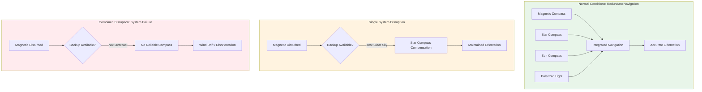
```mermaid
flowchart TD
    subgraph NORMAL["Normal Conditions: Redundant Navigation"]
        A[Magnetic Compass] --> E[Integrated Navigation]
        B[Star Compass] --> E
        C[Sun Compass] --> E
        D[Polarized Light] --> E
        E --> F[Accurate Orientation]
    end
    
    subgraph SINGLE["Single System Disruption"]
        G[Magnetic Disturbed] --> H{Backup Available?}
        H -->|Yes: Clear Sky| I[Star Compass Compensation]
        I --> J[Maintained Orientation]
    end
    
    subgraph COMBINED["Combined Disruption: System Failure"]
        K[Magnetic Disturbed] --> L{Backup Available?}
        L -->|No: Overcast| M[No Reliable Compass]
        M --> N[Wind Drift / Disorientation]
    end
    
    style NORMAL fill:#e8f5e9
    style SINGLE fill:#fff3e0
    style COMBINED fill:#ffebee
```

The quantitative magnitude of this interaction effect is substantial. The fall nonlinear mixed effects model predicted a **25.4% decrease in the crosswind component** (effort flying against the wind) when cloud cover was 100% combined with high geomagnetic disturbance[^48]. This represents a much larger effect than either disturbance alone would produce, demonstrating true synergistic interaction rather than simple additive effects. Birds experiencing this combined disruption appear to largely abandon active navigation and drift with the wind, a behavioral response that may represent an adaptive strategy to avoid expending energy on navigation when compass systems are unreliable.

The **differential vulnerability of inexperienced migrants** to combined disturbances has important implications for population dynamics. The relationships between geomagnetic disturbance and navigation effort were found only in fall migration, not in spring[^48]. Since fall migration includes many first-time juvenile migrants while spring migration consists primarily of experienced adults, this seasonal asymmetry suggests that young birds are more severely affected by multi-modal navigation disruption. Experienced migrants may have developed more sophisticated strategies for coping with compass system failures, including the ability to recognize when their navigation is compromised and to adopt appropriate compensatory behaviors such as grounding until conditions improve.

The **implications of increasing anthropogenic electromagnetic pollution** combined with other disturbances create concerning scenarios for cumulative impacts on migratory populations. Urban and suburban environments expose migrating birds to multiple simultaneous stressors: electromagnetic noise that may compromise magnetic compass function, artificial lighting that disrupts celestial orientation and attracts birds toward collision hazards, and altered habitat structure that may interfere with landmark-based navigation. While birds can typically compensate for any single disturbance by relying on backup systems, the combination of multiple anthropogenic disturbances may overwhelm the adaptive redundancy of avian navigation, particularly for inexperienced migrants passing through unfamiliar urban landscapes.

Climate change may further exacerbate these interaction effects by **increasing the frequency of severe weather events** that obscure celestial cues. If overcast conditions become more common during peak migration periods, birds will more frequently encounter situations where their celestial backup systems are unavailable precisely when they might be needed to compensate for magnetic disturbances or electromagnetic interference. The combination of increasing anthropogenic electromagnetic pollution, expanding artificial light coverage, and climate-driven changes in weather patterns creates a trajectory of cumulative impacts that may pose significant challenges for migratory bird populations in coming decades.

### 8.5 Documented Mass Disorientation and Mortality Events

The theoretical understanding of how navigational disturbances affect migratory birds is tragically validated by **documented mass disorientation and mortality events** that have killed hundreds to thousands of birds in single incidents. These events provide stark evidence of the lethal consequences when avian navigation systems fail, and they reveal the specific combinations of conditions that create the greatest risk for catastrophic mortality.

**Multiple mass-mortality events involving hundreds of birds** have been documented on foggy nights during migration near illuminated structures[^51]. These events typically occur when low cloud ceilings or fog force birds to migrate at lower altitudes, where they encounter artificial lighting that attracts and disorients them. The combination of reduced visibility, enhanced light reflection from clouds, and the phototactic attraction response creates a lethal trap from which birds cannot easily escape. Once attracted to a light source, birds may circle continuously until they collide with structures or collapse from exhaustion, with mortality compounding as additional migrants are drawn to the area by the calls of already-entrapped birds.

The **Tribute in Light installation** at the National September 11 Memorial in New York City has provided a uniquely well-documented case study of light-induced bird disorientation. This high-intensity urban light installation was found to dramatically alter nocturnal bird migration behavior, with effects observed up to altitudes of 4 km. When illuminated, birds aggregated in high densities **exceeding 20 times baseline densities**, decreased flight speeds, followed circular flight paths, and vocalized frequently[^51]. Statistical analyses confirmed a high probability of disorientation for nearby birds, with a **characteristic disorientation distance of 1,500 meters**. The observed bird concentrations could only be explained by models that included directed flight toward the artificial light, indicating that the lights actively attracted birds rather than simply confusing those that happened to pass nearby.

| **Event Type** | **Typical Mortality** | **Key Conditions** | **Primary Mechanism** |
|---------------|----------------------|-------------------|----------------------|
| Foggy night + illuminated structure | Hundreds per event | Low ceiling, fog, bright lights | Attraction, circling, collision |
| Tribute in Light (before protocols) | Variable (monitored) | High intensity, clear to overcast | Attraction from >1 km, circling |
| Building collisions (annual) | Millions (US estimate) | Year-round, peak during migration | Light attraction, glass confusion |
| Communication tower mortality | Thousands per tower per year | Foggy nights, steady-burning lights | Attraction, circling, collision |

**Building collision data** provide systematic evidence linking artificial light to bird mortality. Research examining the factors influencing collision rates found that the **area of glass emitting artificial light at night was the most important predictor** of collision rates, with this effect independent of overall glass area[^51]. Lighting area had a stronger effect on collisions than any glass variables measured, providing strong empirical support for turning off lights at night to reduce bird-building collisions. The study also investigated polarized light pollution reflected from dark glass surfaces but found no relationship between polarized light and collision rates, suggesting that birds are not attracted to or confused by polarized light from buildings in the same way they are attracted to artificial light sources.

The **combination of adverse weather conditions, artificial lighting, and compromised magnetic navigation** can create conditions for catastrophic mortality events. On foggy nights when birds are already flying at lower altitudes and may have compromised celestial navigation, the addition of bright artificial lighting creates an almost inescapable trap. If these conditions coincide with geomagnetic disturbances that compromise the magnetic compass, birds may have no reliable navigation system available to guide them away from danger. While such multi-factor events may be relatively rare, their consequences can be severe, with the potential to kill significant proportions of local migrant populations in single nights.

The **rapid reversibility of light-induced disorientation** offers a critical opportunity for preventing mortality during high-risk conditions. The Tribute in Light studies demonstrated that behavioral disruptions disappeared within minutes when the lights were extinguished, with birds dispersing, increasing flight speeds, and decreasing calling activity almost instantaneously[^51]. This finding has led to the implementation of protocols where the installation is temporarily darkened when bird densities reach critical thresholds, allowing trapped birds to escape before resuming the memorial lighting. This adaptive management approach demonstrates that real-time monitoring combined with responsive action can substantially reduce mortality even from very high-intensity light sources.

### 8.6 Conservation Implications and Mitigation Strategies

The systematic understanding of how environmental and anthropogenic disturbances affect avian navigation provides a foundation for developing **evidence-based conservation strategies** that can reduce the impact of these disturbances on migratory bird populations. Effective mitigation requires addressing multiple disturbance types through complementary approaches ranging from individual behavioral changes to regulatory frameworks governing electromagnetic emissions and lighting practices.

**Bird-conscious lighting practices** represent the most immediately actionable mitigation strategy for reducing light pollution impacts on migratory birds. The U.S. Fish & Wildlife Service recommends a hierarchy of approaches[^51]:

1. **Turn it off**: If lighting is not needed, consider turning it off permanently or using timing controls. Birds are at greater risk during spring (April-May) and fall (August-October) migration, particularly on cloudy nights. If birds become entrapped, turning lights off for 15 to 20 minutes can allow them to escape[^51].

2. **Control timing**: Limit lighting to necessary times only using automatic controls such as timers, dimmers, or motion sensors to turn lights on and off as needed[^51].

3. **Control direction**: Turn off lights that face up into the sky or illuminate the surrounding landscape. Avoid upward light scatter by shielding, selecting, or positioning lights where light is not emitted above the horizontal plane. Keep lighting as low to the ground as possible[^51].

4. **Control spectrum and intensity**: Use amber, orange, red, or "warmer" light that is less harmful because it is less likely to trigger behavioral responses. Warmer colors have longer wavelengths (>560 nm) and lower correlated color temperatures (CCT < 3000 Kelvin). Avoid blue, white, or "cooler" light with shorter wavelengths and higher color temperatures (>3000 Kelvin). Keep light as dim as possible[^51].

| **Mitigation Strategy** | **Implementation** | **Effectiveness** | **Co-Benefits** |
|------------------------|-------------------|------------------|-----------------|
| Lights-out programs | Turn off non-essential lights during peak migration | High (immediate effect) | Energy savings |
| Spectral modification | Shift to amber/red wavelengths (<3000K) | Moderate to high | Reduced light pollution |
| Directional shielding | Install shields to prevent upward scatter | Moderate | Reduced sky glow |
| Timing controls | Motion sensors, timers for automatic control | Variable | Energy savings |
| Window treatments | Close blinds/curtains at night | Moderate | Privacy, energy savings |

**Real-time migration forecasting tools** enable adaptive implementation of lights-out protocols during periods of peak migration activity. Resources such as BirdCast provide predictions of when birds are migrating, allowing building managers and municipalities to implement temporary lighting reductions when they will have the greatest conservation benefit[^51]. The "Lights Out" programs coordinated through the Urban Bird Treaty Cities network demonstrate how community-level coordination can achieve meaningful reductions in light pollution during critical migration periods[^51].

The **management of electromagnetic disturbances** presents greater challenges than light pollution mitigation, as electromagnetic emissions are less visible and their effects on birds are less widely recognized. The finding that the critical cutoff frequency for magnetic compass disruption is approximately 116 MHz suggests that **electromagnetic quiet zones in critical migratory corridors and stopover habitats** could focus on reducing emissions in the most problematic frequency bands (50 kHz to 116 MHz) while allowing higher-frequency communications to continue[^46][^47]. However, implementing such zones would require coordination among multiple regulatory agencies and stakeholders, as well as better characterization of electromagnetic environments in key migratory habitats.

**Priority research needs** for advancing disturbance mitigation include:

- **Threshold characterization**: Determining the minimum disturbance levels that produce biologically significant effects on navigation and survival, enabling evidence-based standards for acceptable electromagnetic and light pollution levels.

- **Species-specific vulnerability assessments**: Identifying which species and populations are most vulnerable to different disturbance types, enabling targeted conservation efforts for the most sensitive taxa.

- **Cumulative impact modeling**: Developing predictive models that integrate multiple disturbance types and environmental conditions to identify high-risk scenarios and locations.

- **Mitigation effectiveness monitoring**: Systematically evaluating the effectiveness of implemented mitigation measures to refine best practices and demonstrate conservation benefits.

The conservation of migratory bird navigation systems ultimately requires recognizing that **the night sky and electromagnetic environment are shared resources** that must be managed for the benefit of both human activities and wildlife. The remarkable navigational abilities of migratory birds—evolved over millions of years to exploit natural environmental cues—are increasingly challenged by anthropogenic modifications to those cues. Effective conservation will require balancing human needs for lighting and electromagnetic communications with the navigational needs of the billions of birds that depend on natural night skies and undisturbed magnetic fields to complete their annual migrations successfully.

## 9 Climate Change Impacts on Migratory Navigation and Timing

This chapter examines how climate change affects migratory navigation systems and timing mechanisms in birds, analyzing the multifaceted interactions between warming temperatures, shifting phenology, and the inherited navigational programs that guide migration. The analysis synthesizes evidence for phenological mismatches between migratory timing and resource availability, evaluates adaptive responses in navigational behavior including route modifications and timing adjustments, investigates how geomagnetic disturbances interact with climate-driven changes to compound navigational challenges, and assesses the differential vulnerability of long-distance versus short-distance migrants to climate-induced disruptions.

### 9.1 Phenological Shifts in Migratory Timing: Patterns and Mechanisms

Climate change has fundamentally altered the temporal architecture of bird migration, with **warming temperatures driving systematic advances in spring arrival and departure dates** across diverse avian taxa and geographic regions. These phenological shifts represent one of the most pervasive and well-documented biological responses to global environmental change, with profound implications for the navigational systems and timing programs that have evolved over millennia to synchronize migration with predictable seasonal patterns.

Multi-decadal studies across the Northern Hemisphere have documented consistent patterns of **earlier spring arrival at breeding grounds**. A comprehensive analysis of 20 migratory bird species in Oxfordshire, UK, spanning 1971 to 2000 revealed that 17 species showed negative slopes in arrival date versus year, indicating progressively earlier arrival over time[^54]. The mean advancement across species was **-0.268 days per year**, equivalent to arrival dates advancing by approximately 8 days over the 30-year study period[^54]. Similarly, analysis of 242 phenological time series from 117 European migratory bird species at four northern European sites found that 83.5% of time series showed negative regression coefficients of mean arrival date on year, with a mean advancement of **-0.166 days per year**[^55]. These consistent findings across independent datasets establish that earlier spring arrival represents a robust, widespread response to climate warming.

The **environmental drivers of timing shifts** operate through multiple pathways that differentially affect migrants depending on their wintering locations and migratory strategies. For species wintering in sub-Saharan Africa, earlier arrival at European breeding grounds has been linked to temperature anomalies in the African wintering areas. The Oxfordshire study found that arrival dates were significantly correlated with mean winter temperature anomalies in Africa south of 20°N latitude, with warmer African winters associated with earlier arrival in the UK[^54]. African continental temperatures have increased at rates similar to global averages, with the study period showing a temperature rise of approximately 0.6°C[^54]. Warmer conditions in wintering areas may enable birds to achieve breeding condition earlier, initiate migration sooner, or encounter more favorable conditions during the early stages of their journey.

| **Region/Study** | **Time Period** | **Species Analyzed** | **Mean Advancement** | **Key Environmental Driver** |
|-----------------|-----------------|---------------------|---------------------|----------------------------|
| Oxfordshire, UK | 1971-2000 | 20 species | -0.268 days/year (8 days total) | African winter temperatures |
| Northern Europe (4 sites) | 1958-2008 | 117 species | -0.166 days/year | Accumulated degree-days |
| North America | Multi-decadal | Hundreds of species | -0.1 to -0.2 days/year | Regional temperature patterns |
| Minnesota | Historical records | Multiple species | Earlier arrival, earlier breeding | Winter/spring temperatures |

Temperature patterns within breeding regions also influence migratory timing through their effects on departure decisions and migration speed. In Minnesota's temperate zone, increasing winter and spring temperatures have promoted earlier breeding and could potentially enable some species to remain through winter[^56]. The western half of the United States shows bird migration strongly linked with regional air and ocean surface temperatures of the adjacent Pacific Ocean, with above-average temperatures causing birds to migrate earlier in spring[^56]. In the eastern United States, migration timing is linked with Rossby Waves—airwaves flowing east to west that significantly impact weather and climate patterns across thousands of miles[^56]. These regional variations in the environmental cues triggering migration highlight the complexity of predicting phenological responses across different flyways and populations.

The **differential responsiveness of short-distance versus long-distance migrants** represents one of the most consistent and consequential patterns in avian phenological research. Short-distance migrants (SDMs) wintering in Europe or North Africa have shown substantially greater advancement in spring arrival than long-distance migrants (LDMs) wintering south of the Sahara. Analysis of the northern European dataset found that SDMs advanced their arrival by a mean of **-0.214 days per year**, while LDMs advanced by only **-0.073 days per year**[^55]. This nearly three-fold difference in responsiveness reflects fundamental differences in the cue systems controlling migration timing in these two groups.

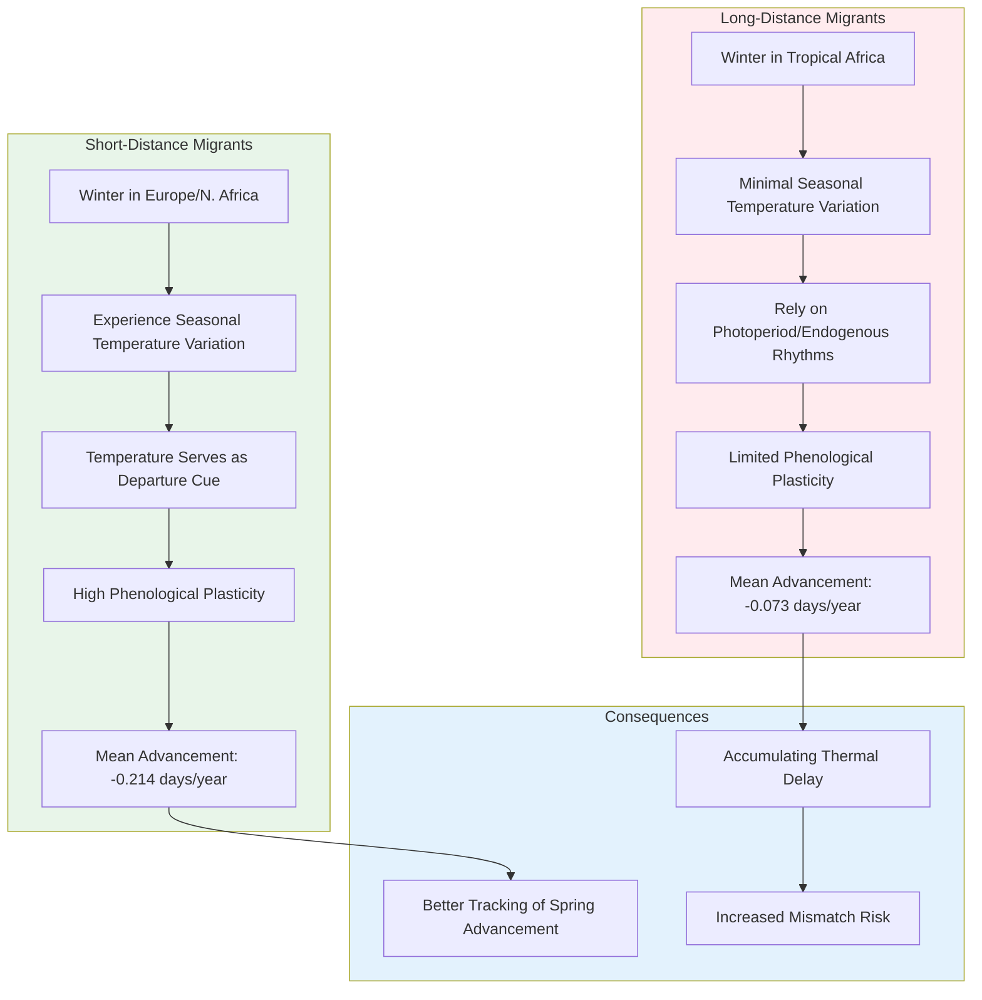
```mermaid
flowchart TD
    subgraph SDM["Short-Distance Migrants"]
        A[Winter in Europe/N. Africa] --> B[Experience Seasonal Temperature Variation]
        B --> C[Temperature Serves as Departure Cue]
        C --> D[High Phenological Plasticity]
        D --> E[Mean Advancement: -0.214 days/year]
    end
    
    subgraph LDM["Long-Distance Migrants"]
        F[Winter in Tropical Africa] --> G[Minimal Seasonal Temperature Variation]
        G --> H[Rely on Photoperiod/Endogenous Rhythms]
        H --> I[Limited Phenological Plasticity]
        I --> J[Mean Advancement: -0.073 days/year]
    end
    
    subgraph CONSEQUENCE["Consequences"]
        E --> K[Better Tracking of Spring Advancement]
        J --> L[Accumulating Thermal Delay]
        L --> M[Increased Mismatch Risk]
    end
    
    style SDM fill:#e8f5e9
    style LDM fill:#ffebee
    style CONSEQUENCE fill:#e3f2fd
```

Short-distance migrants wintering in regions that experience seasonal temperature fluctuations can use warming temperatures as a direct cue for initiating spring migration, allowing them to track advancing spring conditions in real time[^57]. Species like the American robin and eastern phoebe, which winter in Mexico and the southern United States where temperatures vary seasonally, interpret warming weather as a primary departure signal and have proven more effective at adjusting their northward arrival timing to match earlier springs[^57]. In contrast, long-distance migrants wintering near the equator in tropical countries experience minimal seasonal temperature variation and instead rely on fixed signals such as their internal clock and photoperiod as migration cues[^57]. These endogenous timing mechanisms, while providing reliable year-to-year consistency, cannot track the progressive advancement of spring conditions at distant breeding grounds, creating an inherent constraint on phenological plasticity.

The reliance on **photoperiodic and circannual cues** in long-distance migrants reflects the evolutionary history of these populations, which have adapted to environments where day length provides a reliable proxy for seasonal progression. However, climate change has disrupted this relationship by advancing the phenology of spring events (plant leaf-out, insect emergence) faster than the photoperiodic cues that trigger migration departure. Birds also rely on the annual change in day length for migration timing[^56], but day length at tropical wintering grounds provides no information about temperature conditions at distant breeding sites. This fundamental mismatch between the cues available to long-distance migrants and the conditions they will encounter at their destinations represents a critical vulnerability that cannot be easily overcome through behavioral flexibility alone.

**Autumn migration timing** has also shifted in response to climate change, though the patterns are more complex than spring advancement. The Oxfordshire study found that departure dates showed negative slopes in 15 of 20 species, with a mean advancement of **-0.266 days per year**—remarkably similar to the advancement in arrival dates[^54]. This parallel advancement of both arrival and departure means that the total duration birds spend at breeding sites has not significantly changed despite the overall shift in timing[^54]. However, other research suggests more heterogeneous autumn responses. Climate warming has brought longer summer weather, with birds that typically depart later in autumn migrating even later, while early-departing autumn migrants have moved their schedules earlier, resulting in an **extension of the overall autumn migration season by approximately 17 days** compared to 40 years ago[^57].

The mechanisms driving autumn timing shifts differ from those affecting spring migration. Warmer autumn temperatures may allow birds to delay departure by extending the period during which adequate food resources remain available. Warmer spring and fall temperatures along with insect availability allow birds to advance their laying date, molt, and depart later in the fall for wintering areas[^56]. The departure from breeding grounds shows lower individual repeatability (ICC = 0.326) than other migratory events, suggesting greater flexibility in post-breeding movements that may facilitate adaptive responses to changing conditions. However, this flexibility is constrained by the need to complete molt before migration and by the progressive shortening of day length that triggers physiological preparation for migration regardless of local temperature conditions.

### 9.2 Ecological Mismatch and Trophic Desynchronization

The differential rates at which climate change affects organisms at different trophic levels have created **phenological mismatches** between migratory birds and the food resources upon which their breeding success depends. This trophic desynchronization represents one of the most serious ecological consequences of climate change for migratory species, with documented effects on breeding success, chick survival, and population trajectories. Understanding the mechanisms and magnitude of these mismatches is essential for predicting the long-term viability of migratory populations under continued climate warming.

The **degree-days framework** provides a powerful tool for quantifying phenological mismatch by using accumulated temperatures as a proxy for the timing of spring biological events[^55]. Spring degree-days (DD₀), calculated as the sum of daily mean temperatures above 0°C accumulated from 1 January, serve as an index of spring progression that integrates the thermal conditions driving plant and insect phenology. Analysis of temperature data from 1958 to 2008 at four northern European sites revealed that spring degree-days showed a marked increase over this period, with the average DD₀ recorded by 30 April being **58% larger in 1989-2009 compared to the previous three decades**[^55]. This substantial advancement in spring thermal conditions has outpaced the advancement in bird arrival dates, creating a growing gap between when birds arrive and the phenological stage of spring they encounter.

The concept of **thermal delay** captures this mismatch quantitatively. Thermal delay is measured as the change in degree-days at the time of bird arrival over the study period—if birds were perfectly tracking spring advancement, the degree-days at arrival would remain constant, but if spring is advancing faster than bird arrival, degree-days at arrival will increase over time[^55]. Analysis of 242 phenological time series found that the linear regression coefficients of DD₀ at mean arrival date on year were **positive for 97.1% of time series**[^55]. This near-universal pattern indicates that migrants are now arriving at larger degree-days than in the past, meaning they arrive at a later phenological stage of spring relative to the thermal progression of the season.

| **Migrant Type** | **Mean Thermal Delay** | **Arrival Advancement** | **Population Trend Correlation** |
|-----------------|----------------------|------------------------|--------------------------------|
| Long-distance migrants | 3.62°C per year | -0.073 days/year | Strong negative |
| Short-distance migrants | 2.17°C per year | -0.214 days/year | Weaker negative |
| All migrants combined | Variable | -0.166 days/year | Negative (significant) |

The **differential accumulation of thermal delay** between long-distance and short-distance migrants has profound demographic consequences. Long-distance migrants, with their smaller advancement in arrival timing, have accumulated larger thermal delays than short-distance migrants (mean DD₀ increase per year of 3.62°C versus 2.17°C)[^55]. This greater mismatch translates directly into population-level effects: species with larger increases in degree-days at arrival showed more negative population trends between 1990 and 2000[^55]. The relationship between thermal delay and population decline remained robust when controlling for ecological factors such as habitat and diet, as well as phylogenetic effects, confirming that phenological mismatch itself—rather than correlated ecological traits—drives the observed population declines.

The classic example of **trophic mismatch** involves the great tit (*Parus major*) in Europe and its dependence on caterpillar availability for feeding nestlings[^58]. This species relies on a short burst of caterpillar availability each spring to feed its young, and the timing of breeding has evolved to synchronize chick-rearing with peak caterpillar biomass. Over past decades, temperatures have warmed and caterpillars have consistently emerged earlier. However, the great tit has not advanced its egg-laying date as fast as the caterpillar has advanced its peak biomass date, resulting in many young nestlings being born too late to benefit from the short caterpillar supply[^58]. This type of phenological mismatch has serious demographic consequences for migratory birds and could ultimately cause population declines.

**Insect phenology shifts** compound the mismatch problem by not only advancing the timing of peak abundance but also compressing the duration of availability. A study of insects at Ithaca, New York, found that over 25 years (1989-2014), insects were emerging **3-12 days earlier** and bursting in shorter time windows, creating brief concentrated food supply periods[^57]. Aquatic insects appeared to peak and begin declining after May 15[^57]. This compression of the insect availability window means that even small timing errors by birds can result in missing the critical feeding period entirely. Species like purple martins and tree swallows that breed later in the season may miss key foraging windows if they cannot advance their egg-laying dates to keep pace with the accelerating insect phenology[^57].

**Arctic-breeding shorebirds** provide particularly well-documented examples of climate-driven phenological mismatch. A 7-year study (2010-2016) near Utqiaġvik, Alaska, estimated mismatch in relation to food availability and chick growth in shorebirds experiencing advancement of environmental conditions[^59]. The degree of phenological mismatch, calculated as the number of days between peak insect emergence and peak shorebird hatch, was **negatively related to the timing of snowmelt**—shorebirds tended to hatch after peak insect emergence in early snowmelt years but before peak insect emergence in late snowmelt years[^59]. This pattern indicates that shorebirds cannot fully adjust their breeding timing to track the variable and increasingly early snowmelt conditions that drive Arctic invertebrate phenology.

Critically, the Arctic study found that **phenological mismatch was not a reliable predictor of food availability**, because weather conditions after snowmelt made invertebrate availability highly unpredictable[^59]. Food available to shorebird chicks 2-10 days old was highly variable among years, ranging from 6.2 to 28.8 mg per trap per day, and was often inadequate for average growth. Only 20-54% of Dunlin and Pectoral Sandpiper broods, on average, had adequate food across a 4-year period[^59]. Despite this unpredictability, shorebirds that nested earlier in relation to snowmelt generally had more food available during brood rearing and thus greater chick growth rates[^59]. This creates strong selective pressure to nest early, but the advancement of nesting is likely limited by the amount of plasticity in the start and progression of migration, creating a potential evolutionary trap as climate continues to warm.

The **Black-throated Blue Warbler** in the eastern United States exemplifies the growing temporal gap between migration and resource phenology. Documentation has revealed a gap of **up to ten days** between the migration timing of this species and the peak of caterpillar abundance, which were once tightly aligned[^60]. As ecosystems warm unevenly, resource peaks shift faster than migration calendars can adapt, with insectivorous species particularly affected because warm northern autumns cause insect emergence to peak earlier and decline before birds reach stopovers[^60]. This mismatch affects not only breeding success but also the ability of migrants to refuel adequately during stopover periods, potentially creating cascading effects across multiple stages of the annual cycle.

### 9.3 Stopover Ecology and Resource Availability Under Climate Change

Migratory birds depend critically on **stopover sites** where they rest and refuel during their journeys, and climate change is fundamentally reshaping the ecology of these essential habitats. The degradation of stopover resources represents a potentially severe bottleneck for migratory populations, as birds arriving at traditional refueling sites may encounter conditions dramatically different from those their navigational programs have evolved to anticipate.

Climate change is **modifying prevailing wind patterns** along migration routes, resulting in longer flights and increased energy costs for migrants[^60]. Altered atmospheric circulation patterns can shift the locations of favorable tailwinds and create novel headwind barriers that force birds to expend more energy during transit. This forces some species to take alternate routes to avoid drought-stricken stopovers, fundamentally altering the geography of migration corridors that have remained stable over evolutionary time[^60]. The increased energetic demands of modified routes compound the challenges posed by degraded stopover habitats, creating a double burden on migrants already stressed by phenological mismatches.

**Wetland degradation** represents one of the most severe climate-related threats to stopover ecology. Wetlands that once served as vital rest points may dry earlier in the year, forcing birds to fly farther without feeding[^60]. The effects of climate change on wetlands are predicted to be most severe due to increased demand for water and rising temperatures, which lower water table levels[^56]. Shorebirds dependent on tidal cycles are particularly squeezed between rising seas and shrinking coasts at stopover sites, facing habitat loss from both directions[^60]. The East Asian-Australasian Flyway has experienced profound habitat degradation, with an estimated loss of intertidal mudflats of **over 50% in the Yellow Sea region** over the last six decades due to pollution, overexploitation, and land reclamation[^61]. This region hosts a large proportion of the flyway's migratory shorebirds during migration, and its continued degradation threatens the viability of multiple species.

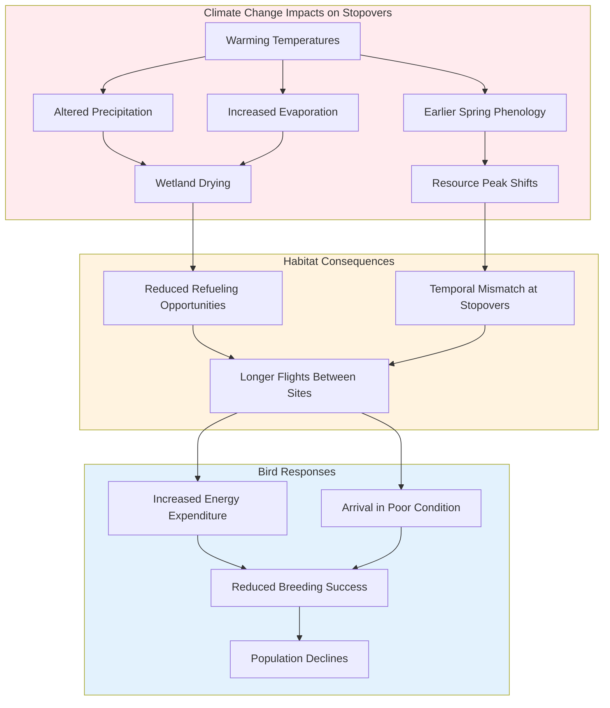
```mermaid
flowchart TD
    subgraph CLIMATE["Climate Change Impacts on Stopovers"]
        A[Warming Temperatures] --> B[Earlier Spring Phenology]
        A --> C[Altered Precipitation]
        A --> D[Increased Evaporation]
        C --> E[Wetland Drying]
        D --> E
        B --> F[Resource Peak Shifts]
    end
    
    subgraph HABITAT["Habitat Consequences"]
        E --> G[Reduced Refueling Opportunities]
        F --> H[Temporal Mismatch at Stopovers]
        G --> I[Longer Flights Between Sites]
        H --> I
    end
    
    subgraph BIRD["Bird Responses"]
        I --> J[Increased Energy Expenditure]
        I --> K[Arrival in Poor Condition]
        J --> L[Reduced Breeding Success]
        K --> L
        L --> M[Population Declines]
    end
    
    style CLIMATE fill:#ffebee
    style HABITAT fill:#fff3e0
    style BIRD fill:#e3f2fd
```

The **phenological mismatch at stopover sites** mirrors the mismatch documented at breeding grounds. As ecosystems warm unevenly, resource peaks shift faster than migration calendars can adapt[^60]. Birds arriving at stopovers may find that the invertebrate prey they depend upon for refueling has already peaked and declined, or that the vegetation providing cover and foraging substrate has progressed beyond optimal conditions. This mismatch is particularly acute for long-distance migrants whose departure timing from tropical wintering grounds cannot track conditions at distant stopover sites. The nightingale provides a poignant example: birds face increased mortality over the Sahara due to climate crisis-driven droughts and wildfires in southern Europe that prevent birds from reaching prime flying condition before attempting the desert crossing[^62].

**Extreme weather events** introduce acute disturbances that can devastate migration success in a single season. Hurricanes, droughts, and heatwaves are increasing in frequency and can destroy stopover habitats[^60]. A single severe drought can eliminate the wetland resources across an entire region, forcing migrants to bypass traditional stopover sites or attempt to refuel in degraded habitats. Heatwaves can directly kill invertebrate prey populations, eliminating the food resources birds depend upon even when habitat structure remains intact. The increasing frequency of these extreme events means that migrants face not only chronic degradation of stopover conditions but also increasing probability of catastrophic failures at critical points along their routes.

The **Hudsonian Godwit** exemplifies how climate-driven changes in wintering areas can cascade through the entire annual cycle to affect migration timing and success[^63]. This species undertakes one of the longest migrations of any bird, traveling from southern South America to breeding grounds in Alaska and Canada, including a non-stop flight of 6-7 days from Chile to the central United States. After four decades of advancing arrival at breeding grounds in response to climate change, a tracked population is now arriving **nearly a week later than a decade ago**—6 days later in 2023 compared to 2012[^63]. The delays occurred despite godwits maintaining consistent migration duration of approximately three and a half weeks, indicating that birds are departing later from South American wintering grounds. This suggests that conditions in South America may be the cause of the change, potentially reflecting climate-driven alterations in the food resources or environmental conditions that determine when birds achieve departure condition[^63].

The consequences of delayed arrival for Hudsonian Godwits are potentially severe. If adult godwits arrive too late, they cannot nest quickly enough to ensure chicks have adequate food[^63]. Many migratory bird species breeding in North America are experiencing sharp population declines, and the Hudsonian Godwit is considered among the fastest declining[^63]. The research highlights the urgent need to better understand what determines migration timing in godwits and other long-distance migrants, and to find ways to mitigate the consequences of arriving too late to successfully breed.

**Modeling studies** have quantified the adaptations required for shorebirds to maintain optimal migration strategies under habitat deterioration. A framework predicting past (1960s), present (2010s), and future (2060s) optimal migration strategies for five shorebird species in the East Asian-Australasian Flyway revealed that predicted migration durations increased substantially from past to future scenarios for most species—**Bar-tailed Godwit 159%, Great Knot 185%, Red Knot 170%, Curlew Sandpiper 119%**[^61]. Only the smallest species, the Red-necked Stint, showed a decrease to 93% of historical duration[^61]. These longer durations result from individuals leaving wintering sites earlier while also arriving slightly earlier at breeding sites due to climate change, with birds increasingly using alternative stopover locations that lie more southerly and are more dispersed[^61].

### 9.4 Route Modifications and Behavioral Adaptations

Migratory birds are not passive recipients of climate change impacts but are actively modifying their routes and behaviors in response to changing environmental conditions. These **adaptive responses** include the phenomenon of short-stopping (overwintering closer to breeding grounds), the shortening of migratory distances, and the emergence of partial migration and year-round residency in formerly fully migratory populations. Understanding the mechanisms and limits of these adaptations is essential for predicting whether behavioral flexibility can compensate for the pace of environmental change.

The **Bewick's swan** provides a well-documented example of climate-driven short-stopping. These birds are now overwintering closer to their Arctic breeding grounds in ice-free wetlands in the Netherlands, Germany, Denmark, and Poland instead of traveling to traditional wintering areas in the UK[^62]. Britain has lost an estimated **43% of its Bewick's swans in five years** as a direct consequence of this behavioral shift[^62]. Research by Hans Linssen from the University of Amsterdam demonstrates that these swans adjust their autumn journeys daily based on temperature: on colder days they travel bigger distances, but if it is warm they may not move at all[^62]. Modeling indicates that if winter was 1°C colder, the swans would spend it about 75 miles farther southwest[^62]. This behavioral adaptation may be advantageous for the birds themselves by reducing migration costs, though it has significant implications for the distribution of the species and for conservation efforts focused on traditional wintering areas.

| **Species** | **Behavioral Change** | **Mechanism** | **Fitness Consequence** |
|------------|----------------------|---------------|------------------------|
| Bewick's Swan | Short-stopping (wintering closer to breeding grounds) | Daily temperature-based movement decisions | Reduced migration costs; range shift |
| White Stork | Shift from full migration to residency | Increased winter food availability (landfills) | Earlier breeding; higher reproductive success |
| European Blackcap | Genetic reduction in migratory activity | Selection for shorter migration distances | Reduced migration mortality |
| American Redstart | Faster migration to compensate for delayed departure | Increased flight speed, fewer stopovers | 6% reduction in survival |

The **white stork** population in Portugal exemplifies the dramatic shift from full migration toward year-round residency that climate change can facilitate. The number of white storks breeding in Portugal increased substantially from approximately 3,300 individuals in 1994 to 11,700 in 2017, while simultaneously the percentage of resident individuals increased steeply from 18% in 1995 to **62% in 2015**[^64]. This shift toward residency is likely due to increased food availability (particularly from landfill waste, which has become a key food resource) and milder temperatures during winter in the breeding grounds[^64]. Individuals attending landfill sites on 44% of days during the breeding season and 60% of days during the wintering season[^64].

The fitness consequences of different migratory strategies in white storks reveal the trade-offs involved in behavioral adaptation. Long-distance migrants (those wintering in sub-Saharan Africa) traveled thousands of kilometers more throughout the year, spent more energy, and had **more than 10% less time resting** compared with short-distance migrants and residents[^64]. Long-distance migrants also spent more energy per unit of time while foraging and occupied their nests later than resident individuals, leading to later laying dates that ultimately reduced breeding success—birds laying eggs later raised fewer fledglings[^64]. However, the study did not find significant differences in survival probability between residents and migrants[^64]. These findings suggest that differential fitness between migratory and resident birds may have influenced the recent population shift toward residency.

**Genetic changes in migratory propensity** provide evidence that climate change is driving evolutionary responses in addition to behavioral plasticity. A 14-year study (1988-2001) of European blackcaps (*Sylvia atricapilla*) demonstrated genetic reduction in migratory activity through a "common garden experiment" that controlled for environmental effects[^65]. Over this period, the migratory activity of the German blackcap population decreased by **326 half-hour activity intervals, equivalent to 45% or 1.1 standard deviations**[^65]. Artificial selection experiments further revealed that if selection for shorter migration distances continues, residency will rapidly evolve in fully migratory bird populations—after four generations of directional selection for lower migratory activity, the proportion of non-migratory individuals increased from zero in parental generations to 14% in the second generation[^65].

These genetic changes represent adaptive responses to environmental warming. The reduction in migratory distance and changes in the phenotypic plasticity of migration onset timing are important evolutionary processes for migratory birds adapting to climate change, as they reduce migration costs and facilitate rapid adjustment to changes in the timing of food availability during breeding[^65]. However, this rapid adaptation mechanism through gradually shortening migration distance may not be available to most long-distance migrants, particularly when large stretches of unsuitable habitat exist between current breeding and wintering grounds[^65].

The **American redstart** demonstrates a compensatory strategy that allows birds to partially offset delayed departure from wintering grounds by **migrating faster**—up to 43% faster to reach breeding grounds after delaying departure by as much as 10 days[^66]. Jamaica, where many redstarts winter, has become increasingly dry in recent decades, translating into fewer insects that form the mainstay of the redstart diet. This means it takes birds longer to get into condition for migration, especially from poorer quality habitats[^66]. However, increased migration speed came at a cost: a drop of **more than 6% in overall survival rate**[^66]. Tactics for speeding up migration include flying faster and making fewer or shorter stopovers to refuel along the way. Though migrating faster helps compensate for delayed departures, it cannot entirely make up for lost time—for a 10-day delay, individuals can recover about 60% of the lost time, but still arrive late on the breeding grounds[^66].

### 9.5 Interaction Between Geomagnetic Disturbances and Climate Effects

The navigational challenges posed by climate change do not operate in isolation but interact with other environmental disturbances to create **compounded effects** on migratory bird orientation and survival. Geomagnetic disturbances driven by solar activity represent a particularly important interaction, as they can disrupt the magnetic compass systems that birds rely upon for navigation while climate change simultaneously degrades the availability of celestial backup systems through increased cloud cover and extreme weather events.

**Space weather events reduce migration intensity** by disrupting the magnetic field cues that birds use for orientation. Analysis of a 23-year dataset of bird migration across the US Great Plains found a **9-17% reduction in the number of migrating birds** during severe space weather events, in both spring and fall[^32]. The birds that chose to migrate during such events seemed to experience more difficulty navigating, especially under overcast conditions in autumn[^32]. These findings demonstrate that geomagnetic disturbances have measurable population-level effects on migration dynamics, reducing the number of birds that successfully complete their journeys during disturbed periods.

The **interaction between geomagnetic disturbance and cloud cover** creates particularly severe navigational challenges. When celestial cues are obscured by overcast conditions, birds cannot rely on their star compass as a backup system when their magnetic compass is compromised. Research found that migrating birds appear to drift with the wind more frequently during geomagnetic disturbances in the fall, instead of expending effort to battle crosswinds[^32]. "Effort flying" against the wind was reduced by **25% under cloudy skies during strong solar storms in the fall**[^32]. This suggests that when both magnetic and celestial navigation systems are compromised, birds may abandon active navigation and simply drift with prevailing winds—a strategy that conserves energy but may result in displacement from optimal migration corridors.

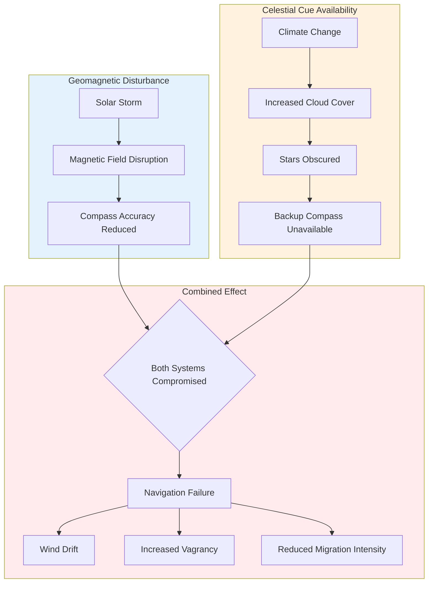
```mermaid
flowchart TD
    subgraph MAGNETIC["Geomagnetic Disturbance"]
        A[Solar Storm] --> B[Magnetic Field Disruption]
        B --> C[Compass Accuracy Reduced]
    end
    
    subgraph CELESTIAL["Celestial Cue Availability"]
        D[Climate Change] --> E[Increased Cloud Cover]
        E --> F[Stars Obscured]
        F --> G[Backup Compass Unavailable]
    end
    
    subgraph COMBINED["Combined Effect"]
        C --> H{Both Systems Compromised}
        G --> H
        H --> I[Navigation Failure]
        I --> J[Wind Drift]
        I --> K[Increased Vagrancy]
        I --> L[Reduced Migration Intensity]
    end
    
    style MAGNETIC fill:#e3f2fd
    style CELESTIAL fill:#fff3e0
    style COMBINED fill:#ffebee
```

**Avian vagrancy**—the appearance of birds far outside their normal range—increases substantially during geomagnetic disturbances, providing direct evidence of navigation errors. Analysis of 2 million captures of 152 landbird species in North America over 60 years demonstrated that increased geomagnetic disturbance is associated with higher vagrancy rates in fall, with an increase of two standard deviations above average conditions associated with a **24% increase in the median predicted vagrancy index** and a **250% increase in the number of spatiotemporally rare banding records**[^49]. Furthermore, species that migrate longer distances show increased sensitivity to geomagnetic disturbance during fall migration, supporting the hypothesis that long-distance migrants rely more heavily on magnetic cues[^49].

An intriguing finding is that **increased solar activity generally counteracts the effect of geomagnetic disturbance** on vagrancy[^49][^67]. High levels of solar activity, which varies on an 11-year cycle, appeared to decrease vagrancy[^67]. The interpretation is that although geomagnetic disturbance can make birds' internal compasses point in the wrong direction, high enough solar activity can stop those compasses from functioning at all, causing birds to turn to other navigational methods like landmarks or celestial cues[^67]. Migration is such an important event that there has been selective pressure to have multiple, redundant navigation mechanisms. By the researchers' calculations, geomagnetic disturbance could account for **up to 30% of vagrancy**[^67].

The **differential vulnerability of inexperienced versus experienced migrants** to combined disturbances has important implications for population dynamics. The relationships between geomagnetic disturbance and navigation effort were found only in fall migration, not in spring[^32]. The fall migration cohort includes many inexperienced juveniles migrating for the first time, whereas spring migration is composed of more experienced birds that have successfully completed at least one migratory journey. The differences may therefore reflect a more disruptive effect of magnetic disturbance on the migration of inexperienced young birds, which may depend on simpler orientation strategies and have less developed backup systems compared to experienced adults.

If climate change increases the frequency of overcast conditions during migration periods, the interaction between cloud cover and geomagnetic disturbances will become more frequent and consequential. Extreme weather events—hurricanes, severe storms, and atmospheric disturbances—that are increasing in frequency with climate change can simultaneously obscure celestial cues and create challenging flight conditions. The combination of compromised navigation and adverse weather represents a potentially lethal scenario for migrants, particularly inexperienced juveniles attempting their first journey.

### 9.6 Differential Vulnerability of Long-Distance versus Short-Distance Migrants

The mechanistic constraints on phenological adjustment differ fundamentally between long-distance migrants wintering in tropical regions and short-distance migrants wintering at temperate latitudes, creating **differential vulnerability** to climate-induced mismatches. Understanding these differences is essential for predicting which species and populations face the greatest risk from continued climate change and for designing targeted conservation interventions.

Long-distance migrants face an inherent **information gap** that prevents them from tracking conditions at distant breeding grounds. Species wintering near the equator experience minimal seasonal temperature variation, eliminating the thermal cues that short-distance migrants use to time their departure[^57]. Instead, long-distance migrants rely on fixed endogenous signals—circannual rhythms and photoperiodic cues—that provide consistent year-to-year timing but cannot adjust to progressive advancement of spring conditions thousands of kilometers away. This mechanistic constraint explains why long-distance migrants have shown smaller advances in arrival timing despite experiencing the same degree of spring advancement at breeding grounds.

The **accumulated thermal delay** in long-distance migrants directly translates to population-level consequences. Long-distance migrants accumulated a larger thermal delay than short-distance migrants, with mean degree-day increases of **3.62°C per year versus 2.17°C per year**[^55]. This 67% greater rate of mismatch accumulation means that long-distance migrants are falling progressively further behind the advancing spring phenology, with the gap widening each year. The population trend analysis confirmed that species with larger increases in degree-days at arrival showed more negative population trends, and this relationship was robust when controlling for ecological factors and phylogenetic effects[^55].

| **Characteristic** | **Long-Distance Migrants** | **Short-Distance Migrants** |
|-------------------|---------------------------|---------------------------|
| Wintering location | Tropical (near equator) | Temperate (Europe, N. Africa, S. USA) |
| Departure cue | Photoperiod, endogenous rhythm | Temperature, local conditions |
| Phenological plasticity | Low | High |
| Arrival advancement | -0.073 days/year | -0.214 days/year |
| Thermal delay accumulation | 3.62°C/year | 2.17°C/year |
| Population trend | More negative | Less negative |

The **limits of phenotypic plasticity** in adjusting departure timing from tropical wintering grounds constrain the adaptive options available to long-distance migrants. Even if birds could perceive that conditions at breeding grounds are advancing, the cues available in tropical environments provide no mechanism for translating this information into earlier departure. The Hudsonian Godwit case demonstrates that conditions in South American wintering areas may actually be delaying departure rather than enabling advancement[^63]. If climate change is degrading habitat quality or reducing food availability in tropical wintering areas, birds may require more time to achieve the body condition necessary for migration, further exacerbating the timing mismatch.

**Compensatory strategies** employed by long-distance migrants can partially offset delayed departures but impose fitness costs. American redstarts can migrate up to 43% faster to compensate for delayed departure, but this increased speed results in a **6% reduction in survival**[^66]. The tactics for faster migration—flying faster and making fewer or shorter stopovers—require birds to operate at higher physiological intensity and may compromise their condition upon arrival at breeding grounds. For a 10-day delay, individuals can recover only about 60% of the lost time, meaning they still arrive late despite the increased effort[^66]. This incomplete compensation means that even with maximum behavioral flexibility, long-distance migrants cannot fully overcome the constraints imposed by their reliance on fixed departure cues.

The **evolutionary response** to climate-driven selection pressure may eventually enable long-distance migrants to adjust their timing programs, but the pace of genetic change may be insufficient to track the rate of environmental change. Future predictions propose that a 1°C increase in the coldest month temperature will cause a decline in the number and proportion of migratory species, while a 1°C increase in spring temperatures is likely to cause migratory species numbers and proportions to increase[^56]. Migratory activity is expected to decline as species adapt to the changing climate[^56]. However, for long-distance migrants that cannot simply shorten their routes or shift to residency, the options for evolutionary adaptation are more limited.

Species now spend **over 10% more time on non-breeding grounds than breeding grounds**, with species traveling further north for longer migration distances spending even less time on those breeding grounds—a consequence of northern breeding grounds experiencing the strongest warming events[^56]. This compression of the breeding season places additional pressure on long-distance migrants that arrive late due to phenological constraints. The length of time birds spend at sites in their flyways during migration is typically less than 2% of their annual cycle[^56], highlighting the critical importance of efficient stopover use for species that cannot afford delays during transit.

### 9.7 Evolutionary and Conservation Implications

The long-term viability of migratory bird populations under continued climate change depends on the capacity for **evolutionary adaptation** in navigational programs and timing mechanisms, as well as the effectiveness of **conservation interventions** that can buffer populations against the most severe impacts of environmental change. Understanding the genetic basis of migratory traits and the potential for rapid adaptation provides essential context for assessing population resilience and designing evidence-based conservation strategies.

**Genetic variation in migratory traits** provides the raw material for evolutionary adaptation to climate change. Research on European blackcaps has demonstrated that migratory activity has a heritable basis and can respond to selection within a few generations[^65]. The proportion of non-migratory individuals increased from zero to 14% after just four generations of artificial selection for lower migratory activity[^65]. This rapid response indicates that populations harbor substantial genetic variation for migratory propensity, and that selection can produce measurable changes in population-level behavior within ecologically relevant timescales. The changes observed in migratory activity represent adaptive responses to environmental temperature increases and the widening of breeding time windows at breeding grounds[^65].

However, the **pace of environmental change may exceed the capacity for evolutionary response** in many populations. The reduction in migratory distance through gradual shortening may not be available to most long-distance migrants, particularly when large stretches of unsuitable habitat exist between current breeding and wintering grounds[^65]. For species like the Hudsonian Godwit that must cross major geographic barriers, there are no intermediate wintering options that would allow gradual route shortening. These species face a binary choice between maintaining their current long-distance migration strategy or undergoing dramatic range shifts that may not be possible given habitat availability and competitive interactions with other species.

The **genomic basis of migration timing** is beginning to be characterized, revealing the potential for climate-driven selection on specific genetic variants. Research on Atlantic salmon has identified a polygenic basis for run timing, with genomic offsets associated with climate change impacts highest in more northern populations[^68]. Earlier run timing may expose individuals to numerous increased environmental stressors compared to later migrating individuals, yet the same alleles that drive early migration may become advantageous as spring conditions continue to advance[^68]. Populations that harbor early timing genotypes could serve as important donors of adaptive alleles for more northerly stocks as climate warms[^68]. Similar dynamics may apply to migratory birds, where genetic variation for earlier departure or faster migration speed may become increasingly advantageous under continued warming.

**Conservation strategies** must address multiple dimensions of climate change impacts on migratory navigation and timing:

| **Conservation Strategy** | **Target Impact** | **Implementation Approach** |
|--------------------------|------------------|---------------------------|
| Protect climate-resilient stopover habitats | Stopover degradation | Identify and protect sites with stable water sources and diverse vegetation |
| Maintain phenological diversity in plant communities | Resource mismatch | Management actions favoring plants with different phenologies to "hedge bets" |
| Preserve ecological connectivity | Route modification constraints | Ensure birds can find alternative routes when traditional flyways are disrupted |
| Maintain large, genetically diverse populations | Evolutionary capacity | Protect breeding populations across range to preserve adaptive genetic variation |
| Climate-resilient management | Local habitat quality | Maintain water levels, preserve coastal buffers to enhance local climate resilience |

Habitat managers can make modifications to maintain diverse habitats in the face of phenological changes. By taking management actions that favor a range of plants with different phenologies, managers can "hedge their bets" and prepare for multiple potential responses to change[^58]. Maintaining diverse yet connected habitats can help migratory birds take advantage of different resources and phenological responses[^58]. This approach acknowledges that the optimal timing of resource availability will shift unpredictably under climate change, and that providing a diversity of options increases the probability that at least some resources will be available when birds arrive.

The **protection of critical stopover sites** represents a high-priority conservation action given the documented degradation of refueling habitats along major flyways. Key approaches include protecting stopover habitats like wetlands, forests, and grasslands where birds refuel; restoring ecological connectivity to ensure birds can find alternative routes when traditional flyways are disrupted; and implementing climate-resilient management such as maintaining water levels and preserving coastal buffers[^60]. The loss of over 50% of intertidal mudflats in the Yellow Sea region[^61] demonstrates the urgency of protecting remaining stopover habitats before further degradation occurs.

The most crucial goal for land stewards is to **encourage large, genetically diverse bird populations** by protecting areas that may be used during future shifts in migratory bird range[^56]. As the major threat facing migratory birds is land-use change, providing low-intensity land use and natural or semi-natural land will help conserve migratory species long-term[^56]. Large populations maintain the genetic diversity necessary for adaptive responses to continued environmental change, while habitat protection ensures that birds have the resources needed to complete their annual cycles successfully despite shifting phenology and degraded stopover conditions.

The **multi-modal nature of avian navigation** provides some resilience to climate change impacts, as birds can potentially compensate for disruption to one navigational system by relying more heavily on others. Evidence suggests that large-scale changes in geomagnetic field direction may not severely affect bird migration, because birds typically do not rely on only one compass for navigation—they use multiple different cues for orientation, including the sun, stars, polarized skylight patterns, and the geomagnetic field[^69]. This flexibility in the migratory compass system is probably an important adaptation to help migratory birds cope with the difference between the direction of the geomagnetic poles and the geographic poles at any location on Earth's surface[^69]. Many migratory birds will likely be able to adapt to changes in the geomagnetic field and still successfully migrate[^69].

However, this navigational redundancy cannot compensate for the fundamental phenological mismatches created by climate change. Even birds with perfect navigation will fail to reproduce successfully if they arrive at breeding grounds after the peak of food availability has passed. Ultimately, management strategies informed by phenological research can provide for more effective migratory bird conservation in a changing climate[^58]. The integration of climate science, navigational biology, and conservation practice offers the best hope for maintaining viable populations of migratory birds as environmental conditions continue to shift at unprecedented rates.

## 10 Ecological Consequences and Conservation Implications

This chapter synthesizes the ecological outcomes of navigational precision and disturbance, analyzing how navigation success influences population dynamics, habitat connectivity, and ecosystem services provided by migratory birds. The analysis evaluates conservation strategies that address navigational challenges, assesses the effectiveness of protected stopover sites and flyway management approaches, and proposes evidence-based recommendations for mitigating anthropogenic threats to migratory navigation systems.

### 10.1 Population Dynamics and Demographic Consequences of Navigational Success

The precision of avian navigation directly shapes the demographic trajectories of migratory populations through its influence on **survival rates, reproductive timing, and recruitment success**. Understanding these demographic consequences is essential for predicting population responses to navigational challenges and for designing conservation interventions that address the mechanistic links between navigation and population viability.

**Navigational efficiency correlates strongly with individual survival and migratory success**. A longitudinal tracking study of 102 adult breeding common terns (*Sterna hirundo*) aged 3 to 22 years revealed that older terns exhibited significantly higher navigational efficiency than younger individuals, with the average instantaneous deflection angle (deviation between flight direction and target direction) **decreasing by approximately 1.023 degrees per year of age**[^70]. Critically, this age-specific pattern could not be explained by individual learning within adulthood—the effect of individual age relative to mean age was not significant and showed a positive rather than negative coefficient. This finding indicates that the observed improvement in navigational efficiency with age results primarily from **selective disappearance**, whereby individuals with lower navigational efficiency experience higher mortality and are progressively eliminated from the population[^70].

The demographic consequences of navigational efficiency extend directly to migratory outcomes. Birds with higher navigational efficiency (smaller instantaneous deflection angles) achieved **shorter migration durations and earlier arrival dates** at both breeding and wintering grounds[^70]. This relationship was evident in both spring and autumn migrations, though the effect was more pronounced during autumn. Earlier arrival at breeding grounds confers well-documented fitness advantages, including access to higher-quality territories, earlier initiation of breeding, and increased reproductive success. The linkage between navigational precision and arrival timing thus creates a direct pathway through which navigation influences reproductive output and population growth rates.

| **Navigational Parameter** | **Demographic Consequence** | **Population-Level Effect** |
|---------------------------|---------------------------|---------------------------|
| High navigational efficiency | Shorter migration duration, earlier arrival | Increased breeding success, higher survival |
| Low navigational efficiency | Longer migration, delayed arrival | Reduced breeding success, selective mortality |
| Navigation errors (vagrancy) | Displacement from optimal habitat | Reduced survival, failed reproduction |
| Phenological mismatch | Arrival after resource peak | Reduced chick survival, population decline |

The **differential navigational capabilities of experienced versus inexperienced migrants** fundamentally shape population age structure and recruitment dynamics. As documented throughout preceding chapters, first-time migrants typically rely on inherited vector navigation (clock-and-compass) and cannot compensate for displacement, while experienced adults possess true navigation capabilities that enable flexible responses to unexpected conditions. This asymmetry creates age-specific mortality patterns that are particularly severe for juveniles. The finding that geomagnetic disturbances affect navigation effort only during fall migration—when the cohort includes many inexperienced juveniles—but not during spring migration composed of experienced adults, demonstrates that **young birds are more vulnerable to navigational challenges**[^71].

Population consequences of climate-driven phenological mismatch provide compelling evidence for the demographic importance of navigational timing. Long-distance migrants that have accumulated larger thermal delays—arriving at progressively later phenological stages of spring relative to advancing conditions—show **more negative population trends** than species with smaller timing mismatches[^72]. The population consequences of trophic mismatch are particularly severe for insectivorous species dependent on brief peaks in invertebrate abundance. In the Netherlands, insectivorous long-distance migrants declined by an average of **38% in forests** (characterized by short spring food peaks) between 1984 and 2004, while the same species showed no decline in marshland habitats where food availability is less seasonally constrained[^72]. This habitat-specific pattern confirms that the demographic consequences of timing mismatch depend on the degree of seasonality in resource availability.

The **selective disappearance based on navigational phenotype** documented in common terns suggests that navigation represents a trait under strong natural selection. If navigational efficiency is heritable—as suggested by the genetic basis of migratory direction and timing documented in willow warblers and other species—then selective mortality of poor navigators should produce evolutionary improvements in navigational precision over generations. However, this evolutionary process requires that populations maintain sufficient genetic diversity and that the pace of selection can keep pace with environmental change. For long-distance migrants facing rapid climate-driven changes in optimal timing, the rate of selective improvement may be insufficient to prevent population declines.

### 10.2 Flyway Connectivity and the Vulnerability of Migratory Networks

Migratory flyways function as **ecological networks** where the spatial distribution of breeding, stopover, and wintering sites creates connectivity patterns that determine the resilience of migratory populations to habitat loss and environmental change. Understanding the structural properties of these networks—particularly the identification of critical nodes that support disproportionate connectivity—is essential for prioritizing conservation investments and predicting the cascading consequences of habitat degradation.

A comprehensive analysis of wetland network connectivity across four Palearctic-Afrotropical flyways revealed a striking pattern: **fewer than 5% of wetlands support more than 70% of migration connectivity**, regardless of the migratory strategy employed by different species[^73]. This extreme concentration of connectivity in a limited number of large wetlands indicates that flyway networks are highly vulnerable to the loss of key nodes. The analysis compared network structure for species employing different migratory strategies—"hoppers" that make frequent short-distance movements between stopover sites and "jumpers" that make infrequent long-distance flights—and found that while both strategies depend on the same critical wetlands, jumpers are more vulnerable to habitat loss because they have fewer alternative routing options[^73].

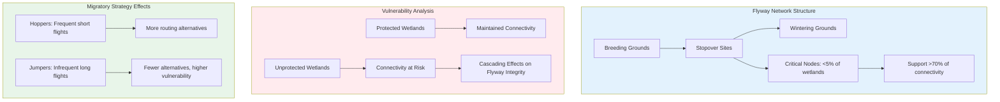
```mermaid
flowchart TD
    subgraph NETWORK["Flyway Network Structure"]
        A[Breeding Grounds] --> B[Stopover Sites]
        B --> C[Wintering Grounds]
        B --> D[Critical Nodes: <5% of wetlands]
        D --> E[Support >70% of connectivity]
    end
    
    subgraph VULNERABILITY["Vulnerability Analysis"]
        F[Protected Wetlands] --> G[Maintained Connectivity]
        H[Unprotected Wetlands] --> I[Connectivity at Risk]
        I --> J[Cascading Effects on Flyway Integrity]
    end
    
    subgraph STRATEGY["Migratory Strategy Effects"]
        K[Hoppers: Frequent short flights] --> L[More routing alternatives]
        M[Jumpers: Infrequent long flights] --> N[Fewer alternatives, higher vulnerability]
    end
    
    style NETWORK fill:#e3f2fd
    style VULNERABILITY fill:#ffebee
    style STRATEGY fill:#e8f5e9
```

The **removal of unprotected wetlands from flyway networks** produces disproportionate reductions in connectivity, particularly for flyways that originally had the highest connectivity and for species employing long-distance jumping strategies[^73]. This finding has critical conservation implications: the current protected area network, while covering many important wetlands, leaves significant gaps that could compromise flyway integrity if unprotected sites are lost to land conversion or degradation. Conservation planning and management must therefore account for both the quality of individual habitat patches and their position within the broader network—a wetland of moderate local quality may be irreplaceable for maintaining connectivity if it occupies a strategic position linking otherwise disconnected segments of the flyway[^73].

A recent multi-species, multi-threat assessment of migratory connectivity across the Western Hemisphere identified **59 connections at very high risk** and another 29 with high values for multiple risk components among 921 assessed connections[^74]. Over half of the very high-risk connections included breeding regions in the eastern United States, with the New England/mid-Atlantic Coast accounting for almost a quarter of them. This region is expected to undergo substantial change in both temperature and land cover, and is connected to many species' non-breeding grounds that are under climate change threat, such as the Bahamas[^74]. The concentration of risk in specific geographic regions highlights the potential for targeted conservation action to protect multiple species simultaneously.

**Connections between Canada and South America were identified as being at the greatest risk**, primarily because of the high number of species that use them and the high conservation vulnerability of many of those species[^74]. Birds that move between these regions undertake some of the longest-distance migrations in the Western Hemisphere, exposing them to numerous threats along the flyway. This finding emphasizes the critical importance of **transboundary collaboration** for protecting long-distance connections—no single nation can effectively conserve species that depend on habitats spanning multiple countries and continents[^74].

The **East Asian-Australasian Flyway** provides a case study in the consequences of habitat loss for flyway connectivity. Satellite tracking of 13 Whimbrels (*Numenius phaeopus*) from Hangzhou Bay (2018-2023) revealed that while 73.1% of identified stopover sites fall within protected areas, **substantial protection gaps persist with stark regional disparities**[^75]. Inland regions of Inner Mongolia and Northeast China show lower protection coverage, with 42.9% of key sites lacking formal protection compared to better-protected coastal zones. The total stopover duration, stopover frequency, and average stopover duration at national-level protected sites were higher than at provincial-level or unprotected sites, suggesting that **protection status correlates with habitat quality**[^75].

### 10.3 Ecosystem Services Mediated by Migratory Bird Navigation

Successful migratory navigation enables birds to fulfill **critical ecological functions** that link distant ecosystems and provide services essential for ecosystem functioning. These services—including nutrient transport, seed dispersal, pollination, and pest control—operate across spatial scales that match the migratory movements of their avian vectors, creating ecological connections that would not exist without precise navigation.

**Long-distance seed dispersal by migratory birds** represents one of the most important ecosystem services dependent on navigational success. A comprehensive model of seed dispersal by migratory mallards (*Anas platyrhynchos*) demonstrated that these waterfowl can disperse seeds over median distances of **293 km for seeds with short retention times and 413 km for seeds with long retention times**, assuming departure immediately after foraging[^76]. The peak probability of effective dispersal into wetland habitat occurred at distances of 204 km for small seeds and 322 km for large seeds from the study site at Lake Constance, Germany[^76]. This directed long-distance dispersal by mallards on spring migration may contribute significantly to large-scale plant population dynamics, including potential range expansion in response to climate change.

| **Dispersal Agent** | **Median Dispersal Distance** | **Long-Distance Events (>500m)** | **Key Finding** |
|--------------------|-----------------------------|--------------------------------|-----------------|
| Migratory Mallard | 293-413 km | Model-dependent | Critical for plant range shifts |
| Micronesian Starling | 56+ m median | 0.6-2.1% of events | 94.4% of all >500m dispersal |
| Mariana Fruit Dove | 56+ m median | Rare | 5.6% of >500m dispersal |
| Other frugivores | <120 m (99th percentile) | Negligible | Local dispersal only |

Research on avian frugivores on the island of Saipan revealed that **interspecific variation in bird movement, rather than gut passage times, primarily drives differences in seed dispersal distance**[^77]. While all four disperser species provided important local seed dispersal services (median distance at least 56 m), long-distance dispersal events exceeding 500 m were rare and **predominantly performed by a single species**—the Micronesian Starling, which accounted for 94.4% of all dispersal events greater than 500 m[^77]. This concentration of long-distance dispersal services in a single species highlights the vulnerability of ecosystem functions to the decline of key mobile linkers.

The **navigational precision required for seed dispersal services** varies with the ecological context. For plants requiring colonization of distant habitat patches—such as those tracking climate-driven range shifts—long-distance dispersal by migrants with precise navigation to suitable habitats is essential. The mallard dispersal model demonstrated that seeds retained until the first stopover have a **much higher probability of successful dispersal into wetlands** than seeds released during continuous flight over unsuitable habitat[^76]. This finding emphasizes that stopover site selection—which depends on accurate navigation to appropriate habitats—directly influences the effectiveness of seed dispersal services.

**Nutrient transport across ecosystems** represents another navigation-dependent service provided by migratory birds. The annual movement of billions of birds between breeding and wintering grounds transfers substantial quantities of nitrogen, phosphorus, and other nutrients across ecosystem boundaries. This nutrient subsidy can be particularly important for nutrient-limited systems such as Arctic breeding grounds, where the arrival of migrants concentrates nutrients from distant wintering habitats. The precision of navigation to specific breeding sites determines where these nutrients are deposited and which ecosystems benefit from the subsidy.

**Pest control services** provided by insectivorous migrants depend critically on the timing of arrival relative to pest emergence. The phenological mismatches documented in Chapter 9 directly reduce the pest control services that migrants provide—birds arriving after peak insect abundance cannot suppress pest populations during the critical period when damage occurs. The documented declines of insectivorous long-distance migrants in seasonal habitats[^72] thus have consequences extending beyond the birds themselves to the agricultural and forest ecosystems that benefit from their pest suppression services.

### 10.4 Protected Area Effectiveness and Stopover Site Conservation

The effectiveness of protected areas for conserving migratory birds depends on their **coverage of critical habitats across the full annual cycle**, including breeding grounds, stopover sites, and wintering areas. Evaluating protection status and identifying gaps in the conservation network is essential for directing limited resources toward the highest-priority sites.

Analysis of Whimbrel stopover sites along the East Asian-Australasian Flyway demonstrated that **80.3% of total stopover duration occurs within protected areas**, with national-level protected sites supporting longer stopovers than provincial-level or unprotected sites[^75]. This finding suggests that existing protection provides meaningful conservation benefits, as birds spend more time at protected sites where habitat quality is presumably higher. However, the analysis also revealed critical gaps: inland regions of Inner Mongolia and Northeast China currently represent **the weakest links in terms of protection levels**, with 42.9% of key sites lacking formal protection[^75]. These inland stopovers are essential for completing the migratory journey, and their lack of protection threatens the integrity of the entire flyway.

The **Intermountain West Joint Venture** in North America provides a model for evaluating conservation effectiveness through systematic monitoring. Using the Wetland Evaluation Tool (WET)—an interactive data visualizer powered by Google Earth Engine that uses satellite imagery and decades of U.S. Geological Survey data—researchers have documented declining wetland habitats across the Southern Oregon Northeastern California (SONEC) region[^78]. Analysis revealed that almost all of the Klamath Basin's wetlands have been lost to land conversion, with **as little as 3,500 acres remaining viable for waterfowl** of the 90,000 acres of protected wetland habitat in the Lower Klamath and Tule Lake refuges[^78].

| **Region/Flyway** | **Protection Coverage** | **Key Gaps** | **Conservation Priority** |
|------------------|------------------------|--------------|--------------------------|
| East Asian-Australasian (Whimbrel) | 73.1% of stopover sites | Inland Mongolia, Northeast China (42.9% unprotected) | Enhance inland protection |
| SONEC (Klamath Basin) | 90,000 acres nominal | Only 3,500 acres viable | Restore wetland function |
| Central/Pacific Flyways (Sandhill Crane) | Variable | Private lands critical | Public-private partnerships |

Multi-year tracking efforts have revealed the critical importance of **private lands for flyway connectivity**. Research on sandhill crane migration identified that **nearly all sites cranes used to nest were on flood-irrigated private lands**, highlighting the importance of collaborative conservation across public and private lands for maintaining flyway connectivity[^78]. Similarly, studies on white-faced ibis discovered that colonies depend upon flood-irrigated agriculture on private lands as a surrogate to lost wetlands, with rapid drying impacting wetlands around breeding colonies[^78]. These findings support the need for partnerships between private landowners and public land managers to create complexes of wetland systems that can support migratory populations.

**Monitoring conservation investments** is crucial for adaptive management. The Intermountain West Joint Venture has worked with partners in SONEC to implement over 30 North American Wetlands Conservation Act grants since 1991, protecting over 167,000 acres[^78]. Researchers used nearly 50 years of aerial survey data combined with WET analysis and found that **67% of conservation investments overlapped wetlands important to northern pintails**[^78]. However, the analysis also revealed that pintails migrate nearly a month earlier than other ducks, exposing a gap in conservation strategies that had not been designed with this species' unique phenology in mind. Private lands biologists are now leveraging WET to improve targeting of conservation actions to align habitat outcomes with bird needs[^78].

### 10.5 Flyway-Scale Management and Transboundary Conservation Frameworks

The inherently international nature of bird migration necessitates **coordinated management across political boundaries** through institutional frameworks that can align conservation efforts across the full geographic extent of migratory flyways. Effective flyway management requires mechanisms for sharing information, coordinating habitat protection, and adapting management strategies based on population monitoring.

The **U.S. Fish and Wildlife Service Flyway System** provides the foundational framework for migratory bird management in North America, organizing conservation efforts around the routes birds follow between wintering and breeding areas[^78]. Migratory Bird Joint Ventures, established by the 1986 North American Waterfowl Management Plan, represent a successful model for governments and private organizations to cooperate in preserving habitat across flyways[^78]. These partnerships enable coordinated action across jurisdictional boundaries and facilitate the integration of scientific research with on-the-ground conservation implementation.

The **Adaptive Resource Management (ARM) framework** employed by the Atlantic States Marine Fisheries Commission for managing horseshoe crab harvest in the Delaware Bay region demonstrates how flyway-scale management can integrate multiple species and stakeholder interests[^79]. The ARM framework requires annual estimates of both horseshoe crab population size and Red Knot stopover population size to recommend harvest quotas that balance human use with conservation needs. The 2024 stopover population estimate of **46,127 Red Knots** (95% credible interval: 39,286-57,799) represents an increase from 2023 and will inform decision-making in the next management cycle[^79]. Since 2019, the stopover population has fluctuated between approximately 39,000 and 46,000 and appears stable, demonstrating that adaptive management can maintain populations when properly implemented.

```mermaid
flowchart LR
    subgraph FRAMEWORK["Flyway Management Framework"]
        A[International Agreements] --> B[National Implementation]
        B --> C[Regional Joint Ventures]
        C --> D[Local Habitat Management]
    end
    
    subgraph TOOLS["Management Tools"]
        E[Population Monitoring] --> F[Adaptive Harvest Management]
        G[Habitat Assessment] --> H[Conservation Prioritization]
        I[Tracking Data] --> J[Connectivity Analysis]
    end
    
    subgraph OUTCOMES["Conservation Outcomes"]
        F --> K[Sustainable Use]
        H --> L[Protected Area Network]
        J --> M[Flyway Integrity]
    end
    
    style FRAMEWORK fill:#e3f2fd
    style TOOLS fill:#fff3e0
    style OUTCOMES fill:#e8f5e9
```

**Integrating migration ecology into conservation prioritization** requires understanding the connections between breeding and non-breeding populations. Multiple methods are now used to identify these connections, including bird banding, stable isotopes, genetics, and tracking devices such as geolocators and satellite transmitters[^80]. Recent developments offer promising prospects: robust quantitative models for banding data, improved precision of geolocators, accessibility of telemetry tracking systems, and increasingly precise probabilistic assignments based on genomic markers[^80]. Studies propose various ways to combine information from different datasets, and such data combinations have proven more accurate in estimating connectivity patterns than any single method alone[^80].

The **Motus Wildlife Tracking System** represents a breakthrough technology for flyway-scale research and conservation. This automated telemetry system uses a single very-high-frequency radio signal to track tagged individuals without the need for recapture, providing information on movements of small migrant species that was previously impossible to obtain[^81]. Motus has been recognized by multiple stakeholders including the U.S. Fish and Wildlife Service, National Parks Service, Canadian Wildlife Service, and BirdLife Europe, with specific mention in the Convention on Migratory Species demonstrating its current and potential future value to conservation[^81].

Conservation applications of Motus data include **identification of critical stopover sites** that support multiple species. For example, Motus tracking identified a major stopover area for blackpoll warblers in the Gulf of Maine, where prolonged stopovers suggest the area may be a major refueling site with high conservation value[^81]. Stopover sites on either side of ecological barriers equipped with high-density Motus stations can provide insights into how birds respond to such barriers, including local-scale movements, conditions required for successful crossing, and stopover duration[^81]. This information is essential for prioritizing habitat protection and understanding the consequences of habitat loss at specific sites.

### 10.6 Mitigation Strategies for Anthropogenic Navigational Disturbances

Evidence-based mitigation of anthropogenic disturbances to avian navigation requires **targeted interventions** that address the specific mechanisms through which artificial light, electromagnetic interference, and collision hazards disrupt migratory behavior. Effective strategies must be implementable across diverse land use contexts while achieving meaningful reductions in mortality and disorientation.

**Bird-conscious lighting practices** represent the most immediately actionable mitigation strategy, with well-documented effectiveness for reducing light-induced disorientation and collision mortality. The U.S. Fish and Wildlife Service's Nationwide Avoidance and Minimization Measures provide comprehensive guidance organized around a hierarchy of approaches[^82]:

| **Priority** | **Strategy** | **Implementation** | **Effectiveness** |
|-------------|-------------|-------------------|------------------|
| 1 | Turn off unnecessary lights | Timing controls, seasonal protocols | Highest: eliminates disturbance |
| 2 | Control timing | Motion sensors, dimmers, timers | High: reduces exposure duration |
| 3 | Control direction | Downward shielding, positioning | Moderate-High: reduces sky glow |
| 4 | Control spectrum/intensity | Amber/red wavelengths (<3000K), dimming | Moderate: reduces attraction |

Spectral modification of artificial lighting can substantially reduce impacts on migratory birds. Using **amber, orange, or red light with longer wavelengths (>560 nm) and lower correlated color temperatures (<3000K)** is recommended because these wavelengths are less likely to trigger behavioral responses that lead to disorientation and attraction[^82]. In urban areas, color temperatures should not exceed 3000K, while in parks and natural areas, temperatures should not exceed 2200K[^82]. These specifications provide concrete targets for lighting design that balance human needs with wildlife protection.

The **rapid reversibility of light-induced disorientation** enables highly effective temporal management strategies. Research on the Tribute in Light installation demonstrated that behavioral disruptions disappeared within minutes when lights were extinguished, with birds dispersing and resuming normal migration almost instantaneously[^83]. If birds become entrapped in an area of bright light, **turning lights off for 15-20 minutes** can allow birds to escape and return to normal behavior[^82]. This finding supports the implementation of "Lights Out" programs during peak migration periods, where non-essential lighting is temporarily reduced during nights with high migration activity.

**Collision mitigation** requires addressing both lighting and structural hazards. The area of glass emitting artificial light at night was found to be the most important factor influencing collision rates, with this effect independent of overall glass area[^83]. Specific structural modifications recommended include:

- Applying bird-friendly treatments to existing glass structures through the application of visual markers
- Avoiding transparent noise barriers or applying collision-reducing markers meeting established standards
- Using appropriate fencing designs that reduce collision risk for low-flying birds
- Installing wildlife-friendly culverts and bridge structures[^82]

**Vegetation management timing** represents another critical mitigation opportunity. Scheduling vegetation clearing, trimming, and prescribed burns **outside of peak bird nesting seasons** avoids direct mortality of adults, chicks, and eggs[^82]. When project activities must occur during nesting seasons, surveys should be conducted within five days of planned activities to identify active nests, and buffer zones should be established around any nests found. These protocols, while primarily designed to protect breeding birds, also benefit migrants using stopover habitats during their journeys.

**Noise management** during construction and operation of infrastructure can reduce disturbance to migratory birds using nearby habitats. Installing temporary structural barriers to minimize construction noise and using sound-dampening enclosures for permanent noise sources helps maintain habitat quality in areas adjacent to development[^82]. These measures are particularly important near critical stopover sites where birds must rest and refuel efficiently to complete their migrations successfully.

### 10.7 Climate Adaptation Strategies for Migratory Bird Conservation

Conservation strategies that enhance the **resilience of migratory populations to climate-driven changes** must address multiple dimensions of climate impacts, including phenological shifts, habitat degradation, and altered resource availability. Effective climate adaptation requires both protecting current habitats and facilitating the ability of populations to adjust to changing conditions.

**Maintaining phenological diversity in plant communities** represents a key strategy for buffering migratory birds against timing mismatches. By taking management actions that favor a range of plants with different phenologies, managers can "hedge their bets" and prepare for multiple potential responses to climate change. This approach acknowledges that the optimal timing of resource availability will shift unpredictably under continued warming, and that providing a **diversity of options increases the probability** that at least some resources will be available when birds arrive. Maintaining diverse yet connected habitats can help migratory birds take advantage of different resources and phenological responses across the landscape.

**Protecting climate-resilient stopover habitats** requires identifying sites with characteristics that buffer against climate impacts. Priority characteristics include:

- Stable water sources less vulnerable to drought
- Diverse vegetation structure providing multiple foraging opportunities
- Coastal buffers protecting against sea-level rise and storm surge
- Connectivity to alternative habitats enabling local movement in response to conditions

The documented degradation of wetland habitats along major flyways—including the loss of over 50% of intertidal mudflats in the Yellow Sea region and the reduction of viable wetland habitat in the Klamath Basin to a fraction of historical extent—demonstrates the urgency of protecting remaining climate-resilient sites before further losses occur.

**Preserving ecological connectivity** is essential for enabling range shifts as climate envelopes move poleward and upslope. Migratory birds that can adjust their breeding or wintering distributions in response to changing conditions require connected habitats that allow them to track suitable conditions. Protecting corridors between current and projected future habitat areas, maintaining stepping-stone habitats that facilitate long-distance movements, and removing barriers to dispersal all contribute to climate adaptation capacity.

**Maintaining large, genetically diverse populations** provides the raw material for evolutionary adaptation to continued environmental change. The documented genetic basis of migratory traits—including the rapid evolutionary changes in migratory propensity observed in European blackcaps—demonstrates that populations can evolve in response to selection pressure if they maintain sufficient genetic diversity. Conservation actions that protect breeding populations across the full geographic range, maintain connectivity between subpopulations, and prevent severe population bottlenecks all contribute to preserving the evolutionary potential necessary for long-term adaptation.

The **integration of climate science with migration ecology** offers the best foundation for effective climate adaptation. Understanding how climate change affects the timing of resource availability, the quality of stopover habitats, and the navigational cues that birds rely upon enables managers to anticipate problems and implement proactive solutions. Management strategies informed by phenological research can provide for more effective migratory bird conservation in a changing climate.

### 10.8 Research Priorities and Integrated Conservation Recommendations

The synthesis of findings across this report reveals **critical knowledge gaps** that must be addressed to advance understanding of migratory navigation systems and improve conservation outcomes. Simultaneously, the accumulated evidence supports specific recommendations for conservation action at multiple scales, from local habitat management to flyway-wide coordination.

**Priority research needs** identified through this analysis include:

| **Research Priority** | **Knowledge Gap** | **Conservation Application** |
|----------------------|------------------|----------------------------|
| Threshold characterization | Minimum disturbance levels causing biological effects | Evidence-based standards for electromagnetic/light pollution |
| Species-specific vulnerability | Differential sensitivity to disturbance types | Targeted conservation for most sensitive taxa |
| Cumulative impact modeling | Interactions among multiple stressors | Identification of high-risk scenarios and locations |
| Mitigation effectiveness | Quantified benefits of interventions | Refinement of best practices |
| Climate-navigation interactions | How changing conditions affect cue reliability | Adaptive management under climate change |

The **Motus Wildlife Tracking System** and similar technologies offer unprecedented opportunities for addressing these research priorities. Motus data can identify issues of conservation concern and detect responses of migrating birds to specific forms of anthropogenic or environmental disruption[^81]. For example, tracking data have demonstrated that migrating birds exposed to neonicotinoid pesticides were **severely impaired in their ability to refuel** despite increasing stopover length[^81]. Similar approaches could quantify the impacts of electromagnetic interference, artificial light, and other disturbances on migratory behavior and survival.

**Integrated conservation recommendations** emerging from this analysis span multiple scales of implementation:

**At the local scale**, land managers should:
- Implement bird-conscious lighting practices following the hierarchy of turn off, control timing, control direction, and control spectrum
- Time vegetation management activities to avoid peak nesting and migration periods
- Maintain diverse plant communities with varied phenologies to buffer against timing mismatches
- Protect and restore wetland habitats that provide stopover resources

**At the regional scale**, conservation organizations should:
- Identify and prioritize protection of critical stopover sites that support disproportionate connectivity
- Develop public-private partnerships to maintain habitat on agricultural lands that serve as wetland surrogates
- Implement monitoring programs that track both habitat conditions and bird populations
- Coordinate lights-out programs during peak migration periods

**At the flyway scale**, management authorities should:
- Strengthen transboundary collaboration for protecting long-distance migratory connections
- Integrate migration ecology into conservation prioritization using tracking data and connectivity analysis
- Implement adaptive management frameworks that adjust harvest and land use based on population monitoring
- Invest in research infrastructure including tracking networks and environmental monitoring

The **conservation of migratory bird navigation systems** ultimately requires recognizing that the environmental cues birds depend upon—the night sky, the geomagnetic field, the distribution of suitable habitats—are shared resources that must be managed for the benefit of both human activities and wildlife. The remarkable navigational abilities of migratory birds, evolved over millions of years to exploit natural environmental patterns, face unprecedented challenges from anthropogenic modifications to those patterns. Meeting these challenges requires sustained commitment to evidence-based conservation that addresses threats at their source while maintaining the habitat connectivity and environmental quality that enable successful migration.

The framework developed through this analysis—integrating understanding of navigational mechanisms with assessment of disturbances and evaluation of conservation strategies—provides a foundation for protecting migratory bird populations in an era of accelerating global change. By applying this knowledge through coordinated action across local, regional, and flyway scales, conservation practitioners can help ensure that the billions of birds that undertake annual migrations continue to navigate successfully between the distant habitats upon which their survival depends.

# 参考内容如下：
[^1]:[Avian Navigation and Orientation](https://avesbiology.com/nav_orient.html)
[^2]:[Migratory birds can extract positional information from ...](https://pmc.ncbi.nlm.nih.gov/articles/PMC12365788/)
[^3]:[How Migrating Birds Use Quantum Effects to Navigate](https://www.scientificamerican.com/article/how-migrating-birds-use-quantum-effects-to-navigate/)
[^4]:[The Basics: How Birds Navigate When They Migrate](https://www.allaboutbirds.org/news/the-basics-migration-navigation/)
[^5]:[Endogenous Programs and Flexibility in Bird Migration](https://www.frontiersin.org/journals/ecology-and-evolution/articles/10.3389/fevo.2020.00078/full)
[^6]:[Avian navigation: from historical to modern concepts](https://www.sciencedirect.com/science/article/abs/pii/S0003347203920549)
[^7]:[Unravelling the map and compass in bird navigation](https://research.bangor.ac.uk/en/projects/unravelling-the-map-and-compass-in-bird-navigation/)
[^8]:[Magnetosensitivity of tightly bound radical pairs in ...](https://www.nature.com/articles/s41467-024-55124-x)
[^9]:[Map and compass navigation: the mechanism and ontogeny ...](https://pmc.ncbi.nlm.nih.gov/articles/PMC7618438/)
[^10]:[Magnetic Compass of Birds Is Based on a Molecule with ...](https://pmc.ncbi.nlm.nih.gov/articles/PMC2718301/)
[^11]:[Magnetic displacement experiment challenges long-held ...](https://phys.org/news/2024-11-magnetic-displacement-held-theories-migratory.html)
[^12]:[The magnetite-based receptors in the beak of birds and their ...](https://pmc.ncbi.nlm.nih.gov/articles/PMC3552369/)
[^13]:[Performance of GPS/GPRS tracking devices improves with ...](https://pmc.ncbi.nlm.nih.gov/articles/PMC8966994/)
[^14]:[A new data-driven paradigm for the study of avian ...](https://pmc.ncbi.nlm.nih.gov/articles/PMC11900352/)
[^15]:[Calibration of magnetic and celestial compass cues in ...](https://pubmed.ncbi.nlm.nih.gov/16354773/)
[^16]:[The Radical-Pair Mechanism of Magnetoreception](https://pubmed.ncbi.nlm.nih.gov/27216936/)
[^17]:[Wildlife affected by Electromagnetic Pollution](https://arcjournals.org/pdfs/ijres/v11-i2/3.pdf)
[^18]:[A New View on an Old Debate: Type of Cue-Conflict ...](https://pmc.ncbi.nlm.nih.gov/articles/PMC4763052/)
[^19]:[Migration direction in a songbird explained by two loci - PMC](https://pmc.ncbi.nlm.nih.gov/articles/PMC9834303/)
[^20]:[The Cognitive Ecology of Animal Movement: Evidence ...](https://www.frontiersin.org/journals/ecology-and-evolution/articles/10.3389/fevo.2021.724887/full)
[^21]:[Avian orientation: multi-cue integration and calibration of compass ...](https://j-avianres.com/article/doi/10.5122/cbirds.2012.0001)
[^22]:[How Do Birds Navigate?](https://ssec.si.edu/stemvisions-blog/how-do-birds-navigate)
[^23]:[Multi-modal, interrelated navigation in migratory birds](https://www.sciencedirect.com/science/article/pii/S1574954125002274)
[^24]:[Magnetic information calibrates celestial cues during ...](https://www.sciencedirect.com/science/article/abs/pii/S0003347200915823)
[^25]:[The sun compass revisited - PMC - PubMed Central - NIH](https://pmc.ncbi.nlm.nih.gov/articles/PMC4222775/)
[^26]:[Do first-time avian migrants know where they are going](https://pmc.ncbi.nlm.nih.gov/articles/PMC12037376/)
[^27]:[Do first-time avian migrants know where they are going](https://www.frontiersin.org/journals/physiology/articles/10.3389/fphys.2025.1562569/full)
[^28]:[The influence of artificial light at night and polarized ...](https://www.sciencedirect.com/science/article/abs/pii/S0006320719312339)
[^29]:[Feasibility of sun and magnetic compass mechanisms in ...](https://pmc.ncbi.nlm.nih.gov/articles/PMC5989362/)
[^30]:[The orientation of migratory birds](https://www.encyclopedie-environnement.org/en/life/orientation-migratory-birds/)
[^31]:[A Stellar Migrant](https://nationalzoo.si.edu/migratory-birds/news/stellar-migrant)
[^32]:[Space Weather Disrupts Nocturnal Bird Migration, Study Finds](https://clasp.engin.umich.edu/2023/10/10/space-weather-disrupts-nocturnal-bird-migration-study-finds/)
[^33]:[Predicting performance of naïve migratory animals, from ...](https://www.nature.com/articles/s42003-022-03995-5)
[^34]:[Mouritsen: Birds' use of compasses during migration](https://www.internationalornithology.org/PROCEEDINGS_Durban/Symposium/S17/S17.1.htm)
[^35]:[A tale of two birds: cognitive simplicity drives collective ...](https://elifesciences.org/reviewed-preprints/108054)
[^36]:[Empirical test of the many-wrongs hypothesis reveals ...](https://pmc.ncbi.nlm.nih.gov/articles/PMC9485075/)
[^37]:[Homing pigeons develop local route stereotypy - PMC](https://pmc.ncbi.nlm.nih.gov/articles/PMC1634935/)
[^38]:[Avian magnetite-based magnetoreception: a physiologist's ...](https://pmc.ncbi.nlm.nih.gov/articles/PMC2844004/)
[^39]:[Calibration of magnetic and celestial compass cues in ...](https://journals.biologists.com/jeb/article/209/1/2/33398/Calibration-of-magnetic-and-celestial-compass-cues)
[^40]:[How evolution has optimised the magnetic sensor in birds](https://www.research-in-germany.org/idw-news/en_US/2024/4/2024-04-24_How_evolution_has_optimised_the_magnetic_sensor_in_birds.html)
[^41]:[Expression patterns of cryptochrome genes in avian retina ...](https://pmc.ncbi.nlm.nih.gov/articles/PMC5908540/)
[^42]:[New Study Reveals Genetic Basis of Migratory Birds ...](https://modernsciences.org/new-study-reveals-genetic-basis-of-migratory-birds-navigation-abilities/)
[^43]:[Unpacking the navigation toolbox: insights from comparative ...](https://pmc.ncbi.nlm.nih.gov/articles/PMC10846957/)
[^44]:[Learning shapes the development of migratory behavior](https://www.pnas.org/doi/10.1073/pnas.2306389121)
[^45]:[Magnetoreception in birds: the effect of radio-frequency fields](https://pmc.ncbi.nlm.nih.gov/articles/PMC4305412/)
[^46]:[Which radio waves disrupt the magnetic sense in migratory ...](https://phys.org/news/2023-08-radio-disrupt-magnetic-migratory-birds.html)
[^47]:[Which radio waves disrupt the magnetic sense in migratory ...](https://www.eurekalert.org/news-releases/999782)
[^48]:[Space weather disrupts nocturnal bird migration - PMC](https://pmc.ncbi.nlm.nih.gov/articles/PMC10589677/)
[^49]:[Geomagnetic disturbance associated with increased ...](https://www.nature.com/articles/s41598-022-26586-0)
[^50]:[Magnetic storms disrupt nocturnal migratory activity in ...](https://pmc.ncbi.nlm.nih.gov/articles/PMC6451375/)
[^51]:[Threats to Birds: Collisions (Nighttime Lighting)](https://www.fws.gov/story/threats-birds-collisions-nighttime-lighting)
[^52]:[What Physiological Mechanism in Birds Is Disrupted by ...](https://pollution.sustainability-directory.com/learn/what-physiological-mechanism-in-birds-is-disrupted-by-light-during-migration/)
[^53]:[Nocturnal flight-calling behaviour predicts vulnerability to ...](https://pmc.ncbi.nlm.nih.gov/articles/PMC6501673/)
[^54]:[Avian migration phenology and global climate change](https://www.pnas.org/doi/10.1073/pnas.1930548100)
[^55]:[Climate warming, ecological mismatch at arrival and ...](https://pmc.ncbi.nlm.nih.gov/articles/PMC3049050/)
[^56]:[Climate change effects on migratory birds](https://extension.umn.edu/natural-resources-news/climate-change-effects-migratory-birds)
[^57]:[is a Warming World Changing how Birds Migrate?](https://vt.audubon.org/news/shifting-timelines-warming-world-changing-how-birds-migrate)
[^58]:[When Timing is Everything: Migratory Bird Phenology in a ...](https://www.usgs.gov/news/when-timing-everything-migratory-bird-phenology-changing-climate)
[^59]:[Phenological mismatch in Arctic‐breeding shorebirds](https://pmc.ncbi.nlm.nih.gov/articles/PMC6580279/)
[^60]:[How Climate Change Is Affecting Fall Migration Patterns](https://ecoservantsproject.org/how-climate-change-is-affecting-fall-migration-patterns/)
[^61]:[Predicting resilience of migratory birds to environmental ...](https://pmc.ncbi.nlm.nih.gov/articles/PMC11087779/)
[^62]:[Bird migration is changing. What does this reveal about our ...](https://www.theguardian.com/environment/ng-interactive/2025/oct/16/bird-migration-is-changing-what-does-this-reveal-about-our-planet-visualised-aoe)
[^63]:[New Study Finds Delayed Long-Distance Bird Migration ...](https://www.massaudubon.org/news/press-room/2025/new-study-finds-delayed-long-distance-bird-migration-due-to-climate-change)
[^64]:[Fitness, behavioral, and energetic trade‐offs of different ...](https://pmc.ncbi.nlm.nih.gov/articles/PMC10909454/)
[^65]:[Current selection for lower migratory activity will drive the ...](https://pmc.ncbi.nlm.nih.gov/articles/PMC2867690/)
[^66]:[Risky strategy helps migratory birds offset climate change](https://news.cornell.edu/stories/2023/04/risky-strategy-helps-migratory-birds-offset-climate-change)
[^67]:[When Birds Get Lost, Space Storms May Be to Blame](https://www.audubon.org/magazine/when-birds-get-lost-space-storms-may-be-blame)
[^68]:[Genomic Basis and Climate Change Vulnerability of Migration ...](https://pmc.ncbi.nlm.nih.gov/articles/PMC12474562/)
[^69]:[Voyager: What will happen to animals, like migratory birds ...](https://scripps.ucsd.edu/news/voyager-what-will-happen-animals-migratory-birds-depend-current-magnetic-field)
[^70]:[Selective disappearance based on navigational efficiency in a ...](https://pmc.ncbi.nlm.nih.gov/articles/PMC11962229/)
[^71]:[Ecophysiology of avian migration in the face of current ...](https://pmc.ncbi.nlm.nih.gov/articles/PMC3350656/)
[^72]:[Avian population consequences of climate change are most ...](https://pmc.ncbi.nlm.nih.gov/articles/PMC2842804/)
[^73]:[Protecting wetland connectivity along migratory flyways](https://conservationcorridor.org/digests/2022/05/protecting-wetland-connectivity-along-migratory-flyways/)
[^74]:[Global connectivity of migratory birds at risk](https://conservationcorridor.org/digests/2025/03/global-connectivity-of-migratory-birds-at-risk/)
[^75]:[Migration Ecology and Protection of Stopover Sites of the ...](https://pmc.ncbi.nlm.nih.gov/articles/PMC12333071/)
[^76]:[A Comprehensive Model for the Quantitative Estimation of ...](https://www.frontiersin.org/journals/ecology-and-evolution/articles/10.3389/fevo.2019.00040/full)
[^77]:[Animal movement drives variation in seed dispersal ...](https://pmc.ncbi.nlm.nih.gov/articles/PMC6367185/)
[^78]:[Conserving at Flyway Scales | U.S. Fish & Wildlife Service](https://www.fws.gov/story/2023-10/conserving-flyway-scales)
[^79]:[Stopover Population Estimate and Migration Ecology of ...](https://documents.dnrec.delaware.gov/fw/Shorebirds/Lyons-2024-REKN-Stopover-Pop-Size-at-Del-Bay.pdf)
[^80]:[A synthesis of recent tools and perspectives in migratory ...](https://pmc.ncbi.nlm.nih.gov/articles/PMC10605477/)
[^81]:[Conservation‐focused mapping of avian migratory routes ...](https://pmc.ncbi.nlm.nih.gov/articles/PMC12309642/)
[^82]:[Nationwide Avoidance & Minimization Measures for Birds](https://www.fws.gov/sites/default/files/documents/2024-07/nationwide_avoidance_minimization_measures_birds_0.pdf)
[^83]:[High-intensity urban light installation dramatically alters ...](https://pmc.ncbi.nlm.nih.gov/articles/PMC5651764/)
