# 全球具身智能技术路线图与代表性公司深度研究报告
## 1 引言：具身智能的定义、发展脉络与研究范畴界定

### 1.1 具身智能的核心概念与本质特征

具身智能（Embodied Intelligence/Embodied AI）是人工智能与机器人学深度交叉的前沿领域，其核心内涵在于**智能体通过物理身体与环境的动态交互实现感知、认知、决策和行动的一体化闭环系统**[^1]。从字面理解，具身智能即"具身化的人工智能"，是将人工智能融入机器人、新能源汽车等物理实体，为"大脑"赋予"身体"，使其拥有像人一样感知、学习和与环境动态交互的能力[^1]。

这一概念最早可追溯至1950年，计算机科学之父艾伦·图灵在其著名论文《Computing Machinery and Intelligence》中首次提出具身智能的设想，指出其核心在于智能必须拥有一个物理实体（"身体"），并通过这个实体与周围环境进行实时互动、感知和学习，从而产生智能行为和适应能力[^2][^3]。通俗而言，具身智能就是**"能思考、能感知、能行动"的智能系统**，它走进现实世界，通过"眼睛"看、通过"手"操作、通过"身体"移动，去主动完成任务[^2]。

**具身智能的三大本质特征**可归纳如下：

| 特征维度 | 核心内涵 | 具体表现 |
|---------|---------|---------|
| **物理具身性** | 智能体需具备物理载体（传感器与执行器），通过"身体"与环境实时交互 | 包含视觉、触觉、力觉等多模态传感器，以及机械臂、灵巧手等执行器[^4][^5] |
| **交互驱动性** | 智能行为源于与环境的动态互动，而非仅依赖静态数据或符号推理 | 通过"感知→决策→行动→再感知"的实时闭环不断学习和进化[^2][^4] |
| **自主适应性** | 通过反复试错和学习（如强化学习）实现自主规划任务并适应复杂场景 | 能够在非结构化环境中自主决策，适应计划外的环境变化[^4][^5] |

为更清晰地理解具身智能的独特性，需将其与"离身智能"进行对比。离身智能（如ChatGPT、文心一言）是无实体、纯软件形态的智能，它们通过处理海量数据进行分析、推理和生成内容，但**缺乏与物理世界直接交互的能力**——就像一个博学的军师，能运筹帷幄，却无法亲身"上阵杀敌"[^2]。而具身智能则拥有物理身体，强调通过"身体"与环境的动态交互来产生智能，这种智能并非预设，而是在实时闭环中不断学习和进化，就像一个婴儿通过不断摔倒最终学会走路一样[^2]。

### 1.2 具身智能与传统AI及机器人学的关系辨析

理解具身智能的学术定位，需要系统辨析其与符号主义AI、连接主义AI以及传统工业机器人之间的区别与联系。

**传统AI的演进与局限**：在达特茅斯会议后，人工智能研究主要集中于**符号处理模型（符号主义）**，依赖符号操作来模拟人类智能。然而，符号主义的局限性在实际应用中逐渐暴露，难以处理真实世界的模糊性与复杂性，这为**连接主义**的发展铺平了道路，诞生了多层感知机、前向神经网络和循环神经网络等方法[^1]。尽管神经网络在学习和适应方面取得了显著进展，但仍难以解决智能体与物理世界交互的复杂性问题——要让AI像人类一样理解物理世界，它必须能够以人类的方式解释和理解场景，而传统的预编程和特定领域的专业系统受限于现有内置知识，很难实现新的发现、创新和创造[^6]。

**传统机器人的不足**：传统工业机器人依赖预设的精确程序，一旦环境出现计划外的细微变化就可能失效。打个比方，传统工业机器人就像只会背固定台词的演员，给它编好程序就按部就班执行；但具身智能机器人更像会即兴表演的演员，它能理解环境变化，自主做决策[^7]。例如，让传统机器人叠毛巾需要毛巾每次摆放位置完全一样，但具身智能机器人能识别毛巾皱了、偏了，调整动作轨迹照样能叠好[^7]。其核心局限在于，它们并不真正"理解"物理世界的运行规律[^3]。

**具身智能的突破性价值**：具身智能通过**"感知—决策—执行—协同"的全栈能力链**突破了上述瓶颈[^4]。从机器人智能等级划分来看，当前工业制造领域应用最普遍的是L0（人工操控）和L1（程序操控）级别的机器人，而具身智能的目标是推动机器人向L3（自适应操控）和L4（完全自主）跃迁[^5]。当具身智能体的智能等级达到L3和L4时，它们将在工业制造、医疗健康、零售业和服务业等多个领域发挥更加关键的作用，满足市场对智能机器人系统的实际业务需求[^5]。

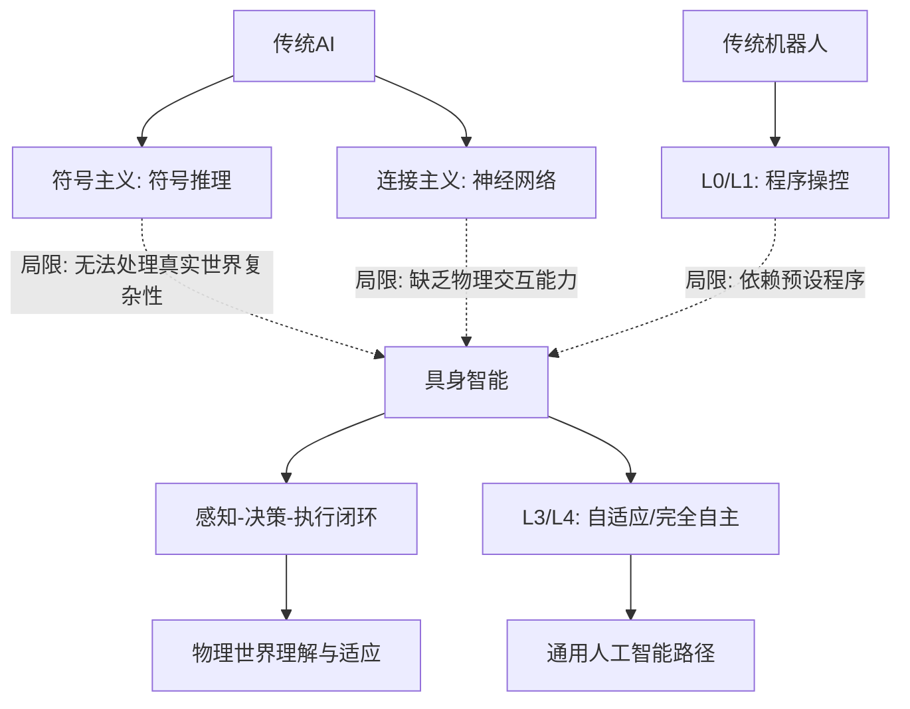

上图展示了具身智能在AI演进路径中的关键地位。机器人学家罗德尼·布鲁克斯早在1986年就指出**"真正的智能无法脱离身体存在，具身化是人工智能走向通用化的必经之路"**[^4]。具身智能被广泛认为是多模态大模型（MLMs）的最佳载体，是实现通用人工智能（AGI）的关键基础[^6]。

### 1.3 技术演进历程：从图灵设想到大模型驱动时代

具身智能的发展历经**哲学概念提出、人工智能和机器人技术积累、大模型技术突破**三个主要阶段[^5]，以下按时间线梳理其关键演进节点：

**1950年代：概念萌芽**
1950年，艾伦·图灵在论文《Computing Machinery and Intelligence》中首次提出具身智能的设想，提出"具身图灵测试"（Embodied Turing Test），旨在确定智能体是否能够展现出不仅能解决虚拟环境中问题的能力，而且能够驾驭物理世界的复杂性和不可预测性[^1][^6]。这一设想奠定了智能与物理形态相结合的理论基础。

**1980-1990年代：行为主义机器人兴起**
受"具身认知"理论启发，研究者开始质疑传统的符号处理模型。1986年，布鲁克斯从控制论角度出发，提出**行为式机器人概念与"包容式架构"**，摒弃传统人工智能对符号推理的依赖，主张智能应由身体与环境的实时交互自然涌现，确立了"感知—行动"闭环系统的可行性[^1][^4]。1991年，布鲁克斯进一步提出"行为智能"，认为智能是具身化（Embodied）和情境化（Contextualized）的[^1]。

**21世纪初至2020年代：技术融合与突破**
进入21世纪，人形机器人的突破推动了具身智能的发展。计算机视觉、激光雷达与深度相机实现了毫米级环境感知，而深度强化学习则使智能体在仿真环境中通过数万亿次试错来优化策略[^4]。例如，英伟达的IsaacGym平台支持百万智能体并行训练，OpenAI的Dactyl机械臂凭借触觉反馈成功复原魔方，展示了具身智能在精细操作方面的潜力[^4]。

**2023-2025年：产业落地元年**
2023年6月，第七届世界智能大会智能科技展上，人形机器人的逐步完善为具身智能的落地提供了方向[^1]。2024年3月，OpenAI与Figure公司合作推出了Figure 01人形机器人[^1]。**2025年被业界称为具身智能产业落地元年**："具身智能"首次写入中国政府工作报告，成为重点培育的未来产业之一；"十五五"规划建议提出，推动具身智能等成为新的经济增长点[^3]。

| 时间节点 | 关键里程碑 | 技术意义 |
|---------|-----------|---------|
| 1950年 | 图灵提出具身智能设想 | 奠定智能与物理形态结合的理论基础 |
| 1986年 | 布鲁克斯提出包容式架构 | 确立感知-行动闭环范式 |
| 2024年3月 | OpenAI与Figure合作推出Figure 01 | 大模型与人形机器人深度融合 |
| 2025年3月 | 具身智能首次写入中国政府工作报告 | 正式进入国家战略规划[^4][^3] |
| 2025年10月 | "十五五"规划建议纳入具身智能 | 明确为新经济增长点[^1] |

**当前技术焦点**已转向**VLA（视觉-语言-动作）架构**与**物理AI（世界模型）**。VLA架构将视觉、语言和动作统一到一个大模型中，使机器人能够理解自然语言指令并与开放环境进行语义交互[^8][^7]。物理AI的使命则是为机器人赋予对物理世界运行规律的"理解力"，通过预测行动的后果进行更高效的规划和决策[^3][^8]。行业共识清晰指向：**竞争焦点正从"灵活的肢体"转向"智能的大脑"**，物理AI成为突破应用瓶颈、实现商业价值的核心赛点[^3]。

### 1.4 本报告的研究范畴与分析框架界定

基于上述概念基础与技术演进脉络，本报告将系统梳理全球具身智能发展的主要技术路线及各路线的代表性公司，提供一个清晰的分析框架。

**技术路线分类标准**：本报告将当前具身智能领域的核心技术路线归纳为**四条主流路径**，并关注其融合趋势[^8]：

1. **分层/模块化架构**：将认知决策与运动控制解耦，优先确保系统的稳定性和可靠性，适合工业场景[^8]
2. **VLA（视觉-语言-动作）架构**：将视觉、语言和动作统一到一个大模型中，强调通用性与语义交互能力[^8][^7]
3. **世界模型/物理仿真驱动路线**：让机器人大脑建立关于世界如何运行的内部模型，具备预测能力[^8]
4. **模仿学习与其他新兴路径**：通过数据驱动让机器人直接从人类演示中学习动作直觉[^8]

业界普遍预测，**混合式架构将成为终局形态**——基于世界模型的强化学习可能成为核心，负责长程规划和预测（System 2），同时结合VLA的语义理解能力处理指令，并利用模仿学习提供快速、直觉的反应（System 1），形成一个既有深度思考又有快速反应的完整智能体[^8]。

**代表性公司遴选依据**：参考Gartner、IDC MarketScape等评估框架[^9]，本报告从以下维度遴选代表性公司：

- **技术前瞻性与智能上限（权重35%）**：具身大模型成熟度、软硬件协同与正向研发能力[^9]
- **应用场景的深度与价值（权重45%）**：场景复杂度、头部客户合作深度与可复制性[^9]
- **规模化潜力与迭代闭环（权重20%）**：大规模生产部署经验、数据闭环效率[^9]

**核心分析维度**：后续章节将从以下维度对各技术路线及代表公司进行深度剖析：

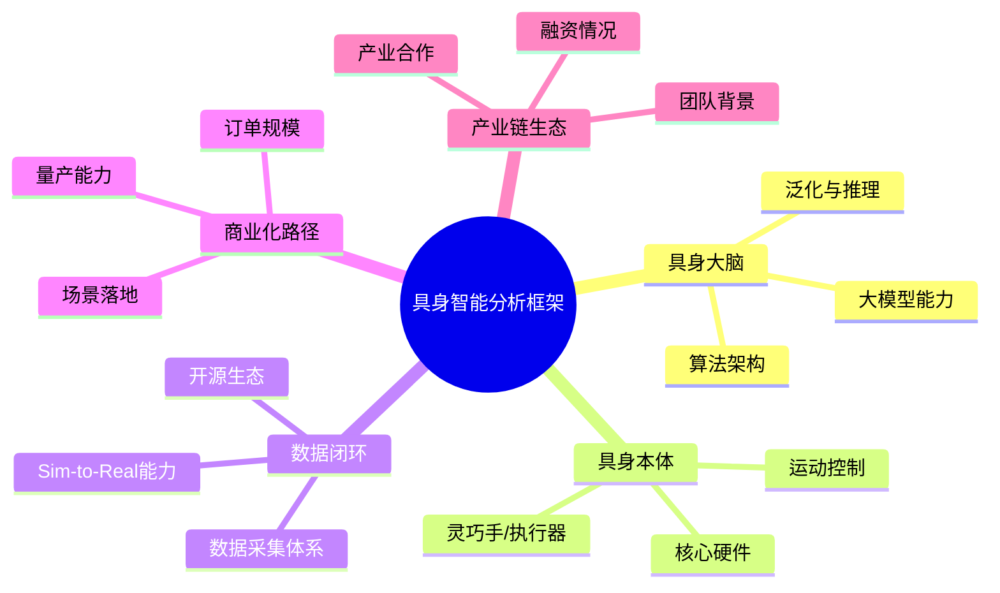

本报告覆盖的代表性企业包括但不限于：**国内头部企业**如智元机器人、宇树科技、优必选、银河通用、智平方、逐际动力、众擎机器人等；**国际领先企业**如Figure AI、特斯拉（Optimus）、波士顿动力、Physical Intelligence、Skild AI等。通过对这些企业技术路径、产品进度、商业化进度、融资情况及团队情况的系统比较，为理解全球具身智能产业格局提供全面深入的洞察。

## 2 全球具身智能主要技术路线全景剖析与分类框架

具身智能作为连接数字智能与物理世界的关键桥梁，其技术路线的选择直接决定了机器人系统的能力边界、部署效率与商业化前景。当前，全球具身智能领域正经历从"百花齐放"向"路径收敛"的关键转型期，多种技术架构与训练范式相互竞争又相互融合，呈现出复杂而动态的技术图景。本章将系统梳理当前具身智能领域的核心算法架构与技术路径，构建清晰的技术路线分类矩阵，为理解各技术路线的适用场景与融合趋势提供系统性框架。

### 2.1 分层/模块化架构与端到端架构的哲学对立与工程权衡

具身智能的算法架构可划分为两大主流范式：**分层决策架构**与**端到端架构**，二者代表了截然不同的技术哲学与工程取舍，也构成了当前行业技术路线争论的核心焦点。

#### 2.1.1 分层决策架构：解耦与可控的工程智慧

分层决策架构的核心设计理念是将具身智能系统的"感知-决策-控制"链路**解耦为多个独立模块**，每个模块承担特定的功能职责，通过清晰定义的接口进行协作。在这种架构中，任务的处理被细分为多个层级，其中的每一层都有其独特的责任和功能[^10]。

从技术实现角度，分层架构通常可划分为"大脑"与"小脑"两个层次："大脑"负责任务的认知与规划，而"小脑"则进行具体的运动控制与执行[^10]。更精细的分层端到端架构可拆分为三个层次：**基础大模型**作为感知与理解中枢，通过整合语言指令与视觉信号实现对复杂场景的语义解析和空间推理；**决策大模型**作为任务拆解与规划中枢，将复杂任务拆解为可执行的子任务序列；**操作大模型**作为硬件执行中枢，将抽象指令转化为控制硬件的精确信号[^11]。

**分层架构的核心优势**体现在以下几个方面：

| 优势维度 | 具体表现 | 工程价值 |
|---------|---------|---------|
| **可控性强** | 各模块独立运行，问题可追溯定位 | 便于调试、维护与安全审计 |
| **模块化升级** | 各层级可独立优化迭代 | 降低系统升级成本与风险 |
| **数据需求相对较低** | 针对具体问题的解决方案可逐步迭代与进化 | 适合数据稀缺场景的渐进式开发 |
| **工程实现成熟** | 易于工程实现，与传统机器人技术兼容 | 缩短从实验室到产线的距离 |

以FigureAI的最新模型为例，其采用了多层级设计，通过不同的神经网络协作，提高了系统的灵活性和实时响应能力[^10]。这种设计使得分层决策在一定程度上克服了端到端方法的缺陷，特别是在对数据质量和数量的适应上，确保机器人在复杂任务下的稳定性和表现[^10]。

然而，分层架构也面临**泛化能力受限**的核心挑战。由于各模块之间通过预定义接口传递信息，不可避免地存在信息损失与语义鸿沟，导致系统在面对训练分布外的新场景时适应能力较弱。

#### 2.1.2 端到端架构：追求统一的技术理想

端到端架构代表了另一种技术哲学——通过单一神经网络，将输入任务直接映射为控制信号，形成从输入到输出的无缝连接[^10]。这种方法追求"大一统"的整合，希望通过海量数据驱动实现机器人自主学习与决策，反应速度快且系统架构简洁[^12]。

特斯拉的Optimus机器人和谷歌的RT-2项目便是端到端架构的典型应用[^10]。端到端架构的核心吸引力在于：它能够让模型自动学习从原始感知输入到最终动作输出的完整映射，避免了人工设计中间表示可能带来的信息瓶颈，理论上具备更强的泛化潜力。

**然而，端到端架构面临的挑战同样显著**：

- **数据与算力需求巨大**：需要万亿级长任务数据支撑模型收敛，这使得大量初创企业在这一领域的探索变得困难[^10]
- **收敛性与稳定性问题**：在数据稀缺的情况下，一旦模型的收敛性不足，其性能将大打折扣[^10]
- **决策速度受限**：例如RT-2项目因此面临决策速度缓慢的问题，这限制了其在复杂环境中的应用[^10]
- **可解释性不足**：黑箱特性使得故障诊断与安全验证面临挑战

正如一位具身智能创业者所指出的，端到端架构虽然前景广阔，但在数据稀缺的情况下，其性能将大打折扣[^10]。

#### 2.1.3 两种架构的场景选择逻辑

在实际工程实践中，两种架构的选择取决于具体应用场景的需求特征：

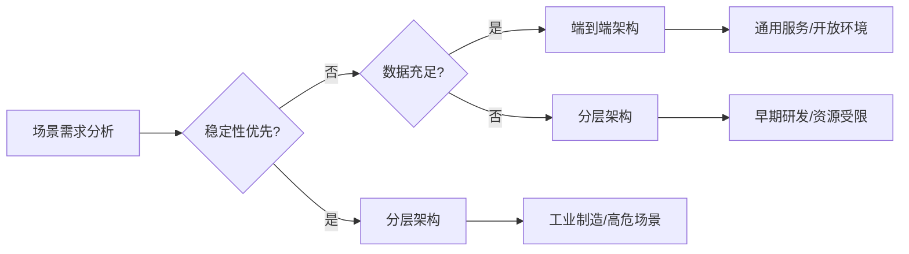

**分层架构更适合**对稳定性、可靠性要求极高的工业场景，如汽车制造、精密装配等，这些场景容错空间小，需要清晰的故障追溯机制。**端到端架构更适合**追求通用性与适应性的服务场景，如家庭服务、零售导购等，这些场景需要机器人具备处理开放世界多样性的能力。

当前，许多公司和研究团队正在积极探索这两种架构的结合与优化[^10]。例如，千寻智能与其Any-point Trajectory Model（ATM）框架实现了部分泛化训练，仅需少量标注数据便能进行高效的动作预测；穹彻智能开发的两级火箭大模型，聚焦操作物理知识的深度理解和高精度力反馈能力，展示了将传统控制方法与最新AI技术结合的成功尝试[^10]。

### 2.2 VLA架构：视觉-语言-动作统一模型的技术内核与演进趋势

VLA（Vision-Language-Action，视觉语言动作大模型）技术正成为连接自动驾驶与具身智能的关键枢纽，代表了具身智能领域最受关注的前沿方向之一[^13]。

#### 2.2.1 VLA的核心设计理念

VLA的本质是利用大语言模型的泛化能力，包括从互联网数据预训练得到的通识知识，再辅以语言模态的推理能力，来解决现实世界中行为决策的问题[^13]。不同于传统端到端模型从视觉直接映射到动作的"条件反射"式决策，VLA将语言理解与推理能力引入物理世界的决策链路，赋予机器**"看了就懂、懂了就做"**的认知能力[^13]。

VLA模型借助基础模型的通用能力与大规模学习范式，可以处理通用的视觉（Vision）与语言（Language）输入，并生成实时动作（Action），极大地赋能了机器人系统[^14]。其核心价值体现在：

- **语义理解能力**：能够理解自然语言指令，将人类意图转化为机器人可执行的任务
- **任务泛化能力**：利用预训练知识处理训练数据中未见过的新场景与新任务
- **长程任务规划**：将复杂任务拆解为可执行的子任务序列（sub task）[^13]

#### 2.2.2 动作词元化视角下的VLA统一框架

北京大学-灵初智能联合实验室首次从**动作词元化（action tokenization）视角**，提出了统一理解VLA模型的新框架[^14]。该框架系统分析了当前VLA系统遵循的通用架构：视觉与语言输入经过一系列VLA modules逐级处理，生成逐渐具体的action token，最终转化为动作输出[^14]。

根据这一框架，action token可分为**八种主流类型**：

| Action Token类型 | 功能定位 | 适用场景 | 发展趋势 |
|-----------------|---------|---------|---------|
| **Language Description** | 自然语言描述动作 | 人机交互、任务说明 | 表达能力有限，难成主流 |
| **Language Plan** | 语言形式的任务规划 | 长程任务分解 | 在任务分解中不可或缺 |
| **Code** | 代码形式的规划与控制 | 结构化任务执行 | 潜力依赖于完备的函数库 |
| **Affordance** | 交互可供性预测（做什么） | 物体交互决策 | 与trajectory互补结合 |
| **Trajectory** | 运动轨迹预测（如何做） | 精细运动控制 | 借助goal state提升精度 |
| **Goal State** | 目标状态预测 | 视觉目标引导 | 增强生成精度 |
| **Latent Representation** | 潜在表示学习 | 端到端学习 | 面临粒度与对齐挑战 |
| **Raw Action** | 原始动作信号 | 直接控制执行 | 能力高度依赖数据 |

此外，**Reasoning**作为"元token"可增强其他token的生成，未来将从基于language token的推理发展为基于action token的多模态推理，并支持任务适应性推理计算[^14]。

#### 2.2.3 VLA的演进方向与架构趋势

VLA模型的未来不在于依赖单一action token，而在于**多种token的协同**[^14]。根据最新综述研究，未来的VLA模型很可能采用分层架构：

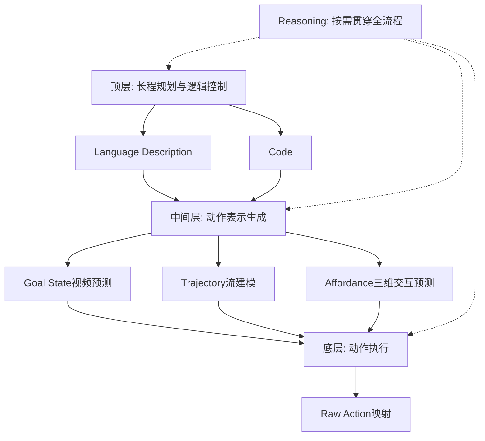

这一架构趋势表明，**顶层通过language description和code实现长程规划与逻辑控制；中间层在近期内预计将使用goal state的视频预测、trajectory的流建模以及affordance的三维交互预测紧密结合，形成中间动作表示；底层最终映射为raw action**[^14]。长期来看，下层将演化为完全端到端的方式，直接从子任务级输入预测raw action。

VLA研究还呈现出从**VLA模型向VLA智能体**演进的趋势。VLA模型应向具备记忆、探索、规划和反思能力的主动型VLA智能体演进，并由线性结构转向更复杂的双向或图结构架构[^14]。

#### 2.2.4 VLA面临的挑战与争议

尽管VLA技术前景广阔，但也伴随着争议。在2025年世界机器人大会上，宇树科技创始人王兴兴公开质疑这一技术路线，引发行业热议[^13]。这场争论的背后，是软件与硬件、泛化性与可靠性、学术探索与商业落地之间的深层张力。

VLA面临的核心挑战包括：

- **实时性问题**：VLA模型的推理延迟如何满足实时控制需求
- **安全性问题**：如何保证VLA在关键场景下不出错
- **数据问题**：机器人领域的高质量数据远比自动驾驶稀缺[^13]

针对实时性挑战，研究者提出了**思考与执行可以并行**的解决思路，通过异步架构设计缓解推理延迟对控制频率的影响[^13]。

### 2.3 世界模型与物理仿真驱动的技术路径

世界模型（World Model）代表了具身智能领域另一条重要的技术路径，其核心价值在于让机器人大脑建立关于物理世界运行规律的内部模型，具备**预测行动后果**的能力。

#### 2.3.1 世界模型的核心概念与价值

世界模型的核心使命是为机器人赋予对物理世界运行规律的"理解力"。通过学习一个能够表征环境内在转移规律的预测模型，使智能体具备在想象空间中进行自我进化的能力[^15]。这种机制允许智能体在潜空间内进行大规模、低成本的轨迹预演与策略优化，从而显著降低对环境交互的依赖，加速具身智能机器人的落地应用。

世界模型强调**理解世界规律的重要性**，其技术路径与VLA模型存在结合与融合的可能[^12]。在实际应用中，世界模型可以：

- **提升样本效率**：在想象空间中进行大规模训练，减少真实世界交互成本
- **支持长程规划**：通过预测未来状态序列，实现更智能的任务规划
- **增强安全性**：在执行前预演动作后果，避免危险操作

#### 2.3.2 世界模型的多元技术范式

当前世界模型的实现路径主要包括以下几种技术范式：

**基于视频生成预测的世界模型**：通过生成式模型预测未来视觉观察，学习环境的视觉动态规律。这类方法能够捕捉丰富的视觉信息，但面临生成质量与物理一致性的挑战。

**基于三维物理仿真的世界模型**：如基于Gaussian Splatting等技术构建的GS-World类系统，通过高保真的三维重建与物理引擎模拟，实现对物理世界的精确建模。这类方法物理一致性强，但计算成本较高。

**基于潜空间动态的世界模型**：在学习得到的潜在表示空间中建模状态转移，计算效率高但可解释性较弱。

#### 2.3.3 世界模型强化学习（World Model RL）

世界模型强化学习（World Model RL）研究应运而生，以应对具身智能中样本效率低下的瓶颈问题[^15]。其核心范式在于通过额外学习一个能够表征环境内在转移规律的预测模型，使智能体具备在想象空间中进行自我进化的能力。

清华大学与加州伯克利的研究团队联合提出的BOOM框架展示了世界模型RL的最新进展。该框架通过创新的"自举循环"机制，实现了高维控制任务下的性能新突破[^15]。其核心设计包括：

- **策略暖启动规划**：策略网络为规划器提供初始动作方案
- **规划精炼策略**：规划器利用世界模型精炼出更高质量的动作，并通过行为对齐反馈给策略网络
- **无似然对齐机制**：无需知道规划器的具体概率分布，即可实现策略与规划动作的高效对齐
- **软Q加权机制**：根据Q函数动态调整权重，引导策略优先学习高价值经验

实验结果表明，这种"让规划与学习双向奔赴"的机制能够显著提升学习效率，在DeepMind Control Suite等基准测试中刷新了SOTA性能[^15]。

#### 2.3.4 世界模型与VLA的融合

世界模型与VLA模型的结合方式是当前研究的热点方向之一[^12]。两者的协同机制可以体现在：

- **VLA提供语义理解**：将自然语言指令转化为任务目标
- **世界模型提供物理预测**：预测动作执行的物理后果
- **联合优化决策**：基于语义理解与物理预测的综合信息进行动作决策

这种融合有望结合VLA的语义泛化能力与世界模型的物理推理能力，构建更加智能与可靠的具身智能系统。

### 2.4 训练范式：模仿学习与强化学习的路线之争与协同融合

在具身智能的训练方法层面，**模仿学习（Imitation Learning）**与**强化学习（Reinforcement Learning）**构成了两大核心范式，二者各有优劣，在实际应用中呈现出从对立竞争走向协同融合的趋势[^16]。

#### 2.4.1 模仿学习：从人类演示中快速习得

模仿学习的核心思想是通过人类演示数据让机器人直接学习动作策略，本质上是一种"教AI抄作业"的方法[^16]。其主要优势包括：

- **学习效率高**：无需设计复杂的奖励函数，直接从演示中学习
- **快速上手**：适合让机器人快速习得基础技能
- **数据利用直观**：人类演示数据的采集相对直接

然而，模仿学习也面临显著局限：

- **受限于演示质量**：学习效果依赖于演示数据的质量与覆盖范围
- **泛化能力有限**：难以处理演示数据未覆盖的新场景
- **存在分布偏移**：策略在执行过程中可能偏离演示分布

#### 2.4.2 强化学习：在试错中自主进化

强化学习让机器人通过与环境的试错交互自主学习最优策略，是一种"让AI自主闯关"的方法[^16]。引入强化学习可帮助VLA模型突破模仿学习的局限，实现类人试错与自主探索[^14]。

强化学习的核心优势在于：

- **突破演示天花板**：能够发现比人类演示更优的策略
- **自主探索能力**：在未知环境中具备探索与适应能力
- **端到端优化**：直接优化任务目标，避免中间表示的信息损失

但强化学习在具身智能领域面临的挑战同样突出：

- **样本效率低**：传统无模型强化学习完全依赖于海量的盲目试错来获取学习信号[^15]
- **真实世界部署成本高**：在现实物理世界中，每一次交互都伴随着不可忽视的时间损耗、高昂的硬件维护成本以及潜在的安全风险[^15]
- **奖励函数设计困难**：复杂任务的奖励函数难以精确定义

#### 2.4.3 真实数据与仿真合成数据的协同策略

数据是具身智能的燃料，如何解决数据构建中的挑战成为各方关注的焦点[^10]。在不同的应用场景中，机器人需要的大量真实数据与虚拟仿真数据的平衡，仍需进一步调整[^10]。

**真实数据**保留物理世界真实性与闭环反馈，但成本高、规模化难；**合成数据**可快速批量化生成，但仍然存在虚实差距（Sim-to-Real Gap）等问题[^11]。行业实践中多采用真实数据与合成数据协同应用的方式：

| 公司/机构 | 数据策略 | 效果 |
|----------|---------|------|
| 英伟达 | 从少量人类示范生成大规模合成数据 | 11小时生成相当于9个月的人类演示数据，性能提升40% |
| 特斯拉 | 真实数据为主+仿真合成为辅 | 通过动作捕捉采集数据，构建虚拟仿真场景 |
| 银河通用 | 99%合成数据+1%真实数据 | 高效完成pick&place等任务 |

这些实践表明，**Sim-to-Real技术**是弥合虚实差距的关键。通过域随机化、域适应、渐进式迁移等技术，可以有效提升仿真训练策略在真实世界的迁移效果。

### 2.5 双系统架构与大小脑融合模型的设计逻辑

借鉴认知科学中的"快慢系统"理论，具身智能领域发展出了**双系统架构**与**大小脑融合模型**的设计范式，旨在平衡实时响应与智能深度的双重需求。

#### 2.5.1 快慢系统的认知科学启示

认知科学家丹尼尔·卡尼曼提出的"快慢系统"理论为具身智能架构设计提供了重要启示：

- **System 1（快系统）**：快速、直觉、自动化的反应，类似于人类的条件反射与本能反应
- **System 2（慢系统）**：慢速、深思熟虑、需要注意力的推理，类似于人类的逻辑思考与规划

在具身智能中，这一理论被映射为**大脑与小脑的功能分工**：大脑负责高层认知与规划（System 2），小脑负责快速运动控制与协调（System 1）[^10]。

#### 2.5.2 大小脑融合模型的三层架构

分层端到端架构作为当前主流技术路线，可以清晰地体现大小脑融合的设计逻辑[^11]：

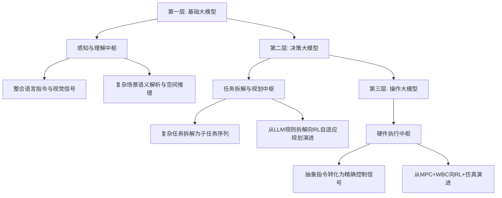

- **第一层基础大模型**：作为感知与理解中枢，通过整合语言指令与视觉信号实现对复杂场景的语义解析和空间推理
- **第二层决策大模型**：作为任务拆解与规划中枢，将复杂任务拆解为可执行的子任务序列，技术发展路径从基于LLM的规则拆解向强化学习驱动的自适应规划演进
- **第三层操作大模型**：作为硬件执行中枢，将上一层生成的抽象指令转化为控制硬件的精确信号，技术路径正从MPC+WBC向RL+仿真演进[^11]

#### 2.5.3 思考与执行的并行处理

在实际应用中，如何实现思考（System 2）与执行（System 1）的并行处理是关键的工程挑战。研究表明，**思考与执行可以并行**进行[^13]，具体实现方式包括：

- **异步架构设计**：高层规划与底层控制运行在不同的时间尺度上，通过缓冲机制解耦
- **分层频率控制**：高层决策以较低频率运行（如1-10Hz），底层控制以高频率运行（如100-1000Hz）
- **预测性规划**：利用世界模型预测未来状态，提前生成动作序列

这种并行处理机制使得机器人能够在保持高频运动控制的同时，进行复杂的语义理解与任务规划，实现智能深度与实时响应的平衡。

### 2.6 技术路线分类矩阵与融合趋势展望

基于前述分析，本节构建具身智能技术路线的系统分类矩阵，并探讨业界普遍预测的混合式架构终局形态。

#### 2.6.1 技术路线分类矩阵

下表从多个关键维度对当前主流技术路线进行横向对比：

| 维度 | 分层/模块化架构 | 端到端架构 | VLA架构 | 世界模型驱动 |
|------|---------------|-----------|---------|-------------|
| **核心理念** | 解耦与可控 | 统一与简洁 | 语义理解与泛化 | 物理预测与规划 |
| **架构特点** | 感知-决策-控制分离 | 输入到输出直接映射 | 视觉-语言-动作统一 | 环境动态建模 |
| **数据依赖** | 中等 | 极高 | 高 | 中高 |
| **泛化能力** | 较弱 | 潜力强但依赖数据 | 强 | 中等 |
| **实时性** | 好 | 中等 | 需优化 | 依赖实现 |
| **可解释性** | 强 | 弱 | 中等 | 中等 |
| **工程成熟度** | 高 | 中等 | 发展中 | 发展中 |
| **适用场景** | 工业/高可靠性 | 通用/开放环境 | 语义交互/服务 | 复杂规划/仿真 |
| **代表方案** | Figure AI分层设计 | Tesla Optimus | 智元VLIA、银河GraspVLA | GS-World、BOOM |

#### 2.6.2 混合式架构的终局形态

业界普遍预测，**混合式架构将成为具身智能的终局形态**。这一判断基于以下观察：

- 单一技术路线难以同时满足泛化性、实时性、可靠性、可解释性等多维需求
- 不同技术路线在特定维度上各有优势，具备互补潜力
- 实际应用场景的复杂性要求系统具备多层次、多模态的能力

未来的混合式架构可能呈现以下形态：

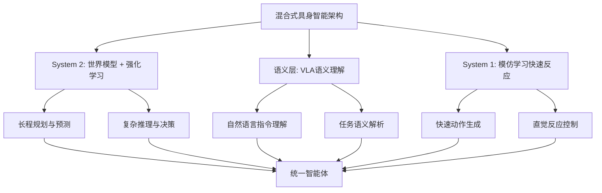

在这一架构中：

- **基于世界模型的强化学习**成为核心，负责长程规划和预测（System 2），使机器人具备对物理世界的深度理解与前瞻性决策能力
- **VLA提供语义理解能力**，处理自然语言指令，实现人机自然交互与任务泛化
- **模仿学习提供快速、直觉的反应**（System 1），确保系统在常见场景下的高效响应

这种"既有深度思考又有快速反应"的完整智能体架构，有望在保持系统可靠性的同时，实现更强的通用性与适应性。

#### 2.6.3 技术融合的关键挑战

尽管混合式架构前景广阔，但实现过程中仍面临诸多挑战：

- **模块间接口设计**：如何在保持模块独立性的同时实现高效信息传递
- **端到端训练与模块化优化的平衡**：如何在系统层面进行联合优化
- **计算资源分配**：如何在有限算力下平衡各模块的计算需求
- **数据协同**：如何设计统一的数据格式与训练流程

正如综述研究所指出的，**具身智能旨在应对物理世界的非结构化与开放性挑战，亟需模型、数据与硬件协同发展**。然而受限于机器人平台与高质量数据匮乏，研究多局限于简化实验场景，整体仍处早期阶段。实现通用智能需三者协同演进，协力前行[^14]。

此外，**安全与对齐**问题也日益受到重视。当前的VLA研究主要关注模型能力，未来必须更加重视安全性与人类对齐[^14]，确保具身智能系统在复杂环境中的可靠运行与人类价值观的一致性。

## 3 技术路线一：分层与模块化架构及代表公司深度分析

分层与模块化架构作为具身智能领域最为成熟的技术路线，其核心价值在于通过功能解耦实现系统的高可控性与工程可实现性。这一路线将具身智能系统拆分为相对独立的感知、决策、控制模块，各模块通过清晰定义的接口协作，既保证了系统的稳定性与可调试性，也为模块级的独立优化与升级提供了便利。在当前人形机器人从实验室走向产线的关键阶段，分层架构凭借其与传统机器人技术的兼容性，成为工业制造、仓储物流等高可靠性场景的首选方案。本章将系统剖析这一技术路线的原理与价值，并通过优必选、波士顿动力、开普勒机器人三家代表性企业的深度比较，揭示分层架构路线在产业化进程中的竞争格局与演进方向。

### 3.1 分层与模块化架构的技术原理与工程价值

分层与模块化架构的设计哲学源于对复杂系统的"分而治之"思想，其核心在于将具身智能系统的"感知-决策-控制"链路**解耦为功能独立、职责明确的多个模块**，通过标准化接口实现模块间的协作与信息传递。

#### 3.1.1 "大脑"与"小脑"的功能分工

在分层架构中，系统通常被划分为"大脑"与"小脑"两个核心层级：

- **"大脑"层级**：负责高层认知与任务规划，包括对环境的语义理解、任务目标的解析、复杂任务的分解与子任务序列的生成。这一层级整合视觉、语言等多模态输入，输出抽象的任务指令或动作规划
- **"小脑"层级**：负责底层运动控制与执行，将上层的抽象指令转化为关节级的控制信号，实现步态规划、全身动力学控制、力矩调节等精细运动

这种功能分工模拟了人类神经系统的层级结构——大脑皮层负责思考与决策，小脑负责运动协调与平衡控制——使得机器人系统能够在保持高层智能的同时，确保底层运动的稳定与精确。

#### 3.1.2 分层架构的核心工程优势

分层架构在工程实践中展现出显著的优势，使其成为当前产业化阶段的主流选择：

| 优势维度 | 具体表现 | 工程价值 |
|---------|---------|---------|
| **可控性与可追溯性** | 各模块独立运行，问题可定位到具体层级 | 便于故障诊断、系统调试与安全审计 |
| **模块化升级** | 各层级可独立优化迭代，无需整体重构 | 降低系统升级成本与技术风险 |
| **数据需求相对较低** | 各模块可针对性训练，无需端到端海量数据 | 适合数据稀缺场景的渐进式开发 |
| **工程实现成熟** | 与传统机器人控制技术兼容性强 | 缩短从实验室到产线的部署周期 |
| **可解释性强** | 决策过程可分层追溯，逻辑清晰 | 满足工业场景的安全合规要求 |

以工业制造场景为例，分层架构的可控性优势尤为突出。在汽车装配线上，机器人需要执行高精度、高重复性的操作任务，任何故障都可能导致产线停机。分层架构允许工程师快速定位问题——是感知模块的识别错误、规划模块的路径异常，还是控制模块的执行偏差——从而实现快速修复，最大限度减少停机时间。

#### 3.1.3 分层架构面临的核心挑战

尽管分层架构在工程可实现性方面优势明显，但其固有的设计特性也带来了不可忽视的挑战：

**泛化能力受限**是分层架构面临的最核心问题。由于各模块之间通过预定义接口传递信息，不可避免地存在**信息损失与语义鸿沟**。例如，感知模块输出的结构化环境表示可能丢失原始传感器数据中的细微特征，而这些特征在面对新场景时可能至关重要。这导致系统在处理训练分布外的新场景时适应能力较弱，难以实现真正的开放世界泛化。

**模块间协调复杂性**同样值得关注。在复杂任务执行过程中，各模块需要频繁交互与协调，接口设计的合理性直接影响系统整体性能。过于简化的接口可能导致信息瓶颈，而过于复杂的接口则增加系统耦合度，削弱模块化的优势。

**实时性与智能深度的平衡**也是重要挑战。高层认知模块（尤其是引入大模型后）的推理延迟可能与底层控制的高频需求产生矛盾，需要通过异步架构设计、分层频率控制等机制加以缓解。

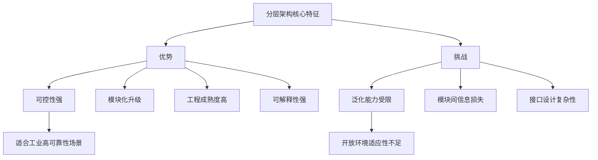

综合来看，分层架构在当前具身智能产业化的早期阶段具有不可替代的价值——它提供了一条从技术验证到商业落地的可行路径，尤其适合对稳定性、可靠性要求极高的工业场景。然而，随着行业向通用化方向演进，分层架构需要与VLA、世界模型等新兴技术融合，以突破泛化能力的瓶颈。

### 3.2 优必选：全栈自研与渐进商业化的行业标杆

作为全球首家上市的人形机器人公司，优必选已成为观察具身智能商业化进程的关键样本[^17]。它不仅是一家机器人公司，更是一个技术集成平台和渐进式商业化的探索者，其发展路径为行业提供了重要的参考范式。

#### 3.2.1 全栈自研技术体系：从关节到大脑的完整布局

优必选的核心技术可概括为**"身体"（硬件执行）与"大脑"（软件智能）**两大部分，形成了覆盖核心部件、算法、系统的全栈技术链[^17]。

**硬件执行层**构成了优必选最底层的技术壁垒。机器人全身多达数十个关节，每个都需高度集成电机、减速器、驱动器和传感器。优必选自研的高性能伺服驱动器，实现了力矩、位置、速度的精确控制，这是其机器人运动灵巧性的基础[^17]。公司拥有**170余项伺服驱动器相关专利**，包括中空旋转关节模组、间隙调整装置等关键结构创新，实现了核心部件的国产化替代[^18]。

**软件智能层**则体现了优必选在AI与具身智能算法方面的深厚积累。机器人操作系统**ROSA**作为底层框架，统一管理硬件资源、任务调度和通信，是开发应用的基石[^17]。在AI算法领域，公司覆盖多模态大模型、语义VSLAM、学习型运动控制等核心技术，让机器人具备自主导航、自然交互、自主学习的能力[^18]。基于自研关节，公司开发出实时步态规划和全身动力学控制算法，让Walker能实现稳定行走、上下楼、抗干扰等复杂动作[^17]。

截至2025年6月底，优必选拥有**2790项授权专利，其中发明专利占比58%，人形机器人有效专利数量全球第一**[^18]。在应用场景上，针对工业操作、教育、康养、物流等场景布局了专项专利，形成了研发-应用-数据反馈-技术优化的正向循环[^18]。

| 技术领域 | 核心能力 | 专利/技术积累 |
|---------|---------|--------------|
| 伺服关节 | 高性能伺服驱动器，力矩/位置/速度精确控制 | 170余项相关专利 |
| 操作系统 | ROSA机器人操作系统 | 统一硬件资源管理与任务调度 |
| 运动控制 | 实时步态规划、全身动力学控制 | 稳定行走、上下楼、抗干扰 |
| AI算法 | 多模态大模型、语义VSLAM、学习型运动控制 | 自主导航、自然交互、自主学习 |
| 总体专利 | 全栈技术覆盖 | 2790项授权专利，发明专利占比58% |

#### 3.2.2 产品矩阵：从教育到工业的渐进逻辑

优必选的产品线清晰呈现出**"教育筑基，消费探路，行业深化"**的渐进逻辑[^17]。

| 产品类别 | 代表产品 | 核心功能与定位 | 市场意义 |
|---------|---------|---------------|---------|
| 教育及服务机器人 | AlphaMini悟空、克鲁泽 | 人工智能教育、展厅导览服务 | 现金牛业务，提供稳定营收和现金流 |
| 消费级人形机器人 | Walker系列（Walker X、Walker S2） | 双足行走、手眼协调、交互娱乐 | 技术旗舰与品牌标杆 |
| 行业解决方案 | 智能物流机器人、工业人形机器人 | 工厂、仓库等特定场景自动化服务 | 商业化主攻方向，营收增长关键 |

**Walker系列人形机器人**是优必选的技术旗舰产品。2025年，公司推出可自主换电的**Walker S2**，进一步提升了工业场景的实用性[^18]。Walker S系列已成为**全球进入最多新能源车厂实训的工业人形机器人**，在汽车制造、智慧物流、数据中心等场景实现落地应用[^18]。

**C端消费级产品**构成了优必选的重要现金流来源。从2025年半年报数据来看，C端业务已成长为第一大营收板块[^18]。2025年上半年，优必选营收6.21亿元，同比增长27.5%。其中，消费级机器人及其他硬件设备的营业收入增长48.9%，达到2.601亿元；教育智能机器人及解决方案收入增长48.8%，达到2.398亿元。**这两项业务合计贡献了超过80%的营收**[^18]。

优必选的C端产品矩阵形成了清晰梯度，包含教育机器人、小型人形机器人、宠物机器人、智能猫砂盆、割草机器人等多种类目，覆盖多元消费场景[^18]。这种布局形成了**"技术降维+场景高频"**的消费级产品逻辑，虽然技术复杂度不如人形机器人，但市场需求明确，能够快速产生销售收入[^18]。

#### 3.2.3 商业化进展：B+G端双轮驱动的订单爆发

2025年，优必选迎来了人形机器人订单的爆发式增长，**全年人形机器人订单总额超14亿元人民币**[^18]。这一成绩让市场重构了对其的认知，正如业内投资人所言，许多人形机器人创始人在2025年经历了"从质疑优必选，到理解优必选，再到成为优必选"的过程[^18]。

优必选的订单结构呈现**"G端压舱、B端突破"**的特征[^18]：

**G端数据采集及服务订单占比超过60%**。其中，广西防城港**2.64亿元边境口岸服务大单**创下了全球人形机器人行业单笔最高中标纪录[^18]。这类订单的优势在于稳定性强、结算周期清晰，通常采用预付款+进度款+尾款模式，能够保障阶段性现金流健康[^18]。

**B端工业场景成为订单增长引擎**，尤其在高端制造领域实现全球突围，2025年海外订单占比首次突破10%[^18]。具体而言：

- **德州仪器合作**：2025年12月，美国德州仪器与优必选达成战略合作，已采购优必选工业人形机器人Walker S2，并正在其产线上部署调试应用，成为**国产工业人形机器人批量出口高端制造场景的首个案例**[^18]
- **国内车企合作**：优必选已进入东风柳汽、吉利等头部车企，用于车身装配、零部件分拣等工位[^18]

从量产能力来看，依托其**柳州机器人超级智慧工厂**，2025年优必选工业人形机器人年产能已突破1000台，**交付量超500台**，并计划于2026年提升至万台规模[^18]。

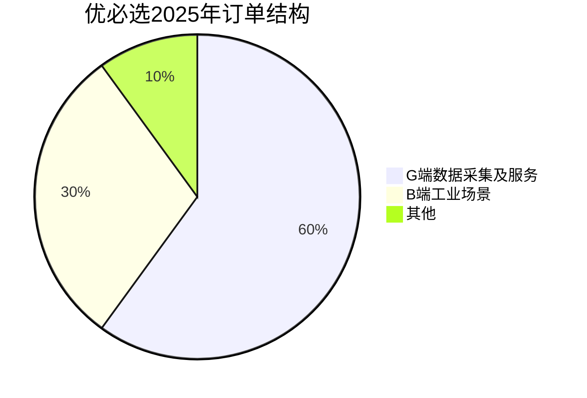

这种**依托地方政府实现商业化的路径**，优必选早在七八年前就已经率先探索并跑通[^18]。彼时的优必选与深圳、广西、北京等多地政府达成深度合作，将机器人落地到政务服务、教育示范等场景，为后续的技术迭代和场景拓展积累了关键的现金流与数据[^18]。

#### 3.2.4 商业模式的四维体系

优必选商业模式的领先性，不仅在于先发布局政府合作，更在于它早已跳出单点依赖，构建了**"G端合作筑底+B端工业放量+C端生态补流+资本赋能续航"**的四维商业化体系[^18]。

这一体系的核心逻辑在于：

- **G端合作筑底**：通过政府采购、数据合作、产业共建，获取稳定的早期订单与真实场景数据
- **B端工业放量**：聚焦汽车制造等高价值工业场景，实现营收规模化增长
- **C端生态补流**：通过消费级产品构建现金流护城河，为核心技术研发争取时间窗口
- **资本赋能续航**：通过上市及资本运作保障充足的资金储备

正如有行业分析师指出，当前人形机器人行业的核心博弈，是**技术突破速度能否跑赢资本忍耐阈值**[^18]。对于优必选而言，C端业务的成功本质上是帮公司赢得了时间，使其能在人形机器人技术完全成熟前，始终保持在赛道中的竞争资格[^18]。

#### 3.2.5 融资与估值：人形机器人第一股的资本价值

优必选于2023年12月在香港联交所上市，成为**"人形机器人第一股"**[^17]。截至2025年，公司市值已达约**580亿港元**（约600亿元人民币）[^19][^20]。

从投资逻辑来看，投资优必选本质上是投资"人形机器人商业化"的未来[^17]：

**核心看点（机遇）**：
- **稀缺性标的**：作为"人形机器人第一股"，在资本市场具有独特性和标杆效应
- **商业化进程领先**：营收规模和落地场景数量在国内同行中领先，商业模式正逐步被验证
- **技术向商业的转化能力**：已证明能将前沿技术转化为可销售的产品和方案
- **AI大模型时代的接口价值**：其机器人硬件平台是承载未来具身智能大模型的理想物理载体之一

**关键挑战（风险）**：
- **持续盈利能力**：公司目前仍处于亏损状态，需观察其行业解决方案能否在未来迅速放量
- **赛道竞争加剧**：面临特斯拉、智元机器人等国内外巨头的激烈竞争
- **技术路径风险**：若行业出现颠覆性的技术路径，可能对公司战略产生影响[^17]

#### 3.2.6 团队背景与技术商业化能力

优必选的行业地位可以从几个关键标签来理解[^17]：

- **"中国版波士顿动力"**：在运动控制和双足机器人领域，它是国内技术实力的最高代表之一
- **"商业化先行者"**：区别于许多仍停留在研发阶段的团队，它率先实现了从技术到产品、再到营收的跨越，并成功上市，证明了商业模式的可行性
- **"全栈技术平台"**：其覆盖硬件、软件、算法、操作系统的能力，使其具备为不同行业提供定制化解决方案的潜力

优必选的护城河并非单一技术，而是一个由**工程化、全栈能力和商业闭环**构成的体系[^17]：

- **工程化与量产壁垒**：将实验室原理样机转化为稳定、可靠、可批量生产的产品，是巨大挑战。优必选在伺服关节的大规模制造、整机的系统集成与测试方面，拥有多年积累的工程经验与工艺知识
- **全栈技术整合壁垒**：从底层关节、操作系统到上层AI算法，优必选坚持关键环节自研，确保了对产品性能和迭代的强把控力
- **商业化场景数据壁垒**：通过教育、物流等已落地场景，持续获取真实的用户交互数据和环境数据，构成了场景理解和算法优化的正向循环

### 3.3 波士顿动力：技术灯塔的商业化困境与战略转型

波士顿动力作为人形机器人领域的"技术灯塔"，其三十年发展历程既是技术突破的传奇，也是商业化困境的典型案例。理解波士顿动力的得与失，对于把握分层架构路线的产业化前景具有重要参考价值。

#### 3.3.1 三十年技术积累：从MIT到行业灯塔

波士顿动力的发展可追溯至1983年，当时还在麻省理工的马克·雷伯特（Marc Raibert）创造了世界上第一款能单腿蹦跳的机器人[^21]。1992年，马克脱离麻省理工，正式创立波士顿动力[^21]。

海外人形机器人产业历经**萌芽探索、集成发展、高动态发展、智能化发展**四大阶段[^22]。波士顿动力在其中扮演了关键角色：

**高动态发展阶段（2010年至2022年）**是波士顿动力技术实力最为耀眼的时期。其**Atlas机器人**采用液压驱动的技术路线，能够在具有挑战性的场景中保持平衡并实现高动态运动[^22]。Atlas展示的后空翻、跑酷等高难度动作，成为全球范围内机器人技术的标杆性展示。

**Spot四足机器人**则是波士顿动力商业化探索的核心产品。2015年，Spot的概念介绍视频走红，一年后正式问世[^21]。这只黄色四足狗在此后多年一直是外网的"网红"，2018年Spot开门的切片视频病毒式传播，再度火爆一时[^21]。

然而，发展多年，波士顿动力似乎始终没走出MIT校园[^21]。其技术路线选择带来了显著的商业化障碍：马克选择**液压驱动**方案，通过压缩泵产生高压液体驱动机器人关节活动，颇有生物仿真的意味。然而，液压驱动的问题非常明显：**压缩泵噪音巨大，且一旦遇到磕碰极易发生液体泄漏，结构复杂、维护困难**[^21]。

#### 3.3.2 三次易主：学院派思维与商业化的深层矛盾

波士顿动力的资本历程深刻反映了技术灯塔与商业化之间的张力。

**第一次转折：军方合作失败（2013年）**

2005年，美国国防部高级研究计划局（DARPA）开启了一项计划，波士顿动力的"大狗（BigDog）"在42个项目中脱颖而出[^21]。数千万美元的投资砸下，波士顿动力快速发展。然而，由于液压驱动的噪音与可靠性问题，最终军方失去了兴趣，2013年"大狗"项目终止[^21]。

**第二次转折：谷歌收购与出售（2013-2017年）**

终止与军方合作后，谷歌递来橄榄枝，以**30亿美元**的价格高调收购波士顿动力[^21]。然而，这一时期的波士顿动力依然像搞学术研究一般，是申请经费模式——专心搞研发，专心做宣传拿"经费"，不顾及商业化[^21]。投资人并不是慈善家，无法忍受一个持续烧钱却看不到盈利前景的项目。

**第三次转折：软银接手与现代汽车收购（2017-2020年）**

2017年，软银接手波士顿动力。然而，软银同样未能推动其实现商业化突破。2020年12月，韩国现代汽车集团以约**8亿美元**收购波士顿动力约80%的股份，软银保留20%股份，公司估值降至**11亿美元**[^23]。

值得注意的是，从谷歌30亿美元收购到现代11亿美元收购，**七年三次易主，估值仅剩三分之一**[^23]。这一估值变化深刻反映了市场对纯技术导向、缺乏商业化能力的机器人公司的重新定价。

#### 3.3.3 商业化尝试：Spot与Stretch的落地进展

尽管面临商业化困境，波士顿动力近年来在产品商业化方面也取得了一定进展。

**Spot四足机器人**已在工业检查和预测性维护领域实现部署。现代汽车已经在工厂部署了用于工业检查和预测性维护的Spot四足机器人[^24]。然而，正如IEEE Spectrum的撰稿人Evan Ackerman所指出的，"'成功整合'的说法可能有点乐观了……Spot正在进行一些有前景的试点项目，但它能否被成功地整合，是否具有长期的商业用途和价值，还有待观察"[^23]。

**Stretch卸货机器人**是波士顿动力在物流场景的商业化尝试。Stretch是一款复合机器人，专门用于装卸货场景，已为DHL卸载海运集装箱[^24]。卸载集装箱需要工人频繁地举起、用力和扭转，如果没有温度控制，装运集装箱还会放大极端温度。Stretch的商业化落地，标志着波士顿动力开始聚焦于解决具体的行业痛点[^24]。

#### 3.3.4 现代汽车收购后的战略愿景

现代汽车收购波士顿动力后，提出了雄心勃勃的部署计划。波士顿动力和现代汽车集团宣布将共同进入新的篇章，以提高制造能力，扩大合作，生产更多的机器人[^24]。

现代汽车表示，将在美国投资**210亿美元**，其中60亿美元的投资用于推动创新和扩大与美国企业的战略合作伙伴关系[^24]。作为这项新投资的一部分，现代汽车表示将在未来几年内购买**数万台机器人**，并将通过将其移动制造能力与波士顿动力业务相结合，帮助波士顿动力公司实现增长[^24]。未来还将在其工厂部署Atlas人形机器人[^24]。

然而，这一愿景的实现仍面临挑战。正如Ackerman所质疑的，如果现代想要成为汽车领域的"智能移动解决方案提供商"，似乎有很多其他的方法可以帮助他们实现这一愿景[^23]。波士顿动力的技术可以帮助他们发展自动驾驶技术，但为什么不直接收购一家自动驾驶创业公司呢[^23]？

#### 3.3.5 技术转型：从液压到电驱

值得关注的是，波士顿动力在技术路线上正经历重要转型。2024年4月，波士顿动力发布了全新的**电驱动Atlas**，宣布放弃此前的液压驱动路线[^22]。这一转型标志着波士顿动力开始向行业主流的电驱动技术路线靠拢，也反映了其在商业化压力下的务实调整。

电驱动成为"肢体"主流技术路线，实现了更加精准的行走和操作，并提高了研发迭代速度[^22]。这一转型有望降低产品的维护成本与部署难度，为波士顿动力的商业化前景带来新的可能。

### 3.4 开普勒机器人：工业优先与混动架构的后发突围

开普勒机器人作为2023年成立的后发企业，选择了一条差异化的技术路线——**以工业场景为核心，以混动架构为支撑**，展现出快速追赶的势头。

#### 3.4.1 技术路线：混动架构的工业场景适配

开普勒机器人的技术路线选择直接指向人形机器人在工业场景中的核心瓶颈——**负载、稳定性与能耗的长期平衡**[^25]。

当前人形机器人传动技术主要分为**旋转执行器**（行星减速器、谐波减速器等）与**直线执行器**（滚珠丝杠、行星滚柱丝杠等）两大类型[^25]。围绕这两类技术路线，行业内长期存在路线之争。

开普勒机器人硬件总监张敏梁在"智猩猩大讲堂"直播中深入解析："传统旋转执行器传动方案凭借其运动灵活性和成熟的产业链确实占据先发优势，但其承载能力存在明显局限。相比之下，**行星滚柱丝杠方案在负载能力、运动精度和能效表现方面展现出显著优势**，尤其适用于工业场景中高负荷、高精度的作业需求"[^25]。

开普勒机器人团队攻克技术挑战，为其产品赋予了**滚柱丝杠直线执行器与旋转执行器相结合的混动架构**，使其实现了类似人类的直膝步态[^26]。机器人搭载的自研行星滚柱丝杠执行器兼具高能效比、高精度、高负载、运动平稳、耐久的优点，它与旋转电机搭配，共同驱动每个关节的动作并且确保动作精确性[^26]。

**行星滚柱丝杠的三重优势**[^25]：

| 优势维度 | 技术原理 | 性能表现 |
|---------|---------|---------|
| **高精度** | 小导程角非圆弧螺纹设计 | 315mm行程内可达JIS C3等级1.2μm的导程精度 |
| **大负载** | 滚柱线接触滚动摩擦 | 单臂可负载15公斤 |
| **长续航** | 高能效传动设计 | 充电一小时即可连续工作8小时 |

#### 3.4.2 核心产品：先行者K系列

开普勒科技专注于通用人形机器人的研发、生产及应用生态搭建，目前已成功推出两款自主研发的蓝领人形机器人——**先行者K1和先行者K2**[^27]。

**K2"大黄蜂"**是开普勒的核心产品，其关键参数如下[^27][^28]：

- **自主研发程度**：超过80%的核心零部件均为自主研发
- **负载能力**：单臂可负载15千克
- **续航能力**：充电一小时即可连续工作8小时
- **灵巧手配置**：11个自由度的灵巧手，单指配备25个力触点柔性传感器
- **量采售价**：仅为**3万美元**（约20万人民币）
- **工作效率**：在同等条件下，K2"大黄蜂"机器人的工作量相当于1.5名工人的标准作业量

开普勒的自研人形机器人还采用了先进的**KEPLER算法**，能够实现动作预设与精准控制，具备高性能、高性价比、高精度的产品优势[^27]。

此外，开普勒还很好解决了**仿真到现实（Sim-to-Real）的挑战**[^26]。通过强化学习，GPU加速的物理仿真允许数千台机器人并行训练，每台机器人都拥有独特物理参数并暴露于多样场景中，在仿真试验和试错中全面优化行走控制策略。通过模仿学习，高保真物理仿真器帮助机器人快速学习人类步态，仅需数小时即可生成相当于数年的训练数据[^26]。

#### 3.4.3 开发者生态：全栈式开放平台

开普勒机器人认为，人形机器人的开发与发展，应汇聚全球智慧[^26]。在2025年IROS大会上，开普勒机器人展示了旗下开发者平台，演示了机械臂控制接口、Motor API，以及视觉、导航与语音模块等二次开发功能[^26]。

该平台以**四大基石**为核心，为全球开发者全面赋能[^26]：

- **全栈式开放**：基于微内核架构的星云操作系统核心向开发者开放，软硬件接口统一
- **一体化工具箱**：平台内置融合了视觉、语音与力觉的交互引擎，开发者可轻松调用
- **超现实仿真与数字孪生**：提供高保真虚拟调试空间，实现"零风险"试错与"零成本"迭代
- **积木式场景构建**：在KeplerStudio中，开发者通过图形化拖拽与自然语言描述即可组合基础动作模块

#### 3.4.4 商业化进展：产业合作与工厂落地

开普勒机器人已与多家行业巨头达成战略合作，正加速推进蓝领机器人在各类工业场景的解决方案落地[^27]。

**产业合作布局**：
- **上汽通用**：K2"大黄蜂"产品已在上汽通用等企业的工业场景中开展实景训练，展现出良好的应用前景[^28]
- **柯力传感**：与柯力传感达成战略合作，成功实现了传感器等核心部件的国产替代[^27]
- **兆丰股份**：与兆丰股份签署战略合作协议，围绕轴承及其他核心零部件供应链展开合作，并试点开普勒具身机器人在兆丰智能工厂自动化产线场景中的应用[^27]

目前，开普勒申请国内外专利30余项，其中10余项已获得授权[^27]。

#### 3.4.5 融资与估值：快速获得资本认可

开普勒机器人成立于2023年8月，在短短两年内快速完成多轮融资[^27][^28]。

**融资历程**：
- **Pre-A轮**：主要由伟创电气、柯力传感、张科垚坤基金联合投资完成
- **Pre-A+轮**：由浦东创投、张江科投共同发起成立的上海济君投科技服务合伙企业于5月末独家投资完成
- **此前融资**：已获得尚势资本和北洋海棠基金的支持

两轮融资资金将主要用于产品研发与量产交付[^27]。

张科垚坤基金创始人张科表示，开普勒在人形机器人领域展现了强大的技术实力和创新能力，其产品"先行者K2"在工业场景中的应用表现令人印象深刻[^28]。

#### 3.4.6 团队背景：跨界整合的产业化能力

开普勒机器人的核心团队背景体现了**跨界整合**的特点[^27][^28]：

- **创始人杨华**：同时也是纯米科技（小米生态链企业）的创始人，具有丰富的消费电子产品商业化经验
- **联合创始人兼CEO胡德波**：曾在中兴、华为等头部科技企业任职，拥有丰富的行业经验
- **核心团队**：大多来自华为、小米等知名科技企业，在机械设计、传感器技术、AI算法等领域具备深厚的技术积累和专业背景

这种团队构成使开普勒具备了将前沿技术快速转化为可量产产品的能力，也解释了其能够在短时间内推出具有竞争力的产品并获得产业资本认可的原因。

### 3.5 三家代表企业的横向比较与分层架构路线前景研判

基于前述对优必选、波士顿动力、开普勒机器人三家企业的深度分析，本节构建多维度比较框架，系统评估分层架构路线在当前具身智能产业化进程中的竞争格局与发展前景。

#### 3.5.1 多维度横向比较

| 比较维度 | 优必选 | 波士顿动力 | 开普勒机器人 |
|---------|-------|-----------|-------------|
| **成立时间** | 2012年 | 1992年 | 2023年 |
| **技术路线** | 全栈自研（伺服关节+ROSA系统+AI算法） | 液压转电驱，高动态运动控制 | 混动架构（行星滚柱丝杠+旋转执行器） |
| **核心产品** | Walker系列、教育/消费级机器人 | Atlas、Spot、Stretch | 先行者K1、K2"大黄蜂" |
| **产品定价** | 上百万元（工业级） | 未公开（Spot约7.5万美元） | 3万美元（约20万人民币） |
| **量产交付** | 2025年交付超500台，产能1000台/年 | 试点部署阶段 | 产业合作实训阶段 |
| **订单规模** | 2025年超14亿元 | 千万级试点订单 | 数千万级产业合作 |
| **估值/市值** | 约580亿港元（上市） | 11亿美元（被收购） | Pre-A轮，估值约60亿元 |
| **主要客户** | 德州仪器、东风柳汽、吉利等 | 现代汽车、DHL等 | 上汽通用、柯力传感、兆丰股份 |
| **团队基因** | 本土创业+全栈技术 | 学院派+技术驱动 | 跨界整合+产业化导向 |
| **专利积累** | 2790项（全球人形机器人第一） | 技术领先但专利数量未公开 | 30余项（10余项已授权） |

#### 3.5.2 竞争格局分析

从上述比较可以清晰看出三家企业在分层架构路线上的差异化定位：

**优必选**代表了**"全栈自研+渐进商业化"**的发展路径。通过十余年的技术积累，构建了从核心部件到操作系统的完整技术体系，并通过C端业务构建现金流护城河，为人形机器人的长期研发争取了时间窗口。其2025年超14亿元订单与500台交付量，标志着其已进入规模化商业落地阶段。

**波士顿动力**代表了**"技术灯塔+战略转型"**的发展路径。三十年的技术积累使其在运动控制领域保持全球领先，但学院派思维导致的商业化困境也是不争的事实。现代汽车的收购为其带来了新的发展机遇，但从液压到电驱的技术转型、从研发导向到商业导向的文化转型，仍需要时间验证。

**开普勒机器人**代表了**"工业优先+快速追赶"**的发展路径。通过混动架构的创新设计和3万美元的激进定价，开普勒在短时间内获得了产业资本的认可，并与多家行业巨头建立了合作关系。其跨界整合的团队背景，使其具备了将技术快速转化为可量产产品的能力。

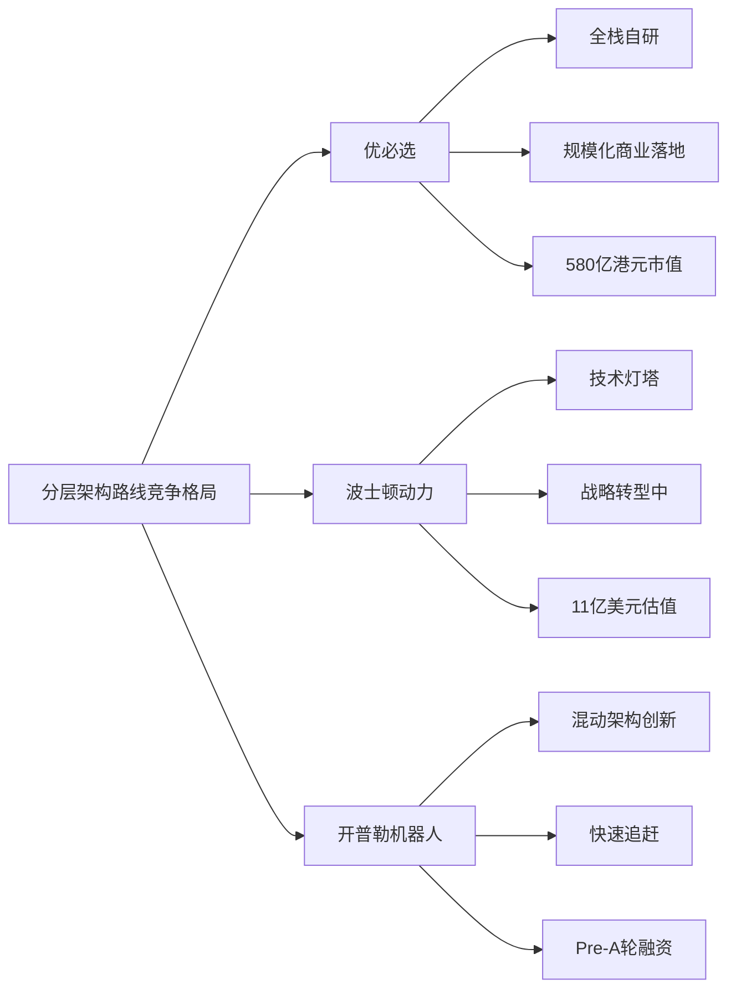

#### 3.5.3 分层架构路线的优势与局限

基于三家企业的实践，可以总结分层架构路线在当前产业化进程中的优势与局限：

**核心优势**：
- **工程可实现性强**：分层架构与传统机器人技术兼容性好，降低了从实验室到产线的部署难度
- **可靠性高**：各模块独立运行、问题可追溯的特性，满足了工业场景对稳定性的严格要求
- **商业化路径清晰**：通过G端合作筑底、B端工业突破的渐进路径，已被优必选等企业验证有效

**核心局限**：
- **泛化能力受限**：模块间接口的信息损失导致系统在开放环境中的适应性不足
- **技术天花板明显**：在追求通用性与智能深度方面，分层架构难以与端到端、VLA等新兴路线竞争

#### 3.5.4 未来演进方向

展望未来，分层架构路线可能沿以下方向演进：

**垂直场景深化**：在汽车制造、仓储物流等对稳定性要求极高的垂直场景，分层架构仍将保持主导地位。优必选2025年的订单结构（B端工业场景占比持续提升）已经体现了这一趋势。

**与新兴技术融合**：分层架构有望与VLA、世界模型等新兴技术融合，形成混合式架构。例如，在保持底层运动控制模块稳定性的同时，引入VLA模型增强高层的语义理解与任务泛化能力。

**成本持续下降**：开普勒机器人3万美元的定价策略表明，通过混动架构创新与供应链优化，人形机器人的成本有望快速下降，推动更大规模的商业化部署。优必选也计划在2026年将成本降至20万元/台（需达1万台产量）[^29]。

正如业界共识所指出的，在这个技术与资本双重密集的漫长赛道上，**谁拥有更充足的资金储备和更通畅的资本通道，谁才可能坚持到终局**[^18]。分层架构路线的代表企业，正是通过清晰的商业化路径与稳健的资本运作，在这场长跑中占据了有利位置。

## 4 技术路线二：VLA（视觉-语言-动作）架构及代表公司深度分析

VLA（Vision-Language-Action，视觉-语言-动作）架构作为具身智能领域最受关注的前沿技术路线，其核心价值在于**将视觉感知、语言理解与动作生成统一到端到端模型中**，赋予机器人"看了就懂、懂了就做"的认知能力。相较于分层架构的功能解耦设计，VLA路线追求更高的通用性与泛化能力，使机器人能够理解自然语言指令并在开放环境中自主决策。当前，VLA技术正从学术探索走向产业落地，多家代表性企业通过差异化的模型设计与场景选择，推动这一技术路线的商业化验证。本章将系统剖析VLA架构的技术原理与核心价值，并通过智元机器人、智平方、深穹星核、银河通用四家代表性企业的深度比较，揭示VLA路线的产业化格局与竞争态势。

### 4.1 VLA架构的技术原理与核心价值主张

VLA架构代表了具身智能领域从"模块化分工"向"统一智能"演进的技术趋势，其设计理念源于对通用人工智能的追求——让机器人像人类一样，能够在感知环境、理解指令与执行动作之间实现无缝衔接。

#### 4.1.1 VLA的技术本质与架构设计

VLA的本质是**利用大语言模型的泛化能力，包括从互联网数据预训练得到的通识知识，再辅以语言模态的推理能力，来解决现实世界中行为决策的问题**。不同于传统端到端模型从视觉直接映射到动作的"条件反射"式决策，VLA将语言理解与推理能力引入物理世界的决策链路。

VLA模型借助基础模型的通用能力与大规模学习范式，可以处理通用的视觉（Vision）与语言（Language）输入，并生成实时动作（Action），极大地赋能了机器人系统。其核心技术架构通常包含以下关键组件：

| 组件层级 | 功能定位 | 技术实现 |
|---------|---------|---------|
| **视觉编码器** | 将图像/视频转化为视觉特征表示 | ViT、CLIP等视觉基础模型 |
| **语言编码器** | 理解自然语言指令的语义信息 | LLM骨干网络（如LLaMA、Qwen） |
| **多模态融合层** | 整合视觉与语言特征 | 交叉注意力机制、适配器模块 |
| **动作解码器** | 生成机器人可执行的动作序列 | 动作词元化、轨迹预测网络 |

#### 4.1.2 VLA相较于分层架构的独特优势

VLA架构在多个关键维度上展现出相较于传统分层架构的独特优势：

**语义理解能力**是VLA最显著的优势。通过继承大语言模型的预训练知识，VLA能够理解复杂的自然语言指令，将人类意图转化为机器人可执行的任务。例如，面对"帮我准备下午茶"这样的模糊指令，VLA模型能够自动拆解为取杯、接水、放糖等具体子任务。

**任务泛化能力**是VLA的核心价值主张。利用预训练知识，VLA模型能够处理训练数据中未见过的新场景与新任务，这种"举一反三"的能力是传统分层架构难以企及的。正如智元机器人高层所指出的，VLA源自视觉语言多模态，本质上仍以语言为核心，**更强调逻辑推理和规划**[^30]。

**自然交互能力**使人机协作更加直观。用户无需学习复杂的编程语言或操作界面，只需通过自然语言即可与机器人交流，大幅降低了机器人的使用门槛。

#### 4.1.3 VLA面临的核心挑战与解决思路

尽管VLA技术前景广阔，但其在产业化过程中仍面临多重挑战：

**动作精确性问题**是VLA在工业场景应用中的首要挑战。语言模型的输出本质上是离散的词元序列，而机器人控制需要连续、精确的动作信号。如何在保持语义理解能力的同时，实现高精度的运动控制，是VLA模型设计的关键难题。

**推理延迟问题**直接影响VLA的实时控制能力。大模型的推理过程需要大量计算资源，可能导致毫秒级的延迟，而机器人控制通常需要100Hz以上的控制频率。针对这一挑战，研究者提出了**"思考与执行可以并行"**的解决思路，通过异步架构设计缓解推理延迟对控制频率的影响。

**安全可控性问题**在实际部署中不容忽视。VLA模型的黑箱特性使得故障诊断与安全验证面临挑战，如何保证VLA在关键场景下不出错，是行业亟需解决的问题。

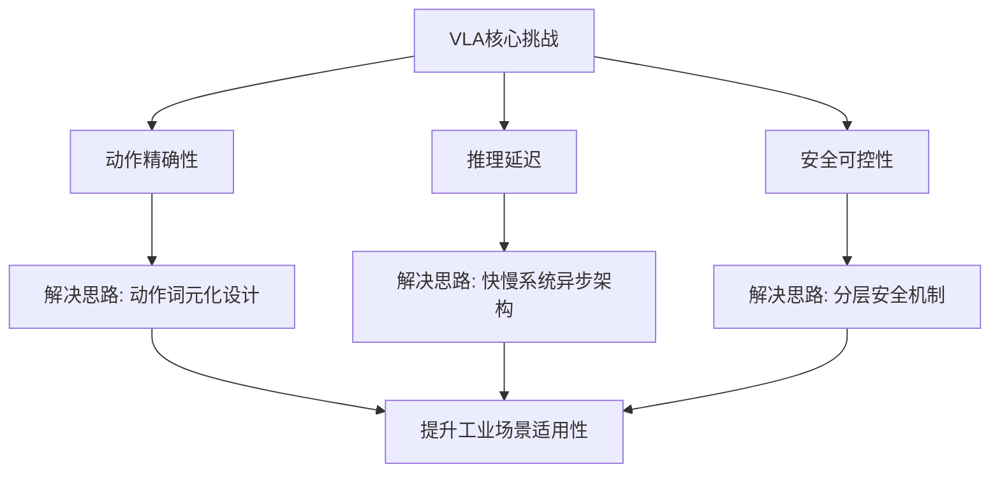

值得关注的是，当前VLA技术路线本身也存在争议。在2025年世界机器人大会上，宇树科技创始人王兴兴公开质疑VLA模型架构，认为其并不是最优解，模型本身还需要进一步升级和优化[^30]。这场争论的背后，是软件与硬件、泛化性与可靠性、学术探索与商业落地之间的深层张力。

### 4.2 智元机器人：多路径并行与供应链驱动的规模化探索

智元机器人作为具身智能领域的新锐代表，自2023年成立以来已完成超11轮融资，估值在两年内飙升至150亿元[^31]。其技术策略的核心特征是**"多路径并行"**——不押注单一技术路线，而是广泛布局VLA与世界模型两条路径。

#### 4.2.1 技术路线：ViLLA架构与双路径并行策略

智元机器人在VLA技术布局上采取了务实的多路径策略。智元合伙人、具身业务部总裁姚卯青在接受媒体采访时明确表示，**目前具身智能的技术路线尚未收敛，不像大语言模型有相似的架构设计和训练流程**[^30]。

在VLA方向上，智元于2025年3月发布了**行业首个VLA基座模型GO-1**，采用ViLLA架构设计。该模型可借助人类视频进行学习，在新场景和新任务上实现小样本快速泛化，并支持部署到不同的机器人本体[^32]。

在世界模型方向上，智元于2025年7月发布了**首个机器人世界模型开源平台Genie Envisioner（GE）**[^30]。姚卯青指出，世界模型与VLA的关注点并不相同：**VLA更强调逻辑推理和规划，而世界模型更注重在三维物理空间中的预测和因果推断**。在真实作业过程中，两种能力缺一不可[^30]。

姚卯青进一步判断，这两条路径**未来有机会实现融合，走向"生成与理解一体化"**。通过生成式方法进行预训练，不仅能获得更优的表征学习，也将反哺VLA、强化学习等多类技术的应用发展[^30]。

#### 4.2.2 产品矩阵与量产进展

智元机器人的产品线覆盖多种形态与场景：

| 产品系列 | 形态特征 | 目标场景 | 量产状态 |
|---------|---------|---------|---------|
| **远征A2系列** | 通用人形机器人 | 工业场景 | 2025年目标产量4-5千台[^33] |
| **精灵G1** | 轻量级人形机器人 | 科研教育 | 已启动线上销售 |
| **灵犀X2/X2-W** | 轮式双臂机器人 | 作业智能 | 2025年8月发布 |

在量产能力方面，智元依托其上海临港工厂，核心零部件国产化率已超80%（如减速器、传感器），并与华为生态伙伴软通动力合作开发机器人操作系统[^33]。2025年8月，智元将其产品上线至智元商城和京东商城，**最低一款人形机器人价格为9.8万元**[^30]。

#### 4.2.3 商业化进展与场景落地

智元机器人董事长兼CEO邓泰华判断，**2025年是具身智能商用发展的关键拐点**[^30]。得益于国内产业的快速产品迭代和庞大供应链优势，今年机器人成本已进入一个有效的投资回报率（ROI）区间。以工业产品为例，两年的投资回报率已经具备可行性[^30]。

在场景落地方面，邓泰华在闭门演讲中透露，**明年公司会把重点放在进工厂、进家庭的初步实践上，慢慢从to B走向to C**[^32]。

#### 4.2.4 融资历程与资本运作

智元机器人的融资历程呈现出**极高的密集度与快速的估值增长**：

| 融资阶段 | 时间 | 主要投资方 | 战略重点 |
|---------|------|-----------|---------|
| 天使轮 | 2023.03 | 高瓴创投、奇绩创坛 | 技术商业化验证 |
| A轮系列 | 2023.04-08 | 高瓴、鼎晖、比亚迪等 | 核心零部件研发 |
| A++++轮 | 2024.03 | 红杉中国、上汽集团 | 临港生产基地建设 |
| B轮 | 2025.03 | 腾讯领投 | 估值跃升至150亿元[^31] |

值得关注的是，智元在2025年7月通过"协议转让+要约收购"取得上纬新材（688585）控制权，交易对价21亿元，形成了**"未上市主体控股上市公司"的特殊架构**[^31]。

此外，智元还通过设立基金、孵化初创、发起并购等方式构建产业生态。邓泰华曾直言，凭借"投早投小"的打法，智元过去一年多实现了**8倍的年化投资回报**[^32]。

#### 4.2.5 团队背景与技术商业化能力

智元机器人的核心团队大都出身**"华为系"**[^32]：

- **邓泰华**（创始人、董事长、CEO）：曾任华为副总裁、计算产品线总裁，是华为昇腾AI业务核心负责人
- **彭志辉**（联合创始人、CTO）：原华为"天才少年"计划入选者
- **姜青松**（合伙人、营销服总裁）：曾任华为海外企业国家主管

这种团队构成使智元具备了华为式的执行力与供应链整合能力。姚卯青强调，**对于机器人这类硬件较大、体系又复杂的产品来讲，能否取得商业上的成功，供应链起到决定性作用**[^30]。

### 4.3 智平方：GOVLA全域全身模型与高价值场景的商业化闭环

智平方（AI² Robotics）成立于2023年4月，是**全球最早专注VLA研发的创业公司之一**，也是**国内最早系统性研发VLA技术范式的企业之一**[^34]。公司由国家级创新领军人才郭彦东博士创立，核心团队被誉为行业稀缺的**"六边形团队"**，兼具AI研发、智能硬件、规模量产与产业化的全栈能力[^34]。

#### 4.3.1 GOVLA大模型：全域感知与全身控制的突破性创新

智平方原创自研的**GOVLA（Global & Omni-body Vision-Language-Action）大模型**代表了VLA技术的重要突破。其关键创新在于：**常规VLA大模型仅输出机械臂动作，而GOVLA大模型首次提出输出全身控制和移动轨迹**[^34]。

GOVLA实现了从环境感知、语义理解到全身协同控制的一体化技术闭环[^35]。具体而言：

- **全域（Global）**：传统VLA模型大多局限于桌面级视野，GOVLA支持**360°×360°全空间感知**，使机器人具备真正的空间主权，能在开放环境中自由穿行[^36]
- **全身（Omni-body）**：不同于只控制机械臂的局部模型，GOVLA首次实现了**底盘移动+躯干姿态+双臂+灵巧手的统一输出**，使机器人在执行复杂任务时重心分配与动作协同更接近人类[^36]

智平方全栈自研的**空间交互基础模型**，使机器人不仅能识别物体，更能理解物体的三维结构、距离关系和可操作点位。这项能力融入GOVLA模型后，显著提升了机器人在复杂环境中的操作泛化能力与精确性[^35]。

#### 4.3.2 快慢系统融合架构FiS-VLA

为平衡推理深度与执行效率，智平方联合北京大学等机构，开源了**"快慢系统"VLA模型FiS-VLA（GOVLA 0.5）**[^35]。该架构借鉴认知科学中的双系统理论：

- **慢系统（System 2）**：负责深度思考与高层逻辑推理，将DeepSeek等先进大语言模型技术融入其中，使机器人能理解模糊指令并将其自动拆解为长程任务[^36]
- **快系统（System 1）**：负责毫秒级的全身控制与避障，通过端到端训练让机器人具备极强的实时泛化能力[^36]

FiS-VLA实现了**异构输入与异步频率的协同**，综合性能超越国际标杆模型Pi0达30%[^35]。这使智平方成为**全球唯二、国内唯一开源机器人模型的创企**[^37]。

#### 4.3.3 正反金字塔数据观的战略价值

郭彦东博士提出的**"正反金字塔"数据观**体现了智平方对数据价值的深刻理解[^35]：

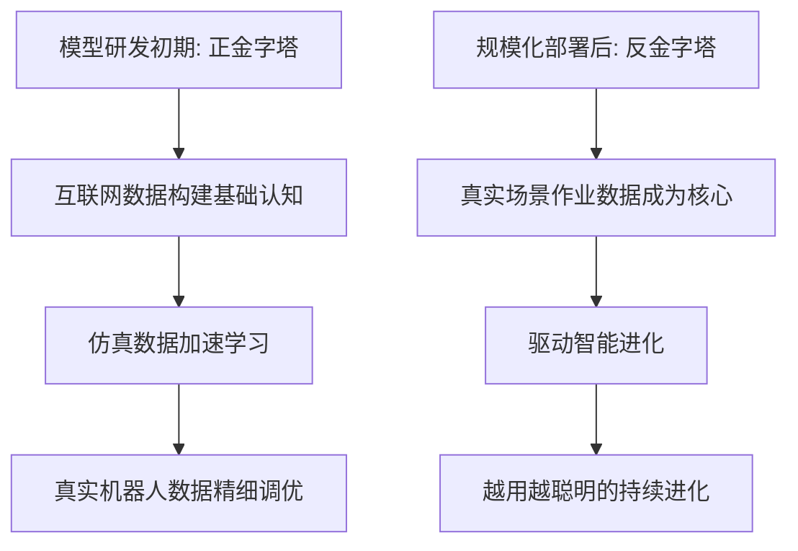

这一数据策略的核心洞察在于：**高质量行为数据的获取是具身大模型训练的核心难点**。虽然仿真数据成本低、易获取，但难以准确还原真实物理交互，模型落地效果受限。智平方通过在高价值真实场景中率先构建数据闭环，形成了**"应用落地-数据回流-模型优化-能力提升"的增长飞轮**[^35]。

#### 4.3.4 AlphaBot系列产品与量产能力

智平方正向设计的**AlphaBot系列机器人**是GOVLA大模型的物理载体[^35]。该系列在两年内完成三次迭代，最新一代**AlphaBot2**的核心参数如下：

| 参数维度 | 技术指标 | 工程价值 |
|---------|---------|---------|
| 形态设计 | 双臂轮式可升降人形 | 稳定性好、移动效率高 |
| 自由度 | 34个及以上 | 支持复杂协同操作 |
| 运行可靠性 | 50000小时以上稳定运行 | 满足工业级要求 |
| 装配精度 | ±0.02mm | 适配高端制造场景[^34] |
| 连续作业 | 日均20小时 | 形成可验证商业闭环[^34] |

在量产能力方面，智平方自有产线已于2025年9月投产，具备**千台年产能**，并将在2026年扩展至**万台规模**[^37]。

#### 4.3.5 高价值场景的规模化落地与5亿元惠科订单

智平方坚持**"从半结构化到非结构化"的渐进战略**，在多个高价值场景中实现商业落地[^34]：

| 场景领域 | 合作方 | 应用内容 | 落地进展 |
|---------|-------|---------|---------|
| **半导体显示** | 惠科（HKC） | 仓储物流、上下物料、零部件装配、质检测试 | 未来三年部署超1000台[^34] |
| **汽车制造** | 头部车企 | 上下料、物流转运、贴标签 | 全场景验证中[^34] |
| **半导体制造** | 吉利科技晶能微电子 | 上下料与产线间物料转运 | 已进入生产基地[^34] |
| **生物科技** | 华熙生物 | 无菌车间物料转运、智能拆包、视觉检验 | 规模化部署[^34] |
| **公共服务** | 国内一线城市机场 | 开放环境多任务处理 | 2025年Q3率先进入[^34] |

**5亿元惠科订单**被业内视为具身智能从"潜力演示"转向"价值落地"的关键一步。在摩根士丹利2025年9月发布的报告《Humanoid Horizons: Closer to the Real World》中，智平方被视为真实商业落地的代表性公司[^37]。合作方惠科作为全球领先的半导体显示面板制造商，其全球大尺寸LCD市场份额位居前三，这一订单标志着智平方的技术方案已通过了**高端工业"实战"的检验**[^34]。

2025年12月29日，智平方在北京和深圳同步发布了全球首个模块化具身智能服务空间——**"智魔方"**，并已率先落地北京朝阳公园与深圳万象城[^37]。公司计划在未来三年内于全国落地**1000个智魔方**，覆盖景区、商业街区、公园及文博场馆等高频公共空间[^35]。

#### 4.3.6 融资历程与资本结构

智平方在过去半年内完成了**7轮融资，累计金额达数亿元人民币**[^38]。本轮A系列融资由**深创投独家领投，领投金额超亿元**[^39]。

参与投资的产业方包括知名生物科技企业华熙生物以及某国内大型零售集团。老股东敦鸿资产、国投持续追加投资[^38]。至此，智平方的投资方阵容已集齐国中资本、普华资本、达晨财智、基石资本、南山战新投等一线机构[^38]。

智平方的"实战"能力也获得了**资本市场与权威赛事的双重认可**。在HICOOL 2025全球创业大赛中，智平方作为**本届大赛唯一获一等奖的机器人企业**，其"市场化能力与业务进展"是获胜的关键[^34]。

#### 4.3.7 团队背景与复合能力

智平方创始人兼CEO郭彦东博士是行业内稀缺的**"AI+智能硬件"复合型专家**[^34]：

- 曾在美国微软总部核心AI团队担任研究员
- 2018年加入小鹏汽车担任首席科学家，推动深度学习技术在汽车形态硬件终端中的量产落地
- 2020年加入OPPO出任首席科学家，牵头打造世界领先的智能感知与交互平台与多模态大模型[^39]

团队核心成员拥有将智能系统部署于**数亿台智能终端**的宝贵实战经验。在斯坦福大学2025年"全球前2%顶尖科学家榜单"中，智平方**独占两席**[^40]。

### 4.4 深穹星核：VLIA意图理解模型与情感交互新范式

深穹星核作为2025年成立的新锐企业，在VLA技术路线上开辟了差异化的方向——**聚焦意图理解与情感交互**，提出了VLIA（Video-Language-Intention-Action）具身智能大模型的创新范式。

#### 4.4.1 VLIA模型：意图理解的技术突破

深穹星核致力于研发**"懂意图、能思考、会行动"**的下一代具身智能体[^41]。公司旨在构建一个以意图理解、多模态感知、人机交互为核心能力的"智能大脑"，让机器能够真正理解人类意图与环境上下文，并自主完成任务[^41]。

相比于传统VLA模型聚焦的灵巧手操作大脑，深穹星核**更关注人脸机器人的意图大脑**，这是VLIA在全新载体上的全新应用[^41]。

VLIA大模型的核心技术特征包括：

| 技术维度 | 创新内容 | 性能指标 |
|---------|---------|---------|
| **意图理解** | 基于多模态信息理解用户情绪、意图和需求 | 意图理解准确率超92%[^42] |
| **全链路打通** | 视频-语言-意图-行动全链路整合 | 持续学习和长期记忆能力[^42] |
| **超仿真人脸控制** | 基于仿生学原理的微表情控制 | 摆脱传统"预设表情包"局限[^41] |
| **实时反馈** | 低延迟、高同步的自然流畅反馈 | 包括表情、口型、语音等[^41] |

VLIA大模型能够精准捕捉交互对象的多模态信息（如语音、表情、动作），精准解析其内在状态（情绪、意图、需求等），并以实时、低延迟、高同步的方式作出自然流畅的反馈[^41]。

#### 4.4.2 差异化场景定位：情感价值优先

深穹星核的战略选择体现了对具身智能应用场景的独特洞察。公司将优先在**辅助增强（如娱乐游戏）与生活陪伴**等具备高情感价值的场景中落地[^41]。

在2025年第四季度，深穹星核已与**3家头部机器人厂商达成合作**，主要应用于**养老陪伴和商业服务**两大场景。2026年第一季度，公司预计还能再签5-8家客户，覆盖机器人、智能座舱头部企业[^42]。

九云资本王阳评价："具身智能应用场景正从工业级工具向消费级伙伴跨越，深穹星核精准卡位'意图理解大脑+超仿真人脸'赛道，**为机器人赋予温度和灵魂**"[^41]。

#### 4.4.3 融资进展：10天两轮数千万

深穹星核的融资速度反映了资本市场对其技术方向的高度认可。公司在**短短10天之内拿到了两轮均为数千万元的融资**[^42]：

| 融资轮次 | 时间 | 投资方 | 资金用途 |
|---------|------|-------|---------|
| 天使轮 | 2026年1月中旬 | 零以创投独家投资 | 核心技术团队扩建、智能体大脑平台研发[^41] |
| 天使+轮 | 2026年1月下旬 | 元禾原点、友谊时光联合领投，中科元创跟投 | 具身智能大脑和超高仿真人脸研发迭代[^43] |

零以创投合伙人郑连发表示："创始人郁振波博士带领的团队兼具学术权威性与商业化敏锐度，业内首次提出VLIA具身智能大模型，通过多模态意图解析与仿生学驱动的微表情控制，**解决了传统机器人交互生硬的行业痛点**"[^41]。

#### 4.4.4 团队背景与学术积累

深穹星核创始人兼CEO郁振波的学术背景极为亮眼[^42]：

- 上海交通大学吴文俊人工智能荣誉博士班毕业
- 师从视频通信与信息系统专家张文军院士
- **蝉联ImageNet国际大赛三届世界冠军**
- 入选福布斯U30、胡润U30、长三角G60科创走廊U30青年
- 2025年当选苏州市外十大青年科学家（全球仅10人获此殊荣）[^41]

公司核心团队成员来自上海交大、清华大学等国内顶级院校和头部AI企业，覆盖计算机视觉、机器人控制、自然语言处理、多模态大模型等领域，**平均研发经验超8年**[^42]。

### 4.5 银河通用：GraspVLA仿真驱动与零售工业场景的沿途下蛋

银河通用机器人成立于2023年5月，是聚焦具身多模态大模型通用机器人研发的科技企业[^44]。公司凭借**"仿真合成数据驱动+真实数据对齐"**的独特技术路径，在零售与工业场景实现了规模化商业落地，2025年12月完成新一轮超3亿美元融资，估值达**30亿美元**（约211亿人民币），成为国内估值最高的具身智能公司[^45]。

#### 4.5.1 三阶段技术路线：仿真驱动的VLA体系

银河通用的技术路线高度统一，可概括为三个阶段[^46]：

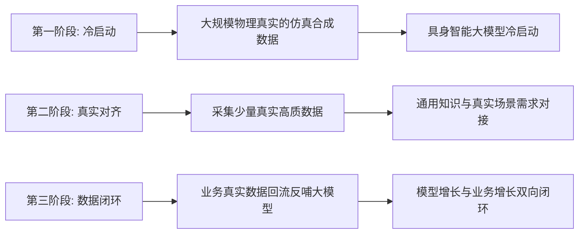

银河通用联合创始人张直政强调，公司高度重视VLA的感知和持续学习能力。感知层面，重点关注其泛化性及对泛化动作的支撑能力，确保能在真实业务中落地运行；同时依托技术路线第三阶段的数据回流机制，实现**业务增长对模型成长的反哺**[^46]。

银河通用的合成数据策略极为激进：公司**90%的训练数据都是虚拟仿真的**，仅需一周即可生成十亿级操作数据集，成本仅为真实数据的1/100[^45]。

#### 4.5.2 GraspVLA与GroceryVLA：场景化VLA模型矩阵

银河通用自主研发了多个端到端具身大模型[^47]：

| 模型名称 | 功能定位 | 核心能力 | 应用场景 |
|---------|---------|---------|---------|
| **GraspVLA** | 通用抓取基础模型 | 端到端具身抓取 | 跨场景泛化抓取 |
| **GroceryVLA** | 零售场景专用模型 | 环境感知、语言理解、动作执行整合[^48] | 无人药店、智慧零售 |
| **NavFoM** | 跨本体导航大模型 | 无需建图、跨场景长程自主导航[^45] | 室内外复杂环境 |
| **DexNDM** | 灵巧手神经动力学模型 | 精细操作（拧螺丝、手内旋转）[^45] | 精密装配 |

**GroceryVLA**于2025年6月在北京智源大会首次发布，具备**强适用性、高通用性、强抗干扰性、自主决策能力和跨场景泛化能力**五大核心能力[^48]。其驱动的机器人Galbot能在货架环境中识别并抓取软硬包装、透明物体等商品，在未进行预采集的场景中也能执行任务[^48]。

#### 4.5.3 轮足复合本体：实用主义的产品哲学

在技术路线上，银河通用强调**"实用主义"**，推出了"轮足复合"方案——在机器人腿部融合轮式机构，实现复杂地形足式通行与平坦路面轮式高速移动的双模切换，试图解决纯双足机器人能耗高、续航短的问题[^44]。

银河通用创始人、北京大学教授王鹤曾表示："**我们不追求机器人会做100件事，而是让它把10件事做到工业级标准**"[^45]。这种克制，恰恰是"沿途下蛋"策略的核心。

截至目前，银河通用只发布了一款本体产品**Galbot G1**，但却推出了多款具身大模型。王鹤曾说："**作为一个具身大模型公司，我们投入最大的还是模型的研发**"[^45]。

#### 4.5.4 场景落地：零售与工业的双轮驱动

银河通用在商业化方面采取了**"沿途下蛋"**策略——在通用人工智能的终极目标尚未实现之前，先在特定场景实现商业化交付，用产品收入支撑研发投入[^45]。

**零售场景**：
- 2025年3月发布全球首个人形机器人智慧零售解决方案
- 在北京24小时无人药店实现7×24小时运营已超一年[^45]
- 计划在北京、上海、深圳等城市共开**100家无人值守零售店**[^45]
- 预计今年将为银河通用带来**近亿元人民币的收入**[^45]

**工业场景**：
- 与宁德时代、博世、丰田、现代、北汽等产业巨头建立合作
- 累计获得**数千台工业订单**[^45]
- 2025年12月与精密制造企业百达精工签署战略合作协议，部署超过**1000台具身智能机器人**[^49]

2026年1月25日，中央广播电视总台正式官宣，银河通用机器人成为**2026年春节联欢晚会指定具身大模型机器人**[^47]。

#### 4.5.5 融资与估值：中国具身智能估值之冠

银河通用的融资历程展现了资本市场对其商业化能力的高度认可[^50]：

成立2年多来，银河通用累计融资约**8亿美元**（约56亿人民币）。投资方包括国开行、北京人形机器人产业基金、上海未来人工智能产业基金、深创投、蓝驰创投、经纬创投、启明创投、纪源资本、光源资本、IDG资本等重大投资平台及知名机构，也得到美团、宁德时代等产业方的投资[^51]。

2025年12月，银河通用完成新一轮超3亿美元融资，由中国移动链长基金领投，中金资本、中科院基金、苏创投、央视融媒体基金、天奇股份等联合注资[^45]。本轮融资形成**"财务投资+产业赋能+国资背书+国际资本"的四维资本矩阵**，使公司估值达30亿美元，刷新人形机器人行业纪录[^50]。

#### 4.5.6 团队背景：学术创业的典型样本

银河通用是学术创业的典型案例[^51]：

- **王鹤**（创始人兼CTO）：1992年生，北京大学前沿计算研究中心助理教授、博士生导师，2014年清华大学学士，2021年斯坦福大学博士，师从美国三院院士Leonidas J. Guibas教授，2024年入选《麻省理工科技评论》"35岁以下科技创新35人"中国区名单[^50]
- **姚腾洲**（联合创始人）：硕士毕业于北京航空航天大学机器人研究所，师从机器人行业泰斗王田苗教授，曾就职于ABB集团上海机器人研发中心[^44]

该公司核心成员多来自华为"天才少年"计划、百度、微软等企业[^44]。

张直政判断，**具身智能规模化应用将会在2026年开始，全面落地则需要5-10年**[^46]。他明确表示不赞同李飞飞"机器人商业化还有20年"的观点，强调"具身智能的落地不是遥远的未来之事，而是此时此刻已发生的事情"[^46]。

### 4.6 四家VLA代表企业的多维度横向比较与路线前景研判

基于前述对智元机器人、智平方、深穹星核、银河通用四家企业的深度分析，本节构建系统的比较框架，综合评估VLA技术路线在具身智能产业化进程中的竞争格局与演进方向。

#### 4.6.1 VLA模型设计差异比较

| 企业 | 核心模型 | 架构特点 | 技术突破点 |
|------|---------|---------|-----------|
| **智元机器人** | GO-1（ViLLA）+ Genie Envisioner | 双路径并行（VLA+世界模型） | 强调融合趋势，支持跨本体部署 |
| **智平方** | GOVLA + FiS-VLA | 全域全身统一输出+快慢系统融合 | 首次输出全身控制和移动轨迹 |
| **深穹星核** | VLIA | 视频-语言-意图-动作全链路 | 首创意图理解，92%准确率 |
| **银河通用** | GraspVLA、GroceryVLA等 | 仿真驱动+场景化模型矩阵 | 90%合成数据训练，成本1/100 |

从模型设计可以看出，四家企业在VLA技术路线上呈现出明显的**差异化定位**：智元追求多路径并行的稳健策略，智平方聚焦全域全身的技术突破，深穹星核开辟意图理解的新方向，银河通用强调仿真驱动的工程效率。

#### 4.6.2 产品形态与自由度配置比较

| 企业 | 主力产品 | 形态选择 | 自由度 | 设计理念 |
|------|---------|---------|-------|---------|
| **智元机器人** | 远征A2、灵犀X2 | 人形+轮式双臂 | 未公开 | 多形态覆盖多场景 |
| **智平方** | AlphaBot2 | 轮式可升降人形 | 34+ | 稳定性优先，边用边学 |
| **深穹星核** | 意图大脑平台 | 软件平台为主 | N/A | 赋能第三方机器人 |
| **银河通用** | Galbot G1 | 轮足复合 | 未公开 | 实用主义，10件事做到工业级 |

值得注意的是，智平方和银河通用都选择了**轮式/轮足方案**而非纯双足，体现了当前产业化阶段对稳定性与实用性的优先考量。

#### 4.6.3 场景落地与订单规模比较

| 企业 | 核心场景 | 标杆订单 | 落地规模 | 商业化阶段 |
|------|---------|---------|---------|-----------|
| **智元机器人** | 工业制造、科研教育 | 未披露大规模订单 | 2025年目标4-5千台 | 规模化量产阶段 |
| **智平方** | 半导体显示、汽车制造、公共服务 | 惠科5亿元/1000+台 | 千台级部署 | 商业验证落地阶段 |
| **深穹星核** | 养老陪伴、商业服务 | 3家头部厂商合作 | 早期探索阶段 | 场景验证阶段 |
| **银河通用** | 零售、工业制造 | 百达精工1000+台 | 数千台工业订单 | 规模化商业落地 |

从订单规模来看，**智平方的5亿元惠科订单**和**银河通用的数千台工业订单**代表了VLA路线在商业化方面的最新进展。

#### 4.6.4 融资与估值比较

| 企业 | 成立时间 | 融资轮次 | 最新估值 | 核心投资方 |
|------|---------|---------|---------|-----------|
| **智元机器人** | 2023年 | 11轮+ | 150亿元 | 腾讯、红杉、比亚迪、高瓴 |
| **智平方** | 2023年4月 | 7轮（半年内） | 未公开 | 深创投、华熙生物、国投 |
| **深穹星核** | 2025年 | 2轮（10天内） | 未公开 | 零以创投、元禾原点、友谊时光 |
| **银河通用** | 2023年5月 | 多轮 | 30亿美元（211亿元） | 中国移动、中金、美团、宁德时代 |

银河通用以**30亿美元估值**位居中国具身智能企业榜首，智元机器人以**150亿元估值**紧随其后。两家企业的高估值反映了资本市场对VLA路线商业化前景的认可。

#### 4.6.5 团队复合背景比较

| 企业 | 创始人背景 | 团队基因 | 核心能力 |
|------|-----------|---------|---------|
| **智元机器人** | 华为副总裁+天才少年 | 华为系 | 供应链整合、规模化执行 |
| **智平方** | 微软AI+小鹏/OPPO首席科学家 | AI+智能硬件复合 | 全栈自研、数亿终端部署经验 |
| **深穹星核** | 上海交大博士+ImageNet三连冠 | 学术+AI | 算法创新、学术权威 |
| **银河通用** | 北大教授+斯坦福博士 | 学术创业 | 具身智能学术前沿、仿真技术 |

四家企业的团队背景呈现出**学术派与产业派的分化**：银河通用和深穹星核更偏学术创业，智元和智平方则具备更强的产业化基因。

#### 4.6.6 VLA路线的竞争格局与演进方向

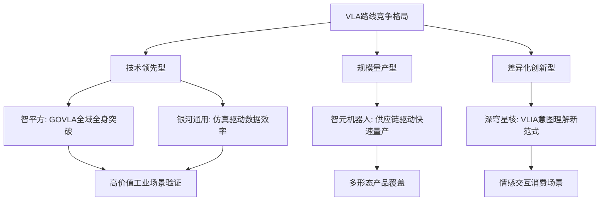

**未来演进方向**：

1. **VLA与世界模型的融合**：正如智元姚卯青所判断，两条路径未来有机会走向"生成与理解一体化"[^30]

2. **从模型到智能体的演进**：VLA模型应向具备记忆、探索、规划和反思能力的主动型VLA智能体演进

3. **场景深化与数据闭环**：真实场景数据的积累将成为VLA企业的核心壁垒，智平方的"正反金字塔"数据观和银河通用的"三阶段技术路线"都体现了这一洞察

4. **安全与对齐问题**：随着VLA在关键场景的部署扩大，安全性与人类对齐将成为不可回避的重要议题

综合来看，VLA技术路线已从学术探索进入产业验证的关键阶段。四家代表企业通过差异化的技术策略与场景选择，正在共同推动这一技术路线的成熟与落地。在这场竞争中，**谁能更快构建"模型-数据-场景"的正向循环，谁就有望在VLA路线上占据领先地位**。

## 5 技术路线三：世界模型与物理仿真驱动路线及代表公司深度分析

世界模型与物理仿真驱动路线代表了具身智能领域解决数据稀缺瓶颈的关键技术突破方向。不同于VLA路线对语义理解能力的追求，这一路线的核心价值在于**通过高保真物理仿真环境构建虚拟训练场，实现近乎零成本的海量合成数据生成**，从而突破具身智能商业化的数据困境。当前，全球范围内以Physical Intelligence、Skild AI为代表的国际企业与以跨维智能为代表的国内企业，正在通过差异化的技术路径推动这一路线的产业化进程。本章将系统剖析世界模型的技术原理与核心价值，并通过三家代表性企业的深度比较，揭示这一技术路线的竞争格局与演进方向。

### 5.1 世界模型与物理仿真驱动的技术原理与核心价值

世界模型（World Model）的核心使命是让机器人大脑建立关于物理世界运行规律的内部模型，具备**预测行动后果**的能力。这一技术路线通过高保真物理仿真引擎构建虚拟训练环境，使机器人能够在"想象空间"中进行大规模、低成本的训练与策略优化，从而显著降低对真实世界交互的依赖。

#### 5.1.1 数据稀缺：具身智能的全球性瓶颈

数据稀缺是具身智能领域公认的全球性瓶颈。与二维模型只需图片和文本不同，具身智能需要的是**海量、带有精确物理坐标的动作数据**，其获取难度和成本远超语言模型。根据国际机器人联盟（IFR）2023年报告，一台智能制造机器人在真实环境中采集1TB有效训练数据的成本约为**50万美元**，且耗时长达数月[^52]。

清华大学人工智能研究院院长姚期智院士曾指出："**当硬件性能达到一定阈值后，决定AI智能水平的不再是硬件本身，而是数据的规模与质量**"[^52]。想让机器人通过多维感知去理解真实世界，就需要提供具有精准标注的空间数据，涵盖光线折射、物体摩擦系数、刚体与流体动态变化等多维度细节。传统的真机采集方式效率低下，难以规模化——如果目标是让机器人抓取世界上任何一个鼠标，就需要集合成千上万个鼠标的数据[^53]。

这一困境迫使研究者必须寻找新的技术范式，而**Sim2Real（从仿真到现实）**正是破解数据荒的核心路径。

#### 5.1.2 Sim2Real技术的原理与突破

Sim2Real并非简单的游戏建模，而是AI领域公认的解决具身智能数据鸿沟的核心路径之一。其技术原理是通过强大的物理引擎构建出一个高保真、低成本的虚拟环境，在这个虚拟训练场中，光线折射、物体摩擦系数等细节都与现实完全相同[^52]。

具体而言，Sim2Real技术在物理仿真机器人操作场景中，引入各种与任务相关的真实世界的干扰，再通过渲染、轨迹数据记录、关节数据记录等方式形成海量的精确标注合成数据，并用于具身智能大模型训练[^52]。更重要的是，**整个过程数据自动生成，无需依赖人工大量采集，成本几乎为零**[^52]。

下表对比了真实数据采集与合成数据生成的核心差异：

| 维度 | 真实数据采集 | 仿真合成数据 |
|------|-------------|-------------|
| **成本** | 极高（50万美元/TB） | 近乎零成本 |
| **时间** | 数月 | 数小时至数天 |
| **规模** | 受限于物理资源 | 近乎无限扩展 |
| **标注精度** | 依赖人工，易出错 | 自动精确标注 |
| **场景多样性** | 受限于真实条件 | 可任意模拟极端场景 |
| **安全性** | 存在设备损坏风险 | 零风险试错 |

国际咨询机构弗若斯特沙利文于2025年9月发布的《2025年中国合成数据解决方案发展洞察》报告认为，未来的数据范式正朝着**"1%人类数据+99%高效合成"**的混合模式演进：具身智能所依靠的数据，99%可借助高质量的合成数据完成，只有在合成数据无法处理的情况下，才需要有针对性地采集使用1%的真实数据[^52]。

#### 5.1.3 世界模型与VLA的协同融合趋势

世界模型与VLA模型的关注点存在本质差异，但两者具备强大的互补潜力。正如前文所述，**VLA更强调逻辑推理和规划，而世界模型更注重在三维物理空间中的预测和因果推断**。在真实作业过程中，两种能力缺一不可。

世界模型强化学习（World Model RL）的核心范式在于通过额外学习一个能够表征环境内在转移规律的预测模型，使智能体具备在想象空间中进行自我进化的能力。这种机制允许智能体在潜空间内进行大规模、低成本的轨迹预演与策略优化，从而显著降低对环境交互的依赖，加速具身智能机器人的落地应用。

业界普遍预测，世界模型与VLA的融合将成为未来具身智能的重要演进方向。在这一融合架构中：

- **VLA提供语义理解**：将自然语言指令转化为任务目标
- **世界模型提供物理预测**：预测动作执行的物理后果
- **联合优化决策**：基于语义理解与物理预测的综合信息进行动作决策

这种融合有望结合VLA的语义泛化能力与世界模型的物理推理能力，构建更加智能与可靠的具身智能系统。

### 5.2 跨维智能：Sim2Real技术先行者与智能制造场景的规模化落地

跨维智能作为国内具身智能领域的先行者，选择了一条**基于合成仿真的视觉路径**，通过Sim2Real技术成功突破了具身智能训练数据稀缺且昂贵的全球性瓶颈。公司实现了**100%合成数据达到智能制造级99.9%成功率**的突破，成为具身智能智能制造场景落地领域毋庸置疑的领跑者[^52]。

#### 5.2.1 技术体系：DexVerse具身智能引擎与Sim2Real核心能力

跨维智能的核心技术范式是**基于合成数据的具身智能**。公司总部位于深圳市南山区，是以Sim2Real技术为核心的高新技术企业，专注于具身智能和人形机器人研发[^53]。

早在2016年，创始人贾奎就敏锐捕捉到三维空间理解的巨大空白，在华南理工大学成立了国内最早将AI应用于三维空间的团队[^52]。贾奎意识到，要让机器真正理解曲面、习得物理世界的本质，机器人是最佳的载体。传统AI存在于二维屏幕与抽象数据中——语音助手只能处理指令，图像识别仅理解平面像素——它们缺乏对深度、重力、交互的切身感知。而**具身智能的突破，正是让AI通过机器人等物理载体，学会在三维世界里移动、操作并适应物理规则**[^52]。

跨维智能自研的**DexVerse™具身智能引擎**是其技术体系的核心。该引擎能够在物理仿真机器人操作场景中，引入各种与任务相关的真实世界的干扰，再通过渲染、轨迹数据记录、关节数据记录等方式形成海量的精确标注合成数据[^52]。通过这一引擎，跨维智能实现了比行业预期更颠覆性的目标：**以100%的合成数据，在毫米/亚毫米的操作精度要求下，达到了99.9%以上的任务成功率**[^52]。这一成就彻底消弭了合成数据与真实数据之间的鸿沟，也为具身智能的规模化商业落地找到了高效低成本的最优解。

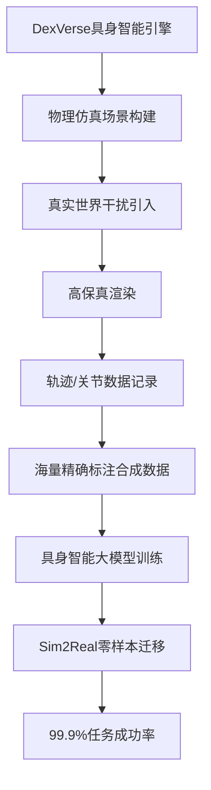

贾奎曾在采访中表示："在引擎空间，你只需改变参数，就可以把一个木头鼠标变成金属的"[^53]。这种灵活性使得跨维智能能够快速生成覆盖各种物料、光照、干扰条件的训练数据，而无需在真实世界中逐一采集。

#### 5.2.2 从95%到99.9%：客户驱动的技术突破

跨维智能的技术突破源于真实客户需求的倒逼。公司的第一个天使客户是南方某知名家电制造商，客户的挑战非常典型：工厂生产线上堆满了各种杂乱、无序的零件，急需机器人精准识别并抓取——这正是传统程序控制的机械臂做不了的高难度杂活[^52]。

贾奎团队进驻工厂，很快用"三维几何深度学习"概念解决了最初的难题。然而，新的冲突随之出现——**技术可行不等于商业可行**。贾奎发现："算法在实验室里成功率达到95%，就属于很了不起了，但要在工厂里长期、稳定运行，这个数字必须要达到99.9%"[^52]。团队为实现这**4.9个百分点的跨越**付出了巨大代价。

更致命的是，如果还按照传统方式——不断采集真实物理数据来训练机器人——成本根本无法控制。每一次换产、每一次新零件出现，都意味着昂贵的采集和标注工作。正是这一困境推动跨维智能全面转向Sim2Real技术路线，最终实现了以零成本合成数据达到工业级精度的突破。

#### 5.2.3 产品矩阵：从3D视觉到人形机器人

跨维智能的产品体系覆盖了从感知硬件到智能软件再到机器人本体的完整链条：

| 产品类别 | 核心产品 | 功能定位 | 技术特点 |
|---------|---------|---------|---------|
| **智能传感器** | Kingfisher双目立体智能相机 | 机器人"眼睛" | 自研纯视觉空间智能传感器 |
| **软件平台** | EmbodiChain具身智能开发平台 | 机器人"大脑" | VLA模型训练与部署 |
| **解决方案** | "泛智造+"视觉解决方案 | 场景应用 | 3D视觉无序抓取，精度高、稳定性好 |
| **机器人本体** | 人形机器人 | 通用载体 | 2024年推出，2025年批量出货超百台 |

跨维智能的**Kingfisher双目立体智能相机**与工业机械臂相结合，基于DexVerse™具身智能引擎预训练的3D视觉大模型，能够稳定识别不同种类、纹理、图案的麻袋、箱子等物体[^52]。

在人形机器人领域，跨维智能于2024年推出人形机器人产品，**2025年就批量出货超百台**，拿下了比亚迪、广汽、中联重科、三一重工、松下、大金、蓝思科技等客户[^54]。这一进展使跨维智能成为国内人形机器人商业化落地的领先企业之一。

#### 5.2.4 商业化进展：亿级营收与上百家客户

跨维智能的商业化成绩在具身智能领域堪称亮眼。截至目前，公司已累计服务**上百家客户**，落地**数十个智能制造场景**[^52]。

在营收方面，跨维智能创始人兼CEO贾奎在接受媒体采访时表示："**2025年实现了亿级营收，从22年到24年都按照超过double的增速在增加。26年预计相比25年会有3到4倍的增长**"[^53]。这一增长速度在具身智能领域极为罕见，也印证了Sim2Real技术路线在智能制造场景的强大商业价值。

跨维智能的客户分布在**汽车零部件、新能源、3C电子、航空航天、物流、家电、化工、医疗、教育等50多个细分行业**[^54]。在具体应用场景上：

- **美的工厂**：机器人分拣，效率是人工3倍
- **海信生产线**：机器人用于柔性插拔装配，成功率达99.99%[^54]

贾奎为跨维智能选择的商业化策略被概括为**"沿途下蛋"**——技术根基是Sim2Real，目标是为机器装上智能的"眼睛"和"大脑"，但首先需要找到一个能持续造血、验证技术的落地场景。凭借技术洞察力，贾奎在走访众多领域后，选择了需求明确且付费能力强的智能制造作为切口[^53]。

#### 5.2.5 融资历程与资本认可

跨维智能的融资历程反映了资本市场对Sim2Real技术路线的认可：

| 融资阶段 | 时间 | 投资方 | 融资金额 |
|---------|------|-------|---------|
| 天使轮 | 创立初期 | - | 近千万美元 |
| 战略轮 | 2023年底 | 联想创投领投 | - |
| A1&A2轮 | 2025年中 | 成都科创投、洪泰基金领投，联想创投等跟投 | 数亿元 |

联想创投正是较早看懂跨维智能技术路线与商业潜力的机构，于2023年底领投了跨维智能的战略轮融资，并在2025年7月追加投资[^52]。联想创投投资负责人在评价其数亿元融资时指出："**跨维智能是赛道罕见的既仰望星空（技术超前）又脚踏实地（商业落地）的企业**"[^52]。

2025年年中，跨维智能又获得数亿元A1&A2轮融资，投资方包括领投方成都科创投、洪泰基金，以及联想创投等一众新老股东[^54]。

#### 5.2.6 团队背景：学术深度与产业化能力的结合

跨维智能的核心团队展现了**学术深度与产业化能力的有效结合**：

**创始人贾奎**是一位来自山西的"80后"学者与企业家，拥有西北工业大学的本科学位及伦敦大学玛丽女王学院的博士学位，同时还是香港中文大学（深圳）的终身教授[^53]。2016年，贾奎结束海外学业回国，加入华南理工大学投身计算机视觉研究，牵头成立了"几何感知与智能实验室"，成为国内最早将AI深入应用于三维空间理解的先行团队之一[^53]。

到了2020年，贾奎深感前沿AI研究的深化极度依赖算力、数据与真实场景的闭环，而高校的资源已渐显局限。2021年，他毅然走出高校，在深圳创立跨维智能[^53]。

跨维智能组建了一个能力互补的**"铁三角"创始团队**：
- **贾奎**（创始人兼CEO）：学术背景深厚，负责技术方向把控
- **吴迪**（联合创始人）：来自华为、腾讯的相机硬件专家，负责打造智能"眼睛"——自研的纯视觉空间智能传感器
- **解锐**（联合创始人）：连续创业者，擅长市场与业务拓展[^53]

创业之初，贾奎坦言自己"像一个学者"，而三年多的实战历练，让他将重心彻底转向"解决客户痛点"。"我每天都在踩坑，在实践中学习"，他说，这个过程让他能力变得更综合，也学会了"认清自己，有所不为"，通过寻找合伙人弥补自身短板[^53]。

### 5.3 Physical Intelligence：通用机器人大脑与π0模型的技术突破

Physical Intelligence（简称PI）是一家成立于2024年2月的美国机器人初创公司，致力于将通用人工智能（AGI）技术应用于物理世界，通过开发基础模型和学习算法为机器人及智能设备提供通用智能控制能力[^55]。截至2025年底，PI已成为**具身智能"通用机器人大脑"赛道估值最高的玩家**，估值达56亿美元（约合396亿元人民币）[^56]。

#### 5.3.1 技术定位：软件先行的差异化策略

与Figure AI或特斯拉这类以硬件为主导的路线不同，PI更强调**"软件先行"**的策略，将大模型的思路延伸至物理世界，训练出一套不依赖特定硬件的通用大脑，让**"一个模型控制不同机器人本体"**成为可能[^56]。

PI的核心目标是实现真正意义上的"通用机器人"——使其能够适应多元场景、自主做出判断、像人类一样应对不确定性。这始终是业界亟待突破的技术瓶颈。正因为定位于跨平台"通用机器人大脑"，PI的估值体系更接近"AI大模型公司"而非传统机器人公司[^56]。

通用机器人是AGI从数字世界走向物理世界的重要路径，而在AI robotics这个主题下，Physical Intelligence无疑是**最具技术深度和研究影响力的团队之一**[^57]。

#### 5.3.2 π0系列模型：VLA架构的前沿探索

PI开发的多模态基础模型**π0**具有三大核心特性：
- **支持跨平台迁移学习**
- **整合视觉、语言与运动数据流**
- **采用流匹配技术实现高频动作控制**[^55]

该技术路径旨在突破物理交互局限，其阶段性成果包括机器人执行洗衣、折叠衣物等任务[^55]。

2025年4月，PI以π0为基础，新发布了一个在开放世界具有泛化能力的VLA模型**π0.5**。PI表示π0.5在一些未知环境中，依然能够展现出与在原始训练环境相近的表现[^57]。

2025年11月，PI正式发布了新一代机器人基础模型**π0.6**。该模型在π0.5基础上迭代升级，其最大突破在于引入**RECAP训练方法**，显著提升了机器人在复杂任务中的泛化能力[^56]。在实际测试中，π0.6展现出令人瞩目的性能：
- 能够连续工作一整天精准制作意式浓缩咖啡
- 持续数小时处理不同材质的衣物折叠任务
- 高效完成工业纸箱的精准组装
- **多项任务成功率突破90%**[^56]

这标志着通用机器人大脑在落地应用层面迈出了关键一步。

#### 5.3.3 数据管线与知识绝缘机制

PI团队几乎**从头搭建了整个数据引擎**，而且通过实验，PI证明了提高数据的多样性是提升机器人泛化的关键路径[^57]。

为了解决传统模型训练的缺点，PI提出了**"知识绝缘（Knowledge Insulation）"机制**，创新性地重构了训练流程[^57]。这一机制使得模型能够更有效地从不同数据源中学习，同时避免知识冲突与遗忘问题。

从技术视角看，VLA与LLM、VLM之间存在递进关系：VLM在LLM基础上拓展了视觉感知能力，而**VLA是VLM在机器人领域的进一步应用**[^57]。VLA的目标是直接输出机器人动作指令——因为机器人不仅要理解场景，更需生成精确的动作。

PI团队指出，在开放世界部署机器人面临**三大难题**：数据缺口、性能不稳健和硬件平台迁移非常复杂[^57]。未来，PI希望能推动软硬件的深度融合，用户可以设计和定制硬件，实现**"物理世界的vibe coding"**[^57]。

#### 5.3.4 融资历程与估值跃升

PI的资本运作展现了惊人的速度与规模：

| 融资阶段 | 时间 | 金额 | 估值 | 主要投资方 |
|---------|------|------|------|-----------|
| 种子轮 | 2024年3月 | 7000万美元 | 4亿美元 | OpenAI等 |
| A轮 | 2024年11月 | 4亿美元 | 24亿美元 | 贝佐斯、OpenAI、Thrive Capital等 |
| 最新轮 | 2025年 | 6亿美元 | 56亿美元 | CapitalG领投，Lux Capital、贝佐斯等 |

值得注意的是，**OpenAI也是PI的早期投资者之一**，参与了2024年3月的种子轮融资及2024年11月的A轮融资[^56]。PI的估值在8个月内从4亿美元跃升至24亿美元，又在此后进一步攀升至**56亿美元**[^55][^56]。

本轮融资由Alphabet旗下独立成长基金CapitalG领投，现有投资者Lux Capital、Thrive Capital及亚马逊创始人杰夫·贝索斯持续加码，新晋投资方Index Ventures与T. Rowe Price也参与了此轮融资[^56]。融资资金主要用于模型训练基础设施建设和人才招募[^55]。

#### 5.3.5 全明星团队构成

位于美国旧金山的PI组建了一支**"全明星团队"**[^56]：

| 核心成员 | 背景 | 职责 |
|---------|------|------|
| **Karol Hausman** | Google DeepMind，机器人感知与控制领域深耕多年 | CEO兼联合创始人 |
| **Sergey Levine** | 加州大学伯克利分校，强化学习领域学术权威 | 联合创始人 |
| **Groom** | Stripe前高管，兼具投资人背景 | 联合创始人，商业拓展与融资 |

创始团队由斯坦福大学、加州大学伯克利分校的学者及Google DeepMind前研究人员组成，员工来自特斯拉、谷歌DeepMind和X[^55]。团队还汇聚了来自谷歌、特斯拉、斯坦福大学等机构的顶尖人才，形成**学术与产业深度融合的研发矩阵**[^56]。

2025年，Physical Intelligence与星尘智能等多家科研机构建立了合作关系[^55]。

### 5.4 Skild AI：全载体机器人大脑与仿真预训练的规模化突破

Skild AI是2023年5月由美国卡内基梅隆大学前教授创立的机器人人工智能研发企业，专注于开发**通用机器人大脑系统**[^58][^59]。2025年1月，Skild AI宣布完成约14亿美元C轮融资，估值飙升至超**140亿美元**（约合人民币976亿元），创下该领域融资纪录[^60][^61]。

#### 5.4.1 Skild Brain：全载体机器人大脑架构

Skild AI构建了一个真正意义上的机器人基础模型，名为**Skild Brain**。与专用于特定类型机器人的其他机器人模型不同，Skild Brain可实现**全载体部署**，这意味着它可以控制任何机器人，即使是在不知道机器人实际形态的情况下[^62]。

Skild Brain的架构设计借鉴了人类大脑的分层结构：
- **高层次决策程序**：决定机器人应该做什么（比如"拿起那个杯子"）
- **低层次控制器**：处理执行这些指令所需的精确"肌肉运动"[^62]

该模型采用类脑架构设计，具备**动态环境理解、自主路径规划和实时决策能力**，可驱动几乎所有类型的机器人，赋予机器人更接近人类的思考、导航与应变能力，具有跨任务、跨硬件的泛化能力[^58]。

Skild Brain目前已适配多类机器人形态，从四足平台到机械臂、人形机器人均可部署，并能在家庭、仓库、医院和施工现场等复杂环境中执行任务[^60]。联合创始人Gupta称，即便一个机械臂损坏，它仍能继续完成任务——**"这是此前机器人不具备的安全能力"**[^60]。

#### 5.4.2 突破数据瓶颈：仿真合成与互联网视频的双轮驱动

多年来，机器人技术一直被同一个棘手问题所困扰：如何构建能够在成千上万种环境中执行成千上万种任务，并且能够适应各种形态的机器人。与拥有丰富互联网数据的领域不同，**机器人技术一直面临着严重的数据缺乏问题**。在真实世界中通过实体机器人采集数据既缓慢又昂贵——在操控机器人以进行数据采集的过程中，往往需要几分钟才能生成单个高质量演示，但要训练出有效的AI系统却需要数十亿个训练样本[^62]。

为了克服数据短缺的难题，Skild AI利用了**两个替代数据源**：

| 数据源 | 特点 | 优势 |
|-------|------|------|
| **基于物理的合成数据** | 通过物理仿真引擎生成 | 几乎可以无限扩展，只需复制到更多GPU |
| **互联网人类视频** | 从海量视频中提取行为模式 | 不断增长的庞大数据集 |

与真实世界中的远程操作数据采集不同，这些数据源几乎可以无限扩展[^62]。

Skild AI使用**NVIDIA Isaac Lab**创建了必要的仿真训练场景，以便在具有挑战性的条件下开发机器人的能力[^62]。公司还使用NVIDIA Omniverse库进行高级物理仿真，并使用NVIDIA Cosmos进行数据增强和生成，以训练其基础模型[^62]。

#### 5.4.3 情境学习：跨硬件适应的关键创新

Skild AI的**关键突破**在于，其模型能够通过**情境学习（In-context Learning）**实现适应。通过分析哪些行动没有起到预期效果，机器人能够发展出类似直觉的能力，并根据不同的环境调整自己的行为。这使得机器人能够在复杂的环境中动态运行，而无需针对每种场景预先编写的指令[^62]。

这一能力带来了显著的工程价值：

| 能力维度 | 性能表现 |
|---------|---------|
| **快速适应** | 在进行数据采集后的数小时内，就能达到60%-80%的任务完成率 |
| **极端负载适应** | 能够适应高达机器人体重1.5倍的极端有效载荷，同时保持鲁棒性和稳定性 |
| **故障恢复** | 快速适应不断变化的物理条件，在几秒钟内就能从车轮卡住的困境中恢复，甚至能从腿部损坏等机械故障中迅速吸取教训 |
| **成本优化** | TCO降低10倍：能够适应低成本的高噪声硬件，可成功将机器人部署到成本仅为4000至15000美元的系统上，而传统定制系统的成本会超过25万美元[^62] |

Skild Brain以大规模人类视频与模拟练习为训练基础，通过动作执行与错误数据生成反馈闭环，不断优化控制策略。系统融合机器人内部感知（如关节运动、力觉）与外部视觉信号，使其能同步理解自身状态与环境变化，具备较强的任务鲁棒性[^60]。

#### 5.4.4 商业化进展与产业合作

截至2025年，Skild AI已服务超过**8家客户**，营收从零跃升至**数千万美元**。目前，其团队规模已超100人，成员多数来自Meta、特斯拉、谷歌、亚马逊和英伟达等科技公司[^60]。

在产业合作方面：
- **LG CNS**：已宣布将与其合作开发人形机器人解决方案
- **英伟达**：2025年10月在英伟达GTC大会上亮相，其软件将用于英伟达位于休斯顿的GPU工厂自动化部署[^60]
- **壳牌、西门子等**：已与12家全球能源巨头达成战略合作，机器人安全作业时长突破50万小时，故障率低于0.02%[^58]
- **星动纪元**：在2026年CES展会上，Skild AI使用了星动纪元的人形机器人产品[^59]

2024年2月，Skild AI团队购入一款宇树人形机器人，并首次将Skild Brain部署到实际硬件中，**仅用一天就实现了可感知的实验效果**[^60]。

#### 5.4.5 融资与估值：科技巨头的集体押注

Skild AI的融资历程展现了全球科技巨头对"通用机器人大脑"赛道的集体押注：

| 融资阶段 | 时间 | 金额 | 估值 | 主要投资方 |
|---------|------|------|------|-----------|
| 种子轮 | 2023年 | 1450万美元 | - | - |
| A轮 | 2024年7月 | 3亿美元 | 15亿美元 | 光速创投、Coatue、软银、贝索斯探险、红杉资本 |
| B轮 | 2025年 | - | 45亿美元 | 英伟达、三星电子 |
| C轮 | 2025年1月 | 约14亿美元 | 超140亿美元 | 软银领投，英伟达、三星、LG、Salesforce等 |

自2023年5月成立以来，Skild AI已累计融资约**20亿美元**[^60]。

2025年1月的C轮融资尤为引人注目：软银集团领投，英伟达、三星、LG、亚马逊创始人贝索斯家族办公室、Salesforce等全球科技巨头罕见联手，形成跨越芯片、互联网、消费电子等多领域的投资联盟[^61]。短短7个月内，Skild AI的估值增长超过200%[^61]。

这些通常在不同赛道竞争甚至存在直接业务冲突的科技巨头，却共同押注同一家创企，背后反映的是各自战略上的布局考量。例如，英伟达的布局是其AI生态的自然延伸——作为AI算力领域的领导者，英伟达已通过GPU+CUDA生态建立了强大的护城河[^61]。

#### 5.4.6 团队背景：学术权威与产业经验的结合

Skild AI由**Deepak Pathak**与**Abhinav Gupta**共同创立，二人早年曾在Meta机器人实验室共事，后分别在卡内基梅隆大学机器人研究所担任教授[^60][^61]。

| 核心成员 | 背景 | 学术成就 |
|---------|------|---------|
| **Deepak Pathak** | CMU教授，联合创始人兼CEO | MIT科技评论35U35科技创新者 |
| **Abhinav Gupta** | CMU机器人研究所终身教授，联合创始人兼总裁 | 计算机视觉与机器人感知交叉研究 |

据公开资料显示，Pathak教授在机器人学习领域的研究成果颇丰，其关于自监督学习和强化学习的工作在学术界具有广泛影响力。Gupta教授则长期专注于计算机视觉与机器人感知的交叉研究[^61]。

早在2022年，两人就意识到机器人研究正面临现实落地的瓶颈：虽然实验室中不乏令人惊艳的技术演示，但这些系统往往缺乏在真实世界中稳定运行的能力。因此，他们决定转向创业，目标是打造一个**无需定制芯片、能运行在标准GPU上的"通用机器人大脑"**，实现跨平台、跨任务、跨场景的泛化执行能力[^60][^61]。

团队成员还来自Meta、Tesla、NVIDIA等科技大厂以及斯坦福大学和加州大学伯克利分校等高校[^58]。

### 5.5 三家代表企业的多维度横向比较与世界模型路线前景研判

基于前述对跨维智能、Physical Intelligence、Skild AI三家企业的深度分析，本节构建系统的比较框架，综合评估世界模型与物理仿真驱动路线在具身智能产业化进程中的竞争格局与演进方向。

#### 5.5.1 技术架构与数据策略差异比较

| 维度 | 跨维智能 | Physical Intelligence | Skild AI |
|------|---------|----------------------|----------|
| **核心定位** | Sim2Real技术先行者 | 通用机器人大脑 | 全载体机器人大脑 |
| **技术路线** | 基于合成数据的具身智能 | VLA+世界模型融合 | 仿真预训练+情境学习 |
| **数据策略** | 100%合成数据 | 从零构建数据管线 | 仿真合成+互联网视频 |
| **核心模型** | DexVerse具身智能引擎 | π0系列VLA模型 | Skild Brain |
| **技术突破** | 99.9%任务成功率 | 流匹配+知识绝缘 | 全载体部署+情境学习 |
| **硬件策略** | 自研传感器+人形机器人 | 软件先行，硬件无关 | 软件平台，适配多形态 |

三家企业在技术路线上呈现出明显的**差异化定位**：跨维智能专注于将Sim2Real技术在智能制造场景落地，PI追求VLA与世界模型的深度融合以实现通用机器人大脑，Skild AI则强调全载体部署能力与情境学习的适应性。

#### 5.5.2 商业化阶段与落地进展比较

| 维度 | 跨维智能 | Physical Intelligence | Skild AI |
|------|---------|----------------------|----------|
| **成立时间** | 2021年 | 2024年2月 | 2023年5月 |
| **营收规模** | 亿级（2025年） | 未披露 | 数千万美元 |
| **客户数量** | 上百家 | 未披露 | 8家以上 |
| **核心场景** | 智能制造（50+细分行业） | 通用任务（洗衣、折叠等） | 工业、家庭、医院等 |
| **标杆客户** | 比亚迪、广汽、美的、海信等 | 未披露 | LG、英伟达、壳牌等 |
| **人形机器人出货** | 2025年超百台 | - | 试点部署 |

从商业化进展来看，**跨维智能在营收规模与客户覆盖方面领先**，已实现亿级营收并服务上百家客户；Skild AI紧随其后，营收达数千万美元并与多家全球巨头建立合作；PI作为最年轻的企业，目前更聚焦于技术突破与模型迭代，商业化进展相对早期。

#### 5.5.3 融资与估值比较

| 维度 | 跨维智能 | Physical Intelligence | Skild AI |
|------|---------|----------------------|----------|
| **累计融资** | 数亿元人民币 | 约10.7亿美元 | 约20亿美元 |
| **最新估值** | 未公开 | 56亿美元（约396亿元） | 超140亿美元（约976亿元） |
| **核心投资方** | 联想创投、成都科创投、洪泰基金 | OpenAI、贝佐斯、CapitalG | 软银、英伟达、三星、LG |
| **资本特征** | 产业资本+地方国资 | 顶级AI机构+科技巨头个人 | 全球科技巨头联合 |

从估值规模来看，**Skild AI以超140亿美元估值位居首位**，PI以56亿美元紧随其后，两家美国企业的估值远超国内同行。这一差距既反映了美国资本市场对AI赛道的更高溢价，也体现了两家企业在"通用机器人大脑"定位上的更大想象空间。

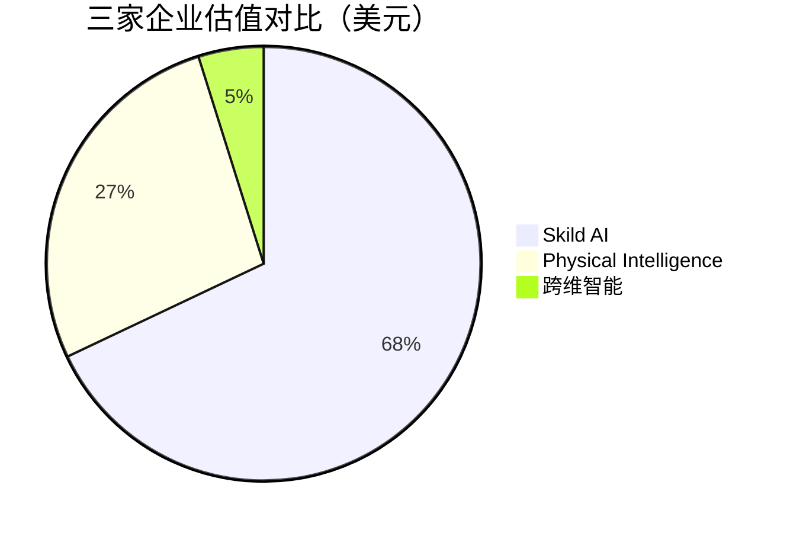

*注：跨维智能估值为估算值，基于融资规模推测*

#### 5.5.4 团队背景与能力矩阵比较

| 维度 | 跨维智能 | Physical Intelligence | Skild AI |
|------|---------|----------------------|----------|
| **创始人背景** | 港中深终身教授+伦敦博士 | Google DeepMind+伯克利教授 | CMU教授（双人） |
| **团队基因** | 学术+产业化 | 学术+产业深度融合 | 学术+Meta/科技大厂 |
| **核心能力** | 三维空间理解+Sim2Real工程化 | VLA算法+数据管线构建 | 仿真预训练+跨平台适配 |
| **产业化经验** | 华为/腾讯硬件专家加入 | Stripe商业背景 | Meta机器人实验室 |

三家企业的团队都具备**深厚的学术背景**，但在产业化路径上各有侧重：跨维智能通过"铁三角"团队实现了学术与产业的有效结合；PI通过引入Stripe背景的联合创始人强化商业化能力；Skild AI则依托Meta机器人实验室的产业经验推动技术落地。

#### 5.5.5 世界模型路线的竞争优势与核心挑战

**核心竞争优势**：

1. **数据成本革命**：通过合成数据生成，将训练数据成本降低至真实数据的1/100甚至更低，从根本上突破具身智能的数据瓶颈

2. **规模化训练能力**：物理仿真环境支持数千乃至数百万智能体并行训练，大幅加速模型迭代速度

3. **零样本迁移潜力**：Sim2Real技术的成熟使得在仿真环境中训练的策略能够直接迁移到真实世界，降低部署成本

4. **安全性优势**：所有试错都在虚拟环境中完成，避免了真实世界训练的设备损坏与安全风险

**核心挑战**：

1. **虚实差距（Sim-to-Real Gap）**：尽管技术持续进步，仿真环境与真实世界之间的差距仍是核心挑战。跨维智能99.9%成功率的突破表明这一差距正在缩小，但在更复杂的开放环境中仍需验证

2. **物理建模复杂性**：柔性物体、流体、复杂接触等场景的物理建模仍面临挑战，限制了合成数据的适用范围

3. **泛化性边界**：合成数据能否完全替代真实数据仍存争议，"1%真实数据+99%合成数据"的混合策略可能是更务实的选择

#### 5.5.6 世界模型路线的演进方向

展望未来，世界模型与物理仿真驱动路线可能沿以下方向演进：

**与VLA的深度融合**：正如前文所述，世界模型与VLA的关注点存在本质差异但具备强大互补性。未来的混合式架构有望结合VLA的语义泛化能力与世界模型的物理推理能力，构建更加智能与可靠的具身智能系统。

**仿真技术的持续进化**：随着NVIDIA Omniverse、Isaac Lab等平台的持续迭代，物理仿真的保真度与效率将进一步提升，进一步缩小虚实差距。

**从工业到通用的场景拓展**：当前世界模型路线在智能制造等结构化场景已取得显著成功，未来有望向家庭服务、商业零售等非结构化场景拓展。跨维智能创始人贾奎预测，**服务机器人将是下一个落地场景**，技术将成熟到"好用且不贵"，机器人成本能降到客户18至36个月回本的区间。2027年开始起量，2028年有望迎来爆发[^54]。

**开源生态的构建**：世界模型路线的企业正在积极构建开源生态。如前文所述，智元机器人已发布首个机器人世界模型开源平台Genie Envisioner，这种开放策略有望加速整个行业的技术进步。

综合来看，世界模型与物理仿真驱动路线已从技术探索进入产业验证的关键阶段。跨维智能、Physical Intelligence、Skild AI三家代表企业通过差异化的技术策略与场景选择，正在共同推动这一技术路线的成熟与落地。在这场竞争中，**谁能更快实现Sim-to-Real的无缝迁移，谁就有望在通用机器人大脑的竞争中占据领先地位**。

## 6 技术路线四：其他新兴路径、融合趋势及特色公司分析

在分层架构、VLA架构、世界模型三大主流技术路线之外，具身智能领域还涌现出多条各具特色的新兴技术路径。这些路径或聚焦于极致运动控制能力的突破，或追求软硬件深度一体化的成本优势，或探索快慢双系统架构的平衡之道，为行业提供了差异化的技术选择与商业化范式。本章将系统梳理模仿学习与强化学习融合、快慢双系统架构、极致运动控制与低成本硬件整合等新兴路径的技术价值，并通过宇树科技、逐际动力、众擎机器人、Figure AI四家特色公司的深度剖析，揭示这些路径在产业化进程中的竞争格局与演进方向。

### 6.1 模仿学习与强化学习融合路径的技术价值与应用边界

模仿学习与强化学习作为具身智能训练的两大核心范式，各自具备独特优势，其融合正成为突破单一方法局限的重要技术方向。

#### 6.1.1 模仿学习在灵巧操作中的独特价值

模仿学习的核心思想是通过人类演示数据让机器人直接学习动作策略，本质上是一种"教AI抄作业"的方法。这一范式在灵巧操作、精细任务中展现出显著优势：**学习效率高、无需设计复杂奖励函数、数据利用直观**。

在实际应用中，模仿学习能够让机器人快速习得基础技能。例如，通过动捕技术采集人体数据，结合模仿学习，使机器人能够更好地模拟人类的自然运动[^63]。众擎机器人的SE01正是通过端到端神经网络方式，将机器人步态提升到真人标准，实现了平稳、快速的自然步态行走[^63]。

然而，模仿学习也面临显著局限：**受限于演示质量、泛化能力有限、存在分布偏移**。学习效果高度依赖演示数据的质量与覆盖范围，难以处理演示数据未覆盖的新场景。

#### 6.1.2 强化学习的突破性与挑战

强化学习让机器人通过与环境的试错交互自主学习最优策略，能够**突破演示天花板、具备自主探索能力、实现端到端优化**。引入强化学习可帮助模型突破模仿学习的局限，实现类人试错与自主探索。

逐际动力的技术路线充分体现了强化学习的价值。公司基于强化学习技术，利用Real2Sim2Real闭环，缩小仿真与现实之间的差距，提高强化学习训练的效率和质量[^64]。通过强化学习，GPU加速的物理仿真允许数千台机器人并行训练，每台机器人都拥有独特物理参数并暴露于多样场景中，在仿真试验和试错中全面优化行走控制策略。

但强化学习在具身智能领域同样面临挑战：**样本效率低、真实世界部署成本高、奖励函数设计困难**。传统无模型强化学习完全依赖于海量的盲目试错来获取学习信号，而在现实物理世界中，每一次交互都伴随着不可忽视的时间损耗、高昂的硬件维护成本以及潜在的安全风险。

#### 6.1.3 融合路径的技术范式

模仿学习与强化学习的融合正成为行业共识。这种融合通常采用**"模仿学习预训练+强化学习精调"**的范式：首先通过模仿学习从人类演示中快速习得基础策略，然后通过强化学习在此基础上进行优化与泛化。

宇树科技的实践充分体现了这一融合思路。公司自行开发的AI机器人算法，在英伟达GPU加速的机器人仿真平台下，可以让H1自主学习高速奔跑、多种高动态舞蹈动作，还能持续学习更多不同种类的动作[^65]。通过模仿学习，高保真物理仿真器帮助机器人快速学习人类步态，仅需数小时即可生成相当于数年的训练数据。

| 训练范式 | 核心优势 | 主要局限 | 适用场景 |
|---------|---------|---------|---------|
| **模仿学习** | 学习效率高、无需奖励设计 | 泛化受限、依赖演示质量 | 基础技能习得、快速原型 |
| **强化学习** | 可突破演示上限、自主探索 | 样本效率低、成本高 | 策略优化、开放环境适应 |
| **融合路径** | 兼具效率与泛化 | 系统复杂度提升 | 工业级应用、通用任务 |

### 6.2 快慢双系统架构：平衡实时响应与复杂规划的设计逻辑

快慢双系统架构借鉴认知科学中的"快慢系统"理论，旨在平衡具身智能系统的实时响应能力与复杂推理规划能力，成为当前行业探索的重要方向。

#### 6.2.1 认知科学启示与架构设计

认知科学家丹尼尔·卡尼曼提出的"快慢系统"理论为具身智能架构设计提供了重要启示：**System 1（快系统）**负责快速、直觉、自动化的反应；**System 2（慢系统）**负责慢速、深思熟虑、需要注意力的推理。

在具身智能中，这一理论被映射为**大脑与小脑的功能分工**。Figure AI的Helix模型是这一架构的典型代表，该模型采用了"快慢双系统"路线[^66]：

- **"慢系统"**：是机载的预训练视觉语言模型（VLM），类似于机器人的"大脑"，以7-9Hz的频率运行，用于场景理解和语言理解
- **"快系统"**：可视为机器人的"小脑"，以高达200Hz的频率输出完整的机器人上半身控制，包括手腕姿势、手指屈曲、躯干和头部方向等

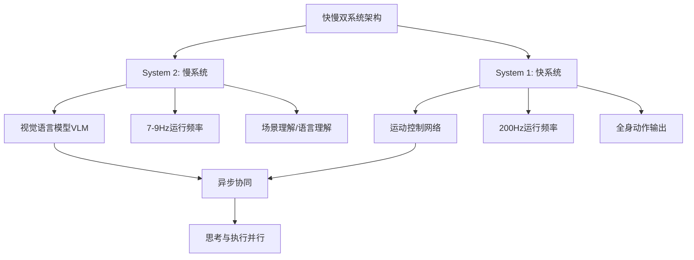

#### 6.2.2 异步频率控制的工程实现

快慢双系统架构的核心工程挑战在于如何实现**思考与执行的并行处理**。研究表明，思考与执行可以并行进行，具体实现方式包括：

- **异步架构设计**：高层规划与底层控制运行在不同的时间尺度上，通过缓冲机制解耦
- **分层频率控制**：高层决策以较低频率运行（如7-9Hz），底层控制以高频率运行（如200Hz）
- **预测性规划**：利用世界模型预测未来状态，提前生成动作序列

Figure AI的实践表明，这种并行处理机制使得机器人能够在保持高频运动控制的同时，进行复杂的语义理解与任务规划。自2025年6月以来，Figure通过多段视频展示了其人形机器人在物流和家庭场景下的特定作业能力，包括物流产线分拣包裹、洗衣机操作、自主叠衣服、将碗碟放入洗碗机等任务[^66]。

#### 6.2.3 场景适用性评估

快慢双系统架构在不同场景中展现出差异化的适用性：

| 场景类型 | 适用性评估 | 核心考量 |
|---------|-----------|---------|
| **工业制造** | 高 | 需要精确控制与任务规划的平衡 |
| **家庭服务** | 高 | 需要理解模糊指令并快速响应 |
| **物流仓储** | 中高 | 需要处理动态环境与高效执行 |
| **实时交互** | 中 | 推理延迟可能影响用户体验 |

### 6.3 极致运动控制与低成本硬件整合的产业化路径

极致运动控制与低成本硬件整合代表了具身智能领域的另一条重要技术路线，其核心逻辑是**通过全栈自研核心零部件、强化学习驱动的运动控制算法、以及规模化量产实现成本下探**，从而打开消费级市场与大规模工业应用的商业化空间。

#### 6.3.1 全栈自研的成本优势

全栈自研核心零部件是实现成本下探的关键路径。以宇树科技为例，公司**90%的核心部件实现自研自产**，包括高性能电机、高精度减速器、伺服驱动器等。其自研的M107关节电机扭矩密度达220Nm/kg，**成本仅为特斯拉Optimus同类部件的50%**[^67]。

这种全栈自研策略带来的成本优势直接体现在产品定价上。宇树科技的G1人形机器人售价**9.9万元**，成为全球首款大规模普及的消费级人形机器人[^67]。相比之下，市场上同类产品普遍定价在数十万元甚至上百万元。

#### 6.3.2 运动控制算法的技术突破

基于四足机器人积累的动态平衡算法，宇树人形机器人H1可实现**3.3m/s的奔跑速度**，并完成上下楼梯、后空翻等复杂动作[^67]。公司还通过专利"滑扣弹性锁紧电池包技术"等机械结构创新，解决了足式机器人在复杂地形下的电池松动问题，抗震动性能提升60%，防水等级达IP67[^67]。

众擎机器人的T800则展示了另一种运动控制的突破方向。T800搭载全栈一体化关节模组，可协同输出**450N·m峰值扭矩**，瞬间关节峰值功率高达14000W，具备格斗、奔跑等高动态运动能力，综合体能表现超越90%的成年男性[^68][^69][^70]。

#### 6.3.3 规模化量产的商业化逻辑

规模化量产是成本下探的另一关键因素。宇树科技2025年人形机器人实际出货量超**5500台**，本体量产下线超6500台[^71][^72]。这一规模化产出使得单位成本得以摊薄，进一步强化了价格竞争力。

| 成本控制维度 | 实现路径 | 代表企业 |
|-------------|---------|---------|
| **核心部件自研** | 电机、减速器、传感器自主研发 | 宇树科技 |
| **运动算法优化** | 强化学习+仿真训练 | 宇树、逐际动力 |
| **规模化量产** | 自建产线、供应链整合 | 宇树、众擎 |
| **模块化设计** | 标准化接口、快速迭代 | 逐际动力 |

### 6.4 宇树科技：四足机器人基本盘与人形机器人规模化量产的行业标杆

宇树科技（Unitree Robotics）是全球领先的AI+移动机器人公司，专注于高性能四足机器人、人形机器人及核心零部件的研发、生产与销售，被誉为全球足式机器人领域的"隐形冠军"[^67]。

#### 6.4.1 全栈自研技术体系

宇树科技的核心竞争力源于对机器人底层技术的长期深耕，构建了"运动控制-感知-决策"全栈技术平台[^67]：

**核心零部件自主化**：公司90%的核心部件实现自研自产，包括高性能电机、高精度减速器、伺服驱动器等。自研的M107关节电机扭矩密度达220Nm/kg，成本仅为特斯拉Optimus同类部件的50%。2025年与曼恩斯特合作开发的固态电池技术，使人形机器人H1续航从2小时提升至6小时以上，充电时间缩短至30分钟[^67]。

**运动控制算法突破**：基于四足机器人积累的动态平衡算法，H1可实现3.3m/s的奔跑速度，并完成上下楼梯、后空翻等复杂动作。专利"滑扣弹性锁紧电池包技术"使抗震动性能提升60%，防水等级达IP67[^67]。

**多模态感知与AI融合**：公司率先布局AI与硬件的深度耦合，与国内外头部AI企业合作开发"机器人脑"系统。通过接入大模型实现语音交互、自主避障及任务规划，在电力巡检场景中可通过语言指令查询设备数据，效率提升30%[^67]。

#### 6.4.2 产品矩阵与市场表现

宇树科技构建了覆盖消费级、行业级的多元化产品体系，2024年四足机器人与人形机器人分别贡献65%和30%的营收[^67]：

| 产品系列 | 代表产品 | 核心参数 | 市场定位 | 市场表现 |
|---------|---------|---------|---------|---------|
| **消费级四足** | Go1、Go2 | IP68防水、17km/h速度 | 家用/科研 | 累计出货超5万台，市占率60%+ |
| **工业级四足** | B1、B2 | 80kg负载、宽温域运行 | 电力/化工巡检 | 服务500+企业，订单超12亿元 |
| **消费级人形** | G1 | 售价9.9万元 | 家庭陪伴/科普 | 2025年京东预售即售罄 |
| **工业级人形** | H1 | 47kg轻量化、毫米级定位 | 工业物流 | 宁德时代工厂试点 |

2024年四足机器人全球销量2.37万台，**市占率69.75%**，连续四年盈利且净利润率达18%[^67]。2025年获世界知识产权组织（WIPO）全球奖，成为本届唯一获奖的中国企业[^67]。

#### 6.4.3 商业化进展与出货量

2025年，宇树科技迎来人形机器人商业化的关键突破。根据公司官方澄清，**2025年人形机器人实际出货量超5500台**（指实际出售发货给终端客户的数量），本体量产下线超6500台。上述均为纯人形机器人的数量，不含双臂轮式等其他机器人产品[^71][^72]。

在商业化路径上，宇树科技通过"硬件销售+服务订阅+生态合作"的组合策略推动机器人从"展品"向"生产力工具"转型[^67]：

- **行业级场景突破**：与国网杭州供电公司合作开发"电力+具身智能"解决方案，异常识别准确率达98%；四足机器人已参与全国抗震救灾实战演习
- **消费级市场教育**：借助春晚、冬奥会等大型活动进行品牌曝光；通过开源代码库吸引3000+开发者
- **全球化布局**：50%收入来自海外市场，产品覆盖全球半数国家和地区

2025年12月31日，宇树科技于北京CBD核心商圈的京东MALL落地**全国首家线下门店**，目前店内可出售的机器人包括两款机器狗（Go2 Air售价10497元、Go2 Pro售价19999元）和两款人形机器人（G1基础版和开发版，原价9.9万元起，折后价8.5万元起）[^71]。

#### 6.4.4 融资历程与IPO进程

宇树科技累计完成10轮融资，C轮投后估值达**120亿元**，投资方包括腾讯、阿里、中国移动等巨头[^67][^73]。

| 融资阶段 | 时间 | 主要投资方 | 战略重点 |
|---------|------|-----------|---------|
| B2轮 | 2024年初 | 美团、金石投资、源码 | 近10亿元融资 |
| C轮 | 2024年底-2025年 | 腾讯、阿里、锦秋基金、吉利资本、中国移动 | 规模化量产与全球市场拓展 |

2025年，宇树科技启动A股上市辅导。**2025年11月15日，中国证监会官网显示宇树科技IPO上市辅导工作完成**，公司拟申请在境内IPO，中信证券为辅导机构[^71]。募资将重点投向高扭矩电机、轻量化材料等领域，目标产能爬坡至月均千台[^67]。

锦秋基金合伙人臧天宇指出，宇树科技已实现四足机器人与人形机器人的量产出货量全球第一，其明星产品Unitree Go1四足机器人累计出货量超5万台，占据全球消费级足式机器人市场60%以上份额，成为MIT、斯坦福等顶尖高校及科研机构的首选研发平台[^73]。

#### 6.4.5 创始人背景与团队能力

宇树科技创始人、CEO、CTO**王兴兴**，1990年出生于浙江宁波余姚，毕业于上海大学机械工程专业，具有近10多年足式机器人研发经验，拥有产品从0-1-100的研发与商业化落地能力，100+项机器人相关专利[^74][^75]。

王兴兴的创业历程体现了技术驱动的特点：2015年在读研期间独立开发了全球开创性的XDog四足机器人方案；2016年从大疆离职后创立宇树科技；自2018至2022年，每年受邀参与世界最顶级机器人学术会议ICRA等[^75]。

2021年，王兴兴带领宇树四足机器人"犇犇"在央视牛年春晚舞台集群表演；2022年，109台Go1四足机器人亮相冬奥会开幕式[^74]。王兴兴为公司大部分专利的发明人，自研的机器人关键技术申请获得了国内外100余项专利[^74]。

2025年，王兴兴以67亿元的身家首次上榜《2025新财富500创富榜》，并获得2025年度中国青年五四奖章[^75]。

### 6.5 逐际动力：学术派创业与全尺寸人形机器人的通用化探索

逐际动力（LimX Dynamics）成立于2022年，总部位于深圳，聚焦打造全尺寸通用人形机器人，是以学术创业为特色的具身智能企业[^76]。

#### 6.5.1 技术路线：强化学习驱动的全身运动控制

逐际动力的技术研发实力体现在具身智能领域的多项重要进展。公司在运动控制技术方面国内领先，自研算法可实现高动态平衡与复杂地形适应[^64]。

**核心技术突破**：

- **Real2Sim2Real闭环**：通过强化学习技术，利用Real2Sim2Real闭环，缩小仿真与现实之间的差距，提高强化学习训练的效率和质量[^64]
- **具身智能操作算法LimX VGM**：2025年2月发布基于视频生成大模型的具身操作算法，这是国内首次实现将人类操作数据直接应用于机器人操作。通过人类操作视频数据对现有的视频生成大模型进行后训练，仅需将场景图片和操作任务指令作为提示，即可实现任务理解与拆分、物体操作轨迹生成以及机器人操作执行的全流程[^64][^77]

#### 6.5.2 产品矩阵与开放平台战略

逐际动力已推出覆盖多种形态的产品矩阵：

| 产品名称 | 形态特征 | 核心参数 | 市场定位 |
|---------|---------|---------|---------|
| **TRON1** | 多形态双足机器人 | 全球首款支持"双点足、双足、双轮足"模块化切换 | 已完成多国交付，实现商业化闭环 |
| **LimX Oli** | 全尺寸通用人形机器人 | 身高165cm、31个自由度、售价15.8万元起 | Lite/EDU/Super三版本，2025年7月发布 |

**LimX Oli**的核心参数展示了逐际动力在全尺寸人形机器人领域的技术实力[^78][^79][^80]：

| 参数维度 | 技术指标 |
|---------|---------|
| 身高 | 165cm |
| 肩宽 | 55cm |
| 臂长 | 70cm |
| 重量（含电池） | ≤55kg |
| 单臂最大负载 | 3kg |
| 行走最大速度 | 5km/h |
| 机身自由度 | 31（不含末端执行器） |

LimX Oli采用通用化结构设计，搭配模块化的软硬件架构以及持续优化的工具链开发系统，能够全面支撑从算法研发到实际部署的全流程工作[^76]。该机器人于2025年8月8日亮相北京世界机器人大会WRC，进行首次公开演示，展示了复杂舞蹈、多风格拟人行走及动态步态切换等能力[^78]。

2025年10月6日，LimX Oli在央视中秋晚会上与歌手尚雯婕共同演绎歌曲《青铜》，成为首个亮相该晚会的具身人形机器人[^78]。2026年1月，逐际动力宣布旗下人形机器人LimX Oli实现**全球首例群体化自主出舱**，多台机器人"自主开箱"，实现了集群控制，排列出复杂阵型，协同起舞[^76][^78]。

#### 6.5.3 融资历程与产业合作

逐际动力的融资历程展现了资本市场对学术派创业的认可：

| 融资阶段 | 时间 | 金额 | 主要投资方 |
|---------|------|------|-----------|
| 天使轮+Pre-A轮 | 2023年10月 | 近2亿元 | 峰瑞资本、绿洲资本、联想创投 |
| A轮 | 2024年7月 | 数亿元 | 阿里巴巴、招商局创投、尚颀资本 |
| A+轮 | 2025年3月 | 半年累计5亿元 | 阿里巴巴、蔚来资本、联想创投等 |
| 新一轮 | 2025年7月 | 京东战略领投 | 深化零售、物流和服务领域协同探索 |

2025年11月，逐际动力发生工商变更，新增中鼎股份、东土科技、光洋股份为股东，注册资本增至259.88万元[^76]。

公司战略产业投资人包括阿里巴巴集团、招商局创投、尚颀资本、蔚来资本、联想创投、京东等，知名财务投资人有高捷资本、绿洲资本、明势创投、峰瑞资本、南山战新投等[^77][^81][^82]。

#### 6.5.4 创始人背景与战略愿景

逐际动力创始人**张巍**为南方科技大学长聘教授，本科毕业于中国科学技术大学自动化系，后获美国普渡大学电气与计算机工程博士学位。曾任美国俄亥俄州立大学长聘副教授，长期研究控制理论与应用、机器人、机器学习等[^83][^84]。

2019年，张巍回国加入南方科技大学。2022年1月依托南科大产学研资源创办逐际动力。学术领域累计发表机器人顶刊论文130余篇，2023年入选《福布斯中国青年海归菁英100人》榜单[^83]。

张巍提出了**"成为具身智能领域的英伟达"**的战略愿景。他认为，逐际动力做的并非是让机器人去代替人，而是Empower人，将具身智能创新、落地的效率提升百倍千倍[^85][^84]。

张巍强调，人形机器人的发展并非一蹴而就，而需循序渐进——"苹果也不是乔布斯成立的时候就整出iPhone，它是从卖电脑开始，一点点来的"[^85]。他给逐际动力设定的目标是打造人形机器人的"iPhone操作系统"，打破开发壁垒，未来一两年内希望让任何人用自然语言就能开发机器人[^85]。

### 6.6 众擎机器人：运动性能优先与全尺寸人形机器人的商业化突围

众擎机器人（深圳市众擎机器人科技有限公司）成立于2023年，是全球首个成功完成前空翻动作的人形机器人公司，聚焦于通用智能机器人及行业场景方案的创新[^63][^86]。

#### 6.6.1 技术特色：运动性能的极致追求

众擎机器人的技术路线以**"体能先行"**为核心，认为强大的运动能力是后续智能应用的基础[^86]。

**核心技术突破**：

- **自然拟人步态**：SE01在全球范围内首次真正解决了机器人的自然步态问题，告别机器人小碎步、弯着腿、屈着膝、跺着脚的病态步伐，实现平稳、快速走路[^63]
- **端到端神经网络步态控制**：使用端到端神经网络方式将机器人步态提升到真人标准，通过动捕技术采集人体数据，结合强化学习和模仿学习[^63]
- **高动态运动能力**：T800搭载全栈一体化关节模组，协同输出峰值扭矩可达**450N·m**，瞬间关节峰值功率高达14000W，可完成格斗、奔跑等高动态运动，综合体能表现超越90%的成年男性[^68][^69][^70]

#### 6.6.2 产品矩阵与定价策略

众擎机器人已形成覆盖双足、全人形等多形态、全尺寸的梯度化产品谱系[^68]：

| 产品名称 | 形态特征 | 核心参数 | 定价策略 |
|---------|---------|---------|---------|
| **SE01** | 全尺寸通用人形 | 身高170cm、整机55kg、32自由度 | 成本控制在10万元以内 |
| **PM01** | 人形机器人 | 全球首例前空翻 | - |
| **T800** | 全尺寸高效能通用人形 | 身高173cm、75kg、29自由度、450N·m峰值扭矩 | **18万元起**（基础版） |

T800同步推出基础版、生态版（开源版）、锐化版（Pro版）、旗舰版（Max版）四款细分配置产品，精准匹配科研教育、巡逻巡检、商业服务、文旅游乐、物流配送、工业协作等多元应用需求[^68][^69][^70]。

T800的技术亮点包括[^69][^70]：
- 机身采用航空级高强度铝合金一体压铸成型工艺
- 搭载行业首款专为人形机器人研发的高性能固态动力电池，续航时间达4-5小时
- 配备腿部全关节主动散热系统
- 全栈自研多维度感知灵巧手，集成触觉传感系统与精准力控技术

#### 6.6.3 融资进展与量产规划

众擎机器人的融资历程展现了资本市场对运动性能路线的认可：

| 融资阶段 | 时间 | 金额 | 主要投资方 |
|---------|------|------|-----------|
| 天使轮+天使+轮 | 2024年 | 近亿元 | 商汤国香资本、弘晖基金、合肥滨湖金投 |
| Pre-A++轮+A1轮 | 2025年 | 累计10亿元 | 黄浦江资本、华控基金等 |
| A1+轮+A2轮 | 2025年12月 | - | 国中创投、央视基金、吉利星源、京东等 |

A2轮融资呈现"顶级资本联合国资主导+新老协同"的高质量资本布局。本轮融资由老股东黄浦江资本以绝对比例联合河南投资集团汇融基金、老股东华控基金领投。新股东包括国中创投、央视基金、南山战新投、财鑫资本、吉利星源、汇勤资本等[^68]。

**量产规划**：众擎已在深圳南山区红花岭工业区自建产线，并在河南郑州规划200亩生产制造基地作为全球制造中心，目标年产5000台机器人[^70]。公司计划2026年实现数十台到数百台的小批量交付，2027年目标销量达1-2万台[^70]。

#### 6.6.4 创始人背景与市场营销

众擎机器人创始人、董事长兼CEO**赵同阳**是人形机器人领域的连续创业者，创业历程长达十年[^86]。

赵同阳的创业经历颇具传奇色彩：2016年至2018年，先后创办两家机器人公司均因资金短缺失败；2019年创办第三家公司，以第一代机器狗Dogotix在业内崭露头角；2020年被何小鹏收购并共同成立鹏行智能，担任总经理，主导研发小鹏首款双足人形机器人PX5；2023年因赛道分歧与小鹏汽车分道扬镳后，创立众擎机器人[^86]。

赵同阳回忆称，人形机器人行业有七年不被看好，经历多次"至暗时刻"，最艰难时只留20万元给孩子付学费[^86]。2025年5月，赵同阳入选第2届深圳十大青年榜样名单[^86]。

2025年12月6日，赵同阳作为众擎机器人CEO在T800功能测试中被机器人踹倒的视频引发网络热议。视频中，T800机器人一个干脆利落的踢击，让穿戴全套护具的赵同阳应声倒地，他在起身后坦言如果没有护具"绝对会骨折"[^87][^88]。该视频24小时内播放量破亿，成为具身智能机器人产品力的注脚，也引发了关于营销与安全性的行业讨论[^87][^88]。

### 6.7 Figure AI：Helix模型与全球估值最高人形机器人公司的技术演进

Figure AI是美国一家人形机器人初创公司，由Brett Adcock于2022年创立，总部位于加利福尼亚州圣尼维尔，专注通用人形机器人研发。2025年9月完成C轮融资超10亿美元后，估值达**390亿美元**，成为**全球估值最高的人形机器人公司**[^89][^66][^65]。

#### 6.7.1 技术路线演进：从OpenAI合作到自研Helix

Figure AI的技术路线经历了重要演进。2024年2月，公司与OpenAI达成合作，共同开发人形机器人AI模型。然而，**2025年2月，Figure宣布与OpenAI终止合作**，转而进行完全自主研发的端到端机器人AI模型[^66]。

分道扬镳后不久，Figure推出了名为**Helix**的VLA（视觉-语言-动作）模型，该模型采用了"快慢双系统"路线，取得了行业内的广泛影响[^66]。

**Helix模型架构**：

| 系统层级 | 功能定位 | 运行频率 | 核心能力 |
|---------|---------|---------|---------|
| **慢系统** | 机器人"大脑" | 7-9Hz | 预训练VLM，场景理解、语言理解 |
| **快系统** | 机器人"小脑" | 200Hz | 全身控制输出，手腕姿势、手指屈曲、躯干方向等 |

2025年8月至9月，公司进一步宣布转向通过摄像头记录人的行为来快速积累数据的视觉路线[^89]。

#### 6.7.2 产品迭代与商业化进展

Figure AI的产品迭代展现了快速演进的技术能力：

| 产品版本 | 发布时间 | 核心特性 |
|---------|---------|---------|
| **Figure 01** | 2023年3月 | 首款双足机器人 |
| **Figure 02** | 2024年8月 | 支持实时语音交互 |
| **Figure 03** | 2025年5月 | 第三代机器人，10月搭载Helix模型发布 |

自2025年6月以来，Figure通过多段视频展示了其人形机器人在物流和家庭场景下的特定作业能力[^66]：

- 6月：在物流产线上分拣包裹
- 7月末：从筐中取出待洗衣物并放入洗衣机滚筒
- 8月：自主叠衣服——从混杂的衣堆中抓取毛巾，捏住毛巾两侧摊开抚平，并实时调整折叠策略
- 9月3日：自主将碗碟放入洗碗机

**工业应用进展**：宝马成为Figure的重要合作伙伴，公开信息显示宝马在南卡罗来纳州的斯帕坦堡工厂引进了Figure的人形机器人进行汽车产线测试。2025年1月，Figure 02在宝马工厂完成高精度钣金件组装测试[^89][^66]。

创始人Brett Adcock表示，机器人在宝马的生产线上已经完成了20小时的轮班作业，并探索了工厂内的新应用场景[^66]。

#### 6.7.3 融资历程与估值跃升

Figure AI的融资历程展现了惊人的估值增长速度：

| 融资阶段 | 时间 | 金额 | 估值 | 主要投资方 |
|---------|------|------|------|-----------|
| A轮 | 2023年5月 | 7000万美元 | - | - |
| B轮 | 2024年2月 | 6.75亿美元 | 26亿美元 | 微软、英伟达、亚马逊旗下基金、OpenAI |
| C轮 | 2025年9月 | 超10亿美元 | **390亿美元** | Parkway Venture Capital领投，英伟达、英特尔创投、高通创投等 |

**仅仅一年多时间，Figure AI估值获得了约13倍的提升**[^65]。

C轮融资由百汇创投（Parkway Venture Capital）领投，众多行业巨头纷纷跟投，包括英伟达、英特尔创投、韩国LG科技风投、高通创投、Salesforce、T-Mobile风投、博枫资产管理公司、麦格理资本等。值得注意的是，百汇创投、英伟达、英特尔创投等投资方均为Figure的老股东，这显示了他们对该公司的持续信心[^66][^65]。

Figure在公告中表示，此次融资将专注于推动人形机器人在家庭及商业场景的规模化部署，致力于建设下一代GPU基础设施，以加速具身智能模型的训练与仿真[^66]。

#### 6.7.4 供应链布局与中国合作

Figure AI在供应链方面与中国企业建立了深度合作关系[^89]：

- **长盈精密**：独家供应Figure 03手部关节模组并签订三年战略协议
- **兆威机电**：供应链合作
- **领益智造**：2025年6月达成战略合作，整合机器人产业"核心零部件-模组-整机"链条资源

根据2026年初的公开信息，Figure AI计划在2026年实现**1.2万台的年产能**，并逐步扩大至10万台[^89]。

#### 6.7.5 团队背景与产业争议

Figure AI的核心团队汇聚了机器人与AI领域的顶尖人才[^89]：

| 核心成员 | 职务 | 背景 |
|---------|------|------|
| **Brett Adcock** | 创始人兼CEO | 曾创立电动飞行出租车公司Archer Aviation |
| **Jerry Pratt** | 首席技术官 | 前人类与机器认知研究所高级研究科学家 |
| **Michael Rose** | 机器人控制主管 | 前波士顿动力/苹果工程师 |
| **Corey Lynch** | AI团队负责人 | 前谷歌DeepMind研究员 |

公司采用短期聚焦制造业、物流，长期拓展家庭场景的双轨策略[^89]。

值得注意的是，2025年11月，创始人Brett Adcock公开质疑中国机器人公司灵启万物和优必选的机器人视频真实性[^89]。2025年12月，公司披露自创立以来共收到17.6万份简历，仅录用约425人，**录用率为0.24%**[^89]。

### 6.8 四家特色公司的多维度横向比较与新兴路径前景研判

基于前述对宇树科技、逐际动力、众擎机器人、Figure AI四家企业的深度分析，本节构建系统的比较框架，综合评估新兴技术路径在具身智能产业化进程中的竞争格局与演进方向。

#### 6.8.1 技术侧重点与核心能力比较

| 维度 | 宇树科技 | 逐际动力 | 众擎机器人 | Figure AI |
|------|---------|---------|-----------|-----------|
| **技术侧重** | 极致运动控制+低成本硬件 | 强化学习+全身运动控制 | 运动性能优先+高动态能力 | 快慢双系统VLA架构 |
| **核心能力** | 全栈自研零部件、规模化量产 | Real2Sim2Real闭环、开放平台 | 自然步态、450N·m峰值扭矩 | Helix模型、语义理解 |
| **技术路线** | 模仿学习+强化学习融合 | 强化学习驱动 | 端到端神经网络步态 | VLA+快慢系统 |
| **硬件策略** | 90%核心部件自研 | 通用化结构、模块化设计 | 航空铝合金一体压铸 | 软件先行、供应链合作 |

四家企业在技术侧重点上呈现出明显的**差异化定位**：宇树科技聚焦极致运动控制与低成本硬件整合，逐际动力强调强化学习驱动的全身运动控制与开放平台战略，众擎机器人追求运动性能的极致突破，Figure AI则专注于快慢双系统VLA架构的智能化提升。

#### 6.8.2 产品定价与市场定位比较

| 维度 | 宇树科技 | 逐际动力 | 众擎机器人 | Figure AI |
|------|---------|---------|-----------|-----------|
| **消费级产品** | G1：9.9万元（折后8.5万元） | LimX Oli：15.8万元起 | T800基础版：18万元 | 未公开 |
| **工业级产品** | H1：65万元 | LimX Oli Super版 | T800旗舰版 | 未公开 |
| **市场定位** | 消费级+科研教育+工业 | 科研教育+工业 | 工业+商业服务 | 工业+家庭 |
| **定价策略** | 低价普及、规模化量产 | 性价比+开放生态 | 高性能定价 | 未公开 |

从定价策略来看，**宇树科技的9.9万元G1代表了消费级人形机器人的价格标杆**，逐际动力的LimX Oli以15.8万元定位于"同等价位下性价比最高的全尺寸人形机器人"[^80]，众擎机器人的T800以18万元起定位于高性能工业级市场。

#### 6.8.3 商业化路径与落地进展比较

| 维度 | 宇树科技 | 逐际动力 | 众擎机器人 | Figure AI |
|------|---------|---------|-----------|-----------|
| **2025年出货量** | 人形机器人超5500台 | TRON1多国交付 | 早期量产阶段 | 约150台（Omdia数据） |
| **核心场景** | 电力巡检、消费级、工业 | 科研教育、工业制造 | 巡逻巡检、商业服务、工业 | 汽车制造、物流、家庭 |
| **标杆客户** | 宁德时代、国网杭州 | 阿里、京东、上汽 | 上汽通用等 | 宝马 |
| **商业化阶段** | 规模化量产落地 | 商业化闭环验证 | 早期量产探索 | 试点部署阶段 |

从出货量来看，**宇树科技以2025年人形机器人出货超5500台的成绩位居全球前列**[^71][^72]。根据研究机构Omdia统计，2024年全球人形机器人出货量约1.3万台，中国厂商贡献了其中绝大多数，上海智元去年人形机器人估计出货量5168台位居全球人形机器人公司之首，而Figure AI在2025年的出货量约为150台[^89]。

#### 6.8.4 融资规模与估值比较

| 维度 | 宇树科技 | 逐际动力 | 众擎机器人 | Figure AI |
|------|---------|---------|-----------|-----------|
| **累计融资** | 10轮+，C轮估值120亿元 | 5亿元A轮系列 | 累计超10亿元 | 约17.7亿美元 |
| **最新估值** | 约120亿元（拟IPO） | 未公开 | 未公开 | **390亿美元（约2700亿元）** |
| **核心投资方** | 腾讯、阿里、中国移动 | 阿里、京东、蔚来资本 | 京东、黄浦江资本、华控基金 | 英伟达、微软、贝佐斯 |
| **资本特征** | 互联网巨头+国资 | 产业资本+财务投资 | 产业资本+国资 | 全球科技巨头 |

从估值规模来看，**Figure AI以390亿美元（约2700亿元人民币）的估值遥遥领先**，成为全球估值最高的人形机器人公司[^89]。宇树科技以约120亿元估值位居国内前列，并已完成IPO上市辅导[^71]。

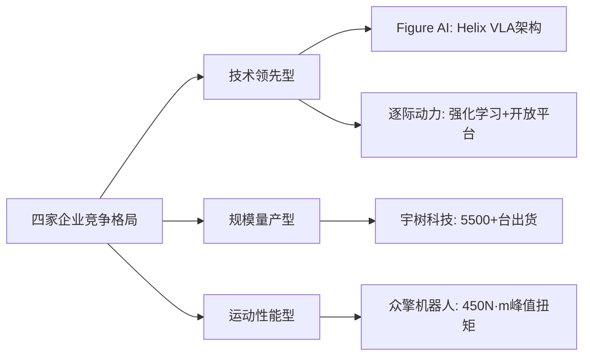

#### 6.8.5 团队基因与核心能力比较

| 维度 | 宇树科技 | 逐际动力 | 众擎机器人 | Figure AI |
|------|---------|---------|-----------|-----------|
| **创始人背景** | 上海大学硕士，10+年足式机器人研发 | 南科大教授，CMU/伯克利博后 | 连续创业者，前小鹏鹏行智能 | Archer Aviation创始人 |
| **团队基因** | 本土技术创业 | 学术派创业 | 产业派创业 | 硅谷创业+学术 |
| **核心能力** | 全栈自研、规模化量产 | 算法创新、开放生态 | 运动控制、市场营销 | AI算法、资本运作 |
| **商业化经验** | 四足机器人商业化成功 | 学术到产业转型中 | 小鹏体系产业化经验 | 连续创业经验 |

四家企业的团队基因呈现出明显差异：**宇树科技代表本土技术创业的成功范式**，创始人王兴兴从学生时代开始深耕足式机器人，通过十年积累实现了从技术到商业的完整闭环；**逐际动力代表学术派创业的探索路径**，创始人张巍从美国终身教授转型创业，强调"具身智能领域的英伟达"愿景；**众擎机器人代表产业派创业的突围路径**，创始人赵同阳历经多次创业失败，积累了丰富的产业化经验；**Figure AI代表硅谷创业的典型模式**，汇聚全球顶尖人才，以技术突破与资本运作双轮驱动。

#### 6.8.6 新兴路径的竞争格局与演进趋势

**竞争格局研判**：

当前，新兴技术路径的竞争格局呈现出**"中美分化、各有侧重"**的特征：

- **中国企业**（宇树、逐际、众擎）更侧重于**运动控制能力的突破与低成本硬件整合**，通过规模化量产实现商业化落地
- **美国企业**（Figure AI）更侧重于**VLA架构的智能化提升**，通过资本密集投入推动技术前沿突破

**演进趋势预判**：

1. **技术路线融合**：单一技术路线难以满足通用具身智能的多维需求，未来将呈现运动控制、VLA、世界模型等多路径融合的趋势。正如业界共识所指出的，**混合式架构将成为终局形态**

2. **成本持续下探**：宇树科技9.9万元G1的成功表明，消费级人形机器人市场正在打开。预计未来两年内，主流产品价格有望进一步下探至5万元区间[^90]

3. **场景深化与数据闭环**：真实场景数据的积累将成为核心竞争壁垒。宇树科技通过电力巡检、消费级市场等多元场景构建数据闭环，逐际动力通过开放平台吸引开发者生态，都体现了这一趋势

4. **产业链整合加速**：Figure AI与中国供应链企业（长盈精密、领益智造等）的合作表明，全球人形机器人产业链正在加速整合。中国企业凭借供应链优势，有望在这一进程中占据有利位置

综合来看，新兴技术路径已从技术探索进入产业验证的关键阶段。四家代表企业通过差异化的技术策略与场景选择，正在共同推动具身智能产业的成熟与落地。在这场竞争中，**谁能更快实现"技术突破-规模量产-场景落地-数据闭环"的正向循环，谁就有望在通用具身智能的竞争中占据领先地位**。

## 7 总结与展望：技术路线竞争格局、核心挑战与未来趋势

经过对分层架构、VLA架构、世界模型、新兴路径四大技术路线及其代表企业的系统剖析，具身智能产业的全景图谱已清晰呈现。当前，行业正处于从"技术验证"向"规模化商业落地"跃迁的关键窗口期，各技术路线在性能、成本、泛化能力、商业化成熟度等维度展现出差异化的竞争优势与适用边界。本章将系统整合前述分析，构建多维度技术路线比较矩阵，揭示行业竞争格局与演进趋势，并基于技术演进规律与市场动态，为产业参与者提供战略决策参考。

### 7.1 四大技术路线的多维度优劣比较矩阵

基于前六章对各技术路线及代表企业的深度分析，本节构建涵盖性能表现、泛化能力、数据依赖度、工程成熟度、成本效率、商业化成熟度、可解释性与安全性等核心维度的系统比较框架。

#### 7.1.1 综合比较矩阵

| 评估维度 | 分层/模块化架构 | VLA架构 | 世界模型驱动 | 模仿学习与强化学习融合 |
|---------|---------------|---------|-------------|---------------------|
| **性能表现** | **运动控制精度高、负载能力强、硬件可靠性突出**。优必选自研伺服关节实现精确控制；波士顿动力电驱Atlas动态性能领先；开普勒行星滚柱丝杠适用于高负载工业场景 | **任务理解与规划能力强**，擅长处理开放指令和长程多步骤任务。智平方快慢双系统实现逻辑推理与实时控制；智元ViLLA架构支持小样本学习 | **在已知或可建模环境中训练出高成功率、高鲁棒性技能**。跨维智能Sim2Real实现99.9%操作成功率；Skild AI模型具备抗损伤与自主恢复能力 | **运动性能突出**（如宇树H1奔跑3.3m/s、众擎T800 450N·m峰值扭矩），或**AI与硬件深度耦合**（Figure自研Helix模型） |
| **泛化能力** | **场景模块化复用为主**。优必选通过"技术鱼池"实现跨场景技术模块重组；波士顿动力和开普勒更专注于特定场景深度优化。零样本泛化能力较弱 | **理论泛化能力最强**，依赖大模型对视觉和语言的理解。智平方强调真实数据闭环；银河通用侧重仿真合成数据预训练。可处理训练分布外新场景 | **仿真环境内泛化性好，向现实迁移是关键**。跨维智能通过GS-World闭环提升泛化；PI坚持在真实世界中训练以应对复杂性 | **侧重运动泛化与本体控制**。逐际动力强化学习小脑适应复杂地形；Figure端到端模型学习操作技能 |
| **数据依赖度** | 中等，各模块可针对性训练 | 高，需要大规模视觉-语言-动作对齐数据 | 中高，依赖高保真仿真数据生成能力 | 中等，模仿学习依赖演示数据质量 |
| **工程成熟度** | **最高**，与传统机器人技术兼容性强，已进入规模化交付阶段 | **发展中**，头部公司已获规模化订单，但整体仍在验证期 | **发展中**，跨维智能工业场景落地成熟，PI/Skild处于平台化早期 | **分化明显**，宇树规模化量产成熟，Figure处于试点部署阶段 |
| **成本效率** | **分化明显**。开普勒（3万美元）和优必选（规模化降本）定位性价比；波士顿动力成本高昂 | **软件边际成本低**，但前期研发投入大。本体多为轮式设计，硬件成本相对可控 | **仿真大幅降低数据采集成本**，但高保真仿真引擎开发成本高 | **成本控制成为核心竞争力**。宇树通过自研大幅降本；逐际动力、众擎定价15-20万元区间 |
| **商业化成熟度** | **较高**。优必选年产能超1000台，订单总额超14亿元；开普勒获工业试点订单 | **快速分化**。智平方（惠科5亿元订单）、银河通用（数千台订单）进入实战 | **路径分化**。跨维智能营收达亿元级；Skild AI获能源巨头订单 | **并行探索**。宇树出货超5500台；众擎获数千台意向订单；Figure出货约150台 |
| **可解释性与安全性** | **强**，决策过程可分层追溯，便于故障诊断与安全审计 | **中等**，黑箱特性使故障诊断面临挑战，安全对齐问题受关注 | **中等**，仿真环境可控但现实迁移存在不确定性 | **中等**，端到端模型可解释性较弱 |

#### 7.1.2 各技术路线的核心优势与适用边界

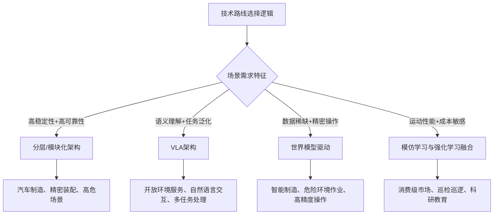

**分层/模块化架构**最适合对稳定性、可靠性要求极高的工业场景，如汽车装配、精密制造等。其核心优势在于可控性强、模块化升级便捷、工程实现成熟，但泛化能力受限于模块间接口的信息损失。

**VLA架构**最适合需要语义理解与任务泛化的服务场景，如开放环境导航、自然语言指令执行、多任务处理等。其核心优势在于继承大语言模型的通识知识与推理能力，但面临实时性、安全性与数据需求的挑战。

**世界模型驱动**最适合数据稀缺但对精度要求极高的场景，如智能制造中的精密操作、危险环境作业等。其核心优势在于通过合成数据突破数据瓶颈，但虚实差距的弥合仍是关键挑战。

**模仿学习与强化学习融合**最适合对运动性能要求高、成本敏感的场景，如消费级市场、巡检巡逻、科研教育等。其核心优势在于通过全栈自研实现成本下探，但在复杂语义任务上的能力有待提升。

#### 7.1.3 技术路线的互补性与融合潜力

值得强调的是，四大技术路线并非相互排斥，而是具备强大的互补潜力：

- **分层架构的稳定执行层**可与**VLA的语义理解层**结合，实现"智能大脑+可靠身体"的协同
- **世界模型的物理预测能力**可增强**VLA的动作规划精度**，实现语义理解与物理推理的统一
- **模仿学习的快速技能习得**可与**强化学习的策略优化**结合，实现"快速上手+持续进化"的训练范式

这种互补性为混合式架构的演进提供了技术基础，也预示着未来技术路线将从当前的多路径并行竞争，逐步走向融合收敛。

### 7.2 全球具身智能行业竞争梯队格局与头部集中趋势

基于估值规模、融资能力、出货量、订单规模、技术专利等多维指标，当前全球具身智能行业已形成清晰的竞争梯队格局。

#### 7.2.1 全球竞争梯队划分

| 梯队 | 企业代表 | 估值/市值区间 | 核心竞争力 | 商业化阶段 |
|------|---------|--------------|-----------|-----------|
| **第一梯队** | Figure AI、Skild AI、银河通用 | 140-390亿美元 | 顶级资本加持、前沿技术突破、全球化布局 | 试点验证/规模化初期 |
| **第二梯队** | 智元机器人、宇树科技、优必选、Physical Intelligence | 50-150亿元/56亿美元 | 规模化量产能力、全栈自研体系、商业化闭环验证 | 规模化量产/商业落地 |
| **第三梯队** | 智平方、跨维智能、逐际动力、众擎机器人 | 10-60亿元 | 差异化技术路线、垂直场景深耕、快速融资能力 | 商业验证/早期量产 |
| **传统巨头** | 波士顿动力、特斯拉Optimus | 11亿美元（收购价）/未独立估值 | 技术积累深厚、产业资源丰富 | 战略转型/试点探索 |

**第一梯队**以Figure AI（390亿美元）、Skild AI（超140亿美元）、银河通用（30亿美元/约211亿元）为代表，估值规模遥遥领先，反映了资本市场对"通用机器人大脑"赛道的极高预期。这些企业汇聚了全球顶尖人才，获得了科技巨头的战略投资，但商业化落地仍处于早期阶段。

**第二梯队**以智元机器人（150亿元）、宇树科技（120亿元）、优必选（580亿港元市值）、Physical Intelligence（56亿美元）为代表，已实现规模化量产或获得大规模订单验证，商业化路径相对清晰。

**第三梯队**以智平方、跨维智能、逐际动力、众擎机器人为代表，虽然估值规模相对较小，但在差异化技术路线或垂直场景上展现出独特竞争力，融资节奏快速。

#### 7.2.2 中美企业的分化特征

当前全球具身智能竞争呈现出**"中美分化、各有侧重"**的显著特征：

| 维度 | 中国企业特征 | 美国企业特征 |
|------|-------------|-------------|
| **技术侧重** | 运动控制、硬件自研、成本优化 | VLA架构、通用大脑、AI算法 |
| **商业化路径** | G端筑底+B端突破+C端补流 | 高估值融资+试点验证+规模化部署 |
| **核心优势** | 供应链整合、规模化量产、成本控制 | 顶尖人才、算法创新、资本密集 |
| **出货规模** | 领先（宇树5500+台、智元5000+台） | 相对滞后（Figure约150台） |
| **估值逻辑** | 商业化验证驱动 | 技术愿景驱动 |

**中国企业**在出货量和商业化落地方面暂时领先。根据研究机构Omdia统计，2024年全球人形机器人出货量约1.3万台，中国厂商贡献了其中绝大多数。宇树科技2025年人形机器人出货超5500台，智元机器人2024年估计出货量5168台位居全球首位。中国企业凭借供应链优势，已将人形机器人单价拉至10万元以下区间。

**美国企业**在估值规模和资本密集度上遥遥领先。Figure AI估值390亿美元，Skild AI估值超140亿美元，Physical Intelligence估值56亿美元，均远超中国同行。美国企业更聚焦于VLA架构和通用机器人大脑的技术突破，汇聚了全球顶尖的AI人才。

#### 7.2.3 头部集中的驱动因素

具身智能行业正呈现出明显的**头部集中趋势**，其驱动因素包括：

**全栈自研能力形成技术壁垒**。以宇树科技为例，90%核心部件自研自产，自研M107关节电机成本仅为特斯拉同类部件的50%，这种全栈能力难以被快速复制。优必选拥有2790项授权专利，人形机器人有效专利数量全球第一，形成了深厚的技术护城河。

**供应链整合带来成本优势**。智元机器人核心零部件国产化率超80%，通过与华为生态伙伴合作开发机器人操作系统，实现了供应链的深度整合。开普勒机器人与柯力传感、兆丰股份等上游企业建立战略合作，实现核心部件国产替代。

**数据闭环构建竞争壁垒**。智平方通过"正反金字塔"数据观，在高价值真实场景中率先构建数据闭环，形成"应用落地-数据回流-模型优化-能力提升"的增长飞轮。银河通用通过"三阶段技术路线"，实现业务增长对模型成长的反哺。

**场景落地深度决定商业化速度**。优必选通过G端合作筑底、B端工业突破的渐进路径，2025年订单总额超14亿元。跨维智能聚焦智能制造场景，2025年实现亿级营收，从2022年到2024年按超过double的增速增长。

### 7.3 行业共同面临的核心挑战与瓶颈分析

尽管具身智能产业发展迅速，但仍面临多项共性核心挑战，制约着行业从"技术验证"向"规模化商业落地"的跃迁。

#### 7.3.1 高质量训练数据的稀缺困境

**数据稀缺是具身智能领域公认的全球性瓶颈**。与二维模型只需图片和文本不同，具身智能需要的是海量、带有精确物理坐标的动作数据，其获取难度和成本远超语言模型。根据国际机器人联盟（IFR）2023年报告，一台智能制造机器人在真实环境中采集1TB有效训练数据的成本约为50万美元，且耗时长达数月。

当前行业采取的解决策略包括：
- **合成数据生成**：银河通用90%训练数据为虚拟仿真，仅需一周即可生成十亿级操作数据集，成本仅为真实数据的1/100
- **真实数据与合成数据协同**：智平方的"正反金字塔"数据观强调，模型研发初期以互联网数据和仿真数据为主，规模化部署后真实场景数据成为核心
- **互联网视频数据利用**：Skild AI利用互联网人类视频作为替代数据源，实现近乎无限扩展

#### 7.3.2 Sim-to-Real虚实差距的弥合难题

尽管合成数据能够大幅降低训练成本，但**仿真环境与真实世界之间的差距（Sim-to-Real Gap）**仍是核心挑战。柔性物体、流体、复杂接触等场景的物理建模仍面临困难，限制了合成数据的适用范围。

跨维智能的实践表明这一差距正在缩小——其通过DexVerse具身智能引擎，以100%合成数据在毫米/亚毫米精度要求下达到了99.9%以上的任务成功率。但在更复杂的开放环境中，虚实差距的弥合仍需持续攻关。

Physical Intelligence选择了另一条路径——坚持在真实世界中训练以应对复杂性，认为仿真难以完全还原真实物理交互的细微差异。

#### 7.3.3 具身鸿沟对跨本体泛化的制约

**具身鸿沟（Embodiment Gap）**指的是为一种机器人本体训练的模型难以直接迁移到另一种本体的问题。不同机器人的自由度配置、传感器布局、动力学特性存在显著差异，导致跨本体泛化面临挑战。

Skild AI的Skild Brain试图解决这一问题，其架构设计可实现全载体部署，能够控制任何机器人，即使在不知道机器人实际形态的情况下。智元机器人的GO-1 VLA模型也支持部署到不同的机器人本体。但整体而言，跨本体泛化仍是行业亟待突破的技术难题。

#### 7.3.4 工业级可靠性与成本控制的平衡困境

**工业场景对机器人的可靠性要求极为严苛**。正如跨维智能创始人贾奎所言："算法在实验室里成功率达到95%就属于很了不起了，但要在工厂里长期、稳定运行，这个数字必须要达到99.9%"。从95%到99.9%的跨越，需要付出巨大的工程努力。

与此同时，成本控制是商业化落地的关键。当前人形机器人的成本仍然较高，限制了大规模部署。宇树科技通过全栈自研将G1售价降至9.9万元，开普勒机器人将K2定价为3万美元，但要实现"18-36个月回本"的商业化临界点，成本仍需进一步下探。

优必选计划在2026年将成本降至20万元/台（需达1万台产量），跨维智能创始人预测到2027年机器人成本能降到客户18至36个月回本的区间。

#### 7.3.5 安全性与人类对齐问题

随着VLA等端到端模型在关键场景的部署扩大，**安全性与人类对齐**成为不可回避的重要议题。VLA模型的黑箱特性使得故障诊断与安全验证面临挑战，如何保证VLA在关键场景下不出错，是行业亟需解决的问题。

正如前文所述，当前的VLA研究主要关注模型能力，未来必须更加重视安全性与人类对齐，确保具身智能系统在复杂环境中的可靠运行与人类价值观的一致性。

#### 7.3.6 人才供给与产业生态成熟度不足

具身智能是一个高度交叉的领域，需要同时具备AI算法、机器人控制、机械工程、供应链管理等多维度能力的复合型人才，而这类人才极为稀缺。Figure AI披露自创立以来共收到17.6万份简历，仅录用约425人，录用率为0.24%，反映了顶尖人才的稀缺程度。

产业生态方面，开源平台、标准体系、开发者社区等基础设施仍在建设中。智元机器人发布了首个机器人世界模型开源平台Genie Envisioner，开普勒机器人推出了全栈式开放的开发者平台，但整体生态成熟度仍有待提升。

### 7.4 技术演进趋势：通用化、轻量化与协同化方向

基于技术演进规律与产业实践，具身智能正沿着**通用化、轻量化、协同化**三大方向演进。

#### 7.4.1 通用化：跨场景、跨任务、跨本体泛化

**通用化是具身智能的终极追求**，目标是让机器人能够像人类一样，在任何场景中执行任何任务。这一方向的关键技术突破点包括：

- **跨场景泛化**：VLA架构通过继承大语言模型的通识知识，使机器人能够处理训练分布外的新场景。银河通用的GroceryVLA在未进行预采集的场景中也能执行任务
- **跨任务泛化**：智平方的GOVLA大模型首次实现输出全身控制和移动轨迹，支持从环境感知到全身协同控制的一体化
- **跨本体泛化**：Skild AI的Skild Brain可实现全载体部署，Physical Intelligence的π0系列支持跨平台迁移学习

预计在未来3-5年内，跨场景和跨任务泛化将取得显著进展，而跨本体泛化的完全实现可能需要更长时间。

#### 7.4.2 轻量化：边缘部署、低算力推理、成本下探

**轻量化是商业化落地的关键**，目标是在保持能力的同时降低部署成本和算力需求。这一方向的关键技术突破点包括：

- **边缘部署**：将AI推理从云端迁移到机器人本体，降低延迟和通信成本
- **低算力推理**：通过模型压缩、知识蒸馏等技术，使大模型能够在有限算力下高效运行
- **成本下探**：通过全栈自研、供应链整合、规模化量产等手段降低硬件成本

宇树科技的实践表明，通过全栈自研核心部件，人形机器人成本已可降至10万元以下。预计到2027年，主流产品价格有望进一步下探至5万元区间。

#### 7.4.3 协同化：多机协作、人机协同、云边端协同

**协同化是提升系统效能的重要方向**，目标是通过多层次协同实现1+1>2的效果。这一方向的关键技术突破点包括：

- **多机协作**：逐际动力的LimX Oli已实现全球首例群体化自主出舱，多台机器人协同控制、排列复杂阵型
- **人机协同**：深穹星核的VLIA大模型聚焦意图理解，使机器人能够精准解析用户的情绪、意图和需求，实现更自然的人机协作
- **云边端协同**：通过云端大模型提供高层规划能力，边缘设备执行实时控制，实现智能与效率的平衡

### 7.5 混合式架构的终局形态与融合演进路径

业界普遍预测，**混合式架构将成为具身智能的终局形态**。这一判断基于单一技术路线难以同时满足泛化性、实时性、可靠性、可解释性等多维需求的客观现实。

#### 7.5.1 混合式架构的技术逻辑

混合式架构的核心设计理念是**"取各家之长、补各家之短"**，将不同技术路线的优势整合到统一的系统架构中：

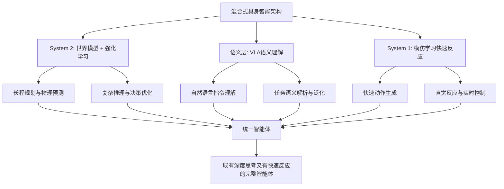

在这一架构中：

- **基于世界模型的强化学习**成为核心，负责长程规划和物理预测（System 2），使机器人具备对物理世界的深度理解与前瞻性决策能力
- **VLA提供语义理解能力**，处理自然语言指令，实现人机自然交互与任务泛化
- **模仿学习提供快速、直觉的反应**（System 1），确保系统在常见场景下的高效响应

#### 7.5.2 融合演进的关键里程碑

从当前多路径并行竞争向混合架构收敛的演进路径，可能经历以下关键里程碑：

| 时间节点 | 里程碑事件 | 技术特征 |
|---------|-----------|---------|
| **2025-2026年** | VLA与世界模型初步融合 | 智元等企业已开始探索"生成与理解一体化" |
| **2027-2028年** | 快慢系统架构成熟 | Figure AI的Helix模式被更广泛采用 |
| **2029-2030年** | 混合架构标准化 | 形成行业共识的架构范式与接口标准 |
| **2030年以后** | 通用具身智能初现 | 实现跨场景、跨任务、跨本体的真正泛化 |

智元机器人合伙人姚卯青已明确判断，VLA与世界模型两条路径**"未来有机会实现融合，走向'生成与理解一体化'"**。通过生成式方法进行预训练，不仅能获得更优的表征学习，也将反哺VLA、强化学习等多类技术的应用发展。

#### 7.5.3 融合过程中的关键挑战

尽管混合式架构前景广阔，但实现过程中仍面临诸多挑战：

- **模块间接口设计**：如何在保持模块独立性的同时实现高效信息传递
- **端到端训练与模块化优化的平衡**：如何在系统层面进行联合优化
- **计算资源分配**：如何在有限算力下平衡各模块的计算需求
- **数据协同**：如何设计统一的数据格式与训练流程

### 7.6 政策、资本与生态建设对行业格局的影响展望

具身智能产业的发展不仅受技术演进驱动，也深受政策、资本、生态等外部因素的影响。

#### 7.6.1 政策定位与资源倾斜效应

**2025年，具身智能正式进入中国国家战略规划**。"具身智能"首次写入中国政府工作报告，成为重点培育的未来产业之一；"十五五"规划建议提出，推动具身智能等成为新的经济增长点。

这一政策定位将带来显著的资源倾斜效应：
- **政府采购**：优必选G端数据采集及服务订单占比超60%，广西防城港2.64亿元大单创下全球人形机器人行业单笔最高中标纪录
- **产业基金**：北京人形机器人产业基金、上海未来人工智能产业基金等国资平台积极布局
- **地方竞争**：深圳、上海、北京、杭州等地纷纷出台具身智能产业扶持政策，形成区域竞争格局

#### 7.6.2 资本投资逻辑演变与估值体系重构

全球资本对具身智能赛道的投资逻辑正在经历深刻演变：

**从技术愿景驱动向商业化验证驱动转变**。早期投资更看重技术前沿性和团队背景，当前投资者越来越关注商业化落地能力。智平方在HICOOL 2025全球创业大赛中获一等奖，其"市场化能力与业务进展"是获胜的关键。

**估值体系出现分化**。美国企业（Figure AI 390亿美元、Skild AI超140亿美元）的估值远超中国同行，反映了不同市场对具身智能的定价逻辑差异。美国资本更看重"通用机器人大脑"的长期愿景，中国资本更关注短期商业化能力。

**产业资本深度参与**。比亚迪、美团、宁德时代、阿里巴巴、腾讯、京东等产业巨头纷纷入局，既提供资金支持，也带来场景资源和产业协同。银河通用的C轮融资形成了"财务投资+产业赋能+国资背书+国际资本"的四维资本矩阵。

#### 7.6.3 开源生态与标准体系建设

开源生态和标准体系的建设将对行业格局产生深远影响：

**开源平台加速技术扩散**。智元机器人发布了首个机器人世界模型开源平台Genie Envisioner，智平方开源了FiS-VLA模型，成为全球唯二、国内唯一开源机器人模型的创企。开源策略有望加速整个行业的技术进步。

**开发者生态构建竞争壁垒**。开普勒机器人推出了全栈式开放的开发者平台，宇树科技通过开源代码库吸引3000+开发者。谁能构建更繁荣的开发者生态，谁就有望在平台化竞争中占据优势。

**标准体系亟待建立**。当前行业缺乏统一的接口标准、安全标准、测试标准，限制了产业协同效率。未来3-5年内，行业标准体系的建立将成为重要议题。

#### 7.6.4 未来3-5年产业竞争格局展望

综合技术演进、政策导向、资本逻辑等因素，预判未来3-5年具身智能产业竞争格局可能呈现以下特征：

**头部集中趋势加剧**。具备全栈自研能力、规模化量产能力、数据闭环能力的企业将加速拉开与竞争对手的差距，行业可能形成"2-3家头部+多家垂直场景玩家"的格局。

**中美竞争持续深化**。中国企业凭借供应链优势和商业化速度在出货量上保持领先，美国企业凭借资本密集和人才优势在技术前沿上持续突破，两者形成差异化竞争格局。

**场景分化与专业化**。不同技术路线在各自优势场景中深耕，形成"工业制造-分层架构、开放服务-VLA架构、精密操作-世界模型、消费级-模仿学习"的场景分化格局。

**混合架构逐步收敛**。随着技术成熟度提升，行业将从当前的多路径并行探索，逐步向混合式架构收敛，形成"世界模型+VLA+模仿学习"的统一技术范式。

正如银河通用联合创始人张直政所判断，**具身智能规模化应用将会在2026年开始，全面落地则需要5-10年**。在这场长跑中，谁能更快构建"技术突破-规模量产-场景落地-数据闭环"的正向循环，谁就有望在通用具身智能的竞争中占据领先地位。

# 参考内容如下：
[^1]:[具身智能](https://baike.baidu.com/item/具身智能/63286570)
[^2]:[什么是“具身智能”? 和人形机器人有什么关系?](http://imgs.xinhuanet.com/finance/20251023/b743d45528a14473867f73c398397924/c.html)
[^3]:[具身智能2026年:从“灵活的肢体”转向“智能的大脑”](https://www.thepaper.cn/detail/32376110)
[^4]:[何为“具身智能”](https://www.miit-eidc.org.cn/art/2025/3/19/art_1610_11347.html)
[^5]:[具身智能全景分析,读这一篇就够了](https://www.thepaper.cn/newsDetail_forward_31891254)
[^6]:[EAI(具身智能)行业:驱动通用人工智能与机器人产业的关键技术](https://baijiahao.baidu.com/s?id=1817014787743584121&wfr=spider&for=pc)
[^7]:[2025具身智能行业年度盘点:从先锋亮相到理性前行](https://www.jiemian.com/article/13820705.html)
[^8]:[具身智能大脑技术路线深度解析](https://post.smzdm.com/p/azzeooq5/)
[^9]:[2025具身智能机器人年度排行:智平方凭借“六边形”模式,引领行业向规模化转型](https://baijiahao.baidu.com/s?id=1851088317791413039&wfr=spider&for=pc)
[^10]:[具身智能的未来：端到端与分层决策的较量与探索_机器人_海量数据_架构](https://www.sohu.com/a/813064057_121798711)
[^11]:[具身智能产业深度研究:大模型与数据为人形机器人打开脑洞](https://baijiahao.baidu.com/s?id=1843934987244768385&wfr=spider&for=pc)
[^12]:[具身智能技术路径分歧(三):算法架构](https://post.m.smzdm.com/zz/p/awm3m2nk/)
[^13]:[十二个问题解剖VLA，深度对话小米陈龙、上交穆尧_新浪科技_新浪网](http://finance.sina.com.cn/tech/roll/2026-01-24/doc-inhimhet9955011.shtml)
[^14]:[北大-灵初重磅发布具身VLA全面综述!一文看清VLA技术路线与未来趋势](https://baijiahao.baidu.com/s?id=1838588160306415410&wfr=spider&for=pc)
[^15]:[世界模型+强化学习=具身智能性能翻倍!清华&加州伯克利最新开源](http://app.myzaker.com/news/article.php?m=1769202928&pk=69705e738e9f0914230c925f)
[^16]:[【干货】具身智能技术路线全解:大模型如何走进物理世界,一文掌握核心技术!](https://blog.csdn.net/2401_85328934/article/details/156058584)
[^17]:[优必选核心解析:全栈技术、渐进商业化与行业标杆地位](https://xueqiu.com/1089129443/369330224)
[^18]:[读懂优必选，就读懂了人形机器人商业化_腾讯新闻](https://news.qq.com/rain/a/20260124A0400D00)
[^19]:[如何看待人形机器人一哥“优必选”](https://baijiahao.baidu.com/s?id=1844201080599237470&wfr=spider&for=pc)
[^20]:[2025年国内机器人企业估值TOP10年度盘点:优必选583亿拿下榜首!百亿估值占据八席! ](https://caifuhao.eastmoney.com/news/20260105125932399716240)
[^21]:[损失软银150亿,被宇树碾压,抢跑30年“机器人灯塔”陨落](https://baijiahao.baidu.com/s?id=1846583946047616397&wfr=spider&for=pc)
[^22]:[人形机器人报告:海外人形机器人——特斯拉引领 迈向具身智能新纪元](https://baijiahao.baidu.com/s?id=1845127034007379175&wfr=spider&for=pc)
[^23]:[七年三次易主,估值仅剩三分之一,波士顿动力卖身韩国现代](https://m.jiemian.com/article/5394853.html)
[^24]:[国际物流资讯 | 现代汽车将部署数以万计的人形/四足机器人;丰田物料搬运北美整合;波士顿动力卸货机器人Stretch商业化落地 ](https://mp.weixin.qq.com/s?__biz=MjM5NDU4NzcwMw==&mid=2650584759&idx=2&sn=6d15588cfbf8a4b30465a914c776516c&chksm=bf1e7cec17c66bfd9b55f59eb3b2f6e3308a8f9876192e24e9d0d17e6b777cbeae6deb6b8f37&scene=27)
[^25]:[从核心零部件深度解析:开普勒如何让机器人进厂打工?](https://baijiahao.baidu.com/s?id=1852912211279219893&wfr=spider&for=pc)
[^26]:[开普勒机器人登陆IROS 2025 以开放平台携手全球开发者共筑新生态](https://baijiahao.baidu.com/s?id=1846854065083129178&wfr=spider&for=pc)
[^27]:[人形机器人研发商「开普勒」一月内完成两轮融资](https://baijiahao.baidu.com/s?id=1834453607329597372&wfr=spider&for=pc)
[^28]:[商道创投网·会员动态|上海开普勒机器人·完成Pre-A轮融资](https://baijiahao.baidu.com/s?id=1830450027456555052&wfr=spider&for=pc)
[^29]:[你观察到的开普勒(20–30万元)与优必选(上百万元)机器人之间的巨大价格差异,_财富号_东方财富网](https://caifuhao.eastmoney.com/news/20250809215043399156150)
[^30]:[智元机器人高层集体亮相,逐条回应“技术路线、模型争议、商业如何落地” ](https://k.sina.cn/article_5044281310_v12ca99fde02002ewg0.html?from=news)
[^31]:[智元机器人融资全记录:从初创团队到150亿估值的资本路径](https://wenku.baidu.com/view/3e02715e6deae009581b6bd97f1922791688be79.html)
[^32]:[智元机器人的狂飙资本局:一年猛投15家创企、成立17家合资公司](https://baijiahao.baidu.com/s?id=1847742120386976129&wfr=spider&for=pc)
[^33]:[智元机器人](https://xueqiu.com/9551870133/328700055)
[^34]:[多元技术路径下的商业实践:2026年人形机器人四大企业的发展路径(含智平方)](https://www.bjnews.com.cn/detail/1768389301129273.html)
[^35]:[智平方:定义下一代智能终端,开启通用智能机器人产业新纪元](https://baijiahao.baidu.com/s?id=1853664045749528598&wfr=spider&for=pc)
[^36]:[从中国独角兽到全球核心玩家,智平方领跑具身智能赛道](http://finance.sina.com.cn/roll/2026-01-21/doc-inhiaktt8092637.shtml)
[^37]:[具身智能2026:从实验室到真实场景,三梯队引领行业系统化升级(含智平方)](https://baijiahao.baidu.com/s?id=1854816541921822718&wfr=spider&for=pc)
[^38]:[智平方获数亿融资,机器人已在多领域落地](https://baijiahao.baidu.com/s?id=1842318335354399534&wfr=spider&for=pc)
[^39]:[半年7轮亿元融资!智平方获深创投上亿元领投新一轮A系列融资](https://baijiahao.baidu.com/s?id=1842032635413174862&wfr=spider&for=pc)
[^40]:[VLA技术定格局!2025中国具身大模型5大龙头(附完整名单与布局解析)](https://baijiahao.baidu.com/s?id=1849021125111620064&wfr=spider&for=pc)
[^41]:[融资丨具身智能大脑公司深穹星核完成天使轮融资_意图_郁振波_模型](https://news.sohu.com/a/975956221_403354)
[^42]:[上海一家科技公司10天之内连拿两轮数千万元融资!](https://baijiahao.baidu.com/s?id=1855060312244440726&wfr=spider&for=pc)
[^43]:[深穹星核完成数千万元天使+轮融资](https://baijiahao.baidu.com/s?id=1855109146555181880&wfr=spider&for=pc)
[^44]:[魔法原子和银河通用机器人官宣上春晚,两家公司有何来头?](https://baijiahao.baidu.com/s?id=1855345799836438403&wfr=spider&for=pc)
[^45]:[银河通用200亿估值背后:为什么“不那么复杂”的场景反而能赢?](https://baijiahao.baidu.com/s?id=1851951873005574379&wfr=spider&for=pc)
[^46]:[银河通用张直政:具身智能前沿技术会“沿途下蛋” 循序渐进渗透各行各业 ](https://www.sohu.com/a/976387928_122014422)
[^47]:[春晚指定大模型机器人定了!背后公司刚融资3亿美元,估值突破30亿美元!](https://baijiahao.baidu.com/s?id=1855320989026389432&wfr=spider&for=pc)
[^48]:[GroceryVLA大模型](https://baike.baidu.com/item/GroceryVLA大模型/67193617)
[^49]:[产业共创采集数据燃料,银河通用机器人在真实场景持续进化](https://baijiahao.baidu.com/s?id=1855087422345201165&wfr=spider&for=pc)
[^50]:[王鹤](https://baike.baidu.com/item/王鹤/64403516)
[^51]:[90后北大教授,创业2年,吸金24亿,美团、“宁王”押注](https://baijiahao.baidu.com/s?id=1840138815204756695&wfr=spider&for=pc)
[^52]:[瞭望中国式创新③丨跳出二维屏幕，机器人如何“读懂”三维世界？](https://baijiahao.baidu.com/s?id=1854801474568652995&wfr=spider&for=pc)
[^53]:[山西80后教授完成数亿元融资!去年公司年入过亿,被投资人称为“具身智能工业场景落地第一名”](https://www.wsxm.net/show/17873.html)
[^54]:[山西80后,又融资数亿](https://baijiahao.baidu.com/s?id=1854988865011335121&wfr=spider&for=pc)
[^55]:[Physical Intelligence](https://baike.baidu.com/item/Physical%20Intelligence/65087170)
[^56]:[一口气融资40亿,最强机器人大脑诞生,谁能跑通终局?](https://baijiahao.baidu.com/s?id=1850285159496292441&wfr=spider&for=pc)
[^57]:[Physical Intelligence 核心技术团队分享:物理世界的“Vibe Coding”如何实现?](https://www.woshipm.com/it/6262266.html)
[^58]:[来自豆包 Skild AI](https://xueqiu.com/3783292942/344709066)
[^59]:[Skild Al](https://baike.baidu.com/item/Skild%20Al/65588560)
[^60]:[机器人最快千亿独角兽诞生!黄仁勋投了](https://baijiahao.baidu.com/s?id=1854354334434400197&wfr=spider&for=pc)
[^61]:[最新估值逼近千亿!英伟达、软银、三星、LG、亚马逊为何同时抢投这家“机器人通用大脑”? ](https://business.sohu.com/a/976778513_122565398)
[^62]:[Skild AI 携手 NVIDIA 打造全载体机器人大脑 | NVIDIA](https://www.nvidia.cn/customer-stories/skild-ai/)
[^63]:[人形机器人:技术突破推动商业腾飞](https://www.163.com/dy/article/JMG4NJ8G05198RSU.html)
[^64]:[最大的问题在于东西出来了,有没有知名的机器人厂家采用!实锤的只有一家逐际动力,下_财富号_东方财富网](https://caifuhao.eastmoney.com/news/20251024203632392491700)
[^65]:[人形机器人Figure完成10亿美元融资:估值390亿美元 英伟达跟投](https://baijiahao.baidu.com/s?id=1843504279298381485&wfr=spider&for=pc)
[^66]:[人形机器人新秀Figure完成超10亿美元融资,英伟达等巨头齐助力! ](https://www.sohu.com/a/935606758_121956424)
[^67]:[深度分析宇树科技到底是干什么的](https://baijiahao.baidu.com/s?id=1843742407593120739&wfr=spider&for=pc)
[^68]:[10亿融资赋能!众擎机器人加速产业化进程](https://baijiahao.baidu.com/s?id=1850925934201015565&wfr=spider&for=pc)
[^69]:[仅售18万元起!众擎机器人T800正式发布!重新定义全域动态效能人形机器人!](https://baijiahao.baidu.com/s?id=1850395850064830062&wfr=spider&for=pc)
[^70]:[众擎机器人T800正式发布,起售价18万元](https://www.dutenews.com/n/article/10290821)
[^71]:[宇树澄清:2025年人形机器人出货量超5500台,网传信息不实](https://baijiahao.baidu.com/s?id=1855181307652367908&wfr=spider&for=pc)
[^72]:[宇树科技2025年人形机器人出货量超5500台](https://baijiahao.baidu.com/s?id=1855068331184924440&wfr=spider&for=pc)
[^73]:[宇树科技完成C轮融资:腾讯阿里等联合领投,加速具身智能商业化](https://baijiahao.baidu.com/s?id=1835409953035427778&wfr=spider&for=pc)
[^74]:[王兴兴](https://www.unitree.com/operate/boss)
[^75]:[王兴兴](https://baike.baidu.com/item/王兴兴/8766961)
[^76]:[深圳逐际动力科技有限公司](https://baike.baidu.com/item/深圳逐际动力科技有限公司/63686740)
[^77]:[【机器前沿】具身智能机器人公司 “逐际动力” 完成 5 亿元 A 轮系列融资,阿里巴巴等参投](http://xinsanban.10jqka.com.cn/20250310/c666582956.shtml)
[^78]:[LimX Oli](https://baike.baidu.com/item/LimX%20Oli/66261044)
[^79]:[逐际动力发布全尺寸人形机器人LimX Oli,售价15.8万元起](https://baijiahao.baidu.com/s?id=1839040262822839452&wfr=spider&for=pc)
[^80]:[15.8万就拥有一台1米65的人形,还免费送个机器人,这事儿靠谱吗?](https://baijiahao.baidu.com/s?id=1839246103921727252&wfr=spider&for=pc)
[^81]:[半年融资5亿元!阿里、上汽现身](http://xinsanban.10jqka.com.cn/20250306/c666531149.shtml)
[^82]:[阿里巴巴、招商局创投等机构参加逐际动力A轮系列融资](https://www.cls.cn/detail/1962796)
[^83]:[张巍](https://baike.baidu.com/item/张巍/63753106)
[^84]:[机器人本土派王兴兴,多了一个海归派对手](https://baijiahao.baidu.com/s?id=1827736528810224676&wfr=spider&for=pc)
[^85]:[阿里、京东联手押注,这家公司要造机器人领域的iPhone](https://baijiahao.baidu.com/s?id=1845559848810260144&wfr=spider&for=pc)
[^86]:[赵同阳](https://baike.baidu.com/item/赵同阳/65304440)
[^87]:[众擎机器人踹翻自家老板背后:是技术突破,还是营销泡沫?](https://baijiahao.baidu.com/s?id=1851033644224139433&wfr=spider&for=pc)
[^88]:[人形机器人“暴打”老板?背后是一个价值千亿的野心](https://baijiahao.baidu.com/s?id=1851112280682603505&wfr=spider&for=pc)
[^89]:[Figure AI](https://baike.baidu.com/item/Figure%20AI/66805097)
[^90]:[宇树科技资金百亿心更急,为何商业化困在量产前夜](https://baijiahao.baidu.com/s?id=1853541501406847509&wfr=spider&for=pc)
