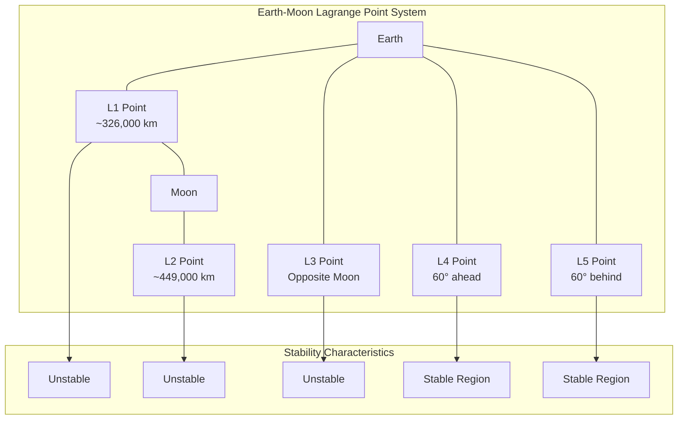
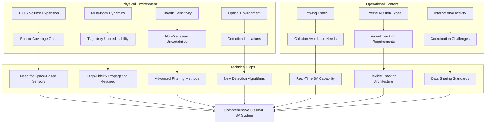
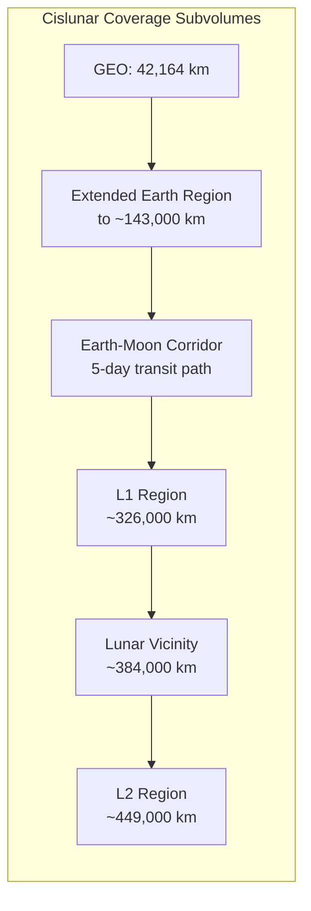
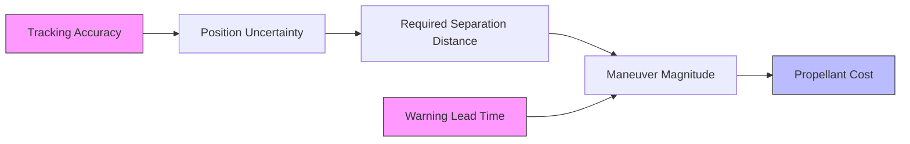
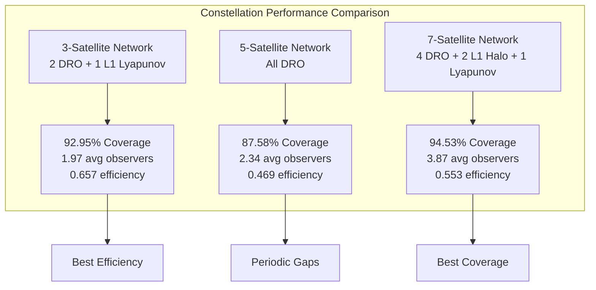
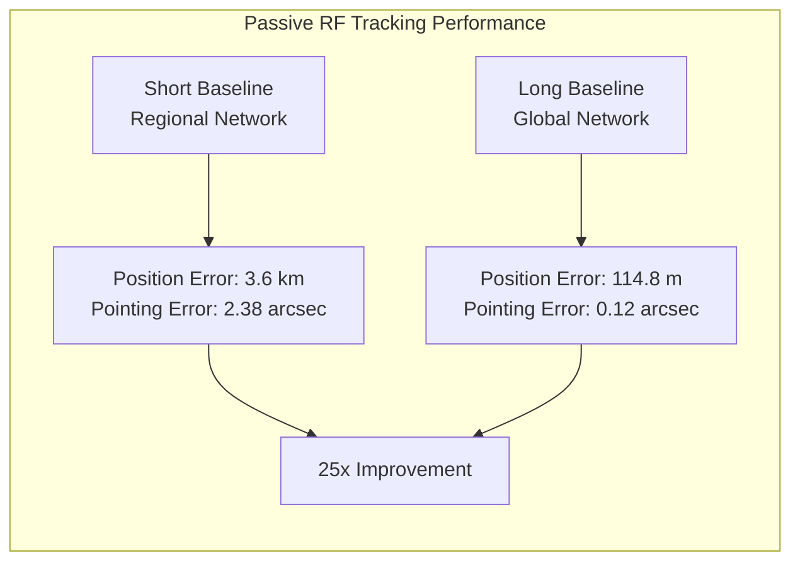
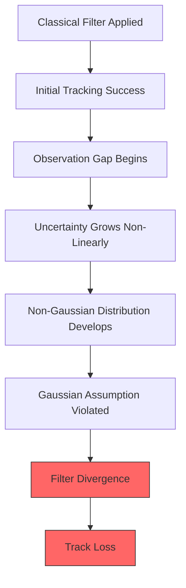
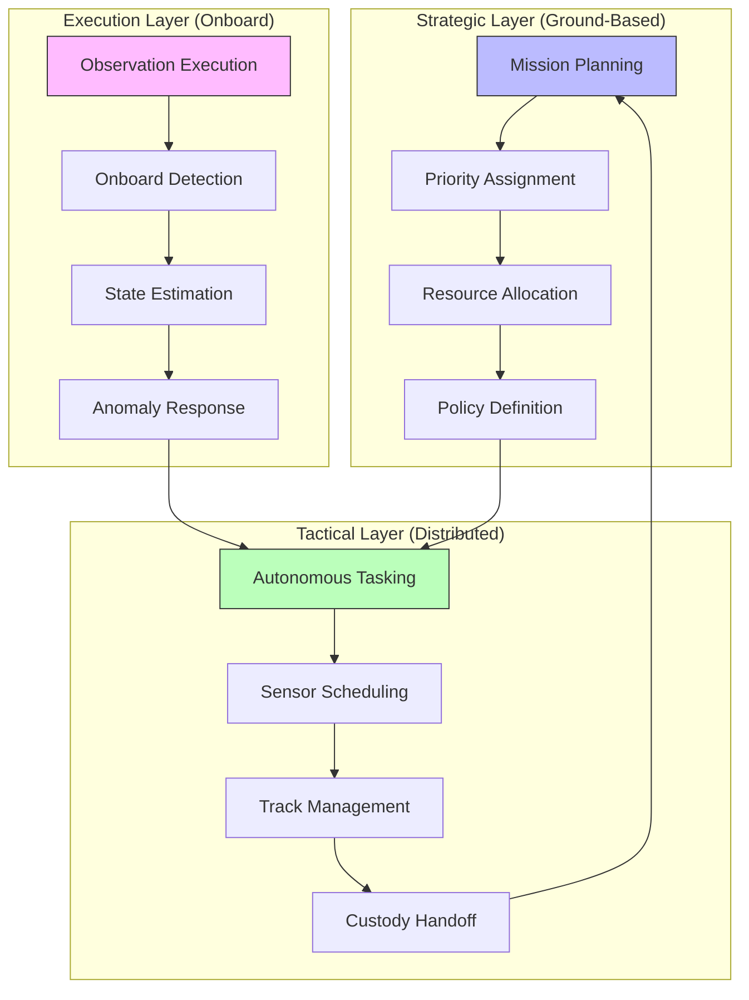
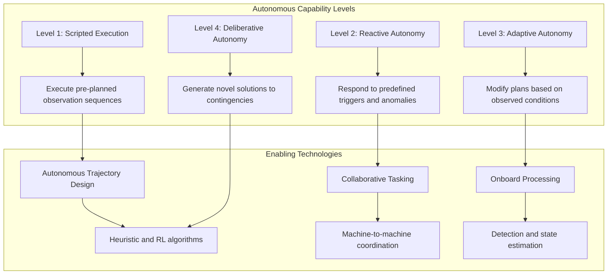
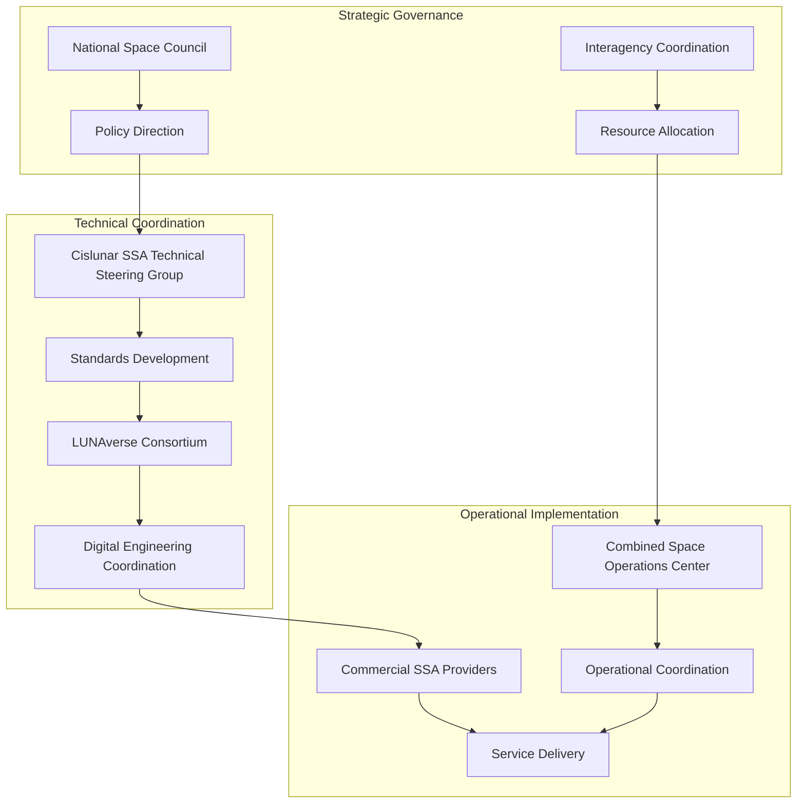

# Architecting Situational Awareness for the Cislunar Domain: Enabling Effective Short-Term Tracking and Monitoring
# 1 The Cislunar Operational Environment: Defining the Challenge for Situational Awareness

This chapter establishes the foundational context for cislunar situational awareness by systematically characterizing the unique physical, dynamical, and operational attributes of the Earth-Moon system that distinguish it from near-Earth space operations. It defines the spatial boundaries and scale of cislunar space, analyzes the complex multi-body gravitational dynamics that govern spacecraft motion, examines environmental factors affecting surveillance, and assesses the projected growth in mission traffic and object diversity, thereby framing the fundamental challenges that any effective tracking and monitoring architecture must address.

## 1.1 Spatial Definition and Scale of the Cislunar Domain

The cislunar domain represents a vast operational theater that fundamentally redefines the scope and complexity of space surveillance. **Cislunar space is formally defined as the three-dimensional volume of space beyond Earth's geosynchronous orbit (GEO) but still within the gravitational influence of the Earth and/or the Moon**, encompassing the lunar vicinity and all five Earth-Moon Lagrange points[^1][^2]. This definition marks a dramatic departure from traditional space operations, which have historically focused on the relatively confined region extending from low Earth orbit (LEO) to GEO at approximately 22,236 miles (35,786 km)[^1].

The scale expansion inherent in cislunar operations is extraordinary. The geosynchronous orbit radius of 42,164 km serves as a useful reference point, representing approximately 1 GEO unit[^1]. However, this distance constitutes only a small fraction of the Earth-Moon separation, which averages 384,402 km—equivalent to approximately 9.12 GEO radii or one Lunar Distance (LD)[^1]. This means that the region around the Moon is **approximately nine times more distant than GEO**, fundamentally altering the physics of observation and communication[^1].

The following table summarizes the key distance scales relevant to cislunar operations:

| Reference Point | Distance from Earth | GEO Equivalent | Significance for Surveillance |
|----------------|---------------------|----------------|-------------------------------|
| Geosynchronous Orbit (GEO) | 42,164 km | 1 GEO | Traditional outer boundary of SSA |
| Earth-Moon L1 Point | ~326,000 km | ~7.7 GEO | Gateway between Earth and lunar domains |
| Mean Lunar Distance | 384,402 km | 9.12 GEO | Primary cislunar operational region |
| Earth-Moon L2 Point | ~449,000 km | ~10.7 GEO | Far-side lunar access point |
| Extended Transfer Trajectories | >1,500,000 km | >35 GEO | Low-energy transfer pathways |

The volumetric implications of this expansion are staggering. **The volume of cislunar space out to 12 GEO is 1,728 times larger than the volume within 1 GEO**, representing a more than 1,000-fold expansion in the service volume that must be monitored[^1]. The United States Space Force's sphere of interest has correspondingly expanded from GEO at 22,236 miles to approximately 272,000 miles and beyond[^1]. Some transfer trajectories between Earth and cislunar destinations extend well beyond the Moon itself, reaching distances exceeding 1.5 million km (approximately 35 GEO radii), particularly for low-energy four-body transfers that leverage solar gravitational influence[^1].

This volumetric expansion creates fundamental challenges for surveillance architecture. Unlike the relatively compact near-Earth environment where ground-based sensors can maintain reasonable coverage, the cislunar domain requires consideration of observation geometries, communication delays, and sensor placement strategies across distances that approach interplanetary scales. The three-dimensional nature of this volume, combined with the absence of dominant orbital planes, means that traditional approaches to cataloging and tracking space objects cannot simply be scaled up—they must be fundamentally reconceived[^1].

## 1.2 Multi-Body Gravitational Dynamics and Trajectory Characteristics

The gravitational environment of cislunar space represents a fundamental departure from the classical orbital mechanics that govern near-Earth operations. **Trajectories in cislunar space are governed by a three-body problem involving Earth, Moon, and spacecraft, producing motion that is no longer circular, elliptical, planar, or easy to geometrically describe**[^1]. This complexity arises because spacecraft in cislunar space experience significant gravitational influences from multiple bodies simultaneously, with the relative dominance shifting based on position within the domain[^1].

### The Circular Restricted Three-Body Problem Framework

The Circular Restricted Three-Body Problem (CR3BP) provides the foundational analytical model for understanding cislunar dynamics[^1]. This model considers the gravitational influences of Earth and Moon on a spacecraft of negligible mass, assuming the two primary bodies move in circular orbits around their common barycenter. While simplified, the CR3BP reveals the essential dynamical structures that shape cislunar operations.

**Within the CR3BP framework, five Lagrange points (L1, L2, L3, L4, L5) emerge as equilibrium locations where an object can remain stationary relative to the rotating Earth-Moon system**[^1]. These points possess distinct characteristics relevant to surveillance and operations:

The L1 and L2 points are located in the immediate vicinity of the Moon, with L1 positioned between Earth and Moon and L2 on the far side of the Moon[^1]. These points, along with L3 (located on the opposite side of Earth from the Moon), are **inherently unstable**—objects placed at these locations will drift away exponentially without active station-keeping[^1]. Only the L4 and L5 points, located 60 degrees ahead of and behind the Moon in its orbit, possess small stable regions where objects can persist without propulsive intervention, potentially hosting natural Trojan objects[^1].

### Periodic and Quasi-Periodic Orbit Families

Beyond the Lagrange points themselves, **the CR3BP admits infinite families of repeating natural orbits (periodic orbits) that repeat their trajectory in the rotating reference frame**[^1]. These orbit families have become central to cislunar mission planning:

| Orbit Family | Period Range | Key Characteristics | Notable Applications |
|-------------|--------------|---------------------|---------------------|
| L1/L2 Halo Orbits | Days to weeks | Three-dimensional, out-of-plane motion | Scientific observation, communication relay |
| L1/L2 Lyapunov Orbits | Days to weeks | Planar, in-plane motion | Transfer staging, surveillance platforms |
| Distant Retrograde Orbits (DRO) | Days to >1 month | Linearly stable, large amplitude | Long-duration storage, safe haven |
| Near-Rectilinear Halo Orbits (NRHO) | ~6-7 days | Highly elongated, near-lunar passage | NASA Lunar Gateway[^1] |

The **Near-Rectilinear Halo Orbit (NRHO)** has gained particular prominence as the selected orbit for NASA's Lunar Gateway space station[^1]. Specifically, the 9:2 Southern L2 NRHO offers increased stability compared to other halo orbits, near-continuous line-of-sight to Earth for communications, and favorable positioning for lunar surface and scientific operations[^3]. However, even this relatively stable orbit presents challenges for distributed space systems due to the inherent sensitivity of multi-body dynamics[^3].

Neighboring quasi-periodic orbits exhibit bounded motion that does not repeat exactly, creating complex trajectory structures that challenge traditional tracking approaches[^1]. These orbits can be understood through the concept of invariant tori, which provide mathematical structures for describing bounded relative motion in the vicinity of periodic orbits[^3].

### Instability and Chaotic Sensitivity

**A defining characteristic of cislunar dynamics is the inherent instability and chaotic sensitivity of most trajectories**[^1]. The Lagrange points L1, L2, and L3, along with most periodic orbit families, exhibit exponential divergence—small perturbations grow exponentially over time, causing objects to drift away from their nominal paths[^1]. This instability is quantified through stability indices, with higher values indicating stronger instability[^1].

The chaotic nature of cislunar motion means that **even slight deviations in an object's state can cause large differences in its future path**[^1]. This sensitivity has profound implications for surveillance:

1. **Prediction Accuracy Degrades Rapidly**: Unlike near-Earth orbits where two-body propagation can maintain reasonable accuracy over extended periods, cislunar trajectory prediction requires frequent updates and high-fidelity models[^4].

2. **Uncertainty Propagation Becomes Non-Gaussian**: Monte Carlo simulations demonstrate that uncertainty distributions in cislunar space evolve into complex, non-Gaussian structures with curvatures, crossings, and coils that are far more challenging than near-Earth regime uncertainties[^4].

3. **Frequent Station-Keeping Required**: Spacecraft operating in unstable cislunar orbits require frequent, small trajectory maintenance maneuvers—often in the mm/s range and potentially daily or more frequent—driving requirements for autonomous implementation[^1].

Paradoxically, this same instability enables low-energy transfers between different orbits by leveraging unstable manifolds, allowing spacecraft to transfer with minimal propulsive effort[^1]. Transfer trajectories from Earth to cislunar space span a wide spectrum: direct transfers (like Apollo missions) require several days, low-energy L1 transfers take weeks to months, and four-body transfers exploiting solar gravity can require months to years but with significantly reduced fuel costs[^1].

### Implications for Tracking and Prediction

The complex dynamical environment directly impacts the feasibility of cislunar tracking. **For precise orbit propagation, simplified dynamics models can be deceiving**—a study comparing simplified (Earth and Moon point gravity only) versus full ephemeris models (including Earth gravitational harmonics, Sun, Jupiter gravity, and solar radiation pressure) found that neglecting key perturbations leads to sharp trajectory departures after only half an orbital period for certain orbit types[^4]. The Lyapunov orbit family is particularly sensitive, with close lunar passages amplifying modeling errors dramatically[^4].

The force environment in cislunar space involves a complex interplay of accelerations from multiple sources. Analysis of the acceleration field on a reference date reveals the gravitational wells of Earth and Moon embedded within a varied acceleration landscape—far from the relatively flat, Earth-dominated environment of near-Earth space[^4]. This complexity necessitates sophisticated propagation tools and places premium value on accurate initial state determination.

## 1.3 Environmental Factors Affecting Surveillance Operations

Beyond gravitational dynamics, the cislunar environment presents several physical phenomena that directly impact the feasibility and effectiveness of surveillance operations. These factors create systematic challenges for sensor systems and influence the accuracy of tracking solutions.

### Solar Radiation Pressure and Perturbation Effects

**Solar radiation pressure (SRP) represents a significant perturbation source for cislunar spacecraft**, particularly affecting objects with high area-to-mass ratios[^4]. Unlike the near-Earth environment where atmospheric drag dominates perturbations for LEO objects, cislunar space is essentially drag-free beyond the immediate Earth vicinity (drag effects are typically considered only up to approximately 1000 km altitude)[^4]. This shifts the perturbation budget toward non-gravitational forces like SRP.

The orientation of a spacecraft relative to the Sun and Earth becomes critically important for tracking accuracy, as it determines the magnitude of radiation pressure and any residual drag the object experiences[^5]. Space weather events compound these effects—solar storms generate radiation that can create disturbances and interfere with satellite trajectories by affecting the density of Earth's upper atmosphere and introducing charged particle effects[^5]. **SSA implementations must constantly consider solar radiation and forecast space weather effects in their calculations**[^5].

Reflected heat and visible light from Earth (albedo) also cause perturbations to spacecraft motion, varying as the object changes position relative to the Sun and Earth[^5]. These effects, while smaller than primary gravitational perturbations, contribute to the overall uncertainty budget and must be modeled for high-accuracy tracking.

### The Lunar Plasma Environment

The space environment in the immediate lunar vicinity exhibits unique characteristics discovered through early exploration missions. **Research using dual-frequency dispersion interferometry during Luna-19 and Luna-22 spacecraft flights revealed a thin plasma layer above the solar-illuminated lunar surface**, with a height of several tens of kilometers and maximum electron concentrations on the order of 10³ electrons/cm³[^6]. Notably, plasma is not observed over the nightside lunar surface[^6].

This plasma layer formation is influenced by local magnetic anomalies on the Moon. Local magnetic fields with intensities of 30 to 300 gamma have been discovered, creating magnetic screens that protect lower regions from direct solar wind influence[^6]. Under these conditions, magnetized plasma can form through ionization of neutral atoms evaporating from lunar soil, with particle lifetimes determined by local magnetic field structures that can create magnetic traps[^6].

Looking toward the future, **increased human activity on the lunar surface may alter this environment**. Plasma simulations studying the effects of anthropogenic neutral gas injection into the lunar exosphere from landing operations indicate that at ionization levels between 0.1 and 10 times the native lunar exosphere ion production rate, solar wind interaction remains largely unchanged[^7]. However, ionization levels reaching 100 to 1000 times native rates would cause significant solar wind mass loading and disrupt the current lunar plasma environment structure[^7]. While individual Artemis landings are projected to contribute only approximately 10% additional ion production, more frequent landings or sustained human settlements could fundamentally alter lunar plasma conditions[^7].

### Optical Observation Challenges

**The optical observation environment in cislunar space presents systematic challenges that fundamentally differ from near-Earth surveillance**[^1][^4]. Several factors combine to create difficult detection conditions:

**Distance and Signal Strength**: The vast ranges involved—approximately 10 times greater than GEO—significantly degrade signal strength in accordance with the inverse square law[^8]. Objects that would be easily detectable at GEO distances become extremely faint at lunar distances. Simulations indicate that a large GEO satellite's visual magnitude would vary from approximately 15 to 22-23 when placed in an Earth-Moon L2 halo orbit, rendering it visible to ground-based networks for only about 6 days per month[^9][^10]. Smaller satellites would have magnitudes from 20 to 26 and would never be visible to typical ground-based sensors with limiting magnitudes of 18-19.5[^9][^10].

**Lunar Background Brightness**: A conic volume of space carved out by lunar glare creates significant difficulty in detecting spacecraft without optical sensors becoming oversaturated from the Moon's brightness[^8]. The lunar stray light must be computed for each viewing direction, and observation directions close to the Moon are frequent for cislunar targets[^4]. This creates systematic exclusion zones that prevent observation during significant portions of orbital periods[^4].

**Illumination Geometry Variations**: The relative positions of Sun, Earth, Moon, and target create complex, time-varying illumination conditions. **Orbits that resonate with the 29.5-day Earth/Moon synodic period can provide more favorable illumination conditions**[^1], but objects in non-resonant orbits experience periods of poor solar phase angles that make observations mostly infeasible[^9][^10]. The Chang'e 5 return trajectory demonstrated this limitation—the spacecraft returned with a very high solar phase angle that precluded most optical observations[^9][^10].

**Slow Apparent Motion**: Due to extreme distances, cislunar objects appear to move more slowly across the sky than near-Earth objects, making detection through motion-based algorithms more challenging[^1]. Expected motion for cislunar targets is approximately 1-2 pixels per image, requiring specialized processing techniques[^8].

### Systematic Observation Gaps

Analysis of specific cislunar orbits reveals the severity of observation challenges:

| Orbit Type | Key Observation Challenges | Coverage with Global Network (Mag 20) |
|-----------|---------------------------|--------------------------------------|
| Distant Retrograde Orbit (DRO) | Moon background interference, extreme distances | Significant gaps in regions farthest from Earth[^4] |
| Lyapunov Orbit | Object becomes extremely faint (mag ~30) when far from Earth | Large fractions unobservable even with global network[^4] |
| Transfer Orbit | Bright near Earth, faint during lunar passages | Intermittent coverage, no visibility during some phases[^4] |

Even with a global network of ground-based sensors with limiting magnitude 20, **certain observation gaps exist for all orbit types**, most significantly in regions farthest from Earth and when moonlight interferes[^4]. These gaps are not merely inconveniences—they represent fundamental limitations that must be addressed through alternative sensor architectures.

## 1.4 Projected Mission Traffic Growth and Object Diversity

The cislunar domain is experiencing unprecedented growth in planned mission activity, creating an operational environment that will increasingly require robust situational awareness capabilities. **According to projections, cislunar space will host more than 30 missions in the coming decade, with many missions containing multiple payloads and experiments destined for lunar orbit and the lunar surface**[^11].

### Diverse Mission Types and Stakeholders

The expansion of cislunar activity encompasses a broad spectrum of mission types and international participants:

**Government Exploration Programs**: NASA's Artemis program represents the flagship U.S. effort, with the Lunar Gateway space station planned for deployment in an L2 near-rectilinear halo orbit[^1][^12]. China's Chang'e program continues lunar exploration with increasingly sophisticated missions[^12]. These programs drive infrastructure development and establish operational precedents.

**Commercial Lunar Services**: The Commercial Lunar Payload Services (CLPS) program and similar initiatives are enabling a growing fleet of commercial lunar landers and orbiters[^13]. These missions vary significantly in size, capability, and operational profiles, contributing to the diversity of objects requiring tracking.

**Navigation and Communication Infrastructure**: Emerging concepts for cislunar positioning, navigation, and timing (PNT) services involve deployment of navigation satellite constellations. The Cislunar Space Navigation System (CSNS) concept envisions 34 navigation satellites deployed on Special Long-Period Orbits to provide PNT services throughout cislunar space[^14]. NASA's LunaNet architecture proposes a network-centric approach combining different node types to create layered, multi-vendor communications and navigation infrastructure[^13].

**Scientific and Technology Demonstration Missions**: Missions like CAPSTONE (demonstrating NRHO operations), THEMIS/ARTEMIS (repurposed for cislunar science), and the Air Force Research Laboratory's Cislunar Highway Patrol System (CHPS) experiment contribute to the growing population of cislunar objects[^1][^15].

### Concentration in Preferred Orbital Regimes

**Mission traffic is not uniformly distributed throughout cislunar space but concentrates in specific orbital regimes that offer operational advantages**[^11]. This concentration creates localized regions of elevated collision risk:

**Near-Rectilinear Halo Orbits**: The 9:2 Southern L2 NRHO selected for Lunar Gateway attracts missions seeking proximity to this infrastructure hub and benefiting from the orbit's favorable characteristics—increased stability, near-continuous Earth visibility, and advantageous positioning for lunar operations[^3].

**Frozen Lunar Orbits**: Low lunar orbits (LLO) with specific inclination and eccentricity combinations that minimize long-term perturbations are preferred for lunar surface observation and communication relay missions. However, the Moon's highly non-uniform gravitational field means only a few orbital configurations remain stable over extended periods[^1].

**Lagrange Point Regions**: The L1 and L2 points and their associated orbit families serve as natural staging areas, observation platforms, and transfer nodes. The geometric properties of these regions make them attractive for diverse mission applications, from deep space communication relay to scientific observation[^1][^13].

**Lunar South Pole Region**: Surface missions increasingly target the lunar south pole for its potential water ice resources, creating a concentration of descent trajectories and surface assets in this region[^11].

### Emerging Collision Avoidance Requirements

**A Georgia Tech study published in 2025 provides the first quantitative assessment of collision risks in cislunar orbits**, revealing that while collision probabilities are very low compared to Earth orbit, the operational implications are significant[^16]. Key findings include:

- With a fleet of 50 satellites in low lunar orbit, satellite operators may need to perform **up to four collision avoidance maneuvers annually per satellite**[^16].
- Even with only 10 satellites in LLO, individual satellites might still require yearly avoidance maneuvers[^16].
- Most close encounters are expected near the Moon's equator, where orbit planes of commonly used frozen and low lunar orbits intersect[^16].
- Additional congestion zones may develop at Lagrange points where gravitational forces balance[^16].

The study's authors emphasize that **the number of close approaches is higher than might be expected given the relatively small current population**, attributable to spacecraft concentrating in limited favorable orbits and the difficulty of monitoring exact locations at distances exceeding 200,000 miles[^16]. Operators often undertake avoidance maneuvers even when collision probability is as low as one in 10 million, reflecting the high value of cislunar assets and the unpredictable spread of debris from any collision[^16].

These findings underscore the operational imperative for effective situational awareness. Without reliable tracking and prediction capabilities, coordination of cislunar activities becomes impossible, and operators must either accept elevated risk or conduct excessive precautionary maneuvers that consume limited propellant reserves.

## 1.5 Foundational Challenges for Cislunar Situational Awareness

The preceding analyses converge to define a surveillance problem fundamentally different from traditional space situational awareness. **A simple projection of near-Earth SSA/STM solutions cannot be successful in the cislunar realm**[^4]. This section synthesizes the core challenges that must be addressed by any effective cislunar tracking and monitoring architecture.

### Inadequacy of Traditional Tracking Paradigms

**Two-Line Elements (TLEs), the standard format for sharing near-Earth orbital information, are not useful for identifying or sharing trajectory information in cislunar space**[^1]. This inadequacy stems from two fundamental limitations:

1. **Numerical Precision**: TLEs lack the numerical precision required to accurately represent cislunar trajectories, which involve larger distances and smaller accelerations than near-Earth orbits[^1].

2. **Rapid Trajectory Divergence**: The chaotic nature of cislunar dynamics causes trajectories to diverge rapidly from any simplified representation, rendering TLE-based propagation meaningless over operationally relevant timescales[^1].

**Best practice for cislunar operations requires sharing instantaneous position and velocity vectors (state vectors) in an agreed-upon inertial reference frame at a known epoch time**[^1]. Formats like SPICE ephemerides, developed by NASA's Navigation and Ancillary Information Facility, provide the precision and flexibility required for cislunar applications[^13][^4].

### High-Fidelity Propagation Requirements

Accurate orbit propagation in cislunar space demands sophisticated dynamical models that account for multiple gravitational influences and non-gravitational perturbations. **Using simplified dynamics models can be deceiving**—studies demonstrate that neglecting lunar gravitational harmonics, solar gravity, Jupiter's gravity, or solar radiation pressure leads to trajectory predictions that diverge sharply from reality[^4].

The following perturbation sources must be considered for precise cislunar propagation:

| Perturbation Source | Relative Importance | Modeling Considerations |
|--------------------|--------------------|-----------------------|
| Earth Gravity (Central + Harmonics) | Primary near Earth | Full harmonic expansion required for accuracy |
| Moon Gravity (Central + Harmonics) | Primary near Moon | GRAIL-derived models provide high fidelity[^17] |
| Sun Gravity | Significant throughout | Point mass adequate for most applications |
| Jupiter Gravity | Minor but non-negligible | Point mass, important for long-term propagation |
| Solar Radiation Pressure | Significant for high A/M | Requires knowledge of spacecraft properties[^4] |

The computational burden of high-fidelity propagation, combined with the need for frequent updates due to trajectory sensitivity, creates challenges for maintaining large catalogs of cislunar objects. This drives interest in autonomous onboard processing capabilities and efficient propagation algorithms such as those based on the Koopman operator[^12].

### Ground-Based Sensor Network Limitations

**Ground-based optical surveillance faces significant challenges in cislunar space, and even a global sensor network cannot provide complete coverage**[^4]. Analysis of representative cislunar orbits reveals that:

- For Distant Retrograde Orbits, a global network of sensors with limiting magnitude 20 is mandatory, yet observation gaps persist in regions farthest from Earth and during lunar interference[^4].
- For Lyapunov orbits, objects become so faint (magnitude ~30) at maximum Earth distance that observations are impossible with moderate sensors, leaving large orbital fractions unobservable[^4].
- For transfer orbits, objects are bright during Earth proximity but faint during lunar passages, with moonlight significantly interfering with observation conditions[^4].

These limitations are not merely technical inconveniences but represent fundamental constraints imposed by physics. **The inverse square law ensures that signal strength degrades dramatically with distance**, while the Moon's brightness creates unavoidable exclusion zones. Ground-based systems also face atmospheric effects, weather constraints, and geographic limitations on sensor placement[^4].

### Complex Uncertainty Propagation

**Uncertainty propagation in cislunar space leads to highly complex, non-Gaussian distributions that are far more challenging than those encountered in near-Earth operations**[^4]. Monte Carlo simulations propagating initial uncertainties of 10 meters in position and 10 m/s in velocity for 30 days reveal:

- For Lyapunov orbits with full ephemeris dynamics, uncertainty structures become exceptionally complex, exhibiting curvatures, crossings, and coils due to perturbations like near-lunar passages[^4].
- For DROs, full ephemeris models produce asymmetric uncertainties, though with less curvature than Lyapunov orbits[^4].
- For transfer orbits, non-Gaussian uncertainties evolve rapidly, showing complex coil structures within just 10 days[^4].

These non-Gaussian uncertainty structures cannot be adequately represented by traditional covariance-based methods that assume Gaussian distributions[^18]. **Advanced filtering techniques such as the Particle Gaussian Mixture Filter (PGMF) are required to handle the multi-modal, highly non-Gaussian probability density functions** that arise from mapping uncertainties through nonlinear cislunar dynamics[^18].

The chaotic bifurcations characteristic of three-body dynamics further complicate uncertainty quantification. Traditional techniques like the Unscented Kalman Filter (UKF) and even standard Particle Filters prove inadequate for cislunar initial orbit determination and tracking, necessitating novel approaches that combine probabilistic initialization methods with filters designed for non-Gaussian contexts[^18].

### Data Sharing and Reference Frame Requirements

Effective cislunar situational awareness requires international cooperation and standardized data exchange mechanisms that do not yet fully exist. **The United States' National Cislunar Science and Technology Strategy identifies extending SSA capabilities into cislunar space as a critical objective**, recognizing that SSA forms the necessary foundation for transparency and safe operations[^2].

Key requirements include:

- **Defining Reference Coordinate Systems**: Unlike near-Earth operations that rely on well-established Earth-centered frames, cislunar operations require agreement on reference systems that accommodate the three-body dynamics and multiple gravitational centers[^13].
- **Developing Integrated Catalogs**: An integrated catalog of cislunar objects—both natural and human-made—must be developed with procedures for publicly sharing SSA data and spaceflight safety support[^2].
- **Establishing Data Exchange Protocols**: Increased cooperation and data exchanges with other users of cislunar space are essential, requiring new standards beyond traditional TLE-based sharing[^2].

The unique dynamical characteristics of cislunar space also create challenges for positioning, navigation, and timing services that underpin surveillance operations. **Traditional PNT systems like GPS have significant limitations at lunar distances**—signals are weak, Earth frequently occults the main beam, and users typically observe only two satellites on average via sidelobes, insufficient for continuous precise navigation[^13]. Emerging PNT architectures must combine ground-based, space-based, and lunar surface elements to provide adequate coverage[^13].

### Summary of Foundational Challenges

The cislunar surveillance problem is defined by a constellation of interconnected challenges that distinguish it from near-Earth SSA:

Addressing these challenges requires not merely incremental improvements to existing capabilities but fundamental reconceptualization of surveillance architectures, algorithms, and operational concepts. The subsequent chapters will examine specific approaches to meeting these requirements, from sensor architectures and data fusion techniques to command and control paradigms optimized for the cislunar domain.

## 2 Requirements for Comprehensive and Accurate Cislunar Situational Awareness

This chapter synthesizes operational needs derived from diverse cislunar mission profiles to establish specific, measurable requirements for situational awareness systems. It defines what comprehensiveness entails across spatial coverage, detection thresholds, and catalog completeness metrics, and specifies accuracy requirements for orbit determination, object characterization, and intent analysis that enable effective short-term decision support in the cislunar domain.

### 2.1 Operational Drivers and Mission Profile Requirements

The diverse array of cislunar missions—each with distinct operational characteristics and risk profiles—imposes differentiated demands on situational awareness capabilities. Understanding these operational drivers is essential for establishing a requirements baseline that can support the full spectrum of cislunar activities while prioritizing resources toward the most critical functions.

**Lunar surface operations** represent one of the most demanding mission categories for situational awareness support. The VIPER (Volatiles Investigating Polar Exploration Rover) mission exemplifies the complexity of surface operations at the lunar south pole, where operational challenges include the Sun's perpetually low position on the horizon creating long shadows and limited sunlight-traversable corridors, stringent thermal management requirements, and direct-to-Earth communication constraints requiring line-of-sight access[^19]. For such missions, situational awareness extends beyond orbital tracking to encompass **real-time monitoring of the operational environment**, including illumination conditions, communication windows, and safe zones where rovers must shelter during communication blackouts caused by lunar libration[^19]. The near-real-time command and control concept for VIPER—with round-trip delays of 6-10 seconds—demonstrates that surface operations require SA systems capable of supporting tactical decision-making on timescales of seconds to minutes[^19].

**Orbital facility operations** present a distinct set of requirements centered on collision avoidance and proximity operations. The Lunar Gateway, planned for deployment in an L2 near-rectilinear halo orbit, will serve as a hub for crewed missions and require continuous monitoring of its orbital neighborhood. The chaotic dynamics of this regime mean that **even small perturbations can lead to large trajectory deviations**, necessitating frequent station-keeping maneuvers in the millimeter-per-second range[^1]. Situational awareness must support not only tracking of potential collision threats but also precise knowledge of the facility's own state to enable safe approach and departure corridors for visiting vehicles.

**Navigation constellation deployment** introduces requirements for tracking multiple coordinated assets across distributed orbital locations. Concepts for cislunar positioning, navigation, and timing services envision constellations spanning Lagrange point orbits, lunar frozen orbits, and distant retrograde orbits. The SA system must maintain custody of all constellation elements while distinguishing between nominal station-keeping maneuvers and anomalous behavior. This requires the capability to **track low-thrust propulsion signatures that are difficult to distinguish from natural perturbations**[^13].

**Transfer trajectory monitoring** encompasses both Earth-to-Moon transits and inter-orbit transfers within the cislunar domain. The Artemis I mission profile illustrates the complexity of these trajectories, with collision avoidance considerations at multiple points including the translunar injection region (approximately 100,000 km from Earth's center) and lunar orbit insertion[^20]. Transfer trajectories may span days to months depending on energy efficiency requirements, and objects on these paths traverse vast distances through regions with varying observability characteristics.

The following table summarizes the SA requirements derived from major mission categories:

| Mission Category | Primary SA Functions | Temporal Requirements | Accuracy Drivers |
|-----------------|---------------------|----------------------|------------------|
| Lunar Surface Operations | Communication window prediction, safe zone monitoring, environmental awareness | Seconds to minutes | Illumination geometry, terrain interaction |
| Orbital Facility Operations | Collision avoidance, proximity monitoring, station-keeping support | Hours to days | Sub-kilometer position knowledge |
| Navigation Constellation | Custody maintenance, maneuver detection, constellation health | Hours | Relative positioning accuracy |
| Transfer Trajectory Monitoring | Conjunction assessment, trajectory prediction, anomaly detection | Days | Energy-based maneuver sizing |

**Collision avoidance** emerges as a cross-cutting requirement spanning all mission types. Research indicates that collision avoidance maneuvers in cislunar space must account for uncertainty in debris trajectory propagation, with **larger uncertainties requiring larger avoidance maneuvers**[^20]. The relationship between tracking capability and required maneuver magnitude is approximately linear for short time spans—doubling the delta-V doubles the separation distance at each time interval[^20]. However, for cislunar space, correction terms become necessary for time spans exceeding 8 hours due to the non-negligible gravitational influences of Earth, Moon, and Sun over longer periods[^20].

The operational baseline for cislunar SA must therefore support:
- **Conjunction screening** with sufficient lead time for maneuver planning
- **Risk determination** based on position uncertainty propagation
- **Action planning** to reduce collision probability to acceptable levels
- **Attribution** to enable coordination between operators

These functions require not merely detection and tracking but the integration of observational data with high-fidelity dynamical models to produce actionable predictions with quantified uncertainty bounds.

### 2.2 Spatial Coverage and Volume Search Requirements

Defining comprehensiveness in cislunar situational awareness begins with confronting the extraordinary spatial challenge: **the volume of cislunar space is more than 2,000 times larger than the region within geosynchronous orbit**, and the farthest regions are more than twelve times the distance of GEO from Earth[^21]. This volumetric expansion fundamentally transforms the surveillance problem from one of dense observation to one of strategic search and prioritized coverage.

The cislunar domain cannot be monitored uniformly—operational and threat considerations demand a **prioritized subvolume approach** that concentrates resources on regions of highest activity and greatest strategic significance. Analysis of cislunar SDA architectures identifies two primary subvolumes fixed in the Earth-Moon rotating frame[^22]:

1. **Earth-Centered Extended Region**: A hollow sphere with an outer radius of approximately 3.4 times GEO distance and an inner radius at GEO, encompassing the transition zone between traditional Earth-centric operations and true cislunar space.

2. **Earth-Moon Corridor**: Defined along a five-day Earth-Moon transit trajectory extending 10,000 km beyond the L2 point, capturing the primary transfer pathways between Earth and lunar destinations.

**Revisit time requirements** represent a critical dimension of coverage comprehensiveness. The DARPA TBD2 program establishes a benchmark of **scanning all cislunar space within 12 hours using a single asset positioned at the Sun-Earth Lagrangian point 1 (SEL1)**[^23]. This 12-hour revisit time enables detection of objects on transfer trajectories before they can complete significant portions of their journey unobserved. However, achieving this revisit rate while maintaining detection sensitivity for small objects requires novel signal processing approaches and substantial onboard computational capability.

For space traffic management applications, data timeliness requirements can be relaxed to hours-scale latency, with the primary consideration being **potential object maneuverability** rather than real-time tracking[^22]. This distinction between STM and threat-focused SDA drives differentiated requirements:

| Application | Revisit Time Requirement | Coverage Priority | Rationale |
|-------------|-------------------------|-------------------|-----------|
| Space Traffic Management | Hours | Broad, uniform | Catalog maintenance, conjunction prediction |
| Threat Detection | Sub-12 hours | Corridor-focused | Maneuver detection, anomaly identification |
| Collision Avoidance | Days (with prediction) | Trajectory-specific | Warning lead time for maneuver planning |
| Proximity Operations | Near-real-time | Asset-centric | Safety of flight operations |

The challenge of routinely searching the vast cislunar volume drives requirements toward **high-sensitivity space-based sensors**. Optical sensors in cislunar space benefit from sensitivities reaching visual magnitude 20 or better, enabling coverage of larger volumes with fewer satellites[^22]. Capacity-based architecture analysis demonstrates that optimizing observability alone is insufficient—**sensor field of view, agility, and collaborative scheduling must be jointly optimized** to achieve meaningful coverage percentages[^22].

Coverage analysis for candidate architectures reveals the interplay between orbit selection and search effectiveness. A top-performing architecture identified through genetic algorithm optimization consists of seven satellites: six in 3:1 resonant orbits (three long-period, three short-period) and one in a northern L1 halo orbit[^22]. This configuration achieved **94% capacity coverage over a six-hour interval** when optimized scheduling was applied, compared to 90.5% with greedy scheduling algorithms[^22]. The long-period 3:1 resonant orbits contributed most significantly to total coverage, highlighting the importance of orbit selection in architecture design.

Ground-based sensor networks, while limited in cislunar detection capability, remain relevant for the extended Earth region. Analysis of Earth-Moon 2:1 resonant orbit surveillance demonstrates that **a global network of 400 sensors with limiting magnitude 20 can maintain tracking** through Unscented Kalman Filter processing, achieving position uncertainties of 2.06 km and velocity uncertainties of 1.51 cm/s after 26 days of observations[^24]. However, even this extensive network exhibits significant observation gaps due to nighttime visibility constraints, lunar background interference, and signal-to-noise limitations[^24].

### 2.3 Detection Sensitivity and Object Size Thresholds

Detection sensitivity requirements for cislunar SA must balance the operational need to track small objects against the physical constraints imposed by extreme distances and limited sensor resources. **The fundamental detection challenge is that objects at cislunar distances are approximately ten times farther from Earth than objects in geostationary orbit**, causing signal strength to decrease by a factor of 100 or more under the inverse square law[^25].

The DARPA TBD2 program establishes quantitative detection requirements that represent the current state-of-the-art targets for cislunar surveillance[^23]:

| Metric | Requirement | Equivalent Capability |
|--------|-------------|----------------------|
| **Magnitude-Range/Size** | Magnitude 23 or better | 1-meter object at 2 Gigameters (2 million km) |
| | | 0.1-meter object at 0.2 Gigameters (200,000 km) |
| **Probability of Detection** | Greater than 95% | High confidence detection |
| **Probability of False Alarm** | Less than 1% | Minimal spurious detections |

These requirements represent significant advances over current capabilities. **Achieving magnitude 23 detection at 2 Gm distances requires novel signal processing approaches** because current synthetic tracking and track-before-detect algorithms, while theoretically capable of such sensitivities, demand approximately 300 trillion floating-point operations per second (TFLOPs) in FP32 precision[^23]. The TBD2 program specifically seeks efficient architectures including coarse-to-fine search methods and probabilistic voting schemes to prune velocity hypothesis space while maintaining performance[^23].

Ground-based sensor capabilities provide context for understanding the detection gap. The Ground-Based Electro-Optical Deep Space Surveillance (GEODSS) network achieves limiting magnitude of approximately 18, while the experimental Space Surveillance Telescope (SST) reaches magnitude 19.5[^9]. For objects in Earth-Moon L2 halo orbits, simulations indicate:

- **Large satellites** (Galaxy-14 class): Visual magnitude varies from approximately 15 near full Moon to 22-23 near new Moon, rendering them visible to ground networks for roughly 6 days per month[^9].
- **Small satellites** (ANGELS class): Visual magnitude varies from approximately 20 to 26 over the lunar month, meaning they would **never be visible** to typical ground-based sensors[^9].

Space-based optical sensors can achieve significantly better performance through proximity to targets and elimination of atmospheric effects. Simulations of cislunar orbit determination demonstrate that **space-based observers with limiting magnitude 14-16 can maintain custody** of targets in L2 halo orbits with position uncertainties of 400 meters to 3 kilometers depending on observer-target geometry[^9]. The required sensitivity varies substantially with specific configurations:

| Observer Location | Target Location | Required Limiting Magnitude | Achievable Position Accuracy (3σ) |
|------------------|-----------------|----------------------------|----------------------------------|
| Near Rectilinear Halo Orbit | Distant L2 Halo | 14 | 1-2 km |
| Close L2 Halo | Distant L2 Halo | 14 | 400-500 m |
| Large L2 Lyapunov | Distant L2 Halo | 16 | 2-3 km |
| L2 Halo | Lunar Frozen Orbit | 15 | <1 km (near apolune) |

The detection equation for optical sensors incorporates multiple factors affecting observability. Visual magnitude (Mv) depends on solar phase angle (φ), object cross-sectional area (A), albedo (ρ), diffuse/specular mixing coefficient (β), and observer-RSO range (R)[^24]. Signal-to-noise ratio (SNR) determines detection feasibility: SNR = S / √(S + N), where S is signal and N is noise[^24]. **Lunar background light significantly decreases SNR**, creating systematic detection limitations when targets appear near the Moon's disc[^24].

Overcoming these detection challenges requires:
- **High-sensitivity sensors** (magnitude 20 or better for comprehensive coverage)
- **Strategic sensor placement** to minimize range and optimize phase angles
- **Advanced signal processing** to extract faint targets from noise
- **Collaborative sensor networks** to provide multiple observation geometries

### 2.4 Catalog Completeness and Data Integration Standards

Establishing and maintaining a comprehensive cislunar object catalog represents a foundational requirement that spans technical, operational, and policy dimensions. **The National Cislunar Science & Technology Action Plan explicitly calls for developing an integrated cislunar object catalog** by identifying technical resources to integrate data from spacecraft operators, DOD, NASA, commercial sources, and academic contributors[^21].

The inadequacy of existing catalog formats for cislunar applications necessitates fundamental changes in data representation. **Traditional Two-Line Elements (TLEs) are invalid in the cislunar regime** because they describe orbits as conic sections, which cannot represent the chaotic, non-Keplerian trajectories governed by three-body dynamics[^1][^13]. A paradigm shift is required from the current approach of distributing propagatable state elements (like TLEs) to a model where **a central originator maintains states and distributes ephemerides** using formats capable of representing complex cislunar motion[^13].

The Cis-Lunar SSA Technical Steering Group has proposed new message standards to address these limitations[^26]. Key elements of the proposed framework include:

**Catalog Content Messages**: The primary philosophical change involves transmitting **ephemerides with covariance that have already been propagated over desired intervals**, rather than state vectors with single covariances that recipients must propagate. This approach addresses the challenge of installing and validating complex cislunar propagation software at all receiving locations[^26]. When lower-fidelity state representations suffice, an SGP4-XP paradigm-based element representation can be used[^26].

**Tracking Data Messages**: While the fundamental philosophy remains unchanged from existing formats, new messages **mandate measurement formation covariance** (to improve orbit determination precision) and satellite characterization data including radar cross-section or visual magnitude (to improve observation correlation and enable space protection applications)[^26].

The recommended data format foundation is the Consultative Committee for Space Data Systems (CCSDS) Navigation Data Messages, selected for several reasons[^26]:
- Promotes interoperability with allies, academia, and industry
- Keyword-based format enables easy extension
- Mandatory and optional field structure provides flexibility
- International recognition and ongoing updates (including Orbit Comprehensive Message)

| Format Element | Traditional Approach | Cislunar Requirement |
|---------------|---------------------|---------------------|
| Trajectory Representation | TLE (Keplerian elements) | SPICE ephemerides or CCSDS OCM |
| Covariance | Single epoch, Gaussian assumed | Time-varying, non-Gaussian capable |
| Propagation Responsibility | Recipient | Originator (pre-propagated) |
| Characterization Data | Optional | Mandatory (RCS, magnitude) |
| Reference Frame | Earth-centered inertial | Multiple frames supported |

**Standardization of astrodynamics routines** is equally critical. The National Cislunar Science & Technology Action Plan directs NASA to **publish and maintain a publicly available set of astrodynamics routines** that enable standardized trajectory uncertainty prediction and propagation[^21]. This standardization ensures that all stakeholders can produce consistent predictions from shared data, enabling meaningful conjunction assessments and coordination.

Catalog completeness metrics must address several dimensions:
- **Spatial completeness**: Fraction of cislunar volume with detection coverage
- **Size completeness**: Minimum detectable object size across the catalog
- **Temporal completeness**: Currency of orbital data (time since last observation)
- **Attribution completeness**: Fraction of objects with known operators
- **Characterization completeness**: Fraction of objects with physical property estimates

The plan also emphasizes **incentivizing operators to share ephemeris and planned maneuvers** using common protocols[^21]. Without voluntary data sharing, the catalog will remain incomplete regardless of sensor capabilities, as cooperative objects can provide far more accurate state information than external tracking alone.

### 2.5 Orbit Determination Accuracy Requirements

Quantitative accuracy requirements for cislunar orbit determination must be derived from operational needs, with collision avoidance representing the primary driver for most applications. **The uncertainty in an uncontrolled debris object's position is generally the dominant factor in calculated collision likelihood**, directly determining the magnitude of avoidance maneuvers required[^20].

The relationship between tracking accuracy and collision avoidance maneuver sizing follows approximately linear relationships for short time spans. Analysis of Artemis I trajectory scenarios demonstrates[^20]:

- **At 100,000 km from Earth's center**: Separation distance scales linearly with both delta-V and time for spans up to 8 hours. Doubling delta-V doubles separation distance at each interval.
- **At Lunar Orbit Insertion**: The relationship remains approximately linear for separation distances up to 300 km, beyond which correction terms are needed.
- **Correction factors**: For cislunar space, a 6.74% overestimate in distance occurs at 16 hours; for lunar space, corrections are needed for separations exceeding 300 km due to non-negligible gravitational influences of Earth, Moon, and Sun[^20].

These relationships establish the operational context: **better tracking accuracy enables smaller avoidance maneuvers**, preserving spacecraft propellant and extending mission life. Conversely, poor tracking accuracy forces conservative maneuver sizing that rapidly depletes limited delta-V budgets.

Space-based optical tracking simulations provide quantitative accuracy benchmarks for different observer-target geometries[^9]:

| Scenario | Position Accuracy (3σ) | Velocity Accuracy (3σ) | Key Limitations |
|----------|----------------------|----------------------|-----------------|
| NRHO observer → L2 Halo target | 1-2 km | <1 cm/s | Filter divergence after ~21 days |
| Close L2 Halo observer → L2 Halo target | 400-500 m | <1 cm/s | Filter divergence after ~21 days |
| L2 Lyapunov observer → L2 Halo target | 2-3 km | 1-2 cm/s | Requires magnitude 16 sensitivity |
| L2 Halo observer → Lunar frozen orbit | <1 km (apolune) | 2 cm/s (apolune) | Lunar exclusion angle challenges |

A critical finding is that **angles-only orbit determination for L2 halo targets is inherently sensitive**, with navigation filters regularly diverging after 1.5-2 orbital revolutions (21-28 days)[^9]. This divergence does not occur for lunar frozen orbit targets, suggesting that orbit type significantly influences achievable tracking accuracy and custody maintenance.

Passive RF tracking offers an alternative approach with different accuracy characteristics. Analysis of the Lunar Reconnaissance Orbiter using Time Difference of Arrival (TDOA) and Frequency Difference of Arrival (FDOA) measurements demonstrates[^27]:

- **Short baseline configuration** (regional networks): 0.95 quantile position error of 3.6 km, maximum pointing error of 2.38 arcsec
- **Long baseline configuration** (global network): 0.95 quantile position error of **114.8 meters**, maximum pointing error of 0.12 arcsec
- **Improvement factor**: Long baseline provides approximately **25x improvement** in position accuracy and 19x improvement in pointing accuracy[^27]

The dramatic improvement with long baselines stems from enhanced observability of orbital parameters. Spectral analysis shows **mean gain factors of 386** in parameter observability when using long baseline configurations compared to short baseline[^27]. This finding has significant implications for sensor network design, suggesting that globally distributed ground stations provide disproportionate accuracy benefits for cislunar tracking.

For autonomous cislunar navigation systems supporting constellations, different accuracy standards apply. Research on cislunar navigation satellite orbit determination indicates that **current accuracy is generally at the hundred-meter level**, while incorporating inter-satellite links can improve accuracy to tens of meters[^28]. Achieving 10-meter accuracy over 30-day orbit extrapolation requires consideration of gravitational perturbations from Moon, Sun, Venus, Saturn, and Jupiter[^28].

### 2.6 Object Characterization and Attribution Requirements

Comprehensive situational awareness extends beyond positional tracking to encompass **physical characterization and operational attribution** of cislunar objects. These capabilities enable distinction between cooperative and non-cooperative objects, support collision probability calculations, and provide the foundation for behavioral analysis and intent assessment.

**Physical property estimation** requirements include:

- **Size and cross-sectional area**: Essential for collision probability calculations and visual magnitude prediction. The optical detection equation explicitly incorporates object radius (r) and reflective properties[^24].
- **Area-to-mass ratio**: Critical for predicting solar radiation pressure effects, which represent a significant perturbation source in the drag-free cislunar environment.
- **Albedo and reflectivity**: Determines optical brightness and varies significantly between object types. Standard assumptions use 20% reflectivity for Lambertian sphere approximations[^22].
- **Radar cross-section**: For radar-based tracking, RCS provides size estimation and can indicate object configuration.

The proposed cislunar SSA message standards mandate inclusion of characterization data that was previously optional[^26]. **Measurement formation covariance is now a mandatory field** in tracking data messages, addressing the need for rigorous uncertainty quantification in orbit determination. Additionally, satellite characterization data (radar cross-section or visual magnitude) must accompany observations to improve correlation and enable space protection applications[^26].

**Attribution requirements** address the need to associate tracked objects with responsible operators. This capability supports:

- **Coordination**: Enabling communication with operators for conjunction resolution
- **Accountability**: Establishing responsibility for debris-generating events
- **Intent analysis**: Distinguishing routine operations from anomalous behavior
- **Traffic management**: Integrating operator-provided data with external observations

The National Cislunar Science & Technology Action Plan emphasizes developing procedures for **publicly sharing cislunar SSA data to support spaceflight safety**, including best practices for post-mission disposal, debris mitigation, and conjunction assessment[^21]. Attribution enables enforcement of these practices by identifying non-compliant operators.

Distinguishing cooperative from non-cooperative objects requires different characterization approaches:

| Object Type | Primary Data Sources | Characterization Approach |
|-------------|---------------------|--------------------------|
| Cooperative (active) | Operator-provided ephemeris, telemetry | Direct attribution, high-accuracy state |
| Cooperative (inactive) | Historical records, passive tracking | Attribution from launch records |
| Non-cooperative | External sensors only | Physical characterization, behavioral analysis |
| Debris | External sensors only | Size estimation from brightness/RCS |

For non-cooperative objects, **observability analysis becomes essential** for determining which physical parameters can be estimated from available measurements. Studies of cislunar orbit families show that observability is highly target-dependent—L2 halo orbits are particularly difficult to observe, while L4 planar orbits are particularly observable[^25]. This target-dependent observability influences which characterization objectives are achievable for different orbit types.

### 2.7 Maneuver Detection and Intent Analysis Requirements

Detecting and classifying spacecraft maneuvers in cislunar space presents unique challenges arising from the chaotic dynamical environment and the small magnitude of routine station-keeping burns. **Station-keeping maneuvers to maintain unstable cislunar trajectories are typically very small—often in the mm/s range—but required frequently**[^1]. These small maneuvers can be difficult for remote sensors to detect, yet the same dynamical sensitivity means that small maneuvers can create large trajectory changes, complicating surveillance[^1].

Research using Interacting Multiple Model (IMM) approaches with passive RF observations establishes quantitative detection thresholds[^29]:

- **Near 100% detection rate** achieved for impulsive maneuvers greater than **1 m/s** magnitude
- Detection limits exist for smaller maneuvers, with lowest thresholds for cross-track maneuvers and highest for radial maneuvers
- **Directional characterization accuracy** varies: 100% for cross-track maneuvers over smaller magnitudes, 100% for radial maneuvers at mid-range magnitudes, approximately 50% for in-track maneuvers[^29]

The IMM approach employs multiple dynamic models—a non-maneuver model with low process noise and maneuver models with higher process noise—to distinguish propulsive events from natural perturbations. Detection is defined when the maneuver particle's weight exceeds 0.5[^29]. Key findings include:

| Maneuver Direction | Detection Threshold | Characterization Accuracy | Notes |
|-------------------|--------------------|--------------------------|----- |
| Cross-track | Lowest | Highest (100% for small ΔV) | Most consistent characterization |
| In-track | Moderate | ~50% | Most challenging to characterize |
| Radial | Highest | 100% for mid-range ΔV | Most false detections |

**Large maneuvers present different challenges**: filters can lose track for very large maneuvers (298 m/s and above) when sigma points pass too close to the Moon's center[^29]. This highlights the need for robust filter designs that can handle the full range of maneuver magnitudes encountered in cislunar operations.

The challenge of **low-thrust propulsion** adds another dimension to maneuver detection requirements. Low-thrust capabilities are enabling technologies for efficient cislunar mission design, allowing spacecraft to operate around artificial equilibrium points and execute complex transfers[^13]. However, low-thrust maneuvers pose significant SSA challenges because their signatures are difficult to distinguish from natural perturbations[^13]. Developing algorithms capable of detecting and characterizing low-thrust profiles requires advances in:

- **Filter design**: Accommodating continuous thrust profiles rather than impulsive events
- **Model discrimination**: Distinguishing thrust from solar radiation pressure and other perturbations
- **Trajectory prediction**: Propagating thrust-influenced trajectories with appropriate uncertainty

**Intent analysis** in cislunar space must account for the chaotic dynamical environment where small maneuvers can produce large effects. Unlike near-Earth operations where maneuver intent can often be inferred from resulting orbit changes, cislunar maneuvers may exploit manifold dynamics to achieve trajectory changes disproportionate to their magnitude. This requires:

- **Manifold awareness**: Understanding how maneuvers interact with stable and unstable manifolds
- **Trajectory family recognition**: Identifying when objects transition between orbit families
- **Behavioral pattern analysis**: Distinguishing routine operations from anomalous activity

The Cislunar Security National Technical Vision identifies the need for **machine learning approaches to estimate trajectory families** and reachability manifold calculations for tracking maneuvering objects[^13]. These advanced techniques are necessary because traditional linear filtering assumptions break down in the nonlinear, chaotic cislunar environment.

### 2.8 Timeliness and Decision Support Requirements

Temporal requirements for cislunar situational awareness data must support decision cycles ranging from strategic planning to tactical response. **The operational workflow for cislunar SA requires a paradigm shift from on-demand ephemeris generation using distributed models to centralized state maintenance with ephemeris distribution**[^13]. This shift acknowledges that the dynamic sensitivities of cislunar objects make recipient-side propagation unreliable.

For space traffic management applications, **data timeliness can be expanded to hours**, with the primary consideration being potential object maneuverability rather than real-time tracking[^22]. This relaxed timeline reflects the lower tempo of cislunar operations compared to LEO, where conjunction geometries evolve rapidly. However, threat-based scenarios demand more stringent timeliness:

| Decision Type | Timeliness Requirement | Driving Factor |
|--------------|----------------------|----------------|
| Strategic planning | Days to weeks | Mission design, resource allocation |
| Conjunction assessment | Hours to days | Maneuver planning lead time |
| Anomaly response | Hours | Investigation, coordination |
| Proximity operations | Minutes to hours | Safety of flight |
| Threat response | Minutes | Defensive posture adjustment |

The DARPA TBD2 program establishes a benchmark for **quasi-real-time onboard processing** capability, requiring processing time equal to or less than integration time[^23]. This enables detection and initial orbit determination without Earth-based processing delays, critical for maintaining custody of newly detected objects. The 12-hour revisit requirement combined with onboard processing ensures that objects cannot traverse significant portions of the cislunar domain undetected[^23].

**Conjunction warning lead times** depend on the relationship between tracking accuracy and required avoidance maneuvers. Analysis shows that the time before conjunction is almost inversely proportional to required delta-V for a given separation distance[^20]. Less warning time demands larger maneuvers, creating an operational trade between timeliness and propellant cost:

For lunar surface operations like VIPER, timeliness requirements are driven by the **near-real-time command and control concept**. The round-trip delay of 6-10 seconds enables real-time science decision-making, but requires SA systems to provide current state information with minimal latency[^19]. Mission success depends on tactical adaptation to environmental and operational variability, with deviations triggering replanning within 24-hour windows[^19].

The transition to cislunar operations also requires addressing **communication latency and intermittent connectivity**. The cislunar environment features long delays and disrupted links that necessitate Delay-Tolerant Networking (DTN) approaches[^13]. Key enabling capabilities include:

- **Time-variant routing**: Algorithms handling predictable topology changes based on contact schedules
- **Secure store-and-forward transport**: Bundle Protocol (BPv7) with security extensions for message persistence
- **Autonomous network management**: Combining spacecraft fault protection with terrestrial network management principles[^13]

These networking capabilities are foundational for distributing SA data across distributed assets and ensuring that decision-makers receive timely information despite the challenging communication environment.

**Visualization and decision support tools** represent a final requirement category. The complex, time-varying cislunar environment demands intuitive visualization utilities to present SA information effectively for decision-making[^13]. The VIPER mission's situational awareness system exemplifies this need, decomposing mission execution into visual components that provide strategic context and tactical granularity for near-real-time operations[^19]. Similar approaches will be required for cislunar SA systems, enabling operators to rapidly comprehend spatial relationships, temporal constraints, and uncertainty bounds in a domain far more complex than traditional Earth-orbital operations.

## 3 Sensor and Data Collection Architectures for Cislunar Surveillance

This chapter systematically analyzes the sensor modalities and network architectures available for cislunar space surveillance, evaluating ground-based, space-based, and lunar surface-based sensor options across optical, radar, and passive RF domains. It assesses the capabilities, limitations, and optimal placement strategies for each modality, examining coverage characteristics, detection sensitivity for objects of varying sizes, and the ability to support adaptive tasking for time-sensitive monitoring. The chapter synthesizes these analyses to identify architectural approaches that can address the fundamental coverage gaps and detection challenges established in preceding chapters.

### 3.1 Ground-Based Optical Sensor Capabilities and Constraints

Ground-based optical telescopes represent the most mature and widely deployed sensor modality for space surveillance, yet their application to cislunar monitoring faces fundamental physical constraints that significantly limit their effectiveness compared to near-Earth operations. **The distances to cislunar objects are an order of magnitude greater than objects in Geosynchronous Orbit (GEO)—roughly 10 times greater—and the volume of space is three orders of magnitude greater**[^8]. This creates profound challenges when imaging cislunar spacecraft due to a sensitivity loss for optical sensors that follows the inverse square law, meaning that signal strength decreases with the square of the distance to the target.

#### Detection Limits and Limiting Magnitude Analysis

The limiting magnitude of a telescope characterizes the brightness of the faintest object that can be detected in an image for a given signal-to-noise ratio, and this parameter directly determines the telescope's capability to support cislunar detection objectives. Systematic analysis of the United States Air Force Academy (USAFA) telescope suite provides quantitative benchmarks for ground-based cislunar surveillance capabilities[^30][^31].

The USAFA 1-meter telescope, which represents a capable mid-sized ground-based asset, achieves the following apparent limiting magnitudes for an SNR of 5 and an exposure time of 30 seconds: **B = 18.6 ± 0.10, V = 18.4 ± 0.10, R = 18.2 ± 0.10**[^31]. Through image stacking with an effective exposure time of 300 seconds, the limiting magnitude improves to R = 19.4 ± 0.10. Critically, analysis demonstrates that **increasing exposure time beyond approximately 2 minutes offers only marginal improvement in limiting magnitude**, establishing a practical ceiling on detection sensitivity achievable through longer integrations[^31].

The Falcon Telescope Network (FTN), consisting of twelve 0.5-meter f/8 Ritchey-Chrétien telescopes positioned strategically around the globe in Colorado, Pennsylvania, Australia, Chile, and Germany, provides a globally distributed observation capability[^30]. Preliminary analysis of the FTN telescope at Colorado Mesa University indicates limiting magnitudes of approximately R ≅ 15.3 for 5% photometry and R ≅ 16.0 for 10% photometry in 30-second exposures, though these results were influenced by adverse observational conditions[^31]. The expected limiting magnitude for the upgraded 0.5m Falcon telescopes is approximately magnitude 17, slightly fainter than the earlier 0.4-m DFM telescope which achieved R = 16.1 for SNR = 10 with 250-second exposure[^30].

The following table summarizes ground-based telescope capabilities relevant to cislunar detection:

| Telescope System | Aperture | Limiting Magnitude | Exposure Time | Primary Limitation |
|-----------------|----------|-------------------|---------------|-------------------|
| USAFA 1-meter | 1.0 m | R = 18.2 (30s), R = 19.4 (300s) | 30-300 s | Distance-induced faintness |
| Falcon Telescope Network | 0.5 m | ~17 (expected) | 30 s | Site-dependent conditions |
| GEODSS Network | Various | ~18 | Various | Cislunar range limitations |
| Space Surveillance Telescope | Experimental | 19.5 | Various | Limited deployment |
| Pine Park Observatory | 0.27 m | ~16-17 | 20-30 s | Small aperture |

For space domain awareness applications, **most GEO spacecraft have visual magnitudes in the ~11-14 range, which is within the effective detection capability of the USAFA 1-meter telescope**[^31]. The apparent magnitude of several Apollo spacecraft were also reported to be in this 11-14th visual magnitude range, suggesting that large cislunar vehicles remain detectable. However, the detection of smaller objects at cislunar distances presents severe challenges, as brightness decays with distance from Earth according to the inverse square law.

#### Algorithmic Advances for Extended Detection Capability

Recent algorithmic developments have demonstrated the ability to extend ground-based detection capabilities for cislunar objects through sophisticated image processing techniques. **An asteroid detection algorithm adapted for cislunar spacecraft detection uses motion hypothesis plots, where images are shifted at differing velocities and combined to increase the signal of any remaining targets**[^8]. For cislunar targets, the expected motion is approximately 1-2 pixels per image, which bounds the search space for the algorithm.

This algorithm has been successfully tested on multiple cislunar spacecraft datasets using existing ground-based optical observatories including the Pine Park Observatory (PPO) with a 0.27-meter aperture and the USAFA Falcon Telescope Network 16-inch telescope[^8]. Successful detections include:

- **Queqiao-2 satellite, Chang'e Zheng-8 rocket body, and Tiandu-1 cubesat**: Detected using PPO on March 22-23, 2024, with 29 images of 20-second exposure (10 minutes total) and 80 images of 30-second exposure (40 minutes total)[^8]
- **Orion spacecraft (Artemis I mission)**: Detected using the FTN 16-inch telescope on December 10, 2022, with 40 images of 15-second exposure over 15 minutes[^8]
- **Lucy space probe**: Successfully detected using PPO on October 17, 2021[^8]
- **Luna-25 Fregat rocket body**: Successfully detected using PPO on January 28, 2024[^8]

**The algorithm demonstrates a clear performance increase when adding the shift and median combination image processing method, as opposed to only background subtraction, allowing for dimmer targets to collect more signal for detection**[^8]. A universal algorithm input parameter set using X and Y shift values of [-4:4] pixels successfully detected targets across all cislunar datasets tested[^8]. The processing time is on the order of minutes, providing observers with a practical method for locating targets in images[^8].

One significant advantage of this approach is that **it works on existing ground-based optical systems with sidereal tracking**, requiring only that images be taken over a long enough period for the target to move relative to the sensor[^8]. This enables existing telescope infrastructure to contribute to cislunar surveillance without hardware modifications, though the algorithm is limited to detecting objects whose approximate motion can be bounded within the search space.

#### Fundamental Constraints Requiring Space-Based Augmentation

Despite algorithmic advances, ground-based optical sensors face irreducible physical constraints that fundamentally limit their cislunar surveillance capability. **Earth-centred observers face significant challenges due to distance, while lunar ground-based and cislunar orbital sensors offer vastly improved capabilities**[^32]. Analysis using ESA's GODOT library for orbital modelling demonstrates the severity of these limitations.

Evaluation of Earth-centered sensors—including a GEO satellite and a ground station at New Norcia—reveals that **the average apparent magnitude of lunar grid points (573 points spanning 150,000 km radius centered on the Moon) was around 20.5, below the typical observability limit of magnitude 18**[^32]. Only approximately 30% of grid points were observable at all, and only for an average of about 10% of the time[^32]. This means that **70% of the cislunar volume around the Moon is entirely unobservable from Earth-based sensors**, with the remaining 30% visible only intermittently.

The challenges extend beyond simple detection limits to include systematic observation constraints:

- **Lunar exclusion zones**: Observation directions close to the Moon are frequent for cislunar targets, but lunar stray light creates exclusion zones typically set to 35° that prevent observation during significant orbital phases[^32]
- **Solar exclusion zones**: Sun exclusion angles of 50° create additional observation blackouts[^32]
- **Earth occultation**: For space-based sensors in Earth orbit, Earth exclusion zones of 30° further constrain observation windows[^32]
- **Illumination requirements**: Targets must be illuminated by the Sun to be visible optically, creating systematic gaps when objects are in lunar or Earth shadow

These constraints combine to create a situation where **ground-based networks cannot provide continuous custody of cislunar objects**, regardless of the number of sensors deployed or their geographic distribution. The fundamental physics of optical detection at lunar distances necessitates complementary space-based architectures positioned closer to the targets of interest.

### 3.2 Space-Based Optical Sensor Architectures and Orbit Selection

Space-based electro-optical sensors positioned in cislunar space overcome the fundamental distance and signal degradation limitations that constrain ground-based systems. **By positioning sensors close to the cislunar region, the limitation of low signal strength can be mitigated, and a network of sensors can overcome limited visibility intervals due to occultation and sensor blinding**[^32]. The selection of observer orbits critically determines coverage characteristics, target illumination geometry, and the ability to avoid lunar exclusion zones that degrade observation quality.

#### Candidate Observer Orbit Families

The cislunar domain offers multiple orbit families suitable for surveillance sensor placement, each with distinct characteristics affecting coverage and observation geometry. Analysis using the Circular Restricted Three Body Problem (CR3BP) framework enables systematic evaluation of these options[^32].

**Distant Retrograde Orbits (DRO)** represent one of the most promising orbit families for cislunar surveillance due to their inherent stability and orbital paths that cover large parts of the cislunar region[^32]. DROs are linearly stable, meaning small perturbations do not grow exponentially, reducing station-keeping requirements compared to unstable orbit families. Their large amplitude provides geometric diversity for observation of targets throughout the cislunar volume.

**Lyapunov orbits** associated with the L1 and L2 Lagrange points offer planar, in-plane motion well-suited to cislunar observations[^32]. These orbits can be selected with synodic resonance properties (1:1, 2:1, 3:1 resonance with the Earth-Moon synodic period) that provide favorable illumination conditions. **Orbits with 1:1 synodic resonance provide more favorable solar geometry**, reducing periods of high solar phase angles that make observations infeasible[^10]. However, Lyapunov orbits are inherently unstable and require periodic station-keeping maneuvers.

**Halo orbits** around L1 and L2 provide three-dimensional, out-of-plane motion that can complement Lyapunov orbit coverage. Southern L1 and L2 halo orbits are particularly relevant given their proximity to the Near Rectilinear Halo Orbit (NRHO) planned for the Lunar Gateway. Analysis indicates that **2:1 or 3:1 resonant L2 halo orbits are favored for monitoring demands centered near L2**, such as low-energy transfer transit windows[^33].

The following table summarizes key characteristics of candidate observer orbits:

| Orbit Family | Stability | Coverage Characteristics | Optimal Applications |
|-------------|-----------|-------------------------|---------------------|
| Distant Retrograde Orbit (DRO) | Linearly stable | Large amplitude, broad cislunar coverage | General surveillance, long-duration missions |
| L1 Lyapunov (1:1 resonant) | Unstable | Favorable solar geometry, planar | Gateway corridor monitoring |
| L2 Halo (2:1/3:1 resonant) | Unstable | Near-L2 coverage, out-of-plane | L2 region and far-side monitoring |
| Near Rectilinear Halo Orbit | Increased stability | Near-lunar passage, Earth visibility | Proximity to Gateway operations |

#### Constellation Performance Analysis

Systematic evaluation of cislunar orbital sensor networks has been conducted using simulation frameworks that analyze observability of targets across the cislunar region. **Three optimized cislunar orbital sensor networks consisting of three, five, and seven orbiting sensors on different DRO, Lyapunov, and Halo orbits have been analyzed**[^32].

The **three-satellite network** (two DROs and one L1 Lyapunov) achieved a mean observable time fraction of **92.95% for a grid of 573 points centered around the Moon**, with a mean of 1.97 available observers per grid point[^32]. This configuration demonstrated very consistent observability of almost all grid points over a full year of simulation.

The **five-satellite network** (all on DROs) achieved 87.58% observability with a mean of 2.34 observers, but **suffered from periodic dips in observability due to phasing**, with distinct epoch spans around 90, 180, and 270 days where grid observability dropped to around 20% for multiple days[^32]. This highlights the importance of orbit diversity—using only one orbit type can create systematic coverage gaps when all satellites reach unfavorable configurations simultaneously.

The **seven-satellite network** (four DROs, two southern L1 Halo orbits, one L1 Lyapunov) achieved **94.53% observability with a mean of 3.87 available observers**, providing the highest coverage and redundancy[^32]. The combination of multiple orbit types prevented the periodic coverage dips observed in the five-satellite DRO-only configuration.

**When normalized per sensor, the three-satellite network was most efficient with 0.657 observers per grid point per sensor**, compared to 0.469 for the five-satellite network and 0.553 for the seven-satellite network[^32]. This efficiency metric indicates that smaller, well-designed constellations can achieve substantial coverage without requiring large numbers of satellites.

For observing specific high-value targets such as objects in Near Rectilinear Halo Orbits (resembling the Lunar Gateway orbit), the three-satellite network demonstrated **observable time fraction above 50% for most of the orbit, except near periapsis where observation was difficult due to proximity to the Moon causing whiteout**[^32]. The network showed solid redundancy, with more than two observers available for over 80% of the time and an average of 2.23 available observers[^32].

#### Sensor Performance Requirements

Space-based optical sensors for cislunar surveillance must meet specific performance thresholds to achieve meaningful detection capability. Analysis of angles-only orbit determination demonstrates the relationship between sensor limiting magnitude and achievable tracking accuracy[^10].

**For an observer in a Near Rectilinear Halo Orbit tracking a target in a distant L2 halo orbit, a limiting magnitude of 14 enabled state estimation with 3-sigma uncertainty of 1-2 km in position and less than 1 cm/s in velocity**[^10]. When the observer was positioned in a closer L2 halo orbit, the same limiting magnitude of 14 achieved improved accuracy of **400-500 meters in position**[^10].

An observer in an L2 Lyapunov orbit with 1:1 synodic resonance experienced visual magnitude fluctuations from 12.5 to 16 due to large observer-target distances. **For a limiting magnitude of 16, the 3-sigma covariances were 2-3 km in position and 1-2 cm/s in velocity**[^10]. For tracking targets in lunar frozen orbits from an L2 halo, a limiting magnitude of 15 yielded solutions with **3-sigma covariances less than 1 km in position and 2 cm/s in velocity**, provided lunar exclusion challenges could be overcome[^10].

Constellation design optimization tools such as QuantumNet have explored the relationship between sensor aperture size and coverage capability[^34]. For a 200,000 km sphere surrounding the Moon:

- **0.1 meter aperture sensors**: Require 13+ satellites to achieve >90% coverage
- **0.3 meter aperture sensors**: Achieve 99.9% coverage with only 5 satellites
- **0.5 meter aperture sensors**: Achieve 100% coverage with 9 satellites, with shorter observation gaps and scan times[^34]

For the more challenging Earth-Moon corridor coverage:

- **0.3-0.5 meter apertures**: Can achieve >90% coverage with 15+ satellites
- **0.6-0.8 meter apertures**: Required for >90% coverage with 7 or fewer satellites[^34]

**These results indicate that 5 satellites with short-to-medium aperture sensors combined with 5-7 satellites with large aperture sensors could actively cover the Moon-centered volume while also tracking objects within the Earth-Moon corridor**[^34]. However, reduced detection range toward Earth when the Sun appears behind Earth means further coverage improvements require assets closer to Earth.

### 3.3 Lunar Surface-Based Sensor Concepts and Advantages

Emerging concepts for deploying surveillance sensors directly on the lunar surface offer unique advantages that complement both ground-based and space-based architectures. **Surface-based sensors benefit from proximity to orbit, reduced interference from reflected light, and a stable platform for repeated observations**[^35]. These characteristics address several limitations inherent in other sensor modalities while introducing their own operational challenges.

#### The Clavius-S Sensor Concept

Astrobotic has received a NASA Small Business Innovation Research (SBIR) Phase I award to develop **Clavius-S (Cis-Lunar Automated Vision-based Identification of Unknown Satellites), a visible-band imaging sensor that detects and tracks spacecraft in real time in low lunar orbit from the Moon**[^35]. This modular sensor payload is designed for integration into commercial lander missions and future Astrobotic LunaGrid power nodes, enabling a networked space-situational-awareness service.

Key characteristics of the Clavius-S concept include:

- **Low size, weight, and power (SWaP)** design suitable for integration with diverse lunar surface platforms
- **Detection range of 1,000 kilometers or more above the Moon** for objects in low lunar orbit[^35]
- **Real-time onboard processing** using Astrobotic's high-performance compute element with hardware-accelerated computer vision to detect objects moving at orbital speeds[^35]
- **Networked operation** through distribution across multiple LunaGrid power nodes to provide distributed sensing capability

**Deploying Clavius-S on U.S. lunar landers and on Astrobotic's planned LunaGrid surface power nodes positions the sensors nearer to overhead targets and in orientations that minimize glare from reflected lunar light**[^35]. This enables clearer observations of objects in low lunar orbit than sensors operating from orbit, and provides a new method for monitoring non-transmitting spacecraft and debris.

The development builds on more than a decade of Astrobotic advancement in autonomous optical navigation sensors and lunar mission hardware, as well as five years of space situational awareness and orbital debris detection technology development[^35]. The sensors leverage custom high-throughput optics designed specifically for SSA, highly sensitive imaging sensors, advanced space computers, and algorithms to search for and detect ultra-faint objects.

#### Lunar Surface Sensor Network Configurations

Analysis of Moon-based observer networks provides quantitative assessment of surface-based sensor performance[^32]. **A single sensor at the lunar south-pole could observe 232 grid points (about 40% of the total 573-point grid) above its horizon**[^32]. The overall mean apparent magnitude for observable points was about 17—a significant improvement over the magnitude 20.5 average seen by Earth-based observers[^32]. Critically, **the observable points were always observable for more than 50% of the time, with the limiting factor being the illumination of the targets by the Sun** rather than geometric constraints[^32].

A network of six lunar ground stations, equally spaced around the Moon in 90° intervals, greatly improved the general visibility of the cislunar region compared to both Earth-centered observers and single lunar surface sensors[^32]. However, **the average number of possible observers for each grid point over one year was 1.21, meaning for most grid points no redundancy was achieved**[^32]. This indicates that while surface networks improve coverage, achieving robust redundancy requires either more stations or complementary orbital assets.

For observing specific high-value targets such as objects in NRHO, **the south-facing station was best suited for most of the orbital period**[^32]. The mean number of available observers for the NRHO object varied between 1.6 and 2.2 over its orbital period, demonstrating that strategic station placement can optimize coverage for priority targets[^32].

| Configuration | Grid Points Observable | Mean Apparent Magnitude | Observable Time Fraction | Redundancy |
|--------------|----------------------|------------------------|-------------------------|------------|
| Single South Pole Station | 232 (40%) | ~17 | >50% for all observable points | None |
| Six-Station Network | Greatly improved | ~17 | Improved | 1.21 avg observers (limited) |
| Earth-Based Sensors | 30% | ~20.5 | ~10% | Limited |

#### Operational Challenges and Design Considerations

Lunar surface sensor deployment must address several environmental and operational challenges unique to the lunar environment. **Clavius-S addresses lunar night thermal conditions, communications constraints, and dust exposure** as key design drivers[^35].

**Thermal management during lunar night** presents a significant challenge, as surface temperatures can drop to approximately -173°C (-280°F) during the 14-day lunar night. Sensors must either incorporate heating systems to maintain operational temperatures or be designed for periodic dormancy during night periods. Integration with LunaGrid power nodes provides a potential solution by ensuring continuous power availability for thermal management.

**Communications constraints** affect the ability to transmit observation data back to Earth or to other network nodes. The lunar far side lacks direct Earth visibility, requiring relay satellites or surface-based communication networks to maintain connectivity. Even on the near side, communication windows may be limited by Earth's rotation and lunar libration. The Clavius-S concept addresses this through onboard processing that reduces data transmission requirements by performing detection and tracking locally.

**Dust exposure** from lunar regolith poses risks to optical surfaces and mechanical components. Lunar dust is highly abrasive and electrostatically charged, adhering to surfaces and potentially degrading sensor performance over time. Mitigation strategies include protective covers, dust-resistant coatings, and operational procedures that minimize exposure during landing and surface operations.

Beyond the immediate Clavius-S concept, Astrobotic is preparing an **orbital variant called Clavius to serve civil, defense, and commercial SSA users interested in monitoring the vast cislunar volume**[^35]. The company is working toward a scalable family of sensors that can operate from the lunar surface, cislunar space, Earth orbit, and other vantage points where persistent tracking is required, enabling a layered architecture that combines surface and orbital assets.

### 3.4 Radar and Passive RF Tracking Modalities

Non-optical sensor modalities provide complementary capabilities for cislunar surveillance, offering advantages in specific operational scenarios where optical sensors face limitations. Radar systems and passive RF tracking using emissions from cooperative spacecraft extend surveillance capability beyond the constraints of solar illumination and optical line-of-sight.

#### Ground-Penetrating Radar and Multi-Function Radar Concepts

While primarily designed for lunar surface characterization, advanced radar systems being developed for cislunar missions incorporate capabilities relevant to space domain awareness. **SRI International's ground penetrating radar (GPR) and synthetic aperture radar (SAR) is a compact, software defined radio (SDR) implementation suited for lunar operations**[^36].

The radar system's software-defined nature enables multiple functionalities beyond its primary surface mapping mission:

- **Position, navigation, and timing functions** through radar-based ranging
- **Communications capability** for data relay
- **Ranging for Space Domain Awareness** to track objects in lunar orbit[^36]

In lunar orbit at 70-100 km altitude, the radar can provide **distance measurements to the surface, surface profile analysis, and sub-surface feature characterization**[^36]. The radar core electronics occupy approximately 4U of volume, making it suitable for ESPA-class platforms[^36]. Different frequency bands offer tradeoffs between penetration depth and resolution: UHF provides greater regolith penetration (potentially 10 m), while S-band penetrates to 1-2 m and L-band to 3 m[^36].

The SRI radar payload was designed for as low as 60 Watt orbit average power[^36], demonstrating that radar-based SDA capabilities can be incorporated into lunar missions without excessive power requirements. The multi-function nature of software-defined radar systems means that **a single payload can support both scientific mapping objectives and space domain awareness functions**, improving mission efficiency.

#### Passive RF Tracking Using TDOA/FDOA

Passive RF tracking offers a non-cooperative tracking capability for spacecraft that emit radio signals, using Time Difference of Arrival (TDOA) and Frequency Difference of Arrival (FDOA) measurements from distributed receiver stations. This modality operates independently of solar illumination, enabling continuous tracking regardless of the target's position relative to the Sun.

Analysis of passive RF tracking for cislunar objects demonstrates **dramatic accuracy improvements achievable through long-baseline global networks versus regional deployments**. For tracking the Lunar Reconnaissance Orbiter using passive RF measurements:

- **Short baseline configuration (regional networks)**: 0.95 quantile position error of 3.6 km, maximum pointing error of 2.38 arcsec
- **Long baseline configuration (global network)**: 0.95 quantile position error of **114.8 meters**, maximum pointing error of 0.12 arcsec

This represents approximately a **25x improvement in position accuracy and 19x improvement in pointing accuracy** when using globally distributed stations compared to regional networks. Spectral analysis reveals mean gain factors of 386 in parameter observability for long baseline configurations, explaining the dramatic accuracy improvement.

The following diagram illustrates the relationship between baseline configuration and tracking accuracy:

Passive RF tracking is particularly valuable for:

- **Cooperative spacecraft tracking**: Targets with active transmitters can be tracked with high accuracy using their own emissions
- **All-weather, day/night operation**: RF tracking is unaffected by atmospheric conditions or solar illumination
- **Maneuver detection**: Changes in Doppler signatures can indicate spacecraft maneuvers

However, passive RF tracking has inherent limitations: it **requires the target to be actively transmitting**, making it ineffective for debris, inactive spacecraft, or intentionally quiet objects. This necessitates integration with optical sensors to maintain comprehensive surveillance capability.

#### Precision Navigation Solutions for Autonomous Operations

Advanced navigation software concepts leverage the unique gravitational environment of cislunar space to provide autonomous orbit determination without continuous Earth ground station support. **SpaceNav's Linked Autonomous Interplanetary Satellite Orbit Navigation (LiAISON) methodology utilizes the asymmetric gravity field in cislunar space to solve for the absolute state of the host and other objects using relative ranging observations**[^36].

This approach can provide **state estimates within 10 meters in position for a low lunar orbiter** without requiring continuous Earth ground station contacts[^36]. The methodology exploits the gravitational field interaction between Earth and Moon, requiring observer orbits at significant distances from the lunar surface (approximately 10,000 km) to achieve sufficient gravitational field diversity[^36].

The precision navigation software is currently at TRL 3-4[^36], indicating it is in the working prototype stage. Design considerations indicate that **ground penetrating radar and electro-optical sensors perform better in lower orbits (~100 km) for mapping, while the precision navigation solution requires a higher orbit (~10,000 km)** for significant gravitational field interaction[^36]. This suggests that comprehensive cislunar surveillance architectures may require multiple vehicles in different orbits to optimize different sensor modalities.

### 3.5 Multi-Sensor Network Architectures and Coverage Optimization

Effective cislunar surveillance requires integration of individual sensor modalities into coherent network architectures that optimize coverage of priority volumes while managing resource constraints. Systematic optimization approaches enable identification of constellation configurations that maximize surveillance effectiveness for specific mission requirements.

#### Optimization Frameworks and Methodologies

Several optimization frameworks have been developed to address the cislunar constellation design problem. **The time-expanded p-median problem (TE-p-MP) formulation simultaneously solves the constellation design and sensor-tasking subproblems for cislunar space situational awareness**[^33]. This approach optimally places p space-based observers into discretized orbital slots along libration point orbits while simultaneously assigning their pointing directions over discretized time to maximize coverage.

The TE-p-MP is formulated as a mixed-integer linear program (MILP) that considers:

- **Static demand**: Fixed regions requiring persistent coverage, such as the "cone of shame" lunar exclusion zone where objects are difficult to observe from Earth
- **Dynamic demand**: Time-varying coverage requirements, such as transit windows for low-energy transfers near Earth-Moon L2[^33]

Observer visibility is determined by a boolean metric incorporating **sensor field-of-view (FOV), Sun illumination conditions, and a critical apparent magnitude threshold**[^33]. The formulation enables rapid exploration of the architecture trade space by providing near-optimal solutions through a custom Lagrangian method that outperforms standard branch-and-bound solvers for problems of intermediate difficulty[^33].

**QuantumNet**, developed by Quantum Space, provides another optimization tool for architecting cislunar SDA constellations[^34]. This tool combines an optical sensor throughput model based on first-principles physics with a constellation coverage model to optimize across sensor capability, orbit design, and asset distribution. The sensor model simulates photons reflecting from resident space objects and reports signal-to-noise ratio, solving for the maximum detection range as a function of solar phase angle[^34].

The constellation coverage model evaluates performance metrics including:

- **Mean Observation Percentage**: Fraction of target volume observable over time
- **Maximum Observation Gap**: Longest period without observation of any target
- **Time to Maximum Observability**: How quickly full coverage is achieved
- **All-sky Scan Time**: Time required to survey the entire target volume[^34]

#### Constellation Configuration Analysis

Optimization analysis reveals design principles for effective cislunar surveillance constellations. For coverage of a 200,000 km sphere surrounding the Moon, **Pareto-optimal designs show 99.9% volume coverage can be attained with a constellation of only 5 satellites using 0.3 meter aperture sensors**[^34]. Complete 100% coverage requires 0.5 meter apertures and 9 satellites, while coverage values above 90% can be achieved with 13 satellites carrying 0.1 meter apertures or by only 3 satellites with 0.3 meter apertures[^34].

For the more challenging Earth-Moon corridor extending between Earth and Moon, **designs with greater than 90% Mean Observation Percentage almost exclusively employ large 0.6-0.8 m aperture diameters and require 7 or more satellites**[^34]. Smaller apertures of 0.3-0.5 m can achieve 90% coverage but require 15+ satellites.

Analysis of optimized constellation architectures reveals consistent patterns in orbit selection:

- **For demands spread across L1 and L2**: Large 1:1 resonant L1 Lyapunov orbits are advantageous, with observers often in a leading/trailing configuration rather than evenly spaced[^33]
- **For demands centered near L2**: Smaller 2:1 or 3:1 resonant L2 halo orbits are favored, positioned near but outside the volume of interest to maximize sensor coverage[^33]

The ICON (Interoperable Cislunar Observation Network) architecture provides a framework for optimizing sensor usage across detection, tracking, and tasking functions[^37]. Simulation of a six-sensor network with distinct orbits demonstrated robust tracking performance, with **a total of 145 observations scheduled throughout a 48-hour planning horizon** to maintain custody of a target transiting from LEO into the Earth-Moon corridor[^37].

| Architecture Element | Moon-Centered Sphere | Earth-Moon Corridor | Design Principle |
|---------------------|---------------------|---------------------|------------------|
| Minimum Satellites for 90%+ | 3-5 (0.3m aperture) | 7+ (0.6-0.8m aperture) | Larger apertures reduce satellite count |
| Optimal Orbit Types | Mixed DRO/Lyapunov/Halo | L1 Lyapunov, L2 Halo | Orbit diversity prevents systematic gaps |
| Sensor Configuration | Leading/trailing pairs | Complementary pointing | Redundancy through geometry |

#### Design Principles for Comprehensive Coverage

Synthesis of optimization results establishes several key design principles for cislunar surveillance architectures:

**Orbit diversity is essential**: Constellations using only one orbit type (such as the five-satellite all-DRO configuration) suffer from periodic coverage gaps when all satellites reach unfavorable configurations simultaneously[^32]. Mixing orbit families (DRO, Lyapunov, Halo) prevents these systematic gaps and provides geometric diversity for observation.

**Efficiency scales inversely with constellation size**: The three-satellite network achieved the highest efficiency (0.657 observers per grid point per sensor) compared to larger constellations[^32]. This suggests that **well-designed small constellations can be more cost-effective than simply adding satellites**, though larger constellations provide greater redundancy and coverage margins.

**Aperture size trades against satellite count**: For a given coverage requirement, larger apertures enable achievement with fewer satellites[^34]. This creates a design trade between sensor cost/complexity and constellation size that must be evaluated against mission requirements and budget constraints.

**Synodic resonance improves illumination geometry**: Orbits with 1:1 resonance with the Earth-Moon synodic period provide more favorable solar phase angles, improving target visibility[^10][^33]. This consideration should inform orbit selection for surveillance platforms.

### 3.6 Adaptive Sensor Tasking and Collaborative Tracking Strategies

Effective cislunar surveillance requires not only appropriate sensor placement but also sophisticated algorithms for tasking sensors dynamically to maintain custody of multiple targets in a complex, evolving environment. **Non-cooperative space objects can execute unexpected maneuvers or reveal concealed capabilities, making conventional tracking and sensor management strategies less effective**[^37]. Adaptive tasking frameworks enable automated response to these challenges.

#### Semi-Markov Decision Process Framework

The ICON architecture employs a **semi-Markov Decision Process (SMDP) as the fundamental mathematical framework for generating locally optimal sensor tasking strategies**[^37]. This approach aims to minimize tracking uncertainty and improve the quality of state estimates for non-cooperative space objects over a finite planning horizon.

The SMDP formulation is defined as M = (A, S, T, R), where:

- **A (Action Space)**: Represents all feasible sensor actions, primarily Localized Search and Tracking[^37]
- **S (State Space)**: Encompasses all possible satellite states at a given time
- **T (Transition Function)**: Describes how states evolve based on actions
- **R (Reward Function)**: Assigns value to each state transition based on effectiveness[^37]

**A Localized Search action is feasible when the sensor is not actively tracking and the target uncertainty exceeds the sensor's field of view**[^37]. The search volume is discretized into a grid of azimuth-elevation cells within a 3-sigma covariance ellipse, with spacing determined by the sensor's angular resolution[^37]. These cells are sequenced using a raster scan pattern to provide leak-proof coverage of the uncertainty region[^37].

**A Tracking action is feasible after target detection and involves executing recurring observations over a specified window**[^37]. The transition between search and tracking modes is managed through event-driven policy adjustments that respond to:

- **Maximum Search Time Threshold**: Limits search duration to prevent excessive resource expenditure on lost targets[^37]
- **Incoming State Updates via Information Sharing**: Adjusts tasking based on tracking tip messages from other sensors[^37]
- **Observation Association Confusion**: Handles ambiguous observations that could correspond to multiple targets[^37]
- **Task Priority Adjustment**: Responds to scenarios where target uncertainty does not decrease as expected[^37]

#### Localized Search and Custody Recovery

When tracking is lost, sensors must execute localized searches to reacquire targets. **A sensor is prompted to execute a search by receiving a tracking tip message from an external source, mathematically defined as M_track = (t_k, x_k, P_k)** containing the time, estimated state, and covariance[^37]. The search process involves:

1. **Propagating the estimated target state and uncertainty** to the expected search window
2. **Discretizing the search volume** into azimuth-elevation cells based on sensor angular resolution
3. **Generating a sequence of pointing configurations and collection times** based on sensor capabilities[^37]
4. **Executing a raster scan pattern** designed to provide comprehensive coverage of the uncertainty region

The process of converting an uncertainty search region into sensor tasks ensures that **all portions of the uncertainty volume are observed**, preventing targets from escaping detection through gaps in search coverage[^37]. This systematic approach is essential given the chaotic dynamics of cislunar space, where small state uncertainties can rapidly grow into large position errors.

#### Concurrent Phasing and Tasking Optimization

Advanced optimization approaches address the **concurrent optimization of patrol satellite phasing and sensor tasking to provide information-maximal traffic coverage**[^38]. This formulation recognizes that both the initial positions of observer satellites along their orbits (phasing) and their pointing schedules (tasking) affect surveillance effectiveness.

The optimization employs a two-level scheme:

- **Outer Loop**: Optimizes the initial phase of each observer satellite using gradient-based methods
- **Inner Loop**: Solves for the optimal sensor pointing schedule using integer linear programming (ILP)[^38]

Two objective functions are analyzed:

- **"Max" Objective**: Maximizes the total information gain over all targets, enabling efficient use of a greedy algorithm that decomposes the problem into independent optimizations for each observer[^38]
- **"Maxmin" Objective**: Maximizes the minimum target information gain, ensuring no target is neglected but requiring multi-dimensional search as it couples observer decisions[^38]

Analysis reveals that **the "max" objective can lead to control that neglects some targets, focusing effort on targets providing more information, while the "maxmin" objective diversifies the observation budget amongst more targets**[^38]. The choice between objectives depends on operational priorities—comprehensive catalog maintenance favors "maxmin," while threat-focused surveillance may favor "max" to concentrate resources on high-priority targets.

Comparison of optimized policies to myopic policies (always tasking the closest target) shows that **myopic policies perform close to optimal when observer and target orbits have intersections or close approaches**, as large information coefficients dominate the objective[^38]. However, when this is not the case, optimized policies provide considerably better performance, justifying the computational investment in optimization.

#### Collaborative Tracking and Information Sharing

**Collaborative tracking and information sharing between sensors significantly enhanced overall tracking accuracy** in simulation studies[^37]. The ICON framework enables cooperative tracking of multiple target objects through selective information sharing and aggregation of track data across multiple sensing platforms[^37].

In a simulation involving six space-based sensors with distinct orbits tracking a non-cooperative target executing a maneuver from LEO into Earth-Moon transit:

- The sensor in a 3:1 resonant planar orbit observed the target 20 times
- The sensor in an L1 Halo orbit observed the target 10 times
- The sensor in a distant retrograde orbit observed the target 115 times
- **A total of 145 observations were scheduled throughout the 48-hour planning horizon**[^37]

The distribution of observations across sensors reflects the geometric advantages of different orbit types for tracking specific trajectories. An Extended Kalman Filter (EKF) was used for dynamic state estimation, with synthetic observations generated by each sensor at specific time windows[^37].

The proposed framework demonstrated **robust performance in managing uncertainty, optimizing sensor resources, and maintaining accurate tracking of non-cooperative targets**[^37]. Key enablers include:

- **Automated handoff protocols**: Transferring tracking responsibility between sensors as targets move through different observation geometries
- **Uncertainty-based tasking**: Prioritizing observations that most effectively reduce state uncertainty
- **Event-driven adaptation**: Responding to unexpected events such as maneuvers or tracking loss

These collaborative strategies are essential for cislunar surveillance, where no single sensor can maintain continuous custody of targets across the vast operational volume. The combination of strategic sensor placement, adaptive tasking algorithms, and information sharing enables comprehensive surveillance despite the fundamental challenges of the cislunar environment.

## 4 Data Fusion, Processing, and Characterization in a Data-Denied Environment

This chapter investigates the complete data processing chain required to transform raw sensor observations from distributed cislunar assets into actionable situational awareness. It addresses the unique challenges of operating in a data-denied environment characterized by sparse observations, long communication latencies, and heterogeneous sensor modalities, examining advanced techniques for observation correlation, multi-body orbit determination, physical characterization, and threat assessment that enable maintenance of an accurate common operational picture under the temporal constraints of short-term tracking and monitoring tasks.

### 4.1 Observation Correlation and Track Association in Sparse Data Environments

The fundamental challenge of correlating observations and associating tracks in cislunar space arises from the inherent sparsity of measurement opportunities combined with the chaotic dynamics that cause rapid uncertainty growth between observations. **Unlike near-Earth surveillance where dense sensor networks provide frequent observations, cislunar tracking must contend with measurement gaps spanning days or even weeks**, during which object state uncertainty can grow to encompass vast regions of the operational volume. This section examines the algorithmic approaches required to maintain track continuity and resolve measurement ambiguity in this demanding environment.

#### The Measurement Sparsity Challenge

The cislunar observation environment is characterized by systematic constraints that limit measurement frequency regardless of sensor network size. **Observation opportunities from cislunar space-based observer constellations are limited by Moon occlusion and albedo, which prevent consistent measurement opportunities, specifically during close approaches to the Moon**[^39]. Analysis of candidate surveillance constellations reveals that even optimized networks experience significant observation gaps—the three-satellite network analyzed in the previous chapter achieved 92.95% coverage, meaning nearly 7% of the time targets remain unobserved[^32]. For targets in Near Rectilinear Halo Orbits, observability drops below 50% near periapsis due to proximity to the Moon causing sensor whiteout[^32].

These observation gaps have profound implications for track association. **During observation gaps, cislunar space object (CSO) state uncertainty grows rapidly and exhibits a highly non-Gaussian structure driven by the underlying nonlinear, chaotic multi-body dynamics**[^39]. The uncertainty growth is not merely a scaling of initial errors but involves complex structural evolution including curvatures, crossings, and coils that fundamentally challenge traditional association algorithms designed for Gaussian uncertainty representations.

The following table summarizes the key factors contributing to observation sparsity in cislunar space:

| Factor | Impact on Track Association | Mitigation Approach |
|--------|---------------------------|---------------------|
| Moon occlusion | Creates systematic gaps during lunar proximity | Multi-sensor geometry diversity |
| Solar exclusion zones | Prevents observation during unfavorable illumination | Synodic resonant orbits for sensors |
| Lunar exclusion angles | Sensor blinding near Moon's disc | Modified exclusion algorithms, space-based sensors |
| Target illumination | Objects in shadow are optically invisible | Complementary RF tracking |
| Chaotic dynamics | Uncertainty grows non-linearly during gaps | Advanced non-Gaussian filtering |

#### Probabilistic Initialization and Admissible Region Methods

When a new object is detected without prior tracking history, initial orbit determination must establish a state estimate from limited observations. **The Probabilistic Admissible Region (PAR) technique uses a single electro-optical astrometric observation to probabilistically initialize an uncertain trajectory**[^40]. This approach maps measurements and their uncertainties, along with hypothesized information about unobserved parameters, using a sampling-based approach to represent the target's uncertain state.

The PAR methodology generates a **non-Gaussian, multi-modal particle cloud of possible orbits** from sparse initial observations[^40]. This representation explicitly acknowledges that a single observation or short arc cannot uniquely determine a cislunar trajectory, instead providing a probability distribution over the space of dynamically consistent orbits. The particle cloud captures the fundamental ambiguity inherent in sparse data scenarios and provides appropriate input for subsequent filtering operations.

The process of converting angular observations into orbit hypotheses involves:

1. **Measurement processing**: Extracting precise astrometric coordinates (right ascension and declination) with associated measurement uncertainties
2. **Admissible region construction**: Defining the set of dynamically feasible states consistent with the observation and physical constraints
3. **Probabilistic sampling**: Generating particles distributed according to prior assumptions about range and range-rate
4. **Multi-modal representation**: Maintaining the full particle cloud to capture solution ambiguity

This probabilistic initialization is essential because **traditional non-Keplerian IOD methods use explicit integration with numerical shooting to propagate candidate trajectories, but these methods often fail for measurement gaps on the order of days or even hours**[^41]. The PAR approach provides a robust alternative that maintains appropriate uncertainty representation from the outset.

#### Collocation-Based Methods for Long-Arc Association

For observations separated by extended time intervals, conventional propagation-based association becomes unreliable due to chaotic trajectory divergence. **A novel algorithm for non-Keplerian IOD using sparse grid collocation methods provides a large region of convergence without a close initial guess, as well as increased stability and performance over long observing time scales**[^41].

The collocation approach fundamentally differs from traditional shooting methods by discretizing the solution space over collocation nodes in time. **A transcription scheme replaces continuous-time dynamics with collocation constraints, and piecewise interpolating splines are constructed to predict the state between nodes**[^41]. This formulation converts the orbit determination problem into a large-scale sparse nonlinear programming problem (NLP) that can be solved using efficient numerical solvers like IPOPT and SNOPT.

Key advantages of collocation-based association include:

- **Minimal a priori information required**: The algorithm converges from a wide range of initial guesses, such as initializing at a Lagrange point[^41]
- **Robustness to widely-spaced measurements**: Successful IOD has been demonstrated for observation gaps up to approximately 28 days for long-period orbits[^41]
- **Simultaneous period estimation**: For periodic orbits, the method can determine both the orbit and its natural period from angles-only measurements[^41]

Case studies demonstrate the algorithm's effectiveness across diverse cislunar orbits including L2 Southern Halo, Distant Retrograde Orbit, L4 Long Period, and Northern Dragonfly orbits. **The algorithm converged to accurate solutions with position errors generally below 50 km and velocity errors below 10 cm/s when assuming 10 arcseconds measurement noise**[^41]. The periodic IOD extension successfully estimated orbit periods to within 0.2% of the true value without a close initial guess[^41].

#### Machine Learning Approaches for Orbit Classification

When multiple orbit families may contain the observed object, classification algorithms can guide the association process. **The Machine Classifier for Cislunar Orbit Determination (MCCLOD) model employs a neural network to infuse information about known multi-body dynamics structure from the circular restricted three-body problem (CRTBP) into the initial state estimation process**[^42].

The MCCLOD approach operates by training neural networks on datasets generated from periodic orbit families, specifically the Earth-Moon CRTBP L1 and L2 halo families. **For a single measurement representing a small portion of a detection, MCCLOD delivers a two-parameter vector (η and τ) that maps optical observation data to a unique orbit on a periodic orbit family and a point along that orbit**[^42].

Performance comparisons demonstrate significant improvements over classical methods:

- **For a northern L2 halo trajectory**: MCCLOD delivered states within 2000 km of the true trajectory, with position error ranges an order of magnitude lower than the classical Gooding method (e.g., 5600 km vs. 56,600 km for one pass)[^42]
- **Classification accuracy**: The classification-regression model achieved 99.28% accuracy on test data for orbit family identification[^42]
- **Hybrid approach**: Combining classification for family identification with regression-only models for parameter estimation achieved results similar to regression-only models without requiring prior knowledge of the correct orbit family[^42]

The neural network architecture incorporates a base encoder, regression layer, and optional classification layer. **A "hybrid" approach leverages a combined classification-regression model for classification, followed by the corresponding regression-only model**, providing robust performance across diverse observation scenarios[^42].

#### Maintaining Track Continuity Across Extended Gaps

The challenge of maintaining track continuity across extended observation gaps requires specialized algorithms that can propagate uncertainty appropriately and re-acquire targets after periods of no observation. **Tracking a CSO with sparse observations presents significant estimation challenges due in part to the underlying nonlinear, chaotic multi-body dynamics, which result in highly non-Gaussian state distributions**[^39].

During observation gaps, the state probability density function (PDF) evolves from an approximately Gaussian distribution into complex, multi-modal structures. **During periods of measurement unavailability, highly non-Gaussian densities result**, highlighting the need for filtering approaches that can represent and propagate these complex distributions[^39].

The re-acquisition process after an observation gap involves:

1. **Uncertainty propagation**: Evolving the state PDF through the gap using appropriate dynamical models
2. **Gating**: Defining acceptance regions for candidate observations based on the propagated uncertainty
3. **Measurement incorporation**: Updating the state estimate when new observations fall within acceptance gates
4. **Track confirmation**: Establishing sufficient confidence that the new observation corresponds to the tracked object

**A total of 247 trials of the AGMIMM successfully retained track custody through the end of the trajectory** in Monte Carlo simulations involving multiple observation gaps and maneuvers, demonstrating that appropriate filtering techniques can maintain custody even in challenging scenarios[^43].

### 4.2 Multi-Body Orbit Determination Algorithms and Filtering Techniques

The three-body gravitational environment of cislunar space fundamentally invalidates traditional orbit determination approaches based on two-body dynamics. **Traditional Two-Line Elements (TLEs) are inadequate for cislunar trajectories, which are governed by chaotic three-body dynamics rather than two-body Keplerian orbits**[^13]. This section explores the specialized algorithms and filtering techniques required to achieve accurate state estimation in this demanding dynamical regime.

#### The Failure of Classical Approaches

The inadequacy of classical orbit determination methods in cislunar space stems from multiple factors. **The chaotic dynamics mean that small perturbations can cause dramatic trajectory changes**, causing SSA systems to lose custody[^13]. This sensitivity is fundamentally different from near-Earth operations where two-body propagation provides reasonable accuracy over extended periods.

Classical Kalman filtering approaches assume Gaussian uncertainty distributions and linear dynamics, assumptions that break down catastrophically in cislunar space. Analysis of filter performance demonstrates that **the square-root unscented Kalman filter (SRUKF), interacting multiple model (IMM), and Gaussian mixture IMM (GMIMM) filters fail shortly after the first observation gap**, with all trials diverging in Monte Carlo simulations[^39]. The SRUKF results in uncertainty on the order of the Earth-Moon semi-major axis during gaps, while IMM and GMIMM errors approach values on the order of 10^10 km[^43].

The following diagram illustrates the failure cascade of classical filters in cislunar tracking:

#### Adaptive Gaussian Mixture Filtering

To address the limitations of classical approaches, **the adaptive Gaussian mixture interacting multiple model (AGMIMM) filter has been developed as a novel adaptive Bayesian filter for tracking noncooperative maneuvering objects in chaotic dynamic systems**[^43]. This filter represents a significant advance in cislunar tracking capability through its multi-pronged adaptation approach.

The AGMIMM filter's key innovations include:

**Stochastic target modality adaptation**: Unlike existing nonlinear adaptive Gaussian mixture estimators, the AGMIMM adaptively accounts for stochastic target modality changes[^39]. This enables tracking of objects that may switch between ballistic and maneuvering states without prior knowledge of when transitions occur.

**Multi-criterion mixture adaptation**: The filter employs comprehensive adaptation for nonlinear effects from dynamics, measurements, negative information, and known constraints[^43]. Specific adaptation criteria include:
- Statistical linearization error criterion for handling dynamics nonlinearity
- Jacobi constant variance criterion to combat covariance growth from chaotic dynamics
- Splitting for negative information to incorporate non-detections
- Nonlinear constraints including Jacobi constant bounds and Moon collision avoidance[^43]

**Cluster-based merging algorithm**: A novel contribution is the adoption of a cluster-based merging algorithm to accurately approximate the entire target mode history[^43]. This approach uses the Gaussian mixture reduction via clustering (GMRC) algorithm to maintain computational tractability while preserving essential uncertainty structure[^43].

Performance validation through Monte Carlo simulation demonstrates dramatic improvements:

| Filter Type | Trials Retaining Custody | Position Error During Gaps | Key Limitation |
|------------|-------------------------|---------------------------|----------------|
| SRUKF | 0/250 | Earth-Moon semi-major axis scale | Gaussian assumption |
| IMM | 0/250 | ~10^10 km | Mode history approximation |
| GMIMM | 2/250 | ~10^10 km | Limited adaptation |
| **AGMIMM** | **247/250** | **One order of magnitude smaller** | Numerical issues only |

**The AGMIMM significantly outperforms existing maneuvering target tracking algorithms in state estimation accuracy and robustness**[^43]. The three failures observed in AGMIMM trials resulted from numerical issues in solving the circular restricted three-body problem rather than filter limitations[^43].

#### Particle Gaussian Mixture Filtering

An alternative approach combines particle filtering for nonlinear propagation with Gaussian mixture model updates for computational tractability. **The Particle Gaussian Mixture Filter (PGMF) propagates the particle cloud and, upon receiving a new observation, converts the cloud into a GMM, performs an analytical update, and resamples a new particle cloud**[^40].

The PGMF framework offers several advantages for cislunar tracking:

- **Robustness to non-Gaussian uncertainties**: The particle representation naturally captures complex, multi-modal distributions
- **Robustness to modeling errors**: The framework accommodates discrepancies between the assumed and true dynamical models
- **Multi-phenomenology fusion**: The PGMF update step can process diverse observables including angles-only, TDOA, and OWD measurements[^40]

Performance assessment using a simulated lunar resonant reflection orbit demonstrated the framework's capability to process multiple measurement types. **Fusing all three measurement types (EO, TDOA, and OWD) provided the best performance, with the quickest decrease in entropy and the lowest final percent errors in position (around 0.1%) and velocity (around 0.15%) after 16 hours**[^40].

#### Initial Orbit Determination in Non-Keplerian Systems

Initial orbit determination presents particular challenges in cislunar space where classical two-body methods provide poor results. **Initial orbit determination (IOD) is an increasingly relevant problem in the cislunar regime, where chaotic dynamics degrade the performance of classical IOD approaches**[^42].

The collocation-based IOD algorithm represents a breakthrough approach. **The approach discretizes the solution space over collocation nodes in time, replacing continuous-time dynamics with collocation constraints and constructing piecewise interpolating splines between nodes**[^41]. This formulation results in a large-scale sparse NLP that can be solved efficiently.

Key characteristics of the collocation IOD approach:

- **Large region of convergence**: Requires minimal a priori knowledge and converges from a wide range of initial guesses[^41]
- **Long-arc capability**: Robust to widely-spaced measurements over long observing time scales, with successful IOD demonstrated for gaps up to 28 days[^41]
- **Periodic orbit estimation**: Can determine both a repeating orbit and its natural period simultaneously from angles-only measurements[^41]
- **Uncertainty quantification**: Efficient methods provide error covariance estimates consistent with the transcription scheme[^41]

**The collocation IOD method provides a robust, efficient capability for cislunar space situational awareness requiring minimal human supervision, with potential applications in automated catalog maintenance and rapid IOD for newly-detected objects**[^41].

#### Sequential State Estimation for Custody Maintenance

Once initial orbit determination establishes a state estimate, sequential filtering maintains custody through incorporation of subsequent observations. **Angles-only orbit determination of RSOs in a specific L2 halo orbit is sensitive, with filters diverging after 21-28 days**[^10]. This divergence timescale establishes requirements for observation frequency to maintain custody.

Space-based optical tracking simulations demonstrate achievable accuracy levels:

| Observer-Target Configuration | Limiting Magnitude | Position Accuracy (3σ) | Velocity Accuracy (3σ) |
|------------------------------|-------------------|----------------------|----------------------|
| NRHO → Distant L2 Halo | 14 | 1-2 km | <1 cm/s |
| Close L2 Halo → Distant L2 Halo | 14 | 400-500 m | <1 cm/s |
| L2 Lyapunov → Distant L2 Halo | 16 | 2-3 km | 1-2 cm/s |
| L2 Halo → Lunar Frozen Orbit | 15 | <1 km | 2 cm/s |

**For shorter arcs, state estimation to within 1 km and 1 cm/s was achieved from another L2 halo orbit**[^10]. Tracking lunar frozen orbits from L2 halo observers is feasible if lunar exclusion challenges are overcome through modified exclusion angle constraints[^10].

### 4.3 Multi-Fidelity Propagation and Computational Efficiency Strategies

The computational demands of high-fidelity orbit propagation in cislunar space create significant challenges for operational systems that must track multiple objects in near-real-time. **Cislunar space presents new challenges for space situational awareness (SSA) due to chaotic dynamics which make orbit uncertainty propagation difficult, requiring significant computation time for sufficient accuracy and often resulting in rapid growth in uncertainty**[^44]. This section examines strategies for balancing computational efficiency against propagation accuracy.

#### The Computational Challenge

The computational cost of cislunar tracking scales with both the complexity of dynamical models and the number of objects being tracked. **The computational cost of a multi-target filter's prediction step is generally proportional to the cost of predicting a single object's probability density function (PDF) times the number of hypothesized tracks**[^44]. As the cislunar object population grows, efficient propagation becomes essential for maintaining operational tempo.

High-fidelity dynamical models for cislunar propagation must include:
- Point-mass gravity from Earth, Moon, and Sun
- Higher-order gravitational harmonics from Earth and Moon
- Solar radiation pressure effects
- Perturbations from other solar system bodies for long-term propagation

**Different orbital regimes have different optimal model pairs**[^44]. Near celestial bodies, detailed gravity field models may be necessary, but at greater distances, simpler point-mass models may suffice. This observation motivates adaptive approaches that match model fidelity to local dynamical requirements.

#### Adaptive Bi-Fidelity Propagation Methods

**To reduce the computational cost of track prediction while maintaining accuracy, an adaptive bi-fidelity orbit uncertainty propagation method has been developed**[^44]. This approach balances the accuracy of high-fidelity propagation against the speed of low-fidelity propagation through intelligent model selection.

The bi-fidelity propagation process operates as follows:

1. **Low-fidelity propagation**: All particles are propagated using a computationally inexpensive model (e.g., point-mass gravity only)
2. **Important particle identification**: A small subset of particles is identified as most significant for uncertainty representation
3. **High-fidelity correction**: The identified particles are re-propagated using the full dynamical model
4. **Stochastic collocation**: Low-fidelity particles are corrected based on the high-fidelity results

**The adaptive improvement selects the optimal pair of dynamics models (low- and high-fidelity) based on an object's estimated location in cislunar space**[^44]. A predetermined map defines regions and corresponding model pairs:

| Region | High-Fidelity Model | Low-Fidelity Model | Rationale |
|--------|--------------------|--------------------|-----------|
| Near-Earth (<10 Earth radii) | 10x10 gravity field | Point-mass only | Close approach requires harmonics |
| Near-Moon (<10 Moon radii) | 10x10 gravity field | Point-mass only | Lunar gravity field effects |
| Intermediate | Point-mass only | Point-mass only | Harmonics unnecessary |

#### Performance Validation and Efficiency Gains

Multi-target tracking simulations validate the adaptive bi-fidelity approach using four clusters of space objects in different orbit types: distant retrograde orbit (DRO), near-rectilinear halo orbit (NRHO), lunar transfer orbit (LTO), and low lunar flyby[^44]. Performance was evaluated using the Optimal Sub-Pattern Assignment (OSPA) metric for tracking error.

**Results from Monte Carlo simulations showed that the adaptive bi-fidelity method caused a negligible change in tracking accuracy compared to the original bi-fidelity method but reduced the total multi-target filter runtime by 11% to 17% across different scenarios**[^44]. The efficiency gains varied by orbit type:

| Orbit Type | Runtime Reduction | Notes |
|-----------|-------------------|-------|
| DRO | Greatest improvement | Never passes close enough to require high-fidelity correction |
| NRHO | Moderate improvement | Periodic close lunar approaches |
| LTO | Moderate improvement | Transient lunar proximity |
| Lunar Flyby | Lower improvement | Extended close approach period |

**The average OSPA tracking errors for the scenario with all objects were 19.08 km (low-fidelity), 15.59 km (high-fidelity), 15.93 km (bi-fidelity), and 15.69 km (adaptive bi-fidelity)**[^44]. The average total filter runtimes were 25.72 s, 115.05 s, 34.97 s, and 30.94 s respectively[^44]. This represents a **73% reduction in runtime compared to pure high-fidelity propagation** while maintaining equivalent tracking accuracy.

#### Orbit Lifetime Prediction Using Machine Learning

For applications requiring rapid assessment of orbit stability rather than precise state estimation, machine learning approaches offer dramatic computational advantages. **Self-organizing maps (SOMs) can generate orbital lifetime estimates from minimal observational data, such as a single TLE**[^45].

The SOM approach provides:

- **Near-instantaneous prediction**: Each orbit's lifetime recovery was computed in 2.72 milliseconds[^45]
- **Reasonable accuracy**: Lifetime predicted within 50% for 43% of the dataset, within 100% for 75% of the dataset[^45]
- **Early warning capability**: Provides a nearly instant guess toward whether an orbit would be stable for months or years[^45]

**The trained SOMs use an average of 2.73 milliseconds of computational time to produce an orbital stability prediction**[^45], making them suitable for rapid screening of large object populations. However, the approach has limitations—lifetime-restricted SOMs trained on specific year windows were ineffective when applied to data outside their training window[^45].

### 4.4 Heterogeneous Sensor Data Fusion Architectures

Effective cislunar surveillance requires integration of data from diverse sensor modalities operating across different platforms and phenomenologies. **Passive RF observations (OWD and TDOA) provide sufficient information for OD updates. While not as beneficial as EO-only, RF data provides complementary information that can help maintain tracking, especially during EO observation outages**[^40]. This section examines architectures and algorithms for fusing heterogeneous sensor data.

#### Multi-Phenomenology Measurement Integration

The cislunar surveillance environment encompasses multiple measurement types with distinct characteristics:

**Angles-only optical measurements** provide precise angular position but no direct range information. The visual magnitude equation incorporates solar phase angle, cross-sectional area, albedo, mixing coefficient, and range to determine detectability[^10]. Measurement simulation parameters typically include 5-minute cadence, 6 arcsec angular noise, and exclusion angles of 30° solar, 10° lunar, and 10° Earth[^10].

**Time Difference of Arrival (TDOA) measurements** from distributed ground stations remove dependency on unknown transmission time by comparing signal arrival times across multiple receivers[^40]. TDOA provides range-related information that complements angular measurements.

**One-Way Doppler (OWD) measurements** relate observed frequency to target range rate, requiring an assumption about transmission frequency[^40]. OWD measurements from even a single ground station can perform orbit determination, though with higher velocity error and entropy than multi-station configurations.

The following table summarizes measurement characteristics relevant to fusion:

| Measurement Type | Information Content | Accuracy Characteristics | Availability Constraints |
|-----------------|--------------------|-----------------------|------------------------|
| Angles-only optical | Angular position | 5-18 arcsec typical | Illumination, exclusion zones |
| TDOA | Range-related | Baseline-dependent | Target must transmit |
| OWD | Range-rate | Frequency-dependent | Target must transmit |
| Radar | Range, range-rate | Power-limited at distance | Active emission required |

#### Fusion Algorithms and Performance

**The PGMF update step can process these observables, either independently or fused together**[^40]. Performance assessment using eight measurement combinations reveals the benefits of multi-phenomenology fusion:

| Measurement Combination | Position Error | Velocity Error | Entropy Reduction |
|------------------------|----------------|----------------|-------------------|
| EO only | Baseline | Baseline | Baseline |
| TDOA only | Higher than EO | Higher than EO | Slower |
| Single-station OWD | Moderate | Higher | Slower |
| TDOA + single OWD | Improved over either alone | Improved | Faster |
| **EO + TDOA + 3-station OWD** | **~0.1%** | **~0.15%** | **Fastest** |

**Fusing all three measurement types (EO, TDOA, and OWD) provided the best performance, with the quickest decrease in entropy and the lowest final percent errors**[^40]. The complementary nature of different phenomenologies enables faster uncertainty reduction than any single measurement type alone.

The fusion process must account for disparate measurement rates and accuracies. Optical measurements may be available at 5-minute intervals during observation windows, while RF measurements depend on target transmission schedules. **The PAR-PGMF framework is demonstrated as a complete IOD and filtering framework capable of cislunar object orbit initialization and tracking with multiple phenomenologies**[^40].

#### Baseline Configuration Effects on Accuracy

The geographic distribution of ground-based receivers dramatically affects passive RF tracking accuracy. Analysis comparing regional and global baseline configurations reveals:

- **Short baseline (regional)**: 0.95 quantile position error of 3.6 km, maximum pointing error of 2.38 arcsec
- **Long baseline (global)**: 0.95 quantile position error of 114.8 meters, maximum pointing error of 0.12 arcsec

**The long baseline provides approximately 25x improvement in position accuracy and 19x improvement in pointing accuracy** compared to regional configurations. Spectral analysis shows mean gain factors of 386 in parameter observability for long baseline configurations.

This finding has significant implications for fusion architecture design—globally distributed ground stations provide disproportionate accuracy benefits for cislunar tracking when fused with space-based optical observations.

### 4.5 Object Characterization from Limited Observational Data

Beyond positional tracking, comprehensive situational awareness requires physical characterization of cislunar objects including size, shape, reflective properties, and operational status. **Optical measurements and photometry play an important role in identifying, characterizing, and monitoring cislunar objects**[^46]. This section examines techniques for extracting physical characteristics from sparse photometric and radiometric measurements.

#### Albedo-Area Product Estimation

The albedo-area (aA) product represents a fundamental characterization parameter that combines object size with reflective properties. **An algorithm for estimating the albedo-Area (aA) product for Resident Space Objects in cislunar orbit using a k-Nearest Neighbors (kNN) algorithm has been developed**[^46].

The kNN approach operates by:

1. Building a reference database of photometric observations with known aA values
2. For new observations, identifying the k most similar reference observations based on viewing geometry
3. Estimating aA from the reference observations weighted by similarity

Performance validation demonstrated that **the target's aA was found to be 37 ± 24 times that of the catalog object's aA, compared to a "truth" model value of 36.4**[^46]. This accuracy is sufficient for distinguishing between object classes (e.g., active satellites vs. rocket bodies vs. debris) even with limited observations.

#### Light Curve Analysis for Change Detection

Light curves—the time series of object brightness—contain information about object shape, attitude, and operational status. **Light curves from different satellites and attitude modes have distinct trends, allowing for change detection (CD), space object identification (SOI), and space object characterization (SOC)**[^46].

Two complementary approaches have been developed for cislunar change detection:

**Baseline method**: This approach ingests historical data from multiple sensors and embeds astrometric and photometric information in a high-dimensional manifold (the "historical hypersurface") that statistically learns the object's brightness characteristics as illuminated and viewed from any direction[^46]. Key elements include:

- Eight angles describing the physical relationship between Sun, object, and sensor
- Gaussian Process Regression (GPR) to model the baseline light curve
- Sequential Probability Ratio Test (SPRT) to compare incoming observations to the baseline
- End-of-Pass (EoP) test to filter false positives

**Baseline-less method**: When historical data is unavailable, three algorithms detect near real-time changes using local trends in photometric data from a single collection[^46]:

- Discontinuity Step: Detects jumps in brightness
- Cumulative Sum (CuSum): Detects shifts in mean brightness
- Double Simple Linear Model Regression (DSLMR): Detects changes in brightness trend

**Both methods effectively detected changes in simulations, including attitude changes and cross-tag scenarios**[^46]. The baseline method can identify the correct object in cross-tag cases (where observations are mistakenly associated with the wrong catalog object), while the baseline-less method can detect changes without historical data but cannot identify the origin of anomalous data.

#### Cislunar-Specific Characterization Challenges

The cislunar environment introduces unique challenges for photometric characterization:

**Illumination geometry variations**: The relative positions of Sun, Earth, Moon, and target create complex, time-varying illumination conditions. **The periodicity of the cislunar light curve, generally driven by the lunar day, offers a potentially large observation window if not disrupted**[^46].

**Observation interruptions**: Ground-based optical observations can be interrupted by daytime hours, weather outages, moon glow, and unfavorable solar phase angles[^46]. These interruptions create gaps in light curve coverage that complicate trend analysis.

**Distance-induced faintness**: Objects at cislunar distances are significantly fainter than equivalent objects at GEO, reducing signal-to-noise ratio and increasing measurement uncertainty in photometric data.

Simulations using NASA's General Mission Analysis Tool (GMAT) and the Satellite Visualization and Signature Tool (SVST) generated light curves over four months for targets in inclined lunar orbit, demonstrating that **the baseline and baseline-less methods, originally designed for LEO and GEO, can perform CD, SOI and SOC on cislunar targets**[^46].

### 4.6 Maneuver Detection and Behavioral Analysis for Threat Assessment

Detecting and characterizing spacecraft maneuvers in cislunar space is essential for both space traffic management and threat assessment. **Tracking maneuvering Resident Space Objects (RSOs), including those using finite- and low-thrust propulsion, is identified as a particular challenge**[^13]. This section examines methods for detecting maneuvers and analyzing behavior patterns that may indicate intent.

#### The Maneuver Detection Challenge

Cislunar maneuver detection faces several unique challenges:

**Small station-keeping maneuvers**: Spacecraft in unstable cislunar orbits require frequent, small trajectory maintenance maneuvers—often in the mm/s range. **Low-thrust maneuvers are difficult to distinguish from other perturbations and are likely to be common in cislunar space**[^13].

**Chaotic dynamics amplification**: The chaotic nature of cislunar dynamics means that small maneuvers can produce large trajectory changes over time, complicating the distinction between maneuvering and ballistic objects.

**Unknown maneuver timing**: For non-cooperative objects, the timing and magnitude of maneuvers are unknown, requiring filters that can adapt to sudden changes in target dynamics.

**CSO motion is modeled as a jump Markov system (JMS), where the CSO modality is unknown and subject to random switching**[^43]. This mathematical framework captures the essential characteristic that objects may transition between ballistic and maneuvering states at unknown times.

#### Interacting Multiple Model Approaches

The AGMIMM filter addresses maneuver detection through its multi-model structure. **The filter uses two modes: ballistic trajectories (τk=1) and maneuvers (τk=2). The discrete-time process noise covariance is mode-dependent, with higher noise during maneuvers**[^43].

The interacting multiple model approach maintains parallel hypotheses about target state:

1. **Ballistic hypothesis**: Low process noise, assumes no propulsive activity
2. **Maneuver hypothesis**: Higher process noise, accommodates unknown thrust accelerations

**The mode probability evolves based on measurement residuals—when observations are inconsistent with ballistic motion, the maneuver hypothesis gains probability**. Detection is typically declared when the maneuver particle's weight exceeds 0.5.

Performance validation using an Artemis I-like trajectory with four impulsive maneuvers demonstrates:

- **247 out of 250 trials successfully retained track custody through the entire trajectory**[^43]
- The filter maintained custody during maneuvers occurring within observation gaps
- Position errors remained one order of magnitude smaller than competing filters during gaps[^43]

#### Reachability Manifold Calculations

For threat assessment applications, understanding the range of possible future states is essential. **Reachability manifold calculation, which finds volumes in state-space that could be reached given a time horizon and an estimate of propulsion, could be a necessary technique for tracking such objects**[^13].

The reachability manifold approach:

1. **Defines propulsion capability bounds**: Estimates maximum thrust and delta-V available to the target
2. **Propagates reachable set**: Computes all states achievable within the time horizon given propulsion constraints
3. **Assesses threat potential**: Evaluates whether reachable states include sensitive regions or assets

This technique is particularly valuable for:

- **Conjunction screening**: Determining if a potentially maneuvering object could reach collision geometry with a protected asset
- **Intent assessment**: Evaluating whether observed behavior is consistent with benign operations or potentially threatening activity
- **Resource allocation**: Prioritizing surveillance resources toward objects with greater reachability to sensitive regions

#### Low-Thrust Propulsion Detection

Low-thrust propulsion presents particular detection challenges because thrust signatures are subtle and extended over time. **Low-thrust propulsion enables efficient movement and station-keeping at artificial equilibrium points but complicates tracking due to subtle maneuvers**[^13].

Detection approaches for low-thrust include:

**Extended state estimation**: Including thrust acceleration as an estimated parameter alongside position and velocity[^10]. The filter estimates a solar radiation pressure (SRP) scale factor and stochastic accelerations re-estimated at regular intervals to capture unmodeled forces including potential low-thrust.

**Model discrimination**: Comparing filter residuals between thrust and no-thrust hypotheses to determine which better explains observations.

**Trajectory pattern recognition**: Identifying trajectory characteristics inconsistent with ballistic motion, such as sustained acceleration or orbit modifications that exceed natural perturbation effects.

### 4.7 Latency-Tolerant Processing and Autonomous Decision Support

The communication environment of cislunar space imposes significant constraints on traditional ground-based processing paradigms. **The cislunar environment features long delays and disrupted links that necessitate Delay-Tolerant Networking (DTN) approaches**. This section addresses architectures and algorithms for maintaining situational awareness despite these constraints.

#### Communication Latency and Intermittency Challenges

Cislunar operations face communication challenges fundamentally different from near-Earth space:

**Propagation delay**: One-way light time to the Moon is approximately 1.3 seconds, creating round-trip delays of 2.6 seconds minimum. For objects beyond the Moon or during unfavorable geometries, delays extend further.

**Intermittent connectivity**: Lunar occultation, Earth rotation, and antenna pointing constraints create periodic communication blackouts. **The cislunar environment is far enough from Earth that traditional internet protocols struggle**[^13].

**Bandwidth limitations**: The vast distances involved limit achievable data rates, constraining the volume of raw sensor data that can be transmitted to Earth for processing.

These challenges motivate architectures that distribute processing capability and tolerate communication disruptions.

#### Delay-Tolerant Networking for Data Distribution

**Key enabling technologies include Delay-Tolerant Networking (DTN) protocols, specifically the Bundle Protocol Version 7 (BPv7) and its security extension (BPSec), which support time-variant routing, secure store-and-forward data transport, and autonomous network management**[^13].

The DTN approach addresses cislunar communication challenges through:

**Time-variant routing**: Algorithms that handle predictable topology changes based on contact schedules, adapting message paths as communication opportunities evolve[^13].

**Store-and-forward transport**: Messages are stored at intermediate nodes when the next hop is unavailable, then forwarded when connectivity is restored. This enables **secure store-and-forward transmission allowing messages to persist while waiting for connection**[^13].

**Autonomous network management**: Combining spacecraft fault protection principles with terrestrial network management practices to maintain network functionality without continuous ground control[^13].

**NASA's LunaNet concept provides a network-centric architecture framework** that implements these capabilities for cislunar communications[^13]. The architecture supports heterogeneous and mobile sensor and relay nodes, enabling machine-to-machine data exchange across distributed assets.

#### Onboard Processing for Autonomous Detection

To reduce dependency on Earth-based processing, advanced onboard capabilities enable autonomous detection and initial orbit determination. **The DARPA TBD2 program seeks quasi-real-time onboard processing capability, requiring processing time equal to or less than integration time**.

Onboard processing requirements include:

**Detection algorithms**: Shift-and-stack processing to detect faint moving targets against stellar backgrounds, requiring efficient implementation on space-qualified processors.

**Initial orbit determination**: Algorithms capable of establishing preliminary orbit estimates from onboard observations without ground support.

**Track maintenance**: Sequential filtering to update state estimates as new observations become available.

**The challenge is that current synthetic tracking and track-before-detect algorithms, while theoretically capable of required sensitivities, demand approximately 300 trillion floating-point operations per second (TFLOPs)**. Efficient architectures including coarse-to-fine search methods and probabilistic voting schemes are being developed to achieve required performance within space-qualified computing constraints.

#### Decision Support Under Data Staleness

Operators making decisions based on cislunar SA data must account for the time elapsed since observations were collected. **The operational workflow for cislunar SA requires a paradigm shift from on-demand ephemeris generation using distributed models to centralized state maintenance with ephemeris distribution**.

Decision support frameworks must:

**Quantify uncertainty growth**: Propagate state uncertainty forward from the last observation epoch to the current decision time, accounting for chaotic dynamics that cause rapid uncertainty expansion.

**Present uncertainty appropriately**: Visualize non-Gaussian uncertainty distributions in ways that support human decision-making, potentially using probability contours or reachability envelopes.

**Recommend actions**: Suggest courses of action (observation tasking, maneuver planning, alert escalation) based on current uncertainty and operational priorities.

**The complex, time-varying cislunar environment demands intuitive visualization utilities to present SA information effectively for decision-making**. The VIPER mission's situational awareness system provides a model, decomposing mission execution into visual components that provide both strategic context and tactical granularity.

The integration of latency-tolerant networking, autonomous onboard processing, and uncertainty-aware decision support creates a resilient architecture capable of maintaining effective situational awareness despite the challenging communication environment of cislunar space. **These capabilities are foundational for supporting the temporal requirements of short-term tracking and monitoring tasks**, enabling operators to take timely action even when direct communication with assets is unavailable or delayed.

## 5 Optimizing for Short-Term Tasking: Command, Control, and Dynamic Response

This chapter analyzes the command and control paradigms and dynamic scheduling algorithms required to enable responsive, near-real-time cislunar situational awareness operations. It examines how to prioritize and task distributed sensor assets for time-critical monitoring missions including new launch detection, maneuver identification, anomalous behavior response, and tracking of specific objects of interest, while addressing the unique challenges of communication latency, autonomous decision-making requirements, and contingency operations support in the cislunar domain.

### 5.1 Command and Control Architecture Paradigms for Cislunar Operations

The fundamental architecture for command and control of cislunar situational awareness systems must address operational constraints that are qualitatively different from those governing near-Earth surveillance. **Traditional Earth-centric command structures, where ground operators directly control sensor assets and process all data centrally, become increasingly untenable as operations extend to lunar distances**. The communication latency of 2-10 seconds round-trip, combined with intermittent connectivity due to lunar occultation and antenna pointing constraints, necessitates a paradigm shift toward architectures that distribute decision-making authority and enable autonomous execution.

#### The Limitations of Centralized Ground Control

Centralized ground-based control has served space operations well in the near-Earth environment, where communication delays are measured in milliseconds and ground stations can maintain near-continuous contact with orbital assets. However, this paradigm faces fundamental challenges when applied to cislunar operations. **NASA's Deep Space Network (DSN) was routinely oversubscribed by up to 40% as far back as 2016, with future estimates predicting that number to rise to 50% by the year 2030**[^47]. This resource contention means that cislunar assets cannot rely on continuous ground communication for routine operations, let alone time-critical tasking adjustments.

The extensive amount of orbital assets required for NASA's Moon to Mars architecture will place a significant burden on ground-based resources, including communication networks and operations facilities[^47]. This burden is compounded by the latency inherent in cislunar communications—even at the speed of light, round-trip communication times to lunar distances introduce delays that preclude real-time human-in-the-loop control for time-sensitive decisions. When a sensor detects an anomalous object or a tracked target executes an unexpected maneuver, waiting for ground-based analysis and command uplink may result in lost custody or missed observation opportunities.

#### Network-Centric Architecture Principles

The solution lies in adopting **network-centric architectures that shift from application-centric point-to-point links to integrated communication frameworks enabling machine-to-machine coordination**. The Cislunar Security National Technical Vision advocates for this approach, recommending architectures like NASA's LunaNet concept that centralize network functions rather than applications[^13]. This centralization reduces application complexity, improves resource utilization, ensures standardized behavior, and supports the diversity of assets that will operate in cislunar space.

A network-centric architecture for cislunar C2 incorporates several key principles:

| Principle | Traditional Approach | Network-Centric Approach | Benefit for Cislunar SA |
|-----------|---------------------|-------------------------|------------------------|
| Command Authority | Centralized at ground | Distributed across network | Enables autonomous response |
| Data Processing | Ground-based | Distributed, including onboard | Reduces latency dependency |
| Communication | Point-to-point links | Mesh network with store-and-forward | Tolerates intermittent connectivity |
| Decision Making | Human-in-the-loop | Machine-to-machine with human oversight | Supports time-critical tasking |
| Coordination | Sequential, ground-mediated | Parallel, peer-to-peer capable | Enables collaborative tracking |

**The network-centric approach enables formation of "macro-instruments" through sensor federation across multiple platforms**, enhancing both scientific return and situational awareness capability[^13]. Rather than treating each sensor as an independent asset requiring individual ground control, the network treats the distributed sensor constellation as an integrated system capable of autonomous coordination.

#### Hybrid Architecture Implementation

Practical implementation requires a hybrid approach that balances autonomous capability with human oversight. **The architecture must combine the deterministic autonomy characteristics of spacecraft systems with the operational standards of terrestrial network management**[^13]. This hybrid model preserves human authority for strategic decisions while delegating tactical execution to autonomous systems.

The following diagram illustrates the layered command structure for hybrid cislunar C2:

At the strategic layer, ground-based operators define mission objectives, assign target priorities, allocate sensor resources across competing demands, and establish policies governing autonomous behavior. These decisions operate on timescales of hours to days, allowing for thorough analysis and human judgment. At the tactical layer, distributed systems execute autonomous tasking within the bounds of strategic guidance, coordinating sensor schedules, managing track custody, and arranging handoffs between assets. The execution layer encompasses onboard systems that perform observations, process data, estimate states, and respond to anomalies in real-time.

**This layered approach ensures that strategic decisions remain under human control while enabling the rapid tactical response essential for effective cislunar surveillance**. The architecture must also support graceful degradation—when communication links are unavailable, autonomous systems continue operating according to established policies, with human oversight resuming when connectivity is restored.

### 5.2 Dynamic Sensor Tasking and Scheduling Optimization

Effective cislunar surveillance requires sophisticated algorithms that can optimize sensor tasking in near-real-time, balancing multiple competing objectives while coordinating heterogeneous assets across vast distances. **The imperative for system architectures that support automation of tactical decision making and sensor tasking is clear**[^37]. This section examines the algorithmic frameworks that enable such optimization.

#### Semi-Markov Decision Process Framework

The ICON (Interoperable Cislunar Observation Network) architecture employs a **semi-Markov Decision Process (SMDP) as the fundamental mathematical framework for generating locally optimal sensor tasking strategies**[^37]. This approach provides a principled method for sequential decision-making under uncertainty, well-suited to the stochastic nature of cislunar tracking.

The SMDP is formally defined as M = (A, S, T, R), where:

- **A (Action Space)**: Represents all feasible sensor actions, primarily "Localized Search" and "Tracking"
- **S (State Space)**: Encompasses all possible satellite states including position, velocity, attitude, tasking availability, and the track catalog
- **T (State Transition Function)**: Describes probabilistic state evolution based on actions
- **R (Reward Function)**: Assigns value to state transitions based on mission effectiveness[^37]

**A localized search action is feasible when the agent is not actively tracking a target and when the estimated target uncertainty exceeds the size of the sensor's field of view**[^37]. This condition triggers a systematic search of the uncertainty region to reacquire the target. A tracking action involves executing recurring observations over a specified window of opportunity, maintaining custody of a detected object.

The reward function R(s, a) is formulated as a weighted summation of performance metrics, enabling the scheduler to balance competing objectives[^37]. Key metrics include:

| Performance Metric | Description | Weight Consideration |
|-------------------|-------------|---------------------|
| Uncertainty Reduction | Decrease in state covariance trace | Higher for priority targets |
| Coverage Completeness | Fraction of search region observed | Higher during custody recovery |
| Observation Efficiency | Information gain per observation | Higher under resource constraints |
| Track Continuity | Maintenance of custody chains | Higher for high-value assets |

**Over a finite planning horizon, the SMDP framework generates locally optimal sensor tasking strategies that aim to minimize tracking uncertainty and improve the quality of state estimates of non-cooperative space objects**[^37].

#### Deep Reinforcement Learning for Adaptive Tasking

Beyond classical optimization, **deep reinforcement learning (DRL) agents can optimally task sensors for cislunar SSA, learning action policies that filter out unoccupied viewing directions and select beneficial targets to observe**[^48]. This approach is particularly valuable when the observation environment is too complex for analytical optimization.

The DRL framework for cislunar sensor tasking employs an actor-critic architecture trained using proximal policy optimization (PPO) with population-based training[^48]. The observation space is discretized into a grid matching the sensor field of view, creating a three-dimensional observation array that captures the current state of knowledge about the cislunar environment. The action space consists of all possible pointing directions, discretized to match the observation grid.

Two reward functions have been explored for training DRL agents:

- **Information Gain Reward (R1)**: Proportional to the reduction in the trace of RSO covariance, directly incentivizing uncertainty reduction
- **Time-Discounted Reward (R2)**: A variant of R1 that encourages minimizing slewing time, improving observation efficiency[^48]

**Results show that trained DRL agents outperformed random policies on two key metrics: final mean RSO uncertainties and cumulative number of unique RSOs observed**[^48]. In Monte Carlo evaluations with 400 resident space objects, DRL agents achieved lower final mean uncertainties and observed more unique objects compared to policies that randomly selected observation directions or targets. The agents learned to minimize slew time by making minimal changes in pointing directions between subsequent observations, demonstrating emergent efficient behavior.

The DRL approach offers advantages for handling the complexity of cislunar dynamics:

- **Adaptability**: Agents can learn effective policies for the non-Keplerian dynamics without explicit dynamical modeling
- **Scalability**: Training can incorporate large numbers of potential targets and observation scenarios
- **Robustness**: Learned policies generalize to novel situations within the training distribution

However, **the DRL agents had not fully converged after 700 training iterations, and their performance is expected to improve with additional training**[^48], indicating that this remains an active area of development.

#### Genetic Algorithm-Based Constellation Optimization

For optimizing both sensor placement and scheduling simultaneously, **genetic algorithms (GA) provide heuristic-based evolutionary optimization methods that can explore large solution spaces efficiently**[^22]. The capacity-based optimization approach combines architecture assessment with schedule optimization to maximize coverage.

The scheduling problem is mathematically defined with an objective function that considers:

- Target priority weights
- Probability of detection for each observation
- Slew cost (time and energy to repoint sensors)
- Direction weighting factors based on coverage requirements[^22]

**Comparison shows the maximum cumulative coverage of the greedy algorithm was 90.5% capacity, while the genetic algorithm achieved 94% capacity**[^22]. The genetic algorithm consistently outperformed greedy approaches across different architectures and cost function weightings because it can test solutions that greedy algorithms would not find—accepting lower immediate rewards that lead to better coverage over the entire time span.

A top-performing architecture identified through this optimization consisted of seven satellites: six in 3:1 resonant orbits and one in a northern L1 halo orbit[^22]. The flexibility of the GA implementation also enabled orbit optimization, varying orbital period and phasing between satellites to maximize capacity. This demonstrates that **sensor scheduling and constellation design should be optimized concurrently rather than sequentially** for best results.

#### Multi-Sensor Coordination and Custody Transfer

When tracking objects transiting the Earth-Moon corridor, **targets can quickly exit the custody area of a primary sensor, requiring coordinated handoff to secondary sensors**[^37]. The SMDP framework addresses this through automated custody transfer protocols.

Once an object is identified by a primary sensor, the system calculates availability and applicability of other sensors in the region to determine which could potentially gain or maintain custody[^37]. **These additional sensors are autonomously tasked based on a custom reward function with inputs including sensor position, imaging capabilities, physical occlusions, and tasking freedom**[^37]. The reward function enables intelligent allocation of observation resources across the distributed network.

**Transferring and maintaining custody across multiple sensors further reduces position and velocity uncertainty over time**[^37]. In simulation studies, a six-sensor network with distinct orbits achieved 145 observations over a 48-hour planning horizon while tracking a non-cooperative target transiting from LEO into the Earth-Moon corridor[^37]. The distribution of observations across sensors—20 from a 3:1 resonant orbit sensor, 10 from an L1 Halo sensor, and 115 from a distant retrograde orbit sensor—reflects the geometric advantages of different orbits for tracking specific trajectories.

### 5.3 Autonomous Decision-Making and Mission Autonomy Requirements

The communication constraints of cislunar space demand that SA systems possess robust autonomous capabilities enabling effective operation during communication-denied periods and rapid response to time-critical events. **Spacecraft autonomy is essential for maintaining a vast number of complex missions beyond Earth orbit**[^47]. This section analyzes the autonomous capabilities required and the technologies enabling their implementation.

#### The Autonomy Imperative

The case for cislunar autonomy rests on both necessity and efficiency. **To achieve fully autonomous spacecraft operations, three major functions would need to be automated: navigation (estimate spacecraft states), maneuver design (generate commands for the spacecraft engine), and guidance/control (executing the command)**[^47]. While extensive research has addressed autonomous navigation and guidance, autonomous maneuver design still requires significant development.

Mission autonomy in cislunar space encompasses multiple capability levels:

| Autonomy Level | Capability | Communication Dependency | Example Application |
|---------------|------------|------------------------|---------------------|
| Scripted | Execute pre-planned sequences | Upload required | Routine observations |
| Reactive | Respond to predefined triggers | Periodic updates | Anomaly safing |
| Adaptive | Modify plans based on conditions | Occasional guidance | Schedule optimization |
| Deliberative | Generate novel solutions | Strategic direction only | Contingency response |

**Mission autonomy is critical for spacecraft to perform tasks and collaborate without human intervention, especially in communication-denied periods**[^13]. The cislunar environment creates extended periods where assets cannot communicate with Earth due to lunar occultation, antenna constraints, or DSN scheduling limitations. During these periods, autonomous systems must maintain effective operations.

#### Neural Network-Based Maneuver Planning

A particularly promising approach to autonomous maneuver design employs **artificial neural networks (NNs) trained on optimal maneuver parameters using supervised learning**[^47]. This technique automates maneuvers within a predefined concept of operations (ConOps) or design reference mission (DRM), allowing humans to design a specific mission ConOps before flight and then develop NNs to fly the mission robustly and autonomously subject to perturbations.

The neural network approach addresses a fundamental challenge: **when a DRM is subjected to perturbations such as launch vehicle insertion errors, the optimal coast durations and maneuver commands change to compensate**[^47]. Conventionally, updated parameters are solved by ground-based operations teams and uplinked to the spacecraft. In contrast, NNs can autonomously prescribe necessary maneuver timing and commands by sampling perturbed spacecraft states and predicting the coast time remaining until the next burn as well as the optimal maneuver parameters.

**This method serves a similar purpose as an onboard two-level targeter but without numerical iteration or the possibility of divergence**[^47]. The result is autonomous NNs that dynamically update optimal guidance targets during flight without depending on maneuver commands from the ground. Testing has demonstrated feasibility in four highly-sensitive regions of cislunar flight:

- Orbit raising maneuvers
- Translunar injection burns
- Powered lunar flybys
- Invariant manifold insertion burns[^47]

The CAPSTONE mission has provided an operational testbed for these concepts. **Advanced Space is testing a broad suite of software-based capabilities including Neural Networks for Enhanced Planning software, which calculates optimal maneuvers for autonomous station keeping and validates safe maneuvers for satellites**[^49]. The SigmaZero software package identifies anomalies in spacecraft behavior and classifies anomaly data, while a Flight Dynamics System appraises rapid-turnaround navigation and maneuver planning capability[^49].

**The combined capabilities of these algorithms form an integrated suite called Autopilot, with the goal of achieving a spacecraft that knows where it is, what time it is, how to maneuver correctly, and how to validate maneuvers with integrity**[^49].

#### Autonomous Navigation Systems

Autonomous navigation capability underpins effective autonomous operations by providing accurate state knowledge without ground support. **The Cislunar Autonomous Positioning System (CAPS) uses the LiAISON (Linked Autonomous Interplanetary Satellite Orbit Navigation) algorithm to achieve absolute, inertial navigation of two or more satellites using only relative satellite-to-satellite tracking data**[^50].

LiAISON exploits the unique geometry of cislunar space to enable autonomous orbit determination:

- **Removes the need for ground tracking**: Permits a constellation to achieve autonomy with onboard navigation software
- **Leverages gravitational field asymmetry**: The time-series of range data between satellites in different cislunar orbits is unique and cannot be reproduced by any other two orbits
- **Enables absolute position estimation**: The uniqueness of orbital configurations permits estimation of absolute positions of both spacecraft from relative measurements[^50]

**CAPSTONE relies on CAPS as a real-time system for estimating absolute position and velocity in the cislunar environment**[^49]. Advanced Space has demonstrated CAPS autonomous navigation technology using two-way ranging with NASA's Lunar Reconnaissance Orbiter and one-way uplink ranging with JPL's Deep Space Network[^49]. This operational demonstration validates the feasibility of autonomous cislunar navigation.

The anticipated benefits of CAPS extend beyond individual missions to enable **a vibrant ecosystem of spacecraft whose navigation would be conducted entirely onboard and autonomously, operating on and around the Moon using a LiAISON-enabled GPS-like beacon**[^50]. This capability has applications in robotic servicing, formation flying, constellation management, and astrometric alignment.

#### Onboard Detection and Processing

Autonomous operations require onboard capability to detect objects and process observations without ground support. The DARPA TBD2 program establishes requirements for **quasi-real-time onboard processing with processing time equal to or less than integration time**. This enables detection and initial orbit determination without Earth-based processing delays.

Onboard processing must address the computational challenges of cislunar detection. Current synthetic tracking and track-before-detect algorithms demand approximately 300 trillion floating-point operations per second (TFLOPs) in FP32 precision to achieve required sensitivities. Efficient architectures being developed include:

- Coarse-to-fine search methods that progressively refine detection regions
- Probabilistic voting schemes to prune velocity hypothesis space
- Hardware-accelerated computer vision for real-time object detection

**The Clavius-S sensor concept employs Astrobotic's high-performance compute element with hardware-accelerated computer vision to detect objects moving at orbital speeds in real-time**. This demonstrates that practical onboard processing for cislunar SSA is achievable with current technology.

### 5.4 Contingency Operations and Rapid Response Protocols

Effective cislunar situational awareness must support contingency operations including collision avoidance coordination, anomalous behavior investigation, and custody recovery after tracking loss. **Event-driven policy adjustment enables real-time adjustments to tasking priorities in response to significant state changes**[^37]. This section examines the protocols and system capabilities required for rapid contingency response.

#### Event-Driven Policy Adjustment Mechanisms

The SMDP framework incorporates mechanisms for responding to unexpected events without requiring ground intervention. **In the event of a significant state change, satellite behavioral policies are automatically adjusted**[^37]. Key adjustment mechanisms include:

**Maximum Search Time Threshold**: Limits the time a satellite spends on a localized search. **If the cumulative search time exceeds a threshold, the satellite transitions to a reallocation state**[^37], freeing resources for other tasks rather than pursuing potentially lost targets indefinitely.

**Incoming State Updates via Information Sharing**: When a satellite receives a new tracking tip message, it updates its internal state, recalculates the uncertainty search volume, and regenerates candidate search tasks[^37]. This enables rapid response to new information from other network nodes.

**Observation Association Confusion Response**: When observations cannot be unambiguously associated with tracked objects, the system adjusts tasking to resolve the ambiguity through additional observations from different geometries.

**Sub-Optimal Uncertainty Convergence Detection**: When target uncertainty does not decrease as expected from observations, the system may adjust observation strategies or flag the track for human review.

These mechanisms enable the system to adapt autonomously to contingencies while maintaining overall effectiveness.

#### Collision Avoidance Maneuver Coordination

Collision avoidance in cislunar space requires coordination between tracking systems and spacecraft operators. **Research indicates that with a fleet of 50 satellites in low lunar orbit, operators may need to perform up to four collision avoidance maneuvers annually per satellite**. This frequency, combined with communication latency, demands efficient coordination protocols.

The collision avoidance workflow in cislunar space involves:

1. **Conjunction detection**: Identifying close approaches through trajectory propagation and screening
2. **Risk assessment**: Calculating collision probability based on position uncertainties
3. **Maneuver planning**: Determining optimal avoidance maneuvers if risk exceeds thresholds
4. **Coordination**: Communicating with affected operators to deconflict maneuvers
5. **Execution**: Implementing maneuvers and updating tracking predictions

**The relationship between tracking accuracy and required maneuver magnitude is approximately linear for short time spans—doubling delta-V doubles separation distance**. Better tracking accuracy enables smaller avoidance maneuvers, preserving spacecraft propellant. This creates a direct operational incentive for improving SA system accuracy.

The coordination challenge is compounded by the international nature of cislunar operations. **Procedures for publicly sharing cislunar SSA data to support spaceflight safety** must be established, including best practices for debris mitigation and conjunction assessment. The National Cislunar Science & Technology Action Plan emphasizes incentivizing operators to share ephemeris and planned maneuvers using common protocols.

#### Custody Recovery Procedures

When tracking is lost due to observation gaps, maneuvers, or filter divergence, systematic custody recovery procedures are essential. **Construction of search volumes begins when a sensor is prompted to execute a localized search by receiving a tracking tip message**[^37], mathematically defined as M_track = (t_k, x_k, P_k) containing the time, estimated state, and covariance of the last track update.

The custody recovery process involves:

**Search Volume Construction**: The estimated target state and uncertainty are propagated to the expected search window and projected into the sensor's measurement space (azimuth-elevation angles). **The search volume is discretized into a grid of azimuth-elevation cells, with spacing determined by the sensor's angular resolution**[^37].

**Systematic Search Execution**: The primary sensor is tasked to perform a raster scan of the area based on sensor parameters, ensuring complete coverage of the uncertainty region.

**Multi-Sensor Coordination**: If the primary sensor cannot reacquire the target, additional sensors are tasked based on their availability and geometric advantage for observing the predicted uncertainty region.

**Performance metrics for custody recovery include the time required to complete a search region and the expected track accuracy**, evaluated based on the total variance of the estimated state[^37]. These metrics enable assessment of recovery procedure effectiveness and guide resource allocation decisions.

#### Anomalous Behavior Investigation

When tracked objects exhibit unexpected behavior—such as unanticipated maneuvers, trajectory deviations, or emission changes—the SA system must support investigation while maintaining routine operations. The investigation workflow includes:

**Anomaly Detection**: Automated systems identify deviations from predicted behavior through filter residual analysis, light curve anomalies, or trajectory inconsistencies.

**Priority Escalation**: Detected anomalies trigger increased observation priority for the affected object, allocating additional sensor resources.

**Characterization**: Focused observations attempt to determine the nature of the anomaly—distinguishing between maneuvers, attitude changes, fragmentation events, or tracking errors.

**Reporting**: Findings are communicated to relevant operators and authorities through established data sharing channels.

**The SigmaZero software package identifies anomalies in spacecraft behavior and classifies anomaly data**[^49], demonstrating that automated anomaly detection is achievable with current technology.

### 5.5 Information Sharing and Collaborative Tracking Coordination

Effective multi-sensor, multi-operator coordination requires robust data exchange architectures that function despite the challenging cislunar communication environment. **The cislunar environment features long delays and disrupted links that necessitate Delay-Tolerant Networking (DTN) approaches**[^13]. This section examines the protocols and architectures enabling collaborative tracking.

#### Delay-Tolerant Networking Architecture

Traditional internet protocols assume continuous end-to-end connectivity and fail in environments with long delays and intermittent links. **Key enabling technologies include Delay-Tolerant Networking protocols, specifically the Bundle Protocol Version 7 (BPv7) and its security extension (BPSec)**[^13].

The DTN approach addresses cislunar communication challenges through three core capabilities:

**Time-Variant Routing**: Algorithms that handle predictable topology changes based on contact schedules. **Routes are determined based on the predicted changes in network topology**[^13], adapting message paths as communication opportunities evolve with orbital motion.

**Secure Store-and-Forward Transport**: Messages are stored at intermediate nodes when the next hop is unavailable, then forwarded when connectivity is restored. **BPv7 with its security extension BPSec supports end-to-end security and different security handling of data blocks**[^13], enabling secure transmission across multiple network hops.

**Autonomous Network Management**: Combining spacecraft fault protection principles with terrestrial network management practices to maintain network functionality without continuous ground control[^13]. This enables the network to adapt to failures and optimize routing autonomously.

**NASA's LunaNet architecture provides a concrete implementation of these principles**, envisioning an interconnected network of different nodes providing communication, navigation, and space weather services to various missions[^13]. The architecture supports heterogeneous and mobile sensor and relay nodes, enabling machine-to-machine data exchange across distributed assets.

#### Tracking Tip Message Formats

Efficient custody transfer between sensors requires standardized message formats that convey essential tracking information concisely. **The tracking tip message is mathematically defined as M_track = (t_k, x_k, P_k), where t_k is the time of the last track update, x_k is the estimated state vector, and P_k is the estimated target covariance**[^37].

This minimal format enables receiving sensors to:

- Propagate the state estimate to their observation window
- Construct appropriate search volumes based on the uncertainty
- Prioritize the target appropriately in their tasking schedule

For more comprehensive data exchange, the Cis-Lunar SSA Technical Steering Group has proposed message standards including:

**Catalog Content Messages**: Transmitting ephemerides with covariance that have already been propagated over desired intervals, rather than state vectors requiring recipient-side propagation. This addresses the challenge of installing and validating complex cislunar propagation software at all receiving locations.

**Tracking Data Messages**: Including mandatory measurement formation covariance and satellite characterization data (radar cross-section or visual magnitude) to improve observation correlation and enable space protection applications.

The recommended format foundation is the Consultative Committee for Space Data Systems (CCSDS) Navigation Data Messages, selected for interoperability, extensibility, and international recognition.

#### Collaborative Tracking Performance

**Collaborative tracking and information sharing between sensors significantly enhanced overall tracking accuracy** in simulation studies[^37]. The performance benefits arise from multiple factors:

**Geometric Diversity**: Different sensor locations provide observations from different viewing angles, improving observability of orbital parameters and reducing geometric dilution of precision.

**Temporal Coverage**: Coordinated observations from multiple sensors reduce gaps in tracking coverage, limiting uncertainty growth during observation intervals.

**Redundancy**: Multiple independent observations provide cross-checks that can identify and reject erroneous measurements.

In the ICON simulation, **a total of 145 observations were scheduled throughout a 48-hour planning horizon** across six sensors with distinct orbits[^37]. The collaborative approach maintained custody of a target executing a maneuver from LEO into Earth-Moon transit—a challenging scenario involving significant trajectory changes and varying observation geometries.

**It is assumed that tasking recommendations can be shared across platforms via mission operations connections**[^37], highlighting the importance of establishing these connections as part of the overall cislunar SA architecture.

#### Integration of Operator-Provided Data

The most accurate state information for cooperative spacecraft comes from the operators themselves. **The National Cislunar Science & Technology Action Plan emphasizes incentivizing operators to share ephemeris and planned maneuvers using common protocols**. Integrating this operator-provided data with external sensor observations creates a more complete and accurate operational picture.

The integration process must address several challenges:

**Data Quality Assessment**: Operator-provided ephemerides vary in accuracy depending on navigation system capability. External observations provide independent validation.

**Maneuver Prediction**: Operators can provide planned maneuver times and parameters, enabling tracking systems to anticipate trajectory changes rather than detecting them after the fact.

**Anomaly Resolution**: When external observations diverge from operator-provided predictions, collaborative analysis can determine whether the discrepancy indicates a tracking error, unreported maneuver, or genuine anomaly.

**Establishing procedures for publicly sharing cislunar SSA data to support spaceflight safety** is identified as a priority action, including best practices for post-mission disposal, debris mitigation, and conjunction assessment.

### 5.6 Visualization and Decision Support for Time-Critical Operations

The complexity of cislunar situational awareness information demands sophisticated human-machine interfaces that present data effectively for rapid decision-making. **The complex, time-varying cislunar environment demands intuitive visualization utilities to present SA information effectively for decision-making**[^13]. This section examines the requirements and approaches for decision support in time-critical operations.

#### Uncertainty Visualization for Non-Gaussian Distributions

Traditional covariance ellipses provide intuitive visualization of Gaussian uncertainty distributions but fail to represent the complex, non-Gaussian distributions that arise in cislunar tracking. **During periods of measurement unavailability, highly non-Gaussian densities result**, with curvatures, crossings, and coils that cannot be captured by elliptical representations.

Effective uncertainty visualization for cislunar SA must address:

**Multi-Modal Distributions**: When uncertainty encompasses multiple possible trajectories (e.g., different orbit families), visualization must convey the distinct possibilities rather than averaging them into a misleading single estimate.

**Asymmetric Uncertainty**: Chaotic dynamics cause uncertainty to grow differently in different directions. Visualization should convey which state components are well-constrained versus poorly known.

**Time Evolution**: Uncertainty grows rapidly during observation gaps. Visualization should convey not just current uncertainty but projected uncertainty evolution to support observation planning.

Approaches to non-Gaussian visualization include:

| Technique | Representation | Advantages | Limitations |
|-----------|---------------|------------|-------------|
| Particle Clouds | Sample points from distribution | Captures arbitrary shapes | Cluttered for large samples |
| Probability Contours | Nested surfaces at probability levels | Intuitive interpretation | Complex for multi-modal distributions |
| Gaussian Mixture Ellipses | Multiple ellipses with weights | Represents modes explicitly | May miss fine structure |
| Reachability Envelopes | Bounding surfaces of possible states | Conservative, clear bounds | May be overly pessimistic |

**Intuitive visualization utilities for mission design and situational awareness display** are identified as a critical technology gap requiring development[^13].

#### Reachability Manifold Displays for Threat Assessment

For threat assessment applications, operators need to understand not just where an object is but where it could go. **Reachability manifold calculation finds volumes in state-space that could be reached given a time horizon and an estimate of propulsion capability**[^13]. Visualizing these reachable regions supports assessment of potential threat trajectories.

Reachability displays should convey:

**Current Position**: The best estimate of the object's current state.

**Reachable Volume**: The set of states achievable within specified time horizons given assumed propulsion capability.

**Sensitive Regions**: Assets or regions of concern that fall within or near the reachable volume.

**Time Dependency**: How the reachable volume evolves over time, enabling assessment of when threats may materialize.

**Research using dynamical deviation flow in the Circular Restricted Three-Body Problem identifies critical surveillance regions that objects must traverse following perturbations or maneuvers**[^51]. This dynamical analysis informs both sensor placement and threat assessment visualization.

#### Mission Execution Decomposition

Effective decision support decomposes complex mission execution into visual components that provide both strategic context and tactical granularity. The VIPER mission's situational awareness system provides a model for this approach, enabling operators to understand:

**Strategic Context**: Overall mission status, resource consumption, timeline progress, and long-term objectives.

**Tactical Situation**: Current operational state, immediate constraints, pending decisions, and near-term options.

**Environmental Awareness**: Illumination conditions, communication windows, hazard locations, and operational boundaries.

For cislunar SA operations, analogous decomposition might include:

**Catalog Status**: Overall coverage of the cislunar volume, catalog completeness, and tracking accuracy statistics.

**Active Tracks**: Status of priority targets, observation schedules, uncertainty levels, and custody chains.

**Sensor Network**: Current tasking, upcoming observation opportunities, resource utilization, and communication status.

**Alerts and Anomalies**: Detected anomalies, pending investigations, conjunction warnings, and required decisions.

#### Real-Time Decision Support Integration

Time-critical operations require decision support that integrates multiple information streams and presents actionable recommendations. **Space Operations Decision Support Systems (SODSS) are specialized tools that assist mission controllers, engineers, and decision-makers in planning, executing, and monitoring space missions**[^52].

Core capabilities for cislunar SA decision support include:

**Multi-Variable Optimization**: Processing thousands of mission constraints simultaneously to identify optimal operational sequences[^52].

**Real-Time Anomaly Detection**: Identifying potential issues before they impact mission objectives[^52].

**Resource Allocation Frameworks**: Maximizing operational efficiency across competing demands[^52].

**Risk Assessment Modeling**: Quantifying uncertainties and supporting contingency planning[^52].

**NASA's ASPEN (Automated Scheduling and Planning Environment) system provides a model for mission planning decision support**, enabling significant reductions in mission operations workforce through automated planning[^52]. Similar capabilities applied to cislunar SA would enable operators to manage larger sensor networks and more complex tracking scenarios than possible with manual planning alone.

The integration of visualization, decision support, and autonomous systems creates a human-machine team capable of effective cislunar surveillance. **Strategic decision-makers need systematic optimization approaches that can process thousands of variables simultaneously, rather than relying on intuition-based planning**[^52]. By combining human judgment for strategic decisions with machine capability for tactical optimization, the system achieves performance beyond what either could accomplish alone.

#### Digital Twin Synchronization for Distributed Operations

For operations involving distributed assets across the cislunar domain, maintaining synchronized situational awareness across all stakeholders presents additional challenges. **Novel scheduling algorithms combining the Age of Synchronization (AoS) metric with Multi-Armed Bandit (MAB) decision frameworks create delay-tolerant Digital Twins**[^53] that maintain coherent operational pictures despite communication constraints.

The MAB-AoS approach addresses the challenge of prioritizing data transmission under bandwidth limitations:

**Priority-Weighted Transmission**: Items are assigned weights based on their priority, age (staleness), and transmission history[^53].

**Bandwidth-Aware Scheduling**: The scheduler selects items to transmit by minimizing weighted staleness subject to available bandwidth constraints[^53].

**Stable Synchronization**: The algorithm maintains stable average Age of Information even as the number of state items increases[^53].

**Results showed that the MAB (AoS) algorithm transmitted 3.5% more updates overall than alternative approaches while maintaining stable synchronization**[^53]. This demonstrates that intelligent scheduling can significantly improve information currency under the bandwidth constraints typical of cislunar operations.

The combination of delay-tolerant networking, intelligent data prioritization, and effective visualization creates an integrated decision support environment capable of maintaining effective situational awareness despite the challenging communication environment of cislunar space. This capability is essential for supporting the time-critical tasking and monitoring missions that effective cislunar surveillance demands.

## 6 A Proposed Framework for Incremental Development and Validation

This chapter synthesizes the preceding analyses of cislunar environmental challenges, requirements, sensor architectures, data processing techniques, and command and control paradigms to propose a coherent, actionable framework for developing and validating cislunar situational awareness capabilities. The framework addresses the fundamental question of how to conduct comprehensive and accurate situational awareness of space targets in cislunar space while supporting effective short-term tracking and monitoring tasks. It outlines a phased development approach that pragmatically leverages existing assets while progressively building toward dedicated systems, and establishes methodologies for validating system performance through digital engineering environments, modeling and simulation, and demonstration missions in operationally relevant environments.

### 6.1 Architectural Design Principles for Cislunar Situational Awareness Systems

The development of effective cislunar situational awareness systems must be guided by architectural principles that address the unique challenges of the domain while enabling the responsive, comprehensive tracking capability required for short-term monitoring tasks. **These principles emerge from the synthesis of environmental constraints, operational requirements, and technological capabilities analyzed in preceding chapters**, forming a coherent foundation for system design that balances capability against feasibility.

#### Network-Centric Architecture as the Foundational Paradigm

The Cislunar Security National Technical Vision establishes that **effective cislunar operations require a paradigm shift from application-centric point-to-point links to integrated communication frameworks enabling machine-to-machine coordination**[^13]. This network-centric approach addresses the fundamental challenge that traditional Earth-centric command structures become untenable at lunar distances, where communication latency of 2-10 seconds round-trip and intermittent connectivity due to lunar occultation preclude real-time human-in-the-loop control for time-sensitive decisions.

The network-centric architecture must incorporate several essential characteristics:

| Design Principle | Implementation Approach | Rationale |
|-----------------|------------------------|-----------|
| **Distributed Processing** | Onboard detection and state estimation capability | Reduces dependency on ground-based processing during communication gaps |
| **Autonomous Coordination** | Machine-to-machine tasking protocols | Enables rapid response without ground intervention |
| **Resilient Communications** | Delay-Tolerant Networking with store-and-forward | Maintains operations despite intermittent connectivity |
| **Interoperability** | Standardized data formats and protocols | Enables collaboration across civil, commercial, and defense stakeholders |
| **Graceful Degradation** | Continued autonomous operation when links unavailable | Preserves capability during communication-denied periods |

**Mission autonomy is critical for spacecraft to perform tasks and collaborate without human intervention**, especially during communication-denied periods that are inherent to cislunar operations[^13]. The architecture must empower platforms to design their own trajectories, collaborate with other systems, and make effective decisions to enhance constellation performance without requiring constant ground oversight.

#### Non-Keplerian Catalog and Data Exchange Standards

A fundamental architectural requirement is the abandonment of traditional Two-Line Element (TLE) formats in favor of data representations suitable for three-body dynamics. **Traditional TLEs are not appropriate for the three-body dynamics of the cislunar regime** because they describe orbits as conic sections, which cannot represent the chaotic, non-Keplerian trajectories governed by Earth-Moon gravitational interactions[^13].

The recommended paradigm shift involves transitioning from a model where users generate ephemerides locally from distributed states (the current near-Earth approach) to one where **the originator maintains states and distributes the ephemeris using formats like SPICE**[^13]. This approach addresses the challenge that installing and validating complex cislunar propagation software at all receiving locations is impractical. Key elements of the new data exchange architecture include:

**Ephemeris Distribution**: Rather than transmitting propagatable state elements, the originating authority maintains high-fidelity state estimates and distributes pre-propagated ephemerides with time-varying covariance. This ensures that all recipients work from consistent predictions without requiring local propagation capability.

**Standardized Astrodynamics Routines**: The architecture must incorporate publicly available, standardized astrodynamics routines that enable consistent trajectory uncertainty prediction and propagation across all stakeholders. This standardization ensures meaningful conjunction assessments and coordination.

**Mandatory Characterization Data**: Tracking data messages must include measurement formation covariance and satellite characterization data (radar cross-section or visual magnitude) to improve observation correlation and enable space protection applications[^13].

The recommended format foundation is the Consultative Committee for Space Data Systems (CCSDS) Navigation Data Messages, selected for their interoperability, extensibility, and international recognition[^13].

#### Autonomous Operation Requirements

**Cislunar platforms must be capable of performing tasks autonomously due to communication delays or blackouts**[^13]. The architecture must support multiple levels of autonomous capability:

**Algorithm development for autonomous mission design is identified as a critical technology gap**[^13]. Research into heuristic algorithms such as ant colony optimization and reinforcement learning is recommended for solving complex combinatorial problems related to sensor tasking and constellation optimization. These algorithms must enable platforms to make effective decisions autonomously, including trajectory redesign and fly-out maneuvers when required.

#### Interoperability and Stakeholder Integration

The architecture must enable seamless collaboration across diverse stakeholders including NASA, U.S. Space Force, commercial operators, international partners, and academic institutions. **Interoperability between space capabilities is critical for development in cislunar space to succeed and sustain over time**[^54]. This requires:

- Common digital engineering environments for system design and integration
- Standardized interfaces for data exchange between heterogeneous systems
- Shared protocols for tasking coordination and custody transfer
- Agreed reference coordinate systems accommodating three-body dynamics

The Aerospace Cislunar Modeling Environment (ACME) exemplifies the type of collaborative digital platform required, serving as a prototype sandbox for the evolving cislunar ecosystem that enables stakeholders to contribute data and insights for mutual benefit[^54].

### 6.2 Phased Development Approach: From Leveraging Existing Assets to Dedicated Systems

Implementing comprehensive cislunar situational awareness requires a structured, incremental development roadmap that manages technical risk while progressively building capability. **The approach must balance the urgency of establishing initial capability against the substantial technical challenges identified in preceding chapters**, recognizing that more than 100 lunar missions are expected in the next decade[^13].

#### Phase I: Foundation Building Through Existing Asset Enhancement

The initial phase focuses on maximizing the contribution of existing ground-based and space-based assets through algorithmic enhancement and network integration, establishing foundational capabilities while dedicated cislunar systems are developed.

**Ground-Based Optical Network Enhancement**: Existing telescope networks can contribute to cislunar surveillance through implementation of advanced detection algorithms. The shift-and-stack processing technique adapted for cislunar spacecraft detection enables detection of objects at lunar distances using existing ground-based optical systems with sidereal tracking. This approach has successfully detected multiple cislunar targets including Queqiao-2, Chang'e spacecraft, and Artemis mission elements using modest aperture telescopes.

**Passive RF Tracking Integration**: Ground-based passive RF tracking using Time Difference of Arrival (TDOA) and Frequency Difference of Arrival (FDOA) measurements provides complementary capability for cooperative spacecraft. **Long baseline configurations using globally distributed stations achieve approximately 25x improvement in position accuracy compared to regional networks**, with 0.95 quantile position errors of 114.8 meters versus 3.6 kilometers for short baselines. This dramatic improvement stems from enhanced observability of orbital parameters with globally distributed receivers.

**Phase I Capability Milestones**:

| Milestone | Capability | Timeline Target |
|-----------|------------|-----------------|
| I-1 | Demonstrate shift-and-stack detection of cislunar targets using existing telescope networks | Near-term |
| I-2 | Establish long-baseline passive RF tracking network for cooperative spacecraft | Near-term |
| I-3 | Implement initial non-Keplerian catalog using CCSDS formats | Near-term |
| I-4 | Validate AGMIMM filter performance for cislunar tracking | Near-term |
| I-5 | Deploy initial delay-tolerant networking protocols | Near-term |

Phase I explicitly acknowledges the fundamental limitations of ground-based systems—**even a global network of sensors with limiting magnitude 20 cannot provide complete coverage of cislunar space**, with approximately 70% of the lunar vicinity unobservable from Earth-based sensors. However, this phase establishes essential infrastructure, develops operational procedures, and validates algorithms that will be employed in subsequent phases.

#### Phase II: Initial Space-Based Sensor Deployment

The second phase introduces space-based sensors positioned in cislunar space to overcome the fundamental distance and signal degradation limitations constraining ground-based systems. **By positioning sensors close to the cislunar region, the limitation of low signal strength can be mitigated, and a network of sensors can overcome limited visibility intervals due to occultation and sensor blinding**.

**Strategic Orbit Selection**: Phase II sensor deployment should prioritize orbits identified as high-performing in optimization studies. Analysis demonstrates that **Distant Retrograde Orbits (DROs) are linearly stable and cover large parts of the cislunar region**, making them attractive for initial deployment due to reduced station-keeping requirements[^55]. L1 and L2 Lyapunov and halo orbits provide complementary coverage, with **orbits having 1:1 synodic resonance providing more favorable solar geometry** for observation[^33].

**Ride-Share and Heritage Technology Leverage**: To minimize cost and accelerate deployment, Phase II should leverage ride-share launch opportunities and heritage technology. Analysis indicates that **designs focusing on underserved SSA regions, leveraging heritage technology, and optimizing for ride-share launch compatibility consistently yield higher suitability**[^56]. The Cislunar Highway Patrol System (CHPS) demonstration mission exemplifies this approach, utilizing halo family orbits about Earth-Moon Lagrange points 1 and 2[^57].

**Phase II Capability Milestones**:

| Milestone | Capability | Timeline Target |
|-----------|------------|-----------------|
| II-1 | Deploy pathfinder sensor to DRO or L1/L2 halo orbit | Mid-term |
| II-2 | Demonstrate autonomous navigation using LiAISON algorithms | Mid-term |
| II-3 | Validate onboard detection and initial orbit determination | Mid-term |
| II-4 | Establish sensor-to-sensor custody transfer protocols | Mid-term |
| II-5 | Demonstrate collaborative tracking with ground-based assets | Mid-term |

#### Phase III: Dedicated Cislunar Surveillance Constellation

The third phase establishes a dedicated surveillance constellation with optimized sensor placement, collaborative tasking algorithms, and full autonomous operation capability. This phase implements the comprehensive architecture required for effective short-term tracking and monitoring tasks.

**Optimized Constellation Configuration**: Based on optimization analyses, the recommended constellation configuration mixes orbit types to prevent systematic coverage gaps. **A three-satellite network combining DRO, Lyapunov, and Halo orbits achieves 92.95% coverage with the highest per-sensor efficiency of 0.657 observers per grid point per sensor**. Larger constellations provide greater redundancy but with diminishing efficiency returns.

**Autonomous Tasking Implementation**: Phase III implements the full semi-Markov Decision Process (SMDP) framework for autonomous sensor tasking, enabling **locally optimal strategies that minimize tracking uncertainty and improve state estimate quality for non-cooperative space objects**[^37]. The framework incorporates event-driven policy adjustment mechanisms for contingency response.

**Phase III Capability Milestones**:

| Milestone | Capability | Timeline Target |
|-----------|------------|-----------------|
| III-1 | Deploy optimized multi-satellite constellation | Long-term |
| III-2 | Implement full autonomous tasking and custody management | Long-term |
| III-3 | Achieve >90% coverage of priority cislunar volumes | Long-term |
| III-4 | Demonstrate sub-kilometer tracking accuracy for priority targets | Long-term |
| III-5 | Establish integrated civil-commercial-defense data sharing | Long-term |

#### Integration Checkpoints and Risk Mitigation

Each phase transition requires validation of key capabilities before proceeding. **The phased approach enables risk mitigation by validating algorithms and concepts in less demanding contexts before committing to dedicated systems**. Integration checkpoints include:

- Algorithm validation using digital engineering environments before operational deployment
- Demonstration mission results confirming technology readiness advancement
- Stakeholder coordination mechanisms established and functioning
- Data exchange protocols validated across participating organizations

### 6.3 Sensor Network Architecture and Coverage Optimization Strategy

The sensor network architecture must achieve comprehensive coverage of priority cislunar volumes while managing resource constraints and supporting the rapid tasking required for short-term monitoring missions. **The optimization analyses presented in preceding chapters provide quantitative guidance for constellation design**, enabling informed trade-offs between coverage, efficiency, and cost.

#### Constellation Configuration for Optimal Coverage Efficiency

Systematic evaluation of cislunar orbital sensor networks reveals that **orbit diversity is essential for preventing systematic coverage gaps**[^55]. Constellations using only one orbit type suffer from periodic coverage dips when all satellites reach unfavorable configurations simultaneously, while mixed-orbit constellations maintain consistent coverage.

The recommended baseline constellation configuration consists of:

**Three-Satellite Efficient Network**: Two satellites in Distant Retrograde Orbits combined with one satellite in an L1 Lyapunov orbit achieves **92.95% mean observable time fraction for a grid of 573 points centered around the Moon**, with a mean of 1.97 available observers per grid point. This configuration provides the highest per-sensor efficiency at 0.657 observers per grid point per sensor, making it optimal for initial deployment when resources are constrained.

**Seven-Satellite Comprehensive Network**: For enhanced coverage and redundancy, a constellation of four DRO satellites, two southern L1 Halo orbit satellites, and one L1 Lyapunov satellite achieves **94.53% observability with a mean of 3.87 available observers**[^55]. The combination of multiple orbit types prevents the periodic coverage dips observed in single-family configurations.

The following table summarizes constellation performance characteristics:

| Configuration | Coverage | Mean Observers | Per-Sensor Efficiency | Best Application |
|--------------|----------|----------------|----------------------|------------------|
| 3-satellite (2 DRO + 1 L1 Lyapunov) | 92.95% | 1.97 | 0.657 | Initial deployment, resource-constrained |
| 5-satellite (all DRO) | 87.58% | 2.34 | 0.469 | Not recommended (periodic gaps) |
| 7-satellite (mixed) | 94.53% | 3.87 | 0.553 | Full operational capability |

**For monitoring specific high-value targets such as objects in Near Rectilinear Halo Orbits**, the three-satellite network demonstrates observable time fraction above 50% for most of the orbit, with more than two observers available for over 80% of the time. This redundancy is essential for maintaining custody of priority assets like the Lunar Gateway.

#### Sensor Aperture Sizing and Detection Capability Trade-offs

The relationship between sensor aperture size and coverage capability creates fundamental design trade-offs. **For a 200,000 km sphere surrounding the Moon, Pareto-optimal designs show 99.9% volume coverage can be attained with only 5 satellites using 0.3 meter aperture sensors**. The aperture-satellite count trade-off follows clear patterns:

**Moon-Centered Volume Coverage**:
- 0.1 meter aperture: Requires 13+ satellites for >90% coverage
- 0.3 meter aperture: Achieves 99.9% coverage with 5 satellites
- 0.5 meter aperture: Achieves 100% coverage with 9 satellites

**Earth-Moon Corridor Coverage**:
- 0.3-0.5 meter apertures: Can achieve >90% coverage with 15+ satellites
- 0.6-0.8 meter apertures: Required for >90% coverage with 7 or fewer satellites

**The recommendation is that 5 satellites with short-to-medium aperture sensors (0.3-0.5m) combined with 5-7 satellites with large aperture sensors (0.6-0.8m) could actively cover the Moon-centered volume while also tracking objects within the Earth-Moon corridor**. This mixed-aperture approach optimizes the trade-off between sensor cost and constellation size.

#### Lunar Surface-Based Sensor Integration

Emerging lunar surface sensor concepts provide unique advantages that complement orbital assets. **The Clavius-S sensor concept, designed for integration into commercial lander missions and LunaGrid power nodes, enables detection and tracking of spacecraft in low lunar orbit from the Moon's surface**[^57].

Surface-based sensors offer several advantages:

- **Proximity to targets**: Detection range of 1,000 kilometers or more above the Moon for low lunar orbit objects
- **Reduced interference**: Orientations that minimize glare from reflected lunar light
- **Stable platform**: Fixed location enables repeated observations without orbital dynamics complications
- **Networked operation**: Distribution across multiple LunaGrid nodes provides distributed sensing capability

**A single sensor at the lunar south pole could observe approximately 40% of the cislunar grid above its horizon**, with observable points always visible for more than 50% of the time when illuminated. A network of six lunar ground stations greatly improves general visibility compared to Earth-centered observers, though achieving robust redundancy requires either more stations or complementary orbital assets.

The integration strategy should position surface sensors to monitor low lunar orbit—a region of increasing activity and collision risk—while orbital sensors focus on the broader cislunar volume including Lagrange point regions and transfer corridors.

#### Optimized Orbit Selection for Specific Coverage Demands

The time-expanded p-median problem (TE-p-MP) formulation provides systematic methodology for optimizing sensor placement for specific coverage demands[^33]. Analysis reveals distinct optimal configurations depending on the target volume:

**For the "Cone of Shame" (Lunar Exclusion Zone)**: Architectures favor observers placed in a **leading/trailing configuration on 1:1 resonant L1 Lyapunov orbits** to maintain favorable solar phase angles. This configuration maximizes the fraction of time that targets in this difficult-to-observe region are detectable.

**For Low-Energy Transfer Transit Windows near L2**: Solutions favor observers on **2:1 or 3:1 resonant L2 halo orbits** that reside near, but outside, the volume of interest to maximize field-of-view coverage[^33]. This positioning enables detection of spacecraft transiting through the L2 neck region on low-energy trajectories.

**For comprehensive cislunar coverage**, the enhanced Categorical heuristic algorithm for constellation optimization demonstrates superior performance over previous approaches. **The Categorical form achieved a coverage metric (ΓMv) of 3.42% with a total stability index of 1,333.67 for a 14-satellite architecture, outperforming the Non-Categorical form's ΓMv of 2.70% and stability index of 4,402.98**[^55]. The Categorical form's flexibility allows placement of satellites in high-performing orbit families without predefined limits, enabling more effective design space exploration.

### 6.4 Data Processing and Fusion Architecture for Operational Implementation

The data processing architecture must transform raw sensor observations into actionable situational awareness while operating under the constraints of sparse data, communication latency, and computational resource limitations. **The architecture implements the advanced filtering techniques, propagation methods, and fusion algorithms validated in preceding chapters**, creating an integrated processing chain optimized for cislunar operations.

#### Advanced Filtering for Non-Gaussian Uncertainty

The chaotic dynamics of cislunar space cause rapid uncertainty growth and highly non-Gaussian state distributions during observation gaps, rendering traditional Kalman filtering approaches inadequate. **The Adaptive Gaussian Mixture Interacting Multiple Model (AGMIMM) filter has been developed as a novel adaptive Bayesian filter for tracking noncooperative maneuvering objects in chaotic dynamic systems**.

The AGMIMM filter's implementation in the operational architecture addresses several critical requirements:

**Stochastic Target Modality Adaptation**: The filter adaptively accounts for objects that may switch between ballistic and maneuvering states at unknown times, essential for tracking potentially maneuvering non-cooperative objects.

**Multi-Criterion Mixture Adaptation**: Comprehensive adaptation for nonlinear effects from dynamics, measurements, negative information, and known constraints including Jacobi constant bounds and Moon collision avoidance.

**Cluster-Based Merging**: The Gaussian mixture reduction via clustering (GMRC) algorithm maintains computational tractability while preserving essential uncertainty structure.

Performance validation demonstrates **247 out of 250 trials successfully retained track custody through trajectories involving multiple observation gaps and maneuvers**, with position errors one order of magnitude smaller than competing filters during gaps. This represents a dramatic improvement over standard approaches where SRUKF, IMM, and GMIMM filters all diverge shortly after observation gaps begin.

#### Multi-Phenomenology Data Fusion

The Particle Gaussian Mixture Filter (PGMF) framework enables fusion of diverse measurement types including angles-only optical, TDOA, and one-way Doppler observations. **Fusing all three measurement types provided the best performance, with the quickest decrease in entropy and the lowest final percent errors in position (around 0.1%) and velocity (around 0.15%) after 16 hours**.

The fusion architecture must accommodate disparate measurement characteristics:

| Measurement Type | Information Content | Fusion Considerations |
|-----------------|--------------------|-----------------------|
| Angles-only optical | Angular position (RA, Dec) | Primary source, subject to illumination constraints |
| TDOA | Range-related information | Requires distributed receivers, complements angular data |
| One-Way Doppler | Range-rate information | Requires target transmission, single station capable |
| Radar | Range and range-rate | Power-limited at cislunar distances |

The fusion process must account for disparate measurement rates, accuracies, and availability constraints. **The PAR-PGMF framework provides a complete IOD and filtering framework capable of cislunar object orbit initialization and tracking with multiple phenomenologies**.

#### Bi-Fidelity Propagation for Computational Efficiency

High-fidelity orbit propagation in cislunar space demands substantial computational resources, creating challenges for operational systems tracking multiple objects. **The adaptive bi-fidelity orbit uncertainty propagation method balances accuracy against computational cost** through intelligent model selection based on object location.

The bi-fidelity approach operates by:

1. Propagating all particles using a computationally inexpensive low-fidelity model
2. Identifying a small subset of most significant particles
3. Re-propagating identified particles using the full dynamical model
4. Correcting low-fidelity particles based on high-fidelity results through stochastic collocation

**Results showed that the adaptive bi-fidelity method reduced total multi-target filter runtime by 11% to 17% while causing negligible change in tracking accuracy**. The efficiency gains vary by orbit type, with DRO objects showing greatest improvement since they never pass close enough to require high-fidelity correction.

The model selection map defines regions and corresponding model pairs:

| Region | High-Fidelity Model | Low-Fidelity Model |
|--------|--------------------|--------------------|
| Near-Earth (<10 Earth radii) | 10x10 gravity field | Point-mass only |
| Near-Moon (<10 Moon radii) | 10x10 gravity field | Point-mass only |
| Intermediate | Point-mass only | Point-mass only |

#### Onboard Processing Requirements

To reduce dependency on Earth-based processing, the architecture must incorporate capable onboard processing for detection and initial orbit determination. **The DARPA TBD2 program establishes the benchmark of quasi-real-time onboard processing with processing time equal to or less than integration time**.

The onboard processing challenge is substantial—current synthetic tracking and track-before-detect algorithms demand approximately 300 TFLOPs to achieve required sensitivities. Efficient architectures being developed include:

- Coarse-to-fine search methods that progressively refine detection regions
- Probabilistic voting schemes to prune velocity hypothesis space
- Hardware-accelerated computer vision for real-time object detection

**The Clavius-S sensor concept employs high-performance compute elements with hardware-accelerated computer vision to detect objects moving at orbital speeds in real-time**, demonstrating that practical onboard processing for cislunar SSA is achievable. However, **capable cislunar computing resources represent a critical technology gap**—radiation-hardened computational equipment capable of running advanced algorithms in the space environment requires continued development[^13].

#### Delay-Tolerant Networking Implementation

The communication architecture must function despite long delays and intermittent connectivity inherent to cislunar operations. **Key enabling technologies include the Bundle Protocol Version 7 (BPv7) and its security extension (BPSec)**, which support time-variant routing, secure store-and-forward data transport, and autonomous network management.

The DTN implementation provides:

**Time-Variant Routing**: Algorithms that handle predictable topology changes based on contact schedules, adapting message paths as communication opportunities evolve with orbital motion.

**Secure Store-and-Forward**: Messages persist at intermediate nodes when the next hop is unavailable, then forward when connectivity is restored, enabling end-to-end delivery despite link interruptions.

**Autonomous Network Management**: Combining spacecraft fault protection principles with terrestrial network management practices to maintain network functionality without continuous ground control.

**NASA's LunaNet architecture provides the framework for implementing these capabilities**, supporting heterogeneous and mobile sensor and relay nodes with machine-to-machine data exchange across distributed assets[^54].

### 6.5 Validation Through Digital Engineering Environments and Modeling

Before committing resources to physical deployment, proposed architectures must be rigorously validated through digital engineering environments that enable efficient modeling, simulation, and testing. **Digital tools, including digital twins, have become increasingly important for accelerating how space operators reshape architectures and mission designs**[^54]. This section establishes the validation methodology that ensures proposed solutions are grounded and feasible.

#### The Aerospace Cislunar Modeling Environment (ACME)

The Aerospace Corporation's ACME tool serves as a prototype sandbox for the evolving cislunar ecosystem, **initially built to support NASA's Artemis campaign and U.S. Space Force testing around the Moon**[^54]. ACME provides enterprise-level modeling capability that enables collaborative development of a digital twin of the lunar environment.

ACME's validation capabilities address multiple dimensions of cislunar SA architecture:

**Communications Modeling**: Simulations of notional future Artemis missions have explored the capacity of proposed LunaNet architecture to transport data, validating data flow assumptions critical to distributed SA operations.

**Space Situational Awareness Modeling**: The ACME team has developed and simulated models for critical elements of cislunar infrastructure including SSA sensor networks, enabling assessment of coverage and detection capability.

**Positioning, Navigation and Timing**: PNT models validate the navigation infrastructure assumptions underlying autonomous operations.

**These foundational simulations demonstrated ACME's capability for modeling the unique physics environment of cislunar space**, providing confidence that architecture designs will perform as expected in the operational environment.

#### The LUNAverse Collaborative Ecosystem

Beyond single-organization tools, **the LUNAverse represents a collaborative effort to develop shared engineering resources, governing principles, and interoperability standards**[^54]. This initiative brings together key stakeholders across the nation's space community to coordinate within a common digital engineering environment.

The LUNAverse ecosystem enables:

- Exploration of system interactions across organizational boundaries
- Linking to existing digital twins maintained by different stakeholders
- Testing of new mission concepts in a shared environment
- Validation of interoperability before physical integration

**Academic institutions including Purdue University, MIT, Texas A&M, and Georgia Tech have expressed interest in this collaborative approach**[^54], indicating broad recognition that effective cislunar SA requires coordination beyond any single organization's capabilities.

#### High-Fidelity Dynamical Modeling Requirements

Validation simulations must employ dynamical models of sufficient fidelity to capture the essential physics of cislunar operations. **Using simplified dynamics models can be deceiving**—studies demonstrate that neglecting key perturbations leads to sharp trajectory departures after only half an orbital period for certain orbit types.

The validation framework must incorporate:

**Full Ephemeris Propagation**: Including point-mass gravity from Earth, Moon, and Sun, with higher-order gravitational harmonics from Earth and Moon where trajectories pass close to these bodies.

**Non-Gravitational Perturbations**: Solar radiation pressure effects, which represent a significant perturbation source for cislunar spacecraft, particularly those with high area-to-mass ratios.

**Multi-Body Perturbations**: For long-term propagation, perturbations from Jupiter and other solar system bodies become non-negligible and must be included.

The Circular Restricted Three-Body Problem (CR3BP) provides the foundational analytical model for understanding cislunar dynamics and is appropriate for many validation scenarios[^37][^55][^33][^38]. However, **validation of operational systems requires full ephemeris models** that capture the additional perturbations affecting real spacecraft.

#### Monte Carlo Simulation for Uncertainty Validation

Filter performance and uncertainty propagation must be validated through extensive Monte Carlo simulation that exercises the full range of operational scenarios. **Monte Carlo simulations propagating initial uncertainties reveal that uncertainty structures become exceptionally complex in cislunar space**, exhibiting curvatures, crossings, and coils that challenge traditional estimation approaches.

The Monte Carlo validation methodology must assess:

**Filter Custody Retention**: The fraction of trials where the filter successfully maintains track custody through observation gaps and maneuvers. The AGMIMM filter achieved 247/250 successful trials, establishing a benchmark for acceptable performance.

**Position and Velocity Accuracy**: Statistical characterization of estimation errors under realistic observation scenarios, including the effects of measurement noise, observation gaps, and unmodeled dynamics.

**Maneuver Detection Performance**: The ability to detect and characterize spacecraft maneuvers of varying magnitudes and directions, including the challenging case of low-thrust propulsion.

**Computational Performance**: Verification that processing requirements remain within the capabilities of target computing platforms, including space-qualified processors for onboard applications.

#### Optimization Algorithm Validation

The constellation design and sensor tasking optimization algorithms must be validated to ensure they produce effective solutions within acceptable computational budgets. **The Categorical heuristic form was compared against the Non-Categorical form using identical scenarios**, with results demonstrating that the Categorical form produced superior Pareto fronts and individual architecture solutions[^55].

Validation metrics for optimization algorithms include:

| Metric | Description | Benchmark |
|--------|-------------|-----------|
| Solution Quality | Coverage achieved, stability index | Categorical form: ΓMv=3.42%, SI=1,333.67 |
| Computational Efficiency | Runtime for equivalent problem sizes | ~6 hours for 50 generations |
| Scalability | Performance as design space expands | Categorical form maintains shorter chromosomes |
| Robustness | Consistency across multiple runs | Pareto front reproducibility |

**The time-expanded p-median problem formulation with Lagrangian method consistently found competitive or superior solutions compared to branch-and-bound within 500-second time limits**[^33], validating the approach for rapid architecture trade space exploration.

### 6.6 Demonstration Missions and Operational Testbeds

Validation through modeling and simulation must be complemented by demonstration missions that exercise cislunar SA technologies in operationally relevant environments. **Demonstration missions such as CHPS and the Defense Deep Space Sentinel (D2S2) program represent the necessary first steps toward realization of cislunar surveillance concepts**[^57]. This section identifies the demonstration mission portfolio required to validate the proposed framework.

#### CAPSTONE as Autonomous Navigation Testbed

The Cislunar Autonomous Positioning System Technology Operations and Navigation Experiment (CAPSTONE) provides an operational testbed for validating autonomous cislunar navigation. **CAPSTONE relies on CAPS as a real-time system for estimating absolute position and velocity in the cislunar environment**, demonstrating the LiAISON algorithm that exploits gravitational field asymmetry for autonomous orbit determination.

CAPSTONE's demonstration portfolio includes:

**Autonomous Navigation Validation**: Two-way ranging with NASA's Lunar Reconnaissance Orbiter and one-way uplink ranging with JPL's Deep Space Network have validated CAPS autonomous navigation technology.

**Neural Network-Based Planning**: The Neural Networks for Enhanced Planning software calculates optimal maneuvers for autonomous station keeping and validates safe maneuvers for satellites.

**Anomaly Detection**: The SigmaZero software package identifies anomalies in spacecraft behavior and classifies anomaly data, demonstrating automated anomaly detection capability.

**The combined capabilities form an integrated suite called Autopilot, with the goal of achieving a spacecraft that knows where it is, what time it is, how to maneuver correctly, and how to validate maneuvers with integrity**.

#### Cislunar Highway Patrol System (CHPS) Demonstration

The Air Force Research Laboratory's CHPS experiment provides a pathfinder for cislunar SDA sensor validation. **CHPS may utilize a variety of halo family orbits about Earth-Moon Lagrange points 1 and 2**[^57], enabling validation of sensor performance in operationally relevant orbital configurations.

CHPS demonstration objectives relevant to the proposed framework include:

- Validation of sensor detection capability at cislunar distances
- Assessment of observation geometry effects on tracking accuracy
- Testing of autonomous tasking algorithms in operational environment
- Demonstration of data exchange protocols with ground-based systems

#### Defense Deep Space Sentinel (D2S2) Program

The D2S2 program represents another demonstration pathway for cislunar SDA technologies[^57]. While specific program details may evolve, the demonstration mission portfolio should exercise:

**Detection and Tracking**: Validation of sensor sensitivity and tracking algorithm performance against objects of varying sizes and orbital characteristics.

**Autonomous Operations**: Demonstration of extended autonomous operation during communication-denied periods, including autonomous tasking and custody management.

**Collaborative Tracking**: Validation of multi-sensor coordination and custody transfer protocols between distributed assets.

#### Demonstration Mission Selection Criteria

The selection of demonstration mission profiles should exercise the full range of tracking scenarios identified in the requirements analysis:

| Scenario Category | Demonstration Objectives | Relevant Mission Elements |
|------------------|------------------------|--------------------------|
| **Transfer Trajectories** | Detection of objects transiting Earth-Moon corridor | CHPS, D2S2 |
| **Lagrange Point Operations** | Tracking in L1/L2 halo and Lyapunov orbits | CAPSTONE, CHPS |
| **Low Lunar Orbit Monitoring** | Detection from lunar surface sensors | Clavius-S integration |
| **Maneuver Detection** | Identification of propulsive events | All missions with maneuvering targets |
| **Non-Cooperative Tracking** | Custody maintenance without operator data | D2S2 |

**Demonstration missions provide testbeds for validating neural network-based autonomous maneuver planning, onboard detection algorithms, and collaborative tracking protocols** in environments where unexpected challenges can be identified and addressed before operational deployment.

#### Reachability Analysis Validation

**Reachability analysis offers multi-faceted utility to the space situational awareness community for tracking, detection, maneuver reconstruction, and evaluation of collision probabilities**[^58]. Demonstration missions should validate reachability analysis techniques including:

**State-Transition Tensor Methods**: The novel technique for propagating reachable sets using state-transition tensors and polynomial zonotopes requires only one numerical integration, making it suitable for high-fidelity propagation scenarios[^58].

**Low-Thrust Spacecraft Characterization**: As low-thrust propulsion becomes more prevalent in cislunar operations, validation of reachability analysis for continuously thrusting spacecraft becomes essential.

**Collision Probability Assessment**: Reachability analysis results can be converted into polytopes for evaluating collision regions and determining detection regions, supporting operational collision avoidance.

### 6.7 Integration Pathways and Stakeholder Coordination Mechanisms

Effective cislunar situational awareness requires coordination across diverse stakeholders with different missions, authorities, and capabilities. **The organizational and policy dimensions of framework implementation are as critical as the technical elements**, recognizing that no single organization possesses all the resources and authorities required for comprehensive cislunar SA.

#### Multi-Stakeholder Coordination Framework

The cislunar SA enterprise involves multiple stakeholder categories with distinct roles:

**NASA**: Leads civil space exploration including Artemis program, operates Deep Space Network, develops LunaNet architecture, and maintains scientific mission assets in cislunar space.

**U.S. Space Force**: Responsible for space domain awareness and space protection, operates ground-based surveillance networks, and develops dedicated SDA capabilities including CHPS and D2S2.

**Commercial Operators**: Provide commercial lunar payload services, operate communication relay systems, and develop commercial SSA services including Clavius-S and similar concepts.

**International Partners**: Contribute to cislunar activities through national space agencies, operate missions requiring SA support, and participate in data sharing arrangements.

**Academic Institutions**: Conduct research advancing SA algorithms and technologies, contribute to digital engineering environments like LUNAverse, and train the workforce for cislunar operations.

**The Memorandum of Understanding between NASA and the United States Space Force recognizes the need for expanded space domain awareness in the cislunar region**[^13], establishing the foundation for civil-military coordination.

#### Data Sharing Incentives and Protocols

**The National Cislunar Science & Technology Action Plan emphasizes incentivizing operators to share ephemeris and planned maneuvers using common protocols**. Without voluntary data sharing, the catalog will remain incomplete regardless of sensor capabilities, as cooperative objects can provide far more accurate state information than external tracking alone.

Incentive mechanisms for data sharing include:

**Reciprocal Services**: Operators who share data receive enhanced conjunction warnings and collision avoidance support based on the integrated catalog.

**Reduced Insurance Costs**: Demonstrated participation in SA data sharing may reduce mission insurance premiums by lowering collision risk.

**Regulatory Recognition**: Data sharing participation may satisfy regulatory requirements for responsible space operations.

**Reputation Benefits**: Public recognition of responsible operators who contribute to space safety.

The data sharing architecture must accommodate varying levels of data sensitivity:

| Data Category | Sharing Level | Recipients |
|--------------|---------------|------------|
| Planned ephemeris | Broad sharing | All SA operators |
| Planned maneuvers | Selective sharing | Conjunction assessment authorities |
| Characterization data | Selective sharing | Authorized SSA providers |
| Operational status | Limited sharing | Coordination partners |

#### Integrated Cislunar Object Catalog Development

**Establishing an integrated cislunar object catalog requires identifying technical resources to integrate data from spacecraft operators, DOD, NASA, commercial sources, and academic contributors**. Key milestones for catalog development include:

**Milestone C-1**: Establish catalog data format standards based on CCSDS Navigation Data Messages with cislunar-specific extensions.

**Milestone C-2**: Implement initial catalog infrastructure with contributions from government missions (NASA, USSF) and voluntary commercial participants.

**Milestone C-3**: Integrate ground-based and space-based observation data into unified catalog with automated correlation and orbit determination.

**Milestone C-4**: Establish international data exchange agreements enabling contributions from allied nations and international partners.

**Milestone C-5**: Achieve operational catalog supporting conjunction assessment, collision avoidance coordination, and space traffic management for cislunar operations.

#### Collaborative Development Through LUNAverse

**The LUNAverse collaborative effort to develop shared engineering resources, governing principles, and interoperability standards provides a mechanism for coordinating technical development across stakeholders**[^54]. The initiative's goals include:

- Establishing common digital engineering environments accessible to all participants
- Defining interoperability standards that enable system integration across organizational boundaries
- Creating shared validation datasets and scenarios for algorithm comparison
- Building community expertise through collaborative research and education

**Academic institutions including Purdue University, MIT, Texas A&M, and Georgia Tech have expressed interest**[^54], indicating that the collaborative model can attract broad participation. The goal is evolution into a publicly available cislunar digital engineering ecosystem that allows exploration of system interactions, linking to existing digital twins, and testing of new mission concepts.

#### Game-Theoretic Considerations for Competitive Environments

In competitive or adversarial scenarios, SA architecture design must consider strategic interactions between actors. **Game-theoretical approaches using Bayesian frameworks can optimize observation strategies in competitive cislunar environments**[^59]. Key findings from game-theoretic analysis include:

**Optimal Fleet Composition**: Analysis reveals that certain spacecraft types (e.g., "seekers" with identification capability) dominate optimal strategies in competitive scenarios.

**Budget Utilization**: All Pareto-optimal configurations consume full available budgets, indicating that resource constraints are binding in competitive environments.

**Orbital Layout Importance**: Mission duration varies significantly (7-57 weeks) despite identical fleet composition, highlighting the dominant role of orbital configuration in operational tempo.

These strategic considerations inform architecture design for scenarios where SA systems may face deliberate interference or deception, ensuring robustness against adversarial behavior.

#### Implementation Governance Structure

Effective implementation requires clear governance structures that assign responsibilities and enable coordination:

**The governance structure must balance the need for coordination against the diversity of stakeholder missions and authorities**, enabling effective collaboration while respecting organizational autonomy. Regular coordination forums, shared situational awareness products, and joint exercises build the relationships and procedures required for effective multi-stakeholder operations.

The framework presented in this chapter provides a comprehensive roadmap for developing and validating cislunar situational awareness capabilities that can support comprehensive, accurate tracking and effective short-term monitoring tasks. **By following the phased development approach, implementing the optimized sensor network architecture, deploying advanced data processing capabilities, and establishing effective stakeholder coordination mechanisms**, the space community can build the SA infrastructure required to support safe and sustainable cislunar operations in the coming decades.

# 参考内容如下：
[^1]:[A Primer on Cislunar Space](https://www.afrl.af.mil/Portals/90/Documents/RV/A%20Primer%20on%20Cislunar%20Space_Dist%20A_PA2021-1271.pdf?ver=vs6e0sE4PuJ51QC-15DEfg%3D%3D)
[^2]:[NATIONALCISLUNAR SCIENCE&TECHNOLOGY ...](https://bidenwhitehouse.archives.gov/wp-content/uploads/2022/11/11-2022-NSTC-National-Cislunar-ST-Strategy.pdf)
[^3]:[(Preprint) AAS 25-831 LONG-DURATION STATION-KEEPING ...](https://slab.stanford.edu/sites/g/files/sbiybj25201/files/media/file/aas2025asc_stationkeeping.pdf)
[^4]:[AAS 21-290 CISLUNAR SPACE SITUATIONAL ...](https://engineering.purdue.edu/people/kathleen.howell.1/Publications/Conferences/2021_AAS_FruHowDeMBha.pdf)
[^5]:[What is Space Situational Awareness?](https://www.ansys.com/simulation-topics/what-is-space-situational-awareness)
[^6]:[SOME RESULTS OF CISLUNAR PLASMA RESEARCH](https://ntrs.nasa.gov/api/citations/19760018043/downloads/19760018043.pdf)
[^7]:[Hybrid plasma simulations of the solar wind interaction with ...](https://www.sciencedirect.com/science/article/abs/pii/S0273117724004897)
[^8]:[Motion Hypothesis Satellite Detection for Cislunar Spacecraft](https://amostech.com/TechnicalPapers/2024/Poster/Raub.pdf)
[^9]:[Cislunar Orbit Determination and Tracking via Simulated ...](https://amostech.com/TechnicalPapers/2021/Poster/Thompson.pdf)
[^10]:[Cislunar Orbit Determination and Tracking via Simulated ...](https://s3.us-west-2.amazonaws.com/advspace.publicshare/Thompson+-+Simulated+Optical+Measurements+for+Cislunar+OD.pdf)
[^11]:[A comprehensive review on Cislunar expansion and space ...](https://www.sciencedirect.com/science/article/abs/pii/S0376042124000459)
[^12]:[Collision Avoidance Maneuver de- sign in Cislunar space ...](https://www.politesi.polimi.it/bitstream/10589/236217/1/Collision_Avoidance_Maneuver_design_in_Cislunar_Space_using_Koopman_Operator_theory.pdf)
[^13]:[Cislunar Security National Technical Vision](https://www.jhuapl.edu/Content/documents/CislunarSecurityNationalTechnicalVision.pdf)
[^14]:[Autonomous orbit determination, timekeeping and service ...](https://www.sciencedirect.com/science/article/abs/pii/S0263224125013648)
[^15]:[RPI Awarded Air Force Grant to Monitor Growing Traffic ...](https://news.rpi.edu/2025/10/21/rpi-awarded-air-force-grant-monitor-growing-traffic-between-earth-and-moon)
[^16]:[Georgia Tech Study Hopes to Prevent Cislunar Collisions ...](https://news.gatech.edu/news/2025/07/18/georgia-tech-study-hopes-prevent-cislunar-collisions-moon-missions-increase)
[^17]:[22-022 cis-lunar orbit determination sensitivity analysis ...](https://par.nsf.gov/servlets/purl/10318614)
[^18]:[Probabilistic Initial Orbit Determination and Object Tracking ...](https://amostech.com/TechnicalPapers/2022/Cislunar-SSA/Bolden.pdf)
[^19]:[Adaptive Situational Awareness for Real- Time Lunar ...](https://ntrs.nasa.gov/api/citations/20250004275/downloads/Situational%20Awareness%20SpaceOps%202025%20Final.pdf)
[^20]:[Establishing Requirements for Lunar and Cislunar Orbital ...](https://www.hou.usra.edu/meetings/orbitaldebris2023/pdf/6105.pdf)
[^21]:[National Cislunar Science & Technology Action Plan](https://bidenwhitehouse.archives.gov/wp-content/uploads/2024/12/Cislunar-Implementation-Plan-Final.pdf)
[^22]:[Capacity-based Cislunar Space Domain Awareness ...](https://amostech.com/TechnicalPapers/2022/Cislunar-SSA/Fahrner.pdf)
[^23]:[Program Solicitation Strategic Technology Office (STO) Track at ...](https://defencescienceinstitute.com/wp-content/uploads/2025/11/DARPA_PS-26-01TBD2_Amendment04_26NOV2025.pdf)
[^24]:[CISLUNAR SPACE TRAFFIC MANAGEMENT](https://conference.sdo.esoc.esa.int/proceedings/sdc8/paper/261/SDC8-paper261.pdf)
[^25]:[OBSERVABILITY METRICS FOR SPACE-BASED CISLUNAR ...](https://cdcl.umd.edu/papers/jass.pdf)
[^26]:[Cis-Lunar SSA Technical Steering Group](https://www.nasa.gov/wp-content/uploads/2021/05/cislunar_ssa_proposed_message_set-nov2021_rev2_without_emailspdf.pdf)
[^27]:[Cislunar Orbit Determination using passive RF sensors](https://amostech.com/TechnicalPapers/2024/Cislunar_SDA/Thevenot.pdf)
[^28]:[Precise Orbit Determination for Cislunar Space Satellites](https://www.mdpi.com/2226-4310/12/8/716)
[^29]:[Cislunar Maneuver Detection and Classification](https://amostech.com/TechnicalPapers/2022/Poster/Wetterer.pdf)
[^30]:[Falcon Telescope Network and USAFA 1-Meter ...](https://ui.adsabs.harvard.edu/abs/2023amos.conf..107G/abstract)
[^31]:[Falcon Telescope Network and USAFA 1-Meter ...](https://amostech.com/TechnicalPapers/2023/Poster/Giblin.pdf)
[^32]:[STRATEGIES FOR MONITORING CISLUNAR ENVIRONMENT](https://conference.sdo.esoc.esa.int/proceedings/sdc9/paper/258/SDC9-paper258.pdf)
[^33]:[Cislunar Space Situational Awareness Constellation ...](https://arxiv.org/html/2408.06238v4)
[^34]:[A scalable cislunar space domain awareness constellation ...](https://amostech.com/TechnicalPapers/2023/Poster/Gorman.pdf)
[^35]:[Astrobotic Developing Lunar Orbital Tracking Sensor for ...](https://www.astrobotic.com/astrobotic-developing-lunar-orbital-tracking-sensor-for-cislunar-security-and-traffic-awareness/)
[^36]:[A Sensor-Rich Solution for Lunar/Cislunar Space Domain ...](https://amostech.com/TechnicalPapers/2020/Poster/Banks.pdf)
[^37]:[Adaptive Sensor Tasking Strategies for Tracking Non- ...](https://amostech.com/TechnicalPapers/2024/Poster/Correa.pdf)
[^38]:[Concurrent Optimization of Satellite Phasing and Tasking for ...](https://link.springer.com/article/10.1007/s40295-025-00520-8)
[^39]:[Adaptive Gaussian Mixture Filtering for Multi-sensor ...](https://link.springer.com/article/10.1007/s40295-024-00478-z)
[^40]:[Probabilistic initial orbit determination and object tracking ...](https://amostech.com/TechnicalPapers/2023/Cislunar-SSA/Griggs.pdf)
[^41]:[Universal Angles-Only Cislunar Initial Orbit Determination ...](https://link.springer.com/article/10.1007/s40295-025-00491-w)
[^42]:[An Adaptive Approach to Cislunar Initial Orbit ...](https://amostech.com/TechnicalPapers/2024/Cislunar_SDA/Ojeda-Romero.pdf)
[^43]:[Adaptive Filtering for Multi-Sensor Maneuvering Cislunar ...](https://amostech.com/TechnicalPapers/2023/Cislunar-SSA/Iannamorelli.pdf)
[^44]:[Efficient Cislunar Multi-Target Tracking with Adaptive ...](https://amostech.com/TechnicalPapers/2024/Cislunar_SDA/Reifler.pdf)
[^45]:[Predicting Cislunar Orbit Lifetimes from Initial Orbital ...](https://arxiv.org/html/2503.03892v1)
[^46]:[Space Object Identification and Change Detection Methods ...](https://amostech.com/TechnicalPapers/2022/Non-Resolved-Object-Characterization/Hollon.pdf)
[^47]:[Cislunar trajectory design and maneuver autonomy for ...](https://www.sciencedirect.com/science/article/abs/pii/S009457652500356X)
[^48]:[Cislunar Space Situational Awareness Sensor Tasking](https://amostech.com/TechnicalPapers/2022/Poster/Siew.pdf)
[^49]:[NASA's CAPSTONE is testing “Autopilot” software suite for ...](https://spacenews.com/nasa-capstone-testing-autopilot-software-suite-cislunar-operations/)
[^50]:[Cislunar Autonomous Positioning System (CAPS)](https://techport.nasa.gov/projects/93407)
[^51]:[Cislunar Key Region Surveillance Optimization - Springer Link](https://link.springer.com/article/10.1007/s40295-025-00522-6)
[^52]:[Space Operations Decision Support: When Space Complexity ...](https://www.parc-technologies.com/space-operations-decision-support/)
[^53]:[Building Delay-Tolerant Digital Twins for Cislunar ...](https://par.nsf.gov/servlets/purl/10516954)
[^54]:[Simulating Cislunar Space: Why Experts Want to Construct ...](https://aerospace.org/article/simulating-cislunar-space-why-experts-want-construct-digital-moon)
[^55]:[Enhanced Heuristic Algorithm for Optimal Cislunar Space ...](https://amostech.com/TechnicalPapers/2024/Poster/Dahlke.pdf)
[^56]:[Characterizing Effective System Architectures for Cislunar ...](https://dspace.mit.edu/handle/1721.1/162417)
[^57]:[Cislunar Mission Concepts for the Department of Defense](https://dauntlessspace.org/issue-2-7-cislunar)
[^58]:[Reachability Analysis of Low-Thrust, Cislunar Spacecraft ...](https://amostech.com/TechnicalPapers/2024/Cislunar_SDA/Foss.pdf)
[^59]:[A Game-Theoretical Exploration of L1/L2 Cislunar Space ...](https://amostech.com/TechnicalPapers/2025/Cislunar_SDA/Boh.pdf)
