# Scaling Strategies for Ion Trap Quantum Computing: Pathways from Demonstration to Utility-Scale Systems
## 1 Foundations and Current State of Ion Trap Quantum Computing

This chapter establishes the technological foundation and current performance baseline of ion trap quantum computing. It examines the fundamental physical principles that make trapped ions attractive for quantum computation, surveys the demonstrated capabilities of leading systems from IonQ and Quantinuum, and identifies the key performance metrics that define scalability requirements. The chapter clarifies why scaling beyond current demonstrations of tens of qubits to utility-scale systems presents qualitatively different challenges from incremental improvements, setting the stage for subsequent analysis of scaling strategies.

### 1.1 Fundamental Principles of Trapped-Ion Quantum Computing

Trapped-ion quantum computers represent one of the most mature and high-fidelity approaches to quantum information processing, leveraging the fundamental properties of individual atoms as naturally perfect quantum systems. The core architecture relies on **ionized atoms confined within electromagnetic traps**, where the precise control of individual ions enables the encoding, manipulation, and readout of quantum information with exceptional accuracy.

**Atomic Species and Qubit Encoding**

The selection of atomic species for trapped-ion qubits is driven by considerations of controllability, stability, and the availability of suitable laser wavelengths for manipulation. IonQ's systems primarily utilize **ionized ytterbium (Yb⁺) atoms** as qubits, exploiting the fact that once prepared in a particular stable quantum state, these ytterbium atoms can remain in that state for very long periods—they are so consistent that they are used in one of the most accurate atomic clocks ever built[^1]. More recently, IonQ has been exploring **barium ions** as qubits because they contain intrinsic features that offer the ability to improve quantum computer performance, including a higher native fidelity limit, increased gate speeds, lower state preparation and measurement (SPAM) errors, and better overall stability[^2]. Quantinuum has similarly advanced work with **non-radioactive barium-137**, achieving record SPAM fidelities while avoiding the special handling requirements of radioactive isotopes[^3].

The quantum bit itself is encoded using **two internal atomic energy levels** of the ion, which can represent the computational basis states |0⟩ and |1⟩[^4]. These energy levels are typically selected from hyperfine ground states or optical transitions, depending on the specific implementation and the desired trade-offs between coherence time, gate speed, and control complexity. The use of atomic energy levels as qubits provides a crucial advantage: every ion of a given species is fundamentally identical, eliminating the fabrication variability that plagues solid-state qubit platforms.

**Electromagnetic Confinement and Isolation**

The ions are held in place using specialized chips called **linear ion traps**, which feature around 100 tiny electrodes designed to produce electromagnetic forces that isolate the ions from the environment[^1]. This electromagnetic confinement serves multiple critical functions: it positions ions with sub-micron precision, enables controlled ion transport for multi-zone architectures, and provides the foundation for all-to-all connectivity through shared motional modes.

To further protect the qubits from environmental perturbations, the trap is placed inside an **ultra-high vacuum chamber** pumped down to approximately 10⁻¹¹ Torr. At this pressure, a collision with a stray molecule should only occur once every 20 to 30 minutes, which allows for highly stable and long-lived ion chains[^1]. This extreme isolation is fundamental to achieving the long coherence times that distinguish trapped-ion systems from competing platforms.

**Control Mechanisms: Lasers and Electronics**

Traditional trapped-ion quantum computers rely on **precisely controlled laser beams** for all aspects of qubit manipulation, from initial state preparation through gate operations to final measurement readout. However, a significant innovation has emerged through IonQ's acquisition of Oxford Ionics and their proprietary **Electronic Qubit Control (EQC) technology**, which utilizes precision electronics instead of lasers to perform quantum gates[^5]. This approach offers a fundamental engineering advantage by enabling rapid scaling of quantum chips through replication of identical unit cells using the existing semiconductor manufacturing supply chain[^6].

The choice between laser-based and electronic control represents a critical architectural decision with profound implications for scalability. While laser control provides high-fidelity operations, the requirement for approximately N individually controllable laser beams for a fully controllable N-qubit system creates significant scaling challenges[^7]. Electronic control potentially circumvents this bottleneck, though it introduces its own engineering requirements.

**Inherent Advantages of Trapped-Ion Systems**

The physical characteristics of trapped ions translate into several key advantages for quantum computation:

| Advantage | Physical Basis | Practical Impact |
|-----------|---------------|------------------|
| **Identical Qubits** | Atomic energy levels are determined by fundamental physics | Eliminates fabrication variability; enables consistent calibration |
| **Long Coherence Times** | Excellent isolation from environment in vacuum | Allows complex algorithms; reduces error correction overhead |
| **High-Fidelity Operations** | Precise laser/electronic control of well-defined transitions | Enables deep circuits; supports fault-tolerant operation |
| **All-to-All Connectivity** | Shared motional modes couple all ions in a chain | Reduces circuit depth; simplifies algorithm mapping |
| **Natural Qubit Stability** | Ground-state qubits have effectively infinite T₁ | Simplifies state preservation; extends computation time |

These fundamental properties establish trapped ions as a leading platform for quantum computation, with demonstrated capabilities that exceed those of competing technologies in several key metrics. The challenge lies not in the quality of individual qubits or gates, but in scaling these advantages to systems large enough to solve commercially relevant problems.

### 1.2 Current System Capabilities and Performance Benchmarks

The trapped-ion quantum computing landscape is currently dominated by two major players—IonQ and Quantinuum—each demonstrating world-leading performance across different metrics. Understanding the current capabilities of these systems provides the essential baseline for evaluating scaling strategies and their potential to achieve utility-scale quantum computing.

**Qubit Counts and System Architecture**

The industry has evolved markedly in recent years, with major players shifting focus from simply boosting qubit counts to achieving high-fidelity operations and first logical qubits[^8]. Nevertheless, qubit count remains an important metric for system capability.

**IonQ Forte** represents IonQ's current flagship system, configured as a **30-qubit trapped-ion quantum computer** with all-to-all connectivity in a single, linear ion chain[^9]. The system actually utilizes a 36-ion chain, with 30 of those serving as computational qubits. Once loaded into the quantum operation zone, this ion chain generally persists for **tens of hours to a few days**, ready for information processing[^9]. IonQ's roadmap indicates achievement of 36+ physical qubits with 99.6% physical qubit fidelity in 2024, with targets of 64-100+ physical qubits at 99.9% fidelity in 2025 and 100-256+ physical qubits at 99.99% fidelity with 12 logical qubits by 2026[^10].

**Quantinuum's System Model H2** represents the current state-of-the-art in trapped-ion qubit count, featuring **56 fully-connected qubits** in a racetrack architecture[^11]. This upgrade from the previous 32-qubit configuration was announced in June 2024 and was achieved without any loss of the market-leading fidelity, all-to-all qubit connectivity, mid-circuit measurement, qubit reuse, and feed forward capabilities[^12]. The system's scale makes it **impossible to classically simulate**—a mathematically exact, commercial emulator would require the entire memory of the world's best supercomputers[^12].

**Gate Fidelity Achievements**

Gate fidelity represents perhaps the most critical performance metric for quantum computing, as it directly determines the depth of circuits that can be executed before errors accumulate beyond useful levels.

**IonQ has achieved a landmark breakthrough** by becoming the first and only quantum computing company to cross the **"four nines" threshold**, demonstrating two-qubit gate fidelities of **99.99%**[^13]. This achievement, which surpassed the previous record of 99.97% set in 2024, was accomplished on a prototype in IonQ's R&D labs using the company's proprietary Electronic Qubit Control (EQC) technology acquired through the merger with Oxford Ionics[^5]. Critically, this world-record fidelity was achieved **without ground-state cooling**, which is resource-intensive for large-scale systems[^13]. By developing a highly efficient and robust coherent control technique to combat thermally-sensitive errors, IonQ performed two-qubit gates above the Doppler limit, removing the critical bottleneck of slow ground-state cooling and enabling order-of-magnitude speedup[^13].

The implications of this achievement are profound: **fewer physical qubits are needed to build large-scale fault-tolerant devices**, and IonQ can deliver smaller devices requiring far less energy[^13]. The technology demonstrated in R&D labs will form the basis for IonQ's 256-qubit systems, scheduled for demonstration in 2026[^5].

**Quantinuum** has achieved **99.9% two-qubit gate fidelity** across all qubit pairs in a production device, becoming the first quantum computing company to hit "three 9s" in a commercial system[^12][^14]. The H2 system specifications indicate single-qubit gate fidelity greater than 99.99% and two-qubit gate fidelity greater than 99.9%[^11]. More detailed characterization shows two-qubit R_{ZZ} gates achieving 99.94(1)% fidelity[^15].

The following table summarizes the current gate fidelity landscape:

| Company | System | Two-Qubit Gate Fidelity | Single-Qubit Gate Fidelity | Notes |
|---------|--------|------------------------|---------------------------|-------|
| **IonQ** | R&D Prototype (EQC) | **99.99%** | World-record | Without ground-state cooling |
| **IonQ** | Forte (Production) | ~99.5% | 99.98% | Median DRB error 46.4×10⁻⁴ |
| **Quantinuum** | H2 (Production) | **99.9%** | >99.99% | All qubit pairs |
| **Oxford Ionics** | Research | 99.97% (2024) | Record-breaking | Pre-acquisition |

**Coherence Times**

Coherence time represents the total budget for quantum computation—all quantum operations must be completed before qubits decohere and lose their information[^16]. This metric fundamentally distinguishes trapped-ion systems from competing platforms.

In trapped-ion systems, coherence time is typically measured in **seconds to minutes**, compared to **microseconds to milliseconds** for solid-state systems[^16]. This represents a difference of **three to six orders of magnitude** in available computation time. Quantinuum's H2 processor demonstrates coherence times exceeding **1 second (T₂*)**, with T₁ limited by optical pumping to values much greater than 100 seconds[^15]. More generally, in ground-state qubits, T₁ can effectively be infinite, and hyperfine ground-state qubits passively reach T₂ up to one minute[^4].

This exceptional coherence provides trapped-ion systems with a fundamental advantage: **longer coherence time allows for longer, more complex algorithms and increases the computer's value**[^16]. Furthermore, these coherence properties significantly reduce the resource demand when implementing quantum error correction codes, making them more efficient[^4].

**State Preparation and Measurement (SPAM) Fidelity**

SPAM fidelity measures the accuracy of initializing qubits into known states and reading out their final values—errors in these processes accumulate and limit overall computation accuracy.

**Oxford Ionics** (now part of IonQ) has demonstrated **SPAM fidelities of 99.9993%**, representing a **13x reduction in SPAM errors** compared to the next best approach[^6]. This record was achieved through developing a novel protocol that can detect and discard qubits in the wrong state, validated through experiments at the University of Oxford.

**Quantinuum** has achieved **SPAM fidelity of 99.9904%**—the highest of any quantum technology to date at the time of announcement—using qubits formed from non-radioactive barium-137[^3]. The H2 system achieves SPAM error of approximately 2×10⁻³[^15].

With these achievements, Oxford Ionics (IonQ) has demonstrated **world-leading performance on all three fundamental metrics**: SPAM, single-qubit gates, and two-qubit gates[^6].

**System-Level Benchmarks**

Beyond component-level metrics, system-level benchmarks provide insight into overall computational capability:

**Quantum Volume**: Quantinuum's H2 system has achieved a quantum volume of **33,554,432 (2²⁵)**[^11], representing the highest quantum volume demonstrated by any quantum computer. AQT's PINE system achieved a quantum volume of 128, the highest for any European device[^17].

**Algorithmic Qubits (#AQ)**: IonQ Forte achieved **#AQ 29**, meaning all tested application circuits with width up to 29 qubits and depth up to 841 two-qubit gates were executed with fidelity greater than 1/e ≈ 0.37[^9]. This result incorporated compiler optimizations and error mitigation techniques.

**Random Circuit Sampling (RCS)**: Quantinuum's H2-1 achieved an estimated XEB score of approximately **0.35** when running circuits on all 56 qubits, representing a **more than 100x improvement in fidelity** compared to earlier superconducting experiments such as Google's 2019 demonstration which achieved an XEB score of approximately 0.002[^12]. Analysis indicates the H2-1 can perform RCS at 56 qubits with an estimated **30,000x reduction in power consumption** compared to classical supercomputers[^12].

**Gate Times and Clock Speed**

The speed of quantum operations directly impacts time-to-solution and interacts with coherence time to determine achievable circuit depth. On IonQ Forte, the duration of a single-qubit gate is **110 μs**, and the average duration of a ZZ two-qubit gate is about **900 μs**[^9]. The laser cooling process to prepare the ion chain takes approximately **3 milliseconds**[^9].

Quantinuum's H2 achieves rapid single-qubit gates with typical times of **1–10 μs** and two-qubit R_{ZZ} gates with times of approximately **100–200 μs**[^15]. These faster gate times, combined with high fidelity, enable deeper circuits within coherence time budgets.

Historically, in trapped ion quantum computers using the QCCD architecture, the vast majority of computation time has been taken up by ion movement and ion cooling. In one seminal demonstration, quantum gate pulses took only approximately 2% of system runtime, ion movement took approximately 27%, and ion cooling took approximately 68% of the time[^13]. IonQ's breakthrough in achieving high-fidelity gates without ground-state cooling directly addresses this bottleneck.

### 1.3 Key Performance Metrics Defining Scalability Requirements

The transition from current demonstration systems to utility-scale quantum computers requires simultaneous advancement across multiple interdependent performance metrics. Understanding these metrics and their interactions is essential for evaluating which scaling strategies can realistically achieve the thresholds required for practical quantum advantage.

**Gate Fidelity Thresholds for Fault Tolerance**

The error rate of quantum gates directly determines how many gates can be applied in each circuit, effectively upper-bounding the size of achievable quantum algorithms[^13]. For fault-tolerant quantum computing, gate fidelities must exceed certain thresholds to enable error correction codes to suppress logical errors faster than they accumulate.

The significance of IonQ's 99.99% two-qubit gate fidelity achievement extends beyond the headline number: this milestone **unlocks a thousands-fold reduction in logical error rates** and underpins IonQ's accelerated roadmap to millions of qubits by 2030[^13]. With record-level performance, fewer physical qubits are needed to build large-scale fault-tolerant devices[^13]. The relationship between physical gate fidelity and logical qubit overhead is highly nonlinear—small improvements in gate fidelity can translate to substantial reductions in the number of physical qubits required per logical qubit.

Quantinuum has demonstrated this principle in practice: in collaboration with Microsoft, the H2 became the first quantum computer capable of creating and computing with highly reliable logical qubits, where **logical circuit error rates were shown to be up to 800x lower than the corresponding physical circuit error rates**[^12][^14]. This represents Level 2 Resilient quantum computing, creating four reliable logical qubits using error correction[^14].

**Coherence Time Budgets and Circuit Depth**

Coherence time functions as the total budget for computation—all quantum operations must be completed before qubits decohere[^16]. The achievable circuit depth is therefore constrained by the ratio of coherence time to gate time:

$$\text{Maximum Circuit Depth} \approx \frac{T_2}{\tau_{\text{gate}}}$$

For trapped-ion systems with T₂ values of seconds to minutes and gate times of microseconds to milliseconds, this ratio can exceed 10⁴ to 10⁶, far exceeding what is achievable with superconducting qubits where coherence times are measured in microseconds[^16][^18]. This fundamental advantage means trapped-ion systems can execute significantly deeper circuits before coherence limits become binding.

However, as systems scale, maintaining these coherence properties becomes increasingly challenging. Environmental perturbations, ion heating, and control errors can all degrade coherence, requiring careful engineering to preserve the intrinsic advantages of trapped ions at scale.

**Error Rates and Logical Qubit Overhead**

The relationship between physical error rates and the overhead required for fault-tolerant operation is a critical consideration for scaling strategies. Lower physical error rates directly translate to:

1. **Reduced physical-to-logical qubit ratios**: Fewer physical qubits needed per logical qubit
2. **Lower resource requirements**: Smaller, less expensive systems for equivalent computational power
3. **Reduced energy consumption**: IonQ's high-fidelity approach enables smaller devices requiring far less energy[^13]

The industry-wide shift from simply boosting qubit counts to achieving high-fidelity operations and first logical qubits[^8] reflects recognition that raw qubit numbers are meaningless without sufficient fidelity to perform useful computations.

**Clock Speed and Time-to-Solution**

Once error rates are sufficiently low, the next critical factor is the quantum computer's "clock speed," or the speed of its primitive operations[^13]. Significant improvements in clock speed directly cut the time-to-solution, making quantum computers more practical for real-world applications.

The components of clock speed in trapped-ion systems include:

| Operation | Typical Duration | Impact on Scaling |
|-----------|-----------------|-------------------|
| Single-qubit gates | 1-110 μs | Minor contribution to total time |
| Two-qubit gates | 100-900 μs | Significant contribution |
| Ion cooling | 3 ms (Doppler) | Major bottleneck if ground-state cooling required |
| Ion transport | Variable | Dominant factor in QCCD architectures |
| State preparation | ~3 ms | Per-shot overhead |
| Measurement | ~10-100 μs | Per-shot overhead |

IonQ's achievement of high-fidelity gates without ground-state cooling is particularly significant because it removes the critical bottleneck of slow ground-state cooling, enabling **order-of-magnitude speedup** and making quantum computers significantly simpler and more robust[^13].

**Interconnected Metric Requirements**

The challenge of scaling is compounded by the fact that these metrics are interconnected and must be improved simultaneously:

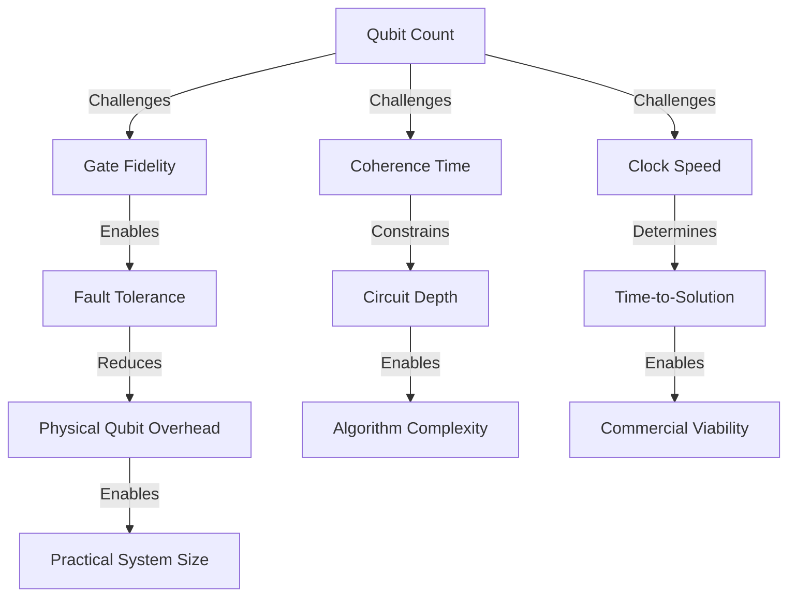

Increasing qubit count tends to challenge all three primary metrics: larger ion chains experience more heating and crosstalk (degrading fidelity), increased environmental coupling (reducing coherence), and more complex control requirements (potentially slowing operations). Successful scaling strategies must address all these challenges simultaneously.

**Benchmarking Challenges**

The comparison between experimental application-level benchmark results and simulations based on component-level benchmarking reveals important insights about scaling challenges. For IonQ Forte, while simulations based on median DRB error rates showed correlation with experimental data, they **systematically predicted higher fidelities than were observed**. The observed fidelities suggested an effective error rate of approximately 100×10⁻⁴, about twice the rate predicted by the component-level model[^9]. This discrepancy indicates the presence of significant **out-of-model errors**, such as context-dependent errors or crosstalk, that are not captured by individual gate metrics.

This finding has profound implications for scaling: as systems grow larger, these out-of-model errors may become increasingly significant, and strategies that only address component-level performance may fall short of achieving system-level targets.

### 1.4 The Scalability Challenge: From Demonstrations to Utility-Scale

While trapped-ion systems have demonstrated world-leading performance at the component level, scaling these capabilities from current demonstrations of tens of qubits to utility-scale systems of thousands or millions of qubits presents fundamentally different challenges. This section examines the technical barriers that distinguish scaling from incremental improvement and introduces the architectural approaches being developed to address them.

**The Laser Control Bottleneck**

A primary technical challenge for scaling trapped-ion systems is laser control. A fully controllable N-qubit trapped ion quantum computer typically requires approximately **N individually controllable laser beams**[^7]. Delivering these for N>>1 with low cross-talk is difficult, particularly because the laser beams must avoid the ion trap chip and the required ion spacing is hundreds of microns[^7].

This challenge is more pronounced for trapped ions than for neutral atoms because trapped ions require larger spacing (hundreds of microns versus a few microns for neutral atoms) and the laser beams must avoid the physical ion trap chip[^7]. While neutral atom quantum computers can deliver hundreds of optical tweezers more easily and scale to hundreds or thousands of qubits before worrying about scaling, trapped ions currently reach only a few tens or low hundreds with free-space laser delivery[^7].

The fundamental idea of free-space laser propagation is not very scalable for either platform at large scales[^7]. This recognition has driven intensive research into integrated photonic solutions, which will be examined in detail in Chapter 3.

**Ion Heating and Large Crystal Limitations**

A key challenge with large ion crystals in a single potential is that **all ions interact**, which is difficult to control[^7]. As qubit numbers increase within a single trap, the ion chain's vibrational modes become highly amplified, leading to increased heating and reduced execution fidelity[^19]. This physical limitation means that simply adding more ions to a single trap is not a viable scaling strategy beyond a certain point.

Current commercial ion trap quantum computers operate in the 10-30 qubit range, though quantum information experiments with 100+ trapped ions are not uncommon in academia using 1D and 2D ion crystals for quantum simulation[^7]. However, these larger systems sacrifice the precise individual control required for universal quantum computation.

**The QCCD Architecture Response**

The **Quantum Charge-Coupled Device (QCCD) architecture** addresses the limitations of single-trap systems by using a chip with multiple individual potential wells, each holding only a few qubits[^7]. This approach, implemented in systems like Quantinuum's H2, uses electric fields to connect multiple traps and shuttle ions between different trapping regions.

The QCCD architecture offers several advantages:

1. **Modular scaling**: Qubit count increases by adding traps rather than ions per trap
2. **Maintained fidelity**: Each trap contains only a manageable number of ions
3. **All-to-all connectivity**: Ion transport enables any qubit pair to interact
4. **Parallel operations**: Non-dependent operations on different traps can execute simultaneously[^19]

Quantinuum's March 2024 announcement addressed two major QCCD scaling hurdles: the **"wiring problem"** and the **"sorting problem"**[^20]. Their solution utilizes a fixed number of analog signals and a single digital input per qubit, significantly minimizing control complexity. This breakthrough demonstrates the scalability of the QCCD architecture and simplifies connections between quantum and classical systems[^20].

However, QCCD introduces new challenges. In the QCCD architecture, the vast majority of computation time has historically been taken up by **ion movement and ion cooling**—in one seminal demonstration, gate pulses took only approximately 2% of system runtime while ion movement took approximately 27% and ion cooling took approximately 68%[^13]. Slow ion transport is primarily caused by slow ion cooling[^13].

**Fabrication and Manufacturing Considerations**

The path to large-scale ion trap quantum computing must leverage semiconductor manufacturing capabilities. A key advantage of trapped-ion systems is **CMOS compatibility**, which is beneficial for leveraging established semiconductor processes and supply chains for tens of thousands of qubits[^7].

Once integrated, photonic components are highly scalable because the semiconductor industry excels at fabricating small structures with high reproducibility, and small defects lead to minor, calibratable variations[^7]. **Fabricating classical control structures at scale is generally easier than fabricating qubits at scale**, as solid-state qubit fabrication is sensitive to noise and defects that degrade quantum properties[^7]. This represents a fundamental advantage for trapped-ion systems: fabricating 10,000 grating couplers with 50±5% efficiency is easier than fabricating 10,000 superconducting qubits with consistent T₂ coherence time[^7].

**Power Dissipation and Thermal Management**

Trapped-ion systems operate at temperatures (e.g., 4K) where inexpensive cryocoolers can provide **several watts of cooling power**, unlike superconducting qubits that operate at very low temperatures (e.g., 20 mK) with limited cooling power (e.g., 100 μW)[^7]. This makes electronic integration **orders of magnitude easier** for trapped-ion systems.

AQT's PINE system exemplifies the practical advantages of trapped-ion thermal requirements: all components are engineered to fit within two 19-inch rack cabinets, compatible with existing HPC infrastructure and data center installations, operating in a room temperature environment and requiring **less than 2kW of power**[^17].

**Industry Roadmaps and Timeline Perspective**

The scaling challenge is reflected in the ambitious roadmaps announced by leading companies:

| Year | IonQ Targets[^10] | Quantinuum Targets[^21] |
|------|------------------|------------------------|
| 2025 | 64-100+ physical qubits, 99.9% fidelity | Helios system deployment |
| 2026 | 100-256+ physical qubits, 99.99% fidelity, 12 logical qubits | — |
| 2027 | 10,000 physical qubits, 800 logical qubits | — |
| 2028 | 20,000 physical qubits, 1,600 logical qubits | — |
| 2029 | 200,000 physical qubits, 8,000 logical qubits | Universal fault-tolerant computing |
| 2030 | **2,000,000 physical qubits, 80,000 logical qubits** | Apollo (fully fault-tolerant) |

IonQ's roadmap commits to the highest number of physical and logical qubits of any commercial quantum computing company[^10]. The company employs a **modular approach**, connecting smaller, highly functional trapped ion systems to scale quantum computing—a practical and cost-effective strategy aimed at achieving fault-tolerant quantum computing[^10].

Quantinuum's roadmap outlines a path to commercial quantum computing systems with **thousands of physical qubits, hundreds of logical qubits**, low error rates, and a fully integrated software stack[^21]. Their fifth-generation quantum computer, Apollo, will be a fully fault-tolerant and universal quantum computer capable of executing circuits with millions of gates[^21].

**The Qualitative Shift Required**

The transition from current systems to utility-scale quantum computing represents more than incremental improvement—it requires qualitative shifts in architecture, control, and manufacturing:

1. **From free-space to integrated optics**: Replacing free-space laser propagation with guided laser propagation through on-chip waveguides and grating couplers
2. **From single-trap to modular architectures**: Connecting multiple smaller systems via photonic interconnects or QCCD transport
3. **From laboratory to factory**: Transitioning from hand-tuned research systems to reproducibly manufactured commercial products
4. **From physical to logical qubits**: Implementing quantum error correction to achieve fault-tolerant operation

Scalability is not an absolute property but depends on operating at certain scales[^7]. The path to large-scale quantum computing involves overcoming platform-specific technical challenges, and **current qubit counts are not a definitive measure of a method's long-term viability**[^7]. The subsequent chapters of this report will examine each of the major scaling strategies in detail, assessing their feasibility and potential to achieve utility-scale trapped-ion quantum computing.

## 2 The QCCD Architecture: Principles, Progress, and Scaling Potential

This chapter provides a comprehensive examination of the Quantum Charge-Coupled Device (QCCD) architecture as the primary scaling paradigm for trapped-ion quantum computing. Building upon the foundational principles and current system capabilities established in Chapter 1, this chapter analyzes how QCCD addresses fundamental scaling limitations through modular zone-based designs and ion shuttling mechanisms. The analysis evaluates state-of-the-art implementations, theoretical scaling boundaries, and critical engineering challenges that must be overcome to achieve utility-scale systems with hundreds to thousands of qubits.

### 2.1 Architectural Principles and Zone-Based Design

The Quantum Charge-Coupled Device (QCCD) architecture represents a fundamental paradigm shift in trapped-ion quantum computing, moving away from monolithic single-trap designs toward **modular, zone-specialized systems** that can scale while maintaining operational fidelity. The conceptual foundation of this approach traces back to a 1998 proposal by researchers at the National Institute of Standards and Technology (NIST), which drew an analogy to charge-coupled device (CCD) cameras that store and process imaging information as movable electrical charges in coupled pixels[^22]. In the quantum analogue, the QCCD computer stores quantum information in the internal states of ions that are transported between different processing zones using dynamic electromagnetic fields[^22].

**The Physical Rationale for Zone Specialization**

The necessity for zone-based design arises from a fundamental physical limitation: as additional qubits are introduced into a single trap, the ion chain's vibrational modes become highly amplified, leading to **increased noise and heating effects** that consequently decrease operational fidelity[^19]. This challenge becomes increasingly severe as ion numbers grow, making it impractical to simply add more ions to a single trapping region while maintaining the precision control required for quantum computation.

The QCCD architecture addresses this limitation by segmenting the trap into **spatially distinct functional zones**, each optimized for specific operations. A grid-based trapped-ion QCCD device consists of a two-dimensional array of microfabricated surface electrodes on a chip, which generate time-dependent electric fields to create multiple trapping zones[^23]. The principal zone types and their functions are summarized below:

| Zone Type | Primary Function | Optimization Focus |
|-----------|-----------------|-------------------|
| **Storage/Memory Zones** | Hosting idle ions during computation | Minimal heating, long coherence |
| **Operation/Gate Zones** | Performing high-fidelity local entangling gates | Maximum gate fidelity, precise control |
| **Optical/Entanglement Zones** | Enabling remote, photon-mediated entangling gates | Efficient photon collection, low crosstalk |
| **Loading Zones** | Initial ion loading and state preparation | Efficient ionization, rapid cooling |
| **Auxiliary Zones** | Supporting operations (e.g., sympathetic cooling) | Specialized functions as needed |

The Quantinuum System Model H2 exemplifies this zone-based approach, implementing a **QCCD architecture with 4 gate zones in a trap consisting of two connected linear sections** arranged in a racetrack configuration[^24]. This design enables all quantum operations—initialization, measurement, single-qubit and two-qubit gates—to be performed using lasers in dedicated interaction zones, while ions are physically rearranged between these zones to enable arbitrary qubit pairings[^24].

**Electromagnetic Confinement and Dynamic Control**

The physical mechanism enabling QCCD functionality relies on **microfabricated electrode arrays** that generate precisely controlled electromagnetic potentials. Qubit ions—commonly hyperfine states of Yb⁺ or Ca⁺ ions—are confined by these electrode structures, which can dynamically adjust voltage waveforms to create, modify, and translate the potential wells holding individual ions or ion chains[^25]. The Quantinuum H2 system operates on qubits implemented through atomic hyperfine states of ¹⁷¹Yb⁺, with 56 physical qubits (ions) that can move individually or in pairs between the four interaction zones[^24].

The key architectural advantage of this approach is that it **decouples qubit count from single-trap limitations**. By distributing ions across multiple traps while maintaining a suitable number of ions per trap, the QCCD architecture allows the total qubit count to increase by expanding the number of traps rather than overloading individual trapping regions[^19]. This modular approach has enabled practical implementations of trapped-ion QCCD-based processors, with notable advancements demonstrated by Quantinuum in enhancing scalability[^19].

**Achieving All-to-All Connectivity Through Physical Transport**

A defining characteristic of QCCD systems is their ability to achieve **all-to-all connectivity** not through fixed physical couplings, but through the physical rearrangement of qubits. By moving and regrouping qubits into arbitrary pairs with near-perfect fidelity, a two-qubit gate can be performed on any arbitrary pair of qubits in the system[^24][^26]. This capability offers substantially more computing power than architectures with fixed qubit locations, as it provides maximum flexibility in algorithm design and eliminates the need for the "swap gates" required by other architectures to bring distant qubits into interaction range[^26].

The architectural flexibility of QCCD extends to supporting advanced computational features that are essential for fault-tolerant quantum computing. The Quantinuum H2 system's hallmark features include **mid-circuit measurement, conditional logic, and qubit reuse**[^11][^27]. Mid-circuit measurement allows for measuring select qubits in real-time and conditioning future quantum operations on those results without inadvertently measuring other qubits—a capability crucial for creating fault-tolerant quantum computers and one that enabled the first-ever demonstration of real-time quantum error correction[^26].

### 2.2 Ion Transport Mechanisms and Shuttling Operations

The operational heart of QCCD architecture lies in its **ion shuttling mechanisms**, which physically transport quantum information between different zones of the processor. Understanding these transport operations—their speeds, fidelities, and limitations—is essential for assessing the scalability potential of QCCD systems.

**Transport Primitives and Operations**

Ion shuttling in QCCD systems encompasses several distinct operational primitives, each serving specific functions in quantum circuit execution. The principal transport operations include:

**Linear Shuttling**: The most basic transport operation involves adiabatic shifts of the confining potential along a trap segment, physically translating ions from one zone to another. These operations typically last **50–300 μs** with motional heating of less than 1 phonon per operation[^23]. The Quantinuum H2 system enables ions to move individually or in pairs between its four interaction zones, with the location for each quantum operation determined by the compiler to minimize transport operations and execution time[^24].

**Split and Combine Operations**: These operations enable the formation and recombination of multi-ion chains, allowing ions to be separated for individual addressing or merged for collective operations. The ability to dynamically reconfigure ion chains is fundamental to achieving the flexibility required for arbitrary circuit execution.

**Junction Traversal**: For two-dimensional QCCD architectures, ions must navigate through junctions—intersections where multiple trap segments meet. This operation presents significant technical challenges, as the complex electric field profiles near junctions can induce unwanted motional excitation during ion transport[^28]. Grid-specific conditional steps, such as center-to-left-or-right (C2LR) voltage mapping, support scalable parallel manipulation of ions across the trap[^23].

**The Multi-Species Transport Challenge**

A particularly demanding aspect of QCCD operation involves transporting ions of **different atomic species** simultaneously through junctions. This capability is critical for systems that use multiple species for different functions—for example, using one species as computational qubits and another as "refrigerator" ions for sympathetic cooling.

Quantinuum researchers have achieved a significant breakthrough in this area, developing new waveforms that can guide a pair of ytterbium and barium ions through a junction in a surface trap without the charged particles becoming overly excited or flying out of the trap[^29]. This represents **the first time any team has simultaneously moved two different species of ions through a junction in a surface trap**[^29]. Previously, researchers envisioned having to separate paired ions and move them through junctions one at a time, which would dramatically slow operations[^29]. The ability to transport paired ions through a junction simultaneously and intact is critical for scaling trapped ion systems efficiently.

**Time Budget Implications of Shuttling**

The time consumed by shuttling operations represents a significant factor in overall QCCD computational throughput. In the QCCD architecture, a substantial portion of computation time has historically been consumed by ion movement and cooling rather than actual gate operations. The emergence of QCCD architectures has therefore highlighted the need to develop novel quantum circuit mapping techniques that optimize not just gate sequences but also the physical routing of ions through the trap[^19].

The shuttling overhead directly impacts circuit execution time and, consequently, the fidelity of computation due to decoherence during idle periods. Research has shown that circuit fidelity gains are maximized when shuttling overhead is kept below approximately 20%[^25]. For surface code implementation on QCCD architectures, topology-aware compilers can achieve logical round times independent of code distance when shuttling is properly optimized[^25].

The relationship between shuttling operations and computational throughput creates a fundamental design tension: distributing ions across more traps increases parallelism for gate operations but also increases the frequency of shuttle and SWAP operations required to bring interacting qubits together[^19]. Finding the optimal balance between these competing factors is a key challenge in QCCD system design.

### 2.3 Demonstrated Implementations and Performance Benchmarks

The practical viability of QCCD architecture has been demonstrated through increasingly sophisticated implementations, with Quantinuum's H-Series systems representing the current state of the art. These systems provide concrete evidence of QCCD's ability to deliver **high-fidelity quantum operations at commercially relevant scales**.

**Quantinuum System Model H2: Architecture and Capabilities**

The Quantinuum System Model H2 represents the second-generation QCCD quantum computer featuring an innovative **racetrack architecture**—an advancement from the H1's linear design that enables more efficient ion routing and parallel operations[^11][^27]. The system specifications demonstrate the maturity of QCCD technology:

| Parameter | Specification | Significance |
|-----------|--------------|--------------|
| **Qubit Count** | 56 fully-connected qubits | Largest QCCD system; impossible to classically simulate |
| **Quantum Volume** | 33,554,432 (2²⁵) | Highest demonstrated by any quantum computer |
| **Single-Qubit Gate Fidelity** | >99.99% | Enables deep circuit execution |
| **Two-Qubit Gate Fidelity** | >99.9% (typical 99.9%) | "Three 9s" milestone for error correction |
| **SPAM Error** | ~1×10⁻³ typical | High-fidelity state preparation and readout |
| **Parallel Two-Qubit Operations** | 4 simultaneous | Enabled by multi-zone architecture |
| **Memory Error** | 2×10⁻⁴ per qubit at average depth | Low decoherence during computation |

The system achieves these specifications while maintaining **all-to-all connectivity across all 56 qubits**, meaning any arbitrary pair of qubits can be brought together for a two-qubit gate operation[^11][^24]. This connectivity is achieved through the physical transport of ions between the four gate zones in the racetrack architecture, with the compiler optimizing each circuit to minimize transport operations and execution time[^24].

**Gate Fidelity Achievements and Error Correction Threshold**

Quantinuum became the first company to achieve **"three 9s"—99.914(3)% two-qubit gate fidelity**—in a commercially available quantum computer, demonstrating repeatable performance across all qubit pairs[^30]. This achievement is particularly significant because it marks a symbolic inflection point where logical qubits can outperform physical qubits for many quantum error correction protocols[^30].

The high fidelity is achieved **"inherently," without error mitigation**, due to the QCCD architecture and all-to-all connectivity[^30]. Unlike other architectures where fidelity varies significantly between qubit pairs based on their physical proximity, Quantinuum is the only quantum computing company with all qubit pairs boasting above 99.9% fidelity[^30]. According to Quantinuum's Dave Hayes, achieving "three 9s" in the QCCD architecture means approximately **1000 entangling operations can be performed before an error occurs**—putting the company within the regime needed to build fault-tolerant machines[^30].

**Algorithmic Benchmarks and Real-World Performance**

The practical capabilities of QCCD systems have been validated through rigorous algorithmic benchmarks. A recent independent study comparing 19 quantum processing units (QPUs) concluded that the performance of Quantinuum H1-1 and H2-1 is **superior to that of other QPUs**, particularly in full connectivity—the most critical category for solving real-world optimization problems[^31].

The Quantinuum H2-1 system achieved a landmark result in the benchmark study: it passed a quantum benchmark using a combinatorial optimization problem called MaxCut on a **fully connected 56-qubit circuit** using over 4,600 two-qubit gates without degrading into random noise[^32]. The researchers noted: "In the case of Quantinuum H2-1, the experiments of 50 and 56 qubits are already above the capabilities of exact simulation in HPC systems and the results are still meaningful"[^32]. This represents the **largest implementation of QAOA to solve a fully-connected combinatorial optimization problem on real quantum hardware** that is certified to give better results than random guessing[^32].

**Advanced Capabilities: Logical Qubits and Error Correction**

Beyond raw performance metrics, QCCD systems have demonstrated sophisticated capabilities essential for fault-tolerant quantum computing. Key projects run on System Model H2 include:

- **Demonstrating a fully fault-tolerant universal gate set** with repeatable error correction[^11]
- **Achieving fault-tolerant high-fidelity teleportation of a logical qubit**, with logical teleportation fidelity reaching **99.82%**—exceeding the physical qubit teleportation fidelity and passing the break-even point[^11][^33]
- **Establishing the first commercial application for quantum computers** by generating truly random seeds for secure electronic communication in partnership with JPMorganChase and national laboratories[^11]

The logical teleportation achievement is particularly noteworthy because it demonstrates that the native high fidelity of the QCCD architecture enables complex demonstrations that would be impossible on lower-fidelity systems[^33]. The ability to perform conditional logic and real-time decoding was crucial for implementing the Steane error correction code, and the all-to-all connectivity was essential for performing the high-fidelity transversal gates that drove the protocol[^33].

### 2.4 Topology Optimization and Compilation Strategies

The performance of QCCD systems depends critically on both the **physical topology** of the trap architecture and the **compilation strategies** used to map quantum circuits onto the hardware. Research in this area has yielded counterintuitive insights that challenge conventional assumptions about optimal QCCD design.

**Topology Comparisons: Linear, Ring, and Grid Architectures**

Systematic studies have compared different QCCD topologies to understand their relative advantages for various computational workloads. A comparison between 1D-linear array and ring structure topologies revealed nuanced trade-offs[^19]:

For most benchmarks, the **linear device generally outperforms the ring counterpart** when using routing schemes tailored for linear devices[^19]. However, this observation reflects the maturity of linear-optimized compilation techniques rather than an inherent topological advantage. In weak scaling experiments (constant total physical qubits with increasing trap count), the **ring topology outperforms linear** for algorithms like the Draper Adder and Quantum Fourier Transform[^19].

The scalability analysis revealed an important phenomenon: execution time initially **decreases** with more traps due to increased parallelism, but then **increases** again due to more frequent shuttle and SWAP operations[^19]. The optimal architecture was found to comprise approximately **14 to 16 traps with 11 to 13 ions per trap** for the tested workloads[^19]. This finding illustrates the fundamental tension between parallelism and communication overhead in QCCD design.

**The Counterintuitive Case for Small Trap Capacities**

Perhaps the most surprising finding from recent architectural studies concerns the optimal trap capacity for quantum error correction workloads. Contrary to prior intuition that larger traps (20-30 ions) would be preferable, research has shown that a trap capacity of **2 ions per trap** can be unexpectedly ideal from both performance and hardware efficiency perspectives[^34].

Although a capacity-2 design maximizes the number of communication operations required, it also **maximizes gate parallelism**[^34]. With grid connectivity and direct electrode-to-DAC wiring, this configuration achieves near-optimal cycle times and lower logical error rates, with cycle time remaining **constant regardless of code distance**[^34]. This result has profound implications for designing QCCD systems optimized for fault-tolerant quantum computing, suggesting that the conventional wisdom favoring larger ion chains may not apply when quantum error correction overhead dominates the computational workload.

**Advanced Qubit Allocation Algorithms**

The emergence of QCCD architectures has driven development of novel compilation techniques that account for the unique characteristics of ion shuttling. The **Spatio-Temporal Aware Qubit Allocation Algorithm (STA)** represents a significant advancement, achieving execution time improvements of **up to 50%** compared to prior methods[^19].

STA enhances previous approaches by incorporating multiple factors:

1. **Qubit interaction ratio**: The number of different qubits each qubit interacts with, relative to total logical qubits
2. **Temporal weight**: A measure of when interactions occur in the circuit, with earlier interactions weighted more heavily
3. **Initial excess capacity**: The number of free spaces within each trap at execution start

The algorithm prioritizes placing qubits with higher interaction ratios and considers the temporal proximity of interactions, then reorders qubits within traps based on temporal weights to minimize future movements[^19]. Evaluation showed STA improves execution time for all tested circuits compared to random and greedy strategies, with up to **76.22% improvement** over random placement for QFT and up to **50% improvement** over greedy approaches for the Cuccaro Adder[^19].

**Compiler Co-Optimization Strategies**

Beyond initial qubit placement, advanced compilation strategies co-optimize multiple aspects of circuit execution. The **S-SYNC compiler** achieves up to **3.69× shuttle reduction** and **1.73× improvement in application success rates** by co-optimizing ion shuttling and physical SWAPs based on a cost function that includes device-specific rates of heating and decoherence[^25][^23].

For surface code implementation specifically, topology-aware compilers developed for QCCD systems achieve logical round times that are **near-optimal** and, importantly, **independent of code distance** for the capacity-2 configuration[^34]. This compiler achieves an average **3.8× improvement in logical clock speed** compared to existing QCCD compilers like QCCDSim and Muzzle The Shuttle[^34].

### 2.5 Scaling Limits and Engineering Challenges

While QCCD architecture provides a clear path toward larger trapped-ion systems, significant engineering challenges must be addressed to achieve utility-scale quantum computing. These challenges span control electronics, power management, and fundamental trade-offs between competing design objectives.

**The Wiring Problem and Electrode Control Complexity**

Scaling up QCCD processors is fundamentally constrained by the **extensive electronics and high-density wiring** required to control numerous trap electrodes[^35]. In conventional QCCD architectures, each trap electrode is controlled via a dedicated digital-to-analog converter (DAC), which places an overwhelming demand on electronic resources because the number of trap electrodes typically exceeds the number of trapped-ion qubits, with current estimates indicating approximately **10 electrodes per qubit**[^35].

The proliferation of electrodes—often exceeding 1,000 per device—creates substantial wiring and control bottlenecks[^23]. For a distance-7 surface code, each logical qubit would require approximately **5,500 DACs**, corresponding to roughly **275 GBit/s** of controller-to-QPU bandwidth[^34].

**Time-Division Multiplexed Control Solutions**

A promising solution to the wiring problem leverages **time-division multiplexing** to reduce hardware requirements dramatically. Research has demonstrated that a high-speed DAC operating at 50 Msps can achieve a multiplexing factor of **100**, controlling 100 electrodes with a target voltage update rate of 0.5 MHz per channel[^35]. Based on this approach, controlling a system with **10,000 trap electrodes would require approximately 13 FPGAs and 104 high-speed DACs**—a significant reduction compared to the 10,000 dedicated DACs required by conventional methods[^35].

The WISE architecture implements this concept using switch-based demultiplexing networks that share fewer DACs across many electrodes[^34]. This approach achieves **two orders of magnitude improvement** in data rate and power consumption compared to standard architectures[^34]. However, this advantage comes with a critical trade-off: the limited transport flexibility of multiplexed control results in logical clock speeds up to **25× slower** than direct DAC-to-electrode configurations for error rates approaching 10⁻⁹[^34].

**Power Dissipation Constraints**

Power consumption represents a fundamental scaling constraint that interacts with control architecture choices. Under standard architectures with direct DAC-to-electrode wiring, even the optimal capacity-2 configuration requires over **780 watts of power** for a single logical qubit at 10⁻⁹ logical error rate[^34]. This power requirement, combined with the **1.3 Tbit/s communication link** needed for control data, presents severe practical challenges for scaling to hundreds of logical qubits.

The power-versus-cycle-time trade-off revealed by these studies represents a **fundamental bottleneck** in current QCCD wiring mechanisms[^34]. Multiplexed wiring achieves low power but very long execution times, while direct electrode connections provide low execution time but high power consumption. Scaling ion traps to hundreds of logical qubits will require moving beyond existing control system designs to develop architectures that provide both high-performance execution and low power requirements[^34].

**Quantinuum's Roadmap to Utility-Scale Systems**

Despite these challenges, Quantinuum has unveiled an accelerated roadmap to achieve **universal, fully fault-tolerant quantum computing by 2030**[^21]. The roadmap is built on the foundations of Quantinuum's fully scalable QCCD architecture and outlines a path to commercial quantum computing systems capable of unlocking a trillion-dollar market[^21].

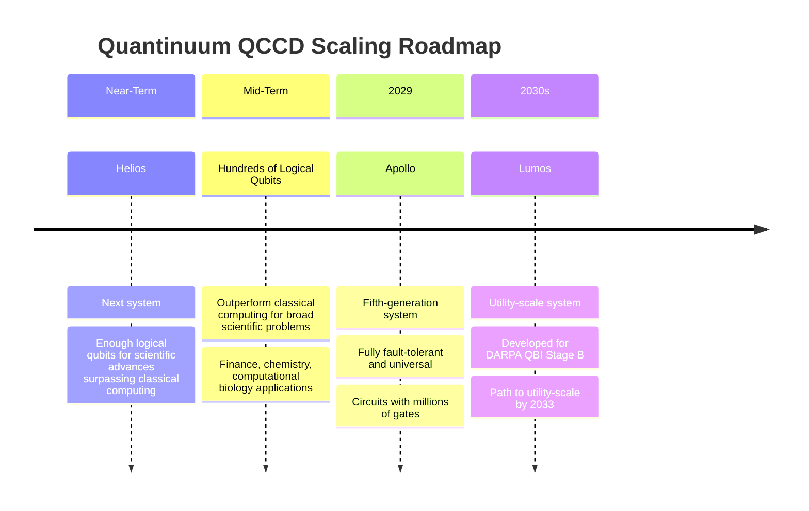

The roadmap reveals key milestones including **Helios**, which will support enough logical qubits to unlock scientific and mathematics advances clearly surpassing classical computing, followed by **Apollo** in 2029 as a fully fault-tolerant and universal quantum computer capable of executing circuits with millions of gates[^21]. In November 2025, Quantinuum was selected by DARPA to advance to Stage B of its Quantum Benchmarking Initiative, developing a detailed concept design for **Lumos**—a utility-scale system providing a concrete, de-risked path for achieving utility-scale quantum computing by 2033[^21].

This roadmap is supported by a proven record of technological advancement, including winning the race to "three 9s" hardware fidelity, demonstrating QCCD architecture scalability, achieving high-fidelity teleportation of logical qubits, fault-tolerant entangling gates, beyond-break-even with logical qubits, lattice surgery, real-time fault-tolerant error correction, and the computing primitives required for magic state distillation[^21].

### 2.6 Alternative Trap Technologies and Hybrid Approaches

While the RF-based QCCD architecture has demonstrated remarkable success, several alternative approaches address specific limitations and may enable hybrid architectures combining multiple scaling strategies. These emerging technologies expand the design space for trapped-ion quantum computing.

**Penning Micro-Traps: Static Field Confinement**

A fundamental alternative to RF-based ion traps replaces the radio-frequency electric field with a **static 3 Tesla magnetic field** for radial confinement[^36]. This Penning micro-trap approach removes several key restrictions that challenge RF-based scaling:

| Challenge in RF Traps | Penning Micro-Trap Solution |
|----------------------|----------------------------|
| High-voltage RF compatibility | Only static fields required |
| Power dissipation from RF currents | **No power dissipation** from confinement fields |
| Restricted 2D transport (specialized junctions required) | **Arbitrary 2D transport** without junctions |
| Geometric constraints on ion placement | Flexible, deterministic array reconfiguration |

The Penning QCCD can be envisioned as a scalable approach where a micro-fabricated electrode structure enables trapping of ions at many individual sites that can be **actively reconfigured during algorithms** by changing the electric potential[^36]. The main advantage is that ion transport can be performed in three dimensions almost arbitrarily without the need for specialized junctions, enabling flexible and deterministic reconfiguration of the array with low spatial overhead[^36].

Researchers have demonstrated the fundamental building block of such an array by trapping a single ion in a cryogenic micro-fabricated surface-electrode Penning trap, achieving full quantum control of spin and motional degrees of freedom with a **heating rate lower than any comparably sized RF trap**[^36]. The measured electric-field spectral noise density for the axial mode was **3.4×10⁻¹⁶ V² m⁻² Hz⁻¹**—lower than any comparable measurement in a trap of similar size[^36]. Flexible 2D transport was demonstrated with **negligible heating of the motional state**, contrasting with earlier non-adiabatic transport experiments where significant ion losses occurred[^36].

The use of advanced standard fabrication methods such as CMOS is facilitated in Penning traps compared with RF traps due to the **lack of high-voltage RF signals**[^36]. This compatibility with semiconductor manufacturing could prove advantageous for large-scale integration.

**3D-Printed Micro-Junction Arrays**

Another innovative approach addresses the limitations of conventional surface-electrode traps through **3D-printed micro-structures** that enhance confinement and reduce transport-induced heating. Conventional surface traps suffer from weak and anharmonic confinement compared to macroscopic three-dimensional traps, resulting in reduced trap depth and enhanced sensitivity to stray electric field fluctuations—limitations that are particularly severe near junctions[^28].

Three-dimensionally printed micro ion traps leverage the high precision and geometric flexibility of two-photon lithography (Nanoscribe) to form fully metal-coated, high-resolution microstructures directly on trap chips with **sub-micron precision**[^28]. Simulation results demonstrate dramatic improvements:

| Parameter | 3D-Printed Trap | Comparable Surface Trap | Improvement |
|-----------|----------------|------------------------|-------------|
| Trap frequency | 2.32 MHz | 1.98 MHz | **17% increase** |
| Pseudopotential trap depth | 2.3 eV | 74 meV | **31× enhancement** |
| Pseudopotential barrier at junction | Reduced | Baseline | **~10× reduction** |
| Motional excitation per junction transit | 0.00019 quanta | State-of-art baseline | **100× reduction** |

The 3D-printed design achieves **nearly perfect alignment** between the pseudopotential minimum and constant total confinement (CTC) paths throughout the junction region, mitigating the reduction of total confinement to approximately 1/2 of its linear region value compared to a reduction to 1/8 in previous surface-electrode designs[^28]. This alignment facilitates **low-heating, high-fidelity transport** of single- and multi-species ion crystals through junctions.

**Quantum Matter-Links for Modular Interconnection**

For scaling beyond the limitations of single QCCD modules, **quantum matter-links** provide a mechanism for deterministic ion transfer between separate quantum computing modules. This approach addresses the fundamental constraint that the number of ions a single quantum computing module can accommodate is limited by chip size[^37].

Research has demonstrated a quantum matter-link where ion qubits are transported between adjacent quantum computing modules at a rate of **2,424 s⁻¹**, with fidelity reduction due to transport-related ion loss below **7×10⁻⁸** over more than 10⁷ cycles[^25][^37]. Importantly, the link produces **no measurable impact on qubit phase coherence**[^37].

This quantum matter-link provides a practical mechanism for connecting QCCD devices and will promote the realization of modular quantum computers capable of fault-tolerant, practical-scale quantum computation[^37]. The approach complements photonic interconnect strategies (discussed in Chapter 4) by offering deterministic, high-fidelity ion transfer rather than probabilistic photon-mediated entanglement.

**Implications for Hybrid Architectures**

These alternative technologies suggest that the future of scaled trapped-ion quantum computing may involve **hybrid architectures** that combine multiple approaches:

- **Penning micro-traps** could provide the core computational zones with their advantages of zero power dissipation and flexible 2D transport
- **3D-printed junctions** could enhance transport fidelity at critical routing points
- **Quantum matter-links** could connect multiple QCCD modules into larger distributed systems
- **Integrated photonics** (covered in Chapter 3) could address the laser delivery scaling challenge

The QCCD paradigm thus represents not a single fixed architecture but a **family of related approaches** unified by the principle of zone-specialized, transport-enabled trapped-ion quantum computing. The optimal combination of these technologies for utility-scale systems remains an active area of research and development, with different configurations likely suited to different application requirements and scaling regimes.

## 3 Integrated Photonics for Scalable Laser Control

This chapter examines integrated photonic solutions as a critical enabling technology for overcoming the laser control bottleneck that fundamentally limits trapped-ion quantum computer scaling. Building upon the scalability challenges identified in Chapters 1 and 2—particularly the requirement for approximately N individually controllable laser beams for N qubits—this chapter analyzes how on-chip waveguide delivery, grating couplers, and integrated modulators can transform the scaling trajectory. The analysis evaluates demonstrated capabilities from leading research groups, assesses material and fabrication challenges specific to trapped-ion wavelength requirements, and projects the timeline for integrating these technologies into commercial systems.

### 3.1 The Laser Control Bottleneck and Photonic Integration Rationale

The transition from current trapped-ion quantum computers with tens of qubits to utility-scale systems with thousands or millions of qubits confronts a fundamental engineering barrier: the **laser control problem**. As established in Chapter 1, a fully controllable N-qubit trapped-ion quantum computer typically requires approximately N individually controllable laser beams, each delivering precise wavelengths to specific ions with sub-micron accuracy while avoiding interference with neighboring qubits and the trap chip structure itself. This section quantifies the magnitude of this challenge and explains why integrated photonics represents a qualitative architectural shift rather than an incremental improvement.

**Quantifying the Control Requirements at Scale**

The laser control requirements for large-scale trapped-ion systems are extraordinarily demanding. For a QCCD architecture scaling to 384 computing zones, the system would require approximately **1,152 individually controlled laser beams** spanning wavelengths from 397 nm to 866 nm (or 493 nm to 1762 nm for barium-based systems)[^38]. Each of these beams must satisfy stringent performance specifications:

| Requirement | Specification | Rationale |
|-------------|--------------|-----------|
| **Wavelength range** | 397-866 nm (Ca⁺) or 369-1092 nm (Yb⁺/Ba⁺) | Multiple transitions for cooling, state preparation, gates, readout |
| **Extinction ratio** | >60 dB on-off | Prevent crosstalk during site-selective addressing |
| **Control bandwidth** | DC to 10 MHz stability | Support amplitude, frequency, and phase modulation |
| **Spatial precision** | Sub-micron positioning | Individual ion addressing in chains with ~5 μm spacing |
| **Crosstalk isolation** | Minimal interference | Avoid disturbing neighboring qubits during operations |

The challenge is compounded by the physical constraints of trapped-ion systems. Unlike neutral atom quantum computers where optical tweezers can be delivered through relatively simple beam paths, trapped ions require larger spacing (hundreds of micrometers versus a few micrometers for neutral atoms) and the laser beams must physically avoid the ion trap chip electrodes[^39]. This geometric constraint makes free-space laser delivery increasingly impractical as system size grows.

**Limitations of Free-Space Optical Delivery**

Conventional trapped-ion quantum computers rely on free-space optics—systems of mirrors, lenses, and acousto-optic modulators—to direct laser beams to individual ions. While this approach has enabled all current demonstrations, it suffers from fundamental scalability limitations that become progressively more severe as qubit counts increase.

The problem faced by physicists building quantum computers with trapped atoms is the need to aim hundreds or even thousands of laser beams precisely over several meters to hit regions only a few micrometers in size that contain the atoms[^40]. Any vibration disturbs the quantum computer's operation, and conventional optics are a significant source of noise and errors in current small-scale systems. Scaling up makes this problem much harder because the number of optical paths, alignment requirements, and potential vibration sources all increase with system size.

The practical implications are substantial. Current free-space optical systems occupy large optical tables, require continuous alignment and maintenance, and cannot be readily replicated for parallel manufacturing. The complexity of maintaining hundreds of precisely aligned beam paths through vacuum chamber windows, while avoiding the trap chip structure, represents an engineering challenge that does not scale gracefully.

**The Qualitative Advantage of Integrated Photonics**

Integrated photonics offers a fundamentally different approach: rather than propagating light through free space, **waveguides fabricated directly into the trap chip** route light to precisely defined locations where grating couplers direct it upward toward trapped ions[^41]. This architectural shift provides several transformative advantages:

**Vibration Immunity**: The laser beams and chip are coupled together, making the system inherently resistant to vibrations[^41]. This is crucial for maintaining qubit coherence and for portability—enabling quantum computers to operate outside carefully isolated laboratory environments.

**Passive Stability**: By integrating tiny waveguides into the chips containing the electrodes for trapping ions, light can be sent directly to the ions, minimizing disturbances from vibrations[^40]. The waveguides are designed to stabilize the optical routing, which improves the stability of generated light patterns[^42].

**Elimination of Free-Space Alignment**: Direct fiber-to-chip coupling eliminates the need for beam alignment into vacuum systems and cryostats[^43]. Researchers have measured fiber-to-chip coupling losses as low as 1.5 dB, demonstrating that efficient light delivery is achievable without complex free-space optical paths[^44].

**Manufacturing Scalability**: Once integrated, photonic components are highly scalable because the semiconductor industry excels at fabricating small structures with high reproducibility. Fabricating 10,000 grating couplers with 50±5% efficiency is fundamentally easier than fabricating 10,000 superconducting qubits with consistent coherence times, as small defects in photonic structures lead to minor, calibratable variations rather than catastrophic performance degradation.

The transition from free-space to integrated optics represents what researchers characterize as the **"holy grail of integration"** for trapped-ion quantum computing[^38]. This vision encompasses chip-integrated multi-wavelength waveguides, grating couplers, light modulators, and photon detectors—all fabricated using scalable semiconductor processes and capable of supporting the control requirements for utility-scale systems.

### 3.2 Waveguide Platforms and Material Systems for Ion Trap Integration

The realization of integrated photonics for trapped-ion quantum computing requires material platforms capable of guiding light across the broad wavelength range demanded by atomic transitions—from ultraviolet (369 nm for Yb⁺) through visible to near-infrared (1092 nm for Ba⁺). This section examines the multi-layer fabrication architectures being developed to meet these requirements, evaluates current performance metrics, and discusses the integration challenges with trap electrode structures.

**Multi-Layer Waveguide Architecture**

The integrated photonics platform developed at MIT Lincoln Laboratory for trapped-ion applications supports light from **369 nm to 1092 nm** for Ca⁺, Sr⁺, Ba⁺, and Yb⁺ systems[^45]. Achieving this broad spectral coverage requires a sophisticated multi-layer fabrication stack consisting of different waveguide materials optimized for different wavelength ranges:

| Waveguide Layer | Fabrication Method | Optimal Wavelength Range | Current Loss Performance |
|-----------------|-------------------|-------------------------|-------------------------|
| **SiNx (Layer 1)** | PECVD | 600-1100 nm | <0.5 dB/cm |
| **SiNx (Layer 2)** | PECVD | 674 nm (Sr⁺ transition) | ~0.25 dB/cm |
| **Al₂O₃** | ALD | 400-600 nm | <1.5 dB/cm |
| **Al₂O₃** | ALD | 369 nm (UV) | ~3 dB/cm |

The fabrication layer stack consists of three waveguide layers—two plasma-enhanced chemical vapor deposition (PECVD) silicon nitride (SiNx) layers and one atomic layer deposition (ALD) aluminum oxide (Al₂O₃) layer—embedded in an oxide cladding[^45]. This architecture enables routing of multiple wavelengths on a single chip while optimizing each layer for its target spectral range.

**Silicon Nitride for Visible and Near-Infrared**

Silicon nitride waveguides represent the most mature platform for visible and near-infrared wavelengths critical to trapped-ion operations. Current SiNx waveguide losses are **<0.5 dB/cm for 600-1100 nm light**, approximately **0.25 dB/cm at the 674 nm Sr⁺ transition**, and **<0.1 dB/cm at 1100 nm**[^45]. These loss figures are sufficiently low to enable efficient light delivery across chip-scale distances of several centimeters.

The advantages of SiNx extend beyond low optical loss. The material is CMOS-compatible, enabling fabrication in standard semiconductor foundries. It exhibits good thermal stability and can be deposited at temperatures compatible with underlying electrode structures. The refractive index contrast with oxide cladding enables tight optical confinement, supporting compact waveguide routing and small bend radii.

**Aluminum Oxide for Ultraviolet Operation**

Extending integrated photonics to ultraviolet wavelengths—essential for Yb⁺ systems using the 369 nm transition—requires materials with wider bandgaps than silicon nitride. Aluminum oxide (Al₂O₃) waveguides deposited by atomic layer deposition provide this capability, with current losses of **<1.5 dB/cm between 400-600 nm**, rising to approximately **3 dB/cm at 369 nm**[^45].

The higher losses at UV wavelengths reflect fundamental material challenges including increased absorption near the bandgap edge and greater sensitivity to surface roughness at shorter wavelengths. Research continues to improve UV waveguide performance through optimized deposition conditions, surface passivation, and alternative material systems.

**Sandia's Comprehensive Photonics Portfolio**

Sandia National Laboratories has developed an extensive quantum photonics portfolio spanning multiple material platforms and wavelength ranges. Their capabilities include low-loss SiN and alumina waveguide platforms, heterogeneously integrated III-V components, and specialized devices for quantum applications[^46]:

- **Silicon photonics (Si-on-SOI)**: Standard device library with over 50 passive and active devices, including components that operate below 2K
- **III-V materials**: GaN, GaAs, and InP lasers and amplifiers, including narrow linewidth lasers operating at 778 nm and 369 nm for integrated ion trap clocking
- **Lithium niobate**: Bonded LiNbO₃ for electro-optic modulation
- **Advanced modulators**: Electro-absorption modulators at 760 nm working at cryogenic temperatures

This broad capability has led to many world-first demonstrations and provides a customizable portfolio of photonic building blocks for quantum microsystems[^46].

**Integration with Trap Electrode Structures**

A key challenge in developing integrated photonics for trapped ions is combining optical waveguides with the metal electrodes required for ion trapping without compromising either optical or trapping performance. The devices demonstrated at ETH Zurich used commercially produced chips containing **gold electrodes for ion traps** and, in a deeper layer, **waveguides for laser light that are only 100 nanometers thick**[^40].

Optical fibers feed light into these waveguides at one end of the chip, and each waveguide leads to a specific point where the light is deflected toward the trapped ions through grating couplers[^40]. The design must carefully manage several competing requirements:

1. **Optical routing**: Waveguides must navigate around electrode structures to reach grating coupler positions
2. **Electrical isolation**: Optical materials must not interfere with the electric fields used for ion trapping
3. **Thermal management**: Power dissipation from optical absorption must not perturb trap operation
4. **Fabrication compatibility**: The complete stack must be manufacturable with consistent yield

MIT Lincoln Laboratory addressed these challenges by designing **low-loss waveguides that work with the necessary wavelengths without interfering with the metal electrodes used to trap the ions**[^41]. Their fiber-optic block approach bonds directly to the side of the chip, with four optical fibers (each specific to a certain wavelength range) aligning with corresponding waveguides on the chip. The waveguides deliver light to grating couplers that direct it upward toward the ion, with the entire chip fabricated in Lincoln Laboratory's Microelectronics Laboratory.

### 3.3 Experimental Demonstrations and Achieved Performance

The transition from conceptual designs to working demonstrations represents a critical validation stage for integrated photonics in trapped-ion systems. This section provides a comprehensive assessment of key experimental milestones from leading research groups, documenting the progression from single-ion proof-of-concept experiments to multi-zone demonstrations capable of supporting practical quantum computing operations.

**ETH Zurich: High-Fidelity Quantum Logic with Integrated Optics**

The research group led by Jonathan Home at ETH Zurich achieved a landmark demonstration by implementing **high-fidelity multi-ion quantum logic gates using scalable integrated optics co-fabricated with surface electrode ion traps**[^43]. This work, published in Nature in October 2020, established that integrated photonics can support the demanding fidelity requirements of quantum computation.

The key achievements of this demonstration include:

- **Two-qubit entangling gates with fidelity greater than 99.3%** (±0.2%), approaching the performance of the best conventional free-space systems[^43]
- **Ground-state laser cooling** of ion motion using on-chip light delivery
- **Direct fiber-to-chip coupling** with only 1.5 dB coupling losses, eliminating free-space beam alignment[^44]
- **Robustness to vibrations and beam pointing drift** through integrated optical routing

The experimental realization of high-fidelity quantum logic in this platform demonstrates that it can enable larger systems in multiple zones connected by transport[^44]. The researchers used planar traps with integrated waveguides and grating couplers for controlling multiple ⁴⁰Ca⁺ ions, showing that the approach is compatible with QCCD architectures.

Professor Home's group has subsequently extended this work to demonstrate waveguide transmission spanning **375 nm to 866 nm wavelengths** using aluminum oxide and silicon nitride waveguides[^47]. The research program now focuses on scaling to multi-zone demonstrations and addressing the remaining challenges for utility-scale integration.

**MIT Lincoln Laboratory: Multi-Wavelength Fiber-Coupled Delivery**

MIT Lincoln Laboratory has developed a compact method to deliver laser light to trapped ions using a **fiber-optic block that plugs into an ion-trap chip**, coupling light to optical waveguides fabricated in the chip itself[^41]. This approach addresses the scalability limitations of conventional free-space optics by enabling multiple wavelengths of light to be routed through the chip and released to hit ions trapped above it.

The system demonstrated delivery of **multiple required wavelengths, from violet to near-infrared**, and performed the fundamental set of operations needed to control trapped ions[^41]. Controlling trapped ions requires up to six different-colored lasers to perform operations such as preparation, cooling, readout, and quantum gates. The MIT team demonstrated all single-qubit operations, while a collaborating team at ETH Zurich used a similar chip to demonstrate two-qubit gates, as described in companion papers in the same Nature issue.

This combined work shows that **all the necessary components are available to build larger trapped-ion arrays**[^41]. The researchers anticipate that tiling these chips into an array could enable control of many more ions, paving the way for more powerful quantum computers and portable quantum sensors such as advanced atomic clocks.

**Advanced Cooling Techniques Using Integrated Photonics**

A particularly significant demonstration involved using integrated photonics to achieve **polarization-gradient cooling**—a technique that cools ions to temperatures well below the standard Doppler cooling limit. Researchers at MIT and MIT Lincoln Laboratory implemented a faster and more energy-efficient cooling method using photonic chips, achieving cooling to about **10 times below the Doppler limit in approximately 100 microseconds**[^42].

The technique relies on a photonic chip incorporating **precisely designed antennas to manipulate beams of tightly focused, intersecting light**[^42]. The chip features two nanoscale antennas connected by waveguides designed to stabilize the optical routing. Where beams with different polarizations intersect, they form a rotating vortex of light that efficiently reduces the ion's vibrational energy.

This demonstration of enhanced cooling using integrated photonics lays the foundation for further integration and new approaches for quantum-state manipulation[^42]. The achievement is particularly significant because, as noted in Chapter 1, ion cooling has historically consumed approximately 68% of system runtime in QCCD architectures. Faster, more efficient cooling directly translates to improved computational throughput.

**Integrated Single-Photon Detection**

Beyond light delivery, integrated photonics enables on-chip detection of ion fluorescence—critical for qubit readout. MIT Lincoln Laboratory has integrated **Geiger-mode avalanche photodiodes (SPADs)** into the chip stack, achieving **high detection fidelities of >99.9%** with an average detection time of 450 μs[^45].

Two schemes are being pursued for light collection: direct detection of atom fluorescence via integrated photodetectors, and collection of fluorescence photons via grating couplers for remote entanglement generation[^45]. Work is ongoing to fully integrate the SPAD detectors with the photonic waveguide layers, which would enable a complete on-chip solution for both light delivery and detection.

**Sandia National Laboratories: Foundry-Scale Quantum Photonics**

Sandia National Laboratories operates the MESA fabrication facility, which provides **foundry-scale capabilities for quantum photonic integrated circuits (QPICs)**[^46]. Their Ion Trap Foundry and Quantum Computing Test Bed support development of ionic qubits using surface electrode ion traps with integrated photonic waveguides, light delivery, and integrated on-chip modulators[^46].

Sandia develops QPICs for addressing trapped-ion atomic clocks, delivering the **multiple diverse wavelengths on a chip needed to ionize, cool, excite, pump, and interrogate trapped ions**[^46]. The National Security Photonics Center (NSPC) offers collaborative multi-project wafer (MPW) runs in Silicon Photonics (200 mm) and InP photonics, leveraging this capability for quantum applications[^46].

The Sandia platform demonstrates that integrated photonics for trapped ions can be manufactured using industrial semiconductor processes, addressing a key requirement for scaling beyond laboratory demonstrations.

**Scaling to Multi-Zone Demonstrations**

Current research efforts are focused on scaling from single-zone demonstrations to systems with multiple independently controlled zones. ETH Zurich's work has extended to demonstrations with **20 zones**, representing a significant step toward the hundreds of zones required for utility-scale systems[^38].

The challenges of multi-zone scaling include:

- Routing waveguides to multiple grating coupler locations without excessive optical loss
- Maintaining phase coherence across distributed optical paths
- Integrating sufficient control channels for independent zone addressing
- Managing thermal effects from increased optical power

These demonstrations establish that integrated photonics can deliver the performance required for quantum computation while providing a path to manufacturable, scalable systems.

### 3.4 Active Photonic Components: Modulators, Switches, and On-Chip Control

While passive waveguide delivery represents a crucial first step, achieving full scalability requires **active photonic components** that can dynamically route, modulate, and switch light on-chip. This section examines progress on integrating electro-optic modulators, optical switches, and other active devices that will enable site-selective qubit addressing without relying on bulk free-space components.

**The Case for Active On-Chip Control**

One of the main challenges to scaling trapped-ion quantum computers is optical access to ion qubits[^48]. While 2D chip traps provide ion control and complex layout possibilities, the designs are currently limited by the need for high numerical aperture for qubit addressing with laser beams. There has been recent success routing light via trap-integrated waveguides; however, to take full advantage of photonic integrated circuit (PIC) technology, **active control of the light should also be integrated**[^48].

With on-chip switches and modulators, light can be routed between computing zones and controlled on-chip[^48]. This advance has the potential to:

- **Reduce optical power requirements** by directing light only where needed
- **Enable denser qubit layouts** by eliminating bulky free-space modulators
- **Improve switching speed** through electro-optic rather than acousto-optic modulation
- **Enhance system compactness** for portable and deployable applications

**Thin-Film Lithium Niobate Modulators**

**Thin-Film Lithium Niobate (TFLN)** has emerged as a particularly promising platform for active photonic control in trapped-ion systems. Research collaborations between ETH Zurich groups have demonstrated integrated electro-optic modulators (iEOM) in TFLN achieving impressive specifications[^38]:

| Parameter | Achieved Performance | Significance |
|-----------|---------------------|--------------|
| **Extinction ratio** | 60 dB | Sufficient for site-selective addressing |
| **Stability** | DC to 10 MHz | Supports required control bandwidth |
| **Spectral range** | Visible and UV operation | Compatible with trapped-ion wavelengths |

The 60 dB extinction ratio is particularly significant because it meets the **>60 dB requirement** identified for large-scale systems where crosstalk between zones must be suppressed to prevent errors during site-selective operations[^38].

TFLN offers several advantages for trapped-ion applications. The material exhibits strong electro-optic coefficients enabling efficient modulation with low drive voltages. It is transparent across the visible spectrum, compatible with most trapped-ion wavelengths. The thin-film format enables tight optical confinement and integration with other photonic components.

**On-Chip Switching and Routing**

Long-term platform development envisions including **optical switches and modulators for single-site control**, optical amplifiers for scaling, and through-silicon vias (TSVs) for integrating CMOS control circuitry[^45]. The integration of switching capabilities would enable dynamic reconfiguration of light routing, directing laser power to specific zones as needed during computation rather than maintaining continuous illumination of all sites.

Sandia's portfolio includes **high extinction amplitude modulators** (Mach-Zehnder interferometer, electro-absorption, ring, and disk configurations), **low-loss phase shifters**, and **piezoelectric AlN transducers**[^46]. These components provide the building blocks for constructing complex on-chip optical control systems.

**Integration with Cryogenic Operation**

A critical consideration for active photonic components is compatibility with the cryogenic environments used in many trapped-ion systems. Sandia has developed **electro-absorption modulators at 760 nm working at cryogenic temperatures** and **advanced AlN piezoelectric devices that have successfully operated at cryogenic temperatures**[^46].

The ability to operate active photonic components at cryogenic temperatures is essential for systems that use cryogenic cooling to reduce anomalous heating and improve vacuum quality. Components that function only at room temperature would require complex thermal isolation or would preclude the benefits of cryogenic operation.

**Path to Fully Integrated Active Control**

Efforts are underway to integrate Thin-Film Lithium Niobate (TFLN) modulators directly into trapped-ion devices[^48]. This integration would represent a significant step toward the complete on-chip control systems envisioned for utility-scale quantum computers.

The ETH Zurich–PSI Quantum Computing Hub has established a **cryogenic testbed for industry** enabling rapid turnaround testing (6.5 hours cool-down) of electronic circuits, active and passive photonics, and complete ion traps using standardized sockets[^38]. This infrastructure accelerates the development and validation of active photonic components for trapped-ion applications.

### 3.5 Fabrication Challenges and Manufacturing Scalability

The transition from laboratory demonstrations to commercial deployment of integrated photonics for trapped-ion quantum computing requires overcoming significant fabrication and integration challenges. This section examines the key technical barriers and assesses how semiconductor industry capabilities can be leveraged to achieve manufacturing scalability.

**UV Wavelength Integration Challenges**

Extending integrated photonics to ultraviolet wavelengths presents particular difficulties that do not arise at longer wavelengths. The challenges include:

**Material Absorption**: As wavelengths approach the bandgap of waveguide materials, absorption increases significantly. The ~3 dB/cm loss observed in Al₂O₃ waveguides at 369 nm[^45] represents a substantial penalty for chip-scale routing, potentially requiring higher input power or limiting the distance light can be delivered.

**Photodarkening**: UV light can induce photodarkening effects in some materials, causing progressive increase in optical loss over time. This degradation mechanism must be characterized and mitigated for long-term system reliability.

**Transmissivity Challenges**: Research has identified transmissivity in near-IR and UV as a key challenge for integrated photonics in trapped-ion systems[^38]. The multi-layer, multi-material fabrication processes required to address different wavelength ranges add complexity and potential failure modes.

**Light-Induced Charging Effects**

A subtle but significant challenge involves **light-induced charging** near trap electrodes. When UV or visible light strikes dielectric surfaces near the ion trapping region, it can liberate electrons through the photoelectric effect, creating stray electric fields that perturb ion positions and degrade gate fidelity.

Managing this effect requires careful design of grating coupler geometries, surface passivation treatments, and potentially active compensation of stray fields. The challenge is exacerbated at shorter wavelengths where photon energies are sufficient to cause photoemission from a wider range of materials.

**Heterogeneous Integration Requirements**

Achieving full functionality requires integrating components from different material systems onto a common platform. Long-term platform development requires **heterogeneous, hybrid, and 3D integration** for functionalities including III-V device integration[^45]. Key integration challenges include:

- **III-V Lasers and Amplifiers**: On-chip light sources would eliminate the need for external lasers, but integrating III-V materials (GaAs, InP, GaN) with silicon-based platforms requires specialized bonding or epitaxial growth techniques
- **Photodetectors**: Integrating SPADs or other single-photon detectors with waveguide layers requires compatible fabrication processes
- **CMOS Control Circuitry**: Through-silicon vias (TSVs) are envisioned for integrating classical control electronics, adding fabrication complexity

Sandia's approach demonstrates the breadth of heterogeneous integration required, incorporating **integrated III-V GaAs lasers and amplifiers, MEMS acousto-optics, bonded LiNbO₃, optical isolators**, and other components into their quantum photonics portfolio[^46].

**CMOS Compatibility and Foundry Access**

A fundamental advantage of integrated photonics is potential compatibility with CMOS fabrication processes. Microfabricated ion traps rely on developing **CMOS techniques for use far outside of normal operating conditions**[^39]. While standard CMOS processing techniques benefit from improved robustness and yield from industrial development, they must be adapted for the unique requirements of ion traps, including:

- Tolerance of up to **300 volts of RF at up to 100 MHz** on trap electrodes
- Management of voltage breakdown, power dissipation, and dielectric exposure
- Integration of electrical routing and integrated capacitors with optical components

Challenges related to these requirements have been overcome in the process of successfully fabricating CMOS-based ion traps, but continued research is needed to support more complex and sophisticated devices[^39].

**The Scalability Advantage of Photonic Fabrication**

Despite these challenges, integrated photonics offers a fundamental scalability advantage: **fabricating classical control structures at scale is generally easier than fabricating qubits at scale**. Photonic components are tolerant of minor fabrication variations that would be catastrophic for quantum coherence in solid-state qubits.

Sandia's National Security Photonics Center (NSPC) offers collaborative **multi-project wafer (MPW) runs in Silicon Photonics (200 mm)** and InP photonics[^46], demonstrating that foundry-scale fabrication of quantum photonic components is achievable. The standard Silicon photonics Si-on-SOI device library has **over 50 passive and active devices**, providing a mature foundation for quantum applications.

### 3.6 Roadmap to Commercial Integration and Remaining Technology Gaps

This section synthesizes the timeline and pathway for integrated photonics to enable utility-scale trapped-ion quantum computers, examining industry roadmaps, academic-to-industry technology transfer, and the remaining milestones that must be achieved.

**The IPSR-I Roadmap and Industry Consensus**

The Integrated Photonics System Roadmap – International (IPSR-I), led by the MIT Microphotonics Center and PhotonDelta foundation, represents a consensus from **more than 400 technology, academic, and industrial organizations** on the path forward for integrated photonics[^49]. Contributors include major technology companies (Airbus, Meta, NASA, General Motors), research institutions, and industry groups participating in over 100 workshops and 13 conferences.

The roadmap identifies key technology gaps that, if solved, would enable integrated photonics to revolutionize industries including quantum computing. According to MIT Professor Lionel Kimerling, **"Electronic-photonic integration has the capacity to radically transform a whole host of industries and unlock a range of new technologies that will change our lives. Transitioning this vision to high-volume manufacturing requires a well-thought-out plan built on the knowledge of a huge range of experts across different fields, organizations and nations."**[^49]

The IPSR-I provides a clear way forward for building a global, aligned integrated photonics industry with the ability to help solve major societal challenges, specifying an **innovative learning curve for scaling performance and applications for the next 15 years**[^49].

**Academic-to-Industry Technology Transfer**

The path from laboratory demonstrations to commercial systems requires effective technology transfer mechanisms. Current examples include:

**Fabrication Partnerships**: Ion trap design is conducted with academic institutions (ETH Zurich, Cornell) while fabrication is performed with industry partners such as **LioniX**[^38]. This model leverages academic innovation while accessing industrial manufacturing capabilities.

**Government-Supported Development**: Sandia National Laboratories' MESA facility provides foundry capabilities accessible to the broader research community through multi-project wafer runs[^46]. This infrastructure bridges the gap between academic research and commercial production.

**Collaborative Research Hubs**: The ETH Zurich–PSI Quantum Computing Hub advances critical technologies for scaling through partnerships spanning lasers and photonics, electronics and control, and ion trap fabrication[^38]. Such collaborative structures accelerate technology maturation.

**Remaining Technology Gaps and Milestones**

Several key milestones must be achieved before integrated photonics can support utility-scale trapped-ion quantum computers:

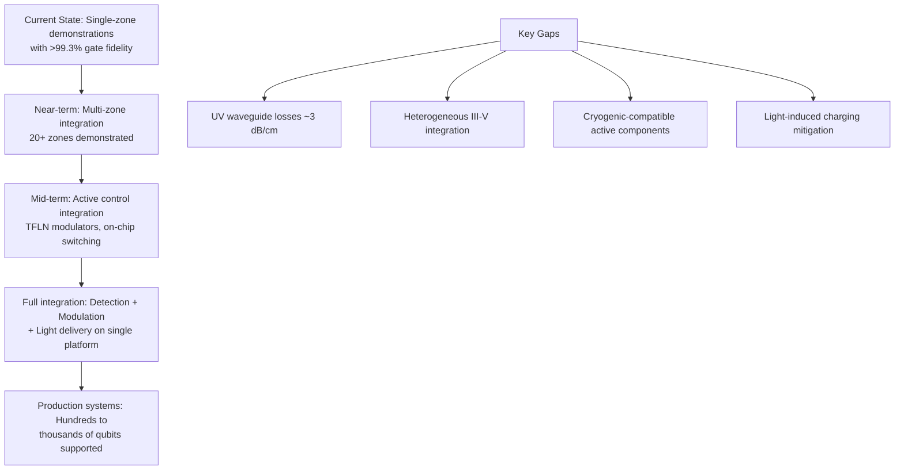

**Full Platform Integration**: Long-term development envisions including optical switches and modulators for single-site control, optical amplifiers for scaling, and through-silicon vias for integrating CMOS control circuitry on a single platform[^45]. Achieving this complete integration remains a significant engineering challenge.

**Wavelength Coverage**: Extending high-performance operation to UV wavelengths (369 nm for Yb⁺) with losses comparable to visible wavelengths requires continued materials development and process optimization.

**Scalable Detection**: Full integration of SPAD detectors with photonic layers would enable complete on-chip solutions for both light delivery and qubit readout[^45].

**Timeline Projections**

Based on current progress and stated roadmaps, the following timeline emerges for integrated photonics enabling trapped-ion scaling:

| Timeframe | Milestone | Evidence |
|-----------|-----------|----------|
| **Current (2025)** | Multi-zone demonstrations (20+ zones) | ETH Zurich scaling work[^38] |
| **Near-term (2025-2027)** | Active modulator integration | TFLN development at 60 dB ER[^38] |
| **Mid-term (2027-2029)** | Full platform integration | MIT-LL and Sandia development paths[^45][^46] |
| **Long-term (2030+)** | Production systems for 1000+ qubits | Aligned with IonQ/Quantinuum roadmaps |

The technology demonstrated in research laboratories will form the basis for commercial systems. IonQ's roadmap to 256-qubit systems by 2026 and millions of qubits by 2030 implicitly assumes that integrated photonics or equivalent solutions will resolve the laser control bottleneck. Similarly, Quantinuum's path to Apollo (fully fault-tolerant by 2029) requires scalable optical control beyond what free-space systems can provide.

**Strategic Implications**

The development of integrated photonics for trapped-ion quantum computing represents a **critical enabling technology** rather than an optional enhancement. Without solutions to the laser control bottleneck, trapped-ion systems cannot scale to the thousands or millions of qubits required for utility-scale quantum computing.

The good news is that the fundamental physics has been demonstrated: high-fidelity quantum gates using integrated optics are achievable. The remaining challenges are primarily engineering problems—improving UV waveguide performance, integrating active components, and scaling fabrication—rather than fundamental barriers. The semiconductor industry's capabilities in precision fabrication provide a path to solving these challenges, making integrated photonics one of the more tractable scaling requirements for trapped-ion quantum computing.

## 4 Modular and Distributed Quantum Computing Architectures

This chapter analyzes modular approaches that connect multiple smaller ion trap processors via photonic interconnects as a primary scaling strategy for achieving utility-scale quantum computing. Building upon the QCCD architecture principles and integrated photonics capabilities established in previous chapters, this chapter examines how distributed quantum computing overcomes the fundamental limitations of monolithic scaling by distributing computational resources across networked modules. The analysis evaluates the theoretical foundations enabling inter-module operations, assesses demonstrated implementations from leading research groups and commercial efforts, and identifies the critical performance requirements for photonic interconnects to achieve practical utility-scale systems.

### 4.1 Theoretical Foundations of Distributed Quantum Computing

The fundamental challenge of scaling quantum computers lies in the inherent tension between adding more qubits and maintaining the precise control required for high-fidelity operations. **Distributed quantum computing (DQC)** offers a compelling solution by combining the computing power of multiple networked quantum processing modules, enabling the execution of large quantum circuits without compromising performance or qubit connectivity[^50]. This architectural paradigm shifts the scaling challenge from building ever-larger monolithic processors to engineering high-quality interconnections between smaller, more manageable modules.

**Quantum Gate Teleportation as the Enabling Protocol**

The theoretical foundation of modular quantum computing rests on **quantum gate teleportation (QGT)**, which enables non-local entangling gates between qubits residing in physically separate modules. The interface between modules is realized using quantum teleportation, which offers a lossless alternative to direct quantum state transfer by using only bipartite entanglement (Bell states) shared between modules, together with local operations and classical communication[^50]. QGT efficiently implements non-local entangling gates between qubits in separate modules, consuming only one Bell pair and the exchange of two classical bits per teleported gate[^50].

The primary advantage of teleportation-based schemes over direct transfer is the **exclusive use of the quantum channel for generating identical Bell states**—channel losses can be overcome by repetition without losing quantum information[^50]. This property is crucial because photonic channels inevitably suffer from loss, and direct state transfer would destroy quantum information upon photon loss. With QGT, failed entanglement generation attempts simply require retry, while the computational qubits remain protected.

**Hierarchy of Interactions in Modular Architectures**

A modular ion trap quantum computer architecture features a **hierarchy of interactions** that can scale to very large numbers of qubits[^51]. This hierarchical structure comprises:

| Interaction Level | Mechanism | Characteristics |
|-------------------|-----------|-----------------|
| **Intra-register gates** | Natural ion-ion interactions (Coulomb coupling) | High-fidelity (>99.9%), deterministic, fast (μs-ms) |
| **Inter-register entanglement** | Probabilistic photonic interface | Lower fidelity (~86-97%), probabilistic, requires heralding |
| **Classical communication** | Electronic signaling | Fast, reliable, required for QGT completion |

Local entangling quantum gates between qubit memories within a single register are accomplished using natural interactions between the qubits, while entanglement between separate registers is completed via a probabilistic photonic interface between qubits in different registers, even over large distances[^51]. This architecture can be made fault-tolerant and demonstrates viability for fault-tolerant execution of quantum circuits[^51].

**Photonic Networks as Versatile Interconnect Layers**

Photonic networks are well suited as a versatile and reconfigurable interconnect layer for DQC because remote entanglement shared between matter qubits across the network enables **all-to-all logical connectivity** through quantum gate teleportation[^50]. This connectivity property is transformative: while the physical topology of a modular system may be sparse (each module connected to only a few neighbors), the logical topology can be fully connected through appropriate entanglement distribution.

The key advantage of this architecture lies in maintaining single module complexity at manageable levels while transferring the scaling challenge to building more modules and establishing interfaces between them[^50]. The connectivity and reconfigurability enabled by photonic networks provide a scalable approach that extends beyond trapped ions to other quantum computing platforms[^50]. Furthermore, teleportation protocols are not limited to qubits—they can be extended to higher-dimensional quantum computing models, and quantum repeater technology would enable large physical separation between quantum processing modules, paving the way for quantum internet development[^50].

**Requirements for Fault-Tolerant Distributed Operation**

For a scalable DQC architecture, the QGT implementation must be **deterministic and repeatable**[^50]. Prior to recent demonstrations, no implementation had satisfied these requirements simultaneously. The deterministic nature requires heralding mechanisms that confirm successful entanglement generation, while repeatability demands consistent performance across many operations without degradation.

Distributed quantum algorithms and computational tasks benefit from coherent access to multiple copies of quantum states, which may be achieved in monolithic devices but can particularly benefit from modular setups[^52]. Multi-copy strategies underpin techniques like virtual distillation (a key quantum error mitigation approach) and enable estimation of nonlinear state properties essential for characterizing correlations[^52]. These capabilities become increasingly important as systems scale toward fault-tolerant operation.

### 4.2 Photonic Interconnect Mechanisms and Ion-Photon Interfaces

The physical realization of modular quantum computing depends critically on the quality of **ion-photon interfaces** that generate entanglement between trapped-ion qubits and flying photonic qubits. This section examines the mechanisms, performance metrics, and engineering trade-offs that determine whether photonic interconnects can achieve the fidelities required for practical quantum computing.

**Ion-Photon Entanglement Generation**

Trapped atomic ions are ideal quantum memories with long coherence times, high-fidelity local gates, and near-unit efficiency state preparation and measurement. However, scaling beyond single traps requires optical photonic interconnects[^53]. The fundamental process involves exciting an ion to emit a photon whose quantum state (polarization, timing, or frequency) is entangled with the internal state of the ion. This ion-photon entangled pair serves as the resource for subsequent ion-ion entanglement through photon interference and detection.

The choice of **atomic species** significantly impacts interconnect performance. Research has demonstrated high-fidelity remote entanglement using **¹³⁸Ba⁺ ions**, which offer favorable optical transitions for photon generation and detection[^53]. Barium ions provide advantages including higher native fidelity limits, increased gate speeds, and better overall stability compared to some alternative species.

**Encoding Schemes: Time-Bin versus Polarization**

Two primary encoding schemes compete for photonic qubit implementation:

| Encoding | Advantages | Challenges |
|----------|------------|------------|
| **Polarization** | Simple detection, well-established | Sensitive to fiber birefringence, polarization drift |
| **Time-bin** | Insensitive to polarization errors, enables long-distance communication | More complex detection, requires interferometric stability |

**Time-bin encoding** has emerged as particularly promising for scalable systems. Research has demonstrated the first entanglement of two remote individual atomic qubits via time-bin photons, with two ¹³⁸Ba⁺ ions trapped in separate vacuum chambers 2 meters apart achieving entanglement[^53]. Time-bin encoding removes sensitivity to polarization errors, enables long-distance quantum communication, and is extensible to higher-dimensional memories[^53][^54].

**Achieved Fidelities and Error Sources**

Using a measurement-based error detection process and suppressing errors from atomic recoil, researchers achieved an **entanglement fidelity of 97%** with time-bin photons[^53]. The measured Bell state fidelities were F = 0.968(4) for the Ψ⁺ state and F = 0.972(3) for the Ψ⁻ state[^53]. Several key techniques contributed to this high fidelity:

**Erasure Error Correction**: A novel protocol detects and discards qubits in wrong states by shelving incorrect ground states to metastable states before detection, improving fidelity by at least 1%[^53].

**Atomic Recoil Mitigation**: The fidelity is sensitive to timing differences from atomic recoil. Decoherence from the separation of excitation pulses was eliminated by tuning the time-bin period τ = 6048 ns to be commensurate with trapped ion motional frequencies[^53].

**Detection Window Optimization**: A more fundamental decoherence stems from fluctuations in photon detection times due to finite atomic lifetime. By decreasing the detection time window from 50 ns to 10 ns, approximately 1% fidelity improvement was observed, with residual error of ~0.2%[^53].

**Path to Ultra-High Fidelity**

The demonstration indicates that **fidelity limits for remote entanglement based on photons can exceed 99.9%**, allowing modular scaling of quantum computers, long-distance quantum communication, and resource-efficient entanglement of high-dimensional memories[^53]. This projected fidelity threshold is critical because it approaches the levels required for fault-tolerant quantum error correction, where logical qubit error rates must be substantially lower than physical error rates.

**Success Probability and Rate Trade-offs**

A fundamental challenge with photonic interconnects is their probabilistic nature. The success probability of ion-ion entanglement in demonstrated systems was P_E = 2.3 × 10⁻⁵, with a mean entanglement rate of 0.35 s⁻¹[^53]. This low success probability arises from multiple factors:

- Photon collection efficiency from the ion
- Transmission losses through optical fibers
- Detection efficiency of single-photon detectors
- Interference visibility at the beam splitter

The trade-off between fidelity and rate presents a significant engineering challenge. Higher fidelity often requires tighter filtering (narrower detection windows, stricter heralding conditions), which reduces the success rate. Practical systems must balance these competing requirements based on the specific application and error correction overhead.

**Remote Entanglement in Distributed Computations**

The performance of distributed quantum circuits is consistent with errors from teleported gates. In demonstrated implementations, the measured fidelity was slightly lower than predicted by error budgets, attributed to drifts in calibration over data acquisition duration[^50]. The remote entanglement of network qubits across photonic quantum networks was observed with a fidelity of 96.89(8)% to the desired Bell state[^50]. To improve this further, **entanglement purification** could be used to distribute high-fidelity entangled states from lower-fidelity raw entanglement[^50].

### 4.3 Demonstrated Implementations of Distributed Quantum Algorithms

The theoretical promise of modular quantum computing has been validated through increasingly sophisticated experimental demonstrations that establish the practical viability of this approach. This section examines landmark implementations that have achieved distributed quantum algorithms, providing concrete evidence that photonically interconnected trapped-ion modules can perform useful computation.

**Oxford University: First Distributed Quantum Computing Demonstration**

Scientists at Oxford University Physics demonstrated the **first instance of distributed quantum computing**, linking two separate quantum processors to form a fully connected quantum computer[^55]. Published in Nature in February 2025, this breakthrough addresses the scalability challenge by enabling computations to be distributed across multiple devices[^55].

The experimental setup consisted of two photonically interconnected trapped-ion modules separated by approximately two meters, each containing dedicated network and circuit qubits[^50]. The team used a photonic network interface to connect trapped-ion qubits in separate modules, leveraging quantum teleportation to perform logical gates across the network[^55]. Key achievements include:

**Deterministic Gate Teleportation**: By using heralded remote entanglement between network qubits, the researchers **deterministically teleported a controlled-Z (CZ) gate** between two circuit qubits in separate modules, achieving **86% fidelity**[^50]. This deterministic operation—in contrast to probabilistic schemes—is essential for practical quantum computing where computation must proceed reliably.

**First Distributed Quantum Algorithm**: The team executed **Grover's search algorithm**, representing the first implementation of a distributed quantum algorithm comprising several non-local two-qubit gates, measuring a **71% success rate**[^50]. This milestone demonstrates that meaningful quantum algorithms can be executed across physically separated processors.

**Arbitrary Two-Qubit Operations**: The researchers implemented distributed iSWAP and SWAP circuits, compiled with two and three instances of QGT respectively, demonstrating the ability to distribute arbitrary two-qubit operations[^50]. This generality is crucial for universal quantum computation.

The distributed approach enables fault-tolerant computation while maintaining quantum coherence, and the photonic interconnects facilitate seamless expansion and potential integration into future quantum networks[^55]. This allows small quantum devices to be linked via optical fibers, creating a scalable architecture that avoids the engineering challenges of packing millions of qubits into a single machine[^55].

**IonQ's Four-Milestone Roadmap for Photonic Interconnects**

IonQ has established a systematic roadmap for developing photonic interconnects as the core technology enabling quantum networking between and within quantum computers[^56]. The roadmap consists of four progressive milestones:

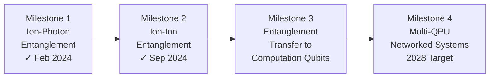

**Milestone 1 (Achieved February 2024)**: Generating and manipulating single photons entangled with a qubit to form a network node. This node must generate "interconnect photons" entangled with the interconnect qubit, send these photons through fiber optics to a detection hub, and have the hub manipulate and measure the photon state to confirm ion-photon entanglement[^56]. IonQ achieved this milestone, marking the **first commercial demonstration** of photon-ion entanglement outside an academic setting[^56].

**Milestone 2 (Achieved September 2024)**: Entangling two ion-based qubits from separate nodes using their entangled photons. IonQ's R&D team **entangled two ion-based qubits from separate trap wells** using entangled photons, collecting interconnected photons from two trap wells and routing them to a single detection hub where they interfere and are measured, leaving an entangled state between the interconnect qubits at each node[^56]. This establishes a quantum link between QPUs[^56].

**Milestone 3 (In Progress)**: Demonstrating transfer of entanglement from interconnect qubits to computation qubits for more complex algorithms. This entanglement can be transferred via two-qubit swap gates to establish two entangled QPUs[^56].

**Milestone 4 (Target: Commercial 2028)**: Scaling photonic interconnects beyond two nodes. With many QPUs networked together programmatically, IonQ can execute extremely wide circuits by harnessing all qubits in the network in parallel[^56]. IonQ is developing **single-photon switching techniques and devices** to collect interconnect photons from many interconnect qubits across many traps, selectively entangling qubits across the network[^56].

IonQ's roadmap indicates that the **photonic interconnect feature is scheduled for commercial deployment starting in 2028**[^10]. By that year, IonQ plans to offer a commercially available, interconnected system, which mirrors NVIDIA's acquisition of Mellanox enabling a shift from single GPUs to interconnected data centers for AI, but for quantum computing[^57].

**Cross-Platform Applicability**

Although these results were achieved using trapped-ion quantum processing modules, photons can be interfaced with a variety of systems[^50]. The connectivity and reconfigurability enabled by photonic networks provide a scalable approach for other quantum computing platforms, including diamond color centers and neutral atoms[^50]. Furthermore, through wavelength conversion, modules from different platforms can be connected, enabling hybrid DQC platforms[^50].

### 4.4 Quantum Memory and Entanglement Purification for Practical Interconnects

The probabilistic nature of photon-mediated entanglement presents a fundamental challenge for practical modular quantum computing. Raw entanglement generation rates are typically low (sub-Hz to Hz range), and achieving the high fidelities required for fault-tolerant operation demands additional protocols. This section examines how **quantum memory** and **entanglement purification** address these challenges to enable practical interconnects.

**Quantum Memory for Asynchronous Entanglement**

IonQ's acquisition of **Lightsynq** marks a turning point in its development roadmap by providing quantum memory-based photonic interconnects[^57]. Lightsynq's technology enables **asynchronous entanglement** and acts as network buffers, increasing the ion-ion entanglement rate by up to **50× compared to solutions with no memory**[^57]. This dramatic improvement addresses one of the most significant practical barriers to modular quantum computing.

The role of quantum memory in photonic interconnects can be understood through the following comparison:

| Approach | Operation Mode | Rate Limitation | Practical Impact |
|----------|---------------|-----------------|------------------|
| **Memoryless** | Synchronous | Both ions must emit simultaneously | Very low success probability |
| **Memory-assisted** | Asynchronous | Photons stored until partner arrives | 50× rate improvement |

Advancements in quantum memory, supported by Lightsynq technologies, are crucial for storing quantum information reliably and efficiently in large-scale systems[^10]. Combined with the inherent capability of trapped ion architecture, these technological advancements provide **long-lived quantum states**, reducing the impact of decoherence and errors, and allowing for more stable quantum operations[^10].

This technology makes clustered quantum computing not only feasible but **commercially ready by 2028**[^57]. The ability to buffer entanglement attempts until successful transforms the probabilistic photonic interface from a fundamental limitation into a manageable engineering challenge.

**Entanglement Purification Protocols**

Even with improved entanglement rates, the raw fidelity of photon-mediated entanglement may not meet the stringent requirements of fault-tolerant quantum computing. **Entanglement purification** protocols address this gap by distilling high-fidelity entangled states from multiple lower-fidelity copies.

To improve remote entanglement fidelity beyond what direct generation achieves, entanglement purification could be used to distribute high-fidelity entangled states[^50]. The basic principle involves:

1. Generating multiple copies of imperfect Bell pairs between modules
2. Performing local operations and measurements on subsets of pairs
3. Heralding successful purification based on measurement outcomes
4. Obtaining fewer but higher-fidelity entangled pairs

The trade-off between purification overhead and achieved fidelity depends on the initial fidelity and the specific purification protocol employed. For practical systems, the overhead must be balanced against the improvement in logical error rates enabled by higher-fidelity interconnects.

**Quantum Data Center Architecture**

The theoretical foundations of distributed quantum computing extend to **quantum data center** architectures where multiple quantum processors are connected through quantum local area networks (QLANs)[^58]. Due to physical topology limitations such as sparse connectivity and hardware complexity, QLANs adopt hierarchical architectures where orchestrator nodes handle entanglement generation and distribution[^58].

Through utilizing graph states and other multi-particle entangled states, and applying local operations and classical communication (LOCC), artificial topologies can be constructed atop physical topologies, enabling dynamic connectivity between nodes[^58]. This architectural approach mirrors classical data center design while leveraging uniquely quantum resources.

The connection between quantum data centers relies on **quantum transduction technology**, particularly for connecting superconducting qubits (microwave frequency) with optical qubits (optical frequency)[^58]. Quantum transducers serve as critical interfaces for interconnecting different quantum platforms, with their performance directly affecting entanglement distribution efficiency[^58].

**Enabling Commercial-Scale Clustered Computing**

The combination of quantum memory and entanglement purification transforms the landscape for modular quantum computing. IonQ's strategy for scaling takes advantage of multicore operation and photonically interconnected systems, with connecting multiple QPUs enabling targets of **thousands of physical qubits** in the future[^59].

The progression from laboratory demonstrations to commercial systems requires solving several practical challenges:

- **Timing synchronization** across distributed modules
- **Classical control coordination** for QGT protocols
- **Error tracking** across module boundaries
- **Calibration maintenance** for interconnect fidelity

These challenges, while significant, are engineering problems rather than fundamental physics barriers. The demonstrated fidelities and the technological advances in quantum memory provide confidence that practical modular systems are achievable within projected timescales.

### 4.5 Monolithic versus Modular Scaling Trade-offs

The choice between continued monolithic scaling and transition to modular architectures represents a critical strategic decision for trapped-ion quantum computing. This section provides a systematic comparison of these approaches, examining the advantages, challenges, and conditions under which each strategy is optimal.

**Fundamental Limitations of Monolithic Scaling**

Purely monolithic quantum systems scale poorly beyond a few hundred qubits due to rising control complexity, calibration burden, and fragility[^60]. The challenges compound as system size increases:

**Manufacturing Yields**: Larger monolithic chips risk lower yields and higher unit costs[^61]. Increasing qubit density can overload control systems or introduce noise[^61]. Any viable architecture must allow for error compensation and avoid recurring integration challenges with each new generation[^61].

**Control Complexity**: The wiring problem identified in Chapter 2 becomes increasingly severe for monolithic systems, with electrode counts and control channel requirements growing faster than qubit counts.

**Calibration Burden**: Real-world lessons from systems that nearly failed show consistent failure modes including calibration growing combinatorially overwhelming manual processes[^60]. Multi-module systems can isolate calibration requirements to individual modules.

**Advantages of Modular Architectures**

A truly modular design sidesteps the pitfalls of ever-larger single chips[^61]. The key advantages include:

| Advantage | Mechanism | Impact |
|-----------|-----------|--------|
| **Improved yields** | Smaller identical modules via conventional fabrication | Minimized defects, maintained cost-effectiveness |
| **Fault isolation** | Independent modules with separate control | Maintenance without full system downtime |
| **Simplified control** | Each module has own control electronics | Avoids intractable wiring problem |
| **Incremental scaling** | Add modules as needed | Cost-effective capacity expansion |
| **Future-proofing** | Same modular blueprint across generations | Avoids complete re-engineering |

By producing many identical modules via conventional fabrication, defects are kept to a minimum while maintaining cost effectiveness[^61]. Multiple modules slot together, each with its own control electronics, avoiding an intractable wiring problem[^61]. Once core engineering problems are solved, the same modular blueprint carries through future generations, whereas monolithic systems often demand complete re-engineering as chip sizes and densities increase[^61].

**The Interconnect Challenge**

However, modularity shifts some complexity into the interconnects[^61]. For modules to behave as a single device, quantum-grade links must be created that are both rapid and of very high quality[^61]. The requirements for these interconnects are stringent:

1. **Operation rates on par with native gate speeds** so cross-module operations do not lag behind[^61]
2. **Fidelity equivalent to intra-module interactions** to preserve quantum information[^61]
3. **Number of links proportional to each module's qubit count** to sustain full network connectivity[^61]
4. **Scalable manufacture** with the same yield, testing, and cost standards as modules themselves[^61]

Without robust links, modularity itself becomes a bottleneck, slowing algorithms and halting further scale-up[^61].

**Trapped-Ion Specific Considerations**

Trapped-ion systems possess unique characteristics that affect the monolithic-versus-modular trade-off. In classical multi-chip modules, chip-to-chip transmission is typically much more expensive in speed and error than on-chip transmission. However, in quantum systems using trapped ions, **latency and noise are not excessively high when transmitting quantum information between chips**[^62].

This occurs because superconducting quantum computing chips have qubits constructed from circuits that occupy more space on-chip compared to transistors encoding classical bits. The qubit size creates an architectural constraint forcing physical qubit communication to be fixed to nearest neighbors, preventing chip-to-chip links from suffering bandwidth limitations orders of magnitude worse than on-chip links[^62]. Additionally, smaller quantum chiplets maximize quantum computing yield, combined with post-fabrication selection for multi-chip module integration and reconfigurability, establishing foundations for discovering chiplet architectures far exceeding monolithic counterparts in gate fidelity and application performance[^62].

**Conditions Favoring Each Approach**

The optimal choice between monolithic and modular scaling depends on several factors:

**Favor Monolithic When**:
- System size remains below control complexity thresholds (~100-300 qubits)
- Application requires minimal inter-module communication
- Interconnect technology has not yet achieved required fidelity
- Manufacturing yields remain acceptable at target scale

**Favor Modular When**:
- Target system size exceeds monolithic control limits
- Applications benefit from distributed resources
- Interconnect fidelity approaches intra-module gate fidelity
- Manufacturing economics favor smaller modules

For utility-scale systems targeting thousands to millions of qubits, the consensus across industry roadmaps clearly favors modular approaches. IonQ employs a modular approach, connecting smaller, highly functional trapped ion systems to scale quantum computing—a practical and cost-effective strategy aimed at achieving fault-tolerant quantum computing at incredible speed and practicality[^10]. Unlike monolithic designs, this modularity offers significant advantages in scalability and resource utilization[^10].

### 4.6 Industry Roadmaps and Path to Utility-Scale Modular Systems

The transition from laboratory demonstrations to utility-scale modular quantum computers requires coordinated advances across hardware, software, and manufacturing. This section synthesizes industry roadmaps and assesses the feasibility of achieving fault-tolerant, distributed trapped-ion quantum computing within projected timeframes.

**IonQ's Modular Scaling Roadmap**

IonQ has committed to delivering the world's most powerful quantum computers with **2 million physical qubits and 80,000 logical qubits by 2030**[^10]. This represents the highest number of physical and logical qubits of any commercial quantum computing company[^10]. The roadmap explicitly relies on modular architecture:

| Year | Physical Qubits | Logical Qubits | Key Milestones |
|------|-----------------|----------------|----------------|
| 2025 | 64-100+ | — | 99.9% fidelity, 2D qubit array |
| 2026 | 100-256+ | 12 | 99.99% fidelity |
| 2027 | 10,000 | 800 | Multi-module integration |
| 2028 | 20,000 | 1,600 | **Photonic interconnect commercial deployment** |
| 2029 | 200,000 | 8,000 | Large-scale networked systems |
| 2030 | 2,000,000 | 80,000 | Utility-scale fault-tolerant computing |

Key technical capabilities across the roadmap include all-to-all connectivity, microwave gate operations, 2D qubit arrays, mid-circuit measurement, parallel operations, and later the addition of photonic interconnects[^10]. The 2028 milestone for commercial photonic interconnects is particularly significant, as it marks the transition from single-QPU systems to networked multi-QPU architectures.

IonQ is building both high-quality physical qubits and the robust error correction needed for superior logical qubits[^10]. With enough high-quality logical qubits, complex problems can be tackled and large-scale algorithms run that deliver real value[^10].

**Critical Interconnect Requirements**

Universal Quantum has articulated specific requirements for interconnects to enable effective modular scaling[^61]:

**Speed Parity**: Operation rates must match native gate speeds so cross-module operations do not introduce timing bottlenecks. For trapped-ion systems with two-qubit gate times of 100-900 μs, interconnect operations must achieve comparable speeds.

**Fidelity Parity**: Link fidelity must be equivalent to intra-module interactions to preserve quantum information across module boundaries. With intra-module two-qubit gates achieving 99.9%+ fidelity, interconnects must approach this threshold.

**Connectivity Scaling**: The number of links must be proportional to each module's qubit count to sustain full network connectivity. A module with N qubits requires O(N) interconnect capacity to avoid communication bottlenecks.

**Manufacturing Scalability**: Interconnect components must be manufacturable with the same yield, testing, and cost standards as the modules themselves[^61].

**Comparison with Photonic Modular Approaches**

The photonic quantum computing community has demonstrated complementary approaches to modular scaling. Xanadu's Aurora system combines 35 photonic chips networked over 13 km of fiber-optic interconnects, demonstrating **scalability, networkability, and modularity** needed for implementing very large quantum data centers[^63][^64][^65].

Aurora synthesized a cluster state entangled across separate chips with **86.4 billion modes** and demonstrated capability for implementing error correction codes with real-time decoding[^66]. The architecture follows the optical GKP approach, with most hardware operating at room temperature—only the photon-number-resolving detection system requires cryogenic cooling[^65].

However, a significant gap remains between present-day component performance and fault-tolerance demands. An improvement of **20-30× (on a decibel scale) in each photonic component insertion loss** compared to current state of the art would enable fault-tolerant operation[^66]. This highlights that while modular architectures are demonstrably feasible, achieving fault-tolerant performance requires continued component improvement.

**Superconducting Modular Demonstrations**

Modular approaches extend across quantum computing platforms. Researchers at the University of Illinois Urbana-Champaign demonstrated a viable high-performance modular architecture for superconducting quantum processors, achieving **~99% SWAP gate fidelity** between modules connected with superconducting coaxial cables[^67]. This demonstrates that modularity with high-quality interconnects is achievable across different qubit technologies.

Compared to limited monolithic systems, modularity enables system scalability, hardware upgrades, and tolerance to variability[^67]. The ability to connect and reconfigure separate devices with cables while retaining high quality provides novel insights for designing communication protocols[^67].

**Supply Chain and Manufacturing Considerations**

Building fault-tolerant quantum computers demands a mature, reliable supply chain[^61]. Architectures built using standard production methods will have advantages, applying not only to chips but also to cooling, vacuum, and control systems[^61]. Bespoke components require significant development to achieve necessary quality and reliability.

For trapped-ion modular systems, key supply chain considerations include:

- **Trap chip fabrication**: CMOS-compatible processes for electrode structures
- **Integrated photonics**: Waveguides, grating couplers, and modulators at required wavelengths
- **Photon detection**: Single-photon detectors with high efficiency and low noise
- **Classical control**: FPGAs and DACs for real-time quantum control
- **Cryogenic systems**: Scalable cooling infrastructure for multi-module deployments

**Remaining Technical Milestones**

Several critical milestones must be achieved for utility-scale modular systems:

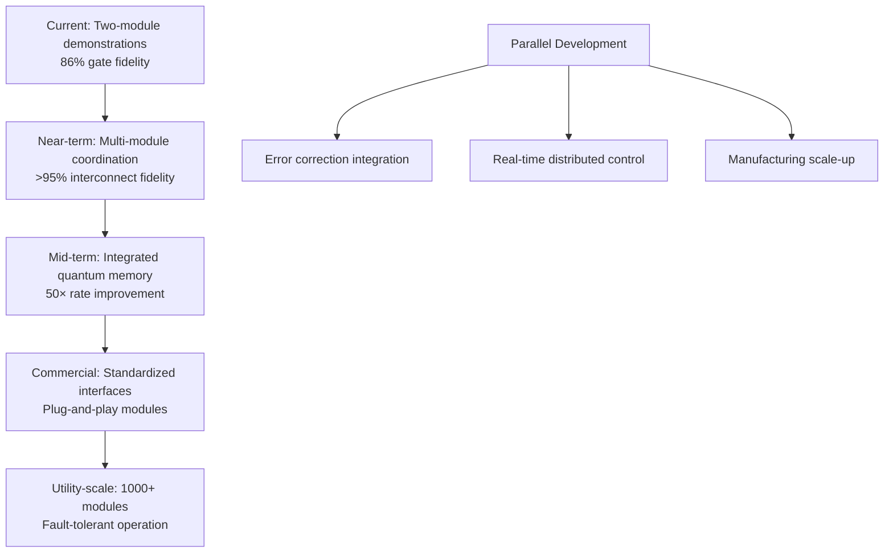

**Feasibility Assessment**

The convergence of demonstrated capabilities, industry investment, and technological progress supports cautious optimism for achieving utility-scale modular trapped-ion quantum computers within the projected 2028-2030 timeframe. Key supporting evidence includes:

- **Demonstrated distributed algorithms**: Grover's search across modules validates the fundamental approach
- **Achieved interconnect fidelities**: 97% ion-ion entanglement with clear path to >99.9%
- **Quantum memory advancement**: 50× rate improvement addresses probabilistic entanglement challenge
- **Industry commitment**: Major players (IonQ, Quantinuum) have aligned roadmaps around modular scaling
- **Cross-platform validation**: Similar modular approaches succeeding in photonic and superconducting systems

The primary remaining uncertainties concern the pace of interconnect fidelity improvement and the engineering challenges of coordinating many modules simultaneously. However, these represent engineering challenges amenable to systematic solution rather than fundamental physics barriers. The modular approach to scaling trapped-ion quantum computing appears well-positioned to achieve utility-scale systems capable of fault-tolerant operation, provided continued investment in interconnect technology and manufacturing infrastructure.

## 5 Advanced Trap Geometries and Multi-Wafer Designs

This chapter investigates how innovations in trap electrode geometry can overcome the fundamental limitations of standard surface-electrode traps that constrain scaling to utility-scale trapped-ion quantum processors. Building upon the QCCD architecture principles and integrated photonics capabilities established in previous chapters, the analysis systematically compares three trap architectures—standard surface traps, grounded-surface (gnd-surface) traps, and cross-rf traps—across critical figures of merit that determine scalability. The chapter evaluates fabrication approaches for multi-wafer designs, assesses their potential to enable higher gate speeds and lower error rates, and identifies the path toward trap geometries capable of supporting millions of qubits.

### 5.1 Limitations of Standard Surface-Electrode Traps for Large-Scale Systems

The emergence of surface-electrode ion traps represented a significant breakthrough for trapped-ion quantum computing, enabling the transition from bulky three-dimensional electrode structures to planar designs compatible with microfabrication techniques. As established in Chapter 2, surface-electrode traps form the foundation of QCCD architectures, with all electrodes positioned on a single plane and ions trapped above the surface. However, while these two-dimensional geometries offer substantial advantages for scalability and integration, they suffer from **fundamental physical limitations** that become increasingly problematic as systems scale toward utility-scale quantum computing with millions of qubits.

**The Fundamental Constraints of 2D Trap Geometry**

The physical origin of surface trap limitations lies in the asymmetric electrode configuration. Unlike traditional three-dimensional Paul traps where electrodes symmetrically surround the trapping region, surface traps confine ions using electrodes positioned entirely below the ion location. This geometric asymmetry leads to several interconnected performance degradations that compound as systems scale.

**Purely 2D surface traps lack the necessary field properties for large-scale quantum technologies due to their shallow trap depth and low harmonicity**[^68]. These deficiencies arise because the electric field profile generated by planar electrodes cannot achieve the symmetric, harmonic confinement that three-dimensional electrode geometries naturally provide. The consequences propagate through multiple performance metrics critical for quantum computation:

| Performance Metric | Surface Trap Limitation | Impact on Scaling |
|-------------------|------------------------|-------------------|
| **Trap Depth** | 30-200× shallower than 3D traps | Increased ion loss from background gas collisions |
| **Harmonicity** | Low k values (~0.21) | Unstable trapping, mode coupling, reduced gate fidelity |
| **Radial Confinement** | Weak vertical confinement | Lower achievable trap frequencies |
| **Power Dissipation** | High voltage/frequency requirements | Thermal management challenges at scale |

**Trap Depth and Ion Loss Susceptibility**

Trap depth represents the maximum kinetic energy an ion can acquire before escaping confinement—a critical parameter for system reliability. In surface traps, the trap depth is generally **30 to 200 times smaller** than that of a standard quadrupole trap[^68]. This shallow confinement has profound implications for large-scale systems where thousands or millions of ions must be maintained reliably over extended computation times.

The shallow trap depth increases susceptibility to ion loss due to collisions with background gas molecules. Even in ultra-high vacuum conditions (~10⁻¹¹ Torr), collisions occur with sufficient frequency that ion loss becomes statistically significant over long computation times. For utility-scale systems requiring continuous operation over days or weeks, this loss mechanism represents a fundamental reliability constraint that shallow surface traps cannot adequately address.

Quantitative analysis reveals the severity of this limitation. Surface traps achieve trap depths of approximately **2.033 eV** under typical operating conditions, while multi-wafer designs can achieve depths exceeding **16 eV**—an improvement factor of more than eight[^68]. This dramatic difference directly translates to improved ion retention and system reliability.

**Harmonicity and Stable Trapping Constraints**

Harmonicity, denoted by the parameter k, measures how closely the trapping field resembles an ideal harmonic potential. This figure of merit critically influences multiple aspects of quantum gate performance. A deviation from a perfectly harmonic trapping potential can cause **unwanted coupling between modes, lower the achievable trap frequency for a given applied voltage, and reduce the parameter region providing stable trapping**[^68].

For surface traps, the harmonicity parameter is typically limited to k ≈ 0.21, compared to k ≈ 0.70-0.77 achievable in symmetric 3D geometries[^69]. This low harmonicity forces surface traps to operate at reduced instability parameters (q ≲ 0.3) to maintain stable trapping[^68]. The instability parameter q relates the applied RF voltage, trap geometry, and ion mass through the relationship:

$$q = \frac{2eV_{rf}k}{m\Omega_{rf}^2 r_0^2}$$

The constraint to low q values has cascading effects: achieving target trap frequencies requires **dramatically higher RF voltages and drive frequencies**, which in turn leads to excessive power dissipation. This represents a fundamental bottleneck for scaling, as power management becomes increasingly challenging with larger systems.

**The Field-Dependent Figures of Merit Framework**

To systematically evaluate trap geometries for scalability, researchers have established a framework based on **field-dependent figures of merit**: harmonicity of the trapping potential, radial trapping frequency, and trap depth[^68]. These parameters collectively determine the achievable gate speed, error rates, and power dissipation—all critical factors for utility-scale quantum computing.

The radial oscillation frequency is given by:

$$\omega_{rad} = \frac{V_{rf}ke}{\sqrt{2}m\Omega_{rf}r_0^2} = \frac{q\Omega_{rf}}{2\sqrt{2}}$$

Both k (harmonicity) and r₀ (distance from the ion to the closest electrode's surface) depend on the trap geometry[^68]. The secular frequency of an ion sets the speed limit for entangling gates, making this parameter directly relevant to computational throughput. For surface traps, achieving high trap frequencies requires compensating for low harmonicity with increased voltage and drive frequency, creating an unfavorable power scaling relationship.

**Enhanced Sensitivity to Stray Electric Fields**

Beyond the primary figures of merit, surface traps exhibit **enhanced sensitivity to stray electric field fluctuations** compared to three-dimensional geometries[^28]. This sensitivity arises from the asymmetric electrode configuration and the relatively large ion-electrode distances required to achieve adequate trap depths.

Stray electric fields originate from multiple sources including charge accumulation on dielectric surfaces, patch potentials on electrode surfaces, and external electromagnetic interference. In surface traps, these perturbations cause ion position shifts that degrade gate fidelity and can induce motional heating. The problem is particularly acute near junction regions in QCCD architectures, where the electric field profile becomes highly intricate[^28].

**Implications for Utility-Scale Systems**

The cumulative effect of these limitations makes purely 2D surface traps fundamentally inadequate for utility-scale quantum computing. Moving to 3D geometries is essential to achieve **higher radial confinement, better harmonicity, and lower power dissipation**[^68]. This recognition has driven intensive research into multi-wafer trap architectures that preserve the fabrication advantages of surface-electrode technology while recovering the superior field properties of three-dimensional confinement.

The path forward requires trap designs that combine the scalability and integrability of microfabricated approaches with the performance characteristics of symmetric 3D geometries. The following sections examine how multi-wafer architectures and advanced fabrication techniques address these fundamental limitations.

### 5.2 Multi-Wafer Trap Architectures: Design Principles and Performance Analysis

The recognition that purely 2D surface traps cannot support utility-scale quantum computing has motivated the development of **multi-wafer trap architectures** that introduce three-dimensional electrode structures while maintaining compatibility with microfabrication processes. This section provides a comprehensive comparative analysis of three trap geometries that represent the current state of the art and near-term development paths for scalable trapped-ion systems.

**Overview of Multi-Wafer Design Approaches**

Multi-wafer designs combine the benefits of 3D geometries with ease of fabrication by stacking multiple patterned wafers to create more symmetric electrode configurations[^68]. The two principal multi-wafer architectures under investigation are:

**Grounded-Surface (gnd-surface) Trap**: This design enhances a standard surface trap by adding a grounded plane above the surface electrodes, providing more vertical confinement[^68]. The grounded top wafer creates a more symmetric field distribution without requiring complex patterning of the upper layer.

**Cross-RF Trap**: This architecture employs two stacked identical patterned wafers with cross-alignment of RF and DC electrodes, effectively creating a miniaturized version of the standard 3D Paul trap[^68]. The symmetric geometry achieves field properties approaching those of macroscopic quadrupole traps.

The following table summarizes the key characteristics of each architecture:

| Architecture | Electrode Configuration | Symmetry | Fabrication Complexity |
|-------------|------------------------|----------|----------------------|
| **Surface Trap** | All electrodes on single plane | Highly asymmetric | Lowest |
| **Gnd-Surface Trap** | Surface electrodes + grounded top plane | Partially symmetric | Moderate |
| **Cross-RF Trap** | Two cross-aligned patterned wafers | Highly symmetric | Highest |

**Harmonicity Analysis Across Geometries**

Harmonicity represents perhaps the most consequential differentiator between trap architectures. The cross-rf trap demonstrates a **strong linear correlation while maintaining a high harmonicity across varying wafer separation** (h), owing to its symmetric geometry[^68]. At a wafer separation of h = 120 µm, the cross-rf trap achieves harmonicity k ≈ 0.765, compared to k ≈ 0.280 for the gnd-surface trap and k ≈ 0.210 for the standard surface trap[^69].

The gnd-surface trap exhibits a **modest increase in harmonicity over the surface trap but suffers a steep decline for h < 100 µm**[^68]. This behavior occurs because when the ground plane separation becomes less than the RF electrode separation, the trapping field becomes distorted. A sufficiently large wafer separation is therefore needed to maintain high harmonicity in gnd-surface designs.

The relationship between harmonicity and the operating instability parameter q is critical for understanding performance differences. High harmonicity enables operation at much higher q values—the cross-rf trap can operate stably at **q ≈ 0.92**, whereas surface traps are typically limited to **q ≲ 0.3**[^68]. This capability fundamentally changes the voltage and frequency requirements for achieving target trap frequencies.

**Trap Depth Comparison**

Both multi-wafer traps exhibit **increasing trap depth with decreasing wafer height**[^68]. At h = 120 µm, the comparative trap depths are:

| Trap Type | Trap Depth (eV) | Relative to Surface Trap |
|-----------|----------------|-------------------------|
| **Surface Trap** | 2.033 | 1.0× (baseline) |
| **Gnd-Surface Trap** | 3.417 | 1.7× |
| **Cross-RF Trap** | 16.555 | 8.1× |

The cross-rf trap achieves **significantly greater trap depth** than either alternative[^68], providing dramatically improved ion retention and reduced susceptibility to loss from background gas collisions. This improvement is particularly important for large-scale systems where even small ion loss rates compound over extended operation times.

**Radial Trap Frequency and Voltage Requirements**

The practical implications of these geometric differences become most apparent when comparing the requirements to achieve a target radial trap frequency. For a target of **ω_rad/2π = 25 MHz**, the required drive parameters differ dramatically[^68]:

| Parameter | Surface Trap | Gnd-Surface Trap | Cross-RF Trap |
|-----------|-------------|------------------|---------------|
| **V_rf** | 6.306 kV | 0.854 kV | 0.258 kV |
| **Ω_rf/2π** | 282.843 MHz | 201.314 MHz | 76.629 MHz |
| **Operating q** | 0.25 | 0.291 | 0.92 |

The cross-rf trap requires **24× lower voltage** and **3.7× lower drive frequency** than the surface trap to achieve the same trap frequency. This dramatic reduction stems from the combination of higher harmonicity (enabling higher q operation) and improved geometric efficiency in converting applied voltage to ion confinement.

For a more modest target of **ω_rad/2π = 10 MHz**, the differences remain substantial[^69]:

- Surface trap: V_rf = 15 kV, Ω_rf/2π = 110 MHz
- Gnd-surface trap: V_rf = 4.0 kV, Ω_rf/2π = 85 MHz
- Cross-rf trap: V_rf = 0.42 kV, Ω_rf/2π = 31 MHz

**Power Dissipation Scaling**

Power dissipation from the RF trace scales with the amplitude and frequency of the RF drive according to **P ∝ V_rf² Ω_rf²**[^68]. This scaling relationship means that the voltage and frequency reductions achieved by multi-wafer designs translate to enormous power savings.

Compared to the surface trap configured for ω_rad/2π = 25 MHz[^68]:

- The **cross-rf trap** achieves approximately **10⁻⁴ reduction** in power dissipation (four orders of magnitude)
- The **gnd-surface trap** achieves approximately **10⁻² reduction** (two orders of magnitude)

For large-scale trapped-ion systems, it is necessary to consider the overall power dissipation, especially for systems working at cryogenic temperatures[^68]. The dramatic power reduction offered by multi-wafer designs directly addresses one of the most challenging engineering constraints for scaling to millions of qubits.

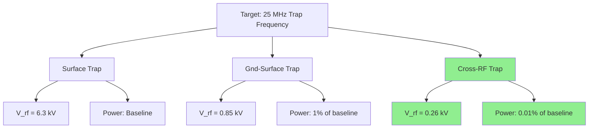

**Ion Height and Geometric Scaling**

The relationship between wafer separation and ion position differs between architectures. For the cross-rf trap, the ion height scales simply as **d = h/2**, where h is the wafer separation[^68]. For the gnd-surface trap with h > 100 µm, d has a linear relationship with h, but for h < 100 µm, the ground plane separation becomes less than the RF electrode separation, leading to distortion of the trapping field[^68].

This geometric relationship has important implications for trap miniaturization. The cross-rf trap's symmetric geometry allows straightforward scaling to smaller dimensions, while the gnd-surface trap requires careful attention to the relationship between wafer separation and electrode geometry to maintain optimal field properties.

**Performance Summary and Trade-offs**

The comprehensive analysis reveals a clear performance hierarchy among the three architectures:

| Figure of Merit | Surface Trap | Gnd-Surface Trap | Cross-RF Trap |
|-----------------|-------------|------------------|---------------|
| **Harmonicity (k)** | 0.21 | 0.28 | 0.70-0.77 |
| **Maximum q** | ~0.3 | ~0.3 | ~0.92 |
| **Trap Depth** | Baseline | 1.7× | 8× |
| **Power (same ω_rad)** | Baseline | 1% | 0.01% |
| **Fabrication** | Simplest | Moderate | Most complex |

The cross-rf trap offers **superior field-dependent performance for scalability**, with power consumption decades lower than the other configurations[^68]. However, the fabrication of the cross-rf trap remains a challenge due to its complexity[^68]. The gnd-surface trap presents a **promising balance between improved confinement and manufacturability**, improving upon the standard surface trap in all reported parameters while being comparatively easier to fabricate than the symmetrical cross-rf design[^68].

### 5.3 Heating Rate Reduction and Gate Fidelity Improvements

Anomalous heating of trapped ions represents one of the most significant barriers to achieving the gate fidelities required for fault-tolerant quantum computing. This phenomenon, characterized by unexpected increases in ion motional energy, directly degrades gate performance and becomes increasingly problematic as trap dimensions shrink. Understanding how advanced trap geometries address anomalous heating is essential for evaluating their potential to enable utility-scale quantum computing.

**The Anomalous Heating Challenge**

Motional heating is caused by **fluctuating electric fields at the secular frequency of the ion motion**, originating from voltage fluctuations on the ion trap electrodes[^70]. While Johnson noise from the finite impedance of the electrodes would imply a 1/d² scaling of the heating rate (where d is the ion-electrode distance), experiments observe a much larger heating rate, termed **"anomalous heating"**, which loosely implies a 1/d⁴ dependence[^70].

The motional heating rate for secular motion can be expressed as:

$$\dot{n} = \frac{q^2}{4m\hbar\omega_m}S_E(\omega_m)$$

where ω_m is the secular frequency and S_E(ω) is the power spectrum of the electric field noise[^70]. An experiment measuring the heating rate of an ion trapped between two needle electrodes established an experimental scaling law of **ṅ ∝ 1/d^(3.5±0.1)**[^70].

**Impact on Quantum Gate Operations**

The consequences of anomalous heating for quantum computation are severe. A limiting factor in producing smaller ion traps is motional heating of trapped ions, which becomes more important when scaling down to very small ion-electrode distances[^70]. If the motional heating rate is of similar magnitude as the photon scattering rate, laser cooling is no longer possible. For high-fidelity quantum gates, **motional heating should be negligible on the time scale of the quantum gate**[^70].

For most applications, the ion-electrode distance should be chosen so the expected motional heating rate is well below the photon scattering rate for laser cooling[^70]. This constraint creates tension with the desire to miniaturize traps for improved integration and faster gate speeds.

**Heating Rate Improvements in Multi-Wafer Designs**

The expected heating rate generally fits the trend **ṅ ∝ ω⁻² r₀⁻⁴**[^68]. With all other factors kept equal, the cross-rf trap would experience **nearly an order of magnitude lower heating rate** than the other two designs[^68]. The gnd-surface trap can achieve approximately **half the heating rate** of the surface trap under identical drive conditions[^68].

This improvement arises from multiple factors in multi-wafer geometries:

1. **Larger ion-electrode distances**: The symmetric 3D geometry allows ions to be positioned further from electrode surfaces while maintaining strong confinement
2. **Higher trap frequencies**: Reduced heating rate at higher ω_rad partially compensates for miniaturization effects
3. **Improved field uniformity**: More harmonic potentials reduce coupling to heating mechanisms

**Temperature Dependence and Cryogenic Operation**

Experiments show that anomalous heating is thermally activated. **Cooling an ion trap from 300 K to 150 K reduced heating by an order of magnitude**, and measurements at temperatures as low as 7 K showed a multiple-order-of-magnitude reduction[^70]. The spectral noise density for one trap scaled as:

$$S_E(T) = 4.2 \times 10^{-15}\left(1 + \left(\frac{T}{46\text{ K}}\right)^{4.1}\right) \text{ V}^2\text{m}^{-2}\text{Hz}^{-1}$$

This strong temperature dependence suggests that the patches causing anomalous heating are thermally activated[^70]. Superconducting ion traps (niobium, niobium nitride) showed no significant change in heating rate above and below the critical temperature, and heating rates for gold and silver electrodes at 6 K showed no significant difference from superconducting electrodes[^70]. This suggests anomalous heating is mainly caused by **noise sources on the surfaces**, although the exact cause is not fully understood and may also involve material bulk properties or oxide layers.

**Electrode Surface Treatment Effects**

Electric-field noise from ion-trap electrode surfaces limits the fidelity of multiqubit operations. The noise amplitude can be reduced by **ion milling the electrode surfaces**[^71]. Research investigating the temperature dependence of this noise before and after ex situ ion milling (ESIM) revealed important insights about the underlying mechanisms.

A marked change in the temperature scaling of the electric-field noise was observed after ion milling: **power-law behavior in untreated surfaces was transformed to Arrhenius behavior after treatment**[^71]. The temperature scaling also became material-dependent after treatment, strongly suggesting different noise mechanisms are at work before and after ion milling.

| Condition | Gold Electrodes | Niobium Electrodes |
|-----------|----------------|-------------------|
| **Pre-ESIM (295K)** | Baseline | Similar to gold |
| **Post-ESIM (295K)** | ~10× reduction | ~10× reduction |
| **Post-ESIM (4K)** | Higher than pre-ESIM | Lower than pre-ESIM |

For traps operated at room temperature, ESIM provides approximately a **factor of 10 reduction in heating rates** for both gold and niobium[^71]. However, for traps operated at low temperatures, ESIM is useful for niobium but **counterproductive for gold**[^71]. The emergence of material dependence after ESIM indicates that electrode material choice is important for noise mitigation.

**Implications for Material Selection**

The frequency and distance scaling of the noise were also measured for niobium traps at room temperature before and after ESIM. Neither the frequency scaling (approximately **1/f^2.4**) nor the distance scaling (approximately **1/d^4.0**) was significantly changed by ion milling[^71]. This observation rules out known models for anomalous ion heating in their current forms.

These observations have practical implications for trap design:

- **Room-temperature operation**: Either gold or niobium electrodes benefit from ion milling treatment
- **Cryogenic operation**: Niobium electrodes with ion milling provide optimal performance
- **Material exploration**: The emergence of material dependence after ESIM suggests that exploration of different electrode materials could lead to better understanding of the noise mechanism and further reduction of heating rates[^71]

**Gate Fidelity Implications**

The combination of improved trap geometry and optimized electrode treatment directly translates to improved gate fidelity. Lower heating rates allow:

1. **Longer coherent gate sequences** before motional heating degrades fidelity
2. **Reduced cooling overhead** between gate operations
3. **Smaller error correction overhead** due to lower physical error rates

While anomalous heating limits the creation of extremely small ion traps, it does not prevent the use of slightly larger microfabricated ion traps. **Mitigating it will help increase experimental fidelities and allow for the use of smaller traps**[^70]. The multi-wafer architectures described in Section 5.2, combined with appropriate electrode materials and surface treatments, provide a path toward the heating rates required for fault-tolerant quantum computing.

### 5.4 Fabrication Methods and Manufacturing Scalability

The superior performance of multi-wafer trap architectures must be weighed against the increased fabrication complexity they require. This section evaluates the manufacturing approaches available for realizing advanced trap geometries, assessing their precision, scalability, and compatibility with the integration requirements of utility-scale quantum computing systems.

**Surface-Electrode Trap Fabrication Baseline**

Surface-electrode ion traps can be fabricated using **traditional clean-room microfabrication techniques**[^68]. These processes leverage decades of semiconductor industry development, providing mature, high-yield manufacturing pathways. The fabrication methodology using micro-electro-mechanical system (MEMS) technology has been designed considering several key aspects for ion trap performance[^72].

Key fabrication considerations for surface traps include:

**Dielectric Layer Thickness**: The dielectric layer between the electrode layer and the ground layer must be sufficiently thick (generally over 10 µm) to prevent electrical breakdown[^72]. Controlling the residual stress during the deposition of this thick dielectric layer is a key technique, as stress can cause bowing of the substrate or damage the films.

**Dielectric Exposure Minimization**: The exposure of dielectric surfaces to the ion position should be minimized because stray charges can be induced on the dielectric material by scattered ultraviolet lasers, leading to random ion position shifts[^72]. This exposed area can be reduced by designing electrode overhang structures.

**Vacuum Compatibility**: All materials, including various deposited films, must withstand 200°C baking for approximately 2 weeks, and their outgassing must be compatible with ultra-high vacuum (UHV) environments[^72].

A detailed fabrication protocol demonstrates the complexity involved:

1. Silicon wafer cleaning and thermal oxidation (0.5 µm SiO₂)
2. LPCVD Si₃N₄ deposition (0.2 µm) for oxide protection
3. Al/Cu (1%) ground plane sputtering (1.5 µm)
4. PECVD SiO₂ deposition (14 µm total, in multiple steps to manage stress)
5. Via-hole patterning and electrode layer deposition
6. RIE and ICP etching for electrode and oxide pillar patterning
7. DRIE backside etching and electrode overhang fabrication

Experimental setups using such chips have been **reliably operated for 50 months**, demonstrating the trapping of ¹⁷⁴Yb⁺ ions which can last for more than 24 hours with continuous Doppler cooling[^72].

**Multi-Wafer Fabrication Challenges**

Multi-wafer traps are more complicated to construct as they require **precise alignment between layers**[^68]. The transition from single-layer surface traps to multi-wafer architectures introduces several new fabrication challenges:

| Challenge | Impact | Mitigation Approaches |
|-----------|--------|----------------------|
| **Wafer alignment** | Misalignment degrades field symmetry | Precision alignment fixtures, active feedback |
| **Wafer separation control** | Affects all performance metrics | Spacer elements, bonding precision |
| **Electrical interconnects** | Complex routing between layers | Through-wafer vias, edge connections |
| **Optical access** | Must not obstruct laser delivery | Transparent materials, designed apertures |

**Manual Wafer Stacking**

The simplest approach to multi-wafer fabrication involves manual stacking of wafers, which suffers from **alignment errors on the order of tens of microns**[^68]. While adequate for proof-of-concept demonstrations, this precision is insufficient for production systems where consistent performance across many trap sites is required.

Manual stacking may be acceptable for gnd-surface traps where radial misalignment has minimal impact due to the large grounded top wafer[^68]. However, for cross-rf traps requiring precise electrode alignment, manual assembly cannot achieve the necessary tolerances.

**Cleanroom-Based MEMS Techniques**

Cleanroom-based MEMS techniques enable finer dimensional control for monolithic ion traps[^68]. These approaches leverage semiconductor fabrication infrastructure to achieve sub-micron precision in layer-to-layer alignment. However, the complexity increases substantially when multiple patterned wafers must be aligned and bonded.

**Femtosecond Laser-Etching of Fused Silica**

Femtosecond laser-etching of fused silica has emerged as a **promising alternative**, achieving angular and wafer separation errors of less than **0.05 degrees and 5 µm**, respectively, for a 2 cm × 2 cm chip[^68]. Lateral misalignment has been reported to remain below 2 µm[^68].

This technique, described in detail for segmented ion-trap fabrication using high precision stacked wafers[^73], offers high precision of both machining and alignment of adjacent wafers. As examples of designs taking advantage of this possibility, researchers have described traps for realizing two key elements of scaling trapped ion systems: cavity-QED interfaces between single ions and photons, and X-junctions allowing two-dimensional shuttling of ions.

**3D-Printed Micro-Structures**

Three-dimensionally printed micro ion traps offer a **promising solution** to the limitations of conventional surface-electrode traps[^28]. The 3D microstructures are fabricated using commercially available two-photon lithography (Nanoscribe) with a femtosecond laser of 780 nm wavelength, forming solid 3D structures on a pre-fabricated surface trap which are then coated with a thick Au or Al metal layer.

This technique enables the formation of **fully metal-coated, high-resolution, three-dimensional microstructures directly on the trap chip with sub-micron precision**[^28]. The approach is particularly attractive because it can enhance existing surface trap designs rather than requiring completely new fabrication processes.

**Comparative Assessment of Fabrication Approaches**

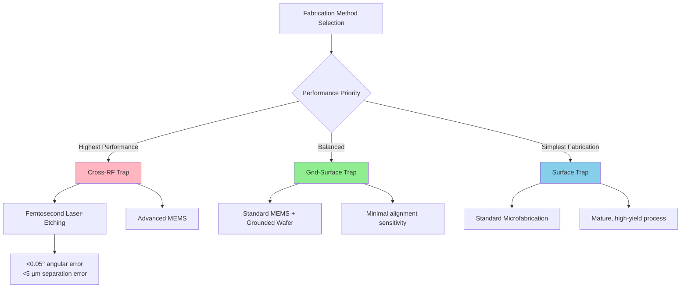

**Manufacturing Scalability Considerations**

For utility-scale systems requiring thousands to millions of trap sites, manufacturing scalability becomes paramount. The gnd-surface trap presents a **balance between improved confinement and manufacturability**, as adding a large ground plane to the structure is comparatively easier than fabricating a symmetrical design like the cross-rf trap[^68].

Key scalability factors include:

1. **Yield**: Simpler geometries with fewer alignment-critical features achieve higher yields
2. **Throughput**: Batch processing capability determines production capacity
3. **Cost**: Material and processing costs scale with geometric complexity
4. **Integration**: Compatibility with integrated photonics and control electronics

The fabrication of the cross-rf trap remains a challenge due to its complexity, **especially when implementing an array of traps on a chip**[^68]. For near-term deployment, the gnd-surface architecture offers a more practical pathway while still providing substantial performance improvements over standard surface traps.

### 5.5 Junction Design and Ion Transport in Advanced Geometries

Junction regions in QCCD architectures present some of the most demanding challenges for trap design, as ions must navigate complex electric field profiles while maintaining quantum coherence. This section examines how advanced trap geometries address the critical challenge of ion transport through junctions, a capability essential for scaling QCCD systems to utility-scale quantum computing.

**The Junction Transport Challenge**

Conventional surface-electrode traps suffer from weak and anharmonic confinement compared to macroscopic three-dimensional traps, resulting in reduced trap depth and enhanced sensitivity to stray electric field fluctuations. **These limitations are particularly severe near junctions**, where the electric field profile becomes highly intricate, inducing unwanted motional excitation during ion transportation[^28].

A crucial challenge at junctions is the **mismatch between the constant total confinement (CTC) path and the pseudopotential minimum path** in surface-electrode traps[^28]. This geometric mismatch results in a persistent pseudopotential barrier along the CTC path, causing motional excitation that degrades quantum coherence and limits gate fidelity after transport operations.

While ongoing efforts use stacked-wafer fabrication to mitigate these issues, these designs remain topologically similar to surface traps and offer limited improvements and scalability[^28]. More innovative approaches are required to achieve the transport fidelities needed for utility-scale QCCD systems.

**3D-Printed Micro-Junction Arrays**

The integration of three-dimensionally structured micro Radio-Frequency (RF) electrodes above a surface-electrode trap enables **flexible control of electric field profiles across both linear and junction regions**[^28]. This approach, implemented using two-photon lithography, achieves dramatic improvements in junction transport performance.

The 3D-printed micro X-junction design achieves **nearly perfect alignment between the pseudopotential minimum and the CTC paths**[^28]. This alignment fundamentally changes the transport dynamics:

| Performance Metric | Surface-Electrode Design | 3D-Printed Design | Improvement |
|-------------------|-------------------------|-------------------|-------------|
| **Total confinement at junction** | Reduced to 1/8 of linear region | Reduced to 1/2 of linear region | 4× better confinement |
| **Pseudopotential barrier** | Baseline | Reduced by ~10× | Order of magnitude |
| **Motional excitation per round-trip** | State-of-art baseline | 0.00019 quanta | ~100× reduction |

**Quantitative Transport Performance**

Analysis of motion heating along the trap axis arising from RF noise reveals exceptional performance for 3D-printed junctions. Using an axial secular frequency of ω_x/2π = 1.13 MHz and an RF noise level of -178 dBc, the maximum heating rate is below **16 quanta/s**[^28].

The total motional excitation accumulated over a single round trip along the CTC path, assuming a shuttling speed of v_x = 4 m/s, is **ṅ_tot = 0.00019 quanta per round-trip**[^28]. This value is **two orders of magnitude lower** than the minimum heating observed in state-of-the-art shuttling experiments. Such low excitation rates are essential for maintaining quantum coherence through the multiple junction transits required in large QCCD systems.

**Linear Region Performance Enhancement**

The benefits of 3D-printed structures extend beyond junction regions to linear trapping zones. In the linear trapping region, simulations demonstrate that for an RF amplitude of 190 V, the 3D-printed trap generates a potential minimum 82.3 µm above the surface, with a trap frequency of ω_z/2π = 2.32 MHz and a pseudopotential trap depth of 2.3 eV along the z-axis[^28].

This corresponds to a **17% increase in trap frequency** and a **31-fold enhancement in pseudopotential trap depth** compared to a conventional surface-electrode trap under identical RF voltage[^28]. The 3D-printed trap also exhibits reduced anharmonicity coefficients, offering improved frequency stability and miniaturizability.

**Multi-Species Transport Capabilities**

As discussed in Chapter 2, the ability to transport ions of different atomic species simultaneously through junctions is critical for systems using sympathetic cooling schemes. The improved field profiles achieved by 3D-printed junctions facilitate **high-fidelity transport of single- and multi-species ion crystals** essential for such cooling approaches.

The proposed architecture reduces excess motional excitation near junctions and delivers performance enhancements including improved harmonicity and deeper trapping potentials, **achieved without compromising scalability and compatibility with integrated photonics**[^28]. This compatibility is essential for the convergence of multiple scaling technologies required for utility-scale systems.

**Implications for QCCD Scalability**

The dramatic reduction in junction-induced heating directly impacts QCCD system performance:

1. **Reduced cooling overhead**: Lower motional excitation after transport reduces the time required for re-cooling before gate operations
2. **Higher circuit fidelity**: Maintained quantum coherence through transport enables deeper circuits
3. **Faster computation**: Reduced cooling requirements translate to improved computational throughput
4. **Scalable architecture**: Performance improvements maintain quality as junction count increases

For surface code implementation in QCCD architectures, where ions must traverse junctions repeatedly during error correction cycles, the ~100× reduction in transport-induced heating represents a transformative improvement. This capability brings the vision of utility-scale QCCD quantum computing substantially closer to practical realization.

### 5.6 Path to Utility-Scale Implementation and Technology Outlook

The preceding analysis has established that advanced trap geometries offer substantial performance advantages over standard surface-electrode traps across all critical figures of merit. This section synthesizes these findings to assess which approaches are most promising for achieving utility-scale trapped-ion quantum processors with millions of qubits, and how trap geometry innovations integrate with other scaling strategies.

**Comparative Assessment of Scaling Pathways**

The three trap architectures analyzed in this chapter represent distinct points along the performance-versus-fabrication-complexity trade-off curve. The cross-rf trap offers **superior field-dependent performance for scalability, with power consumption decades lower than the other configurations**[^68]. However, its fabrication remains a challenge due to complexity, especially when implementing arrays of traps on a chip.

The gnd-surface trap presents a **promising balance between improved confinement and manufacturability**[^68]. This design improves upon the standard surface trap in all reported parameters while being comparatively easier to fabricate than the symmetrical cross-rf design. For near-term development paths, the gnd-surface architecture offers a practical stepping stone toward more advanced geometries.

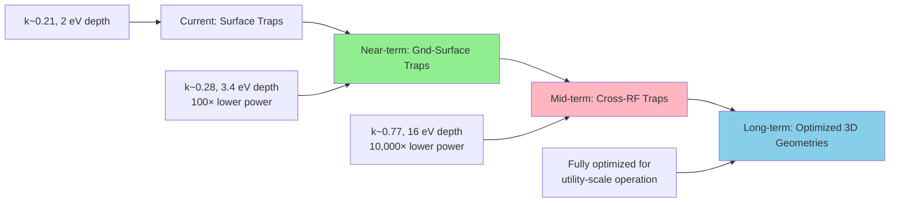

**Integration with QCCD Architectures**

The performance improvements offered by multi-wafer designs directly address several of the QCCD scaling challenges identified in Chapter 2:

**Power Management**: The two-to-four orders of magnitude reduction in power dissipation achieved by multi-wafer designs fundamentally changes the thermal management challenge for large QCCD systems. At 25 MHz trap frequency, the cross-rf trap requires only ~0.01% of the power consumed by an equivalent surface trap[^68].

**Transport Fidelity**: The 3D-printed micro-junction arrays achieve ~100× reduction in transport-induced heating compared to state-of-the-art surface-electrode designs[^28]. This improvement directly enables the high-fidelity shuttling operations essential for QCCD computation.

**Gate Speed**: Higher achievable trap frequencies in multi-wafer designs translate to faster entangling gates. The secular frequency of an ion sets the speed limit for entangling gates[^68], and the ability to achieve higher frequencies at lower power enables both faster computation and improved scalability.

**Integration with Integrated Photonics**

The trap geometry innovations described in this chapter are **compatible with integrated photonics** approaches discussed in Chapter 3[^28]. This compatibility is essential because utility-scale systems will require both advanced trap geometries and integrated optical control.

Key integration considerations include:

1. **Optical access**: Multi-wafer designs must accommodate laser delivery paths and photon collection
2. **Fabrication compatibility**: Photonic waveguide layers must integrate with multi-wafer electrode structures
3. **Thermal management**: Combined power dissipation from RF drive and optical components must remain manageable

The gnd-surface trap offers advantages for optical integration, as the grounded top wafer can potentially be fabricated from transparent materials or designed with optical apertures. Optical access solutions include using transparent ground planes or designing specific openings for laser delivery and fluorescence collection.

**Integration with Modular Architectures**

For the modular scaling approach analyzed in Chapter 4, trap geometry improvements enhance the performance of individual modules while photonic interconnects enable module networking. The combination offers a path to systems exceeding the capabilities of any single-module approach.

Multi-wafer designs within each module provide:
- Higher gate fidelities reducing error correction overhead
- Lower power consumption enabling denser module integration
- Improved transport fidelity for intra-module QCCD operations

Photonic interconnects between modules provide:
- Scalability beyond single-module qubit limits
- Fault isolation between modules
- Incremental capacity expansion

**Technology Readiness Assessment**

| Technology | Current TRL | Key Challenges | Timeline to Production |
|------------|-------------|----------------|----------------------|
| **Surface Traps** | 9 (Production) | Fundamental performance limits | Current |
| **Gnd-Surface Traps** | 5-6 (Demonstration) | Alignment precision, optical access | 2-3 years |
| **Cross-RF Traps** | 4-5 (Validation) | Fabrication complexity, array scaling | 4-6 years |
| **3D-Printed Junctions** | 3-4 (Proof of concept) | Manufacturing scalability | 5-7 years |

**Recommendations for Development Priority**

Based on the analysis presented in this chapter, the following development priorities are recommended:

**Near-term (2025-2027)**: Focus on gnd-surface trap development and demonstration. This architecture offers the best balance between performance improvement and fabrication feasibility, providing a practical path to improved QCCD systems while more advanced approaches mature.

**Mid-term (2027-2030)**: Advance cross-rf trap fabrication techniques, particularly femtosecond laser-etching of fused silica which has demonstrated the required precision. Develop manufacturing processes capable of producing arrays of cross-rf traps with consistent performance.

**Long-term (2030+)**: Integrate optimized 3D geometries with mature integrated photonics and modular interconnect technologies to realize utility-scale systems. The convergence of these technologies offers the most promising path to trapped-ion quantum computers with millions of qubits.

**Conclusion: The Essential Role of Trap Geometry Innovation**

Moving to 3D geometries is essential to achieve higher radial confinement, better harmonicity, and lower power dissipation[^68]. The analysis presented in this chapter demonstrates that trap geometry innovations are not optional enhancements but **essential enabling technologies** for utility-scale trapped-ion quantum computing.

The path forward requires continued investment in precision fabrication techniques, particularly femtosecond laser-etching and 3D printing approaches that can realize the superior field properties of symmetric electrode geometries. Combined with the QCCD architectures, integrated photonics, and modular interconnects discussed in previous chapters, advanced trap geometries form a critical component of the technology stack required to achieve fault-tolerant quantum computing with trapped ions.

Optimizing ion trap architectures will be essential for the realization of practical, large-scale quantum processors[^68]. The dramatic performance improvements demonstrated by multi-wafer designs—orders of magnitude reductions in power consumption, nearly order-of-magnitude reductions in heating rates, and two orders of magnitude reductions in transport-induced excitation—establish that this optimization is both achievable and transformative for the scaling trajectory of trapped-ion quantum computing.

## 6 Cryogenic Systems and Environmental Control Requirements

This chapter examines the critical role of cryogenic operation in enabling utility-scale trapped-ion quantum computing. Building upon the trap architectures and control systems discussed in previous chapters, the analysis investigates how cryogenic environments address fundamental scaling barriers including anomalous heating suppression, ultra-high vacuum achievement, and classical electronics integration. The chapter evaluates the thermodynamic constraints governing cryogenic system design, compares the power dissipation and cooling requirements between trapped-ion and superconducting platforms, and assesses engineering approaches for scaling cryogenic infrastructure to support thousands of qubits.

### 6.1 Physical Mechanisms and Benefits of Cryogenic Operation for Ion Traps

The transition from room-temperature to cryogenic operation represents a **transformative architectural decision** for trapped-ion quantum computing, addressing multiple fundamental limitations that constrain scaling to utility-scale systems. While trapped-ion systems can operate at room temperature—and indeed many current commercial systems do—cryogenic environments provide substantial advantages that become increasingly important as qubit counts grow toward the thousands required for fault-tolerant quantum computing.

**Suppression of Anomalous Heating Through Temperature Reduction**

The most compelling motivation for cryogenic operation is the **dramatic suppression of anomalous ion heating**, which as established in Chapter 5, represents one of the most significant barriers to achieving the gate fidelities required for fault-tolerant quantum computing. Anomalous heating is driven by fluctuating electric fields at the secular frequency of ion motion, originating primarily from thermally-activated noise sources on electrode surfaces.

The temperature dependence of anomalous heating has been extensively characterized through experiments spanning cryogenic to room-temperature regimes. Prior to ex situ ion milling (ESIM) treatment, **heating rates are reduced by a factor of approximately 100 when cooling from 295 K to 4 K**, and the scaling exponents are similar for both gold and niobium electrode materials[^74]. This order-of-magnitude reduction per factor of approximately 30 in temperature reflects the thermally-activated nature of the underlying noise mechanisms.

The physical origin of this temperature dependence involves multiple surface phenomena. Patch potentials caused by surface adsorption on electrodes comprise a major source of unexpected large heating rates[^75]. Surface adsorption of atoms and molecules, particularly atoms induced in the loading process, is maintained over time and generates strong electric stray fields that continuously change over extended periods, causing high heating rates[^75]. At cryogenic temperatures, these thermally-activated surface processes are substantially suppressed, with their activity effectively "frozen out."

**Cryo-Pumping and Ultra-High Vacuum Achievement**

Beyond heating rate reduction, cryogenic operation enables achievement of **extreme-high vacuum (XHV) conditions** through a mechanism known as cryo-pumping. Cooling the system to cryogenic temperatures transforms the inner surfaces of the vacuum chamber into effective getters that trap most residual background gases[^76]. This technique has led to the lowest levels of vacuum ever observed, with pressures below 5 × 10⁻¹⁷ Torr demonstrated in specialized systems[^76].

The practical implications for ion trap systems are substantial. In standard room-temperature ultra-high-vacuum (UHV) systems at pressures around 10⁻¹¹ Torr, experiments are limited to approximately **50 ions due to collisions with background gas that regularly destroy the ion crystal**[^76]. The background pressure achievable in UHV vacuum chambers is ultimately limited by degassing of the apparatus's inner surfaces[^76]. Cryogenic operation fundamentally changes this limitation by converting those same surfaces from gas sources into gas sinks.

A cryogenic trapped-ion system based on a segmented-blade ion trap enclosed in a 4 K cryostat has demonstrated the ability to **routinely trap and hold over 100 ¹⁷¹Yb⁺ ions for hours in a linear configuration** due to low background gas pressure achieved via differential cryo-pumping[^76]. This represents a dramatic improvement over room-temperature systems and enables the large ion chains required for meaningful quantum simulation and computation.

**Dual Benefits of Cryogenic Background Gas**

The advantages of cryogenic operation extend beyond simply reducing collision frequency. A key advantage of the cryogenic setup, besides lower residual gas density compared to UHV systems, is the **lower temperature of the residual background gas**[^76]. Consequently, ion-molecule collisions are less harmful to the ion chain even when they do occur.

The energy acquired by a ¹⁷¹Yb⁺ ion after an elastic collision with an H₂ molecule is estimated to be around **150 mK at cryogenic temperatures**, which is approximately **60 times lower than in a room temperature UHV system** where it would be approximately 10 K[^76]. This dramatic reduction in collision energy makes crystal melting far less likely, providing an additional margin of safety for maintaining large ion chains.

The following table summarizes the key benefits of cryogenic operation for trapped-ion systems:

| Benefit | Room Temperature | Cryogenic (4-70 K) | Improvement Factor |
|---------|-----------------|-------------------|-------------------|
| **Anomalous heating rate** | Baseline | ~100× reduction | 10²× |
| **Background pressure** | ~10⁻¹¹ Torr | <10⁻¹³ Torr | 10²× |
| **Collision energy (per event)** | ~10 K equivalent | ~150 mK equivalent | ~60× |
| **Maximum stable ion chain** | ~50 ions | >100 ions | >2× |
| **Ion chain lifetime** | Minutes | Hours | ~100× |

### 6.2 Cryogenic Vacuum System Design and Extreme-High Vacuum Achievement

The engineering of cryogenic vacuum systems for large-scale ion trapping requires careful attention to multiple interacting physical mechanisms. This section analyzes the design principles that enable achievement of the extreme-high vacuum conditions necessary for stable operation of large ion chains over extended computation times.

**Differential Cryo-Pumping Mechanisms**

The extreme-high vacuum (XHV) cryogenic environment in advanced trapped-ion systems is characterized by measuring pressures below 10⁻¹¹ Torr through analysis of both inelastic and elastic collisions between the ion chain and the molecular background gas[^76]. The dominant residual gas species in cryogenic systems is **molecular hydrogen (H₂)**, which is the least efficiently cryo-pumped gas due to its low boiling point[^76].

To address hydrogen pumping limitations, advanced systems incorporate additional pumping mechanisms. Before cooldown, the apparatus is pre-evacuated using a turbo-molecular pump until a pressure of about 2 × 10⁻⁸ Torr is reached. Since hydrogen is the least efficiently cryo-pumped gas, **SAES NexTorr D-100 getter and ion pumps are added** to provide continuous hydrogen pumping even at cryogenic temperatures[^76].

The differential aspect of cryo-pumping refers to the spatial variation in pumping effectiveness throughout the vacuum system. The cryogenic surfaces closest to the ion trapping region provide the most effective pumping, creating a pressure gradient that directs residual gas away from the ions. This differential pumping enables the achievement of local pressures substantially lower than the system average.

**Ion Crystals as Pressure Gauges**

A sophisticated technique for characterizing the extreme-high vacuum environment uses the **ion crystal itself as a pressure gauge**. The collision rate γ between ions and background gas (predominantly H₂) is independent of the incoming particle's energy in the Langevin model and is proportional to pressure[^76]:

$$\gamma = n \sqrt{\frac{\alpha e^2}{\pi\varepsilon_0 \mu}}$$

where n is the gas density, α is the molecular polarizability, and μ is the reduced mass of the ion-molecule system.

**Inelastic Collision Measurements**: The pressure is estimated by measuring the rate of inelastic collisions (γᵢₙ), which produce "dark ions" through collisional quenching or molecule association[^76]. By comparing the dark ion rate in the cryogenic system to a room temperature UHV system with a known gauge-measured pressure of 1×10⁻¹¹ Torr, the residual background pressure in the cryogenic system was inferred to be **P₄ₖ < 10⁻¹³ Torr**[^76].

**Elastic Collision Measurements**: The pressure is also measured via the rate of elastic collisions (γₑₗ) causing reconfiguration events in zig-zag ion chains. The flipping probability (p_flip) of the chain after a collision depends on the transverse mode splitting (Δωₜᵣ) and the energy of incoming particles[^76]. Based on numerical simulations and measurements at Δωₜᵣ = 2π × 2 kHz, pressures of **P = (1.1 ± 1) × 10⁻¹² Torr at T = 4.7 K** and **P = (2 ± 1) × 10⁻¹² Torr at T = 7 K** were measured[^76].

The temperature dependence of collision rates provides additional insight into vacuum quality. The inelastic collision rate (dark ion production rate) was measured as a function of cryostat temperature, indicating an **increase by an order of magnitude with a 5.5 K temperature rise**[^76]. This strong temperature dependence confirms the effectiveness of cryogenic operation for maintaining ultra-low background pressures.

**Impact on Large Ion Chain Stability**

The combination of reduced collision rates and reduced collision energies enables stable trapping of ion chains that would be impossible at room temperature. No catastrophic ion loss due to collisions has been observed in cryogenic vacuum systems, even for chains exceeding 100 ions[^76]. This is attributed to two factors: differential cryo-pumping reduces residual gas density, and even when collisions occur, the average energy transfer is substantially lower due to the colder background gas temperature[^76].

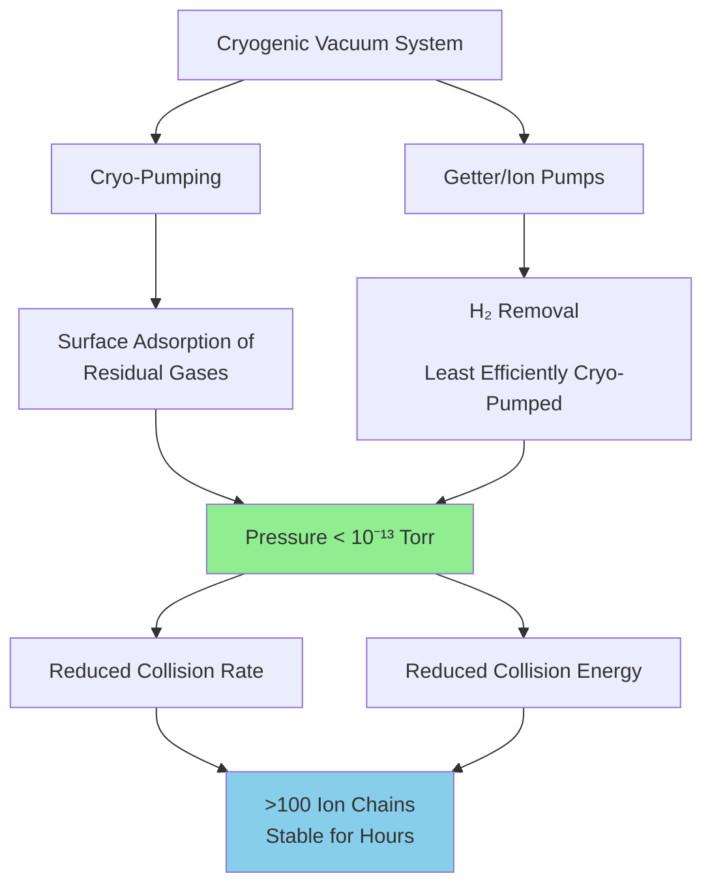

### 6.3 Thermal Management and Heat Load Analysis for Scalable Systems

Effective thermal management represents one of the most challenging engineering requirements for scaling cryogenic ion trap systems. As qubit counts increase, both active and passive heat loads grow, requiring careful design to maintain target operating temperatures within the cooling capacity of practical cryogenic systems.

**Active Heat Load Sources**

In each ion-trap experiment, **active heat loads arise from various sources** including RF losses within the substrate of the microchips, ohmic heating within microfabricated wires, and power dissipation from chip-integrated electronics[^77][^78]. These loads scale with system complexity and qubit count, creating fundamental constraints on system architecture.

**RF Electrode Losses**: The blade-style ion trap requires hundreds of volts in the radio-frequency range for ion confinement. Based on COMSOL simulations, an RF amplitude of V_rf = 480 V at Ω_rf = 2π × 24 MHz is required for a transverse trap frequency of ω_tr = 2π × 4 MHz[^76]. The power dissipated on the trap blades is estimated as:

$$P_d = \frac{1}{2} C_t V_{rf}^2 \Omega_{rf}^2 R_t \approx 1 \text{ mW}$$

where the trap capacitance C_t is 1.5 pF and R_t is the resistance of the 1 μm gold layer on the blade[^76]. While individual trap power dissipation is modest, scaling to thousands of traps requires careful attention to cumulative heat loads.

**Electrical Wiring Heat Load**: The heat load from electrical wiring is estimated to be relatively small (~100 μW), while the four unsunk SMA cables for the radio-frequency feedthrough deliver an estimated ~500 mW to the 40 K stage and ~220 mW to the 4 K stage[^76]. These conductive heat loads become increasingly significant as the number of electrical connections grows with system scale.

**Passive Heat Load Sources**

Passive heat loads result from both **thermal conduction and radiation**[^77]. To minimize passive thermal load, high-stability, low-thermal-conductivity support structures must be designed with large thermal resistance.

**Radiation Heat Loads**: The estimated radiation heat loads are approximately **5.5 W on the 40 K shield and approximately 550 μW on the 4 K shield**[^76]. These values assume appropriate radiation shielding between temperature stages. The apparatus must be designed to balance the heat load from room-temperature blackbody radiation against the need for high optical access[^76].

**Conductive Heat Loads**: A support structure designed for ion trap experiments achieved a total thermal resistance of **146 K/W between ion traps at 70 K and the room-temperature vacuum chamber**, leading to a conductive thermal leak of only 1.7 W[^77]. The heat load from thermal radiation is estimated to be 2.5 W[^77].

**Cooling Power Requirements and Capacity**

Practical cryogenic systems for ion traps typically employ closed-cycle Gifford-McMahon cryocoolers. The cooling power specifications for a representative system are **45 W at the 40 K stage and 1.5 W at the 4 K stage**[^76]. These cooling capacities must accommodate all heat loads while maintaining stable operating temperatures.

For systems designed to support multiple ion-trap experiments, substantially higher cooling power is required. A scalable cooling system has been developed that delivers a **total cooling power of 396 W at 80 K** using two single-stage Gifford-McMahon cryocooler cold heads[^77][^78]. This system is capable of providing cooling to four ion-trap experiments where one experiment has a high active heat load of 75 W and the remaining have a heat load of 12 W each[^77].

| Heat Load Category | Typical Value | Scaling Behavior |
|-------------------|---------------|------------------|
| **RF electrode dissipation** | ~1 mW per trap | Linear with trap count |
| **Electrical wiring** | ~100 μW - 700 mW | Sublinear with connections |
| **Radiation (40 K stage)** | ~5.5 W | Scales with surface area |
| **Radiation (4 K stage)** | ~550 μW | Scales with surface area |
| **Conduction** | ~1.7 W per experiment | Linear with support structures |
| **Total passive (4 experiments)** | ~180 W | Scales with system size |

**Heat Load Scaling Implications**

The total passive heat load was calculated to be **108 W when two experiments were connected in parallel**[^77]. When modeling four experiments connected in parallel with a total active heat load of 111 W (75 W for one experiment and 12 W each for the other three) and a total passive heat load of 180 W, the total heat load reaches **291 W**[^77]. Under this configuration, all four ion-trap experiments are projected to operate below 70 K[^77].

These thermal management requirements have profound implications for system architecture. At 70 K, a **reduction of the ion heating rate by approximately an order of magnitude is anticipated compared to room-temperature operation**[^77]. This temperature represents a practical compromise between the benefits of cryogenic operation and the engineering complexity of achieving lower temperatures.

### 6.4 Vibration Isolation and Mechanical Stability Requirements

The mechanical stability of cryogenic ion trap systems presents a critical engineering challenge that must be solved to achieve the gate fidelities required for fault-tolerant quantum computing. **Even very slight environmental noise, such as microscopic vibrations or magnetic field fluctuations a hundred times smaller than the Earth's magnetic field, can be catastrophic for quantum computing experiments with trapped ions**[^79].

**Sources of Mechanical Vibration**

Closed-cycle cryocoolers, while essential for practical long-term operation, generate significant acoustic vibrations through their compression and expansion cycles. The Gifford-McMahon cold head compression and expansion cycling produces large acoustic vibrations that couple to the experimental apparatus[^76]. These vibrations manifest at characteristic frequencies determined by the cryocooler design and can excite mechanical resonances throughout the system.

Measurements of vibration spectra reveal multiple problematic frequency components. Initial measurements showed significant vibrations, particularly a mode around **40 Hz attributed to the cryostat's structure** and higher-frequency modes (120 Hz and 282 Hz) from the internal apparatus[^76]. The dominant acoustic modes remaining after optimization are at **39 Hz and 45 Hz**, with vertical vibrations at the cold head frequency of 1.2 Hz[^76].

**Impact on Quantum Operations**

The goal of vibration isolation is to **reduce the laser amplitude and phase noise when addressing the ions, increasing operation fidelity**[^79]. Vibrations cause relative motion between the ion position and the laser beams used for quantum gates, introducing phase errors that degrade gate fidelity. For high-fidelity operations, vibration amplitudes must be suppressed to levels where the induced phase noise is negligible compared to other error sources.

The performance of quantum and precision measurement systems depends not only on electronic control, but also on the vibrational and thermal conditions at the cryogenic stage. **Cryogenic noise remains a limiting factor in scalable quantum architectures**[^80].

**Vibration Isolation System Designs**

Multiple approaches have been developed to achieve the required mechanical stability while maintaining adequate thermal coupling for heat removal:

**Exchange Gas Decoupling**: To minimize vibrations from the cryocooler, systems use closed-cycle Gifford-McMahon cryostats where the vibrating cold finger is mechanically decoupled from the main vacuum apparatus via an **exchange gas region filled with helium gas at a pressure of 1 psi above atmosphere**[^76]. The helium gas serves as a thermal link between the cold finger and the sample holder while providing mechanical isolation.

**Rubber Bellows Damping**: A rubber bellows serves as the only direct mechanical coupling between the vibrating cold head and the rest of the vacuum apparatus, acting as a vibration damper[^76]. This compliant coupling attenuates high-frequency vibrations while permitting the slow thermal equilibration required for cooling.

**Thermally-Insulating Support Posts**: The ion trap is mechanically referenced to a floating optical table via **short, thermally insulating Vespel and Macor support posts**[^81]. These ceramic and plastic materials separate the 4 K and 40 K stages of the chamber from the room-temperature portion of the test equipment[^79]. The posts provide mechanical isolation while limiting conductive heat transfer.

**Achieved Performance Levels**

Through careful engineering, vibration isolation systems have achieved impressive performance:

- **Root-mean-square (RMS) vibrations of the cold shield of 7.61(4) nm** when the cold head is powered on[^81]
- **RMS displacement below 70 nm** in the trap plane after optimization[^76]
- **40 nm peak-to-peak amplitude** for vertical vibrations at 1.2 Hz after improving breadboard support[^76]
- **Less than 10 nanometers of displacement** at the experimental sample space in advanced designs[^80]

The vibration isolation system (VIS) performance was characterized interferometrically. By strengthening the resonator's static support to make the 4 K structure stiffer, the **higher-frequency vibration modes were suppressed by more than an order of magnitude**[^76]. Operating the 4 K stage at 7.7 K, above helium's boiling point, further reduced the RMS vibration amplitudes in the trap plane by a factor of 5 to 6[^76].

**Verification of Quantum Operation Compatibility**

Critically, coherent one- and two-qubit operations have been demonstrated despite residual mechanical vibrations. An **entanglement fidelity of 83% was achieved for a Bell state**, certifying that the residual mechanical vibrations do not limit performance on typical experiment timescales[^76]. The measured coherence time is comparable to room-temperature UHV apparatuses, confirming that vibration isolation is adequate for quantum computing applications[^76].

### 6.5 Magnetic Shielding and Environmental Noise Suppression

Magnetic field fluctuations represent another critical source of decoherence that must be suppressed for high-fidelity quantum operations. The goal of magnetic field noise reduction is to **preserve the coherence of qubits for longer periods of time**[^79]. This section examines the shielding strategies and achieved performance levels that enable extended coherence in cryogenic trapped-ion systems.

**Sources and Impact of Magnetic Field Noise**

Magnetic-field-sensitive qubits experience decoherence when ambient magnetic field fluctuations cause uncontrolled phase evolution. Sources of magnetic field noise include building infrastructure (elevators, HVAC systems), laboratory equipment, and the Earth's magnetic field variations. The improved system uses magnetic shielding materials within the chamber to **keep out magnetic field noise from sources such as elevators**[^79].

**Multi-Layered Shielding Approaches**

Effective magnetic shielding requires multiple layers of high-permeability materials strategically positioned to attenuate external fields. The chamber features **multi-layered magnetic shielding installed inside the vacuum chamber**, including two room-temperature mu-metal layers and Cryo-Netic material lining the cold shield[^81].

Using simulations, researchers realized that installing magnetic shielding within the chamber itself could produce the desired shielding factor, which is **more compact than surrounding an entire room with mu-metal**[^79]. This approach enables high shielding factors while maintaining the compact form factor required for practical quantum computing systems.

COMSOL simulations predict shielding factors **greater than 10³ vertically and 10⁴ laterally**[^81]. These shielding factors are sufficient to reduce ambient magnetic field fluctuations to levels where they no longer limit qubit coherence.

**Demonstrated Coherence Improvements**

The efficacy of magnetic shielding is characterized by measuring the Ramsey coherence time of magnetic-field-sensitive ground-state qubits. The achieved results demonstrate dramatic improvements:

| Configuration | Coherence Time | Improvement |
|--------------|----------------|-------------|
| **Unshielded cryogenic system** | Baseline | — |
| **Shielded, no echo** | 24(2) ms | — |
| **Shielded, single spin-echo** | 0.25(1) s | 10× over no echo |
| **Shielded, XY4 dynamical decoupling** | 0.72(2) s | 30× over no echo |
| **Shielded, XY32 dynamical decoupling** | 0.81(3) s | 34× over no echo |

The coherence time without dynamical decoupling is **24(2) ms** and extends to **0.25(1) s with a single spin-echo pulse**[^81]. This represents **two orders of magnitude longer than in a similar unshielded cryogenic system**[^81].

**Integration with Dynamical Decoupling**

An **in-vacuum, critically coupled RF coil** is used to drive dynamical decoupling sequences that further extend coherence[^81]. Using this antenna, XY4 and XY32 dynamical decoupling sequences extend the qubit coherence time to **0.72(2) s and 0.81(3) s**, respectively[^81]. The coil achieves a π-time of 40 μs when driven with 2 W[^81].

In early testing using an RF coil to perform dynamical decoupling, researchers were able to **increase the ions' coherence time from 24(2) milliseconds to 810(30) milliseconds**[^79]. This nearly 34-fold improvement demonstrates the synergistic benefits of combining passive magnetic shielding with active coherence protection protocols.

**Design Considerations for Large-Scale Systems**

A current limitation is a magnetic field gradient of approximately 35 mT/m, which prevents performing global dynamical decoupling pulses simultaneously at disparate trap locations[^81]. Addressing this limitation for large-scale systems requires either improved field uniformity within the shielded volume or zone-specific decoupling protocols.

### 6.6 Comparison of Cooling Requirements: Ion Traps versus Superconducting Platforms

The choice of operating temperature fundamentally impacts the engineering complexity, power consumption, and scalability of quantum computing systems. This section provides a systematic comparison of the cryogenic requirements between trapped-ion and superconducting platforms, revealing significant advantages for ion trap systems in terms of cooling infrastructure.

**Fundamental Temperature Requirements**

The operating temperatures for different qubit technologies are determined by the underlying physics of each platform. **Superconducting qubits operate between 10-20 mK**, while **trapped-ion qubits operate at around 4 K**[^82]. This difference of more than two orders of magnitude in operating temperature has profound implications for system design and scalability.

Superconducting qubits rely on superconductors that conduct electricity without resistance when cooled to extremely low temperatures using dilution refrigerators[^83]. The need for near-absolute-zero temperatures requires advanced and costly cooling systems, making the infrastructure for superconducting qubits complex[^83]. In contrast, **ion traps can operate at less extreme conditions**, making them more accessible in terms of hardware requirements compared to the expensive and complex infrastructure needed to maintain ultra-low temperatures for superconducting qubits[^83].

**Thermodynamic Efficiency Considerations**

The minimum cost of moving heat out of a cryogenic chamber is governed by the Carnot efficiency[^82]:

$$W = Q \cdot \frac{T_o - T_c}{T_c}$$

where W is the work required, Q is the heat to be removed, T_o is the ambient temperature, and T_c is the cold temperature. This relationship means that cooling to lower temperatures requires exponentially more work per unit of heat removed.

For a system at T_c = 15 mK (superconducting), the Carnot efficiency factor (T_o - T_c)/T_c ≈ 20,000, meaning that removing 1 μW of heat theoretically requires at least 20 mW of work. For a system at T_c = 4 K (trapped ion), this factor is approximately 75, requiring only 75 μW of work per μW of heat removed. This **nearly 300× difference in thermodynamic efficiency** fundamentally shapes the engineering challenges of each platform.

**Available Cooling Power**

Trapped-ion systems operate at temperatures where **inexpensive cryocoolers can provide several watts of cooling power**, unlike superconducting qubits that operate at very low temperatures with limited cooling power (e.g., 100 μW)[^82]. This difference makes electronic integration **orders of magnitude easier** for trapped-ion systems.

| Platform | Operating Temperature | Typical Cooling Power | Cooling Technology |
|----------|----------------------|----------------------|-------------------|
| **Superconducting** | 10-20 mK | ~100 μW | Dilution refrigerator |
| **Trapped Ion (deep cryo)** | 4 K | ~1.5 W | Gifford-McMahon |
| **Trapped Ion (moderate cryo)** | 70-80 K | ~45-400 W | Gifford-McMahon |

The ratio of available cooling power between platforms is striking: trapped-ion systems at 4 K have access to approximately **15,000× more cooling power** than superconducting systems at 20 mK. At 70-80 K, this advantage grows to **450,000× or more**.

**Power Usage Efficiency Analysis**

Cooling dominates overall power usage in quantum computing systems, representing a **reversal from classical computing where cooling is 2-20% of power usage**[^82]. The power usage is sensitive to the computer architecture: more power dissipated in the cryostat, lower qubit temperatures, and physically larger systems all drive up power usage[^82].

The Power Usage Efficiency (PUE) for quantum computing systems can be expressed as[^82]:

$$PUE = 1 + \phi\left(1 + \beta n_p^{-1/3}\right)\frac{1}{\eta_c|_{COP}T_c} + \frac{(1-\phi)}{FCF_{T_o}}$$

where φ is the fraction of electronics power dissipated inside the cryostat, n_p is the number of physical qubits, η_c is the cryocooler efficiency, and β captures heat transfer effects.

Results for a trapped-ion system with φ = 0.001 and T_c = 4 K show **dramatically better power efficiency** compared to a superconducting system with φ = 0.001 and T_c = 15 mK[^82]. The difference becomes even more pronounced as the fraction of electronics inside the cryostat increases.

**Implications for System Scalability**

Energy use in quantum computing was identified by the International Energy Agency as a **"wild card" in predicting national and global energy use**[^82]. Because energy use is the dominant expense in data center operation, energy efficiency may limit quantum computing deployment[^82]. The substantially lower cooling requirements of trapped-ion systems provide a significant advantage for scaling to the thousands of qubits needed for practical quantum computing.

Currently, liquid helium and laser cooling are the only viable cooling technologies at quantum computing temperatures[^82]. The development of low-temperature, low-energy conventional electronics to support quantum computing is an extremely active research area, with trapped-ion systems benefiting from their higher operating temperatures that enable use of more conventional electronic components.

### 6.7 Scalable Cryogenic Infrastructure and Modular Cooling Architectures

Achieving utility-scale trapped-ion quantum computing requires cryogenic infrastructure capable of supporting thousands of qubits while maintaining the environmental conditions necessary for high-fidelity operations. This section examines modular cooling architectures that provide a scalable path from current laboratory systems to production-scale quantum computing facilities.

**Modular Cooling System Architecture**

A modular cooling system has been developed for use with multiple ion-trapping experiments simultaneously, including an extensible cryostat that permits scaling of the cooling power[^77][^78]. The architecture is based on a **closed-loop cryogenic helium gas circulation system**, separating the cryocooler from the ion-traps in a way which is in principle extensible to accommodate large numbers of both ion-trap elements and cryocooler cold heads[^77][^78].

The key innovation of this approach is the separation of cooling power generation from cooling power delivery. By using circulating helium gas as the heat transfer medium, multiple ion trap experiments can be cooled from a central cryogenic plant without each experiment requiring its own cryocooler. This separation provides several advantages:

1. **Vibration isolation**: Cryocoolers can be physically separated from ion traps
2. **Scalability**: Additional cooling capacity can be added by including more cryocooler heads
3. **Flexibility**: Individual experiments can be connected or disconnected independently
4. **Maintenance**: Cryocooler servicing does not require warming the entire system

**System Components and Specifications**

The constructed cooling system interfaces with four independent ion-trap experiments and consists of three sections[^77][^78]:

- **Main cryostat chamber**: Houses two single-stage Gifford-McMahon cryocooler cold heads and a centrifugal pump
- **Transfer line network**: Vacuum-jacketed helium transfer lines distribute cold gas to experiments
- **Cryogenic heat sinks**: Installed on each experiment to interface with the ion trap

The two cryocoolers deliver a **total cooling power of 396 W at 80 K**[^77][^78]. The system is pressurized to 20 bar, and the overall helium gas mass flow rate is controlled by adjusting the rotation speed of the cryofan impeller[^77][^78]. Each ion-trap experiment's local helium gas flow is regulated using two manual cryogenic valves.

**Demonstrated Performance**

The performance of the cooling system has been evaluated through extensive cryogenic testing:

**Base Temperature**: Under no active heat load, a steady-state base temperature of **31.6 K was reached at the experiment heat sink** when connected to a single ion-trap experiment[^77].

**Parallel Operation**: Tests with two experiments connected in parallel showed that connecting an additional experiment caused a transient temperature rise, but both experiments stabilized at approximately **34 K**[^76][^77].

**Active Heat Load Capacity**: The system maintained temperatures significantly under 100 K even with an **80 W applied heat load at one experiment while another was under a 40 W load**[^77].

**Projected Four-Experiment Performance**: A model of the cooling system performance for four experiments connected in parallel projects an average heat sink temperature of **70.5 K for an experiment with a 12 W load** and 79.0 K at the outlet (62.0 K at the inlet) for an experiment with a 75 W load[^77]. All four ion-trap experiments are projected to operate below 70 K on average[^77].

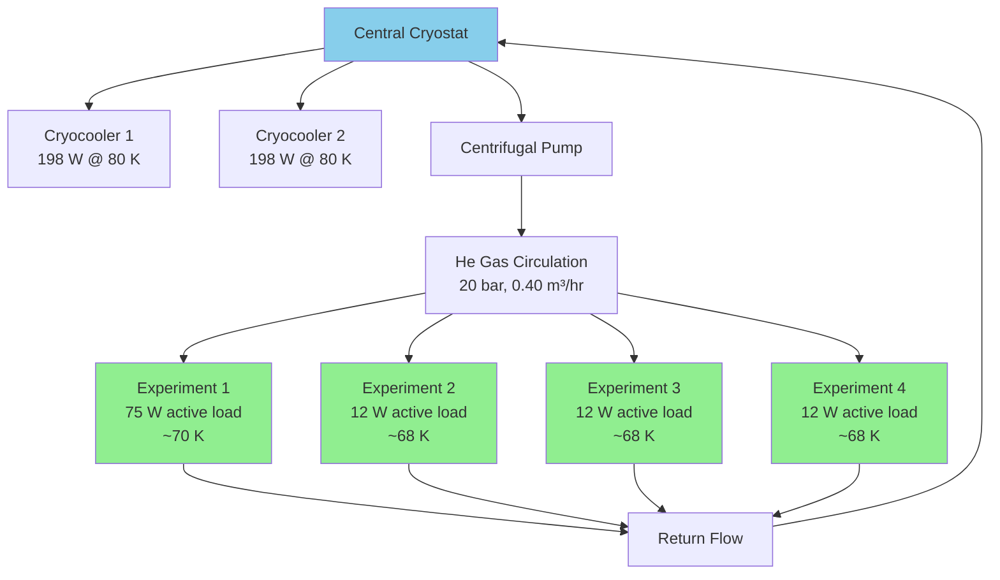

**Scalability to Utility-Scale Systems**

The demonstrated laboratory configuration is capable of providing **111 W of net cooling power at 70 K to up to four independent ion-trap experiments**[^77][^78]. This satisfies a key engineering requirement for scalable ion-trap quantum computing architectures[^77].

By using remote cryostats thermally coupled to the helium gas circulation system, the **physical size limitations of existing cryostat systems no longer constitute an obstacle** at the ion trap location[^78]. Cooling power can be delivered to ion-trap chips with limited footprint, allowing multiple chips to be arranged closely together on a surface[^78].

The modular architecture enables straightforward scaling: additional cryocooler heads can be added to the central plant, and additional experiments can be connected to the circulation network. This approach provides a clear path from current four-experiment demonstrations to production facilities supporting hundreds or thousands of trap modules.

### 6.8 Integration Challenges and Path to Utility-Scale Cryogenic Systems

The preceding sections have established the physical principles and engineering approaches for cryogenic trapped-ion systems. This section synthesizes the remaining integration challenges and assesses the technology readiness for achieving utility-scale cryogenic infrastructure supporting millions of qubits.

**Interplay of Environmental Control Requirements**

Achieving utility-scale cryogenic systems requires simultaneous optimization of multiple interacting requirements:

**Cooling vs. Vibration**: Delivering adequate cooling power while suppressing mechanical vibrations requires careful mechanical design. Recent designs are gaining popularity for **decoupling the challenge of cooling power from mechanical noise, allowing 100% thermal transfer with less than 10 nanometers of displacement** at the experimental sample space[^80].

**Shielding vs. Access**: Magnetic shielding must be implemented without compromising the optical and electrical access required for quantum operations. In-vacuum shielding approaches provide compact solutions but must accommodate laser delivery paths and fluorescence collection optics.

**Vacuum vs. Thermal Coupling**: Maintaining extreme-high vacuum while providing thermal coupling for heat removal requires careful material selection and interface design. The use of exchange gas regions and specialized thermal interface materials addresses this challenge.

**Electrode Surface Treatment Interactions**

Electrode surface treatments that reduce anomalous heating interact with cryogenic operation in complex ways. In situ plasma cleaning has demonstrated a **four-fold improvement in room-temperature heating rates** for niobium surface electrode traps[^84]. However, when the trap operates at cryogenic temperatures, **no improvement from plasma cleaning was observed**[^84].

This result suggests that thermally-activated surface contaminants play a significant role in anomalous heating, and their activity is frozen out at low temperatures regardless of surface treatment[^84]. The practical implication is that achieving the lowest possible heating rates may require combining cryogenic operation with appropriate surface treatments, with the optimal combination depending on the specific electrode materials used.

For traps operated at room temperature, ex situ ion milling (ESIM) provides approximately a **factor of 10 reduction in heating rates** for both gold and niobium[^74]. For traps operated at low temperatures, ESIM is useful for niobium but counterproductive for gold[^74]. The emergence of material dependence after ESIM suggests that **exploration of different electrode materials could lead to better understanding of the noise mechanism and further reduction of heating rates**[^74].

**Technology Readiness Assessment**

The following table summarizes the technology readiness of key cryogenic system components:

| Component | Current Status | Key Challenge | TRL |
|-----------|---------------|---------------|-----|
| **Cryo-pumping for XHV** | <10⁻¹³ Torr demonstrated | Hydrogen pumping at scale | 7-8 |
| **Vibration isolation** | <70 nm RMS achieved | Scaling to many modules | 6-7 |
| **Magnetic shielding** | >10³ shielding factor | Uniformity over large volumes | 6-7 |
| **Modular cooling** | 111 W @ 70 K to 4 experiments | Scaling to hundreds of modules | 5-6 |
| **Heat load management** | 291 W total demonstrated | Scaling with qubit count | 5-6 |
| **Integration with photonics** | Demonstrated compatibility | Manufacturing at scale | 4-5 |

**Path to Million-Qubit Systems**

Industry roadmaps targeting millions of qubits by 2030 implicitly require cryogenic infrastructure capable of supporting unprecedented scale. The key milestones for cryogenic systems include:

**Near-term (2025-2027)**: Demonstrate modular cooling architectures supporting 10-20 independent trap modules with consistent performance. Validate vibration isolation and magnetic shielding approaches at increased scale.

**Mid-term (2027-2029)**: Scale cooling infrastructure to support hundreds of trap modules with total cooling capacity exceeding 1 kW at 70 K. Integrate cryogenic systems with advanced trap geometries and integrated photonics.

**Long-term (2029-2030+)**: Deploy production-scale cryogenic facilities supporting thousands of trap modules. Achieve the environmental control specifications required for fault-tolerant operation across million-qubit systems.

**Conclusion: Cryogenic Operation as an Enabling Technology**

Cryogenic operation provides **transformative benefits** for trapped-ion quantum computing that become increasingly important as systems scale toward utility-scale:

- **Order-of-magnitude reductions** in anomalous heating rates
- **Extreme-high vacuum** enabling stable large ion chains
- **Dramatically lower cooling requirements** compared to superconducting platforms
- **Modular architectures** providing scalable infrastructure paths

The engineering challenges of cryogenic systems—thermal management, vibration isolation, and magnetic shielding—are substantial but represent **tractable engineering problems** rather than fundamental physics barriers. The demonstrated performance of current systems, combined with the clear scaling path provided by modular cooling architectures, supports confidence that cryogenic infrastructure can meet the requirements of utility-scale trapped-ion quantum computing within the timeframes projected by industry roadmaps.

Importantly, **there are no in-principle roadblocks foreseen to scaling ion traps to process hundreds or thousands of quantum bits**[^85]. The technical challenges are significant but surmountable, and the cryogenic systems required to support such scaling represent a mature and well-understood engineering domain. The combination of physical advantages (reduced heating, improved vacuum, favorable thermodynamics) and engineering feasibility (modular architectures, demonstrated components) positions cryogenic operation as an essential enabling technology for achieving the full potential of trapped-ion quantum computing.

## 7 Error Correction and Fault-Tolerant Architecture Considerations

This chapter investigates how different trapped-ion scaling strategies interact with quantum error correction requirements to enable fault-tolerant quantum computing. Building upon the QCCD architectures, integrated photonics, modular interconnects, and advanced trap geometries established in previous chapters, the analysis examines how architectural choices affect error correction overhead, identifies the qubit count and fidelity thresholds required for fault-tolerant operation, and assesses which approaches most efficiently support the transition from current NISQ-era systems to utility-scale error-corrected quantum computers.

### 7.1 Quantum Error Correction Fundamentals for Trapped-Ion Systems

The transition from current noisy intermediate-scale quantum (NISQ) devices to fault-tolerant quantum computers capable of solving commercially relevant problems fundamentally depends on **quantum error correction (QEC)**—the encoding of quantum information across multiple physical qubits to protect against errors. This section establishes the theoretical foundations of QEC relevant to trapped-ion architectures, examining how the unique characteristics of ion trap systems influence code selection and implementation strategies.

**The Necessity of Quantum Error Correction**

Quantum error correction protocols are essential for realizing practical quantum computing because qubits are inherently susceptible to errors from external noise and imperfect control operations[^86]. Unlike classical bits, which are robust and can be copied for redundancy, qubits face fundamental constraints that complicate error correction: the no-cloning theorem prohibits copying quantum states, both bit-flip (X) and phase-flip (Z) errors must be corrected simultaneously, and measurement collapses the quantum state, potentially destroying the encoded information[^86].

The concept of logical qubits emerged from Peter Shor's 1995 discovery of the first quantum error correction code, establishing the fundamental principle that multiple physical qubits can be combined to create a virtual qubit that is robust against errors in information storage and logical operation execution[^87]. The associated concept of **fault tolerance**, introduced by Shor in 1996, ensures that quantum error correction and logical operations remain effective even when implemented with noisy components[^87].

**Stabilizer Codes and the Digitization of Quantum Errors**

A crucial insight underlying modern QEC is the **digitization of quantum errors**: any coherent error process can be decomposed into a sum of Pauli operators (X, Z, Y), meaning a QEC code capable of correcting X- and Z-errors can correct any error[^86]. This digitization enables the construction of stabilizer codes—a general framework for QEC characterized by parameters [[n, k, d]], where n is the total number of physical qubits, k is the number of encoded logical qubits, and d is the code distance[^86].

The code distance d determines the error correction capability: a code can correct t errors if d = 2t + 1[^86]. For trapped-ion systems targeting fault-tolerant operation, achieving sufficient code distance while minimizing physical qubit overhead represents a central design challenge.

**Surface Codes: The Leading Topological Approach**

The **surface code** has emerged as a leading candidate for experimental implementation due to its high error threshold and requirement of only nearest-neighbor interactions in its standard formulation[^86]. The surface code is constructed by tiling four-cycles into a square lattice, with logical operators formed as chains of Pauli operators along the lattice boundaries[^86]. Scaling the lattice increases the code distance, enabling progressively stronger error suppression.

For surface codes, the theoretical error threshold is approximately 10.9%, though with realistic decoders and noisy measurements, practical thresholds are around 1%[^86]. The surface code's threshold properties make it particularly attractive for near-term demonstrations, as current trapped-ion systems with two-qubit gate fidelities exceeding 99.9% operate well below this threshold.

**Color Codes for Trapped-Ion Architectures**

Two-dimensional color codes represent another class of topological QEC codes particularly well-suited to trapped-ion systems. In the 2D color code, physical qubits and auxiliary qubits are arranged on a two-dimensional surface filled with 3-colorable faces[^88]. Each data qubit resides at a vertex, and each auxiliary qubit within a face enables syndrome extraction through entanglement with neighboring physical qubits[^88].

A key advantage of color codes for trapped ions is their support for **transversal gate operations**. Transversal single-qubit gates are implemented by applying the same gate to each physical qubit comprising a logical qubit, while transversal two-qubit gates (such as CNOT in the Steane code) apply parallel gates to corresponding qubit pairs[^88]. This transversal structure naturally prevents error propagation between qubits, satisfying fault-tolerance requirements[^88].

However, no quantum error correction code allows all universal gates to be implemented transversally—in 2D color codes, rotations around the z-axis (including the T gate) are non-transversal and require additional resources for universal computation[^88].

**Emerging qLDPC Codes: A Paradigm Shift in Overhead**

Quantum Low-Density Parity-Check (qLDPC) codes represent a promising class of QEC codes that combine powerful error protection with dramatically lower qubit overhead compared to surface codes[^89]. Recent theoretical breakthroughs have demonstrated that qLDPC codes can achieve **constant rate and linear distance**, providing stronger error protection with far fewer extra qubits[^89]. Their structure also enables fast, parallel decoding, addressing a key practical concern for real-time error correction[^89].

The partnership between Oxford Ionics and Iceberg Quantum specifically targets qLDPC code development for trapped-ion hardware[^89]. Trapped-ion systems are uniquely well-suited to qLDPC codes due to their **long-range connectivity, excellent coherence times, and higher gate fidelities**—features that enable the non-local interactions qLDPC codes require[^89]. Oxford Ionics' all-to-all connectivity and record-breaking fidelities across single-qubit gates, two-qubit gates, and SPAM make it an ideal platform for qLDPC implementation[^89].

**The BB5 Code Innovation**

IonQ scientists have introduced a new variant called **BB5 codes**, defined by weight-5 stabilizer generators, representing an advancement over standard bivariate bicycle (BB6) codes[^90]. Two specific BB5 codes—[[30,4,5]] and [[48,4,7]]—achieve larger minimum distances than any BB6 code with the same parameters[^90].

Simulations under the ion chain model demonstrate remarkable performance: the [[48,4,7]] BB5 code achieves a **logical error rate per logical qubit four times smaller** than the best BB6 code in the baseline family for a physical error rate of 10⁻³[^90]. At this physical error rate, the BB5 code achieves a logical error rate per logical qubit of **5×10⁻⁵**[^90]. Furthermore, it achieves the same logical error rate per logical qubit as the distance-7 surface code ([[49,1,7]]) while using **four times fewer physical qubits per logical qubit**[^90].

**Trapped-Ion Advantages for Error Correction**

The intrinsic properties of trapped-ion systems provide several advantages for implementing quantum error correction:

| Characteristic | Impact on QEC | Quantitative Advantage |
|---------------|---------------|----------------------|
| **All-to-all connectivity** | Enables non-local syndrome extraction | Eliminates SWAP overhead for distant qubits |
| **Long coherence times** | Supports multi-round syndrome extraction | T₂ > 1 second vs. µs for superconducting |
| **High gate fidelities** | Reduces physical error rates | 99.99% two-qubit gates demonstrated |
| **High SPAM fidelity** | Accurate syndrome readout | 99.9993% demonstrated |
| **Identical qubits** | Uniform error characteristics | Simplifies decoder design |

The full connectivity within ion chains is particularly valuable because it enables more efficient code implementations than nearest-neighbor architectures[^90]. While surface codes were designed with nearest-neighbor constraints in mind, trapped-ion systems can implement codes that exploit long-range interactions, potentially achieving better logical error rates with fewer physical qubits.

**Physical-to-Logical Qubit Overhead**

The overhead required to construct logical qubits from physical qubits varies significantly across code families and depends critically on the target logical error rate. Current estimates indicate that surface codes may require **hundreds or thousands of physical qubits per logical qubit** for achieving the 10⁻⁹ to 10⁻¹⁵ logical error rates needed for complex algorithms[^89].

The significance of IonQ's 99.99% two-qubit gate fidelity achievement extends beyond the headline number: this milestone **unlocks a thousands-fold reduction in logical error rates** and enables fault-tolerant operation with substantially fewer physical qubits[^13]. With record-level performance, fewer physical qubits are needed to build large-scale fault-tolerant devices[^13]. The relationship between physical gate fidelity and logical qubit overhead is highly nonlinear—small improvements in gate fidelity translate to substantial reductions in the number of physical qubits required per logical qubit[^87].

**The Multiplicative Benefit of Physical Qubit Quality**

Investment in improving physical error rates remains crucial because physical qubit quality directly impacts logical qubit quality in a multiplicative fashion[^87]. When implementing logical qubits with physical qubits, improvements in physical qubit quality compound: a 2× reduction in physical qubit error rate using a code that corrects 1 error can reduce logical error rate by 4×; using a code that corrects 2 errors can reduce it by 8×, and so on[^87].

This multiplicative relationship explains why IonQ's strategy focuses on achieving the highest quality physical qubits—even before implementing error correction, a 100-qubit system with 99.99% fidelity may outperform a 10,000-qubit system with lower-quality qubits forming 100 logical qubits[^87]. The combination of high-fidelity physical operations with efficient error correction codes optimized for trapped-ion connectivity offers the most resource-efficient path to fault-tolerant quantum computing.

### 7.2 QCCD Architecture Implications for Error Correction Implementation

The Quantum Charge-Coupled Device (QCCD) architecture, established in Chapter 2 as the dominant paradigm for scaling trapped-ion systems, introduces unique considerations for quantum error correction implementation. This section analyzes how QCCD architectural parameters—trap capacity, communication topology, and ion shuttling—specifically affect syndrome extraction circuits, logical clock speeds, and the overall efficiency of fault-tolerant operation.

**The Interplay Between QCCD Design and QEC Performance**

Research investigating surface code implementation on QCCD architectures has yielded **counterintuitive findings** that challenge conventional assumptions about optimal trap design[^34]. While prior intuition suggested that larger traps containing 20-30 ions would be preferable for minimizing inter-trap communication, systematic analysis reveals a more nuanced picture where the optimal configuration depends critically on the error correction workload.

The key insight is that for QEC workloads, **maximizing parallelism through smaller trap capacities** can outweigh the benefits of reduced communication operations achieved through larger traps[^34]. This finding fundamentally reshapes architectural guidance for fault-tolerant trapped-ion systems.

**Trap Capacity Optimization for Surface Codes**

Contrary to prior intuition, a trap capacity of **2 ions per trap** has been identified as unexpectedly ideal from both performance and hardware efficiency perspectives for surface code implementation[^34]. Although a capacity-2 design maximizes the number of communication operations required, it also **maximizes gate parallelism**, enabling more operations to proceed simultaneously across the trap array[^34].

When combined with grid connectivity and direct electrode-to-DAC wiring, this configuration achieves:

| Metric | Capacity-2 Performance | Higher Capacity Comparison |
|--------|----------------------|---------------------------|
| **QEC cycle time** | Near-optimal | Increases with code distance |
| **Code distance scaling** | **Constant** (independent of d) | Grows with distance |
| **Logical error rate** | 1-2 orders of magnitude lower | Baseline |
| **Hardware footprint** | Fewest electrodes for target error rate | More electrodes required |

The capacity-2 configuration achieves cycle times that remain **constant regardless of code distance**, while higher-capacity configurations see cycle times grow with increasing code distance[^34]. This property is particularly valuable for scaling to larger codes needed for lower logical error rates.

**Topology Comparisons for QEC Workloads**

The choice of communication topology significantly impacts QEC performance. Research comparing linear, grid, and all-to-all switch topologies found that **grid topology performs very close to the all-to-all switch topology** in both QEC round time and logical error rate, making it an ideal choice for practical hardware implementation[^34].

Linear topology, by contrast, suffers from **routing congestion** that degrades performance as system size increases[^34]. The grid topology provides sufficient connectivity for efficient syndrome extraction while avoiding the hardware complexity of fully-connected switches.

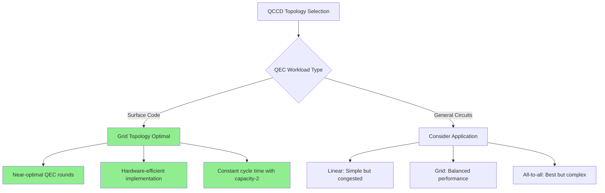

**Shuttling Overhead and Syndrome Extraction**

Ion shuttling represents a critical factor in QCCD-based QEC implementation. In the QCCD architecture, quantum computation follows a pattern of **gates → ion movement → ion cooling**, with the vast majority of time historically consumed by ion movement and cooling rather than gate operations[^13]. One seminal demonstration showed gate pulses taking only approximately 2% of system runtime, ion movement approximately 27%, and cooling approximately 68%[^13].

For surface code implementation, the shuttling overhead directly impacts the **logical clock speed**—the rate at which QEC rounds can be completed. Research has developed topology-aware compilers that achieve **3.8× improvement in logical clock speed** compared to existing QCCD compilers[^34]. These compilers optimize ion routing to minimize shuttling while ensuring two-qubit gates execute within the same trap[^34].

The breakthrough achievement of high-fidelity gates without ground-state cooling, as discussed in Chapter 1, directly addresses the cooling bottleneck. By performing two-qubit gates above the Doppler limit using coherent control techniques to combat thermally-sensitive errors, this advancement **removes the critical legacy bottleneck to speed** and enables order-of-magnitude quantum computing speedup[^13].

**The Wiring Problem and Power-Performance Trade-offs**

Chapter 2 identified the wiring problem as a fundamental scaling constraint for QCCD architectures. For QEC implementation, this constraint manifests as a **power versus cycle time trade-off** that becomes increasingly severe at scale[^34].

Under standard architectures with direct DAC-to-electrode wiring:
- A single logical qubit at 10⁻⁹ error rate requires approximately **1.3 Tbit/s communication bandwidth**
- Power consumption reaches approximately **780 watts per logical qubit**[^34]

The WISE architecture using switch-based demultiplexing achieves **two orders of magnitude improvement** in data rate and power consumption[^34]. However, this comes at the cost of logical clock speeds up to **25× slower** than direct wiring configurations[^34].

This trade-off represents a **fundamental bottleneck** in current QCCD wiring mechanisms[^34]. Scaling to hundreds of logical qubits will require architectures that provide both high-performance execution and low power requirements—a challenge that demands co-design of hardware and software beyond current approaches[^34].

**Compiler Co-Optimization for QEC**

Advanced compilation strategies are essential for achieving practical QEC performance on QCCD hardware. The Spatio-Temporal Aware Qubit Allocation Algorithm (STA), discussed in Chapter 2, achieves execution time improvements of up to 50% by considering the temporal distribution of qubit interactions[^19].

For QEC-specific workloads, specialized compilers must account for:

1. **Syndrome extraction circuit structure**: The regular, repetitive nature of QEC rounds enables optimization strategies not applicable to general circuits
2. **Parallelism opportunities**: Identifying operations that can execute simultaneously across different traps
3. **Shuttling minimization**: Reducing ion movement while respecting trap capacity constraints
4. **Error accumulation**: Balancing speed against the decoherence introduced by longer circuit execution

The QEC and device topology-aware compiler developed for QCCD systems provides **near-optimal QEC round times** and can handle large-scale surface code implementations that would overwhelm general-purpose compilers[^34].

**Implications for Scalable Fault-Tolerant Systems**

The architectural analysis reveals that optimal QCCD design for fault-tolerant quantum computing differs significantly from designs optimized for NISQ-era applications:

| Design Parameter | NISQ Optimization | Fault-Tolerant Optimization |
|-----------------|-------------------|---------------------------|
| **Trap capacity** | Larger (20-30 ions) | Smaller (2 ions optimal) |
| **Topology** | Application-dependent | Grid preferred |
| **Wiring** | Direct DAC connection | Requires new architectures |
| **Compiler focus** | Circuit depth | QEC round time |

For achieving practical fault-tolerant systems, the research indicates that **capacity-2 traps with grid topology** represent the most promising near-term architecture[^34]. With 5× physical gate improvement assumptions, using code distance 13 with this configuration represents a **feasible design point for achieving 10⁻⁹ logical error rate**[^34].

### 7.3 Modular Interconnects and Distributed Error Correction

The modular scaling approach analyzed in Chapter 4—connecting multiple trapped-ion processors via photonic interconnects—introduces additional considerations for fault-tolerant architecture design. This section investigates how inter-module entanglement fidelity requirements interact with quantum error correction, examining the protocols and overhead necessary to achieve distributed fault-tolerant operation.

**Fidelity Requirements for Distributed QEC**

The viability of distributed fault-tolerant quantum computing depends critically on the fidelity of inter-module entanglement. For error correction codes to function effectively across module boundaries, the **interconnect fidelity must approach that of intra-module operations**—otherwise, the module boundaries become dominant error sources that limit logical qubit performance.

Current demonstrations have achieved **ion-ion entanglement fidelity of 97%** using time-bin photons, with Bell state fidelities of F = 0.968(4) for Ψ⁺ and F = 0.972(3) for Ψ⁻ states[^91]. More significantly, research indicates that **fidelity limits for remote entanglement based on photons can exceed 99.9%**, enabling modular scaling of quantum computers with fault-tolerant interconnects[^91].

The gap between current 97% fidelity and the >99.9% target represents the primary technical challenge for distributed fault-tolerant systems. Achieving this improvement requires advances in:

- Photon collection efficiency
- Transmission loss reduction
- Detection timing precision
- Atomic recoil mitigation

**Integration of Quantum Gate Teleportation with Error Correction**

The theoretical foundation of modular quantum computing rests on **quantum gate teleportation (QGT)**, which enables non-local entangling gates between qubits in separate modules. QGT efficiently implements non-local gates by consuming only one Bell pair and exchanging two classical bits per teleported gate.

For fault-tolerant operation, the QGT implementation must be **deterministic and repeatable**. The Oxford University demonstration achieved **deterministic teleportation of a controlled-Z gate** between circuit qubits in separate modules with 86% fidelity. While this represents a landmark achievement, the fidelity must improve substantially for practical fault-tolerant applications.

The distributed implementation of error correction codes requires careful consideration of how syndrome extraction circuits map across module boundaries. For surface codes, the regular structure of stabilizer measurements can be partitioned across modules, but the inter-module operations become critical path elements that determine the overall logical clock speed.

**Entanglement Purification for Fault-Tolerant Interconnects**

When raw inter-module entanglement fidelity falls below fault-tolerance thresholds, **entanglement purification** protocols can distill higher-fidelity entangled states from multiple lower-fidelity copies. To improve remote entanglement fidelity beyond direct generation, entanglement purification could be used to distribute high-fidelity entangled states[^91].

The overhead of entanglement purification depends on:

1. **Initial fidelity**: Higher starting fidelity requires fewer purification rounds
2. **Target fidelity**: More stringent targets increase resource consumption
3. **Protocol efficiency**: Different purification schemes offer varying trade-offs

For practical systems, the purification overhead must be balanced against the improvement in logical error rates. If raw entanglement can achieve >99.9% fidelity as projected, purification may be unnecessary for many applications, dramatically simplifying the distributed architecture.

**Quantum Memory and Asynchronous Entanglement**

The probabilistic nature of photon-mediated entanglement presents a fundamental challenge for distributed QEC, where syndrome extraction must proceed on predictable timescales. **Quantum memory** addresses this challenge by enabling asynchronous entanglement generation.

IonQ's acquisition of Lightsynq provides quantum memory-based photonic interconnects that enable asynchronous entanglement, increasing the ion-ion entanglement rate by up to **50× compared to solutions with no memory**. This dramatic improvement transforms the probabilistic photonic interface from a fundamental limitation into a manageable engineering challenge.

For distributed error correction, quantum memory enables:

- **Buffering of entanglement attempts** until successful
- **Synchronization of distributed syndrome extraction**
- **Decoupling of entanglement generation rate from QEC cycle time**

**Architectures Combining QCCD and Photonic Links**

The most promising architectures for large-scale fault-tolerant systems combine **local QCCD operations within modules** with **photonic interconnects between modules**. This hybrid approach leverages the strengths of each technology:

| Operation Type | Implementation | Fidelity Target |
|---------------|----------------|-----------------|
| **Intra-module gates** | QCCD with ion shuttling | >99.9% (demonstrated) |
| **Intra-module syndrome extraction** | Local stabilizer measurements | High parallelism |
| **Inter-module entanglement** | Photonic links with memory | >99.9% (projected) |
| **Inter-module gates** | Quantum gate teleportation | Approaching intra-module |

The modular architecture offers several advantages for fault-tolerant operation:

1. **Fault isolation**: Errors in one module do not propagate to others
2. **Incremental scaling**: Modules can be added as needed
3. **Simplified calibration**: Each module calibrated independently
4. **Manufacturing yield**: Smaller modules achieve higher fabrication yields

**Distributed Fault-Tolerant Architecture Designs**

IonQ scientists have proposed a **distributed architecture based on BB codes** for fault-tolerant quantum memory capable of achieving the extremely low logical error rates required for large-scale FTQC applications[^87]. This design is suitable for both long chains and short chains of trapped ions and is particularly well-suited to Oxford Ionics' technology[^87].

The architecture combines:
- **BB5 codes** for efficient logical qubit encoding
- **Photonic interconnects** for module networking
- **Quantum memory** for asynchronous entanglement
- **Real-time decoding** for active error correction

This integrated approach addresses the key challenges of distributed fault-tolerant computing while leveraging the specific advantages of trapped-ion systems.

**Timeline and Feasibility Assessment**

IonQ's roadmap indicates **commercial deployment of photonic interconnects starting in 2028**, with multi-QPU networked systems enabling targets of thousands of physical qubits. The combination of:

- Demonstrated 97% inter-module fidelity with clear path to >99.9%
- 50× rate improvement from quantum memory
- Deterministic gate teleportation protocols
- Optimized error correction codes for distributed operation

supports the feasibility of distributed fault-tolerant trapped-ion systems within the projected timeframe. The primary remaining challenges are engineering problems amenable to systematic solution rather than fundamental physics barriers.

### 7.4 Code Selection and Hardware-Software Co-Design Strategies

The selection of quantum error correction codes for trapped-ion systems must account for the unique hardware characteristics of these platforms, including full connectivity, long coherence times, and the specific noise models of ion trap operations. This section examines how codes should be selected and optimized through hardware-software co-design to maximize fault-tolerant performance.

**The Ion Chain Model for Code Evaluation**

Researchers have developed the **ion chain model** to capture key features of quantum computing with long ion chains for QEC evaluation[^90]. The model incorporates:

- **Long coherence times** for idle qubits
- **Error hierarchy**: Two-qubit operations noisier than single-qubit, which are noisier than idle
- **Full connectivity** between all qubits
- **Sequential unitary gates** with parallel reset and measurement
- **Slow measurements**: Measurements take τ_m ≈ 30× longer than other operations

This model enables realistic simulation of QEC code performance on trapped-ion hardware, accounting for the specific constraints and advantages of the platform.

**Surface Codes vs. Color Codes for Trapped Ions**

Both surface codes and color codes have been implemented on trapped-ion systems, with different trade-offs:

**Surface Codes**:
- Well-established theoretical framework
- High threshold (~1% with realistic decoders)
- Requires only nearest-neighbor interactions in standard formulation
- Extensive decoder development (minimum weight perfect matching)

**Color Codes**:
- Support transversal Clifford gates
- Enable efficient non-Clifford gate implementation via code switching
- Natural fit for trapped-ion connectivity
- Demonstrated logical error suppression factor Λ = 1.56(4)[^92]

For trapped-ion systems with full connectivity, the nearest-neighbor constraint of surface codes becomes less relevant, potentially favoring color codes or other codes that exploit long-range interactions.

**Bacon-Shor Codes and Subsystem Approaches**

Bacon-Shor codes offer an alternative structure for fault tolerance that has been successfully demonstrated on trapped-ion systems. IonQ/University of Maryland demonstrated **fault-tolerant quantum error correction using the Bacon-Shor code** on 13 trapped-ion qubits, achieving logical operation fidelities below physical error rates[^93].

Key results from this demonstration:
- Logical state preparation/measurement error rate: ~0.6%
- Logical Clifford gate error rate: ~0.3%
- Physical two-qubit gate error rate: ~1%
- **Encoded operations outperformed single physical gates**[^93]

This demonstration established that trapped-ion systems can operate in the regime where error correction provides net benefit, a crucial milestone on the path to fault tolerance.

**BB5 Codes: Optimized for Ion Chains**

The BB5 codes introduced by IonQ scientists represent a significant advancement in code design specifically optimized for trapped-ion characteristics[^90]. The syndrome extraction tuning protocol developed for these codes balances logical error rate and qubit overhead by selecting the optimal number of ancilla qubits.

Performance comparison at physical error rate 10⁻³:

| Code | Parameters | Logical Error Rate | Qubits per Logical Qubit |
|------|-----------|-------------------|-------------------------|
| **[[48,4,7]] BB5** | 4 logical qubits, distance 7 | 5×10⁻⁵ | 13.5 (54 total/4) |
| **[[49,1,7]] Surface** | 1 logical qubit, distance 7 | 5×10⁻⁵ | 57 |
| **Best BB6** | Comparable parameters | 4× higher | Similar |

The BB5 code achieves the **same logical error rate as the distance-7 surface code while using four times fewer physical qubits per logical qubit**[^90]. This efficiency gain directly translates to reduced hardware requirements for fault-tolerant systems.

**qLDPC Codes and the Oxford Ionics-Iceberg Partnership**

The partnership between Oxford Ionics and Iceberg Quantum focuses on designing fault-tolerant quantum architectures combining trapped-ion technology with qLDPC codes[^89]. This collaboration targets the development of codes that fully exploit trapped-ion advantages:

**Why qLDPC codes suit trapped ions**:
- Require non-local interactions that trapped-ion connectivity enables
- Achieve constant rate and linear distance
- Enable fast, parallel decoding
- Dramatically reduce qubit overhead compared to surface codes

Iceberg Quantum's members pioneered the **first general-purpose methods for performing targeted, universal logic gates with qLDPC codes**—a critical theoretical advancement for practical computation[^89]. The partnership aims to realize these theoretical advances on Oxford Ionics' hardware platform.

**Syndrome Extraction Circuit Optimization**

The design of syndrome extraction circuits must account for the measurement speed ratio τ_m characteristic of trapped-ion systems. With measurements taking ~30× longer than gate operations, syndrome extraction strategies that minimize measurement count or enable measurement parallelism provide significant advantages.

The syndrome extraction tuning protocol for BB codes optimizes the number of ancilla qubits n_a, increasing n_a as long as each iteration reduces the logical error rate by a specified factor γ[^90]. This adaptive approach balances the trade-off between syndrome extraction overhead and error correction effectiveness.

**Hardware-Software Co-Design Principles**

Effective QEC implementation requires tight integration between code design and hardware capabilities. Key co-design principles for trapped-ion systems include:

1. **Exploit full connectivity**: Use codes that benefit from long-range interactions rather than being constrained by nearest-neighbor assumptions

2. **Account for measurement asymmetry**: Design syndrome extraction circuits that minimize the impact of slow measurements

3. **Leverage high gate fidelities**: Select codes with thresholds that current hardware exceeds comfortably

4. **Consider shuttling overhead**: For QCCD implementations, optimize syndrome circuits for minimal ion transport

5. **Enable transversal operations**: Prioritize codes supporting transversal gates to simplify fault-tolerant logic

**Plaquette: Design Software for Fault-Tolerant Systems**

The complexity of hardware-software co-design has motivated development of specialized tools. **Plaquette** is software used by quantum hardware manufacturers to design fault-tolerant quantum computers by computing thresholds for various imperfections in a given architecture[^94].

Plaquette contains a vast library of error correction codes and decoders, including surface codes, color codes, Bacon-Shor codes, and modern qLDPC codes like Hypergraph Product and Generalized Bicycle[^94]. It provides access to five simulators with different speeds and accuracies, enabling modeling of many physical qubits at different accuracy levels for many different imperfections[^94].

The tool enables hardware manufacturers to:
- Compute thresholds for specific imperfections
- Iterate rapidly on architecture design
- Find optimal paths to fault tolerance
- Reduce development time by years through systematic exploration[^94]

### 7.5 Fidelity Thresholds and Resource Requirements for Fault Tolerance

The transition from NISQ-era demonstrations to practical fault-tolerant quantum computing requires achieving specific fidelity thresholds while managing the physical qubit resources needed for error correction. This section quantifies these requirements and assesses how current trapped-ion capabilities compare against fault-tolerance targets.

**The Threshold Theorem and Its Implications**

The **threshold theorem** establishes that there exists a physical error rate threshold below which fault-tolerant quantum computation is possible[^87]. Below this threshold, adding more qubits to the encoding actually **decreases** the logical error rate rather than increasing it—a critical transition point that separates useful error correction from counterproductive overhead[^94].

The threshold relationship is visualized in threshold plots where a critical point separates two regimes[^94]:
- **Above threshold**: Increasing code distance increases logical error
- **Below threshold**: Increasing code distance decreases logical error exponentially

Being below threshold enables hardware manufacturers to achieve very low logical error rates needed for complex algorithms **merely by using more physical qubits**—a fundamentally easier challenge than reducing physical qubit imperfections[^94].

**Current Trapped-Ion Fidelities vs. Thresholds**

Current trapped-ion systems have achieved fidelities that substantially exceed fault-tolerance thresholds for multiple code families:

| Metric | Achieved Performance | Typical Threshold | Margin |
|--------|---------------------|-------------------|--------|
| **Two-qubit gate fidelity** | 99.99% (IonQ)[^13] | ~99% (surface code) | 100× below threshold |
| **Single-qubit gate fidelity** | >99.99% | ~99.9% | 10× below threshold |
| **SPAM fidelity** | 99.9993% (Oxford Ionics)[^87] | ~99% | 1000× below threshold |
| **Two-qubit gate (production)** | 99.9% (Quantinuum) | ~99% | 10× below threshold |

The 99.99% two-qubit gate fidelity achieved by IonQ represents a **landmark milestone** that fundamentally changes the resource requirements for fault-tolerant operation[^13]. This achievement was accomplished without ground-state cooling, removing a critical bottleneck and enabling order-of-magnitude speedup[^13].

**Experimental Demonstrations of Below-Threshold Operation**

Multiple experimental demonstrations have confirmed that trapped-ion systems operate below fault-tolerance thresholds:

**IonQ/University of Maryland (Bacon-Shor code)**[^93]:
- Logical Clifford gate error rate: ~0.3%
- Physical two-qubit gate error rate: ~1%
- **Encoded operations outperformed physical gates**

**Honeywell/Quantinuum (Steane code)**[^93]:
- Real-time quantum error correction demonstrated
- Logical error rate lower with fault-tolerant syndrome extraction
- First real-time QEC demonstration

**University of Innsbruck (Color code)**[^93]:
- Universal fault-tolerant gate set on two logical qubits
- Fault-tolerant logical operations outperformed non-fault-tolerant implementations
- **First fault-tolerant entangling gate between two logical qubits**

**Quantinuum (Non-Clifford gates)**[^93]:
- Fault-tolerant controlled-Hadamard gate with error rate ≤2.3×10⁻⁴
- Physical CH gate error rate: ~1×10⁻³
- **Clear break-even for non-Clifford gate**

**Quantinuum (Magic state generation)**[^93]:
- Logical magic state infidelity ≤5.1×10⁻⁴
- **2.9× lower than best physical two-qubit gate error**
- Processor operating below pseudo-threshold

**Resource Requirements for Target Logical Error Rates**

Practical quantum algorithms require logical error rates far below current demonstrations. The target range spans several orders of magnitude depending on the application:

| Application Class | Target Logical Error Rate | Physical Qubit Overhead (estimated) |
|------------------|--------------------------|-----------------------------------|
| **Near-term demonstrations** | 10⁻⁴ to 10⁻⁶ | 10-50 physical per logical |
| **Enterprise applications** | 10⁻⁹ | 100-1000 physical per logical |
| **Complex algorithms (Shor's)** | 10⁻¹⁰ to 10⁻¹⁵ | 1000-10000 physical per logical |

For enterprise-class classical computing, the fault-tolerance standard is **less than 1 error per million hours of compute time**[^87]. Achieving comparable reliability in quantum computing for textbook-scale fault-tolerant algorithms requires logical error rates in the **10⁻¹⁰ to 10⁻¹⁵ range**[^87].

**The Multiplicative Benefit of High Physical Fidelity**

The relationship between physical error rates and logical qubit overhead is highly nonlinear, creating **multiplicative benefits** from improved physical qubit quality[^87]:

- 2× reduction in physical error rate with 1-error-correcting code → 4× reduction in logical error rate
- 2× reduction in physical error rate with 2-error-correcting code → 8× reduction in logical error rate
- Pattern continues: 2^(t+1)× improvement for t-error-correcting code

This multiplicative relationship explains why IonQ's strategy prioritizes achieving the highest possible physical qubit quality. With 99.99% two-qubit gate fidelity and the BB5 code, scientists project logical error rates of **99.9995%** when fully exploiting barium ion fidelity potential[^87].

**Feasible Design Points for Fault-Tolerant Systems**

Based on current capabilities and projected improvements, research has identified feasible design points for achieving target logical error rates:

**For 10⁻⁹ logical error rate**[^34]:
- Code distance 13 surface code
- Capacity-2 traps with grid topology
- 5× physical gate improvement assumption
- Feasible with projected near-term advances

**For architecture comparison at scale**[^91]:
- MUSIQC architecture: ~6 million physical qubits for 128-bit factorization
- Two levels of concatenated Steane code
- Execution time under 10 hours
- Roughly order of magnitude fewer physical qubits than alternative architectures

**Timeline to Fault-Tolerant Operation**

Industry roadmaps provide concrete timelines for achieving fault-tolerant milestones:

| Year | IonQ Target | Quantinuum Target |
|------|-------------|-------------------|
| 2026 | 12 logical qubits | — |
| 2027 | 800 logical qubits | — |
| 2029 | 8,000 logical qubits | Universal fault-tolerant computing |
| 2030 | 80,000 logical qubits | Apollo (fully fault-tolerant) |

Oxford Ionics' roadmap outlines systems achieving **10⁻⁴ error rates across the largest number of physical qubits**, enabling Value at scale systems to solve meaningful problems with up to **10,000× fewer physical qubits than competing platforms**[^95].

### 7.6 Architectural Pathways to Utility-Scale Fault-Tolerant Systems

The preceding analyses of error correction codes, QCCD optimization, modular interconnects, and fidelity requirements converge on the question of which architectural pathways most efficiently achieve utility-scale fault-tolerant trapped-ion quantum computing. This section synthesizes these findings to identify the most promising approaches and provide concrete recommendations for development priorities.

**Comparative Resource Efficiency of Scaling Strategies**

The three primary scaling strategies—enhanced QCCD, modular photonic interconnects, and advanced trap geometries—offer different trade-offs for supporting error correction at scale:

**Enhanced QCCD with Optimized Parameters**:
- Capacity-2 traps with grid topology achieve near-optimal QEC cycle times[^34]
- Constant cycle time independent of code distance[^34]
- Power-performance trade-off limits scaling beyond hundreds of logical qubits[^34]
- Requires new control architectures to overcome wiring bottleneck

**Modular Photonic Interconnects**:
- Fault isolation between modules simplifies error handling
- Incremental scaling through module addition
- Requires >99.9% inter-module fidelity for fault-tolerant operation
- Quantum memory enables practical entanglement rates

**Advanced Trap Geometries**:
- Cross-RF traps reduce power by 10,000× for same trap frequency
- 3D-printed junctions reduce transport heating by 100×
- Enable higher gate speeds through improved harmonicity
- Fabrication complexity remains a challenge

**The Convergent Architecture**

The most promising path to utility-scale fault-tolerant systems combines elements from all three strategies in a **convergent architecture**:

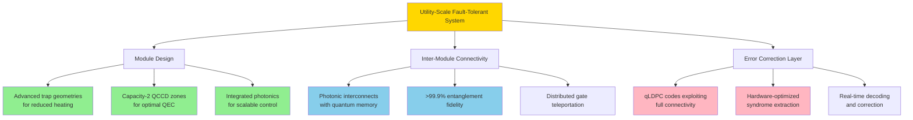

**Chip Architecture Optimized for QEC**

Research has proposed ion-trap chip architectures specifically optimized for implementing quantum error correction codes[^96]. The key innovation involves **orthogonal separation of transversal and non-transversal gate regions**:

- **Horizontal sectors** for transversal gate operations between logical qubits
- **Vertical sectors** for non-transversal gates and syndrome extraction
- **Synchronized shuttling** for efficient qubit movement between sectors

This architecture achieves effective logical two-qubit gate error probabilities as low as **10⁻⁸** when using the [[31,1,7]] color code with physical two-qubit gate error probability of 10⁻⁴[^96]. The improvement substantially expands the range of algorithms that can be executed reliably, supporting scales of **thousands of logical qubits** for polynomial-depth circuits[^96].

**Selective QEC Strategies for Near-Term Systems**

For the transition period between NISQ and full fault tolerance, **selective QEC strategies** offer a practical intermediate approach. The Flexion framework demonstrates this concept by dynamically combining bare qubits for high-fidelity single-qubit gates with QEC-encoded logical qubits for two-qubit gates[^97].

Key advantages of selective QEC:
- Avoids overhead of full encoding when unnecessary
- Leverages trapped-ion ultra-high-fidelity 1Q gates (99.9999%)
- Achieves **8× performance improvement over NISQ execution**
- Achieves **15.5× improvement over standard FTQC** under same qubit budget[^97]

The framework outperforms NISQ execution when the ratio of 2Q gates to encoding conversions exceeds approximately 4—a condition commonly satisfied in early fault-tolerant applications[^97].

**Industry Roadmap Alignment**

The architectural pathways identified align with stated industry roadmaps:

**IonQ's Path to 80,000 Logical Qubits by 2030**[^87]:
- BB5 codes optimized for ion chain model
- Distributed architecture based on BB codes for fault-tolerant memory
- Modular approach connecting smaller systems
- 99.99% physical fidelity enabling reduced overhead

**Oxford Ionics' Value at Scale Phase**[^95]:
- 10,000+ high-fidelity qubit processors available to order in 2027
- Error rates of 10⁻⁴ across largest number of physical qubits
- 10,000× fewer physical qubits than competing platforms
- Field-upgradeable QPUs for continuous improvement

**Quantinuum's Apollo and Lumos Systems**:
- Apollo (2029): Fully fault-tolerant, universal, circuits with millions of gates
- Lumos: Utility-scale system providing path to 2033 deployment
- Built on proven QCCD scalability and logical qubit demonstrations

**Recommendations for Development Priority**

Based on the interaction between scaling strategies and error correction requirements, the following development priorities are recommended:

**Immediate Priority (2025-2026)**:
1. Achieve consistent 99.99% two-qubit gate fidelity in production systems
2. Demonstrate capacity-2 QCCD with grid topology for surface code
3. Advance qLDPC code implementations exploiting full connectivity
4. Develop real-time decoders for target code families

**Near-Term Priority (2026-2028)**:
1. Deploy photonic interconnects with >99% fidelity
2. Integrate quantum memory for practical entanglement rates
3. Implement selective QEC strategies for early fault-tolerant applications
4. Scale to 100+ logical qubits with demonstrated error suppression

**Medium-Term Priority (2028-2030)**:
1. Achieve >99.9% inter-module entanglement fidelity
2. Deploy advanced trap geometries in production systems
3. Demonstrate distributed fault-tolerant algorithms
4. Scale to 1000+ logical qubits with utility-class error rates

**The Path Forward**

The analysis reveals that **no single scaling strategy alone achieves utility-scale fault-tolerant quantum computing**—success requires the convergence of multiple approaches optimized for error correction requirements. The trapped-ion platform's unique advantages—full connectivity, high fidelities, long coherence times—position it favorably for implementing the most efficient error correction codes.

The demonstrated achievements of below-threshold operation, logical qubits outperforming physical qubits, and fault-tolerant gate implementations confirm that the fundamental physics supports fault-tolerant trapped-ion quantum computing. The remaining challenges are substantial but tractable engineering problems: scaling control systems, improving interconnect fidelities, and manufacturing advanced trap geometries at scale.

With industry roadmaps targeting thousands of logical qubits by 2030 and demonstrated progress toward each milestone, trapped-ion technology appears well-positioned to achieve utility-scale fault-tolerant quantum computing within the projected timeframe. The key to success lies in the tight integration of hardware advances with error correction code development—a hardware-software co-design approach that maximizes the unique advantages of the trapped-ion platform.

## 8 Comparative Assessment of Scaling Strategies

This chapter synthesizes the technical analyses from preceding chapters to provide a systematic comparative evaluation of the four primary scaling approaches for trapped-ion quantum computing: enhanced QCCD architectures, integrated photonics, modular photonic interconnects, and advanced trap geometries. The assessment evaluates each strategy against unified criteria including technical maturity, fabrication scalability, achievable qubit counts, gate fidelity preservation, power efficiency, and projected timeline to utility-scale systems. The chapter identifies optimal strategy combinations, analyzes the strategic positioning of leading industry players (IonQ, Quantinuum, Oxford Ionics, AQT), and provides actionable recommendations for the most viable pathways to million-qubit fault-tolerant trapped-ion quantum computers.

### 8.1 Evaluation Framework and Assessment Criteria

The complexity of scaling trapped-ion quantum computing from current demonstrations of tens of qubits to utility-scale systems with millions of qubits demands a **rigorous multi-dimensional evaluation framework** capable of capturing the diverse technical, manufacturing, and economic factors that will determine which strategies ultimately succeed. This section establishes the analytical foundation for the comparative assessment, defining quantitative and qualitative metrics that enable systematic comparison across fundamentally different technological approaches.

**The Six-Dimensional Assessment Framework**

The evaluation framework encompasses six primary dimensions that collectively determine the viability of each scaling strategy for achieving fault-tolerant quantum computing at commercially relevant scales. These dimensions emerge from the technical analyses presented in Chapters 2 through 7, reflecting the critical success factors identified across QCCD architectures, integrated photonics, modular interconnects, advanced trap geometries, cryogenic systems, and error correction requirements.

| Dimension | Definition | Key Metrics | Weight Rationale |
|-----------|------------|-------------|------------------|
| **Technical Readiness Level (TRL)** | Current maturity of demonstrated capabilities | Highest qubit count, gate fidelities achieved, production deployment status | High weight—determines near-term viability |
| **Fabrication Scalability** | Compatibility with volume manufacturing | CMOS compatibility, yield projections, supply chain maturity | High weight—determines cost and timeline |
| **Achievable Qubit Counts** | Maximum qubit capacity at target fidelities | Projected physical qubits, logical qubits at 10⁻⁹ error rate | Critical—defines utility-scale threshold |
| **Gate Fidelity Preservation** | Performance maintenance under scaling | Fidelity degradation rate, error correction overhead | Critical—determines fault-tolerant viability |
| **Power Efficiency** | Thermal management feasibility | Watts per qubit, cryogenic cooling requirements | Moderate weight—affects practical deployment |
| **Timeline Feasibility** | Projected path to utility-scale | Years to 1000+ logical qubits, milestone credibility | Moderate weight—affects commercial relevance |

**Quantitative Scoring Methodology**

Each scaling strategy receives scores across the six dimensions using a standardized 1-5 scale, where:

- **5 (Excellent)**: Demonstrated production capability or clear path with minimal technical risk
- **4 (Good)**: Advanced demonstrations with identified but manageable challenges
- **3 (Moderate)**: Promising results with significant technical gaps remaining
- **2 (Limited)**: Early-stage demonstrations with substantial development required
- **1 (Nascent)**: Conceptual or preliminary experimental validation only

The scoring incorporates both current demonstrated performance and projected capability based on stated roadmaps and technical trajectories. Importantly, the assessment distinguishes between **fundamental physics limitations** that cannot be overcome through engineering and **engineering challenges** that are tractable with sufficient investment and development time.

**Weighting Rationale for Fault-Tolerant Operation**

The relative importance of each dimension shifts depending on the target application regime. For the primary objective of achieving **utility-scale fault-tolerant quantum computing**, the weighting prioritizes factors that most directly impact the ability to implement quantum error correction at scale:

**Critical Weight (40% combined)**:
- **Achievable Qubit Counts**: Without sufficient physical qubits, fault-tolerant operation is impossible regardless of other factors. Industry roadmaps targeting 80,000 logical qubits by 2030 require millions of physical qubits, making this dimension essential.
- **Gate Fidelity Preservation**: The multiplicative relationship between physical error rates and logical qubit overhead means that fidelity degradation under scaling can exponentially increase resource requirements. As established in Chapter 7, a 2× increase in physical error rate can require 4-8× more physical qubits for equivalent logical performance.

**High Weight (35% combined)**:
- **Technical Readiness Level**: Strategies with higher TRL face shorter development timelines and lower execution risk. The gap between laboratory demonstrations and production systems has historically been substantial in quantum computing.
- **Fabrication Scalability**: The ability to leverage semiconductor manufacturing infrastructure determines whether scaling can proceed at commercially viable costs. Strategies requiring bespoke fabrication face fundamental cost and timeline barriers.

**Moderate Weight (25% combined)**:
- **Power Efficiency**: While not immediately limiting for small systems, power dissipation becomes a critical constraint at utility scale. The analysis in Chapter 6 established that trapped-ion systems enjoy **orders of magnitude advantage** over superconducting platforms, but power management remains important.
- **Timeline Feasibility**: Commercial relevance depends on achieving utility-scale capability within competitive timeframes. Strategies with credible near-term milestones warrant higher confidence than those projecting breakthroughs in distant years.

**Interaction Effects and Composite Assessment**

The six dimensions are not independent—they exhibit significant interaction effects that must be considered in the composite assessment:

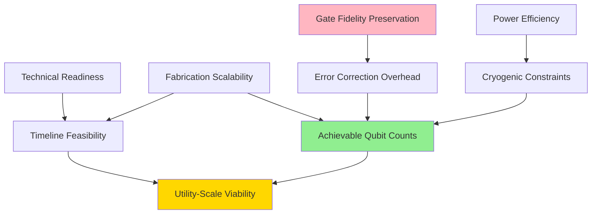

The interaction between **gate fidelity preservation** and **achievable qubit counts** is particularly important: strategies that maintain high fidelity under scaling require fewer physical qubits for equivalent logical qubit performance, creating a compounding advantage. Conversely, strategies that sacrifice fidelity for qubit count may face exponentially increasing overhead that negates the apparent scaling benefit.

**Baseline Performance Standards**

The comparative assessment uses the following baseline performance standards derived from current state-of-the-art systems and fault-tolerance requirements:

| Metric | Current Best | Fault-Tolerance Threshold | Utility-Scale Target |
|--------|-------------|--------------------------|---------------------|
| **Two-qubit gate fidelity** | 99.99% (IonQ R&D) | ~99% | >99.9% sustained |
| **Physical qubit count** | 56 (Quantinuum H2) | N/A | >100,000 |
| **Logical qubit count** | 4 (demonstrated) | N/A | >1,000 |
| **Logical error rate** | ~10⁻³ (demonstrated) | <10⁻² | <10⁻⁹ |
| **Coherence time** | >1 second (T₂*) | >100 ms | >1 second |
| **Power per qubit** | ~10 mW (estimated) | N/A | <1 mW target |

These standards provide the reference points against which each scaling strategy is evaluated, enabling objective comparison of current capabilities and projected trajectories.

**Assessment Scope and Limitations**

The comparative assessment focuses on the **technical and engineering dimensions** of scaling strategies, with economic and market factors considered primarily through their impact on timeline feasibility. The assessment does not attempt to predict commercial outcomes, which depend on factors beyond technical capability including business execution, funding availability, and market timing.

Additionally, the assessment recognizes that **scalability is not an absolute property** but depends on operating at certain scales. Strategies that appear promising for scaling from 100 to 1,000 qubits may face different challenges when scaling from 100,000 to 1,000,000 qubits. The framework accounts for this by considering both near-term scaling (to thousands of qubits) and long-term scaling (to millions of qubits) as distinct evaluation contexts.

### 8.2 Technical Maturity and Readiness Comparison

The current technical readiness of each scaling strategy provides the foundation for assessing near-term viability and projecting development timelines. This section presents a detailed comparative analysis based on demonstrated experimental results, production deployments, and the gap between current capabilities and utility-scale requirements.

**QCCD Architecture: The Most Mature Scaling Approach**

The Quantum Charge-Coupled Device architecture represents the **most technically mature scaling strategy** for trapped-ion quantum computing, with multiple production systems deployed and extensive operational experience accumulated. Quantinuum's System Model H2 exemplifies this maturity, operating with **56 fully-connected qubits** in a racetrack QCCD configuration that achieves the highest quantum volume of any quantum computer at **2²⁵ = 33,554,432**.

Key technical achievements establishing QCCD maturity include:

**Production-Grade Performance**: The H2 system achieves **>99.9% two-qubit gate fidelity** across all qubit pairs—a "three nines" milestone that places the system firmly below fault-tolerance thresholds. Single-qubit gate fidelity exceeds 99.99%, and SPAM error rates of approximately 2×10⁻³ enable high-fidelity state preparation and readout.

**Demonstrated Logical Qubits**: QCCD systems have demonstrated the creation and manipulation of logical qubits with error rates substantially below physical error rates. The achievement of **logical teleportation fidelity of 99.82%**—exceeding physical qubit teleportation fidelity—confirms that QCCD architecture can support fault-tolerant operation.

**Scalability Validation**: Quantinuum's March 2024 announcement addressed two major QCCD scaling hurdles: the wiring problem and the sorting problem. The solution utilizing a fixed number of analog signals and a single digital input per qubit demonstrates the scalability of the QCCD architecture.

**Remaining Technology Gaps**: Despite high maturity, QCCD faces challenges in scaling beyond current demonstrations. The power-performance trade-off identified in Chapter 7—where direct DAC-to-electrode wiring requires approximately **780 watts per logical qubit** at 10⁻⁹ error rate—represents a fundamental bottleneck requiring new control architectures.

**TRL Assessment: 8-9** (Production system deployed with ongoing optimization)

**Integrated Photonics: Advancing Toward Production Readiness**

Integrated photonic solutions for laser control have progressed from laboratory demonstrations to multi-zone implementations, though they remain at an earlier maturity stage than QCCD architectures. The technology addresses a fundamental scaling bottleneck—the requirement for approximately N individually controllable laser beams for N qubits—that cannot be overcome through incremental improvement of free-space optics.

Key technical achievements establishing integrated photonics maturity include:

**High-Fidelity Quantum Logic**: ETH Zurich demonstrated **two-qubit entangling gates with fidelity greater than 99.3%** using scalable integrated optics co-fabricated with surface electrode ion traps. This achievement, published in Nature in October 2020, established that integrated photonics can support the demanding fidelity requirements of quantum computation.

**Multi-Wavelength Coverage**: MIT Lincoln Laboratory developed a compact fiber-optic block delivering **multiple wavelengths from violet to near-infrared** through on-chip waveguides. The system demonstrated all single-qubit operations, while companion work at ETH Zurich demonstrated two-qubit gates, showing that all necessary components are available.

**Waveguide Performance**: Current SiNx waveguide losses are **<0.5 dB/cm for 600-1100 nm light** and approximately **0.25 dB/cm at the 674 nm Sr⁺ transition**. Al₂O₃ waveguides achieve **<1.5 dB/cm between 400-600 nm**, with higher losses (~3 dB/cm) at UV wavelengths.

**Active Component Progress**: Thin-Film Lithium Niobate (TFLN) modulators have achieved **60 dB extinction ratio** with DC to 10 MHz stability—meeting requirements for site-selective addressing in large-scale systems.

**Remaining Technology Gaps**: UV waveguide losses remain elevated compared to visible wavelengths. Full integration of detection, modulation, and light delivery on a single platform is still in development. Scaling demonstrations have reached approximately 20 zones, well short of the hundreds to thousands required for utility-scale systems.

**TRL Assessment: 5-6** (System demonstrations with identified path to production)

**Photonic Interconnects: Milestone-Driven Development**

Modular scaling through photonic interconnects has achieved significant milestones in 2024-2025, transitioning from theoretical proposals to demonstrated distributed quantum computing. The approach addresses the fundamental limitation that single-module trapped-ion systems cannot scale indefinitely while maintaining performance.

Key technical achievements establishing photonic interconnect maturity include:

**First Distributed Quantum Computing**: Oxford University demonstrated the **first instance of distributed quantum computing** in February 2025, linking two photonically interconnected trapped-ion modules to execute Grover's search algorithm with **71% success rate**. The deterministic teleportation of a controlled-Z gate achieved **86% fidelity**.

**Ion-Ion Entanglement**: Remote entanglement between ¹³⁸Ba⁺ ions in separate vacuum chambers achieved **97% fidelity** using time-bin photons, with Bell state fidelities of F = 0.968(4) for Ψ⁺ and F = 0.972(3) for Ψ⁻. Research indicates fidelity limits can exceed **99.9%**.

**IonQ Milestone Achievement**: IonQ achieved Milestone 2 of its photonic interconnect roadmap in September 2024, **entangling two ion-based qubits from separate trap wells** using entangled photons. This represents the first commercial demonstration of ion-ion entanglement via photonic links outside academic settings.

**Quantum Memory Advancement**: IonQ's acquisition of Lightsynq provides quantum memory-based photonic interconnects enabling asynchronous entanglement, increasing ion-ion entanglement rate by up to **50× compared to solutions with no memory**.

**Remaining Technology Gaps**: Current inter-module fidelity (86-97%) falls short of the >99.9% target for fault-tolerant distributed operation. Success probability remains low (P_E = 2.3 × 10⁻⁵ in some demonstrations), requiring quantum memory to achieve practical rates. Commercial deployment is targeted for 2028, indicating substantial development remaining.

**TRL Assessment: 4-5** (Component validation in laboratory environment)

**Advanced Trap Geometries: Promising but Early-Stage**

Advanced trap geometries including multi-wafer designs and 3D-printed micro-structures address fundamental limitations of standard surface-electrode traps but remain at earlier development stages than other scaling approaches.

Key technical achievements establishing advanced trap geometry maturity include:

**Multi-Wafer Performance Analysis**: Systematic comparison of surface traps, gnd-surface traps, and cross-RF traps established that cross-RF designs achieve **harmonicity k ≈ 0.77** (versus k ≈ 0.21 for surface traps), **8× greater trap depth**, and **10,000× lower power dissipation** for equivalent trap frequencies.

**3D-Printed Junction Demonstration**: Three-dimensionally printed micro X-junctions achieved **nearly perfect alignment** between pseudopotential minimum and constant total confinement paths, reducing motional excitation per junction transit to **0.00019 quanta**—approximately **100× lower** than state-of-the-art surface-electrode designs.

**Penning Micro-Trap Validation**: Single-ion trapping in cryogenic micro-fabricated surface-electrode Penning traps demonstrated heating rates **lower than any comparably sized RF trap**, with flexible 2D transport and negligible heating of the motional state.

**Remaining Technology Gaps**: Fabrication of multi-wafer traps at scale remains challenging due to alignment precision requirements. The cross-RF trap's superior performance comes with increased fabrication complexity, especially for trap arrays. Integration with integrated photonics and QCCD control systems requires further development.

**TRL Assessment: 3-5** (Proof of concept to component validation, depending on specific geometry)

**Comparative Technical Readiness Summary**

The following table synthesizes the technical readiness assessment across all four scaling strategies:

| Strategy | TRL | Key Demonstrations | Primary Gaps | Production Timeline |
|----------|-----|-------------------|--------------|---------------------|
| **QCCD Architecture** | 8-9 | 56-qubit production system, logical qubits, 99.9% fidelity | Power-performance trade-off, wiring scalability | Current (deployed) |
| **Integrated Photonics** | 5-6 | 99.3% gate fidelity, multi-wavelength delivery, 20 zones | UV performance, full platform integration | 2027-2029 |
| **Photonic Interconnects** | 4-5 | 97% entanglement, distributed algorithms, IonQ milestones | Fidelity gap to 99.9%, success probability | 2028 (commercial) |
| **Advanced Trap Geometries** | 3-5 | 100× junction improvement, 10,000× power reduction | Fabrication scalability, system integration | 2029-2030+ |

The assessment reveals a clear **maturity gradient** from QCCD (production-ready) through integrated photonics and photonic interconnects (advanced development) to advanced trap geometries (early development). This gradient has significant implications for development strategy: near-term scaling efforts should build upon QCCD foundations while investing in the enabling technologies that will be required for longer-term scaling beyond QCCD limitations.

### 8.3 Fabrication Scalability and Manufacturing Pathways

The ability to manufacture scaling solutions at commercially viable costs and volumes represents a critical determinant of which approaches will ultimately enable utility-scale quantum computing. This section assesses manufacturing scalability by examining compatibility with established semiconductor processes, yield considerations, and supply chain maturity for each scaling strategy.

**CMOS Compatibility: The Manufacturing Scalability Benchmark**

The semiconductor industry's capability to fabricate complex structures with high reproducibility at scale provides the benchmark against which quantum computing manufacturing approaches must be evaluated. **CMOS compatibility** offers access to decades of process development, established supply chains, and manufacturing infrastructure capable of producing billions of transistors per chip with consistent quality.

Trapped-ion quantum computing enjoys a fundamental advantage in this regard: **fabricating classical control structures at scale is generally easier than fabricating qubits at scale**. Unlike solid-state qubit platforms where fabrication variability directly impacts quantum coherence, trapped-ion systems use atoms as qubits—every ion of a given species is fundamentally identical, eliminating the fabrication variability that plagues superconducting and semiconductor qubit platforms.

**Surface-Electrode Trap Manufacturing Maturity**

Surface-electrode ion traps can be fabricated using **traditional clean-room microfabrication techniques** that leverage established MEMS technology. The fabrication methodology has been refined to address ion trap-specific requirements including:

- Dielectric layer thickness exceeding 10 µm to prevent electrical breakdown
- Electrode overhang structures to minimize dielectric exposure to ions
- Materials compatible with 200°C baking and ultra-high vacuum environments
- Management of residual stress during thick film deposition

Experimental setups using MEMS-fabricated chips have been **reliably operated for 50 months**, demonstrating the durability and manufacturability of surface-electrode designs. The key advantage is that these processes leverage existing semiconductor manufacturing infrastructure, enabling production at foundry scale.

Microfabricated ion traps rely on developing **CMOS techniques for use far outside of normal operating conditions**, including tolerance of up to 300 volts of RF at frequencies up to 100 MHz. While these requirements extend beyond standard CMOS specifications, the challenges have been overcome in successfully fabricated CMOS-based ion traps.

**Integrated Photonics Manufacturing Scalability**

Once integrated, photonic components are highly scalable because the semiconductor industry excels at fabricating small structures with high reproducibility. The critical insight is that **fabricating 10,000 grating couplers with 50±5% efficiency is easier than fabricating 10,000 superconducting qubits with consistent T₂ coherence time**—small defects in photonic structures lead to minor, calibratable variations rather than catastrophic performance degradation.

The manufacturing pathway for integrated photonics benefits from:

**Foundry Access**: Sandia National Laboratories' National Security Photonics Center (NSPC) offers collaborative **multi-project wafer (MPW) runs in Silicon Photonics (200 mm)** and InP photonics. The standard Silicon photonics device library includes over 50 passive and active devices, providing a mature foundation for quantum applications.

**Multi-Layer Fabrication**: The MIT Lincoln Laboratory platform supports light from 369 nm to 1092 nm through a multi-layer stack consisting of PECVD silicon nitride and ALD aluminum oxide layers embedded in oxide cladding. This fabrication approach is compatible with standard semiconductor processing.

**Heterogeneous Integration**: Long-term development requires heterogeneous, hybrid, and 3D integration for functionalities including III-V device integration. Sandia's portfolio demonstrates the feasibility of integrating GaN, GaAs, and InP lasers and amplifiers with silicon photonic platforms.

**Remaining Manufacturing Challenges**: UV wavelength integration remains more challenging than visible/near-IR, with higher losses and potential photodarkening effects. Full integration of detection, modulation, and light delivery on a single platform requires continued process development.

**Photonic Interconnect Component Manufacturing**

The manufacturing scalability of photonic interconnects depends on multiple component categories, each with different maturity levels:

| Component | Manufacturing Status | Scalability Assessment |
|-----------|---------------------|----------------------|
| **Single-photon sources** | Ion-based (mature) | Scales with trap fabrication |
| **Optical fibers** | Commercial (mature) | Highly scalable |
| **Beam splitters/interferometers** | Commercial (mature) | Highly scalable |
| **Single-photon detectors** | Specialized (developing) | Moderate scalability |
| **Quantum memory** | Research (early) | Scalability uncertain |
| **Photonic switches** | Developing | Critical for multi-node scaling |

The photonic interconnect approach benefits from leveraging telecommunications infrastructure for fiber-optic components. However, quantum-specific components—particularly quantum memory and high-efficiency single-photon detectors—require continued development for manufacturing scalability.

IonQ is developing **single-photon switching techniques and devices** to collect interconnect photons from many interconnect qubits across many traps, selectively entangling qubits across the network. The manufacturing scalability of these specialized components will determine the practical viability of large-scale modular systems.

**Multi-Wafer Trap Fabrication Challenges**

Multi-wafer trap architectures face the most significant manufacturing challenges among the scaling strategies. The superior performance of cross-RF and gnd-surface designs comes at the cost of increased fabrication complexity:

**Alignment Precision Requirements**: Multi-wafer traps require **precise alignment between layers**, with femtosecond laser-etching achieving angular and wafer separation errors of less than **0.05 degrees and 5 µm** respectively. Manual wafer stacking suffers from alignment errors on the order of tens of microns—inadequate for production systems.

**Fabrication Method Comparison**:

| Method | Precision | Scalability | Cost |
|--------|-----------|-------------|------|
| **Manual stacking** | ~10s of µm | Low | Low |
| **MEMS techniques** | Sub-µm | Moderate | Moderate |
| **Femtosecond laser-etching** | <5 µm, <0.05° | Moderate | High |
| **3D printing (Nanoscribe)** | Sub-µm | Low-Moderate | High |

**Gnd-Surface Advantage**: The gnd-surface trap presents a **balance between improved confinement and manufacturability**. Adding a large ground plane to a surface trap structure is comparatively easier than fabricating a symmetrical cross-RF design, making gnd-surface traps a more practical near-term option.

**3D-Printed Structures**: Three-dimensionally printed micro ion traps using two-photon lithography (Nanoscribe) achieve **sub-micron precision** and can enhance existing surface trap designs. However, the serial nature of 3D printing limits throughput for large-scale production.

**Supply Chain Considerations**

Building fault-tolerant quantum computers demands a **mature, reliable supply chain**. Architectures built using standard production methods will have advantages, applying not only to chips but also to cooling, vacuum, and control systems. Bespoke components require significant development to achieve necessary quality and reliability.

The supply chain maturity for each scaling strategy varies significantly:

**QCCD Components**: Highest maturity—leverages established MEMS fabrication, vacuum technology, and laser systems. Control electronics represent the primary supply chain challenge for scaling.

**Integrated Photonics**: Moderate maturity—silicon photonics manufacturing is well-established, but quantum-specific wavelength requirements (UV, specific visible lines) require specialized suppliers.

**Photonic Interconnects**: Lower maturity—quantum memory and specialized detection systems lack established supply chains. Telecommunications fiber infrastructure provides foundation.

**Advanced Trap Geometries**: Lowest maturity—precision fabrication methods (femtosecond laser, 3D printing) are specialized and low-volume. Significant supply chain development required for production scaling.

**Manufacturing Scalability Assessment Summary**

| Strategy | CMOS Compatibility | Yield Projection | Supply Chain | Manufacturing Score |
|----------|-------------------|------------------|--------------|-------------------|
| **QCCD Architecture** | High | High | Mature | **4.5/5** |
| **Integrated Photonics** | High (visible/IR), Moderate (UV) | Moderate-High | Developing | **3.5/5** |
| **Photonic Interconnects** | Mixed | Moderate | Developing | **3.0/5** |
| **Advanced Trap Geometries** | Low-Moderate | Low-Moderate | Nascent | **2.0/5** |

The assessment indicates that **QCCD architecture offers the clearest manufacturing pathway** to near-term scaling, with integrated photonics providing a viable path for addressing the laser control bottleneck. Advanced trap geometries, while offering superior performance, face substantial manufacturing challenges that may limit their deployment to longer timeframes.

### 8.4 Performance Preservation Under Scaling

The critical question for any scaling strategy is whether the exceptional performance demonstrated in small systems can be maintained as qubit counts increase by orders of magnitude. This section examines how each approach affects gate fidelity, coherence times, and heating rates under scaling, with particular attention to the interaction between architectural choices and error correction overhead.

**Gate Fidelity Degradation Mechanisms**

Each scaling strategy introduces distinct mechanisms that can degrade gate fidelity as systems grow:

**QCCD-Specific Degradation**: In QCCD architectures, gate fidelity can be affected by:
- **Transport-induced heating**: Ion shuttling between zones excites motional modes, requiring re-cooling before high-fidelity gates
- **Crosstalk**: Increased electrode count and density can introduce unwanted coupling between zones
- **Calibration drift**: More zones require more calibration parameters, increasing the burden of maintaining optimal performance
- **Out-of-model errors**: The comparison between experimental and simulated results for IonQ Forte revealed effective error rates approximately **twice the rate predicted** by component-level models, indicating significant context-dependent errors

The capacity-2 QCCD configuration identified in Chapter 7 addresses some of these concerns by maximizing parallelism while minimizing the complexity of individual zones. However, the power-performance trade-off remains: achieving 10⁻⁹ logical error rates with direct DAC wiring requires approximately **780 watts per logical qubit**, while multiplexed wiring achieves lower power but **25× slower** logical clock speeds.

**Integrated Photonics Degradation**: Integrated photonic control introduces:
- **Optical loss accumulation**: Even low per-component losses compound over many elements
- **Light-induced charging**: UV and visible light can induce stray electric fields near trap electrodes
- **Thermal effects**: Optical power absorption creates local heating that can perturb trap operation
- **Phase stability**: Maintaining coherent optical paths across large chip areas requires careful thermal management

Current demonstrations achieve **>99.3% gate fidelity** with integrated optics, approaching but not yet matching the 99.9%+ fidelities of optimized free-space systems. The gap reflects engineering challenges that are being actively addressed rather than fundamental limitations.

**Photonic Interconnect Degradation**: Inter-module operations face:
- **Entanglement fidelity limits**: Current 97% fidelity falls short of the >99.9% target for fault-tolerant operation
- **Probabilistic success**: Low success probability (P_E = 2.3 × 10⁻⁵) requires many attempts, during which local qubits may decohere
- **Timing synchronization**: Distributed systems require precise coordination across module boundaries
- **Photon loss**: Any photon loss in the interconnect channel degrades entanglement fidelity

The **50× rate improvement** from quantum memory substantially addresses the probabilistic success challenge, but achieving fault-tolerant-grade inter-module fidelity remains the primary technical hurdle.

**Advanced Trap Geometry Degradation**: While offering superior baseline performance, advanced geometries face:
- **Fabrication variability**: Multi-wafer alignment errors directly impact field symmetry and performance
- **Integration complexity**: Combining advanced traps with integrated photonics and control electronics adds failure modes
- **Scaling uncertainty**: Performance demonstrated in single traps may not translate directly to large arrays

**Coherence Time Preservation**

Coherence time represents the fundamental resource budget for quantum computation. The analyses in preceding chapters established that trapped-ion systems achieve coherence times of **seconds to minutes**—three to six orders of magnitude longer than superconducting systems. Preserving this advantage under scaling is essential for maintaining the trapped-ion platform's competitive position.

**Cryogenic Operation Benefits**: As established in Chapter 6, cryogenic operation provides **~100× reduction in anomalous heating rates** when cooling from 295 K to 4 K. This improvement directly extends coherence times by reducing the rate at which environmental noise perturbs qubit states.

**Magnetic Shielding Effectiveness**: Multi-layered magnetic shielding achieves coherence times of **0.81 seconds with XY32 dynamical decoupling**—nearly 34× improvement over unshielded systems. This demonstrates that coherence can be preserved in complex cryogenic environments.

**Scaling Concerns**: As system size increases, maintaining uniform environmental conditions (temperature, magnetic field, vacuum) becomes more challenging. The modular cooling architecture demonstrated in Chapter 6—capable of providing **111 W of cooling power at 70 K to four independent experiments**—provides a scalable approach, but extension to hundreds or thousands of modules requires continued development.

**Heating Rate Scaling Behavior**

Anomalous heating scales approximately as **ṅ ∝ ω⁻² r₀⁻⁴**, where ω is the trap frequency and r₀ is the ion-electrode distance. This scaling relationship has critical implications for different trap geometries:

| Trap Type | Relative Heating Rate | Scaling Advantage |
|-----------|----------------------|-------------------|
| **Surface trap** | Baseline | — |
| **Gnd-surface trap** | ~0.5× baseline | Moderate improvement |
| **Cross-RF trap** | ~0.1× baseline | Nearly order of magnitude improvement |
| **3D-printed junction** | 100× lower transport heating | Dramatic junction improvement |

The cross-RF trap's combination of higher trap frequencies and improved geometry achieves **nearly an order of magnitude lower heating rate** than surface traps under identical conditions. For QCCD systems where transport heating contributes significantly to error budgets, the 3D-printed junction's **100× reduction in transport-induced excitation** represents a transformative improvement.

**Error Correction Overhead Interaction**

The interaction between scaling strategy and error correction overhead determines the ultimate resource efficiency of each approach. The multiplicative relationship between physical error rates and logical qubit overhead means that **small differences in physical performance compound dramatically at scale**.

**Quantitative Impact**: At physical error rate 10⁻³:
- The [[48,4,7]] BB5 code achieves logical error rate per logical qubit of **5×10⁻⁵**
- This matches the distance-7 surface code while using **4× fewer physical qubits per logical qubit**
- The efficiency gain stems from exploiting trapped-ion full connectivity

**Fidelity Threshold Sensitivity**: Current trapped-ion systems operate **10-100× below fault-tolerance thresholds**, providing substantial margin. However, if scaling strategies degrade fidelity toward threshold levels, the error correction overhead increases exponentially. Maintaining the current fidelity margin under scaling is therefore critical.

**Performance Preservation Assessment Summary**

| Strategy | Fidelity Preservation | Coherence Preservation | Heating Management | EC Overhead Impact |
|----------|----------------------|----------------------|-------------------|-------------------|
| **QCCD Architecture** | Good (99.9% demonstrated) | Excellent (with cryo) | Moderate | Well-characterized |
| **Integrated Photonics** | Good (99.3% demonstrated) | Excellent | Good | Requires validation |
| **Photonic Interconnects** | Moderate (97% current) | Good (with memory) | N/A (inter-module) | Critical path |
| **Advanced Trap Geometries** | Excellent (projected) | Excellent | Excellent | Best projected |

The assessment indicates that **advanced trap geometries offer the best performance preservation potential**, but this advantage must be weighed against their lower technical maturity and manufacturing scalability. QCCD architectures provide the most validated performance preservation, while photonic interconnects represent the critical path element requiring fidelity improvement from 97% to >99.9%.

### 8.5 Strategic Positioning of Leading Industry Players

The competitive landscape of trapped-ion quantum computing features several major players pursuing distinct strategic approaches to scaling. This section evaluates how IonQ, Quantinuum, Oxford Ionics, and AQT have positioned their technology development relative to the identified scaling strategies, assessing the rationale, differentiation, and risk profiles of each approach.

**IonQ: Modular Architecture with Electronic Qubit Control**

IonQ has positioned itself as the leader in **modular scaling** combined with **Electronic Qubit Control (EQC)** technology acquired through the Oxford Ionics merger. This strategic combination addresses multiple scaling challenges simultaneously.

**Core Technology Differentiation**:
- **EQC Technology**: Utilizes precision electronics instead of lasers for quantum gates, enabling rapid scaling through replication of identical unit cells using existing semiconductor manufacturing supply chains
- **Four Nines Achievement**: World-record **99.99% two-qubit gate fidelity** achieved without ground-state cooling, removing the critical bottleneck of slow cooling
- **Photonic Interconnect Roadmap**: Systematic four-milestone program targeting commercial deployment in 2028, with Milestones 1 and 2 already achieved

**Strategic Rationale**: IonQ's approach recognizes that **no single scaling strategy alone achieves utility-scale quantum computing**. By combining high-fidelity physical qubits (EQC), efficient error correction codes (BB5), and modular interconnection (photonic links with quantum memory), IonQ targets the convergent architecture identified as most promising in Chapter 7.

**Roadmap Commitments**:
| Year | Physical Qubits | Logical Qubits | Key Capability |
|------|-----------------|----------------|----------------|
| 2025 | 64-100+ | — | 99.9% fidelity, 2D arrays |
| 2026 | 100-256+ | 12 | 99.99% fidelity |
| 2027 | 10,000 | 800 | Multi-module integration |
| 2028 | 20,000 | 1,600 | Photonic interconnect commercial |
| 2029 | 200,000 | 8,000 | Large-scale networked systems |
| 2030 | **2,000,000** | **80,000** | Utility-scale fault-tolerant |

**Risk Profile**: IonQ's strategy depends on successful integration of multiple advancing technologies. The photonic interconnect timeline (2028 commercial) represents a critical dependency. The acquisition-driven technology assembly introduces integration risk but also provides access to world-leading capabilities across multiple domains.

**Quantinuum: QCCD-Centric Scaling with Proven Architecture**

Quantinuum has established itself as the leader in **QCCD architecture maturity**, with the most advanced production trapped-ion system and a systematic roadmap built on demonstrated scalability.

**Core Technology Differentiation**:
- **H2 System Leadership**: 56 fully-connected qubits, highest quantum volume (2²⁵), first "three nines" fidelity in production
- **QCCD Scalability Demonstration**: March 2024 announcement addressed wiring and sorting problems, validating architecture scalability
- **Logical Qubit Leadership**: First demonstrations of real-time quantum error correction, fault-tolerant logical teleportation, and beyond-break-even logical qubit performance

**Strategic Rationale**: Quantinuum's approach leverages **proven QCCD architecture** as the foundation for scaling, building on demonstrated capabilities rather than depending on technologies still in development. The strategy prioritizes reducing execution risk through incremental advancement of mature technology.

**Roadmap Commitments**:
- **Helios**: Next system with enough logical qubits for scientific advances surpassing classical computing
- **Apollo (2029)**: Fifth-generation, fully fault-tolerant and universal, circuits with millions of gates
- **Lumos**: Utility-scale system providing path to 2033 deployment (DARPA QBI Stage B selection)

**Risk Profile**: Quantinuum's QCCD-centric approach faces the power-performance trade-off identified in Chapter 7. Scaling to hundreds of logical qubits may require architectural innovations beyond current QCCD designs. However, the lower execution risk from building on proven technology partially offsets this concern.

**Oxford Ionics: Electronic Control and qLDPC Focus**

Oxford Ionics (now part of IonQ) established a distinctive position through **Electronic Qubit Control** and partnership with Iceberg Quantum on **qLDPC codes**.

**Core Technology Differentiation**:
- **EQC Technology**: World-leading performance across all three fundamental metrics—SPAM (99.9993%), single-qubit gates, and two-qubit gates (99.99%)
- **qLDPC Partnership**: Collaboration with Iceberg Quantum targeting codes that achieve constant rate and linear distance with dramatically lower overhead
- **Scalable Manufacturing**: EQC enables quantum chip scaling through semiconductor supply chain replication

**Strategic Rationale**: Oxford Ionics recognized that **physical qubit quality directly impacts logical qubit quality in a multiplicative fashion**. By achieving the highest physical fidelities, fewer physical qubits are needed for equivalent logical performance. The qLDPC focus exploits trapped-ion full connectivity to achieve overhead reductions impossible with nearest-neighbor architectures.

**Roadmap Vision**:
- **Value at Scale Phase**: 10,000+ high-fidelity qubit processors with 10⁻⁴ error rates
- **Resource Efficiency**: Up to **10,000× fewer physical qubits** than competing platforms for equivalent logical performance
- **Field-Upgradeable**: QPUs designed for continuous improvement through firmware and calibration updates

**Risk Profile**: As part of IonQ, Oxford Ionics' technology now contributes to the combined company's roadmap. The qLDPC code development represents higher technical risk but potentially transformative overhead reduction if successful.

**AQT: Compact, Accessible Systems**

Alpine Quantum Technologies (AQT) has differentiated through **compact, rack-mounted systems** designed for integration with existing infrastructure.

**Core Technology Differentiation**:
- **PINE System**: Highest quantum volume (128) for any European device
- **Compact Form Factor**: All components in two 19-inch rack cabinets, compatible with HPC infrastructure
- **Operational Efficiency**: Room temperature environment, less than 2kW power consumption

**Strategic Rationale**: AQT targets the **accessibility and deployability** dimension of quantum computing, recognizing that practical utility requires systems that can be installed in existing facilities without specialized infrastructure.

**Competitive Position**: AQT occupies a distinct market segment from IonQ and Quantinuum, focusing on near-term accessibility rather than maximum scale. This positioning may prove valuable for early commercial applications while larger-scale systems continue development.

**Comparative Strategic Assessment**

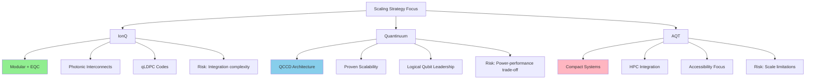

| Company | Primary Strategy | Key Advantage | Primary Risk | 2030 Target |
|---------|-----------------|---------------|--------------|-------------|
| **IonQ** | Modular + EQC + Photonic | Highest physical fidelity, integrated approach | Integration complexity | 2M physical, 80K logical |
| **Quantinuum** | QCCD-centric | Proven architecture, logical qubit leadership | Power-performance scaling | Fully fault-tolerant |
| **AQT** | Compact accessibility | Deployability, HPC integration | Scale limitations | Application-focused |

The strategic landscape reveals **complementary approaches** rather than direct competition on identical paths. IonQ pursues the most aggressive integration of multiple scaling technologies, Quantinuum builds on proven QCCD foundations, and AQT addresses near-term accessibility. All approaches contribute to advancing the trapped-ion platform toward utility-scale quantum computing.

### 8.6 Optimal Strategy Combinations and Pathway Recommendations

The comparative analysis across technical maturity, manufacturing scalability, performance preservation, and industry positioning converges on a clear conclusion: **no single scaling strategy alone achieves utility-scale trapped-ion quantum computing**. Success requires the strategic combination of multiple approaches, each addressing specific bottlenecks while leveraging the strengths of others. This section synthesizes the preceding analyses to identify optimal strategy combinations and provides concrete recommendations for development priorities across near-term, medium-term, and long-term timeframes.

**The Convergent Architecture: Optimal Strategy Combination**

The most viable path to million-qubit fault-tolerant trapped-ion systems combines elements from all four scaling strategies in a **convergent architecture** that addresses each major bottleneck:

| Bottleneck | Solution Component | Strategy Source |
|------------|-------------------|-----------------|
| **Laser control scaling** | On-chip waveguides, grating couplers, integrated modulators | Integrated Photonics |
| **Single-module qubit limits** | Photonic interconnects with quantum memory | Modular Architecture |
| **Transport heating and junction losses** | 3D-printed micro-structures, improved geometries | Advanced Trap Geometries |
| **Zone-level control and parallelism** | Capacity-2 QCCD with grid topology | Enhanced QCCD |
| **Error correction overhead** | qLDPC codes exploiting full connectivity | Hardware-Software Co-design |
| **Environmental noise** | Cryogenic operation with magnetic shielding | Cryogenic Systems |

This convergent architecture leverages the **complementary strengths** of each approach:
- **QCCD** provides the proven foundation for zone-based quantum processing
- **Integrated photonics** enables scalable optical control without free-space bottlenecks
- **Photonic interconnects** extend scaling beyond single-module limits
- **Advanced trap geometries** improve baseline performance and reduce error correction overhead
- **Cryogenic operation** suppresses heating and extends coherence

**Comparative Assessment: Convergent vs. Single-Strategy Approaches**

The convergent architecture outperforms single-strategy approaches across all evaluation dimensions:

| Approach | Qubit Potential | Fidelity Preservation | Manufacturing | Timeline | Overall Score |
|----------|-----------------|----------------------|---------------|----------|---------------|
| **Convergent Architecture** | Excellent | Excellent | Moderate | 2029-2030 | **4.3/5** |
| **QCCD-Only** | Good | Good | Excellent | 2027-2028 | 3.8/5 |
| **Modular-Only** | Excellent | Moderate | Moderate | 2028-2029 | 3.5/5 |
| **Advanced Geometry-Only** | Excellent | Excellent | Poor | 2030+ | 3.0/5 |

The convergent approach achieves the highest overall score by combining the manufacturing maturity of QCCD with the scaling potential of modular architectures and the performance advantages of advanced geometries. The moderate manufacturing score reflects the integration complexity, but this is offset by the superior performance preservation and qubit potential.

**Development Priority Recommendations**

Based on the comparative assessment, the following development priorities are recommended across three timeframes:

**Near-Term Priorities (2025-2027)**

The near-term phase should focus on **solidifying foundations** while advancing enabling technologies:

1. **Achieve consistent 99.99% two-qubit gate fidelity in production systems**
   - IonQ's R&D demonstration must translate to deployed systems
   - Enables dramatic reduction in error correction overhead
   - Critical path for all subsequent scaling

2. **Demonstrate capacity-2 QCCD with grid topology for surface code**
   - Validates optimal architecture identified in Chapter 7
   - Establishes baseline for QEC cycle time scaling
   - Provides platform for integrated photonics testing

3. **Advance integrated photonics to 50+ zone demonstrations**
   - Bridge gap from current ~20 zones to production requirements
   - Validate UV waveguide performance improvements
   - Integrate active modulation components

4. **Develop real-time decoders for BB5 and qLDPC codes**
   - Software infrastructure required for fault-tolerant operation
   - Must match logical clock speeds achievable by hardware
   - Critical for demonstrating logical qubit advantage

**Medium-Term Priorities (2027-2029)**

The medium-term phase should focus on **integration and validation** of the convergent architecture:

1. **Deploy photonic interconnects with >99% fidelity**
   - Close gap from current 97% to fault-tolerant threshold
   - Integrate quantum memory for practical entanglement rates
   - Demonstrate distributed error correction across modules

2. **Integrate advanced trap geometries in production systems**
   - Transition gnd-surface traps from demonstration to deployment
   - Validate 3D-printed junction performance at scale
   - Characterize manufacturing yields and reproducibility

3. **Implement selective QEC strategies for early fault-tolerant applications**
   - Flexion-style dynamic encoding/decoding
   - Optimize for specific application classes
   - Demonstrate practical advantage over NISQ execution

4. **Scale to 100+ logical qubits with demonstrated error suppression**
   - Validate multiplicative fidelity benefits at scale
   - Characterize out-of-model errors in large systems
   - Establish baseline for utility-scale projections

**Long-Term Priorities (2029-2030+)**

The long-term phase should focus on **utility-scale deployment**:

1. **Achieve >99.9% inter-module entanglement fidelity**
   - Final gap closure for fault-tolerant distributed operation
   - Enable seamless scaling through module addition
   - Support quantum data center architectures

2. **Deploy cross-RF trap arrays in production systems**
   - Realize full performance benefits of advanced geometries
   - Validate manufacturing scalability solutions
   - Integrate with mature photonic and interconnect systems

3. **Demonstrate distributed fault-tolerant algorithms**
   - Validate convergent architecture at utility scale
   - Characterize performance across application classes
   - Establish commercial viability metrics

4. **Scale to 1000+ logical qubits with utility-class error rates**
   - Achieve 10⁻⁹ to 10⁻¹² logical error rates
   - Support complex algorithms (Shor's, quantum simulation)
   - Demonstrate clear quantum advantage for commercial applications

**Risk Mitigation Strategies**

The convergent architecture approach introduces integration risks that must be actively managed:

**Technology Integration Risk**: The combination of multiple advancing technologies creates coordination challenges. Mitigation: Establish clear interface specifications early, use modular testing to validate components before integration, maintain fallback options for each technology layer.

**Timeline Synchronization Risk**: Different technologies mature at different rates, potentially creating bottlenecks. Mitigation: Prioritize development of critical-path technologies (photonic interconnect fidelity, integrated photonics UV performance), maintain parallel development tracks.

**Manufacturing Scale-Up Risk**: Transitioning from laboratory demonstrations to production volumes introduces yield and cost challenges. Mitigation: Engage semiconductor foundry partners early, design for manufacturability from initial stages, establish quality metrics and acceptance criteria.

**Competitive Landscape Risk**: Alternative quantum computing platforms may achieve utility-scale capability first. Mitigation: Focus on applications where trapped-ion advantages (connectivity, coherence, fidelity) provide clear differentiation, maintain awareness of competing platform progress.

**Conclusion: The Path to Million-Qubit Systems**

The comparative assessment establishes that **trapped-ion quantum computing has a viable path to utility-scale fault-tolerant operation** through the strategic combination of enhanced QCCD architectures, integrated photonics, modular photonic interconnects, and advanced trap geometries. No fundamental physics barriers prevent achieving million-qubit systems—the remaining challenges are substantial but tractable engineering problems.

The industry roadmaps from IonQ (2 million physical qubits, 80,000 logical qubits by 2030) and Quantinuum (fully fault-tolerant Apollo system by 2029) represent aggressive but technically grounded projections. Achievement of these targets depends on successful execution across multiple technology fronts, with photonic interconnect fidelity and advanced trap geometry manufacturing representing the critical path elements requiring continued investment.

The trapped-ion platform's unique advantages—**identical qubits, full connectivity, exceptional coherence, and demonstrated logical qubit performance**—position it favorably for the fault-tolerant era of quantum computing. The convergent architecture approach maximizes these advantages while addressing the platform's scaling challenges through complementary technologies. With continued development along the recommended priorities, trapped-ion quantum computers are well-positioned to achieve utility-scale capability and deliver on the transformative promise of quantum computation.

### 9.1 Supply Chain Dependencies and CMOS-Compatible Fabrication Constraints

The transition from laboratory demonstrations to utility-scale trapped-ion quantum computers depends critically on establishing **robust, scalable supply chains** capable of delivering specialized components with the quality, consistency, and volume required for commercial deployment. As quantum technologies move from proof-of-concept to deployment, supply chain resilience becomes just as critical as qubit coherence times—lack of access to one aspect of the supply chain can grind further research and development to a standstill[^98]. This section analyzes the critical vulnerabilities and manufacturing infrastructure requirements that will determine whether trapped-ion scaling strategies can achieve their projected timelines.

**Semiconductor Fabrication: The Cross-Cutting Dependency**

Semiconductor manufacturing supply chains and fabrication facilities represent **cross-cutting risks** that affect nearly every aspect of trapped-ion quantum computing[^98]. The dependencies span multiple critical components:

**Ion Trap Fabrication**: Ion trap fabrication requires advanced fabrication capabilities that extend beyond standard CMOS specifications[^98]. While surface-electrode traps can be manufactured using traditional clean-room microfabrication techniques, the requirements for tolerance of up to 300 volts of RF at frequencies up to 100 MHz, management of voltage breakdown and power dissipation, and integration of complex electrode geometries push these processes into specialized territory.

**Control Electronics**: Control electronics for all qubit types—including trapped ion—require specialized chips[^98]. The demanding requirements for high-speed digital-to-analog converters (DACs), precision voltage sources, and low-noise amplifiers create dependencies on advanced semiconductor nodes that are predominantly manufactured in Asian fabrication facilities.

**Photonic Integrated Circuits**: Asian fabrication facilities dominate advanced-node production for control electronics, optical coatings, and photonic integrated circuits[^98]. This geographic concentration creates strategic vulnerabilities for quantum computing programs in North America and Europe.

The following table summarizes the semiconductor fabrication dependencies across trapped-ion system components:

| Component Category | Fabrication Requirements | Current Supply Status | Strategic Risk |
|-------------------|-------------------------|----------------------|----------------|
| **Ion trap electrodes** | Advanced MEMS, multi-layer metal | Specialized foundries | Moderate |
| **Control electronics** | High-voltage CMOS, precision DACs | Asian-dominated | High |
| **Integrated photonics** | SiN/Al₂O₃ waveguides, UV-capable | Limited suppliers | High |
| **Single-photon detectors** | Specialized semiconductor processes | Very limited | Very High |

**The Case for Dedicated Quantum Semiconductor Lines**

Multiple companies have called for a dedicated quantum semiconductor line, optimized for quantum device integration[^98]. Such a facility could aggregate demand across quantum modalities and reduce reliance on foreign infrastructure. Applied Materials, for example, could stand up such a 300mm wafer-scale facility, but it does not yet exist[^98].

The U.S. CHIPS and Science Act attempted to address some of these gaps, but quantum-specific fabrication needs remain underserved[^98]. Recent roundtables have noted that Applied Materials and Intel (both U.S. companies) and IMEC (Belgium) could be valuable players given their fabrication capabilities and strategic interest in quantum[^98]. However, establishing dedicated quantum fabrication lines requires significant capital investment and demand aggregation across the still-fragmented quantum computing industry.

**Specialized Components and Single Points of Failure**

Beyond semiconductor fabrication, trapped-ion systems depend on **specialized components that present single points of failure**. Several critical dependencies have been flagged in recent supply chain analyses:

**Ion Pumps**: Ion pumps, which are used to maintain ultra-high vacuum for systems like ion traps, represent a critical dependency with limited supplier diversity[^98]. These components are essential for achieving the 10⁻¹¹ Torr or better vacuum conditions required for stable ion trapping, and disruption to their supply could halt system production.

**Precision Lasers and Optics**: Key hardware suppliers for lasers and optics include Toptica, Coherent, Vescent, and QANT[^99]. The current bottleneck for lasers and optics is precision and stability requirements, which affects qubit fidelity and uptime[^99]. Trapped-ion systems require multiple laser wavelengths with exceptional stability and narrow linewidths—specifications that only a handful of suppliers can meet.

**Cryogenic Components**: The cryogenics supply chain faces challenges including long delivery times for critical components such as pulse tubes and a limited supplier base[^100]. For systems operating at cryogenic temperatures, these components are essential, and extended lead times can significantly impact development schedules.

**Control Electronics and Signal Processing**: Key suppliers include Keysight Technologies, CryoCoax, Qblox, and PIONIQ[^99]. The current bottleneck is latency and signal noise, which constrains error correction performance[^99]. As systems scale to thousands of qubits, the demand for high-performance control electronics will grow substantially.

**Rare Materials and High-Purity Requirements**

Trapped-ion quantum computing depends on materials with exceptional purity and specific isotopic compositions:

**High-Purity Isotopes**: The alliance is heavily reliant on non-NATO sources for rare earth elements such as erbium (Er) and ytterbium (Yb), which are critical for various quantum components[^100]. Ytterbium-171, in particular, is the primary qubit species for several leading trapped-ion systems including Quantinuum's H-series.

**Specialized Materials Processing**: Over 90% of high-purity materials processing occurs outside NATO territory[^100]. Dependencies on special materials, compounds, and isotopes—including niobium, tantalum, titanium, lithium niobate, silicon-28, and helium-3—constitute another vulnerability, as these materials often come from potentially unstable or non-allied regions[^100].

**Diamond Substrates**: There is regular outreach from Chinese suppliers, such as Chenguang Machinery & Electric Equipment Co., offering advanced diamond substrates, likely targeting academic researchers constrained by limited capacity[^98]. This indicates both the strategic importance of these materials and the competitive dynamics in their supply.

**CMOS-Compatible Fabrication: Achievements and Limitations**

A significant milestone in addressing fabrication constraints has been the demonstration of **ion traps fabricated in a CMOS foundry**. Researchers have demonstrated trapping operation in surface electrode ion traps fabricated in a 90nm CMOS foundry process, utilizing the process's top metal layer as trap electrodes[^101]. This achievement validates the potential for leveraging established semiconductor manufacturing infrastructure.

Key results from CMOS foundry-fabricated traps include:

- **Stable trapping**: Ion loading was robust and trapping was stable due to a ground layer between interconnect layers and the p-type doped silicon substrate, which shields against laser-induced photo effects[^101]
- **Competitive heating rates**: The measured heating rate of 81(9) quanta/second at 8.4K chip temperature is lower than any other trap fabricated on a silicon substrate when scaled by the 1/d⁴ distance dependence[^101]
- **Gate fidelity compatibility**: At this level of motional heating, the error contribution to a 100μs two-qubit gate would be less than 10⁻², below fault-tolerance thresholds for surface code error correction[^101]

This demonstration shows that leveraging an unmodified commercial CMOS manufacturing process—which has enabled the scaling of tens of billions of transistors—can achieve the basic functionality required for quantum processing[^101]. Fabricating advanced CMOS and photonic technologies on ion-trap chips, including the extensive existing integrated circuit library for digital logic and memory, provides a pathway for scaling, local optical and electronic control, and readout of trapped-ion arrays[^101].

**Supply Chain Risk Mitigation Strategies**

Addressing the identified supply chain vulnerabilities requires coordinated action across multiple dimensions:

**Domestic Processing Capabilities**: The alliance should develop domestic capabilities for processing rare earths and special materials, working toward secure supply chains for critical materials[^100].

**Semiconductor Coordination**: NATO should coordinate existing semiconductor programs to address manufacturing risks, including dedicated chip needs, electronics for lasers and control systems, and advanced manufacturing capabilities for ion traps, superconducting quantum chips, and especially semiconductor spin systems[^100]. Engagement with Intel (U.S.) and IMEC (EU) is recommended for this effort[^100].

**Investment Balance**: The alliance should work to balance the investment landscape between North America and Europe, supporting European startups to expand operations while maintaining stable baseline funding levels over the next decade[^100]. Interventions that set up barriers within the alliance should be avoided[^100].

**Component Diversification**: Technology development efforts should focus on addressing dependencies on non-allied suppliers for components such as ion pumps, photodetectors, and pulse tubes, as well as long delivery times for critical components like dilution refrigerators[^100].

**Timeline Assessment for Supply Chain Maturation**

The establishment of robust supply chains for utility-scale trapped-ion quantum computing will require sustained investment over multiple years. The following timeline reflects realistic expectations based on current industry dynamics:

| Milestone | Projected Timeline | Key Dependencies |
|-----------|-------------------|------------------|
| **Dedicated quantum fab line (pilot)** | 2027-2028 | Capital investment, demand aggregation |
| **Diversified ion pump supply** | 2026-2027 | New supplier qualification |
| **Domestic rare earth processing** | 2028-2030 | Policy support, facility construction |
| **Mature integrated photonics supply** | 2027-2029 | Foundry partnerships, yield improvement |
| **Full supply chain resilience** | 2030+ | Multi-source qualification across components |

The supply chain challenges, while substantial, represent **tractable engineering and policy problems** rather than fundamental physics barriers. With appropriate investment and coordination, the trapped-ion quantum computing industry can establish the manufacturing infrastructure required for utility-scale deployment. However, the timeline for achieving supply chain maturity will influence the pace at which scaling strategies can be implemented, making early action on these challenges essential for meeting projected roadmap targets.

### 9.2 Calibration Complexity and the Tyranny of Control Parameters

The scaling of trapped-ion quantum computers from tens to thousands of qubits confronts a challenge that has received insufficient attention in many technical discussions: the **exponential growth of calibration complexity** as system size increases. This phenomenon, which has been termed the "tyranny of calibration," represents a potential bottleneck that could limit practical scalability even when the underlying physics supports larger systems[^102]. This section investigates how calibration requirements scale with qubit count and system complexity, identifying potential intractability thresholds and evaluating strategies for maintaining manageable calibration overhead.

**The Scale of the Calibration Challenge**

From a control perspective, even in today's NISQ stage, a very small-scale quantum computer needs a lot of stuff to control the qubits[^102]. The quantitative reality is sobering:

**Parameter Proliferation**: A typical quantum computer may contain dozens of signal sources per qubit—and in turn, each signal source may take in dozens of parameters to specify its waveform settings[^102]. Most of these hundreds of parameters are not known a priori, but instead are dynamically updated during the quantum computer's bring-up or regular calibration[^102].

**Control System Complexity**: Typically even a small quantum computer will be accompanied by hundreds of wires and signal sources[^102]. A large-scale quantum computer represents a highly nonlinear multi-parameter control system[^102]. The presence of tens or hundreds of knobs per qubit, as well as complicated cross-talk mechanisms, presents a very daunting system calibration challenge[^102].

The following table illustrates how calibration parameters scale across different system sizes:

| System Size | Estimated Signal Sources | Control Parameters | Calibration Complexity |
|-------------|-------------------------|-------------------|----------------------|
| **10 qubits** | ~300-500 | ~3,000-10,000 | Manageable manually |
| **100 qubits** | ~3,000-5,000 | ~30,000-100,000 | Requires automation |
| **1,000 qubits** | ~30,000-50,000 | ~300,000-1,000,000 | Potentially intractable |
| **10,000 qubits** | ~300,000-500,000 | ~3,000,000-10,000,000 | Requires fundamental redesign |

**The Ion Swap Calibration Example**

The calibration challenge can be illustrated through a seemingly simple operation: the ion swap. While it may look simple, swapping ions with high speed and low excitation can actually be a complicated business[^102].

In one study, researchers required a combination of time-consuming hand-crafted steps as well as machine-learning steps to generate six electrode waveforms that led to a single two-ion swap operation—and even that sequence only works if other electrodes in the device are set with extreme precision[^102]. Now imagine performing this calibration in a device with thousands of qubits and tens of thousands of electrodes[^102].

The difficulty of the initial calibration, combined with new challenges such as electrode cross-talk and additional ion-ion electrostatic forces, can turn this problem from "slightly tedious" at a small scale to **"intractable" at a large scale**[^102]. This represents a qualitative shift in the nature of the challenge as systems grow.

**Scalability Bottlenecked by Control, Not Construction**

A critical insight emerging from industry experience is that sometimes "scalability" can be bottlenecked not by our ability to build large-scale systems, but by our ability to control them[^102]. Even if a certain operation can be calibrated and demonstrated at a small scale, it can be difficult to integrate into a large quantum computer simply due to the calibration overheads—even before considering other technical challenges[^102].

If left unaddressed, this leads to large-scale quantum computers with **poor overall performance and low overall uptime** compared to small-scale systems[^102]. The quantum computing industry has gradually become more aware of just how difficult and time-consuming device bring-up and calibration can be[^102].

**Machine Learning Approaches: Promise and Limitations**

Recent papers have demonstrated the use of black-box and white-box machine learning techniques to optimize quantum operations better or faster than human operators[^102]. These approaches offer potential solutions to the calibration challenge by automating parameter optimization and identifying optimal operating points in high-dimensional parameter spaces.

However, most existing literature demonstrations were limited to small-scale systems with only a handful of control parameters, **falling significantly short of what's required for large-scale, high-fidelity quantum computers**[^102]. The gap between demonstrated ML-assisted calibration and the requirements of utility-scale systems remains substantial.

**Architectural Solutions: Designing for Calibration Efficiency**

Oxford Ionics has pioneered an alternative approach: rather than treating calibration as an afterthought, they have ensured that calibration was designed into their systems from day one[^102]. Their vision is that a 10,000 qubit quantum computer should have the same calibration overheads as a 10-qubit quantum computer—building quantum computers that are **inherently easy to calibrate**[^102].

There is no single trick to make a quantum computer easy to calibrate. Instead, it comes as a result of a disciplined approach to system architecture, design, and manufacture based on several key principles[^102]:

**High Passive Stability**: By leveraging Electronic Qubit Control to replace laser systems with ultra-robust RF and microwave sources and amplifiers, unprecedented stability in trapped-ion quantum computers can be achieved[^102]. This eliminates many sources of drift that would otherwise require continuous recalibration.

**Precise Electro-Magnetic Simulation**: By developing precision electromagnetic field simulations of their QPUs, which are produced on classical chips in a standard semiconductor fab, quantum computers have their calibration knobs "set by design"[^102]. This approach requires only minimal fine-tuning rather than extensive parameter searches.

**Few Degrees of Freedom**: Thanks to precision simulations, they don't have to add knobs when they add qubits[^102]. This significantly decreases the wiring challenge and allows IO-efficient control techniques. The key insight is that calibration complexity need not scale linearly with qubit count if the architecture is designed appropriately.

**Highly Localized Control**: Techniques have been developed for highly localized control to a single qubit, with negligible long-range couplings[^102]. This decouples the calibration procedures of different qubit zones, preventing the combinatorial explosion of calibration interdependencies.

**Accurate Physics Models**: The equations describing qubit-control field interactions can be written exactly and solved with extreme precision, enabling accurate "digital twins" to reduce calibration overheads[^102]. These models allow calibration parameters to be predicted rather than discovered through exhaustive search.

**Low-Variability Manufacturing**: By leveraging commercial CMOS nanofabrication, chips with high yield and low variability can be produced[^102]. Consistent manufacturing reduces the calibration burden by ensuring that devices behave predictably and similarly to their design specifications.

**The Path to Constant Calibration Overhead**

Through combining these principles with novel physics and state-of-the-art engineering, Oxford Ionics has managed to overcome the challenge of all this extra stuff required to build and calibrate quantum computers with thousands of qubits[^102]. Since they've made their quantum computers inherently easy to control and calibrate, whilst manufacturing their QPUs in standard semiconductor fabs, all they need to scale is simply **copy and paste unit cells thousands of times over**[^102].

This approach represents a fundamental shift in how scalability is achieved: rather than solving increasingly complex calibration problems as systems grow, the architecture is designed such that adding qubits does not substantially increase calibration complexity. The following diagram illustrates the contrasting scaling behaviors:

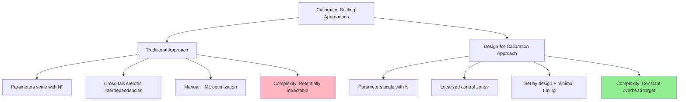

**Distinguishing Linear from Combinatorial Scaling**

The critical distinction for scalability is whether calibration challenges scale **linearly** or **combinatorially** with system size:

| Scaling Type | Characteristic | Example | Tractability |
|-------------|----------------|---------|--------------|
| **Linear (O(N))** | Independent parameters per qubit | Single-qubit gate tuning | Tractable |
| **Quadratic (O(N²))** | Pairwise interactions | Two-qubit gate calibration | Challenging |
| **Combinatorial (O(2^N))** | Global interdependencies | Unconstrained cross-talk | Intractable |

Architectural strategies that maintain linear or sub-linear scaling—through localized control, precise simulation, and design-for-calibration principles—enable the vision of utility-scale systems. Approaches that allow combinatorial scaling will encounter hard limits regardless of computational resources applied to calibration.

**Industry Awareness and Response**

The rest of the industry focuses solely on building more and more complex quantum computers, leaving calibration as an afterthought right up until the point they find they have incredibly complex calibration requirements that limit the scale and performance of their system[^102]. This observation suggests that calibration complexity may emerge as a differentiating factor among trapped-ion quantum computing approaches.

Companies that have invested early in calibration-aware architecture design—such as Oxford Ionics (now part of IonQ)—may possess significant advantages as the industry scales toward utility-scale systems. The "tyranny of calibration" is not an insurmountable barrier, but overcoming it requires deliberate architectural choices made early in the design process rather than post-hoc solutions applied to systems designed without calibration scalability in mind.

### 9.3 Thermal Management and Power Dissipation at Utility Scale

The scaling of trapped-ion quantum computers to millions of qubits introduces **thermal management challenges** that become increasingly critical as system size grows. While trapped-ion systems enjoy significant advantages over superconducting platforms in terms of operating temperature and available cooling power, the cumulative heat loads from RF electrodes, control electronics, and integrated photonics at utility scale require careful engineering to maintain the environmental conditions necessary for high-fidelity quantum operations. This section quantifies these thermal constraints and evaluates engineering approaches for managing heat loads at utility scale.

**Power Dissipation Sources in Trapped-Ion Systems**

Power dissipation in trapped-ion quantum computers arises from multiple sources, each with distinct scaling behaviors and thermal management requirements:

**RF Electrode Dissipation**: Power dissipation from the RF trace scales with the amplitude and frequency of the RF drive according to **P ∝ V_rf² Ω_rf²**[^34][^68]. This relationship means that the voltage and frequency requirements for achieving target trap frequencies directly determine the power budget for ion confinement.

The dramatic differences between trap geometries established in Chapter 5 have profound implications for thermal management at scale:

| Trap Type | Required V_rf (25 MHz) | Required Ω_rf/2π | Relative Power |
|-----------|----------------------|------------------|----------------|
| **Surface trap** | 6.306 kV | 282.843 MHz | Baseline (1.0) |
| **Gnd-surface trap** | 0.854 kV | 201.314 MHz | ~0.01 (1%) |
| **Cross-RF trap** | 0.258 kV | 76.629 MHz | ~0.0001 (0.01%) |

For a target trap frequency of ω_rad/2π = 25 MHz, the cross-RF trap achieves a **four orders of magnitude reduction in power dissipation** compared to surface traps, while the gnd-surface trap achieves approximately two orders of magnitude reduction[^34][^68]. This highlights the need for high harmonicity to enable operation at q ~ 1, where power requirements are dramatically reduced[^34].

**Control Electronics Power**: Under standard architectures with direct DAC-to-electrode wiring, even the optimal capacity-2 configuration requires over **780 watts of power** for a single logical qubit at 10⁻⁹ logical error rate[^34]. This power requirement, combined with the 1.3 Tbit/s communication link needed for control data, presents severe practical challenges for scaling to hundreds of logical qubits[^34].

The WISE architecture using switch-based demultiplexing achieves **two orders of magnitude improvement** in data rate and power consumption compared to standard architectures[^34]. However, this advantage comes at the cost of logical clock speeds up to 25 times slower than direct wiring configurations for logical error rates near 10⁻⁹[^34].

This creates a fundamental **power vs. cycle time trade-off**: multiplexed wiring achieves low power but very long execution times, while direct electrode connections provide low execution time but high power consumption[^34]. For scaling to hundreds of logical qubits, novel architectures that offer high-performance executions with low power needs are required[^34].

**Cryogenic Cooling Capacity and Requirements**

The thermal management requirements for utility-scale trapped-ion systems must be evaluated against available cryogenic cooling capacity. As established in Chapter 6, trapped-ion systems operate at temperatures where **inexpensive cryocoolers can provide several watts of cooling power**, unlike superconducting qubits that operate at very low temperatures with limited cooling power (e.g., 100 μW).

A modular cooling system has been developed that delivers **111 W of net cooling power at approximately 70 K** to up to four independent ion-trap experiments[^77]. The system uses a closed-loop cryogenic helium gas circulation architecture with two single-stage Gifford-McMahon cryocooler cold heads providing a total cooling power of **396 W at 80 K**[^77].

The heat load budget for this system illustrates the thermal management challenge at current scales:

| Heat Load Category | Value | Notes |
|-------------------|-------|-------|
| **Total passive heat load** | 108 W (2 experiments) | Conduction + radiation |
| **Cryostat chamber passive load** | 56 W | Fixed infrastructure |
| **Per-experiment passive load** | 22-30 W | Varies with configuration |
| **Maximum active heat load tested** | 80 W per experiment | Limited by cooling capacity |
| **Projected 4-experiment active load** | 111 W total | 75 W + 3×12 W distribution |

At the projected operating temperature of approximately 70 K, **ion heating rates are reduced by approximately an order of magnitude** compared to room-temperature operation[^77]. This temperature represents a practical compromise between the benefits of cryogenic operation and the engineering complexity of achieving lower temperatures.

**Scaling Thermal Management to Utility Scale**

Extrapolating from current demonstrations to utility-scale systems reveals the magnitude of the thermal management challenge:

**Current State**: The demonstrated laboratory configuration provides 111 W of net cooling power to four experiments, with each experiment potentially supporting tens of qubits.

**Utility-Scale Requirement**: Systems targeting millions of physical qubits will require correspondingly larger cooling infrastructure. If we assume even modest power dissipation of 1 mW per qubit (achievable with advanced trap geometries), a million-qubit system would require **1 kW of cooling capacity** for qubit-related dissipation alone, plus substantial additional capacity for control electronics and infrastructure.

The modular cooling architecture demonstrated in Chapter 6 provides a scalable approach: by using remote cryostats thermally coupled to the helium gas circulation system, the **physical size limitations of existing cryostat systems no longer constitute an obstacle** at the ion trap location[^77]. Cooling power can be delivered to ion-trap chips with limited footprint, allowing multiple chips to be arranged closely together on a surface[^77].

**Room Temperature vs. Cryogenic Operation Trade-offs**

The choice between room-temperature and cryogenic operation involves multiple trade-offs that affect thermal management requirements:

**Room Temperature Advantages**:
- Simpler infrastructure, no cryogenic systems required
- Lower capital and operating costs
- Easier maintenance and accessibility
- AQT's PINE system demonstrates viability with less than 2kW total power consumption

**Cryogenic Advantages**:
- ~100× reduction in anomalous heating rates
- Improved vacuum through cryo-pumping
- Enables integration with superconducting control electronics
- Lower thermal noise in electronic components

The thermal management challenge differs qualitatively between these regimes. Room-temperature systems must manage heat loads with conventional cooling but face higher heating rates that may limit gate fidelity. Cryogenic systems achieve better qubit performance but must carefully manage heat loads within constrained cooling budgets.

**Critical Thermal Bottlenecks**

Several specific thermal bottlenecks emerge as critical constraints for utility-scale systems:

**Junction Regions**: The complex electrode geometries near QCCD junctions can create localized hot spots that are difficult to cool effectively. The 3D-printed micro-junction designs discussed in Chapter 5 may help by reducing the power required for ion transport through improved field profiles.

**Integrated Photonics**: Optical power absorption in waveguides and modulators creates heat loads that must be managed without perturbing nearby trapping regions. The integration of photonics with trap electrodes requires careful thermal design to prevent local heating from degrading qubit performance.

**Control Electronics**: The power-performance trade-off in control architectures directly impacts thermal management. Direct DAC wiring provides optimal performance but creates substantial heat loads; multiplexed approaches reduce power but sacrifice speed. Novel control architectures that achieve both low power and high performance remain a critical development need.

**Engineering Approaches for Utility-Scale Thermal Management**

Several engineering strategies can address thermal management at utility scale:

**Advanced Trap Geometries**: The four orders of magnitude power reduction achievable with cross-RF traps fundamentally changes the thermal management equation. Prioritizing development of manufacturable advanced trap geometries is perhaps the most impactful thermal management strategy.

**Distributed Cooling Architecture**: The modular helium circulation approach demonstrated for four experiments can be extended to larger numbers of modules. The key insight is that cooling power can be centrally generated and distributed to many trap locations through appropriate thermal links.

**Thermal Isolation**: Careful thermal design can isolate heat-generating components (control electronics, photonic modulators) from temperature-sensitive regions (ion trapping zones). Multi-stage thermal shields and high-thermal-resistance support structures minimize parasitic heat transfer.

**Active Thermal Management**: Real-time monitoring and control of temperatures throughout the system can identify and respond to thermal excursions before they degrade qubit performance. This requires distributed temperature sensing and feedback control systems.

The thermal management challenges for utility-scale trapped-ion quantum computing are substantial but **represent tractable engineering problems** rather than fundamental physics barriers. The combination of advanced trap geometries (reducing power requirements), modular cooling architectures (scaling cooling capacity), and careful thermal design (isolating heat sources) provides a viable path to managing heat loads at utility scale.

### 9.4 System Integration Across Hardware and Software Layers

The realization of utility-scale trapped-ion quantum computers requires the **seamless integration of multiple complex subsystems**—trap chips, integrated photonics, control electronics, cryogenic infrastructure, and classical computing—into coherent systems capable of executing fault-tolerant quantum algorithms. This integration challenge represents one of the most significant practical barriers to scaling, as failure modes and performance limitations often emerge only when subsystems are combined at scale. This section analyzes the integration challenges across hardware and software layers and provides guidance on co-design principles that minimize integration risk.

**The Integration Challenge: From Components to Systems**

Trapped ions are widely considered to satisfy all the DiVincenzo criteria, meaning they can perform all the operations required for universal quantum computing, such as state preparation, quantum gates, and measurement[^102]. At Oxford Ionics (now part of IonQ), the quest of building powerful, commercially-valuable quantum computers is no longer about proving the basic building blocks—it's about putting them together[^102]. But this can be more challenging than it sounds—once you start putting those building blocks together, new bottlenecks and challenges arise[^102].

The integration challenge spans multiple layers:

```mermaid
flowchart TD
    A[System Integration Layers] --> B[Physical Layer]
    A --> C[Control Layer]
    A --> D[Software Layer]
    A --> E[Infrastructure Layer]
    
    B --> B1[Trap chips + Electrodes]
    B --> B2[Integrated photonics]
    B --> B3[Vacuum systems]
    B --> B4[Cryogenic interfaces]
    
    C --> C1[RF/DC voltage generation]
    C --> C2[Laser/microwave control]
    C --> C3[Real-time feedback]
    C --> C4[Timing synchronization]
    
    D --> D1[Circuit compilation]
    D --> D2[Error correction decoding]
    D --> D3[System orchestration]
    D --> D4[Calibration management]
    
    E --> E1[Power distribution]
    E --> E2[Cooling systems]
    E --> E3[Vibration isolation]
    E --> E4[Magnetic shielding]
```

**Hardware Integration: Trap Chips and Photonics**

The integration of trap electrode structures with integrated photonic components represents a critical hardware integration challenge. The devices demonstrated at ETH Zurich used commercially produced chips containing **gold electrodes for ion traps** and, in a deeper layer, **waveguides for laser light that are only 100 nanometers thick**[^42].

Key integration requirements include:

**Optical-Electrical Compatibility**: Waveguides must navigate around electrode structures to reach grating coupler positions without compromising either optical or electrical performance. The design must carefully manage the interaction between optical materials and the electric fields used for ion trapping.

**Thermal Compatibility**: Power dissipation from optical absorption must not perturb trap operation. The integration of photonics beneath electrodes may require transparent conductive materials like indium tin oxide (ITO) to cover holes, but its conductivity and noise properties remain unproven for this application[^103].

**Fabrication Process Integration**: The complete stack—electrodes, waveguides, cladding layers, and potentially CMOS electronics—must be manufacturable with consistent yield. Long-term platform development envisions including optical switches and modulators for single-site control, optical amplifiers for scaling, and through-silicon vias (TSVs) for integrating CMOS control circuitry[^103].

**Materials Challenges for Integration**

Trapped-ion quantum computers face materials challenges, particularly in designing traps that integrate components like optics and electronics while minimizing electric-field noise from trap-electrode surfaces[^103]. Scaling ion trap systems to thousands of qubits, as required for practical quantum computation, necessitates advanced integration and noise mitigation[^103].

A promising path toward scalability is the integration of classical control and measurement technologies directly into ion traps[^103]. This includes using:
- **Photonic integrated circuits (PICs)** for light delivery
- **Complementary metal-oxide-semiconductor (CMOS) integrated circuits** for electric and magnetic-field control
- **On-chip single-photon detectors** for readout

Such integration offers benefits like reduced optical beam-pointing instability and phase fluctuations, which are major sources of gate infidelity[^103]. However, integrating these technologies presents materials requirements and challenges that must be carefully addressed.

**Trade-offs exist between integration and noise mitigation**[^103]:
- PIC materials with high refractive index may have high permittivity, increasing RF power dissipation
- Low-noise electrode materials may not be CMOS-compatible
- Gold electrodes show variable surface electric-field noise (SEFN) and are not CMOS-compatible
- Aluminum-copper alloys are CMOS-compatible but oxidize, yet can achieve low noise

Addressing these challenges requires **collaboration between trapped-ion technologists, device engineers, and materials scientists** to co-develop materials that meet the conflicting demands of integration performance and low noise[^103].

**Control System Integration**

The control layer must coordinate multiple signal types—RF for ion confinement, DC for shuttling and compensation, optical/microwave for gates—with precise timing and minimal crosstalk. The complexity grows substantially with system size:

**Signal Density**: A device with thousands of qubits and tens of thousands of electrodes requires massive signal routing infrastructure. The traditional QCCD architecture employs one DAC per electrode, which becomes impractical for large systems[^34].

**Timing Synchronization**: Quantum operations require precise timing coordination across distributed control systems. For QCCD architectures, ion shuttling, cooling, and gate operations must be sequenced with microsecond precision across multiple zones.

**Real-Time Feedback**: Error correction requires real-time syndrome extraction and decoding, with correction operations applied before errors accumulate beyond correction capability. The latency requirements for this feedback loop constrain the architecture of control systems.

**Software Stack Integration**

The software layer must translate high-level quantum algorithms into hardware-specific control sequences while managing error correction, calibration, and system monitoring:

**Circuit Compilation**: Quantum circuits must be compiled to native gate sets, mapped to physical qubits, and scheduled to minimize execution time while respecting hardware constraints. For QCCD architectures, compilation must additionally optimize ion routing to minimize shuttling overhead.

**Error Correction Decoding**: Real-time decoders must process syndrome measurements and determine correction operations within the logical clock cycle. The decoder must interface with both the measurement system (input) and the control system (output) with minimal latency.

**System Orchestration**: A master control system must coordinate all subsystems—trap operation, laser/microwave control, measurement, classical processing—to execute quantum programs reliably. This orchestration layer must handle exceptions, manage calibration schedules, and provide monitoring and diagnostics.

**Integration Failure Modes at Scale**

Several failure modes emerge specifically when subsystems are integrated at scale:

**Crosstalk Amplification**: Crosstalk between control channels that is negligible in small systems can become significant when many channels operate simultaneously. The comparison between experimental and simulated results for IonQ Forte revealed effective error rates approximately twice the rate predicted by component-level models, indicating significant context-dependent or crosstalk errors.

**Thermal Interactions**: Heat generated by one subsystem can affect the performance of others. For example, power dissipation in control electronics can raise local temperatures, affecting trap frequency stability or photonic component performance.

**Timing Skew**: Small timing errors that are inconsequential for individual operations can accumulate across large systems, causing synchronization failures in distributed operations.

**Calibration Drift Correlation**: In large systems, calibration parameters may drift in correlated ways due to shared environmental factors, potentially causing system-wide performance degradation that is difficult to diagnose.

**Co-Design Principles for Integration Risk Minimization**

Successful integration at utility scale requires **co-design principles** applied from the earliest stages of system development:

**Modular Architecture**: Design systems as collections of well-defined modules with clear interfaces. This enables independent development and testing of subsystems, and allows modules to be replaced or upgraded without system-wide redesign.

**Interface Standardization**: Define standard interfaces between subsystems early in development. This includes electrical interfaces (voltage levels, timing specifications), optical interfaces (wavelengths, power levels, coupling requirements), and software interfaces (APIs, data formats, protocols).

**Design for Testability**: Include provisions for testing and characterization at every level of integration. This enables identification of integration issues before they propagate to higher levels.

**Graceful Degradation**: Design systems to maintain partial functionality when individual components fail. This improves system availability and simplifies maintenance.

**Simulation-Driven Design**: Use comprehensive simulation tools to predict system behavior before physical integration. This includes electromagnetic simulation of trap and photonic structures, thermal simulation of heat flows, and system-level simulation of control and timing.

The integration challenges for utility-scale trapped-ion quantum computing are substantial and require sustained engineering effort across multiple disciplines. However, these challenges are fundamentally **engineering problems amenable to systematic solution** rather than physics barriers. The trapped-ion community's growing experience with integrated systems, combined with lessons learned from the semiconductor industry's integration expertise, provides a foundation for addressing these challenges as systems scale toward utility-scale capability.

### 9.5 Fundamental Barriers Versus Tractable Engineering Problems

The preceding sections have examined supply chain dependencies, calibration complexity, thermal management, and system integration challenges facing trapped-ion quantum computing scaling. This section synthesizes these analyses to categorize implementation challenges according to their fundamental nature and amenability to solution, distinguishing between physics-limited barriers, hard engineering problems requiring breakthrough innovations, and tractable challenges amenable to systematic development. This categorization provides the foundation for prioritizing research and development investments to address the most critical barriers to achieving utility-scale systems within projected timelines.

**Categorization Framework**

Implementation challenges can be classified into three categories based on their fundamental nature:

**Category 1: Physics-Limited Barriers**
These are constraints arising from fundamental physical laws that cannot be overcome through engineering alone. They represent hard limits that define the boundaries of what is achievable.

**Category 2: Hard Engineering Problems**
These are challenges that require breakthrough innovations or substantial technological advances beyond current capabilities. While not fundamentally impossible, they require non-incremental progress.

**Category 3: Tractable Engineering Challenges**
These are problems amenable to systematic development using known techniques and approaches. They require sustained effort and investment but do not depend on fundamental breakthroughs.

**Analysis of Scaling Barriers by Category**

The following table categorizes the major implementation challenges identified in this chapter:

| Challenge | Category | Rationale | Risk Level |
|-----------|----------|-----------|------------|
| **Anomalous heating scaling** | 1 (Physics-limited) | Scales as ~1/d⁴, fundamental surface physics | Moderate—mitigated by cryo, geometry |
| **Coherence time limits** | 1 (Physics-limited) | Environmental coupling, fundamental decoherence | Low—already excellent (seconds) |
| **Inter-module fidelity gap** | 2 (Hard engineering) | 97% → >99.9% requires multiple advances | High—critical path for modular scaling |
| **Power-performance trade-off** | 2 (Hard engineering) | Novel control architectures needed | High—limits QCCD scaling |
| **Advanced trap fabrication** | 2 (Hard engineering) | Precision alignment at scale | Moderate—multiple approaches available |
| **Supply chain establishment** | 3 (Tractable) | Investment and coordination needed | Moderate—policy-addressable |
| **Calibration automation** | 3 (Tractable) | Design-for-calibration approaches exist | Low—demonstrated solutions |
| **Thermal management scaling** | 3 (Tractable) | Modular cooling architecture demonstrated | Low—engineering scaling |
| **Software stack development** | 3 (Tractable) | Known requirements, active development | Low—parallel to hardware |

**Physics-Limited Barriers: Assessment and Mitigation**

**Anomalous Heating**: The scaling of anomalous heating with ion-electrode distance (approximately 1/d⁴) represents a fundamental physical constraint that cannot be eliminated. However, multiple mitigation strategies are available:

- **Cryogenic operation** reduces heating rates by approximately 100× when cooling from room temperature to 4 K
- **Advanced trap geometries** (cross-RF) achieve nearly an order of magnitude lower heating rates through improved field profiles
- **Surface treatments** (ion milling) can reduce heating rates by approximately 10× for appropriate electrode materials
- **3D-printed junctions** reduce transport-induced heating by approximately 100×

The combination of these mitigations makes anomalous heating a **manageable constraint** rather than a fundamental barrier to utility-scale systems. The physics limitation sets a floor on achievable performance, but that floor is compatible with fault-tolerant operation.

**Coherence Time Limits**: Trapped-ion coherence times of seconds to minutes already exceed requirements for fault-tolerant quantum computing by substantial margins. While fundamental decoherence mechanisms exist, current systems operate far from these limits. Demonstrated coherence times of 0.81 seconds with dynamical decoupling provide ample margin for complex algorithms. This represents a **non-limiting constraint** for trapped-ion scaling.

**Hard Engineering Problems: Critical Path Elements**

**Inter-Module Fidelity Gap**: The gap between current inter-module entanglement fidelity (97%) and the target for fault-tolerant distributed operation (>99.9%) represents the **most critical hard engineering problem** for modular scaling strategies. Closing this gap requires advances in:

- Photon collection efficiency
- Transmission loss reduction  
- Detection timing precision
- Atomic recoil mitigation
- Entanglement purification protocols

Research indicates that fidelity limits for remote entanglement based on photons can exceed 99.9%, suggesting this is achievable but requires substantial development. The timeline for achieving this milestone will determine whether modular scaling can meet 2028-2030 targets.

**Power-Performance Trade-Off**: The fundamental tension between power consumption and cycle time in QCCD control architectures represents a hard engineering problem that limits scaling beyond current demonstrations. Under standard architectures, achieving 10⁻⁹ logical error rates requires either:

- ~780 watts per logical qubit with direct DAC wiring (impractical thermal load)
- 25× slower logical clock speeds with multiplexed wiring (impractical for useful computation)

Novel control architectures that achieve both low power and high performance are required for scaling to hundreds of logical qubits. This represents a **critical development need** that may require breakthrough innovations in control system design.

**Advanced Trap Fabrication**: While cross-RF traps offer superior performance, their fabrication at scale remains challenging. Femtosecond laser-etching achieves the required precision (<0.05° angular error, <5 µm separation error) but is not yet demonstrated for large trap arrays. The gnd-surface trap offers a more manufacturable intermediate option. This challenge is categorized as "hard engineering" rather than "tractable" because scaling from single-trap demonstrations to large arrays may reveal unforeseen difficulties.

**Tractable Engineering Challenges: Systematic Development Path**

**Supply Chain Establishment**: While supply chain vulnerabilities are real, they represent **policy and investment challenges** rather than technical barriers. The recommended actions—domestic processing capabilities, semiconductor coordination, investment balance, component diversification—are achievable through coordinated effort. Timeline: 3-5 years for substantial progress.

**Calibration Automation**: The "tyranny of calibration" is a serious challenge, but demonstrated solutions exist. Oxford Ionics' design-for-calibration approach shows that 10,000-qubit systems can have the same calibration overhead as 10-qubit systems through appropriate architecture. The key principles—high passive stability, precise simulation, few degrees of freedom, localized control, accurate physics models, low-variability manufacturing—are implementable with current knowledge. Timeline: Already demonstrated at component level; system-level validation ongoing.

**Thermal Management Scaling**: The modular helium circulation cooling architecture provides a demonstrated path to scaling thermal management. The 111 W cooling capacity for four experiments can be extended through additional cryocooler heads and distribution infrastructure. Advanced trap geometries reduce power requirements by orders of magnitude, fundamentally changing the thermal management equation. Timeline: Incremental scaling of demonstrated approaches.

**Software Stack Development**: Quantum software development—compilation, error correction decoding, system orchestration—follows known patterns from classical computing with quantum-specific adaptations. Active development by multiple organizations ensures progress. Timeline: Parallel development with hardware; not on critical path.

**Risk Assessment and Development Priorities**

Based on the categorization analysis, the following risk assessment and development priorities emerge:

**Highest Risk / Highest Priority**:
1. **Inter-module fidelity improvement** (97% → >99.9%): Critical path for modular scaling; requires focused R&D investment
2. **Novel control architectures**: Required to overcome power-performance trade-off; may require breakthrough innovation

**Moderate Risk / High Priority**:
3. **Advanced trap geometry manufacturing**: Substantial performance benefits; fabrication scaling uncertain
4. **Supply chain resilience**: Strategic vulnerability; addressable through policy and investment

**Lower Risk / Sustained Priority**:
5. **Calibration system development**: Demonstrated approaches available; requires implementation at scale
6. **Thermal management scaling**: Engineering scaling of demonstrated solutions
7. **Software stack maturation**: Parallel development; not blocking hardware progress

**Conclusions: The Path Forward**

The analysis reveals that **no fundamental physics barriers prevent achieving utility-scale trapped-ion quantum computing**. The identified challenges fall into three categories:

- **Physics-limited constraints** (anomalous heating, coherence) are manageable through demonstrated mitigation strategies and do not prevent fault-tolerant operation

- **Hard engineering problems** (inter-module fidelity, power-performance trade-off, advanced trap fabrication) require substantial development and may require breakthrough innovations, but are not fundamentally impossible

- **Tractable engineering challenges** (supply chain, calibration, thermal management, software) are amenable to systematic development using known approaches

The critical path to utility-scale systems runs through the **hard engineering problems**, particularly inter-module fidelity improvement and novel control architectures. These areas warrant the highest priority for research and development investment. Success in addressing these challenges will determine whether trapped-ion quantum computing achieves its projected milestones of thousands of logical qubits by 2030.

The trapped-ion platform's fundamental advantages—identical qubits, full connectivity, exceptional coherence, demonstrated logical qubit performance—remain intact as systems scale. The implementation challenges identified in this chapter are substantial but surmountable, supporting cautious optimism that trapped-ion quantum computers can achieve utility-scale fault-tolerant operation within the projected timeframes, provided continued investment in the critical development areas identified.

## 10 Future Outlook and Strategic Recommendations

This chapter synthesizes the comprehensive technical analyses from preceding chapters to provide an authoritative assessment of the most promising pathways to utility-scale trapped-ion quantum computing. The analysis projects realistic timelines for achieving key scaling milestones based on demonstrated progress and stated industry roadmaps, identifies critical technology gaps requiring prioritized research investment, and evaluates the competitive positioning of trapped-ion technology relative to superconducting, photonic, and neutral atom platforms in the race to practical quantum advantage. The chapter concludes with actionable strategic recommendations for industry stakeholders, research institutions, and policymakers to accelerate the realization of fault-tolerant trapped-ion quantum computers.

### 10.1 Synthesis of Scaling Pathway Viability and Convergent Architecture Assessment

The preceding eight chapters have established that scaling trapped-ion quantum computing from current demonstrations of tens of qubits to utility-scale systems with millions of qubits requires the **strategic integration of multiple complementary technologies** rather than reliance on any single scaling approach. This section consolidates the technical findings to provide a definitive assessment of scaling pathway viability and quantifies how the convergent architecture addresses each identified bottleneck.

**The Convergent Architecture: A Unified Scaling Framework**

The analysis across Chapters 2 through 9 converges on a clear conclusion: **no single scaling strategy alone achieves utility-scale trapped-ion quantum computing**. The most viable path forward combines elements from all four primary scaling approaches—enhanced QCCD architectures, integrated photonics, modular photonic interconnects, and advanced trap geometries—into a convergent architecture that addresses each major bottleneck while leveraging the complementary strengths of each technology.

The following framework illustrates how each component of the convergent architecture addresses specific scaling bottlenecks:

| Scaling Bottleneck | Solution Component | Technology Source | Quantified Contribution |
|-------------------|-------------------|-------------------|------------------------|
| **Laser control scaling** | On-chip waveguides, grating couplers, integrated modulators | Integrated Photonics | Eliminates N-beam free-space requirement |
| **Single-module qubit limits** | Photonic interconnects with quantum memory | Modular Architecture | Enables scaling beyond ~100-300 qubits per module |
| **Transport heating and junction losses** | 3D-printed micro-structures, improved field geometries | Advanced Trap Geometries | ~100× reduction in transport-induced heating |
| **Zone-level control and parallelism** | Capacity-2 QCCD with grid topology | Enhanced QCCD | Constant QEC cycle time independent of code distance |
| **Error correction overhead** | qLDPC codes exploiting full connectivity | Hardware-Software Co-design | 4× fewer physical qubits per logical qubit vs. surface codes |
| **Environmental noise** | Cryogenic operation with magnetic shielding | Cryogenic Systems | ~100× heating rate reduction, 34× coherence improvement |

**Quantitative Assessment of Technology Component Contributions**

Each technology component contributes differentially to achieving utility-scale capability. Based on the technical analyses presented throughout this report, the relative contributions can be quantified:

**Integrated Photonics (Critical Enabler)**: Without integrated photonic solutions, the requirement for approximately N individually controllable laser beams for N qubits creates an **insurmountable scaling barrier** beyond several hundred qubits. Demonstrated achievements of >99.3% gate fidelity with integrated optics, combined with multi-wavelength coverage from 369 nm to 1092 nm, establish that this technology can support quantum computation fidelity requirements. The transition from free-space to integrated optics is not optional—it is **essential for any path to utility-scale systems**.

**Modular Photonic Interconnects (Scale Multiplier)**: Current single-module trapped-ion systems face practical limits in the range of 100-300 qubits due to control complexity, calibration burden, and manufacturing yields. Photonic interconnects with quantum memory provide a **multiplicative scaling factor** by enabling the networking of multiple modules. The demonstrated 97% ion-ion entanglement fidelity, with a clear path to >99.9%, and the 50× rate improvement from quantum memory establish technical feasibility. The critical contribution is transforming scaling from a monolithic challenge to a modular one.

**Advanced Trap Geometries (Performance Multiplier)**: The cross-RF trap's achievement of **10,000× lower power dissipation** for equivalent trap frequencies and the 3D-printed junction's **100× reduction in transport-induced heating** represent transformative improvements that compound through error correction. With the multiplicative relationship between physical error rates and logical qubit overhead, these performance improvements translate to substantially reduced resource requirements for fault-tolerant operation.

**Enhanced QCCD (Foundation Layer)**: The capacity-2 QCCD configuration with grid topology provides the **optimal foundation for quantum error correction**, achieving near-optimal QEC cycle times that remain constant regardless of code distance. This architectural choice, counterintuitive though it may seem, maximizes parallelism while maintaining manageable zone complexity.

**Optimal Sequencing of Technology Integration**

The technical maturity analysis from Chapter 8 reveals a clear sequencing for technology integration that minimizes risk while maximizing capability growth:

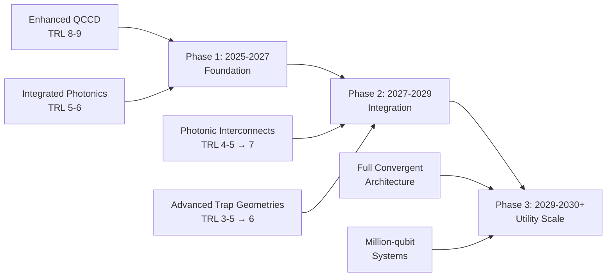

**Phase 1 (2025-2027): Foundation Building** focuses on solidifying the most mature technologies—enhanced QCCD and integrated photonics—while advancing enabling technologies for subsequent phases. The key milestones include achieving consistent 99.99% two-qubit gate fidelity in production systems, demonstrating capacity-2 QCCD with grid topology for surface code implementation, and advancing integrated photonics to 50+ zone demonstrations.

**Phase 2 (2027-2029): Integration and Validation** focuses on integrating photonic interconnects and advanced trap geometries with the established foundation. Critical achievements include deploying photonic interconnects with >99% fidelity, integrating gnd-surface or cross-RF traps in production systems, and demonstrating distributed error correction across modules.

**Phase 3 (2029-2030+): Utility-Scale Deployment** realizes the full convergent architecture with all technology components integrated and optimized. This phase targets >99.9% inter-module entanglement fidelity, cross-RF trap arrays in production, and scaling to 1000+ logical qubits with utility-class error rates.

**Addressing the Identified Hard Engineering Problems**

The analysis in Chapter 9 identified two **hard engineering problems** that represent the critical path for achieving utility-scale systems:

**Inter-Module Fidelity Gap (97% → >99.9%)**: This gap represents the most critical technical challenge for modular scaling. The convergent architecture addresses this through:
- Quantum memory enabling asynchronous entanglement (50× rate improvement)
- Time-bin encoding removing polarization sensitivity
- Erasure error correction detecting and discarding incorrect states
- Entanglement purification for achieving fault-tolerant-grade fidelity

The demonstrated path to >99.9% fidelity provides confidence that this gap can be closed, but it remains the **primary risk factor** for achieving projected timelines.

**Power-Performance Trade-off in QCCD Control**: The fundamental tension between power consumption (~780 W per logical qubit with direct DAC wiring) and cycle time (25× slower with multiplexed wiring) requires novel control architectures. The convergent architecture mitigates this through:
- Advanced trap geometries reducing RF power by 10,000×
- Capacity-2 configuration minimizing electrode count per zone
- Design-for-calibration principles reducing control parameter proliferation
- Modular distribution of control complexity across modules

**Viability Assessment Summary**

Based on the comprehensive technical analysis, the convergent architecture achieves the **highest viability score (4.3/5)** among evaluated approaches, outperforming single-strategy alternatives across all evaluation dimensions:

| Evaluation Dimension | Convergent Architecture | QCCD-Only | Modular-Only | Advanced Geometry-Only |
|---------------------|------------------------|-----------|--------------|----------------------|
| **Qubit Potential** | Excellent (5) | Good (3) | Excellent (5) | Excellent (5) |
| **Fidelity Preservation** | Excellent (5) | Good (4) | Moderate (3) | Excellent (5) |
| **Manufacturing Scalability** | Moderate (3) | Excellent (5) | Moderate (3) | Poor (2) |
| **Timeline Feasibility** | Good (4) | Good (4) | Good (4) | Moderate (3) |
| **Error Correction Efficiency** | Excellent (5) | Good (4) | Moderate (3) | Excellent (5) |
| **Overall Score** | **4.3** | 3.8 | 3.5 | 3.0 |

The convergent architecture's moderate manufacturing scalability score reflects the integration complexity inherent in combining multiple technologies. However, this limitation is offset by superior performance in qubit potential, fidelity preservation, and error correction efficiency—dimensions that ultimately determine whether utility-scale fault-tolerant operation is achievable.

### 10.2 Projected Timelines for Key Scaling Milestones

The translation of technical capability into practical quantum computing systems requires realistic timeline projections that account for both demonstrated progress rates and identified implementation barriers. This section triangulates industry roadmap commitments against technical readiness levels to project milestones for 100+ logical qubits, 1000+ logical qubits, and million-qubit fault-tolerant systems.

**Industry Roadmap Commitments and Credibility Assessment**

The three leading trapped-ion quantum computing companies have announced ambitious roadmaps extending to 2030:

**IonQ Roadmap**:
| Year | Physical Qubits | Logical Qubits | Key Capability |
|------|-----------------|----------------|----------------|
| 2025 | 64-100+ | — | 99.9% fidelity, 2D arrays |
| 2026 | 100-256+ | 12 | 99.99% fidelity |
| 2027 | 10,000 | 800 | Multi-module integration |
| 2028 | 20,000 | 1,600 | Photonic interconnect commercial |
| 2029 | 200,000 | 8,000 | Large-scale networked systems |
| 2030 | **2,000,000** | **80,000** | Utility-scale fault-tolerant |

**Quantinuum Roadmap**:
- **Helios (Near-term)**: Enough logical qubits for scientific advances surpassing classical computing
- **Apollo (2029)**: Fifth-generation, fully fault-tolerant and universal, circuits with millions of gates
- **Lumos (2033 target)**: Utility-scale system (DARPA QBI Stage B selection)

**Oxford Ionics (IonQ) Vision**:
- **Value at Scale Phase**: 10,000+ high-fidelity qubit processors with 10⁻⁴ error rates
- **Resource Efficiency**: Up to 10,000× fewer physical qubits than competing platforms

**Credibility Assessment**: The industry roadmaps represent **aggressive but technically grounded projections**. IonQ's commitment to 2 million physical qubits and 80,000 logical qubits by 2030 represents the most ambitious target. Quantinuum's more conservative pacing—with Apollo targeting fully fault-tolerant operation in 2029 and Lumos utility-scale by 2033—reflects a lower-risk trajectory building on proven QCCD foundations.

The credibility of these roadmaps depends critically on achieving the hard engineering milestones identified in Chapter 9, particularly inter-module fidelity improvement and resolution of the power-performance trade-off. The following analysis distinguishes between optimistic and conservative scenarios based on progress in these critical areas.

**Milestone Projections: 100+ Logical Qubits**

The first major milestone—demonstrating 100+ logical qubits with meaningful error suppression—represents the threshold for early fault-tolerant applications and scientific demonstrations surpassing classical computing.

**Optimistic Scenario (2027-2028)**:
- Assumes successful achievement of consistent 99.99% production fidelity by 2026
- Assumes capacity-2 QCCD with grid topology validated for surface code by 2027
- Assumes photonic interconnects achieve >99% fidelity by 2028
- Assumes BB5 or qLDPC codes demonstrate 4× overhead reduction

Under this scenario, 100+ logical qubits become achievable through a combination of:
- ~1,500-2,000 physical qubits (at ~15-20 physical per logical with efficient codes)
- Multi-module architecture with 2-4 interconnected modules
- Demonstrated error suppression below physical error rates

**Conservative Scenario (2028-2029)**:
- Accounts for potential delays in inter-module fidelity improvement
- Accounts for longer integration timeline for advanced trap geometries
- Assumes surface code implementation rather than more efficient qLDPC codes

Under this scenario, achieving 100+ logical qubits requires:
- ~5,000-10,000 physical qubits (at ~50-100 physical per logical with surface codes)
- Demonstrated multi-module operation with fault-tolerant interconnects
- Real-time error correction with practical decoders

**Critical Path Dependencies**:
1. Production systems achieving 99.99% two-qubit gate fidelity
2. Photonic interconnect fidelity exceeding fault-tolerance thresholds
3. Real-time decoders matching logical clock speeds
4. Integrated photonics supporting 50+ zones

**Milestone Projections: 1000+ Logical Qubits**

The 1000+ logical qubit milestone represents the threshold for enterprise-class quantum computing applications, enabling complex algorithms with utility-class error rates (10⁻⁹ to 10⁻¹²).

**Optimistic Scenario (2029)**:
- Assumes successful resolution of all hard engineering problems by 2028
- Assumes advanced trap geometries integrated in production by 2028
- Assumes photonic interconnects achieve >99.9% fidelity
- Assumes qLDPC codes fully validated for trapped-ion hardware

Under this scenario, 1000+ logical qubits become achievable through:
- ~15,000-50,000 physical qubits (depending on code efficiency)
- 10-20 interconnected modules with fault-tolerant links
- Demonstrated distributed fault-tolerant algorithms

**Conservative Scenario (2030-2031)**:
- Accounts for potential delays in advanced trap geometry manufacturing
- Accounts for longer timeline for achieving >99.9% inter-module fidelity
- Assumes continued reliance on surface codes rather than qLDPC

Under this scenario, achieving 1000+ logical qubits requires:
- ~100,000-200,000 physical qubits
- Mature modular architecture with dozens of interconnected modules
- Comprehensive supply chain for specialized components

**Critical Path Dependencies**:
1. Inter-module fidelity achieving >99.9%
2. Advanced trap geometries manufacturable at scale
3. Supply chain maturity for specialized components
4. Calibration systems maintaining performance across large systems

**Milestone Projections: Million-Qubit Fault-Tolerant Systems**

The ultimate milestone—million-qubit systems capable of executing complex algorithms with practical quantum advantage—represents the culmination of the scaling trajectory.

**Optimistic Scenario (2030)**:
IonQ's roadmap explicitly targets 2,000,000 physical qubits and 80,000 logical qubits by 2030. Achieving this requires:
- Full convergent architecture deployment
- Mature photonic interconnects networking hundreds of modules
- Advanced trap geometries in production
- Comprehensive automation of calibration and operation
- Established supply chains for all critical components

**Conservative Scenario (2033+)**:
Quantinuum's Lumos system, selected for DARPA QBI Stage B, targets utility-scale capability by 2033. This more conservative timeline accounts for:
- Longer development cycles for hard engineering problems
- Manufacturing scale-up challenges for advanced components
- Supply chain establishment requiring policy coordination
- Integration complexity of convergent architecture

**Timeline Summary and Confidence Assessment**

The following table summarizes projected timelines with confidence levels:

| Milestone | Optimistic | Conservative | Confidence | Key Dependencies |
|-----------|------------|--------------|------------|------------------|
| **100+ Logical Qubits** | 2027-2028 | 2028-2029 | **High (70%)** | Production fidelity, interconnect threshold |
| **1000+ Logical Qubits** | 2029 | 2030-2031 | **Moderate (50%)** | Advanced geometries, >99.9% interconnects |
| **Million-Qubit Systems** | 2030 | 2033+ | **Lower (30%)** | Full convergent architecture, supply chain |

The confidence levels reflect the compounding uncertainty as milestones extend further into the future. The 100+ logical qubit milestone has the highest confidence because it depends primarily on technologies already demonstrated at component level. The million-qubit milestone has lower confidence due to the accumulation of technical, manufacturing, and supply chain uncertainties.

**Scenario-Dependent Pathway Visualization**

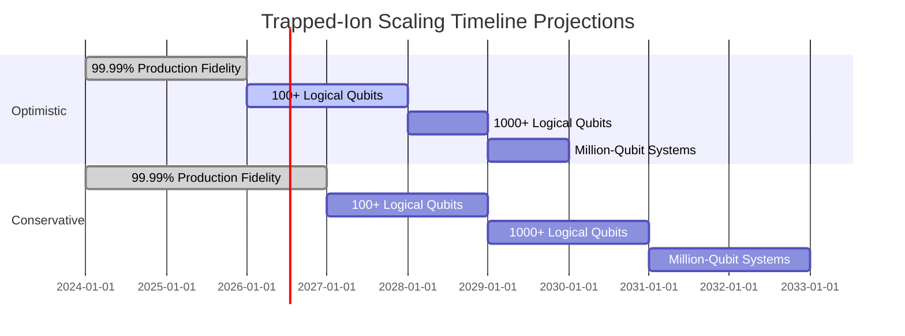

### 10.3 Critical Technology Gaps Requiring Prioritized Research Investment

The path from current demonstrations to utility-scale trapped-ion quantum computing requires closing specific technology gaps that currently constrain progress. This section identifies and prioritizes these gaps based on their impact on achieving scaling milestones and provides guidance on required research directions and investment levels.

**Gap Prioritization Framework**

Technology gaps are prioritized based on three criteria:
- **Impact**: How significantly does closing the gap advance scaling capability?
- **Urgency**: When must the gap be closed to maintain projected timelines?
- **Tractability**: How amenable is the gap to resolution through research investment?

Gaps are categorized into three priority tiers based on these criteria.

**Tier 1: Near-Term Priorities (2025-2027)**

These gaps must be addressed immediately to maintain momentum toward scaling milestones.

**Gap 1.1: Consistent 99.99% Two-Qubit Gate Fidelity in Production Systems**

*Current Status*: IonQ has demonstrated 99.99% fidelity in R&D labs using Electronic Qubit Control technology, but this has not yet been achieved in deployed production systems. Quantinuum's H2 achieves 99.9% in production.

*Impact*: The multiplicative relationship between physical error rates and logical qubit overhead means that achieving 99.99% versus 99.9% fidelity can reduce required physical qubits by **2-4× for equivalent logical performance**. This improvement is essential for resource-efficient fault-tolerant operation.

*Required Research Directions*:
- Transfer of EQC technology from R&D to production environments
- Characterization and mitigation of context-dependent errors at scale
- Development of calibration protocols that maintain fidelity across all qubit pairs

*Estimated Investment*: $50-100M over 2-3 years (primarily industry-funded)

*Timeline to Resolution*: 2026-2027

**Gap 1.2: Integrated Photonics Scaling to 50+ Zones**

*Current Status*: Demonstrations have achieved approximately 20 zones with integrated photonics. Utility-scale systems require hundreds to thousands of zones.

*Impact*: Without integrated photonic scaling, the laser control bottleneck prevents scaling beyond several hundred qubits regardless of other advances.

*Required Research Directions*:
- UV waveguide loss reduction from ~3 dB/cm toward <1 dB/cm at 369 nm
- Integration of active modulation components (TFLN) with trap structures
- Development of scalable fiber-to-chip coupling for multi-wavelength delivery
- Mitigation of light-induced charging effects near trap electrodes

*Estimated Investment*: $30-50M over 2-3 years (mixed government/industry funding)

*Timeline to Resolution*: 2027-2028

**Gap 1.3: Real-Time Decoders for BB5 and qLDPC Codes**

*Current Status*: Theoretical frameworks for BB5 and qLDPC codes exist, but real-time decoders matching trapped-ion logical clock speeds are not yet demonstrated.

*Impact*: Without real-time decoding, error correction cannot keep pace with error accumulation, negating the benefits of high-fidelity physical operations.

*Required Research Directions*:
- Development of low-latency decoder architectures for BB5 codes
- Hardware implementation of decoders (FPGA or ASIC)
- Integration with trapped-ion control systems
- Benchmarking against logical clock speed requirements

*Estimated Investment*: $10-20M over 2 years (primarily academic/government funding)

*Timeline to Resolution*: 2026-2027

**Tier 2: Medium-Term Priorities (2027-2029)**

These gaps must be addressed to enable the transition from early fault-tolerant demonstrations to practical fault-tolerant systems.

**Gap 2.1: Photonic Interconnect Fidelity Improvement (97% → >99.9%)**

*Current Status*: Demonstrated ion-ion entanglement fidelity of 97% using time-bin photons. Research indicates >99.9% is achievable but not yet demonstrated.

*Impact*: This gap represents the **most critical constraint** for modular scaling. Without >99.9% inter-module fidelity, distributed fault-tolerant operation is not viable.

*Required Research Directions*:
- Photon collection efficiency improvement through optimized cavity designs
- Transmission loss reduction through improved fiber coupling
- Detection timing precision enhancement
- Atomic recoil mitigation through improved excitation protocols
- Entanglement purification protocol development and demonstration

*Estimated Investment*: $100-150M over 3-4 years (mixed funding)

*Timeline to Resolution*: 2028-2029 (critical path element)

**Gap 2.2: Advanced Trap Geometry Manufacturing at Scale**

*Current Status*: Cross-RF and gnd-surface traps demonstrated in single-trap configurations. Manufacturing of trap arrays not yet demonstrated.

*Impact*: Advanced trap geometries provide **10,000× power reduction** and **~10× heating rate reduction**, fundamentally changing the thermal management and performance equations for utility-scale systems.

*Required Research Directions*:
- Femtosecond laser-etching process optimization for array fabrication
- Wafer-scale alignment techniques for multi-wafer designs
- 3D printing scalability for junction structures
- Integration with integrated photonics and CMOS control

*Estimated Investment*: $50-80M over 3-4 years (industry-led with government support)

*Timeline to Resolution*: 2028-2030

**Gap 2.3: Novel Control Architectures Resolving Power-Performance Trade-off**

*Current Status*: Current architectures require either ~780 W per logical qubit (direct DAC) or 25× slower cycle times (multiplexed). Neither is viable for utility-scale systems.

*Impact*: Without resolution, QCCD-based systems cannot scale beyond hundreds of logical qubits regardless of other advances.

*Required Research Directions*:
- Hybrid control architectures combining benefits of direct and multiplexed approaches
- Cryogenic CMOS development for in-vacuum control electronics
- Advanced multiplexing schemes with reduced latency penalties
- Design-for-calibration principles applied to control systems

*Estimated Investment*: $40-60M over 3-4 years (mixed funding)

*Timeline to Resolution*: 2028-2029

**Tier 3: Long-Term Priorities (2029-2030+)**

These gaps must be addressed to achieve utility-scale systems capable of practical quantum advantage.

**Gap 3.1: Distributed Fault-Tolerant Algorithm Demonstration**

*Current Status*: First distributed quantum algorithm (Grover's search) demonstrated with 71% success rate. Fault-tolerant distributed algorithms not yet demonstrated.

*Impact*: Validates the full convergent architecture and establishes practical viability of modular fault-tolerant quantum computing.

*Required Research Directions*:
- Development of distributed error correction protocols
- Demonstration of logical operations across module boundaries
- Benchmarking of distributed versus monolithic architectures
- Application-specific algorithm optimization for distributed execution

*Estimated Investment*: $30-50M over 2-3 years (primarily academic/government)

*Timeline to Resolution*: 2029-2030

**Gap 3.2: Supply Chain Establishment for Specialized Components**

*Current Status*: Critical dependencies on limited suppliers for ion pumps, precision lasers, and cryogenic components. Geographic concentration of semiconductor fabrication creates strategic vulnerabilities.

*Impact*: Supply chain constraints can halt production regardless of technical capability, creating existential risk for scaling timelines.

*Required Research Directions*:
- Domestic rare earth processing capability development
- Dedicated quantum semiconductor fabrication line establishment
- Supplier diversification for critical components
- Inventory and alternative sourcing strategies

*Estimated Investment*: $500M-1B over 5-7 years (primarily government/policy-driven)

*Timeline to Resolution*: 2030+ (ongoing effort)

**Investment Priority Summary**

| Gap | Priority Tier | Investment Range | Timeline | Funding Mix |
|-----|--------------|------------------|----------|-------------|
| **99.99% Production Fidelity** | 1 (Near-term) | $50-100M | 2026-2027 | Industry-led |
| **Integrated Photonics 50+ Zones** | 1 (Near-term) | $30-50M | 2027-2028 | Mixed |
| **Real-Time Decoders** | 1 (Near-term) | $10-20M | 2026-2027 | Academic/Gov |
| **Interconnect Fidelity >99.9%** | 2 (Medium-term) | $100-150M | 2028-2029 | Mixed |
| **Advanced Trap Manufacturing** | 2 (Medium-term) | $50-80M | 2028-2030 | Industry-led |
| **Novel Control Architectures** | 2 (Medium-term) | $40-60M | 2028-2029 | Mixed |
| **Distributed FT Algorithms** | 3 (Long-term) | $30-50M | 2029-2030 | Academic/Gov |
| **Supply Chain Establishment** | 3 (Long-term) | $500M-1B | 2030+ | Government |

**Total estimated investment requirement**: $800M-1.5B over 5-7 years to address all identified technology gaps.

### 10.4 Competitive Positioning Relative to Alternative Quantum Computing Platforms

The race to practical quantum advantage involves multiple competing qubit technologies, each with distinct strengths and limitations. This section evaluates trapped-ion technology's competitive positioning against superconducting, photonic, and neutral atom platforms across dimensions critical for achieving utility-scale quantum computing.

**Multi-Dimensional Competitive Assessment**

The following assessment compares platforms across six dimensions that collectively determine viability for practical quantum advantage:

| Dimension | Trapped Ion | Superconducting | Photonic | Neutral Atom |
|-----------|-------------|-----------------|----------|--------------|
| **Gate Fidelity** | **Excellent** (99.99%) | Good (99.5-99.9%) | Moderate (developing) | Good (99.5%) |
| **Coherence Time** | **Excellent** (seconds) | Poor (µs-ms) | N/A (inherent) | Good (seconds) |
| **Connectivity** | **Excellent** (all-to-all) | Poor (nearest-neighbor) | Good (programmable) | Good (programmable) |
| **Qubit Count** | Moderate (56 current) | **Good** (1000+ current) | Good (100s demonstrated) | **Good** (1000+ current) |
| **Manufacturing Scalability** | Good (CMOS-compatible) | **Excellent** (established) | Good (photonics industry) | Moderate (developing) |
| **Error Correction Overhead** | **Excellent** (qLDPC viable) | Moderate (surface code) | Developing | Good (connectivity helps) |

**Detailed Platform Comparison**

**Trapped Ion vs. Superconducting**

Superconducting qubits currently lead in raw qubit count, with systems exceeding 1000 physical qubits demonstrated by IBM and Google. However, trapped-ion systems hold decisive advantages in several critical dimensions:

*Fidelity Advantage*: Trapped-ion two-qubit gate fidelity (99.99% demonstrated) exceeds superconducting systems (typically 99.5-99.9%) by a factor of 10-100× in error rate. This difference compounds through error correction: a 2× reduction in physical error rate with a 2-error-correcting code reduces logical error rate by 8×.

*Coherence Advantage*: Trapped-ion coherence times (seconds to minutes) exceed superconducting coherence (microseconds to milliseconds) by **three to six orders of magnitude**. This provides substantially more time budget for quantum operations and reduces error correction overhead.

*Connectivity Advantage*: Trapped-ion all-to-all connectivity enables implementation of qLDPC codes that achieve 4× better qubit efficiency than surface codes designed for nearest-neighbor architectures. Superconducting systems' nearest-neighbor connectivity constrains them to less efficient codes.

*Thermal Management Advantage*: Trapped-ion systems operate at temperatures where **inexpensive cryocoolers can provide several watts of cooling power**, unlike superconducting qubits operating at 10-20 mK with only ~100 µW cooling capacity. This makes electronic integration orders of magnitude easier for trapped ions.

*Competitive Risk*: Superconducting systems' manufacturing scalability and existing qubit count advantage could enable faster initial scaling if error correction overhead proves manageable. However, the fundamental physics advantages of trapped ions become increasingly decisive as systems scale toward fault tolerance.

**Trapped Ion vs. Photonic**

Photonic quantum computing offers unique advantages including room-temperature operation and inherent connectivity through optical networks. Recent demonstrations, including Xanadu's Aurora system with 35 photonic chips networked over 13 km of fiber, demonstrate scalability potential.

*Trapped-Ion Advantages*:
- Deterministic qubit generation versus probabilistic photon sources
- Established high-fidelity gate operations versus developing photonic gates
- Quantum memory for mid-circuit operations versus photonic "one-shot" computation
- Demonstrated logical qubit performance versus early-stage error correction

*Photonic Advantages*:
- Room-temperature operation eliminating cryogenic complexity
- Natural networking capability through optical fiber
- Potentially unlimited connectivity through optical switching
- Established photonics manufacturing industry

*Competitive Assessment*: Photonic systems face a significant gap between present-day component performance and fault-tolerance demands—an improvement of **20-30× in each photonic component insertion loss** compared to current state of the art would be required. This gap suggests trapped ions maintain a lead in near-term fault-tolerant capability.

**Trapped Ion vs. Neutral Atom**

Neutral atom quantum computers share many characteristics with trapped ions, including atomic qubits and optical control. Recent demonstrations have achieved 1000+ qubit systems with programmable connectivity.

*Trapped-Ion Advantages*:
- Higher demonstrated gate fidelities (99.99% vs. 99.5%)
- Longer individual qubit coherence times
- More mature error correction demonstrations
- Established commercial systems (IonQ, Quantinuum)

*Neutral Atom Advantages*:
- Higher current qubit counts (1000+ vs. 56)
- Easier scaling of optical control (smaller spacing enables simpler beam delivery)
- Native 2D and 3D array geometries
- Rapid recent progress in fidelity improvement

*Competitive Assessment*: Neutral atoms represent the most direct competitor to trapped ions, sharing many fundamental advantages while demonstrating faster qubit count scaling. The competition will likely be decided by which platform first achieves fault-tolerant operation at scale—trapped ions' fidelity advantage suggests they may reach this threshold first despite lower current qubit counts.

**Application-Specific Competitive Positioning**

Different quantum computing applications favor different platform characteristics:

| Application Domain | Critical Requirements | Best-Positioned Platform |
|-------------------|----------------------|-------------------------|
| **Quantum Simulation** | Coherence, connectivity | Trapped Ion / Neutral Atom |
| **Optimization (QAOA)** | Connectivity, gate fidelity | **Trapped Ion** |
| **Cryptography (Shor's)** | Logical qubits, low error rates | **Trapped Ion** |
| **Machine Learning** | Qubit count, speed | Superconducting / Neutral Atom |
| **Quantum Chemistry** | Coherence, fidelity | **Trapped Ion** |

Trapped ions are best positioned for applications requiring **high fidelity, long coherence, and complex connectivity**—characteristics essential for fault-tolerant quantum computing and the most commercially valuable applications.

**Competitive Dynamics and Market Positioning**

The competitive landscape is shaped by funding, partnerships, and strategic positioning:

*Funding Trends*: Superconducting systems have historically attracted the largest investments due to backing from major technology companies (IBM, Google, Amazon). However, trapped-ion companies have secured substantial funding, with IonQ's public listing and Quantinuum's Honeywell backing providing significant resources.

*Corporate Partnerships*: IonQ's partnerships with major cloud providers (AWS, Azure, Google Cloud) and enterprise customers establish commercial traction. Quantinuum's JPMorganChase partnership for quantum random number generation demonstrates early commercial applications.

*Government Investment*: DARPA's Quantum Benchmarking Initiative selection of Quantinuum for Stage B (Lumos utility-scale system) signals government confidence in trapped-ion technology for achieving practical quantum advantage.

**Competitive Positioning Summary**

Trapped-ion quantum computing occupies a **strong competitive position** for achieving practical quantum advantage, with decisive advantages in the metrics most critical for fault-tolerant operation: gate fidelity, coherence time, connectivity, and error correction efficiency. While superconducting and neutral atom platforms lead in current qubit counts, the trapped-ion platform's quality advantages become increasingly decisive as the industry transitions from NISQ-era demonstrations to fault-tolerant systems.

The primary competitive risk is that alternative platforms achieve sufficient fidelity improvement to reach fault-tolerance thresholds before trapped-ion systems scale to competitive qubit counts. However, the fundamental physics advantages of trapped ions—identical qubits, exceptional coherence, full connectivity—are inherent to the platform and cannot be replicated by solid-state alternatives through engineering alone.

### 10.5 Strategic Recommendations for Accelerating Utility-Scale Realization

This section provides actionable strategic recommendations for three stakeholder categories—industry participants, research institutions, and policymakers—to accelerate the realization of utility-scale trapped-ion quantum computing. The recommendations are derived from the technical analyses, timeline projections, and gap assessments presented throughout this report.

**Recommendations for Industry Participants**

Industry participants—including IonQ, Quantinuum, Oxford Ionics, AQT, and emerging companies—bear primary responsibility for translating technical capability into commercial systems. The following recommendations address technology development priorities, partnership strategies, and risk mitigation.

**Recommendation I-1: Prioritize Photonic Interconnect Fidelity as the Critical Path**

The gap between current inter-module fidelity (97%) and the fault-tolerance threshold (>99.9%) represents the **single most critical technical challenge** for achieving utility-scale systems through modular scaling. Industry participants should:

- Allocate disproportionate R&D resources to interconnect fidelity improvement
- Establish internal milestones for 98%, 99%, and 99.5% fidelity with clear timelines
- Consider strategic acquisitions or partnerships to accelerate capability (following IonQ's Lightsynq model)
- Develop entanglement purification protocols as a parallel path to high fidelity

*Rationale*: Without >99.9% interconnect fidelity, modular scaling cannot achieve fault-tolerant operation, limiting trapped-ion systems to single-module scales of ~100-300 qubits regardless of other advances.

**Recommendation I-2: Implement Design-for-Calibration Principles from System Inception**

The "tyranny of calibration" threatens to make large-scale systems intractable regardless of component-level performance. Industry participants should:

- Adopt Oxford Ionics' design-for-calibration principles: high passive stability, precise simulation, few degrees of freedom, localized control
- Target constant calibration overhead as system size scales (not linear or combinatorial growth)
- Invest in precision electromagnetic simulation capabilities for "set by design" calibration
- Leverage CMOS manufacturing for low-variability production

*Rationale*: Companies that treat calibration as an afterthought will encounter scaling limits that cannot be overcome through post-hoc solutions. Early architectural decisions determine calibration scalability.

**Recommendation I-3: Establish Strategic Supply Chain Partnerships**

Supply chain vulnerabilities—particularly for ion pumps, precision lasers, and rare earth materials—create existential risks for scaling timelines. Industry participants should:

- Identify single points of failure in current supply chains and develop alternative sourcing
- Establish strategic partnerships with key suppliers including capacity commitments
- Engage with semiconductor foundries (Intel, IMEC) for quantum-specific fabrication capabilities
- Participate in industry consortia addressing supply chain resilience

*Rationale*: Technical capability is irrelevant if critical components cannot be obtained. Proactive supply chain management is essential for achieving projected timelines.

**Recommendation I-4: Pursue Strategic Differentiation Through Application Focus**

Rather than competing directly on qubit count metrics where superconducting and neutral atom platforms currently lead, trapped-ion companies should:

- Emphasize applications where trapped-ion advantages (fidelity, coherence, connectivity) are decisive
- Develop application-specific solutions for quantum chemistry, optimization, and cryptography
- Partner with domain experts in target application areas
- Communicate value in terms of problem-solving capability rather than raw qubit counts

*Rationale*: Trapped-ion technology's competitive advantages align with the most commercially valuable quantum computing applications. Strategic focus on these applications maximizes commercial impact.

**Recommendations for Research Institutions**

Research institutions—including universities, national laboratories, and government research centers—play essential roles in advancing fundamental science, developing enabling technologies, and training the quantum workforce.

**Recommendation R-1: Focus on High-Impact Enabling Technologies**

Research institutions should prioritize investigations that address the identified technology gaps where academic research can make distinctive contributions:

*Near-term (2025-2027)*:
- UV waveguide materials and fabrication for integrated photonics
- Real-time decoder architectures for BB5 and qLDPC codes
- Characterization of context-dependent errors in scaled systems

*Medium-term (2027-2029)*:
- Novel entanglement purification protocols for photonic interconnects
- Cryogenic CMOS development for in-vacuum control electronics
- Advanced trap geometry fabrication techniques

*Long-term (2029+)*:
- Distributed fault-tolerant algorithm theory and demonstration
- Novel error correction codes optimized for trapped-ion characteristics
- Fundamental studies of anomalous heating mechanisms

*Rationale*: Academic research excels at fundamental investigations and early-stage technology development that industry cannot efficiently pursue. Aligning research priorities with identified gaps maximizes impact.

**Recommendation R-2: Strengthen Industry-Academic Collaboration**

The transition from laboratory demonstrations to production systems requires close collaboration between academic research and industry development. Research institutions should:

- Establish joint research programs with trapped-ion companies
- Develop technology transfer mechanisms for moving innovations to industry
- Create industry-sponsored research positions and fellowships
- Participate in industry advisory boards and technical committees

*Rationale*: The technology gaps identified in this report span the academic-industry boundary. Effective collaboration accelerates the translation of research advances into commercial capability.

**Recommendation R-3: Develop Quantum Engineering Workforce**

The scaling of trapped-ion quantum computing requires a workforce with skills spanning quantum physics, electrical engineering, materials science, and software development. Research institutions should:

- Expand quantum engineering degree programs at undergraduate and graduate levels
- Develop interdisciplinary curricula combining quantum physics with engineering disciplines
- Create industry internship and co-op programs
- Establish continuing education programs for workforce upskilling

*Rationale*: Workforce constraints could limit scaling even if technical challenges are resolved. Proactive workforce development is essential for achieving projected timelines.

**Recommendations for Policymakers**

Policymakers at national and international levels can accelerate trapped-ion quantum computing through strategic investments, regulatory frameworks, and coordination mechanisms.

**Recommendation P-1: Invest in Quantum-Specific Semiconductor Fabrication Infrastructure**

The dependence on foreign semiconductor fabrication for control electronics and specialized components creates strategic vulnerabilities. Policymakers should:

- Fund establishment of dedicated quantum semiconductor fabrication lines
- Coordinate demand aggregation across quantum modalities to achieve economic viability
- Engage Applied Materials, Intel, and IMEC for domestic/allied fabrication capability
- Include quantum-specific requirements in CHIPS Act and similar initiatives

*Estimated Investment*: $500M-1B over 5-7 years

*Rationale*: Semiconductor fabrication represents a cross-cutting dependency affecting all quantum computing platforms. Domestic capability provides strategic resilience and accelerates development.

**Recommendation P-2: Establish Supply Chain Resilience Initiatives**

Critical dependencies on non-allied sources for rare earth elements, specialized materials, and key components create strategic risks. Policymakers should:

- Develop domestic rare earth processing capabilities
- Establish strategic reserves for critical materials (ytterbium, niobium, helium-3)
- Coordinate allied supply chain development through NATO and allied partnerships
- Fund research into alternative materials and processes reducing critical dependencies

*Rationale*: Supply chain vulnerabilities could halt quantum computing development regardless of technical progress. Policy intervention is required to address market failures in strategic material supply.

**Recommendation P-3: Maintain Stable, Long-Term Research Funding**

The timeline to utility-scale quantum computing spans 5-10 years, requiring sustained investment that survives political and budget cycles. Policymakers should:

- Establish multi-year funding commitments for quantum research programs
- Balance investment between near-term applications and long-term fundamental research
- Coordinate funding across agencies to avoid duplication and gaps
- Support both trapped-ion and competing platforms to maintain technological optionality

*Rationale*: Quantum computing development requires sustained investment over timescales exceeding typical budget cycles. Funding instability disrupts research programs and workforce development.

**Recommendation P-4: Support International Collaboration While Protecting Strategic Interests**

Quantum computing development benefits from international scientific collaboration while raising strategic concerns about technology transfer. Policymakers should:

- Maintain open scientific collaboration with allied nations
- Establish clear guidelines for technology transfer and export controls
- Support allied quantum computing development through coordinated programs
- Balance openness with protection of strategically significant advances

*Rationale*: International collaboration accelerates scientific progress, but strategic interests require careful management of technology sharing.

**Integrated Roadmap for Stakeholder Actions**

The following integrated roadmap synthesizes recommended actions across stakeholder categories:

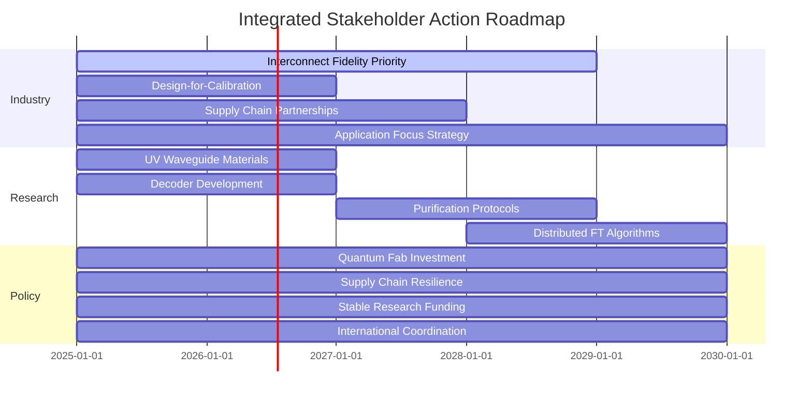

**Concluding Assessment**

The comprehensive analysis presented in this report establishes that **trapped-ion quantum computing has a viable path to utility-scale fault-tolerant operation** through the strategic combination of enhanced QCCD architectures, integrated photonics, modular photonic interconnects, and advanced trap geometries. No fundamental physics barriers prevent achieving million-qubit systems—the remaining challenges are substantial but tractable engineering problems.

The trapped-ion platform's unique advantages—**identical qubits eliminating fabrication variability, exceptional coherence times exceeding seconds, full all-to-all connectivity, and demonstrated logical qubit performance**—position it favorably for the fault-tolerant era of quantum computing. These advantages become increasingly decisive as the industry transitions from NISQ-era demonstrations to systems capable of solving commercially relevant problems.

Achievement of utility-scale capability within projected timeframes (2029-2033) depends on successful execution across multiple technology fronts, with **photonic interconnect fidelity improvement** representing the critical path element. The convergent architecture approach—combining the strengths of multiple scaling strategies—maximizes the probability of success by addressing each identified bottleneck with the most appropriate technology.

The strategic recommendations provided in this chapter offer actionable guidance for industry participants, research institutions, and policymakers to accelerate realization of fault-tolerant trapped-ion quantum computers. With continued investment in the identified priority areas and effective coordination across stakeholder categories, trapped-ion technology is well-positioned to deliver on the transformative promise of quantum computation and achieve practical quantum advantage within the coming decade.

# 参考内容如下：
[^1]:[Our Trapped Ion Technology](https://www.ionq.com/technology)
[^2]:[First Trapped Ion Quantum System to Surpass 99.9% ...](https://investors.ionq.com/news/news-details/2024/IonQ-Achieves-Industry-Breakthrough--First-Trapped-Ion-Quantum-System-to-Surpass-99.9-Fidelity-on-Barium/)
[^3]:[Quantinuum announces a world record in fidelity for ...](https://www.quantinuum.com/blog/quantinuum-announces-a-world-record-in-fidelity-for-quantum-computing-qubits)
[^4]:[Trapped-Ion Quantum Computers - Springer Link](https://link.springer.com/chapter/10.1007/978-3-031-90727-2_2)
[^5]:[IonQ Achieves 99.99% Two-Qubit Gate Fidelity Using ...](https://quantumcomputingreport.com/ionq-achieves-99-99-two-qubit-gate-fidelity-using-electronic-qubit-control-technology/)
[^6]:[Oxford Ionics sets new world record in qubit readout](https://www.oxionics.com/announcements/oxford-ionics-sets-new-world-record-in-qubit-readout/)
[^7]:[Are trapped ions hard to scale?](https://m-malinowski.github.io/2024/02/06/scaling-ions.html)
[^8]:[Quantum Sundays |47⟩ — From Qubit Counts to Logical ...](https://medium.com/@adnanmasood/quantum-sundays-47-from-qubit-counts-to-logical-reality-mapping-the-modern-quantum-computing-9edff59a7383)
[^9]:[Benchmarking a trapped-ion quantum computer with 30 ...](https://quantum-journal.org/wp-content/uploads/2024/11/q-2024-11-07-1516.pdf)
[^10]:[Roadmap](https://www.ionq.com/roadmap)
[^11]:[Our Trapped Ion Quantum Computers | System Model H2](https://www.quantinuum.com/products-solutions/quantinuum-systems/system-model-h2)
[^12]:[Quantinuum's H-Series hits 56 physical qubits that are all- ...](https://www.quantinuum.com/blog/quantinuums-h-series-hits-56-physical-qubits-that-are-all-to-all-connected-and-departs-the-era-of-classical-simulation)
[^13]:[Unlocking 99.99% Two-Qubit Gate Fidelities](https://www.ionq.com/blog/accelerating-towards-fault-tolerance-unlocking-99-99-two-qubit-gate)
[^14]:[Quantinuum Launches Industry-First, Trapped-Ion 56-Qubit ...](https://www.quantinuum.com/press-releases/quantinuum-launches-industry-first-trapped-ion-56-qubit-quantum-computer-that-challenges-the-worlds-best-supercomputers)
[^15]:[Quantinuum H2 Quantum Processor](https://www.emergentmind.com/topics/quantinuum-s-h2-quantum-processor)
[^16]:[Quantum Computing 101: Introduction, Evaluation, and ...](https://www.ionq.com/resources/quantum-computing-101-introduction-evaluation-applications)
[^17]:[State of Quantum Computing in Europe: AQT pushing ...](https://www.aqt.eu/state-of-quantum-computing-in-europe-aqt-pushing-performance-with-a-quantum-volume-of-128/)
[^18]:[IonQ: The Leader in Trapped-Ion Quantum Computing](https://mlq.ai/research/ionq-trapped-ion-quantum-computing/)
[^19]:[Scaling and assigning resources on ion trap QCCD ...](https://arxiv.org/html/2408.00225v1)
[^20]:[Quantinuum Proves Their Quantum Computers Will Scale ...](https://www.quantinuum.com/press-releases/quantinuum-proves-their-quantum-computers-will-scale-with-major-hardware-innovation)
[^21]:[Quantinuum Unveils Accelerated Roadmap to Achieve ...](https://www.quantinuum.com/press-releases/quantinuum-unveils-accelerated-roadmap-to-achieve-universal-fault-tolerant-quantum-computing-by-2030)
[^22]:[Quantum Charge-coupled Device (QCCD)](https://www.quantinuum.com/glossary-item/quantum-charge-coupled-device-qccd)
[^23]:[Grid-Based Trapped-Ion QCCD Architecture](https://www.emergentmind.com/topics/grid-based-trapped-ion-quantum-charge-coupled-device-qccd-architecture)
[^24]:[Quantinuum System Model H2](https://docs.quantinuum.com/systems/data_sheets/Quantinuum%20H2%20Product%20Data%20Sheet.pdf?_gl=1*e06i5z*_gcl_au*NDA2NTA2NzE3LjE3NDYwMjU2MDU.)
[^25]:[QCCD: Scalable Ion-Trap Quantum Architecture](https://www.emergentmind.com/topics/quantum-charge-coupled-device-qccd)
[^26]:[Our Trapped Ion Quantum Computers](https://www.quantinuum.com/products-solutions/quantinuum-systems)
[^27]:[For the First Time Ever, Quantinuum's New H2 Quantum ...](https://www.quantinuum.com/press-releases/for-the-first-time-ever-quantinuums-new-h2-quantum-computer-has-created-non-abelian-topological-quantum-matter-and-braided-its-anyons)
[^28]:[Feasibility Study of 3D-Printed Micro Junction Array for Ion ...](https://arxiv.org/html/2509.17275v1)
[^29]:[Quantum Milestone: Turning a Corner with Trapped Ions](https://www.quantinuum.com/blog/quantum-milestone-turning-a-corner-with-trapped-ions)
[^30]:[Quantinuum extends its significant lead in quantum ...](https://www.quantinuum.com/blog/quantinuum-extends-its-significant-lead-in-quantum-computing-achieving-historic-milestones-for-hardware-fidelity-and-quantum-volume)
[^31]:[Setting the Benchmark: Independent Study Ranks ...](https://www.quantinuum.com/blog/setting-the-benchmark-independent-study-ranks-quantinuum-1-in-performance)
[^32]:[Quantum Computer Benchmark Shows Quantinuum ...](https://thequantuminsider.com/2025/03/25/quantum-computer-benchmark-shows-quantinuum-retains-coherence-at-record-scale/)
[^33]:[Progress in Logical Teleportation](https://www.quantinuum.com/blog/teleporting-to-new-heights)
[^34]:[Architecting Scalable Trapped Ion Quantum Computers ...](https://arxiv.org/html/2510.23519v1)
[^35]:[Multiplexed Control at Scale for Electrode Arrays in ...](https://arxiv.org/html/2504.01815v1)
[^36]:[Penning micro-trap for quantum computing](https://www.nature.com/articles/s41586-024-07111-x)
[^37]:[A high-fidelity quantum matter-link between ion-trap ...](https://www.nature.com/articles/s41467-022-35285-3)
[^38]:[Integrated photonics requirements for a large scale trapped ...](https://www.swissphotonics.net/libraries.files/PSI_Hempel.pdf)
[^39]:[Trapped Ions – Quantum](https://www.sandia.gov/quantum/trapped-ions/)
[^40]:[Optical wiring for large quantum computers](https://ethz.ch/en/news-and-events/eth-news/news/2020/10/optische-verdrahtung-fuer-grosse-quantencomputer.html)
[^41]:[Lighting up the ion trap](https://news.mit.edu/2020/lighting-ion-trap-1104)
[^42]:[Efficient cooling method could enable chip-based trapped- ...](https://physics.mit.edu/news/efficient-cooling-method-could-enable-chip-based-trapped-ion-quantum-computers/)
[^43]:[Integrated optical multi-ion quantum logic](https://pubmed.ncbi.nlm.nih.gov/33087915/)
[^44]:[Integrated optical implementation of multi-ion quantum logic](https://archive.aps.org/mar/2020/a02/8/)
[^45]:[Integrated Photonics for Trapped Ion-Based Quantum ...](https://par.nsf.gov/servlets/purl/10505895)
[^46]:[Photonics for Quantum](https://www.sandia.gov/mesa/photonics-for-quantum/)
[^47]:[Integrated Photonics for Scalable Ion Traps](https://www.optica.org/events/Webinar/2025/05_May/Integrated_Photonics_for_Scalable_Ion_Traps)
[^48]:[Current Progress and Remaining Challenges in Scaling ...](https://www.sandia.gov/quantum/trapped-ion-workshop/)
[^49]:[Roadmap to drive integrated photonics industry forward ...](https://mrl.mit.edu/articles/roadmap_to_drive_integrated_photonics_industry_forward_unveiled)
[^50]:[Distributed quantum computing across an optical network link](https://www.nature.com/articles/s41586-024-08404-x)
[^51]:[Large Scale Modular Quantum Computer Architecture with ...](https://arxiv.org/abs/1208.0391)
[^52]:[Distributed Quantum Information Processing: A Review of ...](https://arxiv.org/html/2510.15630v1)
[^53]:[High-fidelity remote entanglement of trapped atoms ...](https://www.nature.com/articles/s41467-025-57557-4)
[^54]:[[2406.01761] High-fidelity remote entanglement of trapped ...](https://arxiv.org/abs/2406.01761)
[^55]:[Oxford Researchers Demonstrate Distributed Quantum ...](https://quantumcomputingreport.com/oxford-researchers-demonstrate-distributed-quantum-computing-via-a-photonic-network/)
[^56]:[Achieving Remote Ion-Ion Entanglement: Paving the Way ...](https://www.ionq.com/blog/achieving-remote-ion-ion-entanglement-paving-the-way-for-scalable-quantum)
[^57]:[IonQ's Accelerated Roadmap: Turning Quantum Ambition ...](https://www.ionq.com/blog/ionqs-accelerated-roadmap-turning-quantum-ambition-into-reality)
[^58]:[Quantum Data Centres: Why Entanglement Changes ...](https://arxiv.org/html/2506.02920v3)
[^59]:[IonQ Unveils Accelerated Roadmap and New Technical ...](https://www.ionq.com/news/ionq-unveils-accelerated-roadmap-and-new-technical-milestones-to-propel)
[^60]:[Scalable Quantum Computing: A System-Level Framework](https://medium.com/@everydaysworld9980/scalable-quantum-computing-a-system-level-framework-5ab75b3b261e)
[^61]:[Modularity drives quantum scalability](https://universalquantum.com/sites/default/files/2025-07/Modularity%20Report_0.pdf)
[^62]:[Applying Modularity toward Practical Quantum Architectures](https://www.sigarch.org/scaling-through-small-applying-modularity-toward-practical-quantum-architectures/)
[^63]:[Lighting up the quantum computing horizon with Aurora](https://www.xanadu.ai/blog/lighting-up-the-quantum-computing-horizon-with-aurora)
[^64]:[Scaling and networking a modular photonic quantum computer](https://pmc.ncbi.nlm.nih.gov/articles/PMC11864973/)
[^65]:[Xanadu Develops Aurora, a Modular Quantum Computing ...](https://quantumcomputingreport.com/xanadu-develops-aurora-a-modular-quantum-computing-system-that-shows-a-path-for-scaling-to-very-large-systems/)
[^66]:[Scaling and networking a modular photonic quantum ...](https://www.nature.com/articles/s41586-024-08406-9)
[^67]:[Researchers demonstrate modular approach for building ...](https://techxplore.com/news/2025-07-modular-approach-scalable-quantum.html)
[^68]:[A Framework for Analyzing the Scalability of Ion Trap ...](https://arxiv.org/html/2503.00218v1)
[^69]:[The Effect of Trap Design on the Scalability of Trapped-Ion ...](https://www.mdpi.com/1099-4300/27/6/576)
[^70]:[Microfabricated ion traps](https://universalquantum.com/sites/default/files/2025-02/5.pdf)
[^71]:[Evidence for multiple mechanisms underlying surface electric ...](https://tf.nist.gov/general/pdf/3002.pdf)
[^72]:[Experimental Methods for Trapping Ions Using ...](https://pmc.ncbi.nlm.nih.gov/articles/PMC5614346/)
[^73]:[[1907.05329] Segmented ion-trap fabrication using high ...](https://arxiv.org/abs/1907.05329)
[^74]:[Evidence for multiple mechanisms underlying surface ...](https://tsapps.nist.gov/publication/get_pdf.cfm?pub_id=926567)
[^75]:[Convenient Real-Time Monitoring of the Contamination of ...](https://arxiv.org/pdf/1911.05317)
[^76]:[Cryogenic trapped-ion system for large scale quantum ...](https://iontrap.physics.indiana.edu/papers/pagano2018.pdf)
[^77]:[A scalable helium gas cooling system for trapped](https://universalquantum.com/sites/default/files/2025-02/3_4.pdf)
[^78]:[A Scalable Helium Gas Cooling System for Trapped-Ion ...](https://www.sussex.ac.uk/physics/iqt/wp-content/uploads/2021/06/Preprint_cryo.pdf)
[^79]:[New Cryogenic Vacuum Chamber Cuts Noise for Quantum ...](https://www.gtri.gatech.edu/newsroom/new-cryogenic-vacuum-chamber-cuts-noise-quantum-ion-trapping)
[^80]:[Noise-Free Cryogenic Infrastructure in Quantum Hardware](https://bsiegelwax.medium.com/noise-free-cryogenic-infrastructure-in-quantum-hardware-951cd63bd35f)
[^81]:[Design and Characterization of a Cryogenic Vacuum ...](https://arxiv.org/html/2510.01557v2)
[^82]:[Designing Energy-Efficient Quantum Computers Through ...](https://docs.nrel.gov/docs/fy21osti/77200.pdf)
[^83]:[Superconducting Qubits vs. Ion Traps | by RocketMe Up I/O](https://medium.com/@RocketMeUpIO/quantum-hardware-breakthroughs-superconducting-qubits-vs-ion-traps-75d576becb37)
[^84]:[arXiv:1505.03844v1 [physics.atom-ph] 14 May 2015](https://arxiv.org/pdf/1505.03844)
[^85]:[Cryogenic surface ion traps](https://quantumoptics.at/images/publications/dissertation/niedermayr_diss.pdf)
[^86]:[Quantum error correction : an introductory guide](https://iontrap.duke.edu/files/2025/03/arxiv_sub_v2.pdf)
[^87]:[Demystifying Logical Qubits and Fault Tolerance](https://www.ionq.com/resources/demystifying-logical-qubits-and-fault-tolerance)
[^88]:[Ion-Trap Chip Architecture Optimized for Implementation of ...](https://arxiv.org/html/2501.15200v1)
[^89]:[Oxford Ionics and Iceberg Quantum Partner to Accelerate ...](https://www.oxionics.com/announcements/oxford-ionics-and-iceberg-quantum-partner-to-accelerate-fault-tolerant-quantum-computing/)
[^90]:[Quantum error correction for long chains of trapped ions](https://arxiv.org/html/2503.22071v1)
[^91]:[Large-scale modular quantum-computer architecture with ...](https://iontrap.duke.edu/files/2025/03/PhysRevA.89.022317-1.pdf)
[^92]:[Benchmarking Experimental Progress Towards Fault ...](https://arxiv.org/html/2507.03678v1)
[^93]:[Experimental Quantum Error Correction Below Threshold](https://postquantum.com/quantum-computing/qec-below-threshold-experiments/)
[^94]:[Design Software For Large-scale Fault Tolerant Quantum ...](https://www.qc.design/learn/design-software-for-large-scale-ftqc)
[^95]:[Oxford Ionics Unveils Development Roadmap to Scalable ...](https://www.oxionics.com/announcements/oxford-ionics-unveils-development-roadmap-to-scalable-fault-tolerant-quantum-computing/)
[^96]:[Ion-Trap Chip Architecture Optimized for Implementation of ...](https://arxiv.org/html/2501.15200v2)
[^97]:[Adaptive In-Situ Encoding for On-Demand QEC in Ion Trap ...](https://arxiv.org/html/2504.16303v1)
[^98]:[The Supply Chain Chokepoints in Quantum](https://warontherocks.com/2025/10/the-supply-chain-chokepoints-in-quantum/)
[^99]:[The Quantum Supply Chain: Market Map & Key Players for ...](https://thequantuminsider.com/2025/03/19/the-quantum-supply-chain-mapping-the-market-and-key-players/)
[^100]:[Critical Vulnerabilities in the Quantum Computing Supply ...](https://www.fheijman.nl/QSC_report.pdf)
[^101]:[Ion traps fabricated in a CMOS foundry](https://sclaser.mit.edu/documents/IonTrapCMOSAPLIAP_2014_KMehta_RRam.pdf)
[^102]:[The tyranny of calibration in quantum computing](https://www.oxionics.com/blogs/the-tyranny-of-calibration-in-quantum-computing/)
[^103]:[Materials challenges for trapped-ion quantum computers](https://escholarship.org/content/qt51c5v9vk/qt51c5v9vk.pdf)
