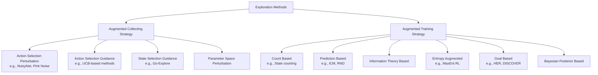
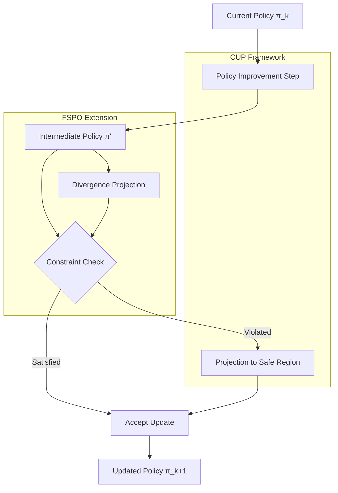
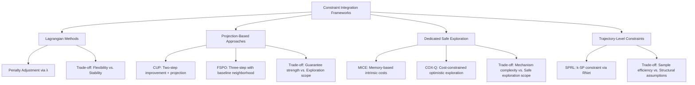
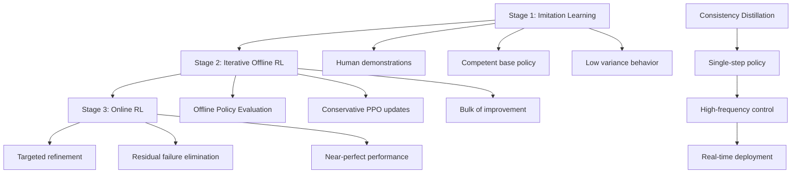

# Efficient and Proactive Exploration under Sparse Rewards and Constraints: Recent Advances in Reinforcement Learning and Implications for Trajectory Planning
## 1 Introduction: The Challenge of Exploration in Sparse and Constrained Environments

This chapter establishes the foundational problem of exploration in reinforcement learning under sparse reward and constrained settings. It defines key concepts, analyzes the fundamental challenges these conditions pose for standard RL algorithms, and outlines the scope and objectives of the report in connecting exploration advances to trajectory planning applications.

### 1.1 The Exploration Problem in Reinforcement Learning

Reinforcement learning (RL) fundamentally relies on an agent's ability to discover rewarding behaviors through interaction with its environment. At the heart of this learning paradigm lies the **exploration-exploitation trade-off**, a central tension that governs how agents allocate their decision-making resources between gathering new information about the environment and leveraging known information to maximize cumulative rewards. This trade-off represents one of the most fundamental challenges in sequential decision-making under uncertainty.

In environments with **dense reward signals**, where the agent receives frequent and informative feedback about the quality of its actions, exploration naturally integrates with the learning process. Each action taken provides meaningful gradient information that guides policy improvement, allowing standard algorithms such as Q-learning, policy gradient methods, and actor-critic architectures to progressively refine their behavior. The reward landscape in such settings serves as a continuous guide, enabling agents to follow local improvements toward globally optimal policies with reasonable sample efficiency.

However, the situation changes dramatically in environments characterized by **sparse rewards**. In these settings, the agent may execute thousands or even millions of actions before encountering any positive feedback signal. The vast majority of trajectories yield zero or uniform reward, providing no discriminative information to distinguish better actions from worse ones. This creates a fundamental asymmetry: while dense reward environments allow for gradient-based learning at nearly every timestep, sparse reward environments require agents to stumble upon rewarding states through essentially random exploration before any meaningful learning can commence.

The core mechanisms by which RL agents discover rewarding behaviors can be broadly categorized into **undirected** and **directed** exploration strategies. Undirected exploration, exemplified by epsilon-greedy action selection and entropy regularization, introduces stochasticity into the policy without leveraging any structural knowledge about the environment. While such approaches provide theoretical guarantees of eventual state-space coverage, their practical efficiency deteriorates rapidly as the state-action space grows. Directed exploration, in contrast, attempts to guide the agent toward informative regions of the state space using auxiliary signals such as uncertainty estimates, novelty measures, or learned models of environment dynamics.

Effective exploration is not merely a desirable property but rather a **critical prerequisite** for learning optimal policies in most realistic domains. Without sufficient exploration, agents become trapped in local optima, converging to suboptimal behaviors that happen to yield early rewards while missing potentially superior strategies that require more extensive initial investment. The quality of exploration directly determines the completeness of the agent's world model, the accuracy of its value function estimates, and ultimately the optimality of its learned policy.

### 1.2 Characterizing Sparse Reward Settings

Sparse reward environments constitute a distinct and particularly challenging class of reinforcement learning problems. Formally, a sparse reward setting can be characterized as one where the reward function $r(s, a, s')$ takes non-zero values only for a small subset of state-action-state transitions, with the overwhelming majority of interactions yielding zero or constant reward. This definition captures the essential difficulty: **the signal that guides learning is concentrated in rare events** that the agent must discover through exploration.

Several distinguishing characteristics define sparse reward settings and contribute to their difficulty:

**Delayed feedback** represents a primary characteristic, where the consequences of actions may not manifest as rewards until many timesteps later. An agent navigating a maze receives reward only upon reaching the goal, despite the fact that each intermediate step was critical to eventual success. This temporal separation between action and outcome creates a fundamental attribution problem that challenges standard learning algorithms.

**Rare success signals** compound the difficulty of delayed feedback. In many sparse reward domains, successful task completion occurs with probability approaching zero under random exploration. Consider a robotic manipulation task where the agent must grasp and place an object in a specific configuration—the probability of randomly achieving this outcome may be astronomically small, meaning that without structured exploration, the agent may never observe a positive reward signal during training.

**Uninformative trajectories** constitute the majority of the agent's experience in sparse reward settings. When most trajectories yield identical (zero) reward, the agent cannot distinguish between actions that move it closer to success and those that lead away from the goal. This creates a **flat reward landscape** where gradient-based optimization receives no useful signal, and the agent must rely entirely on exploration to escape this uninformative region.

Representative problem domains where sparse rewards naturally arise include:

| Domain | Sparse Reward Characteristic | Example Tasks |
|--------|------------------------------|---------------|
| **Goal-reaching tasks** | Binary success/failure signal upon goal achievement | Navigation to target coordinates, reaching specified configurations |
| **Manipulation** | Reward only upon successful completion of complex sequences | Object grasping, assembly tasks, tool use |
| **Game playing** | Reward tied to winning or achieving specific milestones | Montezuma's Revenge, sparse-reward variants of Atari games |
| **Real-world robotics** | Natural task structure yields infrequent success | Dexterous manipulation, legged locomotion over obstacles |

The prevalence of sparse rewards in practical applications stems from the **natural structure of real-world tasks**. Many objectives of interest are inherently binary or threshold-based: a package is either delivered or not, a robot either maintains balance or falls, a vehicle either reaches its destination or fails. While reward shaping can sometimes alleviate sparsity, designing appropriate shaping functions requires domain expertise and may inadvertently bias learning toward suboptimal solutions.

### 1.3 Constraint Formulations in Reinforcement Learning

Beyond sparse rewards, many practical reinforcement learning applications must operate within **explicit constraints** that restrict the space of admissible policies or trajectories. Constrained reinforcement learning (CRL) formalizes this setting by augmenting the standard RL objective with additional requirements that the learned policy must satisfy.

The formal framework for constrained RL typically extends the Markov Decision Process (MDP) formulation to include constraint functions. A **Constrained MDP (CMDP)** augments the standard tuple $(S, A, P, r, \gamma)$ with a set of cost functions $c_i(s, a)$ and corresponding thresholds $d_i$. The agent must maximize expected cumulative reward while ensuring that the expected cumulative cost for each constraint remains below its threshold:

$$\max_\pi \mathbb{E}\left[\sum_{t=0}^{\infty} \gamma^t r(s_t, a_t)\right] \quad \text{subject to} \quad \mathbb{E}\left[\sum_{t=0}^{\infty} \gamma^t c_i(s_t, a_t)\right] \leq d_i \quad \forall i$$

Constraints in reinforcement learning arise from diverse sources and take multiple forms:

**Safety constraints** represent perhaps the most critical category, encoding requirements that the agent must not enter dangerous states or take actions that could cause harm. In autonomous driving, safety constraints might prohibit collisions or violations of traffic laws. In medical treatment optimization, constraints ensure that dosages remain within safe bounds.

**Resource limitations** impose bounds on the agent's consumption of finite resources such as energy, time, or budget. A delivery robot must complete its route within battery capacity; a trading agent must operate within position limits.

**Operational boundaries** define the physical or logical limits within which the agent must operate. These include workspace constraints for robotic manipulators, communication range limitations for networked agents, and regulatory requirements for industrial processes.

The interaction between constraints and exploration creates **additional complexity** for learning algorithms. Constraints restrict the feasible policy space, potentially eliminating exploration strategies that would be effective in the unconstrained setting. An agent learning to navigate must avoid obstacles, but the presence of obstacles may block the most direct exploratory paths to novel regions of the state space. This creates a tension between the need to explore widely and the requirement to remain within safe or feasible regions.

Furthermore, constraints may be **unknown or uncertain** at the start of learning, requiring the agent to simultaneously learn the constraint boundaries while exploring the reward landscape. This dual learning problem compounds the sample complexity challenges already present in sparse reward settings.

### 1.4 Fundamental Challenges for Standard RL Algorithms

The combination of sparse rewards and constraints poses **severe difficulties** for conventional reinforcement learning methods. Understanding these challenges is essential for appreciating why specialized exploration techniques have become a major focus of recent research.

**Sample inefficiency** represents the most immediate practical challenge. Standard policy gradient methods rely on reward signals to compute gradient estimates that guide policy improvement. In sparse reward settings, the vast majority of sampled trajectories provide zero reward, yielding gradient estimates of zero or near-zero magnitude. This creates a **vanishing gradient problem** where the policy receives no learning signal despite extensive interaction with the environment. Value-based methods face analogous difficulties: Q-function estimates remain ungrounded until the agent observes reward, and bootstrapping from uniformly zero values provides no useful information.

The magnitude of sample inefficiency can be staggering. Consider a goal-reaching task in a continuous state space where the goal region occupies a fraction $\epsilon$ of the reachable space. Under random exploration, the expected number of episodes before first reaching the goal scales as $O(1/\epsilon)$, which becomes prohibitively large for high-dimensional problems or small goal regions. This exponential scaling with problem complexity renders naive exploration strategies impractical for realistic applications.

**Credit assignment over long horizons** constitutes a second fundamental challenge. When reward is received only at the end of a lengthy trajectory, the agent must determine which of the many preceding actions contributed to success. The standard temporal difference learning framework propagates reward information backward through the trajectory, but this propagation becomes increasingly unreliable over long horizons due to the accumulation of approximation errors and the exponential decay of credit through discounting.

The credit assignment problem is particularly acute when the agent's early actions have decisive influence on eventual success. In manipulation tasks, the initial grasp configuration may determine whether subsequent movements can succeed, yet this causal relationship is obscured by the many intervening timesteps. Without mechanisms to identify and reinforce critical early decisions, the agent may learn to optimize only the final stages of successful trajectories while remaining unable to consistently reproduce the conditions that enable success.

**Constraint satisfaction during exploration** introduces a third layer of difficulty. Effective exploration often requires visiting unfamiliar states and taking novel actions, but such behavior may violate safety constraints or exceed resource limits. The agent faces a dilemma: conservative exploration that respects constraints may fail to discover rewarding behaviors, while aggressive exploration that violates constraints may be unacceptable in safety-critical applications.

This tension is exacerbated by the **compounding nature of constraint violations**. A single unsafe action may be recoverable, but a sequence of marginally risky decisions can lead to catastrophic failure. Agents must therefore reason about the cumulative risk of exploratory policies, not merely the instantaneous constraint satisfaction at each timestep.

The interaction between sparse rewards and constraints creates a **particularly challenging regime** where both difficulties reinforce each other. Constraints may block the exploratory paths that would lead to reward discovery, while the absence of reward signal provides no guidance about which constraint-satisfying policies are worth pursuing. Standard algorithms, designed for the benign case of dense rewards and unconstrained action spaces, lack the mechanisms needed to navigate this challenging landscape.

### 1.5 Scope and Objectives of the Report

This report addresses the intersection of two critical challenges in reinforcement learning—**efficient exploration under sparse rewards** and **learning under explicit constraints**—with particular attention to their implications for trajectory planning applications. The scope encompasses recent methodological advances, theoretical foundations, and practical considerations that enable RL agents to explore proactively and efficiently in challenging environments.

The **primary objectives** of this report are threefold:

First, the report aims to provide a **systematic survey of proactive exploration strategies** that have been developed to address sparse reward settings. This includes intrinsic motivation methods that generate auxiliary reward signals based on novelty or curiosity, experience replay techniques that extract learning signal from failed trajectories, curriculum learning approaches that structure the learning problem for progressive difficulty, and model-based methods that leverage learned dynamics for directed exploration. The survey will examine the principles underlying each approach, their implementation requirements, and their empirical performance across benchmark domains.

Second, the report seeks to **analyze the theoretical foundations** of constrained reinforcement learning and examine how constraint satisfaction interacts with exploration requirements. This includes formal frameworks for representing constraints, algorithms that balance reward optimization with constraint adherence, and the trade-offs inherent in different approaches to constrained exploration.

Third, the report will **examine the implications of these advances for trajectory planning problems**. Trajectory planning—the problem of generating feasible, optimal, or robust paths through complex environments—shares fundamental structure with reinforcement learning but has traditionally been addressed through distinct methodological traditions. By connecting recent RL exploration advances to trajectory planning challenges, this report aims to identify opportunities for cross-pollination between these fields and highlight promising directions for future research.

The **intended contribution** of this report is to synthesize diverse strands of research into a coherent framework that illuminates both the current state of knowledge and the remaining open challenges. For researchers and practitioners working on autonomous systems, robotics, and sequential decision-making, this synthesis provides a foundation for selecting appropriate exploration strategies, understanding their limitations, and identifying opportunities for methodological innovation.

The report proceeds as follows: Chapter 2 presents a methodological taxonomy of exploration strategies for sparse reward settings. Chapter 3 examines constrained reinforcement learning frameworks and their treatment of exploration. Chapter 4 synthesizes findings to identify core principles and persistent challenges. Chapter 5 analyzes implications for trajectory planning applications. Chapter 6 concludes with future research directions at the intersection of exploration and planning.

## 2 Advances in Exploration under Sparse Rewards: A Methodological Taxonomy

This chapter provides a systematic categorization, comparative analysis, and critical evaluation of recent methodological advances for addressing exploration challenges in sparse reward reinforcement learning environments. Building on the foundational challenges established in Chapter 1, this chapter examines the principles, mechanisms, implementation considerations, and empirical performance of major exploration paradigms, synthesizing insights into their relative strengths, limitations, and applicability across different problem domains.

### 2.1 Intrinsic Motivation and Curiosity-Driven Exploration

Intrinsic motivation methods address the fundamental challenge of sparse rewards by generating **auxiliary reward signals** that guide exploration in the absence of extrinsic feedback. These approaches draw inspiration from psychological theories of curiosity, formalizing the intuition that agents should be drawn to novel, surprising, or informative states. The theoretical foundation rests on the premise that prediction error or information gain serves as a proxy for learning potential, enabling agents to explore systematically even when external rewards are absent or extremely rare.

**Prediction-based approaches** constitute a major category of intrinsic motivation methods. The **Intrinsic Curiosity Module (ICM)** defines curiosity as the agent's error in predicting the consequences of its own actions in a learned feature space[^1]. By operating in a feature space rather than raw pixel space, ICM avoids rewarding the agent for inherent environmental stochasticity and focuses instead on learnable aspects of the environment dynamics. The agent receives intrinsic reward proportional to its prediction error, driving it toward states where its forward model is inaccurate and therefore where learning potential exists. Empirical evaluations demonstrate that ICM combined with Asynchronous Advantage Actor-Critic (A3C) effectively promotes curiosity-driven exploration in action games like Mortal Kombat and Street Fighter, learning combat strategies without relying solely on external rewards and outperforming baseline methods including vanilla A3C and VIME-TRPO[^1].

**Random Network Distillation (RND)** represents another influential prediction-based approach that measures novelty through the discrepancy between a randomly initialized fixed target network and a predictor network trained on observed states[^2]. States that have been frequently visited produce low prediction error as the predictor learns to match the target, while novel states yield high error. RND has demonstrated strong performance on hard-exploration Atari games and remains a foundational method in the exploration literature.

**Novelty-based methods** take a complementary approach by directly measuring state visitation statistics or entropy. **Count-based exploration** provides intrinsic reward inversely proportional to state visitation counts, encouraging the agent to visit under-explored regions of the state space[^3]. Research has shown that state counting, representing state-level diversity, achieves the highest sample efficiency in many MiniGrid tasks by promoting homogeneous state coverage[^3]. However, state-level diversity is fragile and requires good state representations—when applied to RGB observations rather than compact encodings, performance degrades significantly due to representation learning challenges[^3]. In contrast, **entropy maximization** methods encourage policy-level diversity by rewarding high-entropy action distributions, demonstrating greater robustness to image-based observations even when not always achieving optimal performance[^3].

Recent advances have explored **hybrid approaches** that combine multiple intrinsic motivation sources. A particularly notable development integrates **Variational State as Intrinsic Reward (VSIMR)** with **Large Language Model-derived rewards** for sparse reward reinforcement learning[^4][^5]. VSIMR uses Variational AutoEncoders (VAEs) to measure state novelty through the KL-divergence between the VAE's approximate posterior distribution and its prior, providing an intrinsic reward based on the Bayesian definition of surprise. The LLM component leverages pre-trained knowledge to generate reward signals based on natural language descriptions of the environment and goals. Empirical results in the MiniGrid DoorKey environment demonstrate that this combined strategy significantly increases agent performance and sampling efficiency compared to using each strategy individually or a standard A2C agent, which failed to learn entirely[^4]. Analysis indicates that VSIMR drives exploration of new states while LLM-derived rewards facilitate progressive exploitation towards goals, with the LLM+VAE configuration achieving higher average rewards (0.3-0.4 with peaks near 0.5) compared to VAE alone (0.2-0.3 with peaks to 0.4)[^4].

The **Curiosity-Driven Exploration (CDE)** framework for Reinforcement Learning with Verifiable Rewards (RLVR) addresses exploration challenges in Large Language Model training[^6][^7]. CDE formalizes curiosity through signals from both the actor and critic: the actor's curiosity is measured as perplexity (PPL) over generated responses, while the critic's curiosity is measured through the variance of value estimates from a multi-head architecture. Theoretical analysis establishes that the PPL bonus inherently penalizes overconfident errors and promotes diversity among correct responses, while the critic-wise bonus connects to classical count-based exploration bonuses under linear MDP assumptions[^6]. Empirically, CDE achieves approximately +3 point improvement over standard RLVR using GRPO/PPO on AIME benchmarks, with the PPL bonus yielding an average improvement of approximately +2.4 points and notable gains on Pass@16[^6][^7].

A critical challenge for intrinsic motivation methods is **calibration collapse**, identified in the CDE research as a phenomenon where under naive GRPO training, the model's confidence progressively decouples from its correctness[^6]. The PPL bonus mitigates this miscalibration by sustaining separation between the perplexity of correct and incorrect responses throughout training. Additionally, bonus weight decay proves crucial—a staircase decay schedule that maintains strong exploration early then removes the bonus was found most effective[^6][^7].

Intrinsic motivation methods also face the **noisy-TV problem**, where agents become fixated on inherently stochastic elements of the environment that continuously generate prediction errors without providing useful learning signal[^8]. Related concerns include **reward hacking**, where agents optimize intrinsic rewards at the expense of task performance[^8]. Research has shown that intrinsic motivation can change agent behaviors significantly, with different IM sources leading to different behavioral patterns[^8]. State counting tends to produce earlier convergence to functional policies but with over-exploration tendencies, while maximum entropy is effective for stabilizing behavior when sufficient sparse reward instances are obtained but may cause stagnation when extensive exploration is required[^8].

The following table summarizes the key characteristics of major intrinsic motivation approaches:

| Method | Mechanism | Strengths | Limitations |
|--------|-----------|-----------|-------------|
| ICM | Prediction error in feature space | Robust to environmental stochasticity | Requires learned feature representation |
| RND | Prediction error against fixed random network | Simple implementation, strong baselines | May struggle with highly stochastic environments |
| Count-based | Inverse visitation frequency | Theoretically grounded, efficient state coverage | Fragile to representation quality |
| Entropy maximization | Policy entropy regularization | Robust to image observations | May not achieve optimal exploration |
| VSIMR+LLM | VAE novelty + language model guidance | Combines exploration and exploitation signals | Requires LLM access, prompt engineering challenges |
| CDE (PPL+Multi-head) | Perplexity bonus + critic variance | Addresses calibration collapse | Specific to RLVR settings |

### 2.2 Hindsight Experience Replay and Goal Relabeling Strategies

**Hindsight Experience Replay (HER)** represents a paradigm shift in addressing sparse reward challenges by fundamentally reconceptualizing how agents learn from experience[^9]. Rather than treating failed trajectories as uninformative, HER enables sample-efficient learning from sparse and binary rewards by **reinterpreting failed trajectories as successful goal achievements** for alternative goals that were actually reached during the episode. This approach eliminates the need for complicated reward engineering and can be combined with any off-policy RL algorithm[^9].

The core mechanism of HER operates within the **multi-goal reinforcement learning framework**, where policies and value functions take both the current state and a goal as input (Universal Value Function Approximators). After experiencing an episode where the agent failed to achieve its original goal, HER stores transitions in the replay buffer not only with the original goal but also with **substitute goals** that were actually achieved during the episode[^10]. For example, if an agent attempting to place an object at location A instead places it at location B, HER replays the trajectory as if the agent had intended to reach location B all along, generating a positive reward signal from what would otherwise be a failed attempt.

HER can be viewed as a form of **implicit curriculum learning**[^9][^11]. By automatically generating achievable goals from the agent's own experience, HER creates a progression of increasingly difficult challenges without requiring explicit curriculum design. Early in training, when the agent's capabilities are limited, the substitute goals tend to be close to the starting state. As the agent improves, it reaches states farther from the start, automatically generating more challenging goals for replay.

Empirical validation of HER was conducted on **robotic manipulation tasks** using a 7-DOF Fetch Robotics arm in MuJoCo simulation[^9][^10]. Three tasks were examined—pushing, sliding, and pick-and-place—each using only binary rewards indicating task completion. The results demonstrated stark differences between algorithms:

| Algorithm | Pushing | Sliding | Pick-and-Place |
|-----------|---------|---------|----------------|
| DDPG without HER | Failed | Failed | Failed |
| DDPG with HER | Success | Success | Success |
| DDPG + Count-based exploration | Failed | Failed | Failed |

Ablation studies confirmed that HER is the **crucial ingredient** enabling training in these challenging environments[^9]. Standard DDPG failed to learn any of the tasks, and even augmenting DDPG with count-based exploration did not resolve the learning failure[^10].

The **goal selection strategy** for choosing substitute goals significantly impacts HER's effectiveness. Four strategies were evaluated[^10]:

- **Final**: Replay with the goal corresponding to the final state of the episode
- **Future**: Replay with k random states from the same episode that occur after the current transition
- **Episode**: Replay with k random states from anywhere in the same episode
- **Random**: Replay with k random states from the entire training history

The **future strategy with k=4 or k=8** performed best across tasks, particularly on the challenging sliding task where other strategies showed limited success[^10]. This strategy ensures that the substitute goal was actually achieved from the current state, maintaining the temporal consistency needed for effective credit assignment.

A remarkable finding from HER research concerns the **comparison with reward shaping**. Contrary to the intuition that shaped rewards (e.g., based on distance to goal) would facilitate learning, experiments showed that neither DDPG nor DDPG+HER succeeded with shaped reward functions[^10]. This counterintuitive result highlights the practical challenges of reward shaping—poorly designed shaping functions can mislead learning and prevent convergence to optimal policies. HER's success with sparse binary rewards demonstrates that **learning directly from sparse signals** can be more effective than attempting to densify rewards through shaping.

The **sim-to-real transfer** capabilities of HER-trained policies were demonstrated by deploying a pick-and-place policy on a physical Fetch robot without fine-tuning[^9][^10]. Initial deployment achieved 2/5 success rate, which improved to 5/5 after retraining the policy with added Gaussian noise (std=1cm) to observations to improve robustness to estimation errors[^10]. This successful transfer validates HER's practical applicability to real-world robotics.

HER also improves performance even when **only a single goal is targeted**, though learning is faster when training includes multiple goals[^10]. This flexibility makes HER applicable to both multi-goal settings where any achieved state can serve as a goal and single-goal settings where the agent must learn to reach a specific target.

### 2.3 Curriculum Learning and Automated Goal Generation

Curriculum learning approaches address sparse reward challenges by **structuring the learning process** through progressively challenging tasks or goals. Rather than confronting the agent with the full difficulty of the target task from the outset, these methods generate sequences of intermediate objectives that guide learning from simple to complex. The theoretical motivation stems from the observation that solving complex tasks often requires first mastering simpler prerequisite skills.

**DISCOVER** represents a state-of-the-art method for directed sparse-reward goal-conditioned reinforcement learning that selects exploratory goals in the direction of a single target task[^12][^13]. The core principle is that **solving complex tasks requires solving simpler tasks that are relevant to the target**, rather than solving arbitrary tasks. DISCOVER balances three principles during goal selection:

1. **Achievability**: A goal should not be too hard given the agent's current capabilities
2. **Novelty**: A goal should not be too easy, ensuring continued learning
3. **Relevance**: Experience on a goal should be useful for the target task

The DISCOVER objective function selects a goal $g_t$ from the set of previously achieved goals $G_{ach}$ according to:

$$g_t = \arg\max_{g \in G_{ach}} \left[ \alpha_t \left( V(s_0, g) + \beta_t \sigma(s_0, g) \right) + (1-\alpha_t) \left( V(g, g^*) + \beta_t \sigma(g, g^*) \right) \right]$$

where $V$ is the mean value function estimate from an ensemble of critics, $\sigma$ is its standard deviation, $g^*$ is the target goal, and $\alpha_t$, $\beta_t$ are schedulable coefficients[^13]. The term $V(s_0, g)$ promotes achievability, $\sigma(s_0, g)$ promotes novelty through uncertainty-driven exploration, and $V(g, g^*)$ promotes relevance to the target task.

DISCOVER is formally connected to **upper confidence bound (UCB) sampling**, a principled exploration strategy from the bandit literature[^12][^13]. Under simplifying assumptions including linear value functions and goal achievability, theoretical analysis establishes that the number of episodes $N$ until the target goal becomes achievable is bounded by:

$$N \leq e^{O\left( \frac{D d^2}{\kappa^3} \right)}$$

where $D$ is the distance from the initial state to the target goal, $d$ is the feature dimensionality, and $\kappa$ is an expansion rate[^13]. Critically, this bound **depends on the distance $D$ but is independent of the total volume of the goal space**, avoiding the curse of dimensionality that plagues undirected exploration methods.

Empirical evaluation on high-dimensional navigation and manipulation tasks (pointmaze, antmaze, arm) demonstrates that DISCOVER **consistently outperforms baseline goal selection strategies** including HER (always selects target goal), uniform selection from achieved goals, and MEGA (selects goals with lowest likelihood from achievable set)[^12][^13]. Performance gains are particularly pronounced in challenging, high-dimensional environments. In pointmaze environments of varying dimensionality, undirected goal selection methods failed in dimensions greater than three, while DISCOVER successfully solved mazes in up to six dimensions[^12][^13]. Visualization of goal selection in the antmaze environment confirmed that DISCOVER, after initial exploration, focuses on goals relevant to the target while baselines explore the entire state space undirected[^12][^13].

Furthermore, standard non-goal-conditioned RL algorithms with intrinsic curiosity (e.g., RND) **failed to solve the target tasks** even in simple configurations, highlighting the importance of directed subgoal selection for deep exploration in sparse-reward settings[^12][^13]. DISCOVER can also leverage prior knowledge such as hand-designed distances or pre-trained value functions to further accelerate exploration[^12][^13].

**Diffusion-based Curriculum Reinforcement Learning (DiCuRL)** introduces a novel approach that leverages conditional diffusion models to generate curriculum goals[^14]. DiCuRL addresses the challenge that many existing curriculum methods struggle to efficiently guide agents toward desired outcomes without domain knowledge. The method incorporates a Q-function and a trainable reward function based on Adversarial Intrinsic Motivation within the diffusion model to estimate how close an agent is to achieving its goal. The inherent noising and denoising mechanism of diffusion models promotes exploration while remaining environment-agnostic. DiCuRL was evaluated in three maze environments and two robotic manipulation tasks simulated in MuJoCo, where it outperformed or matched nine state-of-the-art curriculum RL algorithms[^14].

The **Planning Goals for Exploration (PEG)** method addresses how agents can quickly learn in unknown environments by directly optimizing intrinsic exploration reward through goal-conditioned planning[^15]. PEG first selects goal instructions such that the agent's goal-based policy can reach states with high exploration potential, then launches exploratory policies from these promising states. To enable this direct optimization, PEG learns world models and employs sampling-based planning algorithms to plan goal instructions. In challenging simulated robotic environments including multi-legged ant robots navigating mazes and robotic arms on cluttered tabletops, PEG demonstrates more efficient training of goal-based policies compared to baselines[^15].

### 2.4 Model-Based Exploration and State Archiving Methods

Model-based exploration strategies leverage **learned dynamics models** or **explicit state archives** to enable systematic and directed exploration. These approaches address the fundamental limitation of model-free methods: their inability to reason about the consequences of actions without actually executing them. By maintaining representations of the environment or previously visited states, model-based methods can plan exploratory trajectories and systematically cover the state space.

**Go-Explore** represents a landmark algorithm for hard-exploration problems, establishing new records on benchmark domains where previous methods—including those with intrinsic motivation—performed poorly[^16]. The framework addresses the grand challenge of intelligent exploration when rewards are sparse or deceptive, introducing three interlinked principles[^17]:

1. **Explicit memory of visited states ("cells")**: The algorithm maintains an archive of discovered states, enabling systematic tracking of exploration progress
2. **Deterministic return to promising states**: Before exploring further, the agent first returns to a promising archived state without exploration, then explores from that state
3. **Separation of exploration and robustification**: The exploration phase leverages deterministic resets or goal-conditioned policies, while a separate robustification phase converts high-performing trajectories into robust policies using imitation learning

The Go-Explore workflow proceeds as follows: the algorithm archives an initial state, selects a cell from the archive based on heuristics designed to prioritize under-explored regions, restores the state, explores from the cell, updates the archive with new discoveries, and finally applies imitation learning to sampled trajectories[^17]. The **Backward Algorithm** is commonly used for robustification, which is essential for generalization to stochastic or real-world conditions[^17].

The definition and abstraction of **"cells"** is central to Go-Explore's success. Several representation strategies have evolved[^17]:

| Strategy | Description | Applicability |
|----------|-------------|---------------|
| Pixel Downsampling | Aggressively downsamples high-dimensional observations | Simple visual domains |
| Domain Knowledge Features | Human-understandable descriptors (e.g., agent position, room number) | Domains with clear structure |
| Latent Go-Explore (LGE) | Learned latent representation with density estimation | Raw observation spaces |
| Time-Myopic Encodings | Temporally aware representation where proximity reflects temporal closeness | Complex temporal structure |

Go-Explore achieved **unprecedented performance** on hard-exploration Atari benchmarks[^16]. On Montezuma's Revenge, Go-Explore scored a mean of over 43,000 points, almost 4 times the previous state of the art. When augmented with human-provided domain knowledge, it achieved a mean of over 650,000 points with maximum performance of nearly 18 million, surpassing the human world record[^16]. On Pitfall, Go-Explore with domain knowledge was the first algorithm to score above zero, achieving a mean score of almost 60,000 points exceeding expert human performance[^16]. In robotics applications, Go-Explore consistently discovered successful strategies that PPO and intrinsic motivation baselines could not[^17].

**Extensions to the Go-Explore paradigm** have broadened its applicability:

**Policy-based Go-Explore** uses a goal-conditioned policy to return to archived cells when deterministic reset is impossible[^17]. This variant addresses a key limitation of the original algorithm, which required simulator support for arbitrary state restoration.

**Latent Go-Explore (LGE)** uses learned latent representations for exploration, enabling generalization to raw observation spaces without hand-crafted cell definitions[^17]. Density estimation in the latent space guides exploration toward low-density regions.

**Intelligent Go-Explore (IGE)** integrates foundation models such as Large Language Models in place of hand-crafted heuristics at all stages—selecting, filtering, and exploring archived states[^17][^18]. IGE provides a human-like ability to instinctively identify how interesting or promising any new state is, even in complex environments where heuristics are hard to define. This approach achieves significant sample efficiency and generalization in language- and vision-based reasoning benchmarks, surpassing both prior RL and LLM-based agents like Reflexion[^18]. IGE also offers the opportunity to recognize and capitalize on **serendipitous discoveries**—states encountered during exploration that are valuable but whose interestingness was not anticipated by the human user[^18].

**Explore-Go** applies a preparatory exploration phase at the start of each training episode to diversify the agent's start state, improving out-of-distribution and unreachable-task generalization in contextual MDPs and Procgen tasks[^17]. This contrasts with the core Go-Explore paradigm by focusing on generalization rather than systematic exploration for specific tasks.

Applications of Go-Explore methods extend beyond games to **robotics**, **simulation-based safety verification** (discovering rare failure cases in autonomous vehicles), **automated game testing** for bug discovery, **multi-objective RL**, and **energy management** (yielding up to 19.84% improvement in cost savings over Deep Q-Network baselines)[^17].

**World model-based approaches** complement state archiving methods by learning predictive models of environment dynamics. These models enable **planning exploratory goals** by simulating the consequences of different exploration strategies without actual environment interaction[^2][^19]. The **Go Beyond Imagination** method designs an episodic intrinsic reward to maximize stepwise reachability expansion using world models, tested in Minigrid and DeepMind Control Suite environments[^2]. **Novelty detection** techniques using the KL-divergence between latent posterior and prior distributions in world models can reliably detect environmental changes with low false positive rates and fast response times[^19].

**Diffusion models** have emerged as powerful tools for model-based exploration and trajectory planning[^20][^21]. When applied to RL, diffusion models can model entire trajectories of states and actions as samples from learned distributions, offering improved exploration through representation of complex, multimodal action distributions, trajectory-level reasoning for better long-term planning, and compatibility with offline RL settings[^20]. The **Deep Diffusion Policy Gradient (DDiffPG)** algorithm learns multimodal policies parameterized as diffusion models while discovering and maintaining versatile behaviors through novelty-based intrinsic motivation and mode-specific Q-learning[^21].

### 2.5 Reward Shaping and Semi-Supervised Reward Estimation

Reward shaping approaches attempt to **augment or transform the reward signal** to provide denser learning signals while maintaining alignment with the original task objective. The fundamental challenge is designing shaped rewards that accelerate learning without introducing biases that lead to suboptimal policies—a tension that has proven difficult to resolve in practice.

The theoretical foundation for reward shaping establishes conditions under which shaped rewards preserve optimal policies. **Potential-based reward shaping** guarantees policy invariance when the shaping function takes the form $F(s, s') = \gamma \Phi(s') - \Phi(s)$ for some potential function $\Phi$. However, designing appropriate potential functions requires domain expertise and may be infeasible for complex environments.

Empirical evidence from HER research reveals a **counterintuitive finding**: simple shaped rewards based on distance to goal led to complete failure for both DDPG and DDPG+HER on robotic manipulation tasks[^10]. This result challenges the assumption that denser rewards necessarily facilitate learning and suggests that poorly designed shaping functions can mislead optimization, causing agents to exploit the shaped reward in ways that diverge from the intended task objective.

**Reward hacking** represents a fundamental challenge for reward shaping approaches[^22][^8]. When agents optimize shaped rewards, they may discover behaviors that maximize the auxiliary signal while failing to achieve the underlying task. This phenomenon is particularly problematic when the shaping function imperfectly captures task requirements or when agents have sufficient capacity to exploit discrepancies between shaped and true objectives.

**Semi-Supervised Reward Shaping (SSRS)** addresses the sparsity challenge by leveraging not only non-zero reward transitions but also the majority of transitions with zero reward through semi-supervised learning techniques[^22]. The framework alternates between policy updates using a base RL algorithm and transition-level reward shaping through a learned reward estimator. For zero-reward transitions, **consistency regularization** is employed to optimize the reward estimator, drawing on the insight from semi-supervised learning that models should produce consistent predictions under perturbations of the same input.

SSRS introduces **entropy augmentation** as a perturbation method for consistency regularization in the trajectory space[^22]. Unlike traditional data augmentation techniques that may introduce excessive perturbation to non-image data, entropy augmentation better preserves the smoothness and clustering assumptions that underpin semi-supervised learning. Experimental results demonstrate that entropy augmentation improves performance by 15.8% compared to other augmentation methods[^22].

The SSRS framework incorporates **monotonicity constraints** on the reward estimator, ensuring that estimated rewards increase monotonically along successful trajectories[^22]. Experiments across Atari environments and robotic manipulation tasks show that SSRS with monotonicity constraints achieves higher scores than without, and outperforms both supervised reward shaping methods (RCP, SORS) and backbone RL algorithms[^22]. In games with extremely sparse rewards like Montezuma's Revenge, SSRS achieved nearly 2x the best score compared to the RCP algorithm[^22].

Analysis of the transition distribution reveals that **higher estimated reward values** (corresponding to progress toward long-term goals) show clearer decision boundaries in the trajectory space, while boundaries within high-reward regions are more ambiguous[^22]. This observation aligns with the clustering assumption of semi-supervised learning: as estimated reward increases, transition randomness decreases, leading to increased clustering significance in trajectory space.

The comparison between intrinsic motivation and reward shaping approaches reveals complementary strengths and limitations:

| Approach | Mechanism | Advantages | Disadvantages |
|----------|-----------|------------|---------------|
| Intrinsic Motivation | Auxiliary reward based on novelty/curiosity | Task-agnostic, promotes broad exploration | Noisy-TV problem, reward hacking |
| Reward Shaping | Transformed/augmented reward signal | Can encode domain knowledge | Requires careful design, may bias learning |
| Semi-Supervised (SSRS) | Learns reward from zero-reward transitions | Leverages all experience, maintains fidelity | Additional hyperparameters, training complexity |

Research on the **impact of intrinsic rewards on exploration** provides nuanced insights into when different approaches succeed or fail[^3][^8]. State counting achieves the best sample efficiency in many tasks through homogeneous state coverage but is fragile to representation quality. Maximum entropy is more robust to image-based observations but may not achieve optimal exploration. DIAYN (skill-level diversity) struggles with exploration in procedurally generated, partially observable environments due to the difficulty of learning and exploring within skill spaces[^3].

### 2.6 Comparative Analysis and Method Selection Guidelines

Synthesizing findings across the examined methodologies reveals a rich landscape of exploration strategies with distinct mechanisms, strengths, and applicability profiles. This section provides a comparative analysis and practical guidelines for method selection based on problem characteristics.

**Taxonomic organization** of exploration methods distinguishes between approaches based on the phase of learning they augment[^2]:

**Augmented collecting strategies** modify how the agent gathers experience, including action perturbation methods that inject noise into action selection, state selection guidance that directs the agent toward promising regions, and parameter space perturbation that adds noise to network weights. **Augmented training strategies** modify how collected experience is processed during learning, including count-based methods, prediction-based intrinsic motivation, entropy regularization, and goal-based approaches like HER[^2].

The following table provides a comparative summary of major exploration paradigms:

| Method Category | Sample Efficiency | Computational Cost | Domain Generality | Key Requirements |
|-----------------|-------------------|-------------------|-------------------|------------------|
| Intrinsic Motivation (ICM, RND) | Moderate | Low-Moderate | High | Good state representation |
| Hindsight Experience Replay | High | Low | Moderate | Multi-goal setting, off-policy algorithm |
| Curriculum Learning (DISCOVER) | High | Moderate | Moderate | Goal-conditioned setting |
| Go-Explore | Very High | High | Moderate | Simulator with state reset |
| Diffusion-based Planning | Moderate-High | High | High | Sufficient compute for diffusion |
| Semi-supervised Reward Shaping | Moderate | Moderate | Moderate | Labeled reward transitions |

**Complementarity of approaches** suggests that combining methods can yield superior performance. The LLM+VAE combination demonstrates how intrinsic motivation sources operating at different levels (state novelty vs. goal-directed guidance) can complement each other[^4]. Similarly, HER can be combined with intrinsic motivation methods, though empirical results show that HER alone often suffices for goal-conditioned tasks[^10]. DISCOVER integrates uncertainty-driven exploration (novelty) with value-based goal selection (achievability and relevance), achieving directed exploration that neither component achieves alone[^12][^13].

**Method selection guidelines** based on problem characteristics:

**For goal-conditioned tasks with binary rewards**: HER provides a strong baseline with minimal implementation complexity. If the goal space is high-dimensional or the target goal is distant, DISCOVER's directed curriculum generation offers advantages by avoiding the curse of dimensionality[^12][^13].

**For hard-exploration problems with simulator access**: Go-Explore and its variants provide systematic exploration capabilities unmatched by other approaches. When domain knowledge is available, it can be incorporated into cell definitions; otherwise, Latent Go-Explore or Intelligent Go-Explore provide alternatives[^17][^18].

**For tasks requiring broad state coverage without specific goals**: Intrinsic motivation methods (ICM, RND, state counting) provide task-agnostic exploration signals. State counting is preferred when good state representations are available; entropy maximization is more robust to representation quality[^3].

**For offline or limited-interaction settings**: Diffusion-based approaches and world models enable planning and exploration in imagination, reducing the need for extensive environment interaction[^20][^2].

**Persistent challenges** across all methods include:

1. **Representation learning**: Many methods depend critically on state representation quality, yet learning good representations remains challenging, particularly for high-dimensional observations[^3].

2. **Scalability to continuous spaces**: Count-based methods and state archiving approaches face fundamental challenges in continuous state spaces where exact state matching is impossible[^17].

3. **Balancing exploration and exploitation**: While intrinsic motivation promotes exploration, it can distract from task objectives; adaptive mechanisms for balancing these signals remain an active research area[^6].

4. **Transfer and generalization**: Methods optimized for specific tasks may not transfer well to related problems; developing exploration strategies that support generalization is an ongoing challenge[^17].

5. **Computational cost**: Model-based methods and diffusion-based approaches incur significant computational overhead, limiting their applicability in resource-constrained settings[^20].

The research landscape continues to evolve rapidly, with recent work at major conferences (ICLR, ICML, NeurIPS 2023-2025) introducing new methods for hyperparameter-robust exploration, coordination of multiple exploration strategies, and integration of foundation models for automated heuristic design[^2][^18]. These advances suggest that the field is moving toward more general, adaptive exploration methods that can handle diverse problem characteristics without extensive manual tuning.

## 3 Exploration within Explicit Constraints: Frameworks and Algorithms

This chapter investigates reinforcement learning methods designed to operate under explicit constraints on policies or trajectories. Building on the exploration strategies examined in Chapter 2, this chapter shifts focus to how constraints—whether for safety, efficiency, or structural requirements—are formally integrated into the learning process. The analysis covers constrained MDP formulations, algorithmic approaches for balancing reward optimization with constraint satisfaction, and the specific challenge of maintaining effective exploration while respecting specified limitations.

### 3.1 Constrained Markov Decision Process Formulations

The formal mathematical framework for constrained reinforcement learning extends the standard Markov Decision Process to incorporate explicit limitations on agent behavior. A **Constrained Markov Decision Process (CMDP)**, introduced by Altman (1999), augments the standard MDP tuple with cost functions and corresponding thresholds that the agent must respect while maximizing expected cumulative reward[^23]. This framework enables the formalization of safety requirements, resource limitations, and operational boundaries as mathematical constraints that can be systematically addressed through optimization techniques.

In a CMDP, the agent seeks to maximize expected return subject to one or more constraints, where each constraint specifies that the expected cumulative cost for a particular cost function must remain below a designated threshold. The safe RL objective is posed as a constrained optimization problem: maximize the expected cumulative reward subject to the expected cumulative costs being below specified thresholds[^23]. This formulation captures a wide range of practical requirements, from safety constraints that prohibit dangerous states to resource constraints that limit energy consumption or budget expenditure.

**Key theoretical foundations** underpin the CMDP framework and enable algorithmic solutions. The **Lagrangian formulation** transforms the constrained problem into an unconstrained one by introducing Lagrange multipliers for the constraints and forming a penalized reward[^23]. The Lagrange multipliers are interpreted as the "price" of violating a constraint, and their gradient can be used for updates, increasing the penalty if a constraint is violated[^23]. This transformation enables the application of standard reinforcement learning algorithms with modified reward signals that incorporate constraint penalties.

For finite-state CMDPs, an alternative solution approach employs **linear programming using occupancy measures**, which provides theoretical validation that CMDPs are solvable optimally[^23]. Key theoretical results establish that for a finite CMDP, there exists an optimal policy that is stationary and that strong duality holds under mild conditions[^23]. These results provide the theoretical foundation for algorithmic approaches that seek optimal constrained policies.

A crucial distinction in constrained RL concerns the **timing of constraint satisfaction**. Methods that guarantee safety only at convergence ensure that the final learned policy satisfies constraints but may violate them during the learning process. In contrast, **safe exploration** methods aim to ensure that intermediate policies during training also satisfy constraints[^23]. This latter requirement is significantly more challenging, often requiring PAC-style analysis or high-probability bounds to derive strategies that with high probability never violate constraints beyond a tolerance[^23]. Safe exploration approaches may rely on optimistic models or Lyapunov functions to formally verify safe regions of the state-space the agent can explore.

The interaction between constraints and exploration creates fundamental tensions that constrained RL algorithms must navigate. Constraints restrict the feasible policy space, potentially eliminating exploration strategies that would be effective in the unconstrained setting. An agent learning to navigate must avoid obstacles, but the presence of obstacles may block the most direct exploratory paths to novel regions of the state space. Furthermore, constraints may be unknown or uncertain at the start of learning, requiring the agent to simultaneously learn the constraint boundaries while exploring the reward landscape—a dual learning problem that compounds the sample complexity challenges already present in sparse reward settings.

### 3.2 Lagrangian Methods and Primal-Dual Optimization

Lagrangian methods constitute a foundational approach for solving constrained reinforcement learning problems, transforming the constrained optimization into an unconstrained problem through the introduction of penalty terms weighted by Lagrange multipliers. The **primal-dual formulation** involves introducing Lagrange multipliers for the constraints and forming a penalized reward, where the multipliers control the trade-off between reward maximization and constraint satisfaction[^24].

The Lagrange multiplier $\lambda$ can be managed through two primary strategies: **manual setting** where the multiplier is fixed to a constant value throughout training, or **automatic updating** where the multiplier adapts during training to ensure the agent approaches the specified constraint cost limit[^24]. Automatic updates are most commonly implemented through **gradient ascent (GA) updates** that increase the multiplier when constraints are violated and decrease it when satisfied, or through **PID-controlled updates** that incorporate proportional, integral, and derivative terms for smoother adaptation[^24].

Empirical analysis reveals that **performance is highly sensitive to the choice of $\lambda$**[^24]. Research providing $\lambda$ profiles—complete visualizations of the trade-off between return and constraint cost across different multiplier values—demonstrates that the optimal multiplier value $\lambda^*$ varies significantly across tasks[^24]. The optimal trade-off position corresponds to the evaluated cost limit, and only values close to this optimal position yield high-return solutions. For values $\lambda > \lambda^*$, the return curve further declines, indicating excessive conservatism[^24].

A particularly insightful finding concerns the **comparison between fixed and automatic multiplier updates**. Gradient ascent updates successfully recovered the same optimal points as manually fixed $\lambda$ for some tasks (Circle1 and Goal1), and for other tasks (Button1 and Push1), GA updates actually exceeded the fixed optimal solution[^24]. This counterintuitive result stems from fundamentally different learning trajectories: models trained with fixed optimal multipliers exhibit more gradual return growth and more conservative safety behavior during training, while automatic updates initially prioritize reward maximization before correcting back to the constraint region[^24].

The **stability of automatic update rules** presents an important consideration. Gradient ascent updates exhibit pronounced oscillatory behavior in $\lambda$ during training, reflecting the dynamic balance between reward pursuit and constraint correction[^24]. PID-controlled updates produce more stable update trajectories by incorporating derivative terms that dampen oscillations[^24]. However, this stability does not consistently translate to better performance: for some tasks (Goal1 and Button1), GA updates resulted in fewer constraint violations after first reaching the cost limit, while PID control performed better on other tasks (Circle1 and Push1)[^24].

The following table summarizes the comparative characteristics of Lagrangian multiplier management strategies:

| Strategy | Stability | Performance | Tuning Requirements | Learning Trajectory |
|----------|-----------|-------------|---------------------|---------------------|
| Fixed Optimal $\lambda^*$ | High | Baseline optimal | Requires finding $\lambda^*$ | Conservative, gradual |
| Gradient Ascent | Low (oscillatory) | Can match/exceed fixed | Minimal | Aggressive then corrective |
| PID Control | High | Task-dependent | Three hyperparameters ($K_P$, $K_I$, $K_D$) | Smooth adaptation |

A critical insight from this research is that **automatic multiplier updates can recover or exceed the performance of carefully tuned fixed multipliers** through learning trajectories that initially prioritize exploration and reward maximization before correcting toward constraint satisfaction[^24]. This finding suggests that the apparent instability of automatic updates may actually be beneficial, enabling the agent to discover high-reward regions before becoming constrained. However, seeking stable multiplier updates remains an open challenge, as PID control introduces additional hyperparameters that require careful tuning to guarantee method stability across diverse tasks[^24].

### 3.3 Trust Region and Projection-Based Safe Policy Optimization

Trust region and projection-based methods provide rigorous safety guarantees through constrained update mechanisms that explicitly manage the trade-off between policy improvement and constraint satisfaction. These approaches address a fundamental limitation of Lagrangian methods: the lack of direct control over constraint violations during individual policy updates.

The **Constrained Update Projection (CUP)** framework represents a significant advance in safe policy optimization, providing rigorous safety guarantees through a novel policy optimization method based on a constrained update projection framework[^25][^26]. Central to CUP's development are newly proposed surrogate functions along with performance bounds that enable principled safe policy updates. The CUP algorithm operates through a **two-step process**: first executing policy improvement that may produce a temporary policy violating constraints, then projecting the policy back to the safe region to mediate constraint violations[^26].

CUP offers several advantages over previous safe RL methods[^25][^26]:

1. **Generalization to GAE**: CUP generalizes the surrogate functions to Generalized Advantage Estimator (GAE), leading to strong empirical performance by incorporating variance reduction techniques into the theoretical framework.

2. **Unified performance bounds**: CUP unifies performance bounds across algorithms, providing better understanding and interpretability for existing methods and enabling principled comparison.

3. **Non-convex implementation**: CUP provides implementation via only first-order optimizers, eliminating the need for strong approximations on the convexity of objectives that limit other approaches.

The theoretical foundation of CUP includes a **generalized policy performance difference bound** that establishes upper and lower bounds on the performance difference between any two policies[^26]. This bound, determined by temporal difference error differences and discounted distribution differences, provides the theoretical basis for designing algorithms that improve policy performance while satisfying constraints. Notably, CUP is the first work to strictly extend the theoretical analysis of surrogate functions to GAE, enabling practical implementations that benefit from variance reduction[^26].

Theoretical analysis demonstrates that when the penalty parameter controlling the distance between old and current policies is relatively small, CUP achieves desirable tolerance in both policy improvement and safety constraint satisfaction[^26]. Experimental validation across MuJoCo physics simulator and Safety Gym environments shows that CUP quickly stabilizes constraint returns near the limit value while converging target returns to higher values faster than baseline algorithms including CPO, PCPO, TRPO-Lagrangian, PPO-Lagrangian, and FOCOPS[^26].

The **Fast and Safe Policy Optimization (FSPO)** algorithm extends projection-based approaches by incorporating a three-step optimization process[^27]:

1. **Reward improvement update**: Maximize the reward advantage function with KL-divergence constraints, inspired by TRPO and PPO
2. **Divergence projection**: Project the policy to a neighborhood of a baseline policy to accelerate the optimization process
3. **Constraint projection**: Project the policy back to the constraint set to ensure safety

FSPO distinguishes itself from classical CPO by using a **primal-dual approach with first-order optimizers**, requiring neither convex approximations of objectives and constraints nor Fisher information matrices[^27]. This reduces computational requirements while maintaining safety guarantees. The divergence projection step accelerates training by keeping the policy close to a baseline, with the divergence cost decreasing rapidly after an initial high value, helping to accelerate training initially and ultimately improve the algorithm's upper bound[^27].

Experimental evaluation on navigation tasks with LTL-specified objectives demonstrates that FSPO achieves superior performance in challenging environments[^27]. For complex tasks requiring sequential goal achievement while avoiding obstacles, FSPO obtained higher rewards and significantly lower costs than baseline algorithms, with SPACE failing to complete the task entirely. The safety rate achieved by FSPO_M was 95.10% with a task completion rate of 94.93%, while training-time safety rate was 86.53%[^27].

The following diagram illustrates the structure of projection-based safe policy optimization:

### 3.4 Shortest-Path Constraints for Efficient Exploration

The **k-Shortest-Path (k-SP) constraint** represents a novel approach to improving sample efficiency in sparse reward settings by imposing structural constraints on agent trajectories[^28]. This method introduces a fundamentally different perspective on constrained RL: rather than constraining for safety, it constrains for efficiency by preventing the exploration of redundant state-action pairs.

The theoretical foundation establishes that **any optimal policy necessarily satisfies the k-SP constraint**[^28][^29]. The k-SP constraint requires that all length-k sub-paths in the agent's trajectory must be shortest paths under a defined π-distance metric[^28]. This constraint prevents the policy from exploring state-action pairs along non-k-SP trajectories—notably including back-and-forth movements that waste samples without making progress toward goals[^28][^29].

The k-SP constraint possesses two critical properties[^28]:

1. **Optimality preservation**: The constraint does not change the optimality of the MDP—any optimal policy satisfies the constraint, so imposing it does not exclude optimal solutions
2. **Search space reduction**: The constraint significantly reduces the policy search space by eliminating redundant trajectories, with larger k values producing greater reductions

The practical challenge of implementing k-SP constraints lies in the potential for **complete exclusion of state-action pairs to hinder RL algorithm convergence**[^28][^29]. To address this, the method proposes a novel cost function that **penalizes rather than excludes** policies violating the SP constraint[^28]. This soft constraint formulation transforms the hard k-SP constraint into a cost-based constrained MDP objective, which is then converted to an equivalent unconstrained problem using Lagrangian multipliers[^28].

The cost function implementation relies on a **k-reachability network (RNet)** trained to predict whether state $s'$ can be reached from state $s$ within $k$ steps[^28]. The intrinsic cost $c_t$ is computed based on whether the agent's recent k-step trajectory constitutes a shortest path: if it does, $c_t = 0$; if not, $c_t > 0$[^28]. This cost term can be subtracted from external rewards and jointly optimized through any model-free RL method[^28].

The resulting algorithm, **Shortest-Path Reinforcement Learning (SPRL)**, was evaluated across four challenging domains[^28][^29]:

| Domain | Task Characteristics | SPRL Performance |
|--------|---------------------|------------------|
| MiniGrid | Discrete navigation, sparse rewards | Consistently outperformed all baselines |
| DeepMind Lab | 3D navigation, complex exploration | Greatest improvements on harder tasks |
| Atari | Diverse game mechanics | Outperformed baselines on 5/6 tasks |
| Fetch | Continuous control, manipulation | Outperformed baselines except FetchReach |

Empirical results demonstrate that SPRL **significantly improves Proximal Policy Optimization (PPO)** and outperforms existing novelty-seeking exploration methods including count-based exploration, even in continuous control tasks[^28][^29]. Numerical experiments in tabular RL settings confirm that the SP constraint significantly reduces the trajectory space of policies[^28]. Even with small k values, substantial trajectory space reduction is achieved, with larger k producing greater reductions consistent with theoretical predictions[^28].

Qualitative analysis in MiniGrid's NineRooms domain reveals the behavioral impact of SPRL[^28]:
- **Without reward information**: SPRL learns to take the longest possible shortest path, producing "straight" paths through rooms
- **With reward information**: SPRL learns to take the shortest path between the reward state and initial state

The method was initially submitted to ICLR 2021 and rejected, with reviewers noting that experiments were conducted only on shortest pathfinding problems where the constraint is naturally helpful[^30]. The authors subsequently expanded experiments to include Montezuma's Revenge, demonstrating that SPRL solved the first room in 5M environment steps, comparable to state-of-the-art exploration methods like CoEX and RND[^30]. The paper was ultimately accepted at **ICML 2021**[^29].

### 3.5 Addressing Underestimation Bias in Cost Value Functions

A critical challenge in constrained reinforcement learning is the **underestimation of cost value functions**, which leads to significant constraint violations during training and limits applicability in safety-critical scenarios[^31][^32]. This underestimation bias causes agents to underestimate the risk of their actions, leading to overly aggressive exploration that violates safety constraints.

The **Memory-driven Intrinsic Cost Estimation (MICE)** method addresses this challenge by introducing intrinsic costs that mitigate underestimation and control bias to promote safer exploration[^31]. The approach draws inspiration from **flashbulb memory**—the psychological phenomenon where humans vividly recall dangerous experiences to avoid risks[^31]. MICE constructs a memory module that stores previously explored unsafe states to identify high-cost regions, enabling the agent to recognize and avoid dangerous situations based on past experience.

The intrinsic cost in MICE is formulated as the **pseudo-count of the current state visiting these risk regions**[^31]. This formulation quantifies how similar the current state is to previously identified dangerous states, providing an additional cost signal that supplements the extrinsic cost function. The method proposes an **extrinsic-intrinsic cost value function** that incorporates both types of costs and adopts a bias correction strategy to address the underestimation problem[^31].

Using this augmented cost value function, MICE formulates an optimization objective within the trust region framework, along with corresponding optimization methods[^31]. The theoretical analysis provides:
- **Convergence guarantees** for the proposed cost value function
- **Worst-case constraint violation bounds** for the MICE update

Extensive experiments demonstrate that MICE **significantly reduces constraint violations while preserving policy performance comparable to baselines**[^31]. The practical significance is substantial: by addressing the underestimation bias that plagues standard constrained RL methods, MICE enables deployment in real-world scenarios where safety cannot be compromised, including large language models, robotics, and autonomous driving[^31].

The **Constrained Optimistic eXploration Q-learning (COX-Q)** method provides a complementary approach through an off-policy primal-dual safe RL framework[^32]. COX-Q addresses two key challenges in safe RL:
1. **Constraint violations from cost-agnostic exploration**: Standard exploration strategies do not account for costs, leading to dangerous exploratory actions
2. **Underestimation bias in the cost value function**: Similar to MICE, COX-Q recognizes underestimation as a fundamental problem

COX-Q introduces a **cost-constrained optimistic exploration strategy** that resolves gradient conflicts between reward and cost in the action space[^32]. The method adaptively adjusts the trust region to control constraint violation during exploration, enabling aggressive exploration within certified safe bounds. Additionally, COX-Q adopts **truncated quantile critics** to mitigate underestimation bias in costs and quantify distributional, risk-sensitive epistemic uncertainty for guiding exploration[^32].

The Policy-MGDA component of COX-Q operates in the action space during online data collection, which is fundamentally different from prior gradient manipulation methods that act during offline updates in parameter space[^32]. Importantly, the authors clarified that the MICE method is not compatible with the off-policy safe RL framework, indicating that these approaches address complementary aspects of the safe exploration problem[^32].

Experiments across velocity-constrained robot locomotion, safe navigation, and complex autonomous driving tasks demonstrate that COX-Q achieves **high sample efficiency, competitive safety performance during evaluation, and controlled data collection cost in exploration**[^32]. The method explicitly acknowledges the limitation of having no global guarantees under function approximation, maintaining intellectual honesty about the boundaries of current theoretical understanding[^32].

### 3.6 Safe Exploration Strategies and Action Projection Methods

Methods ensuring safety during the exploration process itself—not merely at convergence—represent a critical frontier in constrained RL research. **Projection-based safety filters** provide a direct mechanism for enforcing constraints by mapping unsafe actions to the closest safe alternative[^33][^34]. Two common integration strategies have emerged:

**Safe Environment RL (SE-RL)** treats the safeguard as part of the environment, applying the projection after action selection but before environment interaction[^33][^34]. From the agent's perspective, the environment simply rejects or modifies unsafe actions.

**Safe Policy RL (SP-RL)** embeds the safeguard within the policy through differentiable optimization layers, enabling gradient flow through the safety projection during training[^33][^34].

A key phenomenon distinguishing these approaches is **action aliasing**, where multiple unsafe actions project to the same safe action, causing information loss in policy gradients[^33][^34]. The impact of action aliasing differs fundamentally between SE-RL and SP-RL:

| Approach | Action Aliasing Effect | Manifestation | Mitigation Strategy |
|----------|----------------------|---------------|---------------------|
| SE-RL | Implicitly approximated by critic | "Flat-lining critic" cannot distinguish aliased actions | Penalty proportional to action adjustment |
| SP-RL | Direct gradient impact | "Zero-gradient problem" from rank-deficient Jacobians | Per-sample loss or penalty critic |

Theoretical analysis establishes that the **optimal value functions of SE-RL and SP-RL coincide under mild assumptions**[^34]. For algorithms using stochastic policies and Generalized Advantage Estimation (GAE), SE-RL and SP-RL are theoretically and practically equivalent[^34]. However, for deterministic policies, they differ significantly: SE-RL suffers from a flat-lining critic where the value function cannot distinguish aliased actions, while SP-RL faces a zero-gradient problem due to the safeguard's rank-deficient Jacobian[^34].

Empirical results using TD3 (deterministic) and A2C (stochastic) algorithms on benchmark tasks reveal important patterns[^34]:
- **Vanilla SE-RL often outperforms SP-RL** for deterministic policies, particularly in complex environments, due to SP-RL's convergence issues from the zero-gradient problem
- **For stochastic policies with GAE**, performance is equivalent between approaches
- **Improved variants** (SE-RL with penalties; SP-RL with per-sample loss or penalty critic) mitigate these issues
- **Improved SP-RL often matches or exceeds SE-RL performance** for deterministic policies, though at higher computational cost (2-10x overhead)

The research proposes a **novel penalty critic for SP-RL** that estimates discounted cumulative penalties, aligning it more closely with SE-RL's penalty-based strategy[^34]. This innovation addresses the zero-gradient problem while maintaining the benefits of differentiable safety layers.

The effectiveness of improvement strategies depends critically on the **alignment between task performance and safety**[^34]. When task objectives naturally align with safety (e.g., reaching a goal without collisions), penalty-based approaches work well. When misalignment exists (e.g., aggressive maneuvers are rewarded but unsafe), more sophisticated balancing is required.

### 3.7 Comparative Analysis and Integration with Exploration Methods

Synthesizing findings across constrained RL approaches reveals distinct mechanisms, computational requirements, and applicability profiles that inform method selection and integration with exploration strategies from Chapter 2.

**Constraint Integration Frameworks** can be organized into four primary categories based on their mechanisms for balancing exploration with constraint satisfaction:

**Lagrangian methods** offer flexibility through dynamic penalty adjustment but induce a trade-off between learning speed and safety. Automatic $\lambda$ updates often prioritize reward-driven exploration early, leading to temporary constraint violations before correction—a trajectory that can be less conservative but riskier than fixed-$\lambda$ schedules[^24].

**Projection-based methods** prioritize safety during each update, potentially at the cost of limiting exploration scope to nearby safe regions. The trade-off involves computational complexity for projections versus guarantee strength[^25][^26][^27].

**Dedicated safe exploration algorithms** aim to make exploration itself constraint-aware. The trade-off is between the complexity of bias-correction mechanisms (as in MICE and COX-Q) and the ability to explore more aggressively within certified safe bounds[^31][^32].

**Trajectory-level constraints (SPRL)** balance exploration and constraint by fundamentally restricting the trajectory space. The trade-off is between sample efficiency gained by focusing on promising paths and potential loss of discovering novel strategies if the structural prior is incorrect or incomplete[^28].

The following table provides a comparative summary:

| Framework | Mechanism | Safety Guarantee | Computational Cost | Exploration Impact |
|-----------|-----------|------------------|-------------------|-------------------|
| Lagrangian | Penalty weighting | At convergence | Low | Permits aggressive early exploration |
| CUP/FSPO | Update projection | Per-update | Moderate | Constrains to safe neighborhoods |
| MICE | Memory-based intrinsic costs | During training | Moderate | Guides away from known risks |
| COX-Q | Cost-constrained optimism | During training | Moderate-High | Optimistic within safe bounds |
| SPRL | Trajectory structure | Preserves optimality | Low | Suppresses redundant exploration |

**Integration with Chapter 2 exploration methods** reveals important compatibility considerations:

**Intrinsic motivation and safety constraints**: Curiosity-driven exploration may lead agents toward novel but dangerous states. The MICE approach provides a direct mechanism for integrating safety awareness into intrinsic motivation by penalizing states similar to previously identified unsafe regions[^31].

**HER and constrained objectives**: Hindsight relabeling is compatible with constrained RL when goal achievement does not inherently violate constraints. However, if some achieved states are unsafe, care must be taken to avoid reinforcing constraint-violating behaviors through relabeling.

**Curriculum learning and constraint satisfaction**: Methods like DISCOVER can be adapted to constrained settings by incorporating constraint satisfaction into the achievability criterion, ensuring that generated subgoals are not only reachable but also safe to pursue.

**Persistent challenges** in constrained exploration include:

1. **Ensuring zero constraint violations during learning**: Current methods reduce but do not eliminate training-time violations, a critical limitation for truly safety-critical applications[^23]

2. **Handling partial observability**: Safety-critical settings often involve incomplete state information, complicating constraint verification[^23]

3. **Unknown or uncertain constraints**: When constraint boundaries must be learned alongside reward optimization, the dual learning problem significantly increases sample complexity

4. **Scaling to high-dimensional continuous domains**: Projection operations and reachability networks face computational challenges as state-action spaces grow

5. **Multi-agent safe reinforcement learning (SafeMARL)**: Coordinating safety across multiple interacting agents introduces challenges including coupled constraints and safe equilibria concepts[^23]

**Method selection guidelines** based on application requirements:

- **For safety-critical applications requiring training-time guarantees**: Projection-based methods (CUP, FSPO) or dedicated safe exploration (MICE, COX-Q) provide stronger guarantees than Lagrangian approaches
- **For sparse reward tasks where redundant exploration is costly**: SPRL's trajectory constraints offer sample efficiency improvements without sacrificing optimality
- **For applications tolerating some training violations but requiring final policy safety**: Lagrangian methods with automatic updates provide flexibility and often competitive final performance
- **For deterministic policy requirements with safety filters**: Consider SE-RL with penalty augmentation over SP-RL to avoid zero-gradient issues, or use improved SP-RL variants if differentiability is required

The overall trend in constrained RL research indicates a shift from reactively penalizing violations or correcting updates to proactively designing exploration mechanisms that are intrinsically safe. This evolution parallels the development of exploration strategies in Chapter 2, where methods have progressed from undirected perturbation toward structured, goal-directed, and model-based approaches. The convergence of these research directions suggests promising opportunities for integrated frameworks that achieve both efficient exploration and rigorous constraint satisfaction.

## 4 Synthesis: Core Principles, Trade-offs, and Remaining Challenges

This chapter synthesizes findings from the preceding analyses of sparse-reward exploration methods and constrained reinforcement learning frameworks to extract overarching principles that enable efficient and proactive exploration under adversity. It systematically compares the paradigms of intrinsic motivation, goal-based learning, and constraint-driven optimization, identifying both convergent design principles and fundamental tensions. The chapter analyzes inherent trade-offs across multiple dimensions and catalogs persistent open challenges and failure modes that limit current approaches.

### 4.1 Convergent Principles Across Exploration Paradigms

The examination of diverse exploration methodologies across Chapters 2 and 3 reveals a set of **core design principles** that consistently characterize successful approaches, regardless of whether they address sparse rewards through intrinsic motivation, hindsight relabeling, curriculum learning, or constraint-driven optimization. These convergent principles provide a unified conceptual foundation for understanding why certain methods succeed where others fail and offer guidance for the development of next-generation exploration algorithms.

**The Primacy of Auxiliary Learning Signals**

The most fundamental principle emerging from the research landscape is that **effective exploration under adversity requires the generation of auxiliary learning signals** that supplement or replace sparse extrinsic feedback. This principle manifests differently across methodological paradigms but serves the same essential function: providing the agent with discriminative information that enables policy improvement even when environmental rewards are absent or uninformative.

In intrinsic motivation methods, auxiliary signals take the form of curiosity rewards based on prediction error (ICM, RND), state novelty measures (count-based exploration, VSIMR), or information-theoretic quantities (entropy maximization, DIAYN). The Semi-Supervised Reward Shaping (SSRS) framework extends this principle by learning to estimate rewards from zero-reward transitions using consistency regularization, effectively extracting learning signal from experiences that would otherwise provide no gradient information[^22]. The framework's success in achieving nearly twice the performance of supervised baselines on extremely sparse reward games like Montezuma's Revenge demonstrates the power of auxiliary signal generation[^22].

In constrained reinforcement learning, auxiliary signals emerge through cost functions that encode safety or operational requirements. The MICE method introduces **intrinsic costs** based on memory of previously explored unsafe states, providing the agent with risk-awareness signals that supplement extrinsic cost feedback. Similarly, the HERO framework addresses the sparsity of binary verification rewards by integrating dense, continuous feedback from reward models, using **hierarchical normalization** to ensure the dense signals remain semantically aligned with correctness[^35]. This hybrid approach achieved improvements of over 11 points on difficult-to-verify mathematical reasoning tasks compared to verifier-only baselines[^35].

The convergence toward auxiliary signals reflects a deeper insight: **sparse reward environments violate the implicit assumption of most RL algorithms that every interaction provides useful learning information**. Methods that succeed in these environments invariably construct mechanisms to restore this property, whether through curiosity, hindsight, cost estimation, or reward model integration.

**Structured State-Space Coverage Over Random Exploration**

A second convergent principle is the **superiority of structured exploration over undirected random search**. While epsilon-greedy and entropy regularization provide theoretical guarantees of eventual state-space coverage, their practical efficiency deteriorates exponentially with problem complexity. Successful methods across both paradigms impose structure on exploration to achieve more efficient coverage.

Goal-based methods exemplify this principle through directed subgoal selection. DISCOVER's approach of selecting goals based on achievability, novelty, and relevance to the target task demonstrates how structured goal generation can avoid the curse of dimensionality that plagues undirected exploration. The theoretical bound establishing that the number of episodes until target goal achievement depends on distance rather than total goal space volume provides formal justification for directed approaches.

Go-Explore's state archiving paradigm provides another form of structured coverage through explicit memory of visited states and deterministic return mechanisms. The algorithm's principle of separating exploration from exploitation—first returning to promising archived states, then exploring from those positions—ensures systematic coverage without redundant revisitation. This structure enabled unprecedented performance on hard-exploration benchmarks, achieving over 43,000 points on Montezuma's Revenge compared to previous state-of-the-art results.

In constrained RL, the SPRL algorithm imposes structure through **k-Shortest-Path constraints** that prevent exploration of redundant trajectories. By requiring that all length-k sub-paths constitute shortest paths under a defined distance metric, SPRL eliminates back-and-forth movements that waste samples without making progress. This structural constraint significantly reduces the trajectory space while preserving optimality, demonstrating that appropriate structure can enhance rather than limit exploration effectiveness.

The Safety Gym benchmark suite further validates the importance of structured exploration by demonstrating that **layout randomization** prevents algorithms from learning memorized trajectories, requiring agents to develop more general exploration behaviors[^36]. This design principle—preventing degenerate solutions through environmental structure—complements algorithmic structure imposed by the methods themselves.

**Memory and Archiving Mechanisms for Systematic Progress Tracking**

A third convergent principle concerns the **critical role of memory mechanisms** in enabling systematic exploration progress. Methods that maintain explicit records of visited states, achieved goals, or encountered risks consistently outperform memoryless approaches that must rediscover information at each episode.

Go-Explore's cell archive provides the canonical example, maintaining a compressed representation of discovered states that enables systematic tracking of exploration frontiers. The algorithm's success depends critically on this archive: without memory of previously visited states, the agent cannot distinguish between novel and redundant exploration, leading to inefficient coverage patterns.

Hindsight Experience Replay implements memory through the replay buffer, but with a crucial twist: the buffer stores not only experienced transitions but also **counterfactual interpretations** of those transitions under alternative goals. This dual use of memory—for experience storage and goal relabeling—enables extraction of learning signal from failed trajectories that would otherwise be discarded.

In constrained RL, the MICE method implements memory through a **flashbulb memory module** that stores previously explored unsafe states. This memory enables the agent to recognize and avoid dangerous situations based on past experience, providing risk-awareness that persists across episodes. The psychological inspiration—humans vividly recall dangerous experiences to avoid future risks—highlights how biological memory mechanisms can inform algorithmic design.

The SSRS framework's reward estimator implicitly implements memory through learned representations of the trajectory space. By training on the full distribution of transitions (including zero-reward experiences), the estimator develops a compressed memory of trajectory structure that enables reward inference for novel transitions[^22].

**Balancing Exploration Breadth with Task-Relevant Focus**

The final convergent principle addresses the tension between **broad state-space coverage and focused task-relevant exploration**. Methods that achieve only one of these objectives typically fail: purely broad exploration wastes samples on irrelevant regions, while purely focused exploration may miss critical states or become trapped in local optima.

DISCOVER explicitly operationalizes this balance through its three-term objective function combining achievability (focus on reachable goals), novelty (breadth through uncertainty-driven exploration), and relevance (focus on goals useful for the target task). The schedulable coefficients α and β enable dynamic adjustment of this balance throughout training, allowing aggressive exploration early and focused exploitation later.

The CDE framework for reinforcement learning with verifiable rewards addresses this balance through **bonus weight decay**, maintaining strong exploration bonuses early in training before gradually removing them to enable focused exploitation[^35]. The finding that a staircase decay schedule outperforms fixed bonuses demonstrates the importance of temporal modulation in balancing breadth and focus.

In constrained RL, the trade-off between exploration breadth and constraint satisfaction represents a specific instantiation of this principle. Methods like COX-Q address this through **cost-constrained optimistic exploration** that enables aggressive exploration within certified safe bounds. The approach adaptively adjusts the trust region to control constraint violation during exploration, achieving both breadth (through optimism) and focus (through constraint awareness).

The HERO framework's **variance-aware weighting mechanism** provides another approach to this balance, emphasizing high-variance (difficult, informative) prompts while de-emphasizing low-variance (easy, uninformative) ones[^35]. This adaptive weighting directs learning effort toward the most challenging and informative examples, balancing broad coverage with focused attention on learning frontiers.

### 4.2 Comparative Analysis of Sparse-Reward and Constraint-Driven Exploration

Having identified convergent principles, this section examines the **fundamental differences** between exploration strategies designed primarily for sparse rewards versus those designed for constraint satisfaction. Understanding these differences is essential for selecting appropriate methods and for developing hybrid approaches that address both challenges simultaneously.

**Divergent Primary Objectives**

The most fundamental distinction lies in the **primary optimization objective** that each paradigm pursues. Sparse-reward exploration methods prioritize **state-space coverage and reward discovery**, operating under the assumption that once rewarding states are found, standard RL algorithms can learn effective policies. The implicit goal is to transform the sparse reward problem into a dense reward problem through auxiliary signals, hindsight relabeling, or curriculum generation.

Constraint-driven methods, in contrast, prioritize **feasibility preservation and risk-aware decision-making**. The primary concern is not discovering rewards but ensuring that the agent's behavior remains within specified bounds throughout learning. This objective fundamentally changes the exploration calculus: aggressive exploration that might accelerate reward discovery is unacceptable if it risks constraint violation.

This divergence manifests in how each paradigm handles **failure modes**. In sparse-reward exploration, the primary failure mode is insufficient coverage—the agent fails to discover rewarding states and cannot learn. In constrained RL, the primary failure mode is constraint violation—the agent discovers high-reward behaviors but at unacceptable safety or resource costs. The Safety Gym benchmark explicitly demonstrates this trade-off: unconstrained algorithms achieve high returns but violate safety constraints, while constrained algorithms maintain safety but achieve lower returns[^36].

**Contrasting Approaches to the Exploration-Exploitation Trade-off**

The two paradigms handle the exploration-exploitation trade-off through fundamentally different mechanisms. Sparse-reward methods typically encourage exploration through **additive bonuses** that reward novelty, curiosity, or uncertainty. These bonuses create a modified reward landscape where exploration is intrinsically rewarding, shifting the optimal policy toward broader coverage.

Constrained methods handle the trade-off through **subtractive penalties or hard constraints** that discourage or prohibit certain exploratory actions. Lagrangian methods add cost penalties weighted by multipliers; projection-based methods explicitly constrain the policy update to safe regions; trajectory-level constraints eliminate entire classes of exploratory trajectories.

This distinction has profound implications for **learning dynamics**. Research on Lagrangian multiplier management reveals that automatic updates often produce learning trajectories that initially prioritize reward maximization before correcting toward constraint satisfaction. This pattern—aggressive exploration followed by constraint correction—contrasts sharply with conservative approaches that maintain constraint satisfaction throughout training but may explore more slowly.

The following table summarizes how each paradigm approaches key exploration challenges:

| Challenge | Sparse-Reward Approach | Constraint-Driven Approach |
|-----------|------------------------|---------------------------|
| Insufficient feedback | Generate auxiliary rewards (curiosity, novelty) | Generate auxiliary costs (safety, resource) |
| Local optima | Encourage broad coverage through bonuses | Restrict search to feasible regions |
| Credit assignment | Hindsight relabeling, temporal abstraction | Cost value functions, trajectory constraints |
| Sample efficiency | Prioritize informative states | Eliminate redundant/unsafe trajectories |
| Convergence guarantee | Eventual coverage under exploration | Constraint satisfaction at convergence or throughout |

**Scenarios of Natural Alignment**

Despite their differences, the two paradigms align naturally in several important scenarios. **Goal-reaching tasks with safety constraints** represent the most common alignment scenario: the agent must discover how to reach a goal (sparse reward challenge) while avoiding obstacles or staying within operational bounds (constraint challenge). In such settings, methods from both paradigms can be combined, with sparse-reward techniques driving goal discovery and constraint techniques ensuring safe execution.

**Resource-limited exploration** provides another alignment scenario. When exploration itself consumes limited resources (energy, time, budget), the constraint of resource limitation naturally encourages efficient, focused exploration rather than undirected search. The SPRL algorithm's trajectory constraints can be viewed through this lens: by prohibiting non-shortest-path trajectories, the method implicitly imposes a sample efficiency constraint that aligns with sparse-reward objectives.

**Curriculum learning with safety progression** represents a third alignment scenario. Methods like DISCOVER can be extended to incorporate constraint satisfaction into goal selection criteria, ensuring that generated subgoals are not only achievable and relevant but also safe to pursue. This integration enables progressive skill acquisition that respects safety requirements throughout the curriculum.

**Scenarios of Fundamental Conflict**

The paradigms conflict fundamentally when **constraint satisfaction requires sacrificing exploration breadth**. In environments where the most informative states lie in dangerous regions, constraint-driven methods may systematically avoid the exploration necessary for optimal policy discovery. This conflict is particularly acute in safety-critical applications where even temporary constraint violations during training are unacceptable.

**Reward hacking under constraints** represents another conflict scenario. When agents optimize intrinsic rewards subject to constraints, they may discover behaviors that satisfy constraints while exploiting the intrinsic reward in ways that diverge from intended task objectives. The constraint acts as a filter on reward-hacking behaviors but cannot eliminate them entirely if the intrinsic reward is misaligned with task goals.

**Computational resource allocation** creates practical conflicts. Both paradigms require computational overhead beyond standard RL: sparse-reward methods require intrinsic reward computation, memory maintenance, or world model learning; constraint methods require cost estimation, projection operations, or safety verification. When computational budgets are limited, practitioners must choose which overhead to prioritize, creating implicit trade-offs between exploration effectiveness and constraint satisfaction.

**Hybrid Approaches and Reconciliation Strategies**

Several recent methods attempt to reconcile the distinct objectives of sparse-reward and constraint-driven exploration. The **HERO framework** exemplifies this reconciliation by combining sparse binary verification rewards with dense reward model feedback[^35]. The hierarchical normalization strategy ensures that dense signals operate within correctness groups defined by the verifier, preventing the dense feedback from overriding the sparse but reliable correctness signal. This design achieves the benefits of both paradigms: the reliability of sparse verification and the learning efficiency of dense feedback.

The **SSRS framework** provides another reconciliation strategy through semi-supervised learning that extracts dense signals from sparse reward environments[^22]. By treating reward estimation as a classification task and applying consistency regularization to zero-reward transitions, SSRS generates auxiliary learning signals without requiring explicit constraint formulation. The monotonicity constraint on the reward estimator provides implicit structure that guides exploration toward goal-relevant regions[^22].

**Constraint-aware intrinsic motivation** represents a promising but underexplored reconciliation direction. By incorporating constraint costs into intrinsic reward formulation, agents could be intrinsically motivated to explore safe regions while avoiding dangerous ones. The MICE method's memory-based intrinsic costs provide a foundation for this approach, though full integration with curiosity-driven exploration remains an open research direction.

### 4.3 Trade-off Analysis: Guidance, Optimality, and Computational Cost

Practitioners selecting and configuring exploration methods must navigate multiple inherent trade-offs that cannot be simultaneously optimized. This section analyzes these trade-offs systematically, drawing on empirical findings to quantify their magnitude where possible and provide decision frameworks for method selection.

**Guidance Strength versus Policy Optimality Preservation**

A fundamental trade-off exists between the **strength of exploration guidance** and the **preservation of policy optimality**. Stronger guidance—whether through larger intrinsic reward bonuses, more restrictive constraints, or more aggressive curriculum progression—accelerates initial learning but risks biasing the final policy away from the true optimum.

The HER research provides striking evidence of this trade-off: reward shaping based on distance to goal, intended to provide stronger guidance, led to complete failure for both DDPG and DDPG+HER on robotic manipulation tasks. This counterintuitive result demonstrates that **guidance can be harmful when it conflicts with the true reward structure**. The sparse binary reward, despite providing weaker guidance, preserved the correct optimization target and enabled successful learning.

In constrained RL, this trade-off manifests in the choice of **constraint strictness**. Stricter constraints provide stronger guidance toward safe behaviors but may exclude optimal policies that operate near constraint boundaries. The CUP framework addresses this through a two-step process that first improves policy performance (potentially violating constraints) and then projects back to the safe region, attempting to achieve both strong guidance and optimality preservation.

The SSRS framework's **confidence threshold hyperparameter** (λ) directly controls this trade-off[^22]. Higher thresholds (0.8-0.9) produce peak performance by ensuring that only high-confidence reward estimates influence learning, balancing guidance strength with estimation reliability. Lower thresholds provide stronger guidance but risk propagating incorrect reward estimates.

**Sample Efficiency versus Computational Overhead**

Methods that achieve superior sample efficiency typically incur significant computational costs. This trade-off is particularly pronounced for model-based approaches, diffusion-based methods, and algorithms requiring complex auxiliary computations.

Go-Explore achieves remarkable sample efficiency on hard-exploration benchmarks but requires computational infrastructure for state archiving, cell abstraction, and deterministic return mechanisms. The Latent Go-Explore variant adds the overhead of learning latent representations, while Intelligent Go-Explore incorporates foundation model inference for heuristic generation.

The following table quantifies the sample efficiency versus computational cost trade-off across major method categories:

| Method Category | Sample Efficiency | Computational Overhead | Overhead Source |
|-----------------|-------------------|------------------------|-----------------|
| Random exploration | Low | Minimal | None |
| Intrinsic motivation (ICM, RND) | Moderate | Low-Moderate | Forward/inverse model training |
| Count-based exploration | Moderate-High | Low | State counting/hashing |
| Hindsight Experience Replay | High | Low | Replay buffer management |
| Go-Explore | Very High | High | State archiving, return mechanisms |
| Diffusion-based planning | Moderate-High | Very High | Diffusion model training/sampling |
| SPRL | High | Moderate | Reachability network training |
| Projection-based safe RL | Moderate | Moderate-High | Projection optimization |

The HERO framework explicitly addresses this trade-off by demonstrating that **performance improvements come from the hybrid design rather than reward model scale**[^35]. Using a 7B parameter reward model achieved comparable results to a 72B model, indicating that careful algorithmic design can reduce computational requirements without sacrificing performance.

**Exploration Aggressiveness versus Safety Guarantees**

This trade-off is central to constrained RL and represents perhaps the most practically consequential dimension for real-world deployment. Aggressive exploration accelerates learning but risks constraint violations; conservative exploration maintains safety but may fail to discover optimal policies.

Research on Lagrangian multiplier management reveals that **automatic updates often produce more aggressive early exploration** compared to fixed optimal multipliers. Models with gradient ascent updates initially prioritize reward maximization, leading to temporary constraint violations before correcting toward the constraint region. This aggressive-then-corrective trajectory can achieve performance matching or exceeding carefully tuned fixed multipliers, but at the cost of training-time safety violations.

The Safety Gym benchmark provides quantitative evidence of this trade-off[^36]. Unconstrained algorithms (TRPO, PPO) achieve high returns but with cost rates far exceeding safety thresholds. Lagrangian methods successfully maintain low cost rates but achieve lower returns. CPO, designed to provide per-update safety guarantees, often fails to satisfy constraints in practice due to approximation errors, illustrating that **stronger theoretical guarantees do not always translate to better empirical safety**.

The COX-Q method attempts to navigate this trade-off through **cost-constrained optimistic exploration** that enables aggressive exploration within certified safe bounds. By adaptively adjusting the trust region based on cost estimates, COX-Q achieves both sample efficiency and controlled constraint violation during exploration.

**Representation Quality Requirements versus Method Generality**

Many high-performing exploration methods depend critically on representation quality, creating a trade-off between achievable performance and domain generality.

State counting achieves the highest sample efficiency in many tasks when applied to compact state representations but **degrades significantly when applied to raw pixel observations**. This fragility limits applicability to domains where good representations are available or can be learned reliably. In contrast, entropy maximization demonstrates greater robustness to image-based observations, achieving acceptable performance across representation qualities but rarely matching the peak efficiency of count-based methods.

Go-Explore's cell abstraction strategy directly addresses this trade-off through multiple representation options: pixel downsampling for simple visual domains, domain knowledge features for structured environments, and learned latent representations for general applicability. The performance hierarchy across these options—domain knowledge features achieving the highest scores, followed by learned representations, then pixel downsampling—quantifies the representation quality versus generality trade-off.

The SSRS framework's analysis of trajectory space structure provides insight into **when representation quality matters most**[^22]. Higher estimated reward values exhibit clearer decision boundaries in trajectory space, while lower reward regions show more ambiguous clustering. This observation suggests that representation requirements vary across the state space, with more discriminative representations needed for distinguishing among low-reward states.

**Task-Specific Tuning versus Domain-Agnostic Applicability**

A final trade-off concerns the extent of task-specific tuning required for effective performance. Methods achieving state-of-the-art results often require careful hyperparameter selection, domain-specific heuristics, or architectural modifications, limiting their applicability to new domains without expert intervention.

The SSRS framework introduces three hyperparameters (update probability, confidence threshold, loss coefficient) whose optimal values vary across tasks[^22]. While robustness analysis shows that performance is relatively stable across reasonable ranges, achieving peak performance requires task-specific tuning. The confidence threshold shows the most sensitivity, with optimal values between 0.8-0.9 mirroring findings in computer vision semi-supervised learning.

Go-Explore's reliance on cell abstraction heuristics represents an extreme of task-specific tuning. The algorithm achieves unprecedented performance when domain knowledge features are available (e.g., room number in Montezuma's Revenge) but requires significant engineering effort to define appropriate abstractions for new domains. Intelligent Go-Explore addresses this limitation by using foundation models to generate heuristics automatically, trading computational cost for reduced human engineering effort.

The HER research demonstrates that **some hyperparameters generalize well across tasks** while others require tuning. The goal selection strategy (future with k=4 or k=8) performed consistently well across manipulation tasks, suggesting that this aspect of HER configuration may transfer to new domains. In contrast, the optimal amount of goal relabeling may vary with task structure.

### 4.4 Persistent Open Challenges and Failure Modes

Despite significant methodological advances, several fundamental challenges remain unsolved. This section catalogs these challenges, characterizes the failure modes observed in current methods, and analyzes why existing solutions remain inadequate.

**Scalability to High-Dimensional Continuous Spaces**

The challenge of scaling exploration methods to high-dimensional continuous state-action spaces remains a primary obstacle to real-world deployment. Count-based methods face fundamental difficulties in continuous domains where exact state matching is impossible and density estimation becomes unreliable. State archiving approaches like Go-Explore require cell abstractions that compress continuous states into discrete representations, potentially losing critical information.

The SPRL algorithm's reachability network provides one approach to continuous-space exploration, learning to predict whether states are reachable within k steps rather than maintaining explicit counts. However, the network's accuracy degrades in high-dimensional spaces, and the training requirements scale with state-space complexity.

Survey research on exploration in deep RL identifies scalability as a persistent challenge, noting that **training times of millions of samples** and the need for efficient state representations limit applicability to large real-world domains[^37]. The computational cost of exploration methods compounds this challenge: methods achieving good sample efficiency often require significant computational overhead that becomes prohibitive at scale.

**Representation Learning Dependencies**

The dependence of many exploration methods on representation quality creates a **chicken-and-egg problem**: good exploration requires good representations, but learning good representations requires sufficient exploration to gather diverse training data.

Research on intrinsic motivation demonstrates this dependency clearly. State counting achieves the best sample efficiency when applied to compact encodings but **fails when applied to RGB observations** due to representation learning challenges. The fragility of state-level diversity to representation quality limits the applicability of count-based methods to domains where representations can be pre-specified or reliably learned.

The Latent Go-Explore approach attempts to address this challenge by learning latent representations specifically for exploration, using density estimation in the latent space to guide toward low-density regions. However, the quality of learned representations depends on the diversity of training data, which in turn depends on exploration effectiveness—the circular dependency remains.

**The Noisy-TV Problem and Reward Hacking**

The **noisy-TV problem**—where agents become fixated on inherently stochastic elements that continuously generate prediction errors without providing useful learning signal—remains largely unsolved[^37]. Prediction-based intrinsic motivation methods are particularly vulnerable: any source of environmental stochasticity can attract the agent's attention indefinitely, preventing progress toward task-relevant regions.

Related **reward hacking** phenomena occur when agents optimize intrinsic rewards in ways that diverge from intended task objectives. The HERO framework explicitly addresses reward hacking in the context of reward model training, noting that reward model scores can increase rapidly while actual accuracy collapses on difficult-to-verify samples[^35]. This observation motivates the hierarchical normalization strategy that anchors dense signals to verifiable correctness.

Survey research identifies the noisy-TV problem as a key future challenge, noting that **clustering approaches show some promise** but no general solution exists[^37]. The fundamental difficulty is distinguishing between novel states that are informative (worth exploring) and novel states that are merely stochastic (not worth exploring) without task-specific knowledge.

**Ensuring Zero Constraint Violations During Learning**

Current constrained RL methods **reduce but do not eliminate training-time constraint violations**, a critical limitation for truly safety-critical applications. The distinction between ensuring constraint satisfaction at convergence versus throughout training represents a fundamental gap between theory and practice.

The Safety Gym benchmark provides empirical evidence of this gap[^36]. Lagrangian methods successfully enforce constraints at convergence but exhibit violations during training, particularly when using automatic multiplier updates that initially prioritize reward maximization. CPO, designed to provide per-update guarantees, often fails to satisfy constraints in practice due to approximation errors inherent in high-dimensional function approximation.

The challenge is particularly acute for **hierarchical tasks with longer episode lengths or sparse rewards**. Research on constrained RL in hard exploration problems demonstrates that existing approaches do not perform well on complex multi-level tasks, motivating the development of hierarchical approaches like HiLiTE that employ backward cost value functions and novel intrinsic rewards to enable constraint enforcement across task hierarchies[^38].

Methods addressing underestimation bias in cost value functions (MICE, COX-Q) provide partial solutions by making cost estimates more conservative, but they cannot guarantee zero violations without sacrificing exploration effectiveness. The fundamental tension between aggressive exploration and strict safety remains unresolved.

**Handling Unknown or Partially Observable Constraints**

Many practical applications involve constraints that are **unknown at the start of learning or only partially observable** during execution. This creates a dual learning problem: the agent must simultaneously discover constraint boundaries and optimize reward, with each objective potentially interfering with the other.

Safe exploration methods that rely on learned prediction models face particular challenges when constraints are unknown. The models must be trained on constraint violation data, but gathering such data requires violating constraints—a problematic requirement in safety-critical settings. Conservative approaches that assume worst-case constraints may be overly restrictive, while optimistic approaches risk dangerous exploration.

Partial observability compounds these challenges by preventing direct verification of constraint satisfaction. An agent may believe it is operating safely based on observed states while actually violating constraints that depend on unobserved state components. Current methods provide limited solutions to this challenge, typically assuming full observability of constraint-relevant state features.

**Credit Assignment Over Extended Horizons**

The credit assignment problem—determining which actions contributed to eventual success or failure—becomes increasingly severe as horizon length increases. Standard temporal difference learning propagates reward information backward through trajectories, but this propagation becomes unreliable over long horizons due to approximation error accumulation and exponential credit decay through discounting.

HER addresses credit assignment for goal-reaching tasks through hindsight relabeling, but this mechanism does not generalize to tasks without clear goal structure. Curriculum learning approaches like DISCOVER decompose long-horizon tasks into shorter subgoals, but this decomposition requires either domain knowledge or learned goal representations that may not capture task-relevant structure.

The SSRS framework's monotonicity constraint provides implicit credit assignment by ensuring that estimated rewards increase along successful trajectories[^22]. This constraint encodes the assumption that progress toward goals is monotonic, which holds for many navigation and manipulation tasks but may not generalize to tasks with non-monotonic reward structure.

**Transferability Across Domains**

Exploration strategies optimized for specific tasks or domains typically **perform poorly when transferred to new environments** with different state spaces, dynamics, or reward structures[^37]. This lack of transferability limits the practical value of exploration research, as each new application domain may require significant re-engineering of exploration mechanisms.

The challenge is particularly acute for methods relying on learned components. Intrinsic motivation modules trained on one domain may assign high novelty to states that are common in a new domain, or low novelty to genuinely novel states. Goal-conditioned policies trained with HER may not generalize to goals outside the training distribution. Cell abstractions designed for one game may not capture relevant structure in another.

Survey research identifies transferability as a key future challenge, noting that most approaches **perform poorly when transferred to new environments**[^37]. The development of exploration strategies that support generalization—either through meta-learning, domain-agnostic representations, or modular architectures—remains an active research direction.

### 4.5 Toward Unified Frameworks: Integration Opportunities and Barriers

The preceding analysis reveals both the complementary strengths of different exploration paradigms and the significant barriers to their integration. This section examines prospects for developing unified frameworks that address sparse rewards and constraints simultaneously, identifying architectural and algorithmic requirements for next-generation exploration methods.

**Existing Integration Attempts**

Several recent methods demonstrate partial integration of sparse-reward and constraint-driven exploration principles. The **HERO framework** provides the most explicit integration, combining sparse verification rewards with dense reward model feedback through hierarchical normalization[^35]. The key insight is that dense signals should operate **within** correctness groups defined by sparse but reliable verification, preserving the semantic alignment that pure dense signals may lack. This design achieves significant improvements on both verifiable and difficult-to-verify tasks, demonstrating that principled integration can outperform either approach alone.

The **SSRS framework** achieves implicit integration by treating reward estimation as a semi-supervised learning problem[^22]. The consistency regularization on zero-reward transitions can be viewed as a soft constraint that encourages the reward estimator to respect the structure of the trajectory space. The monotonicity constraint further integrates structural knowledge by requiring that estimated rewards increase along successful trajectories—a constraint that guides exploration toward goal-relevant regions while maintaining fidelity to the sparse ground-truth reward.

**Constraint-aware curriculum learning** represents another integration opportunity. Methods like DISCOVER could be extended to incorporate constraint satisfaction into goal selection criteria, ensuring that generated subgoals are achievable, novel, relevant, **and safe**. This integration would enable progressive skill acquisition that respects safety requirements throughout the curriculum, addressing both the sparse reward challenge (through curriculum structure) and the constraint challenge (through safe goal selection).

**Architectural Barriers to Unification**

Despite these promising directions, significant architectural barriers impede the development of truly unified frameworks. The most fundamental barrier concerns **objective alignment**: sparse-reward methods optimize for state-space coverage and reward discovery, while constraint methods optimize for feasibility preservation. These objectives are not merely different but potentially **conflicting**—the most informative states for reward discovery may lie in dangerous regions that constraint methods systematically avoid.

**Computational architecture** presents another barrier. Sparse-reward methods typically augment the reward signal (through intrinsic bonuses) or the experience replay (through hindsight relabeling), operating within the standard RL training loop. Constraint methods often require additional computational components: cost estimators, projection layers, Lagrangian multiplier updates, or safety verification modules. Integrating these components without excessive computational overhead or interference between mechanisms remains challenging.

**Hyperparameter interaction** creates practical barriers to integration. Each method introduces hyperparameters controlling the strength of exploration bonuses, constraint penalties, curriculum progression, or safety thresholds. When methods are combined, these hyperparameters may interact in complex ways, requiring extensive tuning to achieve stable and effective learning. The SSRS research notes that while individual hyperparameters show reasonable robustness, their interaction effects are not fully characterized[^22].

**Algorithmic Requirements for Next-Generation Methods**

Based on the analysis of convergent principles, trade-offs, and persistent challenges, several algorithmic requirements emerge for next-generation exploration methods:

**Adaptive signal balancing**: Unified methods must dynamically balance auxiliary signals from multiple sources (curiosity, hindsight, costs, constraints) based on learning progress and task characteristics. Fixed weightings are unlikely to be optimal across the full learning trajectory or across diverse tasks. The HERO framework's variance-aware weighting provides one approach, emphasizing informative examples while de-emphasizing uninformative ones[^35].

**Representation-agnostic exploration**: Methods should achieve effective exploration without strong assumptions about representation quality. This may require learning representations specifically for exploration (as in Latent Go-Explore), using representation-robust intrinsic motivation (as in entropy maximization), or developing exploration mechanisms that operate in action space rather than state space.

**Hierarchical constraint enforcement**: For complex, multi-level tasks, constraints must be enforced at multiple levels of temporal abstraction. The HiLiTE approach demonstrates that backward cost value functions can enable constraint enforcement in hierarchical settings[^38], but general frameworks for hierarchical safe exploration remain underdeveloped.

**Graceful degradation under model uncertainty**: Real-world applications involve uncertain dynamics, unknown constraints, and partial observability. Unified methods should degrade gracefully under these conditions, maintaining safety guarantees while achieving reasonable exploration effectiveness. This may require distributional approaches to value estimation, pessimistic cost bounds, or robust optimization techniques.

**Theoretical Requirements for Principled Integration**

Beyond algorithmic considerations, principled integration requires theoretical advances in several areas:

**Unified optimality conditions**: Current theory provides separate optimality conditions for sparse-reward exploration (eventual coverage guarantees) and constrained optimization (Lagrangian duality, projection bounds). Unified theory should characterize optimal exploration under both sparse rewards and constraints, providing guidance for algorithm design.

**Sample complexity bounds**: Understanding the sample complexity of integrated methods requires analysis that accounts for both the difficulty of reward discovery and the cost of constraint satisfaction. Such bounds would enable principled comparison of integrated methods and guide the allocation of samples between exploration and constraint learning.

**Safety-exploration trade-off characterization**: While the trade-off between exploration aggressiveness and safety is well-recognized, formal characterization of this trade-off—including conditions under which it can be relaxed or must be accepted—would provide theoretical foundation for method design and selection.

The convergence of research on sparse rewards and constraints suggests that **the field is moving toward more general, adaptive exploration methods** that can handle diverse problem characteristics without extensive manual tuning. Recent work integrating foundation models (Intelligent Go-Explore, LLM-guided exploration) points toward a future where exploration heuristics are learned or generated rather than hand-designed, potentially enabling more rapid adaptation to new domains. However, realizing this vision requires addressing the persistent challenges identified in this chapter, particularly scalability, representation learning, and the fundamental tension between exploration effectiveness and constraint satisfaction.

[^22]: Shaping Sparse Rewards in Reinforcement Learning
[^22]: Shaping Sparse Rewards in Reinforcement Learning
[^22]: Shaping Sparse Rewards in Reinforcement Learning
[^22]: Shaping Sparse Rewards in Reinforcement Learning
[^22]: Shaping Sparse Rewards in Reinforcement Learning
[^35]: Hybrid Reinforcement: When Reward Is Sparse, It's Better...
[^35]: Hybrid Reinforcement: When Reward Is Sparse, It's Better...
[^36]: Benchmarking Safe Exploration in Deep Reinforcement...
[^36]: Benchmarking Safe Exploration in Deep Reinforcement...
[^36]: Benchmarking Safe Exploration in Deep Reinforcement...
[^36]: Benchmarking Safe Exploration in Deep Reinforcement...
[^36]: Benchmarking Safe Exploration in Deep Reinforcement...
[^38]: Constrained Reinforcement Learning in Hard Exploration...
[^39]: Hybrid Reinforcement: when reward is sparse, better to be...
[^37]: Exploration in Deep Reinforcement Learning: A Survey
[^37]: Exploration in Deep Reinforcement Learning: A Survey
[^37]: Exploration in Deep Reinforcement Learning: A Survey
[^37]: Exploration in Deep Reinforcement Learning: A Survey

## 5 Implications for Trajectory Planning: Bridging Reinforcement Learning and Control

This chapter analyzes how the exploration advances reviewed in preceding chapters—including intrinsic motivation, hindsight relabeling, curriculum learning, constraint satisfaction frameworks, and model-based planning—can inform and enhance trajectory planning algorithms. It examines the conceptual and methodological bridges between reinforcement learning exploration strategies and classical trajectory planning paradigms, identifying opportunities for cross-pollination in robotics and autonomous systems operating in complex, partially observable, or goal-oriented environments.

### 5.1 Structural Correspondences Between RL Exploration and Trajectory Planning

The foundational connections between reinforcement learning exploration and trajectory planning problems reveal deep structural correspondences that enable methodological transfer between these traditionally distinct fields. Both domains fundamentally address the challenge of **sequential decision-making under uncertainty**, where an agent must generate a sequence of actions that achieves specified objectives while respecting environmental constraints and limitations.

**Mathematical Substrate Alignment**

The mathematical formulation underlying both RL exploration and trajectory planning centers on the **Markov Decision Process (MDP)** framework. A Reinforcement Learning Motion Planner leverages reinforcement learning principles to address the robotic motion planning problem, typically in the presence of system dynamics, non-holonomic constraints, and varied cost landscapes[^40]. The robot's state space represents system configuration, and the action space aligns with available control inputs. The policy—parametric in neural network weights—maps observed states to control actions and is optimized to maximize expected discounted cumulative reward[^40]. This formulation directly parallels the trajectory planning objective of synthesizing control sequences that guide robotic agents from start to goal states while avoiding obstacles and minimizing accumulated cost.

The correspondence extends to **partially observable settings** through the Decentralized Partially Observable MDP (Dec-POMDP), which captures the information limitations characteristic of real-world planning scenarios where sensors provide incomplete state information[^40]. This shared mathematical foundation enables the direct application of RL algorithms to planning problems and vice versa, with the core design element being the reward function that must encode both motion objectives and constraints.

**State-Space Coverage and Path Feasibility**

The RL exploration objective of achieving comprehensive state-space coverage maps directly to the trajectory planning requirement of **path feasibility verification**. In exploration, the agent seeks to discover rewarding states through systematic coverage of the state space; in planning, the algorithm must verify that generated paths are geometrically and dynamically feasible given the robot's kinematic and dynamic constraints.

This correspondence is particularly evident in sampling-based planning methods. **RL-augmented sampling-based methods** introduce learned components to supplant heuristics with data-driven estimators[^40]. The qRRT algorithm imbues incremental RRT with a learned cost-to-go via temporal difference updates to bias tree expansion toward lower-cost regions, while RL-RRT replaces the steering function with a deep RL local planner and introduces a supervised reachability estimator[^40]. These frameworks have shown marked improvements—often by **1.5–3× in path quality and planning speed**—over classical baselines, demonstrating the practical value of integrating RL exploration principles into planning algorithms[^40].

**Goal-Reaching Under Sparse Feedback**

The sparse reward challenge in RL—where agents must discover how to reach goal states despite receiving feedback only upon task completion—corresponds directly to the **goal-directed planning problem** in robotics. Both settings require mechanisms to guide search toward objectives when intermediate feedback is unavailable or uninformative.

The STO-RL framework exemplifies this correspondence by formulating the problem as a finite-horizon MDP where the agent receives a reward of 1 only upon reaching the final goal state[^41]. This sparse-reward formulation captures the essential structure of goal-reaching trajectory planning, where success is defined by terminal state achievement rather than intermediate progress. The framework's approach of decomposing tasks into temporally ordered subgoals provides a template for how sparse feedback challenges can be addressed through structured decomposition in both RL and planning contexts.

**Constraint Satisfaction and Kinodynamic Limits**

The constraint satisfaction frameworks examined in Chapter 3 correspond to the **kinodynamic constraints** central to trajectory planning. Where constrained RL methods enforce safety boundaries and operational limits through cost functions and projection mechanisms, trajectory planners must ensure that generated paths respect velocity limits, acceleration bounds, actuator saturation, and collision avoidance requirements.

The following table summarizes the key structural correspondences:

| RL Exploration Concept | Trajectory Planning Analogue | Shared Challenge |
|------------------------|------------------------------|------------------|
| State-space coverage | Configuration space exploration | Systematic search in high-dimensional spaces |
| Sparse reward discovery | Goal-reaching under limited feedback | Credit assignment over long horizons |
| Constraint satisfaction (CMDP) | Kinodynamic feasibility | Balancing optimality with feasibility |
| Intrinsic motivation | Exploration heuristics | Guiding search without task-specific knowledge |
| Hindsight relabeling | Alternative goal synthesis | Learning from failed attempts |
| Curriculum learning | Task decomposition | Managing complexity through progression |

**Fundamental Differences Requiring Adaptation**

Despite these correspondences, important differences in problem structure require careful adaptation when transferring methods between domains. RL typically operates in a **learning paradigm** where the agent improves through repeated interaction, while classical planning often assumes a **single-query paradigm** where a feasible path must be generated from a given start to goal without prior experience.

Additionally, RL methods typically assume **stochastic transitions** and optimize expected performance, while many planning applications require **deterministic guarantees** of path feasibility and constraint satisfaction. This difference motivates the hybrid approaches discussed in subsequent sections, where RL components provide adaptive exploration while classical planning modules ensure deterministic feasibility verification.

### 5.2 Transferring Intrinsic Motivation Concepts to Path Generation

The intrinsic motivation mechanisms examined in Chapter 2—including curiosity-driven exploration, novelty-based rewards, and prediction-based bonuses—offer substantial potential for enhancing trajectory planning in environments where prior information is limited or unavailable. This section examines how these mechanisms can be adapted to guide path generation toward unexplored regions of configuration space and improve coverage in high-dimensional planning problems.

**Prediction-Based Guidance for Sampling-Based Planners**

The core insight from prediction-based intrinsic motivation—that agents should be drawn toward states where their predictive models are inaccurate—translates directly to sampling-based planning contexts. In traditional RRT and PRM algorithms, sampling strategies are typically uniform or guided by simple heuristics. Integrating prediction-based intrinsic rewards can bias sampling toward regions where the planner's model of free space or dynamics is uncertain.

This approach addresses a fundamental challenge identified in the RL literature: **sparse rewards and credit assignment in long-horizon spaces impede efficient learning**[^40]. Methods to mitigate this include intrinsic curiosity and staged rewards, which can be adapted to planning contexts by providing auxiliary guidance signals that accelerate the discovery of feasible paths through complex configuration spaces.

The Curiosity-Driven Exploration (CDE) framework provides a concrete mechanism for implementing such guidance. By defining curiosity through the perplexity over generated responses (in the RL context) or the prediction error over trajectory outcomes (in the planning context), planners can systematically explore regions where their models are least confident[^6]. The theoretical analysis establishing that such bonuses inherently penalize overconfident errors and promote diversity among solutions suggests that similar benefits could accrue in planning applications.

**State Novelty Measures for Coverage Improvement**

Novelty-based exploration mechanisms offer another avenue for enhancing trajectory planning coverage. The count-based exploration principle—providing intrinsic reward inversely proportional to state visitation frequency—can guide planners toward under-explored regions of the configuration space.

For trajectory planning in high-dimensional spaces, this principle suggests augmenting sampling strategies with novelty measures that prioritize expansion toward configurations that have been rarely visited. The DISCOVER algorithm's approach of quantifying goal utility as the sum of achievability, novelty, and relevance provides a template for how multiple criteria can be balanced in planning contexts. The novelty term, promoted by large uncertainty in value estimates, ensures that the planner continues to explore even when achievable goals exist in well-explored regions.

However, the RL literature also identifies important limitations of novelty-based approaches. Research demonstrates that state counting is **fragile and requires good state representations**—when applied to high-dimensional observations rather than compact encodings, performance degrades significantly. This finding suggests that effective application of novelty measures to trajectory planning requires careful attention to representation design, potentially using learned latent representations that capture task-relevant structure.

**LLM-Guided Reward Shaping for Semantic Goal Specification**

A particularly promising direction for transferring intrinsic motivation concepts to planning involves the use of Large Language Models (LLMs) and Vision-Language Models (VLMs) for semantic guidance. The RealBEF method demonstrates how VLMs can provide shaping rewards for robotic manipulation tasks by generating reward signals based on natural language descriptions of the environment and goals[^42]. This approach addresses the fundamental challenge that reward design in reinforcement learning typically requires trading off between sparse rewards that are easy to design but provide weak learning signals and dense rewards that provide stronger signals but require extensive manual engineering.

The method uses a pre-trained VLM (ALBEF) as a backbone for efficient cross-modal information fusion, generating shaping rewards from task descriptions and scene images to accelerate policy learning[^42]. For trajectory planning applications, this suggests the possibility of specifying planning objectives through natural language and using VLM-based reward models to guide path generation toward semantically appropriate solutions. The experimental validation in Meta-World robotic manipulation benchmarks demonstrates that this approach outperforms standard RL methods in policy learning efficiency.

The integration of LLM-derived rewards with intrinsic motivation provides a particularly powerful combination. Research combining Variational State as Intrinsic Reward (VSIMR) with LLM-derived rewards demonstrates that VSIMR drives exploration of new states while LLM-derived rewards facilitate progressive exploitation toward goals. This synergy suggests that trajectory planners could benefit from similar combinations, using novelty-based mechanisms to ensure coverage while semantic guidance directs search toward task-relevant regions.

**Practical Considerations for Integration**

Transferring intrinsic motivation to trajectory planning requires addressing several practical considerations. First, the **computational overhead** of intrinsic reward computation must be balanced against planning time constraints. RL motion planners require efficient network architectures for real-time performance[^40], and intrinsic motivation mechanisms add computational burden that may be prohibitive in time-critical applications.

Second, the **noisy-TV problem** identified in RL—where agents become fixated on inherently stochastic elements—has analogues in planning contexts where certain regions of configuration space may exhibit high prediction error due to modeling limitations rather than genuine novelty. Mechanisms to distinguish informative novelty from uninformative uncertainty remain an open challenge.

Third, the **representation requirements** for effective novelty-based guidance suggest that trajectory planners may need to incorporate learned representations that capture task-relevant structure. This requirement creates dependencies between planning performance and representation learning quality that may complicate system design.

### 5.3 Hindsight Relabeling and Goal-Conditioned Planning

Hindsight Experience Replay (HER) and goal relabeling strategies offer transformative potential for trajectory planning under sparse success signals. By reinterpreting failed trajectory attempts as successful paths to alternative goals, these methods enable sample-efficient learning even when the primary planning objective is rarely achieved. This section analyzes the implications of hindsight mechanisms for goal-conditioned planning applications.

**Reinterpreting Failed Trajectories as Alternative Successes**

The core principle of HER—that failed attempts to reach one goal can be reinterpreted as successful attempts to reach an actually achieved state—addresses a fundamental challenge in trajectory planning: the **sample inefficiency** of learning from sparse success signals. In manipulation and navigation tasks where goal achievement is rare, standard planning approaches may require extensive computation before discovering any feasible path.

The HER research demonstrates that this reinterpretation is not merely a heuristic but provides **essential capability** for learning in challenging environments. Standard DDPG failed to learn robotic manipulation tasks (pushing, sliding, pick-and-place) even with count-based exploration augmentation, while DDPG with HER succeeded on all tasks. This stark difference validates the power of hindsight relabeling for sparse-reward settings characteristic of many planning problems.

The **goal selection strategy** for choosing substitute goals significantly impacts effectiveness. The research establishes that the "future" strategy with k=4 or k=8—replaying with random states from the same episode that occur after the current transition—performs best across tasks. This strategy ensures temporal consistency between the substitute goal and the trajectory leading to it, maintaining the causal structure necessary for effective credit assignment.

**Applications in Robotic Manipulation Planning**

For robotic manipulation trajectory planning, HER principles suggest that planners should maintain libraries of achieved configurations and use failed manipulation attempts to learn paths to these alternative goals. Over time, this approach builds a repertoire of goal-conditioned trajectories that can be composed or adapted for novel objectives.

The sim-to-real transfer capabilities demonstrated in HER research validate the practical applicability of this approach. A pick-and-place policy trained with HER achieved successful transfer to a physical Fetch robot, with performance improving from 2/5 to 5/5 success rate after adding observation noise during training to improve robustness. This successful transfer demonstrates that hindsight-based planning can produce policies suitable for real-world deployment.

**Space Robotics and Hybrid Learning Frameworks**

The RTPC algorithm for 6-DOF free-floating space manipulator trajectory planning demonstrates how hindsight mechanisms integrate with broader hybrid learning frameworks[^43]. The algorithm addresses the challenging trajectory planning problem arising from complex coupling between the manipulator arm and its floating base by combining hindsight experience replay with accuracy-based curriculum learning in a **HybridEL (Hybrid Efficient Learning) framework**[^43].

The hybrid framework addresses challenges at different training stages: hindsight experience replay enables learning from failed attempts early in training when success is rare, while curriculum learning progressively increases task difficulty as the agent's capabilities improve[^43]. Experimental results demonstrate that this combination achieves **better convergence and superior performance** compared to existing methods while maintaining real-time capability[^43].

The continuous pose representation introduced in RTPC—based on transformation matrices rather than traditional Euler angles or quaternions—addresses the discontinuity and non-uniqueness problems that can destabilize learning[^43]. This design choice illustrates how domain-specific representation considerations interact with hindsight-based learning mechanisms: the continuous representation reduces pose errors and enables more stable learning, which in turn improves the quality of hindsight-relabeled experiences.

**Integration with Model Predictive Control**

The integration of HER principles with Model Predictive Control (MPC) offers a pathway to reliable trajectory tracking that combines the sample efficiency of hindsight learning with the stability guarantees of model-based control. The HRL-TRPO framework for vehicle trajectory planning demonstrates this integration, combining hierarchical reinforcement learning with MPC for stable and reliable trajectory planning and tracking[^44].

The framework divides the autonomous driving task into four stages: environment perception, vehicle decision, trajectory fitting, and trajectory tracking[^44]. The upper-level decision model (based on TRPO with LSTM) outputs driving strategies, while the lower-level controller integrates Bezier curve trajectory fitting with MPC for trajectory tracking[^44]. This hierarchical structure enables hindsight-based learning at the decision level while maintaining the interpretability and reliability of classical control at the execution level.

Simulation results in the CARLA environment demonstrate that this integrated approach achieves **the lowest collision rate (1.5%)** and **7.04% average speed improvement** compared to existing RL methods[^44]. The combination of HRL-based decision-making with MPC-based trajectory tracking addresses both the sample efficiency challenge (through hierarchical decomposition and implicit curriculum) and the reliability challenge (through model-based control).

**Counterintuitive Findings on Reward Shaping**

A particularly important finding from HER research concerns the relationship between hindsight relabeling and reward shaping. Contrary to intuition, shaped rewards based on distance to goal led to **complete failure** for both DDPG and DDPG+HER on manipulation tasks. This result challenges the assumption that denser rewards necessarily facilitate planning and suggests that hindsight-based approaches may be more effective than reward engineering for sparse-reward planning problems.

This finding has significant implications for trajectory planning practice: rather than investing effort in designing shaped reward functions that may inadvertently bias learning, practitioners may achieve better results by implementing hindsight relabeling mechanisms that extract learning signal from the natural structure of failed attempts.

### 5.4 Curriculum-Based and Hierarchical Approaches to Complex Planning Problems

Automated curriculum generation and hierarchical decomposition strategies provide powerful tools for addressing long-horizon trajectory planning challenges that exceed the capabilities of flat planning approaches. This section investigates how these methods break down complex planning problems into manageable components while maintaining coherent progress toward ultimate objectives.

**Directed Goal Selection for Task Decomposition**

The DISCOVER algorithm's approach to directed sparse-reward goal-conditioned learning provides a template for decomposing complex trajectory planning tasks. By selecting goals based on **achievability** (not too hard given current capabilities), **novelty** (not too easy, ensuring continued progress), and **relevance** (useful for the ultimate objective), DISCOVER enables systematic progression through intermediate milestones toward challenging final goals.

The theoretical foundation establishing that the number of episodes until target goal achievement depends on **distance rather than total goal space volume** has profound implications for trajectory planning. This result suggests that directed curriculum approaches can avoid the curse of dimensionality that plagues undirected exploration in high-dimensional configuration spaces. For planning applications, this motivates the development of goal selection heuristics that focus computational effort on the most promising directions rather than exhaustive coverage.

The visualization of DISCOVER's behavior confirms that after initial exploration, the algorithm focuses on goals relevant to the target while baselines explore the entire state space undirected. This directed exploration pattern suggests significant computational savings for trajectory planning applications where the goal space is large but the relevant subset is much smaller.

**LLM-Generated Temporally Ordered Subgoal Sequences**

The STO-RL framework demonstrates how Large Language Models can generate temporally ordered subgoal sequences for offline trajectory optimization[^41]. The method prompts an LLM with task instructions and environment descriptions to decompose the task into a sequence of temporally ordered subgoals {G₁, G₂, ..., Gₖ} along with a mapping function that assigns each state to its corresponding progress index[^41].

Using this temporal structure, STO-RL applies a **potential-based reward shaping scheme** with a potential function that converts sparse terminal rewards into dense signals promoting progress through the subgoal sequence[^41]. Theoretical guarantees establish that transitions achieving positive progress receive strictly higher shaped rewards, and under appropriate discount factor conditions, non-progressive transitions receive strictly negative penalties[^41]. This design encourages the agent to follow shorter, more efficient trajectories toward the goal.

Experimental results on four sparse-reward benchmarks demonstrate that STO-RL **outperforms baselines** by achieving higher success rates (0.68 for UMaze, 0.55 for Medium), faster convergence, and shorter trajectories[^41]. Importantly, ablation studies using different LLMs (ChatGPT 5.0, Grok 3, DeepSeek-R1, Qwen3-Max) demonstrate the framework's **robustness to imperfect subgoal sequences**, maintaining competitive performance even when temporal ordering is partially incorrect[^41].

This robustness finding has significant practical implications: trajectory planning systems can leverage LLM-generated decompositions without requiring perfect accuracy, as the potential-based reward shaping provides sufficient guidance even with noisy subgoal specifications.

**Hierarchical Frameworks for Autonomous Driving**

Hierarchical reinforcement learning frameworks that combine high-level decision models with lower-level trajectory controllers address the complexity of autonomous driving trajectory planning. The HRL-TRPO method exemplifies this approach, using hierarchical decomposition to improve convergence while maintaining the reliability of classical control[^44].

The framework assigns an LSTM-based policy network to the upper-level decision model responsible for outputting driving strategies, while the lower-level controller fits optimal trajectories using Bezier curves and tracks them using MPC[^44]. This separation of concerns enables each component to be optimized for its specific function: the upper level handles complex decision-making in dynamic traffic environments, while the lower level ensures smooth, feasible trajectory execution.

The comprehensive survey of RL-based motion planning for autonomous driving identifies key design elements influenced by driving tasks[^45]:

- **Observation Input**: Design includes physical features, sensor inputs, and auxiliary representations. Complex tasks like urban navigation use multi-modal inputs.
- **Action Output**: Categorized into discrete commands, continuous commands, indirect commands, and hierarchical actions. Control granularity has evolved from discrete behaviors to direct control and trajectory-level actions.
- **Reward Function**: Typically a weighted linear combination of safety, efficiency, comfort, and traffic compliance attributes.

The survey notes that **hierarchical RL simplifies complex tasks** by decomposing them into manageable sub-objectives, while multi-agent RL models interactions between vehicles in scenarios like intersections and roundabouts[^45].

**UAV Navigation and Automated Hyperparameter Optimization**

The application of hierarchical approaches to UAV trajectory planning demonstrates additional considerations for aerial systems. Research on deep reinforcement learning for UAV autonomous navigation proposes a framework leveraging the Advantage Actor-Critic (A2C) algorithm with **automated hyperparameter tuning using Optuna**[^46].

The methodology involves a perception-decision-control pipeline where the observation space combines depth, segmentation, and alignment scores, while the action space uses a discrete, pixel-based navigation strategy where the UAV selects navigable pixels corresponding to real-world waypoints[^46]. The reward function is a weighted sum of terms for goal alignment, distance minimization, obstacle avoidance, and motion smoothness.

Experimental results show that A2C tuned with Optuna **boosts trajectory efficiency by 35.7%**, reduces collision rate to 0.97%, and achieves 74% success rate while cutting training time by 42%[^46]. The optimized configuration achieved UAV speed of 2 m/s, 98 FPS, and inference latency of 10.2 ms, ensuring stable and responsive navigation. These results demonstrate that automated hyperparameter optimization can significantly enhance planning performance without requiring extensive manual tuning.

**Curriculum Learning for Robotic Trajectory Planning**

The RTPC algorithm's integration of accuracy-based curriculum learning with hindsight experience replay provides a model for applying curriculum principles to trajectory planning[^43]. The curriculum progressively increases task difficulty based on the agent's demonstrated accuracy, ensuring that the agent faces challenges appropriate to its current capabilities.

Ablation studies confirm that each component of the hybrid framework contributes to improved performance[^43]. The continuous pose representation significantly reduces orientation error, while the HybridEL framework accelerates convergence through effective experience sampling. The complete framework achieves approximately **98% success rate** while maintaining final pose errors below 0.01 meters and 0.05 radians.

Robustness evaluation under challenging conditions—including spacecraft rotation up to 5 degrees/second and observation delays up to 100 milliseconds—demonstrates that the curriculum-trained policy maintains **over 95% success rate** even under significant disturbances[^43]. This robustness validates the practical applicability of curriculum-based approaches to real-world trajectory planning scenarios.

### 5.5 Constraint-Aware Planning: Safety, Feasibility, and Efficiency Constraints

The integration of constraint satisfaction frameworks from constrained RL into trajectory planning addresses the critical requirement that generated paths must respect safety boundaries, kinodynamic limits, and operational requirements. This section analyzes how the Lagrangian methods, projection-based optimization, and trajectory-level constraints examined in Chapter 3 can enforce these requirements during path generation.

**Rule-Based Reward Design for Principle-Aligned Planning**

The Plan-R1 framework demonstrates how rule-based rewards can align trajectory planning with explicit principles such as safety, comfort, and traffic rule compliance[^47]. The approach addresses a fundamental limitation of learning-based planning methods: they often rely on expert demonstrations that **lack explicit safety awareness and risk inheriting unsafe behaviors**. Analysis reveals that approximately 11.2% of nuPlan training scenes exhibit speeding, indicating that imitation learning alone cannot guarantee safe planning[^47].

Plan-R1 formulates trajectory planning as a **principle-aligned autoregressive generation task**, first training an autoregressive trajectory predictor via next motion token prediction on expert data, then fine-tuning using Group Relative Policy Optimization (GRPO) with rule-based rewards[^47]. The rule-based reward function is a product of multiplicative safety indicators (e.g., drivable area compliance) and a weighted sum of soft cost terms (e.g., comfort)[^47].

Experiments on the nuPlan benchmark demonstrate that Plan-R1 achieves **state-of-the-art performance**, particularly in reactive closed-loop simulation. On the Test14-random split, it achieves a reactive closed-loop score of 94.51, outperforming the next-best method by 5.96 points[^47]. Ablation studies confirm the importance of reinforcement learning fine-tuning, showing improvements in collision avoidance (+2.11), time-to-collision (+4.21), and drivable area compliance (+3.06) compared to pre-training-only baselines[^47].

A qualitative case study confirms that Plan-R1 **avoids speeding behaviors present in expert data**, unlike planners trained solely via imitation learning[^47]. This finding validates the effectiveness of principle-based fine-tuning for correcting unsafe behaviors inherited from demonstrations.

**Safe Exploration Strategies for Real-World Deployment**

The RL-100 framework provides a comprehensive approach to achieving deployment-ready trajectory planning through a three-stage pipeline that addresses safety throughout the learning process[^48]. The framework combines:

1. **Imitation learning** leveraging human priors to provide a competent, low-variance base policy
2. **Iterative offline reinforcement learning** using Offline Policy Evaluation (OPE) to gate PPO-style updates for conservative improvement
3. **Online reinforcement learning** to eliminate residual failure modes with targeted, resource-efficient refinement[^49]

The iterative offline RL stage delivers the bulk of improvement in success rate and efficiency through conservative updates that avoid the instability of aggressive policy changes[^48]. Online RL is used sparingly—a small, targeted budget pushes performance from high success (e.g., 95%) to near-perfect (e.g., 99%+)[^48].

Real-world evaluation on seven robotic manipulation tasks demonstrates remarkable performance: RL-100 attains **100% success across 900 evaluated trials**, including up to 250 consecutive successful trials on one task[^48]. The method achieves near-human teleoperation efficiency and demonstrates multi-hour robustness with uninterrupted operation lasting up to two hours[^49].

Critically for practical deployment, the resulting policies **generalize zero-shot to novel dynamics with average 90.0% success** and adapt in few-shot fashion to significant task variations (86.7% after 1-3 hours of additional training)[^48]. A juicing robot deployed in a shopping mall served customers continuously for approximately 7 hours without failure, validating the deployment-readiness of this approach[^48].

**Balancing Exploration and Constraint Satisfaction**

The tension between exploration aggressiveness and constraint satisfaction identified in Chapter 3 manifests directly in trajectory planning applications. The survey of RL-based motion planning identifies **safety performance** as a frontier challenge, with approaches including:

- **Policy objective optimization**: Constrained Policy Optimization, Lagrangian methods, Control Barrier Functions
- **Hard safety constraints**: Safety filters, rule-based corrections, uncertainty-based constraints[^45]

Open challenges include safety evaluation with learned dynamics and balancing safety with reward utility[^45]. These challenges are particularly acute in trajectory planning where constraint violations may have immediate physical consequences.

The COX-Q method's approach of **cost-constrained optimistic exploration** provides a template for balancing these concerns. By adaptively adjusting the trust region to control constraint violation during exploration, COX-Q enables aggressive exploration within certified safe bounds. For trajectory planning, this suggests designing planners that maintain safety margins during exploration while still achieving efficient coverage of the feasible configuration space.

**Shortest-Path Constraints for Efficient Planning**

The SPRL algorithm's k-Shortest-Path constraint offers a novel approach to improving trajectory planning efficiency by imposing structural constraints that eliminate redundant exploration. The constraint requires that all length-k sub-paths constitute shortest paths under a defined distance metric, preventing back-and-forth movements that waste computational resources without making progress.

For trajectory planning applications, this constraint translates to requiring that planned paths exhibit local optimality properties—each segment of the path should be efficient given its endpoints. This structural requirement aligns naturally with the optimality criteria common in trajectory planning and can be enforced through learned reachability networks that predict whether configurations are reachable within specified time or distance bounds.

The theoretical guarantee that optimal policies satisfy the k-SP constraint ensures that imposing this constraint does not exclude optimal solutions. Combined with the significant trajectory space reduction achieved even with small k values, this approach offers substantial efficiency improvements for planning in high-dimensional configuration spaces.

### 5.6 Model-Based Planning and Diffusion-Based Trajectory Generation

Learned dynamics models and diffusion-based generative approaches represent frontier methods for enabling directed exploration and trajectory optimization. This section examines how these approaches address the challenges of planning in complex, high-dimensional spaces while maintaining the flexibility to represent multimodal trajectory distributions.

**World Models for Planning Exploratory Goals**

Model-based approaches enable trajectory planners to reason about the consequences of different paths without actually executing them, significantly reducing the sample complexity of planning in unknown environments. The survey of RL integration with visual generative models highlights that **RL addresses fundamental challenges including sparse rewards, long-horizon credit assignment, and the need for fine-grained controllability**[^50].

In trajectory planning applications, world models enable the evaluation of candidate paths through simulation, identifying promising trajectories before committing to execution. This capability is particularly valuable in safety-critical applications where physical execution of exploratory paths may be dangerous or expensive.

The survey identifies that policy-based methods like PPO and GRPO, as well as preference-based methods like DPO, are used to align models with complex objectives[^50]. For video generation, RL enhances diffusion sampling efficiency (e.g., AdaDiff accelerates sampling by adaptively selecting denoising steps), enforces temporal coherence, and ensures physical consistency[^50]. These capabilities transfer directly to trajectory planning, where temporal coherence corresponds to smooth, feasible paths and physical consistency ensures that planned trajectories respect dynamics constraints.

**Diffusion Policies for Multimodal Trajectory Distributions**

Diffusion-based approaches offer unique capabilities for trajectory planning through their ability to represent **complex, multimodal distributions** over trajectories. Unlike deterministic planners that produce single paths, diffusion models can capture the full distribution of feasible trajectories, enabling sampling of diverse solutions and uncertainty quantification.

The RL-100 framework builds on **diffusion visuomotor policies** trained by supervised learning, demonstrating that diffusion-based representations are compatible with the three-stage training pipeline[^49]. An additional lightweight consistency distillation head compresses the multi-step sampling process into a single-step policy, enabling **high-frequency control with an order-of-magnitude reduction in latency** while preserving task performance[^49].

This latency reduction is critical for real-time trajectory planning applications. The framework is **task-, embodiment-, and representation-agnostic**, supporting both 3D point clouds and 2D RGB inputs, various robot platforms, and both single-step and action-chunk policies[^49]. This flexibility suggests that diffusion-based approaches can be adapted to diverse planning domains without fundamental architectural changes.

The integration of physical reasoning with diffusion-based generation is demonstrated by methods like Phys-AR, which integrate symbolic reasoning with GRPO using rewards that encode physical laws such as velocity consistency and collision responses to generate physically plausible trajectories[^50]. For trajectory planning, this suggests the possibility of incorporating physics-based constraints directly into the diffusion process, ensuring that generated trajectories are not only diverse but also physically feasible.

**Three-Stage Training for Deployment-Ready Performance**

The RL-100 framework's three-stage training pipeline provides a comprehensive approach to achieving deployment-ready trajectory planning performance[^49]:

The first stage leverages human priors through imitation learning, providing a competent starting point that avoids the sample inefficiency of learning from scratch. The second stage applies iterative offline RL with OPE-gated updates, achieving conservative but reliable improvement without the risks of aggressive online exploration. The third stage uses targeted online RL to eliminate residual failure modes, achieving near-perfect performance with minimal additional interaction.

This staged approach addresses the practical reality that **online RL is resource-intensive**, requiring careful allocation of interaction budget to maximize return on investment. By front-loading learning through imitation and offline RL, the framework minimizes the online interaction required to achieve deployment-ready performance.

**Hybrid Approaches Combining RL with Classical Planning**

The survey of RL motion planners identifies that **hybrid approaches combine RL with classical methods**, employing neural network policies to enhance planning speed and improve path quality[^40]. For example, a rule-based planner provides structured maneuvering while an RL agent refines control in complex scenarios[^40].

Extensive benchmarks reveal performance trends across different hybrid configurations:
- qRRT achieved up to **40% time-to-goal reduction** versus AnyTime-RRT
- Hybrid OGM-Parking achieved **87-99% success** in complex layouts
- RL-RRT demonstrated **2-6× reduction in path finish time** versus SST planners
- SafeMove-RL achieved **80-100% success** in dense obstacle fields[^40]

These results demonstrate that hybrid approaches consistently outperform pure RL or pure classical methods, suggesting that the optimal trajectory planning architecture combines the adaptive exploration capabilities of RL with the geometric reasoning and feasibility guarantees of classical planning.

### 5.7 Practical Integration Challenges and Future Directions

Synthesizing the preceding analyses reveals both the substantial potential for integrating RL exploration advances into trajectory planning and the significant practical challenges that must be addressed for successful deployment. This section examines these challenges and identifies promising research directions for advancing the field.

**Computational Overhead and Real-Time Performance**

A primary practical challenge concerns the **computational overhead** of RL-based methods relative to the real-time requirements of trajectory planning applications. Despite progress, RL motion planners encounter persistent challenges including the need for **efficient network architectures** to achieve real-time performance[^40].

The UAV navigation research demonstrates that careful optimization can achieve real-time performance: the optimized A2C configuration achieved **98 FPS with 10.2 ms inference latency**[^46]. However, this performance required automated hyperparameter tuning and architectural optimization that may not be feasible for all applications.

The RL-100 framework's consistency distillation head provides another approach, compressing multi-step diffusion sampling into single-step inference for **order-of-magnitude latency reduction**[^49]. This technique suggests that post-training compression may enable deployment of sophisticated models that would otherwise be too slow for real-time use.

**Representation Requirements for Continuous Spaces**

The scalability challenges identified in Chapter 4 manifest directly in trajectory planning applications. Most RL-based planners remain **best-suited for static or slowly changing scenes**[^40], and extending to high-dimensional continuous spaces requires careful attention to representation design.

The RTPC algorithm's continuous pose representation demonstrates how domain-specific representation choices can significantly impact performance. By using transformation matrices rather than Euler angles or quaternions, the algorithm avoids discontinuity and non-uniqueness problems that destabilize learning[^43]. This finding suggests that trajectory planning applications should invest in representation design that captures task-relevant structure while avoiding pathological properties.

The survey of RL-based motion planning notes that **abstracting observations into low-dimensional features is crucial for cross-domain transfer**[^40]. This requirement creates tension with the desire for end-to-end learning that avoids manual feature engineering. Developing learned representations that are both compact and transferable remains an important research direction.

**Sim-to-Real Transfer and Domain Randomization**

The gap between simulation and real-world performance represents a critical challenge for deploying RL-based trajectory planners. Safety and reliability strategies identified in the literature include **domain randomization and explicit latency modeling** for sim-to-real alignment[^40].

The HER research demonstrates successful sim-to-real transfer for manipulation tasks, achieving 5/5 success rate on physical deployment after adding observation noise during training[^48]. The RL-100 framework's zero-shot generalization to novel dynamics (90.0% average success) and few-shot adaptation to task variations (86.7% after 1-3 hours) provide evidence that careful training can produce transferable policies[^48].

The robustness evaluation of RTPC under spacecraft rotation and observation delays demonstrates that **curriculum-trained policies can maintain high success rates under significant disturbances**[^43]. This finding suggests that incorporating realistic disturbances during training—whether through domain randomization or explicit robustness objectives—is essential for deployment-ready planning.

**Promising Research Directions**

The survey of RL-based motion planning identifies several **frontier challenges and future directions**[^45]:

**Sample Efficiency Enhancement**: Improved through Learning from Demonstration (using rule-based planners, human guidance, or pre-trained policies), Task Differentiation (via curriculum learning, transfer learning, hierarchical learning), and Promoting Exploration (using uncertainty guidance or intrinsic motivation). Future directions include efficient knowledge integration and exploration in large state-action spaces.

**Generalization Capability**: Enhanced through Knowledge Transfer (transfer learning, meta-learning, continual learning), Policy Stability (disturbance robustness, uncertainty adaptation), and improved Scenario Representation (using encoding functions, transformers, LLMs). Open challenges involve simulation fidelity, developing causal reasoning abilities, and integrating LLMs while addressing their biases and computational cost.

The survey emphasizes that **integrating advanced AI methods is crucial for developing RL-based motion planning**[^45]. Future research will explore these integrations to create autonomous systems with better world understanding.

**Meta-Learning for Rapid Adaptation**

Meta-learning approaches offer potential for developing trajectory planners that can rapidly adapt to new environments or objectives. By learning to learn from diverse training tasks, meta-learning methods can acquire inductive biases that accelerate planning in novel scenarios.

The SPORT framework for multimodal agents demonstrates a related concept: **online self-exploration via step-wise preference optimization** enables agents to improve through interaction without expert annotation[^51]. The method achieves improvements of 6.41% and 3.64% on AnsAcc for GTA and GAIA benchmarks respectively, demonstrating that self-improvement through exploration is feasible[^51].

For trajectory planning, meta-learning suggests the possibility of developing planners that can quickly adapt to new robot configurations, environmental conditions, or task specifications. This capability would significantly enhance the practical utility of learned planners by reducing the deployment effort required for each new application.

**Multi-Agent Planning and Coordination**

The extension of RL-based planning to multi-agent settings introduces additional challenges including coordination, communication, and the emergence of cooperative or competitive behaviors. The survey notes that **multi-agent RL models interactions between vehicles** in scenarios like intersections and roundabouts[^45].

For trajectory planning, multi-agent considerations arise in applications ranging from multi-robot coordination to autonomous vehicle interaction with human drivers. Developing planning methods that account for the behavior of other agents—whether cooperative, adversarial, or simply uncertain—represents an important direction for practical deployment.

**Formal Verification and Safety Guarantees**

The gap between empirical safety performance and formal guarantees identified in Chapter 3 remains a critical challenge for safety-critical trajectory planning applications. While methods like CUP and FSPO provide per-update safety bounds, these guarantees often fail to hold in practice due to approximation errors.

Future research directions emphasize **formal verification** of learned planners[^40]. Developing methods that provide meaningful safety guarantees—whether through conservative policy design, runtime monitoring, or formal verification of learned components—is essential for deployment in applications where safety cannot be compromised.

**Systematic Unification of RL and Classical Planning**

The systematic unification of RL and classical planning remains an area of active research[^40]. Current hybrid approaches combine RL and classical components in ad-hoc ways, with the division of responsibilities determined by engineering judgment rather than principled design.

Developing theoretical frameworks that characterize when RL-based exploration is beneficial versus when classical planning suffices would enable more principled system design. Such frameworks might identify problem characteristics—such as environment structure, constraint complexity, or objective specification—that predict the relative effectiveness of different approaches.

The convergence of RL exploration advances with trajectory planning requirements suggests that the most effective future systems will integrate insights from both fields. By combining the adaptive exploration capabilities of RL with the geometric reasoning and feasibility guarantees of classical planning, such systems could achieve performance exceeding what either approach achieves alone. The research directions identified in this chapter—including meta-learning, multi-agent coordination, formal verification, and systematic unification—provide a roadmap for realizing this potential.

## 6 Conclusion and Future Research Directions

This chapter synthesizes the principal findings from the preceding analyses of exploration strategies under sparse rewards and constraints, distilling actionable insights for researchers and practitioners. It articulates a forward-looking research agenda that identifies high-impact opportunities at the intersection of reinforcement learning exploration and trajectory planning, emphasizing areas where methodological integration, theoretical advancement, and practical deployment considerations converge to enable next-generation autonomous systems.

### 6.1 Summary of Key Findings on Exploration under Sparse Rewards

The systematic examination of exploration methodologies for sparse reward environments reveals a mature yet rapidly evolving research landscape where several paradigms have demonstrated robust effectiveness across diverse problem domains. The fundamental challenge—enabling agents to discover rewarding behaviors when environmental feedback is absent or extremely rare—has motivated the development of sophisticated mechanisms that fundamentally reconceptualize how learning can proceed without dense supervision.

**Intrinsic motivation methods** have established themselves as a cornerstone approach for addressing sparse rewards. Prediction-based mechanisms such as the Intrinsic Curiosity Module (ICM) and Random Network Distillation (RND) generate auxiliary reward signals by measuring the agent's surprise at environmental outcomes, effectively transforming the sparse reward problem into a dense reward problem through curiosity-driven exploration. The empirical evidence demonstrates that ICM combined with policy gradient methods enables learning of complex behaviors in action games without relying solely on external rewards, while RND has achieved strong performance on hard-exploration Atari benchmarks. The integration of Variational State as Intrinsic Reward (VSIMR) with Large Language Model-derived rewards represents a particularly promising hybrid approach, where VSIMR drives exploration of novel states while LLM guidance facilitates progressive exploitation toward goals, achieving significantly higher performance than either component alone.

**Hindsight Experience Replay (HER)** has proven to be a transformative technique for goal-conditioned sparse reward settings. By reinterpreting failed trajectories as successful goal achievements for alternative goals that were actually reached, HER extracts learning signal from experiences that would otherwise provide no gradient information. The stark empirical finding that standard DDPG failed to learn robotic manipulation tasks while DDPG with HER succeeded on all tasks validates the power of hindsight relabeling. Notably, the counterintuitive result that shaped rewards based on distance to goal led to complete failure challenges conventional assumptions about reward engineering, suggesting that learning directly from sparse signals with hindsight mechanisms may be more effective than attempting to densify rewards through manual shaping.

**Curriculum learning and automated goal generation** address sparse rewards by structuring the learning process through progressively challenging objectives. The DISCOVER algorithm exemplifies this approach by selecting exploratory goals based on achievability, novelty, and relevance to the target task, with theoretical bounds establishing that the number of episodes until target achievement depends on distance rather than total goal space volume—a critical result that enables avoidance of the curse of dimensionality. The integration of LLM-generated temporally ordered subgoal sequences in the STO-RL framework demonstrates how external knowledge sources can provide task decomposition that accelerates learning even when the generated sequences are imperfect.

**Model-based exploration and state archiving methods** have achieved unprecedented performance on hard-exploration benchmarks. Go-Explore's principles of explicit state memory, deterministic return to promising states, and separation of exploration from robustification enabled over 43,000 points on Montezuma's Revenge—almost four times the previous state of the art. Extensions including Latent Go-Explore for learned representations and Intelligent Go-Explore for foundation model integration have broadened applicability while maintaining systematic exploration capabilities.

The analysis reveals **four convergent design principles** that characterize successful sparse reward exploration methods:

1. **Auxiliary signal generation**: Effective methods invariably construct mechanisms to provide discriminative learning information when environmental rewards are absent, whether through curiosity, hindsight, cost estimation, or reward model integration.

2. **Structured state-space coverage**: Methods that impose structure on exploration—through directed goal selection, state archiving, or trajectory constraints—consistently outperform undirected random search, with efficiency gains that scale with problem complexity.

3. **Memory-based progress tracking**: Maintaining explicit records of visited states, achieved goals, or encountered risks enables systematic exploration that avoids redundant revisitation and supports long-horizon credit assignment.

4. **Balanced exploration-exploitation**: Successful methods dynamically modulate the trade-off between broad coverage and task-focused search, often through schedulable coefficients or adaptive bonus decay that permits aggressive exploration early before transitioning to exploitation.

### 6.2 Summary of Key Findings on Constrained Reinforcement Learning

The investigation of constrained reinforcement learning frameworks reveals a distinct yet complementary set of methodological advances that address the challenge of maintaining feasibility while optimizing reward. The fundamental tension between exploration aggressiveness and constraint satisfaction has motivated diverse approaches that differ in their mechanisms, guarantee strength, and computational requirements.

**Lagrangian methods** provide a foundational approach through penalty-based transformation of constrained objectives. The empirical analysis of multiplier management reveals that **automatic gradient ascent updates can recover or exceed the performance of carefully tuned fixed multipliers**, often through learning trajectories that initially prioritize reward maximization before correcting toward constraint satisfaction. This aggressive-then-corrective pattern suggests that the apparent instability of automatic updates may actually be beneficial for discovering high-reward regions before constraint enforcement. However, the pronounced oscillatory behavior in multiplier values during training and the sensitivity of performance to multiplier choice highlight the need for more principled adaptation mechanisms.

**Projection-based methods** offer stronger per-update safety guarantees through constrained optimization that explicitly manages the trade-off between policy improvement and constraint satisfaction. The Constrained Update Projection (CUP) framework's two-step process—first executing policy improvement that may temporarily violate constraints, then projecting back to the safe region—provides rigorous theoretical foundations while achieving practical effectiveness. CUP's generalization to Generalized Advantage Estimator (GAE) and implementation via first-order optimizers without convexity approximations represents significant practical advances. The Fast and Safe Policy Optimization (FSPO) algorithm extends this paradigm with divergence projection that accelerates training while maintaining safety guarantees, achieving over 95% safety rate with 94.93% task completion rate in challenging navigation tasks.

**Trajectory-level constraints** represent a novel approach that improves sample efficiency by imposing structural requirements on agent behavior. The k-Shortest-Path (k-SP) constraint prevents exploration of redundant state-action pairs by requiring that all length-k sub-paths constitute shortest paths under a defined distance metric. The theoretical guarantee that optimal policies satisfy this constraint ensures no loss of optimality, while the significant trajectory space reduction achieved even with small k values demonstrates substantial efficiency improvements. The Shortest-Path Reinforcement Learning (SPRL) algorithm consistently outperformed baselines across MiniGrid, DeepMind Lab, Atari, and Fetch domains.

**Safe exploration strategies** address the critical challenge of ensuring constraint satisfaction during the learning process itself, not merely at convergence. The Memory-driven Intrinsic Cost Estimation (MICE) method tackles underestimation bias in cost value functions by introducing intrinsic costs based on memory of previously explored unsafe states, drawing inspiration from the psychological phenomenon of flashbulb memory. The Constrained Optimistic eXploration Q-learning (COX-Q) method provides a complementary approach through cost-constrained optimistic exploration that adaptively adjusts the trust region to control constraint violation while enabling aggressive exploration within certified safe bounds.

The analysis of **action projection methods** reveals important distinctions between Safe Environment RL (SE-RL), which treats the safeguard as part of the environment, and Safe Policy RL (SP-RL), which embeds the safeguard within the policy through differentiable optimization layers. The phenomenon of action aliasing—where multiple unsafe actions project to the same safe action—creates different failure modes for each approach: SE-RL suffers from a flat-lining critic that cannot distinguish aliased actions, while SP-RL faces a zero-gradient problem from rank-deficient Jacobians. The finding that improved variants can mitigate these issues while the optimal value functions theoretically coincide under mild assumptions provides guidance for practical implementation.

**Key trade-offs** identified in constrained RL include:

- **Exploration aggressiveness versus safety guarantees**: Aggressive exploration accelerates learning but risks constraint violations; conservative exploration maintains safety but may fail to discover optimal policies.

- **Guarantee timing**: Methods ensuring constraint satisfaction only at convergence differ fundamentally from those ensuring training-time safety, with the latter requiring significantly more sophisticated mechanisms.

- **Computational overhead**: Projection operations, cost estimation, and safety verification add computational burden that must be balanced against the strength of safety guarantees provided.

The persistent challenge of **ensuring zero constraint violations during learning** remains largely unsolved. Current methods reduce but do not eliminate training-time violations, with even theoretically grounded approaches like CPO often failing to satisfy constraints in practice due to approximation errors inherent in high-dimensional function approximation.

### 6.3 Synthesis of Cross-Domain Implications for Trajectory Planning

The examination of how reinforcement learning exploration advances translate to trajectory planning applications reveals deep structural correspondences that enable meaningful methodological transfer, alongside important differences that require careful adaptation. The synthesis of findings across Chapters 2 through 5 identifies both successful integration strategies and persistent challenges in bridging these traditionally distinct fields.

**Structural correspondences** between RL exploration and trajectory planning provide the foundation for methodological transfer. Both domains address sequential decision-making under uncertainty through the MDP framework, with the agent's state space representing system configuration and the action space aligning with available control inputs. The RL exploration objective of achieving comprehensive state-space coverage maps directly to the trajectory planning requirement of path feasibility verification, while the sparse reward challenge of discovering goal states corresponds to goal-directed planning problems where intermediate feedback is unavailable.

**Successful transfer mechanisms** have been demonstrated across multiple paradigms:

**Hindsight relabeling** translates effectively to trajectory planning through mechanisms that reinterpret failed trajectory attempts as successful paths to alternative goals. The RTPC algorithm for space manipulator trajectory planning combines HER with accuracy-based curriculum learning in a hybrid framework, achieving approximately 98% success rate while maintaining final pose errors below 0.01 meters and 0.05 radians. The sim-to-real transfer capabilities validated in HER research—achieving 5/5 success rate on physical deployment after adding observation noise during training—demonstrate practical applicability to real-world robotics.

**Curriculum-based decomposition** enables systematic progression through intermediate milestones toward challenging planning objectives. The STO-RL framework's use of LLM-generated temporally ordered subgoal sequences demonstrates how external knowledge sources can provide task decomposition that accelerates planning. Experimental results showing robustness to imperfect subgoal sequences—maintaining competitive performance even when temporal ordering is partially incorrect—suggest practical applicability without requiring perfect decomposition accuracy.

**Hybrid RL-classical planning approaches** consistently outperform pure methods from either paradigm. The survey of RL-augmented sampling-based methods reveals performance improvements of **1.5–3× in path quality and planning speed** over classical baselines, with specific results including qRRT achieving up to 40% time-to-goal reduction versus AnyTime-RRT and RL-RRT demonstrating 2–6× reduction in path finish time versus SST planners. The HRL-TRPO framework for autonomous driving achieves the lowest collision rate (1.5%) and 7.04% average speed improvement through hierarchical decomposition that separates high-level decision-making from low-level trajectory execution.

**Constraint-aware planning** has been successfully implemented through rule-based reward design and iterative refinement. The Plan-R1 framework achieves state-of-the-art performance on the nuPlan benchmark by formulating trajectory planning as principle-aligned autoregressive generation with rule-based rewards encoding safety, comfort, and traffic compliance. The RL-100 framework's three-stage pipeline—combining imitation learning, iterative offline RL, and targeted online RL—attains **100% success across 900 evaluated trials** with zero-shot generalization to novel dynamics achieving 90.0% average success.

**Conditions favoring RL-based exploration** over classical methods include:

- High-dimensional configuration spaces where systematic coverage is computationally prohibitive for classical methods
- Dynamic environments requiring adaptive replanning that benefits from learned policies
- Tasks with sparse success signals where hindsight mechanisms can extract learning from failed attempts
- Applications where prior demonstrations are available for imitation learning initialization

**Persistent integration challenges** include computational overhead for real-time performance, representation requirements for continuous spaces, sim-to-real transfer gaps, and the need for formal safety guarantees in deployment-critical applications. The finding that most RL-based planners remain best-suited for static or slowly changing scenes highlights the gap between current capabilities and the requirements of highly dynamic real-world environments.

### 6.4 Promising Directions in Unified Exploration-Constraint Frameworks

The convergent principles identified across sparse-reward and constrained exploration paradigms suggest substantial opportunities for developing unified frameworks that simultaneously address both challenges. Current methods typically treat sparse rewards and constraints as separate problems requiring distinct solutions, but the structural similarities in their underlying mechanisms point toward integration opportunities that could yield superior performance while reducing system complexity.

**Constraint-aware intrinsic motivation** represents a particularly promising integration direction. By incorporating constraint costs into intrinsic reward formulation, agents could be intrinsically motivated to explore safe regions while avoiding dangerous ones. The MICE method's memory-based intrinsic costs provide a foundation for this approach, penalizing states similar to previously identified unsafe regions. Extending this mechanism to curiosity-driven exploration would create agents that are drawn toward novel states while maintaining awareness of safety boundaries. The key technical challenge lies in balancing the exploration drive (toward novelty) with the safety drive (away from danger) in a principled manner that adapts to learning progress.

**Hierarchical safe exploration** addresses the challenge of enforcing constraints across multiple levels of temporal abstraction. Complex, multi-level tasks require constraint enforcement not only at the primitive action level but also at the level of subgoals and high-level strategies. The HiLiTE approach demonstrates that backward cost value functions can enable constraint enforcement in hierarchical settings, but general frameworks for hierarchical safe exploration remain underdeveloped. Future research should develop methods that propagate constraint satisfaction requirements through the hierarchy while maintaining the sample efficiency benefits of hierarchical decomposition.

**Adaptive signal balancing mechanisms** must dynamically balance auxiliary signals from multiple sources—curiosity, hindsight, costs, constraints—based on learning progress and task characteristics. The HERO framework's variance-aware weighting provides one approach, emphasizing high-variance (informative) examples while de-emphasizing low-variance (uninformative) ones. The CDE framework's bonus weight decay demonstrates the importance of temporal modulation, maintaining strong exploration bonuses early before gradually removing them. Unified frameworks should incorporate similar adaptive mechanisms that automatically adjust the balance between exploration breadth and constraint satisfaction throughout training.

**Theoretical advances** are needed to characterize optimal exploration under joint reward sparsity and constraint requirements. Current theory provides separate optimality conditions for sparse-reward exploration (eventual coverage guarantees) and constrained optimization (Lagrangian duality, projection bounds), but unified theory should characterize the optimal trade-off between these objectives. Such theory would provide guidance for algorithm design by identifying when aggressive exploration is warranted despite constraint risks and when conservative behavior is necessary to maintain feasibility.

**Sample complexity bounds** for integrated methods require analysis that accounts for both the difficulty of reward discovery and the cost of constraint satisfaction. Understanding how these factors interact—whether they compound difficulty or can be addressed synergistically—would enable principled comparison of integrated methods and guide the allocation of samples between exploration and constraint learning. Preliminary evidence from methods like SPRL, which achieves efficiency improvements through trajectory constraints without sacrificing optimality, suggests that appropriate integration can reduce rather than increase sample complexity.

### 6.5 Advancing Scalability and Representation Learning for High-Dimensional Domains

The scalability limitations identified throughout this report—particularly the challenges of extending exploration methods to high-dimensional continuous state-action spaces—represent critical barriers to practical deployment. Addressing these limitations requires advances in representation learning, exploration mechanism design, and computational efficiency that reduce dependence on hand-crafted features while maintaining exploration effectiveness.

**Learned representations for continuous configuration spaces** must capture task-relevant structure while avoiding pathological properties that destabilize learning. The RTPC algorithm's continuous pose representation based on transformation matrices demonstrates how domain-specific representation choices can significantly impact performance by avoiding the discontinuity and non-uniqueness problems of traditional Euler angles or quaternions. More generally, learned latent representations should encode the aspects of state that are relevant for exploration decisions—novelty, reachability, constraint satisfaction—while compressing away irrelevant variation.

The **chicken-and-egg problem** between exploration and representation learning—good exploration requires good representations, but learning good representations requires sufficient exploration—motivates approaches that jointly optimize both objectives. Latent Go-Explore's approach of learning latent representations specifically for exploration, using density estimation in the latent space to guide toward low-density regions, provides one template. However, the quality of learned representations depends on the diversity of training data, which in turn depends on exploration effectiveness. Breaking this circular dependency may require curriculum-based approaches that progressively refine representations as exploration coverage expands.

**Representation-agnostic exploration mechanisms** offer an alternative approach that achieves effective exploration without strong assumptions about representation quality. Entropy maximization demonstrates greater robustness to image-based observations than count-based methods, achieving acceptable performance across representation qualities even when not matching peak efficiency. Developing exploration mechanisms that operate in action space rather than state space—such as parameter space perturbation or action-level diversity objectives—could further reduce representation dependence.

**Graceful degradation under model uncertainty** is essential for real-world applications where dynamics models are inevitably imperfect. Distributional approaches to value estimation, pessimistic cost bounds, and robust optimization techniques provide mechanisms for maintaining reasonable performance when model predictions are unreliable. The COX-Q method's truncated quantile critics demonstrate how distributional uncertainty estimates can guide exploration while mitigating underestimation bias. Extending these approaches to trajectory planning would enable planners that remain effective in novel environments where learned models may be inaccurate.

**Scalable density estimation** for continuous spaces remains a fundamental challenge for count-based and novelty-based exploration methods. Exact state matching is impossible in continuous domains, and kernel-based density estimation becomes unreliable in high dimensions. Recent advances in normalizing flows, variational autoencoders, and diffusion models offer potential solutions by learning flexible density models that can capture complex distributions over high-dimensional state spaces. Integrating these density estimation techniques with exploration mechanisms could enable count-based methods to scale to continuous trajectory planning domains.

### 6.6 Toward Deployment-Ready Systems: Safety Guarantees and Real-World Transfer

Bridging the gap between algorithmic advances and practical deployment requires addressing multiple interrelated challenges: formal verification of learned components, robust transfer from simulation to reality, computational efficiency for real-time operation, and mechanisms ensuring constraint satisfaction throughout the learning and deployment lifecycle.

**Formal verification of learned planners** represents a critical frontier for safety-critical applications. While methods like CUP and FSPO provide per-update safety bounds, these guarantees often fail to hold in practice due to approximation errors inherent in neural network function approximation. Developing verification techniques that can provide meaningful guarantees for learned policies—whether through conservative policy design, runtime monitoring, or formal analysis of neural network behavior—is essential for deployment in applications where safety cannot be compromised. Promising approaches include reachability analysis of neural network controllers, probabilistic verification methods, and hybrid architectures that combine learned components with formally verified safety filters.

**Robust sim-to-real transfer strategies** must address the distribution shift between simulation and real-world conditions. Domain randomization—systematically varying simulation parameters during training—has proven effective for producing policies that generalize to real-world variation. The RL-100 framework's zero-shot generalization to novel dynamics (90.0% average success) demonstrates that careful training can produce transferable policies. Explicit latency modeling addresses the timing discrepancies between simulation and physical systems that can cause policy failure. The robustness evaluation of RTPC under spacecraft rotation and observation delays demonstrates that curriculum-trained policies can maintain high success rates under significant disturbances, validating the importance of incorporating realistic perturbations during training.

**Computational efficiency for real-time performance** requires careful attention to network architecture, inference optimization, and algorithmic design. The UAV navigation research demonstrates that automated hyperparameter tuning can achieve 98 FPS with 10.2 ms inference latency, but this performance required significant optimization effort. The RL-100 framework's consistency distillation head provides a general technique for compressing multi-step inference into single-step operation, achieving order-of-magnitude latency reduction while preserving task performance. For trajectory planning applications with stringent timing requirements, such compression techniques may be essential for deployment.

**Zero constraint violations during learning** remains the most challenging requirement for safety-critical deployment. Current methods reduce but do not eliminate training-time violations, creating unacceptable risks for applications where any constraint violation could cause harm. Potential approaches include:

- **Conservative exploration strategies** that maintain pessimistic estimates of constraint boundaries and explore only within certified safe regions
- **Safe initial policies** obtained through imitation learning from expert demonstrations that satisfy constraints, providing a safe starting point for subsequent improvement
- **Runtime safety monitors** that override learned policies when constraint violations are imminent, ensuring safety even when the learned policy makes errors
- **Incremental deployment** that gradually expands the operational envelope as confidence in policy safety increases

The RL-100 framework's three-stage pipeline exemplifies how these approaches can be combined: imitation learning provides a safe initial policy, iterative offline RL enables conservative improvement, and targeted online RL eliminates residual failure modes with minimal risk. The achievement of 100% success across 900 evaluated trials and multi-hour uninterrupted operation demonstrates that deployment-ready performance is achievable with current methods.

### 6.7 Opportunities for Foundation Model Integration and Cross-Disciplinary Advancement

The emergence of foundation models—including Large Language Models (LLMs), Vision-Language Models (VLMs), and large-scale generative models—creates transformative opportunities for advancing exploration and planning systems. These models encode vast amounts of world knowledge, semantic understanding, and reasoning capabilities that can augment traditional RL and planning methods in multiple ways.

**Automated heuristic generation** through foundation models addresses the challenge of designing exploration heuristics for novel domains. Intelligent Go-Explore demonstrates that LLMs can replace hand-crafted heuristics at all stages of the exploration process—selecting, filtering, and exploring archived states—providing human-like ability to identify promising states even in complex environments where heuristics are hard to define. This approach achieves significant sample efficiency and generalization in language- and vision-based reasoning benchmarks, surpassing both prior RL and LLM-based agents. The opportunity to recognize and capitalize on serendipitous discoveries—states encountered during exploration whose value was not anticipated—represents a qualitative capability advance that hand-crafted heuristics cannot provide.

**Semantic goal specification** through natural language enables more intuitive and flexible definition of planning objectives. The RealBEF method demonstrates how VLMs can provide shaping rewards for robotic manipulation tasks based on natural language descriptions, addressing the fundamental challenge that reward design typically requires trading off between sparse rewards that are easy to design and dense rewards that require extensive manual engineering. For trajectory planning applications, semantic goal specification could enable users to describe desired behaviors in natural language rather than mathematical objective functions, with foundation models translating these descriptions into appropriate reward signals.

**Self-improving exploration through language-guided feedback** offers a pathway to continuous improvement without expert annotation. The SPORT framework demonstrates that online self-exploration via step-wise preference optimization enables agents to improve through interaction, achieving significant performance gains on multimodal reasoning benchmarks. For exploration and planning systems, similar self-improvement mechanisms could enable agents to refine their exploration strategies based on natural language feedback about the quality and relevance of discovered states.

**Cross-disciplinary integration** between machine learning, robotics, and control theory is essential for realizing the full potential of these advances. The survey of RL-based motion planning emphasizes that integrating advanced AI methods is crucial for developing autonomous systems with better world understanding. Key integration opportunities include:

- **Physics-informed learning** that incorporates physical laws and constraints into learned models, as demonstrated by Phys-AR's integration of symbolic reasoning with GRPO using rewards encoding velocity consistency and collision responses
- **Hybrid architectures** that combine the adaptive capabilities of learned components with the guarantees of classical control, as demonstrated by the HRL-TRPO framework's integration of hierarchical RL with MPC
- **Multi-modal perception** that leverages advances in vision-language models for richer environmental understanding, enabling planning systems that reason about semantic properties of scenes rather than purely geometric features

**Future research priorities** at the intersection of foundation models and exploration-planning systems include:

1. **Scaling foundation model integration** to real-time planning applications, addressing the computational overhead of large model inference
2. **Developing principled methods for combining foundation model guidance with formal safety guarantees**, ensuring that semantic understanding does not compromise constraint satisfaction
3. **Creating benchmarks and evaluation protocols** that assess the benefits of foundation model integration across diverse planning domains, enabling systematic comparison of approaches
4. **Investigating the failure modes of foundation model-guided exploration**, including potential for semantic misunderstanding, hallucination of non-existent features, and exploitation of model biases

The convergence of advances in reinforcement learning exploration, constrained optimization, and foundation models suggests that the field is approaching a capability threshold where autonomous systems can explore efficiently in complex, constrained environments while maintaining safety and adapting to novel situations through semantic understanding. Realizing this vision requires sustained cross-disciplinary collaboration and continued progress on the fundamental challenges identified throughout this report. The research agenda articulated in this chapter provides a roadmap for this advancement, identifying high-impact opportunities where methodological integration, theoretical development, and practical deployment considerations converge to enable next-generation autonomous systems capable of operating effectively in the complex, uncertain, and constrained environments characteristic of real-world applications.

# 参考内容如下：
[^1]:[Curiosity-Driven Exploration in Reinforcement Learning](https://www.mdpi.com/2073-431X/14/10/434)
[^2]:[Awesome Exploration Methods in Reinforcement Learning](https://github.com/opendilab/awesome-exploration-rl)
[^3]:[The impact of intrinsic rewards on exploration in ...](https://link.springer.com/article/10.1007/s00521-025-11340-0)
[^4]:[LLM-Driven Intrinsic Motivation for Sparse Reward ...](https://arxiv.org/pdf/2508.18420)
[^5]:[LLM-Driven Intrinsic Motivation for Sparse Reward ...](https://arxiv.org/abs/2508.18420)
[^6]:[CDE: Curiosity-Driven Exploration for Efficient ...](https://arxiv.org/html/2509.09675v1)
[^7]:[Curiosity-Driven Exploration for Efficient Reinforcement ...](https://openreview.net/pdf?id=i7LssLK8zi)
[^8]:[The Effect of Intrinsic Motivation on Agent Behaviors](https://arxiv.org/html/2507.19725v1)
[^9]:[[1707.01495] Hindsight Experience Replay](https://arxiv.org/abs/1707.01495)
[^10]:[Hindsight Experience Replay](https://proceedings.neurips.cc/paper/7090-hindsight-experience-replay.pdf)
[^11]:[Hindsight Experience Replay - NIPS](https://papers.nips.cc/paper/7090-hindsight-experience-replay)
[^12]:[Automated Curricula for Sparse-Reward Reinforcement ...](https://arxiv.org/html/2505.19850v1)
[^13]:[Automated Curricula for Sparse-Reward Reinforcement ...](https://openreview.net/pdf/7cc8dd4760e577022940b044e2781d527ba361e3.pdf)
[^14]:[Diffusion-based Curriculum Reinforcement Learning](https://neurips.cc/virtual/2024/poster/93021)
[^15]:[Oral 4 Track 3: Reinforcement Learning I](https://iclr.cc/virtual/2023/session/13355)
[^16]:[Go-Explore: a New Approach for Hard-Exploration Problems](https://arxiv.org/abs/1901.10995)
[^17]:[Go-Explore Framework in RL](https://www.emergentmind.com/topics/go-explore-framework)
[^18]:[Intelligent Go-Explore: Standing on the Shoulders of Giant ...](https://arxiv.org/abs/2405.15143)
[^19]:[Novelty Detection in Reinforcement Learning with World ...](https://openreview.net/forum?id=xtlixzbcfV&noteId=YwzphUjww1)
[^20]:[Diffusion Models for Reinforcement Learning](https://arxiv.org/html/2510.12253v1)
[^21]:[Learning Multimodal Behaviors from Scratch with Diffusion ...](https://openreview.net/forum?id=dUEsiw6dTY)
[^22]:[Shaping Sparse Rewards in Reinforcement Learning](https://arxiv.org/html/2501.19128v4)
[^23]:[A Survey of Safe Reinforcement Learning and Constrained ...](https://arxiv.org/html/2505.17342v1)
[^24]:[An Empirical Study of Lagrangian Methods in Safe ...](https://arxiv.org/html/2510.17564v1)
[^25]:[Constrained Update Projection Approach to Safe Policy ...](https://arxiv.org/abs/2209.07089)
[^26]:[Constrained Update Projection Approach to Safe Policy ...](https://proceedings.neurips.cc/paper_files/paper/2022/file/3ba7560b4c3e66d760fbdd472cf4a5a9-Paper-Conference.pdf)
[^27]:[Projection-Based Fast and Safe Policy Optimization for ...](http://staff.ustc.edu.cn/~zkan/Papers/Conference/[51]_ICRA2024_Lin.pdf)
[^28]:[Shortest-Path Constrained Reinforcement Learning for Sparse ...](http://proceedings.mlr.press/v139/sohn21a/sohn21a.pdf)
[^29]:[Shortest-Path Constrained Reinforcement Learning for ...](https://arxiv.org/abs/2107.06405)
[^30]:[Shortest-Path Constrained Reinforcement Learning for ...](https://openreview.net/forum?id=Y-Wl1l0Va-)
[^31]:[Controlling Underestimation Bias in Constrained ...](https://icml.cc/virtual/2025/poster/44096)
[^32]:[Off-Policy Safe Reinforcement Learning with Cost ...](https://openreview.net/forum?id=EHs3tSukHC)
[^33]:[Safe Reinforcement Learning using Action Projection](https://arxiv.org/abs/2509.12833)
[^34]:[Safe Reinforcement Learning using Action Projection](https://openreview.net/pdf/21c5c3cd8d9247d7a1937e9e2eceb12f562799a7.pdf)
[^35]:[Hybrid Reinforcement:When Reward Is Sparse, It's Better ...](https://arxiv.org/html/2510.07242v1)
[^36]:[Benchmarking Safe Exploration in Deep Reinforcement ...](https://cdn.openai.com/safexp-short.pdf)
[^37]:[Exploration in Deep Reinforcement Learning: A Survey](https://arxiv.org/pdf/2205.00824)
[^38]:[Constrained Reinforcement Learning in Hard Exploration ...](https://ojs.aaai.org/index.php/AAAI/article/view/26757)
[^39]:[Hybrid Reinforcement: when reward is sparse, better to be ...](https://openreview.net/forum?id=0CajQNVKyB)
[^40]:[RL Motion Planner: Adaptive Robot Navigation](https://www.emergentmind.com/topics/rl-motion-planner)
[^41]:[Offline RL under Sparse Rewards via LLM-Guided ...](https://arxiv.org/html/2601.08107v1)
[^42]:[Guiding reinforcement learning with shaping rewards ...](https://www.sciencedirect.com/science/article/abs/pii/S0952197625010048)
[^43]:[Deep reinforcement learning-based trajectory planning ...](https://www.sciencedirect.com/science/article/abs/pii/S127096382500611X)
[^44]:[A trajectory planning and tracking method based on deep ...](https://www.sciopen.com/article/10.26599/JICV.2025.9210056)
[^45]:[A Survey of Reinforcement Learning-Based Motion ...](https://arxiv.org/pdf/2503.23650)
[^46]:[AI-Driven Real-Time UAV Autonomous Trajectory ...](https://www.worldscientific.com/doi/10.1142/S219688882550023X?srsltid=AfmBOop8sdWe0mK9NxlYV-w38pirKH5rlXDp0XAwy8tx7DViA7TnqMjS)
[^47]:[Plan-R1: Safe and Feasible Trajectory Planning as ...](https://arxiv.org/html/2505.17659v1)
[^48]:[RL-100: Performant Robotic Manipulation with Real-World ...](https://arxiv.org/html/2510.14830v2)
[^49]:[RL-100: Performant Robotic Manipulation with Real-World ...](https://arxiv.org/html/2510.14830v1)
[^50]:[Integrating Reinforcement Learning with Visual Generative ...](https://arxiv.org/html/2508.10316v3)
[^51]:[Iterative Trajectory Exploration for Multimodal Agents](https://arxiv.org/html/2504.21561v1)
