# Predictive and Scheduled Node Autoscaling in Kubernetes: Strategies Beyond Reactive Cluster Autoscaler
## 1 Limitations of Reactive Node Autoscaling for Predictive Workload Management

The Kubernetes Cluster Autoscaler (CA) represents the de facto standard for dynamic node provisioning in Kubernetes environments, yet its fundamental architectural design creates significant barriers for organizations seeking to implement predictive capacity management. This chapter provides a systematic examination of the inherent constraints that make the Cluster Autoscaler unsuitable for scenarios requiring proactive resource provisioning ahead of anticipated workload changes. Understanding these limitations is essential for evaluating alternative approaches and establishing the technical rationale for adopting predictive or scheduled scaling strategies.

### 1.1 Reactive Scaling Paradigm and Pending Pod Dependency

The Kubernetes Cluster Autoscaler operates on a **purely reactive scaling strategy**, responding only after unschedulable pods appear in the cluster rather than anticipating future resource demands[^1]. This fundamental design choice shapes every aspect of the autoscaler's behavior and creates an inherent inability to provision capacity ahead of predicted workload increases.

At its core, the Cluster Autoscaler increases cluster size when pods fail to schedule on any current nodes due to insufficient resources, and adding a node similar to existing nodes would help resolve the scheduling failure[^2]. The scale-up mechanism creates a watch on the API server looking for all pods and checks for any unschedulable pods every **10 seconds** (configurable via the `--scan-interval` flag)[^2]. A pod is considered unschedulable when the Kubernetes scheduler is unable to find a node that can accommodate the pod's resource requests. Only when items appear in the unschedulable pods list does the Cluster Autoscaler attempt to find a new place to run them[^2].

This event-driven approach means the autoscaler has **no awareness of application-level metrics, business KPIs, or Service Level Objectives (SLOs)** that could inform proactive scaling decisions[^1]. The system lacks integration with traffic forecasts, queue depths, or historical usage patterns that would enable anticipatory capacity provisioning. As documented in the official Cluster Autoscaler FAQ, the main Service Level Objective (SLO) for CA is expressed in the latency time measured from when a pod is marked as unschedulable to when CA issues a scale-up request to the cloud provider[^2]. This definition itself reveals the reactive nature—the measurement begins only after a scheduling failure has already occurred.

The design philosophy underlying this approach **prioritizes safety and simplicity over speed and predictiveness**. By waiting for concrete evidence of resource shortage (pending pods), the autoscaler avoids potentially wasteful speculative scaling. However, this conservative approach creates a fundamental mismatch with workloads that experience predictable demand patterns, such as scheduled batch processing, known traffic peaks during business hours, or anticipated marketing campaign launches.

When the autoscaler detects unschedulable pods, it checks if adding nodes from one or more Auto Scaling Groups (ASGs) can help resolve the scheduling issue[^1]. If so, it requests a scale-up operation, and the cloud provider provisions additional cluster nodes. This dependency on the Kubernetes scheduler's determination of "unschedulable" status means that **capacity shortages must materialize and impact workload scheduling before any remediation begins**. The implications for time-sensitive applications are significant: by the time the autoscaler responds, the workload has already experienced degradation.

### 1.2 Provisioning Latency and ASG Cold-Start Delays

The scale-up process in Kubernetes Cluster Autoscaler involves **multiple sequential latency components** that accumulate to create substantial delays between the detection of resource shortage and the availability of new capacity. These delays are particularly problematic for workloads with time-sensitive requirements or predictable demand patterns.

The provisioning latency is fundamentally tied to **ASG cold starts and scaling delays**[^1]. When the Cluster Autoscaler determines that a scale-up is necessary, it must interact with the cloud provider's Auto Scaling Group infrastructure. This process involves several stages:

| Latency Component | Typical Duration | Description |
|-------------------|------------------|-------------|
| CA Detection & Decision | 5-30 seconds | Scan interval plus scheduling simulation |
| ASG API Request | Seconds | Request to modify desired capacity |
| Instance Launch | 1-3 minutes | Cloud provider VM provisioning |
| Node Registration | 30-60 seconds | Kubelet startup and API server registration |
| Pod Scheduling | Seconds | Scheduler assigns pending pods |
| **Total End-to-End** | **3-5 minutes** | From unschedulable pod to workload running |

The Cluster Autoscaler expects requested nodes to appear within **15 minutes** (configured by the `--max-node-provision-time` flag)[^2]. After this time, if nodes are still unregistered, the autoscaler stops considering them in simulations and may attempt to scale up a different group if pods remain pending[^2]. This 15-minute default reflects the reality that node provisioning can be a lengthy process, particularly in cloud environments where instance availability may vary.

On AWS specifically, **launching a node takes significantly longer** than the default 10-second scan interval would suggest[^3]. The documentation explicitly notes that increasing the scan interval from 10 seconds to 1 minute would result in a tradeoff of 6x reduced API calls for only 38% slower scale-ups, because the node launch time (approximately 2 minutes) dominates the total scale-up duration[^3]. This observation underscores that the scan interval optimization has limited impact on overall responsiveness when provisioning latency is the primary bottleneck.

The dependency on Auto Scaling Groups introduces additional constraints. The Cluster Autoscaler's reliance on ASGs requires **proper tagging and tight integration** with the cloud provider infrastructure[^1]. In AWS environments, the autoscaler relies on auto scaling groups and proper tagging to discover which node groups it can manage. Misconfigured discovery tags or overly restrictive IAM policies are among the most common causes of Cluster Autoscaler failures[^1]. These operational dependencies add complexity and potential failure modes to the scaling process.

In contrast, alternative approaches like Karpenter address these latency issues through **direct API calls for fast instance launches**, bypassing ASG constraints entirely[^1]. Karpenter's proactive strategy anticipates demand and provisions nodes faster by working independently of node groups and optimizing for workload fit[^1]. This architectural difference highlights how the ASG-centric design of Cluster Autoscaler inherently limits its responsiveness.

### 1.3 Gap Between Workload Arrival and Resource Availability

The temporal mismatch between when workload demand materializes and when capacity becomes available represents one of the most significant operational challenges with reactive autoscaling. This gap has direct implications for **application performance, SLA compliance, and user experience**.

When combining Horizontal Pod Autoscaler (HPA) with Cluster Autoscaler, the total time from increased load to new pods running is determined by three major factors[^2]:


The official documentation quantifies this combined latency: **HPA reaction time is usually about 1 minute**, CA reaction time is less than 30 seconds for scale-up, and node provisioning time depends on the cloud provider but is usually **3-4 minutes on GCE**[^2]. The total time is typically about **5 minutes** from load increase to new capacity serving traffic.

This 5-minute gap creates several operational challenges:

**Performance Degradation During Traffic Spikes**: When traffic increases suddenly, existing pods must absorb the additional load until new capacity arrives. This can lead to increased response latencies, request queuing, or even request failures if the spike exceeds the headroom in current capacity. Research has demonstrated that **threshold-based scaling introduces latency between demand changes and capacity changes**, leading to compromised performance during traffic spikes[^4].

**SLA Breaches and Compliance Risks**: For applications with strict response time SLAs, the 5-minute provisioning window may be unacceptable. Studies comparing Kubernetes-based autoscaling mechanisms have shown that **predictive policies significantly reduce service level agreement breaches** compared to reactive approaches[^4]. The reactive nature of Cluster Autoscaler makes it fundamentally unsuitable for workloads where SLA compliance requires sub-minute response to demand changes.

**Resource Wastage During Demand Dips**: The same latency dynamics apply in reverse during traffic decreases. The conservative scale-down behavior (discussed in Section 1.5) means that capacity reduction lags behind demand reduction, resulting in prolonged periods of paying for unused resources.

**Batch Processing Window Constraints**: For scheduled batch processing jobs that must complete within specific time windows, the uncertainty of provisioning latency makes capacity planning challenging. If a batch job requires 100 nodes and must complete within 2 hours, the 5-minute provisioning delay represents a significant portion of the available processing time.

The fundamental issue is that **reactive scaling cannot eliminate this gap**—it can only respond after demand has already arrived. Predictive autoscaling approaches address this limitation by using time series forecasting models to interpret historical workload patterns and predict future resource needs, enabling **proactive capacity provisioning in response to projected workload trends**[^4]. Research has proven that prediction-based methods allow systems to allocate capacity in advance of need, preventing performance degradation caused by reactive scaling delay[^4].

### 1.4 Node Group Architecture Constraints and Bin-Packing Inefficiencies

The Cluster Autoscaler's **dependency on predefined Auto Scaling Groups** introduces significant constraints on node selection flexibility and leads to suboptimal resource utilization in diverse workload environments.

The autoscaler assumes that the underlying cluster runs on top of some kind of node groups, where **inside a node group, all machines have identical capacity and have the same set of assigned labels**[^2]. The Cluster Autoscaler creates template nodes for each of the node groups and checks if any of the unschedulable pods would fit on a new node[^2]. This homogeneity requirement has several implications:

**Node Group Proliferation**: The Cluster Autoscaler operates primarily through the use of autoscaling groups and assumes that all instance types within a node group are identical[^5]. This approach typically involves creating multiple node groups to accommodate different instance types, **often leading to a proliferation of node groups, especially in larger clusters**[^5]. Managing dozens or hundreds of node groups creates operational complexity and increases the surface area for configuration errors.

**Suboptimal Instance Selection**: The autoscaler's one-size-fits-all approach means that **many pods may not fit well on the nodes**, leading to less efficient resource utilization and often resulting in overprovisioning[^5]. When a pod requires 3 CPU cores and 6 GB of memory, but the available node group uses instances with 4 CPU cores and 16 GB of memory, the excess memory capacity is wasted.

**Limited Flexibility for Diverse Workloads**: The flexibility in configuring node groups with Cluster Autoscaler is limited, as each group typically consists of a single instance type[^5]. Organizations with diverse workload profiles—CPU-intensive analytics, memory-bound databases, GPU-accelerated machine learning—must maintain separate node groups for each workload type, complicating cluster management.

For performance and scalability in clusters with over 1,000 nodes, AWS EKS documentation recommends **reducing the number of Node Groups** because it improves scalability[^3]. However, this recommendation conflicts with the need for diverse instance types to serve heterogeneous workloads. The guidance suggests using namespaces for pod isolation instead of node groups, but this doesn't address the fundamental limitation of instance type diversity within groups.

When using MixedInstancePolicies, **instance types must have the same CPU, Memory, and GPU shape**, as the first type is used for scheduling simulation[^3]. This constraint means that even mixed instance policies cannot provide true flexibility in matching instance characteristics to workload requirements.

In contrast, Karpenter improves on the Cluster Autoscaler by **moving away from the one-size-fits-all approach** of node groups[^5]. Karpenter's highly customizable provisioners empower operators to define instance types matching specific workload needs, such as CPU-heavy, memory-bound, or GPU-accelerated workloads, and leverage spot instances opportunistically[^5]. Karpenter can evaluate the cluster more holistically, potentially consolidating nodes into more fully utilized ones, thereby enhancing efficiency[^5].

### 1.5 Conservative Scale-Down Behavior and Operational Overhead

The Cluster Autoscaler's scale-down logic is **deliberately conservative**, implementing multiple safeguards that prevent rapid capacity adjustment and can result in prolonged resource wastage.

The autoscaler treats scale-up and scale-down very differently: **scale-up is low risk and fast; scale-down is high risk and cautious**[^6]. This asymmetry reflects the potential for data loss or service disruption if nodes are removed prematurely, but it creates significant cost implications for organizations seeking to optimize resource utilization.

The scale-down evaluation process operates as follows: every 10 seconds, if no scale-up is needed, the Cluster Autoscaler checks which nodes are unneeded[^2]. A node is considered for removal when the sum of CPU requests and sum of memory requests of all pods running on this node are smaller than **50% of the node's allocatable capacity** (configurable via `--scale-down-utilization-threshold` flag)[^2]. Additionally, all pods running on the node must be able to move to other nodes.

Key timing parameters that govern scale-down behavior include:

| Parameter | Default Value | Purpose |
|-----------|---------------|---------|
| `scale-down-unneeded-time` | 10 minutes | How long a node must be unneeded before removal |
| `scale-down-delay-after-add` | 10 minutes | Delay after scale-up before scale-down evaluation |
| `scale-down-delay-after-delete` | scan-interval | Delay after node deletion before next evaluation |
| `scale-down-delay-after-failure` | 3 minutes | Delay after failed scale-down attempt |

If a node is unneeded for more than 10 minutes, it will be terminated[^2]. The autoscaler **terminates one non-empty node at a time** to reduce the risk of creating new unschedulable pods[^2]. Empty nodes can be terminated in bulk, up to 10 nodes at a time (configurable by `--max-empty-bulk-delete` flag)[^2].

The typical total time from node becoming unneeded to actual deletion is **10-20 minutes**[^6]. This delay compounds when multiple nodes need removal, as the one-at-a-time approach serializes the process.

**Common blockers that prevent scale-down** include[^6]:

1. **PodDisruptionBudgets (PDBs)**: The most common reason nodes don't scale down. Setting `maxUnavailable: 0` prevents the autoscaler from evicting any pods, blocking the entire node from scaling down.

2. **System Pods**: By default, the Cluster Autoscaler does not remove nodes that run pods it cannot safely evict, including DaemonSet or system pods unless explicitly configured otherwise.

3. **Local Storage**: Pods using `emptyDir` or `hostPath` volumes pose a unique problem—draining the node causes data loss. By default, the autoscaler refuses to evict these pods.

4. **Node Affinity Constraints**: If `nodeSelector` or `nodeAffinity` rules match only the current node, or `podAntiAffinity` prevents co-location, scale-down fails.

The autoscaler's approach of assessing only one node at a time **restricts its ability to effectively consolidate resources**[^5]. For instance, in a scenario where there are 20 nodes each at 70% capacity, the Cluster Autoscaler might not consolidate any nodes because its approach doesn't aggregate overall cluster capacity[^5]. In contrast, Karpenter could consolidate those 20 nodes at 70% capacity into 15 nodes, demonstrating superior resource optimization[^5].

These conservative behaviors, while appropriate for ensuring stability, create significant **operational overhead and cost implications**. Organizations with predictable workload patterns—daily traffic cycles, scheduled batch jobs, known event-driven peaks—pay for capacity that could be released with proper advance planning. Predictive scaling approaches can mitigate these costs through **planned capacity transitions** that coordinate scale-down activities with anticipated demand reductions, rather than waiting for the reactive detection and delay mechanisms to complete their cautious evaluation cycles.

[^1]: Kubernetes Cluster Autoscaler: Best Practices, Limitations ...
[^1]: Kubernetes Cluster Autoscaler: Best Practices, Limitations ...
[^1]: Kubernetes Cluster Autoscaler: Best Practices, Limitations ...
[^2]: autoscaler/cluster-autoscaler/FAQ.md at master
[^2]: autoscaler/cluster-autoscaler/FAQ.md at master
[^2]: autoscaler/cluster-autoscaler/FAQ.md at master
[^7]: Karpenter vs Cluster Autoscaler: Definitive Guide for 2025
[^5]: Karpenter vs Cluster Autoscaler
[^3]: Cluster Autoscaler - Amazon EKS
[^3]: Cluster Autoscaler - Amazon EKS
[^6]: Cluster Autoscaler Not Scaling Down: Insights & Best ...
[^8]: Time series forecasting-based Kubernetes autoscaling ...
[^4]: Predictive Autoscaling in Kubernetes Microservices with ...

## 2 Scheduled Node Scaling Approaches and Implementation Patterns

Building on the limitations of reactive autoscaling identified in the previous chapter, organizations with predictable workload patterns can achieve proactive capacity management through **time-based and calendar-driven scaling strategies**. Unlike the Cluster Autoscaler's dependency on pending pods, scheduled scaling enables infrastructure teams to provision cluster capacity ahead of anticipated demand—whether for daily business-hour traffic cycles, weekly batch processing windows, or known event-driven peaks. This chapter provides a comprehensive examination of implementation patterns spanning Kubernetes-native tools, cloud provider features, and custom controller approaches, along with the operational considerations necessary for successful deployment.

### 2.1 KEDA Cron Scaler for Time-Based Workload Scaling

The **Kubernetes Event-Driven Autoscaler (KEDA)** represents a CNCF-graduated project that extends Kubernetes' horizontal autoscaling capabilities beyond the native HPA's CPU and memory metrics. Among its catalog of 70+ built-in scalers, the **Cron scaler** enables organizations to implement time-based autoscaling with precise control over when workloads scale up or down[^9]. While KEDA operates at the pod level through ScaledObject custom resources, the resulting pod scaling naturally triggers downstream node provisioning when combined with Cluster Autoscaler or Karpenter.

The architectural relationship between KEDA and node-level scaling follows a cascading pattern:

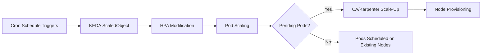

The Cron scaler allows definition of schedules and time zones for scaling workloads in or out, making it ideal for workloads with predictable usage patterns such as batch processing, business-hour scaling, or scheduled backups[^10]. The scaler uses standard cron expression format and supports timezone configuration to ensure scaling actions align with business operational hours regardless of cluster location.

**ScaledObject Configuration for Cron-Based Scaling**

A practical implementation involves creating a ScaledObject that references the target deployment and specifies cron triggers. The configuration includes several critical components[^11][^12]:

```yaml
apiVersion: keda.sh/v1alpha1
kind: ScaledObject
metadata:
  name: scheduled-scaling
spec:
  scaleTargetRef:
    name: myapp
  pollingInterval: 15        # Check every 15 seconds (default)
  cooldownPeriod: 300        # Wait 5 minutes before scale-down (default)
  maxReplicaCount: 100       # Maximum replicas allowed
  triggers:
  - type: cron
    metadata:
      timezone: "Asia/Manila"
      start: "37 * * * *"    # Scale up at minute 37 of each hour
      end: "40 * * * *"      # Scale down at minute 40
      desiredReplicas: "10"  # Target replica count during window
```

The `timezone` parameter accepts canonical IANA Time Zone database names, enabling location-based time zones that **automatically adjust for Daylight Saving Time (DST)**. When the clock reaches the start time, KEDA scales the deployment to the specified `desiredReplicas` count; when the end time arrives, replicas reduce back to the baseline[^12].

**Verification and Monitoring Procedures**

After applying the ScaledObject configuration with `kubectl apply -f scaledobject.yaml`, operators can verify the configuration using several commands[^11][^12]:

| Command | Purpose | Expected Output |
|---------|---------|-----------------|
| `kubectl get scaledobjects` | Check ScaledObject status | READY: True, ACTIVE: Unknown (normal for cron) |
| `kubectl get hpa` | View associated HPA | Shows target and current replica counts |
| `kubectl logs -n keda -l app=keda-operator` | Monitor scaling decisions | Scaling events and decision logs |
| `watch kubectl get pods -l app=myapp` | Observe real-time scaling | Pod creation/termination during windows |

The KEDA operator consists of three components: the admission webhooks for resource validation, the core operator that watches ScaledObjects and manages HPAs, and the metrics API server that exposes custom metrics[^12]. Understanding this architecture is essential for troubleshooting scaling behaviors.

**Interaction with Node Provisioning**

The critical insight for node-level scaling is that KEDA's pod scaling creates the **pending pod conditions** that trigger Cluster Autoscaler or Karpenter. When KEDA increases replica count from 2 to 10 at the scheduled time, if existing nodes lack capacity, the additional pods enter a Pending state. This triggers the node autoscaler's scale-up logic, effectively converting time-based pod scheduling into time-based node provisioning[^13].

To ensure nodes are ready before workload demand arrives, organizations should **schedule KEDA scale-up events with sufficient lead time** to account for node provisioning latency (typically 3-5 minutes as documented in Chapter 1). For example, if peak traffic begins at 9:00 AM, configuring the cron trigger to start at 8:50 AM provides buffer time for node provisioning to complete.

### 2.2 Cloud Provider Scheduled Scaling Capabilities

Major cloud providers offer native scheduled scaling features that operate directly on node group infrastructure, bypassing the Kubernetes control plane for capacity adjustments. These capabilities enable **precise control over node counts at specific times** without requiring pending pods as triggers.

**AWS EC2 Auto Scaling Scheduled Actions**

AWS provides scheduled scaling through Auto Scaling groups, allowing organizations to set up automatic scaling based on predictable load changes[^14]. Scheduled actions specify when scaling should occur, the new desired capacity, and optionally new minimum and maximum capacity values.

The implementation uses a cron expression format with five fields: `[Minute] [Hour] [Day_of_Month] [Month_of_Year] [Day_of_Week]`. For example, the expression `30 6 * * 2` configures a scheduled action that recurs every Tuesday at 6:30 AM[^14]. Key configuration considerations include:

| Parameter | Description | Example |
|-----------|-------------|---------|
| Cron Expression | Schedule definition | `0 8 * * mon-fri` (8 AM weekdays) |
| Time Zone | IANA canonical name | `America/New_York` |
| Desired Capacity | Target node count | 10 |
| Min/Max Capacity | Bounds during window | 5/20 |
| Start/End Time | Schedule boundaries | Optional recurring limits |

By default, recurring schedules operate in UTC, but specifying a location-based time zone ensures **automatic DST adjustment**[^14]. The scheduled action modifies the Auto Scaling group's desired capacity, which then triggers instance launches or terminations. At the specified time, if current capacity is less than the specified desired capacity, EC2 scales out; if current capacity is greater, it scales in[^14].

Important limitations include: scheduled actions must have unique time values within a group, the order of execution is guaranteed only within the same Auto Scaling group, and a maximum of **125 scheduled actions per Auto Scaling group** can be created[^14].

**GCP Cloud Scheduler with GKE Node Pool API**

Google Cloud Platform enables scheduled node scaling through Cloud Scheduler integration with the GKE node pool `setSize` API[^15][^16]. This approach involves creating Cloud Scheduler jobs that invoke HTTP POST requests to modify node pool sizes at specified times.

The implementation pattern involves:

1. **Service Account Configuration**: Create a service account with Kubernetes Engine Cluster Admin role (or more restrictive permissions following least privilege)
2. **API Endpoint**: `https://container.googleapis.com/v1beta1/projects/{projectId}/zones/{zone}/clusters/{clusterId}/nodePools/{nodePoolId}/setSize`
3. **HTTP Headers**: `Content-Type: application/octet-stream`, `User-Agent: Google-Cloud-Scheduler`
4. **Request Body**: JSON specifying target node count, e.g., `{ "nodeCount": 4 }`

Cloud Scheduler uses unix-cron format for scheduling, such as `0 8 * * *` for 8:00 AM daily[^15]. This approach provides **direct control over node pool size** without requiring intermediate pod scaling, making it suitable for scenarios where node capacity must be guaranteed before any workload scheduling occurs.

For GPU node pools with high operational costs, this pattern enables automatic shutdown during non-business hours. A recommended architecture uses two node pools: a default pool for kube-system pods (which cannot scale to zero) and a GPU pool with taints that can scale to zero when not needed[^16].

**Azure Automation for AKS Cluster Management**

Azure Kubernetes Service supports scheduled cluster operations through Azure Automation, Azure CLI scripts, or CI/CD pipeline integration[^17]. A common pattern for non-production environments involves completely stopping clusters during off-hours to eliminate compute costs.

The implementation strategy involves classifying AKS clusters by environment (dev, test, staging, prod) and defining working-hour schedules for each non-production environment. Scripts using Azure CLI commands can be integrated with schedulers such as GitHub Actions, Azure Automation, or CI/CD systems to **stop clusters at night and on weekends**[^17].

Azure's **Scale-down Mode** feature provides additional flexibility by allowing nodes to be deallocated rather than deleted during scale-down operations[^18]. When nodes are deallocated:

- VM compute charges stop (no billing for compute resources)
- OS and data storage disk charges continue
- Container images remain cached on deallocated nodes
- Scale-up operations start deallocated nodes before provisioning new ones

This capability enables **faster scale-up operations** because deallocated nodes can be restarted more quickly than provisioning new instances, and cached container images eliminate image pull time[^18].

### 2.3 CronJob and Custom Controller Implementations

Kubernetes-native approaches using CronJobs and custom controllers provide flexible mechanisms for implementing scheduled node scaling without external dependencies on cloud provider scheduling services.

**CronJob-Based Node Scaling**

Kubernetes CronJobs automate repetitive tasks on preset schedules within the cluster, running jobs regardless of node configuration and consuming resources only when executing[^19]. For node scaling, CronJobs can invoke cloud provider APIs or modify node group configurations through kubectl commands or SDK calls.

The CronJob configuration uses a five-column cron format (minutes, hours, day of month, month, day of week) to define execution times[^19]. Key configuration settings include:

```yaml
apiVersion: batch/v1
kind: CronJob
metadata:
  name: node-scale-up
spec:
  schedule: "0 8 * * mon-fri"    # 8 AM weekdays
  timeZone: "America/New_York"   # Time zone specification
  concurrencyPolicy: Forbid      # Prevent overlapping executions
  successfulJobsHistoryLimit: 3  # Retain last 3 successful runs
  failedJobsHistoryLimit: 1      # Retain last failed run
  jobTemplate:
    spec:
      template:
        spec:
          serviceAccountName: node-scaler
          containers:
          - name: scaler
            image: amazon/aws-cli:latest
            command:
            - /bin/sh
            - -c
            - |
              aws autoscaling set-desired-capacity \
                --auto-scaling-group-name my-node-group \
                --desired-capacity 10
          restartPolicy: OnFailure
```

The **concurrency policy** determines behavior when new jobs are scheduled while previous ones are still running[^19]:

| Policy | Behavior | Use Case |
|--------|----------|----------|
| Allow | Run new job concurrently | Independent scaling operations |
| Forbid | Prevent new job until previous finishes | Sequential scaling requirements |
| Replace | Stop existing job and start new one | Superseding scaling decisions |

**RBAC Requirements and Security Considerations**

CronJobs that modify node group configurations require appropriate permissions. For AWS, the pod's service account needs IAM credentials with Auto Scaling permissions. For direct Kubernetes API manipulation, RBAC rules must grant access to node resources or custom resources that control node groups.

Best practices for managing CronJobs include[^19]:
- Tracking job status and output logs for auditing
- Properly configuring resource requests and limits
- Labeling jobs for identification and monitoring
- Generating alerts on failures via kube-state-metrics
- Securing secrets management for cloud provider credentials

**Custom Controller Development**

For organizations requiring more sophisticated scheduling logic than CronJobs provide, custom controllers offer complete flexibility. Custom controllers can implement complex scheduling algorithms, coordinate multiple scaling dimensions, and integrate with external systems for dynamic schedule adjustment.

The development approach typically involves:

1. **Custom Resource Definition (CRD)**: Define a resource representing the scheduled scaling policy
2. **Controller Logic**: Implement reconciliation loops that evaluate schedules and trigger scaling
3. **Cloud Provider Integration**: Use SDK calls to modify node group configurations
4. **State Management**: Track scaling state and prevent conflicting operations

For collaborative autoscaling scenarios where multiple workloads compete for resources, custom controllers can implement **priority-based resource allocation**[^20]. By adding priority parameters to custom resources, controllers can resolve resource conflicts when multiple scaling requests cannot be satisfied simultaneously.

### 2.4 Managed Node Group Integration and Configuration

Effective scheduled scaling requires tight integration with managed node group infrastructure. Each major cloud provider offers managed node groups that automate provisioning and lifecycle management while providing configuration hooks for scheduled capacity changes.

**AWS EKS Managed Node Groups**

Amazon EKS managed node groups automate the provisioning and lifecycle management of nodes, eliminating the need to separately provision or register EC2 instances[^21]. Every managed node is provisioned as part of an EC2 Auto Scaling group managed by EKS, with resources running within the customer's AWS account.

Critical integration features include:

- **Automatic Cluster Autoscaler Discovery**: EKS tags managed node group resources for auto-discovery by the Kubernetes Cluster Autoscaler[^21]
- **Multi-AZ Deployment**: Each node group runs across multiple Availability Zones as defined during creation
- **Node Auto Repair**: Optional continuous health monitoring with automatic node replacement[^21]
- **Automatic Node Draining**: Nodes are drained using the Kubernetes API during terminations or updates[^21]

The **NodegroupScalingConfig** object controls scaling parameters[^22]:

| Parameter | Description | Constraints |
|-----------|-------------|-------------|
| `desiredSize` | Current target node count | Min value: 0, modified by CA |
| `minSize` | Minimum nodes allowed | Min value: 0 |
| `maxSize` | Maximum nodes allowed | Min value: 1 |

When using Cluster Autoscaler, the `desiredSize` parameter is altered by the autoscaler but will not scale below `minSize` or above `maxSize`[^22]. For scheduled scaling, external mechanisms (scheduled actions, CronJobs) can modify `desiredSize` directly, and the Cluster Autoscaler respects these changes within the configured bounds.

For stateful applications using Amazon EBS volumes with Cluster Autoscaler across multiple Availability Zones, AWS recommends configuring **multiple node groups scoped to single Availability Zones** and enabling the `--balance-similar-node-groups` feature[^21].

**Capacity Type Considerations**

Managed node groups support both On-Demand and Spot capacity types[^21]:

| Capacity Type | Kubernetes Label | Use Case | Scheduled Scaling Consideration |
|---------------|------------------|----------|--------------------------------|
| On-Demand | `eks.amazonaws.com/capacityType: ON_DEMAND` | Fault-intolerant applications | Predictable availability |
| Spot | `eks.amazonaws.com/capacityType: SPOT` | Fault-tolerant, flexible workloads | May be interrupted with 2-minute notice |

For Spot instances, Amazon EC2 Spot Capacity Rebalancing is enabled so that EKS can gracefully drain and rebalance nodes when interruption risk increases[^21]. However, pods on Spot nodes may not receive the full 2-minute graceful shutdown window, particularly during concurrent reclamations or with high pod density[^21]. For scheduled scaling with Spot instances, organizations should design applications to be **interruption-tolerant** and use termination grace periods of 30 seconds or less[^21].

**GKE Node Pool Configuration**

Google Kubernetes Engine's cluster autoscaler works per node pool, with configurable minimum and maximum sizes[^23]. The autoscaler increases or decreases pool size by adding or removing VM instances in the underlying Compute Engine Managed Instance Group.

Key configuration options include:

- **Per-Zone Limits**: `--min-nodes` and `--max-nodes` flags set limits per zone
- **Total Limits**: `--total-min-nodes` and `--total-max-nodes` flags (GKE 1.24+) set aggregate limits across zones
- **Location Policy**: `BALANCED` (default for on-demand) or `ANY` (default for Spot VMs) controls distribution
- **Autoscaling Profile**: `balanced` (default) or `optimize-utilization` for aggressive scaling

GKE's **Node Auto-Provisioning (NAP)** enhances the standard Cluster Autoscaler by automatically creating and deleting node pools based on real-time workload requirements[^24]. NAP considers CPU, memory, ephemeral storage, GPU needs, and node affinities when provisioning, enabling **dynamic node pool creation without manual intervention**[^24].

**AKS Node Pool Autoscaler Configuration**

Azure Kubernetes Service's cluster autoscaler watches for pods that cannot be scheduled due to resource constraints and scales up node pools to meet demand[^25]. The autoscaler is based on the open-source Kubernetes version and can be enabled on new clusters or existing clusters.

Configuration involves[^25]:

```bash
# Enable on new cluster
az aks create --enable-cluster-autoscaler --min-count 1 --max-count 10

# Enable on existing cluster
az aks update --enable-cluster-autoscaler --min-count 1 --max-count 10

# Update existing node pool
az aks nodepool update --update-cluster-autoscaler --min-count 2 --max-count 15
```

The cluster autoscaler profile affects all node pools and includes parameters such as `scan-interval` (default 10 seconds), `scale-down-delay-after-add` (default 10 minutes), and `scale-down-utilization-threshold` (default 0.5)[^25]. For scheduled scaling scenarios, these parameters should be tuned to complement the scheduled capacity changes—for example, reducing `scale-down-delay-after-add` when scheduled scale-up is followed by known workload deployment.

### 2.5 Coordination with Application Deployment Schedules

Successful scheduled node scaling requires **precise timing coordination** between infrastructure provisioning and application workload scheduling. The fundamental challenge is ensuring that nodes are fully ready—registered with the API server, passing health checks, and accepting pod scheduling—before workloads require the capacity.

**Timing Considerations for Batch Job Execution**

For scheduled batch processing that must complete within specific time windows, node availability must precede job execution. The coordination timeline includes:

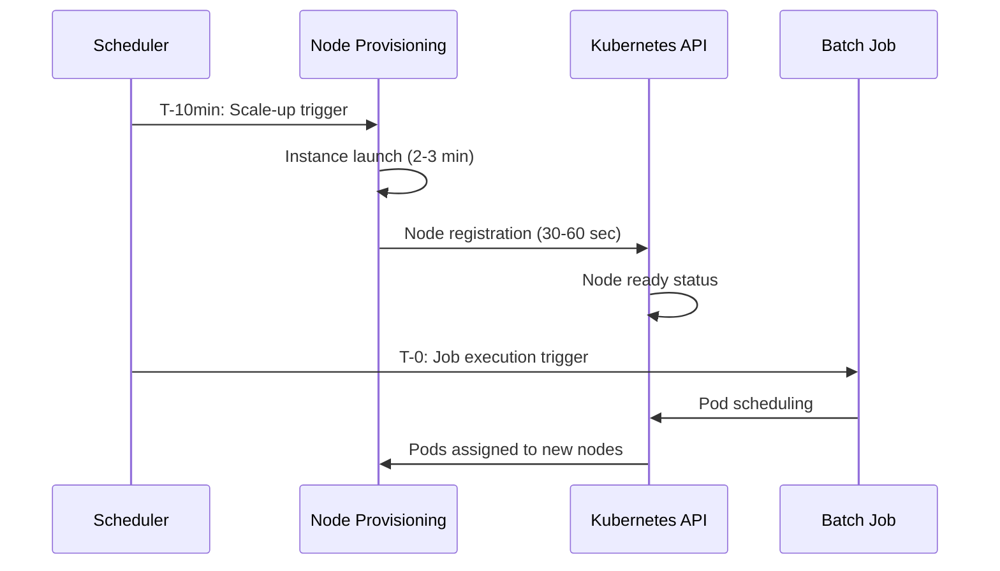

The recommended approach schedules node scale-up **10-15 minutes before** workload deployment to account for:
- Instance launch time: 2-3 minutes
- Node registration and kubelet startup: 30-60 seconds
- DaemonSet pod scheduling: 30-60 seconds
- Safety buffer for unexpected delays: 5+ minutes

**CronJob Workload Coordination**

Kubernetes CronJobs execute at specific times but do not inherently coordinate with node availability. If a CronJob creates pods that require more capacity than currently available, those pods enter Pending state until the Cluster Autoscaler provisions additional nodes—reintroducing the reactive scaling latency discussed in Chapter 1.

To ensure node availability for CronJob workloads[^19]:

1. **Pre-scaling Pattern**: Create a separate CronJob that triggers node scale-up before the workload CronJob executes
2. **Shared Scheduling Window**: Align node scale-up schedules with maintenance exclusion periods to prevent node disruption during critical processing
3. **Resource Reservation**: Use placeholder pods with appropriate resource requests to maintain baseline capacity for scheduled workloads

For batch workloads on GKE, Google recommends using the **Indexed completion mode** for Jobs and defining Pod failure policies to handle retryable and non-retryable failures[^26]. CronJobs should be used for periodic scheduled operations such as backups, report generation, or scheduled ML model training[^26].

**Business-Hour Traffic Pattern Alignment**

For applications with predictable daily traffic patterns, scheduled scaling should align infrastructure capacity with expected demand curves. A typical configuration might include:

| Time Window | Action | Target Capacity | Rationale |
|-------------|--------|-----------------|-----------|
| 7:00 AM | Scale-up | Peak capacity | Pre-position for business hours |
| 9:00 AM | Traffic arrival | — | Workload begins |
| 6:00 PM | Traffic decline | — | Business hours end |
| 8:00 PM | Scale-down | Baseline capacity | Reduce off-hours costs |

The scale-up timing should include buffer for node provisioning, while scale-down can be more aggressive since reducing capacity doesn't require provisioning latency. However, organizations should consider **maintenance exclusion periods** to ensure scaling operations don't coincide with cluster upgrades or other maintenance activities[^26].

**Grace Period Handling**

Pod disruption budgets (PDBs) interact with scheduled scaling during both scale-up and scale-down phases. During scale-up, PDBs don't directly affect node provisioning but may influence pod scheduling if anti-affinity rules require specific node distributions. During scale-down, PDBs are **not respected** when terminating nodes through AZRebalance or desired count reduction—these actions try to evict pods but terminate nodes after 15 minutes regardless of eviction success[^21].

To extend the termination grace period, organizations can add lifecycle hooks to Auto Scaling groups[^21]. For Spot instances, the `CapacityRebalance` setting must be `true` to run the drain process correctly after receiving interruption notifications[^21].

### 2.6 Scale-Down Scheduling and Cost Optimization Patterns

Scheduled scale-down strategies enable organizations to **systematically reduce infrastructure costs** during predictable low-demand periods. Unlike reactive scale-down (which waits for utilization thresholds), scheduled scale-down proactively removes capacity based on known demand patterns.

**Non-Production Cluster Shutdown Scheduling**

Non-production clusters often run continuously even when unused, generating unnecessary compute and supporting-service costs[^17]. A systematic approach involves:

1. **Environment Classification**: Categorize clusters as dev, test, staging, or prod
2. **Schedule Definition**: Define working-hour windows for each non-production tier
3. **Automation Implementation**: Use Azure Automation, GitHub Actions, or CI/CD pipelines to stop/start clusters
4. **Monitoring Integration**: Track cost savings and ensure scheduled operations complete successfully

For AKS, the `az aks stop` and `az aks start` commands provide complete cluster shutdown, eliminating all compute charges during stopped periods[^17]. For EKS and GKE, node pool scaling to zero achieves similar cost reduction while maintaining the control plane.

**Azure Scale-down Mode Configuration**

Azure's Scale-down Mode feature provides granular control over what happens to nodes during scale-down[^18]:

| Mode | Behavior | Cost Impact | Scale-up Speed |
|------|----------|-------------|----------------|
| Delete (default) | Nodes terminated | No residual cost | Full provisioning time |
| Deallocate | Nodes stopped but retained | Storage costs continue | Faster (restart vs. provision) |

The deallocate mode is particularly valuable for scheduled scaling because:
- **Cached container images** eliminate image pull time during scale-up
- **Faster restart** compared to new instance provisioning
- **Predictable capacity** from known deallocated nodes

Implementation requires specifying `--scale-down-mode Deallocate` during node pool creation or update[^18]. When scaling up, deallocated nodes start first before new nodes are provisioned, optimizing time-to-ready for scheduled capacity increases.

**Karpenter Workarounds for Time-Based Node Removal**

Karpenter does not natively support time-based scheduling rules, but several workarounds enable scheduled capacity reduction[^27]:

1. **Provisioner Limit Modification**: Set zero CPU limits in the Provisioner's `.spec.limits`, then delete all nodes; disable limits when scaling back up
2. **Provisioner Deletion**: Remove all Provisioners (which triggers node deletion), then recreate them when capacity is needed
3. **Workload Scale-Down**: Scale all workloads to zero replicas, allowing Karpenter to automatically remove unused nodes through consolidation

The community has suggested that Karpenter should add native time-rule support through `activeHours` specifications in Provisioner configuration, but this feature is not yet implemented[^27]. For organizations requiring this capability, external schedulers (CronJobs, cloud schedulers) must orchestrate the workaround approaches.

**Karpenter Disruption Budget Configuration**

Karpenter's NodePool configuration includes disruption budgets that control scale-down speed[^28]:

```yaml
spec:
  disruption:
    consolidationPolicy: WhenEmptyOrUnderutilized
    consolidateAfter: 1m
    budgets:
    - nodes: 10%           # Allow 10% of nodes to be disrupted
    - schedule: "0 9 * * mon-fri"  # No disruption during business hours
      duration: 8h
      nodes: "0"
```

The `consolidationPolicy` determines which nodes Karpenter considers for removal[^28]:
- **WhenEmptyOrUnderutilized**: Considers all nodes, removes empty or underutilized ones
- **WhenEmpty**: Only considers nodes with no workload pods

The `consolidateAfter` parameter specifies how long Karpenter waits after pod changes before consolidating, and can be set to `Never` to completely disable automatic consolidation[^28]. This is useful when scheduled scaling should control capacity rather than Karpenter's consolidation logic.

**System Pod Preservation Considerations**

During aggressive scale-down, system pods (DaemonSets, kube-system components) require special handling. The Cluster Autoscaler by default does not remove nodes running pods it cannot safely evict[^3]. For scheduled scale-down that must reduce to minimal capacity:

- **Dedicated System Node Pool**: Maintain a small, non-scaling node pool for system components
- **Node Taints**: Use taints to prevent workload pods from scheduling on system nodes while allowing system pods everywhere
- **PDB Configuration**: Ensure system component PDBs allow sufficient disruption for scale-down

For GKE GPU node pools, the recommended pattern uses two node pools: a default pool for kube-system pods (which cannot scale to zero) and a GPU pool with `--node-taints cost=high:NoSchedule` that can scale to zero when workloads are absent[^16].

**Cost Optimization Trade-offs**

Aggressive scheduled scale-down introduces operational risks that must be balanced against cost savings:

| Consideration | Risk | Mitigation |
|---------------|------|------------|
| Unexpected demand | Capacity unavailable | Maintain minimum baseline; implement rapid scale-up triggers |
| Scale-up failures | Prolonged outage | Monitor scheduled operations; implement alerting |
| Data loss | Pods terminated without graceful shutdown | Configure appropriate termination grace periods |
| System instability | Core components disrupted | Preserve system node pools; test scale-down procedures |

Organizations should implement **continuous optimization processes** rather than one-time configurations, regularly reviewing optimization reports and adjusting policies as workload patterns evolve[^17]. The combination of scheduled scaling with reactive autoscaling provides defense-in-depth: scheduled scaling handles predictable patterns while reactive scaling addresses unexpected demand changes.

[^3]: Cluster Autoscaler - Amazon EKS
[^10]: Autoscaling Workloads
[^10]: Autoscaling Workloads
[^19]: Kubernetes CronJobs Guide: Use Cases & Best Practices
[^13]: Scaling Kubernetes Nodes in AWS EKS: A Complete Guide
[^21]: Simplify node lifecycle with managed node groups
[^21]: Simplify node lifecycle with managed node groups
[^21]: Simplify node lifecycle with managed node groups
[^9]: KEDA | Kubernetes Event-driven Autoscaling
[^9]: KEDA | Kubernetes Event-driven Autoscaling
[^22]: NodegroupScalingConfig - Amazon EKS
[^28]: NodePools
[^28]: NodePools
[^11]: Setup Autoscaling with KEDA
[^12]: Kubernetes Autoscaling with KEDA Cron Trigger
[^12]: Kubernetes Autoscaling with KEDA Cron Trigger
[^14]: Scheduled scaling for Amazon EC2 Auto Scaling
[^27]: FAQ: How to schedule full worker node shutdown #3539
[^25]: Use the cluster autoscaler in Azure Kubernetes Service
[^23]: About GKE cluster autoscaling
[^24]: Cut GKE Node Costs with NAP and PerfectScale
[^20]: Kubernetes customized controller for collaborated auto scaling
[^17]: 10 Best Practices to Cut Kubernetes Costs on Azure
[^18]: Use Scale-down Mode for your Azure Kubernetes Service
[^26]: Best practices for running batch workloads on GKE
[^15]: Scaling nodes in Kubernetes on a schedule
[^16]: GCP GKE node pool auto schedule

## 3 Metrics-Driven Predictive Scaling Architectures

The limitations of reactive autoscaling—where capacity provisioning begins only after workload demand has already materialized—create an inherent gap between when resources are needed and when they become available. This chapter examines architectural approaches that leverage **external metrics and predictive intelligence** to enable proactive node provisioning in Kubernetes clusters. By integrating business KPIs, traffic forecasts, queue depths, and historical usage patterns into scaling decisions, organizations can provision capacity ahead of anticipated demand rather than responding to scheduling failures after they occur.

The fundamental shift from reactive to predictive scaling requires a comprehensive metrics infrastructure that captures signals beyond basic CPU and memory utilization. These signals must flow through well-designed pipelines that transform raw observations into actionable scaling decisions, ultimately triggering node provisioning before workloads arrive. The architectural patterns presented in this chapter address the end-to-end journey from metric collection through forecasting to infrastructure scaling actions.

### 3.1 Custom Metrics Pipeline Architecture and Prometheus Integration

Building effective predictive scaling systems requires a robust **custom metrics pipeline** that extends Kubernetes' native metrics capabilities. While the Horizontal Pod Autoscaler (HPA) supports CPU and memory-based scaling by default, scaling based on application-specific signals—such as HTTP request rates, queue lengths, or business-specific KPIs—requires integration with external monitoring systems through metrics adapters.

**Prometheus Adapter Architecture**

The Prometheus Adapter serves as the **bridge between a Prometheus server and the Kubernetes Custom & External Metrics API**, enabling HPA and other scaling components to access a wider range of metrics beyond CPU and memory[^29]. The adapter queries Prometheus for metrics exposed by applications and makes them available to the Kubernetes API, which then informs scaling decisions.

The architectural flow for metrics-driven autoscaling involves several components working together:


Kubernetes supports **two critical metrics APIs** beyond the default Resource Metrics API (`metrics.k8s.io`) that are essential for predictive scaling implementations[^23][^15]:

| API | Endpoint | Purpose | Example Metrics |
|-----|----------|---------|-----------------|
| Custom Metrics API | `custom.metrics.k8s.io` | Metrics tied to Kubernetes objects (pods, deployments, namespaces) | HTTP request rate per pod, queue length per deployment |
| External Metrics API | `external.metrics.k8s.io` | Metrics not tied to Kubernetes objects, originating outside the cluster | AWS SQS queue depth, Stripe payment volume, external API response times |

The **Custom Metrics API** is used for metrics associated with Kubernetes objects, such as HTTP request rate per pod or queue length per deployment. These metrics are queried from Prometheus and must include Kubernetes object labels for proper association[^29]. The **External Metrics API** is used for metrics not directly tied to Kubernetes objects and may originate outside the cluster, such as the number of messages in a remote queue[^23]. Both APIs require a metrics adapter to function.

**Prometheus Adapter Configuration**

The Prometheus Adapter is best installed via Helm from the prometheus-community Helm chart repository. Key configuration steps include connecting the adapter to the Prometheus instance, defining custom metric rules, setting up RBAC and a service account, and configuring TLS for APIService registration[^29].

A core configuration requirement is defining which Prometheus metrics to expose and how to map them to Kubernetes resources. An example rule exposes the `flask_http_request_total` counter as a per-second rate named `http_requests_per_second`:

```yaml
rules:
  - seriesQuery: 'flask_http_request_total{namespace!="",pod!=""}'
    resources:
      overrides:
        namespace: {resource: "namespace"}
        pod: {resource: "pod"}
    name:
      matches: "^(.*)_total$"
      as: "${1}_per_second"
    metricsQuery: 'rate(<<.Series>>{<<.LabelMatchers>>}[2m])'
```

For external metrics not tied to Kubernetes objects, rules are defined under `.Values.rules.external` in the adapter configuration, and the `external.metrics.k8s.io` APIService must be enabled[^29].

**Production Readiness and Security Considerations**

For production deployments, managing TLS certificates securely is essential. Using **cert-manager** is recommended to automate the creation of a self-signed CA, the issuance of a serving certificate, and the injection of the CA bundle into the APIService, ensuring it shows as available[^29]. This is enabled in the Helm chart by setting `certManager.enabled: true`.

In **multi-tenant Kubernetes environments**, careful management of the Prometheus Adapter is needed for tenant isolation, operational scalability, and security. Options include deploying a separate Prometheus Adapter instance per tenant for complete isolation, or using a shared adapter with label-based query filters to restrict metrics to tenant-relevant data[^29].

Common debugging issues include custom metrics not being found (requiring verification that the Prometheus metric exists and the adapter's seriesQuery matches it correctly), APIService status showing false (often a TLS or connectivity issue requiring CA bundle verification), and HPA scaling issues (requiring verification of metric availability and value validity)[^29].

### 3.2 Time Series Forecasting Models for Workload Prediction

The core innovation enabling predictive autoscaling is the application of **time series forecasting models** to anticipate future resource demands based on historical patterns. Unlike reactive scaling that responds to current conditions, predictive approaches use machine learning to forecast workload trends and provision resources before demand materializes.

**Common Forecasting Methods and Selection Criteria**

Research and industry practice have identified several forecasting methods suitable for Kubernetes workload prediction[^30][^31]:

| Method | Strengths | Weaknesses | Best Use Case |
|--------|-----------|------------|---------------|
| **Facebook Prophet** | Handles seasonality without heavy tuning; interpretable; robust to missing data | May struggle with highly irregular patterns | Daily/weekly seasonal patterns |
| **LSTM Neural Networks** | Captures complex temporal dependencies; handles non-linear patterns | Requires more training data; higher prediction latency | Complex, non-linear workloads |
| **Holt-Winters** | Simple; handles trend and seasonality | Less flexible than ML approaches | Straightforward seasonal patterns |
| **ARIMA** | Well-established statistical method | Requires stationarity; manual parameter tuning | Stationary time series |
| **Hybrid Models** | Combines strengths of multiple approaches | Higher complexity; longer prediction time | Maximum accuracy requirements |

Among these methods, **Prophet stands out for its robustness, interpretability, and ability to handle seasonality without heavy tuning**[^30][^31]. Prophet was developed by Facebook specifically for business forecasting scenarios and excels at handling time series data with daily or weekly seasonality patterns common in web traffic and business applications.

**Hybrid Model Approaches**

Research has demonstrated that **hybrid models combining multiple forecasting techniques** can significantly outperform single-model approaches. A notable study designed and evaluated a proactive Kubernetes autoscaling system using a hybrid model that combines Facebook Prophet and Long Short-Term Memory (LSTM) to predict HTTP requests and calculate required pod counts[^32][^33][^34].

The hybrid model leverages Prophet's ability to capture seasonality patterns and uses LSTM for residual analysis. The core idea is that after data is processed through the Prophet model, the complex, non-linear residual time series is predicted by LSTM[^34]. Residuals represent the differences between observed and predicted values, capturing patterns that Prophet alone cannot model.

Evaluation results using real-world datasets from NASA (3,461,612 requests over 2 months) and FIFA World Cup 1998 (1,352,804,107 requests over 3 months) demonstrated impressive accuracy improvements[^32][^34]:

| Dataset | Metric | Prophet-LSTM Hybrid | Best Single Model | Improvement |
|---------|--------|---------------------|-------------------|-------------|
| NASA | MSE | Lowest among all | Bi-LSTM single-step | **65.2%** higher accuracy |
| FIFA World Cup | MSE | Lowest among all | Bi-LSTM 5 steps | **90.8%** higher accuracy |

However, the hybrid model exhibited **higher prediction latency** than single models due to the sequential processing of two models[^32][^34]. This tradeoff between accuracy and latency is a critical consideration for real-time scaling decisions.

**Prediction Accuracy Metrics**

Model performance evaluation relies on several standard metrics[^32][^34]:

- **Mean Squared Error (MSE)**: Measures average squared difference between predictions and actual values
- **Root Mean Squared Error (RMSE)**: Square root of MSE, in the same units as the target variable
- **Mean Absolute Error (MAE)**: Average absolute difference between predictions and actual values
- **Coefficient of Determination (R²)**: Proportion of variance explained by the model
- **Mean Absolute Percentage Error (MAPE)**: Percentage-based error metric for relative accuracy assessment
- **Total Prediction Time (TPT)**: End-to-end latency for generating predictions

The **MAPE metric** is particularly important for production systems, as it provides a threshold for determining when predictions are reliable enough to act upon. Kedify's predictive scaler, for example, allows configuration of a `modelMapeThreshold` parameter—if the model's error exceeds this threshold, the system automatically returns a default value instead of an unreliable prediction[^30][^31].

**Training Data Requirements**

Effective forecasting requires sufficient historical data to capture recurring patterns. For PredictKube's AI-based predictive autoscaler, **providing at least 2+ weeks of data initially ensures more precise predictions**[^35][^36][^37]. The system observes requests-per-second (RPS) or CPU values over time and can predict trends for up to 6 hours ahead.

For the hybrid Prophet-LSTM model, researchers used datasets spanning months of historical traffic to train models capable of accurate multi-step predictions[^34]. The metric used for forecasting—HTTP request rate—was chosen because it **directly reflects application demand**, unlike CPU or memory usage which are indirect indicators[^34].

### 3.3 KEDA Predictive Scalers and External Metrics Integration

KEDA (Kubernetes Event-Driven Autoscaler) extends Kubernetes' native autoscaling capabilities by enabling scaling based on **event-driven metrics and external signals**. As a CNCF project with over 79 built-in scalers, KEDA provides the integration points necessary for implementing predictive scaling architectures[^32][^38].

**Predictkube Scaler for AI-Based Predictive Scaling**

Among KEDA's extensive scaler catalog, the **Predictkube scaler offers AI-based predictive scaling based on Prometheus metrics and PredictKube SaaS**, available from KEDA version 2.6+ and maintained by Dysnix[^32][^38]. This scaler represents a production-ready implementation of machine learning-based workload prediction integrated directly into the Kubernetes autoscaling ecosystem.

PredictKube operates as a solution that can be used as a KEDA scaler responsible for resource balancing, combined with an AI model that has learned to react proactively to patterns of traffic activity[^35][^39]. The predictive autoscaling process works through an AI model that observes requests-per-second (RPS) or CPU values for a period of time and then shows the trend for up to 6 hours ahead[^36][^37].

Unlike standard rules-based algorithms such as Horizontal Pod Autoscaling (HPA), **PredictKube uses Machine Learning models for time series data predicting**[^36][^37]. The system was trained using customer and open data sources, including datasets like HTTP NASA logs, to be specific about cloud data and traffic trends[^35][^37].

Configuration of PredictKube involves several steps[^35][^40]:

1. Install KEDA in the cluster
2. Obtain a PredictKube API key by registering on the PredictKube website
3. Create a PredictKube Credentials secret using kubectl
4. Configure predictive autoscaling by creating a TriggerAuthentication and ScaledObject

An example ScaledObject configuration specifies parameters including:

```yaml
apiVersion: keda.sh/v1alpha1
kind: ScaledObject
metadata:
  name: predictkube-scaledobject
spec:
  scaleTargetRef:
    name: my-deployment
  triggers:
  - type: predictkube
    metadata:
      predictHorizon: "2h"           # How far ahead to predict
      historyTimeWindow: "7d"        # Minimum 7-14 days recommended
      threshold: "2000"              # Target metric value
    authenticationRef:
      name: predictkube-trigger-auth
```

The `predictHorizon` parameter specifies how far ahead to predict (e.g., "2h"), while `historyTimeWindow` defines the historical data window used for training (recommended minimum 7-14 days)[^35]. Predictions can be visualized in tools like Grafana, where graphs show predicted replicas (green), ready replicas (yellow), and ideal replicas covering the RPS trend (blue)[^39][^37].

**Database-Backed Predictive Triggers**

For organizations implementing custom forecasting models, KEDA supports integration through **database-backed triggers** that consume predictions stored in external databases. A practical implementation pattern uses Prophet for forecasting and PostgreSQL for storing predictions, with KEDA querying the database to drive scaling decisions[^41][^36].

The implementation workflow involves six key steps[^41][^36]:

1. **Install KEDA** using Helm: `helm repo add kedacore https://kedacore.github.io/charts` followed by `helm install keda kedacore/keda`

2. **Train a Prophet model** with historical time series data (CPU usage, request counts), generate forecasts, and store predictions in PostgreSQL

3. **Integrate PostgreSQL with KEDA** by creating a ScaledObject that references the database:

```yaml
apiVersion: keda.sh/v1alpha1
kind: ScaledObject
metadata:
  name: keda-postgres-scaledobject
spec:
  scaleTargetRef:
    name: myapp
  triggers:
  - type: postgresql
    metadata:
      connectionFromEnv: POSTGRES_CONNECTION_STRING
      query: "SELECT yhat FROM predictions WHERE ds = CURRENT_DATE"
      targetQueryValue: "100"
```

4. **Deploy Kubernetes resources** by applying the ScaledObject and application deployment

5. **Monitor and fine-tune** using tools like `kubectl top` to observe scaling behavior and adjust Prophet model intervals or KEDA thresholds

6. **Automate prediction updates** using Kubernetes CronJobs that periodically run Prophet scripts to refresh predictions in the database

This configuration tells KEDA to scale the application based on the predicted load retrieved from the PostgreSQL database[^41]. The query retrieves the current day's prediction value, and KEDA adjusts replica counts to maintain the target metric value.

**Kedify MetricPredictor for Model Lifecycle Management**

Kedify extends KEDA with a new Custom Resource Definition called **MetricPredictor**, which represents the forecasting model and its lifecycle[^30][^31]. This CRD provides structured management of predictive models including training schedules, accuracy validation, and automatic fallback mechanisms.

The MetricPredictor configuration includes:

- **Source definition**: Specifies where metrics come from—either a live ScaledObject or a one-shot CSV for testing
- **Model definition**: Specifies the forecasting method (Prophet by default) and training cadence
- **Automatic retraining**: Kedify retrains models automatically on schedule to maintain accuracy

The predictive system continuously collects metric data through Kedify's integration with KEDA. Once enough data accumulates, the model enters a **periodic training and evaluation cycle** to maintain accuracy[^30][^31]. During retraining:

- The dataset is split into a train set (90%) and test set (10%)
- The model is trained on the train set and evaluated on the test set using MAPE
- If the model's error exceeds the configurable `modelMapeThreshold`, Kedify automatically returns a default value instead of an unreliable prediction

Once a MetricPredictor is created and trained, its predictions can be referenced directly in a ScaledObject trigger, allowing **scaling based on forecasted metrics alongside real-time ones**[^30].

### 3.4 Architectural Patterns for Connecting Predictions to Node Provisioning

Translating workload predictions into actual node-level scaling requires well-designed **end-to-end architectural patterns** that coordinate multiple system components. The fundamental challenge is ensuring that predictions generated by forecasting models result in infrastructure provisioning actions that complete before the predicted demand arrives.

**Cascading Scaling Architecture**

The relationship between predictive pod scaling and node provisioning follows a **cascading pattern** where predictions drive pod scaling decisions, which in turn trigger node provisioning through Cluster Autoscaler or Karpenter:

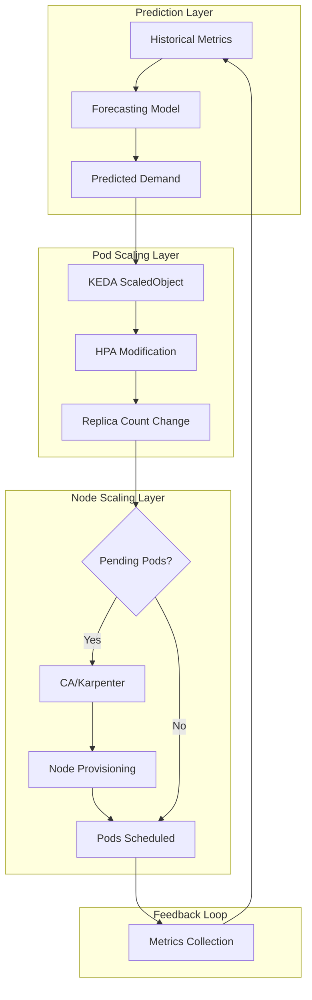

This architecture leverages KEDA's predictive scaling to create the **pending pod conditions** that trigger downstream node autoscaling. When KEDA increases replica count based on forecasted demand, if existing nodes lack capacity, additional pods enter a Pending state, which triggers the node autoscaler's scale-up logic[^41][^36].

**MAPE Loop Implementation**

Research on proactive Kubernetes autoscaling has established the **Monitor-Analyze-Plan-Execute (MAPE) loop** as the foundational architectural pattern for autonomous scaling decisions[^32][^33][^34]. The system architecture follows this loop for scaling decisions:

| Phase | Function | Implementation |
|-------|----------|----------------|
| **Monitor** | Collect pod HTTP request rates | Prometheus scrapes application metrics |
| **Analyze** | Predict workload for t+1 minute | Prophet-LSTM hybrid model processes metrics via Prometheus API |
| **Plan** | Calculate required pod count | Formula: `pods = ceil(predicted_requests / target_per_pod)` |
| **Execute** | Send scaling commands | Kubernetes API server receives scale commands |

The monitoring phase uses Prometheus to collect pod HTTP request rates. The prediction phase uses the hybrid model to forecast expected workload for the next time period (typically t+1 minute). The planning phase calculates the desired pod count based on predicted workload. The execution phase sends scaling commands to the Kubernetes API server based on the replica calculation[^32][^34].

**Predictive Kubernetes Operator Pattern**

A more sophisticated approach involves implementing a **predictive auto-scaling Kubernetes Operator** based on time series forecasting algorithms. Research has demonstrated an Operator that dynamically manages multiple prediction models and adjusts the number of running instances based on forecasts[^42][^36][^43].

The Operator architecture includes:

- **Custom Resource Definition (CRD)**: Allows users to define monitoring metrics and prediction models via YAML configuration
- **Scheduler Component**: Intelligently manages predictive models using a min-heap sorted by loss value, selecting the optimal model for each metric
- **Multi-Model Management**: Supports multiple prediction models per metric, automatically selecting the best performer

The predicted metrics are transformed into replica counts using the formula: `n = ⌈u * p / q⌉`, where `n` is the number of replicas, `p` is the forecasted metric data, `q` is the target metric data, and `u` is the number of copies corresponding to the target metric[^36].

Experimental results demonstrated that the predictive auto-scaling component **accurately predicts future metric trends and intelligently scales resources**. The GRU model achieved a Mean Squared Error (MSE) of 0.00166. Compared to deploying only the GRU model, the multi-model management approach **reduced the system's cold start time by 1 hour and 41 minutes**[^42][^36][^43]. After deploying the Operator, the minimum Service Level Agreement (SLA) increased from 80.3% to 87%, and SLA fluctuations decreased from 24 times in 15 minutes to 4 times—an **83.3% reduction**[^42][^43].

**Buffer Node and Overprovisioning Strategies**

To bridge the gap between prediction and node availability, organizations implement **buffer node strategies** that maintain pre-warmed capacity for rapid scale-up[^44][^3][^36].

Overprovisioning is implemented using temporary pods with negative priority that occupy space in the cluster. When newly created pods are unschedulable and have higher priority, the temporary pods are preempted to make room. The temporary pods then become unschedulable, triggering the Cluster Autoscaler to scale out new overprovisioned nodes[^36].

The amount of overprovisioned capacity represents a **careful business decision** balancing performance and cost. One approach is to determine the average scale-up frequency and divide it by the time to provision a new node. For example, if on average a new node is required every 30 seconds and EC2 takes 30 seconds to provision, a single node of overprovisioning ensures there's always an extra node available, **reducing scheduling latency by 30 seconds** at the cost of one additional instance[^36].

An advanced technique involves employing **buffer nodes for fast scale-up** to mitigate delays in cluster autoscaling when new nodes provision. This involves maintaining a pool of pre-warmed buffer nodes that can be activated immediately when demand increases; once stable, the cluster autoscaler can add long-term nodes[^44][^3][^9].

### 3.5 Dual-Signal Autoscaling and SLO-Aware Scaling Strategies

Advanced predictive scaling implementations move beyond single-metric approaches to incorporate **multiple signals** that balance performance objectives with cost constraints. This dual-signal approach ensures scaling decisions are both efficient and budget-aware.

**Performance and Financial SLO Integration**

Research on scaling Kubernetes for AI/ML workloads has identified that **autoscaling policies tuned solely for latency tend to "stair-step" into the maximum quota**, leading to cost overruns[^45][^35]. A FinOps-minded solution implements dual-signal autoscaling that marries performance Service Level Objectives (e.g., p95 latency) with financial KPIs (e.g., cost per prediction) so scaling decisions are both efficient and budget-aware[^45][^35].

The dual-signal approach involves:

| Signal Type | Example Metrics | Purpose |
|-------------|-----------------|---------|
| **Performance SLO** | p95 latency, error rate, throughput | Ensure service quality |
| **Financial KPI** | Cost per request, GPU utilization, idle resource percentage | Control spending |

Implementation requires **coupling financial and performance objectives everywhere**—from dashboards to autoscalers[^35]. This means that scaling decisions consider both whether additional capacity is needed to meet latency targets and whether the cost of that capacity is justified by the workload value.

A production-grade scaling configuration using KEDA and Prometheus demonstrates this approach with multiple triggers[^46]:

```yaml
apiVersion: keda.sh/v1alpha1
kind: ScaledObject
metadata:
  name: web-service-scaler
spec:
  scaleTargetRef:
    name: web-service
  triggers:
  # Business metric: scale on active requests
  - type: prometheus
    metadata:
      serverAddress: http://prometheus:9090
      query: |
        sum(rate(http_requests_total{deployment="web-service"}[2m]))
      threshold: "100"
  # CPU backstop: ensure infrastructure health
  - type: cpu
    metadata:
      type: Utilization
      value: "80"
```

This configuration scales on the number of active requests (a business metric) while using CPU utilization as a safety backstop[^46].

**Prediction Confidence and Fallback Mechanisms**

Production predictive scaling systems must handle scenarios where **model accuracy degrades** or predictions become unreliable. Kedify addresses this through configurable safety nets[^30][^31]:

- **`modelMapeThreshold`**: The acceptable MAPE threshold for predictions; if exceeded, the system falls back to defaults
- **`highMapeDefaultReturnValue`**: The default value returned when model error exceeds the threshold

The predictive system continuously evaluates model performance during the training and evaluation cycle. If the model's error exceeds the configured threshold, **Kedify automatically returns a default value instead of an unreliable prediction**[^30][^31]. This prevents poor predictions from causing inappropriate scaling actions.

Benefits of this approach include[^31]:
- **Reduced reaction lag**: Scaling occurs before load arrives
- **Improved user experience**: Fewer cold starts and capacity shortages
- **Explainable models**: Can be decomposed into seasonal and trend components for analysis
- **Robustness**: Automatic fallback to defaults when predictions are unreliable
- **Continuous learning**: Models retrain on schedule to adapt to changing patterns
- **Stability**: Safety nets prevent runaway scaling from bad predictions

**Continuous Model Evaluation and Retraining**

Maintaining prediction reliability requires **continuous model evaluation and retraining cycles**. The predictive system should:

1. **Collect ongoing metric data** through integration with monitoring systems
2. **Periodically retrain models** on updated data to capture evolving patterns
3. **Evaluate model performance** using held-out test sets
4. **Automatically switch to fallback behavior** when accuracy degrades

Kedify implements this through the MetricPredictor CRD, which defines the forecasting method and **training cadence**. Models are retrained automatically on schedule, ensuring predictions remain accurate as workload patterns evolve[^30][^31].

For organizations implementing custom solutions, the automation of prediction updates through **Kubernetes CronJobs** ensures scaling decisions are always based on the latest data[^41][^36]. A CronJob can periodically run Prophet scripts to refresh predictions stored in the database, maintaining forecast accuracy.

### 3.6 Operational Considerations for Production Predictive Scaling

Deploying predictive scaling systems in production environments introduces operational complexity that must be carefully managed. This section addresses practical considerations including monitoring requirements, cold start challenges, automation patterns, and integration with cost management practices.

**Monitoring and Observability Requirements**

Effective predictive scaling requires comprehensive observability into both the **prediction system itself** and its **impact on infrastructure behavior**. Key monitoring dimensions include:

| Monitoring Area | Metrics | Purpose |
|-----------------|---------|---------|
| **Model Accuracy** | MAPE, MSE, prediction vs. actual | Validate forecast reliability |
| **Scaling Effectiveness** | Time-to-ready, SLO compliance | Measure operational impact |
| **Cost Impact** | Resource utilization, idle capacity | Track financial outcomes |
| **System Health** | Prediction latency, pipeline errors | Ensure system reliability |

For production deployments, **real insight comes from knitting together live cluster metrics and autoscaler events**[^47]. Predictive autoscalers built on ML libraries like Prophet smooth out scaling curves by forecasting demand instead of chasing it; when wired into KEDA, they can act on those forecasts—some even run convex optimization to pick the cheapest node pool that still hits performance targets[^47].

Tools such as Kubecost, Cast AI, and OpenCost break expenses down by namespace or service, enabling correlation between predictive scaling decisions and cost outcomes[^47]. This visibility is essential for validating that predictive scaling delivers the expected cost-performance benefits.

**Cold Start Problem and Bootstrapping Strategies**

A significant challenge for ML-based scaling is the **cold start problem**—the difficulty of training accurate models when limited historical data is available. Several strategies address this challenge:

**Bayesian Network Approach**: Research on forecasting Kubernetes node anomalies devised using a Bayesian network approach to secure training data at the initial stage. A Bayesian network starts with experts' rule sets to get a certain level of model performance, helping organizations **gather a basic data set to train the model without enough actual data**[^48].

**Pre-evaluation with Expert Rules**: A metric evaluation engine can pre-evaluate metrics using rule bases from system experts. The pre-evaluation results are stored in a data mart for the machine learning pipeline, which then trains models using both rule-based and learned patterns[^48].

**Minimum Data Requirements**: For PredictKube, **2+ weeks of data is recommended for the beginning** to ensure reasonable prediction accuracy[^35][^36]. Organizations should plan for this bootstrap period when deploying predictive scaling systems.

**Multi-Model Management**: The predictive Kubernetes Operator approach uses multiple models managed through a min-heap sorted by loss value. This approach **reduced cold start time by 1 hour and 41 minutes** compared to using only a single GRU model, because simpler models (like Holt-Winters) can provide reasonable predictions while more sophisticated models are still training[^42][^36][^43].

**Automation of Prediction Updates**

To maintain forecast accuracy, prediction updates must be automated through continuous learning pipelines. The recommended approach uses **Kubernetes CronJobs** to periodically refresh predictions[^41][^36]:

```yaml
apiVersion: batch/v1
kind: CronJob
metadata:
  name: update-predictions
spec:
  schedule: "0 * * * *"    # Every hour
  jobTemplate:
    spec:
      template:
        spec:
          containers:
          - name: prophet-predictor
            image: my-prophet-image:latest
            command: ["python", "/app/predict_and_store.py"]
            env:
            - name: POSTGRES_CONNECTION_STRING
              valueFrom:
                secretKeyRef:
                  name: postgres-secret
                  key: connection-string
          restartPolicy: OnFailure
```

This CronJob runs a custom Docker image containing Prophet and the prediction script at regular intervals (e.g., every hour), ensuring **autoscaling decisions are always based on the latest data**[^41][^36].

**Integration with FinOps Practices**

Predictive scaling should be integrated with broader **FinOps practices** to ensure cost-aware infrastructure management. Key integration points include[^45][^35]:

- **Cost-center labeling**: Tag resources with cost allocation metadata before deploying predictive scaling
- **Budget-aware autoscaling**: Configure scaling policies that consider both performance and cost constraints
- **Automated idle resource reclamation**: Use TTL controllers and cluster-sweep CronJobs to delete unused resources
- **Continuous optimization loops**: Implement daily cost summaries, bi-weekly optimization sprints, and monthly executive scorecards

A real-world case study demonstrated that implementing these practices—including dual-signal autoscaling, Spot instance orchestration, and automated idle resource reclamation—achieved an estimated **30-50% reduction in compute costs** while maintaining service-level objectives[^45][^35].

**Failure Modes and Debugging Approaches**

Production predictive scaling systems can fail in several ways that require specific debugging approaches:

| Failure Mode | Symptoms | Debugging Approach |
|--------------|----------|-------------------|
| **Stale predictions** | Scaling based on outdated forecasts | Verify CronJob execution; check prediction timestamps |
| **Model degradation** | Increasing MAPE; poor scaling accuracy | Review model retraining logs; evaluate test set performance |
| **Metrics pipeline failure** | Missing or delayed metrics | Check Prometheus scraping; verify adapter connectivity |
| **API connectivity issues** | ScaledObject not scaling | Verify APIService status; check TLS certificates |

For HPA scaling issues specifically, operators should verify metric availability by querying the Custom Metrics API directly and confirming that values are valid and within expected ranges[^29]. If the APIService status is false, it is often a TLS or connectivity issue requiring verification of the CA bundle[^29].

**Operational Overhead Considerations**

Maintaining ML-based scaling infrastructure introduces operational overhead that organizations must account for:

- **Model training infrastructure**: Compute resources for periodic model retraining
- **Data storage**: Historical metrics retention for training datasets
- **Monitoring systems**: Additional observability for prediction accuracy and system health
- **Expertise requirements**: Team skills in both Kubernetes operations and machine learning

The tradeoff is that **automated systems like Horizontal Pod Autoscalers react to predefined thresholds but remain reactive**[^40]. Predictive systems continuously learn and predict future resource demands, enabling proactive scaling that reduces latency and improves user experience. The industry is shifting toward **autonomous systems** that continuously learn and act independently, representing the next evolution beyond both reactive and predictive approaches[^40].

For organizations evaluating this investment, the demonstrated benefits—including 57% reduction in SLO violations, 83.3% reduction in service quality fluctuations, and 30-50% cost savings—provide compelling justification for the operational complexity of predictive scaling systems[^42][^45][^35][^40].

## 4 Existing Tools and Projects for Non-Reactive Node Autoscaling

The preceding chapters established the fundamental limitations of reactive autoscaling and explored architectural patterns for scheduled and predictive scaling. This chapter provides a comprehensive evaluation of the **tools and projects available for implementing non-reactive node autoscaling** in production Kubernetes environments. Moving beyond theoretical patterns, practitioners require actionable guidance on selecting and configuring specific solutions that match their organizational constraints, workload characteristics, and operational maturity.

The landscape of non-reactive node autoscaling spans open-source projects maintained by the Kubernetes community, cloud provider native services with deep infrastructure integration, and commercial offerings that extend open-source foundations with enterprise features. Each category presents distinct tradeoffs in terms of provisioning speed, scheduling flexibility, operational complexity, and cost optimization capabilities. Understanding these tradeoffs is essential for making informed decisions about which tools to adopt and how to combine them effectively.

### 4.1 Karpenter: Just-in-Time Node Provisioning and Workload-Aware Scaling

**Karpenter** represents a fundamental architectural departure from the Cluster Autoscaler, designed to address the limitations of ASG-based node provisioning through direct cloud provider API integration and workload-aware instance selection. As an open-source project originally developed by AWS and now supported by SIG Autoscaling, Karpenter has become a **popular choice for teams looking to move beyond the limitations of the Kubernetes Cluster Autoscaler**[^49].

**Architectural Advantages Over Cluster Autoscaler**

Karpenter's core innovation lies in its ability to provision **right-sized compute resources in response to changing application load in under a minute**[^50]. This speed improvement stems from Karpenter's direct interaction with cloud provider APIs rather than relying on Auto Scaling Groups:

| Characteristic | Cluster Autoscaler | Karpenter |
|----------------|-------------------|-----------|
| Provisioning Method | ASG-based scaling | Direct EC2 Fleet API calls |
| Instance Selection | Pre-configured node groups | Dynamic selection per workload |
| Provisioning Latency | 3-5 minutes typical | Under 1 minute |
| Bin-packing | Node group level | Individual pod requirements |
| Node Lifecycle | Scaling only | Full lifecycle management |

Karpenter automatically provisions new compute resources based on the **specific requirements of cluster workloads**, including compute, storage, acceleration, and scheduling requirements[^51]. This workload-aware approach enables Karpenter to select instance types that precisely match pod resource requests, eliminating the waste associated with homogeneous node groups.

**NodePool and EC2NodeClass Configuration Patterns**

Karpenter's configuration model uses two primary Custom Resource Definitions: **NodePool** and **EC2NodeClass**. The NodePool defines scheduling constraints and disruption policies, while EC2NodeClass specifies AWS-specific configuration such as AMI selection, security groups, and instance store options.

Karpenter supports scheduling workloads through **layered constraints** defined by the cloud provider, NodePools, and pod specifications[^52]. Pod scheduling constraints must fall within a NodePool's constraints; otherwise, pods will not deploy. This layered model enables organizations to define broad infrastructure policies at the NodePool level while allowing application teams to specify workload-specific requirements through standard Kubernetes scheduling primitives.

Key scheduling constraints supported by Karpenter include:
- **Resource requests**: CPU, memory, and accelerators specified in Pod specs
- **Node selection**: Using `nodeSelector` for key-value pairs or `affinity` for complex constraints
- **Well-known labels**: Including `topology.kubernetes.io/zone`, `node.kubernetes.io/instance-type`, and `karpenter.sh/capacity-type`
- **Topology spread**: Constraints for distributing pods across zones, hosts, or capacity types[^53]

For GPU workloads, Karpenter supports accelerators via resource requirements in the workload manifest, such as `nvidia.com/gpu: "1"`. Appropriate device plugin daemonsets must be deployed for GPU provisioning[^52].

**Consolidation Policies and Disruption Budgets**

Karpenter's consolidation capabilities address the cost optimization challenges that Cluster Autoscaler handles conservatively. The `consolidationPolicy` in NodePool configuration determines which nodes Karpenter considers for removal:

```yaml
spec:
  disruption:
    consolidationPolicy: WhenEmptyOrUnderutilized
    consolidateAfter: 1m
    budgets:
    - nodes: 10%           # Allow 10% of nodes to be disrupted
    - schedule: "0 9 * * mon-fri"  # No disruption during business hours
      duration: 8h
      nodes: "0"
```

The **disruption budget** provides precise control over when and how aggressively Karpenter consolidates nodes. Organizations can configure different budgets for different time periods—for example, allowing aggressive consolidation during off-hours while preventing disruption during business-critical windows[^54].

Freshworks' production experience with Karpenter demonstrated the consolidation benefits: Karpenter's node disruption management uses three control reasons—**Drift, Underutilized, and Empty**—to achieve controlled node rotation and termination. Their configuration allowed consolidation of all empty nodes throughout the day, prohibited disruption due to configuration drift, and permitted consolidation of single underutilized nodes during specific low-traffic periods[^54].

**Limitations for Time-Based Scheduling and Workarounds**

Karpenter does not natively support time-based scheduling rules, which presents a challenge for organizations requiring scheduled capacity changes. However, several **workarounds enable scheduled capacity management**:

1. **Provisioner Limit Modification**: Setting zero CPU limits in the NodePool's `.spec.limits` causes Karpenter to stop creating new nodes. A CronJob can patch the provisioner to set limits to zero, then delete all nodes; when scaling back up, another CronJob removes the limit[^55].

2. **Workload-Driven Scaling**: Scaling all workloads to zero replicas allows Karpenter to automatically remove unused nodes through its consolidation logic[^55].

3. **External Scheduler Integration**: Combining Karpenter with KEDA's Cron scaler enables time-based pod scaling that cascades to node provisioning when capacity is needed.

A practical implementation for **scaling Karpenter to zero** in non-production environments uses CronJobs to dynamically scale nodes. The scale-down CronJob patches the provisioner to set CPU limits to zero, drains nodes, and deletes Karpenter-provisioned nodes. The scale-up CronJob removes the CPU limit, allowing Karpenter to respond to new scheduling demands[^56]. This approach achieved approximately **50% reduction in non-production monthly costs** for Karpenter-provisioned nodes[^56].

### 4.2 KEDA Scalers for Event-Driven and Scheduled Pod Scaling

**KEDA (Kubernetes Event-Driven Autoscaling)** is a CNCF-graduated project that extends Kubernetes' horizontal autoscaling capabilities beyond native HPA metrics. KEDA's architecture positions it as a **bridge between Kubernetes workloads and various event sources**, enabling scaling based on external triggers rather than just CPU and memory utilization[^57].

**Architectural Role in Non-Reactive Scaling**

KEDA provides two main components: the **KEDA operator**, which allows scaling workloads from 0 to N instances with support for Deployments, Jobs, StatefulSets, or any custom resource with `/scale` subresource; and the **Metrics server**, which exposes external metrics to HPA for autoscaling purposes[^49]. This architecture enables KEDA to act as a **metrics adapter** that introduces an additional layer allowing the Kubernetes HPA to scale applications based on metrics not typically available to the HPA[^58].

The relationship between KEDA's pod-level scaling and node provisioning follows a cascading pattern:

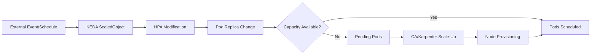

**Cron Scaler for Time-Based Workload Scaling**

KEDA's **Cron scaler** enables organizations to implement time-based autoscaling with precise control over scaling windows. The scaler introduces scheduling capabilities that allow users to **define scaling actions at specific times** to accommodate predictable workload variations[^57].

Configuration involves specifying cron expressions, time zones, and target replica counts:

```yaml
apiVersion: keda.sh/v1alpha1
kind: ScaledObject
metadata:
  name: business-hours-scaling
spec:
  scaleTargetRef:
    name: web-application
  triggers:
  - type: cron
    metadata:
      timezone: "America/New_York"
      start: "0 8 * * mon-fri"    # Scale up at 8 AM weekdays
      end: "0 18 * * mon-fri"     # Scale down at 6 PM weekdays
      desiredReplicas: "20"       # Target during business hours
```

The timezone parameter accepts **canonical IANA Time Zone database names**, ensuring scaling actions align with business operational hours regardless of cluster location. When the clock reaches the start time, KEDA scales the deployment to the specified replica count; when the end time arrives, replicas reduce to the baseline.

**Prometheus Scaler for Custom Metrics Integration**

The **Prometheus scaler** enables scaling based on any metric collected by Prometheus, providing flexibility for business-specific scaling triggers. Configuration requires specifying the Prometheus server address, a PromQL query, and a threshold value:

```yaml
triggers:
- type: prometheus
  metadata:
    serverAddress: http://prometheus:9090
    metricName: http_requests_per_second
    query: sum(rate(http_requests_total{deployment="web-service"}[2m]))
    threshold: "100"
```

Best practices for using Prometheus metrics with KEDA include **optimizing PromQL queries to avoid overloading Prometheus**, setting reasonable thresholds to prevent scaling flaps, monitoring latency and query execution time, and combining Prometheus metrics with business metrics for smarter scaling[^59].

Research on implementing autoscaling with RED (Rate, Errors, Duration) metrics demonstrated that KEDA's flexibility enables scaling based on **user-experience-focused indicators** rather than infrastructure metrics. The implementation showed that scaling based on request rates provides direct insight into application demand, unlike CPU or memory which are indirect indicators[^59].

**Predictkube Scaler for AI-Based Predictive Scaling**

Among KEDA's 70+ built-in scalers, the **Predictkube scaler** offers AI-based predictive scaling based on Prometheus metrics and PredictKube SaaS[^60]. This scaler represents a production-ready implementation of machine learning-based workload prediction integrated directly into the Kubernetes autoscaling ecosystem.

PredictKube uses **Machine Learning models for time series data predicting**, unlike standard rules-based algorithms such as HPA[^35]. The AI model observes requests-per-second (RPS) or CPU values over time and predicts trends for up to 6 hours ahead. The system was trained using customer and open data sources, including datasets like HTTP NASA logs[^35].

Key configuration parameters include:
- **predictHorizon**: How far ahead to predict (e.g., "2h")
- **historyTimeWindow**: Historical data window for training (minimum 7-14 days recommended)
- **threshold**: Target metric value for scaling decisions

Predictions can be visualized in Grafana, where graphs show predicted replicas, ready replicas, and ideal replicas covering the RPS trend. This visibility enables operators to **validate prediction accuracy and tune scaling parameters**[^39].

**Scale-to-Zero Capability**

A distinctive feature of KEDA is its ability to **scale applications down to zero replicas** when no events are detected, offering superior resource efficiency compared to HPA which only scales down to a configured minimum[^58]. KEDA's scale-down-to-zero functionality deactivates idle pods when no active tasks are detected, conserving resources through event monitoring that adjusts pod count to zero when there is a lack of demand[^57].

This capability is particularly valuable for development environments, batch processing workloads, and cost-sensitive deployments where maintaining idle capacity is wasteful.

### 4.3 Cloud Provider Native Scheduled Scaling Solutions

Major cloud providers offer native scheduled scaling features that operate directly on node group infrastructure, providing **tight integration with underlying compute services** and eliminating the need for intermediate Kubernetes components.

**AWS EC2 Auto Scaling Scheduled Actions**

AWS provides scheduled scaling through Auto Scaling groups, allowing organizations to **set up automatic scaling based on predictable load changes**[^56]. Scheduled actions specify when scaling should occur, the new desired capacity, and optionally new minimum and maximum capacity values.

The implementation uses a cron expression format with six fields: `[Minutes] [Hours] [Day_of_Month] [Month] [Day_of_Week] [Year]`. Common scheduling patterns include:

| Pattern | Cron Expression | Description |
|---------|-----------------|-------------|
| Daily scale-up | `0 8 * * ? *` | 8:00 AM daily |
| Weekday business hours | `0 18 ? * MON-FRI *` | 6:00 PM Monday-Friday |
| Monthly batch window | `0 8 1 * ? *` | 8:00 AM first day of month |
| Frequent intervals | `0/15 * * * ? *` | Every 15 minutes |

By default, recurring schedules operate in UTC, but specifying a **location-based time zone** ensures automatic DST adjustment[^56]. The scheduled action modifies the Auto Scaling group's desired capacity, which then triggers instance launches or terminations.

For EKS clusters using Cluster Autoscaler, the **priority expander** (`--expander=priority`) enables prioritization of specific node groups. This is useful for scenarios where reserved capacity or specific instance types should be preferred, with fallback to alternative groups when primary capacity is unavailable[^61].

**GCP Managed Instance Group Scaling Schedules**

Google Cloud Platform offers **schedule-based autoscaling** for Managed Instance Groups (MIGs), enabling capacity provisioning ahead of anticipated load. This feature is particularly valuable for workloads that take a long time to initialize, allowing scale-out in advance of load spikes[^53].

Scaling schedule configuration includes:
- **Minimum required instances**: The number of VMs required when the schedule is active
- **Time zone**: IANA time zone for interpreting the schedule's start time (defaults to UTC)
- **Duration**: How long the scaling schedule remains active (minimum 5 minutes)
- **Start time and recurrence**: Configured using cron expressions

Key operational considerations include:
- VM instances aren't ready immediately at the start time; **configure start time early enough** for VMs to boot and start applications before they are needed
- When multiple schedules overlap, the autoscaler uses the **greatest number of required instances** from all active schedules
- Schedules in DST-observing time zones automatically adjust, though transition days may have slightly different start/end times[^53]

For GKE specifically, the **Cloud Scheduler integration with node pool APIs** enables programmatic capacity management. The implementation involves creating Cloud Scheduler jobs that invoke HTTP POST requests to the `setSize` API endpoint:

```
https://container.googleapis.com/v1beta1/projects/{projectId}/zones/{zone}/clusters/{clusterId}/nodePools/{nodePoolId}/setSize
```

The request body specifies the target node count as JSON (e.g., `{ "nodeCount": 4 }`). Setting nodeCount to 0 enables complete scale-down of GPU or specialized node pools during off-hours[^32].

**Azure Automation for AKS Cluster Management**

Azure Kubernetes Service supports scheduled cluster operations through multiple automation approaches. The **Scale-down Mode** feature provides granular control over node behavior during scale-down:

| Mode | Behavior | Cost Impact | Scale-up Speed |
|------|----------|-------------|----------------|
| Delete (default) | Nodes terminated | No residual cost | Full provisioning time |
| Deallocate | Nodes stopped but retained | Storage costs continue | Faster restart |

The deallocate mode is valuable for scheduled scaling because **cached container images eliminate image pull time** during scale-up, and deallocated nodes can be restarted more quickly than provisioning new instances[^62].

For manual scaling operations, Azure CLI commands provide direct control:

```bash
# Scale to specific node count
az aks scale --resource-group myResourceGroup --name myAKSCluster \
  --node-count 10 --nodepool-name nodepool1

# Scale user node pool to zero
az aks nodepool scale --name userpool --cluster-name myAKSCluster \
  --resource-group myResourceGroup --node-count 0
```

User node pools can scale to zero, unlike system node pools which must always have running nodes. However, **scaling to zero requires disabling the cluster autoscaler first** on that node pool[^7].

**GKE Autoscaling Profiles and Location Policies**

GKE's cluster autoscaler provides additional configuration options through **autoscaling profiles**:

- **balanced** (default): Prioritizes keeping resources available, more conservative scale-down
- **optimize-utilization**: Prioritizes optimizing utilization, scales down more aggressively[^63]

The **location policy** controls how nodes are distributed across zones:
- **BALANCED** (default for on-demand): Distributes resources evenly across zones
- **ANY** (default for Spot VMs): Searches all zones for requested capacity[^37]

For Spot VM node pools, the default ANY policy maximizes availability by searching across all specified zones. Organizations can configure **proactive migration** to move workloads to Spot VMs when capacity becomes available, optimizing costs while maintaining workload stability[^37].

### 4.4 Custom Operator Patterns and Kubernetes-Native Scheduling Approaches

Kubernetes-native approaches using CronJobs and custom controllers provide **maximum flexibility** for implementing scheduled and predictive node scaling without external dependencies on cloud provider scheduling services.

**CronJob-Based Scaling Implementations**

Kubernetes CronJobs automate repetitive tasks on preset schedules, executing regardless of node configuration and consuming resources only when running. For node scaling, CronJobs can invoke cloud provider APIs or modify node group configurations through kubectl commands or SDK calls.

A practical implementation for Karpenter scale-to-zero uses two CronJobs:

**Scale-Down CronJob**:
1. Patch the provisioner to set CPU limits to zero
2. Drain nodes to safely evacuate pods
3. Delete Karpenter-provisioned nodes

**Scale-Up CronJob**:
1. Remove CPU limits from the provisioner
2. Karpenter responds to pending pod demands[^56]

The CronJobs must run on infrastructure that persists during scale-to-zero operations. **Running both Karpenter and scale-zero CronJobs on Fargate** ensures they remain operational even when all EC2 nodes are terminated[^56].

Configuration considerations include:

| Parameter | Recommended Setting | Purpose |
|-----------|---------------------|---------|
| `concurrencyPolicy` | Forbid | Prevent overlapping executions |
| `successfulJobsHistoryLimit` | 3 | Retain recent successful runs |
| `failedJobsHistoryLimit` | 1 | Retain last failed run for debugging |
| `ttlSecondsAfterFinished` | 240 | Clean up completed jobs |

**Custom Controller Development Patterns**

For organizations requiring sophisticated scheduling logic beyond CronJobs, **custom controllers using the Operator pattern** offer complete flexibility. A Kubernetes Operator extends Kubernetes capabilities to automate the lifecycle of complex applications using Custom Resource Definitions (CRDs) and controllers[^64].

The operator pattern involves:
1. **Custom Resource Definition (CRD)**: Defines a new resource type representing the scheduled scaling policy
2. **Controller Logic**: Implements reconciliation loops that evaluate schedules and trigger scaling
3. **Cloud Provider Integration**: Uses SDK calls to modify node group configurations
4. **State Management**: Tracks scaling state and prevents conflicting operations

The **reconciliation loop** is a core mechanism in operators; it continuously watches the state of the application and takes corrective actions if discrepancies arise[^64]. For scaling operators, this loop compares desired capacity (based on schedule or prediction) with actual capacity and triggers scaling actions to reconcile differences.

Best practices for operator development include:
- **Keep CRDs simple**: Only encompass essential details needed for effective automation
- **One operator per requirement**: Each operator should manage a single application or service
- **Robust error handling**: Implement retry logic and graceful degradation
- **Comprehensive observability**: Expose metrics for monitoring operator health and decisions

**OpenKruise Advanced Workload Management**

**OpenKruise** is a CNCF incubating project that provides automated management of large-scale applications on Kubernetes, extending and complementing Kubernetes core controllers for workload and application management[^65].

Key capabilities relevant to non-reactive scaling include:

- **Advanced Workloads**: CloneSet, Advanced StatefulSet, Advanced DaemonSet, BroadcastJob, and AdvancedCronJob support features like in-place update and configurable scale/upgrade strategies[^2]
- **In-Place Update**: Updates container images without recreating pods, leading to faster updates and fewer side effects on schedulers, CNI, and CSI
- **WorkloadSpread**: Constrains the spread of stateless workloads, enabling multi-domain and elastic deployment capabilities
- **High-availability Protection**: Prevents cascading deletion and maintains application SLA through PodUnavailableBudget

OpenKruise's **AdvancedCronJob** extends the native CronJob with additional capabilities for creating Jobs or BroadcastJobs periodically, providing more sophisticated scheduling options for batch workloads that may trigger node scaling[^65].

### 4.5 Commercial and Enhanced Solutions for Production Environments

Commercial solutions extend open-source autoscalers with **enterprise features** that address operational gaps in cost visibility, workload optimization, and production reliability.

**Cast AI for Karpenter**

Cast AI for Karpenter extends automation to the open-source autoscaler with **workload and cluster-level optimization, smarter Spot predictive ML, and real-time cost visibility** for production-grade environments[^49]. The solution is designed for teams that have adopted Karpenter and need additional capabilities beyond node provisioning.

Cast AI's approach is **non-intrusive**, deploying components alongside the existing Karpenter installation rather than replacing it. Key components include the Cast AI Agent, Cluster Controller, Evictor, CLM Controller, Spot Handler, Pod Mutator, and Workload Autoscaler[^66].

Core capabilities include:

| Feature | Description | Benefit |
|---------|-------------|---------|
| **Container Live Migration** | Moves running workloads to new nodes while keeping them active | Reduces downtime for maintenance and optimization |
| **Workload Rightsizing** | Measures actual CPU and memory usage, adjusts requests accordingly | Reduces waste, improves node utilization |
| **Spot Intelligence** | Predicts interruptions, identifies stable Spot pools | Makes Spot usage more consistent |
| **Continuous Consolidation** | Analyzes workload fit across nodes, identifies underutilized nodes | Improves cluster utilization |
| **Cost Visibility** | Tracks costs by cluster, namespace, workload | Enables FinOps practices |

Cast AI's Spot intelligence analyzes Spot behavior and **predicts when interruptions are likely to occur** up to 30 minutes before they happen. When Spot capacity becomes unavailable, Cast AI shifts workloads to On-Demand and returns them to Spot when capacity stabilizes[^49]. This predictive capability addresses one of the major challenges with Spot instance adoption.

The workload rightsizing capability addresses a fundamental limitation of Karpenter: while Karpenter scales based on pod requests, these requests are often set too high or too low relative to actual workload needs. Cast AI measures actual resource usage over time and **adjusts requests accordingly**, reducing waste and improving how nodes are used[^49].

**Operational Results and Case Studies**

Production deployments have demonstrated significant benefits from enhanced autoscaling solutions. Freshworks' adoption of Karpenter (with careful configuration of NodePools and disruption budgets) achieved:

- **Elimination of third-party Spot provisioning tool costs** (previously 20% of savings)
- **Spot adoption increase from 2% to 8%**
- **Reduced overprovisioning** through precise node provisioning based on pod requirements[^54]

Specific cost optimization scenarios demonstrated:
- **Scenario 1**: Replacing 24 m5.2xlarge instances with appropriately-sized C-series instances reduced cluster costs by **over 50%**
- **Scenario 2**: Adopting Spot instances reduced cluster costs by **33%**[^54]

Cast AI case studies cite companies achieving **40-70% cloud savings** (Akamai) and **40% cloud cost reduction** (Yotpo) through the combination of workload optimization, Spot intelligence, and continuous consolidation[^67].

**Integration Considerations**

Commercial solutions require evaluation of integration complexity and operational dependencies:

- **Onboarding**: Cast AI detects Karpenter automatically after cluster connection through UI or Terraform
- **Automation Levels**: Teams control the level of automation, from recommendations-only to fully automated actions
- **Vendor Lock-in**: Cast AI maintains a CRD-first approach, modifying Karpenter CRDs while keeping configuration Kubernetes-native[^66]
- **Support Scope**: Primarily designed for AWS Kubernetes clusters, with Azure support in development

### 4.6 Comparative Analysis and Use Case Mapping

Selecting appropriate tools for non-reactive node autoscaling requires matching tool capabilities to specific organizational requirements and workload characteristics. This section provides a comparative assessment across key dimensions and maps tools to common use cases.

**Comparative Assessment Across Key Dimensions**

| Dimension | Cluster Autoscaler | Karpenter | KEDA | Cloud Provider Scheduled | Custom Operators |
|-----------|-------------------|-----------|------|-------------------------|------------------|
| **Provisioning Latency** | 3-5 minutes | Under 1 minute | N/A (pod-level) | Varies by provider | Implementation-dependent |
| **Scheduling Flexibility** | None (reactive only) | Limited (workarounds) | High (Cron, custom metrics) | High (cron expressions) | Maximum |
| **Instance Selection** | Pre-configured groups | Dynamic per workload | N/A | Pre-configured groups | Implementation-dependent |
| **Scale-to-Zero** | Limited | Yes (with workarounds) | Yes (native) | Yes | Yes |
| **Cost Optimization** | Conservative | Aggressive consolidation | Indirect | Direct capacity control | Implementation-dependent |
| **Operational Complexity** | Low | Medium | Medium | Low | High |
| **Cloud Provider Support** | Wide | AWS, Azure | Any | Provider-specific | Any |

**Node Autoscaler Comparison: Cluster Autoscaler vs Karpenter**

The two main Node autoscalers sponsored by SIG Autoscaling—Cluster Autoscaler and Karpenter—differ significantly in their implementation and scope[^43]:

| Aspect | Cluster Autoscaler | Karpenter |
|--------|-------------------|-----------|
| **Node Group Model** | Pre-configured groups required | Auto-provisioning based on NodePool constraints |
| **Lifecycle Scope** | Autoscaling only | Full node lifecycle (auto-refresh, upgrades) |
| **Cloud Integration** | Part of Kubernetes project | Library for cloud provider integration |
| **Provider Support** | Numerous providers | AWS, Azure (current) |
| **Configuration Model** | ASG-centric | Workload-centric |

Cluster Autoscaler adds or removes Nodes to pre-configured Node groups, which generally map to cloud provider resource groups like Virtual Machine groups. A single instance can manage multiple Node groups[^43]. Karpenter auto-provisions Nodes based on NodePool configurations and handles all aspects of node lifecycle, not just autoscaling, including automatically refreshing Nodes based on lifetime and auto-upgrading Nodes[^43].

**Use Case Mapping**

Different tools are suited to different operational scenarios:

**Batch Processing Windows**
- **Primary Tool**: KEDA Cron scaler + Karpenter
- **Alternative**: Cloud provider scheduled scaling
- **Rationale**: KEDA provides precise scheduling control; Karpenter provides fast provisioning for diverse instance requirements

**Business-Hour Traffic Patterns**
- **Primary Tool**: KEDA Cron scaler or Cloud provider scheduled actions
- **Alternative**: Custom CronJob-based scaling
- **Rationale**: Predictable daily patterns benefit from time-based scheduling; cloud provider solutions offer simplest implementation

**Cost-Sensitive Environments**
- **Primary Tool**: Karpenter + Cast AI (or similar)
- **Alternative**: Karpenter with aggressive consolidation policies
- **Rationale**: Workload rightsizing and Spot intelligence maximize cost efficiency; consolidation reduces idle capacity

**Predictive Scaling Requirements**
- **Primary Tool**: KEDA with Predictkube scaler
- **Alternative**: Custom operator with ML model integration
- **Rationale**: AI-based prediction enables proactive scaling; requires sufficient historical data for model training

**Multi-Cloud Deployments**
- **Primary Tool**: KEDA (cloud-agnostic) + cloud-specific node scaling
- **Alternative**: Custom operators with abstracted cloud interfaces
- **Rationale**: KEDA works across providers; node scaling requires provider-specific integration

**Air-Gapped or Constrained Environments**
- **Primary Tool**: Custom operators with local scheduling logic
- **Alternative**: CronJob-based scaling with internal APIs
- **Rationale**: External dependencies (cloud APIs, SaaS services) may be unavailable; custom solutions provide maximum control

**Decision Criteria for Tool Selection**

Organizations should evaluate tools based on:

1. **Workload Predictability**: Highly predictable patterns favor scheduled scaling; variable patterns benefit from metrics-driven approaches
2. **Provisioning Speed Requirements**: Sub-minute requirements favor Karpenter; minute-scale tolerance allows broader options
3. **Cost Sensitivity**: High cost sensitivity justifies investment in commercial solutions with rightsizing and Spot optimization
4. **Operational Maturity**: Lower maturity favors managed solutions; higher maturity enables custom operator development
5. **Cloud Provider Commitment**: Single-cloud deployments can leverage provider-native features; multi-cloud requires portable solutions
6. **Compliance Requirements**: Regulated environments may require on-premises solutions without external dependencies

The combination of **KEDA for pod-level scheduling and metrics-driven scaling** with **Karpenter for fast, workload-aware node provisioning** represents a powerful architecture for non-reactive scaling. KEDA's scale-to-zero capability and extensive scaler catalog address diverse triggering requirements, while Karpenter's direct cloud API integration and consolidation policies optimize infrastructure efficiency. For organizations requiring additional cost optimization and operational visibility, commercial solutions like Cast AI provide enterprise features that extend this foundation.

## 5 Implementation Strategies for Non-Elastic Node Group Scenarios

Traditional Kubernetes autoscaling assumes elastic infrastructure where nodes can be provisioned and terminated dynamically through cloud provider APIs. However, many production environments operate under constraints that limit or eliminate this elasticity—whether due to capacity reservation commitments, dedicated host licensing requirements, fixed instance type mandates, network isolation, or organizational governance policies. This chapter examines the **specific challenges and architectural solutions** for implementing predictive and scheduled node scaling within these constrained environments, providing practitioners with actionable patterns that bridge the gap between proactive capacity management needs and infrastructure limitations.

The scenarios addressed in this chapter represent real-world deployment contexts across regulated industries, cost-optimized environments, and security-conscious organizations. Understanding how to adapt predictive scaling strategies to these constraints is essential for achieving the benefits of proactive capacity management without requiring fundamental changes to infrastructure architecture or compliance posture.

### 5.1 Capacity Reservation Integration and Reserved Instance Strategies

Organizations that have committed to **EC2 On-Demand Capacity Reservations (ODCRs)** or **EC2 Capacity Blocks for ML** face a unique challenge: they have guaranteed compute capacity available but must design scaling strategies that effectively utilize this pre-committed infrastructure. The integration of capacity reservations with Kubernetes autoscaling requires explicit configuration to ensure workloads land on reserved capacity before consuming on-demand or spot instances.

**EKS Auto Mode and Capacity Reservation Configuration**

EKS Auto Mode supports controlling the deployment of workloads onto Capacity Reservations through the `capacityReservationSelectorTerms` configuration in NodeClass definitions[^44]. By default, EKS Auto Mode automatically launches into open ODCRs and ML Capacity Blocks. However, when using `capacityReservationSelectorTerms`, EKS Auto Mode will no longer automatically use any open Capacity Reservations—they must be explicitly selected by a NodeClass[^2].

The configuration approach involves two primary selection methods:

| Selection Method | Configuration Example | Use Case |
|------------------|----------------------|----------|
| **Direct ID Reference** | `id: cr-56fac701cc1951b03` | Targeting specific reservations |
| **Tag-Based Selection** | `tags: {app: "my-app"}` | Flexible selection across multiple reservations |
| **Owner Filtering** | `owner: "123456789012"` | Cross-account reservation access |

Nodes provisioned using configured ODCRs receive the label `karpenter.sh/capacity-type: reserved` and are **prioritized over on-demand and spot instances**[^44]. This prioritization ensures that reserved capacity is consumed first, maximizing the value of capacity commitments before incurring additional costs from elastic capacity.

A critical operational consideration is that once `capacityReservationSelectorTerms` is enabled on any NodeClass in a cluster, **EKS Auto Mode will no longer automatically use open ODCRs for any NodeClass in that cluster**[^2]. This behavior requires careful planning when transitioning from automatic to explicit reservation targeting.

**EC2 Capacity Blocks for ML Workloads**

For GPU-intensive machine learning workloads, EC2 Capacity Blocks for ML provide reserved GPU-based accelerated computing instances on a future date to support short-duration workloads[^2]. Instances running inside a Capacity Block are automatically placed close together inside Amazon EC2 UltraClusters for low-latency, petabit-scale, non-blocking networking[^44].

The implementation involves three coordinated resources:

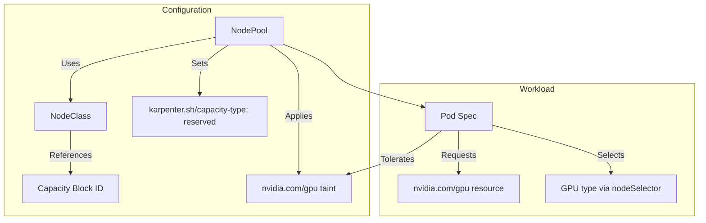

The NodePool configuration must specify that it **only uses reserved capacity** by setting `karpenter.sh/capacity-type: reserved`, request specific GPU instance families (e.g., g6, p4d, p5, p6), and apply a taint such as `nvidia.com/gpu`[^44]. Pod specifications must include tolerations for the GPU taint and explicitly request GPU resources using the `nvidia.com/gpu` resource type.

**Auto Scaling Group Capacity Reservation Preferences**

For environments using AWS Auto Scaling groups rather than Karpenter, capacity reservation preferences control how instances are distributed between reserved and on-demand capacity[^53]:

| Preference | Behavior | AZ Balance Impact |
|------------|----------|-------------------|
| **Default** | Uses instance's capacity reservation setting | Standard AZ balancing |
| **None** | Ignores capacity reservations | Standard AZ balancing |
| **Capacity Reservations Only** | Only uses Capacity Reservations | May result in uneven AZ distribution |
| **Capacity Reservations First** | Prioritizes reservations, falls back to on-demand | Maintains AZ balance, uses on-demand when needed |

Auto Scaling **prioritizes Availability Zone balance even when using Capacity Reservation preferences**[^53]. With `capacity-reservations-first`, the Auto Scaling group distributes instances evenly across AZs first, then uses Capacity Reservations where available; if reservations aren't available in an AZ, instances launch as on-demand to maintain AZ balance. With `capacity-reservations-only`, the Auto Scaling group only uses Capacity Reservations, which might result in uneven instance distribution across AZs based on where reservations are available.

**Strategies for Balancing Reserved and Elastic Capacity**

For predictive scaling scenarios, organizations should design a **tiered capacity strategy**:

1. **Baseline Reserved Capacity**: Size ODCRs for minimum expected workload, ensuring committed capacity is fully utilized
2. **Scheduled Elastic Overflow**: Configure time-based scaling for predictable peak periods using on-demand or spot capacity
3. **Reactive Safety Net**: Maintain Cluster Autoscaler or Karpenter for unexpected demand spikes

This approach maximizes reservation utilization while preserving the flexibility to handle demand variations that exceed reserved capacity.

### 5.2 Dedicated Host Constraints and BYOL Licensing Considerations

**Amazon EC2 Dedicated Hosts** present unique challenges for Kubernetes autoscaling due to their physical server dedication model and the absence of dynamic provisioning capabilities. A Dedicated Host is a physical server that is fully dedicated for your use, providing visibility and control over instance placement while supporting comprehensive Bring Your Own License (BYOL) requirements[^44].

**Fundamental Constraints of Dedicated Host Deployments**

Dedicated Hosts differ fundamentally from standard EC2 instances in ways that impact autoscaling strategies:

| Capability | Dedicated Hosts | Dedicated Instances | Standard Instances |
|------------|-----------------|--------------------|--------------------|
| Per-host billing | Yes | Per-instance | Per-instance |
| Hardware visibility | Sockets, physical cores | None | None |
| Host/instance affinity | Yes | No | No |
| Targeted placement | Yes | No | No |
| BYOL support | Full (per-socket, per-core, per-VM) | Partial | Partial |
| **Auto Scaling groups** | **Only with launch templates specifying host resource groups** | Yes | Yes |
| Capacity Reservations | No | Yes | Yes |

The critical constraint for autoscaling is that **Auto Scaling groups are supported only when using a launch template that specifies a host resource group**[^44]. This requirement means that standard Cluster Autoscaler configurations that rely on Auto Scaling groups cannot directly manage Dedicated Host capacity without explicit host resource group configuration.

**BYOL Licensing Compliance Patterns**

Organizations using Dedicated Hosts for BYOL scenarios must ensure that licensing compliance is maintained during scaling operations. Dedicated Hosts provide visibility of sockets and physical cores, which is essential for per-socket or per-core licensing models[^44]. This visibility enables:

- **License tracking**: Accurate counting of licensed sockets/cores across the fleet
- **Compliance auditing**: Verification that workloads run only on properly licensed infrastructure
- **Cost optimization**: Right-sizing host allocation to minimize license costs

For Kubernetes deployments, maintaining BYOL compliance requires:

1. **Node taints and labels**: Mark Dedicated Host nodes with labels indicating license type and taint to ensure only licensed workloads schedule
2. **Admission control**: Implement policies that validate workload licensing requirements before scheduling
3. **Capacity planning**: Pre-provision sufficient Dedicated Host capacity based on predicted workload needs

**Pre-Provisioning Strategies for Scheduled Scaling**

Since Dedicated Hosts cannot be dynamically provisioned through standard autoscaling mechanisms, organizations must adopt **pre-provisioning strategies** that align capacity with anticipated demand:

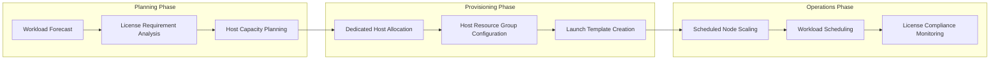

The pre-provisioning approach involves:

1. **Capacity forecasting**: Use historical data and business projections to estimate peak Dedicated Host requirements
2. **Host allocation scheduling**: Allocate Dedicated Hosts in advance of predicted demand using AWS APIs or Infrastructure as Code
3. **Node group configuration**: Create node groups backed by host resource groups with appropriate instance counts
4. **Scheduled scaling within allocated capacity**: Use CronJobs or scheduled actions to adjust desired capacity within the pre-allocated host pool

**Dedicated Host Reservations for Cost Optimization**

Dedicated Host Reservations provide a billing discount of up to 70 percent compared to On-Demand Dedicated Host pricing[^44]. For predictable workloads requiring BYOL compliance, reservations offer significant cost benefits but require accurate capacity forecasting. Organizations must have **active Dedicated Hosts allocated before purchasing reservations**, making capacity planning essential before commitment.

### 5.3 Fixed Instance Type and Homogeneous Node Group Requirements

Many organizations operate under constraints that mandate **specific instance types or homogeneous node configurations** due to compliance requirements, application certification, hardware dependencies, or operational standardization. These constraints limit the flexibility that tools like Karpenter leverage for cost optimization but can still support effective predictive scaling with appropriate configuration.

**Karpenter NodePool Constraints for Instance Type Control**

Karpenter's NodePool configuration supports explicit instance type constraints through the `node.kubernetes.io/instance-type` key with the `In` operator[^3]. This configuration limits provisioning to specific instance types:

```yaml
spec:
  requirements:
  - key: node.kubernetes.io/instance-type
    operator: In
    values: ["m5.large", "m5.xlarge", "m5.2xlarge", "c5.large"]
  - key: kubernetes.io/arch
    operator: In
    values: ["amd64"]
  - key: kubernetes.io/os
    operator: In
    values: ["linux"]
  - key: karpenter.sh/capacity-type
    operator: In
    values: ["on-demand"]
```

Freshworks' production experience with Karpenter highlighted the importance of **carefully managing instance type selection**[^8]. Their recommended configurations include:

- **Excluding unnecessary instance types**: Use the `node.kubernetes.io/instance-type` key to prevent provisioning unneeded instances
- **Avoiding overly constrained configurations**: Overly restricting instance types can hinder cost-efficient scaling
- **Creating separate NodePools for different requirements**: Provide isolation for teams with different workload characteristics

**NodePool Isolation and Weighted Scheduling**

When multiple NodePools match a pod's requirements, Karpenter will randomly select one unless weights are specified, leading to unpredictable instance type provisioning[^8]. To ensure consistent scheduling behavior:

| Strategy | Implementation | Use Case |
|----------|----------------|----------|
| **Mutually Exclusive NodePools** | Use non-overlapping requirements | Clear workload segregation |
| **Weighted NodePools** | Assign weights to prioritize selection | Preferred vs. fallback capacity |
| **Taint-Based Isolation** | Apply taints requiring explicit tolerations | Strict workload-to-pool binding |

For teams sharing a cluster with different requirements, creating **separate NodePools provides isolation** and ensures each team's workloads land on appropriately configured nodes[^2].

**Bin-Packing Challenges with Limited Instance Flexibility**

When instance type flexibility is constrained, bin-packing efficiency suffers because workloads cannot be optimally matched to instance sizes. The Kubernetes scheduler's `NodeResourcesFit` plugin supports two scoring strategies for resource bin-packing[^32]:

- **MostAllocated**: Scores nodes based on resource utilization, preferring nodes with higher allocation rates
- **RequestedToCapacityRatio**: Allows configuration of resource weights and utilization-to-score mappings for fine-grained control

For constrained environments, optimizing bin-packing involves:

1. **Standardizing pod resource requests**: Align application resource requests with instance capacity to minimize fragmentation
2. **Using scheduler scoring configuration**: Configure `NodeResourcesFit` to prefer nodes with higher utilization
3. **Implementing pod priority and preemption**: Allow lower-priority pods to be preempted for better packing

**Cluster Autoscaler Instance Type Selection Challenges**

The Cluster Autoscaler's reliance on pre-configured node groups creates challenges for environments with fixed instance type requirements[^53]. Selecting appropriate instance types is difficult, particularly when handling mixed workloads that may require different configurations. The autoscaler lacks awareness of whether workloads are memory-intensive or CPU-intensive, requiring **SRE teams to create dedicated node groups for each workload type** and configure appropriate labels and taints.

For predictive scaling in constrained environments, the key strategy is **pre-sizing node groups based on anticipated workload mix** rather than relying on dynamic instance selection. This approach trades flexibility for predictability, ensuring that capacity matches expected demand patterns.

### 5.4 Air-Gapped Environment Scaling Architectures

Air-gapped environments—deliberately disconnected from the internet and external networks—present **fundamental challenges for Kubernetes autoscaling** because the standard scaling mechanisms depend on cloud provider APIs and external services that are unavailable in isolated deployments. Military and intelligence agencies, hospitals, and corporations deploy air-gapped environments to protect sensitive information from breaches and theft by isolating and limiting access to data[^37].

**Fundamental Constraints of Air-Gapped Kubernetes**

Kubernetes was designed for a connected network where cluster provisioning and application deployment pull container images from publicly hosted container registries over the internet[^37]. In an air-gapped environment, this support infrastructure disappears, creating challenges that dictate architectural decisions:

| Challenge Area | Connected Environment | Air-Gapped Environment |
|----------------|----------------------|------------------------|
| Container images | Pull from Docker Hub, ECR, GCR | Host own container registry |
| Node provisioning | Cloud provider APIs | Pre-provisioned infrastructure |
| Autoscaling | Cluster Autoscaler, Karpenter | Manual or custom solutions |
| Updates | Online repositories | Physical transfer process |
| Documentation | Online access | Pre-downloaded PDFs |

Because you are disconnected from the internet and **do not have the auto-scaling capabilities of a connected cloud service**, your on-premises setup must be able to accommodate the workload[^37]. This constraint fundamentally changes the approach to capacity management from dynamic scaling to **capacity pre-sizing and scheduled adjustments**.

**Infrastructure Pre-Sizing Strategies**

Without dynamic provisioning capabilities, air-gapped environments must pre-size infrastructure based on anticipated workload patterns[^47]. Key considerations include:

1. **Peak capacity provisioning**: Size infrastructure for maximum expected workload to ensure capacity is always available
2. **Processing power assessment**: Ensure machines have adequate capacity for workload processing, especially for AI applications requiring large model processing[^68]
3. **GPU management**: Kubernetes allows management of graphical processing units across multiple nodes; proper load balancing of CPUs and GPUs is needed to avoid bottlenecks[^69]

The processing power of machines must be adequate since the system lacks the auto-scaling capabilities of connected cloud services[^70]. For AI applications, the on-premises infrastructure must have the ability to process large AI models adequately.

**Migration Cluster Approach for Testing Scaling Configurations**

A **migration cluster**—a separate cluster that mirrors the air-gapped cluster but is connected to the internet—can assist the development and testing of scaling configurations before deployment to the isolated environment[^37]. This approach provides several benefits:

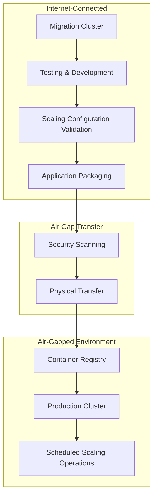

The migration cluster can be the first stage of development and a system for contractors and other workers to perform tasks without direct access to the air-gapped environment[^71]. For example, one customer has its environment running on Amazon Web Services but also on fleets of ships at sea; they start with an internet-connected migration cluster, perform all testing and development in that cluster, then package it up and transfer it to their air-gapped system[^70].

**Container Registry and Artifact Management**

The image repository is a core component from which Kubernetes processes pull containers[^37]. In air-gapped environments:

- **Disaster recovery**: Backing up the image repository enables backup of all containers and deployment of Kubernetes as infrastructure-as-code
- **Security scanning**: Technologies like Harbor, Nexus, and Artifactory provide image scanning for supply-chain security[^69]
- **High availability**: The image repository should be designed for highest availability as a critical core component

The transfer process for data into the air-gapped system is a key architectural consideration[^40]. Variables include whether you operate in a VPC with a VPN connection or burn disks, and the speed and volume of data over time, as images can be hundreds of gigabytes and Kubernetes updates occur every few months.

**Scheduled Scaling Without Cloud APIs**

For air-gapped environments, scheduled scaling must operate without external dependencies. Implementation patterns include:

1. **CronJob-based node management**: Use Kubernetes CronJobs to execute scaling scripts that interact with local infrastructure APIs
2. **Custom operators**: Develop operators that manage node lifecycle through direct integration with on-premises virtualization platforms
3. **Pre-defined scaling schedules**: Configure capacity changes through infrastructure-as-code that is applied during maintenance windows

Tools like **KubeVirt** enable spinning up virtual machines within Kubernetes, and **Cluster API (CAPI)** can orchestrate them for autoscaling in air-gapped environments[^72]. This approach provides cloud-like elasticity within isolated infrastructure.

**Operational Requirements for Isolated Environments**

To manage an air-gapped system successfully, you must have an overall understanding of the system, including where you have access and where you don't, what you can use and not use, and you must design the system with all these considerations in mind[^37]. Key operational requirements include:

- **Documentation**: Plan to print or download documentation before deploying clusters, as most Kubernetes documentation is online[^68]
- **Cluster lifecycle management**: Managing cluster creation, updates, and application lifecycle through the container registry requires deep Kubernetes understanding[^73]
- **Transfer process design**: The speed of the transfer process affects how quickly and efficiently work is performed and updates are made[^40]

Commercial platforms like **D2iQ Kubernetes Platform (DKP)** have focused on making air-gapping an integral part of the platform, enabling customers to simplify and standardize Kubernetes air-gapped deployments[^37]. Similarly, **ScaleOps** is available in an Air-Gapped configuration for environments requiring isolation[^30].

### 5.5 Organizational Policy Constraints and Governance Frameworks

Enterprise environments frequently operate under **governance policies and approval workflows** that limit or prohibit dynamic infrastructure provisioning. These constraints may stem from security requirements, change management processes, cost control measures, or regulatory compliance obligations. Implementing predictive scaling within these frameworks requires patterns that balance automation benefits with organizational control requirements.

**Change Management Integration Patterns**

Organizations with formal change management processes must integrate scaling operations into existing approval workflows. Key patterns include:

| Pattern | Description | Approval Timing |
|---------|-------------|-----------------|
| **Pre-Approved Capacity Pools** | Define approved capacity ranges; scaling within range requires no additional approval | Pre-approved during setup |
| **Scheduled Change Windows** | Align scaling operations with approved maintenance windows | Batch approval for window |
| **Predictive Recommendations with Manual Execution** | Generate scaling recommendations; require human approval before execution | Per-change approval |
| **Audit-Only Mode** | Log what would have been scaled; no automatic action | No approval needed |

For environments requiring manual approval, the scaling system can generate recommendations based on predictions while requiring explicit human action to execute changes. This approach preserves the benefits of predictive analysis while maintaining organizational control.

**Scaling Authority and Conflict Prevention**

Kubernetes autoscaling conflicts occur when multiple controllers (HPA, KEDA, VPA) operate on the same workload without coordination, leading to silent degradation rather than loud failures[^53]. The core issue is a **lack of explicit scaling authority**—Kubernetes provides autoscaling drivers but offers no native governance to designate a single decision-maker for replica counts per workload.

The solution is enforcement through organizational policies, not just documentation[^53]:

1. **Declare scaling authority**: Use a "scaling.authority" label (e.g., "hpa", "keda", "manual") on each workload
2. **Enforce via admission controllers**: Use Gatekeeper to reject configurations that violate ownership
3. **Avoid conflicting autoscalers**: VPA Auto mode should be avoided for horizontally scaled workloads; Recommend or Off mode is preferred

Mature platforms make scaling authority explicit and conflicts impossible through policy enforcement[^53]. This governance approach is essential in environments where organizational policies require clear accountability for infrastructure changes.

**Audit Trail and Compliance Documentation**

Regulated environments require comprehensive audit trails for infrastructure changes. Scaling systems should:

- **Log all scaling decisions**: Record predictions, recommendations, and actions with timestamps
- **Capture approval workflows**: Document who approved changes and when
- **Maintain configuration history**: Track changes to scaling policies and configurations
- **Enable compliance reporting**: Generate reports demonstrating adherence to policies

For predictive scaling, audit requirements extend to model training data, prediction accuracy metrics, and the rationale for scaling decisions. This documentation supports compliance audits and post-incident analysis.

**Cost Control Integration**

Organizational policies often include cost control measures that limit infrastructure spending. Integrating predictive scaling with cost management involves:

1. **Budget-aware scaling**: Configure scaling policies that consider both performance and cost constraints
2. **Approval thresholds**: Require additional approval for scaling operations that exceed cost thresholds
3. **Cost visibility**: Provide real-time visibility into scaling cost implications before execution
4. **Chargeback integration**: Ensure scaling costs are properly attributed to cost centers

Research on scaling Kubernetes for AI/ML workloads identified that autoscaling policies tuned solely for latency tend to "stair-step" into the maximum quota, leading to cost overruns. A **FinOps-minded solution implements dual-signal autoscaling** that marries performance SLOs with financial KPIs so scaling decisions are both efficient and budget-aware.

### 5.6 Hybrid and Fallback Architectural Patterns

Production environments often require **composite architectures** that combine constrained and elastic resources to achieve predictive scaling objectives while maintaining operational resilience. These hybrid patterns provide flexibility to handle diverse scenarios while respecting infrastructure constraints.

**Tiered Capacity Architecture**

A tiered capacity approach combines different capacity types to balance cost, availability, and flexibility:

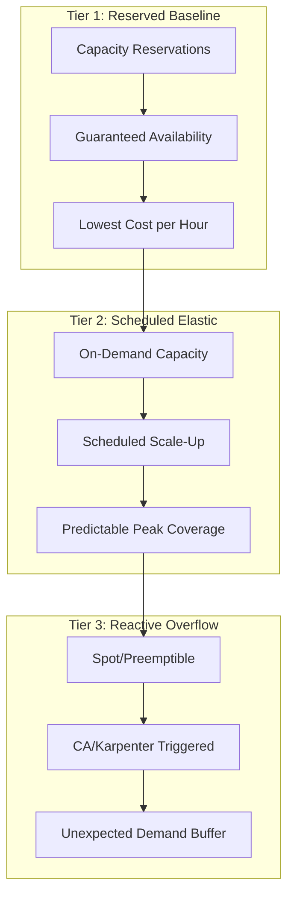

This architecture ensures:
- **Baseline stability**: Reserved capacity provides guaranteed availability for steady-state workloads
- **Predictable scaling**: Scheduled elastic capacity handles anticipated demand peaks
- **Cost-effective overflow**: Spot instances absorb unexpected demand spikes at lower cost

**Buffer Node Strategies with Priority-Based Preemption**

Overprovisioning is implemented using temporary pods with negative priority that occupy space in the cluster[^74]. When newly created pods are unschedulable and have higher priority, the temporary pods are preempted to make room. The temporary pods then become unschedulable, triggering the Cluster Autoscaler to scale out new overprovisioned nodes.

The **"ballast" concept** provides immediate capacity for high-priority workloads[^74]. Ballast pods are placeholder pods with scheduling preferences matching production pods but with extremely low priority (using very large negative PriorityClass values). When node capacity is full:

1. New high-priority pods arrive and cannot be scheduled
2. Ballast pods are preempted to make room
3. High-priority pods schedule immediately on freed capacity
4. Evicted ballast pods enter Pending state
5. Cluster Autoscaler provisions new nodes for pending ballast pods

From the user perspective, **workloads start immediately** because capacity is already available. The autoscaler's provisioning latency is absorbed by the low-priority ballast pods rather than production workloads.

**Graceful Degradation Mechanisms**

When preferred capacity types are unavailable, systems should degrade gracefully to alternative capacity sources. Implementation involves:

| Scenario | Primary Capacity | Fallback Capacity | Degradation Behavior |
|----------|------------------|-------------------|---------------------|
| Reserved capacity exhausted | ODCRs | On-demand instances | Automatic overflow to on-demand |
| Spot interruption | Spot instances | On-demand instances | Workload migration with minimal disruption |
| Zone capacity shortage | Primary AZ | Secondary AZs | Cross-zone scheduling with latency acceptance |
| Instance type unavailable | Preferred type | Alternative types | Capacity-equivalent substitution |

Cast AI's Spot intelligence demonstrates this pattern by **predicting when interruptions are likely to occur** up to 30 minutes before they happen[^30]. When Spot capacity becomes unavailable, the system shifts workloads to on-demand and returns them to Spot when capacity stabilizes.

**Coordinating Multiple Capacity Sources**

Managing multiple capacity sources requires careful coordination to prevent conflicts and ensure efficient utilization. Key coordination mechanisms include:

1. **Priority-based scheduling**: Use Kubernetes priority classes to ensure critical workloads schedule on preferred capacity
2. **Node affinity rules**: Configure workloads to prefer specific capacity types while allowing fallback
3. **Disruption budgets**: Protect critical workloads during capacity transitions using PodDisruptionBudgets
4. **Capacity monitoring**: Track utilization across capacity tiers to inform scaling decisions

Karpenter's disruption budget configuration provides fine-grained control over node consolidation timing[^3]. Organizations can configure different budgets for different time periods—allowing aggressive consolidation during off-hours while preventing disruption during business-critical windows.

**Custom Scheduler Integration for Constrained Environments**

For highly constrained environments, **custom schedulers** can implement specialized scheduling logic that accounts for infrastructure limitations. Kubernetes supports running multiple schedulers simultaneously alongside the default scheduler[^74].

The custom scheduler approach involves:

1. **Packaging scheduler binary**: Create a container image with the custom scheduler implementation
2. **Deploying as a Deployment**: Run the scheduler with appropriate RBAC permissions
3. **Configuring KubeSchedulerProfile**: Define the scheduler's behavior and unique name
4. **Specifying scheduler in pod specs**: Use `spec.schedulerName` to direct pods to the custom scheduler

Codefresh's experience demonstrates this pattern for CI/CD workloads[^74]. They implemented a custom scheduler that changed the scheduling algorithm to pack build pods tightly onto nodes, filling nodes sequentially rather than distributing evenly. Their scheduling logic selects the **smallest possible node that fits**, and among equal-sized nodes, prefers the one with the **most allocated CPU**. This approach allows large, half-empty nodes to complete remaining work and retire, improving cost efficiency.

For constrained environments, custom schedulers can implement:
- **Capacity-aware scheduling**: Consider reserved capacity, dedicated hosts, and instance type constraints
- **License-aware placement**: Ensure BYOL workloads schedule only on properly licensed nodes
- **Zone-aware distribution**: Respect organizational policies for workload placement
- **Cost-optimized bin-packing**: Maximize utilization within constrained instance type pools

The combination of custom scheduling logic with predictive capacity management enables organizations to achieve proactive scaling benefits even in highly constrained environments where standard autoscaling tools cannot operate effectively.

## 6 Coordination Between Predictive Node Scaling and Workload Scheduling

Implementing predictive node scaling addresses only half of the proactive capacity management challenge. The remaining—and often more complex—challenge lies in **ensuring that infrastructure capacity, pod scheduling, application readiness, and traffic routing are precisely synchronized** to serve predicted workload demand without service degradation. When a forecasting model predicts a traffic surge at 9:00 AM and triggers node provisioning at 8:45 AM, the system must guarantee that new nodes are not only registered but that applications are fully initialized, health checks are passing, and load balancers are routing traffic to the new capacity exactly when demand arrives.

This chapter examines the critical timing coordination challenges that arise throughout the end-to-end capacity provisioning pipeline. The analysis addresses the complete latency chain from node provisioning through traffic acceptance, providing architectural patterns and implementation strategies for seamless capacity transitions. Understanding and optimizing each phase of this chain is essential for realizing the full benefits of predictive scaling—without proper coordination, the advantages of proactive provisioning can be negated by delays in subsequent stages.

### 6.1 End-to-End Latency Chain Analysis and Timing Budget Allocation

The journey from a predictive scaling trigger to traffic-ready capacity involves **multiple sequential phases**, each contributing latency that accumulates to determine the total time-to-ready. Understanding this latency chain is fundamental to designing effective predictive scaling systems that provision capacity with sufficient lead time.

**Complete Latency Chain Decomposition**

The end-to-end sequence from scaling decision to serving traffic encompasses the following phases:


Each phase in this chain contributes measurable latency that must be accounted for in predictive scaling timing calculations. The following table provides typical latency ranges and identifies optimization opportunities:

| Phase | Typical Latency | Key Variables | Optimization Approach |
|-------|-----------------|---------------|----------------------|
| Node Provisioning | 60-180 seconds | Cloud provider, instance type, AZ capacity | Karpenter direct API, buffer nodes |
| Kubelet Registration | 10-30 seconds | Node configuration, API server load | Optimized kubelet settings |
| DaemonSet Scheduling | 10-30 seconds | Number of DaemonSets, image availability | Pre-pulled images, prioritized DaemonSets |
| Application Pod Scheduling | 1-5 seconds | Scheduler load, node availability | Scheduling gates coordination |
| Image Pulling | 10-300+ seconds | Image size, registry location, caching | Pre-pulling, local registries, minimal images |
| Container Startup | 1-60 seconds | Application complexity, runtime | Optimized container configuration |
| Application Initialization | 5-300+ seconds | Application type (JVM warm-up, cache loading) | Pre-warming strategies |
| Readiness Probe Pass | 10-60 seconds | Probe configuration, application readiness | Aligned probe timing |
| Service Endpoint Registration | 1-5 seconds | EndpointSlice propagation | Minimal configuration |
| Load Balancer Health Check | 10-60 seconds | Health check interval, threshold | Optimized health check settings |
| **Total End-to-End** | **3-10+ minutes** | Cumulative of all phases | Parallel optimization |

The **critical path** through this chain determines the minimum lead time required for predictive scaling. For most production deployments, the total time from scaling trigger to traffic-ready capacity ranges from **3 to 10 minutes**, with significant variation based on application characteristics and infrastructure configuration[^75][^53].

**Timing Budget Allocation Strategy**

Effective predictive scaling requires allocating timing budgets to each phase based on measured performance and acceptable risk tolerance. The budget allocation process involves:

1. **Baseline Measurement**: Instrument each phase to collect latency distributions under normal and peak conditions
2. **Percentile-Based Budgets**: Allocate budgets based on p95 or p99 latencies to ensure reliability
3. **Buffer Allocation**: Include safety margins (typically 20-30%) to account for variability
4. **Continuous Monitoring**: Track actual vs. budgeted latencies and adjust predictions accordingly

For a system requiring traffic readiness by 9:00 AM with a 5-minute total latency budget and 20% safety margin, the predictive scaling trigger should fire at **8:54 AM** (6 minutes before target). The timing calculation follows:

```
Trigger Time = Target Time - (Total Latency Budget × Safety Factor)
Trigger Time = 9:00 AM - (5 min × 1.2) = 8:54 AM
```

**Critical Path Optimization Priorities**

Analysis of the latency chain reveals that **image pulling and application initialization** typically dominate the critical path for most workloads. Research has demonstrated that HPA's fundamental flaw is its non-instantaneous response, creating a "brownout window" of 2-4 minutes between when a traffic spike hits and when new capacity is actually online[^76]. This brownout window persists even with predictive node scaling if subsequent phases are not optimized.

Priority optimization targets include:
- **Image pre-pulling**: Reduces image pull latency from minutes to seconds
- **Application warm-up**: JVM compilation, cache loading, connection establishment
- **Health check alignment**: Ensures probes pass as soon as application is genuinely ready
- **Parallel initialization**: Overlapping independent initialization tasks where possible

### 6.2 Pod Scheduling Readiness Gates for Coordinated Deployment

Kubernetes v1.30 introduced **Pod Scheduling Readiness** as a stable feature, providing a mechanism to control when pods are considered for scheduling. This capability enables precise coordination between infrastructure provisioning and workload deployment, preventing premature scheduling attempts that could trigger unintended autoscaler behavior or result in pods landing on nodes that are not fully prepared[^75][^77].

**Scheduling Gates Mechanism**

The `schedulingGates` field contains a list of strings, each perceived as a criterion that must be satisfied before the Pod is considered schedulable. This field can only be initialized when a Pod is created; after creation, each schedulingGate can be removed in arbitrary order, but **adding a new scheduling gate is disallowed**[^78].

When a pod is created with scheduling gates, it enters a `SchedulingGated` status rather than immediately being considered for scheduling:

```yaml
apiVersion: v1
kind: Pod
metadata:
  name: gated-workload
spec:
  schedulingGates:
  - name: "infrastructure-ready"
  - name: "capacity-verified"
  containers:
  - name: application
    image: my-app:latest
```

The pod remains in `SchedulingGated` status until all gates are removed. To inform the scheduler that the pod is ready for scheduling, you remove its `schedulingGates` entirely by reapplying a modified manifest. The pod's state then transitions from `SchedulingGated` to a schedulable state[^77][^78].

**Coordination Patterns for Predictive Scaling**

Scheduling gates enable several coordination patterns that align pod scheduling with predictive node provisioning:

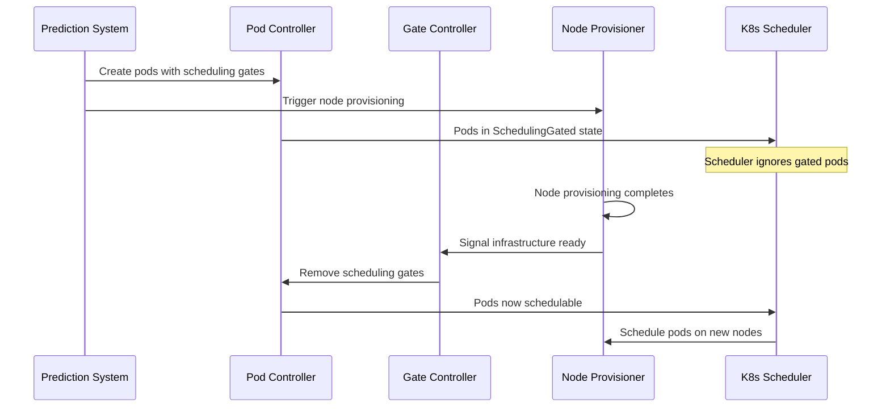

This pattern prevents the **scheduler churn** that occurs when pods are created before infrastructure is ready. Without scheduling gates, newly created pods would enter `Pending` state, potentially triggering reactive autoscaler behavior that conflicts with the predictive scaling already in progress[^77][^78].

**Observability and Monitoring**

The metric `scheduler_pending_pods` includes a label `"gated"` to distinguish whether a Pod has been tried for scheduling but was unschedulable, or was explicitly marked as not ready for scheduling. You can use `scheduler_pending_pods{queue="gated"}` to monitor the metric result[^75][^78].

This observability enables:
- **Coordination verification**: Confirm pods are properly gated during provisioning
- **Timing analysis**: Measure duration pods spend in gated state
- **Troubleshooting**: Identify pods stuck in gated state due to gate removal failures

**Mutable Scheduling Directives**

An important capability is that you can mutate the scheduling directives of Pods while they have scheduling gates, but **only to tighten the scheduling directives**. This means updated directives can only cause the Pod to match a subset of the nodes it previously matched[^77][^78]. The rules include:

| Directive | Allowed Mutations |
|-----------|-------------------|
| `.spec.nodeSelector` | Only additions allowed |
| `spec.affinity.nodeAffinity` | If nil, setting anything allowed; if NodeSelectorTerms not empty, only additions to matchExpressions or fieldExpressions |
| `.preferredDuringSchedulingIgnoredDuringExecution` | All updates allowed |

This capability enables dynamic refinement of scheduling constraints based on the actual nodes provisioned by predictive scaling, ensuring pods land on the most appropriate infrastructure.

### 6.3 Application Pre-Warming Strategies and Container Startup Optimization

Application cold-start delays often represent the **largest variable component** in the end-to-end latency chain. While infrastructure provisioning latencies are relatively predictable, application initialization times vary dramatically based on application architecture, framework characteristics, and runtime requirements. Effective pre-warming strategies can reduce this variability and minimize the gap between pod scheduling and traffic readiness.

**Container Image Pre-Pulling Strategies**

Container image pulling contributes significant latency, particularly for large images or when pulling from remote registries. Pre-pulling images on anticipated nodes eliminates this latency from the critical path:

| Strategy | Implementation | Benefit | Limitation |
|----------|----------------|---------|------------|
| **DaemonSet Pre-Pull** | Deploy DaemonSet with init container that pulls target images | Images available on all nodes | Storage overhead, all images on all nodes |
| **Predictive Pre-Pull** | Pull images on specific nodes based on scaling predictions | Targeted, efficient | Requires prediction integration |
| **Node Warm Pool** | Maintain buffer nodes with pre-pulled images | Immediate availability | Cost of idle capacity |
| **Local Registry Mirror** | Deploy registry mirror within cluster | Faster pulls, reduced external dependency | Infrastructure complexity |

For predictive scaling scenarios, the **predictive pre-pull** approach aligns image preparation with anticipated scaling events. When the forecasting system predicts capacity needs, it can trigger image pulls on existing nodes or newly provisioned nodes before workload pods are scheduled.

**JVM and Runtime Warm-Up Optimization**

Java Virtual Machine (JVM) applications exhibit particularly pronounced cold-start behavior due to Just-In-Time (JIT) compilation. Initial request latencies can be 10-100x higher than steady-state performance until the JIT compiler optimizes hot code paths.

Pre-warming strategies for JVM applications include:

1. **Startup Probe with Extended Timeout**: Allow sufficient time for initial compilation before marking ready
2. **Warm-Up Traffic Generation**: Send synthetic requests during initialization to trigger JIT compilation
3. **Class Data Sharing (CDS)**: Pre-generate shared class archives to reduce class loading time
4. **GraalVM Native Image**: Compile to native code eliminating JIT warm-up (with tradeoffs)

Research on predictive autoscaling highlights that **pod warm-up strategies** are essential for ensuring the first user never pays the warm-up penalty. Advanced implementations use waiting pages and slow-start configurations so that traffic is gradually introduced to warming pods[^79].

**Connection Pool and Cache Pre-Establishment**

Applications depending on external services (databases, caches, APIs) require connection establishment and potentially cache population before handling production traffic effectively:

```yaml
apiVersion: v1
kind: Pod
spec:
  initContainers:
  - name: warmup
    image: my-app:latest
    command: 
    - /bin/sh
    - -c
    - |
      # Establish database connections
      /app/warmup-connections.sh
      # Pre-load cache entries
      /app/cache-warmup.sh
      # Verify connectivity
      /app/health-check.sh
```

Init containers execute before the main application container starts, ensuring dependencies are established and caches are populated. The main container then starts with connections ready and caches warm.

**ML Model Loading Optimization**

Machine learning workloads present unique pre-warming challenges due to large model sizes and GPU memory allocation requirements. For GPU-aware autoscaling, research recommends two patterns: **scale on intent and gate on GPU health** (e.g., free VRAM), or **push a composite metric and scale on that**. Both patterns are paired with waiting pages and slow-start so the first user never pays the warm-up penalty[^79].

Model loading optimization strategies include:
- **Model caching on persistent volumes**: Avoid re-downloading models on each pod start
- **Model sharding**: Load model components in parallel across initialization
- **Lazy loading**: Load model components on-demand for initial requests
- **Pre-warmed inference pods**: Maintain warm model instances ready for traffic

### 6.4 Readiness Probe Configuration and Health Check Alignment

Readiness probes serve as the **gatekeeping mechanism** that determines when pods are added to Service endpoints and begin receiving traffic. Misconfigured readiness probes can either delay traffic routing to ready pods (overly conservative) or route traffic to pods before they can handle it effectively (overly aggressive). Proper alignment between readiness probes and actual application readiness is essential for predictive scaling effectiveness.

**Readiness Probe Timing Parameters**

A probe is a diagnostic performed by the kubelet on a container using mechanisms like `exec`, `grpc`, `httpGet`, or `tcpSocket`. The `readinessProbe` indicates whether the container is ready to respond to requests; if it fails, the endpoints controller removes the Pod's IP address from the endpoints of all Services that match the Pod[^80].

Key timing parameters for readiness probe configuration:

| Parameter | Default | Purpose | Predictive Scaling Consideration |
|-----------|---------|---------|----------------------------------|
| `initialDelaySeconds` | 0 | Delay before first probe | Set based on minimum application startup time |
| `periodSeconds` | 10 | Probe frequency | Balance responsiveness vs. probe overhead |
| `timeoutSeconds` | 1 | Probe timeout | Allow sufficient time for probe response |
| `successThreshold` | 1 | Consecutive successes required | Higher values prevent premature readiness |
| `failureThreshold` | 3 | Consecutive failures before unready | Balance stability vs. responsiveness |

For applications with variable warm-up times, the **startupProbe** provides a mechanism to delay readiness probe evaluation until initial startup completes. The `startupProbe` indicates whether the application within the container is started; all other probes are disabled if a startup probe is provided until it succeeds[^80].

**Alignment with Application-Specific Warm-Up**

The readiness probe should accurately reflect the application's **actual capacity to handle traffic**, not merely that the application process is running. This alignment requires understanding application-specific warm-up requirements:

```yaml
apiVersion: v1
kind: Pod
spec:
  containers:
  - name: application
    readinessProbe:
      httpGet:
        path: /ready
        port: 8080
      initialDelaySeconds: 30      # Allow for JVM warm-up
      periodSeconds: 5              # Check frequently once started
      successThreshold: 2           # Require consecutive successes
      failureThreshold: 3           # Tolerate transient failures
    startupProbe:
      httpGet:
        path: /health
        port: 8080
      initialDelaySeconds: 10
      periodSeconds: 5
      failureThreshold: 30          # Allow up to 150s for startup
```

The `/ready` endpoint should perform meaningful validation that the application can serve requests effectively, potentially including:
- Database connection verification
- Cache connectivity confirmation
- Dependency service health checks
- Internal resource availability validation

**Service Endpoint and Load Balancer Coordination**

Readiness probes determine when pods are added to Service endpoints, but additional latency occurs before traffic actually reaches new pods. The coordination chain involves:

1. **Readiness probe passes**: kubelet marks container as ready
2. **Endpoint controller updates**: Pod IP added to EndpointSlice
3. **kube-proxy synchronization**: iptables/IPVS rules updated
4. **Load balancer health check**: External LB verifies pod health
5. **Traffic routing**: Requests begin flowing to new pod

For external traffic through LoadBalancer Services, the load balancer's health check configuration introduces additional latency. The health check interval and threshold settings determine how quickly the load balancer begins routing traffic to newly ready pods.

**Custom Readiness Gates**

Your application can inject extra feedback or signals into PodStatus using **readiness gates** by setting `readinessGates` in the Pod's spec to specify additional conditions the kubelet evaluates. A Pod is ready only when all containers are ready **and** all conditions specified in `readinessGates` are `True`[^80].

This capability enables integration of external readiness signals into the pod lifecycle:

```yaml
apiVersion: v1
kind: Pod
spec:
  readinessGates:
  - conditionType: "custom.example.com/warm-up-complete"
  containers:
  - name: application
    # ... container spec
```

An external controller can then set the custom condition when application-specific warm-up criteria are satisfied, providing fine-grained control over when pods are considered ready for traffic.

### 6.5 Graceful Traffic Shifting and Connection Draining Patterns

Shifting traffic to newly provisioned capacity—and away from capacity being removed—requires **careful coordination** to maintain service quality throughout the transition. Abrupt traffic shifts can overwhelm new pods or terminate in-flight requests on departing pods. Graceful traffic management patterns ensure smooth capacity transitions during both scale-up and scale-down operations.

**Slow-Start and Gradual Traffic Introduction**

Newly ready pods should not immediately receive their full share of traffic. Slow-start configurations gradually increase traffic to new pods, allowing them to warm up under production load without being overwhelmed:

| Load Balancer | Slow-Start Configuration | Behavior |
|---------------|-------------------------|----------|
| AWS ALB | Target Group slow start duration | Linearly increases traffic over configured duration |
| NGINX Ingress | `nginx.ingress.kubernetes.io/upstream-hash-by` with `slow_start` | Gradual weight increase for new upstreams |
| Envoy/Istio | `slowStartConfig` in DestinationRule | Configurable ramp-up window and aggression |

The 2025 Kubernetes Autoscaling Playbook recommends that **both patterns are paired with waiting pages and slow-start so the first user never pays the warm-up penalty**[^79]. This approach ensures that early requests to new capacity receive appropriate handling while the application completes warm-up.

**EndpointSlice Terminating Conditions**

Kubernetes v1.26 introduced the `serving` and `terminating` conditions for EndpointSlice endpoints, enabling coordinated connection draining during scale-down operations. The `serving` condition is semantically identical to `ready` but can be `true` or `false` for a terminating Pod, unlike `ready` which is always `false` for terminating Pods. The `terminating` condition is `true` for Pods with a non-empty `deletionTimestamp`[^78].

This capability enables consumers of the EndpointSlice API, like kube-proxy and Ingress Controllers, to **coordinate connection draining** by continuing to forward traffic for existing connections but rerouting new connections to non-terminating endpoints[^78].

The practical impact for predictive scaling:
- **Scale-down coordination**: Existing connections complete gracefully on terminating pods
- **Traffic continuity**: New connections route to healthy, non-terminating pods
- **Zero-downtime transitions**: Combined with proper termination grace periods, enables seamless capacity reduction

**Proxy Terminating Endpoints Feature**

Starting in Kubernetes v1.26, kube-proxy enables the `ProxyTerminatingEndpoints` feature by default. This adds automatic failover and routing to terminating endpoints where traffic would otherwise be dropped. During a rolling update where a Node only contains terminating Pods, kube-proxy routes traffic to the terminating Pods based on their readiness[^78].

Kube-proxy also actively **fails the health check NodePort** if only terminating Pods are available, alerting the external load balancer not to send new connections to that Node while gracefully handling existing connections. This behavior prevents traffic loss during rolling updates and scale-down operations.

**Service Mesh Integration for Traffic Management**

Service meshes provide sophisticated traffic management capabilities that complement Kubernetes-native mechanisms:

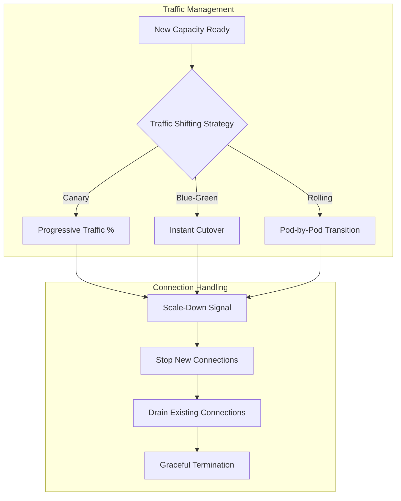

Service mesh capabilities relevant to predictive scaling include:
- **Weighted traffic distribution**: Gradually shift traffic percentages between capacity pools
- **Circuit breaking**: Protect new capacity from overwhelming traffic surges
- **Retry policies**: Handle transient failures during capacity transitions
- **Timeout configuration**: Ensure requests complete within acceptable bounds

**Graceful Termination Configuration**

When a Pod is deleted, the cluster allows a grace period for graceful termination. The kubelet attempts graceful shutdown by sending a TERM signal to containers. If a container has a `preStop` hook, it runs before termination. After the grace period expires, KILL signals are sent[^80].

For predictive scaling scenarios, proper termination configuration ensures:

```yaml
apiVersion: v1
kind: Pod
spec:
  terminationGracePeriodSeconds: 60    # Allow time for connection draining
  containers:
  - name: application
    lifecycle:
      preStop:
        exec:
          command:
          - /bin/sh
          - -c
          - |
            # Signal application to stop accepting new connections
            /app/graceful-shutdown.sh
            # Wait for in-flight requests to complete
            sleep 30
```

If a Pod includes sidecar containers (init containers with `Always` restart policy), the kubelet delays sending TERM signals to sidecars until the last main container has terminated, ensuring sidecars continue serving other containers until no longer needed[^80].

### 6.6 Buffer Pod and Overprovisioning Coordination Mechanisms

Buffer pods—also known as placeholder pods or pause pods—provide a mechanism to **maintain pre-warmed capacity** that can be immediately claimed by production workloads. This approach absorbs the node provisioning latency that would otherwise affect production pods, ensuring seamless capacity transitions during predicted demand increases.

**Priority-Based Preemption Architecture**

The buffer pod strategy leverages Kubernetes priority-based preemption to maintain capacity that can be instantly reclaimed. Overprovisioning is implemented using temporary pods with negative priority that occupy space in the cluster. When newly created pods are unschedulable and have higher priority, the temporary pods are preempted to make room[^75].

The mechanism operates as follows:

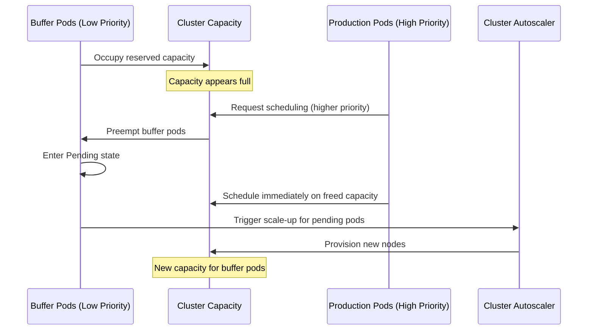

From the user perspective, **production workloads start immediately** because capacity is already available. The autoscaler's provisioning latency is absorbed by the low-priority buffer pods rather than production workloads[^53][^75].

**Ballast Concept Implementation**

The ballast concept extends buffer pods with scheduling preferences that match production workload requirements. Ballast pods are placeholder pods with:
- **Matching scheduling preferences**: Same node selectors, affinities, and tolerations as production pods
- **Extremely low priority**: Very large negative PriorityClass values ensure preemption
- **Minimal resource consumption**: Pause containers that consume negligible CPU/memory

Implementation involves creating a dedicated PriorityClass and deployment:

```yaml
apiVersion: scheduling.k8s.io/v1
kind: PriorityClass
metadata:
  name: buffer-priority
value: -1000000
globalDefault: false
description: "Priority class for buffer/ballast pods"
---
apiVersion: apps/v1
kind: Deployment
metadata:
  name: capacity-buffer
spec:
  replicas: 5    # Number of buffer slots
  selector:
    matchLabels:
      app: buffer
  template:
    metadata:
      labels:
        app: buffer
    spec:
      priorityClassName: buffer-priority
      terminationGracePeriodSeconds: 0
      containers:
      - name: pause
        image: registry.k8s.io/pause:3.9
        resources:
          requests:
            cpu: "1"        # Match production pod requirements
            memory: "2Gi"
```

**Sizing Buffer Capacity**

The amount of overprovisioned capacity represents a **careful business decision** balancing performance and cost. One approach is to determine the average scale-up frequency and divide it by the time to provision a new node[^53]. For example:

| Scenario | Scale-Up Frequency | Node Provision Time | Buffer Nodes Required |
|----------|-------------------|--------------------|-----------------------|
| Moderate variability | Every 30 seconds | 30 seconds | 1 node |
| High variability | Every 15 seconds | 30 seconds | 2 nodes |
| Extreme bursts | Every 10 seconds | 30 seconds | 3 nodes |

This calculation ensures there's always buffer capacity available to absorb the provisioning latency, **reducing scheduling latency** at the cost of maintaining additional instances[^53].

**Coordination with Predictive Scaling**

Buffer pods complement predictive scaling by providing **immediate capacity** while predicted infrastructure provisions. The coordination pattern involves:

1. **Predictive trigger fires**: Forecasting system predicts demand increase
2. **Node provisioning begins**: Karpenter/CA starts provisioning new nodes
3. **Production pods created**: Workload scaling creates new pods
4. **Buffer pods preempted**: Production pods immediately schedule on buffer capacity
5. **Buffer pods pending**: Evicted buffer pods await new capacity
6. **New nodes ready**: Provisioned nodes accept pending buffer pods
7. **Buffer restored**: System returns to steady state with buffer capacity

This pattern ensures that **predicted workloads never wait for node provisioning**, even when predictions trigger scaling with insufficient lead time.

**Warm Pool and Hibernated Node Strategies**

For large-scale deployments, maintaining buffer pods may be insufficient to absorb major demand spikes. Advanced strategies include maintaining **warm pools of hibernated nodes** that can be rapidly activated:

Predictive Scaling platforms use this approach by keeping a pool of hibernated nodes on standby, ready for instant reactivation during demand increases or traffic spikes, ensuring uninterrupted performance and maximum cost efficiency[^75]. This capability enables:

- **Instant capacity activation**: Hibernated nodes start faster than new provisioning
- **Cached container images**: Images remain on hibernated nodes, eliminating pull time
- **Reduced cold-start latency**: Applications can potentially maintain warm state

The warm pool approach is particularly valuable for scenarios with **predictable but large demand spikes**, such as major events or scheduled batch processing, where the buffer pod approach alone cannot provide sufficient immediate capacity.

**Freshworks Production Experience**

Freshworks' production deployment of Karpenter demonstrates effective buffer and overprovisioning coordination. Their configuration uses **warm pools and overprovisioning to guarantee capacity**:

- Warm pools maintain nodes in "hot" state for immediate capacity needs
- Overprovisioners run placeholder pods to guarantee resource margins
- This ensures **no cold-start delays** during major events[^43]

Their disruption budget configuration explicitly manages when nodes can be consolidated, preventing premature removal of buffer capacity during business-critical periods while allowing aggressive consolidation during low-traffic windows.

**Cost-Performance Tradeoff Analysis**

Buffer pod and overprovisioning strategies introduce ongoing costs that must be justified by performance benefits:

| Strategy | Cost Impact | Performance Benefit | Best Use Case |
|----------|-------------|---------------------|---------------|
| Minimal buffer (1 node) | Low ongoing cost | Absorbs single scale-up latency | Steady workloads with occasional spikes |
| Moderate buffer (2-3 nodes) | Medium ongoing cost | Handles burst patterns | Variable workloads with predictable patterns |
| Warm pool (hibernated) | Storage cost only when idle | Rapid large-scale activation | Major events, batch processing |
| Combined approach | Variable based on configuration | Maximum flexibility | Mission-critical applications |

The optimal configuration depends on workload characteristics, cost sensitivity, and SLA requirements. Organizations should **continuously monitor the utilization of buffer capacity** and adjust sizing based on observed preemption patterns and scaling effectiveness.

[^75]: Kubernetes Autoscaling and Best Practices for…
[^53]: 5 Types of Kubernetes Autoscaling, Pros/Cons & Advanced ...
[^75]: 5 Types of Kubernetes Autoscaling, Pros/Cons & Advanced ...
[^76]: Kubernetes HPA: Use Cases, Limitations & Best Practices
[^75]: How Predictive Scaling transforms K8s from reactive to proactive
[^75]: How Predictive Scaling transforms K8s from reactive to proactive
[^75]: Pod Scheduling Readiness
[^77]: Pod Scheduling Readiness
[^78]: Pod Scheduling Readiness
[^78]: Pod Scheduling Readiness
[^80]: Pod Lifecycle
[^78]: Kubernetes v1.26: Advancements in Kubernetes Traffic ...
[^79]: Introducing The 2025 Kubernetes Autoscaling Playbook
[^43]: Scaling Kubernetes Smarter with Karpenter

## 7 Best Practices and Operational Considerations

The preceding chapters have established the technical foundations for predictive and scheduled node scaling—from understanding the limitations of reactive autoscaling through implementing forecasting models, configuring tools like Karpenter and KEDA, and coordinating the end-to-end capacity provisioning pipeline. However, **successful production deployment requires more than technical implementation**; it demands disciplined operational practices that ensure reliability, optimize costs, and enable continuous improvement. This chapter synthesizes the recommended practices for managing predictive scaling systems throughout their complete operational lifecycle, addressing the practical challenges that emerge when theoretical architectures encounter production realities.

Organizations implementing predictive node scaling face a fundamental tension: the sophistication that enables proactive capacity management also introduces new failure modes, monitoring requirements, and organizational coordination challenges. A forecasting model that accurately predicts 95% of demand patterns may still cause significant service degradation during the 5% of scenarios it misses. Buffer capacity that eliminates cold-start latency also generates ongoing costs that must be justified. Scaling policies that work perfectly in development may behave unexpectedly under production load patterns. Addressing these challenges requires systematic approaches to capacity buffering, failure handling, cost management, observability, testing, and governance.

### 7.1 Capacity Buffer Strategies and Overprovisioning Design

Maintaining **pre-warmed capacity** represents one of the most effective strategies for eliminating the latency gap between predicted demand and resource availability. Buffer capacity absorbs the inevitable provisioning delays that occur even with the fastest autoscaling systems, ensuring that production workloads never wait for infrastructure. However, the cost of maintaining idle capacity must be carefully balanced against the performance benefits it provides.

**Buffer Pod Sizing Methodology**

The fundamental calculation for buffer capacity sizing relates scale-up frequency to node provisioning time. The amount of overprovisioned capacity represents a **careful business decision** balancing performance and cost[^36]. One systematic approach determines the average scale-up frequency and divides it by the time to provision a new node:

| Workload Pattern | Average Scale-Up Frequency | Node Provision Time | Recommended Buffer |
|------------------|---------------------------|--------------------|--------------------|
| Steady with occasional spikes | Every 60 seconds | 180 seconds | 3 nodes |
| Moderate variability | Every 30 seconds | 120 seconds | 4 nodes |
| High variability | Every 15 seconds | 90 seconds | 6 nodes |
| Extreme bursts | Every 10 seconds | 60 seconds | 6 nodes |

For example, if on average a new node is required every 30 seconds and EC2 takes 30 seconds to provision, a single node of overprovisioning ensures there's always an extra node available, **reducing scheduling latency by 30 seconds** at the cost of one additional instance[^36]. Organizations should measure their actual scale-up patterns and provisioning times to calibrate these calculations to their specific environments.

**Priority-Based Preemption Architecture**

The implementation of buffer capacity relies on Kubernetes priority-based preemption to maintain capacity that can be instantly reclaimed by production workloads. Overprovisioning is implemented using temporary pods with negative priority that occupy space in the cluster[^36]. The mechanism operates through a well-defined sequence:

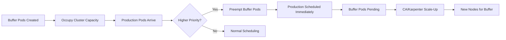

When newly created pods are unschedulable and have higher priority, the temporary pods are preempted to make room. The temporary pods then become unschedulable, triggering the Cluster Autoscaler to scale out new overprovisioned nodes[^36]. From the user perspective, **workloads start immediately** because capacity is already available—the autoscaler's provisioning latency is absorbed by the low-priority buffer pods rather than production workloads.

The practical implementation requires creating a dedicated PriorityClass with a very large negative value and deploying pause containers that consume minimal resources while reserving the capacity profile matching production workloads. Best practices for pause pod configuration include setting `terminationGracePeriodSeconds: 0` to enable instant preemption and configuring resource requests that match the typical production pod profile to ensure buffer capacity is genuinely usable.

**Warm Pool Strategies with Hibernated Nodes**

For scenarios requiring rapid large-scale capacity activation, maintaining buffer pods alone may be insufficient. Advanced strategies include maintaining **warm pools of hibernated nodes** that can be rapidly activated. Azure's Scale-down Mode feature provides granular control through the deallocate option, where nodes are stopped but retained[^43]. The deallocate mode is particularly valuable for scheduled scaling because **cached container images eliminate image pull time** during scale-up, and deallocated nodes can be restarted more quickly than provisioning new instances.

This approach offers several advantages over pure buffer pod strategies:
- **Faster activation**: Restarting deallocated nodes is faster than provisioning new instances
- **Image caching**: Container images remain on deallocated nodes, eliminating pull latency
- **Predictable capacity**: Known node configurations ensure consistent behavior
- **Cost efficiency**: Storage costs continue but compute costs stop during deallocated periods

**Cost-Performance Tradeoff Framework**

Organizations must establish clear frameworks for evaluating buffer capacity investments. The decision framework should consider:

| Factor | Lower Buffer | Higher Buffer |
|--------|--------------|---------------|
| **Cost impact** | Minimal ongoing expense | Significant idle capacity cost |
| **Latency risk** | Potential cold-start delays | Near-zero scheduling latency |
| **SLA requirements** | Acceptable degradation windows | Strict availability requirements |
| **Workload predictability** | Highly predictable patterns | Variable or bursty patterns |
| **Recovery tolerance** | Can absorb brief performance dips | Zero-tolerance for degradation |

The optimal configuration depends on workload characteristics, cost sensitivity, and SLA requirements. Organizations should **continuously monitor the utilization of buffer capacity** and adjust sizing based on observed preemption patterns and scaling effectiveness. Metrics to track include preemption frequency, time-to-schedule for production pods, and the ratio of buffer capacity to actual demand spikes.

### 7.2 Fallback Mechanisms and Prediction Failure Handling

Predictive scaling systems introduce new failure modes that do not exist in purely reactive architectures. A forecasting model may degrade in accuracy due to changing traffic patterns, data pipeline failures may produce stale predictions, or the prediction system itself may become unavailable. **Robust fallback mechanisms** ensure that these failures result in graceful degradation rather than service outages.

**Configurable Safety Nets for Model Accuracy**

Production predictive scaling systems must handle scenarios where model accuracy degrades or predictions become unreliable. Kedify addresses this through configurable safety nets including the `modelMapeThreshold` parameter—if the model's error exceeds this threshold, the system automatically returns a default value instead of an unreliable prediction[^30][^43]. This ensures the scaler remains stable and trustworthy, even if patterns change or data becomes noisy.

The configuration approach involves several key parameters:

| Parameter | Purpose | Recommended Configuration |
|-----------|---------|---------------------------|
| `modelMapeThreshold` | Acceptable prediction error threshold | 15-25% depending on workload criticality |
| `highMapeDefaultReturnValue` | Fallback value when accuracy degrades | Conservative capacity estimate |
| `scalingModifiers` | Formula for combining metrics | Blend real-time and predicted values |

Benefits of this approach include **robustness** through automatic fallback to defaults when model confidence drops, and **stability** since the threshold and default value provide safety nets against poor model performance[^43]. The system can ignore the scaler if it returns the default value, allowing real-time metrics to drive scaling decisions when predictions are unreliable.

**Hybrid Architecture for Defense-in-Depth**

The most resilient predictive scaling implementations combine predictive and reactive scaling in a **layered architecture** that provides defense-in-depth:

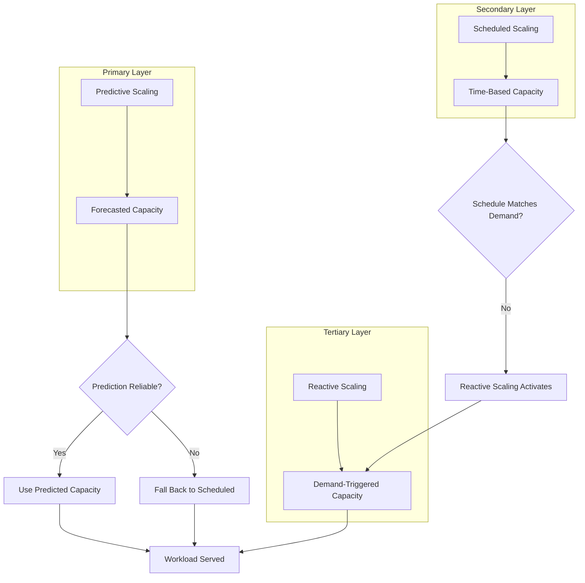

This architecture ensures that:
- **Normal operation**: Predictive scaling handles anticipated demand proactively
- **Prediction degradation**: Scheduled scaling provides baseline capacity during known periods
- **Unexpected demand**: Reactive scaling (CA/Karpenter) handles scenarios neither prediction nor schedule anticipated

For air-gapped environments where real-time external data isn't available, **offline historical data analysis becomes critical**. By analyzing historical traffic patterns, resource usage, and performance metrics from within the cluster, a predictive model can be built that forecasts demand and pre-scales applications, effectively eliminating the reactive delay[^34]. This transforms autoscaling from a reactive firefighting tool into a proactive, context-aware system that prevents performance issues before they impact users.

**Recovery Procedures for Restoring Predictive Operations**

When predictive scaling systems fail, organizations need clear procedures for diagnosis, mitigation, and recovery:

1. **Immediate mitigation**: Ensure reactive scaling is active and properly configured to handle current demand
2. **Root cause analysis**: Investigate whether failure stems from data pipeline issues, model degradation, or infrastructure problems
3. **Data validation**: Verify that training data is current and representative of actual traffic patterns
4. **Model retraining**: If patterns have shifted, retrain models with recent data
5. **Gradual restoration**: Re-enable predictive scaling with conservative thresholds, gradually increasing reliance as confidence builds

The predictive system should continuously collect metric data and enter a **periodic training and evaluation cycle** to maintain accuracy[^30]. During retraining, the dataset is split into train and test sets, and the model is evaluated using metrics like MAPE. This continuous learning process helps the system adapt to evolving patterns and recover from accuracy degradation.

### 7.3 Cost Optimization Techniques for Proactive Scaling

Predictive scaling creates unique opportunities for cost optimization that are not available with purely reactive approaches. By anticipating demand, organizations can make **strategic capacity decisions** that balance performance requirements with financial constraints. However, realizing these benefits requires deliberate integration of cost awareness into scaling policies.

**Dual-Signal Autoscaling Architecture**

Research on scaling Kubernetes for AI/ML workloads identified that autoscaling policies tuned solely for latency tend to "stair-step" into the maximum quota, leading to cost overruns[^35]. A FinOps-minded solution implements **dual-signal autoscaling** that marries performance Service Level Objectives (e.g., p95 latency) with financial KPIs (e.g., cost per prediction) so scaling decisions are both efficient and budget-aware[^35].

The dual-signal approach requires:

| Signal Type | Example Metrics | Integration Approach |
|-------------|-----------------|---------------------|
| **Performance SLO** | p95 latency < 200ms, error rate < 0.1% | Scale up when approaching threshold |
| **Financial KPI** | Cost per request < $0.001, GPU utilization > 70% | Scale down when cost exceeds target |

Implementation involves coupling financial and performance objectives everywhere—from dashboards to autoscalers[^35]. This means scaling decisions consider both whether additional capacity is needed to meet latency targets and whether the cost of that capacity is justified by the workload value.

**Spot Instance Integration with Predictive Fallback**

Spot instances offer significant cost savings but introduce availability uncertainty. Predictive scaling systems can integrate Spot intelligence to **predict when interruptions are likely to occur** and proactively shift workloads. Cast AI's approach analyzes Spot behavior and predicts interruptions up to 30 minutes before they happen; when Spot capacity becomes unavailable, the system shifts workloads to on-demand and returns them to Spot when capacity stabilizes[^43].

Best practices for Spot integration include:
- **Diversification**: Spread workloads across multiple instance families and availability zones to reduce interruption correlation
- **Fallback orchestration**: Maintain on-demand capacity as fallback when Spot is unavailable
- **Workload classification**: Route only fault-tolerant workloads to Spot capacity
- **Interruption handling**: Configure proper termination grace periods and pod disruption budgets

Adopting spot or preemptible capacity for fault-tolerant workloads involves moving stateless and batch services to spot pools while spreading risk across instance families and zones, maintaining a small on-demand baseline for reliability[^81]. Enforcing readiness or liveness probes and Pod Disruption Budgets (PDBs) is critical for any workload using spot instances.

**Scheduled Scale-Down for Non-Production Environments**

Non-production clusters often run continuously even when unused, generating unnecessary costs. A systematic approach involves classifying clusters by environment and defining working-hour schedules for each non-production tier[^75]. Implementation strategies include:

- **Complete cluster shutdown**: Use `az aks stop` for AKS or scale node pools to zero for EKS/GKE
- **Deallocate mode**: Stop nodes but retain them for faster restart with cached images
- **Workload-driven scaling**: Scale workloads to zero, allowing Karpenter to automatically remove unused nodes

Karpenter's disruption budget configuration provides fine-grained control over when nodes can be consolidated. Organizations can configure different budgets for different time periods—allowing aggressive consolidation during off-hours while preventing disruption during business-critical windows[^43]. A practical configuration allows empty node consolidation at any time, prohibits disruption due to configuration drift, and permits consolidation of underutilized nodes only during specific low-traffic periods.

**Resource Rightsizing for Improved Prediction Accuracy**

Accurate resource requests are essential for both effective autoscaling and cost optimization. The workload rightsizing capability addresses a fundamental limitation: while autoscalers scale based on pod requests, these requests are often set too high or too low relative to actual workload needs[^43]. Measuring actual resource usage over time and adjusting requests accordingly reduces waste and improves how nodes are used.

Key rightsizing practices include:
- **Historical analysis**: Review actual CPU and memory consumption versus requests
- **Recommendation implementation**: Apply VPA recommendations in Off mode to avoid conflicts with HPA
- **Continuous monitoring**: Track the gap between requests and actual usage
- **Iterative refinement**: Adjust requests based on observed performance and utilization

### 7.4 Monitoring and Alerting Requirements

Effective predictive scaling requires comprehensive observability into both the **prediction system itself** and its **impact on infrastructure behavior**. Without proper monitoring, organizations cannot validate that predictions are accurate, identify when models degrade, or measure the operational benefits of proactive scaling.

**Model Accuracy Metrics**

The foundation of predictive scaling observability is tracking how well forecasts match actual demand:

| Metric | Description | Alert Threshold |
|--------|-------------|-----------------|
| **MAPE** | Mean Absolute Percentage Error | > 20-25% sustained |
| **Prediction vs. Actual** | Time series comparison | Systematic over/under prediction |
| **Model Drift** | Change in accuracy over time | Degrading trend |
| **Training Data Freshness** | Age of most recent training data | > 24-48 hours |

The acceptable MAPE threshold can be configured in predictive triggers via parameters like `modelMapeThreshold`[^30]. If the model's error exceeds the threshold, the system should automatically return a default value instead of an unreliable prediction. Monitoring should track when fallback behavior activates and alert when it occurs frequently.

**Scaling Effectiveness Measurements**

Beyond prediction accuracy, organizations must measure whether predictive scaling achieves its intended outcomes:

| Metric | Target | Measurement Approach |
|--------|--------|---------------------|
| **Time-to-Ready** | < 60 seconds for predicted demand | Measure from prediction trigger to traffic-ready |
| **SLO Compliance** | > 99.9% during predicted periods | Track latency and error rates during scaling events |
| **Cold-Start Incidents** | Near zero | Count pods scheduled to nodes still provisioning |
| **Prediction Lead Time** | Sufficient buffer | Compare trigger time to demand arrival |

Research demonstrated that after deploying a predictive auto-scaling Operator, the minimum Service Level Agreement (SLA) increased from 80.3% to 87%, and SLA fluctuations decreased from 24 times in 15 minutes to 4 times—an **83.3% reduction**[^43]. These metrics provide concrete evidence of predictive scaling effectiveness.

**Cost Impact Tracking**

Predictive scaling should demonstrably improve cost efficiency compared to reactive approaches:

| Metric | Calculation | Target |
|--------|-------------|--------|
| **Resource Utilization** | Actual usage / Allocated capacity | > 60-70% average |
| **Idle Capacity Cost** | Cost of unused buffer capacity | Justified by SLA improvement |
| **Scaling Efficiency** | Capacity aligned with demand | Minimal over/under provisioning |
| **Cost per Transaction** | Total cost / Request volume | Stable or decreasing |

Tools such as Kubecost, Cast AI, and OpenCost break expenses down by namespace or service, enabling correlation between predictive scaling decisions and cost outcomes. Real insight comes from knitting together live cluster metrics and autoscaler events to understand the financial impact of scaling decisions.

**Alert Prioritization Framework**

Alerts should be prioritized based on operational impact to prevent alert fatigue while ensuring critical issues receive immediate attention:

| Severity | Condition | Response Time | Example |
|----------|-----------|---------------|---------|
| **P0 - Critical** | Prediction system completely failed | Immediate | No predictions generated for > 5 minutes |
| **P1 - High** | Significant accuracy degradation | < 15 minutes | MAPE > 30% for > 10 minutes |
| **P2 - Medium** | Elevated error rates | < 1 hour | MAPE > 20% for > 30 minutes |
| **P3 - Low** | Optimization opportunities | Next business day | Buffer utilization consistently < 50% |

Wave Autoscale's approach provides proactive notifications based on predictions—alerting days or weeks before issues occur, not after[^37]. Instead of alerting on symptoms (CPU > 80%, disk > 90%), the system alerts on root causes and future problems: cluster will saturate in 14 days, deployment has scheduling delays, workload is over-provisioned by 60%.

### 7.5 Testing Approaches for Scaling Policy Validation

Predictive scaling configurations must be thoroughly validated before production deployment. The complexity of forecasting models, timing coordination, and fallback mechanisms creates numerous potential failure modes that may not be apparent until the system encounters real-world conditions.

**Iterative Testing Framework**

Testing autoscaling configurations iteratively allows for fine-tuning and validation of scaling policies[^43]. By performing controlled tests, organizations can assess how changes affect application performance and resource utilization, ensuring that autoscaling strategies are effective. The iterative testing process involves:

1. **Baseline establishment**: Measure current system behavior without predictive scaling
2. **Component validation**: Test each component (forecasting, scheduling, provisioning) independently
3. **Integration testing**: Validate end-to-end behavior with realistic traffic patterns
4. **Stress testing**: Evaluate behavior under extreme conditions
5. **Regression testing**: Verify that changes don't degrade existing functionality

Iterative testing involves employing diverse scenarios to simulate different demand conditions, which helps identify potential shortcomings and optimize scaling parameters[^43]. Scenarios should include:
- Normal daily patterns with predictable peaks
- Sudden traffic spikes exceeding predictions
- Gradual demand increases over extended periods
- Complete traffic cessation and recovery
- Prediction system failures requiring fallback activation

**Migration Cluster Pattern for Air-Gapped Environments**

For air-gapped deployments, a **migration cluster**—a separate cluster that mirrors the air-gapped cluster but is connected to the internet—can assist development and testing of scaling configurations before deployment to the isolated environment. This approach provides several benefits:

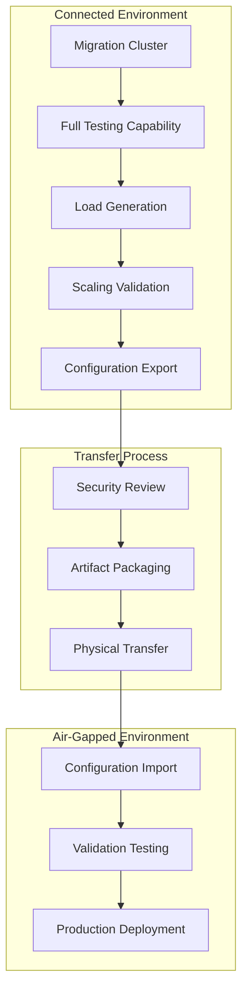

The migration cluster can be the first stage of development and a system for contractors and other workers to perform tasks without direct access to the air-gapped environment. Organizations start with an internet-connected migration cluster, perform all testing and development in that cluster, then package it up and transfer it to the air-gapped system.

**Load Testing Procedures**

Validating scaling response under realistic traffic patterns requires systematic load testing:

| Test Type | Purpose | Key Measurements |
|-----------|---------|------------------|
| **Ramp-up test** | Validate scaling response to gradual increase | Time to scale, capacity alignment |
| **Spike test** | Evaluate response to sudden demand surge | Latency during spike, recovery time |
| **Soak test** | Assess stability under sustained load | Resource utilization, drift over time |
| **Chaos test** | Validate fallback mechanisms | Behavior when predictions fail |

Load testing should include scenarios where predictions are intentionally incorrect to validate fallback behavior. This ensures the system degrades gracefully when forecasting models encounter unprecedented patterns.

**Chaos Engineering for Fallback Validation**

Chaos engineering approaches validate that fallback mechanisms work correctly under failure conditions:

- **Prediction pipeline failure**: Disable the forecasting system and verify reactive scaling activates
- **Stale predictions**: Inject outdated predictions and verify MAPE threshold triggers fallback
- **Node provisioning delays**: Simulate extended provisioning times and verify buffer capacity absorbs the delay
- **Model accuracy degradation**: Gradually degrade prediction accuracy and verify graceful degradation

A critical best practice for predictive scaling is to implement safeguards and limits, including defining upper and lower bounds for scaling actions to prevent over-scaling or under-scaling[^61]. Crucially, it is necessary to have fallback strategies in place in case predictive scaling predictions fail or lead to undesirable outcomes. This fallback might include manual overrides or switching to a simpler, rule-based scaling approach temporarily.

### 7.6 Organizational Processes and Governance Frameworks

Predictive scaling systems operate at the intersection of multiple organizational concerns: platform engineering owns the infrastructure, application teams own the workloads, finance owns the budget, and security owns compliance. **Effective governance frameworks** ensure these stakeholders collaborate effectively while maintaining appropriate controls.

**Scaling Authority Declaration and Conflict Prevention**

Kubernetes autoscaling conflicts occur when multiple controllers operate on the same workload without coordination, leading to silent degradation rather than loud failures. The core issue is a **lack of explicit scaling authority**—Kubernetes provides autoscaling drivers but offers no native governance to designate a single decision-maker for replica counts per workload.

The solution is enforcement through organizational policies, not just documentation:

| Practice | Implementation | Enforcement |
|----------|----------------|-------------|
| **Declare authority** | Label workloads with scaling.authority (hpa, keda, manual) | Required metadata |
| **Prevent conflicts** | Admission controller rejects conflicting configurations | Gatekeeper policies |
| **Document decisions** | Record why specific authority was chosen | Configuration comments |
| **Review periodically** | Audit scaling configurations for conflicts | Automated scanning |

Mature platforms make scaling authority explicit and conflicts impossible through policy enforcement. Using admission controllers like Gatekeeper to reject configurations that violate ownership ensures that scaling decisions are coordinated rather than conflicting.

**Change Management Integration**

Organizations with formal change management processes must integrate scaling operations into existing approval workflows. Key patterns include:

| Pattern | Description | Approval Timing |
|---------|-------------|-----------------|
| **Pre-approved capacity pools** | Define approved capacity ranges; scaling within range requires no additional approval | Pre-approved during setup |
| **Scheduled change windows** | Align scaling operations with approved maintenance windows | Batch approval for window |
| **Recommendation with approval** | Generate scaling recommendations; require human approval before execution | Per-change approval |
| **Audit-only mode** | Log what would have been scaled; no automatic action | No approval needed |

For environments requiring manual approval, the scaling system can generate recommendations based on predictions while requiring explicit human action to execute changes. This approach preserves the benefits of predictive analysis while maintaining organizational control.

**Audit Trail and Compliance Documentation**

Regulated environments require comprehensive audit trails for infrastructure changes. Scaling systems should:

- **Log all scaling decisions**: Record predictions, recommendations, and actions with timestamps
- **Capture approval workflows**: Document who approved changes and when
- **Maintain configuration history**: Track changes to scaling policies and configurations
- **Enable compliance reporting**: Generate reports demonstrating adherence to policies

For predictive scaling, audit requirements extend to model training data, prediction accuracy metrics, and the rationale for scaling decisions. This documentation supports compliance audits and post-incident analysis.

**Team Collaboration Models**

Effective predictive scaling requires collaboration between multiple teams with different responsibilities:

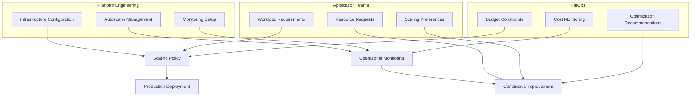

Autoscaling should be made as accessible or invisible to developers as possible[^75]. Platform teams should provide self-service capabilities that allow application teams to specify scaling preferences without requiring deep infrastructure knowledge. This includes templated configurations, sensible defaults, and clear documentation of available options.

**Continuous Learning and Policy Refinement**

Predictive scaling systems should continuously improve based on operational experience:

1. **Regular accuracy reviews**: Weekly or bi-weekly analysis of prediction accuracy trends
2. **Pattern recognition**: Identify recurring scenarios where predictions underperform
3. **Model retraining**: Update forecasting models with recent data to capture evolving patterns
4. **Policy adjustment**: Refine scaling policies based on observed outcomes
5. **Knowledge sharing**: Document lessons learned and share across teams

The final implementation phase requires continuous monitoring and adjustment of the predictive models, regularly re-evaluating predictions against actual demand and refining metrics for improvement[^61]. This continuous learning process ensures that predictive scaling systems remain effective as workload patterns evolve and organizational requirements change.

**Governance Framework Summary**

Implementing predictive scaling successfully requires addressing both technical and organizational dimensions:

| Dimension | Key Considerations | Success Criteria |
|-----------|-------------------|------------------|
| **Authority** | Clear ownership of scaling decisions | No conflicting autoscalers |
| **Approval** | Appropriate controls for environment type | Changes follow established process |
| **Audit** | Complete record of scaling activities | Compliance requirements met |
| **Collaboration** | Effective cross-team coordination | Shared understanding of policies |
| **Learning** | Continuous improvement process | Improving accuracy and efficiency |

By establishing clear governance frameworks that address scaling authority, change management, compliance, collaboration, and continuous improvement, organizations can realize the full benefits of predictive scaling while maintaining the operational controls necessary for production reliability. The investment in governance processes pays dividends through reduced conflicts, faster incident resolution, and more effective optimization over time.

# 参考内容如下：
[^1]:[Kubernetes Cluster Autoscaler: Best Practices, Limitations ...](https://scaleops.com/blog/kubernetes-cluster-autoscaler-best-practices-limitations-alternatives/)
[^2]:[autoscaler/cluster-autoscaler/FAQ.md at master](https://github.com/kubernetes/autoscaler/blob/master/cluster-autoscaler/FAQ.md)
[^3]:[Cluster Autoscaler - Amazon EKS](https://docs.aws.amazon.com/eks/latest/best-practices/cas.html)
[^4]:[Predictive Autoscaling in Kubernetes Microservices with ...](https://jisem-journal.com/index.php/journal/article/download/14057/6696/23885)
[^5]:[Karpenter vs Cluster Autoscaler](https://stormforge.io/kubernetes-autoscaling/karpenter-vs-cluster-autoscaler/)
[^6]:[Cluster Autoscaler Not Scaling Down: Insights & Best ...](https://www.groundcover.com/learn/cost-optimization/cluster-autoscaler-not-scaling-down)
[^7]:[Karpenter vs Cluster Autoscaler: Definitive Guide for 2025](https://scaleops.com/blog/karpenter-vs-cluster-autoscaler/)
[^8]:[Time series forecasting-based Kubernetes autoscaling ...](https://www.frontiersin.org/journals/computer-science/articles/10.3389/fcomp.2025.1509165/full)
[^9]:[KEDA | Kubernetes Event-driven Autoscaling](https://keda.sh/)
[^10]:[Autoscaling Workloads](https://kubernetes.io/docs/concepts/workloads/autoscaling/)
[^11]:[Setup Autoscaling with KEDA](https://keda.sh/docs/2.18/setupscaler/)
[^12]:[Kubernetes Autoscaling with KEDA Cron Trigger](https://medium.com/@Ibraheemcisse/kubernetes-autoscaling-with-keda-cron-trigger-a-complete-step-by-step-guide-8bc3b86011b3)
[^13]:[Scaling Kubernetes Nodes in AWS EKS: A Complete Guide](https://www.naviteq.io/blog/how-to-scale-kubernetes-nodes-on-the-aws-eks/)
[^14]:[Scheduled scaling for Amazon EC2 Auto Scaling](https://docs.aws.amazon.com/autoscaling/ec2/userguide/ec2-auto-scaling-scheduled-scaling.html)
[^15]:[Scaling nodes in Kubernetes on a schedule. | by Maher Rahman](https://maherrahman1.medium.com/scaling-nodes-in-kubernetes-on-a-schedule-24f991529e96)
[^16]:[google cloud platform - GCP GKE node pool auto schedule](https://stackoverflow.com/questions/61601675/gcp-gke-node-pool-auto-schedule)
[^17]:[10 Best Practices to Cut Kubernetes Costs on Azure](https://scaleops.com/blog/aks-pricing-explained-10-best-practices-to-cut-kubernetes-costs-on-azure/)
[^18]:[Use Scale-down Mode for your Azure Kubernetes Service ...](https://learn.microsoft.com/en-us/azure/aks/scale-down-mode)
[^19]:[Kubernetes CronJobs Guide: Use Cases & Best Practices](https://www.groundcover.com/learn/kubernetes/kubernetes-cronjob)
[^20]:[Kubernetes customized controller for collaborated auto ...](https://stackoverflow.com/questions/71701090/kubernetes-customized-controller-for-collaborated-auto-scaling)
[^21]:[Simplify node lifecycle with managed node groups](https://docs.aws.amazon.com/eks/latest/userguide/managed-node-groups.html)
[^22]:[NodegroupScalingConfig - Amazon EKS](https://docs.aws.amazon.com/eks/latest/APIReference/API_NodegroupScalingConfig.html)
[^23]:[About GKE cluster autoscaling](https://docs.cloud.google.com/kubernetes-engine/docs/concepts/cluster-autoscaler)
[^24]:[Cut GKE Node Costs with NAP and PerfectScale](https://www.perfectscale.io/blog/cut-gke-node-costs-with-nap)
[^25]:[Use the cluster autoscaler in Azure Kubernetes Service ...](https://learn.microsoft.com/en-us/azure/aks/cluster-autoscaler)
[^26]:[Best practices for running batch workloads on GKE](https://docs.cloud.google.com/kubernetes-engine/docs/best-practices/batch-platform-on-gke)
[^27]:[FAQ: How to schedule full worker node shutdown #3539](https://github.com/aws/karpenter-provider-aws/issues/3539)
[^28]:[NodePools](https://karpenter.sh/docs/concepts/nodepools/)
[^29]:[Scaling options for applications in Azure Kubernetes ...](https://learn.microsoft.com/en-us/azure/aks/concepts-scale)
[^30]:[EKS Cluster Autoscaler: 6 Best Practices For Effective ...](https://cast.ai/blog/eks-cluster-autoscaler-6-best-practices-for-effective-autoscaling/)
[^31]:[SLO-Aware Inference Serving under Bursty Workloads for ...](https://arxiv.org/html/2507.17133v1)
[^32]:[5 Types of Kubernetes Autoscaling, Pros/Cons & Advanced ...](https://codefresh.io/learn/kubernetes-management/5-types-of-kubernetes-autoscaling-pros-cons-advanced-methods/)
[^33]:[Kubernetes Autoscaling Best Practices](https://www.computer.org/publications/tech-news/trends/kubernetes-autoscaling-best-practices)
[^34]:[Advanced Autoscaling - Reduce AWS Costs](https://www.infoq.com/news/2025/08/autoscaling-karpenter-automode/)
[^35]:[Multi-Level ML Based Burst-Aware Autoscaling for SLO ...](https://arxiv.org/html/2402.12962v1)
[^36]:[Performance and scaling best practices for small to ...](https://learn.microsoft.com/en-us/azure/aks/best-practices-performance-scale)
[^37]:[Kubernetes Autoscaling: Benefits, Challenges & Best ...](https://scaleops.com/blog/kubernetes-autoscaling/)
[^38]:[Manage scale-to-zero scenarios with Karpenter and ...](https://aws.amazon.com/blogs/containers/manage-scale-to-zero-scenarios-with-karpenter-and-serverless/)
[^39]:[Custom Resources](https://kubernetes.io/docs/concepts/extend-kubernetes/api-extension/custom-resources/)
[^40]:[Bootstrap an Air Gapped Cluster With Kubeadm](https://kubernetes.io/blog/2023/10/12/bootstrap-an-air-gapped-cluster-with-kubeadm/)
[^41]:[Kubernetes Operator: How It Works, Examples, and Best ...](https://codefresh.io/learn/kubernetes-management/kubernetes-operator/)
[^42]:[Manually scale nodes in an Azure Kubernetes Service ...](https://learn.microsoft.com/en-us/azure/aks/scale-cluster)
[^43]:[Your Guide to Kubernetes Air-Gapping Success](https://d2iq.com/blog/guide-kubernetes-air-gapping-success)
[^44]:[Predictive Autoscaling in Kubernetes with Keda and Prophet](https://minimaldevops.com/predictive-autoscaling-in-kubernetes-with-keda-and-prophet-cbccd96cf881)
[^45]:[Azure vs AWS vs GCP 2025 — Which Cloud Fits Your ...](https://www.mol-tech.us/blog/azure-vs-aws-vs-gcp-2025-which-cloud-fits-your-business)
[^46]:[Schedule recurring scaling actions using Application Auto ...](https://docs.aws.amazon.com/autoscaling/application/userguide/scheduled-scaling-using-cron-expressions.html)
[^47]:[KEDA Best Practices](https://docs.kedify.io/best-practices/)
[^48]:[Scale cluster compute with Karpenter and Cluster Autoscaler](https://docs.aws.amazon.com/eks/latest/userguide/autoscaling.html)
[^49]:[Kubernetes Autoscaling for 50M+ Concurrent Viewers ...](https://medium.com/@ismailkovvuru/kubernetes-autoscaling-for-50m-concurrent-viewers-without-over-provisioning-bf6e481e0482)
[^50]:[Kubernetes Scaling Strategies Explained - NonCoderSuccess](https://noncodersuccess.medium.com/kubernetes-scaling-strategies-explained-edbc465e72f7)
[^51]:[Pod Scheduling Readiness](https://kubernetes.io/docs/concepts/scheduling-eviction/pod-scheduling-readiness/)
[^52]:[Scaling Kubernetes Smarter with Karpenter](https://medium.com/freshworks-engineering-blog/scaling-kubernetes-smarter-with-karpenter-89653a22f4bf)
[^53]:[Kubernetes autoscaling patterns: HPA, VPA and KEDA](https://www.spectrocloud.com/blog/kubernetes-autoscaling-patterns-hpa-vpa-and-keda)
[^54]:[Pod Lifecycle](https://kubernetes.io/docs/concepts/workloads/pods/pod-lifecycle/)
[^55]:[Kubernetes Resource Optimization: 5 Proven Strategies for ...](https://scaleops.com/blog/5-kubernetes-resource-optimization-strategies-that-work-in-production/)
[^56]:[K8s scaling guide : horizontal pod autoscaling and ...](https://kubegrade.com/k8s-scaling/)
[^57]:[How Predictive Scaling transforms K8s from reactive to proactive](https://zesty.co/blog/how-predictive-scaling-transforms-k8s-from-reactive-to-proactive/)
[^58]:[Part 6 - Scaling with Kubernetes: The Art of Growing (and ...](https://blog.alphabravo.io/part-6-scaling-with-kubernetes-the-art-of-growing-and-shrinking-gracefully/)
[^59]:[Migrating from Istio to Linkerd - Buoyant.io](https://www.buoyant.io/blog/migrating-from-istio-to-linkerd)
[^60]:[Node Autoscaling](https://kubernetes.io/docs/concepts/cluster-administration/node-autoscaling/)
[^61]:[Mastering Kubernetes Operator Concepts for Efficient ...](https://trilio.io/kubernetes-management-tools/kubernetes-operators/)
[^62]:[Kubernetes Autoscaling and Best Practices for…](https://www.stormforge.io/kubernetes-autoscaling/)
[^63]:[How we replaced the default K8s scheduler to optimize our ...](https://codefresh.io/blog/custom-k8s-scheduler-continuous-integration/)
[^64]:[Kubernetes Cost Optimization: Tutorial and Best Practices](https://www.cloudbolt.io/kubernetes-cost-optimization/)
[^65]:[How Kubernetes Predictive AutoScaling Works](https://www.techopsexamples.com/p/how-kubernetes-predictive-autoscaling-works)
[^66]:[Kubernetes Cost Reduction in 5 Steps](https://www.perfectscale.io/blog/kubernetes-cost-reduction)
[^67]:[Kubernetes v1.26: Advancements in Kubernetes Traffic ...](https://kubernetes.io/blog/2022/12/30/advancements-in-kubernetes-traffic-engineering/)
[^68]:[Kubernetes Capacity Planning: Pros, Cons & Best Practices](https://scaleops.com/blog/kubernetes-capacity-planning-pros-cons-best-practices/)
[^69]:[Optimizing Kubernetes Scheduling for Web Applications ...](https://www.mdpi.com/2079-9292/14/5/863)
[^70]:[Versions in CustomResourceDefinitions](https://kubernetes.io/docs/tasks/extend-kubernetes/custom-resources/custom-resource-definition-versioning/)
[^71]:[Kubernetes CRD: the versioning joy](https://dev.to/jotak/kubernetes-crd-the-versioning-joy-6g0)
[^72]:[Air-Gapped Kubernetes & AI: Building Intelligent Systems in ...](https://tanmaybatham.medium.com/air-gapped-kubernetes-ai-building-intelligent-systems-in-disconnected-environments-a0ecd8e03be1)
[^73]:[K8s CRD Versioning](https://handbook.nais.io/technical/k8s_crd_versioning/)
[^74]:[Scalable and Cost-Effective Event-Driven Workloads with ...](https://aws.amazon.com/blogs/containers/scalable-and-cost-effective-event-driven-workloads-with-keda-and-karpenter-on-amazon-eks/)
[^75]:[Introducing PredictKube - an AI-based predictive ...](https://keda.sh/blog/2022-02-09-predictkube-scaler/)
[^76]:[Kubernetes Cost Optimization: Strategies and Best Practices](https://www.rishabhsoft.com/blog/kubernetes-cost-optimziation)
[^77]:[AI/ML in Kubernetes Best Practices: The Essentials](https://www.wiz.io/academy/ai-security/ai-ml-kubernetes-best-practices)
[^78]:[Building an Effective Kubernetes Scaling Strategy: HPA, VPA ...](https://www.nops.io/blog/building-an-effective-kubernetes-scaling-strategy-hpa-vpa-and-beyond/)
[^79]:[Kubernetes Cost Optimization: Best Practices For ...](https://www.wiz.io/academy/cloud-cost/kubernetes-cost-optimization)
[^80]:[Using Kubernetes Autoscalers to Optimize for Cost and ...](https://sedai.io/blog/using-kubernetes-autoscalers-to-optimize-for-cost-and-performance)
[^81]:[Frameworks for serving Machine Learning Models on ...](https://bigdatarepublic.nl/articles/frameworks-for-serving-machine-learning-models-on-kubernetes/)
