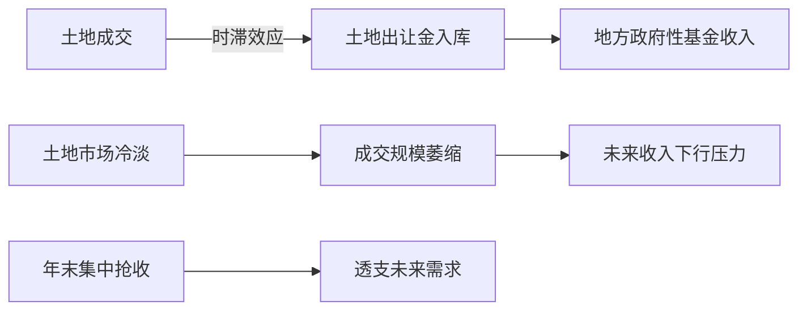
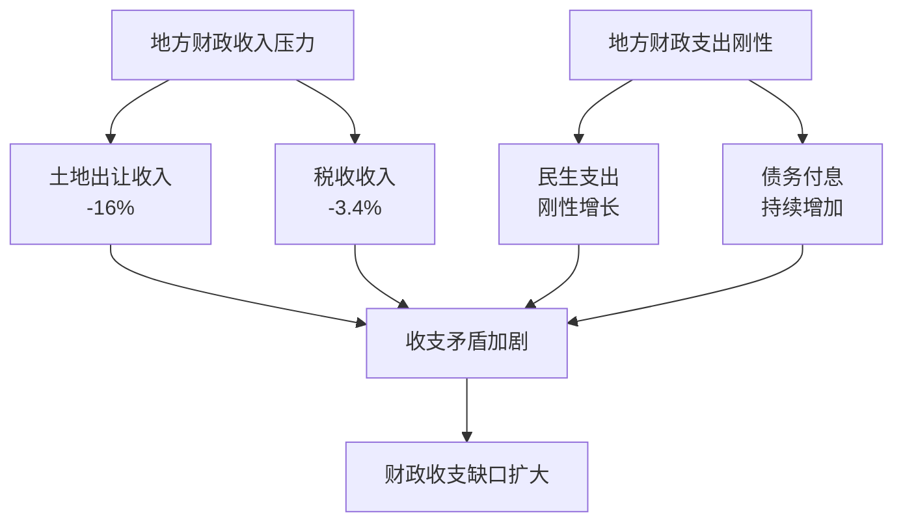
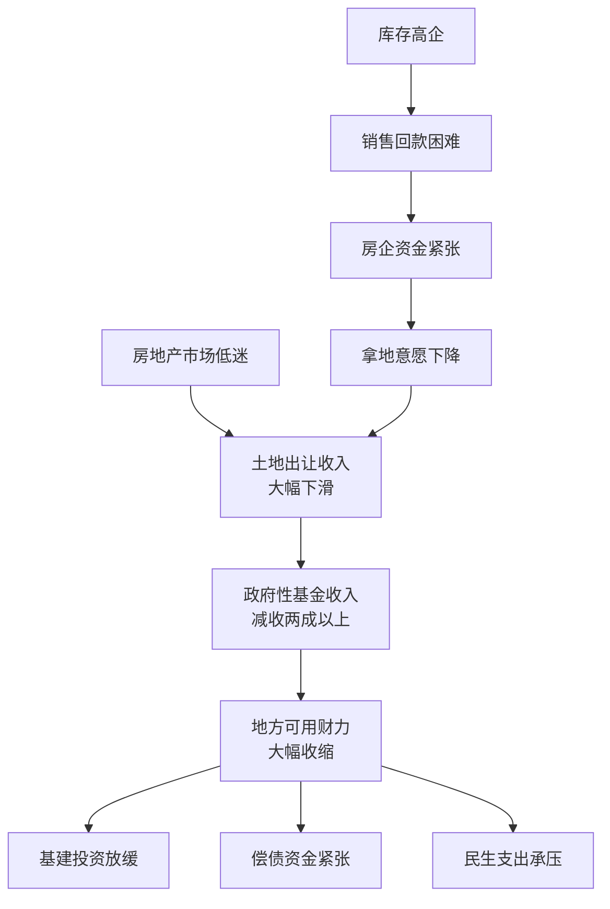
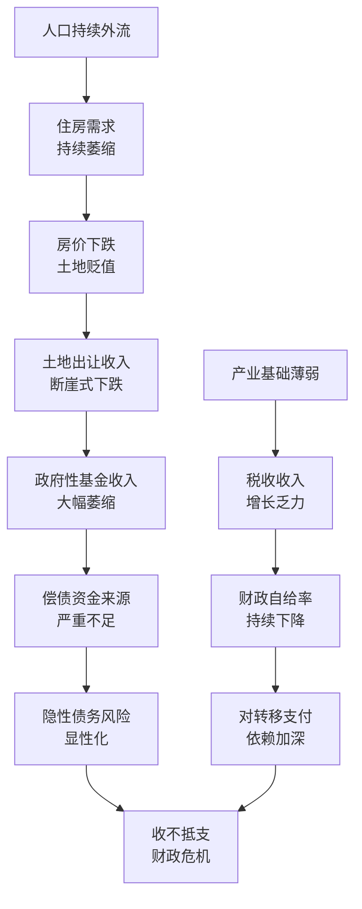
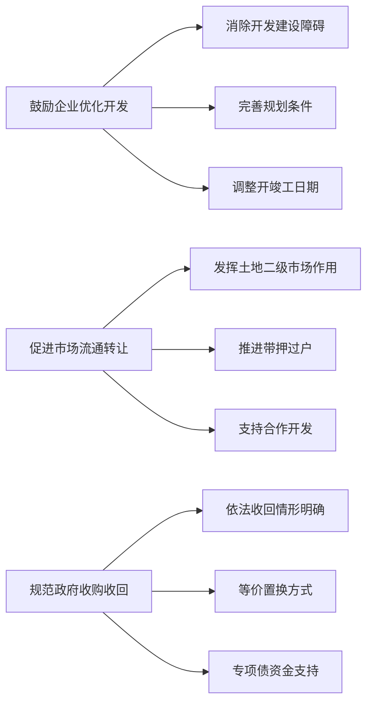
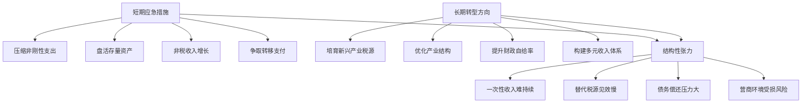
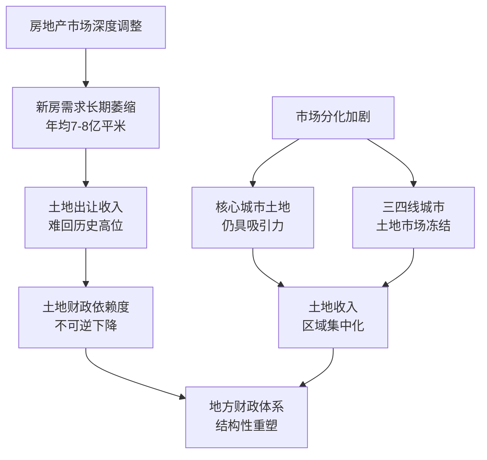
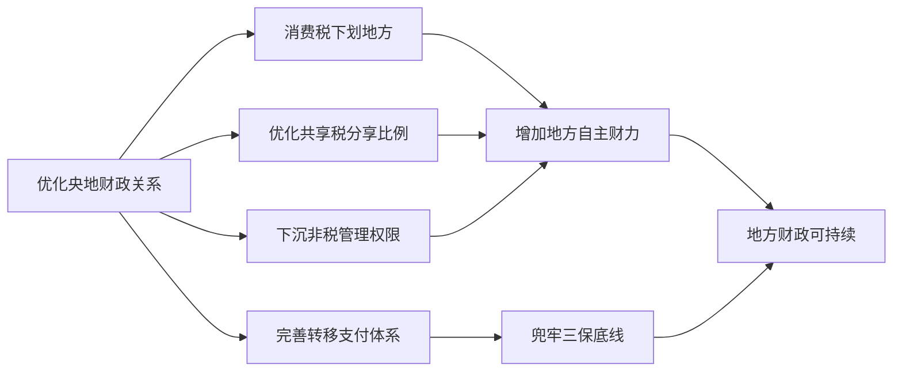
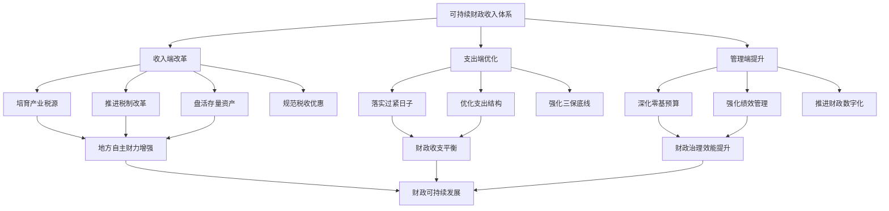

# 房地产市场低迷对中国地方政府财政收入的影响程度研究
## 1 中国房地产市场低迷的现状与特征

当前中国房地产市场正处于深度调整阶段，从投资规模、销售数据、价格走势到土地市场及库存状况均呈现出显著的下行特征。这一轮调整不仅是周期性波动，更体现为行业发展模式的结构性转型。全面把握市场低迷的现状与特征，是理解其对地方政府财政收入影响机制的基础前提。

### 1.1 房地产开发投资持续收缩

**2025年全国房地产开发投资规模降至8.28万亿元，同比下降17.2%**，延续了2024年以来的收缩态势[^1][^2]。从投资结构来看，各类物业投资均呈现不同程度的下滑：

| 投资类别 | 2025年累计值（亿元） | 同比增长（%） |
|---------|---------------------|---------------|
| 房地产开发投资总额 | 82,788.14 | -17.2 |
| 住宅投资 | 63,513.66 | -16.3 |
| 办公楼投资 | 3,202.93 | -22.8 |
| 商业营业用房投资 | 5,946.51 | -14.0 |
| 其他房地产投资 | 10,125.04 | -22.7 |

**住宅投资作为房地产开发投资的主体，2025年累计完成6.35万亿元，同比下降16.3%**[^1][^2]。值得注意的是，办公楼投资降幅最为显著，达到22.8%，反映出商业地产领域面临更为严峻的调整压力[^1]。从投资结构演变来看，2024年12月房地产投资同比下降10.6%，而2025年全年降幅扩大至17.2%，显示市场调整仍在深化[^1]。

从月度数据观察投资下滑的演进轨迹，2025年2月累计降幅为9.8%，此后逐月扩大，至12月累计降幅达到17.2%[^1]。这一趋势表明，**房地产开发投资的收缩具有持续性和加速性特征**。企业在市场调整阶段普遍采取审慎策略，投资布局进一步向高能级城市聚焦，不再追求过去全国化扩张的模式，而是更倾向于基本面良好、人口持续流入、产业基础强、住房需求有支撑的城市[^2]。

### 1.2 商品房销售规模与价格双重承压

**2025年全国新建商品房销售面积为8.81亿平方米，同比下降8.7%；销售额为8.39万亿元，同比下降12.6%**[^2]。其中，住宅销售面积下降9.2%，住宅销售额下降13.0%[^2]。尽管市场需求修复仍需时间，但与2024年相比，销售指标的降幅已有所收窄——2024年全国新建商品房销售面积同比下降12.9%，销售额同比下降17.1%[^2]。

**销售金额降幅明显大于销售面积降幅**，这一结构性特征说明开发商继续采取降价促销策略以换取销量，市场呈现典型的"以价换量"格局[^2]。从价格端来看，2024年12月70个大中城市商品住宅销售价格数据显示，多数城市房价同比仍处于下跌区间[^3]。

以下表格展示部分代表性城市的新建商品住宅价格指数变动情况：

| 城市类型 | 代表城市 | 环比（上月=100） | 同比（上年同月=100） |
|---------|---------|-----------------|---------------------|
| 一线城市 | 上海 | 100.5 | 105.3 |
| 一线城市 | 北京 | 99.9 | 94.6 |
| 一线城市 | 广州 | 99.9 | 90.9 |
| 一线城市 | 深圳 | 100.2 | 93.9 |
| 二线城市 | 杭州 | 100.4 | 98.0 |
| 二线城市 | 南京 | 100.6 | 94.0 |
| 二线城市 | 武汉 | 100.4 | 92.0 |
| 三线城市 | 温州 | 99.6 | 89.7 |
| 三线城市 | 徐州 | 99.9 | 93.2 |

从上表可见，**一线城市中仅上海房价同比上涨5.3%，其余城市同比均下跌**，北京下跌5.4%、广州下跌9.1%、深圳下跌6.1%[^3]。二线城市分化明显，西安同比基本持平（99.6），而武汉同比下跌8.0%[^3]。三线城市房价下跌幅度普遍较大，温州同比下跌10.3%、金华下跌11.2%[^3]。这一价格分化格局反映出**市场调整呈现明显的城市能级差异**，核心城市韧性相对较强，而三四线城市面临更大的价格下行压力。

### 1.3 土地市场与新开工面积显著降温

供给端的收缩态势更为明显。**2025年房屋新开工面积为5.88亿平方米，同比下降20.4%**，其中住宅新开工面积4.3亿平方米，下降19.8%[^2]。房屋施工面积为65.99亿平方米，同比下降10.0%，**年内首次达到两位数降幅**，意味着行业整体体量正在收缩[^2]。房屋竣工面积为6.03亿平方米，同比下降18.1%，其中住宅竣工面积4.28亿平方米，下降20.2%[^2]。

上图展示了房地产供给端收缩的传导链条。**开发企业拿地意愿持续下降**，土地市场交易活跃度明显降低。这一现象的深层逻辑在于，行业已确立"控制增量、盘活存量、优化质量"的发展导向，从源头压缩供给，新的增量主要以"好房子"的供给侧改革来牵引需求[^2]。施工面积跌幅达到两位数，标志着行业从规模扩张向质量提升的转型正在加速推进。

### 1.4 商品房库存与资金到位情况

**截至2025年末，商品房待售面积为7.66亿平方米**，库存增速较此前大幅放缓[^2]。这一变化显示市场正在自发趋于平衡，供给端的主动收缩开始产生效果。库存增速骤降意味着，尽管销售端仍面临压力，但供给端更大幅度的收缩正在逐步改善供需关系。

资金端的紧张状况同样值得关注。**2025年房地产开发企业到位资金为9.31万亿元，同比下降13.4%**[^2]。各资金来源渠道的收缩情况如下：

| 资金来源 | 2025年金额（亿元） | 同比增长（%） |
|---------|-------------------|---------------|
| 国内贷款 | 14,100 | -7.3 |
| 利用外资 | 25 | -20.8 |
| 自筹资金 | 33,100 | -12.2 |
| 定金及预收款 | 28,100 | -16.2 |
| 个人按揭贷款 | 12,900 | -17.8 |

从资金结构来看，**个人按揭贷款降幅达17.8%，定金及预收款降幅为16.2%**，这两项与销售端直接相关的资金来源下滑幅度较大，反映出市场需求疲弱对企业资金链的传导效应[^2]。自筹资金下降12.2%，显示企业自身造血能力受限。相比之下，国内贷款降幅为7.3%，在各渠道中相对较小，一定程度上体现了金融支持政策的托底作用[^2]。

综合来看，当前房地产市场呈现**投资收缩、销售承压、价格分化、供给主动调整、资金趋紧**的多重特征。虽然2025年销售降幅较2024年有所收窄，库存增速也明显放缓，显示市场正在经历艰难的再平衡过程，但整体仍处于深度调整阶段。随着各类利好政策效应逐步释放，2026年稳定房地产市场的重要性与迫切性更加凸显，各项指标有望迎来积极调整空间[^2]。这一市场基本面的深刻变化，将对高度依赖土地财政的地方政府财政收入产生重大而持续的影响。

## 2 地方政府财政收入的构成与房地产关联度

地方政府财政收入的结构特征与房地产行业的关联程度，是理解房地产市场低迷如何传导至财政体系的关键基础。中国地方财政长期形成了对土地出让收入和房地产相关税收的高度依赖，这一"土地财政"模式在房地产市场快速发展阶段为城市建设和经济增长提供了重要支撑，但也使地方财政对房地产周期波动高度敏感。本章将系统解析地方财政收入的来源结构，量化揭示房地产对地方财政的贡献度，为后续分析市场低迷对财政的冲击机制奠定基础。

### 2.1 地方政府财政收入的整体结构

中国财政体系采用"四本账"管理模式，地方政府财政收入相应由四部分构成：一般公共预算收入、政府性基金预算收入、国有资本经营预算收入和社会保险基金预算收入。这四类收入在性质、用途和规模上存在显著差异，共同构成地方政府可支配财力的基本框架。

**2024年地方财政收入的整体格局**呈现以下特征：地方一般公共预算本级收入为119266亿元，比上年增长1.7%[^4]；地方政府性基金预算本级收入为57356亿元，比上年下降13.5%[^5]；地方国有资本经营预算本级收入为4531亿元，比上年增长1.2%[^6]。三项本级收入合计约18.1万亿元，其中一般公共预算收入和政府性基金收入是地方财政的两大支柱。

| 收入类别 | 2024年规模（亿元） | 同比增长（%） | 占比特征 |
|---------|-------------------|---------------|---------|
| 一般公共预算本级收入 | 119,266 | +1.7 | 税收+非税，地方财政主体 |
| 政府性基金预算本级收入 | 57,356 | -13.5 | 土地出让为主，"第二财政" |
| 国有资本经营预算本级收入 | 4,531 | +1.2 | 规模较小，国企利润上缴 |

从一般公共预算收入的内部结构来看，**全国税收收入174972亿元，比上年下降3.4%；非税收入44730亿元，比上年增长25.4%**[^4]。非税收入的大幅增长主要源于一次性安排中央单位上缴专项收益以及地方依法依规加大国有资源资产盘活力度，国有资本经营收入和国有资源（资产）有偿使用收入增加较多[^5]。这一"税降非升"的结构变化，反映出地方政府在税源萎缩背景下通过盘活存量资产来弥补收入缺口的努力。

地方一般公共预算的收入来源还包括中央对地方转移支付收入。2024年地方一般公共预算收入总量为219664亿元，其中本级收入119266亿元，中央对地方转移支付收入100397亿元[^5]。**转移支付收入占地方一般公共预算收入的比重约为46%**，显示中央财政对地方的支持力度较大，但这也意味着地方本级收入的自主性和稳定性对地方财政运行至关重要。

政府性基金预算是地方财政的重要组成部分，其收入来源具有专项性和特定性。**政府性基金预算是对依照法律法规的规定在一定期限内向特定对象征收、收取或者以其他方式筹集的资金，专项用于特定公共事业发展的收支预算**[^7]。地方政府性基金收入由10多项收入组成，具体包括国有土地使用权出让收入、国有土地收益基金收入、专项债券对应项目专项收入、城市基础设施配套费收入、彩票公益金收入、污水处理费收入等[^7]。

### 2.2 房地产相关税收的种类与规模

房地产相关税收是地方一般公共预算收入的重要来源，主要涉及房地产开发、交易和保有等环节的多个税种。根据2024年财政收支数据，与房地产直接相关的主要税种及其收入规模如下：

| 税种 | 2024年收入（亿元） | 同比变化（%） | 征收环节 |
|-----|-------------------|---------------|---------|
| 契税 | 5,170 | -12.5 | 房产交易 |
| 土地增值税 | 4,869 | -8.0 | 土地/房产转让 |
| 房产税 | 4,705 | +17.8 | 房产保有 |
| 城镇土地使用税 | 2,425 | +9.6 | 土地保有 |
| 耕地占用税 | 1,368 | +21.5 | 土地开发 |

**契税收入5170亿元，比上年下降12.5%**[^4]。契税是在房地产交易环节征收的税种，其收入规模直接与商品房销售面积和交易金额挂钩。2024年商品房销售持续低迷，交易规模萎缩直接导致契税收入大幅下滑，降幅在房地产相关税种中居于前列。

**土地增值税收入4869亿元，比上年下降8%**[^6]。土地增值税是对转让国有土地使用权、地上建筑物及其附着物并取得收入的单位和个人，就其转让房地产所取得的增值额征收的税种。房地产市场调整导致土地和房产交易活跃度下降，增值空间收窄，土地增值税收入相应减少。

**房产税收入4705亿元，比上年增长17.8%**[^6]。房产税是对房屋产权所有人征收的财产税，主要针对经营性房产。2024年房产税收入逆势增长，可能与地方政府加强税收征管、扩大征收范围以及存量房产税基扩大等因素有关。值得注意的是，2022年房产税收入为3590亿元[^8]，至2024年已增长至4705亿元，两年间增长超过1100亿元，年均增速约14.5%。

**城镇土地使用税收入2425亿元，比上年增长9.6%**[^4]。城镇土地使用税是对使用城镇土地的单位和个人征收的税种，其收入增长同样反映出地方政府在存量税源上加强征管的努力。

**耕地占用税收入1368亿元，比上年增长21.5%**[^6]。耕地占用税是对占用耕地建房或从事非农业建设的单位和个人征收的税种，其大幅增长可能与部分地区基础设施建设用地需求增加有关。

从税收结构变化的整体特征来看，**与房地产交易环节直接相关的契税和土地增值税呈现下降态势，而与房产保有环节相关的房产税和城镇土地使用税则实现增长**。这一"交易税降、保有税升"的分化格局，既反映了房地产市场交易活跃度下降的客观现实，也体现了地方政府在税源结构调整中的主动作为。

此外，与房地产开发建设间接相关的税种也受到市场调整的影响。**国内增值税66672亿元，比上年下降3.8%**[^4]，房地产开发企业作为增值税重要税源之一，其投资和销售规模收缩对增值税收入产生负面影响。**印花税3427亿元，比上年下降9.5%**[^6]，其中证券交易印花税1276亿元，比上年下降29.1%，房地产相关合同印花税也有所减少。

### 2.3 土地出让收入的核心地位与演变

**国有土地使用权出让收入是地方政府性基金预算的绝对主体**，2024年土地出让收入占地方政府性基金收入平均比重约85%[^7]。这一收入来源的规模变动对地方财政具有决定性影响，构成了"土地财政"模式的核心支柱。

2024年，**国有土地使用权出让收入48699亿元，比上年下降16%**[^4]。这一降幅显著高于地方政府性基金收入整体13.5%的降幅，表明土地出让收入是拖累政府性基金收入下滑的主要因素。财政部在预算报告中明确指出，全国政府性基金预算收入下降12.2%，**主要是地方国有土地使用权出让收入下降**[^5]。

从历史演变轨迹来看，土地出让收入经历了从高峰到持续回落的剧烈调整：

**2021年地方国有土地使用权出让收入达到93936亿元的历史峰值，至2024年已下滑至48699亿元，与峰值相比下滑约39%**[^7]。三年间土地出让收入累计减少约4.5万亿元，这一规模相当于2024年地方一般公共预算本级收入的约38%，对地方财政的冲击程度可见一斑。

土地出让收入持续下滑的原因是多方面的。**受近些年房地产市场低迷影响，地方土地出让收入普遍下滑**[^7]。房地产开发企业资金紧张、拿地意愿偏弱，土地市场大幅下滑连续两年拖累地方财政[^9]。从土地市场运行机制来看，土地成交到土地出让收入入库具有时滞，由于当前土地市场延续冷淡态势，未来一段时间土地财政仍有下行压力[^9]。

土地出让收入相关支出同样呈现收缩态势。**2024年国有土地使用权出让收入相关支出50812亿元，比上年下降8.6%**[^6]。支出降幅小于收入降幅，一定程度上反映出地方政府在土地收入减少背景下仍需维持必要的征地拆迁补偿和土地开发支出。

### 2.4 地方财政对房地产的综合依赖度测算

综合土地出让收入与房地产相关税收，可以测算房地产对地方财政的整体贡献程度。**考虑土地出让收入及相关税费，土地财政直接贡献财政收入的比重超四成，其中土地出让金是主力**[^9]。

以下从两个维度进行综合测算：

**第一，土地出让收入与房地产相关税收的加总规模**。2024年土地出让收入48699亿元，加上契税5170亿元、土地增值税4869亿元、房产税4705亿元、城镇土地使用税2425亿元、耕地占用税1368亿元，房地产相关收入合计约6.72万亿元。

**第二，房地产收入占地方财政收入的比重**。若以地方一般公共预算本级收入（119266亿元）与政府性基金本级收入（57356亿元）之和约17.66万亿元为基数，房地产相关收入占比约38%。若仅考虑土地出让金和房地产特有五税对地方财政的贡献，**2023年土地出让金和房地产特有五税对地方财政的贡献比重分别为31.6%、10.1%**[^9]。

| 测算维度 | 2024年规模（万亿元） | 占地方财政比重 |
|---------|---------------------|---------------|
| 土地出让收入 | 4.87 | 约28% |
| 房地产相关税收 | 1.85 | 约10% |
| 房地产收入合计 | 6.72 | 约38% |

这一依赖度测算揭示了**地方财政对房地产行业的深度绑定关系**。在房地产市场快速发展的增量阶段，土地财政在补充地方财力、推动经济增长、完善城市公共基建等方面起到了积极作用[^9]。但随着房地产进入存量时代，市场仍处于深度调整阶段，土地市场持续深度低迷，"土地财政"坍塌的负面影响逐渐显现，包括地方财政收支矛盾加剧、地方偿债压力加大等问题[^9]。

### 2.5 房地产财政依赖的区域分化特征

**31省份地方政府性基金收入规模差异显著，且集中在东部发达省份**[^7]。这一区域分化特征意味着房地产市场低迷对不同地区财政的冲击程度存在显著差异。

2024年各省份政府性基金收入排名呈现以下格局：

| 排名区间 | 代表省份 | 收入规模（亿元） |
|---------|---------|-----------------|
| 第1-3名 | 江苏、浙江、山东 | 8097、6000+、4000+ |
| 第4-6名 | 四川、广东、上海 | 3000+ |
| 第7-9名 | 湖北、贵州、北京 | 2000+ |
| 第10-17名 | 安徽、福建等8省 | 1000-2000 |
| 第18-31名 | 其余14省份 | <1000 |

**江苏以约8097亿元稳居榜首，浙江超6000亿元收入规模排在第二，山东则以超4000亿元位居第三**[^7]。收入规模最高的江苏是收入最低西藏（仅41亿元）的约198倍，**江苏一省政府性基金收入甚至超过全国排名后15省份收入之和**[^7]。排名靠前的东部六省份（江苏、浙江、山东、广东、上海、北京）的政府性基金收入之和占地方政府性基金收入比重近半[^7]。

各省份之间政府性基金收入规模差异较大，**主要是各地土地出让收入规模差异较大，而这又跟地方经济发展程度、产业结构、房地产市场形势、土地需求及供应状况等息息相关**[^7]。经济越发达地区，产业发达，人口聚集，土地需求相对旺盛，地价相对较高，土地出让收入规模相对较大[^7]。

从2024年各省份政府性基金收入增速来看，**除了天津、云南、辽宁、贵州、新疆、内蒙古、黑龙江、宁夏、西藏等9个省份收入有所增长外，其余省份这一收入均有不同程度下滑**[^7]。降幅较大的省份包括：

- **湖南：-32%**，主要是国有土地使用权出让收入持续下滑
- **浙江：-26.2%**，主要是土地市场行情不及预期，土地出让收入减少
- **广东：-23.3%**
- **江苏：-22%**

这一区域分化特征揭示了**房地产市场低迷对地方财政影响的异质性**。东部发达省份虽然土地财政规模大、绝对降幅大，但其经济基础雄厚、财政回旋余地相对较大；而部分中西部省份虽然土地财政规模较小，但财政对土地收入的依赖度可能更高，受冲击后的调整压力可能更为突出。政府性基金收入持续下滑，一定程度上减少了地方可用财力，加剧了财政收支矛盾[^7]。

综上所述，地方政府财政收入高度依赖房地产行业，土地出让收入和房地产相关税收合计贡献地方财政收入的约四成。这一"土地财政"模式在房地产市场持续调整的背景下面临严峻挑战，不同区域因经济发展水平和土地财政依赖度的差异而呈现分化的财政压力格局。

## 3 房地产市场低迷导致的税费收入下降规模

房地产市场的持续低迷已对地方财政税费收入形成显著冲击。自2021年土地出让收入创下历史峰值以来，连续三年的大幅下滑叠加房地产相关税种的分化表现，使地方财政面临前所未有的收入缺口压力。本章将系统量化这一冲击的绝对规模与结构特征，为理解地方财政困境的深度与广度提供数据支撑。

### 3.1 土地出让收入的持续下滑与累计减收规模

**国有土地使用权出让收入是地方财政遭受冲击最为剧烈的领域**。从2021年的历史峰值到2024年，土地出让收入经历了断崖式下跌，累计减收规模之大、持续时间之长均为改革开放以来所罕见。

2021年全国国有土地使用权出让收入达到**87051亿元**，同比增长3.5%，创下历史最高纪录[^10]。然而，这一峰值成为此后持续下行的起点。2022年土地出让收入骤降至约66854亿元，同比下降23.3%，降幅创1987年有统计数据以来的历史之最[^11]。2023年继续下滑至**57996亿元**，同比下降13.2%[^12][^13][^14]。2024年进一步跌破5万亿元大关，降至**48699亿元**，同比下降16%，这已是连续第三年下滑，三年累计跌幅超过44%[^11][^15]。

| 年份 | 土地出让收入（亿元） | 同比增速（%） | 较2021年峰值降幅（%） |
|-----|---------------------|---------------|----------------------|
| 2021 | 87,051 | +3.5 | — |
| 2022 | 66,854 | -23.3 | -23.2 |
| 2023 | 57,996 | -13.2 | -33.4 |
| 2024 | 48,699 | -16.0 | -44.1 |

**三年间土地出让收入累计减少约3.84万亿元**，这一规模相当于2024年地方一般公共预算本级收入的约32%。若以2021年峰值为基准，2024年土地出让收入仅为峰值的55.9%，意味着地方政府"卖地"收入几乎腰斩。正如分析所指出的，**2024年全国土地出让金倒退到了2017年的水平**[^16]。

土地出让收入占地方政府性基金收入的比重始终维持在高位。2023年土地出让收入57996亿元，占地方政府性基金预算本级收入66287亿元的比重约为**87.5%**[^12]。2024年土地出让收入48699亿元，占地方政府性基金预算本级收入57356亿元的比重约为**84.9%**[^11]。这一数据表明，**土地出让收入是地方政府性基金收入的绝对主体**，其大幅下滑直接决定了政府性基金收入的整体走势。

从土地出让收入占全国财政收入的比重变化来看，2021年房地产最火热时期，土地出让金占全国财政收入的比重高达**35.9%**，而到2024年这一比例已跌至**17.3%**，几乎腰斩[^17]。这一比值的剧烈下降，直观反映了土地财政对整体财政贡献度的急剧萎缩。

土地出让收入持续下滑的深层原因在于房地产市场的深度调整。**由于楼市持续疲弱，房企资金紧张、拿地意愿偏弱，土地市场大幅下滑连续两年拖累地方财政**[^9]。开发商不愿意大手笔拿地，土地流拍现象增多，开发商不买地，地方政府就少了卖地的钱[^16]。2024年1-11月300城住宅用地成交面积同比下降近三成，土地市场冷淡程度可见一斑[^17]。

### 3.2 房地产相关税种的分化表现与减收测算

与土地出让收入的单边下滑不同，房地产相关税种呈现出**"交易税降、保有税升"的显著分化格局**。这一结构性特征既反映了房地产交易活跃度下降的客观现实，也体现了地方政府在税源结构调整中的主动作为。

**契税收入是房地产交易环节的核心税种**，其变化与商品房销售规模直接挂钩。2023年1-11月全国契税收入5322亿元，同比增长2.2%[^18]。然而进入2024年，契税收入急转直下。2024年一季度契税收入1511亿元，同比下降6.4%[^19][^20]；上半年契税收入2779亿元，同比下降10.9%[^21][^22]；1-7月契税收入3169亿元，同比下降10.9%[^23][^24]；1-10月契税收入约4273亿元，同比下降12.2%[^18]；1-11月契税收入4631亿元，同比下降13%[^25]。**2024年全年契税累计收入为5170亿元，比上年下降12.5%**[^15]。2025年上半年契税收入进一步降至2368亿元，同比下降14.8%[^18]。

**土地增值税收入同样呈现下滑态势**。2023年土地增值税收入5294亿元，同比下降16.6%[^12]。2024年上半年土地增值税收入3074亿元，同比下降4.3%[^21][^22]；1-7月土地增值税收入3388亿元，同比下降7.2%[^23][^24]；1-11月土地增值税收入4574亿元，同比下降8.1%[^25]。土地增值税的持续下滑反映出土地和房产交易活跃度下降、增值空间收窄的市场现实。

与交易环节税种的下滑形成鲜明对比的是，**保有环节税种实现逆势增长**：

| 税种 | 2024年上半年收入（亿元） | 同比增速（%） | 2024年1-7月收入（亿元） | 同比增速（%） |
|-----|------------------------|---------------|------------------------|---------------|
| 房产税 | 2,337 | +20.1 | 2,878 | +20.2 |
| 城镇土地使用税 | 1,298 | +11.0 | 1,562 | +11.2 |
| 耕地占用税 | 840 | +22.6 | 890 | +23.6 |

**房产税收入增长尤为显著**。2024年一季度房产税收入1051亿元，同比增长21%[^19]；上半年房产税收入2337亿元，同比增长20.1%[^21][^22]；1-7月房产税收入2878亿元，同比增长20.2%[^23][^24]；1-11月房产税收入4254亿元，同比增长18%[^25]。房产税的逆势增长可能与地方政府加强税收征管、扩大征收范围以及存量房产税基扩大等因素有关。

**城镇土地使用税和耕地占用税同样保持增长**。2024年上半年城镇土地使用税收入1298亿元，同比增长11%[^21]；耕地占用税收入840亿元，同比增长22.6%[^21]。这些保有环节税种的增长，一定程度上反映了地方政府在存量税源上加强征管的努力。

然而，**保有环节税种的增长远不足以弥补交易环节税种的减收**。从绝对规模来看，2024年契税收入5170亿元较2023年减少约740亿元，土地增值税收入下降约500亿元，两项合计减收超过1200亿元。而房产税、城镇土地使用税的增收规模约为600-700亿元。**房地产相关税收的净减收规模约为500-600亿元**。

综合来看，**2024年房地产相关五项税收收入合计约1.85万亿元**[^11]，与2021年高峰期相比有所下降。2023年土地出让金和房地产特有五税对地方财政的贡献比重分别为**31.6%、10.1%**[^9]，合计超过四成。这一数据表明，尽管保有环节税种有所增长，但房地产对地方税收的整体贡献度仍在下降。

### 3.3 税费收入减少的总体规模与财政缺口贡献度

综合土地出让收入与房地产相关税收的变化，可以全面测算房地产领域收入下降对地方财政的整体冲击程度。**房地产相关收入占地方财政比重从2021年的约53%降至2024年的约35%**，这一结构性变化深刻改变了地方财政的收入格局[^26]。

以下从多个维度进行综合测算：

**第一，土地出让收入与房地产相关税收的合计减收规模**。2024年土地出让收入48699亿元，较2021年峰值87051亿元减少约3.84万亿元。房地产相关税收（契税、土地增值税等）2024年合计约1.85万亿元，较高峰期有所下降。**两项合计，房地产领域收入较峰值减少约4万亿元以上**。

**第二，房地产收入占地方财政收入比重的演变**。2023年全国商品房每卖100元，就有**65.6元**流入政府腰包，其中土地出让金占了**49.7%**[^16]。2023年土地财政直接贡献财政收入的比重超四成，其中土地出让金占31.6%，房地产特有五税占10.1%[^9]。到2024年，1-10月前述地方五大房产相关税收和土地出让收入合计约**5.07万亿元**，占地方财政总收入比重约为**35%**，较2021年的约53%出现明显下滑[^26]。

| 年份 | 房地产相关收入合计（万亿元） | 占地方财政收入比重（%） |
|-----|---------------------------|------------------------|
| 2021 | 约10.8 | 约53 |
| 2023 | 约7.6 | 约42 |
| 2024 | 约6.7 | 约35 |

**第三，对一般公共预算与政府性基金预算的差异化影响**。从地方五大土地和房地产相关税收占税种总收入比重看，波动并不算大。2024年前10个月这一比重约**10%**，较2023年全年下降约2个百分点[^26]。真正导致土地财政收入大幅下滑的是地方土地出让收入大降。地方土地出让收入从2021年的8.7万亿元高峰，降至2022年的约6.7万亿元，2023年跌至5.8万亿元，2024年跌破5万亿元[^26]。

需要指出的是，**土地出让收入是毛收入，其中需要支付的拆迁补偿等成本近八成**[^26]。毛收入大幅减少的同时，相应拆迁等成本性支出也会大幅下降。地方政府性基金有部分收入调入一般公共预算使用，约占地方政府性基金预算的15%。若按照土地出让收入减收约2万亿元匡算，影响地方一般公共预算财力约**3000亿元**[^26]。

**第四，非税收入的补偿性增长**。面对税收收入下滑，地方政府通过多渠道盘活资源资产来弥补收入缺口。2024年全国一般公共预算收入实现1.3%的增长，主要在于非税收入的增长。其中，全国税收收入17.5万亿元，同比下降3.4%；**非税收入4.47万亿元，同比增长25.4%**[^15]。1-7月全国非税收入2.4万亿元，同比增长高达12%[^9]。非税收入的飙升一定程度上反映了地方政府在财政收入承压背景下的应对努力，但也引发了对营商环境的担忧。

### 3.4 收入下滑的时序特征与未来压力研判

土地出让收入具有显著的**季节性波动特征**，这一特征对地方财政收入的节奏安排产生重要影响。分析收入入库的时序规律，有助于研判未来财政压力的演变趋势。

**2024年土地出让收入呈现明显的"前低后高"特征**。2024年一季度国有土地使用权出让收入8147亿元，同比下降6.7%[^19][^20]；上半年土地出让收入15263亿元，同比下降18.3%[^27][^22]；1-7月土地出让收入17763亿元，同比下降22.3%[^23][^24]；1-11月土地出让收入约32600亿元，同比下降22.4%[^25]。

从季度分布来看，**2024年9月至12月的土地出让收入占了全年收入的58.5%，尤其是12月贡献了全年土地出让收入的三分之一**[^16]。这说明地方政府在年末"拼命抢收"，通过加速土地出让来完成年度收入目标。但即便如此，也难以弥补整体下滑的趋势。

**土地成交到土地出让收入入库具有时滞效应**。一般来说，土地成交到土地出让收入入库存在时间差，由于当前土地市场延续冷淡态势，因此未来一段时间土地财政仍有下行压力[^9]。2024年上半年全国供给土地规划建面7.00亿平方米，同比下降28.25%；上半年全国实现土地出让金0.56万亿元，同比下降46.39%[^27]。

从2024年月度数据的演进轨迹来看，土地出让收入降幅呈现扩大趋势。上半年同比下降18.3%，1-7月同比下降22.3%，1-11月同比下降22.4%，全年同比下降16%。全年降幅收窄主要依靠12月的集中入库，但这种"透支式"抢收难以持续。

**对未来趋势的研判**需要关注以下几个关键因素：

- **房地产市场走势**：当前房地产形势可以概括为"政策环境已接近2014年最宽松阶段，但形势严峻性为1998年房改以来之最"[^9]。房地产市场能否止跌回稳，直接决定土地市场的活跃度和土地出让收入的走势。

- **房企拿地意愿**：房企资金紧张、债务到期与保交楼压力叠加，投资意愿持续萎缩。目前全国土地市场处于探底的深度调整状态，与商品房销售疲软、房企资金紧张、商品房库存与土地库存高的因素有关[^27]。

- **政策支持力度**：2025年上半年全国国有土地使用权出让收入不到2021年同期的一半，很多城市不得不靠专项债来收储闲置土地，截至2025年5月底，相关额度已达**4700亿元**[^17]。政策托底力度将影响土地市场的企稳进程。

综合来看，**土地财政的下行压力在短期内难以根本缓解**。存量时代下，土地出让收入和房地产开发建设环节税收规模增速降低是趋势，"土地财政"亟需转型[^9]。地方政府需要在稳定房地产市场的同时，加快构建多元化、可持续的财政收入体系，以应对土地财政退潮带来的长期挑战。

## 4 对地方政府财政收入的影响程度评估

房地产市场的持续低迷已对地方财政收入形成深度冲击，这一冲击既体现在一般公共预算收入的税收结构调整上，更集中反映在政府性基金收入的大幅萎缩中。综合前述章节的数据基础，本章将系统量化这一冲击的程度与性质，从一般公共预算、政府性基金预算、收支平衡压力及风险性质四个维度进行全面评估，为理解当前地方财政困境的深度与应对策略的紧迫性提供决策依据。

### 4.1 对一般公共预算收入的冲击程度测算

房地产相关税收是地方一般公共预算收入的重要组成部分，其变化直接影响地方税收基础的稳定性。**2024年全国税收收入174972亿元，比上年下降3.4%**，这是近年来税收收入首次出现明显负增长，房地产相关税种的下滑是重要拖累因素[^28]。

**交易环节税种与保有环节税种的分化效应**

从税种结构来看，与房地产交易直接相关的契税和土地增值税呈现明显下滑态势，而与房产保有相关的税种则实现逆势增长。这一"交易税降、保有税升"的分化格局，既反映了房地产市场交易活跃度下降的客观现实，也体现了地方政府在存量税源上加强征管的努力。

| 税种类型 | 代表税种 | 2024年收入（亿元） | 同比变化（%） | 变动方向 |
|---------|---------|-------------------|---------------|---------|
| 交易环节 | 契税 | 5,170 | -12.5 | ↓ |
| 交易环节 | 土地增值税 | 4,869 | -8.0 | ↓ |
| 保有环节 | 房产税 | 4,705 | +17.8 | ↑ |
| 保有环节 | 城镇土地使用税 | 2,425 | +9.6 | ↑ |
| 开发环节 | 耕地占用税 | 1,368 | +21.5 | ↑ |

**契税收入下滑幅度最为显著**，2024年上半年契税收入2779亿元，同比下降10.9%，全年累计下降12.5%[^29]。契税作为房地产交易环节的核心税种，其收入规模直接与商品房销售面积和交易金额挂钩。2024年商品房销售持续低迷，交易规模萎缩直接导致契税收入大幅下滑。**土地增值税收入同样承压**，2024年上半年土地增值税收入3074亿元，同比下降4.3%[^29]，全年下降8%，反映出土地和房产交易活跃度下降、增值空间收窄的市场现实。

**保有环节税种的增长形成部分对冲**。2024年上半年房产税收入2337亿元，同比增长20.1%；城镇土地使用税收入1298亿元，同比增长11%；耕地占用税收入840亿元，同比增长22.6%[^29]。房产税的逆势增长可能与地方政府加强税收征管、扩大征收范围以及存量房产税基扩大等因素有关。

**净效应测算**

尽管保有环节税种实现增长，但其规模远不足以弥补交易环节税种的减收。2024年契税收入较上年减少约740亿元，土地增值税减少约425亿元，两项合计减收超过1165亿元。而房产税、城镇土地使用税的增收规模约为600-700亿元。**房地产相关税收的净减收规模约为500亿元左右**。

从房地产税收占地方税收收入的比重来看，**2024年前10个月地方五大房产相关税收占税种总收入比重约10%，较2023年全年下降约2个百分点**[^26]。这一比重变化虽然幅度不大，但考虑到房地产相关税收曾是地方税收增长的重要引擎，其贡献度下降对地方税收增长动能的削弱不容忽视。

**非税收入的补偿性增长**

面对税收收入下滑，地方政府通过多渠道盘活资源资产来弥补收入缺口。**2024年全国非税收入44730亿元，同比增长25.4%**，主要是一次性安排中央单位上缴专项收益以及地方依法依规加大国有资源资产盘活力度，国有资本经营收入和国有资源（资产）有偿使用收入增加较多[^28][^5]。这一"税降非升"的结构变化，使得全国一般公共预算收入仍实现1.3%的正增长，**地方一般公共预算本级收入增长1.7%**[^5][^30]。

然而，**非税收入的大幅增长引发了对财政收入质量和可持续性的担忧**。非税收入包括罚没款、诉讼费、行政事业单位收费等，其中部分收入来源具有一次性特征，难以形成稳定的财政收入基础。有分析指出，1-7月全国非税收入2.4万亿元，同比增长高达12%，地方大量出现罚没、倒查税、异地执法等现象，严重影响营商环境和企业信心[^9]。

### 4.2 对政府性基金收入的冲击程度测算

**土地出让收入是地方财政遭受冲击最为剧烈的领域**，其持续大幅下滑构成了当前地方财政困境的核心矛盾。政府性基金预算作为地方财政的"第二财政"，其收入规模的剧烈波动对地方可支配财力产生决定性影响。

**土地出让收入的持续萎缩**

**2024年国有土地使用权出让收入48699亿元，比上年下降16%**[^31]。这一降幅显著高于地方政府性基金收入整体13.5%的降幅，表明土地出让收入是拖累政府性基金收入下滑的主要因素。财政部在预算报告中明确指出，全国政府性基金预算收入下降12.2%，**主要是地方国有土地使用权出让收入下降**[^5][^30]。

从历史演变轨迹来看，土地出让收入经历了从高峰到持续回落的剧烈调整：

| 年份 | 土地出让收入（亿元） | 同比增速（%） | 较2021年峰值降幅（%） |
|-----|---------------------|---------------|----------------------|
| 2021 | 87,051 | +3.5 | — |
| 2022 | 66,854 | -23.3 | -23.2 |
| 2023 | 57,996 | -13.2 | -33.4 |
| 2024 | 48,699 | -16.0 | -44.1 |

**从2021年峰值至2024年，土地出让收入累计减少约3.84万亿元**，这一规模相当于2024年地方一般公共预算本级收入的约32%。三年间土地出让收入累计跌幅超过44%，意味着地方政府"卖地"收入几乎腰斩[^9]。

**土地出让收入占政府性基金收入的比重**

土地出让收入始终是地方政府性基金收入的绝对主体。**2024年土地出让收入48699亿元，占地方政府性基金预算本级收入57356亿元的比重约为85%**[^31][^5]。这一高度集中的收入结构意味着，土地出让收入的任何波动都会直接决定政府性基金收入的整体走势。

**地方政府性基金预算本级收入57356亿元，比上年下降13.5%**[^5][^30]。这一降幅与土地出让收入16%的降幅高度相关，进一步印证了土地出让收入对政府性基金预算的决定性影响。

**毛收入与净收入的差异修正**

在评估土地出让收入下滑对地方财政的实际影响时，需要考虑毛收入与净收入的差异。**土地出让收入是毛收入，其中需要支付的拆迁补偿等成本近八成**[^26]。毛收入大幅减少的同时，相应拆迁等成本性支出也会大幅下降。从过去十多年的土地出让收支数据中可发现，支出增速跟收入增速波动比较接近，当土地出让收入大增时，相应支出大增，反之同步下降[^26]。

地方政府性基金有部分收入调入一般公共预算使用，约占地方政府性基金预算的15%。若按照土地出让收入减收约2万亿元匡算，**影响地方一般公共预算财力约3000亿元**[^26]。基于此，官方认为房地产市场下行给地方一般公共预算和政府性基金预算带来的影响是可控的、结构性的[^26]。

然而，这一"可控"的判断需要结合区域差异来理解。**对于土地财政依赖度高的地区，土地出让收入下滑的实际冲击远超全国平均水平**。部分省份土地出让收入占地方财政收入的比重曾超过40%，土地收入腰斩意味着其可支配财力大幅收缩，基建投资、偿债资金来源面临严峻挑战。

### 4.3 地方财政收支平衡压力的量化分析

**当前地方财政面临"收入端收缩、支出端刚性"的双重压力**，收支矛盾持续加剧。综合土地出让收入与房地产税收减少的叠加效应，地方财政收支缺口呈现扩大趋势。

**收支缺口的规模测算**

**2024年全国一般公共预算支出284612亿元，完成预算的99.7%，增长3.6%**；收入总量为245113亿元，收支总量相抵，赤字40600亿元，与预算持平[^28][^5]。从地方层面来看，**地方一般公共预算支出243892亿元，增长3.2%，占全国一般公共预算支出的85.7%**[^5][^30]。地方财政赤字7200亿元，与预算持平。

**2025年一季度数据显示，收支矛盾进一步加剧**。全国一般公共预算收入60189亿元，同比下降1.1%，而支出逆势增长4.2%，收支缺口扩大至12626亿元。若将政府性基金纳入计算，广义财政赤字率在一季度已抬升至4.8%，创下近年来新高[^32]。这种"收不抵支"的局面不再是个别现象，而是成为普遍现象。

**弥补缺口的渠道与效果**

面对财政收入压力，地方政府主要通过以下渠道弥补收入缺口：

**第一，非税收入增长**。如前所述，2024年非税收入增长25.4%，对冲了部分税收减收。但非税收入的可持续性存疑，且部分增收方式可能损害营商环境。**安徽省财政厅分析指出，2024年该省一般公共预算收入中非税收入占比35.6%，较2019年增加5.1个百分点**，在税收增长乏力的背景下，非税项目扩张虽能短期平滑收入曲线，但会降低财政收入的可预期性和稳定性[^33]。

**第二，中央转移支付增加**。**2024年中央对地方转移支付收入100397亿元**[^5]，占地方一般公共预算收入的比重约46%。中央通过加大转移支付力度来支持地方财政平稳运行。2025年中央进一步增加对地方转移支付，增强地方财力、兜牢"三保"底线[^30]。

**第三，政府债券发行**。地方政府通过发行一般债券和专项债券筹集资金。**2024年地方政府发行专项债券筹集收入39000亿元**[^5]。截至2024年末，**地方政府债务余额475371亿元**，控制在全国人大批准的限额以内[^30]。债务融资在短期内缓解了财政压力，但也增加了未来偿债负担。

**第四，盘活存量资产**。地方依法依规加大国有资源资产盘活力度，国有资本经营收入和国有资源（资产）有偿使用收入增加较多[^28]。

**对"三保"支出的影响**

**县级财政是"三保"（保基本民生、保工资、保运转）的最后一道闸门，却也是最先决堤的薄弱环节**。2024年县级一般公共预算收入中，税收占比仅35%，而"三保"支出占比高达72%[^32]。部分县市已从"紧平衡"滑向"收不抵支"的边缘。

**2024年31省财政自给率均值仅为49.2%，一半以上省份低于50%**；县级财政"三保"支出占比超过可用财力的七成[^32]。在土地财政退潮、债务利息攀高、刚性支出只增不减的三重挤压下，地方财政面临严峻挑战。

从区域来看，**财政自给率呈现东高西低的格局**：广东、江苏、浙江自给率超过60%，而贵州、云南、西藏不足35%。这意味着每花100元，西部省份要伸手向中央要65元，财政资源的跨区域调度已成为"日常急救"[^32]。

### 4.4 影响性质判断：结构性冲击与系统性风险辨析

**当前房地产市场低迷对地方财政的影响，本质上是一场深刻的"结构性冲击"**，但在部分高风险区域已呈现向系统性风险演变的苗头。准确判断影响性质，对于制定差异化应对策略至关重要。

**从三个维度判断影响性质**

**第一，冲击范围**。房地产相关收入下滑是全国性现象，但冲击程度呈现显著的区域分化。**1-10月前述地方五大房产相关税收和土地出让收入合计约5.07万亿元，占地方财政总收入比重约为35%，较2021年的约53%出现明显下滑**[^26]。这一比值的下降是全国性的，但东部发达省份因经济基础雄厚、财政回旋余地相对较大，而中西部及部分三四线城市财政脆弱性凸显。

**第二，持续时间**。土地出让收入已连续三年下滑，累计跌幅超过44%。**房地产市场预计在2027-2030年才能逐步完成筑底**，在此之前房地产相关收入难以反弹，地方财政将持续面临收入端收缩的压力。这一长周期特征表明，当前冲击并非短期波动，而是行业发展模式转型带来的深层调整。

**第三，传导深度**。房地产行业的困境正在向金融体系和地方政府财政传导。**房地产下行通过三条渠道产生负面影响：一是直接拖累固定资产投资；二是通过财富效应抑制消费；三是加剧地方政府财政困境**[^34]。这三重压力在当前经济增速换挡期显得尤为突出。

**结构性冲击的特征**

从整体判断，**当前冲击主要表现为结构性调整**，体现在以下几个方面：

- **收入来源的结构性转变**：土地财政依赖度从2021年的约53%降至2024年的约35%，地方财政正在经历从土地依赖型向多元化收入结构的被动转型。
- **税收结构的调整**：交易环节税种下降、保有环节税种增长的分化格局，反映出税收基础从增量市场向存量市场的转移。
- **区域分化加剧**：一线城市韧性足，二线及三四线城市财政脆弱性凸显，风险集中于高依赖度地区。

**系统性风险的苗头与防范**

尽管整体风险可控，但**部分领域已呈现系统性风险的苗头**：

**债务风险攀升**。截至2024年末，**地方政府债务余额47.54万亿元**，其中专项债30.84万亿元，占比65%[^32]。若算上城投有息债务，广义债务规模已突破100万亿元。债务率（债务余额/综合财力）超过100%的省份由2020年的8个增至2024年的18个[^32]。**2024年上半年，地方财政债务付息支出占比升至4.6%，较2017年提高1.6个百分点；部分市县利息支出占比超过10%**，财政沦为"为债打工"[^32]。

**城投平台风险**。**土地资源价值持续缩水，以土地为核心的政府投融资链条运转受阻**。城投平台资产质量下降影响偿债能力，抵押品价值衰减制约金融机构信贷投放，政府综合可用财力进一步削弱[^33]。传统土地信用支撑的城投融资路径难以为继，在监管趋严与土地收益衰减的双重压力下，违规举债风险与合规融资缺口形成两难局面[^33]。

**房企债务风险传导**。**当前房地产市场面临的主要挑战和问题是房地产开发商的债务风险**[^35]。在资产负债规模排名前10的房地产企业中，恒大、碧桂园、融创、绿地这四家企业已经出现债务违约，万科也不同程度地陷入债务纠纷。**资产负债规模排名前50的房地产开发商已经有70%出现了公开债务违约**[^35]。房企债务风险不仅影响土地出让收入，还对金融体系稳定构成威胁。

**区域风险等级评估**

| 区域类型 | 风险等级 | 核心特征 |
|---------|---------|---------|
| 一线城市 | **低风险** | 土地财政依赖度低，市场韧性强，财政回旋余地大 |
| 强二线城市 | **中风险** | 依赖度正快速下降，但财政波动风险仍存 |
| 弱二线及三四线城市 | **中高风险** | 土地市场近乎冻结，财政收支严重失衡 |
| 中西部基层县市 | **高风险** | 财政自给率低，"三保"压力大，隐性债务风险突出 |

**综合判断**

**房地产税费收入下降对地方财政构成了深远的"结构性冲击"，彻底动摇了"土地财政"模式**。通过中央强有力的转移支付和债务置换，系统性风险总体可控。但地方，特别是中西部和基层县市，已从"紧平衡"滑向"收不抵支"的边缘，收支矛盾尖锐。**土地财政依赖度下降已成定局，地方财政体系重构正沿"破旧立新"双轨推进**：短期靠中央支持、盘活存量"救急"；中长期必须依靠产业升级和财税改革来培育可持续新财源。在房地产市场企稳之前，地方财政将持续面临收入端收缩和支出端刚性的双重压力，财政治理能力面临严峻考验。

## 5 区域与城市层级的差异化影响分析

房地产市场低迷对地方财政的冲击并非均匀分布，而是呈现出显著的城市能级差异与区域分化特征。一线城市凭借强劲的经济基础和核心资产吸引力展现出相对韧性，二线城市在高依赖度快速下降过程中承受剧烈的财政波动，而三四线城市则深陷土地市场冻结与财政收支失衡的困境。本章将从城市能级与区域板块两个维度，系统量化这一差异化冲击的程度与成因，识别高风险区域并揭示其脆弱性根源。

### 5.1 一线城市的相对韧性与结构性分化

**一线城市在本轮房地产市场调整中展现出明显的财政韧性**，土地财政依赖度普遍较低，核心地块仍具备较强的市场吸引力。然而，四大一线城市之间的分化格局同样值得关注，上海、北京表现相对稳健，而广州、深圳则面临更大的调整压力。

**土地财政依赖度处于低位**

一线城市土地财政依赖度普遍控制在25%以下，远低于全国平均水平。2024年前8月土地出让金占一般公共预算收入的比重测算显示，**北京约为25%，上海约为15%，广州约为20%，深圳仅为2%**[^36]。深圳依赖度极低的特殊格局，源于其土地资源稀缺、产业税收基础雄厚的独特禀赋。

| 城市 | 2024年土地财政依赖度预测 | 较2023年变化 | 韧性评估 |
|-----|------------------------|-------------|---------|
| 北京 | 约25% | 下降 | 较强 |
| 上海 | 约15% | 基本稳定 | 强 |
| 广州 | 约20% | 明显下降 | 中等 |
| 深圳 | 约2% | 基本稳定 | 极强 |

**2025年北上杭三城土地出让金均超千亿元**，成为全国土地出让"大户"[^37]。据中指研究院监测，2025年全年北京累计出让40宗涉宅用地，成交金额约1427.4亿元，较2024年减少约8%，但成交楼面均价同比上升20%，平均溢价率也提高了3.7个百分点，整体呈现出**"量减价升"的格局**[^38]。上海公开市场全年成交48宗涉宅用地，土地出让金额达到1427.23亿元，同比增长1.9%，实现了量价齐升[^38]。

**四城之间的结构性分化**

尽管一线城市整体韧性较强，但内部分化明显：

**上海表现最为稳健**。2025年上海已逐渐形成"公开出让+协议/遴选出让"双轨模式，通过协议出让、遴选出让或股权交易等定向方式供应的涉宅用地约30宗，年内累计成交金额已超过900亿元。若将这些"非公开口径"成交金额纳入统计，**上海在2025年的实际土地出让收入已明显领先其他城市**[^39]。全国最高单价宅地和总价"地王"均诞生于上海，2025年7月徐汇区衡复风貌区地块楼面价达20.03万元/平方米，6月徐汇东安地块以439.53亿元成交，创下年度总价纪录[^38]。

**北京市场热度向心聚集**。40宗成交地块中有一半位于城六区，远超2024年的40%。海淀、朝阳、昌平位列成交规模前三，高溢价地块也大多集中于这些区域——全年溢价率超过10%的9宗地块中，海淀占4宗，朝阳占3宗，通州占2宗[^37]。

**广州、深圳面临更大压力**。2024年前8月，**广州土地出让金降幅高达72%，深圳降幅达77%**[^36]。深圳前8月土地出让金仅76亿元，而其2024年一般公共预算收入高达4112.8亿元，土地出让金收入仅占其2%，出让金的大幅下滑给地方财政造成了较大的压力[^36]。

**韧性来源与边界**

一线城市财政韧性的来源主要包括：**产业税收基础雄厚、人口持续流入、核心资产稀缺性支撑地价、政策工具箱充足**。2024年12月起实施的房地产税收新政对一线城市形成直接利好，北京、上海、广州、深圳四城可以与其他地区统一适用家庭第二套住房契税优惠政策，个人销售已购买2年以上住房一律免征增值税[^40][^41][^42]。

然而，韧性并非没有边界。**即使是核心城市热门核心板块，2025年下半年土拍行情整体不再火爆，大多低溢价甚至底价成交，而且还有一些地块流拍**[^38]。这表明，一线城市的土地市场同样受到整体房地产周期的影响，只是调整幅度相对温和。

### 5.2 二线城市的加速分化与压力传导

**二线城市是本轮房地产市场调整中财政波动最为剧烈的群体**。这些城市曾是土地财政依赖度最高的区域，土地出让收入大幅下滑对其政府性基金收入形成严重冲击，依赖度正在经历从高位快速下降的剧烈调整过程。

**历史高依赖度与加速下降**

二线城市土地财政依赖度曾普遍超过50%，部分城市甚至超过100%。以杭州为例，**"十三五"期间土地财政依赖度高达140%，2022年为119%，2023年降至77.5%，2024年预计为53%**[^43]。杭州土地财政依赖度从2022年的119%回落至2023年不足80%，**降幅达40个百分点**，在重点城市中降幅最大[^43]。

| 城市 | 2022年依赖度 | 2023年依赖度 | 2024年预测 | 变动特征 |
|-----|-------------|-------------|-----------|---------|
| 杭州 | 119% | 77.5% | 53% | 速滑40个百分点 |
| 南京 | 72% | 约30% | 下降42个百分点 | 大幅收缩 |
| 广州 | 110%（十三五） | 77% | 下降 | 持续回落 |
| 武汉 | 高依赖 | 困难行业 | 严重承压 | 被定性为困难行业 |

**典型城市的剧烈调整**

**杭州**：2023年杭州政府性基金收入为2233.4亿元，比上年执行数下降30.3%，其中土地出让收入为2026.9亿元，下降30.5%[^43]。2024年杭州土地出让收入预算1465.2亿元，相比2023年执行数少了561.7亿元，降幅达27.7%[^43]。然而，2025年杭州土地市场出现回暖迹象，杭州十区共成交涉宅用地92宗，成交总金额1420.8亿元，无论出让数量还是成交金额，均远高于2024年的72宗、1169亿元[^38]。但需注意的是，**上半年杭州卖地金额高达1160.1亿元，几乎追平2024年全年水平，而下半年涉宅地块成交金额仅260.7亿元，只相当于上半年的22.5%**[^38]。

**武汉**：2023年2月，武汉市政府出台政策文件，**明确将房地产行业列为困难行业，要加大纾困支持力度**[^44]。武汉市住房保障和房屋管理局数据显示，2022年武汉新建商品住房共计成交11.63万套、1316.5万平方米，同比分别下滑42%和43%，是近8年来成交量最低的一年[^44]。2022年度武汉土地出让成交仅约940亿元，加上全市新建住房销售额约1800亿元，两项总额为2740亿元，**同比跌幅52.2%**[^44]。

**宁波、沈阳**：2023年宁波政府性基金收入为902.21亿元，比上年执行数下降25.1%，其中土地出让收入为824.4亿元，下降25.8%[^43]。沈阳政府性基金收入104亿元，下降24.1%，其中土地出让收入88.9亿元，下降20.8%[^43]。

**财政波动风险的传导机制**

二线城市财政波动风险的传导呈现以下特征：

**以南京为例**，2024年预测全市土地出让金为488亿元，当年全市一般公共预算收入1653亿元，占比仅有30%，较2023年72%下降了42个百分点[^36]。在巨大的土让金落差之下，财政压力势必承压。然而，南京前8月已经完成全年供地计划的8成，土地财政依赖度处于较高水平，显示地方政府仍在努力通过加速供地来弥补收入缺口[^36]。

### 5.3 三四线城市的深度困境与流动性危机

**三四线城市是房地产市场低迷冲击最为严重的区域**，土地市场近乎冻结、土地出让收入断崖式下跌，叠加人口外流、库存高企、房企拿地意愿极低等因素，部分县市已从"紧平衡"滑向"收不抵支"的深度困境。

**土地市场近乎冻结**

三四线城市土地市场遭遇前所未有的寒冬。**2024年前8月，22个重点城市中除福州、沈阳、济南三个城市出让金保持上涨势头外，其余19个城市土地出让金同比均降**[^36]。而三四线城市的情况更为严峻，部分城市全年土地出让收入近乎归零。

从土地流拍率来看，**云南个旧、山西吕梁等地方流拍率超过30%**[^45]。某些中部小县城曾经以每平方14000元的价格打破全省纪录，结果那块明星地儿变成了杂草丛生的烂尾工地[^45]。克而瑞数据显示，2025年三四线城市流拍率比2024年高了8.04个百分点[^45]。

**财政收支严重失衡**

三四线城市财政收支矛盾已达到临界点。**某城的账本显示：一般公共预算支出600多亿元，实际收入却只有100多亿元**[^46]。放在过去，土地出让金能轻松补上缺口，但现在这条路基本走到了尽头。

这种财政失衡带来了一系列连锁反应：

- **公共服务萎缩**：曾经门庭若市的建材市场，现在大半商铺卷着闸门；空置的店铺越来越多，有些街区下午五点就开始冷清[^46]
- **人才流失加剧**：有本事的年轻教师、医生早就走了——30岁的主治医生考去省会三甲，28岁的骨干教师跳槽到地级市重点中学[^46]
- **基础设施老化**：以前卖地的钱能修的地铁、公园、学校，现在可能要等更久；城市更新、老旧小区改造的进度，也会受财政状况拖累[^17]

**二手房流动性危机**

三四线城市的二手房市场正在经历"流动性寒冬"。**2025年3月最新数据显示，三四线城市二手房挂牌量同比激增42.3%，但成交量同比暴跌21.6%，平均成交周期延长至108天**——这意味着一套房子从挂牌到卖出需要整整3个半月，而核心城市的平均周期仅为45天[^47]。

| 指标 | 三四线城市 | 核心城市 | 差异倍数 |
|-----|-----------|---------|---------|
| 平均成交周期 | 108天 | 45天 | 2.4倍 |
| 挂牌量同比 | +42.3% | 相对平稳 | — |
| 成交量同比 | -21.6% | 降幅较小 | — |
| 议价空间 | 15%-20% | 5%-10% | 约2倍 |

**徐州、洛阳、株洲等典型三线城市，二手房挂牌量普遍突破5万套**[^47]。以河南南阳为例，这个常住人口970万的农业大市，2025年3月二手房挂牌量达8.7万套，较2020年增长210%，相当于每100户家庭就有12套房子在出售[^47]。

**人口外流加剧困境**

人口外流是三四线城市财政困境的深层原因。**国家统计局数据显示，2010-2024年，全国262个三四线城市中，147个城市出现人口净流出，累计外流规模超3000万人**[^47]。南阳、驻马店等劳务输出大市，近五年户籍人口减少65万、48万，相当于每年流失一个中等县城的人口[^47]。

人口流失导致住房供需关系彻底逆转。**2015年三四线城市住房套户比为1.05，基本平衡；2024年飙升至1.32，远超1.1的国际合理上限**，部分城市如山西临汾、甘肃庆阳套户比达1.5，意味着每100户家庭拥有150套房[^47]。当"接盘侠"越来越少，二手房自然沦为"烫手山芋"。

### 5.4 东中西部区域的财政承压格局比较

**从区域板块视角来看，东部发达省份、中部省份与西部省份在土地财政依赖度、政府性基金收入降幅、财政自给率等维度呈现显著差异**。东部省份绝对规模大但回旋余地相对充足，中西部省份依赖度高且财政脆弱性突出。

**东部省份：规模大、降幅大、韧性强**

**2021年江苏和浙江的土地财政依赖度分别为54.1%和52.1%，位列31个省份的前两名**，这意味着江苏和浙江的综合财力中有一半来自土地出让收入[^48][^49][^50]。同样位于东部的山东、福建的土地财政依赖度也接近五成，分别为47.5%和46.8%[^50]。

从2024年各省份政府性基金收入规模来看，**江苏以约8097亿元稳居榜首，浙江超6000亿元收入规模排在第二，山东则以超4000亿元位居第三**。收入规模最高的江苏是收入最低西藏（仅41亿元）的约198倍，**江苏一省政府性基金收入甚至超过全国排名后15省份收入之和**。

然而，东部省份也面临较大的降幅压力。2024年**浙江政府性基金收入下降26.2%，主要是土地市场行情不及预期，土地出让收入减少；广东下降23.3%；江苏下降22%**。东南沿海经济大省土地市场疲软，福建（-23%）、浙江（-22.4%）、广东（-18.2%）、上海（-15.9%）、江苏（-11.3%）土地出让收入同比跌幅较大[^43]。

尽管绝对降幅大，但东部省份财政回旋余地相对充足。**2021年广东、浙江和江苏的财政自给率分别为77%、75%和68%，排名仅次于北京、上海，远高于全国平均53%的财政自给率**[^50]。东部地区产业链的完备性、城市的多功能性使得土地需求相对旺盛，税收基数稳定且充实。

**中西部省份：依赖度分化、脆弱性突出**

中西部省份土地财政依赖度各异，大部分集中在30%至50%之间。**2021年贵州、湖北、江西、安徽、四川、重庆、广西和吉林的土地财政依赖度在40%至50%的高度依赖区间；河南、陕西、河北、湖南和青海的土地财政依赖度在30%至40%的中度依赖区间**[^49][^50]。

另一些西部和东北省份的土地财政依赖度较低，比如新疆、宁夏、黑龙江和内蒙古，其土地财政依赖度低于20%[^50]。但这并非意味着财政状况良好，而是因为土地市场本身不活跃、地价较低。

**2024年湖南政府性基金收入下降32%，降幅居各省之首**，主要是国有土地使用权出让收入持续下滑。中东部十省同比下降超15%，高于全国平均，其中安徽（-26.1%）、湖南（-22.7%）同比降幅较2022年分别扩大13.2个、4.6个百分点[^43]。

中西部省份财政脆弱性的根源在于：**由于地方政府预算内的税收收入较少，不得不主动依靠土地来获得额外的资金支持**[^50]。在经济发展相对落后的中部和西部地区，土地财政更多是为了补充预算外收入、推动区域经济增长，而非像东部地区那样是经济发展水平较高的一种表现。

**区域财政承压格局对比**

| 区域 | 土地财政依赖度 | 政府性基金收入降幅 | 财政自给率 | 风险等级 |
|-----|---------------|-------------------|-----------|---------|
| 东部沿海 | 高（50%+） | 大（20%+） | 高（65%+） | 中等 |
| 中部地区 | 中高（35%-50%） | 较大（15%-25%） | 中（45%-55%） | 中高 |
| 西部地区 | 分化（15%-45%） | 分化 | 低（30%-45%） | 高 |
| 东北地区 | 低（<25%） | 分化 | 低（35%-45%） | 中高 |

### 5.5 高风险区域识别与脆弱性成因解析

**综合城市能级与区域维度，可以识别出土地财政依赖度高、人口持续外流、产业基础薄弱、债务压力突出的高风险区域**。这些区域的脆弱性源于多重因素的叠加作用。

**高风险区域的识别标准**

基于前述分析，高风险区域主要呈现以下特征：

- **土地财政依赖度曾超过50%，且土地出让收入降幅超过30%**
- **人口连续5年净流出，住房套户比超过1.2**
- **财政自给率低于40%，"三保"支出占比超过70%**
- **债务率超过100%，债务付息支出占比超过5%**

符合上述标准的高风险区域主要包括：**部分中西部省会城市的远郊区县、资源枯竭型城市、人口持续外流的三四线城市、棚改货币化推动过度开发的县市**。

**脆弱性的多重成因**

**第一，棚改后遗症爆发**。2016-2018年棚改货币化催生的投资潮，正在三四线城市引发"抛售海啸"。**山东菏泽当年棚改货币化安置比例达95%，大量拆迁户手握现金涌入楼市，2017年房价同比上涨40%，吸引郑州、济南投资客批量买入**。如今这些房源集中上市，2025年菏泽二手房挂牌量达7.3万套，较2019年增长3倍，其中40%房源登记原因标注"投资止损"[^47]。

**第二，房企投资收缩与拿地聚焦**。房企拿地策略高度聚焦核心城市，**2025年TOP100企业拿地总额9640亿元，前十企业中8家为央国企**[^37]。招商蛇口2025年在上海拿地金额达到258亿元，占总拿地金额的比例超40%；中海地产在上海拿地金额占比同样超过40%[^38]。民营房企拿地主要集中在热点一二线核心城市，且聚焦核心区域深耕，如滨江集团在杭州拿地、大华集团在上海拿地、懋源地产在北京拿地[^38]。这意味着三四线城市几乎被房企"抛弃"。

**第三，土地收益依赖与隐性债务风险**。财政部通报的隐性债务问责案例中，**土地收益依赖与预期偿债风险成为高频关键词**[^51]。地方政府通过捆绑土地开发项目融资、虚增土地出让收入预期等手段举债，最终因土地市场波动导致偿债能力崩塌。典型案例包括：内蒙古呼伦贝尔市捆绑PPP项目违规融资形成隐性债务3.96亿元；黑龙江佳木斯市承诺社会资本方固定收益形成隐性债务15.73亿元[^51]。

**第四，财政造血能力不足**。**土地出让收入占地方财政比重曾超60%，但2022年多地土地收入腰斩，直接导致专项债偿债高峰期违约风险激增**[^51]。地方政府误判土地增值趋势，将未来20年土地收益贴现为当前举债能力，忽视人口拐点、产业转型对土地需求的冲击[^51]。部分城市已出现"以地养债"的恶性循环——某省城投公司以新发土地抵押债偿还旧债，债务规模5年增长3倍[^51]。

**风险演变路径**

高风险区域的财政困境正沿以下路径演变：

**这些人口流失的小城会被撤掉吗？答案是"会，但很慢"**。中西部某省试点合并人口不足五万的县城，操作却异常谨慎："退三进一"——三个乡镇合并成一个新区，编制只减不增，靠自然消化[^46]。但对30岁的年轻人来说，20年就是整个职业生涯；对40岁的中年人来说，20年后孩子都要成家。当一座城市的财政缺口靠"拆东墙补西墙"，教育医疗靠"混日子的人"维持，产业靠"体制内订单"苟延残喘，普通人留在这里的机会成本正在急剧上升。

综上所述，房地产市场低迷对地方财政的冲击呈现显著的城市能级差异与区域分化特征。一线城市凭借低依赖度和核心资产吸引力展现相对韧性，二线城市在高依赖度快速下降过程中承受剧烈财政波动，三四线城市则深陷土地市场冻结与财政收支失衡的困境。从区域来看，东部省份绝对规模大但回旋余地充足，中西部省份依赖度高且财政脆弱性突出。识别和防范高风险区域的财政风险，需要从棚改后遗症、房企投资收缩、隐性债务风险、财政造血能力不足等多重维度入手，构建差异化的风险防控体系。

## 6 地方政府的财政应对策略与政策调整

面对房地产市场持续低迷带来的财政收入压力，地方政府正在多维度探索应对路径。从压缩支出到盘活存量，从培育新税源到争取中央支持，各地因地制宜采取了一系列财政调整措施。这些策略在短期内发挥了一定的缓冲作用，但其有效性边界与可持续性挑战同样值得深入审视。本章将系统梳理地方政府的财政应对实践，评估各类策略的成效与局限，揭示短期救急与长期转型之间的结构性张力。

### 6.1 优化财政支出结构与压缩非刚性开支

**在财政收入端承压的背景下，支出端的结构性调整成为地方政府的首要应对选项**。通过落实过紧日子要求、压缩非刚性支出、优化资金配置优先序，地方财政在有限财力约束下努力维持基本运转。

**落实过紧日子要求的具体举措**

各地普遍将压缩一般性支出作为财政调整的重要抓手。以隆阳区为例，**严格落实过"紧日子"要求，压缩部门一般性支出，确保"三公"经费和行政运行成本等一般性支出逐年下降**[^52]。这一做法在全国具有普遍性，地方政府通过削减会议费、培训费、差旅费等可控支出，将节省下来的资金优先向民生领域倾斜。

支出结构优化的核心逻辑在于**确立"三保"（保基本民生、保工资、保运转）的绝对优先地位**。2024年地方一般公共预算支出中，民生支出占比持续提升，教育、社会保障、医疗卫生等领域支出保持刚性增长。然而，这种"保民生、压其他"的调整模式也面临边界约束——当一般性支出已压缩至极限，进一步节流的空间趋于耗尽。

**资金分配优先序的调整**

在财力紧张的约束下，地方政府不得不重新审视资金配置的优先序。**进一步优化财政资金的分配与使用流程，精准测算项目所需资金，按照项目轻重缓急和实施进度合理安排资金拨付，避免资金闲置浪费，确保每一分钱都能用在刀刃上**[^52]。

这种精细化管理体现在以下几个层面：

| 调整维度 | 具体措施 | 预期效果 |
|---------|---------|---------|
| 项目排序 | 按轻重缓急分类，优先保障刚需项目 | 避免"撒胡椒面"式分配 |
| 进度匹配 | 根据项目实施进度拨付资金 | 减少资金沉淀和闲置 |
| 绩效导向 | 强化支出绩效评价，淘汰低效项目 | 提升资金使用效率 |
| 存量清理 | 加快结余资金收缴入库 | 盘活沉淀资金 |

**支出优化的效果与边界**

从实际效果来看，支出结构优化在短期内确实缓解了部分收支矛盾。**加快各项结余资金收缴入库，实现收入调入安排支出，减少财力缺口**[^52]。通过统筹好财政资金与融资、上级与本级资金，地方政府在一定程度上稳住了财政运行的基本盘。

然而，支出端调整的边界日益清晰。**近年来一般公共预算收入大幅减少，同时面临着诸多历史遗留问题，"三保"、债务还本付息、问题整改等刚性支出压力巨大，财政开源节流中的"节流"空间已几乎耗尽，财政运行面临极大困境**[^52]。当刚性支出占比超过七成、可压缩空间趋近于零时，单纯依靠支出优化已难以从根本上解决收支失衡问题。

### 6.2 盘活存量资产资源的实践路径与成效

**盘活存量资产已成为地方政府拓宽收入来源的重要途径**。通过整合闲置土地、低效国有资产、行政事业性资产等存量资源，地方财政在增量收入受限的背景下寻求存量挖潜的突破口。

**闲置土地的处置与盘活**

针对存量房地产用地的盘活利用，中央层面已出台系统性政策支持。**自然资源部会同国家发展改革委等部门于2024年6月研究出台了妥善处置闲置存量土地的18条政策措施，从3个方面对存量房地产用地采取适度"松绑、放活、让利、简化"等政策**[^53]。这些政策从三个维度提供支持：

**"18条"是系统施策的"政策工具箱"，限定时限、限定范围、封闭运行，在风险可控的前提下，为企业缓解资金困难和压降债务提供"套餐式"政策支持**[^53]。政策实施一年来，各地反响热烈，**一家家企业轻装上阵，有市场需求的在建待建项目陆续开工**[^53]。

**国有资产的多元化盘活模式**

地方政府在国有资产盘活方面探索出多种有效路径。国家发改委征集的24个盘活存量资产典型案例涵盖了以下模式[^54]：

| 盘活模式 | 典型案例 | 核心特点 |
|---------|---------|---------|
| 改扩建结合 | 北京新动力金融科技中心 | 服装批发市场升级为智慧城市综合体 |
| 挖掘闲置价值 | 天津爱米斯保租房项目 | 闲置资产转型保障性租赁住房 |
| 发行REITs | 深圳安居保障性租赁住房REITs | 通过资本市场盘活优质资产 |
| PPP/特许经营 | 河北秦皇岛污水处理项目 | 引入社会资本运营存量设施 |
| 产权交易 | 中石化资产转让项目 | 通过市场化交易实现资产流转 |
| 作价入股 | 云南能投垃圾发电项目 | 存量资产转化为股权投资 |

贵州平坝区的实践提供了基层盘活的生动案例。**平坝区农副产品批发交易市场总建筑面积超过1.2万平方米，过去曾长期闲置。2025年3月成功引进企业签订十年租约，打造加多宝红罐凉茶平坝生产基地，填补了当地高端饮料代工产业的空白**[^55]。企业入驻不仅带来稳定的租金收益，其生产、质检、仓储等环节也为当地创造了就业岗位。

**资产盘活的规模与成效**

山东岱岳区的实践展示了系统性盘活的成效。**岱岳区国资局划转岱岳财金公司7个行政事业单位资产12处，其中10套房产经过修整成功出租7套，成功实现了存量资产的"再生金"和"再增值"**[^56]。该区还通过收并购等多种方式，充分挖掘区域内的闲置项目和闲置资产，策划包装形成符合市场定位的新产业项目。

平坝区的盘活成效同样显著。**自2022年12月公司正式运营以来，已整合管理的资产总面积达84.77万平方米，涵盖商业、住宅、土地及公共用房等多种形态**[^55]。具体盘活项目包括：天龙农副产品交易市场以十年租期达成阶梯式租金合作，预计累计实现收益633.6万元；夏云大酒店通过公开招租成功引入酒店项目，锁定五年租金收益134.2万元。

**灵活运用"用、租、售"三种方式，通过高效利用、有序处置、有偿使用等渠道，盘活存量资产资源，促进财政增收、资产增值**[^52]。这一多元化策略为地方财政提供了重要的增收渠道。

### 6.3 培育替代税源与产业结构转型探索

**在土地财政退潮的背景下，培育替代税源成为地方财政转型的必然选择**。地方政府正从发展新兴产业、加强存量税源征管、强化招商引资税收导向等多个维度探索新的财政收入增长点。

**新兴产业的税源培育方向**

面对房地产留下的财政空缺，**新能源、数字经济等新兴产业逐渐被推上了台面。这些行业的确是未来的方向，但短期内它们根本填不上房地产留下的财政空缺**[^16]。这一判断揭示了替代税源培育的核心困境——方向正确但见效缓慢。

从2025年土地市场的结构性变化来看，**中央继续降低土地财政依赖度，助力压缩商品房供应规模。2025年地方基金性预算收入更趋多元，中央转移支付与专项债占比提升至50%，保障安居工程补助提前下达量达556亿元，同比上升30%**[^57]。这表明中央正在通过财政工具引导地方降低对土地财政的依赖。

**存量税源的征管强化**

在增量税源培育需要时间的背景下，地方政府将目光转向存量税源的深度挖掘。2024年房产税、城镇土地使用税等保有环节税种实现逆势增长，反映出地方政府在存量税源上加强征管的努力。

| 税种 | 2024年增速 | 增收来源分析 |
|-----|-----------|-------------|
| 房产税 | +17.8% | 加强征管、扩大征收范围、存量税基扩大 |
| 城镇土地使用税 | +9.6% | 强化存量土地税收征管 |
| 耕地占用税 | +21.5% | 基础设施建设用地需求增加 |

**招商引资的税收效益导向**

地方政府正在转变招商引资理念，**牢固树立"重大项目有税收、有就业，才是真发展、真见效"的理念，把能否抓出税源项目和税源企业作为衡量政绩优劣的重要依据**[^58]。这一转变体现在以下几个方面：

**第一，强化项目税收效益评估**。从"行业税负、预期产值、达效周期、税收优惠"等角度，建立项目税收效益评估大数据模型，推动评估工作标准化、科学化、规范化[^58]。

**第二，建立项目投资决策评审机制**。加强对各地主导产业亩均税收标准指导，精准研判项目发展前景，推动将税收效益评估作为项目签约落地前置流程[^58]。

**第三，提升招商人员专业素质**。把懂产业、懂税收的人才充实到招商队伍中，提升招商引资的专业化水平。

**替代税源培育的现实局限**

尽管方向明确，但替代税源培育面临显著的时滞效应。**近五年全国新增重大项目中，有50%以上的税收、60%以上的开票来自光伏新能源等行业，结构性失衡问题较为严重**[^58]。这反映出各地在产业布局中仍存在一定盲目性，对本地重点产业和龙头企业缺乏系统培育。

更深层的问题在于，**房地产的特殊性决定了它不仅仅是一个消费品，它的价值很大程度上取决于土地的稀缺性。房价的升值靠的不是房子，而是房子下面的地皮**[^16]。这一特性使得任何替代产业都难以在短期内复制土地财政的收入规模和增长弹性。

### 6.4 争取中央转移支付与专项债券支持

**中央财政支持是地方财政平稳运行的重要保障**。通过争取一般性转移支付、专项转移支付、地方政府专项债券等方式，地方政府在一定程度上弥补了土地财政退潮带来的财力缺口。

**转移支付的托底作用**

2024年中央对地方转移支付力度保持较高水平。**中央一般公共预算支出中，对地方转移支付100397亿元**[^59]，占地方一般公共预算收入的比重约46%。这一规模显示中央财政对地方的支持力度较大，有效托底了地方财政运行。

**2025年中央继续降低土地财政依赖度，助力压缩商品房供应规模。随着保障性安居资金补助力度的加强，以及中央转移支付和专项债规模的扩大，2025年地方政府对于土地出让收入的依赖度进一步下降**[^57]。这一政策导向表明，中央正在通过加大转移支付力度，为地方财政转型创造缓冲空间。

以隆阳区为例，**截至2025年3月，隆阳区共争取到中央财政城镇保障性安居工程中央补助资金50337万元**[^52]。地方政府通过全面注重中央财政预算执行的及时性和均衡性，加大项目前期工作经费投入，全力以赴做好争资争项工作。

**专项债券的支持力度**

地方政府专项债券是弥补财力缺口的重要工具。**2024年地方政府发行专项债券筹集收入39000亿元**[^59]。专项债资金在土地收储、保障性住房建设等领域发挥了重要作用。

针对存量土地盘活，**收回收购土地用于保障性住房的，可通过地方政府专项债券等资金予以支持，但要量力而行，坚决避免新增地方政府隐性债务**[^53]。这一政策为地方政府通过专项债收储闲置土地提供了合规路径。

**转移支付依赖度上升的隐忧**

然而，对中央转移支付依赖度的上升也带来财政自主性与可持续性的担忧。**2024年31省财政自给率均值仅为49.2%，一半以上省份低于50%**。这意味着每花100元，部分省份要伸手向中央要50元以上，财政资源的跨区域调度已成为"日常急救"。

**重视解决地方财政困难，建立健全增收节支机制，增强地方自主财力，兜牢基层"三保"底线**[^60]。中央经济工作会议首次提出"重视解决地方财政困难"，体现了中央对这一问题的高度关注，但同时也表明，**重视解决地方财政困难并非"盲目兜底"，而是助力健全地方财税体系、优化财政支出结构、提升地方自主财力**[^60]。

### 6.5 应对策略的有效性评估与可持续性挑战

**综合评估上述各类应对策略，可以发现其在短期救急与长期转型之间存在显著的结构性张力**。非税收入激增、盘活资产的一次性特征、替代税源培育的时滞效应、债务融资的偿债压力等问题，共同构成了地方财政体系重构的深层挑战。

**非税收入激增的双刃剑效应**

2024年全国非税收入44730亿元，同比增长25.4%，主要是地方依法依规加大国有资源资产盘活力度[^59]。这一增长在短期内有效对冲了税收减收，但其可持续性存疑。

非税收入增长的来源结构值得关注：

| 非税收入来源 | 增长特征 | 可持续性评估 |
|-------------|---------|-------------|
| 国有资本经营收入 | 一次性上缴增加 | 低，难以持续 |
| 国有资源有偿使用收入 | 盘活存量资产 | 中，存量有限 |
| 罚没收入 | 部分地区增长较快 | 低，损害营商环境 |
| 行政事业性收费 | 相对稳定 | 中，空间有限 |

**非税收入的飙升一定程度上反映了地方政府在财政收入承压背景下的应对努力，但也引发了对营商环境的担忧**。部分地区出现罚没、倒查税、异地执法等现象，严重影响企业信心。

**盘活资产的一次性特征**

盘活存量资产虽然在短期内贡献了可观的财政收入，但其本质上是对存量资源的一次性变现，难以形成稳定的收入来源。**就像一个家庭突然少了一大半的收入，再开个小店铺补贴家用，虽然方向没错，但显然不够快、不够多**[^16]。

以典型案例为例，平坝区天龙农副产品交易市场十年租期预计累计收益633.6万元，年均约63万元；夏云大酒店五年租金收益134.2万元，年均约27万元[^55]。这些收益相对于土地出让收入的缺口而言，规模有限且难以持续放大。

**替代税源培育的时滞效应**

新兴产业税源培育需要较长的周期。**各地在经济发展尤其是项目建设上，仍存在"重过程轻结果""重投入轻产出"的问题，各方面更关注项目的签约、开工、建设，对税收、就业等效益类指标仍不够重视**[^58]。

更深层的问题在于资源配置的精准性不足。**现阶段，各地在配置发展资源要素方面，仍然存在思路不够清晰的问题，对土地、能耗、资金等各类要素投向缺乏统一系统的规划，对最终成效也缺乏严格的跟踪督促，导致资源错配、乱配等情况时有发生**[^58]。

**债务融资的偿债压力**

专项债融资在弥补短期财力缺口的同时，也增加了未来偿债负担。**截至2024年末，地方政府债务余额475371亿元**[^59]。债务率持续攀升意味着地方财政的偿债压力不断加大。

**土地财政的下行压力在短期内难以根本缓解**[^61]。在房地产市场企稳之前，地方财政将持续面临收入端收缩和支出端刚性的双重压力。

**短期救急与长期转型的结构性张力**

综合来看，当前地方财政应对策略呈现明显的"短期救急"特征：

**地方政府对房地产的依赖已经到了根深蒂固的地步。房地产市场过去这么多年一直是"印钞机"，谁会跟钱过不去呢？**[^16]这一路径依赖使得财政转型面临巨大的惯性阻力。

**地方政府正在积极应对这一局面。一些地方通过加速土地出让、推出更优惠的招商政策来刺激市场，但效果并不明显**[^16]。以2024年底的数据为例，尽管12月土地出让收入占全年收入的三分之一，但这只是把未来的需求提前透支，整体市场的冷清局面并没有根本性改变。

**财政体系重构的方向**

**将"地方财政困难"作为中央和地方的"共同财政事权"来看待，这也是化解长期以来基层政府治理中财政安全赤字的重要举措**[^60]。这一定位表明，解决地方财政困难需要中央与地方协同发力，既要通过中央支持提供短期缓冲，更要推动地方财政体系的根本性转型。

**土地财政依赖度下降已成定局，地方财政体系重构正沿"破旧立新"双轨推进**：短期靠中央支持、盘活存量"救急"；中长期必须依靠产业升级和财税改革来培育可持续新财源。在这一转型过程中，地方政府需要在稳定房地产市场、维持财政平稳运行与推动结构性改革之间寻求艰难的平衡。

## 7 未来趋势研判与政策建议

房地产市场的深度调整已对地方财政收入格局产生根本性冲击，土地财政依赖度的下降正在从被动调整转向结构性重塑。展望"十五五"时期，房地产市场将经历漫长的筑底过程，财税体制改革将加速推进，地方财政收入体系面临从土地依赖型向多元化、可持续型的深刻转型。本章将基于市场走势预判与政策改革方向，系统研判地方财政收入的中长期演变趋势，并从降低土地财政依赖、构建可持续财政收入体系等维度提出前瞻性政策建议。

### 7.1 房地产市场中长期走势与土地财政前景研判

**房地产市场正处于深度调整的关键阶段，预计"十五五"中后期才能逐步完成筑底**。这一漫长的调整周期将持续对土地财政形成压力，土地出让收入难以回归历史高位，地方财政对土地依赖的下降已成为不可逆转的趋势。

**房地产市场筑底进程的多机构研判**

多家权威研究机构对中国房地产市场的中长期走势给出了趋同的判断。**高盛预测中国房价将在2025年底趋于稳定，但在此之前可能继续下跌20%-25%，实质性复苏可能要等到2027年**[^62]。高盛认为，若政府能额外提供约8万亿元的财政支持，将有助于稳定市场，否则低迷可能持续更久[^62]。

中指研究院的判断与高盛基本一致。**根据"中国房地产业中长期发展动态模型"测算，中性情形下，预计2026年全国新建商品房销售面积同比下降6.2%，降幅较2025年有所收窄，市场分化态势延续**[^63][^64]。中指研究院进一步指出，**中长期来看，"十五五"新建商品住宅年均销售面积预计将保持在7-8亿平方米左右，随着市场库存逐步回落，社会预期修复，预计"十五五"中后期房地产市场有望逐步走出调整阶段**[^63][^65]。

以下表格汇总了主要机构对房地产市场走势的预判：

| 机构 | 企稳时点预测 | 核心判断 | 关键假设条件 |
|-----|-------------|---------|-------------|
| 高盛 | 2025年底初步企稳，2027年实质复苏 | 房价还将再跌20%-25% | 需额外8万亿元财政支持 |
| 中指研究院 | "十五五"中后期逐步走出调整 | 2026年销售面积降幅收窄至6.2% | 政策加力、库存消化 |
| 财政部 | 市场止跌回稳过程中 | 结构性影响可控 | 一揽子政策持续发力 |

**市场分化格局将长期存在**

房地产市场的区域分化特征将在调整过程中进一步强化。**高盛指出，一线和强二线城市二手房成交量明显回升（如北京、上海、无锡、武汉），但三四线城市仍低迷甚至"腰斩"**[^62]。一线城市因人口流入和经济韧性，房价跌幅可能相对较小（预计10%-15%），而三四线城市受库存积压和人口流出影响，调整压力更大（部分城市或超25%）[^62]。

值得关注的是，**高盛预测到2027年，京津冀、长三角、珠三角/粤港澳大湾区、成渝双城经济圈、中原城市群、长江中游等六大城市群可能迎来房价10%-15%的上涨**[^62]。这些区域因产业支撑强、人口持续净流入、政策倾斜，将成为楼市"马太效应"下的赢家。

**土地财政前景的不可逆转型**

基于上述市场走势研判，土地出让收入的中长期前景可以得出以下判断：

**第一，土地出让收入难以回归历史高位**。2021年土地出让收入8.7万亿元的峰值已成为历史，即使房地产市场企稳，年新房需求量从高峰期的2000万套降至410-500万套的长期趋势不可逆转[^62]。土地出让收入的规模将与新房销售规模同步收缩。

**第二，土地财政依赖度下降是结构性趋势**。**2025年地方基金性预算收入更趋多元，中央转移支付与专项债占比提升至50%**，保障安居工程补助提前下达量同比上升30%。这一政策导向表明，中央正在系统性引导地方降低对土地财政的依赖。

**第三，"好城市+好房子"将主导土地市场格局**。在控增量、优存量政策导向下，土地供应将进一步向核心城市核心地段集中，三四线城市土地市场的冷淡态势可能长期持续。

### 7.2 财税体制改革方向与地方税源重构路径

**深化财税体制改革正纵深推进，新一批改革举措呼之欲出**[^66]。以消费税改革、地方附加税整合、零基预算改革为核心的财税体制改革，将为地方财政培育新的收入来源，重构地方税源格局。

**消费税改革：增加地方自主财力的关键突破口**

**中央经济工作会议提出"统筹推进财税体制改革，增加地方自主财力"，其关键词在于"自主"二字，说明财税体制改革的首要任务是增加地方财政运行的自主性**[^66]。消费税征收环节后移并下划地方，是实现这一目标的关键举措。

**《中共中央关于进一步全面深化改革、推进中国式现代化的决定》提出"推进消费税征收环节后移并稳步下划地方，完善增值税留抵退税政策和抵扣链条，优化共享税分享比例"**[^66]。多地已展开部署，天津提出"围绕消费税等开展政策性、前瞻性税制研究"；湖南则表示"密切跟进中央消费税征收环节后移及下划地方、优化共享税分享比例、适当下沉非税管理权限等重大税制改革部署"[^66]。

**2025年上半年财政政策执行情况报告指出，要加快推进部分品目消费税征收环节后移并下划地方改革，积极做好消费税、增值税等立法工作**[^67]。这一改革的推进将为地方政府提供稳定的税收来源，部分弥补土地出让收入下降带来的财力缺口。

**地方附加税整合与税收制度完善**

**《决定》还提出"研究把城市维护建设税、教育费附加、地方教育附加合并为地方附加税，授权地方在一定幅度内确定具体适用税率"**[^66]。这一改革赋予地方政府更大的税收自主权，有助于因地制宜调节税收收入。

在税收制度方面，**去年12月1日起水资源费改税试点全面实施，拓展了地方税源；增值税立法完成，我国现行18个税种中已有14个制定了法律**[^66]。税收法定原则的落实，将为地方税收收入的稳定性提供制度保障。

**房产税试点扩容与全面推广的时间表**

房产税作为潜在的替代税源，其试点扩容与全面推广进程备受关注。**截至2025年8月，试点城市扩至60个，覆盖所有省会及GDP超万亿城市（如北京、深圳、广州、杭州、成都、西安等23个省份及直辖市）。政策框架统一为"人均60㎡免征面积+阶梯税率"，二套房及以上按评估价0.3%-0.8%征收，多孩家庭减税30%-50%，出租住房备案满5年可免税**[^68]。

**房产税立法已纳入改革议程，房产税改革目标为2029年前完成，预计2035年前全国推广**[^68]。2025年11月，财政部原部长楼继伟在财新峰会上明确表态，**房产税全国人大立法已经完成，税基评估、征管技术等核心难点也基本扫清，现在就等合适的市场时机推出**[^69]。

然而，房产税作为替代税源的潜力存在明显局限。**从试点数据来看，2025年1-10月，上海、重庆两地缴税家庭占比加起来不足5%**[^69]，95%以上的普通家庭都能免税，真正缴税的只是少数炒房者和高档房持有者[^69]。**上海2011年试点以来，累计征收房产税约1260亿元，年均约90亿元**[^68]，相对于土地出让收入的万亿级规模，房产税收入难以形成有效替代。

| 房产税改革维度 | 最新进展 | 对地方财政的影响评估 |
|--------------|---------|-------------------|
| 试点城市扩容 | 扩至60个城市，覆盖省会及GDP超万亿城市 | 短期影响有限，覆盖面窄 |
| 政策框架统一 | 人均60㎡免征+阶梯税率 | 绝大多数家庭免税，收入规模有限 |
| 立法进程 | 立法完成，等待市场时机推出 | 2029年前完成改革，2035年前全国推广 |
| 收入规模 | 上海年均约90亿元 | 难以替代万亿级土地出让收入 |

**零基预算改革与预算管理制度完善**

**多地聚焦零基预算、绩效评价等，优化财力统筹**[^66]。广东从2025年预算编制开始，全省一盘棋推进零基预算改革，优化财政资源配置。**2025年省级预算优化调整专项资金项目112个，腾出超过100亿元资金；取消支出项目180个，收回27亿元**[^66]。

**浙江财政推出55项改革举措和115项细化措施，构建"8+4"经济政策财政要素保障体系，每年统筹省市县财政资金超6000亿元，系统化集成式支持高质量发展**[^70]。浙江的实践表明，**出台《预算支出标准体系建设指导意见》，建成以人员类、公用经费类、项目支出类为核心的预算支出标准体系**，德清县运用成本效益分析，2025年仅城市综合管养项目就节约资金约1.5亿元[^70]。

**江苏省2025年一般公共预算收入完成10246亿元，民生支出完成11979亿元，占比78.9%**[^71]。江苏财政通过零基预算改革迭代升级，**2025年省级财政专项资金47项，较2024年减少四分之一，2026年省级专项资金拟进一步压减至30项以内**[^71]。

### 7.3 地方财政收入的中长期演变趋势分析

**综合房地产市场走势与财税改革进程，地方财政收入将经历深刻的结构性变化**。一般公共预算收入与政府性基金收入的相对权重将发生根本性调整，不同城市能级和区域板块的财政格局分化将进一步加剧。

**一般公共预算收入与政府性基金收入的结构性调整**

在土地财政退潮的背景下，地方财政收入结构将呈现以下演变趋势：

**第一，政府性基金收入占比持续下降**。2021年土地出让收入占地方财政收入的比重约35.9%，到2024年已降至约17.3%，几乎腰斩。随着房地产市场进入存量时代，这一比重预计将进一步下降至10%-15%的区间。

**第二，一般公共预算收入重要性提升**。随着消费税下划地方、地方附加税整合等改革推进，地方税收收入有望获得新的增长点。**中央财经大学财税学院院长樊勇表示，将中央税调整为共享税、地方税，或者调整共享税中地方税的分享比例是当前增加地方自主财力的可选手段**[^66]。

**第三，转移支付依赖度短期内仍将维持高位**。**2024年中央对地方转移支付收入100397亿元，占地方一般公共预算收入的比重约46%**。在地方税源重构完成之前，转移支付仍是地方财政运行的重要支撑。

**区域财政格局的分化演变**

不同城市能级和区域板块的财政收入格局将呈现更加显著的分化：

| 区域类型 | 财政收入演变趋势 | 关键驱动因素 |
|---------|----------------|-------------|
| 一线城市 | 相对稳定，结构优化 | 产业税收基础雄厚，土地依赖度低 |
| 强二线城市 | 波动调整，逐步企稳 | 依赖度快速下降，新税源培育中 |
| 弱二线及三四线城市 | 持续承压，依赖转移支付 | 土地市场冻结，产业基础薄弱 |
| 中西部基层县市 | 财政困难加剧 | 财政自给率低，"三保"压力大 |

**2024年各省份政府性基金收入增速来看，除了天津、云南、辽宁、贵州、新疆、内蒙古、黑龙江、宁夏、西藏等9个省份收入有所增长外，其余省份这一收入均有不同程度下滑**。湖南下降32%、浙江下降26.2%、广东下降23.3%、江苏下降22%。这一分化格局将在"十五五"期间持续深化。

**财政转型的关键风险点与时间窗口**

地方财政转型过程中需要关注以下关键风险点：

**第一，2026-2027年是债务偿还高峰期**。**安排2万亿元地方政府债务限额置换存量隐性债务，上半年各地已发行相关置换债券1.8万亿元，完成2025年额度的90%，置换后债务平均利息成本降低2.5个百分点以上**[^67]。但债务规模的存量压力仍然巨大。

**第二，房地产市场企稳前的财政收支缺口**。**预计2026年房地产政策将进入以稳定预期、缩短调整时间为目标的新阶段**[^63][^72]，但在市场实质性复苏之前，土地出让收入难以明显回升。

**第三，替代税源培育的时滞效应**。消费税改革、房产税全面推广等改革措施需要较长的落地周期，在过渡期内地方财政将面临"旧财源退潮、新财源未立"的结构性缺口。

### 7.4 降低土地财政依赖的政策路径与实施建议

**土地财政依赖度下降已成定局，地方财政体系重构正沿"破旧立新"双轨推进**。从产业结构升级、存量资产盘活、招商引资转型、税收优惠规范等维度，可以归纳出降低土地财政依赖的具体政策路径。

**产业结构升级培育税源**

**河南省2025年财政总收入达7018.7亿元，首次突破7000亿元大关**[^73]。河南的实践表明，聚焦制造强省建设，用好制造业高质量发展专项资金，支持企业技改、数字化转型试点和新型基础设施建设，是培育替代税源的有效路径。**全省支持科创和制造业的减税降费及退税达595.2亿元，24只省级政府投资基金累计到位1175.3亿元，投资项目1585个，支持38家企业上市**[^73]。

产业税源培育需要把握以下原则：

- **聚焦主导产业**：避免"撒胡椒面"式投入，集中资源培育具有比较优势的产业集群
- **强化税收效益导向**：将税收贡献作为项目评估的核心指标，建立项目税收效益评估大数据模型
- **优化资源配置精准性**：对土地、能耗、资金等各类要素投向进行统一系统规划

**存量资产盘活常态化**

**江苏通过激活存量资金、资产、资源，让"沉睡"财富转化为高质量发展的增量动力**[^71]。江苏推出"财政+金融"措施，推动财政资金向"牵引撬动"转型，为实体经济高质量发展铺就快车道[^71]。

存量资产盘活应建立常态化机制：

| 盘活维度 | 具体措施 | 实施要点 |
|---------|---------|---------|
| 闲置土地 | 依法收回、等价置换、专项债支持 | 量力而行，避免新增隐性债务 |
| 国有资产 | 用、租、售多元方式 | 建立资产调剂共享平台 |
| 行政事业单位资产 | 跨部门跨级次跨地区调剂 | 完善省级公物仓制度 |
| 基础设施资产 | 发行REITs、特许经营 | 引入社会资本运营 |

**浙江大力推进基础设施、行政事业单位等存量资产资源盘活利用，完善省级公物仓制度，推进行政事业单位国有资产跨部门跨级次跨地区调剂共享**[^70]。

**规范税收优惠政策**

**中央经济工作会议明确，2026年将"规范税收优惠、财政补贴政策"**[^74]。规范税收优惠可破除"税收洼地"乱象、培育公平市场环境，构建地方税体系能填补规范优惠后的财力缺口，有效化解地方"逐底竞争"[^74]。

**2024年以来，国家税务总局已组织开展违规招商引资涉税问题专项治理**[^74]。2025年1月，国家发展改革委印发《全国统一大市场建设指引（试行）》明确，各地区不得突破国家规定的红线底线违规实施财政、税费、价格、土地、资源环境等方面的招商引资优惠政策[^74]。

**地方财政科学管理试点经验**

**财政部赋予浙江、山东、江苏等地开展地方财政科学管理专项试点任务**[^70][^66]。这些试点经验为全国财政改革提供了可复制推广的模式：

**浙江经验**：建立"1+11+N"任务体系和工作体系，推出55项改革举措和115项细化措施，省市县联动开展重点攻坚[^70]。在教育、医疗卫生、养老等重点领域推进"钱随人走"制度改革，逐步建立与人口变化相协调、政府财力可承受的基本公共服务资源科学配置机制[^70]。

**江苏经验**：打破"基数+增长"的固有模式，以"零"为起点重构预算体系。通过全口径收入统筹、支出源头管控等举措，实现财政资金"有减有增、精准滴灌"[^71]。

**山东经验**：在全国率先实施绩效评价"末位淘汰制"，大力推进零基预算改革，增强对重大战略任务和基本民生的财力保障[^66]。

### 7.5 构建可持续财政收入体系的制度框架

**地方财政从土地依赖型向产业税收型转型，需要从央地财政关系、转移支付体系、地方税体系、预算绩效管理等层面构建系统性的制度框架**。

**优化央地财政关系**

**本轮财税体制改革的突破口在于中央和地方财政关系**[^66]。中国社会科学院学部委员高培勇表示，中央经济工作会议提出"统筹推进财税体制改革，增加地方自主财力"，说明财税体制改革的首要任务是增加地方财政运行的自主性[^66]。

优化央地财政关系的核心举措包括：

**完善转移支付体系**

**2025年上半年财政政策执行情况报告指出，要健全财政转移支付体系，完善促进高质量发展转移支付激励约束机制，深化省以下财政体制改革**[^67]。

转移支付体系完善应把握以下方向：

- **优化转移支付结构**：增加一般性转移支付比重，赋予地方更大的资金使用自主权
- **强化激励约束机制**：将转移支付与地方财政绩效、改革成效挂钩
- **深化省以下财政体制改革**：扎实推进省财政直管县改革，靶向激发市县经济发展活力[^66]

**健全地方税体系**

构建多元化、可持续的地方税体系，需要从以下维度推进：

| 改革维度 | 具体措施 | 预期效果 |
|---------|---------|---------|
| 消费税改革 | 征收环节后移并下划地方 | 为地方提供稳定税源 |
| 地方附加税 | 整合城建税、教育费附加等 | 扩大地方税收自主权 |
| 房产税推进 | 择机全面推广 | 培育存量房产税源 |
| 资源税完善 | 扩大征收范围 | 增加资源型地区财力 |

**强化预算绩效管理**

**预算管理制度改革将在加强财政资源和预算统筹、完善国有资本经营预算制度、深化零基预算改革、健全预算管理链条、加强预算绩效管理等方面持续发力**[^66]。

浙江的实践提供了有益借鉴：**完善事前绩效评估机制，研究制定项目事前绩效评估指标体系，并要求项目部门在可研阶段试点开展事前绩效评估**[^70]。温州市将事前评估报告作为当地政府会议审议内容，为重大决策提供依据[^70]。

**构建可持续财政收入体系的整体框架**

综合上述分析，可以构建地方财政可持续发展的制度框架：

**政策建议总结**

基于上述分析，提出以下政策建议：

**短期（2025-2027年）**：
- 加大中央转移支付力度，兜牢基层"三保"底线
- 加快隐性债务置换，降低地方偿债压力
- 推进存量资产盘活常态化，拓宽收入来源
- 规范税收优惠政策，培育公平市场环境

**中期（2028-2030年）**：
- 落实消费税征收环节后移并下划地方改革
- 整合地方附加税，扩大地方税收自主权
- 择机推进房产税全面推广
- 深化零基预算改革，提升财政治理效能

**长期（2031-2035年）**：
- 构建多元化、可持续的地方税体系
- 完善央地财政关系，实现财权与事权匹配
- 建立与人口变化相协调的公共服务资源配置机制
- 实现地方财政从土地依赖型向产业税收型的根本转型

**土地财政的时代正在落幕，但这并非终结，而是地方财政体系升级重塑的起点**。通过系统性的财税体制改革和地方治理能力提升，中国地方财政有望在"十五五"中后期逐步构建起更加稳健、可持续的收入体系，为高质量发展提供坚实的财政保障。

# 参考内容如下：
[^1]:[国家数据](https://data.stats.gov.cn/easyquery.htm?zb=A0601&reg=110000)
[^2]:[2025年新房销售8.4万亿元,库存增速骤降、销售降幅收窄](https://baijiahao.baidu.com/s?id=1854754100340529703&wfr=spider&for=pc)
[^3]:[国家统计局信息公开](https://www.stats.gov.cn/xxgk/sjfb/zxfb2020/202501/t20250117_1958323.html)
[^4]:[2024年财政收支情况 ](https://www.gov.cn/lianbo/bumen/202501/content_7001088.htm)
[^5]:[关于2024年中央和地方预算执行情况与2025年中央和地方预算草案的报告(摘要) ](https://www.gov.cn/yaowen/liebiao/202503/content_7010832.htm)
[^6]:[2024年财政收支情况](https://gks.mof.gov.cn/tongjishuju/202501/t20250124_3955083.htm)
[^7]:[31省政府性基金收入排行榜:江苏、浙江、山东稳居前三](https://zjic.zj.gov.cn/ywdh/tzgl/202502/t20250224_23267619.shtml)
[^8]:[财政部:2022年房产税3590亿元,同比增长9.5% ](https://qinzhou.loupan.com/html/news/202303/5049281.html)
[^9]:[中国土地财政报告2024:土地财政大降,非税收入飙升](https://baijiahao.baidu.com/s?id=1808648001139327604&wfr=spider&for=pc)
[^10]:[财政部:去年土地出让收入87051亿元,同比增长3.5%](https://baijiahao.baidu.com/s?id=1723296971887058218&wfr=spider&for=pc)
[^11]:[谢逸枫:颤抖吧!2024年全国卖地收入大跌,不足5万亿](https://view.inews.qq.com/a/20250127A03J7600)
[^12]:[财政部:2023年国有土地使用权出让收入57996亿元,同比下降13.2%](https://baijiahao.baidu.com/s?id=1789680455141722613&wfr=spider&for=pc)
[^13]:[财政部:2023年国有土地使用权出让收入57996亿元 同比下降13.2%](https://baijiahao.baidu.com/s?id=1789679827845999754&wfr=spider&for=pc)
[^14]:[财政部:2023年国有土地使用权出让收入57996亿元 同比下降13.2% ](https://stcn.com/article/detail/1112156.html)
[^15]:[2024年全国一般公共预算收入增长1.3%,土地出让收入下降16%](https://www.163.com/dy/article/JMQQQQRO0519DKDI.html)
[^16]:[房地产市场低迷,地方财政如何找到“破局”之法?](https://baijiahao.baidu.com/s?id=1824553304928406774&wfr=spider&for=pc)
[^17]:[房地产的财政账单,专家戳破楼市现实](https://baijiahao.baidu.com/s?id=1842071976337213952&wfr=spider&for=pc)
[^18]:[契税](https://baike.baidu.com/item/契税/577946)
[^19]:[财政部:一季度房产税1051亿元,同比增长21%](https://baijiahao.baidu.com/s?id=1797025226903728336&wfr=spider&for=pc)
[^20]:[财政部:2024年一季度国有土地使用权出让收入8147亿元,同比下降6.7%](https://baijiahao.baidu.com/s?id=1797087829010252135&wfr=spider&for=pc)
[^21]:[财政部:2024年上半年土地和房地产相关税收中,契税2779亿元,同比下降10.9%](https://baijiahao.baidu.com/s?id=1805265965117080352&wfr=spider&for=pc)
[^22]:[财政部:上半年房产税收入2337亿元 同比增长20.1%](https://baijiahao.baidu.com/s?id=1805268072303995528&wfr=spider&for=pc)
[^23]:[财政部:1-7月国有土地使用权出让收入17763亿元,同比下降22.3%](https://baijiahao.baidu.com/s?id=1808500749907101929&wfr=spider&for=pc)
[^24]:[2024年7月财政收支情况](https://bgt.mof.gov.cn/zhuantilanmu/rdwyh/ysbgjyszx/202408/t20240826_3942479.htm)
[^25]:[财政部:1-11月国有土地使用权出让收入约3.26万亿元](https://baijiahao.baidu.com/s?id=1818598765959912254&wfr=spider&for=pc)
[^26]:[房地产业调整,对地方财政收入影响有多大?](https://baijiahao.baidu.com/s?id=1784633481117642523&wfr=spider&for=pc)
[^27]:[谢逸枫:颤抖吧!上半年全国土地收入惨遭断崖式下跌](https://weibo.com/ttarticle/p/show?id=2309405059958336258826)
[^28]:[关于2024年中央和地方预算执行情况与2025年中央和地方预算草案的报告 ](https://www.gov.cn/yaowen/liebiao/202503/content_7013431.htm)
[^29]:[2337亿元!财政部公布2024上半年房产税收入](https://m.thepaper.cn/newsDetail_forward_28156747)
[^30]:[关于2024年中央和地方预算执行情况与2025年中央和地方预算草案的报告(摘要)](http://www.npc.gov.cn/c2/kgfb/202503/t20250306_443455.html)
[^31]:[财政部:2024年国有土地使用权出让收入48699亿元 比上年下降16%](https://baijiahao.baidu.com/s?id=1822123765448236140&wfr=spider&for=pc)
[^32]:[地方财政形势有多紧张?](https://www.szhgh.com/Article/opinion/WeMedia/2025-12-20/394252.html)
[^33]:[财政可持续增长减弱怎么办?安徽财政给出对策](https://baijiahao.baidu.com/s?id=1845651641509312909&wfr=spider&for=pc)
[^34]:[中国房地产市场的深度困境与系统性风险分析](https://wenku.baidu.com/view/39f87604bad5b9f3f90f76c66137ee06eff94eb7.html)
[^35]:[尹中立:关于稳定房地产市场的几点建议](http://www.nifd.cn/Interview/Details/4595)
[^36]:[行业透视｜土地出让金大跳水，各地财政依赖度如何变化？](https://baijiahao.baidu.com/s?id=1811054892489700508&wfr=spider&for=pc)
[^37]:[2025年房企拿地聚焦核心城市 北上杭土地出让收入均超千亿元](http://news.10jqka.com.cn/20260104/c673725931.shtml)
[^38]:[房企聚焦核心城市“掐尖”,北上杭三城2025年土地出让收入均超千亿元](https://baijiahao.baidu.com/s?id=1853350153843055251&wfr=spider&for=pc)
[^39]:[房企聚焦核心城市“掐尖”,北上杭三城2025年土地出让收入均超千亿元](https://baijiahao.baidu.com/s?id=1853104789509305011&wfr=spider&for=pc)
[^40]:[事關房地産!明天起新政開始實施 ](http://big5.www.gov.cn/gate/big5/www.gov.cn/yaowen/liebiao/202411/content_6990286.htm)
[^41]:[财政部 税务总局 住房城乡建设部有关司负责人就促进房地产市场平稳健康发展税收政策答记者问](http://neimenggu.chinatax.gov.cn/sjpd/xlglm/tzgghhht/202411/t20241115_797747.html)
[^42]:[楼市“及时雨”!三部门联手发文优化税收政策,业内认为“将促进次新房加速挂牌”](https://baijiahao.baidu.com/s?id=1815615758888948081&wfr=spider&for=pc)
[^43]:[十城土地财政解码:90%依赖度下降,杭州速滑40个百分点](https://www.thepaper.cn/newsDetail_forward_26546043)
[^44]:[武汉定性房地产为困难行业背后:成交量创近8年新低,拖累了GDP](https://baijiahao.baidu.com/s?id=1757763593482299359&wfr=spider&for=pc)
[^45]:[小县城房价崩盘如过山车,三成房屋空置成负担](https://baijiahao.baidu.com/s?id=1833261328123363556&wfr=spider&for=pc)
[^46]:[600亿花100亿赚!卖地财路彻底堵死后,中小城市正在被一点点抽干](https://baijiahao.baidu.com/s?id=1854461369929611411&wfr=spider&for=pc)
[^47]:[三四线城市的二手房正在失去“流动性”,彻底成为“不动产”](https://baijiahao.baidu.com/s?id=1828829509231317259&wfr=spider&for=pc)
[^48]:[连平:房地产市场下行与土地财政的挑战与风险](https://baijiahao.baidu.com/s?id=1755279631514760136&wfr=spider&for=pc)
[^49]:[房地产市场下行引发土地财政风险 面对挑战需解决三大问题](http://shenzhen.creb.com.cn/zklb/186580.jhtml)
[^50]:[房地产市场下行引发土地财政风险 面对挑战需解决三大问题 ](https://news.sohu.com/a/630896018_114984)
[^51]:[地方政府隐债问责典型案例汇编:土地收益依赖与预期偿债风险](https://mp.weixin.qq.com/s?__biz=Mzg4OTc0NjcxOQ==&mid=2247497106&idx=5&sn=6882850529f5b73fd79525d426fe1eb3&chksm=ce58eea8a659fb31c6d80693a82717f521ace9525dc875689c3479a545618320b88d0445747d&scene=27)
[^52]:[破解隆阳区城镇老旧小区改造瓶颈的财政路径](https://longyang.gov.cn/info/4610/13984579.htm)
[^53]:[政府推得动 企业有信心 社会见效益](https://www.iziran.net/news.html?aid=5403946)
[^54]:[国家发改委24个盘活存量资产典型案例 ](https://mp.weixin.qq.com/s?__biz=MzU2NDQ5MjMyNA==&mid=2247563039&idx=1&sn=3d28bba8145f6fdc22caf063fb95253d&chksm=fdc3eb19d0041f3f4c807a8f19d74c15ab8a7ec09624c6f6c2b9f8b64643d15e0c50e6d354c7&scene=27)
[^55]:[平坝区:多维发力盘活国有资产 让“沉睡资产”化为“发展活水”](https://baijiahao.baidu.com/s?id=1854828325781817323&wfr=spider&for=pc)
[^56]:[挖掘存量促流动 用好资源‌优布局 ——岱岳区国有企业资产盘活实践案例 ](http://www.daiyue.gov.cn/art/2024/8/6/art_47149_10356738.html)
[^57]:[2025年地方供地计划探析:规模压降、结构优化与市场效应](http://www.fangchan.com/data/134/2025-04-21/7319977351042110133.html)
[^58]:[关于培育壮大税源的几点思考](https://yangzhou.gov.cn/zwgk/yzzx/art/2025/art_b30ece88fcda406eb1bc1f5bc15ea388.html)
[^59]:[关于二〇二四年中央和地方预算执行情况与二〇二五年中央和地方预算草案的报告 ——二〇二五年三月五日在第十四届全国人民代表大会第三次会议上](https://www.xndjw.gov.cn/website/contents/11/174339.html)
[^60]:[求解“地方财政困难”](https://baijiahao.baidu.com/s?id=1852002566137557730&wfr=spider&for=pc)
[^61]:[罗志恒:土地市场供需低迷,土地财政何去何从?](https://baijiahao.baidu.com/s?id=1802758254712903517&wfr=spider&for=pc)
[^62]:[高盛又对中国楼市作出了最新预测](https://baijiahao.baidu.com/s?id=1850857233413532469&wfr=spider&for=pc)
[^63]:[中指研究院报告:房地产市场处于“止跌回稳”过程中预计未来逐步走出调整阶段](https://baijiahao.baidu.com/s?id=1851351446782737110&wfr=spider&for=pc)
[^64]:[中指研究院常务副院长黄瑜:更多房地产增量政策将在“十五五”开局之年加速落地](https://baijiahao.baidu.com/s?id=1851210844070541945&wfr=spider&for=pc)
[^65]:[中指研究院:房地产市场有望在“十五五”中后期逐步完成筑底](https://baijiahao.baidu.com/s?id=1854718144425897534&wfr=spider&for=pc)
[^66]:[聚焦2025全面深化改革丨新一批深化财税改革举措呼之欲出 ](https://www.sc.gov.cn/10462/10778/10876/2025/2/19/2407e7c00eb14d57873d5dfb489aff2c.shtml)
[^67]:[2025年上半年中国财政政策执行情况报告 ](http://www.mof.gov.cn/zhengwuxinxi/caizhengxinwen/202511/t20251107_3975936.htm)
[^68]:[房产税试点及全面推广最新进展(截至2025年11月) ](https://news.sohu.com/a/951973290_120577398)
[^69]:[房产税到底啥时候征收?2025最新进展,别再被谣言带偏!](https://baijiahao.baidu.com/s?id=1850665850637438041&wfr=spider&for=pc)
[^70]:[浙江:系统化统筹 标准化引领 精细化管理 ](http://www.mof.gov.cn/zhengwuxinxi/xinwenlianbo/zhejiangcaizhengxinxilianbo/202511/t20251127_3977575.htm)
[^71]:[以财政之力撑起江苏民生“好日子”](http://news.10jqka.com.cn/20260128/c674384038.shtml)
[^72]:[中指研究院:房地产市场供求修复仍需时间](https://baijiahao.baidu.com/s?id=1854731943181153930&wfr=spider&for=pc)
[^73]:[守正创新稳增长精准施策惠民生——河南省2025年财政工作综述](https://baijiahao.baidu.com/s?id=1855515259690218808&wfr=spider&for=pc)
[^74]:[明年财税改革重点明晰 剑指“税收洼地”与地方财力缺口](http://news.10jqka.com.cn/20251230/c673612045.shtml)
