# From Java Servlets to Spring Boot: A Comprehensive Evolution of Java Web Development Frameworks
## 1 The Foundation Era: Java Servlets and Early Web Development

This chapter explores the origins of Java web development with Servlets introduced in the late 1990s, analyzing their fundamental architecture, lifecycle management, and role in handling HTTP requests. The research examines the technical characteristics of Servlet-based development including the low-level abstraction model, direct HTTP protocol control, and the web.xml configuration approach, while identifying the specific limitations that emerged as applications grew in complexity and scale.

### 1.1 Origins and Historical Context of Java Servlets

The story of Java Servlets begins in the early 1990s at Sun Microsystems, where a team of engineers recognized the need for a programming language capable of addressing the challenges of embedded systems and consumer electronics. In 1991, **James Gosling, Mike Sheridan, and Patrick Naughton** initiated what became known as the **Green Project**, with the goal of developing a new programming language for embedded systems[^1]. This project, initially named "Oak" before being renamed to "Java" due to trademark issues, would eventually give rise to one of the most transformative technologies in web development history[^2].

The concept of Servlets emerged as a direct response to the **limitations of Common Gateway Interface (CGI)** scripts, which dominated web application development in the early 1990s. CGI's execution model was fundamentally inefficient: each HTTP request triggered the creation of a new process, dynamic HTML was generated based on environment variables, and then the response was returned to the browser[^3]. This approach suffered from **severe cold start problems** and significant constraints on both vertical and horizontal scalability, as the overhead of process creation for every request made high-traffic applications impractical[^3].

**James Gosling originally proposed the idea of Servlets in 1995**, and the concept was subsequently developed by Pavani Diwanji in early 1996, who sought to include it in a pure Java HTTP server Sun was developing, code-named "Jeeves"[^4]. The **Servlet API made its official debut at JavaOne in May 1996**, and two months later, Sun released the first alpha of Jeeves (later renamed Java Web Server) with the new Servlet API[^4]. In August 1996, Sun published the first white paper documenting the Servlet technology, and **the first formal Servlet specification was released in December 1996**[^4].

A pivotal moment in Servlet history occurred when **James Duncan Davidson**, who developed the new reference implementation of the Servlet API with the Java Web Servlet Development Kit (JWSDK) in June 1997, convinced Sun Microsystems to donate this implementation to the **Apache Software Foundation in 1999**[^4]. This donation established the **Apache Tomcat project**, which would become the most widely adopted servlet container in the industry. The creation of Tomcat also led to the development of Apache Ant as a side-effect, further enriching the Java ecosystem[^5].

The following table summarizes the key milestones in early Servlet development:

| Year | Milestone | Significance |
|------|-----------|--------------|
| 1991 | Green Project initiated | Foundation for Java language development |
| 1995 | Servlet concept proposed by Gosling | Initial vision for server-side Java |
| May 1996 | Servlet API announced at JavaOne | Public introduction of Servlet technology |
| August 1996 | First Servlet white paper published | Formal documentation begins |
| December 1996 | First Servlet specification released | Standardization of the API |
| June 1997 | JWSDK released with Servlet API 2.1 | Reference implementation established |
| 1999 | Donation to Apache Software Foundation | Birth of Apache Tomcat |

The invention of Java Servlets in 1996 effectively **solved the fundamental CGI problems** and drove forward the dominance of server-side Java that would persist for decades[^3]. By enabling the reuse of a single servlet instance across multiple requests through threading rather than process creation, Servlets offered a dramatically more efficient model for building dynamic web applications.

### 1.2 Servlet Architecture and Lifecycle Management

Java Servlets are **specialized Java classes designed to extend the functionality of web servers**, operating within a servlet container that is responsible for managing the servlet's lifecycle, mapping requests to the correct servlet instances, and handling low-level networking concerns[^6]. The servlet container—exemplified by implementations such as **Apache Tomcat, Jetty, or GlassFish**—provides the runtime environment essential for servlet execution[^6][^7].

**Apache Tomcat**, developed by Sun Systems in the late 1990s and later maintained by the Apache Software Foundation, remains the most popular servlet container. It is a free, open-source implementation of the Jakarta EE Servlet, Pages, Expression Language, WebSocket, Annotations and Authentication technologies[^5]. Tomcat's core components include **Catalina** (the primary servlet container implementing servlet and JSP specifications), **Coyote** (the HTTP connector supporting HTTP/1.1 and 2 protocols), and **Jasper** (the JSP engine that parses and compiles JSP files into servlets)[^7][^5].

The servlet container follows a **"one-instance, many-threads" model**, creating a single instance of a servlet to handle all incoming requests[^6]. According to the Servlet specification (SRV.2.2), for a servlet not hosted in a distributed environment, the servlet container must use **only one instance per servlet declaration**[^8]. This design achieves both performance and scalability by avoiding the overhead of creating or destroying servlet instances for each request[^6].

The **Servlet lifecycle** is entirely managed by the servlet container using the `jakarta.servlet.Servlet` interface and consists of four main stages[^9]:

```mermaid
flowchart TD
    A[Loading a Servlet] --> B[Initializing a Servlet]
    B --> C[Handling Client Requests]
    C --> D{More Requests?}
    D -->|Yes| C
    D -->|No| E[Destroying a Servlet]
    E --> F[Garbage Collection]
    
    subgraph "Stage 1: Loading"
        A1[Container loads Servlet class into memory]
        A2[Creates instance using no-argument constructor]
    end
    
    subgraph "Stage 2: Initialization"
        B1["init(ServletConfig config) called once"]
        B2[Setup resources like database connections]
    end
    
    subgraph "Stage 3: Request Handling"
        C1[ServletRequest/ServletResponse objects created]
        C2["service() method invoked"]
        C3[Delegates to doGet(), doPost(), etc.]
    end
    
    subgraph "Stage 4: Destruction"
        E1[Active threads complete execution]
        E2["destroy() method releases resources"]
        E3[References released for GC]
    end
```

**Stage 1: Loading** involves the servlet container loading the servlet class into memory and creating an instance using the no-argument constructor. A servlet may be loaded during application startup (if configured in the deployment descriptor) or on the first client request through **lazy loading**[^9].

**Stage 2: Initialization** occurs after instantiation, when the container calls the `init(ServletConfig config)` method. This method is invoked **exactly once in the servlet's lifetime** and is used to prepare the servlet for handling requests, such as establishing database connections or initializing data structures[^9][^10]. The `init()` method represents the ideal location for one-time configuration tasks, and the initialization parameters can be read using `getInitParameter()` at this stage[^11].

**Stage 3: Request Handling** constitutes the operational phase where the servlet processes client requests. For each incoming request, the container creates `ServletRequest` and `ServletResponse` objects (or `HttpServletRequest` and `HttpServletResponse` for HTTP requests) and invokes the `service(ServletRequest req, ServletResponse res)` method[^9]. This method determines the HTTP request type (GET, POST, PUT, DELETE) and delegates to appropriate handler methods like `doGet()` or `doPost()`[^9][^10].

**Stage 4: Destruction** occurs when the servlet container decides to remove the servlet. The container first allows all active threads executing the `service()` method to complete their tasks, then invokes the `destroy()` method to enable the servlet to release resources such as closing database connections or freeing memory[^9]. After the `destroy()` method executes, the container releases all references to the servlet instance, making it eligible for garbage collection[^9].

The three core lifecycle methods—`init()`, `service()`, and `destroy()`—form the foundation of servlet programming[^9]. Understanding this lifecycle is essential because it directly impacts how developers structure initialization logic, manage resources, and ensure proper cleanup.

### 1.3 HTTP Request Processing and Response Generation

Servlets provide developers with **direct, low-level control over HTTP request processing and response generation**, operating at a level of abstraction that exposes the full mechanics of the HTTP protocol. This characteristic made Servlets powerful for experienced developers while simultaneously creating complexity for routine web application tasks.

When a client sends an HTTP request, the servlet container processes it through a well-defined flow. The container receives the request, identifies the appropriate servlet based on URL mapping, obtains a thread from its internal thread pool, and invokes the `service()` method on the shared servlet instance[^6]. Apache Tomcat, for example, manages servlet threading using the **thread-per-request method**, where each incoming request is assigned to a thread from an internal thread pool[^12].

The `HttpServletRequest` object encapsulates all information about the client's request, providing methods to access:
- **Request parameters** via `getParameter()` and `getParameterMap()`, which returns an immutable Map of request parameters[^13]
- **Request headers** containing metadata about the client and request characteristics
- **Request URL components** through methods like `getRequestURL()`, which returns a StringBuffer of the original request URL[^13]
- **Session information** for maintaining state across multiple requests
- **Security attributes** including `javax.servlet.request.cipher_suite` and `javax.servlet.request.key_size` for HTTPS connections[^13]

The `HttpServletResponse` object enables servlets to construct the HTTP response, offering control over:
- **Response status codes** indicating success, redirection, or error conditions
- **Response headers** for content type, caching directives, and other metadata
- **Response body** through output streams for sending content to the client
- **Response buffer management** via methods like `resetBuffer()` to clear response body without clearing headers[^13]

The **delegation mechanism** from the `service()` method to specific handler methods represents a key architectural pattern. When the container calls `service()`, it examines the HTTP method type and routes the request accordingly[^9]:

```java
// Simplified representation of request delegation
protected void service(HttpServletRequest req, HttpServletResponse res) {
    String method = req.getMethod();
    if (method.equals("GET")) {
        doGet(req, res);
    } else if (method.equals("POST")) {
        doPost(req, res);
    } else if (method.equals("PUT")) {
        doPut(req, res);
    } else if (method.equals("DELETE")) {
        doDelete(req, res);
    }
    // Additional methods...
}
```

This design allows developers to **override only the methods relevant to their servlet's functionality** while inheriting default behavior for unsupported methods. The `HttpServlet` class, which extends `GenericServlet`, provides these HTTP-specific methods as part of the servlet hierarchy[^10].

Performance studies have revealed interesting characteristics of servlet request processing. For **simple applications** such as serving static content, Java servlets achieved maximum throughput of 7.2 sessions/second, outperforming CGI at 2.8 sessions/second[^14]. The servlet's lightweight thread creation provided a significant advantage in these scenarios. However, for **complex applications**, the performance picture changed dramatically, with Java servlets achieving only 0.6 sessions/second compared to FastCGI's 2.5 sessions/second[^14]. This performance differential was attributed to non-CPU, software-related bottlenecks inherent in the Java Virtual Machine, including thread management and garbage collection[^14].

The direct control over HTTP protocol elements that Servlets provide enables sophisticated request handling but requires developers to manually manage aspects that higher-level frameworks would later abstract away. This includes content negotiation, character encoding handling (addressed by the `setCharacterEncoding()` method added in Servlet 2.3)[^13], and the coordination of request and response lifecycle.

### 1.4 Configuration Through web.xml Deployment Descriptor

The **web.xml deployment descriptor** serves as the central configuration mechanism for Java web applications, residing in the application's WAR file under the `WEB-INF/` directory[^15]. This XML file describes the classes, resources, and configuration of the application, determining how the web server uses them to serve web requests[^15]. The deployment descriptor approach represented a significant architectural decision in early Java web development, providing flexibility at the cost of verbosity and complexity.

The root element of the deployment descriptor is `<web-app>`, and the file must use the correct namespace declaration and schema location appropriate to the servlet specification version[^16]. For Servlet 3.1, the schema declaration follows this structure[^16]:

```xml
<web-app xmlns:xsi="http://www.w3.org/2001/XMLSchema-instance" 
         xmlns="http://java.sun.com/xml/ns/javaee" 
         xsi:schemaLocation="http://java.sun.com/xml/ns/javaee 
         http://java.sun.com/xml/ns/javaee/web-app_3_0.xsd" 
         id="WebApp_ID" version="3.0">
```

The following table outlines the key web.xml elements and their purposes:

| Element | Purpose | Key Sub-elements |
|---------|---------|------------------|
| `<servlet>` | Declares a servlet with its class and configuration | `<servlet-name>`, `<servlet-class>`, `<init-param>`, `<load-on-startup>` |
| `<servlet-mapping>` | Maps URL patterns to servlets | `<servlet-name>`, `<url-pattern>` |
| `<filter>` | Declares a filter for request/response processing | `<filter-name>`, `<filter-class>`, `<init-param>` |
| `<filter-mapping>` | Maps URL patterns to filters | `<filter-name>`, `<url-pattern>` |
| `<listener>` | Declares event listeners | `<listener-class>` |
| `<context-param>` | Defines application-wide parameters | `<param-name>`, `<param-value>` |
| `<session-config>` | Configures session management | `<session-timeout>` |
| `<security-constraint>` | Defines security requirements | `<web-resource-collection>`, `<auth-constraint>` |
| `<error-page>` | Customizes error handling | `<error-code>`, `<exception-type>`, `<location>` |

**Servlet declaration and mapping** form the core of web.xml configuration. The `<servlet>` element contains declarative data including the servlet name, implementation class, and initialization parameters[^17]. The `<servlet-mapping>` element then associates URL patterns with declared servlets, enabling the container to route requests appropriately[^17]. URL patterns support wildcards—an asterisk (`*`) at the beginning or end of the pattern enables flexible matching such as `/foo/*` or `*.foo`[^17].

**Initialization parameters** provide a mechanism for externalizing configuration data, making servlets more reusable and easier to manage[^11]. These parameters are defined within the `<servlet>` element using `<init-param>` tags containing `<param-name>` and `<param-value>` sub-elements[^18]. Developers access these values through the `ServletConfig` object's `getInitParameter(String name)` method, which returns the value as a String or null if the parameter doesn't exist[^11]. For example:

```xml
<servlet>
    <servlet-name>ConfigServlet</servlet-name>
    <servlet-class>com.example.ConfigServlet</servlet-class>
    <init-param>
        <param-name>emailSupport</param-name>
        <param-value>support@example.com</param-value>
    </init-param>
    <init-param>
        <param-name>maxUploadSize</param-name>
        <param-value>10485760</param-value>
    </init-param>
</servlet>
```

**Context parameters** differ from servlet parameters in that they define immutable data globally shared across the entire web application[^18]. Unlike servlet parameters, context parameters cannot be defined using annotations and must be specified in web.xml using `<context-param>` elements[^18]. These parameters are accessed through `getServletContext().getInitParameter()`, making them available from any servlet within the application[^18].

**Filters**, introduced in the Servlet 2.3 specification, provide preprocessing and post-processing capabilities for requests and responses[^19][^13]. Filters implement the `javax.servlet.Filter` interface with three methods: `init()`, `destroy()`, and `doFilter()`[^19]. The order of filter invocation depends on their declaration order in web.xml—the first filter declared is invoked first during the request, and last during the response[^19]. Filters enable cross-cutting functionality such as authentication, logging, and response modification without modifying servlet code[^19].

**Event listeners**, also added in Servlet 2.3, enable tracking of key events in web applications[^19][^13]. Two levels of events exist: servlet context (application) level events and session level events, each with lifecycle and attribute change categories[^19]. The relevant interfaces include `ServletContextListener`, `ServletContextAttributeListener`, `HttpSessionListener`, and `HttpSessionAttributeListener`[^19]. Listeners are declared using `<listener>` elements and are invoked in declaration order during startup and reverse order during shutdown[^19].

With Java EE annotations introduced in later servlet specifications, the standard web.xml deployment descriptor became **optional** for many configurations[^16][^17]. Annotations can be defined on web components such as servlets, filters, listeners, and tag handlers[^16]. However, the deployment descriptor remains required for certain configurations, particularly context initialization parameters[^18].

### 1.5 Limitations and Challenges in Large-Scale Applications

As Servlet-based applications grew in complexity and scale, several significant limitations emerged that would ultimately drive the evolution toward higher-level frameworks. These challenges encompassed architectural constraints, configuration management difficulties, thread safety concerns, and structural organization problems.

**The one-servlet-per-function architectural pattern** required developers to create separate servlet classes for each distinct piece of application functionality. While this provided clear separation at the HTTP endpoint level, it led to an explosion of servlet declarations as applications expanded. Each servlet required explicit declaration in web.xml with corresponding URL mappings, initialization parameters, and potentially filter associations. For large enterprise applications with hundreds of distinct endpoints, this approach became **unwieldy and difficult to maintain**.

**Complex XML configuration management** represented one of the most significant pain points of Servlet-based development. The web.xml file grew increasingly large and complex as applications scaled, with extensive servlet declarations, intricate filter chains, security constraints, and error page mappings. The verbose XML syntax made configuration files difficult to read, prone to errors, and challenging to refactor. Changes to URL patterns or servlet mappings required careful coordination to avoid breaking existing functionality, and the lack of compile-time validation meant configuration errors often surfaced only at runtime.

**Thread safety challenges** posed serious risks in multi-threaded servlet environments. Because servlet containers follow the one-instance, many-threads model, shared data—particularly instance and static variables—can be accessed simultaneously by different threads[^6]. Without careful coordination, this concurrent access can lead to **unpredictable behavior, data corruption, or security flaws**[^6].

The problems caused by improper variable management include:

- **Data leakage between users**: When instance variables store user-specific data, one user's information may become accessible to another due to variable reuse[^6][^12]. This represents a severe security vulnerability where sensitive data crosses user boundaries.

- **Race conditions**: Multiple threads attempting to read and write the same variable concurrently produce outcomes dependent on operation timing[^6][^12]. These conditions are particularly insidious because applications may appear to work correctly in development or low-load testing but fail catastrophically under concurrent access[^6].

- **Application crashes**: Shared collections modified by one thread while another iterates over them can throw `ConcurrentModificationException` and crash the application[^6][^12].

The following table categorizes variable types by their thread safety characteristics:

| Variable Type | Scope | Thread Safety | Risk Level |
|--------------|-------|---------------|------------|
| Local variables | Within method | Safe (each thread has own copy) | Low |
| Instance variables | Class level | Unsafe without synchronization | High |
| Static variables | Application-wide | Highest risk if mutable | Critical |

To mitigate these risks, developers had to adopt defensive programming practices: using local variables for per-request data, storing user-specific data in `HttpSession` objects or request attributes, and employing thread-safe constructs such as `AtomicInteger`, `ConcurrentHashMap`, or synchronized blocks when shared mutable state was unavoidable[^6][^12]. The **safest approach** was minimizing shared state and embracing stateless designs[^6], but achieving this required discipline and experience that not all development teams possessed.

**Dependency management and application structure** presented additional challenges. Servlets lacked built-in mechanisms for managing dependencies between components or organizing business logic into coherent layers. Developers often resorted to manual instantiation of service objects within servlets, creating tight coupling that hindered testing and maintenance. The absence of a standardized approach to separating concerns meant that business logic frequently became intertwined with HTTP handling code, violating principles of clean architecture.

**Testing difficulties** compounded these structural problems. The tight coupling between servlets and the servlet container made unit testing challenging. Testing servlet logic required either mocking the container environment or performing integration tests with an actual container, both of which added complexity and slowed development cycles.

These accumulated limitations—the proliferation of servlet classes, verbose XML configuration, thread safety pitfalls, structural disorganization, and testing challenges—created fertile ground for the development of higher-level abstractions. The problems were not merely inconveniences but fundamental constraints that impacted developer productivity, application reliability, and long-term maintainability. This context directly motivated the emergence of JavaServer Pages as an initial simplification attempt, and later, the revolutionary Spring Framework that would address these challenges comprehensively through Inversion of Control and Dependency Injection patterns.

## 2 The JSP Interlude: Mixing Logic with Presentation

This chapter analyzes how JavaServer Pages (JSP) emerged in 1999 as a high-level abstraction over Servlets to simplify dynamic web page creation by embedding Java code within HTML templates. The research examines JSP's architectural relationship to Servlets, its compilation model, and the initial productivity benefits it offered for rapid web development. The chapter then critically evaluates the fundamental problems this approach introduced, including the violation of separation of concerns through mixing business logic with presentation, the debugging complexities inherent in translated servlet code, the maintenance challenges of scriptlet-heavy pages, and the difficulties in unit testing JSP components outside servlet containers. This analysis establishes the context for understanding why the industry moved toward MVC architectural patterns and eventually to framework-based solutions.

### 2.1 JSP Origins and Architectural Foundation

JavaServer Pages technology was **released in 1999 by Sun Microsystems** as a direct response to the verbosity and complexity of pure Servlet development[^20]. While Servlets provided powerful capabilities for handling HTTP requests and generating dynamic responses, the process of constructing HTML output through Java print statements was tedious, error-prone, and created a significant barrier between web designers and Java developers. JSP emerged to address this fundamental usability problem by inverting the development paradigm—instead of embedding HTML within Java code, JSP allowed developers to embed Java code within HTML templates.

The technology was **designed to fit the need for an industry-wide solution for creating pages with dynamically-generated content**[^21]. Prior solutions had been fragmented across vendor-specific implementations; for example, Microsoft's Active Server Pages (ASP) technology provided similar capabilities but only worked with Microsoft IIS or Personal Web Server[^21]. JSP offered a platform-independent alternative that leveraged the Java ecosystem's cross-platform capabilities.

Architecturally, **JSP may be viewed as a high-level abstraction of Jakarta Servlets**[^20]. This relationship is not merely conceptual but structural—JSP pages are literally translated into servlet source code at runtime. The translation and compilation process operates as follows:

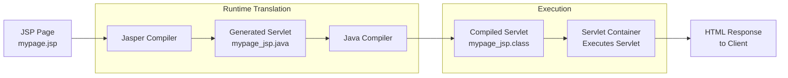

A **JavaServer Pages compiler is a program that parses JSPs and transforms them into executable Java Servlets**[^20]. The most widely used JSP compiler is **Apache Jasper**, which is embedded within the Tomcat servlet container. Jasper operates by analyzing the JSP file, extracting the static HTML content and dynamic Java elements, and generating a servlet class that produces the equivalent output. This generated servlet is then compiled using the system's Java compiler.

The compilation model includes an important **caching mechanism for performance optimization**. Each JSP servlet is cached and re-used until the original JSP is modified[^20]. This means that the translation and compilation overhead occurs only on the first request to a JSP page (or after modifications), while subsequent requests execute the pre-compiled servlet directly. This approach balances the development convenience of interpreted-style deployment with the runtime performance of compiled code.

The fundamental design philosophy of JSP centered on enabling **HTML-centric development with embedded Java capabilities**. JSP pages may also be written in fully valid XML syntax, commonly using the alternative `.jspx` file extension[^20]. This flexibility allowed organizations to choose the syntax style that best fit their development workflows and tooling requirements. The technology was designed so that web page developers could use HTML or XML tags to design the results page while using JSP tags to generate the dynamic content[^21].

A program such as the Jasper compiler is usually embedded into the application server and run automatically the first time a JSP is accessed[^20]. However, pages may also be **precompiled for better performance**, or compiled as part of the build process to test for errors[^20]. This precompilation capability became important for production deployments where the latency of first-request compilation was unacceptable.

### 2.2 JSP Syntax Elements and Dynamic Content Generation

JSP technology provides several syntactic constructs that enable developers to embed dynamic functionality within otherwise static markup. Understanding these elements is essential for comprehending both the power and the eventual problems that JSP introduced to web development.

**JSPs use several delimiters for scripting functions**[^20]. The following table summarizes the core syntactic elements:

| Syntax Element | Delimiter | Purpose | Example |
|----------------|-----------|---------|---------|
| Scriptlet | `<% ... %>` | Executes Java code when user requests the page | `<% String name = request.getParameter("name"); %>` |
| Expression | `<%= ... %>` | Evaluates expression and inserts result into output | `<%= user.getName() %>` |
| Directive | `<%@ ... %>` | Provides instructions to the JSP container | `<%@ page import="java.util.*" %>` |
| Declaration | `<%! ... %>` | Declares variables and methods at class level | `<%! private int counter = 0; %>` |

**The most basic delimiter is `<% ... %>`, which encloses a JSP scriptlet**[^20]. A scriptlet is a fragment of Java code that runs when the user requests the page. Within scriptlets, developers can write arbitrary Java code including variable declarations, control flow statements, method calls, and exception handling. This capability provided tremendous flexibility but, as will be discussed later, also enabled problematic practices.

**Expression delimiters `<%= ... %>` provide a shorthand for outputting values**. When the JSP compiler encounters an expression, the scriptlet and delimiters are replaced with the result of evaluating the expression[^20]. This mechanism simplified the common task of inserting dynamic values into HTML without requiring explicit print statements.

**Directives, denoted with `<%@ ... %>`**, provide metadata and instructions to the JSP container[^20]. The three primary directive types are:
- **Page directives** (`<%@ page ... %>`) specify page-level attributes such as import statements, error page declarations, and content type settings
- **Include directives** (`<%@ include ... %>`) incorporate the content of other files at translation time
- **Taglib directives** (`<%@ taglib ... %>`) declare custom tag libraries for use within the page

**The Web container creates JSP implicit objects** that are automatically available within any JSP page without explicit declaration[^20]. The JSP Engine creates these objects during the translation phase, making them immediately accessible to scriptlets and expressions:

| Implicit Object | Type | Purpose |
|-----------------|------|---------|
| `request` | HttpServletRequest | Access to HTTP request data and parameters |
| `response` | HttpServletResponse | Control over HTTP response generation |
| `session` | HttpSession | User session management across requests |
| `application` | ServletContext | Application-wide shared data and resources |
| `config` | ServletConfig | Servlet configuration parameters |
| `page` | Object | Reference to the current JSP page instance |
| `pageContext` | PageContext | Access to page scope and other implicit objects |
| `out` | JspWriter | Output stream for writing response content |
| `exception` | Throwable | Exception object (only in error pages) |

These implicit objects provide convenient access to the underlying servlet infrastructure without requiring developers to understand the full complexity of the Servlet API. The `pageContext` object is particularly important as it provides a unified interface for accessing all other implicit objects and managing page-scoped attributes.

**Version 2.0 of the JSP specification added support for the Expression Language (EL)**, used to access data and functions in Java objects[^20]. In JSP 2.1, it was folded into the Unified Expression Language, which is also used in JavaServer Faces[^20]. The Expression Language provided a simpler, more declarative syntax for accessing data, reducing the need for scriptlets in many common scenarios.

**The JSP syntax also supports additional tags, called JSP actions, to invoke built-in functionality**[^20]. Standard actions include `<jsp:include>` for dynamic content inclusion, `<jsp:forward>` for request forwarding, and `<jsp:useBean>` for JavaBeans integration. Additionally, the technology allows for the creation of custom JSP tag libraries that act as extensions to the standard JSP syntax[^20]. One such library is the JSTL (Jakarta Standard Tag Library), which supports common tasks that must be performed in JSPs[^20].

### 2.3 Initial Benefits and Productivity Gains

Despite the problems that would later emerge, JSP technology provided **genuine and significant advantages** over pure Servlet development when it was introduced. Understanding these benefits explains why JSP achieved widespread adoption and why the technology remained in use for many years.

**JSP technology speeds the development of dynamic web pages in a number of ways**[^21]. The most immediate benefit was the dramatic simplification of page creation for developers familiar with HTML. Rather than constructing HTML output through verbose Java print statements within Servlet code, developers could write HTML directly and embed dynamic elements only where needed. This approach was far more intuitive for web designers and significantly reduced the boilerplate code required for page generation.

The technology was designed with a clear separation principle in mind: **it separates content generation from presentation, allowing web page developers to use HTML or XML tags to design the results page and JSP tags to generate the dynamic content**[^21]. In its intended usage pattern, JSP enabled a workflow where visual designers could work on page layout and styling while Java developers focused on the dynamic content generation components.

**JSP emphasizes reusable components**, as most JSP pages rely on reusable, cross-platform components (JavaBeans or Enterprise JavaBeans components) to perform complex processing[^21]. This component-based approach encouraged modular development and code reuse, principles that remain central to modern software engineering.

Another significant productivity gain came from **simplified page development with tags**, which encapsulate functionality required for dynamic content generation in easy-to-use, JSP-specific XML tags[^21]. Rather than writing Java code for common operations, developers could use declarative tags that expressed intent more clearly and reduced the likelihood of errors.

The following comparison illustrates the productivity difference between Servlet and JSP approaches for generating a simple dynamic page:

| Aspect | Pure Servlet Approach | JSP Approach |
|--------|----------------------|--------------|
| HTML Structure | Embedded in Java strings | Written directly as HTML |
| Dynamic Values | `out.println("<p>" + value + "</p>");` | `<p><%= value %></p>` |
| Page Layout Changes | Requires Java code modification | Direct HTML editing |
| Designer Accessibility | Requires Java knowledge | HTML-familiar syntax |
| Code Volume | High boilerplate | Minimal boilerplate |

**Because the native scripting language for JSP pages is based on the Java programming language, and because all JSP pages are compiled into Java Servlets, JSP pages have all of the benefits of Java technology**, including robust memory management and security[^21]. As part of the Java platform, JSP shares the **Write Once, Run Anywhere** characteristics of the Java programming language[^21]. This portability was a significant advantage over vendor-specific solutions like ASP.

The architectural flexibility of JSP also contributed to its utility. **Jakarta Server Pages can be used independently or as the view component of a server-side model–view–controller design**, normally with JavaBeans as the model and Java servlets (or a framework such as Apache Struts) as the controller[^20]. This is a type of Model 2 architecture[^20]. This flexibility allowed JSP to be adopted incrementally and integrated into various architectural patterns.

### 2.4 The Scriptlet Problem: Business Logic in Presentation

While JSP provided powerful capabilities for dynamic page generation, the technology's flexibility became its greatest liability. The ability to embed arbitrary Java code within JSP pages led to a **widespread and deeply problematic practice**: placing complex business logic directly within presentation templates.

According to Joel Murach and Michael Urban, authors of the book "Murach's Java Servlets and JSP," **embedding Java code (scriptlets) in JSP is generally bad practice**[^20]. A better approach would be to migrate the back-end logic embedded in the JSP to the Java code in the Servlet. In this scenario, the Servlet is responsible for processing, and the JSP is responsible for displaying the HTML, maintaining a clear separation of concerns[^20].

The fundamental problem was that **embedded Java code (scriptlets) in sections of HTML documents can result in complex applications that are not efficient, and difficult to reuse, enhance, and maintain**[^22]. When developers discovered they could accomplish tasks quickly by adding scriptlets, the temptation to take shortcuts proved overwhelming. What began as simple value insertions evolved into database queries, business rule implementations, and complex conditional logic—all embedded within what should have been presentation templates.

**For advanced applications, and when more code is involved, it's important not to mix business logic with front-end presentation in the same file**[^22]. The consequences of violating this principle were severe:

1. **Presentation changes required business logic modifications**: When visual designers needed to alter page layout, they often had to navigate around or inadvertently modify Java code they didn't understand. Conversely, business logic changes required editing files that were primarily HTML, creating confusion about file ownership and responsibilities.

2. **Code became unreusable**: Business logic embedded in JSP pages could not be easily shared across multiple pages or applications. Each page became a self-contained unit with duplicated logic, violating the DRY (Don't Repeat Yourself) principle.

3. **Maintenance complexity escalated**: JSP files that mixed extensive Java code with HTML markup became difficult for both web designers and Java developers to maintain effectively. Neither group could work efficiently in files that required expertise in both domains.

4. **Testing became nearly impossible**: Business logic buried within presentation templates could not be unit tested in isolation, leading to quality issues that only surfaced in production environments.

**Separating business logic from presentation permits changes to either side without affecting the other**[^22]. This principle, while well-understood in theory, was consistently violated in practice because JSP made the violation so easy. **Production JSP code should be limited to front-end presentation**[^22], but enforcing this discipline required organizational commitment and code review processes that many teams lacked.

The scriptlet problem was particularly insidious because applications often worked correctly despite the architectural flaws. The negative consequences—maintenance burden, testing difficulties, and team coordination problems—accumulated gradually and became apparent only as applications grew and evolved over time.

### 2.5 Debugging and Troubleshooting Complexities

**Debugging a JSP is difficult because JSP and servlets involve a large amount of client/server interaction, making errors likely but hard to reproduce**[^23]. The translation layer between JSP source code and the executing servlet introduced fundamental challenges that complicated the debugging process throughout the JSP era.

The core debugging difficulty stems from the **disconnect between JSP line numbers and compiled servlet line numbers**. When an error occurs in a JSP page, the stack trace references line numbers in the generated servlet code, not the original JSP source. Developers must mentally map between the two representations, a task that becomes increasingly difficult as JSP pages grow in complexity. The generated servlet code often bears little resemblance to the original JSP structure, with HTML content converted to print statements and scriptlets reorganized according to compilation requirements.

Several debugging approaches emerged to address these challenges, each with significant limitations:

**Using System.out.println()** remains the most basic debugging technique. As described in JSP debugging documentation, **System.out.println() is easy to use as a marker to test whether a certain piece of code is being executed or not**[^23]. Since the System object is part of the core Java objects, it can be used everywhere including Servlets, JSP, RMI, EJB's, ordinary Beans and classes, and standalone applications[^23]. Compared to stopping at breakpoints, writing to System.out doesn't interfere much with the normal execution flow of the application[^23]. If using Tomcat, these lines appear appended to the end of stdout.log in the logs directory[^23]. However, this approach is primitive, requires code modification, and can clutter logs in production environments.

**The J2SE logging framework** provides a more sophisticated alternative. The framework is designed to provide logging services for any class running in the JVM, with messages sent at various levels using convenience functions: severe(), warning(), info(), config(), fine(), finer(), and finest()[^23]. Developers can also use the Log4J Framework to log messages in different files based on their severity levels and importance[^23]. While more capable than simple print statements, logging still requires code instrumentation and provides limited insight into program state.

**IDE-based debugging tools** such as NetBeans offer more powerful capabilities. NetBeans is a free and open-source Java Integrated Development Environment that supports the development of standalone Java applications and Web applications supporting the JSP and servlet specifications and includes a JSP debugger[^23]. NetBeans supports basic debugging functionalities such as Breakpoints, Stepping through code, and Watchpoints[^23]. However, debugging JSP through an IDE requires proper container integration and configuration that can be complex to establish.

**Using the JDB Debugger** provides command-line debugging capabilities. You can debug JSP and servlets with the same jdb commands you use to debug an applet or an application[^23]. To debug a JSP or servlet, you can debug sun.servlet.http.HttpServer, then observe as HttpServer executes the JSP/servlets in response to HTTP requests made from a browser[^23]. The setup process is involved: you must set your debugger's classpath to find sun.servlet.http.Http-Server and the associated classes, and also to find your JSP and support classes, typically ROOT\WEB-INF\classes[^23].

Additional debugging strategies include:

| Technique | Approach | Limitation |
|-----------|----------|------------|
| Comments | Use Java comments (// or /* */) to temporarily remove code sections to isolate problems | Requires iterative code modification |
| Header inspection | Examine raw HTTP request and response headers | Limited to protocol-level issues |
| Browser tools | Force full page reloads (Shift-Reload in Netscape, Shift-Refresh in IE) to avoid caching issues | Only addresses caching-related problems |
| Raw content view | Ask browser to show raw page content to identify formatting problems | Limited to output verification |

**Sometimes when a JSP doesn't behave as expected, it's useful to look at the raw HTTP request and response to see what exactly is going on with those headers**[^23]. This technique helps identify issues related to content type, character encoding, or caching directives, but provides no insight into application logic problems.

The cumulative effect of these debugging challenges was significant development friction. Developers spent considerable time tracing issues through multiple layers of abstraction, and the feedback loop between code changes and observable results was slower than in pure Java development.

### 2.6 Testing Challenges and Isolation Problems

The tight coupling between JSP pages and the servlet container environment created **substantial difficulties in testing JSP components**. Unlike regular Java classes that can be instantiated and tested in isolation, JSP pages require the infrastructure of a running servlet container to execute, fundamentally limiting testing approaches.

**Testing JSP pages outside the container, with no web server running, is challenging because JSPs are designed to run inside a container and depend on its facilities**[^24]. This dependency on container infrastructure meant that the standard unit testing approaches used for Java classes could not be directly applied to JSP pages. The implicit objects (request, response, session, etc.) that JSP pages rely upon are created by the container, and their absence prevents JSP execution.

The challenges of testing JSP outside containers include:

1. **Container dependency**: JSP pages expect specific runtime services that only the container provides, including request/response object creation, session management, and application context access.

2. **Complex mock object requirements**: To test JSP pages in isolation requires creating mock implementations of HttpServletRequest, HttpServletResponse, and other container-provided objects. The generated servlet code requires HttpServletRequest and HttpServletResponse instances[^24], and simulating these correctly demands significant setup effort.

3. **Translation complexity**: Testing requires first compiling JSPs into servlets, which necessitates a JSP compiler like Apache Jasper and an environment consistent with a container, including specific JAR files, a web.xml file, and a WEB-INF directory[^24].

Specialized testing tools emerged to address these challenges. **JspTest is a JUnit extension for testing JavaServer Pages outside a Servlet container**[^25]. It uses the Jasper JSP compiler from Apache Tomcat and the Java compiler distributed as part of the system's default JDK[^25]. However, such tools remained in early development stages—JspTest's project status was listed as Alpha with its last update in 2013[^25], indicating limited adoption and maintenance.

One technique for testing JSP pages involves creating comprehensive mock environments. As described in testing literature, **mock objects are created to simulate container facilities**[^24]. A MockJspFactory overrides the default JspFactory to provide a MockPageContext, which in turn supplies a MockJspWriter that captures the generated HTML[^24]. MockHttpServletRequest and MockHttpServletResponse complete the mocked environment[^24]. This approach enables testing but requires substantial infrastructure setup:

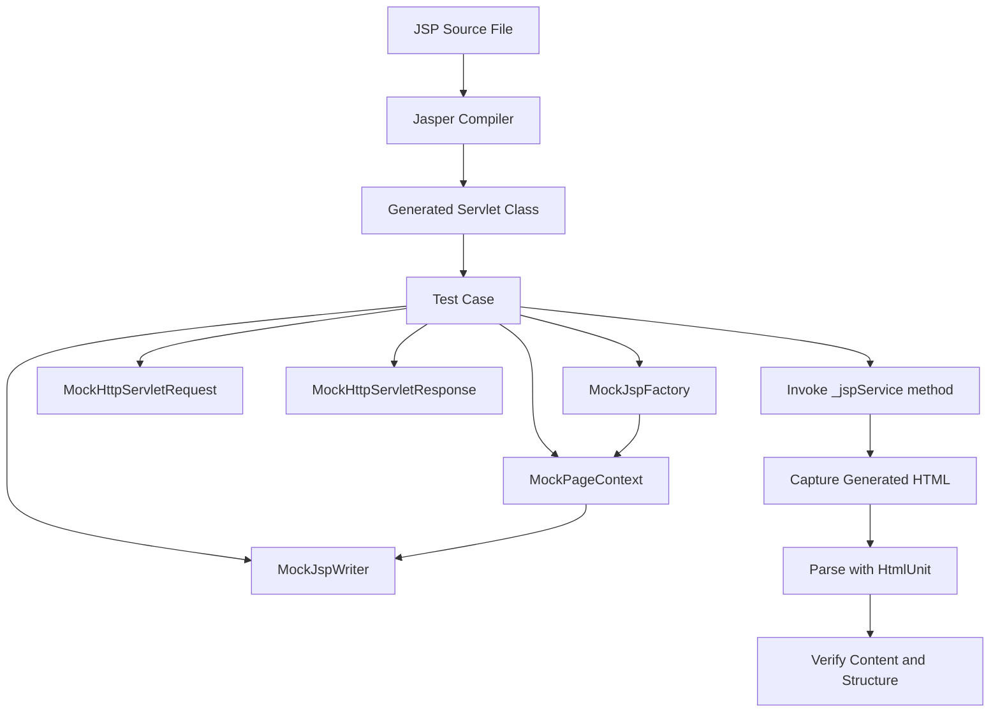

The testing process involves instantiating the compiled JSP servlet, setting up the mock objects, loading required attributes into the mock request, and invoking the `_jspService` method[^24]. The generated HTML captured by the MockJspWriter is then parsed using tools like HtmlUnit, allowing tests to inspect the HTML content and verify structure and data[^24].

**The technique allows testing static web pages or portions thereof outside a container without a webserver**[^24]. It is relatively simple to set up and extend, enabling a quick edit/compile/test loop and adherence to Test Driven Development rules[^24]. However, the advantages come with significant setup complexity that many development teams found prohibitive.

Comparative analysis of testing approaches reveals stark differences between JSP and modern frameworks:

| Testing Aspect | JSP Testing | Modern Framework Testing |
|----------------|-------------|-------------------------|
| Unit test setup | Complex mock environment required | Dependency injection simplifies mocking |
| Test coverage metrics | Difficult to achieve high coverage | Standard tooling support |
| Test execution speed | Slow due to compilation and setup | Fast isolated unit tests |
| Development workflow | Cumbersome edit/compile/test cycle | Rapid feedback loops |

Research data supports these observations. Analysis of open-source projects found that **Java+Spring MVC applications maintained over 7,000 unit tests with 63% test coverage, while PHP+Laravel applications had fewer than 1,200 unit tests with only 23% coverage**[^26]. While this comparison involves different technologies, it illustrates how framework design impacts testability. **Dependency injection and mocking capabilities help test different scenarios**, while technologies that lack these features **rely more heavily on actual deployment testing**[^26].

The testing limitations of JSP had cascading effects on code quality. Teams that could not effectively test their JSP pages relied on manual testing and production monitoring to catch errors, leading to longer defect discovery cycles and reduced confidence in code changes.

### 2.7 Toward Better Practices: MVC and Tag Libraries

The problems inherent in scriptlet-heavy JSP development did not go unrecognized by the Java community. A series of best practices, architectural patterns, and technology enhancements emerged to address these challenges while preserving JSP's benefits for view rendering.

**Java Servlet technology and JavaServer Pages (JSP pages) are server-side technologies that have dominated the server-side Java technology market. If used effectively by following best practices, servlets and JSP pages help separate presentation from content**[^22]. The key phrase is "if used effectively"—the technology itself did not enforce good practices, but the community developed patterns that did.

**One best practice that combines and integrates the use of servlets and JSP pages is the Model View Controller (MVC) design pattern**[^27]. The JSP specification presents two approaches for building web applications using JSP pages: JSP Model 1 and Model 2 architectures[^27]. The distinction between these models is fundamental:

- **Model 1 Architecture**: JSP pages handle both request processing and presentation, leading to the scriptlet problems discussed earlier.
- **Model 2 Architecture**: Integrates the use of both servlets and JSP pages, with clear separation of responsibilities.

**The Model 2 architecture integrates the use of both servlets and JSP pages. In this mode, JSP pages are used for the presentation layer, and servlets for processing tasks**[^27]. The servlet acts as a controller responsible for processing requests and creating any beans needed by the JSP page[^22]. The controller is also responsible for deciding to which JSP page to forward the request[^27]. The JSP page retrieves objects created by the servlet and extracts dynamic content for insertion within a template[^27].

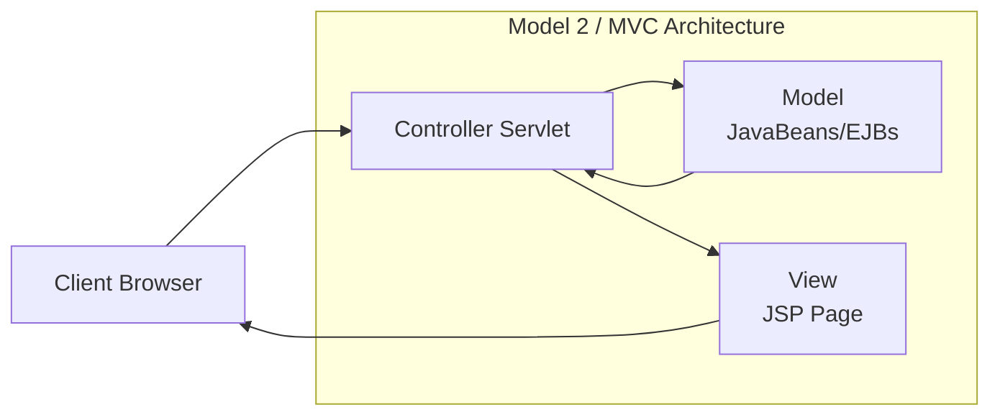

**This model promotes the use of the Model View Controller (MVC) architectural style design pattern, which truly separates presentation from content**[^27]. Several frameworks already exist that implement this useful design pattern, such as **Apache Struts, which is a formalized framework for MVC**[^27]. This framework is best used for complex applications where a single request or form submission can result in substantially different-looking results[^27].

**JavaBeans technology** provided the mechanism for encapsulating business logic outside of JSP pages. JavaBeans technology is a portable, platform-independent component model[^22]. In the context of JSP pages, JavaBeans components contain business logic that returns data to a script on a JSP page, which in turn formats the data returned from the JavaBeans component for display by the browser[^22]. **The benefits of using JavaBeans components to augment JSP pages are reusable components and separation of business logic and presentation logic**, meaning web page designers can focus on presentation and Java developers can focus on business logic[^22].

**Custom tag libraries** offered another solution to the scriptlet problem. JSP technology allows you to introduce new custom tags through the tag library facility[^22]. **Custom tags allow you to provide better packaging by improving the separation between business logic and presentation logic**[^27]. The benefits of custom tags include:

| Benefit | Description |
|---------|-------------|
| Scriptlet elimination | Custom tags can eliminate scriptlets in JSP applications[^27] |
| Simpler syntax | Tags have simpler HTML-like syntax that designers understand[^27] |
| Improved productivity | Custom tags improve the productivity of non-programmer content developers[^27] |
| Reusability | Tags are reusable across multiple pages and applications[^27] |

**The JavaServer Pages Standard Tag Library (JSTL) provides a set of reusable standard tags**, including tags for looping and iterating over data structures, which avoids the need for scriptlets[^27]. Rather than reinventing common functionality, developers could use standardized, well-tested tags for routine operations.

**The JSTL Expression Language (EL)** further reduced the need for Java code in JSP pages. An expression language is designed for page authors and promotes JSP scoped attributes as the standard way to communicate information from business logic to JSP pages[^27]. **It is a data access language that makes it possible to easily access application data without using scriptlets**[^27]. EL provided a cleaner, more declarative syntax for accessing data that was easier for non-programmers to understand and use correctly.

These best practices represented the Java community's attempt to salvage JSP's benefits while mitigating its problems. However, they required discipline and organizational commitment to implement consistently. The patterns were advisory rather than enforced, and many development teams continued to produce scriptlet-heavy applications despite the availability of better alternatives.

The emergence of these practices set the stage for the next evolution in Java web development. The recognition that **separation of concerns** was essential, combined with the difficulty of enforcing this separation through conventions alone, created demand for frameworks that would make good architecture the path of least resistance. This demand would be answered by the Spring Framework in 2003, which introduced Inversion of Control and Dependency Injection as foundational principles, fundamentally changing how Java web applications were structured and developed.

## 3 The Spring Framework Revolution: Solving Structural Problems

This chapter investigates Rod Johnson's creation of the Spring Framework in 2003 as a direct response to the complexity of J2EE and the architectural problems inherent in Servlet/JSP development. The analysis examines how Spring emerged from Johnson's critical assessment of enterprise Java, introduced revolutionary concepts including Inversion of Control and Dependency Injection, and enabled clean architectural patterns such as Controller-Service-Repository. The chapter also critically evaluates the new challenges Spring introduced, particularly extensive XML configuration requirements and a steep learning curve, establishing the context for Spring Boot's eventual emergence.

### 3.1 Origins and Motivations Behind Spring Framework

The Spring Framework emerged from a period of growing frustration within the Java development community regarding the complexity and heaviness of enterprise Java development. During the **2001-2002 period**, Rod Johnson, an experienced software engineer who had been an early adopter of Java and J2EE, recognized a fundamental need to simplify the enterprise development experience after working extensively with these technologies[^28]. His firsthand experience with J2EE code already in production for **FT.com and other financial systems** provided him with deep insight into the practical challenges developers faced daily[^28].

Johnson's credentials positioned him uniquely to address these problems. He was a member of the **JSR 154 Expert Group defining the Servlet 2.4 specification**, had contributed chapters to books on server programming including *Professional Java Server Programming* and *Professional Java Server Pages*, and was an active speaker at international conferences[^28]. This combination of theoretical knowledge and practical production experience informed his critical perspective on enterprise Java development.

In **October 2002**, Johnson published his seminal book ***Expert One-on-One J2EE Design and Development***, which offered a critical analysis of J2EE and proposed practical solutions to the challenges developers faced[^29]. The book was not merely theoretical—Johnson supplemented it with **thirty thousand lines of infrastructure code**, which he packaged with `com.interface21` naming, conceptualizing it as a simpler, **21st-century interface to programming**[^28]. Reports indicate that Johnson dedicated nine months without a paycheck to complete this foundational work[^28].

The specific problems with traditional J2EE development that motivated Spring's creation were substantial and well-documented:

| J2EE Problem | Impact on Development | Spring's Response |
|--------------|----------------------|-------------------|
| Complex EJB component model | High barrier to entry, excessive boilerplate | POJO-based development |
| Excessive XML configuration | Time-consuming setup, error-prone | Simplified configuration model |
| Difficult unit testing | Slow feedback cycles, quality issues | Container-independent testing |
| Tight coupling to application servers | Limited portability, vendor lock-in | Application server independence |
| Distribution built into basic component model | Unnecessary complexity for most applications | Modular, optional features |

As characterized in contemporary analyses, J2EE was **"heavy, complex, and overly bureaucratic"**[^29]. The EJB component model was criticized for being designed for distributed, transactional applications, yet **distribution should not be built into the basic component model** for the majority of applications that did not require it[^30]. This forced complexity onto developers building relatively straightforward applications.

The transformation from Johnson's book code to an open-source framework happened rapidly. When Johnson published his book, he was active on Wrox forums where **Juergen Hoeller and Yann Caroff** reached out to him, proposing that the code be released as open source[^28]. Juergen offered to co-lead the project, bringing technical expertise that would prove essential to Spring's development. Yann Caroff coined the name **"Spring"**, symbolizing a new beginning after what he termed the **"harsh J2EE winter"**[^28]—a metaphor that captured the community's sentiment about the state of enterprise Java development.

The project named "Spring Framework" was formally established in **February 2003**, with Johnson, Hoeller, and Caroff as co-founders[^28]. The team expanded quickly, with **Alef Arendsen, Thomas Risberg, and Colin Sampaleanu** joining in early 2003[^28]. **Spring 0.9 was released under the Apache 2.0 license in June 2003**[^31], and the first production version followed in **March 2004**[^31].

Johnson's vision extended beyond merely reducing J2EE complexity. He aimed to create a tool that was **modular, application server independent, and simple**[^29]. The framework's design philosophy centered on the principle that **the essence of Spring is in providing enterprise services to Plain Old Java Objects (POJOs)**[^30]. This approach was valuable in J2EE environments, but critically, **application code delivered as POJOs is naturally reusable in a variety of runtime environments**, breaking the tight coupling to specific containers that characterized previous approaches.

The founding of Interface21 as a company, reportedly in **August 2004**, provided commercial backing for consulting, training, and support services[^28]. This dual open-source/commercial model would prove influential in sustaining the framework's development while keeping the core freely available.

### 3.2 Inversion of Control and Dependency Injection Principles

At the heart of Spring Framework lie two revolutionary concepts that fundamentally transformed how Java applications are structured: **Inversion of Control (IoC)** and **Dependency Injection (DI)**. These ideas, which Johnson introduced in his book and subsequently implemented in Spring, represent a paradigm shift in software design that promotes loose coupling, modularity, and testability[^29].

**Inversion of Control is a design principle that transfers the control of objects or portions of a program to a container or framework**[^32]. In traditional programming, application code directly controls the flow of execution and object creation. IoC inverts this relationship—the framework takes control of the flow of a program and makes calls to custom code rather than custom code calling the framework. This inversion enables **decoupling the execution of a task from its implementation**, making it easier to switch between different implementations, achieve greater modularity, and simplify testing[^32].

The IoC principle can be understood through the contrast between traditional and IoC-based approaches:

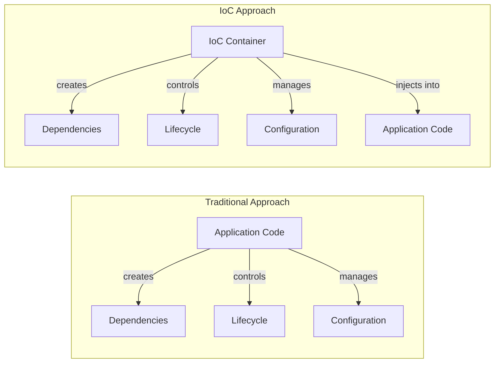

**Inversion of Control involves providing a callback or reaction to events that may occur in a system**[^33]. Rather than directly executing certain logic, IoC allows developers to invert control by defining callbacks that are triggered when specific events take place. This pattern enables separation of the **"what" from the "when"** in system design, minimizing dependencies and simplifying overall architecture.

**Dependency Injection is a pattern used to implement IoC, where the control being inverted is specifically the setting of an object's dependencies**[^32]. Rather than objects creating or locating their own dependencies, an assembler (the IoC container) connects objects with other objects. This externalization of dependency management is the practical mechanism through which IoC achieves its benefits.

The Spring Framework provides several implementations of dependency injection, each suited to different scenarios:

| DI Type | Mechanism | Best Use Case | Recommendation |
|---------|-----------|---------------|----------------|
| **Constructor-based** | Dependencies provided through class constructor | Mandatory dependencies | Recommended by Spring documentation |
| **Setter-based** | Dependencies set using setter methods | Optional dependencies | Appropriate for optional configurations |
| **Field-based** | Dependencies injected via @Autowired on fields | Quick prototyping | Not recommended for production |

**For constructor-based dependency injection, the container invokes a constructor with arguments, each representing a dependency**[^32]. Spring resolves each argument primarily by type, followed by the name of the attribute and index for disambiguation. This approach ensures that objects are fully initialized upon creation and makes dependencies explicit in the class API.

**For setter-based dependency injection, the container calls setter methods of the class after invoking a no-argument constructor or static factory method**[^32]. This approach allows for optional dependencies and enables reconfiguration of objects after creation. The Spring documentation recommends **using constructor-based injection for mandatory dependencies and setter-based injection for optional ones**[^32].

**Field-based dependency injection** marks dependencies with an `@Autowired` annotation, and the container uses reflection to inject the dependency[^32]. However, this approach is **not recommended** because it uses costlier reflection mechanisms and can violate the Single Responsibility Principle by making it easy to add multiple dependencies without the design friction that constructor parameters provide.

The Spring IoC container is represented by the **`ApplicationContext` interface**, which is responsible for instantiating, configuring, and assembling objects known as **beans**, as well as managing their lifecycles[^32]. The `org.springframework.beans` and `org.springframework.context` packages provide the foundation for Spring's IoC container[^33]. The **`BeanFactory` interface** provides an advanced configuration mechanism capable of managing objects of any nature.

The container uses **configuration metadata** to assemble beans, which can be provided through:
- **XML configuration files** (traditional approach)
- **Java annotations** (modern approach using `@Configuration`, `@Bean`, `@Component`)
- **Java code** (programmatic configuration)

Spring provides several implementations of the `ApplicationContext` interface suited to different deployment scenarios:
- **`AnnotationConfigApplicationContext`** for annotation-based standalone applications
- **`ClassPathXmlApplicationContext`** for XML-based configuration loaded from classpath
- **`FileSystemXmlApplicationContext`** for XML-based configuration loaded from filesystem
- **`WebApplicationContext`** for web applications[^32]

The advantages of this architecture extend across multiple dimensions:

1. **Decoupling**: Components depend on abstractions (interfaces) rather than concrete implementations, enabling substitution without code changes.

2. **Modularity**: Each module can focus on what it is designed for, making no assumptions about what other systems do but relying only on their contracts[^33].

3. **Testability**: Dependencies can be easily mocked or stubbed in unit tests, enabling isolated testing of components.

4. **Flexibility**: Replacing modules has no side effect on other modules when they communicate through well-defined interfaces[^33].

**Autowiring** allows the Spring container to automatically resolve dependencies between collaborating beans. Four modes of autowiring exist when using XML configuration: **no** (default, explicit wiring required), **byName** (matches by property name), **byType** (matches by property type), and **constructor** (similar to byType but for constructor arguments)[^32]. The `@Autowired` annotation enables autowiring by type, and the `@Qualifier` annotation can reference a bean by name when multiple beans of the same type exist.

The IoC container also supports **lazy initialization** through the `lazy-init` attribute. By default, the container creates and configures all singleton beans during initialization. Setting `lazy-init="true"` causes the bean to be initialized only when first requested, which can improve application startup time for beans that are not immediately needed[^32].

### 3.3 Controller-Service-Repository Architecture Pattern

Spring's IoC and DI capabilities enabled the emergence of the **Controller-Service-Repository** architectural pattern as a standard for organizing enterprise applications. This pattern, which became **prevalent in many Spring Boot applications**, provides a clear separation of concerns that directly addresses the structural problems identified in earlier Servlet/JSP development[^34].

The pattern organizes application code into three distinct layers, each with well-defined responsibilities:

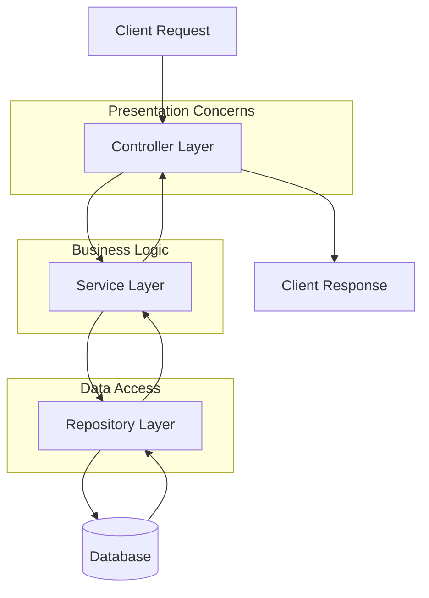

**The Controller layer, positioned at the top of the structure, is exclusively responsible for exposing functionality to be consumed by external entities**[^34]. Controllers handle HTTP request/response processing, input validation, and the transformation of data between external formats and internal domain objects. They serve as the entry point for client interactions but should contain minimal business logic.

**The Service layer contains all business logic**[^34]. Services encapsulate the core functionality of the application, implementing business rules, orchestrating operations across multiple repositories, and managing transaction boundaries. When business logic needs to get or save data, it connects to a repository; when external entities want to access business logic, they do so through the controller.

**The Repository layer, positioned at the bottom, is responsible for storing and retrieving data**[^34]. Repositories abstract the details of data persistence, whether the underlying storage is a relational database, NoSQL store, or external service. This abstraction allows the service layer to work with domain objects without concerning itself with storage mechanics.

The **clarity of this separation** provides significant architectural benefits:

| Layer | Responsibility | Does Not Care About |
|-------|---------------|---------------------|
| Controller | Exposing functionality, handling HTTP | How business logic is implemented |
| Service | Business logic execution | How it is accessed or how data is stored |
| Repository | Data storage and retrieval | Which component calls it |

**This separation of concerns becomes particularly valuable in unit testing**[^34]. By clearly separating concerns, developers can mock adjacent layers and focus exclusively on testing the specific layer's concerns. Controller tests verify response codes and values by mocking the service layer to trigger specific conditions. Service layer tests can be conducted as pure POJO tests—by mocking repository conditions, all business logic can be tested without going through the controller layer.

Consider how this architecture addresses the problems identified in JSP development. Where JSP pages often mixed data access code, business logic, and presentation in a single file, the Controller-Service-Repository pattern enforces separation:

- **Storage/retrieval code** belongs exclusively in the repository
- **Functionality exposure code** belongs in the controller
- **Unique business logic** belongs in the service layer[^34]

This organization provides clear guidance for where new code should be placed, reducing architectural ambiguity that plagued earlier development approaches.

Spring provides specific annotations to mark classes belonging to each layer:

| Annotation | Layer | Purpose |
|------------|-------|---------|
| `@Controller` / `@RestController` | Presentation | Marks classes handling HTTP requests |
| `@Service` | Business Logic | Marks classes containing business logic |
| `@Repository` | Data Access | Marks classes managing data persistence |

These stereotype annotations serve dual purposes: they enable Spring's component scanning to automatically detect and register beans, and they communicate architectural intent to developers reading the code. The `@Repository` annotation additionally enables automatic translation of persistence-specific exceptions into Spring's consistent exception hierarchy.

The pattern supports **domain-driven design approaches** as well. One perspective divides the architecture into four layers: the presentation layer (`@Controller`) responsible for presenting business functionality, the application service layer (`@Service`) representing business use cases and setting transaction boundaries, the domain layer containing business logic (models, domain services with `@Service`, and repositories with `@Repository`), and the infrastructure layer handling infrastructure-related implementations[^35].

The Controller-Service-Repository pattern also facilitates both monolithic and microservices architectures. In monolithic applications, the layers exist within a single deployment unit. In microservices architectures, each service can follow this pattern internally while communicating with other services through well-defined APIs at the controller level.

### 3.4 POJO-Based Development and Testability Improvements

A fundamental design principle of the Spring Framework is its emphasis on **Plain Old Java Objects (POJOs)** as the foundation for enterprise application development. This approach represented a dramatic departure from the heavy infrastructure requirements of J2EE and EJB, where business objects had to extend framework-specific classes or implement framework-specific interfaces.

**The essence of Spring is in providing enterprise services to Plain Old Java Objects**[^30]. This philosophy means that application code can be written as standard Java classes without any dependency on Spring-specific APIs or annotations (though annotations are commonly used for convenience). The practical implications of this design choice are profound:

1. **Framework Independence**: Application code delivered as POJOs is naturally reusable in a variety of runtime environments[^30]. Business logic implemented in POJOs can be tested, reused, or even deployed in non-Spring contexts without modification.

2. **Reduced Complexity**: Unlike EJB, where even simple components required implementing specific interfaces and adhering to complex contracts, Spring allows developers to focus on business logic rather than framework requirements.

3. **Natural Testability**: POJO classes can be tested without being tied to the framework[^30], enabling straightforward unit testing with standard testing tools.

The contrast between traditional J2EE/EJB development and Spring's POJO-based approach illustrates the magnitude of this improvement:

| Aspect | Traditional J2EE/EJB | Spring POJO Approach |
|--------|---------------------|---------------------|
| Class requirements | Must extend/implement framework classes | Standard Java classes |
| Container dependency | Requires running container for testing | Testable in isolation |
| Deployment complexity | Complex deployment descriptors | Simplified configuration |
| Code portability | Tied to specific container | Runtime environment independent |
| Learning curve | Must learn framework APIs | Focus on Java fundamentals |

**Spring aims to take away problems by simplifying the programming model, rather than concealing complexity behind a complex layer of tools**[^30]. This philosophy stands in contrast to the J2EE ecosystem's response to complexity, which was often to provide tool support (such as code generation tools) to catch up with J2EE specifications. Spring's approach was more fundamental—eliminate the source of complexity rather than manage it.

The testability improvements enabled by POJO-based development directly addressed the testing challenges identified in JSP development. Where JSP pages required complex mock environments and container infrastructure to test, Spring's approach enables:

- **Unit testing without containers**: Business logic in POJOs can be instantiated and tested with standard JUnit tests, no servlet container required.
- **Dependency mocking**: Because dependencies are injected rather than created internally, test doubles can be easily substituted.
- **Test-Driven Development (TDD)**: The rapid feedback loop essential to TDD becomes practical when tests run in milliseconds rather than requiring container startup.

**Wiring of components through Dependency Injection** and **design to interfaces** are key enablers of this testability[^30]. When classes depend on interfaces rather than concrete implementations, mock implementations can be injected during testing to verify behavior under controlled conditions.

The Spring Framework's support for **Test-Driven Development (TDD)** was explicitly part of its design goals[^30]. The framework was created with the understanding that testability is not an afterthought but a fundamental architectural requirement. This stands in stark contrast to the Servlet/JSP era, where testing was difficult by design.

Research on open-source projects demonstrates the practical impact of these design choices. Studies comparing applications built with different frameworks found that **dependency injection and mocking capabilities help test different scenarios** effectively. Applications built with frameworks supporting these patterns maintained significantly higher test coverage—over **63% test coverage with more than 7,000 unit tests** in analyzed Java Spring MVC applications—compared to technologies lacking these features, which relied more heavily on actual deployment testing.

The POJO-based approach also enabled **declarative programming through Aspect-Oriented Programming (AOP)**[^30]. Cross-cutting concerns such as transaction management, security, and logging could be applied declaratively to POJOs without modifying business logic code. This separation further enhanced testability by isolating concerns and reducing the code paths that needed testing.

### 3.5 XML Configuration Complexity and Learning Curve Challenges

Despite solving many fundamental problems with J2EE development, the Spring Framework introduced its own set of challenges that would eventually motivate further evolution. The most significant of these were **extensive XML configuration requirements** and a **steep learning curve** that presented barriers to adoption and productivity.

**In earlier versions of the Spring Framework, developers had to write a lot of configuration code to get their applications up and running**[^36]. This configuration was typically done in XML files, where developers had to **manually define each bean (component) and its dependencies**. For any non-trivial application, this resulted in large, complex configuration files that were themselves a source of errors and maintenance burden.

The XML configuration challenge manifested in several ways:

| Challenge | Description | Impact |
|-----------|-------------|--------|
| Verbosity | Every bean required explicit declaration with class, id, and dependencies | Large configuration files, difficult to read |
| Error-prone | XML syntax errors discovered only at runtime | Slow feedback cycles |
| Maintenance burden | Changes to class names or packages required XML updates | Refactoring friction |
| Lack of type safety | No compile-time validation of bean references | Runtime failures |

Consider the contrast between XML-based and annotation-based configuration for a simple service:

**XML Configuration Approach:**
```xml
<bean id="userService" class="com.example.UserService">
    <property name="userRepository" ref="userRepository"/>
</bean>
<bean id="userRepository" class="com.example.UserRepositoryImpl">
    <property name="dataSource" ref="dataSource"/>
</bean>
```

**Annotation-Based Approach:**
```java
@Service
public class UserService {
    @Autowired
    private UserRepository userRepository;
}
```

**Even after Spring introduced annotations (like `@Autowired` and `@Component`), allowing developers to reduce their reliance on XML, configuration could still become complex as applications grew in scale**[^36]. Large enterprise applications might have hundreds of beans, each with multiple dependencies, resulting in configuration files that were difficult to navigate, understand, and maintain.

The **learning curve** presented another significant barrier. **Working with Spring when compared with Spring Boot is more difficult. It necessitates a great deal of knowledge. The learning curve is also steep, making it difficult to learn if you don't have a lot of development experience**[^37]. Developers needed to understand:

- The IoC container and bean lifecycle
- Multiple configuration approaches (XML, annotations, Java configuration)
- Bean scopes and their implications
- AOP concepts and proxy mechanisms
- Integration patterns for various technologies

This complexity was not merely academic—it had practical consequences for project timelines and team productivity. **Creating a Spring application necessitated a large amount of XML configuration**[^37], and even experienced developers spent significant time on infrastructure setup rather than business logic implementation.

The Spring Framework's **extensive ecosystem** compounded the learning challenge. While the modular architecture was a strength—allowing developers to use only the components they needed—it also meant understanding how various modules interacted:

| Spring Module | Purpose | Configuration Requirements |
|--------------|---------|---------------------------|
| Spring Core | IoC and DI foundation | Bean definitions, component scanning |
| Spring MVC | Web application framework | Dispatcher servlet, view resolvers, handler mappings |
| Spring Data | Database access abstraction | Data source, entity manager, repository configuration |
| Spring Security | Authentication and authorization | Security filters, authentication providers |
| Spring AOP | Aspect-oriented programming | Aspect definitions, pointcut expressions |

**The complexity that emerged as applications scaled** was particularly problematic. Initial configuration might be manageable, but as applications grew, the configuration burden grew disproportionately. Teams found themselves spending increasing amounts of time managing configuration rather than developing features.

These challenges set the stage for significant evolution within the Spring ecosystem. The introduction of **annotation-based configuration** in Spring 2.5 reduced XML requirements substantially, and **Java-based configuration** (using `@Configuration` and `@Bean` annotations) provided type-safe alternatives to XML. However, the fundamental complexity remained—developers still needed to understand and configure many moving parts.

The problems with Spring Framework configuration would ultimately be addressed by **Spring Boot**, which embraced a **"convention over configuration"** philosophy to eliminate most manual setup[^38]. Where early Spring required developers to explicitly configure everything, Spring Boot would make reasonable assumptions based on classpath contents and automatically configure applications accordingly. This evolution represented the natural progression from "make it possible" (Servlets) to "make it structured" (Spring Framework) to "make it simple" (Spring Boot).

The Spring Framework's challenges should be understood in context: despite the configuration complexity, Spring represented a massive improvement over J2EE alternatives. The framework **made Java development easier and more productive**[^39], introduced revolutionary architectural concepts, and established patterns that remain foundational to modern Java development. The XML configuration burden and learning curve were acceptable trade-offs for the benefits Spring provided—but they were trade-offs nonetheless, and addressing them would become the mission of Spring Boot a decade later.

## 4 Core Spring Framework Functionalities and Architectural Principles

This chapter provides an in-depth examination of Spring's core functionalities that form the foundation of modern Java development. The analysis covers Dependency Injection mechanisms and their impact on code testability and maintainability, Aspect-Oriented Programming for handling cross-cutting concerns, and the modular architecture enabling integration with various technologies. The chapter examines Spring's ecosystem components including Spring MVC, Spring Data, and Spring Security, demonstrating how they work together to provide a comprehensive development platform that addresses the structural problems identified in earlier Servlet/JSP development.

### 4.1 Dependency Injection Mechanisms and Implementation Patterns

Dependency Injection (DI) represents the practical implementation of Inversion of Control in the Spring Framework, fundamentally transforming how Java applications manage object dependencies. **DI is a design pattern that implements Inversion of Control (IoC), where the creation and management of dependencies are handled externally instead of within the class itself**[^40]. This externalization of dependency management addresses the tight coupling problems that plagued earlier Servlet-based development, where classes directly instantiated their dependencies, making code difficult to test and maintain.

The Spring Framework provides three primary mechanisms for injecting dependencies, each suited to different scenarios and carrying distinct implications for code quality:

| Injection Type | Mechanism | Immutability | Testability | Recommended Use |
|----------------|-----------|--------------|-------------|-----------------|
| **Constructor Injection** | Dependencies passed through class constructor | Creates immutable objects | Excellent—objects created directly with mock dependencies | Mandatory dependencies |
| **Setter Injection** | Dependencies provided through setter methods | Creates mutable objects | Requires framework or manual setter calls | Optional dependencies |
| **Field Injection** | Dependencies injected via @Autowired on fields | Mutable | Difficult—dependencies only injectable by framework | Not recommended |

**Constructor Injection** is the method where dependencies are passed through the class constructor, ensuring that dependencies are available at object creation[^40]. This approach offers several compelling advantages that make it the recommended choice for mandatory dependencies. First, it **ensures immutability of dependencies**—once an object is constructed, its dependencies cannot be changed, preventing subtle bugs caused by dependency modification during object lifetime. Second, it **enhances testability by explicitly requiring dependencies**, allowing objects to be created directly with mock dependencies in unit tests without requiring framework intervention[^40]. Third, it **clearly defines required dependencies at object creation**, making the class API explicit about what it needs to function correctly.

**Setter Injection** allows dependencies to be provided through setter methods, making them optional and modifiable[^40]. This approach has its place in Spring applications, particularly when dealing with dependencies that may change after object creation or when dependencies are truly optional. The flexibility of setter injection allows for reconfiguration of objects at runtime, which can be valuable in certain scenarios. However, this flexibility comes at the cost of mutability—dependencies can be modified after creation, potentially leading to inconsistent object states if not carefully managed.

**Field Injection**, while convenient for rapid prototyping, is **not recommended due to testability issues**[^40]. When dependencies are injected directly into fields using the `@Autowired` annotation, they can only be set by the Spring framework itself through reflection. This makes unit testing significantly more difficult because test code cannot easily substitute mock implementations without involving the Spring container. Additionally, field injection obscures the class's dependencies—they are not visible in the constructor signature, making it harder to understand what a class requires to function.

The practical impact of choosing the right injection approach extends beyond theoretical concerns. **Directly created dependencies make unit testing difficult. DI allows injecting mock objects for testing individual components**[^41]. Consider the difference in testability:

```java
// Without DI - Tight coupling, difficult to test
public class OrderService {
    private PaymentProcessor processor = new PaymentProcessor(); // Hard-coded dependency
    
    public void processOrder(Order order) {
        processor.process(order.getPayment());
    }
}

// With Constructor DI - Loose coupling, easily testable
public class OrderService {
    private final PaymentProcessor processor;
    
    @Autowired
    public OrderService(PaymentProcessor processor) {
        this.processor = processor;
    }
    
    public void processOrder(Order order) {
        processor.process(order.getPayment());
    }
}
```

In the first example, testing the `OrderService` requires using the actual `PaymentProcessor`, making it impossible to isolate the service's logic. In the second example, a mock `PaymentProcessor` can be injected during testing, enabling focused verification of the `OrderService`'s behavior.

**Updating or replacing a dependency requires changes in multiple classes when dependencies are created directly. DI centralizes dependency management in the Spring container, simplifying maintenance**[^41]. This centralization means that when a dependency implementation changes—perhaps switching from one payment processor to another—the change needs to occur only in the Spring configuration, not throughout the codebase wherever the dependency is used.

The **@Autowired annotation** enables automatic dependency injection, with Spring automatically resolving dependencies by type[^40]. When multiple beans of the same type exist, the **@Qualifier annotation** can be used to specify which bean should be injected by name. This combination provides flexibility in dependency resolution while maintaining the benefits of type-safe injection.

Spring also supports **lazy initialization** of dependencies, where beans are created only when first requested rather than at application startup. This capability can improve application startup time for beans that are not immediately needed, though it should be used judiciously as it can delay the discovery of configuration errors.

A challenge that developers must be aware of is **circular dependencies**, which occur when two beans depend on each other—if bean A references bean B, and bean B references bean A, a circular dependency exists[^40]. Spring can resolve certain circular dependencies using setter injection, but **they should generally be avoided** as they often indicate design problems. The recommended approach is to refactor the code to eliminate the circular relationship, perhaps by extracting shared functionality into a third component.

The benefits of Dependency Injection in Spring applications are substantial and well-documented: **loose coupling** reduces tight dependency between components and improves flexibility; **enhanced testability** means dependencies can be easily mocked, making unit testing more effective; **improved maintainability** ensures changes in dependencies do not require modifying dependent classes; **centralized configuration** means dependencies are managed centrally by Spring's IoC container; and **efficient lifecycle management** allows Spring to control object lifecycle, reducing memory management overhead[^40].

### 4.2 Aspect-Oriented Programming for Cross-Cutting Concerns

**Cross-cutting concerns are parts of a program that rely on or must affect many other parts of the system**, including aspects like logging, monitoring, and security[^42]. These concerns present a fundamental challenge in object-oriented design because they **cannot fit nicely into a single part of the system**, and implementing them by repeating the same code everywhere is bad practice[^42]. Spring AOP (Aspect-Oriented Programming) provides a powerful solution to this challenge, enabling the modularization of concerns that would otherwise be scattered throughout the codebase.

The problem of cross-cutting concerns becomes apparent when considering how logging, for example, might be implemented without AOP. A naive approach would involve adding logging code directly to each controller method, service method, and repository method that requires it. This approach leads to:

- **Code duplication** across potentially hundreds of methods
- **Maintenance burden** when logging requirements change
- **Violation of Single Responsibility Principle** as business methods become cluttered with infrastructure concerns
- **Difficulty in ensuring consistent implementation** across the application

**Spring AOP allows modularization of cross-cutting concerns such as logging, transaction management, and security**[^43]. It **separates these concerns from the main business logic**, enabling developers to write cleaner, more focused code while still having these capabilities applied consistently across the application.

The key concepts in Spring AOP form a vocabulary essential for understanding and implementing aspect-oriented solutions:

| AOP Concept | Definition | Purpose |
|-------------|------------|---------|
| **Aspect** | A modularization of a cross-cutting concern | Contains advice and pointcuts defining when and what to execute |
| **Join Point** | A point during program execution | Represents method execution or exception handling where advice can be applied |
| **Pointcut** | A predicate that matches join points | Defines where advice should be applied |
| **Advice** | Action taken at a particular join point | The actual code that executes (before, after, or around) |
| **Target Object** | The object being advised | The business object whose methods are intercepted |

Spring AOP supports several types of advice, each executing at different points relative to the join point:

- **@Before advice** executes before the join point method
- **@After advice** executes after the join point method (regardless of outcome)
- **@AfterReturning advice** executes after successful method return
- **@AfterThrowing advice** executes if method throws an exception
- **@Around advice** surrounds the method execution, controlling whether and how the method executes

The practical implementation of AOP in Spring involves creating aspects that define both what should happen and when it should happen. **To implement request logging using AOP in Spring, you can create a custom annotation and an aspect that executes on methods annotated with this annotation**[^42]. The following diagram illustrates how an AOP-based logging solution operates:

```mermaid
flowchart TD
    A[Client Request] --> B[Spring AOP Proxy]
    B --> C{Pointcut Match?}
    C -->|Yes| D[@Before Advice<br/>Log Request Details]
    C -->|No| E[Target Method]
    D --> E
    E --> F{Method Success?}
    F -->|Yes| G[@AfterReturning Advice<br/>Log Success]
    F -->|No| H[@AfterThrowing Advice<br/>Log Exception]
    G --> I[Response to Client]
    H --> I
```

A concrete implementation might define a custom annotation `@LogRequest` with `@Retention(RetentionPolicy.RUNTIME)` and `@Target({ElementType.METHOD})`[^42]. The aspect class is annotated with `@Aspect` and `@Component`, and it defines a pointcut using `@Pointcut("@annotation(com.example.demo.LogRequest)")`[^42]. The `@Before` advice can then log the authenticated user, method name, and request parameters by retrieving authentication from `SecurityContextHolder` and method details from the `JoinPoint`[^42].

**This approach allows logging to be applied modularly by simply adding the `@LogRequest` annotation to methods**[^42]. Developers no longer need to write logging code in every method—they simply annotate the methods that require logging. Furthermore, **it is also possible to use existing annotations, such as `@PostMapping`, to define a pointcut**, ensuring that every method with that annotation is logged without requiring developers to remember to add a custom annotation[^42].

The benefits of using AOP for cross-cutting concerns extend beyond simple code reduction:

1. **Separation of concerns**: Business logic remains focused on business requirements, while infrastructure concerns are handled separately in aspects.

2. **Consistency**: Cross-cutting behavior is implemented once and applied uniformly across all matching join points.

3. **Maintainability**: Changes to cross-cutting behavior require modifications only to the aspect, not to every method that uses the behavior.

4. **Non-invasive modification**: Existing business logic code does not need to be modified to add cross-cutting functionality—the aspect intercepts method calls transparently.

**Spring AOP is a powerful tool for handling cross-cutting concerns, making code more maintainable and modular**[^42]. This capability directly addresses the code organization problems identified in earlier development approaches, where concerns like logging and security were often intermingled with business logic throughout the codebase.

### 4.3 Spring's Modular Architecture and Framework Design

**Spring Framework is divided into modules, and applications can choose which modules they need**[^44]. This modular architecture represents a deliberate design philosophy that contrasts sharply with the monolithic nature of earlier enterprise Java frameworks, enabling developers to include only the components necessary for their specific requirements while avoiding unnecessary overhead.

The architecture of Spring is **primarily built on two core concepts: Dependency Injection (DI) and Aspect-Oriented Programming (AOP)**[^43]. These foundational capabilities permeate all Spring modules, providing a consistent programming model regardless of which specific modules an application employs. The IoC container serves as the central nervous system of any Spring application, managing bean lifecycle, dependency resolution, and configuration across all modules.

**The Spring framework is modular and consists of several independent yet interconnected modules**, categorized into four main areas: **Core Container, Data Access/Integration, Web, and Miscellaneous**[^43]. This organization ensures that developers can compose exactly the functionality they need:

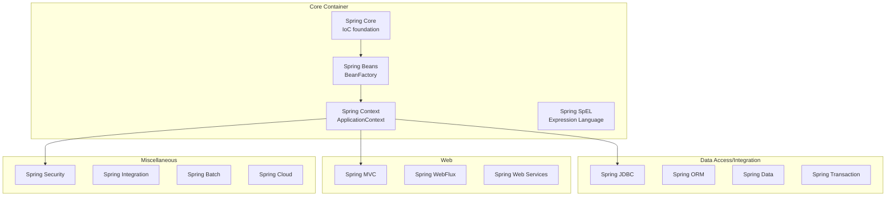

**The Core Container provides the fundamental functionality of the Spring framework**, including dependency injection and bean management[^43]. It comprises:

- **Spring Core**: The foundation of the IoC container, providing the fundamental parts of the framework
- **Spring Beans**: Defines the BeanFactory, which is the sophisticated implementation of the factory pattern
- **Spring Context**: Extends BeanFactory with enterprise-level services such as internationalization, event propagation, and resource loading
- **Spring Expression Language (SpEL)**: A powerful expression language for querying and manipulating objects at runtime

**The Data Access/Integration layer provides modules for working with databases and other persistence technologies**[^43], including Spring JDBC for simplified database access, Spring ORM for integration with object-relational mapping tools, Spring Data for repository abstraction, and Spring Transaction for declarative transaction management.

**The Web layer provides a comprehensive set of modules for building both traditional and reactive web applications**[^43], including Spring MVC for servlet-based applications, Spring WebFlux for reactive applications, and Spring Web Services for SOAP-based services.

**Miscellaneous Modules extend Spring's capabilities beyond traditional application development**[^43], including Spring Security for authentication and authorization, Spring Integration for enterprise integration patterns, Spring Batch for batch processing, and Spring Cloud for cloud-native development.

The **design philosophy of the Spring Framework provides choice at every level, allowing you to defer design decisions as late as possible**[^44]. For example, you can switch persistence providers through configuration without changing your code. This flexibility stands in contrast to frameworks that impose rigid architectural decisions early in development.

**The framework accommodates diverse perspectives, embracing flexibility and is not opinionated about how things should be done**, supporting a wide range of application needs[^44]. This philosophy enables Spring to serve equally well for simple web applications, complex enterprise systems, batch processing applications, and microservices architectures.

**Spring maintains strong backward compatibility, with its evolution carefully managed to force few breaking changes between versions**[^44]. This commitment to stability has been crucial for enterprise adoption, where applications may run for years or decades. The Spring team puts significant effort into ensuring that upgrades are smooth and that existing code continues to function.

**Key architectural benefits of the Spring Framework include**[^43]:

| Benefit | Description |
|---------|-------------|
| **Modularity** | Use only the required modules for your project |
| **Loose Coupling** | Managed through dependency injection and AOP |
| **Integration** | Supports integration with ORM tools, messaging systems, and cloud services |
| **Configuration Flexibility** | Allows configuration through XML, annotations, or Java-based setup |
| **Scalability and Maintainability** | Designed to support both monolithic and microservice architectures |

This modular architecture ensures that **developers can include only the required modules for a given project, minimizing overhead**[^43]. A simple web application might use only Spring Core, Spring Context, and Spring MVC, while a complex enterprise application might incorporate Spring Data, Spring Security, Spring Integration, and Spring Cloud in addition to the core modules.

### 4.4 Spring MVC: Web Application Framework Architecture

**Spring MVC (Model-View-Controller) is a module of the Spring Framework, designed to provide a clean and robust architecture for developing web applications**[^45]. Leveraging the power of Spring Core, Spring MVC directly addresses the architectural problems identified in earlier Servlet/JSP development by enforcing clear separation of concerns through the MVC pattern.

**Spring MVC is a framework for building web applications using the Model-View-Controller design pattern**[^45]. It facilitates separation of concerns by dividing an application into three interconnected components:

| Component | Responsibility | Spring Implementation |
|-----------|---------------|----------------------|
| **Model** | Represents the application's data and business logic | Domain objects, DTOs, service layer |
| **View** | Handles the presentation layer (UI) | JSP, Thymeleaf, JSON responses |
| **Controller** | Manages user input and coordinates between Model and View | @Controller and @RestController classes |

This separation directly solves the problems that plagued JSP development, where business logic, data access, and presentation were often intermingled in single files. In Spring MVC, each concern has a designated place, making applications easier to understand, test, and maintain.

**Key features of Spring MVC include loose coupling**, which decouples components to ensure flexibility and maintainability; **annotation-based configuration**, which simplifies development using annotations like `@Controller` and `@RequestMapping`; and **integration with the Spring ecosystem**, as it seamlessly integrates with other Spring modules like Spring Security and Spring Data[^45].

The request processing flow in Spring MVC follows a well-defined pattern:

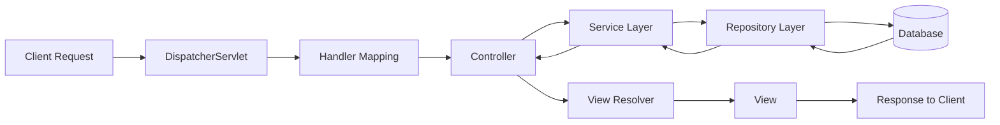

The **DispatcherServlet** serves as the front controller, receiving all incoming requests and delegating them to appropriate handlers. This centralized request handling eliminates the need for the one-servlet-per-function pattern that characterized earlier Servlet development, where each piece of functionality required a separate servlet declaration.

**Spring Security provides deep integration with how Spring MVC matches on URLs with `PathPatternRequestMatcher`**[^46]. This integration is helpful to ensure that security rules match the logic used to handle requests. **`PathPatternRequestMatcher` must use the same `PathPatternParser` as Spring MVC**[^46], ensuring consistency between security configuration and request routing.

**To enable Spring Security integration with Spring MVC, add the `@EnableWebSecurity` annotation to your configuration**[^46]. Spring Security provides the configuration by using Spring MVC's `WebMvcConfigurer`, enabling seamless integration between the security layer and the web framework.

**Spring Security provides `AuthenticationPrincipalArgumentResolver`, which can automatically resolve the current `Authentication.getPrincipal()` for Spring MVC arguments**[^46]. By using `@EnableWebSecurity`, this resolver is automatically added to the Spring MVC configuration. With Spring Security 3.2+, the argument can be resolved more directly by adding the `@AuthenticationPrincipal` annotation to controller method parameters.

**Spring Web MVC 3.2+ has support for Asynchronous Request Processing**[^46]. With no additional configuration, Spring Security automatically sets up the `SecurityContext` to the thread that invokes a `Callable` returned by controllers. This automatic context propagation ensures that security information remains available throughout asynchronous request processing.

**Spring Security integrates with Spring MVC to add CSRF protection**[^46]. Spring Security automatically includes the CSRF Token within forms that use the Spring MVC form tag. The **`CsrfTokenArgumentResolver`** can automatically resolve the current `CsrfToken` for Spring MVC arguments, making it easy to expose CSRF tokens to static HTML-based applications[^46].

The annotation-based programming model significantly reduces the configuration burden compared to traditional Servlet development:

```java
@RestController
@RequestMapping("/api/users")
public class UserController {
    
    @Autowired
    private UserService userService;
    
    @GetMapping("/{id}")
    public User getUser(@PathVariable Long id) {
        return userService.findById(id);
    }
    
    @PostMapping
    public User createUser(@RequestBody User user) {
        return userService.save(user);
    }
}
```

This concise code replaces what would have required extensive web.xml configuration, servlet declarations, and URL mappings in traditional Servlet development. The annotations clearly communicate intent, and Spring handles the infrastructure concerns automatically.

### 4.5 Spring Data: Simplified Data Access Abstraction

**Spring Data JPA's most compelling feature is the ability to create repository implementations automatically, at runtime, from a repository interface**[^47]. This capability represents a dramatic simplification of data access code, eliminating the boilerplate that characterized earlier JDBC-based development while maintaining full flexibility for complex query requirements.

The traditional approach to data access required developers to write extensive code for each entity: connection management, SQL statement preparation, parameter binding, result set processing, and exception handling. Spring Data JPA eliminates this repetitive work by generating implementations based on interface definitions.

To create a repository, developers **extend the `CrudRepository` interface**[^47]. The type of entity and ID that it works with are specified in the generic parameters on `CrudRepository`. **By extending `CrudRepository`, the repository inherits several methods for working with persistence**, including save, findById, findAll, count, delete, and existsById[^47].

```java
public interface CustomerRepository extends CrudRepository<Customer, Long> {
    List<Customer> findByLastName(String lastName);
}
```

In this example, `CustomerRepository` extends `CrudRepository` with `Customer` as the entity type and `Long` as the ID type. **Spring Data JPA also lets you define other query methods by declaring their method signature**[^47]. The `findByLastName()` method demonstrates this—**you need not write an implementation of the repository interface; Spring Data JPA creates an implementation when you run the application**[^47].

The entity class uses JPA annotations to define the mapping between Java objects and database tables:

```java
@Entity
public class Customer {
    @Id
    @GeneratedValue(strategy = GenerationType.AUTO)
    private Long id;
    
    private String firstName;
    private String lastName;
    
    // Constructors, getters, setters
}
```

**The `Customer` class is annotated with `@Entity`**, indicating it is a JPA entity[^47]. **The `id` property is annotated with `@Id` so that JPA recognizes it as the object's ID**, and **`@GeneratedValue` indicates that the ID should be generated automatically**[^47].

The query method naming convention in Spring Data follows a predictable pattern that enables powerful queries without writing SQL:

| Method Name Pattern | Generated Query |
|--------------------|-----------------|
| `findByLastName(String lastName)` | `WHERE lastName = ?` |
| `findByFirstNameAndLastName(String first, String last)` | `WHERE firstName = ? AND lastName = ?` |
| `findByLastNameOrderByFirstNameAsc(String lastName)` | `WHERE lastName = ? ORDER BY firstName ASC` |
| `findByAgeGreaterThan(int age)` | `WHERE age > ?` |
| `findByFirstNameContaining(String pattern)` | `WHERE firstName LIKE %?%` |

**By default, Spring Boot enables JPA repository support and looks in the package (and its subpackages) where `@SpringBootApplication` is located**[^47]. If repository interface definitions are located in a package that is not visible, alternate packages can be specified using `@EnableJpaRepositories` and its type-safe `basePackageClasses` parameter[^47].

The integration between Spring Data and Spring Boot exemplifies the framework's convention-over-configuration philosophy. A complete data access layer can be established with minimal configuration:

1. Add Spring Data JPA and database driver dependencies
2. Configure database connection properties
3. Define entity classes with JPA annotations
4. Create repository interfaces extending `CrudRepository` or `JpaRepository`

Spring Boot auto-configures the `EntityManagerFactory`, transaction manager, and repository implementations, allowing developers to focus on domain modeling rather than infrastructure code.

**Spring Data JPA provides auditing capabilities via the `Auditable` interface**, which has `createdBy`, `createdDate`, `modifiedBy` and `modifiedDate` properties[^48]. This built-in auditing support tracks when entities are created and modified, and by whom—functionality that would require significant custom code in traditional data access approaches.

For applications requiring historical tracking of entity changes, **Envers integration is available**, though it requires additional configuration[^48]. The Spring Data Envers module provides integration between Spring Data JPA and Hibernate Envers for maintaining audit history of entity states.

### 4.6 Spring Security: Authentication and Authorization Integration

**Spring Security provides a number of optional integrations with Spring MVC**[^46], offering comprehensive authentication and authorization capabilities that integrate seamlessly with the Controller-Service-Repository architecture. This integration ensures that security concerns are handled declaratively, without cluttering business logic with security checks.

**To enable Spring Security integration with Spring MVC, add the `@EnableWebSecurity` annotation to your configuration**[^46]. This single annotation activates a comprehensive security infrastructure that includes authentication processing, authorization checks, CSRF protection, and session management.

Spring Security's integration with Spring MVC operates at multiple levels:

| Integration Point | Mechanism | Benefit |
|------------------|-----------|---------|
| URL Matching | PathPatternRequestMatcher | Security rules align with request routing |
| Authentication Principal | AuthenticationPrincipalArgumentResolver | Direct access to user in controller methods |
| CSRF Protection | CsrfTokenArgumentResolver | Automatic token handling in forms |
| Async Processing | SecurityContext propagation | Security context available in async operations |

**Spring Security provides deep integration with how Spring MVC matches on URLs with `PathPatternRequestMatcher`**[^46]. This is helpful to ensure that security rules match the logic used to handle requests. **`PathPatternRequestMatcher` must use the same `PathPatternParser` as Spring MVC**[^46], ensuring that the patterns used to define security constraints match exactly how Spring MVC interprets incoming requests.

**Spring Security provides `AuthenticationPrincipalArgumentResolver`, which can automatically resolve the current `Authentication.getPrincipal()` for Spring MVC arguments**[^46]. By using `@EnableWebSecurity`, this is automatically added to the Spring MVC configuration. **Once properly configured, you can entirely decouple from Spring Security in your Spring MVC layer**[^46]—controllers can receive the authenticated user as a method parameter without any direct reference to Spring Security classes.

The `@AuthenticationPrincipal` annotation provides a clean way to access the current user:

```java
@GetMapping("/profile")
public UserProfile getProfile(@AuthenticationPrincipal User currentUser) {
    return userService.getProfile(currentUser.getId());
}
```

This approach keeps controllers focused on their primary responsibility—handling requests—while security information flows naturally through method parameters.

**Spring Security provides `CsrfTokenArgumentResolver`, which can automatically resolve the current `CsrfToken` for Spring MVC arguments**[^46]. By using `@EnableWebSecurity`, this is automatically added to the Spring MVC configuration. **Once properly configured, you can expose the `CsrfToken` to your static HTML based application**[^46], enabling CSRF protection even for applications that don't use server-side templating.

**Spring Web MVC 3.2+ has support for Asynchronous Request Processing**[^46]. With no additional configuration, **Spring Security automatically sets up the `SecurityContext` to the `Thread` that invokes a `Callable` returned by your controllers**[^46]. This automatic context propagation ensures that security information remains available throughout the request lifecycle, even when processing moves between threads.

**Spring Security integrates with Spring MVC to add CSRF protection**[^46]. **Spring Security automatically includes the CSRF Token within forms that use the Spring MVC form tag**, providing protection against cross-site request forgery attacks without requiring developers to manually manage tokens.

For applications using both Spring Boot and Spring MVC, **Spring MVC and Spring Security are in the same application context by default**[^46]. This shared context enables seamless integration between the web framework and security framework, with both having access to the same beans and configuration.

The declarative nature of Spring Security configuration means that security policies can be defined separately from business logic:

```java
@Configuration
@EnableWebSecurity
public class SecurityConfig {
    
    @Bean
    public SecurityFilterChain filterChain(HttpSecurity http) throws Exception {
        http
            .authorizeHttpRequests(auth -> auth
                .requestMatchers("/api/public/**").permitAll()
                .requestMatchers("/api/admin/**").hasRole("ADMIN")
                .anyRequest().authenticated()
            )
            .oauth2Login();
        return http.build();
    }
}
```

This configuration clearly expresses security policies without modifying any controller or service code. The security framework intercepts requests and enforces the defined rules before requests reach the application code.

### 4.7 Ecosystem Integration and Unified Development Platform

The Spring Framework's various modules work together to provide a **comprehensive development platform** that addresses the fragmentation problems of earlier Java web development. Where Servlet/JSP development required assembling disparate technologies with inconsistent APIs and configuration approaches, Spring provides a unified programming model that spans web handling, data access, security, and enterprise integration.

**Spring Integration provides an extension of the Spring programming model to support the well known Enterprise Integration Patterns**[^49]. It enables lightweight messaging within Spring-based applications and supports integration with external systems through declarative adapters. **Spring Integration's primary goal is to provide a simple model for building enterprise integration solutions while maintaining the separation of concerns that is essential for producing maintainable, testable code**[^49].

The integration between Spring's modules follows consistent patterns that make the ecosystem feel cohesive rather than assembled from disparate parts:

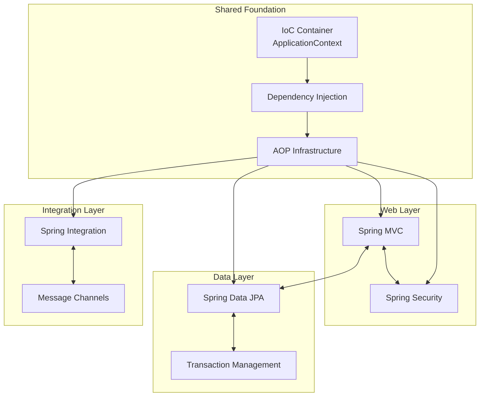

**Spring Modulith is a relatively new Spring project that equips developers with a toolkit for building modular Spring Boot applications**[^50]. While it doesn't build the module structure automatically, **it provides opinionated guidance on how to arrange code into loosely coupled modules within a single project**[^50]. This guidance takes the form of warnings when running tests aimed to verify correct module structure. Additionally, **Spring Modulith provides support for module integration testing, observability, and asynchronous communication**[^50].

The modular monolith approach supported by Spring Modulith demonstrates how Spring's ecosystem enables architectural flexibility. **Modular monoliths are quite close to microservices, meaning that modules should be as independent as possible from each other and communicate through the API exposed to other modules**[^50]. In a modular application, there are a main package containing the application class, and application modules as direct sub-packages. **Subpackages contained in application modules are considered internal and should not be referenced by code from other modules**[^50].

**Spring Integration extends the Spring programming model into the messaging domain** and builds upon Spring's existing enterprise integration support to provide an even higher level of abstraction[^49]. The main components are **Message**, **Message Channel**, and **Message Endpoint**:

- **A message is a generic wrapper for any Java object combined with metadata** used by the framework while handling that object, consisting of a payload and headers[^49].
- **A message channel represents the "pipe" of a pipes-and-filters architecture**. Producers send messages to a channel, and consumers receive messages from a channel. **The message channel therefore decouples the messaging components**[^49].
- **A message endpoint represents the "filter" of a pipes-and-filters architecture**. The endpoint's primary role is to connect application code to the messaging framework in a non-invasive manner[^49].

The message endpoint types include **Message Transformer** (converting message content or structure), **Message Filter** (determining whether messages should pass), **Message Router** (deciding routing), **Splitter** (dividing messages), **Aggregator** (combining messages), **Service Activator** (connecting service instances), and **Channel Adapter** (connecting to external systems)[^49].

**Spring supports message-driven architectures where inversion of control applies to runtime concerns**, such as when certain business logic should run and where the response should be sent[^49]. **It supports routing and transformation of messages so that different transports and different data formats can be integrated without impacting testability**[^49].

The unified nature of Spring's ecosystem becomes apparent when examining how a typical application integrates multiple modules:

| Layer | Spring Module | Integration Point |
|-------|--------------|-------------------|
| Presentation | Spring MVC | Receives requests, delegates to services |
| Security | Spring Security | Intercepts requests, enforces authorization |
| Business Logic | Spring Core (Services) | Orchestrates operations, manages transactions |
| Data Access | Spring Data JPA | Provides repository implementations |
| Integration | Spring Integration | Handles messaging and external systems |
| Cross-Cutting | Spring AOP | Applies logging, monitoring, transaction management |

All these modules share the same IoC container, use consistent configuration patterns, and integrate through well-defined interfaces. **This modular architecture ensures flexibility; developers can include only the required modules for a given project, minimizing overhead**[^43].

The evolution from Servlet/JSP development to the Spring ecosystem represents a fundamental shift in how Java web applications are architected. Where earlier approaches required developers to manually coordinate disparate technologies, Spring provides a cohesive platform where components work together naturally. This integration addresses the structural problems identified in earlier development—tight coupling, testing difficulties, configuration complexity, and maintenance burden—while providing a foundation for further simplification through Spring Boot.

**A primary benefit of using the Spring Framework is its modularity, which allows developers to use only the modules they need**[^51]. This modular architecture promotes testability through dependency injection and reduces boilerplate code. **The framework is lightweight and optimized for enterprise applications**, contributing to its performance[^51]. **While Spring Framework provides the foundational tools, Spring Boot takes simplification further** by offering auto-configuration, embedding servers, and providing production-ready features[^51].

The Spring Framework's comprehensive ecosystem, built on consistent principles of dependency injection, aspect-oriented programming, and modular design, established the foundation upon which Spring Boot would later build. By solving the structural problems of earlier Java development approaches, Spring created a platform that enabled the next evolution—the convention-over-configuration paradigm that Spring Boot would introduce to eliminate the remaining friction in application development.

## 5 Spring Boot: The Convention-Over-Configuration Paradigm Shift

This chapter examines how Spring Boot, launched in April 2014 by Pivotal after 18 months of development, fundamentally transformed Spring development by embracing the 'convention over configuration' philosophy. The analysis traces Spring Boot's origins from a community request to improve containerless web application architectures, investigates the three game-changing features that eliminated the configuration complexity identified in the previous chapter, and evaluates how these innovations reduced project setup from days to minutes while enabling developers to focus on business logic rather than infrastructure.

### 5.1 Origins and Motivations: From Community Request to Framework Revolution

The genesis of Spring Boot can be traced to a specific community request that crystallized the frustrations developers had experienced with Spring Framework configuration complexity. In **October 2012**, an issue was filed on the Spring Framework's JIRA titled **"Improved support for 'containerless' web application architectures"**[^52]. The issue's author, Mike Youngstrom, articulated a problem that resonated deeply with the development community: "Traditionally Spring web applications have been embedded in a servlet container. This was useful in the past when the majority of enterprise applications ran in and depended on the servlet container for deployment and configuration. However, a servlet container comes with learning curve that we cannot assume new developers will have already overcome."[^52] His solution was straightforward—make it easier.

This request captured a broader sentiment within the Java development community. Despite the Spring Framework's revolutionary contributions to enterprise Java development through Inversion of Control and Dependency Injection, the framework had accumulated its own configuration burden. As examined in the previous chapter, **developers had to write a lot of configuration code to get their applications up and running**, manually defining each bean and its dependencies in extensive XML files or complex Java configuration classes. The very problems Spring had solved in J2EE—excessive configuration and steep learning curves—had begun to manifest within Spring itself.

On **August 6, 2013**, Phil Webb, a member of the Spring team, responded to the community's concerns with a pivotal announcement: "Rather than fix this as part of the core Spring Framework we have decided to start a new project called Spring Boot that addresses this and a number of other issues."[^52] This decision to create a separate project rather than modify the core framework proved strategically significant—it allowed Spring Boot to take an **opinionated approach** without constraining the flexibility that made Spring Framework valuable for complex enterprise scenarios.

The development effort that followed was substantial. **It was 18 months from the original request** that gave birth to Spring Boot to its general availability release[^53]. During this period, the project saw **1720 commits by 54 different contributors** and closed **549 issues**, with the code being **forked 398 times**[^53]. This level of community engagement demonstrated both the urgency of the problems being addressed and the collaborative nature of the solution.

**Spring Boot 1.0 was released in April 2014** by Pivotal's Spring team[^54][^53]. The framework's mission statement articulated a clear vision: to provide a development experience that makes it **"easy to create stand-alone, production-grade Spring based Applications that you can 'just run'"** with **"absolutely no code generation and no requirement for XML configuration"**[^55]. This mission directly addressed the pain points that had accumulated over years of Spring Framework development.

The following table summarizes the specific problems Spring Boot targeted and how they related to the Spring Framework challenges identified in Chapter 3:

| Spring Framework Challenge | Impact on Developers | Spring Boot Solution |
|---------------------------|---------------------|---------------------|
| Extensive XML configuration | Time-consuming setup, error-prone | Auto-configuration based on classpath |
| Manual dependency management | Version conflicts, compatibility issues | Starter dependencies with curated versions |
| External server deployment | Complex deployment procedures | Embedded servers in executable JARs |
| Boilerplate code | Repetitive infrastructure setup | Convention-over-configuration defaults |
| Steep learning curve | Long onboarding time for new developers | Opinionated defaults with override capability |

The framework's design philosophy was deliberately **opinionated**, meaning it made assumptions about how applications should be structured and configured[^54]. As Pivotal's Pieter Humphrey explained, Spring Boot brought "a coding approach that nearly eliminates boilerplate code and configuration work; it takes an opinionated approach, making many assumptions, allowing developers to quickly start coding and override these defaults later"[^54]. This approach represented a fundamental shift from Spring Framework's philosophy of providing maximum flexibility—Spring Boot instead provided **sensible defaults that worked for the majority of use cases** while preserving the ability to customize when necessary.

The timing of Spring Boot's release aligned with broader industry trends. The emergence of **Platform-as-a-Service (PaaS) environments** like Heroku and Cloud Foundry had changed deployment expectations[^55]. These platforms already provided management, scale-out, and reliability features, making the traditional heavyweight application server model increasingly obsolete for many applications. Spring Boot was designed to be **"an ultralight container, great for application or service deployment in the cloud"**[^53], positioning it perfectly for the emerging cloud-native development paradigm.

Phil Webb, who would become co-creator of Spring Boot, articulated the containerless rationale: "Today's PaaS environments provide much of the management, scale out, and reliability features already, so we focus on making Spring Boot an ultralight container, great for application or service deployment in the cloud"[^53]. This vision directly addressed the JIRA request that had sparked the project, transforming a community complaint into a framework that would reshape Java development.

### 5.2 Auto-Configuration: Intelligent Application Setup Through Classpath Detection

Auto-configuration represents Spring Boot's most transformative innovation—a mechanism that **automatically configures a Spring application based on dependencies present on the classpath**, eliminating the manual bean definitions that had characterized Spring Framework development[^56][^57]. This intelligent setup system examines what libraries are available and makes reasonable assumptions about how the application should be configured, dramatically reducing the configuration burden that developers had previously shouldered.

The conceptual foundation of auto-configuration is elegantly simple: **if a certain library is on the classpath, Spring Boot assumes the developer intends to use it and configures the necessary beans automatically**. For example, if `spring-boot-starter-web` added Tomcat and Spring MVC to the classpath, auto-configuration sets up a web application with appropriate defaults[^57]. This approach inverts the traditional configuration model—instead of explicitly declaring everything the application needs, developers only need to specify deviations from sensible defaults.

The technical implementation of auto-configuration relies on a sophisticated system of **conditional annotations** that determine when specific configurations should apply[^58][^56]:

| Conditional Annotation | Purpose | Use Case |
|-----------------------|---------|----------|
| `@ConditionalOnClass` | Configuration applies only when specified classes are present | Enable features when libraries are on classpath |
| `@ConditionalOnMissingClass` | Configuration applies only when specified classes are absent | Provide fallback configurations |
| `@ConditionalOnBean` | Configuration applies only when specified beans exist | Build on existing configuration |
| `@ConditionalOnMissingBean` | Configuration applies only when specified beans are absent | Provide defaults that can be overridden |
| `@ConditionalOnProperty` | Configuration applies based on property values | Enable/disable features via configuration |
| `@ConditionalOnResource` | Configuration applies when specified resources exist | Configure based on available resources |
| `@ConditionalOnWebApplication` | Configuration applies in web application contexts | Web-specific configuration |

**Classes that implement auto-configuration are annotated with `@AutoConfiguration`**, which is itself meta-annotated with `@Configuration`, making auto-configurations standard configuration classes[^58]. The combination of `@ConditionalOnClass` and `@ConditionalOnMissingBean` annotations is particularly common—this ensures that auto-configuration applies only when relevant classes are found and when the developer has not declared their own configuration[^58].

The **non-invasive nature** of auto-configuration is a critical design principle. Auto-configuration is designed to work alongside developer-defined configuration, not replace it[^57]. When a developer defines their own bean—for example, adding a custom `DataSource` bean—the auto-configured default is automatically disabled[^57]. This behavior is enabled by the `@ConditionalOnMissingBean` annotation, which checks whether a bean of the specified type already exists before creating the auto-configured version.

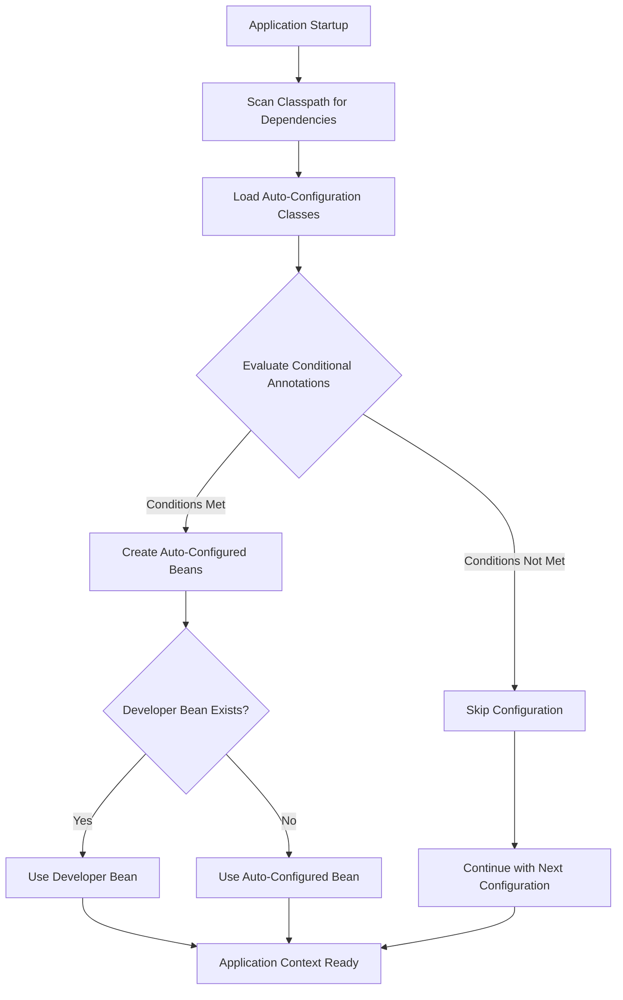

Spring Boot checks for the presence of a **`META-INF/spring/org.springframework.boot.autoconfigure.AutoConfiguration.imports`** file within published jars, which lists configuration classes to be loaded[^58]. This mechanism allows third-party libraries to provide their own auto-configuration, extending Spring Boot's intelligent setup to the broader ecosystem. Auto-configurations must be loaded only by being named in this imports file—they should never be the target of component scanning, ensuring that auto-configuration loading is explicit and controlled[^58].

The **ordering of auto-configuration** can be controlled when configurations need to be applied in a specific sequence. The `@AutoConfiguration` annotation supports `before`, `beforeName`, `after`, and `afterName` attributes, along with dedicated `@AutoConfigureBefore` and `@AutoConfigureAfter` annotations[^58]. Additionally, `@AutoConfigureOrder` provides explicit ordering similar to the standard `@Order` annotation but specifically for auto-configuration classes[^58].

For developers who need to understand what auto-configuration is doing, Spring Boot provides diagnostic capabilities. Running the application with the **`--debug` switch** produces a conditions report that shows which auto-configurations were applied and why[^57]. This transparency helps developers understand the framework's decisions and troubleshoot unexpected behavior.

To **disable specific auto-configuration classes**, developers can use the `exclude` attribute of `@SpringBootApplication`[^56][^57]. For instance, `@SpringBootApplication(exclude = { DataSourceAutoConfiguration.class })` prevents data source auto-configuration from being applied[^57]. Alternatively, the `spring.autoconfigure.exclude` property provides a configuration-based approach to disabling auto-configurations[^56][^57].

A practical example illustrates the power of conditional auto-configuration. Consider a custom MySQL auto-configuration that demonstrates the conditional annotation system in action[^56]:

- A `dataSource` bean is created with `@ConditionalOnProperty(name = "usemysql", havingValue = "local")` and `@ConditionalOnMissingBean`, setting a default connection to a local database
- An alternative `dataSource2` bean is configured with `@ConditionalOnProperty(name = "usemysql", havingValue = "custom")` to use custom properties for URL, user, and password
- An `entityManagerFactory` bean is created with `@ConditionalOnBean(name = "dataSource")` and `@ConditionalOnMissingBean`
- Additional properties can be loaded conditionally using `@ConditionalOnResource(resources = "classpath:mysql.properties")`

This conditional system enables **sophisticated configuration logic without requiring developers to write explicit conditional code**. The framework evaluates conditions at startup and assembles the appropriate configuration automatically.

Auto-configuration is designed to work with "Starters" but is not directly tied to them[^57]. Developers can choose jar dependencies outside of starters, and Spring Boot still auto-configures the application appropriately. This flexibility ensures that auto-configuration benefits extend to any Spring Boot application, regardless of how dependencies are managed.

The impact of auto-configuration on developer productivity cannot be overstated. Where Spring Framework required explicit configuration of data sources, entity managers, transaction managers, web servers, and countless other infrastructure components, **Spring Boot's auto-configuration handles these concerns automatically**. Developers can focus on writing business logic, confident that the infrastructure will be configured correctly based on their declared dependencies.

### 5.3 Starter Dependencies: Opinionated Dependency Management and Simplified Library Coordination

Spring Boot starters represent a paradigm shift in dependency management, providing **curated, opinionated dependency collections that bring in known, ready-to-use technology stacks** aligned with specific development tasks[^59]. Rather than requiring developers to manually identify, declare, and coordinate dozens of individual library dependencies, starters combine related dependencies into single, cohesive units that are guaranteed to work together.

The fundamental insight behind starters is that **dependencies should be organized around tasks, not technologies**[^59]. When a developer wants to build a web application, they don't want to think about which versions of Spring MVC, embedded Tomcat, Jackson for JSON processing, and validation libraries are compatible—they want to declare their intent to build a web application and have the framework handle the details. Starters make this possible:

```xml
<dependency> 
    <groupId>org.springframework.boot</groupId>
    <artifactId>spring-boot-starter-web</artifactId>
</dependency>
```

This single dependency declaration replaces what would previously have been a dozen or more individual dependency declarations, each requiring careful version coordination[^59]. The starter brings in Spring MVC, embedded Tomcat, Jackson, and all other libraries needed for web development, with versions that have been tested together.

**A typical Spring Boot starter contains code to auto-configure and customize the infrastructure of a given technology**[^58]. To make it easily extensible, starters expose configuration keys in dedicated namespaces to the environment. The starter structure follows a deliberate pattern:

| Component | Purpose | Contents |
|-----------|---------|----------|
| **Autoconfigure Module** | Contains auto-configuration code | Configuration classes, `@ConfigurationProperties` definitions, callback interfaces |
| **Starter Module** | Provides dependency aggregation | References to autoconfigure module, required starters, and typically useful dependencies |

**The starter is really an empty jar**[^58]. Its only purpose is to provide the necessary dependencies to work with the library. Starters can be thought of as **opinionated views of what is required to get started** with a particular technology or capability. This design separates the concern of dependency aggregation (the starter) from the concern of automatic configuration (the autoconfigure module).

The **parent POM inheritance model** eliminates version compatibility concerns entirely. The Maven build inherits information about which dependency versions to use from its parent `pom`, provided by Spring Boot[^59]. Developers don't need to worry about lining up common Spring project versions and third-party dependencies—the parent POM ensures that all versions are compatible and have been tested together.

Spring Boot provides an extensive catalog of official starters covering common development scenarios:

| Starter | Purpose | Key Dependencies Included |
|---------|---------|--------------------------|
| `spring-boot-starter-web` | Web application development | Spring MVC, Tomcat, Jackson |
| `spring-boot-starter-data-jpa` | JPA-based data access | Spring Data JPA, Hibernate, HikariCP |
| `spring-boot-starter-security` | Security features | Spring Security |
| `spring-boot-starter-test` | Testing support | JUnit, Mockito, AssertJ |
| `spring-boot-starter-actuator` | Production monitoring | Actuator endpoints, Micrometer |
| `spring-boot-starter-jetty` | Jetty server (alternative to Tomcat) | Jetty |

**Your starter must reference the core Spring Boot starter (`spring-boot-starter`) directly or indirectly**[^58]. If a project is created with only a custom starter, Spring Boot's core features will be honored by the presence of the core starter. This requirement ensures that all Spring Boot applications benefit from the foundational auto-configuration and dependency injection capabilities.

The naming convention for starters follows a deliberate pattern. Official Spring Boot starters use the format `spring-boot-starter-*`, where the asterisk represents the specific technology or capability. For custom starters, the recommendation is to **not start module names with `spring-boot`**[^58]. Instead, custom starters should be named after the technology they support—for example, `acme-spring-boot-starter` for a hypothetical Acme technology integration.

**Configuration property namespaces** require careful attention in starter design. Starters should use a unique namespace for their configuration keys and **not include keys in the namespaces that Spring Boot uses** (such as `server`, `management`, `spring`)[^58]. This prevents conflicts between starter configuration and core Spring Boot configuration.

The impact on project setup is dramatic. Consider the contrast between traditional Spring Framework dependency management and Spring Boot's starter approach:

**Traditional Approach (Multiple Dependencies Required):**
- Spring Core
- Spring Context
- Spring Web MVC
- Spring AOP
- Jackson Databind
- Jackson Core
- Jackson Annotations
- Servlet API
- Tomcat (or other server)
- Logging framework
- (Plus version coordination for all of the above)

**Spring Boot Approach (Single Starter):**
- `spring-boot-starter-web`

**Spring Boot uses starters to significantly decrease the process of manually adding dependencies**[^60]. The framework's auto-configurator then attempts to automatically configure the application based on the jar dependencies added. This combination of simplified dependency declaration and intelligent auto-configuration creates a development experience where infrastructure concerns largely disappear from the developer's immediate attention.

The starter model also facilitates **easy server switching**. To use the Jetty embedded servlet container instead of Tomcat, developers exclude the Spring Boot starter Tomcat module and import the Spring Boot Starter Jetty module[^59]. Spring Boot automatically delegates to Jetty instead of Tomcat, with no other code changes required. This flexibility demonstrates how starters provide opinionated defaults while preserving the ability to customize.

### 5.4 Embedded Servers: Containerless Deployment and the Fat JAR Revolution

Spring Boot's embedded server architecture represents a fundamental reimagining of Java web application deployment. By **packaging Tomcat, Jetty, or Undertow directly into executable JAR files**, Spring Boot eliminates the traditional requirement for external application server installation and configuration[^61][^59]. This approach, often called the "fat JAR" model, creates self-contained deployment units that can run anywhere a JVM is available.

**Embedded servers are one of the defining features of Spring Boot**, allowing applications to run without needing an external server setup[^61]. The Maven build provided by the Spring Boot Initializr produces a fat jar that includes all dependencies and the web server inside the archive[^59]. This means that **anyone can run the entire Spring application with no fuss**: no build tool required, no setup, no web server configuration—just `java -jar ...your.jar`[^59].

The rationale for this containerless approach was articulated clearly in Spring Boot's design philosophy. When asked why they decided to pursue containerless web applications, the Spring Boot team cited multiple benefits[^55]:

| Benefit | Description |
|---------|-------------|
| **Minimal configuration** | Little to configure to get coding |
| **Functional deployment unit** | A more functional deployment unit by building a configured Tomcat/Jetty into the JAR file |
| **Self-contained executables** | Run with `java -jar` command |
| **Cloud-friendly** | Cloud, PaaS, and virtualization friendly |
| **Aligned with Spring philosophy** | Self-contained and portable, matching Spring's core principles |

**By default, Spring Boot uses a `public static void main` entry-point that launches an embedded web server**[^59]. When the application runs, Spring Boot detects if there is a Spring MVC controller and starts an embedded Apache Tomcat 7 instance by default[^59]. This automatic detection and configuration exemplifies the convention-over-configuration philosophy—developers don't need to explicitly configure the web server; Spring Boot infers the need from the application's structure.

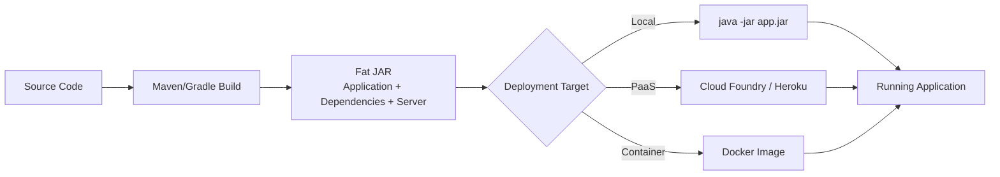

The **choice of embedded server is determined by the dependencies added to the project**[^61]. By default, Spring Boot uses Tomcat 7, but switching servers requires only dependency changes[^59]:

**Switching to Jetty:**
```xml
<dependencies>
    <dependency>
        <groupId>org.springframework.boot</groupId>
        <artifactId>spring-boot-starter-web</artifactId>
        <exclusions>
            <exclusion>
                <groupId>org.springframework.boot</groupId>
                <artifactId>spring-boot-starter-tomcat</artifactId>
            </exclusion>
        </exclusions>
    </dependency>
    <dependency>
        <groupId>org.springframework.boot</groupId>
        <artifactId>spring-boot-starter-jetty</artifactId>
    </dependency>
</dependencies>
```

**Upgrading Tomcat version:**
```xml
<properties>
    <tomcat.version>8.0.3</tomcat.version>
</properties>
```

Configuration options for the embedded server are extensive. The `EmbeddedServletContainerCustomizer` configuration SPI provides access to most of the power of explicit XML configuration for a standalone server instance[^59]. Smaller configurations, like the server port, can be set via command-line arguments (e.g., `--Dserver.port=8081`) or through a property file[^59]. Specifying `server.port=0` makes the server listen on an unused port, useful for avoiding port conflicts in development environments[^59].

**HTTPS configuration** is also supported through the embedded server customization API. Developers can enable SSL/TLS termination by providing an `EmbeddedServletContainerCustomizer` that configures the appropriate SSL settings[^59]. This capability enables secure applications without requiring external load balancer or proxy configuration.

The containerless approach aligns perfectly with **modern PaaS environments**. The Spring Boot team explained: "Today's PaaS environments provide much of the management, scale out, and reliability features already, so we focus on making Spring Boot an ultralight container, great for application or service deployment in the cloud"[^53][^55]. This philosophy positions Spring Boot applications as ideal deployment units for cloud platforms where the infrastructure handles concerns traditionally managed by application servers.

**Containerless deployments are not a strict requirement**, however. Applications can leverage Boot's approach while deploying to any Servlet 3.0-compliant application container[^55]. The framework supports deployment to traditional servers including Tomcat 7+, Jetty 8, Glassfish 3.x, JBoss AS 6.x/7.x, and Websphere 8.0[^55]. To deploy as a traditional WAR file, three changes are needed[^59]:

1. Change the Maven packaging from `jar` to `war`
2. Comment out the `spring-boot-maven-plugin` in the `pom.xml`
3. Modify the `Application` class to extend `SpringBootServletInitializer`

The `SpringBootServletInitializer` class taps into the Servlet 3 Java configuration API, which allows describing in code what could only be described in `web.xml` before[^59]. Such configuration classes are discovered and invoked at application startup, giving Spring Boot a chance to tell the web server about the application's required Servlets, Filters, and Listeners.

**Cloud deployment is seamlessly supported**. Thanks to the Java Buildpack team, Spring Boot applications deploy seamlessly to Cloud Foundry[^53]. For Heroku deployment, the fat-jar approach is the expected model—simply put the `java -jar` command in a `Procfile`[^59]. For Cloud Foundry, after building the application and installing the `cf` command-line tool, the `cf push --path target/demo-0.0.1-SNAPSHOT.jar` command handles deployment[^59].

The embedded server model has become the **preferred approach for microservices architectures**. The Spring Boot team identified Boot as most ideal for applications designed as "a preferred buildpack for deploying apps to PaaS like CloudFoundry" and "a preferred micro-service/REST service development platform"[^55]. The self-contained nature of fat JARs makes them natural units for containerized deployment, service orchestration, and horizontal scaling.

### 5.5 Developer Productivity Impact: From Days of Setup to Minutes of Coding

The productivity improvements delivered by Spring Boot transformed not just how developers worked but how the entire Java ecosystem perceived Spring development. The framework's combination of auto-configuration, starter dependencies, and embedded servers **eliminated approximately 80% of boilerplate configuration code** that had previously been required[^55], enabling a development experience where infrastructure concerns largely disappeared from immediate attention.

The Spring Boot team identified **"the groundbreaking level of production-ready productivity it enables"** as the most compelling aspect of the framework for new adopters[^55]. This productivity wasn't merely about writing less code—it was about **removing cognitive overhead** so developers could focus entirely on business logic rather than infrastructure configuration. The framework's opinionated defaults meant that the common case required no configuration at all, while the less common cases could be addressed through simple property overrides or targeted customization.

**Spring Boot provides most of the components needed in general applications in a pre-configured way**, enabling applications to run in production quickly while reducing configuration and deployment effort[^60]. The framework comes already coupled to the Tomcat application server, eliminating the traditional deployment ceremony that characterized Java web development. This pre-configured template approach means that new projects start with working infrastructure, not empty configuration files.

The **Spring Initializr** (available at start.spring.io) became a cornerstone of the rapid project bootstrapping experience[^59]. This web service generates ready-to-use Maven or Gradle projects with selected dependencies, providing developers with a working starting point in seconds. The generated projects include the `Application.java` entry point class, a test class, and a properly configured build file—everything needed to begin development immediately[^59].

The impact on adoption metrics was dramatic and measurable. The Spring Boot team reported receiving feedback from **"a wide array of developers"** and seeing **"record all time high numbers (since ~2004) after the announcement of Boot"**[^55]. These metrics included:

| Metric | Impact |
|--------|--------|
| Web traffic | Landslide increase |
| Maven downloads | Record numbers |
| StackOverflow questions | Significant growth |
| Google searches | Substantial increase |
| indeed.com job postings | Notable rise |
| YouTube channel views | Outpaced even the Java YouTube channel |

According to JetBrains's 2019 Developer Ecosystem survey, **56% of surveyed developers said they use the Spring Boot framework** when developing web applications, an increase of 14% over the previous year's survey[^52]. Additionally, **61% of respondents reported using Spring Boot as an alternative to application servers**[^52], demonstrating how thoroughly the embedded server model had been embraced.

The framework's **production-readiness** was validated by the Spring team's own use case. They reinforced their confidence in Spring Boot's production and cloud readiness by noting that **they run the Spring.io website on it**, which serves documentation to millions of Spring developers worldwide[^55]. This website, open-sourced as a reference project under the codename "Project Sagan," demonstrated that Spring Boot was suitable for high-visibility, high-traffic production deployments[^55].

The "Hello World" example became emblematic of Spring Boot's simplicity. A complete, runnable web application could be expressed in minimal code[^53]:

```groovy
@RestController
class Example {
    @RequestMapping("/")
    String helloWorld() {
        "Hello World!"
    }
}
```

The Spring Boot team noted that **writing a service in less than 100 lines of code is straightforward**, and executable programs could even fit **in a single tweet (140 characters)**[^53]. This dramatic reduction in ceremony transformed the perception of Java web development from verbose and complex to concise and accessible.

The framework's impact on the broader enterprise Java ecosystem prompted reflection about the future of traditional application servers. When asked about Spring Boot's future in the Enterprise Java ecosystem, the team suggested the question should be **"what is the future of the Enterprise Java ecosystem?"**[^55]. They explained that the new PaaS era had arrived, which would **"sharply accelerate the already flat to declining appserver market curve"**[^55].

Spring Boot's approach to **removing tedious boilerplate code for about 80% of cases** while encouraging **"small, simply focused services ideal for cloud/PaaS deployments"** positioned the framework at the center of the microservices movement[^55]. The combination of minimal configuration, embedded servers, and production-ready defaults made Spring Boot the natural choice for organizations adopting cloud-native architectures.

The framework also served as **"a rallying point for any JVM developer wanting ease-of-use"** comparable to what developers experienced in other languages[^55]. With Java 8's arrival bringing lambda expressions and streams, Spring Boot could leverage these language improvements while providing a development experience that matched the productivity expectations of developers familiar with more dynamic platforms.

For enterprise organizations, Spring Boot offered a **"perfect BYOC (bring-your-own-container) strategy"** while maintaining the ability to **"bridge to existing infrastructure and full-blown complex Enterprise Java back to JDK 6"**[^55]. This flexibility meant that organizations could adopt Spring Boot incrementally, using it for new services while maintaining existing applications on traditional infrastructure.

The Spring Boot team summarized the framework's ideal use cases as[^55]:
- A preferred buildpack for deploying applications to PaaS like CloudFoundry
- A preferred micro-service/REST service development platform
- A rich, integrated backend for mobile application services
- A runtime for other JVM languages and frameworks like Groovy and Grails

**Spring Boot has become the de facto standard for building modern, production-ready Java applications**[^62]. Since its release in 2014, it has revolutionized how developers approach enterprise-grade software by offering a streamlined, convention-over-configuration approach that reduces boilerplate code and accelerates development. The framework's success validated the hypothesis that had driven its creation: developers wanted to write business logic, not configuration, and a framework that embraced this principle would transform the Java development experience.

## 6 Spring Boot Architecture and Layered Design Patterns

This chapter examines the architectural patterns and layered design that define Spring Boot applications, analyzing the complete request flow from client through controller, service, and repository layers to the database. The research investigates how each architectural layer maintains distinct responsibilities aligned with the separation of concerns principle, how this layered structure enables independent testing, maintenance, and scalability, and how Spring Boot's design philosophy supports both monolithic deployments and microservices architectures. The chapter also explores the internal mechanics of request processing through the DispatcherServlet, component lifecycle management within the IoC container, and the dependency wiring mechanisms that enable loose coupling across layers.

### 6.1 Layered Architecture Overview and Design Philosophy

Spring Boot follows a **layered architecture pattern that represents the classic separation of concerns principle**, where each layer has a specific responsibility and communicates only with adjacent layers[^63]. This architectural approach directly addresses the structural problems identified in earlier Servlet/JSP development, where business logic, data access, and presentation were often intermingled within single files, creating maintenance nightmares and testing impossibilities.

The architecture organizes application code into **four primary layers that form a hierarchical communication model**:

| Layer | Primary Responsibility | Spring Annotations | Communication Direction |
|-------|----------------------|-------------------|------------------------|
| **Presentation/Controller** | Handling HTTP requests and responses | `@RestController`, `@Controller` | Receives from Client, sends to Service |
| **Service/Business** | Business logic and rules enforcement | `@Service` | Receives from Controller, sends to Repository |
| **Repository/Data Access** | Data persistence and database operations | `@Repository` | Receives from Service, sends to Database |
| **Database** | Actual data storage | N/A (external) | Receives from Repository |

**The data flow through these layers follows a strict hierarchical pattern**[^63]. A client sends requests to the Controller Layer, which communicates with the Service/Business Layer, which then interacts with the Repository/Data Access Layer, which finally connects to the Database. This bidirectional flow ensures that each layer remains focused on its specific concerns while delegating other responsibilities to the appropriate adjacent layer.

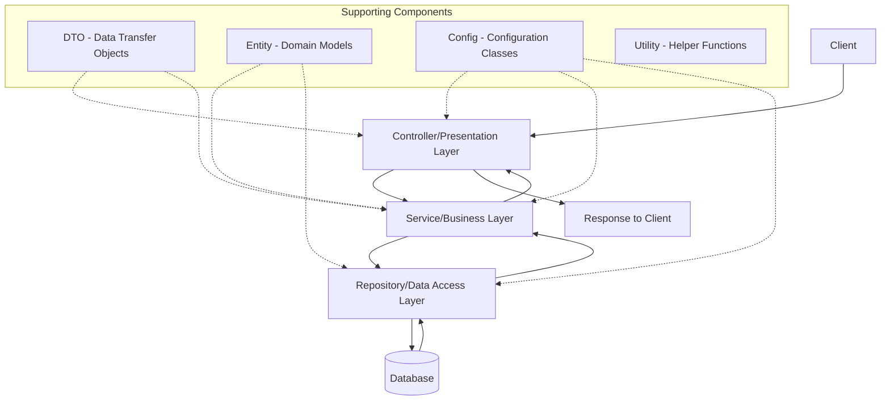

The **design philosophy underlying this architecture** stems from the recognition that different aspects of an application change for different reasons and at different rates. Presentation logic changes when user interface requirements evolve; business logic changes when business rules are modified; data access logic changes when storage technologies are updated. By isolating these concerns into separate layers, **changes to one layer can be made without affecting others**, provided the interfaces between layers remain stable.

**This layered architecture makes Spring Boot applications robust, maintainable, and scalable** while following established software engineering principles[^63]. The pattern promotes modularity because each layer can be developed, understood, and modified independently. It enhances testability because each layer can be tested in isolation with mocked dependencies for adjacent layers. And it supports scalability because layers can be optimized or scaled independently based on their specific performance characteristics.

The contrast with earlier development approaches is stark. In Servlet-based development, a single servlet might handle HTTP request parsing, business rule validation, database queries, and HTML generation—all within a single class. In JSP development, scriptlets embedded within presentation templates often contained database access code and complex business logic. **Spring Boot's layered architecture enforces the separation that earlier technologies merely encouraged**, making it significantly harder to create the tangled, untestable code that characterized many legacy Java web applications.

### 6.2 Controller Layer: HTTP Request Handling and API Exposure

The **Presentation Layer acts as the entry point of the Spring Boot application**, also known as the controller layer, and is responsible for handling all incoming HTTP requests and sending appropriate responses back to the client[^64]. This layer serves as the interface between external entities—whether web browsers, mobile applications, or other services—and the application's internal business logic.

Controllers in this layer are typically annotated with **`@RestController` for REST API endpoints or `@Controller` for traditional MVC web controllers**[^65][^63]. The `@RestController` annotation is a convenience annotation that combines `@Controller` and `@ResponseBody`, indicating that the class handles HTTP requests and that return values should be written directly to the HTTP response body rather than interpreted as view names.

**The responsibilities of the Controller layer are deliberately constrained** to maintain the thin controller design principle:

| Responsibility | Implementation | Purpose |
|---------------|----------------|---------|
| Handling HTTP methods | `@GetMapping`, `@PostMapping`, `@PutMapping`, `@DeleteMapping` | Route requests to appropriate handlers |
| Exposing RESTful APIs | Method-level annotations with URL patterns | Define the application's external interface |
| Request validation | `@Valid`, `@RequestBody` | Ensure incoming data meets requirements |
| Authentication entry points | Integration with Spring Security | Control access to endpoints |
| JSON/Java conversion | Jackson integration (automatic) | Transform between wire format and objects |
| Request forwarding | Delegate to Service layer | Pass validated requests for processing |

**Controllers define methods annotated with `@RequestMapping` or specialized annotations** that handle specific HTTP requests[^65]. Controller methods can have parameters automatically populated with data from the HTTP request, such as `@PathVariable` for URL path segments or `@RequestParam` for query parameters. The return data is automatically converted to JSON (or other formats) for the HTTP response.

The following example demonstrates a typical controller implementation following the thin controller principle:

```java
@RestController
@RequestMapping("/api/cats")
public class CatsController {
    
    private final CatService catService;
    
    public CatsController(CatService catService) {
        this.catService = catService;
    }
    
    @GetMapping("/{id}")
    public Cat getCatById(@PathVariable long id) throws CatNotFoundException {
        return catService.findById(id);
    }
}
```

In this example from the Controller-Service-Repository pattern documentation[^34], the controller's sole responsibility is receiving the request, extracting the path variable, delegating to the service layer, and returning the result. **The controller contains no business logic whatsoever**—it merely acts as a conduit between the HTTP protocol and the service layer.

**Exception handling in the Controller layer uses `@ControllerAdvice` classes** to provide global error handling[^34][^65]. Rather than cluttering individual controllers with try-catch blocks, a centralized exception handler can translate business exceptions (like `CatNotFoundException`) into appropriate HTTP responses:

```java
@ControllerAdvice
public class ControllerAdvisor extends ResponseEntityExceptionHandler {
    
    @ExceptionHandler(CatNotFoundException.class)
    public ResponseEntity<Cat> handleCatNotFound(CatNotFoundException exc, WebRequest req) {
        return new ResponseEntity<>(HttpStatus.NOT_FOUND);
    }
}
```

This approach maintains the separation of concerns by keeping error-handling logic separate from request-handling logic, while ensuring consistent error responses across all controllers.

**The Controller layer also manages Data Transfer Objects (DTOs)** for transferring data between the Presentation and Service layers[^65]. DTOs allow the external API contract to differ from internal domain models, providing flexibility to evolve either independently. Input validation occurs at this layer through annotations like `@Valid`, ensuring that only well-formed requests reach the business logic.

The golden rule for controller design is that **controllers should call services, not repositories**[^66]. This principle ensures that business logic remains centralized in the service layer rather than scattered across controllers. When controllers directly access repositories, business rules tend to be duplicated across endpoints, making the application harder to maintain and test.

### 6.3 Service Layer: Business Logic Encapsulation and Orchestration

The **Service Layer is the brain of a Spring Boot application**, sitting between the Presentation Layer (Controllers) and the Persistence Layer (Repositories/Database)[^66]. Its main responsibility is to encapsulate business logic and coordinate application flow, acting as an intermediary that processes and validates data while enforcing business rules.

**The Business Layer contains the core business logic of the application**[^64]. Service classes, annotated with `@Service`, orchestrate the flow of data and are responsible for enforcing business rules and ensuring data consistency[^65]. This layer implements business rules and workflows, processes and validates data, handles authentication and authorization logic when integrated with Spring Security, manages transactions using `@Transactional`, and communicates with the Persistence Layer to retrieve or store data.

The key roles of the Service Layer include:

| Role | Description | Benefit |
|------|-------------|---------|
| **Business Logic Encapsulation** | Validations, calculations, decision-making logic | Centralized rules, single source of truth |
| **Flow Orchestration** | Calling multiple repositories, combining results, applying rules | Complex operations handled cleanly |
| **Transaction Management** | `@Transactional` for atomic operations | Data consistency across operations |
| **Abstraction** | Bridge between controllers and repositories | Improved maintainability and scalability |

**Without proper use of the Service Layer, applications can become messy** with logic written in controllers, repositories called directly, and rules duplicated across endpoints[^66]. After moving logic into services, controllers become thin, business rules live in one place, testing becomes easier, and code readability improves instantly. Understanding the Service Layer is a turning point in backend development when Spring Boot applications feel messy, hard to change, or difficult to test.

Consider how the Service Layer handles business logic in the Cat example from the Controller-Service-Repository pattern[^34]:

```java
@Service
public class CatService {
    
    private final CatRepository catRepository;
    
    public CatService(CatRepository catRepository) {
        this.catRepository = catRepository;
    }
    
    public Cat findById(long id) throws CatNotFoundException {
        Optional<Cat> oCat = catRepository.findById(id);
        if (oCat.isEmpty()) {
            throw new CatNotFoundException();
        }
        return oCat.get();
    }
}
```

In this implementation, the service encapsulates the business rule that a missing cat should result in a specific exception. **The service layer doesn't care how it is accessed**—whether through a REST controller, a scheduled job, or a message listener—it simply performs its work and uses repositories when needed[^34]. This decoupling means the same business logic can be reused across different entry points without duplication.

**Transaction management is a critical responsibility of the Service Layer**[^64][^63]. The `@Transactional` annotation ensures that database operations within a service method are executed atomically—either all succeed or all are rolled back. This is particularly important when service methods call multiple repository operations that must succeed or fail together.

The Service Layer also supports **caching through `@Cacheable` annotations** for performance optimization[^63]. Frequently accessed data can be cached at the service layer, reducing database load while keeping the caching logic separate from both presentation concerns and data access implementation details.

**The service layer acts as a bridge between user interaction (controllers) and data access (repositories)**, keeping responsibilities clearly separated[^66]. This separation means that changes to how data is stored (switching databases, adding caching) don't affect business logic, and changes to business rules don't require modifications to controllers or repositories.

### 6.4 Repository Layer: Data Access Abstraction and Persistence Operations

The **Persistence Layer is responsible for database interaction and data access logic**, abstracting the underlying database operations from the rest of the application[^64]. This layer, also known as the Repository or Data Access Layer, manages data persistence and database operations through interfaces and classes annotated with `@Repository`.

**The Repository layer responsibilities include** mapping Java objects to database tables using ORM frameworks, performing CRUD (Create, Read, Update, Delete) operations, and managing database transactions[^64]. It supports both relational databases (MySQL, PostgreSQL, Oracle, SQL Server) and NoSQL databases (MongoDB, Cassandra, DynamoDB, Firebase), as well as cloud-based databases for scalability.

In the Repository/Data Access Layer, the following components work together[^63]:

| Component | Annotation/Interface | Purpose |
|-----------|---------------------|---------|
| **Repository Interface** | `@Repository`, extends `JpaRepository` or `CrudRepository` | Define data access methods |
| **Entity Classes** | `@Entity`, `@Id`, `@Table` | Map Java objects to database tables |
| **Query Methods** | Method naming conventions | Generate queries from method names |
| **Custom Queries** | `@Query` | Define complex queries when needed |

**The repository layer's most compelling feature is the ability to create repository implementations automatically**, at runtime, from a repository interface. Spring Data JPA eliminates the need for boilerplate data access code by generating implementations based on interface definitions:

```java
public interface CatRepository extends CrudRepository<Cat, Long> {
    // Spring Data JPA creates implementation automatically
}
```

As demonstrated in the Controller-Service-Repository pattern[^34], **since Spring Data JPA builds the implementation for us, there is not much value in creating tests at this layer**. The repository interface simply declares what operations are needed, and Spring provides the implementation.

**The repository does not care which component calls it**; it blindly executes what is asked of it[^34]. This design principle ensures that the data access layer remains focused solely on persistence concerns. Whether a service method, a batch job, or a test harness calls the repository, the behavior is identical.

For the entity classes, JPA annotations define the mapping between Java objects and database tables[^67]:

```java
@Entity
public class Cat {
    @Id
    private long id;
    private String name;
    // getters and setters
}
```

**Spring Data JPA also lets you define other query methods by declaring their method signature**. The query method naming convention enables powerful queries without writing SQL—`findByLastName`, `findByFirstNameAndLastName`, `findByAgeGreaterThan`—all generate appropriate queries automatically based on the method name.

The abstraction provided by the Repository layer means that **storage/retrieval code belongs exclusively in the repository**[^34]. If code involves storing or retrieving data, it should be in a repository. If it involves exposing functionality, it belongs in a controller. If it contains unique business logic, it goes in a service. This clear delineation eliminates the ambiguity that plagued earlier development approaches.

### 6.5 Request Flow Mechanics and DispatcherServlet Processing

Understanding the complete request processing flow illuminates how Spring Boot's layered architecture operates in practice. **In the Spring Boot Flow Architecture**, the client sends an HTTP request to the application, the request is handled by the Controller Layer which maps the request to a specific handler method, the Service Layer processes business logic and communicates with the Persistence Layer to fetch or modify data, the Persistence Layer interacts with the Database Layer using Spring Data JPA, and the processed response is returned as JSON[^64].

**The request flow begins with a client sending an HTTP request to the embedded server**[^68]. The server forwards the request to the `DispatcherServlet`, which is the central dispatcher. The `DispatcherServlet` then consults the `HandlerMapping` to determine the appropriate controller method based on annotations like `@RequestMapping`. Once identified, the `DispatcherServlet` invokes the controller method.

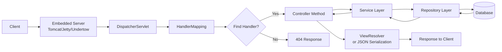

The **DispatcherServlet serves as the front controller**, receiving all incoming requests and delegating them to appropriate handlers. This centralized request handling eliminates the need for the one-servlet-per-function pattern that characterized earlier Servlet development. Auto-configuration automatically sets up the application based on the dependencies in the classpath—for example, adding `spring-boot-starter-web` auto-configures components like `DispatcherServlet`[^68].

**The controller interacts with the service layer, where business logic resides**[^68]. The service layer may then use repositories (interfaces extending `CrudRepository` or `JpaRepository`) to interact with the database via Spring Data JPA. After processing, the controller returns a response, such as a `ModelAndView` object or JSON/XML data. The `ViewResolver` may resolve a logical view name to a physical view. Finally, the `DispatcherServlet` sends the response back to the client through the embedded server.

**Thread handling follows the thread-per-request model** inherited from the servlet container. Each incoming request is assigned to a thread from an internal thread pool, which processes the request through all layers and returns the response. Spring Security, when enabled, automatically sets up the `SecurityContext` to the thread that processes the request, ensuring that authentication and authorization information is available throughout the request lifecycle.

The **linear, hierarchical flow through the layers** ensures predictable behavior and clear debugging paths. When an issue occurs, developers can trace the request through each layer systematically, understanding exactly where processing failed. This clarity contrasts sharply with earlier approaches where request handling, business logic, and data access might be interleaved within a single component.

### 6.6 Component Lifecycle and Dependency Wiring Across Layers

**Spring Boot's IoC container manages component lifecycle and dependency injection across all architectural layers**, ensuring that beans are properly instantiated, configured, and wired together before the application begins processing requests. The `ApplicationContext` serves as the central registry for all Spring-managed components, coordinating their creation and destruction according to well-defined lifecycle phases.

The **bean lifecycle in Spring Boot follows a predictable sequence**:

| Phase | Description | Extension Points |
|-------|-------------|------------------|
| **Instantiation** | Container creates bean instance | Constructor injection occurs here |
| **Property Population** | Dependencies injected via setters/fields | Setter injection occurs here |
| **Initialization** | Bean prepared for use | `@PostConstruct`, `InitializingBean` |
| **Ready for Use** | Bean available in ApplicationContext | Normal application operation |
| **Destruction** | Application shutting down | `@PreDestroy`, `DisposableBean` |

**Constructor injection is the recommended approach for dependency wiring** because it ensures immutability of dependencies—once an object is constructed, its dependencies cannot be changed. This approach also makes dependencies explicit in the class API and enables straightforward testing without requiring framework intervention:

```java
@Service
public class CatService {
    
    private final CatRepository catRepository;
    
    public CatService(CatRepository catRepository) {
        this.catRepository = catRepository;
    }
    // ...
}
```

In this pattern from the Controller-Service-Repository documentation[^34], the `CatService` declares its dependency on `CatRepository` through its constructor. Spring's IoC container automatically identifies the dependency, locates the appropriate bean, and injects it during service instantiation.

**Auto-configuration plays a crucial role in dependency wiring** by detecting classpath contents and automatically configuring appropriate beans. When Spring Boot starts, it scans for auto-configuration classes that use conditional annotations to determine what should be configured. If a `DataSource` is needed and the appropriate driver is on the classpath, auto-configuration creates and configures one automatically.

The **ApplicationContext manages bean relationships** through a combination of component scanning (detecting `@Component`, `@Service`, `@Repository`, `@Controller` annotations) and explicit bean definitions (`@Bean` methods in `@Configuration` classes). By default, Spring Boot enables JPA repository support and looks in the package (and its subpackages) where `@SpringBootApplication` is located for repository interfaces.

**Loose coupling between layers is achieved through interface-based design**. Controllers depend on service interfaces, not implementations; services depend on repository interfaces, not concrete classes. This design enables:

1. **Easy testing**: Mock implementations can be injected during tests
2. **Flexibility**: Implementations can be swapped without changing dependent code
3. **Parallel development**: Teams can work on different layers simultaneously against agreed interfaces

The IoC container ensures that **all dependencies are resolved before the application accepts requests**. If a required dependency cannot be satisfied—perhaps a database connection cannot be established—the application fails fast during startup rather than encountering runtime errors during request processing.

### 6.7 Testing Strategies for Layered Architecture

**Spring Boot's layered architecture enables comprehensive testing strategies** that align with the testing pyramid principle: many fast unit tests at the base, fewer integration tests in the middle, and minimal end-to-end tests at the top. The clear separation of concerns allows each layer to be tested independently, with mocked dependencies for adjacent layers[^69].

The **golden rule is to write many unit tests, some integration tests, and few end-to-end tests**[^69]. A typical proportion is 70–80% unit tests (fast, isolated, covering edge cases), 15–20% integration tests (cross-layer correctness), and 5–10% end-to-end tests (real dependencies, complete workflows).

| Test Type | Purpose | Tools | Layer Focus |
|-----------|---------|-------|-------------|
| **Unit Tests** | Verify isolated class behavior | JUnit 5, Mockito | Service layer business logic |
| **Component/Slice Tests** | Test single Spring component | `@WebMvcTest`, `@DataJpaTest` | Controller or Repository in isolation |
| **Integration Tests** | Verify cross-layer interaction | `@SpringBootTest`, Testcontainers | Multiple layers together |
| **End-to-End Tests** | Validate complete workflows | TestRestTemplate, WireMock | Entire application stack |

**Unit testing the Service Layer** exemplifies how the layered architecture supports testing. By mocking the repository, the service's business logic can be tested in complete isolation[^34]:

```java
@ExtendWith(MockitoExtension.class)
public class CatServiceTest {
    
    @Mock
    CatRepository catRepo;
    
    @Test
    public void getCatById() throws Exception {
        CatService catService = new CatService(catRepo);
        Optional<Cat> cat = Optional.of(new Cat().withId(1).withName("Boots"));
        when(catRepo.findById(1L)).thenReturn(cat);
        
        Cat foundCat = catService.findById(1);
        
        assertThat(foundCat).isEqualTo(cat.get());
        verify(catRepo).findById(1L);
    }
}
```

This test verifies that the service correctly retrieves a cat from the repository and returns it. **The service layer can be tested as a POJO**, through mocking repository conditions, without needing to go through the controller layer[^34].

**Controller testing uses `@WebMvcTest` and `MockMvc`** to test the presentation layer in isolation[^34][^70]:

```java
@WebMvcTest(CatsController.class)
public class CatsControllerTest {
    
    @MockBean
    CatService catService;
    
    @Autowired
    MockMvc mockMvc;
    
    @Test
    public void testGetById() throws Exception {
        Cat cat = new Cat().withId(1).withName("Boots");
        when(catService.findById(1)).thenReturn(cat);
        
        mockMvc.perform(get("/api/cat/1"))
            .andExpect(status().isOk())
            .andExpect(jsonPath("$.name").value("Boots"));
        
        verify(catService).findById(1);
    }
}
```

**Spring Boot instantiates only the web layer rather than the whole context** when using `@WebMvcTest`[^70]. In an application with multiple controllers, you can even ask for only one to be instantiated by specifying it in the annotation. The `@MockBean` annotation creates and injects a mock for the service, allowing the controller to be tested without real business logic execution.

**Repository testing uses `@DataJpaTest`** with an in-memory database like H2[^69]:

```java
@DataJpaTest
class UserRepositoryTest {
    
    @Autowired
    private UserRepository userRepository;
    
    @Test
    void shouldSaveAndFindUser() {
        User user = userRepository.save(new User(null, "Alice"));
        assertTrue(userRepository.findById(user.getId()).isPresent());
    }
}
```

**Integration testing verifies that multiple components work correctly together**[^69]. Using `@SpringBootTest` loads the full application context, enabling tests that exercise the complete request flow. For database integration tests, **Testcontainers provides real database instances** (Postgres, MySQL, MongoDB) in Docker containers, ensuring tests run against production-like infrastructure rather than in-memory substitutes that may behave differently.

The benefits of this testing approach include **high confidence in each layer's correctness** through focused unit tests, **verification of layer interactions** through integration tests, and **validation of complete user workflows** through targeted end-to-end tests. The layered architecture makes this testing strategy natural and maintainable.

### 6.8 Architectural Flexibility: Monolithic and Microservices Support

**Spring Boot's layered architecture supports both monolithic and microservices deployment models**, with the same design patterns applying regardless of deployment strategy. In a monolithic application, all layers exist within a single deployment unit. In a microservices architecture, each service follows the same layered pattern internally while communicating with other services through well-defined APIs.

**A monolithic application is built as a single unified unit** where all components—user interface, business logic, and data access layer—are interconnected and run as one process[^71][^72]. Key characteristics include a single code base, tight coupling between components, shared resources including database and configuration, and deployment as a single artifact (JAR or WAR file).

| Aspect | Monolithic Architecture | Microservices Architecture |
|--------|------------------------|---------------------------|
| **Deployment** | Single unit | Independent services |
| **Scaling** | Scale entire application | Scale individual services |
| **Database** | Shared database | Database-per-service |
| **Development** | Single codebase | Multiple codebases |
| **Complexity** | Simpler initially | More complex infrastructure |
| **Fault Isolation** | Failure affects entire app | Failure isolated to service |

**In contrast, a microservices architecture relies on a series of independently deployable services**[^71]. These services have their own business logic and database with a specific goal. Updating, testing, deployment, and scaling occur within each service. Microservices decouple major business, domain-specific concerns into separate, independent code bases.

**The biggest mistake teams make is creating services around technical concerns instead of business domains**[^73]. Service sizing principle: a service should be owned by a team of 6-8 people maximum. If you need more people to maintain it, it's too big. Domain-driven service boundaries ensure that each microservice owns its data and never directly accesses another service's database.

Spring Boot supports microservices development through several mechanisms[^67][^73][^74]:

- **Spring Cloud Eureka** for service registration and discovery
- **Spring Cloud Config** for centralized configuration management
- **Spring Cloud Gateway** as the API gateway and single entry point
- **OpenFeign** for declarative REST clients with built-in load balancing
- **Resilience4j** for circuit breakers, retries, and fault tolerance
- **Spring Cloud Sleuth** with Zipkin for distributed tracing

**Netflix migrated its IT infrastructure from private data centers to a public cloud and replaced its monolithic architecture with a microservices architecture**[^71]. Today, Netflix has more than a thousand microservices that manage and support separate parts of the platform. Atlassian also transitioned to microservices in 2018 after facing growing and scaling challenges with Jira and Confluence.

The **transition from monolith to microservices** can follow several patterns[^75]:

1. **Strangler Pattern**: Gradually replace monolith functionality with microservices, using an API Gateway to route requests appropriately
2. **Anti-Corruption Layer**: Introduce a translation layer between new microservices and legacy systems
3. **Domain Decomposition**: Break down the monolithic system into microservices corresponding to specific business domains

**Data consistency in microservices requires accepting eventual consistency** and implementing compensation patterns for transactions spanning multiple services[^73]. The Saga pattern implements compensating transactions for cross-service operations, while CQRS (Command Query Responsibility Segregation) separates read and write models for better scalability.

**Spring Boot's layered architecture provides the foundation for both approaches**. Within each microservice, the Controller-Service-Repository pattern maintains clean separation of concerns. Between microservices, well-defined APIs at the controller layer enable service composition and orchestration. This consistency means that developers can apply the same architectural knowledge whether building monolithic applications or distributed microservices systems.

The key lessons from production microservices implementations include[^73]: **start simple** with service discovery and basic communication patterns before adding complexity; **monitor everything** with distributed tracing and comprehensive metrics from the start; **design for failure** using circuit breakers and retry mechanisms to prevent cascading failures; and **accept eventual consistency** while designing business processes accordingly. The patterns that make Spring Boot applications robust in monolithic deployments—layered architecture, dependency injection, clear separation of concerns—prove equally valuable in microservices architectures.

## 7 Version Evolution and Feature Progression of Spring Boot

This chapter traces the complete evolution of Spring Boot from its initial 1.0 release in April 2014 through the current 4.0 release in November 2025, analyzing the significant features, architectural changes, and paradigm shifts introduced in each major version. The research examines how Spring Boot has continuously adapted to address emerging development needs including reactive programming, cloud-native deployment, containerization, native image compilation, and modern Java language features, providing historical context for understanding the framework's trajectory and its role in shaping contemporary Java web development practices.

### 7.1 Spring Boot 1.x: Establishing the Foundation (2014-2017)

The release of **Spring Boot 1.0 in April 2014** marked a watershed moment in Java web development, establishing the convention-over-configuration paradigm that would fundamentally transform how developers approached enterprise application development. This foundational release emerged from 18 months of intensive development following the original community request to "improve containerless web application architectures," and it delivered on the promise of dramatically simplified Spring development[^53].

The development effort that culminated in Spring Boot 1.0 was substantial and community-driven. The project saw **1720 commits by 54 different contributors**, closed **549 issues**, and was forked **398 times** during its development phase[^53]. This level of engagement demonstrated both the urgency of the problems being addressed and the collaborative nature of the solution that emerged.

**Spring Boot 1.0 introduced three revolutionary capabilities** that established the foundation for all subsequent versions:

| Core Innovation | Implementation | Impact |
|----------------|----------------|--------|
| **Auto-configuration** | Classpath-based automatic bean configuration | Eliminated manual XML/Java configuration for common scenarios |
| **Starter Dependencies** | Curated dependency collections | Resolved version compatibility issues and simplified dependency management |
| **Embedded Servers** | Tomcat/Jetty packaged in executable JARs | Enabled "containerless" deployment without external application servers |

The rationale for the containerless approach was articulated clearly in the 1.0 release announcement: "Today's PaaS environments provide much of the management, scale out, and reliability features already, so we focus on making Spring Boot an ultralight container, great for application or service deployment in the cloud"[^53]. This vision aligned perfectly with the emerging Platform-as-a-Service paradigm that was reshaping enterprise deployment strategies.

**Spring Boot 1.0 built upon Spring Framework 4.0.3**, establishing the pattern of each Spring Boot generation being closely aligned with a corresponding Spring Framework version[^76]. The 1.x series continued this alignment as it evolved:

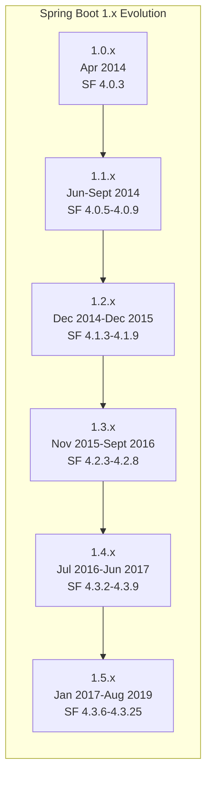

The **version numbering convention** during this era included the word "RELEASE" after version numbers (e.g., "1.0.0.RELEASE"), a practice that would be dropped starting with version 2.4.x[^76]. This convention reflected the framework's origins in the broader Spring ecosystem's release practices.

The simplicity that Spring Boot 1.x delivered was demonstrated through the canonical "Hello World" example that could be run using the CLI tool. The framework leveraged Groovy for scripting capabilities while also supporting direct Java development with Spring Boot libraries[^53]. The claim that **executable programs could fit in a single tweet (140 characters)** captured the dramatic reduction in ceremony compared to traditional Spring Framework development[^53].

**Cloud Foundry integration was seamless from the beginning**, thanks to collaboration with the Java Buildpack team[^53]. This cloud-readiness positioned Spring Boot as the natural choice for organizations adopting cloud-first strategies during this period.

The 1.x series established patterns that would persist through subsequent generations: the emphasis on developer productivity, the prioritization of sensible defaults over explicit configuration, and the commitment to production-readiness out of the box. These foundational principles, validated through widespread adoption during the 2014-2017 period, provided the stable base upon which Spring Boot 2.0 would introduce more ambitious capabilities.

### 7.2 Spring Boot 2.0: Reactive Programming and Spring Framework 5 (2018)

**Spring Boot 2.0 was released on March 1, 2018**, marking the first major revision nearly four years after the 1.0 release. This version represented a significant architectural evolution, building on **Spring Framework 5.0** and introducing comprehensive support for reactive programming that would reshape how developers approached high-concurrency applications[^77][^76].

The development effort for Spring Boot 2.0 was extensive, spanning **17 months** and encompassing **over 6800 commits by 215 different contributors**[^77]. This represented a substantial increase in community participation compared to the 1.0 development cycle, reflecting the framework's growing importance in the Java ecosystem.

**The headline features of Spring Boot 2.0** addressed both runtime requirements and developer experience improvements:

| Feature Category | Implementation | Significance |
|-----------------|----------------|--------------|
| **Java Baseline** | Java 8 required, Java 9 supported | Enabled lambda expressions and streams throughout the codebase |
| **Reactive Web** | Spring WebFlux with annotation and functional styles | Non-blocking alternative to Spring MVC for high-throughput scenarios |
| **Reactive Data** | Auto-configuration for Cassandra, MongoDB, Couchbase, Redis | Complete reactive stack from web to persistence |
| **Embedded Netty** | First-time Netty server support | Native reactive server without servlet container overhead |
| **HTTP/2** | Support for Tomcat, Undertow, and Jetty | Modern protocol capabilities for improved performance |
| **Kotlin Support** | First-class Kotlin language integration | Appeal to developers preferring Kotlin's concise syntax |
| **Metrics** | Micrometer-based with multiple exporters | Comprehensive observability with Atlas, Datadog, Prometheus, and others |
| **Quartz Scheduler** | Auto-configuration support | Enterprise scheduling capabilities built-in |

**Reactive programming support was the transformative capability** of this release. Spring WebFlux provided a fully non-blocking reactive alternative to Spring MVC, and Spring Boot offered auto-configuration for both annotation-based Spring WebFlux applications and WebFlux.fn, which offered a more functional style API[^78]. The `spring-boot-starter-webflux` starter POM provided everything needed to begin reactive development, backed by an embedded Netty server.

The reactive data layer was equally comprehensive. **Spring Data provided reactive API support for Cassandra, MongoDB, Couchbase, and Redis**, with Spring Boot including special starter POMs for these technologies, such as `spring-boot-starter-data-mongodb-reactive`[^78]. This meant developers could build completely non-blocking applications from the HTTP layer through to data persistence.

**Embedded Netty server support** was particularly significant because it marked the first time Spring Boot supported a non-servlet-based server. The `spring-boot-starter-webflux` pulled in Netty 4.1 and Reactor Netty, enabling truly reactive applications without any servlet container overhead[^78]. However, Netty could only be used as a reactive server—blocking servlet API support was not provided through this path.

**Spring Security 5.0 integration** extended reactive support to the security layer. Auto-configuration was provided for WebFlux applications whenever Spring Security was on the classpath, with access rules configurable via a `SecurityWebFilterChain`[^78]. This ensured that reactive applications could maintain the same security posture as their servlet-based counterparts.

The **new Actuator architecture** represented a complete redesign of Spring Boot's monitoring capabilities. The Micrometer-based metrics system supported an extensive list of exporters including Atlas, Datadog, Ganglia, Graphite, Influx, JMX, New Relic, Prometheus, SignalFx, StatsD, and Wavefront[^77]. This vendor-neutral approach to metrics collection positioned Spring Boot applications for deployment in diverse monitoring environments.

**Security auto-configuration was greatly simplified** in this release, reducing the complexity that had accumulated in the 1.x security configuration model[^77]. This simplification aligned with Spring Boot's core philosophy of providing sensible defaults while allowing customization when needed.

Spring Boot 2.0 established the pattern of major versions introducing paradigm-shifting capabilities while maintaining the framework's commitment to developer productivity. The reactive programming model introduced in this release would influence Java development practices for years to come, even as many applications continued to use the traditional servlet-based model.

### 7.3 Spring Boot 2.3: Cloud-Native Buildpacks and Docker Integration (2020)

**Spring Boot 2.3.0 was released in June 2020**, introducing capabilities that positioned the framework as a leader in cloud-native Java development. This release focused heavily on containerization support, reflecting the industry's accelerating adoption of Docker and Kubernetes for application deployment[^79].

The release brought significant dependency upgrades across the Spring portfolio, including **Spring Data Neumann, Spring HATEOAS 1.1, Spring Integration 5.3, Spring Kafka 2.5, Spring Security 5.3, and Spring Session Dragonfruit**[^79]. Third-party dependencies also received major updates: Cassandra Driver 4.6, Couchbase Client 3.0, Elasticsearch 7.6, Kafka 2.5, Micrometer 1.5, and MongoDB 4.0.

**Cloud Native Buildpacks integration** was the headline feature, fundamentally changing how Spring Boot applications could be containerized:

| Capability | Implementation | Benefit |
|------------|----------------|---------|
| **Buildpack Support** | Maven `spring-boot:build-image` goal and Gradle `bootBuildImage` task | Docker images without writing Dockerfiles |
| **Paketo Java Buildpack** | Default buildpack for image creation | Production-ready images with best practices |
| **Layered JARs** | Content separated into layers | Optimized container image caching |

Cloud Native Buildpacks convert applications into runnable platform images, similar to how platforms like Cloud Foundry or Heroku work. For example, Cloud Foundry's Java buildpack detects a .jar file and automatically adds a relevant JRE[^80]. With Spring Boot 2.3, developers could type a single command to quickly get a sensible image into their locally running Docker daemon[^80].

**The layered JAR feature** addressed a common pain point in containerized deployments. By separating JAR contents into layers, Spring Boot enabled more efficient use of Docker's layer caching mechanism. When application code changed but dependencies remained the same, only the application layer needed to be rebuilt, dramatically reducing build and deployment times.

**Graceful shutdown support** was added for all four embedded web servers—Jetty, Reactor Netty, Tomcat, and Undertow—for both reactive and Servlet-based web applications[^79]. When a grace period was configured, upon shutdown, the web server would no longer permit new requests and would wait for up to the grace period for active requests to complete. This capability was essential for Kubernetes deployments where pods needed to drain connections gracefully during rolling updates.

**Application availability tracking** introduced built-in knowledge of whether an application was alive and ready to handle traffic[^79]. This feature directly supported Kubernetes liveness and readiness probes, enabling the orchestration platform to make informed decisions about routing traffic and restarting unhealthy instances.

**R2DBC (Reactive Relational Database Connectivity) received GA support** in this release, extending reactive programming capabilities to relational databases[^79]. Combined with the reactive data support introduced in 2.0, this meant developers could build fully reactive applications even when using traditional SQL databases.

**Java 14 support** was added while maintaining compatibility with Java 11 and 8[^79]. This continued Spring Boot's pattern of supporting the latest Java releases while preserving backward compatibility for organizations on longer upgrade cycles.

The Paketo buildpacks project continued to evolve alongside Spring Boot. The Spring Boot plugins for Maven and Gradle used the CNB builders provided by the Paketo Buildpacks project by default[^81]. As the buildpacks ecosystem matured, Spring Boot maintained alignment—for instance, when Paketo announced that Ubuntu 18.04 Bionic-based builders would no longer be supported in favor of Ubuntu 22.04 Jammy-based builders, Spring Boot updated its defaults accordingly[^81].

Spring Boot 2.3 represented a pivotal moment in the framework's evolution, establishing containerization support that would become increasingly important as organizations embraced Kubernetes-based deployment strategies. The combination of buildpack integration, layered JARs, graceful shutdown, and availability probes created a comprehensive cloud-native development experience.

### 7.4 Spring Boot 3.0: Jakarta EE Migration and GraalVM Native Images (2022)

**Spring Boot 3.0 was released in November 2022**, representing the most transformative release since 2.0 and the first major revision in 4.5 years[^82]. This version introduced fundamental changes that would reshape the Spring ecosystem, including the migration from Java EE to Jakarta EE and production-ready support for GraalVM native images.

The development effort was substantial, involving **12 months of work and over 5700 commits by 151 different individuals**[^82]. This release was also the first GA version providing support for **Spring Framework 6.0**, establishing a new baseline for the entire Spring portfolio.

**The Java 17 baseline requirement** represented a significant shift from previous versions' backward compatibility approach. Organizations needed to upgrade their Java runtime before adopting Spring Boot 3.0, but this requirement enabled the framework to leverage modern Java language features and performance improvements.

| Transformation | Details | Impact |
|---------------|---------|--------|
| **Jakarta EE Migration** | Java EE to Jakarta EE APIs, EE 10 compatible with EE 9 baseline | Package namespace changes (javax.* to jakarta.*) |
| **GraalVM Native Images** | Production-ready support superseding Spring Native | Sub-second startup, reduced memory footprint |
| **Observability** | Micrometer and Micrometer Tracing improvements | Unified observability across distributed systems |
| **Java 17 Baseline** | Minimum Java version requirement | Access to modern language features |

**The Jakarta EE migration** was perhaps the most impactful change for existing applications. Spring Boot 3.0 migrated from Java EE to Jakarta EE APIs for all dependencies, with Jakarta EE 10 compatibility wherever possible[^83][^82]. This meant that code using `javax.servlet`, `javax.persistence`, and other Java EE packages needed to be updated to use the corresponding `jakarta.*` packages. While the changes were largely mechanical, they affected virtually every enterprise Spring application.

**GraalVM native image support** represented a paradigm shift in how Java applications could be deployed. GraalVM Native Images are standalone executables generated by processing compiled Java applications ahead-of-time. Native Images generally have a **smaller memory footprint and start faster than their JVM counterparts**[^84]. They are well suited to applications deployed using container images and are especially interesting when combined with "Function as a service" (FaaS) platforms.

The native image compilation process involves several key differences from traditional JVM execution:

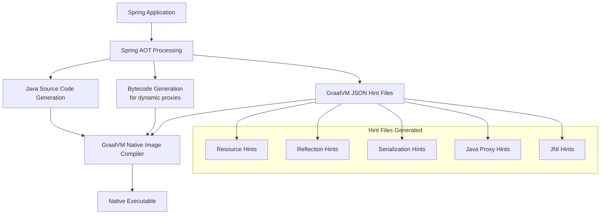

**Spring Ahead-of-Time (AOT) processing** was introduced to support native image compilation. This process imposes certain limitations based on a "closed-world assumption"—the beans defined in an application cannot change at runtime, Spring `@Profile` annotation and profile-specific configuration have limitations, and properties that change if a bean is created are not supported[^84].

**Two primary approaches exist for building native images**: using Spring Boot support for Cloud Native Buildpacks to generate a lightweight container containing a native executable, or using GraalVM Native Build Tools to generate a native executable directly[^84]. For Maven users, the `mvn -Pnative spring-boot:build-image` command creates a container image with the native executable, while `mvn -Pnative native:compile` produces a standalone native executable.

The **observability enhancements** unified metrics, tracing, and logging across the Spring portfolio. Supporting Jakarta EE 9 and 10, the observability enhancements, and GraalVM support represented a **"huge team effort that left no corner of the Spring portfolio untouched"**[^82].

Spring Boot 3.0 established the foundation for the next generation of Spring development, balancing the need for modernization with the practical realities of enterprise application migration. The Jakarta EE transition and native image support positioned the framework for cloud-native deployment scenarios where startup time and memory efficiency are critical considerations.

### 7.5 Spring Boot 3.2: Virtual Threads and Modern Java Features (2023)

**Spring Boot 3.2 was released in November 2023**, introducing support for Java 21's virtual threads—a capability that offered developers a simpler alternative to fully reactive programming for handling high-concurrency workloads[^85][^76].

Virtual threads, introduced as part of Project Loom in Java 21, represent a fundamental shift in Java's concurrency model. Unlike platform threads that map directly to operating system threads, virtual threads are lightweight threads managed by the JVM that can be created in much larger numbers without the traditional overhead associated with thread creation and context switching.

**To use virtual threads in Spring Boot 3.2**, developers need to run on Java 21 and set the property `spring.threads.virtual.enabled`[^85]. Once enabled, Spring Boot automatically uses virtual threads for handling HTTP requests, enabling applications to handle many more concurrent connections without the complexity of reactive programming.

| Concurrency Approach | Complexity | Throughput | Use Case |
|---------------------|------------|------------|----------|
| **Traditional Threads** | Low | Limited by thread pool size | Simple applications |
| **Reactive (WebFlux)** | High | Very high | I/O-bound, high-concurrency |
| **Virtual Threads** | Low | High | I/O-bound, simpler programming model |

The significance of virtual threads lies in their ability to provide many of the throughput benefits of reactive programming while maintaining the familiar imperative programming model. Developers can write straightforward blocking code—making database calls, invoking external services, waiting for I/O—and the JVM handles the efficient scheduling of virtual threads automatically.

Spring Boot 3.2 also continued the evolution of observability features that began in 3.0. The Micrometer integration matured, providing comprehensive metrics collection and export capabilities. Distributed tracing support enabled tracking requests across microservices boundaries, essential for debugging and performance analysis in distributed systems.

**Enhanced testing capabilities** in this release improved the developer experience for verifying application behavior. The testing infrastructure supported both traditional and virtual thread execution models, ensuring that applications could be thoroughly tested regardless of which concurrency approach they employed.

The release also updated the default Paketo builder to the Jammy (Ubuntu 22.04) version, reflecting the ongoing evolution of the container image ecosystem[^81]. This change ensured that Spring Boot applications built with Cloud Native Buildpacks used current, supported base images.

Spring Boot 3.2 represented an important milestone in making high-concurrency Java development more accessible. While reactive programming remained the appropriate choice for certain scenarios—particularly those requiring backpressure handling or complex event-driven architectures—virtual threads provided a compelling alternative for many common use cases where the complexity of reactive programming was not justified.

### 7.6 Spring Boot 4.0: Modularization and Next-Generation Architecture (2025)

**Spring Boot 4.0 was released on November 20, 2025**, marking the beginning of a new framework generation built on **Spring Framework 7** and targeting **Jakarta EE 11**[^86]. This release introduced architectural changes that modernized the framework's internal structure while raising baselines across the technology stack.

The version history shows the rapid progression from milestone to general availability: Spring Boot 4.0.0-M1 was the first milestone published to Maven Central and included initial modularization efforts[^87], followed by the GA release that delivered the complete feature set[^86].

**The complete modularization of the Spring Boot codebase** represents the most significant architectural change in this release. Auto-configuration classes now live in modules that are narrower in scope, providing smaller and more focused JARs[^86][^88]. Developers who prefer a layout closer to the older Spring Boot 3 experience can add the `spring-boot-autoconfigure-classic` module[^88].

| Baseline Change | Spring Boot 3.x | Spring Boot 4.0 | Migration Impact |
|----------------|-----------------|-----------------|------------------|
| **Java Version** | Java 17+ | Java 17+ (first-class Java 25 support) | Minimal for Java 17 users |
| **Spring Framework** | 6.x | 7.0 | API changes possible |
| **Jakarta EE** | EE 10 | EE 11 | Package updates may be needed |
| **Servlet API** | Servlet 6.0 | Servlet 6.1 | Container updates required |
| **Kotlin** | Kotlin 1.x | Kotlin 2.2+ | Build configuration changes |
| **GraalVM** | Various | Version 25+ | Native build toolchain update |
| **Gradle** | Gradle 7.x/8.x | Gradle 8.14+ (support for 9) | Build script updates |

**Null safety improvements with JSpecify** represent a portfolio-wide enhancement. Actuator endpoints and other framework components now use `org.jspecify.annotations.Nullable` for optional parameters, providing better compile-time null safety guarantees[^88].

**HTTP Service Clients** form one of the headline features, with new auto-configuration for HTTP service interfaces in both Spring MVC and Spring WebFlux. Configuration for these clients uses a new unified namespace under `spring.http.clients.*`[^88]. HTTP clients backed by the JDK `HttpClient` are configured to use virtual threads when `spring.threads.virtual.enabled` is set to `true`[^88].

**API versioning support** introduces auto-configuration for Spring MVC and WebFlux, driven by properties under `spring.mvc.apiversion.*` and `spring.webflux.apiversion.*`[^88]. This built-in support simplifies the common requirement of managing multiple API versions in production systems.

**Observability enhancements** include a new starter `spring-boot-starter-opentelemetry` and updated configuration under `management.opentelemetry.*`[^88]. The observability modules were renamed for clarity: `spring-boot-metrics` becomes `spring-boot-micrometer-metrics`, `spring-boot-observation` becomes `spring-boot-micrometer-observation`, and `spring-boot-tracing` becomes `spring-boot-micrometer-tracing`[^88].

**Undertow support was removed** because Undertow is not yet compatible with Servlet 6.1[^88]. Applications using Undertow must migrate to Tomcat or Jetty, both of which are fully supported with versions compatible with the Servlet 6.1 baseline.

**Testing support grows** with the introduction of `RestTestClient` and new properties for controlling metrics and tracing export in tests[^88]. These additions simplify the testing of HTTP clients and observability configurations.

The migration path from Spring Boot 3.x to 4.0 requires attention to several areas. Spring Boot 4.0 removes methods, classes, and properties that were already deprecated in Spring Boot 3, so projects should first move to the latest Spring Boot 3.5 release, clean up deprecation warnings, and only then move to 4.0[^88]. The dedicated migration guide provides detailed upgrade instructions for addressing the various baseline changes.

Spring Boot 4.0 continues the framework's evolution toward more modular, observable, and cloud-native architectures while maintaining the developer productivity focus that has defined Spring Boot since its inception.

### 7.7 Evolutionary Themes and Future Trajectory

Examining Spring Boot's evolution from 1.0 in 2014 through 4.0 in 2025 reveals several recurring themes that have shaped the framework's development and will likely influence its future trajectory.

**The continuous simplification of developer experience** has been the most consistent theme across all versions. From the initial elimination of XML configuration in 1.0, through auto-configuration refinements in each release, to the modularization in 4.0, every major version has sought to reduce the cognitive overhead required to build production applications. This philosophy aligns with the original vision articulated in 2014: enabling developers to focus on business logic rather than infrastructure configuration.

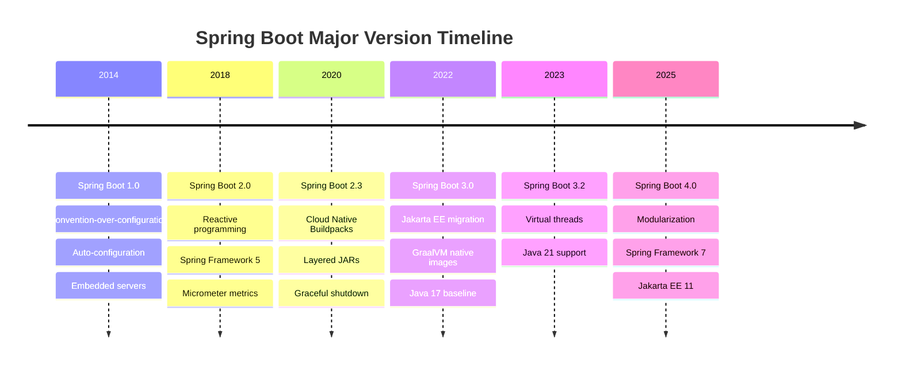

**Progressive adoption of cloud-native patterns** has accelerated through each major version. Spring Boot 1.x introduced embedded servers enabling containerless deployment. Version 2.3 added Cloud Native Buildpacks and Kubernetes-friendly features like graceful shutdown and health probes. Version 3.0 delivered GraalVM native images for serverless and edge deployments. By 2024, **85% of enterprises have a cloud-native strategy in place**, and Spring Boot has evolved to support these strategies comprehensively[^89].

The impact of cloud-native development with Spring Boot is measurable: organizations report **47% reduction in deployment time, 99.99% service availability, 60% cost optimization, and 3x faster development**[^89]. Spring Boot's cloud-native features—including auto-configuration providing 70% reduction in setup time, container images with Cloud Native Buildpacks achieving 80% reduction in deployment time, and built-in monitoring through Actuator endpoints—have contributed directly to these outcomes[^89].

**Embrace of modern Java language features** has characterized Spring Boot's evolution strategy. Each major version has raised its Java baseline strategically: 2.0 required Java 8, 3.0 required Java 17, and 4.0 provides first-class support for Java 25 while retaining Java 17 compatibility[^88]. This approach balances access to language improvements with the practical realities of enterprise upgrade cycles.

**Adaptation to emerging deployment paradigms** has driven feature development across versions. The reactive programming support in 2.0 addressed the need for high-throughput, non-blocking applications. Native image support in 3.0 targeted serverless and edge computing scenarios where startup time and memory footprint are critical. Virtual threads in 3.2 provided a simpler concurrency model for many common use cases. The combination of Spring Boot and Kubernetes has become **"the gold standard for building and deploying cloud-native Java applications"** in 2025[^90].

**Backward compatibility management** has been handled through strategic breaking changes in major versions. Spring Boot maintains strong backward compatibility within major version lines, but uses major version boundaries to introduce necessary breaking changes. The migration from Java EE to Jakarta EE in 3.0 and the modularization in 4.0 exemplify this approach—significant changes that improve the framework's long-term sustainability while requiring explicit migration effort.

The framework's position as **"the de facto standard for building modern, production-ready Java applications"** reflects both its technical capabilities and its alignment with industry trends[^91]. Spring Boot's seamless integration with Docker, Kubernetes, and cloud platforms like AWS, Azure, and GCP has made it the natural choice for cloud-native deployment and scaling[^91].

Looking forward, several trends suggest Spring Boot's continued evolution:

| Trend | Current State | Likely Evolution |
|-------|---------------|------------------|
| **Observability** | OpenTelemetry starter in 4.0 | Deeper integration with observability platforms |
| **AI/ML Integration** | Emerging in cloud-native landscape | Potential auto-configuration for AI frameworks |
| **Edge Computing** | Native images support edge deployment | Enhanced support for resource-constrained environments |
| **Green Computing** | Growing industry focus | Optimization for energy-efficient deployment |

The cloud-native landscape continues to evolve with trends including GitOps and Infrastructure as Code (providing 75% reduction in configuration errors), service mesh evolution with advanced capabilities, edge computing integration, and AI/ML integration[^89]. Spring Boot's history suggests it will continue adapting to address these emerging requirements while maintaining its core commitment to developer productivity.

Spring Boot's trajectory from a community request in 2012 to the dominant Java application framework in 2025 demonstrates the power of addressing real developer pain points with pragmatic solutions. The framework's evolution—from eliminating XML configuration, through reactive programming and cloud-native deployment, to modularization and native images—reflects a consistent philosophy: make the common case simple while keeping the complex case possible. This philosophy, validated through over a decade of production use, positions Spring Boot to continue shaping Java development practices for years to come.

[^53]: Spring Boot 1.0 GA Released
[^86]: Spring Boot 4.0.0 available now
[^86]: Spring Boot 4.0.0 available now
[^87]: Spring Boot 4.0.0-M1 available now
[^89]: Cloud-Native Development with Spring Boot
[^89]: Cloud-Native Development with Spring Boot
[^77]: Spring Boot 2.0 goes GA
[^78]: Spring Boot 2.0 Release Notes
[^83]: Spring Boot 3.0 Release Notes
[^82]: Spring Boot 3.0 Goes GA
[^79]: Spring Boot 2.3.0 available now
[^85]: Spring Boot 3.2 Release Notes
[^84]: GraalVM Native Image Support - Spring
[^88]: What's New in Spring Boot 4.0
[^90]: Spring Boot and Kubernetes in 2025: The Ultimate Guide
[^91]: Introduction to Spring Boot
[^76]: Spring Boot version history
[^80]: Cloud Native Buildpacks :: Spring Boot
[^81]: Paketo Buildpacks Bionic End Of Support - Spring

## 8 Essential Developer Knowledge for Spring Boot Development

This chapter synthesizes the essential knowledge and skills developers need to effectively work with Spring Boot applications, covering the foundational annotations, configuration patterns, data access mechanisms, API development practices, and production-readiness concerns that form the core competencies required for modern Spring Boot development. The analysis bridges theoretical understanding with practical implementation guidance, establishing the knowledge framework necessary for developers transitioning from earlier Java web development approaches to the Spring Boot ecosystem.

### 8.1 Core Annotations and Component Model

The annotation-based programming model represents one of Spring Boot's most significant departures from the verbose configuration requirements of earlier Java web development. Where Servlet-based applications required extensive `web.xml` configuration and JSP development often mixed concerns within single files, **Spring Boot's annotation system enables developers to express intent declaratively while the framework handles infrastructure concerns automatically**. Mastering these core annotations is fundamental to productive Spring Boot development.

**The `@SpringBootApplication` annotation serves as the entry point for every Spring Boot application**, encapsulating three essential annotations that together enable the convention-over-configuration paradigm[^92]. This composite annotation combines `@SpringBootConfiguration` (indicating the class provides Spring Boot application configuration), `@EnableAutoConfiguration` (enabling Spring Boot's intelligent auto-configuration mechanism), and `@ComponentScan` (telling Spring where to search for components)[^92]. By placing this single annotation on the main class, developers activate the entire Spring Boot infrastructure without explicit configuration:

```java
@SpringBootApplication
public class Application {
    public static void main(String[] args) {
        SpringApplication.run(Application.class, args);
    }
}
```

**Stereotype annotations classify components by their architectural role** and enable automatic detection through component scanning. The following table summarizes these essential annotations and their purposes:

| Annotation | Layer | Purpose | Special Behavior |
|------------|-------|---------|------------------|
| `@Component` | Generic | Marks a class as a Spring-managed component | Base annotation for all stereotypes |
| `@Service` | Business Logic | Defines business logic components | Semantic clarity for service layer |
| `@Repository` | Data Access | Marks data access components | Automatic exception translation |
| `@Controller` | Presentation | Handles web requests with view resolution | Returns view names by default |
| `@RestController` | Presentation | Handles REST API requests | Combines `@Controller` and `@ResponseBody` |

The `@Service` annotation is used in the service layer to define business logic[^92], while the `@Repository` annotation is used in the DAO layer to interact with the database[^92]. The `@Repository` annotation provides additional functionality beyond simple component marking—it enables automatic translation of persistence-specific exceptions into Spring's consistent exception hierarchy, simplifying error handling across different database technologies.

**Dependency injection annotations wire components together without manual instantiation**, addressing the tight coupling problems that plagued Servlet-based development. The `@Autowired` annotation automatically injects required dependencies into a class[^92], with Spring resolving dependencies by type. When multiple beans of the same type exist, the `@Qualifier` annotation specifies which bean to inject by name[^92], and the `@Primary` annotation marks a bean as the default choice among multiple candidates[^92].

The **web annotations provide a declarative approach to HTTP request handling** that eliminates the manual request parsing required in Servlet development. The `@RestController` annotation creates RESTful web services and automatically returns data in JSON or XML format[^92]. The `@RequestMapping` annotation maps HTTP requests to controller classes or methods[^93], with HTTP method-specific variants providing more focused mappings:

| Annotation | HTTP Method | Purpose |
|------------|-------------|---------|
| `@GetMapping` | GET | Retrieving data |
| `@PostMapping` | POST | Sending/creating data |
| `@PutMapping` | PUT | Updating data |
| `@DeleteMapping` | DELETE | Deleting data |
| `@PatchMapping` | PATCH | Partial updates |

These shortcut variants are composed annotations that are meta-annotated with `@RequestMapping`, providing a more specific and readable alternative to using `@RequestMapping` with explicit method attributes[^93]. The `@PathVariable` annotation extracts values from the URI path[^92], the `@RequestParam` annotation reads query parameters from the request URL[^92], and the `@RequestBody` annotation binds the HTTP request body to a Java object[^92].

**The contrast with earlier development approaches is stark**. Where a Servlet required explicit registration in `web.xml`, URL pattern mapping, and manual parameter extraction from `HttpServletRequest`, a Spring Boot controller achieves the same result through annotations that communicate intent clearly while the framework handles the infrastructure:

```java
@RestController
@RequestMapping("/api/customers")
public class CustomerController {
    
    private final CustomerService customerService;
    
    public CustomerController(CustomerService customerService) {
        this.customerService = customerService;
    }
    
    @GetMapping("/{id}")
    public Customer getCustomer(@PathVariable Long id) {
        return customerService.findById(id);
    }
}
```

This concise code replaces what would have required a servlet declaration, URL mapping configuration, and explicit request parameter parsing in traditional Servlet development. The constructor injection pattern shown here is the recommended approach, ensuring immutability and explicit dependency declaration.

### 8.2 Configuration Management with Properties and YAML

**Spring Boot's externalized configuration system enables applications to adapt to different environments without code changes**, addressing a fundamental challenge in enterprise application deployment. The framework supports multiple configuration sources including property files, YAML files, environment variables, and command-line arguments, with a well-defined precedence order that allows environment-specific overrides[^94].

The **default configuration file `application.properties`** uses a simple key-value format that is familiar to most developers[^95]. Properties are specified as `key=value` pairs, with hierarchical data represented through dot-separated prefixes:

```properties
server.port=8080
spring.datasource.url=jdbc:mysql://localhost:3306/mydb
spring.datasource.username=root
spring.datasource.password=secret
```

**YAML configuration provides a more readable alternative** for hierarchical data structures. YAML files use indentation to represent hierarchy, eliminating the repetitive prefixes required in properties files[^95]. The same configuration in YAML format demonstrates the improved readability:

```yaml
server:
  port: 8080
spring:
  datasource:
    url: jdbc:mysql://localhost:3306/mydb
    username: root
    password: secret
```

YAML is a superset of JSON and provides a convenient syntax for storing external properties in a hierarchical format[^94]. The format is particularly beneficial for complex configurations with deeply nested structures, where the properties file format would require extensive prefix repetition.

**Profile-specific configuration enables environment-appropriate settings** without maintaining separate codebases. The active Spring profile can be set through the system property `spring.profiles.active`, the environment variable `SPRING_PROFILES_ACTIVE`, or in `application.properties`[^94]. Profile-specific configuration files follow the naming convention `application-{profile}.properties` or `application-{profile}.yml`:

| Profile | Configuration File | Use Case |
|---------|-------------------|----------|
| `dev` | `application-dev.yml` | Local development settings |
| `test` | `application-test.yml` | Testing environment |
| `prod` | `application-prod.yml` | Production deployment |

Spring Boot supports **multi-document files** that combine multiple profiles within a single configuration file. In YAML, three dashes (`---`) indicate a new document, while properties files use `#---` as the document separator starting from Spring Boot 2.4.0[^95]. Documents can be conditionally activated using `spring.config.activate.on-profile`:

```yaml
spring:
  datasource:
    url: jdbc:h2:mem:testdb
---
spring:
  config:
    activate:
      on-profile: prod
  datasource:
    url: jdbc:mysql://production-server:3306/mydb
```

**Placeholder syntax enables property references and composition**. The `${}` syntax allows properties to reference other properties, system properties, or environment variables[^95]. This capability is particularly valuable for avoiding duplication and enabling runtime configuration:

```yaml
app:
  name: MyApplication
  description: ${app.name} is a Spring Boot application
server:
  port: ${SERVER_PORT:8080}
```

The colon syntax (`${property:default}`) provides default values when properties are not defined, ensuring applications can start with sensible defaults while allowing environment-specific overrides.

**The `@ConfigurationProperties` annotation binds external properties to type-safe Java objects**[^95], providing compile-time safety and IDE support that raw property access lacks. This approach is recommended for complex configuration structures:

```java
@ConfigurationProperties(prefix = "app.datasource")
public class DataSourceProperties {
    private String url;
    private String username;
    private String password;
    private int maxPoolSize = 10;
    // getters and setters
}
```

**Best practices for production configuration** include externalizing sensitive information through environment variables rather than committing them to configuration files, using profile-specific files for environment differences, and leveraging the `@ConfigurationProperties` validation capabilities to catch configuration errors at startup rather than runtime. The Spring Boot Actuator's `/configprops` endpoint displays all properties bound through `@ConfigurationProperties`, aiding in configuration debugging[^94].

### 8.3 Data Access with Spring Data JPA

**Spring Data JPA fundamentally simplifies database interactions** by eliminating the boilerplate code that characterized earlier JDBC-based development. The framework provides the ability to create repository implementations automatically, at runtime, from a repository interface[^47], enabling developers to focus on domain modeling rather than data access plumbing.

**Entity classes define the mapping between Java objects and database tables** using JPA annotations. The `@Entity` annotation marks a class as a JPA entity, meaning it is mapped to a database table[^47]. The `@Id` annotation identifies the primary key property, and `@GeneratedValue` indicates that the ID should be generated automatically[^47]:

```java
@Entity
public class Customer {
    
    @Id
    @GeneratedValue(strategy = GenerationType.AUTO)
    private Long id;
    
    private String firstName;
    private String lastName;
    
    // Default constructor required by JPA
    protected Customer() {}
    
    public Customer(String firstName, String lastName) {
        this.firstName = firstName;
        this.lastName = lastName;
    }
    
    // getters and setters
}
```

The entity class requires a default constructor for JPA's use and typically includes a business constructor for creating instances with required data. Properties like `firstName` and `lastName` are mapped to columns sharing the same names by default[^47].

**Repository interfaces extend Spring Data's base interfaces** to inherit standard data access operations. The `CrudRepository` interface provides methods for working with persistence including save, findById, findAll, count, delete, and existsById[^47]. The `CustomerRepository` interface demonstrates this pattern:

```java
public interface CustomerRepository extends CrudRepository<Customer, Long> {
    List<Customer> findByLastName(String lastName);
}
```

The generic parameters specify `Customer` as the entity type and `Long` as the ID type. **Spring Data JPA creates an implementation when you run the application**[^47]—developers need not write implementation code for standard operations.

**Query method naming conventions enable powerful queries without SQL**. Spring Data JPA lets you define other query methods by declaring their method signature[^47]. The `findByLastName()` method shown above generates a query that filters by the `lastName` property. The naming convention supports complex queries through keyword combinations:

| Method Name Pattern | Generated Query Logic |
|--------------------|----------------------|
| `findByFirstName(String name)` | `WHERE firstName = ?` |
| `findByFirstNameAndLastName(String first, String last)` | `WHERE firstName = ? AND lastName = ?` |
| `findByAgeGreaterThan(int age)` | `WHERE age > ?` |
| `findByLastNameOrderByFirstNameAsc(String name)` | `WHERE lastName = ? ORDER BY firstName ASC` |
| `findByFirstNameContaining(String pattern)` | `WHERE firstName LIKE %?%` |

**The `@Transactional` annotation manages transaction boundaries** declaratively, ensuring that database operations within a method execute atomically. This annotation is typically applied at the service layer, where business operations may span multiple repository calls that must succeed or fail together.

The Spring Data JPA tutorial identifies several core topics that developers should master: basic repository operations, entity mapping annotations, CRUD operations using built-in methods, advanced querying with custom JPQL and native SQL, entity relationships (one-to-one, one-to-many, many-to-many), and performance optimization through caching and query tuning[^96].

**The contrast with earlier JDBC development is dramatic**. Where manual JDBC required connection management, statement preparation, parameter binding, result set iteration, and exception handling for every database operation, Spring Data JPA reduces the same functionality to interface declarations and method naming conventions. This reduction in boilerplate code enables developers to focus on domain logic rather than data access infrastructure.

### 8.4 Building RESTful APIs

**REST has become the de facto standard for building web services** because REST services are easy to build and consume[^97]. Spring Boot provides comprehensive support for RESTful API development through the Spring MVC framework, enabling developers to build APIs that leverage HTTP's native capabilities including suitable actions (GET, POST, PUT, DELETE), caching, and security[^97].

**Controller design follows the thin controller principle**, where controllers handle HTTP concerns while delegating business logic to services. The `@RestController` annotation marks a class as handling REST requests, automatically serializing return values to JSON:

```java
@RestController
@RequestMapping("/api/employees")
public class EmployeeController {
    
    private final EmployeeRepository repository;
    
    public EmployeeController(EmployeeRepository repository) {
        this.repository = repository;
    }
    
    @GetMapping
    public List<Employee> all() {
        return repository.findAll();
    }
    
    @GetMapping("/{id}")
    public Employee one(@PathVariable Long id) {
        return repository.findById(id)
            .orElseThrow(() -> new EmployeeNotFoundException(id));
    }
    
    @PostMapping
    public Employee newEmployee(@RequestBody Employee employee) {
        return repository.save(employee);
    }
}
```

**Exception handling with `@RestControllerAdvice`** provides consistent error responses across all controllers. Rather than scattering try-catch blocks throughout controller code, a centralized exception handler translates business exceptions into appropriate HTTP responses[^97]:

```java
@RestControllerAdvice
public class EmployeeNotFoundAdvice {
    
    @ExceptionHandler(EmployeeNotFoundException.class)
    @ResponseStatus(HttpStatus.NOT_FOUND)
    public String employeeNotFoundHandler(EmployeeNotFoundException ex) {
        return ex.getMessage();
    }
}
```

**Proper HTTP status codes communicate operation results** to clients. The `ResponseEntity` class enables explicit control over status codes and headers. For example, POST operations should return HTTP 201 Created with a Location header indicating the new resource's URI[^97]:

```java
@PostMapping
public ResponseEntity<?> newEmployee(@RequestBody Employee employee) {
    Employee savedEmployee = repository.save(employee);
    return ResponseEntity
        .created(linkTo(methodOn(EmployeeController.class).one(savedEmployee.getId())).toUri())
        .body(savedEmployee);
}
```

**Spring HATEOAS enables hypermedia-driven REST APIs** that communicate valid state transitions through links. A key ingredient to being RESTful is adding hypermedia links[^97]. Rather than returning plain domain objects, controllers return `EntityModel` wrappers that include links:

```java
@GetMapping("/{id}")
public EntityModel<Employee> one(@PathVariable Long id) {
    Employee employee = repository.findById(id)
        .orElseThrow(() -> new EmployeeNotFoundException(id));
    
    return EntityModel.of(employee,
        linkTo(methodOn(EmployeeController.class).one(id)).withSelfRel(),
        linkTo(methodOn(EmployeeController.class).all()).withRel("employees"));
}
```

The `RepresentationModelAssembler` pattern simplifies link creation by centralizing the conversion logic[^97]. This assembler handles the conversion of domain objects to `EntityModel` objects with appropriate links, reducing code duplication across controller methods.

**Input validation with `@Valid`** ensures that incoming data meets requirements before processing. Combined with Bean Validation annotations on domain objects, this approach catches invalid input at the API boundary:

```java
@PostMapping
public Employee newEmployee(@Valid @RequestBody Employee employee) {
    return repository.save(employee);
}
```

**Building evolvable APIs** requires careful consideration of backward compatibility. When adding new fields, old fields should not be removed—both old and new clients should be able to interact with the service[^97]. For example, splitting a `name` field into `firstName` and `lastName` should retain virtual getters and setters for the old `name` property, enabling gradual client migration.

### 8.5 Production Monitoring with Spring Boot Actuator

**Spring Boot Actuator brings production-ready features to applications**, making monitoring, gathering metrics, and understanding traffic or database state trivial[^98]. Its main benefit is providing production-grade tools without requiring developers to implement them from scratch. Actuator exposes operational information about the running application—health, metrics, info, dump, env, etc.—using HTTP endpoints or JMX beans[^98].

**To enable Spring Boot Actuator**, add the `spring-boot-starter-actuator` dependency to the project[^99]. Once the dependency is on the classpath, several endpoints are available out of the box[^98]. For Maven projects:

```xml
<dependency>
    <groupId>org.springframework.boot</groupId>
    <artifactId>spring-boot-starter-actuator</artifactId>
</dependency>
```

**By default, only `/health` and `/info` endpoints are exposed**. To enable all endpoints, set `management.endpoints.web.exposure.include=*` in the configuration[^98]. All endpoints are placed under the `/actuator` path by default, which can be changed using the `management.endpoints.web.base-path` property[^98].

The following table summarizes the key Actuator endpoints:

| Endpoint | Purpose | Use Case |
|----------|---------|----------|
| `/actuator/health` | Application health status | Kubernetes liveness/readiness probes |
| `/actuator/info` | Arbitrary application information | Version, build info, custom details |
| `/actuator/metrics` | Application metrics | Performance monitoring |
| `/actuator/env` | Environment properties | Configuration debugging |
| `/actuator/beans` | All Spring beans | Dependency analysis |
| `/actuator/configprops` | Configuration properties | Configuration verification |
| `/actuator/loggers` | Logger configuration | Runtime log level adjustment |
| `/actuator/prometheus` | Prometheus-formatted metrics | Integration with Prometheus monitoring |

**The health endpoint provides basic information about application health**[^99]. The response includes a status indicator (UP, DOWN, OUT_OF_SERVICE, UNKNOWN) and can be configured to show detailed component health with `management.endpoint.health.show-details=always`[^99].

**Custom health indicators extend the health endpoint** to check critical dependencies. By implementing the `HealthIndicator` interface, applications can report the status of databases, external services, or any other critical component[^99]:

```java
@Component
public class DatabaseHealthIndicator implements HealthIndicator {
    
    @Override
    public Health health() {
        if (isDatabaseHealthy()) {
            return Health.up().withDetail("database", "Available").build();
        }
        return Health.down().withDetail("database", "Not responding").build();
    }
}
```

**Metrics collection uses Micrometer**, which replaced Spring Boot's in-house metrics system[^98]. The `/metrics` endpoint provides various application metrics, and specific metrics can be queried by appending the metric name (e.g., `/actuator/metrics/jvm.memory.used`)[^99]. The response includes measurement values and available tags for filtering:

```json
{
    "name": "jvm.memory.used",
    "measurements": [{"statistic": "VALUE", "value": 123456789}],
    "availableTags": [
        {"tag": "area", "values": ["heap", "nonheap"]}
    ]
}
```

**Custom endpoints can be created** by defining a bean annotated with `@Endpoint`[^99]. Operations are defined using `@ReadOperation` (GET), `@WriteOperation` (POST), and `@DeleteOperation` (DELETE)[^98]:

```java
@Endpoint(id = "custom")
@Component
public class CustomEndpoint {
    
    @ReadOperation
    public Map<String, String> customEndpoint() {
        return Map.of("message", "Custom endpoint response");
    }
}
```

**Security considerations are critical for Actuator endpoints** in production. By default, all Actuator endpoints are unsecured, and in production environments, they should be secured using Spring Security[^99]. This typically involves requiring authentication for Actuator endpoints while potentially allowing unauthenticated access to the health endpoint for load balancer health checks.

### 8.6 Testing Strategies for Spring Boot Applications

**Writing tests for Spring Boot applications is essential to ensure their reliability, maintainability, and quality**[^100]. The framework provides comprehensive testing support that enables strategies aligned with the testing pyramid principle: many fast unit tests, fewer integration tests, and minimal end-to-end tests.

**To get started with testing, add the `spring-boot-starter-test` dependency**, which includes JUnit, Mockito, and other useful testing libraries[^100]:

```xml
<dependency>
    <groupId>org.springframework.boot</groupId>
    <artifactId>spring-boot-starter-test</artifactId>
    <scope>test</scope>
</dependency>
```

**Unit testing with Mockito enables isolated component verification**. Mockito allows creating mock objects, defining their behavior, and verifying interactions[^100]. The `@Mock` annotation creates mock objects, and `@InjectMocks` injects the mocks into the class under test[^100]:

```java
@ExtendWith(MockitoExtension.class)
class UserServiceTest {
    
    @Mock
    private UserRepository userRepository;
    
    @InjectMocks
    private UserService userService;
    
    @Test
    void shouldFindUserById() {
        User user = new User(1L, "Alice");
        when(userRepository.findById(1L)).thenReturn(Optional.of(user));
        
        User found = userService.findById(1L);
        
        assertThat(found.getName()).isEqualTo("Alice");
        verify(userRepository).findById(1L);
    }
}
```

The BDD (Behavior-Driven Development) style using Mockito's `given()` and `willReturn()` methods provides more readable test code that expresses intent clearly[^101].

**Spring Boot provides test slices for testing specific components** in isolation[^100]. These annotations load only the parts of the application context needed for the test, enabling faster test execution:

| Test Slice | Annotation | Purpose |
|------------|------------|---------|
| Web Layer | `@WebMvcTest` | Testing controllers |
| Data Layer | `@DataJpaTest` | Testing repositories |
| REST Clients | `@RestClientTest` | Testing REST clients |

**Controller testing with `@WebMvcTest`** loads only the web layer, allowing controllers to be tested without the full application context[^100]. The `@MockBean` annotation creates and injects mocks for service dependencies:

```java
@WebMvcTest(UserController.class)
class UserControllerTest {
    
    @Autowired
    private MockMvc mockMvc;
    
    @MockBean
    private UserService userService;
    
    @Test
    void shouldReturnUser() throws Exception {
        when(userService.findById(1L)).thenReturn(new User(1L, "Alice"));
        
        mockMvc.perform(get("/api/users/1"))
            .andExpect(status().isOk())
            .andExpect(jsonPath("$.name").value("Alice"));
    }
}
```

**Repository testing with `@DataJpaTest`** configures an in-memory database and JPA components[^101]. This slice is ideal for verifying custom query methods and entity mappings:

```java
@DataJpaTest
class UserRepositoryTest {
    
    @Autowired
    private UserRepository userRepository;
    
    @Test
    void shouldSaveAndFindUser() {
        User saved = userRepository.save(new User(null, "Alice"));
        
        Optional<User> found = userRepository.findById(saved.getId());
        
        assertThat(found).isPresent();
        assertThat(found.get().getName()).isEqualTo("Alice");
    }
}
```

**Integration testing with `@SpringBootTest`** loads the full application context for end-to-end verification[^100]. This approach tests the complete request flow through all layers:

```java
@SpringBootTest
@AutoConfigureMockMvc
class UserIntegrationTest {
    
    @Autowired
    private MockMvc mockMvc;
    
    @Test
    void shouldCreateAndRetrieveUser() throws Exception {
        mockMvc.perform(post("/api/users")
                .contentType(MediaType.APPLICATION_JSON)
                .content("{\"name\": \"Alice\"}"))
            .andExpect(status().isCreated());
    }
}
```

**The testing strategy should follow the testing pyramid**: many unit tests covering edge cases and business logic, integration tests verifying cross-layer interactions, and minimal end-to-end tests validating complete workflows. This approach maximizes test coverage while maintaining fast feedback cycles.

### 8.7 Security Implementation with Spring Security

**Spring Security is a powerful framework designed to handle authentication and authorization for Java applications**[^102]. When integrated with Spring Boot, Spring Security provides a robust foundation for REST API security with minimal configuration. The framework offers comprehensive protection against common vulnerabilities while enabling fine-grained access control.

**To add Spring Security to a Spring Boot project**, include the `spring-boot-starter-security` dependency[^102]. This initial setup enables basic authentication, laying the groundwork for more advanced configurations:

```xml
<dependency>
    <groupId>org.springframework.boot</groupId>
    <artifactId>spring-boot-starter-security</artifactId>
</dependency>
```

**Security configuration uses `@EnableWebSecurity`** and defines a `SecurityFilterChain` bean that specifies access rules[^103]. The configuration can define which paths are public, which require authentication, and which require specific roles:

```java
@Configuration
@EnableWebSecurity
public class SecurityConfig {
    
    @Bean
    public SecurityFilterChain filterChain(HttpSecurity http) throws Exception {
        http
            .authorizeHttpRequests(auth -> auth
                .requestMatchers("/api/public/**").permitAll()
                .requestMatchers("/api/admin/**").hasRole("ADMIN")
                .anyRequest().authenticated()
            )
            .oauth2Login();
        return http.build();
    }
}
```

**OAuth2 provides token-based authentication** that allows third-party applications to access resources on behalf of users without sharing passwords[^102]. OAuth2 uses tokens to grant limited access, minimizing security risks. Spring Boot supports OAuth2 configuration through `application.yml` properties including client-id, client-secret, scope, and provider-specific endpoints[^103].

**JWT (JSON Web Token) enables stateless authentication** that is highly effective for REST APIs[^102]. A JWT consists of a Header, a Payload containing user data, and a Signature. The token contains all necessary user information, eliminating the need for server-side session storage[^102]. JWT implementation involves token generation and validation:

```java
public String generateToken(UserDetails userDetails) {
    return Jwts.builder()
        .setSubject(userDetails.getUsername())
        .setIssuedAt(new Date())
        .setExpiration(new Date(System.currentTimeMillis() + 86400000))
        .signWith(SignatureAlgorithm.HS512, secretKey)
        .compact();
}
```

**Method-level security with `@PreAuthorize`** enables role-based authorization at the method level[^102]. This annotation restricts access based on expressions that can reference user roles and method parameters:

```java
@PreAuthorize("hasRole('ADMIN')")
public void deleteUser(Long userId) {
    userRepository.deleteById(userId);
}
```

**CSRF protection considerations differ for REST APIs**. Spring Security has CSRF protection enabled by default, but it is usually disabled for REST APIs since token-based authentication mitigates CSRF risks[^102]. The configuration `http.csrf().disable()` removes CSRF protection when appropriate.

**Best practices for securing APIs** include enforcing strong password policies with BCrypt encoding, using HTTPS for all production traffic, implementing role-based access control, conducting regular security testing, and keeping dependencies updated[^102][^103]. Password encoding should use BCrypt with a strength of 12 or higher for production applications.

### 8.8 Best Practices for Production-Ready Applications

**Building production-ready Spring Boot applications requires attention to configuration management, error handling, database optimization, observability, and deployment concerns**. These best practices synthesize lessons learned throughout the Spring Boot ecosystem and address the operational requirements that distinguish development from production environments.

**Constructor-based dependency injection should be preferred over field injection** for production code. Constructor injection creates immutable objects where dependencies cannot be changed after construction, making the code more predictable and easier to test. The pattern also makes dependencies explicit in the class API:

```java
@Service
public class OrderService {
    
    private final OrderRepository orderRepository;
    private final PaymentService paymentService;
    
    public OrderService(OrderRepository orderRepository, PaymentService paymentService) {
        this.orderRepository = orderRepository;
        this.paymentService = paymentService;
    }
}
```

**Externalized configuration with environment variables** prevents sensitive information from being committed to source control. Critical parameters like database URLs, API keys, and JWT secrets should be injected through environment variables with sensible development defaults:

```yaml
spring:
  profiles:
    active: ${SPRING_PROFILES_ACTIVE:dev}
  datasource:
    url: ${DATABASE_URL:jdbc:h2:mem:devdb}
    username: ${DATABASE_USERNAME:sa}
    password: ${DATABASE_PASSWORD:}
```

**Global exception handling through `@RestControllerAdvice`** ensures consistent error responses across all endpoints. The handler should return structured error responses that provide meaningful information to clients while keeping technical details in logs:

```java
@RestControllerAdvice
public class GlobalExceptionHandler extends ResponseEntityExceptionHandler {
    
    @ExceptionHandler(EntityNotFoundException.class)
    public ResponseEntity<ErrorResponse> handleNotFound(EntityNotFoundException ex) {
        ErrorResponse error = new ErrorResponse(
            HttpStatus.NOT_FOUND.value(),
            "Resource not found",
            ex.getMessage()
        );
        return new ResponseEntity<>(error, HttpStatus.NOT_FOUND);
    }
}
```

**Database connection pooling with HikariCP** is essential for production performance. Spring Boot uses HikariCP by default, but pool settings should be tuned for the application's workload:

```yaml
spring:
  datasource:
    hikari:
      maximum-pool-size: 20
      minimum-idle: 5
      connection-timeout: 30000
```

**JPA optimization practices** include using lazy loading by default, adding indexes for frequently queried columns, implementing pagination for queries that may return large result sets, and using database migration tools like Flyway or Liquibase for schema management.

**Health check implementation supports container orchestration platforms** like Kubernetes. Custom health indicators should check critical dependencies:

```java
@Component
public class DatabaseHealthIndicator implements HealthIndicator {
    
    private final DataSource dataSource;
    
    @Override
    public Health health() {
        try (Connection conn = dataSource.getConnection()) {
            return Health.up().withDetail("database", "Available").build();
        } catch (SQLException e) {
            return Health.down().withDetail("database", e.getMessage()).build();
        }
    }
}
```

**Structured logging with correlation IDs** enables request tracing across distributed systems. Each request should be assigned a unique identifier that propagates through all service calls, enabling end-to-end debugging of distributed transactions.

**Graceful shutdown configuration** ensures that applications drain connections properly during deployment updates. Spring Boot supports graceful shutdown for all embedded servers, allowing active requests to complete before the application terminates:

```yaml
server:
  shutdown: graceful
spring:
  lifecycle:
    timeout-per-shutdown-phase: 30s
```

**Testing strategies should be practical and focused**. Integration tests with `@SpringBootTest` verify critical user flows, unit tests with mocking cover complex business logic, and slice tests (`@WebMvcTest`, `@DataJpaTest`) verify specific layer behavior. The goal is meaningful coverage rather than arbitrary percentage targets.

The following table summarizes the key production best practices:

| Area | Best Practice | Benefit |
|------|--------------|---------|
| **Dependency Injection** | Constructor injection | Immutability, explicit dependencies |
| **Configuration** | Environment variables for secrets | Security, environment flexibility |
| **Error Handling** | Global `@RestControllerAdvice` | Consistent error responses |
| **Database** | HikariCP tuning, pagination | Performance, resource efficiency |
| **Monitoring** | Actuator endpoints, custom health checks | Operational visibility |
| **Deployment** | Graceful shutdown | Zero-downtime deployments |
| **Testing** | Layered testing strategy | Quality assurance, fast feedback |

These practices represent the accumulated wisdom of the Spring Boot community and address the operational concerns that distinguish production-ready applications from development prototypes. By following these guidelines, developers can build applications that are not only functional but also maintainable, observable, and resilient in production environments.

## 9 Migration Strategies: From Legacy Systems to Modern Spring Boot

This chapter examines practical approaches for migrating legacy Servlet-based applications to Spring Boot, addressing both technical transformation patterns and organizational considerations. The research analyzes the complete migration lifecycle from assessment through implementation, covering servlet-to-controller refactoring, XML-to-annotation configuration conversion, service discovery integration, and microservices decomposition strategies. The chapter evaluates migration tools, patterns, and best practices while providing guidance on risk mitigation and incremental adoption approaches for organizations modernizing their Java web applications.

### 9.1 Migration Assessment and Planning Considerations

The decision to migrate from legacy Servlet-based applications to Spring Boot represents a **strategic evolution towards a more modular, scalable, and resilient system** that can adapt to changing business needs with agility[^104]. However, successful migration requires thorough assessment and careful planning before any code transformation begins. Organizations that rush into migration without proper preparation often encounter unexpected obstacles that derail timelines and budgets.

**Assessing migration readiness** begins with understanding the current application's architecture and identifying its structural characteristics. Servlet code structure typically involves a `web.xml` file mapping URLs to specific servlets, with each servlet handling specific functionality[^104]. The assessment should catalog all servlets, their URL mappings, initialization parameters, filter chains, and listener configurations. This inventory establishes the scope of work and reveals the complexity hidden within deployment descriptors that accumulated over years of development.

The following table outlines key assessment dimensions for legacy servlet applications:

| Assessment Dimension | Key Questions | Migration Impact |
|---------------------|---------------|------------------|
| **Servlet Inventory** | How many servlets exist? What URL patterns do they handle? | Determines number of controllers to create |
| **Configuration Complexity** | How extensive is web.xml? Are there custom filters and listeners? | Affects configuration migration effort |
| **Dependency Analysis** | Which libraries are used? What versions? | Identifies potential compatibility issues |
| **Business Logic Location** | Is logic in servlets, JSPs, or separate classes? | Indicates refactoring complexity |
| **Database Access Patterns** | Direct JDBC, ORM, or mixed approaches? | Determines data layer migration strategy |
| **Testing Coverage** | Do existing tests exist? What type? | Establishes baseline for regression prevention |

**Evaluating technical debt** requires honest assessment of code quality issues that have accumulated. Common technical debt in legacy servlet applications includes business logic embedded in servlets rather than service classes, direct database access from presentation code, inconsistent error handling patterns, and hardcoded configuration values. Each form of technical debt increases migration complexity because the code must be restructured, not merely translated.

**Organizational factors significantly influence migration success**. Team skill assessment should evaluate familiarity with Spring concepts including Dependency Injection, annotation-based configuration, and the Controller-Service-Repository architecture pattern. Teams experienced only with Servlet development may require training before undertaking migration. Timeline estimation must account for learning curves, especially for developers who have not previously worked with Spring Boot's conventions.

The **decision framework for migration approach** involves choosing between incremental refactoring and complete rewrite. Incremental refactoring preserves existing functionality while gradually introducing Spring Boot components, minimizing risk but extending the migration timeline. Complete rewrite offers a clean start but carries higher risk of introducing bugs and losing institutional knowledge embedded in the existing code. The validated approach from cross-referenced migration strategies recommends **incremental refactoring as the lower-risk path**, with the pattern of converting `HttpServlet` classes to Spring MVC controllers stepwise to minimize disruption.

**Reasons to migrate from monolithic to microservices** during this process include the need to adopt new technologies by creating microservices for new features, to achieve faster release cycles by extracting fast-moving parts, and to scale with the cloud by analyzing what is needed to put the application in the cloud[^104]. However, organizations should resist the temptation to simultaneously migrate from Servlets to Spring Boot and decompose into microservices—these are separate concerns that compound risk when combined.

**Establishing migration priority and sequencing** should consider business criticality, complexity, and interdependencies. Low-complexity, low-risk components make ideal candidates for initial migration, allowing teams to develop proficiency before tackling more challenging areas. Components with high test coverage provide safety nets for verifying migration correctness, making them preferable early targets.

### 9.2 Refactoring Servlets to Spring MVC Controllers

The transformation of servlet classes into Spring MVC controllers represents the core technical work of migration, requiring systematic conversion of HTTP handling code while preserving business functionality. **The main motivation for the migration is testability**—servlets make it very hard to create a good test suite, not good enough for continuous integration, while Spring MVC not only makes testing possible but enjoyable[^105].

**The migration process follows a structured sequence** that preserves functionality at each step while progressively modernizing the code structure. The recommended approach involves creating one controller per servlet initially, then incrementally refactoring to leverage Spring's capabilities[^105].

**Step 1: Create High-Level HTTP Tests** serves as the critical foundation that will save significant time throughout the migration. These tests verify behavior from the client's perspective, serving as regression detection throughout the transformation process. Tools like RestAssured enable testing web services from the client's perspective, with jsonPath making it easy to verify responses[^105]. This testing baseline ensures that each refactoring step preserves correct behavior.

**Step 2a: Create One Controller Per Servlet** begins the transformation by copying servlet content into controller classes. The initial conversion maintains the `HttpServletRequest` and `HttpServletResponse` parameters to minimize changes:

```java
// Original Servlet
public class HelloWorld extends HttpServlet {
    public void doGet(HttpServletRequest request, HttpServletResponse response)
            throws ServletException, IOException {
        // existing logic
    }
}

// Initial Controller Conversion
@RequestMapping("hello")
@Controller
public class HelloWorldController {
    @ResponseStatus(HttpStatus.OK)
    public void doGet(HttpServletRequest request, HttpServletResponse response)
            throws Exception {
        // same logic, temporarily
    }
}
```

The `@Controller` annotation marks the class for Spring's component scanning, and `@RequestMapping` replaces the URL mapping previously defined in `web.xml`[^105]. At this stage, the `web.xml` file can be removed as it is not needed in Spring Boot[^104].

**Step 2b: Replace Dependencies to HttpServletRequest** progressively eliminates direct request object access by using Spring's parameter binding annotations. The transformation converts manual parameter extraction to declarative annotation-based binding:

```java
// Before: Manual parameter extraction
public void doGet(HttpServletRequest request, HttpServletResponse response) {
    String name = request.getParameter("name");
    // ...
}

// After: Annotation-based parameter binding
public void doGet(@RequestParam String name, HttpServletResponse response) {
    // ...
}
```

This conversion leverages `@RequestParam` for query parameters, `@PathVariable` for URL path segments, and `@RequestBody` for request body content[^106]. Each annotation eliminates boilerplate code while making the method signature self-documenting.

**Step 2c: Create Appropriate Return Types and Remove HttpServletResponse Dependency** completes the controller modernization by replacing direct response writing with return values that Spring serializes automatically:

```java
// Before: Direct response writing
public void doGet(@RequestParam String name, @RequestParam String action, 
                  HttpServletResponse response) {
    PrintWriter writer = response.getWriter();
    if ("sayhello".equals(action)) {
        writer.write("{message:\"Hello " + name + "\"}");
    } else if ("list".equals(action)) {
        // write list
    }
}

// After: Return objects with @ResponseBody
@RequestMapping(params = "action=sayhello")
@ResponseBody
public HelloMessage sayHello(@RequestParam String name) {
    HelloMessage message = new HelloMessage();
    message.setMessage("Hello " + name);
    return message;
}

@RequestMapping(params = "action=list")
@ResponseBody
public List<HelloMessage> list() {
    List<HelloMessage> list = new ArrayList<>();
    // build list
    return list;
}
```

This transformation splits methods based on action parameters and returns typed objects that Spring automatically serializes to JSON[^105]. The `@ResponseBody` annotation (implicit with `@RestController`) instructs Spring to write the return value directly to the response body.

**The conversion pattern for annotation mapping** follows a consistent translation from Servlet methods to Spring annotations:

| Servlet Pattern | Spring Annotation | Purpose |
|-----------------|-------------------|---------|
| `doGet()` method | `@GetMapping` or `@RequestMapping(method=GET)` | Handle GET requests |
| `doPost()` method | `@PostMapping` or `@RequestMapping(method=POST)` | Handle POST requests |
| `request.getParameter()` | `@RequestParam` | Extract query parameters |
| URL path segments | `@PathVariable` | Extract path variables |
| Request body | `@RequestBody` | Bind JSON/XML to objects |
| `response.getWriter()` | Return value with `@ResponseBody` | Generate response content |

**Exception handling modernization** replaces try-catch blocks scattered throughout servlets with centralized `@ControllerAdvice` classes that provide consistent error responses across all endpoints. This approach aligns with the production best practice of implementing structured error handling using `@RestControllerAdvice` for global exception handling.

### 9.3 Converting XML Configuration to Annotation-Based Approaches

The transition from XML-based Spring configuration to modern annotation-driven configuration represents a fundamental shift in how applications are structured and maintained. **Spring Framework experienced significant evolution, with one notable change being the shift from XML-based configuration to annotation-driven configuration**—this transition is not merely a syntax change but a fundamental shift in how developers interact with the Spring container[^107].

**The rationale for transitioning from XML configuration** encompasses multiple dimensions. **Convenience** drives adoption because annotations significantly reduce the verbosity of XML configuration. **Maintainability** improves because annotations reside with the code, making refactoring and understanding context easier. **Flexibility** increases because annotations leverage Java's type system, enabling more compile-time checking and fewer runtime errors[^107].

The contrast between XML and annotation-based configuration illustrates the dramatic reduction in ceremony:

```xml
<!-- XML Configuration -->
<bean id="myService" class="com.example.MyServiceImpl">
    <property name="dependency" ref="myDependency"/>
</bean>
<bean id="myDependency" class="com.example.MyDependency"/>
```

Managing hundreds of such entries becomes tedious and error-prone. The equivalent annotation-based configuration requires only stereotype annotations on the classes themselves, with Spring's component scanning automatically discovering and wiring components.

**Core annotations replace XML bean definitions** through a systematic mapping:

| XML Element | Replacement Annotation | Purpose |
|-------------|----------------------|---------|
| `<bean>` element | `@Component`, `@Service`, `@Repository`, `@Controller` | Declare Spring-managed components |
| `<property>` injection | `@Autowired` | Automatic dependency injection |
| `<context:component-scan>` | `@ComponentScan` | Enable component discovery |
| `<import>` for configuration | `@Import` | Import other configuration classes |
| `<property-placeholder>` | `@PropertySource` | Externalize configuration to properties |

**The phased approach for transitioning** allows gradual migration without requiring immediate wholesale changes. The recommended strategy involves three phases[^107]:

1. **Mixed Configuration Phase**: Combine XML with annotations by using `<context:component-scan/>` in XML configuration to activate annotation-based configuration. This enables new components to use annotations while existing XML definitions remain functional.

2. **Bean Definition Replacement Phase**: Gradually replace XML bean definitions with annotated counterparts. Classes gain `@Service`, `@Repository`, or `@Component` annotations, and property injection converts to `@Autowired`.

3. **Java-Based Configuration Phase**: Eventually transition to `@Configuration` and `@Bean` annotations for complete Java-based configuration, eliminating XML entirely.

**Java-based configuration using `@Configuration`** provides type-safe alternatives to XML. The `@Configuration` annotation indicates that a class declares one or more `@Bean` methods, combining structured configuration with Java's power[^107]:

```java
@Configuration
@ComponentScan(basePackages = "com.example")
@PropertySource("classpath:application.properties")
public class AppConfig {
    
    @Bean
    public DataSource dataSource() {
        HikariDataSource ds = new HikariDataSource();
        ds.setJdbcUrl(environment.getProperty("db.url"));
        return ds;
    }
}
```

**Security configuration migration** requires particular attention. Legacy applications often define security constraints in `web.xml` or Spring Security XML files. The modern approach uses `@EnableWebSecurity` and `SecurityFilterChain` beans:

```java
@Configuration
@EnableWebSecurity
public class SecurityConfig {
    
    @Bean
    public SecurityFilterChain filterChain(HttpSecurity http) throws Exception {
        http
            .authorizeHttpRequests(auth -> auth
                .requestMatchers("/public/**").permitAll()
                .anyRequest().authenticated()
            );
        return http.build();
    }
}
```

**The benefits of completing the transition** extend beyond reduced verbosity. Annotation-driven configuration enables **easier navigation**—developers can jump directly from declaration to source code. It provides **reduced repetition** because bean properties need not be specified in both code and XML. And it delivers **improved productivity** as developers spend less time managing XML and more time writing business logic[^107].

**Handling complex configuration scenarios** may require retaining some programmatic configuration. Conditional bean creation, profile-specific beans, and complex initialization sequences often benefit from Java-based `@Configuration` classes rather than attempting to express everything through stereotype annotations alone.

### 9.4 Implementing Service Discovery and Communication Patterns

As applications evolve from monolithic servlet architectures toward distributed Spring Boot services, **service discovery becomes essential for enabling dynamic service location**. Due to the dynamic nature of microservices applications, it is difficult to invoke a service with a fixed IP address—this is where service discovery comes into the picture, helping clients know where service instances are located[^108].

**A Service Registry serves as the centralized database** containing the locations of service instances. In a microservices setup, services update their locations in the service registry at regular intervals, and service consumers connect to the registry to fetch service locations[^108]. **Netflix Eureka is a popular "Application-Level" open-source Service Registry** that integrates seamlessly with Spring Boot applications.

**Two primary service discovery patterns** address different architectural requirements:

| Pattern | Mechanism | Advantages | Considerations |
|---------|-----------|------------|----------------|
| **Client-Side Discovery** | Client queries registry, selects instance | Fewer network hops, simpler infrastructure | Couples client to registry |
| **Server-Side Discovery** | Platform router queries registry | Decouples clients from discovery | Requires platform support |

**In Client-Side Service Discovery**, the service consumer queries the Service Registry to obtain available instance locations, then routes requests directly to a selected instance[^108]. The Spring Cloud implementation uses Netflix components: **Eureka serves as the service registry, and Ribbon functions as the HTTP client that queries Eureka to route requests to available instances**[^109].

Configuration for Eureka client integration requires adding the dependency and annotating the application:

```java
@SpringBootApplication
@EnableEurekaClient
public class Application {
    public static void main(String[] args) {
        SpringApplication.run(Application.class, args);
    }
}
```

The `application.properties` configuration specifies the Eureka server location:

```properties
server.port=8761
spring.application.name=my-service
eureka.client.service-url.defaultZone=http://localhost:8761/eureka/
```

**The Self-Registration Pattern** involves service instances registering themselves with the Service Registry on startup and unregistering on shutdown. The service instance invokes the registry's registration API to register its network location, and the registry may invoke health check APIs to verify instance availability[^108].

**Server-Side Discovery** offers an alternative where clients make requests to a DNS name that resolves to a Platform Request Router. The router queries the Service Registry and load balances requests to available instances. **The key benefit is that all aspects of service discovery are handled by the deployment platform**—Kubernetes, for example, has built-in Service Registry and discovery mechanisms[^108].

**Third-Party Registration** provides another approach where a component called the *registrar* handles registration instead of services registering themselves. This pattern is useful when services cannot be modified to include registration logic[^108].

**Setting up a Gateway Service** centralizes routing and cross-cutting concerns. The gateway configuration defines routes that map incoming requests to backend services:

```properties
server.port=8080
spring.application.name=gateway-service
spring.cloud.gateway.routes[0].id=service-route
spring.cloud.gateway.routes[0].uri=lb://MY-SERVICE
spring.cloud.gateway.routes[0].predicates[0]=Path=/api/**
```

**Inter-service communication** leverages mechanisms supported by Spring Boot including RESTful HTTP and messaging queues like Kafka and AWS SQS[^104]. The choice between synchronous HTTP calls and asynchronous messaging depends on consistency requirements, latency tolerance, and coupling preferences.

The `RestTemplate` configured with Ribbon enables service-to-service calls using logical service names:

```java
@Bean
@LoadBalanced
public RestTemplate restTemplate() {
    return new RestTemplate();
}
```

With this configuration, requests to `http://REGISTRATION-SERVICE/user` are automatically resolved through Eureka to available service instances[^109]. **The `@LoadBalanced` annotation configures RestTemplate to use Ribbon, which queries Eureka for service discovery**[^109].

### 9.5 Microservices Decomposition Strategies

The decision to decompose a monolithic servlet application into microservices requires careful analysis of business domains, technical constraints, and organizational readiness. **Microservices break down applications into loosely connected, independently deployable services**, each handling a unique business function[^104]. This architecture enables flexible scaling where each service adjusts independently, tailored technology choices for each service, enhanced resilience as problems in one service don't necessarily disrupt the entire application, and swift progression as teams work independently[^104].

However, microservices introduce **distributed system complexity, data consistency challenges as each service manages its database, and operational overhead for monitoring and logging**[^104]. Organizations must weigh these considerations against the benefits before committing to decomposition.

**Domain-driven service boundary identification** forms the foundation of effective decomposition. Services should align with business capabilities rather than technical layers. The strangler pattern enables gradual migration by incrementally replacing monolith functionality with microservices while maintaining system operation throughout the transition.

**The steps for converting servlets to microservices using Spring Boot** follow a systematic process[^104]:

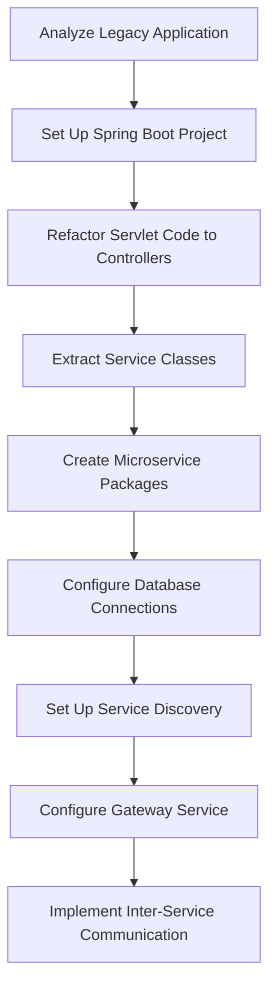

**Step 1: Set Up New Spring Boot Projects** using Spring Initializr, selecting the desired Spring Boot version and adding necessary dependencies like Web, JPA, Cloud Config, and Eureka Discovery[^104].

**Step 2: Refactor Servlet Code** by identifying servlets to convert, adding `@RestController` and `@RequestMapping` annotations to map methods to HTTP endpoints. The `web.xml` file can be removed as it is not needed in Spring Boot[^104].

**Step 3: Create Microservices** by extracting each servlet's functionality into separate service classes. Create a new package for each microservice and move the service classes into them, refactoring to ensure each has a clear responsibility[^104].

**Step 4: Set Up Database Connections** using Spring Data JPA. Update the `application.properties` file for each microservice to configure database connections, ports, and other settings. Define entities that map to database tables[^104].

**Step 5: Set Up Service Discovery with Eureka** by adding the Eureka dependency, annotating the main application class with `@EnableEurekaClient`, and configuring the Eureka server connection[^104].

**Step 6: Set Up Gateway Service** by configuring routes that direct incoming requests to appropriate microservices based on URL patterns[^104].

**Step 7: Implement Communication Between Microservices** using RESTful HTTP for synchronous calls and messaging queues like Kafka or AWS SQS for asynchronous communication[^104].

**Database-per-service patterns** require accepting eventual consistency rather than ACID transactions spanning services. Compensation patterns handle failures in distributed transactions, and CQRS (Command Query Responsibility Segregation) separates read and write models for better scalability.

**The modular monolith alternative** deserves consideration before committing to full microservices decomposition. Spring Modulith provides opinionated guidance for arranging code into loosely coupled modules within a single project, offering many microservices benefits without distributed system complexity. **Modular monoliths are quite close to microservices**, meaning modules should be as independent as possible and communicate through exposed APIs.

**Organizational alignment** is critical for microservices success. Service ownership should align with team structure—a service should be owned by a team of 6-8 people maximum. If more people are needed to maintain it, the service is too big. This organizational principle ensures that services remain manageable and that teams have clear accountability.

### 9.6 Automated Migration Tools and Techniques

**Spring Boot Migrator is a tool designed to migrate applications to Spring Boot**, functioning as a JAR application requiring only JVM version 11+ to run[^110]. The tool uses recipes for automatic refactoring, where each recipe performs a sequence of operations on code and configuration files. This automation significantly reduces the manual effort required for migration while ensuring consistency across transformations.

**Prerequisites for using Spring Boot Migrator** include specific project requirements. The initial project must be a Maven project (but no Maven Reactor, only one `pom.xml`), must follow Maven directory layout, and must have a recent build with `mvn clean package` with the target directory still existing[^110].

**The tool operates through a recipe-based approach** with recipes categorized by automation level[^110]:

| Category | Symbol | Description |
|----------|--------|-------------|
| **Automated** | 🤖 | Fully automated transformations |
| **Partially Automated** | 💪 🤖 | Requires some manual intervention |
| **Manual** | 💪 | Provides guidance for manual changes |

**Key recipes relevant to servlet migration** include:

- `initialize-spring-boot-migration` — Initialize an application as a Spring Boot application[^110]
- `migrate-annotated-servlets` — Allow Spring Boot to deploy servlets annotated with `@WebServlet`[^110]
- `migrate-jpa-to-spring-boot` — Migrate JPA to Spring Boot[^110]
- `upgrade-boot-1x-to-2x` — Migrate Spring Boot 1.x to 2.x including best practices[^110]

**The workflow for using Spring Boot Migrator** involves scanning and applying recipes:

1. **Scan the project** using the `scan` command to identify which recipes can be applied to the existing codebase[^110]
2. **Apply recipes** using `apply recipe-name` to execute the selected transformation[^110]
3. **Review changes** through git integration that automatically commits changes after applying each recipe[^110]

For example, scanning a project might reveal applicable recipes like `initialize-spring-boot-migration` and specific migration recipes for the technologies in use. Applying a recipe results in actions such as adding dependencies, converting files, and modifying code[^110].

**The technology powering Spring Boot Migrator is OpenRewrite**, an open-source mass refactoring ecosystem for Java and other source code designed to eliminate technical debt[^110]. OpenRewrite parses project files and manipulates the Abstract Syntax Tree (AST) representing them. A recipe is a series of transformations applied to the AST of files[^110].

**Recipes can be defined declaratively in YAML or programmatically in Java**[^110]. For example, the Mule migration recipe is defined in code and includes actions like adding dependencies, annotating the Spring Boot application class with `@EnableIntegration`, and removing Mule-specific dependencies and plugins[^110].

**Practical limitations of automated tools** require acknowledgment. Not all migration scenarios can be fully automated—complex business logic embedded in servlets, custom filter implementations, and non-standard patterns may require manual intervention. The tools excel at mechanical transformations like annotation changes and dependency updates but cannot automatically restructure poorly designed code into clean architectures.

**The recommended approach combines automated tools with manual review**. Use Spring Boot Migrator for initial transformation and mechanical changes, then manually refactor business logic into proper service layers following the Controller-Service-Repository pattern. The git integration enables reviewing each automated change before proceeding, ensuring that transformations are correct and appropriate.

### 9.7 Testing Strategies During Migration

**Testing serves as the safety net that ensures migration correctness and prevents regression** throughout the transformation process. The validated migration approach emphasizes that creating high-level HTTP tests as the first step will save significant time in the long run, serving as verification throughout the migration[^105].

**High-level HTTP tests using RestAssured** verify application behavior from the client's perspective. These tests exercise the complete request-response cycle, validating that endpoints return correct data regardless of internal implementation changes:

```java
@Test
public void shouldReturnUserById() {
    given()
        .when()
            .get("/api/users/1")
        .then()
            .statusCode(200)
            .body("name", equalTo("Alice"));
}
```

RestAssured's jsonPath capabilities make it easy to verify response content[^105]. These tests remain valid throughout migration because they test external behavior rather than internal implementation—whether the endpoint is served by a Servlet or Spring Controller, the expected response should be identical.

**The layered architecture of Spring Boot enables isolated component testing** that was difficult with tightly-coupled servlet code. Each layer can be tested independently with mocked dependencies for adjacent layers:

| Test Type | Annotation | Purpose | Migration Phase |
|-----------|------------|---------|-----------------|
| **HTTP Tests** | None (RestAssured) | Verify external behavior | Before migration begins |
| **Controller Tests** | `@WebMvcTest` | Test request handling | After controller creation |
| **Service Tests** | `@ExtendWith(MockitoExtension.class)` | Test business logic | After service extraction |
| **Repository Tests** | `@DataJpaTest` | Test data access | After repository creation |
| **Integration Tests** | `@SpringBootTest` | Test complete flow | After migration completion |

**Controller testing with MockMvc** verifies that controllers correctly handle requests and delegate to services. The `@WebMvcTest` annotation loads only the web layer, enabling fast, focused tests:

```java
@WebMvcTest(UserController.class)
class UserControllerTest {
    
    @Autowired
    private MockMvc mockMvc;
    
    @MockBean
    private UserService userService;
    
    @Test
    void shouldReturnUser() throws Exception {
        when(userService.findById(1L)).thenReturn(new User(1L, "Alice"));
        
        mockMvc.perform(get("/api/users/1"))
            .andExpect(status().isOk())
            .andExpect(jsonPath("$.name").value("Alice"));
    }
}
```

**Service layer testing as POJOs** demonstrates the testability improvements that motivate migration. By mocking repository conditions, all business logic can be tested without going through the controller layer. The service layer can be tested as a POJO through mocking repository conditions, verifying business rules in isolation.

**Unit testing with Spring's RunWith** enables comprehensive controller testing after migration[^105]. The testing progression follows the migration phases:

1. **Pre-Migration**: Establish HTTP tests as behavioral baselines
2. **During Controller Creation**: Add `@WebMvcTest` tests for each new controller
3. **During Service Extraction**: Add unit tests for extracted service classes
4. **Post-Migration**: Run integration tests with `@SpringBootTest` to verify complete flow

**Maintaining test coverage throughout incremental migration** requires discipline. Each refactoring step should maintain or improve test coverage. The principle that testing should be practical and focused applies—integration tests verify critical user flows, unit tests cover complex business logic, and slice tests verify specific layer behavior.

**The contrast with legacy servlet testing** highlights migration benefits. Testing servlet logic required either mocking the container environment or performing integration tests with an actual container, both adding complexity and slowing development cycles. Spring Boot's dependency injection and layered architecture eliminate these barriers, enabling the rapid feedback loops essential for confident refactoring.

### 9.8 Common Migration Challenges and Solutions

Migration from legacy servlets to Spring Boot inevitably encounters obstacles that require systematic approaches to resolve. **Spring Boot has always made Java application development faster, easier, and more opinionated, but when it comes to migrations—whether moving from Spring Framework to Spring Boot or between major Spring Boot versions—it's never just a "change the version and hit rebuild" job**[^111]. Understanding common challenges and their solutions enables teams to anticipate and address issues proactively.

**Dependency and version conflicts** represent one of the most frequent migration challenges. Spring Boot manages dependencies via the Spring Boot Starter BOM, but when migrating, conflicting versions may arise—especially if the `pom.xml` or `build.gradle` explicitly defines versions that conflict with Spring Boot's managed versions[^111]. The solution involves:

1. Remove explicit version declarations for dependencies managed by Spring Boot
2. Use the Spring Boot BOM to ensure compatible versions
3. Resolve remaining conflicts by analyzing the dependency tree and excluding problematic transitive dependencies

**Configuration property changes between versions** require careful attention. Properties that worked in earlier versions may be renamed, deprecated, or removed in newer versions[^111]. The migration process should include reviewing release notes for property changes and updating `application.properties` or `application.yml` accordingly.

**Deprecated API replacements** accumulate across major versions. Code using deprecated methods may continue working temporarily but should be updated to use recommended alternatives. The Spring Boot migration guide for each major version documents deprecated APIs and their replacements.

**Jakarta EE namespace migration for Spring Boot 3.x** represents a significant transformation. Spring Boot 3.0 migrated from Java EE to Jakarta EE APIs, requiring changes from `javax.*` packages to `jakarta.*` packages[^111]. This affects imports throughout the codebase:

| Java EE Package | Jakarta EE Package | Affected Code |
|-----------------|-------------------|---------------|
| `javax.servlet` | `jakarta.servlet` | Servlet, Filter, Listener classes |
| `javax.persistence` | `jakarta.persistence` | JPA entities, repositories |
| `javax.validation` | `jakarta.validation` | Bean validation annotations |
| `javax.transaction` | `jakarta.transaction` | Transaction management |

**Unit test failures post-migration** commonly occur due to context changes and configuration differences[^111]. Tests that relied on specific bean configurations or assumed certain auto-configuration behavior may need adjustment. The solution involves reviewing test failures systematically, updating test configurations, and ensuring mock setups align with the new application structure.

**Performance regression detection** requires observability tooling in pre-production environments. A real-world case study demonstrates the importance of this practice: after deploying a new Spring Boot version, performance monitoring revealed that query rates increased dramatically from 0.1 queries/second to over 300 queries/second due to an inefficient `findAll()` method usage[^112]. The root cause was a developer using `findAll()` without pagination, causing the application to fetch all records from a table for processing.

The solution involved modifying the code to use a filtered query method:

```java
// Problematic: Fetches all records
List<Entity> findAll = this.repository.findAll();

// Fixed: Fetches only required records
List<Entity> findAll = this.repository.findAllByCondition(condition);
```

After the fix, query rates dropped from 300/second to 30/second, and CPU usage returned to normal levels[^112].

**Key lessons from production troubleshooting** include[^112]:

| Lesson | Implementation |
|--------|----------------|
| **Enable observability from the start** | Deploy monitoring solutions early to establish baselines |
| **Include performance test cases** | Test performance characteristics, not just functionality |
| **Review with observability expertise** | Have personnel experienced in monitoring review deployments |
| **Use appropriate tools** | Implement comprehensive observability beyond basic cloud metrics |

**Legacy code patterns that don't map cleanly to Spring Boot** require manual restructuring. Common problematic patterns include:

- Business logic embedded in servlets rather than service classes
- Direct JDBC calls scattered throughout presentation code
- Session-based state management that conflicts with stateless REST principles
- Custom filter chains with complex ordering dependencies

These patterns cannot be automatically migrated—they require architectural refactoring to align with Spring Boot's Controller-Service-Repository structure. The recommended approach involves first migrating mechanically to get the application running on Spring Boot, then incrementally refactoring to improve architecture.

**Proactive risk mitigation** synthesized from migration best practices includes:

1. **Use constructor injection** when refactoring for dependency injection—prefer constructor injection over field `@Autowired` for immutability and easier testing
2. **Secure Actuator endpoints** when implementing monitoring for migrated applications using Spring Security
3. **Implement structured error handling** by applying `@RestControllerAdvice` during the controller refactoring phase
4. **Optimize database access** by applying Spring Data JPA best practices including pagination and lazy loading, using migration tools like Flyway or Liquibase for schema management
5. **Manage technical debt proactively** by addressing dependency conflicts, updating configuration properties, and handling namespace migrations during the build configuration update phase

The migration to Spring Boot microservices represents a strategic evolution towards a more modular, scalable, and resilient system that can adapt to changing business needs with agility[^104]. Success requires methodical application of refactoring patterns, strict adherence to Spring Boot best practices, and vigilant mitigation of identified technical and performance risks. Organizations that approach migration systematically, with proper testing and observability in place, achieve modernization goals while minimizing disruption to business operations.

## 10 Comparative Analysis and Future Outlook

This chapter provides a comprehensive comparative analysis of Servlets, Spring Framework, and Spring Boot, synthesizing the problems each technology solved and the trade-offs involved throughout Java web development history. The research examines scenarios where each technology remains appropriate in modern development contexts, analyzes Spring Boot's current dominance in the Java ecosystem with supporting adoption metrics, and explores future directions including Project Loom virtual threads integration, enhanced cloud-native capabilities, GraalVM native image evolution, and the continued adaptation of the Spring platform to address emerging development paradigms such as AI integration and serverless computing.

### 10.1 Technology Evolution Summary: Problems Solved and Trade-offs Introduced

The evolutionary trajectory from Java Servlets through Spring Framework to Spring Boot represents a progressive journey toward **higher abstraction, reduced configuration burden, and improved developer productivity**—each iteration addressing the limitations of its predecessor while introducing new considerations that would motivate subsequent innovation. Understanding this evolutionary arc provides essential context for evaluating technology choices and anticipating future developments.

**Java Servlets emerged in the late 1990s as a direct response to CGI limitations**. The Common Gateway Interface suffered from severe performance problems because each HTTP request triggered the creation of a new process, leading to significant cold start overhead and constraints on both vertical and horizontal scalability[^113]. Servlets solved these fundamental issues by enabling the reuse of a single servlet instance across multiple requests through threading rather than process creation. This architectural shift made high-traffic web applications practical on the Java platform.

However, Servlets introduced their own set of challenges that would accumulate over time:

| Problem Solved by Servlets | New Challenge Introduced | Impact on Development |
|---------------------------|-------------------------|----------------------|
| CGI process creation overhead | One-servlet-per-function proliferation | Large applications required many servlet classes |
| Platform dependence | Extensive web.xml configuration | Configuration files grew unwieldy as applications scaled |
| Limited scalability | Thread safety complexity | Shared instance variables created concurrency risks |
| Inefficient resource usage | Testing difficulties | Tight container coupling made unit testing impractical |

**Servlets operate on a lower level of abstraction, giving developers direct control over HTTP requests and responses**, but this control came at the cost of extensive boilerplate code for routing, dependency management, and configuration[^113]. The verbose nature of servlet development and the XML configuration requirements created significant friction for development teams.

**The Spring Framework, created by Rod Johnson and first released in 2004**, emerged as a direct response to both J2EE complexity and the structural problems inherent in Servlet/JSP development[^28]. Rod Johnson's seminal work *Expert One-on-One J2EE Design and Development* provided thirty thousand lines of infrastructure code that would become the foundation of Spring[^28]. The framework introduced revolutionary concepts—**Inversion of Control (IoC) and Dependency Injection (DI)**—that fundamentally transformed how Java applications were structured[^114].

Spring Framework's contributions addressed critical Servlet-era problems:

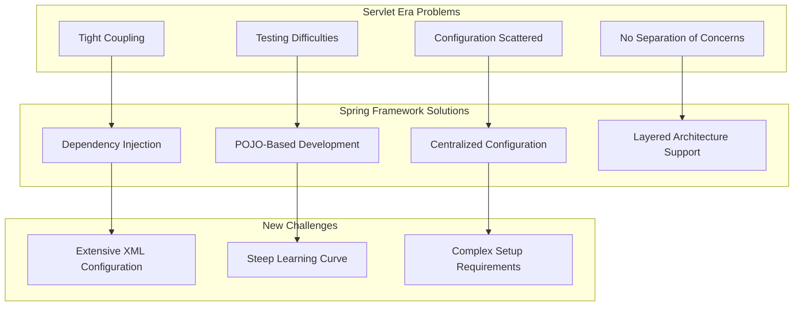

**Spring focuses on the principles of Dependency Injection and Inversion of Control, which are configured through annotations**, making development easier, code more testable, and promoting decoupling[^114]. The framework enabled clean separation of concerns through the Controller-Service-Repository architecture pattern that remains foundational to modern Java development.

Yet Spring Framework introduced its own burden. **Working with Spring when compared with Spring Boot is more difficult. It necessitates a great deal of knowledge. The learning curve is also steep**[^115]. Developers had to master the IoC container, multiple configuration approaches, bean scopes, AOP concepts, and integration patterns. The extensive XML configuration that characterized early Spring development became a significant productivity drain as applications grew in complexity.

**Spring Boot, launched in April 2014, fundamentally transformed Spring development by embracing the 'convention over configuration' philosophy**[^115]. The framework emerged from a specific community request in October 2012 to improve "containerless web application architectures," and after 18 months of development involving 1720 commits by 54 contributors, Spring Boot 1.0 delivered on the promise of dramatically simplified development[^28].

Spring Boot's three game-changing innovations addressed the accumulated configuration burden:

| Spring Boot Innovation | Problem Addressed | Mechanism |
|-----------------------|-------------------|-----------|
| **Auto-configuration** | Manual bean definitions | Classpath-based automatic configuration[^116] |
| **Starter Dependencies** | Version compatibility management | Curated dependency collections |
| **Embedded Servers** | External deployment complexity | Tomcat/Jetty/Undertow packaged in JARs[^117] |

**Spring Boot auto-configuration attempts to automatically configure your Spring application based on the jar dependencies that you have added**[^116]. This intelligent setup eliminates the manual configuration that previously consumed significant development time, enabling developers to focus on business logic rather than infrastructure concerns.

The trade-off introduced by Spring Boot centers on its **opinionated approach**. **By using Spring Boot, developers gain a fast start and standardized approach but experience a partial loss of control over architectural decisions**[^115]. This opinionated style takes some control out of developers' hands, and while it installs sensible defaults, developers still need to understand Spring modules and advanced topics to modify and troubleshoot applications effectively[^115].

**Understanding the Spring Framework is still essential when working with Spring Boot because Spring Boot is built on top of Spring**[^115]. Developers need a solid grasp of core Spring principles like dependency injection and bean management to diagnose issues related to auto-configuration or unexpected behavior. A strong foundation in Spring Framework allows for more deliberate use of Spring Boot and is critical for enterprise projects where stability and scalability are concerns.

The cumulative evolution demonstrates a consistent pattern: **each technology solved real problems while introducing new considerations that motivated further innovation**. This progression from low-level control to high-level abstraction reflects the broader software engineering principle that productivity gains often require accepting reasonable constraints in exchange for reduced complexity.

### 10.2 Comparative Analysis of Architecture, Abstraction, and Control

A detailed comparison across Servlets, Spring Framework, and Spring Boot reveals fundamental differences in architectural philosophy, abstraction levels, and the trade-offs between developer control and productivity. **The real difference between Spring Framework and Spring Boot in long-term maintenance becomes visible in scalability and distributed systems**[^115], but the distinctions extend across every dimension of application development.

**Architectural abstraction levels** represent the most fundamental distinction between these technologies:

| Technology | Abstraction Level | HTTP Handling | Configuration Model |
|------------|------------------|---------------|---------------------|
| **Servlets** | Low-level | Direct `HttpServletRequest`/`HttpServletResponse` | Explicit XML (`web.xml`) |
| **Spring Framework** | Medium-level | Controller annotations with request/response access | XML, annotations, or Java configuration |
| **Spring Boot** | High-level | Annotation-driven with automatic serialization | Convention-based with property overrides |

**Java Servlets are server-side components that extend server capabilities**, operating on a lower level of abstraction that gives developers direct control over HTTP requests and responses[^118]. This direct control enables sophisticated request handling but requires developers to manually manage aspects that higher-level frameworks abstract away. **Traditional Servlet applications require extensive XML configuration via the web.xml deployment descriptor, with each Servlet explicitly registered, mapped to URL patterns, and configured individually**[^118].

**Spring Boot, launched in 2014, is an opinionated framework built on the Spring ecosystem that simplifies Java application development**[^118]. It provides auto-configuration, embedded servers, and production-ready features, dramatically reducing development time and configuration overhead. **Spring Boot embraces convention over configuration, automatically setting up components based on classpath dependencies**[^118].

The following diagram illustrates the abstraction progression:

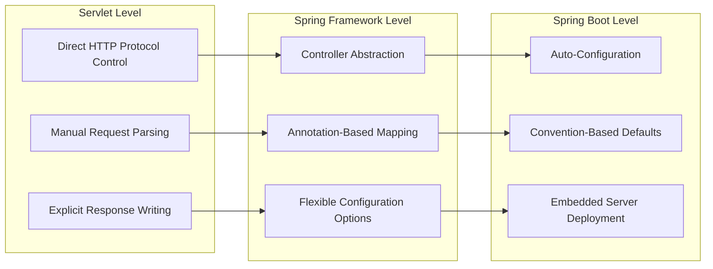

**The control versus productivity trade-off** manifests differently at each abstraction level. **Servlets, being closer to the metal, can offer slightly better performance in specific scenarios where fine-grained control is beneficial**[^118]. However, **Spring Boot's performance optimizations and efficient resource management mean the difference is negligible for most applications**, and its intelligent defaults often lead to better performance for complex applications without requiring manual optimization[^118].

**Spring Framework offers greater architectural freedom, which can be critical for complex or non-standard enterprise systems**[^115]. The framework requires manual configuration and explicit setup but provides high architectural control and lower risk of hidden technical debt due to explicit decisions. Its upgrade path allows for more granular and selective updates, leading to predictable but more effort-intensive long-term maintenance.

In contrast, **Spring Boot has a faster initial setup with opinionated defaults, reduced architectural control in favor of convention**, and is designed with scalability and distributed systems in mind[^115]. It is well-suited for cloud-native environments but carries higher risk of technical debt if defaults are used without deep Spring knowledge. Its upgrade path often affects the entire stack, leading to easier operational maintenance but less flexibility over time.

**Configuration approach evolution** demonstrates the progressive simplification:

| Era | Configuration Approach | Characteristics | Developer Experience |
|-----|----------------------|-----------------|---------------------|
| **Servlet** | `web.xml` deployment descriptor | Verbose, explicit, error-prone at runtime | High ceremony, slow feedback |
| **Spring XML** | `applicationContext.xml` | Centralized but verbose, no compile-time validation | Improved organization, still verbose |
| **Spring Annotations** | `@Component`, `@Autowired` | Reduced verbosity, code-adjacent configuration | Better IDE support, faster development |
| **Spring Boot** | `application.properties` + auto-configuration | Minimal explicit configuration | Maximum productivity, implicit behavior |

**Auto-configuration is non-invasive**—at any point, developers can start to define their own configuration to replace specific parts of the auto-configuration[^116]. For example, if a developer adds their own `DataSource` bean, the default embedded database support backs away. This design preserves the ability to customize while providing sensible defaults for common scenarios.

**The embedded server model** fundamentally changed deployment architecture. **Unlike traditional Java EE applications that require deployment to an external application server, Spring Boot allows you to bundle a web server inside your application**[^117]. This makes deployments simpler and perfectly suited for microservices and cloud-native environments. Spring Boot supports three major embedded servlet containers: **Tomcat (the default), Jetty (a flexible and lightweight alternative), and Undertow (known for non-blocking I/O and performance in reactive setups)**[^117].

**Experienced developers often stick with regular Spring when a project demands real architectural flexibility**, as the classic Spring Framework provides clearer control and structure, which pays off in large, long-lived enterprise systems[^115]. The choice between frameworks ultimately depends on project requirements, team expertise, and the balance between immediate productivity and long-term architectural needs.

### 10.3 Performance, Scalability, and Maintenance Considerations

Performance characteristics, scalability patterns, and long-term maintenance implications vary significantly across Servlets, Spring Framework, and Spring Boot, with each technology presenting distinct trade-offs that influence technology selection for different project contexts.

**Startup time and memory footprint** have historically been areas of concern for Java applications. **Java has a reputation for being "heavy," with concerns about memory, JVM tuning, heap sizes, garbage collection, and startup times**[^113]. This reputation was earned in an era of different hardware and expectations. **Modern JVMs are more efficient, with improved garbage collectors, reduced startup times, and easier resource control**, making Java viable in new hosting environments like VPS and containers without overprovisioning[^113].

The following table compares performance characteristics across the technology spectrum:

| Performance Aspect | Servlets | Spring Framework | Spring Boot |
|-------------------|----------|------------------|-------------|
| **Startup Time** | Fast (minimal initialization) | Moderate (context loading) | Configurable (auto-configuration overhead) |
| **Memory Footprint** | Minimal | Moderate | Higher (but optimizable) |
| **Runtime Overhead** | Lowest | Low | Low (intelligent optimization) |
| **Cold Start** | Fastest | Moderate | Slowest (without native images) |

**For Spring Boot (3.x with AOT processing), the startup time is approximately 3–5 seconds on the traditional JVM, and with GraalVM Native, it is approximately 500ms–1.5s**[^119]. This represents significant improvement over earlier versions and demonstrates the framework's continued optimization for cloud-native deployment scenarios.

**Scalability considerations** differ based on architectural approach. Both Servlets and Spring MVC traditionally use the **thread-per-request model**, where each incoming request is assigned to a thread from an internal thread pool. This model works well for many applications but can become a bottleneck under extreme concurrency.

**Project Loom, introduced in Java 21, is a paradigm shift in Java concurrency**[^120]. It addresses the limitations of the classic thread-per-request model, where each incoming request is served by a platform (OS) thread. **Platform threads are heavyweight, requiring around 1MB of stack memory each, and the operating system struggles to scale beyond thousands of them**[^120]. Blocking operations like database queries or REST calls waste resources in traditional threading models.

**Virtual Threads are lightweight, scalable, and enable efficient blocking**[^120]. Their creation is nearly free compared to platform threads, and millions can run on a handful of OS threads. When a virtual thread blocks on I/O, the JVM detaches it from its carrier thread, freeing the carrier to run other tasks. This allows developers to write synchronous, readable code that scales like asynchronous code.

**Spring Boot 3.x supports virtual threads out of the box**[^120]. To enable them, developers need Java 19 or later (finalized in Java 21) and Spring Boot 3.2+. Configuration involves setting `spring.threads.virtual.enabled: true`. With this, the entire Spring MVC stack runs on virtual threads, meaning blocking JDBC queries no longer tie up OS threads, and the application can handle thousands of concurrent requests without complex thread pool tuning.

**Long-term maintenance considerations** favor different technologies based on project characteristics:

| Maintenance Factor | Spring Framework | Spring Boot |
|-------------------|------------------|-------------|
| **Technical Debt Risk** | Lower (explicit decisions) | Higher (if defaults used without understanding) |
| **Upgrade Complexity** | Granular, selective updates | Often affects entire stack |
| **Debugging Transparency** | Higher (explicit configuration) | Lower (implicit auto-configuration) |
| **Team Knowledge Requirements** | Deep Spring expertise | Spring + Boot conventions |

**Spring Boot can be a poor fit for low-latency systems where predictable response times are critical**, as its automatic configuration and abstractions can introduce unnecessary complexity[^115]. It is also a poor fit for highly customized platforms with unique architectural requirements, as attempts to bend its defaults lead to complex configuration.

**For scalability and maintenance**, both technologies can scale effectively, but **Spring Boot's modular design, dependency management, and built-in production features like externalized configuration, metrics collection, and health checks make scaling and maintaining applications considerably easier** compared to pure Servlets, which would require additional implementation for such features[^118].

**Virtual threads excel in I/O-bound, high-concurrency workloads** like HTTP servers, gRPC, database calls, and file I/O[^120]. They are less suited for CPU-bound tasks, where platform threads or dedicated pools are better. A key limitation in JDK 21 is their interaction with `synchronized` code: excessive use can cause thread pinning and deadlocks, so avoiding blocking synchronization is essential in production.

### 10.4 Appropriate Use Cases and Technology Selection Criteria

Each technology in the Java web development evolution remains appropriate for specific scenarios, and understanding these use cases enables informed technology selection based on project requirements, team expertise, and organizational constraints.

**Servlets remain relevant for specific scenarios** despite the availability of higher-level frameworks:

| Servlet Use Case | Rationale | Considerations |
|-----------------|-----------|----------------|
| **Legacy system maintenance** | Existing investment, proven stability | Migration costs may exceed benefits |
| **Educational purposes** | Understanding web fundamentals | Foundation for learning higher abstractions |
| **Extreme control requirements** | Protocol-level customization | Rare but valid for specialized applications |
| **Minimal dependency footprint** | Absolute control over dependencies | Appropriate for embedded or constrained environments |

**Raw servlets might be appropriate for learning or teaching fundamentals of the HTTP servlet lifecycle, filters, or how web containers work**[^121]. They can be used for extremely simple, tiny applications or embedded containers requiring minimal dependencies and absolute control, or for custom container-level integrations like developing servlet container extensions.

**Spring Framework provides value for complex enterprise systems** requiring architectural flexibility beyond what Spring Boot's conventions accommodate:

- **Complex, non-standard, long-living enterprise systems** where explicit architectural decisions reduce long-term risk[^115]
- **Applications requiring precise control** over the HTTP protocol or custom container-level integrations[^118]
- **Projects where teams have extensive Servlet expertise** and application requirements are stable[^118]
- **Systems demanding real architectural flexibility** where the classic Spring Framework provides clearer control and structure[^115]

**Spring Boot excels in the majority of modern development scenarios**:

| Spring Boot Strength | Application Type | Key Benefits |
|---------------------|------------------|--------------|
| **Rapid development** | New applications | Minimal setup, fast iteration |
| **Microservices** | Distributed systems | Embedded servers, cloud-native support |
| **Cloud deployment** | PaaS/container environments | Buildpack integration, health endpoints |
| **REST API development** | Backend services | Auto-configuration, production features |
| **Team productivity** | Enterprise development | Standardized approach, reduced boilerplate |

**Spring (Spring Boot and Spring MVC) is the better choice for developing a modern, maintainable, production-quality website in almost all typical scenarios**[^121]. Spring builds on servlets but adds structure, productivity, testing support, and a rich ecosystem that speeds development and improves long-term quality.

**Decision criteria for technology selection** should consider multiple dimensions:

```mermaid
flowchart TD
    A[Project Requirements Analysis] --> B{New Application?}
    B -->|Yes| C{Cloud-Native Deployment?}
    B -->|No| D{Legacy Maintenance?}
    
    C -->|Yes| E[Spring Boot Recommended]
    C -->|No| F{Complex Enterprise Requirements?}
    
    D -->|Yes| G{Migration Justified?}
    D -->|No| H[Evaluate Specific Needs]
    
    F -->|Yes| I{Need Architectural Freedom?}
    F -->|No| E
    
    G -->|Yes| E
    G -->|No| J[Maintain with Servlets]
    
    I -->|Yes| K[Spring Framework]
    I -->|No| E
    
    H --> L{Educational Purpose?}
    L -->|Yes| M[Servlets for Learning]
    L -->|No| E
```

**Trade-offs of Spring Boot include added complexity and footprint**, as it introduces dependencies and abstractions that can feel heavy for trivial demos, increasing artifact size compared to a couple of servlets[^121]. There is a learning curve associated with Spring's breadth, including its idioms for dependency injection and configuration. For tiny one-off pages, Spring might be overkill, and a static site or minimal framework could be simpler.

**A practical modern approach is to build RESTful backends using Spring or Spring Boot and consume them with a JavaScript frontend**, ensuring clear separation of layers[^121]. For small or simple websites, plain servlets/JSP can be sufficient and easier to start with. If dealing with small websites, servlets may be adequate, but for enterprise-level development, Spring is a good choice as it provides many features out of the box.

### 10.5 Spring Boot's Ecosystem Dominance and Industry Adoption

Spring Boot has achieved remarkable dominance in the Java web development ecosystem, with adoption metrics and industry surveys consistently demonstrating its position as the preferred framework for modern Java application development. This dominance reflects both the framework's technical merits and its alignment with contemporary development practices.

**Spring Boot continues to dominate** as the framework that makes complex backend development simple[^122]. **Java remains rock-solid because of massive enterprise adoption, long-term stability, a strong ecosystem, and continuous innovation (Java 21+)**[^122]. The combination of Java's stability and Spring Boot's productivity has created a compelling platform for enterprise development.

**Spring Boot is one of the biggest reasons Java remains dominant in backend development**[^123]. The framework offers easy API development, auto-configuration, powerful integrations, production-friendly defaults, and a massive ecosystem. **For microservices, event-driven systems, and cloud-native apps, Spring Boot plus Spring Cloud is the industry standard**[^123].

**Cloud platform integration reinforces Spring Boot's market position**:

| Cloud Platform | Spring Boot Support | Integration Features |
|---------------|--------------------|--------------------|
| **AWS** | First-class support | Lambda, ECS, EKS integration |
| **Azure** | Native integration | App Service, AKS support |
| **Google Cloud** | Full compatibility | Cloud Run, GKE deployment |
| **Kubernetes** | Industry standard | According to 2024 Spring survey, 65% of respondents use Kubernetes[^124] |

**According to the 2024 Spring State survey, 65% of respondents in Spring environments use Kubernetes**[^124]. This statistic demonstrates the alignment between Spring Boot and container orchestration platforms that have become central to modern deployment strategies.

**The competitive landscape includes alternative frameworks** that have emerged to address specific concerns:

**For years, Spring Boot has been the de facto choice for building microservices and enterprise applications on the JVM**[^119]. However, the landscape has evolved with alternatives like Quarkus and Micronaut targeting specific use cases, particularly those requiring faster startup times or smaller memory footprints for serverless deployments.

**A typical Spring Boot microservice still takes 3–6 seconds to cold-start on the JVM**[^119]. This characteristic has motivated alternatives optimized for serverless scenarios, though Spring Boot's GraalVM native image support has significantly addressed this concern with startup times of approximately 500ms–1.5s when compiled to native images.

**Factors contributing to Spring Boot's sustained leadership** include:

1. **Ecosystem breadth**: Integration with Spring Security, Spring Data, Spring Cloud, and numerous other projects creates a comprehensive development platform
2. **Community and documentation**: Extensive documentation, tutorials, and community support reduce adoption barriers
3. **Enterprise backing**: Pivotal (now VMware Tanzu) provides commercial support and continued development investment
4. **Backward compatibility**: Spring maintains strong backward compatibility, protecting enterprise investments
5. **Cloud-native evolution**: Continuous adaptation to containerization, Kubernetes, and serverless trends

**Modern cloud platforms like AWS, Azure, and GCP offer first-class Java support**, and Java fits perfectly with DevOps, CI/CD pipelines, and containerized deployments[^123]. This alignment between Spring Boot and cloud platform capabilities creates a virtuous cycle where platform improvements benefit Spring Boot applications and vice versa.

### 10.6 Future Directions: Virtual Threads, Cloud-Native Evolution, and Native Images

The future trajectory of Spring Boot and the broader Spring ecosystem centers on three transformative capabilities: **Project Loom virtual threads integration, continued cloud-native enhancement, and GraalVM native image evolution**. These directions address the evolving requirements of modern application deployment while maintaining Spring Boot's commitment to developer productivity.

**Virtual threads represent a fundamental shift in Java concurrency** that Spring Boot has embraced. **Project Loom introduces two groundbreaking features: Virtual Threads and Structured Concurrency**[^120]. Virtual Threads are lightweight, scalable (millions can run on a handful of OS threads), and efficient, as blocking on I/O detaches the virtual thread from its carrier thread, freeing it for other tasks. This allows developers to write simple, synchronous code that scales like asynchronous code.

**For Spring Boot developers, Loom eliminates the trade-off between threads, scalability, and complexity**[^120]. Developers can keep a synchronous coding style, scale to thousands of concurrent requests, eliminate thread-pool tuning headaches, and gain safer parallel operations through structured concurrency.

The impact on development patterns is significant:

| Traditional Approach | Virtual Threads Approach | Benefit |
|---------------------|-------------------------|---------|
| Complex thread pool tuning | Simple configuration flag | Reduced operational complexity |
| Reactive programming for scale | Synchronous code that scales | Maintained code readability |
| Limited concurrent connections | Thousands of concurrent requests | Improved throughput |
| CompletableFuture chains | Straightforward blocking calls | Simplified debugging |

**Structured Concurrency treats related tasks as a single unit of work**[^120]. Child tasks are automatically cancelled if the parent scope ends, supporting fail-fast or race-to-success strategies, which eliminates "fire-and-forget" leaks that plagued earlier concurrent programming models.

**Cloud-native evolution continues to shape Spring Boot's development**. **Spring Boot 3.x transformed enterprise Java for the modern cloud era**[^125]. This upgrade was not just a version bump but a mindset shift. Spring finally embraced cloud-first thinking, high performance at scale, native runtimes like GraalVM and AOT, observability as a first-class citizen, faster boot times, and reduced memory footprints.

**Java is becoming lighter, faster, and container-friendly**, with a future focus on being more cloud-native[^123]. Expectations include faster startup times, lower resource usage, and better serverless support. Frameworks like Spring, Quarkus, and Micronaut will make Java even more modern and competitive.

**GraalVM native image support addresses serverless and edge computing requirements**:

```mermaid
flowchart LR
    A[Spring Application] --> B[AOT Processing]
    B --> C[Native Image Compilation]
    C --> D[Standalone Executable]
    
    subgraph "Traditional JVM"
        E[3-5 second startup]
        F[Higher memory usage]
        G[JIT compilation overhead]
    end
    
    subgraph "Native Image"
        H[500ms-1.5s startup]
        I[Reduced memory footprint]
        J[No JIT overhead]
    end
    
    D --> H
    D --> I
    D --> J
```

**Serverless Java with Spring Boot on AWS Lambda** addresses the historical perception that Java was less suitable for serverless environments due to slower cold-start times[^126]. Developments like GraalVM, Spring Boot optimizations, and AWS Lambda's support for custom runtimes have made serverless Java feasible for production-grade applications.

**Future developments like Spring Native and enhanced GraalVM integration are expected to further reduce cold start times**, solidifying Java for latency-sensitive applications[^126]. Hybrid models that integrate serverless with containers (via AWS Fargate) and Kubernetes (through AWS EKS) are emerging, providing deployment flexibility.

**The balance between backward compatibility and transformative capabilities** remains a central consideration. Spring maintains strong backward compatibility, with its evolution carefully managed to force few breaking changes between versions. This commitment to stability has been crucial for enterprise adoption while still enabling adoption of new platform capabilities like virtual threads and native images.

### 10.7 Emerging Paradigms: AI Integration, Serverless Computing, and Beyond

The Spring ecosystem is actively adapting to emerging development paradigms that extend beyond traditional web application development, including **AI integration through Spring AI, serverless computing patterns, and event-driven architectures**. These adaptations position Spring Boot to address next-generation development challenges while maintaining its core commitment to developer productivity.

**Spring Boot is increasingly being used for cloud-native development**, as the framework supports containerization, serverless computing, and other cloud-native patterns[^127]. Regarding AI integration, **Spring Boot is being integrated with AI technologies through the Spring AI project**, which provides tools and libraries for building AI-powered applications[^127].

**The future of Spring Boot looks bright** with key trends including the increased adoption of Spring AI, as the project is expected to gain traction as more developers look to build AI-powered applications[^127]. There will also be continued evolution of the framework, with new features and improvements being added regularly.

**Serverless computing patterns** leverage Spring Cloud Function to separate business logic from deployment targets:

| Serverless Benefit | Spring Boot Implementation | Use Case |
|-------------------|---------------------------|----------|
| **Pay-per-use billing** | Lambda handlers via Spring Cloud Function | Cost optimization |
| **Automatic scaling** | Event-driven function invocation | Variable workloads |
| **Reduced operations** | Managed infrastructure | Team efficiency |
| **Event integration** | AWS service triggers (S3, DynamoDB, SQS) | Event-driven workflows |

**Spring Cloud Function separates business logic from deployment goals** and allows the creation of functions that require little setup to operate on AWS Lambda[^126]. This method allows Java applications to take advantage of AWS Lambda's fine-grained billing, intelligent scalability, and event interaction with services like API Gateway, DynamoDB, and S3.

**The impact of serverless Java with Spring Boot includes**:
- **Drastically reduced cloud infrastructure costs** through pay-per-use models and avoiding over-provisioning[^126]
- **Increased developer productivity** as teams can use familiar Spring tooling and testing techniques
- **Streamlined deployment and scalability** for operations teams
- **Modernization without rewriting** as businesses can update outdated Java applications without changing languages

**Event-driven architectures** represent another frontier for Spring evolution. **Spring supports message-driven architectures where inversion of control applies to runtime concerns**, such as when certain business logic should run and where the response should be sent. It supports routing and transformation of messages so that different transports and different data formats can be integrated without impacting testability.

**Backend development is changing faster than ever**[^122]. For Java or Spring Boot developers, the coming years will be a turning point for their careers. New architectures, AI integration, cloud-native systems, and performance-focused frameworks are reshaping how developers build APIs and backend systems.

**The continued relevance of Java and Spring Boot** in an increasingly diverse technology landscape reflects several enduring strengths:

1. **Enterprise stability**: Java's long-term stability and Spring's backward compatibility protect organizational investments
2. **Ecosystem maturity**: Decades of library development, tooling, and community knowledge
3. **Performance improvements**: Modern JVM optimizations, virtual threads, and native compilation options
4. **Cloud alignment**: First-class support from major cloud providers and container platforms
5. **Continuous innovation**: Active development addressing emerging requirements

**Serverless Java with Spring Boot on AWS Lambda will become increasingly relevant** for creating intelligent, agile, and resilient cloud-native applications as businesses prioritize scalability, security, and time-to-market[^126]. Multi-cloud deployments with technologies like Terraform and Spring Cloud are also possible, providing deployment flexibility across providers.

**The trajectory from Servlets through Spring Framework to Spring Boot demonstrates a consistent pattern**: each generation addressed the limitations of its predecessor while introducing capabilities aligned with contemporary development practices. This evolutionary approach—solving real problems while maintaining continuity—positions the Spring ecosystem to continue adapting to emerging paradigms while preserving its core value proposition of developer productivity and enterprise reliability.

As the technology landscape continues to evolve with AI integration, edge computing, and new deployment models, **Spring Boot's combination of convention-over-configuration philosophy, comprehensive ecosystem integration, and commitment to cloud-native capabilities** ensures its continued relevance for Java developers building the next generation of enterprise applications. The framework's history of thoughtful evolution suggests it will continue addressing emerging challenges while maintaining the productivity and reliability that have made it the dominant choice for Java web development.

# 参考内容如下：
[^1]:[Java History -](http://javaplanet.io/java-core/java-fundamentals/java-history/)
[^2]:[The Complete History of Java Programming Language](https://medium.com/@futuretutorialworld/the-complete-history-of-java-programming-language-8019b194a22d)
[^3]:[Cloud Myth: Ahead of Time Compilation Will Save You ...](https://payara.fish/blog/java-ahead-of-time-native-compilation-on-cloud-economic-myths/)
[^4]:[Servlets and Tomcat: 23+ Years and Counting](https://tomitribe.com/blog/servlets-and-tomcat-23-years-and-counting/)
[^5]:[Apache Tomcat](https://en.wikipedia.org/wiki/Apache_Tomcat)
[^6]:[Understanding Java Servlets: Instantiation, Sessions, and ...](https://www.test-king.com/blog/understanding-java-servlets-instantiation-sessions-and-multithreading-explained/)
[^7]:[What is Apache Tomcat server and how does it work?](https://www.logicmonitor.com/blog/what-is-apache-tomcat-server-and-how-does-it-work)
[^8]:[Parameterizing a Servlet in web.xml and Running Instances](https://coderanch.com/t/363810/Servlets/java/Parameterizing-Servlet-web-xml-Running)
[^9]:[Life Cycle of a Servlet](https://www.geeksforgeeks.org/java/life-cycle-of-a-servlet/)
[^10]:[Java Servlets: The Ultimate Tool for Handling HTTP ...](https://medium.com/@nandyaladineshmurali2020/java-servlets-the-ultimate-tool-for-handling-http-requests-13b0f76f5e33)
[^11]:[Reading Initialization parameters](https://cmrtpoint.com/web-technologies/unit-3-introduction-to-servlets/reading-initialization-parameters/)
[^12]:[How Do Servlets Work in Java - Instantiation, Sessions ...](https://intellipaat.com/blog/how-do-servlets-work/)
[^13]:[Servlet 2.3: New features exposed](https://www.infoworld.com/article/2159728/servlet-2-3-new-features-exposed.html)
[^14]:[Performance Comparison of Dynamic Web Platforms](https://www.cse.iitb.ac.in/~varsha/allpapers/softwarePerformance/web_comparison.pdf)
[^15]:[The web.xml deployment descriptor | App Engine standard ...](https://docs.cloud.google.com/appengine/docs/legacy/standard/java/config/webxml)
[^16]:[A web.xml Deployment Descriptor Elements](https://docs.oracle.com/middleware/1221/wls/WBAPP/web_xml.htm)
[^17]:[web.xml Deployment Descriptor Elements](https://docs.oracle.com/middleware/12213/wls/WBAPP/web_xml.htm)
[^18]:[Context and Servlet Initialization Parameters](https://www.baeldung.com/context-servlet-initialization-param)
[^19]:[4 Servlet Filters and Event Listeners](https://docs.oracle.com/cd/A97688_16/generic.903/a97680/filters.htm)
[^20]:[Jakarta Server Pages](https://en.wikipedia.org/wiki/Jakarta_Server_Pages)
[^21]:[JavaServer Pages[tm] Technology - White Paper](https://www.oracle.com/java/technologies/javaserver-white-paper.html)
[^22]:[Servlets and JSP Pages Best Practices](https://www.oracle.com/technical-resources/articles/java/servlets-jsp.html)
[^23]:[JSP - Debugging](https://www.tutorialspoint.com/jsp/jsp_debugging.htm)
[^24]:[Clean Coder - Testing GUIs Part II: JSP](https://sites.google.com/site/unclebobconsultingllc/blogs-by-robert-martin/testing-guis-part-ii-jsp)
[^25]:[JspTest download](https://sourceforge.net/projects/jsptest/)
[^26]:[A Comparative Study Of MVC Architecture Model Of Open ...](https://ijetms.in/Vol-8-issue-2/Vol-8-Issue-2-19.pdf)
[^27]:[Servlets and JSP Pages Best Practices](https://www.oracle.com/technical-resources/articles/javase/servlets-jsp.html)
[^28]:[Spring Framework History: 2002 – Present (Updated 1st Oct ...](https://springtutorials.com/spring-framework-history/)
[^29]:[Inside the Spring Framework: The Foundation of Modern ...](https://medium.com/@well-araujo/inside-the-spring-framework-the-foundation-of-modern-java-development-85e190b3ec0d)
[^30]:[Introduction](https://fractus-io.github.io/tutorials/springframework/introduction/)
[^31]:[Spring Framework in Java - why is it worth your attention](https://svitla.com/blog/spring-framework-in-java-why-is-it-worth-your-attention/)
[^32]:[Inversion of Control and Dependency Injection with Spring](https://www.baeldung.com/inversion-control-and-dependency-injection-in-spring)
[^33]:[Spring Dependency Injection (DI) and Inversion of Control ( ...](https://medium.com/@anukrishnatmkd/spring-dependency-injection-di-and-inversion-of-control-ioc-1fe77b88688f)
[^34]:[Controller-Service-Repository - Tom Collings - Medium](https://tom-collings.medium.com/controller-service-repository-16e29a4684e5)
[^35]:[Whats the best practice of using Controller,Service and ...](https://stackoverflow.com/questions/32731763/whats-the-best-practice-of-using-controller-service-and-repository-annotations)
[^36]:[Challenges of Spring framework, the need of Spring Boot](https://www.codingshuttle.com/spring-boot-handbook/challenges-of-spring-framework-the-need-of-spring-boot-1)
[^37]:[Spring vs Spring Boot: A Detailed Comparison](https://www.turing.com/kb/spring-vs-spring-boots-best-web-apps)
[^38]:[How Spring Boot Saved My Development Workflow (And ...](https://medium.com/@Fake_Nimzz/how-spring-boot-saved-my-development-workflow-and-can-save-yours-too-3f39f70f1e0f)
[^39]:[Spring Framework — Why It Became the King of Java ...](https://medium.com/@quipoin04/spring-framework-why-it-became-the-king-of-java-development-e72292bc70b9)
[^40]:[Understanding Dependency Injection in Spring Framework](https://medium.com/@charithjdesilva/understanding-dependency-injection-in-spring-framework-cabe741dffe2)
[^41]:[Spring Dependency Injection with Example](https://www.geeksforgeeks.org/advance-java/spring-dependency-injection-with-example/)
[^42]:[Handling Cross-Cutting Concerns in Spring with AOP](https://medium.com/@andrejtaneski/handling-cross-cutting-concerns-in-spring-with-aop-9c667466cbbf)
[^43]:[Spring Framework Architecture](https://www.geeksforgeeks.org/advance-java/spring-framework-architecture/)
[^44]:[Spring Framework Overview](https://docs.spring.io/spring-framework/reference/overview.html)
[^45]:[Introduction to Spring MVC: A Comprehensive Guide](https://rishi-preetham.medium.com/introduction-to-spring-mvc-a-comprehensive-guide-d6dfdb89c8a5)
[^46]:[Spring MVC Integration :: Spring Security](https://docs.spring.io/spring-security/reference/servlet/integrations/mvc.html)
[^47]:[Getting Started | Accessing Data with JPA - Spring](https://spring.io/guides/gs/accessing-data-jpa)
[^48]:[Spring Data, Spring Security and Envers integration](https://blog.frankel.ch/spring-data-spring-security-and-envers-integration/)
[^49]:[Overview of Spring Integration Framework](https://docs.spring.io/spring-integration/reference/overview.html)
[^50]:[A guide to modular applications with Spring Modulith](https://bell-sw.com/blog/what-is-spring-modulith-introduction-to-modular-monoliths/)
[^51]:[What is Spring Framework: A Comprehensive Guide for ...](https://amirgolmoradi.medium.com/what-is-spring-framework-a-comprehensive-guide-for-modern-java-development-429af561766a)
[^52]:[Spring and Spring Boot Frameworks: A Brief History](https://dzone.com/articles/history-of-spring-framework-spring-boot-framework)
[^53]:[Spring Boot 1.0 GA Released](https://spring.io/blog/2014/04/01/spring-boot-1-0-ga-released)
[^54]:[Spring Boot 1.0 Launches](https://adtmag.com/articles/2014/04/09/spring-boot-launch.aspx)
[^55]:[Spring Boot Goes GA](https://www.infoq.com/news/2014/04/spring-boot-goes-ga/)
[^56]:[Create a Custom Auto-Configuration with Spring Boot](https://www.baeldung.com/spring-boot-custom-auto-configuration)
[^57]:[Spring Boot Reference Documentation](https://docs.spring.io/spring-boot/docs/2.6.14/reference/htmlsingle/)
[^58]:[Creating Your Own Auto-configuration :: Spring Boot](https://docs.spring.io/spring-boot/reference/features/developing-auto-configuration.html)
[^59]:[Deploying Spring Boot Applications](https://spring.io/blog/2014/03/07/deploying-spring-boot-applications)
[^60]:[Spring Boot: Everything you need to know, and what ...](https://dev.to/weder96/spring-boot-everything-you-need-to-know-and-what-nobody-told-you-o4j)
[^61]:[Spring Boot Embedded Server Mechanics Explained](https://medium.com/@AlexanderObregon/spring-boot-embedded-server-mechanics-explained-8b01fe2bc5d8)
[^62]:[Spring Boot Is Doing Too Much — Is It Time to Go Back ...](https://medium.com/@yashbatra11111/spring-boot-is-doing-too-much-is-it-time-to-go-back-to-basics-a20a84c8c877)
[^63]:[Spring Boot Project Layered Architecture | by A.R.M.Waseem](https://medium.com/@armwaseemkss3147/spring-boot-project-layered-architecture-7ffa78bd9e6a)
[^64]:[Spring Boot - Architecture](https://www.geeksforgeeks.org/springboot/spring-boot-architecture/)
[^65]:[Architecture of Spring Boot: Examples, Pattern, Layered ...](https://medium.com/@mirfanarshad/architecture-of-spring-boot-examples-pattern-layered-controller-layer-703b56360a36)
[^66]:[🧩My Spring Boot App Became Unmaintainable Until I ...](https://dev.to/shashwathsh/my-spring-boot-app-became-unmaintainable-until-i-understood-the-service-layer-3lbl)
[^67]:[Java Spring Boot Microservices Example - Step by ...](https://www.geeksforgeeks.org/springboot/java-spring-boot-microservices-example-step-by-step-guide/)
[^68]:[Understanding Spring Boot Architecture Flow](https://medium.com/@dulanjayasandaruwan1998/understanding-spring-boot-architecture-flow-615d209b95f9)
[^69]:[Spring Boot Testing: A Comprehensive Best Practices Guide](https://dev.to/ankitdevcode/spring-boot-testing-a-comprehensive-best-practices-guide-1do6)
[^70]:[Getting Started | Testing the Web Layer - Spring](https://spring.io/guides/gs/testing-web)
[^71]:[Microservices vs. monolithic architecture](https://www.atlassian.com/microservices/microservices-architecture/microservices-vs-monolith)
[^72]:[Monolithic and Microservice Architectures in Spring Boot](https://medium.com/@vino7tech/monolithic-and-microservice-architectures-in-spring-boot-6a294e507dea)
[^73]:[Spring Boot Microservices: Architecture Patterns That ...](https://katyella.com/blog/spring-boot-microservices-architecture-patterns/)
[^74]:[Spring Boot Microservices: Best Practices for Scalable and ...](https://medium.com/@pasan.lashika/spring-boot-microservices-best-practices-for-scalable-and-maintainable-systems-5d8f79b75135)
[^75]:[Architecture Patterns: From Monolith to Microservices](https://en.paradigmadigital.com/dev/architecture-patterns-from-monolith-to-microservices/)
[^76]:[Spring Boot version history](https://www.codejava.net/frameworks/spring-boot/spring-boot-version-history)
[^77]:[Spring Boot 2.0 goes GA](https://spring.io/blog/2018/03/01/spring-boot-2-0-goes-ga)
[^78]:[Spring Boot 2.0 Release Notes](https://github.com/spring-projects/spring-boot/wiki/Spring-Boot-2.0-Release-Notes)
[^79]:[Spring Boot 2.3.0 available now](https://spring.io/blog/2020/05/15/spring-boot-2-3-0-available-now)
[^80]:[Cloud Native Buildpacks :: Spring Boot](https://docs.spring.io/spring-boot/reference/packaging/container-images/cloud-native-buildpacks.html)
[^81]:[Paketo Buildpacks Bionic End Of Support - Spring](https://spring.io/blog/2023/09/22/paketo-buildpacks-bionic-end-of-support)
[^82]:[Spring Boot 3.0 Goes GA](https://spring.io/blog/2022/11/24/spring-boot-3-0-goes-ga)
[^83]:[Spring Boot 3.0 Release Notes](https://github.com/spring-projects/spring-boot/wiki/Spring-Boot-3.0-Release-Notes)
[^84]:[GraalVM Native Image Support - Spring](https://docs.spring.io/spring-boot/docs/3.2.3/reference/html/native-image.html)
[^85]:[Spring Boot 3.2 Release Notes](https://github.com/spring-projects/spring-boot/wiki/Spring-Boot-3.2-Release-Notes)
[^86]:[Spring Boot 4.0.0 available now](https://spring.io/blog/2025/11/20/spring-boot-4-0-0-available-now)
[^87]:[Spring Boot 4.0.0-M1 available now](https://spring.io/blog/2025/07/24/spring-boot-4-0-0-M1-available-now)
[^88]:[What's New in Spring Boot 4.0](https://medium.com/@AlexanderObregon/whats-new-in-spring-boot-4-0-2c2e7028b312)
[^89]:[Cloud-Native Development with Spring Boot](https://www.apnttech.com/blogs/cloud-native)
[^90]:[Spring Boot and Kubernetes in 2025: The Ultimate Guide ...](https://medium.com/@mail82amol/spring-boot-and-kubernetes-in-2025-the-ultimate-guide-to-cloud-native-java-applications-64e2935ad8df)
[^91]:[Introduction to Spring Boot](https://www.geeksforgeeks.org/springboot/introduction-to-spring-boot/)
[^92]:[Spring Boot - Annotations](https://www.geeksforgeeks.org/springboot/spring-boot-annotations/)
[^93]:[Mapping Requests :: Spring Framework](https://docs.spring.io/spring-framework/reference/web/webmvc/mvc-controller/ann-requestmapping.html)
[^94]:[Properties and Configuration :: Spring Boot](https://docs.spring.io/spring-boot/how-to/properties-and-configuration.html)
[^95]:[Using application.yml vs application.properties in Spring Boot](https://www.baeldung.com/spring-boot-yaml-vs-properties)
[^96]:[Spring Data JPA Tutorial](https://www.geeksforgeeks.org/advance-java/spring-data-jpa-tutorial/)
[^97]:[Getting Started | Building REST services with Spring](https://spring.io/guides/tutorials/rest)
[^98]:[Spring Boot Actuator](https://www.baeldung.com/spring-boot-actuators)
[^99]:[A Comprehensive Guide to Spring Boot Actuator | by Pratik T](https://medium.com/@pratik.941/a-comprehensive-guide-to-spring-boot-actuator-c2bd63a32ede)
[^100]:[Mastering Spring Boot Testing with JUnit and Mockito](https://medium.com/@AlexanderObregon/mastering-spring-boot-testing-with-junit-and-mockito-8bec9b4911fc)
[^101]:[Unit Testing in Spring Boot Project using Mockito and Junit](https://www.geeksforgeeks.org/advance-java/unit-testing-in-spring-boot-project-using-mockito-and-junit/)
[^102]:[A Guide to Using OAuth2, JWT, and Spring Security](https://medium.com/@umutt.akbulut/how-to-secure-rest-apis-with-spring-security-a-guide-to-using-oauth2-jwt-and-spring-security-9e7bcba91e70)
[^103]:[Implementing OAuth2, JWT, and Custom Authentication](https://www.codefro.com/2024/08/29/advanced-spring-boot-security-implementing-oauth2-jwt-and-custom-authentication/)
[^104]:[A Guide to Migrating Legacy Servlet Code to Spring Boot](https://iammadhankumar.medium.com/a-guide-to-migrating-legacy-servlet-code-to-spring-boot-f318089b7c3c)
[^105]:[Servlet to Spring MVC Migration Guide](http://andresesfm.github.io/blog/2014/09/11/servlet-to-spring-mvc-migration-guide)
[^106]:[Can I convert my application in servlet to Spring using ...](https://stackoverflow.com/questions/35030450/can-i-convert-my-application-in-servlet-to-spring-using-rest-web-service-and-spr)
[^107]:[Transitioning Spring: XML to Annotations](https://medium.com/@AlexanderObregon/from-xml-to-annotations-transitioning-to-modern-spring-configuration-c34e92b64ea0)
[^108]:[Microservices Patterns: Service Discovery Patterns](https://medium.com/cloud-native-daily/microservices-patterns-part-03-service-discovery-patterns-97d603b9a510)
[^109]:[Pattern: Client-side service discovery](https://microservices.io/patterns/client-side-discovery.html)
[^110]:[Automatic Refactoring With Spring Boot Migrator - Strumenta](https://tomassetti.me/automatic-refactoring-with-spring-boot-migrator/)
[^111]:[Spring Boot Migration Journey Challenges, Lessons ...](https://medium.com/javarevisited/spring-boot-migration-journey-challenges-lessons-learned-and-fixes-7a7aef1142ac)
[^112]:[Troubleshooting Spring Boot Microservices - A Real World ...](https://www.eginnovations.com/blog/troubleshooting-spring-boot-microservices-a-real-world-case-study/)
[^113]:[A Short History Of Java And How It's Hosted Today](https://javatechonline.com/a-short-history-of-java-and-how-its-hosted-today/)
[^114]:[Spring Framework, History, and Its Structure](https://dev.to/jeanv0/spring-framework-history-and-its-structure-361)
[^115]:[Key Advantages and Disadvantages of Using Spring Boot](https://scand.com/company/blog/pros-and-cons-of-using-spring-boot/)
[^116]:[Auto-configuration :: Spring Boot](https://docs.spring.io/spring-boot/reference/using/auto-configuration.html)
[^117]:[How Spring Boot Manages Embedded Servers - Anil R](https://anilr9.medium.com/how-spring-boot-manages-embedded-servers-internals-configuration-and-customization-0eedc4e79c4e)
[^118]:[Modern Java Web Development: Has Spring Boot Killed ...](https://medium.com/@ushandilusha/modern-java-web-development-has-spring-boot-killed-traditional-servlets-17e3573289aa)
[^119]:[Spring Boot vs. Micronaut vs. Quarkus: The 2025 JVM ...](https://medium.com/@reyanshicodes/spring-boot-vs-micronaut-vs-quarkus-the-2025-jvm-framework-battle-ae6365d810f4)
[^120]:[Boosting Spring Boot Performance with Project Loom's ...](https://medium.com/@vinodjagwani/boosting-spring-boot-performance-with-project-looms-virtual-threads-9ac264e99c95)
[^121]:[Which is better, Java servlets or Spring, to develop a good ...](https://www.quora.com/Which-is-better-Java-servlets-or-Spring-to-develop-a-good-website)
[^122]:[Java & Spring Boot in 2026: The Trends That Will Redefine ...](https://medium.com/write-a-catalyst/java-spring-boot-in-2026-the-trends-that-will-redefine-backend-development-c978f2aec643)
[^123]:[Why Java Still Dominates in 2025 — And Where It's Heading](https://medium.com/@vaishalijindal99/why-java-still-dominates-in-2025-and-where-its-heading-edbcc8e9c55a)
[^124]:[Getting Started | Spring on Kubernetes](https://spring.io/guides/topicals/spring-on-kubernetes)
[^125]:[How Spring Boot 3.x Changed Everything for Cloud-Native ...](https://medium.com/codetodeploy/how-spring-boot-3-x-changed-everything-for-cloud-native-devs-d26c93c4fc40)
[^126]:[Designing Scalable Serverless Java Microservices Using ...](https://www.ijirmps.org/papers/2025/3/232611.pdf)
[^127]:[Spring Boot Trends 2025: AI Integration & Cloud-Native ...](https://www.accio.com/business/spring_boot_trends)
