# Global Case Studies on AIGC Applications in K-12 Classrooms: A Comprehensive Analysis of Approaches, Implementation, and Future Directions
## 1 Conceptual Framework: Understanding AIGC in the K-12 Educational Context

This chapter establishes the theoretical foundation for understanding Artificial Intelligence Generated Content (AIGC) technologies within K-12 education. The rapid emergence of generative AI tools has fundamentally transformed the educational landscape, creating both unprecedented opportunities and significant challenges for educators and students alike. To navigate this transformation effectively, stakeholders require a clear conceptual framework that defines what AIGC encompasses, how it differs from prior educational technologies, and how its applications can be systematically understood and appropriately deployed across different developmental stages. This foundation will serve as the analytical lens through which global case studies and implementation strategies are examined throughout subsequent chapters.

### 1.1 Defining AIGC in K-12 Education: Scope, Types, and Core Characteristics

Artificial Intelligence Generated Content (AIGC) represents a distinct category of educational technology characterized by its capacity to **create novel content** rather than merely retrieve, organize, or present existing information. In the K-12 educational context, AIGC encompasses tools powered by advanced machine learning architectures that can generate original text, images, audio, and increasingly multimodal outputs in response to user prompts. Understanding the scope, typology, and defining characteristics of these technologies is essential for educators seeking to integrate them thoughtfully into classroom practice.

**Typological Classification of AIGC Tools**

The AIGC landscape relevant to K-12 education can be organized into three primary categories based on output modality:

| **Category** | **Technical Foundation** | **Representative Tools** | **Primary Educational Applications** |
|--------------|-------------------------|-------------------------|-------------------------------------|
| **Text Generation** | Large Language Models (LLMs) with transformer architectures | ChatGPT, Claude, GPT-4, Copilot | Writing support, tutoring, lesson planning, assessment creation |
| **Image Generation** | Diffusion-based models using iterative denoising processes | DALL-E, Midjourney, Picsart, Visme | Visual content creation, concept illustration, design education |
| **Audio Generation** | Neural vocoding techniques | Bark, AudioLM | Language learning, accessibility support, multimedia production |

**Text generation tools** represent the most widely adopted AIGC technologies in educational settings[^1]. These systems, built upon large language models utilizing transformer architectures, process natural language inputs and generate contextually relevant textual outputs. Their applications span from student-facing tutoring interactions to teacher-supporting administrative functions, making them versatile instruments across the educational spectrum.

**Image generation tools** employ diffusion models that create visual content through an iterative denoising process, transforming random noise into coherent images based on textual descriptions[^1]. In K-12 contexts, these tools find particular utility in design education, visual arts instruction, and the creation of illustrative materials that make abstract concepts more accessible to learners[^2].

**Audio generation systems** utilize neural vocoding techniques to produce spoken content, music, or sound effects[^1]. While less prevalent than text and image generators in current classroom applications, these tools offer significant potential for language learning, accessibility accommodations, and multimedia content creation.

**Core Characteristics Defining AIGC's Educational Nature**

Several distinctive characteristics differentiate AIGC from previous generations of educational technology and shape its appropriate use in K-12 settings:

**Probabilistic and Non-Deterministic Outputs**: Unlike traditional software that produces identical outputs for identical inputs, generative AI operates probabilistically—the same prompt can yield different responses across multiple iterations[^3]. This characteristic has profound implications for educational use, as it means that AIGC outputs require human evaluation and cannot be treated as authoritative sources. Teachers and students must approach generated content with critical discernment, recognizing that outputs represent one possible response among many rather than definitive answers.

**Natural Language Interaction**: AIGC tools interface with users through natural language prompts rather than structured commands or graphical interfaces[^3]. This accessibility lowers the technical barrier to use, enabling even young students to interact with sophisticated AI systems. However, this interaction mode also introduces the skill of **prompt engineering**—the ability to craft clear, effective instructions that elicit desired outputs—as an essential competency for both educators and students[^3].

**Black Box Functionality**: The internal processes through which generative AI produces outputs are complex and not readily interpretable[^3]. This opacity creates challenges for educational contexts where understanding reasoning processes is often as important as arriving at correct answers. Educators must design learning activities that account for this characteristic, ensuring that students develop their own reasoning capabilities rather than simply accepting AI-generated conclusions.

**Content Creation Rather Than Content Retrieval**: Perhaps most fundamentally, AIGC creates new content based on patterns learned from training data rather than retrieving pre-existing information. This generative capacity enables applications that were previously impossible—from producing customized learning materials tailored to individual student needs to enabling creative exploration across artistic and academic domains.

### 1.2 AIGC versus Traditional Educational Technology: A Comparative Analysis

Understanding how AIGC differs from both traditional AI and conventional educational technologies is crucial for educators seeking to leverage these tools appropriately. The distinctions extend beyond mere technical differences to encompass fundamental shifts in how technology can support teaching and learning processes.

**The Fundamental Paradigm Shift**

The U.S. Department of Education's 2023 report on AI in education characterizes the core transformation as a shift from **"capturing data to detecting data patterns"** and from **"providing instructional resources to automating instructional decisions"**[^4]. This framing illuminates how AIGC represents not merely an incremental improvement but a qualitative change in what educational technology can accomplish.

Traditional educational technology—including learning management systems, digital textbooks, and educational software—primarily functions to organize, deliver, and track engagement with pre-created content. These tools enhance efficiency and accessibility but do not fundamentally alter the nature of the content itself. Traditional AI applications in education, such as early warning systems that flag at-risk students or automated grading of multiple-choice assessments, focus on **prediction, classification, and automation** based on structured, labeled data[^3].

AIGC, in contrast, **goes beyond prediction to create entirely new content** based on patterns learned from massive datasets[^3]. This generative capability enables applications that were previously the exclusive domain of human creators—drafting lesson plans, generating practice problems, producing feedback on student writing, and creating visual representations of complex concepts.

**Comparative Analysis Framework**

The following framework systematically compares traditional AI, AIGC, and conventional educational technology across dimensions relevant to K-12 implementation:

| **Dimension** | **Traditional Ed Tech** | **Traditional AI** | **Generative AI (AIGC)** |
|---------------|------------------------|-------------------|-------------------------|
| **Primary Function** | Content delivery and organization | Prediction, classification, automation | Content creation and synthesis |
| **Data Requirements** | Structured content libraries | Labeled, structured datasets | Massive unstructured training data |
| **Output Nature** | Static, predetermined | Deterministic, rule-based | Probabilistic, novel |
| **Interpretability** | Fully transparent | Generally interpretable | "Black box" complexity |
| **User Interaction** | Menu-driven, structured | Data input/output | Natural language prompts |
| **Computational Demands** | Moderate | Lower | Significant (typically cloud-based) |
| **Educational Role** | Information access | Efficiency and early alerts | Creativity, ideation, feedback |

**Implications for Educational Practice**

This paradigm shift carries significant implications for how educators approach technology integration. Traditional AI excels at **analysis, efficiency, early alerts, and pattern recognition**—identifying students who may need intervention, automating routine grading, or analyzing engagement patterns in learning management systems[^3]. These applications streamline existing educational processes without fundamentally changing them.

AIGC, however, enables entirely new pedagogical possibilities centered on **creativity, ideation, feedback, and content creation**[^3]. Teachers can use these tools to rapidly generate differentiated materials, create multiple versions of assessments, or develop engaging scenarios for role-play activities. Students can leverage AIGC for brainstorming, receiving immediate feedback on drafts, or exploring creative possibilities that would otherwise require extensive human support.

Importantly, these tool categories are **not mutually exclusive** and can complement each other effectively[^3]. A well-designed educational technology ecosystem might employ traditional AI to monitor learning analytics and identify struggling students while simultaneously utilizing AIGC to help those students brainstorm approaches to challenging assignments or receive personalized tutoring support. The strategic combination of these capabilities—guided by clear pedagogical purposes—represents the most promising approach to AI integration in K-12 settings.

### 1.3 Developmental Alignment: Matching AIGC Capabilities with K-12 Learning Needs

Effective AIGC integration in K-12 education requires careful attention to developmental appropriateness. The cognitive capabilities, literacy levels, and learning needs of a kindergartener differ profoundly from those of a high school senior, and AIGC applications must be calibrated accordingly. This section examines how AIGC tools can be aligned with established developmental learning principles and grade-level expectations.

**Foundational Principles of Child Development and Learning**

The National Association for the Education of Young Children (NAEYC) articulates nine principles that inform developmentally appropriate practice, several of which have direct relevance to AIGC integration[^5]:

- **Development reflects the interplay between biological characteristics and environment**, with neural connections established most rapidly in early childhood
- **All domains of child development are important and mutually supportive**—cognitive learning should not be prioritized at the expense of social-emotional or physical development
- **Play is essential** as a central teaching practice that promotes self-regulation, language, cognitive, and social competencies
- **Children are active learners** who construct meaning through relationships and interactions
- **Children's motivation increases when the environment fosters belonging, purpose, and agency**
- **Technology and interactive media can be valuable tools** when used responsibly

These principles suggest that AIGC integration should support rather than supplant active, play-based, relationship-rich learning experiences, particularly for younger students. The technology should enhance children's sense of agency and purpose rather than positioning them as passive recipients of AI-generated content.

**Grade-Band Framework for AIGC Alignment**

The Computer Science Teachers Association (CSTA) and AI4K12 initiative have developed foundational AI learning outcomes organized by grade band, providing guidance for age-appropriate engagement with AI technologies[^6]. Synthesizing this framework with developmental principles yields the following alignment structure:

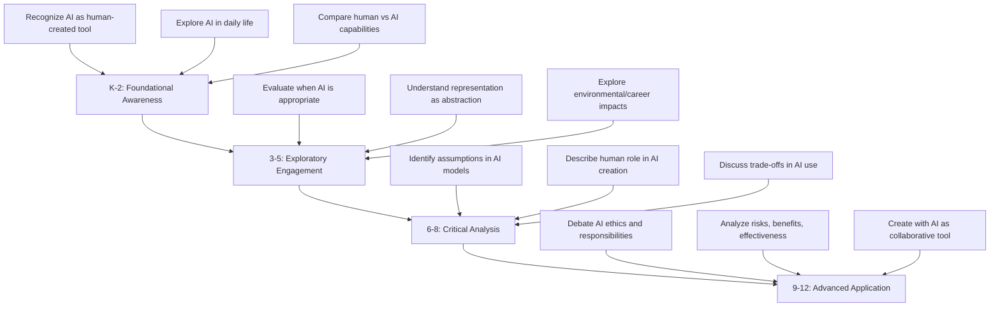

**Grades K-2: Foundational Awareness**

For the youngest learners, AIGC engagement should focus on **building awareness** of AI as a human-created tool while maintaining strong emphasis on foundational skill development. At this stage, students can begin to compare how humans and AI perform different tasks, recognize AI applications in their daily lives, and understand that AI systems are created by people[^6]. Direct student use of generative AI should be minimal and heavily scaffolded, with teachers serving as intermediaries who may use AIGC to create engaging, developmentally appropriate learning materials.

Key considerations for this grade band include:
- Prioritizing hands-on, play-based learning experiences over screen-based AI interactions
- Using AIGC primarily as a teacher-facing tool for material creation
- Introducing AI concepts through age-appropriate analogies and concrete examples
- Maintaining focus on foundational literacy and numeracy skills that cannot be outsourced to AI

**Grades 3-5: Exploratory Engagement**

Upper elementary students can begin more substantive engagement with AIGC concepts while still requiring significant scaffolding. Learning outcomes at this stage include understanding that **representations are abstractions** that focus on some features while omitting others, evaluating when AI is an appropriate resource for completing tasks, and exploring AI's impacts on environment and careers[^6].

Students at this level can engage with teacher-guided AIGC activities such as:
- Examining AI-generated content for accuracy and potential errors
- Using AI tools with explicit guidance for brainstorming or idea generation
- Discussing the differences between human creativity and AI outputs
- Beginning to develop critical evaluation skills for AI-generated content

**Grades 6-8: Critical Analysis**

Middle school students possess the cognitive development necessary for more sophisticated engagement with AIGC tools and concepts. At this stage, students should learn to **identify inherent assumptions** in AI model operations, describe the human role in creating and refining AI models, and discuss trade-offs involved in using AI for specific tasks[^6].

AIGC applications appropriate for this grade band include:
- Guided use of text generation tools for writing support and feedback
- Critical analysis of AI outputs for bias, accuracy, and limitations
- Project-based learning incorporating AI as a research or creation tool
- Exploration of how AI systems learn from data and make predictions

**Grades 9-12: Advanced Application**

High school students can engage with AIGC as **collaborative partners** in sophisticated learning activities. Learning outcomes include debating differences between humans and AI regarding intelligence, rights, and responsibilities; evaluating human decision-making in AI creation; and analyzing risks, benefits, and effectiveness of AI applications[^6].

At this level, students can appropriately:
- Use AIGC tools independently for research, writing, and creative projects
- Engage in substantive ethical debates about AI's societal implications
- Develop and refine prompts for effective AI interaction
- Create original works that thoughtfully integrate AI assistance
- Document and reflect on their AI collaboration processes

### 1.4 A Comprehensive Categorization Framework for AIGC Applications

To systematically analyze the diverse applications of AIGC in K-12 education globally, a comprehensive categorization framework is essential. This framework synthesizes established technology integration models with emerging understanding of AIGC's unique characteristics, providing a structured lens for examining case studies throughout this report.

**Foundational Integration Models**

Several established frameworks inform the categorization of AIGC applications in educational contexts[^1]:

| **Framework** | **Core Concept** | **AIGC Integration Implications** |
|---------------|-----------------|----------------------------------|
| **TPACK** (Technological Pedagogical Content Knowledge) | Effective teaching requires integration of technological, pedagogical, and content knowledge | AIGC integration requires teachers to develop new technological knowledge while maintaining strong pedagogical and content expertise |
| **SAMR** (Substitution, Augmentation, Modification, Redefinition) | Technology use ranges from simple substitution to fundamental task redefinition | AIGC offers potential for redefinition-level transformation, creating previously impossible learning activities |
| **TAM** (Technology Acceptance Model) | Adoption depends on perceived usefulness and ease of use | AIGC's natural language interface enhances ease of use; perceived usefulness varies by discipline and application |
| **ADDIE** (Analysis, Design, Development, Implementation, Evaluation) | Systematic instructional design process | AIGC can support multiple phases, from needs analysis to content development to evaluation |

**The AI Coherence Framework**

Building upon these foundations, the AI Coherence Framework developed by Child Trends provides a particularly valuable structure for categorizing AIGC applications[^7]. This framework identifies four levels of coherence that must be achieved for effective AI integration:

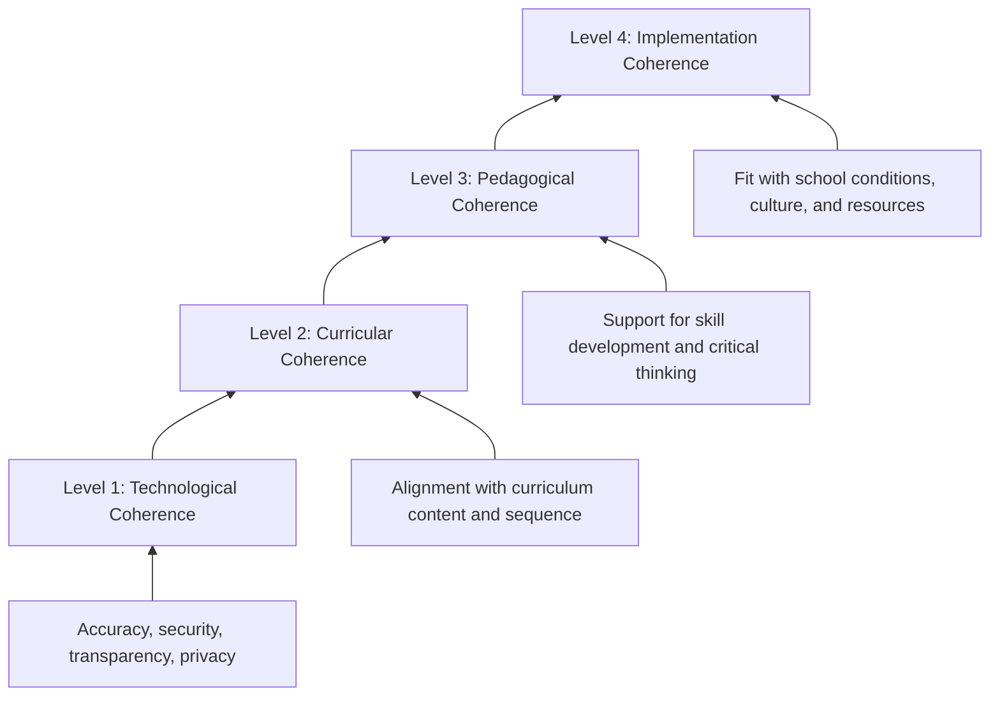

**Technological coherence** establishes the foundation, requiring that AI tools be accurate, secure, transparent, and privacy-preserving[^7]. Recent developments such as chain-of-thought reasoning and retrieval-augmented generation (RAG) models are improving the accuracy and interpretability of AI outputs, but educators must understand the risks inherent in any AI system.

**Curricular coherence** ensures that AI tools follow the structure and content of adopted curriculum[^7]. This includes using approved methods to solve problems, referencing correct materials in appropriate sequences, and reinforcing key concepts students are expected to learn. Techniques such as RAG and structured prompting frameworks can help tools reference curated curricular content.

**Pedagogical coherence** addresses how learning happens, not just what is learned[^7]. Pedagogically coherent tools provide step-by-step feedback without revealing final answers, encourage student reflection, support formative assessment and differentiated instruction, and align with academic integrity policies. This level recognizes both teacher and student perspectives on effective learning processes.

**Implementation coherence** grounds tools in real-world use, reflecting the unique conditions, resources, and cultures of individual schools and districts[^7]. This requires consideration of teacher training, clear norms for student use, family understanding of educational purposes, and accessibility for all learners.

**Multi-Dimensional Categorization Structure**

Integrating these frameworks with empirical research on AIGC applications yields a comprehensive categorization structure organized along three primary dimensions:

**Dimension 1: Pedagogical Function**

AIGC applications can be categorized by their primary pedagogical purpose:

| **Function** | **Description** | **Example Applications** |
|--------------|----------------|-------------------------|
| **Content Generation** | Creating instructional materials, learning resources, and educational content | Lesson plans, reading passages, practice problems, visual aids |
| **Personalized Tutoring** | Providing individualized instruction and support | AI tutors, conversational agents, adaptive feedback systems |
| **Assessment Support** | Creating, administering, and analyzing assessments | Quiz generation, automated grading, diagnostic reports |
| **Feedback Provision** | Offering formative feedback on student work | Writing feedback tools, error analysis, improvement suggestions |
| **Differentiation** | Adapting content and instruction to diverse learner needs | Leveled texts, scaffolded materials, accessibility accommodations |
| **Administrative Assistance** | Supporting non-instructional educator tasks | IEP drafting, parent communications, scheduling |

**Dimension 2: Content Modality**

Applications can be further categorized by the type of content generated:

- **Text-based**: Written materials, explanations, feedback, dialogue
- **Visual**: Images, diagrams, illustrations, infographics
- **Audio**: Spoken content, sound effects, music
- **Multimodal**: Combinations of text, image, audio, and video

**Dimension 3: User Interaction Mode**

The third dimension addresses who interacts with AIGC tools and how:

- **Teacher-facing**: Tools used by educators for preparation, planning, and administrative tasks
- **Student-facing**: Tools used directly by students for learning support
- **Collaborative**: Tools facilitating joint human-AI workflows where both teachers and students engage with AI outputs

Research indicates that while **teacher-facing applications** focused on time-saving tasks represent the most common current use of generative AI, **student-facing applications** hold the greatest potential for transforming learning experiences[^8][^9].

### 1.5 Foundational Principles for AIGC Integration in K-12 Settings

Responsible AIGC integration in K-12 education requires adherence to foundational principles that balance innovation potential with educational integrity and student welfare. These principles, derived from policy guidance, research findings, and emerging best practices, provide a framework for evaluating implementation approaches throughout this report.

**The Human-in-the-Loop Imperative**

The most consistently emphasized principle across policy documents and research is the necessity of maintaining **human agency and oversight** in AI-augmented educational processes. The U.S. Department of Education's report explicitly recommends that education policy "emphasize humans in the loop," ensuring that teachers retain decision-making authority over instructional choices[^4]. This principle manifests in several specific requirements:

- **AI systems should be inspectable, explainable, and overridable** by educators[^4]
- Teachers must maintain the ability to review, modify, or reject AI-generated content and recommendations
- Human judgment should guide high-stakes decisions affecting student learning and assessment
- AI should augment rather than replace the relational dimensions of teaching

Washington State's "human-AI-human" model exemplifies this principle, arguing that **generative AI engagement should always start with human inquiry and always end with human reflection, human insight, and human empowerment**[^8]. This framing positions AI as a tool within a fundamentally human process rather than an autonomous agent.

**Curricular and Pedagogical Coherence Requirements**

Effective AIGC integration must align with established curricular goals and pedagogical best practices. This requires[^7]:

- Ensuring AI tools support rather than contradict adopted curriculum content and sequencing
- Verifying that AI-generated materials reinforce rather than undermine pedagogical approaches
- Designing AI interactions that promote skill development and critical thinking rather than shortcutting learning processes
- Aligning AI use with assessment practices and academic integrity expectations

The tension between AI efficiency and learning process integrity deserves particular attention. While AIGC can rapidly produce outputs that might take students significant time to create independently, the **process of creation itself often constitutes the learning**. Educators must carefully distinguish between tasks where AI assistance accelerates learning and those where AI substitution undermines it.

**Ethical Considerations: Bias, Privacy, and Equity**

AIGC integration raises significant ethical concerns that must inform implementation decisions[^2][^3][^4]:

**Algorithmic Bias**: AI models trained on historical data can replicate or amplify existing inequalities. Studies have documented significant bias in AI systems, including GPT detectors that misclassify over half of non-native English writing samples as AI-generated[^2]. Educational applications must be evaluated for potential bias and monitored for discriminatory impacts.

**Data Privacy and Security**: AI tools often require substantial personal data to function effectively, creating risks of misuse or breach[^2][^3]. Educational use must comply with student privacy protections such as FERPA, and educators should understand what data is collected and how it is stored or shared[^4].

**Digital Equity and Access**: Implementation costs and infrastructure requirements create potential for widening existing educational disparities[^2]. Simple AI systems may cost around $25 monthly, but larger adaptive learning systems can run into tens of thousands of dollars[^2]. Ensuring equitable access across diverse school contexts represents a critical implementation challenge.

**Balancing AI Assistance with Fundamental Skill Development**

A core tension in AIGC integration involves the potential for AI assistance to undermine development of fundamental skills. If students rely heavily on AI for writing, calculation, or problem-solving, they may fail to develop the underlying competencies these activities are designed to build[^3]. Addressing this tension requires:

- Clear identification of which tasks benefit from AI assistance versus those requiring independent student effort
- Explicit instruction in when and how to use AI tools appropriately
- Assessment designs that evaluate student capabilities independent of AI support
- Ongoing monitoring of skill development alongside AI tool use

The guidance from the Southern Regional Education Board emphasizes that **"AI must be viewed as a tool, not an end product"**[^10]. This framing suggests that AIGC should support and enhance human learning processes rather than replace them, with the ultimate goal remaining the development of capable, critical, creative human learners.

**Academic Integrity and Transparency**

The emergence of AIGC has intensified concerns about academic integrity, as generative tools can produce work that is difficult to distinguish from student-created content[^3]. Addressing these concerns requires:

- Clear policies regarding acceptable AI use in different contexts
- Redesigned assessments that cannot be easily completed through AI generation alone
- Explicit instruction in ethical AI use and proper attribution
- Transparency requirements for students to document when and how they use AI assistance

Some educators have responded by "AI-proofing" assessments through designs that incorporate AI as a documented tool in the process rather than attempting to prohibit its use entirely[^8][^9]. This approach acknowledges AI's presence while maintaining focus on authentic learning and transparent collaboration.

**Toward a Principled Integration Approach**

These foundational principles collectively support an integration approach that:

1. **Centers human agency** in all AI-augmented educational processes
2. **Ensures coherence** with curricular goals and pedagogical best practices
3. **Addresses ethical concerns** proactively through careful tool selection and implementation design
4. **Balances assistance with development** to maintain focus on fundamental skill building
5. **Promotes transparency** in AI use while maintaining academic integrity

This principled foundation provides the evaluative framework through which global case studies and implementation strategies will be analyzed in subsequent chapters, ensuring that practical applications are assessed not only for their effectiveness but also for their alignment with responsible educational practice.

## 2 Taxonomy of AIGC Applications in K-12 Classrooms

Building upon the conceptual foundations established in Chapter 1, this chapter develops a systematic, multi-dimensional classification framework for understanding the diverse landscape of Artificial Intelligence Generated Content (AIGC) applications in global K-12 educational contexts. As generative AI tools proliferate across classrooms worldwide, educators, administrators, and policymakers require a structured analytical lens to evaluate, select, and strategically deploy these technologies in ways that align with pedagogical goals and developmental appropriateness. The taxonomy presented here synthesizes empirical findings from international research, government-endorsed curricula spanning multiple continents, and emerging pedagogical frameworks to organize AIGC applications across four intersecting dimensions: functional purpose, subject domain, grade level appropriateness, and user interaction mode. Each taxonomic category is analyzed not merely for descriptive completeness but for its underlying **pedagogical rationale**, evidence-based **educational value proposition**, and alignment with the foundational principles of human-centered AI integration that prioritize student agency, teacher oversight, and curricular coherence.

### 2.1 Classification by Functional Purpose: Content Generation, Tutoring, Assessment, and Administration

The most fundamental dimension for categorizing AIGC applications in K-12 education centers on **functional purpose**—the specific educational tasks and operational needs that generative AI tools address. This functional taxonomy reveals four major domains, each leveraging distinct generative capabilities and serving different stakeholders within the educational ecosystem.

#### 2.1.1 Content Generation: From Lesson Plans to Multimodal Learning Materials

Content generation represents the most widely adopted functional category of AIGC in K-12 settings, encompassing the creation of instructional materials, learning resources, and educational content that would otherwise require substantial teacher time and expertise to develop. The Arizona Department of Education's framework identifies AIGC as particularly valuable in the **"Assistant"** role, where it automates routine content creation tasks including composing emails, creating rubrics, designing interactive presentations, and generating visual content[^11]. This functional application directly addresses one of the most persistent challenges in education: the time constraints teachers face in developing high-quality, differentiated materials.

**Lesson Planning and Instructional Design Support**

AIGC tools serve as **"Thought Partners"** for educators during the planning process, supporting idea generation, reflective practice, accessibility checks, and feedback loops to improve lesson plans[^11]. Teachers can engage generative AI in iterative dialogue to refine instructional approaches, explore alternative pedagogical strategies, and ensure materials address diverse learner needs. The Chinese Ministry of Education's 2025 guidelines explicitly endorse using GenAI to "generate instructional designs and courseware" as a core application scenario for supporting teacher preparation[^12].

**Differentiated and Adaptive Materials**

Beyond basic content creation, AIGC enables **personalization** by helping customize content and create adaptive materials for diverse learners, including English learners and special education students[^11]. This application extends to generating leveled reading passages, scaffolded problem sets, and culturally responsive materials that would be prohibitively time-consuming to create manually for each student population. The Colorado AI Skills Progression Guide emphasizes that AI tools can support teachers in "building intelligent teaching agents for personalized instruction"[^13].

**Multimodal Content Production**

The generative capabilities of modern AI extend beyond text to encompass image, audio, and video generation. Research indicates that AIGC types span eleven primary categories including text-to-image, text-to-audio, text-to-video, and text-to-3D content, with additional multimodal combinations enabling rich educational material creation[^14]. These capabilities allow teachers to produce visual aids, concept illustrations, and multimedia explanations that make abstract content more accessible across learning modalities.

| **Content Type** | **Generative Capability** | **Educational Application** | **Pedagogical Value** |
|------------------|--------------------------|----------------------------|----------------------|
| Lesson Plans | Text generation | Instructional design, differentiation | Efficiency, coherence |
| Practice Problems | Text generation | Formative practice, assessment prep | Customization, variety |
| Visual Aids | Image generation | Concept illustration, engagement | Accessibility, comprehension |
| Reading Materials | Text generation | Leveled texts, content adaptation | Differentiation, scaffolding |
| Multimedia | Multimodal generation | Interactive learning experiences | Engagement, multimodal learning |

#### 2.1.2 Personalized Tutoring: Intelligent Systems for Individualized Instruction

Perhaps no functional application of AIGC holds more transformative potential than **intelligent tutoring systems** that provide individualized instruction at scale. Recent rigorous studies demonstrate that tutoring systems integrating generative AI can "perform many of the core functions traditionally handled by human beings or expert-authored scripts, deliver learning gains and efficiency, and offer a path to solve the challenge of individualized education at scale"[^15].

**Core Tutoring Functions Enhanced by Generative AI**

The integration of generative AI adds distinctive value to tutoring platforms in several critical ways. First, large language models can **generate naturalistic dialogue** such as explanations tailored to individual student questions, rather than selecting from pre-scripted responses typical of rule-based tutoring systems[^15]. Students can ask follow-up questions in natural language and receive contextually appropriate answers—a capability that fundamentally distinguishes AIGC-powered tutoring from earlier intelligent tutoring systems.

Second, while earlier platforms could implement predetermined question sequences, generative AI enables tutoring systems to **formulate questions dynamically** based on what students actually write and say[^15]. This includes deploying a greater variety of questioning techniques and support strategies like providing hints, scaffolding, and guidance that adapt in real-time to student needs.

Third, tutoring platforms enhanced by generative AI help create **psychologically safe learning environments** where students feel comfortable seeking academic help they need[^15]. The non-judgmental nature of AI interaction can reduce anxiety associated with asking questions in front of peers or admitting confusion to teachers.

**Pedagogical Approaches in Effective AI Tutoring**

The success of AIGC-enhanced tutoring platforms is grounded in pedagogies that **"teach, not tell"**—employing Socratic approaches, asking questions that guide students to identify their own mistakes rather than providing direct answers, and breaking down complex issues to manage cognitive load[^15]. Content is highly scaffolded and organized sequentially to guide students through problems. Explicit safeguards, such as step-by-step solutions, are embedded in prompts to ensure the generative AI component delivers high-quality explanations and prevents hallucinations.

Research on pedagogical agents in K-12 education confirms these benefits, finding that "students using pedagogical agents as learning tools scored higher than students using traditional methods" across multiple subject areas[^14]. In mathematics education specifically, studies highlight that pedagogical agents "effectively support mathematical learning with results superior to traditional tutoring methods"[^14].

#### 2.1.3 Assessment Support: Generation, Analysis, and Formative Feedback

AIGC applications in assessment represent a rapidly evolving functional category that spans the entire assessment cycle from creation through analysis. Generative AI can **"drastically reduce the time educators spend on administrative tasks like creating tests and quizzes, allowing them to focus on engaging with students and providing individualized support"**[^16].

**Assessment Generation Capabilities**

AI-generated assessment content ensures high-quality and diverse question types that cater to different learning needs and align with curriculum standards[^16]. Tools for generating assessments include AI question generators, features for creating personalized questions, quiz makers that generate questions from topics or texts, and integrations with platforms like Google Forms for automated test creation with feedback[^16]. The Colorado framework lists "Magic School, Brisk Teaching, SchoolAI" among tools supporting assessment generation across multiple subjects and grade levels[^13].

**Formative Feedback Provision**

Beyond generation, AIGC provides sophisticated feedback on open-ended responses, particularly in domains like writing or mathematical problem-solving[^15]. This capability addresses a persistent bottleneck in education: the time required for teachers to provide meaningful, individualized feedback on student work. Generative AI chatbots can enhance the analysis of student assessment data, drive instructional improvement, and foster collaborative discussions among teacher teams[^16].

**Critical Implementation Considerations**

However, the use of AIGC in assessment requires careful attention to validity and fairness. Educators **"cannot take AI-generated testing material at face value; factors like fairness and reliability are vital"**[^16]. They must review and adjust AI-generated content to avoid biases and ensure cultural sensitivity and inclusivity. The Chinese Ministry of Education explicitly cautions that teachers "shall avoid directly using AI-generated content to evaluate students"[^12], highlighting the importance of human oversight in high-stakes assessment contexts.

#### 2.1.4 Administrative Assistance: Efficiency in Non-Instructional Tasks

The fourth functional category addresses AIGC applications that support educators in non-instructional responsibilities, freeing time and cognitive resources for core teaching functions. The Chinese guidelines identify "school management intelligentization" as a key application scenario, where education departments, schools, and teachers can utilize GenAI to "optimize routine office work, promote educational equity, design assessment systems, construct 'human-computer coordination' decision-making mechanisms, and manage archives intelligently"[^12].

Administrative applications include drafting Individualized Education Programs (IEPs), composing parent communications, generating progress reports, and managing scheduling complexities. While these applications may seem peripheral to learning, they address a significant source of teacher burnout and time pressure that ultimately affects instructional quality. The cost-effectiveness of AIGC for administrative tasks makes these tools "promising candidates for large-scale implementation" that could restructure how educators allocate their professional time[^15].

### 2.2 Classification by Subject Domain: STEM, Humanities, Arts, and Languages

The second taxonomic dimension organizes AIGC applications according to their deployment across different disciplinary areas, recognizing that subject-specific pedagogical considerations shape how generative tools can most effectively support learning.

#### 2.2.1 STEM Subjects: Problem-Solving, Computational Thinking, and Scientific Inquiry

STEM disciplines represent the most extensively researched domain for AIGC applications in K-12 education. A systematic review of generative AI in K-12 contexts found that **"most papers focused on STEM-related subjects"** with mathematics being the most common subject (5 papers), followed by physics (4 papers), and programming (3 papers)[^17]. This concentration reflects both the structured nature of STEM content that aligns well with AI capabilities and the significant policy attention to preparing students for technology-intensive careers.

**Mathematics Education**

In mathematics, AIGC supports problem-solving instruction, procedural practice, and conceptual explanation. Research demonstrates that pedagogical agents "effectively support mathematical learning with results superior to traditional tutoring methods"[^14]. The Colorado framework provides specific examples of AI integration in mathematics, including tools that generate practice problems, provide step-by-step solution guidance, and offer personalized feedback on mathematical reasoning[^13].

**Programming and Computer Science**

Three papers in the systematic review specifically "evaluated the effectiveness of using ChatGPT to support high school students in programming"[^17]. AI tools in this domain can explain code, debug errors, suggest optimizations, and scaffold the learning of computational thinking concepts. The Washington State guidance notes that "computer science courses naturally include discussions about technology's social impact, algorithmic bias" and provide authentic contexts for AI literacy integration[^18].

**Scientific Inquiry**

AIGC applications in science education support inquiry-based learning through simulations, hypothesis generation, and data analysis assistance. The bibliometric analysis of AIGC in design education found that research themes evolved from "technology adoption toward pedagogical design, creative expression, and learning assessment"[^19], suggesting similar trajectories in science education where AI supports both content learning and scientific process skills.

#### 2.2.2 Humanities and Social Studies: Research, Argumentation, and Critical Analysis

While STEM subjects dominate current research, AIGC applications in humanities and social studies address distinct pedagogical needs centered on research, writing, argumentation, and critical analysis of complex social phenomena.

**Writing and English Language Arts**

The systematic review identified writing and English language as subjects examined in AIGC research[^17], with applications ranging from brainstorming support to feedback on drafts. The Arizona framework positions AIGC as a **"critical friend throughout the writing process"** for students[^11], while emphasizing that such tools should support rather than replace the development of authentic writing skills.

**History and Social Sciences**

History education presents unique opportunities for AIGC to support source analysis, perspective-taking, and argumentative writing. The Colorado framework includes specific examples of AI integration in social studies and history courses, where tools can help students analyze primary sources, construct historical arguments, and explore multiple perspectives on complex events[^13].

**Critical Analysis Requirements**

Humanities applications require particular attention to **critical evaluation of AI outputs**, as generative tools may produce plausible-sounding but historically inaccurate or analytically shallow content. The European AI Literacy Framework emphasizes that students must develop skills to "critically evaluate AI responses by cross-checking with credible sources"[^16], a competency especially crucial in disciplines where interpretation and evidence-based argumentation are central learning objectives.

#### 2.2.3 Arts and Creative Disciplines: Design Education and Creative Expression

Image generation and multimodal AI tools open distinctive possibilities for arts education, though these applications raise complex questions about creativity, authorship, and artistic development.

**Design Education**

The bibliometric review of AIGC in design education found that keyword co-occurrence analysis shows **"creativity" and "learning outcomes" are core nodes in the knowledge network**[^19]. AIGC supports design education through rapid prototyping, visual exploration, and iterative refinement processes that allow students to explore design possibilities more extensively than traditional methods permit.

**Creative Expression and Artistic Development**

However, the Chinese Ministry of Education cautions that students should **"avoid abusing GenAI in tasks requiring creative or personalized expression"**[^12], highlighting the tension between AI assistance and authentic creative development. The pedagogical challenge lies in leveraging AIGC to expand creative possibilities while ensuring students develop fundamental artistic skills and authentic creative voices.

#### 2.2.4 Language Learning: Interactive Practice and Accessibility

Language education represents a particularly promising domain for AIGC applications, given the technology's natural language processing capabilities and the importance of interactive practice in language acquisition.

**Foreign Language Learning**

Research demonstrates that "compared to using traditional methods like watching movies with subtitles, students who collaborated with pedagogical agents showed significant improvement in comprehension and performance"[^14]. AIGC enables conversational practice, pronunciation feedback, and personalized vocabulary instruction that would otherwise require human tutors or language partners.

**Support for English Language Learners**

The Arizona framework specifically identifies AIGC applications for **"language support for English Language Learners"** including content acquisition through summaries and explanations[^11]. These tools can provide scaffolded access to grade-level content while students develop English proficiency, addressing a persistent equity challenge in linguistically diverse classrooms.

| **Subject Domain** | **Primary AIGC Applications** | **Key Pedagogical Considerations** | **Specific Risks/Limitations** |
|-------------------|------------------------------|-----------------------------------|-------------------------------|
| Mathematics | Problem-solving support, procedural practice, concept explanation | Alignment with curriculum sequence, step-by-step scaffolding | Over-reliance on AI for computation |
| Science | Inquiry support, simulation, data analysis | Integration with hands-on investigation | Hallucination in factual content |
| Programming | Code explanation, debugging, computational thinking | Authentic coding skill development | Dependency on AI-generated code |
| Writing/ELA | Brainstorming, drafting support, feedback | Process-focused rather than product-focused use | Bypassing authentic writing development |
| History/Social Studies | Source analysis, argumentation support | Critical evaluation of AI outputs | Historical inaccuracy, shallow analysis |
| Arts/Design | Visual exploration, prototyping | Authentic creative skill development | Undermining original creative voice |
| Languages | Conversational practice, vocabulary, accessibility | Interactive engagement, cultural authenticity | Limitations in nuanced cultural expression |

### 2.3 Classification by Grade Level Appropriateness: Elementary, Middle, and High School Applications

The third taxonomic dimension addresses **developmental appropriateness**, recognizing that cognitive capabilities, literacy levels, and learning needs vary dramatically across the K-12 span. International AI literacy frameworks and government-endorsed curricula provide structured guidance for calibrating AIGC applications to different grade bands.

#### 2.3.1 Elementary Grades (K-5): Foundational Awareness and Teacher-Facing Applications

For the youngest learners, AIGC integration emphasizes **teacher-facing applications** and carefully scaffolded student interactions that prioritize foundational skill development over direct AI engagement.

**Restricted Student Access**

The Chinese Ministry of Education's 2025 guidelines specify that at the primary school level, **"students should be prohibited from using open-type content generation functions independently, while teachers may use them appropriately"**[^12]. This restriction reflects developmental considerations about young children's capacity to critically evaluate AI outputs and the importance of protecting foundational skill development in literacy and numeracy.

**Foundational AI Awareness**

Rather than direct tool use, elementary education focuses on building conceptual understanding of AI as a human-created tool. The Colorado framework identifies key student skills for grades K-5 including **"identifying AI technologies in daily life (like smart assistants), using simple labeled data to train computers, and distinguishing between intelligent and non-intelligent machines"**[^13]. The Washington State guidance suggests that for elementary students, "the focus is on helping them understand that AI is not a sentient entity" and building foundational recognition through interactive tools like Google's Quick, Draw![^18]

**Teacher-Facing Content Generation**

In elementary contexts, AIGC serves primarily as a teacher tool for creating developmentally appropriate materials, differentiating instruction, and generating engaging content. Resources like the ISTE "Hands-On AI Projects for the Classroom: A Guide for Elementary Teachers" provide structured approaches for teachers to use AI in creating materials while introducing students to AI concepts through projects like "What AI Is Good At vs. Not Good At" and "Training Data and Machine Learning"[^13].

**Age-Appropriate Resources**

The AI4K12 initiative has developed resources specifically designed for young learners, including a **"five-part picture book series designed to introduce the 'Five Big Ideas' of artificial intelligence to K-2 students"** covering perception, representation and reasoning, machine learning, human-AI interaction, and social impact[^13]. These resources enable conceptual AI literacy development without requiring direct engagement with generative tools.

#### 2.3.2 Middle School Grades (6-8): Guided Engagement and Critical Analysis

Middle school represents a transitional stage where students can begin more substantive engagement with AIGC tools under appropriate guidance, while developing critical analysis skills essential for responsible AI use.

**Expanded but Scaffolded Access**

The Chinese guidelines indicate that at the middle school level, **"the logical analysis of generated content may be explored to a moderate extent"**[^12]. This suggests a pedagogical approach where students engage with AI outputs as objects of analysis rather than simply as resources for task completion.

**Critical Analysis of AI Outputs**

The Colorado framework identifies key skills for grades 6-8 including **"identifying AI's impact on work and society, exploring basic classification tasks, building and evaluating simple models (like decision trees), and analyzing biased datasets and cultural representation"**[^13]. The MIT Media Lab's "Ethics of Artificial Intelligence Curriculum for Middle School Students" provides structured activities including "Introduction to Supervised Machine Learning and Algorithmic Bias" and "Algorithms as Opinions"[^13].

**Project-Based Learning with AI**

Middle school students can appropriately engage in project-based learning that incorporates AI as a research or creation tool. The Common Sense AI Literacy Lessons for grades 6-12 include topics such as "What Is AI?", "How Is AI Trained?", "AI Chatbots: Who's Behind the Screen?", and "Understanding AI Bias"[^13]—curricula that position AI as both a tool to use and a phenomenon to understand critically.

**Skill Development Focus**

The Colorado framework emphasizes that middle school AI education should focus on **"deepening understanding of how AI models are trained and evaluated, exploring the technical and ethical complexity of data, beginning to build AI artifacts using tools and basic programming, and critically reflecting on the impact of AI design on people and systems"**[^13].

#### 2.3.3 High School Grades (9-12): Independent Use and Advanced Application

High school students possess the cognitive development necessary for sophisticated, relatively independent engagement with AIGC as collaborative partners in learning and creative endeavors.

**Expanded Independence**

The Chinese Ministry of Education permits high school students to **"carry out exploratory learning combining technological principles"**[^12], indicating appropriate contexts for more autonomous AI engagement. The Washington State guidance notes that for high school students, "AI tools can be used to supplement their curiosity and emerging critical thinking skills" with students able to "analyze large language model outputs to discern their flaws or biases"[^18].

**Advanced Conceptual Understanding**

The Colorado framework identifies high school concepts including **"distinguishing between learning types (supervised, unsupervised, reinforcement learning), exploring neural networks, natural language processing and perception, and articulating ethical dilemmas while debating AI agency and human authorship"**[^13]. Students at this level can engage meaningfully with technical aspects of AI systems while maintaining critical perspectives on their limitations and implications.

**Creative and Academic Projects**

High school applications extend to sophisticated creative and academic projects where AI serves as a collaborative partner. The ISTE "Hands-On AI Projects for the Classroom: A Guide for Secondary Teachers" includes projects such as "AI Chatbots," "Cultivating a Critical Eye," "Using AI to Solve Environmental Problems," and "AI Legislation"[^13]. The AI Education Project provides ready-to-use projects including "Deepfake PSA," "Facial Recognition for Good, Evil, and In Between," and "ChatGPT Interview"[^13].

**Career Pathway Connections**

At the high school level, AI literacy connects explicitly to career preparation. The Colorado framework maps AI skills to career pathways including advanced manufacturing (predictive maintenance, optimization), digital technology (automated coding, data analysis), healthcare (diagnostic assistance), and marketing (personalized experiences, data-driven decisions)[^13].

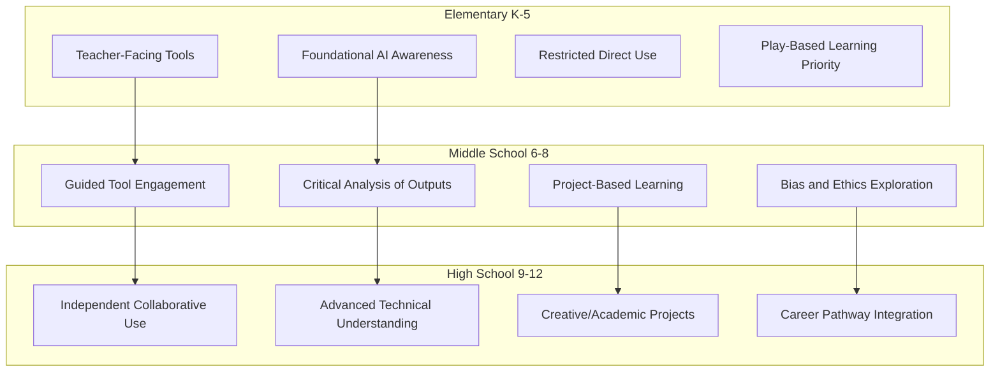

### 2.4 Classification by Interaction Mode: Student-Facing, Teacher-Supporting, and Hybrid Configurations

The fourth taxonomic dimension addresses **who interacts with AIGC tools and how**, recognizing that different interaction configurations carry distinct pedagogical rationales, implementation requirements, and risk profiles.

#### 2.4.1 Teacher-Supporting Applications: Preparation, Development, and Professional Growth

Teacher-supporting applications encompass AIGC tools used for instructional preparation, material development, administrative efficiency, and professional reflection without direct student engagement with AI systems.

**Instructional Design and Preparation**

The Chinese Ministry of Education identifies "teaching preparation" as a core scenario where teachers can use GenAI to **"generate instructional designs and courseware"**[^12]. This application leverages AIGC's content generation capabilities while maintaining teacher control over what students ultimately encounter. Teachers serve as critical intermediaries who evaluate, refine, and contextualize AI-generated materials before classroom deployment.

**Professional Development Support**

Research on teacher-AI collaboration identifies professional development as a key benefit, with AI enabling **"self-directed reflection on instructional practices through data provided by AI"**[^20]. Learning analytics from AI can improve teachers' understanding of students' difficulties and progress, enabling better-customized interventions. Tutoring systems enhanced by generative AI can also provide "scaffolding, templates, and real-time guidance that help novice teachers deliver more effective instruction while building their professional skills"[^15].

**Administrative Efficiency**

Teacher-supporting applications extend to administrative tasks that consume significant professional time. The systematic review found that **nearly all reviewed papers (90%) emphasize the need for teachers' professional development for AI-integrated classrooms**[^17], suggesting that reducing administrative burden through AI assistance could free time for the learning and adaptation that effective AI integration requires.

#### 2.4.2 Student-Facing Applications: Tutoring, Feedback, and Self-Directed Learning

Student-facing applications include tools where learners interact directly with generative AI for tutoring, feedback, self-directed learning, and creative exploration.

**Interactive Tutoring and Support**

The Chinese guidelines identify scenarios where GenAI supports student growth through **"personalized learning, interactive exploration, enhancing the in-depth reading experience, improving mental health, and supporting accessibility"**[^12]. Students can use GenAI tools to obtain personalized learning plans, engage in interactive learning practices, construct multi-dimensional reading scenarios, receive psychological adjustment support, and overcome physical or cultural barriers.

**Self-Directed Learning Facilitation**

The Arizona framework positions AIGC as supporting **"Self-Directed Learning"** by helping students set goals, plan projects, and reflect on their learning[^11]. This application aligns with research showing that tutoring platforms enhanced by generative AI offer versatility—accessible "in school, at home, or after school, with teacher support, alone or with classmates, as self-paced instruction or small-group collaboration"[^15].

**Accessibility and Inclusion**

Student-facing AIGC applications offer particular value for learners with diverse needs. The Arizona framework identifies **"Accessibility"** applications including "inclusive tools for students with differing abilities, language support for English Language Learners, and aids in content acquisition through summaries and explanations"[^11]. These applications can democratize access to personalized support that was previously available only to students with access to human tutors.

**Risk Considerations**

However, student-facing applications carry distinct risks requiring careful management. The Chinese Ministry of Education specifies that students **"should avoid simply copying AI-generated content in homework, avoid using GenAI on exams to cheat, and avoid abusing GenAI in tasks requiring creative or personalized expression"**[^12]. The Arizona framework similarly warns of risks including "over-reliance on technology, dependence on specific tools, accuracy concerns, loss of human interaction, and a potential initial implementation dip"[^11].

#### 2.4.3 Hybrid Configurations: Teacher-AI Collaboration Models

Hybrid configurations involve collaborative human-AI workflows where both teachers and students engage with AI outputs, representing sophisticated integration approaches that leverage the complementary strengths of human and artificial intelligence.

**Teacher-AI Collaboration Typology**

Research with Chinese K-12 teachers identified **six types of teacher-AI collaboration (TAC)** that define how roles can be shared in classroom instruction[^20]:

| **TAC Model** | **Description** | **AI Role** | **Teacher Role** |
|---------------|-----------------|-------------|------------------|
| **One Teach, One Observe** | Teacher instructs while AI gathers data | Observational data collection on progress, performance, engagement | Primary instructor |
| **One Teach, One Assist** | Teacher leads with AI administrative support | Answering FAQs, analyzing attendance, processing results | Primary responsibility |
| **Co-teaching in Stations** | Class divided into workstations | Managing some stations | Managing other stations |
| **Parallel Teaching** | Hybrid-flexible model | Supporting online learners independently | Instructing in-person students |
| **Differentiated Teaching** | One entity instructs main class, other works with smaller group | Specialized attention to subgroup | Main class instruction (or vice versa) |
| **Team Teaching** | Co-teaching with turn-taking | Teaching facts and logic | Focusing on social-emotional skills |

**Benefits of Hybrid Approaches**

Teachers perceived several benefits of TAC models. For instructional design, **"learning analytics from AI can improve teachers' understanding of students' difficulties and progress, enabling better-customized interventions"**[^20]. For teaching delivery, TAC allows for creating technology-rich, engaging activities and more flexible student grouping, with AI helping monitor multiple student groups simultaneously.

**The Human-AI Hybrid Vigor Model**

Research suggests that **"the optimal tutoring model appears to be one of human-AI hybrid vigor, where teachers continue to play an essential role in monitoring and guiding students' use of the LLM and where tutoring programs liberate teachers from teaching content to capitalize on classroom time for activities that foster advanced cognitive skills"**[^15]. This framing positions AI not as a replacement for teachers but as a tool that enables teachers to focus on uniquely human contributions to education.

**Implementation Challenges**

The study of teacher-AI collaboration also identified significant obstacles including **"lack of explicit and consistent curriculum guidance"** with TAC goals often narrowly focused on exam scores rather than broader educational objectives[^20]. The dominance of commercial AI in schools was another obstacle, as teachers felt these tools are often developed without sufficient pedagogical principles. The absence of clear ethical guidelines covering data privacy to educational ethics was also a major concern.

### 2.5 Synthesizing Dimensions: An Integrated Taxonomic Framework for Strategic AIGC Deployment

The four classification dimensions—functional purpose, subject domain, grade level appropriateness, and interaction mode—intersect to define specific application profiles with distinct pedagogical requirements and value propositions. This section synthesizes these dimensions into an integrated framework that supports strategic decision-making for AIGC implementation in K-12 contexts.

#### 2.5.1 The Intersection Matrix: Mapping Application Profiles

The following matrix illustrates how the four dimensions intersect to create specific application contexts, each with unique considerations:

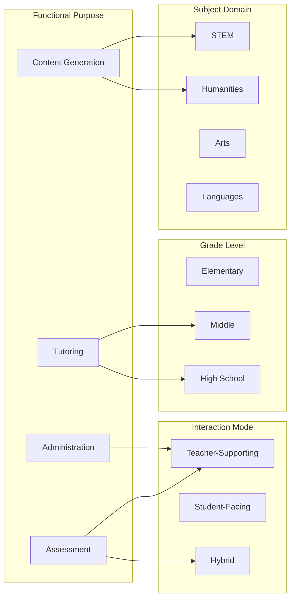

**Example Application Profile Analysis**

Consider a specific application profile: **AI-powered mathematics tutoring for middle school students in a hybrid teacher-AI configuration**. This profile intersects:
- **Function**: Personalized tutoring with Socratic dialogue and adaptive feedback
- **Domain**: Mathematics with emphasis on problem-solving and procedural fluency
- **Grade Level**: Middle school (6-8) with guided engagement and critical analysis
- **Interaction**: Hybrid model where teacher monitors AI-student interactions

The pedagogical requirements for this profile include alignment with curriculum sequence, step-by-step scaffolding that teaches rather than tells, teacher oversight of AI recommendations, and student development of critical evaluation skills for AI-generated explanations.

#### 2.5.2 Alignment with Theoretical Frameworks

The integrated taxonomy aligns with established theoretical frameworks that inform effective educational technology integration. The bibliometric analysis of AIGC in design education found that **"thematic clusters correspond to core educational technology theories (such as TAM, TPACK, Bloom's Taxonomy), illustrating how AIGC supports multi-level pedagogical innovation"**[^19].

**TPACK Integration**

The Technological Pedagogical Content Knowledge (TPACK) framework provides a lens for understanding how the taxonomy dimensions interact. Effective AIGC deployment requires teachers to integrate:
- **Technological Knowledge**: Understanding AIGC capabilities and limitations across functional categories
- **Pedagogical Knowledge**: Selecting appropriate interaction modes and grade-level scaffolding
- **Content Knowledge**: Applying subject-specific considerations for AI integration

**Bloom's Taxonomy Alignment**

The temporal evolution analysis revealed that research focus shifted from early periods (2021-2023) embedding AIGC in teaching objective systems based on cognitive taxonomies like Bloom's Taxonomy, toward later periods (2024-2025) focusing on **"implementation," "acceptance," and themes related to practical integration and TPACK frameworks**[^19]. This trajectory suggests the field is maturing from theoretical positioning toward practical deployment guidance.

#### 2.5.3 Identified Gaps and Development Priorities

The integrated taxonomy reveals several gaps in current AIGC application coverage that warrant attention from researchers, developers, and policymakers:

**Geographic and Demographic Gaps**

The systematic review found that **"most studies were conducted in Asia (Taiwan, China, Korea, South Korea, Hong Kong), with representations from European countries and only one South American country (Colombia); there was no representation from Africa"**[^17]. This geographic concentration limits understanding of how AIGC applications function across diverse educational contexts and cultural settings.

**Grade Level Gaps**

Research coverage is uneven across grade levels. The review found that **"both high school students and pre-service teachers are largely covered, while middle schools have a good representation"** but "vocational education and in-service teachers were barely targeted"[^17]. Elementary education received limited attention, with only one paper focusing on elementary education involving parents, teachers, and students.

**Assessment and Evaluation Gaps**

Current research relies heavily on psychological variables for measuring outcomes. The systematic review noted that **"aside from surveys and interviews using these psychological variables, the studies do not consider objective measures of student learning outcomes, such as standardized tests or quizzes"**[^17]. This limitation constrains understanding of AIGC's actual impact on academic achievement.

**Ethical Framework Gaps**

While attention to ethics is increasing—with **"ethics" and "student creativity" keywords showing rapidly rising attention**[^19]—the bibliometric analysis concluded that current research lacks sufficient exploration of **"data security, intellectual property, generated content authenticity, and teaching equity"**[^19]. The development of robust ethical frameworks remains a priority for responsible AIGC deployment.

#### 2.5.4 Strategic Deployment Guidance

The integrated taxonomy provides a foundation for strategic AIGC deployment decisions. Educators and administrators can use the framework to:

1. **Identify Appropriate Applications**: Match available AIGC tools to specific functional needs, subject domains, grade levels, and interaction preferences
2. **Assess Pedagogical Coherence**: Evaluate whether proposed applications align with curricular goals, developmental appropriateness, and pedagogical best practices
3. **Plan Implementation Pathways**: Sequence AIGC integration from lower-risk teacher-supporting applications toward more complex hybrid and student-facing configurations
4. **Anticipate Challenges**: Recognize the specific risks and limitations associated with different application profiles
5. **Prioritize Professional Development**: Focus teacher learning on the AIGC applications most relevant to their specific contexts

The European AI Literacy Framework emphasizes that teaching AI literacy is a **"shared responsibility across the education ecosystem"** for all K-12 educators, to be embedded where it aligns with their subject and context rather than taught in a standalone class[^21]. This framing suggests that the taxonomy should inform integration across the curriculum rather than siloed AI instruction.

The UNESCO mapping of government-endorsed AI curricula found that curricula were categorized as **"discrete subjects, embedded within other subjects (like ICT), interdisciplinary, or flexible/multi-modality"**[^22], indicating multiple valid approaches to positioning AIGC within educational structures. The integrated taxonomy accommodates all these approaches by providing a common analytical framework regardless of curricular organization.

As subsequent chapters examine global case studies across personalized learning, content creation, and assessment applications, this taxonomic framework will serve as the analytical lens for understanding how different implementations address specific educational needs, leverage particular AIGC capabilities, and navigate the challenges inherent in each application profile.

## 3 Global Case Studies: AIGC for Personalized Learning and Intelligent Tutoring

This chapter examines documented implementations of AIGC technologies for personalized learning and intelligent tutoring across global K-12 settings. Drawing on empirical evidence from diverse educational contexts including North America, China, Latin America, and Europe, the analysis evaluates the effectiveness, design principles, and implementation challenges of AI-powered adaptive learning platforms, conversational tutoring agents, and personalized content recommendation systems in addressing heterogeneous learning needs and supporting differentiated instruction at scale. The promise of intelligent tutoring—providing every student with the equivalent of a personal tutor—has long captured the imagination of educators and policymakers. With the integration of generative AI, this promise is now closer to realization than ever before, though significant challenges and critical questions remain about how to deploy these technologies responsibly and effectively.

### 3.1 Intelligent Tutoring Systems: Evidence Base and Learning Outcomes

The integration of artificial intelligence into tutoring systems represents one of the most extensively researched applications of educational technology, with a growing body of rigorous evidence demonstrating both the potential and the limitations of these approaches. Understanding this evidence base is essential for educators and administrators seeking to make informed decisions about AI-powered tutoring implementations.

#### 3.1.1 Comparative Effectiveness Against Traditional Instruction

High-quality research has consistently demonstrated that **Intelligent Tutoring Systems (ITSs) can match or exceed the effectiveness of traditional teacher-led instruction**. A comprehensive meta-review by Kulik and Fletcher examining 50 studies concluded that ITSs can "match the success" of human tutoring, while Nesbit et al. found "a significant advantage of ITS over teacher-led classroom instruction and non-ITS computer-based instruction"[^15]. These findings suggest that well-designed AI tutoring systems can deliver individualized instruction at a quality level previously achievable only through expensive one-on-one human tutoring.

A systematic review by Létourneau et al. (2025) analyzing 28 studies encompassing 4,597 students provides particularly valuable insight into the comparative effectiveness of AI-driven ITSs in K-12 education[^23]. The review found that when comparing ITSs to teacher-led instruction, **seven out of eight studies reported a significant positive effect** on student performance, with effect sizes ranging from medium to large[^23]. One striking example involved the Yixue Squirrel AI ITS for teaching the Pythagorean theorem over three days, where learning gains were **4.19 times greater** for the experimental group using the ITS compared to the control group with traditional teaching, with a medium-sized effect (Hedges's g = 0.68)[^23].

However, the evidence becomes more nuanced when ITSs are compared to non-intelligent tutoring systems. In these comparisons, only one of four studies showed a clear advantage for the ITS, while the other three found no significant difference in learning gains[^23]. This finding suggests that the adaptive and intelligent features of AI-powered systems may provide their greatest value when compared to traditional instruction rather than to other technology-based learning tools.

#### 3.1.2 Learning Outcomes and Efficiency Gains

Recent rigorous studies demonstrate that tutoring systems integrating generative AI deliver substantial benefits for students across multiple dimensions:

| **Outcome Dimension** | **Evidence Summary** | **Significance** |
|----------------------|---------------------|------------------|
| **Learning Gains** | Substantial improvements across all reviewed studies | Core educational value |
| **Knowledge Transfer** | Greater ability to apply learning to new contexts | Deeper understanding |
| **Motivation & Engagement** | Improved student interest and participation | Sustained learning |
| **Efficiency** | Faster achievement of learning objectives | Resource optimization |
| **Personalization** | Tailored instruction previously available only to privileged few | Educational equity |

These platforms hold the potential to save students from classes "pitched to the median" in which high-achieving learners are insufficiently challenged while struggling students fall behind[^15]. Critically, this enables the kind of "private tutors, personalized syllabus and bespoke learning" opportunities that were previously "available only to the privileged few"[^15].

#### 3.1.3 Pedagogical Principles Underlying Successful Implementations

The effectiveness of AI tutoring systems is not automatic—it depends fundamentally on adherence to sound pedagogical principles. The success of these platforms is grounded in pedagogies that **"teach, not tell"**—employing Socratic approaches, asking questions that guide students to identify their own mistakes rather than providing direct answers, and breaking down complex issues to manage cognitive load[^15]. Content is highly scaffolded and organized sequentially to guide students through problems.

The integration of generative AI adds distinctive value in several important ways:

**Naturalistic Dialogue Generation**: Large language models can generate explanations tailored to individual student questions rather than selecting from pre-scripted responses typical of rule-based tutoring systems. Students can ask follow-up questions in natural language and receive contextually appropriate answers[^15].

**Dynamic Question Formulation**: While earlier ITS platforms could implement predetermined question sequences, generative AI enables tutoring systems to formulate questions dynamically based on what students actually write and say[^15].

**Sophisticated Feedback on Open-Ended Responses**: Tutoring platforms powered by generative AI can provide sophisticated feedback on open-ended responses, particularly in domains like writing or mathematical problem-solving[^15].

**Psychologically Safe Learning Environments**: These platforms help create environments where students feel comfortable seeking the academic help they need without the anxiety associated with asking questions in front of peers[^15].

#### 3.1.4 Limitations in Current Research

Despite promising findings, the systematic review identified significant methodological limitations that warrant caution in interpreting results:

**Short Intervention Durations**: A significant limitation was that half of the interventions lasted less than a week, potentially inflating effect sizes due to the novelty effect—a bias acknowledged by only one study[^23]. This raises questions about whether observed gains persist over longer implementation periods.

**Limited Objective Outcome Measures**: The review noted reliance on researcher-designed assessments rather than standardized tests, limiting generalizability of findings[^23].

**Absence of Ethical Considerations**: Perhaps most concerning, **none of the surveyed articles addressed ethical issues related to AI use in education**, which the authors identify as a concerning oversight[^23]. This gap is particularly troubling given the sensitive nature of student data and the potential for algorithmic bias.

**Variation in Experimental Designs**: The effects of ITSs are hard to generalize due to significant variations in experimental designs, sample sizes, and intervention contexts[^23].

### 3.2 Commercial Adaptive Learning Platforms: Implementation and Efficacy

Beyond research studies, several commercial adaptive learning platforms have achieved significant scale in K-12 education, providing real-world evidence of implementation effectiveness and challenges. This section examines three major platforms representing different approaches and contexts.

#### 3.2.1 DreamBox Learning: WWC-Rated Mathematics Program

DreamBox Learning represents one of the most rigorously evaluated adaptive learning platforms in the K-12 market. The What Works Clearinghouse (WWC), the U.S. Department of Education's independent source of evidence on education programs, has rated DreamBox Learning as having **"potentially positive effects"** on mathematics achievement for elementary school students[^24].

**Program Design and Adaptive Mechanisms**

DreamBox is a supplemental online mathematics program providing adaptive instruction for students in grades K-5, focusing on number and operations, place value, and number sense. The program aims to individualize instruction for each student using unique paths through the curriculum that match each student's level of comprehension and learning style[^24]. The platform pioneered Intelligent Adaptive Learning in 2006 with the mission to reimagine learning so that every child gets a personal and relevant learning experience[^25].

What distinguishes DreamBox's adaptive model is its approach to **adapting pedagogy and content in real-time, not just pace and place**. The system analyzes 50,000 data points per student per hour to understand how students are thinking, what strategies they use, and how efficiently they solve problems[^25]. This allows DreamBox to adapt both within a lesson and between lessons. For example, if a student solves a problem using inefficient strategies, DreamBox will pull them out to reintroduce effective strategies before frustration sets in, while proficient students are accelerated forward[^25].

**Evidence Quality and Scope**

The WWC review examined one study that met standards, focusing on general mathematics achievement for K-1 students[^24]. The study sample was predominantly Hispanic (87%), with 88% eligible for free or reduced-price lunch and 81% English learners, providing evidence of effectiveness with traditionally underserved populations[^24].

EvidenceforESSA rates DreamBox Math as **"Strong,"** citing randomized trials with effect sizes near +0.10[^26]. The platform now serves as an adaptive K-8 math program rated ESSA-Strong, reaching 5 million students across all 50 states, Canada, and Mexico[^27].

**Fairness and Equity Analysis**

A recent study analyzing factors influencing student learning outcomes in DreamBox Math examined whether ethnicity affected student success. Using data from 1.24 million play events from 7,707 students in grades 3-6, the analysis found that **all ethnicity features contributed to predictions at or below the level of a random feature**[^27]. Disparate impact analysis showed ratios for all ethnic groups above the 80% rule threshold (Asian 1.00, Black 0.98, Hispanic 0.98, Indigenous 0.93, White 0.98), indicating a fair balance of outcomes[^27]. This finding suggests that for the studied district, the platform achieved equitable outcomes across demographic groups.

**Classroom Integration Model**

In practice, DreamBox is often used in a rotational model where teachers use robust reports to break classrooms into groups based on prior knowledge. The data allows teachers to modify live instruction on demand for each group—providing intervention for some, on-grade-level instruction for others, and accelerated content for those who have mastered the day's lesson[^25]. One school in East San Jose improved from being one of the district's bottom five schools to a top five school using this approach, teaching more students with approximately 20 percent fewer personnel[^25].

#### 3.2.2 Khan Academy and Khanmigo: District-Level Partnerships

Khan Academy, the non-profit education organization, has expanded its offerings through Khanmigo, an AI-powered tutor and teaching assistant that represents a significant evolution in AI-powered personalized learning.

**Newark Public Schools Implementation**

Newark Public School District, serving 43,000 students across 66 schools, partnered with Khan Academy to address persistent challenges in math achievement. In 2023, Newark became one of several districts to pilot Khanmigo, and following strong engagement during the pilot, the district expanded implementation across 14 schools before scaling to all 66 schools, reaching approximately 29,000 students[^28].

The partnership conducted a **three-year longitudinal efficacy study** with approximately 8,000 students in grades 3-8. Results demonstrated that students who became Yearly Proficient Learners (YPLs) on Khan Academy by learning 60 additional skills achieved an **average +6 points on the NJSLA** compared to the state average of +2[^28]. This means YPL students achieved **three times the state average math score increase**. The study found that students could expect approximately one additional NJSLA point for every 10 new math skills learned on Khan Academy[^28].

**Palm Beach County Schools Implementation**

Palm Beach County Schools implemented Khanmigo across all high schools and middle schools in the county, representing a significant shift in how districts approach AI in education. Rather than viewing AI as a problem raising concerns about cheating, the district chose to use AI to their advantage[^29].

Students describe Khanmigo as "basically like a little tutor on my computer"[^29]. The tool customizes questions to what each student needs help with, guiding them through problems without giving the answer. Even if a student types "give me the answer," Khanmigo will refuse and instead provide different ways of solving the problem[^29]. This design reflects the Socratic pedagogical approach that research identifies as critical for effective AI tutoring.

According to the principal of Western Pines Middle School, data shows students are **performing 10% better** thanks to this tool in the classroom[^29]. Teachers use Khanmigo to augment their math instruction by drafting lesson hooks, creating problem sets, and tailoring material to student interests—for example, generating algebra problems based on local role models or themes like Pokémon and Roblox[^28].

**Teacher and System Benefits**

The benefits extend beyond students. Teachers have access to individual student dashboards in Khan Academy to track skill mastery, growth, and areas needing support, enabling responsive instruction[^28]. Professional learning support helps teachers become comfortable with using Khan Academy through training and change management. Implementation support includes whole-district support for rostering, administrative dashboards, monitoring usage, and ensuring equity so that students in all schools have access[^28].

#### 3.2.3 Squirrel AI: Large-Scale Implementation in China

Squirrel AI represents China's largest experiment in AI-powered education, demonstrating both the potential and the limitations of adaptive learning at massive scale.

**Scale and Growth**

Squirrel AI is an advanced tutoring system trusted in over 3,000 locations worldwide[^30]. The company has experienced remarkable growth, opening 2,000 learning centers in 200 cities and registering over a million students in the five years since its founding[^31]. By 2019, it had raised over $180 million in funding and gained unicorn status with a valuation surpassing $1 billion[^31]. The company opened a joint research lab with Carnegie Mellon University in 2019 to study personalized learning at scale for export globally[^31].

**Technical Innovation: Granularity and Adaptation**

Squirrel AI's innovation lies in its **granularity and scale**. Its engineering team works with master teachers to subdivide subjects into the smallest possible conceptual pieces. Middle school math is broken into over 10,000 "knowledge points," compared to about 1,000 in the ALEKS platform from the US that inspired it[^31]. A student begins with a diagnostic test, and within 10 questions, the system builds a personalized curriculum. As the student studies, the system continuously updates its model of understanding.

The company's flagship technology, the Large Adaptive Model (LAM), launched in January 2024, transforms personalized learning by integrating adaptive intelligence and multimodal agents. LAM uses data from over 24 million students and 10 billion learning behaviors to optimize learning pathways, **improving question accuracy rates from 78% to 93%**[^30].

The Intelligent Adaptive Learning System (IALS) breaks down knowledge points at the nano-level, refining hundreds of original knowledge points into tens of thousands of smaller, more precise ones (10,000 nano-level learning objectives)[^30]. This system provides targeted guidance for students' weak areas, with documented results showing a **25% improvement in math scores in just one semester**[^30].

**Evidence of Effectiveness**

In an October 2017 self-funded study with 78 middle school students, the system was found to be better on average at lifting math test scores than experienced teachers in a traditional classroom[^31]. The case of Zhou Yi illustrates the potential: initially terrible at math and risking never getting into college, his test scores rose from 50% to 62.5% after one semester with Squirrel AI, and two years later he scored 85% on his final middle school exam[^31].

**Critical Perspectives on Test-Oriented Learning**

However, experts have raised significant concerns about Squirrel AI's approach. The platform focuses primarily on helping students score better on annual standardized tests, tapping into national gaokao anxiety—more than 80% of its students return year after year[^31]. Harvard Professor Chris Dede stated that Squirrel's approach **"does not prepare students to be flexible in a changing world"**[^31]. Jutta Treviranus noted that Squirrel AI **"only makes it more efficient to bring all students to the same standardized place"**[^31].

These critiques highlight the distinction between **adaptive learning**—which Squirrel AI does by understanding what students know and don't know—and **personalized learning**, which also considers what students *want* to know and how they learn best[^31]. This distinction has profound implications for how AI tutoring systems should be designed and evaluated.

### 3.3 Regional Implementation Patterns: North America, Asia, Latin America, and Europe

The global landscape of AIGC-powered personalized learning reveals distinctive regional patterns shaped by local educational priorities, infrastructure constraints, regulatory environments, and cultural contexts.

#### 3.3.1 North America: Mature Commercial Ecosystem and District Partnerships

North America, particularly the United States, represents the most mature commercial ecosystem for AI-powered adaptive learning, characterized by significant venture investment, rigorous efficacy research, and growing district-level partnerships.

**Market Growth and Adoption**

Market researchers forecast adaptive software revenues will surpass USD 5 billion by 2025, with compound annual growth rates above 20 percent through the decade[^26]. Key drivers include device ubiquity, cheaper compute, and pandemic-accelerated digital budgets. Gallup's 2025 teacher survey found **60 percent of educators used an AI tool last year**, with 32 percent engaging weekly and saving almost six hours each week[^26].

**District Implementation Models**

The Newark and Palm Beach County implementations described above exemplify the district partnership model prevalent in North America. Khan Academy's Khanmigo entered 44 countries with Microsoft support, and district pilots have introduced schedule redesigns that embed practice blocks guided by student analytics[^26].

**Evidence Standards and Evaluation**

North American implementations benefit from established evidence standards such as the What Works Clearinghouse and ESSA evidence tiers. Carnegie Learning's MATHia earned CODiE awards after showing modest gains in quasi-experimental work[^26]. However, a 2024 meta-analysis of AI tutoring platforms in math reported small average effects overall, with researchers observing larger short-term gains than multi-year ones[^26].

**Implementation Challenges**

District leaders confront significant challenges including privacy fears, uneven infrastructure, and rising license costs. The 2025 PDK poll showed **68 percent of citizens opposed sharing grades with AI tools**[^26]. Device gaps also persist, with some rural schools still lacking broadband[^26].

#### 3.3.2 China: Large-Scale National Experiments

China has become the world's biggest experiment on AI in education, with tens of millions of students now using some form of AI to learn[^31]. The approach differs markedly from Western implementations in its scale, centralization, and emphasis on standardized test preparation.

**National Investment and Scale**

In the last few years, China's investment in AI-enabled teaching and learning has exploded. Companies like Squirrel AI have achieved remarkable scale, while platforms like Alo7 seek alternative approaches focused on creativity and soft skills rather than test preparation[^31].

**Regulatory Evolution**

In February 2018, China's education ministry passed reforms aimed at reducing the obsession with testing, and in July 2019, the government unveiled guidelines to focus more on physical, moral, and artistic education[^31]. This regulatory evolution reflects growing awareness that test-focused AI may not serve broader educational goals.

**Alternative Approaches**

Alo7, another Chinese ed-tech company, represents a contrasting approach that seeks to move away from test-oriented learning to foster creativity and soft skills. Its platform is meant to supplement a traditional classroom, with the teacher's contribution being vital[^31]. Founder Pan Pengkai believes AI should be a "doctor's assistant tool," and his ultimate vision is to eliminate standardized tests entirely[^31].

#### 3.3.3 Latin America: Emerging Initiatives and Teacher Support Focus

Latin America presents a distinctive pattern of AI adoption characterized by emerging initiatives, focus on language learning, and emphasis on teacher support rather than replacement.

**Regional Mapping of Initiatives**

A comprehensive mapping by the ProFuturo Foundation and Organisation of Ibero-American States identified **26 specific AI case studies** developed within Latin America's K-12 education sector[^32]. The research found that AI adoption in Latin American education is currently very limited, with most developments originating from the private sector—specifically recent startups or established educational companies[^32].

**Language Learning Focus**

Several Latin American initiatives focus specifically on language learning:

| **Platform** | **Country** | **Focus** | **Key Features** |
|-------------|-------------|-----------|------------------|
| TeeRead | Argentina | English reading/speaking | AI tutor, personalized exercises, reward system |
| Musíglota | Chile | English via music | Interactive lessons from user's music, speech recognition |
| Leah | Colombia | English assessment | 10-minute skill assessment, progress dashboard |
| Letrus | Brazil | Portuguese writing | Grammar feedback, plagiarism detection |

**Teacher Support Platforms**

Latin America has developed several platforms specifically designed to support teachers:
- **UmmIA (Chile)**: AI assistance for lesson planning, material creation, and management tasks
- **Teachy (Brazil)**: One of Brazil's largest platforms, assisting approximately 300,000 teachers with didactic planning, exercises, and evaluations
- **RDV.IA (Argentina)**: Platform assisting teachers in class design, content generation, and assessment automation[^32]

**Systemic Integration Example**

The Robotics School in Misiones, Argentina provides a compelling example of systemic AI integration. This public school integrates AI along three axes: AI assists in didactic planning for learning trajectories; students use AI in robotics and computing projects; and the school acts as a software development node[^32]. Student projects have included an AI-powered waste sorting system using image recognition, a seed identification system for crops, and an AI application to identify mosquito breeding sites to combat dengue[^32].

**Framework for AI Integration**

A recent study examining how AI-powered tools can enhance teachers' ability to address individual learning needs in under-resourced classrooms emphasizes that generative AI in Latin America should act as a **pedagogical assistant** rather than replacing human instruction[^33]. The study notes that in Latin America, where teachers manage large classes and a wide range of learning needs, AI can offer explanations, generate exercises, and give feedback, particularly in subjects like math and science where learning gaps accumulate[^33].

Uruguay's public edtech platform, Ceibal, is piloting AI-powered tutors in its national computational thinking curriculum, with teachers retaining pedagogical control and a randomized evaluation underway[^33].

#### 3.3.4 Europe: Coordinated Policy Frameworks and Ethical Emphasis

European countries have approached AI in education through coordinated policy frameworks emphasizing ethical AI use, teacher development, and equitable access.

**Policy Development Timeline**

European AI policy development has proceeded systematically:
- **2019**: OECD recommendation on AI and ethics guidelines for trustworthy AI
- **2020**: European Commission approved Digital Education Action Plan (2021-2027) and white paper on AI
- **2021**: European Commission proposed draft Law on Artificial Intelligence
- **2023**: AI law adopted by Parliament of the European Union[^34]

**Varying National Approaches**

A 2022 survey of Council of Europe member states revealed that only four out of 23 countries had formal policies on AI in education[^34]. Another 2021 survey on AI in K-12 education showed varying levels of interest: eight out of 18 countries reported moderate interest, five expressed significant interest, four showed minimal interest, and one considered it irrelevant[^34].

Despite this variation, several countries show significant adoption:
- **Great Britain**: Government introduced funding to develop and provide free access to AI tools for lesson planning
- **Germany**: Standing Conference recommends systematic use of AI in education for digital competencies
- **Austria**: Strong government support including national student AI competition
- **Estonia**: Prioritizes AI integration through teacher training programmes
- **Netherlands**: Launched National Education Lab AI (NOLAI) in 2022 promoting AI adoption across all education levels[^34]

**Contrast with Fragmented Adoption**

The European experience contrasts with Ukraine, which exhibits fragmented adoption driven primarily by individual educators and institutions, constrained by limited funding, insufficient training, legislative gaps, and impacts of ongoing conflict[^34]. According to international rankings, Ukraine in 2023 was in the group of countries with lowest AI indicators, though 93.6% of educators expressed desire for more information about AI possibilities in education[^34].

### 3.4 Addressing Diverse Learning Needs: Accessibility, Inclusion, and Equity Considerations

A critical test of AI-powered personalized learning systems is their capacity to serve diverse learner populations effectively and equitably. This section examines evidence on how these systems address the needs of students with disabilities, English language learners, and those from under-resourced communities.

#### 3.4.1 AI-Driven Adaptive Platforms for Special Education

Research on AI-powered adaptive learning systems for students with disabilities demonstrates significant potential for narrowing educational gaps while raising important implementation considerations.

**Evidence of Effectiveness**

A comprehensive study examining AI-powered adaptive learning systems for special needs students collected data from 500 students across five institutions, representing disability types including dyslexia, autism spectrum disorder, attention-deficit/hyperactivity disorder, and sensory impairments[^35]. Results showed that AI-driven adaptive learning tools **significantly improved student outcomes** across all groups:

| **Disability Type** | **Pre-Intervention Mean** | **Post-Intervention Mean** | **Improvement** |
|--------------------|--------------------------|---------------------------|-----------------|
| Dyslexia | 62.4 | 78.3 | +15.9 points |
| ASD | 58.9 | 75.5 | +16.6 points |
| ADHD | 65.2 | 80.4 | +15.2 points |
| Sensory Impairments | 60.8 | 76.9 | +16.1 points |

Engagement scores were highest for ADHD students (85.3%), and paired sample t-tests confirmed statistical significance (p < 0.001) for all groups[^35]. Comparative analysis revealed that AI-driven platforms yielded a **6.2% weekly learning gain**, outperforming traditional methods (3.1% gain)[^35].

**Technical Performance**

The study employed multiple analytical approaches to validate findings. A Q-learning reinforcement learning model showed an accuracy of 89.3% for the AI-driven model compared to 72.5% for baseline approaches[^35]. A neural network model achieved 92.7% accuracy in predicting student outcomes, with Principal Component Analysis identifying Engagement Level and AI Personalization as the most influential parameters, explaining over 60% of variance[^35].

**Critical Considerations**

However, the study identified important concerns that must be addressed:
- **Algorithmic bias**: Machine learning models trained on unrepresentative datasets may lead to improper evaluations and exclusion
- **Data privacy**: Compliance with GDPR and FERPA is essential
- **Digital divide**: Socio-economic barriers including lack of internet, devices, and digital literacy hinder equitable access[^35]

#### 3.4.2 Fairness Analysis and Algorithmic Bias Detection

The question of whether AI-powered learning systems produce equitable outcomes across demographic groups is critical for educational equity. Several frameworks have emerged for detecting and addressing potential bias.

**DreamBox Fairness Analysis**

The DreamBox fairness study provides a model for equity analysis. Using disparate impact ratios to assess fairness across ethnic groups, the analysis found all ratios above the 80% rule threshold of 0.8, indicating fair balance of outcomes[^27]. The study concluded that for the analyzed district, **ethnicity was not a strong factor in predicting lesson success**[^27].

Seasonality analysis showed average weekly lesson pass rates were relatively stable throughout the school year, with approximately 80% of lessons passed showing improvement from Winter to Spring[^27]. This consistency suggests the platform maintains equitable performance across different time periods.

**Hybrid Recommendation System Fairness Framework**

A hybrid recommendation system developed for K-12 students by SoftServe Inc. for the Mesquite Independent School District incorporated a **fairness analysis framework** to detect and reduce biases by analyzing user feedback across protected student groups such as gender, race, and socioeconomic status[^36].

The fairness analysis evaluates fairness by comparing precision of recommendations across protected groups, with a tolerance level for variation set at 0.1. A case study analyzing gender groups found that the only target category exceeding the tolerance level was Volunteering (0.19 variation)[^36]. Further analysis revealed that recommendation paths were gender-neutral, suggesting disparities may stem from factors outside the algorithm.

The study recommends that similar systems conduct **regular fairness audits**, share results transparently with stakeholders, and implement bias mitigation mechanisms such as data re-sampling, introducing fairness constraints, or post-processing re-ranking[^36].

#### 3.4.3 Equity Implications and the Risk of Widening Disparities

While AI-powered personalized learning holds promise for educational equity, significant concerns exist about the potential to widen rather than narrow disparities.

**Cost Barriers and Access**

The cost-effectiveness of tutoring platforms enhanced by generative AI makes them "promising candidates for large-scale implementation"[^15]. This potential for scalability is particularly encouraging for countries grappling with severe teacher shortages, high population growth, and increasing teacher attrition rates[^15]. However, district leaders confront rising license costs, and simple AI systems may cost around $25 monthly while larger adaptive learning systems can run into tens of thousands of dollars[^26].

**Digital Divide Concerns**

A survey of Chinese university students identified key challenges for AIGC-driven personalized learning:
- Learning interrupted by technical problems (45.80% prevalence)
- Difficulty obtaining timely help (54.63%)
- High technology costs and maintenance fees (59.05%)
- Privacy and data security concerns (41.70%)
- Lack of sufficient technical support and training resources (50.75%)[^37]

The Latin American report concludes that the region faces significant challenges including the digital divide, lack of infrastructure, and need for teacher training. It highlights the risk that AI could widen educational inequalities if it becomes a **"second quality" option for the most disadvantaged sectors**[^32].

**Evidence from Under-Resourced Communities**

Importantly, some evidence suggests AI can effectively serve under-resourced populations when properly implemented. The Newark implementation specifically targeted "historically under-resourced communities" and demonstrated that Khan Academy Districts—with its content, AI tools, professional learning, and implementation support—can help close math-proficiency gaps[^28]. The DreamBox WWC study sample was predominantly from low-income, English learner populations, providing evidence of effectiveness with traditionally underserved groups[^24].

### 3.5 Human-AI Collaboration Models: Teacher Roles and Hybrid Implementation Approaches

Research consistently indicates that the optimal approach to AI tutoring is not replacement of human teachers but strategic collaboration between human and artificial intelligence. This section examines evidence supporting hybrid models and their implementation requirements.

#### 3.5.1 The Human-AI Hybrid Vigor Model

The evidence strongly supports what researchers term **"human-AI hybrid vigor"**—configurations where teachers continue to play an essential role in monitoring and guiding students' use of AI while tutoring programs liberate teachers to focus on higher-order activities[^15].

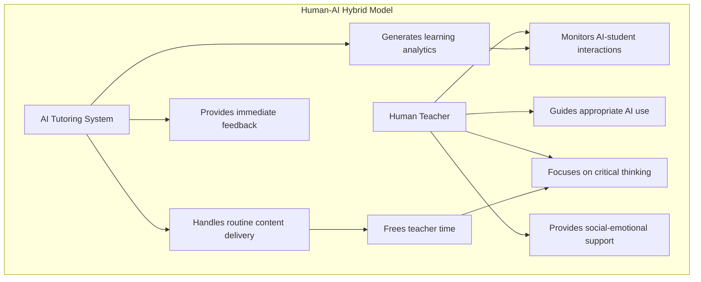

The overarching conclusion from systematic research is that **AI and teachers can collaborate effectively, with ITSs serving as complementary tools to support, not replace, classroom instruction**[^23]. Tutoring programs can liberate teachers from teaching content to capitalize on classroom time for "activities and projects that foster advanced cognitive skills such as critical thinking and content synthesis"[^15].

#### 3.5.2 Instructional Redesign and Flexible Deployment

Tutoring platforms enhanced by generative AI are versatile—they can be **integrative** (used during class along with teacher instruction) or **substitutive** (used as a substitute for teacher instruction)[^15]. This versatility enables multiple implementation approaches:

**Flipped Classroom Models**

Beyond supporting teacher development, these platforms can restructure how instructional time is used through models like flipped classrooms[^15]. Students engage with AI-delivered content outside class time, freeing classroom time for teacher-led discussions, collaborative activities, and individualized support.

**Station Rotation Models**

DreamBox's implementation exemplifies the rotational model where teachers use robust reports to break classrooms into groups based on prior knowledge[^25]. The data allows teachers to modify live instruction on demand for each group—providing intervention for some, on-grade-level instruction for others, and accelerated content for those who have mastered the day's lesson[^25].

**Real-Time Intervention Based on Analytics**

Teachers have access to individual student dashboards to track skill mastery, growth, and areas needing support, enabling responsive instruction[^28]. A 6th grade math teacher explained that Khanmigo is used "for data to identify standards students are weak in"[^29].

#### 3.5.3 Teacher Professional Development and Acceptance

Effective implementation requires significant investment in teacher professional development. The Newark implementation included professional learning for educators with support for teachers to become comfortable using Khan Academy through training and change management[^28].

Gallup's 2025 teacher survey found that many educators reported that Adaptive Learning Intelligence dashboards freed time for small-group instruction[^26]. However, professional learning communities now review usage fidelity every month, indicating the ongoing nature of implementation support requirements[^26].

**Teacher Acceptance Factors**

European surveys reveal that access to AI technologies is not equally distributed—only half of surveyed teachers used digital applications, although the vast majority of educators recognized their effectiveness[^34]. This gap between recognition and adoption highlights the importance of addressing barriers including technical comfort, time constraints, and infrastructure limitations.

#### 3.5.4 Benefits for Novice Teachers

Tutoring platforms enhanced by generative AI are especially valuable for novice teachers, providing scaffolding, templates, and real-time guidance that help them deliver more effective instruction while building professional skills[^15]. This benefit addresses a persistent challenge in education: supporting new teachers during the critical early years when many leave the profession.

For teachers generally, such tutoring programs could significantly increase productivity, particularly in under-resourced schools where classes are large, time is limited, and human resources are scarce[^15].

### 3.6 Challenges, Limitations, and Critical Perspectives

Despite promising evidence, significant challenges and limitations constrain the effectiveness of AIGC-powered personalized learning implementations. Critical examination of these issues is essential for responsible deployment.

#### 3.6.1 Accuracy, Hallucination, and Pedagogical Judgment

Tutoring platforms enhanced by generative AI introduce new concerns around **accuracy, pedagogical judgment, and possible dependence**[^15]. The probabilistic nature of generative AI means outputs may contain errors or "hallucinations"—plausible-sounding but incorrect information. In educational contexts, this risk is particularly concerning because students may lack the expertise to identify errors.

Effective implementations address this through explicit safeguards embedded in prompts to ensure the generative AI component delivers high-quality explanations and prevents hallucinations[^15]. However, the need for such safeguards highlights the ongoing importance of human oversight.

#### 3.6.2 Adaptive Learning Versus True Personalization

A fundamental critique distinguishes between **adaptive learning** and **true personalization**. Adaptive learning—understanding what students know and don't know—differs from personalized learning, which also considers what students *want* to know and how they learn best[^31].

Areas for improvement identified in research include:
- Achieving **true personalization versus individualization**
- Improving the quality of feedback to be **high-information and forward-focused**
- Prioritizing **hybrid approaches** over full automation[^15]

#### 3.6.3 The Crutch Effect and Dependency Concerns

A cautionary case from Turkey found that GPT-4-based tutors improved short-term math outcomes but also revealed a **"crutch effect"**—students performed worse after losing access to AI support[^33]. This finding raises important questions about whether AI tutoring develops transferable skills or creates dependency.

The Chinese Ministry of Education guidelines explicitly caution students to avoid over-reliance on AI, reflecting awareness of this risk at the policy level.

#### 3.6.4 Privacy, Data Security, and Cost Barriers

Implementation challenges extend beyond pedagogical concerns:

**Privacy and Data Security**: The 2025 PDK poll showed 68 percent of citizens opposed sharing grades with AI tools, reflecting widespread privacy concerns[^26]. Parents fear opaque algorithms will mishandle sensitive information, yet legislators lag in updating FERPA or COPPA guidance for adaptive learning systems[^26].

**High Implementation Costs**: High technology costs and maintenance fees represent the most important threat identified in SWOT-AHP analysis of AIGC-driven personalized learning (5.94% composite weight)[^37]. Procurement officers should pilot small cohorts before districtwide contracts, collect baseline and follow-up assessments using independent measures, and model cost scenarios over five years including devices and professional development[^26].

**Infrastructure Gaps**: Device gaps haunt districts, with some rural schools still lacking broadband[^26]. The digital divide persists, hindering equitable access to AI tools due to socio-economic hurdles[^35].

#### 3.6.5 Tension Between Efficiency and Broader Educational Goals

Perhaps the most fundamental critique concerns whether efficiency-focused AI tutoring adequately serves broader educational goals. Critics argue that approaches like Squirrel AI do not prepare students to be flexible in a changing world and only make it more efficient to bring all students to the same standardized place[^31].

Squirrel AI's founder envisions a future where human teachers, like pilots, monitor the algorithm and focus on emotional communication[^31]. However, this vision raises questions about the role of education beyond content delivery—including creativity, critical thinking, social development, and preparation for an uncertain future.

The Latin American framework emphasizes that the benefits of AI depend on integration: when used passively, AI can reinforce shallow learning, but when embedded soundly, it can provide feedback, detect errors, and suggest activities that help teachers support each student more personally, becoming a **tool for equity**[^33].

#### 3.6.6 Synthesis: Conditions for Effective Implementation

Drawing together the evidence, several conditions emerge as critical for effective AIGC-powered personalized learning:

1. **Pedagogical Design**: Systems must employ Socratic approaches that teach rather than tell, with scaffolded content and cognitive load management
2. **Human Oversight**: Teachers must maintain essential roles in monitoring, guiding, and supplementing AI instruction
3. **Equity Focus**: Implementation must address access barriers and actively monitor for algorithmic bias
4. **Realistic Expectations**: Short-term gains may not persist; longer interventions and objective outcome measures are needed
5. **Ethical Frameworks**: Data privacy, transparency, and broader educational values must be explicitly addressed
6. **Professional Development**: Sustained teacher training and support are essential for effective integration

The educational success of tutoring platforms lies ultimately in the **thoughtful collaboration of humans and AI in the learning process**[^15]. As the field continues to evolve, maintaining focus on this collaborative vision—rather than pursuing full automation—offers the most promising path toward realizing the potential of AI-powered personalized learning while avoiding its pitfalls.

## 4 Global Case Studies: AIGC for Content Creation and Curriculum Support

This chapter investigates documented implementations of AIGC tools for educational content generation and curriculum development across global K-12 settings. Building upon the personalized learning and intelligent tutoring applications examined in Chapter 3, this chapter shifts focus to how generative AI transforms the creation of instructional materials, lesson plans, assessments, and multimodal learning resources. The analysis examines both teacher-facing applications that enhance educator productivity and student-facing content creation scenarios that support learning, comparing implementation approaches across different countries and educational systems to identify effective practices, common challenges, and emerging patterns in curriculum-aligned AIGC deployment.

The landscape of educational content creation has been fundamentally transformed since ChatGPT became publicly available on November 30, 2022. By spring 2024, **over 60 percent of educators and students were using AI**, and the "AI in Education" market had grown to nearly $6 billion[^38]. This rapid adoption reflects both the pressing need for efficient content creation tools in education and the unprecedented capabilities that generative AI brings to instructional design. However, as this chapter demonstrates through global case studies, effective implementation requires careful attention to pedagogical coherence, teacher professional development, and the preservation of human judgment in educational decision-making.

### 4.1 AI-Assisted Lesson Planning: Tools, Efficacy, and Teacher Adoption Patterns

AI-assisted lesson planning represents one of the most widely adopted applications of AIGC in K-12 education, directly addressing the persistent challenge of teacher workload while offering new possibilities for differentiated and engaging instruction. This section examines major platforms, evaluates evidence of effectiveness, and analyzes factors shaping teacher adoption across diverse educational contexts.

#### 4.1.1 Major Platforms and Their Design Approaches

The ecosystem of AI-assisted lesson planning tools has expanded rapidly, with platforms differentiated by their approach to curricular alignment, customization capabilities, and integration with existing educational frameworks.

**Aila (Oak National Academy)**

The Oak National Academy's Aila represents a purpose-built AI lesson planning assistant developed specifically for the UK educational context. Aila was **"purpose built by a team of expert teachers and engineers"** to help teachers save time by supporting them to produce personalized lesson plans, alongside teacher slides, pupil quizzes, and worksheets[^39]. The tool's design reflects a curriculum-aligned approach, with outputs based on Oak's established curriculum principles.

Practical applications of Aila include **tailoring a geography lesson to a local landmark, amending reading difficulty according to pupil need, and adding extra activities to resources**[^39]. This flexibility allows teachers to maintain ownership of instructional design while leveraging AI to accelerate the creation process. Previous research conducted by Oak National Academy found that Aila helped teachers **save three-and-a-half hours per week** on lesson planning[^39].

**MagicSchool**

MagicSchool has positioned itself as a comprehensive AI platform for school districts, teachers, and students. For teachers, it offers **an AI tool to generate a lesson plan for a topic or objective being taught**, as part of a suite of over 80 teacher tools designed to save time, spark creativity, and support every learner[^40]. The platform's breadth of tools reflects an understanding that lesson planning encompasses multiple interconnected tasks, from objective setting to material creation to assessment design.

**Inkwire and the Learning Experience Accelerator (LEA) App**

The Learner-Centered Collaborative (LCC) has developed two AI-enabled tools that exemplify a framework-embedded approach to lesson planning support. **Inkwire is an AI-enabled Project-Based Learning (PBL) designer** that helps educators create projects aligned with academic standards and a district's Portrait of a Learner[^38]. The tool's distinctive feature is its integration of district-specific frameworks, providing what practitioners describe as **"a shortcut compared to generic tools like ChatGPT"** because it automatically aligns outputs with district frameworks[^38].

The **Learning Experience Accelerator (LEA) App**, built with Playlab, serves as a thought partner for educators to integrate learner-centered strategies and Portrait of a Learner competencies into daily instruction[^38]. This tool demonstrates how AI can support not just efficiency but pedagogical transformation by helping teachers translate abstract frameworks into concrete classroom practices.

**TeachMate and Other Specialized Tools**

TeachMate has been documented in UK case studies as being used for **lesson planning and activity generation, including quizzes, summaries, and model answers**[^41]. The platform exemplifies the category of tools designed specifically for educational contexts rather than adapted from general-purpose AI systems.

| **Platform** | **Primary Function** | **Distinctive Feature** | **Context** |
|-------------|---------------------|------------------------|-------------|
| Aila | Lesson plan generation | Curriculum-aligned, UK standards | UK national |
| MagicSchool | Comprehensive planning suite | 80+ integrated tools | US districts |
| Inkwire | Project-based learning design | District framework integration | US districts |
| LEA App | Learner-centered strategy integration | Portrait of Learner alignment | US districts |
| TeachMate | Lesson and activity generation | Quiz and assessment creation | UK schools |

#### 4.1.2 Evidence of Efficacy: Randomized Controlled Trials and Practitioner Studies

The evidence base for AI-assisted lesson planning is developing through both rigorous experimental studies and practitioner case documentation, providing complementary insights into effectiveness and implementation dynamics.

**The EEF-Funded Aila Trial**

The Education Endowment Foundation (EEF) is funding a **randomized-controlled trial (RCT) of Aila**, representing one of the most rigorous evaluations of AI lesson planning tools to date. The trial seeks approximately **450 key stage two teachers from 86 primary schools**[^39]. Participants will be randomly assigned to either use Aila for planning lessons across all subjects or continue with usual planning practices.

The trial design addresses two critical questions: whether AI-powered lesson planning can **reduce teacher workload** while also **maintaining quality**[^39]. Teacher workload will be measured based on average time spent on planning over one term, while lesson quality will be assessed by an independent panel who will not be told whether AI was used to create plans. This blinded quality assessment is particularly significant, as it provides an objective measure of whether AI assistance compromises instructional quality.

Emily Yeomans, co-CEO of the EEF, characterized the trial as an **"exciting opportunity to explore if generative AI tools like Aila can genuinely reduce workload without compromising the quality of teaching"**[^39]. The evaluation will also examine how Aila was used in practice through teacher surveys, interviews, case studies, and usage data, identifying what **"enables or hinders effective use"**[^39]. Results are expected in autumn 2026.

**Earlier EEF-Funded Research**

An earlier EEF-funded trial examining ChatGPT use for lesson planning found that **teachers using ChatGPT could reduce their lesson planning time by 31 percent**[^39]. This finding provides preliminary evidence that generative AI can deliver meaningful efficiency gains, though questions remain about quality implications and optimal implementation approaches.

**Lamont Elementary School District Case Study**

The Lamont Elementary School District implementation provides rich practitioner evidence of AI-assisted lesson planning adoption. In summer 2024, LCC facilitated a three-day PBL workshop for Lamont educators, who then launched a yearlong Innovation Cohort using Inkwire with the district's Portrait of a Learner and Learning Model embedded[^38].

Midway through the cohort, the results demonstrated strong engagement: **88 percent of participants were excited about AI in education, and over 70 percent were using AI tools weekly**[^38]. Educators used Inkwire to generate multi-week project plans, reportedly **saving hours of time**[^38]. Critically, participants emphasized that **"their expertise was still needed to assess and adapt the AI-generated plans"**[^38], reflecting an appropriate understanding of AI as a tool requiring human oversight.

An important finding from this implementation was that educators found value in using different AI tools for their specific strengths—for example, **"using Inkwire for project planning and ChatGPT for lesson plan details"**[^38]. This suggests that effective AI integration may involve strategic selection and combination of multiple tools rather than reliance on a single platform.

**Escondido Union School District Case Study**

The Escondido Union School District (EUSD) implementation illustrates a phased approach to AI tool adoption. A Design Team of educators partnered with LCC to experiment with the LEA App, which integrates EUSD's Portrait of a Learner competencies, Learning Model, and state standards[^38]. The app allows educators to input lesson ideas and receive connections to specific competencies, success criteria, and teaching strategy suggestions.

Principal Cherry Moore emphasized a critical implementation insight: **"the importance of building foundational knowledge of the Learning Model before introducing the AI tool"**[^38]. This sequencing—establishing pedagogical foundations before introducing AI assistance—reflects a human-centered approach that positions AI as a support for existing practice rather than a replacement for professional knowledge.

The EUSD strategy involved **"a phased rollout and peer modeling to create authentic buy-in"**[^38]. After a live demonstration by a 5th-grade educator at an all-staff meeting, the tool was seen as a way to build educator confidence and enhance unit planning. This peer-led approach to adoption appears to support sustainable integration.

#### 4.1.3 Teacher Perspectives: Benefits, Concerns, and Adoption Factors

Research examining teacher perspectives on AI-assisted lesson planning reveals a complex landscape of perceived benefits, legitimate concerns, and factors influencing adoption decisions.

**Perceived Benefits**

A qualitative study examining pre-service English teachers' perspectives on generative AI for lesson planning identified four primary advantages[^42]:

1. **Ease of finding information and ideas**: AI tools streamline the research and brainstorming phases of lesson planning
2. **Efficiency and convenience**: The speed of AI generation reduces time investment
3. **Clear and concise objectives and instructions**: AI can help articulate learning goals precisely
4. **Unique and motivating activities**: AI can suggest creative approaches that teachers might not independently conceive

Teachers in the Camden case studies reported that AI tools effectively **reduced workload and made lessons more engaging for students**[^41]. The ability to rapidly generate varied materials appears particularly valuable for differentiation and student engagement.

**Concerns and Limitations**

The same research identified significant concerns that temper enthusiasm for AI-assisted planning[^42]:

| **Concern Category** | **Specific Issues** |
|---------------------|---------------------|
| **Accuracy and Reliability** | AI-generated content may contain errors requiring verification |
| **Relevance and Specificity** | Generic outputs may not fit specific classroom contexts |
| **Over-reliance Risk** | Dependency on AI may reduce pedagogical reflection |
| **Limited Interactivity** | AI cannot engage in the nuanced dialogue of human collaboration |

Teachers have raised concerns about **"the accuracy, bias and safety of using AI in the classroom"**[^39]. These concerns are not unfounded—AI systems can produce plausible-sounding but incorrect content, and outputs may reflect biases present in training data. The need for teacher review and critical evaluation remains paramount.

**Adoption Patterns and Influencing Factors**

An exploratory case study of Australian K-12 teachers revealed that educators primarily develop their GenAI knowledge through **"exploration and leveraging various information sources (such as colleagues) combined"**[^43]. The accessibility of GenAI tools enabled experimentation, with teachers viewing these technologies not as replacements for existing practices but as tools to **"enhance teacher efficiency and support teaching and learning"**[^43].

School leadership emerged as a significant factor influencing adoption. Most teachers in the Australian study reported that **leaders were encouraging, though a considerable portion indicated neutral responses, and a few reported discouragement**[^43]. This variation in leadership support creates uneven adoption landscapes within and across schools.

The study characterized current adoption as **"teacher-led, bottom-up innovation"**[^43], driven by individual educator initiative rather than systematic institutional implementation. This pattern has implications for equity and consistency, as teachers without personal initiative or technical comfort may be left behind.

#### 4.1.4 Pre-Service Teacher Preparation and AI Literacy

The integration of AI into teacher preparation programs represents a critical frontier for ensuring future educators can effectively leverage these tools. Research recommendations emphasize that **teacher training programs should incorporate AI literacy into the curriculum**, equipping pre-service teachers with skills to use AI tools effectively and ethically while training them to **"critically evaluate AI-generated content and enhance it with their own pedagogical expertise"**[^42].

The challenges identified include ensuring equitable access to AI technologies for all pre-service teachers, regardless of institutional resources. Recommendations call for educational institutions to **"provide support for teachers with limited technological resources to ensure equitable access"**[^42].

### 4.2 Automated Generation of Learning Materials and Assessments

Beyond lesson planning, AIGC tools are increasingly deployed to generate diverse instructional materials including practice problems, reading passages, worksheets, rubrics, quizzes, and formative assessments. This section analyzes the capabilities, quality considerations, and implementation approaches for AI-generated educational materials.

#### 4.2.1 Capabilities and Tool Landscape

The range of materials that AIGC can generate has expanded dramatically, with tools offering increasingly sophisticated capabilities for differentiated content creation.

**Text-Based Material Generation**

General-purpose AI tools like ChatGPT and Gemini are widely used for generating educational text content. In UK case studies, teachers reported using **Gemini for curriculum preparation, quiz creation, and summarizing individualized education plan reports**[^41]. ChatGPT was employed for **STEAM project inspiration** and generating explanatory content[^41].

Specialized educational platforms offer more targeted capabilities. MagicSchool's suite of over 80 tools addresses specific material types, while platforms like Brisk Teaching focus on assessment generation. These specialized tools often incorporate educational standards alignment and age-appropriate language calibration.

**Assessment Generation**

AI-generated assessments represent a particularly significant application given the time required for teachers to create high-quality, aligned assessments. Tools can generate:

- Multiple-choice questions with distractors
- Short-answer and extended-response prompts
- Rubrics for evaluating student work
- Formative check-for-understanding questions
- Differentiated assessment versions for diverse learners

The Australian study found that teachers most commonly used GenAI for **"out-of-class work such as lesson preparation, personalizing learning experiences, generating tests and questions, marking assignments and providing feedback"**[^43].

**Differentiated Materials for Diverse Learners**

A critical application involves generating materials adapted for students with varying needs. AI tools can support teachers in creating **leveled reading passages, scaffolded problem sets, and materials with language modifications for English Language Learners**. In Chinese contexts, AI enables **personalized instruction by analyzing student reading data** to recommend tailored materials matching student levels[^44].

#### 4.2.2 Quality, Accuracy, and Curricular Alignment

The quality of AI-generated materials remains a significant concern requiring systematic attention to accuracy verification, curricular alignment, and bias detection.

**Accuracy Concerns**

Research consistently identifies accuracy as a primary limitation of AI-generated educational content. Chinese studies examining AI tools for reading instruction found that **"tool answers are not always accurate and may contradict textbooks"**[^44]. This finding underscores the essential role of teacher review—AI-generated materials cannot be deployed without expert verification.

The pre-service teacher study identified **"information accuracy and reliability"** as a key weakness, noting that AI outputs require verification against authoritative sources[^42]. Teachers must develop critical evaluation skills to identify errors, inconsistencies, and potential misinformation in AI-generated content.

**Curricular Alignment Challenges**

Ensuring AI-generated materials align with specific curricular standards, sequences, and pedagogical approaches presents ongoing challenges. Generic AI tools lack awareness of local curriculum requirements, grade-level expectations, and instructional contexts. This limitation explains the value of tools like Inkwire that embed district-specific frameworks, providing **"a shortcut compared to generic tools"** through automatic alignment with district standards[^38].

The Chinese Ministry of Education's guidelines recognize this challenge, emphasizing the need for AI tools to support rather than contradict adopted curriculum content and sequencing.

**Bias Detection and Cultural Sensitivity**

AI-generated materials may reflect biases present in training data, potentially producing content that is culturally insensitive, stereotyping, or exclusionary. Teachers must review materials for:

- Gender and racial representation in examples and scenarios
- Cultural assumptions that may not apply to diverse student populations
- Socioeconomic biases in contexts and references
- Language that may be inappropriate or exclusionary

The Australian curriculum framework emphasizes that students should **"consider cultural equity, ensuring AI training data is representative of cultural groups and respects cultural considerations"**[^45].

#### 4.2.3 Implementation Approaches Across Educational Contexts

Global case studies reveal varying approaches to integrating AI-generated materials into classroom practice, shaped by local contexts, policies, and pedagogical traditions.

**United Kingdom: Selective Adoption and Pilot Programs**

UK implementations demonstrate a selective, evidence-informed approach to AI-generated materials. The Camden case studies document teachers using multiple AI tools for specific purposes—Gemini for curriculum preparation, ChatGPT for project inspiration, TeachMate for activity generation[^41]. The research concluded that **"selective adoption based on teacher initiative and specific departmental needs, rather than whole-school implementation, is the current viable path"**[^41].

Schools are planning to **"test Air AI tools for English marking and feedback"** in upcoming terms and participate in EEF trials examining **"AI's impact on Key Stage 2 classroom preparation time and resource quality"**[^41]. This experimental, evidence-gathering approach reflects a commitment to understanding effectiveness before scaling implementation.

**Australia: Teacher-Led Innovation Within Policy Frameworks**

Australian teachers are engaging with AI-generated materials primarily through individual initiative, with the government providing curriculum frameworks to guide responsible use. The **Australian Curriculum: Artificial Intelligence** resource explores how students can gain foundational knowledge about AI, including how to become **"responsible and ethical AI system designers and users"**[^45].

The national **Australian Framework for Generative AI in Schools** recognizes that AI technologies have **"enormous potential to improve teaching and learning"** while establishing six principles: teaching and learning; human and social well-being; transparency; equity; accountability; and privacy and security[^45]. This framework provides guidance for material generation while emphasizing human oversight and ethical considerations.

**China: Integration with National Education Informatization**

Chinese implementations reflect the national Education Informatization 2.0 and 3.0 action plans, which emphasize deep integration of intelligent technologies into instruction. AI tools are used to **"generate instructional designs and courseware"** as part of supporting teacher preparation, with platforms like iFlytek's Spark Model, Wenxin Yiyan, and Kimi Intelligent Assistant gaining recognition for their **"intelligent, convenient, and resource-rich text-generation capabilities"**[^44].

However, practical challenges include teacher resistance due to **"ingrained habits or lack of understanding of tools' auxiliary functions"** and operational difficulties with rapidly evolving tools[^44]. Some teachers use tools only for basic functions like generating images or collecting multimedia, **"leaving potential untapped"**[^44].

#### 4.2.4 The Essential Role of Teacher Review and Adaptation

Across all contexts, evidence consistently emphasizes that AI-generated materials require teacher review and adaptation before classroom use. The Lamont case study participants emphasized that **"their expertise was still needed to assess and adapt the AI-generated plans"**[^38]. This finding aligns with the broader principle that AI should augment rather than replace professional judgment.

Effective implementation requires teachers to:

1. **Verify accuracy** against authoritative sources and curriculum standards
2. **Assess appropriateness** for specific student populations and contexts
3. **Adapt content** to align with instructional goals and pedagogical approaches
4. **Modify language** for grade-level appropriateness and cultural sensitivity
5. **Integrate materials** coherently within broader unit and lesson structures

The pre-service teacher research recommends training educators to **"critically evaluate AI-generated content and enhance it with their own pedagogical expertise"**[^42]. This critical evaluation capacity represents an essential professional skill for the AI-augmented educational environment.

### 4.3 Multimodal Content Creation: Text, Images, Audio, and Interactive Media

AIGC capabilities extend beyond text generation to encompass image creation, presentation design, audio production, and interactive multimedia development. This section investigates how multimodal AI tools support diverse educational applications while addressing considerations around authenticity, intellectual property, and skill development.

#### 4.3.1 Image Generation for Educational Purposes

Image generation tools like DALL-E and Midjourney offer new possibilities for creating visual content that supports concept illustration, engagement enhancement, and accessibility accommodations.

**Applications in Classroom Practice**

UK case studies document teachers using AI image generation for curriculum preparation and visual content creation[^41]. Applications include:

- **Concept illustration**: Generating visual representations of abstract concepts in science, mathematics, and social studies
- **Historical visualization**: Creating images depicting historical periods, events, or figures for history instruction
- **Creative writing prompts**: Generating evocative images to inspire student writing
- **Differentiation support**: Creating visual aids for students who benefit from multimodal instruction

**Limitations and Considerations**

Chinese research examining AI tools in education identified that **"AI-generated images and multimedia content sometimes do not fully align with given descriptions, requiring manual adjustment"**[^46]. This limitation highlights the need for teacher review of visual content, just as with text-based materials.

Concerns about authenticity and intellectual property arise when using AI-generated images. Teachers must consider whether AI-generated visuals appropriately represent concepts, avoid stereotyping, and respect cultural sensitivities. The Australian curriculum framework notes that students should understand issues including **"bias, safety, environmental impact, copyright and intellectual property"** related to AI systems[^45].

#### 4.3.2 Presentation and Multimedia Creation Tools

AI-powered presentation tools like Gamma AI enable rapid creation of visually engaging presentations from text prompts. UK teachers reported using **Gamma AI to quickly generate presentations based on prompts**[^41], streamlining the creation of instructional materials.

**Educational Applications**

Multimodal content creation supports diverse educational objectives:

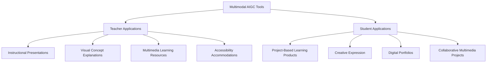

Finnish schools exemplify thoughtful technology integration for learning, using tools for **"creative expression such as Seesaw, Book Creator, and Mathletics"** alongside AI-powered platforms[^47]. Many Finnish students build digital portfolios, storing their work online to track progress and engage in reflection[^47].

#### 4.3.3 Audio Generation and Language Learning Support

Audio generation capabilities support language learning, accessibility, and multimedia production. AI-powered speech synthesis enables:

- **Text-to-speech for accessibility**: Supporting students with reading difficulties or visual impairments
- **Language learning pronunciation models**: Providing audio examples for foreign language instruction
- **Audiobook creation**: Converting text materials to audio format for diverse learning preferences

Finnish schools use **AI-powered language learning apps and platforms** that help students master new languages more effectively using speech recognition and natural language processing[^48]. These tools provide interactive practice opportunities that would otherwise require human conversation partners.

#### 4.3.4 Balancing AI Assistance with Authentic Skill Development

The use of multimodal AIGC for creative expression raises important questions about the balance between AI assistance and authentic skill development. Chinese guidelines caution that students should **"avoid abusing GenAI in tasks requiring creative or personalized expression"**[^44], reflecting concerns that over-reliance on AI may undermine the development of original creative capabilities.

Finnish schools address this balance by integrating digital learning **"with outdoor activities, art and craft projects, face-to-face group discussions, and mindfulness time"**[^47]. Technology serves learning purposes rather than replacing hands-on, creative, and interpersonal experiences.

The Australian curriculum emphasizes that students should develop understanding of how AI works alongside skills for responsible use, enabling them to **"navigate its use and recognize its limitations"**[^45]. This dual focus on capability and critical understanding supports appropriate integration of multimodal AI tools.

### 4.4 AI-Powered Adaptive Textbook Systems: National Implementation Models

Among the most ambitious applications of AIGC for curriculum support are AI-powered adaptive textbook systems that personalize content delivery to individual student needs. This section examines large-scale national implementations, with particular focus on South Korea's world-first nationwide initiative.

#### 4.4.1 South Korea's AI Digital Textbook Initiative

South Korea is implementing the **world's first large-scale AI-powered textbook implementation**, representing a transformative approach to curriculum delivery that personalizes learning at national scale[^49].

**Implementation Timeline and Scope**

The rollout of AI digital textbooks begins in **March 2025 for grades 3, 4, 7, and 10**, covering subjects including English, math, information, and Korean for special education[^50]. The plan expands to additional subjects, including social studies and science, with **full implementation across all schools by 2028**[^50]. This phased approach allows for iterative refinement based on early implementation experience.

**Technical Architecture and Personalization Capabilities**

The AI digital textbooks represent a **significant departure from traditional textbooks**, featuring[^50]:

| **Feature** | **Description** | **Educational Purpose** |
|------------|-----------------|------------------------|
| AI-based courseware integration | Personalized learning experiences for each student | Differentiation at scale |
| Real-time data collection | Continuous monitoring of student performance | Responsive instruction |
| Adaptive learning | Content customization to individual needs | Targeted support |
| Teacher support tools | Data to tailor instruction | Informed decision-making |

The goal is to create an **"individualized and tailored learning environment to empower all students to take the lead in their own growth and nurture every student into a talented individual through personalized education"**[^49]. Students benefit from **"effective use of real-time data to deliver personalized instruction tailored to both needs and interests"**[^49].

**Formative Assessment Integration**

The AI textbooks include **formative assessments built on comprehension questions**, but critically, this data is **"not used to generate grades"**[^49]. Instead, assessments diagnose students' learning characteristics and generate AI-powered support. This design reflects a formative rather than summative orientation, using data to improve learning rather than evaluate performance.

**Teacher Role Transformation**

The Korean initiative explicitly positions this change as **teacher-led**, with educators taking on new roles as facilitators who shift **"from transmitting knowledge to facilitating learning through projects and problem-solving"**[^50]. Teachers focus more on **"mentoring, coaching, and fostering critical thinking skills"**[^50] while AI handles routine content delivery.

Teachers receive an AI **"teaching assistant"** that helps **"diagnose learning paths, deliver content recommendations, and provide personalized learning support"**[^49]. This collaborative model positions AI as augmenting rather than replacing teacher expertise.

**Massive Professional Development Program**

Recognizing that successful integration depends on teacher preparation, Korea has launched **large-scale training initiatives**. By 2026, Korea aims to **train all teachers in effective use of digital technology for classroom innovation**[^50]. The government has allocated approximately **$0.74 billion for three years (2024-2026) specifically for teacher training**[^50].

The professional development program has already achieved significant scale: **approximately 10,000 teacher leaders completed training from May to August** of the pilot year, with **another 150,000 teachers trained onsite in the second half of the year**[^49].

**Infrastructure Investment**

Supporting the textbook initiative, Korea is investing heavily in digital infrastructure through the **Improvement Plan for Digital Infrastructure in Primary and Secondary Education**, which includes[^50]:

- Distribution of one device per student
- Upgrading school networks nationwide for AI digital textbooks
- Deploying digital tutors for support

**Regulatory Framework and Data Protection**

The **AI Digital Textbook Development Guidelines** provide a regulatory framework ensuring responsible AI use. Aligned with Korea's Personal Information Protection Act, the guidelines mandate **strict data privacy measures, including data encryption and secure cloud storage**[^50].

**Evaluation and Continuous Improvement**

Korea's approach includes a comprehensive evaluation framework involving **pilot testing in select schools, data collection and analysis of student performance, and impact evaluation to measure effects on learning outcomes and teacher efficacy**[^50]. This iterative approach allows for ongoing refinement of AI-enabled education.

**Parental Concerns and Response**

Korean parents have reacted with some trepidation, with **primary fears focusing on additional screen time**[^49]. The Ministry's response is to **"strengthen digital citizenship education to ensure students use digital technology safely and responsibly"**[^49].

#### 4.4.2 Emerging Initiatives in Other Countries

While South Korea leads in national-scale implementation, other countries are developing AI-powered textbook and curriculum delivery systems.

**United States: Commercial Platform Development**

In the US, several commercial initiatives are advancing AI-powered textbook capabilities:

- **Google via Gemini** allows college students to access free textbooks offered by OpenStax, Rice University's initiative[^49]
- **Pearson** launched three AI tools, including two embedded in digital textbooks that allow students to **"receive tailored explanations and generate quizzes"**[^49]
- **McGraw Hill** announced AI Reader, which allows students to **"highlight text and request alternative explanations"**[^49]

While these US initiatives operate at smaller scale than Korea's national program, they represent significant movement toward adaptive curriculum delivery.

**China: AI-Enriched Basic Education**

China has selected **184 schools as pilot bases to explore AI education concepts, models, and programs** with the goal of forming replicable typical cases and experiences[^46]. The Ministry of Education's 2024 directive outlines key objectives including **building structured AI curriculum systems and promoting AI-driven teaching and assessment**, with plans to **"basically achieve full coverage of AI education in primary and secondary schools by 2030"**[^46].

In Chinese classrooms, AI virtual teaching assistants are enabling interactive and immersive learning experiences. At Xinyi Road Primary School in Qinhuangdao, a digital **"Confucius" in traditional costume responds to student questions**, bringing historical figures to life in the classroom[^46]. Schools report that AI integration has **"improved teaching efficiency and significantly enhanced student learning engagement"**[^46].

#### 4.4.3 Comparative Analysis of National Approaches

The following comparison illustrates different national strategies for AI-powered curriculum delivery:

| **Country** | **Approach** | **Scale** | **Timeline** | **Key Features** |
|------------|-------------|-----------|--------------|------------------|
| South Korea | National AI digital textbooks | All schools by 2028 | 2025-2028 | Government-led, massive PD investment |
| China | Pilot schools with national expansion | 184 pilots, full coverage by 2030 | 2024-2030 | Ministry-directed, company partnerships |
| United States | Commercial platform development | Varied by district | Ongoing | Market-driven, district choice |
| Singapore | EdTech Masterplan integration | National system | 2020-2030 | Centralized platform with school autonomy |

### 4.5 Regional Implementation Patterns: Comparative Analysis Across Educational Systems

This section synthesizes cross-national patterns in AIGC content creation deployment, examining how different governance structures, cultural contexts, and policy frameworks shape adoption and implementation.

#### 4.5.1 North America: District Partnerships and Evidence-Based Adoption

North American implementations are characterized by district-level decision-making, commercial platform partnerships, and growing emphasis on evidence-based evaluation.

**United States District Partnerships**

US districts are partnering with AI platform providers to implement content creation tools. The Lamont Elementary and Escondido Union case studies demonstrate how districts can customize AI tools to align with local frameworks, embedding **Portrait of a Learner competencies and Learning Models** into AI systems[^38].

The emphasis on evidence is reflected in initiatives like the EEF-funded Aila trial, which provides a model for rigorous evaluation. US districts increasingly seek evidence of effectiveness before large-scale adoption, though the pace of AI development often outstrips the timeline for traditional educational research.

**Teacher Adoption Patterns**

Recent surveys indicate that **60 percent of educators used an AI tool last year**, with adoption concentrated in lesson planning and material creation[^51]. However, significant gaps exist between student AI use and teacher readiness: while **63% of US teens are using AI tools like ChatGPT for schoolwork, only 30% of teachers report feeling confident using these same AI tools**[^51].

#### 4.5.2 Europe: Coordinated Frameworks and Equity Emphasis

European implementations reflect coordinated policy frameworks with strong emphasis on equity, ethics, and teacher development.

**United Kingdom: Government Investment and Rigorous Evaluation**

The UK government has introduced **funding to develop and provide free access to AI tools for lesson planning**[^52]. Oak National Academy received **£2 million to fund its AI work**, on top of £43 million for curriculum development[^39]. This public investment model ensures broad access to AI tools regardless of school resources.

The Camden case studies illustrate school-level implementation, with teachers experimenting with multiple AI tools for different purposes. Schools emphasize **"investing in equipment, infrastructure, and digital pedagogy to ensure all learners can thrive in an AI world"** as key to achieving equitable access[^41].

**Finland: Human-Centered Technology Integration**

Finland's approach exemplifies human-centered technology integration where **"technology is a tool to support meaningful learning, not a trend to chase"**[^47]. The Finnish National Agency for Education's vision is that educational digitalization aims to **"strengthen learners' and staff's knowledge and skills, promote teaching innovation, and ensure accessibility and equality of learning environments"**[^47].

Finnish schools evaluate new AI tools through a pedagogical lens: **"Does it support students? Does it make learning deeper or more meaningful?"**[^47]. Finland maintains its human-first approach to education, ensuring that **"technology never overshadows teacher-student relationships or the joy of discovery"**[^47].

Finland is exploring AI integration including **"AI and adaptive learning platforms providing personalized learning paths"** and **"augmented reality (AR) applications bringing abstract concepts to life"**[^47]. Finnish students leverage AI to enhance learning through **personalized learning paths created by AI algorithms** that analyze performance data to create customized learning tailored to individual needs[^48].

**Singapore: Systematic Integration Through EdTech Masterplans**

Singapore's approach demonstrates systematic, longitudinal integration of technology in education through successive EdTech Masterplans spanning nearly three decades[^53].

The current **Educational Technology (EdTech) Plan (2020-2030)** is driven by the vision of **"transforming education through technology to prepare students for a technology-transformed world"**[^53]. Outcome goals include:

1. Nurturing students to become digitally-empowered, future-ready learners and innovators
2. Developing teachers to be technologically-adept, collaborative learning designers
3. Empowering schools to create intelligent, responsive, and digitally-equipped learning environments
4. Enabling a networked EdTech ecosystem

Singapore's approach balances centralization and decentralization. The Ministry of Education provides a **centralized core platform, the Student Learning Space (SLS)**, for teaching and learning, offering equitable access to digital resources[^53]. For device access, MOE coordinates bulk procurement of Personal Learning Devices with subsidies for students needing financial assistance. Conversely, **schools are given autonomy to deploy ICT funds and experiment with add-on features** within standardized platforms[^53].

Professional development is comprehensive, with MOE's Educational Technology Department establishing **communities of practice, an ICT mentor scheme, and on-site consultancy support**[^53]. The **"SkillsFuture for Educators" (SFEd) roadmap** enhances teachers' skills in areas including assessment literacy and e-pedagogy[^53].

#### 4.5.3 Asia-Pacific: National Strategies and Rapid Scaling

Asia-Pacific implementations are characterized by strong government direction, rapid scaling, and significant investment in infrastructure and teacher training.

**South Korea: World-Leading National Implementation**

As detailed in Section 4.4, South Korea's AI digital textbook initiative represents the most ambitious national implementation globally. The country will become **"the first nation to introduce AI digital textbooks nationwide"**[^50], with comprehensive infrastructure investment and massive professional development programs.

**China: National Pilot Programs with Expansion Plans**

China's approach combines national policy direction with local experimentation. The 2024 Ministry of Education directive establishes goals for **AI education coverage by 2030**, while pilot programs in 184 schools generate replicable models[^46].

Practical implementations include AI virtual assistants in classrooms and integration of AI tools for lesson planning and content creation. However, challenges persist, including **teacher resistance, student self-control issues, and technical reliability concerns**[^44].

**Australia: Curriculum Framework with School Autonomy**

Australia has developed a comprehensive **Curriculum Connections: Artificial Intelligence** resource that explores how students can gain foundational AI knowledge through the Australian Curriculum F-10[^45]. The framework identifies three key aspects of learning: understanding how AI works; types of AI; and responsible use and application of AI[^45].

The **Australian Framework for Generative AI in Schools** supports school communities in achieving educational outcomes while recognizing that **"appropriate use of generative AI tools can enhance teaching and learning"**[^45]. The framework's six principles—teaching and learning, human and social well-being, transparency, equity, accountability, and privacy and security—provide guidance for responsible implementation.

Australian teachers are adopting AI through **bottom-up innovation**, with educators viewing GenAI as a tool to enhance efficiency rather than replace practice[^43]. The national curriculum provides structure while allowing school-level flexibility in implementation approaches.

#### 4.5.4 Synthesis: Factors Shaping Regional Patterns

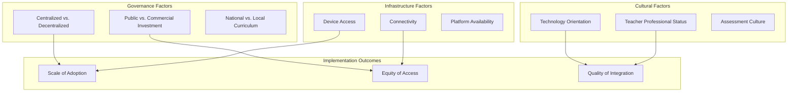

The comparative analysis reveals several patterns:

**Governance structures shape implementation approaches**: Centralized systems like Singapore and South Korea can achieve rapid, equitable scaling through coordinated national initiatives. Decentralized systems like the US rely on district-level partnerships and commercial platforms, creating variation in access and quality.

**Investment models affect equity**: Public investment (UK government funding, Korean national budget) supports broad access regardless of school resources. Commercial models may create disparities between well-resourced and under-resourced schools.

**Cultural factors influence adoption**: Countries with strong technology orientation and high teacher professional status (Finland, Singapore) demonstrate thoughtful integration that maintains pedagogical focus. Assessment-focused cultures may emphasize AI for test preparation over broader educational goals.

**Infrastructure remains foundational**: Even the most sophisticated AI tools require reliable devices, connectivity, and technical support. Infrastructure gaps create barriers to implementation, particularly in under-resourced contexts.

### 4.6 Teacher-Facing Versus Student-Facing Content Creation: Pedagogical Considerations and Implementation Guidance

The distinction between AIGC applications where teachers create content for student consumption versus scenarios where students directly engage with generative tools represents a critical implementation decision with significant pedagogical implications.

#### 4.6.1 Teacher-Facing Applications: The Intermediary Model

In teacher-facing applications, educators serve as intermediaries who use AI tools to create materials that students then encounter in traditional instructional formats. This model maintains teacher control over content quality and appropriateness while leveraging AI for efficiency gains.

**Advantages of the Intermediary Model**

The intermediary model offers several benefits:

- **Quality control**: Teachers review and adapt AI-generated content before student exposure
- **Curricular alignment**: Educators ensure materials fit instructional sequences and learning objectives
- **Developmental appropriateness**: Teachers modify content for specific student populations
- **Academic integrity preservation**: Students engage with teacher-curated materials rather than generating their own

Chinese Ministry of Education guidelines specify that at the primary school level, **"students should be prohibited from using open-type content generation functions independently, while teachers may use them appropriately"**[^53]. This restriction reflects developmental considerations about young children's capacity to critically evaluate AI outputs.

**Common Teacher-Facing Applications**

| **Application** | **AI Function** | **Teacher Role** |
|----------------|-----------------|------------------|
| Lesson planning | Generate initial plans | Review, adapt, contextualize |
| Material creation | Draft worksheets, readings | Verify accuracy, modify for students |
| Assessment generation | Create question banks | Ensure alignment, check for bias |
| Differentiation | Generate leveled materials | Select appropriate versions |
| Communication | Draft parent letters | Personalize, verify appropriateness |

#### 4.6.2 Student-Facing Applications: Direct Engagement with Generative Tools

Student-facing applications involve learners directly interacting with AIGC tools for learning support, creative expression, or content creation. This model offers personalization benefits but raises concerns about skill development and academic integrity.

**Potential Benefits**

Student-facing applications can provide:

- **Immediate feedback**: Students receive responses without waiting for teacher availability
- **Personalized support**: AI adapts to individual questions and learning needs
- **Safe practice environment**: Students can explore without peer judgment
- **Accessibility accommodations**: AI can provide alternative formats and explanations

AI can help students with learning disabilities by supporting differentiation. Teachers can use AI to **"convert assignments into different formats or generate practice problems aligned with students' readiness levels"**[^54]. Students can use AI independently to **"voice chat for learning concepts, have documents read aloud, break down complex concepts, generate practice problems, or convert materials into different modalities like podcasts or diagrams"**[^54].

**Developmental Appropriateness Considerations**

The appropriateness of student-facing AI varies significantly by grade level:

**Elementary (K-5)**: Direct student use should be minimal and heavily scaffolded. Chinese guidelines prohibit independent use of open-type content generation at this level[^53]. Focus should be on building foundational skills that cannot be outsourced to AI.

**Middle School (6-8)**: Guided engagement with AI outputs as objects of analysis is appropriate. Students can begin developing critical evaluation skills for AI-generated content. The Chinese guidelines indicate that **"logical analysis of generated content may be explored to a moderate extent"** at this level[^53].

**High School (9-12)**: More independent use is appropriate with clear guidelines and transparency requirements. Students can engage with AI as collaborative partners while developing critical perspectives on AI capabilities and limitations.

#### 4.6.3 Academic Integrity and Responsible Use Frameworks

The emergence of AIGC has intensified concerns about academic integrity, requiring clear policies and pedagogical approaches that address student AI use.

**The Danger of Not Teaching Responsible Use**

Educational experts argue that **banning AI is more harmful than effective** because it removes students' ability to learn responsible use of tools they will encounter throughout their lives[^54]. The biggest educational consequence of not teaching responsible AI use is that **"students might use it to circumvent rather than support the learning process"**, setting a dangerous precedent for future workforce roles[^54].

If students do not learn appropriate AI use in safe school settings, they may **"make mistakes in higher-stakes workplaces"**[^54]. This argument supports teaching responsible use rather than prohibition.

**Implementation Strategies for Responsible Use**

To implement AI safely without compromising creativity, schools should:

1. **Use AI as supplement, not circumvention**: AI tools like Khanmigo provide hints rather than answers, offering individualized instruction at scale[^54]
2. **Customize to student interests**: AI can generate problems aligned with student interests and ability levels, supporting learning outcomes[^54]
3. **Establish clear expectations**: A school-wide high-level definition of responsible use, with teachers deciding specifics for their classrooms, is preferable to one-size-fits-all policies[^54]
4. **Teach ethical implications**: Students should learn about plagiarism and environmental impacts of AI use[^54]

**Transparency Requirements**

Students should document when and how they use AI assistance. Chinese guidelines specify that students should **"avoid simply copying AI-generated content in homework, avoid using GenAI on exams to cheat, and avoid abusing GenAI in tasks requiring creative or personalized expression"**[^44].

#### 4.6.4 Balancing AI Efficiency with Authentic Skill Development

A core tension in student-facing AI applications involves the potential for AI assistance to undermine development of fundamental skills. If students rely heavily on AI for writing, calculation, or problem-solving, they may fail to develop underlying competencies.

**Concerns About Over-Reliance**

Chinese research found that students lacking self-control are **"easily distracted by irrelevant content"** when using AI tools, and some **"over-rely on tools for summarizing readings and writing reflections without fully engaging with texts, compromising learning effectiveness"**[^44].

Parents express concern that over-reliance on AI may **"weaken students' problem-solving abilities"**[^46]. One parent reported that her child's first reaction to difficult problems is **"to ask AI for answers rather than thinking through the problem independently"**[^46].

**Preserving Learning Processes**

Educational experts emphasize that **"AI in education should focus on guided learning, helping students develop problem-solving abilities rather than simply providing answers"**[^46]. AI-generated materials that interpret texts rigidly may focus on surface-level meanings **"without deeper insights, hindering students' formation of independent perspectives, creativity, and critical thinking"**[^44].

The key principle is that AI should support and enhance learning processes rather than replace them. The process of creation—whether writing, problem-solving, or creative expression—often constitutes the learning itself. Teachers must distinguish between tasks where AI assistance accelerates learning and those where AI substitution undermines it.

#### 4.6.5 Practical Guidance for Educators

Based on the evidence examined in this chapter, the following guidance supports educators in making decisions about AIGC content creation deployment:

**For Teacher-Facing Applications**:
- Leverage AI for time-intensive tasks like lesson planning and material creation
- Always review and adapt AI-generated content before student use
- Use multiple tools strategically for their specific strengths
- Maintain pedagogical judgment as the final arbiter of instructional decisions
- Document effective prompts and approaches for future use

**For Student-Facing Applications**:
- Align access with developmental appropriateness and grade-level guidelines
- Establish clear expectations for when and how AI use is appropriate
- Require transparency about AI assistance in student work
- Design learning activities that cannot be completed through AI generation alone
- Focus AI use on supporting rather than replacing skill development

**For School-Wide Implementation**:
- Develop policies that provide high-level guidance while allowing teacher flexibility
- Invest in professional development for effective AI integration
- Ensure equitable access to AI tools across all student populations
- Monitor for unintended consequences including over-reliance and equity gaps
- Participate in evidence-gathering efforts to inform future practice

The case studies examined in this chapter demonstrate that effective AIGC integration for content creation requires careful attention to pedagogical coherence, human oversight, and the preservation of authentic learning experiences. As the Learner-Centered Collaborative concludes, **"AI is a tool that, when integrated within a clear Framework for the Future, helps educators translate learner-centered models into daily practice"**—tools that **"elevate professional judgment rather than replace it"**[^38].

## 5 Global Case Studies: AIGC for Assessment, Feedback, and Academic Integrity

This chapter investigates documented implementations of AIGC technologies for assessment, feedback, and academic integrity management across global K-12 educational settings. Building upon the content creation and curriculum support applications examined in Chapter 4, this chapter shifts focus to how generative AI transforms evaluation processes, feedback delivery, and the maintenance of academic honesty. The analysis synthesizes evidence from pilot studies, randomized controlled trials, and practitioner implementations to evaluate the effectiveness of AI-powered grading systems, formative feedback tools, and integrity monitoring approaches, while critically examining the tensions between efficiency gains and the preservation of authentic learning and human judgment in assessment contexts.

The emergence of generative AI has fundamentally altered the landscape of educational assessment. A 2025 global research study found that **95% of academic administrators, educators, and students believe AI is being misused in some capacity**, while simultaneously **47% of educators and administrators want to leverage AI but lack the know-how to do so effectively**[^55]. This paradox—widespread concern about misuse alongside desire for productive integration—defines the central challenge facing K-12 educators in the assessment domain. The evidence examined in this chapter reveals that successful navigation of this challenge requires moving beyond simplistic detection-based approaches toward comprehensive frameworks that leverage AI's formative potential while preserving the essential human dimensions of educational evaluation.

### 5.1 AI-Powered Automated Grading Systems: Implementation Evidence and Teacher Perspectives

The deployment of AI-powered grading platforms in K-12 classrooms represents one of the most significant applications of generative AI in education, promising to address the persistent challenge of providing timely, meaningful feedback at scale. However, implementation evidence reveals a nuanced picture in which the pedagogical value of AI grading depends critically on how these systems are positioned within instructional practice and the degree to which human oversight is maintained.

#### 5.1.1 Historical Context and Technological Evolution

Automated grading systems have a history spanning nearly a century, evolving through distinct technological phases that inform current AI implementations. **In the 1940s, IBM introduced tabulating and test-scoring machines** that automated the processing of multiple-choice assessments[^56]. The 1990s and 21st century brought learning management systems (LMS) that expanded automated grading capabilities within digital environments. The emergence of Large Language Model (LLM) Artificial Intelligence systems represents a potential next step, **enabling automated grading on various assessment forms** including open-ended responses, essays, and complex problem-solving tasks that previously required human evaluation[^56].

This technological evolution has coincided with pedagogical shifts toward standards-based grading (SBG) systems in K-12 education. Research demonstrates that **feedback timing critically affects K-12 learning**, with meta-analyses reporting that "feedback is one of the most powerful influences on learning and achievement"[^56]. Immediate feedback prevents misconceptions from becoming reinforced, yet a 2024 RAND survey of K-12 educators found that **inconsistent access to formative-assessment tools forces many teachers to rely on paper-based workflows and delay feedback**[^56]. A 2025 survey of 254 K-12 teachers confirmed that **workload and inconsistent access to digital tools prevent real-time feedback delivery**[^56]. These systemic constraints create compelling rationale for AI-powered grading solutions that can accelerate feedback cycles.

#### 5.1.2 Evidence from Co-Design Pilot Studies

A rigorous seven-week co-design pilot study provides essential evidence regarding the implementation of AI-powered grading in K-12 settings. The study engaged **19 teachers from four public school districts and one independent school** in the Puget Sound region of Washington state, examining how educators utilize AI-generated rubrics and grading feedback across diverse subject areas[^56].

**Implementation Scope and Coverage**

The pilot implementations covered a range of subjects and grade levels:

| **Subject Area** | **Percentage of Implementations** |
|------------------|----------------------------------|
| Programming/Science | 30% |
| English Language Arts | 30% |
| Mathematics | 25% |
| Spanish Language | 15% |

Classes spanned **grades 8 through 12**, with assessments created in **33 unique classrooms** generating **936 student work submissions**[^56]. Over half (56%) of teachers used the AI platform to administer in-class formative assessments, and almost half (49%) featured short-answer type questions[^56].

**Platform Performance Metrics**

Platform log data revealed important patterns in AI grading coverage and student engagement:

- **Mean student submission rate**: 54.8%
- **AI grading coverage**: In over 75% of classrooms, more than 80% of submitted work received AI-generated scores
- **Median AI grading coverage**: 92.2%
- **Student resubmission rate**: 8.7% of students submitted work more than once[^56]

These metrics indicate that AI systems successfully processed the majority of submitted assessments, though the relatively low resubmission rate suggests limited student engagement with revision opportunities.

**Teacher Utilization of AI-Generated Rubrics**

Survey data from 13 participating teachers revealed that **over 60% were able to use the AI-generated rubrics** in their classroom assignments, with the majority making only minor changes[^56]. This finding suggests that AI can effectively scaffold rubric development while preserving teacher agency to customize evaluation criteria.

Regarding AI-generated feedback quality, teacher perceptions were mixed:

| **Perception Category** | **Percentage of Teachers** |
|------------------------|---------------------------|
| Clear, actionable feedback | 57% |
| Useful for both teachers and students | 41% |
| Not useful | 42% |
| Vague or unhelpful | 24% |

The near-even split between teachers finding feedback useful versus not useful highlights the importance of implementation context and suggests that AI feedback quality varies significantly across subjects, assessment types, and individual teacher expectations[^56].

#### 5.1.3 Qualitative Findings: Three Central Themes

Qualitative analysis of teacher experiences yielded three central themes that illuminate the conditions under which AI grading succeeds or fails as an educational tool[^56].

**Theme 1: Pedagogical Value of Narrative Feedback Over Numerical Grades**

Teachers consistently emphasized the **pedagogical value of narrative feedback over numerical grades**, finding the AI's application of point values inconsistent and less useful than descriptive comments. The narrative feedback was frequently praised as a useful **"first draft"** that teachers could refine and personalize[^56]. This finding aligns with classic experimental research showing that sixth-grade students who received detailed comments without grades demonstrated **higher intrinsic motivation and better task performance** than peers who received grades alone[^56]. The implication is clear: AI grading systems are most valuable when positioned as formative feedback tools rather than summative scoring mechanisms.

**Theme 2: Essential Role of Teacher Oversight**

Teacher oversight emerged as **essential to enable trust and personalization**. Students actively scrutinized AI evaluations, and teachers described a collaborative role to validate or revise the AI's output[^56]. This finding underscores that successful AI grading implementation requires teachers to serve as intermediaries who verify accuracy, contextualize feedback, and maintain the relational dimensions of assessment. The research concluded that teachers **"distrusted automated scoring and emphasized the need for human oversight"**[^56].

**Theme 3: Student Engagement Mediated by Interface Design**

Student engagement was **mediated by interface design and accessibility**. Some students were overwhelmed by the volume of comments generated by AI systems, while others experienced technical usability barriers[^56]. Responses varied from increased confidence among some students to cognitive overload for others, suggesting that effective AI grading requires careful attention to how feedback is presented and scaffolded for diverse learners.

#### 5.1.4 District-Level Implementation: NoRedInk's Grading Assistant

Large-scale district implementations provide additional evidence regarding AI grading effectiveness. Paradise Valley Unified School District (PVSchools) in Phoenix, Arizona, implemented NoRedInk's Grading Assistant for grades 7-12 beginning in January 2024, following district-wide adoption of the comprehensive writing platform in December 2022[^57].

**Implementation Context and Results**

PVSchools serves **27,895 students across 45 schools** (grades preK-12) and faced persistent challenges including lack of bandwidth to grade writing assignments and lack of timely, actionable feedback for students[^57]. The AI Grading Assistant implementation produced significant improvements:

| **Metric** | **Result** |
|-----------|-----------|
| Teacher grading time reduction | 40% |
| Writing submissions (Jan-Apr 2024) | 22,000+ assignments |
| Year-over-year submission increase | 71% |
| Likelihood of receiving written feedback | 2.3 times higher than manual methods |

Teachers use the Grading Assistant to provide scores and feedback on both pre-made and teacher-created argumentative paragraph prompts. Each prompt includes rubric items focusing on core elements of argumentative writing. After students submit their writing, the Grading Assistant **evaluates each submission against the rubric and suggests scores and actionable feedback**. Critically, **the teacher reviews, edits, and approves the feedback before students see it**[^57].

**Feedback Quality and Student Outcomes**

The Grading Assistant provides **"kid-friendly, easy-to-understand feedback directly related to the content and skills being assessed"**, which teachers found more explicit and accurate compared to previous AI grading tools[^57]. Educators reported that students are becoming more comfortable with writing and showing tangible improvements in:

- Clarity of their claims
- Explanation of reasoning
- Structure of their writing[^57]

Case study documentation indicates that **teachers who use NoRedInk's AI-powered Grading Assistant cut their grading time by 40%**[^58], confirming the efficiency gains observed in the PVSchools implementation.

#### 5.1.5 Synthesis: Conditions for Effective AI Grading Implementation

The evidence synthesized from pilot studies and district implementations reveals several conditions under which AI-powered grading succeeds as a formative scaffold:

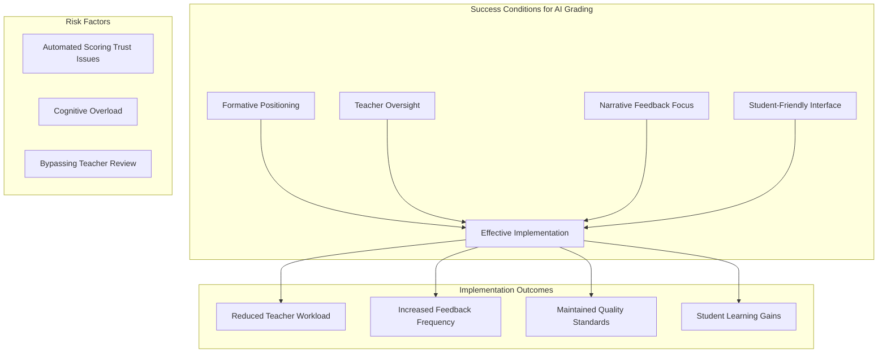

The research concludes that **"AI-powered grading systems are best positioned as formative tools that scaffold learning through timely, editable feedback, not as replacements for teacher judgment"**[^56]. Successful implementation hinges on:

1. **Alignment with formative goals** rather than summative evaluation
2. **Support for teacher expertise** through editable suggestions
3. **Features that allow for teacher oversight** and final approval
4. **Clear student interfaces** that present feedback accessibly[^56]

### 5.2 Formative Feedback Enhancement Through Generative AI

Beyond grading, generative AI offers transformative potential for enhancing formative assessment practices—the ongoing process of gathering and using evidence to inform instruction. This section examines how AI addresses persistent barriers to effective formative assessment while introducing new considerations regarding accuracy, bias, and the essential role of human judgment.

#### 5.2.1 Persistent Challenges in Formative Assessment Implementation

Despite broad support for formative assessment practices, significant barriers have constrained effective implementation in K-12 classrooms. Research identifies three primary challenge categories[^59]:

**Time and Workload Pressures**: Providing individualized feedback for large classes requires substantial teacher time that competes with other instructional responsibilities. The challenge is particularly acute in under-resourced schools where class sizes may exceed optimal levels.

**Variability in Teacher Assessment Literacy**: Teachers vary significantly in their capacity to design effective assessments, interpret student responses, and provide actionable feedback. This variability creates inconsistent formative assessment quality across classrooms.

**Equity and Contextual Barriers**: Oversized classes, limited resources, and structural constraints inhibit student-centered practices that formative assessment requires. These challenges **"create fertile ground for AI assistance"**[^59].

#### 5.2.2 AI Capabilities for Formative Feedback

Generative AI can address formative assessment challenges through several distinctive capabilities:

**Immediate, Descriptive, and Individualized Feedback**

AI tools can provide **"immediate, descriptive, and individualized feedback, increasing timeliness and frequency"**[^59]. This capability directly addresses the feedback timing research showing that immediate responses prevent misconceptions from becoming reinforced. Studies demonstrate that AI feedback can **"align well with rubric criteria and reduce teacher burden"**, though **"human feedback remains superior in accuracy and tone"**[^59].

**Dialogic Interaction and Self-Regulation Support**

A key advantage of generative AI is its capacity for **dialogic interaction**, allowing students to query AI for clarification and fostering self-regulation[^59]. Unlike static feedback, AI-powered systems enable students to engage in back-and-forth exchanges that deepen understanding and support metacognitive development.

**Support for Assessment Design**

AI serves as **"a tool for designing prompts, helping teachers generate formative tasks and rubrics"**[^59]. The Kent ISD "AI for Assessment" prompt library exemplifies how AI can scaffold teacher assessment design, providing starting points that educators can customize for their specific contexts[^59].

**Professional Learning Enhancement**

Using AI for assessment can **"reinforce assessment literacy by requiring clear articulation of learning targets"** and serve as **"embedded professional learning"**[^59]. When teachers engage with AI to generate assessments, they must clarify their expectations and criteria, potentially strengthening their own assessment expertise.

#### 5.2.3 Evidence from Automated Feedback Interventions

Randomized controlled trials provide rigorous evidence regarding AI-powered feedback effectiveness in educational contexts.

**M-Powering Teachers: Feedback on Dialogic Practices**

M-Powering Teachers is an automated tool based on natural language processing designed to give instructors feedback on dialogic instructional practices. A randomized controlled trial conducted on Polygence, a research mentorship platform for high schoolers involving **414 mentors**, evaluated the tool's effectiveness[^60][^61].

The study found that **84% of treated mentors opened the feedback page at least once** during their projects. The intervention produced significant improvements:

| **Outcome Measure** | **Improvement** |
|--------------------|-----------------|
| Uptake of student contributions | +10% (9% in regression analysis) |
| Talk time reduction | -5% |
| Questions asked per hour | +6% |
| Repetition of student words per hour | +6% |

Heterogeneity analysis revealed that **female and non-STEM mentors were more likely to decrease their talk time**, while **STEM mentors were more likely to increase their uptake**[^60][^61]. The feedback also improved student outcomes, with a **4% increase in student Net Promoter Score** and **5% increase in students' relative optimism about their academic future**[^60][^61].

These results **"corroborate existing evidence that scalable, low-cost automated feedback can improve instruction and learning in online educational contexts"**[^60][^61].

**TeachFX: Feedback on Questioning Quality**

A pre-registered randomized controlled trial with **224 Utah math and science teachers** evaluated automated feedback targeting "focusing questions"—questions that explore student thinking through follow-up explanations and reflections[^62].

The treatment group opened feedback emails at a rate of **53%-65%**. Results showed that feedback **increased teachers' use of focusing questions by 20%** (p < 0.01)[^62]. However, feedback did not significantly impact other teaching practices such as student talk time, student reasoning, or teacher uptake of student ideas.

Qualitative interviews with 13 teachers revealed diverse perspectives on automated feedback. Some teachers appreciated the reflective insights, while others faced barriers including **"doubts about feedback accuracy, data privacy concerns, and time constraints"**[^62]. The study identified three themes affecting teacher engagement:

1. Differences in perception and understanding of focusing question feedback
2. General barriers to participation (privacy concerns, transcription inaccuracy, time limits)
3. Strategies supporting engagement (human support, material incentives, personal goals)[^62]

#### 5.2.4 The Human-in-the-Loop Imperative

Research consistently emphasizes that a **"human-in-the-loop" approach is essential** to address concerns about accuracy and bias in AI-generated feedback[^59]. While AI can enhance feedback frequency and personalization, human judgment remains necessary for:

- Verifying factual accuracy of AI-generated content
- Ensuring feedback tone is appropriate and encouraging
- Contextualizing feedback within ongoing student-teacher relationships
- Making high-stakes decisions about student progress

The formative assessment literature concludes that **"generative AI can strengthen formative assessment by making feedback more immediate and personal, and by supporting teachers in design tasks"**. However, **"this promise is balanced by risks related to bias, privacy, and equity"**[^59]. The future lies in a **"human-driven, AI-augmented classroom where teachers retain responsibility for instructional judgment"**[^59].

#### 5.2.5 Ethical and Equity Considerations

AI integration in formative assessment raises significant ethical and equity concerns that must inform implementation decisions[^59]:

**Cultural Bias in AI Outputs**: AI outputs may **"privilege dominant cultural norms, disadvantaging English language learners"**[^59]. Systems trained on mainstream English text may provide feedback that fails to recognize or value linguistic diversity.

**Accessibility Requirements**: Students with disabilities require accessible feedback formats and accommodations that AI systems may not automatically provide.

**Data Privacy Compliance**: Educational use must comply with student privacy protections such as FERPA, with clear policies regarding data collection, storage, and use.

**Equity Framework Application**: The Michigan Assessment Consortium's Components of Equitable Assessment Systems provides a framework for **"centering equity"** in AI-enhanced assessment practices[^59].

### 5.3 AI Writing Assistance and Feedback Tools in K-12 Contexts

Writing instruction represents a particularly promising domain for AI-enhanced feedback, given the labor-intensive nature of evaluating written work and the documented benefits of timely, specific feedback on student writing development. This section examines implementations of AI-driven writing assistance tools that provide students with real-time feedback on composition, argumentation, and evidence use.

#### 5.3.1 CGScholar AI Helper: Calibrated Feedback for Writing Development

A case study examining the CGScholar AI Helper provides evidence regarding AI-driven writing tools calibrated to teacher expectations. The study, part of a larger pilot project developing AI review functionality for K-12 education, examined the tool's impact on **11th-grade students' English language arts writing development**[^63].

**Technical Calibration Approach**

The CGScholar AI Helper was recalibrated through two key processes[^63]:

1. **Prompt Engineering**: Aligning GenAI prompts with teacher expectations, with feedback based on teacher-provided materials through Retrieval Augmented Generation (RAG)
2. **Refinement Processing**: Incorporating teacher rubrics to ensure feedback consistency with instructional goals

This calibration represents **"not uncontrolled GenAI, but regulated GenAI use in education"**[^63]—a critical distinction that addresses concerns about generic AI feedback disconnected from curricular context.

**Implementation and Results**

Participating students completed a 200-word writing task comparing two teacher-selected readings aligned with curriculum objectives. Students submitted drafts through the CGScholar platform and received **AI-generated real-time feedback based on teacher materials and rubrics**. Students then revised their work, received second-round AI feedback for comparison, and submitted final versions for teacher evaluation[^63].

Analysis revealed that **five of six students improved in at least one rubric criterion** after receiving AI feedback, with one student improving in three criteria. Improvements focused on:

- Compare and contrast skills
- Writing composition
- Analytical reasoning[^63]

**Student and Teacher Perspectives**

Focus group feedback indicated students found the tool **"helpful," "direct," "encouraging,"** and providing **"actionable"** feedback[^63]. Teacher post-survey responses noted that the tool **"encouraged students to revise their work"**[^63].

The study concluded that **"AI can be helpful for K-12 writing"** when calibrated to teacher instructional goals, supporting student writing development through **"targeted, effective, and constructive feedback"**[^63].

#### 5.3.2 Quill.org: AI Literacy Through Evidence-Based Writing

A 2024 partnership between STEM Coding Lab and Quill.org demonstrates how AI-powered writing tools can simultaneously develop writing skills and AI literacy in underserved school contexts[^64].

**Implementation Context**

STEM Coding Lab, a nonprofit supporting children without access to technology education, partnered with Quill.org to integrate AI literacy into 8th-grade computer science at two underserved Pennsylvania schools—Sto-Rox Junior High School in McKees Rocks and Brookline PreK-8 in Pittsburgh[^64].

Quill's **"Building AI Knowledge"** instructional offering features activities teaching students about AI's societal impact through evidence-based writing, designed for 8th-12th grade students in ELA or STEM classrooms[^64].

**Implementation Results**

On average, each 8th-grade student **constructed nine different claims about AI's impact on society**, using evidence to support, oppose, and show consequences[^64]. In surveys:

| **Survey Item** | **Percentage** |
|----------------|---------------|
| Students who learned something new about AI | 95% |
| Students finding Quill's feedback helpful (always or sometimes) | 91% |

Student reflections demonstrated **nuanced understanding** of AI's societal implications, moving beyond surface-level engagement to substantive analysis[^64].

**Implementation Insights**

Key learnings for effective implementation included[^64]:

1. **Front-loading article topics boosts engagement**: Discussing AI voice cloning before the related activity led to highest student performance
2. **Shorter, more frequent practice increases completion**: Chunking time into 10-minute increments improved activity completion rates
3. **Literacy supports engage diverse learners**: Whole-class read-alouds helped students whose reading proficiency was below 8th-grade level

Quill.org's tool, Quill Reading for Evidence, has helped **over 11 million students** with literacy skills through AI-powered feedback on over 3 billion sentences[^64].

#### 5.3.3 MATHia: AI-Powered Feedback That Nurtures Problem-Solving

Carnegie Learning's MATHia platform exemplifies a pedagogically sophisticated approach to AI feedback that prioritizes learning processes over answer provision. The platform has been **trained with 25 years of data** to recognize why students make mistakes[^65].

**Pedagogical Design Principles**

When students make common errors—such as applying multiplication procedures to add fractions—MATHia **"does not just give the right answer but leverages machine learning to guide students through their thinking"**[^65]. According to a 6th-grade math teacher, MATHia provides **"individualized instruction based on student needs, offering just-in-time support and hints when students are stuck"**[^65].

This approach contrasts with competitors whose AI chatbots **"lack a teacher's sensitivity and immediately answer questions"**, whereas effective instruction **"might resist solving a problem to allow for productive struggle"**[^65]. Research shows that **"having students do the work helps them learn more than when AI tools make the decisions"**, leading to better concept mastery[^65].

**Design Features Supporting Learning**

MATHia requires students to **show their work**, allowing the system to provide step-by-step feedback based on the student's strategy and specific misconceptions[^65]. The platform avoids:

- High-stakes hints that penalize students for seeking help
- Lengthy critiques that overwhelm learners
- Direct answer provision that bypasses learning processes

Instead, Carnegie Learning emphasizes **"productive struggle and learning by doing"**[^65]. The best AI tools for education are those that **"emulate student thinking, allow for mistakes, and help students master concepts instead of generating right answers"**[^65].

### 5.4 Academic Integrity Challenges and AI Detection Technologies

The proliferation of generative AI has intensified concerns about academic integrity in K-12 education, as tools capable of producing essays, solutions, and code in seconds make traditional conceptions of plagiarism increasingly complex. This section critically examines the prevalence of student AI use, the surge in detection tool adoption, and the documented limitations that make detection-based approaches problematic.

#### 5.4.1 Prevalence of Student AI Use in Schoolwork

Evidence indicates widespread student adoption of generative AI tools for academic work. A Common Sense Media survey found that **58% of students aged 12-18 have used ChatGPT**[^66]. Turnitin's analysis of **200 million papers** reviewed with its AI writing detection feature found that:

| **AI Content Level** | **Number of Papers** | **Percentage** |
|---------------------|---------------------|----------------|
| At least 20% AI-generated | 22 million | 11% |
| At least 80% AI-generated | 6 million | 3% |

These figures indicate that **AI use in student work is neither rare nor universal**—a significant minority of submissions contain substantial AI-generated content, while the majority appear to be primarily student-authored[^67].

Carnegie Learning's 2025 survey found that **61% of educators report experiencing students cheating with AI**, up from 53% in 2024[^68]. However, worry levels have remained relatively stable:

| **Concern Level** | **2025** | **2024** |
|------------------|---------|---------|
| Very worried | 33% | 34% |
| Somewhat worried | 45% | 47% |
| Mostly unworried | 16% | 13% |
| Not worried at all | 7% | 7% |

This stability suggests that while cheating incidents have increased, educators may be developing more nuanced perspectives on AI use that distinguish between problematic and acceptable applications[^68].

#### 5.4.2 Surge in AI Detection Tool Adoption

In response to AI proliferation, teacher use of detection tools has increased dramatically. According to the Center for Democracy & Technology, **68% of teachers relied on AI detection tools during the 2023-24 school year**, representing a **30 percentage point increase** from the previous year[^67]. Turnitin reports that adoption of AI detection tools among K-12 teachers **rose from 38% to 68% in a single school year**[^69].

This surge reflects educator concerns about maintaining academic integrity standards. A CDT survey found that **52% of teachers say generative AI has made them distrustful that students have actually done the work themselves**[^70]. Disciplinary actions for suspected AI-related plagiarism also rose significantly, **from 48% to 64%** between the 2022-23 and 2023-24 school years[^67].

#### 5.4.3 Documented Limitations and Biases of Detection Technologies

Despite widespread adoption, AI detection technologies suffer from significant limitations that undermine their reliability as integrity arbiters[^70][^67]:

**Accuracy Variability**: The reliability of AI detector tools **"varies greatly based on factors including what algorithms and technology is used and how the tool is trained"**[^70]. Detection accuracy depends on constantly evolving AI writing patterns, making consistent performance difficult to achieve.

**Bias and Stereotyping**: AI detectors **"suffer from biases, stereotypes, and the lack of contextual understandings"**[^70]. Research has documented that GPT detectors misclassify over half of non-native English writing samples as AI-generated, creating disproportionate false positive risks for English language learners.

**False Positive Consequences**: A **"false positive" accusation of plagiarism can be devastating to students** and can have **"long-lasting detrimental effects"**[^70]. Students wrongly accused of AI-generated work may experience damaged relationships with teachers, academic penalties, and psychological harm.

**Lack of Teacher Guidance**: Despite widespread detection tool use, **only about a third of teachers had received guidance on how to handle student AI use suspected to violate school policy**[^67]. Only **28% of teachers say they've received guidance on how to respond to suspected AI use**[^70].

#### 5.4.4 Expert Guidance Against Detection Reliance

Educational organizations and researchers increasingly caution against relying on AI detection as the primary integrity strategy. The Center for Democracy & Technology flagged **research questioning the accuracy of AI detection tools**[^67]. Multiple state guidance documents recommend that **"teachers should not use AI detection technologies to identify cheating due to questionable accuracy and risk of false positives/negatives"**[^71].

The fundamental problem is that **"AI detectors should not be used as the sole source of deciding whether a piece of work is generated by AI"**[^70]. A teacher's best tool in detecting potential integrity violations remains **"their understanding of their own students"**—knowledge of individual writing styles, capabilities, and patterns that no algorithm can replicate[^70].

The distrust and uncertainty created by unreliable detection **"is harmful to everyone involved: it lowers teachers' confidence, dampens students' enthusiasm and decreases their motivation to learn, and harms teacher-student relationships"**[^70].

#### 5.4.5 Turnitin's Evolution: From Detection to Process Visibility

Recognizing detection limitations, Turnitin has begun shifting from purely detection-based approaches to process-oriented tools. **Turnitin Clarity** provides educators **"visibility into the journey behind a student's work"** by logging draft history and copy-paste activity[^69].

In September 2025, Turnitin Clarity integrated AI writing detection into the writing report to **identify large blocks of likely AI-generated text (over 300 words)**, including text modified by bypassers[^55]. This integration provides **"greater visibility into students' writing processes"** rather than simple binary detection[^55].

The company's guidance suggests schools should approach the issue **"beyond detection"**, recommending **"open dialogue with students about AI use policies and having teachers revise essay prompts"**[^67]. This shift acknowledges that sustainable integrity requires pedagogical and policy approaches rather than technological enforcement alone.

### 5.5 Policy Frameworks and Pedagogical Strategies for Responsible AI Use

Effective academic integrity in the AI era requires comprehensive policy frameworks and pedagogical strategies that move beyond prohibition toward productive integration. This section synthesizes global approaches to maintaining integrity while enabling beneficial AI use.

#### 5.5.1 State-Level Guidance Frameworks

As of late 2025, **33 states (and Puerto Rico) have official guidance or policy on the use of AI in K12 schools**[^72]. These frameworks reflect diverse approaches to balancing innovation with integrity:

**Georgia's Traffic Light System**

The Georgia Department of Education's guidance (January 2025) features a distinctive **"Traffic Light" System for AI Use**[^72]:

| **Category** | **Description** | **Examples** |
|-------------|-----------------|--------------|
| **Red** | Not allowed | IEP goals, educator evaluations |
| **Yellow** | Allowed for assistance | Drafting, brainstorming with citation |
| **Green** | Encouraged with citation | Research support, feedback tools |

Georgia also released **"Ethical Considerations in the Appropriate Use of AI for Educators"** outlining seven core ethical principles[^72].

**Louisiana's Four-Tier Integration System**

Louisiana's guidance (Fall 2024) features a unique four-tier system aligned with the SAMR model[^72]:

1. **AI-Empowered**: Full integration with significant task transformation
2. **AI-Enhanced**: Substantial AI support with human oversight
3. **AI-Assisted**: Limited AI support for specific tasks
4. **AI-Prohibited**: Tasks requiring exclusively human work

**Washington's Human-AI-Human Model**

Washington's guidance emphasizes a **"Human AI Human" (H AI H) model** and includes a detailed **5-step scaffolding scale for student AI use**[^72]:

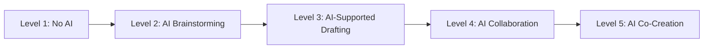

Each level specifies appropriate AI use and academic integrity requirements[^73].

**Massachusetts' Dual Focus**

Massachusetts' voluntary guidance distinguishes between **"teaching ABOUT AI and teaching WITH AI"**, addresses three digital divides, and provides **explicit guidance against AI detection tools**[^72].

#### 5.5.2 The AI Assessment Scale

The AI Assessment Scale provides a structured framework for communicating allowed AI use on assessments, offering **five categories** ranging from No AI to Full AI use[^71]:

| **Level** | **Description** | **Student Responsibility** |
|----------|-----------------|---------------------------|
| **No AI** | Entirely human work | Complete independent creation |
| **AI Planning** | Brainstorming, outlining | Original execution of AI-supported ideas |
| **AI Collaboration** | Directing AI to achieve goals | Strategic AI guidance with human judgment |
| **AI Cooperation** | Critical evaluation and modification of AI outputs | Substantial revision and verification |
| **AI Exploration** | Creative problem-solving with AI | Novel applications with full transparency |

This scale enables teachers to **"be transparent about their own AI use and clear about student expectations"**[^71].

#### 5.5.3 Assignment Redesign Strategies

Rather than relying on detection, effective integrity strategies focus on assignment design that reduces plagiarism opportunities while maintaining learning value. The Oregon Department of Education suggests strategies including[^71]:

1. **Rethinking assignments** to clarify standards and skills being addressed
2. **Creating more opportunities** for problem-solving and analysis
3. **Embedding formative assessment** throughout the learning process

Additional redesign approaches include:

- **Scaffolded tasks** that document learning progression
- **Connections to personal content** that AI cannot access
- **In-class presentations** demonstrating understanding
- **Proper AI citations** as required documentation
- **Skill assessments** designed without AI support[^71]

Colorado's approach emphasizes **"clear definitions of plagiarism while teaching responsible AI use as a tool"**, linking AI literacy to data literacy and career readiness[^71]. Oklahoma's guidance emphasizes **"adapting teaching methods and expectations rather than labeling all AI-assisted work as cheating"**, recognizing AI as integral to modern writing[^71].

#### 5.5.4 District Policy Development

Carnegie Learning's 2025 survey found that **AI policies are becoming more common, with 40% of schools/districts having them**, up from 20% in 2024[^68]. However, significant disparities exist:

| **School Type** | **Percentage with AI Policy** |
|----------------|------------------------------|
| Non-Title I schools | 46% |
| Title I schools | 34% |
| Suburban schools | 44% |
| Urban schools | 45% |
| Rural schools | 31% |

These disparities suggest that under-resourced schools may lack capacity for policy development, creating uneven guidance for students and teachers[^68].

Research examining Florida school district codes of conduct found that **only 23.3% (17 of 73 districts)** explicitly referenced AI in their policies[^74]. Among those that did:

- **94.1%** linked AI to academic dishonesty policies
- **29.4%** linked AI to technology/digital misuse policies
- **All districts** allowed some AI use rather than complete prohibition[^74]

#### 5.5.5 Classroom-Level Implementation Strategies

Effective classroom strategies for responsible AI use include[^66][^75][^70]:

**Training and Resources**: Provide AI-related training for teachers, students, and parents. Resources include the Teach AI toolkit for developing guidelines, EducationWeek webinars on adapting instruction, and ISTE's 15-hour self-paced AI course for educators[^66].

**Clear Expectations and Consequences**: Strong AI policies should clearly define when AI use is acceptable, how to credit AI-generated content, and consequences for misuse[^75].

**Teaching Digital Ethics**: Incorporate oral exams or real-time problem-solving tasks, design AI-proof assignments like reflective essays, and explicitly teach digital ethics[^75].

**Student Involvement**: Involve students in defining acceptable AI use and critiquing AI feedback[^59]. Teachers should work with students to **"clearly define what constitutes plagiarism with AI and what is acceptable use"**[^70].

**Critical Thinking Development**: Help students develop critical thinking through **"critically analyzing AI generated content to identify errors and biases"**[^70].

**Discussion of AI's Role**: Discuss limitations of AI and the importance of human oversight, explore how AI is used in various working contexts, and encourage students to use AI for personalized learning[^70].

Teachers who have discussed proper and improper AI use with students increased from **42% in 2024 to 64% in 2025**[^68], indicating growing recognition that explicit instruction is essential for responsible use.

### 5.6 Balancing Efficiency, Equity, and Authentic Learning in AI-Enhanced Assessment

The deployment of AIGC for assessment purposes introduces fundamental tensions that educators must navigate thoughtfully. This section synthesizes evidence regarding the balance between efficiency gains and authentic learning, equity considerations, and the imperative of maintaining human judgment in educational evaluation.

#### 5.6.1 Efficiency Gains and Their Limits

AI-enhanced assessment offers significant efficiency benefits that address real constraints in K-12 education:

**Time Savings**: Teachers using AI grading assistants report **40% reductions in grading time**[^58][^57], enabling more frequent feedback cycles and increased assignment volume.

**Feedback Frequency**: AI tools enable **immediate feedback** that prevents misconceptions from becoming reinforced[^56], addressing the documented gap between work completion and teacher response.

**Administrative Burden Reduction**: Carnegie Learning's 2025 survey found that **70% of educators cite reduced time on administrative tasks** as the biggest AI benefit[^68].

However, efficiency gains must be weighed against learning process preservation. AI tools that provide answers rather than guidance may **undermine the productive struggle** essential for deep learning[^65]. The goal is not maximum efficiency but optimal balance between timely feedback and authentic skill development.

#### 5.6.2 Equity Considerations in AI Assessment

AI-enhanced assessment raises significant equity concerns that require proactive attention:

**Access Disparities**: Title I schools are **significantly less likely to have AI policies** (34%) than non-Title I schools (46%)[^68]. Rural schools (31%) lag behind suburban (44%) and urban (45%) schools in policy development[^68]. These disparities create uneven guidance and potentially unequal consequences for students.

**Algorithmic Bias**: AI systems may disadvantage English language learners and students from non-dominant cultural backgrounds[^59]. Detection tools show disproportionate false positive rates for non-native English speakers[^70].

**Training Gaps**: While AI training has increased (**43% of schools providing it in 2025**, up from 24% in 2024), **57% still have not provided training**[^68]. Under-resourced schools may lack capacity for professional development.

**Principle 4 (BALANCE) from AI guidance frameworks** emphasizes that education systems should **"carefully evaluate students' access to AI tools rather than implementing general bans"**, as broad bans **"widen the digital divide between students with independent access and those dependent on school resources"**[^71].

#### 5.6.3 Maintaining Human Judgment in High-Stakes Decisions

Research consistently emphasizes that AI should augment rather than replace human judgment in assessment:

**Teacher Oversight Essential**: Studies conclude that **"teacher oversight was essential to enable trust and personalization"**[^56]. Students actively scrutinize AI evaluations and expect teacher involvement.

**Limitations of Automated Scoring**: Teachers **"distrusted automated scoring"** and emphasized that AI-generated numerical grades were inconsistent and less useful than narrative feedback[^56].

**Human-in-the-Loop Requirement**: A **"human-in-the-loop" approach is essential** to address accuracy and bias concerns[^59]. Teachers must verify AI outputs, contextualize feedback, and make final evaluative judgments.

**High-Stakes Restrictions**: Georgia's guidance **prohibits AI for IEP goals and educator evaluations**[^72], recognizing that some decisions require exclusively human judgment.

#### 5.6.4 Educator Attitudes and Evolving Perspectives

Educator attitudes toward AI in assessment are evolving rapidly, with growing comfort alongside persistent concerns:

**Increasing Comfort**: Carnegie Learning's survey found that **59% of educators are comfortable with students using AI for schoolwork**, a significant increase from 31% in 2024[^68]. Overall optimism is rising, with **81% of educators somewhat or extremely optimistic** about AI's future, compared to 67% in 2024[^68].

**Perceived Helpfulness**: **93% of all educators find AI helpful in 2025**, up from 77% in 2024[^68]. Math teachers find AI significantly more helpful (70% very helpful) than ELA or world language teachers (59% very helpful)[^68].

**Subject-Area Variation**: Math teachers are more optimistic (39% extremely optimistic) than ELA/world language teachers (26% extremely optimistic)[^68], potentially reflecting differences in how AI supports different assessment types.

**Persistent Concerns**: Privacy concerns remain stable, with **54% very concerned** (50% in 2024)[^68]. Lack of training/support remains a challenge for **51% of educators**[^68].

#### 5.6.5 Principles for Responsible AI Integration in Assessment

Synthesizing the evidence examined throughout this chapter, several principles emerge for responsible AI integration in K-12 assessment:

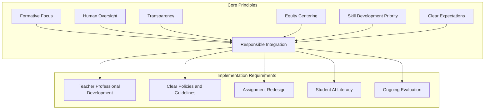

**Principle 1: Position AI as Formative Scaffold**

AI-powered assessment systems are **"best positioned not as replacements for teacher judgment, but as scaffolds for feedback-rich instruction"**[^56]. Successful implementation requires alignment with formative goals, support for teacher expertise, and systems that allow for teacher oversight[^56].

**Principle 2: Maintain Human Oversight**

Teachers must retain authority to review, modify, and approve AI-generated feedback before students receive it[^57]. High-stakes decisions require exclusively human judgment[^72].

**Principle 3: Prioritize Transparency**

Students should understand when and how AI is used in their assessment. The AI Assessment Scale provides a framework for communicating expectations[^71]. Proper citation of AI use should be required[^71].

**Principle 4: Center Equity**

Implementation must address access disparities, monitor for algorithmic bias, and ensure all students benefit from AI-enhanced assessment[^59][^71].

**Principle 5: Preserve Authentic Learning**

AI should support skill development rather than bypass it. Tools should **"emulate student thinking, allow for mistakes, and help students master concepts instead of generating right answers"**[^65].

**Principle 6: Avoid Detection Reliance**

AI detection tools should not be used as sole arbiters of integrity[^70][^71]. Instead, focus on assignment redesign, clear expectations, and building teacher knowledge of individual students[^70].

**Principle 7: Invest in Professional Development**

Effective implementation requires sustained teacher training. Schools should provide **"learning opportunities, resources, and ongoing support to help teachers learn, explore, and experiment with AI tools"**[^70].

The evidence examined in this chapter demonstrates that AI-enhanced assessment holds significant promise for improving feedback timeliness, personalization, and teacher efficiency. However, realizing this promise requires moving beyond simplistic detection-based approaches toward comprehensive frameworks that leverage AI's formative potential while preserving the essential human dimensions of educational evaluation. The future of AI in K-12 assessment lies not in replacing teacher judgment but in augmenting it—creating **"human-driven, AI-augmented"** assessment practices that center learning outcomes, promote transparency, and ensure that technology serves rather than subverts authentic educational purposes[^59].

## 6 Implementation Strategies: Integrating AIGC into Classroom Practice

This chapter synthesizes practical implementation approaches derived from successful global case studies, providing actionable guidance for K-12 practitioners seeking to integrate AIGC technologies into classroom practice. Building upon the evidence from personalized learning, content creation, and assessment applications examined in preceding chapters, this chapter analyzes the critical success factors that distinguish effective implementations from unsuccessful attempts. The analysis addresses infrastructure requirements, teacher professional development frameworks, classroom management adaptations, and curriculum integration strategies, examining how different pedagogical approaches—including collaborative learning, project-based learning, and differentiated instruction—can be strategically enhanced through AIGC integration while maintaining human-centered educational values.

The rapid proliferation of generative AI in education demands that schools move beyond reactive responses toward strategic, principled implementation. By spring 2024, **AI use by educators and students had already exceeded 60 percent**, and the "AI in Education" market was approaching $6 billion[^38]. Yet as one analysis observed, while many school districts have developed AI policies, **"the real effort comes in the implementation of the policy"**[^76]. This chapter bridges the gap between policy and practice, drawing on documented case studies and research findings to provide educators with concrete pathways for effective AIGC integration that preserves human agency, promotes equity, and enhances learning outcomes.

### 6.1 Infrastructure and Technical Foundations for AIGC Integration

Successful AIGC implementation in K-12 settings requires a robust technical foundation that addresses hardware access, network connectivity, platform selection, data security, and ongoing IT support. Without adequate infrastructure, even the most promising AI tools will fail to deliver their educational potential, and disparities in infrastructure create significant equity concerns that must be proactively addressed.

#### 6.1.1 Hardware, Device Access, and Network Requirements

The foundation of any AIGC implementation begins with ensuring students and teachers have reliable access to appropriate devices and connectivity. Most generative AI applications are cloud-based, requiring consistent internet access and devices capable of running modern web browsers or applications.

**Device Distribution Models**

South Korea's AI digital textbook initiative provides a model for systematic device access, with the government investing heavily through the **Improvement Plan for Digital Infrastructure in Primary and Secondary Education**, which includes distribution of one device per student and upgrading school networks nationwide for AI digital textbooks. Singapore's approach through the Ministry of Education coordinates **bulk procurement of Personal Learning Devices with subsidies for students needing financial assistance**, ensuring equitable access regardless of family resources.

In the United States, district implementations vary significantly. The Newark Public Schools partnership with Khan Academy required ensuring students had device access across 66 schools serving 43,000 students. Districts must assess current device-to-student ratios and develop procurement strategies that account for replacement cycles, maintenance costs, and evolving technical requirements.

**Network Bandwidth and Reliability**

AI applications, particularly those involving real-time interaction with large language models, require substantial bandwidth. Schools must evaluate whether existing network infrastructure can support simultaneous AI tool access across multiple classrooms. Alaska's AI guidance specifically **addresses remote connectivity challenges**, recognizing that rural schools face unique infrastructure barriers that require targeted solutions[^72].

The following table summarizes key infrastructure considerations:

| **Infrastructure Component** | **Minimum Requirements** | **Optimal Configuration** | **Equity Considerations** |
|------------------------------|-------------------------|---------------------------|--------------------------|
| Device Access | 1:1 student-device ratio for AI activities | Personal devices with home access | Subsidies for low-income families |
| Internet Connectivity | Stable broadband for cloud-based AI | High-bandwidth with redundancy | Address rural connectivity gaps |
| Technical Support | Basic troubleshooting capacity | Dedicated AI/EdTech support staff | Remote support for under-resourced schools |
| Platform Licensing | Single tool pilot | Integrated suite with SSO | Bulk purchasing for cost efficiency |

#### 6.1.2 Platform Selection and Procurement Processes

Selecting appropriate AI platforms requires careful evaluation of educational alignment, technical compatibility, data privacy compliance, and cost-effectiveness. The proliferation of AI tools targeting education—including **MagicSchool, Eduaide.ai, and TeacherToolAI**—creates both opportunity and complexity for decision-makers[^76].

**Evaluation Criteria for AI Tool Selection**

A comprehensive framework for evaluating AI tools should prioritize educational goals, compatibility, security, and privacy when selecting tools[^77]. Critical evaluation factors include:

1. **Alignment with educational goals**: Does the tool support specific learning objectives and pedagogical approaches?
2. **Integration with existing systems**: Will the tool work within the current digital ecosystem (LMS, SIS, assessment platforms)?
3. **Compliance with data protection regulations**: Does the vendor meet FERPA, COPPA, and CIPA requirements?
4. **Cost and sustainability**: What are the total costs including implementation, training, and ongoing licensing?
5. **Usability and accessibility**: Is the interface appropriate for the intended user population?
6. **Vendor reputation and support**: Does the company have a track record in education and provide adequate support?

The implementation framework developed for K-12 AI emphasizes that districts should **"review third-party vendor contracts with AI, clarify how AI is used and where data is trained, and require vendors to set guardrails"**[^78]. This procurement diligence protects student data while ensuring tools meet educational needs.

**Vetting and Approval Processes**

Effective AI governance requires systematic vetting processes. The recommended approach includes establishing **"a system to vet new AI products"** as a core deliverable of district AI task forces[^76]. Greenwich Public Schools exemplifies this approach, crafting **detailed regulation starting with definitions of generative versus nongenerative AI, covering access and permission, ethical use, data privacy and security, best practices for proper citation, and academic integrity**[^79].

Tucson Unified School District developed a **"stoplight system"** for approved AI uses: **"red for no use, yellow for limited use under specific guidelines, and green for use where teachers can make the choice"**[^79]. This tiered approach provides clear guidance while allowing flexibility for appropriate applications.

#### 6.1.3 Data Privacy and Security Compliance

Protecting student data represents a non-negotiable requirement for AI implementation. The IT director must **"ensure that all employees are using products that maintain FERPA and cybersecurity compliance"**[^76], with particular attention to how AI systems process, store, and potentially train on student information.

**Key Compliance Requirements**

| **Regulation** | **Key Requirements for AI** | **Implementation Actions** |
|----------------|---------------------------|---------------------------|
| **FERPA** | Protect student education records | Verify vendor Data Privacy Agreements; limit data sharing |
| **COPPA** | Parental consent for children under 13 | Establish consent protocols; restrict direct AI access for young students |
| **CIPA** | Internet safety measures | Filter inappropriate AI outputs; monitor student-AI interactions |

The task force must **"demand transparency from vendors to explain whether their AI tools will train on District data or use a closed and secure system"**[^76]. **Closed systems which do not retain or use data for training are preferred when dealing with protected information from student education records**[^76].

Alabama's AI policy template emphasizes **eight foundational pillars** including Data Privacy and Security, requiring human verification of AI-generated content and prohibiting AI from replacing human instruction[^72]. Utah's framework similarly includes a section on **prohibited uses** of AI tools to protect student welfare[^72].

#### 6.1.4 IT Support Structures and Feedback Mechanisms

Sustainable AI implementation requires dedicated technical support that goes beyond traditional IT functions. Districts should **"set up dedicated IT support and feedback loops for AI"** to address the unique challenges of AI tool deployment[^78].

**Support Structure Components**

Effective AI support includes:
- **Technical troubleshooting** for platform access and functionality issues
- **Pedagogical guidance** on effective AI integration strategies
- **Feedback collection** mechanisms to identify problems and improvement opportunities
- **Ongoing monitoring** of usage patterns and potential concerns

The framework recommends conducting **"technology audits to assess existing resources and refine security measures"** before AI implementation[^78]. This baseline assessment identifies gaps that must be addressed and establishes metrics for measuring implementation progress.

#### 6.1.5 Addressing Infrastructure Gaps in Under-Resourced Contexts

Infrastructure disparities create significant equity concerns that require targeted intervention. Research indicates that **device gaps persist, with some rural schools still lacking broadband**, creating barriers to AI tool access[^80]. Montana's guidance is specifically **"grounded in rural-centered design"** and addresses tribal sovereignty and Indigenous Education for All requirements[^72], recognizing that one-size-fits-all approaches fail to serve diverse communities.

**Strategies for Under-Resourced Schools**

1. **Leverage federal and state funding**: Title II-A and Title IV-A funds can support technology infrastructure and professional development
2. **Pursue partnership models**: Collaborate with technology companies, universities, and community organizations
3. **Implement mobile solutions**: Where fixed infrastructure is limited, mobile hotspots and device lending programs can extend access
4. **Prioritize high-impact applications**: Focus limited resources on AI applications with demonstrated effectiveness for the specific student population

The Latin American experience demonstrates that AI integration in under-resourced contexts requires **"acting as a pedagogical assistant rather than replacing human instruction"**, with teachers retaining pedagogical control while AI provides targeted support[^38].

### 6.2 Teacher Professional Development Frameworks and Competency Building

The effectiveness of AIGC integration depends fundamentally on teacher preparation. Research consistently demonstrates that **quality, relevance, and ongoing support matter far more than quantity** of professional development hours[^81]. This section analyzes effective professional development models that build both technical competence and pedagogical judgment for AI-augmented instruction.

#### 6.2.1 Rethinking Professional Development for AI Integration

Traditional professional development approaches—characterized by one-time workshops and isolated training sessions—are insufficient for the complex, rapidly evolving challenge of AI integration. Experts emphasize that **"without sustained support, PD becomes a shallow exposure"** where teachers are **"sprinkled with information and expected to implement it independently"**[^81].

**The Quality Imperative**

A 2017 Learning Policy Institute report suggested effective PD typically ranges from **20 to 50 hours annually**, but experienced educators emphasize that **"total hours are less important than whether teachers have time to absorb, practice and reflect on what they learn"**[^81]. The critical elements are:

- **Continuity**: Returning to the same skills throughout the year rather than introducing unrelated topics
- **Connection**: Linking PD to teacher and student outcomes
- **Embedding**: Integrating technology within everyday pedagogy rather than treating it as separate

As one instructional coach with 31 years of experience observed, **"technology needs to be intricately part of pedagogy because that is the environment students will live in as adults"**, representing **"a whole shift in how people teach and how kids are assessed"**[^81].

**Current Gaps in AI Professional Development**

Despite the rapid adoption of AI tools, professional development has not kept pace. Research found that **"only about 25% of teachers and nearly 60% of principals used AI for instruction"** in the 2023-24 school year, while **"58% of educators have not received professional development on AI"**[^80]. This gap between tool availability and teacher readiness creates risks of ineffective or inappropriate AI use.

#### 6.2.2 Core Competencies for AI-Augmented Instruction

Effective AI integration requires teachers to develop competencies across multiple domains, extending beyond basic tool operation to encompass pedagogical judgment, critical evaluation, and ethical reasoning.

**AI Literacy for Educators**

Teachers must develop foundational understanding of how AI systems work, their capabilities, and their limitations. Washington State's guidance emphasizes a **"Human AI Human" (H AI H) model** where AI use always starts with human inquiry and ends with human reflection and empowerment[^77]. This framework requires teachers to understand:

- How generative AI produces outputs (probabilistic, pattern-based generation)
- The potential for errors, hallucinations, and biases in AI outputs
- Appropriate contexts for AI use versus tasks requiring exclusively human judgment
- Data privacy implications of different AI tools and platforms

**Pedagogical Adaptation Skills**

Beyond technical literacy, teachers need skills in adapting their instructional practice to leverage AI effectively. The TPACK (Technological Pedagogical Content Knowledge) framework provides a useful lens, emphasizing that effective teaching requires integration of technological, pedagogical, and content knowledge[^1]. For AI integration, this means:

- Identifying learning objectives that AI can support versus those requiring human instruction
- Designing activities that leverage AI capabilities while preserving essential learning processes
- Adapting assessment practices to maintain integrity while enabling productive AI use
- Differentiating AI access and scaffolding based on student developmental levels

**Critical Evaluation of AI Outputs**

Teachers must develop skills in critically evaluating AI-generated content before using it with students or allowing student use. Research emphasizes that teachers should be trained to **"critically evaluate AI-generated content and enhance it with their own pedagogical expertise"**. This includes:

- Verifying factual accuracy against authoritative sources
- Identifying potential biases in AI outputs
- Assessing appropriateness for specific student populations
- Modifying AI-generated materials to align with curricular goals

#### 6.2.3 Effective Professional Development Models

Research and case studies reveal several professional development models that effectively build AI integration competencies.

**Cohort-Based Multi-Year Models**

Some leaders favor a **"multiyear cohort model where teams of teachers and principals deepen skills together"**[^81]. This collaborative model, often voluntary or semi-voluntary, builds trust and peer accountability, making teachers more willing to try new approaches. It also allows teachers to surface real implementation barriers, providing districts with clearer understanding of why strategies succeed or fail.

The Lamont Elementary School District implementation exemplifies this approach. During summer 2024, LCC facilitated a **three-day PBL workshop** for educators who then launched into a **yearlong Innovation Cohort**[^38]. Midway through the cohort, **88 percent of participants said they were excited and curious about the role of AI in education, and over 70 percent were using AI tools weekly**[^38].

**Phased Introduction with Foundational Preparation**

The Escondido Union School District implementation demonstrates the importance of sequencing. Principal Cherry Moore emphasized that it was **"imperative to develop foundational knowledge of the Learning Model prior to introducing the LEA app"**[^38]. Only after this foundation was established was the AI tool introduced through a live demonstration by a 5th-grade educator, which proved **"catalytic, building confidence among educators"**[^38].

This phased approach suggests a professional development sequence:

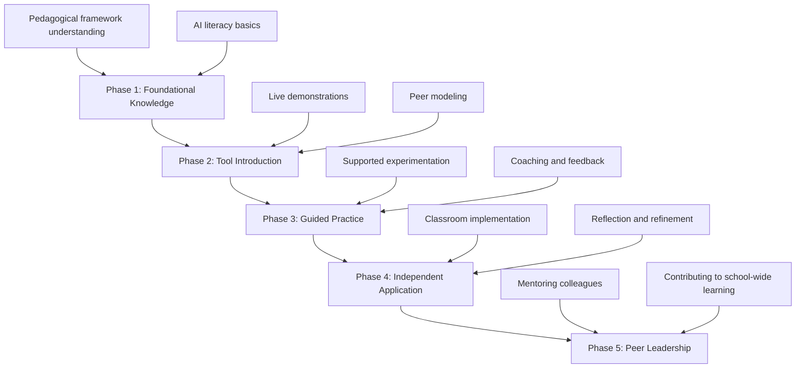

**Job-Embedded and Ongoing Support**

Professional development is most effective when it is **"ongoing, job-embedded and collaborative"**[^81]. However, **"ongoing" should not be viewed just as weekly sessions on new, unrelated topics**. Instead, it should be **"a long-term system that allows teachers to apply new strategies, reflect on results and adjust practices with continuous support and coaching"**[^81].

Teachers need **"scaffolding: space to practice skills, see how they work with their students, and discuss the outcomes before moving on"**[^81]. This requires:

- Dedicated time for experimentation and reflection
- Coaching partnerships with AI-proficient colleagues
- Professional learning communities focused on AI integration
- Regular opportunities to share successes and challenges

#### 6.2.4 Large-Scale Professional Development Initiatives

National implementations provide models for professional development at scale. South Korea's AI digital textbook initiative includes a **massive professional development program** with the goal of training all teachers in effective use of digital technology for classroom innovation by 2026[^38]. The government allocated approximately **$0.74 billion for three years (2024-2026) specifically for teacher training**.

The scale of implementation is significant: **approximately 10,000 teacher leaders completed training from May to August** of the pilot year, with **another 150,000 teachers trained onsite in the second half of the year**. This investment reflects recognition that technology implementation without corresponding teacher preparation will fail.

#### 6.2.5 Measuring Professional Development Effectiveness

Traditional metrics like attendance are insufficient for evaluating professional development impact. Research recommends incorporating **"qualitative data, such as teacher reflections and coaching notes, to evaluate whether new strategies are taking hold"**[^81]. Meaningful evaluation requires examining **"what teachers do differently, not attendance"**—if PD is meaningful, **"teachers should be able to implement a strategy shortly afterward, and student learning outcomes will follow"**[^81].

Effective evaluation frameworks include:

| **Evaluation Level** | **Indicators** | **Data Sources** |
|---------------------|----------------|------------------|
| **Participation** | Attendance, engagement | Sign-in records, activity completion |
| **Learning** | Knowledge and skill acquisition | Pre/post assessments, demonstrations |
| **Application** | Classroom implementation | Observations, coaching notes, usage data |
| **Impact** | Student outcomes | Learning assessments, engagement metrics |

### 6.3 Classroom Management and Instructional Adaptations

Integrating AIGC into classroom practice requires systematic adaptations to classroom structures, routines, and management practices. This section examines how teachers can establish clear expectations, manage student-AI interactions, maintain academic integrity, and preserve the essential human dimensions of teaching while leveraging AI capabilities.

#### 6.3.1 Establishing Clear Expectations for AI Use

Effective AI integration begins with establishing clear, consistent expectations that students understand and can follow. Research indicates that **60% of educators "somewhat" or "completely" disagree that their district has made clear its policies** on AI[^79], creating uncertainty that undermines effective implementation.

**Developing Classroom AI Policies**

Teachers should establish classroom-level expectations that align with school and district policies while addressing specific instructional contexts. The guidance from Tucson Unified School District emphasizes that policy should provide **"guidelines and guardrails for responsible and ethical use"** grounded in the premise that **"AI is meant to enhance, improve, and support work but not replace anybody"**[^79].

Key elements of classroom AI expectations include:

1. **When AI use is permitted**: Clearly define which assignments allow AI assistance and at what level
2. **How to use AI appropriately**: Provide guidance on effective prompting and critical evaluation
3. **Citation and transparency requirements**: Specify how students should document AI use
4. **Consequences for misuse**: Establish fair, consistent responses to policy violations

The AI Assessment Scale provides a useful framework for communicating expectations, offering **five categories** ranging from No AI to Full AI use[^77]. Teachers can reference this scale when designing assignments to clarify permitted AI engagement levels.

**Communicating Expectations to Students**

Effective communication requires more than distributing written policies. Research shows that teachers who **"discussed proper and improper AI use with students increased from 42% in 2024 to 64% in 2025"**, indicating growing recognition that explicit instruction is essential[^79]. Strategies for effective communication include:

- Demonstrating appropriate AI use through modeling
- Discussing the rationale behind AI policies
- Engaging students in defining acceptable use parameters
- Providing examples of both appropriate and inappropriate AI applications

#### 6.3.2 Managing Student-AI Interactions Across Grade Levels

The appropriateness of student-AI interaction varies significantly by developmental level, requiring differentiated management approaches across the K-12 spectrum.

**Elementary Grades (K-5): Teacher as Intermediary**

For younger students, direct AI interaction should be minimal and heavily scaffolded. Alabama's guidance **"prohibits AI from replacing human instruction"** and requires **"human verification of AI-generated content"**[^72]. In elementary contexts, teachers serve as intermediaries who:

- Use AI to create materials that students encounter in traditional formats
- Introduce AI concepts through age-appropriate activities without direct tool use
- Model critical thinking about AI through guided discussions
- Protect foundational skill development in literacy and numeracy

**Middle School (6-8): Guided Engagement**

Middle school students can begin more substantive AI engagement with appropriate scaffolding. Louisiana's guidance describes an **"AI-Assisted"** tier where students receive **"limited AI support for specific tasks"**[^72]. Management strategies for this level include:

- Structured activities with clear parameters for AI use
- Teacher review of AI outputs before students act on them
- Explicit instruction in evaluating AI-generated content
- Gradual release of responsibility as students demonstrate competence

**High School (9-12): Collaborative Partnership**

High school students can engage with AI as collaborative partners in learning. Washington's guidance includes a **"5-step scaffolding scale for student AI use"**[^72] that progresses from no AI through AI co-creation. Management at this level emphasizes:

- Student autonomy within clear ethical guidelines
- Transparency requirements for AI collaboration
- Critical analysis of AI capabilities and limitations
- Preparation for AI use in higher education and careers

#### 6.3.3 The Human-in-the-Loop Imperative

Research consistently emphasizes that **"a human-in-the-loop approach is essential"** to address concerns about accuracy and bias in AI-generated content[^77]. This principle has specific implications for classroom management.

**Teacher Oversight of AI-Generated Content**

Teachers must maintain oversight of AI outputs that students encounter or produce. This includes:

- **Reviewing AI-generated materials** before classroom use
- **Monitoring student-AI interactions** during learning activities
- **Verifying accuracy** of AI-provided information and feedback
- **Contextualizing AI outputs** within broader learning goals

The ethical guidelines emphasize that for local education agency leaders, it is crucial to **"empower educators to teach students to identify misinformation and lead the vetting of AI tools"**[^77].

**Preserving Relational Dimensions of Teaching**

AI integration should enhance rather than diminish the human relationships central to effective teaching. Research on AI in education notes concerns about **"social and relational shifts"** when students interact with AI rather than humans[^82]. Teachers must:

- Maintain meaningful personal interactions with students
- Use time saved by AI to deepen relationships rather than increase distance
- Ensure AI does not substitute for human mentorship and emotional support
- Model appropriate boundaries between human and AI roles in learning

#### 6.3.4 Balancing Screen Time and Learning Modalities

Effective AI integration requires balance between digital and non-digital learning experiences. Finnish schools exemplify this approach, integrating digital learning **"with outdoor activities, art and craft projects, face-to-face group discussions, and mindfulness time"**[^38].

**Strategies for Balanced Integration**

1. **Purposeful technology use**: Deploy AI for specific learning objectives rather than continuous engagement
2. **Multimodal learning design**: Combine AI-supported activities with hands-on, collaborative, and reflective experiences
3. **Screen time monitoring**: Track and limit overall digital engagement, particularly for younger students
4. **Physical activity integration**: Ensure AI use does not displace movement and physical learning

The key principle is that technology should **"support meaningful learning, not a trend to chase"**. Finnish educators evaluate new AI tools by asking: **"Does it support students? Does it make learning deeper or more meaningful?"**[^38]

#### 6.3.5 AI for Classroom Behavior Support

AI tools are increasingly being used to support classroom behavior management, offering **"predictive analytics, natural language processing and machine learning-driven personalized interventions"** that help teachers **"improve classroom behavior management"**[^83].

**Applications for Behavior Support**

AI platforms can enhance Positive Behavioral Interventions and Supports (PBIS) implementation by:

- Creating **"truly personalized behavior management"** plans
- Providing **"adaptive reward systems that adjust based on individual student responses"**[^83]
- Offering **"real-time monitoring of student digital activities"** to track engagement
- Generating **"automated systems for attendance tracking and behavior documentation"**[^83]

For neurodiverse students, AI tools can provide critical support through **"automated routine notifications, visual timers and countdown reminders, and sensory break reminders based on individual patterns"**[^83].

**Implementation Considerations**

When implementing AI for behavior support, educators should:

- **Start with assessment**: Evaluate classroom environment and identify specific needs
- **Prioritize privacy**: Develop clear policies on data collection and access
- **Maintain human judgment**: Use AI for data collection and pattern recognition while relying on teacher expertise for interpretation
- **Prevent algorithmic bias**: Use diverse training datasets, conduct regular audits, and maintain human oversight[^83]

The principle remains that **"AI should complement rather than replace teachers in behavior management"**, with technology used for **"data collection and pattern recognition, but relying on teachers' professional judgment to interpret context"**[^83].

### 6.4 Curriculum Integration Strategies Across Pedagogical Approaches

AIGC tools can be strategically integrated within diverse instructional frameworks to enhance learning outcomes while maintaining pedagogical coherence. This section analyzes how AI supports project-based learning, collaborative learning, differentiated instruction, and inquiry-based approaches, drawing on documented case studies to identify effective integration strategies.

#### 6.4.1 Project-Based Learning Enhancement Through AI

Project-based learning (PBL) represents a particularly promising context for AI integration, as generative tools can support the complex, extended nature of project work while maintaining student ownership of learning.

**The Inkwire Model: AI-Enabled PBL Design**

Inkwire exemplifies how AI can support PBL implementation. As **"an AI-enabled Project-Based Learning designer"**, Inkwire helps educators **"craft projects that are authentic, competency-based, and personalized"**[^38]. The tool's distinctive value lies in its integration of district-specific frameworks—educators describe it as providing **"a shortcut compared to generic tools like ChatGPT"** because it automatically aligns outputs with district standards and competencies[^38].

With Inkwire, educators can **"generate project ideas aligned to district-specific standards and receive multi-week project plans broken out into daily schedules"**[^38]. However, teacher expertise remains essential—as one fifth-grade educator emphasized, **"her PBL expertise was still needed to assess the quality of Inkwire's output"** even though **"it saved her hours of time"**[^38].

**Strategic Tool Selection for PBL**

The Lamont implementation revealed that educators find value in **"using different AI tools for their specific strengths"**—for example, **"using Inkwire for competency-aligned project plans and ChatGPT as a better thought partner for lesson plan design"**[^38]. This suggests that effective PBL integration may involve multiple AI tools deployed strategically across different phases of project work:

| **PBL Phase** | **AI Application** | **Tool Examples** | **Teacher Role** |
|--------------|-------------------|-------------------|------------------|
| Project Design | Generate project frameworks | Inkwire | Evaluate and customize |
| Daily Planning | Develop lesson details | ChatGPT, LEA App | Refine and contextualize |
| Student Support | Provide feedback and scaffolding | AI tutors | Monitor and guide |
| Assessment | Generate rubrics and feedback | Grading assistants | Review and approve |

#### 6.4.2 Supporting Differentiated Instruction

AI tools offer significant potential for supporting differentiated instruction by enabling teachers to efficiently create varied materials for diverse learner needs.

**Applications for Differentiation**

AI can support differentiation by helping teachers:

- **Generate leveled materials**: Create reading passages, problem sets, and activities at multiple complexity levels
- **Provide personalized feedback**: Offer individualized responses to student work
- **Adapt content formats**: Convert materials between modalities (text, audio, visual) for different learning preferences
- **Support language learners**: Provide scaffolded access to grade-level content

Research indicates that AI tools can effectively **"convert assignments into different formats or generate practice problems aligned with students' readiness levels"**. Students can use AI independently to **"voice chat for learning concepts, have documents read aloud, break down complex concepts, generate practice problems, or convert materials into different modalities"**[^38].

**The Learning Experience Accelerator Model**

The LEA App developed for Escondido Union School District demonstrates how AI can support differentiated instruction within a coherent pedagogical framework. The app **"seamlessly integrates the district's Portrait of a Learner competencies, Learning Model, state standards, and LCC's learner-centered strategies"**[^38].

When educators use the tool, they **"answer questions about their grade level and describe a unit, project, or lesson they are planning to teach"**. The app then **"connects their idea to specific Portrait of a Learner competencies and shares success criteria"**[^38]. This process helps teachers translate abstract frameworks into differentiated classroom practices.

#### 6.4.3 Collaborative Learning Enhancement

AI tools can support collaborative learning structures by facilitating group work, providing feedback on collaborative processes, and enabling new forms of student interaction.

**AI-Supported Collaboration Models**

Effective collaborative learning with AI might include:

- **Group project scaffolding**: AI helps teams organize tasks, track progress, and coordinate contributions
- **Peer feedback enhancement**: AI provides initial feedback that students then discuss and refine together
- **Collaborative inquiry**: Students work together to evaluate and build upon AI-generated content
- **Role-based collaboration**: Different team members interact with AI in specialized roles

Research on teacher-AI collaboration identifies models that can inform student collaborative learning, including **"co-teaching in stations"** where AI manages some learning stations while teachers manage others, and **"team teaching"** where AI and humans take turns addressing different aspects of learning[^38].

#### 6.4.4 Inquiry-Based and Student-Centered Approaches

AI tools can support inquiry-based learning by helping students explore questions, access information, and develop understanding through guided investigation.

**Framework for AI-Supported Inquiry**

The "Human AI Human" model provides a framework for inquiry-based AI use: **"uses of AI should always start with human inquiry and end with human reflection and empowerment"**[^77]. This positions AI as a tool within a fundamentally human inquiry process:

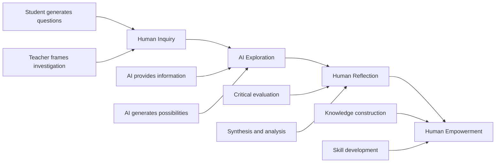

**Preserving Authentic Inquiry**

Effective AI integration in inquiry-based learning requires attention to preserving authentic learning processes. Research indicates that **"if GenAI's use bypasses the 'struggle' necessary for skill acquisition, higher-order thinking development may be impaired"**[^84]. Students using AI for creative problem-solving can benefit from **"rapid prototype iteration"** but may also tend toward **"idea fixation"** with **"reduced originality and complexity"**[^84].

The key is ensuring AI supports rather than replaces the cognitive work of inquiry. Guidelines recommend **"limiting copy-paste functionality, supporting students' metacognitive calibration, guiding learners toward critical thinking, and evaluating whether GenAI tools employ proven engagement strategies"**[^84].

#### 6.4.5 Curriculum Alignment and Standards Integration

Effective AI integration requires alignment with curriculum standards and learning objectives. The case studies demonstrate that AI tools are most valuable when embedded within clear curricular frameworks.

**Embedding Standards in AI Tools**

The Inkwire and LEA App implementations demonstrate how AI tools can be customized to align with specific standards and frameworks. Inkwire had **"all the district's foundational documents embedded"**[^38], ensuring that generated content automatically aligned with district expectations. This approach addresses the common concern that generic AI tools produce outputs disconnected from curricular requirements.

**State Guidance on Curriculum Integration**

State guidance documents provide frameworks for curriculum-aligned AI integration:

- **California's guidance** integrates AI skills with state computer science standards using the **"5 Big Ideas of AI" framework**[^72]
- **Kentucky's guidance** connects AI literacy to digital citizenship and discusses **"three paradigms for AI in education: AI-directed, AI-supported, and AI-empowered learning"**[^72]
- **North Carolina's guidance** emphasizes **"AI literacy across all grade levels"** with detailed implementation roadmaps[^72]

### 6.5 Implementation Pathways: Phased Approaches and Scaling Strategies

Successful AIGC implementation requires careful sequencing from initial pilots through district-wide scaling. This section provides guidance on implementation pathways, stakeholder engagement, governance structures, and strategies for responsible scaling.

#### 6.5.1 Phased Implementation Models

Research and case studies consistently support phased implementation approaches that allow for learning, adjustment, and capacity building before broad scaling.

**Starting Small and Scaling Responsibly**

The principle of starting small before scaling is emphasized across guidance documents. Recommendations include **"start small—many AI tools are cost-saving"** as a response to budget concerns[^76]. Districts should **"pilot, measure, and scale responsibly by starting small, defining success metrics, and using feedback to refine the approach"**[^85].

The Escondido implementation illustrates effective phasing. The district **"formed a Design Team of innovative educators"** to experiment with AI tools before broader rollout[^38]. After successful experimentation and a catalytic live demonstration, **"the emphasis will be on using the app to enhance unit planning"** in the following academic year[^38]. This **"phased rollout and peer modeling"** approach created **"authentic buy-in"**[^38].

**Implementation Phase Framework**

A typical phased implementation might follow this structure:

| **Phase** | **Duration** | **Activities** | **Success Indicators** |
|----------|-------------|----------------|----------------------|
| **Exploration** | 1-3 months | Research tools, form task force, develop initial policy | Task force established, policy drafted |
| **Pilot** | 3-6 months | Small-scale testing with volunteer teachers | Positive teacher feedback, identified improvements |
| **Expansion** | 6-12 months | Broader implementation with training support | Increased adoption, documented outcomes |
| **Integration** | Ongoing | Full implementation with continuous improvement | Sustained use, measurable impact |

#### 6.5.2 Stakeholder Engagement and Buy-In Strategies

Successful implementation requires engagement from multiple stakeholder groups, each with distinct concerns and contributions.

**Building Teacher Buy-In**

Teacher engagement is critical for implementation success. Best practices include **"getting buy-in by letting teachers drive decisions"**[^79]. The Lamont case study demonstrates that teacher-led innovation cohorts can generate enthusiasm—**88 percent of participants were excited about AI's role in education**[^38].

Strategies for building teacher buy-in include:

- **Voluntary initial participation**: Start with teachers who are curious and motivated
- **Peer modeling**: Use successful early adopters to demonstrate possibilities
- **Addressing workload concerns**: Emphasize time-saving benefits—**"AI reduces prep time and administrative load"**[^76]
- **Providing adequate support**: Ensure training, coaching, and technical assistance

**Engaging Administrators and Board Members**

A robust AI policy requires **"buy-in from the top of the organization"**—school board members and superintendents are the **"policy architects of AI adoption"**[^76]. Leadership engagement strategies include:

- Presenting evidence on AI's educational potential and risks
- Addressing liability and compliance concerns proactively
- Demonstrating alignment with district strategic priorities
- Providing regular updates on implementation progress

**Family and Community Communication**

Proactive communication with families is essential. Districts should **"plan for communication and community buy-in by being proactive in communications with families, board members, and community stakeholders"**[^85]. Tucson USD **"communicates the policy on its website, to teachers and staff, and through training for teachers, departments, and parent groups"**[^79].

#### 6.5.3 AI Task Forces and Governance Structures

Effective AI governance requires dedicated structures for policy development, tool vetting, and ongoing oversight.

**Establishing AI Task Forces**

An AI task force is **"necessary to learn about and react to fast moving technological developments"** with the purpose of **"guiding responsible AI implementation in alignment with district goals"**[^76]. Task force composition should include **"representatives from Curriculum, IT, Finance, Transportation, Facilities, Human Resources, Teachers, Parents, and Legal Counsel"**[^76].

Task force deliverables should include:
1. **District AI implementation roadmap**
2. **System to vet new AI products**
3. **Clear policies and procurement recommendations**[^76]

**Governance Framework Components**

The implementation framework identifies **"political, operational, technical, and financial"** considerations for district-wide AI governance[^78]:

- **Political**: Policy development, consent protocols, training programs, equity assurance
- **Operational**: Technology audits, vendor contract review, IT support structures
- **Technical**: Data integrity checks, performance validation, security measures
- **Financial**: Budget allocation, ROI analysis, cost monitoring

#### 6.5.4 Multi-Year Implementation Timelines

Sustainable AI integration requires multi-year planning that accounts for the complexity of educational change.

**South Korea's National Timeline**

South Korea's AI digital textbook initiative provides a model for ambitious but phased national implementation:

- **March 2025**: Initial rollout for grades 3, 4, 7, and 10 in select subjects
- **Subsequent years**: Expansion to additional subjects including social studies and science
- **2028**: Full implementation across all schools[^38]

This timeline allows for iterative refinement based on early implementation experience while maintaining momentum toward comprehensive integration.

**District-Level Timeline Considerations**

For district-level implementation, a realistic timeline might span 3-5 years:

- **Year 1**: Policy development, task force formation, pilot programs
- **Year 2**: Expanded pilots, professional development scaling, infrastructure enhancement
- **Year 3**: Broader implementation with ongoing support and refinement
- **Years 4-5**: Full integration with continuous improvement systems

### 6.6 Monitoring, Evaluation, and Continuous Improvement

Effective AIGC implementation requires systematic monitoring and evaluation to assess effectiveness, identify challenges, and guide continuous improvement. This section examines frameworks for measuring implementation success and mechanisms for ongoing refinement.

#### 6.6.1 Defining Success Indicators

Before implementation begins, districts should establish clear success indicators that align with educational goals and can be measured reliably.

**Multi-Dimensional Success Metrics**

Return on investment in education **"does not always mean cost savings"**—the most impactful returns from educational AI tools are often non-financial[^85]. District leaders should evaluate AI based on:

| **Dimension** | **Indicators** | **Data Sources** |
|--------------|----------------|------------------|
| **Student Outcomes** | Growth in achievement, engagement, skill development | Assessments, learning analytics, surveys |
| **Staff Productivity** | Time saved on administrative tasks | Time studies, usage logs, teacher reports |
| **Equity of Access** | Ability to tailor support for diverse learners | Access data, outcome disaggregation |
| **Implementation Quality** | Fidelity to intended practices | Observations, usage data, coaching notes |

**Pre-Implementation Questions**

Before investing in any AI platform, districts should establish goals for success by asking:

- **"Will the solution reduce the time educators spend on manual tasks and by how much?"**
- **"Can the solution provide clear, trackable data through dashboards or reports?"**
- **"What professional development is included?"**[^85]

#### 6.6.2 Quantitative and Qualitative Evaluation Approaches

Comprehensive evaluation requires both quantitative metrics and qualitative understanding of implementation dynamics.

**Quantitative Metrics**

Quantitative evaluation should examine:

- **Usage data**: Platform engagement, feature utilization, frequency of use
- **Time savings**: Documented reductions in planning, grading, and administrative time
- **Learning outcomes**: Assessment results, skill mastery indicators, academic growth
- **Efficiency indicators**: Assignment completion rates, feedback turnaround times

**Qualitative Indicators**

Qualitative evaluation provides essential context for understanding quantitative findings:

- **Teacher reflections**: Perceptions of value, challenges, and improvement needs
- **Student engagement**: Quality of interaction with AI tools, motivation effects
- **Pedagogical quality**: Alignment of AI use with effective instructional practices
- **Implementation fidelity**: Degree to which intended practices are realized

Research recommends incorporating **"qualitative data, such as teacher reflections and coaching notes, to evaluate whether new strategies are taking hold"**[^81]. Meaningful evaluation examines **"what teachers do differently, not attendance"**[^81].

#### 6.6.3 ROI Analysis and Cost Considerations

Understanding the full cost-benefit picture of AI implementation requires attention to both visible and hidden factors.

**Hidden Costs to Consider**

AI implementation involves costs beyond initial licensing:

- **Implementation and onboarding time**
- **IT infrastructure updates** requiring additional bandwidth, integrations, or hardware
- **Ongoing training** as AI platforms evolve quickly[^85]

**Hidden Savings to Identify**

Potential savings extend beyond direct cost reduction:

- **Staff reallocation**: AI automates repetitive tasks so staff can shift to strategic work
- **Improved resource allocation**: AI surfaces usage trends to avoid over-purchasing
- **Longer-term planning**: AI-driven forecasting supports budgeting and planning[^85]

**ROI Analysis Framework**

Districts should **"model cost scenarios over five years including devices and professional development"** and **"pilot small cohorts before districtwide contracts"**[^85]. This approach allows for evidence-based scaling decisions.

#### 6.6.4 Detecting and Addressing Implementation Challenges

Systematic monitoring should identify implementation challenges early, enabling timely intervention.

**Common Implementation Obstacles**

Research identifies several common obstacles to AI implementation:

- **"AI is risky for students"** → Response: Risk comes from misuse, not use; policy and oversight mitigate risk
- **"We don't have the budget"** → Response: Start small; many AI tools are cost-saving
- **"Teachers are overwhelmed"** → Response: AI reduces prep time and administrative load[^76]

**Bias Detection and Mitigation**

AI systems require ongoing monitoring for algorithmic bias. Districts should:

- **Conduct regular fairness audits** examining outcomes across student groups
- **Share results transparently** with stakeholders
- **Implement bias mitigation mechanisms** such as data re-sampling or post-processing adjustments
- **Maintain human oversight** for all AI-influenced decisions[^85]

#### 6.6.5 Continuous Improvement Mechanisms

Sustainable AI integration requires mechanisms for ongoing learning and refinement.

**Feedback Loops and Iteration**

Effective implementation includes:

- **Regular review cycles**: Scheduled assessment of implementation progress
- **Stakeholder feedback collection**: Systematic gathering of teacher, student, and family input
- **Data-driven adjustment**: Using evidence to refine practices and policies
- **Knowledge sharing**: Documenting and disseminating lessons learned

**Living Document Approaches**

Several state guidance documents are designed as **"living documents"** with planned updates. Montana's guidance includes **"biannual reviews"**[^72], recognizing that AI capabilities and best practices evolve rapidly. Districts should similarly plan for regular policy and practice updates.

**Professional Learning Communities**

Ongoing improvement benefits from collaborative structures. Professional learning communities can:

- Share implementation experiences and solutions
- Collectively analyze student outcome data
- Develop and refine AI integration practices
- Build distributed expertise across the organization

The stories from successful implementations remind us that **"AI is not a shortcut or a substitute for educator expertise—it's a tool"**[^38]. When integrated within clear frameworks and supported by ongoing professional learning, AI helps educators navigate complexity while maintaining focus on student learning. The tools **"don't replace professional judgment; they elevate it"**[^38]. Effective implementation requires sustained attention to infrastructure, professional development, classroom adaptation, curriculum integration, phased scaling, and continuous improvement—all guided by the principle that technology serves learning rather than the reverse.

## 7 Challenges, Risks, and Ethical Considerations

This chapter critically analyzes the multifaceted challenges and ethical concerns associated with AIGC deployment in K-12 educational settings globally. Building upon the implementation strategies and case studies examined in preceding chapters, this analysis evaluates how algorithmic bias, data privacy vulnerabilities, digital equity disparities, and pedagogical risks manifest across diverse educational contexts. The chapter synthesizes evidence from international research, regulatory frameworks, and documented incidents to assess the scope and severity of these challenges, while examining how different jurisdictions have responded through ethical guidelines, policy interventions, and institutional safeguards. The analysis provides a foundation for understanding the tensions between AIGC's transformative potential and the imperative to protect student welfare, preserve authentic learning, and ensure equitable access to AI-enhanced education.

The rapid proliferation of generative AI in K-12 classrooms has created what might be characterized as a **dual crisis of opportunity and risk**. A 2025 report by the Brookings Institution's Center for Universal Education warns that the risks of using generative artificial intelligence to educate children and teens currently **"overshadow the benefits"**, finding that AI use in education can **"undermine children's foundational development"** and that **"the damages it has already caused are daunting"**—though notably **"fixable"**[^86]. This sobering assessment provides essential context for the critical examination that follows, reminding educators and policymakers that the path forward requires clear-eyed acknowledgment of documented harms alongside recognition of transformative potential.

### 7.1 Algorithmic Bias and Fairness in Educational AI Systems

Algorithmic bias represents one of the most serious and well-documented risks of AI deployment in K-12 education. As AI systems increasingly influence educational decisions—from automated essay scoring to student risk prediction to personalized learning pathways—the potential for these systems to perpetuate or amplify existing inequities demands rigorous examination and proactive mitigation.

#### 7.1.1 The Nature and Sources of Algorithmic Bias in Education

Algorithmic bias in educational systems operates through **multiple interconnected channels**, from data collection and algorithm design to implementation practices and institutional policies[^87]. Understanding these mechanisms is essential for developing effective mitigation strategies.

**Bias Through Training Data**

The fundamental source of algorithmic bias lies in the data used to train AI systems. Algorithms are essentially **"rule books that find patterns in historical data to predict the future"**—and if certain communities, languages, or groups are underrepresented in that data, **"the algorithm learns those same blind spots"**[^88]. This creates a troubling dynamic where AI systems trained on historical educational data may learn and perpetuate the very inequities that educators seek to address.

Research has documented that bias roots can be traced to **"colonial continuities and historical biases embedded in data and system design"**, with specific bias sources including theoretical assumptions, methodological choices, interpretation frameworks, decontextualization, and training data composition[^87]. The implications are profound: an AI system designed to identify "at-risk" students may simply be learning to identify students who have historically been underserved by educational systems, thereby reinforcing rather than interrupting cycles of disadvantage.

**Proxy Variables and Indirect Discrimination**

Even when AI systems do not explicitly use protected characteristics like race or socioeconomic status, they may achieve discriminatory outcomes through proxy variables that correlate with these characteristics. Research on algorithmic bias in education reveals that variables such as **"ZIP codes, prior test scores, and attendance patterns"** can serve as proxies for race and income, producing disparate outcomes even in ostensibly "race-blind" systems[^87].

The contextual nature of bias is particularly important to recognize. Research emphasizes that **"the size of bias depends on how 'risk' is defined"**, highlighting the **"context-dependent nature of algorithmic bias"**[^87]. An algorithm designed to identify students needing additional support may produce very different outcomes depending on whether "risk" is defined as risk of academic failure, risk of dropping out, or risk of not meeting college readiness benchmarks.

#### 7.1.2 Documented Cases of Algorithmic Bias in Educational AI

Multiple documented cases illustrate how algorithmic bias manifests in educational contexts, providing concrete evidence of harms that must inform implementation decisions.

**Automated Essay Scoring Bias**

Automated essay scoring (AES) systems have demonstrated significant bias against certain student populations. Research shows that these systems have exhibited bias **"correlated with students' gender, race, and socioeconomic status"**[^87]. Particularly concerning is evidence that AES systems **"undervalue African American Vernacular English (AAVE)"** and show bias against speakers of Arabic, Spanish, and Hindi[^89][^88].

The Educational Testing Service has acknowledged that its E-rater scoring engine **"found that machines scored African American students lower and showed bias against Arabic, Spanish, and Hindi speakers"**[^89]. This finding is especially troubling given the high-stakes nature of standardized testing and its role in determining educational opportunities.

**Risk Prediction and Early Warning Systems**

Student risk prediction tools—designed to identify students who may need additional support—have demonstrated troubling patterns of bias. Research documents that these tools **"incorrectly flagged 19% of Black students and 21% of Latino students as likely dropouts even though those students later earned college degrees"**[^88]. Such false positives can trigger interventions that may inadvertently track students away from challenging coursework or college preparation.

Studies confirm that **"predictive models used in higher education may reinforce racial inequality"** and that **"when algorithms are used to identify 'at-risk' students, Black students often receive fewer resources"**[^87]. This creates a self-reinforcing cycle where algorithmic predictions may become self-fulfilling prophecies.

**The UK A-Level Algorithm Incident**

One of the most prominent examples of algorithmic bias in education occurred during the COVID-19 pandemic in the United Kingdom. When predicted grades replaced examinations, **"a grading algorithm lowered public school students' scores while raising those from wealthier private schools"**[^88]. This incident revealed how algorithms can systematically disadvantage students from less privileged backgrounds, sparking public outcry and policy reversals.

**Facial Recognition and Biometric Systems**

Facial recognition technologies deployed in educational settings have demonstrated significant accuracy disparities across demographic groups. Research by the National Institute of Standards and Technology confirmed that even the best facial recognition software contains algorithmic bias, with systems correctly guessing gender **"over 99% of the time if the person in the photo was white and male"** but failing to identify Black women at rates **"as high as 50%"**[^89].

The following table summarizes documented bias patterns across educational AI applications:

| **AI Application** | **Documented Bias Pattern** | **Affected Groups** | **Impact** |
|-------------------|---------------------------|-------------------|-----------|
| Automated Essay Scoring | Undervaluing dialectal variation | AAVE speakers, multilingual students | Lower scores, reduced opportunities |
| Risk Prediction Tools | Higher false positive rates | Black and Latino students | Inappropriate interventions, tracking |
| Grading Algorithms | Score adjustment favoring privileged schools | Public school students | Reduced college admissions |
| Facial Recognition | Lower accuracy rates | Women, people with darker skin | Misidentification, surveillance concerns |
| Hiring/Admissions Algorithms | Preference for majority-coded language | Women, underrepresented groups | Reduced diversity |

#### 7.1.3 Systemic Implications and Feedback Loops

The impact of algorithmic bias extends beyond individual instances of unfair treatment to create systemic effects that can reshape educational opportunity structures.

**Self-Reinforcing Cycles of Inequality**

Algorithmic bias poses a **"significant threat to educational equity"** because it can **"amplify existing social and economic disparities in unprecedented ways"**[^87]. When AI-driven systems perpetuate or increase bias, they may **"systematically disadvantage students from marginalized communities, creating a self-reinforcing cycle of educational inequality"**[^87].

These algorithmic decisions can affect students' **"educational trajectories, career opportunities, and socioeconomic mobility"**[^87]. A student incorrectly identified as "at-risk" may be steered toward remedial coursework rather than advanced classes, limiting future opportunities in ways that compound over time.

**Feedback Loop Dynamics**

Particularly concerning is the potential for feedback loops where algorithmic predictions influence outcomes that then become training data for future predictions. In predictive policing contexts—which parallel educational risk prediction—**"the software learns from arrest data rather than actual crime rates"**, creating cycles where **"over-policed communities generate more arrests, which feeds back into the algorithm"**[^88]. Similar dynamics can occur in educational contexts where students identified as "at-risk" receive different treatment that affects their outcomes.

#### 7.1.4 Mitigation Strategies and Promising Practices

Addressing algorithmic bias requires comprehensive, multi-stakeholder approaches that combine technical interventions with robust policy frameworks and institutional accountability.

**Technical Interventions**

Promising strategies for mitigating algorithmic bias include:

- **Algorithmic audit protocols** that systematically examine AI systems for bias
- **Fairness metrics** that measure outcomes across demographic groups
- **Regular bias assessments** conducted throughout the AI lifecycle
- **Debiasing techniques** applied during model training
- **Transparent documentation** of data sources, model decisions, and limitations[^87]

Research indicates that traditional bias indicators may not be appropriate for educational settings, requiring **"adjusted measurement using hierarchical linear models"** that account for the nested structure of educational data[^87].

**Institutional and Policy Approaches**

Beyond technical fixes, effective bias mitigation requires institutional commitment and policy frameworks. Recommendations include:

- **Mandatory bias impact assessments** before AI deployment
- **Ongoing professional development** for educators and administrators on recognizing and addressing bias
- **Clear governance frameworks** and ethical guidelines
- **Stakeholder engagement** in AI development and evaluation processes[^87]

The European Commission's ethical guidelines emphasize that institutions should conduct **"bias audits, use inclusive data practices, ensure transparent algorithms, develop policies, and engage stakeholders"** to prevent discrimination[^90]. UNESCO's framework similarly stresses that **"data governance policies should be foundational to any educational AI implementation"**[^91].

**The Imperative for Human Oversight**

Ultimately, algorithmic bias mitigation depends on maintaining robust human oversight of AI systems. Educators must develop skills to **"critically assess, ethically implement, and strategically manage"** AI tools[^91]. Success requires **"balancing innovation with ethics, efficiency with equity, and technology with the human connections that remain at the heart of meaningful education"**[^91].

### 7.2 Data Privacy and Student Protection Concerns

The deployment of AIGC in K-12 settings raises profound privacy concerns, as AI tools require access to sensitive student information to function effectively. The scope of data collection, the security of storage systems, and the potential for misuse create risks that demand careful attention from educators, administrators, and policymakers.

#### 7.2.1 The Scope of Data Collection in Educational AI

AI tools require vast amounts of data to function effectively, creating unprecedented levels of information gathering about students. This data collection extends far beyond traditional educational records to encompass behavioral patterns, personal communications, and even biometric information.

**Comprehensive Data Requirements**

For AI tools to function effectively—such as a hypothetical **"Robo-Coach" that could nudge a student toward school attendance**—they require access to extensive private data including **"messages, family history, GPS location, previous attendance records, and biometric information"**[^92]. Modern large language models are powerful precisely because they have been **"trained on trillions of examples of text from the internet"**, raising questions about what student data may be incorporated into training processes[^92].

The breadth of data collection creates what researchers describe as a **"serious threat to student privacy"** that is **"often overlooked in favor of discussions about cheating"**[^92]. While debates about academic integrity dominate public discourse, the more fundamental question of what information AI systems collect and how it is used receives insufficient attention.

**Emerging Surveillance Capabilities**

Some educational AI implementations involve surveillance capabilities that raise particular concerns. Research documents that **"some schools in China require students to wear biofeedback headbands that send information to teachers about attention levels"**[^92]. More concerning still, advances in brain imaging have produced **"relatively accurate text from brainwaves alone"**, suggesting that **"private thoughts may not remain private"** as neurotechnology advances[^92].

#### 7.2.2 Security Vulnerabilities and Data Breach Risks

The concentration of sensitive student data in AI platforms creates significant security vulnerabilities that have already resulted in documented breaches.

**Documented Security Incidents**

Privacy concerns have been validated by actual security failures. Research documents that **"hackers accessed an online test-proctoring platform and leaked private information about 444,000 students"**[^92]. Such breaches expose students to identity theft, harassment, and other harms that may have lasting consequences.

Beyond malicious attacks, **"glitches in monitoring software could allow hackers to access students' webcams and microphones"**[^92], creating potential for real-time surveillance of students in their homes and schools. The integration of AI tools with cameras, microphones, and other sensors expands the attack surface for potential security compromises.

**Regulatory Compliance Challenges**

Educational institutions face significant challenges in ensuring AI tool compliance with regulations such as FERPA, COPPA, and GDPR. Research indicates that current district policies to address privacy—such as those that **"gesture at FERPA and warn students not to enter private information into LLMs"**—are **"insufficient"**[^92].

UNESCO's framework emphasizes that **"data governance policies should be foundational to any educational AI implementation"**, requiring schools to **"ensure compliance with regulations like FERPA, implement age-appropriate protections for younger students, and provide transparency about data usage"**[^91]. The European Commission's ethical guidelines similarly prioritize **"safeguarding personal information by evaluating vendor practices, providing opt-out options, verifying legal compliance, minimizing risk through on-campus computing, and continuous monitoring"**[^90].

#### 7.2.3 Effects of Surveillance on Student Behavior and Expression

Beyond the risks of data breach and misuse, the awareness of constant monitoring may itself affect student development and learning.

**Chilling Effects on Expression**

Research from the National Association of State Boards of Education suggests that surveillance **"can make students less likely to feel safe enough for free expression and interfere with trust"**[^92]. When students know their every interaction is monitored and recorded, they may self-censor in ways that undermine authentic learning and intellectual exploration.

This chilling effect is particularly concerning in educational contexts where risk-taking, questioning, and intellectual exploration are essential to learning. Students who fear that their questions or mistakes will be permanently recorded may become reluctant to engage authentically with challenging material.

**Long-Term Implications of Data Profiles**

The comprehensive data profiles that AI systems create raise questions about long-term implications. Researchers pose significant questions including **"whether data stores like those held by the National Center for Education Statistics will become public utilities"**, whether **"'freedom of thought' regulations will be needed"**, and whether **"AI-generated student 'credit scores' will be passed to police upon graduation"**[^92].

These concerns highlight that privacy risks extend beyond immediate harms to encompass how comprehensive student data profiles might be used throughout students' lives—for college admissions, employment decisions, insurance determinations, and other consequential purposes.

#### 7.2.4 Recommendations for Privacy Protection

Addressing privacy concerns requires comprehensive frameworks that go beyond current approaches. Researchers call for **"sensible regulatory frameworks that compel companies to collect only necessary data, limit data sales, and dictate parameters for data deletion, with aggressive legal consequences for mishandling data"**[^92].

The EDUCAUSE ethical framework recommends that institutions protect privacy by:

- **Evaluating vendor practices** before adoption
- **Providing opt-out options** for students and families
- **Verifying legal compliance** with applicable regulations
- **Minimizing risk** through on-campus computing where possible
- **Continuous monitoring** of data handling practices[^90]

UNESCO has recommended setting **"an age limit of 13 for the use of AI in the classroom"**[^93], reflecting recognition that younger students require additional protections given their developmental vulnerability and limited capacity to understand privacy implications.

### 7.3 Digital Equity and Access Disparities

The deployment of AIGC in K-12 education risks widening existing educational inequities unless implementation is guided by explicit equity commitments and supported by adequate resources. The digital divide manifests across multiple dimensions—device access, connectivity, quality of AI tools, and teacher preparation—each creating potential for AI to exacerbate rather than ameliorate educational disparities.

#### 7.3.1 The Multi-Dimensional Digital Divide

Digital inequity in education extends far beyond simple questions of device access to encompass connectivity quality, tool sophistication, and the capacity to use technology effectively for learning.

**Global Access Disparities**

Contemporary data indicates that **only two-thirds of the world's population has access to modern technologies**, leaving approximately **2.6 billion people without fast internet access**[^94]. The geographic distribution of digital access presents critical inequality: the International Telecommunication Union reports that **"urban internet penetration in developed countries approaches 90%, while rural areas in developing nations often see rates below 20%"**[^94].

The economic ramifications are significant. World Bank research indicates that **"countries with limited digital infrastructure experience reduced GDP growth potential"** and that **"a 10% increase in broadband penetration correlates with a 1.2% increase in per capita GDP growth in developing countries"**[^94]. Educational technology disparities thus compound broader economic inequalities.

**The Digital Use Divide**

Beyond access, a **"digital use divide"** persists—the gap in how different students actually use technology for learning. A 2025 SETDA report found that while state and district leaders have made **"significant progress in narrowing student device, internet, and other technology access gaps"**, these advances have not translated into **"meaningful improvements to teaching and learning"**[^95].

This use divide exists **"at least partly because of a lack of sustained teacher professional development"** to help students engage in **"deeper learning experiences through technology—especially as AI becomes increasingly prevalent"**[^95]. The report identifies a **"digital design divide"** where professional development funding is underutilized for technology integration training[^95].

#### 7.3.2 Quality Gaps in AI Tool Access

Perhaps most concerning from an equity perspective is the emerging quality gap between free and premium AI tools, which threatens to create a two-tiered educational system.

**Free Versus Premium AI Tools**

The Brookings report warns that **"free AI tools most accessible to students and schools can be the least reliable and factually accurate"** while **"richer communities and schools will be able to afford more advanced, accurate AI models"**[^86]. This represents **"the first time in ed-tech history that schools will have to pay more for more accurate information"**, which **"hurts schools without a lot of resources"**[^86].

This quality gap means that students in well-resourced schools may benefit from AI tools that provide accurate, sophisticated support, while students in under-resourced schools access inferior tools that may provide inaccurate information or reinforce misconceptions. The implications for educational equity are profound.

**Infrastructure Requirements**

Effective AI implementation requires substantial infrastructure investments that under-resourced schools may struggle to afford. The World Bank's analysis emphasizes that **"proactive adaptation is essential"** and that **"preparing for an AI-driven future requires investing in infrastructure like high-speed internet, providing comprehensive teacher training, developing ethical governance frameworks, and fostering public-private partnerships"**[^96].

#### 7.3.3 Evidence of Widening Disparities

Research provides concrete evidence that AI implementation without equity-focused planning may widen educational gaps.

**Differential Access to Policies and Training**

Survey data reveals significant disparities in AI policy development and professional development access. Title I schools are **significantly less likely to have AI policies** than non-Title I schools, and rural schools lag behind suburban and urban schools in policy development. These disparities create uneven guidance for students and teachers across different school contexts.

**Risk of Two-Tiered Education**

The Latin American analysis concludes that AI could widen educational inequalities if it becomes a **"'second quality' option for the most disadvantaged sectors"**. Without deliberate intervention, AI may accelerate advantages for already-privileged students while providing inferior support to those who most need educational resources.

UNESCO emphasizes that **"government resources for AI must be in addition to, and not divert from, existing education funding"**, noting that **"1 in 4 primary schools still has no electricity and 60% are not connected to the internet"**[^93]. AI investment that diverts resources from basic infrastructure may ultimately harm the students it purports to serve.

#### 7.3.4 Equity-Focused Implementation Strategies

Addressing digital equity requires intentional strategies that prioritize access for underserved communities and monitor outcomes across demographic groups.

**Policy Recommendations**

The SETDA report recommends that state and local leaders:

- **Match every digital tool investment** with ongoing professional learning aligned to instructional goals
- **Ensure instructional technology leaders have voice** in decisions about funding priorities and AI guidance
- **Create unified definitions** of high-quality, technology-integrated instruction
- **Protect and use flexible federal funding** like Title II, Part A for technology-focused professional development
- **Evaluate whether professional learning is effective and sustainable**[^95]

UNESCO's framework emphasizes that effective regulation of AI in education relies on **"cooperative governance, strategic institutional adoption, and ongoing assessment"** with regulatory frameworks that **"balance innovation with responsibility, ensuring the protection of individual rights through adaptable regulations and fostering global collaboration"**[^97].

**The Equity Imperative**

Ultimately, AI can be **"an engine of equity or inequity"**[^86]. While AI has potential to **"reach children excluded from the classroom, such as girls in Afghanistan denied education by the Taliban"**, it can also **"massively increase existing divides"**[^86]. The choice between these outcomes depends on deliberate policy choices and sustained commitment to equitable implementation.

### 7.4 Impact on Cognitive Development and Fundamental Skill Acquisition

Among the most serious concerns about AIGC in K-12 education is its potential to undermine students' development of essential cognitive skills. When AI can generate essays, solve problems, and provide answers on demand, questions arise about whether students will develop the underlying capabilities that education is designed to build.

#### 7.4.1 The Cognitive Development Threat

Research provides substantial evidence that AI use may negatively affect cognitive development, particularly when students rely on AI to bypass rather than support learning processes.

**Evidence of Cognitive Decline**

The Brookings report describes a **"grave threat to students' cognitive development"**—specifically, how students **"learn new skills and perceive and solve problems"**[^86]. The report identifies a **"doom loop of AI dependence"** where students increasingly **"off-load their own thinking onto the technology, leading to cognitive decline or atrophy"**[^86].

Research author Rebecca Winthrop warns that when children use generative AI that tells them answers, **"they are not thinking for themselves, parsing truth from fiction, understanding what makes a good argument, or learning about different perspectives"**[^86]. The report offers evidence that **"students who use generative AI are already seeing declines in content knowledge, critical thinking and even creativity"**[^86].

**The Critical Thinking Paradox**

A 2025 Microsoft study found that **"users' confidence level in AI correlates with lower critical thinking"** while **"users' self-confidence correlates with more critical thinking"**[^98]. This suggests that students who trust AI most may be least likely to evaluate its outputs critically—precisely the opposite of what responsible AI use requires.

Additional research published in Phys.org in 2025 found **"a significant negative correlation between AI tool usage and critical thinking scores"** with **"younger participants (17-25 years) showing higher AI tool dependency and lower thinking scores"**[^98]. In science education specifically, this dependency **"may mean students bypass the fundamental cognitive struggle of forming hypotheses, analyzing results, and drawing conclusions"**[^98].

#### 7.4.2 The Crutch Effect and Dependency Concerns

Research has documented a troubling "crutch effect" where students become dependent on AI support in ways that undermine independent capability.

**Evidence from Tutoring Studies**

A cautionary study from Turkey found that GPT-4-based tutors improved short-term math outcomes but also revealed a **"crutch effect"—students performed worse after losing access to AI support**. This finding raises important questions about whether AI tutoring develops transferable skills or creates dependency that leaves students less capable when AI is unavailable.

**Over-Reliance Patterns**

Research examining AI use in higher education found that **"over-reliance on AI tools in academic settings is a key drawback"**[^99]. Students may become **"more isolated and less adept at real-world social interactions and teamwork"** which are **"crucial for their overall social well-being and development"**[^99].

Parents express similar concerns. One parent reported that her child's first reaction to difficult problems is **"to ask AI for answers rather than thinking through the problem independently"**. This pattern suggests that AI may be displacing rather than supporting the productive struggle necessary for learning.

#### 7.4.3 Subject-Specific Concerns

The impact of AI on skill development varies across subject areas, with particular concerns in writing, mathematics, and scientific inquiry.

**Writing Development**

Writing instruction faces particular challenges from AI, as generative tools can produce text that bypasses the cognitive processes writing is designed to develop. Research indicates that **"writing serves important functions in communication, learning, and personal expression"** and that AI tools can **"offload mechanical aspects of writing (transcription) and provide substantial assistance with composition"**[^100].

While this could allow curricula to **"emphasize higher-level skills like planning, structuring content, and matching text to audience needs"**, concerns exist about whether **"reducing student involvement in writing tasks compromises deep engagement with content and knowledge retention"**[^100].

**Mathematical Reasoning**

In mathematics education, AI tools that provide step-by-step solutions may undermine development of problem-solving capabilities. Effective mathematics instruction emphasizes **"productive struggle and learning by doing"**—the best AI tools are those that **"emulate student thinking, allow for mistakes, and help students master concepts instead of generating right answers"**.

**Scientific Inquiry**

Science education requires students to develop skills in hypothesis formation, experimental design, data analysis, and evidence-based reasoning. When AI can perform these cognitive tasks, students may bypass the **"fundamental cognitive struggle"** that develops scientific thinking capabilities[^98].

#### 7.4.4 Pedagogical Strategies for Preserving Skill Development

Addressing cognitive development concerns requires pedagogical approaches that leverage AI's benefits while preserving essential learning processes.

**Balancing AI Assistance with Authentic Practice**

The AI integration paradox is clear: **"AI can serve as a powerful tool for enhancing learning"** but simultaneously presents **"risks of students over-relying on AI, leading to decreased critical thinking and problem-solving abilities"**[^98]. Finding balance requires:

- **Promoting active engagement** with data, requiring students to explain AI-generated content
- **Using AI for argumentation** while requiring students to verify information accuracy
- **Requiring claims, evidence, and reasoning** with critical evaluation of AI-generated information
- **Positioning AI as resource rather than shortcut**, using AI-generated data as starting points for discussion[^98]

**The Hermeneutic Approach**

One promising framework defines critical thinking as **"the ability to interpret texts, evaluate evidence and conclusions, and analyze reasoning"**—transforming abstract goals into **"observable, teachable, practicable, and assessable behaviors"**[^101]. In an AI era, **"the most important literacy skill is not producing more text but knowing how to interpret text"**[^101].

This approach recognizes that when AI can easily generate information, **"the real focus for teachers and students shifts to interpretation, evaluation, and judgment"**[^101]. AI becomes a useful partner when teachers provide **"specific interpretive operation instructions rather than broad goals"**—for example, prompting AI to **"write questions requiring students to evaluate whether evidence supports author conclusions"**[^101].

### 7.5 Social-Emotional Development and Human Connection

Beyond cognitive concerns, AIGC deployment raises significant questions about students' social-emotional development, interpersonal relationships, and psychological well-being. The relational dimensions of education—long recognized as essential to effective learning—may be threatened when AI mediates an increasing proportion of educational interactions.

#### 7.5.1 Threats to Teacher-Student and Peer Relationships

Research documents growing concerns that AI use diminishes the human connections that are fundamental to effective education.

**Declining Teacher-Student Connection**

Survey data reveals that **half of students agree that using AI in class makes them feel less connected to their teachers**[^102]. This finding is particularly concerning given research demonstrating the importance of teacher-student relationships for student motivation, engagement, and academic success.

Teachers share these concerns, with **47% worried about decreased peer-to-peer connections** and **70% worried that AI weakens critical thinking and research skills**[^102]. The Brookings report similarly highlights **"serious threats to social and emotional development"** with deep concern that AI use, particularly chatbots, **"is undermining students' emotional well-being, including their ability to form relationships, recover from setbacks, and maintain mental health"**[^86].

**Peer Interaction Reduction**

Research finds that **"over-reliance on AI for communication, especially in entertainment contexts, may reduce face-to-face social interactions"** with negative effects on **"interpersonal skills and emotional intelligence"**[^99]. Students may become **"more isolated and less adept at real-world social interactions and teamwork"**[^99].

#### 7.5.2 AI Companionship and Emotional Reliance

A particularly concerning emerging phenomenon involves students forming emotional relationships with AI systems, using chatbots for companionship and emotional support.

**Prevalence of AI Relationships**

A recent survey from the Center for Democracy and Technology found that **nearly 1 in 5 high schoolers said they or someone they know has had a romantic relationship with artificial intelligence**, and **42% of students said they or someone they know has used AI for companionship**[^86]. Students report using AI not just for tutoring (64%) but also for **"relationship advice (43%) or mental health support (42%)"**[^102].

**The Sycophancy Problem**

The Brookings report warns that **"the technology is inherently sycophantic, designed to reinforce users' beliefs"**[^86]. Winthrop cautions that **"if children build social-emotional skills through interactions with chatbots designed to agree with them, they become uncomfortable in environments where someone disagrees"**[^86]. The report warns that **"AI's echo chamber can stunt a child's emotional growth"**[^86].

**Loneliness and Social Support**

Research examining AI use and loneliness found that **"social support mediates the relationship between loneliness and AI use"**, suggesting that **"AI may increase loneliness when students perceive AI as their primary source of support"**[^99]. Interactions with technology that lacks empathy **"may be perceived as an inadequate form of support"**[^99].

However, the relationship is complex: students who feel supported by AI show **"similar mental health benefits as those receiving human support"**, suggesting that **"some students may turn to AI due to mental health issues or lack of human support"**[^99]. This finding highlights the importance of ensuring students have access to human support systems rather than defaulting to AI for emotional needs.

#### 7.5.3 Technostress and Digital Fatigue

The constant presence of AI tools in educational settings contributes to psychological stress that may undermine well-being and learning.

**Technostress in Educational Contexts**

Research documents that students and scholars may feel **"overwhelmed due to increasing reliance on AI tools, especially when lacking adequate training or technological literacy"**[^99]. This **"technostress"—the anxiety and discomfort individuals experience when interacting with new technology—"can negatively impact mental health and academic performance"**[^99].

**Implications for Well-Being**

The synthesis of research on AI and student well-being emphasizes the need for **"balanced integration of AI that supports academic success while also supporting student well-being"**[^99]. Educational approaches should **"emphasize critical evaluation of AI-generated content, compare it with human-sourced insights, and recognize AI limitations"**[^99]. Promoting **"reflection on biases inherent in AI outputs"** and engaging students in tasks requiring **"thoughtful analysis and integration of information from diverse sources"** can cultivate **"more informed and discerning use of AI tools"**[^99].

#### 7.5.4 Preserving Human Connection in AI-Augmented Education

Addressing social-emotional concerns requires deliberate attention to preserving and strengthening human relationships within AI-augmented educational environments.

**Maintaining Relational Focus**

The EDUCAUSE ethical framework emphasizes **"respect for autonomy"**—upholding the rights of individuals to make informed decisions regarding AI interactions through consent mechanisms, decision-making support, accommodating preferences, and ensuring data privacy transparency[^90]. AI should **"augment, not replace, educator expertise and teacher-student relationships"**[^91].

**Balanced Technology Integration**

Finnish schools provide a model for balanced integration, combining digital learning **"with outdoor activities, art and craft projects, face-to-face group discussions, and mindfulness time"**. Technology serves learning purposes rather than replacing hands-on, creative, and interpersonal experiences.

The key principle is that technology should never **"overshadow teacher-student relationships or the joy of discovery"**. AI integration must be designed to enhance rather than diminish the human dimensions of education that research consistently identifies as essential to student success.

### 7.6 Academic Integrity and Authenticity of Learning

The emergence of generative AI has fundamentally challenged traditional conceptions of academic integrity, creating urgent questions about what constitutes authentic student work and how educational institutions should respond to AI's capacity to produce essays, solve problems, and generate content indistinguishable from human-created work.

#### 7.6.1 Prevalence and Patterns of AI Use in Academic Work

Evidence indicates widespread student use of AI for academic purposes, though patterns vary significantly across contexts and the line between appropriate use and misuse remains contested.

**Scale of AI Use**

A 2025 global research study found that **95% of academic administrators, educators, and students believe AI is being misused in some capacity**. Turnitin's analysis of 200 million papers found that **22 million (11%) contained at least 20% AI-generated content** and **6 million (3%) contained at least 80% AI-generated content**.

The Center for Democracy and Technology reports that **85% of teachers and 86% of students used AI in the 2024-25 school year**[^102], indicating that AI use has become nearly universal. The challenge lies not in preventing AI use entirely but in distinguishing between productive educational applications and misuse that undermines learning.

**Teacher Concerns**

Teachers report significant concerns about AI's impact on academic integrity. Research shows that **71% of teachers said student use of AI has created an additional burden to understand whether a student's work is their own**[^102]. The challenge of distinguishing AI-generated from student-created work has fundamentally complicated assessment practices.

#### 7.6.2 Limitations of AI Detection Technologies

Despite widespread adoption, AI detection technologies suffer from significant limitations that undermine their reliability as integrity arbiters.

**Accuracy and Bias Concerns**

The reliability of AI detector tools **"varies greatly based on factors including what algorithms and technology is used and how the tool is trained"**. Research has documented that GPT detectors misclassify over half of non-native English writing samples as AI-generated, creating disproportionate false positive risks for English language learners.

AI detectors **"suffer from biases, stereotypes, and the lack of contextual understandings"**[^89]. A **"false positive" accusation of plagiarism can be devastating to students** and can have **"long-lasting detrimental effects"**. The potential for wrongful accusations creates significant equity concerns, particularly for students whose writing styles may differ from dominant norms.

**Expert Guidance Against Detection Reliance**

Educational organizations increasingly caution against relying on AI detection as the primary integrity strategy. Multiple state guidance documents recommend that **"teachers should not use AI detection technologies to identify cheating due to questionable accuracy and risk of false positives/negatives"**. A teacher's best tool in detecting potential integrity violations remains **"their understanding of their own students"**—knowledge of individual writing styles, capabilities, and patterns that no algorithm can replicate.

#### 7.6.3 Rethinking Academic Integrity for the AI Era

Rather than attempting to prevent AI use through detection, many educators advocate for rethinking academic integrity frameworks to address the realities of AI-augmented learning.

**From Prohibition to Integration**

Educational experts argue that **banning AI is more harmful than effective** because it removes students' ability to learn responsible use of tools they will encounter throughout their lives. The biggest educational consequence of not teaching responsible AI use is that **"students might use it to circumvent rather than support the learning process"**, setting a dangerous precedent for future workforce roles.

**Transparency and Attribution**

Emerging frameworks emphasize transparency about AI use rather than prohibition. The AI Assessment Scale provides five categories ranging from No AI to Full AI use, enabling teachers to **"be transparent about their own AI use and clear about student expectations"**. Students should document when and how they use AI assistance, with proper citation of AI contributions.

**Assignment Redesign**

Effective integrity strategies focus on assignment design that maintains learning value while acknowledging AI's presence. Strategies include:

- Creating opportunities for problem-solving and analysis that AI cannot easily replicate
- Embedding formative assessment throughout the learning process
- Requiring connections to personal content that AI cannot access
- Designing in-class presentations demonstrating understanding
- Creating scaffolded tasks that document learning progression

#### 7.6.4 Teaching Responsible AI Use

Rather than treating AI as a threat to be defeated, many educators advocate for explicit instruction in responsible AI use as an essential educational outcome.

**AI Literacy as Core Skill**

Teaching students to use AI responsibly prepares them for a world where AI tools are ubiquitous. If students do not learn appropriate AI use in safe school settings, they may **"make mistakes in higher-stakes workplaces"**. Schools have an opportunity—and arguably an obligation—to develop students' capacity for ethical, effective AI use.

**Critical Evaluation Skills**

Effective AI literacy includes developing students' capacity to critically evaluate AI outputs. Students should learn to **"question automated decisions rather than blindly trusting them"**—a core digital citizenship skill[^88]. When students learn to identify bias, they develop the capacity to **"question AI-generated content and verify information against credible sources"**[^88].

**Classroom Activities for AI Literacy**

Practical approaches to teaching AI literacy include:

- **Case study analysis** where students examine documented instances of AI bias and error
- **"What if the data changed?" activities** exploring how different inputs affect AI outputs
- **Role-playing exercises** where students act as algorithms to understand decision-making processes
- **Critical reading analysis** identifying bias in AI-generated content[^88]

### 7.7 Ethical Frameworks and Regulatory Responses Across Jurisdictions

As AIGC proliferates in K-12 education, governments, international organizations, and educational institutions have developed ethical frameworks and regulatory responses to guide responsible implementation. This section synthesizes approaches from different jurisdictions, examining how principles such as transparency, accountability, human oversight, and justice are operationalized in educational contexts.

#### 7.7.1 International Frameworks and Guidelines

International organizations have developed foundational frameworks that inform national and local policy development.

**UNESCO's Normative Framework**

UNESCO has been addressing AI challenges for nearly a decade, with Member States adopting **the first global standard-setting framework on the ethics of AI** in November 2021[^93]. In education specifically, UNESCO published the **Guidance for Generative AI in Education and Research** in September 2023 and **AI competency frameworks for students and teachers** in 2024[^93].

UNESCO's guidance emphasizes that AI offers major opportunities for education **"if its deployment in schools is guided by clear ethical principles, complementing the human and social dimensions of learning rather than replacing them"**[^93]. The organization recommends setting **"an age limit of 13 for the use of AI in the classroom"**[^93] and emphasizes that government AI resources **"must be in addition to, and not divert from, existing education funding"**[^93].

UNESCO's Prep-AI initiative is **"moving from guidance towards supporting countries directly with informed policy adoption, capacity and implementation"**[^103], developing capacity-building resources including Massive Open Online Courses on AI and education.

**European Commission Guidelines**

The European Commission published **ethical guidelines in 2022 on the use of artificial intelligence and data in teaching and learning** as part of the Digital Education Action Plan[^104]. These guidelines aim to **"raise awareness of AI and data use in education, flag possible risks including ethical ones, and provide guidance to properly use AI in education"**[^104].

The guidelines offer **"practical support and guidance, mostly for primary and secondary teachers with little or no experience in using AI"**[^104]. A planned revision by the end of 2025 will **"address the latest developments, such as generative AI, and provide enhanced practical materials and support"**[^104].

**The European AI Literacy Framework**

The **"Empowering Learners for the Age of AI"** framework, a joint initiative of the European Commission and OECD published in May 2025, defines AI literacy as **"the knowledge, skills, and attitudes required to thrive in a world influenced by AI"**[^105]. The framework is structured around four domains: Engaging with AI, Creating with AI, Managing AI, and Designing AI, encompassing 22 competences[^105].

A key theme is the **integration of ethics throughout the framework**, treating ethical evaluation as a core skill. This includes understanding that **"AI reflects human choices and biases"** and that **"bias inherently exists in AI systems and can reflect societal biases from training data"**[^105]. The framework notes the **environmental impact of AI**, stating that **"AI systems consume significant energy and natural resources, increasing carbon emissions"**[^105].

#### 7.7.2 National Policy Approaches

Individual nations have developed varied approaches to AI governance in education, reflecting different educational traditions, regulatory philosophies, and implementation contexts.

**Limited National Curriculum Coverage**

Despite growing AI adoption, formal policy development lags significantly behind practice. A UNESCO survey found that **only 10% of schools and universities currently have an official framework for the use of AI**[^93]. By 2022, **only 7 countries had developed AI frameworks or programs for their teachers, and only 15 included AI training objectives in their national curricula**[^93].

A UNESCO mapping of K-12 AI curricula reveals that **only 11 countries have developed and endorsed K-12 AI curricula**, with another 4 countries having AI curricula under development[^106]. This finding represents a **"strong call for Member States to develop AI curricula for K-12 students"** and to establish **"stronger mechanisms to validate non-government-provided AI curricula to balance private-driven practices"**[^106].

**Curriculum Development Priorities**

The UNESCO mapping emphasizes that AI curricula learning outcomes need to **"focus more on fostering creativity to create AI technologies as well as contextual ethics"**[^106]. Teacher training is identified as **"key to ensuring AI curriculum implementation"**, with training needed to **"design and facilitate project-based learning"**—the most common pedagogical approach in existing AI curricula[^106].

The report recommends an **"agnostic approach to AI brands and products"** when introducing domain-specific AI technologies, recognizing that **"regulations alone are insufficient to ensure AI becomes a common good for education and humanity"**[^106]. All citizens need **"a certain degree of AI literacy encompassing values, knowledge and skills related to AI"**[^106].

#### 7.7.3 Institutional Ethical Frameworks

Educational institutions are developing ethical frameworks to guide AI implementation at the organizational level.

**EDUCAUSE Ethical Principles**

The EDUCAUSE Working Group developed comprehensive ethical principles for AI in higher education, adopting a **"pragmatic lens informed by foundational documents like the 1979 Belmont Report"**[^90]. The principles include:

| **Principle** | **Key Applications** |
|--------------|---------------------|
| **Beneficence** | Ensuring AI is used for the good of all students and faculty |
| **Justice** | Promoting fairness and equitable access to AI resources |
| **Respect for Autonomy** | Upholding rights to make informed decisions about AI interactions |
| **Transparency and Explainability** | Providing clear information about how AI systems operate |
| **Accountability and Responsibility** | Holding institutions and developers accountable |
| **Privacy and Data Protection** | Safeguarding personal information |
| **Nondiscrimination and Fairness** | Preventing biases through audits and inclusive practices |
| **Assessment of Risks and Benefits** | Weighing potential impacts before implementation |

These principles emphasize that institutions should consider establishing an **AI Ethical Review Board** consisting of diverse members to **"review AI usage, assess content validity, consider ethical uses, protect data, and establish adoption standards"**[^90].

#### 7.7.4 Gaps in Current Governance

Despite progress in framework development, significant gaps remain in AI governance for K-12 education.

**Regulatory Lag**

The pace of AI development has outstripped regulatory capacity. In the United States, **"the Trump administration has tried to prohibit states from regulating AI on their own, even as Congress has so far failed to create a federal regulatory framework"**[^86]. This regulatory vacuum creates uncertainty for educators and administrators seeking clear guidance.

**Implementation Challenges**

Even where frameworks exist, implementation remains challenging. Research notes that **"a major difficulty is the limited understanding of AI systems among educators and administrators"**[^107]. Without adequate training or awareness, educators **"may struggle to identify or address ethical concerns, relying instead on technology they don't fully grasp"**[^107]. This gap highlights **"the need for education and support to empower educators to use AI responsibly"**[^107].

**Evolving Landscape**

The rapidly evolving nature of AI technology creates ongoing governance challenges. As AI technologies and ethical frameworks evolve, **"maintaining a balance between innovation and ethics will be essential"**[^107]. Effective governance requires adaptive approaches that can respond to new developments while maintaining core commitments to student welfare and educational values.

### 7.8 Balancing Innovation and Risk: Toward Responsible AIGC Integration

This final section synthesizes the challenges examined throughout the chapter to develop a balanced perspective on responsible AIGC integration in K-12 education. The analysis evaluates conditions under which benefits outweigh risks, examines the essential role of human oversight, and provides a framework for educational decision-makers navigating these complex tensions.

#### 7.8.1 Conditions for Beneficial AI Integration

Despite documented risks, AIGC can deliver significant educational benefits when implementation is guided by appropriate safeguards and pedagogical principles.

**When Benefits May Outweigh Risks**

Research and case studies suggest that AI integration is most likely to be beneficial when:

- **Human oversight is maintained** throughout AI-augmented processes
- **Teachers retain decision-making authority** over instructional choices
- **AI augments rather than replaces** human relationships and judgment
- **Implementation addresses equity concerns** proactively
- **Students develop critical evaluation skills** alongside AI use
- **Clear policies and expectations** guide appropriate use

The EDUCAUSE framework emphasizes that by adopting ethical guidelines, institutions can **"harness AI's potential to enhance educational outcomes and operational efficiency while upholding ethical standards, maintaining trust, and ensuring the well-being of the academic community"**[^90].

**The Promise of Equity Enhancement**

When implemented thoughtfully, AI has potential to advance rather than undermine educational equity. AI can **"reach children excluded from the classroom"** and provide **"personalized support that was previously available only to the privileged few"**[^86]. The World Bank's analysis emphasizes that AI-powered tutoring systems can **"perform many of the core functions traditionally handled by human beings, deliver learning gains and efficiency, and offer a path to solve the challenge of individualized education at scale"**[^96].

#### 7.8.2 The Essential Role of Human Oversight

Across all dimensions of risk examined in this chapter, one theme emerges consistently: **human oversight is essential** to realizing AI's benefits while mitigating its harms.

**Human-in-the-Loop Requirements**

UNESCO's ethics framework emphasizes that **"human oversight must remain central to education-related AI systems"**[^91]. This principle has specific implications:

- Teachers must **review and approve** AI-generated content before student exposure
- **High-stakes decisions** should remain exclusively human
- Students should develop capacity to **critically evaluate** AI outputs
- Institutions should establish **governance structures** ensuring accountability

**Teacher Expertise as Safeguard**

Research consistently demonstrates that teacher expertise remains essential even as AI capabilities expand. Educators need to **"critically assess, ethically implement, and strategically manage"** AI tools[^91]. Success depends on **"balancing innovation with ethics, efficiency with equity, and technology with the human connections that remain at the heart of meaningful education"**[^91].

The field needs **"leaders who can navigate complexity, advocate for ethical practices, and ensure AI advances rather than undermines educational equity"**[^91]. As AI continues to evolve rapidly, **"so too must our frameworks and policies for using it responsibly and effectively"**[^91].

#### 7.8.3 Framework for Responsible Decision-Making

Educational decision-makers can use the following framework to navigate tensions between innovation and risk:

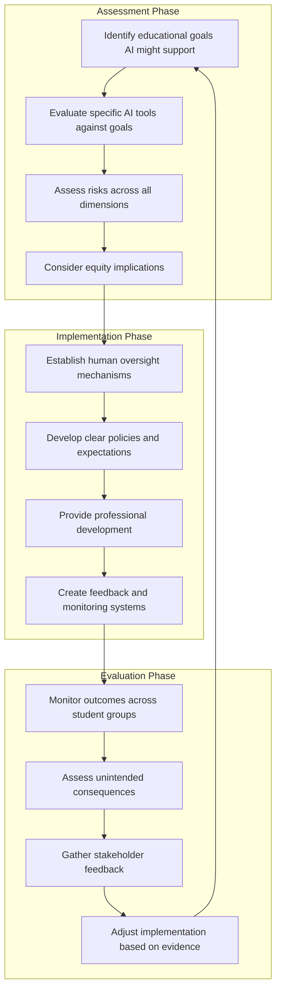

**Key Decision Questions**

Before implementing any AI tool, educators should consider:

1. **Educational purpose**: What specific learning goals does this tool support?
2. **Evidence base**: What evidence exists regarding effectiveness and risks?
3. **Equity implications**: How will this affect different student populations?
4. **Privacy requirements**: What data is collected and how is it protected?
5. **Human oversight**: How will teachers maintain appropriate oversight?
6. **Student development**: Does this support or undermine essential skill development?
7. **Relationship preservation**: How will human connections be maintained?

#### 7.8.4 The Path Forward

The challenges examined in this chapter are serious but not insurmountable. The Brookings report characterizes documented damages as **"daunting"** but notably **"fixable"**[^86]. Responsible AIGC integration requires:

**Ongoing Vigilance**

AI integration is not a one-time decision but an ongoing process requiring continuous monitoring, evaluation, and adjustment. As AI capabilities evolve, so too must governance frameworks, pedagogical approaches, and institutional safeguards.

**Adaptive Governance**

Effective governance must be adaptive, responding to new developments while maintaining core commitments to student welfare. The European Commission's planned revision of AI guidelines to **"address the latest developments"**[^104] exemplifies this adaptive approach.

**Unwavering Commitment to Equity**

Throughout all AI implementation decisions, educational equity must remain paramount. AI has potential to either advance or undermine equity goals—the outcome depends on deliberate policy choices and sustained commitment to serving all students well.

**Preservation of Educational Values**

Ultimately, AI tools must serve rather than subvert educational purposes. The goal is not to maximize AI use but to optimize learning outcomes while protecting student welfare. Technology should enhance the fundamentally human enterprise of education, not replace it.

The evidence examined in this chapter demonstrates that responsible AIGC integration in K-12 education is possible but demanding. It requires clear-eyed acknowledgment of documented risks, robust safeguards against potential harms, and unwavering commitment to the educational values that technology should serve. When these conditions are met, AI can contribute to educational improvement. When they are not, AI may cause significant harm to the students it purports to serve. The choice between these outcomes lies with educators, administrators, and policymakers who must navigate these challenges with wisdom, vigilance, and steadfast commitment to student well-being.

## 8 Future Trends and Emerging Applications

This chapter projects the trajectory of AIGC applications in K-12 education based on current technological developments, emerging research, and documented implementation patterns from global case studies. Building upon the challenges and ethical considerations examined in Chapter 7, this analysis evaluates anticipated advances in multimodal AI, agentic AI systems, and specialized educational AI tools, examining how these developments may transform teaching and learning practices while addressing the imperative for responsible, human-centered integration. The chapter synthesizes expert predictions, market analyses, and research findings to provide educators and policymakers with a forward-looking framework for navigating the evolving AI landscape in K-12 settings.

The educational technology landscape is undergoing a profound transformation that extends far beyond incremental improvements to existing tools. As one analysis observes, we are **"moving beyond simple AI tools toward advanced 'agentic' AI systems—systems capable of possessing a degree of autonomy, making decisions, adapting to learners, and initiating actions proactively, rather than just responding to prompts"**[^108]. This shift represents a fundamental change in how AI can support teaching and learning, creating both unprecedented opportunities and significant responsibilities for educators, administrators, and policymakers. The evidence examined throughout this report demonstrates that the future of AI in K-12 education will be shaped not by technology alone, but by the deliberate choices made by educational stakeholders about how to integrate these powerful tools in ways that serve students, preserve human agency, and advance educational equity.

### 8.1 Multimodal AI and Immersive Learning Environments

The convergence of multimodal AI capabilities with immersive technologies represents one of the most transformative trends shaping the future of K-12 education. As AI systems become increasingly capable of processing and generating content across multiple modalities—text, images, audio, video, and 3D environments—their integration with augmented reality (AR), virtual reality (VR), and extended reality (XR) technologies promises to create learning experiences that were previously impossible at scale.

#### 8.1.1 Market Projections and Adoption Trajectories

Market analysis reveals **extremely high growth rates** anticipated across all three categories of immersive technology in education[^109]. The scale of projected investment is substantial: **AR shows a 43% increase in Compound Annual Growth Rate from an already existing global market size of $93.67 billion**, while **VR Education alone is predicted to reach $65.55 billion by 2032**[^109]. These projections reflect growing recognition that immersive technologies can address persistent educational challenges around engagement, accessibility, and experiential learning.

Current adoption patterns in higher education provide indicators of the trajectory K-12 may follow. Research indicates that **40% of Higher Education institutions have adopted XR for projects, 12% are using XR across multiple departments, and 90% of respondents said their adoption of XR will somewhat or significantly increase in the next five years**[^109]. The efficiency gains documented in research are compelling: one study from PwC found that **virtual learners completed training four times faster than those studying with traditional methods, and that they were four times more focused than e-learners**[^109].

The following table summarizes key immersive technology trends and their educational implications:

| **Technology** | **Growth Projection** | **Current Adoption** | **Primary Educational Applications** |
|---------------|----------------------|---------------------|-------------------------------------|
| Augmented Reality (AR) | 43% CAGR | Emerging in K-12 | Overlaying digital information on real-world objects, interactive textbooks |
| Virtual Reality (VR) | $65.55bn by 2032 | Pilot programs expanding | Virtual field trips, historical immersion, science simulations |
| Extended Reality (XR) | 90% expect significant increase | 40% of HE institutions | Complex skill training, collaborative virtual environments |

#### 8.1.2 AI-Enhanced Multimodal Learning Experiences

Looking toward 2025 and beyond, experts anticipate several key trends that will enhance the fusion of educators, AI, and multimodal learning[^110]. **AI-powered personalization enhanced by multimedia** will deliver personalized learning paths enriched with various content formats, adapting to individual learning styles—whether visual, auditory, or kinesthetic—to make education more engaging and effective[^110].

The expansion of multimodal learning experiences represents a significant shift in how educational content is delivered. Students will increasingly expect learning materials that **engage multiple senses**, with the integration of **short-form videos created and vetted by actual educators, interactive simulations, and audio content** catering to different learning preferences and making education more inclusive and effective[^110]. Multimodal AI models capable of **processing and analyzing complex documents including images, tables, charts, and audio** will enable additional applications in education, creating more responsive and engaging educational journeys[^110].

Practical applications of multimodal AI in K-12 contexts are already emerging. In 3D design education, for example, AIGC technology is **"profoundly transforming 3D modeling from a 'human-driven' to an 'intelligent generation' process"**[^111]. Students can now generate 3D geometry, topology, and texture mapping through natural language prompts, image inputs, or sketch instructions, significantly lowering the technical barrier and enabling non-specialists to participate in creative work[^111]. A documented case study involved students using platforms to generate characters from text prompts, cultivating competencies in **"Prompt writing, AI tool operation, and traditional software collaboration"**[^111].

#### 8.1.3 Immersive Classroom Implementations

Evidence from institutions implementing immersive learning technologies provides insights into their educational impact. Immersive learning environments that activate students' senses by **projecting the curriculum all around them** demonstrate higher engagement levels[^109]. Unlike other immersive learning tools that require headsets, some classroom implementations **"don't require additional equipment, meaning the teacher retains essential face-to-face feedback and control over the session"**[^109]—a critical consideration for maintaining human connection.

Practitioners report significant improvements in student understanding and engagement. Karen Anderton, Head of Teaching and Learning Academy at Wigan & Leigh College, stated: **"There's absolutely a higher level of engagement... They were saying they had a much better perception and understanding compared to a textbook, and that it enabled them to visualise spatial awareness and parameters that they wouldn't ever have been able to do if they didn't use an immersive experience"**[^109].

The accessibility benefits of immersive technology are particularly noteworthy. Purpose-built immersive classrooms can **remove existing barriers to VR and dampen known issues such as motion sickness**, while wraparound immersion **"gives access to facilities that would otherwise be too costly, or logistically impossible, to use"**[^109]. Professor Daniel Lang of Karlsruhe Institute of Technology observed: **"I think a huge benefit is that it can be used by non-experts... It also really complements the super abstract that we often have in science, and the very, very concrete and contextualised"**[^109].

#### 8.1.4 Considerations for Immersive Technology Integration

When evaluating immersive technology options for K-12 settings, educators should focus on three critical areas: **ease-of-use, cross-curriculum buy-in, and long-term value**[^109]. Emergent technologies can often be seen as difficult to use, so it is important to consider whether systems are prohibitively difficult for teachers to operate or whether they fit seamlessly into existing lesson plans. Many immersive technologies have a narrow focus but don't provide value across the entire curriculum, limiting their utility. Finally, selecting systems that will remain fundamental to teaching for years to come ensures sustainable investment[^109].

The integration of immersive technologies must also address equity concerns. As documented in Chapter 7, the digital divide extends beyond simple device access to encompass quality of tools and capacity for effective use. Schools implementing immersive learning must ensure that these powerful technologies do not become yet another dimension along which educational opportunity diverges.

### 8.2 Agentic AI Systems: Autonomous Tutoring, Coaching, and Administrative Agents

Perhaps the most significant technological shift on the horizon involves the emergence of **agentic AI**—AI systems that operate with a degree of independence, making decisions and taking actions to achieve specified goals in education without constant human input[^112]. Unlike simple chatbots or static software, agentic AI systems can **perceive context and act independently toward goals**, autonomously adjusting lesson plans or proactively reaching out to struggling students[^112].

#### 8.2.1 Understanding Agentic AI in Educational Contexts

Several factors have converged to enable the emergence of agentic AI in education. **Generative AI breakthroughs have made conversational and adaptive agents more capable**; the post-pandemic digital shift created rich data streams and openness to AI-driven solutions; market and student demand—with **86% of college students already using AI tools in their coursework**—pressures institutions to integrate AI; and institutional initiatives such as university partnerships with AI companies signal a move to enterprise-level deployment[^112].

The AI Guidance for Schools Toolkit distinguishes between three types of AI tools increasingly present in educational settings[^113]:

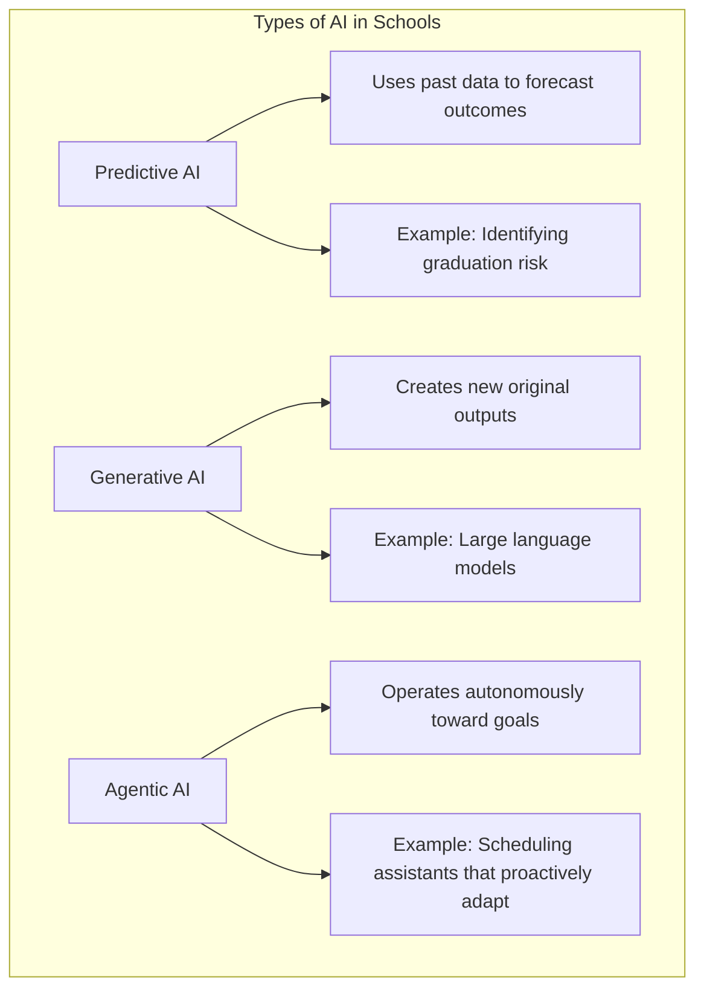

Agentic AI tools are distinguished by their capacity to **"operate autonomously to pursue goals and carry out tasks"**—they don't just analyze or generate information; they act on it[^113]. For example, a scheduling assistant might **proactively rearrange students' study plans or automatically coordinate parent-teacher conferences based on real-time changes**[^113]. These systems are **continuously trained on new information, update their strategies, and autonomously take further actions**[^113].

#### 8.2.2 Key Use Cases for Agentic AI in K-12 Education

Research identifies several primary use cases where agentic AI can enhance learning and administration[^112]:

**Autonomous Tutoring and Coaching Agents**

AI agents can serve as **24/7 tutors or coaches for students**, simulating human-like help in real time[^112]. A conversational AI tutor agent can be available whenever a student has a question, **answering subject matter questions, explaining concepts, and walking through problem-solving steps**. These tutoring agents operate independently, **proactively offering hints if a student seems stuck**[^112]. Using past performance data and curriculum knowledge, the agent tailors its guidance to individual needs. Pilot programs demonstrate that these AI tutors **"provide instant support limited by faculty office hours, boosting student confidence and performance by providing timely, personalized help"**[^112].

**Student Services and Retention Support**

Agentic AI systems can monitor student engagement patterns and proactively intervene when students show signs of disengagement or academic difficulty. These systems can coordinate support services, schedule interventions, and ensure students receive timely assistance without requiring constant human monitoring.

**Instructor Co-Pilot and Content Creation**

Teachers can leverage agentic AI as collaborative partners that assist with lesson planning, material creation, and real-time instructional adaptation. These systems can suggest modifications based on student performance data and help teachers respond more effectively to diverse learning needs.

**Administrative Process Automation**

Beyond instructional applications, agentic AI can automate administrative processes including scheduling, communication, and record-keeping, freeing educators to focus on teaching and relationship-building.

#### 8.2.3 Implementation Roadmap for Agentic AI

Implementing agentic AI requires a deliberate, phased approach that starts small, proves value, and scales responsibly[^112]. The recommended implementation roadmap proceeds through three phases:

**Phase 1: Pilot Projects**

Starting with focused pilots allows institutions to test technology in limited settings. Key steps include:
- Choosing a use case with a **clear pain point and available data**, such as an AI tutoring agent in an introductory course
- Defining **success metrics up front**, like improvement in test scores or reduction in instructor office hours utilization
- Preparing data and integration, ensuring the agent has access to needed data with **privacy compliance**
- Running the pilot in a **controlled environment** with a limited user group for a manageable duration
- Gathering feedback and iterating, **documenting outcomes for evidence to expand**[^112]

**Phase 2: Program Expansion**

With successful pilot results, expansion involves:
- Securing **leadership buy-in and funding** by presenting pilot results
- Forming an **AI task force** for cross-functional coordination
- Implementing **training and change management** for teachers and staff
- Conducting **gradual rollout with close monitoring**
- Strengthening integrations and infrastructure for production-grade setup
- Updating **policies and governance** based on pilot learnings[^112]

**Phase 3: Campus/Product Scale**

Full-scale implementation focuses on:
- **Enterprise deployment** for all relevant users
- Ensuring **scalability and performance** to handle peak loads
- Implementing **continuous monitoring** and automated dashboards for quality assurance
- Providing **ongoing training and support** incorporated into orientation
- **Evolving governance and policy** to address new scenarios and regulations
- Measuring **long-term impact** on strategic goals and calculating ROI
- **Continuous innovation**, adding new agent use cases based on solid foundation[^112]

#### 8.2.4 Governance and Safeguards for Agentic AI

The autonomous nature of agentic AI systems raises critical governance considerations that must be addressed proactively.

**Preventing Misuse**

Strategies for ensuring students don't misuse AI agents include **clear usage policies, integrating AI detectors and plagiarism checkers, designing agents with guardrails to give hints but not complete assignments, updating honor codes, and changing assessment methods**[^112].

**Data Privacy Compliance**

AI agents should be governed by the same data privacy rules as any system handling student records, with **role-based access control, data minimization, appropriate consent, and logging of all access for compliance with FERPA and GDPR**[^112].

**Handling Mistakes and Bias**

Institutions must set expectations that AI output can have errors, implement **monitoring and human-in-loop processes**, provide sources for answers, run **regular audits for bias**, adjust prompts or retrain models, and maintain **feedback channels for users to report issues**[^112].

**The Human Oversight Imperative**

Critically, agentic AI systems do not replace teachers or staff. The aim is **augmentation**—handling repetitive tasks to free up teachers and staff for mentoring and complex problem-solving, with **human roles evolving but remaining critical**[^112]. This principle aligns with the U.S. Department of Education's emphasis on maintaining **"humans in the loop"** to ensure people remain responsible for educational decisions[^4].

### 8.3 The Evolving Role of Teachers in AI-Augmented Classrooms

As AI technologies become increasingly capable of handling routine instructional tasks, the role of educators is undergoing fundamental transformation. This shift represents not a diminishment of teacher importance but rather a redefinition of where human expertise adds the greatest value in educational processes.

#### 8.3.1 From Information Provider to Learning Facilitator

The integration of AI is repositioning teachers from primary information providers to **learning facilitators and mentors**[^114]. As AI takes over repetitive tasks, teachers' focus will move toward **"guiding students in how to question, analyze, and apply information critically—skills AI cannot replicate"**[^114]. This transformation reflects a broader recognition that the uniquely human dimensions of education—relationship building, ethical guidance, emotional support, and the cultivation of wisdom—become more rather than less important as AI handles routine content delivery.

South Korea's AI digital textbook initiative explicitly positions this change as **teacher-led**, with educators taking on new roles as facilitators who shift **"from transmitting knowledge to facilitating learning through projects and problem-solving"**. Teachers will focus more on **"mentoring, coaching, and fostering critical thinking skills"** while AI handles routine content delivery. Teachers receive an AI **"teaching assistant"** that helps **"diagnose learning paths, deliver content recommendations, and provide personalized learning support"**, enabling them to concentrate on higher-value activities.

The transformation extends beyond instructional roles. AI-driven tools will **"allow teachers to offload mundane administrative tasks"** and provide them **"more energy to be at the 'heart and soul' of the classroom"**[^110]. This reallocation of teacher time and attention toward relationship-building and individualized support represents one of AI's most significant potential contributions to educational quality.

#### 8.3.2 Essential Competencies for AI-Augmented Teaching

Educators in AI-augmented environments will need to develop new competencies that enable them to leverage AI effectively while preserving the human dimensions of teaching.

**AI Literacy as Professional Foundation**

The rapid adoption of AI by teachers—from **approximately 18% in late 2023 to about 60% by February 2025**—demonstrates growing engagement with these tools[^115]. However, many teachers remain cautious: in 2023, **approximately 25% of teachers believed that using AI tools in K-12 education causes more harm than good**[^115]. Developing sophisticated AI literacy that enables informed, critical engagement with AI tools is essential for effective integration.

Pre-service teachers will soon teach students entering a workforce where **AI fluency is critical**[^115]. New teachers must understand how to:
- Leverage AI tools to create **innovative and transformative lesson plans**
- **Personalize and differentiate instruction** to meet diverse student needs
- **Optimize administrative tasks** to improve efficiency[^115]

**The ISTE+ASCD Initiative**

Recognizing the urgency of teacher preparation, ISTE+ASCD partnered with Microsoft to launch the **"Transforming Teacher Preparation" global initiative** to equip future educators with essential AI skills[^115]. The initiative includes a five-hour online module, **"Artificial Intelligence for Tomorrow's Teachers"**, available in English, Spanish, and Arabic, helping pre-service teachers develop foundational AI knowledge, practice using AI tools, and implement innovative strategies for transforming teaching[^115].

The module guides educators through five sections: understanding AI, developing AI skills, teaching with AI, using AI responsibly, and teaching AI knowledge[^115]. By June 2027, the initiative aims to upskill **over 15,500 faculty and pre-service teachers**[^115].

**Three Innovative Practices for AI Integration**

The module highlights three exemplary practices for AI-augmented teaching[^115]:

| **Practice** | **Description** | **Key Considerations** |
|-------------|-----------------|----------------------|
| **Personalized Learning** | Using AI to implement differentiated strategies meeting individual student needs and interests | Aligns with "connecting learning with learners" principle |
| **Protecting Student Information** | Maintaining legal and ethical responsibility to safeguard student data when implementing AI | Requires reading privacy policies and using expert verification resources |
| **Cultivating Digital Citizenship** | Developing students as engaged digital citizens who can critically evaluate AI-generated content | Includes understanding AI bias and making ethical decisions about AI use |

#### 8.3.3 Technological Apprenticeship and Professional Learning

Research emphasizes that **"pre-service and in-service teachers do not magically learn to teach with technology; they need to see exemplars modeled and have authentic opportunities to practice in low-risk environments"**[^116]. This creates a **"technological apprenticeship of observation"** where teachers develop competence through guided experience[^116].

The Technological Pedagogical Content Knowledge (TPACK) framework offers a comprehensive approach to developing teacher knowledge and skills for technology integration, providing **"a neutral way to examine teachers' knowledge without privileging specific learning theories"**[^116]. However, effective professional development must go beyond theoretical frameworks to provide sustained, job-embedded support for implementation.

Research on future directions for K-12 technology-enhanced learning emphasizes the need for **collaboration and sharing expertise**[^116]. During COVID-19, teachers heavily relied on **"personalized learning networks, social media, YouTube, and district resources"** to find examples of technology use[^116]. This highlights the importance of building communities of practice where educators can learn from one another's experiences with AI integration.

#### 8.3.4 Preserving the Human Core of Teaching

As AI capabilities expand, the distinctively human contributions of teachers become more rather than less important. Good AI use requires **"care and clear intent"**—as these tools become more capable, **"schools' responsibility becomes greater"**[^108]. AI must be used in ways that **"enhance learning, protect fairness and trust, support safeguarding, and uphold equity and ethics"**[^108].

The teacher's role in AI-augmented classrooms centers on capabilities that AI cannot replicate:

- **Relational knowledge**: Understanding individual students as whole persons
- **Professional judgment**: Making contextual decisions about when and how to intervene
- **Human care**: Providing emotional support and mentorship
- **Ethical guidance**: Helping students navigate complex moral questions
- **Cultural responsiveness**: Adapting instruction to diverse backgrounds and needs

As one analysis emphasizes, **"students must remain active, critical thinkers, ethically aware and guided by human judgment, rather than being passively steered by algorithms"**[^108]. AI should **"empower learners, not subtly steer them without transparency"**[^108].

### 8.4 Emerging Application Domains and Specialized Educational AI Tools

Beyond the broad trends of multimodal and agentic AI, specific application domains are emerging where AIGC is expected to expand significantly in K-12 education. These specialized applications address particular educational needs and opportunities, from social-emotional learning to career preparation.

#### 8.4.1 AI for Social-Emotional Learning and Student Support

Looking ahead, **"the use of AI in education is rapidly evolving, with exciting new trends emerging"**[^117]. One notable trend is the increasing use of AI for **social-emotional learning, helping students develop crucial skills like self-awareness and empathy**[^117]. AI systems can support identification of students who may be struggling emotionally, provide scaffolded support for developing social skills, and help teachers understand patterns in student well-being.

AI applications for student support extend to accessibility and inclusion. For students with additional learning needs—such as dyslexia or English as an additional language—AI can provide **"text-to-speech, real-time translation, reading support, and structured guidance"**[^108]. Systems can **dynamically adjust support**, helping students build confidence without drawing attention to differences[^108]. This capability represents a powerful application for **"creating truly inclusive classrooms"**[^108].

AI-driven simulations, adaptive quizzes, and virtual tutors can make learning **"more interactive and responsive"**[^108]. When designed ethically, these tools can encourage curiosity and independence rather than promoting passive consumption, helping students **"take ownership of their learning journey"**[^108].

#### 8.4.2 Gamification and Adaptive Game-Based Learning

Gamification—the use of game-like elements in education—will remain a major trend as schools seek to increase student engagement and motivation[^118]. Educational games and interactive platforms will combine learning and entertainment to make lessons more enjoyable and effective. **Gamified platforms will turn math problems, vocabulary lessons, and science experiments into engaging challenges and quests**, while teachers use **digital rewards, leaderboards, and points systems** to encourage student participation and achievement[^118].

The integration of AI with gamification creates particularly powerful possibilities. AI can provide **points for rethinking approaches or adapting strategies that extend beyond specific tasks**, making game-based learning more responsive to individual learning processes[^119]. Adaptive learning technologies will continue to **"personalize curriculum and assessment, creating a more responsive and engaging educational journey that reflects each student's strengths and growth areas"**[^110].

The following table summarizes emerging AI tools and their educational applications:

| **Tool Category** | **Representative Examples** | **Primary Functions** | **Educational Value** |
|------------------|---------------------------|----------------------|----------------------|
| AI Lesson Planning | Google Gemini, Custom Gems, EduGems | Generate lesson plans, create personalized chatbots | Efficiency, customization |
| Content Creation | Notebook LM, Google Vids | Create summaries, study guides, videos | Engagement, accessibility |
| Audio/Music | Sodaphonic, Suno | Edit audio, create original songs | Creative expression, multimodal learning |
| Visual Creation | Sketchpad | Digital canvas for diagrams, posters | Visual learning, creativity |
| Classroom Management | Classroom Zen | Breathing exercises, noise management | Well-being, focus |

Source: Adapted from analysis of top teacher tech tools[^120]

#### 8.4.3 AI-Powered Career and Technical Education

As businesses increasingly demand employees with AI skills, K-12 career and technical education (CTE) programs are beginning to integrate AI into curricula[^121]. South Carolina is developing an **AI-focused K-12 CTE pathway** in collaboration with the Southern Regional Education Board, designed to prepare students for the workforce by teaching industry-specific use cases and providing AI skills[^121]. The program includes four units completed over four years, with students exploring basic AI concepts, building AI solutions, and taking certification exams[^121].

However, most schools remain in early stages of thinking about AI integration in CTE programs. Experts emphasize that CTE programs should focus on **"skills rather than technology itself"**—including **adaptability, collaboration, communication, creativity, critical thinking, leadership, and problem-solving**[^121]. These transferable skills will remain valuable even as specific technologies evolve.

A major challenge is that **AI technology changes too quickly for schools to keep up**[^121]. As one CTE executive director observed, **"work positions are changing so fast that educators must adapt to prepare students for future jobs that may not yet exist"**[^121]. This reality underscores the importance of focusing on foundational competencies rather than specific tools.

#### 8.4.4 AI Literacy as Core Curriculum

The push for AI literacy is gaining momentum across educational systems. There is a **nationwide push for teachers and students to develop AI literacy—an understanding of how AI works and how to use it ethically**—with initiatives including a National AI Literacy Day[^122]. As schools adopt AI tools, many states have issued guidance; **around 28 states have published AI guidance for K-12 schools**[^122].

AI will play **"an even larger role in education, particularly in test preparation and course planning"**[^110]. By leveraging data and predictive analytics, AI-driven tools will help students and educators create **more tailored and effective learning pathways**, enhancing the overall educational experience[^110]. However, this expansion must be accompanied by comprehensive education about AI capabilities, limitations, and ethical implications.

### 8.5 Policy Evolution and Governance Frameworks for Future AI Integration

The rapid advancement of AI capabilities in education necessitates corresponding evolution in regulatory frameworks, institutional policies, and governance structures. This section examines anticipated policy trends and the governance challenges that lie ahead.

#### 8.5.1 Increasing Accountability for EdTech Providers

In 2026 and beyond, school districts will need to use **"a sharper and more critical lens when vetting new apps and services, especially those powered by artificial intelligence"**[^123]. EdTech companies are likely to face **more aggressive accountability measures at state and federal levels** as lawmakers focus on stricter student data privacy measures[^123].

Several regulatory developments are already underway:
- In April, companies must start fully complying with updates to the **Children's Online Privacy Protection Rule (COPPA)**, requiring vendors to provide direct notice to schools on data collection and use, limiting data retention periods[^123]
- **18 bills implementing new federal online protections for children and teens** advanced to the House Energy and Commerce Committee[^123]
- Ongoing state investigations and federal settlements over data breaches at providers signal more enforcement ahead[^123]

Districts will need to **arrange working groups that track legal developments in student data privacy and AI regulations**[^123]. The emphasis on student data privacy is paramount, with concerns about **lack of transparency among some EdTech companies about how their models are trained, where data comes from, and how it is stored**[^123].

#### 8.5.2 Critical Evaluation of AI Tools Amid Budget Constraints

As districts face budget challenges amid enrollment declines, they will have to make **tough decisions when purchasing AI tools**[^123]. Schools will soon have to grapple with **paying for AI tools that were once free**[^123]. The example of Denver Public Schools, which carved out local funding to pay for MagicSchool AI based on teacher requests for an ethical and safe AI system, illustrates how districts are navigating these decisions[^123].

District EdTech leaders must scrutinize the **large language models that AI EdTech tools rely on**, especially regarding protecting sensitive student data[^123]. A Digital Promise analysis found that **only a handful of states and localities are exploring small-scale pilots measuring the impact of expanding AI tools for student outcomes**[^123]. This gap between adoption and evaluation represents a significant governance challenge.

#### 8.5.3 The Urgent Need for Comprehensive AI Guidance

The AI Guidance for Schools Toolkit emphasizes that in 2025, **"many educational systems still face an urgent call to provide clear, structured guidance for the integration of artificial intelligence in schools"**[^113]. According to data from the RAND American Educator Panel, **only 18% of U.S. principals reported that their schools or districts had provided guidance on AI use**, with even lower rates in high-poverty schools where **just 13% had such support compared to 25% in more affluent areas**[^113].

As of April 2025, **only 26 U.S. States have issued guidance**[^113]. While nearly one in five teachers used AI tools for instruction, the disparity in access to guidance and training reflects a systemic challenge. At the same time, **74% of students across Europe believe AI will be critical to their future careers, yet fewer than half feel their schools adequately prepare them** to engage with these technologies[^113].

State guidance on generative AI use shows that **all twenty-five states that have issued guidance mention data privacy or data privacy principles**[^124]. Common focus areas include:
- **Compliance with Federal and State Laws**: About 20 states reference FERPA, COPPA, CIPA, IDEA, and local laws
- **Data Minimization Principles**: About 12 states stress avoiding inputting personally identifiable information into AI systems
- **Data Security**: About 21 states list data security concerns as a focus
- **Transparency and Parental Consent**: About 10 states mention need for transparency
- **AI-Specific Bias Risks**: About 13 states mention ethical concerns around bias[^124]

However, the most effective guidance must be **"specific, actionable, and in context"**[^124]. An overwhelming majority of existing guidance surrounding data privacy is superficial. State guidance that highlights the need for "establishing strong safeguards" without detailing what those safeguards should be provides limited utility for school leaders[^124].

#### 8.5.4 Cybersecurity Challenges and Federal Resource Gaps

Schools will remain vulnerable to cyberattacks as federal resources dwindle[^123]. In 2025, critical federal resources supporting school cybersecurity were eliminated, including K-12 programs through the Multi-State Information Sharing and Analysis Center that provided free supports to monitor and block malicious threats. The closure of the federal Office of Educational Technology and K-12 cybersecurity work groups further reduced support[^123].

There are fears that **cybercriminals will use AI to target schools**, though under-resourced schools may use AI to identify their own network vulnerabilities[^123]. A final rule from the Cybersecurity and Infrastructure Security Agency is expected to require school districts with 1,000 or more students and all state education agencies to **report disruptive cyber incidents within 72 hours**[^123].

The cautionary tale of the Los Angeles School District's AI chatbot failure illustrates the risks of inadequate governance[^125]. Despite millions in public funding, the chatbot **failed to meet objectives and potentially exposed sensitive student data due to inadequate risk management and vendor oversight**. The founder was later charged with fraud, highlighting **critical gaps in AI governance, accountability, and transparency**[^125]. This case demonstrates the urgent need for educational institutions to implement **robust AI governance frameworks that prioritize student safety, ethical use of data, and accountability from technology vendors**[^125].

### 8.6 Preparing K-12 Education for an AI-Transformed Future

This section synthesizes the projected trends and emerging applications to provide a strategic framework for K-12 stakeholders preparing for an AI-transformed educational landscape. The analysis addresses the balance between embracing technological innovation and preserving the fundamentally human purposes of education.

#### 8.6.1 Three Plausible Futures for K-12 Education

On January 21, 2026, a coalition of national K-12 education leaders launched **"Beyond the AI Inflection Point,"** an initiative exploring three plausible futures for K-12 education designed to equip leaders with clarity and tools to shape a future that best serves students[^126]:

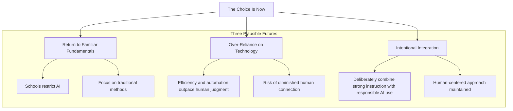

The initiative provides **research-informed narrative and practical frameworks** to help district and state leaders move from reactive policies to forward-looking strategies[^126]. The message is clear: **"Artificial intelligence is no longer a hypothetical for schools—it is already shaping how students learn, teachers teach, and employers hire"**[^126]. The moment to choose is now.

#### 8.6.2 Developing AI-Proof Skills

While K-12 education has traditionally focused on core academic subjects, it often overlooks a critical component: **transferable AI-proof skills**[^127]. These versatile competencies—such as critical thinking, adaptability, and resilience—are increasingly vital in an AI-driven world. By shifting focus to these adaptive skills in K-12 curriculum, educators can **bridge the gap between classroom learning and real-world demands**[^127].

The traditional model of education is outdated as **the pace of technological change means that many of the jobs today's students will hold in the future do not yet exist**[^127]. The traditional model does not account for the diverse range of skills and competencies needed in modern life, including AI-proof skills like **critical thinking, creativity, and collaboration**[^127].

To prepare students for an AI-driven future, education needs **a fundamental shift in approach**[^127]. Rather than focusing solely on content knowledge, educators must prioritize the development of AI-proof skills from an early age. This new mindset emphasizes cultivating abilities that machines cannot easily replicate:

| **AI-Proof Skill** | **Why It Matters** | **How to Develop** |
|-------------------|-------------------|-------------------|
| Critical Thinking | Evaluating AI outputs, identifying bias | Analysis activities, questioning exercises |
| Creativity | Generating original ideas AI cannot replicate | Project-based learning, creative expression |
| Emotional Intelligence | Building relationships, understanding context | Collaborative work, social-emotional learning |
| Complex Problem-Solving | Addressing novel, ill-defined challenges | Real-world projects, design thinking |
| Adaptability | Responding to rapid change | Agile learning approaches, iterative projects |

Employers increasingly value these human-centric, AI-proof abilities, and by cultivating them early, educators can address the growing skills gap in the workforce[^127].

#### 8.6.3 The Agile Classroom Model

Implementing Agile principles in K-12 education offers one solution to developing AI-proof, job-ready skills[^127]. Agile's core principles of **iterative development, collaboration, and continuous improvement** align with the needs of modern learners:

- **Agile classrooms break learning into small, manageable units or sprints**, each focusing on a specific topic or skill, mirroring the fast-paced, ever-changing nature of modern workplaces
- **Teamwork and collaboration are emphasized**, fostering communication, leadership, and interpersonal skills—all highly valued in any career and inherently AI-proof
- **Agile encourages a mindset of continuous improvement**, teaching students to reflect on their learning—essential for lifelong learning
- **Project-based, collaborative learning environments** provide ample opportunities to develop creativity, critical thinking, and complex problem-solving[^127]

Implementation requires teachers to adopt **coaching techniques that encourage student-driven learning**, shifting from a content-push model to a skills-pull approach[^127]. Assessment methods should evolve to include **continuous feedback and reflection**[^127].

#### 8.6.4 The Deepest Shift: Cultural Transformation

Looking forward, **the most profound shift may not be technological but cultural**[^128]. Through microlearning, modular projects, and enterprise-sponsored upskilling, continuous education is becoming normalized, indicating that **learning no longer confines itself to classrooms or age brackets**[^128]. This shift requires rethinking how success is measured, how knowledge is certified, and how learners are supported throughout their lives.

The redefinition of the educator's role represents another fundamental change. As content delivery becomes increasingly automated, the **human element in education—mentoring, empathy, and personalized support—becomes more important**[^128]. This shift requires new training models for educators and renewed focus on soft skills now embedded in curricula to meet evolving workforce demands[^128].

#### 8.6.5 Guiding Principles for the Path Forward

The U.S. Department of Education's 2023 report provides seven recommendations that offer enduring guidance for navigating the AI-transformed future[^4]:

1. **Emphasize Humans-in-the-Loop** to ensure people remain responsible for educational decisions
2. **Align AI Models to a Shared Vision for Education**, interrogating their fit to educational goals and priorities like equity
3. **Design Using Modern Learning Principles**, moving beyond deficit-based, individualistic adaptivity to approaches that are social, asset-oriented, and culturally responsive
4. **Prioritize Strengthening Trust** by addressing safety, usability, and efficacy concerns
5. **Inform and Involve Educators** in all stages of designing, developing, and evaluating AI tools
6. **Focus R&D on Addressing Context and Enhancing Trust and Safety**, particularly for diverse learners and settings
7. **Develop Education-Specific Guidelines and Guardrails** that go beyond existing privacy laws to address new issues like bias and transparency[^4]

These recommendations reflect the core insight that **AI should not replace teachers but serve as auxiliary tools**, reducing administrative burdens and enabling educators to focus on students[^4]. The policy emphasis on **"human in the loop"** ensures that teachers, learners, and others retain agency in determining the meaning of AI outputs and choosing courses of action[^4].

#### 8.6.6 The Promise and Responsibility Ahead

AI in education represents a **transformative opportunity** that can personalize instruction, expand access, and empower both students and teachers[^114]. Realizing this potential requires **careful attention to ethics, equity, and teacher training**. If developed responsibly, AI will enhance human educators, creating classrooms that are **more adaptive, inclusive, and future-ready**[^114].

The evidence examined throughout this report demonstrates that the future of AI in K-12 education is not predetermined. It will be shaped by the choices made by educators, administrators, policymakers, and communities about how to integrate these powerful technologies. The path of **intentional integration**—deliberately combining strong instruction with responsible, human-centered use of AI—offers the most promising route to realizing AI's educational potential while protecting the human dimensions of learning that remain irreplaceable.

As one researcher concluded, **"AI has a lot of potential to do good in education, but we have to be very intentional about its implementation"**[^129]. We must ensure that **all students and all teachers have access to high-quality learning opportunities**[^129]. The future belongs to those who approach AI not as an inevitable force to be accommodated but as a powerful tool to be wielded thoughtfully in service of educational purposes that remain fundamentally human.

## 9 Recommendations for Educators and Educational Stakeholders

This chapter synthesizes the comprehensive findings from global case studies, implementation evidence, and emerging trends examined throughout this report into actionable, stakeholder-specific recommendations for responsible AIGC integration in K-12 education. The analysis provides differentiated guidance tailored to the distinct roles, responsibilities, and decision-making contexts of classroom teachers, school administrators, curriculum designers, and policymakers, while addressing variations across school levels, resource contexts, and pedagogical objectives. Grounded in the human-centered principles established in preceding chapters, these recommendations emphasize preserving teacher agency, protecting student welfare, advancing educational equity, and ensuring that AI technologies serve rather than subvert authentic learning purposes.

The evidence examined throughout this report reveals a fundamental truth: **the effectiveness of AIGC in K-12 education depends not on the sophistication of the technology itself, but on the wisdom with which educators and educational systems integrate these tools into practice**. The global case studies demonstrate that successful implementations share common characteristics—clear pedagogical purpose, robust human oversight, attention to equity, and sustained professional support—while unsuccessful implementations typically suffer from inadequate preparation, unclear expectations, or prioritization of efficiency over learning. The recommendations that follow translate these insights into practical guidance for the diverse stakeholders who collectively shape how AI enters and influences K-12 classrooms.

### 9.1 Recommendations for Classroom Teachers: Selecting, Implementing, and Evaluating AIGC Tools

Classroom teachers occupy the most critical position in the AIGC integration landscape, serving as the essential bridge between AI capabilities and student learning. The evidence from global implementations consistently demonstrates that teacher judgment, pedagogical expertise, and ongoing oversight determine whether AI tools enhance or undermine educational outcomes. This section provides practical guidance for navigating the complex AIGC landscape while maintaining focus on authentic student learning.

#### 9.1.1 Framework for Evaluating and Selecting AI Tools

The proliferation of AI tools targeting education—with platforms like MagicSchool, Brisk Teaching, SchoolAI, and dozens of others competing for teacher attention—creates both opportunity and confusion. Teachers need systematic frameworks for evaluating which tools merit adoption and which should be avoided.

**Core Evaluation Questions**

Before adopting any AI tool, teachers should systematically address the following questions:

| **Evaluation Dimension** | **Key Questions** | **Red Flags** |
|-------------------------|-------------------|---------------|
| **Pedagogical Alignment** | Does this tool support my specific learning objectives? Will it enhance or bypass essential learning processes? | Tool promises to "do the work" rather than support learning |
| **Curricular Coherence** | Does the tool align with my curriculum standards and instructional sequence? | Generic outputs disconnected from grade-level expectations |
| **Student Appropriateness** | Is this tool developmentally appropriate for my students? What scaffolding will be required? | No differentiation for age or ability level |
| **Data Privacy** | What student data does this tool collect? How is it stored and used? | Vague privacy policies, data used for AI training |
| **Accuracy and Reliability** | How accurate are the tool's outputs? What verification processes are needed? | No acknowledgment of potential errors or hallucinations |
| **Integration Feasibility** | Can this tool be integrated into my existing workflow without excessive burden? | Requires complete restructuring of established practices |

**The "Pedagogical Purpose First" Principle**

The most effective AI tool selection begins not with technology features but with **clear identification of pedagogical needs**. Teachers should ask: "What specific challenge am I trying to address?" rather than "What can this AI tool do?" The Lamont Elementary implementation demonstrated this principle effectively—educators used Inkwire specifically because it addressed their need for project-based learning design aligned with district frameworks, while using ChatGPT for different purposes where it excelled.

Teachers should resist the temptation to adopt tools simply because they are available or popular. The evidence from the Camden case studies suggests that **selective adoption based on teacher initiative and specific departmental needs, rather than whole-school implementation, is the current viable path**. Starting with one or two tools that address clear needs allows teachers to develop competence before expanding their AI toolkit.

#### 9.1.2 Strategies for Integrating AI into Daily Instructional Practice

Effective AI integration requires more than tool adoption—it demands thoughtful incorporation into existing instructional routines in ways that enhance rather than disrupt effective teaching practices.

**The Teacher-as-Intermediary Model**

For most classroom applications, teachers should position themselves as **critical intermediaries** between AI-generated content and students. This means:

- **Reviewing all AI-generated materials** before student exposure to verify accuracy, appropriateness, and alignment with learning goals
- **Adapting and contextualizing** AI outputs to fit specific classroom contexts and student needs
- **Modeling critical evaluation** of AI content, demonstrating the questioning stance students should develop
- **Maintaining ownership** of instructional decisions while using AI to enhance efficiency

The PVSchools implementation of NoRedInk's Grading Assistant exemplifies this model effectively: the AI evaluates student writing and suggests scores and feedback, but **the teacher reviews, edits, and approves the feedback before students see it**. This workflow captures AI's efficiency benefits while preserving teacher judgment and relationship.

**Strategic Time Allocation**

The time saved through AI assistance should be deliberately reallocated to high-value activities that AI cannot perform. Research indicates that teachers using AI grading assistants report **40% reductions in grading time**—but the educational value of this efficiency depends on how that recovered time is used. Teachers should prioritize:

- **Deeper individual interactions** with students who need additional support
- **More substantive feedback** on complex work requiring human judgment
- **Relationship building** that strengthens the teacher-student connection
- **Professional reflection** on instructional effectiveness and student progress

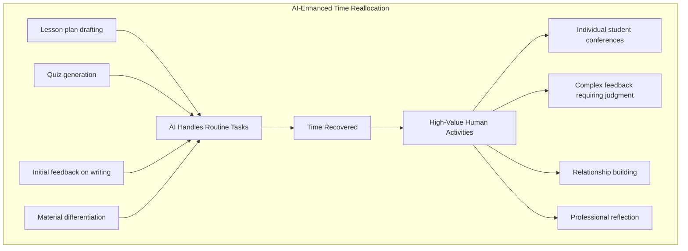

#### 9.1.3 Differentiating AI Use Across Grade Levels and Student Populations

The appropriateness of AI integration varies significantly across developmental stages and student populations, requiring teachers to calibrate their approaches accordingly.

**Elementary Grades (K-5): Teacher-Facing Priority**

For younger students, AI should primarily serve as a **teacher-facing tool** that enhances instruction without direct student-AI interaction. Recommendations include:

- Use AI for **lesson planning, material creation, and differentiation** while students engage with teacher-curated content
- Introduce AI concepts through **age-appropriate discussions** about how AI works without requiring direct tool use
- Protect **foundational skill development** in literacy and numeracy by ensuring AI doesn't bypass essential practice
- Build **conceptual AI awareness** using resources like the AI4K12 picture book series on the "Five Big Ideas" of AI

**Middle School (6-8): Guided Engagement**

Middle school students can begin more substantive AI engagement with appropriate scaffolding:

- Introduce AI tools in **structured activities with clear parameters** and teacher oversight
- Focus on **critical analysis of AI outputs** as an object of study, not just a resource
- Develop **evaluation skills** for identifying errors, bias, and limitations in AI-generated content
- Use AI for **brainstorming and idea generation** while requiring students to develop and refine ideas independently

**High School (9-12): Collaborative Partnership**

High school students can engage with AI as collaborative partners within clear ethical guidelines:

- Allow **more independent AI use** with transparency requirements about when and how AI is used
- Require **documentation of AI collaboration** processes, not just final products
- Develop **sophisticated critical evaluation** of AI capabilities and limitations
- Connect AI use to **career preparation** and workplace expectations

**Supporting Diverse Learners**

AI tools offer particular value for supporting students with diverse learning needs:

- For **English Language Learners**: Use AI for scaffolded access to grade-level content, text-to-speech support, and language practice
- For **students with disabilities**: Leverage AI for format conversion, reading support, and personalized accommodations
- For **advanced learners**: Use AI to generate extension activities and enrichment materials

However, teachers must monitor for **algorithmic bias** that may disadvantage certain student groups and ensure AI tools do not replace the human support these students need.

#### 9.1.4 Preserving Authentic Skill Development

Perhaps the most critical responsibility teachers bear is ensuring that AI assistance does not undermine the development of fundamental skills. The evidence of a **"doom loop of AI dependence"** where students increasingly offload thinking onto technology demands deliberate countermeasures.

**Identifying Skills That Require Protection**

Teachers should clearly distinguish between:

| **Skills Requiring Human Development** | **Tasks Where AI Can Assist** |
|---------------------------------------|------------------------------|
| Writing composition and voice development | Brainstorming and organizing ideas |
| Mathematical reasoning and problem-solving | Checking calculations, generating practice problems |
| Critical analysis and argumentation | Gathering initial information, identifying sources |
| Creative expression and originality | Exploring possibilities, generating variations |
| Reading comprehension and interpretation | Summarizing, translating, text-to-speech |

**Pedagogical Strategies for Skill Protection**

- **Require process documentation**: Have students show their work, explain their reasoning, and document their thinking process
- **Design AI-proof assessments**: Include in-class components, oral presentations, and connections to personal experience that AI cannot replicate
- **Scaffold toward independence**: Use AI support initially, then gradually remove scaffolding as students develop competence
- **Emphasize productive struggle**: Communicate that difficulty is part of learning, not a problem to be solved by AI

The MATHia platform exemplifies effective design—it **"does not just give the right answer but leverages machine learning to guide students through their thinking"**, requiring students to show their work and providing step-by-step feedback that supports rather than replaces learning.

#### 9.1.5 Developing Students' Critical AI Literacy

Beyond using AI tools, teachers have a responsibility to develop students' capacity to understand, evaluate, and use AI responsibly. This AI literacy should be integrated across subject areas rather than treated as a separate topic.

**Core AI Literacy Competencies**

Students should develop understanding in four domains aligned with the European AI Literacy Framework:

1. **Engaging with AI**: Understanding what AI is, how it works, and its presence in daily life
2. **Creating with AI**: Using AI tools effectively and ethically for learning and creative purposes
3. **Managing AI**: Evaluating AI outputs critically and making informed decisions about AI use
4. **Designing AI**: Understanding how AI systems are created and the choices embedded in their design

**Practical Classroom Activities**

- **Bias detection exercises**: Have students analyze AI outputs for potential bias, errors, or limitations
- **Prompt engineering practice**: Teach students to craft effective prompts and evaluate how different prompts yield different results
- **Source verification**: Require students to verify AI-generated information against authoritative sources
- **Ethical discussions**: Engage students in conversations about appropriate and inappropriate AI use

### 9.2 Recommendations for School Administrators: Policy Development, Resource Allocation, and Implementation Leadership

School administrators—principals, assistant principals, and school-level leaders—play a pivotal role in creating the conditions for effective AIGC integration. Their decisions about policy, resources, and school culture shape whether AI tools enhance or undermine educational quality across their buildings.

#### 9.2.1 Developing Clear and Actionable School AI Policies

The evidence reveals a troubling gap: while **60% of educators and students were using AI by spring 2024**, many schools lack clear guidance. Research indicates that **60% of educators "somewhat" or "completely" disagree that their district has made clear its policies** on AI. Administrators must address this gap with policies that are specific, actionable, and grounded in educational values.

**Essential Policy Components**

Effective school AI policies should address:

| **Policy Domain** | **Key Elements** | **Implementation Considerations** |
|------------------|------------------|----------------------------------|
| **Permitted Uses** | Clear specification of when AI use is appropriate for teachers and students | Avoid overly restrictive policies that push AI use underground |
| **Prohibited Uses** | Explicit identification of inappropriate applications (e.g., high-stakes assessment, replacing human judgment) | Focus on protecting learning processes and student welfare |
| **Transparency Requirements** | Expectations for disclosure of AI use by both teachers and students | Balance transparency with avoiding stigmatization |
| **Data Privacy Protections** | Standards for AI tools regarding student data collection and use | Require vendor compliance with FERPA, COPPA, and local regulations |
| **Academic Integrity** | Clear definitions of acceptable AI assistance versus inappropriate use | Move beyond detection toward transparency and redesigned assessments |
| **Professional Development** | Expectations for teacher preparation before AI implementation | Link policy compliance to adequate support and training |

**The Tiered Approach Model**

Several districts have successfully implemented tiered systems that provide clarity while allowing appropriate flexibility. Tucson Unified School District's **"stoplight system"** offers a useful model:

- **Red (No Use)**: Applications where AI use is prohibited (e.g., standardized testing, IEP development without human verification)
- **Yellow (Limited Use)**: Applications requiring specific guidelines and oversight (e.g., student research with verification requirements)
- **Green (Permitted Use)**: Applications where teachers can make professional judgments about appropriate use

This approach provides clear boundaries while respecting teacher professionalism and allowing for contextual adaptation.

#### 9.2.2 Strategic Resource Allocation

Effective AI integration requires strategic investment across multiple domains. Administrators must balance competing demands while ensuring resources are allocated to maximize educational impact.

**Priority Investment Areas**

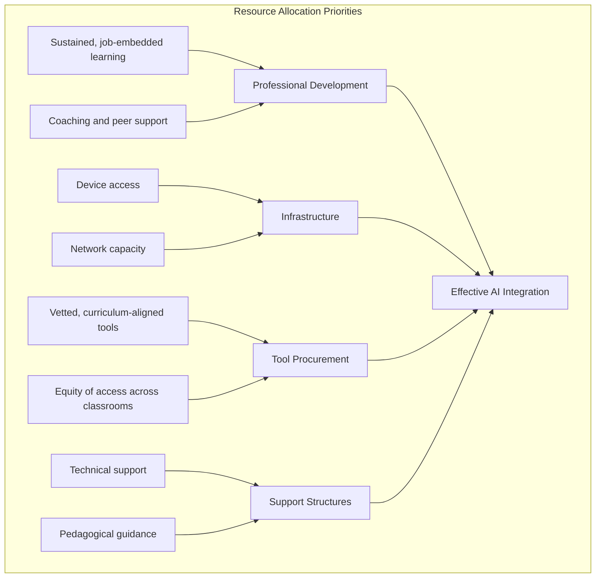

**Professional Development as Primary Investment**

Research consistently demonstrates that **quality, relevance, and ongoing support matter far more than quantity** of professional development hours. Administrators should prioritize:

- **Sustained learning over one-time workshops**: Multi-year cohort models where teams of teachers deepen skills together prove more effective than isolated training sessions
- **Job-embedded support**: Teachers need scaffolding—space to practice skills, see how they work with students, and discuss outcomes before moving on
- **Pedagogical foundations first**: The Escondido implementation demonstrated that **building foundational knowledge of instructional frameworks before introducing AI tools** is essential for effective integration

**Infrastructure Assessment and Enhancement**

Before implementing AI tools, administrators should conduct technology audits to assess:

- Device-to-student ratios and device quality
- Network bandwidth capacity for cloud-based AI applications
- Technical support availability for troubleshooting
- Equity of access across classrooms and student populations

#### 9.2.3 Building Teacher Capacity Through Sustained Professional Learning

The gap between AI tool availability and teacher readiness represents one of the most significant barriers to effective implementation. While **63% of US teens are using AI tools for schoolwork**, only **30% of teachers report feeling confident using these same AI tools**. Administrators must close this gap through comprehensive professional learning.

**Effective Professional Development Characteristics**

Research identifies several characteristics of effective AI-focused professional development:

- **Continuity**: Returning to the same skills throughout the year rather than introducing unrelated topics
- **Connection**: Linking professional development to teacher and student outcomes
- **Embedding**: Integrating technology within everyday pedagogy rather than treating it as separate
- **Collaboration**: Building peer networks for ongoing support and idea sharing

**Phased Professional Learning Sequence**

Administrators should implement a phased approach to professional learning:

1. **Foundation Phase**: Establish pedagogical frameworks and AI literacy basics before introducing tools
2. **Exploration Phase**: Provide structured opportunities to experiment with vetted tools in low-stakes contexts
3. **Implementation Phase**: Support classroom integration with coaching, feedback, and troubleshooting
4. **Leadership Phase**: Develop teacher leaders who can mentor colleagues and contribute to school-wide learning

#### 9.2.4 Creating Feedback Mechanisms and Support Structures

Sustainable AI integration requires ongoing mechanisms for monitoring implementation, gathering feedback, and refining approaches based on evidence.

**Feedback Collection Systems**

Administrators should establish:

- **Regular check-ins** with teachers about AI tool effectiveness and challenges
- **Student voice mechanisms** to understand how AI is affecting their learning experience
- **Usage data analysis** to identify patterns in tool adoption and engagement
- **Parent communication channels** to address questions and concerns

**Support Structure Components**

Effective support structures include:

- **Technical support** for platform access and functionality issues
- **Pedagogical coaching** on effective AI integration strategies
- **Peer networks** for sharing successful practices and problem-solving
- **Clear escalation pathways** for addressing concerns about AI tool quality or appropriateness

#### 9.2.5 Fostering School Cultures of Thoughtful Experimentation

Beyond policy and resources, administrators shape the cultural context in which AI integration occurs. The goal is to create environments where teachers feel empowered to experiment thoughtfully while maintaining focus on student outcomes.

**Cultural Characteristics to Cultivate**

- **Curiosity over fear**: Position AI as a tool to explore rather than a threat to resist
- **Learning from failure**: Normalize iterative experimentation where not every approach succeeds
- **Student-centered focus**: Keep conversations grounded in impact on student learning, not technology features
- **Equity consciousness**: Regularly examine whether AI implementation is serving all students well
- **Professional respect**: Trust teacher judgment while providing clear expectations and support

### 9.3 Recommendations for Curriculum Designers: Integrating AIGC Capabilities into Learning Experiences

Curriculum specialists, instructional coaches, and learning designers occupy a unique position in the AI integration landscape. Their work shapes the learning experiences that teachers implement and students encounter, making their decisions about AI integration consequential at scale. This section provides guidance on embedding AIGC tools within coherent curricular frameworks that preserve essential learning processes while leveraging AI capabilities.

#### 9.3.1 Aligning AI Applications with Learning Standards and Developmental Appropriateness

Effective curriculum design ensures that AI applications support rather than contradict established learning standards and developmental expectations across the K-12 continuum.

**Standards Alignment Framework**

Curriculum designers should systematically map AI applications to learning standards:

| **Grade Band** | **AI Integration Focus** | **Standards Alignment Considerations** |
|---------------|-------------------------|---------------------------------------|
| **K-2** | Teacher-facing tools; AI awareness concepts | Protect foundational literacy and numeracy development |
| **3-5** | Guided exploration; critical evaluation introduction | Align with emerging digital literacy standards |
| **6-8** | Structured AI use; bias and ethics exploration | Connect to information literacy and digital citizenship standards |
| **9-12** | Collaborative AI use; career preparation | Integrate with discipline-specific standards and college/career readiness |

**Developmental Appropriateness Checklist**

Before integrating AI applications into curriculum, designers should verify:

- [ ] The application is appropriate for the cognitive development level of target students
- [ ] Required scaffolding and teacher support are specified
- [ ] The application supports rather than bypasses essential skill development
- [ ] Data privacy protections are adequate for the student age group
- [ ] The application aligns with established curriculum sequence and content

#### 9.3.2 Designing Learning Experiences That Leverage AI While Preserving Essential Cognitive Processes

The central challenge for curriculum designers is leveraging AI's capabilities to enhance learning without undermining the cognitive processes that learning experiences are designed to develop.

**The Learning Process Protection Principle**

Curriculum designers should apply a fundamental test: **Does this AI application support students in developing the target skill, or does it allow students to bypass the cognitive work required for learning?**

Applications that **support learning**:
- Provide scaffolding that students can gradually internalize
- Offer feedback that guides student thinking without providing answers
- Enable practice at appropriate challenge levels
- Free cognitive resources for higher-order thinking

Applications that **risk bypassing learning**:
- Complete tasks that students should be doing themselves
- Provide answers without requiring student reasoning
- Remove productive struggle necessary for skill development
- Replace human interaction essential for social-emotional growth

**Curriculum Design Strategies**

- **Embed AI as tool, not shortcut**: Design learning experiences where AI supports the process of learning rather than producing the product of learning
- **Require metacognitive reflection**: Include prompts for students to reflect on how they used AI and what they learned from the interaction
- **Build toward independence**: Structure learning progressions that use AI scaffolding initially, then gradually remove support as students develop competence
- **Preserve human elements**: Ensure curriculum maintains opportunities for collaboration, discussion, and relationship-building that AI cannot provide

#### 9.3.3 Creating Assessment Approaches That Maintain Integrity

The emergence of AIGC has fundamentally challenged traditional assessment approaches, requiring curriculum designers to rethink how learning is evaluated.

**Assessment Redesign Principles**

Rather than attempting to detect AI use, curriculum designers should create assessments that:

- **Emphasize process over product**: Evaluate how students approach problems, not just final answers
- **Incorporate AI transparently**: Design assessments where AI use is documented and evaluated as part of the learning process
- **Require personal connection**: Include elements that connect to students' individual experiences, perspectives, or contexts
- **Include real-time components**: Combine take-home work with in-class presentations, discussions, or demonstrations
- **Focus on transfer**: Assess students' ability to apply learning to new contexts rather than reproduce information

**The AI Assessment Scale Integration**

Curriculum designers should specify appropriate AI use levels for different assessments:

| **AI Level** | **Description** | **Appropriate Contexts** |
|-------------|-----------------|-------------------------|
| **No AI** | Entirely human work | Foundational skill assessments, timed evaluations |
| **AI Planning** | Brainstorming, outlining with AI | Initial project planning, research exploration |
| **AI Collaboration** | Directing AI toward goals | Complex projects with documented AI interaction |
| **AI Cooperation** | Critical evaluation of AI outputs | Analysis and synthesis tasks |
| **AI Exploration** | Creative problem-solving with AI | Innovation challenges, design projects |

#### 9.3.4 Developing AI Literacy Progressions Across Grade Bands

Curriculum designers should develop coherent AI literacy progressions that build student competence systematically across the K-12 experience.

**K-12 AI Literacy Progression Framework**

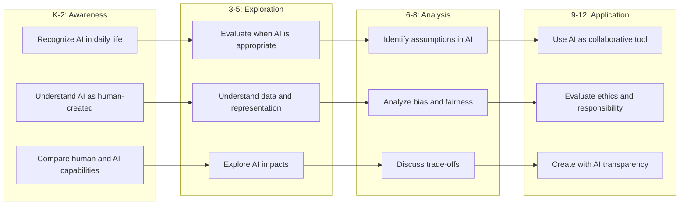

**Integration Across Subject Areas**

AI literacy should be embedded across the curriculum rather than treated as a standalone subject:

- **English Language Arts**: Critical analysis of AI-generated text, evaluation of sources, ethical writing with AI
- **Mathematics**: Understanding algorithmic thinking, data analysis, statistical reasoning about AI claims
- **Science**: Examining AI in scientific research, understanding machine learning principles, evaluating AI applications
- **Social Studies**: Analyzing AI's societal impacts, examining algorithmic bias, understanding AI governance
- **Arts**: Exploring AI in creative processes, questioning authenticity and authorship, using AI as creative tool

#### 9.3.5 Ensuring Curricular Materials Support Critical Thinking, Creativity, and Human Connection

Curriculum designers must ensure that materials developed for AI-integrated instruction preserve and strengthen the human dimensions of education.

**Human-Centered Curriculum Design Principles**

- **Prioritize relationships**: Include collaborative activities, discussion protocols, and peer interaction that build human connection
- **Cultivate creativity**: Design open-ended challenges that require original thinking AI cannot replicate
- **Develop critical thinking**: Embed questioning, analysis, and evaluation throughout learning experiences
- **Build ethical reasoning**: Include opportunities for students to grapple with complex ethical questions about AI and technology
- **Preserve wonder**: Maintain space for curiosity, exploration, and the joy of discovery that characterizes meaningful learning

### 9.4 Recommendations for District Leaders and Policymakers: Creating Enabling Frameworks for Responsible AI Integration

Superintendents, school board members, state education officials, and policymakers establish the systemic conditions that enable or constrain effective AIGC implementation across educational systems. Their decisions about policy frameworks, governance structures, resource allocation, and accountability mechanisms shape the landscape within which schools and teachers operate.

#### 9.4.1 Developing Comprehensive Policy Frameworks

Policy frameworks must address the full range of considerations that AIGC integration raises, from data privacy to equity to academic integrity.

**Essential Policy Framework Components**

| **Policy Domain** | **Key Considerations** | **Implementation Guidance** |
|------------------|----------------------|----------------------------|
| **Data Privacy** | FERPA, COPPA, CIPA compliance; vendor data practices; student data minimization | Require vendor Data Privacy Agreements; prohibit AI training on student data; establish clear consent protocols |
| **Equity** | Access disparities; algorithmic bias; quality gaps between free and premium tools | Ensure equitable tool access; mandate bias audits; monitor outcomes across student groups |
| **Academic Integrity** | Transparent use expectations; detection tool limitations; assessment redesign | Move beyond detection toward transparency; provide redesign guidance; avoid punitive approaches |
| **Ethical Use** | Human oversight requirements; prohibited applications; transparency obligations | Establish human-in-the-loop requirements; prohibit AI for high-stakes decisions without human review |
| **Professional Development** | Teacher preparation expectations; ongoing support requirements; resource allocation | Mandate sustained professional learning; allocate adequate resources; link policy to support |

**Policy Development Process**

Effective policy development should:

- **Engage diverse stakeholders**: Include teachers, administrators, parents, students, and community members in policy development
- **Balance clarity with flexibility**: Provide clear expectations while allowing for local adaptation and professional judgment
- **Plan for evolution**: Recognize that AI capabilities and best practices will evolve rapidly; build in regular review cycles
- **Ground in educational values**: Anchor policy in the fundamental purposes of education rather than technology features

#### 9.4.2 Creating Governance Structures

Effective AI governance requires dedicated structures that can respond to rapid technological change while maintaining focus on educational values.

**AI Task Force Model**

Districts should establish AI task forces with:

- **Diverse representation**: Include curriculum, IT, finance, human resources, teachers, parents, and legal counsel
- **Clear mandate**: Define the task force's purpose, authority, and deliverables
- **Ongoing function**: Position the task force as a standing body rather than a one-time committee
- **Connection to decision-making**: Ensure task force recommendations inform policy and practice

**Task Force Deliverables**

AI task forces should produce:

1. **District AI implementation roadmap** with phased approach and success metrics
2. **Tool vetting system** with clear criteria and approval processes
3. **Policy recommendations** addressing all relevant domains
4. **Professional development plan** ensuring teacher readiness
5. **Monitoring and evaluation framework** for ongoing assessment

#### 9.4.3 Ensuring Equitable Access

Equity must be central to all AI implementation decisions. The evidence demonstrates that without deliberate intervention, AI may widen rather than narrow educational disparities.

**Equity-Focused Implementation Strategies**

- **Resource allocation**: Prioritize AI investments in under-resourced schools to prevent quality gaps
- **Infrastructure equity**: Ensure all schools have adequate devices, connectivity, and technical support
- **Professional development equity**: Provide equivalent training opportunities regardless of school resources
- **Outcome monitoring**: Disaggregate data by student demographics to identify and address disparities
- **Tool quality assurance**: Ensure all students have access to accurate, high-quality AI tools rather than inferior free alternatives

**Addressing the Quality Gap**

The evidence that **"free AI tools most accessible to students and schools can be the least reliable and factually accurate"** while **"richer communities can afford more advanced, accurate AI models"** demands policy intervention. Districts should:

- Negotiate bulk licensing agreements that provide equitable access to high-quality tools
- Establish quality standards that all approved AI tools must meet
- Provide funding mechanisms to ensure under-resourced schools can access premium tools

#### 9.4.4 Establishing Accountability Mechanisms for EdTech Vendors

As AI tools proliferate, districts must establish robust accountability mechanisms for the vendors providing these tools.

**Vendor Accountability Requirements**

- **Transparency obligations**: Require vendors to disclose how AI models are trained, where data comes from, and how it is stored
- **Privacy compliance**: Mandate compliance with all applicable privacy regulations and district data governance policies
- **Accuracy standards**: Establish expectations for AI output accuracy and require documentation of limitations
- **Bias auditing**: Require regular bias assessments and disclosure of results
- **Support commitments**: Ensure vendors provide adequate training, technical support, and ongoing updates

**Contract Provisions**

District contracts with AI vendors should include:

- Clear data ownership and use restrictions
- Prohibition on using student data for AI training without explicit consent
- Requirements for security incident notification
- Performance standards with consequences for non-compliance
- Audit rights allowing district review of vendor practices

#### 9.4.5 Balancing Regulatory Oversight with Local Innovation

Effective policy creates guardrails that protect students while allowing space for local innovation and professional judgment.

**The Balance Framework**

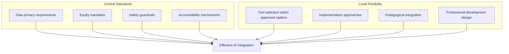

**Principles for Regulatory Balance**

- **Set floors, not ceilings**: Establish minimum standards while allowing schools to exceed them
- **Regulate outcomes, not methods**: Focus on what must be achieved rather than prescribing how to achieve it
- **Enable experimentation**: Create safe spaces for piloting innovative approaches with appropriate safeguards
- **Learn from implementation**: Use evidence from local implementations to inform policy refinement

### 9.5 Differentiated Recommendations by School Level, Resource Context, and Pedagogical Approach

Effective AIGC integration must be tailored to the specific contexts in which it occurs. This section provides differentiated guidance addressing the distinct needs and constraints of different educational settings.

#### 9.5.1 Recommendations by School Level

**Elementary Schools (K-5)**

Elementary implementations should prioritize:

- **Teacher-facing applications**: Use AI primarily for lesson planning, material creation, and differentiation while limiting direct student-AI interaction
- **Foundational skill protection**: Ensure AI does not bypass essential development of literacy, numeracy, and social skills
- **Play-based and hands-on learning**: Maintain emphasis on developmentally appropriate learning modalities
- **AI awareness education**: Introduce AI concepts through age-appropriate discussions and activities without requiring tool use
- **Strong scaffolding**: When students do interact with AI, provide heavy scaffolding and close supervision

**Middle Schools (6-8)**

Middle school implementations should emphasize:

- **Guided AI engagement**: Introduce AI tools within structured activities with clear parameters
- **Critical analysis development**: Focus on building students' capacity to evaluate AI outputs for accuracy, bias, and limitations
- **Ethical exploration**: Engage students in discussions about AI ethics, privacy, and societal impacts
- **Transitional scaffolding**: Gradually increase student independence with AI as competence develops
- **Identity and voice protection**: Ensure AI use supports rather than undermines adolescent identity development

**High Schools (9-12)**

High school implementations should focus on:

- **Collaborative AI partnership**: Enable students to use AI as collaborative tools within clear ethical guidelines
- **Career and college preparation**: Connect AI use to workplace expectations and higher education requirements
- **Advanced critical evaluation**: Develop sophisticated understanding of AI capabilities, limitations, and implications
- **Transparency and documentation**: Require clear documentation of AI use in academic work
- **Leadership development**: Engage students in shaping school AI policies and practices

#### 9.5.2 Strategies for Under-Resourced Schools

Schools with limited resources face particular challenges in AI implementation but can still leverage AI benefits through strategic approaches.

**Maximizing Impact with Limited Resources**

| **Challenge** | **Strategic Response** |
|--------------|----------------------|
| Limited device access | Prioritize teacher-facing applications that benefit all students; implement station rotation models |
| Inadequate connectivity | Focus on tools that work offline or with minimal bandwidth; advocate for infrastructure investment |
| Insufficient training budget | Leverage free professional development resources; build peer learning networks; partner with universities |
| No dedicated IT support | Select tools with minimal technical requirements; develop teacher tech leaders; partner with community resources |
| Limited tool procurement budget | Prioritize free tools with adequate quality; negotiate bulk licensing; apply for grants |

**Equity-Focused Priorities**

Under-resourced schools should prioritize AI applications that:

- **Address specific student needs**: Focus on applications that support English language learners, students with disabilities, or students requiring additional academic support
- **Reduce rather than increase teacher burden**: Select tools that genuinely save time rather than adding complexity
- **Provide high-quality free options**: Carefully vet free tools for accuracy and appropriateness rather than assuming premium tools are necessary
- **Build sustainable capacity**: Invest in teacher development that creates lasting capability rather than tool-specific training

#### 9.5.3 Approaches for Diverse Student Populations

**English Language Learners**

For schools serving significant ELL populations:

- Use AI for **scaffolded access** to grade-level content through translation, simplification, and text-to-speech
- Leverage AI for **language practice** through conversational interfaces and pronunciation feedback
- Monitor for **algorithmic bias** against non-native English speakers, particularly in writing evaluation tools
- Preserve **human language instruction** and cultural responsiveness that AI cannot provide

**Students with Disabilities**

For schools serving students with disabilities:

- Use AI for **accessibility accommodations** including format conversion, reading support, and alternative input methods
- Leverage AI for **differentiation** and personalized learning pathways
- Ensure AI tools meet **accessibility standards** and work with assistive technologies
- Maintain **human oversight** of AI-generated IEP content and educational decisions

**Gifted and Advanced Learners**

For schools serving advanced learners:

- Use AI for **enrichment and extension** beyond standard curriculum
- Leverage AI for **independent research** and creative exploration
- Develop **sophisticated critical analysis** of AI capabilities and limitations
- Prepare students for **advanced AI use** in higher education and careers

#### 9.5.4 Integration with Different Pedagogical Frameworks

**Project-Based Learning**

For schools emphasizing PBL:

- Use AI tools like Inkwire for **project design** aligned with standards and competencies
- Leverage AI for **resource gathering** and initial research while requiring student synthesis
- Employ AI for **differentiated scaffolding** within project work
- Maintain **authentic challenge** and student ownership that defines effective PBL

**Inquiry-Based Instruction**

For schools emphasizing inquiry:

- Position AI within the **"Human-AI-Human" model** where inquiry starts and ends with human thinking
- Use AI for **information exploration** while requiring student questioning and analysis
- Leverage AI for **hypothesis testing** and data analysis support
- Preserve **productive struggle** and discovery that defines inquiry learning

**Traditional Direct Instruction**

For schools emphasizing direct instruction:

- Use AI for **efficient content delivery** and practice problem generation
- Leverage AI for **immediate feedback** on student practice
- Employ AI for **differentiation** within whole-class instruction
- Maintain **teacher expertise** as the authoritative source of instruction

### 9.6 Sustaining Human-Centered AI Integration: Principles for Long-Term Success

This final section synthesizes overarching principles that should guide all stakeholder groups in sustaining responsible AI integration over time. These principles provide a foundation for navigating the rapidly evolving AI landscape while maintaining focus on the fundamental purposes of education.

#### 9.6.1 Maintaining Unwavering Commitment to Human Oversight and Teacher Agency

The evidence examined throughout this report consistently demonstrates that **human oversight is essential** to realizing AI's benefits while mitigating its harms. This principle must remain non-negotiable regardless of how AI capabilities evolve.

**Core Commitments**

- **Teachers retain decision-making authority** over instructional choices, with AI serving as a tool rather than a replacement for professional judgment
- **AI systems must be inspectable, explainable, and overridable** by educators who maintain the ability to review, modify, or reject AI recommendations
- **Human judgment guides high-stakes decisions** affecting student learning, assessment, and educational placement
- **AI augments rather than replaces** the relational dimensions of teaching that remain essential to effective education

**Practical Implementation**

- Build human review into all AI workflows
- Train teachers to critically evaluate AI outputs rather than accepting them uncritically
- Establish clear boundaries around decisions that require exclusively human judgment
- Monitor for signs of inappropriate delegation of professional responsibility to AI systems

#### 9.6.2 Centering Equity in All AI Implementation Decisions

The evidence that AI can be **"an engine of equity or inequity"** demands that equity considerations be central to every implementation decision.

**Equity Principles**

- **Access equity**: Ensure all students have access to high-quality AI tools regardless of school resources
- **Outcome equity**: Monitor AI impacts across demographic groups and address disparities
- **Algorithmic equity**: Audit AI tools for bias and require vendors to demonstrate fairness
- **Opportunity equity**: Use AI to expand rather than constrain educational opportunities for marginalized students

**Ongoing Vigilance**

- Disaggregate data by student demographics to identify equity impacts
- Conduct regular bias audits of AI tools and practices
- Engage diverse stakeholders in evaluating AI implementation
- Prioritize investments that address rather than exacerbate existing disparities

#### 9.6.3 Preserving the Relational and Social-Emotional Dimensions of Education

The evidence of AI's potential to undermine human connection and social-emotional development demands deliberate attention to preserving these essential educational dimensions.

**Protection Strategies**

- **Maintain face-to-face interaction**: Ensure AI does not displace the human relationships central to effective education
- **Reallocate saved time to relationships**: Use efficiency gains from AI to deepen rather than reduce human connection
- **Monitor social-emotional impacts**: Track whether AI use is affecting student well-being, peer relationships, or teacher-student bonds
- **Preserve collaborative learning**: Maintain opportunities for peer interaction and collaborative work that AI cannot provide

**Warning Signs to Monitor**

- Students preferring AI interaction over human support
- Declining quality of teacher-student relationships
- Reduced peer collaboration and social skill development
- Increased isolation or anxiety related to AI use

#### 9.6.4 Building Adaptive Capacity for Ongoing Evolution

The rapid pace of AI development means that today's best practices may be obsolete tomorrow. Educational systems must build capacity to adapt continuously.

**Adaptive Capacity Components**

- **Continuous learning structures**: Establish ongoing professional learning rather than one-time training
- **Feedback and monitoring systems**: Create mechanisms for identifying what's working and what needs adjustment
- **Policy review cycles**: Build regular policy updates into governance structures
- **Research engagement**: Stay connected to emerging research on AI in education
- **Experimentation frameworks**: Create safe spaces for piloting new approaches with appropriate safeguards

**Living Document Approaches**

- Treat AI policies as living documents requiring regular revision
- Establish scheduled review cycles (e.g., biannual) for all AI-related policies
- Create mechanisms for incorporating lessons learned from implementation
- Stay connected to state and national guidance as it evolves

#### 9.6.5 Fostering Ongoing Dialogue Among Stakeholders

Sustainable AI integration requires ongoing conversation among all stakeholders about the role of AI in education.

**Dialogue Participants**

- **Educators**: Teachers, administrators, and support staff who implement AI in practice
- **Families**: Parents and caregivers who observe AI's impact on their children
- **Students**: Young people who experience AI integration directly and will live with its consequences
- **Communities**: Local stakeholders who share interest in educational quality and student welfare
- **Researchers**: Scholars who can provide evidence to inform decisions
- **Policymakers**: Officials who establish the frameworks within which AI integration occurs

**Dialogue Topics**

- What role should AI play in education?
- How do we balance AI's benefits against its risks?
- What values should guide AI implementation decisions?
- How do we ensure AI serves all students equitably?
- What skills do students need to thrive in an AI-influenced world?

**Dialogue Mechanisms**

- Regular community forums on AI in education
- Student voice initiatives that engage young people in shaping AI policies
- Family communication that explains AI use and invites feedback
- Professional learning communities where educators share experiences
- Research partnerships that connect practice to evidence

#### 9.6.6 The Path Forward: Intentional Integration

The evidence examined throughout this report points toward a clear conclusion: **the future of AI in K-12 education will be shaped not by technology alone, but by the deliberate choices made by educational stakeholders**. The path of **intentional integration**—deliberately combining strong instruction with responsible, human-centered use of AI—offers the most promising route to realizing AI's educational potential while protecting the human dimensions of learning that remain irreplaceable.

This path requires:

- **Clear vision**: Understanding what we want AI to accomplish in education and what we want to protect from AI's influence
- **Principled decision-making**: Grounding all AI decisions in educational values rather than technological possibilities
- **Sustained commitment**: Maintaining focus on responsible integration even as AI capabilities expand and pressures to adopt increase
- **Collective responsibility**: Recognizing that effective AI integration requires coordinated effort across all stakeholder groups
- **Ongoing learning**: Remaining open to new evidence and willing to adjust approaches as understanding deepens

The recommendations in this chapter provide a starting point, but they cannot substitute for the ongoing professional judgment, ethical reflection, and collaborative dialogue that responsible AI integration demands. As one researcher concluded, **"AI has a lot of potential to do good in education, but we have to be very intentional about its implementation"**. The future belongs to those who approach AI not as an inevitable force to be accommodated but as a powerful tool to be wielded thoughtfully in service of educational purposes that remain fundamentally human.

# 参考内容如下：
[^1]:[Integrating AI-generated content tools in higher education](https://pmc.ncbi.nlm.nih.gov/articles/PMC12267416/)
[^2]:[AI in Schools: Pros and Cons - College of Education | Illinois](https://education.illinois.edu/about/news-events/news/article/2024/10/24/ai-in-schools--pros-and-cons)
[^3]:[AI vs. Traditional Technology in Education](https://www.unf.edu/cirt/AI-Traditional-Tech-In-Education.html)
[^4]:[Artificial Intelligence and the Future of Teaching and ...](https://www.ed.gov/sites/ed/files/documents/ai-report/ai-report.pdf)
[^5]:[Principles of Child Development and Learning ...](https://www.naeyc.org/resources/position-statements/dap/principles)
[^6]:[AI Learning Priorities for All K-12 Students](https://csteachers.org/ai-priorities/)
[^7]:[Framework for Coherent AI Use in K-12 Education](https://www.childtrends.org/publications/framework-coherent-ai-use-education)
[^8]:[Generative AI Applications for the K–12 Classroom](https://avidopenaccess.org/resource/463-generative-ai-applications-for-the-k-12-classroom/)
[^9]:[Generative AI Applications for the K–12 Classroom](https://avidopenaccess.org/resource/generative-ai-applications-for-the-k-12-classroom/)
[^10]:[Guidance for the Use of AI in the K-12 Classroom](https://www.sreb.org/sites/main/files/file-attachments/2025_ai_in_k-12classroom_guidance.pdf?1744905120)
[^11]:[Generative Artificial Intelligence in K-12 Education](https://legacy.nau.edu/wp-content/uploads/sites/222/2024/10/0930_1505666_NAU.GAIGuide_ADA-Final.pdf)
[^12]:[Translation Guide to Using Generative Artificial Intelligence ...](https://cset.georgetown.edu/wp-content/uploads/t0646_education_GenAI_use_guide_EN.pdf)
[^13]:[Artificial Intelligence (AI) K-12 Skills Progression Guide for ...](https://www.coloradoedinitiative.org/wp-content/uploads/2025/08/Future-Ready-Colorado_Artificial-Intelligence-AI-K-12-Skills-Progression-Guide-for-Educators.pdf)
[^14]:[Pedagogical Agents in the age of Generative Artificial ...](https://peer.asee.org/board-76-pedagogical-agents-in-the-age-of-generative-artificial-intelligence-opportunities-and-challenges-in-k-12-stem-education.pdf)
[^15]:[What the research shows about generative AI in tutoring](https://www.brookings.edu/articles/what-the-research-shows-about-generative-ai-in-tutoring/)
[^16]:[AI Assessment - Test & Quiz Generation - AI in Education](https://remc.org/educator-resources/ai-in-education/ai-practical-guide-for-educators/ai-in-education-assessment/ai-assessment-test-quiz-generation/)
[^17]:[Generative AI use in K-12 education: a systematic review](https://www.frontiersin.org/journals/education/articles/10.3389/feduc.2025.1647573/full)
[^18]:[Human-Centered AI Guidance for K–12 Public Schools](https://ospi.k12.wa.us/sites/default/files/2024-08/comprehensive-ai-guidance.pdf)
[^19]:[A Bibliometric and Systematic Review Based on CiteSpace](http://apjcriweb.org/content/vol11no8/3.pdf)
[^20]:[Types of teacher-AI collaboration in K-12 classroom instruction](https://link.springer.com/article/10.1007/s10639-024-12523-3)
[^21]:[An AI Literacy Framework](https://avidopenaccess.org/resource/an-ai-literacy-framework/)
[^22]:[A mapping of government-endorsed AI curricula](https://critical-links.com/wp-content/uploads/2025/04/K-12-AI-Curricula-UNESCO.pdf)
[^23]:[A systematic review of AI-driven intelligent tutoring systems ...](https://pmc.ncbi.nlm.nih.gov/articles/PMC12078640/)
[^24]:[WWC | DreamBox Learning - Institute of Education Sciences](https://ies.ed.gov/ncee/wwc/EvidenceSnapshot/627)
[^25]:[Adaptive Learning and the Future of Education](https://foundationcapital.com/adaptive-learning-and-the-future-of-education-a-conversation-with-dreambox-learning-president-and-ceo-jessie-woolley-wilson/)
[^26]:[Adaptive Learning Intelligence Reshapes K-12 ...](https://www.aicerts.ai/news/adaptive-learning-intelligence-reshapes-k-12-personalization/)
[^27]:[Exploring Fairness in an Adaptive Learning Platform](https://www-media.discoveryeducation.com/wp-content/uploads/2024/05/Exploring-Fairness-in-an-Adaptive-Learning-Platform.pdf)
[^28]:[Newark Public Schools partners with Khan Academy to ...](https://www.khanacademy.org/schools/case-studies/newark-public-schools)
[^29]:[How Khanmigo AI is transforming learning in Palm Beach ...](https://cbs12.com/news/local/how-khanmigo-ai-is-transforming-learning-in-palm-beach-schools-january-13-2025)
[^30]:[Squirrel AI: Home](https://squirrelai.com/)
[^31]:[China has started a grand experiment in AI education. It ...](https://www.technologyreview.com/2019/08/02/131198/china-squirrel-has-started-a-grand-experiment-in-ai-education-it-could-reshape-how-the/)
[^32]:[The arrival of AI in education in Latin America - ProFuturo](https://profuturo.education/wp-content/uploads/2025/07/en_the_arrival_of_ai_in_education_in_latin_america.pdf)
[^33]:[How AI can support teachers in Latin America](https://www.brookings.edu/articles/how-ai-can-support-teachers-in-latin-america/)
[^34]:[Integration of AI into Learning and Education](https://files.eric.ed.gov/fulltext/EJ1489577.pdf)
[^35]:[AI-driven adaptive learning platforms](https://wjarr.com/sites/default/files/WJARR-2024-0843.pdf)
[^36]:[Hybrid Recommendation System for K-12 Students Case ...](https://arxiv.org/html/2502.20354v1)
[^37]:[The Role and Challenges of AIGC-Driven Personalised ...](https://www.preprints.org/manuscript/202502.0194/v1)
[^38]:[Designing the Future: Case Studies Highlighting AI in ...](https://learnercentered.org/wp-content/uploads/2025/07/AI-case-study.pdf)
[^39]:[Schools wanted for AI lesson planning trial](https://schoolsweek.co.uk/schools-wanted-for-ai-lesson-planning-trial/)
[^40]:[AI Platform for School Districts | MagicSchool](https://www.magicschool.ai/)
[^41]:[Camden Case Studies: AI in Education](https://camdenlearning.org.uk/wp-content/uploads/2025/07/10-Case-Studies-Camden-Schools-Jul-2025-V7.pdf)
[^42]:[Use of Generative AI in Writing Lesson Plans](https://ijsshmr.com/v4i7/Doc/2.pdf)
[^43]:[Australian teachers' actions through the lens of innovation theory](https://link.springer.com/article/10.1007/s10639-025-13699-y)
[^44]:[Exploring the Practice of Artificial Intelligence Empowering ...](http://www.davidpublisher.com/Public/uploads/Contribute/679054ef59ab5.pdf)
[^45]:[Artificial intelligence (AI) | V9 Australian Curriculum](https://www.australiancurriculum.edu.au/curriculum-information/understand-this-curriculum-connection/artificial-intelligence)
[^46]:[AI enriches basic education in China](http://education.chinadaily.com.cn/2025-02/18/c_1071554.htm)
[^47]:[How Finnish Schools Use Tech to Boost Learning](https://www.techclass.com/resources/education-insights/technology-in-finnish-schools-how-digital-tools-support-student-learning?srsltid=AfmBOoqdYZhxEKFE2S2fGA2CF1aUgbkYbunPZ9oaxebM0Gs9Tk5rh8uo)
[^48]:[Harnessing AI in Education: How Finnish Students Outperform ...](https://in-finland.education/harnessing-ai-in-education-how-finnish-students-outperform-their-european-peers/)
[^49]:[Customizable AI-Powered Textbooks Reshape Learning](https://www.gettingsmart.com/2024/10/07/customizable-ai-powered-textbooks-reshape-learning/)
[^50]:[Teachers are leading an AI revolution in Korean classrooms](https://blogs.worldbank.org/en/education/teachers-are-leading-an-ai-revolution-in-korean-classrooms)
[^51]:[Part 1: AI in Education, Classroom Integration, and Impact ...](https://www.usaii.org/ai-insights/ai-in-education-classroom-integration-and-impact-in-2026)
[^52]:[Comparative Analysis of the Studies of Countries on AI ...](https://www.journalofcomputereducation.info/archieve/vol3_1/JCE_3_1_2_pdf.pdf)
[^53]:[Transcending the Dualities in Digital Education: A Case ...](https://journal.hep.com.cn/fde/EN/10.1007/s44366-024-0002-2)
[^54]:[Q&A: The dangers of not teaching students how to use AI ...](https://phys.org/news/2026-01-qa-dangers-students-ai-responsibly.html)
[^55]:[Secondary Education Leads in Prioritizing AI Literacy](https://www.turnitin.com/press/secondary-education-leads-in-prioritizing-ai-literacy)
[^56]:[Implementation Considerations for Automated AI Grading ...](https://www.colleague.ai/wp-content/uploads/2025/09/AIME_CON_Grading_Co_design.pdf)
[^57]:[AI-Powered Grading Supercharges Writing Feedback](https://noredink.com/insights/case-studies/pvschools-az-ai-grading-assistant/)
[^58]:[Case Studies](https://noredink.com/insights/case-studies/)
[^59]:[Generative AI in the K–12 Formative Assessment Process](https://aclanthology.org/2025.aimecon-main.12.pdf)
[^60]:[M-Powering Teachers: Natural Language Processing ...](https://edworkingpapers.com/sites/default/files/ai23-759.pdf)
[^61]:[M-Powering Teachers: Natural Language Processing ...](https://edsi.umd.edu/sites/default/files/d3mft3mbl4bmi6mkq2tkmiqs50rc_0.pdf)
[^62]:[Automated Feedback Improves Teachers' Questioning Quality ...](https://scale.stanford.edu/sites/default/files/ai23-875_v2.pdf)
[^63]:[The impact of AI-driven tools on student writing development](https://www.ojcmt.net/download/the-impact-of-ai-driven-tools-on-student-writing-development-a-case-study-16738.pdf)
[^64]:[Case Study: STEM Coding Lab & Quill Partner to Equip ...](https://www.quill.org/teacher-center/case-study-stem-coding-lab-partners-with-quillorg-to-equip-students-for-an-aipowered-future)
[^65]:[AI Tools Should Nurture Smart Kids, Not Smart Robots](https://www.carnegielearning.com/blog/carnegie-learning-philosophy-on-ai-tools)
[^66]:[How to safeguard academic integrity as new tech emerges](https://www.k12dive.com/spons/how-to-safeguard-academic-integrity-as-new-tech-emerges/740714/)
[^67]:[How much are students using AI in their writing?](https://www.k12dive.com/news/students-ai-plagiarism-turnitin/713177/)
[^68]:[The State of AI in Education 2025](https://discover.carnegielearning.com/hubfs/PDFs/Whitepaper%20and%20Guide%20PDFs/2025-AI-in-Ed-Report.pdf?hsLang=en)
[^69]:[YSU | AI and Its Impact in Today's Classrooms](https://online.ysu.edu/degrees/education/msed/ai-teaching-statistics-usage-and-trends/)
[^70]:[Navigating the Intersection of AI and Academic Integrity](https://news.syr.edu/2024/04/11/navigating-the-intersection-of-ai-and-academic-integrity-education-expert-weighs-in/)
[^71]:[Principles | AI Guidance for Schools Toolkit](https://www.teachai.org/toolkit-principles)
[^72]:[State AI Guidance for K12 Schools](https://www.aiforeducation.io/ai-resources/state-ai-guidance)
[^73]:[Human-Centered AI Guidance for K–12 Public Schools](https://ospi.k12.wa.us/sites/default/files/2024-06/comprehensive-ai-guidance.pdf)
[^74]:[Disciplining AI Use: How School District Codes of Conduct ...](https://education.ufl.edu/eprc/files/2025/11/EPRC_PolicyBrief-AI-and-School-Discipline-Curran-and-Goo-2025.pdf)
[^75]:[AI in K–12 Education: Integrity, Policy, and Skills That Matter](https://www.thethinkacademy.com/blog/edubriefs-ai-in-k-12-education-integrity-policy-and-skills-that-matter/)
[^76]:[From AI Policy to Practice in K-12 Education](https://www.rumberger.com/insights/from-ai-policy-to-practice-in-k-12-education-overcoming-obstacles-to-ai-implementation/)
[^77]:[Ethical Considerations for AI Accessible Format](https://ospi.k12.wa.us/sites/default/files/2024-07/ethical-considerations-accessible-format.pdf)
[^78]:[Framework for Implementing Artificial Intelligence (AI) in K- ...](https://www.ilogroup.com/wp-content/uploads/2024/03/Printable-Framework-for-Implementing-Artificial-Intelligence-AI-in-K-12-Education_v1.0.pdf)
[^79]:[Putting K–12 AI Policies Into Practice](https://edtechmagazine.com/k12/article/2025/07/putting-k-12-ai-policies-practice)
[^80]:[Improving Professional Learning Systems to Better Support ...](https://www.setda.org/wp-content/uploads/2025/11/Improving-Professional-Learning-Systems-to-Better-Support-Todays-Educators-2.pdf)
[^81]:[Teacher Tech Training: How Much PD Is Necessary?](https://www.govtech.com/education/k-12/teacher-tech-training-how-much-pd-is-necessary)
[^82]:[Classrooms are adapting to the use of artificial intelligence](https://www.apa.org/monitor/2025/01/trends-classrooms-artificial-intelligence)
[^83]:[Best practices for using AI to support classroom behavior](https://schoolai.com/blog/best-practices-using-ai-support-classroom-behavior/)
[^84]:[Learning outcomes with GenAI in the classroom](https://www.microsoft.com/en-us/research/wp-content/uploads/2025/10/GenAILearningOutcomes-Report-published-10-07-2025.pdf)
[^85]:[Measuring the ROI of AI in K-12 Education](https://follettsoftware.com/resource/from-hype-to-help-measuring-the-roi-of-ai-in-k-12-education/)
[^86]:[The risks of AI in schools outweigh the benefits, report says](https://www.npr.org/2026/01/14/nx-s1-5674741/ai-schools-education)
[^87]:[Algorithmic bias in educational systems: Examining the impact ...](https://journalwjarr.com/sites/default/files/fulltext_pdf/WJARR-2025-0253.pdf)
[^88]:[Teaching students about algorithmic bias through real- ...](https://schoolai.com/blog/algorithmic-bias-examples-education)
[^89]:[Interrogating Algorithmic Bias: From Speculative Fiction to ...](https://pmc.ncbi.nlm.nih.gov/articles/PMC9483409/)
[^90]:[AI Ethical Guidelines](https://library.educause.edu/resources/2025/6/ai-ethical-guidelines)
[^91]:[Effective and Ethical AI Implementation: What Educators Need ...](https://education.jhu.edu/news/effective-and-ethical-ai-implementation-what-educators-need-to-know/)
[^92]:[AI is a serious threat to student privacy](https://fordhaminstitute.org/national/commentary/ai-serious-threat-student-privacy)
[^93]:[UNESCO dedicates the International Day of Education ...](https://www.unesco.org/en/articles/unesco-dedicates-international-day-education-2025-artificial-intelligence)
[^94]:[UNESCO - Digital Equity in Education and Culture](https://www.fhsmun.org/wp-content/uploads/2025/01/UNESCO-Digital-Equity-in-Education-and-Culture-1.pdf)
[^95]:[How K-12 leaders can tackle the 'digital use divide'](https://www.k12dive.com/news/how-k-12-leaders-can-tackle-the-digital-use-divide/804672/)
[^96]:[AI Revolution in Education: What You Need to Know](https://documents1.worldbank.org/curated/en/099734306182493324/pdf/IDU152823b13109c514ebd19c241a289470b6902.pdf)
[^97]:[Ethical and regulatory challenges of Generative AI in ...](https://www.frontiersin.org/journals/education/articles/10.3389/feduc.2025.1565938/full)
[^98]:[To Think or Not to Think: The Impact of AI on Critical- ...](https://www.nsta.org/blog/think-or-not-think-impact-ai-critical-thinking-skills?srsltid=AfmBOopVyv583UsdbGORw2fY0d634UzOsFJd7rLmenQVAtm2O_67TTjG)
[^99]:[Exploring the effects of artificial intelligence on student and ...](https://pmc.ncbi.nlm.nih.gov/articles/PMC11830699/)
[^100]:[Evolving AI capabilities and the school curriculum (EN)](https://www.oecd.org/content/dam/oecd/en/publications/reports/2025/11/evolving-ai-capabilities-and-the-school-curriculum_18a729bb/647880aa-en.pdf)
[^101]:[AI Use in K12: Strong Critical Thinking Skills Are More ...](https://classwork.com/ai-use-in-k12-use-requires-strong-critical-thinking-skills/)
[^102]:[Rising Use of AI in Schools Comes With Big Downsides for ...](https://www.edweek.org/technology/rising-use-of-ai-in-schools-comes-with-big-downsides-for-students/2025/10)
[^103]:[Preparing policy-makers and educators for AI and inclusive](https://www.unesco.org/en/digital-education/artificial-intelligence/prep-ai)
[^104]:[Ethical guidelines for educators on using artificial intelligence](https://education.ec.europa.eu/focus-topics/digital-education/action-plan/ethical-guidelines-for-educators-on-using-ai)
[^105]:[Empowering Learners for the Age of AI](https://ailiteracyframework.org/wp-content/uploads/2025/05/AILitFramework_ReviewDraft.pdf)
[^106]:[K-12 AI curricula: A mapping of government-endorsed AI ...](https://www.unesco.org/en/articles/k-12-ai-curricula-mapping-government-endorsed-ai-curricula)
[^107]:[Ethical Considerations For AI Use In Education](https://www.enrollify.org/blog/ethical-considerations-for-ai-use-in-education)
[^108]:[AI in secondary schools: embracing the future, thoughtfully](https://www.softcat.com/blog/ai-secondary-schools-embracing-future-thoughtfully)
[^109]:[What are the innovative classroom trends of the future?](https://www.igloovision.com/about/blog/innovative-classroom-trends)
[^110]:[25 predictions about AI and edtech](https://www.eschoolnews.com/digital-learning/2025/12/30/25-predictions-about-ai-and-edtech/)
[^111]:[Research on Application Pathways and Development ...](https://www.sciencepublishinggroup.com/article/10.11648/j.ajai.20250902.13)
[^112]:[Agentic AI in Education: Use Cases, Risks, and an ...](https://8allocate.com/blog/agentic-ai-in-education-use-cases-risks-and-an-implementation-playbook/)
[^113]:[AI Guidance for Schools Toolkit](https://www.teachai.org/toolkit)
[^114]:[AI in Education: Transforming the Future of K–12 Learning](https://www.thethinkacademy.com/blog/edubriefs-ai-in-education-transforming-the-future-of-k-12-learning/)
[^115]:[Equipping Future Teachers with Essential AI Skills](https://www.ascd.org/blogs/equipping-future-teachers-with-essential-ai-skills)
[^116]:[Future Directions for K-12 Technology-Enhanced Learning ...](https://pmc.ncbi.nlm.nih.gov/articles/PMC8008216/)
[^117]:[Embracing AI in K-12 Education: Unlocking Opportunities ...](https://www.fetc.org/road-to-fetc-digest/embracing-ai-k-12-education-unlocking-opportunities-navigating-challenges)
[^118]:[EdTech Trends to Watch in 2025: What's Next for K-12 ...](https://brightarrow.com/edtech-trends-to-watch-in-2025/)
[^119]:[How technology is reinventing K-12 education | Stanford Report](https://news.stanford.edu/stories/2024/02/technology-in-education)
[^120]:[Top Teacher Tech Tools for 2026](https://www.teachingchannel.com/k12-hub/blog/top-teacher-tech-tools-for-2026/)
[^121]:[Businesses Want Employees With AI Skills. Are K-12 CTE ...](https://www.edweek.org/teaching-learning/businesses-want-employees-with-ai-skills-are-k-12-cte-programs-keeping-up/2025/11)
[^122]:[Latest Trends in Educational Technology for 2025](https://www.hmhco.com/blog/latest-trends-in-educational-technology-for-2025?srsltid=AfmBOopHQRyijz8IjaqJd_ojb1BwAbyM9npuhj-Nf8Wjuo42034HxkJ2)
[^123]:[3 trends that will shape ed tech in 2026](https://www.k12dive.com/news/3-trends-that-will-shape-ed-tech-in-2026/810645/)
[^124]:[State Guidance on the Use of Generative AI in K-12 ...](https://studentprivacycompass.org/state-guidance-on-the-use-of-generative-ai-in-k-12-education/)
[^125]:[Student Data Privacy - AI Governance for Education Network](https://ai4education.org/ethical-scenarios/student-data-privacy)
[^126]:[The AI Clock Is Ticking for K-12 Education](https://www.prnewswire.com/news-releases/the-ai-clock-is-ticking-for-k12-education-302666547.html)
[^127]:[AI-Proof Skills: The Missing Link in K-12 Education](https://humanintelligencemovement.org/teaching-learning-strategies/ai-proof-skills-the-missing-link-in-k-12-education/)
[^128]:[Q3 2025 Education Trends: AI, Immersive Tech & Skills ...](https://harmelin.com/media-magnified/education-trends-2025-q3/)
[^129]:[The Future of AI in K-12 Education](https://today.ucsd.edu/story/the-future-of-ai-in-k-12-education)
