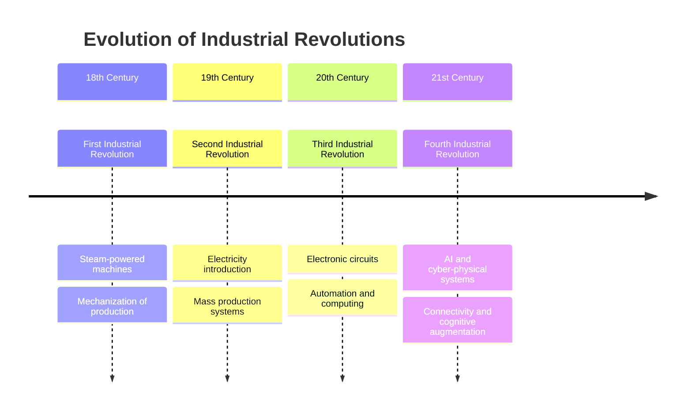
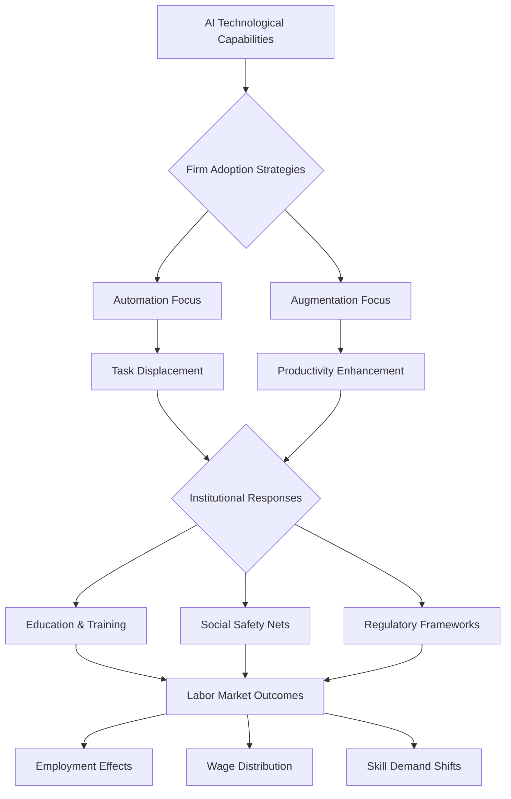
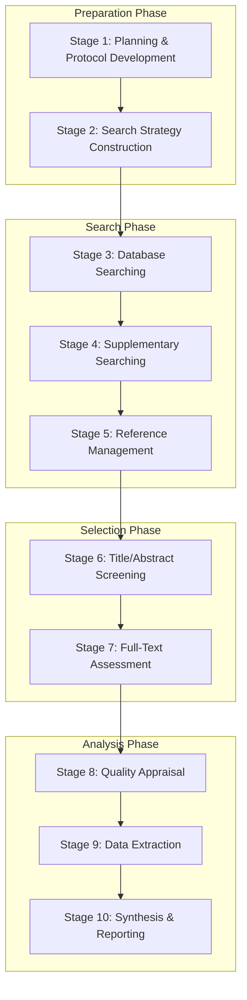
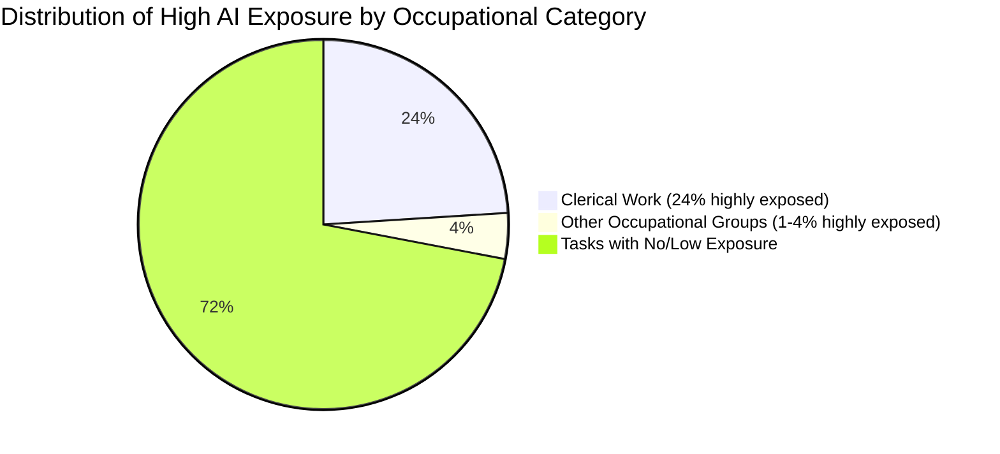
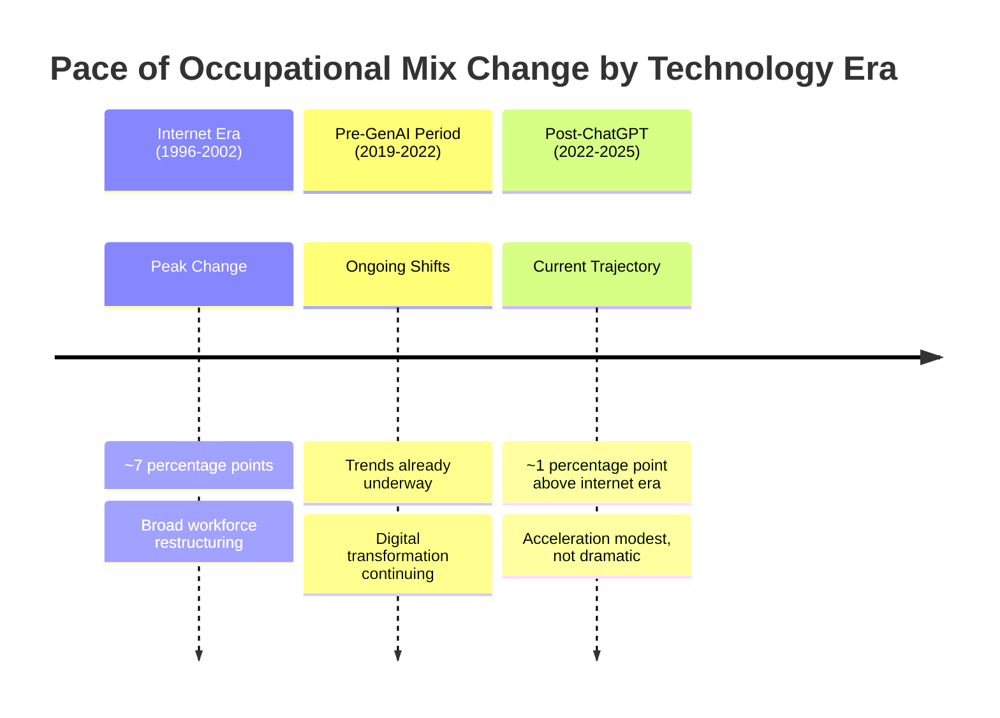
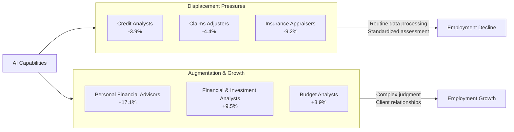
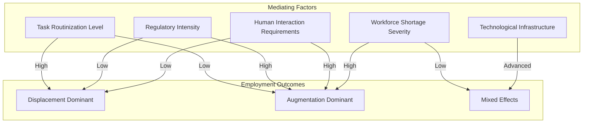
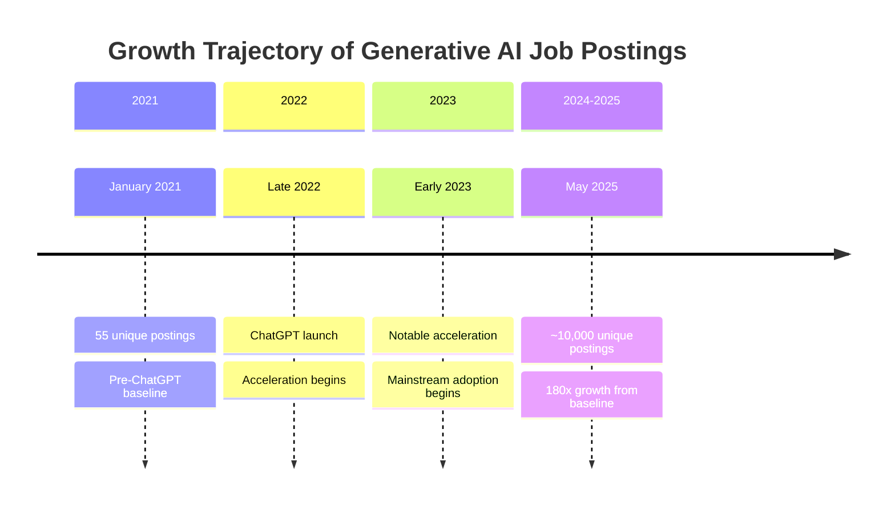
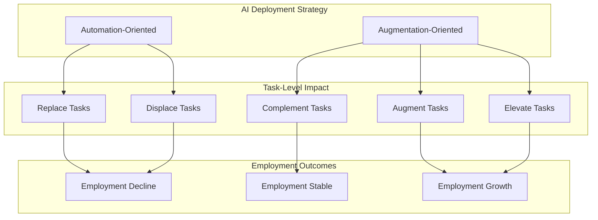
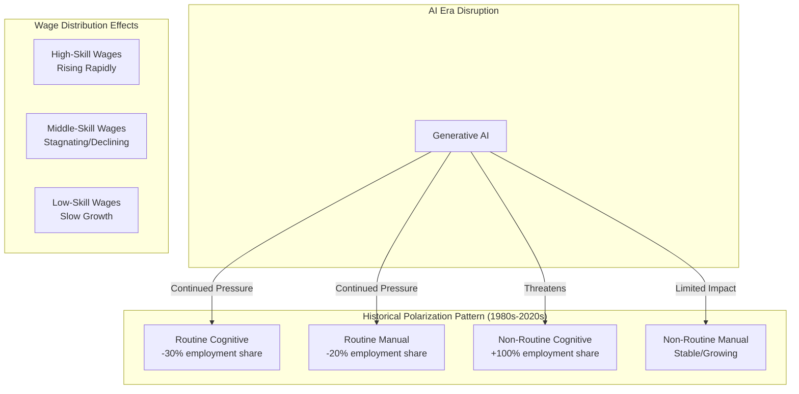

# The Restructuring Impact of Artificial Intelligence on the Labor Market: A Systematic Literature Review
# 1 Introduction and Conceptual Framework

This chapter establishes the theoretical foundations for understanding how artificial intelligence (AI) is restructuring labor markets globally. As a central driver of the Fourth Industrial Revolution, AI represents a transformative force that is fundamentally altering the nature of work, job roles, and employment dynamics across industries[^1]. Unlike previous technological waves that primarily affected manual or routine cognitive tasks, AI's capacity for pattern detection, judgment, and optimization positions it to influence a broader spectrum of occupations, including those traditionally considered immune to automation[^2]. This introduction synthesizes scholarly perspectives on three foundational theoretical frameworks—technological unemployment, skill-biased technological change (SBTC), and routine-biased technological change (RBTC)—that underpin current understanding of how AI reshapes employment structures, wage distributions, and occupational demand. The chapter articulates the core research questions guiding this systematic literature review while acknowledging the significant measurement challenges and theoretical debates that characterize this rapidly evolving field.

## 1.1 Defining AI Technologies in Labor Market Research

The conceptualization and measurement of artificial intelligence in labor market research presents **significant methodological challenges** that fundamentally affect how scholars assess and compare AI's employment impacts. The literature reveals substantial diversity in how researchers operationalize AI exposure, creating difficulties in synthesizing findings across studies and building consensus on AI's labor market effects[^3].

### Diverse Proxies for AI Measurement

Existing literature employs a wide range of proxies to capture AI's penetration into the labor market. These measurement approaches can be categorized into several distinct methodological traditions:

| Measurement Approach | Description | Key Applications | Limitations |
|---------------------|-------------|------------------|-------------|
| **Robotization indices** | Industrial robot installation density per worker | Manufacturing sector analysis; Chinese provincial studies | Captures only physical automation, not cognitive AI |
| **Digital evolution indices** | Composite measures of digitalization levels | Cross-country comparisons; industry-level analysis | May conflate AI with broader ICT adoption |
| **Human-machine collaboration metrics** | Measures of AI-human task sharing | Firm-level productivity studies | Difficult to standardize across contexts |
| **Patent-based task overlap** | Text analysis matching job tasks to AI patents | Occupation-level exposure estimates | Reflects theoretical capability, not actual adoption |
| **Text-mined adoption indices** | NLP analysis of corporate reports/job postings | Firm-level AI adoption tracking | Subject to reporting biases |

The patent-based approach developed by Webb provides a particularly innovative methodology, quantifying the "overlap" between patents and occupational tasks using verb-noun pairs extracted via natural language processing[^2]. For example, a task such as "diagnose patient's condition" yields the pair "diagnose condition," and the prevalence of similar pairs in AI patents determines an occupation's exposure score. This method reveals that **AI-exposed occupations include clinical laboratory technicians, chemical engineers, optometrists, and power plant operators**—roles involving pattern detection, judgment, and optimization that are distinct from the "muscle" tasks automated by robots or the routine information processing automated by software[^2].

### The Exposure-Adoption Gap

A critical distinction emerging from recent research is the gap between theoretical AI exposure and actual workplace adoption. Data from OpenAI's exposure metrics and Anthropic's usage data demonstrate that these two measurement approaches show **limited correlation with each other**[^4]. The OpenAI exposure framework represents a theoretical estimate of which tasks AI could potentially perform, while Anthropic's data reveals that actual Claude usage is heavily concentrated in computer and mathematical occupations (including coders) and arts and media (including writers)[^4]. This concentration likely reflects Claude's particular strengths in writing and coding rather than a comprehensive picture of AI's labor market penetration.

The practical implications of this measurement diversity are substantial. A systematic literature review spanning 2010-2023 identified that the proxies of AI exposure taken by the literature are quite diverse, encompassing robotization, digital evolution index, human-machine collaboration, and technological progress among others[^3]. This methodological heterogeneity has contributed to **contradictory and divergent conclusions** across studies, potentially influenced by the size and structure of the data utilized in respective methods[^3]. The challenge is further compounded by the fact that research remains limited to China or regions of developed countries, making it difficult to draw general conclusions about AI's global labor market effects[^3].

### Emerging Measurement Innovations

Recent developments have introduced more sophisticated approaches to measuring AI's labor market presence. The "Iceberg Index," a labor simulation tool created by MIT and Oak Ridge National Laboratory, models 151 million American workers as individual agents, each tagged with skills, tasks, occupation, and location, mapping over 32,000 skills across 3,000 counties and 923 occupations[^5]. This approach reveals that the visible tip of AI disruption—layoffs and role shifts in tech, computing, and IT—represents only 2.2% of total wage exposure (approximately $211 billion), while the submerged portion encompasses $1.2 trillion in wages across HR, logistics, finance, and office administration[^5].

The need for comprehensive, standardized measurement is underscored by recent calls for all leading AI companies to share usage data transparently. As noted in current assessments, to accurately measure AI's impact on the labor force, what is most needed is comprehensive usage data from all leading AI companies at both individual and enterprise levels[^4]. Without such standardization, the field will continue to face challenges in building consensus on AI's true labor market effects.

## 1.2 AI and the Fourth Industrial Revolution Paradigm

Artificial intelligence occupies a **central position within the Fourth Industrial Revolution (4IR)** paradigm, representing not merely an incremental technological advancement but a fundamental transformation in how economic production and human labor are organized. Understanding AI's labor market effects requires situating the technology within this broader revolutionary context, examining both its distinctive characteristics and the systemic factors that mediate its impact.

### Historical Context of Industrial Revolutions

The concept of industrial revolution extends beyond technological innovation to encompass profound societal transformation. A historical analysis of previous industrial revolutions reveals that they cannot be defined solely by their technologies; they require a context that includes influences and events related to the transformation[^6]. The following framework illustrates the progression of industrial revolutions:

The Fourth Industrial Revolution, formalized in Germany at the Hannover Messe in 2011, is marked by rapid change in technologies that are transforming how we socialize, live, and work[^7]. The term "Industry 4.0" was coined as an allusion *ex-ante* to a fourth industrial revolution, acknowledging that while we are still amid the third industrial revolution, a new set of technologies is emerging that promises significant changes in society[^6].

### Distinctive Characteristics of AI within 4IR

AI's position within the 4IR framework is distinguished by several unique characteristics that differentiate it from previous technological waves:

**Cyber-Physical Integration**: The core technology of the Fourth Industrial Revolution—Cyber-Physical Systems (CPS)—results from a combination of technologies including AI, IoT, and augmented reality[^6]. This integration enables features such as digitization, optimization, production customization, automation, and adaptation, applied across three areas of impact: integration of value chains, digitization of offerings, and digital business models and customer access[^7].

**Cognitive Augmentation Capabilities**: Unlike previous automation technologies that primarily replaced physical or routine cognitive tasks, AI represents a **cognitive-augmentation technology** that can arguably raise the performance of lower-ability or less-experienced workers more than it does experts[^8]. This characteristic positions AI as a potential equalizer rather than a destabilizer—if institutions allow the technology's benefits to diffuse broadly[^8].

**Evolutive Rather Than Disruptive Core Technologies**: A critical scholarly debate concerns whether 4IR technologies represent genuine disruption or merely evolution. Research indicates that although Industry 4.0 technologies are more evolutive than disruptive, their combination and gradual improvement promise significant impacts on the economy and society, thus characterizing a veritable revolution[^6]. The pace of diffusion depends on profit expectation, competition intensity, the regulatory system, financial availability, demand, the labor market, and attitudes towards new technologies[^6].

### Contextual Elements Mediating AI's Impact

Three contextual elements that acted as mediators in previous industrial revolutions remain crucial for understanding AI's transformative potential[^6]:

| Contextual Element | Description | Relevance to AI |
|-------------------|-------------|-----------------|
| **Technological Complementarities** | How technologies combine and reinforce each other | AI amplifies other 4IR technologies (IoT, cloud computing, robotics) |
| **Economic Institutions** | Market structures, regulatory frameworks, financial systems | Shape AI adoption rates and benefit distribution |
| **Social Structure** | Education systems, labor relations, social safety nets | Determine workforce adaptability and transition support |

The focus on connectivity and communication makes Industry 4.0 intrinsically different from the other three industrial revolutions[^7]. This connectivity enables AI to function not as an isolated technology but as an integrating force that transforms how value chains operate, how products and services are delivered, and how organizations interact with customers and employees.

### Implications for Labor Market Analysis

The positioning of AI within the 4IR paradigm has significant implications for labor market analysis. Research on the 4IR's impact on human resource management identifies three major research directions: the technology perspective focusing on how technology facilitates HR processes; the human-centric perspective studying impacts on workers and technology design for human well-being; and the organizational perspective exploring benefits of integrating 4IR technologies with HR operations[^9]. This multi-dimensional view suggests that AI's labor market effects cannot be understood through a purely technological lens but must account for organizational adoption strategies, human adaptation processes, and institutional responses.

A systematic review of technology adoption models in the 4IR context found that while the technology acceptance model remains predominantly used, **105 of 125 models extended their theoretical underpinnings**, indicating a lack of maturity in understanding how organizations and workers adopt 4IR technologies[^10]. This theoretical immaturity underscores the need for continued research into the mechanisms through which AI technologies diffuse through labor markets and reshape employment relationships.

## 1.3 Theoretical Frameworks for Understanding AI's Labor Market Effects

The scholarly analysis of AI's labor market impacts draws upon several established theoretical frameworks, each offering distinct perspectives on how technological change affects employment, wages, and occupational structures. These frameworks have evolved considerably as researchers grapple with AI's unique characteristics, leading to important refinements and emerging theoretical innovations.

### Technological Unemployment: Historical Roots and Contemporary Relevance

The concept of technological unemployment has deep historical roots, with debates about machines displacing workers extending back to the earliest industrial transformations. Contemporary models of AI-induced technological unemployment introduce sophisticated mechanisms that capture the distinctive dynamics of AI adoption.

A labor search model conceptualizing generative AI as a "learning-by-using" technology demonstrates how **AI capability improves through machine learning from workers**, thereby enhancing worker labor productivity but ultimately replacing workers if wage renegotiation fails[^11][^12][^13]. This model yields three distinct equilibria: no AI, limited AI with higher unemployment, or unbounded AI with sustained endogenous growth and minimal employment impact[^11][^12][^13]. When calibrated to U.S. data, the model predicts that in a limited AI steady state, productivity would more than triple while long-run employment would decline by 23%, with half of this loss occurring within the first five years of transition[^11][^12][^13].

However, **empirical evidence to date suggests more modest aggregate effects**. Analysis of U.S. labor market data in the 33 months following ChatGPT's release shows that the labor market has not experienced discernible structural disruption, contrary to fears that AI automation is eroding demand for cognitive labor across the economy[^4]. Historical patterns suggest that widespread workplace technological disruption typically takes decades rather than months or years; computers did not become common in offices until nearly a decade after their release to the public, and the time required to fundamentally change office workflows was even longer[^4].

### Skill-Biased Technological Change (SBTC)

The SBTC framework has been the dominant paradigm for understanding how technological change affects wage inequality. The core proposition holds that technological advances complement high-skilled workers while substituting for lower-skilled labor, thereby increasing the skill premium and widening wage inequality.

**Classical SBTC Evidence**: The theory developed during early automation periods. When General Motors introduced first-generation automation technologies in automobile manufacturing in the 1980s, problem-solving skills increased by 40% for skilled workers but decreased by 10% for unskilled workers, with similar patterns for tasks requiring memory, accuracy, and concentration[^14]. Empirical research has mostly confirmed that technology induces a bias against low skills[^14].

**Critical Reassessment**: However, the empirical foundations of the SBTC narrative have eroded significantly. A systematic review synthesizing 127 empirical studies published between 1988 and 2021 demonstrates that the timing and magnitude of rising U.S. wage inequality does not align with the standard SBTC narrative[^8]. The evidence shows that across nearly all technology categories, the **net employment effect was neutral or positive**, with 29% of studies showing positive net effects versus only 18% with negative net effects[^8]. Most technology-related job losses reflected task reallocation, not the elimination of occupations[^8].

A seminal critique published in the *Journal of Labor Economics* challenged the mainstream view that recent increases in wage inequality should be attributed to SBTC, particularly SBTC related to new computer technologies[^15]. The analysis revealed that despite continued advances in computer technology throughout the 1990s, wage inequality stabilized during that period; SBTC also failed to explain the evolution of other dimensions of wage inequality, including gender and racial wage gaps and the age gradient of education returns[^15].

**AI's Distinctive Effect on Skill Premium**: Recent theoretical work examining AI's effect on the skill premium proposes a nested constant elasticity of substitution production function distinguishing three capital types: traditional physical capital, industrial robots, and AI[^16]. Unlike industrial robots that primarily substitute for low-skilled workers, AI primarily substitutes for high-skilled worker tasks[^16]. Numerical simulations demonstrate that without AI use, the skill premium is approximately 2.0; when AI capital stock reaches half of industrial robot stock, the skill premium falls to 1.70; when equal, it falls to 1.62; and when AI stock is twice robot stock, the skill premium further declines to 1.52[^16]. This suggests that **AI has the potential to reduce the skill premium**, thereby potentially slowing or reversing the inequality increases observed in recent decades[^16].

### Routine-Biased Technological Change (RBTC)

The RBTC framework emerged to explain labor market polarization—the simultaneous growth of high-skill and low-skill employment with declining middle-skill jobs. This theory posits that technology automates routine tasks (both cognitive and manual) that are concentrated in middle-wage occupations.

**Core RBTC Predictions and Evidence**: Research using data from 10 OECD countries between 1995 and 2013 confirms that technological change is both routine-biased and skill-biased[^17]. However, the outcomes of routine-biased technological change may be **occupational upgrading rather than polarization**, depending on where routine occupations cluster in the wage distribution[^17]. Only when routine occupations cluster in the middle of the wage distribution does polarization occur; when routine occupations concentrate at the bottom of the wage hierarchy, occupational upgrading is the more common pattern[^17].

This finding challenges two core claims in the RBTC literature: first, it challenges the view that RBTC has replaced SBTC, arguing instead that SBTC and RBTC are related but distinct processes that may occur simultaneously with varying intensity across countries[^17]; second, it challenges the assumption that routine occupations are always middle-wage[^17].

**AI's Departure from Traditional RBTC Patterns**: AI represents a significant departure from the RBTC pattern associated with earlier computerization. Patent-based analysis reveals that AI is directed at high-skilled tasks involving pattern detection, judgment, and optimization—activities distinct from the "muscle" tasks of robots or routine information processing of software[^2]. Descriptively, **exposure to AI is highest for high-skilled and high-wage occupations**, individuals with college degrees (including Master's), older workers, and occupations with a higher proportion of male workers[^2]. Under the assumption that historical negative relationships between exposure and wage changes will hold for AI, projections suggest AI would reduce 90:10 wage inequality (a 4% decrease using the software coefficient, 9% using the robot coefficient) but increase inequality at the top of the distribution (the 99:90 ratio)[^2].

### Emerging Theoretical Innovations

Recent research has introduced several theoretical refinements to account for AI's distinctive characteristics:

**Seniority-Biased Technological Change**: Analysis of U.S. résumé data covering 62 million workers across 285,000 firms from 2015 to 2025 reveals that generative AI constitutes **seniority-biased technological change**, disproportionately affecting junior workers relative to senior workers[^18][^19]. Following AI adoption, junior employment declines sharply in adopting firms relative to non-adopters, while senior employment remains largely unchanged; this decline is concentrated in occupations most exposed to GenAI and is driven by slower hiring rather than increased separations or promotions[^18][^19].

**AI as a Skill-Leveling Tool**: Contrary to traditional SBTC predictions, early empirical research consistently finds that AI raises the floor of performance, compressing productivity differences within occupations and enabling less-experienced workers to perform at levels closer to seasoned professionals[^8]. In studies with college-educated professionals performing writing tasks, access to ChatGPT reduced task-completion time by roughly 40% and significantly improved output quality, with **the largest gains accruing to low-ability workers**[^8]. Field studies at a Fortune 500 firm found that AI assistance disproportionately increases the performance of less skilled and less experienced workers across all productivity measures[^8].

**Task-Based Models of Skill Bias**: Sophisticated task-based models illustrate how skill bias emerges in firms either because AI competes with lower skills and/or augments more complex jobs, with the degree of bias depending on both the firm's focus on efficiency versus innovation and AI's performance range across the firm's task spectrum[^14]. While AI exhibits skill bias favoring more advanced skills, AI's impact on skill demand is generally positive for most skills, reflecting that early AI adopters tend to gain business advantages over non-adopting competitors[^14]. A critical mediating factor is **how firms leverage AI**: when AI is primarily used for automation, the outlook for basic skills turns negative[^14].

### Synthesis: Theoretical Convergence and Divergence

The theoretical landscape reveals both convergence and divergence in understanding AI's labor market effects:

| Framework | Traditional Prediction | AI-Specific Modification |
|-----------|----------------------|-------------------------|
| **Technological Unemployment** | Technology displaces workers | AI effects moderated by institutional factors; compensating mechanisms often offset displacement |
| **SBTC** | Technology complements high-skilled, substitutes low-skilled | AI may reduce skill premium by automating high-skilled tasks; potential equalizing effects |
| **RBTC** | Polarization through middle-skill automation | AI targets non-routine cognitive tasks; effects depend on occupational wage structure |
| **Emerging Frameworks** | N/A | Seniority bias; firm-level adoption strategies; institutional mediation |

The evidence demonstrates that **institutions, not technology, shape the trajectory of economic outcomes**[^8]. AI's impact on workers will follow the same logic as past technological shocks, where the devastation arose from institutional failures to adapt rather than from technology itself[^8]. This institutional perspective suggests that understanding AI's labor market effects requires attention not only to the technology's capabilities but also to the policy frameworks, educational systems, and social structures that mediate its adoption and diffusion.

## 1.4 Research Questions and Analytical Scope

This systematic literature review is guided by a set of interconnected research questions that address the fundamental uncertainties surrounding AI's labor market restructuring effects. These questions emerge from the theoretical frameworks examined above and reflect the current state of scholarly debate regarding AI's transformative potential.

### Core Research Questions

The literature at present remains dispersed and has yet to build consensus on several critical questions[^3]:

**1. Net Employment Effects**: Does AI produce overall net-job destruction or net-job creation? This question lies at the heart of policy debates and has generated conflicting empirical findings. Studies calculating that between 10% and 50% of jobs are at risk of AI automation contrast with empirical evidence showing less dramatic employment pressure[^14]. A recent MIT study using the "Iceberg Index" found that AI can already replace 11.7% of the U.S. workforce, equivalent to up to $1.2 trillion in wages across finance, healthcare, and professional services[^5]. Yet aggregate labor market data through December 2023 shows that AI had not caused major changes in total employment, with losses in highly exposed roles largely offset by gains in other jobs and by hiring growth at firms using AI to become more productive[^20].

**2. Skill-Type Differentiation**: Which skill types will see the largest impacts? The evidence suggests a complex pattern of skill-biased effects that departs from traditional SBTC predictions. Chinese provincial data from 2010-2019 demonstrates that AI promotes employment structure advancement by replacing low-skilled workers while increasing employment of medium- and high-skilled workers, with AI development increasing high-skilled and medium-skilled labor employment by 0.063% and 0.001% respectively for each unit increase, while low-skilled labor employment decreases by 0.001%[^21]. However, in developed economies, AI exposure is highest for high-skilled and high-wage occupations[^2], suggesting potential for reducing rather than increasing skill-based wage inequality.

**3. Sectoral Variation**: Which sectors will experience the greatest AI-enabled economic repercussions? The World Economic Forum's Future of Jobs Survey (2024) projects that AI and technology-related roles will dominate the fastest-growing job categories between 2025 and 2030, while many administrative and clerical positions face decline[^1]. Research tracking AI adoption from 2010 to 2023 found that business, financial, architecture, and engineering jobs shrank by about 2% to 2.5% over five years due to their high share of tasks matching AI capabilities[^20].

**4. Regional and Demographic Heterogeneity**: How do AI's effects differ across economic regions and demographic groups? Research is currently limited to China or regions of developed countries, making it difficult to draw general conclusions[^3]. Within countries, significant heterogeneity exists: a McKinsey analysis found that Black workers are overrepresented in positions at high risk of automation, with 24% working in such roles compared to 20% of white workers[^1]. An International Labor Organization study predicts that in high-income countries, 7.8% of women's occupations (about 21 million jobs) could be automated, compared to 2.9% of jobs held by men (about 9 million positions)[^1].

### Analytical Boundaries and Scope

This review establishes several analytical boundaries to ensure systematic and comprehensive coverage:

**Temporal Scope**: The review focuses primarily on literature published from 2010 to 2025, capturing both the pre-generative AI period and the rapid developments following ChatGPT's release in November 2022. This temporal range allows examination of how scholarly understanding has evolved as AI capabilities have advanced.

**Geographic Coverage**: While acknowledging the concentration of research on China and developed countries, the review seeks to identify findings with broader applicability and highlight gaps in evidence for other regions.

**Methodological Inclusivity**: The review encompasses both quantitative studies (econometric analyses, randomized controlled trials, survey-based research) and qualitative investigations, recognizing that the methodologies employed in qualitative and quantitative literature exhibit a wide range of diversity[^3].

**Technology Scope**: The analysis covers AI broadly defined, including machine learning, natural language processing, computer vision, and generative AI systems, while distinguishing where possible between different AI sub-fields and their specific labor market effects. Machine learning, along with its corresponding algorithms, has emerged as the most frequently applied AI subfield in project-related applications[^22].

### Evaluating the Evidence Base

A critical function of this review is to assess the quality and reliability of existing evidence. Several factors complicate this evaluation:

**Measurement Challenges**: The diverse proxies used to measure AI exposure create difficulties in comparing findings across studies. OpenAI's "exposure" data exists with key limitations because it is not based on actual usage and should therefore be interpreted as a theoretical estimate of theoretically potentially affected jobs and sectors[^4].

**Causal Identification**: Recent studies acknowledge that "there is no direct empirical evidence to confirm the causal effect between AI and employment demand for different skills" and that "there is little research that links the actual adoption of AI technologies to changes in skill demand"[^14].

**Temporal Limitations**: Much existing research predates the rapid rise of generative AI tools like ChatGPT. Analysis running up to 2023 reflects an earlier phase of AI adoption, and it remains an open question whether patterns observed so far will hold in the generative AI era[^20]. Because generative AI can learn from fewer examples, it could take on a wider range of tasks, leaving fewer for humans to shift to[^20].

### Framework for Evidence Synthesis

The following chapters will systematically address these research questions through structured analysis of empirical evidence, theoretical developments, and policy responses. The analytical approach recognizes that AI's labor market impact is not technologically determined but emerges from the interaction of technological capabilities, firm adoption strategies, worker adaptation, and institutional responses.

This framework emphasizes that the key to AI adoption lies not in the technology itself but in creating conditions where AI assists rather than replaces human workers[^23]. Workload reduction is strongly linked to adoption, but it is not the only consideration; intermediate proficiency requirements and high sensitivity are also important factors[^23]. The evidence consistently suggests that **institutions, not technology, will shape the trajectory of AI's labor market outcomes**[^8], making policy analysis an essential component of understanding AI's restructuring impact.

The subsequent chapters will build upon this conceptual foundation to examine the mechanisms of AI-driven disruption, sectoral variations in impact, job creation and skill transformation dynamics, wage inequality and polarization effects, policy responses, and critical research gaps requiring future scholarly attention.

## 2 Methodological Approach to Literature Selection

This chapter provides a comprehensive and transparent account of the systematic methodology employed to identify, screen, and select high-quality literature for this review on AI's labor market restructuring impact. The methodological rigor of any systematic review fundamentally determines the validity and reliability of its conclusions, making explicit documentation of procedures essential for both reproducibility and critical evaluation. Given that the literature on AI's labor market effects remains **dispersed and has yet to build consensus on several key issues**—including which skill types will experience the largest impacts, which sectors will see the greatest AI-enabled economic repercussions, and whether there will be net job destruction or creation[^3]—a rigorous systematic approach is particularly critical for synthesizing credible insights from a heterogeneous evidence base.

### 2.1 Research Design and Systematic Review Framework

The selection of a systematic literature review methodology for examining AI's labor market restructuring impact reflects both the nature of the research questions and the current state of scholarly evidence in this domain. A systematic review is defined as a study that attempts to answer a question by synthesizing the results of primary studies while using strategies to limit bias and random error, including a comprehensive search[^24]. This approach is particularly appropriate for the present investigation given the diversity of methodological approaches, measurement proxies, and contradictory findings that characterize the AI-labor market literature.

#### Rationale for Systematic Review Approach

The decision to employ a systematic rather than traditional narrative review methodology stems from several considerations related to the evidence landscape. Traditional reviews may be subject to bias and lack the transparency and reproducibility that characterize systematic approaches[^25]. The systematic review methodology offers several advantages for synthesizing AI-labor market evidence:

| Characteristic | Traditional Review | Systematic Review | Relevance to AI-Labor Research |
|----------------|-------------------|-------------------|-------------------------------|
| **Search Strategy** | Selective, potentially biased | Exhaustive, comprehensive | Essential given diverse proxy measures across studies |
| **Selection Criteria** | Often implicit | Explicit, predefined | Necessary to address methodological heterogeneity |
| **Quality Assessment** | Variable | Standardized tools applied | Critical for evaluating contradictory findings |
| **Transparency** | Limited documentation | Full documentation of process | Enables reproducibility and critical evaluation |
| **Synthesis** | Narrative without systematic framework | Structured with tabular accompaniment | Facilitates comparison across diverse contexts |

The systematic approach directly addresses the methodological challenges identified in prior AI-labor market research. As noted in comprehensive reviews of this literature, **the methodologies employed in qualitative and quantitative literature exhibit a wide range of diversity, and these techniques often yield contradictory and divergent conclusions**, potentially influenced by the size and structure of the data utilized[^3]. A systematic methodology provides the framework necessary to evaluate and synthesize findings across these diverse approaches.

#### Alignment with PRISMA 2020 Guidelines

This review adheres to the **PRISMA (Preferred Reporting Items for Systematic reviews and Meta-Analyses) 2020** framework, which represents the current gold standard for systematic review reporting. PRISMA provides authors with guidance and examples of how to completely report why a systematic review was done, what methods were used, and what results were found[^26]. The PRISMA framework primarily provides guidance for the reporting of systematic reviews evaluating the effects of interventions, and is complemented by various extensions that provide guidance for reporting different types or aspects of systematic reviews[^26].

The PRISMA methodology ensures that the review process is **systematic, transparent, and traceable**[^25]. For systematic reviews, the methodology is described as seeking to systematically search for, appraise, and synthesize research evidence, often adhering to guidelines on the conduct of a review, with the search process aiming for exhaustive, comprehensive searching[^27]. This framework structures the review across four distinct phases: identification of records through database searching, screening of titles and abstracts, assessment of full-text articles for eligibility, and final inclusion of studies meeting all criteria.

#### Key Stages of the Review Process

The systematic review process follows a structured sequence of methodological stages, each designed to minimize bias and maximize comprehensiveness. The literature identifies **eight key stages specifically relating to literature searching in systematic reviews**: who should conduct the literature search, aims and purpose of literature searching, preparation, the search strategy, searching databases, supplementary searching, managing references, and reporting the search process[^28]. These stages were consistently reported across nine major guidance documents, suggesting consensus on the fundamental components of rigorous literature searching[^28].

The preparation phase establishes the conceptual and operational foundations for the review. For doctoral theses and comprehensive reviews, the starting point is the research question statement or the intersection of knowledge areas[^25]. The search phase aims to obtain a set of references meeting dual conditions: **strong relevance (responding to the topic intersection or research question) and constituting a manageable collection** (on the order of tens of documents rather than hundreds or thousands)[^25]. The selection and analysis phases apply standardized criteria and tools to ensure that included studies meet quality thresholds and that findings are synthesized systematically.

#### Addressing Challenges in AI-Labor Market Research

The systematic framework adopted for this review specifically addresses several challenges endemic to AI-labor market research. First, the **diverse proxies used to assess AI exposure**—including robotization, digital evolution index, human-machine collaboration, and technological progress—necessitate a comprehensive search strategy that captures studies employing different measurement approaches[^3]. Second, the concentration of existing research on **China or regions of developed countries** requires explicit attention to geographic scope in both search and synthesis[^3]. Third, the contradictory findings across studies demand rigorous quality assessment to distinguish methodologically robust findings from those potentially compromised by design limitations.

The review also draws methodological guidance from recent systematic reviews in related domains. For example, systematic reviews of labor market initiatives addressing precarious employment have demonstrated the application of PRISMA frameworks to complex, heterogeneous evidence bases, with quality appraisal using standardized tools yielding well-founded bodies of evidence[^29]. These reviews illustrate how systematic methodology can accommodate diverse study designs—including qualitative studies, randomized controlled trials, nonrandomized controlled trials, quantitative descriptive studies, and mixed-methods studies—while maintaining analytical rigor[^29].

### 2.2 Search Strategy and Database Selection

The development of a comprehensive search strategy represents a foundational element of systematic review methodology, directly determining the completeness and representativeness of the evidence base. The search strategy for this review was designed to identify all relevant literature examining AI's effects on employment, wages, skills, and occupational structures while maintaining practical feasibility in terms of the volume of records requiring screening.

#### Database Selection and Rationale

The selection of academic databases for systematic reviews should prioritize comprehensive coverage of the relevant literature while ensuring access to high-quality, peer-reviewed sources. At a minimum, a comprehensive review should include electronic searches using multiple scientific literature databases[^24]. For this review, the following databases were selected as primary search sources:

| Database | Rationale for Inclusion | Coverage Characteristics |
|----------|------------------------|-------------------------|
| **Scopus** | Largest abstract and citation database; recommended as first choice for humanities and social sciences[^25] | Broad interdisciplinary coverage; strong indexing of management and economics journals |
| **Web of Science** | Premier citation index with rigorous quality standards; recommended in combination with Scopus[^25] | High-quality peer-reviewed literature; comprehensive citation tracking |
| **IEEE Xplore** | Essential for technical AI literature; captures engineering and computing perspectives[^30] | Specialized coverage of AI/technology research; complements social science databases |

The combination of Scopus and Web of Science is recommended as best practice for systematic reviews in the social sciences, with Scopus serving as the preferred database and Web of Science providing complementary coverage[^25]. The addition of IEEE Xplore ensures capture of technical literature on AI development and implementation that may inform understanding of labor market effects, reflecting the interdisciplinary nature of AI-labor market research that spans computer science, economics, management, and sociology[^30].

#### Search String Construction

The construction of search strings employed Boolean logic operators to combine keyword terms representing the core concepts of the review. The search strategy utilized keywords such as "Artificial Intelligence", "employment impacts", and "skills requirements", combined with Boolean logic operators to capture relevant literature[^31]. The search string development followed established principles for systematic searching, including the use of both controlled vocabulary terms and free-text keywords to maximize recall.

The search strategy was structured around three primary concept clusters:

**Concept 1 - Artificial Intelligence Technologies:**
- Primary terms: "artificial intelligence" OR "AI" OR "machine learning" OR "deep learning" OR "natural language processing" OR "computer vision" OR "generative AI" OR "ChatGPT" OR "large language model*"
- Rationale: Captures the full spectrum of AI technologies examined in labor market research, from traditional machine learning to emerging generative systems

**Concept 2 - Labor Market Dimensions:**
- Primary terms: "labor market" OR "employment" OR "job*" OR "occupation*" OR "workforce" OR "work" OR "wage*" OR "income" OR "earning*"
- Rationale: Encompasses the multiple dimensions of labor market effects examined in the literature

**Concept 3 - Impact and Change:**
- Primary terms: "impact*" OR "effect*" OR "disrupt*" OR "transform*" OR "automat*" OR "displac*" OR "skill*" OR "demand" OR "polariz*"
- Rationale: Captures studies examining various mechanisms and outcomes of AI-labor market interactions

The final search string combined these concepts using AND operators, with OR operators connecting synonymous terms within each concept. This approach follows the effective use of academic databases, which involves using Boolean operators in combination with parameterized limitations to improve precision[^25].

#### Temporal Scope

The temporal scope of the search was defined as **2010 to 2025**, reflecting several methodological considerations. The lower bound of 2010 captures the period of accelerating AI development and adoption that preceded the current wave of generative AI technologies. The literature search spanning from 1984 to 2024 in related systematic reviews demonstrates the value of extended temporal coverage for capturing the evolution of research findings[^30]. However, the concentration on the 2010-2025 period ensures focus on contemporary AI technologies most relevant to current labor market restructuring while maintaining a manageable scope.

This temporal range aligns with the coverage of prior systematic reviews in the AI-labor market domain, which have analyzed peer-reviewed articles spanning 2010-2023[^3]. The extension to 2025 ensures capture of the rapidly expanding literature following the release of ChatGPT in November 2022, which has generated significant new research on generative AI's labor market implications.

#### Supplementary Search Methods

To ensure exhaustive coverage beyond database searching, several supplementary search methods were employed. These methods are recognized as essential components of comprehensive systematic searching[^28]:

**Citation Chasing:** Forward and backward citation searching from key included studies and seminal works in the field. This approach, also known as "pearl growing," identifies relevant literature that may not be captured through keyword-based database searches[^28].

**Reference List Screening:** Systematic examination of reference lists from included studies and relevant review articles. The search of reference lists and bibliographies of included studies is identified as a key component of comprehensive literature searching[^32].

**Grey Literature Consideration:** While the primary focus remains on peer-reviewed journal articles to ensure quality, consideration was given to significant working papers, policy reports, and institutional publications from recognized organizations (e.g., OECD, World Bank, IMF) that may contain relevant empirical evidence not yet published in peer-reviewed form.

**Expert Consultation:** Engagement with subject matter experts to identify potentially relevant studies not captured through other search methods. The inclusion of content experts in the field is identified as a component of comprehensive search strategies[^32].

### 2.3 Inclusion and Exclusion Criteria

The specification of clear, predefined eligibility criteria represents a fundamental requirement for systematic review methodology, ensuring consistent and transparent study selection. Eligibility criteria should be specified according to population, intervention, outcomes, study design, publication year, and language[^29]. The criteria for this review were developed to ensure focus on high-quality, directly relevant evidence while maintaining sufficient breadth to capture the diverse methodological approaches characterizing AI-labor market research.

#### Inclusion Criteria

The following inclusion criteria were applied to identify studies eligible for the review:

| Criterion Category | Specification | Rationale |
|-------------------|---------------|-----------|
| **Publication Type** | Peer-reviewed journal articles | Ensures quality control through peer review process |
| **Language** | English-language publications | Aligns with user requirements; captures majority of high-impact research |
| **Indexing** | Studies indexed in Scopus or Web of Science | Ensures accessibility and quality benchmarking |
| **Topic Focus** | Studies directly examining AI's effects on employment, wages, skills, or occupational change | Maintains relevance to core research questions |
| **Study Type** | Empirical studies (quantitative, qualitative, or mixed-methods) or theoretical analyses | Captures diverse evidence types contributing to understanding |
| **Temporal Range** | Publications from 2010 to 2025 | Focuses on contemporary AI technologies and recent labor market dynamics |
| **Methodological Transparency** | Studies with clear research questions and documented methodology | Enables quality assessment and replication |

The inclusion of both empirical and theoretical studies reflects the recognition that understanding AI's labor market effects requires both empirical evidence on observed impacts and theoretical frameworks explaining underlying mechanisms. Systematic reviews appropriately include qualitative, quantitative, or mixed-methods study designs and evaluations[^29].

#### Exclusion Criteria

The following exclusion criteria were applied to systematically exclude studies not meeting eligibility requirements:

**1. Document Type Exclusions:**
- Editorials, commentaries, and discussion papers[^29]
- Conference abstracts without full papers
- Book reviews and opinion pieces
- Non-peer-reviewed materials including blog posts and media articles

**2. Topical Exclusions:**
- Studies focusing solely on robotics or industrial automation without AI components
- Studies examining AI technology development without labor market implications
- Studies addressing unemployment without specific focus on AI-related effects[^29]
- Studies examining individual behavioral change without connection to AI-driven labor market restructuring

**3. Methodological Exclusions:**
- Studies lacking clear research questions or methodological documentation
- Studies not evaluated formally or assessed using empirical data without clear analytical focus[^29]
- Duplicate publications reporting the same findings[^29]

**4. Quality Exclusions:**
- Studies rated as low quality on standardized assessment tools (detailed in Section 2.4)
- Studies with fundamental methodological flaws compromising validity of findings

The rationale for excluding editorials, commentaries, and discussion papers reflects the focus on primary research findings rather than opinion or synthesis[^29]. The exclusion of studies focusing solely on robotics without AI components addresses the conceptual distinction between traditional automation and AI-enabled transformation, ensuring the review captures the distinctive effects of cognitive technologies rather than conflating them with industrial automation.

#### Application of Criteria

The eligibility criteria were applied sequentially during the screening process, with initial screening based on title and abstract followed by full-text assessment. Initial inclusion or exclusion decisions are appropriately based on title and abstract[^25], with full-text review reserved for studies passing initial screening. This two-stage approach balances efficiency with thoroughness, ensuring that potentially relevant studies are not prematurely excluded while managing the practical demands of comprehensive screening.

### 2.4 Quality Assessment and Critical Appraisal Procedures

The assessment of methodological quality represents an essential component of systematic review methodology, enabling evaluation of the reliability and validity of included study findings. Quality assessment, also known as quality appraisal, critical appraisal, or risk of bias assessment, refers to the assessment of the methodological quality and rigor of the trials or studies included in a systematic review[^33]. This assessment helps in minimizing the risk of bias and increases confidence in review findings[^33].

#### Distinguishing Quality Concepts

A critical preliminary distinction must be drawn between quality of reporting and quality of conduct. While reporting guidelines are concerned with the quality of writing and whether all relevant components have been reported in adequate detail, **quality appraisal tools concentrate on how well the study has complied with methodological standards**[^34]. Misusing reporting guidelines instead of risk of bias or critical appraisal tools can lead to a well-reported study with methodological bias being misinterpreted as "high quality"[^34]. This review therefore employs dedicated quality assessment tools rather than reporting checklists to evaluate included studies.

Bias is defined as any systematic process at any stage of study design, conduct, and analysis that results in deviations of the study findings from reality[^34]. Risk-of-bias assessment is a formal evaluation of the sources of bias, as well as the strength and direction of their effect on the findings of each particular study[^34]. Assessing the risk of bias is an essential component of a systematic review because it completes the analysis and interpretation of the findings by demonstrating the reliability of individual study findings[^34].

#### Quality Assessment Tools

Given the diversity of study designs characterizing AI-labor market research, multiple quality assessment tools were employed to ensure appropriate evaluation across different methodological approaches:

**For Systematic Reviews:**
The **AMSTAR 2 (A MeaSurement Tool to Assess systematic Reviews)** instrument was employed for evaluating any systematic reviews included in the evidence base. AMSTAR 2 is a critical appraisal tool for systematic reviews that include randomized or non-randomized studies of healthcare interventions[^35]. The original AMSTAR instrument was developed to assess methodological quality of systematic reviews, combining elements from the enhanced Overview Quality Assessment Questionnaire (OQAQ) and the Sacks checklist with additional items based on methodological advances[^36]. The revised AMSTAR 2 has 16 items, simpler response categories than the original, includes a more comprehensive user guide, and has an overall rating based on weaknesses in critical domains[^33].

The AMSTAR 2 checklist includes criteria such as whether the review is based on a focused question, whether eligibility criteria are predefined, if a comprehensive literature search strategy was used, if dual independent review was conducted, if the quality of each included study was rated, if included studies are listed with characteristics, and if publication bias and heterogeneity were assessed[^24].

**For Randomized Controlled Trials:**
The **Cochrane Risk-of-Bias (RoB 2) Tool** was employed for assessing randomized studies. This is the recommended tool for assessing the quality and risk of bias within randomized clinical trials included in systematic reviews[^33]. Review authors assess risk of bias in six domains of potential bias as being either high, low, or unclear, including selection bias, performance bias, detection bias, attrition bias, reporting bias, and other bias[^33]. The tool focuses on different aspects of trial design, conduct, and reporting[^35].

**For Non-Randomized Studies:**
The **Newcastle-Ottawa Scale (NOS)** was employed for appraising non-randomized studies. This scale facilitates the appraisal of non-randomized studies and was developed to assess the quality of nonrandomized studies with its design, content, and ease of use directed to the task of incorporating quality assessments in the interpretation of meta-analytic results[^33]. The scale includes quality assessment scales for both cohort studies and case-control studies[^35].

**For Mixed-Methods and Diverse Study Designs:**
The **Mixed Methods Appraisal Tool (MMAT)** was employed for studies employing qualitative, quantitative, or mixed-methods designs. The MMAT is a critical appraisal tool designed for systematic mixed studies reviews that include qualitative, quantitative, and mixed methods studies[^35]. This tool has been successfully applied in systematic reviews of labor market initiatives, with studies rated as high quality (6-7 "Yes" answers), medium quality (3-5 "Yes" answers), or low quality (0-2 "Yes" answers)[^29].

The selection of appropriate tools aligned with specific study designs follows best practice recommendations that systematic review authors should choose assessment tools based on their requirements[^34]. The following table summarizes the tool selection framework:

| Study Design | Primary Assessment Tool | Key Assessment Domains |
|--------------|------------------------|----------------------|
| Systematic Reviews | AMSTAR 2 | Search comprehensiveness, quality appraisal, synthesis methods |
| Randomized Controlled Trials | Cochrane RoB 2 | Randomization, blinding, attrition, selective reporting |
| Non-Randomized Quantitative Studies | Newcastle-Ottawa Scale | Selection, comparability, outcome assessment |
| Qualitative Studies | MMAT (Qualitative criteria) | Appropriateness of approach, data collection, interpretation |
| Mixed-Methods Studies | MMAT (Mixed-methods criteria) | Integration rationale, divergence addressed, quality of components |

#### Criteria for Defining High-Quality Studies

The operationalization of "high-quality" studies incorporated multiple dimensions reflecting both methodological rigor and scholarly standards:

**Methodological Criteria:**
- Clear, focused research questions supported by conceptual frameworks[^37]
- Appropriate data collection methods suited to address research questions[^29]
- Transparent reporting of methods enabling replication
- Adequate accounting for potential confounders in quantitative studies[^29]
- Demonstration of rigor in qualitative studies through credibility, transferability, dependability, and confirmability[^37]

**Publication Criteria:**
- Peer-review status ensuring external quality control
- Journal impact factors indicating scholarly recognition
- Indexing in major databases (Scopus, Web of Science) confirming accessibility and quality benchmarking

Quality appraisal ratings from systematic reviews in related domains demonstrate the application of these criteria. For example, in a systematic review of labor market initiatives, **16 studies were rated as high quality and 6 as medium quality using the MMAT**; common strengths across studies included clear research questions and appropriate data collection methods, while key weaknesses included failure to account for confounders in some nonrandomized controlled trials and insufficient information on outcome measurement[^29].

#### Role of Quality Assessment in Synthesis

Quality assessment findings directly informed the synthesis and interpretation of review findings in several ways. First, studies rated as low quality on standardized assessment tools were excluded from the final evidence synthesis to ensure reliability of conclusions. Second, quality ratings were reported alongside study findings to enable readers to evaluate the strength of evidence supporting specific conclusions. Third, sensitivity analyses examined whether conclusions were robust to the exclusion of medium-quality studies, testing the stability of findings across the evidence base.

The Cochrane Review Group Editorial Board advises systematic review writers to assess the certainty of the evidence for their primary outcome measures[^34]. The **GRADE (Grading of Recommendations, Assessment, Development, and Evaluations)** approach provides a systematic framework for assessing the overall certainty and confidence in systematic review findings, incorporating five domains: risk-of-bias assessment, inconsistency, indirectness, imprecision, and publication bias[^34]. Importantly, risk-of-bias assessment is one domain of GRADE, making it impossible to implement GRADE without first determining the risk of bias in each study[^34].

### 2.5 Screening Process and Study Selection

The screening process employed a multi-stage approach to systematically identify studies meeting all eligibility criteria while minimizing selection bias. This process followed established systematic review protocols, with documentation of decisions at each stage to ensure transparency and reproducibility.

#### Title and Abstract Screening

The initial screening phase involved review of titles and abstracts for all records retrieved through database searching and supplementary methods. Initial inclusion or exclusion decisions are appropriately based on title and abstract review[^25]. During this phase, records were evaluated against the predefined inclusion and exclusion criteria to identify potentially relevant studies warranting full-text review.

The title and abstract screening applied the following decision rules:
- **Include for full-text review:** Records with titles or abstracts indicating direct examination of AI's effects on employment, wages, skills, or occupational structures
- **Exclude:** Records clearly falling outside the scope (e.g., purely technical AI development without labor market implications, studies of non-AI automation)
- **Uncertain:** Records with insufficient information in title/abstract to determine eligibility (retained for full-text review)

This conservative approach ensured that potentially relevant studies were not prematurely excluded based on limited information available in titles and abstracts.

#### Full-Text Assessment

Records passing title and abstract screening underwent full-text assessment to determine final eligibility. This phase involved comprehensive evaluation against all inclusion and exclusion criteria, with particular attention to:

- Verification of AI focus (distinguishing AI-specific studies from general automation research)
- Assessment of methodological transparency and documentation
- Confirmation of direct relevance to labor market outcomes
- Evaluation of publication type and peer-review status

Studies were excluded at this stage if full-text review revealed that they did not meet eligibility criteria that could not be assessed from title and abstract alone. A list of excluded studies with justifications for exclusion was maintained to ensure transparency[^32].

#### Dual Independent Review

To minimize selection bias and ensure reliability of screening decisions, **dual independent review** was employed throughout the screening process. This approach requires that at least two reviewers independently agree on selection of eligible studies and achieve consensus on which studies to include[^32]. The dual review process addresses the potential for individual reviewer bias and ensures that eligibility decisions reflect consistent application of predefined criteria.

Disagreements between reviewers were resolved through discussion and consensus. For persistent disagreements, a third-party adjudication process was employed, with a senior reviewer providing final determination based on explicit application of eligibility criteria. This approach follows best practice for systematic reviews, which specifies that disagreements should be resolved through consensus or third-party adjudication[^32].

#### Documentation and PRISMA Flow Diagram

The screening process was documented using a PRISMA flow diagram, which provides a standardized format for reporting the flow of studies through the identification, screening, eligibility, and inclusion stages[^26]. The flow diagram documents:

- Number of records identified through database searching
- Number of additional records identified through supplementary methods
- Number of records after duplicate removal
- Number of records screened (title/abstract)
- Number of records excluded at title/abstract screening
- Number of full-text articles assessed for eligibility
- Number of full-text articles excluded with reasons
- Number of studies included in qualitative synthesis
- Number of studies included in quantitative synthesis (if applicable)

This documentation ensures that the study selection process is transparent, enabling readers to assess the comprehensiveness of the search and the appropriateness of exclusion decisions. The PRISMA flow diagram serves as a visual summary of the systematic review process, enhancing the reproducibility and credibility of the review[^26].

### 2.6 Data Extraction and Synthesis Protocol

The data extraction protocol established standardized procedures for capturing relevant information from included studies, ensuring consistent and comprehensive documentation across the diverse study designs and methodological approaches characterizing AI-labor market research.

#### Data Extraction Framework

A structured data extraction form was developed to systematically capture information across multiple domains. Analysis involves systematic procedures for obtaining data, while synthesis represents the final product of the literature review[^25]. The extraction form included the following data fields:

**Study Characteristics:**
- Author(s), publication year, and journal
- Country/region of study focus
- Study design (quantitative, qualitative, mixed-methods)
- Sample characteristics (size, population, time period)
- Funding sources and potential conflicts of interest

**AI Measurement Approaches:**
- Proxy measures for AI exposure (robotization, patent-based, adoption indices, etc.)
- Definition of AI technologies examined
- Level of analysis (occupation, firm, industry, region, country)
- Temporal scope of AI measurement

**Key Findings:**
- Employment effects (displacement, creation, net effects)
- Skill demand shifts (skill types affected, direction of change)
- Wage impacts (inequality, polarization, skill premiums)
- Sectoral variations in effects
- Demographic or regional heterogeneity

**Methodological Details:**
- Data sources and collection methods
- Analytical approaches and statistical techniques
- Limitations acknowledged by authors
- Quality assessment ratings

This comprehensive extraction framework addresses the heterogeneity challenges noted in prior systematic reviews, where the diverse proxies and methodologies employed across studies have contributed to contradictory findings[^3]. By systematically documenting measurement approaches and analytical methods, the extraction protocol enables identification of methodological factors potentially explaining divergent conclusions.

#### Synthesis Approach

The synthesis of extracted data employed a **narrative synthesis** approach with tabular accompaniment, reflecting the methodological diversity of included studies and the challenges of quantitative pooling across heterogeneous measurement approaches. For systematic reviews, synthesis is typically narrative with tabular accompaniment, and the analysis outlines what is known with recommendations for practice, what remains unknown, and recommendations for future research[^27].

Narrative synthesis represents the common form for presenting the state of knowledge in humanities and social sciences, comprising discursive text that includes self-authored text and clearly defined and attributed direct quotation fragments[^25]. The synthesis process involved several analytical procedures:

**Thematic Organization:** Findings were organized around the core themes of the review—employment effects, skill demand shifts, wage impacts, and sectoral variations—enabling systematic comparison across studies examining similar outcomes.

**Methodological Grouping:** Studies were grouped by methodological approach (e.g., patent-based exposure measures, firm-level adoption studies, occupation-level analyses) to facilitate assessment of whether findings converge or diverge across different measurement traditions.

**Contextual Analysis:** Attention was given to geographic, temporal, and sectoral contexts of individual studies to identify factors potentially explaining heterogeneous findings. The evidence in the literature may present four types of relationships, and three synthesis procedures can be adopted accordingly: reciprocal translation, opposing lines of argument, and lines of argument[^25].

**Quality-Weighted Interpretation:** Synthesis gave greater weight to findings from high-quality studies, with explicit acknowledgment of how quality ratings influenced the confidence placed in specific conclusions.

#### Addressing Heterogeneity

The synthesis protocol explicitly addressed the heterogeneity challenges that characterize AI-labor market research. Given the wide diversity of initiatives, implementation approaches, evaluation methods, and socioeconomic contexts observed in related systematic reviews, this review similarly refrains from making definitive recommendations where evidence is contradictory or context-dependent[^29]. Instead, the synthesis discusses implications for different contexts and strongly recommends consideration of local conditions when interpreting findings[^29].

The presentation of synthesized findings employed multiple formats to enhance comprehension and accessibility:

- **Summary Tables:** Tabular presentation of study characteristics and key findings enabling rapid comparison across studies
- **Conceptual Diagrams:** Visual representation of relationships between AI technologies, mechanisms of labor market impact, and observed outcomes
- **Narrative Integration:** Discursive synthesis connecting findings across studies and identifying patterns of convergence and divergence

This multi-format approach reflects best practice recommendations that synthesis presentation may include tables, concept maps, diagrams, and narrative synthesis[^25], with format selection guided by the nature of the evidence and the communication needs of different reader audiences.

#### Quality Assurance in Data Extraction

To ensure accuracy and consistency of data extraction, several quality assurance procedures were implemented:

**Dual Extraction:** Key data fields were extracted independently by two reviewers, with discrepancies resolved through discussion and reference to source documents. This approach parallels the dual review requirement for study selection, ensuring that at least two reviewers achieve consensus on extracted data[^32].

**Pilot Testing:** The extraction form was pilot tested on a sample of included studies to identify ambiguities or gaps in the extraction protocol, with revisions made prior to full extraction.

**Audit Trail:** Complete documentation of extraction decisions and any modifications to the protocol was maintained, enabling verification of the extraction process and supporting the reproducibility of the review[^37].

The systematic application of these data extraction and synthesis procedures ensures that the review findings represent a rigorous, transparent, and comprehensive synthesis of the available evidence on AI's labor market restructuring impact. By explicitly documenting methodological approaches and their potential influence on findings, the review enables readers to critically evaluate the evidence base and draw appropriately qualified conclusions about AI's effects on employment, skills, wages, and occupational structures.

## 3 AI-Driven Labor Market Disruption: Mechanisms and Patterns

This chapter systematically analyzes the fundamental mechanisms through which artificial intelligence technologies disrupt traditional employment structures. Building upon the theoretical frameworks established in Chapter 1 and the methodological approach detailed in Chapter 2, this chapter synthesizes empirical evidence on job displacement rates, automation potential across task categories, and the differential impacts of AI adoption across skill levels, demographic groups, and economic sectors. The analysis reveals that AI-driven labor market disruption operates through **task-centric automation** rather than wholesale job elimination, with effects determined by task structure, complexity, and the interplay between theoretical exposure and actual workplace adoption. The evidence demonstrates that while aggregate labor market stability has persisted in the immediate aftermath of generative AI's introduction, measurable displacement effects are emerging in specific occupations and sectors, with significant heterogeneity across demographic groups and geographic regions.

### 3.1 Theoretical Exposure versus Actual Adoption: Measuring AI's Labor Market Penetration

The measurement of AI's labor market penetration represents a foundational methodological challenge that fundamentally shapes scholarly conclusions about the technology's employment effects. A critical distinction has emerged in the literature between **theoretical AI exposure**—estimates of which tasks AI could potentially perform—and **actual workplace adoption**—the real-world implementation of AI tools across occupations and industries. This gap between potential and practice carries profound implications for understanding AI's true labor market impact.

#### Divergent Measurement Approaches and Their Implications

Researchers have developed multiple approaches to quantifying AI's presence in labor markets, each capturing different dimensions of the technology's penetration. OpenAI's exposure framework represents a prominent theoretical approach, measuring whether utilizing ChatGPT-4 technology can help reduce the time it takes to complete an occupation's tasks by at least 50%[^4]. This methodology categorizes occupations into exposure quintiles, enabling assessment of how employment distribution varies across levels of theoretical AI susceptibility. However, this measure exists as a theoretical estimate rather than a reflection of actual usage patterns, and should therefore be interpreted as capturing potentially affected jobs and sectors rather than confirmed displacement[^4].

Anthropic's usage data provides a complementary perspective by examining actual patterns of AI tool utilization. Analysis of Claude usage reveals that real-world AI adoption is **heavily concentrated in specific occupational domains**, particularly computer and mathematical occupations (including coders) and arts and media (including writers)[^4]. This concentration likely reflects Claude's particular strengths in writing and coding rather than a comprehensive picture of AI's labor market penetration. The comparison between OpenAI's theoretical exposure data and Anthropic's actual usage data demonstrates that these two measures have only a **limited correlation** with each other[^4].

The following table summarizes the key characteristics and limitations of these measurement approaches:

| Measurement Approach | Data Source | What It Captures | Key Limitations |
|---------------------|-------------|------------------|-----------------|
| **Theoretical Exposure** | OpenAI task analysis | Potential for AI to reduce task completion time by ≥50% | Not based on actual usage; may overstate practical impact |
| **Actual Usage Patterns** | Anthropic Claude data | Real-world AI tool utilization across occupations | Model-specific; dominated by coding and writing tasks |
| **Job Posting Analysis** | Lightcast dataset | Changes in labor demand and skill requirements | Reflects employer intentions, not employment outcomes |
| **Survey-Based Adoption** | RPS and firm surveys | Self-reported AI usage in workplace | Subject to reporting biases; varying definitions of "AI use" |

#### The Stability of Exposure Distribution Over Time

A striking finding from recent research is the **remarkable stability** in the distribution of workers across AI exposure categories since ChatGPT's launch. Analysis of U.S. employment data shows that the share of workers in the lowest, middle, and highest occupational exposure groups has stayed stable at around 29%, 46%, and 18%, respectively, since ChatGPT's introduction[^4]. This stability persists even when examining the unemployed population, where there is no clear growth in exposure to generative AI amongst recently unemployed workers[^4]. Irrespective of the duration of unemployment, unemployed workers were in occupations where about 25 to 35 percent of tasks, on average, could be performed by generative AI, with no clear upward trend[^4].

Anthropic's data on actual AI usage shows similar trends of stability over time, rather than disruption[^4]. The proportion of employment in occupations with high levels of task AI usage, whether for automation or augmentation, remains stable[^4]. This empirical pattern challenges expectations of rapid labor market restructuring and suggests that **exposure measures alone can obscure areas of resilience** as well as concentrated vulnerability[^38].

#### Limitations of Exposure-Based Analyses

The literature increasingly recognizes that exposure-based analyses carry significant limitations that may distort understanding of AI's labor market effects. OpenAI's exposure data may underestimate potential labor market disruption because the highest exposure group includes occupations that are theoretically exposed but may not be actively using AI at scale[^4]. Conversely, the theoretical nature of exposure estimates may overstate practical impacts by failing to account for implementation barriers, organizational inertia, and the gap between technological capability and workplace adoption.

Anthropic's usage data presents complementary limitations. The data may be biased by Claude's particular strengths, resulting in a user base concentrated in specific occupational domains that is not representative of AI tool usage across the broader economy[^4]. The absence of comprehensive usage data from all leading AI companies represents a critical gap in the evidence base. To accurately measure AI's impact on the labor force, what is most needed is comprehensive usage data from all leading AI companies at both individual and enterprise levels[^4].

The divergence between theoretical exposure and actual adoption has important implications for policy and research. Existing measures of AI exposure overlook workers' adaptive capacity—their varied ability to navigate job displacement[^39]. This recognition has prompted development of more sophisticated analytical frameworks that combine exposure estimates with measures of workers' individual characteristics, including savings, age, labor market density, and skill transferability[^39]. Such integrated approaches reveal that the relationship between AI exposure and labor market vulnerability is considerably more nuanced than simple exposure metrics suggest.

### 3.2 Automation Potential Across Task Categories: Routine, Non-Routine, and Cognitive Work

The analysis of automation potential across task categories reveals that generative AI represents a **significant departure from traditional patterns** of technological change. Unlike previous automation waves that primarily targeted routine manual and cognitive tasks, AI technologies increasingly affect non-routine cognitive work, challenging established frameworks for understanding technology's labor market effects.

#### Extending Beyond Routine-Biased Technological Change

The routine-biased technological change (RBTC) framework, which dominated understanding of earlier automation waves, posited that technology primarily displaces routine tasks while leaving non-routine cognitive and manual work relatively protected. However, evidence on generative AI's capabilities demonstrates that **AI can now perform analytical and interpersonal skills previously considered too challenging to routinize** in computer programming[^40]. This represents a fundamental shift in the nature of technological disruption.

Research examining how AI skill adoption changes demand for non-AI local labor shows that labor demand for non-routine analytical and interpersonal tasks decreases when AI skills are adopted by industry[^40]. This finding directly challenges the assumption that non-routine cognitive work provides insulation from automation. The application of AI skills can replace some non-routine cognitive and routine tasks performed by workers, indicating that AI technologies are beginning to encroach on domains previously considered the exclusive preserve of human cognition[^40].

Analysis combining data on job tasks with measures of AI susceptibility confirms that **more highly skilled workers are more susceptible to AI automation**, and that analytical non-routine tasks are at risk of being impacted by AI[^41]. This pattern inverts traditional expectations about which workers face the greatest technological displacement risk, with implications for wage structures and skill premiums that differ markedly from canonical economic theories about technology's impact on work[^41].

#### Clerical Work as the Primary Exposure Category

Global analysis of occupational exposure to generative AI reveals a striking concentration of high exposure in clerical work. A comprehensive study using the International Standard Classification of Occupations found that **only the broad occupation of clerical work is highly exposed** to generative AI technology, with 24 percent of clerical tasks considered highly exposed and an additional 58 percent with medium-level exposure[^42]. For other occupational groups, the greatest share of highly exposed tasks oscillates between 1 and 4 percent, and medium exposed tasks do not exceed 25 percent[^42].

This concentration of exposure in clerical occupations has profound implications for understanding AI's labor market impact. The following diagram illustrates the distribution of AI exposure across major occupational categories:

The concentration of high exposure in clerical work suggests that **the most important impact of the technology is likely to be augmenting work**—automating some tasks within an occupation while leaving time for other duties—as opposed to fully automating occupations[^42]. This task-level transformation, rather than wholesale job elimination, represents the primary mechanism through which AI reshapes employment structures.

#### Sector-Specific Automation Rates

Systematic review of the literature reveals significant variation in AI-driven automation potential across economic sectors. A comprehensive analysis of 432 research studies published since 2018 identified quantitative sector-wise displacement rates that highlight the uneven distribution of automation risk:

| Sector | Displacement Rate | Primary Automation Technologies |
|--------|------------------|--------------------------------|
| **Manufacturing** | 30% | Robotics, automated systems |
| **Customer Service** | 25% | Chatbots, conversational AI |
| **Retail** | 20% | Automated checkout, inventory systems |
| **Transportation** | 15% | Autonomous vehicles, logistics optimization |
| **Agriculture** | 10% | Precision farming, automated harvesting |

These displacement rates reflect the cumulative impact of AI-driven automation, machine learning, and robotics on routine and low-skilled jobs within each sector[^43]. The impact is uneven, with workers possessing lower skill levels at higher risk, and displacement varying by work type, industry, and location[^43].

#### The Dual Pattern of Displacement and Augmentation

A critical finding emerging from recent research is the **heterogeneous effect** of generative AI across occupations, with simultaneous displacement and augmentation occurring depending on task structure. Analysis using synthetic difference-in-differences approaches finds that generative AI-driven automation reduces labor demand and skill requirements in structured cognitive-task jobs, while increasing both demand and skill complexity in positions that involve human-AI collaboration[^44].

Quantitative estimates reveal the magnitude of these dual effects. Following the introduction of generative AI, job postings for occupations in the top quartile of automation potential decreased by **17% per quarter per firm** compared to control groups, corresponding to an average decrease of 95 job postings per firm per quarter[^44]. Conversely, job postings for augmentation-prone occupations increased by **22% per quarter per firm**, corresponding to an average increase of 80 job postings[^44].

The skill requirements associated with these occupations show parallel patterns. There is a significant 24% decrease in generative AI-exposed skills per firm per quarter among jobs in the top quartile of automation exposure, while there is a 15% increase in generative AI-exposed skills per firm per quarter for jobs most susceptible to augmentation[^44]. For automation-prone occupations, there is a decrease of 297.7 total skills, 221.3 AI-exposed skills, and 30.57 new skills per firm per quarter; for augmentation-prone occupations, there is an increase of 67.29 total skills, 38.02 AI-exposed skills, and 3.628 new skills per firm per quarter[^44].

### 3.3 Empirical Evidence on Job Displacement and Employment Effects

The empirical evidence on AI-induced job displacement presents a complex picture characterized by **aggregate labor market stability alongside measurable micro-level displacement effects**. Analysis of U.S. employment data in the 33 months following ChatGPT's release provides the most comprehensive assessment of generative AI's early labor market impact, revealing patterns that both challenge and partially confirm concerns about AI-driven unemployment.

#### Aggregate Labor Market Stability

The most striking finding from comprehensive labor market analysis is the absence of discernible economy-wide disruption since generative AI's widespread introduction. The broader labor market has not experienced a discernible disruption since ChatGPT's release 33 months ago, undercutting fears that AI automation is currently eroding the demand for cognitive labor across the economy[^4]. This finding directly addresses widespread public anxiety about AI's potential for job losses, suggesting that concerns about immediate mass displacement remain largely speculative at the aggregate level[^4].

The metrics indicating labor market stability span multiple dimensions. Employment levels, unemployment rates, and occupational distributions have remained largely unchanged when examined at the economy-wide level. Even when analyzing data on AI exposure and usage from multiple sources, the picture that emerges is one that largely reflects stability, not major disruption at an economy-wide level[^4]. This stability persists across both employed and unemployed populations, with no clear growth in exposure to generative AI amongst recently unemployed workers[^4].

#### Historical Context and the Pace of Technological Change

The absence of immediate widespread disruption aligns with historical patterns of technological adoption. Historically, widespread technological disruption in workplaces tends to occur over decades, rather than months or years[^4]. It is reasonable to expect that widespread effects will take longer than 33 months to materialize[^4]. This temporal perspective is essential for interpreting current evidence, as the relatively short period since generative AI's introduction may be insufficient to observe the full magnitude of labor market restructuring.

The change in occupational mix since the advent of generative AI in 2022 appears to mirror trends seen during previous periods of technological change[^4]. The recent changes appear to be on a path only about 1 percentage point higher than it was at the turn of the 21st century with the adoption of the internet[^4]. This modest acceleration suggests that while AI may ultimately prove transformative, its early impact on occupational structures is not dramatically different from previous technological waves.

#### Emerging Evidence of Sector-Specific and Occupation-Specific Displacement

Despite aggregate stability, evidence of displacement is emerging in specific sectors and occupations. A Stanford working paper found that early-career workers (ages 22-25) in the most AI-exposed occupations have experienced a **13% decline in employment** relative to less exposed occupations[^45]. This finding suggests that displacement effects may be concentrated among younger workers entering the labor market, rather than distributed across the workforce.

Direct attribution of job losses to AI is beginning to appear in employment data. Labor market research firm Challenger, Gray & Christmas directly attributed 17,375 job cuts to AI, and another 20,000 to technological updates that likely include AI, between January and September 2025[^45]. However, this displacement represents a small fraction of overall labor market churn: in August 2025, there were 5.1 million total separations[^45].

The Bureau of Labor Statistics employment projections incorporate AI impacts for specific occupations. Medical transcriptionists and customer service representatives are expected to see employment decline by 4.7 and 5.0 percent, respectively, through 2033[^46]. Insurance-related occupations face similar pressures: claims adjusters, examiners, and investigators are projected to decline 4.4 percent, insurance appraisers for auto damage are projected to decline 9.2 percent, and credit analysts are projected to decline 3.9 percent from 2023 to 2033[^46].

#### Correlation Between AI Exposure and Unemployment Increases

Recent analysis reveals a **striking correlation between AI's prevalence and unemployment increases** since 2022. Using both theoretical AI exposure measures and actual adoption data, research demonstrates that occupations with higher AI exposure experienced larger unemployment rate increases between 2022 and 2025, with a 0.47 correlation coefficient for theoretical exposure and 0.57 for actual adoption[^47]. Computer and mathematical occupations—among the most AI-exposed, with an exposure score around 80%—saw some of the steepest unemployment rises[^47].

These patterns are particularly evident in technology sectors. Software developers, data analysts, and other tech professionals are finding that AI tools can accelerate certain tasks, but potentially at the cost of overall employment demand[^47]. After years of steady employment gains, cloud computing, web search, and computer systems design industries stopped growing at the end of 2022, just after the release of ChatGPT[^48]. The rise of large language models produced products that automated some of their labor via code assistance while simultaneously reshaping business strategy[^48].

Unemployment among college graduates has shown concerning trends, reaching 5.8% in March—the highest in more than four years[^48]. The unemployment rate among college graduates has been trending above the aggregate rate, which is highly unusual by historical standards[^48]. Examining unemployment rates by college major reveals that AI exposure may affect some fields more than others, with majors including computer engineering, graphic design, industrial engineering, and architecture experiencing significant increases in graduate unemployment[^48].

#### Quantitative Estimates of Displacement Magnitude

Estimates of AI's displacement potential vary considerably depending on methodology and scope. Goldman Sachs research estimates that AI may replace 6-7% of the U.S. labor force, though this impact may be temporary, with unemployment rates projected to rise by 0.5 percentage points during the AI transition period[^49]. If current AI applications were extended across the entire economy with proportional employment reductions matching efficiency gains, approximately 2.5% of U.S. employment would face related unemployment risk[^49].

The distribution of unemployment risk is not uniform across occupations. Occupations most likely to be replaced by AI in coming years include computer programmers, accountants and auditors, legal and administrative assistants, and customer service representatives[^49]. Early signs of disruption are already visible in specific industries: marketing consulting, graphic design, office administration, and telephone call centers have seen employment growth below trend levels, attributed to AI-related efficiency improvements reducing labor demand[^49].

### 3.4 Differential Impacts Across Skill Levels and Occupational Groups

The evidence on AI's differential impacts across skill levels and occupational groups challenges traditional frameworks for understanding technological change. Rather than conforming to established patterns of skill-biased or routine-biased technological change, AI appears to constitute a **distinctive form of technological disruption** that disproportionately affects high-skilled, non-routine cognitive work while simultaneously exhibiting seniority bias in its employment effects.

#### High-Skilled Workers' Elevated Exposure

Contrary to expectations derived from previous technological waves, high-skilled workers demonstrate the greatest exposure to AI automation. Research examining workers' exposure to AI has found that higher-income, white-collar occupations requiring postsecondary education show the highest exposure to AI capabilities[^39]. This pattern inverts the traditional relationship between skill level and automation risk that characterized earlier periods of technological change.

Analysis combining job task data with AI susceptibility measures confirms that **more highly skilled workers are more susceptible to AI automation**[^41]. High-wage occupations show greater AI exposure than lower-wage positions, with high-income countries showing 5.5% of jobs at high AI exposure versus only 0.4% in low-income countries[^50]. This geographic disparity reflects the concentration of cognitive work in developed economies, where AI's capabilities most directly overlap with existing job tasks.

The nature of AI's skill bias differs from previous technologies. While industrial robots primarily substitute for low-skilled workers performing routine manual tasks, AI primarily substitutes for high-skilled worker tasks involving pattern detection, judgment, and optimization[^41]. This distinction has significant implications for wage structures: whereas previous automation waves increased skill premiums by complementing high-skilled work while displacing low-skilled labor, AI may reduce skill premiums by automating tasks that previously commanded wage premiums[^41].

#### Seniority-Biased Technological Change

A particularly important finding is that generative AI constitutes **seniority-biased technological change**, disproportionately affecting junior workers relative to senior workers. Analysis of U.S. résumé data covering 62 million workers reveals that following AI adoption, junior employment declines sharply in adopting firms relative to non-adopters, while senior employment remains largely unchanged. This decline is concentrated in occupations most exposed to generative AI and is driven by slower hiring rather than increased separations or promotions.

The seniority bias manifests through hiring patterns rather than layoffs. Companies adopting AI reduced hiring of junior employees (ages 22-25) by 13%[^50]. This finding suggests that AI's employment effects operate primarily at the margin of labor market entry, with firms reducing new hiring rather than displacing existing workers. The implications for early-career workers are significant, as reduced entry-level opportunities may have long-term consequences for career development and earnings trajectories.

Evidence from online labor platforms reinforces the pattern of reduced demand for novice workers. In U.S. labor markets, companies adopting AI reduced hiring of junior employees, while in online labor markets, reduced demand is observed for AI complementary roles among less experienced workers[^50]. This pattern suggests that AI may be raising the experience threshold for labor market entry across multiple employment contexts.

#### Heterogeneous Impacts Across Occupational Categories

The impact of AI varies substantially across occupational categories, with clerical and administrative support occupations facing particularly concentrated vulnerability. Administrative support occupations have lower adaptive capacity (0.360) combined with the highest AI exposure of any major occupation group (0.525)[^38]. In contrast, professional and managerial occupations (56.9 million workers) have relatively higher adaptive capacity on average (0.734) despite substantial exposure (0.400)[^38].

The following table summarizes AI exposure and adaptive capacity across major occupational categories:

| Occupational Category | AI Exposure Level | Adaptive Capacity | Vulnerability Assessment |
|----------------------|-------------------|-------------------|-------------------------|
| **Administrative Support** | Highest (0.525) | Low (0.360) | High vulnerability |
| **Professional/Managerial** | Substantial (0.400) | High (0.734) | Moderate vulnerability |
| **Computer/Mathematical** | Very High | Variable | Mixed outcomes |
| **Clerical Workers** | High (24% highly exposed) | Low | High vulnerability |

Specific occupations facing elevated displacement risk include door-to-door sales workers, news and street vendors, court clerks, secretaries, administrative assistants, and payroll clerks[^39]. These workers are concentrated in administrative and clerical jobs where savings are modest, skill transferability is limited, and reemployment prospects are narrower[^39].

#### Productivity Compression Within Occupations

An important countervailing pattern is AI's tendency to **compress productivity differentials within occupations**. Evidence from experimental settings shows that AI raises the floor of performance, enabling less-experienced workers to perform at levels closer to seasoned professionals. For simple tasks, the use of AI tends to benefit primarily inexperienced and less well-performing users, narrowing performance gaps[^50].

Randomized controlled trials show productivity increases of 20-60% in controlled settings and between 15-30% in field experiments[^50]. These gains are concentrated among lower-ability workers, suggesting that AI may function as a skill-leveling tool rather than purely a displacement mechanism. However, this productivity compression may contribute to the seniority bias in employment effects, as firms may find that AI-augmented junior workers can perform tasks previously requiring experienced workers, reducing the premium placed on experience while simultaneously reducing overall hiring needs.

The wage implications of AI exposure show heterogeneous patterns. Workers in occupations with many routine tasks saw higher wage growth if their work was more strongly susceptible to AI, while wage growth premiums for the lowest and highest required skill levels appear unrelated to AI susceptibility[^41]. This pattern suggests that AI's effects on compensation differ from its effects on employment, with complex interactions between task structure, skill requirements, and wage determination.

### 3.5 Demographic and Geographic Heterogeneity in AI Vulnerability

The distribution of AI-related labor market risks exhibits significant heterogeneity across demographic groups and geographic regions. This uneven distribution has important implications for equity and policy, as certain populations face disproportionate vulnerability to AI-driven displacement while possessing limited resources for adaptation.

#### Gender Disparities in AI Exposure

The evidence reveals pronounced **gender disparities** in AI exposure and vulnerability. Women face substantially higher AI exposure than men across multiple dimensions of analysis. In high-income countries, women's occupations show 8.5% exposure versus 3.9% for men[^50]. The effects of AI automation are highly gendered, with more than double the share of women potentially affected by automation compared to men[^42].

An International Labor Organization study predicts that in high-income countries, 7.8% of women's occupations (approximately 21 million jobs) could be automated, compared to 2.9% of jobs held by men (approximately 9 million positions). This disparity reflects the concentration of women in clerical and administrative roles that face the highest AI exposure.

The gender dimension of AI vulnerability is particularly stark when examining workers with both high exposure and low adaptive capacity. Of the 6.1 million workers facing both high AI exposure and low adaptive capacity, **86% are women**[^39]. These workers are primarily concentrated in clerical and administrative roles where savings are modest, skill transferability is limited, and reemployment prospects are narrower[^39]. The intersection of occupational segregation and AI exposure creates a compounded vulnerability that policy responses must explicitly address.

#### Adaptive Capacity and Concentrated Vulnerability

The concept of adaptive capacity provides a crucial framework for understanding differential vulnerability to AI displacement. Adaptive capacity encompasses workers' varied ability to navigate job transitions if displaced, incorporating factors such as financial resources, age, local labor market opportunities, and skill transferability[^39]. Analysis reveals that around 70% of highly AI-exposed workers (26.5 million out of 37.1 million) are employed in jobs with a high average capacity to manage job transitions if necessary[^39].

However, **6.1 million workers lack adaptive capacity** due to limited savings, advanced age, scarce local opportunities, and/or narrow skill sets[^39]. These workers face compounded vulnerability: high AI exposure combined with limited resources for managing displacement. The adaptive capacity index reveals that net liquid wealth shows the strongest correlation with AI exposure (r = 0.591), followed by geographic worker density (r = 0.426), skill transferability (r = 0.227), and the fraction of workers aged 55 or older (r = 0.152)[^38].

Many high-exposure occupations such as software developers, financial managers, lawyers, and other professionals benefit from strong pay, financial buffers, diverse skills, and deep professional networks that enhance their capacity to navigate transitions[^39]. This positive correlation between AI exposure and adaptive capacity (r = 0.502) indicates that many occupations highly exposed to AI contain workers with relatively strong means to manage job transitions[^38]. The policy challenge lies in addressing the concentrated vulnerability among the minority of exposed workers who lack such resources.

#### Geographic Patterns of Vulnerability

Geographic analysis reveals distinct patterns in the distribution of AI-related labor market vulnerability. Concentrations of highly exposed and highly adaptive workers are greatest in tech hubs such as San Jose, California, and Seattle[^39]. These metropolitan areas contain workers with both high AI exposure and the financial and skill resources to navigate potential displacement.

In contrast, **high-exposure/low-capacity occupations are concentrated in college towns and state capitals** in the Mountain West and Midwest[^38]. The share of workers in highly exposed but low-adaptive-capacity occupations ranges from 2.4% to 6.9% in the nation's metro areas, with a national average of 3.9%[^39]. Key metropolitan areas with elevated vulnerability include college towns such as Laramie, Wyoming; Huntsville, Texas; and Stillwater, Oklahoma; and state capitals such as Springfield, Illinois; Carson City, Nevada; and Frankfort, Kentucky[^39].

The geographic concentration of vulnerability in college towns and state capitals reflects the concentration of administrative and clerical positions supporting institutional employers like universities and state government offices[^38]. Large cities contain the greatest absolute numbers of vulnerable workers, but smaller metropolitan areas show higher vulnerability shares relative to their total employment[^38].

#### HR Employment as a Case Study in Elevated Risk

The human resources field provides a detailed case study of sector-specific vulnerability patterns. Based on the 2025 SHRM Automation/AI Survey, total wage/salary HR employment in the U.S. stands at just over 2 million jobs[^51]. The share of HR employment that is at least 50% automated is 19.1% (393,000 jobs), which is higher than the 15.1% estimated for overall U.S. wage/salary jobs[^51]. The share of HR employment that is at least 50% done using generative AI is 11.9% (244,000 jobs), substantially higher than the 7.8% estimated for overall U.S. employment[^51].

Nontechnical barriers provide some protection against displacement: 64.4% of HR employment (1.32 million jobs) faces nontechnical barriers to automation displacement[^51]. Among HR employment with nontechnical barriers, client preferences are the most common issue (78.7%), followed by legal and/or regulatory requirements (51.2%) and cost-effectiveness (30.3%)[^51].

When combining automation levels with nontechnical barriers, **9.3% of U.S. HR employment (192,000 jobs) is at least 50% automated and has no definitive nontechnical barriers to automation displacement**, representing a significantly elevated level of displacement risk[^51]. This share is over 1.5 times larger than the 6% estimated for overall U.S. wage/salary employment[^51]. The share varies by individual HR occupation, from a low of 5.3% (farm labor contractors) to a high of 12.7% (training and development managers)[^51].

### 3.6 Pace and Patterns of AI-Driven Occupational Change

The temporal dynamics of AI-driven labor market restructuring provide essential context for interpreting current evidence and projecting future trajectories. Analysis of occupational change patterns reveals that while AI may ultimately prove transformative, **the pace of current changes largely mirrors historical patterns** of technological adoption, with widespread workplace disruption typically occurring over decades rather than months or years.

#### Occupational Mix Changes in Historical Perspective

The analysis of how quickly the overall occupational mix has changed in the first 33 months since ChatGPT's release, relative to previous technological changes, reveals modest acceleration rather than dramatic departure from historical patterns. The job mix for AI appears to be changing faster than it has in the past, although not markedly so[^4]. The recent changes appear to be on a path only about 1 percentage point higher than it was at the turn of the 21st century with the adoption of the internet[^4].

Critically, shifts in the occupational mix were well on their way during 2021, before the release of generative AI, and more recent changes do not seem any more pronounced[^4]. This finding suggests that observed occupational restructuring may reflect continuations of pre-existing trends rather than AI-specific effects. The difficulty of disentangling AI's contribution from broader economic and technological forces represents a significant methodological challenge for the literature.

The following diagram illustrates the comparative pace of occupational change across technological eras:

#### Industry-Specific Trends and Pre-Existing Trajectories

Analysis by industry similarly suggests a limited immediate effect of AI on occupational structures, while revealing important sectoral variations. The Information, Financial Activities, and Professional and Business Services sectors have all seen larger shifts in the job mix compared to the shifts in the aggregate labor market, with the largest changes in the Information sector[^4]. These industries are among those with the highest exposure to generative AI[^4].

However, **the trends within these industries started before the release of ChatGPT**[^4]. This temporal pattern complicates causal attribution of observed changes to AI specifically. The pre-existing nature of these trends suggests that AI may be accelerating or intensifying ongoing structural changes rather than initiating entirely new patterns of disruption.

The technology sector presents a particularly complex case. Employment in technology fields, particularly computer systems design, software publishing, and web search portals, has declined since November 2022[^49]. The employment share in these sectors has continued to fall, potentially related to AI automation[^49]. Yet distinguishing AI-specific effects from broader industry dynamics—including post-pandemic adjustments, interest rate changes, and shifting business models—remains methodologically challenging.

#### The Decades-Long Horizon of Technological Disruption

The literature consistently emphasizes that widespread technological disruption in workplaces tends to occur over decades, rather than months or years[^4]. This historical perspective is essential for interpreting current evidence and calibrating expectations about AI's future labor market impact. While generative AI looks likely to join the ranks of transformative, general-purpose technologies, it is too soon to tell how disruptive the technology will be to jobs[^4].

The lack of widespread impacts at this early stage is not unlike the pace of change with previous periods of technological disruption[^4]. Computers did not become common in offices until nearly a decade after their release to the public, and the time required to fundamentally change office workflows was even longer. This historical parallel suggests that AI's full labor market impact may not become apparent for years or decades, even if the technology's ultimate effects prove substantial.

#### Evidence of Emerging Acceleration

Despite the overall pattern of stability, some evidence suggests emerging acceleration in specific domains. Analysis of job postings data using synthetic difference-in-differences approaches finds significant changes in labor demand following generative AI's introduction[^44]. The 17% quarterly decrease in job postings for high-automation occupations and 22% increase for augmentation-prone occupations represent measurable shifts that, if sustained, could cumulate into substantial restructuring over time[^44].

The correlation between AI exposure and unemployment increases observed since 2022 provides additional evidence of emerging effects[^47]. The 0.47-0.57 correlation coefficients between AI prevalence and unemployment rate increases suggest that AI-related displacement may be beginning to materialize, even if aggregate labor market metrics have not yet registered dramatic disruption[^47].

These findings suggest that we may be witnessing the early stages of AI-driven job displacement[^47]. Unlike previous technological revolutions that primarily affected manufacturing or routine clerical work, generative AI can target cognitive tasks performed by knowledge workers[^47]. The results indicate that the technology is so new that longer-term effects remain unknown, and if generative AI drives sustained productivity growth, it could ultimately create new jobs and industries, potentially offsetting displacement effects[^47].

#### Implications for Understanding AI's Transformative Potential

The evidence on pace and patterns of AI-driven occupational change carries important implications for understanding the technology's transformative potential. The picture of AI's impact on the labor market that emerges from the data is one that largely reflects stability, not major disruption at an economy-wide level[^4]. However, this stability may represent a transitional phase rather than a permanent state, with more substantial restructuring potentially emerging as AI capabilities expand and adoption deepens.

The analysis suggests that while anxiety over the effects of AI is widespread, the data indicates it remains largely speculative at the aggregate level[^4]. Yet the emergence of measurable displacement effects in specific occupations and sectors, combined with historical patterns of delayed technological impact, suggests that continued monitoring and proactive policy development remain essential. The prospect of AI-induced mass unemployment remains contested, with some analysis suggesting jobs lost to automation may be offset by new jobs in AI, though these will require advanced degrees[^45].

The transformation of skill requirements accompanying AI adoption points toward a labor market characterized by ongoing restructuring rather than sudden disruption. There is a growing demand for advanced technical expertise, with a 40% change cited for technical skills in areas like machine learning and data science, alongside heightened emphasis on human-centered soft skills with a 30% change for skills like adaptability and emotional intelligence[^43]. The imperative for lifelong learning and adaptability has become essential due to the rapid pace of technological change[^43].

## 4 Sectoral Analysis of AI's Employment Impact

This chapter systematically examines how artificial intelligence reshapes employment structures across distinct economic sectors, synthesizing empirical evidence from the literature to reveal sector-specific patterns of disruption, adaptation, and transformation. The analysis investigates how industry characteristics—including task composition, regulatory environments, labor intensity, and technological readiness—mediate AI's employment effects, while identifying cross-sectoral commonalities and divergences in workforce outcomes. A central finding emerging from the evidence is that **AI's labor market impact is fundamentally heterogeneous**, with outcomes varying dramatically depending on sectoral context, task structures, and the strategic choices organizations make regarding automation versus augmentation. By comparing manifestations of AI-driven restructuring across manufacturing, healthcare, finance, retail, transportation, and professional services, this chapter addresses critical gaps in understanding the heterogeneous nature of AI's labor market impact and provides an evidence-based foundation for sector-sensitive policy responses.

The literature reveals a consistent pattern across sectors: AI primarily transforms jobs rather than eliminates them entirely, with the balance between displacement and augmentation determined by sector-specific factors including regulatory requirements, client preferences for human interaction, and the degree to which tasks require complex judgment versus routine processing. Industries with high AI exposure have demonstrated **three times higher growth in revenue per employee** since 2022, suggesting that productivity gains rather than pure labor substitution characterize the dominant pattern of AI adoption across most sectors[^52]. However, this aggregate pattern masks substantial variation in how different sectors experience and adapt to AI-driven restructuring.

### 4.1 Manufacturing and Industrial Automation

The manufacturing sector represents a critical domain for understanding AI's employment impact, given its historical role as the primary locus of automation-driven labor market restructuring. Unlike previous waves of industrial automation that primarily replaced routine manual tasks through robotics, contemporary AI integration introduces **cognitive capabilities into manufacturing processes**, fundamentally altering the nature of human-machine collaboration and skill requirements across the production workforce.

#### AI-Robotics Integration and Employment Effects

The integration of AI with traditional robotics has created a new paradigm of intelligent manufacturing that affects employment through multiple mechanisms. Research indicates that manufacturing workers face significant medium-term displacement, with **2 million manufacturing positions at risk by 2030** due to AI and automation technologies[^53]. This displacement is concentrated in routine, repetitive tasks where AI-enhanced robotics can achieve superior precision, consistency, and cost-effectiveness compared to human labor.

The displacement pattern in manufacturing exhibits important nuances that distinguish it from earlier automation waves. While previous industrial robots primarily substituted for low-skilled workers performing physical tasks, AI enables automation of more complex manufacturing functions including quality control, process optimization, and predictive maintenance. Analysis of the UK labor market from 2012-2022 demonstrates that **robot automation reduces demand for low-skilled workers** while creating complementary demand for workers capable of managing and maintaining intelligent systems[^54]. This finding suggests that manufacturing employment effects are increasingly stratified by skill level, with routine manual workers facing displacement while technical and supervisory roles experience transformation rather than elimination.

#### Productivity Gains and Workforce Restructuring

AI-driven supply chain optimization demonstrates substantial productivity improvements that reshape manufacturing employment structures. Comparative analysis of traditional versus AI-enabled processes reveals that **AI-driven systems achieve 20-30% improvements in demand forecasting accuracy and 25-40% fewer disruptions** compared to conventional methods[^55]. These efficiency gains translate into reduced labor requirements for traditional planning and coordination functions while simultaneously creating demand for workers capable of managing AI-enhanced systems.

The cost implications of AI adoption in manufacturing are substantial. Industry leaders report **reductions in logistics costs by 15-30%** through intelligent automation[^55]. However, these cost savings do not uniformly translate into employment reductions; rather, they enable reallocation of human labor toward higher-value activities including system oversight, exception handling, and continuous improvement initiatives. This pattern suggests that manufacturing employment effects depend critically on whether firms pursue automation as a pure cost-reduction strategy or as an enabler of enhanced capabilities requiring human-AI collaboration.

#### Differential Effects Across Manufacturing Sub-Sectors

The impact of AI varies considerably across manufacturing sub-sectors, with technology-intensive industries experiencing more rapid transformation than traditional manufacturing. Architecture and engineering occupations serving manufacturing clients illustrate this variation: civil engineers are projected to see **6.5% employment growth** from 2023 to 2033, with strong underlying demand expected to offset potential efficiency gains from AI[^46]. Similarly, aerospace engineers and aerospace engineering technologists face favorable employment prospects (6.0% and 7.9% growth respectively), as AI enhances rather than replaces their capabilities in complex design and analysis tasks.

The electrical and electronic engineering occupations demonstrate particular insulation from AI-related employment impacts due to **vast infrastructure needs** for electrical and electronic circuitry and infrastructure modernization[^46]. Employment is projected to grow for electrical and electronics engineers (9.1%), electrical and electronic engineering technologists and technicians (3.0%), and computer hardware engineers (7.2%)[^46]. This pattern suggests that manufacturing sectors with strong underlying demand drivers and complex technical requirements experience AI as an augmentation technology rather than a displacement mechanism.

### 4.2 Healthcare Sector Transformation

Healthcare presents a distinctive case for understanding AI's labor market impact, characterized by severe workforce shortages, administrative burden, and unique regulatory and ethical considerations that shape adoption patterns. The sector has emerged as **America's AI powerhouse**, deploying AI at more than twice the rate (2.2x) of the broader economy[^56]. This accelerated adoption reflects the convergence of acute operational pain points—including clinician burnout and labor shortages—with AI capabilities particularly well-suited to address healthcare's administrative challenges.

#### Workforce Shortages and AI as Augmentation

The healthcare industry faces systemic workforce challenges that create unique dynamics for AI adoption. The Association of American Medical Colleges predicts a **shortfall of 124,000 physicians by 2034** in the United States, while the industry faces a shortage of 1.1 million nurses, resulting in longer waiting times to see clinicians[^57]. These shortages, exacerbated by the COVID-19 pandemic, position AI as a potential solution to capacity constraints rather than a threat to employment.

Provider burnout represents another critical driver of healthcare AI adoption. The Association of American Medical Colleges declared physician burnout a public health crisis, with more than half of U.S. physicians experiencing at least one common burnout symptom[^57]. Burnout substantially impacts the U.S. economy, costing approximately **$4.6 billion annually**[^57]. Generative AI tools have shown promise in reducing physician burnout and enhancing efficiency, with studies finding that using GPT-4 to generate draft replies to patient inbox messages improved mental task load and work exhaustion, reducing burnout scores for medical professionals[^57].

#### Productivity Gains and Administrative Automation

The productivity implications of AI in healthcare are substantial, particularly for administrative tasks that consume significant clinician time. AI-powered tools including voice-to-text transcription, automated charting, and intelligent data entry could **reduce the time spent on documentation by 21-30%**, saving nurses 95-134 hours per year[^57]. Streamlining administrative processes like patient admissions, transfers, and discharges with AI could save nurses 37-46% of the time spent on these tasks, equating to 32-40 hours per year[^57].

The broader productivity implications extend across healthcare roles. Research indicates that the use of AI-enabled tools in nursing **increases productivity by 30-50%**[^58]. Voice-to-text transcription is estimated to result in work time savings of 17% for doctors and 51% for registered nurses[^58]. These productivity gains enable reallocation of clinician time toward direct patient care rather than administrative documentation, representing augmentation rather than displacement of healthcare workers.

The following table summarizes AI's productivity impact across healthcare functions:

| Healthcare Function | AI Application | Productivity Gain | Workforce Implication |
|---------------------|----------------|-------------------|----------------------|
| **Clinical Documentation** | Ambient scribes, automated charting | 21-30% time reduction | Reduced burnout, enhanced patient focus |
| **Administrative Processing** | Automated admissions, transfers, discharges | 37-46% time savings | Workflow optimization |
| **Revenue Cycle Management** | AI-enabled coding and billing | 41-50% time savings | Efficiency enhancement |
| **Nursing Tasks** | AI-enabled decision support | 30-50% productivity increase | Capacity expansion |

#### Market Growth and Investment Patterns

Healthcare AI spending has reached **$1.4 billion in 2025**, nearly tripling 2024's investment[^56]. This surge has produced eight healthcare AI unicorns and many more rising stars valued between $500 million and $1 billion—more than any other vertical AI segment[^56]. The investment concentration reflects healthcare's unique combination of acute operational needs and AI's demonstrated ability to address administrative pain points.

Ambient clinical documentation represents healthcare AI's first breakout category, generating **$600 million in 2025** (+2.4x year-over-year)[^56]. The value proposition is compelling: physicians spend one hour on documentation for every five hours of patient care. Ambient scribes use AI to listen to patient-doctor conversations, generate clinical notes, and populate electronic health record fields automatically. Major deployments illustrate the scale of adoption: Kaiser Permanente deployed Abridge's ambient documentation solution across 40 hospitals and 600+ medical offices, marking the largest generative AI rollout in healthcare history[^56].

#### Implications for Healthcare Employment

Despite accelerated AI adoption, healthcare employment effects appear predominantly augmentative rather than substitutive. AI is unlikely to displace humans in healthcare but will **redefine their roles and establish itself as an indispensable cognitive assistant**[^58]. The introduction of AI means the skills and expertise required of healthcare providers will change, with likely growth in demand for new skill sets such as informatics[^58]. Education and training programs will need adjustment to match evolving labor market needs.

The combination of AI and human intelligence—termed "augmented intelligence"—represents a powerful approach to deliver on healthcare's fundamental mission[^58]. However, concerns persist that AI introduction might be used to justify employment of less-skilled staff, suggesting that workforce quality implications require ongoing monitoring alongside quantity effects[^58].

### 4.3 Financial Services and Business Operations

Financial services and business operations represent sectors with **high exposure to cognitive automation**, where AI's capabilities in data processing, pattern recognition, and decision support directly overlap with core occupational tasks. The Bureau of Labor Statistics employment projections provide detailed evidence on how AI reshapes employment across financial occupations, revealing a bifurcated pattern where some roles face displacement pressures while others experience augmentation and growth.

#### Displacement Pressures in Routine Financial Tasks

Several financial occupations face measurable employment decline attributable to AI automation. **Credit analysts are projected to experience a 3.9% employment decline** from 2023 to 2033, as AI can synthesize large amounts of data to produce credit scores and reports with increased speed and accuracy[^46]. This automation of core analytical tasks reduces employment demand for workers whose primary function involves data synthesis and standardized assessment.

Insurance-related occupations demonstrate similar displacement patterns. **Claims adjusters, examiners, and investigators are projected to decline 4.4%**, while insurance appraisers for auto damage face a steeper 9.2% decline from 2023 to 2033[^46]. AI is expected to work in tandem with drone technology to bolster productivity in damage assessment, meaning more insurance-related work can be done with fewer employees[^46]. These developments exemplify how AI enables efficiency gains that translate into reduced labor demand for standardized assessment functions.

#### Augmentation and Growth in Complex Financial Roles

In contrast to displacement in routine analytical functions, financial occupations requiring complex judgment and client interaction demonstrate robust employment growth. **Personal financial advisors are projected to grow 17.1%** from 2023 to 2033, much faster than the average for all occupations[^46]. Although app-based "robo-advisors" have begun competing with human advisors, underlying demand for human financial advisors remains strong, particularly for older clients who prefer personalized guidance on complex financial decisions[^46].

Financial and investment analysts similarly demonstrate protection from displacement. **Employment is projected to grow 9.5%** from 2023 to 2033, much faster than the average for all occupations[^46]. The effects of AI on this occupation are varied: while some financial firms rely heavily on automated, algorithm-based trading, others focus on long-term investments made by human analysts who consider a wide range of variables[^46]. Although software improvements from AI may provide faster numeric comparisons across securities, final investment decisions for long-term strategies will still be made by humans[^46]. A sizeable share of institutional investment is expected to continue relying on financial and investment analysts[^46].

The following diagram illustrates the bifurcated pattern of AI's impact on financial occupations:

#### Productivity and Value Creation in Finance

The financial services sector demonstrates significant productivity gains from AI adoption. Industries with high AI exposure, including financial services and software publishing, have shown **productivity growth nearly quadrupling** since 2022, from 7% during 2018-2022 to 27% during 2018-2024[^59]. This productivity acceleration suggests that AI investments are generating substantial returns, with implications for both employment levels and wage structures within the sector.

Wages are rising faster in AI-exposed financial occupations than in less exposed sectors. The evidence indicates that **wages are rising twice as fast in the most AI-exposed industries** compared to the least exposed, even in highly automatable roles[^52]. Workers with AI skills command a 56% wage premium compared to workers in the same occupation without AI skills, a significant increase from the 25% premium reported in the previous year[^52]. Every industry analyzed pays a wage premium for AI skills, suggesting that financial sector workers who develop AI competencies can capture significant earnings advantages.

### 4.4 Retail and Wholesale Trade

The retail and wholesale trade sector faces AI-driven transformation centered on **customer experience personalization, supply chain optimization, and operational automation**. Unlike sectors where AI primarily affects back-office functions, retail AI applications directly reshape customer-facing interactions while simultaneously transforming inventory management and logistics operations.

#### Customer Service Automation and Displacement Risks

Customer service represents a primary locus of AI-driven displacement in retail. Research indicates that **customer service representatives face an 80% automation rate by 2025**, representing the highest immediate risk among occupations analyzed[^53]. The BLS projects that employment of customer service representatives will decline by 5.0% through 2033, reflecting AI's capacity to handle routine customer inquiries through chatbots and automated response systems[^46].

Retail cashiers similarly face significant displacement pressure, with a **65% automation risk by 2025**[^53]. The proliferation of automated checkout systems and AI-enabled payment processing reduces demand for traditional cashier positions. Data entry clerks, many employed in retail administrative functions, face even more severe displacement projections, with **7.5 million jobs eliminated by 2027**[^53].

#### Personalization and Value Creation

Despite displacement pressures in routine customer-facing roles, AI enables substantial value creation through enhanced personalization capabilities. The BCG Personalization Index demonstrates that businesses leading in personalization achieve **compound annual growth rates 10% higher** than laggards[^60]. Within retail specifically, top performers on the BCG Personalization Index can achieve an estimated **$570 billion in incremental growth** by harnessing first-party data for AI-enabled personalization[^60].

Amazon's AI-driven recommendation system exemplifies the revenue potential of retail AI applications, reportedly responsible for **35% of the company's sales**[^55]. This demonstrates how AI can drive substantial business value through enhanced customer experience, potentially creating demand for workers skilled in managing and optimizing AI-enabled personalization systems even as routine customer service roles decline.

#### Workforce Adaptation Requirements

The retail sector's AI transformation requires significant workforce adaptation. The PwC analysis indicates that the wholesale and retail trade sector maintained one of the highest shares of job postings in 2024, suggesting continued labor demand despite automation pressures[^52]. However, the skills required for retail employment are changing rapidly, with **skills for AI-exposed jobs changing 66% faster** than for other jobs—more than 2.5 times faster than the rate reported in the previous year[^52].

Leaders in retail are advised to **upskill and reskill workers to increase productivity and value using AI**[^52]. This recommendation reflects the recognition that retail employment will increasingly require competencies in AI tool utilization, data interpretation, and customer experience management rather than routine transactional tasks. The transformation suggests a shift from labor quantity to labor quality as the primary determinant of retail workforce outcomes.

### 4.5 Transportation and Logistics

The transportation and logistics sector faces significant AI-driven restructuring, with **task-level exposure to automation technologies concentrated among workers with lower educational qualifications**. Comprehensive analysis from MIT's Center for Transportation & Logistics provides detailed evidence on how AI affects employment across the sector's diverse occupational structure.

#### Sector Overview and Employment Trends

The transportation sector contributed **6.7% to U.S. GDP in 2024**, employing 14.9 million workers across logistics-related sectors, with 5.1 million jobs (34%) exclusive to the transportation and warehousing sector[^61]. Employment in the sector rose from 3.4 million in 2015 to 5.1 million in 2024, reflecting a compound annual growth rate of 4.5%[^61]. However, overall transportation-related employment peaked at 14.95 million in 2023 and showed a **slight decline of 0.3% (46,000 jobs) in 2024**, marking the first contraction since the pandemic[^61].

The total wage bill for the transportation and warehousing sector rose from $140.8 billion in 2015 to $290.4 billion in 2024, representing 106.2% cumulative growth[^61]. However, inflation-adjusted average annual wage increases were only **0.9% per year**, suggesting that wage growth has not kept pace with productivity improvements[^61].

#### Task-Level AI Exposure Analysis

MIT's task-based methodology reveals substantial AI vulnerability within transportation occupations. The analysis identified **186 tasks out of 990 in the transportation sector with high AI exposure**, representing 1.1 million Full-Time Equivalent (FTE) workers[^61]. Out of 51 jobs analyzed, 18 had significant vulnerability scores, and **44 jobs (affecting 4.2 million workers, or 83% of the sector's workforce) perform at least one task with high vulnerability**[^61].

The annual wage bill for the 186 highly exposed tasks amounts to approximately **$65.5 billion**[^61]. Scenario simulations for AI deployment, considering productivity increases of 5%, 15%, and 25%, indicate potential wage bill impacts ranging from $3.3 billion (5% scenario) to $16.4 billion (25% scenario) for all exposed tasks[^61]. Targeted AI implementation for the six highest wage-bill tasks alone could yield savings of $0.8 billion to $3.8 billion depending on productivity assumptions[^61].

#### Educational Stratification in Vulnerability

A critical finding is the pronounced educational stratification in AI vulnerability within transportation. **Workers with only a high school diploma face the highest exposure**, with approximately 28% of their jobs (around 1.1 million workers) falling within the top quartile of AI-exposed occupations[^61]. Workers with an Associate's Degree face the lowest AI exposure, with only 8% of their jobs (roughly 20,000 positions) categorized as highly exposed[^61]. For workers with a college degree, 21% of jobs (37,000 workers) are classified as highly exposed[^61].

The workforce composition reflects this vulnerability pattern. The rise in transportation workforce size was primarily driven by workers with high school qualifications and on-the-job training, growing from 3.1 to 4.3 million workers (41% over ten years)[^61]. The 2024 workforce contraction primarily affected workers with high school and associate's degrees (-0.1%), while demand for workers with college degrees rose at 5%[^61].

The following table summarizes educational stratification in transportation AI vulnerability:

| Education Level | Share of Jobs Highly Exposed | Affected Workers | Vulnerability Assessment |
|----------------|------------------------------|------------------|-------------------------|
| **High School Diploma** | 28% | ~1.1 million | Highest vulnerability |
| **Associate's Degree** | 8% | ~20,000 | Lowest vulnerability |
| **College Degree** | 21% | ~37,000 | Moderate vulnerability |

#### Autonomous Vehicle and Logistics Optimization Implications

Transportation faces additional longer-term displacement scenarios associated with autonomous vehicle technologies. Research indicates that **1.5 million trucking jobs are at risk by 2030** due to autonomous vehicle development[^53]. Companies like Uber are increasingly leveraging AI for route optimization and actively piloting autonomous vehicle technologies that could eventually reduce reliance on human drivers[^62].

Public transportation agencies are increasingly harnessing AI for traffic management, smart parking, transportation planning, and intelligent routing[^63]. The emergence of agentic AI—AI that operates independently—may further redefine public transportation by rerouting traffic, adjusting signals, and triggering predictive maintenance[^63]. While these applications currently focus on system optimization rather than labor displacement, they represent potential future vectors for workforce restructuring.

### 4.6 Professional and Legal Services

Professional and legal services face significant AI-driven restructuring, with **generative AI capabilities in document review, legal research, and analytical tasks** creating both productivity opportunities and employment pressures. The sector demonstrates a clear pattern where AI augments high-judgment professional work while potentially displacing routine analytical and documentation tasks.

#### Legal Services: Productivity Gains and Employment Bifurcation

Generative AI, particularly large language models (LLMs), can potentially greatly enhance productivity in the legal services industry[^46]. The technology can sift through massive amounts of information and synthesize findings, reducing the time lawyers and legal assistants spend on document review and related tasks[^46]. A 2023 study found that **legal occupations have the second-highest AI exposure, with an estimated 44% of tasks susceptible to automation**[^46].

The employment implications differ substantially between lawyers and support staff. **Paralegals and legal assistants are expected to see the strongest employment impact** from GenAI productivity gains, with employment projected to grow only 1.2% from 2023 to 2033[^46]. This minimal growth reflects how AI can automate substantial portions of document review, research synthesis, and routine legal documentation tasks that constitute core paralegal functions.

Lawyers demonstrate greater protection from displacement due to the continued need for human judgment and client interaction. **Employment of lawyers is projected to grow 5.2% through 2033**, about as fast as the average for all occupations[^46]. Although new technology increases productivity for lawyers, workers in this occupation will still need to review output from LLMs and conduct tasks for which clients may prefer human interaction, such as consultation services[^46]. Given the legal environment's requirement for accuracy, and current AI tools' inability to provide the legal context that humans can, human reviewers will continue to be needed to understand ambiguities, identify model hallucinations or other errors, and ensure that true intent is captured[^46].

#### Professional Services Transformation

The broader professional services sector faces similar dynamics of productivity enhancement combined with selective displacement. AI integration into traditional services like consulting and legal services is rapidly increasing, leading to growing demand for skilled talent capable of leveraging AI tools[^52]. Leaders in professional services are advised to utilize organization-wide AI tools to increase productivity and value[^52].

The skills transformation in professional services is accelerating rapidly. **Skills for AI-exposed jobs are changing 66% faster** than for other jobs, representing more than 2.5 times faster than the rate reported in previous studies[^52]. This acceleration creates both opportunities and challenges: workers who develop AI competencies can capture substantial wage premiums, while those who fail to adapt face potential displacement or wage stagnation.

#### Regulatory and Client Preference Moderators

Professional services demonstrate how non-technical factors moderate AI's employment effects. Client preferences represent a significant barrier to automation displacement, with many clients preferring human interaction for complex advisory services[^46]. Legal and regulatory requirements similarly constrain automation, as professional standards require human oversight and accountability for AI-generated work products.

The productivity gains from AI in professional services have potential to lower client costs by reducing billable hours, enabling firms to offer more competitive pricing[^46]. This price effect could expand demand for professional services, partially offsetting employment pressures from productivity improvements. The net employment effect depends on the elasticity of demand for professional services and the degree to which AI enables firms to serve previously uneconomic market segments.

### 4.7 Cross-Sectoral Patterns and Mediating Factors

The cross-sectoral analysis reveals several consistent patterns in how AI reshapes employment structures, alongside important variations determined by sector-specific characteristics. Synthesizing evidence across manufacturing, healthcare, finance, retail, transportation, and professional services enables identification of the key factors that mediate AI's labor market impact and determine whether outcomes favor displacement or augmentation.

#### Common Themes Across Sectors

**Job Transformation Over Elimination**: The dominant pattern across all sectors examined is that AI primarily transforms the nature of work by automating specific tasks within jobs rather than causing broad-based job elimination. This leads to a redefinition of roles and required skill sets rather than wholesale occupational displacement. The clerical work category represents the primary exception, with 24% of tasks highly exposed to automation, but even here the most important impact is likely to be augmenting work rather than fully automating occupations.

**Productivity and Value Creation**: High AI exposure correlates with significant gains in revenue per employee and operational efficiency across sectors. Industries more exposed to AI have shown **three times higher growth in revenue per employee** since 2022[^52]. This productivity pattern is particularly evident in manufacturing, retail, and finance, where AI acts as a driver of value creation rather than pure labor substitution.

**Skill Polarization and Wage Effects**: Impacts are uneven across all sectors, creating internal job polarization. Workers specializing in AI-complementary skills (complex judgment, client interaction, system oversight) see wage premiums and growing demand, while those focused on automatable tasks face displacement or wage suppression. The **56% wage premium for AI skills** reported across industries underscores the value of adaptation[^52].

**Human-AI Collaboration as Dominant Adaptation Pattern**: Across healthcare, professional services, and finance, the dominant adaptation pattern is augmentation where AI tools enhance human capabilities. This shifts human labor toward higher-value, interpersonal, and strategic activities while AI handles routine processing and analysis.

#### Differential Impacts by Sector

The following table synthesizes the key differentiating factors across sectors:

| Sector | Primary AI Impact | Displacement Risk | Augmentation Opportunity | Key Mediating Factors |
|--------|-------------------|-------------------|-------------------------|----------------------|
| **Manufacturing** | Routine task automation | High for low-skilled workers | Moderate for technical roles | Task routinization, physical demands |
| **Healthcare** | Administrative burden reduction | Low | Very High | Workforce shortages, regulatory requirements |
| **Finance** | Cognitive task automation | High for routine analysis | High for complex judgment | Task complexity, client preferences |
| **Retail** | Customer service automation | High for frontline roles | Moderate for personalization | Customer interaction requirements |
| **Transportation** | Logistics optimization | High for routine operations | Low to Moderate | Educational stratification, infrastructure needs |
| **Professional Services** | Document processing automation | Moderate for support staff | High for professionals | Regulatory requirements, client preferences |

#### Framework for Understanding Sectoral Heterogeneity

**Task Routinization**: Sectors with high proportions of routine tasks (transportation, retail customer service) face greater displacement pressures, while sectors requiring complex judgment (healthcare diagnostics, legal strategy) experience augmentation.

**Regulatory Intensity**: Heavily regulated sectors (healthcare, legal services) demonstrate stronger augmentation patterns, as regulatory requirements mandate human oversight and accountability that constrain full automation.

**Human Interaction Requirements**: Sectors where client preferences favor human interaction (financial advising, healthcare, legal consultation) show greater protection from displacement, as AI augments rather than replaces human-delivered services.

**Workforce Shortage Severity**: Sectors facing acute labor shortages (healthcare) adopt AI primarily to address capacity constraints rather than reduce employment, positioning AI as a complement to rather than substitute for human workers.

#### Implications for Workforce Policy and Organizational Adaptation

The cross-sectoral analysis yields several implications for policy and practice. First, **sector-specific policy responses** are essential, as uniform approaches cannot address the heterogeneous patterns of AI impact across industries. Healthcare's augmentation-dominant pattern requires different policy interventions than transportation's displacement-concentrated effects.

Second, **educational stratification in vulnerability** demands targeted attention. The concentration of displacement risk among workers with lower educational qualifications—particularly evident in transportation and manufacturing—suggests that reskilling and upskilling initiatives must prioritize workers with limited formal education who face the highest AI exposure.

Third, **the pace of skills transformation** requires adaptive educational systems. With skills for AI-exposed jobs changing 66% faster than for other jobs, traditional educational models cannot keep pace with labor market demands. Continuous learning systems and employer-provided training become essential infrastructure for workforce adaptation.

Fourth, **organizational strategy mediates outcomes**. The evidence consistently shows that firms can choose whether to deploy AI primarily for automation (reducing employment) or augmentation (enhancing productivity while maintaining employment). Policy frameworks should incentivize augmentation-oriented adoption strategies that preserve employment while capturing productivity gains.

The overarching pattern emerging from cross-sectoral analysis is that **AI exposure accelerates industry evolution** rather than determining employment outcomes. Successful adaptation across all sectors depends on strategic investment in human capital through reskilling and upskilling, organizational redesign to foster effective human-AI collaboration, and policy frameworks that address concentrated vulnerability while enabling productivity gains. The evidence suggests that institutions, not technology, will ultimately shape whether AI-driven restructuring produces broadly shared prosperity or concentrated displacement.

## 5 Job Creation, Skill Transformation, and the Changing Nature of Work

The preceding chapters have established that artificial intelligence is restructuring labor markets through complex mechanisms of task automation, sectoral disruption, and differential impacts across demographic and geographic dimensions. This chapter shifts analytical focus to the **countervailing generative dimensions** of AI's labor market impact—examining how the technology simultaneously creates new occupational categories, transforms existing roles, and fundamentally reconfigures the skills landscape. While public discourse has predominantly emphasized displacement concerns, the empirical evidence reveals a more nuanced picture characterized by substantial job creation in AI-related fields, accelerating skill transformation across the economy, and the emergence of human-AI collaboration as a defining feature of contemporary work.

The analysis presented here addresses critical questions that remain contested in the literature: whether AI produces net employment gains or losses, how skill demands are evolving in response to AI adoption, and what systemic adaptations are required from educational institutions and workforce development systems. By integrating evidence from job posting analyses, adoption surveys, productivity studies, and workforce development frameworks, this chapter provides a comprehensive assessment of how AI is reshaping not merely which jobs exist, but **the fundamental nature of work itself**. The evidence suggests that while AI-driven automation poses genuine displacement risks for specific occupations and worker populations, the technology's generative potential—when coupled with appropriate institutional responses—offers pathways toward enhanced productivity, new forms of employment, and elevated human capabilities in the workplace.

### 5.1 Evidence for AI-Driven Job Creation and Employment Growth

The empirical evidence on AI-driven job creation presents a compelling counternarrative to displacement-focused concerns, revealing substantial employment growth in AI-related occupations alongside broader labor market dynamics that suggest **net positive employment effects** at the aggregate level. This section synthesizes projections of net employment gains, traces the growth trajectory of AI-specific occupations, and evaluates the relationship between AI exposure and employment dynamics across industries.

#### Net Employment Projections and Global Labor Market Forecasts

Global forecasting exercises consistently project that AI and automation will generate significant net employment gains despite substantial occupational displacement. The World Economic Forum projects that **170 million new jobs will emerge by 2030, while 92 million will be displaced, resulting in a net gain of 78 million positions globally**[^64]. This projection reflects the dual dynamics of AI-driven labor market restructuring: while automation eliminates certain roles, it simultaneously creates unprecedented demand for new positions in data science, AI ethics, automation oversight, and related fields.

The magnitude of projected job creation is substantial. According to the World Economic Forum, AI and automation are predicted to contribute **69 million new jobs worldwide by 2028**[^1]. These new roles often require skills in areas such as creative thinking, data analysis, machine learning, and AI development, highlighting the importance of upskilling and reskilling programs in capturing the employment benefits of AI adoption. The concentration of job creation in knowledge-intensive domains suggests that the employment gains from AI will be qualitatively different from displaced positions, requiring systematic workforce adaptation.

The following table summarizes key global employment projections:

| Source | Timeframe | Jobs Created | Jobs Displaced | Net Effect |
|--------|-----------|--------------|----------------|------------|
| **World Economic Forum** | By 2030 | 170 million | 92 million | +78 million |
| **World Economic Forum** | By 2028 | 69 million | — | Net positive |
| **McKinsey** | 2030-2060 | — | 50% of work activities potentially automated | Transformation-focused |

#### Explosive Growth in AI-Specific Occupations

The labor market data reveals **exponential growth in demand for AI-specific skills and occupations** since the introduction of generative AI technologies. Unique job postings for generative AI skills have grown from 55 in January 2021 to nearly 10,000 by May 2025, with the most notable acceleration beginning in early 2023[^65]. This 180-fold increase in generative AI job postings over four years represents one of the most rapid occupational growth trajectories in recent labor market history.

The emergence of entirely new occupational categories further illustrates AI's generative labor market impact. The occupation "Generative Artificial Intelligence Engineer" has seen a steady increase in postings throughout 2024 and 2025[^65]. Using Lightcast's definition of the generative AI skill cluster, **job postings requiring generative AI skills in non-IT roles are up 9x from 2022 to 2024, job postings for Generative AI Engineers are up 7x, and job postings requiring generative AI skills in other IT roles are up 35x**[^65]. This differential growth pattern indicates that AI skills are diffusing rapidly beyond specialized technical roles into broader business functions.

The demand for AI fluency has demonstrated remarkable acceleration. According to McKinsey, **demand for AI fluency has grown sevenfold in just two years, jumping from 1 million to 7 million workers in occupations where AI skills are explicitly required**[^64]. This surge in demand reflects the rapid mainstreaming of AI technologies across business functions and the growing recognition that AI competencies represent essential workplace capabilities.

#### Employment Dynamics in AI-Exposed Industries

A critical finding challenging displacement narratives is that **job numbers are rising in virtually every type of AI-exposed occupation**. PwC's research demonstrates that between 2019-2024, occupations with lower AI exposure saw 65% job growth, while more exposed occupations still achieved 38% growth[^64]. This pattern suggests that AI exposure does not mechanically translate into employment decline; rather, the relationship between exposure and employment is mediated by productivity effects, demand expansion, and organizational adaptation strategies.

The productivity gains associated with AI adoption appear to translate into expanded labor demand in many contexts. Since generative AI proliferated in 2022, **productivity growth has nearly quadrupled in AI-exposed industries—rising from 7% (2018-2022) to 27% (2018-2024)**[^52]. This productivity acceleration creates conditions for employment expansion as firms leverage efficiency gains to expand output, enter new markets, and develop new products and services.

Survey evidence confirms the universality of AI adoption across economic sectors. PwC's 2025 Global AI Jobs Barometer found that **100% of industries are now increasing AI usage**[^64]. This universal adoption pattern, combined with evidence of employment growth in exposed occupations, suggests that AI's labor market impact is characterized more by transformation than by aggregate displacement. The technology appears to be reshaping how work is performed across all sectors rather than eliminating work entirely.

#### Reconciling Job Creation with Displacement Evidence

The evidence on job creation must be reconciled with the displacement patterns documented in earlier chapters. The aggregate labor market data suggests that **the broader labor market has not experienced discernible disruption since ChatGPT's release 33 months ago**, undercutting fears that AI automation is currently eroding demand for cognitive labor across the economy[^4]. However, this aggregate stability masks important compositional shifts, with job losses in highly exposed roles largely offset by gains in other occupations and by hiring growth at firms using AI to become more productive.

The Penn Wharton Budget Model provides suggestive evidence that AI adoption is already affecting labor market dynamics in specific segments. Since 2021, **job growth has stagnated in occupations with the most AI automation potential**[^66]. For jobs that can be performed entirely by generative AI (about 1 percent of total employment), employment fell sharply in 2024 and was 0.75 percent lower than in 2021. In occupations with high AI exposure (90 to 99 percent of tasks can be automated), employment growth has slowed significantly since 2022[^66]. These patterns suggest that displacement effects are emerging in specific occupational categories even as aggregate employment remains stable.

The net employment effect of AI ultimately depends on the balance between job destruction in automatable roles and job creation in complementary positions. The evidence to date suggests that **compensating mechanisms—including productivity-driven demand expansion, the creation of new occupational categories, and the transformation of existing roles—are largely offsetting displacement pressures** at the aggregate level. However, the distributional implications remain significant, with certain worker populations facing concentrated displacement risks while others capture the benefits of AI-driven job creation.

### 5.2 Emergence of New Occupational Categories and Role Transformations

The labor market restructuring driven by AI extends beyond aggregate employment effects to encompass the **creation of entirely new occupational categories** and the fundamental transformation of existing roles. This section examines the emergence of novel job categories directly attributable to AI technologies, traces how existing occupations are being reshaped rather than eliminated, and analyzes the broadening distribution of AI skill requirements across the occupational spectrum.

#### Creation of Novel AI-Specific Occupations

The diffusion of AI technologies has catalyzed the emergence of occupational categories that did not exist prior to the technology's widespread adoption. The occupation "Generative Artificial Intelligence Engineer" represents a paradigmatic example, with postings increasing steadily throughout 2024 and 2025[^65]. This role encompasses responsibilities for developing, fine-tuning, and deploying generative AI systems—functions that were largely non-existent before the advent of large language models and diffusion-based image generation systems.

Beyond engineering roles, AI has generated demand for positions focused on governance, ethics, and oversight. The World Economic Forum identifies **AI and data science specialists as among the fastest-growing job categories in 2025**[^67]. These categories encompass not only technical development roles but also positions focused on ensuring responsible AI deployment, managing algorithmic bias, and maintaining human oversight of automated systems. The emergence of "agent orchestrators"—workers who manage and coordinate autonomous AI agents—represents a particularly novel occupational category that reflects the evolution toward agentic AI systems[^68].

The companies with the highest volume of generative AI job postings illustrate the cross-industry nature of AI-driven job creation. **Amazon, Accenture, Deloitte, Meta, KPMG, Google, PwC, Cognizant, Capital One, and Apple** lead in generative AI hiring[^65]. This mix spans technology companies, consulting firms, and financial services, indicating that AI-specific occupations are emerging across diverse industry contexts rather than being confined to the technology sector.

#### Transformation of Existing Occupations

A central finding from the literature is that **AI primarily automates tasks within jobs rather than eliminating entire occupations**. This task-level transformation represents the dominant pattern of AI's impact on existing roles, with the technology reshaping what workers do rather than whether they work. The evidence consistently demonstrates that AI augments human capabilities in many occupational contexts, enabling workers to focus on higher-value activities while AI handles routine processing.

The Bureau of Labor Statistics employment projections illustrate this transformation pattern across multiple occupational categories. **Software developers are projected to see employment increase 17.9% between 2023 and 2033** despite—or perhaps because of—their high AI exposure[^46]. While AI can augment programming tasks and increase productivity, robust software needs and the demand to develop and maintain AI systems are expected to support continued labor demand. This pattern exemplifies how AI transforms rather than eliminates occupations, with productivity gains enabling expanded output rather than workforce reduction.

Similar transformation dynamics characterize other professional occupations. **Employment of database administrators is projected to grow 8.2%, and database architects by 10.8%**[^46]. Despite AI's potential to perform certain database tasks, the need for data infrastructure to support AI integration is expected to drive demand. The integration of AI into business operations creates new requirements for workers capable of managing AI-enabled systems, transforming traditional database roles into hybrid positions combining technical expertise with AI oversight capabilities.

#### Broadening Distribution of AI Skill Requirements

A significant structural shift in the labor market is the **diffusion of AI skill requirements beyond traditional IT occupations**. While Data Scientists (3,301 unique postings) and Machine Learning Engineers (2,951 unique postings) lead demand, the range of roles now requiring Generative AI skills has broadened considerably[^65]. Research indicates that **51% of AI job postings are for jobs outside of the IT and Computer Science career area**[^65]. In 2019, 61% of AI postings were for tech roles, marking a consistent downward trend over the past several years as AI skills become requirements across diverse occupational domains.

This broadening distribution reflects the mainstreaming of AI as a general-purpose technology with applications across all business functions. The data shows **generative AI skills transitioning from specialized technical requirements to broader business capabilities**[^65]. Organizations are building AI competencies across multiple functions while emphasizing security, compliance, and business leadership alongside technical expertise. This diffusion pattern suggests that AI literacy is becoming a baseline expectation across the occupational spectrum rather than a specialized technical competency.

The qualification landscape for AI-related positions increasingly combines technical competencies with diverse professional credentials. **Required qualifications extend well beyond technical AI knowledge to include security clearances (Top Secret, SCI), compliance certifications, business credentials like MBAs and PMP certifications, and cloud platform certifications from AWS and Microsoft**[^65]. This indicates that employers seek professionals who can navigate complex regulatory environments and lead AI implementations across business contexts, reflecting the integration of AI into core business operations rather than its confinement to technical functions.

### 5.3 Transformation of Skill Demands and the AI Skills Premium

The integration of AI into labor markets is driving **accelerating transformation of skill demands** across occupations, with profound implications for wage structures, career trajectories, and workforce development priorities. This section analyzes the pace of skill change in AI-exposed occupations, examines the growing wage premium for AI competencies, and evaluates the bifurcation between technical AI skills and human-centric capabilities.

#### Accelerating Pace of Skill Transformation

The evidence reveals that skill requirements are evolving at unprecedented rates in occupations exposed to AI technologies. **Skills for AI-exposed jobs are changing 66% faster than for other jobs, which is more than 2.5 times faster than the rate reported last year**[^52]. This acceleration reflects the rapid evolution of AI capabilities and the corresponding need for workers to continuously update their competencies to remain productive in AI-augmented work environments.

The World Economic Forum projects that **39% of workers' core skills are anticipated to change by 2030** as AI moves from experimentation into workflows, including the emergence of agentic AI[^69]. This projection implies that a substantial majority of the workforce will need to acquire new competencies within the next five years to maintain their labor market relevance. Employers will demand not only technical capabilities but also human-centric skills such as judgment, problem-solving, and collaboration to work effectively with technology[^69].

The longevity of technical skills is simultaneously shortening, creating a paradox where the most in-demand competencies become obsolete most rapidly. Analysis of millions of online vacancies reveals that **one in 10 job postings in advanced economies and one in 20 in emerging market economies now require at least one new skill**[^70]. Professional, technical, and managerial roles are seeing the most demand for new skills, particularly in IT, which accounts for more than half of this demand. This concentration of skill change in knowledge-intensive occupations suggests that AI's skill transformation effects are most pronounced among workers who might have previously expected stable career trajectories based on established expertise.

#### The AI Skills Wage Premium

Workers who acquire AI competencies capture substantial wage premiums relative to their peers in the same occupations. **Workers with AI skills command a 56% wage premium compared to workers in the same occupation without AI skills; this is up from a 25% premium last year**[^52]. This dramatic increase in the AI skills premium reflects the growing demand for AI competencies combined with constrained supply of workers possessing these capabilities.

The wage premium for AI skills is remarkably universal across economic sectors. **Every industry analyzed pays a wage premium for AI skills**[^52]. This universality suggests that AI competencies have become valuable across all occupational domains, not merely in technology-intensive sectors. The premium reflects both the productivity advantages that AI-skilled workers provide and the scarcity of these competencies in the current labor market.

The following table summarizes wage premium patterns associated with AI and new skills:

| Skill Category | Wage Premium | Geographic Context | Trend |
|----------------|--------------|-------------------|-------|
| **AI Skills** | 56% | Global | Up from 25% previous year |
| **Single New Skill** | ~3% | UK and US | Stable |
| **Four+ New Skills** | Up to 15% (UK), 8.5% (US) | UK and US | Growing |
| **Jobs requiring AI skills** | Growing 7.5% | US | Despite 11.3% decline in total postings |

Beyond AI-specific competencies, employers pay premiums for workers who acquire emerging skills more broadly. **Job postings that include a new skill tend to pay about 3% more in the United Kingdom and the United States. Roles with four or more new skills can pay up to 15% more in the United Kingdom and 8.5% more in the United States**[^70]. These premiums create incentives for workers to continuously update their competencies, though the capacity to do so varies significantly across the workforce.

#### The Paradox of AI Skills and Employment Growth

A critical finding complicating the positive narrative around AI skills is the **paradox that while AI skills command wage premiums, they have not contributed to employment growth like other new skills have**[^70]. In fact, employment levels in AI-vulnerable occupations are lower in regions with high demand for AI skills—3.6% lower after five years than in regions with less demand for these skills[^70]. This pattern suggests that AI skills may be associated with productivity improvements that reduce overall labor demand even as they increase the value of individual workers who possess them.

Entry-level jobs have higher exposure to AI, and emerging evidence from the US shows that generative AI adoption reduces entry-level hiring[^70]. This finding has significant implications for young workers entering the labor market, who may face reduced opportunities in AI-exposed occupations even as established workers with AI skills capture substantial wage premiums. The distributional implications of this pattern warrant careful policy attention, as the benefits of AI skill acquisition may accrue disproportionately to workers already established in their careers.

#### Bifurcation Between Technical and Human-Centric Skills

The skill transformation driven by AI exhibits a **bifurcated pattern** distinguishing between technical AI competencies and human-centric capabilities. Both categories are experiencing elevated demand, but they serve different functions in AI-augmented work environments and face different automation trajectories.

Technical AI competencies—including machine learning, data science, prompt engineering, and AI system management—represent the most directly demanded skills in AI-exposed occupations. The World Economic Forum identifies **AI and big data skills as the fastest-rising competencies, followed by networks, cybersecurity, and technological literacy**[^64]. These technical skills enable workers to develop, deploy, and manage AI systems, positioning them at the center of AI-driven productivity gains.

Human-centric skills represent a complementary category that is gaining importance precisely because of AI's limitations. **Tasks tied to empathy, creativity, leadership, and curiosity have just a 13% potential for AI transformation since they depend on human judgment, context, and lived experience**[^71]. This low automation potential positions human-centric skills as durable competencies that will retain value even as AI capabilities expand. Evidence suggests individuals are actively investing in these capabilities, with Coursera data showing a steady increase in learning hours dedicated to human-centric skills from 2020 to 2025[^71].

Employers predict that **nearly 40% of core skills required for jobs will be disrupted in the next five years, and almost 80% say reskilling and upskilling will be critical for their business strategy**[^71]. Human-centric skills are uniquely human capabilities that enable effective interaction, problem-solving, and decision-making—precisely the competencies that complement rather than compete with AI capabilities. However, these skills remain invisible in most labor markets, with only 72% of US job postings explicitly mentioning at least one human-centric skill[^71].

### 5.4 Human-AI Collaboration Competencies and Augmentation Dynamics

The emergence of human-AI collaboration as a **core workplace competency** represents one of the most significant structural shifts in the contemporary labor market. This section examines evidence that AI augments rather than replaces human capabilities in many contexts, analyzes the growing importance of uniquely human skills, and evaluates frameworks distinguishing between automation-oriented and augmentation-oriented AI deployment strategies.

#### The Augmentation Paradigm

The dominant pattern emerging from empirical research is that AI functions as an **augmentation technology** that enhances human capabilities rather than substituting for them entirely. Gartner projects that by 2030, **0% of IT work will be done by humans without AI, 75% will be done by humans augmented with AI, and 25% will be done by AI alone**[^64]. This projection implies that the vast majority of knowledge work will involve human-AI collaboration rather than either purely human or purely automated production.

The augmentation paradigm is particularly evident in occupations requiring complex judgment, creativity, and interpersonal interaction. Research consistently demonstrates that **tasks tied to empathy, creativity, leadership, and curiosity have just a 13% potential for AI transformation** since they depend on human judgment, context, and lived experience[^71]. These uniquely human capabilities become more valuable in AI-augmented work environments, as they represent the competencies that distinguish human contributions from AI-generated outputs.

Survey evidence confirms worker openness to augmentation-oriented AI deployment. **Deloitte's 2025 Global Human Capital Trends survey finds that 70% of workers are open to offloading work to AI to free up time and boost creativity**[^64]. This receptivity suggests that workers perceive AI as a tool for enhancing their capabilities rather than a threat to their employment, at least when AI is deployed in augmentation-oriented rather than automation-oriented configurations.

#### Productivity Compression and Skill-Leveling Effects

A particularly important finding is AI's tendency to **compress productivity differentials within occupations**, disproportionately benefiting lower-performing workers. This pattern suggests that AI functions as a skill-leveling tool that raises the floor of performance rather than merely amplifying the advantages of top performers.

Research from multiple contexts demonstrates this productivity compression effect. Studies indicate that AI raises the floor of performance, enabling less-experienced workers to perform at levels closer to seasoned professionals. The largest gains from AI assistance accrue to low-ability workers, with access to AI tools significantly improving output quality while reducing task-completion time. Field studies at Fortune 500 firms found that AI assistance disproportionately increases the performance of less skilled and less experienced workers across all productivity measures.

The implications of productivity compression for organizational design and job restructuring are significant. If AI enables less-experienced workers to perform at levels previously requiring extensive expertise, organizations may restructure roles to leverage this capability. However, this same dynamic may contribute to the seniority bias in employment effects documented in earlier chapters, as firms find that AI-augmented junior workers can perform tasks previously requiring experienced workers, potentially reducing both the premium placed on experience and overall hiring needs.

#### Distinguishing Automation from Augmentation Deployment Strategies

The evidence consistently demonstrates that **how firms deploy AI**—whether for automation or augmentation—fundamentally shapes employment outcomes. This strategic choice represents a critical mediating factor between AI capabilities and labor market effects.

The JFF AI-Ready Workforce Framework analyzes tasks and skills based on how much or how little AI-driven automation may impact them and the nature of that impact. Organized into five groups—**replace, displace, complement, augment, and elevate**—this framework suggests whether the integration of AI is likely to increase or decrease workers' use of certain skills[^72]. Tasks and skills that will be displaced by AI are important or very important to 98% of the top 10 highest-employment occupations across 5 key U.S. industries, while 78% of these jobs value uniquely human "Elevate" tasks and skills as very important or important[^72].

Research reveals important differences in employment outcomes depending on deployment strategy. Employment declines for young workers are found in occupations where AI primarily automates work, while employment growth is found in occupations where AI use is most augmentative[^73]. This pattern suggests that the choice between automation and augmentation deployment represents a critical lever for shaping AI's labor market impact, with augmentation-oriented strategies preserving employment while capturing productivity gains.

#### The Importance of Human-Centric Skills in Augmented Work

The augmentation paradigm elevates the importance of **uniquely human interpersonal skills** that complement AI capabilities. The JFF framework concludes that **every occupation will benefit by doubling down on the uniquely human interpersonal skills that will be elevated or augmented by AI**[^72]. These skills—including empathy, creativity, leadership, curiosity, and complex judgment—represent the competencies that AI cannot replicate and that become more valuable in AI-augmented work environments.

However, human-centric skills present measurement and credentialing challenges that limit their recognition in labor markets. Skills like creative thinking are among the least acknowledged in hiring and promotion decisions, despite being projected as one of the fastest-growing skills in demand by 2030[^71]. The world urgently needs new ways to value, assess, and credential human capabilities, including creating meaningful, portable credentials; real-world assessments that measure collaboration, creativity, and adaptability in context; and setting shared standards for human skills development[^71].

These skills are often described as durable but are surprisingly fragile and highly sensitive to external shocks. During the COVID-19 pandemic, the use of interpersonal interaction skills such as teaching and resilience fell over 5% below 2019 levels[^71]. Building these skills takes time: while 25% of learners show progress within weeks, most need several months of deliberate practice to become proficient[^71]. This fragility and development timeline suggest that human-centric skill development requires sustained investment and cannot be rapidly scaled in response to labor market demands.

### 5.5 Workforce Reskilling Imperatives and Educational System Adaptation

The scale and pace of AI-driven skill transformation create **urgent imperatives for workforce reskilling** and fundamental adaptation of educational systems. This section synthesizes evidence on the magnitude of reskilling needs, evaluates the gap between employer intentions and actual training investments, and examines emerging frameworks for workforce development in an AI-driven economy.

#### Scale of Reskilling Requirements

The projected scale of workforce reskilling requirements is substantial, reflecting the breadth and depth of AI's impact on skill demands. The World Economic Forum's Future of Jobs Report 2025 finds that **39% of workers' core skills are anticipated to change by 2030**[^69]. This projection implies that more than one-third of the workforce will need to acquire fundamentally new competencies within the next five years to maintain their labor market relevance.

Specific sectors face even more acute reskilling requirements. **Gartner predicts that 80% of the engineering workforce will need upskilling by 2027**[^64]. This projection reflects the rapid integration of AI tools into engineering workflows and the corresponding need for engineering professionals to develop competencies in AI-augmented design, analysis, and project management. The concentration of upskilling needs in technical professions suggests that even workers with advanced educational credentials face significant reskilling requirements.

The geographic distribution of reskilling needs varies significantly. Countries broadly fall into two categories according to the Skill Imbalance Index: those with **high demand for new skills but relatively low supply—like Brazil, Mexico, and Sweden—need to invest in training**, while other countries, such as Australia, Ireland, and Poland, have abundant talent but more modest demand and need to stimulate innovation[^70]. Emerging economies and low-income countries, with both demand and supply relatively limited, will need to pursue both training investment and innovation stimulation simultaneously.

#### Gap Between Intentions and Investments

Despite widespread recognition of reskilling imperatives, a significant **gap persists between employer intentions and actual training investments**. While 77% of companies say they intend to launch upskilling initiatives and 85% of employers plan to prioritize workforce upskilling according to WEF data, participation in adult-learning programs is flat or falling[^64]. This gap between stated intentions and realized investments represents a critical barrier to workforce adaptation.

The underinvestment in workforce development is particularly stark when measured against potential returns. **Currently, only 0.5% of global gross domestic product (GDP) is invested in adult lifelong learning; more investment in reskilling and upskilling could boost GDP by $6.5 trillion by 2030**, while investing in future-ready school-level education could add $2.54 trillion over the same period[^69]. This substantial return on investment suggests that underinvestment in workforce development represents a significant missed opportunity for economic growth.

Employer preferences regarding workforce adaptation reveal concerning patterns. **Deloitte research reveals that leaders are 3.1x more likely to prefer replacing employees with new AI-ready talent versus retraining existing workforce**[^64]. This preference for replacement over retraining may reflect the costs and uncertainties associated with reskilling programs, but it raises significant equity concerns given that replacement strategies concentrate adjustment costs on displaced workers while capturing benefits for newly hired talent.

#### Workforce Development Initiatives and Corporate Commitments

Despite the gap between intentions and investments, significant workforce development initiatives are underway. The Reskilling Revolution—a World Economic Forum initiative—aims to **empower 1 billion people with better education, skills, and economic opportunity by 2030**[^69]. Since January 2020, the Reskilling Revolution has mobilized primarily systems-level commitments expected to reach over 856 million people globally by 2030.

Major technology firms have made substantial commitments to AI-related training. **Salesforce is expanding access to learning through its Trailhead platform, aiming to reach more than 16 million learners by 2030. Cisco and SAP are also scaling training in digital, networking, cybersecurity and AI skills, with commitments to train 25 million and 12 million people, respectively, by 2030**[^69]. These corporate commitments represent significant investments in workforce development, though their effectiveness in addressing the full scale of reskilling needs remains to be demonstrated.

Structured AI workforce development programs are emerging to address organizational skill gaps. The Info-Tech AI Workforce Development Program represents a 12-week AI training program designed to help IT leaders and practitioners gain essential business and technical skills to support the responsible, reliable, and effective adoption of AI[^74]. Such programs address the finding that **only 1 in 10 workers report having day-to-day AI skills**, while 93% of US and UK organizations consider AI to be a business priority[^74].

#### Frameworks for Educational System Adaptation

The evidence suggests that educational systems require fundamental redesign to prepare workers for AI-driven economies. **Governments need to redesign education systems for an AI-driven economy. The high demand for new IT skills may not necessarily translate into a one-for-one rise in demand for IT and AI specialists, as many IT tasks may be automated by AI**[^70]. Students need cognitive, creative, and technical skills that complement AI rather than competing with it.

The JFF AI-Ready Workforce report offers a comprehensive blueprint for workforce transformation organized into three categories: **Preparing Humans, Preparing Institutions, and Preparing Ecosystems**[^72]. For Preparing Humans, recommendations include Universal AI Literacy, offering foundational awareness-building and training in core AI concepts for every learner and worker, and Worker Voice and Engagement, supporting worker experimentation with AI technology. For Preparing Institutions, recommendations include cultivating cultures that adapt to technology-driven change, embedding AI literacy in training, and engaging next-generation labor market intelligence. For Preparing Ecosystems, recommendations include creating systems to support assessment and reshaping of jobs, supporting public policies for transformation, and collaborating between public and private partners to co-create skills development offerings[^72].

The Skill Readiness Index provides a framework for assessing national preparedness for AI-driven skill transformation. **The Skill Readiness Index ranks Finland, Ireland, and Denmark among those best positioned to equip their workforces**, due to robust investment in tertiary education and lifelong learning[^70]. These countries' success reflects sustained investment in educational infrastructure and adult learning systems that enable continuous skill development throughout workers' careers.

### 5.6 Implications for the Future of Work and Workforce Planning

The evidence synthesized across this chapter points toward a future of work characterized by **continuous transformation rather than stable equilibrium**, with outcomes fundamentally shaped by institutional choices rather than technological determinism. This section integrates findings on job creation, skill transformation, and reskilling to assess broader implications for workforce planning and policy development.

#### Scenario Frameworks for AI's Labor Market Impact

The World Economic Forum's report "Four Futures for Jobs in the New Economy: AI and Talent in 2030" provides a structured framework for understanding the range of possible labor market outcomes[^68]. These scenarios illustrate how the interaction between AI advancement and workforce readiness shapes employment futures:

| Scenario | AI Advancement | Workforce Readiness | Key Characteristics |
|----------|----------------|---------------------|---------------------|
| **Supercharged Progress** | Exponential | Widespread | AI-centric economy; jobs disappear but new occupations emerge rapidly; humans become agent orchestrators |
| **Age of Displacement** | Exponential | Limited | Automation outpaces adaptation; unemployment spikes; productivity upsurge with new risks |
| **Co-Pilot Economy** | Incremental | Widespread | Pragmatic integration; human-AI teams reshape value chains; AI seen as opportunity |
| **Stalled Progress** | Gradual | Limited | Conservative deployment; displacement hits routine roles; skilled trades gain value |

The scenario framework emphasizes that **outcomes depend critically on workforce readiness** as well as technological advancement. Even exponential AI advancement can produce positive employment outcomes (Supercharged Progress) if workforce readiness is widespread, while limited readiness can produce displacement even with incremental AI advancement (Stalled Progress). This contingency underscores the importance of proactive investment in workforce development.

#### Timeline for Workforce Transformation

The evidence suggests that workforce transformation will unfold over an extended timeline, with different phases characterized by distinct dynamics. In the immediate term (1-3 years), **Gartner predicts AI's impact on global jobs will be neutral through 2026**, with 75% of knowledge workers already using AI tools[^64]. This near-term neutrality reflects the gradual pace of organizational adoption and the offsetting effects of job creation and displacement.

By 2027-2030, the emergence of AI agents will push boundaries significantly. **Deloitte states 1 in 4 companies currently using generative AI will launch agentic AI pilots by 2025, with adoption reaching 50% by 2027**[^64]. Gartner projects that by 2028, AI will create more jobs than it destroys[^64]. This medium-term horizon represents a period of accelerating transformation as AI capabilities expand and organizational adoption deepens.

Looking toward 2030 and beyond, **McKinsey notes that the pace of workforce transformation is likely to accelerate, with half of today's work activities potentially automated between 2030 and 2060**[^1]. This long-term projection suggests that the full magnitude of AI's labor market impact will unfold over decades rather than years, consistent with historical patterns of technological diffusion and workplace transformation.

#### The Centrality of Institutional Choice

A critical finding emerging from the evidence is that **AI's impact on the labor market is not technologically predetermined but depends fundamentally on choices made by employers, policymakers, and civil society**[^75]. Whether generative AI unlocks new possibilities for workers or exacerbates inequality depends on the ability of workers and other stakeholders to shape the technology's deployment and the specific choices made across institutional domains.

The evidence identifies three priority areas for proactive response. First, **establishing what constitutes good, responsible practice for employers deploying generative AI**, including engaging workers in design and implementation[^75]. Second, **enhancing worker voice and power**, which is critically important given that industries most exposed to generative AI have some of the lowest union representation in the economy[^75]. Third, **developing public policy responses**, as there is currently a striking gap between voter concerns about livelihoods and legislative momentum, with few concrete examples of legislation addressing automation risks at state or federal levels[^75].

The JFF framework emphasizes that **ensuring that every learner and worker is prepared with foundational AI awareness and skills will put the power of AI directly into their hands, yield benefits for employers, and keep the economy competitive**[^72]. This universal preparation represents a prerequisite for achieving positive labor market outcomes from AI adoption.

#### Synthesis: Conditions for Positive Labor Market Outcomes

The evidence synthesized across this chapter suggests that realizing AI's positive labor market potential is contingent on several conditions:

**Systemic Investment in Reskilling**: The projected returns on workforce development investment ($6.5 trillion GDP boost by 2030) far exceed current investment levels (0.5% of GDP). Closing this investment gap represents a critical prerequisite for enabling workforce adaptation at the scale required by AI-driven transformation.

**Augmentation-Oriented Deployment**: The choice between automation and augmentation deployment strategies fundamentally shapes employment outcomes. Policy frameworks and organizational incentives should favor augmentation-oriented approaches that preserve employment while capturing productivity gains.

**Universal AI Literacy**: The diffusion of AI skill requirements across all occupational domains necessitates universal AI literacy as a baseline workforce competency. Educational systems and workforce development programs must be redesigned to provide foundational AI awareness to all learners and workers.

**Valuation of Human-Centric Skills**: The 13% automation potential for human-centric skills positions these competencies as durable sources of labor market value. However, realizing this value requires new approaches to assessing, credentialing, and rewarding human-centric capabilities that remain largely invisible in current labor market institutions.

**Worker Voice and Engagement**: The evidence consistently demonstrates that outcomes depend on choices rather than technological determinism. Ensuring that workers have voice in AI implementation decisions represents a critical mechanism for shaping deployment toward augmentation rather than pure automation.

The overarching conclusion from this chapter is that **AI's generative labor market potential is substantial but not automatic**. The technology is creating new occupational categories, transforming existing roles, and reshaping skill demands in ways that offer pathways toward enhanced productivity and new forms of employment. However, realizing these benefits requires proactive institutional responses that invest in workforce development, favor augmentation-oriented deployment, and ensure that the gains from AI-driven transformation are broadly shared across the workforce. The evidence suggests that institutions, not technology, will ultimately determine whether AI-driven restructuring produces broadly shared prosperity or concentrated displacement.

## 6 Wage Inequality, Labor Market Polarization, and Distributional Effects

This chapter systematically examines how artificial intelligence reshapes wage structures, income distribution, and labor market stratification. Building upon the employment dynamics and skill transformation analyses presented in preceding chapters, this chapter synthesizes empirical evidence on AI's distinctive effects on wage inequality—distinguishing AI-driven patterns from traditional automation and skill-biased technological change. The analysis addresses three interconnected dimensions: the mechanisms through which AI affects wage premiums and compensation structures across skill levels; the evolving patterns of labor market polarization and the hollowing out of middle-skill occupations; and the broader distributional consequences including shifts in labor's share of national income, changes in worker bargaining power, and geographic disparities in wage outcomes. By integrating theoretical frameworks with empirical findings from diverse economic contexts, this chapter evaluates contested claims about whether AI narrows or widens economic inequality and identifies the institutional and policy factors that mediate these distributional effects.

The evidence synthesized across this chapter reveals a **complex and often paradoxical distributional picture**. While AI may reduce certain dimensions of wage inequality by displacing high-income workers and compressing productivity differentials within occupations, it simultaneously threatens to substantially increase wealth inequality as capital returns rise and high-income workers benefit disproportionately from their complementarity with AI technologies. The net effect on overall inequality depends critically on the balance between these competing channels and the institutional frameworks that mediate AI's adoption and distributional consequences. Understanding these dynamics is essential for designing policy responses that capture AI's productivity benefits while ensuring broadly shared prosperity.

### 6.1 AI's Distinctive Effects on Wage Structures and Skill Premiums

The impact of artificial intelligence on wage structures represents a **significant departure from the patterns associated with previous technological waves**. Unlike traditional automation technologies that primarily displaced low-skilled workers and increased skill premiums, AI technologies increasingly affect high-wage cognitive tasks, creating complex and sometimes counterintuitive effects on wage determination across the skill distribution. This section analyzes the mechanisms through which AI affects compensation structures, synthesizing evidence from diverse economic contexts to illuminate how AI-driven wage adjustment differs fundamentally from earlier forms of technological change.

#### Mechanisms of AI-Driven Wage Adjustment

Empirical research has identified **three primary mechanisms** through which AI applications influence wage dynamics. First, AI drives productivity improvements that can translate into wage gains across the workforce. Second, AI crowds out low-wage routine jobs while simultaneously creating demand for higher-wage positions requiring creativity and social interaction. Third, AI enables job restructuring that reshapes the distribution of compensation within organizations[^76].

A comprehensive empirical study of Chinese listed companies from 2014 to 2022 demonstrates these mechanisms in action. The research finds that AI applications raise wages through productivity improvement, crowding out low-wage routine jobs, and creating high-wage creative and social jobs. Crucially, while executive pay does not increase because of AI applications, the pay for regular employees increases through job restructuring. This pattern ultimately results in AI applications **narrowing wage inequality between executives and regular employees**[^76]. This finding challenges conventional expectations that technological change uniformly benefits those at the top of organizational hierarchies.

The distinctive nature of AI's wage effects stems from fundamental differences between AI and traditional automation technologies. Traditional automation technologies, such as industrial robots, primarily replace manual labor, whereas the new generation of AI technology based on big data and deep learning replaces both manual and mental labor[^76]. This expanded scope of automation potential means that AI affects a broader range of occupations across the wage distribution, including positions previously considered immune to technological displacement.

#### Exposure Patterns Across the Income Distribution

The distribution of AI exposure across income levels exhibits patterns that distinguish AI from previous technological waves. Research using household microdata from the UK documents that **high-income workers are substantially more likely to work in occupations exposed to new AI technologies**. Approximately 60 percent of workers at the 90th income percentile are in occupations where a large share of tasks can be performed by AI, compared to only 15 percent at the 10th percentile[^77]. This concentration of exposure at the upper end of the income distribution represents a marked departure from traditional automation, which primarily affected lower-income workers in routine manual and clerical positions.

The Penn Wharton Budget Model provides complementary evidence on exposure patterns, finding that **occupations around the 80th percentile of earnings are the most exposed**, with around half of their work susceptible to automation by AI, on average. The highest-earning occupations are less exposed, and the lowest-earning occupations are the least exposed. Occupations at the bottom of the wage distribution are the least exposed to AI, as many of these jobs are predominantly manual labor or personal services. Exposure generally rises with earnings until the 80th-90th percentiles, which include programmers, engineers, and other professionals, then falls sharply in the highest-earning occupations, which include business executives, athletes, and medical specialists[^66].

The following table summarizes AI exposure patterns by occupational category:

| Occupation Group | AI Exposure Level | Primary Task Characteristics |
|-----------------|-------------------|------------------------------|
| **Office and Administrative Support** | 75.5% | Routine cognitive tasks |
| **Business and Financial Operations** | 68.4% | Analytical and processing tasks |
| **Computer and Mathematical** | 62.6% | Technical and analytical tasks |
| **Healthcare Practitioners** | 23.1% | Complex judgment, human interaction |
| **Production Occupations** | 14.4% | Manual and routine physical tasks |
| **Building/Grounds Maintenance** | 2.6% | Physical, non-routine tasks |

*Source: Penn Wharton Budget Model estimates[^66]*

#### Productivity Compression and Within-Occupation Wage Effects

A particularly significant finding emerging from the literature is AI's tendency to **compress productivity differentials within occupations**, with implications for wage distribution that differ markedly from skill-biased technological change. Several studies have found that within certain occupation groups—including lawyers, software engineers, customer service agents, management consultants, and workers performing professional writing tasks—the lowest skilled or least experienced workers derive much greater productivity gains from AI than their higher skilled, more experienced counterparts[^78].

This productivity compression effect has led some economists to praise these results as supporting the hypothesis that AI could boost middle class wages and help reduce inequality. Such an outcome would represent a welcome course correction for technology's impact on wages in the United States over the last 40 years, during which approximately 50-70% of the increase in wage inequality has been attributed to the introduction of new automation technologies[^78]. The potential for AI to reverse rather than accelerate inequality trends represents one of the most consequential—and contested—questions in the literature.

However, this task-level evidence within occupations can be misleading when attempting to predict the economy-wide impacts of AI on inequality. There are at least two likely mechanisms through which AI could increase inequality despite within-occupation compression effects[^78]. First, in the near-term, AI-driven productivity boosts could be skewed towards high-income workers because the people best positioned to use and benefit from these systems are those who can easily interact with software as part of their existing workflows—namely, those who do much of their work at a computer. Those who work in agriculture, in the skilled trades, in-person service work, and other professions composed mostly of physical labor have much less direct access to the scaled productivity benefits these systems can provide[^78].

#### The Paradox of Complementarity and Displacement

High-income workers face a **paradoxical situation** with respect to AI: they are most exposed to AI-driven task displacement but are also most complementary with AI technologies and best positioned to benefit from higher capital returns. Research documents that workers in the upper-income decile have the lowest share of total income from wages, the largest wealth holdings, and the largest share of wealth in risky, high-return assets like firm equity. Thus, high-income workers are better insured against adverse labor market impacts and stand to benefit most from a potential AI-driven rise in capital returns[^77].

Furthermore, these workers exhibit high complementarity with AI, suggesting AI may augment rather than replace their cognitive tasks, potentially increasing productivity[^77]. This complementarity effect can mitigate wage losses from task displacement while simultaneously enabling high-income workers to capture productivity gains that translate into higher compensation. The net effect on high-income wages depends on the balance between displacement and augmentation forces.

Model-based analysis calibrated to UK data illustrates these competing dynamics. Under the assumption that occupational exposure to AI leads to task displacement, baseline models predict a decrease in the wage Gini coefficient of 1.73 percentage points, driven by wage increases for low-income workers from aggregate productivity gains and wage decreases for high-income workers from displacement. However, allowing for complementarity between labor and AI mitigates the fall in wages for high-income workers and results in smaller wage gains (or even declines) for low-income workers, limiting the reduction in wage inequality—the wage Gini falls only 0.22 percentage points when complementarity is incorporated[^77].

#### Wage Premium Dynamics and AI Skill Returns

The evidence on wage premiums associated with AI skills reveals a **rapidly evolving compensation landscape**. According to the European Central Bank, AI is more likely to affect wages than employment in the near term, and rapid advances in AI could exacerbate income and wealth inequality. Workers with skills that enable them to use AI may see their productivity and wages increase, whereas those who do not may see their wages decrease[^76]. This divergence creates new forms of wage stratification based on AI complementarity rather than traditional skill categories.

The PwC Global AI Jobs Barometer documents that **AI skills command a 56% wage premium** compared to workers in the same occupation without AI skills, representing a significant increase from the 25% premium reported in the previous year[^79]. This substantial and growing premium reflects both the productivity advantages that AI-skilled workers provide and the scarcity of these competencies in the current labor market. The universality of this premium across industries suggests that AI competencies have become valuable across all occupational domains, not merely in technology-intensive sectors.

However, the relationship between AI skills and employment outcomes presents a more complex picture. While AI skills command wage premiums, they have not contributed to employment growth like other new skills have. In fact, employment levels in AI-vulnerable occupations are lower in regions with high demand for AI skills—3.6% lower after five years than in regions with less demand for these skills. This pattern suggests that AI skills may be associated with productivity improvements that reduce overall labor demand even as they increase the value of individual workers who possess them.

### 6.2 Labor Market Polarization and the Transformation of Middle-Skill Employment

The relationship between AI adoption and labor market polarization represents one of the most actively debated topics in the literature on technological change and inequality. Traditional models of routine-biased technological change (RBTC) predicted that automation would primarily displace middle-skill workers performing routine tasks while preserving demand for both high-skill cognitive work and low-skill manual services. However, AI's capacity to perform non-routine cognitive functions challenges this framework, potentially creating **new patterns of polarization** that differ from those associated with earlier technological waves.

#### Theoretical Foundations of AI-Induced Polarization

The introduction of automation into labor market models demonstrates that increased automation of production processes leads to job polarization. When there is an increase in the degree to which automation and middle-skilled labor can replace each other, firms producing final goods will use automation in place of human labor rather than the other way around[^80]. This theoretical prediction aligns with empirical observations of employment distribution changes across developed economies.

Recent technological progress, especially automation and artificial intelligence, has caused a shift in production technology that favors skilled over unskilled labor. However, jobs with low technical thresholds have not disappeared as expected; instead, **employment changes are strongly U-shaped in skill levels**, with relative employment declines in the middle of the distribution and relative gains at the tails[^80]. This phenomenon of job polarization has been documented across the United States, United Kingdom, Germany, and multiple European countries, suggesting a robust cross-national pattern.

The technological change driving polarization is biased toward replacing labor in routine tasks, known as routine-biased technical change (RBTC). Research has found evidence of falling transition rates into routine employment and rising transition rates out of routine employment[^80]. Middle-skilled jobs performing routine work may be more exposed to artificial intelligence than other jobs, extending the displacement pressures beyond traditional manufacturing and clerical occupations to encompass a broader range of cognitive tasks.

#### Evidence on Employment Distribution Changes

Empirical analysis of AI's impact on employment structures reveals significant changes in the distribution of work across skill levels. AI's adoption in the United States has significantly altered employment structures, with automation reducing demand for routine task labor through a process that reorganizes work content at the task level rather than eliminating entire occupations[^81]. This task-level transformation represents a more nuanced form of polarization than simple occupational displacement.

The evidence points to **job polarization with employment growth concentrated in high-skill, high-wage jobs** (complemented by AI) and low-skill, low-wage jobs (hard to automate), alongside a decline in middle-skill jobs[^82]. This translates into wage polarization, where wages for high-skill workers rise rapidly, low-skill wages grow slowly, and middle-skill wages stagnate or decline, contributing significantly to overall wage inequality in developed economies[^82].

Historical data demonstrates the magnitude of these shifts. Over the past four decades, routine occupations have experienced significant and sustained decline. Specifically, during the 1980s to 2020s period, routine cognitive and routine manual workers' employment shares declined by approximately 30% and 20%, respectively. In contrast, non-routine cognitive occupations showed the opposite trend, with their share of total employment nearly doubling over the same period[^83]. This structural transformation has fundamentally reshaped the composition of labor demand in advanced economies.

#### AI's Departure from Traditional Polarization Patterns

A critical finding from recent research is that **AI represents a significant departure from traditional RBTC patterns**. Unlike previous automation waves that primarily affected routine tasks, generative AI threatens to disrupt non-routine cognitive occupations at the upper end of the income distribution. Gen-AI automation is expected to primarily affect non-routine occupations—this is the largest and best-paid segment of the U.S. labor market. This impact is least pronounced in non-routine manual occupations at the lower end of the income distribution. Routine occupations will also be disrupted by Gen-AI deployment, but to a lesser degree than high-skill, high-pay professionals[^83].

This pattern inverts traditional expectations about which workers face the greatest technological displacement risk. Skills historically viewed as the comparative advantage of non-routine cognitive workers are rapidly losing their edge in the race against intelligent machines. This will cause real wages and employment prospects in non-routine cognitive occupations to stagnate, thereby creating a new reality in the labor market where low wages and precarious job prospects are no longer confined to medium-skill and low-skill workers[^83].

The implications for wage distribution are significant. In the Gen-AI work environment, most workers focused on non-routine cognitive tasks are expected to retain their jobs, and these occupations are unlikely to lose their dominant share in total employment. However, the task context of production will undergo significant transformation, reshaping current patterns of job and wage polarization in the U.S. labor market[^83].

#### Cross-National Variation in Polarization Patterns

Comparative analysis reveals that polarization patterns vary significantly across national contexts, challenging the assumption of uniform technological effects. Research examining skill-based employment and wage distributions in India and the United States during 2018-2023 identifies **statistically significant differences in employment distribution patterns**. India shows a disproportionate concentration in low-skill employment (57.43%) compared to the US (24.42%), particularly in occupations with high automation risk[^84].

Labor market polarization follows distinct patterns across these contexts. While the US exhibits classic polarization with growth in both high-skill and low-skill employment, India shows "incomplete polarization," characterized by significant growth only in high-skill employment (0.042% annually) without corresponding growth in low-skill service jobs[^84]. This divergence suggests that economic structure, institutional context, and AI preparedness mediate polarization outcomes.

The vulnerability analysis reveals that developing economies face a **"double vulnerability"**: a concentration of employment in both low-skill occupations and jobs with higher automation potential, complicated by lower AI preparedness scores. India's AI preparedness score of 42.6 compares unfavorably to the US score of 78.3, with India's mean automation risk score of 29.84 significantly higher than the US score of 25.63[^84]. The regression coefficient on the interaction between country and AI preparedness (β = -0.167) indicates that lower technological readiness amplifies the negative effects of automation risk in developing economies[^84].

#### Wage Polarization and Distributional Consequences

The employment polarization documented in the literature translates directly into wage polarization with significant distributional consequences. AI through task reorganization has exacerbated wage polarization in the United States, with high-skill workers' incomes growing while medium-skill workers face stagnation or decline. Wage growth is increasingly correlated with adaptability to AI rather than traditional occupational categories[^81].

The analysis confirms and refines task-based theoretical models of technological change, indicating that AI reshapes employment through task reorganization, with even high-skill analytical roles facing automation risk. The wage polarization effect is a structural outcome, not merely a transitional phase of technological adjustment[^81]. This finding suggests that without policy intervention, AI-driven wage polarization may become a permanent feature of labor market structure rather than a temporary disruption.

The distributional effects extend beyond individual wage outcomes to affect broader measures of inequality. The rise of AI-powered "superstar firms" is associated with a decline in labor's share of national income, as more income accrues to capital owners[^82]. This shift in the functional distribution of income compounds the wage polarization effects, creating multiple channels through which AI adoption increases overall economic inequality.

### 6.3 Wealth Inequality and Capital-Labor Income Distribution

While much of the public discourse on AI and inequality focuses on wage effects, the evidence suggests that **AI's impact on wealth inequality may ultimately prove more consequential** than its effects on wage distribution. This section analyzes how AI adoption affects the functional distribution of income between labor and capital, examining the mechanisms through which high-income workers may benefit from AI-driven capital returns even as they face task displacement.

#### The Divergence Between Wage and Wealth Inequality Effects

A fundamental insight from recent research is that AI may produce **divergent effects on wage inequality and wealth inequality**. While AI may reduce wage inequality by displacing high-income workers, it is likely to substantially increase wealth inequality as these same workers benefit from higher returns on their capital holdings[^77]. This divergence creates a complex distributional picture where improvements in one dimension of inequality may be offset or overwhelmed by deterioration in another.

Model-based analysis demonstrates the magnitude of these divergent effects. Under baseline assumptions about AI-induced task displacement, the wage Gini coefficient is predicted to decrease by 1.73 percentage points, driven by wage increases for low-income workers from aggregate productivity gains and wage decreases for high-income workers from displacement. However, wealth inequality is predicted to widen substantially, with the wealth Gini rising 7.18 percentage points[^77]. This asymmetry between wage and wealth effects means that focusing solely on wage inequality may substantially understate AI's overall impact on economic inequality.

The contrast with traditional automation is instructive. For comparison, routine-biased automation is predicted to increase both wage and wealth inequality, with the Gini rising by 2.05 percentage points and 6.89 percentage points, respectively[^77]. AI's distinctive pattern—reducing wage inequality while increasing wealth inequality—reflects the concentration of AI exposure among high-income workers who also hold disproportionate capital assets.

#### Mechanisms Driving Wealth Inequality Expansion

Several mechanisms contribute to AI's expansion of wealth inequality. First, **high-income workers are better positioned to benefit from AI-driven capital returns** because they hold larger wealth portfolios concentrated in high-return assets. Workers in the upper-income decile have the lowest share of total income from wages, the largest wealth holdings, and the largest share of wealth in risky, high-return assets like firm equity[^77]. This portfolio composition means that any AI-driven increase in capital returns disproportionately benefits high-income households.

Second, the **complementarity between high-income workers and AI** mitigates wage losses from task displacement while enabling these workers to capture productivity gains. When models incorporate complementarity between labor and AI, the fall in wages for high-income workers is mitigated, but low-income workers see smaller wage gains (or even declines), limiting the reduction in wage inequality. The wage Gini falls only 0.22 percentage points when complementarity is incorporated, compared to 1.73 percentage points in the baseline model[^77].

Third, **endogenous adoption decisions amplify wealth inequality effects**. When models allow firms to choose how much AI to adopt, adoption rates increase substantially because automating high-wage tasks generates significant cost savings. Extended models predict significantly higher AI adoption than baseline scenarios, driven by the cost savings from automating high-wage tasks. This leads to larger productivity gains but also more pronounced effects on wealth inequality. The extended model predicts a larger decrease in the wage Gini (-3.91 percentage points) but a much larger increase in the wealth Gini (13.67 percentage points), alongside a 10.2 percentage point increase in the capital share and 20.7 percent output growth[^77].

#### The Productivity-Wage Decoupling

The relationship between productivity growth and wage growth has exhibited a persistent decoupling that AI may exacerbate. From 1950 to the present, U.S. output per employee has grown steadily by more than 250%, but real hourly compensation has increased only about 115%[^85]. This decoupling reflects multiple factors, including technological developments that are skill-biased and increase demand for educated, experienced labor, and globalization that provides access to low-wage labor globally without corresponding local wage increases[^85].

Without intervention, AI threatens to accelerate the trends that have troubled the U.S. workforce for decades: wage growth accruing to the highest earners while the lowest earners see minimal income gains[^85]. The pace of change represents an additional concern. Technological progress is occurring ten times faster than during the Industrial Revolution, at three hundred times the scale, with three thousand times the impact[^85]. If AI implementation proceeds much faster than previous technological revolutions, there may be insufficient time for people to adapt, find alternative positions for their skills, or invest in acquiring new skills.

The following table summarizes the channels through which AI affects income distribution:

| Channel | Effect on Wage Inequality | Effect on Wealth Inequality | Net Impact on Total Inequality |
|---------|--------------------------|----------------------------|-------------------------------|
| **Task Displacement** | Reduces (displaces high-wage tasks) | Increases (capital gains from automation) | Ambiguous |
| **Productivity Augmentation** | Reduces (benefits low-skill workers more) | Increases (raises capital returns) | Likely increases |
| **Complementarity Effects** | Mitigates reduction | Amplifies increase | Increases |
| **Endogenous Adoption** | Larger reduction | Much larger increase | Substantial increase |

#### Labor's Share of National Income

The evidence suggests that AI adoption is associated with a **declining labor share of national income**, compounding the distributional effects of wage and wealth inequality changes. In 2022, the U.S. labor income share of national income fell to its lowest point since the Great Depression, slightly below 60%[^86]. This decline reflects both technological factors and institutional changes that have weakened workers' bargaining position.

The mechanisms driving labor share decline include both direct automation effects and indirect impacts on worker bargaining power. Technology enhances productivity and economic growth, but an increasing share of this growing pie goes to capital owners while the share going to labor income, adjusted for inflation, declines[^86]. This pattern suggests that the benefits of AI-driven productivity growth may accrue disproportionately to capital owners unless institutional mechanisms ensure broader distribution of gains.

The longer-term implications for AI-driven labor share decline are concerning. In the slightly longer term, AI-driven labor automation could increase the share of income going to capital at the expense of the labor share. A near-term focus on observed productivity gains risks underestimating the likelihood of continued AI improvement. If the pace of AI advancement holds, leading AI systems could start to capture a larger share of production in occupations where they are deployed[^78]. In sectors where AI automation significantly reduces production costs, businesses may choose to reduce their workforce if consumer demand doesn't increase enough to offset productivity gains, leading to job losses and lower wages in affected industries[^78].

### 6.4 Worker Bargaining Power, Collective Action, and Institutional Responses

The distributional effects of AI adoption are not technologically determined but depend critically on **institutional factors that shape how AI's benefits and costs are distributed** across workers, firms, and capital owners. This section examines how AI affects worker bargaining power and the role of collective action in mediating distributional outcomes, analyzing union responses to AI-driven workplace transformation and emerging frameworks for AI governance.

#### AI's Asymmetric Effects on Bargaining Power

AI deployment creates **asymmetric effects on worker bargaining power** across different segments of the labor market. High-skill professionals often retain or enhance their bargaining power through strong professional organizations and the complementarity of their skills with AI technologies. In contrast, low-skill workers in automatable roles face heightened displacement threats with minimal leverage to influence outcomes.

The case of healthcare workers illustrates this asymmetry. Physicians facing AI-driven changes to diagnostic and treatment recommendations retain substantial bargaining power through strong professional organizations and licensing requirements. Doctors are unlikely to be displaced by AI in the short term; even if displacement risk existed, doctors have powerful professional organizations and lobbying groups they can deploy to shape the technology's future trajectory[^85]. In contrast, warehouse workers facing AI-driven automation of picking and sorting tasks have much less collective bargaining capacity to influence change[^85].

This bargaining power asymmetry has direct implications for how AI's distributional effects unfold. Low-wage workers face the greatest challenges because some repetitive tasks are more easily automated by smarter robots and machines. At the low end, simpler machines replace workers through automated kiosks; as technology advances, they begin to replace other functions that are more routine in nature[^85]. Workers in these positions have limited individual or collective capacity to resist displacement or negotiate for transition support.

#### Union Responses to AI-Driven Transformation

Labor unions have increasingly recognized AI as both a threat and an organizing opportunity. Unions and their supporters are increasingly concerned that AI has the potential to dramatically alter the labor market, leading to mass job losses. Some unions are increasingly worried that AI and robots will replace certain jobs, ranging from bartenders to security guards[^87]. Similarly, several unions have voiced concerns that algorithms could potentially take over much of the work of product assembly lines or even entire industries[^87].

The entertainment industry provides prominent examples of union engagement with AI issues. Within the entertainment industry, there is growing concern that generative AI tools like ChatGPT could replace writers or reduce them to merely refining AI-generated scripts. Actors are concerned that AI could threaten acting roles by undermining their control over their image, voice, and likeness. Writers feared for their job security due to AI's ability to generate scripts based on writers' works[^87][^88].

The 2023 Writers Guild of America (WGA) and Screen Actors Guild (SAG-AFTRA) strikes highlight these issues. During their strikes, WGA and SAG-AFTRA utilized collective action after negotiations with the Alliance of Motion Picture and Television Producers (AMPTP) stalled. Key problems related to technological developments were residuals from video streaming and AI use in media content development[^88]. A key goal was to secure collective bargaining agreements that would minimize the impact of rapidly improving AI on their job security[^88].

#### Collective Bargaining as a Mechanism for AI Governance

The legal framework in the United States provides pathways for unionized workers to address AI deployment through collective bargaining. Replacing a unionized workforce with AI is analogous to subcontracting under established Supreme Court precedent and the National Labor Relations Act. Consequently, **AI should be a mandatory subject of collective bargaining** because it directly affects workers' "terms and conditions of employment"[^88].

The argument for mandatory bargaining over AI deployment draws on established labor law principles. Applying the Fibreboard framework, requiring employers and employees to bargain over AI use would not significantly abridge an employer's ability to operate its business nor alter the basic scope of the business. As suggested by First National, the decision to implement AI is appropriately suited for resolution through collective bargaining[^88]. The NLRB possesses the authority to deem certain topics mandatory subjects of bargaining and should rule that using AI to replace work previously done by union employees is a mandatory subject because it is functionally no different than replacing union employees with less expensive non-union workers[^88].

Recent collective bargaining agreements demonstrate how unions can secure protections against AI-driven displacement. In October 2023, the Writers Guild announced an agreement with major Hollywood studios on new contract terms. The contract includes provisions considered by many to be the first major labor agreement regulating AI's role in a specific industry[^87]. The SAG-AFTRA contract reached tentative agreement in November 2023, dividing AI use into three new categories[^87]. These agreements establish precedents for how collective bargaining can address AI-related concerns.

#### Regulatory and Policy Frameworks

Beyond collective bargaining, regulatory frameworks are emerging to address AI's labor market impacts. The risk that employers will use AI for anti-union purposes or to replace workers on a large scale has prompted a broad regulatory response from the federal government to implement stricter oversight, prevent AI abuse, and protect jobs[^87]. The Biden administration made addressing AI used for anti-union purposes or intentionally or unintentionally replacing workers a priority[^87].

The National Labor Relations Board has been among the most active federal agencies seeking to regulate AI used for anti-union purposes. Most notably, in 2022, the NLRB's General Counsel issued a memorandum warning that employer use of electronic monitoring and automated management technologies presumptively violates employee rights under the National Labor Relations Act[^87]. This regulatory approach seeks to prevent AI from being deployed in ways that undermine worker organizing and collective action.

Unions have also created their own private initiatives to address workplace AI challenges. For example, the AFL-CIO created a Commission on the Future of Work and Unions in 2021 and launched a Technology Institute aimed at bringing together unions, universities, think tanks, and other organizations[^87]. In 2023, the International Alliance of Theatrical Stage Employees created a Commission on Artificial Intelligence[^87]. These initiatives reflect union recognition that proactive engagement with AI governance is essential for protecting worker interests.

#### Labor-Management Partnerships

An emerging development is the formation of **labor-management partnerships** to address AI issues collaboratively. Most notably, in December 2023, the AFL-CIO and Microsoft announced a new technology-labor partnership to discuss AI use in the workplace. The partnership has three objectives: (1) sharing information on AI technology trends with labor leaders and workers; (2) incorporating workers' perspectives and expertise in AI technology development; and (3) helping shape public policies that support frontline workers' technology skills and needs[^87].

Such partnerships represent an alternative to adversarial approaches, potentially enabling workers to influence AI deployment decisions before implementation rather than responding to fait accompli. Union leaders have stated that they believe AI-related risks can be an effective avenue for revitalizing the stagnant labor movement[^87]. The past two years of union membership data support signs of a labor organizing revival. For example, California union membership increased for the first time in many years in 2019 and 2020, adding 99,000 members in 2019 and 139,000 in 2020, reaching 16.5% of the labor force[^85].

### 6.5 Regional, Demographic, and Cross-National Disparities in Wage Outcomes

The distributional effects of AI exhibit **significant heterogeneity across geographic regions, demographic groups, and national economic contexts**. This section analyzes how AI exposure interacts with regional economic structures, educational attainment levels, and institutional frameworks to produce divergent wage outcomes, with particular attention to the concentrated vulnerability of specific populations.

#### Regional Disparities in AI Vulnerability

AI's effects on labor markets are not geographically uniform but vary substantially based on regional economic structures and technological readiness. AI does not affect all regions and sectors of the United States equally; regions and sectors with high AI exposure experience greater employment declines and wage reductions. Technology-intensive regions benefit more from complementary adoption, while traditional industrial centers face more severe disruption[^81].

The spatial distribution of AI vulnerability creates distinct patterns across metropolitan areas. High-exposure/low-adaptive-capacity occupations are concentrated in college towns and state capitals in the Mountain West and Midwest, where administrative and clerical positions supporting institutional employers like universities and state government offices are prevalent. In contrast, concentrations of highly exposed but highly adaptive workers are greatest in tech hubs such as San Jose and Seattle, where workers possess both high AI exposure and the financial and skill resources to navigate potential displacement.

This geographic concentration has implications for regional economic development. Sectoral and regional differences indicate that economic geography and institutional differences shape AI's impact[^81]. Regions with limited economic diversification and weak educational infrastructure may face compounded challenges as AI adoption accelerates, while regions with robust technology sectors and strong human capital may capture disproportionate benefits.

#### Developing Versus Developed Economy Disparities

Cross-national analysis reveals stark disparities between developed and developing economies in AI vulnerability and preparedness. According to the International Monetary Fund, AI could affect the wages of approximately 40% of jobs globally, rising to 60% in developed economies and about 26% in low-income countries[^76]. This differential exposure reflects the concentration of cognitive work in developed economies where AI's capabilities most directly overlap with existing job tasks.

However, developing economies face distinct vulnerabilities despite lower exposure levels. Research on skill-based labor market polarization identifies that developing economies face a "double vulnerability": concentration of employment in both low-skill occupations and jobs with higher automation potential, complicated by lower AI preparedness[^84]. India's vulnerability scores are significantly higher across all skill levels compared to the US, with the gap most pronounced for low-skill workers (0.823 in India vs. 0.312 in the US)[^84].

The interaction between AI exposure and technological readiness amplifies disparities. The regression coefficient on the interaction between country and AI preparedness (β = -0.167) indicates that lower technological readiness amplifies the negative effects of automation risk in developing economies[^84]. This finding suggests that developing economies may face compounded challenges as AI adoption accelerates globally, with limited institutional capacity to manage workforce transitions.

#### Wage Premium Disparities Across Skill Levels

Wage premiums differ systematically across skill levels and national contexts. Research documents significantly larger skill-based wage gaps in developing economies, with high-skill wage premiums of 89.2% in India versus 72.3% in the US, and annual wage growth for high-skill workers of 6.8% in India compared to 4.2% in the US[^84]. These disparities suggest that AI may amplify existing inequalities in developing economies where skill premiums are already more pronounced.

The evidence reveals a negative relationship between employment size and wages, suggesting stronger labor supply effects in developing economies[^84]. This pattern implies that developing economies face both higher automation risk and weaker bargaining positions for workers, creating conditions for more severe distributional consequences from AI adoption.

#### Gender Disparities in AI Exposure

The evidence reveals pronounced **gender disparities** in AI exposure and vulnerability that warrant particular policy attention. Women face substantially higher AI exposure than men across multiple dimensions of analysis. In high-income countries, women's occupations show 8.5% exposure versus 3.9% for men, with more than double the share of women potentially affected by automation compared to men.

The International Labor Organization predicts that in high-income countries, 7.8% of women's occupations (approximately 21 million jobs) could be automated, compared to 2.9% of jobs held by men (approximately 9 million positions). This disparity reflects the concentration of women in clerical and administrative roles that face the highest AI exposure.

The intersection of gender and adaptive capacity creates compounded vulnerability. Of workers facing both high AI exposure and low adaptive capacity, **86% are women**. These workers are primarily concentrated in clerical and administrative roles where savings are modest, skill transferability is limited, and reemployment prospects are narrower. In every country analyzed, women work in AI-exposed positions more than men, indicating that women will face greater skills pressure from AI adoption[^79].

#### Educational Stratification in Vulnerability

Educational attainment significantly mediates AI vulnerability, with workers possessing lower educational credentials facing disproportionate risks. The transportation sector illustrates this pattern clearly: workers with only a high school diploma face the highest exposure, with approximately 28% of their jobs falling within the top quartile of AI-exposed occupations. Workers with an Associate's Degree face the lowest AI exposure, with only 8% of their jobs categorized as highly exposed. For workers with a college degree, 21% of jobs are classified as highly exposed.

This educational stratification has significant implications for inequality dynamics. The workforce growth in transportation has been primarily driven by workers with high school qualifications and on-the-job training, growing from 3.1 to 4.3 million workers over ten years. When employment contractions occur, they primarily affect workers with high school and associate's degrees, while demand for workers with college degrees continues to rise.

The redefining of skill categories in the AI context complicates traditional educational stratification. In the context of AI, the high- and low-skill labor division needs to be redefined. Some perceived high-skill positions, such as programming and writing, can now be performed using AI systems such as ChatGPT. Conversely, some low-skill positions, such as nursing, cannot be easily replaced by AI[^76]. This redefinition challenges assumptions about which educational credentials provide protection from technological displacement.

### 6.6 Policy Trade-offs and Implications for Inclusive Growth

The distributional evidence synthesized across this chapter reveals that AI adoption presents **significant policy trade-offs** between equity objectives and aggregate productivity growth. This section evaluates policy options for addressing AI-driven inequality, examining evidence on redistributive mechanisms and identifying conditions under which AI adoption can be steered toward more inclusive distributional outcomes.

#### The Equity-Efficiency Trade-off

A central finding from model-based analysis is that policies aimed at reducing AI-driven inequality may entail **substantial economic costs**. Simulation of a 15 percent capital tax used to fund a Universal Basic Income shows it could reduce post-transfer inequality, lowering the wage Gini by 3.44 percentage points and the wealth Gini by 3.74 percentage points for AI. However, this comes at a significant economic cost, reducing output by 26.9 percent and average wages by 11.8 percent in the AI scenario[^77].

These costs are nearly twice as large as for traditional automation, highlighting a starker trade-off for policymakers between reducing inequality and promoting productivity growth in the context of AI[^77]. This finding suggests that redistributive policies designed for earlier technological eras may be poorly suited to the AI context, where the trade-offs between equity and efficiency are more severe.

The policy challenge is compounded by the dynamic nature of AI's effects. As the technology matures, the relatively larger productivity gains currently observed for lower-skilled workers in occupations exposed to AI could transition into greater risk of job displacement for those same workers. For example, in customer service work, a shift from fielding inquiries to supervising AI could reduce the amount of human labor needed. Furthermore, since advances in AI capabilities make equivalent human skills less scarce, the wage premium for those skills should be expected to decrease[^78].

#### Universal Basic Income: Limitations and Alternatives

Universal Basic Income (UBI) has emerged as a default proposal to offset AI's distributional impacts. However, evidence from pandemic stimulus checks and other UBI experiments shows that **short-term relief did not translate into higher employment, improved skills, or long-term income growth**. Participants in studies generally did not use extra time to seek new or better jobs, and there was no clear indication they were more likely to start a new business. Instead, the largest increases were in social and solo leisure activities[^89].

The core flaw in UBI is structural: it treats income as the problem, but employment is the real issue. Work provides wages, skill development, social structure, and a sense of purpose. An economy cannot function on transfers alone; production must precede consumption, and UBI reverses this order. A national UBI program would require trillions of dollars annually, funded by higher taxes or debt, which could reduce future growth. UBI also weakens the labor signal by separating income from work, potentially eroding workforce attachment[^89].

Policy should instead focus on **active solutions** such as skill development, apprenticeships, employer-based training, wage insurance, and mobility support. These tools address displacement directly, whereas UBI avoids the hard work of reform, such as education reform, workforce retraining, and pro-growth labor policy[^89]. The evidence suggests that defaulting to UBI represents an admission of policy failure rather than a constructive response to AI-driven distributional challenges.

#### The Retraining Challenge

Historical evidence on public retraining programs presents a **sobering picture** of their effectiveness. Evaluations of retraining programs have often failed to show statistically significant benefits in employment outcomes. For example, a randomized controlled trial of the Reagan-era JTPA found no statistically significant improvement in employment rates, employment duration, or income[^86]. A 2019 ten-year evaluation of WIA and WIOA found that while intensive one-on-one career counseling improved employment and income outcomes, the program's retraining component did not work[^86].

Several challenges explain the limited effectiveness of public retraining programs. First, challenges relate to participants and their ability and willingness, including participation costs, training mismatched with candidate interests or abilities, and participant confusion facing too many choices. Second, challenges relate to training providers, including capacity to deliver high-quality services, navigating bureaucratic procedures, and predicting future skill needs. Third, there may simply not be enough skilled jobs for people to retrain into[^86].

Given this history, the baseline assumption should be that public retraining programs will not be effective responses to AI-driven displacement. However, several approaches may improve outcomes: developing better labor market forecasts using AI labs' capability assessments to provide richer, more granular predictions; experimenting with new retraining methods leveraging online and hybrid formats, micro-credentials, and AI-enabled personalized learning; collecting better evidence on what works through randomized controlled trials focused on AI-affected workers; and considering goals beyond employment, recognizing that "work" may need to be reconceived as AI transforms economic production[^86].

#### Pathways to Inclusive Growth

The evidence suggests several conditions under which AI adoption can be steered toward more inclusive distributional outcomes. First, **augmentation-oriented deployment strategies** that enhance worker capabilities rather than purely substituting for labor can preserve employment while capturing productivity gains. The choice between automation and augmentation deployment represents a critical lever for shaping AI's distributional impact.

Second, **worker voice in AI implementation decisions** can shape deployment toward augmentation rather than pure automation. Collective bargaining over AI deployment, mandatory consultation requirements, and worker representation in technology governance can ensure that worker interests are considered in adoption decisions.

Third, **investment in human capital** through education and training can enhance workers' complementarity with AI technologies. However, such investments must be redesigned for the AI era, recognizing that traditional educational credentials may not provide protection from displacement and that continuous skill development throughout careers is essential.

Fourth, **progressive taxation of AI-driven capital returns** can address wealth inequality effects while preserving incentives for productivity-enhancing AI adoption. The design of such taxation must balance equity objectives against efficiency costs, recognizing the starker trade-offs that characterize the AI context.

The overarching lesson from the distributional evidence is that **institutions, not technology, will shape the trajectory of AI's inequality effects**. AI's impact on workers will follow the same logic as past technological shocks, where the devastation arose from institutional failures to adapt rather than from technology itself. This institutional perspective suggests that understanding AI's distributional effects requires attention not only to the technology's capabilities but also to the policy frameworks, labor market institutions, and social structures that mediate its adoption and consequences.

The evidence consistently demonstrates that AI creates both opportunities and risks for distributional outcomes. AI can assist in restoring the middle-skill, middle-class labor market by augmenting workers and enhancing work, thereby dampening inequality and restoring quality and agency to jobs. This path is technologically plausible, economically coherent, and morally compelling, but it requires deliberate choice[^90]. The alternative—where human labor becomes generic and disposable, accruing wealth primarily to AI patent owners—would exacerbate inequality. The distributional future of AI depends fundamentally on the institutional choices societies make in governing its adoption and distributing its benefits.

## 7 Policy Responses and Governance Frameworks

This chapter critically evaluates proposed and implemented policy interventions addressing AI-induced labor market transitions, synthesizing evidence from the systematic literature on education and training policies, social safety net reforms, taxation approaches, and regulatory frameworks. Building upon the distributional effects and workforce transformation dynamics analyzed in preceding chapters, this chapter examines how different governance mechanisms mediate AI's labor market impact and assesses the evidence base for intervention effectiveness across diverse national and institutional contexts. The analysis reveals that **effective governance for AI-induced labor transitions requires multifaceted, integrated policy portfolios tailored to national contexts**, with core components including dynamic education systems, strengthened social safety nets combining income and training support, neutral tax policies, and modernized regulatory frameworks[^91][^92].

The evidence consistently demonstrates that policy effectiveness is **highly context-dependent**, with no universal policy bundle applicable across all economic settings. Developed economies focus on managing high-skilled job demand and supporting transitions for displaced workers through integrated education and safety net policies, while developing economies face compounded challenges from the digital divide and weaker social protection systems that limit their ability to capitalize on AI opportunities[^93][^94]. The International Labour Organization's Decent Work Agenda, emphasizing evidence, social dialogue, and international labor standards, provides a key evaluative framework for assessing the benefits and challenges arising from AI across diverse institutional contexts[^94]. Global cooperation emerges as essential to prevent widening inequalities, as institutional capacity and digital infrastructure significantly determine policy success across national boundaries[^91][^95].

### 7.1 Education and Workforce Development Policy Interventions

Education and workforce development policies represent the foundational response to AI-driven labor market transformation, addressing the need to equip current and future workers with competencies that complement rather than compete with AI capabilities. The evidence synthesized across the literature reveals that **proactive, continuous upskilling ecosystems are critical** for managing AI-induced workforce transitions, with policies integrating AI literacy from K-12 through lifelong learning emerging as essential infrastructure for labor market adaptation[^96][^97].

#### Federal AI Education Initiatives

The United States has established comprehensive federal initiatives to promote AI education across the educational spectrum. In April 2025, President Donald J. Trump signed an executive order titled "Advancing Artificial Intelligence Education for American Youth" to create new educational and workforce development opportunities for America's youth[^96]. The stated goal is for America's young people to gain interest and expertise in AI technology from an early age, enabling America to maintain global dominance in this technological revolution for future generations[^96]. This initiative reflects recognition that early learning and exposure to AI concepts prepares students to become active participants in the workforce of the future[^97].

The executive order established the **White House Task Force on Artificial Intelligence Education**, chaired by the Director of the Office of Science and Technology Policy and including the Secretary of Agriculture, the Secretary of Labor, the Secretary of Education, the Secretary of Energy, the Director of the National Science Foundation, and other senior officials[^96][^97]. The Task Force is responsible for implementing policy and coordinating Federal efforts related to AI education, including planning and implementing a Presidential AI Challenge for America's youth and establishing public-private partnerships to provide resources for K-12 AI education[^96]. The policy explicitly promotes AI literacy and proficiency among Americans by promoting the appropriate integration of AI into education, providing comprehensive AI training for educators, and fostering early exposure to AI concepts to develop an AI-ready workforce and the next generation of American AI innovators[^97].

The implementation timeline established by the executive order demonstrates the urgency with which federal policymakers approach AI education. Within 90 days of the order, the Task Force was required to establish plans for a Presidential Artificial Intelligence Challenge to be held no later than 12 months from plan submission[^97]. Within 180 days following the announcement of the first public-private partnerships, resources funded through these partnerships were required to be ready for use in K-12 instruction[^97]. This accelerated timeline reflects recognition that the pace of AI advancement demands rapid educational system adaptation.

#### Workforce Innovation and Opportunity Act Integration

The integration of AI training into existing workforce development frameworks represents a critical policy mechanism for addressing immediate skill gaps among current workers. The U.S. Department of Labor's Employment and Training Administration issued guidance to states on how to use **Workforce Innovation and Opportunity Act (WIOA) grants to bolster artificial intelligence literacy and training** across the public workforce system[^98]. This guidance encourages states and local workforce development boards to use WIOA funding to support AI literacy among participants in WIOA Title I Youth, Adult, and Dislocated Worker programs[^98].

The Department of Labor encourages states to use their governor's reserve funds to integrate AI learning opportunities into programming, providing flexibility to state and local governments to utilize federal resources to prepare workers for future jobs[^98]. Deputy Secretary of Labor Keith Sonderling emphasized that AI literacy is the gateway to opportunity in an AI-driven economy, and the guidance will ensure more Americans have access to foundational AI skills[^98]. The Department's approach leverages existing statutory authorities like WIOA to enable states and localities to prioritize AI literacy and skills development to prepare workers for future jobs[^98].

The executive order further strengthened workforce development integration by requiring specific actions from federal agencies. Within 120 days, the Secretary of Labor was required to seek to increase participation in AI-related Registered Apprenticeships by prioritizing their development and growth and using apprenticeship intermediary contracts to engage industry[^97]. The Secretary was also required to encourage States and grantees to use funding under WIOA to develop AI skills by issuing guidance to workforce boards, clarifying the use of Governor set-asides, and establishing AI skills training as a grant priority[^97]. Additionally, the Secretary was directed to engage with stakeholders to identify and promote high-quality AI skills education coursework and certifications, identify funding opportunities, set performance targets for youth participation, and utilize partnerships[^97].

#### Educator Training and K-12 Integration

Effective AI education requires substantial investment in educator preparation and curriculum development. The executive order prioritized the use of AI in discretionary grant programs for teacher training, including for reducing administrative tasks, improving teacher training, providing professional development for educators to integrate AI into all subject areas, and preparing educators to teach AI in computer science courses[^97]. Within 120 days, the Director of the National Science Foundation was required to prioritize research on the use of AI in education and utilize existing programs to create teacher training opportunities[^97].

The agricultural sector's educational infrastructure was also mobilized for AI education delivery. Within 120 days, the Secretary of Agriculture was required to prioritize research on the use of AI in education through 4-H and the Cooperative Extension System and create teacher training opportunities[^97]. This multi-agency approach reflects recognition that AI education requires coordination across diverse institutional channels to achieve comprehensive workforce coverage.

The White House Task Force on AI Education is establishing public-private partnerships with leading AI industries, academic institutions, nonprofit entities, and other organizations to provide online resources fostering foundational AI literacy and critical thinking skills for America's youth[^96]. These resources are intended to help K-12 youth and lifelong learners develop new skills for a changing workforce, with the framework integrating early student exposure with comprehensive teacher training and other resources for workforce development to ensure that every American has the opportunity to learn about AI[^96].

#### Implementation Challenges and Effectiveness Gaps

Despite comprehensive policy frameworks, significant challenges persist in translating education policy intentions into effective workforce outcomes. The evidence reveals a substantial **gap between employer intentions and actual training investments**—while 77% of companies say they intend to launch upskilling initiatives, participation in adult-learning programs is flat or falling. This gap between stated intentions and realized investments represents a critical barrier to workforce adaptation.

The challenge of addressing skill gaps across all age cohorts presents particular difficulties. Adults aged 60-65 have significantly lower literacy and adaptive problem-solving skills, and only a third participated in training in 2023 compared to over half of those aged 25-44[^99]. Governments are advised to focus on boosting skills for older workers, addressing barriers to job-to-job mobility, confronting ageism, and reviving productivity growth, including through the adoption of AI, while ensuring workers are protected from its risks[^99]. This demographic dimension of skill gaps requires targeted policy attention beyond general AI literacy initiatives.

The coordination between government, education, and industry emerges as essential to address the expected transformation of core skills. Strong public-private partnerships and institutional coordination are required, with a major challenge being ensuring participation of older workers and addressing skill gaps across all age cohorts. The evidence suggests that education policy effectiveness depends critically on the institutional capacity to deliver training at scale while maintaining quality and relevance to evolving labor market demands.

### 7.2 Social Protection and Displaced Worker Support Programs

Social protection systems and displaced worker programs represent critical policy infrastructure for managing the human costs of AI-driven labor market transitions. The evidence demonstrates that **combined approaches of income support and active labor market measures are most effective** in facilitating workforce transitions, though significant gaps exist in current program coverage and adequacy[^92][^93].

#### Historical Lessons from Trade Adjustment Assistance

Trade Adjustment Assistance (TAA), created by the Trade Expansion Act of 1962, provides a historical analogue for supporting workers displaced by technological change. TAA benefits included extended unemployment insurance, job search and relocation assistance, income support for older workers, and tax credits for health insurance premiums[^100]. TAA also provided direct payments or vouchers for training when workers could not access commensurate employment[^100]. The program offered a more generous, longer-lasting, and broader set of benefits compared to general displaced worker programs, including combined TRA and UI income support up to 130 weeks total and wage insurance up to 2 years[^92].

Rigorous evaluation of TAA demonstrates **measurable positive outcomes** from comprehensive displaced worker support. A 2024 study on TAA found that wage insurance increased rates of employment and long-run earnings by cushioning wage losses and encouraging displaced workers to accept new jobs[^92]. Critically, tax receipts from increased earnings and reduced UI payments were found to fully offset program costs, demonstrating fiscal sustainability of well-designed adjustment assistance[^92]. An earlier study found TAA participants had approximately $50,000 higher cumulative earnings after 10 years than non-participants[^92]. IMF research found that, from 2000 to 2007, U.S. regions with more generous unemployment benefits experienced smaller wage losses due to automation, suggesting that stronger safety nets may help workers adjust more effectively to technological change[^92].

However, TAA has been criticized for its limited eligibility and benefits that are inadequate and retroactive[^100]. Congress allowed TAA to expire in June 2022; only workers whose TAA petitions were already approved continue to receive benefits[^100]. With the end of TAA, the WIOA's Dislocated Worker Program remains the only federal displaced worker program—and one that does not provide income support[^92]. This represents a significant gap in the U.S. policy infrastructure for managing technological displacement.

#### Current WIOA Dislocated Worker Program Limitations

The Workforce Innovation and Opportunity Act's Dislocated Worker Program is the primary program serving displaced workers today. Funded through formula grants to states and delivered through local workforce boards and job centers, the program provides career and training services to help workers move into in-demand jobs[^92]. However, **income support is not provided** under WIOA, creating a critical gap in supporting workers during extended transition periods[^92].

Studies on WIOA's Dislocated Worker Program have generally shown moderate improvements in re-employment rates and earnings[^92]. Importantly, one study found training was effective only when combined with "wraparound supports" that help people navigate training and reemployment, such as job search assistance, counseling, and work placements[^92]. This finding underscores that training alone is insufficient—effective displacement support requires integrated services addressing multiple barriers to successful labor market re-entry.

The contrast between WIOA and the expired TAA program illustrates the limitations of current policy infrastructure. WIOA provides training up to around 2 years, but income support is limited to UI (generally around 26 weeks)[^92]. TAA provided combined TRA and UI income support up to 130 weeks total, and wage insurance up to 2 years[^92]. This substantial difference in benefit duration and comprehensiveness has significant implications for workers facing AI-induced displacement, who may require extended transition periods to acquire new skills and secure appropriate employment.

#### Proposals for AI Adjustment Assistance

Given uncertainty around AI's impact, which may exceed previous disruptions, policymakers are considering whether a new program is necessary to address automation-driven displacement[^92]. An **AI Adjustment Assistance program** could adapt the benefits of TAA, such as extended unemployment insurance, wage supplements, job search assistance, and health care coverage, to support workers affected by AI-driven job losses[^100]. Federal bills have proposed testing new dislocated worker programs, expanding WIOA, and collecting data on AI job loss[^100]. Before TAA's expiration, Senator Peters proposed extending it to cover automation[^100].

Key design questions for any new AI adjustment assistance program include eligibility determination, benefit composition, and financing mechanisms. Not all workers impacted by AI may be "displaced" in the traditional sense, and determining eligibility may be challenging if firms are reluctant to attribute layoffs to AI[^92]. Options for program benefits include income support, retraining, wraparound supports, wage insurance, health care benefits, or broader measures such as relocation assistance[^92]. A recent proposal suggests the program could initially be funded at $700 million a year—comparable to TAA—with flexibility to expand or contract based on the pace of AI-related job loss[^92].

The evidence on TAA effectiveness provides important guidance for AI adjustment assistance design. The finding that wage insurance increased employment and long-run earnings while achieving fiscal neutrality through increased tax receipts suggests that well-designed adjustment assistance can be both effective and sustainable[^92]. As AI reshapes work, policymakers should ensure workforce programs are prepared to support the labor market through potential large-scale disruption[^92].

#### Global Social Protection Gaps

The global picture of social protection reveals substantial gaps that limit capacity to respond to AI-driven displacement. The State of Social Protection Report 2025 documents that over the last decade, 4.7 billion people across low- and middle-income countries gained access to social protection[^93]. However, **critical gaps remain, as two billion people in those countries remain uncovered or inadequately covered** by social protection[^93]. Three out of four people in low-income countries receive no form of social protection, and even in lower-middle-income countries, more than half of the population remains uncovered[^93].

The adequacy of existing benefits presents additional concerns. For about 400 million people, social protection benefits are so meager that they may not help recipients escape poverty[^93]. In low-income countries, social assistance transfers represent just 11% of the income of poor households[^93]. Gender disparities persist, with women receiving 81 cents for every $1 received by men on social protection benefits, on average, across a sample of 27 countries[^93].

Investment in employment programs remains critically inadequate. Social services and labor programs—such as public works, unemployment insurance, and job placement services—can greatly improve job opportunities and incomes for the poor[^93]. Their impact, however, is often limited by low funding and designs that don't account for local circumstances[^93]. Currently, **spending on labor market programs is only 0.25% of GDP on average**[^93]. At current growth rates, it will take 18 years to achieve full coverage for those living in extreme poverty and 20 years to cover the poorest 20% of households in low- and middle-income countries[^93].

The World Bank is committed to scaling up social protection programs, working with governments and partners, to reach 500 million more people by 2030[^93]. To accelerate progress, governments can take three policy actions: expand coverage by investing in infrastructure such as databases and digital payments; tailor support to help people move beyond survival toward self-reliance; and build shock-responsive systems to provide timely support during crises[^93]. These recommendations provide a framework for strengthening social protection infrastructure in anticipation of AI-driven labor market disruptions.

### 7.3 Taxation and Fiscal Policy Approaches

Fiscal policy responses to AI-driven labor market disruption have generated substantial debate among economists and policymakers, with proposals ranging from targeted automation taxes to comprehensive reforms of existing tax systems. The evidence suggests that **current tax codes often distort investment by favoring physical capital over human capital**, creating incentives that may accelerate AI-related automation beyond economically efficient levels[^101][^102].

#### The Capital-Labor Tax Asymmetry

The U.S. tax framework creates a profound asymmetry between physical capital and human capital investment that has significant implications for AI adoption decisions. Under IRC Section 168(k) bonus depreciation provisions, businesses can expense the full cost of robots or AI servers in the year of purchase, but must navigate a series of restrictions to deduct the costs of training personnel to use that technology[^101]. This asymmetric treatment biases business investment decisions away from economic value toward tax preferences, leading to systematic underinvestment in human capital development[^101].

Six major limitations in the Internal Revenue Code create bottlenecks impeding human capital investment[^101]. IRC Section 162 does not allow deductions for education expenses to meet current industry minimum education requirements, and only allows deductions for education maintaining or improving "current" job skills while denying deductions for training qualifying employees for "new trades"[^101]. Section 127 imposes a 5% owner cap on qualified educational assistance plans, meaning owners of sole proprietorships or family LLCs cannot use the tax benefits of such plans[^101]. The section also imposes non-discrimination requirements that may disqualify businesses if highly compensated employees disproportionately utilize the plan[^101]. Additionally, the $5,250 per employee annual benefit cap has never been adjusted for inflation since it was set in 1986, losing nearly two-thirds of its real value[^101].

The passage of the "One Big Beautiful Bill Act" in July 2025 permanently restored 100% bonus depreciation for qualified property under Section 168(k), eliminating asymmetry on the physical capital side[^101]. In contrast, the treatment of human capital investment remains unchanged, meaning businesses can deduct the full cost of a robot or edge server in the first year but still face multiple barriers—or are completely prohibited—from deducting training costs that enable employees to use that technology[^101].

To restore neutrality between human capital and physical capital investment, Congress could pursue six targeted reforms: amend Section 162 to allow deductions for education preparing employees (or owners) for any anticipated role within the enterprise; eliminate the "minimum education requirement" test; remove the Section 127(b)(3) 5% owner limitation; eliminate non-discrimination tests for QEAPs; remove the Section 127(a)(2) $5,250 cap; and extend full immediate expensing to all genuine work-related training to achieve parity with Section 168(k) bonus depreciation[^101].

Restoring human capital investment parity is critical for long-term economic growth. Training is a core driver of productivity and wage growth, but current tax rules discourage businesses from making these investments[^101]. Human capital parity reforms offer distributional and fiscal benefits: eliminating complex tests can free resources and expand eligibility and coverage for lower-income employees; the fiscal revenue impact is primarily a timing issue rather than a permanent revenue loss, as front-loaded deductions stimulate investment and broaden future taxable income bases; and the reforms simplify the tax code while restoring neutrality, ensuring that dollars spent on worker training receive the same timing and exclusion benefits as dollars spent on equipment[^101].

#### Robot Taxes and Targeted Automation Levies

Common tax proposals to address AI-driven labor market disruption include robot taxes as proposed by Bill Gates in 2017, targeted taxes on AI-intensive inputs, and windfall taxes on excessive profits of AI companies[^102]. However, the evidence suggests that **these approaches are unlikely to achieve their goals**. Implementation would be extremely complex, and economic distortions might exceed those of the current system[^102].

The fundamental challenge with targeted automation taxes is that while AI poses new societal challenges, it does not pose a fundamentally new tax challenge; it raises productivity and shifts more surplus toward shareholders, much like other technological advances[^102]. The long-run effects of AI on labor markets and their speed remain uncertain, making it difficult to calibrate targeted taxes appropriately[^102]. A more sustainable response requires thinking both broader and bigger—broader because comprehensive adjustments to the existing tax system are better suited, and bigger because taxation alone may not be enough[^102].

If automation is excessive, policymakers could reduce payroll taxes while making capital investment less tax-favored[^102]. If rents to capital owners are excessive, higher corporate income tax rates based on margins and absolute profits could help, a trend in emerging economies and at the global level with minimum tax rates[^102]. These comprehensive adjustments to existing tax systems may prove more effective than novel targeted taxes that face substantial implementation challenges.

#### AI Dividend and Wealth Sharing Proposals

An AI-era analogue to resource-based wealth sharing would be an "AI dividend," funded by some of the returns generated by AI-heavy capital[^102]. Sam Altman has proposed an "American Equity Fund" through a levy on AI companies' market value[^102]. A precedent exists in Alaska's Permanent Fund Dividend, which distributes a portion of oil revenues to state residents[^102].

The rationale for such proposals stems from concerns about the distributional consequences of AI adoption. Anthropic CEO Dario Amodei predicts that AI could eliminate half of entry-level white-collar jobs and push unemployment to 10–20% within five years[^102]. The dangerous period is the messy middle, when paychecks erode faster than new institutions are built[^102]. A credible agenda entails moving early to build fiscal plumbing, taxing profits at the capital owner level more heavily while protecting incentives, and longer term, creating a floor by sharing AI-generated wealth with citizens[^102].

Action is needed now because the AI transition has started[^102]. The evidence suggests that proactive fiscal policy development is essential to ensure that mechanisms exist for distributing AI-generated wealth broadly before displacement effects fully materialize. However, the implementation challenges and economic trade-offs associated with such proposals require careful evaluation against alternative approaches.

#### Fiscal Implications of AI-Driven Labor Displacement

The broader fiscal implications of AI-driven labor market disruption extend beyond taxation policy to encompass fundamental challenges to the social contract. Most calls to "tax AI" start from a near-term fear: automation displaces workers, payroll-tax revenue falls, and governments face a fiscal and social shock[^102]. As productivity comes from non-human "workers" owned as capital, wages no longer drive purchasing power and governments lose key tax revenue[^102].

Economists Acemoglu, Manera and Restrepo show that today's tax system may even accelerate AI-related automation by favoring capital over labor[^102]. This finding reinforces the importance of addressing tax asymmetries between physical and human capital as a priority policy response. By abolishing outdated provisions in the Internal Revenue Code, Congress can create a level playing field between machines and people, extending full immediate expensing to all genuine work-related training to enable businesses of all sizes to confidently invest in human capital, thereby cultivating a resilient and adaptable workforce[^101].

These reforms do not require taxing artificial intelligence or establishing complex new entitlement programs; instead, they leverage market forces for large-scale skill enhancement[^101]. The evidence suggests that correcting biases within existing corporate and capital income tax systems represents a more promising approach than simplistic "robot taxes" that face substantial implementation challenges and may create significant economic distortions.

### 7.4 Regulatory Frameworks and Labor Standards

Regulatory approaches to AI deployment in workplace contexts are evolving rapidly, with frameworks emerging at state, federal, and international levels to address the labor market implications of AI adoption. The evidence reveals that **domestic regulatory innovations are evolving from ex-post transparency toward proactive measures**, including pre-implementation labor impact assessments and mandatory disclosure requirements for AI-related workforce changes[^100][^91].

#### State-Level Regulatory Innovations

New York has emerged as a leader in state-level regulatory innovation addressing AI-induced labor displacement. New York recently updated its state WARN Act regulations to require disclosure when AI automation causes mass layoffs, which is the **first state action to require transparency about terminations spurred by AI**[^100]. New York's stricter law requires employers with 50 or more employees to provide a 90-day notice when a layoff affects 33 percent of their workforce or at least 250 employees from a single jobsite[^100].

In her January 2025 State of the State proposals, Governor Hochul directed the state department of labor to update their WARN system to require employers to select a checkbox if the closing or layoff was caused by AI[^100]. This disclosure requirement represents a critical first step in generating data on AI-induced displacement that can inform policy responses. The transparency mechanism enables policymakers, researchers, and worker advocates to track the pace and distribution of AI-related job losses across industries and regions.

Since substantive federal action has largely failed to materialize, states should follow New York's lead[^100]. Currently, 13 states have mini-WARN Acts, and these states should adopt New York-like regulations mandating disclosure of AI job displacement[^100]. State economic displacement programs could provide eligibility as a direct certification, automatically enrolling workers in TAA-style benefits when they receive a WARN notice[^100]. Alternatively, states could revamp their unemployment compensation systems to integrate TAA-style benefits[^100].

State legislatures should proactively implement programs to help workers before and following job loss[^100]. States could use licensing authorities to require an AI labor impact assessment before a business implements AI and mandate mitigation planning[^100]. Others have suggested more radical shifts, such as reducing work weeks and, as AI reduces the need for workers, universal basic income rather than retraining as the basis of economic displacement policy[^100]. States could condition licensure of AI companies on fees to support enhanced displacement benefits[^100].

#### Federal Regulatory Developments

At the federal level, regulatory attention has focused on preventing AI use for anti-union purposes and ensuring worker protections in AI-augmented workplaces. The National Labor Relations Board has been among the most active federal agencies seeking to regulate AI used for anti-union purposes. In 2022, the NLRB's General Counsel issued a memorandum warning that employer use of electronic monitoring and automated management technologies presumptively violates employee rights under the National Labor Relations Act.

The argument that AI should be a mandatory subject of collective bargaining has gained traction in labor law scholarship and practice. Under established Supreme Court precedent and the National Labor Relations Act, replacing a unionized workforce with AI is analogous to subcontracting. Consequently, AI should be a mandatory subject of collective bargaining because it directly affects workers' "terms and conditions of employment." The NLRB possesses the authority to deem certain topics mandatory subjects of bargaining and should rule that using AI to replace work previously done by union employees is a mandatory subject.

Recent collective bargaining agreements demonstrate how unions can secure protections against AI-driven displacement through regulatory frameworks. In October 2023, the Writers Guild announced an agreement with major Hollywood studios on new contract terms that includes provisions considered by many to be the first major labor agreement regulating AI's role in a specific industry. The SAG-AFTRA contract reached tentative agreement in November 2023, dividing AI use into three new categories. These agreements establish precedents for how collective bargaining can address AI-related concerns within existing regulatory structures.

#### International Trade and Regulatory Governance

The international dimension of AI governance presents significant challenges, as current multilateral trade rules are inadequate to address AI-induced labor disruption. WTO rules lack the coherence and flexibility to address AI-induced labor disruption, and without reform, members may resort to unilateral responses that strain the multilateral trading system[^91]. The existing rules of the WTO, including the General Agreement on Trade in Services (GATS), the General Agreement on Tariffs and Trade (GATT), the Agreement on Safeguards, and the Agreement on Subsidies and Countervailing Measures (SCM Agreement), are inadequate to address the systemic and cross-sectoral nature of AI's disruptions[^91].

The GATS faces particular challenges due to its principle of technological neutrality, which implies that services delivered by AI could be covered by existing commitments[^91]. Its sectoral approach struggles to accommodate AI as a general-purpose technology that is inherently cross-sectoral[^91]. Furthermore, the GATS lacks a general emergency safeguard mechanism for services, leaving no right to temporarily suspend commitments in response to AI-driven service import surges that cause serious injury[^91]. The GATS also provides no effective framework for regulating subsidies in services, a serious omission as governments ramp up support for AI development[^91].

For trade in goods, the GATT and the Agreement on Safeguards are built around a product-specific logic that is poorly suited to AI's nature as a general-purpose technology[^91]. Their tools are ill-suited to address disruptions that cut across multiple industries simultaneously[^91]. The definition of "domestic industry" is limited to producers of a specific good, leaving no mechanism for addressing broader, economy-wide structural harm[^91]. Furthermore, job loss alone may not meet the "serious injury" threshold if an industry's output remains strong[^91].

Scholars have proposed a **labor-sensitive AI trade framework** built on distinguishing between automation-oriented AI that substitutes for workers and complementary AI that augments them[^91]. Specific reforms proposed include allowing differential treatment between types of AI, creating a special AI safeguard mechanism applicable to trade in goods and services that recognizes job loss as injury, revising subsidy rules to discipline harmful automation subsidies while protecting supportive ones, and enhancing special and differential treatment for developing countries[^91]. The goal is to preserve the WTO's legitimacy while responding to AI's systemic disruption by placing labor and economic security at the center of trade governance[^91].

### 7.5 International Policy Approaches and Comparative Analysis

The comparative analysis of AI labor market policy responses across different national and regional contexts reveals significant variation in approach, effectiveness, and institutional capacity. The evidence demonstrates that **institutional context is crucial** in determining whether productivity gains from AI translate into broad-based growth or rising inequality, with countries possessing strong labor-market institutions experiencing narrower AI-driven wage gaps[^103][^94].

#### Advanced Economy Approaches

Advanced economies have generally focused on managing high-skilled job demand and supporting transitions for displaced workers through integrated education and safety net policies. The OECD Employment Outlook 2025 examines labour market developments and the challenges posed by population ageing, noting that labour markets remain resilient with the OECD unemployment rate at 4.9% in May 2025, an average employment rate of 72.1% in Q1 2025, and an average participation rate of 76.6%[^99]. However, employment growth is decelerating, creating urgency for policy responses[^99].

Population ageing represents a significant contextual factor shaping AI policy in advanced economies. The old-age dependency ratio has increased from 19% in 1980 to 31% in 2023 and is projected to rise to 52% by 2060 on average in the OECD[^99]. Without policy action, this will significantly slow economic growth; GDP per capita growth could slow by about 40% in the OECD area (from 1% per year in 2006-19 to 0.6% per year in 2024-60 on average)[^99]. This demographic context creates both urgency for AI adoption to maintain productivity and challenges for workforce adaptation.

Mobilising untapped labour resources, such as older workers and women, is crucial to counteracting demographic slowdown[^99]. For instance, reducing the percentage of older workers who leave employment to the level of the top 10% of OECD countries could boost annual GDP per capita growth by at least 0.2 percentage points in about half of OECD countries[^99]. Closing the gender employment gap would have a similar effect[^99]. These findings suggest that AI policy in advanced economies should be integrated with broader labor market activation strategies.

Nordic countries with strong labour-market policies experience narrower wage gaps from AI adoption, demonstrating that institutional context mediates distributional outcomes[^103]. The analysis underscores that distributional outcomes depend less on the technology itself and more on policy choices[^103]. Through comparative insights from Nordic countries, Singapore, and India, research demonstrates that institutional contexts influence whether productivity gains translate into broad-based growth or rising inequality[^103].

#### Developing Economy Challenges

Developing economies face compounded challenges from the digital divide and weaker social protection systems that limit their ability to capitalize on AI opportunities. A digital divide exists both within and between countries due to differences in access to digital infrastructure and skills[^94]. The share of the population using the Internet in 2024 reached 93 per cent in high-income countries compared with just 27 per cent of the population in low-income economies[^94]. Even in advanced economies, such as the European Union, access to AI is uneven with higher rates of adoption in richer countries and larger firms[^94].

Currently, the impact of digitalization and AI in developing economies is less than in advanced economies, primarily due to the digital divide[^94]. While the possible negative effects on jobs are less (but not zero), the digital divide prevents developing countries from taking advantage of the benefits from new technologies[^94]. However, digital tools and platforms are growing rapidly, such as the rise of digital payment systems like M-PESA in Eastern Africa, and the rapid emergence of digital labour platforms[^94]. Emerging technologies continue to evolve so we cannot assume that the situation today will hold in the coming months and years[^94].

In response to these challenges, greater investments are needed in infrastructure and skilling[^94]. Support is also needed to ensure opportunities for developing economies to build their own AI ecosystems[^94]. The ILO is supporting initiatives such as the PROSPECTS programme, which provides young people in remote areas of Kenya with digital skills training to access online job opportunities[^94].

#### East Asian Regional Patterns

The East Asia and Pacific region presents a distinctive pattern of AI and automation effects. New technologies have boosted employment in East Asia and Pacific countries, with productivity and scale gains outweighing automation's labor-displacing effects[^104]. However, the benefits have been uneven, favoring skilled workers while some less-skilled workers, in more routine and manual jobs, have been pushed into the informal sector[^104].

In the EAP region, as robots have become economically feasible, their adoption has led to an increase in overall manufacturing employment because the higher productivity leads to increased scales of production that offset the labor displacing effects[^104]. Between 2018 and 2022, robot adoption helped create jobs for an estimated 2 million (4.3 percent of) skilled formal workers but displaced an estimated 1.4 million (3.3 percent of) low-skilled formal workers in five Association of Southeast Asian Nations (ASEAN) countries[^104].

AI threatens to displace services workers not only in routine tasks but increasingly in nonroutine cognitive tasks[^104]. The EAP region may be relatively less exposed to the displacement effects of AI, but is also less well placed to benefit from it[^104]. **Only about 10 percent of jobs in the EAP region involve tasks complementary to AI**, a share much lower than the 30 percent share in advanced economies[^104]. This complementarity gap suggests that developing effective AI policy in the region requires attention to expanding opportunities for AI-augmented work rather than merely managing displacement.

The need to develop schemes to offer social protection for workers outside of regular social insurance systems has become more pressing with the growing prevalence of gig work[^104]. Self-employed gig workers in Malaysia are willing to accept a slight reduction in their incomes in exchange for regular contributions to social insurance schemes, such as unemployment insurance and pensions[^104]. A range of schemes across the world, from public initiatives (in Colombia and India), public-private partnerships (in Malaysia), and purely private initiatives (in Denmark), have successfully applied a variety of approaches to offer social insurance to informal workers[^104].

#### India's AI Transition

India presents a particularly important case given its workforce scale and demographic structure. With a workforce exceeding 500 million and over 80% in the informal sector, AI's impact is mediated by demographic structure and digital readiness[^103]. NITI Aayog (2023) projects AI could add $1 trillion to India's GDP by 2035, but capturing this requires reskilling over 200 million workers[^103].

The IT sector illustrates this transition: routine BPO functions face automation, but demand for AI specialists grew 44% year-on-year (2020-2024)[^103]. Government initiatives like Skill India Digital and AI for All aim to promote workforce readiness[^103]. These initiatives reflect recognition that capturing AI's economic benefits requires substantial investment in human capital development alongside technology adoption.

### 7.6 Evidence Gaps and Policy Design Implications

The systematic review of policy responses to AI-induced labor market transitions reveals significant gaps in the evidence base regarding intervention effectiveness, alongside important lessons for policy design. This section synthesizes what is known and unknown about AI labor market policy, identifying critical areas requiring further research and articulating design principles derived from the available evidence.

#### Critical Evidence Gaps

The evidence base on AI-related labor market policies faces several fundamental limitations. First, **the nascent stage of many interventions** limits the availability of rigorous evaluation evidence. Many policies, such as the White House Task Force on AI Education established in 2025, have been implemented too recently to permit assessment of long-term outcomes. The accelerating pace of AI advancement further complicates evaluation, as policy interventions designed for current AI capabilities may become obsolete as the technology evolves.

Second, **attribution difficulties** complicate efforts to isolate the effects of AI-specific policies from broader economic trends. Determining whether workers displaced from specific occupations were affected by AI automation versus other factors (economic cycles, trade competition, organizational restructuring) presents methodological challenges. New York's requirement that employers disclose whether layoffs were caused by AI represents an important step toward generating attribution data, but such disclosure requirements remain limited in geographic scope[^100].

Third, the evidence reveals significant uncertainty about **what interventions work, for whom, and under what conditions**. Historical evidence on public retraining programs presents a sobering picture of their effectiveness, with evaluations often failing to show statistically significant benefits in employment outcomes. However, specific approaches—such as wage insurance and wraparound supports—have demonstrated positive effects in rigorous evaluations[^92]. The challenge lies in identifying which program components drive effectiveness and how to adapt successful models to the AI context.

Fourth, **cross-national variation in institutional contexts** limits the generalizability of findings from any single country. Countries with strong labor-market institutions experience different outcomes from AI adoption than countries with weaker protections[^103]. This institutional mediation suggests that policy approaches effective in one context may not transfer directly to others, requiring careful attention to local conditions in policy design.

#### Lessons for Policy Design

Despite evidence gaps, the systematic literature yields several design principles for effective policy responses to AI-induced labor market transitions:

**Integration of Multiple Policy Instruments**: The evidence consistently demonstrates that effective governance requires multifaceted, integrated policy portfolios rather than single-instrument approaches. Combined approaches of income support and active labor market measures are most effective in facilitating workforce transitions[^92]. Education and training policies must be coordinated with social protection systems and regulatory frameworks to address the multiple dimensions of AI-driven labor market change.

**Attention to Distributional Effects**: Policy design must explicitly address the uneven distribution of AI's impacts across demographic groups, skill levels, and geographic regions. Women face substantially higher AI exposure than men, with more than double the share of women potentially affected by automation compared to men[^94]. Workers with lower educational credentials face disproportionate displacement risks. Effective policies must target support toward populations facing concentrated vulnerability rather than relying on universal approaches alone.

**Proactive Rather Than Reactive Orientation**: The evidence suggests that proactive policy development yields better outcomes than reactive responses to displacement. Action is needed now because the AI transition has started[^102]. Building fiscal and institutional infrastructure before displacement effects fully materialize enables smoother workforce transitions than attempting to construct support systems amid crisis conditions.

**Worker Voice and Stakeholder Engagement**: From an ILO perspective, the Decent Work Agenda remains key for assessing the benefits and challenges arising from AI[^94]. Responding to AI will involve applying existing policies and regulations, while adapting and developing new strategies and governance frameworks where needed, in line with international labour standards and through social dialogue[^94]. Worker participation in AI governance decisions shapes whether deployment strategies favor augmentation over pure automation.

**Context-Sensitive Adaptation**: There is no universal policy bundle applicable across all settings. Policies must align with domestic labor market institutions, demographic trends (e.g., mobilizing older workers in aging societies), and digital infrastructure[^99][^94]. The message to global policymakers is that AI is creating both new opportunities and challenges, and to ensure benefits are broadly shared, responses must be tailored to local conditions while drawing on evidence from diverse contexts[^94].

#### Framework for Evidence-Based Policy Development

The following framework synthesizes the evidence on effective policy responses across the domains examined in this chapter:

| Policy Domain | Effective Approaches | Evidence Strength | Implementation Challenges |
|---------------|---------------------|-------------------|--------------------------|
| **Education & Training** | K-12 AI literacy; lifelong learning; public-private partnerships | Moderate (design evidence strong; outcome evidence limited) | Participation gaps; educator preparation; pace of skill change |
| **Social Protection** | Wage insurance; wraparound supports; extended income maintenance | Strong (TAA evaluations demonstrate effectiveness) | Program coverage gaps; eligibility determination; fiscal sustainability |
| **Taxation** | Human capital parity; comprehensive tax reform over targeted levies | Moderate (theoretical rationale strong; implementation evidence limited) | Political feasibility; revenue implications; economic distortions |
| **Regulation** | Disclosure requirements; collective bargaining; labor impact assessments | Emerging (limited evaluation evidence) | Enforcement capacity; scope of coverage; innovation trade-offs |
| **International Governance** | Trade rule modernization; special safeguard mechanisms | Theoretical (proposals not yet implemented) | Multilateral coordination; sovereignty concerns; enforcement mechanisms |

The overarching conclusion from this chapter is that **institutions, not technology, will shape the trajectory of AI's labor market outcomes**. AI's impact on workers will follow the same logic as past technological shocks, where the devastation arose from institutional failures to adapt rather than from technology itself. The evidence demonstrates that proactive policies—including reskilling, algorithmic accountability, and social protection—are essential to guide this transition[^103]. The future of work depends less on the technology and more on how societies design education systems, labour regulations, and ethical standards[^103].

Global cooperation is essential to prevent widening inequalities, as the impact of AI cuts across national boundaries[^95]. Countries need to develop common ethical and regulatory standards, and international cooperation can help provide training resources and technical support to less developed regions[^95]. Addressing AI-related employment challenges requires coordinated efforts from workers, enterprises, and governments through education, training, and policy interventions[^95]. The systematic evidence reviewed in this chapter provides a foundation for developing such coordinated responses, while highlighting the substantial work remaining to build robust governance frameworks suited to the scale and pace of AI-driven labor market transformation.

## 8 Research Gaps, Future Directions, and Conclusions

This concluding chapter synthesizes the key findings from the systematic literature review on AI's labor market restructuring impact, identifies critical research gaps and methodological limitations in existing studies, and proposes directions for future scholarly inquiry. The preceding chapters have established that artificial intelligence represents a transformative force reshaping employment structures, wage distributions, skill demands, and occupational trajectories across diverse economic sectors and geographic contexts. The evidence consistently demonstrates that **AI's labor market impact is fundamentally heterogeneous**—varying dramatically by occupation, sector, skill level, demographic group, and institutional context—while simultaneously revealing that aggregate labor market stability has persisted alongside measurable micro-level displacement in specific domains. This chapter offers an integrated assessment of AI's net labor market impact based on the evidence reviewed, discusses implications for researchers, policymakers, and practitioners, and articulates the conditions under which AI-driven transformation can produce broadly shared prosperity rather than concentrated displacement.

The synthesis presented here addresses a critical need in the literature. As documented throughout this review, scholarly understanding of AI's labor market effects remains **dispersed and has yet to build consensus** on several fundamental questions, including whether AI produces net job destruction or creation, which skill types experience the largest impacts, and how effects vary across sectors and demographic groups. By integrating findings across theoretical frameworks, empirical methodologies, sectoral analyses, and policy evaluations, this chapter provides a comprehensive assessment of what is known, what remains contested, and what directions future research must pursue to inform evidence-based governance of AI-driven labor market transformation.

### 8.1 Synthesis of Key Findings Across the Literature

The systematic review of AI's labor market restructuring impact reveals a complex, multi-dimensional picture characterized by several overarching themes that emerge consistently across diverse methodological approaches and empirical contexts. This section integrates the principal findings from the preceding chapters, addressing the core research questions guiding the review while distinguishing areas of scholarly convergence from persistent points of contestation.

#### Task-Level Transformation as the Dominant Paradigm

The most robust finding across the literature is that **AI primarily automates specific tasks within occupations rather than eliminating entire jobs**, leading to job transformation and content reshaping rather than simple job elimination. This task-centric understanding represents a significant refinement of earlier technological unemployment frameworks, which often conceptualized automation as displacing workers wholesale from occupational categories. The evidence demonstrates that the dominant paradigm characterizing AI's current labor market impact is augmentation and human-AI collaboration, with AI tools enhancing worker capabilities across numerous occupational domains while simultaneously automating routine components of job tasks.

This transformation pattern manifests differently across occupational categories. Clerical work emerges as the primary exposure category, with 24 percent of clerical tasks considered highly exposed to generative AI and an additional 58 percent with medium-level exposure. For other occupational groups, the greatest share of highly exposed tasks oscillates between 1 and 4 percent, and medium exposed tasks do not exceed 25 percent. This concentration suggests that the most important impact of the technology is likely to be augmenting work—automating some tasks within an occupation while leaving time for other duties—as opposed to fully automating occupations.

The task-level transformation paradigm carries significant implications for understanding employment effects. Rather than wholesale job destruction, AI is reshaping what workers do within their occupations, creating demand for new competencies while reducing the time devoted to routine processing and analysis. This pattern explains why aggregate employment metrics have remained relatively stable despite widespread AI adoption—the technology is transforming the content of work rather than eliminating the need for workers altogether.

#### Complex Polarization and Inequality Dynamics

The evidence reveals that AI drives labor market polarization, but its pattern is **complex and context-dependent**, extending automation risk to high-skilled, non-routine cognitive work while continuing to affect routine tasks. This represents a significant departure from the routine-biased technological change (RBTC) framework that characterized earlier automation waves, which primarily affected middle-skill workers performing routine manual and cognitive tasks.

Research demonstrates that AI-exposed occupations include clinical laboratory technicians, chemical engineers, optometrists, and power plant operators—roles involving pattern detection, judgment, and optimization that are distinct from the "muscle" tasks automated by robots or the routine information processing automated by software. Descriptively, exposure to AI is highest for high-skilled and high-wage occupations, individuals with college degrees, older workers, and occupations with a higher proportion of male workers. This inverted exposure pattern challenges traditional expectations about which workers face the greatest technological displacement risk.

The wage inequality implications are correspondingly nuanced. While AI may reduce certain dimensions of wage inequality by displacing high-income workers and compressing productivity differentials within occupations, it simultaneously threatens to substantially increase wealth inequality as capital returns rise and high-income workers benefit disproportionately from their complementarity with AI technologies. Model-based analysis predicts that under baseline assumptions about AI-induced task displacement, the wage Gini coefficient would decrease by 1.73 percentage points, but wealth inequality would widen substantially, with the wealth Gini rising 7.18 percentage points. This divergence between wage and wealth effects means that focusing solely on wage inequality may substantially understate AI's overall impact on economic inequality.

#### Systemic Mediation of Technology's Impact

A critical finding emerging from the literature is that **the net labor market impact of AI is not technologically deterministic** but is critically mediated by economic institutions, social structures, policy frameworks, and complementary investments in human capital and organizational redesign. This institutional perspective challenges both techno-optimist and techno-pessimist narratives that treat AI's effects as predetermined by the technology's capabilities.

Countries with strong labor-market institutions experience different outcomes from AI adoption than countries with weaker protections. Nordic countries with robust social protection systems and active labor market policies experience narrower wage gaps from AI adoption, demonstrating that institutional context mediates distributional outcomes. The analysis underscores that distributional outcomes depend less on the technology itself and more on policy choices.

The firm-level deployment strategy represents a particularly important mediating factor. The evidence consistently demonstrates that how firms deploy AI—whether for automation or augmentation—fundamentally shapes employment outcomes. Employment declines for young workers are found in occupations where AI primarily automates work, while employment growth is found in occupations where AI use is most augmentative. This pattern suggests that the choice between automation and augmentation deployment represents a critical lever for shaping AI's labor market impact.

#### Gradual Diffusion with Micro-Level Disruption

The temporal dynamics of AI's labor market impact reveal a pattern of **gradual diffusion at the aggregate level alongside measurable micro-level disruption** in specific occupations and sectors. Analysis of U.S. labor market data in the 33 months following ChatGPT's release shows that the broader labor market has not experienced discernible structural disruption, contrary to fears that AI automation is eroding demand for cognitive labor across the economy.

However, this aggregate stability masks important compositional shifts. A Stanford working paper found that early-career workers (ages 22-25) in the most AI-exposed occupations have experienced a 13% decline in employment relative to less exposed occupations. Following the introduction of generative AI, job postings for occupations in the top quartile of automation potential decreased by 17% per quarter per firm compared to control groups. These micro-level displacement effects are emerging in specific occupational categories even as aggregate employment remains stable.

The pace of change largely mirrors historical patterns of technological adoption. The recent changes in occupational mix appear to be on a path only about 1 percentage point higher than it was at the turn of the 21st century with the adoption of the internet. Historically, widespread technological disruption in workplaces tends to occur over decades rather than months or years. This temporal perspective suggests that AI's full labor market impact may not become apparent for years or decades, even if the technology's ultimate effects prove substantial.

#### The Balance Between Job Destruction and Creation

The evidence on AI's net employment effects suggests that **compensating mechanisms—including productivity-driven demand expansion, the creation of new occupational categories, and the transformation of existing roles—are largely offsetting displacement pressures** at the aggregate level. The World Economic Forum projects that 170 million new jobs will emerge by 2030, while 92 million will be displaced, resulting in a net gain of 78 million positions globally.

Job creation in AI-related fields has demonstrated explosive growth. Unique job postings for generative AI skills have grown from 55 in January 2021 to nearly 10,000 by May 2025, representing a 180-fold increase over four years. Demand for AI fluency has grown sevenfold in just two years, jumping from 1 million to 7 million workers in occupations where AI skills are explicitly required. These patterns indicate substantial employment generation in AI-complementary domains.

The following table synthesizes the key findings across the core research questions guiding the review:

| Research Question | Key Finding | Evidence Strength | Areas of Contestation |
|-------------------|-------------|-------------------|----------------------|
| **Net Employment Effects** | Aggregate stability with micro-level displacement; net positive projections | Moderate | Long-term trajectory uncertain; measurement challenges |
| **Skill-Type Differentiation** | High-skilled workers most exposed; productivity compression within occupations | Strong | Implications for skill premium contested |
| **Sectoral Variation** | Healthcare augmentation-dominant; clerical work highest displacement risk | Strong | Cross-sectoral generalizability limited |
| **Demographic Heterogeneity** | Women and young workers face concentrated vulnerability | Strong | Mechanisms driving disparities require further research |

### 8.2 Critical Research Gaps in the Existing Literature

The systematic review reveals significant substantive gaps in the current evidence base on AI's labor market effects that constrain the ability to draw generalizable conclusions and inform evidence-based policy. These gaps reflect both the nascent stage of AI-labor market research and fundamental challenges in measuring and attributing technological effects in complex economic systems.

#### Geographic Coverage Limitations

A persistent limitation across the literature is the **concentration of research on China and developed economies**, with significant gaps regarding impacts in low- and middle-income countries, small and medium-sized enterprises (SMEs), and the informal sector. Research is currently limited to China or regions of developed countries, making it difficult to draw general conclusions about AI's global labor market effects.

This geographic concentration creates several problems for knowledge synthesis. First, the institutional contexts, labor market structures, and technological infrastructure of developed economies differ substantially from those of developing economies, limiting the transferability of findings. Second, the informal sector—which accounts for over 80% of employment in some developing economies—remains largely unstudied, despite potentially facing distinctive AI-related vulnerabilities and opportunities. Third, the concentration of research on large firms in technology-intensive regions may overstate AI adoption rates and understate implementation barriers faced by SMEs and organizations in less technologically advanced contexts.

The evidence that does exist on developing economy contexts reveals distinctive patterns. Developing economies face a "double vulnerability": concentration of employment in both low-skill occupations and jobs with higher automation potential, complicated by lower AI preparedness. India's AI preparedness score of 42.6 compares unfavorably to the US score of 78.3, with India's mean automation risk score of 29.84 significantly higher than the US score of 25.63. These findings suggest that developing economies may face compounded challenges as AI adoption accelerates globally, but the limited evidence base constrains confident generalization.

#### Absence of Comprehensive Usage Data

A critical gap constraining the field is the **absence of comprehensive AI usage data from leading AI companies** at both individual and enterprise levels. To accurately measure AI's impact on the labor force, what is most needed is comprehensive usage data from all leading AI companies. Without such data, researchers must rely on proxies that capture different dimensions of AI's labor market presence with varying degrees of accuracy.

The comparison between OpenAI's theoretical exposure data and Anthropic's actual usage data demonstrates that these two measures have only a limited correlation with each other. OpenAI's exposure framework represents a theoretical estimate of which tasks AI could potentially perform, while Anthropic's data reveals that actual Claude usage is heavily concentrated in computer and mathematical occupations and arts and media. This concentration likely reflects Claude's particular strengths rather than a comprehensive picture of AI's labor market penetration.

The practical implications of this data gap are substantial. Researchers cannot distinguish between occupations where AI tools are theoretically capable of performing tasks and occupations where AI tools are actually being deployed at scale. This distinction is critical for understanding both current labor market effects and future trajectories, as the gap between theoretical capability and actual adoption may persist for extended periods due to implementation barriers, organizational inertia, and worker adaptation challenges.

#### Longitudinal Evidence Limitations

The literature suffers from **insufficient longitudinal studies tracking workers through AI-induced transitions**, limiting understanding of how AI affects career trajectories, earnings mobility, and long-term employment outcomes. Most existing research examines cross-sectional patterns or relatively short time horizons, constraining insights into dynamic adjustment processes.

The temporal limitations are particularly acute for generative AI technologies. Much existing research predates the rapid rise of generative AI tools like ChatGPT, and analysis running up to 2023 reflects an earlier phase of AI adoption. It remains an open question whether patterns observed so far will hold in the generative AI era. Because generative AI can learn from fewer examples, it could take on a wider range of tasks, leaving fewer for humans to shift to.

Longitudinal evidence is essential for understanding several critical questions that cross-sectional research cannot address: How do workers displaced from AI-exposed occupations fare over extended time horizons? Do productivity gains from AI augmentation translate into sustained wage improvements for individual workers? How do firms' AI deployment strategies evolve as the technology matures and organizational learning accumulates? Without longitudinal tracking of workers and firms through AI transitions, these questions remain largely unanswered.

#### Causal Identification Challenges

The literature reveals **limited causal identification linking actual AI adoption to employment and wage outcomes**, with many studies establishing correlations rather than demonstrating causal effects. There is no direct empirical evidence to confirm the causal effect between AI and employment demand for different skills, and there is little research that links the actual adoption of AI technologies to changes in skill demand.

Disentangling AI's causal impact from other concurrent trends—including broader digitalization, globalization, demographic shifts, and macroeconomic cycles—remains methodologically challenging. The diverse proxies used to measure AI exposure create additional difficulties, as different measurement approaches may capture different underlying phenomena. This methodological heterogeneity has contributed to contradictory and divergent conclusions across studies, potentially influenced by the size and structure of the data utilized in respective methods.

The causal identification challenge is compounded by selection effects in AI adoption. Firms that adopt AI may differ systematically from non-adopters in ways that affect employment outcomes independent of the technology itself. Workers in AI-exposed occupations may possess characteristics that influence their labor market trajectories beyond their AI exposure. Without rigorous designs that address these selection concerns, observed associations between AI exposure and labor market outcomes may reflect confounding factors rather than causal effects.

#### Job Quality and Non-Pecuniary Outcomes

A significant gap in the literature is the **overemphasis on employment and wage effects, with limited research on impacts on job quality, worker autonomy, well-being, and the nature of work** including intensity, monitoring, and psychological dimensions. The focus on employment quantities and wage levels, while important, captures only a subset of the dimensions through which AI may affect worker welfare.

Research on the Fourth Industrial Revolution's impact on human resource management identifies three major research directions: the technology perspective focusing on how technology facilitates HR processes; the human-centric perspective studying impacts on workers and technology design for human well-being; and the organizational perspective exploring benefits of integrating technologies with HR operations. However, the human-centric perspective examining worker well-being and autonomy remains underdeveloped relative to technology-focused and organizational analyses.

Evidence from specific contexts suggests that AI may affect job quality through multiple channels beyond employment and wages. AI-powered monitoring and algorithmic management may intensify work demands and reduce worker autonomy. Conversely, AI augmentation may reduce administrative burden and enhance job satisfaction by enabling workers to focus on more meaningful tasks. The balance between these effects likely varies across occupational contexts, but systematic evidence on job quality implications remains limited.

### 8.3 Methodological Limitations and Measurement Challenges

The existing AI-labor market research is characterized by several methodological limitations that have contributed to contradictory findings and constrain the ability to draw robust conclusions. This section critically examines these limitations and proposes standards for improving research rigor.

#### Divergence Between Exposure and Adoption Measures

A fundamental methodological challenge is the **divergence between theoretical exposure measures and actual adoption data**, which capture different dimensions of AI's labor market presence with limited correlation. The proxies of AI exposure taken by the literature are quite diverse, encompassing robotization, digital evolution index, human-machine collaboration, and technological progress among others. This diversity creates difficulties in comparing findings across studies and building cumulative knowledge.

The exposure-adoption gap has important implications for interpreting research findings. Studies using theoretical exposure measures may overstate AI's current labor market impact by failing to account for implementation barriers and adoption lags. Conversely, studies using adoption data may understate long-term effects by capturing only the early stages of a diffusion process that will eventually reach more occupations and workers. The limited correlation between these measurement approaches means that studies using different proxies may be examining fundamentally different phenomena.

The measurement challenge is particularly acute for generative AI technologies. OpenAI's exposure data exists with key limitations because it is not based on actual usage and should therefore be interpreted as a theoretical estimate of theoretically potentially affected jobs and sectors. Without comprehensive usage data from all leading AI companies, researchers cannot determine whether theoretical exposure translates into actual workplace transformation at the rates implied by exposure-based analyses.

#### Heterogeneity of AI Proxies

The **heterogeneity of AI proxies across studies complicates cross-study comparison** and synthesis, as different measurement approaches capture different underlying constructs. The following table summarizes the key measurement approaches and their limitations:

| Measurement Approach | Underlying Construct | Key Limitations |
|---------------------|---------------------|-----------------|
| **Robot Density** | Physical automation intensity | Captures industrial robotics, not cognitive AI |
| **Patent-Based Exposure** | Theoretical AI capability overlap with job tasks | Reflects technological frontier, not actual deployment |
| **Job Posting Analysis** | Employer demand for AI skills | Subject to posting biases; reflects intentions, not outcomes |
| **Survey-Based Adoption** | Self-reported AI usage | Varying definitions of "AI"; reporting biases |
| **LLM Exposure Scores** | Task susceptibility to language model automation | Model-specific; theoretical rather than observed |

This measurement heterogeneity means that studies ostensibly examining "AI's labor market impact" may be measuring substantially different phenomena. A study using robot density as its AI proxy captures primarily the effects of physical automation in manufacturing contexts, while a study using LLM exposure scores captures the theoretical susceptibility of cognitive tasks to language model automation. Findings from these different measurement traditions may not be directly comparable, complicating efforts to synthesize evidence across the literature.

The challenge is compounded by the rapid evolution of AI capabilities. Measurement approaches developed for earlier AI technologies may not adequately capture the distinctive characteristics of generative AI systems. The emergence of agentic AI—AI that operates independently—may require entirely new measurement frameworks that do not yet exist. This methodological lag behind technological advancement creates persistent challenges for research seeking to inform timely policy responses.

#### Attribution and Confounding Challenges

The difficulty of **distinguishing AI effects from broader technological and economic trends** represents a persistent methodological challenge. AI adoption does not occur in isolation but coincides with broader digitalization, globalization, demographic shifts, and macroeconomic fluctuations that independently affect labor market outcomes. Isolating AI's specific contribution to observed changes requires research designs capable of addressing these confounding factors.

The attribution challenge is particularly acute for aggregate analyses. Economy-wide trends in employment, wages, and occupational structure reflect the cumulative influence of numerous factors, making it difficult to attribute specific changes to AI adoption. Even firm-level analyses face challenges, as firms adopting AI may simultaneously implement other organizational changes that affect employment outcomes.

The methodologies employed in qualitative and quantitative literature exhibit a wide range of diversity, and these techniques often yield contradictory and divergent conclusions, potentially influenced by the size and structure of the data utilized. This methodological diversity, while valuable for examining AI's effects from multiple perspectives, creates challenges for synthesis when different approaches yield conflicting findings. Without clear standards for adjudicating between contradictory results, the literature struggles to build cumulative knowledge.

#### Temporal Constraints and Generalization

The **short time horizons** of most existing research constrain insights into long-term equilibrium effects on employment structures and inequality. The 33 months since ChatGPT's release represent a relatively brief period for observing labor market restructuring, particularly given historical evidence that widespread technological disruption in workplaces tends to occur over decades rather than months or years.

This temporal constraint creates fundamental uncertainty about whether current patterns will persist, intensify, or reverse as AI capabilities expand and organizational adoption deepens. The relatively larger productivity gains currently observed for lower-skilled workers in occupations exposed to AI could transition into greater risk of job displacement for those same workers as the technology matures. Furthermore, since advances in AI capabilities make equivalent human skills less scarce, the wage premium for those skills should be expected to decrease.

The generalization challenge extends beyond temporal dimensions to encompass the diversity of AI technologies and applications. Research findings on industrial robotics may not generalize to machine learning applications, and findings on current language models may not generalize to future AI systems with expanded capabilities. This technological heterogeneity limits the ability to draw broad conclusions about "AI's labor market impact" as a unified phenomenon.

### 8.4 Directions for Future Scholarly Inquiry

Addressing the research gaps and methodological limitations identified above requires a systematic research agenda that advances measurement, expands geographic and temporal coverage, and investigates the mechanisms through which AI affects labor market outcomes. This section proposes priority directions for future scholarly inquiry.

#### Developing Standardized Measurement Frameworks

A critical priority is the **development and validation of direct, granular measures of AI adoption and task-level implementation** that move beyond the heterogeneous proxies currently employed. Future research should create and validate novel metrics using firm surveys, job postings data, and telemetry that capture actual AI deployment rather than theoretical exposure alone.

Standardized measurement frameworks should distinguish between different AI technologies (machine learning, natural language processing, computer vision, generative AI, agentic AI) and different deployment strategies (automation-oriented versus augmentation-oriented). This differentiation is essential because different AI technologies and deployment approaches may have distinct labor market effects that aggregate measures obscure.

The development of measurement standards should be accompanied by efforts to secure comprehensive usage data from leading AI companies. Without such data, the field will continue to face challenges in building consensus on AI's true labor market effects. Researchers should advocate for transparency requirements that would enable access to usage patterns across AI platforms, while developing alternative data sources that can partially address current gaps.

#### Expanding Longitudinal and Geographic Coverage

Future research must **prioritize longitudinal studies tracking individual workers and firms through AI transitions** to understand dynamic adjustment processes that cross-sectional research cannot capture. Such studies should follow workers displaced from AI-exposed occupations over extended time horizons, examining employment trajectories, earnings mobility, skill acquisition, and well-being outcomes.

Geographic expansion represents an equally important priority. Research in developing economies, SMEs, and specific high-impact sectors (e.g., education, public administration) should be prioritized to improve generalizability beyond the current concentration on developed economy contexts. Studies should examine how institutional differences, digital infrastructure, and labor market structures mediate AI's effects across diverse national contexts.

The informal sector warrants particular attention given its prevalence in developing economies and its potential vulnerability to AI-driven disruption. Research should investigate how AI affects workers outside formal employment relationships, including gig workers, self-employed individuals, and those in subsistence activities that may be indirectly affected by AI-driven economic restructuring.

#### Investigating Mechanisms and Deployment Strategies

A critical direction for future research is **developing and testing integrated theoretical models that explain firm-level AI adoption decisions**, considering technological complementarities, workforce composition, and institutional pressures. Understanding why firms adopt AI, and how they choose between automation and augmentation deployment strategies, is essential for predicting labor market outcomes and designing effective policy interventions.

Research should investigate the mechanisms through which firm-level deployment strategies mediate employment outcomes. The evidence that employment declines for young workers are found in occupations where AI primarily automates work, while employment growth is found in occupations where AI use is most augmentative, suggests that deployment strategy is a critical determinant of labor market effects. Future research should examine what factors influence firms' deployment choices and whether policy interventions can shift these choices toward augmentation-oriented approaches.

The emergence of agentic AI systems—AI that operates independently to accomplish complex tasks—creates new research imperatives. Deloitte states 1 in 4 companies currently using generative AI will launch agentic AI pilots by 2025, with adoption reaching 50% by 2027. Research should examine how agentic AI differs from current AI tools in its labor market implications, including effects on supervision, coordination, and the organization of work.

#### Conducting Comparative Policy Analysis

Future research should **implement rigorous comparative studies to evaluate the efficacy of different policy bundles** (education, safety nets, regulation) across national institutional settings. Scarce rigorous, ex-post evaluation of the effectiveness of specific AI labor market policies represents a critical gap that limits evidence-based governance.

Policy evaluation research should employ rigorous designs including randomized controlled trials where feasible, quasi-experimental methods exploiting natural variation in policy implementation, and comparative case studies examining policy outcomes across institutional contexts. Such research should examine not only whether policies achieve their stated objectives but also how effects vary across different worker populations, firm types, and economic conditions.

Comparative analysis should investigate the interaction effects between different policy instruments. The evidence that combined approaches of income support and active labor market measures are most effective in facilitating workforce transitions suggests that policy portfolios may be more effective than single instruments. Research should examine which combinations of education, social protection, and regulatory policies produce the most favorable labor market outcomes under different institutional conditions.

#### Fostering Interdisciplinary Synthesis

Addressing the complexity of AI's labor market effects requires **research that integrates insights from economics, sociology, organizational studies, and computer science** to build more holistic models of the AI-labor nexus. The current literature is siloed by discipline, methodology, and regional focus, complicating the development of a unified theoretical framework.

Interdisciplinary research should examine how AI affects not only employment quantities and wages but also job quality, worker autonomy, workplace relationships, and the meaning of work. These dimensions require theoretical frameworks and methodological approaches that extend beyond economics to incorporate insights from sociology, psychology, and organizational behavior.

Collaboration between AI researchers and labor market scholars is particularly important for understanding how technological capabilities translate into labor market effects. Computer scientists can provide insight into AI systems' current capabilities and future trajectories, while labor market researchers can contribute understanding of how technologies diffuse through organizations and affect worker outcomes. Such collaboration can produce more realistic assessments of AI's labor market implications than either discipline could achieve independently.

### 8.5 Implications for Policymakers and Practitioners

The systematic review yields actionable implications for policymakers, employers, educators, and worker organizations navigating AI-driven labor market transformation. These implications emphasize the contingent nature of AI's effects and the critical role of institutional choices in shaping outcomes.

#### Proactive Policy Development

The evidence consistently demonstrates that **proactive rather than reactive policy development** yields better outcomes for workers navigating AI-induced transitions. Action is needed now because the AI transition has started. Building fiscal and institutional infrastructure before displacement effects fully materialize enables smoother workforce transitions than attempting to construct support systems amid crisis conditions.

Policymakers should develop AI adjustment assistance programs that adapt the benefits of Trade Adjustment Assistance—including extended unemployment insurance, wage supplements, job search assistance, and health care coverage—to support workers affected by AI-driven job losses. The evidence that wage insurance increased rates of employment and long-run earnings by cushioning wage losses and encouraging displaced workers to accept new jobs, with tax receipts from increased earnings fully offsetting program costs, demonstrates the potential for well-designed adjustment assistance to be both effective and fiscally sustainable.

States should follow New York's lead in requiring disclosure when AI automation causes mass layoffs, generating data on AI-induced displacement that can inform policy responses. Currently, 13 states have mini-WARN Acts, and these states should adopt regulations mandating disclosure of AI job displacement. Such transparency requirements represent a critical first step in understanding the pace and distribution of AI-related job losses across industries and regions.

#### Integrated Policy Portfolios

Effective governance requires **multifaceted, integrated policy portfolios** rather than single-instrument approaches. Combined approaches of income support and active labor market measures are most effective in facilitating workforce transitions. Education and training policies must be coordinated with social protection systems and regulatory frameworks to address the multiple dimensions of AI-driven labor market change.

The evidence reveals significant gaps between employer intentions and actual training investments—while 77% of companies say they intend to launch upskilling initiatives, participation in adult-learning programs is flat or falling. Policymakers should address barriers to training participation, including the tax code's asymmetric treatment of physical and human capital investment. Restoring human capital investment parity by eliminating outdated provisions in the Internal Revenue Code can create a level playing field between machines and people, enabling businesses to confidently invest in human capital.

Universal AI literacy should be established as a baseline workforce competency. Ensuring that every learner and worker is prepared with foundational AI awareness and skills will put the power of AI directly into their hands, yield benefits for employers, and keep the economy competitive. Educational systems require fundamental redesign to prepare workers for AI-driven economies, with students needing cognitive, creative, and technical skills that complement AI rather than competing with it.

#### Institutional Choices Shape Outcomes

A central finding from the review is that **institutions rather than technology determine whether AI produces broadly shared prosperity or concentrated displacement**. AI's impact on workers will follow the same logic as past technological shocks, where the devastation arose from institutional failures to adapt rather than from technology itself. This institutional perspective suggests that policymakers should focus not only on the technology's capabilities but also on the policy frameworks, labor market institutions, and social structures that mediate its adoption and consequences.

The choice between automation and augmentation deployment strategies fundamentally shapes employment outcomes. Policy frameworks and organizational incentives should favor augmentation-oriented approaches that preserve employment while capturing productivity gains. Worker voice in AI implementation decisions can shape deployment toward augmentation rather than pure automation, making collective bargaining over AI deployment and mandatory consultation requirements important institutional mechanisms.

From an ILO perspective, the Decent Work Agenda remains key for assessing the benefits and challenges arising from AI. Responding to AI will involve applying existing policies and regulations, while adapting and developing new strategies and governance frameworks where needed, in line with international labour standards and through social dialogue. Worker participation in AI governance decisions shapes whether deployment strategies favor augmentation over pure automation.

#### Continuous Adaptation Imperative

Given the pace of technological change, **continuous adaptation** rather than one-time adjustment represents the appropriate policy orientation. Skills for AI-exposed jobs are changing 66% faster than for other jobs—more than 2.5 times faster than the rate reported last year. This acceleration implies that traditional educational models cannot keep pace with labor market demands, requiring continuous learning systems and employer-provided training as essential infrastructure for workforce adaptation.

The World Economic Forum projects that 39% of workers' core skills are anticipated to change by 2030 as AI moves from experimentation into workflows, including the emergence of agentic AI. This projection implies that a substantial majority of the workforce will need to acquire new competencies within the next five years to maintain labor market relevance. Employers will demand not only technical capabilities but also human-centric skills such as judgment, problem-solving, and collaboration to work effectively with technology.

Policymakers should invest in adaptive governance frameworks that can evolve as AI capabilities expand and labor market effects become clearer. The uncertainty surrounding AI's long-term trajectory argues for policy approaches that maintain flexibility, enable experimentation, and incorporate learning from ongoing implementation. Rigid policy frameworks designed for current AI capabilities may become obsolete as the technology advances.

### 8.6 Concluding Assessment and the Path Forward

This systematic literature review has examined how artificial intelligence, as a key driver of the Fourth Industrial Revolution, is restructuring labor markets across industries and economic contexts. The evidence synthesized across seven substantive chapters reveals a technology with transformative potential that is already reshaping employment structures, skill demands, wage distributions, and occupational trajectories—while simultaneously demonstrating that AI's ultimate impact remains contingent on institutional choices rather than technologically predetermined.

#### The Current State of AI's Labor Market Impact

The aggregate evidence suggests that **AI has not yet produced the widespread labor market disruption** that some observers anticipated. The broader labor market has not experienced discernible structural disruption since ChatGPT's release 33 months ago, undercutting fears that AI automation is currently eroding demand for cognitive labor across the economy. Employment levels, unemployment rates, and occupational distributions have remained largely stable at the economy-wide level, with the pace of occupational change only modestly exceeding historical patterns associated with previous technological waves.

However, this aggregate stability coexists with measurable displacement effects in specific occupations, sectors, and demographic groups. Early-career workers in the most AI-exposed occupations have experienced a 13% decline in employment relative to less exposed occupations. Job postings for high-automation occupations have decreased significantly following generative AI's introduction. Occupations around the 80th percentile of earnings are the most exposed, with around half of their work susceptible to automation by AI. These micro-level effects suggest that displacement is occurring even as aggregate metrics remain stable, with the burden falling disproportionately on specific worker populations.

The distributional picture is particularly complex. AI may reduce certain dimensions of wage inequality by displacing high-income workers and compressing productivity differentials within occupations, but it simultaneously threatens to substantially increase wealth inequality as capital returns rise and high-income workers benefit disproportionately from their complementarity with AI technologies. Women face substantially higher AI exposure than men, with more than double the share of women potentially affected by automation compared to men. Workers with lower educational credentials and those in clerical and administrative roles face concentrated vulnerability with limited adaptive capacity.

#### Conditions for Positive Labor Market Outcomes

The evidence consistently demonstrates that **positive labor market outcomes from AI adoption are achievable but not automatic**. Realizing AI's potential to enhance productivity, create new employment opportunities, and improve job quality requires deliberate institutional choices across multiple domains.

First, **augmentation-oriented deployment strategies** that enhance worker capabilities rather than purely substituting for labor can preserve employment while capturing productivity gains. The evidence that employment growth occurs in occupations where AI use is most augmentative, while employment declines occur where AI primarily automates work, demonstrates that deployment strategy fundamentally shapes outcomes. Policy frameworks should incentivize augmentation-oriented approaches through regulatory requirements, tax incentives, and support for human-AI collaboration models.

Second, **systemic investment in workforce development** at scales commensurate with the transformation's magnitude is essential. Currently, only 0.5% of global GDP is invested in adult lifelong learning; more investment in reskilling and upskilling could boost GDP by $6.5 trillion by 2030. Closing this investment gap represents a critical prerequisite for enabling workforce adaptation. Educational systems must be redesigned to provide universal AI literacy while developing human-centric skills—including creativity, empathy, leadership, and complex judgment—that complement rather than compete with AI capabilities.

Third, **strengthened social protection systems** that provide income support and active labor market assistance can facilitate successful transitions for displaced workers. The evidence that wage insurance increased employment and long-run earnings while achieving fiscal neutrality through increased tax receipts demonstrates the potential for well-designed adjustment assistance. However, critical gaps remain in current program coverage, with two billion people in low- and middle-income countries remaining uncovered or inadequately covered by social protection.

Fourth, **worker voice and stakeholder engagement** in AI governance decisions shapes whether deployment strategies favor augmentation over pure automation. Collective bargaining over AI deployment, mandatory consultation requirements, and worker representation in technology governance can ensure that worker interests are considered in adoption decisions. The entertainment industry's collective bargaining agreements establishing protections against AI-driven displacement provide precedents for how worker organizations can shape AI's labor market impact.

#### The Path Forward

The evidence synthesized in this review affirms that **AI represents a genuine transformation in the relationship between technology and work**, with implications that extend beyond any single sector or occupational category. The technology's capacity for pattern detection, judgment, and optimization positions it to influence a broader spectrum of occupations than previous technological waves, including positions traditionally considered immune to automation. This expanded scope of potential impact creates both unprecedented opportunities and genuine risks that require careful navigation.

The path forward requires acknowledging both what is known and what remains uncertain. The literature has established robust findings on task-level transformation, complex polarization dynamics, and the critical role of institutional mediation in shaping outcomes. However, significant gaps remain in geographic coverage, longitudinal evidence, causal identification, and understanding of long-term equilibrium effects. These gaps constrain confident prediction of AI's ultimate labor market trajectory and underscore the need for continued research alongside adaptive governance.

The overarching conclusion from this systematic review is that **institutions, not technology, will shape the trajectory of AI's labor market outcomes**. AI can assist in restoring the middle-skill, middle-class labor market by augmenting workers and enhancing work, thereby dampening inequality and restoring quality and agency to jobs. This path is technologically plausible, economically coherent, and morally compelling, but it requires deliberate choice. The alternative—where human labor becomes generic and disposable, accruing wealth primarily to AI patent owners—would exacerbate inequality and undermine social cohesion.

The transformation is already underway. The evidence demonstrates measurable effects on employment, skills, and wages that will likely intensify as AI capabilities expand and organizational adoption deepens. The question is not whether AI will reshape labor markets but how—and whether the reshaping produces broadly shared prosperity or concentrated displacement. The answer depends fundamentally on the institutional choices societies make in governing AI's adoption and distributing its benefits.

This review has sought to provide an evidence-based foundation for those choices, synthesizing what is known while acknowledging what remains contested or unknown. The continued generation of rigorous evidence, the development of adaptive governance frameworks, and the inclusive engagement of all stakeholders in shaping AI's trajectory represent essential elements of the path forward. The future of work in the age of artificial intelligence remains to be written, and its authorship belongs not to the technology alone but to the institutions, policies, and collective choices that will determine how this transformative technology serves human flourishing.

# 参考内容如下：
[^1]:[Artificial Intelligence Impact on Labor Markets](https://www.iedconline.org/clientuploads/EDRP%20Logos/AI_Impact_on_Labor_Markets.pdf)
[^2]:[The Impact of Artificial Intelligence on the Labor Market](https://www.michaelwebb.co/webb_ai.pdf)
[^3]:[AI-exposure and labour market: a systematic literature review ...](https://link.springer.com/article/10.1007/s11301-023-00393-x)
[^4]:[Evaluating the Impact of AI on the Labor Market: Current State ...](https://budgetlab.yale.edu/research/evaluating-impact-ai-labor-market-current-state-affairs)
[^5]:[MIT study finds AI can already replace 11.7% of U.S. workforce](https://www.cnbc.com/2025/11/26/mit-study-finds-ai-can-already-replace-11point7percent-of-us-workforce.html)
[^6]:[Industry 4.0: What makes it a revolution? A historical ...](https://www.sciencedirect.com/science/article/abs/pii/S0160791X22001506)
[^7]:[A Strategic Organisational Perspective of Industry 4.0](https://pmc.ncbi.nlm.nih.gov/articles/PMC7134257/)
[^8]:[AI's Labor Impact Will Emerge from the Institutions that ...](https://truthonthemarket.com/2025/12/08/ais-labor-impact-will-emerge-from-the-institutions-that-govern-its-use/)
[^9]:[A Review on the 4.0 Industrial Revolution and its Impact ...](https://jscires.org/10.5530/jscires.20251036)
[^10]:[a systematic review of technology adoption model trends](https://www.sciencedirect.com/org/science/article/pii/S2053462024000093)
[^11]:[Artificial Intelligence and Technological Unemployment](https://papers.ssrn.com/sol3/papers.cfm?abstract_id=5278370)
[^12]:[nber working paper series](https://papers.ssrn.com/sol3/Delivery.cfm/nber_w33867.pdf?abstractid=5278370&mirid=1)
[^13]:[Artificial Intelligence and Technological Unemployment](https://ideas.repec.org/p/nbr/nberwo/33867.html)
[^14]:[Corporate AI play and short term skill-biased AI change](https://www.sciencedirect.com/science/article/abs/pii/S0160791X25000946)
[^15]:[Skill-Biased Technological Change and Rising Wage ...](https://davidcard.berkeley.edu/papers/skill-tech-change.pdf)
[^16]:[Artificial intelligence and the skill premium](https://www.nber.org/system/files/working_papers/w32430/w32430.pdf)
[^17]:[Routine-biased technological change does not always ...](https://www.sciencedirect.com/science/article/abs/pii/S0276562421000433)
[^18]:[Generative AI as Seniority-Biased Technological Change](https://papers.ssrn.com/sol3/papers.cfm?abstract_id=5425555)
[^19]:[Generative AI as Seniority-Biased Technological Change](https://papers.ssrn.com/sol3/Delivery.cfm/5425555.pdf?abstractid=5425555&mirid=1)
[^20]:[How artificial intelligence impacts the US labor market](https://mitsloan.mit.edu/ideas-made-to-matter/how-artificial-intelligence-impacts-us-labor-market)
[^21]:[How artificial intelligence affects the labour force employment ...](https://pmc.ncbi.nlm.nih.gov/articles/PMC10907740/)
[^22]:[Artificial Intelligence in Project Success: A Systematic ...](https://www.mdpi.com/2078-2489/16/8/682)
[^23]:[The introduction and adoption of artificial intelligence in ...](https://pmc.ncbi.nlm.nih.gov/articles/PMC12530368/)
[^24]:[Study Quality Assessment Tools | NHLBI, NIH](https://www.nhlbi.nih.gov/health-topics/study-quality-assessment-tools)
[^25]:[Literature reviews: traditionals or systematics with Scopus ...](https://www.lluiscodina.com/wp-content/uploads/2020/11/Literature-reviews-2020-EN.pdf)
[^26]:[PRISMA statement](https://www.prisma-statement.org/)
[^27]:[Types of Reviews - Systematic Reviews - Guides](https://guides.mclibrary.duke.edu/sysreview/types)
[^28]:[a literature review of guidance and supporting studies](https://www.doaj.org/article/b45ffad49ae14044812f924ca6559607)
[^29]:[A Systematic Review of Evaluated Labor Market Initiatives ...](https://pmc.ncbi.nlm.nih.gov/articles/PMC12171052/)
[^30]:[A Systematic Review of AI's Impact on Employment and ...](https://rsisinternational.org/journals/ijrsi/articles/a-systematic-review-of-ais-impact-on-employment-and-skill-demand/)
[^31]:[A Systematic Review of AI's Impact on Employment and ...](https://rsisinternational.org/journals/ijriss/articles/a-systematic-review-of-ais-impact-on-employment-and-skill-demand/)
[^32]:[Assessing the Methodological Quality of Systematic](https://amstar.ca/Amstar_Checklist.php)
[^33]:[Quality Assessment Tools for Systematic Reviews](https://www.distillersr.com/resources/systematic-literature-reviews/quality-assessment-tools-for-systematic-reviews)
[^34]:[What Quality Assessment Tool Should I Use? A Practical ...](https://pmc.ncbi.nlm.nih.gov/articles/PMC10542923/)
[^35]:[Quality Assessment Tools - Systematic Reviews](https://guides.libraries.emory.edu/SRs/qa_tools)
[^36]:[Development of AMSTAR: a measurement tool to assess the ...](https://pmc.ncbi.nlm.nih.gov/articles/PMC1810543/)
[^37]:[A Review of the Quality Indicators of Rigor in Qualitative ...](https://pmc.ncbi.nlm.nih.gov/articles/PMC7055404/)
[^38]:[How Adaptable Are American Workers to AI-Induced Job ...](https://www.nber.org/system/files/chapters/c15313/c15313.pdf)
[^39]:[Measuring US workers' capacity to adapt to AI-driven job ...](https://www.brookings.edu/articles/measuring-us-workers-capacity-to-adapt-to-ai-driven-job-displacement/)
[^40]:[Artificial intelligence's creation and displacement of labor ...](https://www.sciencedirect.com/science/article/abs/pii/S004016252400622X)
[^41]:[High-skilled Human Workers in Non-Routine Jobs are ...](https://arxiv.org/abs/2404.06472)
[^42]:[analysis of potential effects on job quantity and quality](https://www.ilo.org/sites/default/files/wcmsp5/groups/public/@dgreports/@inst/documents/publication/wcms_890761.pdf)
[^43]:[ai-and-the-future-of-work-navigating-job-displacement-new ...](https://www.abacademies.org/articles/ai-and-the-future-of-work-navigating-job-displacement-new-job-roles-and-skill-transformation.pdf)
[^44]:[Displacement or Complementarity? The Labor Market ...](https://www.hbs.edu/ris/Publication%20Files/25-039_05fbec84-1f23-459b-8410-e3cd7ab6c88a.pdf)
[^45]:[Fact Check: Has AI already caused some job displacement?](https://econofact.org/factbrief/fact-check-has-ai-already-caused-some-job-displacement)
[^46]:[Incorporating AI impacts in BLS employment projections](https://www.bls.gov/opub/mlr/2025/article/incorporating-ai-impacts-in-bls-employment-projections.htm)
[^47]:[Is AI Contributing to Rising Unemployment? | St. Louis Fed](https://www.stlouisfed.org/on-the-economy/2025/aug/is-ai-contributing-unemployment-evidence-occupational-variation)
[^48]:[AI's Impact on Job Growth | J.P. Morgan Global Research](https://www.jpmorgan.com/insights/global-research/artificial-intelligence/ai-impact-job-growth)
[^49]:[How Will AI Affect the Global Workforce?](https://www.goldmansachs.com/insights/articles/how-will-ai-affect-the-global-workforce)
[^50]:[AI and jobs. A review of theory, estimates, and evidence †](https://arxiv.org/html/2509.15265)
[^51]:[Automation, Generative AI, and Job Displacement Risk in ...](https://www.shrm.org/topics-tools/research/automation-generative-ai-job-displacement-risk-hr-employment)
[^52]:[The Fearless Future: 2025 Global AI Jobs Barometer](https://www.pwc.com/gx/en/services/ai/ai-jobs-barometer.html)
[^53]:[AI Job Displacement Analysis (2025-2030)](https://papers.ssrn.com/sol3/papers.cfm?abstract_id=5316265)
[^54]:[Impact of robots and artificial intelligence on labor and skill ...](https://link.springer.com/article/10.1007/s40821-025-00314-w)
[^55]:[A comparative analysis of traditional vs AI-enabled Processes](https://journalwjarr.com/sites/default/files/fulltext_pdf/WJARR-2025-3027.pdf)
[^56]:[2025: The State of AI in Healthcare](https://menlovc.com/perspective/2025-the-state-of-ai-in-healthcare/)
[^57]:[Generative Artificial Intelligence Use in Healthcare](https://pmc.ncbi.nlm.nih.gov/articles/PMC11739231/)
[^58]:[Artificial intelligence: opportunities and implications for the ...](https://pmc.ncbi.nlm.nih.gov/articles/PMC7322190/)
[^59]:[PwC 2025 Global AI Jobs Barometer](https://www.pwc.com/gx/en/news-room/press-releases/2025/ai-linked-to-a-fourfold-increase-in-productivity-growth.html)
[^60]:[Consumer Experience Shifts with AI Across Industries | BCG](https://www.bcg.com/publications/2025/how-consumer-experience-is-changing-across-industries-in-the-age-of-ai)
[^61]:[AI and the Transportation Workforce - MIT Sloan](https://mitsloan.mit.edu/sites/default/files/2025-09/AI-transport-ssrn-5279117.pdf)
[^62]:[The Impact of AI, Automation, and Robotics on Labor Markets](https://asrjetsjournal.org/American_Scientific_Journal/article/download/11881/2861/28165)
[^63]:[Transportation trends 2025–2026](https://www.deloitte.com/us/en/insights/industry/government-public-sector-services/transportation-trends.html)
[^64]:[AI Labor Market Impact: Jobs, Skills & Workforce Changes](https://gloat.com/blog/ai-labor-market/)
[^65]:[The Generative AI Job Market: 2025 Data Insights](https://lightcast.io/resources/blog/the-generative-ai-job-market-2025-data-insights)
[^66]:[The Projected Impact of Generative AI on Future ...](https://budgetmodel.wharton.upenn.edu/issues/2025/9/8/projected-impact-of-generative-ai-on-future-productivity-growth)
[^67]:[59 AI Job Statistics: Future of U.S. Jobs | National University](https://www.nu.edu/blog/ai-job-statistics/)
[^68]:[Four ways AI and talent trends could reshape jobs by 2030](https://www.weforum.org/stories/2026/01/four-ways-ai-impact-job-markets/)
[^69]:[How the Reskilling Revolution will prepare future workers](https://www.weforum.org/stories/2026/01/reskilling-revolution-preparing-1-billion-people-for-tomorrows-economy/)
[^70]:[New Skills and AI Are Reshaping the Future of Work](https://www.imf.org/en/blogs/articles/2026/01/14/new-skills-and-ai-are-reshaping-the-future-of-work)
[^71]:[New Economy Skills: Unlocking the Human Advantage](https://reports.weforum.org/docs/WEF_New_Economy_Skills_Unlocking_the_Human_Advantage_2025.pdf)
[^72]:[The AI-Ready Workforce](https://info.jff.org/ai-ready)
[^73]:[Canaries in the Coal Mine? Six Facts about the Recent ...](https://digitaleconomy.stanford.edu/app/uploads/2025/11/CanariesintheCoalMine_Nov25.pdf)
[^74]:[AI Workforce Development Program](https://www.infotech.com/it-leadership-training/ai-workforce-development)
[^75]:[Generative AI, the American worker, and the future of work](https://www.brookings.edu/articles/generative-ai-the-american-worker-and-the-future-of-work/)
[^76]:[Artificial intelligence, wage dynamics, and inequality](https://www.sciencedirect.com/science/article/abs/pii/S1059056024007317)
[^77]:[AI Adoption and Inequality, WP/25/68, April 2025 - IMF eLibrary](https://www.elibrary.imf.org/view/journals/001/2025/068/article-A001-en.pdf)
[^78]:[AI's impact on income inequality in the US](https://www.brookings.edu/articles/ais-impact-on-income-inequality-in-the-us/)
[^79]:[AI is linked to a fourfold increase in productivity growth and ...](https://www.pwc.com/id/en/media-centre/press-release/2025/english/ai-linked-to-fourfold-productivity-growth-and-56-percent-wage-premium-jobs-grow-despite-automation-pwc-2025-global-ai-jobs-barometer.html)
[^80]:[Research Paper Automation and job polarization](https://www.sciencedirect.com/science/article/abs/pii/S0164070425000102)
[^81]:[The Economic Impacts of Artificial Intelligence on Labor ...](https://madison-proceedings.com/index.php/aemr/article/download/4105/4120)
[^82]:[The Impact of Artificial Intelligence on Labor Markets and ...](https://www.iosrjournals.org/iosr-jce/papers/Vol27-issue5/Ser-5/H2705058693.pdf)
[^83]:[Will Generative AI Bring Change: Technological Disruption ...](https://www.aeaweb.org/conference/2025/program/paper/S25ktKkD)
[^84]:[Title: Skill-Based Labor Market Polarization in the Age of AI](https://arxiv.org/pdf/2501.15809)
[^85]:[The economic impact of AI on employment and income ...](https://www.econstor.eu/bitstream/10419/265669/1/Sholler-and-MacInnes.pdf)
[^86]:[AI & the retraining challenge](https://www.aipolicyperspectives.com/p/ai-and-the-retraining-challenge)
[^87]:[Belaboring the Algorithm: Artificial Intelligence and Labor ...](https://www.yalejreg.com/bulletin/belaboring-the-algorithm-artificial-intelligence-and-labor-unions/)
[^88]:[WHY REPLACING UNION WORKERS WITH ARTIFICIAL ...](https://aulawreview.org/wp-content/uploads/2024/09/Kyriakoudes.to_.Printer.pdf)
[^89]:[AI Productivity, Employment and UBI - RIA](https://realinvestmentadvice.com/resources/blog/ai-productivity-employment-and-ubi/)
[^90]:[Applying AI to Rebuild Middle Class Jobs](https://www.nber.org/system/files/working_papers/w32140/w32140.pdf?ref=charterworks.com)
[^91]:[AI, Job Displacement, and the WTO: Identifying Legal Gaps ...](https://yjil.yale.edu/posts/2025-11-10-ai-job-displacement-and-the-wto-identifying-legal-gaps-and-charting-a-worker)
[^92]:[What Happens When Jobs Disappear? A Guide to ...](https://bipartisanpolicy.org/explainer/what-happens-when-jobs-disappear-a-guide-to-displaced-worker-programs-in-the-u-s/)
[^93]:[State of Social Protection Report 2025: The 2-Billion ...](https://www.worldbank.org/en/topic/socialprotection/publication/state-of-social-protection-2025-2-billion-person-challenge)
[^94]:[Rethinking AI's impact on the future of work](https://www.ilo.org/resource/article/rethinking-ai%E2%80%99s-impact-future-work)
[^95]:[The Impact of Artificial Intelligence Application on Job ...](https://rsisinternational.org/journals/ijriss/articles/the-impact-of-artificial-intelligence-application-on-job-displacement-and-creation-a-systematic-review/)
[^96]:[AI Education](https://www.ai.gov/initiatives/education)
[^97]:[Advancing Artificial Intelligence Education for American ...](https://www.whitehouse.gov/presidential-actions/2025/04/advancing-artificial-intelligence-education-for-american-youth/)
[^98]:[US Department of Labor promotes AI literacy across the ...](https://www.dol.gov/newsroom/releases/osec/osec20250826)
[^99]:[OECD Employment Outlook 2025](https://www.oecd.org/en/publications/2025/07/oecd-employment-outlook-2025_5345f034.html)
[^100]:[How Trade Displacement History Can Prepare for AI ...](https://onlabor.org/how-trade-displacement-history-can-prepare-for-ai-displacement-now/)
[^101]:[A Proactive Response to AI-Driven Job Displacement](https://www.mercatus.org/research/policy-briefs/proactive-response-ai-driven-job-displacement)
[^102]:[Beyond Robot Taxes: Building A Sustainable Fiscal Model ...](https://www.forbes.com/sites/lbsbusinessstrategyreview/2026/01/16/beyond-robot-taxes-building-a-sustainable-fiscal-model-for-the-ai-economy/)
[^103]:[Impact of Artificial Intelligence on Labor Markets](https://www.ijfmr.com/papers/2025/6/61047.pdf)
[^104]:[Future Jobs: Robots, Artificial Intelligence, and Digital ...](https://www.worldbank.org/en/region/eap/publication/future-jobs)
