# A New Paradigm of Holistic Empowerment in Elementary English Education and Teaching: Theoretical Foundations, Practical Strategies, and Implementation Guidelines for Novice Teachers
## 1 Introduction: The Shift Toward Holistic Empowerment in Elementary English Education

The landscape of elementary English education stands at a critical crossroads. For decades, the predominant approach to teaching English has centered on measurable linguistic outcomes—vocabulary acquisition, grammatical accuracy, and standardized test performance. While these elements remain important, mounting evidence suggests that this narrow focus fails to prepare students for the complex demands of contemporary life and learning. This chapter establishes the research context by critically examining the limitations of traditional English language teaching approaches, exploring the contemporary challenges that necessitate transformation, and articulating a vision for **holistic empowerment** as a new paradigm in elementary English education. The discussion provides essential theoretical grounding for novice teachers seeking to understand why and how English instruction must evolve to serve the whole child.

### 1.1 Limitations of Traditional English Language Teaching Approaches

Traditional English language teaching in elementary settings has long been characterized by **teacher-centered instruction**, heavy reliance on textbooks and lectures, and an emphasis on rote memorization of vocabulary and grammatical rules. While this approach has historical precedent and offers certain structural advantages, research consistently demonstrates its fundamental inadequacy for developing genuine language proficiency and broader student competencies.

#### The Problem of Simultaneous Skill Demands

One of the most significant limitations of traditional approaches lies in their expectation that students master all aspects of language simultaneously. Young learners, particularly those around age eight when formal English instruction often begins, are expected to hear unfamiliar sounds, process symbols from potentially different alphabets, learn abstract grammatical rules that often seem counterintuitive, and juggle these distinct cognitive activities all at once[^1]. This approach contradicts the natural progression of language acquisition observed in mother tongue development, where children first tune their ears to the language through listening, then speak, and only subsequently learn to read and write. **Listening, comprehension, reading, writing, and oral reproduction are fundamentally different skills** that require differentiated instructional attention rather than simultaneous bombardment[^1].

#### Insufficient Individual Speaking Time and Feedback

Traditional classroom configurations severely limit students' opportunities for authentic language production. In most classroom situations, students are asked to repeat or recite in groups, making it difficult for teachers to hear individual voices and, more critically, making it nearly impossible for students to hear themselves speak[^1]. This group-based approach allows verbally timid students to feign participation while never genuinely engaging in language production. The consequences are profound: **shy and unsure students may progress through years of English classes without ever having the opportunity to hear themselves speak English authentically**[^1].

The feedback deficit compounds this problem. In typical classrooms with 30 to 40 students, teachers simply lack the time to work one-on-one with learners, and students receive minimal direct feedback on their language production[^1]. When feedback does occur, it often emphasizes correction and error identification rather than encouragement and growth. This emphasis on finding mistakes conditions language students to fear correction every time they open their mouths, creating performance anxiety that inhibits language development[^1].

#### The Engagement and Personalization Gap

Traditional teaching methods are characterized by **limited student engagement**, leading to passive learning where students become recipients of information rather than active participants[^2]. This passive stance hinders deeper understanding and retention of language content. Furthermore, traditional methods often lack real-world connection, making it difficult for students to perceive the relevance of what they are learning to their lives and futures[^2].

The one-size-fits-all approach of traditional instruction presents particular challenges for diverse learners. These methods may not cater to individual learning styles and paces, creating significant obstacles for students with varied learning preferences and abilities[^2]. When classrooms contain students with different learning progressions, providing individualized attention becomes exceedingly difficult under traditional frameworks, which employ singular teaching methods without accommodating students who may need additional support[^3].

#### Overemphasis on Memorization and Testing

Perhaps most fundamentally, traditional methods emphasize memorization and recall of facts over promoting deeper understanding and critical thinking skills[^2]. This approach results in surface-level comprehension that often proves inapplicable in real-world communication scenarios. The emphasis on high-stakes testing has had several unintended consequences: teachers feel pressured to "teach to the test," narrowing curricula and reducing the depth of learning[^4]. Art, music, physical education, and even social studies are often relegated to the sidelines, impoverishing the overall educational experience.

This testing-centered model disproportionately affects students from under-resourced communities and damages student well-being by creating a culture of competition, stress, and anxiety[^4]. **Standardized tests fail to assess critical 21st-century skills** such as critical thinking, emotional intelligence, flexibility, and practical knowledge application[^4]. The result is an educational system that produces graduates who may read English adequately on paper but cannot ask for directions or order in a restaurant—a fundamental failure of communicative competence[^1].

The following table summarizes the key limitations of traditional English language teaching:

| **Limitation Category** | **Specific Problems** | **Impact on Students** |
|------------------------|----------------------|----------------------|
| Instructional Approach | Teacher-centered, lecture-based, textbook-dependent | Passive learning, reduced engagement |
| Skill Development | Simultaneous demands on all language skills | Cognitive overload, unnatural acquisition |
| Individual Attention | Group recitation, limited one-on-one time | Insufficient speaking practice, inadequate feedback |
| Assessment Focus | Rote memorization, standardized testing | Surface learning, test anxiety, narrow skill development |
| Personalization | One-size-fits-all methodology | Failure to address diverse learning needs |
| Real-World Connection | Abstract, decontextualized instruction | Inability to apply language in authentic contexts |

### 1.2 Contemporary Educational Challenges Necessitating a Paradigm Shift

Beyond the inherent limitations of traditional approaches, contemporary elementary English education faces a constellation of challenges that demand fundamental reconceptualization of teaching philosophy and practice. These challenges emerge from demographic shifts, evolving understandings of child development, and transforming societal expectations for education.

#### Increasingly Diverse Learner Populations

The student populations in elementary English classrooms have become remarkably heterogeneous. English Language Learners (ELLs) now constitute a significant and growing segment of the student body. In New York State alone, the ELL population has grown exponentially, with over 315,000 ELLs speaking more than 200 languages, representing a 20 percent increase in enrollment over a single decade[^5]. Latino students, now the largest minority group in the United States, comprise 25% of the school-age population—a dramatic increase from approximately 8% in 1980—with projections suggesting they will constitute over one-third of the PK-12 population by 2050[^6].

Despite this growth, ELLs face significant academic challenges. Data from New York City reveal that only 4.4% of ELLs scored at or above grade level on grades 3-8 ELA assessments[^5]. Contributing factors include inadequate teacher training, socio-emotional challenges faced by newcomers, and programs that frequently fail to value students' languages and cultures or acknowledge the "funds of knowledge" from their families and communities[^5]. **The achievement gap between Latino English learners and their peers continues to widen**, underscoring the urgent need for more effective educational approaches[^6].

Educators must recognize that ELLs exhibit wide variability in factors that significantly affect learning, including their linguistic and literacy abilities in both their home language and English, as well as their cultural backgrounds and experiences[^7]. These differences are not deficits; despite the challenges of learning in a non-native language, ELLs are not struggling thinkers but rather students with unique strengths and needs that traditional approaches fail to address[^7].

#### Growing Recognition of Social-Emotional Needs

Contemporary educational research has increasingly illuminated the critical importance of students' social-emotional development for academic success. Moving to a new country or school can be profoundly challenging for English learners and their families, who may face mental health challenges including homesickness, depression, culture shock, and isolation[^8][^5]. Many students experience stress and trauma stemming from food insecurity, inadequate housing, crowded living conditions, fear of deportation, family substance abuse, or domestic violence[^6]. These factors negatively impact students' physical, cognitive, and emotional health and well-being.

**Social-emotional learning (SEL) has emerged as a critical educational priority**, particularly as schools navigate the long-term disruptions from events like the COVID-19 pandemic and seek ways to help students manage various challenges[^9]. SEL is understood as a process by which students develop skills to thrive, including regulating emotions, forming healthy relationships, managing stress, and contributing to their communities[^9]. The Collaborative for Academic, Social, and Emotional Learning (CASEL) framework identifies five core competencies—self-awareness, self-management, social awareness, relationship skills, and responsible decision-making—that students need for holistic development[^9].

Research demonstrates that students who feel safe and connected are more likely to take risks, try new things, and contribute meaningfully to classroom learning[^9]. This is particularly true in schools where many students have experienced trauma. For ELLs specifically, the initial time investment in building relationships and creating a welcoming environment yields benefits throughout the academic year[^9].

#### The Demand for 21st-Century Skills

The contemporary world requires students to develop competencies that extend far beyond traditional academic knowledge. **21st-century skills encompass 12 abilities** that students need to succeed in their careers during the Information Age: critical thinking, creativity, collaboration, communication, information literacy, media literacy, technology literacy, flexibility, leadership, initiative, productivity, and social skills[^10]. These skills are intended to help students keep pace with the rapid evolution of modern markets and societal demands.

The Partnership for 21st Century Learning (P21) Framework organizes these skills into three categories[^10][^11]:

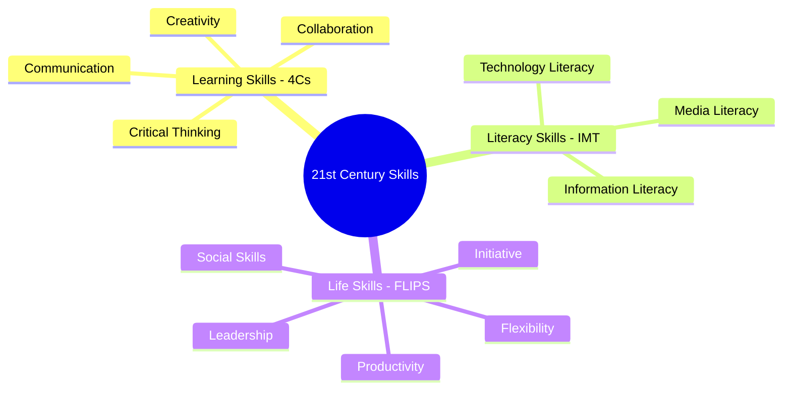

**Learning and innovation skills** (the 4Cs) teach students about the mental processes required to adapt and improve in modern environments[^10]. Critical thinking enables finding solutions to problems, creativity empowers students to see concepts differently and innovate, collaboration means working together to achieve compromises and optimal results, and communication involves effectively conveying ideas among different personality types[^10].

**Literacy skills** focus on how students can discern facts, evaluate publishing outlets, and understand the technology behind information dissemination[^10]. In an era of information abundance and rapid technological change, these skills are essential for effective citizenship and workforce participation.

**Life and career skills** pertain to personal and professional settings, including flexibility in adapting to changing circumstances, leadership in motivating teams, initiative in self-starting projects, productivity in maintaining efficiency, and social skills in building lasting relationships[^10].

The P21 Framework emphasizes that when schools combine content knowledge with these skills and necessary support systems—standards, assessments, curriculum and instruction, professional development, and learning environments—students become more engaged and better prepared for success[^11][^12].

#### The Inadequacy of Traditional Methods for Contemporary Demands

Traditional educational models were designed for an industrial age that valued standardization, compliance, and rote knowledge. The world has entered an era where nothing is guaranteed, and students need to learn to guide change or react to it effectively[^10]. Traditional methods, with their rigidity and inflexibility, make it challenging to adapt to evolving learner needs or incorporate innovative teaching approaches, potentially hindering the development of creative and adaptable thinking[^2].

Furthermore, traditional methods may not adequately address the development of essential life skills such as critical thinking, problem-solving, collaboration, and communication, which are increasingly valued in the modern world[^2]. The repetitive nature of lessons primarily involving lectures and textbooks can lead to student boredom, affecting motivation and enthusiasm for learning[^2]. This creates a fundamental mismatch between educational approaches and the competencies students need for future success.

### 1.3 Conceptualizing Holistic Empowerment in English Education

In response to these limitations and challenges, **holistic empowerment** emerges as a transformative paradigm for elementary English education. This approach integrates the principles of holistic education with empowerment theory, creating a comprehensive framework that addresses the full spectrum of student development while maintaining rigorous standards for language acquisition.

#### Defining Holistic Education

Holistic education is an educational philosophy centered on supporting students to become critical thinkers, creative problem-solvers, and active community members[^13]. It is an approach to learning that focuses on all aspects of an individual rather than just their academic or intellectual development. This practice places equal importance on all dimensions of an individual's life, with the goal that students will become well-rounded, conscious, and practical individuals prepared for their futures[^13].

The fundamental principles of holistic education include:

- **Making learning relevant and meaningful** to students' lives and experiences
- **Emphasizing creativity and critical thinking**, encouraging students to think freely and question assumptions
- **Fostering a sense of community and collaboration**, encouraging students to work together through group projects and peer activities
- **Incorporating physical education and mindfulness practices** such as yoga and meditation to develop self-awareness and self-regulation[^13]

Holistic education goes beyond academia to promote the overall development of a student, integrating intellectual excellence with emotional quotient, physical wellness, moral awareness, and social awareness[^4]. The aim is to produce healthy, empathetic individuals who are well-positioned to adapt and contribute positively to society.

#### The Intersection with Empowerment

Empowerment in educational contexts refers to developing students' agency, self-efficacy, and capacity for autonomous decision-making. When combined with holistic education principles, empowerment transforms students from passive recipients of instruction into active agents of their own learning and development.

In holistic empowerment, the teacher's role is redefined from content transmitter to **facilitator of learning experiences**[^4]. Teachers create supportive and stimulating learning environments where students can explore, question, and construct knowledge[^13]. Key teaching strategies include building strong student-teacher relationships, encouraging self-confidence, and incorporating emotional reflection into daily routines[^13].

The holistic approach encourages students to take an active role in their education. Schools employing this paradigm use inquiry-based methods to cultivate curiosity and critical thinking, with teachers supporting students to delve deeply into subjects and take initiative in their learning[^14]. Students are provided with social skills instruction to help them interact productively and respectfully with others, and they are encouraged to participate thoughtfully in community activities[^14].

#### Distinguishing Holistic Empowerment from Traditional Approaches

The following table contrasts holistic empowerment with traditional English language teaching:

| **Dimension** | **Traditional Approach** | **Holistic Empowerment** |
|--------------|-------------------------|-------------------------|
| **Teacher Role** | Knowledge transmitter | Learning facilitator |
| **Student Role** | Passive recipient | Active agent |
| **Learning Focus** | Linguistic accuracy | Whole child development |
| **Assessment** | Standardized testing | Formative, portfolio-based, authentic |
| **Curriculum** | Fixed, textbook-driven | Flexible, inquiry-based, relevant |
| **Skills Emphasized** | Memorization, recall | Critical thinking, creativity, collaboration |
| **Social-Emotional** | Largely ignored | Integrated throughout |
| **Diversity Response** | One-size-fits-all | Differentiated, culturally responsive |
| **Community** | Isolated classroom | Connected to families and community |

#### Maintaining Academic Rigor

Importantly, holistic empowerment does not abandon academic standards. Broad educational goals do not mean neglecting any aspect of academic instruction[^14]. Schools implementing holistic approaches meet all learning standards while their teaching methods help students develop more comprehensive understanding of content and the interconnections between concepts[^14]. Project-based learning, where students have time to deeply explore complex ideas or challenges, helps them understand topics more profoundly while honing critical thinking skills and creativity[^14].

Assessment in holistic empowerment turns formative rather than punitive, using portfolios, performance tasks, peer review, and self-assessment to capture the full range of student development[^4]. This approach provides meaningful feedback while reducing the anxiety and narrowing effects of high-stakes testing.

### 1.4 Research Objectives, Scope, and Central Thesis

This paper pursues several interconnected research objectives designed to provide novice teachers with both theoretical understanding and practical guidance for implementing holistic empowerment in elementary English education.

#### Research Objectives

The primary objectives guiding this research include:

1. **To critically analyze** the limitations of traditional English language teaching approaches and establish the evidence base for paradigm change
2. **To synthesize** theoretical foundations from holistic education philosophy, empowerment theory, and language acquisition research into a coherent conceptual framework
3. **To identify and examine** the core components of holistic empowerment across cognitive, social-emotional, physical, and community dimensions
4. **To translate** theoretical principles into actionable pedagogical strategies suitable for novice teacher implementation
5. **To address** the specific needs of diverse learner populations, including multilingual learners, students from disadvantaged backgrounds, and those who have experienced trauma
6. **To explore** the roles of family engagement, technology integration, and assessment reform in supporting holistic empowerment
7. **To examine** teacher development needs and implementation challenges, providing evidence-based solutions for common obstacles

#### Scope of Inquiry

This research focuses specifically on **elementary English education contexts**, encompassing both English Language Arts instruction for native speakers and English as a New Language instruction for multilingual learners. The scope includes:

- Theoretical frameworks applicable to elementary-aged students (approximately ages 5-12)
- Pedagogical strategies appropriate for elementary classroom implementation
- Consideration of diverse elementary school contexts, including public, private, and community-based settings
- Attention to the particular needs and challenges of novice teachers in their first years of practice

The research draws on evidence from multiple educational systems and contexts while maintaining focus on principles and practices transferable across settings. While specific curricular requirements vary by jurisdiction, the holistic empowerment paradigm offers universal principles adaptable to various educational standards and expectations.

#### Central Thesis

This paper advances the **central thesis** that holistic empowerment represents both a necessary and effective paradigm for contemporary elementary English education. Traditional approaches, with their narrow focus on linguistic competence measured through standardized assessments, fail to develop the comprehensive skills students need for success in complex modern environments. By integrating cognitive, emotional, social, and ethical dimensions of development within English language instruction, holistic empowerment creates conditions for deeper language acquisition while cultivating the critical thinking, creativity, collaboration, and communication skills essential for 21st-century success.

Furthermore, this thesis contends that holistic empowerment is not merely an idealistic aspiration but a practically implementable approach. Through careful attention to pedagogical strategies, assessment methods, family engagement, and teacher development, novice teachers can effectively adopt transformative practices that serve the whole child while maintaining rigorous academic standards.

#### Key Questions Addressed

The research addresses several key questions:

- What theoretical foundations support holistic empowerment as an educational paradigm?
- What are the essential components of holistic empowerment in elementary English contexts?
- How can novice teachers translate holistic principles into classroom practice?
- What strategies effectively address the needs of diverse learners within holistic frameworks?
- How can assessment practices support rather than undermine holistic empowerment?
- What professional development and support do novice teachers need to implement this paradigm successfully?

### 1.5 Significance for Novice Teachers and Paper Overview

This research holds particular significance for novice teachers entering elementary English education, a population that faces unique challenges and opportunities in shaping their professional practice.

#### Relevance for Novice Teachers

Novice teachers often enter the profession with idealistic visions of student-centered, meaningful instruction, only to encounter institutional pressures toward traditional, test-focused approaches. This paper provides **theoretical grounding** that helps novice teachers articulate and defend more comprehensive educational philosophies. Understanding the evidence base for holistic empowerment empowers new teachers to advocate for practices that serve students' authentic needs.

Beyond theory, this research offers **actionable strategies** that novice teachers can implement even within constrained contexts. Research on implementation demonstrates that teacher beliefs and experiences significantly predict implementation success, with teachers holding more positive initial perceptions of innovative approaches showing higher implementation fidelity[^15]. By providing clear rationales and practical guidance, this paper aims to foster the positive perceptions and confidence that support effective implementation.

The research also addresses the **specific challenges** novice teachers face, including time constraints, large class sizes, curriculum pressures, and limited resources. Understanding common barriers—such as lack of knowledge and skills, competing priorities, and insufficient organizational support[^15][^16]—and evidence-based solutions helps novice teachers navigate implementation obstacles more effectively.

#### Supporting Transformative Practice

Holistic empowerment requires teachers who themselves embody the principles they seek to cultivate in students. Research emphasizes that successful implementation begins with adults' own skill development; teachers must develop their own social-emotional competencies before effectively nurturing these in students[^17]. This paper addresses teacher wellbeing and self-care as essential components of sustainable holistic practice.

Professional learning communities and collaborative relationships prove essential for implementation success. Establishing trusting relationships is a necessary first step in building effective partnerships that support holistic approaches[^17]. The research examines how novice teachers can build supportive professional networks and engage in ongoing reflective practice.

#### Paper Overview

The subsequent chapters of this paper develop the holistic empowerment paradigm through systematic analysis of its components, strategies, and implementation considerations:

**Chapter 2** constructs the conceptual framework by examining the intersection of holistic education philosophy and empowerment theory, establishing a working definition specific to elementary English contexts.

**Chapter 3** provides multidimensional analysis of the core components of holistic empowerment: cognitive-linguistic, social-emotional, physical and creative, learner autonomy, and community belonging.

**Chapter 4** translates theoretical components into pedagogical principles and teaching strategies, with particular attention to approaches novice teachers can readily implement.

**Chapter 5** addresses diverse learner needs through examination of equity-focused, inclusive, and trauma-informed practices.

**Chapter 6** explores family and community engagement strategies that support holistic English education.

**Chapter 7** examines technology integration and innovation within holistic frameworks.

**Chapter 8** analyzes assessment approaches aligned with holistic empowerment principles.

**Chapter 9** investigates teacher development needs and self-care practices essential for sustainable implementation.

**Chapter 10** identifies implementation challenges and provides practical solutions for novice teachers.

**Chapter 11** synthesizes findings and offers concluding recommendations for practice, policy, and research.

**Chapter 12** provides keywords and a glossary of key terms for reference.

Through this comprehensive examination, the paper aims to equip novice teachers with the understanding, strategies, and confidence needed to embrace holistic empowerment as their foundational approach to elementary English education—an approach that honors both the complexity of language learning and the full humanity of every student.

## 2 Conceptual Framework: Defining Holistic Empowerment in Elementary English Contexts

The transformation of elementary English education from traditional, linguistically-focused instruction toward a paradigm of holistic empowerment requires a robust theoretical foundation. This chapter constructs that foundation by critically analyzing and synthesizing two major theoretical streams—**holistic education philosophy** and **empowerment theory**—and examining their convergence within language learning contexts. By establishing a precise working definition specific to elementary English education and differentiating this paradigm from both traditional and communicative language teaching approaches, this chapter provides the conceptual architecture upon which subsequent practical discussions throughout the paper will be built. For novice teachers, understanding these theoretical underpinnings is essential not merely for academic comprehension but for developing the principled flexibility needed to adapt holistic empowerment practices to diverse classroom realities.

### 2.1 Theoretical Foundations of Holistic Education Philosophy

Holistic education represents a philosophical and pedagogical approach that fundamentally reconceptualizes the purpose and process of schooling. Rather than viewing education as the transmission of discrete knowledge and skills, holistic education positions learning as an integrative process that nurtures the **complete development of the human being**—intellectual, emotional, social, physical, creative, and spiritual dimensions working in concert.

#### Historical Origins and Philosophical Roots

The concept of holism in education traces its intellectual origins to the work of **Jan Christian Smuts**, who coined the term in the 1920s, though its application to educational contexts gained prominence in the 1980s[^13]. The philosophical foundation rests on the premise that human beings are integrated wholes whose various dimensions cannot be meaningfully separated in the learning process. This stands in stark contrast to reductionist educational approaches that fragment learning into isolated subjects, skills, and measurable outcomes.

Academic influences on holistic educational thinking include the American educator **John Dewey**, who articulated principles of learning through doing and emphasized that education should be grounded in learners' interests and experiences[^18]. In 1963, **David Ausubel** called for a holistic approach to teaching through meaningful material, recognizing that learning disconnected from meaning fails to produce lasting understanding[^18]. These foundational thinkers established that **education must engage the whole person** rather than merely training isolated cognitive functions.

#### Core Principles of Holistic Education

Contemporary holistic education is built upon several interconnected principles that distinguish it from conventional educational approaches. Understanding these principles provides novice teachers with a philosophical compass for navigating instructional decisions.

**First, learning must be relevant and meaningful to students.** One of the fundamental key principles presents learning as something that should connect to students' lives, enabling each student to recognize, engage with, and adopt subject material in their daily life[^13]. This principle directly challenges the abstraction and decontextualization characteristic of traditional instruction, insisting instead that educational content must resonate with students' experiences, interests, and aspirations.

**Second, holistic education places strong emphasis on creativity and critical thinking.** Students are encouraged to think freely, question assumptions, seek new perspectives, take risks, and learn from mistakes[^13]. This represents a fundamental shift from educational models that prioritize correct answers and conformity to predetermined standards. In holistic classrooms, intellectual exploration and productive struggle are valued as essential components of genuine learning.

**Third, community and collaboration occupy central positions.** Holistic education emphasizes a sense of community and collaboration through activities like group projects, peer tutoring, and community service[^13]. Learning is understood as inherently social, and students develop not only academic skills but also the interpersonal competencies necessary for productive participation in democratic society.

**Fourth, physical education and mindfulness practices are integral components.** Practices such as yoga and meditation are recognized as crucial for supporting students to develop self-awareness and manage self-regulation[^13]. This principle acknowledges that cognitive development cannot be separated from physical and emotional development—the mind-body connection is honored rather than ignored.

The following diagram illustrates the multidimensional nature of holistic education:

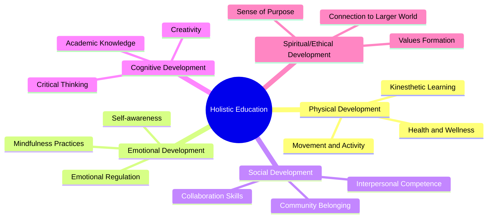

#### Maslow's Hierarchy of Needs as Educational Framework

A critical theoretical tool for understanding holistic education is **Maslow's Hierarchy of Needs**, which can be applied to help teachers understand and meet the different needs of students[^13]. This psychological framework demonstrates that a student's basic needs—physiological requirements, safety, and belonging—must be met before they can be an open channel for learning[^13]. Schools implementing holistic approaches recognize their responsibility to address these foundational needs, not merely academic instruction.

This insight carries profound implications for elementary English education. Students who come to school hungry, fearful, or feeling isolated cannot fully engage in language learning regardless of instructional quality. Holistic education therefore requires schools to offer a sense of belonging and to attend to the full spectrum of student needs[^13]. For novice teachers, this means recognizing that **effective language instruction begins with creating conditions where students feel safe, welcomed, and valued**.

#### The Ultimate Aim: Integrated Human Development

The overarching goal of holistic education is for students to become **well-rounded, conscious, and practical individuals** prepared for their futures[^13]. This method aims to grow an integrated human being with a sense of being and belonging, whose vision extends beyond just passing exams[^13]. The focus is on engaging the mind, spirit, and body as a unity to build a positive school environment that encourages positive behavior, thereby creating a fair society based on community[^13].

True education, from this perspective, addresses more than just core academic subjects and strives to create environments where students develop the qualities needed to be engaged learners and community members[^14]. Schools employing holistic approaches seek to go beyond academic instruction by creating environments that support the whole child, meeting students' social, emotional, and ethical needs alongside academic lessons[^14]. This comprehensive vision provides the philosophical foundation upon which empowerment theory builds.

### 2.2 Empowerment Theory and Its Educational Applications

While holistic education provides a vision of comprehensive human development, **empowerment theory** offers a framework for understanding how individuals develop the capacity to direct their own lives and influence their environments. When applied to education, empowerment theory transforms students from passive recipients of instruction into active agents capable of shaping their own learning and futures.

#### Foundational Concepts of Empowerment Theory

Empowerment theory explores relationships between individuals within specific social, organizational, educational, and political environments[^19]. At its core, empowerment is defined as the **"process by which individuals and groups gain power, access to resources and control over their own lives. In doing so, they gain the ability to achieve their highest personal and collective aspirations and goals"**[^19]. This definition emphasizes both the process dimension (how empowerment develops) and the outcome dimension (what empowerment enables).

In educational contexts, empowerment theory is closely associated with the seminal work of **Paulo Freire** in *Pedagogy of the Oppressed*. Freire articulated the need to empower individuals who are disenfranchised by enabling them to take control over their own learning and develop deeper understanding of their position within community through active participation and engagement[^19]. This perspective positions education not as a neutral transmission of knowledge but as a potentially liberating or oppressing force depending on how it is enacted.

#### Zimmerman's Three-Component Model

**Marc Zimmerman's psychological empowerment model** provides a particularly useful framework for understanding empowerment in educational settings. According to this model, psychological empowerment comprises three interconnected components[^20]:

| **Component** | **Definition** | **Educational Manifestation** |
|--------------|---------------|------------------------------|
| **Intrapersonal** | One's sense of control and self-efficacy | Students believing they can succeed, feeling capable of learning |
| **Interactional** | Understanding the social/political environment and mechanisms behind power | Students comprehending how learning systems work and how to access resources |
| **Behavioral** | Actions to exert control and influence | Students actively participating, making choices, and taking initiative |

This tripartite model suggests that **feeling efficacious and having the opportunity to exert influence are necessary but not sufficient**—one must also have the knowledge and ability to act effectively[^20]. For elementary English education, this means that building students' confidence in their language abilities must be accompanied by teaching them strategies for effective learning and providing genuine opportunities to exercise choice and voice.

Research examining empowerment-based programs has demonstrated that **behavioral empowerment**—opportunities to act in an empowered way—serves as the strongest predictor of positive individual outcomes and civic responsibility[^20]. This finding underscores that empowerment cannot remain abstract; students must have concrete opportunities to exercise agency and see the effects of their actions.

#### Empowerment as Both Process and Outcome

A crucial insight from empowerment theory is that empowerment functions as **both process and outcome**[^19]. Processes such as an individual's actions and activities of engagement within a particular social context can result in outcomes of either empowerment or disempowerment. When individuals feel empowered, they experience greater intrinsic motivation and self-confidence; conversely, feelings of disempowerment result in decreased motivation and self-confidence[^19].

This dynamic has particular relevance for language learning. As is often the case with struggling readers and language learners, continuous failures during learning activities can result in outcomes of disempowerment, a lack of motivation, and decreased self-confidence as a learner[^19]. The cycle becomes self-reinforcing: disempowerment leads to reduced effort, which leads to continued failure, which deepens disempowerment. Holistic empowerment approaches aim to interrupt this negative cycle by creating conditions for success experiences that build confidence and motivation.

#### The Shift from Deficits to Strengths

Another important premise of empowerment theory is the emphasis on an individual's **strengths or competencies** rather than deficits[^19]. Much traditional educational research and practice focuses on identifying what students cannot do and implementing "fix-up" strategies to remediate weaknesses. Empowerment theory inverts this orientation, focusing instead on identification of individual capabilities and seeking to **"provide opportunities for participants to develop knowledge and skills, and engage professionals as collaborators"**[^19].

This strengths-based perspective transforms how teachers view their students. Rather than seeing English Language Learners as deficient in English, empowerment-oriented teachers recognize the linguistic, cultural, and experiential assets these students bring. Rather than viewing struggling readers as problems to be fixed, they identify existing competencies upon which to build. This reframing has profound implications for teacher-student relationships and instructional design.

#### Empowerment as Motivational Construct

Researchers have proposed that empowerment be viewed as a **motivational construct**, arguing for empowerment as an enabling process[^19]. Similar to Bandura's concept of self-efficacy, empowerment is achieved through experiences in which outcomes result in increases to the individual's self-efficacy and motivation. Viewing empowerment as an enabling process has shown important results as it targets self-determination, self-efficacy, intrinsic motivation, and engagement—factors that may help transform struggling learners into striving learners in the classroom[^19].

For novice teachers, this understanding suggests that **every instructional decision either contributes to or undermines student empowerment**. Activities that provide appropriate challenge with adequate support, that allow for genuine choice, and that result in visible success build empowerment. Activities that are either too easy (providing no sense of accomplishment) or too difficult (resulting in failure), that offer no autonomy, or that emphasize external rewards over intrinsic satisfaction tend to undermine empowerment.

### 2.3 The Convergence of Holistic Education and Empowerment in Language Learning

The theoretical power of holistic empowerment emerges from the synthesis of holistic education philosophy and empowerment theory. In language learning contexts, this convergence creates a framework that addresses both **what students develop** (the multidimensional outcomes of holistic education) and **how students develop** (the agency-building processes of empowerment). This section examines how these theoretical streams intersect and reinforce each other within elementary English education.

#### Alignment of Multidimensional Development and Empowerment Constructs

Holistic education's emphasis on physical, emotional, social, cognitive, and creative development aligns naturally with empowerment theory's focus on building agency, self-efficacy, and autonomy. The **Integrated Empowerment Theory** proposes that empowerment emerges from the interplay of two foundational dimensions: **self-direction** (internal experience) and **meaningful roles in society** (external experience)[^21]. These dimensions map directly onto holistic education's dual concern with individual development and community participation.

The theory identifies four key catalysts that drive empowerment[^21]:

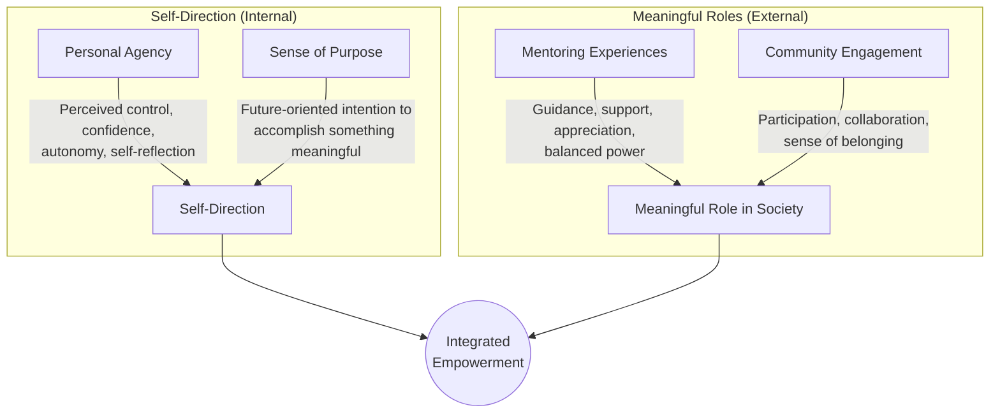

**Personal agency**—the ability to exert influence on one's life, involving perceived control, confidence, autonomy, and self-reflection—corresponds to holistic education's cognitive and emotional dimensions[^21]. **Sense of purpose**—a stable, future-oriented intention to accomplish something meaningful to the self and the world—connects to holistic education's concern with values and meaning[^21]. **Mentoring experiences**—characterized by guidance, support, appreciation, and balanced power between adults and youth—align with holistic education's emphasis on supportive relationships[^21]. **Community engagement**—meaningful participation that provides context for experimentation, collaboration, and developing belonging—reflects holistic education's social and community dimensions[^21].

#### The Concept of 'Presence' and 'Authentic Voice' in Language Learning

Holistic approaches to language education take into account the learner's personal, social, and professional growth in addition to their linguistic development[^22]. Research has characterized successful communication as an integration of fluency, accuracy, complexity, and interactivity. However, these robust definitions tend to leave out another component needed in a holistic approach: **"presence"**[^22]. By including this fifth component, educators can help students find their **"authentic voice"**[^22].

The notion of presence addresses emotional investment and personal identity in language learning. Progress involves expressing one's "essence"—when learners feel their identity is congruent with class goals, they participate more fully[^22]. Conversely, learners can experience "identity conflicts" and "emotional barriers" that prevent their authentic voice from developing[^22]. This insight reveals that language learning is not merely cognitive but deeply personal; students must feel that their developing English proficiency expresses rather than suppresses who they are.

A **Four Steps framework** has been proposed to cultivate presence in language learning[^22]:

| **Step** | **Purpose** | **Implementation** |
|---------|------------|-------------------|
| **Be Silent** | Ease anxiety, help students connect with themselves, find inner resources | Include silent planning time, teach strategies to slow down, reflection after tasks |
| **Be Engaged** | Focus on listeners rather than self, develop attitude that communication occurs through connection | Provide clear goals, teach active listening, coach eye contact |
| **Be Positive** | Generate genuine support, create judgment-free zone | Focus on positive qualities, encourage positive feedback, 80:20 positive to corrective ratio |
| **Be Yourself** | Develop authentic voice and autonomy | Encourage reflection, personal presentations, journals, portfolios |

This framework demonstrates how holistic empowerment operates in language learning: students develop linguistic competence not through mechanical practice but through **authentic self-expression within supportive community**.

#### Integration of Cognitive and Affective Dimensions

The convergence of holistic education and empowerment theory in language learning requires integration of cognitive and affective dimensions. Research demonstrates that **people with average IQ but high Emotional Intelligence (EI) are more successful**, which is why educators are challenged to integrate practices dedicated to nurturing all aspects of an individual: physical, emotional, psychological, and spiritual[^13]. This finding challenges purely cognitive approaches to language instruction and validates the holistic empowerment paradigm.

Years of research have shown that language attitudes, motivation, performance anxiety, and second language learning achievement are consistently related[^23]. A student's feelings about the target language and their attitudes significantly affect their motivation and subsequent success. The role of anxiety in language learning has received particular attention; research confirms that **"language learning must occur in an environment where the learner is 'undefended' and the affective filter (anxiety) is low for input to be noticed and enter the learner's thinking"**[^23]. There is a clear negative correlation between anxiety and learning success.

This evidence base supports the holistic empowerment approach's attention to emotional climate. Creating classrooms where students feel safe, supported, and valued is not merely a nice addition to instruction—it is a **prerequisite for effective language acquisition**.

### 2.4 Constructing a Working Definition for Elementary English Contexts

Based on the theoretical analysis above, this section develops a precise working definition of holistic empowerment specific to elementary English education. This definition integrates the multidimensional developmental focus of holistic education with the agency-building orientation of empowerment theory, specifying how these principles manifest in language learning for young learners aged 5-12.

#### Essential Components of the Definition

**Holistic empowerment in elementary English education** is defined as:

> *A comprehensive pedagogical paradigm that integrates the development of English language proficiency with the cultivation of students' physical, emotional, social, cognitive, and creative capacities, while simultaneously building their agency, self-efficacy, and autonomous decision-making abilities. This approach positions students as active agents in their own learning, values their linguistic and cultural assets, creates supportive community environments, and aims to develop well-rounded individuals capable of authentic self-expression in English and meaningful participation in diverse communities.*

This definition encompasses several essential elements:

**Multidimensional development**: Holistic empowerment addresses not only linguistic competence but the full spectrum of human development. Physical activity, emotional regulation, social skills, critical thinking, and creative expression are integrated into English instruction rather than treated as separate domains.

**Agency and self-efficacy**: Students are supported to develop confidence in their abilities, understanding of how learning works, and capacity to take initiative in their own education. They move from dependence on teacher direction toward autonomous, self-regulated learning.

**Asset-based orientation**: Students' existing languages, cultures, experiences, and competencies are recognized as resources rather than deficits. Instruction builds upon what students bring rather than focusing primarily on what they lack.

**Supportive community**: Learning occurs within relationships characterized by trust, respect, and mutual support. Teachers serve as facilitators and mentors rather than mere knowledge transmitters, and students collaborate with and support each other.

**Authentic self-expression**: The goal of English proficiency is not merely accuracy or fluency in abstract terms but the development of an authentic voice through which students can express their identities, ideas, and aspirations.

#### Developmental Appropriateness for Elementary Learners

The working definition must account for the **unique characteristics of elementary-aged learners** (approximately ages 5-12). Children in this developmental stage are characterized by:

- **Concrete operational thinking** that benefits from hands-on, experiential learning
- **High need for physical movement** and difficulty with extended sedentary activity
- **Developing social skills** and strong need for peer relationships
- **Emerging sense of competence** that is vulnerable to experiences of failure
- **Natural curiosity and playfulness** that can be harnessed for learning

Holistic empowerment in elementary contexts therefore emphasizes **play-based approaches**, physical activity integrated with language learning, collaborative activities appropriate to developing social skills, careful scaffolding to ensure success experiences, and instruction that capitalizes on children's natural curiosity.

#### Special Considerations for English Language Learners

The definition must also address the particular needs of **English Language Learners (ELLs)**, who constitute a significant and growing population in elementary schools. Educating ELLs should be anchored within the construct of the whole child, where every aspect—physical, mental, socio-emotional, linguistic, and cultural—is considered[^5]. This approach should help students maintain their home languages while learning English, avoiding subtractive approaches to bilingualism[^5].

Creating a positive classroom environment where students feel safe, welcomed, and comfortable is paramount for effective instruction, allowing them to take risks in using the second language[^5]. Effective instructional programs value students' home languages and cultures and acknowledge parents' "funds of knowledge"[^5]. This holistic orientation recognizes that ELLs face not only linguistic challenges but often socio-emotional challenges as they adjust to new environments, cultures, and languages, potentially experiencing cultural shock, isolation, and bullying[^5].

### 2.5 Distinguishing Holistic Empowerment from Traditional and Communicative Approaches

To clarify the distinctive features of holistic empowerment, this section systematically compares it with two dominant paradigms in language education: **traditional grammar-translation and audio-lingual methods**, and **communicative language teaching (CLT)**. Understanding these distinctions helps novice teachers recognize what makes holistic empowerment unique and why it offers advantages over alternative approaches.

#### Limitations of Traditional Approaches

Traditional language teaching methods, including grammar-translation and audio-lingual approaches, dominated language education for much of the 20th century. The **grammar-translation method**, widely used in the 19th century to teach modern foreign languages, focused on vocabulary lists and rule explanations, with students primarily engaged in translation activities and producing little oral proficiency[^23]. This approach treated language as an object to be analyzed rather than a tool for communication.

The **audio-lingual method**, which replaced grammar-translation in the 1950s and 1960s, was based on behaviorist psychology and structural linguistics[^23]. This approach viewed foreign language learning as essentially a mechanical process of habit formation and automatization. In practice, students imitated and memorized language patterns and dialogues, engaging in repetitive drills (substitution drills, transformation drills, translation drills, response drills) with strong emphasis on avoiding errors[^23].

The problems with audio-lingual approaches were significant: learners lacked opportunities for meaningful language use, had limited chances for creative language interaction with peers, and experienced high anxiety levels from excessive teacher correction[^23]. The method failed to achieve its intended effect of helping learners become proficient target language users, leading to its decline[^23].

#### The Rise and Contributions of Communicative Language Teaching

**Communicative language teaching (CLT)** emerged in the 1970s and early 1980s partly in response to the failures of traditional methods and partly due to increased demand for language learning[^18]. CLT is an approach to language teaching that emphasizes interaction as both the means and the ultimate goal of study[^18]. Learners practice the target language through communicating with one another and the instructor, studying authentic texts, and using the language both in class and outside of class[^18].

According to CLT, the goal of language education is the ability to communicate in the target language, which contrasts with previous views that gave grammatical competence top priority[^18]. CLT also positions the teacher as a facilitator rather than an instructor[^18]. The approach drew on **Dell Hymes's concept of communicative competence**, which broadened the definition of language knowledge to include not just grammatical competence but also sociolinguistic competence (appropriate language use in social contexts), discourse competence (coherent communication), and strategic competence (repair of communication breakdowns)[^23][^18].

CLT's methodological principles include important advances[^23]:

- **Using tasks as organizing principles**, with meaning as primary and evaluation based on outcomes
- **Learning through doing**, with hands-on approaches enhancing cognitive engagement
- **Rich input** through authentic materials and maximum target language use
- **Promoting cooperative and collaborative learning** through peer interaction
- **Focus on form** within meaningful contexts rather than isolated grammar instruction
- **Providing corrective feedback** to support language development
- **Recognizing affective factors** including attitudes, motivation, and anxiety

#### How Holistic Empowerment Extends Beyond CLT

While CLT represents a significant advance over traditional methods and shares important features with holistic empowerment, the holistic empowerment paradigm extends beyond CLT in several crucial ways:

| **Dimension** | **Communicative Language Teaching** | **Holistic Empowerment** |
|--------------|-----------------------------------|-------------------------|
| **Primary Goal** | Communicative competence in target language | Whole-child development including linguistic, cognitive, social-emotional, physical, and creative dimensions |
| **View of Learner** | Language learner with communicative needs | Complete human being with multidimensional developmental needs |
| **Affective Dimension** | Recognized as important factor | Centrally integrated through social-emotional learning, mindfulness, and emotional reflection |
| **Physical Dimension** | Generally not addressed | Integrated through movement, kinesthetic learning, and physical activity |
| **Identity and Voice** | Implicit in authentic communication | Explicitly cultivated through presence, authentic voice development, and identity-congruent learning |
| **Empowerment** | Learner-centered but not explicitly empowerment-focused | Central organizing principle—building agency, self-efficacy, autonomous decision-making |
| **Community** | Collaborative learning emphasized | Extended to family engagement, community connections, and sense of belonging |
| **Teacher Role** | Facilitator of communication | Mentor supporting holistic development and empowerment |
| **Assessment** | Often still test-focused | Multidimensional, formative, portfolio-based, supporting empowerment |

The critical distinction is that CLT primarily aims at **communicative competence**—the ability to use language effectively for communication—while holistic empowerment aims at **comprehensive human development** with language proficiency as one essential component. CLT asks, "Can this student communicate in English?" Holistic empowerment asks, "Is this student developing into a confident, capable, creative, caring individual who can express their authentic self in English?"

Furthermore, while CLT recognizes affective factors as influencing language learning, holistic empowerment **integrates social-emotional development as a core educational objective** rather than merely a supporting condition. The development of emotional intelligence, self-regulation, interpersonal skills, and sense of belonging are not incidental benefits but central aims.

#### Critique and Limitations of CLT

Despite its contributions, CLT has been subject to critique that holistic empowerment addresses. Critics have noted that CLT makes broad claims with limited data, uses confusing vocabulary, and may prioritize language function over structure in ways that leave gaps in formal knowledge[^18]. Some argue that CLT falsely implies consensus on "communicative competence" and that its nonspecific requirements, especially for teaching grammar, may allow grammatically incorrect utterances as long as meaning is conveyed[^18].

Holistic empowerment responds to these limitations by maintaining attention to linguistic accuracy while embedding it within meaningful, empowering contexts. The paradigm does not abandon explicit instruction but integrates it with experiential learning, ensuring students develop both fluency and accuracy. Moreover, holistic empowerment provides clearer guidance on the affective and developmental dimensions that CLT acknowledges but does not fully operationalize.

### 2.6 Theoretical Basis for Practical Implementation

Having established the conceptual framework of holistic empowerment, this section bridges theory and practice by identifying key principles that will guide the pedagogical approaches discussed in subsequent chapters. Understanding these theoretical-practical connections helps novice teachers see how abstract concepts translate into concrete classroom decisions.

#### The Facilitative Teacher Role

Both holistic education and empowerment theory reconceptualize the teacher's role from **"sage on the stage" to facilitator** of learning experiences. Within holistic education, the teacher creates a supportive and stimulating learning environment[^13]. Key teaching strategies include building strong student-teacher relationships by being observant of students' personal growth and creating a trusting rapport, which increases motivation, performance, and success rates—especially for at-risk students[^13].

The teacher's facilitative role involves:

- **Encouraging self-confidence** by helping students believe they can succeed beyond school, recognizing their unique strengths, and tailoring lessons to realistic issues in their lives[^13]
- **Incorporating emotional reflection** by providing moments for meditation, contemplation, or journaling to help students channel their feelings[^13]
- **Supporting autonomy** by releasing responsibility to students as they develop capacity for self-direction

Research demonstrates that strong student-teacher relationships have a positive impact on motivation and performance, particularly for at-risk students[^13]. This relationship is not merely supportive but empowering—teachers help students develop the confidence and skills to eventually direct their own learning.

#### Student-Led Learning Processes and Deeper Learning

Holistic empowerment operationalizes through **student-led learning processes** that develop deeper learning competencies. Deeper learning is defined as **ALL students developing into leaders of their own learning**, collaborating in teams, engaging in rich discourse, and tackling rigorous tasks that prepare them for academic and real-world success[^24].

The **Model of Instruction for Deeper Learning** provides a research-based framework for transitioning traditional classrooms to deeper learning environments[^24]. This model specializes in helping teachers shift from heavily teacher-directed instruction and ritualistic compliance to team-based learning with higher rigor tasks, allowing teachers to release more of the learning process to students[^24].

Key features of this approach include:

- **Team-based structures** where students successfully engage in rigorous tasks and vibrant discourse
- **Interdependent tasks** that require collaboration and communication
- **Student voice becoming more dominant** than teacher voice during team-based learning
- **Equal participation and accountability** unlike traditional grouping

The framework recognizes that the model does not assume students already have self-regulation, impulse control, and other skills to work in student-led teams[^24]. Instead, it focuses on establishing classroom routines with research-based resources and practices that students quickly master, building the foundation for increasingly autonomous learning.

#### The Deeper Learning Framework

The **Deeper Learning Framework** illustrates the relationships between key competencies necessary to achieve deeper learning for all students[^24]:

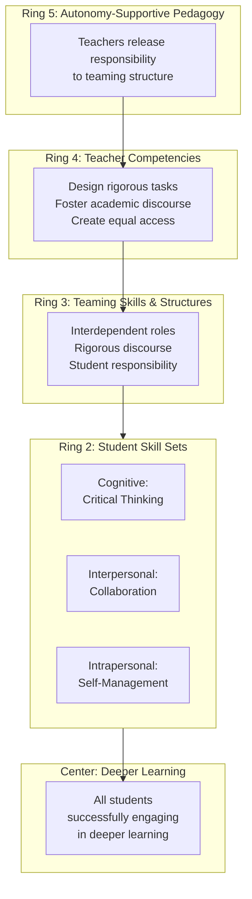

This framework provides a developmental pathway: teachers first develop autonomy-supportive pedagogy, then build competencies in task design and discourse facilitation, which enables the establishment of teaming structures, through which students develop cognitive, interpersonal, and intrapersonal skills, resulting in deeper learning for all.

#### Benefits for English Language Learners

Research demonstrates that the deeper learning approach particularly benefits English Language Learners. In traditional teacher-centered classrooms, ELLs often sit silently, unwilling to ask questions or participate in discussions, and are frequently given content several grade levels below their capability despite being able to access rigorous content with appropriate scaffolding[^25].

In contrast, classrooms employing deeper learning models achieve **student-led team-based learning** where ELLs are fully immersed in the learning process, valued for their multilingual skills and life experiences, and contributing important insights to teams[^25]. Through clear participation structures, peer support, and scaffolding, ELLs can confidently participate in discussions and have frequent opportunities to practice academic vocabulary, accelerating English proficiency while mastering rigorous content[^25].

The benefits for ELLs include: accelerated language development and content mastery, reduced dependence on the teacher, enhanced comprehension, opportunities to share perspectives and background knowledge, and stronger sense of belonging[^25]. Moreover, ELLs contribute to deeper learning through their cognitive flexibility, stronger executive function, resilience and adaptability, interpersonal and cross-cultural communication skills, collaborative mindset, and different perspectives[^25].

Importantly, research in participating schools shows that ELLs have narrowed achievement gaps with native English speakers. Analysis of data from multiple school districts found that ELLs narrowed gaps in English Language Arts by 6-47% and in mathematics by 4-74%[^25].

#### Integration of Holistic Education Models

Several educational models within holistic education provide practical frameworks for implementation[^13]:

**Experiential Learning** is a hands-on approach where students decide their preferred learning style, building a collective class that collaborates and promotes problem-solving and innovative ideas[^13]. This approach aligns with the principle of learning through doing.

**Self-guided Learning** allows students to use their motivation to learn at their own pace and evaluate their experiences, giving teachers feedback to guide curriculum decisions[^13]. This model develops learner autonomy and self-regulation.

**Community Learning** can be achieved through after-school clubs, summer programs, or volunteer schemes, helping students understand they are part of a whole and recognize opportunities for growth around them[^13]. This creates rapport between teachers, parents, and the community, establishing a solid learning environment[^13].

**Interdisciplinary Coursework** aids cognitive growth by studying multiple subjects together in thematic courses, using independent study, field trips, or group projects[^13]. These growth-based activities encourage students to examine material in depth and develop leadership skills and a sense of belonging[^13].

#### Application Sequence for Implementation

For practical application, the Integrated Empowerment Theory suggests a logical sequence for intervention summarized by the acronym **CAMP**: establishing **C**ommunity, building **A**gency, coordinating **M**entors, and inspiring **P**urpose[^21]. This sequence provides novice teachers with a roadmap for implementation:

1. **Community**: First establish a classroom community where students feel belonging and safety
2. **Agency**: Build students' sense of control and confidence through success experiences
3. **Mentors**: Develop supportive relationships characterized by guidance and balanced power
4. **Purpose**: Help students connect learning to meaningful goals and aspirations

This sequence recognizes that empowerment develops progressively—students cannot develop agency without first feeling safe, and they cannot develop purpose without first experiencing agency.

#### Conclusion: From Theory to Practice

The conceptual framework established in this chapter provides novice teachers with the theoretical grounding necessary for principled implementation of holistic empowerment. The synthesis of holistic education philosophy—with its attention to multidimensional development, meaningful learning, and community—with empowerment theory—with its focus on agency, self-efficacy, and autonomous decision-making—creates a powerful paradigm for elementary English education.

The working definition developed here positions holistic empowerment as a comprehensive approach that integrates language proficiency development with whole-child growth while building students' capacity to direct their own learning and lives. This paradigm extends beyond both traditional methods (which neglect communication and affect) and communicative language teaching (which addresses communication but not comprehensive development) to offer a truly transformative vision for elementary English education.

The theoretical principles identified—facilitative teacher roles, student-led learning, deeper learning frameworks, and the CAMP implementation sequence—provide the conceptual bridge to the practical strategies that subsequent chapters will explore. For novice teachers, understanding these foundations enables not merely the adoption of specific techniques but the development of **principled flexibility**—the capacity to adapt holistic empowerment to diverse contexts while maintaining fidelity to its core commitments.

The benefits of holistic education approaches are substantial: development of emotional intelligence, confidence, social ability, compassion, motor coordination, responsibility, creativity, self-agency, community belonging, teamwork skills, and self-awareness[^13]. While this represents only a portion of the profound depth available within holistic education, it demonstrates the paradigm's potential to transform elementary English education from narrow linguistic training into genuine preparation for flourishing human lives.

## 3 Core Components of Holistic Empowerment: A Multidimensional Analysis

The paradigm of holistic empowerment in elementary English education rests upon a foundation of interconnected developmental dimensions that work in concert to nurture the whole child while advancing language proficiency. As established in the conceptual framework of Chapter 2, this approach transcends the narrow linguistic focus of traditional methods by recognizing that effective language learning cannot be separated from broader human development. This chapter provides novice teachers with a systematic analysis of the five essential dimensions constituting holistic empowerment—cognitive-linguistic, social-emotional, physical-creative, autonomy-agency, and community-belonging—examining how each contributes uniquely to student development while functioning synergistically within an integrated pedagogical system.

Understanding these core components is essential for novice teachers seeking to implement transformative practices. Each dimension addresses fundamental aspects of child development and language acquisition, and each offers specific strategies that can be adapted to diverse classroom contexts. The analysis that follows draws on current research and evidence-based practices to provide both theoretical grounding and practical guidance, enabling teachers to design instruction that genuinely empowers students as language learners and developing human beings.

### 3.1 Cognitive-Linguistic Empowerment: Language Proficiency, Critical Thinking, and Metacognitive Development

Cognitive-linguistic empowerment represents the intellectual core of holistic English education, encompassing not merely the acquisition of vocabulary and grammatical structures but the development of students' capacity for **critical engagement with language** and **self-regulated learning processes**. This dimension recognizes that true language proficiency emerges when students understand not just what language means but how it works, why it matters, and how they themselves learn most effectively.

#### Beyond Rote Memorization: Meaningful Vocabulary and Grammar Instruction

Traditional approaches to vocabulary instruction often rely on memorization of word lists divorced from meaningful contexts, resulting in shallow knowledge that students struggle to apply in authentic communication. Holistic empowerment transforms vocabulary development by embedding word learning within rich, contextualized experiences that promote **deeper understanding and retention**.

Research demonstrates that **knowledge sticks better when students use movement while learning new concepts**[^26]. When students explore new words through physical engagement and multisensory experiences, they understand them more thoroughly, retain them longer, and feel more empowered to use them in their own communication. This finding challenges the passive reception model of vocabulary instruction and points toward active, experiential approaches.

Furthermore, the quality of language input significantly predicts vocabulary development. Research has established that **the quality of parent word-learning input—specifically, how easily a word's meaning could be inferred from context—predicts child vocabulary outcomes independent of the quantity of speech**[^27]. This principle applies directly to classroom instruction: teachers should provide vocabulary input that allows students to infer meanings from rich contextual clues rather than relying solely on explicit definitions.

Effective cognitive-linguistic empowerment in vocabulary instruction includes:

| **Strategy** | **Description** | **Cognitive Benefits** |
|-------------|----------------|----------------------|
| **Contextual Inference** | Teaching students to use prior knowledge and text clues to make logical guesses about word meanings | Develops analytical reasoning and active engagement with text[^28] |
| **Semantic Mapping** | Using graphic organizers to explore word relationships and connections | Enhances conceptual understanding and memory networks |
| **Movement-Based Learning** | Incorporating physical actions and gestures when learning new vocabulary | Improves retention and empowers confident usage[^26] |
| **Meaningful Practice** | Providing opportunities to use new words in authentic communicative contexts | Transfers knowledge from passive to active vocabulary |

#### Developing Critical Thinking Through Language Activities

Cognitive-linguistic empowerment extends beyond vocabulary and grammar to encompass **critical thinking development** through English language activities. Students must learn not only to comprehend language but to analyze, evaluate, and create with it. This aligns with the 21st-century skills framework that positions critical thinking as essential for success in modern environments.

**Making inferences** serves as a powerful strategy for developing both language comprehension and analytical reasoning. This approach involves using prior knowledge and text clues to make logical guesses about events or characters' feelings—for example, inferring that a character is sad based on facial expressions or contextual details[^28]. Inference-making helps students develop empathy while simultaneously strengthening their capacity to understand how emotions influence thoughts and behaviors, creating connections between cognitive and affective dimensions.

**Questioning techniques** represent another essential strategy for critical thinking development. Teaching students to ask open-ended questions promotes critical thinking and deeper understanding of others' perspectives, experiences, and emotions[^28]. When students learn to formulate their own questions rather than merely answering teacher-posed queries, they develop intellectual agency and deeper engagement with content.

Research on early language development provides compelling evidence for the relationship between language and cognitive skills. Studies demonstrate that **the amount of spatial language parents used predicted children's performance on nonverbal spatial tasks**, and this relationship was mediated by children's own spatial language[^27]. Similarly, the amount of number words used predicted children's understanding of cardinal number concepts. These findings suggest that **language instruction directly shapes cognitive development**—a powerful rationale for integrating rich, varied language input across content areas.

#### Metacognitive Skill Development

Perhaps the most empowering aspect of cognitive-linguistic development is **metacognition**—students' awareness and regulation of their own thinking and learning processes. Metacognitive strategies teach students to monitor their thinking processes, identify comprehension difficulties, and apply strategies to overcome challenges, thereby promoting self-regulation and a growth mindset[^28].

Metacognitive development transforms students from passive recipients of instruction into active managers of their own learning. When students understand how they learn best, recognize when comprehension breaks down, and possess strategies for addressing difficulties, they become increasingly independent and empowered learners. This capacity for self-regulation is particularly crucial for language learning, where students must navigate the complex, ongoing process of developing proficiency over many years.

**Reflective thinking** encourages students to reflect on their own emotions, thoughts, and behaviors, helping them make connections between their experiences and the content while fostering self-awareness and self-regulation[^28]. This strategy bridges cognitive and affective dimensions, recognizing that effective learning requires both intellectual engagement and emotional awareness.

Practical metacognitive strategies for elementary English classrooms include:

- **Think-alouds** where teachers model their thinking processes during reading and writing
- **Learning journals** where students reflect on what they learned, how they learned it, and what challenges they encountered
- **Self-assessment rubrics** that help students evaluate their own work against clear criteria
- **Goal-setting activities** where students identify specific learning objectives and track their progress

The development of metacognitive skills prepares students for the **learner autonomy** that represents a core principle of holistic empowerment. As students develop awareness of their own learning processes, they become increasingly capable of directing their own education—a capacity that subsequent sections will explore in greater depth.

### 3.2 Social-Emotional Empowerment: Emotional Intelligence, Interpersonal Skills, and Cultural Sensitivity

Social-emotional empowerment addresses the affective dimensions of learning that traditional approaches often neglect but that research consistently identifies as **critical to academic success and overall well-being**. This dimension recognizes that language learning is inherently social and emotional—students must feel safe to take risks, develop relationships that support learning, and navigate the complex interpersonal dynamics of classroom communities.

#### The Foundation: Creating Psychologically Safe Learning Environments

Before students can engage in the vulnerable process of language learning—speaking in unfamiliar ways, making mistakes publicly, expressing themselves in a developing language—they must feel **psychologically safe**. Research on school belonging demonstrates that students who feel a sense of belonging are more confident in school and have less anxiety, depression, and overall stress that carries into young adulthood[^29]. This sense of belonging is directly correlated to academic achievement, making it not merely a nice addition but a prerequisite for effective learning.

Salina Elementary School in Dearborn, Michigan, provides a compelling example of how schools can prioritize social-emotional development. With a large population of English language learners, many of whom are newcomer immigrants who have experienced family separation and hardship, the school has intensified its focus on SEL with remarkable results. Their approach includes **extensive staff training on trauma-informed instruction**, implementation of the Calm Classroom program with daily guided meditations and calm breathing exercises, and regular culturally responsive communication with families in their home languages[^30].

The impacts of these SEL efforts have been substantial: **improved student self-regulation, fewer meltdowns, increased empathy and respect, and students taking charge of their own mental health**[^30]. These outcomes demonstrate that intentional attention to social-emotional development yields concrete benefits for both student well-being and learning capacity.

#### Building Emotional Vocabulary and Self-Regulation

A critical component of social-emotional empowerment involves helping students develop the **emotional vocabulary** necessary to identify, express, and regulate their feelings. At Salina Elementary, teachers actively build students' emotional vocabulary using detailed visuals and feelings charts, allowing students to privately indicate their emotions so teachers can provide appropriate support[^30]. This approach recognizes that students cannot manage emotions they cannot name.

**Daily student check-ins** provide structured opportunities for emotional awareness and expression. These can occur through individual conversations, circle time, or a private letter box where students can share their feelings[^30]. Such practices communicate to students that their emotional lives matter and that the classroom is a space where the whole person is welcomed.

**Mindfulness exercises** develop present-moment awareness, emotional regulation, and self-reflection, improving focus, attention, and self-awareness while enhancing comprehension[^28]. These practices, once considered peripheral to academic instruction, are increasingly recognized as essential supports for cognitive engagement. Students who can regulate their attention and emotional states are better positioned to engage in the demanding work of language learning.

The following diagram illustrates the interconnected components of social-emotional empowerment:

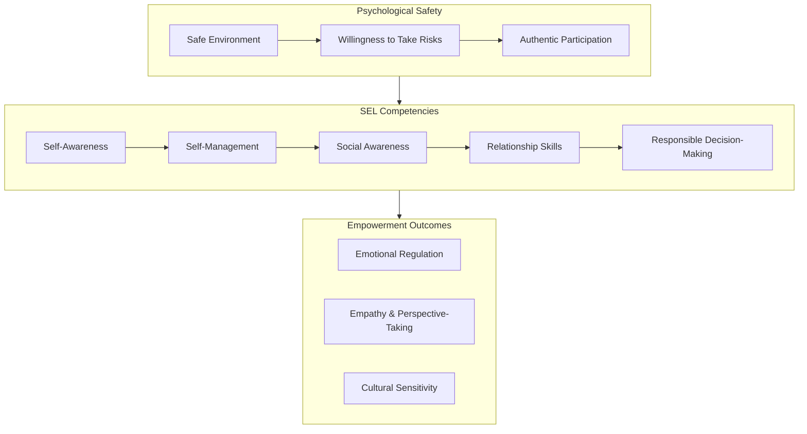

#### Developing Empathy and Perspective-Taking Through Literature and Collaboration

English language instruction offers unique opportunities for **empathy development** through engagement with literature and collaborative activities. Stories provide windows into others' experiences, emotions, and perspectives, building the social awareness that is essential for both interpersonal relationships and language comprehension.

**Storytelling activities** allow students to express emotions, experiences, and perspectives, fostering empathy, perspective-taking, and understanding of others[^28]. When students share their own stories and listen to others', they develop both language skills and interpersonal understanding. Author Renée Watson suggests asking students, "What do you see and how does that make you feel?" to prompt reflection on observations and emotions[^28]. This simple questioning strategy helps students articulate their experiences, realize they are not alone, and connect their stories to broader narratives.

**Collaborative discussions** in small or whole groups allow students to share thoughts, opinions, and experiences, supporting active engagement, perspective-taking, and understanding of diverse viewpoints[^28]. These discussions provide authentic communicative contexts while simultaneously building interpersonal skills and social awareness.

**Visualization** using visual aids like images, videos, or graphic organizers helps students comprehend complex concepts or social situations, enhancing understanding, empathy, and perspective-taking[^28]. For English Language Learners, visual supports serve the dual purpose of scaffolding comprehension and building the conceptual frameworks necessary for empathetic understanding.

#### Cultural Sensitivity and Honoring Linguistic Diversity

Social-emotional empowerment in diverse classrooms requires explicit attention to **cultural sensitivity** and the honoring of students' linguistic and cultural backgrounds. Research emphasizes that pedagogical practices promoting school belonging for EL students should center on **'promoting sociocultural integration'** in the classroom[^31].

Specific strategies for promoting sociocultural integration include:

| **Strategy** | **Implementation** | **Impact** |
|-------------|-------------------|-----------|
| **Sociocultural Competence in Teaching** | Instruction that values students' cultural and linguistic backgrounds | Students feel their identities are respected and valued[^31] |
| **Home-School Integration** | Opportunities for students to connect home and school experiences through family partnerships | Strengthens sense of belonging and relevance of learning[^31] |
| **Culturally Responsive Activities** | Learning activities that value students' lives, cultures, and personal interests | Increases engagement and authentic self-expression[^31] |

The California English Learner Roadmap policy articulates these principles clearly: classroom practices, climate, curriculum, and instruction must respond to the diversity among English learners, with students' cultures and languages valued, affirmed, and built upon as assets[^32]. Classrooms should be safe, caring, inclusive, and affirming, with a focus on socioemotional health, and teachers should build classroom communities that support a strong sense of identity and belonging[^32].

This asset-based orientation transforms how teachers view linguistic diversity. Rather than seeing students' home languages as obstacles to English acquisition, holistic empowerment recognizes them as **resources that support cognitive development, identity formation, and academic achievement**. Teachers who affirm home languages while supporting English development create conditions where students can maintain their linguistic heritage while acquiring new communicative capabilities.

### 3.3 Physical and Creative Empowerment: Kinesthetic Learning, Artistic Expression, and Play-Based Approaches

Physical and creative empowerment addresses dimensions of learning that traditional academic instruction often marginalizes but that are **essential for elementary-aged children's development and engagement**. Young learners are naturally active, imaginative, and playful; instruction that honors these characteristics rather than suppressing them creates conditions for deeper learning and authentic empowerment.

#### The Neurological and Developmental Rationale for Movement-Based Learning

Research increasingly confirms what observant teachers have long recognized: **physical movement enhances cognitive engagement and learning retention**. Incorporating movement during reading sessions can transform classroom dynamics, making instruction more engaging and effective[^33]. This approach recognizes that students often benefit from movement to reinforce their cognitive processes.

The neurological basis for kinesthetic learning involves multiple mechanisms. Physical activities stimulate blood flow to the brain, potentially enhancing memory function and cognitive skills[^33]. Movement also increases focus and heightens engagement levels, addressing the challenge of maintaining young learners' attention during extended instruction. In the context of reading and language learning, this research indicates that **students are more likely to understand and remember what they learn when they actively engage in the learning experience**[^33].

The benefits of infusing movement into language instruction include:

- **Improved memory retention** through multisensory encoding
- **Enhanced engagement** by reducing monotony and encouraging participation
- **Accommodation of diverse learning styles**, particularly for kinesthetic learners
- **Better classroom management** as movement breaks help students release energy and regulate behavior[^33]

#### Creative Movement and Kinesthetic Strategies

Elementary creative movement activities offer rich opportunities for integrating physical engagement with language learning. A comprehensive breakdown of creative movement activities reveals the diversity of approaches available to teachers[^34]:

**Dance and Movement Patterns** such as "8,4,2,1" use counting patterns that reinforce mathematical concepts while developing body awareness and self-regulation. **Animal Action** activities involve dancing like different animals, correlating with science instruction while building vocabulary and comprehension[^34]. These activities demonstrate how movement-based learning can integrate multiple content areas.

**Body-Based Activities** develop both physical and cognitive skills. **Body Bubble** involves dancing inside a pretend bubble to teach spatial awareness and self-regulation[^34]. **Body Halves** involves freezing one half of the body to learn symmetry and mathematical concepts of dividing into equal halves[^34]. **Sculpting Shapes/Letters** involves making shapes or letters with the body, alone or with partners, to learn straight and curvy lines kinesthetically[^34].

**Games with Learning Outcomes** include **Freeze Dance** to increase self-regulation by freezing when music stops, and **Simon Says** to improve executive function skills[^34]. **Word Recognition** activities associate movements with words, helping students follow multi-step directions while building vocabulary[^34]. These games make learning enjoyable while developing essential cognitive and self-regulatory capacities.

The following table organizes kinesthetic strategies by their primary learning focus:

| **Category** | **Activities** | **Primary Benefits** |
|-------------|---------------|---------------------|
| **Self-Regulation** | Freeze Dance, Body Bubble, Ribbons/Scarves | Impulse control, attention management[^34] |
| **Language/Literacy** | Word Recognition, Sculpting Letters, Dance the Story | Vocabulary, comprehension, letter formation[^34] |
| **Social Skills** | Body Magnets, Mirrors, Parachute Play | Partner skills, cooperation, awareness of others[^34] |
| **Cognitive Development** | Simon Says, Classroom Obstacle Course | Executive function, patterning, sequencing[^34] |

#### Interactive Storytelling and Drama-Based Approaches

**Interactive storytelling** represents a powerful integration of physical, creative, and linguistic learning. Educators share stories aloud and encourage students to act out parts using gestures, movements, or silent acting[^33]. This approach engages multiple modalities simultaneously, reinforcing comprehension while developing expressive capabilities.

**Dance the Story** activities involve dancing out parts of a story to help recall, using both non-ballet and ballet stories[^34]. This kinesthetic approach to narrative comprehension helps students internalize story structures and character development through physical embodiment rather than passive reception.

**Reading through role-playing** involves assigning characters from a book to students for presentation, encouraging expressive reading and deepening understanding of character viewpoints[^33]. Students take on roles from stories, moving around and engaging with classmates while discussing character traits, motives, and behaviors. This approach develops both language skills and perspective-taking abilities.

**Active comprehension activities** include vocabulary charades, where students act out terms written on cards while others guess the word, reinforcing definitions through gestures[^33]. The **sentence mix-up game** involves scattering sentence components around the room; students locate these cards and arrange them in order[^33]. These activities transform comprehension practice from sedentary worksheet completion into engaging physical challenges.

#### Storytelling, Arts, and Creative Expression

**Storytelling** serves as an incredible activity to enhance English learning skills while also enhancing social-emotional learning and cognitive development[^35]. It enables students to learn new phrases, grammatical concepts, and English fundamentals through engaging narrative contexts. Students can participate in storytelling through group activities or competitions, developing both language skills and confidence in self-expression.

**Role-playing** allows students to gain practical experiences through acting out scenarios such as job interviews or social communications[^35]. This approach creates real-life situations, boosts students' self-esteem, and prepares them for future opportunities. Role-playing bridges classroom learning and authentic communication, helping students see the relevance of language skills to their lives.

**Pictionary** and similar drawing-based activities allow students to develop communication skills through visual representation[^35]. Through drawing, students develop imagination and problem-solving skills while building vocabulary and conceptual understanding. These activities engage multiple intelligences and provide alternative pathways for students who may struggle with purely verbal instruction.

Creative activities encompassing games, stories, physical events, and group projects help enhance English speaking skills and make students more fluent[^35]. Learning English through such activities enables students to develop creativity, express unique strategies, and build critical thinking skills while developing confidence and collaborative learning capabilities.

### 3.4 Learner Autonomy and Agency: Self-Directed Learning, Choice, and Voice

Learner autonomy and agency represent the empowerment dimension most directly—the development of students' capacity to **take responsibility for their own learning** and **direct their own educational journeys**. This dimension transforms students from passive recipients of instruction into active agents capable of making meaningful choices and expressing authentic voices in their developing English.

#### Theoretical Foundations of Learner Autonomy

**Learner autonomy** refers to the principle that learners should take maximum responsibility for what they learn and how they learn it[^36]. Autonomous learners are involved in decisions concerning setting objectives for learning, determining ways and means of learning, and reflecting on and evaluating what they have learned. This approach makes learning more personal and focused, consequently achieving better outcomes since learning is based on learners' needs and preferences.

Phillip Benson has identified five principles for achieving autonomous learning: **active involvement in student learning, providing options and resources, offering choices and decision-making opportunities, supporting learners, and encouraging reflection**[^36]. These principles provide a framework for teachers seeking to develop autonomy in their students.

Key features of autonomous learning environments include:

- The teacher becomes less of an instructor and more of a **facilitator**
- Students are discouraged from relying on the teacher as the main source of knowledge
- Students' capacity to **learn for themselves** is encouraged
- Students are encouraged to make decisions about what they learn
- Students' awareness of their own **learning styles** is encouraged
- Students develop their own **learning strategies**[^36]

#### Developmental Considerations for Elementary Learners

While learner autonomy is often associated with older learners, research demonstrates that **even young children can develop autonomous learning capacities** when provided with appropriate scaffolding and gradual release of responsibility. The key is matching autonomy expectations to developmental readiness while progressively building capacity for self-direction.

A compelling case study illustrates how autonomy can emerge even in challenging learning situations. A 13-year-old student named Vassia had struggled with English grammar through three years of traditional lessons based on grammar books. Although she could recite grammar rules, she struggled to apply them in activities, leading to discouragement[^37]. The turning point came when, instead of writing simple examples for grammatical structures, she introduced characters named Marina and Jim, announcing they would be the main characters in her stories.

Lesson by lesson, she demonstrated willingness to give life to grammatical structures by describing Marina's and Jim's daily lives, turning grammar practice into an artistic experience[^37]. The student soon took charge of the lesson—after brief introduction to new structures, she was eager to incorporate them into her stories through writing and drawing. What began as unintentional activity evolved into well-organized lesson plans where the student created visual representations to apply and practice grammar rules, replacing boring exercises[^37].

The outcomes were remarkable: **grammar became fun**, the student looked forward to lessons, felt achievement from her filled notebook, and was motivated to write stories with minimal errors. She had put her creativity at the service of her language learning, fostering her autonomy and becoming a self-motivated learner[^37]. This case demonstrates that when students are given opportunity to access language to express themselves, a different type of learning occurs—one where creativity and language acquisition go hand in hand.

#### Creating Opportunities for Choice and Voice

Developing learner autonomy requires teachers to **create structured opportunities for genuine choice** within the learning process. This does not mean abandoning teacher guidance but rather progressively releasing responsibility to students as they develop capacity for self-direction.

An important issue related to learner autonomy is **viewing failure as a learning opportunity**. Learners become independent when they learn through trial and error, and educators must help them develop a growth mindset to analyze and evaluate their efforts objectively[^37]. This reframing of failure as information rather than defeat is essential for developing the resilience that autonomous learning requires.

**Creativity** emerges as a key enabler of autonomy in language learning. It can empower students to be active in the learning process through original thinking and critical judgment, helping learners get actively involved and discover what they can do with the language they are learning[^37]. When students create with language rather than merely reproducing it, they develop ownership of their learning and intrinsic motivation to continue developing.

Practical strategies for developing autonomy and voice include:

| **Strategy** | **Implementation** | **Autonomy Development** |
|-------------|-------------------|-------------------------|
| **Learning Journals** | Students reflect on learning experiences, preferences, and goals | Self-awareness and metacognition[^36] |
| **Choice Boards** | Students select from menu of activities addressing same learning objectives | Decision-making within structure |
| **Personal Projects** | Students pursue topics of personal interest using target language | Intrinsic motivation and authentic voice |
| **Self-Assessment** | Students evaluate own work against criteria and set improvement goals | Self-regulation and ownership |
| **Creative Expression** | Students use language for original writing, storytelling, or presentation | Voice development and identity expression[^37] |

#### The European Language Portfolio Model

The **European Language Portfolio (ELP)** provides an example of how learner autonomy can be supported on a systematic scale. The ELP has three components: a language passport summarizing the owner's linguistic identity; a language biography providing a reflective account of the learner's experience in learning and using foreign languages; and a dossier where learners collect evidence of developing proficiency[^36]. The ELP involves regular goal-setting and self-assessment, building the metacognitive and self-regulatory capacities essential for autonomous learning.

While designed for broader contexts, the ELP model offers principles applicable to elementary settings. Teachers can adapt these components through age-appropriate portfolios where students collect work samples, reflect on their learning, and set goals for continued development. Such approaches build the habits of mind that support lifelong autonomous learning.

It is important to acknowledge that **not all learners may wish to learn autonomously or be immediately capable of doing so**[^36]. Developing autonomy is itself a developmental process requiring scaffolding and support. Teachers must balance providing structure for students who need it while progressively releasing responsibility as capacity develops. The goal is not immediate independence but gradual development of self-direction over time.

### 3.5 Community and Belonging: Collaborative Learning and Inclusive Environments

Community and belonging represent the relational dimension of holistic empowerment—the recognition that learning occurs within **social contexts** and that students' sense of connection to their classroom and school community profoundly shapes their engagement and development. This dimension addresses the fundamental human need to belong while creating the collaborative structures that support both language acquisition and interpersonal growth.

#### The Critical Importance of School Belonging

Research consistently demonstrates that **a sense of belonging is critical to students' academic and social development**. Educational research points to the importance of students' sense of belonging being directly correlated to academic achievement[^29]. Beyond academic outcomes, students who feel a sense of belonging are more confident in school and have less anxiety, depression, and overall stress that carries into young adulthood[^29].

For English Language Learners, belonging holds particular significance. School belonging has been linked to greater academic achievement, lower substance use, and better mental health among students[^31]. Given that a significant number of EL students are also racial and ethnic minority students, improving school belonging may hold unique promise for addressing the disparities in academic outcomes experienced by EL students[^31].

School belonging encompasses both systems-level factors like school policies and climate, and person-level factors such as relationships among students, teachers, peers, and school staff[^31]. This comprehensive understanding suggests that fostering belonging requires attention to both individual relationships and broader environmental conditions.

#### Classroom Strategies for Building Belonging

Research has identified specific strategies that educators can implement to make students feel a sense of belonging in their classrooms:

**Classroom Greetings** create routines that include a greeting for each student, allowing every student to be recognized and appreciated[^29]. This simple practice communicates attentiveness to students and builds reflective practice for the day. When students are individually acknowledged, they receive the message that they matter and belong.

**Providing a Sense of Ownership** ensures that students see themselves reflected in the classroom[^29]. Examining what's on the walls, the books on the bookshelves, and other classroom elements is critical for students' feeling represented. From language to names to cultural heritage representation and the sharing of lived experiences, the identities of students must be reflected. Activities that cultivate belonging are key to self-pride, respect, and appreciation for each other's backgrounds[^29].

**Circle Time** provides a structure where students come together to be in community with each other[^29]. Circle time can be utilized to discuss challenging topics, reflect on the day, or hear from every student. Various activities built into circle time teach the values of respect, active listening, showing appreciation for each other, and encouraging each other—modeling empathy and building community bonds.

**Classroom Agreements** are important tools for setting expectations for student engagement and community building[^29]. Students collaborate on classroom agreements where they decide on expectations for how they will enter the space and engage with each other. These agreements are important for setting boundaries when students are expressing thoughts and opinions or working through moments of frustration and conflict.

**Buddy Programs** extend belonging beyond the classroom into the school by establishing partnerships between grade levels or classrooms[^29]. Buddy programs with ongoing meeting times strengthen peer relationships, cultivate joy where students are excited to see each other, and expand engagement with other students at school.

The following diagram illustrates the interconnected strategies for building classroom community:

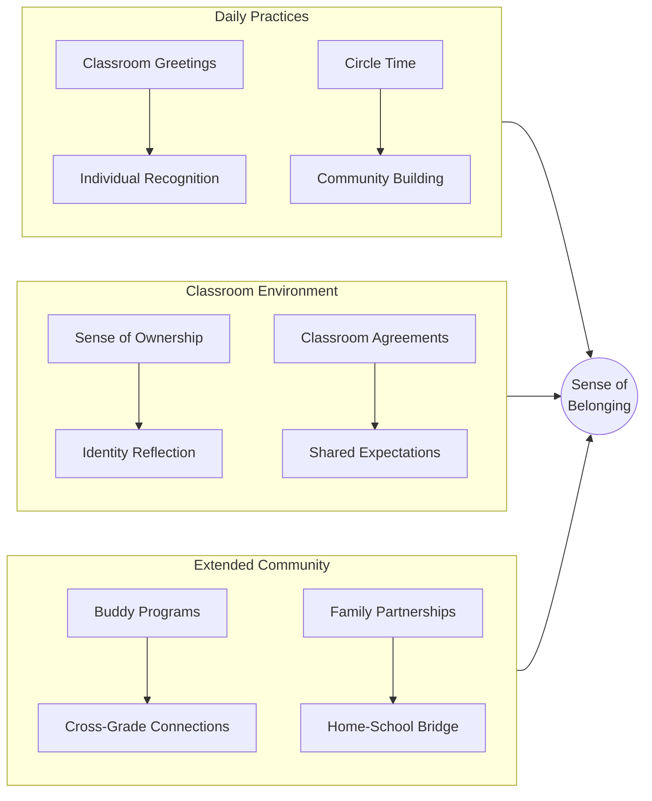

#### Collaborative Learning Structures

Collaborative learning provides both the social context for belonging and the interactive practice essential for language development. **Collaborative discussions** in small or whole groups allow students to share thoughts, opinions, and experiences, supporting active engagement, perspective-taking, and understanding of diverse viewpoints[^28].

Research on deeper learning demonstrates that **student-led team-based learning** particularly benefits English Language Learners, who in traditional classrooms often sit silently, unwilling to ask questions or participate in discussions. In collaborative structures, ELLs are fully immersed in the learning process, valued for their multilingual skills and life experiences, and contributing important insights to teams.

Effective collaborative structures include:

| **Structure** | **Description** | **Benefits** |
|--------------|----------------|-------------|
| **Think-Pair-Share** | Students think individually, discuss with partner, then share with group | Scaffolded participation, reduced anxiety[^28] |
| **Jigsaw** | Students become experts on portions of content and teach peers | Interdependence, responsibility, teaching as learning[^28] |
| **Reciprocal Teaching** | Students take turns leading discussions using specific strategies | Leadership development, metacognitive practice[^28] |
| **Partner Reading** | Students read together, supporting each other's comprehension | Peer support, fluency development[^28] |

#### Sociocultural Integration for English Language Learners

For English Language Learners, belonging requires explicit attention to **sociocultural integration**—practices that honor students' cultural and linguistic backgrounds while supporting their participation in the classroom community. School leaders can ensure that policies and practices integrate rather than marginalize EL students[^31].

Pedagogical practices promoting sociocultural integration include:

- **Promoting sociocultural competence in teaching** through instruction that values students' cultural and linguistic backgrounds[^31]
- **Giving students opportunity to integrate home and school experiences** through school-family partnerships[^31]
- **Using learning activities that value students' lives, cultures, and personal interests**, such as assignments where students use self-expression to link school with home life[^31]

One policy particularly salient for EL school belonging is the use of **bilingual or dual-immersion programs**[^31]. Such programs communicate that students' home languages are valued rather than obstacles, supporting both linguistic development and sense of belonging.

**Family celebrations** represent another strategy for building belonging. Teachers encourage students to applaud each other's successes and celebrate families by creating family picture walls in classrooms and having "spotlight weeks" for students to share about themselves and their families[^30]. These practices communicate that students' whole identities—including their family backgrounds and cultural heritage—are welcomed and valued in the classroom community.

#### The Multidimensional Nature of Belonging

Research emphasizes that belonging should be understood as a **multidimensional phenomenon** woven not only structurally but also emotionally, involving the interplay between students' emotional competencies and their socio-ecological environments[^38]. From a teacher's perspective, students' sense of belonging improves when teachers offer both academic and emotional support[^38].

**Academic support** includes encouraging academic curiosity, activity-based instruction, providing guidance, being fair, conducting student-centered lessons, motivating students, and valuing individual differences[^38]. **Emotional support** entails establishing connections with students, showing love and closeness, getting to know them, respecting them, making them feel valued, and supporting them[^38].

Families contribute to belonging by providing emotional support, being sensitive and tolerant, and establishing closeness[^38]. School-centered family behaviors include cooperating with the school, having positive attitudes toward school, encouraging attendance, and communicating with school[^38]. This recognition that belonging emerges from multiple sources—teachers, families, peers, and broader school community—underscores the need for comprehensive approaches.

**Cultivating a culture of belonging is essential to every student being seen, valued, and heard**[^29]. This work should not be relegated to just the beginning of the year; it must be woven into the fabric of the classroom so that students feel belonging every day. Building bridges of belonging instills confidence, empathy, and respect for differences[^29].

### 3.6 Integration and Synergy: The Interconnected Nature of Holistic Empowerment Components

The preceding sections have analyzed each dimension of holistic empowerment individually, but the true power of this paradigm emerges from understanding how these components function as an **integrated, synergistic system**. Effective holistic empowerment does not address dimensions in isolation but designs instruction that engages multiple dimensions simultaneously, creating conditions where development in one area reinforces and accelerates development in others.

#### The Multidimensional Assessment Perspective

The **Holistic Assessment Framework (HAF)** provides a model for understanding how multiple dimensions integrate in practice. This transformative, multidimensional framework reflects the progress and uniqueness of each learner across cognitive, affective, and psychomotor domains[^39]. The HAF follows a participatory, inclusive, and learner-centric approach and includes assessments of five dimensions: **physical development, socio-emotional and ethical development, cognitive development, language and literacy development, and aesthetic and cultural development**[^39].

This framework demonstrates that holistic empowerment requires attention to the whole child across all developmental dimensions. The HAF's key features—being based on principles of learner centricity, constructivism, personalized assessments, differentiation, and authentic assessments—align with the holistic empowerment paradigm[^39]. The framework employs varied assessment methods such as observation, analyzing artifacts, portfolios, storytelling, and self and peer assessments, integrating knowledge, skills, and attitudes across learning dimensions.

Research on HAF implementation found that students responded positively, showing **high engagement, improved learning outcomes, and reduced exam stress**[^39]. The framework promoted skill development, functioned as "invisible assessments" seamlessly integrated into learning, and contributed to confidence building. These findings confirm that multidimensional approaches enhance rather than complicate student development.

#### Cognitive-Linguistic Development Within Supportive Social-Emotional Contexts

**Cognitive-linguistic development is significantly enhanced when embedded within supportive social-emotional contexts**. Research on early language development demonstrates that parent speech predicts child language development, but this relationship is mediated by the quality of interaction and the emotional climate of learning[^27]. Children learn language most effectively in contexts characterized by warmth, responsiveness, and meaningful engagement.

This principle applies directly to classroom instruction. Students who feel safe, valued, and connected are more willing to take the linguistic risks necessary for language development—speaking in unfamiliar ways, making mistakes publicly, and experimenting with new structures. The social-emotional dimension creates the conditions within which cognitive-linguistic development can flourish.

Furthermore, **early gesture predicts later language development**, with the number of different meanings conveyed in gesture predicting later vocabulary and gesture-speech combinations predicting later syntactic complexity[^27]. This finding suggests that physical and creative expression support cognitive-linguistic development, demonstrating the integration of physical and cognitive dimensions.

#### Physical and Creative Engagement Reinforcing Cognitive and Affective Dimensions

Physical and creative activities serve not merely as breaks from cognitive work but as **integral supports for both cognitive and affective development**. Movement activities develop self-regulation skills that support sustained cognitive engagement. Creative expression provides emotional outlets while simultaneously developing language skills. The dimensions reinforce each other in reciprocal relationships.

The creative movement activities breakdown demonstrates these integrations clearly. Activities like **Freeze Dance** increase self-regulation[^34], which in turn supports sustained attention during cognitive tasks. **Dance the Story** helps recall[^34], demonstrating how physical engagement reinforces cognitive comprehension. **Mirrors** activities improve self-awareness and symmetry understanding[^34], integrating physical, cognitive, and social-emotional dimensions.

Research confirms that **children with early exposure to structured interaction English lessons, immersive language experiences, and parental support** demonstrate better overall linguistic skills and greater cognitive outcomes in areas such as memory retention, executive function, and abstract reasoning[^40]. Effective teaching strategies combine formal, teacher-directed activities with social, interactive learning environments, such as storytelling, songs, and role-play[^40]. This integration of multiple approaches—structured and creative, individual and social, cognitive and physical—produces superior outcomes.

#### Autonomy and Agency Emerging from Secure Community Belonging

**Learner autonomy does not develop in isolation but emerges from secure community belonging**. Students who feel safe and connected are more willing to take the risks that autonomous learning requires—making choices, pursuing personal interests, and accepting responsibility for outcomes. The community dimension provides the foundation upon which autonomy can develop.

The Integrated Empowerment Theory's **CAMP sequence**—establishing Community, building Agency, coordinating Mentors, and inspiring Purpose—reflects this developmental progression. Community must be established first because students cannot develop agency without first feeling safe. The sense of belonging provides the psychological security from which students can venture into increasingly autonomous engagement.

Research on belonging confirms this relationship. Students who feel a sense of belonging are **more confident in school**[^29], and this confidence enables them to take initiative, make choices, and express authentic voices. Conversely, students who feel marginalized or excluded are unlikely to engage autonomously, instead adopting defensive postures that limit learning.

#### Designing Instruction for Multiple Dimensions Simultaneously

For novice teachers, the practical implication of dimensional integration is that **effective instruction addresses multiple dimensions simultaneously** rather than treating them as separate concerns. A well-designed language activity might:

- Build vocabulary and grammatical knowledge (cognitive-linguistic)
- Develop empathy through perspective-taking (social-emotional)
- Incorporate physical movement or creative expression (physical-creative)
- Offer meaningful choices (autonomy-agency)
- Involve collaborative structures (community-belonging)

Consider, for example, an interactive storytelling activity where students act out a story they have read. This single activity engages:

| **Dimension** | **Engagement** |
|--------------|---------------|
| **Cognitive-Linguistic** | Comprehension, vocabulary reinforcement, narrative structure |
| **Social-Emotional** | Empathy with characters, emotional expression, perspective-taking |
| **Physical-Creative** | Movement, dramatic expression, creative interpretation |
| **Autonomy-Agency** | Choices in how to portray characters, personal interpretation |
| **Community-Belonging** | Collaborative performance, shared experience, mutual support |

Such multidimensional activities maximize the empowering potential of instruction by engaging students as whole persons rather than addressing isolated skills.

#### The Holistic Vision: Empowered Language Learners

The ultimate goal of holistic empowerment is the development of **confident, capable, and empowered language learners** who possess not only English proficiency but the cognitive, emotional, social, physical, and creative capacities to thrive in complex modern environments. These students:

- **Think critically** about language and content, questioning assumptions and seeking deeper understanding
- **Regulate their emotions** and maintain psychological equilibrium in challenging situations
- **Collaborate effectively** with diverse peers, contributing to and benefiting from collective endeavors
- **Express themselves authentically** through multiple modalities including movement, art, and creative language use
- **Direct their own learning** through goal-setting, self-assessment, and strategic decision-making
- **Belong to communities** where they feel valued, supported, and connected

This vision transcends traditional conceptions of language education that focus narrowly on linguistic competence. Holistic empowerment recognizes that **language learning is a human endeavor** that engages the whole person—body, mind, heart, and spirit. By attending to all dimensions of development, teachers create conditions where students not only acquire English proficiency but develop the comprehensive capacities necessary for flourishing lives.

For novice teachers, understanding these interconnected dimensions provides both a **vision for practice** and a **framework for decision-making**. When planning instruction, teachers can ask: How does this activity address cognitive-linguistic development? What social-emotional supports are in place? Is there opportunity for physical or creative engagement? Do students have meaningful choices? Does the activity build community and belonging? By consistently attending to multiple dimensions, teachers maximize the empowering potential of every instructional moment, creating classrooms where the whole child is nurtured and developed.

## 4 Pedagogical Principles and Teaching Strategies for Holistic Empowerment

The theoretical foundations of holistic empowerment established in previous chapters provide a compelling vision for elementary English education, yet vision alone does not transform classrooms. This chapter bridges theory and practice by translating the multidimensional framework of holistic empowerment into **actionable pedagogical principles and implementable teaching strategies** that novice teachers can apply in their daily instruction. The challenge facing new teachers is not merely understanding what holistic empowerment means but knowing how to enact it amid the complex realities of diverse learners, curricular demands, and institutional constraints. This chapter addresses that challenge systematically, examining student-centered methodologies that integrate cognitive, social-emotional, physical, and creative dimensions of learning while offering practical guidance on relationship-building, learning environment design, and the delicate balance between structured instruction and learner autonomy.

The strategies presented here are grounded in evidence-based research and designed with the novice teacher's developmental trajectory in mind. Rather than presenting an overwhelming array of techniques, the chapter organizes approaches according to foundational principles, allowing teachers to understand not only what to do but why specific practices support holistic empowerment. This principled understanding enables adaptation to diverse contexts while maintaining fidelity to the paradigm's core commitments. Throughout the chapter, attention is given to implementation considerations—how to begin, what challenges to anticipate, and how to build expertise progressively over time.

### 4.1 Foundational Pedagogical Principles for Holistic Empowerment

Before examining specific strategies, novice teachers must understand the **core pedagogical principles** that guide holistic empowerment in elementary English education. These principles serve as a compass for instructional decision-making, helping teachers adapt strategies to their unique contexts while maintaining alignment with holistic empowerment goals. Rather than following prescribed scripts, teachers grounded in these principles can respond flexibly to the dynamic realities of classroom life.

#### The Principle of Learner-Centeredness

The fundamental shift from traditional to holistic empowerment approaches involves repositioning the **learner at the center of educational design**. Student-centered learning is a teaching method that shifts the focus from teachers to students, aiming to build meaningful connections with students' interests while keeping them engaged and motivated[^41]. This represents the opposite of traditional teacher-centered instructional methods where the teacher serves as the primary source of knowledge and students function as passive recipients.

Throughout the 20th century, student-centered approaches gained ground for promoting autonomy and active learning by making students the leaders of their own learning process[^41]. The benefits extend beyond academic performance to significantly enhance students' motivation, engagement, and enthusiasm for the subject matter, leading to long-lasting knowledge retention and better grades[^41]. By stimulating active cooperation, student-centered learning fosters the development of crucial life skills such as teamwork, communication, independent thinking, and leadership[^41].

The key principles of student-centered learning involve a shift in the teacher's role from a traditional authority figure to a **facilitator who empowers and guides students**[^41]. Teachers should show genuine interest in students' needs and personal inclinations, for example, by conducting a needs analysis to tailor course content and objectives, making students feel included[^41]. This facilitative role does not mean abandoning teacher expertise but rather redirecting it toward creating conditions where students can construct understanding actively.

#### The Principle of Meaning-Making

Holistic education insists that **learning must be relevant and meaningful to students**. One of the fundamental key principles presents learning as something that should connect to students' lives, enabling each student to recognize, engage with, and adopt subject material in their daily life[^13]. This principle challenges the abstraction and decontextualization characteristic of traditional instruction, where content often seems disconnected from students' experiences, interests, and aspirations.

Meaning-making requires teachers to understand their students' backgrounds, interests, and aspirations and to design instruction that connects academic content to these lived realities. When students perceive the relevance of what they are learning, they engage more deeply, retain information longer, and develop intrinsic motivation to continue learning. For English language instruction, this means selecting texts, topics, and activities that resonate with students' lives while building toward broader linguistic and cultural competencies.

#### The Principle of Multidimensional Development

Holistic empowerment recognizes that **effective education addresses the whole child** across multiple developmental dimensions. Holistic education is an approach to learning that focuses on all aspects of an individual, rather than just their academic or intellectual development[^13]. This approach places equal importance on all dimensions of an individual's life, with the goal that students will become well-rounded, conscious, and practical individuals prepared for their futures.

This multidimensional orientation has direct implications for instructional design. Rather than treating cognitive development as the sole concern of academic instruction, holistic empowerment integrates attention to social-emotional development, physical engagement, creative expression, and community belonging within language learning activities. Teachers should consider the student-teacher roles to form an education system that focuses on the mind, spirit, and body to build a positive environment which encourages positive behavior in students[^13].

#### The Application of Maslow's Hierarchy to Instructional Decision-Making

**Maslow's Hierarchy of Needs** provides a practical framework for understanding how to sequence instructional priorities. This theory can be applied to help teachers understand the different needs of students[^13]. The hierarchy demonstrates that students' basic needs—physiological requirements, safety, and belonging—must be met before they can fully engage in higher-order learning activities.

For novice teachers, this framework suggests that instructional effectiveness depends on first ensuring students' fundamental needs are addressed. A student who is hungry, fearful, or feeling isolated cannot fully engage in language learning regardless of instructional quality. Schools should function as communities that offer a sense of belonging[^13]. This insight means that relationship-building, community development, and attention to students' well-being are not peripheral concerns but foundational prerequisites for effective instruction.

The following table summarizes how Maslow's hierarchy translates into instructional priorities:

| **Need Level** | **Classroom Manifestation** | **Teacher Response** |
|---------------|---------------------------|---------------------|
| **Physiological** | Hunger, fatigue, physical discomfort | Ensure basic needs are met; coordinate with school support services |
| **Safety** | Fear, anxiety, uncertainty | Create predictable routines; establish clear expectations |
| **Belonging** | Isolation, feeling unwelcome | Build community; ensure all students feel valued and included |
| **Esteem** | Low confidence, fear of failure | Provide success experiences; recognize strengths; offer encouragement |
| **Self-Actualization** | Limited growth, untapped potential | Provide challenge; support autonomy; foster creativity |

#### The Principle of Empowerment Through Agency

Empowerment in education refers to the process of enabling students to have more agency over their learning experiences, develop critical thinking skills, and become more independent learners[^42]. The purpose of empowerment is to give students the tools and resources they need to succeed[^42]. Student empowerment involves equipping students with life skills that will enable them to succeed both academically and beyond the classroom, including problem-solving, critical thinking, decision-making, goal setting, communication, collaboration, leadership, adaptability, and more[^42].

This principle transforms how teachers view their role. Rather than controlling every aspect of learning, empowering teachers create conditions where students can exercise meaningful choice, take responsibility for their learning, and develop the capacities for self-direction. Empowering students in learning means giving them the tools and resources they need to take ownership of their education[^42]. This includes providing opportunities to engage in active, hands-on learning experiences, encouraging them to set achievable goals, and supporting them in their efforts to explore their interests and passions[^42].

### 4.2 Student-Centered Teaching Methodologies in Practice

With foundational principles established, this section examines four key student-centered methodologies that operationalize holistic empowerment in elementary English classrooms: **experiential learning, project-based learning, inquiry-based instruction, and differentiated instruction**. Each methodology is analyzed for its theoretical rationale, implementation procedures, and specific applications in English language contexts.

#### Experiential Learning: Learning Through Doing and Reflecting

**Experiential learning** is an educational approach where students learn through experience, involving a continuous cycle of doing, thinking, analyzing, and reapplying[^43]. American educational theorist David Kolb outlined this model in four stages: Concrete Experience (doing something), Reflective Observation (thinking about what happened), Abstract Conceptualization (understanding the learning), and Active Experimentation (trying again in a new way)[^43].

Experiential learning can be applied in the ESL classroom because it builds on the principles that when students are cooperatively engaged in a motivating project, task, or experience, and then are reflective of the results, they are actively participating in the learning process[^44]. Experience-based, task-based, and project-based learning become experiential when elements of reflection, support, and transfer are present after the learning experience[^44]. In the early 1980s, educational psychologists stressed that the heart of all learning lies in critical reflection of experience, thinking of learning as a cycle that begins with an experience, continues with reflection, and ends with action[^44].

The experiential learning cycle in ESL contexts follows four phases:

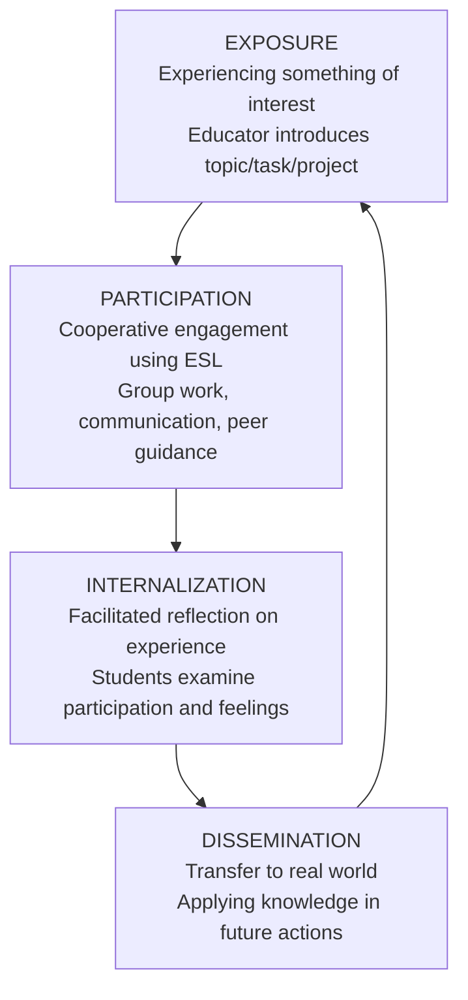

**Exposure** involves experiencing something of interest to the learner, where the educator introduces the topic, task, or project[^44]. Through **Participation**, the learner cooperatively participates in an experience using ESL, which typically involves group work, communication, peer-guidance, taking on roles, responsibilities, and following timelines[^44]. **Internalization** occurs when the educator facilitates reflection on the experience and encourages students to draw attention to how they participated and their feelings about it[^44]. Finally, **Dissemination** occurs where what has been learned in the classroom is brought into the real world, transferring newly acquired knowledge into future actions[^44].

For the ESL educator, the lesson plan needs to provide the situation and structure for the experience, plus facilitation for students' reflection[^44]. The educator must consider if students have a need or desire to learn this, how to pull their personal skills into the project, and how to reflect without pushing them uncomfortably[^44]. Example activities include making a poster, conducting an interview, role-plays, journaling, making a video, situational English, creating a gameshow, making a mock job fair, debates, creating a class website, writing a research paper, or having students "teach a class"[^44].

#### Project-Based Learning: Authentic Tasks for Deeper Engagement

**Project-based language learning (PBLL)** is a student-centered educational approach that emphasizes experiential learning through active engagement[^45]. It integrates various subjects around a central driving question, which motivates students to research, gain insights, and collaboratively brainstorm solutions[^45]. PBLL is distinct from traditional projects because it is student-centered, focusing on the learning journey itself rather than just a final product, and it often involves real-world tasks that require sustained engagement over a longer period[^45].

PBLL is particularly effective for language teaching because it immerses students in real-world tasks that require using the language in practical, meaningful ways[^45]. This approach helps students build critical thinking, creativity, and collaboration skills while staying engaged[^45]. PBLL goes beyond learning grammar and vocabulary; it teaches students how to communicate and solve problems in real-life situations, leading to deeper learning and more motivated students[^45].

Examples of PBLL projects include creating travel guides for countries where the target language is spoken, developing campaigns around current issues or community service projects, organizing debates on social issues, planning events like an international food festival, and engaging in digital storytelling such as creating short films or social media campaigns[^45]. These projects integrate all four linguistic skills—reading, writing, listening, and speaking—into one cohesive learning experience[^45].

The benefits of PBLL for language learners are substantial:

| **Benefit** | **Description** |
|------------|----------------|
| **Authentic Language Use** | Promotes language use in context, which aids retention |
| **Skill Integration** | Naturally integrates all language skills, leading to holistic mastery |
| **Increased Motivation** | Connects learning to students' interests |
| **Critical Thinking Development** | Challenges students to solve real-world problems |
| **Collaboration and Teamwork** | Allows students to practice conversational skills in dynamic settings |

This method transforms language acquisition into an exciting, hands-on experience that equips students with practical skills for the future[^45].

#### Inquiry-Based Instruction: Cultivating Curiosity and Critical Thinking

Inquiry-based learning involves students delving deeply into subject material through questioning and investigation. Schools can incorporate a holistic curriculum through steps like a place-based approach, which involves learning within the local community, or inquiry-based learning, where students delve deeply into subject material[^13]. This approach positions students as active investigators rather than passive recipients of information.

Holistic education places a strong emphasis on creativity and critical thinking, encouraging students to think freely, question assumptions, and seek out new perspectives[^13]. Inquiry-based instruction operationalizes this principle by structuring learning around student questions and investigations. Rather than beginning with teacher-delivered content, inquiry-based lessons begin with engaging phenomena or problems that provoke student curiosity and questioning.

For elementary English instruction, inquiry-based approaches might involve:

- Investigating how language varies across different contexts and communities
- Exploring why authors make particular word choices and their effects on readers
- Researching topics of personal interest and sharing findings through various media
- Examining how stories from different cultures address similar themes

The inquiry process develops both language proficiency and critical thinking as students formulate questions, gather information, analyze evidence, and communicate conclusions.

#### Differentiated Instruction: Meeting Diverse Learner Needs

**Differentiated instruction** is an important focus for teachers to achieve growth for all students, whether they struggle with basics, are at the appropriate skill level, or exceed curriculum outcomes[^46]. Differentiated instruction strategies adapt teaching to address students' unique learning abilities, styles, and readiness levels, modifying teaching and learning practices to match the needs of students in diverse classrooms[^47]. This approach transforms how teachers deliver content, engage students, and assess understanding by adjusting content, processes, and products[^47].

The key elements for differentiation are **Planning** (content, processes, and products), **Learner access** (readiness, interests, and learning preferences), and **Environment**[^46]. A practical approach involves a change in how to use the planning elements for intentional differentiation.

**A 3-Pronged Approach to Planning for Differentiation:**

**Part 1: Content** is what students need to know, understand, and do something with[^46]. Teachers must first identify the specific skills and concepts students must achieve, which are measured through assessments[^46]. Second, teachers must collect data on what students bring to the content, including their prior knowledge, life experiences, interests outside of school, and academic skills[^46]. Strategies like K-W-L charts can determine what learners already know[^46]. Collecting information about students' interests, such as sports or Minecraft, can lead to rich learning experiences[^46].

**Part 2: Processes** are the different ways students make sense of the content through lesson activities[^46]. Differentiation is applied in one or more activities based on students' content opportunities and challenges, and incorporates at least one learner access element[^46]. An example for English is using details in writing through learning centers; each center focuses on a different detail strategy (example, facts, sensory detail) and offers students options to choose from[^46].

**Part 3: Products** are the artifacts students create to show their knowledge, such as quizzes, reflections, discussions, or multimedia[^46]. Intentional differentiation for products leverages students' content opportunities and challenges and at least one learner access element[^46]. This provides flexibility for students to make connections and extend their learning[^46].

This approach provides a clear plan for choosing strategies based on learner needs aligned with lesson outcomes, empowering student learning and giving educators a common language for collaboration[^46].

### 4.3 Building Strong Student-Teacher Relationships

The foundation of effective education lies in building relationships between teachers and students[^48]. When students feel connected to their teachers, they're more likely to engage in learning, take academic risks, and develop a sense of belonging in the classroom[^48]. Building strong relationships with students creates the foundation for effective learning[^48]. Research consistently shows that positive teacher-student relationships are linked to better academic outcomes—students who feel connected to their teachers are more likely to attend school regularly, participate actively in class, and achieve higher grades[^48].

Developing teacher skills in relationship-building is particularly crucial in today's diverse classrooms as each student brings unique experiences, cultural backgrounds, and learning needs that require personalized approaches[^48]. For novice teachers, mastering relationship-building strategies is essential for creating the conditions where holistic empowerment can flourish.

#### Establishing Relationships at the Beginning of the Year

The beginning of the school year presents a critical window for establishing positive teacher-student relationships[^48]. One effective strategy is to **greet each student by name at the door every day**[^48]. Research shows that personalized greetings can increase student engagement by up to 20% and reduce disruptive behavior[^48]. Greeting students individually at the door provides a jolt of encouragement and allows teachers to gather information about their emotional state[^49].

**Getting-to-know-you activities** should go beyond surface-level information to deeper connections about students' hopes, challenges, and interests[^48]. Effective activities include:

- **Student interest surveys** that include questions about learning preferences, challenges, and goals[^48]
- **Class agreements** created collaboratively[^48]
- **Hopes and dreams activities** that connect personal goals to classroom learning[^48]
- **"All about me" presentations** where students create presentations with 10 facts about themselves, using media like video, photos, and music[^49]
- **"I Am" lists** where students complete sentence starters like "I am happy when ____"[^49]

Teachers should model these activities by making their own presentations first[^49]. Another approach involves **name tents** at the start of the year where students create name tents with the phonetic spelling of their name[^49]. To socialize pronunciations, games like having students pronounce their name before tossing a ball in a circle can be used[^49].

#### Four Dimensions of Classroom Relationships

To lay the groundwork for productive discussions and group work, teachers should think about relationships along **four dimensions**: teacher to individual student, teacher to whole class, student to student, and student to whole class[^49]. This starts with simple adjustments that improve classroom cohesion, ensuring students feel "seen and known" and develop a "sense of belonging"[^49].

Strong, trusting relationships between students and teachers are the key to high-functioning, academically challenging classrooms[^49]. The following table organizes relationship-building strategies across these four dimensions:

| **Dimension** | **Strategies** | **Purpose** |
|--------------|---------------|------------|
| **Teacher to Individual** | Door greetings, 2x10 strategy, dialogue journals, 5x5 assessment | Personal connection, understanding individual needs |
| **Teacher to Whole Class** | Morning meetings, class agreements, shared goals | Community building, establishing norms |
| **Student to Student** | Partner activities, buddy programs, peer feedback | Peer relationships, collaborative skills |
| **Student to Whole Class** | Show and tell, daily dedications, shout-out boxes | Voice, recognition, belonging |

#### The 2x10 Strategy for Challenging Students

For students with challenging behaviors, the **2x10 strategy** can be effective: for two minutes each day, 10 days in a row, teachers have a personal conversation with a challenging student about their interests[^49]. Psychologist Raymond Wlodkowski found this can lead to an 85 percent improvement in a student's behavior[^49]. This strategy recognizes that challenging behaviors often stem from disconnection and that building relationship is more effective than punitive responses.

The **5x5 assessment** offers another approach: teachers choose five students to think about for five minutes each day, considering their behavior patterns, affinities, and goals, then interact with them to ask a related question[^49]. This systematic attention ensures that no student is overlooked and that teachers develop deep understanding of each learner.

#### Effective Communication Practices

Effective communication forms the cornerstone of strong teacher-student relationships[^48]. **Active listening** is perhaps the most powerful communication tool; when students share their thoughts or concerns, give them your full attention and reflect back what you hear to confirm understanding[^48].

**Verbal communication tips** include using students' names frequently and pronouncing them correctly, asking open-ended questions, and sharing appropriate personal stories that connect to learning[^48]. **Non-verbal communication tips** include positioning yourself at students' eye level, using warm facial expressions, and noticing and responding to students' emotional cues[^48].

**Cultural responsiveness in communication** is essential for building relationships with diverse student populations, as communication norms vary across cultures[^48]. Teachers should learn about communication norms across cultures, incorporate diverse perspectives in curriculum, create classroom displays that reflect students' cultural backgrounds, and acknowledge cultural events and holidays[^48].

#### Interviewing Students to Understand Learning Preferences

One powerful differentiation strategy involves **interviewing students** about their learning and studying styles to help pinpoint the kinds of content that meet their needs[^47]. While running activities, pull each student aside to ask about their favorite types of lessons and activities, which projects they are most proud of, and which exercises help them remember key points[^47]. Tracking results identifies themes and student preferences[^47].

Teachers should also **share their own strengths and weaknesses**, explaining that everyone has different skill levels and ways of processing information[^47]. Share how you study and review lessons, and discuss tactics that do and don't work for you to help students understand people learn differently and give them insight into improving[^47].

#### Ongoing Relationship Maintenance

Building relationships is an ongoing process that requires maintenance[^48]. Regular relationship check-ins help gauge the health of your classroom community[^48]. When conflicts arise, view them as opportunities to model healthy relationship repair[^48]. A framework for relationship repair includes acknowledging the issue, listening to understand all perspectives, taking responsibility for your contribution, and collaborating on solutions[^48].

**Dialogue journals** provide an ongoing relationship-building tool where teachers and students exchange short letters in a notebook throughout the year, helping to connect individually and improve writing[^49]. This practice creates a private channel for communication where students may share things they wouldn't express publicly.

**Appreciation, apology, aha** is a closing circle practice where students share an appreciation, an apology, or an "aha" moment from the day, creating space to reflect and build bonds[^49]. This routine helps students process their experiences and strengthens classroom community.

### 4.4 Creating Supportive and Empowering Learning Environments

The physical, social, and emotional dimensions of the classroom environment profoundly shape students' capacity for learning and empowerment. Creating environments where students feel safe, valued, and capable of taking risks is essential for holistic empowerment to flourish.

#### Physical Classroom Configuration

The setup of the classroom is fundamental[^41]. The traditional layout limits participation, whereas modern layouts should foster communication, collaboration, and sharing[^41]. Teachers are encouraged to reduce physical distance by moving around and to arrange desks in circles or around smaller tables to suit learning styles and activities[^41].

Traditional row-based seating positions the teacher as the focal point and limits student-to-student interaction. In contrast, configurations that support holistic empowerment might include:

- **Circles or U-shapes** for whole-class discussions and community building
- **Small table clusters** for collaborative group work
- **Flexible arrangements** that can be reconfigured for different activities
- **Designated areas** for different types of learning (reading corners, project spaces, reflection areas)

The physical environment communicates expectations and values. Classrooms arranged for collaboration signal that student interaction is valued; spaces that allow movement acknowledge the physical needs of young learners.

#### Establishing Psychological Safety and Trust

Trust forms the bedrock of effective teacher-student relationships[^48]. Building trust requires consistency, fairness, and emotional safety[^48]. Consistency in your words and actions demonstrates reliability[^48]. Emotional safety is crucial; students need to know that their classroom is a place where they can express ideas, make mistakes, and be themselves without fear of ridicule[^48].

**Trust-building practices** include admitting when you make mistakes, maintaining confidentiality when students share personal information, and applying consequences privately and respectfully[^48]. At-risk students have a higher chance of success when they feel safe and nurtured in a safe environment[^13].

It is essential to create a classroom culture that encourages students to explore, to take risks, and to learn from their mistakes[^42]. For language learning specifically, this means creating conditions where students feel comfortable attempting new language structures, making errors publicly, and receiving feedback as support rather than judgment.

#### Ensuring Student Representation and Ownership

**Providing a sense of ownership** ensures that students see themselves reflected in the classroom[^49]. Examining what's on the walls, the books on the bookshelves, and other classroom elements is critical for students' feeling represented[^49]. From language to names to cultural heritage representation and the sharing of lived experiences, the identities of students must be reflected[^49].

Strategies for creating representative environments include:

- Displaying student work prominently
- Including books and materials that reflect students' diverse backgrounds
- Creating **family picture walls** in classrooms[^49]
- Having **"spotlight weeks"** for students to share about themselves and their families[^49]
- Using students' names and languages in classroom displays

Activities that cultivate belonging are key to self-pride, respect, and appreciation for each other's backgrounds[^49]. When students see their identities reflected and valued in the classroom environment, they develop stronger sense of belonging and engagement.

#### Developing Collaborative Classroom Agreements

**Classroom agreements** are important tools for setting expectations for student engagement and community building[^49]. Students collaborate on classroom agreements where they decide on expectations for how they will enter the space and engage with each other[^49]. These agreements are important for setting boundaries when students are expressing thoughts and opinions or working through moments of frustration and conflict[^49].

Unlike teacher-imposed rules, collaborative agreements emerge from student input and reflection on what kind of community they want to create together. This process itself is empowering—students exercise voice in shaping the norms that govern their learning environment. The resulting agreements carry greater legitimacy because students have ownership of them.

Effective classroom agreements typically address:

- How we treat each other
- How we participate in discussions
- How we handle disagreements
- How we support each other's learning
- How we take care of our shared space

#### Morning Meetings and Community-Building Routines

**Morning meetings** are suitable for all ages and allow students and teachers to reflect on the day ahead[^49]. They can focus on prosocial greetings, reflection, and sharing using tools like mood meters or strategies like roses and thorns[^49]. Integrating relationship-building games, mindfulness activities, or movement can loosen kids up for learning[^49]. A 2017 study found morning meetings can reduce classroom disruptions by up to 75 percent[^49].

**Circle time** provides a structure where students come together to be in community with each other[^49]. Circle time can be utilized to discuss challenging topics, reflect on the day, or hear from every student[^49]. Various activities built into circle time teach the values of respect, active listening, showing appreciation for each other, and encouraging each other—modeling empathy and building community bonds[^49].

These routines establish predictable structures that support both belonging and learning readiness. When students begin each day with connection and community, they are better prepared for the cognitive and social demands of instruction.

### 4.5 Integrating Mindfulness and Reflection Practices

Mindfulness and reflective practices support social-emotional development and metacognitive growth within English instruction. Physical education and mindfulness practices like yoga and meditation are crucial, as they support students to develop self-awareness and manage self-regulation[^13]. These practices, once considered peripheral to academic instruction, are increasingly recognized as essential supports for cognitive engagement and emotional well-being.

#### Daily Check-Ins and Emotional Awareness

**Daily student check-ins** provide structured opportunities for emotional awareness and expression. **Attendance check-in** transforms routine into relationship-building: instead of saying "here," students respond to prompts using a mood meter, sharing a word, or mentioning something they read, building a "culture of connectedness"[^49].

Incorporating emotional reflection involves encouraging emotional reflection in daily routines, providing moments for meditation and contemplation, and helping students channel their emotions[^13]. Teachers can implement check-ins through:

- Individual conversations at the door
- Circle time sharing
- Private letter boxes where students can share feelings
- Mood meters where students indicate their emotional state

These practices communicate to students that their emotional lives matter and that the classroom is a space where the whole person is welcomed.

#### Mindfulness and Breathing Exercises

Schools implementing holistic approaches have found success with structured mindfulness programs. Embracing the arts and introducing activities like yoga can increase focus, relieve stress, and decrease anxiety[^13]. At Salina Elementary School, the implementation of the Calm Classroom program with daily guided meditations and calm breathing exercises has yielded substantial results including improved student self-regulation, fewer meltdowns, and students taking charge of their own mental health.

Age-appropriate mindfulness activities for elementary students include:

| **Activity** | **Description** | **Benefits** |
|-------------|----------------|-------------|
| **Breathing exercises** | Simple patterns like "smell the flower, blow out the candle" | Calming, focus, self-regulation |
| **Body scans** | Guided attention to different body parts | Body awareness, relaxation |
| **Mindful listening** | Attending to sounds in the environment | Attention training, present-moment awareness |
| **Visualization** | Imagining peaceful places or positive outcomes | Stress reduction, emotional regulation |

These practices can be integrated throughout the school day—at transitions, before challenging activities, or when students need to reset their attention and emotional state.

#### Journaling for Emotional and Academic Reflection

**Making time for journaling** provides a tool for students to reflect on lessons and activities[^47]. At the end of class, students can summarize key points, attempt to answer lingering questions, explain how to use lessons in real-life, or illustrate new concepts[^47]. They can figure out which entries allow them to process content effectively[^47].

As an extension of journaling, teachers can **implement reflection and goal-setting exercises** where students reflect on important lessons and set learning goals at predetermined points of the year[^47]. They write about favorite topics and interesting concepts, and identify skills to improve[^47]. Teachers can then target lessons to help meet these goals[^47].

Journaling serves dual purposes in holistic empowerment: it develops writing skills while simultaneously building metacognitive awareness and emotional processing capacity. Students learn to articulate their thinking, identify their feelings, and track their growth over time.

#### Structured Reflection Protocols

Incorporating emotional reflection involves providing moments for reflection or mindfulness, such as meditation, to help students channel their emotions[^13]. Structured reflection protocols help students develop habits of self-examination and growth-oriented thinking.

Effective reflection protocols include:

- **Exit tickets** that ask students to identify what they learned, what confused them, and what they want to know more about
- **Weekly reflections** on learning progress and challenges
- **Goal-setting conferences** where students articulate objectives and strategies
- **Portfolio reflections** where students examine their work over time and identify growth

These practices develop the metacognitive capacities essential for autonomous learning while simultaneously supporting emotional awareness and regulation.

### 4.6 Balancing Structured Instruction with Learner Autonomy

One of the most challenging aspects of holistic empowerment for novice teachers is finding the appropriate balance between providing necessary structure and scaffolding while progressively releasing responsibility to students. **Fostering students' autonomy** is a main goal, allowing them to gain self-confidence and develop the ability to think and work independently[^41]. Activities that foster leadership skills, such as directing group research and projects, help students gain confidence and self-esteem, developing essential abilities like time management and self-discipline for lifelong learning[^41].

#### The Gradual Release of Responsibility Model

Effective holistic empowerment does not mean abandoning teacher guidance but rather systematically transferring responsibility to students as they develop capacity for self-direction. The gradual release of responsibility model provides a framework for this transition:

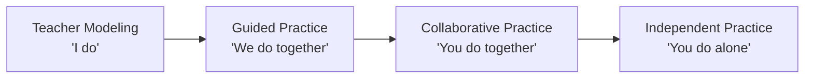

In the early stages, teachers provide explicit modeling and direct instruction. As students develop understanding and skills, teachers shift to guided practice where they work alongside students. Subsequently, students practice collaboratively with peers while teachers monitor and support. Finally, students demonstrate independent application of learning.

This progression recognizes that autonomy is developmental—students cannot immediately take full responsibility for their learning but must build capacity through scaffolded experiences of increasing independence.

#### Fostering Choice Within Bounded Frameworks

**One of the best tactics for empowering students in the classroom is giving them choices**[^42]. Providing meaningful choice does not mean unlimited freedom but rather structured options within clear boundaries. Ten ways to empower students with choice include:

1. Let students choose their own topics for research projects
2. Offer students a variety of reading materials to select from
3. Provide different ways for students to demonstrate understanding, such as through art, writing, or presentations
4. Give students the option to work independently or in groups
5. Allow students to choose their own seating arrangements
6. Let students choose their preferred learning styles
7. Offer multiple assessment options
8. Provide students with opportunities to select their pace of learning
9. Encourage student input in classroom rules and policies
10. Allow students to choose their own extracurricular activities[^42]

These choices empower students while maintaining teacher guidance over essential learning objectives. Students experience agency within a framework that ensures they engage with required content and skills.

#### Supporting Students at Varying Readiness Levels

Not all students are equally ready for autonomous learning, and effective holistic empowerment differentiates support based on individual readiness. Some students may need more structure and guidance initially, while others may be ready for greater independence.

Teachers can assess readiness for autonomy by observing:

- Students' ability to self-regulate attention and behavior
- Their capacity to make productive choices when given options
- Their metacognitive awareness of their own learning processes
- Their persistence when facing challenges

For students who need more support, teachers can provide more structured choices, closer monitoring, and more frequent check-ins. For students ready for greater independence, teachers can offer more open-ended options and longer periods of self-directed work.

#### Self-Guided Learning Approaches

**Self-guided learning** allows students to use their motivation to learn at their own pace, giving the teacher feedback to steer the curriculum[^13]. This approach allows students to evaluate their own experiences while teachers use this feedback to guide instructional decisions.

Self-guided learning in elementary contexts might include:

- **Independent reading** where students select books at appropriate levels
- **Learning contracts** where students commit to completing specific tasks
- **Choice boards** offering multiple pathways to demonstrate learning
- **Passion projects** where students pursue topics of personal interest

These approaches develop the self-direction capacities that support lifelong learning while maintaining teacher oversight to ensure students engage with essential content.

### 4.7 Scaffolding Techniques for Diverse Learners

Scaffolding refers to the temporary supports teachers provide to help students access content and develop skills they cannot yet manage independently. Effective scaffolding is essential for holistic empowerment because it enables all learners—including English Language Learners and students with diverse learning needs—to engage with rigorous content while developing language proficiency.

#### Differentiated Instruction Techniques

**Differentiated instruction** is a technique that provides students with different avenues for acquiring and processing content, and it entails identifying both the appropriate entry points for learning and the appropriate exit points for students to express their learning[^50]. Teachers should provide students with multiple options for taking in information, processing ideas, and expressing what they have learned[^50].

Eight techniques for differentiated instruction to reach every type of learner include:

**Key Vocabulary**: Educators work with students to help them identify, recognize, develop, and use new terminology[^50]. Pre-teaching key vocabulary before lessons ensures students can access content.

**Prior Knowledge Links**: This technique taps into students' prior experiences and knowledge by having students interview each other or by addressing pointed questions to the entire group[^50]. Connecting new learning to what students already know strengthens comprehension and retention.

**Paired and Cooperative Learning**: This combines students with varying learning abilities, interests, language proficiencies, or other skill strengths into groups of two or more to provide peer support throughout a lesson[^50]. Strategic grouping ensures all students have access to support.

**Nonlinguistic Representations**: This helps students learn using modalities other than the printed word, such as singing, role-playing, sketching, or taking photographs[^50]. Multiple modalities ensure students with different learning preferences can access content.

**Realia and Hands-on Learning**: This provides students with tangible objects to illustrate what is being discussed and engages multiple learning modalities[^50]. Concrete objects support comprehension, particularly for English Language Learners.

**Curricular and Personal Connections**: This helps students make connections with other content and discipline areas by relating new concepts to previously learned ones[^50]. Connecting learning across subjects deepens understanding.

**Oral, Reading, and Writing Skills**: This encourages students to integrate the three learning modalities of speaking, reading, and writing[^50]. Integrated skill practice develops comprehensive language proficiency.

**Higher Order Thinking**: This challenges students to go beyond comprehension of basic material by moving them toward more abstract reasoning, such as making inferences, predictions, and appropriate connections[^50].

#### The Think-Pair-Share Strategy

The **Think-Pair-Share strategy** exposes students to three lesson-processing experiences[^47]. Students first think individually about a topic, then pair to discuss their findings, and finally share ideas with the class[^47]. It caters to a range of learning and personality types[^47].

This structure provides scaffolding for students who may be reluctant to share in whole-class settings. The individual thinking time allows processing; the pair discussion provides a low-stakes opportunity to articulate ideas; the whole-class sharing builds on the confidence developed in the pair conversation.

#### Literature Circles for Reading Development

**Running literature circles** organizes students into groups that encourage them to shape and inform each other's understanding of readings, helping auditory and participatory learners retain information[^47]. This allows teachers to listen to each circle's discussion, ask questions, and fill gaps in understanding[^47]. Some students may develop leadership skills by running the discussion[^47].

Literature circles provide scaffolding through peer support while developing collaborative skills and deeper comprehension. Students learn from each other's perspectives and questions, enriching their understanding beyond what individual reading would provide.

#### Differentiated Reading Comprehension Activities

Teachers can **give different sets of reading comprehension activities** to evaluate reading comprehension through questions and activities that test different aptitudes[^47]. Instead of only written answers, allow students to choose activities like using graphic organizers, participating in literature circles, delivering a presentation, writing a report, creating visual art, or performing a monologue[^47]. Offering structured options helps students demonstrate understanding effectively[^47].

This approach recognizes that comprehension can be demonstrated in multiple ways and that students have different strengths for expressing their understanding. By providing options, teachers can more accurately assess what students know while honoring diverse learning preferences.

### 4.8 Formative Assessment Approaches for Holistic Development

Assessment practices aligned with holistic empowerment focus on assessment as a tool for learning rather than merely measurement. The **Holistic Assessment Framework (HAF)** provides a model for multidimensional assessment that captures cognitive, affective, and psychomotor development.

#### Principles of Holistic Assessment

The HAF is a transformative multidimensional assessment framework that focuses on transforming educational assessment practices to make them more diversified and holistic, adapting to the unique needs of learners[^39]. The framework reflects the progress and uniqueness of each learner in cognitive, affective, and psychomotor domains[^39]. It follows a participatory, inclusive, and learner-centric approach and includes assessments of dimensions including physical development, socio-emotional and ethical development, cognitive development, language and literacy development, and aesthetic and cultural development[^39].

The framework's theoretical basis includes constructivism and learner-centered approaches[^39]. HAF follows principles based on learner-centricity, constructivism, personalized assessments, differentiation, and authentic assessments[^39]. The framework employs varied assessment methods such as observation, analyzing artifacts, portfolios, storytelling, and self and peer assessments[^39].

#### Teacher Observations of Traditional vs. Holistic Assessment

Research on HAF implementation reveals important contrasts between traditional and holistic assessment approaches:

| **Traditional Assessment** | **Holistic Assessment (HAF)** |
|---------------------------|------------------------------|
| Monotonous, limited scope | Comprehensive, multidimensional |
| Focused on cognitive domain | Addresses cognitive, affective, psychomotor |
| Exam-centered | Diverse methods including observation, portfolios |
| Emphasis on memorization | Focus on practical application and skill development |
| Teacher-centered | Learner-centered with student involvement |
| Creates student burden and stress | Reduces stress, increases engagement |

Teachers in the research reported that HAF provided opportunities for **personalized assessment, practical application, skill development, and continuous assessment**[^39]. They experienced increased student engagement, greater teacher satisfaction, and observed that HAF made learning enjoyable while providing adaptability and flexibility[^39].

#### Student Responses to Holistic Assessment

Students responded positively to the holistic assessment framework, showing **high engagement, excitement, and no pressure**[^39]. Teachers observed that HAF had profound positive impacts in areas including improved engagement, self-development, holistic development, creating a stress-free conducive environment, and connecting learning with the real world[^39].

The achievement levels in HAF are categorized based on children's performance: A (Advanced), W (Working), P (Progressing), and B (Beginning)[^39]. This approach provides meaningful feedback about student development without the anxiety-producing effects of traditional grading systems.

#### Self and Peer Assessment Strategies

Self and peer assessment strategies develop student agency and metacognitive awareness while providing valuable formative feedback. These approaches align with holistic empowerment's emphasis on developing autonomous learners who can evaluate their own work and growth.

Effective self-assessment practices include:

- **Reflection journals** where students examine their learning processes and outcomes
- **Self-evaluation rubrics** with clear criteria students can apply to their own work
- **Goal-setting and progress monitoring** where students track their development over time
- **Portfolio reflections** where students select and reflect on representative work samples

Peer assessment develops both assessment skills and collaborative relationships. Students learn to provide constructive feedback while also developing deeper understanding of quality criteria through evaluating others' work.

#### Feedback Practices That Build Agency

Feedback in holistic empowerment focuses on supporting growth rather than merely judging performance. Encouraging self-confidence involves providing students the possibility to communicate their understanding in various ways and focusing lessons on realistic issues[^13]. Effective feedback:

- Identifies specific strengths and areas for growth
- Provides actionable suggestions for improvement
- Connects to learning goals students have set
- Maintains a positive ratio (research suggests 80:20 positive to corrective)
- Is timely enough to inform ongoing learning

Teachers should **analyze their differentiated instruction strategy regularly**, frequently reflecting on the match between their classroom and their teaching philosophy[^47]. This reflective practice ensures that assessment practices remain aligned with holistic empowerment principles.

### 4.9 Encouraging Student Voice and Choice in the English Classroom

Amplifying student voice and embedding meaningful choice throughout English instruction are essential for developing empowered, autonomous learners. Student empowerment examples in schools include giving students a voice in classroom discussions and decision-making, providing them with opportunities to take on leadership roles in group projects, and encouraging them to explore their interests and passions through independent study and research[^42].

#### Ten Strategies for Empowering Students with Choice

One of the best tactics for empowering students in the classroom is giving them choices[^42]. The following strategies provide specific ways to embed choice in elementary English instruction:

1. **Topic selection for research and writing**: Allow students to pursue topics that genuinely interest them within the framework of required skills and genres.

2. **Reading material selection**: Provide a variety of reading materials at appropriate levels and allow students to select based on their interests.

3. **Multiple demonstration options**: Provide different ways for students to demonstrate understanding, such as through art, writing, presentations, or multimedia[^42].

4. **Grouping preferences**: Give students the option to work independently or in groups based on the task and their preferences[^42].

5. **Seating choices**: Allow students to choose seating arrangements that support their learning[^42].

6. **Learning style accommodations**: Let students choose approaches that align with their preferred learning styles[^42].

7. **Assessment options**: Offer multiple ways to demonstrate mastery of learning objectives[^42].

8. **Pacing flexibility**: Provide opportunities for students to select their pace of learning within reasonable parameters[^42].

9. **Input on classroom policies**: Encourage student input in classroom rules and procedures[^42].

10. **Extension activities**: Allow students to choose how to extend their learning beyond required content.

#### Incorporating Student Input in Classroom Decisions

To engage and empower students, teachers can incorporate student voices in the classroom by asking for input and suggestions from students on classroom activities and assignments[^42]. This might include:

- Soliciting feedback on instructional approaches and activities
- Involving students in planning units or projects
- Creating opportunities for students to propose topics or questions for investigation
- Establishing regular channels for student feedback on classroom functioning

One school's approach demonstrates how student voice can extend to shaping school practices. They let students understand and own their data, starting from the enrollment process where the school asks deep questions about students' backgrounds[^51]. Students are responsible for documenting their learning journey by creating portfolios[^51]. They set language growth goals aligned with school goals and share in the collective vision, which empowers them to support the school community while promoting their own growth[^51].

The school also created opportunities for students to participate in adult work spaces, inviting students to provide feedback on language proficiency standards[^51]. Through this participation, students not only gained ownership of the standards but also helped shape how success is measured[^51].

#### Developing Authentic Voice in English Expression

Developing students' authentic voice in English means supporting them to express their genuine thoughts, feelings, and identities through the language. This goes beyond grammatical accuracy to encompass personal expression and identity development.

Strategies for developing authentic voice include:

- **Personal narrative writing** where students share their own stories and experiences
- **Opinion writing** where students articulate and defend their perspectives
- **Creative writing** where students express imagination and creativity
- **Discussion protocols** that ensure all voices are heard
- **Presentation opportunities** where students share their knowledge and perspectives with authentic audiences

When students find their authentic voice in English, they develop not only language proficiency but also confidence, identity, and sense of agency as communicators.

#### Student Leadership Opportunities

Creating opportunities for student leadership develops agency while building classroom community. Activities that foster leadership skills, such as directing group research and projects, help students gain confidence and self-esteem[^41].

Leadership opportunities in elementary English classrooms might include:

- **Discussion leaders** who facilitate literature circles or group conversations
- **Peer tutors** who support classmates with specific skills
- **Project managers** who coordinate group work
- **Classroom helpers** who take responsibility for specific routines
- **Student teachers** who share expertise with peers

These roles develop leadership capacities while providing authentic purposes for language use and collaboration.

### 4.10 Implementation Guidance for Novice Teachers

This section synthesizes the chapter's strategies into practical guidance specifically designed for novice teachers entering elementary English education. The transition to holistic empowerment approaches requires thoughtful implementation that builds teacher confidence and competence progressively.

#### Starting Points for Holistic Approaches

Novice teachers should not attempt to implement all strategies simultaneously but rather begin with foundational practices and expand their repertoire over time. Recommended starting points include:

**Week 1-2: Relationship Foundation**
- Implement door greetings and learn all students' names
- Conduct getting-to-know-you activities and interest surveys
- Establish morning meeting or circle time routines
- Begin developing collaborative classroom agreements

**Week 3-4: Community Building**
- Introduce buddy systems or partner structures
- Implement regular check-in routines
- Create classroom environment that reflects student identities
- Establish consistent routines and expectations

**Month 2: Instructional Expansion**
- Introduce choice within structured activities
- Begin implementing collaborative learning structures
- Add reflection and journaling practices
- Experiment with differentiated activities

**Ongoing: Progressive Development**
- Gradually release more responsibility to students
- Expand repertoire of student-centered methodologies
- Refine assessment practices toward holistic approaches
- Deepen relationship-building with individual students

#### Time-Efficient Relationship-Building Strategies

Novice teachers often feel overwhelmed by competing demands. **Time-efficient strategies** can be deployed daily, weekly, and year-round to build and sustain strong classroom communities[^49]. Efficient approaches include:

- **Entrance and exit tickets** that include personal check-in questions[^48]
- **Quick morning meeting routines** that establish connection in 5-10 minutes[^48]
- **Rotating through student conferences** during independent work time[^48]
- **Attendance check-ins** that transform routine into relationship-building[^49]
- **Two-minute talks** where students discuss questions briefly with partners[^49]

These strategies build relationships within the constraints of busy schedules, ensuring that connection happens consistently even when time is limited.

#### Common Challenges and Evidence-Based Solutions

Novice teachers implementing holistic approaches commonly encounter several challenges:

| **Challenge** | **Evidence-Based Solution** |
|--------------|---------------------------|
| **Student resistance to choice** | Start with structured choices; gradually expand options as students develop decision-making capacity |
| **Classroom management concerns** | Establish clear routines and expectations first; relationship-building reduces behavior issues |
| **Time constraints** | Integrate strategies into existing routines; prioritize high-impact practices |
| **Curriculum pressures** | Frame holistic approaches as supporting academic goals; document student growth |
| **Uncertainty about implementation** | Start small; reflect regularly; seek feedback from colleagues and students |

For students with challenging behaviors, the 2:1 strategy can be effective: aim for at least two positive interactions for every correction or redirection[^48]. This approach builds relationship while addressing behavior concerns.

#### Building Teacher Confidence and Competence

Some of the best ways for teachers to empower students in the classroom include providing opportunities for active and hands-on learning, encouraging student input, and fostering a safe and supportive learning environment[^42]. Teachers should regularly reflect on their practice, analyzing the match between their classroom and their teaching philosophy[^47].

Professional growth in holistic empowerment involves:

- **Reflective practice**: Regular examination of what's working and what needs adjustment
- **Peer collaboration**: Learning from colleagues who implement similar approaches
- **Student feedback**: Asking students what supports their learning
- **Ongoing learning**: Reading, workshops, and professional development focused on holistic approaches

Teachers are encouraged to explore holistic methods to see how they can be aligned to enhance the classroom and to read more on the subject to open new possibilities and opportunities for their students[^13]. Although only a few points have been mentioned in this chapter, there is a profound depth of study yet to be examined[^13].

#### The Journey of Transformation

Implementing holistic empowerment is not a destination but an ongoing journey of professional growth and classroom transformation. Novice teachers should approach this work with patience, persistence, and willingness to learn from both successes and challenges.

The benefits of holistic teaching approaches include the development of emotional intelligence, confidence, social ability, compassion, responsibility, creativity, self-agency, community belonging, teamwork skills, and self-awareness[^13]. These outcomes justify the effort required to transform practice and provide motivation for the ongoing work of creating empowering learning environments.

By beginning with foundational practices, building relationships consistently, expanding repertoire progressively, and reflecting regularly, novice teachers can develop the expertise needed to create classrooms where holistic empowerment flourishes. The students they serve will benefit not only through enhanced language proficiency but through the development of the comprehensive capacities needed for flourishing lives.

## 5 Addressing Diverse Learner Needs: Equity, Inclusion, and Trauma-Informed Practices

The holistic empowerment paradigm in elementary English education finds its most critical test in how effectively it serves students who face the greatest challenges—multilingual learners navigating new linguistic and cultural territories, students from economically disadvantaged backgrounds confronting systemic barriers, and children carrying the invisible weight of traumatic experiences. This chapter investigates how the comprehensive framework established in preceding chapters can be operationalized to address the diverse needs of these learner populations, transforming the promise of holistic empowerment into tangible classroom practices that honor every child's dignity, recognize their inherent strengths, and create conditions for genuine flourishing. The analysis synthesizes **asset-based frameworks**, **culturally and linguistically responsive instructional strategies**, and **trauma-sensitive practices** into a coherent multipronged support system that simultaneously addresses students' physical, social-emotional, and academic needs.

For novice teachers, this chapter provides essential guidance for navigating the complexity of diverse elementary classrooms. The students who arrive in English classrooms bring not only varied linguistic backgrounds but also diverse life experiences, family structures, cultural orientations, and emotional needs that profoundly shape their capacity to engage in learning. Understanding how to recognize these diverse needs, respond with appropriate supports, and maintain high expectations while providing necessary scaffolding represents one of the most challenging—and most rewarding—aspects of teaching. The holistic empowerment paradigm offers a coherent framework for this work, positioning equity, inclusion, and trauma-informed practice not as separate initiatives but as integrated dimensions of comprehensive educational excellence.

### 5.1 Understanding Diverse Learner Populations in Elementary English Contexts

Contemporary elementary English classrooms encompass remarkable diversity in linguistic backgrounds, cultural experiences, socioeconomic circumstances, and life histories. Understanding this diversity is foundational to holistic empowerment because effective instruction must be grounded in accurate knowledge of who students are, what they bring, and what they need. This section establishes the demographic and experiential landscape of diverse learners, examining the characteristics that shape their educational experiences and the importance of moving beyond deficit-based categorizations toward nuanced understanding of individual student profiles.

#### The Spectrum of Multilingual Learners

The term **multilingual learner** serves as a broad, umbrella designation for a large and diverse group of students whose home or ancestral language is not English[^52]. This asset-based terminology foregrounds the linguistic resources these students possess rather than focusing narrowly on what they have yet to acquire. However, within this broad category, federal, state, and local policies employ specific terms that reflect different programmatic experiences and support needs.

**English Learner (EL)** is the term established by the 2015 Every Student Succeeds Act (ESSA) for students aged 3-21 who have been identified through assessment as needing support to access instruction in English[^52]. Schools are legally required to provide language assistance programs for these students unless families opt out. The term **Emergent Bilingual**, coined by researchers to reframe language development as an asset, has been adopted by some state education agencies to emphasize that these students are developing bilingual capabilities rather than merely lacking English proficiency[^52].

Several subcategories within the multilingual learner population require particular attention:

| **Category** | **Definition** | **Distinctive Characteristics** |
|-------------|---------------|-------------------------------|
| **Newcomer** | Foreign-born student recently arrived in the U.S. | Often focuses on basic English skills and cultural acclimation; may face adjustment challenges[^52] |
| **Recently-Arrived EL** | EL enrolled in U.S. schools for fewer than 12 months | Has specific accountability options under ESSA[^52] |
| **Long-Term English Learner (LTEL)** | EL enrolled for six years or more without reclassification | May struggle academically; ESSA requires reporting their numbers[^52] |
| **Student with Limited or Interrupted Formal Education (SLIFE)** | Newcomer with interrupted schooling, often below grade level | Estimated 10-20% of identified multilingual learners; vulnerable to trauma[^53] |
| **Indigenous English Learner** | EL who is Native American, Alaska Native, or native resident of outlying areas | Home language impacts English proficiency; approximately one-quarter of Alaska Native kindergarteners classified as ELs[^52] |

**Students with Limited or Interrupted Formal Education (SLIFE)** represent a particularly diverse subset requiring distinctive consideration. Common variables contributing to interrupted schooling include natural disasters, war, or civil strife, which make this population of students **vulnerable to trauma**[^53]. However, it is essential to recognize that while SLIFE students can be disproportionately exposed to trauma-related events, not all students identified as SLIFE have experienced trauma, and not all students who have experienced trauma are identified as SLIFE[^53]. This nuanced understanding prevents overgeneralization while ensuring appropriate attention to potential needs.

#### Linguistic and Demographic Characteristics Affecting Learning

Beyond categorical designations, multilingual learners exhibit wide variability in characteristics that significantly affect learning outcomes. **Home languages and initial proficiency** in both the home language and English are associated with reclassification timing and third-grade proficiency[^52]. For Indigenous students, ancestral languages may shape English proficiency, and language revitalization represents a priority; research indicates that bilingual programs for Indigenous students are associated with higher academic performance[^52].

**Demographic characteristics** including gender, race, and economic well-being can be associated with differential opportunities and outcomes[^52]. The intersection of race and language can lead to discrimination, compounding challenges for students who navigate multiple marginalized identities. Age at arrival and immigration experiences shape development and well-being, while geographic location determines varying policies and resources available to students[^52].

**Programmatic experiences** also shape multilingual learners' educational trajectories. Research indicates that multilingual learners are **underrepresented in gifted and talented programs**, potentially reflecting identification biases rather than actual capability differences[^52]. Those who are migrant students may face challenges from frequent moves that disrupt educational continuity. Multilingual learners with disabilities may face structural barriers, potentially being under-identified for special education in early grades while many LTELs at the secondary level are dually identified[^52].

An important but often overlooked characteristic is **translanguaging practice**—multilingual learners' use of multiple languages interchangeably as a natural part of their linguistic repertoire[^52]. Traditional schooling often overlooks or actively discourages these practices, missing opportunities to leverage students' full linguistic resources for learning.

#### The Prevalence and Impact of Trauma

Understanding trauma's prevalence and impact is essential for all teachers, not only those working with identified at-risk populations. According to the Substance Abuse and Mental Health Services Administration's National Child Traumatic Stress Initiative, by age 16, approximately **two in three children nationwide will experience at least one traumatic event**[^53]. Research indicates that responses to such trauma significantly interfere with students' academic learning and social behaviors[^53].

**Trauma** is defined as the consequence of exposure to an event or series of events that results in emotional disturbance, creating lasting adverse effects on the person's social, emotional, mental, and physical health[^53]. For students who are also learning English as an additional language or adjusting to a new culture, these experiences add another dimension of care to be addressed by educators[^53]. The multilingual learner population requires distinctive consideration as the fastest-growing demographic across the national student body, with projections that multilingual learners will constitute 25% of classroom seats by 2025[^53].

Trauma manifests in the classroom in multiple ways including **disengagement from learning** and the school community, **disruptive behaviors**, difficulty forming relationships with teachers or peers, poor self-regulation, persistent anxiousness, negative thinking, and executive function challenges[^53]. These consequences can impact students' social-emotional, academic, language, and communication development simultaneously[^53].

#### The Failure of Deficit-Based Approaches

Traditional educational approaches have often viewed multilingual learners and students who have experienced trauma through a **deficit lens**—focusing on what students lack rather than recognizing their potential and existing strengths[^54]. Deficit-based thinking views students according to what they cannot do, rather than appreciating the wealth of knowledge and cultural understanding they bring[^54].

For multilingual learners, this deficit orientation can be particularly harmful. When educators and society focus on what students cannot do, instead of appreciating their linguistic and cultural assets, it can **diminish their sense of self-worth and dampen their enthusiasm for learning**[^54]. Deficit-based thinking perpetuates a cycle of disadvantage where multilingual learners are denied opportunities to showcase their true abilities, leading to feelings of alienation and inadequacy that prevent development of essential skills such as critical thinking and creativity[^54]. Stereotypes and biases can form, creating barriers to meaningful interactions and collaborative learning experiences[^54].

The terminology used to describe students can itself carry deficit implications. Terms that suppress or devalue home and ancestral languages may carry stigma that **negatively impacts student engagement and motivation** or influences teachers' assumptions about student capabilities[^52]. This recognition has driven the movement toward asset-based terminology that acknowledges and values the resources multilingual learners bring.

### 5.2 Asset-Based Approaches to Linguistic and Cultural Diversity

The shift from deficit-based to asset-based orientations represents a fundamental transformation in how educators perceive and respond to linguistic and cultural diversity. An **asset-based approach** fundamentally shifts focus to multilingual learners' inherent strengths and capabilities, rather than fixating on the challenges they face[^54]. This paradigm recognizes multilingualism as a unique asset rather than an obstacle, positioning varied language backgrounds as sources of enrichment that enable students to communicate effectively and prepare them for future careers[^54].

#### Theoretical Foundations of Asset-Based Practice

The asset-based approach acknowledges the **cognitive benefits of multilingualism**, such as enhanced problem-solving skills and creativity, which are invaluable in today's workforce[^54]. At its core, this approach celebrates the multifaceted identities of multilingual learners, appreciating the cultural wealth they bring to the classroom and recognizing that their unique backgrounds enrich the learning experience for everyone[^54].

By honoring students' cultures and heritages, educators create supportive environments where students feel valued and respected[^54]. An asset-based approach **empowers multilingual learners**, equipping them with the confidence and skills they need to thrive academically and socially while promoting deep understanding and appreciation for linguistic and cultural variety among all students[^54].

The following diagram illustrates the contrast between deficit-based and asset-based orientations:

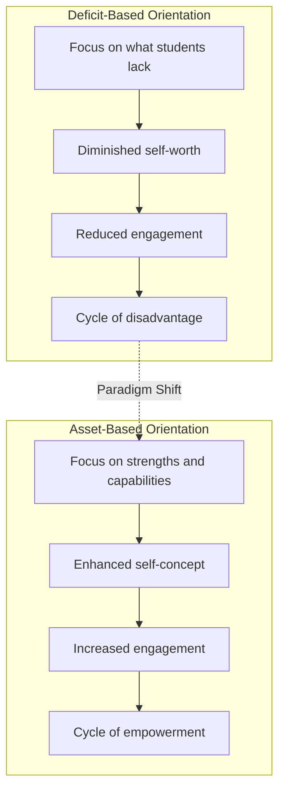

#### Foregrounding Multilingual Learner Identity

An asset-based approach to multilingual learner terminology **foregrounds the term "multilingual learner"** in education policy and practice to acknowledge, value, and incorporate the wealth of resources and perspectives these students bring[^52]. These resources include linguistic and cultural knowledge, home languages, variation in discourse practices, and experiences with schooling in other countries[^52].

This terminological shift carries practical implications. When teachers conceptualize their students as "multilingual learners" rather than "limited English proficient" or similar deficit-oriented labels, they are more likely to:

- **Seek out and leverage** students' existing linguistic resources
- **Design instruction** that builds on what students know
- **Communicate expectations** that reflect confidence in students' capabilities
- **Create classroom environments** that honor linguistic diversity
- **Engage families** as partners with valuable knowledge to contribute

#### Leveraging Home Languages and Cultural Backgrounds

Culturally and linguistically responsive teaching involves **leveraging students' cultural and linguistic experiences** and utilizing their background knowledge[^55]. Teachers who received professional development on these practices saw an increase in reading scores among their English language learners and racially diverse students within a school year[^55].

Specific strategies for leveraging linguistic and cultural assets include:

**Allowing home language use for learning new concepts** enables students to understand the concept first, then learn the concept language[^55]. This approach recognizes that cognitive development need not wait for English proficiency and that home language use supports rather than hinders English acquisition.

**Connecting content to students' lives** by inviting community members or relating content to students' lived experiences makes learning relevant and validates students' backgrounds[^55]. When students see their communities and experiences reflected in curriculum, they develop stronger engagement and sense of belonging.

**Leveraging collectivistic orientations** recognizes that many students come with collectivistic experiences emphasizing group needs[^55]. Teachers can build opportunities for students to work together in small groups or with partners, such as discussing writing ideas together or solving problems collaboratively[^55].

#### Transforming Teacher Perceptions and Instructional Design

The asset-based approach requires teachers to examine and transform their own perceptions of linguistic diversity. Teachers must move from viewing multilingual students as problems to be remediated toward recognizing them as **resources who enrich the learning environment for all students**.

This transformation affects instructional design in concrete ways:

| **Deficit-Based Design** | **Asset-Based Design** |
|-------------------------|----------------------|
| Remedial instruction focused on English gaps | Instruction that builds on existing linguistic knowledge |
| Avoidance or suppression of home language | Strategic use of home language to support learning |
| Curriculum disconnected from students' lives | Curriculum connected to cultural backgrounds and experiences |
| Assessment focused on English-only performance | Assessment that allows multiple ways to demonstrate knowledge |
| Teacher as sole expert | Students and families as knowledge contributors |

For novice teachers, shifting to asset-based practice begins with **curiosity about students' backgrounds** and genuine interest in what they bring. Getting-to-know-you activities should explore not only students' interests but also their linguistic repertoires, cultural practices, and family knowledge. This information then informs instructional design that builds on students' assets rather than focusing exclusively on gaps.

### 5.3 Culturally and Linguistically Responsive Teaching Practices

Culturally and linguistically responsive teaching represents a core component of holistic empowerment for diverse learners, providing the pedagogical framework through which asset-based orientations become classroom reality. This approach involves **providing multiple ways for students to learn and demonstrate new learning** while honoring their cultural and linguistic backgrounds[^55].

#### Acquiring Cultural Knowledge of Students

A cornerstone of culturally responsive teaching is **acquiring cultural knowledge of the students**[^55]. Teachers can begin with a "Getting to Know You" questionnaire to learn about students' interests and experiences[^55]. However, cultural knowledge extends beyond initial surveys to ongoing attention to students' backgrounds, experiences, and perspectives.

Before and during lessons, teachers can ask students to discuss their own experiences and make connections to the topic, making learning relevant[^55]. This practice serves dual purposes: it activates prior knowledge that supports comprehension while simultaneously communicating that students' experiences are valued and relevant to academic learning.

Strategies for building cultural knowledge include:

- **Family questionnaires** that gather information about home languages, cultural practices, and family backgrounds
- **Student interviews** that explore learning preferences, interests, and experiences
- **Home visits** that provide insight into students' lives outside school
- **Community partnerships** that connect classroom learning to local contexts
- **Ongoing observation** of students' interactions, preferences, and responses

#### Language Supports Guided by Acquisition Principles

A culturally and linguistically responsive environment involves providing **language supports for English Language Learners guided by language acquisition principles**[^55]. Understanding these principles helps teachers design appropriate supports:

**Comprehension of language typically develops before production**, meaning students understand more than they can express[^55]. This principle suggests that teachers should not interpret silence or limited verbal output as lack of understanding, and should provide opportunities for students to demonstrate comprehension through nonverbal means.

**Conversational language develops more quickly than academic language**[^55]. This principle explains why students may appear fluent in social contexts while struggling with academic tasks, and underscores the need for explicit instruction in academic language alongside content learning.

Specific language support strategies include:

| **Strategy** | **Implementation** | **Purpose** |
|-------------|-------------------|------------|
| **Real-life connections** | Invite community members; relate content to students' lives[^55] | Makes language meaningful and accessible |
| **Nonverbal demonstration** | Allow drawing, pointing, or gesturing to show comprehension[^55] | Reduces anxiety; enables participation before production |
| **Partner and small group work** | Provide opportunities for peer interaction[^55] | Supports language input and output in low-stakes contexts |
| **Home language use** | Allow first language when learning new concepts[^55] | Supports concept development; validates linguistic identity |

#### Instructional Scaffolds for Diverse Learners

**Employing instructional scaffolds** is essential for culturally and linguistically responsive teaching[^55]. Scaffolds are temporary supports provided until a skill is mastered, enabling students to access content and develop capabilities they cannot yet manage independently.

Effective scaffolds for multilingual learners include:

**Various levels of questions** build students' thinking progressively from concrete to abstract[^55]. Teachers can begin with questions that require recognition or recall, then move to questions requiring application and analysis as students develop understanding.

**Visual tools** such as pictures and graphic organizers support comprehension by providing nonlinguistic representations of content[^55]. These tools are particularly valuable for multilingual learners who may grasp concepts more readily through visual than verbal channels.

**Study guides and key vocabulary definitions** supplement texts by highlighting essential information and pre-teaching critical terminology[^55]. Providing vocabulary support before reading enables students to focus on comprehension rather than decoding.

**Language-modified texts** in reading instruction adjust linguistic complexity while maintaining content rigor[^55]. This approach ensures students can access grade-level content even while developing English proficiency.

#### Effective Feedback Practices

**Providing effective feedback** completes the cycle of culturally responsive instruction[^55]. Feedback practices must be accessible to multilingual learners and their families while supporting ongoing growth.

Effective feedback characteristics include:

- **Involving students in assessing their work** with rubrics allows teachers to provide specific actions focused on learning targets and future assignments[^55]
- **Providing feedback in written and verbal form** ensures understanding across different modalities[^55]
- **Giving specific information about performance** on particular tasks using rubrics provides clear, actionable guidance[^55]
- **Providing feedback almost immediately** after students demonstrate new learning helps make connections between feedback and the task[^55]

For multilingual families, feedback must be **culturally responsive and accessible**, potentially requiring translation, interpretation, or alternative formats to ensure families can support their children's learning.

#### Creating Conditions for Belonging and Engagement

Culturally responsive pedagogy creates the conditions for belonging and engagement that are essential to holistic empowerment. When students see their cultures, languages, and experiences reflected and valued in the classroom, they develop the psychological safety necessary for the vulnerable work of language learning.

Resources for culturally responsive instruction include guidance on creating welcoming classroom environments for ELLs, understanding the significance of students' names, providing culturally responsive instruction around holidays and religious celebrations, and selecting culturally appropriate materials[^56]. These resources support teachers in building classrooms where all students feel they belong.

### 5.4 Trauma-Informed Principles and Their Application in English Language Instruction

Trauma-informed education provides a critical framework for supporting students who have experienced adverse events that affect their capacity to learn. For language learners, trauma-informed approaches are particularly important because **language learning is an inherently vulnerable act**—requiring students to take risks, make mistakes publicly, and express themselves in unfamiliar ways[^57]. For students who have experienced trauma, the traditional classroom can feel alienating or threatening[^57].

#### Neurobiological Foundations of Trauma's Impact on Learning

Understanding the neurobiological impact of trauma helps teachers recognize why certain students struggle and informs the design of supportive environments. From a neurobiological perspective, trauma has a **profound impact on the brain**, particularly on regions responsible for learning, memory, and emotional regulation[^57].

The **amygdala** may become hyperactive, leading to heightened anxiety and a constant state of threat detection[^57]. The **hippocampus**, critical for memory, can become impaired, affecting students' ability to encode and retrieve information[^57]. The **prefrontal cortex**, responsible for higher-order thinking and executive function, may also be compromised[^57].

These neurological changes explain common classroom manifestations of trauma:

| **Brain Region Affected** | **Function** | **Classroom Manifestation** |
|--------------------------|-------------|---------------------------|
| **Amygdala** | Threat detection, emotional response | Hypervigilance, anxiety, fight/flight/freeze responses |
| **Hippocampus** | Memory formation and retrieval | Difficulty remembering instructions, poor retention |
| **Prefrontal Cortex** | Executive function, reasoning | Difficulty with planning, impulse control, abstract thinking |

Consequently, trauma-affected learners often experience **"language shutdown"** where anxiety suppresses verbal output[^57]. This phenomenon helps explain why students may appear capable in some contexts but struggle to produce language in others—their neurological state, not their capability, determines performance.

Research confirms that when students experience ongoing stress or fear, physiological changes occur: the amygdala becomes overactive, elevated levels of cortisol interfere with memory formation and learning, and the prefrontal cortex may function less effectively[^58]. Understanding these mechanisms helps teachers recognize that **challenging behaviors often reflect neurological states rather than willful defiance**.

#### The Six Core Principles of Trauma-Informed Education

**Trauma-informed education** is a framework grounded in six core principles outlined by the Substance Abuse and Mental Health Services Administration (SAMHSA, 2014): **safety, trustworthiness and transparency, peer support, collaboration and mutuality, empowerment with voice and choice, and cultural, historical, and gender responsiveness**[^57].

These principles align directly with the holistic empowerment paradigm:

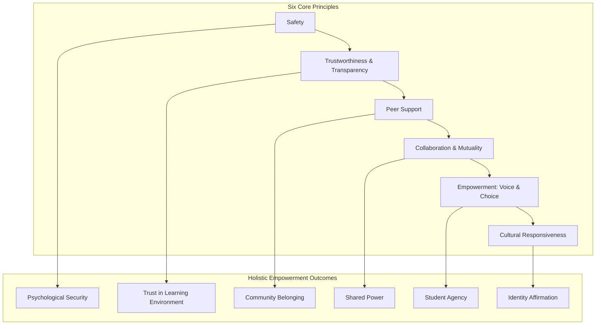

**Safety** encompasses physical, academic, social, behavioral, and emotional dimensions[^59]. For language learners, safety means creating environments where students can take linguistic risks without fear of ridicule or excessive correction.

**Trustworthiness and transparency** involve clarity, consistency, and appropriate boundaries[^59]. Predictable routines and clear expectations help students who have experienced chaotic or unpredictable environments feel secure.

**Peer support** emphasizes help and support among students[^59]. Collaborative structures provide both social connection and scaffolding for language development.

**Collaboration and mutuality** involve sharing power between adults and students[^59]. This principle aligns with holistic empowerment's emphasis on student agency and voice.

**Empowerment with voice and choice** maximizes student input and decision-making[^59]. For trauma-affected students, experiencing agency can be healing, counteracting the powerlessness often associated with traumatic experiences.

**Cultural, historical, and gender responsiveness** prevents discrimination and celebrates uniqueness[^59]. This principle recognizes that trauma is often compounded by cultural displacement, language suppression, and discrimination[^57].

#### Trauma's Intersection with Linguistic and Cultural Adjustment

For newcomer and immigrant students, trauma may intersect with the significant challenges of linguistic and cultural adjustment. Moving to a new country involves multiple stressors including separation from extended family and familiar environments, navigation of unfamiliar systems and expectations, and potential experiences of discrimination or marginalization.

The minds of students who have experienced trauma are often in a **constant state of fight, flight, or freeze**, so a safe community is necessary for these learners to let their guard down and be open to learning[^53]. Creating this safety requires particular attention for students navigating cultural transitions alongside trauma recovery.

Practices for supporting newcomer students who may have experienced trauma include:

- **Creating safe spaces where students see themselves represented**[^53]
- **Establishing mutual understanding of respect** by asking what respect means to students, considering their varied national, cultural, linguistic, and faith-based backgrounds[^53]
- **Being human** by sharing your own passions, hobbies, and struggles to build authentic connection[^53]
- **Knowing students' triggers**, such as loud noises or negative interactions with authority figures, and patiently building relationships[^53]

### 5.5 Daily Classroom Strategies for Trauma-Sensitive English Instruction

Translating trauma-informed principles into daily classroom practice requires specific, implementable strategies that novice teachers can adopt. According to Maslow's Hierarchy of Needs, **safety is a foundational requirement for learning**—without feeling safe, students' stress levels soar and their capacity to absorb new information decreases dramatically[^58]. Implementing trauma-informed practices means recognizing signs of trauma and stress in students, responding in ways that do not trigger further anxiety, and resisting re-traumatization by creating predictable, safe, and supportive learning environments[^58].

The goal is not to treat trauma but to **create conditions in which every student can feel secure and engage in learning**[^58]. Three daily practices provide the foundation for trauma-sensitive English instruction.

#### Establishing Predictable Daily Routines

A consistent routine creates a sense of predictability that can **significantly reduce anxiety**[^58]. For students whose lives have been marked by chaos or unpredictability, knowing what to expect provides essential psychological safety.

Strategies for establishing predictable routines include:

- **Beginning and ending with ritualized greetings and farewells** creates bookends to the learning experience that students can anticipate and rely upon[^58]
- **Displaying a visual schedule** helps students understand the structure of the day and prepare for transitions[^58]
- **Using clear transition signals** provides warning before changes occur, allowing students to prepare mentally[^58]
- **Ending with a group debriefing or reflection activity** provides closure and helps students process the day's learning[^58]

These routines create the **optimal neurological conditions for learning** by reducing the cognitive load associated with uncertainty and allowing students to direct their mental resources toward learning rather than threat monitoring[^58].

#### Incorporating Regular Emotional Check-Ins

**Emotional check-ins** help students identify and articulate their feelings, which is particularly important for English learners who may struggle with vocabulary around emotions[^58]. Building emotional vocabulary in English serves dual purposes: it supports social-emotional development while expanding students' linguistic repertoire.

Strategies for emotional check-ins include:

- **Starting with a quick "feelings" check-in** using visual supports like emotion charts or mood meters[^58]
- **Using sentence frames** to encourage discussion of emotions, such as "Today I feel ___ because ___"[^58]
- **Integrating journaling as a daily practice** where students can reflect on their emotional states privately[^58]
- **Pairing up for peer sharing** in low-stakes contexts where students can practice emotional expression[^58]

These practices help students develop the **self-awareness and emotional vocabulary** essential for self-regulation while providing teachers with information about students' emotional states that can inform responsive instruction.

#### Building Community Through Collaborative Learning Structures

A strong sense of community can act as a **buffer against external stress**[^58]. For students facing challenges outside school—whether related to trauma, family circumstances, or adjustment to new environments—classroom community provides stability and support.

Strategies for building community include:

- **Creating consistent small groups or paired "learning buddies"** provides stable relationships students can rely upon[^58]
- **Implementing collaborative projects that require interdependence** develops both academic and social skills while creating shared purpose[^58]
- **Rotating group roles to ensure inclusion and accountability** gives all students opportunities for leadership and contribution[^58]
- **Celebrating cultural diversity through shared classroom traditions** honors students' backgrounds while building collective identity[^58]

These strategies create the neurological conditions for learning by **activating the brain's social engagement system** rather than its threat detection system. When students feel connected and supported, they can engage more fully in the cognitive demands of language learning.

### 5.6 Implementing Multipronged Support Systems for Whole-Child Development

Holistic empowerment for diverse learners requires comprehensive support systems that address students' physical, social-emotional, and academic needs simultaneously. A **trauma-sensitive school operates within a multi-tiered prevention framework** as a universal approach, designed to benefit all students, families, and staff by ensuring all aspects of the educational environment are grounded in an understanding of trauma and its impact[^60].

#### Universal Trauma-Sensitive Practices (Tier I)

Universal practices apply to all students and create the foundation of a trauma-sensitive environment. Key strategies include **educating all staff about trauma**, promoting safety, reducing trauma-related triggers, considering trauma in assessments and behavior plans, ensuring youth and family voice, and addressing secondary effects on educators[^60].

The rationale for adopting universal approaches includes high rates of student trauma exposure, the school's role in promoting resilience, the risk of harm from misunderstood trauma responses, and early indications of positive impacts from implementation[^60]. Schools that implement trauma-sensitive practices report positive effects including **fewer office referrals, improved test scores, and reduced suspensions**[^60].

Universal practices in the classroom include:

| **Practice Area** | **Strategies** | **Purpose** |
|------------------|---------------|------------|
| **Physical Environment** | Assess lighting, sound, temperature; incorporate calming tools[^59] | Creates physically safe, regulated space |
| **Relationships** | Express care, challenge growth, provide support, share power[^59] | Builds trust and connection |
| **Classroom Culture** | Predictability, routines, culturally responsive instruction[^59] | Establishes psychological safety |
| **Regulation Support** | "Regulate, Relate, Reason" approach; co-regulation[^59] | Supports students in emotional dysregulation |

#### Targeted Interventions (Tier II)

**Tier II supports** are targeted interventions provided in small groups for students with specific skill deficits[^59]. These supports maintain students in their classrooms while providing additional assistance for particular needs.

Interventions at this level include **Social, Academic, Instructional Groups (SAIG)** and **Check-In, Check-Out (CICO)** protocols[^59]. The goal is to use curiosity about the root of problems and evidence-based interventions rather than punitive responses[^59].

Key assumptions guiding Tier II interventions include:

- All behavior serves a purpose
- Students do well if they can
- Behavior continues because it is reinforced
- Understanding the need behind the behavior is essential[^59]

#### Intensive Individualized Supports (Tier III)

**Tier III supports** are intensive and individualized for students with significant needs[^59]. Creating student plans involves teams using functional behavioral assessments and behavioral intervention plans[^59].

The **"Window of Tolerance"** model describes reactions to stress, noting that students impacted by trauma have a smaller window within which they can function optimally[^59]. When students move outside their window of tolerance—into hyperarousal or hypoarousal—they cannot engage effectively in learning. Intensive supports help expand students' windows and provide strategies for returning to regulated states.

Schoolwide discipline processes should be adapted from **punitive models to restorative approaches** that involve reflection, instruction, and restoration, moving from doing things "to" a student to working "with" them[^59]. Frameworks like Collaborative Problem Solving (CPS) engage students in understanding and addressing the challenges they face[^59].

#### Collaborative Roles of School Personnel

Various school personnel support multilingual learners and students who have experienced trauma. When school adults collaborate to support students, everyone benefits[^53]. Effective collaboration involves:

- **Teachers** implementing universal trauma-sensitive practices and identifying students who may need additional support
- **Counselors and mental health staff** providing targeted interventions and consultation
- **Family liaisons** bridging home and school contexts and facilitating communication
- **Administrators** establishing policies and allocating resources for comprehensive support
- **Community partners** providing wraparound services and specialized supports

For novice teachers, understanding these collaborative relationships is essential. Teachers are not expected to address all student needs independently but rather to **recognize when additional support is needed** and collaborate effectively with colleagues who can provide specialized assistance.

### 5.7 Maintaining High Expectations Through Appropriate Scaffolding and Assessment

A critical challenge in serving diverse learners is maintaining **rigorous academic expectations while providing necessary supports**. Holistic empowerment rejects the false choice between rigor and support, insisting that all students deserve access to challenging content along with the scaffolding needed to succeed.

#### Engineering Equitable Assessments for Multilingual Students

Teachers can take steps to make assessments equitable for multilingual learners so that **tests only measure students' content knowledge rather than their reading comprehension**[^61]. Without appropriate scaffolds, assessments can become confusing reading comprehension tests and frustrating writing tests for multilingual learners[^61]. Through engineering assessments, teachers can design exams and reports that assess only content by incorporating various linguistic scaffolds[^61].

**Scaffolding an exam does not reduce academic standards** but makes instructions more comprehensible and helps students produce more accurate responses[^61]. Specific scaffolding strategies include:

**Writing synonyms behind unfamiliar academic words** in questions supports comprehension. For example, an engineered sentence could be: "Identify (list) all the adaptations of the walrus (see image) to survive (live) in an aquatic (water) habitat"[^61]. Adding pictures and providing synonyms for unfamiliar words supports comprehension while words taught in the unit do not need synonyms[^61].

**Providing sentence starters or frames** for short responses scaffolds production. A sentence starter supports students in beginning their response, while a sentence frame prompts students to provide specific information at specific points[^61]. For example:
- Sentence starter: "The most important symbol in this piece of art is..."
- Sentence frame: "The artist, [name], chose to symbolize [concept] with the [object] because..."[^61]

Engineering assessments this way helps multilingual students **communicate as mathematicians, architects, biologists, historians**, demonstrating content knowledge without being limited by English proficiency[^61].

#### Engineering Reports and Extended Assessments

**Reports can also be engineered** to be more equitable without watering down academic expectations[^61]. The process involves:

1. **Creating a template** that provides instructions and space for student ideas
2. **Clearly identifying all required parts** and sequencing them logically
3. **Writing guiding questions and prompts** to help students know what content to communicate
4. **Offering sentence starters and frames** embedded in instructions[^61]

For example, for a section about a leader's power, guiding questions might include: "How did the leader make decisions? What did the leader not allow citizens to do? What systems did the leader use to control people?"[^61]. These prompts make communicating ideas more concrete and specific[^61].

Multilingual students developing English proficiency can first **produce answers in another language** they are more academically fluent in, then move these ideas into English[^61]. This approach honors students' linguistic resources while supporting English development.

#### The Imperative of High Expectations

**Assessments do not need to be less rigorous for multilingual students**—lower standards would not develop grade-level skills or build content knowledge[^61]. Instead, standards should remain high while the appearance and formatting of exams and the instructions in reports are changed[^61]. Assessments should not privilege those who understand more English but should be **engineered to preemptively support multilingual students**[^61]. When this happens, assessment becomes an equitable, more reliable tool for learning and evaluation[^61].

Research on equitable assessment practices indicates that assessments allowing multilingual learners to demonstrate what they know should include **open-ended questions with multiple ways to show understanding**, potentially be **multimodal** (allowing demonstration through writing, speaking, or drawing), and include **multiple measures** with both open-ended and selected response formats[^62]. Performance-based assessments provide the best opportunities for multilingual learners to demonstrate learning in authentic, meaningful ways[^62].

### 5.8 Family Engagement and Community Partnerships for Diverse Learner Success

Family engagement is vital for building **culturally affirming school communities** where multilingual learners are supported to thrive[^63]. Effective family engagement practices empower immigrant families to support their children's learning and well-being, foster belonging, and center the strengths and needs of immigrant families[^63].

#### Research-Informed Best Practices for Family Engagement

Research-informed best practices for engaging multilingual and immigrant families include:

- **Making time to learn from families** through surveys, conversations, and relationship-building[^63]
- **Investing in school-family-community partnerships** that extend beyond traditional parent involvement[^63]
- **Creating welcoming environments** that communicate value for families' presence and contributions[^63]
- **Developing culturally responsive programs** that honor families' backgrounds and needs[^63]
- **Building the capacity of educators** to work effectively with diverse families[^63]

Strategies for creating welcoming environments and ensuring culturally responsive, accessible communication include holding leadership accountable for cultural competency, prioritizing funding for supports, investing in professional development, and developing culturally relevant curriculum[^63]. Leadership should communicate clearly in multiple languages, elevate family voices in policy-making, and critically assess whether existing policies serve immigrant and multilingual families[^63].

#### Specific Strategies for Strengthening Family Partnerships

Fifteen strategies for strengthening partnerships with ELL families provide practical guidance[^64]:

**Keeping families informed** requires ensuring families have current information about school schedules, their child's instruction, progress tracking, technology access, special services, and safety measures, acknowledging their **legal right to information in their home language**[^64].

**Including bilingual cultural liaisons** as an integral part of family outreach is essential, as they bring invaluable insider knowledge and perspectives and have earned the trust of families[^64].

**Ensuring families and educators are familiar with language support options** such as district interpreters, language hotlines, and translation apps facilitates better communication[^64].

**Encouraging families to ask questions** by welcoming their inquiries, ensuring interpreters are available, leaving time for Q&A, and creating multiple pathways for communication and feedback demonstrates genuine partnership[^64].

**Building relationships with families** by connecting and learning about their interests and talents transforms transactional interactions into authentic partnerships[^64].

**Looking for ways to make social-emotional support culturally responsive** involves pulling together teams of counselors, family liaisons, and family members to discuss priority topics in culturally relevant ways[^64].

#### Four Ways to Strengthen Partnerships

Four foundational approaches to strengthening partnerships with ELL families include[^65]:

**Getting to know families** through welcoming events in families' home languages, home visits, and ambassador programs that connect new families with others who share their language[^65].

**Valuing family language and culture** by taking translation seriously, providing opportunities for staff to learn new languages, posting multilingual signs, and supporting cultural celebrations[^65].

**Making school more accessible** by communicating creatively based on family preferences, providing flexible meeting times, and ensuring families know how to contact teachers and administrators[^65].

**Cultivating parent leadership opportunities** by ensuring parents understand expectations for their children, providing workshops to support parent learning, and creating language-specific parent organizations[^65].

These approaches recognize that families are **valuable members of the school community** whose engagement supports not only their own children but the broader learning environment[^65].

### 5.9 Professional Considerations and Self-Care for Novice Teachers Working with Diverse Populations

Implementing equity-focused, trauma-informed practices requires ongoing professional development and attention to teacher wellbeing. Novice teachers working with students who have experienced trauma face particular risks of **compassion fatigue** and **secondary traumatic stress** that must be addressed proactively.

#### The Importance of Cultural Self-Awareness

Effective work with diverse populations begins with teachers' own cultural self-awareness. Professional development on culturally responsive practices should include opportunities for teachers to examine their own cultural backgrounds, biases, and assumptions. Research-practice partnerships that support professional development at the intersection of culture and content can be **particularly meaningful for teachers** from the communities they serve[^66].

Professional development that is culturally responsive and community-centered helps teachers develop the **attitude, meaning, competence, and inclusion** dimensions of the motivational framework[^66]. Teachers who engage in such professional development report feeling more connected to their students and more confident in their ability to create inclusive, responsive classrooms[^66].

#### Understanding Compassion Fatigue and Building Resilience

**Burnout** is defined as chronic workplace stress not successfully managed, characterized by exhaustion and detachment[^59]. **Compassion fatigue** includes feelings of depression and exhaustion from helping work[^59]. These conditions represent significant risks for teachers working intensively with students who have experienced trauma.

Symptoms of burnout and compassion fatigue include chronic fatigue, forgetfulness, physical symptoms, mood changes, and isolation[^59]. The cycle of compassion fatigue progresses from Zealot/Idealist to Irritability, Withdrawal, and the Zombie stage[^59].

**Compassion resilience** is the ability to maintain well-being while responding compassionately[^59]. Building compassion resilience involves attention to four components:

| **Component** | **Focus** | **Strategies** |
|--------------|----------|---------------|
| **Heart** | Relationships and emotions | Nurturing supportive relationships; processing difficult emotions |
| **Spirit** | Core values, rest, play | Connecting to purpose; prioritizing rest and renewal |
| **Strength** | Care for the body | Physical activity, nutrition, sleep |
| **Mind** | School, work | Professional boundaries; ongoing learning |

Individual strategies include developing self-care plans, while building- and district-wide adaptations involve addressing barriers identified through staff surveys, weaving relationship-building into professional development, and revisiting policies and benefits[^59].

#### The Importance of Collaborative Professional Communities

Teachers implementing equity-focused practices benefit from **collaborative professional learning communities** where they can share challenges, learn from colleagues, and receive support. Research emphasizes that consistent, sustainable messaging along with reflective practice around one's own mental health, bias, and lived experiences is crucial[^67].

For novice teachers, building relationships with experienced colleagues who can provide mentorship and support is essential. The work of serving diverse learners is challenging and cannot be sustained in isolation. Professional communities provide both practical guidance and emotional support for the demanding work of holistic empowerment.

#### Sustaining Commitment While Maintaining Wellbeing

The ultimate goal is for teachers to sustain their commitment to equity and inclusion while maintaining their own wellbeing. A **dysregulated adult cannot regulate a child**—adults must remain calm and use strategies to co-regulate with students[^59]. This recognition underscores that teacher self-care is not selfish but essential for effective practice.

Novice teachers should recognize that implementing holistic empowerment for diverse learners is a **developmental process** that unfolds over time. Beginning teachers are not expected to master all practices immediately but rather to build competence progressively while attending to their own growth and wellbeing. Celebrating small victories in supporting recovery, relationship-building, and learning is important[^53].

The framework of holistic wellbeing in education emphasizes that wellbeing is **multidimensional**, encompassing physical, emotional, intellectual, psychological, social, environmental, cultural, and spiritual dimensions[^68]. This holistic understanding applies to teachers as well as students—educators who attend to their own comprehensive wellbeing are better positioned to support the holistic development of their students.

By approaching the work of serving diverse learners with both commitment and self-compassion, novice teachers can develop sustainable practices that honor every student's dignity while maintaining their own capacity for empathetic, effective teaching. The holistic empowerment paradigm ultimately depends on teachers who embody its principles in their own professional lives—teachers who recognize their own strengths, attend to their own needs, and engage in ongoing growth while creating classrooms where every child can flourish.

## 6 Family and Community Engagement in Holistic English Education

The holistic empowerment paradigm in elementary English education recognizes that children do not develop in isolation but within nested systems of relationships extending from the classroom to the home and community. **Family and community engagement** represents not merely an ancillary support for academic instruction but a foundational pillar of comprehensive student development. When families are meaningfully engaged as partners in their children's education, students demonstrate stronger academic outcomes, enhanced language proficiency, improved social-emotional wellbeing, and deeper sense of belonging. For multilingual learners navigating the complex terrain of language acquisition and cultural adaptation, the bridge between home and school becomes particularly critical—either facilitating or hindering their capacity to thrive.

This chapter examines the theoretical and empirical foundations for family engagement within holistic English education, explores practical strategies for building authentic partnerships with linguistically and culturally diverse families, and provides actionable guidance for novice teachers seeking to connect classroom instruction with students' lived experiences. The analysis moves beyond superficial notions of parent involvement—attending conferences, volunteering at events—toward a deeper conceptualization of **reciprocal partnership** where families' linguistic and cultural assets are recognized, valued, and strategically leveraged to support English language development. For novice teachers, developing competence in family engagement represents one of the most challenging yet rewarding dimensions of professional practice, requiring cultural humility, communication flexibility, and genuine commitment to honoring the knowledge and aspirations that all families bring.

### 6.1 Theoretical Foundations and Research Base for Family Engagement in English Language Education

The case for family engagement in elementary English education rests on robust theoretical foundations and compelling empirical evidence. Understanding this research base provides novice teachers with both the rationale for prioritizing family partnerships and the conceptual frameworks necessary for designing effective engagement practices. This section establishes the scholarly foundations that position family engagement as essential rather than optional within the holistic empowerment paradigm.

#### Research Evidence Linking Family Engagement to Student Outcomes

Research consistently demonstrates that **family engagement is one of the strongest predictors of student academic success**. According to the Global Family Research Project, family engagement ranks among the most important factors influencing students' academic achievement, operating independently of socioeconomic status or other demographic variables[^69]. This relationship holds across diverse populations and educational contexts, suggesting that the benefits of family engagement are universal rather than limited to particular student groups.

For English Language Learners specifically, research indicates that family engagement supports a variety of positive student outcomes including **higher grades and test scores, higher levels of language proficiency, better social skills, and higher rates of high school graduation and enrollment in postsecondary education**[^70]. These findings underscore that family engagement is not merely a feel-good addition to instruction but a substantive contributor to the outcomes educators seek to achieve. When families are actively engaged in supporting their children's language development, students acquire English more rapidly while maintaining stronger connections to their home languages and cultural identities.

The mechanisms through which family engagement produces positive outcomes are multifaceted. Engaged families provide additional practice opportunities for language skills, reinforce the value of education, support homework completion, and communicate high expectations for achievement. Perhaps most importantly, when students perceive that their families and teachers are working together on their behalf, they develop stronger sense of **belonging and motivation** that fuels sustained effort and engagement with learning.

#### Alignment with Holistic Education Principles

Family engagement aligns directly with the core principles of holistic education established in earlier chapters. Holistic education recognizes that children's development encompasses physical, emotional, social, cognitive, and creative dimensions that cannot be meaningfully separated. Families play essential roles in each of these dimensions—they are children's first teachers, primary caregivers, and most enduring sources of support. **Excluding families from the educational partnership means addressing only a fragment of the child's developmental context**.

The holistic empowerment paradigm positions families as essential partners in whole-child development rather than peripheral supporters of academic instruction. This perspective recognizes that families possess unique knowledge about their children—their interests, strengths, challenges, cultural backgrounds, and aspirations—that educators need to design effective, responsive instruction. When teachers build authentic partnerships with families, they gain access to information that enables more personalized, relevant, and effective teaching.

Furthermore, holistic education emphasizes the importance of **community and belonging** as foundational to learning. For children, family represents the primary community within which identity develops and belonging is first experienced. When schools honor and include families, they communicate to students that their whole selves—including their home lives, languages, and cultural practices—are welcomed and valued. This message of inclusion supports the psychological safety and sense of belonging that enable students to engage fully in the vulnerable work of language learning.

#### The Shift from Deficit-Based to Asset-Based Frameworks

Traditional approaches to family engagement have often operated from a **deficit perspective** that views diverse families—particularly those who are multilingual, immigrant, or economically disadvantaged—as lacking the knowledge, skills, or motivation to support their children's education effectively. From this perspective, schools' role is to educate families about how to be better parents, implicitly positioning educators as experts and families as recipients of guidance.

The asset-based framework fundamental to holistic empowerment inverts this orientation. Rather than focusing on what families lack, asset-based approaches recognize and leverage the **funds of knowledge** that all families possess—the cultural practices, linguistic resources, life experiences, and practical skills that constitute valuable educational assets[^71]. Multilingual families bring rich linguistic repertoires, cross-cultural perspectives, and often remarkable resilience and resourcefulness that represent strengths rather than deficits.

Research demonstrates that when educators adopt asset-based orientations toward families, student outcomes improve significantly. Teachers who received professional development on culturally and linguistically responsive practices—which emphasize leveraging families' cultural and linguistic experiences—saw increases in reading scores among their English language learners within a single school year. This finding suggests that **the way educators perceive families directly affects their effectiveness** in supporting student learning.

The following table contrasts deficit-based and asset-based approaches to family engagement:

| **Dimension** | **Deficit-Based Approach** | **Asset-Based Approach** |
|--------------|---------------------------|-------------------------|
| **View of Families** | Problems to be fixed; lacking knowledge | Partners with valuable assets and expertise |
| **Communication Direction** | One-way: school to family | Two-way: reciprocal exchange |
| **Home Language** | Obstacle to English acquisition | Resource supporting cognitive and linguistic development |
| **Cultural Practices** | Barriers to assimilation | Funds of knowledge to be leveraged |
| **Family Role** | Recipient of guidance | Co-creator of educational experience |
| **Engagement Focus** | Compliance with school expectations | Authentic partnership for child's benefit |

#### The Concept of Shared Responsibility

Contemporary frameworks for family engagement emphasize **shared responsibility** between families and schools. The U.S. Department of Education's Office of English Language Acquisition articulates this perspective clearly: families must know what rights they have and how the U.S. education system works to advocate for and participate in their children's education, while educators should understand what barriers families may face and how to address them, whether rooted in language or cultural differences[^72]. This reciprocal understanding creates the foundation for genuine partnership.

Shared responsibility means that engagement is a two-way street where both parties have obligations and contributions to make. Schools must meet expectations such as translating vital information into home languages as mandated by the Every Student Succeeds Act[^73]. Teachers should explicitly communicate parents' responsibilities, which include helping their child organize study time, monitoring engagement, limiting distractions, building consistency, setting aside a quiet place for learning, being available to answer questions, and discussing the school day with their child[^73].

This framework of shared responsibility transforms family engagement from a unilateral school initiative into a **collaborative partnership** where both families and educators contribute to student success. When families understand their role and feel empowered to fulfill it, and when educators create conditions that enable family participation, the partnership achieves its full potential.

### 6.2 Understanding Diverse Family Contexts and Overcoming Barriers to Engagement

Effective family engagement requires understanding the diverse contexts within which families operate and the barriers that may impede their participation in their children's education. Multilingual families bring varied experiences, perspectives, and circumstances that shape how they relate to schools and what forms of engagement are accessible to them. This section analyzes these diverse contexts and provides strategies for overcoming common barriers to create inclusive engagement practices.

#### The Diversity of Multilingual Family Contexts

Multilingual families represent remarkable diversity in family structures, cultural backgrounds, immigration experiences, educational histories, and perspectives on the family-school relationship. **Assuming homogeneity within this population leads to ineffective, one-size-fits-all approaches** that fail to meet families where they are.

Family structures vary significantly across cultures. Some families operate within extended networks where grandparents, aunts, uncles, or other relatives play significant roles in children's upbringing. Others may be headed by single parents juggling multiple responsibilities. Still others may include multiple generations living together, with different family members contributing to children's care and education. Understanding these varied structures helps teachers communicate with the appropriate family members and recognize the support networks available to students.

Immigration experiences shape families' relationships with schools in profound ways. Recent immigrants may be navigating unfamiliar systems while simultaneously managing the practical challenges of establishing new lives. Families who have experienced trauma related to migration—separation from loved ones, dangerous journeys, or persecution in home countries—may carry burdens that affect their capacity for engagement. Long-established immigrant families may have different perspectives and experiences than newcomers, having developed strategies for navigating American institutions over time.

Cultural backgrounds influence expectations about the appropriate relationship between families and schools. **In some cultures, parental collaboration with teachers may be considered interference**, and parents may avoid engaging with teachers because they wish to avoid being rude or disrespectful[^74]. In other cultural contexts, formal schooling may be less prevalent, and parents may be unaware of their ability to become involved or what their expectations for their children should be[^74]. Without direct engagement with families, these differences can lead to misunderstandings and reduced parental involvement.

#### Common Barriers to Family Engagement

Research has identified multiple barriers that may impede multilingual families' engagement with schools. Understanding these barriers enables educators to design practices that address rather than exacerbate them.

**Language differences** represent the most obvious barrier for multilingual families. When school communications arrive only in English, families with limited English proficiency cannot access essential information. When meetings are conducted without interpretation, families cannot participate meaningfully. When teachers cannot communicate directly with families in their home languages, relationship-building becomes significantly more challenging[^70].

**Cultural misunderstandings** arise when educators and families operate from different assumptions about appropriate roles, behaviors, and expectations. Teachers may interpret families' absence from school events as lack of interest, when in fact families may be demonstrating respect by not interfering with teachers' professional domain. Families may not understand expectations for involvement that differ from practices in their countries of origin[^71].

**Logistical challenges** including transportation, childcare, and work schedules create practical barriers to participation. Many immigrant families work multiple jobs, often during hours when schools typically schedule events. Families without reliable transportation may struggle to attend in-person meetings. Those with young children may have difficulty participating without childcare support[^71][^70].

**Fear related to immigration status** has become an increasingly significant barrier in recent years. Families may be reluctant to enter school buildings, provide personal information, or engage with institutional representatives due to concerns about immigration enforcement. This fear can prevent families from accessing services and supports their children need[^75].

**Unfamiliarity with U.S. educational systems** creates barriers for families whose educational experiences occurred in different contexts. The concept of "school-family partnerships" may be entirely new to families who come from countries where family engagement in schools is not the norm[^75]. Families may not understand how American schools operate, what services are available, or how to advocate for their children within these systems.

The following diagram illustrates the interconnected barriers to family engagement:

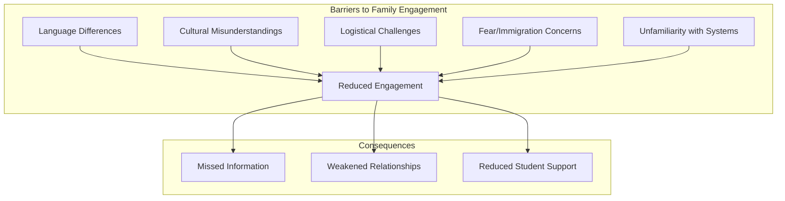

#### Strategies for Overcoming Barriers

Overcoming barriers to family engagement requires intentional, systematic efforts to make participation accessible and welcoming for all families. The following strategies address common barriers while honoring families' diverse circumstances.

**Creating welcoming environments** signals to families that they belong in the school community. Small gestures can communicate welcome: posting signs in families' languages throughout the school, displaying flags and artifacts from students' home countries, learning basic greetings in families' home languages, and ensuring that families see reflections of themselves when they enter the building[^71][^75]. These environmental cues communicate that linguistic and cultural diversity is valued rather than merely tolerated.

**Ensuring language access** is both a legal requirement and a practical necessity. Schools are legally required to provide information in families' home languages[^76][^75]. Strategies for ensuring language access include utilizing school or district interpreters, family liaisons, or paraprofessionals; accessing district translation hotlines; using translation apps like Talking Points for routine communication; and reserving professional interpretation for sensitive or legally required information[^76]. Teachers should ensure families know how to contact an interpreter when needed[^76].

**Flexible scheduling and multiple participation options** address logistical barriers. Asking families when and where they would like to attend events, creating events that families can help plan, considering alternative meeting locations like homes or public places, and trying group parent-teacher conferences where families can learn from each other's questions all expand access[^71]. Recognizing that some families may work during traditional school hours and offering alternative times demonstrates responsiveness to families' circumstances.

**Building trust through relationship-focused engagement** addresses fear and unfamiliarity. Families need to develop trust before they will engage fully with schools, particularly if they have concerns about immigration or negative experiences with institutions. Strategies include going to where families are for informal conversations, learning about their skills and interests, asking open-ended questions, and providing multiple ways for families to communicate[^71]. Assuring parents that participation in school activities does not require identification checks can reduce fear-based barriers[^77].

**Providing orientation and education about U.S. schools** helps families understand systems that may be unfamiliar. The English Learner Family Toolkit, developed by the U.S. Department of Education, provides comprehensive information about enrolling children in school, understanding educational programs and services, finding extracurricular activities, ensuring health and safety, and helping children succeed academically[^78][^72]. This resource, available in multiple languages and as a mobile app, can help families navigate unfamiliar educational systems.

### 6.3 Effective Communication Strategies for Partnering with Multilingual Families

Communication forms the foundation of family-school partnerships. For multilingual families, effective communication requires intentional strategies that bridge language differences, respect cultural communication norms, and ensure that essential information reaches families in accessible formats. This section provides comprehensive guidance on establishing and maintaining effective two-way communication with linguistically diverse families.

#### Identifying Family Communication Preferences

Effective communication begins with understanding how families prefer to receive and share information. **Each family will have their own preferences** based on their circumstances, technological access, work schedules, and communication styles[^76]. Taking time to identify these preferences demonstrates respect for families and increases the likelihood that communication will be received and acted upon.

Communication preference options include:

| **Method** | **Advantages** | **Considerations** |
|-----------|---------------|-------------------|
| **Phone calls** | Personal, immediate, allows clarification | May require interpreter; timing matters |
| **Text messages** | Convenient, allows response at family's convenience | Many immigrant families use WhatsApp[^76] |
| **Social media** | Reaches families where they already are | Facebook groups can share translated information[^76] |
| **Email/newsletters** | Documented, detailed | Often not effective for ELL families[^76] |
| **In-person meetings** | Builds relationship, allows nonverbal communication | Requires scheduling flexibility, interpretation |

Teachers should find out when families prefer to communicate as well as how. Immigrant families may be juggling challenges that impact when they can communicate—working outside the home during school hours, evening, or overnight shifts; caregiving responsibilities; or employers with strict rules about communication during work[^76]. Respecting these constraints demonstrates understanding of families' circumstances.

#### Ensuring Language Access as Legal Right and Practical Necessity

School districts are **legally required to provide information in families' home languages**[^76][^75]. This legal mandate reflects the practical reality that communication in languages families cannot understand fails to serve its purpose. Ensuring language access requires systematic attention to translation and interpretation resources.

Strategies for ensuring language access include:

**Identifying available translation and interpretation resources** within the school and district. These may include school or district interpreters, family liaisons, paraprofessionals who speak families' languages, and district translation hotlines[^76]. Understanding what resources exist and how to access them enables teachers to provide appropriate support.

**Using translation technology appropriately**. Translation apps like Talking Points can help fill communication gaps by translating messages between teachers and families in many languages and are free for individual teachers[^76]. Google Translate is best used for short words or phrases rather than complex communications[^76]. Teachers should recognize that some information—particularly lengthy, sensitive, or legally required communications—may not be suitable for app-based translation and requires professional interpretation.

**Adapting communication for families with varying literacy levels**. If families have lower literacy levels in their home languages, personal conversations may be more useful than translated documents[^76]. This is especially critical when navigating complex topics like special education, where families need to understand technical details and their rights[^71].

**Avoiding using students as translators**. While it may seem convenient to ask bilingual students to interpret for their families, this practice can lead to miscommunication, place inappropriate burdens on children, and create discomfort in discussions of sensitive topics[^71]. Professional interpretation should be used for important communications.

#### Clear, Jargon-Free Communication

Effective communication with multilingual families requires **clarity and simplicity** in all communications. Educational jargon, acronyms, and unfamiliar terminology create barriers even when communications are translated[^73].

Strategies for clear communication include:

**Streamlining communications** by reducing unnecessary complexity in registration paperwork and parent communications[^73]. Every additional form, acronym, or technical term creates potential confusion.

**Being mindful of educational terminology** that may be unfamiliar. Terms like "formative assessment," "IEP," or even "homework folder" may not translate meaningfully or may carry different connotations in other educational systems. Providing support using strategies like visuals, graphic organizers, and translated cheat sheets for terminology helps families understand essential concepts[^73].

**Ensuring families have clear information about essential topics**. Families need to know how learning will be delivered, how their child's schedule works, how to support learning at home, how they will receive updates, how to communicate with teachers, and how to access technology and training[^76]. Providing this information clearly and in accessible formats supports family participation.

#### Building Two-Way Communication Relationships

Effective family communication is **reciprocal rather than unidirectional**. Two-way communication is the bridge to engagement and strong parent partnerships, and positive communication helps improve academic performance[^79]. Schools should not merely broadcast information to families but create channels for families to share information, ask questions, and provide input.

Strategies for building two-way communication include:

**Taking time to ask how families are doing** and what their questions are[^76]. This demonstrates genuine interest in families as people rather than merely recipients of school information.

**Learning about families' strengths and interests** and sharing something about yourself[^76]. Reciprocal sharing builds relationship and trust.

**Asking families what has worked or not worked** regarding communication[^76]. Families can provide valuable feedback about what communication approaches are most effective for them.

**Creating multiple channels for family input** including surveys, conversations, suggestion boxes, and informal check-ins. Families may be more comfortable sharing concerns through some channels than others.

**Welcoming family questions** and ensuring interpreters are available to support communication[^75]. When families feel their questions are welcomed rather than burdensome, they are more likely to seek information they need.

The following resources support effective two-way communication: guidance on how two-way communication promotes parent engagement, tools for two-way communication, and keys to successful parent-teacher communication[^79].

### 6.4 Leveraging Families' Linguistic and Cultural Assets in English Language Development

The asset-based orientation fundamental to holistic empowerment recognizes that families possess valuable linguistic and cultural resources that can be strategically leveraged to support English language development. Rather than viewing home languages as obstacles to English acquisition, this perspective understands **bilingualism as a cognitive and social asset** that benefits students' overall development. This section examines how educators can recognize, value, and strategically leverage families' assets to support language learning.

#### The Role of Home Language Maintenance in Supporting Bilingual Development

Research demonstrates that **maintaining and developing home languages supports rather than hinders English acquisition**. Children's cognitive development does not need to wait for English proficiency—they can continue learning complex concepts in their home language while simultaneously developing English skills. Families who continue using their home languages with their children support bilingual development that benefits students academically, cognitively, and socially.

Multilingual families can support their children's language and literacy development in multiple ways by **continuing to use their home language**, which supports students' bilingual development in both that language and in English[^75]. Specific home language activities include singing songs, sharing stories, and reading books in home languages[^75]. These practices strengthen the linguistic foundation upon which English proficiency builds.

School-based language programs and policies can be implicit or explicit, making it especially difficult for parents to understand how language learning happens in schools or how language connects to academic learning[^80]. Teachers and staff familiar with second language acquisition and bilingualism can help families understand the role of home language development and English language development for academic learning and school readiness[^80]. This guidance helps families recognize that their home language practices are valuable rather than problematic.

Research shows that **parents of multilingual learners often have long-term language goals and aspirations for their children's language education**, and they engage their children in a variety of language practices in their homes and communities that support their plans[^80]. Sometimes families turn these plans into strategies for how their family should use language at home or in the community. In linguistic minority families, these plans and practices are fundamental in supporting the maintenance of the home language[^80]. Unfortunately, educators are often unaware of these family language goals. School leaders and educators are encouraged to learn about families' language practices and goals for their children's language education and to find ways to support families in achieving them[^80].

#### Connecting Curriculum to Students' Cultural Backgrounds

Culturally responsive teaching involves **connecting curriculum content to students' cultural backgrounds and lived experiences**. When students see their cultures, languages, and experiences reflected in what they learn, they develop stronger engagement, motivation, and sense of belonging.

Strategies for connecting curriculum to cultural backgrounds include:

**Inviting families to share their expertise and perspectives** in the classroom. Families possess knowledge about cultural practices, traditions, histories, and skills that can enrich curriculum. A parent might share traditional stories, demonstrate cultural arts or crafts, discuss family history, or explain practices from their home country. These contributions validate families' knowledge while providing authentic cultural content for all students.

**Incorporating diverse perspectives in curriculum materials**. Selecting texts, images, and resources that reflect students' backgrounds communicates that their cultures are valued. Examining what's on classroom walls, the books on bookshelves, and other materials to ensure students see themselves represented supports belonging and engagement.

**Using learning activities that value students' lives, cultures, and personal interests**[^75]. Assignments where students connect school learning to home experiences, explore their family histories, or investigate topics relevant to their communities create bridges between academic content and lived experience.

**Celebrating cultural diversity through classroom and school traditions**. Family celebrations, cultural heritage events, and opportunities for students to share about their backgrounds honor diversity while building community. Teachers can encourage students to applaud each other's successes and celebrate families by creating family picture walls and having "spotlight weeks" for students to share about themselves and their families[^75].

#### Affirming Families' Funds of Knowledge

**Affirming, asset-based approaches to family engagement acknowledge and celebrate families' funds of knowledge** and align with the belief that all children bring cultural and linguistic practices, skills, and ways of knowing from their homes and communities[^80]. Unfortunately, some traditional family engagement approaches do not affirm families' funds of knowledge—they do not value families' cultural and linguistic knowledge, their at-home activities, daily routines, and traditions[^80].

Many traditional conceptualizations of family engagement are based on a deficit, assimilationist framing that categorizes minority families as having problems that need to be fixed or improved[^80]. To sustain affirming, asset-based strategies, educators need to know about what is happening in their students' homes, confront their own biases, and connect students' worlds of home and school in meaningful and constructive ways by putting in place strategies that support what occurs in the family instead of attempting to change what families already naturally do[^80].

Specific strategies for affirming families' funds of knowledge include:

**Learning about families' skills, talents, and strengths**. Families of ELLs bring great skills, talents, and strengths such as resilience and resourcefulness, but these might go unnoticed without intentional attention[^71]. Teachers can discover family assets through conversations, surveys, and relationship-building over time.

**Asking open-ended questions about families' experiences and perspectives**. Rather than making assumptions, teachers can ask families about their role in their child's schooling in their home country, their dreams for their child's future, and their perspectives on education[^71]. These conversations provide insight while communicating genuine interest.

**Recognizing that families' engagement may take forms different from traditional expectations**. EL families often have strong beliefs in the value of education, and education may be a fundamental priority in their family[^70]. Families may model respect for teachers and engage in rich dialogues with their children about school events[^70]. These forms of engagement may not be visible to teachers but represent significant family investment in children's education.

### 6.5 Family Literacy Programs and Parent Education Initiatives

Structured family engagement programs provide systematic approaches to building families' capacity to support their children's language and literacy development. This section analyzes program models including family literacy programs, parent education workshops, and family learning events, providing guidance on designing accessible, culturally responsive initiatives.

#### Family Literacy Program Models

**Family literacy programs** integrate multiple components to support both children's and parents' development simultaneously. Advocacy Outreach's Family Literacy program exemplifies this comprehensive approach, serving low-income families containing a parent with educational needs and children from birth to age eight[^81]. The program includes four integrated components: **adult education, early childhood education, parenting education, and parent-child together activities (PACT)**[^81].

In this model, adult education is offered to parents in English as a Second Language classes while, simultaneously, early childhood development is offered to their children[^81]. Parenting classes offer specialized speakers on various topics that assist parents in their daily lives[^81]. This integrated approach recognizes that supporting children's development requires supporting parents' development as well.

The program design reflects research on effective family literacy, modeled after the Even Start programs that operated under Title I of the Elementary and Secondary Education Act[^81]. Families who are eligible include parents with low income who lack a high school education or English language proficiency and have children below age eight[^81]. The Barbara Bush Foundation for Family Literacy has supported such programs through grants, recognizing their importance for family development[^81].

Another example is World Relief Quad Cities' Family Literacy program, which teaches English as a Second Language with childcare provided[^82]. The program emphasizes that **while it is academic, one of the biggest goals is for families to feel like they're part of the community**[^82]. A portion of class time is dedicated to getting out in the community through field trips to schools, libraries, and farms, and by bringing in community members like students and local officials[^82]. The program gives families a sense of belonging and offers a safe environment to learn and grow[^82].

#### Parent Education and Workshop Approaches

Beyond comprehensive literacy programs, schools can offer targeted workshops and learning opportunities for families. Effective parent education initiatives share several characteristics:

**Accessibility and cultural responsiveness**. Workshops should be offered at times and locations convenient for families, with interpretation provided in families' languages. Content should be culturally relevant and delivered in ways that honor families' existing knowledge and practices.

**Focus on building capacity rather than correcting deficits**. Effective workshops help families develop skills and knowledge they want to acquire rather than imposing school-defined priorities. Asking families what topics they want to learn about ensures relevance.

**Interactive and participatory formats**. Adults learn best through active engagement rather than passive listening. Workshops that involve discussion, practice, and hands-on activities are more effective than lecture-based presentations.

Seminole County Public Schools exemplifies effective parent education through its **ESOL Family Leadership Academy**, which engages families as co-planners and participants[^80]. The academy offers workshops to help families navigate cultural and/or language barriers and how to use their natural talents as parent leaders[^80]. The district's vision for family engagement emphasizes serving families' needs and communicating that they are not just invited to participate but that the district wants to help develop or enhance their skills as parent leaders who are actively engaged in the common goal of academic and language success for their children[^80].

#### Family Engagement Events and Learning Activities

Schools can design family engagement events that bring families into the school community while supporting children's learning. Effective events share several characteristics:

**Hands-on, interactive learning activities**. The California Community Schools model recommends hosting family engagement nights with hands-on learning activities and interactive read-aloud workshops[^83]. Programs like Raising a Reader focus on increasing family involvement in early literacy through structured activities families can continue at home[^83].

**Celebration and affirmation of multilingualism**. Events can celebrate families' linguistic diversity through activities like community walks, empathy interviews with families, and classroom gallery walks where students showcase their learning[^83]. These celebrations communicate that multilingualism is valued and honored.

**Opportunities for family-school connection**. Events provide opportunities for families to meet teachers, learn about curriculum, and understand how they can support learning at home. The School District of Palm Beach County's DLL Literacy Linkages program offers parent workshops that discuss the importance of supporting children's home languages, offer strategies for storytelling at home, provide parents opportunities to practice with their children, and introduce parents to a lending library of resources[^80].

### 6.6 Community Partnerships and Community-Based Learning Experiences

Extending learning beyond the classroom through community partnerships creates opportunities for authentic, meaningful educational experiences that connect academic content to students' lived realities. This section explores strategies for building partnerships with community organizations and creating community-based learning experiences that support holistic empowerment.

#### The Value of Community Partnerships

**Community partnerships are a valuable way to engage English learner families**[^77]. Community organizations can provide critical services such as interpretation and healthcare, as well as educational opportunities including GED preparation, ESL classes, and citizenship courses[^77]. These partnerships benefit both schools and partner organizations by extending each other's reach and impact.

Strategies for building community partnerships include:

**Providing space for community organizations** to offer services at the school, making services more accessible to families[^77]. When families can access multiple services in one location, barriers to participation decrease.

**Asking families which organizations would be good partners**[^77]. Families often know which community organizations they trust and find helpful. Their input ensures partnerships serve actual family needs.

**Inviting community members to share their expertise** with families and students. Local librarians, healthcare providers, and public safety officials can provide valuable information and build connections between families and community resources[^77].

**Assuring parents that participation in school activities does not require identification checks**[^77]. For families with immigration concerns, explicit assurance about safety supports participation.

One school's monthly Latino family meetings, conducted in Spanish by Spanish-speaking staff with invited external speakers, exemplifies effective community partnership[^77]. Highland Elementary School in Montgomery County, Maryland achieved success by providing weekend soccer games, parent English and computer classes, and a range of community services from housing assistance to mental health counseling[^77]. The school was selected as a Blue Ribbon Transformation School by the Maryland Department of Education, demonstrating that comprehensive community partnerships support school improvement[^77].

#### The Community Schools Model

**Community schools** are neighborhood schools that work closely with local partners to serve students and families[^77]. These partnerships can focus on a variety of services and supports that families and schools have identified as priorities. The California Community Schools Partnership Program represents a state initiative backed by $4.1 billion in funding through the 2030-31 academic year[^83].

The California Community Schools model focuses on **holistic integration of educational resources, family involvement, and community strengths**[^83]. At its heart is the concept of partnership involving educators, students, families, community members, local businesses, and social service agencies[^83]. Family partnerships are central to the community school model for improving student learning and wellbeing, requiring a symbiotic relationship where parents and schools trust and support each other[^83].

Key elements of the community schools approach include:

**Inclusive curriculum** centered on diverse cultural histories and experiential learning that connects students to their communities[^83]. This curriculum design ensures relevance while honoring students' backgrounds.

**Collaborative governance** where families participate in school decisions through authentic engagement in decision-making, family participation in needs assessments, and involvement in ongoing evaluations[^83]. This shared governance gives families genuine voice in shaping their children's education.

**Wraparound services** that address students' and families' comprehensive needs. Community schools recognize that academic success depends on meeting students' physical, social-emotional, and practical needs.

Challenges to family participation in community schools include linguistic challenges and communication barriers, cultural misunderstandings and lack of representation, and logistical issues like transportation and scheduling conflicts[^83]. Addressing these challenges requires intentional strategies including welcoming and building relationships, collaborative leadership and shared decision-making, supporting learning at home, promoting home language development and multilingualism, engaging families through structured programs, and celebrating and affirming multilingualism[^83].

#### Building Relationships with Local Community

Beyond formal partnerships, schools can build relationships with local neighbors and community members. Strategies include:

**Having students contribute to the neighborhood** through community clean-up and volunteer work[^77]. Students at one Buffalo, New York school raked leaves for neighbors and collected food during a community clean-up, dramatically changing local residents' perceptions of the school[^77].

**Informing local neighbors about opportunities** to tutor, volunteer, or donate to the school and English learner families[^77]. Community members often want to help but don't know how.

**Finding shared interests and activities** that bring school and community together[^77]. Common interests create natural connection points.

**Creating opportunities for community members to support students** in times of need. After the 2010 Haiti earthquake, Evans High School in Orlando received numerous calls from community neighbors asking how to help the school's 600+ Haitian students and families[^77]. This response demonstrated the potential for community support when relationships exist.

### 6.7 Practical Implementation Guidance for Novice Teachers

This section synthesizes the chapter's content into actionable guidance specifically designed for novice teachers beginning their practice with diverse families. The discussion addresses building relationships from the start of the school year, time-efficient strategies for maintaining communication, collaboration with colleagues, and developing cultural humility.

#### Building Relationships from the Start

The beginning of the school year presents a critical window for establishing relationships with families. Novice teachers should prioritize relationship-building from the first day, recognizing that **investment in relationships early yields benefits throughout the year**.

Initial relationship-building strategies include:

**Sending a welcoming communication before school begins**. A brief letter or message introducing yourself, expressing excitement about working with the family, and providing contact information establishes connection before the first day. Ensure this communication is translated into families' home languages.

**Conducting getting-to-know-you activities** that gather information about families' backgrounds, languages, communication preferences, and hopes for their children. This information guides subsequent engagement efforts.

**Making early positive contact** with each family. Before any concerns arise, reach out to share something positive about the student. This establishes the relationship on a positive foundation and demonstrates that you see the child's strengths.

**Learning to pronounce students' and families' names correctly**. Names carry significance, and correct pronunciation communicates respect. Ask families how to pronounce names and practice until you can say them correctly.

**Creating opportunities for families to share information** about their children. Families know their children better than anyone else. Questions like "What do you want me to know about your child?" and "What are your hopes for your child this year?" invite families to share valuable insights.

#### Time-Efficient Communication Strategies

Novice teachers often feel overwhelmed by competing demands. **Time-efficient strategies** can maintain family communication within realistic constraints[^69].

Efficient communication approaches include:

**Establishing predictable communication routines**. Sending a weekly newsletter or update at a consistent time creates a predictable pattern families can rely on. Draft communications throughout the week rather than trying to complete them all at once[^69].

**Using technology strategically**. Translation apps like Talking Points can facilitate routine communication across language barriers. Text messaging allows families to respond at their convenience. Social media groups can share information with multiple families simultaneously.

**Integrating communication into existing routines**. Door greetings, arrival, and dismissal times provide opportunities for brief family interactions. These micro-interactions build relationship without requiring additional scheduled time.

**Prioritizing communication with families you haven't connected with recently**. Using a checklist to monitor communication frequency helps ensure no family is overlooked[^69]. If certain families have received less contact, prioritize reaching out to them.

**Batching similar communications**. Rather than sending individual messages throughout the day, set aside specific times for family communication. This approach is more efficient and helps maintain work-life boundaries.

#### Collaborating with Colleagues and Family Liaisons

Novice teachers should not attempt to engage families in isolation. **Collaboration with colleagues** who have expertise and established relationships enhances effectiveness while distributing the workload.

Collaboration strategies include:

**Connecting with family liaisons and bilingual staff**. Family liaisons bring invaluable insider knowledge and perspectives and have earned families' trust[^75]. These colleagues can provide interpretation, facilitate communication, and offer guidance on culturally responsive approaches.

**Learning from experienced colleagues**. Teachers who have worked with the school's families over time have developed relationships and strategies that novice teachers can learn from. Asking colleagues for advice and observing their practices accelerates learning.

**Participating in team-based family engagement**. Some schools organize team approaches to family engagement where multiple teachers collaborate on family events, home visits, or communication systems. Participating in these collaborative efforts provides support while building expertise.

**Seeking guidance from ESL or bilingual teachers**. These specialists have expertise in working with multilingual families and can provide specific strategies for communication and engagement[^75].

**Accessing district resources**. Districts often provide interpretation services, translation hotlines, and family engagement resources that individual teachers can access. Understanding what resources are available enables teachers to provide appropriate support.

#### Developing Cultural Humility and Self-Awareness

Effective family engagement requires ongoing development of **cultural humility**—the practice of recognizing that every person brings their own background, experiences, and values, and approaching those differences with respect and willingness to learn[^84]. Cultural humility is crucial because educators' views, beliefs, and biases impact expectations, language used to engage with students and families, and practices employed to support student learning[^84].

Strategies for developing cultural humility include:

**Examining your own assumptions** about families and their engagement. Do not assume families are uninterested if they do not participate in traditional school activities—immigrant families have often made tremendous sacrifices for their children's future[^71]. Question assumptions about what engagement should look like.

**Learning about families' cultural backgrounds** through reading, conversations, and professional development. Understanding cultural communication norms, family structures, and perspectives on education helps teachers engage more effectively.

**Asking rather than assuming**. When uncertain about families' preferences, perspectives, or circumstances, ask rather than making assumptions. Families appreciate genuine curiosity about their experiences.

**Reflecting on interactions** with families to identify what worked well and what could be improved. Regular reflection supports ongoing growth in cultural responsiveness.

**Seeking feedback from families** about engagement practices. Asking families what is working and what could be better provides valuable information for improvement.

**Engaging in ongoing professional learning** about culturally responsive family engagement. Project READY offers modules with prompts to support cultural humility development[^84]. Participating in professional development focused on working with diverse families builds expertise over time.

#### Progressive Development of Expertise

Novice teachers should recognize that **expertise in family engagement develops progressively** over time. Beginning teachers are not expected to master all practices immediately but rather to build competence through sustained effort and reflection.

A developmental approach to family engagement might progress as follows:

**First weeks**: Focus on learning families' names, establishing initial contact, identifying communication preferences, and creating welcoming classroom environment.

**First months**: Develop consistent communication routines, build relationships through positive contacts, learn about families' backgrounds and goals, and address barriers to engagement.

**First year**: Expand engagement strategies, involve families in classroom learning, connect with community resources, and refine practices based on experience.

**Ongoing**: Deepen cultural knowledge, take on leadership in family engagement initiatives, mentor newer colleagues, and advocate for family-centered policies.

Throughout this developmental process, novice teachers should **celebrate progress while maintaining commitment to growth**. Family engagement is challenging work that requires patience, persistence, and willingness to learn from both successes and setbacks. When teachers approach this work with genuine care for families and openness to learning, they build partnerships that transform students' educational experiences.

The holistic empowerment paradigm recognizes that families are essential partners in children's education—not peripheral supporters but central participants in the educational enterprise. By building authentic relationships with families, leveraging their linguistic and cultural assets, creating accessible communication, and connecting with community resources, novice teachers create conditions where students can thrive academically, socially, and emotionally. This investment in family partnership pays dividends throughout students' educational journeys, supporting the comprehensive development that holistic empowerment seeks to achieve.

## 7 Technology Integration and Innovation in Holistic English Teaching

The digital transformation of education presents both remarkable opportunities and significant challenges for elementary English teachers committed to holistic empowerment. Technology has become an inextricable component of contemporary educational landscapes, with the global English language learning market projected to **nearly triple by 2030**, driven substantially by technological advances[^85]. Yet the mere presence of digital tools in classrooms does not guarantee enhanced learning outcomes or alignment with holistic empowerment principles. The critical question facing novice teachers is not whether to integrate technology but how to do so in ways that genuinely serve whole-child development, authentic language acquisition, and student empowerment rather than simply digitizing traditional practices or creating new forms of dependency.

This chapter examines the strategic role of educational technology within the holistic empowerment paradigm, providing novice teachers with conceptual frameworks for understanding technology's proper place in language instruction and practical guidance for implementation. The analysis moves beyond superficial enthusiasm for digital novelty to investigate how specific tools and approaches can enhance student engagement, facilitate personalized learning, and support diverse learner needs while maintaining the human connections and authentic interactions that remain foundational to effective education. Throughout, the discussion emphasizes that **technology should function as a facilitator of learning rather than its driver**—extending teachers' capacities to support student development without replacing the relational and experiential dimensions that holistic empowerment requires[^85].

For novice teachers navigating an overwhelming landscape of educational technology options, this chapter offers principled frameworks for selection and implementation. The goal is to develop teachers' capacity for **thoughtful, purposeful technology integration** that serves holistic empowerment goals rather than technological adoption for its own sake. By understanding both the potential and limitations of digital tools, teachers can make informed decisions that enhance their instruction while avoiding the pitfalls of over-reliance on technological solutions.

### 7.1 Theoretical Foundations for Technology Integration in Holistic English Education

Before examining specific digital tools and implementation strategies, novice teachers must understand the theoretical foundations that should guide technology integration within holistic empowerment frameworks. This conceptual grounding enables principled decision-making about when, how, and why to incorporate technology into English instruction, ensuring that digital tools serve educational purposes rather than driving pedagogical choices.

#### Technology as Facilitator Rather Than Driver of Learning

The fundamental principle guiding technology integration in holistic English education positions digital tools as **facilitators that extend teacher capabilities** rather than replacement for human instruction. Technology in English language teaching is used in a variety of ways, but ultimately, the role of technology is to facilitate learning[^85]. This facilitative orientation contrasts sharply with techno-centric approaches that prioritize digital tools regardless of their alignment with educational goals.

Technology provides tools that extend the teacher's role as a facilitator to advance student learning[^85]. This extension takes multiple forms: expanding access to authentic language resources, enabling personalized learning pathways, providing immediate feedback on student progress, and creating opportunities for communication practice that would otherwise be impossible. However, these extensions remain subordinate to the teacher's professional judgment about what students need and how best to support their development.

The distinction between technology as facilitator versus driver has profound implications for classroom practice. When technology drives instruction, pedagogical decisions become constrained by what digital tools can do rather than what students need. Teachers may find themselves adapting their teaching to fit available software rather than selecting tools that support their instructional goals. In contrast, when technology facilitates learning, teachers maintain agency over pedagogical decisions while leveraging digital tools to enhance their effectiveness.

#### Alignment with Holistic Empowerment Principles

Technology integration must align with the core principles of holistic empowerment established in earlier chapters. This alignment requires attention to how digital tools support—or potentially undermine—the multidimensional development central to holistic education.

**Cognitive-linguistic development** can be supported through technology that provides rich language input, enables practice across all four language domains, and develops metacognitive awareness. However, technology that reduces language learning to isolated skill drills or decontextualized vocabulary memorization contradicts holistic principles even when it produces measurable gains on narrow assessments.

**Social-emotional development** presents particular challenges for technology integration. While some digital tools can support social-emotional learning through structured activities and reflection prompts, technology cannot replace the human relationships that form the foundation of emotional development. The social-emotional dimension requires careful attention to ensure that technology enhances rather than diminishes opportunities for meaningful human connection.

**Physical and creative dimensions** of holistic development may be supported through technology that incorporates movement, enables creative expression, and provides multisensory learning experiences. Conversely, technology that increases sedentary screen time or constrains creative possibilities works against holistic development.

**Learner autonomy and agency** represent areas where technology can make significant contributions by providing choice, enabling self-directed learning, and supporting student voice. However, technology can also undermine autonomy when it constrains choices, automates decisions that students should make, or creates dependency on digital scaffolds.

**Community and belonging** require attention to how technology affects classroom relationships and collaborative learning. Digital tools can facilitate collaboration across distances and create new forms of community, but they can also isolate students or reduce the face-to-face interactions essential for belonging.

The following table summarizes alignment considerations across holistic empowerment dimensions:

| **Dimension** | **Technology Can Support** | **Technology May Undermine** |
|--------------|---------------------------|------------------------------|
| **Cognitive-Linguistic** | Rich input, practice opportunities, metacognitive reflection | Decontextualized drills, narrow skill focus |
| **Social-Emotional** | Structured SEL activities, emotional vocabulary, reflection | Human connection, authentic relationships |
| **Physical-Creative** | Movement integration, creative expression, multisensory learning | Sedentary engagement, constrained creativity |
| **Autonomy-Agency** | Choice, self-direction, student voice | Dependency, automated decisions, constrained options |
| **Community-Belonging** | Collaboration tools, extended community | Isolation, reduced face-to-face interaction |

#### Guiding Principles for Technology Selection

Based on these theoretical foundations, several guiding principles should inform technology selection for holistic English instruction:

**Purpose-driven selection** requires that technology choices begin with clear identification of learning objectives and student needs rather than with available tools. Teachers should ask "What do my students need?" before asking "What can this technology do?" This principle ensures that technology serves educational purposes rather than driving pedagogical decisions.

**Learner-centered evaluation** assesses technology based on how it supports student learning, engagement, and empowerment rather than teacher convenience or administrative efficiency. While ease of use matters, the primary criterion should be impact on student development across holistic dimensions.

**Authentic communication priority** favors technology that enables genuine communicative interaction over tools that provide only mechanical practice. Language learning requires authentic communication experiences, and technology should expand rather than constrain opportunities for meaningful language use.

**Equity and access consideration** evaluates whether technology will be accessible to all students or will create or exacerbate inequities. Tools that require devices, internet access, or digital literacy that some students lack may undermine equity goals even when they offer pedagogical benefits.

**Human connection preservation** ensures that technology integration maintains rather than diminishes opportunities for meaningful teacher-student and peer relationships. Technology should enhance human interaction rather than replacing it.

### 7.2 Digital Tools and Platforms for Enhancing Student Engagement and Language Development

With theoretical foundations established, this section examines specific categories of educational technology tools that support holistic English language instruction. The analysis provides novice teachers with understanding of available tools, their pedagogical applications, and their alignment with holistic empowerment principles.

#### Interactive Platforms for Collaborative Learning and Formative Assessment

**Interactive learning platforms** have transformed possibilities for student engagement and real-time assessment in English classrooms. These tools enable teachers to create dynamic learning experiences that involve all students actively while gathering immediate data on understanding and progress.

**Nearpod** exemplifies interactive platform capabilities, providing tools for creating interactive presentations that can include quizzes, polls, collaborative boards, and multimedia content. Nearpod provides interactive teaching and learning for teachers and students, serving as a great tool where teachers can use Nearpod for lessons, formative assessments, and gamified activities while reviewing students' work all in one platform[^86]. Teachers can add real-time checks to test students on their understanding of topics and create interactive presentations containing quizzes, polls, videos, and collaboration boards[^86].

The platform's **Collaborate Board** feature facilitates positive interactions among classmates by increasing student engagement[^87]. Bringing an interactive discussion board to Nearpod lessons fosters the development of social emotional learning skills and builds on core competencies such as self-awareness, social awareness, and relationship skills[^87]. Students truly feel part of the conversation with Collaborate Board, which helps teachers foster classroom culture[^87].

**Flipgrid** (now Flip) represents another powerful interactive tool, particularly for developing speaking skills and peer interaction. Flipgrid is a fun way to get a conversation started—simply post a topic and foster discussions within your learning community[^88]. It's a great way to get students interested in new ideas, excited to learn, and engaging with their peers[^88]. FlipGrid is a video tool that captures short videos of students' responses, and teachers can post "Topics" that are videos with some context, then students respond[^86]. FlipGrid has the technology to provide back-and-forth video dialogue between students, which allows students to have peer-to-peer collaboration even though they are not in the same room[^86].

**Kahoot!** provides game-based learning that engages students while assessing understanding. Kahoot! is a game-based learning platform used as educational technology in schools[^86]. Its learning games are user-generated multiple-choice quizzes that can be accessed via a web browser or the Kahoot app[^86]. Kahoot!'s online game quizzes gained popularity with students and teachers, and kids can access countless games from Kahoot!'s library or even make their own[^88]. Teachers can distribute Kahoot! challenges to students for learning outside of the classroom, and Kahoot! challenges integrate with Google Classroom, making it easy to track missed questions and scores to help determine where students may need more help[^88].

The following table compares key interactive platforms:

| **Platform** | **Primary Functions** | **Holistic Empowerment Alignment** |
|-------------|----------------------|-----------------------------------|
| **Nearpod** | Interactive lessons, formative assessment, collaboration boards | Supports engagement, SEL integration, immediate feedback |
| **Flipgrid** | Video discussions, peer dialogue, speaking practice | Enables authentic communication, peer collaboration, student voice |
| **Kahoot!** | Game-based quizzes, competitive learning | Increases engagement, provides assessment data |
| **Blooket** | Educational games with multiple modes | Maintains engagement through variety, earns rewards |

**Blooket** offers an alternative to Kahoot! with additional engagement features. Blooket is an educational game platform similar to Kahoot or Quizizz, where teachers can create or use pre-made games and students join through a code[^89]. Its unique feature is providing multiple game modes, and students can earn coins and avatars to maintain engagement[^89].

#### Multimedia Resources for Building Background Knowledge and Vocabulary

**Multimedia resources** provide powerful tools for making content comprehensible, building background knowledge, and supporting vocabulary development—particularly valuable for English Language Learners. Multimedia resources can be used to teach vocabulary, background knowledge, and new concepts, including educational videos, podcasts, audio clips, music, slideshows, webcams, online exhibits, and virtual reality experiences[^90].

Multimedia resources provide an effective way to make content easier to understand, build background knowledge, support students' academic speaking and writing, and increase student engagement[^90]. When using multimedia resources, teachers should select resources that clearly illustrate key concepts or vocabulary and keep content short[^90]. During sharing, teachers should pause regularly to discuss content, create quick notes, or record key points and vocabulary[^90].

**Strategic implementation** of multimedia requires thoughtful planning. When using video, teachers should select short video clips (maximum 1-5 minutes) to illustrate points, build background knowledge, or set context[^90]. Audio and video clips should have clear audio, and teachers should be intentional about selection, asking "Does this support my students in understanding this content?"[^90] If a video or VR experience exceeds 5 minutes, teachers can consider showing different clips on different days[^90]. Even a 5-minute video may take 20 minutes or more to complete due to frequent pausing for interaction, clarification, and note-taking[^90].

For English Language Learners specifically, multimedia provides essential scaffolding. Differentiation suggestions include providing students with graphic organizers and word banks, pre-teaching key vocabulary and concepts, taking screenshots of key moments in videos and labeling them, providing appropriate transition phrases for retelling or discussing, using video caption translation tools for beginning language learners, providing transcripts of audio or video, and allowing students to watch videos or experience VR in their heritage language[^90].

**Virtual reality and online experiences** expand possibilities for experiential learning. Examples include virtual tours (Statue of Liberty, Ellis Island, Angel Island, Smithsonian National Museum of Natural History), 360-degree videos (National Geographic series, National Park Service), webcams (National Zoo panda cam, Yellowstone Old Faithful cam), online exhibits (African American History and Culture National Museum, National Museum of the American Indian), and story maps and games (National Park Service story maps about protecting Yellowstone's waters)[^90].

#### Language-Specific Applications for Skill Development

Technology offers targeted support for development across all four language domains—listening, speaking, reading, and writing. Understanding how different tools support specific skills helps teachers select appropriate resources for instructional goals.

**For reading skill development**, integrating technology supports students' motivation[^91]. Electronic reading (e-Reading) is recommended, defined as using hardware like computers, tablets, and smartphones, and software to interact with text[^91]. Research shows that e-reading programs increase student access to education, have positive effects on content learning and reading ability, and increase the frequency and volume of independent reading[^91].

**For writing skill development**, electronic writing (e-writing) employs social network applications like Yahoo, Gmail, Facebook, Twitter, and WhatsApp[^91]. Studies show that using social media technologies can enhance and accelerate writing and reading skills, with research using WhatsApp showing improvements in word choice, vocabulary, and writing skills[^91]. Using wiki pages where learners create and review passages was also beneficial[^91].

**Quill** provides focused support for grammar and writing. Quill is a free and amazing site where students can learn grammar in a nonpainful way[^86]. Quill's activities help students develop their sentence construction and grammar skills and are designed as supplemental writing exercises that students complete over short, 10-to-15-minute sessions at the beginning or end of a class period[^86].

**For listening skill development**, multimedia technology such as audio, video, and animation are potential tools[^91]. Listening skills are vital for language acquisition and can be passive, active, or critical[^91]. Media tools like radio and TV programs increase listening skills and self-confidence, and teachers should use multimedia to expose students to real and meaningful content[^91].

**For speaking skill development**, technology such as communication laboratories using games and headphones can increase speaking skills[^91]. Speech recognition software, internet, podcasting, and social networking systems are beneficial[^91]. Studies show that language laboratories influence communication skills positively, and web-based storytelling enhances motivation, creativity, and provides speaking practice[^91].

**Technology for assessing language development** offers particular value for English Language Learners. One of the most challenging aspects for educators of English language learners is accurately assessing language development over time—oral language in particular[^92]. ELL educators are always looking through two lenses—content knowledge and English language development[^92]. A few savvy strategies coupled with technology integration can enhance not only English language learning within the four domains but assessment of language development over time as well[^92].

Specific technology-enhanced assessment strategies include:

**Recording lessons** through an in-flipped classroom approach where students watch lessons in school ahead of direct instruction[^92]. Recording lessons ahead of time can greatly impact the growth that ELLs make, and videos can be used for reteaching or review, fostering home-school connections, and allowing students to take control of their own learning[^92].

**Guided reading with recording** uses PDF books with apps like Explain Everything, giving early learners access to digital content where students can record themselves reading[^92]. Teachers can go back later to assess reading more closely with a running record, and students can listen to themselves reading and are motivated to read again[^92].

**Formative assessments through recording** have students record their learning as exit tickets, providing clear understanding of not only content knowledge but also the sophistication of English language development[^92].

**Summative assessments through pre-recording** allow students to orally demonstrate their learning, showing what they've learned while practicing oral language[^92]. This gives teachers recorded examples of how children's English language development has progressed and helps identify specific areas for reinforcement[^92].

#### Learning Management Systems for Personalized Learning Pathways

**Learning Management Systems (LMS)** provide infrastructure for organizing, delivering, and tracking learning experiences. The LMS market is expected to grow from roughly US$22 billion in 2023 to around US$52 billion in 2032[^93], reflecting the increasing importance of these systems in education.

A learning management system is software or cloud-based solution used to plan, implement, and manage learning processes[^93]. It is the most effective method for managing online learning programs, enabling professionals to create impactful training courses more efficiently and in ways easier for learners to access[^93]. For educational institutions, an LMS solution keeps everyone happy—students, teachers, and all academic professionals involved can gain a lot from it[^94].

Key LMS capabilities relevant to holistic English education include:

**Personalized learning pathways** represent a significant benefit of LMS platforms. One of the benefits of using LMS platforms is the ability to personalize the online training experience—teachers can assign different learning paths or resources for individual learners[^94]. Therefore, everyone gets the individualized training they require based on their learning goals, translating into more effective experiences and increased learner satisfaction, improved memory retention, and engagement[^94].

**Blended learning support** enables integration of online and face-to-face instruction. An LMS can be used for blended learning, and the combination of eLearning and classroom lectures can motivate learners in a unique way[^94]. This capability allows teachers to extend learning beyond classroom time while maintaining the human connection essential to holistic empowerment.

**Social learning features** support collaboration and community. An LMS can be used to create personalized learning and social learning experiences for students[^94]. Modern LMS platforms are more learner-centric, evolving from static course libraries into dynamic learning ecosystems that combine AI, social learning, and data analytics[^93]. They emphasize peer learning, discussion, and co-creation[^93].

**Progress monitoring and reporting** provide data for responsive instruction. LMS platforms offer robust reporting and assessment features that help teachers track student progress and identify areas needing support[^94]. When opting for an LMS, robust reporting and assessment features are required[^94].

The following diagram illustrates how LMS features support holistic empowerment:

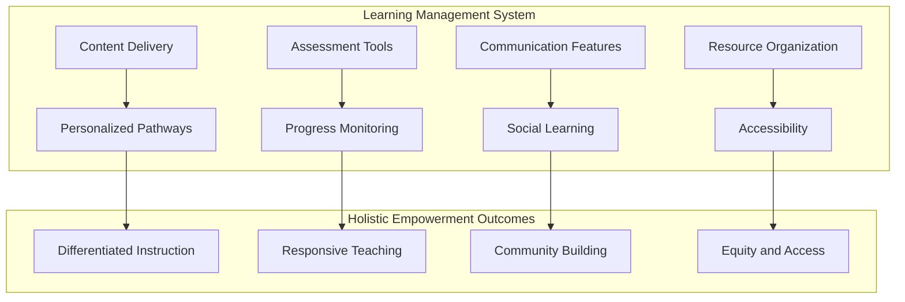

### 7.3 Technology-Enhanced Strategies for Personalized and Differentiated Instruction

Technology's capacity to support personalized and differentiated instruction represents one of its most significant contributions to holistic English education. This section examines how digital tools enable teachers to meet diverse learner needs while maintaining high expectations for all students.

#### Adaptive Learning Technologies

**Adaptive learning technologies** adjust to individual student proficiency levels, providing appropriately challenging content and scaffolding based on demonstrated performance. Access to multimedia resources such as videos, podcasts, and interactive online activities can now be used to target different learning styles of students, increase student engagement, and improve the overall effectiveness of instruction[^85].

Today's smart technologies create adaptive assessments, generate progress reports, and provide assignment feedback, streamlining the process of determining a student's current language level, identifying learning goals, and monitoring progress[^85]. By leveraging these tools, teachers can automate many processes and then leverage the information to develop custom learning pathways based on a learner's progress and needs[^85].

**Prodigy Math Game** exemplifies adaptive learning principles applicable to language instruction. Prodigy is an adaptive learning platform for grades 1 to 8 where teachers can use a free dashboard to easily differentiate practice, send home assignments, and get real-time insights into how students are learning[^88]. While focused on mathematics, the adaptive principles—adjusting difficulty based on performance, providing immediate feedback, and tracking progress—apply equally to language learning applications.

Advances in EdTech have greatly expanded, giving rise to a variety of resources for English as a second language teaching and learning[^85]. Technology is important in ESL because it provides access to authentic language resources, increases engagement through interactive learning tools, allows for personalized learning development through adaptive learning technologies, supports speaking fluency through language processing technology, and helps teach 21st-century skills through collaborative tech tools[^85].

#### Digital Scaffolding for English Language Learners

Technology provides powerful scaffolding tools that support English Language Learners in accessing content while developing language proficiency. These scaffolds can be adjusted based on individual student needs and gradually removed as proficiency develops.

**Visual supports** through technology enhance comprehension for ELLs. Visual supports are crucial for English Language Learners who are developing their vocabulary and comprehension skills[^95]. Research shows that visual learning tools can reduce the cognitive load for ELLs[^95]. Effective visual tools include graphic organizers, anchor charts, picture dictionaries, and visual schedules[^95]. One particularly effective approach is the use of visual word walls that pair new vocabulary with images[^95].

**Digital translation tools** have become invaluable resources in diverse classrooms. Modern translation tools go beyond simple word-for-word translation; they offer contextual translations, pronunciation guides, and cultural notes[^95]. Recommended resources include Google Translate, which offers translation between 100+ languages with camera translation features, and Microsoft Translator, which provides real-time translation for classroom discussions[^95]. The goal should be to gradually reduce dependency on translation as students build their English proficiency[^95].

**Educational apps for language acquisition** provide engaging, interactive experiences supporting English Language Learners at various proficiency levels[^95]. Effective language acquisition apps should include multi-sensory learning experiences, scaffolded content, opportunities for both receptive and productive language practice, cultural context, and progress tracking features[^95].

**Scaffolding tools** are essential for English Language Learners to access grade-level content[^95]. Effective scaffolding tools provide temporary support that can be gradually removed, including sentence frames, word banks, think-alouds, and guided notes[^95]. The key is to match the level of support to students' current proficiency levels[^95].

The following table organizes digital scaffolding tools by function:

| **Scaffolding Function** | **Digital Tools** | **Application for ELLs** |
|-------------------------|------------------|-------------------------|
| **Visual Support** | Graphic organizers, picture dictionaries, visual word walls | Reduces cognitive load, supports vocabulary |
| **Translation Support** | Google Translate, Microsoft Translator | Bridges comprehension gaps, provides pronunciation |
| **Language Practice** | Language acquisition apps, interactive platforms | Provides scaffolded practice across domains |
| **Content Access** | Text-to-speech, simplified text tools | Enables access to grade-level content |

#### Technology-Based Formative Assessment

Technology enables formative assessment approaches that provide real-time insights into student progress, allowing teachers to adjust instruction responsively. These approaches align with holistic empowerment by providing meaningful feedback that supports growth rather than merely measuring performance.

**Real-time insight** into students' learning is vital for developing holistic understanding of progress[^87]. This immediate feedback allows educators to address emotional and social challenges as they arise[^87]. With Nearpod, real-time insights into student thinking allow teachers to adapt their instruction, and teachers can add Open-Ended Questions, Draw It, or Collaborate Board to a lesson on the fly with Quick Launch[^87].

**Collecting meaningful student feedback** through technology creates opportunities for student voice in the classroom, which is key to building positive school culture and gathering meaningful student feedback[^87]. To increase student talk, teachers can provide ample opportunities for engaging interaction through activities like Think-Pair-Share questions and Open-Ended Questions[^87]. Nearpod's formative assessment features, like Polls, empower educators to provide multiple ways for students to share valuable information personally[^87].

**Technology for assessment of language development** addresses the challenge of accurately tracking English language development over time. ELL teachers are always evaluating student progress through two lenses: assessing content knowledge and the progression of English language development[^92]. Using technology can make the task easier to accurately assess English language development over time[^92].

#### Supporting Varied Learning Paces and Styles

Technology enables teachers to accommodate varied learning paces and styles while maintaining high expectations for all students. This differentiation supports the holistic empowerment principle that all learners deserve access to rigorous content with appropriate scaffolding.

**Recorded lessons** support varied pacing by allowing students to review content as needed. Recording lessons ahead of time can greatly impact the growth that ELLs make, and videos can be used for reteaching or review, fostering home-school connections, and allowing students to take control of their own learning[^92]. Students can pause, rewind, and rewatch content until they achieve understanding, supporting self-directed learning.

**Multiple modality options** address different learning preferences. Technology enables students to feel better connected to the curriculum[^91]. The use of multimedia in the classroom can help create better teaching methods, increases understanding and autonomous learning, and boosts motivation when centered on learner interests[^91]. Technology enables the creation of relatable contexts, and instructors can be more engaging and efficient with appropriate technology integration[^91].

**Self-paced learning pathways** through LMS platforms allow students to progress based on demonstrated mastery rather than fixed timelines. An LMS can be used to create personalized learning and social learning experiences, and a key element is that it offers training anytime, anywhere[^94]. Modern learners expect resources on demand, and Learning Management Systems allow deployment and tracking without geographical limitations[^94].

### 7.4 Balancing Technology Use with Human Connection and Authentic Interaction

While technology offers significant benefits for holistic English education, its integration must be balanced with the human connections and authentic interactions that remain foundational to effective learning. This section critically examines this essential balance, providing guidance on maintaining holistic empowerment priorities in technology-rich environments.

#### The Irreplaceable Role of Teacher-Student Relationships

Research consistently demonstrates that **teacher-student relationships are fundamental to student success**, and technology cannot replace these human connections. The holistic empowerment paradigm positions teachers as facilitators and mentors whose relationships with students create the conditions for learning. Technology should extend rather than diminish these relationships.

The facilitative teacher role established in earlier chapters emphasizes building strong student-teacher relationships by being observant of students' personal growth and creating trusting rapport. This relational foundation cannot be digitized—students need human connection, emotional attunement, and responsive interaction that technology cannot provide. While technology can facilitate communication and provide learning resources, the quality of teacher-student relationships depends on human presence and genuine care.

**Mentoring experiences** characterized by guidance, support, appreciation, and balanced power between adults and youth represent essential components of empowerment that require human relationship. Teachers who know their students—their interests, challenges, cultural backgrounds, and aspirations—can provide the personalized support that generic digital tools cannot offer.

#### Strategies for Technology That Enhances Rather Than Replaces Human Interaction

Thoughtful technology integration enhances human interaction by creating new opportunities for connection, collaboration, and communication. The following strategies help teachers leverage technology while preserving essential human elements:

**Use technology to extend interaction beyond classroom time** rather than replacing face-to-face engagement. Video tools like Flipgrid allow students to continue conversations asynchronously, maintaining dialogue between class meetings. LMS discussion boards enable ongoing conversation about content. These tools supplement rather than substitute for in-person interaction.

**Leverage technology for collaboration** that brings students together rather than isolating them. Collaborative learning structures provide English Language Learners with authentic opportunities to practice language[^95]. Effective structures include Think-Pair-Share, Jigsaw, and Numbered Heads Together[^95]. Technology can facilitate these collaborative structures through shared documents, collaborative boards, and group communication tools.

**Maintain face-to-face instruction for relationship-intensive activities** including social-emotional learning, conflict resolution, and sensitive conversations. While technology can support SEL through structured activities, the emotional attunement and responsive interaction essential to social-emotional development require human presence.

**Use technology to free teacher time for relationship-building** by automating routine tasks. When technology handles administrative functions, progress tracking, and basic skill practice, teachers have more time for the meaningful interactions that build relationships and support holistic development.

#### Social-Emotional Learning in Technology-Rich Environments

Maintaining social-emotional learning priorities requires intentional attention in technology-rich environments. While some digital tools support SEL, the social-emotional dimension of holistic empowerment depends fundamentally on human relationships and authentic emotional experiences.

**Nearpod's 21st Century Readiness Program** includes over 400 SEL lessons, activities, and videos built on CASEL's five core competencies: self-awareness, self-management, social awareness, relationship skills, and responsible decision-making[^87]. This supplemental SEL program includes lifelong learning strategies for goal setting, time management, and growth mindset lessons[^87]. Such structured digital resources can support SEL instruction while maintaining the human facilitation essential to emotional development.

**Technology-supported SEL activities** can complement human-centered approaches:

**Facilitating positive classroom interactions** using Collaborate Board activities increases student engagement and fosters development of social emotional learning skills[^87]. Students truly feel part of the conversation, which helps teachers foster classroom culture[^87].

**Encouraging self-reflection through drawing** supports students in expressing their feelings[^87]. Using drawing activities for self-portraits, scribble art, or journaling opportunities for students to express feelings supports self-reflection[^87]. Students can practice responsible decision-making by completing Draw It activities to share challenges they are facing[^87].

**Creating moments of gratitude** through interactive features engages and connects students with SEL[^87]. Students can discuss the importance of recognizing the good in their lives and expressing gratitude regularly[^87].

**Brain Breaks videos** regulate the energy and focus of classrooms[^87]. Research suggests providing quick breaks helps refresh the mind and makes it easier for students to focus on important tasks[^87]. Teachers can choose between Calming or Energizing videos depending on classroom needs[^87].

The **Holistic Language Pedagogies (HLP) Project** provides additional resources for integrating SEL with language instruction. The project brought together language educators to learn about and apply holistic language pedagogies, resulting in a compendium organized into categories including Social and Emotional Learning, Play-based Learning, Asset-based Pedagogies, Drama-based Pedagogies, and Ice Breakers[^96].

Social and Emotional Learning is defined as the process through which students develop skills for managing emotions, showing empathy, maintaining relationships, and making responsible decisions[^96]. It is crucial for creating a supportive classroom environment, especially for language learners who may feel anxious[^96]. SEL activities are designed to foster self-awareness, emotional regulation, and human connection[^96].

Specific SEL activities from the compendium include:

| **Activity** | **Description** | **SEL Focus** |
|-------------|----------------|---------------|
| **4-7-8 Breathing Technique** | Regulates nervous system through structured breathing | Self-regulation |
| **Empathy Mapping** | Explores what a person says, thinks, does, and feels | Empathy, perspective-taking |
| **Glass of Emotions** | Students identify and share emotions using colors | Emotional awareness |
| **Pass the Picture** | Groups observe images and discuss depicted emotions | Multiple viewpoints, empathy |
| **Wheel of Emotions** | Students identify feelings evoked by images | Critical thinking about media |

#### Recognizing When Technology Undermines Holistic Empowerment

Teachers must develop capacity to recognize when technology use undermines rather than supports holistic empowerment goals. Warning signs include:

**Reduced human interaction** when technology replaces rather than enhances opportunities for meaningful connection between teachers and students or among peers.

**Decreased physical activity** when technology increases sedentary screen time without compensating movement opportunities.

**Constrained creativity** when digital tools limit rather than expand possibilities for creative expression and original thinking.

**Diminished autonomy** when technology makes decisions that students should make or creates dependency on digital scaffolds that students could learn to do without.

**Increased anxiety** when technology creates pressure, comparison, or fear of failure rather than supporting psychological safety.

**Equity concerns** when technology benefits some students while creating barriers for others who lack access, digital literacy, or appropriate supports.

When these warning signs appear, teachers should reconsider technology use and potentially reduce or eliminate tools that undermine holistic empowerment goals.

### 7.5 Evidence-Based Evaluation of Digital Interventions for English Language Learning

This section synthesizes research findings on the effectiveness of technology-based interventions in elementary English education, providing novice teachers with evidence to inform their technology decisions. The analysis examines what research reveals about EdTech effectiveness and the factors that influence successful implementation.

#### Research Findings on EdTech Effectiveness

Research on educational technology effectiveness presents a **mixed but informative picture** that helps teachers understand both the potential and limitations of digital interventions. A synthesis of findings from 10 primary research studies of EdTech interventions conducted in low- and middle-income countries during the pandemic provides valuable insights using a holistic framework for EdTech effectiveness with five lenses: impact on learning outcomes, enhancing equity, cost and affordability, implementation context, and alignment and scale[^97].

**Regarding impact on learning outcomes**, findings were mixed. In one Bangladesh study, Interactive Voice Response (IVR) showed positive effects on learning outcomes, mainly English literacy and numeracy, alongside increases in students' interest and attention span[^97]. However, a similar IVR intervention in Ghana only impacted one aspect of numeracy[^97]. Online Teaching at the Right Level in Pakistan had variable effects, improving language scores but not maths scores[^97].

A critical finding across studies was that **learners expressed preference for increased interactivity**, with students indicating preference for social media platforms because of heightened interaction compared to one-way modalities[^97]. This finding underscores that technology effectiveness depends significantly on the quality of interaction it enables rather than mere content delivery.

**Regarding equity**, studies revealed that access to and effective use of EdTech was differentiated based on gender[^97]. In Pakistan, 29% of caregivers did not allow girls access to EdTech for cultural, religious, and financial reasons[^97]. In Bangladesh, gender differences were noted where 77% of male respondents had internet access compared to 59% of female respondents[^97]. These findings highlight that technology integration must attend to equity considerations from the outset.

For learners with disabilities, EdTech supported participation through features like sign language in telecasting and voice initializing for digital resources[^97]. This finding suggests that thoughtfully designed technology can enhance accessibility and inclusion.

**Regarding cost**, only one study provided formal cost-effectiveness analysis. The IVR intervention in Bangladesh cost USD 27.5 per student over 15 weeks, resulting in 2.21-2.37 Learning-Adjusted Years of Schooling (LAYS) gained per USD 100 spent[^97]. Other studies highlighted that even with high mobile phone ownership, internet and data costs remained a challenge for households[^97].

#### Factors Influencing Implementation Success

Research identifies several factors that influence whether EdTech interventions produce positive outcomes:

**The role of parents and caregivers** emerged as critical for implementation success. Parents' digital skills, literacy, and motivation impacted their ability to support children[^97]. IVR interventions in Ghana and Bangladesh showed improvements attributed to motivated caregivers who were nudged to engage in children's learning[^97]. This finding aligns with Chapter 6's emphasis on family engagement as essential to holistic empowerment.

**Combining EdTech with human support** proved important across studies. In Kenya, radio lessons were only significantly associated with higher learning outcomes when accessed as a group outside of reading camps, highlighting the importance of combining EdTech with other group-based interventions[^97]. Technology alone was insufficient; human facilitation and social context enhanced effectiveness.

**Co-design processes** helped foster social acceptance and tailor interventions to user needs, such as language, speaking style, and speed of delivery[^97]. When users participated in designing technology interventions, the resulting tools better met their needs and gained greater acceptance.

**Alignment with curriculum** increased student engagement and motivation. Studies found that linking EdTech to school curricula increased student engagement and motivation[^97]. Embedding offerings into existing systems, like using widely available WhatsApp, increased uptake[^97]. Technology that connected to rather than diverged from existing educational structures proved more effective.

The following diagram illustrates factors influencing EdTech effectiveness:

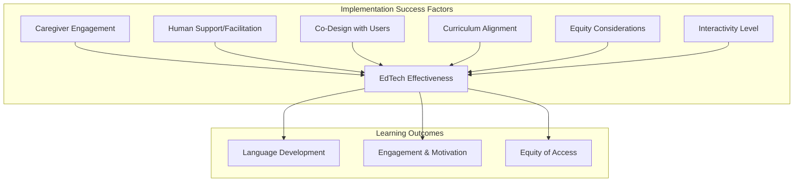

#### Characteristics of Effective Digital Interventions

Synthesizing research findings, effective digital interventions for English language learning share several characteristics:

**Interactive rather than passive** engagement produces better outcomes. Students prefer and learn more from technology that enables interaction rather than one-way content delivery. Tools that facilitate dialogue, collaboration, and active participation outperform those that merely present information.

**Integrated with human support** rather than standalone. Technology works best when combined with teacher facilitation, peer collaboration, or caregiver involvement. Digital tools should complement rather than replace human interaction.

**Contextually adapted** to user needs, languages, and circumstances. One-size-fits-all technology solutions often fail; effective interventions are adapted to local contexts through co-design processes.

**Aligned with educational goals** and existing curriculum. Technology that connects to rather than diverges from educational structures gains greater acceptance and produces better outcomes.

**Attentive to equity** from the outset. Effective interventions consider and address potential barriers related to access, gender, disability, and digital literacy rather than assuming equal access and capability.

**Appropriately low-tech or high-tech** based on context. Research examined interventions using radio, television, and mobile devices, finding that effectiveness depended more on design and implementation than technological sophistication[^97]. Sometimes simpler technologies prove more effective than complex ones.

The analysis concludes that **access to technology is only a small part of effectiveness**, with wider elements deserving attention[^97]. Effectiveness depends not only on technology access but also on designs that incorporate co-creation, contextualisation, and address equity issues from the onset[^97].

### 7.6 Practical Implementation Guidance for Novice Teachers

This section provides actionable recommendations for novice teachers integrating technology into holistic English instruction. The guidance addresses tool selection, gradual implementation, common challenges, and ongoing evaluation to support teachers in developing confident, effective technology integration practices.

#### Criteria for Selecting Appropriate Digital Tools

Novice teachers face an overwhelming array of technology options. The following criteria provide a framework for evaluating and selecting tools aligned with holistic empowerment principles:

**Alignment with learning objectives** should be the primary criterion. Before considering any technology tool, teachers should clearly identify what students need to learn and how technology might support that learning. Tools should be selected because they serve educational purposes, not because they are novel or popular.

**Support for holistic development** across cognitive, social-emotional, physical, and creative dimensions. Tools that address only narrow skill development may not align with holistic empowerment goals. Teachers should consider how tools affect the whole child, not just academic outcomes.

**Accessibility for all students** including those with disabilities, limited technology access, or varying levels of digital literacy. Tools that create or exacerbate inequities should be avoided or supplemented with alternatives that ensure all students can participate.

**Enhancement of rather than replacement for human interaction**. Tools that facilitate collaboration, communication, and relationship-building align with holistic empowerment; those that isolate students or reduce human contact may undermine it.

**Evidence of effectiveness** from research or professional recommendations. While not all effective tools have extensive research bases, teachers should seek evidence that tools produce meaningful learning outcomes.

**Ease of implementation** within realistic constraints of time, resources, and expertise. Tools that require extensive training, technical support, or preparation time may not be practical for novice teachers to implement effectively.

The following table provides a tool evaluation framework:

| **Criterion** | **Questions to Ask** | **Red Flags** |
|--------------|---------------------|---------------|
| **Learning Alignment** | Does this serve my learning objectives? | Tool searching for a purpose |
| **Holistic Development** | How does this affect the whole child? | Narrow skill focus only |
| **Accessibility** | Can all my students access and use this? | Requires resources some lack |
| **Human Connection** | Does this enhance or replace interaction? | Isolates students |
| **Evidence Base** | What evidence supports effectiveness? | No evidence or negative findings |
| **Practicality** | Can I realistically implement this? | Excessive time or expertise required |

#### Strategies for Gradual Technology Integration

Novice teachers should approach technology integration gradually, building confidence and competence over time rather than attempting to implement multiple tools simultaneously. The following progression supports sustainable development:

**Phase 1: Foundation (First Weeks)**
- Focus on establishing classroom routines and relationships without extensive technology
- Learn to use one or two essential tools (e.g., classroom management system, communication tool)
- Observe how students respond to technology and identify their needs and capabilities
- Build your own comfort with available technology before introducing it to students

**Phase 2: Exploration (First Months)**
- Introduce one new technology tool at a time, allowing mastery before adding more
- Start with tools that have clear, immediate benefits and low implementation barriers
- Seek feedback from students about what helps their learning
- Connect with colleagues who can provide guidance and support

**Phase 3: Expansion (First Year)**
- Gradually expand technology repertoire based on demonstrated effectiveness
- Experiment with more complex tools as confidence grows
- Develop systems for managing technology use and troubleshooting problems
- Reflect regularly on what is working and what needs adjustment

**Phase 4: Integration (Ongoing)**
- Technology becomes seamlessly integrated into instructional practice
- Selection and use are guided by principled understanding of when technology adds value
- Continuous learning and adaptation as new tools emerge
- Mentoring newer colleagues in effective technology integration

Suggestions for effective integration include ensuring educators have access to tools and new ideas, schools update hardware, learners have tool access, instructors have positive attitudes, select appropriate devices, receive technical support and training, and institutions take technology seriously[^91]. The goal is to promote motivation and engage students[^91].

#### Addressing Common Implementation Challenges

Novice teachers commonly encounter several challenges when integrating technology. Understanding these challenges and having strategies to address them supports successful implementation.

**Technical difficulties** including equipment failures, connectivity problems, and software glitches are inevitable. Strategies include:
- Always having a non-technology backup plan for lessons
- Learning basic troubleshooting for common problems
- Knowing who to contact for technical support
- Teaching students to problem-solve minor technical issues

**Classroom management** in technology-rich environments presents unique challenges. Problems with integration include difficult classroom management and time-consuming preparation[^91]. Strategies include:
- Establishing clear expectations for technology use before introducing tools
- Teaching and practicing procedures for transitions to and from technology
- Monitoring student activity during technology use
- Using technology features that support management (e.g., teacher dashboards, activity monitoring)

**Time constraints** for learning new tools and preparing technology-enhanced lessons are common concerns. Strategies include:
- Starting with tools that require minimal preparation
- Building a library of reusable technology-enhanced activities
- Collaborating with colleagues to share preparation burden
- Prioritizing tools with highest impact-to-effort ratios

**Student digital literacy variations** mean some students need more support than others. Strategies include:
- Assessing students' technology skills early in the year
- Providing explicit instruction on tool use before expecting independent application
- Pairing students with different skill levels for peer support
- Differentiating technology expectations based on student readiness

**Lack of instructor knowledge** about technology tools and their pedagogical applications is a common barrier[^91]. Strategies include:
- Pursuing professional development focused on technology integration
- Learning alongside students rather than expecting immediate expertise
- Starting with tools that have strong instructional support and tutorials
- Building professional learning community around technology use

#### Frameworks for Ongoing Evaluation of Technology Effectiveness

Effective technology integration requires ongoing evaluation to ensure tools continue serving holistic empowerment goals. The following framework supports continuous improvement:

**Monitor student engagement and learning** through observation, assessment data, and student feedback. Are students more engaged when using technology? Are they learning more effectively? Do they report that technology helps their learning?

**Assess impact on holistic development** across cognitive, social-emotional, physical, and creative dimensions. Is technology supporting whole-child development or narrowing focus to measurable academic outcomes?

**Evaluate equity implications** by examining whether all students benefit equally from technology use. Are some students advantaged while others are left behind? What supports are needed to ensure equitable access and outcomes?

**Consider human connection effects** by observing whether technology enhances or diminishes relationships and interaction. Are students collaborating more or less? Is teacher-student relationship quality maintained?

**Gather student and family feedback** about technology experiences. What do students find helpful? What frustrates them? How do families perceive technology use? This feedback provides essential perspective on effectiveness.

**Reflect on alignment with holistic empowerment principles** by regularly asking whether technology use serves the paradigm's core commitments. Is technology facilitating learning or driving it? Are students becoming more empowered or more dependent?

Research on teacher technology use found that in virtual classrooms, **English language teaching field teachers performed significantly better than teachers in other fields** regarding technology use, suggesting that the teacher's professional field is a determining factor[^98]. This finding indicates that developing expertise in technology integration is particularly important for English language teachers.

The research has implications for teacher education, suggesting that policymakers should provide training for pre-service and in-service teachers on technology-enhanced pedagogy and basic technology competencies[^98]. Universities can offer courses or conferences training teachers to use online tools, and extending practicum training for novice teachers to increase classroom experience is beneficial[^98]. Additionally, workshops or courses promoting technology use and integration should be added to curricula across all fields[^98].

#### Sustaining Effective Technology Integration

Long-term success with technology integration requires ongoing attention to professional growth, reflection, and adaptation. Novice teachers should:

**Continue learning** about new tools and approaches through professional development, professional learning communities, and independent exploration. The technology landscape evolves rapidly, and teachers must evolve with it.

**Reflect regularly** on technology effectiveness and alignment with holistic empowerment principles. What is working? What needs adjustment? How can technology use better serve students?

**Collaborate with colleagues** to share effective practices, troubleshoot challenges, and develop collective expertise. Technology integration is easier and more effective when teachers learn together.

**Advocate for resources** needed to implement technology effectively, including devices, connectivity, professional development, and technical support. Teachers' voices matter in shaping school and district technology decisions.

**Maintain perspective** on technology's proper role as a facilitator of learning rather than an end in itself. The goal is not to use more technology but to use technology well in service of holistic empowerment.

The English language learning market projections indicate the years ahead will include continued expansion, and technology will impact all aspects of ELT, increasing global accessibility to educational content and materials and expanding teachers' abilities to provide informed, personalized instruction[^85]. With advances in AI, adaptive response capabilities, and other machine learning, English language teachers can reduce course preparation time and deliver targeted, effective instruction[^85]. As technologies become increasingly sophisticated, English language teaching will continue to evolve, developing new, innovative ways to improve language learning[^85].

For novice teachers, this evolving landscape presents both opportunity and challenge. By grounding technology integration in the principles of holistic empowerment—maintaining focus on whole-child development, preserving human connection, ensuring equity, and keeping technology in its proper facilitative role—teachers can harness digital tools' potential while avoiding their pitfalls. The goal is not technological sophistication but educational effectiveness: using whatever tools best serve students' comprehensive development as language learners and human beings.

## 8 Assessment Approaches Aligned with Holistic Empowerment

Assessment practices in elementary English education stand at a critical juncture where traditional measurement paradigms increasingly conflict with the comprehensive developmental goals of holistic empowerment. The way teachers assess student learning fundamentally shapes what students learn, how they learn, and how they perceive themselves as learners. When assessment focuses narrowly on linguistic accuracy measured through standardized tests, it inadvertently communicates that only certain forms of knowledge matter, that mistakes are failures rather than learning opportunities, and that students are objects to be measured rather than agents of their own development. In contrast, assessment aligned with holistic empowerment positions evaluation as an integral component of the learning process itself—a continuous, multidimensional endeavor that captures cognitive, affective, and psychomotor development while empowering students to take ownership of their growth.

This chapter critically examines assessment practices that support rather than undermine the holistic empowerment paradigm established in preceding chapters. For novice teachers, understanding assessment philosophy and practice is essential because assessment decisions profoundly influence classroom climate, student motivation, and learning outcomes. The analysis synthesizes research on transformative assessment approaches including formative assessment strategies, portfolio-based evaluation, self and peer assessment, and authentic assessment methods. Throughout, the discussion provides practical guidance for implementing continuous, personalized assessment approaches that reduce anxiety, honor diverse learner needs, and generate meaningful feedback for both linguistic proficiency and holistic development. The ultimate goal is to help novice teachers reconceptualize assessment from a mechanism of judgment to a **tool for empowerment**—one that supports students in becoming confident, capable, and self-directed language learners.

### 8.1 Theoretical Foundations of Assessment in Holistic Empowerment

Understanding assessment within the holistic empowerment paradigm requires a fundamental reconceptualization of assessment's purpose, philosophy, and practice. This section establishes the conceptual foundations that should guide novice teachers' assessment decisions, examining how assessment philosophy must shift from measurement-focused to learning-focused orientations and exploring the theoretical rationale for multidimensional assessment that addresses cognitive, affective, and psychomotor domains simultaneously.

#### The Paradigm Shift from Assessment of Learning to Assessment for Learning

Traditional assessment approaches have primarily served summative purposes—measuring what students have learned at particular points in time and assigning grades or scores that communicate achievement levels. While such assessment has legitimate functions, an exclusive focus on summative measurement contradicts holistic empowerment principles. The paradigm shift required for holistic empowerment repositions assessment as primarily **formative**—ongoing processes that inform and improve learning rather than merely measure its outcomes.

Formative assessments are employed while learning is ongoing to monitor student progress in course learning objectives. They are used to collect information on whether course objectives are being advanced and how teaching can be improved. Formative assessments often aim to identify strengths, challenges, and misconceptions and evaluate how to close those gaps[^99]. This orientation transforms assessment from an endpoint to an integral part of the learning process, providing continuous feedback that guides both teaching and learning.

The distinction between assessment of learning and assessment for learning carries profound implications for classroom practice:

| **Assessment of Learning** | **Assessment for Learning** |
|---------------------------|----------------------------|
| Summative purpose: measures achievement | Formative purpose: improves learning |
| Occurs at end of instruction | Occurs continuously throughout instruction |
| Evaluates student performance | Informs instructional decisions |
| Focuses on grades and scores | Focuses on feedback and growth |
| Teacher as judge | Teacher as coach and facilitator |
| Student as object of measurement | Student as active participant |

Research demonstrates that formative assessments improve student learning by allowing teachers to better understand students' misconceptions and areas of difficulty[^99]. They can also bolster students' motivation to learn, their metacognition, as well as their performance on summative assessments such as exams[^99]. By measuring student understanding throughout a course, formative assessments enable students to reflect on how they can improve their own learning[^99]. This reflective dimension aligns directly with holistic empowerment's emphasis on developing metacognitive awareness and learner autonomy.

#### Maslow's Hierarchy and Assessment Design

The application of **Maslow's Hierarchy of Needs** to assessment design provides crucial guidance for creating evaluation practices that support rather than undermine student development. As established in earlier chapters, students' basic needs—including safety and belonging—must be met before they can fully engage in higher-order learning. Assessment practices that create anxiety, fear of failure, or feelings of inadequacy directly undermine these foundational needs and consequently inhibit learning capacity.

Traditional assessment approaches often violate Maslow's hierarchy by creating conditions of psychological threat. When students fear evaluation, their stress responses activate, cortisol levels rise, and the prefrontal cortex functions less effectively—precisely the conditions that impair learning and memory. Assessment aligned with holistic empowerment must therefore prioritize psychological safety, ensuring that evaluation processes feel supportive rather than threatening.

This principle has concrete implications for assessment design:

- **Safety needs** require assessment environments where students feel secure taking risks and making mistakes without fear of ridicule or harsh judgment
- **Belonging needs** require assessment that honors students' identities, cultures, and linguistic backgrounds rather than privileging dominant norms
- **Esteem needs** require assessment that recognizes strengths and progress rather than focusing exclusively on deficits
- **Self-actualization needs** require assessment that supports students in pursuing their potential rather than constraining them to narrow definitions of success

#### The Multidimensional Nature of Assessment in Holistic Education

Holistic education recognizes that student development encompasses physical, emotional, social, cognitive, and creative dimensions that cannot be meaningfully separated. Assessment aligned with this philosophy must therefore be **multidimensional**, capturing growth across multiple domains rather than focusing narrowly on cognitive-linguistic outcomes.

The Holistic Assessment Framework (HAF) exemplifies this multidimensional orientation. The HAF reflects in detail the progress as well as the uniqueness of each learner in the cognitive, affective, and psychomotor domain. It follows a participatory, inclusive, and learner centric approach and includes assessments of dimensions—physical development, socio-emotional and ethical development, cognitive development, language, and literacy development, and, aesthetic and cultural development[^39]. This comprehensive scope ensures that assessment captures the full range of student development rather than reducing complex human growth to narrow metrics.

The theoretical foundation for multidimensional assessment rests on several key principles:

**Constructivism** recognizes that learners actively construct knowledge through experience rather than passively receiving information. Assessment aligned with constructivist principles evaluates not merely what students know but how they construct and apply understanding in meaningful contexts.

**Learner-centered approaches** position students at the center of educational design, including assessment design. Rather than imposing uniform evaluation criteria, learner-centered assessment adapts to individual needs, interests, and developmental trajectories.

**Authentic assessment** evaluates student learning through tasks that mirror real-world applications rather than artificial testing situations. This approach recognizes that meaningful learning involves applying knowledge in context rather than merely recalling information in isolation.

The following diagram illustrates the theoretical foundations of holistic assessment:

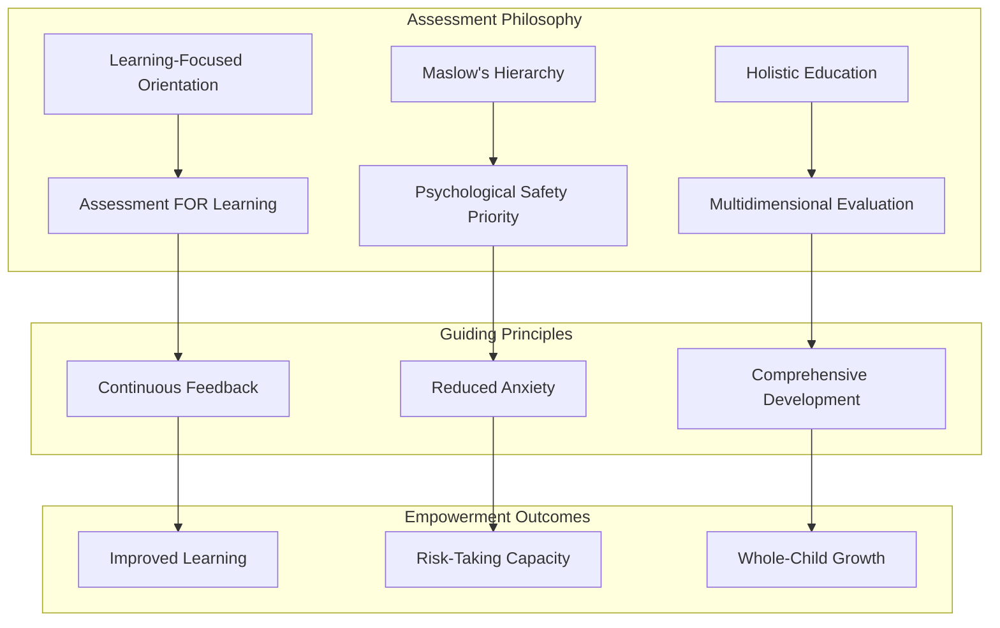

#### Assessment as Empowerment Rather Than Judgment

Perhaps the most fundamental theoretical shift required for holistic empowerment is reconceptualizing assessment's relationship to student agency. Traditional assessment positions students as objects of evaluation—passive recipients of judgments made by external authorities. Holistic empowerment requires repositioning students as **active agents** in the assessment process, developing their capacity to evaluate their own work, set goals, and direct their own learning.

This empowerment orientation aligns with the broader theoretical framework established in Chapter 2. Empowerment involves developing students' agency, self-efficacy, and capacity for autonomous decision-making. Assessment practices that develop these capacities—rather than undermining them through external judgment—contribute to the comprehensive empowerment that holistic education seeks to achieve.

The empowerment orientation transforms assessment practices in several ways:

- Students participate in developing assessment criteria rather than having criteria imposed
- Self-assessment and peer assessment become central rather than peripheral
- Feedback focuses on growth and improvement rather than judgment and ranking
- Students develop metacognitive awareness of their own learning processes
- Assessment supports rather than undermines intrinsic motivation

Research on holistic assessment implementation confirms these empowerment outcomes. Teachers observed that the framework enhanced students' capacities, making them more active, providing opportunities for deep learning, and ultimately boosting their confidence[^39]. Students responded positively, showing high engagement and excitement without the pressure associated with traditional assessment[^39]. These findings demonstrate that assessment can indeed function as a tool for empowerment when designed according to holistic principles.

### 8.2 Limitations of Traditional Assessment Practices in Elementary English Education

Before examining alternative approaches, novice teachers must understand why traditional assessment practices fail to support holistic empowerment. This critical analysis reveals the incompatibility between conventional assessment and the comprehensive developmental goals of holistic education, providing rationale for the transformative approaches discussed in subsequent sections.

#### Overemphasis on Memorization and Recall

Traditional assessment in English education has long privileged memorization and recall over deeper understanding and application. Students are tested on vocabulary definitions, grammatical rules, and discrete language elements divorced from meaningful communicative contexts. This emphasis contradicts both language acquisition research and holistic education principles.

The overemphasis on memorization creates several problems:

**Surface-level learning** results when students focus on memorizing information for tests rather than developing genuine understanding. Research consistently demonstrates that rote memorization produces knowledge that is quickly forgotten and difficult to apply in new contexts.

**Reduced engagement** occurs when assessment focuses on recall rather than meaningful application. Students perceive such assessment as disconnected from their lives and interests, undermining the intrinsic motivation essential for sustained language learning.

**Narrow skill development** results from assessment that tests only what can be easily measured through recall-based items. Critical thinking, creativity, collaboration, and communication—the 21st-century skills essential for student success—cannot be adequately assessed through traditional memorization-focused approaches.

Teachers implementing holistic approaches reported that traditional assessment systems were characterized by overemphasis on memorization, limited assessment scope, teacher-centered approaches, student burden, and administrative challenges[^39]. These limitations directly contradict holistic empowerment's emphasis on meaningful learning, student agency, and comprehensive development.

#### Anxiety and Its Impact on Language Learning

Traditional assessment practices frequently create anxiety that directly inhibits language acquisition. Research on language learning anxiety has consistently demonstrated a **clear negative correlation between anxiety and learning success**. When students experience assessment-related anxiety, their capacity for language learning is compromised at neurological, cognitive, and affective levels.

The anxiety-producing characteristics of traditional assessment include:

**High-stakes evaluation** where single assessments carry significant consequences for grades and academic standing creates pressure that activates stress responses incompatible with effective learning.

**Public performance demands** where students must demonstrate language skills in front of peers create social anxiety that inhibits the risk-taking essential for language development.

**Error-focused feedback** that emphasizes mistakes over progress conditions students to fear correction, creating defensive postures that prevent the experimentation necessary for language acquisition.

**Comparison and ranking** that positions students in competition with peers rather than focusing on individual growth creates anxiety about relative standing that undermines intrinsic motivation.

Research confirms that language learning must occur in an environment where the learner is "undefended" and the affective filter (anxiety) is low for input to be noticed and enter the learner's thinking. Traditional assessment practices that elevate anxiety directly contradict this requirement, creating conditions that impair rather than support language development.

Teachers implementing the Holistic Assessment Framework observed that students showed **high engagement, excitement, and no pressure** compared to traditional assessment[^39]. This finding demonstrates that assessment design significantly influences student emotional experience and that alternatives to anxiety-producing traditional approaches are both possible and effective.

#### Failure to Capture Multidimensional Development

Traditional assessment's narrow focus on discrete language skills fails to capture the multidimensional nature of both language proficiency and holistic development. Standardized tests and conventional classroom assessments typically measure isolated vocabulary knowledge, grammatical accuracy, and reading comprehension through decontextualized items that bear little resemblance to authentic language use.

This narrow focus creates several problems:

**Incomplete picture of language proficiency** results when assessment ignores communicative competence, sociolinguistic appropriateness, discourse coherence, and strategic competence in favor of grammatical accuracy alone.

**Neglected developmental dimensions** occur when assessment focuses exclusively on cognitive-linguistic outcomes while ignoring social-emotional, physical, and creative development essential to holistic education.

**Missed student strengths** result when assessment methods privilege particular skill sets while failing to recognize competencies that students demonstrate through alternative means.

The Holistic Assessment Framework addresses these limitations by including assessments across multiple dimensions: physical development, socio-emotional and ethical development, cognitive development, language and literacy development, and aesthetic and cultural development[^39]. This comprehensive scope ensures that assessment captures the full range of student development rather than reducing complex growth to narrow metrics.

#### Disadvantaging Diverse Learners

Traditional assessment practices systematically disadvantage English Language Learners and students from diverse backgrounds. When assessments are designed according to dominant cultural norms and administered in English only, they measure English proficiency and cultural familiarity rather than content knowledge or genuine language development.

The disadvantages for diverse learners include:

**Conflation of language proficiency with content knowledge** occurs when assessments require English fluency for students to demonstrate what they know. Without appropriate scaffolding, assessments become reading comprehension tests that fail to capture students' actual understanding.

**Cultural bias** in assessment content and formats privileges students whose backgrounds align with dominant norms while disadvantaging those whose experiences differ.

**Deficit framing** results when assessment focuses on what diverse learners cannot do rather than recognizing the linguistic, cultural, and experiential assets they bring.

Research emphasizes that assessments allowing multilingual learners to demonstrate what they know should include open-ended questions with multiple ways to show understanding, potentially be multimodal, and include multiple measures. Scaffolding assessments does not reduce academic standards but makes instructions more comprehensible and helps students produce more accurate responses. These principles guide the equitable assessment approaches discussed later in this chapter.

#### The Narrowing Effect on Curriculum and Instruction

Traditional assessment, particularly standardized testing, exerts a narrowing effect on curriculum and instruction that contradicts holistic education principles. When high-stakes tests determine student, teacher, and school evaluations, instruction inevitably narrows to focus on tested content and formats at the expense of comprehensive education.

The narrowing effects include:

**Teaching to the test** reduces instruction to test preparation rather than meaningful learning. Teachers feel pressured to focus on tested skills while neglecting untested but essential competencies.

**Reduced curricular breadth** occurs when subjects and skills not included in high-stakes tests—including arts, physical education, social-emotional learning, and creative expression—are marginalized or eliminated.

**Diminished teacher autonomy** results when assessment requirements constrain pedagogical choices. Teachers cannot exercise professional judgment about what students need when external assessments dictate instructional priorities.

The following table summarizes the limitations of traditional assessment:

| **Limitation** | **Impact on Students** | **Contradiction to Holistic Empowerment** |
|---------------|----------------------|------------------------------------------|
| Memorization focus | Surface learning, reduced engagement | Undermines meaningful, relevant learning |
| Anxiety production | Inhibited language acquisition | Violates psychological safety needs |
| Narrow skill focus | Incomplete development picture | Ignores multidimensional growth |
| Diverse learner disadvantage | Inequitable outcomes | Contradicts asset-based orientation |
| Curriculum narrowing | Impoverished educational experience | Limits comprehensive development |

### 8.3 The Holistic Assessment Framework: A Multidimensional Model

The **Holistic Assessment Framework (HAF)** provides a transformative model for assessment that addresses the limitations of traditional approaches while aligning with holistic empowerment principles. This section examines the framework's theoretical foundations, dimensions, and key features, providing novice teachers with a comprehensive model for reconceptualizing assessment practice.

#### Theoretical Foundations of the Holistic Assessment Framework

The HAF is grounded in **constructivism and learner-centered approaches** that position students as active meaning-makers rather than passive recipients of knowledge. This theoretical foundation has direct implications for assessment design:

The framework's design and development is based on constructivism and learner-centered theoretical foundations. The framework is multidimensional, recognizing diverse strengths and areas for improvement, ensuring all students are assessed comprehensively and equitably[^39]. This constructivist orientation means that assessment evaluates not merely what students know but how they construct understanding and apply knowledge in meaningful contexts.

The HAF integrates traditional assessment methods with innovative approaches, drawing on the work of educational theorists including Friedrich Froebel and Jean Piaget, who advocated for learning through exploration, experimentation, and discovery[^39]. This integration ensures that assessment captures both academic knowledge and the broader competencies that holistic education develops.

The framework also aligns with contemporary policy directions. The HAF's policy recommendations align with India's National Education Policy and National Curriculum Framework, which promote holistic and competency-based learning at foundational stages[^39]. While developed in a specific context, the framework's principles are transferable across educational settings committed to holistic development.

#### The Five Dimensions of Holistic Assessment

The HAF assesses student development across five interconnected dimensions that together capture the comprehensive growth holistic education seeks to achieve:

**Physical Development** addresses students' motor skills, coordination, health, and physical wellbeing. This dimension recognizes that physical development is integral to overall growth and that language learning involves embodied experiences that physical assessment can capture.

**Socio-Emotional and Ethical Development** evaluates students' emotional intelligence, interpersonal skills, ethical reasoning, and social competence. This dimension aligns with holistic empowerment's emphasis on social-emotional learning as foundational to both academic success and personal flourishing.

**Cognitive Development** assesses students' thinking skills, problem-solving abilities, critical analysis, and conceptual understanding. While traditional assessment focuses narrowly on cognitive outcomes, the HAF positions cognitive development within a broader developmental context.

**Language and Literacy Development** evaluates students' progress in all language domains—listening, speaking, reading, and writing—within meaningful communicative contexts. This dimension captures language proficiency more comprehensively than traditional discrete-skill assessment.

**Aesthetic and Cultural Development** addresses students' creative expression, cultural awareness, and appreciation for arts and diverse perspectives. This dimension ensures that assessment honors the creative and cultural dimensions often neglected in traditional approaches.

The following diagram illustrates the five dimensions of holistic assessment:

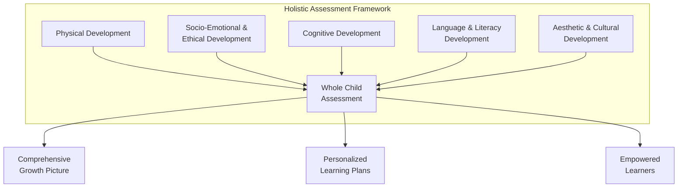

#### Key Features of the Holistic Assessment Framework

The HAF incorporates several key features that distinguish it from traditional assessment approaches:

**Learner-centricity** positions students at the center of assessment design and implementation. Assessment adapts to individual learner needs, interests, and developmental trajectories rather than imposing uniform standards.

**Personalization** ensures that assessment recognizes each student's unique profile of strengths and growth areas. The HAF reflects in detail the progress as well as the uniqueness of each learner[^39], providing individualized information rather than comparative rankings.

**Differentiation** accommodates diverse learner needs through varied assessment methods and flexible criteria. Students can demonstrate learning through multiple pathways rather than being constrained to single formats.

**Authentic assessment** evaluates learning through meaningful, real-world tasks rather than artificial testing situations. This feature ensures that assessment captures students' ability to apply knowledge in context.

**Participatory approach** involves students actively in the assessment process through self-assessment, peer assessment, and collaborative evaluation. This participation develops metacognitive awareness and learner autonomy.

**Inclusive orientation** ensures that assessment practices honor diverse linguistic, cultural, and experiential backgrounds. Assessment methods are designed to capture what students know rather than privileging particular cultural norms.

#### Varied Assessment Methods in the HAF

The HAF employs diverse assessment methods that together provide comprehensive evidence of student development:

| **Assessment Method** | **What It Captures** | **Alignment with Holistic Empowerment** |
|----------------------|---------------------|----------------------------------------|
| **Observation** | Authentic behavior in natural contexts | Captures development as it occurs naturally |
| **Artifact Analysis** | Evidence of learning through student products | Values diverse forms of expression |
| **Portfolios** | Growth over time across multiple dimensions | Documents developmental trajectory |
| **Storytelling** | Narrative understanding and expression | Honors oral traditions and personal voice |
| **Self-Assessment** | Metacognitive awareness and self-evaluation | Develops learner autonomy and agency |
| **Peer Assessment** | Collaborative evaluation skills | Builds community and critical thinking |

Teachers implementing the HAF reported that the framework provided opportunities for **personalized assessment, practical application, skill development, and continuous assessment**[^39]. The varied methods ensure that assessment captures the full range of student development while accommodating diverse learning styles and preferences.

#### Research Findings on HAF Implementation

Research on HAF implementation provides compelling evidence for its effectiveness. Teachers who had previously used traditional assessment systems reported dissatisfaction with approaches they characterized as monotonous, limited in scope, primarily focused on cognitive domain, lacking holistic development approach, and exam-centered[^39].

In contrast, teachers implementing the HAF experienced significant benefits:

**Enhanced student engagement** was consistently observed. Students responded positively to the holistic assessment framework, showing high engagement, excitement, and no pressure[^39]. The absence of anxiety-producing evaluation created conditions conducive to authentic learning.

**Improved learning outcomes** resulted from assessment that informed instruction. The framework promoted skill development, functioned as "invisible assessments" seamlessly integrated into learning, and contributed to confidence building[^39].

**Teacher satisfaction** increased as educators found the framework aligned with their professional values. Teachers experienced increased student engagement and greater teacher satisfaction, observing that HAF made learning enjoyable while providing adaptability and flexibility[^39].

**Positive student impacts** extended across multiple dimensions. Teachers observed that HAF had profound positive impacts in areas including improved engagement, self-development, holistic development, creating a stress-free conducive environment, and connecting learning with the real world[^39].

These research findings confirm that holistic assessment approaches can transform educational experience for both students and teachers, creating conditions that support comprehensive development while reducing the anxiety and narrowing associated with traditional assessment.

### 8.4 Formative Assessment Strategies for Continuous Learning

**Formative assessment** represents the cornerstone of assessment aligned with holistic empowerment. Unlike summative assessment that measures learning outcomes at fixed points, formative assessment is embedded throughout the learning process, providing continuous feedback that informs instruction and supports student growth. This section examines formative assessment principles and specific strategies that novice teachers can implement to create assessment-rich learning environments.

#### Principles of Effective Formative Assessment

Seven principles can guide instructor strategies for formative assessments, each contributing to assessment that supports rather than undermines learning:

**Providing clear criteria for good performance** involves explaining criteria and encouraging student discussion and reflection[^99]. When students understand what quality looks like, they can direct their efforts more effectively and evaluate their own progress.

**Encouraging self-reflection** involves asking students to evaluate their own or a peer's work and share what feedback they find valuable[^99]. This principle develops the metacognitive awareness essential for autonomous learning.

**Giving detailed, actionable feedback** involves providing specific feedback tied to predefined criteria, with opportunities to revise[^99]. Feedback that identifies specific strengths and areas for improvement enables students to take concrete action.

**Encouraging dialogue around the formative learning process** involves inviting students to discuss the learning process through mid-semester feedback and small group feedback sessions[^99]. This dialogue positions students as partners in assessment rather than passive recipients.

**Promoting positive motivational beliefs and self-esteem** involves allowing for rewrites/resubmissions to signal that an assignment is designed to promote development[^99]. When students understand that assessment supports growth rather than judgment, they engage more fully.

**Providing opportunities to close the gap between current and desired performance** involves clearly presenting chances for improvement, such as resubmission[^99]. This principle ensures that assessment leads to action rather than merely documenting current status.

**Collecting feedback to shape teaching** involves instructors collecting information from students to provide targeted feedback and instruction, which also promotes metacognition[^99]. This bidirectional feedback ensures that assessment informs instructional decisions.

#### Formative Assessment Techniques and Tools

Effective formative assessment encompasses a range of techniques that enable teachers to gather evidence of student learning in diverse ways. These techniques can include classroom discussions, questioning, observations, student feedback, self-reflections, concept mapping, and the use of digital tools and apps[^100]. The best formative assessment techniques are those that provide real-time analysis and aid, designed to be interactive, ongoing, and informative[^100].

**Classroom Discussions and Questioning** allow teachers to assess understanding by observing participation and probing with follow-up questions[^100]. Effective questioning moves beyond recall to engage students in analysis, synthesis, and evaluation. Teachers can use wait time, follow-up probes, and student-to-student dialogue to deepen understanding while gathering assessment information.

**Exit Tickets** are brief assessments administered at the end of a lesson to quickly gauge understanding[^100]. Students respond to prompts such as "What was the most important thing you learned today?" or "What question do you still have?" Exit tickets provide immediate feedback on lesson effectiveness while promoting student reflection.

**One-Minute Papers** are short written responses where students summarize their learning, promoting metacognition[^100]. Students might write about the main concept from the lesson, a connection to their lives, or a remaining confusion. This technique develops writing skills while providing assessment information.

**Concept Mapping** involves visually organizing key concepts to demonstrate understanding of relationships[^100]. Students create diagrams showing how ideas connect, revealing their mental models and potential misconceptions. Concept maps are particularly valuable for assessing conceptual understanding rather than mere recall.

**Short Quizzes and Tests** can be used formatively to identify areas of strength and weakness[^100]. When used formatively rather than summatively, quizzes provide diagnostic information that guides subsequent instruction rather than final judgments of achievement.

**Journals and Reflections** provide opportunities for students to express their thoughts on their learning[^100]. Regular journaling develops writing skills while building metacognitive awareness and providing teachers with insight into student thinking.

**Observations and Checklists** are used to assess performance during activities[^100]. Teachers systematically observe students during learning activities, using structured checklists to document progress across specific criteria.

The following table organizes formative assessment techniques by their primary function:

| **Function** | **Techniques** | **Implementation Notes** |
|-------------|---------------|-------------------------|
| **Checking Understanding** | Exit tickets, thumbs up/down, quick polls | Quick, frequent checks during instruction |
| **Promoting Reflection** | One-minute papers, journals, self-assessment | Regular opportunities for metacognitive practice |
| **Revealing Thinking** | Concept maps, think-alouds, explanations | Make student reasoning visible |
| **Guiding Discussion** | Questioning, peer dialogue, collaborative boards | Interactive, ongoing throughout lessons |
| **Documenting Progress** | Observations, checklists, portfolios | Systematic collection of evidence over time |

#### Benefits of Formative Assessment for English Language Learners

Formative assessment offers particular benefits for English Language Learners who need continuous feedback and support as they develop proficiency. The ongoing nature of formative assessment allows teachers to identify emerging misconceptions, provide targeted scaffolding, and adjust instruction in real time.

Formative assessments improve student learning by allowing teachers to better understand students' misconceptions and areas of difficulty[^99]. For ELLs, this understanding is especially critical because language development involves complex, nonlinear processes that require responsive instruction.

The benefits extend beyond academic outcomes to motivation and engagement. Formative assessments can bolster students' motivation to learn, their metacognition, as well as their performance on summative assessments[^99]. When ELLs receive regular, supportive feedback rather than periodic high-stakes evaluation, they develop confidence and willingness to take the linguistic risks essential for language acquisition.

#### Holistic Formative Assessment: Integrating Multiple Perspectives

**Holistic formative assessments** retain the attributes of holistic learning and incorporate both formative and summative assessments. They focus on a broader understanding of learning by casting a wide net to understand the whole child, accounting for multiple learning perspectives from both inside and outside the classroom[^101].

Holistic formative assessments have several distinctive characteristics:

They **assess learning that occurs in multiple locations**—beyond the classroom, including at home and in the community[^101]. This comprehensive scope recognizes that learning extends beyond school walls and that assessment should capture development wherever it occurs.

They **include multiple perspectives**—from teachers, parents, caregivers, and community members[^101]. This multi-perspective approach provides richer information than teacher assessment alone and honors the knowledge that families and communities contribute.

They **assess beyond cognition** by also looking at a student's access to, participation in, and opportunities and supports for learning[^101]. This broader focus ensures that assessment captures the conditions for learning as well as learning outcomes.

They **dig deep for information not otherwise available**, such as languages spoken at home or student perspectives on their strengths[^101]. This in-depth exploration reveals important information that standardized assessment cannot capture.

They **span wide**, considering multiple learning domains and addressing missed learning opportunities from previous weeks, months, or even school years[^101]. This comprehensive temporal scope ensures that assessment captures developmental trajectories rather than isolated snapshots.

The benefits of holistic formative assessments include uncovering new insights about learning interests and styles, enabling a strength-based approach, supporting curriculum mapping, providing inclusive assessment for mixed-ability classrooms, and mitigating bias through culturally responsive and comprehensive approaches[^101]. Research shows these approaches improve student outcomes and result in a more equitable learning experience[^101].

### 8.5 Portfolio-Based Assessment for Documenting Holistic Growth

**Portfolio assessment** provides a comprehensive approach to capturing student development across multiple dimensions over extended time periods. Unlike discrete assessments that capture performance at single points, portfolios document the trajectory of growth, providing rich evidence of development that supports both instructional planning and student reflection. This section analyzes portfolio assessment's theoretical rationale, essential characteristics, and practical implementation procedures.

#### Theoretical Rationale for Portfolio Assessment

Portfolio assessment emerged partly in response to the limitations of standardized testing and its incompatibility with process-oriented, learner-centered instruction. Educators increasingly recognized that traditional assessment techniques were inconsistent with current classroom practices, particularly those emphasizing communicative competence, process learning, and holistic development[^102].

The rationale for portfolio assessment in English language education rests on three main considerations:

**The limitations of single-measurement assessment** make portfolios necessary. No single test score can accurately report a student's overall progress. ESL educators typically combine formal and informal assessment techniques to monitor student language development, and portfolio assessment responds to the need for integrating these multiple measurements[^102].

**The complexity of language proficiency** requires multifaceted assessment. Language ability comprises many layers of knowledge, skills, and abilities that cannot be captured through any single measure. From theoretical perspectives including communicative competence and academic language proficiency, a diversified measurement approach including both test and non-test methods is needed to identify student strengths and weaknesses across all critical areas[^102].

**The need for adaptive assessment** in diverse classrooms makes portfolios valuable. Portfolio assessment offers adaptability that may provide higher curriculum and instructional validity than standardized tests, with data continuously available for formative use. Portfolios can address the linguistic, cultural, and educational diversity in ESL classrooms and assess a greater variety of higher-level skills[^102].

#### Five Characteristics of Model Portfolio Programs

A model portfolio program possesses five essential characteristics that distinguish it from mere collections of student work:

**Comprehensive** assessment uses formal and informal techniques, focuses on both learning processes and products, seeks to understand student development across cognitive, metacognitive, and affective domains, includes teacher, student, and objective perspectives, and emphasizes both academic and informal language development[^102].

**Predetermined and systematic** implementation means the portfolio procedure is planned before implementation, with clear purposes, collection methods, and analysis procedures established in advance. This systematic approach ensures that portfolios serve educational purposes rather than becoming unfocused collections[^102].

**Informative** portfolios provide meaningful, usable information for teachers, students, staff, and families. The information must be relevant for instructional and curriculum adjustments, supporting responsive teaching[^102].

**Customized** portfolios are adapted to their specific purposes, classroom goals, and individual student assessment needs. Rather than imposing uniform requirements, effective portfolio programs respond to contextual demands[^102].

**Authentic** portfolios provide student information based on assessment tasks that reflect the genuine activities used in classroom instruction. This authenticity ensures that portfolio evidence represents meaningful learning rather than artificial test performance[^102].

The following table contrasts portfolio assessment with traditional assessment approaches:

| **Dimension** | **Traditional Assessment** | **Portfolio Assessment** |
|--------------|---------------------------|-------------------------|
| **Scope** | Single measurement at one point | Multiple measures over time |
| **Focus** | Products only | Processes and products |
| **Perspective** | Teacher/external only | Multiple perspectives including student |
| **Adaptability** | Standardized, uniform | Customized to context and learner |
| **Authenticity** | Artificial test situations | Real classroom activities |

#### Portfolio Assessment Model for ESL

The portfolio assessment model for ESL includes six interrelated assessment activity levels that guide systematic implementation:

**Level 1: Determining purpose and focus** involves establishing a portfolio development committee and focusing the portfolio on specific goals. Clear purpose guides all subsequent decisions about content, analysis, and use[^102].

**Level 2: Planning portfolio contents** includes selecting assessment procedures, specifying portfolio contents, and determining assessment frequency. Decisions at this level ensure that portfolios capture relevant evidence systematically[^102].

**Level 3: Designing portfolio analysis** involves setting standards and interpretation criteria, determining information integration procedures, and assigning analysis responsibilities. This level ensures that portfolio evidence is evaluated consistently and meaningfully[^102].

**Level 4: Preparing for instructional use** includes planning instructional applications and providing feedback to students and families. This level connects assessment to teaching and learning, ensuring portfolios inform practice[^102].

**Level 5: Establishing validation procedures** involves building systems for checking information reliability and validating decisions. These procedures ensure that portfolio-based conclusions are trustworthy[^102].

**Level 6: Implementing the model** brings all components together in coordinated practice[^102].

#### Practical Implementation of Portfolio Assessment

For novice teachers implementing portfolio assessment, several practical considerations guide effective practice:

**Determining portfolio purpose** requires reflection on what the portfolio will be used for and who will use it. Purposes might include documenting growth over time, demonstrating achievement of standards, supporting student reflection, communicating with families, or informing instructional decisions. Purpose should guide all subsequent decisions[^103].

**Establishing selection criteria** involves determining what evidence will be included and how selections will be made. Students can co-construct the portfolio selection criteria, first expressing the end goal and then developing a specific checklist for deciding what to include[^103]. This collaborative approach develops student ownership and metacognitive awareness.

**Creating structure and organization** ensures that portfolios are manageable and coherent. Each content area should have a subfolder in the portfolio. In addition to content-specific goals, students should also be able to demonstrate interpersonal skills like communication, collaboration, and self-regulation[^103].

**Incorporating reflection** transforms portfolios from collections into learning tools. After students make their selections, they should write standards-based reflections about what the pieces demonstrate. Because younger students won't necessarily understand how to do this right away, teachers should scaffold the process and adjust the language of the standards to be more kid-friendly[^103].

**Using portfolios for communication** extends their value beyond classroom use. At the end of each school year, students should discuss the goals they've set and met as well as new goals for the following year. Throughout the school year, students can be taught to lead their conferences with their parents to review the portfolio work[^103].

**Considering alternatives to traditional testing** positions portfolios as meaningful alternatives. If educators genuinely want to know what students know and can do, they should have a universal portfolio system in place that allows students to gather evidence of learning over time[^103]. Learning is nuanced, and assessment should be, too[^103].

### 8.6 Self-Assessment and Peer Assessment for Student Empowerment

**Self-assessment and peer assessment** strategies transform students from passive recipients of evaluation to active participants in the assessment process. These approaches align directly with holistic empowerment's emphasis on developing learner autonomy, agency, and metacognitive awareness. This section examines the theoretical foundations of these approaches, their benefits for student development, and practical implementation guidance.

#### Theoretical Foundations and Benefits

Peer and self-assessment strategies mark a shift from teacher-centered to student-centered approaches, helping students become active participants in the evaluation process. By evaluating their own work and that of their peers, students develop critical thinking skills and deepen their understanding[^104].

**Peer assessment** occurs when students evaluate their classmates' work, while **self-assessment** involves judging one's own performance. Both methods engage students directly in the evaluation process[^104]. This engagement develops capacities that extend far beyond assessment skills:

**Metacognitive development** results from the reflective processes involved in self and peer assessment. Done properly, peer assessment builds metacognitive skills, sparks higher-order thinking, boosts student responsibility, and creates channels for diverse feedback[^104]. Students learn to think about their own thinking, developing awareness of learning processes that supports autonomous learning.

**Critical thinking enhancement** occurs as students analyze, critique, and reflect on work. These approaches develop critical thinking and self-regulation by challenging students to analyze, critique, and reflect[^104]. The evaluative stance required for peer and self-assessment develops analytical capacities applicable across domains.

**Self-regulation improvement** results from regular practice in evaluating one's own work. Meta-analyses reveal significant positive effects of self-assessment on self-regulation (effect sizes from d=0.23 to 0.65) and self-efficacy (d=0.73)[^104]. These effects demonstrate that self-assessment develops the self-regulatory capacities essential for autonomous learning.

**Deep learning stimulation** occurs through the reflective engagement these approaches require. These methods stimulate students' deep-level learning and critical thinking[^104]. Surface approaches to learning are insufficient for effective self and peer assessment; students must engage deeply with content and criteria.

**Holistic feedback opportunities** emerge when students receive multiple perspectives on their work. Peer assessment provides holistic feedback opportunities by giving students multiple perspectives on their work, which helps develop judgment skills and internalize quality standards[^104].

**Transformed teacher role** results from sharing assessment responsibility with students. These strategies transform the teacher's role from sole evaluator to learning guide and facilitator[^104]. This transformation aligns with holistic empowerment's vision of teachers as facilitators rather than authorities.

#### Self-Assessment: Developing Autonomous Learners

**Self-assessment** involves students applying success criteria related to a learning goal, reflecting on their efforts, identifying improvements, and adjusting the "quality" of their work[^105]. When teachers explicitly teach students to become effective self-assessors, they become empowered to take charge of their own learning[^105].

Meaningful self-assessment contributes positively to student learning and achievement when implemented effectively. The process develops students' capacity to evaluate their own work against criteria, identify areas for improvement, and take action to enhance quality—capacities essential for lifelong learning.

**Prerequisites for effective self-assessment** include students being accustomed to using learning intentions and success criteria and receiving feedback[^105]. Students need clear understanding of what quality looks like before they can evaluate their own work against those standards.

**Introducing self-assessment** requires systematic scaffolding. Teachers should provide guided opportunities to self-assess, give feedback on the quality of self-assessments, and teach students how to use feedback to set learning goals[^105]. This scaffolded approach builds capacity progressively rather than expecting immediate proficiency.

**Practical self-assessment techniques** that teachers can implement include:

- Asking students to **highlight the best section of their work and explain why**[^105]
- Having students **identify where they have met success criteria**[^105]
- Requesting students **write one question they would like answered in feedback**[^105]
- Using **reflection time** for students to consider their learning[^105]
- Implementing **thumbs up/traffic lights** for quick self-assessment of understanding[^105]
- Using **exit cards** where students reflect on learning before leaving[^105]
- Conducting **3,2,1 activities** (3 things learnt, 2 questions, 1 insight)[^105]

**Making self-assessment routine** ensures that students develop assessment skills over time. Support involves making self-assessment a regular part of learning and explicitly teaching the language of self-assessment[^105]. When self-assessment becomes habitual, students internalize the reflective practices that support autonomous learning.

#### Peer Assessment: Learning Through Evaluating Others

**Peer assessment** involves students reflecting on the work of their peers against success criteria related to a learning goal and providing constructive feedback[^105]. This process benefits both the assessor, who develops evaluative skills, and the assessed, who receives peer perspective.

Peer assessment occurs best when students are accustomed to a cycle of assessment feedback action, using learning intentions and success criteria, and receiving improvement feedback from their teacher[^105]. These prerequisites ensure that peer assessment builds on established assessment literacy.

**Introducing peer assessment** requires careful preparation:

- **Involve students in defining success criteria** so they understand what they are evaluating[^105]
- **Work with exemplars** to establish shared understanding of quality[^105]
- **Teach students how to apply criteria** systematically[^105]
- **Provide guidance** on giving constructive feedback[^105]
- **Support students with prompts and sentence starters** for feedback language[^105]

**Supporting effective peer assessment** involves multiple strategies:

- **Combining peer assessment with teacher feedback** provides multiple perspectives[^105]
- **Developing peer assessment tools like checklists and rubrics** structures the process[^105]
- **Using the gradual release of responsibility model** builds capacity progressively[^105]
- **Having students co-develop ground rules** establishes expectations for respectful feedback[^105]

**Practical peer assessment activities** include having students:

- Assess work against success criteria[^105]
- Identify successes and areas for improvement[^105]
- Sign their comments to promote accountability[^105]
- Provide specific, actionable feedback using established criteria

#### Addressing Implementation Challenges

Despite their advantages, self and peer assessment face challenges that teachers must address:

**Reliability and validity concerns** arise because assessment accuracy can be compromised by biases like self-enhancement bias and generosity bias[^104]. Students may overestimate their own performance or hesitate to provide critical feedback to peers.

**Confidence and skill deficits** create challenges because many students initially lack confidence and skills in evaluation, creating anxiety[^104]. Without adequate preparation, students may struggle to assess effectively.

**Strategies for addressing challenges** include:

- **Using detailed rubrics with specific criteria** provides clear guidance for evaluation[^104]
- **Limiting assessments to prevent fatigue** ensures quality engagement[^104]
- **Implementing anonymity** reduces social pressure in peer assessment[^104]
- **Providing thorough training** builds necessary skills[^104]
- **Fostering a supportive classroom culture** creates safety for honest assessment[^104]

Successful implementation depends on thoughtfully chosen tools and approaches. Rubrics and checklists offer clear evaluation criteria. Reflection journals prompt students to think deeply about their learning progress. Portfolios capture evidence of growth over time. Digital platforms allow anonymous peer review[^104]. Educators should start with low-stakes activities, demonstrate effective feedback techniques, and encourage reflection[^104].

The following table summarizes implementation guidance for self and peer assessment:

| **Implementation Element** | **Self-Assessment** | **Peer Assessment** |
|---------------------------|--------------------|--------------------|
| **Prerequisites** | Understanding of criteria and feedback | Established feedback cycle |
| **Introduction** | Guided opportunities, teacher feedback | Exemplars, criteria development |
| **Support** | Regular practice, explicit language teaching | Tools, gradual release |
| **Challenges** | Self-enhancement bias | Generosity bias, social pressure |
| **Solutions** | Clear rubrics, training | Anonymity, supportive culture |

### 8.7 Authentic Assessment for Real-World Language Application

**Authentic assessment** evaluates students' ability to apply knowledge in real-world contexts, moving beyond artificial testing situations to meaningful demonstrations of learning. This approach aligns with holistic empowerment's emphasis on relevant, meaningful learning that prepares students for genuine communication and participation in the world beyond school.

#### Defining Authentic Assessment

Authentic assessment requires students to engage with a problem or task that is contextualized within a realistic environment and assesses the knowledge, skills, and attitudes required in the workplace, community, and for lifelong learning. It is a form of assessment in which students are asked to perform real-world tasks that demonstrate meaningful application of essential knowledge and skills[^106].

An assessment considered to be authentic must ensure five characteristics:

**Realistic, real-life situations** that replicate authentic scenarios provide the context for assessment. Tasks should mirror the kinds of challenges students will encounter outside school, ensuring that assessment measures applicable knowledge rather than test-taking skills[^106].

**Clear objectives and goals** ensure students understand what is expected. Transparency about assessment purposes and criteria supports student success and reduces anxiety[^106].

**Collaboration and teamwork opportunities** develop desirable real-life skills. Authentic tasks often require working with others, reflecting the collaborative nature of most real-world endeavors[^106].

**Formative orientation** means assessment occurs constantly and continuously to generate a holistic evaluation. Rather than single high-stakes events, authentic assessment is embedded throughout learning[^106].

**Feedback and reflection** with consistent, timely, specific, and constructive input supports ongoing improvement. Authentic assessment emphasizes growth through feedback rather than judgment through grades[^106].

#### Benefits of Authentic Assessment

Authentic assessment offers multiple benefits aligned with holistic empowerment:

**Real-life skill development** occurs through engagement with authentic tasks. Authentic assessment nurtures real-life skills by engaging students in authentic tasks like group projects or case studies, which require utilizing skills such as problem-solving and teamwork[^106].

**Inclusive learning support** results from flexible demonstration options. Authentic assessment supports an inclusive learning environment by embracing the core values of the UDL framework, encouraging multiple means of representation. It allows for flexibility in how students demonstrate learning, through options like creating a video or compiling a portfolio[^106].

**Meaningful evaluation for English Language Learners** makes authentic assessment particularly valuable in diverse classrooms. Authentic assessments assess students' ability to apply knowledge in real-world scenarios, such as interviews, demonstrations, and portfolios. This assessment type serves as a meaningful way to evaluate ELLs' English language proficiency and content knowledge[^107]. Incorporating these performance-based assessments provides English language learners with opportunities to make connections between their lives and the curriculum[^107].

#### Building Authentic Assessment Activities

Creating authentic assessment involves two main components: a real-life task for students to perform and a rubric for evaluation[^106]. The development process includes several steps:

**Step 1: Define clear activity outcomes** by reflecting on the desirable knowledge and skills, reviewing course objectives, and writing observable, measurable outcomes[^106]. Clear outcomes guide both task design and evaluation.

**Step 2: Create an authentic task** that replicates real-world challenges, allows students to construct their own responses, and creates opportunities for interaction and feedback[^106]. Tasks should be genuinely meaningful rather than artificially constructed.

**Step 3: Design assessment rubrics** that promote fairness, measure performance against learning outcomes, and save grading time[^106]. Rubrics provide clear criteria that support both assessment and learning.

**Step 4: Provide sufficient student support and guidance** through self, peer, and group assessment; social annotation; and synchronous or asynchronous discussion forums[^106]. Support ensures that students can succeed with authentic tasks.

**Step 5: Select suitable technology** to support the authentic assessment process, ensuring authenticity and scalability[^106]. Technology should facilitate rather than complicate authentic assessment.

#### Examples of Authentic Assessment Activities

Authentic assessment can take many forms depending on learning objectives and student needs:

**Case study analysis** involves students interacting with a case study, discussing solutions in groups, producing a report undergoing peer review, and delivering a presentation with feedback[^106]. This multi-stage process mirrors professional problem-solving.

**Group projects** where students interview a company, prepare a business plan, engage in peer review, deliver a presentation, and participate in group feedback and self-evaluation[^106] develop collaborative skills alongside content knowledge.

Additional authentic assessment examples include:

| **Assessment Type** | **Description** | **Skills Assessed** |
|--------------------|-----------------|---------------------|
| **Demonstrations** | Students show how to perform tasks | Application, communication |
| **Portfolios** | Collections documenting growth over time | Reflection, self-evaluation |
| **Interviews** | Oral exchanges demonstrating knowledge | Speaking, thinking on feet |
| **Performances** | Presentations, dramatic readings, speeches | Expression, communication |
| **Projects** | Extended investigations with products | Research, synthesis, creativity |

#### Considerations for English Language Learners

Authentic assessment holds particular promise for English Language Learners because it allows multiple ways to demonstrate learning beyond written English proficiency. However, implementation requires attention to potential challenges.

Challenges to consider when using authentic assessments include that they may take longer to grade and cannot be scaled up to a school, district, or state level[^107]. These practical considerations require teachers to balance authentic assessment with other approaches.

Effective authentic assessment for ELLs:

- Provides multiple modalities for demonstrating learning
- Connects to students' cultural backgrounds and experiences
- Includes appropriate scaffolding and support
- Allows use of home language resources where appropriate
- Focuses on content knowledge rather than English proficiency alone

### 8.8 Assessment Accommodations and Scaffolding for Diverse Learners

Equitable assessment requires intentional design to ensure that all learners—particularly English Language Learners—can demonstrate what they know. This section examines strategies for scaffolding assessments to maintain academic rigor while ensuring accessibility, addressing the engineering of assessments to capture content knowledge rather than measuring English proficiency alone.

#### Principles of Equitable Assessment Design

Assessment equity requires that evaluation practices measure what they intend to measure rather than inadvertently privileging students with particular linguistic or cultural backgrounds. For English Language Learners, assessments designed without appropriate scaffolding become reading comprehension tests that fail to capture students' actual content knowledge.

The fundamental principle guiding equitable assessment is that **scaffolding does not reduce academic standards**—it makes instructions more comprehensible and helps students produce more accurate responses. Assessments do not need to be less rigorous for multilingual students; lower standards would not develop grade-level skills or build content knowledge. Instead, standards should remain high while the appearance and formatting of exams and the instructions in reports are changed.

This principle has important implications:

- Assessments should measure content knowledge, not English proficiency
- Scaffolding enables demonstration of learning, not easier tasks
- Equity requires removing linguistic barriers, not lowering expectations
- All students deserve access to rigorous content with appropriate support

#### Strategies for Scaffolding Assessments

Multiple scaffolding strategies help ensure that assessments capture what students know:

**Writing synonyms behind unfamiliar academic words** supports comprehension without reducing content expectations. For example, an engineered sentence could be: "Identify (list) all the adaptations of the walrus (see image) to survive (live) in an aquatic (water) habitat." Adding pictures and providing synonyms for unfamiliar words supports comprehension while words taught in the unit do not need synonyms.

**Providing sentence starters or frames** scaffolds student production. A sentence starter supports students in beginning their response, while a sentence frame prompts students to provide specific information at specific points. Examples include:
- Sentence starter: "The most important symbol in this piece of art is..."
- Sentence frame: "The artist, [name], chose to symbolize [concept] with the [object] because..."

**Using visual supports** including pictures, graphic organizers, and diagrams reduces reliance on text alone. Visual supports are crucial for English Language Learners developing vocabulary and comprehension skills, and research shows that visual learning tools can reduce cognitive load.

**Providing guiding questions and prompts** helps students know what content to communicate. For example, for a section about a leader's power, guiding questions might include: "How did the leader make decisions? What did the leader not allow citizens to do? What systems did the leader use to control people?" These prompts make communicating ideas more concrete and specific.

**Allowing home language use** for initial responses supports students in demonstrating content knowledge. Multilingual students developing English proficiency can first produce answers in another language they are more academically fluent in, then move these ideas into English.

The following table summarizes scaffolding strategies:

| **Scaffolding Strategy** | **Implementation** | **Purpose** |
|-------------------------|-------------------|------------|
| **Synonyms** | Add familiar words in parentheses | Support vocabulary comprehension |
| **Sentence frames** | Provide structured response templates | Scaffold academic language production |
| **Visual supports** | Include images, diagrams, organizers | Reduce linguistic load |
| **Guiding questions** | Provide specific prompts | Clarify expectations |
| **Home language options** | Allow initial responses in L1 | Access content knowledge |

#### Engineering Reports and Extended Assessments

Extended assessments like reports require particular attention to scaffolding. Reports can be engineered to be more equitable without watering down academic expectations through systematic design:

**Creating a template** that provides instructions and space for student ideas structures the task clearly. Templates guide students through required components while allowing individual expression.

**Clearly identifying all required parts** and sequencing them logically reduces confusion about expectations. Students understand what they need to produce and in what order.

**Writing guiding questions and prompts** helps students know what content to communicate in each section. Specific prompts make abstract requirements concrete.

**Offering sentence starters and frames** embedded in instructions scaffolds academic language production. Students can focus on content while receiving linguistic support.

Through these engineering strategies, multilingual students can **communicate as mathematicians, architects, biologists, historians**, demonstrating content knowledge without being limited by English proficiency.

#### Culturally Responsive Assessment

Equitable assessment extends beyond linguistic scaffolding to cultural responsiveness. Assessment practices should honor students' cultural backgrounds rather than privileging dominant cultural norms.

Culturally responsive assessment characteristics include:

- **Multiple demonstration options** that accommodate diverse cultural communication styles
- **Content connections** to students' cultural backgrounds and experiences
- **Recognition of diverse knowledge** that students bring from their communities
- **Avoidance of cultural bias** in assessment content and formats
- **Family communication** about assessment in accessible, culturally appropriate ways

When assessments are engineered to preemptively support multilingual students and designed with cultural responsiveness, assessment becomes an equitable, more reliable tool for learning and evaluation.

### 8.9 Practical Implementation Guidance for Novice Teachers

This final section synthesizes the chapter's content into actionable recommendations for novice teachers transitioning from traditional to holistic assessment approaches. The guidance addresses starting points, time-efficient strategies, common challenges, and frameworks for ongoing development.

#### Starting Points for Transitioning to Holistic Assessment

Novice teachers should approach assessment transformation gradually, building confidence and competence over time rather than attempting comprehensive change immediately:

**Phase 1: Foundation Building (First Weeks)**
- Establish classroom climate that supports risk-taking and reduces anxiety
- Learn about students' backgrounds, strengths, and needs
- Begin regular informal check-ins to gauge understanding
- Introduce simple self-reflection practices (exit tickets, thumbs up/down)

**Phase 2: Formative Integration (First Months)**
- Implement regular formative assessment techniques throughout instruction
- Introduce self-assessment with clear criteria and scaffolding
- Begin peer feedback with structured protocols and sentence starters
- Experiment with multiple ways for students to demonstrate learning

**Phase 3: Portfolio Development (First Semester)**
- Establish portfolio structures with clear purposes and organization
- Teach students to select and reflect on work samples
- Develop rubrics collaboratively with students
- Begin authentic assessment tasks with appropriate scaffolding

**Phase 4: Comprehensive Implementation (First Year and Beyond)**
- Integrate holistic assessment across all dimensions
- Refine self and peer assessment practices based on experience
- Develop systematic portfolio assessment procedures
- Advocate for assessment practices aligned with holistic empowerment

#### Time-Efficient Assessment Strategies

Novice teachers face significant time constraints that require efficient assessment approaches:

**Embed assessment in instruction** rather than treating it as separate activity. Formative assessment techniques like questioning, observation, and quick checks occur naturally during teaching, requiring no additional time.

**Use technology strategically** to streamline assessment tasks. Digital tools can facilitate quick polls, collaborative boards, and portfolio organization, reducing administrative burden.

**Develop reusable assessment tools** including rubrics, checklists, and reflection prompts that can be adapted across multiple assessments.

**Involve students in assessment** through self and peer evaluation, distributing assessment responsibility while developing student capacities.

**Prioritize feedback quality over quantity**, focusing on specific, actionable feedback for selected work rather than comprehensive comments on everything.

#### Common Challenges and Solutions

| **Challenge** | **Solution** |
|--------------|-------------|
| **Student unfamiliarity with self-assessment** | Begin with simple reflections; scaffold progressively; provide models |
| **Peer assessment quality concerns** | Train students explicitly; use structured protocols; combine with teacher feedback |
| **Time for portfolio management** | Establish routines; use digital platforms; integrate into instruction |
| **Resistance to non-traditional assessment** | Communicate rationale to families; document student growth; maintain academic rigor |
| **Balancing formative and summative demands** | Use formative data to inform summative assessment; advocate for policy alignment |

#### Reducing Student Anxiety While Maintaining Meaningful Feedback

A central goal of holistic assessment is reducing the anxiety that traditional assessment produces while maintaining meaningful feedback that supports growth:

**Create psychological safety** through assessment practices that emphasize growth over judgment. When students understand that assessment supports their development rather than categorizing them, they engage more fully.

**Provide feedback that empowers** by focusing on specific strengths and actionable improvements rather than grades or rankings. Feedback should help students understand what they did well and how they can improve.

**Separate feedback from grades** when possible, providing substantive feedback before or without grades to focus attention on learning rather than evaluation.

**Normalize mistakes as learning opportunities** by celebrating productive struggle and using errors as teaching moments rather than failures.

**Offer multiple attempts** and revision opportunities that communicate assessment's developmental purpose. When students can improve their work based on feedback, assessment becomes a tool for learning.

#### Framework for Ongoing Assessment Development

Effective assessment practice requires continuous reflection and refinement:

**Reflect regularly** on assessment effectiveness by asking:
- Are students less anxious and more engaged with assessment?
- Does assessment capture development across multiple dimensions?
- Are all students able to demonstrate what they know?
- Does assessment inform instructional decisions?
- Are students developing assessment capacities?

**Seek student feedback** about assessment experiences. Students can provide valuable perspective on what helps their learning and what creates unnecessary stress.

**Collaborate with colleagues** to share effective practices, troubleshoot challenges, and develop collective expertise in holistic assessment.

**Document student growth** to demonstrate the effectiveness of holistic approaches. Evidence of student development supports advocacy for assessment practices aligned with holistic empowerment.

**Continue learning** through professional development, research, and experimentation. Assessment practice should evolve as understanding deepens and contexts change.

#### The Empowering Potential of Holistic Assessment

When implemented thoughtfully, assessment aligned with holistic empowerment transforms educational experience for both students and teachers. Students develop as **confident, capable, self-directed learners** who can evaluate their own work, set goals, and take ownership of their growth. Teachers gain **rich information** about student development across multiple dimensions, enabling responsive instruction that meets diverse needs.

The research on holistic assessment implementation confirms this transformative potential. Teachers observed that students responded positively, showing high engagement and no pressure[^39]. The framework promoted skill development, functioned as "invisible assessments" seamlessly integrated into learning, and contributed to confidence building[^39]. These outcomes demonstrate that assessment can indeed function as a tool for empowerment when designed according to holistic principles.

For novice teachers, developing expertise in holistic assessment represents an investment that pays dividends throughout their careers. Assessment practices that support rather than undermine learning create classrooms where students thrive—not despite assessment but through assessment that honors their development as whole persons. This vision of assessment aligned with holistic empowerment offers a path toward educational practice that genuinely serves students' comprehensive growth as language learners and human beings.

## 9 Teacher Development and Self-Care in Holistic Teaching Practice

The transformation of elementary English education toward holistic empowerment depends ultimately upon the teachers who bring this paradigm to life in classrooms each day. While previous chapters have established the theoretical foundations, pedagogical strategies, and assessment approaches that constitute holistic empowerment, the sustainability and effectiveness of this paradigm rest upon a critical yet often overlooked factor: **the professional development and wellbeing of teachers themselves**. Novice teachers entering the profession with idealistic visions of student-centered, empowering instruction frequently encounter the sobering reality that implementing holistic approaches demands exceptional professional competencies, emotional resources, and sustained commitment that traditional teacher preparation may not adequately address.

This chapter investigates the professional development needs and self-care practices essential for teachers implementing holistic empowerment approaches in elementary English education, with particular focus on novice teachers navigating the challenging early years of their careers. The analysis recognizes a fundamental truth that holistic education philosophy itself illuminates: just as students cannot learn effectively when their basic needs are unmet, **teachers cannot sustain empathetic, whole-child teaching when their own wellbeing is compromised**. The demands of holistic empowerment—building relationships with diverse learners, responding to trauma, differentiating instruction, engaging families, and attending to multiple developmental dimensions simultaneously—require teachers who are themselves well-resourced, supported, and continuously developing.

The evidence for prioritizing teacher wellbeing is compelling and concerning. Research indicates that **nearly half of all K–12 teachers in the U.S. report feeling burned out "always" or "very often"—a higher rate than any other profession**[^108]. Teachers are 40% more likely to report anxiety symptoms than nurses, and a University of Missouri study found 78% of educators had considered leaving the profession due to workloads, resources, and lack of support[^108]. These statistics underscore that educator wellbeing is not a peripheral concern but the bedrock of effective teaching that deserves real, sustained support[^108]. For novice teachers specifically, the challenges are particularly acute: a third of beginning teachers quit within their first three years on the job, representing both personal loss and systemic failure to retain promising educators[^109].

This chapter provides novice teachers with the knowledge, strategies, and frameworks necessary to develop essential professional competencies while sustaining their capacity for the demanding work of holistic empowerment. The discussion draws on research regarding teacher wellbeing, compassion fatigue, professional resilience, mentorship, and reflective practice to offer evidence-based recommendations that enable teachers to thrive while serving diverse learners. The ultimate goal is to help novice teachers recognize that **investing in their own development and wellbeing is not selfish but essential**—both for their own flourishing and for the students whose comprehensive development depends upon teachers who can bring their best selves to the classroom each day.

### 9.1 Essential Competencies for Holistic English Teaching

Implementing holistic empowerment in elementary English education requires a distinctive constellation of professional competencies that extend far beyond traditional conceptions of teaching expertise. While content knowledge and pedagogical skills remain important, holistic teaching demands additional capacities that enable teachers to address the multidimensional developmental needs of diverse learners while maintaining rigorous academic instruction. This section identifies and analyzes the core competencies that novice teachers must develop to effectively implement the holistic empowerment paradigm.

#### Cultural Sensitivity and Culturally Responsive Pedagogy

**Cultural sensitivity** represents a foundational competency for holistic English teaching, particularly given the linguistic and cultural diversity that characterizes contemporary elementary classrooms. As established in Chapter 5, effective instruction for diverse learners requires teachers who can recognize, value, and strategically leverage students' cultural and linguistic backgrounds rather than viewing diversity as a deficit to be remediated.

Culturally responsive teaching involves **leveraging students' cultural and linguistic experiences** and utilizing their background knowledge to make learning relevant and meaningful[^6]. Teachers who develop this competency can connect curriculum content to students' lives, honor home languages as assets rather than obstacles, and create classroom environments where all students see their identities reflected and valued. Research demonstrates that teachers who received professional development on culturally responsive practices saw increases in reading scores among their English language learners within a single school year, confirming the practical importance of this competency[^6].

Developing cultural sensitivity requires ongoing attention to several dimensions:

| **Dimension** | **Key Practices** | **Development Strategies** |
|--------------|------------------|---------------------------|
| **Self-Awareness** | Examining own cultural assumptions and biases | Reflective journaling, professional learning on implicit bias |
| **Cultural Knowledge** | Learning about students' backgrounds and communities | Family engagement, community partnerships, cultural research |
| **Responsive Pedagogy** | Adapting instruction to honor diverse backgrounds | Curriculum review, incorporating diverse perspectives |
| **Communication** | Bridging cultural differences in interaction styles | Learning cultural communication norms, using interpreters effectively |

The development of cultural sensitivity is not a one-time achievement but a continuous process requiring ongoing learning, reflection, and adaptation. Novice teachers should approach this competency with **cultural humility**—recognizing that every person brings their own background, experiences, and values, and approaching differences with respect and willingness to learn[^6].

#### Second Language Acquisition Knowledge

Teachers implementing holistic empowerment in English education must possess substantive knowledge of **second language acquisition (SLA) principles** and their classroom applications. This knowledge enables teachers to design instruction that aligns with how language is actually acquired rather than relying on intuitive but potentially ineffective approaches.

Key SLA principles that inform holistic English teaching include:

**Comprehension typically develops before production**, meaning students understand more than they can express[^6]. This principle suggests that teachers should not interpret silence or limited verbal output as lack of understanding and should provide opportunities for students to demonstrate comprehension through nonverbal means before expecting verbal production.

**Conversational language develops more quickly than academic language**, explaining why students may appear fluent in social contexts while struggling with academic tasks[^6]. This principle underscores the need for explicit instruction in academic language alongside content learning, recognizing that social fluency does not automatically transfer to academic contexts.

**Language learning requires meaningful input in low-anxiety environments**. Research confirms that language learning must occur in an environment where the learner is "undefended" and the affective filter (anxiety) is low for input to be noticed and enter the learner's thinking[^6]. Teachers must therefore attend to classroom climate as a prerequisite for effective language instruction.

Teachers also need understanding of how **first language supports second language acquisition**. Rather than viewing home languages as obstacles, SLA research demonstrates that continued development of home language supports rather than hinders English acquisition[^6]. This knowledge enables teachers to encourage families to maintain home language use and to allow strategic use of first language in classroom learning.

Professional development in SLA knowledge should be ongoing rather than limited to initial preparation. As one research study noted, teachers expressed need for more rigorous English language development curriculum and better assessment tools for tracking student progress, alongside professional learning in language development[^6].

#### Trauma-Informed Practice Competencies

Given the prevalence of trauma among student populations—with approximately **two in three children nationwide experiencing at least one traumatic event by age 16**—trauma-informed practice represents an essential competency for holistic English teaching[^6]. Teachers must understand how trauma affects learning and behavior and possess strategies for creating supportive environments that enable trauma-affected students to engage in learning.

Trauma-informed competencies encompass several dimensions:

**Understanding trauma's neurobiological impact** helps teachers recognize that challenging behaviors often reflect neurological states rather than willful defiance. When students experience ongoing stress or fear, the amygdala becomes overactive, elevated cortisol levels interfere with memory formation, and the prefrontal cortex functions less effectively[^6]. This understanding transforms how teachers interpret and respond to student behavior.

**Implementing trauma-sensitive practices** involves creating predictable routines, establishing psychological safety, and responding to dysregulation with co-regulation rather than punishment. Research indicates that schools implementing trauma-sensitive practices report positive effects including fewer office referrals, improved test scores, and reduced suspensions[^6].

**Recognizing secondary traumatic stress** in oneself is also essential. Teachers working intensively with trauma-affected students are themselves vulnerable to vicarious traumatization, making self-awareness about one's own responses a necessary competency.

The development of trauma-informed competencies requires both initial training and ongoing professional learning. Schools should provide **extensive staff training on trauma-informed instruction** as part of comprehensive support systems[^6]. Novice teachers should seek out professional development opportunities focused on trauma-sensitive practices and recognize that developing expertise in this area is a career-long endeavor.

#### Emotional Intelligence Capacities

**Emotional intelligence (EI)** represents perhaps the most foundational competency for holistic teaching, underlying and enabling all other professional capacities. Research indicates that people with high emotional intelligence are often more successful than those with high intellectual intelligence but low EI, which is why educators are challenged to integrate practices that nurture all aspects of an individual[^13]. This finding applies to teachers themselves: those with well-developed emotional intelligence are better equipped to build relationships, manage classroom dynamics, respond to student needs, and sustain their own wellbeing.

The Collaborative for Academic, Social, and Emotional Learning (CASEL) framework identifies five core competencies that constitute emotional intelligence:

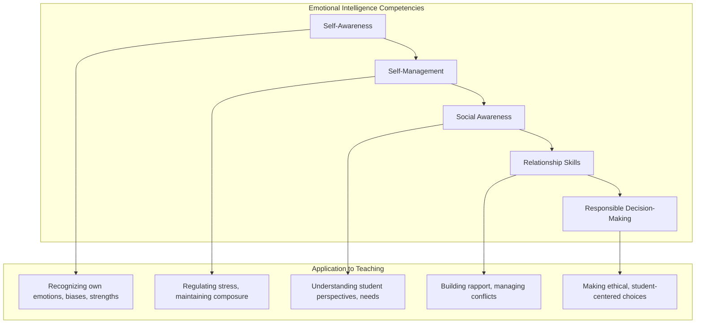

**Self-awareness** involves recognizing one's own emotions, thoughts, and values and understanding how they influence behavior. For teachers, this includes awareness of personal biases, triggers, and emotional patterns that affect classroom interactions.

**Self-management** encompasses regulating emotions, thoughts, and behaviors effectively in different situations. Teachers with strong self-management can maintain composure during challenging moments, model emotional regulation for students, and manage stress productively.

**Social awareness** includes the ability to take the perspective of others, demonstrate empathy, and recognize diverse social and cultural norms. This competency enables teachers to understand students' experiences and respond with sensitivity.

**Relationship skills** involve establishing and maintaining healthy relationships, communicating clearly, cooperating with others, and managing conflict constructively. These skills are foundational to the student-teacher relationships that holistic empowerment requires.

**Responsible decision-making** encompasses making caring and constructive choices about personal behavior and social interactions based on ethical standards and concern for others' wellbeing.

Research emphasizes that successful implementation of social-emotional learning begins with adults' own skill development; teachers must develop their own social-emotional competencies before effectively nurturing these in students[^6]. Professional development focused on educator SEL competencies should therefore be prioritized alongside training in student-focused approaches.

#### Integration of Competencies in Practice

These four core competencies—cultural sensitivity, SLA knowledge, trauma-informed practice, and emotional intelligence—do not operate in isolation but function as an **integrated professional capacity** that enables holistic teaching. A teacher responding to a struggling English Language Learner, for example, draws simultaneously on:

- **Cultural sensitivity** to understand how the student's background shapes their learning experience
- **SLA knowledge** to recognize appropriate expectations and effective instructional strategies
- **Trauma-informed awareness** to consider whether trauma may be affecting the student's engagement
- **Emotional intelligence** to respond with empathy and maintain relationship while addressing challenges

The development of these integrated competencies requires sustained professional learning that addresses not only knowledge and skills but also the **attitudes and dispositions** that enable their effective application. As one framework notes, teacher competencies encompass professional knowledge, skills, and attitudes/values[^110]. Novice teachers should approach competency development as a career-long journey requiring ongoing reflection, learning, and growth.

### 9.2 Understanding Teacher Wellbeing Within a Holistic Framework

The holistic empowerment paradigm that guides this research paper applies not only to students but to teachers themselves. Just as holistic education recognizes that students cannot learn effectively when their basic needs are unmet, teachers cannot sustain effective practice when their own wellbeing is compromised. This section establishes the theoretical and empirical foundations for prioritizing teacher wellbeing as essential to holistic teaching practice.

#### The Multidimensional Nature of Educator Wellness

Educator wellbeing, like student development, encompasses **multiple interconnected dimensions** that must be addressed comprehensively rather than in isolation. Professional development frameworks increasingly recognize this multidimensional nature, organizing educator wellness across four primary dimensions: physical, mental, emotional, and social[^111].

**Physical wellness** encompasses sleep, nutrition, and physical activity—the foundational physiological requirements that enable sustained professional functioning. Teachers who neglect physical wellness experience fatigue, reduced cognitive capacity, and diminished resilience that compromise their teaching effectiveness.

**Mental wellness** addresses cognitive functioning, including the ability to manage decision fatigue, maintain focus, and engage in effective problem-solving. Teachers make over 1,500 decisions in a day[^112], creating cognitive demands that require intentional management to prevent exhaustion.

**Emotional wellness** involves awareness, understanding, and healthy regulation of emotions. Teachers experience intense emotional demands—absorbing student trauma, managing frustration, maintaining enthusiasm—that require developed emotional capacities and intentional self-care.

**Social wellness** encompasses relationships, trust, and sense of purpose within professional communities. Teachers who feel isolated or unsupported experience diminished wellbeing that affects both their personal lives and professional effectiveness.

The following table illustrates specific wellness routines across these four dimensions:

| **Dimension** | **Key Routines** | **Focus Areas** |
|--------------|-----------------|-----------------|
| **Physical** | Food, movement, sleep | Energy, health, physical resilience |
| **Mental** | Decision, balance, efficacy | Stress management, cognitive functioning |
| **Emotional** | Awareness, understanding, mindfulness | Healthy emotional responses, self-regulation |
| **Social** | Relationship, trust, purpose | Positive connections, professional community |

Professional development programs increasingly address these multiple dimensions comprehensively. The Wellness Solutions for Educators framework, for example, is designed to help educators bring their best self to work each day by strengthening work-life balance, implementing positive routines for sustained well-being, identifying opportunities for growth across all four dimensions, and rediscovering their passion for education[^111].

#### Applying Maslow's Hierarchy to Teacher Wellbeing

**Maslow's Hierarchy of Needs**, which earlier chapters applied to understanding student learning, provides equally valuable insight into teacher wellbeing. The theory demonstrates that teachers' basic needs must be met before they can function effectively in their professional roles[^111].

When teachers' physiological needs are compromised through inadequate sleep, poor nutrition, or physical exhaustion, their capacity for the demanding work of holistic teaching diminishes significantly. When safety needs are threatened through job insecurity, hostile work environments, or overwhelming demands, teachers cannot fully engage in creative, responsive instruction. When belonging needs remain unmet through professional isolation or unsupportive school cultures, teachers lose the relational foundation that sustains commitment and effectiveness.

This framework suggests that **teacher self-care is not selfish but foundational** to effective practice. Schools that expect teachers to serve students' comprehensive needs while neglecting teachers' own needs create unsustainable conditions that ultimately harm both educators and students. Self-Care for Educators training appropriately utilizes Maslow's hierarchy of needs to help teachers develop personalized self-care plans that address foundational requirements[^111].

#### The Unique Demands of Holistic Empowerment Approaches

Teachers implementing holistic empowerment face **distinctive demands** that intensify the need for wellbeing support. Unlike traditional instruction focused narrowly on academic content delivery, holistic teaching requires:

**Relational intensity** as teachers build meaningful relationships with each student, understand their backgrounds and needs, and maintain responsive connections throughout the year. This relational work is emotionally demanding and requires sustained emotional resources.

**Multidimensional attention** as teachers simultaneously address cognitive, social-emotional, physical, and creative development rather than focusing on a single domain. This comprehensive attention increases cognitive and emotional load.

**Responsive flexibility** as teachers adapt instruction to diverse learner needs, respond to emerging situations, and balance structure with student autonomy. This flexibility requires ongoing decision-making that depletes cognitive resources.

**Emotional labor** as teachers absorb student distress, manage classroom emotions, and maintain positive affect even during challenging moments. The emotional labor of teaching—including absorbing student trauma and compassion fatigue—is highlighted as a significant demand[^108].

**Family engagement** as teachers build partnerships with diverse families, navigate cultural differences, and extend their professional relationships beyond the classroom. This extended engagement adds to already substantial workloads.

These distinctive demands mean that teachers implementing holistic approaches may be particularly vulnerable to exhaustion and burnout without adequate support. The very qualities that make holistic teaching effective—deep engagement, emotional attunement, comprehensive attention—can become sources of depletion if not balanced with intentional self-care and institutional support.

#### Educator Wellbeing as Foundation for Student Success

Research increasingly demonstrates that **educator wellbeing directly affects student outcomes**. Teachers who experience chronic stress, burnout, or emotional exhaustion cannot provide the responsive, empathetic instruction that holistic empowerment requires. Conversely, teachers who maintain their wellbeing can sustain the relational and instructional quality that supports student development.

This connection operates through multiple pathways:

**Instructional quality** depends on teachers having the cognitive and emotional resources to plan effectively, respond flexibly, and maintain engagement. Depleted teachers default to less effective, more routinized instruction.

**Relationship quality** requires teachers who can be emotionally present, patient, and responsive. Teachers experiencing burnout often withdraw emotionally, damaging the relationships foundational to holistic empowerment.

**Modeling** of social-emotional competencies requires teachers who themselves demonstrate healthy emotional regulation, stress management, and self-care. A dysregulated adult cannot effectively regulate a child or model healthy coping.

**Retention** of effective teachers depends on sustainable working conditions. When experienced teachers leave the profession due to burnout, students lose access to the expertise and relationships that support their development.

The conclusion that educator wellbeing is the bedrock of effective teaching[^108] reflects this understanding that teacher self-care is not separate from student-centered practice but essential to it. Schools and teachers who prioritize educator wellbeing ultimately serve students better than those who sacrifice teacher wellness in pursuit of student outcomes.

### 9.3 Compassion Fatigue, Burnout, and Building Resilience

Teachers implementing holistic empowerment approaches face significant risks of **compassion fatigue and burnout** that can undermine both their personal wellbeing and professional effectiveness. Understanding these risks and developing strategies for building resilience is essential for novice teachers seeking to sustain their commitment to holistic teaching throughout their careers.

#### Distinguishing Burnout and Compassion Fatigue

While often used interchangeably, **burnout and compassion fatigue** represent distinct phenomena with different causes and manifestations. Understanding this distinction helps teachers identify their experiences accurately and respond appropriately.

**Burnout** is defined as chronic workplace stress not successfully managed, characterized by exhaustion and detachment[^6]. Burnout develops gradually through sustained exposure to demanding work conditions and manifests as emotional exhaustion, depersonalization, and reduced sense of personal accomplishment. Teachers experiencing burnout may feel depleted, cynical about their work, and ineffective in their professional roles.

**Compassion fatigue** includes feelings of depression and exhaustion from helping work[^6]. Unlike burnout, which results from general workplace stress, compassion fatigue specifically arises from the emotional demands of caring for others who are suffering. Teachers who work intensively with students who have experienced trauma, poverty, or other adversity are particularly vulnerable to compassion fatigue.

The following table contrasts these two conditions:

| **Characteristic** | **Burnout** | **Compassion Fatigue** |
|-------------------|------------|----------------------|
| **Primary Cause** | Chronic workplace stress | Emotional demands of helping others |
| **Development** | Gradual accumulation | Can develop rapidly after intense exposure |
| **Core Experience** | Exhaustion, cynicism | Secondary traumatic stress, emotional depletion |
| **Specific Triggers** | Workload, lack of control, insufficient support | Exposure to others' suffering, empathic engagement |

Symptoms of burnout and compassion fatigue overlap significantly and include chronic fatigue, forgetfulness, physical symptoms, mood changes, and isolation[^6]. Teachers may experience difficulty sleeping, increased irritability, withdrawal from colleagues and students, and diminished sense of purpose or effectiveness.

#### The Cycle of Compassion Fatigue

Compassion fatigue typically progresses through identifiable stages that teachers can learn to recognize:

The **Zealot/Idealist stage** characterizes many novice teachers who enter the profession with passionate commitment to making a difference. While this enthusiasm is valuable, it can lead to overextension and neglect of self-care.

The **Irritability stage** emerges as sustained demands begin depleting emotional resources. Teachers may become more easily frustrated, less patient with students and colleagues, and more critical in their thinking.

The **Withdrawal stage** develops as teachers begin protecting themselves by reducing emotional engagement. This withdrawal may manifest as reduced investment in relationships, avoidance of challenging situations, and emotional distancing from students' struggles.

The **Zombie stage** represents advanced compassion fatigue where teachers go through motions without genuine engagement. At this stage, teachers may remain physically present but emotionally absent, unable to provide the responsive, empathetic teaching that holistic empowerment requires[^6].

Recognizing this progression enables teachers to intervene early before reaching advanced stages. Warning signs in earlier stages—increased irritability, emerging withdrawal tendencies—signal the need for intentional self-care and support-seeking before more serious depletion develops.

#### Building Compassion Resilience

**Compassion resilience** is defined as the ability to maintain well-being while responding compassionately[^6]. Unlike simply avoiding compassion fatigue, resilience involves building capacities that enable sustained empathetic engagement without depletion. Building compassion resilience involves attention to four interconnected components:

**Heart** focuses on relationships and emotions. Strategies include nurturing supportive relationships both within and outside the profession, processing difficult emotions through healthy channels, and maintaining connections that provide emotional sustenance. Teachers need relationships where they can be vulnerable, receive support, and experience care rather than always being the caregiver.

**Spirit** addresses core values, rest, and play. Strategies include connecting to purpose and meaning in teaching, prioritizing rest and renewal, and engaging in activities that bring joy and restoration. Teachers who lose connection to their sense of purpose become vulnerable to cynicism and disengagement.

**Strength** encompasses care for the body. Strategies include physical activity, nutrition, and sleep—the physiological foundations that enable emotional resilience. Teachers cannot sustain emotional demands without adequate physical resources.

**Mind** focuses on school and work. Strategies include maintaining professional boundaries, engaging in ongoing learning that sustains intellectual engagement, and developing cognitive frameworks that support healthy processing of challenging experiences[^6].

The following diagram illustrates these four components:

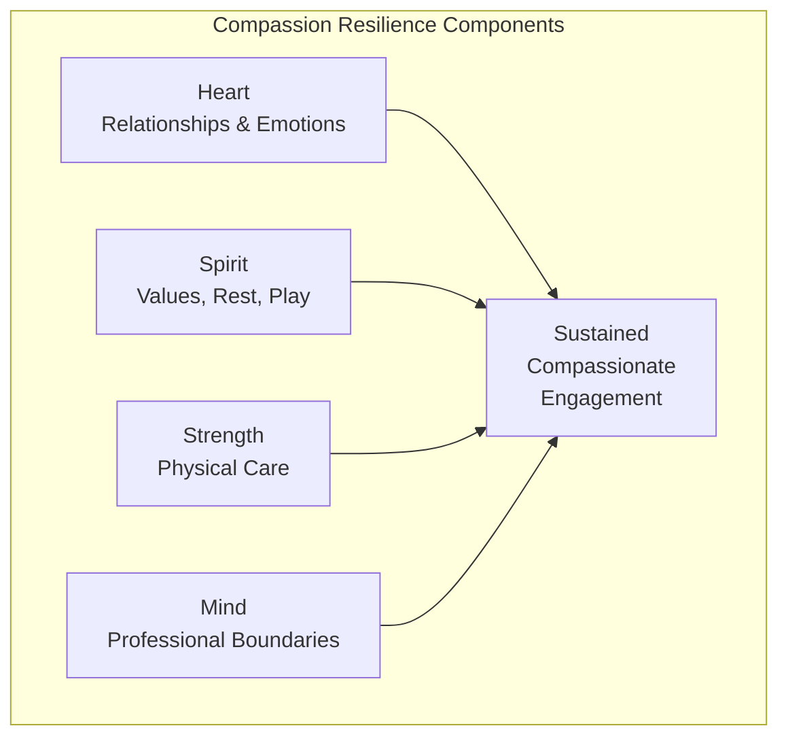

#### Individual and Systemic Approaches to Resilience

Building compassion resilience requires both **individual strategies** and **systemic support**. While teachers can implement personal self-care practices, sustainable resilience depends on institutional conditions that support educator wellbeing.

**Individual strategies** include developing self-care plans that address all four resilience components, recognizing warning signs of compassion fatigue, seeking support when needed, and maintaining boundaries that protect personal resources. Teachers should not wait until they are depleted to begin self-care but should proactively build resilience through consistent practices.

**Systemic approaches** involve building- and district-wide adaptations that address barriers identified through staff surveys, weaving relationship-building into professional development, and revisiting policies and benefits that affect teacher wellbeing[^6]. Schools should examine workload expectations, provide adequate planning time, ensure access to mental health support, and create cultures that normalize self-care rather than celebrating overwork.

The research emphasizes that consistent, sustainable messaging along with reflective practice around one's own mental health, bias, and lived experiences is crucial[^6]. Both individual teachers and school systems share responsibility for creating conditions that support educator wellbeing and prevent compassion fatigue.

### 9.4 Reflective Practice as Professional Development

**Reflective practice** represents a powerful approach to professional development that enables teachers to continuously improve their holistic teaching practice through systematic examination of their work. Unlike professional development that relies solely on external expertise, reflective practice positions teachers as generators of knowledge who develop their own theories of teaching through careful analysis of experience.

#### Defining Reflective Practice

Thomas S. C. Farrell defines reflective practice as **a systematic, evidence-based approach** for language teachers to investigate their work, moving beyond simple wondering or "navel-gazing"[^113]. Reflective practice enables teachers to articulate what they do, how and why they do it, and the impact of their teaching on student learning. This systematic approach distinguishes professional reflection from casual thinking about teaching.

Farrell critiques narrow "fix-it" approaches that focus solely on problem-solving within the classroom, which can become ritualized, mechanical exercises using checklists[^113]. Instead, he advocates for a **more holistic approach** that encompasses not only cognitive aspects but also the moral, ethical, social, affective, and political dimensions of teaching[^113]. This holistic orientation aligns with the comprehensive nature of holistic empowerment, recognizing that teaching involves the whole person addressing the whole child within complex social contexts.

The purpose of reflective practice is for teachers to **develop their own theories of teaching**, becoming generators of knowledge rather than consumers of experts' knowledge[^113]. This empowerment orientation positions teachers as professionals capable of constructing understanding through systematic inquiry rather than simply implementing externally developed prescriptions.

#### Farrell's Five-Stage Holistic Framework for Reflection

Farrell presents a **five-stage, holistic Framework for Reflecting on Practice** that provides comprehensive structure for teacher reflection[^113]:

**Stage 1: Philosophy** involves reflecting on the "teacher-as-person," examining one's background, heritage, ethnicity, socioeconomic background, family, and personal values to understand the roots of one's practice[^113]. This stage addresses the fundamental question "Who am I?" and recognizes that teaching emerges from the teacher's whole identity and life experience.

**Stage 2: Principles** involves reflecting on one's assumptions, beliefs, and conceptions about teaching and learning, often accessed through metaphors or maxims[^113]. Teachers examine the underlying beliefs that guide their practice, making tacit assumptions explicit for examination.

**Stage 3: Theory** involves reflecting on the theories—whether from training, books, or hunches—that underlie lesson planning and practices[^113]. This stage connects classroom decisions to theoretical frameworks, enabling teachers to understand why they make particular choices.

**Stage 4: Practice** involves examining observable classroom actions, comparing them to one's philosophy, principles, and theory to identify convergences or divergences[^113]. This stage grounds reflection in actual teaching behavior, examining what happens in classrooms and how it relates to espoused beliefs.

**Stage 5: Beyond Practice or Critical Reflection** explores the broader moral, political, emotional, ethical, and social issues that impact teaching both inside and outside the classroom[^113]. This stage situates teaching within larger social contexts, examining how power, equity, and social structures affect educational practice.

The following table summarizes these five stages:

| **Stage** | **Focus** | **Key Questions** |
|----------|----------|------------------|
| **Philosophy** | Teacher-as-person | Who am I? What shaped me? |
| **Principles** | Assumptions and beliefs | What do I believe about teaching and learning? |
| **Theory** | Theoretical foundations | What theories guide my practice? |
| **Practice** | Observable actions | What do I actually do? How does it align with my beliefs? |
| **Beyond Practice** | Broader context | What moral, political, social issues affect my teaching? |

#### Modalities for Reflective Engagement

Teachers can engage in reflection through **different modalities** that offer varied benefits and suit different preferences and circumstances[^113]:

**Self-reflection** involves individual examination of one's practice through journaling, analysis of teaching artifacts, or structured reflection protocols. Self-reflection offers flexibility and privacy but may be limited by individual blind spots.

**Peer-reflection** involves working with colleagues to examine practice collaboratively. This may occur with a critical friend who provides honest feedback, in team teaching arrangements where colleagues observe each other, or through peer coaching relationships[^113]. Peer reflection offers external perspectives that self-reflection cannot provide.

**Group-reflection** involves collective examination of practice within professional learning communities, study groups, or collaborative teams. Group reflection enables shared problem-solving and collective knowledge construction.

**Online reflection** utilizes digital tools including blogs, forums, chats, or podcasts to facilitate reflection across time and distance[^113]. Online modalities can connect teachers with broader professional communities and enable asynchronous reflection that fits busy schedules.

Each modality offers distinct advantages, and teachers benefit from engaging in multiple forms of reflection throughout their careers.

#### Tools for Reflective Practice

Several specific **tools** support systematic reflective practice[^113]:

**Teaching Journals** document and analyze experiences over time. Regular journaling creates records that enable teachers to identify patterns, track growth, and examine their development longitudinally. Journals can focus on specific aspects of practice or capture broader reflections on teaching and learning.

**Classroom Observations** using audio/video recordings or peer observations provide evidence of actual teaching practice. Recordings enable teachers to examine their instruction objectively, noticing aspects of their teaching that are invisible in the moment. Peer observations provide external perspectives and opportunities for collegial dialogue.

**Critical Incident Analysis** explores significant, unexpected classroom events that reveal important aspects of practice[^113]. By examining critical incidents—moments of surprise, challenge, or insight—teachers can uncover assumptions and develop deeper understanding of their teaching.

**Teaching Portfolios** serve as evolving collections of professional work that document growth and achievement over time[^113]. Portfolios enable teachers to curate evidence of their practice, reflect on their development, and communicate their professional identity.

#### Dispositions for Reflective Practice

Reflective teachers should possess certain **dispositions** that enable effective engagement in reflective practice. Drawing on John Dewey's work, Farrell identifies three essential dispositions[^113]:

**Open-mindedness** involves considering alternative views and perspectives rather than defending existing beliefs. Open-minded teachers are willing to question their assumptions, consider different interpretations, and revise their thinking based on evidence.

**Responsibility** involves considering the consequences of actions for students and the broader community. Responsible teachers examine the effects of their choices and accept accountability for their professional decisions.

**Wholeheartedness** involves overcoming fears to evaluate oneself honestly. Wholehearted teachers engage in reflection with genuine commitment rather than superficial compliance, willing to confront uncomfortable truths about their practice[^113].

These dispositions enable the honest, sustained engagement that reflective practice requires. Without open-mindedness, reflection becomes defensive justification; without responsibility, it lacks ethical grounding; without wholeheartedness, it remains superficial.

#### Levels of Reflection

Reflection can occur at **three hierarchical levels** of increasing depth and complexity[^113]:

**Descriptive reflection** involves describing events without analysis. At this level, teachers recount what happened in their classrooms but do not yet examine why events occurred or what they mean.

**Conceptual reflection** involves analyzing the reasons behind practices and seeking alternatives. At this level, teachers move beyond description to examine causes, consider different approaches, and justify their choices.

**Critical reflection** involves considering the moral and socio-political implications of practice. At this level, teachers examine how their teaching relates to broader questions of equity, power, and social justice[^113].

Novice teachers typically begin with descriptive reflection and develop capacity for conceptual and critical reflection over time. Professional development should support this progression, providing scaffolding that helps teachers move toward deeper levels of reflective engagement.

#### Benefits of Sustained Reflective Practice

Sustained engagement in reflective practice produces significant benefits for teacher development:

Reflective practice allows for the **correction of errors** in thinking and practice, enabling teachers to identify and address ineffective approaches[^113]. Through systematic examination, teachers can recognize patterns that undermine their effectiveness and develop more productive alternatives.

Reflective practice **enhances self-esteem and confidence** as teachers develop clearer understanding of their practice and its foundations[^113]. Teachers who can articulate what they do and why they do it feel more confident in their professional identity.

Reflective practice **builds resourcefulness** by developing teachers' capacity to analyze novel situations and generate appropriate responses[^113]. Rather than depending on prescribed solutions, reflective teachers can draw on their developing expertise to address new challenges.

A significant challenge is **time**, but reflective practice is presented as a continuous, career-long endeavor central to teacher development and improving student learning opportunities[^113]. While time constraints are real, the benefits of reflective practice justify the investment required.

### 9.5 Mentorship and Induction Programs for Novice Teachers

**Mentorship and comprehensive induction programs** play critical roles in supporting novice teachers as they develop the competencies and resilience necessary for holistic empowerment approaches. Research consistently demonstrates that high-quality mentoring improves teacher retention, enhances teaching practice, and supports the professional development essential for effective holistic teaching.

#### The Critical Need for Beginning Teacher Support

The profession faces significant challenges in retaining new teachers: **a third of beginning teachers quit within their first three years** on the job[^109]. This attrition represents both personal loss for teachers whose careers end prematurely and systemic failure to develop and retain promising educators. At the same time, the profession faces a significant influx of new teachers due to expanding student populations, class-size reduction initiatives, and experienced teachers reaching retirement[^109].

This situation presents both a challenge and an opportunity. The challenge is to provide support so newcomers remain in the profession and develop into effective educators. The opportunity is that new teachers can begin their careers using best known practices without needing to unlearn old habits[^109]. Effective induction programs can shape how novice teachers understand and approach their work from the beginning, establishing foundations for career-long excellence.

Research shows that beginning teachers consistently struggle with challenges such as **classroom management, student motivation, dealing with individual differences, assessing student work, and relations with parents**[^109]. These challenges align directly with the competencies required for holistic empowerment, underscoring the importance of induction programs that address these specific needs.

#### The Continuum of Beginning Teacher Support

Beginning teacher support should be understood as a **continuum** that addresses different needs at different stages of development[^109]:

**Personal and emotional support** addresses the stress, fatigue, and isolation of the first years. Experienced colleagues can serve as a sounding board, assuring beginners that their experience is normal, which promotes well-being and improves retention[^109]. This foundational support creates the psychological safety that enables novice teachers to engage in learning and growth.

**Task- or problem-focused support** helps beginners with basic tasks like lesson planning or parent-teacher conferences, and with specific student challenges. Veteran teachers can guide them, share unwritten expectations, and help expand their repertoire of instructional strategies[^109]. This practical support builds the skills necessary for effective teaching.

**Critical reflection on teaching practice** aims to build beginners' autonomous problem-solving ability. Veterans may start by modeling self-reflection, then gradually reduce guidance, helping beginners learn to prioritize challenges, consider alternatives, and analyze evidence[^109]. This developmental support builds the reflective capacities discussed in the previous section.

This continuum recognizes that novice teachers' needs evolve over time and that effective support must be responsive to these changing needs rather than providing uniform assistance regardless of development stage.

#### Characteristics of Effective Mentoring

Research on teacher mentoring identifies several characteristics that distinguish effective mentoring relationships:

**Mentors provide critical emotional, professional, and pedagogical support**, facilitating integration into the school environment and serving as esteemed role models[^114]. Effective mentors address multiple dimensions of novice teacher development rather than focusing narrowly on instructional techniques.

**Mentor selection and training** significantly affects program quality. Choosing and preparing effective support providers presents challenges since excellent classroom teachers do not automatically make good mentors[^109]. Effective support providers need training in adult interaction and coaching skills, not just subject expertise[^109]. Programs should invest in mentor development rather than assuming that teaching expertise transfers automatically to mentoring.

**The mentor-mentee relationship** should be characterized by trust, regular contact, and appropriate matching. When pairing mentors and mentees, programs should consider physical proximity, grade level, and classes taught to ensure aligned advice and meaningful relationships[^115]. A nonevaluative model promotes greater self-reflection by creating safety for honest examination of practice[^115].

**Financial compensation** for mentors acknowledges the extra responsibilities and cognitive and emotional investment required[^115]. When mentoring is treated as additional unpaid labor, program quality and mentor engagement suffer.

The following table summarizes key elements of effective mentoring programs:

| **Element** | **Characteristics** | **Rationale** |
|------------|--------------------|--------------| 
| **Mentor Selection** | Careful criteria beyond teaching excellence | Good teachers aren't automatically good mentors |
| **Mentor Training** | Adult interaction, coaching skills | Mentoring requires distinct competencies |
| **Matching** | Proximity, grade level, content alignment | Enables relevant support and relationship |
| **Structure** | Regular meetings, observation time | Consistent contact supports development |
| **Compensation** | Financial recognition | Acknowledges investment required |
| **Evaluation Model** | Nonevaluative | Creates safety for honest reflection |

#### Comprehensive Induction Program Components

Effective induction programs extend beyond individual mentoring to provide **comprehensive support systems** at multiple levels[^116]:

**District-wide components** should provide foundational professional learning for all new teachers. The New Teacher Induction Policy example provides a minimum of 30 hours of professional learning for all pre-service, first-year, and second-year teachers, including orientation with foundational and role-specific learning and year-long professional learning aligned to instructional practice frameworks, equity frameworks, and social-emotional learning[^116].

**School-based components** adapt district frameworks to local contexts and needs. Schools should build induction programs that address their specific student populations, school cultures, and instructional priorities[^116].

**Individual support** ensures that each novice teacher receives personalized assistance. Programs should provide in-school mentoring opportunities for new teachers for their first two years, with particular focus on increasing diversity of mentorship in underserved school communities[^116].

All induction activities should be **aligned with broader educational priorities** including instructional frameworks, equity frameworks, and state standards[^116]. This alignment ensures that induction supports novice teachers in developing toward shared professional goals rather than isolated skill development.

#### Program Duration and Structure

Research suggests that effective induction extends beyond a single year. While most programs last one school year, **a better model may extend over two or three years**[^115]. The first year focuses on marrying theoretical knowledge with real-world teaching, while subsequent years allow for exploration of instructional coaching and professional development, moving beyond basic orientation[^115].

Ideally, induction involves **scheduled weekly meetings** of about 45 minutes between mentor and mentee[^115]. This regular contact ensures consistent support and creates opportunities for ongoing dialogue about practice.

Schedules should allow for **reciprocal observations**, enabling novice teachers to observe exemplary teaching in action[^115]. Observation of skilled colleagues provides models that novice teachers can adapt to their own practice while building understanding of effective instruction.

#### Addressing Common Challenges in Induction Programs

Induction programs face predictable challenges that require intentional attention[^109]:

**Providing time** for support activities is a constant logistical and financial challenge. Programs must secure release time for observations and collaborative work, which requires administrative commitment and resource allocation[^109].

**Managing the relationship between support and evaluation** is critical. Most programs keep them separate to ensure confidentiality and trust, though a few combine them with high levels of support[^109]. When mentors are also evaluators, novice teachers may be reluctant to reveal struggles, undermining the program's developmental purpose.

**Directing additional resources to struggling teachers** requires systems for identifying those who need extra support and strategies for providing it. Programs must also have approaches for **counseling unsuited individuals out of the profession** when necessary[^109].

Research on induction programs concludes that less intensive support strategies effectively increase retention and well-being, but **more intensive strategies are more effective at improving teaching practice**[^109]. Implementation requires attention to context and resources, with commitment to learn from initial challenges. The potential payoffs are lower teacher attrition, higher morale, and improved teaching and learning[^109].

### 9.6 Building Supportive Professional Learning Communities

While individual reflection and one-on-one mentoring provide essential support, novice teachers also benefit significantly from **collaborative professional communities** that offer collective resources unavailable through individual effort. This section examines how professional learning communities support novice teachers implementing holistic empowerment approaches.

#### The Value of Collaborative Professional Communities

Research reveals that novice teacher success depends on **a complex network of support** encompassing formal institutional structures and informal networks[^114]. This network includes mentorship programs and induction workshops as formal structures, alongside familial support and cultural connections as informal networks[^114]. Understanding this comprehensive support ecosystem helps novice teachers recognize and cultivate the multiple relationships that sustain their professional development.

Professional learning communities provide benefits that individual support cannot achieve:

**Collective problem-solving** enables teachers to address challenges that exceed individual capacity. When teachers collaborate on shared problems, they can generate more diverse solutions, test approaches collectively, and learn from each other's experiences.

**Emotional support through shared experience** normalizes the challenges of teaching. When novice teachers discover that colleagues face similar struggles, they feel less isolated and more confident that difficulties are surmountable rather than signs of personal inadequacy.

**Diverse perspectives** expand teachers' understanding beyond their individual viewpoints. Colleagues from different backgrounds, with different experiences, and with different expertise can offer insights that individual reflection cannot generate.

**Accountability and motivation** emerge from professional relationships. Teachers who share goals with colleagues and report on progress experience enhanced motivation and follow-through compared to those working in isolation.

#### Induction Workshops as Collective Learning Spaces

**Induction workshops** serve as collective spaces for novice teachers to share experiences and build communities of practice[^114]. These workshops offer group support, empowerment, life skills, and guidance from facilitators[^114]. Unlike individual mentoring, workshops create opportunities for peer learning and collective identity formation.

Effective induction workshops:

- Create structured opportunities for novice teachers to share challenges and successes
- Build connections among new teachers who can support each other
- Provide collective professional learning on shared needs
- Develop group norms and practices that support ongoing collaboration

The workshop format recognizes that novice teachers benefit from connection with peers facing similar challenges, not only from guidance by experienced mentors. Peer relationships formed in induction workshops can provide ongoing support throughout teachers' careers.

#### The Educational Framework as Supportive Ecosystem

The broader **educational framework**, including principals and staff members, offers emotional and pedagogical support, creating a supportive ecosystem for novice teachers[^114]. This ecosystem extends beyond formal mentoring to encompass the relationships and resources available within school communities.

Supportive school cultures provide:

**Administrative support** from principals who understand novice teacher needs and provide appropriate guidance, resources, and encouragement. Principals play crucial roles in establishing expectations, allocating resources, and creating conditions that support new teacher development.

**Collegial relationships** with experienced staff who share knowledge, provide informal guidance, and welcome novice teachers into professional community. These relationships extend support beyond formal mentoring structures.

**Shared professional norms** that value collaboration, continuous learning, and mutual support. School cultures that celebrate teacher development create environments where novice teachers feel safe to learn and grow.

Research emphasizes the significance of **supportive school cultures, meaningful mentoring relationships, and the strength of informal support networks** in promoting novice teachers' well-being and effectiveness[^114].

#### Family Support and Cultural Connections

Research identifies **family support** as a significant factor in novice teacher resilience, particularly family members with professional teaching experience who provide emotional encouragement and professional guidance[^114]. This finding highlights that support for novice teachers extends beyond school contexts to include personal relationships that provide resources for professional development.

**Cultural connections** also contribute to novice teacher support, particularly for teachers from specific cultural backgrounds who draw upon cultural heritage and religious beliefs as resources for resilience[^114]. Teachers bring their whole identities to their professional work, and cultural resources can provide meaning, purpose, and strength that support sustained commitment.

Novice teachers should recognize and cultivate these **independent resources**, including personal attributes, life experiences, cultural heritage, and beliefs that demonstrate self-determination[^114]. Professional development need not come only from formal educational structures; teachers can draw on diverse resources from their lives and communities.

#### Building and Sustaining Professional Community

Novice teachers can take active steps to build professional community:

**Seeking out collaborative relationships** with colleagues who share commitments to holistic teaching. Finding like-minded colleagues enables mutual support and shared learning.

**Participating actively in professional learning opportunities** including workshops, study groups, and collaborative teams. Active participation builds relationships while developing professional knowledge.

**Contributing to community** by sharing experiences, offering support to peers, and participating in collective problem-solving. Community membership involves both receiving and giving support.

**Maintaining connections** over time through ongoing communication, collaborative projects, and mutual assistance. Professional relationships require sustained investment to provide lasting support.

The implications of research on novice teacher support underscore the crucial role of **comprehensive induction and mentoring programs that address emotional, psychological, and professional needs**[^114]. These programs should provide emotional support, opportunities for collaboration and peer learning, and personalized guidance from experienced mentors. Building supportive professional communities represents an essential component of this comprehensive approach.

### 9.7 Practical Self-Care Strategies and Sustainable Practice

This final section provides **actionable guidance** for novice teachers to implement sustainable self-care practices while managing the demands of holistic teaching. The discussion synthesizes research-based strategies across multiple dimensions, offering practical approaches that enable teachers to sustain their effectiveness and wellbeing throughout their careers.

#### Setting Work-Life Boundaries

Setting clear **work-life boundaries** is crucial to maintaining healthy balance and preventing burnout[^117]. Novice teachers, eager to succeed and often uncertain about expectations, may be particularly vulnerable to overwork that compromises their wellbeing and ultimately their effectiveness.

Strategies for establishing boundaries include:

**Designating specific times for work and personal life** and adhering to them consistently. While flexibility is sometimes necessary, regular patterns that protect personal time create sustainable rhythms.

**Avoiding bringing extra work home** when possible. This boundary allows for needed relaxation and disconnection from work[^117]. When work from home is necessary, designating a specific workspace creates mental and physical separation between professional responsibilities and personal time.

**Protecting time for relationships and activities** outside teaching. By prioritizing this boundary, teachers can recharge, spend time with loved ones, focus on self-care and personal hobbies, and ultimately bring their best selves to the classroom each day[^117].

**Communicating boundaries** clearly to colleagues, administrators, and families. When others understand teachers' availability and limitations, they can adjust expectations accordingly.

#### Managing Workload Effectively

Effectively managing workload is a crucial strategy for preventing burnout[^117]. Teachers face numerous demands competing for limited time, requiring intentional approaches to prioritization and efficiency.

Workload management strategies include:

**Prioritizing tasks and setting realistic goals** rather than attempting to accomplish everything simultaneously. Identifying the most important tasks and focusing energy there produces better results than scattered attention across too many priorities.

**Breaking large tasks into manageable chunks** makes overwhelming projects approachable. Complex responsibilities become achievable when divided into smaller, sequential steps.

**Seeking support from colleagues or administrators** when feeling overwhelmed. Asking for help is not weakness but appropriate professional behavior. Maintaining open lines of communication with administration ensures teachers are not overwhelmed by excessive demands[^117].

**Avoiding overcommitment** to extracurricular activities or administrative tasks beyond core responsibilities. Quality over quantity is key—focusing on meaningful, impactful teaching practices leads to more fulfilling and sustainable careers[^117].

**Collaborating with colleagues** to share workload where possible. By sharing ideas, resources, and experiences, educators can tap into collective knowledge, which not only eases workloads but also fosters camaraderie and support[^117].

#### Practicing Time Management

Implementing **structured schedules** significantly enhances productivity and prevents burnout[^117]. Intentional time management creates space for both professional responsibilities and personal wellbeing.

Time management strategies include:

**Allocating specific time slots** for lesson planning, grading, administrative tasks, and personal activities including self-care[^117]. Structured time allocation ensures that important activities receive attention rather than being crowded out by urgent demands.

**Using organizational tools** such as calendars, to-do lists, and time-tracking apps to stay organized[^117]. These tools support intentional time use and help teachers identify patterns in how they spend their time.

**Avoiding overcommitment** by being realistic about what can be accomplished within given timeframes[^117]. Saying no to additional responsibilities when necessary protects time for core professional and personal priorities.

**Batching similar tasks** to increase efficiency. Grouping related activities—such as grading all assignments at once or responding to all emails at designated times—reduces the cognitive cost of switching between different types of work.

#### Embracing Physical, Mental, and Emotional Self-Care

**Self-care across multiple dimensions** is essential for sustained effectiveness. Teachers should prioritize activities that promote physical, mental, and emotional health[^117].

**Physical self-care** includes regular exercise, adequate sleep, and balanced nutrition—the foundational physiological requirements that enable sustained professional functioning[^117]. Neglecting physical health undermines energy, cognitive functioning, and emotional resilience.

**Mental self-care** includes cultivating mindfulness and stress-reduction techniques such as meditation, yoga practices, and deep breathing exercises[^117]. These practices provide tools for managing the cognitive and emotional demands of teaching.

**Emotional self-care** includes nurturing hobbies, spending quality time with loved ones, and seeking moments of relaxation[^117]. Activities that bring joy and restoration replenish emotional resources depleted by teaching demands.

Professional development programs increasingly address these multiple dimensions. Greater Good in Education offers science-backed practices including self-compassion practices for educators who place their wellbeing last, stress management strategies including breath-based grounding techniques and short mindfulness practices, and mindfulness practices including guided breathing and body scans[^108].

#### Staying Passionate and Curious

Maintaining **passion and curiosity** sustains engagement and prevents the cynicism that characterizes advanced burnout[^117]. Teachers who remain intellectually engaged with their work experience greater satisfaction and effectiveness.

Strategies for maintaining passion include:

**Nurturing genuine love for learning** and continuous sense of wonder about teaching and subject matter. Approaching teaching with curiosity keeps the work fresh and engaging.

**Embracing new teaching methods and inspiration** by exploring fresh educational resources and seeking professional development opportunities[^117]. Ongoing learning prevents stagnation and introduces new possibilities.

**Incorporating topics you're passionate about** into curriculum when possible. Sharing enthusiasm with students creates engaging learning experiences while maintaining teacher interest[^117].

**Maintaining open communication with colleagues** and engaging in collaborative projects provides fresh perspectives and ideas[^117]. Professional dialogue stimulates thinking and introduces new approaches.

#### Accessing Professional Development Resources

Numerous **professional development resources** support teacher wellbeing and self-care. Novice teachers should actively seek out these resources as part of their ongoing professional learning.

Free and low-cost resources include:

**Greater Good in Education** from UC Berkeley offers science-backed practices for educator wellbeing, including self-compassion practices, stress management strategies, and mindfulness exercises[^108].

**CASEL Webinar Archive** provides insights into social-emotional learning and educator wellbeing, including webinars on the link between educator wellbeing and SEL implementation, digital well-being, and cultivating adult SEL through staff meetings[^108].

**Coursera courses** from top universities offer self-paced learning on wellbeing topics, including Yale's "Science of Wellbeing" course on happiness psychology, and courses on understanding stress responses and mental health through strengths-based approaches[^108].

**Breathe For Change** hosts free quarterly online conferences offering professional development certificates and features expert speakers on wellness and SEL, alongside a resource library with practical guides on trauma-informed mindfulness, reducing stress and burnout, and managing anxiety[^108].

**Workshops** specifically designed for educator wellbeing address topics including resilience building, values-driven living, and implementing SEL strategies while maintaining educator wellness[^112]. These workshops provide practical strategies and community support for sustainable practice.

#### Developing Personalized Self-Care Plans

Sustainable self-care requires **personalized approaches** that address individual needs, preferences, and circumstances. What works for one teacher may not work for another, and effective self-care plans must be tailored accordingly.

Steps for developing personalized self-care plans include:

**Assessing current wellbeing** across physical, mental, emotional, and social dimensions. Honest evaluation of strengths and areas needing attention provides the foundation for planning.

**Identifying specific strategies** that address identified needs and fit personal preferences and circumstances. Plans should be realistic given teachers' actual lives rather than idealized.

**Setting specific, achievable goals** for self-care implementation. Vague intentions rarely translate to action; specific commitments are more likely to be fulfilled.

**Building accountability** through sharing plans with supportive others or tracking progress systematically. External accountability supports follow-through when motivation wanes.

**Evaluating and adjusting** plans based on experience. Self-care plans should evolve as teachers learn what works for them and as circumstances change.

Workshop approaches emphasize creating **intentional wellbeing plans** using criteria that are specific, positive, realistic, inspiring, goal-oriented, and include set next steps[^112]. This structured approach to self-care planning increases likelihood of sustained implementation.

#### Sustaining Commitment to Holistic Teaching

Ultimately, self-care enables teachers to sustain their commitment to the demanding but rewarding work of holistic empowerment. By prioritizing self-care, setting realistic expectations, seeking support, and maintaining healthy work-life balance, teachers can **preserve their own mental and physical health while providing students with the best possible learning environment**[^117].

The benefits of holistic education—development of emotional intelligence, confidence, social ability, compassion, responsibility, creativity, self-agency, community belonging, teamwork skills, and self-awareness[^13]—extend to teachers who embrace holistic approaches to their own professional lives. Teachers who attend to their comprehensive wellbeing model the holistic development they seek to cultivate in students.

By approaching teaching as a **career-long developmental journey** requiring ongoing attention to both professional competence and personal wellbeing, novice teachers can build sustainable practices that enable them to thrive while serving diverse learners. The investment in self-care is not separate from commitment to students but essential to it—teachers who care for themselves are better positioned to care for the children whose development depends upon their sustained, empathetic, and effective teaching.

## 10 Implementation Challenges and Practical Solutions for Novice Teachers

The transition from understanding holistic empowerment as a theoretical paradigm to enacting it within the daily realities of elementary English classrooms represents one of the most demanding professional challenges novice teachers face. While preceding chapters have established the conceptual foundations, pedagogical strategies, and assessment approaches that constitute holistic empowerment, the actual implementation of these practices occurs within complex institutional environments characterized by competing demands, limited resources, and structural constraints that can undermine even the most committed teacher's efforts. This chapter confronts these implementation challenges directly, providing novice teachers with systematic analysis of the obstacles they will encounter and evidence-based strategies for navigating them successfully.

The challenges facing novice teachers implementing holistic approaches are neither trivial nor easily dismissed. Research consistently documents that **the first year of a teacher's career has great importance as it indicates whether the teacher will stay in the field**[^118]. Novice teachers step into professional life without a gentle adaptation period and are expected to teach like experienced teachers from the first day, simultaneously learning the school environment, policies, procedures, curriculum, and testing requirements[^118]. This baptism by fire is particularly intense for teachers committed to holistic empowerment, which demands competencies in relationship-building, differentiation, cultural responsiveness, and trauma-informed practice that extend far beyond traditional instructional skills.

The evidence for implementation difficulties is substantial and sobering. Researchers have identified that entering the classroom with a lack of experience can cause negative feelings and a sense of isolation, potentially leading to leaving the profession[^118]. High turnover rates represent a significant concern, with **25% to 50% of novice teachers quitting in their first three years and nearly 10% in their first year**[^118]. These statistics underscore that implementation challenges are not merely inconveniences but existential threats to novice teachers' professional survival and, consequently, to students' access to teachers committed to comprehensive development.

This chapter synthesizes research on implementation barriers and effective strategies to provide novice teachers with a realistic yet empowering roadmap for transforming their practice. The analysis acknowledges that holistic empowerment cannot be fully implemented overnight but demonstrates that **gradual, strategic adoption of high-impact practices** can produce meaningful results while building teacher confidence and competence over time. Throughout, the discussion maintains the chapter's dual commitment: honoring the genuine difficulties novice teachers face while providing concrete, actionable guidance for overcoming them.

### 10.1 Mapping the Landscape of Implementation Challenges

Understanding the full scope of implementation challenges is essential before developing strategies to address them. This section provides a comprehensive taxonomy of obstacles novice teachers encounter when implementing holistic empowerment approaches, organizing challenges into systemic, institutional, and individual categories. The analysis reveals how these challenges interconnect and compound each other, creating cumulative barriers that require multifaceted responses.

#### Systemic Challenges: Time Constraints and Workload Pressures

**Time constraints** represent perhaps the most pervasive systemic challenge facing novice teachers implementing holistic approaches. The demands of holistic empowerment—building relationships with each student, differentiating instruction, engaging families, conducting authentic assessments, and attending to multiple developmental dimensions—require substantial time investments that compete with already overwhelming workloads.

Research documents that the workload and the need to deal with a large number of lessons hasten novice teachers' decisions and add to an experience of emotional burden and burnout[^119]. Teachers implementing holistic approaches face additional time demands beyond basic instruction: relationship-building activities, family communication, reflective practice, and professional development all compete for limited hours. The challenge intensifies when teachers must simultaneously learn school systems, curriculum requirements, and professional norms while attempting to implement innovative practices.

The time challenge manifests in multiple dimensions:

| **Time Demand** | **Holistic Practice Requirement** | **Competing Pressure** |
|----------------|----------------------------------|----------------------|
| **Relationship Building** | Individual attention, door greetings, check-ins | Large class sizes, packed schedules |
| **Differentiated Instruction** | Multiple pathways, varied assessments | Standardized curriculum pacing |
| **Family Engagement** | Regular communication, partnership building | Administrative tasks, grading |
| **Authentic Assessment** | Portfolio development, formative feedback | Standardized testing requirements |
| **Professional Development** | Reflective practice, ongoing learning | Immediate classroom demands |

The cumulative effect of these competing demands creates what researchers describe as a "war of survival" for novice teachers[^119]. Without strategic approaches to time management and prioritization, the time challenge alone can derail holistic implementation efforts.

#### Institutional Challenges: Large Class Sizes and Resource Limitations

**Large class sizes** create structural barriers to the individualized attention that holistic empowerment requires. Research on novice English language instructors identified that **having a large class size (40 or more students) is not desirable for language courses**[^120]. Large classes create a huge workload for checking assignments and make it time-consuming to carry out performance-based assessments like debates or individual presentations, which often drag lesson pacing[^120].

The challenge of large class sizes intersects directly with holistic empowerment's core commitments. Building meaningful relationships with each student becomes exponentially more difficult as class size increases. Differentiated instruction that addresses diverse learner needs requires time and attention that must be divided among more students. Authentic assessment approaches that capture multidimensional development demand individualized attention that large classes preclude.

**Limited access to instructional resources** compounds these challenges. Research reveals that a significant challenge for novice teachers is the lack of instructional materials like textbooks and modules, forcing teachers to rely on limited library resources, the internet, and their own resourcefulness[^120]. Teachers report having students research topics online, providing handouts for photocopying, or encouraging students to purchase books—adaptations that require additional time and creativity[^120].

In the context of English Language Arts instruction specifically, research found that **all 12 participants reported disparities in the availability, quality, and appropriateness of instructional materials, often forcing teachers to create or supplement their own resources**[^121]. This resource gap is particularly acute for holistic approaches that require diverse materials to address multiple developmental dimensions and diverse learner needs.

#### Curricular Challenges: Standardization and Testing Pressures

**Curriculum pressures and standardized testing** create tension with holistic empowerment's comprehensive developmental focus. When assessments emphasize narrow linguistic competencies measured through standardized formats, teachers face pressure to narrow their instruction accordingly—even when they recognize the limitations of such approaches.

Research on principled eclecticism in language teaching identifies this tension explicitly: there may be too many systemic constraints placed on teachers for effective implementation, such as mandated testing and pressure to follow a textbook as the sole curriculum[^122]. These pressures can contribute to the feeling that eclectic strategies are doomed to fail[^122]. The challenge intensifies when teacher and school evaluations depend on standardized test scores, creating powerful incentives toward test preparation at the expense of comprehensive development.

The curricular challenge also manifests in pacing pressures. Teachers implementing holistic approaches may find that the time required for relationship-building, social-emotional learning, and authentic assessment conflicts with mandated curriculum pacing guides. When teachers must choose between covering required content and implementing holistic practices, the immediate pressure of curriculum compliance often wins—even when teachers recognize the long-term costs.

#### Individual Challenges: Preparation Gaps and Classroom Management

Beyond systemic and institutional barriers, novice teachers face **individual-level challenges** related to their professional preparation and developing expertise. Research consistently identifies classroom management as a primary challenge for beginning teachers, with one study finding that **93% of cases involved classroom management problems**[^118].

Novice teachers implementing holistic approaches face particular classroom management challenges. The student-centered, relationship-based approaches central to holistic empowerment require different management strategies than traditional teacher-directed instruction. Teachers must maintain productive learning environments while releasing control to students, balancing structure with autonomy, and responding to the diverse needs that holistic attention reveals.

Research on novice English teachers found that they often implement experimental classroom rules and procedures without a solid foundation in research-based techniques, leading to inconsistent enforcement that creates confusion and uncertainty among students[^123]. This reliance on experimental approaches reflects preparation gaps: teachers lack exposure to research-based strategies during their training and have no time to read about modern strategies once they begin teaching[^123].

Additional individual challenges identified in research include:

- **Managing students at different levels** and varying pacing speed[^118]
- **Communicating with parents and students** effectively[^118]
- **Fear of observation** and evaluation[^118]
- **Adaptation to school culture** and unwritten norms[^118]
- **Learning specific school rules and regulations**[^118]
- **Getting student attention** and maintaining engagement[^118]

The following diagram illustrates the interconnected nature of implementation challenges:

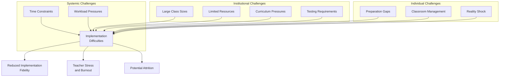

#### The Cumulative Impact on Novice Teachers

The cumulative effect of these interconnected challenges creates what researchers describe as the encounter with reality in the field via metaphors such as **"culture shock" and "baptism by fire"**[^119]. Novice teachers transitioning from the training stage to professional practice meet with difficulties that generate strong feelings of helplessness, loneliness, alienation, foreignness, and insecurity[^119]. At this stage, many teachers tend to "float or drown," and a considerable proportion choose to leave the profession[^119].

Research specifically on novice English teachers reveals that sources of stress encompass managing classroom dynamics, balancing a heavy workload, and adjusting to new responsibilities[^123]. Teachers report being surprised by the many administrative tasks and paperwork beyond teaching, contributing to their stress, while the culture of the school and added responsibilities are sometimes hard to bear, requiring time to adjust[^123].

Understanding this landscape of challenges is not meant to discourage novice teachers but to validate their experiences and prepare them for realistic implementation. The challenges are real and substantial—but as subsequent sections demonstrate, they are also navigable with appropriate strategies, support, and persistence.

### 10.2 Bridging the Gap Between Preparation and Practice

The disconnect between teacher preparation programs and the realities of implementing holistic approaches in diverse elementary classrooms represents one of the most significant barriers novice teachers face. This section examines the nature of this preparation-practice gap, its consequences for holistic implementation, and evidence-based strategies for bridging it through targeted professional development, mentorship, and reflective practice.

#### The Nature of the Preparation-Practice Gap

Research consistently documents a substantial gap between what teachers learn in preparation programs and what they need to know for effective classroom practice. Studies identify that challenges include **clashes between university studies and real-life applications**, effort to finish tasks on time, and adaptation to school culture[^118]. This gap is particularly pronounced for holistic empowerment approaches, which require competencies that traditional preparation programs may not adequately address.

The preparation gap manifests in several specific areas relevant to holistic implementation:

**Cultural responsiveness and linguistic diversity**: Teachers often enter classrooms serving diverse populations without adequate preparation for culturally responsive pedagogy. Research on English Language Learner instruction reveals that teachers have limitations in understanding English learners' unique challenges, second language acquisition, and the effects of poverty and cultural alienation[^6]. This knowledge gap undermines teachers' capacity to leverage students' linguistic and cultural assets as holistic empowerment requires.

**Trauma-informed practice**: Despite the prevalence of trauma among student populations, many preparation programs provide insufficient training in recognizing and responding to trauma's effects on learning. Research indicates that schools are adopting trauma-informed teaching methods to help students cope with chronic stress and trauma's impact on learning and behavior, but teachers need professional development to implement these approaches effectively[^6].

**Social-emotional learning integration**: While holistic empowerment positions social-emotional development as central to instruction, many teachers lack preparation for integrating SEL into academic content. Research demonstrates that teachers desire more rigorous curriculum and professional learning in different teaching, language development, and trauma-informed teaching areas[^6].

**Differentiated and asset-based instruction**: Holistic empowerment requires teachers to recognize and build upon students' diverse strengths, yet preparation programs often emphasize deficit-focused approaches. Research suggests that through integrating English language development strategies in all content areas and teaching content with language objectives, English learner education can be improved—but teachers need preparation to implement these approaches[^6].

#### The Reality Shock Phenomenon

The transition from preparation to practice produces what researchers term **"reality shock"**—a dramatic confrontation with the gap between idealistic expectations and classroom realities. Research describes this initial difficulty upon induction into the teaching profession as the sense of shock experienced by novice teachers, characterized as a "war of survival" and encountering a "practical professional shock"[^119].

The reality shock phenomenon has particular implications for teachers committed to holistic empowerment. Novice teachers may enter the profession with idealistic visions of student-centered, empowering instruction, only to encounter institutional pressures, resource limitations, and classroom complexities that challenge their ideals. The gap between what they hoped to accomplish and what seems possible can produce discouragement, frustration, and questioning of their professional choices.

Research identifies three major categories of problems novice teachers face: **classroom management (93% of cases), human relations (100% of cases), and the political frame (87% of cases)**[^118]. These encompass student behavioral problems, discipline, pacing, parent-student interaction, motivation, learning styles, school culture, collaboration, and cultural understandings[^118]. Each of these problem areas intersects with holistic empowerment implementation, creating multiple fronts on which novice teachers must develop competence simultaneously.

The emotional dimension of reality shock is significant. Research documents that novice teachers experience strong feelings of helplessness, loneliness, alienation, foreignness, and insecurity during the transition to professional practice[^119]. These emotional responses can undermine the confidence and resilience that holistic implementation requires, particularly when teachers lack adequate support systems.

#### Evidence-Based Strategies for Bridging the Gap

Research identifies multiple strategies for helping novice teachers bridge the preparation-practice gap and develop capacity for holistic implementation:

**Targeted Professional Development**: Effective professional development addresses specific competency gaps relevant to holistic implementation. Research emphasizes that implications for teachers include specific and intense training, schedules allowing for team teaching and classroom observation, mentoring for constructive feedback, and forming professional learning communities[^118]. Professional development should address culturally responsive pedagogy, second language acquisition, trauma-informed practice, and differentiated instruction—the core competencies holistic empowerment requires.

The Louisiana Department of Education's guide for novice teachers exemplifies targeted professional development, offering practical, evidence-based strategies for supporting English Learners through a holistic approach that integrates language development with academic content[^124]. Such resources help novice teachers translate theoretical knowledge into classroom practice through specific, implementable strategies.

**Mentorship Structures**: Research demonstrates that mentors support novice teachers in the critical stages of their learning, which affects their ability to engage in teaching and stay in the profession[^119]. Effective mentorship provides emotional, professional, and pedagogical support that helps novice teachers navigate implementation challenges while developing expertise.

Research proposes a **holistic mentorship model** that incorporates traditional mentoring while adapting to contemporary needs. This model includes the mentee participating in weekly meetings with the mentor, quarterly meetings with the mentor and school principal, and access to several mentor experts, each with expertise in a different area (e.g., social-emotional support, classroom culture and management, professional development)[^119]. This comprehensive approach addresses the multiple competency areas holistic empowerment requires.

**Reflective Practice**: Systematic reflection helps novice teachers learn from experience and develop their own theories of teaching. Research emphasizes that using case studies and narratives of experienced teachers can encourage reflective teaching[^118]. Through structured reflection, novice teachers can analyze their implementation efforts, identify what is working and what needs adjustment, and develop increasingly sophisticated understanding of holistic practice.

**Effective Induction Programs**: Comprehensive induction programs are crucial to prevent novices from feeling exhausted and confused[^118]. The right mentors should be properly trained, and programs should include reflective teaching and a supportive atmosphere fostered by school principals[^118]. Effective induction programs address the specific challenges of holistic implementation while providing the emotional support novice teachers need to persist through difficulties.

The following table summarizes strategies for bridging the preparation-practice gap:

| **Strategy** | **Focus** | **Implementation** |
|-------------|----------|-------------------|
| **Targeted PD** | Specific competency development | Workshops on cultural responsiveness, SLA, trauma-informed practice |
| **Mentorship** | Ongoing guidance and support | Regular meetings, multiple mentor experts, observation opportunities |
| **Reflective Practice** | Learning from experience | Journaling, case study analysis, peer dialogue |
| **Induction Programs** | Comprehensive beginning support | Orientation, ongoing professional learning, administrative support |
| **Collegial Interaction** | Peer learning and support | Team teaching, peer observation, professional learning communities |

Research confirms that collegial interaction is a key determinant for developing teaching activities, allowing for sharing feedback and improving practices[^118]. School administrators play a crucial role in organizing gatherings and training activities like peer observation and team teaching[^118]. These collaborative structures help novice teachers develop holistic implementation capacity while building the professional relationships that sustain long-term commitment.

### 10.3 Strategies for Gradual and Sustainable Implementation

Attempting to implement all aspects of holistic empowerment simultaneously is a recipe for overwhelm and failure. This section presents a **phased approach** to implementation that builds teacher confidence and competence progressively while producing meaningful results for students. The analysis provides developmental frameworks, identifies high-impact starting practices, and offers time-efficient strategies that integrate holistic approaches into existing routines.

#### The Rationale for Gradual Implementation

Research on educational innovation consistently demonstrates that gradual, strategic implementation produces better outcomes than rapid, comprehensive change. Teachers who attempt too much too quickly often experience frustration, burnout, and abandonment of reform efforts. In contrast, teachers who begin with foundational practices and expand their repertoire progressively build sustainable expertise.

The Louisiana Department of Education's guide for novice teachers emphasizes this gradual approach, noting that the strategies presented are **holistic and designed to address curriculum pressure** through step-by-step implementation[^124]. The guide presents strategies that novice teachers can implement progressively, building from foundational practices to more complex approaches as confidence develops.

The rationale for gradual implementation includes:

**Cognitive load management**: Novice teachers face enormous cognitive demands as they learn new environments, students, and professional responsibilities. Adding comprehensive holistic implementation to these demands risks cognitive overload. Gradual implementation allows teachers to master foundational practices before adding complexity.

**Confidence building**: Success with initial practices builds confidence that supports subsequent implementation efforts. When teachers experience positive results from relationship-building strategies, for example, they develop motivation and confidence to expand their holistic practice.

**Contextual adaptation**: Gradual implementation allows teachers to adapt practices to their specific contexts. What works in one classroom may require modification in another; phased implementation provides time for this essential adaptation.

**Sustainability**: Practices implemented gradually and integrated into routines become sustainable habits rather than temporary additions. Teachers who rush implementation often abandon practices when initial enthusiasm wanes; gradual implementation builds lasting change.

#### A Developmental Framework for Holistic Implementation

The following framework provides a developmental progression for implementing holistic empowerment practices over the first year and beyond:

**Phase 1: Foundation Building (First Weeks)**

The initial weeks of teaching should focus on establishing the relational and environmental foundations that enable subsequent holistic practice. Research on strategies for English Learners emphasizes that for a new student, creating a calm environment using non-verbal communication, a visual tour of the classroom, and pairing with a kind peer are essential first steps to build trust[^124].

Priority practices for this phase include:

- **Establishing predictable routines** that create psychological safety
- **Learning students' names** and basic information about their backgrounds
- **Implementing door greetings** that acknowledge each student individually
- **Conducting getting-to-know-you activities** that reveal students' interests and needs
- **Creating classroom environment** that reflects student identities and cultures

These foundational practices require relatively modest time investment but establish the relational groundwork essential for holistic empowerment. Research confirms that creating a supportive classroom climate where mistakes are expected is fundamental to student engagement[^124].

**Phase 2: Relationship and Community Development (First Months)**

Building on foundational routines, the second phase focuses on deepening relationships and building classroom community. Research emphasizes that **small group activities create a conversational, low-pressure environment** for language development and relationship building[^124].

Priority practices for this phase include:

- **Regular check-in routines** that monitor student wellbeing
- **Collaborative learning structures** that build peer relationships
- **Home language support** through labeling, visuals, and family collaboration[^124]
- **Play-based learning** that provides natural opportunities for language interaction[^124]
- **Initial differentiation** based on emerging understanding of student needs

This phase expands holistic practice while maintaining focus on manageable additions. Research on effective strategies notes that limiting group sizes to six or fewer helps maintain engagement while building language skills[^124].

**Phase 3: Instructional Expansion (First Semester)**

With relational foundations established, the third phase expands instructional approaches to incorporate more comprehensive holistic practices. Research identifies that **differentiated instruction is essential for meeting varied language proficiency levels**, tailoring strategies to students' needs using scaffolding, culturally responsive teaching, and varied methods[^124].

Priority practices for this phase include:

- **Expanded differentiation** through learning centers and varied activities
- **Formative assessment integration** through observation and ongoing feedback
- **Portfolio development** to document growth across dimensions
- **Family engagement expansion** through regular communication and partnership
- **Student voice and choice** through structured opportunities for autonomy

Research emphasizes that focusing on motivation and learner autonomy by giving students opportunities to set personal learning goals and make choices promotes ownership[^124]. This phase introduces these autonomy-building practices within the supportive structures established earlier.

**Phase 4: Comprehensive Implementation (First Year and Beyond)**

The fourth phase moves toward comprehensive holistic implementation, integrating practices across all dimensions while continuing to refine and adapt based on experience. Research notes that effective support for English Learners requires a collaborative approach among educators, families, and community stakeholders to provide comprehensive support[^124].

Priority practices for this phase include:

- **Authentic assessment** through performance-based evaluation
- **Student-led learning** with increasing autonomy and responsibility
- **Community partnerships** that extend learning beyond the classroom
- **Advocacy** for supportive policies and practices
- **Mentoring** newer colleagues in holistic approaches

The following table summarizes the developmental framework:

| **Phase** | **Timeline** | **Focus** | **Key Practices** |
|----------|-------------|----------|------------------|
| **Foundation** | First weeks | Routines, safety, initial relationships | Greetings, names, environment, getting-to-know-you |
| **Community** | First months | Deepening relationships, community building | Check-ins, collaboration, home language support |
| **Expansion** | First semester | Instructional diversification | Differentiation, formative assessment, portfolios |
| **Comprehensive** | First year+ | Full integration, advocacy | Authentic assessment, student-led learning, partnerships |

#### High-Impact Practices for Initial Implementation

Not all holistic practices require equal investment or produce equal results. Novice teachers should prioritize **high-impact practices** that yield significant benefits with manageable implementation demands. Research identifies several practices that meet this criterion:

**Home Language Support**: Research emphasizes that supporting a child's home language promotes overall language development and academic readiness, with skills learned in one language supporting development in another[^124]. Practical implementation includes labeling classroom objects in both English and students' home languages, using visuals and gestures, and learning key words to ease transitions[^124]. These practices require modest time investment but communicate powerful messages about valuing students' linguistic identities.

**Play-Based Learning**: Research identifies play-based learning as providing natural opportunities for language interaction[^124]. Teachers can enhance language development during play using explicit vocabulary instruction, modeling, repetition, and visual aids[^124]. This approach integrates language development into activities students find engaging, reducing the burden of creating separate instructional time.

**Scaffolding During Book Reading**: Research identifies intentional scaffolds during book reading as supporting comprehension and language development[^124]. Techniques include pointing to words, asking guiding questions, using choral responses, and employing realia and visuals[^124]. These scaffolding strategies can be integrated into existing read-aloud practices with minimal additional time.

**Small Group Activities**: Research emphasizes that small group activities create a low-pressure environment for language development[^124]. Strategies include pre-teaching vocabulary, using picture walks, and scaffolding during read-alouds[^124]. Small group time also offers natural opportunities for ongoing assessment through observation[^124].

#### Time-Efficient Integration Strategies

Given the time constraints novice teachers face, strategies that integrate holistic practices into existing routines are essential. Research provides guidance on efficient integration:

**Rethinking Whole-Group Time**: Research suggests reducing the length of whole-group instruction to 10-15 minutes and incorporating interaction[^124]. Strategies include integrating "turn and talk" activities, pairing students who share a home language, and using visuals, gestures, and real-world objects[^124]. These modifications enhance existing instruction rather than adding separate activities.

**Vocabulary Development Integration**: Research emphasizes building vocabulary in both English and students' home languages, presenting words in context with pictures and objects[^124]. Providing frequent opportunities to use new words in small groups and during activities integrates vocabulary development into ongoing instruction[^124].

**Assessment Through Observation**: Research identifies ongoing assessment as critical, using initial and continuous assessments including observations to monitor progress and adjust instruction[^124]. Gathering information on development in both languages provides a fuller picture of students' abilities without requiring separate testing time[^124].

**Leveraging Transitions**: Transitions between activities provide opportunities for relationship-building, movement, and language practice. Door greetings, attendance check-ins, and transition songs can transform otherwise lost time into holistic practice opportunities.

### 10.4 Adapting Holistic Approaches to Diverse Teaching Contexts

Holistic empowerment principles must be adapted to the specific contexts in which novice teachers work. This section examines how teachers can maintain fidelity to core holistic principles while making necessary modifications for varied institutional settings, student populations, and resource environments.

#### Contextual Factors Affecting Implementation

Research identifies multiple contextual factors that influence how holistic approaches can be implemented:

**School demographics and resources**: Schools serving high-poverty populations face distinctive challenges that affect holistic implementation. Research on one elementary school describes how the school provides support for students and families facing multiple challenges: most students qualify for free or reduced-price meals, families are connected with social agencies for food, clothing, and medical assistance, and the school provides various academic supports including after-school programs and tutoring[^6].

**English Language Learner populations**: Schools with large ELL populations require particular attention to linguistic and cultural responsiveness. Research emphasizes that English learners face numerous challenges related to culture, language, economics, social-emotional needs, and legal status that are interconnected and overlapping[^6]. Holistic implementation must address this full spectrum of needs.

**Administrative support**: The level of administrative support significantly affects implementation possibilities. Research found that eight out of 12 participants shared mixed perceptions of their schools' instructional leadership and collaboration structures, with some feeling supported and others reporting isolation and inconsistent feedback[^121]. Teachers in supportive environments can implement more comprehensive approaches; those with limited support may need to focus on practices they can implement independently.

**Existing school structures**: Schools vary in their existing structures for supporting holistic development. Some schools have adopted comprehensive approaches including trauma-informed teaching, social-emotional learning programs, and family engagement initiatives[^6]. Teachers in such schools can build on existing structures; those in schools without such supports must be more strategic about what they can accomplish independently.

#### Adapting for High-Poverty and High-Need Settings

Research on schools serving high-poverty populations provides guidance for contextual adaptation. One study describes a comprehensive approach that includes **targeted academic instruction, school-wide values and behavioral expectations, family-community outreach, and professional development on trauma-informed schooling**[^6].

Specific adaptations for high-poverty settings include:

**Addressing basic needs**: Research emphasizes that schools must attend to students' physical, social-emotional, and academic needs simultaneously[^6]. Teachers in high-poverty settings may need to prioritize ensuring students have access to food, clothing, and other basic necessities before focusing on academic instruction.

**Trauma-informed approaches**: Research indicates that schools are adopting trauma-informed teaching methods to help students cope with chronic stress and trauma's effects[^6]. Teachers can implement calming strategies, predictable routines, and relationship-focused practices that support students who have experienced adversity.

**Family engagement adaptations**: Research describes programs that provide adult English as a Second Language classes, parenting courses, and guidance on navigating school systems[^6]. Teachers can connect families with available resources while building partnerships that honor families' circumstances and contributions.

**Community partnerships**: Research highlights the value of community partnerships that provide additional support for students and families[^6]. Teachers can identify and connect with community resources that extend the school's capacity to address comprehensive needs.

#### Adapting for Diverse Linguistic and Cultural Contexts

Research provides specific guidance for adapting holistic approaches to serve linguistically and culturally diverse students:

**Leveraging home languages**: Research emphasizes that home language support promotes overall language development and academic readiness[^124]. Teachers can incorporate home language by labeling classroom objects in both English and students' home languages, using pictures and gestures, learning key words, and inviting family members to share words or songs[^124].

**Culturally responsive content**: Research identifies the importance of using learning activities that value students' lives, cultures, and personal interests[^6]. Teachers can adapt curriculum to connect with students' cultural backgrounds, invite community members to share expertise, and select materials that reflect students' identities.

**Differentiated language support**: Research notes that effective differentiation tailors strategies to students' language proficiency levels, learning styles, and cultural backgrounds[^124]. Teachers can provide varied scaffolding based on individual student needs, from beginning language learners who may benefit from video caption translation to more advanced students who need less support[^124].

**Family communication adaptations**: Research emphasizes the value of collaboration among educators, families, and community partners, with communication in preferred languages[^124]. Teachers can utilize translation resources, family liaisons, and multiple communication channels to ensure families can participate as partners.

#### Maintaining Fidelity While Adapting

Contextual adaptation should not compromise core holistic principles. Research on principled eclecticism identifies this tension: the concept promotes integration of eclecticism coupled with intentional decision-making, rooted in theoretical understandings of language acquisition and learner engagement[^122]. Teachers must maintain intentionality in their choices regardless of contextual constraints.

Core principles that should be maintained across contexts include:

**Asset-based orientation**: Regardless of context, teachers should recognize and build upon students' strengths rather than focusing on deficits. Research emphasizes that effective approaches value students' home languages and cultures and acknowledge parents' funds of knowledge[^6].

**Relationship priority**: Building meaningful relationships with students remains foundational across all contexts. Research confirms that creating a positive classroom environment where students feel safe, welcomed, and comfortable is paramount for effective instruction[^6].

**Comprehensive attention**: While specific practices may vary, attention to students' cognitive, social-emotional, physical, and creative development should characterize holistic implementation in all contexts.

**Family partnership**: Engaging families as partners—adapted to their circumstances and preferences—remains essential regardless of contextual factors.

**Student voice and agency**: Providing opportunities for student choice and voice, appropriately scaffolded for developmental level and language proficiency, should characterize holistic practice across contexts.

### 10.5 Navigating Institutional Constraints and Building Advocacy

Novice teachers often find themselves in institutional environments that do not fully support holistic approaches. This section addresses strategies for working within institutional constraints while gradually advocating for more supportive policies and practices.

#### Working Within Mandated Curricula and Assessment Requirements

Research identifies the tension between holistic approaches and institutional requirements. Studies note that pressures for teachers to assume prescribed roles in the classroom create tension with principled, student-centered approaches[^122]. Mandated testing and pressure to follow textbooks as the sole curriculum can challenge teacher autonomy[^122].

Strategies for navigating these constraints include:

**Aligning holistic practices with mandated objectives**: Many holistic practices can be framed as supporting mandated curriculum goals. Research emphasizes that building content knowledge and language competence in tandem is identified as "promising and effective" and supported by a strong evidence base[^125]. Teachers can demonstrate how relationship-building, differentiation, and authentic assessment support the academic outcomes that mandated curricula require.

**Integrating holistic practices within required structures**: Rather than adding holistic practices as separate activities, teachers can integrate them within required instructional time. Research provides examples such as using the MEAL structure for argumentative writing across both English language development and content-area classrooms, providing consistent support while meeting curricular requirements[^125].

**Documenting student growth**: Teachers can build evidence that holistic approaches produce positive outcomes. Research emphasizes the importance of ongoing assessment to monitor progress and adjust instruction[^124]. Documentation of student growth across multiple dimensions provides evidence for advocating expanded implementation.

**Focusing on high-impact practices**: When time is limited by mandated requirements, teachers should prioritize practices with the strongest evidence base. Research identifies five evidence-based instructional practices for supporting English Learners, selected based on frequency, strength of evidence, and practical application[^125]. Focusing on evidence-based practices maximizes impact within constrained conditions.

#### Communicating with Administrators and Families

Effective communication helps build understanding and support for holistic approaches. Research on family engagement emphasizes that effective support requires a collaborative approach that draws on the knowledge of general education teachers, EL service providers, special education staff, and families[^124].

Strategies for effective communication include:

**Using evidence-based language**: Framing holistic practices in terms of research evidence increases credibility with administrators. Research provides extensive documentation of evidence-based practices that teachers can reference when advocating for comprehensive approaches[^125].

**Connecting to shared goals**: Holistic practices support outcomes that administrators and families value, including academic achievement, student wellbeing, and family engagement. Teachers can emphasize these connections when explaining their approaches.

**Sharing student success stories**: Concrete examples of student growth and engagement provide compelling evidence for holistic approaches. Research documents positive outcomes including improved engagement, self-development, and connecting learning with the real world[^6].

**Inviting observation**: Administrators who observe holistic practices in action often become supporters. Teachers can invite administrators to observe specific activities that demonstrate holistic implementation.

#### Building Coalitions and Influencing School Culture

Individual teachers have limited influence on institutional culture, but collective action can produce meaningful change. Research emphasizes that effective support requires collaboration among multiple stakeholders[^124].

Strategies for building coalitions include:

**Connecting with like-minded colleagues**: Teachers committed to holistic approaches can support each other through shared planning, observation, and problem-solving. Research identifies collegial interaction as a key determinant for developing teaching activities[^118].

**Participating in school committees**: Involvement in curriculum, assessment, or professional development committees provides opportunities to advocate for holistic approaches within institutional decision-making processes.

**Sharing resources and strategies**: Teachers who develop effective holistic practices can share them with colleagues, gradually expanding implementation across the school.

**Mentoring newer teachers**: As novice teachers develop expertise, they can mentor incoming teachers in holistic approaches, building a community of practice that sustains implementation over time.

#### Advocacy for Supportive Policies

While individual teachers cannot unilaterally change institutional policies, they can contribute to advocacy efforts that promote more supportive conditions. Research provides frameworks for understanding what supportive policies might include:

**Professional development resources**: Research emphasizes the need for ongoing and targeted professional development[^121]. Teachers can advocate for professional learning opportunities that address holistic implementation.

**Reduced class sizes**: Research documents that large class sizes impede effective instruction[^120]. Teachers can contribute data and testimony to advocacy efforts for smaller classes.

**Adequate instructional resources**: Research identifies limited access to instructional resources as a significant barrier[^121]. Teachers can document resource needs and advocate for appropriate materials.

**Supportive assessment policies**: Research critiques narrow assessment approaches and advocates for multidimensional evaluation[^121]. Teachers can advocate for assessment policies that capture comprehensive student development.

### 10.6 Leveraging Collaboration and Support Networks

Novice teachers cannot successfully implement holistic approaches in isolation. This section explores how teachers can build and utilize professional support networks that sustain implementation efforts through challenges and setbacks.

#### The Critical Role of Mentorship

Research consistently demonstrates that mentorship is essential for novice teacher success. Studies confirm that mentors support novice teachers in the critical stages of their learning, which affects their ability to engage in teaching and stay in the profession[^119]. Effective mentorship addresses multiple dimensions of novice teacher development.

Research identifies specific areas where mentors provide support:

**Class management and planning**: Mentor teachers were found to be very helpful on issues such as class management, managing and planning teaching, evaluating students, and nurturing professional identity[^119].

**Emotional support**: Mentors support emotional aspects related to the teaching process, including novice teachers' sense of efficacy and contact with students[^119]. This emotional support is particularly important during the challenging early implementation period.

**Professional development guidance**: Mentors can guide novice teachers toward resources, strategies, and professional learning opportunities that support holistic implementation.

Research proposes a **holistic mentoring model** that addresses the limitations of traditional one-on-one mentoring. This model includes weekly meetings with the primary mentor, quarterly meetings with the mentor and school principal, and access to several mentor experts with expertise in different areas such as social-emotional support, classroom culture and management, and professional development[^119]. This comprehensive approach harnesses the advantages of group process while providing specialized expertise.

#### Professional Learning Communities

Beyond individual mentorship, professional learning communities provide collective resources for holistic implementation. Research emphasizes that forming professional learning communities supports novice teacher development[^118].

Effective professional learning communities:

**Share practical strategies**: Teachers can share specific approaches that have worked in their classrooms, providing peer-generated guidance for implementation challenges.

**Provide emotional support**: Knowing that colleagues face similar challenges normalizes difficulties and provides encouragement to persist.

**Enable collective problem-solving**: Complex implementation challenges often benefit from multiple perspectives and collaborative brainstorming.

**Build collective expertise**: As community members develop different areas of expertise, the community's collective capacity expands beyond what any individual could achieve.

**Advocate collectively**: Professional learning communities can advocate more effectively for supportive policies than individual teachers acting alone.

#### Connecting with Specialists and Support Staff

Holistic implementation benefits from collaboration with specialists who bring expertise novice teachers may lack. Research emphasizes the value of collaboration among general education teachers, EL service providers, special education staff, and families[^124].

**ESL and bilingual specialists** bring expertise in second language acquisition, culturally responsive pedagogy, and strategies for supporting English Language Learners. Research notes that collaboration between EL and special education staff is essential for students with dual needs[^124].

**Family liaisons** can facilitate communication with diverse families, provide cultural guidance, and support family engagement efforts. Research describes how school community liaisons create relationship-building programs that support students and families[^6].

**Counselors and mental health staff** provide expertise in social-emotional development, trauma-informed practice, and student wellbeing. Research describes how schools employ mental health service providers to conduct workshops on trauma's effects and coping strategies[^6].

**Special education staff** bring expertise in differentiation, accommodation, and supporting students with diverse learning needs. Research emphasizes that students with disabilities must receive both language assistance and disability-related supports[^124].

#### Building Informal Support Networks

Beyond formal structures, informal support networks provide essential resources for novice teachers. Research identifies the significance of supportive school cultures, meaningful mentoring relationships, and the strength of informal support networks in promoting novice teachers' wellbeing and effectiveness.

Informal support networks may include:

**Colleagues in similar situations**: Other novice teachers facing similar challenges can provide peer support, shared problem-solving, and emotional encouragement.

**Experienced teachers outside formal mentoring**: Informal relationships with experienced colleagues can supplement formal mentorship with additional perspectives and guidance.

**Family and friends**: Research identifies family support as a significant factor in novice teacher resilience, particularly family members with professional teaching experience.

**Online communities**: Digital platforms connect teachers with broader professional communities, providing access to resources, strategies, and support beyond local networks.

The following diagram illustrates the comprehensive support network available to novice teachers:

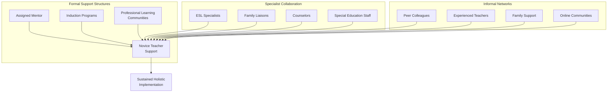

### 10.7 Practical Case Examples and Actionable Recommendations

This final section synthesizes the chapter's analysis into concrete, actionable guidance through illustrative examples and step-by-step recommendations. The discussion provides scenarios demonstrating successful navigation of implementation challenges, a troubleshooting guide for common obstacles, and a prioritized action checklist for novice teachers.

#### Case Example 1: Managing Diverse Learner Needs in Large Classes

**Scenario**: Ms. Chen, a first-year teacher, has 32 students in her third-grade classroom, including eight English Language Learners at varying proficiency levels, three students with IEPs, and several students who have experienced trauma. She wants to implement holistic approaches but feels overwhelmed by the diversity of needs.

**Challenges identified**:
- Large class size limiting individual attention
- Wide range of language proficiency levels
- Multiple students requiring specialized support
- Limited time for differentiation

**Strategies implemented**:

Ms. Chen began with **foundational relationship-building** practices that required minimal differentiation: door greetings that acknowledged each student, a classroom environment displaying students' names and cultural backgrounds, and consistent routines that created psychological safety for all students.

She then implemented **small group structures** that enabled differentiated attention. Research confirms that small group activities create a low-pressure environment for language development with groups limited to six or fewer students[^124]. Ms. Chen organized daily small group rotations where she could provide targeted instruction while other students engaged in independent or collaborative activities.

She leveraged **peer support** by strategically pairing students. Research recommends pairing students who share a home language for added support[^124]. Ms. Chen paired beginning ELLs with more proficient bilingual peers who could provide home language support during collaborative activities.

She collaborated with **specialists** for students with intensive needs. Research emphasizes that effective support requires collaboration among general education teachers, EL service providers, and special education staff[^124]. Ms. Chen coordinated with the ESL teacher and special education staff to ensure students received appropriate support.

She implemented **universal scaffolding** that benefited all students. Research identifies strategies including using visuals, gestures, and real-world objects to reinforce concepts[^124]. These scaffolds supported ELLs while enhancing comprehension for all students.

**Outcomes**: By focusing on foundational practices, strategic grouping, and collaboration with specialists, Ms. Chen created a classroom where diverse learners could access instruction and experience belonging despite the large class size.

#### Case Example 2: Integrating Holistic Practices Within Time Constraints

**Scenario**: Mr. Rodriguez, a second-year teacher, is committed to holistic empowerment but faces intense pressure to cover mandated curriculum. His principal monitors pacing guide compliance closely, and standardized test scores heavily influence teacher evaluations.

**Challenges identified**:
- Curriculum pacing pressure limiting flexibility
- Standardized testing emphasis narrowing instruction
- Administrative monitoring of compliance
- Limited time for relationship-building and SEL

**Strategies implemented**:

Mr. Rodriguez **aligned holistic practices with mandated objectives**. Research emphasizes that building content knowledge and language competence in tandem is supported by a strong evidence base[^125]. He framed relationship-building and SEL as supporting academic outcomes, demonstrating connections to curriculum standards.

He **integrated holistic practices into required instruction** rather than adding separate activities. Research provides examples of embedding language scaffolds across content areas[^125]. Mr. Rodriguez incorporated vocabulary development, collaborative discussion, and formative assessment into required lessons rather than treating them as additions.

He **rethought whole-group time** to increase effectiveness. Research suggests reducing whole-group instruction to 10-15 minutes and incorporating interaction through "turn and talk" activities[^124]. This modification maintained curriculum coverage while increasing engagement and language practice.

He **leveraged transitions and routines** for relationship-building. Door greetings, attendance check-ins, and transition activities provided relationship-building opportunities without requiring separate instructional time.

He **documented student growth** to build evidence for his approaches. Research emphasizes ongoing assessment to monitor progress[^124]. Mr. Rodriguez collected data showing that students in his classroom demonstrated strong academic growth alongside social-emotional development, providing evidence to share with his principal.

**Outcomes**: By integrating holistic practices within required structures and documenting positive outcomes, Mr. Rodriguez maintained curriculum compliance while implementing meaningful holistic approaches.

#### Case Example 3: Building Family Partnerships Across Cultural Differences

**Scenario**: Ms. Okafor teaches in a school where many families are recent immigrants with limited English proficiency. She wants to build family partnerships but faces language barriers, cultural differences in expectations about family-school relationships, and families' work schedules that conflict with traditional meeting times.

**Challenges identified**:
- Language barriers limiting communication
- Cultural differences in family-school expectations
- Scheduling conflicts with traditional meeting times
- Limited school resources for translation and interpretation

**Strategies implemented**:

Ms. Okafor **learned about families' communication preferences**. Research emphasizes that each family has their own preferences based on circumstances, technological access, and work schedules[^124]. She surveyed families about preferred communication methods and times, discovering that many families preferred text messages via WhatsApp.

She **utilized available translation resources**. Research identifies strategies including utilizing school interpreters, translation hotlines, and translation apps[^124]. Ms. Okafor used Talking Points for routine communication and coordinated with the school's family liaison for important conversations.

She **adapted her expectations** about family engagement. Research notes that in some cultures, parental collaboration with teachers may be considered interference, and parents may avoid engaging to avoid being disrespectful[^6]. Ms. Okafor learned that some families showed respect for teachers by not interfering, and she communicated clearly about how families could support learning at home.

She **created flexible engagement opportunities**. Research recommends asking families when and where they would like to attend events and considering alternative meeting locations[^6]. Ms. Okafor offered phone conferences at varied times and sent home activities families could do together.

She **valued families' contributions**. Research emphasizes that families bring great skills, talents, and strengths that might go unnoticed without intentional attention[^6]. Ms. Okafor invited families to share their expertise, cultural knowledge, and home language resources.

**Outcomes**: Through adapted communication, flexible engagement, and genuine valuing of families' contributions, Ms. Okafor built partnerships that supported student learning despite initial barriers.

#### Troubleshooting Guide for Common Implementation Challenges

The following table provides evidence-based solutions for common implementation obstacles:

| **Challenge** | **Evidence-Based Solutions** |
|--------------|------------------------------|
| **Students resist collaborative activities** | Start with structured, low-stakes collaboration; build gradually; teach collaboration skills explicitly[^124] |
| **Parents seem uninvolved** | Examine assumptions about what engagement looks like; offer multiple engagement options; communicate in preferred languages[^6] |
| **Classroom management struggles with student-centered approaches** | Establish clear routines first; release responsibility gradually; maintain high expectations with appropriate scaffolding[^124] |
| **Not enough time for differentiation** | Integrate differentiation into existing structures; use small groups strategically; leverage peer support[^124] |
| **Administrator questions non-traditional approaches** | Document student growth; align practices with mandated objectives; share research evidence[^125] |
| **Students at very different proficiency levels** | Use flexible grouping; provide scaffolding at multiple levels; leverage home language support[^124] |
| **Limited access to appropriate materials** | Adapt existing materials; create simple scaffolds; share resources with colleagues[^120] |
| **Feeling isolated in implementation efforts** | Connect with like-minded colleagues; participate in professional learning communities; seek mentorship[^118] |

#### Prioritized Action Checklist for Novice Teachers

Based on the chapter's analysis, the following checklist provides prioritized next steps for novice teachers at different implementation stages:

**Immediate Actions (This Week)**:
- [ ] Implement door greetings that acknowledge each student by name
- [ ] Learn correct pronunciation of all students' names
- [ ] Identify one colleague who shares interest in holistic approaches
- [ ] Establish one consistent routine that creates predictability

**Short-Term Actions (This Month)**:
- [ ] Conduct getting-to-know-you activities that reveal student backgrounds and interests
- [ ] Implement regular check-in routine to monitor student wellbeing
- [ ] Identify communication preferences for each family
- [ ] Connect with ESL specialist or family liaison for guidance
- [ ] Begin reflective journaling about implementation experiences

**Medium-Term Actions (This Semester)**:
- [ ] Establish small group structures for differentiated instruction
- [ ] Implement home language support strategies
- [ ] Begin portfolio development to document student growth
- [ ] Expand family communication using preferred methods
- [ ] Participate in professional learning community or seek mentor

**Long-Term Actions (This Year)**:
- [ ] Implement comprehensive differentiation across content areas
- [ ] Develop authentic assessment practices
- [ ] Build family partnerships that involve families as contributors
- [ ] Document evidence of student growth to support advocacy
- [ ] Mentor or support newer colleagues in holistic approaches

#### Maintaining Commitment While Preserving Wellbeing

Throughout implementation efforts, novice teachers must attend to their own wellbeing. Research documents that nearly half of teachers report feeling burned out, and a third of beginning teachers quit within their first three years[^118]. Sustainable implementation requires balancing commitment to holistic empowerment with self-care practices.

Strategies for maintaining wellbeing during implementation include:

**Setting realistic expectations**: Comprehensive holistic implementation takes years to develop. Novice teachers should celebrate incremental progress rather than expecting immediate transformation.

**Prioritizing high-impact practices**: When time and energy are limited, focus on practices with the strongest evidence base and greatest benefit for students.

**Building support networks**: Connect with colleagues, mentors, and professional communities that provide encouragement and practical assistance.

**Practicing self-compassion**: Implementation challenges are normal, not signs of failure. Novice teachers should treat themselves with the same compassion they extend to students.

**Maintaining boundaries**: Sustainable implementation requires protecting time for rest, relationships, and activities outside teaching.

Research confirms that teachers who manage their time, ask for help from mentors and experienced teachers, set realistic goals, and learn on their own demonstrate effective coping with implementation challenges[^123]. These strategies enable novice teachers to persist through difficulties while maintaining the wellbeing that holistic teaching requires.

The journey toward holistic empowerment in elementary English education is challenging but achievable. By understanding the landscape of implementation challenges, bridging preparation-practice gaps, implementing gradually and strategically, adapting to context, navigating institutional constraints, leveraging collaboration, and maintaining wellbeing, novice teachers can transform their practice in ways that serve the comprehensive development of every student. The investment is substantial, but the outcomes—confident, capable, and empowered students alongside fulfilled and effective teachers—justify the effort required.

## 11 Conclusion: Toward a Sustainable Paradigm of Holistic Empowerment

The journey through this comprehensive examination of holistic empowerment in elementary English education has traversed theoretical foundations, pedagogical strategies, assessment approaches, and implementation realities that together constitute a transformative vision for language instruction. This concluding chapter synthesizes the insights developed across preceding chapters into an integrated framework that articulates both what holistic empowerment means and how it can be realized in practice. The analysis moves beyond summary to examine implications for the multiple stakeholders whose collaborative efforts determine whether this paradigm can move from aspiration to reality—teacher preparation programs, school leadership, and educational policymakers. The chapter identifies critical areas where further research is needed to strengthen the evidence base and refine implementation approaches, while offering novice teachers concrete guidance for beginning their own journeys toward holistic, empowering practice.

The significance of this concluding synthesis extends beyond academic completeness. For novice teachers who have engaged with the extensive analysis presented throughout this paper, this chapter serves as both consolidation and call to action—a reminder that the theoretical knowledge and practical strategies explored in preceding chapters find their ultimate meaning only when translated into classroom practice that transforms students' lives. The holistic empowerment paradigm represents not merely an alternative approach to English instruction but a **fundamental reconceptualization of education's purpose and process** that honors the full humanity of every child while developing the comprehensive capacities necessary for flourishing in complex contemporary environments.

### 11.1 Synthesis of Key Findings: An Integrated Vision for Holistic Empowerment

The extensive analysis presented throughout this paper converges on a coherent vision of holistic empowerment that transforms elementary English education from narrow linguistic training into comprehensive human development. This synthesis consolidates the paper's central arguments, demonstrating how theoretical foundations, core components, pedagogical strategies, and implementation considerations function as an **interconnected system** rather than isolated elements.

#### The Inadequacy of Traditional Approaches and the Case for Transformation

The paper's analysis began by establishing the fundamental limitations of traditional English language teaching approaches that have dominated elementary education for decades. These limitations extend far beyond pedagogical inefficiency to constitute a **systematic failure to serve students' authentic developmental needs**. Traditional approaches characterized by teacher-centered instruction, rote memorization, and standardized testing create conditions that contradict both language acquisition research and holistic education principles.

The evidence for these limitations is compelling and multifaceted. Traditional methods expect students to master all aspects of language simultaneously, contradicting the natural progression of language acquisition where listening and comprehension develop before production. Classroom configurations that rely on group recitation provide insufficient individual speaking time and feedback, allowing verbally timid students to progress through years of English instruction without authentic language production. The emphasis on memorization and high-stakes testing produces surface-level learning that proves inapplicable in real-world communication, while disproportionately affecting students from under-resourced communities and creating cultures of competition, stress, and anxiety.

Contemporary challenges intensify the urgency for paradigm change. The remarkable diversity of elementary English classrooms—with growing populations of English Language Learners speaking hundreds of languages, students from varied cultural backgrounds, and children who have experienced trauma—requires approaches that traditional methods cannot provide. The growing recognition of social-emotional learning as critical to academic success, combined with demands for 21st-century skills including critical thinking, creativity, collaboration, and communication, necessitates comprehensive approaches that address the whole child rather than isolated linguistic competencies.

#### The Theoretical Foundation: Integrating Holistic Education and Empowerment

The conceptual framework developed in Chapter 2 synthesized two major theoretical streams—**holistic education philosophy** and **empowerment theory**—into a coherent foundation for transformative practice. This synthesis recognizes that effective education must address the complete development of the human being across intellectual, emotional, social, physical, creative, and spiritual dimensions while simultaneously building students' agency, self-efficacy, and capacity for autonomous decision-making.

Holistic education principles established that learning must be relevant and meaningful to students' lives, that creativity and critical thinking deserve central emphasis, that community and collaboration are essential, and that physical education and mindfulness practices support self-awareness and self-regulation. The application of Maslow's Hierarchy of Needs to educational contexts demonstrated that students' basic needs—physiological requirements, safety, and belonging—must be met before they can fully engage in higher-order learning.

Empowerment theory contributed the understanding that empowerment functions as both process and outcome, that strengths-based rather than deficit-focused orientations produce superior results, and that empowerment operates through intrapersonal, interactional, and behavioral components. The convergence of these theoretical streams produced a working definition of holistic empowerment specific to elementary English education:

> *A comprehensive pedagogical paradigm that integrates the development of English language proficiency with the cultivation of students' physical, emotional, social, cognitive, and creative capacities, while simultaneously building their agency, self-efficacy, and autonomous decision-making abilities. This approach positions students as active agents in their own learning, values their linguistic and cultural assets, creates supportive community environments, and aims to develop well-rounded individuals capable of authentic self-expression in English and meaningful participation in diverse communities.*

This definition distinguishes holistic empowerment from both traditional grammar-translation approaches and communicative language teaching, positioning it as a paradigm that extends beyond communicative competence to comprehensive human development with language proficiency as one essential component.

#### The Five Core Dimensions of Holistic Empowerment

Chapter 3's multidimensional analysis identified five interconnected dimensions that constitute holistic empowerment, each contributing uniquely to student development while functioning synergistically within an integrated system:

**Cognitive-linguistic empowerment** encompasses language proficiency development alongside critical thinking and metacognitive skills. This dimension transforms vocabulary instruction from decontextualized memorization to meaningful, contextualized learning where students understand not just what language means but how it works and how they themselves learn most effectively. The development of metacognitive awareness empowers students to take responsibility for their own learning.

**Social-emotional empowerment** addresses the affective dimensions that research consistently identifies as critical to both academic success and personal wellbeing. Creating psychologically safe learning environments, building emotional vocabulary, developing empathy through literature and collaboration, and honoring cultural sensitivity are essential components. The recognition that language learning is inherently vulnerable—requiring students to take risks, make mistakes publicly, and express themselves in unfamiliar ways—underscores the foundational importance of emotional safety.

**Physical and creative empowerment** honors the embodied nature of learning and the natural playfulness of elementary-aged children. Research confirms that physical movement enhances cognitive engagement and learning retention, while creative expression provides essential outlets for emotional processing and authentic self-expression. Interactive storytelling, drama-based approaches, and kinesthetic learning strategies integrate physical engagement with language development.

**Learner autonomy and agency** represent the empowerment dimension most directly, developing students' capacity to take responsibility for their own learning and direct their own educational journeys. Through structured opportunities for genuine choice, self-directed learning, and authentic voice development, students transform from passive recipients of instruction into active agents capable of making meaningful decisions about their learning.

**Community and belonging** address the relational dimension, recognizing that learning occurs within social contexts and that students' sense of connection profoundly shapes their engagement and development. Strategies for building classroom community, collaborative learning structures, and sociocultural integration for English Language Learners create conditions where students feel valued, supported, and connected.

The analysis demonstrated that these dimensions function as an **integrated, synergistic system** where development in one area reinforces and accelerates development in others. Cognitive-linguistic development is enhanced within supportive social-emotional contexts; physical and creative engagement reinforces cognitive and affective dimensions; autonomy emerges from secure community belonging. Effective holistic instruction addresses multiple dimensions simultaneously rather than treating them as separate concerns.

#### Pedagogical Strategies for Holistic Implementation

Chapter 4 translated theoretical foundations into actionable pedagogical principles and classroom strategies, providing novice teachers with concrete guidance for implementation. The analysis established foundational principles including learner-centeredness, meaning-making, and multidimensional development, while examining specific methodologies including experiential learning, project-based learning, inquiry-based instruction, and differentiated instruction.

The critical importance of **teacher-student relationships** received extensive attention, with research demonstrating that positive relationships are linked to better academic outcomes, increased engagement, and higher graduation rates. Strategies for building relationships from the beginning of the school year, maintaining communication across multiple dimensions, and creating supportive learning environments provide novice teachers with practical tools for establishing the relational foundation that holistic empowerment requires.

The integration of mindfulness and reflection practices, the balance between structured instruction and learner autonomy, scaffolding techniques for diverse learners, formative assessment approaches, and strategies for encouraging student voice and choice together constitute a comprehensive pedagogical repertoire. The analysis emphasized that novice teachers should approach implementation gradually, building confidence and competence progressively rather than attempting comprehensive change immediately.

#### Addressing Diverse Learner Needs Through Equity and Inclusion

Chapter 5 investigated how holistic empowerment addresses the diverse needs of elementary English learners, particularly multilingual learners, students from disadvantaged backgrounds, and those who have experienced trauma. The analysis established the critical importance of **asset-based approaches** that recognize and leverage students' linguistic and cultural resources rather than viewing diversity as deficit.

Culturally and linguistically responsive teaching practices, trauma-informed principles, and multipronged support systems that address students' physical, social-emotional, and academic needs simultaneously provide frameworks for serving diverse learners effectively. The analysis of assessment scaffolding demonstrated that maintaining high expectations while providing appropriate support enables all students to demonstrate their knowledge without assessments becoming reading comprehension tests that measure English proficiency rather than content understanding.

#### Family and Community Engagement

Chapter 6 established family and community partnerships as foundational pillars of holistic empowerment rather than ancillary supports. Research consistently demonstrates that family engagement ranks among the strongest predictors of student academic success, with particular importance for English Language Learners who benefit from bridges between home and school contexts.

The shift from deficit-based to asset-based orientations toward families, strategies for overcoming barriers to engagement, effective communication practices, and approaches for leveraging families' linguistic and cultural assets provide comprehensive guidance for building authentic partnerships. Family literacy programs, parent education initiatives, community partnerships, and the community schools model offer structures for extending holistic empowerment beyond classroom walls.

#### Technology Integration Within Holistic Frameworks

Chapter 7 examined the strategic role of educational technology within holistic empowerment, establishing the principle that technology should function as a **facilitator of learning rather than its driver**. Interactive platforms, multimedia resources, language-specific applications, and learning management systems offer tools for enhancing engagement and supporting diverse learner needs when integrated thoughtfully.

The analysis emphasized the critical importance of maintaining human connection in technology-rich environments, recognizing that teacher-student relationships remain foundational regardless of digital tools available. Evidence-based evaluation of digital interventions demonstrated that effectiveness depends not on technological sophistication but on design features including interactivity, integration with human support, contextual adaptation, and attention to equity.

#### Assessment Aligned with Holistic Empowerment

Chapter 8 critically examined assessment practices, establishing the paradigm shift from assessment of learning to assessment for learning. The Holistic Assessment Framework provided a multidimensional model capturing cognitive, affective, and psychomotor development across five dimensions: physical development, socio-emotional and ethical development, cognitive development, language and literacy development, and aesthetic and cultural development.

Formative assessment strategies, portfolio-based assessment, self and peer assessment, and authentic assessment approaches together constitute an assessment repertoire that supports rather than undermines holistic empowerment. The analysis of assessment accommodations and scaffolding for diverse learners demonstrated that equitable assessment requires intentional design to ensure all students can demonstrate what they know without assessments privileging particular linguistic or cultural backgrounds.

#### Teacher Development and Wellbeing

Chapter 9 investigated the professional development needs and self-care practices essential for teachers implementing holistic approaches. The analysis established that **teacher wellbeing is not peripheral but foundational** to effective teaching—teachers cannot sustain empathetic, whole-child instruction when their own needs are unmet.

Essential competencies including cultural sensitivity, second language acquisition knowledge, trauma-informed practice skills, and emotional intelligence require ongoing development throughout teachers' careers. Understanding compassion fatigue and burnout, building resilience through attention to heart, spirit, strength, and mind dimensions, and engaging in reflective practice support sustainable holistic teaching. Mentorship, induction programs, and professional learning communities provide structures for ongoing growth and support.

#### Implementation Challenges and Solutions

Chapter 10 confronted the genuine challenges novice teachers face when implementing holistic approaches, providing evidence-based strategies for navigating systemic, institutional, and individual obstacles. Time constraints, large class sizes, curriculum pressures, limited resources, and preparation gaps create cumulative barriers that require multifaceted responses.

The analysis established that gradual, strategic implementation produces better outcomes than rapid comprehensive change, with a developmental framework progressing from foundation building through community development, instructional expansion, and comprehensive implementation. Strategies for adapting holistic approaches to diverse contexts, navigating institutional constraints, building advocacy, and leveraging collaboration and support networks provide novice teachers with realistic pathways for transforming their practice.

#### The Integrated Vision

This synthesis demonstrates that holistic empowerment constitutes a **coherent, integrated paradigm** rather than a collection of separate strategies. The theoretical foundations establish why comprehensive approaches are necessary; the core dimensions identify what holistic development encompasses; the pedagogical strategies specify how teachers can operationalize these principles; the attention to diverse learners ensures equity and inclusion; family and community engagement extends support beyond classroom walls; technology integration leverages digital tools appropriately; assessment approaches capture multidimensional growth; teacher development and wellbeing ensure sustainability; and implementation guidance enables realistic transformation.

The paradigm's power emerges from these elements functioning together as a system. Teachers who understand the theoretical foundations can make principled decisions about practice; attention to all five core dimensions ensures comprehensive development; pedagogical strategies translate principles into action; equity-focused approaches serve all learners; family partnerships extend support; thoughtful technology integration enhances rather than undermines human connection; aligned assessment captures authentic growth; teacher wellbeing enables sustained commitment; and strategic implementation produces realistic progress.

This integrated vision transforms elementary English education from narrow linguistic training into **genuine preparation for flourishing human lives**—developing students who possess not only English proficiency but the cognitive, emotional, social, physical, and creative capacities to thrive in complex contemporary environments.

### 11.2 Implications for Teacher Preparation Programs

The holistic empowerment paradigm carries profound implications for how teacher preparation programs design and deliver pre-service education. The analysis throughout this paper has documented the **preparation-practice gap** that leaves novice teachers inadequately equipped for the demands of holistic teaching in diverse elementary classrooms. Addressing this gap requires fundamental restructuring of preparation programs to develop the comprehensive competencies that holistic empowerment requires.

#### Restructuring Competency Development

Traditional teacher preparation programs have emphasized content knowledge and generic pedagogical skills while giving insufficient attention to the specialized competencies holistic teaching demands. The analysis in Chapter 9 identified four essential competency areas—cultural sensitivity, second language acquisition knowledge, trauma-informed practice, and emotional intelligence—that preparation programs must address systematically.

**Cultural responsiveness and linguistic diversity** require sustained attention throughout preparation programs rather than isolated courses on multicultural education. Pre-service teachers need opportunities to develop self-awareness of their own cultural assumptions and biases, build knowledge of diverse cultural backgrounds and communication norms, and practice culturally responsive pedagogy in authentic contexts. Given that English Language Learners constitute a growing and significant population in elementary classrooms, all teachers—not only those specializing in ESL—need preparation for serving linguistically diverse students.

**Second language acquisition knowledge** should inform how all elementary teachers approach English instruction, not only for designated English Language Learners but for all students developing academic language proficiency. Understanding that comprehension develops before production, that conversational fluency differs from academic language proficiency, and that home language maintenance supports rather than hinders English acquisition enables teachers to design appropriate instruction and maintain realistic expectations.

**Trauma-informed practice** has become essential given the prevalence of adverse childhood experiences among student populations. Preparation programs should ensure that all pre-service teachers understand trauma's neurobiological impact on learning and behavior, can implement trauma-sensitive classroom practices, and recognize signs of secondary traumatic stress in themselves. This preparation should be integrated throughout programs rather than relegated to optional electives.

**Emotional intelligence development** requires attention not only to teaching pre-service teachers about SEL but to developing their own social-emotional competencies. Research demonstrates that teachers must develop their own emotional intelligence before effectively nurturing these capacities in students. Preparation programs should incorporate opportunities for self-awareness development, emotional regulation practice, and relationship skill building.

#### Bridging Theory and Practice

The preparation-practice gap identified throughout this paper reflects insufficient connection between what pre-service teachers learn in university courses and what they need to know for effective classroom practice. Bridging this gap requires restructuring how preparation programs connect theoretical knowledge to practical application.

**Extended clinical experiences** should provide pre-service teachers with substantial opportunities to implement holistic approaches in authentic classroom settings under expert supervision. Brief student teaching placements at the end of preparation programs are insufficient for developing the complex competencies holistic teaching requires. Programs should integrate clinical experiences throughout preparation, with increasing responsibility as pre-service teachers develop competence.

**Reflective practice integration** should begin during preparation rather than being left for teachers to develop independently after entering the profession. Pre-service teachers should engage in systematic reflection using frameworks like Farrell's five-stage model, developing habits of examining their philosophy, principles, theory, practice, and broader context that will support career-long professional growth.

**Mentorship modeling** during preparation can establish expectations for the ongoing mentorship that supports novice teacher development. When pre-service teachers experience effective mentorship during preparation, they understand its value and can seek similar support during their early career years.

**Case-based learning** using narratives of experienced teachers implementing holistic approaches can help pre-service teachers develop practical wisdom for navigating complex classroom situations. Analyzing how experienced teachers address challenges, make decisions, and adapt practices to context builds the professional judgment that holistic teaching requires.

#### Addressing the Whole Teacher

Just as holistic empowerment addresses the whole child, teacher preparation should address the **whole teacher**—developing not only knowledge and skills but the dispositions, identities, and wellbeing capacities that sustain effective practice. Preparation programs that focus exclusively on technical competencies leave novice teachers unprepared for the emotional demands of holistic teaching.

**Teacher identity development** should receive explicit attention, helping pre-service teachers articulate their educational philosophies, examine their motivations for teaching, and develop professional identities aligned with holistic empowerment principles. Teachers who have reflected deeply on who they are as educators and why they teach are better positioned to persist through challenges and maintain commitment to comprehensive approaches.

**Wellbeing and self-care** should be addressed throughout preparation, not as an afterthought but as foundational to sustainable practice. Pre-service teachers should develop personalized self-care plans, learn to recognize signs of stress and burnout, and build habits of attending to their physical, mental, emotional, and social wellbeing. Programs that model self-care and normalize attention to teacher wellbeing prepare graduates for sustainable careers.

**Professional community building** during preparation establishes relationships that can provide ongoing support after graduation. When pre-service teachers develop collaborative relationships with peers who share commitments to holistic approaches, they enter the profession with support networks already in place.

### 11.3 Implications for School Leadership and Institutional Support

The sustainability of holistic empowerment depends significantly on school leadership and institutional structures that create conditions enabling comprehensive implementation. Individual teachers—particularly novice teachers—cannot single-handedly transform their practice when institutional environments work against holistic approaches. School leaders play critical roles in establishing supportive cultures, allocating resources, facilitating professional learning, and advocating for aligned policies.

#### Establishing Supportive School Cultures

School culture profoundly shapes what is possible for teachers implementing holistic approaches. Leaders who establish cultures valuing relationship-building, comprehensive development, and teacher wellbeing create conditions where holistic empowerment can flourish; those who prioritize only test scores and compliance create conditions that undermine comprehensive approaches.

**Communicating values** that align with holistic empowerment helps teachers understand that comprehensive approaches are not merely tolerated but actively supported. When school leaders articulate visions of education that encompass whole-child development, social-emotional learning, and student empowerment, teachers receive permission and encouragement to implement holistic practices.

**Modeling holistic principles** in leadership practice demonstrates commitment beyond rhetoric. Leaders who build relationships with staff, attend to teacher wellbeing, create psychologically safe professional environments, and involve teachers in decision-making model the same principles that holistic empowerment applies to student learning.

**Protecting time and space** for relationship-building, reflective practice, and professional collaboration requires intentional scheduling and resource allocation. Leaders who create common planning time, reduce non-instructional demands, and ensure reasonable workloads enable the sustained attention that holistic implementation requires.

**Balancing accountability with support** represents one of leadership's most challenging responsibilities. Leaders face pressure to demonstrate measurable outcomes while supporting innovative practices that may not produce immediate test score gains. Effective leaders find ways to document comprehensive student growth, communicate holistic outcomes to stakeholders, and shield teachers from pressures that would narrow their practice.

#### Allocating Resources for Comprehensive Support

Holistic empowerment requires resources that many schools currently lack or allocate elsewhere. Leaders who prioritize resource allocation for comprehensive support enable implementation that would otherwise be impossible.

**Induction and mentorship programs** require investment in mentor selection, training, and compensation. Research demonstrates that effective mentorship significantly affects novice teacher retention and development, making this investment cost-effective over time even when initial outlays are substantial.

**Professional development** focused on holistic implementation competencies requires ongoing investment rather than one-time workshops. Leaders should allocate resources for sustained professional learning that addresses cultural responsiveness, trauma-informed practice, differentiated instruction, and other essential competencies.

**Instructional materials** that support holistic approaches—including diverse texts, manipulatives, technology tools, and assessment resources—require budgetary priority. When teachers must create all their own materials due to resource limitations, implementation suffers.

**Specialist support** from ESL teachers, counselors, family liaisons, and other specialists extends capacity beyond what classroom teachers can provide independently. Leaders who allocate positions for comprehensive support enable the collaborative structures that holistic empowerment requires.

**Reasonable class sizes** enable the individualized attention that holistic approaches demand. While leaders may have limited control over class size policies, advocating for reasonable sizes and allocating available resources to reduce class sizes where possible supports implementation.

#### Facilitating Professional Learning Communities

Professional learning communities provide structures for ongoing growth that individual professional development cannot achieve. Leaders play essential roles in establishing, supporting, and sustaining these collaborative structures.

**Creating time for collaboration** requires intentional scheduling that protects common planning periods, professional learning community meetings, and peer observation opportunities. When collaboration time exists only in theory but is consistently consumed by other demands, professional learning communities cannot function effectively.

**Providing facilitation support** helps professional learning communities maintain focus and productivity. Leaders can provide training for teacher leaders, participate in communities as supportive members, and ensure that communities have resources needed for effective functioning.

**Connecting communities to broader resources** extends learning beyond what local expertise can provide. Leaders can arrange for external consultants, connect teachers with professional organizations, and facilitate access to research and evidence-based practices.

**Recognizing and celebrating growth** reinforces the value of professional learning and motivates continued engagement. When leaders acknowledge teachers' development, share successful practices across the school, and celebrate implementation progress, they strengthen commitment to ongoing growth.

#### Advocating for Aligned Policies

School leaders occupy positions from which they can advocate for district, state, and national policies that support holistic empowerment. While individual leaders have limited influence on policy, collective advocacy from educational leaders can shape the conditions within which schools operate.

**Communicating implementation realities** to policymakers helps ensure that policies reflect the practical constraints teachers face. Leaders who document how policies affect classroom practice, identify unintended consequences, and propose alternatives contribute to more informed policymaking.

**Building coalitions** with other leaders who share commitments to holistic approaches amplifies advocacy impact. When multiple schools and districts advocate together for supportive policies, their collective voice carries greater weight than individual efforts.

**Demonstrating outcomes** from holistic approaches provides evidence that can influence policy. Leaders who document comprehensive student growth, teacher retention, and school climate improvements contribute to the evidence base that shapes policy decisions.

### 11.4 Implications for Educational Policy

Educational policy at district, state, and national levels creates the systemic conditions within which holistic empowerment either flourishes or struggles. While this paper has focused primarily on classroom practice, sustainable transformation requires policy frameworks that support rather than undermine comprehensive approaches. Current policies often create tensions with holistic empowerment that leave implementation dependent on individual teacher heroism rather than systemic support.

#### The Tension Between Standardized Assessment and Comprehensive Development

The most significant policy tension affecting holistic empowerment involves standardized assessment requirements that emphasize narrow linguistic competencies measured through formats incompatible with multidimensional development. When teacher and school evaluations depend heavily on standardized test scores, powerful incentives toward test preparation crowd out comprehensive approaches.

**Recognizing multidimensional growth** in accountability systems would align policy with holistic empowerment principles. Assessment policies that capture social-emotional development, creative expression, collaborative skills, and authentic communication alongside traditional academic measures would enable rather than constrain comprehensive approaches.

**Reducing high-stakes consequences** of standardized assessments would decrease pressure toward narrow instruction. When single test scores carry less weight in teacher evaluation, school ratings, and student advancement, teachers gain flexibility to implement holistic practices without fear of professional consequences.

**Supporting alternative assessment approaches** including portfolios, performance-based assessment, and formative assessment systems would enable documentation of comprehensive growth. Policy frameworks that recognize these alternatives as legitimate evidence of student learning would support holistic implementation.

#### Class Size and Resource Allocation Policies

Policies governing class size and resource allocation directly affect implementation possibilities. Large class sizes and inadequate resources create structural barriers that even committed teachers cannot overcome through individual effort.

**Class size policies** that establish reasonable maximums—particularly for classes serving high proportions of English Language Learners or students with intensive needs—would enable the individualized attention holistic approaches require. Research consistently demonstrates that smaller classes produce better outcomes, particularly for disadvantaged students.

**Equitable resource allocation** ensuring that schools serving high-need populations receive adequate funding for materials, specialists, and support services would address disparities that currently leave some schools unable to implement comprehensive approaches.

**Targeted funding** for induction programs, mentorship, professional development, and family engagement would provide resources specifically supporting holistic implementation rather than leaving these priorities to compete with other demands.

#### Teacher Evaluation and Professional Development Policies

Policies governing teacher evaluation and professional development shape how teachers approach their practice and what growth opportunities they access.

**Evaluation frameworks** that recognize holistic teaching practices—including relationship-building, differentiation, family engagement, and attention to social-emotional development—would align evaluation with comprehensive approaches. Current frameworks often emphasize instructional techniques without adequate attention to the relational and developmental dimensions holistic empowerment requires.

**Professional development requirements** that prioritize competencies essential for holistic implementation—cultural responsiveness, trauma-informed practice, differentiated instruction—would ensure teachers develop necessary expertise. Policies that allow or require professional development in these areas signal their importance and provide resources for growth.

**Induction program mandates** requiring comprehensive support for novice teachers would address the preparation-practice gap that currently contributes to high attrition rates. Policies establishing minimum standards for mentorship, professional learning, and administrative support would create systemic rather than school-dependent support structures.

#### Curriculum and Instructional Flexibility

Policies governing curriculum and instruction determine how much flexibility teachers have to implement holistic approaches within mandated frameworks.

**Curriculum frameworks** that establish goals and standards while allowing flexibility in how teachers achieve them would enable holistic implementation. Overly prescriptive curricula that mandate specific materials, pacing, and instructional approaches constrain the professional judgment that holistic teaching requires.

**Instructional time requirements** that protect time for social-emotional learning, physical activity, creative expression, and relationship-building would ensure these dimensions receive attention. Policies that mandate exclusive focus on tested subjects squeeze out comprehensive development.

**Assessment flexibility** allowing teachers to use formative assessment, portfolios, and authentic assessment alongside or in place of standardized measures would enable assessment practices aligned with holistic empowerment.

#### Family and Community Engagement Policies

Policies affecting family and community engagement shape schools' capacity to extend holistic empowerment beyond classroom walls.

**Translation and interpretation requirements** ensuring that families receive information in accessible languages support the family partnerships holistic empowerment requires. Policies mandating language access and providing resources for translation services enable communication with linguistically diverse families.

**Family engagement expectations** that recognize diverse forms of engagement—not only attendance at school events but home-based support, community involvement, and cultural contribution—would align policy with asset-based orientations toward families.

**Community partnership frameworks** facilitating collaboration between schools and community organizations would extend resources available for comprehensive support. Policies that encourage or require such partnerships and provide funding for coordination would strengthen holistic implementation.

### 11.5 Areas Requiring Further Research

While this paper has synthesized substantial research supporting holistic empowerment in elementary English education, significant gaps in the knowledge base require further investigation. Strengthening the evidence base through targeted research would refine implementation approaches, address skeptics' concerns, and support advocacy for supportive policies.

#### Longitudinal Research on Long-Term Outcomes

The most critical research need involves **longitudinal studies examining long-term outcomes** of holistic approaches on student development, academic achievement, and life trajectories. While existing research demonstrates positive short-term effects on engagement, social-emotional development, and language acquisition, limited evidence documents whether these benefits persist and translate into long-term success.

Research questions requiring investigation include:

- Do students who experience holistic empowerment approaches in elementary English education demonstrate sustained advantages in language proficiency, academic achievement, and life outcomes compared to peers who received traditional instruction?
- How do the social-emotional competencies developed through holistic approaches affect students' later educational trajectories, career success, and personal wellbeing?
- What is the relationship between elementary holistic empowerment experiences and students' subsequent capacity for autonomous learning, creative problem-solving, and collaborative engagement?
- Do the benefits of holistic approaches persist across transitions to middle school, high school, and beyond, or do they diminish when students enter less supportive educational environments?

Longitudinal research tracking cohorts of students over extended periods would provide evidence essential for demonstrating holistic empowerment's value and justifying the investments it requires.

#### Cross-Contextual Effectiveness Studies

The analysis throughout this paper has acknowledged that holistic approaches must be adapted to diverse contexts, but limited research examines **effectiveness across varied demographic, cultural, and institutional settings**. Understanding what works, for whom, and under what conditions would enable more refined implementation guidance.

Research questions requiring investigation include:

- How do holistic empowerment approaches function differently in schools serving varied demographic populations, including high-poverty schools, schools with large immigrant populations, and schools in different geographic regions?
- What adaptations are necessary for holistic implementation in different cultural contexts, and how do cultural factors affect the relative effectiveness of specific strategies?
- How do institutional factors—including school size, administrative support, resource availability, and policy environment—moderate the effectiveness of holistic approaches?
- What minimum conditions are necessary for holistic empowerment to produce positive outcomes, and what factors most strongly predict implementation success or failure?

Cross-contextual research would enable evidence-based guidance for adaptation rather than leaving teachers to discover through trial and error what works in their specific settings.

#### Investigation of Specific Implementation Strategies

While this paper has identified numerous strategies for holistic implementation, the **relative effectiveness of specific approaches** remains inadequately understood. Research examining which strategies produce the greatest impact with the most efficient investment would enable prioritization.

Research questions requiring investigation include:

- Which relationship-building strategies produce the strongest effects on student engagement and learning outcomes, and what characteristics of effective relationship-building can be identified?
- What approaches to family engagement are most effective for different family populations, and how can schools maximize family partnership impact with limited resources?
- Which differentiation strategies most effectively serve diverse learners within holistic frameworks, and how can teachers efficiently implement differentiation in large classes?
- What technology integration approaches enhance holistic empowerment without undermining human connection, and what characteristics distinguish effective from ineffective digital tools?

Research on specific strategies would enable evidence-based selection and implementation rather than relying on general principles alone.

#### Teacher Wellbeing and Student Outcomes

The relationship between **teacher wellbeing and student outcomes** requires further investigation to strengthen the case for prioritizing educator wellness. While this paper has argued that teacher wellbeing is foundational to effective holistic teaching, empirical evidence directly linking teacher wellness to student development would strengthen this argument.

Research questions requiring investigation include:

- What is the relationship between teacher wellbeing measures and student outcomes in holistic empowerment contexts?
- How do specific self-care practices affect teacher effectiveness, retention, and student learning?
- What institutional supports for teacher wellbeing produce the greatest positive effects on both teachers and students?
- How can schools identify teachers at risk for burnout or compassion fatigue early enough to provide effective intervention?

Research demonstrating clear connections between teacher wellbeing and student outcomes would support advocacy for institutional investments in educator wellness.

#### Technology Integration Research

Given the rapid evolution of educational technology and its increasing presence in elementary classrooms, research on **technology integration within holistic frameworks** requires ongoing attention.

Research questions requiring investigation include:

- How do different technology tools and approaches affect the various dimensions of holistic empowerment—cognitive-linguistic, social-emotional, physical-creative, autonomy-agency, and community-belonging?
- What characteristics of technology integration enhance versus undermine human connection and relationship-building in elementary classrooms?
- How can technology be leveraged to support family engagement and community partnerships within holistic frameworks?
- What professional development approaches most effectively prepare teachers for thoughtful technology integration that serves holistic empowerment goals?

As technology continues evolving, ongoing research is necessary to ensure that digital tools serve rather than undermine holistic empowerment.

### 11.6 Final Recommendations for Novice Teachers

This section synthesizes practical recommendations from throughout the paper into actionable guidance for novice teachers beginning their journeys toward holistic, empowering English language instruction. The recommendations acknowledge the genuine challenges novice teachers face while affirming that **sustainable implementation is possible** through strategic approaches, support-seeking, and commitment to ongoing growth.

#### Beginning with Foundational Practices

Novice teachers should resist the temptation to implement comprehensive holistic approaches immediately, instead focusing on **foundational practices** that establish conditions for subsequent expansion. The developmental framework presented in Chapter 10 provides a progression from foundation building through comprehensive implementation that builds confidence and competence progressively.

**Priority first steps** include:

- **Establish predictable routines** that create psychological safety for all students
- **Learn students' names** and basic information about their backgrounds, interests, and needs
- **Implement door greetings** that acknowledge each student individually at the start of each day
- **Create classroom environments** that reflect student identities, cultures, and languages
- **Build one relationship at a time**, focusing on genuine connection rather than superficial interaction

These foundational practices require relatively modest time investment but establish the relational groundwork essential for holistic empowerment. Success with these practices builds confidence for subsequent implementation efforts.

#### Prioritizing High-Impact Strategies

Given the time constraints and competing demands novice teachers face, prioritizing **high-impact strategies** that yield significant benefits with manageable investment is essential. Research identifies several practices that meet this criterion:

**Home language support** through labeling classroom objects in students' languages, using visuals and gestures, and learning key words communicates powerful messages about valuing linguistic identities while supporting language development.

**Small group structures** create low-pressure environments for language interaction and enable differentiated attention that large-group instruction cannot provide.

**Play-based learning** integrates language development into engaging activities, reducing the burden of creating separate instructional time while honoring children's natural learning processes.

**Scaffolding during book reading** through pointing to words, asking guiding questions, using choral responses, and employing visuals can be integrated into existing read-aloud practices with minimal additional time.

**Regular check-ins** that monitor student wellbeing provide essential information for responsive teaching while communicating care for students as whole persons.

Focusing on these high-impact strategies enables novice teachers to produce meaningful results while building capacity for expanded implementation.

#### Building Support Networks

Novice teachers cannot successfully implement holistic approaches in isolation. **Building support networks** that provide emotional encouragement, practical guidance, and collaborative problem-solving is essential for sustainable implementation.

**Seek formal mentorship** through assigned mentors, induction programs, or self-initiated relationships with experienced colleagues. Effective mentors provide emotional support during challenging moments, practical guidance for specific situations, and modeling of holistic practices in action.

**Connect with like-minded colleagues** who share commitments to comprehensive approaches. Finding even one colleague who shares holistic empowerment values provides mutual support, shared learning, and collaborative advocacy.

**Participate in professional learning communities** that address holistic implementation. Whether school-based or external, collaborative learning structures provide ongoing growth opportunities and community support.

**Leverage specialist expertise** from ESL teachers, counselors, family liaisons, and other specialists whose knowledge extends teachers' capacity to serve diverse learners comprehensively.

**Maintain connections outside school** with family, friends, and professional networks that provide perspective, encouragement, and renewal.

#### Navigating Institutional Constraints

Novice teachers often find themselves in institutional environments that do not fully support holistic approaches. **Strategic navigation** of these constraints enables implementation despite less-than-ideal conditions.

**Align holistic practices with mandated objectives** by demonstrating how relationship-building, differentiation, and authentic assessment support the academic outcomes that institutional accountability requires.

**Integrate holistic practices within required structures** rather than adding separate activities. Embedding vocabulary development, collaborative discussion, and formative assessment into required lessons maintains curriculum compliance while implementing holistic approaches.

**Document student growth** across multiple dimensions to build evidence for holistic approaches. When teachers can demonstrate that comprehensive approaches produce positive outcomes, they strengthen their position for advocacy and expanded implementation.

**Choose battles strategically**, focusing energy on practices that produce the greatest impact rather than fighting every constraint simultaneously. Sustainable advocacy requires pacing that preserves energy for long-term commitment.

#### Maintaining Wellbeing While Implementing

Sustainable holistic implementation requires attention to **teacher wellbeing** throughout the implementation process. Novice teachers who sacrifice their own wellness in pursuit of student outcomes ultimately undermine both.

**Set realistic expectations** for implementation progress. Comprehensive holistic implementation takes years to develop; celebrating incremental progress rather than expecting immediate transformation supports sustainable commitment.

**Establish work-life boundaries** that protect time for rest, relationships, and activities outside teaching. While flexibility is sometimes necessary, regular patterns that protect personal time create sustainable rhythms.

**Practice self-compassion** when implementation challenges arise. Difficulties are normal, not signs of failure; treating oneself with the same compassion extended to students supports resilience and persistence.

**Attend to physical, mental, emotional, and social wellbeing** through intentional self-care practices. Sleep, nutrition, exercise, mindfulness, relationships, and renewal activities provide the resources that demanding holistic teaching requires.

**Seek help when needed** from mentors, colleagues, counselors, or other support providers. Asking for help is not weakness but appropriate professional behavior that enables sustainable practice.

#### Committing to Ongoing Growth

Holistic empowerment is not a destination but a **journey of ongoing professional growth**. Novice teachers should approach their development with patience, persistence, and commitment to continuous improvement.

**Engage in reflective practice** through journaling, peer dialogue, and systematic examination of teaching experiences. Reflection transforms experience into learning that informs increasingly sophisticated practice.

**Pursue professional development** focused on competencies essential for holistic implementation. Cultural responsiveness, trauma-informed practice, differentiated instruction, and assessment literacy all require ongoing development throughout teachers' careers.

**Learn from students and families** who provide essential feedback about what supports their learning and engagement. Student and family perspectives offer insights that professional development alone cannot provide.

**Contribute to professional community** by sharing effective practices, supporting colleagues, and participating in collective advocacy. As novice teachers develop expertise, they can mentor newer colleagues and strengthen the professional community that supports holistic implementation.

**Maintain vision** of holistic empowerment's transformative potential even when daily challenges obscure larger purposes. Connecting daily practice to the comprehensive vision of human development that holistic empowerment represents sustains commitment through difficulties.

### 11.7 The Transformative Potential of Holistic Empowerment

This final section articulates the broader significance of the holistic empowerment paradigm for elementary English education and beyond, reflecting on how this approach transforms not only instructional practice but fundamental conceptions of teaching, learning, and human development.

#### Beyond Strategies to Fundamental Reorientation

Holistic empowerment represents more than a collection of effective strategies or a set of best practices for English instruction. It constitutes a **fundamental reorientation** toward education that challenges assumptions embedded in traditional approaches and offers an alternative vision of what schooling can accomplish.

Traditional education operates from assumptions that learning is primarily cognitive, that students are recipients of knowledge transmitted by teachers, that assessment measures what students have acquired, and that education's purpose is preparation for economic productivity. These assumptions produce the narrow, test-focused instruction that this paper has critiqued—instruction that may produce measurable gains on standardized assessments while failing to develop the comprehensive capacities students need for flourishing lives.

Holistic empowerment challenges each of these assumptions. Learning encompasses cognitive, emotional, social, physical, and creative dimensions that cannot be meaningfully separated. Students are active agents who construct understanding through experience and develop capacities for self-direction. Assessment captures multidimensional growth and informs ongoing learning rather than merely measuring acquisition. Education's purpose is the comprehensive development of human beings capable of authentic self-expression, meaningful relationships, creative contribution, and participation in democratic community.

This reorientation transforms how teachers understand their work. Rather than transmitting content and measuring acquisition, teachers create conditions where students can develop as whole persons. Rather than controlling learning, teachers facilitate students' growing capacity to direct their own education. Rather than preparing students for future roles, teachers support students' flourishing in the present while building capacities that serve them throughout their lives.

#### Honoring the Full Humanity of Students and Teachers

At its core, holistic empowerment represents a commitment to **honoring the full humanity** of everyone involved in education—students, teachers, families, and communities. This commitment has profound implications for how classrooms function and what education accomplishes.

**Students are honored as whole persons** when instruction addresses their comprehensive development rather than reducing them to test scores or linguistic deficits. When teachers attend to students' emotional wellbeing, physical needs, creative expression, and social connections alongside cognitive growth, they communicate that students matter as human beings, not merely as learners of content.

**Teachers are honored as professionals** when they exercise judgment about what students need rather than implementing prescribed programs. When institutional structures support teacher wellbeing, provide adequate resources, and create conditions for sustainable practice, they communicate that teachers matter as human beings, not merely as delivery mechanisms for curriculum.

**Families are honored as partners** when schools recognize their knowledge, value their contributions, and engage them as collaborators in children's education. When communication is accessible, engagement opportunities are flexible, and family assets are leveraged, schools communicate that families matter as essential participants in children's development.

**Communities are honored as resources** when schools connect learning to local contexts, engage community members as contributors, and prepare students for meaningful participation in democratic life. When education serves community wellbeing alongside individual advancement, schools communicate that communities matter as the contexts within which human flourishing occurs.

#### The Promise for Students

For students, holistic empowerment offers the promise of education that **develops their full potential** rather than constraining them to narrow definitions of success. Students in holistic empowerment classrooms develop:

**Authentic English proficiency** that enables genuine communication and self-expression, not merely accuracy on standardized assessments. When students find their authentic voice in English, they can express their identities, share their perspectives, and participate meaningfully in English-speaking contexts.

**Social-emotional competencies** including self-awareness, self-regulation, social awareness, relationship skills, and responsible decision-making. These competencies support both academic success and personal wellbeing, preparing students for the emotional demands of contemporary life.

**Critical thinking and creativity** that enable students to analyze, evaluate, and create rather than merely recall and reproduce. These capacities prepare students for a world where routine tasks are increasingly automated and uniquely human contributions involve judgment, innovation, and imagination.

**Autonomy and agency** that enable students to direct their own learning and lives. When students develop capacity for self-direction, they become lifelong learners capable of adapting to changing circumstances and pursuing their own goals.

**Sense of belonging and community** that provides the relational foundation for wellbeing and engagement. When students feel valued, connected, and supported, they develop the psychological security that enables them to take risks, persist through challenges, and contribute to collective endeavors.

These outcomes extend far beyond English proficiency to encompass the comprehensive development that prepares students for flourishing lives—lives characterized by meaningful work, healthy relationships, creative contribution, and participation in democratic community.

#### The Promise for Teachers

For teachers, holistic empowerment offers the promise of professional practice that **aligns with their deepest motivations** for entering education. Many teachers chose their profession because they wanted to make a difference in children's lives, to nurture human development, to create conditions where young people could flourish. Traditional approaches that reduce teaching to content delivery and test preparation often undermine these motivations, contributing to the burnout and attrition that plague the profession.

Holistic empowerment reconnects teaching to its **fundamental purposes**—the development of human beings in all their complexity and potential. Teachers who implement holistic approaches report greater satisfaction, deeper connection with students, and renewed sense of purpose. When teaching encompasses relationship-building, creative expression, social-emotional support, and comprehensive development, it becomes the meaningful work that teachers originally sought.

This is not to suggest that holistic teaching is easy—the analysis throughout this paper has documented the genuine challenges and demands it involves. But meaningful work is not the same as easy work. Teachers who engage in holistic empowerment often find that the challenges are worthwhile because they serve purposes that matter. The exhaustion of meaningful work differs fundamentally from the burnout of meaningless work; the former can be restored through rest and renewal, while the latter requires fundamental change in what teachers are doing.

#### The Promise for Society

Beyond individual students and teachers, holistic empowerment offers promise for **society as a whole**. The comprehensive capacities that holistic education develops—critical thinking, creativity, collaboration, communication, emotional intelligence, ethical reasoning, civic engagement—are precisely the capacities that democratic societies require from their citizens.

Contemporary challenges including political polarization, environmental crisis, technological disruption, and social fragmentation require citizens capable of nuanced thinking, collaborative problem-solving, empathetic engagement, and ethical action. Education that develops only narrow academic skills while neglecting these broader capacities fails to prepare students for the responsibilities of citizenship.

Holistic empowerment contributes to the development of citizens who can **think critically** about complex issues, **communicate effectively** across differences, **collaborate productively** with diverse others, **create innovative** solutions to novel problems, **engage empathetically** with those whose experiences differ from their own, and **act ethically** in pursuit of the common good. These capacities are essential for the functioning of democratic societies and the addressing of collective challenges.

#### Affirming the Vision

The holistic empowerment paradigm presented throughout this paper represents a vision worth pursuing despite its demands. The transformation it offers—from narrow linguistic training to comprehensive human development, from teacher-centered transmission to student-centered empowerment, from deficit-focused remediation to asset-based cultivation—promises education that serves students, teachers, families, and society more fully than traditional approaches.

This vision will not be realized easily or quickly. The challenges documented throughout this paper—time constraints, large class sizes, curriculum pressures, limited resources, institutional resistance, preparation gaps—are real and substantial. Implementation requires sustained commitment, strategic approach, collaborative support, and ongoing growth over extended periods.

But the vision remains worth pursuing because **education matters profoundly** for human lives and human communities. What happens in elementary English classrooms shapes students' relationships with language, with learning, and with themselves as learners. Teachers who implement holistic empowerment create classrooms where students develop not only English proficiency but the comprehensive capacities necessary for flourishing lives.

For novice teachers beginning their careers, this paper offers both realistic acknowledgment of the challenges ahead and affirmation of the transformative potential that makes those challenges worthwhile. The journey toward holistic empowerment is demanding but meaningful—a journey that transforms not only students but teachers themselves as they develop expertise, deepen relationships, and contribute to human development in its fullest sense.

The final word belongs to the vision itself: **classrooms where every child is seen, valued, and supported in developing as a confident, capable, and empowered language learner and human being**. This vision honors the full humanity of students and teachers alike, recognizes the comprehensive nature of human development, and commits education to purposes worthy of the investment it requires. For novice teachers willing to embrace its demands, holistic empowerment offers the possibility of professional practice that makes a genuine difference in children's lives—the possibility that drew most teachers to education in the first place.

## 12 Keywords and Glossary of Key Terms

This chapter provides essential reference materials for academic indexing and reader comprehension, serving as a practical resource that enables novice teachers, researchers, and practitioners to navigate the conceptual framework of holistic empowerment with clarity and precision. The preceding eleven chapters have developed an extensive theoretical foundation, examined pedagogical strategies across multiple dimensions, and provided implementation guidance grounded in evidence-based research. This concluding reference chapter consolidates the specialized vocabulary and conceptual terminology that constitute the paradigm's intellectual architecture, ensuring that readers can engage with the framework's complexity while maintaining consistent understanding of its core concepts.

For novice teachers, this chapter serves a particularly important function. The transition from teacher preparation to classroom practice often involves encountering unfamiliar terminology in professional development materials, research literature, and collegial discourse. Having a reliable reference for key terms enables teachers to participate confidently in professional conversations, interpret research findings accurately, and apply theoretical concepts to their daily practice. The glossary definitions provided here reflect the specific meanings these terms carry within the holistic empowerment paradigm, which may differ from their usage in other educational contexts.

For researchers and scholars, the keyword list supports academic discoverability and positions this work within relevant scholarly conversations. The selected keywords span multiple disciplinary traditions—including language education, holistic education, social-emotional learning, and equity-focused pedagogy—reflecting the interdisciplinary nature of the holistic empowerment paradigm itself.

### 12.1 Recommended Keywords for Academic Indexing

This section presents a curated list of keywords optimized for academic database searchability and indexing. The keywords have been selected based on their relevance to the paper's central arguments, their currency within educational research discourse, and their utility for connecting this work with related scholarship. The organization distinguishes between primary keywords representing the paradigm's core concepts and secondary keywords capturing specific dimensions, populations, and methodological approaches.

#### Primary Keywords

The following primary keywords represent the foundational concepts that define the holistic empowerment paradigm in elementary English education. These terms should be prioritized for database indexing and abstract inclusion:

| **Primary Keyword** | **Relevance to Paper** |
|--------------------|-----------------------|
| **Holistic Education** | Foundational philosophy addressing whole-child development across cognitive, emotional, social, physical, and creative dimensions |
| **Empowerment Theory** | Theoretical framework emphasizing student agency, self-efficacy, and autonomous decision-making in learning |
| **Elementary English Education** | Educational context and grade-level focus of the paradigm |
| **Student-Centered Learning** | Pedagogical orientation positioning learners as active agents rather than passive recipients |
| **Social-Emotional Learning (SEL)** | Core dimension addressing emotional intelligence, self-regulation, and interpersonal skills |
| **Culturally Responsive Teaching (CRT)** | Approach leveraging students' cultural and linguistic backgrounds as educational assets |
| **Learner Autonomy** | Capacity for self-directed learning central to empowerment outcomes |
| **Multilingual Learners** | Primary student population addressed throughout the paper |
| **Project-Based Language Learning (PBLL)** | Student-centered methodology integrating authentic tasks with language development |
| **Differentiated Instruction** | Pedagogical approach adapting teaching to diverse learner needs |

These primary keywords capture the paradigm's essential elements and enable researchers to locate this work within conversations about transformative approaches to elementary English education.

#### Secondary Keywords

The following secondary keywords capture specific dimensions, populations, methodological approaches, and contextual factors addressed throughout the paper:

**Dimensions and Components:**
- Trauma-Informed Practices
- Authentic Assessment
- Whole Child Development
- Critical Thinking
- Experiential Learning
- Inclusive Education
- Metacognitive Skills
- Emotional Intelligence
- Creative Expression
- Community Belonging

**Populations and Contexts:**
- English Language Learners (ELLs)
- Newcomer Students
- Students with Limited or Interrupted Formal Education (SLIFE)
- Diverse Learner Populations
- Elementary-Aged Learners
- At-Risk Students

**Pedagogical Approaches:**
- Asset-Based Pedagogy
- Inquiry-Based Instruction
- Play-Based Learning
- Kinesthetic Learning
- Interactive Storytelling
- Collaborative Learning Structures

**Assessment and Evaluation:**
- Formative Assessment
- Portfolio Assessment
- Self-Assessment
- Peer Assessment
- Holistic Assessment Framework
- Performance-Based Assessment

**Teacher Development:**
- Teacher Professional Development
- Novice Teacher Support
- Reflective Practice
- Mentorship Programs
- Teacher Wellbeing
- Compassion Resilience

**Family and Community:**
- Family Engagement
- Parent Education
- Community Partnerships
- Home-School Connection
- Funds of Knowledge

**Technology and Innovation:**
- Educational Technology Integration
- Digital Scaffolding
- Learning Management Systems
- Adaptive Learning Technologies

#### Keyword Combinations for Enhanced Searchability

The following keyword combinations reflect the interdisciplinary intersections that characterize the holistic empowerment paradigm:

- Holistic empowerment + elementary English
- Culturally responsive + language instruction
- Trauma-informed + English Language Learners
- Social-emotional learning + language acquisition
- Asset-based + multilingual education
- Learner autonomy + elementary education
- Authentic assessment + holistic development
- Family engagement + English learners
- Teacher wellbeing + student outcomes
- Differentiated instruction + diverse learners

These combinations support nuanced searching that captures the paradigm's integrative nature rather than treating its components as isolated topics.

### 12.2 Glossary of Key Terms

This section provides clear, accessible definitions of essential terminology used throughout the paper. The definitions reflect the specific meanings these terms carry within the holistic empowerment paradigm and are organized alphabetically for ease of reference. Each entry includes the term, its definition, and where relevant, its significance within the broader framework.

---

**Affective Filter**

A theoretical construct from second language acquisition research describing the emotional barriers—including anxiety, low self-confidence, and negative attitudes—that can impede language learning. When the affective filter is high, learners are less receptive to language input even when it is comprehensible. The holistic empowerment paradigm emphasizes creating low-affective-filter environments where students feel safe to take linguistic risks.

---

**Asset-Based Approach**

An educational orientation that focuses on students' strengths, cultural funds of knowledge, and potential rather than perceived deficits or limitations. Within holistic empowerment, asset-based approaches recognize multilingual learners' home languages, cultural backgrounds, and life experiences as valuable resources that support learning rather than obstacles to be overcome. This orientation contrasts sharply with deficit-based thinking that views diverse students according to what they cannot do.

---

**Authentic Assessment**

Evaluation methods that measure student learning through real-world tasks, performances, and meaningful demonstrations of knowledge application rather than artificial testing situations. Authentic assessments in holistic empowerment contexts might include portfolios, presentations, projects, performances, and other tasks that mirror genuine communicative purposes. These assessments capture students' ability to apply knowledge in context rather than merely recall information in isolation.

---

**Autonomy-Supportive Pedagogy**

Teaching approaches that foster student independence by progressively releasing responsibility from teacher to learner. Autonomy-supportive pedagogy involves providing meaningful choices, supporting student decision-making, and developing learners' capacity for self-direction. Within the Deeper Learning Framework, autonomy-supportive pedagogy represents the outer ring that enables teachers to release responsibility to student-led teaming structures.

---

**CASEL Framework**

The Collaborative for Academic, Social, and Emotional Learning framework identifying five core competencies essential for social-emotional development: **self-awareness** (recognizing one's emotions and values), **self-management** (regulating emotions and behaviors), **social awareness** (understanding others' perspectives), **relationship skills** (building healthy relationships), and **responsible decision-making** (making ethical, constructive choices). This framework guides SEL integration within holistic empowerment approaches.

---

**Collaborative Problem Solving (CPS)**

A framework for addressing challenging student behaviors that engages students in understanding and resolving the difficulties they face. CPS operates from the assumption that students do well if they can, positioning challenging behaviors as signals of lagging skills or unmet needs rather than willful defiance. This approach aligns with holistic empowerment's emphasis on understanding and supporting the whole child.

---

**Communicative Competence**

The ability to use language effectively for authentic communication, encompassing not only grammatical knowledge but also sociolinguistic competence (appropriate language use in social contexts), discourse competence (coherent communication), and strategic competence (repair of communication breakdowns). Communicative competence represents a broader conception of language proficiency than grammatical accuracy alone, though holistic empowerment extends beyond communicative competence to comprehensive human development.

---

**Compassion Fatigue**

A condition characterized by emotional exhaustion, depression, and reduced capacity for empathy resulting from the demands of caring for others who are suffering. Teachers who work intensively with students who have experienced trauma, poverty, or adversity are particularly vulnerable to compassion fatigue. Distinguished from burnout (which results from general workplace stress), compassion fatigue specifically arises from the emotional demands of helping work.

---

**Compassion Resilience**

The ability to maintain wellbeing while responding compassionately to others' needs and suffering. Building compassion resilience involves attention to four components: **heart** (relationships and emotions), **spirit** (core values, rest, and play), **strength** (physical care), and **mind** (professional boundaries and ongoing learning). Compassion resilience enables teachers to sustain empathetic engagement without depletion.

---

**Constructivism**

A learning theory holding that learners actively construct knowledge through experience rather than passively receiving information transmitted by teachers. Constructivist principles inform holistic assessment approaches that evaluate not merely what students know but how they construct understanding and apply knowledge in meaningful contexts. The Holistic Assessment Framework explicitly identifies constructivism as a theoretical foundation.

---

**Co-Regulation**

The process by which a regulated adult helps a dysregulated child return to a calm, regulated state through attuned, supportive interaction. In trauma-informed practice, co-regulation precedes reasoning—adults must first help students regulate before expecting them to engage in higher-order thinking or behavioral change. The principle that "a dysregulated adult cannot regulate a child" underscores the importance of teacher self-regulation.

---

**Culturally and Linguistically Responsive Teaching (CLRT)**

A pedagogical approach that values and leverages students' home languages, cultures, and lived experiences as assets in the learning process. CLRT involves acquiring cultural knowledge of students, providing language supports guided by acquisition principles, employing instructional scaffolds, and giving effective feedback. Research demonstrates that teachers trained in CLRT practices see increased achievement among English Language Learners.

---

**Deeper Learning**

An educational approach defined as all students developing into leaders of their own learning, collaborating in teams, engaging in rich discourse, and tackling rigorous tasks that prepare them for academic and real-world success. The Model for Deeper Learning provides a research-based framework for transitioning from teacher-directed instruction to student-led team-based learning with higher rigor tasks.

---

**Deficit-Based Thinking**

An educational orientation that views students according to what they cannot do, focusing on gaps, limitations, and deficiencies rather than strengths and potential. Deficit-based thinking can diminish students' sense of self-worth, dampen enthusiasm for learning, and perpetuate cycles of disadvantage. The holistic empowerment paradigm explicitly rejects deficit-based orientations in favor of asset-based approaches.

---

**Differentiated Instruction**

The practice of tailoring teaching methods, materials, and assessments to meet the diverse needs, readiness levels, and interests of individual students. Differentiation involves modifying **content** (what students learn), **process** (how they learn it), and **product** (how they demonstrate learning) based on students' readiness, interests, and learning preferences. Effective differentiation enables all students to access rigorous content with appropriate support.

---

**Emergent Bilingual**

A term coined by researchers to reframe language development as an asset, emphasizing that students are developing bilingual capabilities rather than merely lacking English proficiency. Some state education agencies have adopted this terminology to foreground the additive nature of language development. The term reflects asset-based orientations toward multilingual learners.

---

**Emotional Intelligence (EI)**

The capacity to recognize, understand, manage, and effectively use emotions in oneself and others. Emotional intelligence encompasses self-awareness, self-regulation, motivation, empathy, and social skills. Research indicates that people with high emotional intelligence often achieve greater success than those with high intellectual intelligence but low EI, supporting holistic empowerment's emphasis on integrating emotional development with academic instruction.

---

**English Language Learner (EL/ELL)**

The term established by the Every Student Succeeds Act (ESSA) for students aged 3-21 who have been identified through assessment as needing support to access instruction in English. Schools are legally required to provide language assistance programs for these students. The population exhibits wide variability in factors affecting learning, including linguistic abilities in home language and English, cultural backgrounds, and prior educational experiences.

---

**Experiential Learning**

An educational approach where students learn through experience, involving a continuous cycle of doing, thinking, analyzing, and reapplying. David Kolb's experiential learning model includes four stages: **Concrete Experience** (doing something), **Reflective Observation** (thinking about what happened), **Abstract Conceptualization** (understanding the learning), and **Active Experimentation** (trying again in a new way). In ESL contexts, experiential learning involves exposure, participation, internalization, and dissemination.

---

**Formative Assessment**

Assessment employed while learning is ongoing to monitor student progress, identify misconceptions, and inform instructional adjustments. Unlike summative assessment that measures outcomes at fixed points, formative assessment is continuous and developmental. Effective formative assessment provides clear criteria, encourages self-reflection, gives detailed feedback, promotes dialogue, supports motivation, and offers opportunities to close gaps between current and desired performance.

---

**Funds of Knowledge**

The cultural practices, linguistic resources, life experiences, and practical skills that students and families possess, constituting valuable educational assets. The concept challenges deficit views of diverse families by recognizing that all families have knowledge worth incorporating into educational practice. Affirming families' funds of knowledge involves valuing cultural and linguistic knowledge, at-home activities, daily routines, and traditions.

---

**Gradual Release of Responsibility**

An instructional model that systematically transfers responsibility from teacher to student through four phases: **"I do"** (teacher modeling), **"We do together"** (guided practice), **"You do together"** (collaborative practice), and **"You do alone"** (independent practice). This progression recognizes that autonomy is developmental—students build capacity for self-direction through scaffolded experiences of increasing independence.

---

**Holistic Assessment Framework (HAF)**

A transformative, multidimensional assessment framework that reflects the progress and uniqueness of each learner across cognitive, affective, and psychomotor domains. The HAF assesses five dimensions: physical development, socio-emotional and ethical development, cognitive development, language and literacy development, and aesthetic and cultural development. It employs varied methods including observation, artifact analysis, portfolios, storytelling, and self/peer assessment.

---

**Holistic Education**

An educational philosophy focused on developing the whole child—encompassing cognitive, emotional, social, ethical, physical, and creative dimensions—rather than solely academic or intellectual skills. Holistic education emphasizes making learning relevant and meaningful, fostering creativity and critical thinking, building community and collaboration, and incorporating physical education and mindfulness practices. The goal is developing well-rounded, conscious, practical individuals prepared for flourishing lives.

---

**Holistic Empowerment Framework**

An integrated educational approach for elementary English that synthesizes holistic education (developing the whole child) and empowerment theory (fostering student agency). The framework aims to develop language proficiency through and for personal identity, critical thinking, emotional intelligence, community belonging, and autonomy. This paradigm positions students as active agents in their own learning while addressing comprehensive developmental needs.

---

**Inclusive Education**

Educational approaches that ensure all students—regardless of linguistic background, cultural identity, ability, or prior experience—can access rigorous instruction, participate meaningfully in classroom community, and demonstrate their learning. Inclusive education in holistic empowerment contexts involves differentiated instruction, culturally responsive pedagogy, universal design for learning principles, and assessment accommodations that capture what students know rather than measuring English proficiency alone.

---

**Integrated Empowerment Theory**

A theoretical framework proposing that empowerment emerges from the interplay of two foundational dimensions: **self-direction** (internal experience) and **meaningful roles in society** (external experience). Four catalysts drive empowerment: personal agency, sense of purpose, mentoring experiences, and community engagement. The theory suggests a logical implementation sequence summarized by the acronym **CAMP**: establishing Community, building Agency, coordinating Mentors, and inspiring Purpose.

---

**Learner Autonomy**

The capacity of students to take responsibility for their own learning through goal-setting, strategy selection, making choices, and self-assessment. Autonomous learners are involved in decisions concerning objectives, methods, and evaluation of their learning. Key features include the teacher as facilitator rather than sole knowledge source, student decision-making about learning content, awareness of learning styles, and development of personal learning strategies.

---

**Learning Management System (LMS)**

Software or cloud-based solutions used to plan, implement, and manage learning processes. LMS platforms support personalized learning pathways, blended learning, social learning features, and progress monitoring. Modern LMS platforms emphasize learner-centric approaches combining AI, social learning, and data analytics while enabling peer learning, discussion, and co-creation.

---

**Long-Term English Learner (LTEL)**

An English Learner who has been enrolled in U.S. schools for six years or more without being reclassified as English proficient. ESSA requires reporting the numbers of LTELs, recognizing this population as requiring particular attention. Many LTELs at the secondary level are dually identified with disabilities, reflecting complex intersecting needs.

---

**Maslow's Hierarchy of Needs**

A psychological framework demonstrating that basic needs—physiological requirements, safety, and belonging—must be met before individuals can engage in higher-order activities. Applied to education, the hierarchy suggests that students cannot fully engage in learning when basic needs are unmet, and that schools must function as communities offering belonging. The framework also applies to teacher wellbeing, establishing that self-care is foundational to effective practice.

---

**Metacognition**

Awareness and understanding of one's own thinking and learning processes, including the ability to monitor comprehension, identify difficulties, and apply strategies to address challenges. Metacognitive development transforms students from passive recipients of instruction into active managers of their own learning. Strategies include think-alouds, learning journals, self-assessment rubrics, and goal-setting activities.

---

**Model for Deeper Learning**

A research-based framework for transitioning traditional classrooms to deeper learning environments where students successfully engage in rigorous tasks and vibrant discourse through team-based structures. The framework recognizes that students may not initially have self-regulation and other skills for student-led teams, focusing instead on establishing routines that students can quickly master as foundations for increasingly autonomous learning.

---

**Multilingual Learner**

A broad, umbrella designation for students whose home or ancestral language is not English. This asset-based terminology foregrounds linguistic resources students possess rather than focusing on English acquisition needs. The term encompasses various subcategories including English Learners, Emergent Bilinguals, Newcomers, Long-Term English Learners, and Students with Limited or Interrupted Formal Education.

---

**Newcomer**

A foreign-born student who has recently arrived in the United States, often focusing on basic English skills and cultural acclimation. Newcomers may face adjustment challenges including culture shock, separation from extended family, and navigation of unfamiliar systems. The population includes both students with strong prior educational backgrounds and Students with Limited or Interrupted Formal Education.

---

**Portfolio Assessment**

A comprehensive assessment approach that documents student development across multiple dimensions over extended time periods through curated collections of work samples, reflections, and evidence of growth. Portfolio assessment responds to limitations of single-measurement approaches by capturing the trajectory of development rather than performance at isolated points. Effective portfolios are comprehensive, predetermined and systematic, informative, customized, and authentic.

---

**Presence (in Language Learning)**

A fifth component of successful communication, alongside fluency, accuracy, complexity, and interactivity, addressing emotional investment and personal identity in language learning. Presence involves expressing one's "essence" through language; when learners feel their identity is congruent with class goals, they participate more fully. The Four Steps framework for cultivating presence includes: Be Silent, Be Engaged, Be Positive, and Be Yourself.

---

**Project-Based Language Learning (PBLL)**

A student-centered educational approach emphasizing experiential learning through active engagement with authentic, complex questions and challenges. PBLL integrates various subjects around a central driving question, requiring students to use language in practical, meaningful ways while building critical thinking, creativity, and collaboration skills. Unlike traditional projects, PBLL focuses on the learning journey itself rather than just final products.

---

**Psychological Safety**

A condition in which individuals feel safe to take interpersonal risks—such as speaking up, making mistakes, or expressing authentic opinions—without fear of negative consequences. In educational contexts, psychological safety enables students to engage in the vulnerable work of language learning, including attempting unfamiliar language structures, making errors publicly, and expressing themselves in developing language. Creating psychological safety requires predictable routines, supportive relationships, and low-anxiety assessment practices.

---

**Reality Shock**

The dramatic confrontation novice teachers experience between their idealistic expectations and classroom realities upon entering the profession. Characterized as a "war of survival" or "baptism by fire," reality shock generates feelings of helplessness, loneliness, alienation, and insecurity. The phenomenon is particularly intense for teachers committed to holistic empowerment, who may find institutional pressures challenging their ideals.

---

**Reflective Practice**

A systematic, evidence-based approach for teachers to investigate their work, moving beyond simple wondering to articulate what they do, how and why they do it, and the impact on student learning. Farrell's five-stage framework includes reflection on **Philosophy** (teacher-as-person), **Principles** (assumptions and beliefs), **Theory** (underlying theories), **Practice** (observable actions), and **Beyond Practice** (broader moral, political, and social issues). Essential dispositions include open-mindedness, responsibility, and wholeheartedness.

---

**Scaffolding**

Temporary instructional supports provided to help students access content and develop skills they cannot yet manage independently. Scaffolds are gradually removed as students develop competence. In holistic empowerment contexts, scaffolding includes visual supports, sentence frames, graphic organizers, home language use, and modified texts. Importantly, scaffolding maintains academic rigor while making instruction accessible—it does not reduce standards but enables all students to meet them.

---

**Second Language Acquisition (SLA)**

The process by which individuals learn languages beyond their first language, and the scholarly field studying this process. Key SLA principles informing holistic empowerment include: comprehension typically develops before production; conversational language develops more quickly than academic language; language learning requires meaningful input in low-anxiety environments; and first language supports second language acquisition.

---

**Self-Efficacy**

An individual's belief in their capacity to execute behaviors necessary to produce specific outcomes. In educational contexts, self-efficacy affects students' willingness to attempt challenging tasks, persistence when facing difficulties, and ultimate achievement. Empowerment theory positions self-efficacy as both a component and outcome of empowerment—students develop self-efficacy through success experiences, which in turn enables further empowered action.

---

**Social-Emotional Learning (SEL)**

The process of integrating emotional vocabulary, empathy, self-regulation, and relationship skills directly into instruction and classroom culture. SEL encompasses developing skills to thrive, including regulating emotions, forming healthy relationships, managing stress, and contributing to communities. The CASEL framework identifies five core competencies: self-awareness, self-management, social awareness, relationship skills, and responsible decision-making.

---

**Students with Limited or Interrupted Formal Education (SLIFE)**

Newcomer students whose formal schooling has been interrupted, often leaving them below grade level in academic skills. Common factors contributing to interrupted schooling include natural disasters, war, civil strife, or family circumstances. SLIFE students are estimated to comprise 10-20% of identified multilingual learners and may be vulnerable to trauma, though not all SLIFE students have experienced trauma and not all trauma-affected students are SLIFE.

---

**Translanguaging**

The practice of multilingual individuals using multiple languages interchangeably as a natural part of their linguistic repertoire, drawing on their full linguistic resources rather than keeping languages separate. Traditional schooling often overlooks or discourages translanguaging, missing opportunities to leverage students' comprehensive linguistic capabilities for learning. Asset-based approaches recognize translanguaging as a strength rather than a deficit.

---

**Trauma**

The consequence of exposure to an event or series of events that results in emotional disturbance, creating lasting adverse effects on social, emotional, mental, and physical health. By age 16, approximately two in three children nationwide experience at least one traumatic event. Trauma manifests in classrooms through disengagement, disruptive behaviors, difficulty forming relationships, poor self-regulation, persistent anxiousness, and executive function challenges.

---

**Trauma-Informed Practices**

Classroom strategies that create safe, predictable, and supportive environments through routines, emotional check-ins, and restorative practices to support students affected by adversity. Trauma-informed education is grounded in six core principles: **safety**, **trustworthiness and transparency**, **peer support**, **collaboration and mutuality**, **empowerment with voice and choice**, and **cultural, historical, and gender responsiveness**. The goal is creating conditions where all students can feel secure and engage in learning, not treating trauma.

---

**21st-Century Skills**

The competencies students need to succeed in contemporary environments, organized into three categories: **Learning Skills (4Cs)**—critical thinking, creativity, collaboration, communication; **Literacy Skills (IMT)**—information literacy, media literacy, technology literacy; and **Life Skills (FLIPS)**—flexibility, leadership, initiative, productivity, social skills. The Partnership for 21st Century Learning (P21) Framework emphasizes combining content knowledge with these skills and necessary support systems.

---

**Universal Design for Learning (UDL)**

A framework for designing instruction that provides multiple means of engagement, representation, and action/expression to accommodate diverse learner needs from the outset rather than retrofitting accommodations. Authentic assessment supports inclusive learning by embracing UDL's core values, encouraging multiple means of representation and allowing flexibility in how students demonstrate learning.

---

**Whole Child Development**

An educational orientation addressing the complete range of children's developmental needs—cognitive, social-emotional, physical, creative, and ethical—rather than focusing narrowly on academic achievement. Whole child development recognizes that these dimensions are interconnected and that addressing any single dimension in isolation produces incomplete education. The holistic empowerment paradigm positions whole child development as both means and end of effective English instruction.

---

**Window of Tolerance**

A concept from trauma-informed practice describing the optimal zone of arousal within which individuals can function effectively, learn, and engage socially. Students impacted by trauma often have narrower windows of tolerance, moving more quickly into hyperarousal (fight/flight) or hypoarousal (freeze/shutdown) states where learning becomes difficult. Trauma-informed practices aim to help students expand their windows and develop strategies for returning to regulated states.

---

**Zone of Proximal Development (ZPD)**

A concept from Vygotsky's sociocultural theory describing the gap between what learners can accomplish independently and what they can achieve with appropriate guidance and support. Effective instruction targets the ZPD, providing scaffolding that enables students to accomplish tasks just beyond their current independent capability. The concept underlies differentiated instruction and scaffolding approaches central to holistic empowerment.

---

This glossary provides novice teachers with a reference resource for navigating the specialized vocabulary of holistic empowerment in elementary English education. The definitions reflect the specific meanings these terms carry within the paradigm developed throughout this paper, supporting consistent understanding and confident application of the conceptual framework to classroom practice. As teachers deepen their engagement with holistic empowerment, this glossary serves as a foundation for the professional discourse and ongoing learning that sustain transformative practice.

# 参考内容如下：
[^1]:[Six Reasons Why Traditional Teaching Methods Fail](https://helendoron.com/english/six-reasons-traditional-teaching-methods-fail-2/)
[^2]:[Pros And Cons Of Traditional Teaching: A Detailed Guide](https://www.billabonghighschool.com/blogs/pros-and-cons-of-traditional-teaching-a-detailed-guide/)
[^3]:[The Difficulties of Traditional Educational Methodologies ...](https://www.soroll.com/the-difficulties-of-traditional-educational-methodologies-and-how-to-overcome-them/)
[^4]:[From Testing to Teaching: Embracing Holistic Education](https://insightssuccessmagazine.com/from-testing-to-teaching-shifting-the-focus-to-holistic-education/)
[^5]:[Effective Practices for Holistically Educating English ...](https://docs.steinhardt.nyu.edu/pdfs/metrocenter/atn293/EffectivePractices_170416.pdf)
[^6]:[Embracing a Holistic Approach to Supporting English ...](https://files.eric.ed.gov/fulltext/EJ1206491.pdf)
[^7]:[10 Key Policies and Practices for Teaching English ...](https://www.readingrockets.org/topics/english-language-learners/articles/10-key-policies-and-practices-teaching-english-language)
[^8]:[A Beginner's Guide to Teaching English Learners](https://opi.mt.gov/Portals/182/A%20Beginner's%20Guide%20to%20Teaching%20English%20Learners.pdf?ver=2025-08-26-162448-530)
[^9]:[SEL for English Language Learners: What Educators Need ...](https://www.nea.org/professional-excellence/student-engagement/tools-tips/sel-english-language-learners-what-educators-need-know)
[^10]:[What Are 21st Century Skills?](https://www.icevonline.com/blog/what-are-21st-century-skills)
[^11]:[FRAMEWORK FOR 21st CENTURY LEARNING ...](https://static.battelleforkids.org/documents/p21/p21_framework_definitionsbfk.pdf)
[^12]:[Framework for 21st Century Learning](https://static.battelleforkids.org/documents/p21/p21_framework_brief.pdf)
[^13]:[Holistic Education Guide for Teachers](https://www.teacheracademy.eu/blog/holistic-education/)
[^14]:[A Holistic Approach to Schooling: A Learning Environment ...](https://www.premiercharterschool.org/blog-1/2025/1/10/what-is-holistic-education)
[^15]:[Identifying Teacher Beliefs and Experiences Associated ...](https://pmc.ncbi.nlm.nih.gov/articles/PMC9362464/)
[^16]:[Teachers' Experiences of Facilitators and Barriers to ...](https://www.frontiersin.org/journals/education/articles/10.3389/feduc.2021.663846/full)
[^17]:[Lessons from Six Case Studies of Schools and Out-of- ...](https://www.rand.org/content/dam/rand/pubs/research_reports/RRA300/RRA379-4/RAND_RRA379-4.pdf)
[^18]:[Communicative language teaching](https://en.wikipedia.org/wiki/Communicative_language_teaching)
[^19]:[What is “empowerment” in education?](https://wiobyrne.com/empowerment/)
[^20]:[The Role of Empowerment in a School-Based Community ...](https://pmc.ncbi.nlm.nih.gov/articles/PMC4121967/)
[^21]:[The theory of integrated empowerment in the transition to ...](https://www.frontiersin.org/journals/sociology/articles/10.3389/fsoc.2023.893898/full)
[^22]:[Holistic Approaches to Language Teaching](https://latcomm.com/holistic-approaches-to-language-teaching/)
[^23]:[Principles of Communicative Language Teaching and Task ...](https://www.pearsonhighered.com/assets/samplechapter/0/1/3/1/0131579061.pdf)
[^24]:[Deeper Learning for ALL Students](https://instructionalempowerment.com/deeper-learning/)
[^25]:[Shifting to Deeper Learning for English Learners](https://instructionalempowerment.com/library/deeper-learning-english-learners/)
[^26]:[Using Movement to Teach Vocabulary](https://www.edutopia.org/video/teach-vocabulary-use-movement/)
[^27]:[New Evidence About Language and Cognitive Development ...](https://pmc.ncbi.nlm.nih.gov/articles/PMC4159405/)
[^28]:[Classroom Strategies that Support SEL](https://www.readingrockets.org/classroom/social-emotional-learning-primer/classroom-strategies-support-sel)
[^29]:[A Culture of Belonging in Elementary School](https://www.edutopia.org/article/culture-belonging-elementary-school/)
[^30]:[10 Strategies for Supporting SEL for ELLs: "Grow As You Go"](https://www.colorincolorado.org/article/sel-ell-salina)
[^31]:[What strategies can cultivate belonging and inclusion for ...](https://hedcoinstitute.uoregon.edu/blog/10/english-learning-school-belonging)
[^32]:[21009 Elementary School Teacher Toolkit REVISED.indd](https://californianstogether.org/wp-content/uploads/2023/07/EL-Roadmap-Elementary-School-Teacher-Toolkit-REVISED.pdf)
[^33]:[Exciting 2024 Movement Activities to Energize Language Arts](https://blog.teacherclassroomresources.com/dynamic-movement-activities-for-language-arts-2024)
[^34]:[Elementary Creative Movement Activity Breakdown](https://www.pbt.org/wp-content/uploads/2019/09/Elementary_CM_Activity_Breakdown.pdf)
[^35]:[12 Creative English Activities for Students to Improve Fluency](https://www.21kschool.com/us/blog/creative-english-activities-for-students/)
[^36]:[Learner autonomy in language teaching](https://professorjackrichards.com/learner-autonomy-in-language-teaching/)
[^37]:[Learner Autonomy in The Classroom - A Case Study](https://www.eflmagazine.com/creativity-call-empowering-learners-autonomy/)
[^38]:[Fostering Students' Sense of School Belonging: Emotional ...](https://pmc.ncbi.nlm.nih.gov/articles/PMC12470497/)
[^39]:[Multidimensional Holistic Assessment Framework (HAF)](https://files.eric.ed.gov/fulltext/EJ1462013.pdf)
[^40]:[Cognitive and Linguistic Advantages for Non-Native ...](https://rsisinternational.org/journals/ijriss/articles/the-science-of-early-english-learning-cognitive-and-linguistic-advantages-for-non-native-speakers/)
[^41]:[Student-Centered Learning: The Ultimate Guidebook](https://www.teacheracademy.eu/blog/student-centered-learning/)
[^42]:[Empowerment in education - Along.org](https://www.along.org/articles/empowerment-in-education/)
[^43]:[15 Experiential Learning Activities for Students](https://www.21kschool.com/us/blog/experiential-learning-activities/)
[^44]:[Experiential Learning for the ESL Classroom - Jennifer Teacher](https://jenniferteacher.wordpress.com/2012/04/20/experiential-learning-for-the-esl-classroom-philosophy-and-activities/)
[^45]:[Project based language learning > Full guide for teachers](https://www.teacheracademy.eu/blog/project-based-language-learning/)
[^46]:[A Practical Guide to Planning for Intentional Differentiation](https://www.edutopia.org/article/practical-guide-planning-intentional-differentiation/)
[^47]:[20 Differentiated Instruction Strategies and Examples ...](https://www.prodigygame.com/main-en/blog/differentiated-instruction-strategies-examples-download)
[^48]:[Belonging Begins with You: How to Build Strong Student- ...](https://creditsforteachers.com/belonging-begins-with-you-how-to-build-strong-student-teacher-relationships/?srsltid=AfmBOopmPwZxRaz74uG65m4n020Sy0t7FO-3WTCFz58s7GgbzA98SG0r)
[^49]:[23 Ways to Build and Sustain Classroom Relationships](https://www.edutopia.org/article/23-ways-to-build-and-sustain-relationships/)
[^50]:[8 Differentiated Instruction Techniques to Reach Diverse ...](https://www.plt.org/educator-tips/8-differentiated-instruction-techniques/)
[^51]:[Student-Centered Strategies for English Language Learners](https://www.nextgenlearning.org/articles/full-spectrum-evidence-school-for-english-language-learners)
[^52]:[An Asset-Based Approach to Multilingual Learner Terminology](https://ies.ed.gov/ncee/rel/regions/west/pdf/2.1.2.2.1_MultilingualLearners_Infographic01_Approved_508c.pdf)
[^53]:[Trauma-Informed Considerations and Strategies for ... - WIDA](https://wida.wisc.edu/sites/default/files/resource/FocusBulletin-Trauma-Informed-Considerations-Strategies-Multilingual-Learners.pdf)
[^54]:[Supporting Multilingual Learners with an Asset-based ...](https://www.participatelearning.com/blog/supporting-multilingual-learners-with-an-asset-based-approach/)
[^55]:[Foundations of Culturally and Linguistically Responsive ...](https://www.edutopia.org/article/foundations-culturally-and-linguistically-responsive-teaching/)
[^56]:[Culturally Responsive Instruction](https://www.colorincolorado.org/teaching-ells/creating-welcoming-classroom/culturally-responsive-instruction)
[^57]:[How trauma-informed practices transform language learning](https://mariaortegagarcia.com/spanish-blog/how-trauma-informed-practices-transform-language-learning/)
[^58]:[Three Daily Classroom Strategies to Create Safe Learning ...](https://languagetreeonline.com/2025/02/09/trauma-informed-strategies-for-english-learners/)
[^59]:[Trauma-Informed, Resilience-Oriented Schools Toolkit](https://www.nc2s.org/resource/trauma-informed-resilience-oriented-schools-toolkit/)
[^60]:[Implementation Guide](https://safesupportivelearning.ed.gov/sites/default/files/TSS_Training_Package_Implementation_Guidefinal.pdf)
[^61]:[Making Assessments Equitable for Multilingual Students](https://www.edutopia.org/article/making-assessments-equitable-multilingual-students/)
[^62]:[Equity in Assessment for ELs](https://www.siena.edu/departments/education/all4els/all4els-blog-posts/equity-in-assessment-for-els/)
[^63]:[Family Engagement to Support Immigrant and Multilingual ...](https://www.ed.gov/sites/ed/files/documents/family-community/support-immigrant-multilingual-families.pdf)
[^64]:[Strengthening Partnerships with ELL Families](https://www.colorincolorado.org/article/ell-family-partnerships-success)
[^65]:[Four Ways to Strengthen Partnerships with Families of ELL ...](https://tntp.org/blog/how-to-strengthen-partnerships-with-families-of-ell-students/)
[^66]:[Professional Development for Culturally Responsive ...](https://repository.isls.org/bitstream/1/11131/1/ICLS2024_506-513.pdf)
[^67]:[Culturally Responsive and Trauma-Informed Teaching ...](https://www.edutopia.org/article/culturally-responsive-trauma-informed-teaching-strategies/)
[^68]:[The Nexus of Holistic Wellbeing and School Education](https://www.mdpi.com/2075-4698/13/5/113)
[^69]:[Six Strategies for Partnering With Families at the Start of ...](https://www.responsiveclassroom.org/six-strategies-for-partnering-with-families-at-the-start-of-the-school-year/)
[^70]:[Overcoming Barriers to EL Family Engagement](https://supported.com/overcoming-barriers/)
[^71]:[6 strategies for partnering with families of English language ...](https://www.understood.org/en/articles/6-strategies-for-partnering-with-families-of-english-language-learners)
[^72]:[Ed. Dept. Releases New Toolkit to Engage English ...](https://www.edweek.org/teaching-learning/ed-dept-releases-new-toolkit-to-engage-english-learners-families/2023/12)
[^73]:[6 Tips for Engaging the Families of English Language ...](https://www.edutopia.org/article/6-tips-engaging-families-english-language-learners/)
[^74]:[Turnkey Guidance for Family Engagement and the ...](https://www.nysed.gov/sites/default/files/programs/curriculum-instruction/family-engagement-.4.1.pdf)
[^75]:[Connecting with ELL Families](https://www.readingrockets.org/helping-all-readers/english-language-learners/connecting-families)
[^76]:[Communicating with ELL Families: 10 Strategies for Schools](https://www.nea.org/professional-excellence/student-engagement/tools-tips/communicating-ell-families-10-strategies-schools)
[^77]:[Engaging ELL Families Through Community Partnerships](https://www.colorincolorado.org/article/engaging-ell-families-through-community-partnerships)
[^78]:[Family Toolkit | NCELA - English Language Acquisition & ...](https://ncela.ed.gov/educator-support/toolkits/family-toolkit)
[^79]:[Family Engagement Toolkit for Teachers and Staff](https://www.schoolmentalhealth.org/media/som/microsites/ncsmh/documents/archives/covid-19/Toolkit-for-Teachers-and-Staff_Family-Engaegment-04.30.201.pdf)
[^80]:[Language-Focused Family Engagement | WIDA](https://wida.wisc.edu/sites/default/files/resource/FocusOn-Language-Focused-Family-Engagement.pdf)
[^81]:[Family Literacy - Elgin](https://advocacyoutreach.org/FamilyLiteracy.html)
[^82]:[Helping Families Learn, Together: Family Literacy](https://worldrelief.org/helping-families-learn-together/)
[^83]:[How California Community Schools Can Empower ...](https://www.seal.org/news/california-community-schools)
[^84]:[Leveraging students' home language knowledge to support ...](https://ies.ed.gov/learn/blog/leveraging-students-home-language-knowledge-support-literacy-learning)
[^85]:[How Technology is Revolutionizing English Language Teaching](https://bridge.edu/tefl/blog/how-technology-is-revolutionizing-english-language-teaching/)
[^86]:[18 Favorite Online Teaching Tools for Teachers](https://www.aralia.com/for-teachers/18-favorite-online-teaching-tools/)
[^87]:[7 Social Emotional Learning (SEL) activities to use in the ...](https://nearpod.com/blog/social-emotional-learning-nearpod/)
[^88]:[20 Best Virtual Learning Tools for Students & Teachers](https://www.prodigygame.com/main-en/blog/virtual-learning-tools)
[^89]:[Powerful, Lesser-Known Tech Tools for Teachers](https://www.edutopia.org/article/powerful-lesser-known-tech-tools-teachers/)
[^90]:[Using Multimedia Resources](https://www.colorincolorado.org/teaching-ells/ell-classroom-strategy-library/using-multimedia-resources)
[^91]:[Technology Integration and English Language Instruction ...](https://files.eric.ed.gov/fulltext/EJ1467867.pdf)
[^92]:[Technology Integration to Support Language Development](https://www.teachingchannel.com/k12-hub/blog/support-language-development-primary-classroom/)
[^93]:[16 Best Learning Management System Examples for 2026](https://360learning.com/blog/learning-management-system-examples/)
[^94]:[Learning Management Systems (LMS)](https://elearningindustry.com/directory/software-categories/learning-management-systems)
[^95]:[8 Vital Tools for Teaching English Language Learners](https://creditsforteachers.com/8-vital-tools-for-english-language-learners/?srsltid=AfmBOordNztR-xWSs8ZbcpK5bBb0vJO_NIWL1fmBAumwOFJDCu-2d3PA)
[^96]:[Holistic Language Pedagogies Compendium of Resources](https://ceinternational1892.org/wp-content/uploads/2024/10/Holistic-Language-Pedagogies-Compendium-of-Resources_CPL.October2024.pdf)
[^97]:[Toward a holistic approach to EdTech effectiveness: Lessons ...](https://pmc.ncbi.nlm.nih.gov/articles/PMC10293898/)
[^98]:[Novice and experienced instructors' technology use and ...](https://files.eric.ed.gov/fulltext/EJ1382651.pdf)
[^99]:[Formative & Summative Assessments](https://poorvucenter.yale.edu/teaching/teaching-resource-library/formative-summative-assessments)
[^100]:[Examples of Formative Assessment: Enhancing ...](https://www.voyagersopris.com/vsl/blog/examples-of-formative-assessment-enhancing-learning-through-effective-assessment-techniques)
[^101]:[Holistic Formative Assessments. The New Wave.](https://www.spriglearning.com/holistic-formative-assessments-the-new-wave/)
[^102]:[A PORTFOLIO ASSESSMENT MODEL FOR ESL](https://ncela.ed.gov/sites/default/files/legacy/files/rcd/BE019739/A_Portfolio_Assessment.pdf)
[^103]:[Using Portfolios to Assess Student Learning](https://www.edutopia.org/article/standards-based-portfolio-assessment/)
[^104]:[How peer and self-assessment enhance active student ...](https://schoolai.com/blog/how-peer-and-self-assessment-enhance-active-student-learning/)
[^105]:[Peer and self-assessment for students](https://education.nsw.gov.au/teaching-and-learning/professional-learning/teacher-quality-and-accreditation/strong-start-great-teachers/refining-practice/peer-and-self-assessment-for-students)
[^106]:[What is authentic assessment? A full guide for educators](https://feedbackfruits.com/blog/what-is-authentic-assessment-a-full-guide-for-educators)
[^107]:[ELL Assessment Strategies](https://www.hmhco.com/blog/ell-assessment-strategies?srsltid=AfmBOopYWEaxxA59Co80oJzSuIW_cl2ySUnfR-NFQ7oMPYu1_84iZH4q)
[^108]:[Free Professional Development Resources That Support ...](https://breatheforchange.com/resources/free-teacher-wellbeing-pd-resources/)
[^109]:[DESIGNING SUPPORT for BEGINNING TEACHERS](https://www2.wested.org/www-static/online_pubs/tchrbrief.pdf)
[^110]:[Twenty-First-Century Teacher Competencies and Trends in ...](https://teachertaskforce.org/sites/default/files/2025-01/978-981-16-9640-4_11.pdf)
[^111]:[Professional Learning Wellness Solutions for Educators](https://www.marzanoresources.com/professional-development/wellness-solutions/)
[^112]:[Workshops](https://welleducator.com/?page_id=51)
[^113]:[Reflective practice for language teachers](https://www.teachingenglish.org.uk/sites/teacheng/files/2024-03/Farrell_Reflective_Practice_Final.pdf)
[^114]:[Support Systems for Novice Teachers in Diverse Contexts](https://www.mdpi.com/2227-7102/14/7/711)
[^115]:[Promoting Teacher Retention Through Mentoring](https://www.edutopia.org/article/promoting-teacher-retention-through-mentoring/)
[^116]:[Teacher Induction and Mentoring](https://www.cps.edu/sites/cps-policy-rules/policies/500/504/504-6/)
[^117]:[5 Ways to Prevent Burnout as a Teacher](https://www.pointloma.edu/resources/education/5-ways-prevent-burnout-teacher)
[^118]:[CHALLENGES OF NOVICE TEACHERS](https://www.ocerints.org/adved18_e-publication/papers/85.pdf)
[^119]:[Novice Teachers and Mentor Teachers: From a Traditional ...](https://www.mdpi.com/2227-7102/14/2/143)
[^120]:[Challenges Faced by Novice English Language Instructors ...](https://ijels.com/upload_document/issue_files/24IJELS-109202137-Challenges.pdf)
[^121]:[Teacher Challenges in ELA Instruction for Low-Achieving ...](https://scholarworks.waldenu.edu/cgi/viewcontent.cgi?article=19882&context=dissertations)
[^122]:[PRInCIPled eCleCTICIsm & The holIsTIC APPRoACh To ...](https://www.library.brawnblog.com/principled_eclecticism_3.pdf)
[^123]:[Experiences of Novice English Teachers](https://ijlter.org/index.php/ijlter/article/viewFile/11414/pdf)
[^124]:[Strategies for English Learners: A Guide for Novice Teacher](https://doe.louisiana.gov/docs/default-source/english-learners/strategies-for-english-learners-(els)-a-guide-for-novice-teachers.pdf?sfvrsn=167cf008_3)
[^125]:[Implementing Evidence-based Instructional Practices ... - ERIC](https://files.eric.ed.gov/fulltext/ED673404.pdf)
