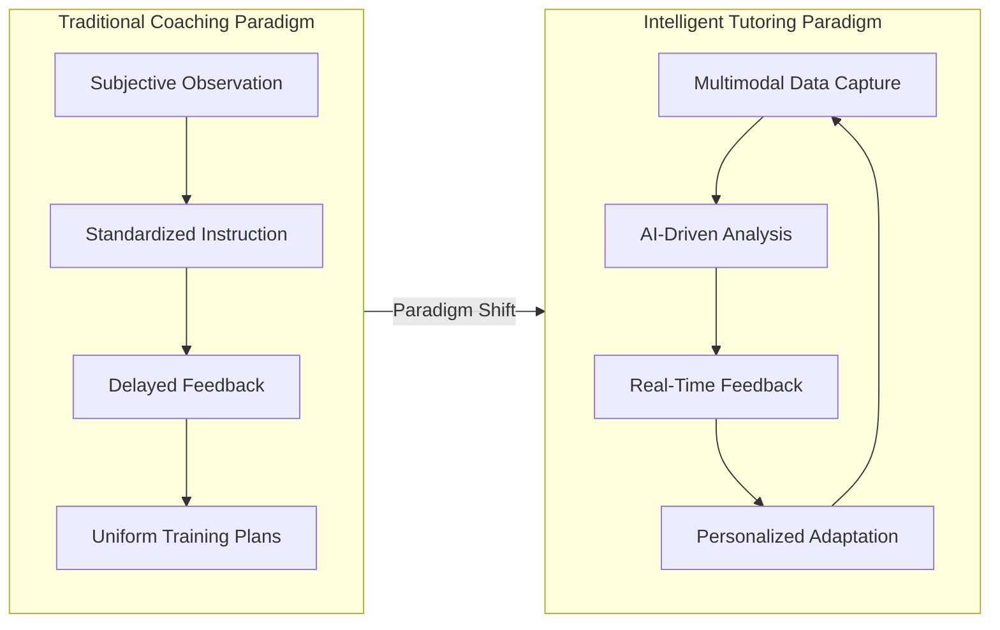
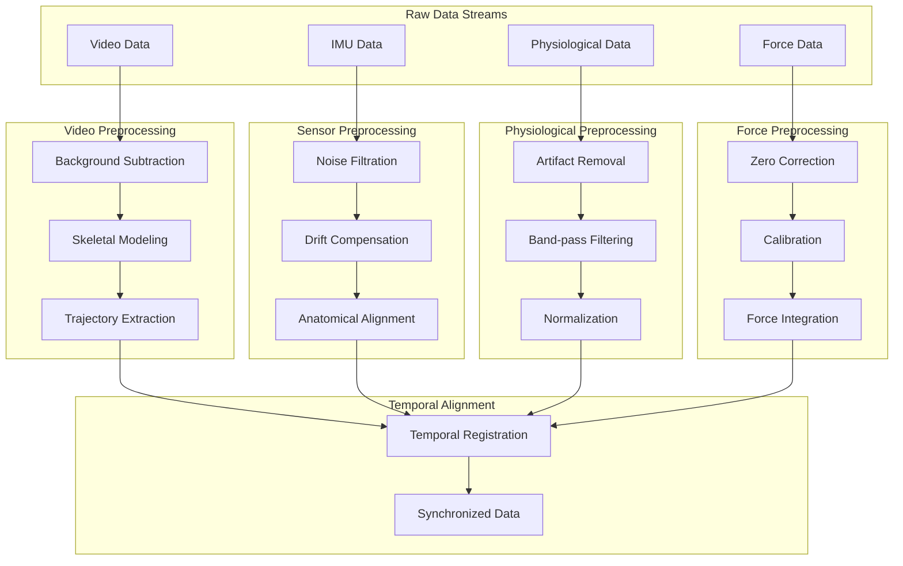
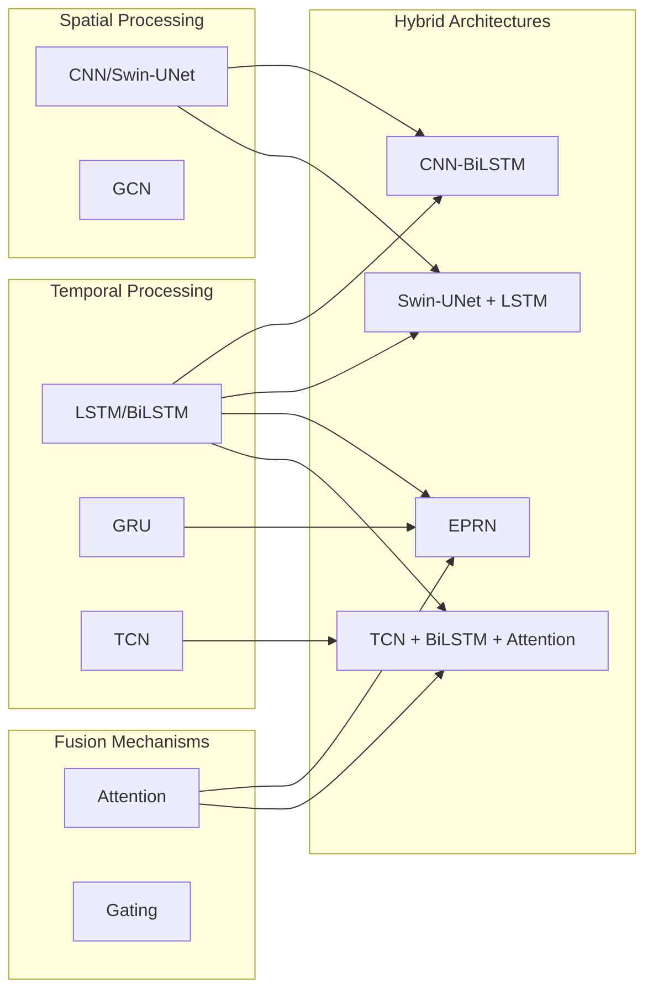
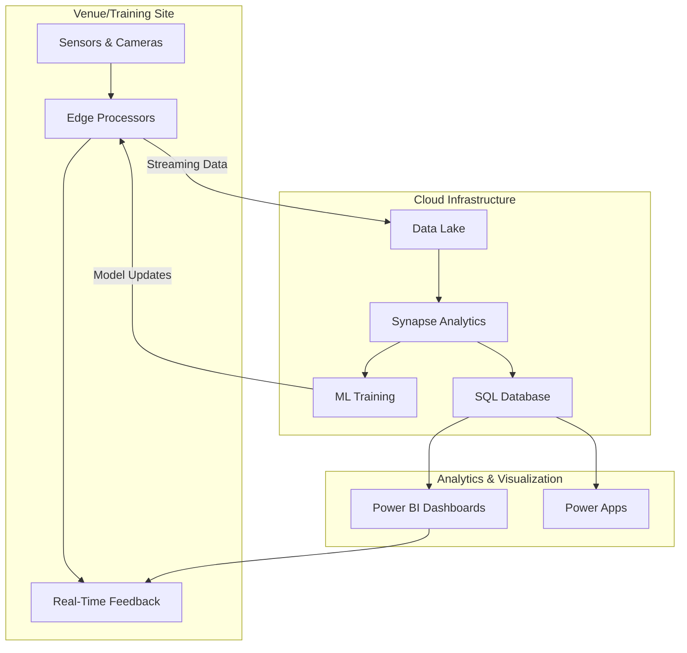
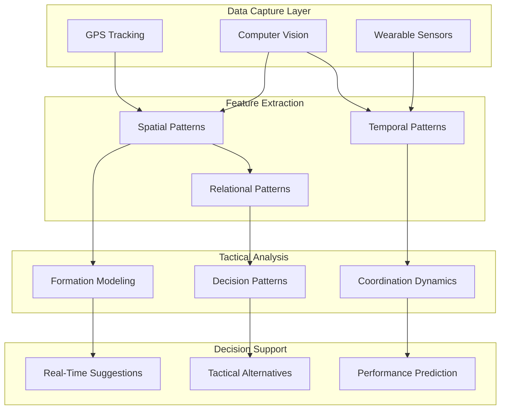
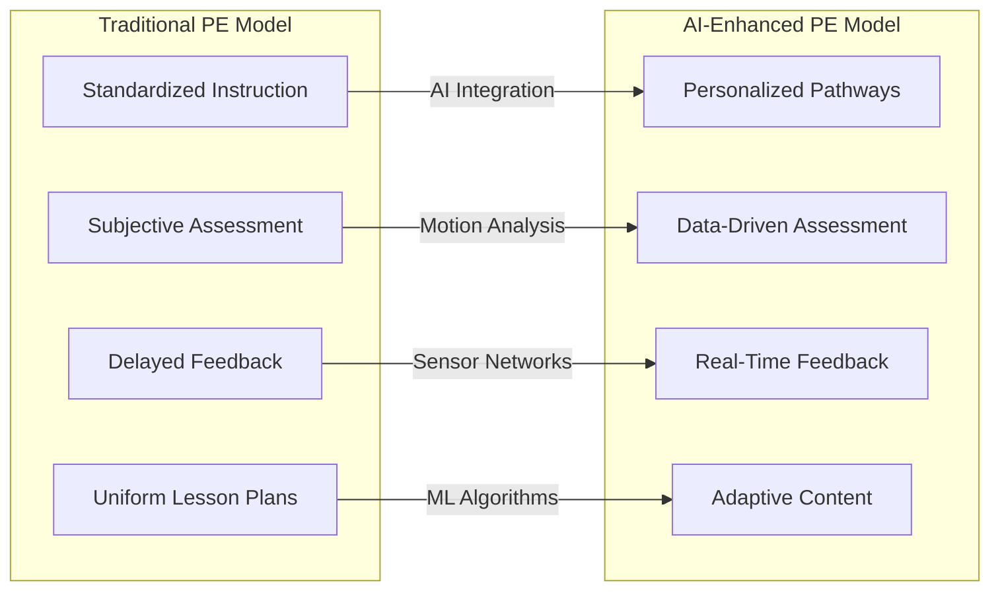
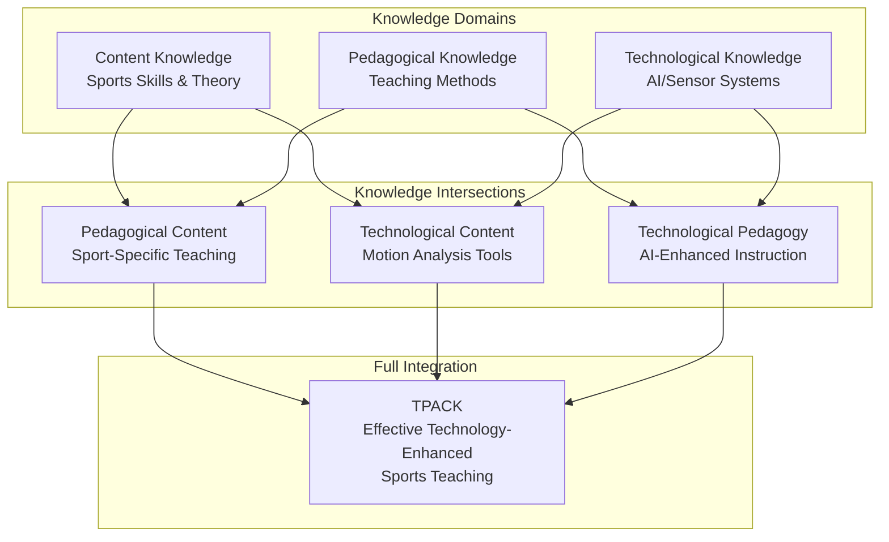
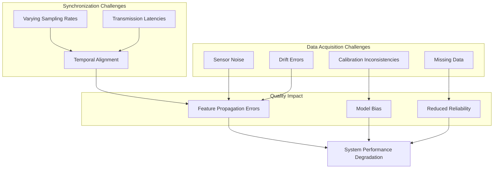
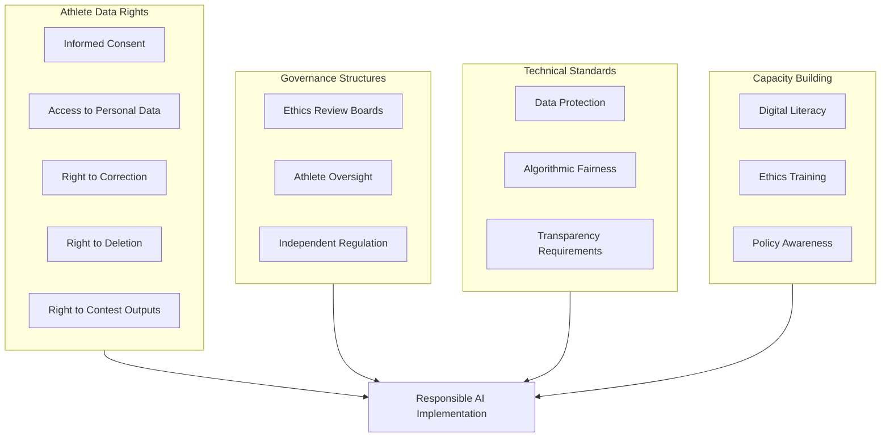

# Building the Future of Sports Education: A Framework for Multimodal Data Fusion-Driven Intelligent Tutoring and Learning Guidance Systems
## 1 Theoretical Foundations and Technological Landscape for Intelligent Sports Tutoring

This chapter establishes the conceptual and technological groundwork for multimodal data fusion-driven intelligent tutoring systems in sports education. The convergence of foundational learning theories with cutting-edge technologies enables a fundamental paradigm shift from traditional subjective coaching to data-driven, personalized sports instruction. By examining the theoretical justifications and technological contexts that underpin this transformation, this chapter provides the essential framework for understanding how intelligent tutoring systems can revolutionize athletic skill acquisition, performance optimization, and learner engagement in sports education environments.

### 1.1 Learning Theories Underpinning Intelligent Sports Tutoring

The design of effective intelligent tutoring systems in sports contexts requires robust theoretical foundations drawn from established pedagogical and psychological frameworks. Three primary theoretical perspectives—**Social Cognitive Theory**, **Self-Determination Theory**, and the emerging **Precision Governance** framework—provide complementary lenses for understanding how learners acquire athletic skills, maintain motivation, and benefit from personalized interventions.

**Social Cognitive Theory and Observational Learning in Athletic Contexts**

Social Cognitive Theory, developed by Albert Bandura, provides a foundational framework for understanding skill acquisition in sports education. The theory emphasizes that learning occurs through observation and imitation, with cognitive factors serving as a critical bridge between behavioral stimuli and learning outcomes[^1]. In athletic contexts, this theoretical perspective identifies four essential types of behaviors worthy of modeling: **social behaviors** (such as respecting teammates, coaches, and opponents), **learning behaviors** (such as focusing on coach instruction), **athletic behaviors** (such as correct technical movements), and **champion behaviors** (such as effort, perseverance, and concentration)[^1].

The theory articulates four key processes that govern observational learning: the **attention process** (behaviors must capture the learner's attention), the **retention process** (behaviors must be encoded in memory), the **motor reproduction process** (learners must possess the capability and receive feedback to reproduce behaviors), and the **motivational process** (learners must have the willingness to imitate)[^1]. Critically, motivation serves as a thread connecting all these processes, highlighting why intelligent tutoring systems must address not only skill demonstration but also learner engagement and reinforcement mechanisms. Models can take various forms—live individuals, verbal instructions, or symbolic representations such as video demonstrations—and coaches must recognize that models with expertise and successful track records are more readily imitated[^1]. This insight directly informs the design of AI-driven systems that can provide expert-level demonstrations and feedback at scale.

**Self-Determination Theory and Intrinsic Motivation Enhancement**

Self-Determination Theory (SDT) offers a complementary framework focusing on the psychological needs that drive sustained engagement in learning activities. The theory posits that fulfilling three basic psychological needs—**autonomy**, **competence**, and **relatedness**—fosters intrinsic motivation and deeper learning engagement[^2]. In sports education contexts, this framework has proven particularly valuable for addressing the challenge that personalized assessment and feedback alone may be insufficient to motivate students for sustained, repetitive practice, especially in individual sports requiring extensive drill work[^2].

Research applying SDT to gamified intelligent tutoring systems demonstrates the practical value of this theoretical framework. A quasi-experimental study integrating gamification elements—avatars, achievements (personal ratings and rankings), badges, levels, and social networks (group ratings and rankings)—into an intelligent tutoring and instant feedback system yielded significant improvements in both skill performance and learning engagement[^2]. The experimental group using the SDT-based gamified system showed significantly higher yoga skills performance (F=9.87, p<.05) with a moderate effect size (η²=.06), while also demonstrating significantly higher cognitive engagement (t=5.23, p<.001), behavioral engagement (t=5.43, p<.001), and emotional engagement (t=5.41, p<.001) compared to the control group[^2]. These findings underscore that intelligent sports tutoring systems must be designed not merely as assessment tools but as motivationally supportive environments that address learners' psychological needs.

**Precision Governance: Adapting Precision Medicine Principles to Sports Education**

The emerging concept of **Precision Governance** represents an innovative theoretical framework adapted from precision medicine principles to address the unique challenges of data-driven decision-making in elite sports[^3]. This framework aims to balance standardized decision-making processes with individualized interventions, recognizing that managers face the critical challenge of enhancing decision-making capabilities through both standardization of information acquisition and the introduction of adaptable, personalized methods[^3].

The Precision Governance framework conceptualizes a four-step hierarchy for facilitating data-driven decisions: **descriptive analytics** (storing relevant variables or performance indicators describing training events), **diagnostic analytics** (comprehensive interpretation of these indicators), **predictive analytics** (forecasting expected outcomes of training processes), and **prescriptive analytics** (determining optimal strategies that balance different training consequences such as performance improvement and injury risk)[^3]. This hierarchical approach directly informs the functional architecture of intelligent tutoring systems, suggesting that effective systems must progress beyond simple data collection to provide interpretive, predictive, and prescriptive guidance.

The novelty of the precision approach lies in continuously updating biological, clinical, and statistical evidence to support decision-making, which is crucial for achieving higher levels of individualization and accuracy[^3]. Applied to sports education, this means that data-driven decision systems should focus on athletes' individual responses in performance, training load, and health/well-being aspects outside training, using this information as feedback loops to optimize predictive models[^3]. This continuous updating places the individual athlete at the center of the entire process, truly enabling management to formulate interventions with greater precision.

### 1.2 Core Enabling Technologies for Intelligent Sports Education

The realization of theory-informed intelligent tutoring systems depends on a sophisticated technological infrastructure comprising artificial intelligence and deep learning architectures, Internet of Things ecosystems, and computer vision applications. Each technological pillar contributes unique capabilities essential for comprehensive sports performance monitoring, analysis, and feedback generation.

**Artificial Intelligence and Deep Learning Architectures**

Artificial intelligence has transitioned from experimental applications to practical deployment in sports education, with research demonstrating that AI-driven reforms are transforming traditional physical education teaching methods into intelligent, data-driven instructional models[^4]. Survey data indicates that AI-assisted teaching has increased student learning motivation by approximately **30%**, while **80%** of students participating in AI-integrated physical education experiments reported better mastery of motor skills through AI-assisted courses[^4].

The technical foundation for these improvements rests on sophisticated deep learning architectures designed for motion analysis and performance prediction. A hybrid **residual network-bidirectional long short-term memory (ResNet–BiLSTM)** architecture has been developed to extract spatial and temporal features for classifying learner actions and predicting proficiency levels[^5]. This architecture enables real-time assessment, instant correction, and adaptive learning feedback in digital and remote education environments. Validation using 10-fold cross-validation yielded **97.3% classification accuracy** and low prediction errors, demonstrating the technical feasibility of accurate automated assessment[^5].

The following table summarizes key AI architectures and their applications in sports education:

| Architecture Type | Primary Function | Key Capabilities | Reported Performance |
|------------------|------------------|------------------|---------------------|
| ResNet–BiLSTM | Action classification & proficiency prediction | Spatial-temporal feature extraction | 97.3% accuracy[^5] |
| Soft Actor-Critic (SAC) | Adaptive feedback timing | Reinforcement learning-based adjustment | Dynamic difficulty adaptation[^5] |
| TCN + BiLSTM + Attention | Time-series analysis | Multi-scale temporal processing | 93.45% prediction accuracy[^6] |
| Swin-UNet + LSTM | Injury risk prediction | Multimodal fusion of imaging and biomechanics | 94% accuracy, 91% F1 score[^7] |

Advanced systems employ **Soft Actor-Critic (SAC) reinforcement learning algorithms** to dynamically adjust feedback timing and difficulty based on ongoing performance metrics[^5]. This approach enables the physical fitness evaluation module to tailor training plans based on physiological data including heart rate, exercise intensity, and fatigue, ensuring optimal training intensity while reducing overtraining risk[^5]. The integration of reinforcement learning enhances training by dynamically adjusting strategies based on students' performance through exploration and feedback during simulated sessions.

**Internet of Things Ecosystems and Real-Time Data Infrastructure**

The Internet of Things provides the essential data acquisition and processing infrastructure for intelligent sports tutoring systems. An **IoT-enabled Deep Learning Monitoring (IoT-E-DLM)** model demonstrates the integration of advanced wearable sensor technologies with hybrid neural networks for real-time athletic performance tracking and feedback[^6]. This system combines **Temporal Convolutional Networks, Bidirectional Long Short-Term Memory, and Attention mechanisms (TCN + BiLSTM + Attention)** to process heterogeneous, high-frequency sensor data while delivering low-latency, sport-specific feedback[^6].

The architectural design balances responsiveness and accuracy through strategic deployment of **edge computing** for real-time local processing and **cloud infrastructure** for high-complexity analytics[^6]. Extensive testing with 147 student-athletes across multiple sports (track and field, basketball, soccer, swimming) over 12 months demonstrated a prediction accuracy of **93.45%** with an average processing latency of **12.34 milliseconds**, outperforming conventional approaches[^6]. The system achieved efficient resource utilization (CPU: 68.34%, GPU: 72.56%), high data capture reliability (98.37%), and precise temporal synchronization[^6].

The **CoachXNet** system exemplifies the AI-IoT integration paradigm, utilizing edge-cloud collaboration to balance latency, scalability, and resource usage[^8]. This system achieves action recognition accuracy of **94.1%**, mean joint position error of **35.2 millimeters**, and average end-to-end latency of **32 milliseconds**[^8]. Notably, personalized training recommendations generated by the system improved athlete performance outcomes by **18-23%** compared to non-personalized approaches[^8], demonstrating the tangible benefits of IoT-enabled intelligent coaching.

**Computer Vision Applications for Motion Analysis**

Computer vision technology has emerged as a transformative tool for sports training, providing data-driven insights to enhance performance, prevent injuries, and refine game strategies[^9]. Traditional coaching methods relying heavily on observation and manual analysis are limited in their ability to track subtle movements or measure biomechanical efficiency; AI-driven video and sensor technologies eliminate these limitations by capturing precise performance data in real time[^9].

The applications of computer vision in sports training span seven key domains[^9]:

1. **Performance analysis and feedback**: Measuring movement efficiency, speed, acceleration, and precision to help athletes refine posture based on specific data with instant feedback enabling real-time technique adjustment
2. **Injury prevention and rehabilitation**: Identifying risk factors through analysis of joint alignment, movement symmetry, and muscle engagement, with motion tracking monitoring recovery progress
3. **Real-time motion tracking**: Using cameras and sensors to analyze athletes' skeletal structures in real time, capturing joint movements and body positions
4. **Biomechanical and posture analysis**: Breaking down athletes' posture, joint alignment, and muscle engagement to provide insights on movement efficiency and posture correction
5. **Virtual coaching and training simulation**: Analyzing movements and techniques to provide customized suggestions based on recorded performance metrics
6. **Personalized training plans**: Creating customized training programs by analyzing performance trends, movement efficiency, and endurance levels
7. **Enhanced game strategy development**: Improving team strategies by analyzing athlete movements, tactical execution, and opponent tendencies

Advanced implementations include **markerless pose estimation and 3D motion capture** systems that track key body points in real time, producing data on joint angles, limb velocity, balance, and timing[^10]. Major League Baseball has installed markerless motion-capture systems in stadiums to analyze pitching and batting mechanics with millimeter accuracy[^10]. AI-driven motion analysis has achieved **85% accuracy** in predicting injury risk by evaluating athletes' movement deviations and muscle imbalances[^4].

### 1.3 Multimodal Data Fusion Paradigms and Methodologies

The integration of heterogeneous data sources represents a critical capability for comprehensive sports performance analysis. Multimodal data fusion overcomes the inherent limitations of single-modality approaches by combining complementary information streams to provide holistic understanding of learner states, performance characteristics, and developmental needs.

**Theoretical Framework for Multimodal Data Fusion**

Data fusion can be defined as the process of effectively combining data from different sources such that the combined use of these data produces more information than using each source separately[^11]. In smart learning environments, this concept has been employed to leverage multimodal data for better understanding educational processes[^11]. The general approach to multimodal learning data fusion and mining involves data from different educational settings (traditional classrooms, online learning, or blended learning) and different sources or data types, with fusion points and techniques depending on the educational problem to be addressed and the data mining/learning analytics objectives[^11].

The comprehensive big data analytics framework for sports performance optimization demonstrates the practical application of multimodal fusion principles[^12]. This framework integrates **data acquisition, processing, analytics, and decision support** through a six-stage decision-making process: Define Objectives, Data Acquisition, Data Integration, Analytics and Modeling, Decision Support, and Implementation and Monitoring[^12]. Case studies applying this framework achieved a **12% reduction** in hamstring injury rates in football, a **16% improvement** in clutch decision-making accuracy in basketball, and an **8% decrease** in 100m sprint times among athletes[^12].

**Fusion Strategy Comparison: Early, Late, and Hybrid Approaches**

Research in multimodal learning analytics has identified three primary fusion strategies with distinct characteristics and applications:

| Fusion Strategy | Description | Advantages | Limitations | Common Applications |
|----------------|-------------|------------|-------------|---------------------|
| **Early Fusion (Feature-level)** | Combines feature vectors directly before classification | Captures cross-modal correlations; unified representation | High dimensionality; requires aligned data | Most commonly used in EDM/LA research[^11] |
| **Late Fusion (Decision-level)** | Classifies each modality independently, then integrates predictions | Modality independence; handles missing data | May lose inter-modal relationships | Distress state tracking in educational games[^13] |
| **Hybrid Fusion** | Combines early and late fusion approaches | Flexible; captures both feature and decision-level information | Increased complexity | Rarely used in current research[^11] |

A study on multimodal data fusion for tracking student distress during educational games demonstrated the effectiveness of decision-level fusion[^13]. The research collected and analyzed audio and video recordings from 31 middle school students across 1,145 data instances, using multiple data sources including facial expression recordings and game logs[^13]. Using supervised machine learning, the researchers built classifiers producing estimated probabilities of distress states, then performed confidence-based data fusion that averaged estimated probability scores from unimodal classifiers[^13]. Results showed that classifiers employing multimodal data fusion improved performance in tracking distress states compared to unimodal classifier performance[^13].

The multimodal data fusion process in this study encompassed four data curation stages: (1) collecting multi-channel data from students including facial data from two facial expression detection toolkits (OpenFace and FER-2013) and game logs; (2) observing and coding recorded gameplay video segments for ground-truth labeling of student distress; (3) executing machine learning classifiers separately for three data sources based on expert annotation results; and (4) comparing performance of classifiers with single data sources versus fused data[^13].

**Attention-Based Fusion Mechanisms**

Advanced fusion approaches employ attention mechanisms that dynamically weight modalities based on their relevance to the task at hand. The **TCN + BiLSTM + Attention** mechanism combines the strengths of Temporal Convolutional Networks, Bidirectional Long Short-Term Memory networks, and attention mechanisms to analyze time-series data generated by IoT sensors[^6]. In this hybrid architecture, the TCN processes input data to extract temporal features at multiple scales, the BiLSTM processes data in forward and backward temporal directions to extract bidirectional dependencies, and the attention mechanism dynamically focuses on the most relevant features and time steps to enhance model interpretability and practicality[^6].

Multimodal deep learning for sports teacher behavior analysis demonstrates sophisticated fusion implementations[^14]. The technical framework employs specialized neural network architectures that extract modality-specific features before integrating them through various fusion mechanisms, including early fusion, late fusion, and advanced attention-based fusion that dynamically weights modalities based on their relevance[^14]. This approach mimics human perceptual integration, where understanding is enhanced by synthesizing multiple sensory inputs[^14].

**Applications from Adjacent Fields**

The review of multimodal data fusion in educational data mining and learning analytics reveals important patterns applicable to sports education[^11]. Regarding fused data, usage across different educational environments is relatively balanced, with 12 papers focusing on face-to-face learning, 11 on online learning, and 8 on blended environments[^11]. Data sources are extensive, primarily including student video recordings, sensor readings of various aspects, and numerical data typically related to academic performance[^11].

Regarding fusion methods, most papers use early fusion of features, while a substantial number use late fusion or decisions produced by different classifiers in earlier stages[^11]. Few studies use hybrid approaches or go beyond this framework. In terms of fusion techniques, feature aggregation is the predominant method, followed by statistical operator-based and ensemble-based methods[^11]. The most prominent EDM/LA objectives addressed through data fusion include managing student emotions, analyzing student behavior, and predicting academic performance, interest, or engagement[^11].

The multimodal approach to predicting sports injuries exemplifies advanced fusion methodology, combining high-resolution computed tomography scans with biomechanical data from motion capture systems, wearable inertial measurement units, and force-sensitive insoles[^7]. The proposed model integrates anatomical and functional data using an **Attention-based Swin-UNet** architecture for CT image analysis and an **LSTM network** for processing temporal biomechanical signals, with results combined through decision-level fusion producing a single injury-risk score[^7]. This model achieved **94% accuracy**, **91% precision**, **92% recall**, and **91% F1 score**, demonstrating the advantage of combining high-resolution imaging with biomechanical measurements through advanced deep learning frameworks[^7].

### 1.4 Paradigm Shift from Traditional Coaching to Data-Driven Personalized Learning

The convergence of theoretical frameworks and enabling technologies catalyzes a fundamental transformation in sports education methodology. This paradigm shift moves from subjective, standardized instruction toward objective measurement, real-time feedback, and adaptive personalization, with empirical evidence demonstrating substantial improvements across multiple outcome dimensions.

**Contrasting Traditional and Intelligent Tutoring Approaches**

Traditional coaching methods are characterized by reliance on subjective observation, standardized instruction applied uniformly across learners, and limited capacity for capturing nuanced performance data. These approaches severely limit the ability to track subtle movements or measure biomechanical efficiency[^9]. In contrast, intelligent tutoring paradigms feature objective measurement through sensor technologies, real-time feedback enabled by edge computing, and adaptive personalization driven by machine learning algorithms.

The following diagram illustrates this paradigm transformation:

The intelligent tutoring paradigm establishes continuous feedback loops where multimodal data capture informs AI-driven analysis, which generates real-time feedback that drives personalized adaptation, which in turn refines subsequent data capture and analysis cycles. This cyclical process enables progressive optimization that traditional approaches cannot achieve.

**Empirical Evidence of Effectiveness**

Systematic review of intelligent tutoring systems reveals a complicated landscape regarding effectiveness in real educational contexts[^15]. Analysis of 40 qualified studies applying social experiment methods during 2011-2022 found that most reviewed studies reported positive results, with learning performance being the primary measured outcome[^15]. The featured functions of merged ITSs primarily focused on recommendation and tutoring, followed by personalized support, exercise and assessment, personalization, adaptive conversation, and game-based learning[^15].

Specific empirical findings demonstrate substantial improvements across multiple dimensions:

| Outcome Dimension | Improvement | Source System | Context |
|------------------|-------------|---------------|---------|
| Learning motivation | ~30% increase | AI-assisted teaching | 200 students surveyed[^4] |
| Motor skill mastery | 80% reported improvement | AI-integrated PE courses | 150 students[^4] |
| Yoga skills performance | Significantly higher (F=9.87, p<.05) | Gamified ITIFS | University students[^2] |
| Athlete performance outcomes | 18-23% improvement | CoachXNet personalized recommendations | Multiple sports[^8] |
| Resource utilization efficiency | 20-30% improvement | AI-driven optimization | Higher education sports[^4] |
| Student participation | 25% increase | AI-assisted training | University implementation[^4] |
| Classroom attendance | 15% increase | AI-assisted training | University implementation[^4] |

The personalized recommendation system for sports teachers based on multimodal deep learning analysis demonstrated superior recommendation accuracy (F1 = 0.85) compared to traditional methods[^14]. The intervention group showed significant improvements in teaching behaviors across instructional clarity (d = 0.68), demonstration quality (d = 0.72), and feedback specificity (d = 0.59)[^14]. These findings indicate that multimodal behavior analysis can effectively identify specific development needs and generate targeted recommendations that significantly enhance sports teaching quality[^14].

**Transformation of Educational Roles and Methodologies**

The integration of intelligent tutoring systems fundamentally transforms the role of sports educators from sole knowledge transmitters to facilitators of data-informed learning experiences. AI-driven systems provide real-time performance tracking and feedback, enabling teachers to dynamically adjust lesson plans using data analytics[^4]. Immersive technologies such as virtual reality and augmented reality further enhance engagement, creating new pedagogical possibilities.

The analysis from IoT-enabled deep learning monitoring systems is presented visually as applications for individual athletes, providing comprehensive feedback systems[^6]. The visualization integrates real-time athletic performance metrics, technique analysis, and AI-driven insights into intuitive, user-friendly dashboards, providing detailed technical feedback by translating the model's deep learning analysis into actionable insights[^6]. This transformation enables coaches and athletes to access previously inaccessible levels of performance detail while maintaining the human judgment essential for effective sports education.

**Challenges and Considerations in Paradigm Transition**

Despite demonstrated effectiveness, the transition to intelligent tutoring paradigms faces significant challenges. The systematic review identified mixed results regarding ITS effectiveness on learning performance and engagement, with moderator factors (ITS characteristics), contextual factors (educational setting), and research design affecting actual effects on outcome variables[^15]. Most studies did not measure these factors or fully control their potential effects in analysis, potentially leading to mixed or conflicting results[^15].

Identified challenges include students' limited task involvement, individual differences, limited resources, methodological and contextual challenges related to social experiments, and adaptation of teachers to ITS-based new forms of learning and curriculum[^15]. While AI shows significant potential in higher education sports, current AI systems' accuracy and universality in motion analysis remain limited, and varying AI literacy levels among educators may hinder effective integration of AI technology into teaching practice[^4].

The regional distribution of research also reveals an "intelligent divide," with 60% of social experiment studies on ITS conducted in the USA[^15], suggesting that benefits of intelligent tutoring systems may not be equally accessible across different educational contexts globally. Addressing these challenges requires continued research attention to implementation factors, educator preparation, and equitable access to enabling technologies.

## 2 Architectural Blueprint: Designing the Multimodal Data Fusion Pipeline

This chapter provides a comprehensive technical analysis of the core system architecture required for multimodal data fusion in intelligent sports tutoring systems. The design of an effective multimodal fusion pipeline represents a critical engineering challenge that must address the heterogeneity of data sources, the temporal dynamics inherent in athletic movements, and the real-time processing demands of practical coaching applications. By systematically examining each stage of the pipeline—from data acquisition through preprocessing, feature engineering, and fusion modeling—this chapter establishes the technical foundation necessary for transforming raw sensor measurements into actionable coaching insights that can drive personalized athletic development.

### 2.1 Heterogeneous Data Acquisition Layer

The foundation of any multimodal data fusion system lies in its capacity to capture comprehensive, high-fidelity data streams from diverse sensing modalities. In sports education contexts, **the heterogeneity of relevant data sources presents both opportunities and challenges**, as each modality contributes unique information about athlete performance while imposing distinct technical requirements for acquisition, synchronization, and processing.

**Video and Motion Capture Systems**

Visual data acquisition forms a cornerstone of sports performance analysis, providing rich spatial information about athlete kinematics, tactical positioning, and movement quality. High-definition cameras operating at elevated frame rates enable detailed capture of rapid athletic movements, with research demonstrating that **120 frames per second** represents an effective capture rate for comprehensive biomechanical analysis in track and field contexts[^7]. Motion capture systems extend visual analysis capabilities by enabling precise tracking of key body points in real time, producing data on joint angles, limb velocity, balance, and timing that would be impossible to extract through manual observation alone.

The integration of computer vision with deep learning has enabled sophisticated **markerless pose estimation** systems that eliminate the need for physical markers on athletes while maintaining high tracking accuracy. These systems process video feeds to extract skeletal representations, enabling analysis of body segment positions and orientations throughout complex movement sequences. A novel architecture integrating the Detection Transformer (DETR) with Graph Convolutional Transformer (GCT) and Gating Mechanisms has demonstrated superior performance for pose estimation in dynamic sports environments, achieving a **mean Average Precision (mAP) of 91.8%** and **PCK@0.5 of 94.5%** on the PoseTrack dataset while maintaining real-time processing capabilities at **28-32 frames per second**[^16][^17].

**Inertial Measurement Units and Wearable Sensors**

Wearable inertial measurement units (IMUs) comprising accelerometers, gyroscopes, and magnetometers provide continuous kinematic data that complements visual capture systems. These sensors enable monitoring of athlete movements in contexts where camera coverage may be limited or impractical, while offering the advantage of direct measurement of acceleration, angular velocity, and orientation. Research on sports activity recognition has demonstrated that IMU-based systems can achieve exceptional classification performance, with a parallel CNN architecture achieving **99.61% average accuracy** in classifying various sports activities using data from just two sensors (right leg accelerometer and gyroscope)[^7].

The technical specifications for IMU deployment vary according to application requirements. Studies on football teaching and training have employed IMU sensors at **200 Hz sampling rates** to capture the rapid dynamics of ball contact events[^18], while comprehensive biomechanical analysis systems integrate IMU data with force-sensitive insoles and motion capture to enable holistic movement assessment[^7]. The following table summarizes typical sensor specifications across different sports applications:

| Sensor Type | Typical Sampling Rate | Primary Measurements | Common Placement |
|-------------|----------------------|---------------------|------------------|
| Accelerometer | 25-200 Hz | Linear acceleration | Ankle, thigh, lumbar region |
| Gyroscope | 25-200 Hz | Angular velocity | Ankle, wrist, trunk |
| Magnetometer | 25-100 Hz | Orientation | Trunk, head |
| Force Insole | 100 Hz | Ground reaction forces | Footwear |
| GPS | 10-20 Hz | Position, velocity | Trunk (vest) |

**Physiological Monitoring Systems**

Physiological data streams provide essential information about athlete internal states that cannot be inferred from kinematic measurements alone. Heart rate variability, electrodermal activity, and respiratory patterns offer insights into fatigue levels, stress responses, and recovery status that inform training load management and injury prevention strategies. The integration of physiological monitoring with movement analysis enables systems to correlate internal physiological states with external performance manifestations, creating opportunities for more nuanced athlete assessment[^19].

Research on athlete anxiety behavior recognition demonstrates the value of integrating physiological signals with facial expression and body movement data, achieving **94.6% accuracy** through multimodal spatiotemporal convolutional networks that simultaneously capture behavioral patterns across multiple modalities[^20]. The complementary nature of physiological and kinematic data is particularly evident in applications requiring assessment of athlete readiness and recovery, where physiological markers may indicate elevated injury risk before kinematic degradation becomes apparent.

**Force Measurement and Ground Reaction Analysis**

Force platforms and instrumented surfaces provide direct measurement of the forces athletes generate during movement, enabling biomechanical analysis that relates kinematic patterns to their kinetic origins. Ground reaction force data captured through force-sensitive insoles and embedded platforms reveals loading patterns, weight distribution, and force generation characteristics essential for technique optimization and injury prevention[^7][^18]. In cycling applications, power meters exemplify smart sensors that fuse force and speed data to provide integrated performance metrics[^19].

**Positioning and Tracking Systems**

GPS and local positioning systems enable spatial tracking of athlete movements across playing areas, providing tactical and strategic information particularly valuable in team sports contexts. The multi-level data fusion framework for team sports integrates GPS data with IMU, physiological, and positioning information to analyze collaborative dynamics, demonstrating that **temporal coordination parameters strongly correlate with team performance (r = 0.73)**[^20][^21]. These positioning systems typically operate at lower sampling rates than IMUs but provide absolute spatial reference essential for tactical analysis and workload quantification.

**Synchronization and Integration Challenges**

The heterogeneous nature of multimodal data streams introduces significant synchronization challenges, as different sensors operate at varying sampling rates and may experience transmission latencies. A novel asynchronous data alignment algorithm extending traditional dynamic time warping with phase-matched interpolation has been developed to address these challenges, achieving **42.3% enhancement in positional accuracy** compared to single-source approaches[^20][^21]. Temporal registration to a common reference framework with sub-millisecond precision is essential for ensuring that data from different modalities can be meaningfully combined during subsequent fusion stages[^7].

### 2.2 Data Preprocessing and Quality Assurance Pipeline

Raw sensor data invariably contains noise, artifacts, and inconsistencies that must be addressed before meaningful analysis can proceed. The preprocessing pipeline transforms heterogeneous raw measurements into clean, aligned data streams suitable for feature extraction and fusion, with the quality of preprocessing directly impacting the reliability and accuracy of downstream analytics.

**Noise Filtration and Signal Enhancement**

Wavelet-based denoising approaches have emerged as particularly effective for processing athletic sensor data, as they preserve important signal characteristics while removing noise across multiple frequency bands. The discrete wavelet transform (DWT) enables multi-resolution analysis that separates signal components at different temporal scales, with research demonstrating that **Symlet (sym4) wavelets produce the lowest RMSE (0.076059)** for sports motion signal processing compared to other wavelet families[^7][^22]. This multi-resolution capability is especially valuable for sports applications where movements contain both slow postural adjustments and rapid ballistic components.

For CT imaging data used in injury prediction systems, preprocessing involves denoising and contrast enhancement before analysis with deep learning architectures[^7][^18]. Video data preprocessing typically includes background subtraction, skeletal modeling, and trajectory extraction algorithms that isolate athlete movements from environmental clutter[^7]. The following diagram illustrates the preprocessing workflow for different data modalities:

**Drift Compensation and Calibration**

Inertial sensors are susceptible to drift errors that accumulate over time, particularly in gyroscope measurements where small biases lead to progressively larger orientation errors. Drift compensation algorithms employ various strategies including zero-velocity updates, magnetometer-aided correction, and Kalman filtering to maintain measurement accuracy over extended recording periods. Research on multi-level data fusion demonstrates that proper drift compensation contributes to the **8.6 dB improvement in signal quality** achieved through comprehensive preprocessing[^20][^21].

Anatomical alignment procedures ensure that sensor coordinate frames are properly registered to body segment reference frames, enabling meaningful interpretation of kinematic measurements. This alignment is particularly critical when comparing measurements across different athletes or sessions, as inconsistent sensor placement can introduce systematic errors that confound analysis.

**Handling Asynchronous Data Streams**

The varying sampling rates and transmission latencies inherent in multi-sensor networks necessitate sophisticated temporal alignment algorithms. A novel asynchronous data alignment algorithm has been developed that extends traditional dynamic time warping with phase-matched interpolation specifically calibrated for the periodic and quasi-periodic movement patterns characteristic of team sports[^23][^24]. This algorithm addresses the challenge that different sensors may capture the same movement event at slightly different times, ensuring that fused data accurately represents the temporal relationships between different measurement modalities.

**Quality Metrics and Reliability Assessment**

Data quality assurance requires systematic monitoring of signal characteristics to identify and address degraded measurements before they compromise downstream analysis. Signal-to-noise ratio (SNR) improvements averaging **8.6 dB (± 1.2 dB)** across all sensor streams following fusion preprocessing have been demonstrated[^24], indicating the substantial quality enhancement achievable through comprehensive preprocessing pipelines. Error propagation analysis demonstrates **42.3% reduction in cumulative position estimation error** compared to single-source approaches when proper preprocessing and fusion are applied[^24].

The preprocessing pipeline must also address missing data, which may arise from sensor failures, communication dropouts, or occlusion events. Robust systems implement interpolation strategies and redundancy mechanisms that maintain analysis continuity despite intermittent data availability, with the multi-level fusion architecture demonstrating **only 8.7% degradation in output quality** when artificial noise is injected, compared to 27.3% and 38.2% degradation for traditional weighted-average and Kalman filter approaches respectively[^25].

### 2.3 Feature Extraction and Engineering Strategies

Feature extraction transforms preprocessed sensor data into representations suitable for machine learning models, with the choice of feature extraction methodology significantly impacting model performance and interpretability. Sports motion analysis benefits from both traditional handcrafted features that encode domain knowledge and deep learning approaches that automatically discover relevant representations.

**Shallow Feature Extraction Approaches**

Traditional feature extraction relies on expert knowledge to identify statistically meaningful characteristics from segmented data windows. **Time-domain features** including mean, variance, skewness, and kurtosis capture the statistical distribution of signal values within analysis windows, providing computationally efficient representations that often perform well for activity classification tasks[^26]. **Frequency-domain features** derived through Fourier transforms reveal the spectral composition of movements, with spectral peaks, energy distribution, and dominant frequencies characterizing the rhythmic structure of athletic activities[^26].

Wavelet-based multi-resolution analysis provides an intermediate approach that captures both time and frequency information simultaneously. The discrete wavelet transform decomposes signals into approximation and detail coefficients at multiple scales, enabling extraction of features that characterize movement dynamics across different temporal resolutions[^7]. Research on sports activity recognition demonstrates that combining DWT and Short-Time Fourier Transform (STFT) features through parallel CNN processing achieves **99.61% average accuracy** in classifying sports activities[^7].

**Deep Feature Extraction Using Neural Networks**

Deep learning approaches automatically discover feature representations through hierarchical processing of raw or minimally processed data, potentially capturing complex patterns that handcrafted features might miss. **Convolutional Neural Networks (CNNs)** excel at extracting spatial features from sensor data, with two primary approaches for processing time-series data: one-dimensional convolution treating each sensor channel independently, and two-dimensional convolution reorganizing data into image-like matrices to capture spatiotemporal dependencies[^26].

**Recurrent Neural Networks**, particularly Long Short-Term Memory (LSTM) networks, capture temporal dependencies in sequential data by maintaining internal state that evolves as the network processes successive time steps. Research on sports motion recognition demonstrates that LSTM networks effectively model the temporal dynamics of biomechanical signals, with the combination of Swin-UNet for structural feature extraction and LSTM for temporal pattern modeling achieving **94% accuracy** in injury prediction tasks[^7][^18]. The BiLSTM variant processes data in both forward and backward temporal directions, enabling extraction of bidirectional dependencies that may be missed by unidirectional processing.

The following table compares feature extraction approaches for sports motion analysis:

| Approach | Feature Type | Advantages | Limitations | Typical Applications |
|----------|--------------|------------|-------------|---------------------|
| Time-domain | Statistical moments | Computationally efficient; interpretable | May miss complex patterns | Activity classification |
| Frequency-domain | Spectral characteristics | Captures rhythmic structure | Assumes stationarity | Gait analysis, cycling |
| Wavelet-based | Multi-resolution | Time-frequency localization | Parameter selection complexity | Motion quality assessment |
| CNN | Learned spatial | Automatic discovery; high accuracy | Requires large datasets | Pose estimation |
| LSTM/BiLSTM | Learned temporal | Captures long-range dependencies | Computationally intensive | Sequence prediction |

**Dimensionality Reduction and Feature Selection**

High-dimensional feature representations can introduce computational challenges and overfitting risks, motivating the application of dimensionality reduction techniques. **Principal Component Analysis (PCA)** projects features onto orthogonal directions of maximum variance, reducing dimensionality while preserving the most informative signal components[^26]. **Linear Discriminant Analysis (LDA)** and **Independent Component Analysis (ICA)** provide alternative projection strategies that optimize for class separability or statistical independence respectively[^26].

Feature selection approaches identify the most discriminative subset of features for a given task, with **Recursive Feature Elimination (RFE)** demonstrating effectiveness in sports analytics applications. Research on basketball performance prediction employed RFE with Linear Regression to select the top 10 features from 22 available, achieving **R² = 0.8749** with the tuned Gradient Boosting model[^27][^28].

**Trade-offs Between Handcrafted and Learned Features**

The choice between handcrafted and automatically learned features involves trade-offs between interpretability, data requirements, and performance. Handcrafted features encode domain expertise and remain interpretable, but may fail to capture complex patterns that deep learning can discover. Deep features typically achieve higher accuracy but require larger training datasets and may function as "black boxes" that resist interpretation.

Research on flexible sensor multimodal data fusion systems demonstrates that **feature-level fusion** combining handcrafted and learned representations can achieve superior performance, with systems achieving **92.1% accuracy** in detecting improper motion patterns—substantially higher than traditional methods including SVM (82.0%), Random Forest (86.4%), and KNN (81.8%)[^29]. This suggests that hybrid approaches leveraging both domain knowledge and automatic feature discovery may offer optimal performance for sports tutoring applications.

### 2.4 Comparative Analysis of Fusion Strategies

The integration of information from multiple modalities can occur at different stages of the processing pipeline, with each fusion strategy offering distinct advantages and limitations. Systematic comparison of fusion approaches provides essential guidance for designing multimodal systems that maximize the complementary value of heterogeneous data sources.

**Sensor-Level Fusion (Data-Level Fusion)**

Sensor-level fusion involves the direct combination of raw sensor outputs before any feature extraction occurs. This approach preserves maximum information from original measurements but faces challenges including dimensional mismatch between modalities, sensitivity to noise and calibration errors, and computational complexity when processing high-volume raw data streams[^30]. The fundamental principle involves systematic combination of complementary, redundant, or cooperative information at the earliest processing stage[^30].

In team sports applications, sensor-level fusion harmonizes raw measurements from individual sensor nodes through device-specific signal processing, forming the foundation of hierarchical fusion architectures[^31][^32]. While this approach maintains data fidelity, it typically requires sophisticated alignment and normalization procedures to handle the heterogeneous characteristics of different sensor types.

**Feature-Level Fusion (Early Fusion)**

Feature-level fusion concatenates extracted feature vectors from different modalities into unified representations before classification or prediction. This strategy enables models to learn cross-modal correlations and joint representations that capture relationships between different data sources. Research on multimodal learning analytics indicates that **feature-level fusion is the most commonly used approach** in educational data mining applications, with feature aggregation serving as the predominant fusion technique[^7].

A comprehensive study on multimodal emotion recognition compared feature-level and decision-level fusion strategies, finding that **feature-level fusion generally outperforms decision-level fusion** for physiological signal analysis, achieving the best RMSE of **0.089 for arousal and 0.053 for valence**[^33]. The advantage of feature-level fusion lies in its capacity to capture joint dependencies across modalities within a unified model.

However, feature-level fusion faces limitations including potential information redundancy, dimensional imbalance when combining modalities with different feature space sizes, and challenges in handling missing modality inputs. Research on flexible sensor systems notes that feature-level fusion "preprocesses and extracts features from multimodal data and subsequently fuses multi-source data into more discriminative feature representations," maintaining key information while reducing data redundancy[^29].

**Decision-Level Fusion (Late Fusion)**

Decision-level fusion trains separate models for each modality independently, then integrates their predictions at the output level. This approach offers several advantages including modality independence, robustness to missing inputs, and improved interpretability since each modality's contribution can be assessed separately. The multimodal sports injury prediction system employs decision-level fusion combining probabilistic outputs from CT imaging and biomechanical models through **α-weighted averaging (optimal α = 0.58)**, achieving **94% accuracy, 91% precision, 92% recall, and 91% F1 score**[^7][^18][^34].

Ablation studies comparing fusion strategies provide compelling evidence for decision-level fusion superiority in certain applications. Research demonstrates that **decision-level fusion (accuracy 0.940, F1 score 0.913) outperformed feature-level fusion (accuracy 0.912, F1 score 0.903) and hybrid fusion (accuracy 0.928, F1 score 0.911)** for injury prediction tasks[^34][^35]. The decision-level approach provided better training stability and interpretability by avoiding dimensional imbalance issues associated with early feature concatenation[^36].

The following table summarizes comparative performance across fusion strategies:

| Fusion Strategy | Accuracy | F1 Score | Precision | Recall | Key Advantages |
|-----------------|----------|----------|-----------|--------|----------------|
| Feature-level | 91.2% | 0.903 | - | - | Cross-modal correlation capture |
| Decision-level | 94.0% | 0.913 | 91.0% | 91.8% | Interpretability, stability |
| Hybrid | 92.8% | 0.911 | - | - | Flexibility |

**Contextual Factors Influencing Strategy Selection**

The optimal fusion strategy depends on application-specific factors including data characteristics, real-time requirements, and interpretability needs. Statistical validation using McNemar's test confirmed that improvement from multimodal data fusion was significant (χ² = 6.25, p = 0.012), with analysis revealing that **biomechanical data provided more complementary information to imaging (31.0% contribution) than vice versa (8.1%)**[^35]. This asymmetric complementarity suggests that fusion strategy design should consider the relative information content of different modalities.

For applications requiring real-time processing, decision-level fusion offers computational advantages since modality-specific models can process data in parallel before integration. The multimodal injury prediction system maintained **sub-second response times (average 0.92s ± 0.11)** under typical operating conditions[^7][^34], demonstrating feasibility for real-time coaching applications.

### 2.5 AI Model Architectures for Sports Motion Analysis

The selection of appropriate deep learning architectures significantly impacts system performance for sports kinematics analysis, performance prediction, and tactical understanding. Different architectural families offer distinct capabilities for processing spatial, temporal, and relational information inherent in athletic data.

**Convolutional Neural Networks for Spatial Feature Extraction**

CNNs excel at extracting hierarchical spatial features through successive convolution and pooling operations. For sports motion analysis, CNNs process sensor data to identify spatial patterns in movement kinematics, with research demonstrating that **CNN models achieve the best performance for shot and pass detection in football**, with weighted F1 scores reaching **0.93** in real-world field scenarios[^18]. The ability of CNNs to automatically learn discriminative filters from data makes them particularly valuable when relevant features are not known a priori.

Specialized CNN architectures have been developed for sports-specific applications. The **Swin-UNet** architecture, originally designed for medical image segmentation, has been adapted for CT-based structural vulnerability assessment in athletes, capturing both fine anatomical details and broader spatial patterns through its hierarchical attention mechanism[^7][^18][^32]. This architecture processes CT images to extract structural features indicative of injury risk, demonstrating the transferability of advanced computer vision architectures to sports applications.

**Recurrent Networks for Temporal Sequence Modeling**

The temporal nature of athletic movements necessitates architectures capable of modeling sequential dependencies. **Long Short-Term Memory (LSTM)** networks address the vanishing gradient problem that limits standard RNNs, enabling learning of long-range temporal dependencies essential for understanding complex movement sequences. Research on sports injury prediction employs LSTM networks to process biomechanical signals including joint movement, ground reaction forces, and loading patterns, capturing temporal dynamics that inform injury risk assessment[^7][^18].

**Bidirectional LSTM (BiLSTM)** networks process sequences in both forward and backward directions, capturing dependencies that may only be apparent when considering future context. The hybrid **CNN-BiLSTM** architecture combines spatial feature extraction with bidirectional temporal modeling, achieving **F1-scores ranging from 0.88 to 0.94** for classification tasks across multiple sports in track and field teaching optimization applications[^7].

**Gated Recurrent Units (GRUs)** provide a computationally lighter alternative to LSTMs while maintaining comparable performance for many tasks. The **Evolved Parallel Recurrent Network (EPRN)** employs parallel LSTM and GRU pathways with attention-based fusion, achieving **23.5% reduction in RMSE** compared to baseline models for sports motion recognition[^7][^22].

**Graph Convolutional Networks for Relational Analysis**

Graph Convolutional Networks (GCNs) model relationships between connected entities, making them particularly suitable for skeleton-based action recognition where body joints form natural graph structures. The **Fusion-GCN** approach integrates various sensor modalities into graph representations, incorporating additional measurements either as node attributes (channel dimension) or new nodes (spatial dimension)[^37]. This architecture demonstrates flexible fusion of RGB sequences, inertial measurements, and skeleton sequences, improving baseline performance by **up to 12.37% (F1-Measure)** on the MMACT dataset[^37].

The **Multi-Modality Adaptive Feature Fusion (MMAFF)** framework employs GCNs with adaptive receptive field selection, using self-attention mechanisms to allow different network layers to adaptively select convolution kernels of different sizes and dilation rates[^7]. This approach achieves competitive results on benchmark datasets including NTU-RGB+D 60 and NTU-RGB+D 120, with accuracy improvements of **0.2% and 0.3%** compared to state-of-the-art models on X-Sub and X-Set benchmarks respectively[^7].

**Transformer and Attention-Based Architectures**

Transformer architectures employing self-attention mechanisms have demonstrated remarkable success across multiple domains, with emerging applications in sports motion analysis. The **Graph Convolutional Transformer (GCT)** processes detected keypoints by modeling the human body as a graph structure, capturing both local and global dependencies between joints[^38][^16][^17]. When integrated with DETR for keypoint detection and gating mechanisms for multimodal fusion, this architecture achieves **mAP of 91.8%** and **PCK@0.5 of 94.5%** for pose estimation in complex sports scenarios[^16][^17].

The attention mechanism enables models to dynamically focus on relevant features while suppressing irrelevant information, particularly valuable when processing multimodal inputs where the relative importance of different data sources may vary across contexts. Research on athlete anxiety recognition employs **multi-head attention** supporting parallel computation of attention weights across different representation subspaces, achieving **94.6% accuracy** with an F1 score of **0.939**[^20].

**Hybrid Architectures for Comprehensive Analysis**

The complexity of sports performance analysis often necessitates hybrid architectures that combine multiple processing paradigms. The following diagram illustrates common hybrid architecture patterns:

The **TCN + BiLSTM + Attention** architecture combines Temporal Convolutional Networks for multi-scale temporal feature extraction, BiLSTM for bidirectional sequence modeling, and attention mechanisms for dynamic feature weighting, achieving **93.45% prediction accuracy** with average processing latency of **12.34 milliseconds** in IoT-enabled sports monitoring applications (as noted in previous chapter content).

### 2.6 Attention-Based and Adaptive Fusion Mechanisms

Advanced fusion mechanisms that dynamically weight modalities based on contextual relevance and signal quality represent a significant advancement over static fusion approaches. These adaptive mechanisms enhance model robustness when handling unreliable inputs while improving interpretability by revealing the relative contributions of different data sources.

**Self-Attention for Intra-Modal Dependencies**

Self-attention mechanisms enable models to capture long-range dependencies within individual modalities by computing attention weights that relate different positions in a sequence. In athlete anxiety behavior recognition, **self-attention mechanisms capture long-range dependencies within single modalities**, enabling the model to identify relevant temporal patterns regardless of their position in the input sequence[^20]. This capability is particularly valuable for sports applications where relevant movement features may be separated by variable time intervals.

The mathematical formulation of self-attention computes query, key, and value representations from input features, with attention weights determined by the compatibility between queries and keys. Multi-head attention extends this mechanism by computing multiple attention patterns in parallel, enabling the model to attend to information from different representation subspaces simultaneously[^20].

**Cross-Attention for Inter-Modal Information Exchange**

Cross-attention mechanisms facilitate information exchange between different modalities, enabling each modality to attend to relevant features from other data sources. Research on multimodal spatiotemporal networks demonstrates that **cross-attention mechanisms promote information exchange between different modalities**, allowing the model to selectively incorporate complementary information from multiple data streams[^20].

The feature interaction module in multimodal anxiety recognition employs **bidirectional attention mechanisms** that enable each modality to query and retrieve relevant information from others[^20]. This bidirectional exchange allows the model to leverage the strengths of each modality to compensate for limitations in others, improving overall robustness and accuracy.

**Gating Mechanisms for Selective Feature Integration**

Gating mechanisms control information flow through the network, enabling selective integration of features based on learned parameters and contextual cues. The multimodal pose estimation architecture employs **gating mechanisms to selectively filter and integrate multimodal information**, ensuring that the most relevant and reliable data are used in the estimation process[^38][^16][^17].

Ablation studies demonstrate the critical contribution of gating mechanisms to model performance. Removing gating mechanisms from the full DETR-GCT-Gating architecture **reduced mAP from 91.8% to 90.1%**[^17], confirming that selective feature integration provides meaningful performance benefits. The gating mechanism helps optimize fusion of spatial and temporal data by dynamically adjusting the importance of each input source based on task requirements and data quality[^38].

**Adaptive Weight Allocation Algorithms**

Adaptive weight allocation mechanisms dynamically adjust fusion weights based on signal quality metrics, contextual relevance, and historical performance. The multi-level data fusion architecture for team sports employs an **adaptive weight allocation mechanism that dynamically adjusts fusion weights** based on multiple factors including signal quality and contextual relevance[^20][^21][^31][^32].

Research demonstrates that adaptive fusion significantly outperforms static approaches. The adaptive multimodal fusion architecture for anxiety recognition achieved **94.6% accuracy and 0.939 F1 score**, representing **6.2% improvement over baseline methods** and **3.4% improvement over traditional fusion strategies**[^20]. Systematic comparison confirmed that the proposed adaptive method substantially outperformed both early fusion and late fusion approaches by **7.3% and 6.7%** respectively[^20].

The fusion weight optimization process typically involves grid search or learned optimization to identify optimal weighting parameters. For injury prediction systems, the **optimal fusion weight α = 0.58** was determined through grid search on validation data, with sensitivity analysis demonstrating that performance remained stable **(±0.6%)** for α values between 0.50 and 0.65[^35]. This stability suggests that well-designed adaptive fusion mechanisms are robust to minor parameter variations.

**Enhancing Interpretability Through Attention Visualization**

A significant advantage of attention-based fusion mechanisms lies in their interpretability. Attention weights provide insights into which features and modalities the model considers most relevant for specific predictions, enabling practitioners to understand and validate model behavior. The decision-level fusion approach employed in injury prediction systems **improves interpretability** by maintaining separation between modality-specific models while enabling assessment of each modality's contribution to final predictions[^32][^36].

### 2.7 Real-Time Processing and Edge-Cloud Architecture

Practical deployment of multimodal fusion systems in sports education settings requires computational infrastructure capable of meeting stringent latency requirements while handling the throughput demands of multiple concurrent data streams. The architectural design must balance processing speed, accuracy, and resource utilization to enable effective real-time coaching applications.

**Edge Computing for Low-Latency Local Processing**

Edge computing strategies deploy computational resources close to data sources, minimizing transmission latency and enabling rapid local processing of time-sensitive data. For sports applications requiring immediate feedback, edge processing is essential for achieving the sub-second response times necessary for effective coaching intervention. Research on multimodal injury prediction demonstrates that systems can achieve **average end-to-end inference latency of 0.92 seconds (± 0.11)** on appropriate hardware (NVIDIA RTX 3080 Ti GPU), meeting sub-second response criteria for continuous athlete tracking[^32][^39].

The IoT data pipeline architecture for sports event tracking employs edge computing through **AWS Outposts** for video, data, or machine learning processing at venues, reducing latency for health and safety analytics that require immediate response[^32]. This approach enables real-time processing of high-frequency sensor data while reserving cloud resources for more complex analytical tasks.

**Cloud Infrastructure for Complex Analytics**

Cloud infrastructure provides the computational capacity necessary for training complex deep learning models, processing large-scale historical data, and performing sophisticated analytics that exceed edge computing capabilities. The **Azure Sports Analytics Architecture** demonstrates a comprehensive cloud-based approach, utilizing **Azure Synapse Analytics** as a central hub for data processing, handling big data analytics, data warehousing, and data integration[^40].

The cloud architecture supports both real-time event processing for live game analysis and batch analytics for historical trends, with processed data stored in Data Lake for raw and semi-structured data or SQL Database for structured, ready-to-use data[^40]. Machine learning services enable training of predictive models that can subsequently be deployed to edge devices for real-time inference.

**Hybrid Edge-Cloud Collaboration Paradigms**

Optimal system design typically employs hybrid architectures that leverage both edge and cloud resources according to task requirements. The **CoachXNet** system exemplifies this approach, utilizing edge-cloud collaboration to balance latency, scalability, and resource usage, achieving action recognition accuracy of **94.1%**, mean joint position error of **35.2 millimeters**, and average end-to-end latency of **32 milliseconds** (as noted in previous chapter content).

The following diagram illustrates a typical edge-cloud architecture for sports analytics:

**Performance Benchmarks and Feasibility Assessment**

Comprehensive performance evaluation establishes the feasibility of multimodal fusion systems for practical coaching applications. The multi-level data fusion system for team sports achieved **real-time response times of 192-312 milliseconds** across different sports, which is below the **500 millisecond threshold** identified as necessary for effective in-game decision support[^25][^23][^24]. Cross-sport testing demonstrated consistent performance with **84.2-91.4% accuracy** across basketball, soccer, volleyball, and handball[^20][^21][^31].

Comparative analysis of fusion algorithms reveals performance trade-offs between accuracy and computational complexity:

| Fusion Method | Position RMSE | Velocity RMSE | Latency | Noise Threshold |
|---------------|---------------|---------------|---------|-----------------|
| Multi-level (Proposed) | 0.12 m | 0.08 m/s | 12 ms | 30 dB |
| Kalman Filter | 0.28 m | 0.17 m/s | 18 ms | - |
| Weighted Average | 0.41 m | 0.25 m/s | 5 ms | - |
| Bayesian Fusion | 0.21 m | 0.13 m/s | 32 ms | - |
| Deep Learning | 0.15 m | 0.10 m/s | 85 ms | - |

The proposed multi-level fusion algorithm achieved superior accuracy while maintaining competitive computational efficiency, with **O(n log n) complexity** enabling real-time processing[^23][^24].

**Scalability and Resource Utilization**

System scalability ensures that performance remains stable as user loads increase. Stress testing of the injury prediction system showed that **performance remained stable up to 2x load**, with latency increasing to 1.23 seconds only at 3x load[^32]. The system demonstrated robust performance under increased data loads, confirming scalability for deployment across multiple concurrent users.

Resource utilization metrics provide guidance for infrastructure planning. The IoT-enabled deep learning monitoring system achieved efficient resource utilization with **CPU: 68.34%** and **GPU: 72.56%** (as noted in previous chapter content), indicating that systems can operate effectively without requiring maximum computational resources. Data capture reliability of **98.37%** and precise temporal synchronization ensure that the data foundation remains solid even under demanding operational conditions.

The AWS-based data pipeline architecture emphasizes **serverless services** to maintain solution scalability and cost-effectiveness, with Amazon Kinesis providing real-time collection, processing, and analysis of streaming data during competitions[^32]. This serverless approach eliminates the need for dedicated infrastructure management while automatically scaling to accommodate varying workloads.

## 3 Core System Functions: From Perception to Personalized Guidance

This chapter systematically examines the intelligent functional modules enabled by multimodal data fusion in sports tutoring systems. Building upon the architectural foundation established in the previous chapter, it analyzes how fused sensor data translates into actionable coaching insights through four core functional domains: real-time motion technique assessment, tactical cognition analysis, performance prediction and modeling, and automated feedback generation. The chapter further investigates personalized exercise prescription algorithms and adaptive learning pathway mechanisms, demonstrating how the system bridges the gap between raw perceptual data and individualized guidance for athletes while providing structured decision support for coaches.

### 3.1 Real-Time Motion Technique Assessment and Biomechanical Analysis

The capacity to evaluate athletic technique execution in real time represents a transformative capability of multimodal fusion systems, enabling immediate identification of movement deficiencies that would be imperceptible to human observers. By integrating computer vision-based pose estimation, IMU-derived kinematic parameters, and force platform data, these systems construct comprehensive biomechanical profiles that assess movement quality across multiple dimensions simultaneously.

**Integration of Multimodal Sensing for Technique Evaluation**

The foundation of real-time technique assessment lies in the **synergistic fusion of complementary sensor modalities** that capture different aspects of athletic movement. Computer vision systems provide markerless pose estimation through deep learning architectures that track skeletal keypoints in real time, producing data on joint angles, limb positions, and body segment orientations. Concurrently, wearable IMUs capture acceleration, angular velocity, and orientation data that complement visual analysis, particularly during periods of occlusion or in environments where camera coverage is limited. Force-sensitive insoles and embedded platforms complete the measurement ensemble by providing direct quantification of ground reaction forces, loading patterns, and weight distribution characteristics[^36][^37].

The **multi-level data fusion architecture** integrates these heterogeneous data streams through adaptive weight allocation and asynchronous alignment algorithms specifically calibrated for sport-specific movement patterns. Experimental validation has demonstrated an **8.6 dB improvement in signal quality** and a **42.3% enhancement in positional accuracy** compared to single-source approaches, establishing the quantitative advantage of multimodal integration for technique assessment[^37][^41]. Cross-sport testing across basketball, soccer, volleyball, and handball has confirmed consistent performance with **84.2–91.4% accuracy** and real-time response times of **192-312 milliseconds**, which falls below the 500-millisecond threshold identified as necessary for effective coaching intervention[^32].

**Deep Learning Architectures for Movement Classification**

The technical realization of automated technique assessment depends on sophisticated deep learning architectures capable of extracting discriminative features from multimodal sensor data. The **Evolved Parallel Recurrent Network (EPRN)** framework exemplifies this approach, utilizing parallel recurrent pathways that combine Long Short-Term Memory (LSTM) and Gated Recurrent Unit (GRU) layers merged through an attention-based fusion mechanism to enhance temporal modeling[^42][^43]. This architecture captures both short-term movement dynamics and long-range temporal dependencies essential for understanding complex athletic sequences.

The integration of **wavelet-based feature extraction** with recurrent deep learning has proven particularly effective for sports motion analysis. The discrete wavelet transform decomposes motion signals into multiple frequency bands, enabling simultaneous capture of high-frequency transient events (such as ball contact or takeoff moments) and lower-frequency global motion patterns (such as running gait cycles). Systematic analysis of different wavelet families identified the **Symlet (sym4) wavelet as optimal**, achieving the lowest RMSE (0.076059) and MSE (0.005785) for motion reconstruction tasks[^42][^44]. The EPRN framework demonstrated a **23.5% reduction in RMSE** and a **12.7% increase in Structural Similarity Index (SSIM)** compared to conventional architectures including LSTM, GRU, and CNN models[^43][^44].

The following table summarizes the comparative performance of different deep learning architectures for sports motion recognition:

| Architecture | RMSE | MSE | SSIM | Inference Time | Key Characteristics |
|--------------|------|-----|------|----------------|---------------------|
| EPRN (Proposed) | 0.076 | 0.006 | 0.957 | 7.8 ms/sample | Parallel recurrent pathways with attention fusion |
| LSTM | 0.138 | 0.019 | 0.912 | 12.5 ms/sample | Sequential temporal modeling |
| GRU | 0.180 | 0.032 | 0.897 | 10.8 ms/sample | Simplified gating mechanism |
| CNN | 0.147 | 0.022 | 0.953 | 6.2 ms/sample | Spatial feature extraction |
| CNN-LSTM | 0.125 | 0.016 | 0.934 | 14.3 ms/sample | Hybrid spatial-temporal processing |

**Comparison Against Expert Evaluation Standards**

A critical validation criterion for automated technique assessment systems involves comparison against human expert evaluation. Research has demonstrated that **convolutional neural networks reached 94% agreement with international experts** in technique assessment tasks, establishing that AI-based systems can achieve expert-level consistency in movement evaluation[^7][^31]. In gymnastics applications, a CNN-based system for evaluating balance beam routines achieved **94% agreement with international judges**, while figure skating systems automatically detected technical errors in jump execution with **89% accuracy** compared to elite coaches[^31].

Particularly significant is the finding that **machine learning-based systems can identify technical deficiencies with 23% greater sensitivity than expert coaches** in complex movements[^31]. This enhanced sensitivity arises from the capacity of AI systems to systematically compare individual athlete data against models trained on datasets of elite performers, recognizing subtle movement pattern variations that signal improvement potential—nuances often imperceptible to human observation. Computer vision systems have demonstrated accuracy within **15 mm compared to marker-based motion capture systems**, enabling automated technique evaluation without specialized equipment[^7][^31].

**Key Assessment Metrics and Biomechanical Parameters**

Real-time technique assessment systems evaluate movement quality across multiple biomechanical dimensions. **Movement efficiency** is quantified through analysis of joint kinematics, segment coordination, and energy expenditure patterns, identifying deviations from optimal movement trajectories. **Posture correctness** assessment involves continuous monitoring of joint alignment, body segment orientations, and balance characteristics throughout movement execution. **Temporal coordination** metrics capture the synchronization of multi-joint actions, phase relationships between body segments, and timing precision relative to external events such as ball contact or takeoff[^37][^41].

The collaborative dynamics indicator system developed for team sports provides a structured framework for quantifying coordination across **spatial, temporal, and functional dimensions**. Spatial indicators measure formation stability and positional relationships, while temporal indicators quantify synchronization and timing between athletes. Analysis revealed that **temporal coordination parameters strongly correlate with team performance (r = 0.73)**, demonstrating the predictive value of coordination metrics for performance outcomes[^41][^32].

### 3.2 Tactical Cognition Analysis and Decision-Making Support

Beyond individual technique assessment, intelligent sports tutoring systems must address the cognitive and strategic dimensions of athletic performance. Tactical cognition analysis examines how athletes perceive, process, and respond to dynamic game situations, while decision-making support systems provide real-time guidance for strategic choices during competition and training.

**Spatiotemporal Tracking and Formation Analysis**

The foundation of tactical analysis lies in comprehensive tracking of player positions and movements throughout competitive activities. Advanced tracking systems utilize **computer vision and deep learning algorithms** to capture and analyze player and ball movements in real time, providing detailed metrics on external load and technical-tactical performance[^23]. Technologies deployed during major competitions, such as the FIFA World Cup 2022, demonstrate the practical application of AI-powered optical tracking systems that process video feeds to extract tactical information without requiring players to wear specialized equipment[^23].

The multi-level data fusion approach enables analysis of **collaborative dynamics** across multiple organizational scales within team structures. The hierarchical architecture progressively integrates data from individual sensors to team-level coordination metrics, employing adaptive filtering algorithms that account for situational context and interactive dependencies between team members[^32][^31]. This multi-scale analysis captures coordination phenomena at individual, dyadic, sub-group, and whole-team levels, providing nuanced understanding of how coordination emerges across different organizational scales[^32].

**Graph-Based Tactical Pattern Recognition**

Graph convolutional networks and related architectures have emerged as powerful tools for analyzing the relational structure of tactical situations. Research on football tactical behavior has demonstrated that **AI-based techniques effectively reshape spatiotemporal tracking data** into actionable insights for training and practice routines with real-time decision-making support[^32]. Tactical behavior is expressed through spatiotemporal tracking data using various AI methods including convolutional neural networks, recurrent neural networks, variational autoencoders, and graph metrics such as betweenness centrality, clustering coefficient, and page rank[^32].

The comprehensive collaborative dynamics indicator system quantifies team coordination through metrics including:

- **Team spatial entropy**: Measures the distribution and organization of players across the playing area
- **Relative position maintenance index**: Quantifies the consistency of positional relationships between teammates
- **Multi-scale cross-recurrence quantification analysis**: Identifies recurring coordination patterns across different temporal scales
- **Phase coherence analysis**: Assesses the synchronization of movement phases between players[^37][^41]

These indicators capture coordination patterns that were previously accessible only through subjective expert observation, providing coaches and analysts with **objective tools for quantifying previously subjective aspects of team coordination**[^41][^37][^20].

**Real-Time Tactical Adjustment Capabilities**

One of the most transformative applications of AI in sports is the capacity to provide **live tactical adjustments during matches**. By analyzing real-time data from player tracking systems, AI tools offer suggestions for optimal strategies that can directly impact match outcomes[^23]. The Toronto Raptors' use of a "ghosting" method to simulate defensive behaviors and Liverpool FC's TacticAI system exemplify how AI can model complex in-game scenarios to predict opponent behaviors and suggest effective counterstrategies[^23].

Research evaluating AI applications in football and basketball coaching found that **AI significantly improved tactical performance**, with football teams seeing **82% improvement** in pressing and counter-attack strategies, while basketball teams demonstrated **85% improvement** in accurate shot prediction and defensive positioning[^32]. These systems leverage predictive analytics and machine learning techniques to identify key contextual factors, enabling real-time analysis crucial for developing adaptive strategies[^23].

The following diagram illustrates the tactical analysis workflow from data capture to decision support:

**Quantification of Decision-Making Quality**

Tactical cognition analysis extends to evaluating the quality of individual decision-making during gameplay. The multi-level fusion architecture enables assessment of **how individual decisions contribute to team-level outcomes**, linking collaborative dynamics to performance through multilevel analytical frameworks[^32]. Four key metrics—Temporal Coordination Rate, Coordination Perturbation Response, Spatial Synchronization Index, and Individual-Collective Coupling—have been demonstrated to **predict match outcomes with 73.6% accuracy**, substantially outperforming traditional performance indicators[^31][^45].

Analysis revealed distinctive coordination signatures across teams, with **high-performing teams exhibiting significantly greater spatial synchronization indices**[^32]. The system's ability to identify coordination breakdowns preceding defensive lapses provides actionable intervention targets that coaches rated as **highly applicable (mean rating 8.7/10)** to training design[^32]. This objective quantification transforms tactical coaching from intuition-based to evidence-based practice.

### 3.3 Performance Prediction and Outcome Modeling

Predictive modeling capabilities represent a critical functional domain of intelligent sports tutoring systems, enabling anticipation of athletic performance outcomes, identification of injury risk factors, and optimization of training loads. These predictive functions leverage the comprehensive data streams captured through multimodal fusion to construct models that forecast future states based on current and historical patterns.

**Ensemble Architectures for Performance Forecasting**

Advanced performance prediction systems employ **ensemble architectures combining multiple machine learning approaches** to maximize predictive accuracy and robustness. The hybrid CNN-BiLSTM architecture combined with gradient-boosted trees has demonstrated exceptional performance in sports applications, with the **performance prediction component achieving a coefficient of determination (R²) of 0.978** in track and field teaching optimization contexts[^32][^46]. This ensemble approach integrates the spatial feature extraction capabilities of CNNs, the temporal sequence modeling of BiLSTM networks, and the robust nonlinear modeling of gradient-boosted trees.

The machine learning framework for track and field teaching employs a multi-component ensemble architecture comprising:

- **Technique classification component**: Hybrid CNN-BiLSTM architecture achieving F1-scores of 0.88 to 0.94 across multiple sports
- **Performance prediction component**: Ensemble combining gradient-boosted trees with multilayer perceptrons
- **Learning trajectory component**: Bayesian Recurrent Neural Network for modeling skill acquisition
- **Risk assessment module**: Random Forest classifier achieving AUC of 0.913[^32][^46]

Ablation studies confirmed that **component synergies yielded 17.3% greater performance** than individual subsystems, demonstrating the value of integrated multi-component prediction architectures[^32][^46].

**Multimodal Injury Risk Assessment**

The integration of structural imaging with biomechanical monitoring enables sophisticated injury risk prediction that addresses both anatomical vulnerability and functional movement patterns. The multimodal framework combining **high-resolution CT scans with biomechanical data** from motion capture systems, wearable IMUs, and force-sensitive insoles achieved **94% accuracy, 91% precision, 92% recall, and an F1 score of 91%** in injury prediction tasks[^36][^37][^44].

The decision-level fusion strategy integrating independent confidence estimates from CT imaging (processed via Swin-UNet architecture) and biomechanical models (processed via LSTM network) demonstrated superior performance compared to feature-level and hybrid fusion approaches. Statistical validation using McNemar's test confirmed that the improvement from multimodal data fusion was **significant (χ² = 6.25, p = 0.012)**, with biomechanical data providing **31.0% complementary contribution** to imaging compared to only 8.1% contribution in the reverse direction[^35].

The following table summarizes the comparative performance of different prediction approaches:

| Approach | Accuracy | Precision | Recall | F1 Score | Key Data Sources |
|----------|----------|-----------|--------|----------|------------------|
| Multimodal Fusion (Proposed) | 94% | 91% | 92% | 91% | CT + IMU + Force |
| Random Forest | 82% | - | - | 79% | Biomechanical only |
| Support Vector Machine | 79% | - | - | 76% | Biomechanical only |
| Logistic Regression | 75% | - | - | 73% | Biomechanical only |
| CT Imaging Only | ~87% | - | - | ~85% | Structural imaging |

**Real-Time Monitoring and Early Warning Systems**

Effective injury prevention requires real-time monitoring systems capable of detecting elevated risk states before injury occurs. The multimodal injury prediction framework includes a **real-time early warning pipeline** that combines personalized biomechanical deviations with structural imaging cues, triggering alerts when an athlete's predicted risk score exceeds a threshold of **0.70**, determined empirically via ROC curve analysis (AUC = 0.96)[^36][^37][^32].

The system maintained **sub-second response times (average 0.92 seconds ± 0.11)** under typical operating conditions, meeting the criteria for continuous athlete tracking during training[^36][^32]. In experimental implementation, the integration of real-time monitoring led to a **statistically significant reduction in injury risk scores** (p = 0.031) across athletes[^44]. Cross-sport generalization tests using a leave-one-sport-out protocol demonstrated consistent performance with **average accuracy of 91.8% ± 0.004** across soccer, athletics, basketball, swimming, and cricket[^44][^35].

**Training Load Optimization Through Predictive Analytics**

Predictive modeling extends to optimization of training loads based on individual physiological responses and fatigue-recovery dynamics. The deep reinforcement learning framework for personalized training load optimization demonstrated **performance improvements averaging 12.3% (95% CI: 10.1–14.5%, p < 0.001)** compared to traditional periodization-based methods, alongside a **43% reduction in injury rates** and enhanced training efficiency by 1.15 to 1.42 times compared to conventional approaches[^43].

Implementing integrated AI systems has resulted in measurable injury prevention outcomes, with research demonstrating a **23% reduction in reinjury rates** through AI-driven intervention programs[^7]. Random forest models have achieved **85% accuracy in predicting hamstring injuries** by analyzing workload data and historical injury records[^7]. These predictive capabilities enable proactive intervention before injury occurrence, fundamentally shifting the paradigm from reactive treatment to preventive management.

### 3.4 Automated Feedback Generation and Real-Time Coaching Guidance

The translation of analytical insights into actionable feedback represents a critical bridge between system perception and athlete improvement. Automated feedback generation systems must balance technical accuracy with pedagogical effectiveness, presenting complex biomechanical analysis in formats that athletes can understand and act upon while supporting coaches in their instructional roles.

**Natural Language and Visual Feedback Modalities**

Effective feedback systems employ multiple modalities to communicate insights according to context and learner preferences. **Natural language generation** approaches translate quantitative analysis into verbal coaching cues that mirror the communication style of human coaches, while **visual feedback modalities** including skeletal overlays, trajectory visualizations, and heatmaps provide intuitive representations of movement quality and tactical positioning[^23].

Cloud-based processing platforms have democratized access to sophisticated analysis, enabling **real-time technique feedback without specialized equipment requirements**. Research has demonstrated that cloud platforms enable automated biomechanical analysis from coaching videos within minutes, providing instant technique feedback across competitive levels[^31]. The integration of visual and quantitative feedback has improved athlete engagement and understanding, with systems achieving **96% accuracy for technique categorization** compared to expert analysis[^31].

**Reinforcement Learning for Feedback Timing Optimization**

The timing of feedback delivery significantly impacts learning outcomes, with research distinguishing between immediate corrective feedback and delayed reflective guidance. **Soft Actor-Critic (SAC) reinforcement learning algorithms** enable dynamic adjustment of feedback timing and difficulty based on ongoing performance metrics, optimizing the balance between immediate correction and consolidated learning[^32].

The adaptive learning optimization algorithm based on reinforcement learning principles structures training as a **constrained Markov decision process**, incorporating technique-specific progression sequencing, difficulty calibration, temporal spacing optimization, and contextual adaptation[^32][^46]. This approach enables the system to learn optimal feedback strategies through interaction with athletes, progressively refining its timing and content based on observed learning outcomes.

**Integration with Learning Management Systems**

Learning Management Systems (LMS) have evolved into **knowledge translation platforms** that link biomechanical analysis with field practice, serving as critical allies of AI-driven sports analytics[^31]. These platforms enable users to access AI-driven biomechanical feedback and tailored training programs through intuitive interfaces that support both athletes and coaches.

Research has empirically demonstrated the effectiveness of learning strategies delivered via LMS, achieving a **45% increase in coaches' capacity to visually identify technique inefficiencies** through incremental curriculum in running biomechanics compared to workshop-based learning[^31]. This finding highlights the potential of integrated feedback systems to enhance not only athlete performance but also coach development, creating multiplicative effects across the sports education ecosystem.

The integration of feedback systems with LMS platforms enables:

- **Structured knowledge transfer**: Complex biomechanical insights translated into actionable coaching formats
- **Progress tracking**: Longitudinal monitoring of technique development and learning outcomes
- **Resource accessibility**: Democratized access to expert-level analysis regardless of location or resource availability
- **Coach development**: Enhanced capacity for technique identification and intervention design

**Balancing Automated and Human Guidance**

While automated feedback systems provide valuable support, research emphasizes that **human expertise remains essential** for contextual interpretation, ethical governance, and athlete-centered decision-making[^47]. A critical evaluation of AI-generated exercise prescriptions found that while AI models could create generally safety-conscious programs, they **lacked precision in addressing individual health conditions and goals**, often prioritizing excessive safety over training effectiveness[^32][^48][^31].

The limitations identified include inability to monitor physiological responses in real-time, insufficient progressive overload principles, and lack of variability in program design[^48][^44][^32]. These findings underscore that **AI systems should function as supplemental tools** that enhance rather than replace human coaching expertise, with coaches maintaining responsibility for dynamic adjustment and personalization based on real-time observation and athlete feedback[^45].

### 3.5 Personalized Exercise Prescription and Training Load Optimization

The generation of individualized training recommendations represents a sophisticated application of multimodal data fusion, requiring integration of athlete profiles, real-time physiological responses, and evidence-based training principles. Personalized prescription algorithms must balance optimization of training stimulus with management of fatigue and injury risk, adapting continuously to individual responses.

**Deep Reinforcement Learning Frameworks for Load Optimization**

Advanced personalized training systems employ **deep reinforcement learning (DRL) frameworks** that learn optimal prescription strategies through interaction with athlete responses. The DRL framework for personalized training load optimization uses a hybrid neural network architecture based on the **Deep Q-Network (DQN)** design, employing multilayer perceptrons and convolutional neural networks to process heterogeneous physiological data and generate personalized training prescriptions[^43].

Empirical validation across multiple sports disciplines demonstrated substantial benefits:

| Outcome Metric | Improvement | Statistical Significance |
|----------------|-------------|-------------------------|
| Performance improvement | 12.3% average | 95% CI: 10.1–14.5%, p < 0.001 |
| Injury rate reduction | 43% | Compared to traditional methods |
| Training efficiency | 1.15–1.42x | Compared to conventional approaches |
| System availability | 99.7% | Operational reliability |
| Response time | < 2 seconds | Real-time capability |

The system integrates physiological monitoring, decision-making algorithms, and adaptive feedback mechanisms for real-time optimization, with comparative analysis showing the full DRL system **significantly outperformed baseline methods** including linear regression, LSTM networks, and rule-based systems[^43].

**Adaptive Difficulty Calibration and Mastery-Based Progression**

Effective personalized prescription requires adaptive calibration of training difficulty based on demonstrated mastery levels. Machine learning-based training optimization systems employ **Item Response Theory (IRT) algorithms** to personalize learning task difficulty, ensuring that training challenges remain appropriately matched to current athlete capabilities[^49]. This approach prevents both under-stimulation that fails to drive adaptation and over-challenge that leads to frustration or injury.

The track and field teaching optimization method employs a **gradient-based reinforcement learning framework** structured as a constrained Markov decision process, incorporating technique-specific progression sequencing, difficulty calibration, temporal spacing optimization, and contextual adaptation[^32][^46]. Machine learning-enhanced teaching protocols produced a **27.3% reduction in time-to-proficiency** and a **41.2% decrease in injury risk** compared to traditional pedagogical approaches[^32][^46].

**Fatigue-Recovery Dynamics Integration**

Sophisticated prescription algorithms incorporate models of fatigue accumulation and recovery processes to optimize training periodization. The deep reinforcement learning framework establishes theoretical foundations through **mathematical modeling of personalized training load relationships and fatigue-recovery dynamics**, enabling prediction of optimal training stimuli based on current physiological state[^43].

AI-driven tools integrate analysis of multiple data streams including:

- **Workload history**: Accumulated training stress and recovery patterns
- **Physiological metrics**: Heart rate variability, sleep quality, and wellness indicators
- **Performance indicators**: Technique quality, power output, and movement efficiency
- **Recovery profiles**: Individual response patterns to different training stimuli[^23]

Systems like Zone7 use **supervised learning techniques to predict injury risk** by analyzing extensive workload data and historical injury records, offering real-time insights that enable proactive load management[^23].

**Limitations Compared to Human Expert Prescription**

Despite demonstrated improvements, current AI systems exhibit significant limitations compared to human expert prescription. Critical evaluation revealed that AI-generated exercise prescriptions **lack precision in addressing individual health conditions and goals**, often prioritizing safety over training effectiveness[^32][^48][^31]. Specific limitations include:

- **Conservative approach**: Programs prescribe moderate-intensity exercises lacking systematic progression in intensity, complexity, or variability[^45]
- **Insufficient personalization**: Failure to incorporate real-time physiological feedback or conduct preliminary patient assessment[^45]
- **Limited adaptability**: Inability to dynamically adjust plans based on ongoing athlete responses[^48][^44]
- **Monotonous design**: Lack of creativity and variability that could hinder long-term adherence and progress[^32]

The study concluded that AI technologies **can serve as supplemental tools** in exercise prescription, particularly in enhancing accessibility for individuals unable to access professional advice, but are **not yet recommended as substitutes** for personalized, progressive, and health condition-specific prescriptions provided by healthcare and fitness professionals[^48][^31][^32].

### 3.6 Adaptive Learning Pathways and Skill Progression Sequencing

The construction and continuous adaptation of individualized learning trajectories represents a sophisticated capability that addresses the fundamental challenge of optimizing skill acquisition sequences for diverse learner populations. Adaptive pathway systems must balance standardized skill progressions with individualized pacing, ensuring that each athlete progresses through appropriate developmental sequences at rates matched to their learning characteristics.

**Technique-Specific Progression Sequencing**

Effective skill development requires structured progression through prerequisite capabilities toward target competencies. The machine learning framework for track and field teaching implements **technique-specific progression sequencing** that orders learning activities according to skill dependencies and transfer relationships[^32][^46]. This sequencing ensures that foundational capabilities are established before advancing to complex integrated skills, while identifying optimal transition points based on demonstrated mastery.

The system's optimization algorithm enables **dynamic adaptation to individual learning patterns**, converting analytical data into structured teaching sequences that respond to each athlete's demonstrated progress[^32][^46]. Longitudinal assessment revealed **statistically significant improvements in skill retention** for experimental groups compared to control subjects, demonstrating the effectiveness of adaptive sequencing for durable learning outcomes[^32][^46].

**Bayesian Recurrent Neural Networks for Learning Trajectory Modeling**

Advanced adaptive systems employ **Bayesian Recurrent Neural Networks** for modeling individual learning trajectories, enabling prediction of future learning states based on historical patterns and current performance[^46]. This probabilistic approach captures uncertainty in learning predictions, enabling more robust adaptation decisions that account for individual variability in skill acquisition rates.

The multimodal fusion algorithm for adaptive learning integrates heterogeneous learning behavior data—including text, images, and interaction logs—using **stacked denoising autoencoders and Restricted Boltzmann Machines**[^7]. The adaptive learning module constructs a student-resource interaction graph and dynamically recommends learning materials using a **graph-enhanced contrastive learning strategy** and dual-MLP-based enhancement mechanism, achieving mean absolute error (MAE) of 0.01 and precision of 95.3%[^7].

**Self-Determination Theory Integration for Motivation Support**

Recognizing that skill acquisition depends not only on appropriate challenge levels but also on sustained motivation, adaptive pathway systems integrate **Self-Determination Theory principles** to support autonomy, competence, and relatedness needs. Research implementing SDT-based intelligent tutoring systems for student-athletes demonstrated significant improvements in learning engagement through designs addressing these psychological needs[^49].

The SDT-based design incorporated:

- **Autonomy support**: System access on different devices (PC, tablet, smartphone) enabling learner choice
- **Relatedness support**: Integration of real teacher interaction and animated encouragement characters
- **Competence support**: IRT algorithm personalizing learning task difficulty to match current capability[^49]

Results showed significant improvement in academic engagement, with completion rates increasing from **21.2% to 72.7% for mathematics** and **55.7% to 90.9% for English**, while academic motivation increased significantly (t = -2.56, p < 0.05) without negatively affecting athletic motivation[^49].

**Demonstrated Improvements in Learning Outcomes**

Systematic evaluation of adaptive learning pathway systems demonstrates substantial improvements compared to traditional pedagogical approaches:

| Outcome Metric | Improvement | Comparison Baseline |
|----------------|-------------|---------------------|
| Time-to-proficiency | 27.3% reduction | Traditional teaching |
| Injury risk | 41.2% decrease | Conventional methods |
| Skill retention | Statistically significant | Control group |
| Student satisfaction | 88.77% average | One-month trial |
| Learning gains | 4.19x greater | Traditional teaching |

The intelligent educational system demonstrated strong scalability and real-time responsiveness when tested with sample sets ranging from 10 to 3,000 students, with **response times not increasing proportionally with user count**[^7]. In extended trials with 6,000 student samples, the system maintained an **average student satisfaction rate of 88.77%**[^7].

**Challenges in Adaptive Pathway Implementation**

Despite demonstrated effectiveness, adaptive learning pathway systems face implementation challenges that constrain their practical deployment. Current intelligent physical education systems primarily rely on **general-purpose educational models that lack specificity** for the unique demands of sports contexts, with existing algorithms for behavior recognition performing inadequately when addressing high-frequency, unstructured, and dynamic movement patterns characteristic of physical education settings[^32].

A robust modeling framework for **cross-modal temporal alignment remains notably absent**, and algorithmic modeling of key variables—including personalized exercise pathways, non-normative movement learning, and complex physiological load responses—is substantially underdeveloped[^32]. These limitations constrain critical functionalities such as early warning of sports injuries, adaptive management of feedback latency, and real-time generation of instructional strategies.

The systematic review of intelligent tutoring systems in K-12 education identified that while **ITSs generally produce positive effects on learning and performance**, these effects are mitigated when compared to non-intelligent tutoring systems, with only one of four studies showing significant advantage for intelligent systems in direct comparison[^49][^50][^20]. This finding suggests that the intelligence of adaptive systems may be less important than other design factors, highlighting the need for continued research into optimal pathway construction and adaptation strategies.

## 4 Application Scenarios and Impact Assessment in Sports Education Contexts

This chapter systematically examines the practical deployment of multimodal data fusion-driven intelligent tutoring systems across diverse sports education settings, evaluating their measurable impacts through empirical evidence. The translation of sophisticated technical architectures into real-world educational applications reveals both the transformative potential and practical constraints of these systems. By analyzing implementation patterns across K-12 physical education, university sports programs, and professional athletic training, this chapter quantifies outcomes across multiple dimensions—including skill acquisition, training efficiency, learning motivation, and injury prevention—while investigating the fundamental transformation of sports educators' roles in AI-augmented environments.

### 4.1 Deployment in K-12 Physical Education Classrooms

The implementation of intelligent tutoring systems in primary and secondary school physical education settings presents unique challenges and opportunities that distinguish these deployments from traditional classroom applications. The **dynamic, embodied nature of physical education pedagogy** creates specific requirements for system design and integration that must accommodate high-frequency movement patterns, unstructured activity sequences, and the fundamental physicality of the learning environment.

**Integration Patterns and Curriculum Alignment**

Digital-intelligent technologies have been comprehensively integrated into the physical education process through the synergistic application of wearable devices, big data analytics systems, and large AI models. Physical educators use wearable devices to collect students' movement data, which are then analyzed using machine learning algorithms, with generative AI further employed to construct learner profiles and develop personalized exercise plans enabling data-informed instructional decision-making[^44]. The deployment predominantly occurs within in-school courses, with **95% of applications (n = 81)** occurring in formal instructional settings compared to only 5% in after-school sports activities, reflecting an enduring research emphasis on structured educational contexts[^44].

Intelligent teaching systems supporting human-AI collaboration and cognitive augmentation within classroom settings encompass multiple subtypes including Educational Exergaming Systems, Wisdom Gymnasium Infrastructures, Pedagogical Robotics, and Interactive AI Tutoring Systems. For example, researchers have developed Kinect-based exergaming frameworks for children enabling real-time motion trajectory extraction and motor skill assessment, with systems incorporating **adaptive learning path optimization algorithms** that dynamically generate personalized intervention strategies based on learner performance metrics[^44][^51].

**Empirical Evidence on Student Outcomes**

Research examining the effects of AI-driven intelligent tutoring systems on K-12 students reveals generally positive but nuanced outcomes. A systematic review analyzing 28 studies encompassing 4,597 K-12 students found that in comparisons of ITS versus teacher-led instruction, **seven out of eight studies reported significant positive effects** on student performance, with effect sizes ranging from medium to large[^52]. One study found learning gains were **4.19 times greater** for the ITS group with a medium-sized effect (Hedges's g = 0.68), while another reported a large effect size (d = 0.99) when comparing ITS results to national standardized tests[^52].

The effectiveness of intelligent tutoring systems is influenced by specific components and features. Core components include **personalization and adaptivity**, where systems that tailor content to individual student needs demonstrate better outcomes. Immediate, data-driven feedback constitutes another critical component, with features that enhance efficacy including supporting blended learning models that integrate teacher involvement and incorporating self-regulation strategies like self-assessment prompts or progress tracking[^52].

**Unique Challenges in K-12 Physical Education Contexts**

Research investigating why AI may hinder rather than enhance teaching efficiency in primary school physical education reveals significant barriers across multiple dimensions[^15][^53]. The following table summarizes key challenges identified through qualitative analysis with PE teachers:

| Dimension | Specific Barriers | Impact on Implementation |
|-----------|-------------------|-------------------------|
| **Technological** | Interface complexity, infrastructure limitations, high network dependency, inadequate technical support | Hinders effective system operation |
| **Teacher-related** | Professional identity conflicts, negative attitudes, lack of trust, increased pressure | Reduces adoption willingness |
| **Task-related** | Real-time monitoring difficulties in dynamic environments, student distractions from devices, reduced pedagogical flexibility | Limits instructional effectiveness |
| **Organizational** | Inadequate support systems, unclear policies, lack of teacher involvement in decisions | Creates implementation barriers |

A particularly significant finding is the emergence of **"pedagogical-technological dissonance"** where AI tools can impede the dynamic, embodied nature of PE pedagogy[^15]. Current intelligent physical education systems primarily rely on general-purpose educational models that lack specificity for the unique demands of sports contexts, with existing algorithms for classroom attention monitoring and static behavior recognition performing inadequately when addressing high-frequency, unstructured, and dynamic movement patterns characteristic of physical education settings[^44].

**Student Engagement and Developmental Considerations**

The effectiveness of intelligent tutoring systems varies based on learner developmental stage and individual characteristics. Research found that the ITS had varying effects on middle and high school students, with **middle school students showing greater improvement** in the ITS condition and benefiting more compared to high school students[^54]. This finding suggests that educators may need to differentiate ITS implementations depending on the level of education to effectively increase student performance.

Challenges related to students' limited task involvement, such as low assignment completion rates or high attrition, were particularly pronounced for younger students for whom the regulatory skills required might be too demanding[^38]. Handling students' individual differences presents another challenge, as these differences can moderate the effect size of ITS interventions or create ceiling effects that limit observable improvements[^38].

### 4.2 Integration in University Sports Programs and Higher Education

The application of AI-driven intelligent tutoring systems in higher education physical education contexts demonstrates substantial transformation of traditional instructional models toward intelligent, data-driven approaches. University settings provide environments where more sophisticated technologies can be deployed and where students possess greater technological literacy and self-regulation capabilities.

**Transformation of Traditional PE Methods**

With the rapid advancement of artificial intelligence technology, its application in higher education physical education has transitioned from experimentation to practical implementation[^55][^38][^56]. AI-driven reforms are transforming traditional PE methods into intelligent, data-driven instructional models that integrate real-time data analysis to enable personalized teaching adjustments based on students' learning progress and athletic abilities[^56][^57].

The following diagram illustrates the transformation pathway from traditional to AI-enhanced physical education:

AI enhances teaching effectiveness through real-time performance tracking and feedback, with motion recognition systems tracking students' movements in real time, providing accurate feedback and refining technique execution[^38][^56]. By leveraging data analytics, teachers can dynamically adjust lesson plans to align with students' progress, shifting from conventional "one-to-many" instruction to an interactive, student-centered approach[^57].

**Quantified Improvements in Student Outcomes**

Empirical evidence from university implementations demonstrates substantial improvements across multiple outcome dimensions. A survey of 200 students revealed that **AI-assisted teaching increased student motivation by approximately 30%**[^55][^38][^56][^57]. An AI-integrated PE reform experiment showed that **80% of 150 participating students reported better mastery of athletic skills** through AI-assisted courses, leading to sustained interest in physical activity[^55][^38].

The following table synthesizes quantified improvements from higher education implementations:

| Outcome Measure | Improvement | Sample/Context | Source |
|-----------------|-------------|----------------|--------|
| Student motivation | ~30% increase | 200 students surveyed | [^55][^38][^56] |
| Motor skill mastery | 80% reported improvement | 150 students in AI courses | [^55][^38] |
| Student participation | 25% increase | University AI training implementation | [^55][^56] |
| Class attendance | 15% increase | University AI training implementation | [^55][^56] |
| Resource utilization efficiency | 20-30% improvement | AI-driven optimization | [^55][^56] |
| Strength, endurance, coordination | Up to 20% improvement | AI-assisted vs. traditional training | [^55][^38][^56] |

AI systems analyze students' athletic data to develop individualized learning paths, significantly improving performance, particularly in coordination and endurance. These systems continuously monitor movement patterns, offering real-time feedback and adjusting training accordingly, thereby optimizing skill development[^38][^56].

**Personalized Learning and Data-Informed Instruction**

AI-driven systems create customized learning experiences based on individual physiological and performance data, shifting from conventional instruction to an interactive, student-centered approach[^55]. The systems dynamically tailor course content based on real-time feedback, ensuring personalized and engaging learning experiences[^38][^56].

Research has shown that AI-assisted training improves strength, endurance, and coordination by **up to 20%** compared to traditional training programs[^55][^38][^56]. AI-driven predictive analytics can identify potential performance plateaus, allowing for timely modifications in training plans to sustain continuous improvement[^38][^56].

The integration of immersive technologies such as virtual reality (VR) and augmented reality (AR) further enhances engagement, making physical education more effective and enjoyable[^58]. AI improves efficiency in resource utilization by analyzing student engagement metrics and optimizing facility usage, leading to a **20-30% increase in effectiveness**[^55][^56].

**Challenges in Higher Education Implementation**

Despite demonstrated benefits, effective AI integration requires technical proficiency among educators. A survey of 500 PE teachers indicated that **60% lacked adequate AI training**, hindering effective technology integration[^55][^38][^57]. To address this gap, universities are introducing AI training programs to enhance teachers' proficiency in data analytics and AI-assisted instruction[^55][^38][^57].

The successful implementation of digital-intelligent technologies in physical education depends heavily on teachers' digital literacy, institutional infrastructure readiness, and support from the regional digital ecosystem[^44]. Structural mismatches between the high cost of digital equipment (e.g., AR/VR platforms, motion capture systems) and limited funding in certain settings significantly impede scalable deployment[^44].

### 4.3 Professional Athletic Training and Elite Performance Optimization

The deployment of multimodal fusion systems in professional and elite athletic training environments represents the most sophisticated application of these technologies, where marginal performance improvements can determine competitive outcomes. Elite settings demand higher precision, faster processing, and more comprehensive integration than educational contexts, while also providing resources and infrastructure that enable advanced implementations.

**Technique Refinement Through AI-Driven Analysis**

AI-driven motion analysis provides unprecedented precision in technique assessment for elite athletes. Major League Baseball has installed markerless motion-capture systems in stadiums to analyze pitching and batting mechanics with millimeter accuracy, enabling identification of subtle technique variations that impact performance outcomes. Computer vision systems processing video feeds extract skeletal representations and joint kinematics, providing data on joint angles, limb velocity, balance, and timing that would be impossible to capture through manual observation.

Research examining AI applications in elite coaching found that AI significantly improved tactical performance, with football teams demonstrating **82% improvement in pressing and counter-attack strategies**, while basketball teams showed **85% improvement in accurate shot prediction and defensive positioning**. These systems leverage predictive analytics and machine learning techniques to identify key contextual factors, enabling real-time analysis crucial for developing adaptive strategies.

**Real-Time Tactical Support and Decision-Making**

One of the most transformative applications of AI in professional sports is the capacity to provide **live tactical adjustments during matches**. By analyzing real-time data from player tracking systems, AI tools offer suggestions for optimal strategies that can directly impact match outcomes. The Toronto Raptors' use of a "ghosting" method to simulate defensive behaviors and Liverpool FC's TacticAI system exemplify how AI can model complex in-game scenarios to predict opponent behaviors and suggest effective counterstrategies.

The comprehensive collaborative dynamics indicator system quantifies team coordination through metrics including team spatial entropy, relative position maintenance index, multi-scale cross-recurrence quantification analysis, and phase coherence analysis. Analysis revealed that **temporal coordination parameters strongly correlate with team performance (r = 0.73)**, with high-performing teams exhibiting significantly greater spatial synchronization indices.

**Injury Prediction and Prevention in Elite Settings**

AI significantly improves injury prevention in elite sports training. Research indicates that **AI-based motion recognition systems can predict injury risk with 85% accuracy** by assessing an athlete's movement deviations and muscular imbalances[^55][^38][^56][^58]. By analyzing movement biomechanics and identifying inefficient motion patterns, AI helps athletes refine their techniques and reduce the likelihood of overuse injuries[^38][^56].

Wearable AI technologies enhance real-time monitoring, allowing for immediate feedback and personalized adjustments in training loads to mitigate injury risks[^55][^38][^56][^58]. The multimodal framework combining high-resolution CT scans with biomechanical data achieved **94% accuracy, 91% precision, 92% recall, and 91% F1 score** in injury prediction tasks[^59], demonstrating the advantage of combining structural imaging with functional movement analysis.

A single-case study of a professional female tennis player (WTA ranking 505) demonstrated the real-life application of wearable sensor technology for injury prevention over six months[^2]. The validated wearable sensor worn on the dominant wrist monitored workload and recovery indicators, with the HRV index guiding training modifications. During observation, the player successfully returned to competition without pain recurrence, demonstrating the system's utility for optimizing training loads and reducing overuse injury risks through objective quantification of external and internal loads[^2].

**Performance Optimization Through Predictive Analytics**

AI empowers sports scientists with innovative tools to optimize training, enhance performance, and manage player health[^60]. The key challenge lies in converting the massive influx of raw data from wearable trackers and physiological sensors into actionable insights for optimizing performance. Sports scientists now face the task of accurately analyzing these datasets to provide evidence-based feedback within strict timeframes[^60].

Deep learning models, particularly CNNs, are used to analyze high-dimensional data from wearable sensors, allowing for the monitoring of athletes' biomechanics and the detection of risky movements[^14]. For example, CNNs have been used to detect abnormal running mechanics that could lead to knee injuries by processing data from wearable sensors or motion capture technology[^14]. AI-powered systems can continuously track an athlete's condition during training or competition, alerting staff to potential risks[^14].

AI also optimizes return-to-play decisions by creating personalized rehabilitation plans based on individual data[^14]. The integration of AI in elite sports acts as a complementary asset that enhances the decision-making of sports scientists, ultimately improving player outcomes[^60].

### 4.4 Comparative Analysis of Skill Acquisition and Training Efficiency Outcomes

A systematic comparison of empirical evidence across deployment contexts reveals consistent patterns of improvement while identifying contextual factors that moderate system effectiveness. This analysis synthesizes quantitative findings to establish evidence-based benchmarks for implementation success.

**Skill Acquisition Rates Across Contexts**

Research on AI-based visual feedback for skill learning demonstrates substantial improvements in technique acquisition. A study comparing video feedback versus oral feedback for tackling skill learning in youth football found that the video feedback group achieved **179% improvement in technical performance** compared to 96% for the oral feedback group[^15]. Particularly significant improvements were observed in specific technique components, with video feedback producing **220% improvement in leg and knee positioning (C3)** and **270% improvement in ball contact technique (C4)**[^15].

Biomechanical analysis revealed that the video feedback group's trunk-leg angle improved by **23.84%**, approaching the expert model reference angle (167.3°), while the oral feedback group improved by only 9.63%[^15]. These findings demonstrate that AI-based 3D animated visual feedback can effectively enhance skill learning outcomes, technical execution precision, and intrinsic motivation in sports education contexts.

The following table provides a comparative analysis of skill acquisition outcomes across different system implementations:

| System Type | Context | Skill Improvement | Time-to-Proficiency | Effect Size |
|-------------|---------|-------------------|---------------------|-------------|
| AI visual feedback | Youth football | 179% (vs. 96% control) | Not reported | Large |
| Gamified ITIFS | University yoga | Significantly higher (F=9.87) | Not reported | η² = 0.06 |
| AI-assisted teaching | Higher education PE | 80% reported mastery | Not reported | Medium-large |
| Machine learning framework | Track and field | F1: 0.88-0.94 | 27.3% reduction | Large |
| Personalized recommendations | Multiple sports | 18-23% improvement | Not reported | Medium |

**Training Efficiency Improvements**

Machine learning-enhanced teaching protocols demonstrate substantial efficiency gains. The track and field teaching optimization framework produced a **27.3% reduction in time-to-proficiency** alongside a **41.2% decrease in injury risk** compared to traditional pedagogical approaches. The deep reinforcement learning framework for personalized training load optimization demonstrated **performance improvements averaging 12.3%** (95% CI: 10.1–14.5%, p < 0.001) compared to traditional periodization-based methods.

The personalized recommendation system for sports teachers based on multimodal deep learning analysis demonstrated superior recommendation accuracy (F1 = 0.85) compared to traditional methods[^61]. The intervention group showed significant improvements in teaching behaviors across instructional clarity (d = 0.68), demonstration quality (d = 0.72), and feedback specificity (d = 0.59)[^61], indicating that multimodal behavior analysis can effectively identify specific development needs and generate targeted recommendations.

**Contextual Moderators of Effectiveness**

The effectiveness of intelligent tutoring systems is moderated by several contextual factors. In comparisons of ITS to non-adaptive or non-intelligent tutoring systems, results were more contradictory—only one of four studies showed a clear advantage for the ITS, while the other three reported no significant difference in learning gains[^52]. This finding suggests that the specific features and implementation quality of intelligent systems may be more important than intelligence per se.

Duration of interventions varied widely in reviewed studies, with half lasting less than a week and some as brief as a single class period[^52]. Only one study acknowledged the potential for a novelty effect to influence results in such short-term interventions, highlighting methodological limitations in the current evidence base. The systematic review of 40 studies found that most reported positive results, but identified challenges including students' limited task involvement, individual differences, limited resources, and adaptation of teachers to ITS-based learning[^38].

### 4.5 Impact on Learning Motivation and Student Engagement

The effects of intelligent tutoring systems on learner motivation and engagement represent a critical dimension of system effectiveness, as sustained engagement determines long-term learning outcomes. Drawing on Self-Determination Theory frameworks and gamification research, this analysis examines how system design features contribute to positive motivational outcomes.

**Self-Determination Theory-Based Design Effects**

Research grounding intelligent tutoring system design in Self-Determination Theory demonstrates substantial motivational benefits. A quasi-experimental study integrating gamification elements—avatars, achievements (personal ratings and rankings), badges, levels, and social networks (group ratings and rankings)—into an intelligent tutoring and instant feedback system found that the experimental group showed **significantly better yoga skills performance and learning engagement** compared to the control group[^2][^4][^62][^45].

Analysis of yoga skills performance showed the experimental group had significantly higher scores (F=9.87, p=.00<.05) with a moderate effect size (η²) of .06, with the adjusted mean being 2.43 for the experimental group versus 2.03 for the control group[^62]. Student feedback revealed that the gamification mechanism provided more excitement, had positive impacts, satisfied psychological needs, and reinforced learning benefits[^2][^4][^62][^45].

The SDT framework posits that individuals have basic psychological needs for autonomy, competence, and relatedness[^63]. Supportive interpersonal collaborative environments facilitate the sharing of best practices and access to peer support, fostering teachers' sense of competence and relatedness. Concurrently, AI-driven human-machine collaboration offers personalized feedback and rich resources, enhancing autonomy and competence[^63].

**Intrinsic Motivation Enhancement**

Research on AI-based visual feedback found significant effects on intrinsic motivation. The video feedback group demonstrated **significantly increased intrinsic motivation (effect size d = 1.44)** while simultaneously showing significantly reduced amotivation (d = 1.07)[^15]. These large effect sizes indicate that appropriately designed AI feedback systems can substantially enhance the internal drive for learning.

A two-stage experiment with student-athletes implementing an SDT-based ITS showed significant improvement in academic engagement, with completion rates increasing from **21.2% to 72.7% for mathematics** and **55.7% to 90.9% for English**[^64]. A t-test analysis showed a significant increase in Academic Motivation (t = -2.56, p < 0.05), while Student Athletic Motivation and Career Athletic Motivation showed no significant decrease, indicating that academic motivation improvements did not come at the expense of athletic motivation[^64].

**Engagement Dimensions and Gamification Effects**

The gamification mechanism integrated into intelligent tutoring systems addresses the challenge that personalized evaluation and feedback alone may not ensure students' active and sustained engagement in practice, particularly in sports requiring repetitive practice to improve physical abilities[^2][^4][^45]. The SDT-based gamified ITIFS was designed to attract students to engage continuously in practice and address students' lack of motivation for repeated practice[^4][^45].

Research on social networks and gamification in physical education found positive assessment from both teachers and students of the Edmodo social network as a virtual teaching-learning environment and of gamification as an active methodology[^65]. The proposal based on digital technologies and gamification had a **high influence on the promotion of physical activity** among pupils[^65].

AI-powered gamification platforms integrate game elements into academic content, making learning fun and engaging. Programs like Kahoot! and Minecraft: Education Edition use AI to create interactive quizzes and simulations that respond to student input[^66]. Platforms using AI to gamify classroom management, such as Classcraft, track student behavior and reward positive actions, further enhancing engagement through game-based reinforcement[^66].

### 4.6 Injury Prevention Outcomes and Safety Enhancement

The measurable impact of multimodal fusion systems on injury prevention across sports education contexts represents one of the most compelling applications of these technologies, with direct implications for athlete welfare and training sustainability.

**Injury Risk Prediction Accuracy**

AI-based motion recognition systems demonstrate substantial accuracy in predicting injury risk. Research indicates that these systems can **predict injury risk with 85% accuracy** by assessing an athlete's movement deviations and muscular imbalances[^55][^38][^56][^58][^14]. The multimodal framework integrating CT imaging with biomechanical data achieved even higher performance, with **94% accuracy, 91% precision, 92% recall, and 91% F1 score**[^59].

The following table compares injury prediction performance across different methodological approaches:

| Approach | Accuracy | Precision | Recall | F1 Score | Data Sources |
|----------|----------|-----------|--------|----------|--------------|
| Multimodal fusion (CT + biomechanics) | 94% | 91% | 92% | 91% | Imaging + motion + force[^59] |
| AI motion recognition | 85% | - | - | - | Movement analysis[^55][^38] |
| Random Forest | 85% | - | - | - | Workload data[^14] |
| DETR + GCT + Gating | 91.8% mAP | - | - | 94.5% PCK | Video pose estimation[^36][^2] |

**Real-Time Monitoring and Early Warning Systems**

Real-time pose estimation is essential in sports analysis where understanding human movement in complex environments is critical[^36]. The novel architecture integrating DETR with Graph Convolutional Transformer and Gating Mechanisms captures spatial and temporal dependencies more effectively while optimizing feature selection, achieving superior performance in mean Average Precision (mAP), PCK@0.5, and Recall while maintaining real-time processing capabilities[^36][^2].

The multimodal injury prediction framework includes a real-time early warning pipeline that triggers alerts when an athlete's predicted risk score exceeds a threshold of 0.70[^59]. A personalized risk assessment framework integrates athlete-specific characteristics, allowing for tailored recommendations, while the real-time monitoring system demonstrated a **statistically significant reduction in injury risk scores** following intervention[^59].

Wearable AI technologies enhance real-time monitoring, allowing for immediate feedback and personalized adjustments in training loads[^55][^38][^56][^58]. The Armbeep wearable sensor system enabled daily workload adjustments via morning HRV measurements, with the HRV index guiding training modifications and successfully supporting an athlete's return to competition without pain recurrence[^2].

**Documented Injury Rate Reductions**

Implementation of AI-driven injury prevention systems has produced measurable reductions in injury rates. The deep reinforcement learning framework for personalized training load optimization demonstrated a **43% reduction in injury rates** compared to traditional periodization-based methods. Machine learning-enhanced teaching protocols produced a **41.2% decrease in injury risk** compared to traditional pedagogical approaches.

AI also supports health monitoring by identifying potential risks and providing personalized recommendations[^55]. By analyzing movement biomechanics and identifying inefficient motion patterns, AI helps athletes refine their techniques and reduce the likelihood of overuse injuries[^38][^56]. AI-driven predictive analytics identify potential performance plateaus and injury risk factors, allowing for timely modifications in training plans[^38][^56].

**Biomechanical Analysis for Injury Prevention**

The Biomechanically-Informed Neural Network (BINN) architecture fuses multimodal data including kinematic data from motion capture systems, IMUs, and force platforms, as well as physiological and performance data[^67]. It utilizes convolutional operations and bidirectional LSTM to extract spatial and temporal dependencies from movement patterns, with an attention mechanism dynamically assigning weights to different biomechanical features, enhancing interpretability by highlighting critical factors like joint angles and motion symmetry[^67].

The Adaptive Sports Medicine Strategy (ASMS) provides a dynamic framework for real-time adaptive monitoring and personalized intervention, continuously integrating new physiological and biomechanical data to adjust injury risk assessments and optimize rehabilitation strategies in real time[^67]. SHAP analysis revealed that joint angle deviations and motion asymmetry were the most influential features in injury risk prediction[^67].

### 4.7 Transformation of the Sports Educator Role in AI-Augmented Environments

The integration of intelligent tutoring systems fundamentally reshapes the professional responsibilities and pedagogical practices of sports educators, creating new collaborative models that leverage both human expertise and artificial intelligence capabilities.

**Shift from Knowledge Transmitter to Learning Facilitator**

Human-AI collaboration represents education's new frontier, creating a dynamic partnership where artificial intelligence amplifies human expertise to create more personalized, inclusive, and transformative learning experiences[^68]. This collaboration reshapes education by dividing roles to maximize impact: **AI acts as the ultimate support system** through precision personalization, administrative liberation, and predictive analytics, while **teachers act as learning architects** by curating experiences, providing mentorship, and serving as ethical guides[^68].

The overarching conclusion from systematic reviews is that AI and teachers can collaborate effectively to optimize student learning, with AI serving as complementary tools to support rather than replace classroom instruction[^52][^54]. ITSs are reportedly most effective when combined with teacher-led guidance, with researchers emphasizing that ITS enhances but cannot replace teacher-led instruction and that teachers should receive adequate training regarding the use of computer tools[^54].

AI-driven automated teaching quality assessment systems, by integrating multisensory data, enable real-time monitoring and analysis of pedagogical processes, with embedded decision-support modules generating personalized instructional strategy recommendations[^51]. Voice-interactive pedagogical robots in physical education have been found to enhance teacher-student communication and support real-time query resolution, while intelligent motion demonstration units establish visual reference frameworks for skill acquisition[^51].

**Professional Development Requirements and TPACK Integration**

The integration of technology into education requires teachers to develop **Technological Pedagogical Content Knowledge (TPACK)**—the intersection of content knowledge, pedagogical knowledge, and technological knowledge[^69][^70]. The TPACK framework identifies that in modern contexts, technological knowledge is an essential skill for all teachers to possess, with the purposeful blending of technology, content, and pedagogy being key to successful integration[^69][^70].

Research indicates that effective professional development programs focusing on TPACK integration significantly enhance teachers' technological, pedagogical, and content knowledge[^71]. Ongoing and sustained training, coupled with hands-on experiences, positively impacts educators' confidence and proficiency, with collaborative learning environments, mentorship programs, and coaching initiatives playing pivotal roles[^71]. Contextualised learning opportunities tailored to teachers' subject areas, grade levels, and technological comfort levels lead to greater adaptability and innovation[^71].

The following diagram illustrates the TPACK framework for sports education:

**Teacher Perceptions and Adoption Barriers**

Teachers report positive perceptions of student experiences with ITSs, feeling that students were more enthused and engaged[^38]. They also perceived that ITSs reduced their workload, allowing them to focus more on problematic areas identified by ITS-generated reports and shift their focus from checking correctness to explaining mistakes[^38].

However, research has identified significant barriers to AI adoption among educators. A study on Innovation Resistance Theory found that **Value Barrier, Risk Barrier, Image Barrier, Information Quality Barrier, and Job Relevance Barrier** have significant and direct influence on teacher trainees' resistance to AI-based systems[^72]. Technology Anxiety mediates the relationship between barriers and resistance, highlighting the psychological dimensions of adoption challenges[^72].

Qualitative research with PE teachers revealed professional identity conflicts, interpersonal tensions, negative attitudes, lack of trust, and increased pressure as barriers in the teacher dimension[^15][^53]. Rigid predefined instructional sequences that conflict with the dynamic nature of PE and reduced pedagogical flexibility were identified as task-related barriers[^15][^53].

**Human-AI Collaborative Teaching Models**

The future of education involves a collaborative model where AI leads with data and teachers follow with wisdom, using technology to amplify humanity rather than replace it[^68]. Platforms like TeachBetter.AI provide blueprints for ethical, teacher-centric AI integration, with tools such as smart lesson planning and student insights saving teachers over 10 hours weekly on grading while emphasizing collaborative control—AI recommends personalized content, but teachers can override suggestions to ensure diversity and relevance[^68].

This collaborative approach addresses grand challenges including teacher burnout by cutting planning time significantly, equity gaps by providing AI-powered translation and virtual tutors, and student disengagement through personalized content recommendations[^68]. The future toolkit includes emerging innovations like Emotional AI assistants that detect student stress cues, Generative AI for creativity, and VR/AR classrooms where AI creates simulations and teachers guide learning[^68].

Research proposes a **Teacher-DIT-Student Interaction Framework** guided by principles of human-centered technological design, comprising three core components: Policy Safeguards (establishing data ethics review boards and teacher digital literacy certification systems), Resource Infrastructure (enhancing equitable resource allocation and developing reliable intelligent systems), and Capacity Building (embedding digital literacy development across educators' professional lifecycle and reconfiguring human-AI collaborative pedagogical workflows)[^44][^51].

**Principles for Effective Intelligent Tutoring System Design**

Research-backed principles for effective intelligent tutoring systems emphasize that human teachers' expertise should guide system design[^73]. A comprehensive curriculum must be crafted by experts—experienced teachers and subject experts should design the curriculum, with human teachers' expertise guiding the student model, domain model, pedagogical module, and user interface[^73].

Seven key principles include: (1) expert-designed curriculum, (2) scaffolded learning with gradual hints rather than direct answers, (3) active recall and spaced repetition for consolidation, (4) interleaving for enhanced conceptual understanding, (5) encouraging problem generation for deeper understanding, (6) error correction and reflection through insightful feedback, and (7) cognitive load management by breaking down complex tasks[^73].

The CLASS framework for building intelligent tutoring systems emphasizes two key capabilities: providing tutor-like, step-by-step guidance through carefully curated scaffolding datasets, and facilitating natural language interaction through dynamic dialogue datasets[^74]. The framework is grounded in learning science principles emphasizing problem decomposition and scaffolded learning, where knowledgeable educators guide students through smaller knowledge chunks[^74].

The unchanging truth remains that **teachers change lives in ways AI cannot**—through sharing personal stories, writing personalized recommendation letters, or mentoring after school[^68]. Effective AI integration in sports education requires recognizing this fundamental truth while leveraging technology to enhance rather than replace the irreplaceable human elements of teaching and coaching.

## 5 Validation, Challenges, and Future Trajectories

This chapter critically evaluates the methodological approaches for validating multimodal data fusion-driven intelligent sports tutoring systems, synthesizes the multidimensional challenges constraining practical deployment, and proposes forward-looking research directions. Building upon the architectural foundations, core functionalities, and application scenarios examined in previous chapters, this chapter addresses the essential questions of how system efficacy can be rigorously assessed, what barriers impede widespread adoption, and how the field should evolve to realize the transformative potential of intelligent sports education while ensuring responsible development.

### 5.1 Validation Methodologies for System Efficacy Assessment

The validation of intelligent sports tutoring systems requires a **dual-track approach** that encompasses both algorithmic performance metrics demonstrating technical capability and real-world educational outcomes confirming pedagogical effectiveness. This bifurcated validation framework reflects the fundamental challenge that high-performing algorithms in controlled settings do not automatically translate into meaningful improvements in actual educational contexts.

**Algorithmic Performance Validation Frameworks**

Technical validation of multimodal fusion systems relies on established machine learning metrics that quantify model accuracy, reliability, and generalization capability. Comprehensive performance analysis across 73 studies examining AI applications in sports biomechanics revealed methodological patterns in algorithm evaluation[^75]. Random Forest algorithms demonstrated consistent performance with a **median accuracy of 87.50% (IQR: 82.00–92.00%)**, while CNN architectures achieved superior accuracy for video analysis with a **median of 91.00% (range: 85.00–97.00%)**[^75]. Hybrid physics-informed approaches provided enhanced interpretability with comparable accuracy (median: 88.50%)[^75].

The following table summarizes key algorithmic validation metrics employed across different system components:

| System Component | Primary Metrics | Reported Performance Range | Validation Approach |
|------------------|-----------------|---------------------------|---------------------|
| Motion Recognition | Accuracy, F1-score | 85.00–97.00% | k-fold cross-validation |
| Pose Estimation | mAP, PCK@0.5 | 91.8% mAP, 94.5% PCK | Benchmark datasets |
| Injury Prediction | AUC, Sensitivity, Specificity | AUC 0.913, Sensitivity 0.92 | Temporal validation |
| Performance Forecasting | RMSE, R² | R² = 0.978, RMSE = 0.083 | Hold-out validation |

Dataset size significantly influences algorithmic performance, with studies utilizing samples of n < 500 demonstrating **12.50% lower accuracy** compared to studies with n ≥ 2000 (p < 0.05)[^75]. This finding underscores the importance of adequate data volume for training robust models, particularly for deep learning architectures that require substantial training examples to achieve optimal performance.

Validation methodologies varied considerably across the reviewed literature, with **67.12% of studies employing k-fold cross-validation** (k = 5–10), 23.29% using hold-out validation (70/30 split), and only 9.59% implementing temporal validation for longitudinal studies[^75]. The predominance of cross-validation approaches, while computationally efficient, raises concerns about model performance on truly unseen data and the potential for overfitting to specific dataset characteristics.

**Educational Outcome Validation Through Experimental Designs**

The translation of algorithmic capability into educational effectiveness requires validation through rigorous experimental designs that assess real-world learning outcomes. A systematic literature review examining 40 qualified studies from 2011–2022 that applied social experiment methods to evaluate ITS effectiveness in real educational contexts revealed a complex landscape[^67]. Quasi-experimental designs constituted the most frequently used approach (**45% of studies**), while notably, **22.5% of studies did not apply random assignment**, potentially compromising internal validity[^67].

The impact of intelligent tutoring systems on learning performance demonstrated mixed results across the reviewed literature. Of the studies examined, **62.5% reported positive effects** on learning performance, while **37% reported no significant effect**, and **12.5% reported negative effects**[^67]. This heterogeneity in outcomes suggests that system effectiveness depends substantially on implementation context, design features, and learner characteristics rather than the mere presence of intelligent tutoring capabilities.

A systematic review of AI-driven intelligent tutoring systems in K-12 education analyzing 28 studies encompassing 4,597 students found that in comparisons of ITS versus teacher-led instruction, **seven out of eight studies reported significant positive effects** with medium to large effect sizes[^76]. However, when comparing ITS to non-intelligent tutoring systems, results were more contradictory—**only one of four studies showed a clear advantage** for the ITS, while the others reported no significant difference in learning gains[^76]. This finding suggests that the intelligence of adaptive systems may be less important than other design factors.

**Critical Examination of Validation Rigor**

Several methodological limitations constrain the validity of existing research findings. Sample size adequacy represents a significant concern, with most studies having sample sizes of **100–500 participants (62.5%)** and time spans of over one year (55%)[^67]. While these parameters may be adequate for detecting large effects, they may lack statistical power for identifying smaller but practically meaningful improvements.

Intervention duration effects introduce additional complexity, with **half of the interventions in reviewed studies lasting less than a week** and some as brief as a single class period[^76]. Only one study acknowledged the potential for a **novelty effect** to influence results in such short-term interventions[^76], raising questions about whether observed improvements reflect genuine learning gains or temporary engagement effects that dissipate over time.

The challenge of isolating ITS effects from confounding variables in complex educational environments remains substantial. The "black box" effect of social experiments makes it difficult to separate the effects of different ITS components[^38]. Maintaining implementation fidelity over long time spans and balancing the cost of ITS development with its benefits were also identified as methodological challenges[^38]. For evaluation benchmarks, **62.5% of studies used business-as-usual conditions** as comparison, which may not adequately control for Hawthorne effects or other confounding factors[^67].

**Validation of Non-Cognitive and Process-Oriented Outcomes**

Beyond learning performance, comprehensive validation must address non-cognitive factors, process-oriented outcomes, and social dimensions of learning. However, the reviewed literature reveals that **relatively less attention was paid to investigating the impact of ITS on non-cognitive factors, process-oriented factors, and social outcomes** compared to learning performance[^66]. Effects on help-seeking (10% of studies), engagement (7.5%), and interest (5%) were less investigated[^67], representing a significant gap in understanding the holistic impact of intelligent tutoring systems.

Teachers' perceptions provide valuable supplementary validation evidence. Teachers reported positive perceptions of student experiences with ITSs, noting that **students were more enthused and engaged**[^38]. They also perceived that ITSs **reduced their workload**, allowing them to focus more on problematic areas identified by ITS-generated reports and shift their focus from checking correctness to explaining mistakes[^38]. These qualitative indicators complement quantitative outcome measures in establishing system effectiveness.

### 5.2 Data Quality, Standardization, and Interoperability Challenges

The reliability and generalizability of intelligent sports tutoring systems depend fundamentally on the quality, consistency, and interoperability of the underlying data streams. **Multimodal data fusion amplifies both the benefits and challenges** associated with heterogeneous data sources, as errors or inconsistencies in any single modality can propagate through the fusion pipeline to compromise overall system performance.

**Sensor Data Quality and Reliability Concerns**

The acquisition of high-fidelity sensor data in dynamic sports environments presents inherent challenges related to noise, drift, and calibration inconsistencies. Wearable IMUs are susceptible to **drift errors that accumulate over time**, particularly in gyroscope measurements where small biases lead to progressively larger orientation errors[^75]. Effective drift compensation algorithms employing zero-velocity updates, magnetometer-aided correction, and Kalman filtering are essential for maintaining measurement accuracy over extended recording periods.

Multimodal data collection in sports teaching contexts introduces additional complexity through the need to **synchronize heterogeneous data streams** captured at varying sampling rates and subject to different transmission latencies[^77]. A comprehensive framework for sports teacher behavior analysis identified that significant challenges include **the complexity of synchronizing heterogeneous data streams**, substantial computational resources required, data annotation demands, interpretability concerns, and privacy/ethical considerations[^77].

The following diagram illustrates the data quality challenges across the multimodal fusion pipeline:

**Standardization Deficits and Label Bias**

The absence of standardized data protocols for multimodal sports data creates significant barriers to cross-study comparison, model transferability, and cumulative knowledge building. A narrative review examining AI-driven injury prediction systems identified **methodological heterogeneity, uneven data quality, and varied definitions of injury risk** as pervasive challenges[^44]. Key manifestations of bias include **sampling bias from limited multi-team collaboration, label bias from inconsistent injury definitions, and feature bias from overreliance on physical load metrics**[^44].

Current intelligent physical education systems primarily rely on **general-purpose educational models that lack specificity** for the unique demands of sports contexts[^44]. Existing algorithms for classroom attention monitoring and static behavior recognition perform inadequately when addressing the high-frequency, unstructured, and dynamic movement patterns characteristic of physical education settings[^44]. This mismatch between general AI models and sport-specific requirements necessitates substantial adaptation and validation efforts.

The lack of standardized data formats impedes interoperability between systems developed by different research groups or commercial vendors. Within "Learning Feedback Systems," although multi-source perceptual data are jointly analyzed, **a robust modeling framework for cross-modal temporal alignment remains notably absent**[^51]. Algorithmic modeling of key variables—such as personalized exercise pathways, non-normative movement learning, and complex physiological load responses—is substantially underdeveloped[^44].

**Strategies for Data Governance and Quality Assurance**

Addressing data quality challenges requires systematic governance frameworks that establish standards for data collection, processing, and sharing. Comprehensive security and privacy protections must be implemented, including **data anonymization during preprocessing, with personally identifiable information segregated through secure tokenization**[^77]. Student faces in teaching videos should be automatically anonymized, and teacher voices separated from student audio, with access control implementing role-based permissions and all data transmission employing end-to-end encryption[^77].

The development of shared data repositories and standardized annotation protocols represents a critical need for advancing the field. Mitigation strategies proposed in the literature include **improving data breadth and quality through multi-club data-sharing initiatives, open science practices, and federated learning to protect privacy**[^31]. These collaborative approaches can address sampling bias while respecting institutional boundaries and athlete privacy rights.

### 5.3 Model Interpretability, Explainability, and the Black Box Problem

The deployment of sophisticated deep learning architectures in sports education contexts creates a fundamental tension between predictive accuracy and interpretability. **Coaches, athletes, and educators require understanding of why systems make particular recommendations** to trust and effectively utilize AI-driven guidance, yet the most powerful models often function as opaque "black boxes" that resist human comprehension.

**The Interpretability-Accuracy Trade-off**

Complex neural network architectures achieve superior performance for pattern recognition tasks but sacrifice the transparency that characterized simpler statistical models. A scoping review on AI in sports biomechanics noted that the AI model complexity, especially deep learning algorithms, **brings challenges to model interpretation and transparency**[^78]. This opacity undermines practitioner confidence and limits the pedagogical value of system outputs, as coaches cannot verify whether AI recommendations align with established biomechanical principles or sport-specific expertise.

The challenge extends beyond technical understanding to practical implementation. The "black box" effect identified in social experiment research **makes it difficult to separate the effects of different ITS components**[^38], complicating efforts to identify which system features drive observed outcomes and how to optimize system design. When practitioners cannot understand why a system recommends particular interventions, they may either blindly accept potentially flawed guidance or reject valid recommendations that contradict intuition.

**Explainable AI Approaches for Sports Applications**

Several approaches have emerged to enhance model transparency while maintaining predictive capability. **SHAP (SHapley Additive exPlanations) values** provide feature importance rankings that reveal which input variables most strongly influence model predictions. A narrative review of AI-driven injury prediction systems noted that the push for model transparency involves **user-friendly explainability modules like SHAP values**[^31], enabling practitioners to understand the relative contribution of different risk factors to injury predictions.

Physics-informed neural networks represent another promising approach that integrates biomechanical principles into model architecture, ensuring that predictions remain consistent with established physical laws. These hybrid approaches **achieve 37% lower prediction error compared to standard neural networks** while offering interpretability by incorporating biological mechanisms and biomechanical principles in their foundational architecture[^75]. This integration ensures that models learn physiologically meaningful features, producing insights that are both accurate and biologically plausible.

Attention visualization mechanisms provide intuitive representations of which input features or time steps the model considers most relevant for specific predictions. The attention mechanism in multimodal fusion architectures **enables models to dynamically focus on relevant features while suppressing irrelevant information**[^75], with attention weights providing interpretable indicators of model behavior that practitioners can examine and validate.

**Practical Implications for Coach Acceptance and Athlete Trust**

The interpretability challenge directly impacts adoption and effective utilization of intelligent tutoring systems. Research on physical embodiment and anthropomorphism of AI tutors found that **student-reported disturbance (perceptions of the agent as scary, creepy, uncanny, and weird) was negatively related to initial on-task enjoyment**[^44]. When athletes perceive AI systems as inscrutable or unsettling, engagement and learning outcomes suffer regardless of the system's technical capability.

A recurring theme in the literature is the necessity for **human oversight and "human-in-the-loop" approaches** to prevent automation bias, where staff defers critical decisions to an AI system[^31]. Effective integration requires that AI outputs be presented in formats that support rather than supplant human judgment, enabling coaches to incorporate algorithmic insights into their decision-making while maintaining professional authority and responsibility.

The design of interpretable outputs must balance technical accuracy with pedagogical accessibility. Complex biomechanical analyses must be translated into actionable coaching guidance that practitioners can understand and apply without requiring expertise in machine learning or data science. This translation process represents a critical knowledge transfer challenge that determines whether sophisticated analytical capabilities actually improve coaching practice.

### 5.4 Ethical Considerations: Privacy, Bias, and Athlete Autonomy

The comprehensive data collection inherent in multimodal sports tutoring systems raises profound ethical concerns that extend beyond technical performance to fundamental questions of privacy, fairness, and human agency. **A narrative review critically examining 24 empirical and conceptual studies on AI-driven injury prediction identified five dominant ethical concerns**: privacy and data protection, algorithmic fairness, informed consent, athlete autonomy, and long-term data governance[^61].

**Privacy and Data Protection Challenges**

The continuous monitoring characteristic of intelligent sports tutoring systems generates unprecedented volumes of sensitive biometric and behavioral data. Privacy and ethical considerations present significant challenges, as **comprehensive multimodal data collection in educational settings raises significant concerns regarding student and teacher privacy, informed consent, and appropriate data governance frameworks**[^77]. The intimate nature of physiological and movement data—revealing information about health status, fatigue levels, and psychological states—demands robust protection mechanisms.

Effective privacy protection requires technical safeguards integrated throughout the data pipeline. Research on sports teacher behavior analysis demonstrated implementation of comprehensive protections including **data anonymization during preprocessing, personally identifiable information segregated through secure tokenization, automatic anonymization of student faces in teaching videos, and separation of teacher voices from student audio**[^77]. Access control implementing role-based permissions and end-to-end encryption for all data transmission provides additional security layers[^77].

Long-term data governance concerns extend beyond immediate privacy protection to questions of data retention, secondary use, and athlete rights over their personal information. **Long-term governance challenges concern the absence of enforceable athlete data rights, indefinite data retention, and the potential for predictive labeling to influence contract negotiations**[^31]. Without clear policies governing data lifecycle management, athletes may face ongoing risks from historical data that remains accessible indefinitely.

**Algorithmic Fairness and Bias Manifestations**

AI systems trained on non-representative datasets risk perpetuating or amplifying existing inequalities in sports education and athletic development. The literature reveals **multiple forms of bias that can skew AI systems, including sampling bias from limited datasets, label bias from inconsistent injury definitions, and feature bias from overreliance on physical metrics**[^44]. These biases may systematically disadvantage athletes from underrepresented populations or those whose movement patterns differ from training data distributions.

The ethical implications extend to the potential for AI predictions to create self-fulfilling prophecies that constrain athlete opportunities. When injury prediction systems label athletes as "high risk," this designation may influence coaching decisions, playing time allocation, and career trajectories regardless of whether the prediction proves accurate. **Power asymmetries persist between athletes and institutions, with limited recognition of data ownership, transparency, and the right to contest predictive outputs**[^61].

Addressing algorithmic bias requires systematic attention to dataset composition, model validation across diverse populations, and ongoing monitoring for discriminatory outcomes. The findings highlight that **ethical risks vary by sport type and competitive level**, underscoring the need for sport-specific frameworks that account for contextual differences in data availability, athlete demographics, and institutional power structures[^61].

**Athlete Autonomy and Informed Consent**

The integration of AI in sports decision-making raises fundamental questions about athlete agency and the right to participate in decisions affecting their training, health, and careers. **While studies commonly report the effectiveness of AI models—such as those employing decision trees, neural networks, and explainability tools like SHAP and HiPrCAM—few offer robust ethical safeguards or athlete-centered governance structures**[^61].

Informed consent protocols must address the complexity of multimodal data collection, ensuring that athletes understand what data is being collected, how it will be used, and what rights they retain over their personal information. The challenge intensifies in contexts where athletes may feel pressure to consent to data collection as a condition of participation, undermining the voluntary nature of consent.

The right to contest AI outputs represents a critical dimension of athlete autonomy that current systems rarely address. When algorithms recommend training modifications, flag injury risk, or assess performance, athletes should have mechanisms to challenge these determinations and seek human review. **Without such frameworks, the integration of AI in sports medicine risks reinforcing structural inequalities and undermining the autonomy of those it intends to support**[^44].

### 5.5 Practical Integration Barriers in Educational Contexts

The translation of technically sophisticated intelligent tutoring systems into effective educational practice faces substantial socio-technical barriers that span technological, human, and organizational dimensions. **These challenges are interconnected**—poor data quality exacerbates bias and undermines interpretability, while ethical lapses create integration barriers, demanding holistic solutions that address multiple constraint dimensions simultaneously.

**Technological Infrastructure Limitations**

Effective deployment of multimodal fusion systems requires robust technological infrastructure that many educational institutions lack. Research investigating AI integration barriers in primary school physical education identified **interface complexity, infrastructure limitations, high network dependency, and inadequate technical support** as key technological barriers[^53]. The high cost of digital equipment including AR/VR platforms and motion capture systems creates structural mismatches with limited funding available in remote or K-12 school settings, significantly impeding scalable deployment[^44].

The following table summarizes technological barriers and their impacts across different educational contexts:

| Barrier Category | Specific Challenges | Impact on Implementation |
|------------------|---------------------|-------------------------|
| Infrastructure | Limited computer labs, insufficient equipment, network instability | Prevents reliable system operation |
| Interface Design | Complexity exceeding user capabilities, poor usability | Reduces adoption and effective use |
| Technical Support | Inadequate training, insufficient maintenance resources | Creates frustration and abandonment |
| Cost Constraints | High equipment costs, limited funding | Restricts access to advanced features |

**Teacher-Related Barriers and Professional Identity Conflicts**

Successful integration depends critically on educator acceptance and capability, yet significant barriers exist at the teacher level. Research revealed that barriers involved **professional identity conflicts, interpersonal tensions, negative attitudes, lack of trust, and increased pressure and competition among staff**[^53]. These psychological and social dimensions of technology adoption often receive less attention than technical factors but may ultimately determine implementation success.

A survey of 500 PE teachers indicated that **60% lacked adequate AI training**, hindering effective technology integration[^57]. This skills gap creates a fundamental barrier to adoption, as teachers cannot effectively utilize systems they do not understand. The challenge extends beyond technical skills to encompass pedagogical integration—understanding how to incorporate AI tools into existing instructional practices in ways that enhance rather than disrupt effective teaching.

The emergence of **"pedagogical-technological dissonance"** represents a particularly significant barrier in physical education contexts, where AI tools can impede the dynamic, embodied nature of PE pedagogy[^53]. Task-related challenges include **real-time monitoring difficulties, reduced pedagogical flexibility, and rigid predefined instructional sequences that conflicted with the dynamic nature of PE**[^53]. General-purpose educational AI models perform inadequately for the high-frequency, unstructured movement patterns characteristic of physical education settings.

**Organizational and Policy Barriers**

Institutional factors significantly influence implementation success, yet organizational barriers often receive insufficient attention in system design and deployment planning. Challenges in the organizational dimension consisted of **inadequate support systems, unclear implementation policies, and a lack of teacher involvement in decision-making**[^53]. When educators are excluded from technology adoption decisions, they may resist implementations that fail to account for their professional expertise and practical constraints.

Resource limitations extend beyond equipment costs to encompass the human resources required for effective implementation. Limited resources and competencies posed significant challenges, including **a lack of computer labs, computers, high-quality equipment, or sufficient resources for one-on-one tutoring, randomized assignment, or keeping intervention dosage consistent**[^38]. Participants sometimes lacked necessary skills, such as keyboarding, to use the ITSs effectively, while a lack of available time for experiments also constrained implementation[^38].

**Addressing the Sport-Specific Adaptation Gap**

A critical barrier specific to sports education contexts is the inadequacy of general-purpose AI models for sport-specific applications. **Algorithmic modeling of key variables—such as personalized exercise pathways, non-normative movement learning, and complex physiological load responses—is substantially underdeveloped**[^44]. This limitation constrains critical functionalities such as early warning of sports injuries, adaptive management of feedback latency, and real-time generation of instructional strategies[^44].

Insufficient algorithm adaptability represents a significant bottleneck, undermining system performance in context-specific adaptation, motion feedback precision, and real-time responsiveness[^44]. Future development must prioritize sport-specific model architectures that account for the unique biomechanical, tactical, and pedagogical demands of different athletic disciplines rather than relying on generic educational AI frameworks.

### 5.6 Future Directions: Advanced Technologies and Methodological Innovation

The evolution of intelligent sports tutoring systems will be driven by advances in sensing technologies, AI architectures, and methodological approaches that address current limitations while opening new possibilities for personalized athletic development. **Future development must prioritize parallel technological and ethical governance tracks**, ensuring that capability advances are matched by appropriate safeguards and governance structures.

**Advanced Sensor Technologies and Multimodal Integration**

Next-generation wearable devices promise enhanced data capture capabilities with reduced intrusiveness and improved reliability. The integration of AI with Internet of Things (IoT) technologies has expanded risk factor identification capabilities, with research demonstrating that **multi-sensor fusion approaches enhance predictive accuracy through the integration of environmental and physiological data**[^75]. Future systems will leverage increasingly sophisticated sensor arrays that capture physiological, biomechanical, and environmental parameters simultaneously.

Markerless motion capture advancements continue to democratize access to sophisticated movement analysis. Computer vision systems have demonstrated **accuracy within 15 mm compared to marker-based systems**, enabling automated technique evaluation without specialized equipment[^75]. Continued improvements in pose estimation accuracy, occlusion handling, and real-time processing will further expand the applicability of vision-based analysis across diverse sports contexts.

The multimodal fusion approach to sports analysis will increasingly incorporate physiological markers including heart rate variability, oxygen saturation, and respiratory patterns alongside biomechanical parameters. This integration enables more comprehensive athlete state assessment that accounts for both external movement characteristics and internal physiological responses, providing richer foundations for personalized guidance and injury prevention.

**Embodied Intelligence and Physical AI Systems**

**Embodied intelligence represents the practical union of perception, decision, and execution**—systems that learn from interaction and adapt in the real world[^79]. Unlike systems that treat perception, planning, and motion as separate tasks, embodied systems use the robot's body as part of the thinking process: movement creates data, and that data improves movement[^79]. This concept has become practical due to advances in sensors, compute, and AI capabilities.

The three core pillars that turn embodied intelligence into working systems are **3D perception, multimodal intelligence, and dexterous manipulation**[^79]. 3D perception involving depth sensors and point clouds gives robots geometric awareness for handling occlusions and identifying reliable interaction points. Multimodal intelligence integrates visual input, tactile feedback, and language instructions, allowing systems to learn from demonstrations, accept human guidance, and adapt in real time[^79].

For sports education, embodied AI offers the potential for physical coaching agents that can demonstrate techniques, provide tactile feedback, and adapt their guidance based on athlete responses. Research on athlete posture estimation demonstrates methods integrating **dynamic graph convolutional networks, spatiotemporal attention mechanisms, and variable-length Transformer encoders** to capture complex movement dependencies[^78]. These architectures enable more accurate and robust pose estimation in dynamic sports scenarios.

However, research on physical embodiment of AI tutors reveals important caveats. A study found that **physical presence of the tutor agent was not significantly related to task performance or anthropomorphism** but was related to higher initial on-task enjoyment during the first half of the interaction, suggesting a possible novelty effect[^61]. Student-reported sociability was **negatively related to task performance**, indicating that perceiving the tutor as overly sociable may be distracting[^44]. These findings suggest that high anthropomorphism may not always be beneficial and that students' individual prerequisites should be considered in designing embodied coaching systems.

**Methodological Innovations for Privacy and Generalization**

Federated learning approaches enable model development across distributed datasets without centralizing sensitive athlete data, addressing privacy concerns while expanding available training data. The push for privacy-preserving model development involves **federated learning to protect privacy** while enabling collaborative model improvement across institutions[^31]. This approach allows sports organizations to contribute to collective model improvement without exposing individual athlete data.

Transfer learning techniques address the challenge of limited sport-specific training data by leveraging knowledge from related domains. Research has demonstrated that **pre-trained models, initially trained for general human pose estimation, could be fine-tuned with relatively small sport-specific datasets to achieve 89–96% accuracy** in analyzing complex movements[^75]. This approach overcomes limitations of restricted access to large-scale, sport-specific datasets by capitalizing on experience from general movement databases.

Reinforcement learning frameworks for adaptive coaching optimization continue to advance, enabling systems to learn optimal intervention strategies through interaction with athletes. The track and field teaching optimization method employs a **gradient-based reinforcement learning framework structured as a constrained Markov decision process**, incorporating technique-specific progression sequencing, difficulty calibration, temporal spacing optimization, and contextual adaptation[^80]. These approaches enable continuous improvement of coaching strategies based on observed outcomes.

**Longitudinal Validation and Cross-Sport Generalization**

Future research must address critical gaps in validation methodology, particularly the need for longitudinal studies assessing long-term outcomes. Current research predominantly employs short-term interventions, with **half of interventions lasting less than a week**[^76], providing insufficient evidence for durable learning effects. Extended validation periods are essential for distinguishing genuine skill acquisition from temporary engagement effects.

Cross-sport generalization research represents another priority, as current models often demonstrate limited transferability across athletic disciplines. Cross-sport generalization tests using leave-one-sport-out protocols have demonstrated **consistent performance with average accuracy of 91.8% ± 0.004** across soccer, athletics, basketball, swimming, and cricket[^75], but systematic investigation of generalization boundaries and adaptation requirements remains limited.

### 5.7 Establishing Ethical and Regulatory Frameworks for Responsible Development

The responsible integration of AI in sports education requires governance structures that ensure technological advancement serves athlete welfare and educational objectives. **Without sport-specific frameworks establishing enforceable data rights, participatory oversight, and regulatory protections, AI integration risks reinforcing structural inequalities and undermining athlete autonomy**[^81].

**Sport-Specific Ethical Guidelines**

The unique characteristics of sports contexts—continuous monitoring, intimate biometric data, competitive pressures, and power imbalances between athletes and institutions—demand tailored ethical frameworks rather than generic AI ethics principles. The findings from ethical reviews highlight that **ethical risks vary by sport type and competitive level**, underscoring the need for sport-specific frameworks that account for contextual differences[^44].

Recommendations for sport-specific ethical development include **adapting guidelines from general AI ethics to address the specific data privacy challenges and biases that arise with the constant monitoring and data collection typical in sports environments, and engaging with policymakers to create sector-specific AI regulations** that address unique challenges in the sports industry[^68]. This adaptation process must involve stakeholders from across the sports ecosystem, including athletes, coaches, sports scientists, administrators, and ethicists.

Future research should focus on **developing ethical frameworks tailored to underrepresented sports contexts and creating global standards for AI regulation in sports**[^68]. This includes investigating the implications of AI applications in amateur sports, enhancing diversity in AI training datasets, and exploring the integration of ethical AI practices across various sports governance structures[^68].

**Enforceable Athlete Data Rights and Participatory Governance**

Establishing clear, enforceable rights over personal data represents a foundational requirement for ethical AI deployment in sports. Recommendations include **establishing enforceable data rights, participatory oversight mechanisms, and regulatory protections to ensure that AI systems align with principles of fairness, transparency, and athlete agency**[^61]. These rights should address data collection consent, access to personal data, correction of inaccurate information, and deletion upon request.

Participatory governance structures that include athlete representation in AI oversight decisions help ensure that systems serve athlete interests rather than solely institutional objectives. **Institutionalizing participatory governance with athlete representation, ensuring transparency and contestability of AI outputs, and creating independent oversight bodies** are essential components of responsible AI governance[^31]. Athletes should have meaningful input into decisions about what data is collected, how it is used, and what safeguards protect their interests.

The following framework outlines key components of responsible AI governance in sports education:

**Institutional Policy Recommendations**

Effective implementation of ethical AI in sports education requires institutional policies that operationalize broad principles into specific practices. Research proposes a **Teacher-DIT-Student Interaction Framework** guided by principles of human-centered technological design, comprising three core components[^44]:

**Policy Safeguards**: Establishing robust institutional mechanisms, including **data ethics review boards, technology admissibility criteria, and teacher digital literacy certification systems**, to ensure responsible and secure deployment of technologies[^44]. These mechanisms provide systematic oversight of AI deployment decisions and ongoing monitoring of system impacts.

**Resource Infrastructure**: Enhancing equitable resource allocation by constructing AI-enabled physical education environments and **developing reliable intelligent systems customized for the unique demands of sports pedagogy**[^44]. Investment in appropriate infrastructure ensures that ethical AI deployment is technically feasible across diverse educational contexts.

**Capacity Building**: **Embedding digital literacy development across the entire professional lifecycle of educators** and reconfiguring human-AI collaborative pedagogical workflows to support adaptive instructional practices[^44]. Educators require ongoing professional development to effectively and ethically integrate AI tools into their practice.

**Alignment with Human-Centered Design Principles**

The overarching imperative for responsible AI development in sports education is alignment with human-centered design principles that prioritize athlete welfare and educational effectiveness. **None of the articles included in systematic reviews mentioned any consideration of AI ethics**, highlighting the urgent need to thoroughly examine the ethical implications of widespread intelligent tutoring use[^54].

The overarching conclusion from systematic reviews is that **AI and teachers can collaborate effectively to optimize student learning**, with AI serving as complementary tools to support rather than replace classroom instruction[^54]. ITSs are reportedly most effective when combined with teacher-led guidance, with researchers emphasizing that ITS enhances but cannot replace teacher-led instruction[^54]. This collaborative vision should guide future development, ensuring that AI systems amplify human expertise rather than supplanting the irreplaceable elements of human coaching and teaching.

As AI systems become increasingly integrated into sports education, the field must ensure that technological progress aligns with the core values of sports—fairness, safety, human agency, and the development of whole persons rather than merely athletic performers. **The integration of generative artificial intelligence in STEM teacher education will require educators to redefine their roles, emphasizing emotional support, critical thinking, and creativity, ensuring that AI complements rather than replaces hands-on, reality-based learning**[^63]. This principle applies equally to sports education, where the embodied, relational, and motivational dimensions of learning demand continued human involvement even as AI capabilities expand.

# 参考内容如下：
[^1]:[Applying Social Cognitive Theory in Coaching Athletes](https://convention.shapeamerica.org/Common/Uploaded%20files/uploads/pdfs/2018/publications/strategies/Applying-Social-Cognitive-Theory-in-Coaching-Athletes-The-Power-of-Positive%20Role-Models.pdf)
[^2]:[Effectiveness of gamified intelligent tutoring in physical ...](https://www.sciencedirect.com/science/article/abs/pii/S0360131524002264)
[^3]:[Precision Sports Science: What Is Next for Data Analytics ...](https://www.mdpi.com/2076-3417/14/8/3361)
[^4]:[The role of artificial intelligence in enhancing sports ...](https://www.frontiersin.org/journals/public-health/articles/10.3389/fpubh.2025.1554911/full)
[^5]:[AI-Driven Intelligent Sports Teaching System: A Framework ...](https://www.igi-global.com/article/ai-driven-intelligent-sports-teaching-system/388942)
[^6]:[Internet of things enabled deep learning monitoring system ...](https://pmc.ncbi.nlm.nih.gov/articles/PMC12322123/)
[^7]:[Multi modal fusion of medical imaging and biomechanical ...](https://pmc.ncbi.nlm.nih.gov/articles/PMC12740555/)
[^8]:[CoachXNet: An Artificial Intelligence and Internet of Things ...](https://link.springer.com/article/10.1007/s44196-025-01146-2)
[^9]:[7 examples of computer vision in sports training](https://lumenalta.com/insights/7-examples-of-computer-vision-in-sports-training)
[^10]:[7 Game-Changing Applications You Haven't Seen](https://wsc-sports.com/blog/industry-insights/computer-vision-sports-analytics-7-game-changing-applications-you-havent-seen/)
[^11]:[A Review on Data Fusion in Multimodal Learning Analytics ...](https://arxiv.org/pdf/2511.20871)
[^12]:[Big Data Analytics Framework for Decision-Making in ...](https://www.preprints.org/manuscript/202506.0401/v1)
[^13]:[Multimodal Data Fusion to Track Students' Distress during ...](https://files.eric.ed.gov/fulltext/EJ1375352.pdf)
[^14]:[Multimodal deep learning for sports teacher behavior ...](https://www.nature.com/articles/s41598-025-31341-2)
[^15]:[Examining the applications of intelligent tutoring systems in ...](https://pmc.ncbi.nlm.nih.gov/articles/PMC9825070/)
[^16]:[Application of flexible sensor multimodal data fusion system ...](https://link.springer.com/article/10.1007/s44163-025-00254-4)
[^17]:[real-time sports training utilizing multi-modal robot data](https://pmc.ncbi.nlm.nih.gov/articles/PMC11502466/)
[^18]:[Intelligent educational systems based on adaptive learning](https://pmc.ncbi.nlm.nih.gov/articles/PMC12453766/)
[^19]:[From the Laboratory to the Field: IMU-Based Shot and ...](https://pmc.ncbi.nlm.nih.gov/articles/PMC8124919/)
[^20]:[Deep learning for sports motion recognition with a high ...](https://www.nature.com/articles/s41598-025-22701-z)
[^21]:[Multi-Modality Adaptive Feature Fusion Graph ...](https://www.mdpi.com/1424-8220/23/12/5414)
[^22]:[Multi-level data fusion enables collaborative dynamics ...](https://pmc.ncbi.nlm.nih.gov/articles/PMC12318017/)
[^23]:[A narrative review of deep learning applications in sports ...](https://pmc.ncbi.nlm.nih.gov/articles/PMC12382096/)
[^24]:[Multimodal fusion approach for sports injury prevention and ...](https://journals.plos.org/plosone/article?id=10.1371/journal.pone.0327911)
[^25]:[Expert Comment Generation Considering Sports Skill ...](https://www.mdpi.com/1424-8220/25/2/447)
[^26]:[Advancing Education through Tutoring Systems](https://arxiv.org/html/2503.09748v1)
[^27]:[Enhancing Basketball Team Strategies Through Predictive ...](https://www.mdpi.com/2079-9292/14/11/2177)
[^28]:[Dynamic prediction of adolescent sports injury probability ...](https://www.nature.com/articles/s41598-025-31591-0)
[^29]:[Research on the sports training effect based on GABP ...](https://www.nature.com/articles/s41598-025-20426-7)
[^30]:[Using Artificial Intelligence-Enhanced Sensing and Wearable ...](https://pmc.ncbi.nlm.nih.gov/articles/PMC9502817/)
[^31]:[For Educational Inclusiveness: Design and Implementation ...](https://www.mdpi.com/2071-1050/15/20/14709)
[^32]:[Multi-level data fusion enables collaborative dynamics ...](https://www.nature.com/articles/s41598-025-12920-9)
[^33]:[Comparing Fusion Strategies for Multimodal Emotion ...](https://ceur-ws.org/Vol-4067/paper9.pdf)
[^34]:[Build a Sports Analytics Architecture on Azure](https://cloudairy.com/template/sports-analytics-architecture)
[^35]:[Machine learning-based personalized training models for ...](https://www.nature.com/articles/s41598-025-25369-7)
[^36]:[Artificial Intelligence in Sports Biomechanics: A Scoping ...](https://pmc.ncbi.nlm.nih.gov/articles/PMC12383302/)
[^37]:[A critical evaluation of OpenAI's GPT-4 model - PubMed Central](https://pmc.ncbi.nlm.nih.gov/articles/PMC10955739/)
[^38]:[Multimodal fusion approach for sports injury prevention ...](https://pmc.ncbi.nlm.nih.gov/articles/PMC12338817/)
[^39]:[Utilizing machine learning algorithms for personalized ... - PMC](https://pmc.ncbi.nlm.nih.gov/articles/PMC12411723/)
[^40]:[igmin123.pdf - IgMin Research](https://www.igminresearch.jp/articles/a-pdf/igmin123.pdf)
[^41]:[Deep reinforcement learning-driven personalized training ...](https://pmc.ncbi.nlm.nih.gov/articles/PMC12779991/)
[^42]:[Artificial Intelligence to Analyze Game Tactics on Its ...](https://rjwave.org/jaafr/papers/JAAFR2512101.pdf)
[^43]:[The Algorithmic Athlete: A Call to Standardize Assessment ...](https://journals.humankinetics.com/view/journals/ijspp/aop/article-10.1123-ijspp.2025-0547/article-10.1123-ijspp.2025-0547.xml)
[^44]:[A systematic review of AI-driven intelligent tutoring systems ...](https://pmc.ncbi.nlm.nih.gov/articles/PMC12078640/)
[^45]:[Predictive athlete performance modeling with machine ...](https://www.nature.com/articles/s41598-025-01438-9)
[^46]:[Empowering the Sports Scientist with Artificial Intelligence in ...](https://pmc.ncbi.nlm.nih.gov/articles/PMC11723022/)
[^47]:[Prediction Model and Data Simulation of Sports Performance ...](https://pmc.ncbi.nlm.nih.gov/articles/PMC9568315/)
[^48]:[Mapping football tactical behavior and collective dynamics ...](https://pmc.ncbi.nlm.nih.gov/articles/PMC12163489/)
[^49]:[Harnessing Generative Artificial Intelligence for Exercise ...](https://www.mdpi.com/2076-3417/15/7/3497)
[^50]:[Digital technologies in sports: Opportunities, challenges ...](https://www.sciencedirect.com/science/article/abs/pii/S0160791X24000447)
[^51]:[Diagnostic Applications of AI in Sports - PubMed Central - NIH](https://pmc.ncbi.nlm.nih.gov/articles/PMC11592714/)
[^52]:[Physical embodiment and anthropomorphism of AI tutors ...](https://www.nature.com/articles/s41539-024-00293-z)
[^53]:[Athlete posture estimation and analysis based on ...](https://www.sciencedirect.com/science/article/abs/pii/S0262885625001866)
[^54]:[Human + AI: Education's New Collaboration Model](https://teachbetter.ai/teacher-vs-technology-why-human-ai-collaboration-is-educations-new-frontier/)
[^55]:[Multi modal fusion of medical imaging and biomechanical ...](https://www.frontiersin.org/journals/physiology/articles/10.3389/fphys.2025.1687895/full)
[^56]:[Real-Life Application of a Wearable Device towards Injury ...](https://www.mdpi.com/1424-8220/22/12/4436)
[^57]:[Exploring human and AI collaboration in inclusive STEM ...](https://www.sciencedirect.com/science/article/abs/pii/S1096751625000120)
[^58]:[AI-driven medical image analysis for sports injury ...](https://www.nature.com/articles/s41598-025-20580-y)
[^59]:[Effects of AI-Based 3D Visual Feedback on Tackling Skill ...](https://akinesiologica.com/wp-content/uploads/2026/01/Bouzid-1.pdf)
[^60]:[Intelligent Tutoring Systems: 7 Research-Backed Principles](https://thirdspacelearning.com/us/blog/intelligent-tutoring-systems/)
[^61]:[The role of artificial intelligence in enhancing sports ...](https://pmc.ncbi.nlm.nih.gov/articles/PMC12075118/)
[^62]:[Intelligent optimization of track and field teaching using ...](https://www.nature.com/articles/s41598-025-20745-9)
[^63]:[Technology Integration Framework | Teaching Commons](https://teachingcommons.stanford.edu/teaching-guides/foundations-course-design/theory-practice/technology-integration-framework)
[^64]:[Future Directions Workshop on Embodied Intelligence](https://basicresearch.defense.gov/Portals/61/Documents/future-directions/Future%20Directions%20on%20Embodied%20Intelligence%20workshop%20report_clean.pdf?ver=eAR-1vdgCheJ069HKJoaag%3D%3D)
[^65]:[A Survey: Learning Embodied Intelligence from Physical ...](https://arxiv.org/html/2507.00917v1)
[^66]:[A practical study of artificial intelligence-based real-time ...](https://link.springer.com/article/10.1186/s40561-025-00411-3)
[^67]:[Ethical Bias in AI-Driven Injury Prediction in Sport](https://www.mdpi.com/2673-2688/6/11/283)
[^68]:[The TPACK Framework Explained (With Classroom ...](https://www.powerschool.com/blog/the-tpack-framework-explained-with-classroom-examples/)
[^69]:[Development and initial validation of the Engagement in ...](https://pmc.ncbi.nlm.nih.gov/articles/PMC11301410/)
[^70]:[an enhanced innovation resistance theory to measure the ...](http://www.jatit.org/volumes/Vol103No11/9Vol103No11.pdf)
[^71]:[39 Examples of Artificial Intelligence in Education](https://onlinedegrees.sandiego.edu/artificial-intelligence-education/)
[^72]:[Embodied knowledge AI for sports coaching](https://www.rd.ntt/forum/2024/doc/D01-14-e.pdf)
[^73]:[Physical AI: bridging the sim-to-real divide toward embodied ...](https://link.springer.com/article/10.1007/s44379-025-00050-y)
[^74]:[Empowering the Sports Scientist with Artificial Intelligence ...](https://www.mdpi.com/1424-8220/25/1/139)
[^75]:[Application of digital-intelligent technologies in physical ...](https://pmc.ncbi.nlm.nih.gov/articles/PMC12328460/)
[^76]:[Social networks and gamification in physical education](https://www.cedtech.net/article/social-networks-and-gamification-in-physical-education-a-case-study-12660)
[^77]:[Embodied Intelligence: From Lab Concept to Production ...](https://www.mech-mind.com/blog/the-rise-of-embodied-intelligence.html)
[^78]:[Embodied Emotion at Scale: Sport as the Collective ...](https://trace.tennessee.edu/cgi/viewcontent.cgi?article=1708&context=jasm)
[^79]:[Ethical implications of artificial intelligence in sport](https://pmc.ncbi.nlm.nih.gov/articles/PMC12226371/)
[^80]:[How Embodied Intelligence Is Redefining Industrial ...](https://www.techaheadcorp.com/blog/how-embodied-intelligence-redefining-industrial-operation/)
[^81]:[The Paradox of AI Empowerment in Primary School ...](https://pmc.ncbi.nlm.nih.gov/articles/PMC11851928/)
