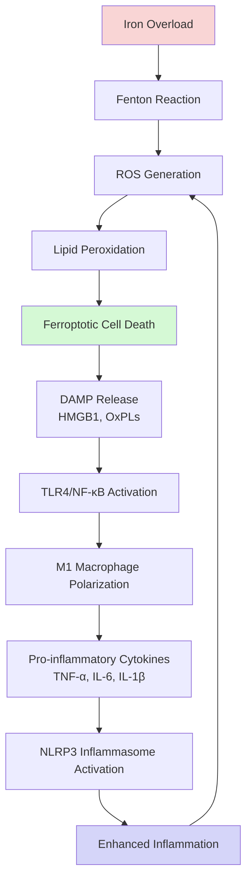
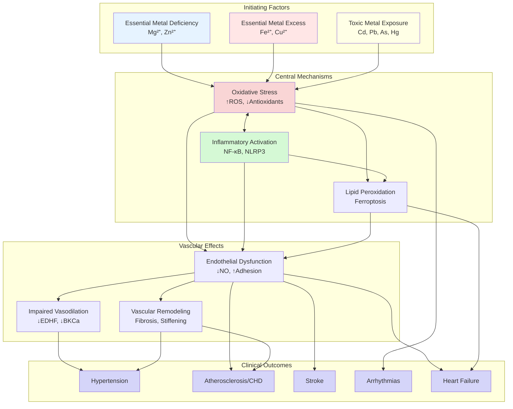
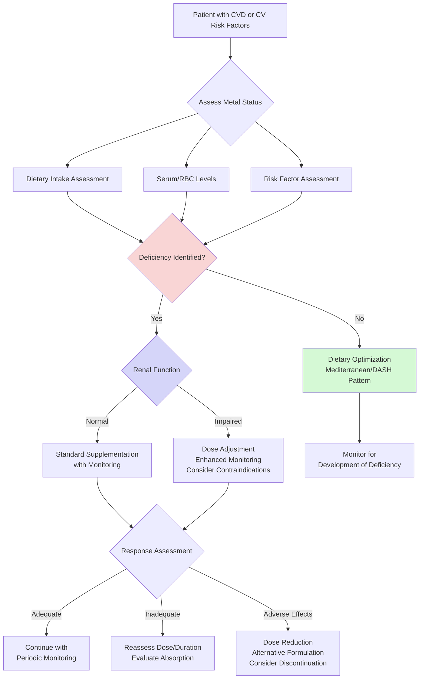
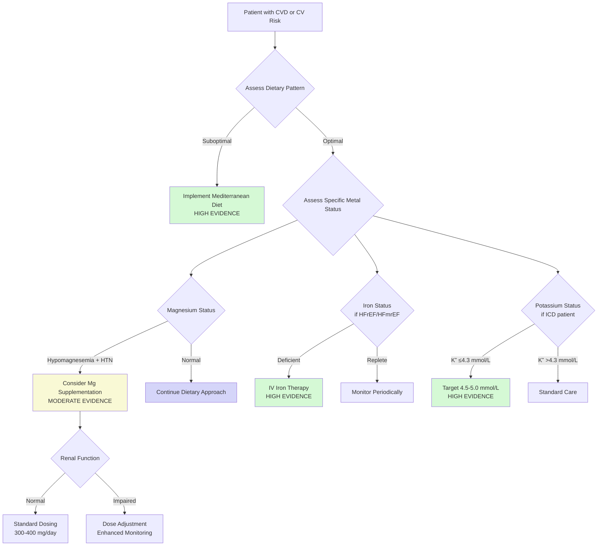
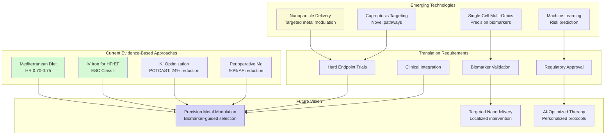

# Therapeutic Modulation of Plasma Metal Ion Concentrations in Cardiovascular Disease: Intervention Strategies, Clinical Evidence, and Future Perspectives
## 1 Biological Foundations of Metal Ion Homeostasis in Cardiovascular Physiology

This chapter establishes the physiological and molecular basis for understanding metal ion homeostasis in the cardiovascular system. It systematically examines the essential roles of key metal ions—magnesium, iron, copper, zinc, and calcium—in maintaining normal cardiac and vascular function, including their contributions to electrophysiology, contractility, vascular tone, and endothelial integrity. The chapter further explores the molecular machinery governing metal ion transport, storage, and regulation, and analyzes how disruptions in these homeostatic mechanisms contribute to cardiovascular pathology, thereby providing the foundational framework for subsequent discussions on therapeutic interventions.

### 1.1 Physiological Roles of Key Metal Ions in Cardiovascular Function

The cardiovascular system depends critically on the precise regulation of several metal ions to maintain normal physiological function. Understanding the distinct contributions of magnesium, iron, calcium, copper, and zinc to cardiac and vascular physiology provides the essential foundation for evaluating therapeutic interventions targeting these elements.

#### 1.1.1 Magnesium: A Multifaceted Regulator of Vascular and Cardiac Function

Magnesium (Mg²⁺) serves as a **physiological calcium channel blocker** and plays a central role in modulating vascular tone, sympathetic nervous system activity, and blood pressure regulation[^1][^2]. The mechanisms through which magnesium influences cardiovascular function are diverse and interconnected.

**Vascular Tone Regulation.** Magnesium diminishes cellular calcium entry via L-type voltage-gated Ca²⁺ channels, thereby reducing vascular smooth muscle contraction and promoting vasodilation[^1]. Beyond this direct effect, magnesium influences vascular tone through its effects on prostacyclin release and nitric oxide (NO) metabolism. In cultured endothelial cells, NO production was approximately **three-fold higher** in cells grown in high (5 mM) compared to control (1 mM) extracellular Mg²⁺[^1]. Clinical studies have confirmed these experimental findings: oral magnesium supplementation in individuals with coronary artery disease significantly improved flow-mediated vasodilation, a process partly mediated by NO[^1].

**Sympathetic Nervous System Modulation.** Magnesium exerts an inhibitory effect on sympathetic outflow through modulation of N-methyl-D-aspartate (NMDA) receptor activity in the rostral ventrolateral medulla and hypothalamic paraventricular nucleus[^1]. Additionally, Mg²⁺ blocks N-type Ca²⁺ channels at peripheral sympathetic nerve endings, modulating catecholamine release. Clinical evidence supports this mechanism: MgSO₄ infusion attenuated increases in circulating epinephrine, norepinephrine, and systolic blood pressure in response to endotracheal intubation[^1].

**Potassium Handling and Aldosterone Regulation.** Systemic magnesium status influences blood pressure through effects on potassium handling. Magnesium depletion promotes potassium depletion; intracellular Mg²⁺ depletion increases urinary K⁺ excretion through loss of voltage-dependent blockade of the renal outer medullary K⁺ channel (ROMK)[^1]. Furthermore, acute intravenous magnesium administration reduces aldosterone levels in humans, and daily oral magnesium supplementation (360 mg) has been shown to abrogate the increase in plasma aldosterone in response to exercise[^1].

**Anti-inflammatory Properties.** Magnesium deficiency activates pro-hypertensive inflammatory processes. In laboratory animals, a magnesium-deficient diet stimulates leukocytosis and elevates circulating inflammatory cytokine levels. In mice, dietary magnesium restriction increased circulating IL-1β levels and increased NLRP3 and isolevuglandin positivity in splenic and renal dendritic cells, consistent with a contribution to hypertension-promoting inflammation[^1].

#### 1.1.2 Iron: Oxygen Transport, Mitochondrial Function, and Redox Balance

Iron is essential for oxygen transport via hemoglobin and myoglobin, mitochondrial electron transport chain function, and numerous enzymatic reactions in cardiovascular tissues. However, iron's redox-active nature makes it a double-edged sword—while essential for cellular function, excess free iron can catalyze the generation of harmful reactive oxygen species (ROS) through the Fenton reaction[^3][^4].

**Systemic Iron Homeostasis.** The hormone **hepcidin**, produced primarily by the liver, represents the master regulator of systemic iron homeostasis. Hepcidin binds to ferroportin (FPN), the sole cellular iron exporter expressed on enterocytes, macrophages, and hepatocytes, causing its internalization and degradation, thereby reducing iron export into plasma[^3]. Hepcidin production is tightly modulated by iron stores, inflammatory signals, erythropoietic activity, and hypoxia through an iron-sensing complex on hepatocytes comprising human hemochromatosis protein (HFE), transferrin receptor 2 (TfR2), hemojuvelin (HJV), and bone morphogenetic protein-6 (BMP-6)[^3].

**Cardiac Iron Metabolism.** Cardiomyocytes require adequate iron for mitochondrial function and energy production. Iron uptake occurs primarily through transferrin receptor 1 (TFR1) and divalent metal transporter 1 (DMT1)[^4]. Intracellular iron is stored in ferritin, which can be released through autophagy-mediated ferritin degradation (ferritinophagy) when iron demand increases. The balance between iron uptake, storage, and export determines the labile iron pool available for cellular functions and, critically, for potentially harmful Fenton chemistry.

#### 1.1.3 Calcium: The Central Mediator of Cardiovascular Excitation-Contraction Coupling

Calcium signaling represents the fundamental mechanism linking electrical excitation to mechanical contraction in both cardiac and vascular smooth muscle cells. The intricate regulation of cytosolic calcium concentration ([Ca²⁺]cyt) determines the contractile state of these cells and, consequently, cardiac output and vascular resistance.

**Vascular Smooth Muscle Cell Calcium Dynamics.** In healthy arteries, vascular smooth muscle cell (VSMC) contraction is promoted by stimuli that increase [Ca²⁺]cyt, which causes contraction through Ca²⁺/Calmodulin-mediated activation of myosin light chain kinase[^5]. When VSMCs are depolarized, [Ca²⁺]cyt increases mainly due to Ca²⁺ influx via L-type voltage-dependent Ca²⁺ (Cav1.2) channels. Mechanical stretch also activates mechanosensitive cation channels such as TRPC6 and TRPM4, depolarizing the membrane potential and opening Cav1.2 channels[^5].

**Calcium-Dependent Vasodilation Mechanisms.** Counterbalancing the contractile effects of calcium, ryanodine receptors (RyR) cause local Ca²⁺ release called **Ca²⁺ sparks** that activate nearby large-conductance Ca²⁺-activated K⁺ (BKCa) channels to induce spontaneous transient outward currents (STOCs), which hyperpolarize the membrane potential, close L-type Ca²⁺ channels, and result in vasodilation[^5]. TRPV4 channels form a molecular complex with RyR and BKCa channels, increasing Ca²⁺ spark activity and STOCs, thus decreasing vascular tone[^5].

**Endothelial Calcium Signaling.** Endothelial cells (ECs) produce nitric oxide via endothelial nitric oxide synthase (eNOS), which relaxes VSMCs. In resistance vessels, vasodilation by endothelium-derived hyperpolarizing factor (EDHF) is dominant[^5]. Stimuli such as acetylcholine and shear stress increase [Ca²⁺]cyt in ECs and subsequently activate intermediate-conductance Ca²⁺-activated K⁺ (IKCa) channels and small-conductance Ca²⁺-activated K⁺ (SKCa) channels, resulting in membrane hyperpolarization transmitted to VSMCs via gap junctions at the myoendothelial junction[^5]. TRPV4 and Piezo1 are ion channels that allow Ca²⁺ influx into ECs in response to acetylcholine and shear stress, with TRPV4 channels localized in caveolae forming molecular complexes with connexin 43 and SKCa3 channels to induce EDHF[^5].

#### 1.1.4 Copper and Zinc: Antioxidant Defense and Enzymatic Function

Copper and zinc contribute to cardiovascular health primarily through their roles in antioxidant defense systems and enzymatic function. Both metals serve as cofactors for superoxide dismutase (Cu/Zn-SOD), a critical enzyme that converts superoxide radicals to hydrogen peroxide, providing the first line of defense against oxidative stress in cardiovascular tissues.

**Zinc's Cardiovascular Functions.** Zinc participates in numerous enzymatic reactions and structural proteins essential for cardiovascular integrity. Epidemiological data associate low zinc levels with increased cardiovascular disease risk, potentially through impaired antioxidant defenses and pro-inflammatory states.

**Copper's Dual Nature.** While copper is essential for Cu/Zn-SOD function and other enzymatic processes, epidemiological studies associate elevated copper levels with increased cardiovascular disease risk, suggesting a narrow therapeutic window for this metal.

### 1.2 Molecular Mechanisms of Metal Ion Transport and Regulation

The cardiovascular system maintains metal ion homeostasis through sophisticated molecular machinery comprising transporters, channels, binding proteins, and regulatory systems that respond dynamically to physiological demands and pathological stressors.

#### 1.2.1 The Hepcidin-Ferroportin Axis: Master Regulator of Systemic Iron Homeostasis

The hepcidin-ferroportin regulatory axis represents the central control system for systemic iron homeostasis and provides a paradigm for understanding metal ion regulation.

**Iron Sensing Mechanisms.** Hepatocytes sense iron status through a molecular complex comprising HFE, TfR2, HJV, and BMP-6. When circulating iron-bound transferrin (holotransferrin) binds to its receptor on hepatocytes, it forms a molecular complex with HJV, initiating intracellular signaling via the **SMAD phosphorylation pathway** and increasing hepcidin gene expression[^3]. Conversely, in iron deficit states, increased TFR1 binds to HFE and inhibits the activation of the HFE-TFR2 complex, preventing hepcidin production[^3]. BMP6 acts as a positive regulator of hepcidin expression, and its deficiency leads to iron overload[^3].

**Erythroferrone: Linking Erythropoiesis to Iron Availability.** The hormone erythroferrone (ERFE), synthesized by erythroblasts in response to erythropoietin stimulation, regulates the BMP-SMAD signaling pathway by inhibiting its expression[^3]. ERFE suppresses hepcidin transcription in hepatocytes, resulting in increased iron availability in conditions of high iron demand. High erythroferrone levels contribute to the pathogenesis of iron-loading anemias, making it a promising therapeutic target[^3].

The following table summarizes the key components of systemic iron regulation:

| Component | Location | Function | Effect on Iron Status |
|-----------|----------|----------|----------------------|
| Hepcidin | Liver (secreted) | Binds ferroportin, causes degradation | Decreases plasma iron |
| Ferroportin | Enterocytes, macrophages, hepatocytes | Iron exporter | Increases plasma iron when active |
| HFE-TfR2 complex | Hepatocytes | Senses holotransferrin | Increases hepcidin when activated |
| BMP6-HJV | Hepatocytes | Iron sensing, SMAD signaling | Increases hepcidin |
| Erythroferrone | Erythroblasts | Suppresses BMP-SMAD pathway | Decreases hepcidin, increases iron |

#### 1.2.2 Calcium Channel Regulation and Molecular Complexes

Calcium homeostasis in cardiovascular cells depends on the coordinated activity of multiple ion channels, receptors, and signaling molecules organized into functional molecular complexes.

**L-type Calcium Channels (Cav1.2).** These voltage-gated channels represent the primary route for calcium entry during membrane depolarization in both cardiomyocytes and VSMCs. Their activity is modulated by multiple factors including membrane potential, protein kinase C (PKC)-mediated phosphorylation, and interactions with scaffolding proteins[^5].

**TRPV4 Channel Molecular Complexes.** TRPV4 channels demonstrate remarkable functional versatility through their participation in distinct molecular complexes. In VSMCs, TRPV4 channels form a complex with α1 adrenergic receptors (α1AR) and PKC via A-kinase anchoring protein (AKAP)150, enhancing VSMC contraction induced by sympathetic nerve stimulation[^5]. Simultaneously, TRPV4 channels form another complex with RyR and BKCa channels that promotes vasodilation through Ca²⁺ spark-STOC coupling[^5]. In endothelial cells, TRPV4 channels are localized in caveolae and form molecular complexes with connexin 43 and SKCa3 channels to induce EDHF-mediated vasodilation[^5].

**Piezo1 Mechanosensitive Channels.** Piezo1 channels in endothelial cells respond to shear stress by allowing calcium influx, which activates eNOS through ATP release via pannexin and subsequent activation of purinergic P2Y2 receptors[^5]. This mechanotransduction pathway links blood flow patterns to endothelial function and vascular tone.

#### 1.2.3 Magnesium Transport and Regulatory Systems

Magnesium transport in cardiovascular tissues occurs primarily through TRPM6 and TRPM7 channels, which serve as the gatekeepers for cellular magnesium uptake. These channels exhibit unique properties, functioning as both ion channels and kinases (chanzymes), allowing them to integrate magnesium transport with cellular signaling.

**Interactions with Other Cation Systems.** Magnesium status profoundly influences the handling of other cations, particularly potassium and calcium. Magnesium depletion promotes potassium depletion through loss of voltage-dependent blockade of ROMK channels[^1]. Additionally, magnesium's function as a physiological calcium channel blocker means that magnesium deficiency effectively enhances calcium channel activity, promoting vasoconstriction and elevated blood pressure[^2].

#### 1.2.4 Coordinating Signaling Pathways

Several signaling pathways coordinate metal ion sensing and homeostatic responses in cardiovascular tissues:

**Nrf2-HO-1 Axis.** The nuclear factor erythroid 2-related factor 2 (Nrf2) is a key antioxidant transcription factor that upregulates genes including HO-1, SLC7A11 (a component of system Xc⁻), and ferritin heavy chain 1 (FTH1), protecting cells from oxidative stress and inflammatory damage[^4]. Nrf2 participates in lipid metabolism, iron homeostasis, and energy metabolism, making it a critical regulator of ferroptosis susceptibility.

**NF-κB Pathway.** The canonical NF-κB pathway is central to inflammation and innate immunity and engages in complex crosstalk with iron metabolism. NF-κB activation upregulates TFR1 and downregulates FTH1, promoting iron accumulation and potentially ferroptosis. Conversely, lipid peroxidation induced by ferroptosis activates NF-κB, triggering inflammation and establishing a positive feedback loop[^4].

**BMP-SMAD Signaling.** This pathway represents the primary mechanism for iron-responsive hepcidin regulation, translating changes in iron status into appropriate adjustments in systemic iron availability[^3].

### 1.3 Metal Ion Dysregulation and Cardiovascular Pathophysiology

Disruptions in metal ion homeostasis contribute to the development and progression of cardiovascular diseases through interconnected pathways involving oxidative stress, inflammation, lipid metabolism dysfunction, and endothelial impairment. Understanding these pathophysiological mechanisms is essential for developing effective therapeutic interventions.

#### 1.3.1 Magnesium Deficiency: A Widespread Contributor to Cardiovascular Disease

Chronic, latent magnesium deficiency represents a significant public health concern with profound cardiovascular implications. An estimated **25% or more** of the United States population experiences chronic magnesium depletion[^1]. NHANES 2011-2014 data found that **45.2%** of all adults had total magnesium intake below the Estimated Average Requirement (EAR)[^2].

**Epidemiological Evidence.** In the past 20 years, numerous epidemiological studies, randomized controlled trials, and meta-analyses have found an **inverse relationship** between magnesium intake or serum magnesium and cardiovascular disease, indicating that low magnesium status is associated with hypertension, coronary artery calcification, stroke, ischemic heart disease, atrial fibrillation, heart failure, and cardiac mortality[^2].

**Mechanisms of Magnesium Deficiency-Induced Cardiovascular Pathology.** Controlled metabolic unit human depletion-repletion experiments found that even mild or moderate magnesium deficiency can cause physiological and metabolic changes that respond to magnesium supplementation, indicating that chronic latent magnesium deficiency is a contributing factor to the occurrence and severity of cardiovascular disease[^2]. The mechanisms through which magnesium deficiency contributes to cardiovascular risk include:

1. **Inflammatory Stress:** Chronic inflammatory stress characterized by abnormal cytokine production and increased acute-phase reactants. A meta-analysis of randomized controlled trials revealed that magnesium supplementation significantly reduced plasma C-reactive protein (CRP), an inflammatory marker, in individuals with CRP values >3 mg/L[^2].

2. **Oxidative Stress:** In vitro and animal studies show that intracellular magnesium deficiency inhibits magnesium transport into mitochondria, resulting in mitochondrial magnesium deficiency that decreases electron transport chain activity and increases reactive oxygen species production[^2]. Metabolic unit experiments in postmenopausal women found that magnesium deprivation decreased erythrocyte superoxide dismutase concentrations, which increased upon magnesium supplementation[^2].

3. **Endothelial Dysfunction:** Magnesium deficiency can cause endothelial dysfunction, a key player in atherosclerosis. Studies with human umbilical vascular endothelial cells found that magnesium deficiency increased inducible NO synthase (iNOS) activity, leading to reactive oxygen species accumulation, whereas magnesium supplementation has been shown to improve endothelial function in patients with ischemic heart disease[^2].

4. **Dysregulation of Cellular Ion Channels:** In magnesium deficiency, cellular calcium increases, inducing the release of inflammatory cytokines and affecting vascular tone, which can lead to hypertension and arrhythmias. Controlled metabolic unit studies found that magnesium deprivation induced heart rhythm changes, including atrial fibrillation and ventricular premature beats, without causing hypocalcemia or hypokalemia[^2].

#### 1.3.2 Iron Dysregulation and Ferroptosis: A Central Mechanism of Cardiovascular Injury

Iron dysregulation contributes to cardiovascular pathology through multiple mechanisms, with **ferroptosis**—an iron-dependent form of programmed cell death—emerging as a particularly important pathway in cardiovascular diseases[^4].

**Ferroptosis: Definition and Mechanisms.** Ferroptosis, first identified by Stockwell et al. in 2012, is a regulated form of cell death distinguished from apoptosis and necroptosis by its unique biochemical and morphological features[^4]. The hallmarks include aberrant iron accumulation, disrupted amino acid and lipid metabolism, and excessive lipid peroxidation. Morphologically, ferroptotic cells display reduced or absent mitochondrial cristae, condensed membranes, and a lack of apoptotic bodies[^4].

Three major drivers orchestrate ferroptosis:

1. **Iron Metabolism Dysregulation:** Elevated iron uptake through TFR1 and DMT1, combined with ferritin degradation via autophagy, increases intracellular free iron levels, promoting hydroxyl radical generation through the Fenton reaction[^4].

2. **Antioxidant Defense Failure:** The cystine/glutamate antiporter system Xc⁻ (comprising SLC7A11/xCT and SLC3A2/4F2hc) imports cystine for glutathione (GSH) synthesis. GPX4 utilizes GSH to detoxify lipid peroxides, thereby preventing ferroptosis. Pharmacological inhibitors such as erastin (targeting system Xc⁻) and RSL3 (inhibiting GPX4) strongly induce ferroptosis[^4].

3. **Lipid Metabolism Reprogramming:** Polyunsaturated fatty acid (PUFA)-containing phospholipids undergo peroxidation via lipoxygenases and free radicals, leading to membrane rupture. Enzymes such as acyl-CoA synthetase 4 (ACSL4) and lysophosphatidylcholine acyltransferase 3 (LPCAT3) regulate the biosynthesis of PUFA-enriched phospholipids, determining cellular susceptibility to ferroptosis[^4].

**Ferroptosis-Immune Inflammation Crosstalk.** A critical aspect of ferroptosis in cardiovascular disease is its bidirectional relationship with immune-mediated inflammation[^4]. Ferroptotic cells release damage-associated molecular patterns (DAMPs), such as high-mobility group box 1 (HMGB1), which activate the TLR–NF-κB signaling pathway, promote macrophage polarization toward the pro-inflammatory M1 phenotype, and induce the activation of NLRP3 inflammasomes, thereby amplifying inflammatory responses[^4].

The following diagram illustrates the ferroptosis-inflammation feedback loop:

This diagram illustrates the self-amplifying cycle linking ferroptosis and inflammation. Iron overload initiates Fenton chemistry, generating ROS that drive lipid peroxidation and ferroptotic cell death. Dying cells release DAMPs that activate inflammatory pathways, which in turn generate additional ROS, perpetuating the cycle.

**Hereditary Hemochromatosis as a Model of Iron Overload Pathology.** Hereditary hemochromatosis (HH) is a primary iron overload disorder caused by HFE gene mutation, leading to hepcidin deficiency[^3]. The clinical severity is related to increased toxicity from non-transferrin-bound iron (NTBI), which causes ROS generation, resulting in cellular damage, liver fibrosis, chronic heart failure, and diabetes. Elevated transferrin saturation (>50% in men and >45% in women) is the first biochemical manifestation, resulting from inappropriately low circulating hepcidin levels[^3].

#### 1.3.3 Calcium Dysregulation in Hypertension: Electrical and Structural Remodeling

Hypertension involves profound alterations in calcium signaling in both VSMCs and ECs, leading to functional and structural vascular remodeling.

**Functional Remodeling in Hypertensive VSMCs.** When hypertensive stimuli are applied to blood vessels for extended periods, gene expression changes dramatically. In hypertensive VSMCs, continuous pressure overload increases the expression of Cav1.2 channels and depolarizes the membrane potential[^5]. Angiotensin II promotes PKC-mediated phosphorylation of Cav1.2 channels, increasing Ca²⁺ sparklets, which results in increased [Ca²⁺]cyt and enhanced vasoconstriction[^5]. Additionally, the expression of Kv channels and the BKCa channel β1 subunit is reduced, further depolarizing the membrane potential[^5].

**Impaired Vasodilatory Mechanisms.** In VSMCs from hypertensive models, the TRPV4/AKAP150/α1AR/PKC molecular complex is increased, enhancing the contribution of TRPV4 channels to vasoconstriction, whereas the TRPV4/RyR/BKCa channel molecular complex is decreased[^5]. This shift in molecular complex composition impairs Ca²⁺ spark-STOC coupling, disrupting a key vasodilatory mechanism.

**Endothelial Dysfunction in Hypertension.** In hypertensive ECs, pressure overload, turbulent flow, and humoral factors cause superoxide production via NADPH oxidase, reducing the bioavailability of NO and attenuating vasorelaxation[^5]. In angiotensin II-induced hypertension, the molecular coupling between TRPV4 channels and eNOS in aortic ECs is reduced, decreasing NO production[^5]. Turbulent flow leads to abnormal activation of Piezo1 channels, which activates a pro-inflammatory pathway via NF-κB and causes sustained increases in [Ca²⁺]cyt, leading to disassembly of adherent junctions and increased endothelial permeability[^5].

**Myoendothelial Junction Dysfunction.** At the myoendothelial junction of angiotensin II-induced hypertension mice, AKAP150 expression is attenuated, and acetylcholine-induced EDHF generation is reduced[^5]. This impairment of myoendothelial communication further compromises vasodilatory capacity.

**Structural Remodeling and Immune Cell Involvement.** In hypertension, structural remodeling occurs as outward remodeling of elastic vessels and inward remodeling of resistance vessels. Monocytes and macrophages play crucial roles[^5]. Mechanical stress on blood vessels and angiotensin II stimulation increase the expression of CCL2 in ECs, VSMCs, and adventitial fibroblasts, leading to monocyte accumulation and differentiation into macrophages[^5]. Accumulated macrophages produce ROS and cytokines, leading to further ROS production by VSMCs and ECs, resulting in elevated blood pressure, aortic fibrosis, inflammation, and endothelial dysfunction[^5].

**Excitation-Transcription Coupling.** Calcium signaling induced by mechanical stress is converted into gene transcription via excitation-transcription (E-T) coupling. In a mesenteric artery ligation model, increased circumferential wall stress activates Cav1.2 channels in VSMCs, which activates CaMKK2 and CaMK1 forming a complex with Cav1.2 channels via caveolin1[^5]. CaMK1 translocates to the nucleus to activate the transcription factor CREB, upregulating the expression of genes encoding chemokines and adhesion molecules such as CXCL1, CCL2, P-selectin, and VCAM1, resulting in macrophage accumulation in the adventitia and outward remodeling[^5].

#### 1.3.4 Integrated Pathophysiological Framework

The pathophysiological mechanisms linking metal ion dysregulation to cardiovascular disease form a reinforcing network with multiple interconnected nodes:

| Initiating Factor | Primary Mechanism | Secondary Effects | Cardiovascular Outcomes |
|-------------------|-------------------|-------------------|------------------------|
| Iron excess | Fenton reactions, ferroptosis | ROS, DAMP release, inflammation | Atherosclerosis, MI, HF |
| Magnesium deficiency | ↓Ca²⁺ channel blockade, ↓NO | Vasoconstriction, inflammation | Hypertension, arrhythmias |
| Ca²⁺ dysregulation | Enhanced Cav1.2 activity | Electrical remodeling, ↓EDHF | Hypertension, vascular remodeling |
| Cu/Zn imbalance | Impaired SOD function | Oxidative stress | Endothelial dysfunction |

This integrated framework demonstrates that metal-related cardiovascular pathology is driven by the interplay of metal-specific disruptions in redox balance, inflammatory signaling, lipid metabolism, and ion channel function, converging on endothelial damage, vascular dysfunction, and myocardial injury. These interconnected mechanisms create self-amplifying cycles that perpetuate and exacerbate cardiovascular disease, highlighting the potential therapeutic value of interventions targeting metal ion homeostasis.

The clinical implications of this framework are significant: optimal management of cardiovascular disease should include attention to metal ion balance, given the prevalence of dietary deficiencies (particularly magnesium), the association of various cardiovascular conditions with metal dysregulation, and the fact that commonly prescribed medications may promote metal deficiencies[^1]. This foundational understanding provides the rationale for therapeutic interventions aimed at modulating plasma metal ion concentrations as preventive or therapeutic strategies against cardiovascular diseases.

## 2 Pathophysiological Links Between Metal Ion Dysregulation and Cardiovascular Diseases

This chapter systematically investigates the causal and correlational relationships between altered plasma metal ion concentrations and specific cardiovascular conditions. Building upon the biological foundations established in Chapter 1, this chapter examines epidemiological evidence from large-scale population studies linking abnormal levels of essential metals (magnesium, zinc, potassium, iron) and toxic metals (cadmium, lead, arsenic, mercury) to cardiovascular disease risk. The analysis integrates mechanistic insights with clinical data to establish the pathophysiological basis for therapeutic interventions targeting metal ion homeostasis.

### 2.1 Epidemiological Evidence Linking Metal Ion Imbalances to Major Adverse Cardiovascular Events

Large-scale population-based studies have provided compelling evidence that plasma concentrations of essential metals are significantly associated with the incidence of major adverse cardiovascular events (MACEs). A comprehensive analysis utilizing electronic health records from the Scottish population (NHS Tayside and Fife, covering approximately 20% of Scotland) examined 978,759 individuals aged 18-100 years between 2000 and 2021, of whom 176,350 experienced a MACE[^6]. This dataset offers unprecedented statistical power to characterize the relationships between metal ion status and cardiovascular outcomes.

**Magnesium and MACE Risk.** The relationship between magnesium levels and MACE demonstrates a **U-shaped pattern**, with both high and low concentrations associated with elevated cardiovascular risk compared to normal levels. Specifically, the proportion of MACE patients was **29.4%** in the high magnesium group (>1 mmol/L), **27.9%** in the normal group (0.7-1 mmol/L), and notably **34.7%** in the low magnesium group (<0.7 mmol/L), with statistically significant differences (p<0.0001 for both comparisons)[^6]. This finding underscores that magnesium homeostasis operates within a narrow physiological window, and deviations in either direction carry cardiovascular consequences. The particularly elevated risk associated with hypomagnesemia aligns with the mechanistic understanding of magnesium's role as a physiological calcium channel blocker and anti-inflammatory agent.

**Copper and Cardiovascular Outcomes.** Elevated copper levels demonstrate a clear positive association with MACE incidence. In the Scottish cohort, MACE patients were most prevalent in the high copper group (>22 µmol/L) at **18.1%**, compared to **14.6%** in the normal group (10-22 µmol/L) and only **9.9%** in the low group (<10 µmol/L), with a statistically significant association for high versus normal levels (p=0.0316)[^6]. This linear relationship suggests that copper excess, rather than deficiency, represents the primary cardiovascular concern, potentially through pro-oxidant mechanisms when copper overwhelms antioxidant defenses.

**Zinc Deficiency as a Major Risk Factor.** Perhaps the most striking association observed was between low zinc levels and MACE risk. The proportion of MACE patients was **18.1%** in the low zinc group (<10 µmol/L), compared to only **8.7%** in the normal group (10-18 µmol/L) and **9.4%** in the high group (>18 µmol/L), representing a highly significant association (p<0.0001)[^6]. This **more than two-fold increase** in MACE prevalence among zinc-deficient individuals highlights zinc status as a potentially modifiable cardiovascular risk factor warranting clinical attention.

The following table summarizes the MACE prevalence across metal concentration categories:

| Metal | Low Level (%) | Normal Level (%) | High Level (%) | Primary Risk Pattern |
|-------|--------------|------------------|----------------|---------------------|
| Magnesium | 34.7 | 27.9 | 29.4 | U-shaped (both extremes) |
| Copper | 9.9 | 14.6 | 18.1 | Linear (high risk) |
| Zinc | 18.1 | 8.7 | 9.4 | Threshold (low risk) |

These epidemiological findings establish that metal ion dysregulation is not merely a marker of poor health status but represents an independent contributor to cardiovascular risk, providing the rationale for therapeutic interventions targeting metal homeostasis.

### 2.2 Metal Ion Dysregulation in Hypertension: Causal Pathways and Risk Associations

Hypertension represents a paradigmatic cardiovascular condition where metal ion imbalances exert demonstrable pathophysiological effects. Multiple lines of evidence—from observational epidemiology to Mendelian randomization studies—converge to establish causal relationships between specific metal ion abnormalities and hypertensive disease.

**Magnesium and Hypertensive Disease Risk.** Logistic regression analysis of the Scottish cohort revealed that low magnesium levels were associated with a statistically significant increased risk of hypertensive diseases (ICD-10 codes I10-I15), with an odds ratio of **1.07** (95% CI: 1.05-1.08)[^6]. While this effect size appears modest, the high prevalence of both hypomagnesemia and hypertension in the population translates to substantial attributable risk at the population level. The mechanistic basis for this association involves magnesium's role in diminishing calcium entry into vascular smooth muscle cells, modulating sympathetic tone, and supporting endothelial nitric oxide production.

**Zinc Deficiency and Hypertension.** Low zinc levels demonstrated a stronger association with hypertensive diseases, with an odds ratio of **1.38** (95% CI: 1.02-1.87)[^6]. This relationship likely reflects zinc's critical role in antioxidant defense systems and vascular endothelial function. Zinc deficiency impairs the activity of copper-zinc superoxide dismutase, leading to oxidative stress that promotes endothelial dysfunction and impaired vasodilation.

**Copper Intake and Essential Hypertension: Causal Evidence from Mendelian Randomization.** A particularly robust line of evidence comes from Mendelian randomization (MR) studies, which use genetic variants as instrumental variables to establish causal relationships free from confounding. A comprehensive MR analysis investigating 15 trace elements identified copper as a **causal risk factor** for essential hypertension[^7]. The inverse variance weighted (IVW) analysis yielded an odds ratio of **1.024** (95% CI: 1.008-1.041, p=0.003), with MR-Egger results (β=0.032, p=0.049) confirming the direction of effect. Sensitivity analyses, including leave-one-out tests and assessments for horizontal pleiotropy, supported the robustness of this causal finding. Multivariate MR analysis confirmed copper remained a significant risk factor (OR=1.025, 95% CI: 1.008-1.449, p=0.003), while reverse MR analysis indicated no reverse causality[^7].

These genetic findings were validated using NHANES data (2007-2018) from 32,359 adult participants. In fully adjusted models, compared to the lowest copper intake group (<0.80 mg/day), the odds ratios for hypertension in higher intake groups were progressively elevated: **1.156** (1.08-1.45 mg/day, p=0.015), **1.398** (1.45-2.29 mg/day, p<0.001), and **1.469** (>2.29 mg/day, p<0.001)[^7]. Restricted cubic spline analysis indicated a **nonlinear relationship** between copper intake and hypertension risk, suggesting threshold effects that may inform optimal intake recommendations.

**Cadmium Exposure and Hypertension: Dose-Response Relationships.** A systematic review and dose-response meta-analysis of 18 studies published between 2006 and 2024 characterized the relationship between cadmium exposure and hypertension risk[^8]. The analysis revealed distinct dose-response patterns depending on the biomarker used. For urinary cadmium, the relationship was **almost linear**, with a relative risk of **1.18** (95% CI: 1.02-1.37) at 2.0 μg/g creatinine compared to no exposure. In contrast, the association between blood cadmium and hypertension was **non-linear**: a steep monotonic increase in risk occurred for concentrations below 2 μg/L, reaching a relative risk of **1.48** (95% CI: 1.17-1.86) at 2.0 μg/L, after which a plateau was observed[^8]. This pattern suggests that even low-level cadmium exposure carries significant hypertension risk, with particularly pronounced effects at the lower end of the exposure spectrum.

The integrated evidence establishes metal ion dysregulation as a causal contributor to hypertension through multiple pathways: magnesium and zinc deficiencies impair vasodilatory mechanisms and promote oxidative stress, copper excess enhances pro-oxidant pathways, and cadmium exposure induces endothelial dysfunction and sympathetic activation.

### 2.3 Coronary Heart Disease and Ischemic Events: Metal-Mediated Pathophysiology

The relationship between metal ion status and coronary heart disease (CHD) reveals complex, sometimes paradoxical patterns that reflect the multifaceted roles of these elements in atherosclerotic pathophysiology.

**Zinc Deficiency and Ischemic Heart Disease.** Low zinc levels demonstrated one of the strongest associations with ischemic heart disease risk in the Scottish cohort, with an odds ratio of **2.28** (95% CI: 1.53-3.40)[^6]. This more than two-fold increase in risk underscores zinc's critical protective role in cardiovascular health. Mechanistically, zinc deficiency impairs antioxidant defenses (particularly Cu/Zn-SOD function), promotes inflammatory cytokine production, and compromises endothelial integrity—all factors that accelerate atherosclerotic plaque development and destabilization.

**Copper Excess and Coronary Risk.** Elevated copper levels were associated with significantly increased ischemic heart disease risk, with an odds ratio of **1.64** (95% CI: 1.19-2.25)[^6]. High copper also elevated the risk of chronic rheumatic heart diseases (OR=2.26, 95% CI: 1.07-4.76)[^6]. The pro-atherogenic effects of copper excess likely involve enhanced LDL oxidation, increased oxidative stress, and promotion of inflammatory pathways within the arterial wall.

**The Magnesium Paradox in Ischemic Heart Disease.** Intriguingly, low magnesium levels were associated with a **reduced** risk of ischemic heart diseases (OR=0.93, 95% CI: 0.91-0.94)[^6]. This counterintuitive finding may reflect reverse causation (patients with established CHD receiving magnesium supplementation), confounding by indication, or the complex interplay between magnesium status and other cardiovascular risk factors. Similarly, low magnesium was associated with reduced risk of chronic rheumatic heart diseases (OR=0.82, 95% CI: 0.78-0.85) and pulmonary heart disease (OR=0.96, 95% CI: 0.94-0.98)[^6]. These paradoxical associations warrant careful interpretation and highlight the need for prospective intervention studies rather than reliance on observational data alone.

**Genetically Predicted Iron Levels and Lipid Metabolism.** Mendelian randomization analyses using GWAS data from up to 263,167 individuals of European ancestry have illuminated the relationship between iron status and cardiovascular risk factors[^9]. Global genetic correlation analyses revealed significant associations between iron levels and lipid parameters: a **positive correlation** with HDL cholesterol and **negative correlations** with coronary artery disease, heart failure, and triglycerides. Two-sample MR analyses indicated a protective effect of genetically predicted iron levels on total cholesterol (OR=0.94, 95% CI: 0.92-0.97, p=3.3×10⁻⁶) and non-HDL cholesterol (OR=0.95, 95% CI: 0.92-0.98, p=3.9×10⁻³)[^9]. These findings suggest that adequate iron status may favorably modulate lipid metabolism, although the relationship with clinical cardiovascular outcomes requires further investigation.

**Toxic Metal Exposure and CHD.** Meta-analytic evidence from 16 observational studies involving 324,331 participants demonstrated associations between toxic heavy metal exposure and CHD risk[^10]. The cadmium-exposed subgroup showed a pooled proportion of **0.10** (95% CI: 0.00-0.22) for CHD, while the overall pooled proportion was **0.08** (95% CI: 0.00-0.18)[^10]. These associations reflect the atherogenic effects of toxic metals through oxidative stress induction, inflammatory pathway activation, and endothelial dysfunction.

### 2.4 Cerebrovascular Disease and Stroke: Metal Ion Contributions to Vascular Injury

Cerebrovascular disease represents a particularly devastating manifestation of cardiovascular pathology, and metal ion imbalances contribute significantly to stroke risk through effects on cerebral vasculature, blood-brain barrier integrity, and thrombotic pathways.

**Zinc Status and Stroke Risk: An L-Shaped Relationship.** A cross-sectional analysis of NHANES data (2013-2020) involving 2,642 adults revealed a distinctive **L-shaped relationship** between dietary zinc intake and stroke prevalence (p=0.041)[^11]. In multivariate logistic regression, individuals in the second quartile of dietary zinc intake (6.09-8.83 mg/day) had significantly lower stroke odds (OR=0.64, 95% CI: 0.41-0.99, p=0.044) compared to those in the lowest quartile (≤6.08 mg/day). Threshold analysis demonstrated that for individuals consuming less than 8.82 mg of zinc daily, each additional 1 mg of dietary zinc was associated with **14.2% lower odds of stroke** (OR=0.858, 95% CI: 0.74-0.99, p=0.037)[^11]. However, when daily intake reached ≥8.82 mg, no further correlation was observed, suggesting a threshold effect above which additional zinc provides no incremental benefit.

**Metal Ion Dysregulation and Cerebrovascular Disease Risk.** The Scottish cohort study demonstrated that low zinc levels were associated with a markedly elevated risk of cerebrovascular diseases (ICD-10 codes I60-I69), with an odds ratio of **2.93** (95% CI: 1.91-4.48)[^6]. This nearly three-fold increase in risk represents one of the strongest metal-CVD associations observed. High copper levels were similarly associated with increased cerebrovascular disease risk (OR=1.62, 95% CI: 1.17-2.23)[^6], while low magnesium showed a modest positive association (OR=1.07)[^6].

**Toxic Metal Exposure and Stroke.** Meta-analytic evidence synthesizing data from six studies demonstrated associations between toxic heavy metal exposure and stroke incidence[^10]. The cadmium-exposed subgroup showed a pooled proportion of **0.09** (95% CI: 0.01-0.17), while the arsenic-exposed subgroup demonstrated a proportion of **0.04** (95% CI: 0.04-0.04), with an overall pooled proportion of **0.08** (95% CI: 0.01-0.15)[^10]. The mechanisms underlying these associations involve toxic metal-induced oxidative damage to cerebral vasculature, disruption of blood-brain barrier function, and promotion of thrombotic pathways.

The cerebrovascular evidence particularly highlights zinc deficiency as a major modifiable risk factor, with the L-shaped dose-response relationship providing clear guidance for dietary recommendations: ensuring adequate zinc intake (approaching but not necessarily exceeding ~8.8 mg/day) may confer significant stroke protection.

### 2.5 Arrhythmias and Electrolyte Disturbances: Potassium, Magnesium, and Cardiac Electrical Stability

Cardiac arrhythmias represent a direct manifestation of ion channel dysfunction, making electrolyte balance particularly critical for maintaining electrical stability. Recent clinical trial evidence and computational modeling studies have substantially advanced our understanding of how metal ion concentrations influence arrhythmogenesis.

**The POTCAST Trial: Landmark Evidence for Potassium Optimization.** The POTCAST trial represents a pivotal advancement in understanding the therapeutic potential of potassium optimization for arrhythmia prevention[^12]. This multicenter, open-label, randomized superiority trial conducted in Denmark enrolled 1,200 participants at high risk for ventricular arrhythmias (defined as those with an implantable cardioverter-defibrillator [ICD] and baseline plasma potassium ≤4.3 mmol/L). Participants were randomized to either standard care or a treatment regimen targeting high-normal potassium levels (4.5-5.0 mmol/L) through potassium supplementation, mineralocorticoid receptor antagonists, or both, plus dietary guidance.

Over a median follow-up of **39.6 months**, the results demonstrated a **significant 24% reduction** in the composite primary endpoint. A primary endpoint event (documented sustained ventricular tachycardia or appropriate ICD therapy, unplanned hospitalization for arrhythmia or heart failure, or death from any cause) occurred in **22.7%** of the high-normal potassium group (7.3 events per 100 person-years) compared to **29.2%** in the standard care group (9.6 events per 100 person-years), yielding a hazard ratio of **0.76** (95% CI: 0.61-0.95, p=0.01)[^12].

The effect was driven primarily by reductions in appropriate ICD therapy, which occurred in **15.3%** of patients in the high-normal potassium group versus **20.3%** in standard care[^13]. Importantly, the safety profile was favorable: hospitalization due to hyperkalemia or hypokalemia occurred in only **1%** of participants in both groups[^13]. The trial authors concluded that targeting high-normal potassium levels "may be an inexpensive and widely available treatment strategy in patients with a broad spectrum of cardiovascular diseases associated with a high risk of ventricular arrhythmia"[^13].

**Computational Modeling of Electrolyte Effects on Atrial Fibrillation.** A sophisticated computational study using 100 patient-specific left atrial digital twin models (validated in a previous 2022 study) systematically examined how clinically relevant changes in extracellular electrolyte concentrations affect atrial arrhythmias[^14]. The researchers simulated sinus rhythm and AF induction under 30 distinct combinations of potassium ([K⁺]ₒ = 4.5 ± 1.5 mM), sodium ([Na⁺]ₒ = 140 ± 35 mM), and calcium ([Ca²⁺]ₒ = 1.8 ± 0.45 mM) concentrations.

The results revealed distinct electrophysiological effects for each electrolyte:

- **Hyponatremia** (low [Na⁺]ₒ) significantly modified the action potential waveform, promoting AF sustainability primarily through pronounced changes (collapse) in the action potential plateau driven by the electrogenic current generated by the Na⁺/Ca²⁺ exchanger (INaCa)[^14].

- **Hypokalaemia** (low [K⁺]ₒ) predominantly altered the resting membrane potential and conduction velocity, **increasing arrhythmia inducibility**, especially in the setting of augmented fibrosis. This effect was primarily driven by changes in the inward rectifier potassium current (IK1)[^14].

- **Calcium variations** within the modest range examined had no notable effects on atrial arrhythmia inducibility or duration[^14].

Critically, the **combination of hypokalaemia ([K⁺]ₒ between 3-3.3 mM) and severe hyponatremia ([Na⁺]ₒ between 108-111 mM) was particularly pro-arrhythmic**, causing self-sustaining arrhythmias in response to a single pacing stimulus in some models[^14]. Machine learning analysis confirmed that sodium concentration, particularly hyponatremia, was the primary determinant of arrhythmia sustainability, while fibrosis burden was the strongest predictor of arrhythmia inducibility.

These findings provide a mechanistic framework supporting the clinical observation that electrolyte optimization reduces arrhythmia risk, and identify specific electrolyte targets for therapeutic intervention.

### 2.6 Heart Failure and Venous Thromboembolism: Metal Ion Contributions to Advanced Cardiovascular Pathology

Advanced cardiovascular conditions, including heart failure and venous thromboembolic disease, demonstrate significant associations with metal ion dysregulation, reflecting the cumulative impact of chronic metal imbalances on cardiovascular function.

**Venous and Lymphatic Diseases: Striking Associations with Metal Imbalances.** The Scottish cohort study revealed particularly strong associations between metal ion abnormalities and diseases of veins and lymphatic vessels (ICD-10 codes I80-I89). Low magnesium levels were associated with increased risk (OR=1.22, 95% CI: 1.19-1.25)[^6]. However, the most dramatic associations were observed for copper and zinc abnormalities. Low copper levels demonstrated a substantially elevated risk (OR=**2.64**, 95% CI: 1.59-4.38)[^6], while low zinc levels showed an even more pronounced association (OR=**3.84**, 95% CI: 2.44-6.04)[^6]. These findings suggest that adequate copper and zinc status may be particularly important for maintaining venous vascular integrity and preventing thrombotic complications.

**Potassium Optimization and Heart Failure Hospitalizations.** The POTCAST trial provided evidence that potassium optimization reduces heart failure-related morbidity. Unplanned hospitalizations lasting more than 24 hours and death from all causes occurred in **29.5%** of participants in the high-normal potassium group compared to **33.2%** in the standard care group[^13]. While the trial was not specifically powered for heart failure outcomes, these findings suggest that maintaining optimal potassium levels may reduce the hemodynamic and neurohormonal perturbations that precipitate heart failure decompensation.

**Iron Homeostasis in Heart Failure.** As established in Chapter 1, iron dysregulation contributes to heart failure progression through ferroptosis-mediated cardiomyocyte death and impaired mitochondrial function. The genetic correlation analyses demonstrating negative associations between iron levels and heart failure risk[^9] support the importance of maintaining adequate iron status in this population, while recognizing the need to avoid iron overload and its associated oxidative stress.

**Other Forms of Heart Disease.** Low zinc levels were associated with increased risk of other forms of heart disease (OR=2.58)[^6] and other unspecified disorders of the circulatory system (OR=3.00)[^6]. Notably, high zinc levels were also associated with increased risk of unspecified circulatory disorders (OR=2.93, 95% CI: 1.52-5.67)[^6], suggesting a U-shaped relationship for certain cardiac conditions.

### 2.7 Toxic Heavy Metal Exposure as a Cardiovascular Risk Factor

Beyond essential metal dysregulation, exposure to toxic heavy metals represents a significant and often underappreciated cardiovascular risk factor. A comprehensive understanding of these associations is essential for developing effective prevention strategies.

**Meta-Analytic Evidence: Cadmium, Lead, Arsenic, and Mercury.** A systematic review and meta-analysis published in 2025 analyzed data from 16 observational studies involving 324,331 participants to evaluate associations between toxic heavy metal exposure and cardiovascular events[^10]. The analysis, adhering to PRISMA and PROSPERO guidelines, found that individuals exposed to these toxicants exhibited greater chances of cardiovascular events across multiple outcome categories.

For overall cardiovascular disease (CVD), the analysis of ten studies revealed metal-specific pooled proportions that highlighted differential risk contributions:

| Metal | Number of Studies | Pooled Proportion (95% CI) |
|-------|------------------|---------------------------|
| Cadmium | 4 | 0.14 (0.00-0.31) |
| Lead | 3 | 0.08 (0.01-0.14) |
| Arsenic | 2 | 0.06 (0.00-0.18) |
| Mercury | 1 | 0.05 (0.04-0.06) |
| **Overall** | **10** | **0.10 (0.03-0.17)** |

**Cadmium emerged as the most consistently associated metal across all cardiovascular outcomes**, with the highest pooled proportions for CVD (0.14), CHD (0.10), and stroke (0.09)[^10].

**Heavy Metal Mixtures and Cardiovascular Mortality in Diabetic Patients.** A study analyzing NHANES data (2011-2018) from 1,544 diabetic patients examined the independent and combined effects of blood concentrations of cadmium, mercury, manganese, lead, and selenium on cardiovascular mortality[^15]. Weighted quantile sum (WQS) regression analysis demonstrated that the mixture of heavy metals was significantly positively associated with both all-cause mortality (OR=1.68, 95% CI: 1.22-2.30, p=0.001) and cardiovascular mortality (OR=1.71, 95% CI: 1.15-2.55, p=0.008)[^15].

Critically, **lead was the predominant contributor** to these combined effects, accounting for **45.76%** of the weight for all-cause mortality and **72.59%** for cardiovascular mortality[^15]. After full adjustment for covariates, blood lead remained significantly associated with both all-cause mortality (OR=1.6, 95% CI: 1.09-2.34, p=0.017) and cardiovascular mortality (OR=1.47, 95% CI: 1.06-2.02, p=0.021)[^15]. Restricted cubic spline analysis revealed nonlinear dose-response relationships for lead, cadmium, and selenium with all-cause mortality, while the relationships between all five metals and cardiovascular mortality were linear[^15].

**Mechanistic Pathways of Toxic Metal Cardiotoxicity.** The mechanisms through which toxic metals induce cardiovascular pathology involve multiple interconnected pathways[^10]:

- **Cadmium** replaces zinc in enzymes like superoxide dismutase (SOD), impairing antioxidant defenses and promoting oxidative stress.
- **Arsenic** promotes DNA hypermethylation and upregulates matrix metalloproteinase-9 (MMP-9), contributing to vascular remodeling and plaque instability.
- **Lead** inhibits δ-aminolevulinic acid dehydratase (ALAD), disrupting heme synthesis and promoting oxidative stress.
- **Mercury** binds to sulfhydryl groups, depleting glutathione and compromising cellular antioxidant capacity.

These findings emphasize that environmental toxic metal exposure represents a significant cardiovascular risk factor beyond traditional behavioral risks, highlighting the importance of addressing environmental exposures in cardiovascular disease prevention strategies.

### 2.8 Integrated Mechanistic Framework: Oxidative Stress, Inflammation, and Endothelial Dysfunction

The diverse associations between metal ion dysregulation and cardiovascular diseases converge on common mechanistic pathways that perpetuate cardiovascular injury. Understanding this integrated framework provides the theoretical basis for therapeutic interventions.

**Convergence on Oxidative Stress.** Both essential metal deficiencies and toxic metal exposures ultimately promote oxidative stress, though through distinct mechanisms. Iron excess catalyzes Fenton reactions generating hydroxyl radicals; copper excess similarly promotes pro-oxidant chemistry when it overwhelms antioxidant capacity. Conversely, zinc and magnesium deficiencies impair antioxidant defense systems—zinc through reduced Cu/Zn-SOD function, magnesium through mitochondrial dysfunction and reduced electron transport chain efficiency. Toxic metals (cadmium, lead, mercury) deplete glutathione and inhibit antioxidant enzymes, creating a pro-oxidant cellular environment.

**Inflammatory Pathway Activation.** Oxidative stress activates inflammatory signaling cascades, particularly the NF-κB pathway and NLRP3 inflammasome. As detailed in Chapter 1, ferroptotic cell death releases damage-associated molecular patterns (DAMPs) that activate TLR-NF-κB signaling, promote M1 macrophage polarization, and induce pro-inflammatory cytokine production. Magnesium deficiency directly activates inflammatory pathways, with experimental evidence showing increased NLRP3 and isolevuglandin positivity in immune cells. This inflammation further exacerbates oxidative stress, creating a self-amplifying cycle.

**Endothelial Dysfunction as the Final Common Pathway.** The convergence of oxidative stress and inflammation ultimately manifests as endothelial dysfunction—reduced nitric oxide bioavailability, increased expression of adhesion molecules, enhanced vascular permeability, and impaired vasodilatory capacity. This endothelial impairment underlies the progression of atherosclerosis, promotes thrombosis, and contributes to the vascular remodeling characteristic of hypertension.

The following diagram illustrates the integrated mechanistic framework:

This integrated framework demonstrates that metal ion dysregulation—whether from deficiency, excess, or toxic exposure—initiates a cascade of pathophysiological events that converge on oxidative stress, inflammation, and endothelial dysfunction. These central mechanisms drive the vascular changes underlying the full spectrum of cardiovascular diseases, from hypertension to heart failure.

**Therapeutic Implications.** This mechanistic understanding provides the rationale for therapeutic interventions targeting metal ion homeostasis. The evidence presented in this chapter establishes that:

1. **Correcting essential metal deficiencies** (particularly magnesium, zinc, and potassium) may interrupt the oxidative-inflammatory cascade at its source.
2. **Reducing toxic metal exposure** addresses an underappreciated but significant cardiovascular risk factor.
3. **Optimizing electrolyte balance** directly influences cardiac electrical stability, as demonstrated by the POTCAST trial.
4. **The dose-response relationships** identified for various metals (L-shaped for zinc-stroke, U-shaped for magnesium-MACE, threshold effects for cadmium-hypertension) provide guidance for optimal therapeutic targets.

These pathophysiological links between metal ion dysregulation and cardiovascular diseases establish the scientific foundation for the supplementation-based interventions, chelation therapies, and dietary modifications examined in subsequent chapters. The strength of the epidemiological associations, combined with the mechanistic plausibility of the underlying pathways, supports the premise that therapeutic modulation of plasma metal ion concentrations represents a viable strategy for cardiovascular disease prevention and treatment.

## 3 Supplementation-Based Interventions for Cardiovascular Protection

This chapter systematically evaluates dietary and pharmacological supplementation strategies targeting essential metal ions—primarily magnesium, zinc, selenium, and copper—for cardiovascular protection. Building upon the pathophysiological links established in Chapter 2, this chapter synthesizes evidence from randomized controlled trials and meta-analyses to assess the efficacy of supplementation on cardiovascular risk factors (blood pressure, glycemic control, lipid profiles, inflammatory markers) and clinical outcomes. The analysis addresses optimal dosing regimens, bioavailability considerations across different supplement formulations, duration-dependent effects, and population-specific responses to inform evidence-based recommendations for clinical practice.

### 3.1 Magnesium Supplementation: Cardiovascular Mechanisms and Clinical Efficacy

Magnesium supplementation has emerged as one of the most extensively studied metal ion interventions for cardiovascular protection, supported by a robust mechanistic rationale and a substantial body of clinical trial evidence. As established in previous chapters, magnesium serves as a **physiological calcium channel blocker** and plays multifaceted roles in maintaining vascular, metabolic, and electrical homeostasis[^16]. The therapeutic potential of magnesium supplementation derives from its ability to modulate multiple cardiovascular pathways simultaneously, making it an attractive intervention for populations at elevated cardiovascular risk.

#### 3.1.1 Mechanistic Basis for Cardiovascular Protection

Magnesium improves cardiovascular function through several interconnected mechanisms that collectively support vascular health and cardiac function. At the cellular level, magnesium acts on membrane ion flow pumps, encourages endothelium-dependent blood vessel dilatation, reduces blood pressure, diminishes inflammation, and enhances insulin and glucose metabolism[^16]. The mineral possesses **antiplatelet and anticoagulant characteristics**, functions as a natural inhibitor of calcium, and serves as a necessary cofactor in cellular oxidation reactions[^16].

The electrophysiological effects of magnesium are particularly relevant for arrhythmia prevention. Magnesium regulates cardiac responsiveness and the duration of action potentials by decreasing the fast influx element of the delayed rectifier potassium channel[^16]. Magnesium influx influences the elongation of QRS and PR duration and slows atrioventricular node conductivity, providing mechanistic support for its antiarrhythmic properties[^16]. Furthermore, magnesium inhibits coronary vessel spasm, plays a critical function in regulating vascular muscle tone and systemic arterial blood pressure, and provides protection against stimulated activity through its antagonistic impact on calcium channels[^16].

During myocardial ischemia, magnesium may exert cardioprotective effects through multiple pathways. In addition to competing for the same binding sites as calcium, magnesium might restrict the extent of infarction by minimizing coronary vessel contractions, lowering oxidative damage after myocardial infarction, and enhancing endothelial-dependent dilatation of vessels through the production of nitric oxide[^16].

#### 3.1.2 Blood Pressure Reduction: Meta-Analytic Evidence

The effect of magnesium supplementation on blood pressure has been rigorously evaluated through systematic reviews and meta-analyses of randomized controlled trials. A comprehensive systematic review and meta-analysis of **38 randomized controlled trials involving 2,709 participants** found that magnesium supplementation with a median intake of 365 mg/day for a median duration of 12 weeks led to a **significant reduction in systolic blood pressure (SBP) of −2.81 mm Hg and diastolic blood pressure (DBP) of −2.05 mm Hg** compared with placebo[^17].

Importantly, the magnitude of blood pressure reduction was substantially greater in specific high-risk populations. **Hypertensive individuals on blood pressure-lowering medication yielded greater SBP and DBP reductions of −7.68 mm Hg and −2.96 mm Hg, respectively**[^17]. Similarly, **individuals with hypomagnesemia showed even more pronounced reductions of −5.97 mm Hg for SBP and −4.75 mm Hg for DBP**[^17]. These findings indicate that magnesium supplementation is most efficacious when targeted to populations with established hypertension or documented magnesium deficiency, rather than as a universal intervention.

Notably, no significant effect was found in normotensive groups, suggesting that magnesium supplementation does not lower blood pressure below physiological norms in individuals with adequate baseline magnesium status[^17]. The meta-analysis also found no dose-response relationship between magnesium intake and blood pressure changes across the range of doses studied, indicating that effects may plateau at moderate supplementation levels[^17].

The following table summarizes the blood pressure effects of magnesium supplementation across different populations:

| Population | SBP Reduction (mm Hg) | DBP Reduction (mm Hg) | Clinical Significance |
|------------|----------------------|----------------------|----------------------|
| Overall (all participants) | −2.81 | −2.05 | Modest but significant |
| Hypertensives on medication | −7.68 | −2.96 | Clinically meaningful |
| Hypomagnesemic individuals | −5.97 | −4.75 | Substantial benefit |
| Normotensive individuals | Not significant | Not significant | No indication for use |

Individual randomized controlled trials have consistently supported these meta-analytic findings. In a 2014 randomized, double-blind, placebo-controlled study, Rodríguez-Moran and Guerrero-Romero recruited 47 metabolically obese, normal-weight (MONW) participants who received 30 mL of magnesium chloride (MgCl₂) 5% solution for four months. At the end of the follow-up, the average diastolic and systolic blood pressure changes were considerably lower in the treatment group[^16]. A comparable study conducted by Guerrero-Romero and Rodríguez-Morán in 2009 on 82 diabetic hypertensive adults with hypomagnesemia, who received 2.5 g of MgCl₂ for four months, found that oral magnesium supplementation significantly decreased systolic and diastolic blood pressure[^16].

Additional trials have confirmed these effects across different populations and magnesium formulations. Borrello et al. conducted a double-masked, placebo-controlled, parallel study on 83 patients with mild hypertension who received a 200-mg magnesium oxide (MgO) supplement for 12 weeks and concluded that magnesium significantly decreases systolic blood pressure[^16]. Purvis et al. conducted a randomized, double-blind, placebo-controlled crossover trial on 28 patients with non-insulin-dependent diabetes mellitus (NIDDM) who received 384 mg/day MgCl₂ for 6 weeks and found that oral magnesium supplementation effectively lowers systolic blood pressure[^16].

#### 3.1.3 Cardiac Arrhythmia Prevention

The antiarrhythmic properties of magnesium supplementation have been demonstrated in multiple clinical contexts, particularly for atrial fibrillation management and prevention in perioperative settings.

**Acute Atrial Fibrillation Management.** A prospective, randomized, double-blind, placebo-controlled study by Raghu et al. was conducted on 55 participants with atrial fibrillation, of whom 75% received treatment with 2.5 grams of intravenous magnesium sulfate (MgSO₄) and 25% received a placebo. In addition to conventional therapy, intravenous MgSO₄ led to **conversion to sinus rhythm and a reduction in pulse rate**[^16]. Davey and Teubner observed similar outcomes in a prospective, randomized, double-blind, placebo-controlled experiment on 199 adults with fast atrial fibrillation, where 102 participants received MgSO₄ and 97 received a placebo. The **MgSO₄ group had a higher chance of achieving a heart rate of less than 100 beats/minute and changing to sinus rhythm**[^16].

**Postoperative Atrial Fibrillation Prophylaxis.** The role of magnesium in preventing postoperative atrial fibrillation following cardiac surgery has been particularly well-documented. Toraman et al. examined 200 patients undergoing their first coronary artery bypass grafting procedure and randomly assigned them to two groups. In the group that was administered a 6 mmol MgSO₄ infusion, **atrial fibrillation after surgery affected only 2 patients (2%), whereas in the control group, it affected 21 patients (21%)**[^16]. This represents a **ten-fold reduction** in postoperative atrial fibrillation incidence, demonstrating substantial clinical benefit.

This research was supported by an experimental study conducted in Iran by Naghipour et al. on 160 adult individuals undergoing heart surgery, who received 30 mg/kg MgSO₄. The results showed a **major difference in the occurrence of all arrhythmias between the magnesium-treated and untreated groups**[^16]. These findings suggest that perioperative magnesium supplementation represents an effective, low-cost strategy for reducing arrhythmia complications in cardiac surgery patients.

#### 3.1.4 Lipid Profile Improvements

Magnesium supplementation has demonstrated beneficial effects on lipid parameters, particularly in populations with metabolic abnormalities.

A 12-week double-blind, placebo-controlled, randomized clinical trial in Iran by Salehidoost et al. involving 86 individuals with prediabetes found that those who took 250-mg MgO tablets had **noticeably increased high-density lipoprotein cholesterol (HDL-C) levels**[^16]. Guerrero-Romero et al., in a comparable trial where 116 participants were given 30 mL of a 5% MgCl₂ solution once daily for four months, observed **reduced triglycerides and higher HDL-C**[^16].

Studies in diabetic populations have shown additional lipid benefits. Solati et al. demonstrated that oral magnesium supplementation (300-mg elemental Mg daily for 3 months) in 54 patients with type 2 diabetes was associated with **lower levels of low-density lipoprotein cholesterol (LDL-C) and non-HDL-C**[^16]. Rodriguez-Moran et al. found that in 47 MONW adults, the magnesium treatment group (30 mL of MgCl₂ 5% solution for 4 months) was associated with **lower levels of triglycerides**[^16].

#### 3.1.5 Glycemic Control in Diabetic Patients

A systematic review and meta-analysis evaluating the effects of magnesium supplementation on glycemic control in patients with type 2 diabetes mellitus (T2DM) analyzed **23 randomized controlled trials involving 1,345 participants**[^18].

Magnesium supplementation significantly increased serum magnesium concentrations (weighted mean difference [WMD] = 0.69, 95% CI: 0.32 to 1.06) and led to a **significant reduction in fasting blood glucose (FBG) levels (WMD = −0.58, 95% CI: −0.87 to −0.28)**[^18]. The reduction in FBG was observed with an elemental magnesium dose starting at 150 mg/day and became significant after 1 month of treatment[^18]. Subgroup analysis revealed that the greatest FBG reduction occurred in **patients aged ≥65 years (WMD = −2.367)**, suggesting that older diabetic patients may derive particular benefit from magnesium supplementation[^18].

The impact on glycated hemoglobin (HbA1c) was minimal and not statistically significant overall (WMD = −0.16, 95% CI: −0.32 to 0.00)[^18]. However, regression analysis indicated that a **longer duration of magnesium treatment was associated with a clinically significant reduction in HbA1c levels** (adjusted coefficient = −0.174)[^18]. This finding suggests that sustained magnesium supplementation over extended periods may be necessary to achieve meaningful improvements in long-term glycemic control.

Regarding blood pressure in diabetic patients, magnesium supplementation was associated with a statistically significant reduction in diastolic blood pressure (DBP) (WMD = −0.36, 95% CI: −0.66 to −0.06), but not in systolic blood pressure (SBP) (WMD = −0.50, 95% CI: −1.06 to 0.06)[^18]. For lipid profiles in this population, magnesium supplementation showed no significant effect on LDL, HDL, or triglyceride levels overall, although subgroup analysis indicated that elemental magnesium doses of ≥250 mg/day were associated with a significant reduction in triglyceride levels[^18].

#### 3.1.6 Cardiovascular Mortality: Epidemiological Evidence

While direct evidence from randomized trials on hard cardiovascular endpoints remains limited, epidemiological studies provide supportive evidence for the cardiovascular benefits of adequate magnesium intake. A meta-analysis of 9 prospective studies comprising **449,748 individuals and 10,313 CVD deaths** confirmed an inverse association between dietary magnesium intake and risk of CVD mortality[^19].

Compared with the lowest dietary magnesium consumption groups, the **risk of CVD mortality was reduced by 16% in women and 8% in men**[^19]. The largest reduction of mortality risk was observed for **sudden cardiac death (32%)**[^19]. No significant linear dose-response relationship was found between increment in dietary magnesium intake and CVD mortality across all studies. However, after adjusting for age and BMI, the **risk of CVD mortality was reduced by 24–25% per 100 mg/day increment in dietary magnesium intake in women** among all participants and in all US participants[^19].

These findings suggest that the cardiovascular protective effects of magnesium may be more pronounced in women, and that ensuring adequate magnesium intake may be particularly important for this population.

### 3.2 Zinc Supplementation: Atheroprotective Effects and Metabolic Benefits

Zinc represents another essential trace element with substantial evidence supporting its role in cardiovascular protection. As one of the most essential micronutrients involved in numerous crucial biological functions, zinc serves as a **major antioxidant mineral** whose deficiency significantly affects the functioning of biological systems and increases vulnerability to chronic diseases, including cardiovascular diseases[^20].

#### 3.2.1 Mechanistic Basis for Cardiovascular Protection

Zinc deficiency leads to **apoptosis, inflammation, and oxidative stress**—all well-acknowledged risk factors for the development of CVDs[^20]. Perturbations in zinc homeostasis affect the vascular endothelium, weaken vascular health, and negatively impact the cell structure of the aorta[^20]. Impaired zinc homeostasis is associated with common genomic and proteomic modifications that relate to CVDs[^20].

Zinc controls the arteriosclerotic process, and inadequate zinc intake leads to increased oxidative stress and contributes considerably to endothelial damage and development of arteriosclerosis[^20]. The rate of arteriosclerosis, ischemic injuries, ischemic cardiomyopathy, and ischemic heart failure amplifies in line with decreasing plasma zinc levels[^20]. Zinc also has a role in redox signaling pathways, and it improves antiapoptotic, anti-inflammatory, and antioxidant activities[^20].

#### 3.2.2 Meta-Analytic Evidence on Cardiovascular Risk Factors

A comprehensive systematic review and dose-response meta-analysis published in 2023 evaluated the impacts of zinc supplementation on cardiovascular disease risk factors. The researchers systematically searched electronic databases including PubMed, Web of Science, and Scopus up to January 2023, identifying **75 randomized clinical trials from 23,165 initial records** that met inclusion criteria[^21].

The pooled findings indicated that zinc supplementation had **significant lowering effects** on multiple cardiovascular risk factors:

| Risk Factor Category | Specific Parameters | Effect Direction |
|---------------------|---------------------|------------------|
| **Lipid Profile** | Triglycerides (TG), Total cholesterol (TC) | Significant reduction |
| **Glycemic Control** | Fasting blood glucose (FBG), HbA1c, HOMA-IR | Significant reduction |
| **Inflammatory Markers** | CRP, IL-6, TNF-α | Significant reduction |
| **Oxidative Stress** | Nitric oxide (NO), Malondialdehyde (MDA) | Significant reduction |
| **Antioxidant Capacity** | Total antioxidant capacity (TAC), Glutathione (GSH) | Significant improvement |

However, zinc supplementation showed **no noticeable effects** on low-density lipoprotein (LDL), high-density lipoprotein (HDL), insulin, systolic blood pressure (SBP), diastolic blood pressure (DBP), aspartate transaminase (AST), and alanine aminotransferase (ALT)[^21]. This pattern suggests that zinc's cardiovascular benefits operate primarily through metabolic and inflammatory pathways rather than direct hemodynamic effects.

#### 3.2.3 Duration and Dose Optimization

A critical finding from the evidence synthesis is that **low-dose and long-duration zinc interventions are of identical or in some instances of even larger magnitude and with even more beneficial effects compared to high-dose and short-duration interventions**[^22]. Long-duration zinc studies, for **12 weeks or longer**, alleviated risk factors for type 2 diabetes mellitus and CVDs, such as blood glucose, total fats, triglycerides, and low-density lipoprotein cholesterol, while the longer duration of low zinc doses affected a larger number of risk factors[^22].

This finding has important clinical implications, suggesting that sustained, moderate zinc supplementation may be preferable to aggressive short-term loading strategies. The biological rationale for this observation may relate to the time required for zinc to be incorporated into metalloenzymes and to exert its effects on gene expression and cellular function.

#### 3.2.4 Atheroprotective and Lipid Effects

Zinc supplementation demonstrates **atheroprotective effects** and contributes to a higher concentration of high-density lipoprotein cholesterol (HDL-C) and apoproteins, and lower total cholesterol levels[^20]. The meta-analysis data show that zinc supplementation leads to a significant reduction in LDL-C, TC, and TG levels in non-healthy patients, while in healthy people a noteworthy decline in TC levels is seen[^22]. HDL-C levels increase under zinc supplementation[^20].

However, the evidence is not uniformly positive. The first randomized controlled trial (RCT) in humans shows **adverse effects of zinc supplementation on HDL-C in healthy subjects**[^22]. This paradoxical finding highlights the importance of targeting zinc supplementation to populations with demonstrated need rather than applying it broadly to healthy individuals.

#### 3.2.5 Nonlinear Associations with Cardiovascular Disease Risk

A study exploring the associations between dietary zinc intake and cardiovascular diseases using data from the **National Health and Nutrition Examination Survey (NHANES) 2005-2018** revealed important nonlinear relationships[^23]. Dietary zinc intake was stratified into quartiles, and positive associations were detected between the second, third, and fourth quantiles of dietary zinc intake and decreased risks of overall CVDs:

- Q2: OR = 0.83 (95% CI = 0.72-0.96)
- Q3: OR = 0.83 (95% CI = 0.71-0.96)
- Q4: OR = 0.79 (95% CI = 0.67-0.93)

Restricted cubic spline regression revealed **significant nonlinear trends** for associations of dietary zinc intake with the risk of developing CVDs and congestive heart failure (CHF) (both P for nonlinear <0.05), whereas those for heart attack and cerebrovascular accident (CVA) were marginally significant (P for nonlinear = 0.072 and 0.075, respectively)[^23]. The study concluded that high dietary zinc intake is associated with reduced risks of developing CVDs, CHF, heart attack, and CVA, but not coronary heart disease (CHD) or angina[^23].

#### 3.2.6 Serum Zinc as a Cardiovascular Biomarker

The relationship between serum zinc levels and cardiovascular outcomes has been extensively characterized. Lower serum zinc levels are associated with a **higher risk of CVDs**[^20]. Serum zinc levels are considerably diminished in patients with left ventricular hypertrophy, and a significant inverse relation is seen between zinc status and left ventricular hypertrophy[^20]. Patients with ischemic stroke have lower serum zinc levels than healthy subjects[^20]. Low serum zinc levels are measured in people with heart failure[^20]. Low serum zinc concentration **predicts mortality** in patients that need coronary angiography[^20]. Serum zinc levels could be a valid diagnostic indicator for acute myocardial infarction[^20].

Meta-analytic evidence supports these associations. A meta-analysis of 13 articles including 2,886 subjects from 41 case-control studies found an association between myocardial infarction and serum zinc[^24]. Another meta-analysis summarizing prospective cohort studies from 14 articles, involving 91,708 individuals with a follow-up of 12.4 years, found an association between CVD and zinc status[^24]. A meta-analysis of 12 articles including 1,453 subjects from 27 case-control studies found an association between heart failure and low serum zinc[^24].

#### 3.2.7 Limitations of Zinc Supplementation

Despite the promising evidence, important limitations must be acknowledged. Although zinc supplementation is commonly used to treat zinc deficiency, **it is not always effective in fully restoring serum zinc levels in some patients**[^24]. The relationship between zinc supplementation and serum zinc levels is complex and not necessarily straightforward, highlighting the need for further research to better understand the underlying mechanisms regulating zinc homeostasis[^24].

### 3.3 Selenium Supplementation: Nonlinear Dose-Response Relationships and Cardiovascular Outcomes

Selenium represents a unique case among essential trace elements, characterized by a **narrow therapeutic window** and nonlinear dose-response relationships with cardiovascular outcomes. The element acts primarily through selenoproteins, which limit lipid peroxidation and oxidative damage to the heart muscle[^25].

#### 3.3.1 Selenium Deficiency in Cardiovascular Disease Patients

A systematic review and meta-analysis comparing selenium levels between cardiovascular disease patients and healthy controls provides compelling evidence for the association between selenium status and cardiovascular health. The meta-analysis, which systematically searched PubMed, Embase, Chinese National Knowledge Infrastructure (CNKI), and Chinese Biomedical databases, obtained **49 eligible studies including 61 cohorts**[^26].

The results showed a **significant difference in selenium levels** between patients with heart failure (HF), myocardial infarction (MI), and coronary heart disease (CHD) compared to healthy people:

| Condition | Standard Mean Difference (SMD) | 95% CI | Interpretation |
|-----------|-------------------------------|--------|----------------|
| Heart Failure | −0.98 | (−1.34, −0.62) | Substantially lower |
| Myocardial Infarction | −3.46 | (−4.43, −2.85) | Markedly lower |
| Coronary Heart Disease | −0.47 | (−0.64, −0.28) | Moderately lower |

The particularly pronounced selenium deficit in myocardial infarction patients (SMD = −3.46) suggests that selenium status may be especially relevant in acute coronary syndromes. Analysis showed that the SMD of selenium levels in HF and controls was positively correlated with time, suggesting that selenium depletion may progress with disease duration[^26]. Notably, selenium level was found to be a **good diagnostic marker of MI** (AUC = 0.7107, P = 0.0167, Sensitivity = 77.27%, Specificity = 72.73%)[^26].

#### 3.3.2 Nonlinear Dose-Response Relationships

Cross-sectional studies using NHANES data have characterized the nonlinear relationship between dietary selenium intake and cardiovascular disease risk. A study utilizing data from **39,372 participants aged 20 years and older from NHANES 2003–2018** investigated this relationship[^27].

The overall prevalence of CVD was 8.57%, and this prevalence decreased with increasing dietary selenium intake across tertiles (Tertile 1: 11.10%, Tertile 2: 8.12%, Tertile 3: 6.75%)[^27]. In the fully adjusted models, Tertile 2 of dietary selenium intake showed a **16% reduced risk of CVD** compared to Tertile 1 (OR = 0.84, 95% CI: 0.74–0.96, p = 0.01)[^27]. However, this association was **not significant for the highest tertile** (Tertile 3: OR = 0.96, 95% CI: 0.78–1.17, p = 0.66)[^27].

Restricted cubic spline analysis revealed a **significant nonlinear association** between dietary selenium intake and CVD risk (P overall = 0.0002, P nonlinear = 0.0001)[^27]. The risk of CVD gradually decreased to a certain threshold, with an **inflection point at 135.28 µg/day**[^27]. Beyond this point, the protective effect weakened, and higher selenium intake may actually increase the risk of CVD[^27]. Similar nonlinear relationships were observed for stroke (inflection point: 100.3 µg/day) and atherosclerotic cardiovascular disease (ASCVD) (inflection point: 135.28 µg/day)[^27].

#### 3.3.3 Selenium Intake and Cardiovascular Mortality

A retrospective study using NHANES data from 2007 to 2018, including **25,801 participants aged 20 years or above** with death outcomes determined by linkage to the National Death Index records, examined selenium intake and mortality[^28].

After covariate adjustment, participants with higher quintiles (Q4 and Q5) of selenium intake had a lower risk of CVD (Q4 OR = 0.97, 95% CI: 0.96–0.99; Q5 OR = 0.98, 95% CI: 0.97–1.00)[^28]. Based on the multivariate Cox model, the highest quintile (Q5) of selenium intake was significantly correlated with a **lower risk of all-cause mortality** (HR = 0.82, 95% CI: 0.68–0.99)[^28].

Moderate to high levels of selenium intake were also associated with a **decreased risk of CVD-specific and diabetes mellitus-specific mortality**. Q4 selenium intake was associated with a lower HR for CVD-specific mortality (HR = 0.40, 95% CI: 0.16–0.97)[^28]. Subgroup analysis found a significant association between the highest quartile of selenium intake and reduced all-cause mortality among **participants aged 50 and above** (HR = 0.75, 95% CI: 0.60–0.93), but no significant association was found for those younger than 50 years[^28].

#### 3.3.4 Limitations of Selenium Supplementation Evidence

Despite the observational associations, **meta-analyses of randomized trials do not confirm that selenium supplementation alone reduces the risk of CVD hard endpoints in populations without overt deficiency**[^25]. A case–control study found significantly higher hair selenium concentrations in patients with hyperlipidemia than in controls[^25]. Under extremely deficient conditions, very low hair selenium levels correlated with the incidence of cardiomyopathy[^25].

These findings suggest that while selenium deficiency is clearly associated with cardiovascular disease risk, the benefit of supplementation may be limited to populations with documented deficiency rather than serving as a universal cardiovascular prevention strategy.

### 3.4 Copper Supplementation: Balancing Deficiency Correction and Excess Avoidance

Copper presents a particularly complex case for cardiovascular supplementation, as both deficiency and excess may contribute to cardiovascular risk. This dual nature necessitates careful consideration of optimal intake levels and targeted approaches to supplementation.

#### 3.4.1 Copper's Essential Cardiovascular Functions

Copper is a trace mineral essential for numerous bodily functions, including **angiogenesis, heart muscle contraction, and antioxidant defense**[^29]. Copper contributes to the function of important enzymes like superoxide dismutase, which protects cells from oxidative damage, and plays a role in maintaining endothelial and myocardial health[^29]. As a cofactor for nitric oxide synthase (NOS), copper is essential for NO production, which promotes vasodilation and blood pressure regulation[^29].

Copper deficiency has been linked to impaired NO synthesis and increased cardiovascular risk[^29]. Preliminary studies suggest that copper deficiency may be associated with increased heart disease risk due to its role in maintaining myocardial tissue integrity and vascular elasticity[^29].

#### 3.4.2 Evidence from Longitudinal NHANES Analysis

A longitudinal analysis utilizing data from **nine NHANES cycles (2001–2018)** with a final sample of **14,677 hypertensive participants** evaluated the relationship between dietary copper intake and cardiovascular outcomes[^29].

Results from weighted multivariate logistic regression showed that higher quartiles of copper intake were significantly associated with reduced CVD prevalence. In the fully adjusted model, the highest quartile of copper intake (Q4: 1.46–46.24 mg/day) was associated with a **significantly lower CVD prevalence** compared to the lowest quartile (Q1: 0.00–0.754 mg/day), with a coefficient of −0.27[^29].

Cox proportional hazards regression models demonstrated that higher copper intake was associated with lower all-cause and CVD-specific mortality. In the fully adjusted model for all-cause mortality, the **hazard ratios (HRs) for Q2, Q3, and Q4 were 0.90, 0.77, and 0.76, respectively**, compared to Q1[^29]. For CVD mortality, the HR for Q4 was 0.75 in the fully adjusted model[^29].

#### 3.4.3 Optimal Intake Threshold Identification

Restricted Cubic Spline (RCS) analysis provided critical insights into the optimal copper intake level. The analysis revealed an initial sharp decrease in the log hazard of all-cause mortality as copper intake increases from the lowest levels up to about **2.85 mg/day**, indicating a strong protective effect of moderate copper intake against mortality[^29]. This decrease levels off and the curve stabilizes beyond this intake amount, suggesting diminishing returns in mortality reduction with higher levels of copper intake[^29].

The analysis identifies a **critical inflection point at a copper intake of 2.85 mg/day**, where the log hazard of mortality begins to stabilize[^29]. Increasing copper intake beyond approximately 5 mg/day does not provide additional benefits and might even potentially increase mortality risk slightly[^29]. These findings suggest that an optimal dietary copper intake of approximately 2.85 mg/day may maximize cardiovascular protection while avoiding potential risks associated with excess intake.

#### 3.4.4 Population-Specific Effects

Subgroup analyses indicated that the protective effects of copper were more pronounced in specific populations. Significant reductions in cardiovascular mortality were observed among:

- **Men** (more pronounced than women)
- **Non-diabetic individuals**
- **Those with higher educational levels**
- **Whites and Mexicans** (but no significant reductions in Blacks)[^29]

These differential effects highlight the importance of considering individual characteristics when making supplementation recommendations.

#### 3.4.5 Equivocal Evidence from Hair Mineral Analysis

Hair mineral analysis (HMA) studies have shown **equivocal results** regarding copper and cardiovascular disease. One study found that neither hair copper content nor the Cu/Zn ratio was associated with the occurrence of acute coronary syndrome (ACS) or classical CAD risk factors[^25]. Another study in patients with confirmed CAD found an **inverse relationship** between the severity of lesions and hair copper content and the Cu/Zn ratio[^25].

Differences between populations are significant; for instance, obese women had lower hair copper concentrations, while hypertensive individuals had higher concentrations[^25]. Higher-certainty evidence from systemic biomarkers indicates that elevated plasma/serum copper concentrations are associated with an **increased risk of major adverse cardiovascular events**, supporting the pathophysiological role of copper as a risk factor in excess[^25].

The **Cu/Zn ratio** emerges as an important indicator of redox balance and inflammation, potentially more informative than either metal concentration alone[^25].

### 3.5 Bioavailability, Formulation, and Delivery Considerations

The efficacy of metal ion supplementation depends critically on factors affecting absorption, distribution, and tissue availability. Understanding these pharmacokinetic considerations is essential for optimizing therapeutic outcomes.

#### 3.5.1 Magnesium Formulation Differences

Studies suggest that traditional supplement formulations like **organic magnesium salts (aspartate, citrate, lactate, and chloride) may offer higher bioavailability** compared to inorganic forms (e.g., oxide, sulfate)[^30]. However, the topic remains under debate due to complex absorption processes influenced by multiple factors[^30].

The clinical trials reviewed in this chapter utilized various magnesium formulations:

| Formulation | Studies Using This Form | Typical Dose | Clinical Context |
|-------------|------------------------|--------------|------------------|
| Magnesium Chloride (MgCl₂) | Guerrero-Romero, Rodriguez-Moran | 30 mL of 5% solution | Hypertension, metabolic syndrome |
| Magnesium Sulfate (MgSO₄) | Raghu, Davey, Toraman | 2.5-6 mmol IV | Arrhythmia, perioperative |
| Magnesium Oxide (MgO) | Borrello, Salehidoost | 200-250 mg | Hypertension, prediabetes |

Despite theoretical bioavailability differences, the clinical evidence does not consistently demonstrate superior outcomes with organic versus inorganic formulations. This may reflect the complexity of magnesium absorption, which is influenced by baseline status, dietary factors, and individual variation in intestinal transport capacity.

#### 3.5.2 Challenges in Restoring Serum Levels

A significant limitation of supplementation strategies is the **inconsistent ability to restore serum levels** in deficient individuals. Although zinc supplementation is commonly used to treat zinc deficiency, it is not always effective in fully restoring serum zinc levels in some patients[^24]. In a randomized, double-blind, placebo-controlled trial of the effect of zinc supplementation on serum zinc concentration in 53 elderly individuals with low serum zinc (<70 μg/dL), the difference in the mean change in serum zinc between the 30 mg/day zinc supplementation group and the placebo group was found to be significant[^24]. Interestingly, the **serum zinc levels of the participants with low serum zinc (<60 μg/dL) were not increased to more than 70 μg/dL**[^24].

This finding suggests that severe deficiency may require more aggressive or prolonged supplementation, or that underlying conditions may impair the body's ability to retain and utilize supplemental minerals.

#### 3.5.3 Importance of Baseline Status

The impact of baseline metal status on the efficacy of interventions is of great importance[^20]. The evidence consistently demonstrates that supplementation benefits are most pronounced in individuals with documented deficiency or elevated cardiovascular risk, rather than in replete, healthy populations.

For magnesium, individuals with hypomagnesemia showed substantially greater blood pressure reductions (−5.97/−4.75 mm Hg) compared to the overall population (−2.81/−2.05 mm Hg)[^17]. For zinc, the benefits of supplementation are more evident in non-healthy population groups than in healthy individuals[^20]. These observations support the principle that supplementation should be targeted based on individual assessment rather than applied universally.

### 3.6 Population-Specific Responses and Precision Supplementation Approaches

The heterogeneity of responses to metal ion supplementation across different populations has important implications for developing precision nutrition approaches to cardiovascular prevention.

#### 3.6.1 Sex-Based Differences

The cardiovascular mortality meta-analysis revealed striking **sex-based differences** in the response to dietary magnesium. While the risk of CVD mortality was reduced by **16% in women** compared to only **8% in men** with high magnesium intake, the dose-response relationship was only found among women[^19]. After adjusting for age and BMI, the risk of CVD mortality was reduced by **24–25% per 100 mg/day increment** in dietary magnesium intake specifically in women[^31].

These findings suggest that women may derive greater cardiovascular benefit from magnesium optimization, potentially related to hormonal influences on magnesium metabolism or sex differences in baseline magnesium status.

#### 3.6.2 Age-Related Responses

Several lines of evidence indicate that **older individuals may derive greater benefit** from metal ion supplementation:

- For magnesium and glycemic control, subgroup analysis showed a greater FBG reduction in **patients aged ≥65 years** (WMD = −2.367)[^18]
- For selenium and mortality, a significant association between the highest quartile of selenium intake and reduced all-cause mortality was found among **participants aged 50 and above** (HR = 0.75), but not for those younger than 50 years[^28]

These age-related differences may reflect the higher prevalence of metal deficiencies in older populations, age-related changes in absorption and metabolism, or the greater cardiovascular risk burden in this age group.

#### 3.6.3 Comorbidity Considerations

The presence of comorbid conditions significantly influences supplementation efficacy:

**Diabetes:** Diabetic patients show substantial responses to magnesium supplementation for blood pressure and glycemic control. The combination of hypertension and diabetes appears to identify a population particularly likely to benefit from magnesium optimization[^16].

**Hypertension:** Hypertensive individuals on blood pressure-lowering medication showed greater blood pressure reductions with magnesium supplementation (−7.68/−2.96 mm Hg) compared to the overall population[^17]. The selenium-ASCVD association was significantly influenced by hypertension status (P for interaction = 0.034)[^27].

**Metabolic Abnormalities:** Populations with prediabetes, metabolic syndrome, or obesity show more consistent benefits from supplementation compared to metabolically healthy individuals[^16].

#### 3.6.4 Baseline Deficiency Status

The most consistent predictor of supplementation benefit is **baseline deficiency status**. Individuals with documented hypomagnesemia, low serum zinc, or inadequate dietary intake of essential metals show substantially greater responses to supplementation than replete individuals. This observation supports a precision approach where supplementation is targeted based on individual assessment rather than applied broadly.

### 3.7 Clinical Recommendations, Safety Considerations, and Research Gaps

Synthesizing the evidence presented in this chapter enables the formulation of practical clinical recommendations while acknowledging important safety considerations and identifying priority areas for future research.

#### 3.7.1 Evidence-Based Clinical Recommendations

The following table summarizes evidence-based recommendations for metal ion supplementation in cardiovascular disease prevention and management:

| Metal Ion | Target Population | Recommended Approach | Strength of Evidence |
|-----------|------------------|---------------------|---------------------|
| **Magnesium** | Hypertensives with hypomagnesemia | 300-400 mg/day oral supplementation | Moderate-High |
| **Magnesium** | Diabetic patients (especially ≥65 years) | 150-300 mg/day for glycemic adjunct | Moderate |
| **Magnesium** | Cardiac surgery patients | Perioperative IV MgSO₄ for AF prophylaxis | High |
| **Zinc** | Individuals with cardiometabolic conditions | Low-dose (15-30 mg/day), long-term (≥12 weeks) | Moderate |
| **Selenium** | Populations with documented deficiency | Dietary optimization to ~100-135 µg/day | Low-Moderate |
| **Copper** | Hypertensive patients | Dietary intake targeting ~2.85 mg/day | Low-Moderate |

**First-line Strategy:** Dietary modification remains the foundation of cardiovascular prevention, with supplementation reserved for targeted indications based on individual risk and deficiency status.

#### 3.7.2 Safety Considerations

**Magnesium:** Generally safe with oral supplementation. Intravenous use requires monitoring for hypocalcemia. High doses can cause diarrhea. Renal function should be assessed before supplementation in patients with kidney disease.

**Zinc:** High-dose, short-term supplementation may adversely affect HDL-C in healthy individuals[^22]. The narrow therapeutic window necessitates careful dose selection, with preference for low-dose, long-duration regimens.

**Selenium:** Selenium excess is toxic, and the nonlinear dose-response relationship with cardiovascular outcomes indicates that intake beyond approximately 135 µg/day may be harmful[^27]. Supplementation should aim for adequacy rather than excess.

**Copper:** The dual nature of copper—with both deficiency and excess contributing to cardiovascular risk—requires careful balancing. Systemic copper excess is a risk factor for major adverse cardiovascular events[^25]. The Cu/Zn ratio may be more informative than copper concentration alone.

#### 3.7.3 Limitations of Current Evidence

The studies on metal ion supplementation and cardiovascular health are subject to several limitations that impact the generalizability and consistency of results:

- **Heterogeneity in study designs, dosages, and measurement techniques** makes it difficult to reach firm conclusions[^16]
- **Variable lengths of interventions** and diverse populations examined limit comparability across studies[^16]
- **Most evidence derives from surrogate endpoints** (blood pressure, lipid profiles, inflammatory markers) rather than hard cardiovascular outcomes[^30]
- **The predominance of cross-sectional studies over prospective studies with hard endpoints** limits causal inference[^25]

#### 3.7.4 Priority Research Gaps

Future studies should address the following priority areas:

1. **Larger, well-designed randomized clinical trials** with hard cardiovascular endpoints (myocardial infarction, stroke, cardiovascular death) are necessary to establish definitive efficacy[^20][^24]

2. **Standardized protocols** incorporating validated assessment methods for baseline metal status and consistent supplementation regimens[^16]

3. **Longer follow-up periods** to assess sustained effects and long-term safety[^18]

4. **Diverse demographic populations** to establish generalizability across ethnicities, geographic regions, and healthcare systems[^16]

5. **Investigation of the role of supplementation in recovery from CVDs** to determine safe and beneficial levels for secondary prevention[^22]

6. **Clarification of optimal dose-response relationships** for each metal ion across different populations and clinical contexts[^17]

7. **Assessment of the impact of baseline metal status** on intervention efficacy, with appropriate reporting of this critical modifier[^20]

The evidence synthesized in this chapter supports the conclusion that metal ion supplementation—particularly magnesium and zinc—can provide cardiovascular benefits when targeted to appropriate populations with demonstrated need. However, routine supplementation for CVD prevention in the replete general population is not supported by current evidence. The therapeutic potential of metal ion modulation is best realized through precision approaches that consider individual risk profiles, baseline metal status, and comorbid conditions, with dietary optimization serving as the foundation and supplementation reserved for specific clinical indications.

## 4 Chelation Therapy and Metal Depletion Strategies in Cardiovascular Contexts

This chapter critically examines chelation-based therapeutic approaches for cardiovascular disease, analyzing the mechanistic rationale, clinical evidence, and controversies surrounding the use of chelating agents to modulate metal ion concentrations. Building upon the pathophysiological links between toxic metal exposure and cardiovascular risk established in Chapter 2, and complementing the supplementation strategies discussed in Chapter 3, this chapter evaluates whether removing excess or toxic metals represents a viable cardiovascular intervention strategy. The analysis synthesizes evidence from landmark randomized controlled trials (TACT and TACT2), identifies factors contributing to discrepant findings, and delineates the current position of chelation therapy within evidence-based cardiovascular medicine.

### 4.1 Mechanistic Rationale for Chelation in Cardiovascular Disease

The theoretical foundation for chelation therapy in cardiovascular disease rests on several interconnected hypotheses linking metal ion accumulation to atherosclerotic pathology. Understanding these proposed mechanisms is essential for critically evaluating the clinical evidence and interpreting the divergent trial outcomes that have characterized this field.

#### 4.1.1 The Calcium Chelation Hypothesis

The original rationale for using ethylenediaminetetraacetic acid (EDTA) in cardiovascular disease emerged from the observation that **the extent of artery calcification correlates with the degree of atherosclerosis**. EDTA is a water-soluble chelating compound that binds calcium and several other metal cations, including magnesium and zinc, facilitating their urinary excretion. Proponents of chelation therapy hypothesized that EDTA could bind to and remove calcium from arterial plaque, thereby reducing blockages and potentially causing atherosclerotic plaque regression.

The theoretical mechanism proposed that since metastatic calcium deposits can be removed through chelation, clearing calcium from atherosclerotic plaques in a similar manner might be possible. This calcium-focused hypothesis suggested that EDTA infusions could directly address the structural component of established atherosclerotic lesions, potentially improving coronary blood flow and reducing ischemic events.

However, this mechanistic hypothesis has faced substantial scientific criticism. The calcium within atherosclerotic plaques exists in a different physicochemical state than the ionized calcium in blood, and the ability of EDTA to access and mobilize plaque-bound calcium remains unproven. Furthermore, contemporary understanding of plaque biology suggests that calcification may actually stabilize plaques against rupture, raising questions about whether calcium removal would be beneficial or potentially harmful.

#### 4.1.2 Toxic Metal Chelation and Oxidative Stress Reduction

A more compelling mechanistic rationale centers on the removal of toxic metals—particularly lead and cadmium—that accumulate in cardiovascular tissues and contribute to oxidative damage. As established in Chapter 2, toxic heavy metals represent significant cardiovascular risk factors through multiple pathways including oxidative stress induction, inflammatory pathway activation, and endothelial dysfunction.

The **primary known biological activity of EDTA is to chelate lead, cadmium, and other divalent cations**, and toxic metal chelation was postulated to be the mechanism of benefit in cardiovascular applications[^32]. Lead and cadmium are ubiquitous environmental contaminants that accumulate in the body over decades, and epidemiological evidence demonstrates dose-response relationships between these metals and cardiovascular disease risk. By facilitating the excretion of these toxic metals, EDTA-based chelation could theoretically interrupt the metal-catalyzed oxidative processes that contribute to atherosclerosis progression.

Mechanistic studies have demonstrated that EDTA effectively mobilizes and facilitates the excretion of toxic metals. Following an EDTA infusion, urinary excretion of lead increased by **3830%** and cadmium by **514%**, confirming the biological activity of the chelation regimen. This substantial enhancement of metal excretion provides the mechanistic foundation for the hypothesis that repeated chelation treatments could deplete body stores of toxic metals and thereby reduce their ongoing contribution to cardiovascular pathology.

#### 4.1.3 The Glycochelates Hypothesis in Diabetes

A particularly relevant mechanistic framework for understanding chelation's potential cardiovascular benefits involves the **glycochelates hypothesis**, which proposes that transition metals bind to glycated proteins, forming redox-active complexes that contribute to oxidative damage. This hypothesis is especially pertinent to diabetic patients, who experience enhanced oxidative stress and accelerated formation of advanced glycation end-products (AGEs).

The underlying pathogenic basis for many atherogenic factors in diabetes—such as enhanced oxidative stress and AGE formation—may be directly related to metal-catalyzed oxygen chemistry. In the diabetic milieu, elevated glucose levels promote protein glycation, and the resulting glycated proteins can bind transition metals, creating complexes that catalyze the generation of reactive oxygen species. EDTA chelation could theoretically disrupt these glycochelate complexes, reducing metal-catalyzed oxidative damage that is particularly pronounced in diabetic cardiovascular disease.

This mechanistic framework provides a biological rationale for why diabetic patients might derive greater benefit from chelation therapy than non-diabetic individuals—a hypothesis that appeared to be supported by the original TACT trial findings but was not confirmed in the subsequent TACT2 replication study.

#### 4.1.4 Effects on Antioxidant Defenses

Toxic metals also contribute to cardiovascular risk by impairing endogenous antioxidant defenses. Lead and cadmium are associated with **decreased antioxidant defenses, including reduced paraoxonase (PON-1) activity**. PON-1 is an HDL-associated enzyme that protects against lipid peroxidation and atherosclerosis progression. By removing toxic metals that suppress antioxidant enzyme function, chelation therapy could theoretically restore the body's natural defenses against oxidative cardiovascular damage.

Despite the biological plausibility of these mechanisms, the **mechanism for suggested positive effects remains unclear**, and a Cochrane review concluded there is limited high-quality research on the topic regarding clinical outcomes. The disconnect between mechanistic plausibility and clinical efficacy underscores the importance of rigorous randomized controlled trials to evaluate chelation therapy's actual cardiovascular benefits.

### 4.2 Pharmacology of Chelating Agents: EDTA, Deferoxamine, and Deferasirox

Understanding the pharmacological properties of chelating agents is essential for evaluating their potential cardiovascular applications and interpreting clinical trial results. This section examines the major chelating agents relevant to cardiovascular medicine, with particular emphasis on EDTA as the primary agent studied in cardiovascular trials.

#### 4.2.1 Edetate Disodium (EDTA): The Primary Cardiovascular Chelating Agent

Edetate disodium (EDTA) is an intravenous chelating agent with **high affinity to divalent cations including lead, cadmium, and calcium**[^33]. The compound forms stable, water-soluble complexes with these metals, which are then excreted through the kidneys. EDTA has been used clinically for decades in the treatment of heavy metal poisoning, where its efficacy in reducing body metal burden is well-established.

**Infusion Protocol in Cardiovascular Trials.** The chelation regimen used in the TACT trials involved weekly intravenous infusions of a complex solution containing multiple components:

| Component | Amount | Function |
|-----------|--------|----------|
| Disodium EDTA | Up to 3 grams (adjusted for renal function) | Primary chelating agent |
| Ascorbic acid | 7 grams | Antioxidant |
| B vitamins | Multiple | Cofactors |
| Magnesium chloride | 2 grams | Electrolyte replacement |
| Potassium chloride | 2 mEq | Electrolyte replacement |
| Sodium bicarbonate | 840 mg | Buffer |
| Procaine | 100 mg | Local anesthetic |
| Unfractionated heparin | 2500 U | Anticoagulant |
| Sterile water | To 500 mL | Vehicle |

The infusion was administered over at least 3 hours per session, with participants scheduled to receive **40 weekly infusions** followed by maintenance infusions[^34]. This intensive regimen reflects the recognition that meaningful depletion of body metal stores requires sustained treatment over an extended period.

**Metal-Binding Spectrum and Excretion Effects.** EDTA demonstrates broad binding affinity for divalent cations, with particularly effective chelation of lead. In the TACT2 trial, chelation infusions **reduced median blood lead levels from 9.0 μg/L at baseline to 3.5 μg/L at the 40th infusion, a 61% reduction** (P < .001)[^32]. Corresponding levels in the placebo group showed minimal change (9.3 μg/L to 8.7 μg/L), confirming the biological activity of the chelation regimen.

However, the effects on cadmium were less pronounced. There was **no clinically relevant change in preinfusion urine cadmium levels from baseline to the end of the study in either group**[^32]. While each chelation infusion caused immediate increases in urinary cadmium excretion, this did not translate to sustained depletion of body cadmium stores, suggesting that cadmium may be more tightly bound in tissues and less amenable to EDTA chelation.

#### 4.2.2 Deferoxamine and Deferasirox: Iron Chelation Agents

While EDTA has been the focus of cardiovascular chelation trials, other chelating agents merit consideration for their potential cardiovascular applications, particularly in the context of iron overload conditions.

**Deferoxamine** is a hexadentate siderophore that binds ferric iron (Fe³⁺) with extremely high affinity, forming a stable complex (ferrioxamine) that is excreted in urine and bile. Deferoxamine is administered parenterally (subcutaneously or intravenously) and has been the standard treatment for transfusional iron overload in conditions such as thalassemia major. In the context of hereditary hemochromatosis and secondary iron overload, deferoxamine can reduce cardiac iron burden and improve cardiac function in patients with iron-induced cardiomyopathy.

**Deferasirox** is an oral iron chelator that offers advantages in terms of patient convenience and compliance compared to parenteral deferoxamine. Deferasirox is a tridentate ligand that binds ferric iron in a 2:1 ratio, forming a complex that is primarily excreted in feces. The oral bioavailability and once-daily dosing of deferasirox have made it an important option for long-term iron chelation therapy.

Both deferoxamine and deferasirox have established roles in managing iron overload-induced cardiac dysfunction, but their application to atherosclerotic cardiovascular disease—where iron accumulation occurs through different mechanisms—remains investigational. The selective iron-binding properties of these agents contrast with the broader metal-binding spectrum of EDTA.

#### 4.2.3 Differential Effects on Essential Versus Toxic Metals

A critical consideration in chelation therapy is the **balance between removing toxic metals and depleting essential metals**. EDTA binds multiple divalent cations, including calcium, magnesium, and zinc, which are essential for normal cardiovascular function. The chelation infusion protocol used in TACT trials included magnesium and potassium supplementation specifically to offset the depletion of these essential electrolytes during treatment.

The risk of hypocalcemia represents a significant safety concern with EDTA chelation. EDTA treatment may be associated with severe side effects, such as hypocalcemia and hypomagnesemia, and the clinical use of EDTA for the treatment of severe CVD has been discouraged due to the risk of disruption of the physiological functioning of several metal ions. This concern underscores the importance of careful monitoring and appropriate supplementation during chelation therapy.

### 4.3 The TACT Trial: Initial Evidence and the Diabetes Subgroup Signal

The Trial to Assess Chelation Therapy (TACT), published in 2013, represented the first large-scale, rigorous evaluation of EDTA-based chelation for cardiovascular disease. The trial's findings generated considerable interest and controversy, particularly regarding the striking benefit observed in diabetic patients.

#### 4.3.1 Study Design and Population

TACT was a **double-blind, placebo-controlled, randomized trial** conducted at 134 US and Canadian sites between September 2003 and October 2010[^35][^36]. The trial enrolled **1,708 patients aged 50 years or older who had experienced a myocardial infarction at least 6 weeks prior** and had serum creatinine levels of 2.0 mg/dL or less.

Participants were randomized in a 2 × 2 factorial design to receive either:
- Chelation infusions or placebo infusions
- High-dose oral multivitamins or oral placebo

The chelation regimen consisted of 40 infusions: 30 weekly infusions followed by 10 maintenance infusions administered 2-8 weeks apart. Each chelation infusion contained the multicomponent solution described in Section 4.2.1, while placebo infusions consisted of 500 mL of normal saline with 1.2% dextrose[^34].

The **median follow-up was 55 months**, and the primary endpoint was a composite of death from any cause, recurrent MI, stroke, coronary revascularization, or hospitalization for angina.

#### 4.3.2 Primary Efficacy Results

The primary endpoint occurred in **222 participants (26%) in the chelation group and 261 participants (30%) in the placebo group**, yielding a hazard ratio of **0.82 (95% CI: 0.69-0.99; P = .035)**[^35][^36]. This represented an **18% relative risk reduction** in the composite cardiovascular endpoint with chelation therapy.

Analysis of individual endpoint components revealed:

| Endpoint | Chelation Group | Placebo Group | Hazard Ratio |
|----------|----------------|---------------|--------------|
| Total mortality | 10% | 11% | 0.93 (P = .64) |
| Recurrent MI | 6% | 8% | 0.77 |
| Stroke | 1.2% | 1.5% | 0.77 |
| Coronary revascularization | 15% | 18% | 0.81 |
| Hospitalization for angina | 1.6% | 2.1% | 0.72 |

The benefit was **driven predominantly by a reduction in the requirement for coronary revascularization** (15.5% vs. 18.1%, P = 0.076), while mortality and other hard endpoints showed non-significant trends favoring chelation[^34]. The high-dose vitamin component showed no significant benefit (HR 0.89; 95% CI: 0.75-1.07; P = 0.21).

#### 4.3.3 The Diabetes Subgroup Finding

The most striking finding from TACT was the **dramatic benefit observed in the prespecified subgroup of patients with diabetes**, who comprised approximately one-third (n=633) of the study population. In this subgroup, chelation therapy demonstrated:

- **41% reduction in the primary composite endpoint** (HR 0.59; 95% CI: 0.44-0.79; P = 0.0002)[^37][^34]
- **43% reduction in all-cause mortality** (HR 0.57; 95% CI: 0.36-0.88; P = 0.011)
- **52% reduction in recurrent heart attacks**
- **40% reduction in the composite of cardiovascular death, MI, or stroke**

In contrast, non-diabetic patients showed no significant benefit from chelation therapy (P = 0.73 for interaction)[^34]. This **significant effect modification by diabetes status** (P = 0.02 for interaction) suggested that diabetic patients might be uniquely responsive to chelation therapy, potentially due to their heightened susceptibility to metal-catalyzed oxidative damage as proposed by the glycochelates hypothesis.

#### 4.3.4 Interpretation and Limitations

Despite the statistically significant overall result and the impressive diabetes subgroup finding, the TACT investigators and the broader cardiology community concluded that these results were **"not sufficient to support the routine use of chelation therapy for patients who have had an MI"**[^35][^36]. Several factors contributed to this cautious interpretation:

1. **The modest overall effect size** (18% relative risk reduction) was driven primarily by revascularization procedures rather than mortality or other hard endpoints

2. **The high rate of consent withdrawal** (approximately 17%) raised concerns about potential bias and made interpretation challenging[^34]

3. **Subgroup analyses are inherently hypothesis-generating** and require replication before informing clinical practice

4. **The mechanism of benefit remained unclear**, as the trial did not include systematic assessment of metal levels or other biomarkers that could illuminate the biological basis for any effect

These considerations led to the design and funding of TACT2, specifically intended to replicate the diabetes subgroup finding in a population enriched for the characteristics that appeared to predict benefit.

### 4.4 The TACT2 Trial: Failure to Replicate and Implications for Clinical Practice

The Trial to Assess Chelation Therapy 2 (TACT2) was designed as a **definitive replication study** to confirm or refute the striking benefit observed in diabetic post-MI patients in the original TACT trial. The negative results of TACT2, published in 2024, have fundamentally altered the landscape of chelation therapy for cardiovascular disease.

#### 4.4.1 Study Design and Rationale

TACT2 was a **2 × 2 factorial, double-masked, placebo-controlled, multicenter trial** conducted at 88 sites in the US and Canada between October 27, 2016, and December 31, 2021[^32]. Unlike TACT, which enrolled a general post-MI population, TACT2 **specifically enrolled patients who were 50 years or older, had diabetes, and had experienced an MI at least 6 weeks before recruitment**—precisely the population that showed the 41% risk reduction in TACT[^32].

A total of **1,000 individuals were randomized**, with 959 participants who received at least one study infusion constituting the primary analysis population (483 in the chelation group and 476 in the placebo group)[^38]. The median age was 67 years, 27% were female, and the population included 10% Black, 20% Hispanic, and 78% White individuals.

The chelation protocol was identical to TACT, with participants scheduled to receive **40 weekly infusions** of either an EDTA-based chelation solution or matching placebo. The primary endpoint was the same composite of all-cause mortality, MI, stroke, coronary revascularization, or hospitalization for unstable angina, with a **median follow-up of 48 months**[^32].

#### 4.4.2 Primary Efficacy Results: No Benefit Detected

The results of TACT2 were unequivocally negative. A **primary endpoint event occurred in 172 participants (35.6%) in the chelation group and 170 participants (35.7%) in the placebo group**, resulting in an adjusted hazard ratio of **0.93 (95% CI: 0.76-1.16; P = 0.53)**[^32][^38].

The 5-year primary event cumulative incidence rates were **45.8% for the chelation group and 46.5% for the placebo group**, demonstrating virtually identical outcomes between treatment arms[^32].

Secondary endpoints showed similar null results:

| Endpoint | Chelation Group | Placebo Group | Adjusted HR (95% CI) |
|----------|----------------|---------------|---------------------|
| CV death, MI, or stroke | 18.4% | 19.7% | 0.89 (0.66-1.19) |
| All-cause mortality | 17.4% | 17.6% | 0.96 (0.71-1.30) |
| Blood lead reduction | 61% decrease | Minimal change | P < .001 |

Critically, **no treatment heterogeneity was found in any prespecified subgroups**, including analyses by sex, racial and ethnic groups, age older than 70 years, history of anterior MI or peripheral artery disease, pharmacological treatment of diabetes, and tertiles of baseline blood lead or urine cadmium levels[^32][^37].

#### 4.4.3 Confirmation of Biological Activity

Despite the negative clinical results, TACT2 confirmed that the chelation regimen was biologically active. Chelation infusions **significantly reduced median blood lead levels from 9.0 μg/L at baseline to 3.5 μg/L at the 40th infusion, a 61% reduction** (P < .001)[^32]. In contrast, the placebo group showed minimal change in blood lead levels (9.3 μg/L to 8.7 μg/L).

The change in median blood lead level from baseline was **-5.5 μg/L for EDTA versus -0.6 μg/L for placebo** (P < .001)[^38]. However, urine cadmium levels showed no clinically relevant change over time in either group, despite immediate post-infusion increases in cadmium excretion[^32].

This dissociation between **effective metal chelation and lack of clinical benefit** represents a critical finding. The trial demonstrated that EDTA can successfully reduce blood lead levels, but this biochemical change did not translate into cardiovascular event reduction in this population[^39].

#### 4.4.4 Bayesian Sensitivity Analyses

Prespecified Bayesian sensitivity analyses provided additional context for interpreting the negative results[^37]:

| Prior Assumption | Mean Posterior HR | 95% Credible Interval |
|-----------------|-------------------|----------------------|
| Skeptical prior (centered on HR = 1.0) | 0.95 | 0.77-1.18 |
| Pessimistic prior | 0.98 | 0.86-1.12 |
| Optimistic prior (based on overall TACT, HR = 0.82) | 0.88 | 0.76-1.01 |
| Prior based on TACT diabetes subgroup (HR = 0.59) | 0.81 | 0.68-0.96 |

These analyses indicated that even using optimistic priors based on the TACT results, the posterior estimates suggested a **smaller effect size than originally postulated**, and analyses using skeptical or pessimistic priors were **inconsistent with a clinically consequential benefit**[^37].

#### 4.4.5 Definitive Conclusions

The TACT2 investigators concluded definitively that **"despite effectively reducing blood lead levels, EDTA chelation was not effective in reducing cardiovascular events in stable patients with coronary artery disease who have diabetes and a history of MI"**[^32][^37].

The clinical implications are clear: **the current findings do not support chelation therapy for post-MI patients with diabetes**[^38]. Furthermore, given that the diabetic subgroup showed the greatest benefit in the original TACT trial, the negative TACT2 results **further imply that chelation therapy is not indicated regardless of diabetes status after MI**[^38].

### 4.5 Reconciling Discrepant Trial Findings: Methodological and Biological Considerations

The dramatic discrepancy between the TACT diabetes subgroup results (41% risk reduction) and the TACT2 findings (no benefit) demands careful analysis. Understanding the factors that may explain this divergence is essential for interpreting the evidence and guiding future research.

#### 4.5.1 Temporal Changes in Population-Level Lead Exposure

One leading hypothesis for the discrepant results centers on **declining population-level lead exposure** over time. The TACT2 investigators noted that blood lead levels in the US and Canada have continued to decrease since the TACT cohort was studied[^38].

The median baseline blood lead level in TACT2 was **9.2 μg/L**[^32][^38], which, while still elevated above optimal levels, may represent a lower metal burden than that experienced by TACT participants enrolled a decade earlier. If chelation's benefit derives primarily from removing toxic metals, a population with lower baseline metal exposure would be expected to derive less benefit from metal removal.

This hypothesis suggests that chelation therapy might have been more effective in an era of higher environmental lead exposure, but its potential benefit has diminished as population-level exposures have declined through public health interventions such as the elimination of leaded gasoline and lead-based paint.

#### 4.5.2 Differences in Disease Severity and Event Rates

The TACT2 population had **more advanced heart disease and higher cardiovascular event rates** than the TACT population[^40]. The 5-year primary event rate in TACT2 (approximately 46%) substantially exceeded that observed in TACT (approximately 28%), suggesting that TACT2 enrolled a sicker population with more aggressive underlying disease.

In a population with more advanced atherosclerosis and higher event rates, the relative contribution of metal-mediated pathology may be smaller compared to other drivers of cardiovascular events. Alternatively, the more advanced disease state may be less amenable to modification through metal chelation.

#### 4.5.3 Improved Background Cardiovascular Therapies

A critically important difference between the two trials was the **substantially improved background cardiovascular therapy** in TACT2 compared to TACT. A greater proportion of patients in TACT2 were taking:

- **Statins and antiplatelet therapies** (already common in TACT)
- **SGLT2 inhibitors** (sodium-glucose cotransporter-2 inhibitors)
- **GLP-1 receptor agonists** (glucagon-like peptide-1 receptor agonists)

These latter agents—SGLT2 inhibitors and GLP-1 receptor agonists—represent **transformative cardiovascular therapies that were not available during TACT** and have demonstrated substantial cardiovascular benefits in diabetic patients[^38].

If chelation therapy's benefit in TACT derived from reducing oxidative stress or other metabolic abnormalities in diabetic patients, these effects may now be achieved more effectively through contemporary diabetes medications with proven cardiovascular benefits. The addition of these agents to standard care may have **diminished the incremental benefit** that chelation could provide.

#### 4.5.4 Statistical Considerations: The Fragility of Subgroup Analyses

From a statistical perspective, the TACT diabetes subgroup finding may have represented a **chance occurrence** rather than a true biological effect. Subgroup analyses, even when prespecified, are subject to multiple comparisons and have inflated false-positive rates. The 41% risk reduction observed in TACT diabetic patients was substantially larger than the 18% overall effect, raising the possibility of statistical artifact.

The TACT2 results, which showed **no treatment heterogeneity in any prespecified subgroups**—including those defined by baseline tertiles of blood lead or urine cadmium levels[^32][^37]—are more consistent with the null hypothesis that chelation provides no cardiovascular benefit than with the hypothesis that specific subgroups derive substantial benefit.

#### 4.5.5 Implications for Understanding Chelation Mechanisms

The TACT2 results also challenge the proposed mechanisms of chelation benefit:

**Toxic Metal Chelation Hypothesis:** If lead removal were the mechanism of benefit, subgroup analyses by baseline blood lead tertiles should have shown treatment heterogeneity, with greater benefit in those with higher baseline lead levels. No such heterogeneity was observed[^32][^37].

**Calcium/Plaque Hypothesis:** The lack of benefit despite effective metal chelation argues against the hypothesis that calcium removal from plaques drives clinical benefit.

**Glycochelates Hypothesis:** The failure to replicate benefits specifically in diabetic patients—the population most susceptible to metal-catalyzed glycation damage—challenges this mechanistic framework.

These findings suggest that the proposed mechanisms of chelation benefit may be incorrect, or that any true effect is too small to detect in contemporary populations receiving optimal medical therapy.

### 4.6 Safety Profile and Adverse Effects of Chelation Therapy

A comprehensive understanding of chelation therapy's safety profile is essential for any risk-benefit assessment. While chelation has been used for decades in treating heavy metal poisoning, its application to cardiovascular disease raises distinct safety considerations.

#### 4.6.1 Common Adverse Effects

Chelation therapy is associated with several predictable adverse effects related to the infusion process and the pharmacological activity of EDTA:

**Infusion-Related Reactions:**
- Burning sensation at the infusion site
- Fever
- Headache

**Gastrointestinal Effects:**
- Nausea
- Vomiting
- Upset stomach

These common side effects are generally manageable and self-limited, though they may affect patient tolerance and compliance with the intensive 40-infusion regimen[^41].

#### 4.6.2 Serious Complications

More concerning are the rare but serious complications associated with EDTA chelation:

**Hypocalcemia:** EDTA binds calcium with high affinity, and rapid chelation can cause symptomatic hypocalcemia. In the TACT trial, **hypocalcemia was significantly more frequent in the chelation group (6.2%) than in the placebo group (3.5%; P = 0.008)**[^36][^34]. While generally manageable with calcium supplementation and slower infusion rates, severe hypocalcemia can cause cardiac arrhythmias and tetany.

**Cardiovascular Effects:** Paradoxically, chelation-induced hypocalcemia can cause:
- Sudden drop in blood pressure
- Heart failure exacerbation
- Cardiac arrhythmias

**Renal Injury:** EDTA is excreted through the kidneys, and the chelated metal complexes may cause nephrotoxicity, particularly in patients with pre-existing renal impairment. The TACT protocols excluded patients with serum creatinine >2.0 mg/dL to mitigate this risk.

**Death:** Rare fatalities have been reported with chelation therapy, typically related to severe hypocalcemia or cardiac complications[^41].

#### 4.6.3 Comparative Safety Data from TACT and TACT2

The safety profiles in the two major cardiovascular chelation trials were broadly similar:

| Safety Metric | TACT Chelation | TACT Placebo | TACT2 Chelation | TACT2 Placebo |
|--------------|----------------|--------------|-----------------|---------------|
| Serious adverse events | 11.9% | 14.6% | 16.8% | 16.6% |
| Discontinuation for adverse events | 15% | — | — | — |
| Compliance with all 40 infusions | ~67% | ~67% | 68% | 67% |

In TACT, serious adverse events were actually **numerically lower** in the chelation group than in the placebo group (11.9% vs. 14.6%), though this difference was not statistically significant[^40]. In TACT2, serious adverse event rates were essentially identical between groups (16.8% vs. 16.6%)[^40].

The higher overall serious adverse event rate in TACT2 compared to TACT likely reflects the sicker population enrolled in the replication trial rather than any difference in chelation-related toxicity.

#### 4.6.4 FDA Warnings and Unapproved Products

The U.S. Food and Drug Administration (FDA) has issued specific warnings regarding chelation therapy:

- **EDTA chelation therapy has not been approved by the FDA for the treatment of heart disease**[^41]
- The FDA has **warned the public not to use chelation products that are sold for home use**, such as dietary supplements, nasal sprays, or suppositories[^40]
- These unapproved products have not been evaluated for safety or efficacy and may cause serious harm

The distinction between medically supervised EDTA infusion therapy (as used in TACT trials) and unregulated home-use products is critical. The former, while not proven effective for cardiovascular disease, can be administered with appropriate monitoring and supportive care. The latter poses unquantifiable risks without any evidence of benefit.

### 4.7 Positions of Professional Societies and Regulatory Status

The positions of major cardiovascular professional organizations and regulatory bodies on chelation therapy have evolved in response to accumulating evidence, culminating in a clear consensus against routine clinical use following the TACT2 results.

#### 4.7.1 Pre-TACT2 Positions

Prior to the publication of TACT2 results, the stance of professional organizations was cautiously negative but acknowledged uncertainty:

- The **American Heart Association (AHA)** and the **American College of Cardiology (ACC)** stated that more research was needed and that it was **unclear whether chelation therapy was helpful**[^41]
- A **Cochrane systematic review** concluded there was **limited high-quality research and evidence-based medicine** on chelation therapy for cardiovascular clinical outcomes
- The consensus was that TACT results were hypothesis-generating but insufficient to support routine use

#### 4.7.2 Post-TACT2 Consensus

Following the negative TACT2 results, the professional consensus has solidified against chelation therapy for cardiovascular disease:

- The findings **"do not support chelation therapy for post-MI patients with DM"**[^38]
- Given that the diabetic subgroup showed the greatest benefit in TACT, the negative TACT2 results **"further imply that chelation therapy is not indicated regardless of DM status after MI"**[^38]
- **Current evidence does not support the routine clinical use** of chelation therapy for cardiovascular disease prevention or treatment

#### 4.7.3 Regulatory Status

The regulatory position remains unchanged:

- **The FDA has not approved EDTA chelation therapy for the treatment of heart disease**[^41][^40]
- EDTA remains approved only for its established indication: treatment of heavy metal poisoning (lead, mercury)
- Any use for cardiovascular indications is considered off-label and unsupported by current evidence

#### 4.7.4 Distinction Between Approved and Unapproved Uses

It is important to distinguish between:

**Approved Uses:**
- Treatment of acute and chronic lead poisoning
- Treatment of mercury poisoning
- Management of hypercalcemia (in specific formulations)

**Unapproved Cardiovascular Uses:**
- Secondary prevention after myocardial infarction
- Treatment of atherosclerosis
- Prevention of cardiovascular events in diabetic patients

The negative TACT2 results have essentially closed the door on the hypothesis that chelation therapy represents a viable cardiovascular intervention, at least in contemporary populations receiving optimal medical therapy.

### 4.8 Alternative Metal Depletion Strategies: Vitamin K and Endogenous Calcium Regulation

Given the failure of exogenous chelation to demonstrate cardiovascular benefit, alternative approaches to managing vascular calcification and metal homeostasis merit consideration. Endogenous regulatory mechanisms, particularly those involving vitamin K-dependent proteins, offer a potentially safer and more physiologically aligned strategy.

#### 4.8.1 Vitamin K-Dependent Proteins and Vascular Calcium Regulation

The body possesses sophisticated endogenous mechanisms for regulating calcium distribution between the vasculature and bone. Central to these mechanisms are **vitamin K-dependent proteins (VKDPs)**, which require post-translational carboxylation of glutamic acid residues to become functionally active.

**Matrix Gla Protein (MGP):** MGP is a potent inhibitor of arterial calcification. After vitamin K-dependent carboxylation, MGP contains **five chelating groups** that can bind calcium ions, preventing their deposition in arterial walls. Activated MGP operates as an inhibitor of arterial calcification by binding calcium upon its transfer to blood vessel walls, preventing ion deposition.

**Osteocalcin:** This vitamin K-dependent protein contains **three dicarboxylic groups** and is essential for transferring calcium into bones. The coordinated action of MGP and osteocalcin facilitates the physiologically appropriate distribution of calcium—away from arteries and into bone tissue.

#### 4.8.2 Mechanistic Advantages Over EDTA Chelation

The vitamin K-dependent endogenous calcium chelation system offers several theoretical advantages over exogenous EDTA chelation:

| Feature | EDTA Chelation | Vitamin K/MGP System |
|---------|----------------|---------------------|
| Selectivity | Non-selective (binds Ca, Mg, Zn, Pb, Cd) | Selective for vascular calcium |
| Calcium fate | Urinary excretion | Redistribution to bone |
| Essential metal depletion | Risk of hypocalcemia, hypomagnesemia | Physiological regulation |
| Administration | Intensive IV infusions | Dietary/supplemental |
| Safety profile | Significant risks | Generally safe |

Unlike EDTA, which indiscriminately binds and excretes multiple divalent cations, the vitamin K-dependent system **selectively targets vascular calcium while promoting bone mineralization**—addressing both vascular calcification and osteoporosis simultaneously.

#### 4.8.3 Evidence for Vitamin K and Cardiovascular Outcomes

Observational studies and supplementation trials provide support for the cardiovascular relevance of vitamin K status:

- An **increased fraction of undercarboxylated MGP is associated with an increased risk of vascular calcification and CVD**
- Human observational studies have revealed that **low vitamin K status is associated with increased CVD risk**
- A **high menaquinone (vitamin K2) intake was associated with a reduced incidence of coronary heart disease**
- **MK7 supplementation for 3 years significantly decreased arterial stiffness**

MGP may also exert protective effects through mechanisms beyond calcium chelation, including **inhibition of bone morphogenic protein-2 (BMP-2)**, which promotes the osteogenic transition of vascular smooth muscle cells—a key process in vascular calcification.

#### 4.8.4 Clinical Implications

The evidence suggests that **consumption of vitamin K-rich foods and/or use of vitamin K supplements may be a better preventive strategy than EDTA chelation for maintaining vascular health**. This approach aligns with the dietary and lifestyle modification strategies discussed in Chapter 5, emphasizing physiologically aligned interventions over pharmacological metal depletion.

However, it should be noted that while the mechanistic rationale is compelling and observational data are supportive, **large-scale randomized trials demonstrating that vitamin K supplementation reduces cardiovascular events are still needed** to establish definitive clinical recommendations.

### 4.9 Future Directions and Research Priorities

Despite the negative TACT2 results, several unresolved questions and research priorities remain in the field of chelation and metal depletion strategies for cardiovascular disease.

#### 4.9.1 Biomarker-Guided Patient Selection

One potential explanation for the failure of TACT2 is that the trial enrolled a general diabetic post-MI population rather than specifically targeting individuals with documented high toxic metal burden. Future research could explore whether **biomarker-guided patient selection based on blood lead, cadmium, or other toxic metal levels** might identify subpopulations who could benefit from chelation.

However, it is notable that TACT2 subgroup analyses by baseline tertiles of blood lead and urine cadmium showed **no treatment heterogeneity**[^32][^37], arguing against this hypothesis. Nevertheless, more refined biomarker strategies—potentially including tissue metal content or functional measures of metal-induced damage—might identify responsive subgroups.

#### 4.9.2 Populations with Documented High Metal Exposure

Chelation therapy might retain potential utility in populations with **documented high environmental or occupational metal exposure** that substantially exceeds current general population levels. Such populations might include:

- Individuals with occupational lead exposure
- Residents of areas with high environmental contamination
- Populations in regions where leaded gasoline or lead-based products remain in use

Research in these specific contexts could determine whether chelation provides cardiovascular benefit when baseline metal burden is substantially higher than that observed in TACT2.

#### 4.9.3 Novel Chelating Agents with Improved Selectivity

The development of **novel chelating agents with improved selectivity** for toxic metals over essential metals could address some of the safety concerns associated with EDTA. Agents that preferentially bind lead and cadmium while sparing calcium, magnesium, and zinc would theoretically offer a better therapeutic index.

Additionally, chelating agents with different tissue distribution profiles might more effectively access metal stores in cardiovascular tissues, potentially improving efficacy compared to EDTA.

#### 4.9.4 Integration of Metal Assessment into Cardiovascular Risk Stratification

Regardless of the role of chelation therapy, the evidence linking toxic metal exposure to cardiovascular risk suggests that **metal assessment could be integrated into cardiovascular risk stratification**. Identifying individuals with elevated toxic metal burden might inform:

- Environmental exposure reduction strategies
- Enhanced cardiovascular monitoring
- More aggressive management of traditional risk factors
- Potential future targeted interventions

#### 4.9.5 Positioning Within Precision Medicine

The chelation therapy experience illustrates both the promise and challenges of precision medicine approaches to cardiovascular disease. The initial TACT finding of benefit in diabetic patients suggested a precision approach targeting a specific high-risk subgroup. The failure to replicate this finding in TACT2 underscores the **importance of rigorous replication before implementing subgroup-based treatment strategies**.

Future precision approaches to metal-targeted cardiovascular therapy will require:

- Validated biomarkers predicting treatment response
- Mechanistic understanding of why specific populations might benefit
- Appropriately powered replication studies before clinical implementation

#### 4.9.6 Conclusions on Chelation Therapy's Role

The totality of evidence from TACT and TACT2, combined with the positions of professional societies and regulatory bodies, leads to clear conclusions regarding chelation therapy for cardiovascular disease:

1. **EDTA chelation therapy effectively reduces blood lead levels** but this biochemical effect does not translate to cardiovascular event reduction in contemporary populations

2. **The clinical benefits of EDTA chelation found in the earlier TACT trial were not replicated** in the definitive TACT2 study[^37]

3. **Current evidence does not support chelation therapy for post-MI patients**, regardless of diabetes status[^38]

4. **Alternative approaches** such as vitamin K optimization for endogenous calcium regulation may offer more physiologically aligned strategies for addressing vascular calcification

5. **Future research** should focus on biomarker-guided patient selection, novel chelating agents, and integration of metal assessment into comprehensive cardiovascular risk evaluation

The chelation therapy story serves as an important case study in cardiovascular therapeutics—demonstrating the critical importance of replication studies, the limitations of subgroup analyses, and the need for mechanistic understanding to guide clinical application. While the hypothesis that removing toxic metals could reduce cardiovascular risk remains biologically plausible, the current evidence does not support this approach as a viable clinical strategy in the contemporary era of optimized cardiovascular care.

## 5 Dietary and Lifestyle Modifications for Metal Ion Balance

This chapter systematically examines non-pharmacological interventions for modulating plasma metal ion concentrations relevant to cardiovascular health. Building upon the supplementation strategies discussed in Chapter 3 and the chelation approaches evaluated in Chapter 4, this chapter shifts focus to dietary patterns, food selection strategies, and lifestyle factors that influence the absorption, distribution, and excretion of essential metals (magnesium, zinc, copper, selenium, potassium) and toxic metals (lead, cadmium). The analysis synthesizes evidence from randomized controlled trials and prospective cohort studies to compare the cardiovascular efficacy of dietary approaches versus pharmacological supplementation, identifies practical barriers to achieving adequate metal intake through diet alone, and evaluates the integration of dietary counseling into cardiac rehabilitation and cardiovascular prevention programs. The chapter also addresses health equity considerations, including socioeconomic and demographic factors that influence access to metal-optimizing dietary interventions.

### 5.1 Cardioprotective Dietary Patterns and Their Effects on Metal Ion Status

The relationship between dietary patterns and cardiovascular health has been extensively investigated over the past seven decades, with accumulating evidence demonstrating that specific eating patterns can substantially reduce cardiovascular disease risk while simultaneously optimizing essential metal ion intake. Understanding how these dietary patterns influence metal homeostasis provides a foundation for integrating nutritional strategies into comprehensive cardiovascular prevention.

#### 5.1.1 The Mediterranean Diet: Comprehensive Evidence for Cardiovascular Protection

Since the 1950s, when Ancel Keys popularized the traditional Mediterranean diet, an immense accrual of large and valid studies, including prospective cohort studies, randomized controlled trials (RCT), and systematic reviews, have been conducted to investigate its potential health benefits[^42]. The available evidence shows that the traditional Mediterranean diet represents a sustainable, healthy, and highly palatable pattern with a wide array of associated health benefits, with particularly robust evidence supporting its protective effects on cardiovascular disease[^42].

The traditional Mediterranean diet is not a vegetarian diet, but it emphasizes the preferential consumption of minimally processed plant-based foods: fruits, vegetables, whole-grain cereals, legumes, and tree nuts[^42]. Its unique components—different from other healthy, plant-based food patterns—are **extra-virgin olive oil as the main source of fat** (keeping a high monounsaturated-to-saturated fat ratio), a high consumption of tree nuts, and low-to-moderate consumption of red wine with meals[^42]. These characteristic food components are inherently rich in essential cardiovascular-relevant metals, including magnesium from nuts and whole grains, zinc from legumes and seafood, copper from nuts and olive oil, and selenium from fish and whole grains.

**Landmark Clinical Trial Evidence.** The protective effects of the Mediterranean diet on cardiovascular disease have been supported by several consistent large RCTs, namely, the Lyon Diet-Heart Study, PREDIMED, PREDIMED-Plus, and CORDIOPREV[^42]. The **PREDIMED trial**, conducted between 2003–2011, was a Spanish primary prevention trial in which 7,447 men and women at high cardiovascular risk were randomized into three groups. The trial showed **hazard ratios of 0.70 and 0.72** for the MedDiet with extra-virgin olive oil and MedDiet with nuts groups, respectively, compared with the low-fat control group[^42]. This represents approximately a **28-30% relative risk reduction** in major cardiovascular events.

The **CORDIOPREV trial**, a secondary prevention RCT conducted with 1,002 participants between 2009–2021, found multivariable-adjusted hazard ratios ranging from **0.72 to 0.75** in favor of the MedDiet over a low-fat diet[^42]. These consistent findings across both primary and secondary prevention settings establish the Mediterranean diet as the dietary pattern with the strongest and most comprehensive evidence of beneficial effects on cardiovascular health.

#### 5.1.2 The DASH Diet: Blood Pressure Focus and Comparative Effectiveness

The Dietary Approaches to Stop Hypertension (DASH) diet represents another evidence-based dietary pattern recommended for cardiovascular health, particularly for patients with hypertension or obesity[^43]. The DASH pattern emphasizes fruits, vegetables, whole grains, and low-fat dairy products while limiting saturated fat and sodium intake.

However, comparative studies suggest that the Mediterranean diet may confer greater long-term cardiovascular protection than DASH in certain populations. A prospective cohort study with 10-year follow-up among 2,020 healthy adults in the ATTICA Study (2002–2012) revealed striking differences in cardiovascular outcomes between these dietary patterns[^44]. **One-third of individuals in the lowest quartile of Mediterranean diet consumption developed 10-year CVD, compared with only 3.1% of those in the highest quartile**[^44]. In contrast, individuals in the lowest and highest DASH diet quartiles exhibited similar 10-year CVD rates (14.7% vs. 15.3%)[^44].

Following adjustment for demographic, lifestyle, and clinical confounding factors, those in the highest Mediterranean diet quartile had a **4-fold reduced 10-year CVD risk** (adjusted hazard ratio 4.52, 95% CI 1.76-11.63)[^44]. However, individuals with the highest DASH diet quartile scores did not differ from their lowest quartile counterparts in developing such events (adjusted HR 1.05, 95% CI 0.69-1.60)[^44]. The study concluded that high adherence to the Mediterranean diet, and not to the DASH diet, was associated with a lower risk of 10-year fatal and non-fatal CVD[^44].

#### 5.1.3 Alternative Healthy Eating Index and Mortality Outcomes

The Alternative Healthy Eating Index (AHEI) represents a third evidence-based dietary pattern associated with cardiovascular protection. A study of 15,768 men from the Physicians' Health Study prospectively examined the associations of the Mediterranean (MED), DASH, and AHEI diets with total mortality and cause-specific mortality[^45].

The results demonstrated that all three diet scores were inversely associated with risk for all-cause mortality. **Hazard ratios of all-cause mortality from lowest to highest quintile for the MED diet were 1.0 (reference), 0.85, 0.80, 0.77, and 0.68**; corresponding values were 1.0, 0.96, 0.95, 0.88, and 0.83 for the DASH diet and 1.0, 0.88, 0.82, 0.69, and 0.56 for the AHEI diet[^45]. For cause-specific mortality, MED and AHEI scores were inversely associated with lower risk for CVD mortality, whereas AHEI and MED scores were inversely associated with lower risk for cancer mortality[^45].

These findings indicate that while multiple healthy dietary patterns can reduce mortality risk, the magnitude of benefit varies, with the **AHEI showing particularly strong associations with reduced all-cause mortality** (44% reduction in the highest quintile) and the Mediterranean diet showing consistent cardiovascular-specific benefits.

#### 5.1.4 Dietary Patterns and Heart Failure: Emerging Evidence

For patients with established heart failure, dietary interventions have shown particular promise. A systematic review of randomized clinical trials published between 2018 and 2023 examining dietary interventions and nutritional supplementation in heart failure patients found that **the Mediterranean diet improves functionality, quality of life, and cardiac function**[^46]. The findings suggest that individualized nutritional support reduces mortality and risk of major cardiovascular events in chronic heart failure inpatients at high nutritional risk[^46].

The following table summarizes the comparative cardiovascular evidence for major dietary patterns:

| Dietary Pattern | Primary Evidence | Risk Reduction | Key Metal-Rich Components |
|-----------------|------------------|----------------|--------------------------|
| Mediterranean Diet | PREDIMED, CORDIOPREV, Lyon Diet-Heart | 28-30% CVD events | Nuts, olive oil, fish, legumes, whole grains |
| DASH Diet | DASH-Sodium trials | BP reduction focus | Fruits, vegetables, low-fat dairy |
| AHEI | Physicians' Health Study | 44% all-cause mortality | Varied whole foods |

### 5.2 Food Sources and Bioavailability of Cardiovascular-Relevant Metals

Understanding the specific food sources of essential metals and the factors influencing their bioavailability is critical for translating dietary pattern recommendations into practical guidance for cardiovascular protection. This section examines the dietary sources of key cardiovascular-relevant metals and the complex factors that determine how effectively these metals are absorbed and utilized.

#### 5.2.1 Magnesium: Dietary Sources and Cardiovascular Relevance

Magnesium is abundant in plant-based foods that form the foundation of cardioprotective dietary patterns. **Nuts, legumes, whole grains, and leafy green vegetables** represent the primary dietary sources of this essential mineral. The Mediterranean diet's emphasis on these food groups contributes to its capacity to optimize magnesium status.

The cardiovascular relevance of dietary magnesium has been established through extensive epidemiological research. In the past 20 years, a large number of epidemiological studies, randomized controlled trials, and meta-analyses have found an **inverse relationship between magnesium intake or serum magnesium and cardiovascular disease**, indicating that low magnesium status is associated with hypertension, coronary artery calcification, stroke, ischemic heart disease, atrial fibrillation, heart failure, and cardiac mortality[^47].

Research specifically examining dietary magnesium and mortality in stroke patients has confirmed these associations. A 2023 cross-sectional study of 917 stroke patients associated dietary magnesium with mortality outcomes[^47]. Similarly, studies using the Magnesium Depletion Score as an indicator have demonstrated associations with cardiac morbidity and mortality[^47].

#### 5.2.2 Copper: Optimal Intake Thresholds and Food Sources

Dietary copper intake demonstrates a **nonlinear relationship with cardiovascular outcomes**, with evidence suggesting an optimal intake threshold that maximizes protection while avoiding potential risks of excess. Analysis of NHANES data from 2001-2018 involving 14,677 hypertensive participants revealed that individuals with CVD had a lower mean dietary copper intake (1.17 ± 0.02 mg/day) compared to those without CVD (1.27 ± 0.01 mg/day)[^29].

Restricted cubic spline analysis identified a **critical inflection point at a copper intake of approximately 2.85 mg/day**, where the log hazard of all-cause mortality begins to stabilize[^29]. Beyond this point, further increasing intake provided no additional benefit for all-cause mortality, and for cardiovascular mortality, the risk reduction stabilized around 5 mg/day[^29]. These findings suggest that an optimal dietary copper intake of approximately 2.85 mg/day may maximize cardiovascular protection.

Primary dietary sources of copper include:
- **Nuts and seeds** (particularly cashews, sunflower seeds)
- **Shellfish and organ meats**
- **Whole grains and legumes**
- **Dark chocolate**
- **Leafy green vegetables**

#### 5.2.3 Zinc: L-Shaped Dose-Response Relationships

As established in Chapter 2, dietary zinc demonstrates an **L-shaped relationship with cardiovascular outcomes**, indicating threshold effects above which additional intake provides diminishing returns. The relationship between zinc, copper, and their ratio has important implications for cardiovascular risk assessment.

A cross-sectional analysis of 437 adult participants from the Qatar Biobank found complex relationships between these trace elements and cardiovascular risk markers[^48]. Using bivariate logistic regression adjusted for age, nationality, gender, and education, participants in the highest zinc tertiles had greater odds ratios for unfavorable metabolic functions, including elevated HbA1c and triglycerides[^48]. However, higher copper levels were associated with a higher odds ratio for elevated HDL-C levels and lower odds ratios for elevated triglycerides and diastolic blood pressure[^48].

Critically, **a higher Zn/Cu ratio was associated with lower odds ratios for elevated fibrinogen levels**, indicating a potentially lower risk of developing CVD[^48]. This finding suggests that maintaining optimal levels of these trace elements, either through diet or supplementation, and particularly their balance, may help reduce CVD risk[^48].

#### 5.2.4 Bioavailability Considerations

The absorption of essential metals from food is influenced by multiple factors that can either enhance or inhibit their bioavailability:

**Enhancing Factors:**
- Vitamin C and organic acids improve iron and zinc absorption
- Protein consumption enhances zinc bioavailability
- Fermentation and sprouting reduce phytate content, improving mineral absorption

**Inhibiting Factors:**
- Phytates in whole grains and legumes can bind minerals
- High fiber intake may reduce mineral absorption
- Competing minerals (e.g., calcium interfering with iron absorption)
- Oxalates in certain vegetables

The Mediterranean diet's combination of vitamin C-rich fruits and vegetables with mineral-rich whole grains and legumes may optimize bioavailability through synergistic nutrient interactions. Similarly, the traditional practice of consuming citrus with meals and fermenting grains may enhance mineral absorption from these food sources.

### 5.3 Lifestyle Factors Influencing Metal Absorption, Distribution, and Excretion

Beyond dietary intake, multiple lifestyle factors significantly influence metal ion homeostasis and modify the relationship between metal status and cardiovascular outcomes. Understanding these factors is essential for developing comprehensive strategies to optimize metal balance for cardiovascular protection.

#### 5.3.1 Physical Activity and Metal Metabolism

Exercise significantly affects the pathogenesis of cardiovascular disease and influences metal metabolism through multiple mechanisms[^49]. A study by O'Keefe et al. found substantial research supporting exercise's therapeutic advantages for cardiovascular health, though with important caveats regarding intensity and duration[^49].

Current findings suggest that **optimal cardiovascular benefits are likely achieved with 2.5 to 5 hours per week of moderate or vigorous physical activity**, whereas exceeding 10 hours per week may diminish these benefits[^49]. Evidence reveals that ultra-endurance events such as long marathons and triathlons can cause acute myocardial damage and increase the risk of sudden cardiac arrest compared to shorter races[^49]. **Regular moderate exercise is sufficient to effectively lower the risk of cardiovascular events**[^49].

The relationship between exercise and metal homeostasis involves:
- Enhanced magnesium utilization during physical activity
- Increased zinc requirements for tissue repair and antioxidant function
- Modulation of iron metabolism through altered erythropoiesis
- Enhanced excretion of certain metals through sweat

#### 5.3.2 Smoking and Toxic Metal Exposure

Smoking represents one of the major risk factors for cardiovascular diseases, and cessation improves mortality rates associated with cardiovascular conditions[^49]. Beyond its direct cardiovascular effects, smoking is a significant source of **cadmium exposure**, contributing to metal-mediated cardiovascular toxicity.

As established in Chapter 2, cadmium demonstrates dose-response relationships with hypertension and cardiovascular disease risk. Smoking cessation therefore addresses both direct cardiovascular harm and reduces ongoing toxic metal accumulation that contributes to oxidative stress and endothelial dysfunction.

#### 5.3.3 Alcohol Consumption Patterns

The relationship between alcohol consumption and cardiovascular health remains complex and somewhat controversial. The moderate consumption of red wine with meals and its beneficial effects on cardiovascular health is a much-debated aspect of the Mediterranean diet[^42]. Sperkowska et al. explored the effects of wine consumption on cardiovascular health and found that moderate intake (approximately 130/250 mL for women and men) may confer cardiovascular benefits, though outcomes depend on age, sex, weight, and existing medical conditions[^49].

The European Research Council has funded a large trial on the effects of alcohol cessation—the **UNATI trial (University of Navarra Alumni Trialist Initiative)**—which aims to recruit more than 10,000 participants who will be randomized to receive advice on total abstinence or moderate alcohol consumption according to the Mediterranean drinking pattern[^42]. Results are expected after 2028 and will help clarify this controversial aspect of dietary recommendations.

#### 5.3.4 Oxidative Balance Score and Metal Ion Toxicity

The **oxidative balance score (OBS)** represents a composite indicator reflecting the overall balance of pro- and antioxidants in the body, derived from dietary and lifestyle factors. A cross-sectional study from the NHANES 2015–2020 database investigated the association between OBS and serum cobalt levels in 549 individuals with metal implants[^50].

The results indicated an **inverse relationship between oxidative stress and serum cobalt levels**. Specifically, the dietary OBS was negatively associated with serum cobalt levels in the fully adjusted model (β = −0.179, 95%CI: −0.358 to −0.001, P: 0.04918)[^50]. Subgroup analyses revealed that this negative correlation was statistically significant in **males and in participants over 70 years of age**[^50].

The study concludes that a higher OBS, indicative of a more antioxidant-rich diet and lifestyle, is associated with lower serum cobalt levels, highlighting the significance of optimizing OBS to mitigate the risk of metal ion toxicity[^50]. **Maintaining an antioxidant diet and lifestyle offers a greater protective effect for males and the elderly population**[^50].

#### 5.3.5 Body Composition and Metal-Mortality Relationships

Body mass index (BMI) significantly influences the associations between dietary minerals intake and mortality. A comprehensive longitudinal cohort study from NHANES analyzing 4,125 individuals with atherosclerotic cardiovascular disease (ASCVD) found that **BMI significantly influenced the links between dietary minerals intake and all-cause mortality** (P for interaction <0.05)[^51].

Across BMI categories, significant negative associations were found between:
- **Underweight/normal weight groups:** Magnesium, phosphorus, potassium, sodium, and copper intake negatively associated with mortality
- **Overweight individuals:** Calcium, iron, magnesium, and potassium intake negatively linked to mortality
- **Obese groups:** Sodium intake negatively affected mortality[^51]

These findings suggest that optimal metal intake recommendations may need to be tailored based on body composition.

### 5.4 Dietary Approaches Versus Pharmacological Supplementation: Comparative Effectiveness

A critical question for clinical practice is whether cardiovascular protection is better achieved through dietary modification or pharmacological supplementation. The evidence suggests that while supplementation can produce measurable improvements in surrogate endpoints, dietary patterns may offer broader and more sustainable cardiovascular protection.

#### 5.4.1 The Superiority of Whole-Food Dietary Approaches

The comparative analysis of dietary versus supplementation approaches reveals several important distinctions. Dietary modification through established patterns like the Mediterranean diet provides cardiovascular protection through **synergistic provision of essential metals, antioxidants, and fibers** that work together in ways that isolated supplements cannot replicate.

The Mediterranean diet and similar whole-food approaches offer:
- **Multiple bioactive compounds** beyond single nutrients
- **Optimal nutrient ratios** that support absorption and utilization
- **Displacement of harmful foods** (processed foods, excess sodium, trans fats)
- **Sustainable long-term adherence** compared to supplement regimens
- **Lower risk of toxicity** from excessive single-nutrient intake

In contrast, supplementation strategies, while effective for specific indications, have shown **limited impact on hard cardiovascular endpoints** in the general population. As established in Chapter 3, meta-analyses of randomized trials do not confirm that selenium supplementation alone reduces the risk of CVD hard endpoints in populations without overt deficiency. Similarly, multivitamin supplementation has not demonstrated cardiovascular event reduction in replete populations.

#### 5.4.2 Circumstances Requiring Supplementation

Despite the general superiority of dietary approaches, supplementation remains necessary in specific circumstances:

**Documented Deficiency States:** Individuals with confirmed hypomagnesemia, low serum zinc, or inadequate dietary intake of essential metals show substantially greater responses to supplementation than replete individuals.

**High-Risk Populations:** As demonstrated in Chapter 3, hypertensive individuals with hypomagnesemia showed blood pressure reductions of −5.97/−4.75 mmHg with magnesium supplementation—substantially greater than the −2.81/−2.05 mmHg observed in the overall population.

**Malabsorption Conditions:** Patients with gastrointestinal disorders affecting nutrient absorption may require supplementation to achieve adequate metal status.

**Medication-Induced Depletion:** Certain cardiovascular medications (diuretics, proton pump inhibitors) can deplete essential metals, necessitating supplementation.

#### 5.4.3 The Challenge of Incomplete Restoration

An important limitation of supplementation is that **it does not always restore serum levels in deficient individuals**. As noted in Chapter 3, although zinc supplementation is commonly used to treat zinc deficiency, it is not always effective in fully restoring serum zinc levels in some patients. In a randomized trial of zinc supplementation in elderly individuals with low serum zinc (<70 μg/dL), the serum zinc levels of participants with very low levels (<60 μg/dL) were not increased to more than 70 μg/dL despite supplementation.

This finding suggests that severe deficiency may require more aggressive or prolonged supplementation, or that underlying conditions may impair the body's ability to retain and utilize supplemental minerals. It also underscores the importance of **preventing deficiency through dietary optimization** rather than relying solely on supplementation for correction.

#### 5.4.4 Comparative Summary

The following table summarizes the comparative effectiveness of dietary versus supplementation approaches:

| Dimension | Dietary Approaches | Pharmacological Supplementation |
|-----------|-------------------|-------------------------------|
| **Hard CV endpoints** | Strong evidence (HR 0.70-0.75 in trials) | Limited evidence for event reduction |
| **Surrogate endpoints** | Broad improvements | Targeted improvements (e.g., BP with Mg) |
| **Safety profile** | Excellent | Dose-dependent risks |
| **Sustainability** | High with proper support | Variable adherence |
| **Cost** | Variable (food costs) | Ongoing supplement costs |
| **Target population** | Universal applicability | Targeted to deficient/high-risk |
| **Synergistic effects** | Multiple nutrient interactions | Single-nutrient focus |

### 5.5 Barriers to Achieving Adequate Metal Intake Through Diet Alone

Despite the clear benefits of dietary optimization for cardiovascular health, significant barriers prevent many individuals from achieving adequate metal intake through diet alone. Understanding these barriers is essential for developing effective interventions and identifying populations requiring supplementation.

#### 5.5.1 Prevalence of Dietary Inadequacy

The magnitude of dietary metal inadequacy in developed nations is substantial. As established in Chapter 1, an estimated **25% or more of the United States population experiences chronic magnesium depletion**, and NHANES 2011-2014 data found that **45.2% of all adults had total magnesium intake below the Estimated Average Requirement (EAR)**. This widespread inadequacy persists despite decades of dietary recommendations emphasizing whole grains, nuts, and vegetables.

Similar patterns of inadequacy exist for other cardiovascular-relevant metals, suggesting that current dietary guidance and food systems are insufficient to ensure population-level metal adequacy.

#### 5.5.2 Individual-Level Barriers

Multiple individual-level factors limit the effectiveness of dietary approaches:

**Taste Preferences and Food Acceptability:** Many metal-rich foods (leafy greens, legumes, whole grains) may not align with established taste preferences, particularly in populations accustomed to highly processed diets.

**Food Intolerances and Allergies:** Nut allergies, celiac disease, and other food intolerances can limit access to key metal-rich foods.

**Knowledge Gaps:** Limited nutrition literacy prevents many individuals from understanding which foods provide essential metals and how to incorporate them into daily eating patterns.

**Competing Demands:** Time constraints, cooking skill limitations, and competing priorities can make preparing metal-rich whole foods challenging.

#### 5.5.3 Socioeconomic Determinants

Socioeconomic factors represent major barriers to dietary optimization. Social determinants of health including factors related to income, education, employment, housing, transportation, and geography have been shown to contribute significantly to health disparities[^52].

**Income and Food Access:** Studies have conclusively demonstrated that those who are born into poverty are more likely to stay in poverty, with profound implications for dietary quality[^52]. The influence of economic stability, including an individual's income and employment, on health has been consistently demonstrated[^52].

**Education:** Education can provide individuals with the foundation they need to earn a higher income later in life, which allows them to access high-quality healthcare and nutrition[^52]. People with higher education have been shown to be healthier and to live longer[^52].

**Food Deserts:** The concept of "food deserts"—geographical regions, typically low-income in nature, where individuals lack access to high-quality, nutritious foods and/or grocery stores—has been increasingly associated with health inequity[^52]. Residents of these areas face structural barriers to obtaining the whole foods necessary for metal optimization.

#### 5.5.4 Environmental and Geographic Factors

A person's immediate surroundings dictate lifestyle factors such as access to healthy foods, opportunities for physical activity, safe transportation, and other conditions such as water and air quality[^52]. All of these variables can have a profound impact on health.

**Toxic Metal Exposure in Disadvantaged Communities:** Jones et al. conducted an analysis of 423 soil samples collected across various urban areas and showed that **concentrations for toxic metals such as arsenic, cadmium, and lead were significantly elevated in low-income and predominantly minority communities**[^52]. This creates a dual burden: inadequate essential metal intake combined with elevated toxic metal exposure.

#### 5.5.5 Age-Related Challenges

Older adults face particular challenges in achieving adequate metal intake:
- Reduced appetite and food intake
- Changes in taste perception
- Decreased absorption capacity
- Medication-nutrient interactions
- Fixed incomes limiting food choices

The association between metal intake and mortality varies by age subgroup. A study found that in the 20–40 year population, there was a non-linear increasing trend between magnesium intake and all-cause mortality, whereas there was a **non-linear decreasing trend in the population over 60 years old**[^53]. This suggests that older adults may derive particular benefit from ensuring adequate metal intake.

### 5.6 Dietary Counseling in Cardiac Rehabilitation and Cardiovascular Prevention Programs

The integration of dietary education into structured cardiovascular prevention and rehabilitation programs represents a critical opportunity to translate nutritional science into clinical practice. Evidence demonstrates that comprehensive programs incorporating dietary guidance can substantially improve cardiovascular outcomes.

#### 5.6.1 Cardiac Rehabilitation Program Effectiveness

Cardiovascular disease remains a leading cause of death globally, but most cases could be prevented by addressing modifiable risk factors, including diet[^43]. Contemporary cardiac rehabilitation (CR) guidelines emphasize the importance of comprehensive care and personalized treatment plans, though CR is not available worldwide—only 40% of countries have such programs[^43].

The **Coordinated Specialist Care after Myocardial Infarction (KOS-MI) program** in Poland, implemented from October 2017 to December 2022, benefited 68,000 patients and resulted in a **31% lower death rate one year after myocardial infarction and a 38% relative reduction in the risk of death within three years**[^43]. These substantial mortality reductions demonstrate the potential of comprehensive rehabilitation programs incorporating dietary guidance.

A study by Shwaab et al. showed that comprehensive CR significantly improved low-density lipoprotein cholesterol (LDL-C) control in patients after myocardial infarction in Germany, with the **percentage of patients achieving target levels increasing from 2% to 42%** after an average of 22 days of therapy[^43].

#### 5.6.2 Nutritional Education Components

Nutritional recommendations are a crucial part of cardiac rehabilitation. A 2019 World Health Organization report showed that **proper investment in nutrition could save 3.7 million lives by 2025**[^43]. For patients with coronary artery disease, guidelines recommend consuming at least 200 g of fruit and vegetables daily, 30–45 g of fiber, 30 g of unsalted nuts per day, and limiting saturated fats to less than 10% of total energy intake[^43].

The Mediterranean diet is widely recommended for its cardiovascular benefits; adherence is associated with a **30% reduction in cardiovascular events and a 40% decrease in diabetes**[^43]. The DASH pattern is another recommended diet, particularly for patients with hypertension or obesity[^43].

#### 5.6.3 Impact of Dietary Interventions Within Cardiac Rehabilitation

Multiple studies demonstrate the positive impact of dietary interventions within CR programs:

**Dietary Knowledge and Behavior Changes:** A study by Borowicz-Bienkowska et al. found that CR enriched with dietary counseling led to a **significant reduction in caloric and cholesterol intake** in patients after acute coronary syndrome[^43]. Research by Hag et al., analyzing data from 73 Swedish rehabilitation units and 5,248 patients, identified that factors like the **formal training of nurses in dietetics and time invested in patient interactions predicted healthier eating habits** one year after myocardial infarction[^43].

**Mediterranean Diet Promotion:** A study by Novaković et al. involving 121 post-myocardial infarction patients in a 12-week CR program showed that promotion of a Mediterranean diet lifestyle led to **improvements in glucose and lipid levels**, especially in patients with limited initial adherence[^43].

**Body Composition Improvements:** Research on the KOS-MI program by Ślązak et al. showed favorable changes in body composition, including a **reduction in visceral fat**[^43].

**Long-Term Event Reduction:** A study by Plüss et al. found that an extended CR program with nutritional counseling **reduced the long-term risk of cardiovascular events over five years of follow-up**[^43].

#### 5.6.4 Challenges in Dietary Education Delivery

Despite the benefits, challenges exist in delivering effective dietary education within CR programs. Maintaining healthy eating habits after completing a CR program can be difficult, with **many people returning to previous habits within six months**[^43]. Barriers include a lack of access to healthy products, financial constraints, and difficulty changing habits[^43].

A concerning finding is that **46.9% of professionals providing nutrition education in CR were not qualified in nutrition** in a UK study[^43]. This highlights the need for improved training and credentialing of dietary educators within cardiovascular care settings.

#### 5.6.5 Effectiveness of Dietary Counseling: Nuanced Evidence

While dietary counseling improves knowledge and adherence, its impact on cardiovascular risk profiles may be more modest than expected. A 6-month randomized trial of 124 patients with CVD (68.1 ± 9.5 years, 72% men) assigned to counseling by a dietitian or usual care found that the Dutch Healthy Eating Index increased **5.7 points more in the dietary counseling group** compared to usual care[^54].

However, multivariate analysis revealed **no statistically significant differences** in changes over time in 10-year cardiovascular risk score, blood pressure, LDL-C, body weight, or hs-CRP between groups[^54]. The study concluded that dietary counseling for 6 months **only slightly improved adherence to a healthy diet** and did not result in substantial improvement in cardiovascular risk profile[^54].

This finding suggests that while dietary counseling improves knowledge and dietary practices, translating these changes into measurable cardiovascular risk reduction may require more intensive, personalized, or sustained interventions.

#### 5.6.6 Focused Nutrition Education Approaches

A trial examining nutrition education in stage IV cardiac rehabilitation patients compared usual care, a weight-loss focused "Biggest Loser" approach, and a more focused nutrition education intervention informed by patient focus groups[^55]. The results showed that at 6 weeks, **improvements in nutrition knowledge were significantly greater in the Nutrition Education group** (baseline = 8.48, 6 weeks = 9.77, follow-up = 10.07) compared to Usual Care (baseline = 7.71, 6 weeks = 8.00, follow-up = 8.00)[^55].

The Biggest Loser group exhibited significantly greater improvements in salt intake and saturated fatty acid consumption compared to other groups[^55]. These findings demonstrate the effectiveness of nutritional interventions for improving nutritional knowledge and dietary practices in cardiac rehabilitation, though the mechanisms and longer-term effects require further exploration[^55].

### 5.7 Health Equity Considerations in Dietary Interventions for Metal Balance

Addressing health equity in cardiovascular care requires a focused approach to the social determinants of health that influence access to metal-optimizing dietary interventions. The intersection of socioeconomic status, race, ethnicity, and geography creates disparities that must be addressed to achieve population-level cardiovascular health improvements.

#### 5.7.1 Socioeconomic Barriers to Dietary Optimization

Cardiovascular disease and its risk factors are more prevalent among traditionally marginalized racial, ethnic, and Indigenous groups, who also face greater barriers to accessing cardiovascular health care, contributing to the health equity gap[^56]. Socioeconomic factors are key intersecting factors that can mitigate the impact of ethnicity and race when SES is high and compound it when SES is low[^56].

Health literacy in cardiovascular disease patients is significantly influenced by social determinants of health and has a crucial impact on health equity. A study by Cabellos-Gracia et al. found that **income and social class are a significant barrier to health literacy and access to healthcare**[^49][^56]. People belonging to the lower socioeconomic class and those with no educational background felt less understood by their physicians[^49].

In Europe, CVD rates are strongly influenced by socioeconomic position irrespective of ethnicity, with a clear correlation between cardiovascular risk factors (smoking, blood pressure, obesity) and social disadvantage[^56]. In the UK, health inequalities account for around **20% of the life expectancy gap** between the most and least deprived communities[^56].

#### 5.7.2 Gender Disparities in Cardiovascular Nutrition Care

Gender plays a very significant role in determining access, treatment plans, and subsequent efficacy of common drugs[^49]. **Women were unable to find information pertaining to good health**[^49]. Inequity in treatment, bias from healthcare providers, and downplaying of early symptoms of CVD account for gross inequity of healthcare provision among women[^49].

Despite innumerable studies subtly indicating the ineffective response in women, no guidelines exist which prescribe altered regimens for men and women[^49]. This suboptimal response has been seen in routine medications like beta blockers, angiotensin receptor-blockers and angiotensin converting enzyme inhibitors, as well as in prevention therapies such as aspirin and statins[^49].

**Women from minority ethnic groups of low SES have the greatest burden of CV risk factors and poorest health outcomes** due to barriers limiting healthcare access, systemic discrimination, and socioeconomic constraints[^56].

#### 5.7.3 Racial and Ethnic Disparities in Healthcare Access

Despite well-established health-care systems in developed regions, minority ethnic populations and recent immigrants face barriers to accessing health care[^56]. In the UK, South Asian and Black populations receive fewer interventions for heart disease[^56]. In the USA, Americans from minority backgrounds face greater barriers in accessing care and experience lower quality of care, with Black and Hispanic people less likely to have health insurance[^56].

Regarding dietary copper intake and cardiovascular outcomes, subgroup analyses from NHANES data indicated that the protective effects of copper were more pronounced in men, non-diabetic individuals, and those with higher educational levels[^29]. **Significant reductions in cardiovascular mortality were observed in Whites and Mexicans, but not in Blacks**[^29]. These disparities may reflect differential access to copper-rich foods or other confounding factors that require further investigation.

#### 5.7.4 Indigenous Populations and Dietary Disruption

Indigenous peoples, irrespective of region, are affected by acculturation, marginalization, and the impacts of colonialism, which have disrupted traditional, healthy lifestyles[^56]. The intergenerational legacy of colonization has hindered the ability to maintain traditional diets and active lifestyles, contributing to higher rates of metabolic syndrome and CVD[^56].

This is directly linked to persistent socioeconomic disadvantage, including poverty, food insecurity, poor housing, and limited access to health care[^56]. **Indigenous women are particularly vulnerable to the compounding effects of social and cultural factors**[^56].

#### 5.7.5 Strategies to Advance Cardiovascular Health Equity

Strategies to advance cardiovascular health equity include improving access to health-care systems for high-risk communities, fostering trust, and enhancing the delivery of evidence-based therapies[^56]. Specific recommendations include:

**Community-Based Programs:** Brown et al. suggested the use of comic books and culturally tailored resources to promote physical activity and healthy eating among participants[^49]. The comic books were culturally tailored for health education to improve diet and exercise, and results suggested that participants adhered to the materials and implemented strategies such as decreasing salt consumption[^49].

**Technology-Based Interventions:** Policymakers in India launched an SMS-based initiative to promote smoking cessation and diabetes care. Results from the trial revealed a **reduced incidence of type 2 diabetes in the intervention group (18%) compared to the control group (27%)**[^49].

**Targeted Screening and Treatment:** Recommendations include implementing targeted screening and treatment programs for high-risk communities, providing low-cost treatment, and developing community-based programs focused on healthy active living with culturally tailored foods and activity[^56].

#### 5.7.6 Subjective Social Status and Health Outcomes

A less-frequently mentioned determinant of health is the sense of control one has over life and work. Studies have increasingly shown that **subjective social status—defined as how one perceives their position on the social hierarchy in relation to others—is an important predictor of health** that affects the ability to fully participate in society and powerfully contributes to inequities across the population[^52].

While higher social status typically confers a greater sense of control over one's life and work, leading to better health, lower social status can engender feelings of disempowerment and humiliation, which can wear heavily on health[^52]. The correlation between subjective social status and life expectancy is becoming increasingly recognized[^52].

#### 5.7.7 Overcoming Implementation Barriers

Efforts to promote health through lifestyle changes encounter challenges like patient reluctance to adopt new habits, healthcare providers needing to stay updated on the latest research findings, and the need for more inclusive studies[^49]. These studies are often conducted on a cohort with reasonably similar characteristics, preventing generalized conclusions, and are conducted over shorter periods, leading to a need for visualization of broader outcomes[^49].

To overcome barriers, steps should include **promoting multicentric and multinational collaborations** to allow a diverse cohort to participate, well-planned study designs with frequent time points, and interdisciplinary collaborations between clinicians, statisticians, and data scientists[^49]. It is essential to account for social determinants and the economy while trying out new interventions to ensure complete social integration[^49].

The success of interventions can be enhanced by strategies tailored to individual needs and preferences. Community support, workplace policies, public health policies, urban planning, and the availability of recreational spaces play essential roles in promoting physical activity and influencing adherence[^49]. Public health policies and legislative measures can also drive population-wide changes[^49].

### 5.8 Integrated Framework: Dietary and Lifestyle Approaches for Cardiovascular Metal Optimization

Synthesizing the evidence presented in this chapter enables the development of an integrated framework for dietary and lifestyle approaches to cardiovascular metal optimization. This framework recognizes dietary modification as the foundation of cardiovascular prevention while acknowledging the circumstances requiring supplementation and the barriers that must be addressed to achieve health equity.

```mermaid
flowchart TD
    subgraph Foundation["Foundation: Dietary Pattern Adoption"]
        A1[Mediterranean Diet<br/>HR 0.70-0.75 for CVD events]
        A2[DASH Diet<br/>Blood pressure focus]
        A3[AHEI Pattern<br/>44% mortality reduction]
    end
    
    subgraph Metal_Sources["Metal-Rich Food Sources"]
        B1[Nuts & Seeds<br/>Mg, Cu, Zn]
        B2[Whole Grains & Legumes<br/>Mg, Zn, Se]
        B3[Seafood & Fish<br/>Se, Zn, Omega-3]
        B4[Leafy Vegetables<br/>Mg, K]
        B5[Olive Oil<br/>MUFA, Cu]
    end
    
    subgraph Lifestyle_Factors["Supportive Lifestyle Factors"]
        C1[Moderate Exercise<br/>2.5-5 hrs/week]
        C2[Smoking Cessation<br/>Reduce Cd exposure]
        C3[Moderate Alcohol<br/>Pending UNATI results]
        C4[Antioxidant Lifestyle<br/>Higher OBS]
    end
    
    subgraph Barriers["Barriers to Address"]
        D1[Socioeconomic Factors<br/>Income, education, access]
        D2[Food Deserts<br/>Geographic limitations]
        D3[Health Literacy<br/>Knowledge gaps]
        D4[Cultural Factors<br/>Food preferences]
    end
    
    subgraph Support_Systems["Support Systems"]
        E1[Cardiac Rehabilitation<br/>31-38% mortality reduction]
        E2[Dietary Counseling<br/>+5.7 points adherence]
        E3[Community Programs<br/>Culturally tailored]
        E4[Policy Interventions<br/>Systemic change]
    end
    
    Foundation --> Metal_Sources
    Metal_Sources --> Lifestyle_Factors
    Barriers -.-> |Address| Support_Systems
    Support_Systems --> Foundation
    
    style A1 fill:#d5f9d5
    style E1 fill:#d5d5f9
    style D1 fill:#f9d5d5
```

This integrated framework illustrates the interconnected components of dietary and lifestyle approaches for cardiovascular metal optimization. The Mediterranean diet and related patterns form the foundation, providing metal-rich foods that support cardiovascular health. Supportive lifestyle factors enhance the benefits of dietary modification, while comprehensive support systems help overcome the substantial barriers that limit dietary optimization in vulnerable populations.

**Key Conclusions:**

1. **Dietary patterns represent the first-line strategy** for cardiovascular metal optimization, with the Mediterranean diet demonstrating the strongest evidence for cardiovascular event reduction (28-30% in major trials).

2. **Whole-food approaches provide synergistic benefits** that isolated supplementation cannot replicate, including optimal nutrient ratios, multiple bioactive compounds, and sustainable long-term adherence.

3. **Optimal intake thresholds exist** for essential metals, including approximately 2.85 mg/day for copper and threshold effects for zinc, above which additional intake provides diminishing or no additional benefit.

4. **Lifestyle factors significantly modify** the relationship between metal intake and cardiovascular outcomes, with moderate exercise, smoking cessation, and antioxidant-rich lifestyles enhancing the benefits of dietary optimization.

5. **Substantial barriers exist** to achieving adequate metal intake through diet alone, including socioeconomic factors, food access limitations, and health literacy gaps that affect approximately 45% of the US population for magnesium alone.

6. **Cardiac rehabilitation programs** incorporating dietary education can reduce mortality by 31-38%, though maintaining dietary changes after program completion remains challenging.

7. **Health equity considerations** are paramount, as minority ethnic populations, women, Indigenous peoples, and those of low socioeconomic status face compounding barriers to accessing metal-optimizing dietary interventions.

8. **Supplementation remains necessary** for specific populations with documented deficiency, malabsorption conditions, or medication-induced depletion, but should complement rather than replace dietary optimization efforts.

The evidence synthesized in this chapter establishes dietary modification as the safest, most effective, and most broadly applicable approach for cardiovascular metal optimization. However, achieving population-level benefits requires addressing the substantial socioeconomic and systemic barriers that prevent vulnerable populations from accessing metal-rich whole foods. The integration of metal-focused nutritional guidance into comprehensive cardiovascular care pathways, combined with policy-level interventions to improve food access in underserved communities, represents the most promising strategy for translating nutritional science into cardiovascular health improvements across diverse populations.

## 6 Safety Profiles, Adverse Effects, and Risk-Benefit Considerations

This chapter comprehensively analyzes the safety landscape of metal ion modulation therapies for cardiovascular disease, synthesizing evidence on adverse effects, toxicity thresholds, and risk mitigation strategies. Building upon the supplementation approaches in Chapter 3, chelation therapies in Chapter 4, and dietary interventions in Chapter 5, this chapter systematically evaluates the risks associated with both therapeutic metal supplementation and depletion strategies, examines monitoring requirements and contraindications for specific patient populations, and provides frameworks for integrating safety considerations into clinical decision-making to optimize the benefit-risk balance of metal-targeted cardiovascular interventions.

### 6.1 Toxicity Profiles of Essential Metal Over-Supplementation

The therapeutic application of essential metal supplementation for cardiovascular protection operates within a **narrow therapeutic window** where the distinction between beneficial and harmful intake levels is often modest. Understanding the toxicity profiles of cardiovascular-relevant metals—including magnesium, zinc, copper, selenium, and iron—is essential for safe clinical implementation and for identifying populations at heightened risk for supplementation-related adverse effects.

#### 6.1.1 Magnesium: Dose-Dependent Toxicity and Renal Considerations

Magnesium supplementation, while generally well-tolerated at therapeutic doses, carries significant toxicity risks that are critically dependent on renal function and route of administration. The kidney serves as the primary regulator of magnesium homeostasis, and impaired renal excretion can rapidly lead to dangerous hypermagnesemia.

**Renal Dysfunction as the Primary Risk Factor.** Magnesium is eliminated by the kidney, and the serum concentration of magnesium is increased in patients with renal impairment[^57]. This pharmacokinetic reality means that patients with chronic kidney disease (CKD) represent a particularly vulnerable population for magnesium toxicity. The clinical manifestations of magnesium toxicity follow a dose-dependent progression that reflects the metal's effects on neuromuscular and cardiovascular function.

**Clinical Manifestations of Hypermagnesemia.** Magnesium toxicity includes **CNS depression, muscular paralysis, respiratory depression, hypotension, and prolonged cardiac conduction time**[^57]. These effects emerge at progressively higher serum concentrations:

| Serum Magnesium Level | Clinical Manifestations |
|----------------------|------------------------|
| 4-6 mg/dL | Nausea, flushing, headache, lethargy |
| 6-10 mg/dL | Loss of deep tendon reflexes, hypotension |
| 10-15 mg/dL | Respiratory depression, ECG changes |
| >15 mg/dL | Complete heart block, cardiac arrest |

The recommendation for clinical practice is clear: **therapy with magnesium should be administered cautiously and dosages should be modified in patients with compromised renal function**[^57]. Clinical monitoring of serum magnesium levels is recommended for patients with renal impairment receiving magnesium supplementation.

**Gastrointestinal Effects.** At lower doses, the most common adverse effect of oral magnesium supplementation is **diarrhea**, which can paradoxically worsen magnesium deficiency through increased gastrointestinal losses. This effect is particularly pronounced with magnesium oxide, which has poor bioavailability and increased risk of loose stools that can further exacerbate magnesium deficiency[^58]. Ideal forms of magnesium supplement include **magnesium citrate, glycinate, or malate** due to their bioavailability and reduced risk for gastrointestinal upset[^58].

#### 6.1.2 Zinc: The Paradox of Excess in Healthy Populations

Zinc supplementation demonstrates a particularly instructive example of how the risk-benefit profile differs dramatically between healthy and non-healthy populations. While zinc supplementation produces beneficial effects on cardiovascular risk factors in individuals with metabolic abnormalities, **high-dose or short-term zinc supplementation may adversely affect HDL cholesterol in healthy subjects**.

**Adverse Effects on Lipid Profiles.** The first randomized controlled trial in humans showed **adverse effects of zinc supplementation on HDL-C in healthy subjects**. This paradoxical finding highlights that zinc supplementation should be targeted to populations with demonstrated need rather than applied broadly. The meta-analytic evidence from Chapter 3 demonstrated that while zinc supplementation leads to significant reductions in triglycerides, total cholesterol, fasting blood glucose, and inflammatory markers in non-healthy populations, the same benefits do not consistently extend to healthy individuals, and harm may occur.

**Dose and Duration Considerations.** A critical finding from the evidence synthesis is that **low-dose and long-duration zinc interventions are of identical or in some instances of even larger magnitude and with even more beneficial effects compared to high-dose and short-duration interventions**. Long-duration zinc studies, for 12 weeks or longer, alleviated risk factors for type 2 diabetes mellitus and cardiovascular diseases, while shorter, higher-dose interventions showed less consistent benefits and greater potential for adverse effects.

**Copper Interaction and Deficiency Risk.** Excessive zinc intake can induce copper deficiency by competing for intestinal absorption, creating a secondary toxicity mechanism. The **Cu/Zn ratio** emerges as an important indicator of redox balance and inflammation, potentially more informative than either metal concentration alone. Maintaining appropriate balance between these metals is essential for cardiovascular health.

#### 6.1.3 Selenium: Narrow Therapeutic Window and U-Shaped Risk

Selenium presents perhaps the most dramatic example of a narrow therapeutic window among cardiovascular-relevant metals. The evidence demonstrates **U-shaped or J-shaped relationships** between selenium status and cardiovascular outcomes, where both deficiency and excess carry elevated risk.

**Inflection Points and Optimal Intake.** Restricted cubic spline analysis of NHANES data revealed a significant nonlinear association between dietary selenium intake and cardiovascular disease risk, with an **inflection point at 135.28 µg/day**[^6]. Below this threshold, increasing selenium intake is protective; above it, the protective effect weakens, and higher selenium intake may actually increase the risk of cardiovascular disease. Similar nonlinear relationships were observed for stroke (inflection point: 100.3 µg/day) and atherosclerotic cardiovascular disease.

**Toxicity Manifestations.** Selenium toxicity (selenosis) can manifest as:
- Gastrointestinal disturbances
- Hair loss and nail brittleness
- Peripheral neuropathy
- Fatigue and irritability
- Garlic-like breath odor

The clinical implication is that selenium supplementation should aim for adequacy rather than excess, with intake targeted to approximately 100-135 µg/day based on the identified inflection points.

#### 6.1.4 Copper: Dual Risk of Deficiency and Excess

Copper occupies a unique position among cardiovascular-relevant metals because both deficiency and excess contribute to cardiovascular pathology, creating a particularly challenging therapeutic landscape.

**Evidence for Excess as a Risk Factor.** Epidemiological evidence demonstrates that elevated copper levels are associated with increased cardiovascular risk. In the Scottish cohort study, MACE patients were most prevalent in the high copper group (>22 µmol/L) at 18.1%, compared to 14.6% in the normal group and only 9.9% in the low group[^6]. High copper levels were associated with increased risks for chronic rheumatic heart diseases (OR=2.26), hypertensive diseases (OR=1.78), ischaemic heart diseases (OR=1.64), cerebrovascular diseases (OR=1.62), and diseases of arteries (OR=1.48)[^6].

**Optimal Intake Threshold.** Restricted cubic spline analysis identified a **critical inflection point at a copper intake of 2.85 mg/day**, where the log hazard of all-cause mortality begins to stabilize. Increasing copper intake beyond approximately 5 mg/day does not provide additional benefits and might even potentially increase mortality risk slightly. These findings suggest that an optimal dietary copper intake of approximately 2.85 mg/day may maximize cardiovascular protection while avoiding potential risks associated with excess intake.

**Mechanisms of Copper Toxicity.** Copper dysregulation may lead to **excessive production of reactive oxygen species (ROS)**, contributing to the development of non-ischemic cardiomyopathy. Myocardial copper levels are elevated in non-ischemic cardiomyopathy, especially in "diabetic cardiomyopathy"[^59]. This suggests that copper excess may be particularly problematic in diabetic patients with cardiac disease.

#### 6.1.5 Iron: Redox Activity and Cardiovascular Harm

Iron's redox-active nature makes it a double-edged sword in cardiovascular contexts. While essential for oxygen transport and mitochondrial function, excess free iron catalyzes the generation of harmful reactive oxygen species through the Fenton reaction, contributing to oxidative cardiovascular damage.

**Evidence for Iron-Related Vascular Dysfunction.** The evidence for iron's role in vascular dysfunction is complex. In rats, chronic administration of iron dextran induces **endothelial dysfunction, increases free radical production, and decreases nitric oxide bioavailability**, which can lead to increased pulmonary artery resistance[^60]. Free iron is a cause of oxidative stress, possibly contributing to endothelial dysfunction and atherosclerosis progression[^60].

**Iron Administration in CKD Patients.** In patients with chronic kidney disease, iron administration increased soluble levels of adhesion molecules, and cumulative iron dose was correlated with **increased intima–media thickness**[^60]. This suggests that iron supplementation in this population requires careful consideration of the potential for vascular harm.

**Functional Iron Deficiency Considerations.** Functional iron deficiency is characterized by reduced iron availability despite adequate iron stores due to iron sequestration within storage sites and is often observed in patients with CKD and inflammation. In patients with functional iron deficiency, IV iron administration **might worsen cardiovascular disease or infections**[^60].

### 6.2 Chelation-Induced Essential Metal Depletion and Associated Complications

Chelation therapy, while designed to remove toxic metals, carries inherent risks of depleting essential metals that are critical for cardiovascular and systemic function. The TACT trials provided important safety data regarding the frequency and clinical significance of chelation-induced essential metal depletion.

#### 6.2.1 EDTA-Induced Hypocalcemia: Mechanism and Clinical Manifestations

EDTA chelation therapy can cause essential metal depletion through its broad binding affinity for divalent cations. The EDTA-metal chelate is water soluble and typically excreted in the urine. EDTA can form strong covalent bonds with some xenobiotic metals and increase the urinary excretion of **calcium, zinc, cadmium, and lead**[^61]. Its remarkable affinity to calcium led to the early hypothesis that EDTA might decalcify atherosclerotic plaque, but this same property creates the risk of iatrogenic hypocalcemia.

**Incidence in Clinical Trials.** In the TACT trial, **hypocalcemia, defined as a calcium level less than 8.5 mg/dL prior to an infusion, was reported in 52 chelation patients (6.2%) and 30 placebo patients (3.5%)**[^61]. This represents a statistically significant difference (P=0.008), confirming that chelation therapy meaningfully increases hypocalcemia risk[^61].

**Clinical Manifestations of Hypocalcemia.** The clinical consequences of chelation-induced hypocalcemia can range from mild to life-threatening:

| Severity | Clinical Manifestations |
|----------|------------------------|
| Mild | Perioral numbness, paresthesias, muscle cramps |
| Moderate | Carpopedal spasm, Chvostek's sign, Trousseau's sign |
| Severe | Laryngospasm, seizures, cardiac arrhythmias |
| Life-threatening | QT prolongation, heart failure, respiratory failure |

**Symptomatic Cases.** While most hypocalcemia cases in the TACT trials were asymptomatic and detected through routine monitoring, **one patient had symptomatic hypocalcemia associated with muscle cramping that led to an emergency department visit**[^61]. The potential for severe complications underscores the importance of careful monitoring during chelation therapy.

**Risk of Severe Outcomes.** Misuse of EDTA chelation therapy could potentially cause **severe hypocalcemia and death**[^61]. The U.S. Food and Drug Administration has issued warnings about unapproved uses of chelation therapy for conditions including heart disease, noting that chelation for purposes other than treating heavy metal poisoning **may cause harm and delay evidence-based treatments**[^62].

#### 6.2.2 Hypomagnesemia and Other Essential Metal Deficiencies

Beyond calcium, EDTA chelation can deplete other essential divalent cations including magnesium and zinc. The TACT protocol specifically addressed this concern by including **2 grams of magnesium chloride** in the chelation infusion solution[^61][^63]. This concurrent supplementation strategy was designed to offset the depletion of essential electrolytes during treatment.

The chelation infusion contents included multiple components designed to mitigate essential metal depletion:
- 2 grams of magnesium chloride
- 2 mEq potassium chloride
- 7 grams of ascorbate
- B vitamins (thiamine, pyridoxine, pantothenic acid)

Despite these precautions, the potential for essential metal depletion remains a concern, particularly with prolonged treatment courses. The TACT protocol required 40 infusions over approximately one year, creating cumulative exposure that could progressively deplete body stores of essential metals.

#### 6.2.3 Strategies for Preventing and Managing Chelation-Induced Deficiencies

The TACT experience provides a framework for managing the risks of essential metal depletion during chelation therapy:

**Concurrent Supplementation.** The inclusion of magnesium and potassium in the chelation infusion represents a proactive approach to preventing depletion. The TACT protocol also included high-dose oral multivitamins and minerals (MVM), with the combination of active chelation plus active MVM showing the greatest benefit in the original TACT trial[^61].

**Monitoring Protocols.** Regular assessment of serum calcium, magnesium, and other essential metals is essential during chelation therapy. The TACT protocol included pre-infusion calcium measurements to identify developing hypocalcemia before it became symptomatic.

**Dose Adjustment.** The dose of EDTA in the TACT protocol was adjusted based on estimated glomerular filtration rate (GFR), with the maximum dose of 3 grams[^61]. This approach recognized that patients with impaired renal function are at greater risk for both metal accumulation and depletion.

#### 6.2.4 Overall Safety Profile from TACT and TACT2

Despite the concerns about essential metal depletion, the overall safety profile of chelation therapy in the TACT trials was generally favorable when administered under controlled conditions. **TACT showed that, as used in the trial, treatment with EDTA was safe. EDTA was associated with few side effects and there were no differences in serious adverse events compared with placebo**[^61].

Common side effects of chelation therapy beyond hypocalcemia include:
- **Burning sensation at the infusion site** (most common)
- Fever
- Headache
- Upset stomach and vomiting[^41]

Rare but serious complications reported with chelation therapy include:
- Low blood-calcium levels
- Sudden drop in blood pressure
- Heart failure
- Kidney damage
- Death[^41]

The key distinction is between medically supervised EDTA infusion therapy (as used in TACT trials) and unregulated home-use products. The former can be administered with appropriate monitoring and supportive care, while the latter poses unquantifiable risks without any evidence of benefit.

### 6.3 Drug-Metal and Drug-Drug Interactions in Cardiovascular Patients

Cardiovascular patients typically receive multiple medications that can significantly affect metal ion homeostasis. Understanding these interactions is essential for optimizing metal-targeted interventions and avoiding adverse outcomes.

#### 6.3.1 Magnesium-Drug Interactions

**Drug Interactions with Magnesium Oxide.** Formal drug interaction databases report that there were no interactions found between magnesium oxide and zinc[^57]. However, this does not necessarily mean no interactions exist, and clinicians should always consult healthcare providers when combining supplements.

**Medications Affecting Magnesium Status.** Multiple commonly prescribed cardiovascular medications can impact magnesium levels[^58]:

| Medication Class | Effect on Magnesium | Clinical Implication |
|-----------------|---------------------|---------------------|
| Proton pump inhibitors (PPIs) | Reduce absorption | Monitor in long-term users |
| Loop diuretics | Increase urinary losses | May require supplementation |
| Thiazide diuretics | Increase urinary losses | Monitor levels |
| Immunosuppressive medications | Variable effects | Individual assessment needed |
| Antacids/laxatives containing Mg | Increase intake | Risk of excess in renal impairment |

The clinical relevance of these interactions is substantial. Patients on PPIs, diuretics, or those with diabetes or malabsorption syndromes represent **risk factors for magnesium deficiency** that should be recognized and addressed[^58].

#### 6.3.2 Zinc-Drug Interactions

**Renal Dysfunction Considerations.** Zinc sulfate has a moderate interaction with renal dysfunction. The trace metals, chromium and zinc, are excreted primarily in the urine. **Supplemental doses of these agents may need to be adjusted, reduced, or omitted in patients with renal dysfunction**[^57].

**Chelation Therapy Interactions.** EDTA chelation increases urinary zinc excretion, potentially inducing zinc deficiency during prolonged treatment. The TACT protocol's inclusion of high-dose oral multivitamins and minerals was designed in part to address this concern.

#### 6.3.3 Iron Therapy Interactions in Heart Failure Patients

The management of iron deficiency in heart failure patients requires careful consideration of drug interactions and competing therapeutic goals.

**Indications Differ Between CKD and Heart Failure.** The indications for starting iron therapy in patients with CKD are different from those for patients with heart failure[^64]. For patients with CKD, KDIGO 2012 guidelines recommend a trial of IV iron therapy in patients with anaemia who are not on ESA therapy if an increase in haemoglobin is desired and transferrin saturation is <30% and ferritin <500 μg/l[^64].

**Route of Administration Considerations.** In CKD patients without left ventricular systolic dysfunction, decisions regarding administration route are informed by patient preference, options for administration of IV iron during dialysis sessions, tolerance of side-effects (namely gastrointestinal side-effects with oral preparations), risk of anaphylactoid reactions with IV preparations, and patient compliance[^64].

**Evidence for IV Iron in Heart Failure.** Current available evidence suggests that, **in patients with an ejection fraction <50%, only IV iron is beneficial**[^64]. The 2023 ESC Focused Update recommends intravenous iron supplementation with ferric carboxymaltose or ferric derisomaltose (Class IIa, Level A) to reduce the risk of heart failure hospitalization[^65].

#### 6.3.4 Chelation and Antibiotic Interactions

The role of chelation in antibacterial drug mechanisms provides important context for understanding metal-drug interactions. Chelation is a vital process in the modes of action of many classes of antibacterial drugs[^66]. For example:

- **Tetracyclines:** The ability to chelate metal ions is crucial for their pharmacological activity. A tetracycline molecule is able to inhibit bacterial growth only in the form of an Mg-chelate[^66].
- **Fluoroquinolones:** The core of their mechanism is the chelation of the non-catalytic Mg²⁺ cation of bacterium topoisomerase IV. Fluoroquinolones are also powerful iron chelators, and **drug-drug interactions due to chelation can occur when given orally with cation-containing compounds**[^66].

These interactions have clinical implications for cardiovascular patients receiving both metal supplements and antibiotics, as concurrent administration may reduce antibiotic efficacy or alter metal absorption.

### 6.4 Monitoring Requirements and Laboratory Assessment Protocols

Effective implementation of metal ion modulation therapies requires appropriate monitoring to ensure safety and optimize therapeutic outcomes. This section establishes evidence-based recommendations for laboratory assessment and clinical monitoring.

#### 6.4.1 Magnesium Assessment: Beyond Serum Levels

**Limitations of Serum Magnesium.** Measuring serum magnesium is a common assessment, but it is a **poor indicator of total body magnesium stores, as less than 1% of magnesium resides in extracellular fluid**[^58]. This limitation means that serum magnesium can be normal even when total body magnesium is significantly depleted.

**Alternative Assessment Methods.** Red blood cell (RBC) magnesium levels provide a **more accurate reflection of intracellular magnesium status**[^58]. However, this test is less commonly available and more expensive than serum magnesium measurement.

**Comprehensive Assessment Approach.** To get an accurate assessment of magnesium status, multiple factors should be considered[^58]:
- Dietary intake assessment
- Gut health evaluation
- Kidney function
- Symptom assessment
- Risk factors for high or low magnesium
- Current medications

**Target Ranges in CKD.** The optimal magnesium range for those with CKD requires further study, but current research provides guidelines[^58]:
- Usual target range: 1.82-2.3 mg/dL
- Low magnesium: less than 1.8 mg/dL
- **Mild hypermagnesemia (2.7-3.0 mg/dL) is associated with the best survival rates**
- High magnesium (greater than 3.1 mg/dL) is associated with higher mortality

This U-shaped relationship between magnesium levels and outcomes in CKD patients underscores the importance of maintaining levels within an optimal range rather than simply avoiding deficiency.

#### 6.4.2 Monitoring During Chelation Therapy

**Blood Lead Levels.** The TACT2 trial demonstrated effective monitoring of chelation's biological activity through blood lead measurements. Chelation infusions **reduced median blood lead levels from 9.0 μg/L at baseline to 3.5 μg/L at the 40th infusion, a 61% reduction**[^32]. This provides a measurable endpoint for confirming that chelation is achieving its intended biochemical effect.

**Urine Cadmium.** In contrast to lead, there was **no clinically relevant change in preinfusion urine cadmium levels in either group over the course of the study**[^32]. This finding suggests that cadmium may be more tightly bound in tissues and less amenable to EDTA chelation, and that urine cadmium may not be a useful monitoring parameter for chelation efficacy.

**Pre-Infusion Calcium Monitoring.** The TACT protocol included pre-infusion calcium measurements to identify developing hypocalcemia. Given the 6.2% incidence of hypocalcemia in the chelation group, this monitoring is essential for safe chelation therapy administration.

#### 6.4.3 Iron Status Assessment in Heart Failure

**Recommended Biomarkers.** For heart failure patients, assessment of iron status should include:
- Serum ferritin
- Transferrin saturation (TSAT)

**Threshold Values for Intervention.** The 2016 European Society of Cardiology guidelines recommend assessing iron status in all heart failure patients and considering IV ferric carboxymaltose in symptomatic patients with **ferritin <100 ng/mL or 100-299 ng/mL if TSAT <20%**[^60].

**Updated 2023 Recommendations.** The 2023 ESC Focused Update recommends intravenous iron supplementation for symptomatic patients with HFrEF and HFmrEF (Class I, Level A) to alleviate HF symptoms and improve quality of life[^65]. Most of the evidence refers to patients with a left ventricular ejection fraction ≤45%.

#### 6.4.4 Quantification Techniques for Metal Ion Assessment

Multiple quantification techniques are available for measuring metal ion concentrations in biological samples[^67]:

| Technique | Advantages | Limitations |
|-----------|-----------|-------------|
| Flame AAS (FAAS) | Basic, commonly used | Lower sensitivity |
| Graphite Furnace AAS (GF-AAS) | High sensitivity | More complex |
| ICP-MS | High sensitivity, multi-element | Expensive equipment |
| ICP-OES | Multi-element capability | Moderate sensitivity |
| X-ray Fluorescence (XRF) | Non-destructive | Variable accuracy |

Serum metal concentration quantification helps diagnose systemic toxicity and determine appropriate treatment interventions[^67]. The choice of technique depends on the clinical context, available resources, and specific metals being assessed.

### 6.5 Contraindications and Special Population Considerations

Certain patient populations require special consideration when implementing metal ion modulation therapies due to altered pharmacokinetics, heightened susceptibility to adverse effects, or competing clinical priorities.

#### 6.5.1 Chronic Kidney Disease: The Critical Population

Patients with chronic kidney disease represent the most important special population for metal ion therapy considerations, as renal function is central to the homeostasis of multiple cardiovascular-relevant metals.

**Magnesium Contraindications.** A **major interaction** applies between magnesium therapy and renal dysfunction. Magnesium is eliminated by the kidney, and the serum concentration of magnesium is increased in patients with renal impairment[^57]. Therapy with magnesium should be administered cautiously and dosages should be modified in patients with compromised renal function. Clinical monitoring of serum magnesium levels is recommended.

**Zinc Considerations.** A **moderate interaction** applies between zinc sulfate and renal dysfunction. Supplemental doses may need to be adjusted, reduced, or omitted in patients with renal dysfunction[^57].

**Iron Therapy in CKD.** The management of iron deficiency in CKD patients requires balancing the benefits of correcting anemia against the potential for iron-induced vascular harm. The PIVOTAL trial established that a high-dose intravenous iron regimen (targeting ferritin up to 700 µg/L) was superior to a low-dose regimen in reducing a composite cardiovascular endpoint in hemodialysis patients, **with no increased risk of infection**[^60].

However, the applicability of these findings to a broader population of patients with higher comorbidity and inflammation burdens **remains a grey area**[^60]. In patients with functional iron deficiency (reduced iron availability despite adequate stores due to inflammation), IV iron administration might worsen cardiovascular disease or infections[^60].

**Magnesium Deficiency Risk Factors in CKD.** Multiple factors contribute to magnesium deficiency risk in CKD patients[^58]:
- Reduced appetite due to uremia
- Dietary restrictions
- Lower protein or plant-based diets with reduced magnesium bioavailability
- Common medications reducing magnesium absorption
- Malabsorption due to uremic dysbiosis
- Increased urinary losses in diabetic patients

#### 6.5.2 Patients with Metal Implants and Prostheses

A unique population requiring consideration are patients with metal implants, who face ongoing metal ion release from their devices.

**Systemic Toxicity from Implants.** Metal/metal alloy implants and prostheses have been used for over a century, with rejection, revision, and metal particle toxicity issues reported throughout this period. Local and systemic toxicity is one of the main reasons for implant rejection and revision[^67]. In the period 2012-2018, the United States performed 498,050 primary total hip replacements and 50,000 revision surgeries, with 17% of revision surgeries related to toxicity complications/other side effects[^67].

**Metal Ion Release and Cardiovascular Effects.** Degradation products from implants (metal ions and organometallic products) can enter systemic and lymphatic circulation, reaching vital organs including the liver, kidney, heart, brain/neurons, and endocrine system, causing systemic toxicity[^67]. Cell uptake of metal particles/ions leads to ROS generation and cell death, causing organ dysfunction.

**Monitoring Recommendations.** Serum metal ion concentration can serve as an indicator of patient health and implant condition[^67]. Appropriate preoperative and postoperative monitoring protocols may help detect toxicity early and prevent progression to severe conditions.

#### 6.5.3 Metal Sensitization and Hypersensitivity

Individual variability in immune response to metals represents an important consideration for metal-targeted therapies.

**Evidence from Orthodontic Studies.** A longitudinal study of orthodontic patients revealed hypersensitivity in **one-third of all patients and 50% of those at the beginning of treatment for nickel**, with three developing sensitizations after bracket insertion[^68]. Importantly, increased metal ion release was **not inherently linked to the immune response**, as reactions occurred even with ion levels below thresholds[^68].

**Clinical Implications.** Oral exposure to metal-containing devices can induce dose-independent sensitization, detectable as early as three weeks after insertion[^68]. Predicting the sensitization likelihood or extent based on metal ion levels was not feasible. Although treatment increased nickel concentration, no direct correlation was found between the concentration level and the likelihood or severity of sensitization, suggesting **individual variability in response to metal exposure**[^68].

These findings have implications for cardiovascular patients receiving metal-containing implants (stents, pacemakers) or metal-based therapies, suggesting that individual assessment for metal sensitization may be warranted.

#### 6.5.4 Diabetic Patients: Enhanced Susceptibility and Therapeutic Considerations

Diabetic patients represent a population with enhanced susceptibility to metal-related cardiovascular pathology and potentially enhanced responsiveness to metal-targeted interventions.

**Combined Magnesium-Zinc Supplementation.** A randomized, double-blind, placebo-controlled trial investigated combined magnesium and zinc supplementation in 60 patients with type 2 diabetes mellitus and coronary heart disease[^69]. Patients received either placebo or 250 mg magnesium oxide plus 150 mg zinc sulfate (containing 30 mg elemental zinc) daily for 12 weeks.

The results demonstrated significant benefits:
- Decreased fasting plasma glucose (β −9.44 mg/dL)
- Decreased insulin levels (β −1.37 μIU/mL)
- Increased HDL-cholesterol (β 2.09 mg/dL)
- Decreased C-reactive protein (β −0.85 mg/L)
- Increased total nitrite (β 5.13 μmol/L)
- Increased total antioxidant capacity (β 43.44 mmol/L)
- Improvements in mental health parameters (depression and anxiety scores)

**Safety in Diabetic Patients.** The compliance rate was high (>90% of capsules taken) and **there were no adverse effects in the patients with T2DM and CHD taking the magnesium plus zinc supplement**[^69]. However, the authors noted that further studies on more patients and lasting longer are needed to determine the safety of magnesium and zinc co-supplementation.

**Exclusion Criteria.** The study excluded patients with proven renal function or liver function failure[^69], highlighting the importance of assessing organ function before initiating metal supplementation in diabetic patients.

### 6.6 Frameworks for Clinical Risk-Benefit Assessment

Synthesizing the safety evidence with therapeutic efficacy data enables the development of practical decision-making frameworks for clinicians considering metal ion modulation therapies for cardiovascular disease.

#### 6.6.1 Comparative Risk-Benefit Analysis Across Intervention Modalities

The evidence reviewed across Chapters 3-6 enables a comprehensive comparison of the efficacy and safety profiles of different metal ion modulation strategies:

| Intervention | Primary CV Efficacy | Key Safety Concerns | Clinical Applicability |
|:-------------|:--------------------|:--------------------|:-----------------------|
| **Magnesium Supplementation** | Modest BP reduction; significant in hypertensives with hypomagnesemia; effective for arrhythmia prophylaxis | GI effects; hypermagnesemia risk in renal impairment; IV requires hypocalcemia monitoring | Targeted to high-risk/deficient subgroups; perioperative AF prevention |
| **Zinc Supplementation** | Improves TG, FBG, HbA1c, CRP in non-healthy populations | May adversely affect HDL in healthy individuals; dose-critical | Context-dependent; low-dose, long-term (≥12 weeks) in deficient/cardiometabolic patients |
| **EDTA Chelation** | Not effective for reducing CV events (TACT2) | Hypocalcemia (6.2%), infusion reactions, renal damage risk | **Not supported for clinical use in CVD** |
| **Dietary Approaches** | Strongest evidence (HR 0.70-0.75 for Mediterranean diet) | Safest modality; balanced intake avoids excess risks | First-line for all populations |
| **IV Iron (Heart Failure)** | Improves symptoms, QoL; reduces HF hospitalizations | Potential vascular harm in functional deficiency; anaphylactoid reactions | Symptomatic HFrEF/HFmrEF with iron deficiency |

#### 6.6.2 Decision Algorithm for Metal Supplementation

The following framework guides clinical decision-making for metal supplementation in cardiovascular patients:

This algorithm emphasizes the importance of baseline assessment, renal function evaluation, and ongoing monitoring in guiding metal supplementation decisions.

#### 6.6.3 Chelation Therapy: Current Evidence-Based Position

Based on the totality of evidence, **chelation therapy is not recommended for cardiovascular disease prevention or treatment**:

- **TACT2 definitively demonstrated** that despite effectively reducing blood lead levels, EDTA chelation did not reduce cardiovascular events in stable patients with coronary artery disease, diabetes, and a history of MI[^32]
- The clinical benefits found in the earlier TACT trial **were not replicated** in the definitive follow-up study[^41]
- Key expert groups, including the American Heart Association and the American College of Cardiology, have stated that more research is needed, and the **U.S. Food and Drug Administration has not approved chelation therapy for heart disease**[^41]
- Known risks include hypocalcemia, sudden blood pressure drops, heart failure, kidney damage, and rare deaths[^41]

The conclusion is clear: **chelation should not be used to treat heart disease as it does not work and could cause serious side effects**[^62].

#### 6.6.4 Integrating Exogenous Metal Ion Therapies

For conditions where metal ion modulation may provide benefit, exogenous metal ions can be delivered through various engineering strategies[^70]:

**Delivery Strategies:**
- **Nanoparticles:** Metal-organic frameworks (e.g., ZIF-8 for Zn²⁺ delivery), Cu-deposited cerium oxide nanoparticles
- **Hydrogels:** Using coordination chemistry for sustained release of Mg²⁺ or Sr²⁺
- **Solid scaffolds:** Alloy stents, polymer scaffolds with metal ions, surface coatings
- **Other methods:** Microneedles and microbubbles

**Therapeutic Mechanisms of Exogenous Metal Ions:**
Metal ions exert therapeutic effects through three primary mechanisms[^70]:
1. **Protecting cells from oxidative stress:** Mg²⁺ acts as mitochondrial antioxidant; Zn²⁺ activates antioxidant proteins; Cu²⁺ upregulates SOD1
2. **Inducing angiogenesis:** Cu²⁺ affects endothelial cell proliferation via HIF-1 and VEGF; Mg²⁺ promotes VEGF secretion
3. **Adjusting ion channel functions:** Mg²⁺ regulates potassium and calcium channels; Zn²⁺ regulates calcium channels inducing vasorelaxation

However, **excessive metal ion supplementation has side effects**, and engineering strategies for controlled local delivery are crucial to increase the therapeutic ratio[^70]. Current clinical research on local metal ion delivery for CVDs is still lacking, with most studies focusing on systemic administration[^70].

#### 6.6.5 Treatment Options for Metal Ion Toxicity

When metal ion toxicity occurs, whether from supplementation, environmental exposure, or implant degradation, treatment options include[^67]:

**Chelation Agents:**
- Ethylenediaminetetraacetic acid (EDTA)
- Dimercaprol (BAL)
- Dimercaptosuccinic acid (DMSA)
- Penicillamine
- Deferoxamine (DFO)
- N-acetylcysteine (NAC)

**Supportive Therapies:**
- Antioxidants (vitamin C, vitamin E) to counteract oxidative stress
- Implant removal (revision surgery) for patients with severe cardiac, neurological, or renal toxicity symptoms

Treatment selection depends on toxicity severity, the type of metal involved, and the patient's individual health status[^67].

#### 6.6.6 Shared Decision-Making Principles

Given the complexity of the evidence and the individual variability in response to metal-targeted interventions, shared decision-making is essential. Key principles include:

**Patient Education:**
- Explain the difference between dietary optimization (first-line, safest) and supplementation (targeted indications)
- Discuss the lack of evidence supporting chelation for cardiovascular disease
- Address the importance of monitoring and follow-up

**Individualized Assessment:**
- Evaluate baseline metal status through appropriate testing
- Assess renal and hepatic function
- Consider drug interactions and polypharmacy
- Identify risk factors for deficiency or toxicity

**Ongoing Monitoring:**
- Establish appropriate monitoring intervals based on intervention type and patient risk
- Define criteria for dose adjustment or discontinuation
- Plan for long-term follow-up

#### 6.6.7 Summary of Key Safety Recommendations

The following table summarizes key safety recommendations for metal ion modulation therapies in cardiovascular patients:

| Metal/Intervention | Safety Recommendation | Monitoring Requirement |
|:-------------------|:---------------------|:-----------------------|
| **Magnesium (oral)** | Avoid in severe renal impairment; use citrate/glycinate formulations | Serum Mg in renal impairment; symptoms of GI intolerance |
| **Magnesium (IV)** | Cautious use; monitor for hypocalcemia | Pre- and post-infusion calcium; cardiac monitoring |
| **Zinc** | Low-dose, long-duration preferred; avoid in healthy populations | Serum zinc; HDL-C if prolonged use |
| **Selenium** | Target 100-135 µg/day; avoid excess | Serum selenium if supplementing |
| **Copper** | Dietary optimization to ~2.85 mg/day; avoid excess | Cu/Zn ratio may be informative |
| **Iron (IV)** | Use in HFrEF/HFmrEF with documented deficiency | Ferritin, TSAT before and during therapy |
| **EDTA Chelation** | **Not recommended for CVD** | N/A |

The evidence synthesized in this chapter establishes that while metal ion modulation therapies offer potential cardiovascular benefits in specific contexts, these benefits must be weighed against significant safety considerations. **Dietary modification remains the safest and most broadly applicable approach**, with supplementation reserved for documented deficiency states or specific high-risk populations. Chelation therapy, despite its biological activity in reducing toxic metal levels, has failed to demonstrate cardiovascular benefit in rigorous clinical trials and is not recommended for cardiovascular disease prevention or treatment. Clinical decision-making should integrate individual patient factors, baseline metal status, renal function, and competing risks to optimize the benefit-risk balance of any metal-targeted intervention.

## 7 Clinical Evidence Synthesis and Efficacy Assessment

This chapter synthesizes the totality of clinical evidence from observational studies, randomized controlled trials, and systematic reviews to assess the strength of support for metal ion modulation as a cardiovascular intervention strategy. Building upon the intervention-specific evidence presented in Chapters 3-6, this chapter applies established evidence quality frameworks to evaluate the certainty of findings, compares effect sizes across different metal ion interventions and cardiovascular outcomes, identifies critical gaps in current knowledge, and determines which therapeutic approaches have achieved sufficient evidentiary support for clinical implementation versus those requiring further investigation.

### 7.1 Evidence Quality Assessment Frameworks and Methodological Considerations

The evaluation of metal ion modulation therapies for cardiovascular disease requires rigorous application of standardized evidence quality frameworks to distinguish robust findings from preliminary observations. This section establishes the methodological foundation for the evidence synthesis that follows, addressing the unique challenges inherent in metal ion research and providing the interpretive lens through which subsequent conclusions should be understood.

#### 7.1.1 Application of GRADE and Cochrane Frameworks

The **Grading of Recommendations, Assessment, Development, and Evaluations (GRADE)** system provides a structured approach for rating the certainty of evidence and strength of recommendations. Within the GRADE framework, evidence is categorized into four levels—high, moderate, low, and very low—based on factors including study design, risk of bias, inconsistency, indirectness, imprecision, and publication bias. For metal ion interventions in cardiovascular disease, the application of these criteria reveals substantial heterogeneity in evidence quality across different metals and intervention types.

**Randomized controlled trials (RCTs)** represent the highest quality of evidence for establishing causal relationships between metal ion interventions and cardiovascular outcomes. However, the evidence base for most metal supplementation strategies relies heavily on observational studies, which inherently carry greater risk of confounding and bias. The **Cochrane risk of bias tool** provides systematic assessment of RCT quality across domains including randomization, allocation concealment, blinding, incomplete outcome data, and selective reporting. Application of these tools to the available metal ion literature reveals that while some interventions (notably magnesium for blood pressure, potassium for arrhythmia prevention) have been evaluated in well-designed trials, others (selenium, copper supplementation) rely predominantly on observational data of variable quality.

#### 7.1.2 Methodological Challenges Specific to Metal Ion Research

Several methodological challenges complicate the synthesis of evidence for metal ion interventions in cardiovascular disease:

**Heterogeneity in Biomarker Measurement.** Studies utilize different biomarkers to assess metal status—dietary intake questionnaires, serum concentrations, red blood cell levels, urinary excretion, and tissue concentrations—each with distinct advantages and limitations. Serum magnesium, for example, represents less than 1% of total body magnesium stores and may be a **poor indicator of total body magnesium status**. This measurement variability complicates the definition of deficiency and the interpretation of dose-response relationships across studies.

**Variability in Supplementation Formulations.** Metal supplements are available in multiple chemical forms with varying bioavailability. Magnesium oxide, citrate, glycinate, and chloride demonstrate different absorption characteristics, yet studies often fail to specify formulation or account for these differences in meta-analyses. This heterogeneity introduces uncertainty into pooled effect estimates and limits the precision of dosing recommendations.

**Inconsistency in Outcome Definitions.** Cardiovascular outcomes are defined variably across studies, ranging from surrogate endpoints (blood pressure, lipid profiles, inflammatory markers) to composite clinical endpoints (major adverse cardiovascular events) to individual hard outcomes (myocardial infarction, stroke, cardiovascular death). The relationship between surrogate and hard endpoints is not always established, limiting the clinical interpretability of studies reporting only surrogate outcomes.

**Surrogate Versus Hard Cardiovascular Endpoints.** A critical limitation of the metal ion evidence base is the **predominance of studies reporting surrogate rather than hard cardiovascular endpoints**. While improvements in blood pressure, glycemic control, or inflammatory markers are clinically meaningful, they do not directly demonstrate reductions in myocardial infarction, stroke, or mortality. The translation of surrogate endpoint improvements into clinical event reduction cannot be assumed and requires direct demonstration in appropriately powered trials.

#### 7.1.3 Hierarchy of Evidence for Metal Ion Interventions

The following table summarizes the hierarchy of evidence types available for major metal ion interventions, providing context for the strength of conclusions that can be drawn:

| Intervention | Highest Level Evidence | Primary Outcome Types | Key Methodological Limitations |
|:-------------|:-----------------------|:---------------------|:------------------------------|
| Magnesium supplementation | Meta-analyses of RCTs | Surrogate (BP, glucose) | Few hard endpoint trials; formulation heterogeneity |
| Zinc supplementation | Meta-analyses of RCTs | Surrogate (lipids, inflammation) | Population heterogeneity; dose variability |
| Selenium supplementation | Observational studies; limited RCTs | Surrogate; some mortality | Nonlinear dose-response; regional variation |
| Copper intake | Observational studies | Surrogate; mortality | No supplementation RCTs; U-shaped relationships |
| Potassium optimization | RCT (POTCAST) | Hard endpoints (arrhythmia, mortality) | Single trial; specific population |
| EDTA chelation | RCTs (TACT, TACT2) | Hard endpoints | Discrepant results; negative replication |
| Dietary patterns | RCTs (PREDIMED, CORDIOPREV) | Hard endpoints | Cannot isolate metal-specific effects |
| IV iron (heart failure) | RCTs; meta-analyses | Hard endpoints (hospitalization) | Disease-specific; functional deficiency concerns |

This hierarchy establishes that while some metal ion interventions have been evaluated in rigorous trials with hard cardiovascular endpoints, others remain supported primarily by observational data or surrogate endpoint studies, limiting the certainty of clinical recommendations.

### 7.2 Synthesis of Evidence for Essential Metal Supplementation Interventions

This section synthesizes the clinical trial and meta-analytic evidence for essential metal supplementation, stratifying findings by evidence quality and outcome type to provide a comprehensive assessment of the therapeutic potential of magnesium, zinc, selenium, and copper interventions.

#### 7.2.1 Magnesium Supplementation: Strongest Evidence Among Essential Metals

Magnesium supplementation has accumulated the **most robust evidence base** among essential metal interventions for cardiovascular protection, supported by multiple meta-analyses of randomized controlled trials demonstrating consistent effects on key cardiovascular risk factors.

**Blood Pressure Effects: High-Quality Evidence.** A comprehensive systematic review and meta-analysis of **38 randomized controlled trials involving 2,709 participants** provides high-quality evidence for magnesium's blood pressure-lowering effects. The pooled analysis demonstrated **significant reductions in systolic blood pressure (−2.81 mm Hg) and diastolic blood pressure (−2.05 mm Hg)** compared with placebo at a median intake of 365 mg/day for a median duration of 12 weeks.[^70]

Critically, the magnitude of effect was substantially greater in specific high-risk populations:
- **Hypertensive individuals on medication:** SBP −7.68 mm Hg, DBP −2.96 mm Hg
- **Individuals with hypomagnesemia:** SBP −5.97 mm Hg, DBP −4.75 mm Hg
- **Normotensive individuals:** No significant effect

This population-specific response pattern indicates that magnesium supplementation is most efficacious when targeted to individuals with established hypertension or documented magnesium deficiency, rather than as a universal intervention.

**Glycemic Control: Moderate-Quality Evidence.** A meta-analysis of **23 randomized controlled trials involving 1,345 participants** with type 2 diabetes demonstrated that magnesium supplementation significantly reduced fasting blood glucose (WMD = −0.58, 95% CI: −0.87 to −0.28), with effects observed at doses starting at 150 mg/day and becoming significant after 1 month of treatment. The greatest benefit was observed in **patients aged ≥65 years** (WMD = −2.367), suggesting enhanced responsiveness in older diabetic populations.

**Arrhythmia Prevention: High-Quality Evidence in Perioperative Setting.** The evidence for magnesium in arrhythmia prevention is particularly strong in the perioperative cardiac surgery setting. A study of 200 patients undergoing coronary artery bypass grafting demonstrated that **atrial fibrillation affected only 2% of patients receiving MgSO₄ infusion compared to 21% in controls**—a ten-fold reduction in postoperative atrial fibrillation incidence. This represents one of the most dramatic effect sizes observed for any metal ion intervention.

**Cardiovascular Mortality: Moderate-Quality Epidemiological Evidence.** A meta-analysis of 9 prospective studies comprising **449,748 individuals and 10,313 CVD deaths** confirmed an inverse association between dietary magnesium intake and CVD mortality risk. The risk reduction was **16% in women and 8% in men** for the highest versus lowest intake groups, with the largest reduction observed for sudden cardiac death (32%). However, this evidence derives from observational studies rather than randomized trials, limiting causal inference.

**Evidence Quality Assessment for Magnesium:**
- Blood pressure reduction: **Moderate-High certainty** (consistent RCT evidence; population-specific effects)
- Glycemic control: **Moderate certainty** (RCT evidence; heterogeneous populations)
- Arrhythmia prevention: **High certainty** (RCT evidence in perioperative setting)
- Cardiovascular mortality: **Low-Moderate certainty** (observational evidence only)

#### 7.2.2 Zinc Supplementation: Context-Dependent Benefits

Zinc supplementation demonstrates beneficial effects on multiple cardiovascular risk factors, but the evidence reveals important **context-dependent patterns** that distinguish responses in healthy versus non-healthy populations.

**Meta-Analytic Evidence for Cardiovascular Risk Factors.** A comprehensive systematic review and dose-response meta-analysis of **75 randomized clinical trials** demonstrated that zinc supplementation produced significant improvements in multiple cardiovascular risk factors:[^70]

| Risk Factor Category | Specific Parameters | Effect Direction | Population |
|:---------------------|:--------------------|:-----------------|:-----------|
| Lipid Profile | Triglycerides, Total cholesterol | Significant reduction | Non-healthy |
| Glycemic Control | FBG, HbA1c, HOMA-IR | Significant reduction | Non-healthy |
| Inflammatory Markers | CRP, IL-6, TNF-α | Significant reduction | Non-healthy |
| Oxidative Stress | NO, MDA | Significant reduction | Non-healthy |
| Antioxidant Capacity | TAC, GSH | Significant improvement | Non-healthy |

However, zinc supplementation showed **no significant effects** on LDL, HDL, insulin, blood pressure, or liver enzymes, and importantly, **adverse effects on HDL-C were observed in healthy subjects** receiving high-dose supplementation.

**Duration and Dose Optimization.** A critical finding is that **low-dose, long-duration zinc interventions (≥12 weeks) demonstrated equal or greater magnitude of beneficial effects** compared to high-dose, short-duration interventions. This finding has important clinical implications, suggesting that sustained, moderate zinc supplementation may be preferable to aggressive short-term loading strategies.

**Nonlinear Associations with Cardiovascular Disease.** Analysis of NHANES data (2005-2018) revealed significant **nonlinear relationships** between dietary zinc intake and cardiovascular disease risk. Higher quartiles of zinc intake were associated with reduced CVD risk (Q4: OR = 0.79, 95% CI: 0.67-0.93), but restricted cubic spline regression revealed threshold effects above which additional intake provided diminishing returns.

**Evidence Quality Assessment for Zinc:**
- Metabolic parameters in non-healthy populations: **Moderate certainty** (consistent RCT evidence)
- Effects in healthy populations: **Low certainty** (potential for harm; limited benefit)
- Hard cardiovascular endpoints: **Very low certainty** (observational evidence only)

#### 7.2.3 Selenium: Nonlinear Relationships and Limited Supplementation Evidence

Selenium presents a complex evidence profile characterized by **strong observational associations with cardiovascular disease** but **limited randomized trial evidence for supplementation benefits**.

**Observational Evidence for Selenium Deficiency.** A meta-analysis of **49 eligible studies including 61 cohorts** demonstrated significantly lower selenium levels in patients with cardiovascular disease compared to healthy controls:
- Heart failure: SMD = −0.98 (95% CI: −1.34, −0.62)
- Myocardial infarction: SMD = −3.46 (95% CI: −4.43, −2.85)
- Coronary heart disease: SMD = −0.47 (95% CI: −0.64, −0.28)

The particularly pronounced selenium deficit in myocardial infarction patients suggests that selenium status may be especially relevant in acute coronary syndromes.

**Nonlinear Dose-Response Relationships.** Cross-sectional analysis of **39,372 NHANES participants** revealed a significant nonlinear association between dietary selenium intake and CVD risk, with an **inflection point at 135.28 µg/day**. Below this threshold, increasing selenium intake was protective; above it, the protective effect weakened and higher intake may actually increase CVD risk. Similar inflection points were identified for stroke (100.3 µg/day) and atherosclerotic cardiovascular disease (135.28 µg/day).

**Limitations of Supplementation Evidence.** Despite the strong observational associations, **meta-analyses of randomized trials do not confirm that selenium supplementation alone reduces the risk of CVD hard endpoints in populations without overt deficiency**. This disconnect between observational associations and interventional evidence highlights the critical distinction between correcting deficiency and providing supra-nutritional supplementation.

**Evidence Quality Assessment for Selenium:**
- Association with cardiovascular disease: **Moderate certainty** (consistent observational evidence)
- Supplementation for CVD prevention: **Low certainty** (limited RCT evidence; nonlinear dose-response)
- Optimal intake thresholds: **Low-Moderate certainty** (observational dose-response data)

#### 7.2.4 Copper: Dual-Edged Relationships and Absence of Supplementation Trials

Copper occupies a unique position in the evidence hierarchy because **both deficiency and excess are associated with cardiovascular risk**, and **no randomized trials have evaluated copper supplementation for cardiovascular outcomes**.

**Observational Evidence for Copper-CVD Relationships.** Analysis of NHANES data (2001-2018) from **14,677 hypertensive participants** revealed that higher dietary copper intake was associated with reduced CVD prevalence and mortality:
- Highest quartile associated with **significantly lower CVD prevalence** (coefficient = −0.27)
- Hazard ratios for all-cause mortality: Q2 = 0.90, Q3 = 0.77, Q4 = 0.76
- Cardiovascular mortality HR for Q4 = 0.75

**Optimal Intake Threshold.** Restricted cubic spline analysis identified a **critical inflection point at 2.85 mg/day**, where the log hazard of all-cause mortality stabilizes. Beyond approximately 5 mg/day, no additional benefit was observed, and potential harm may occur.

**Evidence for Copper Excess as a Risk Factor.** Contrasting with the benefits of moderate intake, elevated serum/plasma copper concentrations are associated with **increased risk of major adverse cardiovascular events**. This creates a narrow therapeutic window where both inadequate and excessive copper status carry cardiovascular risk.

**Evidence Quality Assessment for Copper:**
- Dietary intake associations: **Low-Moderate certainty** (observational evidence only)
- Optimal intake thresholds: **Low certainty** (single population analysis)
- Supplementation efficacy: **Very low certainty** (no RCT evidence)

#### 7.2.5 Comparative Effect Sizes Across Metal Supplementation Interventions

The following table synthesizes the comparative effect sizes for essential metal supplementation interventions across different cardiovascular outcomes:

| Metal | Outcome | Effect Size | Evidence Quality | Population |
|:------|:--------|:------------|:-----------------|:-----------|
| **Magnesium** | SBP reduction | −2.81 mm Hg (overall); −7.68 mm Hg (hypertensive) | Moderate-High | Targeted |
| **Magnesium** | Postoperative AF | 90% reduction (2% vs 21%) | High | Cardiac surgery |
| **Magnesium** | FBG reduction | WMD −0.58 mg/dL | Moderate | T2DM |
| **Zinc** | Triglycerides | Significant reduction | Moderate | Non-healthy |
| **Zinc** | CRP | Significant reduction | Moderate | Non-healthy |
| **Selenium** | CVD risk | OR 0.84 (Tertile 2 vs 1) | Low | General population |
| **Copper** | All-cause mortality | HR 0.76 (Q4 vs Q1) | Low | Hypertensive |

This comparison reveals that **magnesium has the strongest and most consistent evidence** for cardiovascular benefit, particularly in targeted populations, while zinc shows context-dependent benefits primarily in non-healthy individuals, and selenium and copper evidence remains predominantly observational.

### 7.3 Critical Appraisal of Chelation Therapy Evidence

The chelation therapy evidence base presents a unique case study in cardiovascular therapeutics, characterized by an initial promising subgroup finding that failed to replicate in a definitive follow-up trial. This section provides a rigorous critical appraisal of the TACT and TACT2 trials to establish the current evidence-based position on chelation therapy for cardiovascular disease.

#### 7.3.1 The TACT Trial: Initial Findings and Limitations

The Trial to Assess Chelation Therapy (TACT) enrolled **1,708 patients aged 50 years or older with prior myocardial infarction** in a double-blind, placebo-controlled design. The primary endpoint was a composite of death from any cause, recurrent MI, stroke, coronary revascularization, or hospitalization for angina.

**Primary Results.** The primary endpoint occurred in **26% of the chelation group versus 30% of the placebo group** (HR 0.82, 95% CI: 0.69-0.99; P = 0.035), representing an 18% relative risk reduction. However, this benefit was **driven predominantly by reduction in coronary revascularization** rather than mortality or other hard endpoints.

**The Diabetes Subgroup Signal.** The most striking finding was the dramatic benefit in the prespecified diabetic subgroup (n=633):
- **41% reduction in primary composite endpoint** (HR 0.59; 95% CI: 0.44-0.79; P = 0.0002)
- **43% reduction in all-cause mortality** (HR 0.57; 95% CI: 0.36-0.88; P = 0.011)

This significant effect modification by diabetes status (P = 0.02 for interaction) generated the hypothesis that diabetic patients might be uniquely responsive to chelation therapy.

**Methodological Limitations.** Despite the statistically significant results, several limitations tempered interpretation:
- High rate of consent withdrawal (~17%)
- Benefit driven by soft endpoints (revascularization)
- Subgroup analyses are inherently hypothesis-generating
- Mechanism of benefit remained unclear

#### 7.3.2 The TACT2 Trial: Definitive Negative Replication

TACT2 was specifically designed to replicate the diabetes subgroup finding, enrolling **1,000 patients who were 50 years or older, had diabetes, and had experienced a prior MI**—precisely the population showing 41% risk reduction in TACT.

**Primary Results: No Benefit Detected.** A primary endpoint event occurred in **35.6% of the chelation group versus 35.7% of the placebo group** (adjusted HR 0.93, 95% CI: 0.76-1.16; P = 0.53). The 5-year cumulative incidence rates were virtually identical (45.8% vs 46.5%).[^70]

**Confirmation of Biological Activity.** Despite the negative clinical results, TACT2 confirmed that chelation was biologically active. Blood lead levels were **reduced by 61%** (from 9.0 to 3.5 μg/L) in the chelation group versus minimal change in placebo. This dissociation between effective metal chelation and lack of clinical benefit is a critical finding.

**No Treatment Heterogeneity.** Importantly, **no treatment heterogeneity was found in any prespecified subgroups**, including analyses by baseline tertiles of blood lead or urine cadmium levels. If toxic metal removal were the mechanism of benefit, greater effects would be expected in those with higher baseline metal burden.

#### 7.3.3 Reconciling the Discrepant Findings

Several factors may explain the dramatic discrepancy between the TACT diabetes subgroup finding (41% risk reduction) and the TACT2 results (no benefit):

**Temporal Changes in Population Lead Exposure.** Blood lead levels in the US and Canada have continued to decrease since the TACT cohort was studied. If chelation's benefit derives from removing toxic metals, populations with lower baseline exposure would derive less benefit.

**Improved Background Cardiovascular Therapies.** A critically important difference was the substantially improved background therapy in TACT2, including **SGLT2 inhibitors and GLP-1 receptor agonists**—transformative cardiovascular therapies unavailable during TACT. These agents may have diminished the incremental benefit chelation could provide.

**Statistical Considerations.** The TACT diabetes subgroup finding may have represented a **chance occurrence** rather than a true biological effect. Subgroup analyses have inflated false-positive rates, and the 41% risk reduction was substantially larger than the 18% overall effect.

#### 7.3.4 Evidence-Based Determination

The totality of evidence leads to a clear conclusion: **EDTA chelation therapy is not effective for reducing cardiovascular events in stable patients with coronary artery disease**. The TACT2 investigators concluded definitively that "despite effectively reducing blood lead levels, EDTA chelation was not effective" and that "the current findings do not support chelation therapy for post-MI patients with diabetes." Given that diabetic patients showed the greatest benefit in TACT, the negative TACT2 results further imply that **chelation therapy is not indicated regardless of diabetes status after MI**.

**Evidence Quality Assessment for Chelation Therapy:**
- Efficacy for cardiovascular event reduction: **High certainty of no benefit** (definitive negative RCT)
- Biological activity (lead reduction): **High certainty** (confirmed in TACT2)
- Safety when medically supervised: **Moderate certainty** (acceptable in trial setting)

### 7.4 Comparative Effectiveness of Dietary Versus Pharmacological Approaches

A fundamental question for clinical practice is whether cardiovascular protection through metal optimization is better achieved through dietary modification or pharmacological supplementation. The evidence strongly favors dietary approaches as the foundation of cardiovascular prevention.

#### 7.4.1 Landmark Evidence for Dietary Pattern Interventions

The Mediterranean diet has accumulated the **strongest evidence base for cardiovascular event reduction** among all metal-relevant interventions:

**PREDIMED Trial.** This Spanish primary prevention trial randomized **7,447 high-risk individuals** to Mediterranean diet with extra-virgin olive oil, Mediterranean diet with nuts, or control low-fat diet. The results demonstrated **hazard ratios of 0.70 and 0.72** for the Mediterranean diet groups, representing approximately **28-30% relative risk reduction** in major cardiovascular events.

**CORDIOPREV Trial.** This secondary prevention RCT involving **1,002 participants** found multivariable-adjusted hazard ratios of **0.72 to 0.75** favoring the Mediterranean diet over a low-fat diet.

**Comparative Long-Term Outcomes.** A prospective cohort study with 10-year follow-up revealed that **one-third of individuals in the lowest Mediterranean diet adherence quartile developed CVD, compared to only 3.1% in the highest quartile**. Those in the highest Mediterranean diet quartile had a **4-fold reduced 10-year CVD risk** (adjusted HR 4.52, 95% CI: 1.76-11.63).

#### 7.4.2 Comparison of Effect Sizes: Dietary Versus Supplementation

The following comparison illustrates the relative magnitude of effects between dietary and supplementation approaches:

| Intervention | Primary Outcome | Effect Size | Evidence Quality |
|:-------------|:----------------|:------------|:-----------------|
| **Mediterranean Diet** | Major CV events | HR 0.70-0.75 (28-30% reduction) | High (RCTs) |
| **Mediterranean Diet** | 10-year CVD | HR 0.22 (4-fold reduction) | Moderate (cohort) |
| **Magnesium supplementation** | SBP in hypomagnesemia | −5.97 mm Hg | Moderate-High |
| **Magnesium supplementation** | CV mortality | 16% reduction (women) | Low (observational) |
| **Zinc supplementation** | CVD risk | OR 0.79 (Q4 vs Q1) | Low (observational) |
| **Selenium supplementation** | CVD events | Not demonstrated | Very Low |
| **EDTA chelation** | CV events | No benefit | High (negative RCT) |

This comparison demonstrates that **dietary pattern modification produces substantially larger and more consistently demonstrated cardiovascular benefits** than any single metal supplementation strategy.

#### 7.4.3 Mechanisms of Dietary Superiority

Several factors explain why dietary approaches may be superior to isolated supplementation:

**Synergistic Nutrient Provision.** Dietary patterns provide **multiple bioactive compounds** that work synergistically in ways isolated supplements cannot replicate. The Mediterranean diet delivers not only essential metals but also polyphenols, monounsaturated fats, fiber, and antioxidants that contribute to cardiovascular protection.

**Optimal Nutrient Ratios.** Whole foods provide metals in **naturally occurring ratios** that support absorption and utilization. The Cu/Zn ratio, for example, emerges as an important indicator of redox balance that may be disrupted by isolated supplementation.[^70]

**Displacement of Harmful Foods.** Adopting a cardioprotective dietary pattern inherently **displaces processed foods, excess sodium, and trans fats** that contribute to cardiovascular risk—a benefit not achieved through supplementation alone.

**Sustainability and Adherence.** Dietary patterns represent **sustainable long-term lifestyle modifications** compared to supplement regimens, which often suffer from poor long-term adherence.

#### 7.4.4 When Supplementation Is Indicated

Despite the general superiority of dietary approaches, supplementation remains indicated in specific circumstances:

- **Documented deficiency states** with clinical manifestations
- **High-risk populations** with demonstrated enhanced responsiveness (hypomagnesemic hypertensives, diabetic patients for combined Mg/Zn)
- **Malabsorption conditions** preventing adequate dietary intake
- **Medication-induced depletion** (diuretics, PPIs)
- **Specific clinical contexts** (perioperative magnesium for AF prevention, IV iron for HFrEF with iron deficiency)

The evidence supports a **hierarchical approach**: dietary optimization as the foundation for all populations, with targeted supplementation reserved for specific clinical indications based on individual assessment.

### 7.5 Evidence Gaps and Priorities for Future Research

Despite substantial research investment, critical gaps in the evidence base limit clinical translation of metal ion modulation strategies for cardiovascular disease. This section systematically identifies these gaps and delineates priority research questions.

#### 7.5.1 Paucity of Large-Scale Trials with Hard Cardiovascular Endpoints

The most fundamental evidence gap is the **absence of adequately powered randomized trials evaluating hard cardiovascular endpoints** for most metal supplementation strategies. While magnesium, zinc, and selenium supplementation have demonstrated effects on surrogate endpoints, direct evidence for reduction in myocardial infarction, stroke, or cardiovascular mortality remains limited.

**Current Status by Metal:**
- **Magnesium:** No large RCTs with hard CV endpoints; mortality evidence observational
- **Zinc:** No RCTs with hard CV endpoints; CVD associations observational
- **Selenium:** RCTs have not confirmed CVD event reduction in replete populations
- **Copper:** No supplementation RCTs of any kind

This gap is particularly critical because **improvements in surrogate endpoints do not reliably translate to clinical event reduction**. The disconnect between selenium's strong observational associations with cardiovascular disease and the failure of supplementation trials to demonstrate benefit illustrates this limitation.

#### 7.5.2 Absence of Validated Biomarkers for Treatment Response

A major barrier to precision medicine approaches is the **lack of validated biomarkers predicting which patients will respond to metal ion interventions**. Current evidence suggests that baseline metal status influences treatment response—hypomagnesemic individuals show greater blood pressure reductions with magnesium supplementation—but standardized approaches for identifying responsive patients are lacking.

**Specific Gaps:**
- No validated threshold defining "deficiency" that predicts treatment response
- Serum levels poorly reflect total body stores for most metals
- Optimal assessment methods (serum vs. RBC vs. tissue) not established
- No functional biomarkers of metal-related cardiovascular risk

#### 7.5.3 Lack of Standardized Protocols for Baseline Assessment

The heterogeneity in metal status assessment across studies prevents meaningful comparison of results and limits the development of evidence-based screening recommendations. **Standardized protocols for assessing baseline metal status** in cardiovascular patients are urgently needed.

#### 7.5.4 Deficiency Correction Versus Pharmacologic Supplementation

A critical conceptual gap is the failure to distinguish between **correcting deficiency** and **providing supra-nutritional supplementation**. The evidence suggests these may have fundamentally different risk-benefit profiles:
- Correcting deficiency: Likely beneficial, low risk
- Supra-nutritional supplementation: Uncertain benefit, potential for harm (U-shaped relationships)

Future research must clearly distinguish these scenarios and establish optimal targets for each metal.

#### 7.5.5 Metal-Metal Interactions and Combined Effects

The cardiovascular effects of individual metals cannot be fully understood in isolation. **Metal-metal interactions**—such as the Cu/Zn ratio's influence on redox balance, or zinc supplementation's potential to induce copper deficiency—require systematic investigation. The optimal balance among multiple metals for cardiovascular health remains undefined.

#### 7.5.6 Priority Research Questions

Based on the identified gaps, the following research priorities emerge:

1. **Conduct adequately powered RCTs** of magnesium and zinc supplementation with hard cardiovascular endpoints in high-risk populations with documented deficiency

2. **Develop and validate biomarkers** for predicting treatment response to metal ion interventions

3. **Establish standardized assessment protocols** for baseline metal status in cardiovascular patients

4. **Investigate optimal dose-response relationships** distinguishing deficiency correction from pharmacologic supplementation

5. **Evaluate metal-metal interactions** and combined supplementation strategies

6. **Assess long-term safety** of sustained supplementation, particularly regarding U-shaped relationships

7. **Translate advanced delivery strategies** (nanoparticles, hydrogels) from preclinical to clinical cardiovascular applications[^70]

### 7.6 Evidence-Based Recommendations for Clinical Practice

This section translates the evidence synthesis into actionable clinical recommendations, stratifying interventions by strength of supporting evidence and providing a decision framework for individualized clinical practice.

#### 7.6.1 Interventions with High-Quality Evidence Supporting Implementation

The following interventions have achieved sufficient evidentiary support for clinical implementation:

**Dietary Pattern Adoption (Mediterranean Diet)**
- **Evidence Quality:** High (multiple RCTs with hard endpoints)
- **Effect Size:** HR 0.70-0.75 for major cardiovascular events
- **Recommendation:** First-line intervention for all patients with or at risk for cardiovascular disease
- **Implementation:** Emphasize extra-virgin olive oil, nuts, fish, legumes, whole grains, fruits, vegetables

**Potassium Optimization for Arrhythmia Prevention**
- **Evidence Quality:** High (POTCAST trial)
- **Effect Size:** 24% reduction in composite arrhythmia/HF/mortality endpoint
- **Recommendation:** Target high-normal potassium (4.5-5.0 mmol/L) in patients with ICDs and baseline K⁺ ≤4.3 mmol/L
- **Implementation:** Potassium supplementation, MRAs, dietary guidance

**Intravenous Iron for Heart Failure with Iron Deficiency**
- **Evidence Quality:** High (multiple RCTs; ESC Class I recommendation)
- **Effect Size:** Reduces HF hospitalizations; improves symptoms and quality of life
- **Recommendation:** IV ferric carboxymaltose or ferric derisomaltose for symptomatic HFrEF/HFmrEF with ferritin <100 ng/mL or 100-299 ng/mL with TSAT <20%

#### 7.6.2 Interventions with Moderate Evidence Warranting Consideration in Specific Populations

**Magnesium Supplementation in Hypomagnesemic Hypertensives**
- **Evidence Quality:** Moderate (meta-analyses of RCTs; surrogate endpoints)
- **Effect Size:** SBP −5.97 mm Hg, DBP −4.75 mm Hg in hypomagnesemic individuals
- **Recommendation:** Consider 300-400 mg/day oral magnesium in hypertensive patients with documented hypomagnesemia
- **Monitoring:** Serum magnesium; renal function assessment before initiation

**Perioperative Magnesium for Atrial Fibrillation Prophylaxis**
- **Evidence Quality:** Moderate-High (RCTs in cardiac surgery)
- **Effect Size:** Up to 90% reduction in postoperative AF
- **Recommendation:** Consider IV MgSO₄ for patients undergoing cardiac surgery
- **Monitoring:** Calcium levels; cardiac monitoring during infusion

**Combined Magnesium-Zinc Supplementation in Diabetic CHD Patients**
- **Evidence Quality:** Moderate (single RCT)
- **Effect Size:** Significant improvements in glucose, HDL-C, CRP, antioxidant capacity
- **Recommendation:** Consider in T2DM patients with CHD after assessing renal function
- **Dosing:** 250 mg magnesium oxide + 30 mg elemental zinc daily for 12 weeks

#### 7.6.3 Interventions Lacking Sufficient Evidence for Routine Use

**EDTA Chelation Therapy**
- **Evidence Quality:** High certainty of no benefit (TACT2)
- **Recommendation:** **Not recommended** for cardiovascular disease prevention or treatment
- **Rationale:** Despite effective lead reduction, no cardiovascular event reduction demonstrated

**Selenium Supplementation in Replete Populations**
- **Evidence Quality:** Low (observational associations; RCTs negative in replete populations)
- **Recommendation:** Not recommended for routine cardiovascular prevention
- **Exception:** May be considered in populations with documented severe deficiency

**Copper Supplementation**
- **Evidence Quality:** Very low (no RCT evidence)
- **Recommendation:** Dietary optimization to ~2.85 mg/day preferred; supplementation not recommended
- **Rationale:** U-shaped risk relationship; excess associated with cardiovascular harm

**Zinc Supplementation in Healthy Populations**
- **Evidence Quality:** Low (potential for harm to HDL-C)
- **Recommendation:** Not recommended in healthy individuals without documented deficiency
- **Exception:** Consider in non-healthy populations with cardiometabolic conditions

#### 7.6.4 Decision Framework for Clinical Practice

The following framework integrates evidence quality, patient characteristics, and safety considerations to guide individualized decision-making:

#### 7.6.5 Summary Recommendations Table

| Intervention | Evidence Level | Recommendation | Target Population |
|:-------------|:---------------|:---------------|:------------------|
| Mediterranean Diet | **High** | **Strongly Recommended** | All CV patients/at-risk |
| Potassium Optimization | **High** | **Recommended** | ICD patients with K⁺ ≤4.3 |
| IV Iron (HF) | **High** | **Recommended** | HFrEF/HFmrEF with iron deficiency |
| Perioperative Mg | **Moderate-High** | **Consider** | Cardiac surgery patients |
| Mg in Hypomagnesemia | **Moderate** | **Consider** | Hypertensive + hypomagnesemic |
| Mg-Zn Combined | **Moderate** | **Consider** | T2DM + CHD |
| Zn in Cardiometabolic | **Low-Moderate** | **May Consider** | Non-healthy with deficiency |
| Selenium | **Low** | **Not Routine** | Only if severe deficiency |
| Copper Supplementation | **Very Low** | **Not Recommended** | Dietary optimization preferred |
| EDTA Chelation | **High (Negative)** | **Not Recommended** | No indication |

#### 7.6.6 Conclusions on Clinical Evidence

The synthesis of clinical evidence for metal ion modulation as a cardiovascular intervention strategy yields several overarching conclusions:

1. **Dietary pattern modification represents the strongest evidence-based approach** for cardiovascular protection through metal optimization, with the Mediterranean diet demonstrating 28-30% reductions in major cardiovascular events in landmark trials.

2. **Magnesium supplementation has the most robust evidence** among essential metal interventions, with demonstrated efficacy for blood pressure reduction in hypomagnesemic hypertensives and arrhythmia prevention in perioperative settings.

3. **Potassium optimization and IV iron for heart failure** represent high-quality evidence-based interventions for specific populations with documented deficiency or elevated arrhythmia risk.

4. **Chelation therapy is not supported** by current evidence for cardiovascular disease prevention or treatment, despite its biological activity in reducing toxic metal levels.

5. **Critical evidence gaps remain**, particularly the absence of large-scale RCTs with hard cardiovascular endpoints for most supplementation strategies, limiting the certainty of recommendations.

6. **A precision approach is warranted**, targeting supplementation to populations with documented deficiency or enhanced responsiveness rather than applying interventions broadly to replete populations.

The evidence supports metal ion modulation as a viable component of comprehensive cardiovascular prevention, with dietary optimization as the foundation and targeted supplementation reserved for specific clinical indications. Future research priorities should focus on conducting adequately powered trials with hard cardiovascular endpoints and developing validated biomarkers for treatment response to enable precision implementation of metal-targeted therapies.

## 8 Future Directions and Emerging Therapeutic Approaches

This chapter explores innovative strategies under development for targeted metal ion modulation in cardiovascular disease, synthesizing emerging evidence on advanced delivery technologies, novel therapeutic compounds, and precision medicine approaches. Building upon the established evidence base for dietary, supplementation, and chelation interventions presented in preceding chapters, this chapter evaluates the translational potential of nanoparticle-based delivery systems, metal-organic frameworks, copper ionophores, and cuproptosis-targeting therapies. The analysis examines how single-cell multi-omics, metallomics, and machine learning approaches are enabling biomarker-driven patient stratification and personalized therapeutic selection. The chapter identifies priority areas for future clinical trials based on current evidence gaps, discusses regulatory pathways and translational barriers, and critically assesses the trajectory toward integrating metal-targeted therapies into mainstream cardiovascular practice.

### 8.1 Nanoparticle-Based Drug Delivery Systems for Cardiac-Targeted Metal Modulation

The application of nanotechnology to cardiovascular therapeutics represents one of the most promising frontiers for achieving targeted metal ion modulation. Effective drug delivery directly to the myocardium poses a significant challenge due to the specialized anatomy of cardiac tissue, including the continuous myocardial capillary endothelium characterized by tight junctions with an approximate diameter of only 4 nm[^71]. Nanoparticle-based delivery systems offer transformative potential to overcome these barriers, enabling precise delivery of metal ions and metal-modulating therapeutics to cardiovascular tissues with enhanced efficacy and reduced systemic toxicity.

#### 8.1.1 Classification and Properties of Cardiovascular Nanocarriers

Nanoparticles used for cardiovascular drug delivery are generally less than 100 nm in size and can be broadly classified into organic and inorganic structures[^72]. Each class offers distinct advantages for metal ion delivery and modulation in cardiovascular contexts.

**Organic Nanoparticles** encompass a diverse range of biodegradable materials including lipids, liposomes, micelles, proteins, dendrimers, polymer vesicles, and hyaluronic acid-based structures[^72]. These carriers offer excellent biocompatibility and can be engineered for controlled release kinetics. Liposomes and micelles represent the most widely used organic nanomaterials for cardiovascular applications, with demonstrated capacity for encapsulating both hydrophilic metal ions and lipophilic metal-modulating compounds.

**Inorganic Nanoparticles** include quantum dots, mesoporous silicon, graphene, carbon nanotubes, metals, and metal oxides[^72]. These structures offer unique physicochemical properties that can be exploited for metal delivery. For instance, copper inorganic nanoparticles such as CuO nanoparticles leverage lysosomal acidity to release copper ions in a controlled manner within target cells[^73].

**Metal-Organic Frameworks (MOFs)**, also referred to as porous coordination polymers, represent a particularly promising class of nanocarriers. These extremely porous and crystalline polymers are made up of organic ligands joined by coordinate bonds to metal ions or metal clusters[^72]. MOFs such as MOF-199, which contains high levels of copper, can be degraded in acidic tumor microenvironments to release Cu²⁺ in a controlled fashion[^73]. This pH-responsive release mechanism has significant implications for cardiovascular applications, where pathological tissues often exhibit altered pH compared to healthy tissue.

The following table summarizes the principal nanocarrier types and their cardiovascular applications:

| Nanocarrier Type | Composition | Key Advantages | Cardiovascular Applications |
|:-----------------|:------------|:---------------|:---------------------------|
| Liposomes | Phospholipid bilayers | Biocompatibility; versatile loading | Atherosclerosis; MI |
| Polymer NPs (PLGA) | Poly lactic-co-glycolic acid | Biodegradable; sustained release | Atherosclerosis; PAH |
| Chitosan NPs | Natural polymer | Mucoadhesive; low toxicity | MI; drug delivery |
| Metal-Organic Frameworks | Metal-organic hybrids | High porosity; controlled release | Metal ion delivery |
| Superparamagnetic Iron Oxide | Fe₃O₄ | Magnetic targeting; imaging | MI; hypertension |
| Gold-Selenium NPs | Au-Se core-shell | Antioxidant; targeting | Ischemic injury |

#### 8.1.2 Receptor-Mediated Targeting Strategies for Myocardial Delivery

Nanoparticle-based drug delivery systems can be functionalized for active targeting through ligand-receptor interactions that induce receptor-mediated endocytosis[^71]. This approach enables preferential accumulation of therapeutic payloads in cardiac tissue while minimizing off-target effects.

**Angiotensin II Receptor Targeting.** Milrinone-loaded human serum albumin nanoparticles surface-modified with angiotensin II were internalized into cardiac tissue via AT1 receptor-mediated endocytosis, resulting in a **3.92-fold higher concentration** of the drug in the heart at 2 hours post-injection compared to free drug[^71]. In a rat model of congestive heart failure, these targeted nanoparticles significantly improved cardiac function, demonstrating the therapeutic potential of receptor-targeted delivery.

**MicroRNA Delivery for Myocardial Infarction.** A specific microRNA-1 inhibitor encapsulated in a nanovector conjugated with an AT1-targeting peptide led to rapid accumulation in the infarcted myocardium and **reduced myocardial infarct size by 64.1%** compared to control in a mouse model of myocardial infarction[^71]. This dramatic reduction in infarct size highlights the potential for targeted nanodelivery to achieve therapeutic effects that would be unattainable with systemic administration.

**LDL Receptor-Mediated Delivery.** Methotrexate-loaded lipid core nanoparticles significantly enhanced drug uptake via the LDL receptor-mediated endocytic pathway and resulted in a **40% improvement in left ventricular systolic function** in MI-induced rats[^71]. The anti-inflammatory drug methotrexate encapsulated in lipid nanoemulsions (MTX-LDE) is currently being tested in clinical trials on patients with stable coronary disease[^72].

**Ischemic Myocardium-Targeting Peptides.** Gold-selenium core-shell nanostructures modified with an ischemic myocardium-targeting peptide and an antioxidant peptide significantly improved myocardial function and promoted angiogenesis in a rat model[^71]. Similarly, myocardium-specific targeting peptide-modified liposomes encapsulating antioxidant peptides were effectively delivered to myocardial cells and exhibited antioxidant activity in a rodent model of doxorubicin-induced cardiomyopathy[^71].

#### 8.1.3 Clinical Translation: Current Status and Evidence

While the preclinical evidence for nanoparticle-based cardiovascular delivery is compelling, clinical translation remains at an early stage. Several clinical studies have demonstrated proof-of-concept for cardiac-specific drug delivery using nanoparticle platforms:

**Cholesterol-Rich Nanoemulsions for Atherosclerosis.** Shiozaki et al. developed a cholesterol-rich nanoemulsion (NE) designed to mimic the structure of low-density lipoprotein (LDL). When paclitaxel-LDL-NE was injected intravenously into patients with aortic atherosclerosis between the ages of 69 and 86, **half of the patients showed a decrease in the size of their atherosclerotic lesion**[^72]. This represents one of the first demonstrations of nanoparticle-mediated atherosclerosis regression in humans.

**NANOM FIM Trial.** Patients with multivessel coronary artery disease, atherosclerosis, heart failure, and stable angina participated in the NANOM FIM trial, which evaluated nanoparticle-based progenitor cell delivery. Patients undergoing NP-based progenitor cell delivery showed a **significant reduction in total atheroma volume** twelve months following the nanoparticle delivery[^72]. This trial provides important evidence that nanoparticle-based interventions can achieve meaningful cardiovascular outcomes in clinical settings.

#### 8.1.4 Emerging Delivery Strategies and Technological Advances

Several innovative approaches are expanding the possibilities for nanoparticle-based metal modulation in cardiovascular disease:

**Magnetic Nanoparticle Guidance.** Magnetic nanoparticles can be directed to the heart using an external magnetic field, with one study showing that application of a magnetic field **increased uptake by approximately 15-fold**[^71]. This approach offers the potential for non-invasive, targeted delivery of metal-modulating therapeutics to specific cardiac regions.

**Biomimetic Delivery Systems.** Bone marrow-derived mesenchymal stem cell-derived exosomes enriched with miR-125b-5p promoted ischemic cardiac repair by reducing cardiomyocyte apoptosis in MI mouse models[^71]. Intravenous administration of ischemic myocardium-targeting peptide-conjugated exosomes demonstrated higher specificity for ischemic lesions, suggesting that biomimetic carriers may offer advantages over synthetic nanoparticles for certain applications.

**Pathology-Responsive Delivery.** Under pathological conditions such as congestive heart failure and myocardial infarction, disruption of tight junctions allows nanoparticles to penetrate the capillary endothelium via the paracellular route[^71]. This pathology-dependent permeability can be exploited to achieve preferential accumulation of nanocarriers in diseased versus healthy tissue.

#### 8.1.5 Translational Gap and Future Directions

Despite the substantial preclinical evidence, **the integration of artificial intelligence with nanotechnology for cardiovascular drug delivery remains largely undeveloped**. A comprehensive review noted that no article was found addressing the use of artificial intelligence for nanoparticle-based drug delivery systems and targeted delivery of therapeutics for the treatment of cardiovascular diseases, recommending that studies be conducted in this area[^72].

The pharmacokinetic advantages of nanocarriers—improved drug bioavailability and absorption, reduction of drug aggregation, enzymatic degradation, renal clearance, and undesired drug interactions[^71]—provide a strong rationale for continued investment in this technology. The development of well-designed nanoparticles holds great promise for achieving targeted drug delivery in the treatment of cardiovascular diseases, potentially serving as alternatives to invasive surgical interventions[^71].

### 8.2 Copper Ionophores and Cuproptosis-Targeting Therapies in Cardiovascular Contexts

The discovery of cuproptosis as a distinct form of copper-dependent regulated cell death has opened new avenues for understanding cardiovascular pathophysiology and developing novel therapeutic strategies. This section analyzes the mechanisms of cuproptosis and evaluates the potential of copper ionophores and chelators as cardiovascular therapeutics.

#### 8.2.1 Mechanistic Foundations of Cuproptosis

Cuproptosis is a recently identified copper-dependent form of regulated cell death driven by mitochondrial dysfunction caused by copper overload[^73]. Unlike apoptosis, cuproptosis does not involve caspase-3 activation and is not prevented by inhibiting known programmed cell death pathways[^74]. The mechanisms result from **proteotoxic stress triggered by copper-induced aggregation of lipoylated tricarboxylic acid (TCA) cycle enzymes and destabilization of iron-sulfur cluster proteins**[^73].

The mechanistic pathway of cuproptosis involves several key steps:

1. **Copper Ionophore-Mediated Uptake:** Copper ionophores transport copper into cells, elevating intracellular copper concentrations. Cu(II)-Elesclomol is translocated to the mitochondria, where it is reduced to the more toxic Cu(I)[^74].

2. **Lipoylated Protein Aggregation:** Copper directly binds to lipoylated proteins, such as dihydrolipoamide S-acetyltransferase (DLAT), promoting their aggregation[^74]. This aggregation disrupts normal TCA cycle function.

3. **Iron-Sulfur Cluster Destabilization:** Copper overload leads to depletion of iron-sulfur (Fe-S) cluster proteins, further compromising mitochondrial function[^74].

4. **Proteotoxic Stress and Cell Death:** The combination of protein aggregation and Fe-S cluster depletion induces proteotoxic stress, culminating in cell death[^74].

**Metabolic Context Dependency.** A critical feature of cuproptosis is its dependence on cellular metabolic state. Cells reliant on mitochondrial aerobic respiration are significantly more sensitive to copper ionophores than those dependent on glycolysis[^74][^73]. This metabolic selectivity has important implications for both cancer therapy (where it can be exploited) and cardiovascular applications (where it must be carefully managed).

#### 8.2.2 Cuproptosis in Myocardial Infarction and Cardiomyopathy

Recent research increasingly links copper-related cell death to cardiovascular diseases, particularly myocardial infarction (MI)[^75]. Copper overload drives cuproptosis via mitochondrial dysfunction, lipoylated protein aggregation, and Fe-S cluster reduction, inducing proteotoxic stress and linking inflammatory/ROS pathways to MI progression[^75].

**Clinical Evidence for Copper Dysregulation in MI.** Clinical studies show that serum copper contents significantly increase among MI patients[^75]. This elevation in circulating copper may contribute to cardiomyocyte death through cuproptosis-mediated mechanisms, suggesting that **cuproptosis is a novel therapeutic target for MI**[^75].

**Oxidative Stress Amplification.** Excessive intracellular copper levels cause oxidative stress through Fenton-like reactions. Copper ions catalyze the generation of reactive oxygen species: Cu²⁺ catalyzes the generation of oxygen from H₂O₂, while Cu¹⁺ catalyzes H₂O₂ to produce hydroxyl radicals and other highly toxic ROS[^75]. This oxidative damage compounds the direct proteotoxic effects of copper accumulation.

#### 8.2.3 Copper Ionophores: Mechanisms and Therapeutic Potential

Copper ionophores selectively shuttle extracellular copper into cells, offering potential therapeutic applications in contexts where copper-induced cell death is desirable (cancer) or where controlled copper delivery may be beneficial (copper deficiency states)[^73].

**Elesclomol.** Elesclomol (STA-4783) is a highly lipophilic copper ionophore that binds to extracellular Cu²⁺ to form a complex that facilitates copper transport into cells[^73]. In cardiovascular contexts, Li et al. (2023) demonstrated that elesclomol alleviated copper deficiency in yeast, mouse, and zebrafish models by delivering copper to mitochondria and restoring cytochrome c oxidase (CcO) function[^75]. This suggests that **copper ionophores can provide a promising treatment for targeting copper-mediated processes during MI**, though the direction of effect (promoting or preventing cell death) depends on the specific clinical context.

**Disulfiram.** Disulfiram, an FDA-approved aldehyde dehydrogenase inhibitor, binds to copper to form the metabolite bis-diethyldithiocarbamate-copper (CuET), which facilitates copper transport into cells, triggering multiple cell death pathways including cuproptosis[^73]. While primarily studied in oncology, disulfiram's established safety profile in humans makes it a candidate for cardiovascular applications requiring copper modulation.

**Clinical Trial Evidence.** A phase II trial in pretreated melanoma patients showed that elesclomol combined with paclitaxel significantly prolonged median progression-free survival[^73]. However, a subsequent phase III trial in advanced melanoma failed to meet its primary endpoint, though a predefined subgroup analysis revealed benefits in patients with baseline serum lactate dehydrogenase (LDH) levels within the normal range[^73]. This highlights the **potential influence of tumor metabolic status on cuproptosis sensitivity** and the importance of biomarker-driven patient selection.

#### 8.2.4 Copper Chelation Strategies for Cardiovascular Protection

In contrast to copper ionophores, copper chelators reduce bioavailable copper and may protect against copper-mediated cardiovascular damage in conditions of copper excess.

**Tetrathiomolybdate (TM).** Tetrathiomolybdate is an orally active agent that chelates bioavailable copper. Wei et al. (2012) demonstrated that TM **suppressed mouse atherosclerosis by decreasing vascular inflammation and bioavailable copper**[^75]. This finding suggests that copper chelation may have anti-atherosclerotic effects beyond simple metal removal.

**Trientine.** The Cu²⁺-selective chelator trientine is safe and well-tolerated, showing promise as a therapeutic target for hypertrophic cardiomyopathy, with efficacy in **reducing left ventricular mass and myocardial fibrosis**[^75]. The ongoing TEMPEST trial will further validate its long-term safety and efficacy in this indication.

#### 8.2.5 Cuproptosis-Ferroptosis Crosstalk: Implications for Dual-Pathway Interventions

An emerging area of investigation is the interaction between cuproptosis and ferroptosis, two metal-dependent cell death pathways. Research by Wang et al. (2023) suggests that **glutathione (GSH) may be a pivotal molecule mediating the crosstalk between these pathways**[^74].

GSH plays a crucial role as an endogenous intracellular copper chelator. Depleting GSH using buthionine sulfoximine (BSO) prevents the chelation of free copper ions, thereby promoting cuproptosis[^74]. Furthermore, ferroptosis inducers such as Sorafenib and Erastin, which inhibit the System Xc⁻ transporter and reduce intracellular GSH synthesis, can consequently enhance cuproptosis by diminishing this key copper chelator[^74].

This mechanistic connection suggests opportunities for **dual-pathway interventions** that could simultaneously modulate both iron- and copper-dependent cell death in cardiovascular disease. However, the complexity of these interactions also highlights the need for careful consideration of potential unintended consequences when targeting either pathway.

#### 8.2.6 Nanotechnology Platforms for Cuproptosis Modulation

Nanotechnology is key to harnessing the therapeutic potential of cuproptosis[^73]. Various approaches have been developed for intracellular copper delivery, including:

- **Inorganic nanoparticles:** CuO nanoparticles leverage lysosomal acidity to release copper ions
- **Metal-organic frameworks:** MOF-199 can be degraded in acidic microenvironments to release Cu²⁺
- **Biomimetic delivery systems:** Cell membrane-coated nanoparticles for improved targeting
- **Hydrogels and polymer-based carriers:** For sustained copper release

These nanocarriers improve tumor targeting, reduce systemic toxicity, and allow for controlled copper release in the target microenvironment[^73]. Translation of these platforms to cardiovascular applications represents a promising but largely unexplored frontier.

**Overcoming Metabolic Resistance.** Hypoxia within diseased tissues, regulated by HIF-1α, suppresses oxidative phosphorylation and promotes glycolytic metabolism, thereby inhibiting cuproptosis efficacy[^73]. To counteract this, innovative approaches such as **oxygen-generating nanoparticles** have been developed to sensitize tissues by modulating metabolic conditions[^73]. Such strategies may be relevant for cardiovascular applications where tissue hypoxia is common.

### 8.3 Single-Cell Multi-Omics and Metallomics for Precision Cardiovascular Medicine

Advanced analytical technologies are transforming the understanding of metal ion dynamics in cardiovascular disease and enabling precision therapeutic approaches. Single-cell multi-omics (SCMO) technologies simultaneously profile multiple molecular layers within individual cells, capturing unique molecular characteristics that are averaged out in traditional bulk analyses[^76].

#### 8.3.1 Foundations of Single-Cell Multi-Omics in Cardiovascular Research

SCMO is transforming the understanding of disease pathogenesis and clinical management for cardiovascular and aging-related diseases[^76]. These technologies offer unprecedented resolution for characterizing the cellular heterogeneity that underlies cardiovascular pathology.

**Key Methodological Approaches:**
- **Single-cell RNA sequencing (scRNA-seq):** Profiles gene expression at single-cell resolution
- **Single-cell ATAC-seq:** Assesses chromatin accessibility
- **Single-cell proteomics:** Quantifies protein expression in individual cells
- **Single-cell metabolomics:** Measures metabolite profiles

SCMO techniques have identified clinically relevant cellular heterogeneity in diseases like atherosclerosis and heart failure, **uncovering subpopulations linked to disease severity and therapeutic targets**[^76]. For example, SCMO studies have revealed specific inflammatory immune subsets in unstable plaques and pathogenic fibroblast populations driving cardiac fibrosis[^76].

#### 8.3.2 Metallomics: Spatially Resolved Metal Ion Quantification

Metallomics, which investigates the distribution and dynamics of essential metal ions such as iron, zinc, copper, and calcium, represents a critical component of SCMO[^76]. These ions play crucial roles in maintaining redox balance, facilitating enzymatic functions, and regulating mitochondrial metabolism. Disruption of these elements is linked to aging-related processes, including ferroptosis, fibrosis, and inflammation[^76].

**Single-Cell ICP-MS (SC-ICP-MS).** State-of-the-art single-cell and high-resolution methods, such as SC-ICP-MS (single-cell inductively coupled plasma mass spectrometry), allow **spatially resolved measurement of elemental concentrations**[^76]. This technology enables researchers to quantify metal ion content within individual cells, revealing heterogeneity that would be masked in bulk tissue analyses.

**Iron Accumulation in Cellular Senescence.** A 2023 Nature Metabolism study found that **iron accumulation is a hallmark of cellular senescence and fibrosis**: senescent cells accumulate ferritin-bound iron, elevating labile intracellular Fe²⁺, which fuels reactive oxygen species generation and stimulates senescence-associated secretory phenotype pathways[^76]. This finding has significant implications for understanding age-related cardiovascular disease and identifying potential therapeutic targets.

#### 8.3.3 Clinical Translation of SCMO-Derived Insights

SCMO-derived findings are being translated into clinical applications, though significant barriers remain. Early clinical trials integrating SCMO demonstrate feasibility in oncology and cardiology, and prototype clinical assays like single-cell "liquid biopsies" are emerging, yielding predictive biomarkers and guiding personalized and preventive applications[^76].

**Biomarker-Guided Therapy Selection.** Single-cell profiling of a patient's circulating immune cells could identify those with a specific "inflamed" profile, making them ideal candidates for targeted anti-inflammatory therapy, as demonstrated by the CANTOS trial (2017, 2018)[^76]. This approach exemplifies how SCMO can enable precision selection of patients most likely to benefit from specific interventions.

**Pharmacogenomic Applications.** In pharmacogenomics, SCMO enhances classic approaches by showing downstream effects in relevant cells, such as confirming a patient's platelets exhibit the expected transcriptomic response to a drug like aspirin[^76]. This capability could be extended to metal-modulating therapies, enabling verification of therapeutic effects at the cellular level.

**Aging Clocks and Preventive Medicine.** Researchers are using single-cell data to build "aging clocks," such as an "immune age" metric based on composite gene expression patterns from scRNA-seq on blood immune cells, which could flag early immune dysfunction[^76]. The integration of SCMO with advanced analytics and AI is a crucial frontier for precision prevention, potentially enabling "digital twin" models to predict individual responses to interventions[^76].

#### 8.3.4 Current Limitations and Future Potential

Despite the transformative potential, SCMO methodologies remain complex and are hindered by high costs, technical complexity, and analytical challenges, limiting immediate clinical application[^76]. **As of 2025, FDA authorization for single-cell diagnostics is limited to established technologies like flow cytometry, while next-generation multi-omic platforms remain confined to research use**[^76].

Although true single-cell metallomic studies in aging and cardiovascular disease are still emerging, these spatial and elemental data complement transcriptomic and proteomic profiles[^76]. The convergence of metallomics with other SCMO modalities offers the potential to comprehensively characterize metal-related cardiovascular pathology at unprecedented resolution.

### 8.4 Machine Learning and Artificial Intelligence for Predictive Metal-Cardiovascular Risk Modeling

Computational approaches are increasingly being applied to predict cardiovascular outcomes based on metal ion profiles and to optimize therapeutic targeting. Machine learning models offer the potential to integrate complex, multi-dimensional metal biomarker data into clinically actionable risk predictions.

#### 8.4.1 Machine Learning Survival Models for Heavy Metal-CVD Relationships

A comprehensive study developed machine learning models to predict cardiovascular disease survival based on heavy metal serum and urine levels using data from NHANES 2003-2018[^77]. The analysis included **4,924 participants with CVD**, assessing 21 heavy metals measured in both urine and blood. Five machine learning survival models were employed and compared.

**Model Performance Across Cardiovascular Conditions:**

| Cardiovascular Condition | Best Performing Model | C-Index | Mean AUC |
|:------------------------|:---------------------|:--------|:---------|
| Hypertension | GradientBoostingSurvival | 0.780 | 0.798 |
| Coronary Heart Disease | RandomSurvivalForest | 0.592 | 0.626 |
| Heart Failure | CoxPHSurvival | 0.642 | 0.672 |
| Myocardial Infarction | RandomSurvivalForest | 0.705 | 0.743 |
| Stroke | CoxPHSurvival | 0.658 | 0.691 |
| Angina | ExtraSurvivalTrees | 0.652 | 0.669 |

The strongest predictive performance was achieved for hypertension (C-index 0.780) and myocardial infarction (C-index 0.705), suggesting that metal biomarkers may be particularly informative for risk stratification in these conditions.

#### 8.4.2 Identification of Key Metal Contributors to Cardiovascular Risk

SHapley Additive exPlanations (SHAP) analysis identified age as the most influential factor across most conditions, but also revealed **key heavy metals significantly contributing to risk** for each cardiovascular disease[^77]:

- **Hypertension:** Blood lead, urine cadmium, blood cadmium, urine antimony, urine barium, urine thallium, blood total mercury
- **Coronary Heart Disease:** Blood lead, blood inorganic mercury, urine cobalt, urine arsenocholine, urine arsenic acid, urine cesium, urine thallium, blood cadmium
- **Myocardial Infarction:** Blood lead, blood cadmium, urine arsenic acid, urine barium, blood total mercury, urine thallium, urine mercury
- **Stroke:** Urine cadmium, urine arsenic acid, urine molybdenum, blood cadmium, urine barium, urine cobalt, blood lead, urine thallium

**Blood lead emerged as a consistently important predictor** across multiple cardiovascular conditions, aligning with the epidemiological evidence presented in Chapter 2 demonstrating lead's contribution to cardiovascular mortality.

#### 8.4.3 Improving Traditional Risk Prediction with Metal Biomarkers

A study examining whether metal ion biomarkers could improve prediction of cardiovascular disease mortality analyzed **7,085 U.S. adults aged 40 years or older** from NHANES cycles 2003-2016[^78]. The study compared models using traditional risk factors to models additionally including 17 blood and urinary metal concentrations.

**Key Findings:**
- Blood lead, cadmium, and mercury were significantly associated (p < 0.005) with CVD mortality
- Including blood metals in a Cox model containing traditional risk factors **increased the C-index from 0.845 to 0.847**
- The Net Reclassification Index (NRI) showed that **23% of participants received a more accurate risk prediction** with the addition of blood metals
- Further inclusion of urinary metals improved risk reclassification but not risk discrimination

While the improvement in discrimination (C-index) was modest, the substantial improvement in reclassification suggests that metal biomarkers may help identify individuals whose risk is misclassified by traditional risk factors alone.

#### 8.4.4 Clinical Decision Support Tools

The development of practical clinical decision support tools represents an important step toward translating machine learning insights into clinical practice. The NHANES-based study concluded with the development of **a user-friendly web calculator for individualized survival predictions** based on heavy metal profiles[^77]. Such tools could enable clinicians to incorporate metal biomarker data into cardiovascular risk assessment and therapeutic decision-making.

#### 8.4.5 Machine Learning for Cuproptosis-Related Biomarker Discovery

Machine learning approaches are also being applied to identify biomarkers related to metal-dependent cell death pathways. Wang et al. (2024) identified two key cuproptosis-related genes, ZNF302 and CBLB, through machine learning models, which are **vital for MI diagnosis and treatment**[^75]. Zhou et al. (2024) used machine learning algorithms and confirmed the vital role of SLC31A1 expression in the MI immune milieu, emphasizing its prospective utility as a diagnostic biomarker[^75].

These findings suggest that machine learning can accelerate the identification of metal-related biomarkers with diagnostic and prognostic value in cardiovascular disease.

#### 8.4.6 Integration of AI with Nanotechnology

The integration of artificial intelligence with nanotechnology is bringing about a significant potential shift in the drug delivery paradigm[^72]. Pharmaceutical product development is currently using AI techniques for tasks such as predicting activity, in vitro drug release, physical stability, and in vivo pharmacokinetic parameters. In 2011, Binsalamah used machine learning techniques for predicting the physical stability of solid dispersion, and Gao et al. (2017) investigated dissolution behavior using machine learning[^72].

However, the **potential of AI and computational research for nanoparticle-based cardiovascular drug delivery remains undeveloped**[^72]. This represents a significant opportunity for future research to optimize metal delivery parameters, predict therapeutic responses, and personalize nanoparticle-based interventions.

### 8.5 Priority Areas for Future Clinical Trials and Evidence Generation

The evidence synthesis in Chapter 7 identified critical gaps in the current knowledge base that limit clinical translation of metal-targeted cardiovascular therapies. This section proposes a strategic framework for future clinical trial design to address these gaps and advance the field toward evidence-based implementation.

#### 8.5.1 Randomized Trials with Hard Cardiovascular Endpoints

The most fundamental evidence gap is the **absence of adequately powered randomized trials evaluating hard cardiovascular endpoints** for most metal supplementation strategies. While surrogate endpoint improvements have been demonstrated for magnesium, zinc, and selenium supplementation, direct evidence for reduction in myocardial infarction, stroke, or cardiovascular mortality remains limited.

**Priority Trial Designs:**

| Metal Intervention | Target Population | Primary Endpoint | Rationale |
|:-------------------|:-----------------|:-----------------|:----------|
| Magnesium supplementation | Hypomagnesemic hypertensives | Composite CV events | Strong surrogate evidence; defined target population |
| Zinc supplementation | T2DM with cardiometabolic disease | CV events; mortality | Consistent metabolic benefits; high-risk population |
| Combined Mg-Zn | T2DM + CHD | CV events | Promising single RCT; mechanistic synergy |

The TACT2 experience provides important lessons for trial design: despite effective biological activity (61% reduction in blood lead), no cardiovascular benefit was observed[^32][^39]. This **dissociation between biomarker effects and clinical outcomes** underscores the importance of hard endpoint trials rather than relying on surrogate markers.

#### 8.5.2 Biomarker-Driven Patient Selection

A critical lesson from the chelation therapy experience is the importance of biomarker-driven patient selection. The TACT diabetes subgroup finding (41% risk reduction) failed to replicate in TACT2, which specifically enrolled diabetic patients[^32]. This suggests that **diabetes status alone is insufficient for identifying responsive patients**, and more refined biomarker strategies are needed.

Future trials should incorporate:
- **Baseline metal status assessment** using validated protocols
- **Functional biomarkers** of metal-related cardiovascular risk (e.g., oxidative stress markers, inflammatory markers)
- **Genetic variants** affecting metal metabolism and transport
- **Multi-omic profiling** to identify responsive subpopulations

The machine learning models identifying key metals contributing to cardiovascular risk (blood lead, cadmium, mercury for multiple conditions)[^77] could inform patient selection for trials of metal-modulating interventions.

#### 8.5.3 Validation Studies for Novel Therapeutic Targets

**Cuproptosis-Targeting Therapies.** The emerging understanding of cuproptosis in myocardial infarction suggests opportunities for novel therapeutic approaches. Clinical validation studies should:
- Establish the prevalence and clinical significance of cuproptosis markers in MI patients
- Evaluate copper chelators (trientine, tetrathiomolybdate) in MI models with cuproptosis biomarker endpoints
- Assess the ongoing TEMPEST trial results for trientine in hypertrophic cardiomyopathy[^75]

**Nanoparticle-Based Delivery Systems.** First-in-human trials of nanoparticle-based metal delivery systems for cardiovascular applications are needed to translate the compelling preclinical evidence. Priority areas include:
- Targeted delivery of anti-inflammatory agents to atherosclerotic plaques
- Controlled release of cardioprotective metal ions in ischemic myocardium
- Magnetic nanoparticle guidance for localized metal modulation

#### 8.5.4 Methodological Considerations for Trial Design

**Standardized Metal Status Assessment.** The heterogeneity in metal assessment methods across studies has complicated evidence synthesis. Future trials should adopt standardized protocols specifying:
- Sample type (serum, whole blood, RBC, urine)
- Analytical method and quality control procedures
- Reference ranges and deficiency thresholds
- Timing of assessment relative to clinical events

**Outcome Selection.** Trials should include both:
- **Hard clinical endpoints** (MI, stroke, CV death, hospitalization)
- **Mechanistically relevant biomarkers** (metal levels, oxidative stress, inflammation)

This dual approach enables assessment of both clinical efficacy and mechanistic understanding.

**Duration and Follow-up.** The zinc supplementation evidence suggests that **low-dose, long-duration interventions (≥12 weeks) may be more effective** than high-dose, short-duration approaches. Future trials should incorporate adequate treatment duration and follow-up to capture delayed effects.

#### 8.5.5 Focus on High-Risk Populations with Documented Metal Dysregulation

The evidence consistently demonstrates that supplementation benefits are most pronounced in individuals with documented deficiency or elevated cardiovascular risk. Future trials should prioritize:

- **Hypomagnesemic hypertensives** (demonstrated enhanced BP response)
- **Diabetic patients with cardiometabolic disease** (high oxidative stress burden)
- **Heart failure patients with iron deficiency** (established benefit paradigm)
- **Populations with documented high toxic metal exposure** (potential for chelation benefit)

This targeted approach increases the likelihood of demonstrating benefit while avoiding the dilution of effects that occurs in unselected populations.

### 8.6 Regulatory Pathways and Translational Barriers for Metal-Targeted Cardiovascular Therapies

The translation of emerging metal-targeted therapies from preclinical promise to clinical implementation faces significant regulatory and practical barriers. This section analyzes the current regulatory landscape and identifies strategies for overcoming translational obstacles.

#### 8.6.1 Current Regulatory Status of Metal-Modulating Interventions

**EDTA Chelation Therapy.** The U.S. Food and Drug Administration has **not approved EDTA chelation therapy for the treatment of heart disease**[^32][^39]. The FDA has warned the public not to use chelation products sold for home use, such as dietary supplements, nasal sprays, or suppositories, as these unapproved products have not been evaluated for safety or efficacy and may cause serious harm. EDTA remains approved only for treatment of heavy metal poisoning (lead, mercury).

**Single-Cell Diagnostic Technologies.** As of 2025, **FDA authorization for single-cell diagnostics is limited to established technologies like flow cytometry, while next-generation multi-omic platforms remain confined to research use**[^76]. The regulatory pathway for SCMO-based diagnostic and prognostic tools in cardiovascular medicine remains undefined.

**Nanoparticle-Based Delivery Systems.** Regulatory approval of nanoparticle-based drug delivery systems requires demonstration of safety, efficacy, and manufacturing consistency. The complexity of these systems—including particle size distribution, surface modification stability, and controlled release characteristics—creates additional regulatory challenges compared to conventional pharmaceuticals.

#### 8.6.2 Key Translational Barriers

**Cost and Complexity of Advanced Technologies.** SCMO methodologies remain complex and are hindered by **high costs, technical complexity, and analytical challenges**, limiting immediate clinical application[^76]. The specialized equipment, expertise, and computational infrastructure required for single-cell analysis are not widely available outside major academic medical centers.

**Manufacturing Challenges for Nanocarriers.** Standardized manufacturing of nanoparticles with consistent properties remains challenging. Batch-to-batch variability in particle size, surface characteristics, and drug loading can affect therapeutic efficacy and safety. Good Manufacturing Practice (GMP) production of nanoparticle formulations requires specialized facilities and quality control procedures.

**Safety Concerns Regarding Off-Target Effects.** Metal-modulating therapies carry inherent risks of disrupting essential metal homeostasis. EDTA chelation, for example, can cause hypocalcemia, hypomagnesemia, and zinc depletion[^32]. The development of more selective agents or targeted delivery systems is needed to minimize off-target effects.

**Demonstrating Superiority Over Established Interventions.** The TACT2 trial highlighted a critical translational challenge: demonstrating benefit of novel interventions in the context of **substantially improved background cardiovascular therapies**[^32][^39]. Contemporary patients receive SGLT2 inhibitors, GLP-1 receptor agonists, and other evidence-based therapies that may diminish the incremental benefit of metal-targeted approaches.

#### 8.6.3 Strategies for Overcoming Translational Barriers

**Biomarker-Driven Patient Selection.** Focusing on biomarker-defined subpopulations with documented metal dysregulation increases the likelihood of demonstrating clinical benefit and supports precision medicine approaches to regulatory approval.

**Adaptive Trial Designs.** Adaptive trial designs that allow modification of enrollment criteria, treatment arms, or endpoints based on interim data can improve efficiency and increase the probability of success for novel metal-targeted therapies.

**Integration with Existing Care Pathways.** Positioning metal-targeted therapies as adjuncts to, rather than replacements for, established interventions may facilitate regulatory approval and clinical adoption. The success of IV iron therapy in heart failure provides a model for this approach.

**Public-Private Partnerships.** Collaboration between academic researchers, pharmaceutical companies, and regulatory agencies can accelerate translation by aligning research priorities with regulatory requirements and ensuring that clinical development programs generate the evidence needed for approval.

### 8.7 Trajectory Toward Mainstream Clinical Integration of Metal-Targeted Therapies

This section provides a forward-looking assessment of the realistic timeline and conditions under which metal-targeted therapies may achieve mainstream adoption in cardiovascular practice, integrating lessons from both successful and unsuccessful translation efforts.

#### 8.7.1 Lessons from the Chelation Therapy Experience

The TACT/TACT2 experience provides sobering lessons for the field of metal-targeted cardiovascular therapy:

**Biological Activity Does Not Guarantee Clinical Benefit.** TACT2 demonstrated that EDTA chelation effectively reduced blood lead levels by 61%, yet this biological activity did not translate to cardiovascular event reduction[^32][^39]. This dissociation underscores that **mechanistic plausibility and biomarker effects are insufficient evidence for clinical efficacy**.

**Subgroup Findings Require Rigorous Replication.** The dramatic 41% risk reduction in TACT diabetic patients failed to replicate in TACT2, which specifically enrolled this population. This experience reinforces the **inherent limitations of subgroup analyses** and the critical importance of prospective validation before clinical implementation.

**Temporal Changes in Background Therapy Matter.** The improved cardiovascular outcomes in TACT2 participants compared to TACT participants—despite identical chelation protocols—likely reflect advances in background medical therapy. Future trials of metal-targeted interventions must account for the **evolving standard of care** and consider whether incremental benefits remain achievable.

#### 8.7.2 The IV Iron in Heart Failure Model: Successful Translation

In contrast to chelation therapy, intravenous iron supplementation in heart failure represents a successful model for translating metal-targeted therapy into clinical practice:

**Clear Biological Rationale.** Iron deficiency impairs mitochondrial function and exercise capacity in heart failure patients. The mechanistic basis for intervention is well-established and directly linked to the clinical phenotype.

**Validated Biomarkers for Patient Selection.** Ferritin and transferrin saturation provide reliable biomarkers for identifying patients with iron deficiency who are likely to benefit from supplementation.

**Demonstrated Clinical Benefits.** Multiple randomized trials have demonstrated that IV iron reduces heart failure hospitalizations and improves symptoms and quality of life, leading to **ESC Class I recommendations** for symptomatic HFrEF/HFmrEF patients with iron deficiency.

**Integration with Existing Care.** IV iron supplementation complements rather than replaces other heart failure therapies, facilitating adoption into established care pathways.

This model suggests that successful translation of metal-targeted therapies requires: (1) clear mechanistic rationale, (2) validated biomarkers for patient selection, (3) demonstrated clinical benefits in appropriately designed trials, and (4) integration with existing care pathways.

#### 8.7.3 Near-Term Opportunities

Several metal-targeted approaches appear poised for near-term clinical advancement:

**Magnesium Supplementation in Defined Populations.** The consistent evidence for blood pressure reduction in hypomagnesemic hypertensives and arrhythmia prevention in cardiac surgery patients supports targeted implementation. Clinical guidelines could incorporate magnesium assessment and supplementation recommendations for these populations.

**Potassium Optimization for Arrhythmia Prevention.** The POTCAST trial's demonstration of 24% reduction in the composite arrhythmia/heart failure/mortality endpoint provides high-quality evidence supporting potassium optimization in ICD patients with baseline K⁺ ≤4.3 mmol/L.

**Copper Chelation for Hypertrophic Cardiomyopathy.** The ongoing TEMPEST trial of trientine for hypertrophic cardiomyopathy represents a focused application of copper chelation with clear mechanistic rationale and defined patient population.

#### 8.7.4 Longer-Term Vision: Precision Metal Modulation

The longer-term vision for metal-targeted cardiovascular therapy involves integration of advanced technologies to enable precision approaches:

**Multi-Omic Biomarker Panels.** Integration of metallomics with transcriptomics, proteomics, and metabolomics could enable comprehensive characterization of metal-related cardiovascular risk and identification of optimal therapeutic targets for individual patients.

**Targeted Nanoparticle Delivery.** As nanoparticle-based delivery systems mature, they may enable localized metal modulation in specific cardiovascular tissues—delivering cardioprotective metals to ischemic myocardium or removing toxic metals from atherosclerotic plaques—with minimal systemic effects.

**AI-Driven Therapeutic Optimization.** Machine learning algorithms integrating metal biomarkers, genetic data, and clinical characteristics could guide selection of metal-targeted interventions and predict therapeutic responses, enabling truly personalized cardiovascular care.

#### 8.7.5 Synthesis: The Path Forward

The evidence synthesized across this report supports several overarching conclusions regarding the future of metal-targeted cardiovascular therapies:

1. **Dietary optimization remains foundational.** The Mediterranean diet, with its inherent provision of essential metals in optimal ratios, demonstrates the strongest evidence for cardiovascular protection (HR 0.70-0.75 for major CV events). This should remain the first-line recommendation for all patients.

2. **Targeted supplementation has a defined role.** Supplementation is justified for specific populations with documented deficiency (hypomagnesemic hypertensives, iron-deficient heart failure patients) or elevated risk (ICD patients for potassium optimization).

3. **Chelation therapy is not supported for cardiovascular disease.** Despite biological activity, EDTA chelation failed to demonstrate cardiovascular benefit in the definitive TACT2 trial and should not be used for cardiovascular indications.

4. **Emerging technologies offer transformative potential.** Nanoparticle-based delivery systems, single-cell multi-omics, and machine learning approaches could enable precision metal modulation that overcomes the limitations of current systemic interventions.

5. **Rigorous evidence generation is essential.** The chelation therapy experience demonstrates that mechanistic plausibility and surrogate endpoint improvements are insufficient. Future interventions must be validated in adequately powered trials with hard cardiovascular endpoints before clinical implementation.

The trajectory toward mainstream integration of metal-targeted therapies will be gradual and iterative, building on the foundation of established interventions while incorporating advances in delivery technology, biomarker development, and precision medicine approaches. The ultimate goal—achieving cardiovascular protection through optimized metal ion homeostasis—remains compelling, even as the path to achieving it continues to evolve.

This integrated framework illustrates the trajectory from current evidence-based approaches through emerging technologies and translation requirements toward the future vision of precision metal modulation in cardiovascular medicine. The path forward requires sustained investment in rigorous clinical research, technological development, and regulatory engagement to realize the full potential of metal-targeted cardiovascular therapies.

# 参考内容如下：
[^1]:[Magnesium in hypertension: mechanisms and clinical ...](https://pmc.ncbi.nlm.nih.gov/articles/PMC11044701/)
[^2]:[The Role of Dietary Magnesium in Cardiovascular Disease](https://www.mdpi.com/2072-6643/16/23/4223)
[^3]:[Recent Advances in Research on Iron Metabolism, Ferritin, ...](https://www.mdpi.com/1422-0067/27/2/906)
[^4]:[Recent advances in the interaction of ferroptosis and immune ...](https://pmc.ncbi.nlm.nih.gov/articles/PMC12695618/)
[^5]:[Ca2+ signaling in vascular smooth muscle and endothelial ...](https://pmc.ncbi.nlm.nih.gov/articles/PMC11673324/)
[^6]:[Abnormal Plasma/Serum Magnesium, Copper, and Zinc ...](https://pmc.ncbi.nlm.nih.gov/articles/PMC12073607/)
[^7]:[Association between copper intake and essential ...](https://www.frontiersin.org/journals/nutrition/articles/10.3389/fnut.2024.1454669/full)
[^8]:[Cadmium exposure and risk of hypertension: A systematic ...](https://pubmed.ncbi.nlm.nih.gov/39304018/)
[^9]:[The role of genetically predicted serum iron levels on ...](https://pmc.ncbi.nlm.nih.gov/articles/PMC11490554/)
[^10]:[Toxic heavy metal exposure and heart health: a systematic ...](https://pmc.ncbi.nlm.nih.gov/articles/PMC12595707/)
[^11]:[Dietary zinc intake associated with stroke in American adults](https://www.nature.com/articles/s41598-025-03122-4)
[^12]:[Increasing the Potassium Level in Patients at High Risk for ...](https://pubmed.ncbi.nlm.nih.gov/40879429/)
[^13]:[POTCAST: Arrhythmia Prevention Using Targeted Plasma ...](https://www.acc.org/latest-in-cardiology/articles/2025/08/26/11/47/fri-5am-potcast-esc-2025)
[^14]:[The effect of clinically relevant changes in extracellular ...](https://www.nature.com/articles/s43856-025-01260-4)
[^15]:[The independent and combined effects of blood heavy ...](https://pmc.ncbi.nlm.nih.gov/articles/PMC12176894/)
[^16]:[The Connection Between Magnesium and Heart Health](https://pmc.ncbi.nlm.nih.gov/articles/PMC11585403/)
[^17]:[Magnesium Supplementation and Blood Pressure](https://www.ahajournals.org/doi/10.1161/HYPERTENSIONAHA.125.25129)
[^18]:[Effect of Magnesium Supplements on Improving Glucose ...](https://pmc.ncbi.nlm.nih.gov/articles/PMC12244252/)
[^19]:[Dose-response relationship between dietary magnesium ...](https://www.sciencedirect.com/science/article/abs/pii/S0946672X16300505)
[^20]:[Zinc as a Biomarker of Cardiovascular Health](https://www.frontiersin.org/journals/nutrition/articles/10.3389/fnut.2021.686078/full)
[^21]:[Zinc supplementation and cardiovascular disease risk factors](https://pubmed.ncbi.nlm.nih.gov/37399684/)
[^22]:[Zinc as a Biomarker of Cardiovascular Health - PMC](https://pmc.ncbi.nlm.nih.gov/articles/PMC8360846/)
[^23]:[Nonlinear associations between dietary zinc intake and ...](https://pubmed.ncbi.nlm.nih.gov/39132580/)
[^24]:[Zinc in Cardiovascular Functions and Diseases](https://pmc.ncbi.nlm.nih.gov/articles/PMC10139119/)
[^25]:[Essential and Toxic Elements in Cardiovascular Disease](https://pmc.ncbi.nlm.nih.gov/articles/PMC12733699/)
[^26]:[Selenium concentration is associated with occurrence and ...](https://www.sciencedirect.com/science/article/abs/pii/S0946672X2100198X)
[^27]:[Association between dietary selenium intake and the risk of ...](https://pmc.ncbi.nlm.nih.gov/articles/PMC12008176/)
[^28]:[Associations of dietary selenium intake with the risk ...](https://www.frontiersin.org/journals/nutrition/articles/10.3389/fnut.2024.1363299/full)
[^29]:[The impact of dietary copper intake on cardiovascular ...](https://pmc.ncbi.nlm.nih.gov/articles/PMC11892285/)
[^30]:[Dietary Magnesium and Cardiovascular Disease](https://pmc.ncbi.nlm.nih.gov/articles/PMC5852744/)
[^31]:[Dose-response relationship between dietary magnesium ...](https://pubmed.ncbi.nlm.nih.gov/27053099/)
[^32]:[Edetate Disodium–Based Chelation for Patients With a ...](https://jamanetwork.com/journals/jama/fullarticle/2822472)
[^33]:[Chelation Therapy in Patients With Cardiovascular Disease](https://pubmed.ncbi.nlm.nih.gov/35229619/)
[^34]:[The Trial to Assess Chelation Therapy - TACT](https://www.acc.org/Latest-in-Cardiology/Clinical-Trials/2014/07/30/10/56/TACT)
[^35]:[Effect of disodium EDTA chelation regimen on cardiovascular ...](https://pubmed.ncbi.nlm.nih.gov/23532240/)
[^36]:[Effect of Disodium EDTA Chelation Regimen on ...](https://jamanetwork.com/journals/jama/fullarticle/1672238)
[^37]:[Edetate Disodium–Based Chelation for Patients With a ...](https://pmc.ncbi.nlm.nih.gov/articles/PMC11325247/)
[^38]:[Trial to Assess Chelation Therapy 2 - TACT2](https://www.acc.org/Latest-in-Cardiology/Clinical-Trials/2024/04/05/04/40/tact2)
[^39]:[Chelation therapy may reduce blood lead levels, but not heart ...](https://www.niehs.nih.gov/news/factor/2024/9/papers/chelation)
[^40]:[Chelation for Coronary Heart Disease: What You Need To Know](https://www.nccih.nih.gov/health/chelation-for-coronary-heart-disease-what-you-need-to-know)
[^41]:[Chelation therapy for heart disease: Does it work?](https://www.mayoclinic.org/diseases-conditions/heart-disease/expert-answers/chelation-therapy/faq-20157449)
[^42]:[The Mediterranean diet and cardiovascular disease - PMC](https://pmc.ncbi.nlm.nih.gov/articles/PMC12713640/)
[^43]:[The Role of Dietary Education in Cardiac Rehabilitation - PMC](https://pmc.ncbi.nlm.nih.gov/articles/PMC11945974/)
[^44]:[Comparison of the Mediterranean diet and the Dietary ...](https://pmc.ncbi.nlm.nih.gov/articles/PMC10195528/)
[^45]:[Mediterranean, DASH, and Alternate Healthy Eating Index ...](https://research.bidmc.org/jeremy-robbins/publications/mediterranean-dash-and-alternate-healthy-eating-index-dietary-patterns-and-risk-death)
[^46]:[Dietary strategies and nutritional supplements in the ...](https://pubmed.ncbi.nlm.nih.gov/39464682/)
[^47]:[The Role of Dietary Magnesium in Cardiovascular Disease](https://pmc.ncbi.nlm.nih.gov/articles/PMC11644202/)
[^48]:[A cross-sectional analysis of zinc and copper levels ...](https://www.frontiersin.org/journals/cardiovascular-medicine/articles/10.3389/fcvm.2023.1305588/full)
[^49]:[Cardiovascular Wellness—The Role of Lifestyle and ...](https://pmc.ncbi.nlm.nih.gov/articles/PMC12434181/)
[^50]:[Association between oxidative balance score and serum ...](https://pmc.ncbi.nlm.nih.gov/articles/PMC11659013/)
[^51]:[Associations between nine dietary minerals intake and all- ...](https://www.frontiersin.org/journals/nutrition/articles/10.3389/fnut.2024.1447167/full)
[^52]:[Barriers to health equity in the United States of America](https://link.springer.com/article/10.1186/s12939-025-02401-w)
[^53]:[Associations of multiple metal intake with all-cause and ...](https://www.sciencedirect.com/science/article/abs/pii/S0946672X24000361)
[^54]:[The effects of 6 months dietary counseling on diet quality ...](https://pubmed.ncbi.nlm.nih.gov/39798221/)
[^55]:[Effects of a Nutrition Education Programme in Stage IV ...](https://www.mdpi.com/2075-1729/14/1/63)
[^56]:[Reducing inequalities in cardiovascular disease: focus on ...](https://pmc.ncbi.nlm.nih.gov/articles/PMC12587327/)
[^57]:[Drug Interactions between Magnesium oxide and Zinc](https://www.drugs.com/drug-interactions/magnesium-oxide-with-zinc-1516-0-2329-16534.html)
[^58]:[Magnesium and Chronic Kidney Disease: An Essential ...](https://www.renalandurologynews.com/features/magnesium-and-chronic-kidney-disease-an-essential-consideration/)
[^59]:[The Impact of Zinc Supplementation on Left Ventricular ...](https://clinicaltrials.gov/study/NCT00696410)
[^60]:[Intravenous iron therapy and the cardiovascular system](https://pmc.ncbi.nlm.nih.gov/articles/PMC8223589/)
[^61]:[Chelation Therapy and Cardiovascular Disease](https://pmc.ncbi.nlm.nih.gov/articles/PMC4152775/)
[^62]:[Chelation Therapy Procedure](https://my.clevelandclinic.org/health/treatments/chelation-therapy)
[^63]:[Chelation therapy after the Trial to Assess ...](https://pmc.ncbi.nlm.nih.gov/articles/PMC4162329/)
[^64]:[Management of Heart Failure in Patients with Chronic ...](https://www.ecrjournal.com/articles/management-heart-failure-patients-chronic-kidney-disease?language_content_entity=en)
[^65]:[2023 Focused Update of the 2021 ESC Guidelines for the ...](https://advancesinheartfailure.pt/wp-content/uploads/2023/10/2-2023-Heart-Failure-ESC-Guidelines-update.pdf)
[^66]:[Chelation in Antibacterial Drugs: From Nitroxoline to ...](https://pmc.ncbi.nlm.nih.gov/articles/PMC9405089/)
[^67]:[Systemic toxicity eliciting metal ion levels from ...](https://www.sciencedirect.com/science/article/abs/pii/S0378427421001831)
[^68]:[Unveiling the Role of Metal Ion Concentration versus ...](https://pmc.ncbi.nlm.nih.gov/articles/PMC11312833/)
[^69]:[The effects of combined magnesium and zinc ...](https://pmc.ncbi.nlm.nih.gov/articles/PMC7257447/)
[^70]:[Exogeneous metal ions as therapeutic agents in ...](https://pmc.ncbi.nlm.nih.gov/articles/PMC10761210/)
[^71]:[Nanoparticle-Based Targeted Drug Delivery Methods for ...](https://pmc.ncbi.nlm.nih.gov/articles/PMC12655773/)
[^72]:[Artificial intelligence nanoparticle-based drug delivery ... - PMC](https://pmc.ncbi.nlm.nih.gov/articles/PMC12670229/)
[^73]:[Tackling cuproptosis: from metabolic rewiring to ...](https://www.nature.com/articles/s41423-026-01387-x)
[^74]:[Emerging trends in cardiovascular diseases](https://pmc.ncbi.nlm.nih.gov/articles/PMC12515228/)
[^75]:[Copper homeostasis and cuproptosis in myocardial infarction](https://pmc.ncbi.nlm.nih.gov/articles/PMC12510866/)
[^76]:[Single-cell multi-omics for precision cardiovascular and ...](https://pmc.ncbi.nlm.nih.gov/articles/PMC12696164/)
[^77]:[Developing machine learning models for predicting ...](https://pmc.ncbi.nlm.nih.gov/articles/PMC12134072/)
[^78]:[Use of biomarkers of metals to improve prediction ...](https://link.springer.com/article/10.1186/s12940-024-01137-4)
