# Gut Microbiome Fundamentals: Probiotics, Prebiotics, Pathogenic Bacteria, and Dietary Optimization Strategies
## 1 The Gut Microbiome Ecosystem: An Overview of Microbial Balance

This chapter establishes the foundational understanding of the gut microbiome as a complex ecological system, examining its structural composition, the dynamic relationships between microbial communities and the human host, and the fundamental principles governing microbial equilibrium. The analysis addresses how the gut microbiome functions as an integrated ecosystem where diverse bacterial populations interact with each other and with host physiology, setting the stage for understanding how probiotics, prebiotics, and dietary factors influence this balance.

### 1.1 Composition and Diversity of the Gut Microbial Community

The human gastrointestinal tract harbors the largest microbial community in the body, comprising trillions of microorganisms including bacteria, protozoa, viruses, fungi, and archaea that collectively constitute the gut microbiota[^1]. This vast ecosystem contains approximately **10^14 bacterial cells** belonging to at least **1,000 different species**, representing an enormous genetic reservoir with an estimated 3 million genes that significantly expand the human genetic catalogue[^1]. The taxonomic structure of this community is organized around six dominant bacterial phyla: **Firmicutes, Bacteroidetes, Actinobacteria, Proteobacteria, Fusobacteria, and Verrucomicrobia**, with Firmicutes and Bacteroidetes representing the most prominent groups[^2][^1].

The relative abundance of these major phyla demonstrates remarkable variability across healthy individuals. Research indicates that the relative abundance of Firmicutes in the gut microbiota of healthy individuals varies between **11% to 95%**, while Bacteroidetes ranges from **0.6% to 86.6%**[^3]. This substantial heterogeneity is influenced by multiple factors including diet, geographical location, age, and antibiotic exposure, making it challenging to define a single "normal" microbiome composition[^3][^1]. Each individual carries within them a unique set of microbial genes contributed by their unique microbiota composition, which varies based on the host's geographical location, dietary habits, and medication history[^1].

The distribution of microbial populations varies significantly across different anatomical regions of the gastrointestinal tract. The following table summarizes the regional distribution patterns:

| GI Region | Dominant Bacterial Groups | Characteristics |
|-----------|---------------------------|-----------------|
| Small Intestine | Proteobacteria (Enterobacteriaceae) | Present in small intestine but not colon |
| Colon | Bacteroidetes (Bacteroidaceae, Prevotellaceae, Rikenellaceae) | Major site of microbial fermentation |
| Overall GI Tract | Firmicutes, Bacteroidetes | Comprise >90% of total community |

The gut microbiota composition also undergoes significant changes across the human lifespan. While newborn intestines are initially devoid of microorganisms, they gradually become colonized by complex populations of bacteria, archaea, viruses, and eukaryotes[^1]. By approximately **three years of age**, the infant gut microbiota becomes comparable to that of adults, with Firmicutes, Bacteroidetes, and Actinobacteria becoming the dominant phyla[^2]. In contrast, elderly individuals demonstrate a decrease in Bacteroidetes alongside increases in Fusobacteria and Proteobacteria[^2].

The concept of a **core microbiome** versus individual-specific microbial signatures remains an important consideration. Despite high inter-individual variability, healthy gut microbiota generally exhibits **high taxonomic diversity, high microbial gene richness, and a stable core community**[^2]. The two most prominent phyla found in the gut of healthy individuals are *Bacteroides* and *Firmicutes*, which form the foundation of this microbial ecosystem[^1].

### 1.2 Host-Microbiota Symbiotic Relationships and Co-evolution

The relationship between the human host and gut microbiota represents a remarkable example of **mutualistic symbiosis** that has developed through hundreds of millions of years of co-evolution[^1]. This co-evolutionary process has resulted in a sophisticated bidirectional relationship where both partners derive substantial benefits, with the host providing habitat and nutrients while the microbiota contributes essential metabolic and protective functions.

The gut microbiota performs several **essential physiological functions** that the human host cannot accomplish independently. These include the digestion of complex plant carbohydrates that human enzymes cannot break down, increasing overall digestive efficiency, and providing essential micronutrients[^1]. Beyond nutritional contributions, the microbiota plays a crucial role in regulating the immune system, shaping various characteristics of the host including overall physiological well-being and immune system functioning[^1].

**Microbial metabolite signaling** represents one of the most important mechanisms through which gut bacteria influence host physiology. The gut microbiome produces a vast range of bioactive substances, many of which serve as precursors for important biomolecules in the host system[^1]. Among these metabolites, **short-chain fatty acids (SCFAs)** are the most extensively studied. Metabolites such as butyrate and propionate have been implicated in anticancer research, with butyrate-producing bacteria such as *Clostridium* and *Ruminococcus* demonstrating reduced tumor growth in experimental models[^1]. Additionally, *Lactobacillus* species influence iron absorption ability by attenuating intestinal iron absorption through ferritin regulation[^1].

The influence of gut microbiota on host gene expression demonstrates the depth of this symbiotic relationship. The gut microbiome can regulate host pathways related to immune development and energy metabolism, directly affecting host signaling cascades and chromatin remodeling[^1]. Research has shown that **over 5,000 host genes** change their expression in response to the gut microbiota, with 588 bacterial taxa identified as modulators of these alterations[^1]. This crosstalk between miRNAs and gut microbes suggests that dietary modifications could influence RNA molecules and regulate abnormal gene expression, potentially offering simple and low-cost disease treatment approaches[^1].

The symbiosis between gut microbiota and the human body allows for continuous co-evolution between host factors and microorganisms[^1]. This dynamic interaction ensures that the immune system responds appropriately to both beneficial commensals and potential pathogens, maintaining a balance between pro-inflammatory defensive responses and regulatory responses against inflammation[^1].

### 1.3 The Firmicutes/Bacteroidetes Ratio and Its Physiological Significance

The **Firmicutes/Bacteroidetes (F/B) ratio** has been frequently cited in scientific literature as a potential hallmark of obesity and metabolic health, with some studies describing that obese animals and humans exhibit a higher ratio compared with normal-weight individuals[^3]. However, critical examination of the scientific evidence reveals significant limitations in using this ratio as a reliable biomarker.

The following table summarizes the key findings regarding the F/B ratio:

| Aspect | Finding | Implication |
|--------|---------|-------------|
| Variability in Healthy Individuals | Firmicutes: 11-95%; Bacteroidetes: 0.6-86.6% | High natural variation makes standardization difficult |
| Meta-analysis Results | No significant differences detected between obese and normal-weight individuals | Questions validity as obesity marker |
| Sample Size Requirements | ~160,000 individuals per group needed to detect 1% difference | Practical limitations for clinical use |
| Influencing Factors | Diet, geography, methodology | Multiple confounders affect interpretation |

Meta-analyses pooling high-throughput sequencing amplicons from different studies in obese patients have been performed, and after clustering sequences according to Body Mass Index (BMI), **no differences in the abundance of Firmicutes and Bacteroidetes or the F/B ratio were detected** between obese and normal-weight individuals[^3]. It was projected that approximately 160,000 individuals per group would be needed to detect even a 1% difference in this ratio[^3].

The discrepancies observed across studies might be explained by **methodological differences** in sample processing and DNA sequence analysis, or by poor characterization of recruited subjects and lack of consideration of lifestyle-associated factors known to affect microbiota composition[^3]. A number of studies did not observe any modifications of this parameter or even reported a decreased F/B ratio in obese individuals, contrary to the original hypothesis[^3].

Importantly, the F/B ratio differs significantly between humans and other model organisms. In humans, the F/B ratio is **significantly higher than in mice**, highlighting the need for caution when extrapolating findings from animal studies[^2]. This species-specific variation, combined with the enormous heterogeneity influenced by factors like diet and geography, makes it **difficult to associate the F/B ratio with a determined health status**[^3].

The current scientific consensus suggests that the evidence supporting an association between obesity and alterations of the F/B ratio is **not convincing**, and it is currently difficult to consider it as a reliable hallmark of obesity[^3]. This finding underscores the complexity of the gut microbiome and suggests that simple ratios may not adequately capture the multifaceted nature of microbial balance and its relationship to health outcomes.

### 1.4 Beneficial and Pathogenic Bacteria: Coexistence and Interaction Dynamics

Within the gut ecosystem, beneficial commensal bacteria and potentially pathogenic microorganisms coexist in a dynamic equilibrium under normal physiological conditions. The **two most prominent phyla in healthy individuals—Bacteroides and Firmicutes**—form the foundation of this ecosystem, while beneficial genera such as *Bifidobacterium* and *Lactobacillus* play crucial protective roles[^1].

Beneficial bacteria maintain dominance and suppress pathogen overgrowth through several mechanisms. These include **competitive exclusion** for nutrients and binding sites, production of antimicrobial compounds, and modulation of the local environment through pH changes and metabolite production. The dynamic interactions between the gut microbiota and the host's immune system play a key role in maintaining homeostasis and inhibiting inflammation[^1].

However, many microbes that reside in the mammalian system may occasionally become pathogenic and breach the normal boundaries of symbiosis[^1]. **Opportunistic pathogens** residing in the gut may, under certain circumstances, invade host epithelial tissues and lead to severe issues including sepsis[^1]. The following pathogenic mechanisms have been identified:

**Genotoxic metabolite production**: Products such as colibactin, produced by bacteria including *Klebsiella* and *Escherichia coli*, have been implicated in DNA damage, ultimately leading to mutagenesis and carcinogenesis with increased risk of colon cancer[^1]. The enterotoxigenic strain of *Bacteroides fragilis* produces metalloproteases that induce colitis and promote cell proliferation via the NF-κB and MAPK signaling pathways[^1].

**Pathogen-associated carcinogenesis**: Oral pathogenic bacteria such as *Porphyromonas gingivalis* contribute to carcinogenesis by binding to TLR4 receptors, activating the NF-κB pathway, and overstimulating downstream JAK1/STAT3 signaling, leading to inhibition of cell apoptosis[^2]. These bacteria also induce chronic inflammation by increasing cytokines such as IL-8, TGF-β1, and TNF-α, which enhance tumor cell invasiveness and angiogenesis[^2].

**Translocation and systemic effects**: Oral microbiota like *Fusobacterium nucleatum* can translocate to the gut, promoting colorectal cancer progression by increasing tumor multiplicity and recruiting tumor-infiltrating immune cells[^2]. This demonstrates how pathogenic effects can extend beyond local sites of colonization.

The immune system plays a critical role in maintaining the balance between beneficial and pathogenic bacteria. Antibacterial lectins such as RegIIIγ, secreted by epithelial cells under regulation of Toll-like receptors, restrict bacterial cells from breaching the epithelium[^1]. Immunoglobulin A produced in the intestine mediates the stratification of gut bacteria, helping to maintain spatial separation between microbes and host tissues[^1].

### 1.5 Microbial Balance and the Concept of Dysbiosis

**Microbial homeostasis** involves two essential elements: maintaining optimal host-microbe interactions and conserving the composition of the microbial consortium in the host body[^1]. A healthy gut microbiota in a state of homeostasis exhibits high taxonomic diversity, high microbial gene richness, and a stable core community[^2]. Disruption of this balance—termed **dysbiosis**—represents a fundamental disturbance in the microbiome-host relationship with far-reaching consequences.

The pathogenesis of microbiota dysbiosis in disease development and progression is primarily associated with **three interconnected mechanisms**: dysregulation of symbiotic community composition, modulation of host immune response, and induction of chronic inflammation[^2]. A decreased diversity of the gut microbiota serves as an indicator of an impending pathophysiological condition, including inflammatory and metabolic disorders[^1].

Dysbiosis can be triggered by multiple factors:

- **Antibiotic use**: Disrupts normal microbial communities and allows opportunistic pathogen overgrowth
- **Dietary patterns**: High-fat diets and processed foods promote harmful bacterial populations
- **Lifestyle changes**: Stress, sleep disruption, and reduced physical activity affect microbiome composition
- **Environmental factors**: Geographic location, pollution exposure, and medication use

The systemic consequences of microbial imbalance extend far beyond the gastrointestinal tract through what is known as the **gut-organ axis**. The gut microbiome influences various parts of the human system, including the immune system, nervous system, endocrine system, musculoskeletal system, pulmonary system, and cardiovascular system[^1]. The following diagram illustrates these interconnections:

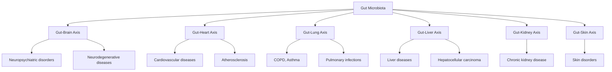

**Chronic inflammation** represents a central mechanism linking microbiota dysbiosis to disease. Microbiota interacts with host immune cells, including Toll-like receptors (TLRs), to modulate inflammatory pathways[^2]. Lipopolysaccharide (LPS) from gut bacteria activates TLR4, leading to NF-κB activation and pro-inflammatory cytokine release (IL-6, TNF-α), which are implicated in diabetes, cancer, and cardiovascular diseases[^2]. Dysbiosis-driven immune modulation, such as altered T-helper cell responses (Th1, Th2, Th17) and regulatory T-cell function, is critical in autoimmune and chronic inflammatory conditions like inflammatory bowel disease and diabetes[^2].

Changes in gut microbiota composition have been observed across multiple disease states. In patients with type 1 and type 2 diabetes, there is **decreased Firmicutes, increased Bacteroidetes and Proteobacteria**, and reduced SCFA-producing bacteria, affecting inflammation and glucose metabolism[^2]. Gut microbiota metabolizes dietary components into trimethylamine-N-oxide (TMAO), which is associated with cardiovascular diseases and activates MAPK and NF-κB signaling pathways in endothelial and smooth muscle cells[^2]. Dysbiosis can also increase intestinal permeability, allowing LPS translocation, which triggers TLR4-mediated inflammation contributing to metabolic and cardiovascular diseases[^2].

Understanding the principles of microbial balance and the mechanisms of dysbiosis provides the essential foundation for comprehending how probiotics, prebiotics, and dietary interventions can be strategically employed to restore and maintain gut health, which will be explored in subsequent chapters.

## 2 Predominant Types of Gut Probiotics: Classification and Characteristics

Probiotics are defined by the International Scientific Association for Probiotics and Prebiotics as **"live microorganisms that, when administered in adequate amounts, confer a health benefit on the host"**[^4]. These microorganisms, consisting mainly of bacteria but also including yeasts, exert their health effects through a wide variety of mechanisms including nonspecific, species-specific, and strain-specific pathways[^4]. Building upon the foundational understanding of gut microbiome balance established in the previous chapter, this section systematically examines how specific probiotic genera and species contribute to microbial homeostasis and host health through distinct biological mechanisms. Probiotic products commonly contain microbial organisms from the genera *Bifidobacterium*, *Saccharomyces*, *Streptococcus*, *Enterococcus*, *Escherichia*, and *Bacillus*, as well as from the family Lactobacillaceae[^4].

### 2.1 The Lactobacillus Genus: Diversity, Characteristics, and Health Applications

*Lactobacillus* species represent one of the most popular and widely used probiotics, belonging to the **lactic acid bacteria (LAB) group**[^5]. These microorganisms are characterized as Gram-positive, non-spore-forming, anaerobic or aerotolerant, rod-shaped bacteria that produce lactic acid from carbohydrate fermentation[^5]. The genus *Lactobacillus* is recognized as **generally safe (GRAS)** and exhibits high genetic and physiological diversity[^5]. Some of the most frequently studied and recommended probiotics include the *Lactobacillus* genus, encompassing *L. acidophilus*, *L. rhamnosus*, *L. casei*, and *L. plantarum*[^6].

#### Metabolic Diversity and Natural Habitats

Based on their metabolic characteristics, *Lactobacillus* species are classified into three distinct groups with different fermentation pathways[^7]:

| Metabolic Group | Primary Fermentation Products | Representative Species |
|-----------------|------------------------------|------------------------|
| Obligatory Homofermentative | Lactic acid as primary byproduct | *L. acidophilus* |
| Facultatively Heterofermentative | Lactic acid, ethanol/acetic acid, CO₂ | *L. casei*, *L. plantarum* |
| Obligately Heterofermentative | Lactic acid, ethanol/acetic acid, CO₂ continuously | *L. reuteri* |

*Lactobacillus* species can be isolated from a remarkably wide variety of fermented and non-fermented sources[^5]. Fermented sources include dairy products such as yogurt, cheese, and fermented milk, as well as meats, grains, fruits, vegetables, traditional foods and beverages[^5]. Non-fermented sources encompass traditional non-fermented drinks, raw plant materials including grains, fruits, vegetables, honeycomb, and soil, as well as the bodies of vertebrates and invertebrates including human breast milk, gastrointestinal tract, vagina, animal intestines, and insects[^5]. These bacteria make up a large portion of the normal human bacterial flora, with typical anatomical sites being the mouth cavity and the gastrointestinal tract[^7].

#### Key Species and Their Specific Health Benefits

**Lactobacillus acidophilus** may be the most well-known probiotic on the market today, possibly because it has so many different applications[^6]. *L. acidophilus* is a rod-shaped, homofermentative, anaerobic, Gram-positive bacterium that was first isolated from baby feces in 1900[^7]. It is primarily found in humans in the oral cavity, vagina, and gastrointestinal tract, and can help restore balance in all of these microbiomes[^6]. Notably, *L. acidophilus* demonstrates **stronger tolerance to both acid and bile salt** than many other probiotics[^7]. Clinical research has shown that *L. acidophilus* in baby formula resulted in decreased infant blood cholesterol levels, while *L. acidophilus* LA5 effectively regulated alveolar bone loss caused by periodontopathogens[^7]. Meta-analyses have associated *L. acidophilus* with significant reductions in total and LDL cholesterol concentrations[^4].

**Lactobacillus rhamnosus** was originally identified as a subspecies of *Lactobacillus casei* and has become one of the most extensively researched probiotic strains[^7]. *Lactobacillus rhamnosus* GG (LGG) is particularly well-documented, demonstrating efficacy in protecting children from rotavirus-induced diarrhea[^7]. For pediatric acute infectious diarrhea, LGG is most effective at a daily dose of at least 10^10 CFU[^4]. Meta-analyses indicate that LGG may reduce the risk of antibiotic-associated diarrhea by approximately 51%[^4]. Beyond gastrointestinal applications, administering *L. rhamnosus* GG to ovariectomized rats enhanced bone microarchitecture and biomechanics[^7]. Furthermore, *L. rhamnosus* can effectively block CD8+ T cell-mediated inflammation by decreasing Th1 cells, improving rheumatoid arthritis treatment efficacy[^7]. Studies also suggest that supplementation with *L. rhamnosus* significantly reduced the incidence of atopic dermatitis in children[^4].

**Lactobacillus plantarum** is a heterofermentative bacterium that metabolizes both pentose and hexose sugars to produce lactic acid, carbon dioxide, and either acetate or ethanol[^7]. This highly promising probiotic strain is primarily present in a wide range of fermented food products[^7]. Research has identified *L. plantarum* JYLP-326 as a potentially beneficial approach for alleviating exam anxiety in college students, while *L. plantarum* DP189 demonstrated the ability to slow neurodegeneration induced by α-synuclein accumulation in mice with Parkinson's disease[^7]. Meta-analyses have also associated *L. plantarum* with significant reductions in total and LDL cholesterol concentrations[^4].

**Lactobacillus reuteri** is an extensively researched probiotic bacterium colonizing a large number of mammals[^7]. In humans, *L. reuteri* is present in diverse bodily locations including the gastrointestinal tract, urinary tract, skin, and breast milk[^7]. This species serves as a preventive measure for diarrhea and has demonstrated potential to enhance dental health by effectively eliminating *Streptococcus mutans*[^7]. Research shows that *L. reuteri* restored the intestinal barrier, reduced pulmonary edema, slowed inflammatory responses, and altered gut microbiota in acute lung injury mice[^7]. Additionally, *L. reuteri* demonstrates anti-pathogenic activity against organisms like *S. aureus* and *Cutibacterium acnes* for skin health[^5]. Studies have shown that *L. casei* and *L. reuteri* were able to inhibit TLR4, stopping pancreatic cancer cell proliferation, migration, invasion, and macrophage M2 polarization[^7].

**Lactobacillus gasseri** is designated as Generally Recognized as Safe (GRAS) by the US Food and Drug Administration and is common in the female reproductive system, gastrointestinal system, and oral cavity[^7]. *L. gasseri* LA39 enhances the biotransformation of intestinal secondary bile acids and promotes hepatic generation of primary bile acids[^7]. Notably, *L. gasseri* LGV03, isolated from the cervico-vagina of women who had cleared human papillomavirus, can regulate innate immune responses in the epithelium and prevented HPV-positive human cervical cancer cells from growing[^7]. Clinical trials found that *L. gasseri* SBT2055 reduced visceral fat area[^4].

**Lactobacillus crispatus** is particularly useful for producing hydrogen peroxide (H₂O₂) and can be detected in both the gastrointestinal system of vertebrates and the vaginal environment[^7]. A Phase I Trial involving an *L. crispatus* vaginal suppository for preventing recurrent urinary tract infections in women demonstrated minimal side effects[^7]. Randomized clinical trials have shown *L. crispatus* can prevent and treat intrauterine adhesion, suppress endometrial fibrosis, and restore vaginal microbiota following intrauterine surgery[^7].

#### Pathogen Protection and Mechanisms of Action

The health benefits of *Lactobacillus* probiotics are extensive and multifaceted[^5]. They provide protection against pathogens in the gastrointestinal tract by competing for resources and inhibiting pathogens including *Vibrio cholerae*, *Shigella dysenteriae*, *Staphylococcus aureus*, *Escherichia coli*, *Salmonella*, and *Clostridium difficile*[^5]. In the vaginal tract, species such as *L. acidophilus*, *L. rhamnosus*, *L. plantarum*, and *L. crispatus* inhibit urogenital pathogens including *Gardnerella vaginalis* and *Candida albicans*, and may protect against HIV[^5].

Their mechanisms of action include **immunomodulation** by enhancing natural killer cell activity, modulating cytokine secretion, and strengthening the intestinal barrier[^5]. Certain *Lactobacillus* strains inhibit carcinogenesis by inducing apoptosis in cancer cells and enhancing antitumor immunity in models of colon, breast, and head and neck cancer[^5]. Various species contribute to **cholesterol reduction** through mechanisms such as bile acid deconjugation and modulation of gene expression related to cholesterol synthesis[^5]. The diverse roles of *Lactobacillus* species support the "One Health" perspective, benefiting humans, animals, and the environment[^5].

### 2.2 The Bifidobacterium Genus: Infant-Associated Probiotics and Specialized Functions

*Bifidobacterium* is a **non-spore-forming, Gram-positive, anaerobic probiotic actinobacterium** commonly found in the gut of infants and the uterine region of pregnant mothers[^8]. The *Bifidobacterium* genus currently includes over 90 species, with common strains employed to prevent and treat gastrointestinal disorders including *B. bifidum*, *B. breve*, and *B. longum*[^8]. Bifidobacteria are healthy bacteria found in your intestines that help digest fiber, prevent infections, and produce important compounds such as B vitamins and healthy fatty acids[^9].

#### Unique Role in Infant Development and Human Milk Oligosaccharide Utilization

Bifidobacteria are particularly important in early life, being one of the first types of bacteria to grow in babies' intestines after birth[^9]. In the first few weeks of life, they can make up **60% of all bacteria in the infant gut microbiome**[^9]. The most common genus of bacteria in the infant gut microbiome, Bifidobacterium is the first bacteria to colonize the intestinal tract as babies pass through the birth canal[^10]. From birth until approximately three years of age, *Bifidobacterium* bacteria comprise the largest percentage of an infant's gut microbiome, after which levels dramatically decrease to adult levels of about 5%[^10].

**Bifidobacterium longum subspecies infantis** (*B. infantis*) is unique among gut bacteria in its **prodigious capacity to digest and consume any human milk oligosaccharide structure**[^11]. This capability results from a large repertoire of bacterial genes encoding an array of glycosidases and oligosaccharide transporters not found in other bacterial species[^11]. Most strains of *B. infantis* contain a 43-kb gene cluster (HMO cluster I) that encodes a variety of oligosaccharide transport proteins and glycosyl hydrolases; this gene cluster is not found in other bifidobacterial species[^11]. The 16 glycosyl hydrolases expressed by *B. infantis* include α-fucosidases, β-galactosidases, β-hexosaminidases, and α-sialidases, facilitating complete digestion of human milk oligosaccharides within the bacterial cytoplasm[^11].

This co-evolutionary relationship between human milk oligosaccharides and *B. infantis* represents a compelling example of symbiosis. Healthy term breastfed infants are colonized by a small number of subspecies including *B. infantis*, *B. longum*, and *B. breve*, and to a lesser extent *B. bifidum* and *B. pseudocatenulatum*[^11]. Babies who are breastfed tend to have much higher levels of these beneficial bacteria than those who are bottle-fed[^9].

#### Key Species and Their Comprehensive Health Benefits

The following table summarizes the major *Bifidobacterium* species and their documented health benefits:

| Species | Primary Health Benefits | Key Mechanisms |
|---------|------------------------|----------------|
| *B. longum* | Antiinfection, anticancer, nutrient absorption | Antimicrobial activity against pathogens, SCFA production |
| *B. breve* | Anti-inflammation, psychological health, infant protection | NEC prevention, cytokine modulation |
| *B. infantis* | Infant gut colonization, NEC prevention, vaccine response | HMO digestion, intestinal barrier enhancement |
| *B. lactis* | Immune support, fat reduction, bowel regularity | IgA increase, lipid metabolism modulation |
| *B. bifidum* | Anticancer, anti-inflammation | Colon cancer cell inhibition, NEC prevention |

**Antiinfection Activity**: Various *Bifidobacteria* exert antiinfection properties against multiple pathogens[^8]. *B. longum* strains (ATCC 15708, BB536) show antimicrobial activity against pathogens including *Escherichia coli* O157:H7, *Salmonella typhimurium*, *Listeria monocytogenes*, *Pseudomonas aeruginosa*, and *Helicobacter pylori*[^8]. *B. lactis* BB-12 reduces respiratory tract infections, while *B. animalis* AHC7 protects against *S. typhimurium* infection[^8]. *B. longum* strains can prevent *Clostridium difficile* infection and *Klebsiella pneumoniae*-induced lung infection[^8]. *Bifidobacteria* also exhibit antiviral activities; *B. adolescentis* SPM1605 inhibits Coxsackievirus B3, and *B. longum* IBG inhibits rotavirus infection[^8].

**Anticancer Activity**: *Bifidobacteria* can inhibit cancers in animal models through multiple mechanisms[^8]. *B. longum* BB-536 significantly inhibits the incidence of colon and liver tumors induced by 2-amino-3-methylimidazo[4,5-f]quinoline (IQ) in rats[^8]. *B. longum* BCRC 910051 prevents 1,2-dimethylhydrazine-induced colonic tumorigenesis, while *B. bifidum* BGN4 inhibits the growth of human colon cancer cell lines such as HT-29 and HCT-116[^8].

**Anti-inflammation**: *Bifidobacteria* suppress oral and enteric inflammations through various pathways[^8]. *B. animalis* MB5 protects intestinal cells from inflammation, and combinations of *B. bifidum* and *B. longum* prevent necrotizing enterocolitis (NEC)[^8]. Human studies show *B. breve* M-16V potentially protects infants from developing NEC[^8]. Combinations of *B. breve* strains can decrease pro-inflammatory cytokine TNF-α in children with celiac disease, and *B. longum* BB536 can induce remission in ulcerative colitis patients[^8]. Studies found that taking a *Bifidobacteria* probiotic reduced inflammation in people with inflammatory bowel disease, ulcerative colitis, chronic fatigue syndrome, and psoriasis[^9].

**Promoting Psychological Health**: Many *Bifidobacteria* are classified as **psychobiotics** with documented effects on mental health[^8]. *B. breve* CCFM1025 and *B. adolescentis* 150 show antidepressant-like effects; the latter produces gamma-aminobutyric acid[^8]. *B. adolescentis* NK98 and IM38 alleviate anxiety and depression symptoms[^8]. *B. longum* 1714 reduces stress and anxiety in mice and modulates brain activity in humans[^8]. Clinical trials support these effects; *B. longum* NCC3001 reduces depression scores and alters brain activity[^8]. One study of 44 people with IBS and mild-to-moderate depression found that those who took the *Bifidobacteria* probiotic had significantly lower depression scores than those who took a placebo[^9].

**Metabolic and Nutritional Benefits**: *B. lactis* CECT 8145 reduces fat content and modulates lipid metabolism, while *B. lactis* 420 reduces fat mass and glucose intolerance in obese and diabetic mice[^8]. *B. longum* BB536 increases the abundance of nutrients like pimelate, biotin, and butyrate by facilitating microbial crosstalk[^8]. One study found that taking a *Bifidobacteria* probiotic for 45 days reduced body mass index (BMI) and blood cholesterol in people with metabolic syndrome[^9].

**Bone Health and Immune Regulation**: *B. longum* ATCC 15707 increases bone mass density, while *B. adolescentis* ATCC 15703 modulates bone repair by dampening fracture-induced systemic inflammation[^8]. *B. lactis* HN019 promotes a protective effect against alveolar bone loss[^8]. For immune regulation, *B. animalis* subsp. lactis BB-12 increases IgA levels, *B. breve* ATCC 15700 promotes regulatory T cell development, and *B. animalis* subsp. lactis HN019 enhances phagocytic activity and immunity indices[^8].

#### Short-Chain Fatty Acid Production and Fiber Digestion

The main functions of *Bifidobacteria* are to **digest fiber and other complex carbohydrates** that the human body cannot digest on its own[^9]. When they digest fiber, these beneficial bacteria produce important chemicals called **short-chain fatty acids (SCFAs)**, which play important roles for gut health and may help control hunger[^9]. The acetate produced by *Bifidobacteria* nourishes other bacteria that produce butyrate, a short-chain fatty acid that feeds the gut lining and prevents inflammation[^10]. Low counts of *Bifidobacteria* have been linked to many diseases, including celiac disease, obesity, diabetes, allergic asthma, and dermatitis[^9].

### 2.3 Other Significant Probiotic Microorganisms: Streptococcus, Saccharomyces, and Spore-Forming Bacteria

Beyond *Lactobacillus* and *Bifidobacterium*, several other microbial genera demonstrate significant probiotic potential with distinct mechanisms and applications.

#### Streptococcus thermophilus

*Streptococcus thermophilus* is one of the two primary species utilized in the manufacture of yogurt, alongside *Lactobacillus bulgaricus*[^7]. Yogurt is made using *Lactobacillus bulgaricus* and *Streptococcus thermophilus* and may also contain probiotic microorganisms from *Bifidobacterium* or Lactobacillaceae[^4]. While *S. thermophilus* is primarily valued for its role in dairy fermentation, its presence in fermented foods contributes to the overall probiotic content of these products and supports digestive function through lactic acid production.

#### Saccharomyces boulardii: The Probiotic Yeast

*Saccharomyces boulardii* represents a unique category of probiotic as it is a **beneficial yeast** rather than a bacterium[^4]. This distinction provides several advantages, including resistance to antibiotics that would destroy bacterial probiotics. *Saccharomyces boulardii* has been shown to reduce the duration of diarrhea in pediatric acute infectious cases[^4]. For antibiotic-associated diarrhea, both LGG and *Saccharomyces boulardii* have been shown to reduce the risk[^4].

The mechanisms through which *S. boulardii* exerts its effects differ from bacterial probiotics. As a yeast, it can survive antibiotic treatment and continue to provide protective effects during and after antibiotic therapy. However, the use of probiotics including *Saccharomyces* has been linked to cases of fungemia, most often in individuals who were severely ill or immunocompromised[^4].

#### Bacillus Species: Spore-Forming Probiotics

Probiotic products often contain microbial organisms from the genus *Bacillus*[^4]. Spore-forming bacteria such as *Bacillus coagulans* offer distinct advantages in terms of **environmental stability and survival characteristics**. The ability to form spores allows these organisms to withstand harsh conditions during manufacturing, storage, and transit through the acidic stomach environment, potentially delivering more viable organisms to the intestinal tract.

### 2.4 Strain-Specific Effects and the Importance of Probiotic Identification

A fundamental principle in probiotic science is that **effects are strain-specific rather than species-general**. Probiotics are identified by their genus, species, and strain designation, and because the effects of probiotics can be specific to certain probiotic strains, recommendations for their use in the clinic need to be strain-specific[^4]. Different types of microbes function differently within the body, so different types might be better or worse for specific conditions[^6].

The following diagram illustrates the hierarchical classification system for probiotics:

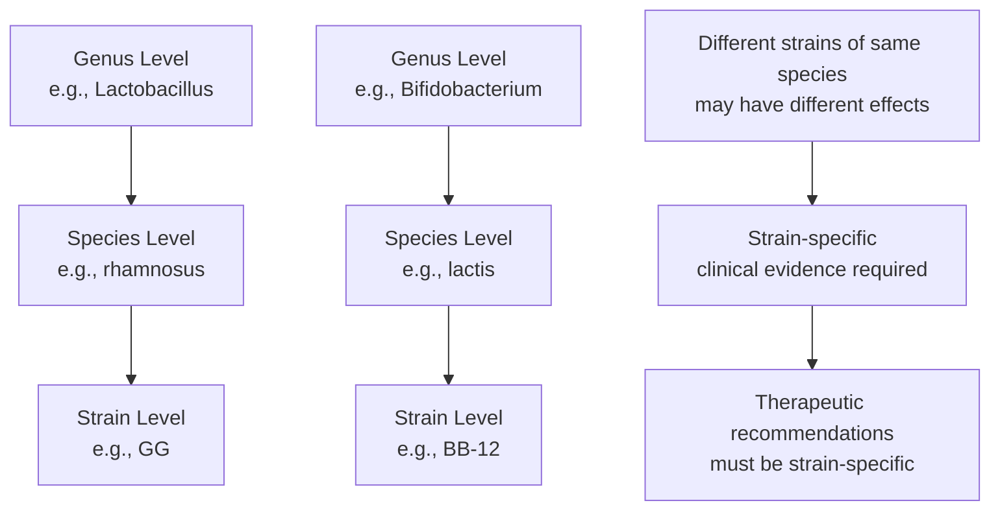

#### Well-Documented Strains with Established Efficacy

**Lactobacillus rhamnosus GG (LGG)** is among the most extensively researched probiotic strains, with documented efficacy for multiple conditions. For pediatric acute infectious diarrhea, LGG is most effective at a daily dose of at least 10^10 CFU[^4]. The strain has also demonstrated efficacy in reducing antibiotic-associated diarrhea risk and protecting against rotavirus-induced diarrhea in children[^4][^7].

**Bifidobacterium lactis BB-12** is well-known to improve bowel regularity and has been extensively researched for digestive health applications[^10]. This strain increases IgA levels and supports immune function[^8].

The importance of strain specificity is illustrated by contrasting effects within the same species. For atopic dermatitis, supplementation with *Lactobacillus rhamnosus* or *Lactobacillus paracasei* significantly reduced the incidence, whereas supplementation with *Lactobacillus reuteri* or *Lactobacillus acidophilus* did not[^4]. This demonstrates that even closely related strains can have markedly different clinical outcomes.

#### Implications for Product Selection and Clinical Application

The World Gastroenterology Organisation notes that the optimal dose of probiotics depends on the strain and product and recommends that clinicians only advise the use of probiotic strains, doses, and durations that have been shown to be beneficial in human studies[^4]. For a probiotic to have any benefit to health, it must be of a variety that has proven benefits, contain viable microbes that have survived the commercial process, and be able to survive the journey through the digestive tract[^6].

This strain-specific principle has significant implications for consumers and healthcare providers:

1. **Product labeling scrutiny**: Look for specific strain designations, not just genus and species names
2. **Evidence verification**: Seek products with clinical evidence for the specific strain included
3. **Condition matching**: Select strains with documented efficacy for the target health condition
4. **Dose adequacy**: Ensure the product provides the effective dose established in clinical trials

### 2.5 Comparative Analysis of Probiotic Characteristics and Selection Criteria

Synthesizing the characteristics of major probiotic types reveals important distinctions that inform optimal selection for specific health objectives.

#### Comparative Characteristics of Major Probiotic Genera

| Characteristic | Lactobacillus | Bifidobacterium | Saccharomyces |
|---------------|---------------|-----------------|---------------|
| Cell Type | Gram-positive bacteria | Gram-positive bacteria | Yeast (fungus) |
| Oxygen Tolerance | Anaerobic/aerotolerant | Strictly anaerobic | Aerobic |
| Primary Habitat | Oral cavity, GI tract, vagina | Large intestine, infant gut | GI tract (transient) |
| Main Metabolic Product | Lactic acid | Acetate, lactate | Various |
| Antibiotic Resistance | Susceptible | Susceptible | Resistant |
| Spore Formation | Non-spore-forming | Non-spore-forming | Non-spore-forming |

#### Factors Influencing Probiotic Efficacy

Several key factors determine whether a probiotic will successfully confer health benefits:

**Acid and Bile Tolerance**: The ability to survive transit through the stomach's acidic environment and exposure to bile salts in the small intestine is essential. *L. acidophilus* demonstrates stronger tolerance to both acid and bile salt than many other probiotics[^7], making it particularly suitable for oral supplementation.

**Adhesion to Intestinal Epithelium**: Successful colonization requires the ability to bind to intestinal cells. *In vitro* studies reveal that *B. infantis* cells grown on human milk oligosaccharides bind to cultured intestinal cells at a higher rate, suggesting that the ability to grow on specific substrates coincides with increased colonization capacity[^11].

**Competitive Exclusion of Pathogens**: Effective probiotics compete with pathogenic bacteria for nutrients and binding sites. *Lactobacillus* species provide protection against pathogens by competing for resources and inhibiting organisms including *Vibrio cholerae*, *Shigella dysenteriae*, *Staphylococcus aureus*, and *Clostridium difficile*[^5].

**Immunomodulatory Capacity**: The ability to interact beneficially with the host immune system varies among strains. Mechanisms include enhancing natural killer cell activity, modulating cytokine secretion, and strengthening the intestinal barrier[^5].

#### Dosing Requirements and Delivery Considerations

Probiotics are available as dietary supplements that can include from one to many strains, measured in **colony-forming units (CFU)**[^4]. Effective doses vary significantly by strain and condition:

- **LGG for infectious diarrhea**: At least 10^10 CFU daily[^4]
- **General maintenance**: Varies by product and strain
- **Therapeutic applications**: Often require higher doses than maintenance

The benefits of probiotics depend on multiple factors including the type of antibiotic (for AAD prevention), the probiotic strain, the user's age, and whether care is inpatient or outpatient[^4].

#### Single-Strain versus Multi-Strain Formulations

The decision between single-strain and multi-strain probiotic formulations depends on the intended application:

**Single-strain advantages**:
- Clearer evidence base for specific conditions
- Easier to determine effective dose
- More predictable effects

**Multi-strain considerations**:
- Multi-strain formulations often have greater efficacy for certain applications[^8]
- May provide broader spectrum of benefits
- Potential for synergistic effects between strains

#### Safety Considerations

Probiotics are unlikely to cause harm in healthy people, and side effects are usually minor[^4]. However, the use of probiotics has been linked to cases of bacteremia, fungemia, and infections, most of which involved individuals who were **severely ill or immunocompromised**[^4]. For example, fungemia has been associated with *Saccharomyces cerevisiae*, and studies have found an increased risk of *Lactobacillus* bacteremia in ICU patients receiving *Lactobacillus rhamnosus* GG[^4]. The U.S. Food and Drug Administration has raised concerns about the risks of administering probiotics to preterm infants[^4].

#### Practical Selection Framework

When selecting probiotics for specific health objectives, consider the following framework:

1. **Identify the target condition**: Match the condition to strains with documented efficacy
2. **Verify strain-specific evidence**: Ensure clinical trials support the specific strain, not just the species
3. **Confirm adequate dosing**: Check that the product provides the effective dose established in research
4. **Assess product quality**: Look for products from reputable manufacturers with quality assurance
5. **Consider individual factors**: Account for age, health status, and concurrent medications
6. **Evaluate delivery format**: Choose formats appropriate for the individual (capsules, powders, foods)

The beneficial microbes that live in different parts of our bodies assist us by fighting off the more harmful types of bacteria, fungi, viruses, and parasites[^6]. Many probiotic products are formulated with beneficial bacteria and yeasts for the purpose of preventing or recovering from bacterial or yeast infections in different body parts, including atopic dermatitis and acne, cavities and gum disease, vaginal and urinary tract infections, and antibiotic-associated diarrhea[^6].

Understanding the distinct characteristics, mechanisms, and evidence base for different probiotic types enables informed selection that maximizes the likelihood of achieving desired health outcomes. This knowledge forms the foundation for understanding how probiotics interact with prebiotics in synbiotic formulations and how dietary strategies can be optimized to support beneficial gut microbiota, topics that will be explored in subsequent chapters.

## 3 Mechanisms of Probiotic Action in Gut Health

This chapter systematically investigates the biological mechanisms through which probiotics confer health benefits to the host. Building upon the classification and characteristics of major probiotic genera established in the previous chapter, this section examines the specific pathways by which probiotics interact with the gut ecosystem and host physiology. Understanding these mechanisms is essential for appreciating why certain probiotic strains are effective for specific conditions and how they can be strategically employed to optimize gut health and inform dietary choices.

### 3.1 Competitive Exclusion and Pathogen Inhibition Mechanisms

Probiotics exert significant protective effects against pathogenic microorganisms through **competitive exclusion**, a fundamental mechanism whereby beneficial bacteria outcompete harmful organisms for essential resources within the gut environment. This process operates through multiple interconnected pathways that collectively create an inhospitable environment for pathogen establishment and proliferation.

The primary competitive exclusion strategy involves **competition for nutrients and receptor-binding sites** on mucosal epithelial cells. Probiotic bacteria actively compete with pathogens for the limited nutrients available in the intestinal lumen, making pathogen survival difficult in the gut[^12]. This competition extends to the binding sites on the intestinal mucosa, where probiotics preferentially occupy adhesion receptors that would otherwise be available to pathogenic organisms. By restricting binding sites on mucosal epithelial cells, probiotics prevent pathogenic bacteria from establishing the initial foothold necessary for colonization and subsequent infection[^12].

A particularly compelling example of competitive exclusion involves **manganese depletion by *Lactobacillus* species**. Research has demonstrated that *L. rhamnosus* and *L. paracasei* inhibit the growth of dairy spoilage yeasts and molds through exhaustive manganese scavenging[^13]. This mechanism operates through a manganese transporter (MntH1), which is among the highest expressed gene products in both lactobacilli species. The expression of the *mntH1* gene facilitates the depletion of this essential trace element from the environment, thereby starving competing microorganisms of a critical nutrient[^13]. Experimental deletion of the *mntH1* gene resulted in complete loss of bioprotective activity, demonstrating the critical importance of this mechanism[^13]. The presence of an *mntH* gene displays a distinct phylogenetic pattern within the *Lactobacillus* genus, with differences in expression resulting in varying levels of bioprotective effect among strains[^13].

The following table summarizes the key competitive exclusion mechanisms employed by probiotics:

| Mechanism | Description | Target Organisms | Key Probiotic Species |
|-----------|-------------|------------------|----------------------|
| Nutrient competition | Depletion of essential nutrients from the environment | Broad-spectrum pathogens | *Lactobacillus*, *Bifidobacterium* |
| Receptor site blocking | Occupation of mucosal adhesion sites | Enteric pathogens | *L. rhamnosus*, *L. acidophilus* |
| Manganese scavenging | Exhaustive depletion of trace manganese | Yeasts, molds, fungi | *L. rhamnosus*, *L. paracasei* |
| Spatial exclusion | Physical barrier formation on epithelium | Opportunistic pathogens | Multi-strain formulations |

Beyond simple competition, probiotics **prevent the adhesion and proliferation of harmful pathogens on the mucosal layer**, thereby protecting intestinal enterocytes and the lamina propria[^14]. This protective function involves multiple mechanisms including the production of biosurfactants that alter mucosal surface properties and the secretion of adhesion molecules that enhance probiotic binding while simultaneously interfering with pathogen attachment. The main adhesion mechanisms mediated by probiotics encompass both non-specific physical binding modalities such as hydrophobic interactions and specific adhesion molecules located in probiotic bacterial wall components, including mucus-binding proteins, fimbriae or pili, fibronectin binding proteins, and surface layer proteins[^14].

### 3.2 Antimicrobial Compound Production and Direct Pathogen Antagonism

The antimicrobial or antagonistic activity of probiotics represents a critical property that extends beyond competitive exclusion to include the **active production of antimicrobial compounds** that directly inhibit pathogenic organisms[^15]. This direct antagonism constitutes a major bioprotective mechanism through which probiotics maintain gut health and prevent infections.

**Bacteriocins** represent one of the most important classes of probiotic-derived antimicrobial compounds. These ribosomal-synthesized peptides or proteins are produced by bacterial strains with a strong ability to inhibit pathogenic bacteria[^15]. The major categories of bacteriocins include:

- **Nisins**: Broad-spectrum antimicrobial peptides effective against Gram-positive bacteria
- **Lactacins**: Produced by *Lactobacillus* species with activity against closely related organisms
- **Enterocins**: Derived from *Enterococcus* species with diverse antimicrobial spectra
- **Colicins**: Produced by *Escherichia coli* strains targeting related Gram-negative bacteria

Beyond bacteriocins, probiotics produce an array of **organic acids and other antimicrobial metabolites**. Short-chain fatty acids (SCFAs), organic acids, hydrogen peroxide, and various other metabolites contribute to the antimicrobial arsenal of probiotic bacteria[^12][^15]. Cell-free supernatants from probiotic cultures contain metabolites with antimicrobial properties including bacteriocins, organic acids (including fatty acids), amphiphilic membrane-active biosurfactants, as well as different metabolites with possible antimicrobial effects such as tryptophan-, polyamine-, and glutathione-metabolites[^15].

The **synergistic action of organic acids** deserves particular attention. Organic acids may potentiate the activity of other antimicrobial metabolites, which can trigger acidification and/or acid-mediated cell membrane variation to exert an apparent antagonistic effect[^15]. This potentiation mechanism explains why the antimicrobial activity of probiotics often exceeds what would be predicted from individual compound activities alone.

An important consideration in probiotic antimicrobial efficacy is the comparison between **single-strain and multi-strain formulations**. Research has demonstrated that several multi-strain probiotics, such as OMNi-BiOTiC® dietary supplements, Bio-Kult®, and NutriVital Ultra SB, exhibited more efficient antimicrobial action compared to single-strain probiotics[^15]. This enhanced efficacy likely results from interactions in mixed microbial cultures driven by metabolite exchanges and dependent on symbiotic and sometimes competitive behaviours between strains[^15]. However, various single-strain lactobacilli with well-known antimicrobial properties, including *Lacticaseibacillus rhamnosus* LGG, *Lacticaseibacillus paracasei* Shirota, *Limosilactobacillus reuteri* DSM 17938, and *Lactiplantibacillus plantarum* subsp. *plantarum* DSM 2601, also showed efficient antagonistic activity against clinical wound pathogens[^15].

The following diagram illustrates the antimicrobial mechanisms of probiotics:

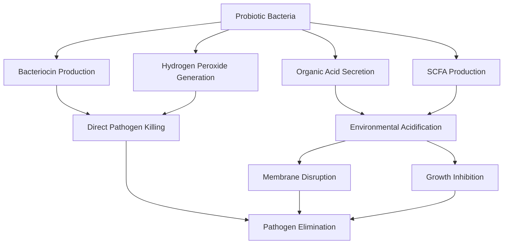

### 3.3 Modulation of Innate and Adaptive Immune Responses

Probiotics exert profound **immunomodulatory effects** through complex interactions with the host immune system, representing one of the most significant mechanisms by which these beneficial microorganisms confer health benefits. The gut immune system provides physical barriers, including the epithelium and underlying lamina propria, which contains immune effector cells[^14]. Probiotic bacteria interact with and stimulate intestinal immune cells and commensal microflora to modulate specific immune functions and maintain immune homeostasis[^14].

#### Interactions with Pattern Recognition Receptors

A key mechanism involves the interaction of probiotics with **pattern recognition receptors (PRRs)**, particularly Toll-like receptors (TLRs), expressed on sentinel cells like dendritic cells (DCs) and macrophages[^14]. This interaction regulates crucial immunoregulatory signaling pathways, including **NF-κB and mitogen-activated protein kinases (MAPK)**, leading to the modulation of cytokine release[^14]. For instance, *Lactobacillus casei* CRL 431 and *Lactobacillus paracasei* CNCM I-1518 bind to intestinal epithelial cells via TLRs, initiating immune stimulation processes like IL-6 release[^14].

The lymphoid tissue associated with the intestinal tract, known as **gut-associated lymphoid tissue (GALT)**, represents a massive source of T and B cells that migrate to effector sites to induce immune responses[^14]. Probiotics play a role in host innate and adaptive immune responses by modulating immune cells such as dendritic cells, macrophages, and B and T lymphocytes[^14]. Interactions between host intestinal cells and probiotics mainly occur at the surface of the intestinal barrier.

#### Cytokine Modulation and Inflammatory Regulation

Probiotics regulate the innate and adaptive immune response by modulating dendritic cells, macrophages, and B and T lymphocytes, and **increase the production of anti-inflammatory cytokines**[^12]. The specific interaction among intestinal immune cells, epithelial cells, and probiotic bacteria promotes a signaling cascade involving the release of pro- and anti-inflammatory cytokines, which modulates immune function[^14].

The following table summarizes the cytokine modulation effects of probiotics:

| Cytokine Category | Specific Cytokines | Probiotic Effect | Functional Outcome |
|-------------------|-------------------|------------------|-------------------|
| Pro-inflammatory | TNF-α, IL-1β, IL-6, IL-12 | Context-dependent modulation | Pathogen defense enhancement |
| Anti-inflammatory | IL-10, TGF-β | Increased production | Inflammation resolution |
| Regulatory | IL-10 from Tregs | Enhanced secretion | Immune homeostasis |

Probiotics can stimulate the production of cytokines, including interleukins (ILs), interferons (IFNs), transforming growth factors (TGFs), tumor necrosis factors (TNFs), and chemokines, by immune cells or intestinal epithelial cells[^14]. For example, *Lactobacillus* strains can stimulate T regulatory cells (Tregs) to produce TGF-β and IL-10[^14]. Probiotics such as *Bacteroidales* can favor the production of IL-6 and promote the secretion of mucin-2 and claudin-1, which are important for barrier integrity[^14].

#### T Cell Differentiation and Regulatory Balance

The proposed mechanism for the antiallergic effect of probiotics involves the **augmentation of T helper cells (Th)1/Th2 immune balance** by suppressing the Th2-skewed immune response and favoring the Th1 cell response[^12]. Probiotics also modulate the function of dendritic cells, which in turn can induce peripheral Tregs that control excessive immune responses[^12]. Lactobacilli stimulate regulatory T cells, which play a role in balancing the immune response through the production of immunosuppressive cytokines and modulation of IgE, IgA, and IgG production[^12].

Immunoregulatory probiotics can induce the release of anti-inflammatory cytokines like IL-10 and promote regulatory T cells (Tregs), which are effective suppressors of the immune response[^14]. Conversely, immunostimulatory probiotics can promote IL-12 production, which develops Th1 cells and activates natural killer (NK) cells[^14].

#### IgA Production and Mucosal Immunity

Probiotics improve intestinal immune function by eliciting B cells to produce **immunoglobulin A (IgA)**[^14]. The oral administration of various probiotics, including *Lactobacillus casei*, *acidophilus*, *rhamnosus*, *delbrueckii* subsp. *bulgaricus*, *plantarum*, and *lactis*, as well as *Streptococcus thermophilus*, has been reported to increase the number of intestinal IgA-producing cells[^14]. Probiotics induce the luminal secretion of IgAs to improve mucosal and systemic immunity[^14]. IgAs are released in large amounts to prevent dangerous bacteria from reaching the intestinal epithelium, limiting gut colonization[^14].

### 3.4 Enhancement of Intestinal Barrier Function

A key function of probiotics is to **improve intestinal barrier function**, which represents a critical defense mechanism against pathogen invasion and systemic inflammation. The intestine is covered by a single layer of viscoelastic mucus, which physically prevents the underlying epithelium and lamina propria from being reached by external factors[^14]. Probiotics can change the composition of this mucosal barrier by influencing mucin expression[^14].

#### Mucin Production and Tight Junction Regulation

Probiotics improve intestinal barrier function by **stimulating the production of mucin proteins** and regulating the expression of tight junction proteins, including occludin and claudin-1[^12]. Furthermore, probiotics prevent the adhesion and proliferation of harmful pathogens on the mucosal layer, thus protecting intestinal enterocytes and the lamina propria[^14]. For instance, *Bifidobacterium breve* IPLA 20004 and *Bifidobacterium bifidum* LMG13195 have been reported to improve the intestinal barrier function by eliciting chemokine production[^14].

#### Clinical Evidence for Barrier Enhancement

A systematic review and meta-analysis published in *Frontiers in Immunology* in 2023, analyzing data from 28 randomized controlled trials comprising 1891 participants, provided robust evidence for probiotic effects on barrier function[^16]. The meta-analysis demonstrated that probiotics significantly improved gut barrier function through multiple measurable parameters:

| Barrier Marker | Effect | Statistical Significance |
|----------------|--------|-------------------------|
| Transepithelial electrical resistance (TER) | Increased (MD: 5.27) | P < 0.00001 |
| Serum zonulin | Decreased (SMD: -1.58) | P = 0.0007 |
| Endotoxin | Decreased (SMD: -3.20) | P = 0.005 |
| Lipopolysaccharide (LPS) | Decreased (SMD: -0.47) | P = 0.02 |

These findings demonstrate that probiotic supplementation effectively reduces markers of intestinal permeability and barrier dysfunction. The reduction in serum zonulin, endotoxin, and lipopolysaccharide levels indicates decreased translocation of harmful substances from the gut lumen into systemic circulation[^16].

#### Anti-inflammatory Effects Supporting Barrier Integrity

The study also found that probiotic groups demonstrated better efficacy over control groups in **reducing inflammatory factors**[^16]. Probiotic supplementation significantly reduced levels of:

- **C-reactive protein (CRP)**: SMD -1.76 (P = 0.03)
- **Tumor necrosis factor-alpha (TNF-α)**: SMD -0.68 (P = 0.02)
- **Interleukin 6 (IL-6)**: SMD -0.80 (P = 0.03)

These anti-inflammatory effects are intimately connected to barrier function, as chronic inflammation compromises epithelial integrity and increases intestinal permeability. By reducing inflammatory mediators, probiotics help maintain the structural and functional integrity of the intestinal barrier[^16].

### 3.5 Production of Bioactive Metabolites and Neuroactive Compounds

Probiotics produce a diverse array of **bioactive substances** that influence host physiology both locally within the gut and systemically through absorption into circulation. These metabolites represent a major pathway through which probiotics confer health benefits extending far beyond the gastrointestinal tract.

#### Short-Chain Fatty Acid Production

Among the most important probiotic metabolites are **short-chain fatty acids (SCFAs)**, including acetate, propionate, and butyrate. Probiotics exert their action through several mechanisms, including the production of substances such as short-chain fatty acids and organic acids[^12]. These SCFAs serve multiple critical functions:

1. **Epithelial nutrition**: Butyrate serves as the primary energy source for colonocytes
2. **Anti-inflammatory signaling**: SCFAs suppress pro-inflammatory cytokine production
3. **Barrier enhancement**: SCFAs promote tight junction protein expression
4. **Pathogen inhibition**: Environmental acidification creates unfavorable conditions for pathogens

The meta-analysis of clinical trials demonstrated that probiotics modulate the gut microbiota structure, significantly boosting the enrichment of *Bifidobacterium* (SMD: 1.85, P = 0.01) and *Lactobacillus* (SMD: 2.22, P = 0.02)[^16]. These beneficial bacteria are primary producers of SCFAs, suggesting that probiotic supplementation enhances SCFA production capacity within the gut ecosystem.

#### Neurotransmitter Synthesis and the Gut-Brain Axis

A particularly significant aspect of probiotic metabolite production involves the synthesis of **neurotransmitters** relevant to the gut-brain axis. Specific probiotic strains can produce neurotransmitters in the gut, such as serotonin, gamma-aminobutyric acid (GABA), and dopamine, through the gut-brain axis[^12]. This capability has profound implications for mental health and neurological function.

The gut-brain axis involves bidirectional communication between the intestinal microbiota and the central nervous system. Probiotics can influence this axis through multiple pathways[^14]:

- **Direct neurotransmitter production**: Synthesis of serotonin, GABA, and dopamine
- **Vagal nerve signaling**: Stimulation of afferent vagal pathways
- **Immune-mediated signaling**: Modulation of cytokines that affect brain function
- **Metabolite-mediated effects**: SCFAs and other metabolites affecting neural activity

Research has demonstrated that *Lactobacillus helveticus* R0052 and *Bifidobacterium longum* R0175 can attenuate the hypothalamic-pituitary-adrenal axis activity[^14], suggesting potential applications for stress and anxiety management.

#### Additional Bioactive Metabolites

Beyond SCFAs and neurotransmitters, probiotic bacteria secrete various molecular effectors that mediate cross-talk with host cells[^14]. These include:

- **Surface and adhesive proteins**: Mucus-binding proteins, pili, fibronectin binding proteins
- **Secreted enzymes**: Proteases and other enzymes with specific functions
- **Vitamins**: B vitamins and other essential micronutrients
- **Amino acids**: Essential and non-essential amino acids

### 3.6 Colonic pH Regulation and Microenvironment Modification

Probiotics significantly modify the intestinal microenvironment through **lactic acid fermentation and organic acid production**, creating conditions that favor beneficial microorganisms while suppressing pathogenic populations. This environmental modification represents a fundamental mechanism supporting overall gut ecosystem stability.

The production of organic acids, particularly lactic acid, by probiotic bacteria results in **localized pH reduction** within the intestinal lumen. This acidification exerts multiple beneficial effects:

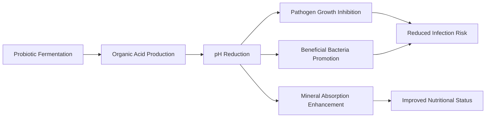

The acidic environment created by probiotic activity is **unfavorable for many pathogenic bacteria**, which typically thrive at neutral or slightly alkaline pH levels. Simultaneously, beneficial bacteria, particularly other lactic acid bacteria and bifidobacteria, are adapted to acidic conditions and can flourish in this modified environment.

Organic acids may have potentiated the activity of other antimicrobial metabolites, which can trigger acidification and/or acid-mediated cell membrane variation to exert an apparent antagonistic effect[^15]. This synergistic relationship between pH modification and antimicrobial compound activity amplifies the protective effects of probiotic colonization.

The environmental modifications induced by probiotics contribute to **resistance against dysbiosis** by creating stable conditions that favor the maintenance of beneficial microbial populations. When the gut environment is consistently maintained at conditions favorable to beneficial bacteria, opportunistic pathogens have reduced opportunities to establish themselves and cause disease.

### 3.7 Strain-Specificity and Dose-Dependency of Probiotic Effects

A fundamental principle underlying all probiotic mechanisms is that **effects are strain-specific and dose-dependent**. This variability arises from genetic and phenotypic differences between strains that determine their functional capabilities and interactions with the host.

#### Genetic and Phenotypic Determinants of Strain-Specific Effects

Different probiotic strains, even within the same species, possess distinct genetic profiles that determine their:

- **Adhesion capacity**: Variations in surface proteins and adhesins
- **Metabolite production profiles**: Differences in enzymatic capabilities
- **Immunomodulatory properties**: Strain-specific interactions with immune receptors
- **Antimicrobial compound production**: Variations in bacteriocin and organic acid synthesis

The presence of an *mntH* gene displays a distinct phylogenetic pattern within the *Lactobacillus* genus, and assaying the bioprotective ability of selected lactobacilli from 10 major phylogenetic groups identified a correlation between the presence of *mntH* and bioprotective activity[^13]. Manganese scavenging is a common trait within the genus, but differences in expression result in varying levels of bioprotective effect among strains[^13].

Surface layer proteins (SLPs) in *Lactobacillus acidophilus* NCFM favor binding to the DC-SIGN receptor on dendritic cells, stimulating the release of cytokines like IL-12p70 and TNF-α[^14]. The secretion of protease lactocepin by *Lactobacillus paracasei* degrades the proinflammatory chemokine IP-10, exhibiting anti-inflammatory effects[^14]. These examples illustrate how specific molecular features of individual strains determine their functional effects.

#### Dose-Dependency and Optimal Administration

The effectiveness of probiotics is critically dependent on the **administered dose**. Clinical research has established that different conditions require different dosing levels for optimal efficacy. The meta-analysis findings noted limitations such as high heterogeneity in some analyses and called for further high-quality RCTs to achieve more definitive conclusions regarding the precise dose, intervention duration, and specific probiotic strains[^16].

The following considerations are essential for evidence-based probiotic use:

| Factor | Consideration | Implication |
|--------|---------------|-------------|
| Strain selection | Match strain to target condition | Use strains with documented efficacy |
| Dose adequacy | Ensure sufficient CFU count | Follow clinically validated dosing |
| Viability | Maintain live organism count | Consider storage and delivery format |
| Duration | Adequate intervention period | Allow sufficient time for colonization |
| Individual factors | Host characteristics | Account for age, health status, diet |

#### Implications for Therapeutic Applications

The strain-specificity and dose-dependency of probiotic effects have profound implications for their therapeutic use. Recommendations for probiotic use in clinical settings need to be strain-specific, based on evidence from well-designed clinical trials demonstrating efficacy for specific strains at specific doses for specific conditions.

Multi-strain formulations may offer advantages in certain contexts, as research has demonstrated that several multi-strain probiotics exhibited more efficient antimicrobial action compared to single-strain probiotics[^15]. However, the selection of specific strains and their combinations should be guided by evidence rather than assumptions about additive or synergistic effects.

In summary, the mechanisms through which probiotics confer health benefits are diverse, interconnected, and fundamentally dependent on the specific characteristics of individual strains. Understanding these mechanisms—competitive exclusion, antimicrobial compound production, immune modulation, barrier enhancement, metabolite production, pH regulation, and their strain-specific nature—provides the scientific foundation for optimizing probiotic selection and dosing strategies to achieve desired health outcomes. This mechanistic understanding informs the subsequent chapters' discussions of prebiotics, synbiotics, and practical dietary strategies for gut health optimization.

## 4 Prebiotics: Definition, Classification, and Dietary Sources

This chapter establishes the scientific foundation for understanding prebiotics as functional dietary components that selectively nourish beneficial gut microbiota. Building upon the probiotic mechanisms examined in the previous chapter, this section defines prebiotics according to internationally recognized criteria, systematically classifies the major prebiotic categories based on their chemical structures and fermentation characteristics, and identifies natural and industrial sources of these compounds. The analysis addresses how prebiotics complement probiotic interventions by providing substrates that enhance the growth and metabolic activity of beneficial bacteria, thereby contributing to gut microbiome optimization strategies.

### 4.1 Scientific Definition and Qualifying Criteria for Prebiotics

The prebiotic concept represents a significant advancement in understanding how dietary components can selectively influence gut microbiota composition and function to benefit host health. The term was introduced for the first time in 1995 by **Glenn Gibson and Marcel Roberfroid**, who described a prebiotic as "a non-digestible food ingredient that beneficially affects the host by selectively stimulating the growth and/or activity of one or a limited number of bacteria in the colon, and thus improves host health"[^17]. This foundational definition established the conceptual framework that has guided prebiotic research and product development for nearly three decades.

The definition underwent refinement as scientific understanding evolved. In 2008, the 6th Meeting of the **International Scientific Association of Probiotics and Prebiotics (ISAPP)** defined "dietary prebiotics" as "a selectively fermented ingredient that results in specific changes in the composition and/or activity of the gastrointestinal microbiota, thus conferring benefit(s) upon host health"[^17]. This updated definition emphasized the importance of demonstrable changes in microbiota composition or activity as prerequisites for prebiotic classification, moving beyond simple stimulation of bacterial growth to encompass functional outcomes.

More recently, the definition has been further updated to "**a substrate that is selectively utilized by host microorganisms conferring a health benefit**," expanding its usage beyond carbohydrates to encompass other compounds that meet the essential criteria[^18]. This evolution reflects the growing recognition that prebiotic effects may be mediated by diverse molecular structures, not exclusively oligosaccharides.

#### Essential Qualifying Criteria

The following criteria are used to classify a compound as a prebiotic, establishing rigorous scientific standards for this functional food category[^17][^19]:

| Criterion | Requirement | Mechanistic Basis |
|-----------|-------------|-------------------|
| **Resistance to gastric acidity** | Must withstand stomach pH | Prevents degradation before reaching target site |
| **Resistance to mammalian enzymes** | Cannot be hydrolyzed by human digestive enzymes | Ensures passage to large intestine intact |
| **Non-absorption in upper GI tract** | Must not be absorbed in stomach or small intestine | Allows delivery to colonic microbiota |
| **Fermentability by intestinal microbiota** | Must serve as substrate for beneficial bacteria | Provides energy source for target organisms |
| **Selective stimulation** | Must preferentially promote beneficial bacteria | Confers health benefit through microbiota modulation |

These criteria collectively ensure that classified prebiotics reach the colon in an intact form where they can be metabolized by beneficial bacteria to produce health-promoting effects. Non-digestible carbohydrates can be considered as prebiotic if they achieve resistance to gastric acidity and mammalian enzymes, and susceptibility to fermentation by gut bacteria[^19]. Carbohydrates that arrive at the cecum without being digested become possible substrates for fermentation by the bacteria, where they are fermented by beneficial bacteria to produce short chain fatty acids[^19].

#### Distinction Between Prebiotics and Dietary Fiber

While prebiotics and dietary fiber share certain characteristics, important distinctions exist. Two criteria can be exploited to distinguish fiber from carbohydrate-derived prebiotics: **(i)** fibers are carbohydrates with a degree of polymerization (DP) equal to or higher than 3, and **(ii)** endogenous enzymes in the small intestine cannot hydrolyze them[^17]. Notably, the fiber's solubility or fermentability is not crucial for its classification as fiber, whereas fermentability by specific beneficial bacteria is essential for prebiotic classification.

#### The Selectivity Debate

The concept of **selectivity**—the potency of a prebiotic to stimulate a specific gut microbiota—was a key element of the original definition. However, this concept has been questioned in recent years[^17]. In 2013, Scott et al. reported that the prebiotic effect was enhanced by **cross-feeding**, defined as the product of one species which can be consumed by another one[^17]. This implication raises doubt about utilizing the "selectivity" term in the prebiotics definition, as the benefits may extend beyond direct stimulation to include indirect effects through microbial metabolite sharing.

Recent advancements have challenged aspects of the prebiotic definition, particularly the concept of specificity for microbes and in the mechanisms of health benefit[^18]. Next-generation sequencing techniques revealed that the specificity of traditional prebiotics was less clear than originally thought. For example, a recent human study found that inulin supported a surprisingly broad increase in microbial abundance[^18]. Cross-feeding interactions among organisms in degradation of prebiotics are known to occur, calling into question how specific these carbohydrates are for their most-efficient consumers[^18].

Furthermore, the metabolic products of prebiotic fermentation, including the short-chain fatty acids such as acetate, butyrate, and propionate, are themselves increasingly known to exert major roles in modulating human metabolism and immunity **independent of which organisms produce them**[^18]. This recognition has shifted focus from bacterial selectivity toward functional outcomes, acknowledging that health benefits may arise through multiple pathways involving diverse microbial communities.

### 4.2 Fructans: Inulin and Fructo-oligosaccharides (FOS)

Fructans represent one of the most extensively studied and commercially important categories of prebiotics, comprising **inulin** and **fructo-oligosaccharides (FOS)**, also known as oligofructose. These compounds were among the first to be recognized as prebiotics and remain central to prebiotic research and applications. The term "prebiotic" became strongly associated with fructooligosaccharides (FOS), inulins, and galactooligosaccharides (GOS) as they were known to increase population sizes of *Bifidobacterium* and *Lactobacillus* and were rapidly fermented to organic acids in the colon[^18].

#### Chemical Structure and Classification

The structure of fructans consists of a **linear chain of fructose with β(2→1) linkage**, usually with terminal glucose units connected via β(2→1) linkage[^17]. This structural configuration renders them resistant to hydrolysis by human digestive enzymes, which lack the necessary β-fructosidase activity to cleave these bonds.

The primary distinction between inulin and FOS lies in their **degree of polymerization (DP)**:

| Fructan Type | Degree of Polymerization | Chain Length Characteristics |
|--------------|--------------------------|------------------------------|
| **Inulin** | Up to 60 | Longer chains, slower fermentation |
| **FOS/Oligofructose** | Less than 10 | Shorter chains, more rapid fermentation |

This difference in chain length has significant implications for fermentation patterns and bacterial utilization. The chain length of fructans is an important criterion to determine which bacteria can ferment them[^17]. Inulin with its longer chains (DP ≤60) can be fermented only by a few species, whereas a large number of microorganisms are able to degrade FOS (with DP ≤10)[^17]. This differential fermentation creates opportunities for targeted prebiotic interventions based on chain length selection.

#### Bacterial Fermentation Patterns

Previously, some studies implicated that fructans can stimulate lactic acid bacteria selectively. However, over recent years, investigations have shown that the chain length of fructans is an important criterion determining which bacteria can ferment them[^17]. Therefore, other bacterial species can also be promoted directly or indirectly by fructans, expanding the scope of their prebiotic effects beyond traditional targets.

The fermentation of fructans produces **short-chain fatty acids (SCFAs)**, including lactic acid, butyric acid, and propionic acid[^17]. These metabolites exert multiple beneficial effects on the host, including:

- **Colonic pH reduction**: SCFAs decrease the pH of the colon, creating an environment unfavorable to pathogenic bacteria[^17]
- **Epithelial nutrition**: Butyrate serves as the primary energy source for colonocytes
- **Systemic effects**: SCFAs can diffuse through enterocytes into blood circulation, affecting distant organs[^17]

#### Natural Dietary Sources

FOS exists in approximately **36,000 plants**[^17], demonstrating the widespread occurrence of these compounds in the plant kingdom. However, the concentration of FOS in these sources is not enough to have prebiotic effects[^17]. Natural dietary sources of fructans include:

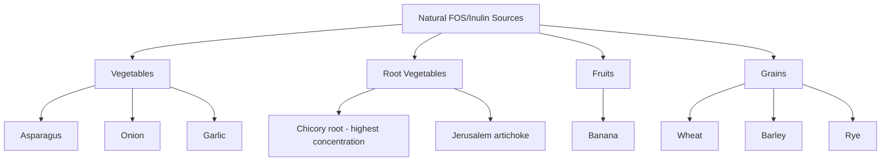

Prebiotics naturally exist in different dietary food products, including asparagus, sugar beet, garlic, chicory, onion, Jerusalem artichoke, wheat, honey, banana, barley, tomato, rye, soybean, human's and cow's milk, peas, beans, and recently, seaweeds and microalgae[^17]. Chicory root stands out as the richest natural source of inulin and serves as the primary raw material for commercial inulin extraction.

The gap between natural concentrations and therapeutic doses represents a significant consideration for dietary planning. While consuming fructan-rich foods contributes to overall prebiotic intake, achieving doses sufficient for documented health effects typically requires either concentrated food sources or supplementation.

### 4.3 Galacto-oligosaccharides (GOS) and Trans-galacto-oligosaccharides

Galacto-oligosaccharides represent another major category of prebiotics with particularly strong **bifidogenic effects** and special relevance to infant nutrition. GOS are products of lactose extension and demonstrate remarkable capacity to stimulate beneficial bacteria, especially *Bifidobacteria* and *Lactobacilli*[^17].

#### Classification and Chemical Structure

Galacto-oligosaccharides are classified into two distinct subgroups based on their origin and structure[^17]:

| GOS Subgroup | Structural Characteristics | Production Method |
|--------------|---------------------------|-------------------|
| **Type I GOS** | Excess galactose at C₃, C₄, or C₆ positions | Natural occurrence or chemical synthesis |
| **Type II GOS (TOS)** | Galactose in β(1→6), β(1→3), and β(1→4) linkages | Enzymatic trans-glycosylation from lactose |

The end product of enzymatic trans-glycosylation is mainly a mixture of **tri- to pentasaccharides** with galactose in β(1→6), β(1→3), and β(1→4) linkages[^17]. This type of GOS is also termed as **trans-galacto-oligosaccharides (TOS)**[^17].

#### Bifidogenic Effects and Bacterial Stimulation

GOS demonstrate particularly strong prebiotic effects on beneficial bacteria. GOSs can greatly stimulate *Bifidobacteria* and *Lactobacilli*[^17]. This stimulation is especially pronounced in infants, where *Bifidobacteria* have shown high incorporation with GOS[^17]. The strong bifidogenic effect of GOS makes them particularly valuable for infant formula supplementation and early-life microbiome development.

Beyond the primary target organisms, *Enterobacteria*, *Bacteroidetes*, and *Firmicutes* are also stimulated by GOS, but to a lesser extent than *Bifidobacteria*[^17]. This broader spectrum of stimulation contributes to overall microbiome diversity while maintaining preferential support for beneficial populations.

#### Lactulose-Derived and Raffinose Family Variants

There are some GOSs derived from **lactulose**, the isomer of lactose. This lactulose-derived GOS is also considered as a prebiotic[^17]. Lactulose itself has established applications in hepatic encephalopathy treatment through its prebiotic mechanisms, demonstrating the therapeutic potential of galactose-based prebiotics.

Besides these types of GOS, other types are based on sucrose extension named **raffinose family oligosaccharides (RFO)**[^17]. These compounds are found naturally in legumes and other plant sources. However, the effect of RFO on gut microbiota has not been elucidated yet[^17], representing an area requiring further research to characterize their prebiotic potential.

#### Sources and Applications

GOS occur naturally in human and bovine milk, contributing to the prebiotic content that supports infant gut microbiome development. The presence of GOS in human milk represents an evolutionary adaptation that promotes *Bifidobacterium* colonization in breastfed infants, establishing the foundation for lifelong gut health.

Commercial GOS production enables supplementation of infant formulas and adult dietary products, addressing the limited natural availability of these compounds in sufficient concentrations for therapeutic effects.

### 4.4 Resistant Starch and Glucose-Derived Oligosaccharides

Resistant starch represents a distinct category of prebiotic that differs from oligosaccharides in its polymeric structure while sharing the essential characteristic of escaping upper gastrointestinal digestion to reach the colon for bacterial fermentation.

#### Definition and Prebiotic Classification

There is a kind of starch that is resistant to upper gut digestion known as **resistant starch (RS)**[^17]. RS can promote health by producing a high level of butyrate; so it has been suggested to be classified as a prebiotic[^17]. This butyrate-producing capacity distinguishes resistant starch from other prebiotics and provides particular benefits for colonic epithelial health.

The classification of resistant starch as a prebiotic aligns with the established criteria: it resists gastric acidity and mammalian enzymatic hydrolysis, is not absorbed in the upper gastrointestinal tract, and is fermented by intestinal microbiota to produce health-promoting metabolites.

#### Bacterial Degradation and Key Species

Various groups of *Firmicutes* show the highest incorporation with a high amount of RS[^17]. The bacterial ecology of resistant starch fermentation involves specific keystone species that initiate degradation:

| Bacterial Species | Role in RS Fermentation | Metabolic Products |
|-------------------|------------------------|-------------------|
| ***Ruminococcus bromii*** | Primary/keystone degrader | Oligosaccharides for cross-feeding |
| ***Bifidobacterium adolescentis*** | Secondary degrader | Acetate, lactate |
| ***Eubacterium rectale*** | Tertiary degrader (lesser extent) | Butyrate |
| ***Bacteroides thetaiotaomicron*** | Tertiary degrader (lesser extent) | Various SCFAs |

An *in vitro* study demonstrated that RS could also be degraded by *Ruminococcus bromii* and *Bifidobacterium adolescentis*, and also to a lesser extent by *Eubacterium rectale* and *Bacteroides thetaiotaomicron*[^17]. However, in mixed bacterial and fecal incubations, **RS degradation is impossible in the absence of *R. bromii***[^17]. This finding establishes *R. bromii* as a keystone species for resistant starch utilization, highlighting the importance of microbial community composition for prebiotic efficacy.

#### Polydextrose and Other Glucose-Derived Prebiotics

**Polydextrose** is a glucose-derived oligosaccharide consisting of glucan with many branches and glycosidic linkages[^17]. There is some evidence that it can stimulate *Bifidobacteria*, but this has not been confirmed yet[^17]. The complex branched structure of polydextrose provides multiple sites for bacterial enzymatic attack, potentially supporting diverse fermentation patterns.

#### Dietary Sources of Resistant Starch

Resistant starch occurs naturally in various foods and can be increased through food preparation methods:

- **Whole grains**: Contain naturally occurring resistant starch
- **Legumes**: Rich sources of resistant starch
- **Cooled starchy foods**: Retrograded starch formed when cooked starches are cooled increases resistant starch content
- **Green bananas**: Contain higher resistant starch than ripe bananas
- **Raw potatoes**: Contain resistant starch that decreases with cooking

The formation of **retrograded starch** through cooling cooked starchy foods represents a practical dietary strategy for increasing resistant starch intake without supplementation.

### 4.5 Emerging Prebiotics: Pectic Oligosaccharides and Non-Carbohydrate Compounds

The prebiotic field continues to expand with the identification of novel compounds that meet prebiotic criteria, including both carbohydrate-derived and non-carbohydrate substances.

#### Pectic Oligosaccharides (POS)

Some oligosaccharides are originated from a polysaccharide known as **pectin**. This type of oligosaccharide is called **pectic oligosaccharide (POS)**[^17]. These compounds possess complex structures that distinguish them from simpler oligosaccharides:

POS are based on the extension of **galacturonic acid (homogalacturonan)** or **rhamnose (rhamnogalacturonan I)**[^17]. The carboxyl groups may be substituted with methyl esterification, and the structure can be acetylated at C₂ or C₃[^17]. Various types of sugars (e.g., arabinose, galactose, and xylose) or ferulic acid are linked to the side chains[^17].

Their structures vary significantly depending on the sources of POSs[^17], creating opportunities for source-specific prebiotic effects. This structural diversity may enable targeted applications based on the specific POS composition derived from different plant materials.

#### Non-Carbohydrate Prebiotics

Although carbohydrates are more likely to meet the criteria of prebiotics definition, there are some compounds that are not classified as carbohydrates but are recommended to be classified as prebiotics[^17]. This recognition reflects the evolving understanding that prebiotic effects can be mediated through diverse molecular structures.

**Cocoa-derived flavanols** represent a notable example of non-carbohydrate prebiotics. *In vivo* and *in vitro* experiments demonstrate that flavanols can stimulate lactic acid bacteria[^17]. These polyphenolic compounds may exert prebiotic effects through mechanisms distinct from carbohydrate fermentation, potentially involving:

- Direct stimulation of beneficial bacterial growth
- Inhibition of pathogenic bacteria
- Modulation of the gut environment to favor beneficial species

The inclusion of non-carbohydrate compounds in the prebiotic category expands opportunities for dietary optimization through diverse food sources rich in bioactive compounds.

### 4.6 Natural Dietary Sources and Bioavailability Considerations

Understanding the distribution of prebiotics across food categories enables practical dietary planning to optimize prebiotic intake. However, a critical consideration is the gap between natural concentrations and therapeutically effective doses.

#### Comprehensive Overview of Prebiotic Food Sources

Prebiotics naturally exist in different dietary food products[^17]. The following table provides a comprehensive categorization of prebiotic-rich foods:

| Food Category | Specific Foods | Primary Prebiotic Type |
|---------------|----------------|----------------------|
| **Vegetables** | Asparagus, onion, garlic | FOS, inulin |
| **Root vegetables** | Chicory, Jerusalem artichoke, sugar beet | Inulin (high concentration) |
| **Fruits** | Banana, tomato | FOS, resistant starch |
| **Grains** | Wheat, barley, rye | FOS, resistant starch |
| **Legumes** | Soybeans, peas, beans | GOS (raffinose family), resistant starch |
| **Dairy** | Human milk, cow's milk | GOS |
| **Other** | Honey | FOS |
| **Emerging sources** | Seaweeds, microalgae | Various oligosaccharides |

#### The Concentration Gap

Because of their **low concentration in foods**, prebiotics are manufactured on industrial large scales[^17]. This concentration gap represents a fundamental challenge for achieving therapeutic prebiotic effects through diet alone. While regular consumption of prebiotic-rich foods contributes to overall gut health, documented clinical effects often require doses that exceed what typical dietary patterns provide.

For example, FOS exists in about 36,000 plants; however, the concentration of FOS in these sources is not enough to have prebiotic effects[^17]. Therefore, FOS should be synthesized for therapeutic applications[^17].

#### Bioavailability and Fermentation Efficiency

Several factors influence the bioavailability and fermentation efficiency of dietary prebiotics:

1. **Food matrix effects**: The physical structure of foods affects prebiotic release and accessibility to gut bacteria
2. **Processing methods**: Cooking, cooling, and other preparation methods can alter prebiotic content and structure
3. **Individual microbiome composition**: The presence of key degrading species (e.g., *R. bromii* for resistant starch) determines fermentation capacity
4. **Transit time**: Colonic transit time affects the duration of bacterial exposure to prebiotics
5. **Concurrent dietary components**: Other dietary factors may enhance or inhibit prebiotic fermentation

The recognition that RS degradation is impossible in the absence of *R. bromii*[^17] illustrates how individual microbiome composition critically determines prebiotic efficacy, highlighting the importance of personalized approaches to prebiotic supplementation.

### 4.7 Industrial Production and Commercial Prebiotic Products

The industrial production of prebiotics addresses the gap between natural dietary concentrations and therapeutic doses, enabling consistent delivery of effective prebiotic amounts through supplements and fortified foods.

#### FOS Production Methods

Some prebiotics are produced by using lactose, sucrose, and starch as raw material[^17]. For FOS, the key enzyme is **fructosyl-transferase (FTase)**, which produces FOS from sucrose by transferring one to three molecules of fructose[^17].

FOS can be synthesized chemically by using glycosidase and glycosyl-transferase[^17]. However, the compounds used in these reactions are hazardous and costly, and the concentration of the end product (FOS) is very low. Thus, it cannot be produced on an industrial scale[^17].

Several microorganisms have FTase, including *Fusarium* sp., *Aspergillus* sp., *Aureobasidium* sp., *Penicillium* sp., *Arthrobacter* sp., *Zymomonas mobilis*, *Bacillus macerans*, *Candida*, *Kluyveromyces*, and *Saccharomyces cerevisiae*[^17]. Among these microorganisms, ***Aspergillus niger*** and ***Aureobasidium pullulans*** are mostly used in the industry[^17].

#### Optimization of FOS Yield

The maximum amount of FOS produced by FTases depends on the initial concentration of sucrose (theoretically around 55–60%)[^17]. **Glucose**, which is a co-product of fermentation, **inhibits trans-glycosylation**[^17]. Therefore, removing glucose and sucrose residues is a critical step to achieving higher yields of FOS fermentation.

Methods to enhance FOS production yield include:

| Method | Mechanism | Yield Improvement |
|--------|-----------|-------------------|
| **Glucose oxidase + β-fructofuranosidase** | Converts glucose to gluconic acid (removable) | Up to 98% |
| **Nanofiltration** | Physical separation of glucose from FOS | Up to 90% |
| ***S. cerevisiae* or *Z. mobilis*** | Microbial consumption of glucose, fructose, sucrose | Variable |

Scientists claimed to utilize glucose oxidase and β-fructofuranosidase to enhance the yield of FOS production[^17]. The glucose produced during FOS fermentation is converted to gluconic acid by glucose oxidase. Unlike glucose, gluconic acid is able to be removed by ion-exchange resins or by coagulation with calcium carbonate (CaCO₃)[^17]. Thus, the utilization of both enzymes increases the yield of FOS formation up to 98%[^17].

#### GOS Production Methods

GOSs were first chemically synthesized by nucleophilic and electrophilic displacement, but this method is currently deemed to be uneconomical at the industrial scale[^17]. The key enzymes for GOS formation are **galactosyl-transferase** and **galactosidase**[^17].

Galactosyl-transferase is a stereoselective enzyme that can produce GOS in high quantities[^17]. Nevertheless, the bio-catalysis of GOS via galactosyl-transferase is costly because this reaction needs nucleotide sugars as a donor[^17].

Formation of GOS by means of **galactosidase is much cheaper** than galactosyl-transferases[^17]. However, galactosidase produces GOS in lower quantities, and this enzyme is less stereospecific than galactosyl-transferase[^17]. The amount of GOS produced by galactosidase can be improved in different ways: **(i)** increasing the concentration of donors and acceptors in the reaction, **(ii)** lowering water activity of the reaction, **(iii)** shifting the reaction equilibrium to the end product direction by the product elimination in the medium, and **(iv)** altering the synthesis conditions[^17].

**β-Galactosidases** come from different sources, such as *Aspergillus oryzae*, *Sterigmatomyces elviae*, *Bifidobacteria*, and *Lactobacilli*[^17]. Different sources of β-galactosidases cause various types of GOS that differ in the amount, DP, and glycosidic linkages[^17].

#### Recombinant Enzyme Production

**Recombinant β-galactosidases** have more advantages than native β-galactosidases, such as high production yield, easy purification, and improved enzyme stability, as well as activity through molecular approaches[^17]. *Escherichia coli* and *Bacillus subtilis* are mostly used for producing recombinant β-galactosidases[^17].

Some yeasts, such as *S. cerevisiae* and *Pichia pastoris*, have been used for producing recombinant forms of β-galactosidase[^17]. Yeast has some advantages compared to bacteria, including **(i)** higher range of productivity, **(ii)** disulfide bond production, and **(iii)** better protein folding[^17].

#### Advantages of Prebiotics Over Probiotics

Considering the health benefits of prebiotics and their safety, as well as their **production and storage advantages compared to probiotics**, they seem to be fascinating candidates for promoting human health condition as a replacement or in association with probiotics[^17]. Key advantages include:

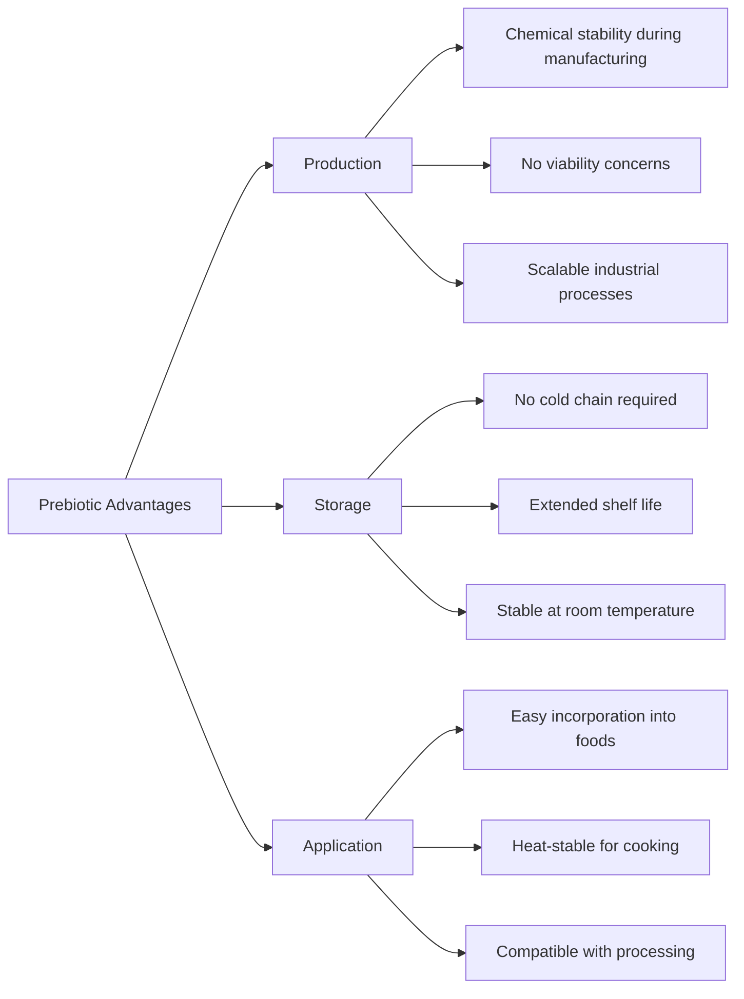

These practical advantages make prebiotics particularly suitable for food fortification and dietary supplementation strategies, complementing probiotic interventions while avoiding the viability and storage challenges associated with live microorganisms. The combination of prebiotics with probiotics in **synbiotic formulations** represents an emerging strategy to maximize gut health benefits, which will be explored in subsequent chapters.

## 5 Mechanistic Roles of Prebiotics in Modulating Gut Microbiota

This chapter systematically analyzes the biochemical and physiological mechanisms through which prebiotics support gut health and modulate microbiota composition. Building upon the prebiotic classification and sources established in the previous chapter, this section examines the fermentation pathways that convert prebiotic substrates into bioactive metabolites, the production and functional roles of short-chain fatty acids, environmental modifications within the colonic ecosystem, and the systemic health effects mediated through SCFA absorption into circulation. Understanding these mechanisms provides the scientific foundation for appreciating how dietary prebiotic intake translates into measurable health benefits and informs evidence-based dietary recommendations.

### 5.1 Fermentation Pathways and Short-Chain Fatty Acid Production

The conversion of prebiotic substrates into bioactive metabolites occurs through a sophisticated series of **anaerobic fermentation reactions** carried out by specialized gut bacteria. This metabolic transformation represents the primary mechanism through which prebiotics confer health benefits, as the fermentation products—particularly short-chain fatty acids (SCFAs)—exert profound effects on both local gut physiology and systemic health.

#### The Central Role of Glycolysis and Pyruvate Formation

The fermentation process initiates with **microbial hydrolysis** of complex prebiotic carbohydrates, followed by glycolytic metabolism to produce **pyruvate** as the central metabolic intermediate[^20]. Resistant dietary carbohydrates that escape digestion and absorption in the small intestine reach the large intestine where they become substrates for bacterial fermentation[^20]. The glycolytic pathway processes these carbohydrates through a series of enzymatic steps, ultimately yielding pyruvate, which then serves as the branch point for the distinct biosynthetic pathways leading to each major SCFA.

The fermentation of approximately **50–60 g of carbohydrates per day** yields an estimated **500–600 mmol of SCFAs** in the gut[^20]. This substantial metabolic output underscores the quantitative significance of prebiotic fermentation in human physiology. Beyond carbohydrates, amino acids can also undergo fermentation to produce SCFAs, though carbohydrate fermentation represents the predominant pathway[^20].

#### Acetate Biosynthesis Pathways

Acetate, the most abundant SCFA in the colon, can be synthesized through **two distinct biochemical pathways**. The first and most common pathway involves the **decarboxylation of pyruvate** to produce acetyl-CoA, which is subsequently hydrolyzed to acetate by acetyl-CoA hydrolase[^20]. This pathway is utilized by the majority of enteric bacteria capable of acetate production.

The second pathway, known as the **Wood-Ljungdahl pathway**, is employed by acetogenic bacteria to form acetate from acetyl-CoA through a different mechanism. In this pathway, carbon dioxide reduction generates carbon monoxide, which reacts with a coenzyme A molecule and a methyl group to produce acetyl-CoA, subsequently converted to acetate[^20].

The following table summarizes the major acetate-producing bacterial species and their metabolic characteristics:

| Bacterial Species/Genus | Pathway Utilized | Primary Habitat | Additional Characteristics |
|------------------------|------------------|-----------------|---------------------------|
| *Prevotella* spp. | Pyruvate-acetyl-CoA | Colon | Fiber-degrading specialists |
| *Ruminococcus* spp. | Pyruvate-acetyl-CoA | Colon | Complex carbohydrate fermenters |
| *Bifidobacterium* spp. | Pyruvate-acetyl-CoA | Colon, infant gut | Major bifidogenic targets |
| *Bacteroides* spp. | Pyruvate-acetyl-CoA | Colon | Versatile carbohydrate utilizers |
| *Clostridium* spp. | Both pathways | Colon | Diverse metabolic capabilities |
| *Streptococcus* spp. | Pyruvate-acetyl-CoA | Small intestine, colon | Lactic acid bacteria |
| *Akkermansia muciniphila* | Pyruvate-acetyl-CoA | Mucus layer | Mucin-degrading specialist |
| *Blautia hydrogenotrophica* | Wood-Ljungdahl | Colon | Acetogenic specialist |

#### Propionate Biosynthesis Pathways

Propionate production is more **conserved and substrate-specific** than acetate synthesis, with only a limited number of bacterial genera possessing the necessary enzymatic machinery[^20]. Three distinct biochemical pathways lead to propionate formation, each utilizing different substrates and enzymatic mechanisms.

The **succinate pathway** represents the most common route for propionate synthesis and is utilized by Bacteroidetes and several Firmicutes belonging to the Negativicutes class[^20]. This pathway employs a primitive electron transfer chain using phosphoenolpyruvate (PEP), which is carboxylated to oxaloacetate and sequentially converted through malate, fumarate, and succinate before final transformation to propionate. The electron transfer chain couples NADH oxidation to chemiosmotic ATP synthesis, making this pathway energetically favorable[^20].

The **acrylate pathway** provides an alternative route for propionate formation through lactate reduction. A lactoyl-CoA dehydratase enzyme reduces lactate directly to propionate[^20]. This pathway is restricted to a very limited number of gut bacteria, including *Coprococcus catus*[^20].

The **propanediol pathway** utilizes deoxy sugars such as rhamnose and fucose as substrates. These sugars are converted to 1,2-propanediol, which is sequentially transformed into propionaldehyde and propionyl-CoA before final conversion to propionate[^20]. Notably, ***Akkermansia muciniphila*** appears to be the major propionate-producing species utilizing this pathway[^20], highlighting the importance of this mucin-degrading bacterium in colonic propionate production.

#### Butyrate Biosynthesis Pathways

Butyrate production, like propionate synthesis, is **highly conserved and substrate-specific**, with resistant starch fermentation contributing substantially to colonic butyrate formation[^20]. The keystone species ***Ruminococcus bromii*** plays a critical role in this process, as its absence has been associated with significantly reduced resistant starch fermentation[^20].

The butyrate biosynthetic pathway begins with the **condensation of two acetyl-CoA molecules** to form acetoacetyl-CoA, which undergoes sequential reduction to β-hydroxybutyryl-CoA, crotonyl-CoA, and finally butyryl-CoA[^20]. In lactate-utilizing bacteria, acetyl-CoA can be produced from lactate, providing an alternative entry point into the pathway[^21].

From butyryl-CoA, butyrate can be synthesized through **two different terminal pathways**:

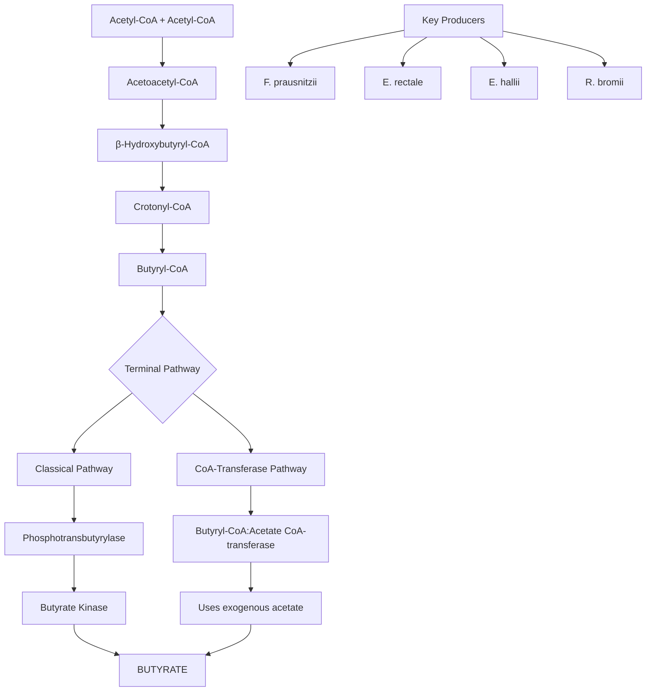

The **classical pathway** employs phosphotransbutyrylase and butyrate kinase enzymes for the conversion, while the **butyryl-CoA:acetate CoA-transferase pathway** converts butyryl-CoA to butyrate using exogenously derived acetate[^20]. The latter pathway appears to be preferred by the human gut microbiota, with the classical pathway limited to some *Coprococcus* species[^20]. The major butyrate producers utilizing the CoA-transferase pathway include ***Faecalibacterium prausnitzii*, *Eubacterium rectale*, *Eubacterium hallii*, and *Ruminococcus bromii***[^20][^21].

#### Quantitative Distribution of SCFAs in the Gut

Following fermentation, SCFAs are present in the intestinal lumen at **millimolar concentrations** with a characteristic relative molar ratio of approximately **acetate:propionate:butyrate = 60:20:20**[^20][^21]. However, these values demonstrate considerable variation depending on microbiota composition, SCFA substrates, and gut transit time[^20].

The **concentration gradient** of SCFAs along the gastrointestinal tract has important physiological implications. Absolute SCFA concentrations are highest in the **proximal colon** (cecum and ascending colon), where most fermentation occurs, and decrease progressively toward the distal colon as SCFAs are absorbed by colonocytes[^21]. This gradient influences the local effects of SCFAs on different colonic regions and determines the amount available for systemic absorption.

### 5.2 Colonic pH Modulation and Microenvironment Regulation

The production of SCFAs from prebiotic fermentation fundamentally alters the **colonic microenvironment** through acidification, creating conditions that profoundly influence microbial ecology, pathogen resistance, and metabolic outcomes. This environmental modification represents a critical mechanism through which prebiotics exert their health-promoting effects.

#### The pH Gradient Along the Colon

A distinct **pH gradient** exists along the length of the large intestine, directly reflecting the regional variation in SCFA concentrations and fermentation activity[^20]. In the cecum and ascending colon, where fermentation is most active and SCFA concentrations are highest, the pH is more acidic, approximately **5.6**[^20]. As SCFAs are absorbed and fermentation substrates become depleted, the pH progressively increases toward the sigmoid colon and rectum, where values approach **6.6**[^20].

This pH gradient creates **regionally distinct microenvironments** that support different bacterial populations and metabolic activities:

| Colonic Region | Approximate pH | SCFA Concentration | Predominant Activity |
|----------------|----------------|-------------------|---------------------|
| Cecum/Ascending colon | ~5.6 | Highest | Active fermentation, butyrate production |
| Transverse colon | ~6.0 | Moderate | Continued fermentation |
| Descending colon | ~6.3 | Lower | Reduced fermentation |
| Sigmoid/Rectum | ~6.6 | Lowest | Minimal fermentation |

The correlation between SCFA production and pH reduction is **inversely proportional**—carbohydrates that lead to high SCFA production correspondingly lower the colonic pH[^21]. This relationship provides a mechanistic link between prebiotic intake and environmental modification.

#### Effects of Acidification on Microbial Composition

The acidification resulting from SCFA production exerts **selective pressure** on the microbial community, favoring acid-tolerant beneficial bacteria while inhibiting many pathogenic species. At mildly acidic pH, the growth of ***Bacteroides*** is limited, which restricts propionate production while simultaneously stimulating butyrate production[^21]. This pH-mediated shift in microbial activity demonstrates how environmental modification can redirect fermentation toward specific beneficial metabolites.

Bacteria utilizing the **butyryl-CoA:acetate CoA-transferase pathway** display higher acetate consumption and butyrate production at mildly acidic pH[^21]. This finding indicates that the acidic environment created by initial fermentation activity actually enhances subsequent butyrate production, creating a positive feedback loop that amplifies the beneficial effects of prebiotic consumption.

The luminal pH reduction by SCFAs also **inhibits the growth of pathogenic bacteria**[^20], which typically thrive at neutral or slightly alkaline pH levels. This pathogen inhibition represents a key protective mechanism through which prebiotics and their fermentation products maintain gut health.

#### Influence of Environmental Factors on Fermentation

Beyond pH, several additional environmental factors within the gut influence SCFA production and the overall fermentation process[^21]. Understanding these factors is essential for optimizing prebiotic efficacy:

**Oxygen tension**: Despite the generally anaerobic nature of the colonic environment, oxygen gradients exist near the mucosal surface. Oxygen concentrations and hydrogen gas partial pressure influence fermentation processes and SCFA production[^21]. The presence of oxygen can redirect bacterial metabolism and alter the profile of fermentation products.

**Growth factors and trace elements**: The availability of essential nutrients significantly impacts bacterial growth and metabolic activity. Iron, in particular, plays a critical role in SCFA production—**iron deficiency significantly decreases fecal butyrate and propionate concentrations**[^21]. This finding has important implications for individuals with iron-deficiency anemia, who may experience compromised prebiotic benefits.

**Substrate availability**: The type and amount of fermentable substrate reaching the colon determines the extent and pattern of SCFA production. Different prebiotic types are fermented at different rates and by different bacterial species, leading to distinct SCFA profiles. The **chain length of fructans**, for example, determines which bacteria can ferment them—longer-chain inulin is fermented by fewer species compared to shorter-chain FOS.

### 5.3 Cross-Feeding Phenomena and Microbial Metabolic Networks

The concept of **cross-feeding** represents a paradigm shift in understanding prebiotic mechanisms, revealing that the benefits of prebiotics extend far beyond direct substrate utilization by target bacteria. Cross-feeding describes the phenomenon whereby **the metabolic products of one bacterial species serve as substrates for another**, creating complex metabolic networks that amplify prebiotic effects throughout the microbial community[^21].

#### Acetate as a Cross-Feeding Substrate

One of the most important cross-feeding relationships involves **acetate produced by Bifidobacteria serving as a substrate for butyrate-producing bacteria**[^21]. This metabolic interaction has been demonstrated through co-culturing studies with Bifidobacteria and *Faecalibacterium* species, which showed enhanced butyrate production compared to monocultures[^21].

The significance of this cross-feeding mechanism cannot be overstated. Acetate production by Bifidobacteria has proven importance for the immune system[^21], and the subsequent conversion of this acetate to butyrate by secondary consumers amplifies the health benefits. This relationship explains why **increasing acetate alone may not be sufficient** for optimal gut health—the abundance of butyrate-producing bacteria and adequate dietary fiber must also be present to complete the metabolic cascade[^21].

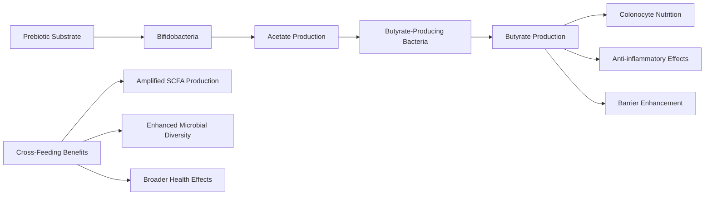

#### Primary Degraders and Keystone Species

Cross-feeding networks depend critically on **primary degraders**—bacterial species capable of initiating the breakdown of complex prebiotic substrates. ***Ruminococcus bromii*** exemplifies this keystone role in resistant starch degradation. In mixed bacterial and fecal incubations, **resistant starch degradation is impossible in the absence of *R. bromii***[^21], demonstrating that this species creates the metabolic foundation upon which other bacteria depend.

The products of primary degradation—oligosaccharides and other intermediate metabolites—become available for secondary utilizers that lack the enzymatic machinery to attack intact prebiotic polymers. This hierarchical metabolic structure means that the **presence or absence of keystone species** can determine whether an individual derives benefit from specific prebiotic types.

#### Implications for Prebiotic Selectivity

The discovery of extensive cross-feeding networks has challenged the original prebiotic concept of **selectivity**—the idea that prebiotics specifically stimulate only certain beneficial bacteria[^21]. Cross-feeding implies that the benefits of prebiotic consumption can extend to bacterial species that do not directly utilize the prebiotic substrate, as long as they can consume the metabolic products of primary degraders.

This recognition has important implications for understanding prebiotic mechanisms:

1. **Broader spectrum of effects**: Prebiotics may benefit a wider range of bacterial species than originally appreciated through indirect metabolic support
2. **Community-level responses**: The gut microbiota responds to prebiotics as an integrated metabolic network rather than as isolated species
3. **Individual variation**: Differences in microbiome composition, particularly the presence of keystone species, may explain variable responses to prebiotic interventions
4. **Therapeutic strategies**: Effective prebiotic interventions may need to consider the entire metabolic network rather than focusing solely on target organisms

Research on cross-feeding mechanisms in the gut microbiome continues to expand, with particular focus on understanding **how cross-feeding can be leveraged to support disease management**[^21]. Deciphering these metabolic interactions may enable more sophisticated prebiotic strategies that optimize the entire fermentation cascade.

### 5.4 Selective Stimulation of Beneficial Bacterial Populations

Despite the complexity introduced by cross-feeding phenomena, prebiotics retain the capacity to **preferentially promote the growth and activity of beneficial bacteria**, particularly *Bifidobacteria* and *Lactobacilli*. This selective stimulation occurs through mechanisms related to substrate specificity, enzymatic capabilities, and competitive advantages conferred by prebiotic availability.

#### Substrate Specificity and Enzymatic Capabilities

The selectivity of prebiotics derives fundamentally from **differences in bacterial enzymatic capabilities**. Not all gut bacteria possess the enzymes necessary to hydrolyze and metabolize specific prebiotic structures. For example, ***Bifidobacterium longum subspecies infantis*** possesses a unique capacity to digest human milk oligosaccharides (HMOs) due to a **43-kb gene cluster (HMO cluster I)** encoding specialized oligosaccharide transport proteins and glycosyl hydrolases not found in other bacterial species.

The 16 glycosyl hydrolases expressed by *B. infantis* include α-fucosidases, β-galactosidases, β-hexosaminidases, and α-sialidases, enabling complete digestion of HMOs within the bacterial cytoplasm. This enzymatic specialization explains why *B. infantis* dominates the infant gut microbiome in breastfed infants and demonstrates how substrate-enzyme matching drives prebiotic selectivity.

#### Chain Length and Fermentation Patterns

The **chain length of prebiotic oligosaccharides** significantly influences which bacterial species can utilize them. This relationship is particularly well-characterized for fructans:

| Prebiotic Type | Degree of Polymerization | Bacterial Utilization Pattern |
|----------------|--------------------------|------------------------------|
| FOS (oligofructose) | DP ≤10 | Broadly fermented by many species |
| Inulin | DP ≤60 | Fermented by fewer, specialized species |
| Resistant starch | Variable | Requires keystone degraders (*R. bromii*) |

Longer-chain inulin requires more specialized enzymatic machinery for degradation, limiting its utilization to bacteria with appropriate extracellular or membrane-bound enzymes. Shorter-chain FOS can be transported into bacterial cells and metabolized by a broader range of species. This differential accessibility creates opportunities for **targeted prebiotic interventions** based on chain length selection.

#### Evidence from Human Intervention Studies

Clinical studies have documented significant increases in beneficial bacterial populations following prebiotic consumption. Fiber-rich diets have been shown to increase the abundance of **SCFA-producing bacteria** including *F. prausnitzii* and *A. muciniphila*[^20]. The families ***Ruminococcaceae*, *Lachnospiraceae*, and *Akkermansiaceae*** demonstrate increased abundance following vegetarian diet interventions[^20].

A Mediterranean diet, characterized by high consumption of fiber-rich foods, has been correlated with higher levels of SCFAs and SCFA-producing bacteria[^20]. Omega-3-rich diets similarly increase SCFA-producing bacteria belonging to the *Lachnospira*, *Roseburia*, *Lactobacillus*, and *Bifidobacterium* genera[^20].

#### Bifidogenic Effects of Specific Prebiotic Types

**Galacto-oligosaccharides (GOS)** demonstrate particularly strong bifidogenic effects, greatly stimulating *Bifidobacteria* and *Lactobacilli*. This stimulation is especially pronounced in infants, where *Bifidobacteria* show high incorporation with GOS. The strong bifidogenic effect makes GOS particularly valuable for infant formula supplementation.

**Fructo-oligosaccharides (FOS)** and inulin similarly promote *Bifidobacterium* populations, though the specific species stimulated may vary based on chain length and individual microbiome composition. The term "prebiotic" became strongly associated with FOS, inulins, and GOS precisely because of their well-documented capacity to increase population sizes of *Bifidobacterium* and *Lactobacillus*.

### 5.5 Systemic Health Effects Through SCFA Absorption and Signaling

The health benefits of prebiotic fermentation extend far beyond the gastrointestinal tract through the **absorption of SCFAs into systemic circulation** and their subsequent effects on diverse tissues and organ systems. This systemic distribution enables SCFAs to influence metabolic, cardiovascular, immune, and neurological functions throughout the body.

#### SCFA Transport and Concentration Gradients

Most SCFAs produced in the colon are utilized by **colonocytes as an energy source**, with butyrate serving as the preferred oxidative fuel[^20]. The SCFAs not consumed by colonocytes are transported to the hepatic portal vein and enter systemic circulation.

A strong **concentration gradient** exists from the gut lumen to the periphery, resulting in different SCFA exposures for various tissues[^20]:

| Compartment | Total SCFA Concentration | Relative to Portal Blood |
|-------------|--------------------------|-------------------------|
| Portal blood | ~375 µmol/L | Reference (100%) |
| Hepatic vein | ~148 µmol/L | 39% |
| Peripheral venous blood | ~79 µmol/L | 21% |

This gradient indicates that the **gut is the principal source of circulating SCFAs**, with substantial hepatic extraction reducing systemic concentrations. Despite the relatively low peripheral concentrations, SCFAs exert significant physiological effects through receptor-mediated signaling pathways.

Importantly, **fecal SCFA concentrations provide limited information** about actual SCFA production because they represent only the fraction that has been produced and not absorbed[^22]. When colon-delivery capsules containing 250 mmol of SCFAs were administered, fecal concentrations did not increase, indicating nearly complete absorption into colonocytes[^22]. This finding underscores the efficiency of SCFA absorption and the limitations of fecal measurements for assessing prebiotic efficacy.

#### Receptor-Mediated SCFA Signaling

SCFAs act as signaling molecules through binding to **G protein-coupled receptors (GPCRs)** expressed on various cell types throughout the body[^20][^21]. The major SCFA receptors and their characteristics are summarized below:

| Receptor | Alternative Name | Preferred SCFA Ligands | Primary Expression Sites | Downstream Effects |
|----------|------------------|----------------------|-------------------------|-------------------|
| FFAR2 | GPR43 | Acetate, propionate | Intestine, adipose, immune cells | Immune modulation, metabolic regulation |
| FFAR3 | GPR41 | Propionate, butyrate | Intestine, nervous system, vasculature | Energy homeostasis, blood pressure |
| GPR109A | HCAR2 | Butyrate | Intestine, adipose, immune cells | Anti-inflammatory responses |
| Olfr78 | OR51E2 (human) | Acetate, propionate | Vascular smooth muscle, kidney | Blood pressure regulation |

The binding of SCFAs to these receptors triggers intracellular signaling cascades that mediate diverse physiological effects. Additionally, butyrate and propionate function as **histone deacetylase (HDAC) inhibitors**, leading to histone hyperacetylation and increased accessibility of transcription factors to gene promoter regions[^20][^21]. This epigenetic mechanism enables SCFAs to influence gene expression patterns across multiple cell types.

#### Glucose Homeostasis and Insulin Sensitivity

SCFAs improve glucose homeostasis through multiple mechanisms involving both receptor-mediated signaling and indirect hormonal effects[^20]. Activation of FFAR2 and FFAR3 by SCFAs stimulates the secretion of **gut-derived satiety hormones**, including peptide YY (PYY) and glucagon-like peptide-1 (GLP-1), from intestinal enteroendocrine L-cells[^20].

GLP-1 exerts particularly important effects on glucose metabolism:
- **Increases insulin secretion** from pancreatic β-cells
- **Decreases glucagon secretion**, reducing hepatic glucose output
- **Regulates blood glucose levels** through incretin effects

Propionate demonstrates benefits on pancreatic β-cell function *in vivo*, enhancing glucose-stimulated insulin release via FFAR2 activation and increasing β-cell mass[^20]. Furthermore, SCFA binding to FFAR2 may ameliorate insulin resistance by promoting autophagy of skeletal muscle cells[^20].

Direct metabolic effects include the **upregulation of AMP-activated protein kinase (AMPK)-dependent gene expression** by butyrate, affecting glucose metabolism[^20]. Propionate similarly declines hepatic gluconeogenesis through AMPK-dependent mechanisms[^20].

#### Lipid Metabolism Regulation

SCFAs regulate multiple aspects of lipid metabolism, including lipolysis, adipogenesis, and cholesterol handling[^20]:

**Lipolysis regulation**: Acetate and propionate inhibit endogenous lipolysis, while propionate regulates extracellular lipolysis through increased lipoprotein lipase expression. Both mechanisms result in **decreased circulating lipid plasma levels and body weight**[^20].

**Adipogenic differentiation**: Preadipocytes treated with propionate and acetate demonstrate promoted adipocyte differentiation via overexpression of FFAR2 and PPARγ[^20]. This effect may contribute to improved metabolic health through enhanced lipid storage capacity.

**Cholesterol metabolism**: Acetate, propionate, and butyrate enhance hepatic uptake of cholesterol from blood, decreasing plasma cholesterol in animal studies[^20]. Propionate acts as a **potent inhibitor of cholesterol synthesis**[^20], suggesting potential applications for cardiovascular risk reduction.

#### Blood Pressure Modulation

The relationship between SCFAs and blood pressure involves **opposing effects mediated by different receptors**[^20]. Studies with receptor knockout mice have revealed this dual regulatory system:

- **Olfr78 null mice** display lower blood pressure compared to wild-type animals, suggesting Olfr78 activation raises blood pressure
- **FFAR3 knockout mice** are hypertensive, indicating FFAR3 activation lowers blood pressure

The dual signaling through Olfr78 and FFAR3 may represent a **homeostatic balancing mechanism** for blood pressure regulation[^20]. Importantly, the ligand affinity of Olfr78 for SCFAs is lower than that of FFAR3, suggesting that at physiological SCFA concentrations, the blood pressure-lowering effects through FFAR3 may predominate[^20].

High-fiber diets and acetate supplementation have been shown to decrease systolic and diastolic blood pressure, cardiac fibrosis, and left ventricular hypertrophy in animal models[^20], supporting the cardiovascular benefits of prebiotic-derived SCFAs.

#### Appetite Regulation and Energy Homeostasis

SCFAs influence appetite and energy balance through multiple pathways affecting both peripheral and central mechanisms[^20]:

**Peripheral hormone signaling**: SCFA-stimulated release of PYY and GLP-1 influences appetite by activating proopiomelanocortin (POMC) neurons in the hypothalamic arcuate nucleus, suppressing neuropeptide Y (NPY), and delaying gastric emptying[^20].

**Direct central effects**: Acetate can cross the blood-brain barrier and is taken up by the hypothalamus, causing appetite decrease and increased γ-aminobutyric acid (GABA) and lactate levels[^20].

**Leptin stimulation**: SCFAs may stimulate leptin secretion from adipocytes, contributing to satiety signaling. Human adipocytes incubated with high propionate concentrations showed increased leptin mRNA expression and secretion[^20].

### 5.6 Intestinal Barrier Enhancement and Immune Modulation

Prebiotics and their fermentation products strengthen intestinal barrier function and modulate immune responses through mechanisms that are central to maintaining gut health and preventing systemic inflammation. These effects have profound implications for conditions characterized by barrier dysfunction, including inflammatory bowel disease and metabolic disorders.

#### Butyrate as Colonocyte Fuel and Barrier Enhancer

Butyrate serves as the **preferred oxidative fuel for colonocytes**, providing approximately 70% of their energy requirements[^20]. This metabolic relationship has important consequences for epithelial health and barrier function. Butyrate can induce proliferation in normal colonocytes while promoting terminal differentiation and apoptosis in neoplastic cells—a phenomenon known as the **"butyrate paradox" or "Warburg effect"**[^20].

Beyond its role as an energy substrate, butyrate influences epithelial oxygen consumption, contributing to the stabilization of **hypoxia-inducible factor (HIF)**, which coordinates gut barrier protection[^20]. This oxygen-sensing mechanism links butyrate availability to barrier integrity through transcriptional regulation.

#### Tight Junction Regulation

SCFAs, particularly butyrate, regulate the expression and assembly of **tight junction proteins** that maintain epithelial barrier integrity[^20][^21]. Studies have demonstrated SCFA-mediated upregulation of multiple tight junction components:

| Tight Junction Protein | SCFA Effect | Functional Consequence |
|----------------------|-------------|----------------------|
| Claudin-1 | Increased expression | Enhanced paracellular barrier |
| Claudin-7 | Increased expression | Improved epithelial integrity |
| ZO-1, ZO-2 | Increased expression | Strengthened junction assembly |
| Occludin | Increased expression | Reduced permeability |
| JAMA | Increased expression | Enhanced cell-cell adhesion |

Butyrate specifically improves gut barrier integrity through increased expression of claudin-1 in differentiated intestinal epithelial cells[^20]. The stabilization of HIF by butyrate further coordinates the expression of genes involved in barrier protection[^21].

#### Mucin Production and Mucus Layer Maintenance

A properly regulated mucus layer is essential for epithelial barrier function, providing physical separation between luminal contents and the underlying epithelium. Butyrate increases the production of **MUC2**, the predominant mucin glycoprotein secreted by goblet cells[^20]. This enhanced mucin production strengthens the mucus barrier and supports the maintenance of a healthy commensal microbiota.

#### HDAC Inhibition and Anti-Inflammatory Signaling

Butyrate exerts potent anti-inflammatory effects through **inhibition of histone deacetylases (HDACs)** and suppression of **nuclear factor kappa B (NF-κB)** activation in macrophages[^20][^21]. Both HDAC and NF-κB contribute to inflammatory responses, and their inhibition by butyrate reduces pro-inflammatory signaling.

The anti-inflammatory effects of SCFAs extend to cytokine modulation:

**Anti-inflammatory cytokine promotion**: SCFAs upregulate anti-inflammatory cytokines while downregulating pro-inflammatory mediators. SCFA binding to FFAR2 and GPR109A in intestinal epithelial cells stimulates K⁺ efflux and hyperpolarization, leading to NLRP3 inflammasome activation and **IL-18 release**, which supports intestinal homeostasis and repair[^20].

**Pro-inflammatory cytokine suppression**: In human dendritic cells, butyrate and propionate reduce the release of pro-inflammatory chemokines (CXCL11, CXCL10, CXCL9, CCL5, CCL4, CCL3) and inhibit LPS-induced cytokine expression including IL-6 and IL-12p40[^20].

Increased protein acetylation by butyrate in intestinal epithelial cells leads to decreased IL-8 production[^20], while TGFβ1 production promotes anti-inflammatory regulatory T cells (Tregs)[^20].

#### Immune Cell Modulation

SCFAs influence both innate and adaptive immune cell populations through HDAC inhibition mechanisms affecting neutrophils, monocytes, macrophages, dendritic cells, and T cells[^21]. Key immunomodulatory effects include:

**Regulatory T cell induction**: Butyrate promotes the development and function of regulatory T cells, which suppress excessive immune responses[^20][^21]. This effect is mediated through enhanced TGFβ1 production and direct effects on T cell differentiation.

**Antimicrobial peptide production**: SCFAs promote the secretion of antimicrobial peptides by intestinal epithelial cells, including RegIIIγ and defensins, through activation of mTOR and STAT3 signaling[^20]. Butyrate specifically induces the antimicrobial protein cathelicidin IL-37[^20].

#### Clinical Implications for Barrier Dysfunction

The barrier-enhancing and immune-modulating effects of prebiotic-derived SCFAs have significant implications for conditions characterized by intestinal barrier dysfunction. In **inflammatory bowel disease (IBD)**, microbial dysbiosis is associated with reduced SCFA-producing bacteria, particularly from the Ruminococcaceae and Lachnospiraceae families, with a consistent reduction in *Faecalibacterium prausnitzii*[^21].

The presence of *Eubacterium* and *Roseburia* species, as well as SCFA biosynthesis capacity, has been associated with remission in fecal microbial transplantation studies[^21]. Conversely, the absence of remission correlates with reductions in these beneficial bacteria[^21].

Strategies to increase SCFA concentrations include administering **highly fermentable dietary fibers (prebiotics)** to induce significant rises in plasma SCFA levels and promoting cross-feeding mechanisms[^21]. However, in the presence of active inflammation, the benefits of butyrate may be attenuated, suggesting that SCFA effects may vary depending on disease state[^21].

The comprehensive understanding of prebiotic fermentation mechanisms, SCFA production pathways, and their systemic effects provides the scientific foundation for developing evidence-based dietary strategies to optimize gut health. These mechanisms explain how dietary prebiotic intake translates into measurable health benefits across multiple physiological systems and inform the practical dietary recommendations that will be addressed in subsequent chapters.

## 6 Pathogenic Bacteria of Concern in the Gut Environment

This chapter systematically examines the major pathogenic bacteria that threaten gut health and disrupt microbial homeostasis. Building upon the foundational understanding of beneficial microbiota and prebiotic mechanisms established in previous chapters, this section analyzes the characteristics, virulence mechanisms, and infection dynamics of key enteric pathogens. The chapter addresses how these pathogens exploit disruptions in the gut ecosystem, the host and environmental factors that predispose individuals to infection, and the conditions under which commensal bacteria transition to pathogenic states. Understanding these pathogenic threats provides essential context for appreciating the protective roles of probiotics and prebiotics in maintaining gut health.

### 6.1 Clostridioides difficile: Antibiotic-Associated Pathogenesis and Toxin-Mediated Disease

*Clostridioides difficile* represents one of the most clinically significant enteric pathogens, constituting **a gram-positive, anaerobic, spore-forming, and toxin-producing bacterium** that has emerged as a major cause of healthcare-associated infections worldwide[^23]. The pathogen's ability to form environmentally resistant spores, combined with its toxin-mediated pathogenicity, creates a formidable challenge for infection control and patient management. Understanding the mechanisms underlying *C. difficile* infection (CDI) provides critical insights into the importance of maintaining gut microbiome integrity through dietary and probiotic interventions.

#### Toxin-Mediated Pathogenesis

The virulence of *C. difficile* is fundamentally dependent on the production of **two major toxins—Toxin A (TcdA) and Toxin B (TcdB)**—which serve as the primary virulence factors mediating disease pathology[^23]. These large clostridial toxins belong to the glucosyltransferase family and exert their cytotoxic effects through a sophisticated mechanism involving receptor binding, internalization, and enzymatic modification of host cell signaling proteins.

Upon reaching the colon, *C. difficile* bacteria begin reproducing and releasing toxins that **damage intestinal tissues, destroy cells, and cause watery diarrhea**[^24]. The toxins disrupt the actin cytoskeleton of intestinal epithelial cells, leading to cell rounding, loss of tight junction integrity, and ultimately cell death. This tissue destruction triggers an intense inflammatory response characterized by neutrophil infiltration, fluid secretion, and the formation of pseudomembranes—the hallmark pathological finding in severe CDI.

Most pathogenic strains associated with CDI produce both toxins A and B, though the relative contribution of each toxin to disease severity has been a subject of ongoing investigation. **Toxin B is increasingly recognized as the primary driver of intestinal pathology**, though Toxin A contributes to the inflammatory cascade and may enhance disease severity in combination with Toxin B.

#### Emergence of Hypervirulent Strains

The epidemiology of CDI underwent a dramatic shift in 2005 with the identification of a **hypervirulent, antibiotic-resistant epidemic strain designated NAP1/B1/027 (ribotype 027)**[^23]. This strain has been associated with increased disease severity, higher mortality rates, and more frequent recurrences compared to historical strains. Several genetic and phenotypic characteristics distinguish this hypervirulent lineage:

| Characteristic | NAP1/B1/027 Features | Clinical Implications |
|----------------|---------------------|----------------------|
| **Toxin production** | Increased production of toxins A and B | Enhanced tissue damage and inflammation |
| **Binary toxin (CDT)** | Production of additional binary toxin | Potential contribution to virulence |
| **tcdC gene mutations** | Deletions in negative regulator gene | Overproduction of primary toxins |
| **Antibiotic resistance** | Fluoroquinolone resistance | Selection advantage during antibiotic therapy |
| **Sporulation** | Enhanced spore formation | Increased environmental persistence |

The deletions identified in the *tcdC* gene, which normally serves as a **negative regulator of toxins A and B expression**, potentially explain the overproduction of these virulence factors observed in NAP1/B1/027 strains[^23]. This genetic alteration removes a critical brake on toxin synthesis, resulting in substantially higher toxin concentrations during infection.

#### Antibiotic-Induced Dysbiosis as the Critical Enabling Factor

The most significant risk factor for CDI is **antibiotic use, particularly broad-spectrum antibiotics** that disrupt the delicate balance of the gut microbiome[^23][^24]. This disruption creates the ecological opportunity for *C. difficile* to proliferate and cause disease. Patients may carry *C. difficile* asymptomatically, but antibiotic use disturbs the balance of the gut microbiome, leading to dysbiosis and enabling *C. difficile* proliferation and infection[^23].

The relationship between antibiotics and CDI reflects the fundamental importance of colonization resistance—the protective effect of a healthy microbiome against pathogen establishment. Various antibiotic classes have been associated with CDI development, with particularly strong associations observed for:

- **Clindamycin**: Historically the most strongly associated antibiotic
- **Cephalosporins**: Broad-spectrum activity disrupts multiple bacterial populations
- **Fluoroquinolones**: Associated with NAP1/B1/027 strain emergence
- **Penicillins**: Broad-spectrum formulations carry significant risk[^23][^24]

The mechanism underlying antibiotic-associated CDI involves the elimination of beneficial bacteria that normally suppress *C. difficile* through competitive exclusion, production of inhibitory metabolites, and maintenance of an acidic colonic environment through short-chain fatty acid production. Without these protective mechanisms, *C. difficile* spores can germinate, vegetative cells can proliferate, and toxin production can proceed unchecked.

#### Comprehensive Risk Factor Assessment

Beyond antibiotic exposure, multiple additional factors increase CDI susceptibility, reflecting the complex interplay between pathogen, host, and environment:

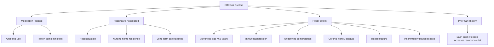

**Proton pump inhibitors (PPIs)** represent an important modifiable risk factor, as these acid-suppressing medications may increase CDI risk by reducing gastric acidity that would otherwise help eliminate ingested *C. difficile* spores[^23][^24]. The combination of PPI use with antibiotic therapy creates a particularly high-risk scenario.

**Healthcare settings** serve as major reservoirs for *C. difficile* transmission, with the pathogen spreading readily on hands, medical equipment, and environmental surfaces[^24]. The spore-forming capacity of *C. difficile* enables prolonged environmental survival on surfaces including cart handles, bedrails, bedside tables, toilets, sinks, stethoscopes, thermometers, telephones, and remote controls[^24]. This environmental persistence, combined with the concentration of susceptible patients in healthcare facilities, explains the predominantly nosocomial nature of CDI epidemiology.

**Advanced age** represents one of the strongest host-related risk factors, with individuals aged 65 and older experiencing approximately **10-fold higher infection risk** compared to younger populations[^24]. This age-related susceptibility reflects multiple factors including age-associated changes in microbiome composition, reduced immune function, higher rates of antibiotic exposure, and more frequent healthcare contact.

#### Clinical Markers of Severe Disease

Identifying patients at risk for severe CDI enables targeted intervention strategies. Clinical and laboratory markers associated with severe disease outcomes include:

| Risk Factor | Association with Severity | Clinical Significance |
|-------------|--------------------------|----------------------|
| Age >70 years | OR 3.35 | Strong predictor of poor outcomes |
| Leukocyte count >20,000 cells/mL | OR 2.77 | Indicates severe inflammatory response |
| Albumin <2.5 g/dL | OR 3.44 | Reflects nutritional status and disease severity |
| Creatinine >2 mg/dL | OR 2.47 | Indicates renal involvement |
| Small bowel obstruction/ileus | OR 3.06 | Suggests severe intestinal dysfunction |
| CT evidence of colorectal inflammation | OR 13.54 | Strong radiological predictor |

These readily available clinical data points enable risk stratification without requiring individual strain genotyping[^25]. Notably, no specific antimicrobial drug class, including fluoroquinolones and clindamycin, was independently associated with severe disease once infection was established, suggesting that disease severity is determined more by host factors and strain characteristics than by the inciting antibiotic[^25].

### 6.2 Pathogenic Escherichia coli: Diversity of Enteric Pathotypes and Virulence Strategies

*Escherichia coli* exemplifies the remarkable capacity of bacteria to transition from harmless commensal to dangerous pathogen through the acquisition of virulence determinants. As a normal inhabitant of the gastrointestinal tract, *E. coli* performs beneficial functions including vitamin synthesis and colonization resistance against pathogens. However, the acquisition of **mobile genetic elements containing genes encoding virulence factors transforms this commensal organism into an emerging human pathogen** capable of causing a broad spectrum of intestinal and extraintestinal diseases[^26].

#### The Genetic Basis of Pathogenicity

The transformation of commensal *E. coli* into pathogenic variants occurs through the acquisition of **pathogenicity islands (PAIs), plasmids, and transposons** carrying virulence gene clusters[^26][^27]. These mobile genetic elements encode activities essential for pathogenesis including adhesion, invasion, attachment, iron acquisition, motility, and toxin production. Each *E. coli* pathotype possesses its characteristic pathogenicity mechanisms and a specific profile of virulence factors encoded by specific gene clusters[^26].

The virulence factors of pathogenic *E. coli* can be categorized into **four main functional classes**: colonization factors, fitness factors, toxins, and effector proteins[^26]. This classification reflects the sequential requirements for successful infection: initial attachment to host tissues, survival and multiplication within the host environment, damage to host cells through toxin action, and manipulation of host cell functions through injected effectors.

#### Systematic Analysis of Diarrheagenic E. coli Pathotypes

Nine distinct enteric *E. coli* pathotypes have been characterized, with seven causing diarrheagenic disease through distinct mechanisms[^27]. The following comprehensive analysis examines the major pathotypes, their virulence strategies, and clinical significance:

**Enteropathogenic *Escherichia coli* (EPEC)** represents the principal cause of diarrheal diseases and outbreaks in infants, particularly in developing countries[^26]. The hallmark of EPEC pathogenesis is the formation of **attaching and effacing (A/E) lesions** on intestinal epithelial cells, characterized by intimate bacterial attachment, localized destruction of microvilli, and pedestal formation beneath attached bacteria.

The molecular machinery for A/E lesion formation is encoded by a chromosomal pathogenicity island termed the **locus of enterocyte effacement (LEE)**, which contains genes for a type III secretion system (T3SS), the outer membrane adhesin intimin (*eae* gene), and multiple effector proteins[^26]. The infection process initiates with the reaction between intimin and the translocated intimin receptor (Tir), a bacterial protein injected into host cells through the T3SS. Upon phosphorylation, Tir recruits host proteins that trigger actin polymerization and pedestal formation[^26].

The T3SS translocates multiple effector proteins into host cells, each with specific functions:

| Effector | Function | Consequence |
|----------|----------|-------------|
| Map | Mitochondrial targeting | Mitochondrial dysfunction |
| EspF | Multiple functions | Tight junction disruption, apoptosis |
| EspG | Cytoskeleton modulation | Microtubule disruption |
| EspH | Rho GTPase modulation | Actin cytoskeleton changes |
| EspZ | Anti-apoptotic | Host cell survival during infection |

**Enterohemorrhagic *Escherichia coli* (EHEC)** causes severe disease including hemorrhagic colitis and the potentially fatal **hemolytic uremic syndrome (HUS)**[^26]. The defining virulence factor of EHEC is the **Shiga-like toxin (SLT or Stx)**, encoded by bacteriophage-associated *stx* genes. This AB₅ toxin consists of an enzymatically active A subunit that inhibits protein synthesis and five B subunits that mediate binding to the host cell receptor globotriaosylceramide (Gb3)[^26].

EHEC shares the LEE pathogenicity island with EPEC, enabling A/E lesion formation, but the addition of Shiga toxin production creates a more severe disease phenotype. Additional virulence factors include:

- **Curli fibers** (encoded by *csg* genes): Mediate adhesion and biofilm formation
- **Autotransporters** (Eha, Saa, Sab): Contribute to adhesion
- **T3SS effectors**: Counteract host inflammatory responses and inhibit cell death[^26]

**Enterotoxigenic *Escherichia coli* (ETEC)** represents a principal cause of **travelers' diarrhea and childhood diarrhea** in developing countries[^26][^27]. Unlike EPEC and EHEC, ETEC pathogenesis does not involve intimate attachment or invasion but rather relies on colonization of the small intestinal surface followed by toxin secretion.

The two main virulence factors of ETEC are:

1. **Colonization factors (CFs)**: Plasmid-encoded fimbrial and non-fimbrial adhesins including CFA/I, CFA/II, CFA/IV, and coli surface antigens (CS1-CS6) that mediate attachment to intestinal epithelium[^26]

2. **Enterotoxins**: Heat-stable toxins (ST) and heat-labile toxins (LT) that activate cyclic nucleotide production in intestinal epithelial cells, leading to chloride secretion, inhibition of sodium absorption, and secretory diarrhea[^26]

**Enteroinvasive *Escherichia coli* (EIEC)** causes **bacillary dysentery** clinically indistinguishable from shigellosis[^26]. The virulence strategy of EIEC involves invasion of colonic epithelial cells, intracellular multiplication, and spread to adjacent cells. This invasive phenotype is conferred by a **220-kb virulence plasmid** encoding a T3SS complex, chaperones, regulators, translocators, and over 25 effector proteins[^26].

The invasion process is mediated by the IpaBCD complex, which triggers cytoskeleton reorganization and epithelial cell uptake. Intracellular effectors enable bacterial survival, movement through the cytoplasm using actin-based motility, and suppression of host immune responses. Toxins including Shigella enterotoxins (ShET1/ShET2) and SPATE family proteases contribute to diarrhea and inflammation[^26].

**Enteroaggregative *Escherichia coli* (EAEC)** is associated with **persistent childhood diarrhea and travelers' diarrhea**, characterized by a distinctive "stacked brick" adherence pattern to intestinal epithelial cells[^26][^27]. The pathogenesis of EAEC involves:

1. **Aggregative adhesion**: Mediated by aggregative adhesion fimbriae (AAF/I-V) encoded by *aggA*, *aafA*, *agg3A*, *agg4A*, and *agg5A* genes
2. **Biofilm formation**: Creates a thick mucoid layer on the intestinal surface
3. **Toxin secretion**: Including plasmid-encoded toxin (Pet), secreted autotransporter toxin (Sat), and enteroaggregative heat-stable toxin (AstA)
4. **Type VI secretion system**: Encoded by *aaiA-Y* genes, mediates biofilm formation[^26]

The AggR regulator controls virulence gene expression, coordinating the pathogenic program of EAEC strains.

#### Hybrid Pathotypes and Emerging Threats

The most notable example of hybrid *E. coli* pathogenicity emerged during the **2011 European outbreak of *E. coli* O104:H4**, which affected over 3,400 people and caused 39 deaths[^27]. This outbreak strain combined virulence factors from multiple pathotypes—specifically, the enteroaggregative adherence phenotype with Shiga toxin production—creating an unusually severe disease presentation.

Hybrid isolates containing combinations of canonical virulence genes from different pathotypes continue to emerge, including strains containing both Shiga toxin genes and heat-stable enterotoxin genes, or LEE region genes combined with LT genes[^27]. These hybrid pathogens underscore the dynamic nature of *E. coli* pathogenicity and the ongoing public health challenge posed by this organism.

### 6.3 Salmonella Species: Invasion Mechanisms and Inflammation-Driven Competitive Advantage

*Salmonella* species represent pathogens of major clinical and public health significance, causing infections ranging from self-limited gastroenteritis to life-threatening systemic disease[^28]. The pathobiology of *Salmonella* infection has been extensively characterized, revealing sophisticated mechanisms by which this pathogen invades host tissues, manipulates immune responses, and paradoxically exploits inflammation to gain competitive advantage over commensal microbiota.

#### Salmonella Pathogenicity Islands and Type III Secretion Systems

The virulence of *Salmonella* is fundamentally dependent on **Salmonella pathogenicity islands (SPIs)**, chromosomal regions encoding specialized virulence machinery[^29][^30]. SPI-1 plays a crucial role in the interaction between *Salmonella* and host cells, particularly during gut infection, and is regarded as the most important virulence factor of *Salmonella*[^29].

The **type III secretion system (T3SS)** encoded by SPI-1 functions as a molecular syringe, delivering effector proteins directly into host cells to manipulate cellular functions[^29][^30]. The structural components of this apparatus include:

| Component | Gene | Function |
|-----------|------|----------|
| Base proteins | *invG*, *prgH*, *prgK* | Anchor apparatus in bacterial envelope |
| Needle protein | *prgI* | Forms hollow needle structure |
| Inner rod protein | *prgJ* | Connects base to needle |
| Tip complex protein | *sipD* | Host cell contact sensing |
| Translocon | *sipB*, *sipC* | Forms pore in host membrane |

Upon contact with host cells, the translocon composed of SipB and SipC is inserted into the host membrane, forming a channel through which effector proteins are delivered[^29].

#### Effector Proteins and Host Cell Manipulation

*Salmonella* translocates numerous effector proteins into host cells, orchestrating a complex program of cellular manipulation that facilitates invasion, survival, and immune evasion. The major SPI-1-encoded effectors and their functions include:

**SipA and SipC** directly interact with host cell actin, inducing cytoskeletal rearrangements that promote bacterial uptake[^30]. SipA is an actin-binding protein that enhances bacterial entry efficiency by stabilizing actin filaments and induces polymorphonuclear leukocyte recruitment[^29].

**SopE, SopE2, and SopB** function as Rho GTPase exchange factors that activate host cell signaling cascades, resulting in the formation of highly organized actin structures that cause membrane ruffling and bacterial engulfment[^30]. These effectors mediate rapid actin rearrangements essential for the "trigger" mechanism of *Salmonella* invasion[^29].

**AvrA** plays a unique dual role in *Salmonella* pathogenesis. This effector inhibits the NF-κB signaling pathway and activates β-catenin signaling, leading to suppression of innate immunity, inflammation, and apoptosis during infection[^30]. AvrA has been shown to promote intestinal permeability, activate the Wnt/β-catenin pathway, and subsequently increase proliferation—effects that may contribute to *Salmonella*-associated carcinogenesis[^30][^31].

**SptP** functions as a protein tyrosine phosphatase that reverses actin cytoskeletal changes induced by SopE and other effectors, restoring normal cell morphology after bacterial internalization[^29]. The temporal regulation of SptP and SopE activities ensures coordinated invasion followed by cellular recovery.

#### The Inflammation Paradox: Exploiting Host Defense for Competitive Advantage

One of the most remarkable aspects of *Salmonella* pathobiology is its ability to **exploit host inflammatory responses for competitive advantage** over commensal microbiota[^28][^32]. While inflammation represents a host defense mechanism intended to eliminate pathogens, *Salmonella* has evolved multiple strategies to thrive in the inflamed intestinal environment.

The "kamikaze" strategy employed by *Salmonella* involves a small fraction of the infecting population actively invading and triggering a robust acute inflammatory response[^28]. Although this inflammatory response effectively limits systemic bacterial dissemination, it paradoxically creates favorable conditions for the larger population of *Salmonella* remaining in the intestinal lumen:

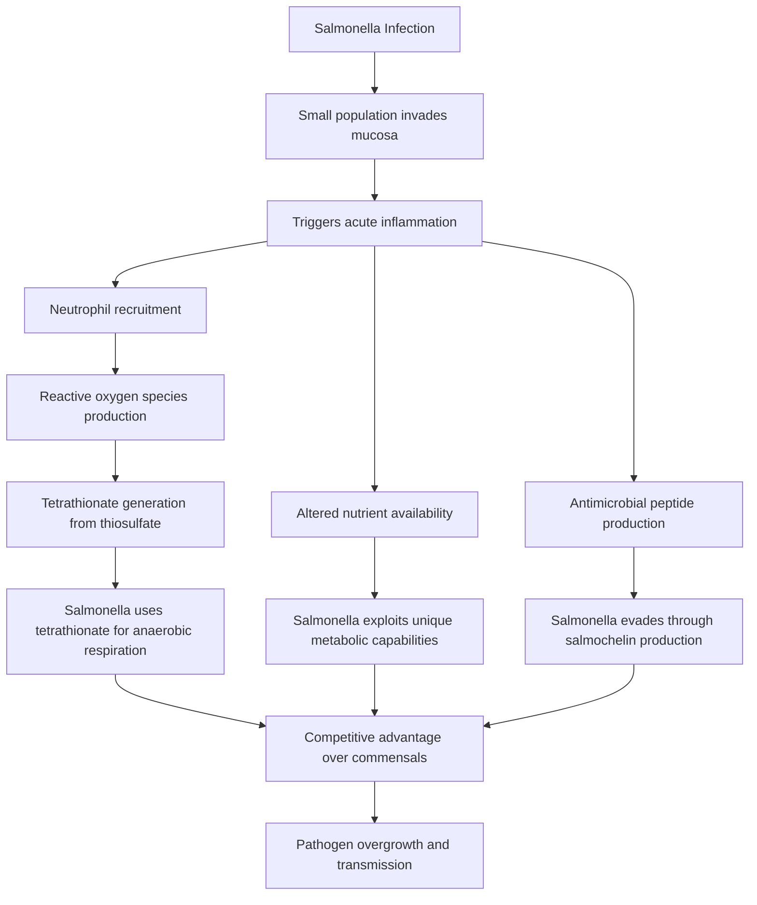

**Tetrathionate respiration** provides a critical metabolic advantage. Inflammation-induced reactive oxygen species oxidize endogenous thiosulfate to tetrathionate, which *Salmonella* can utilize as an electron acceptor for anaerobic respiration—a capability not shared by most commensal bacteria[^28].

**Siderophore-mediated iron acquisition** enables *Salmonella* to overcome host nutritional immunity. The host antimicrobial peptide lipocalin-2, produced during inflammation, binds and sequesters enterobactin, a common bacterial siderophore. However, *Salmonella* produces **salmochelin**, a modified siderophore not recognized by lipocalin-2, thereby maintaining access to iron[^28].

**Zinc acquisition** through high-affinity transporters (ZnuABC) allows *Salmonella* to overcome the zinc-sequestering effects of calprotectin, a neutrophil-derived antimicrobial protein[^28].

**Nitrate respiration** is facilitated by effector protein SopE, which induces host production of nitrate that *Salmonella* can use for anaerobic respiration[^28].

#### Antibiotic-Induced Susceptibility and Microbiota Disruption

The intestinal microbiota provides significant **colonization resistance** against *Salmonella* infection[^32][^28]. Disruption of this protective barrier through antibiotic treatment dramatically increases susceptibility to *Salmonella*:

Antibiotic treatment is recognized as a risk factor for subsequent *Salmonella* infection in human patients[^28]. Experimental studies demonstrate that treating mice with streptomycin to destroy their microbiota results in increased susceptibility to *Salmonella* infection and triggers acute intestinal inflammation similar to that observed in cattle[^28].

The mechanisms underlying antibiotic-induced susceptibility include:

1. **Loss of competitive exclusion**: Elimination of commensal bacteria removes competition for nutrients and attachment sites
2. **Impaired mucosal immunity**: The microbiota is required for full development of mucosal immune defenses[^32]
3. **Altered metabolite availability**: Commensal bacteria release carbohydrates (sialic acid, fucose) that *Salmonella* can exploit as energy sources[^28]
4. **Facilitated translocation**: Dysbiosis favors translocation of even non-invasive *Salmonella* by phagocytes[^32]

#### Chronic Infection, Inflammation, and Carcinogenesis

*Salmonella* infection can progress beyond acute gastroenteritis to establish **chronic carriage and contribute to chronic inflammation and carcinogenesis**[^30]. Two to five percent of patients with acute *Salmonella* typhoid infections fail to completely clear the bacteria, leading to chronic infection[^30]. The gallbladder serves as a niche for chronic *Salmonella* carriage.

Chronic *Salmonella* infection leads to:

- **Intestinal fibrosis**: Appearing by day 7 post-infection and persisting long-term[^30]
- **Inflammatory bowel disease susceptibility**: *Salmonella* infection increases susceptibility to intestinal inflammation and contributes to IBD pathogenesis[^30]
- **Carcinogenic potential**: Evidence indicates that repeated *Salmonella* exposure increases colorectal cancer risk through mechanisms involving chronic inflammation, DNA damage, and AvrA-mediated activation of proliferative signaling[^31][^30]

Research has demonstrated that exposure intensity correlates with colon tumorigenesis, with even low-dose repeated exposures producing effects similar to single high-dose exposure[^31]. This finding suggests that subclinical or asymptomatic infections may contribute to long-term cancer risk.

### 6.4 Campylobacter jejuni: Leading Cause of Bacterial Gastroenteritis and Growth Impairment

*Campylobacter jejuni* represents **the leading cause of bacterial gastroenteritis worldwide**, responsible for an estimated 96 million cases of enteric infection annually[^33]. Despite its enormous public health impact, the virulence factors necessary for *C. jejuni* to establish infection remain incompletely characterized, partly due to the absence of appropriate infection models and the pathogen's lack of classical virulence factors like dedicated toxin secretion systems found in other enteric pathogens[^33].

#### Unique Virulence Factor Repertoire

Unlike *Salmonella* and pathogenic *E. coli*, *C. jejuni* does not possess classical type III secretion systems or potent cytotoxins. Instead, this pathogen utilizes a **complex array of surface structures and secreted factors** for survival and pathogenesis[^33]:

**Glycan structures** play central roles in *C. jejuni* virulence:

| Glycan Structure | Function | Clinical Significance |
|------------------|----------|----------------------|
| Lipo-oligosaccharide (LOS) | Immune evasion, adhesion, invasion | Molecular mimicry causes Guillain-Barré syndrome |
| Capsular polysaccharide (CPS) | Complement resistance, invasion, colonization | Required for diarrheal disease |
| O-linked flagellin glycosylation | Flagellar function | Motility and colonization |
| N-linked glycosylation system | Multiple protein modifications | Virulence and host interactions |

The **lipo-oligosaccharide** is particularly significant because molecular mimicry between the LOS of some *C. jejuni* strains and human neuronal gangliosides can trigger autoimmune responses leading to **Guillain-Barré syndrome (GBS)**[^33]. This post-infectious neurological complication represents one of the most serious sequelae of *Campylobacter* infection.

**Polar flagella** serve as multifunctional organelles essential for motility, chemotaxis, host colonization, adhesion to and invasion of intestinal epithelial cells, biofilm formation, and secretion of non-flagellar proteins[^33]. The flagella also function as a secretion system for *Campylobacter* Invasion Antigens (Cia proteins), which are released upon contact with intestinal epithelial cells or in response to bile salts.

Four Cia proteins have been identified—**CiaB, CiaC, CiaD, and CiaI**—which promote bacterial invasion and intracellular survival[^33]. CiaD binds the host protein IQGAP1 to facilitate invasion, demonstrating the sophisticated host-pathogen interactions employed by this organism.

#### Adhesion and Invasion Mechanisms

*C. jejuni* employs multiple adhesins to establish contact with intestinal epithelial cells:

- **CadF (Campylobacter adhesion to fibronectin)**: Binds host fibronectin
- **FlpA (Fibronectin-like protein A)**: Additional fibronectin-binding capability
- **JlpA (Jejuni lipoprotein A)**: Interacts with host heat shock protein 90α[^33]

The invasion mechanism demonstrates features of both **"trigger" and "zipper"** mechanisms—inducing membrane ruffling while also utilizing adhesin-receptor interactions for cellular uptake[^33].

#### Outer Membrane Vesicles and Toxin Delivery

In the absence of dedicated toxin secretion systems, *C. jejuni* utilizes **outer membrane vesicles (OMVs)** to deliver virulence factors in a concerted manner[^33]. These vesicles contain:

- **Adhesins**: CadF, FlpA, JlpA
- **Cytolethal distending toxin (CDT)**: Causes DNA damage and cell cycle arrest
- **Serine proteases**: HtrA, Cj0511, Cj1365c with significant proteolytic activity

The serine protease **HtrA** can cleave host epithelial junction proteins including E-cadherin, occludin, and claudin-8, compromising intestinal barrier integrity[^33]. Bile salts stimulate OMV production and increase their proteolytic activity and cytotoxicity, suggesting that intestinal conditions enhance *C. jejuni* virulence.

Some *C. jejuni* strains possess a functional **type VI secretion system (T6SS)**, which contributes to niche adaptation, virulence, bacterial competition, and stress response modulation. T6SS-positive strains have been linked to more severe clinical outcomes including bloody diarrhea[^33].

#### Association with Growth Faltering and Microbiota Disruption

Beyond acute gastroenteritis, *Campylobacter* infection has emerged as a significant contributor to **childhood growth faltering**, even in the absence of overt diarrheal symptoms[^34]. This association has profound implications for child health in low- and middle-income countries where *Campylobacter* exposure is endemic.

A longitudinal birth cohort study in Peru demonstrated remarkably high *Campylobacter* prevalence, with **93% of children having *Campylobacter* detected in asymptomatic fecal samples** during the 24-month follow-up period[^34]. The pathogen was identified in 22% of surveillance stools and 31% of diarrheal specimens.

The relationship between *Campylobacter* burden and linear growth was striking: a **10% increase in the proportion of stools infected was associated with a 0.02 reduction in length-for-age Z scores (LAZ)** at 3, 6, and 9 months thereafter[^34]. By 24 months of age, 66.8% of children in this cohort were stunted (LAZ < -2), highlighting the severe growth consequences of endemic *Campylobacter* exposure.

#### Campylobacter-Associated Microbiota Alterations

*Campylobacter* infection is associated with specific changes in gut microbial community composition that may mediate its effects on child growth[^34]. Indicator species analysis identified 13 bacterial taxa associated with *Campylobacter* burden:

**Taxa indicative of high *Campylobacter* burden**:
- *Ruminococcus gnavus* (at 6 months)
- *Dialister* species (at 12 months)
- *Prevotella*, *Succinivibrio*, *Catenibacterium*, *Phascolarctobacterium*, *Coriobacteriaceae*, *Eubacterium biforme* (at 24 months)

**Taxa indicative of low *Campylobacter* burden**:
- *Bacteroides ovatus*, *Ruminococcus torques*, *Bacteroides* species, *Lachnospiraceae* (at 24 months)

Notably, asymptomatic *Campylobacter* detections were significantly **positively associated with bacterial diversity and richness**[^34]. While diversity is generally considered beneficial in adults, increased diversity in early life may reflect disruption of the normal developmental program, which is characterized by lower diversity dominated by breast milk-associated bacteria like *Bifidobacterium*.

Low *Campylobacter* burden was marginally associated with a *Streptococcus* species found in breast milk and with *Bifidobacterium* species including *B. longum subspecies infantis*[^34]. This finding aligns with the protective effects of breastfeeding against *Campylobacter* infection observed in this and other cohorts.

### 6.5 Factors Enabling Pathogen Overgrowth and Dysbiosis-Mediated Susceptibility

The establishment of enteric infections requires pathogens to overcome the formidable protective barrier provided by the resident gut microbiota—a phenomenon termed **colonization resistance**. Understanding the factors that compromise this resistance provides essential insights into infection prevention strategies and highlights the importance of maintaining microbiome health through dietary and probiotic interventions.

#### Antibiotic-Induced Dysbiosis as the Predominant Risk Factor

Antibiotic exposure represents the **most significant modifiable risk factor** for enteric pathogen infections, creating ecological disruptions that permit pathogen establishment and proliferation. The mechanisms through which antibiotics increase infection susceptibility are multifaceted:

**Elimination of competitive bacteria**: Antibiotics reduce populations of beneficial bacteria that compete with pathogens for nutrients and attachment sites. The intestinal microbiota has a protective effect against *Salmonella* infection, as germ-free mice are much more susceptible to infection[^32].

**Loss of SCFA production**: The elimination of fiber-fermenting bacteria reduces short-chain fatty acid concentrations, compromising the acidic environment that inhibits pathogen growth and weakening intestinal barrier function.

**Impaired mucosal immunity**: The microbiota is required for full development of mucosal immune defenses, and antibiotic-induced dysbiosis impairs these protective mechanisms[^32].

**Altered metabolite availability**: Commensal microbiota members release carbon sources such as sialic acid and fucose that can be exploited by pathogens like *Salmonella* for post-antibiotic expansion[^28].

The relationship between antibiotic classes and specific pathogen susceptibility varies:

| Antibiotic Class | Associated Pathogens | Mechanism |
|------------------|---------------------|-----------|
| Broad-spectrum β-lactams | *C. difficile*, *Salmonella* | Widespread microbiota disruption |
| Fluoroquinolones | *C. difficile* (NAP1/B1/027) | Selection for resistant strains |
| Clindamycin | *C. difficile* | Anaerobe elimination |
| Cephalosporins | *C. difficile*, *Salmonella* | Broad-spectrum effects |

#### Age-Related Susceptibility and Microbiome Instability

Susceptibility to enteric pathogens varies significantly across the lifespan, with **early and late stages of life** representing periods of heightened vulnerability[^32]. This age-related susceptibility correlates with microbiome composition:

During infancy and early childhood, the intestinal microbiota is less stable, with **relatively lower numbers of Bacteroidetes and relatively higher numbers of gamma Proteobacteria**[^32]. This compositional pattern corresponds to increased susceptibility to enteric pathogens. The protective effect of breastfeeding against *Campylobacter* and other pathogens reflects the role of breast milk in promoting *Bifidobacterium* colonization and microbiome stability.

In elderly individuals, microbiome changes including decreased *Bacteroidetes* and increased *Fusobacteria* and *Proteobacteria* may contribute to the dramatically elevated CDI risk observed in this population.

#### Proton Pump Inhibitors and Gastric Barrier Compromise

**Proton pump inhibitors (PPIs)** represent an important modifiable risk factor for enteric infections[^23][^24]. By suppressing gastric acid production, these medications compromise the stomach's role as a barrier against ingested pathogens. The acidic gastric environment normally eliminates many bacteria before they reach the intestine; PPI-induced achlorhydria allows greater pathogen survival and intestinal delivery.

The combination of PPI use with antibiotic therapy creates a particularly high-risk scenario, as both gastric and intestinal barriers are simultaneously compromised.

#### Healthcare-Associated Factors

Healthcare settings concentrate multiple risk factors for enteric infections:

- **High pathogen exposure**: Environmental contamination with *C. difficile* spores and other pathogens
- **Frequent antibiotic use**: Treatment of various infections disrupts protective microbiota
- **Vulnerable patient populations**: Immunocompromised, elderly, and seriously ill patients
- **Invasive procedures**: Gastrointestinal procedures and surgeries increase infection risk[^24]

#### Immunocompromised States and Barrier Dysfunction

Host immune status profoundly influences susceptibility to enteric pathogens. Conditions associated with increased risk include:

- **Primary immunodeficiencies**: Impaired pathogen clearance
- **Chemotherapy-induced immunosuppression**: Combined effects of immune suppression and antibiotic prophylaxis
- **HIV/AIDS**: Particularly for opportunistic enteric infections
- **Inflammatory bowel disease**: Compromised barrier function and dysbiosis
- **Chronic kidney disease and hepatic failure**: Systemic immune dysfunction[^23][^24]

#### Dietary Patterns and Microbiome Support

Dietary factors that fail to support beneficial microbiota contribute to infection susceptibility, though this relationship is less well-characterized than antibiotic effects. Diets low in fermentable fibers reduce SCFA-producing bacterial populations, potentially compromising colonization resistance. Conversely, fiber-rich diets support beneficial bacteria and enhance barrier function through SCFA production.

The relationship between diet, microbiome composition, and pathogen susceptibility represents an important area for continued research and offers opportunities for dietary intervention strategies.

### 6.6 Commensal-to-Pathogen Transitions and Opportunistic Infection Dynamics

The distinction between commensal and pathogenic bacteria is not absolute; rather, it represents a **continuum influenced by host factors, bacterial genetics, and environmental conditions**. Understanding the circumstances under which normally beneficial or neutral gut bacteria become pathogenic provides critical insights into maintaining gut health and preventing opportunistic infections.

#### The Concept of Pathobionts

**Pathobionts** are commensal microorganisms that possess the potential to cause disease under specific circumstances, representing a distinct category between true commensals and obligate pathogens. These organisms maintain peaceful coexistence with the host under normal conditions but can transition to pathogenic behavior when homeostatic mechanisms are disrupted.

*Escherichia coli* exemplifies this concept, existing as both a beneficial commensal performing important physiological functions and as a pathogen capable of causing severe disease. The acquisition of virulence factors through **horizontal gene transfer** can transform commensal strains into pathogenic variants[^26][^27]. Mobile genetic elements including plasmids, pathogenicity islands, and transposons serve as vehicles for virulence gene dissemination within and between bacterial species.

#### Host Factors Enabling Pathogenic Transitions

Several host-related conditions alter the host-microbe relationship in ways that enable commensal bacteria to cause disease:

**Immunosuppression** compromises the immune surveillance that normally contains commensal bacteria within their ecological niches. Without effective immune control, bacteria can proliferate excessively, express virulence factors, and cause tissue damage.

**Barrier dysfunction** permits bacterial translocation from the intestinal lumen to normally sterile sites. The intestinal epithelium, mucus layer, and associated immune defenses normally prevent bacterial access to underlying tissues. When these barriers are compromised—through inflammation, ischemia, or other insults—even non-pathogenic bacteria can cause systemic infection.

**Inflammation** creates conditions that favor certain bacterial populations while suppressing others. As demonstrated with *Salmonella*, the inflammatory environment can provide metabolic advantages to bacteria adapted to exploit these conditions[^28].

#### Mechanisms of Virulence Acquisition

The transformation of commensal bacteria into pathogens often involves the acquisition of specific genetic elements:

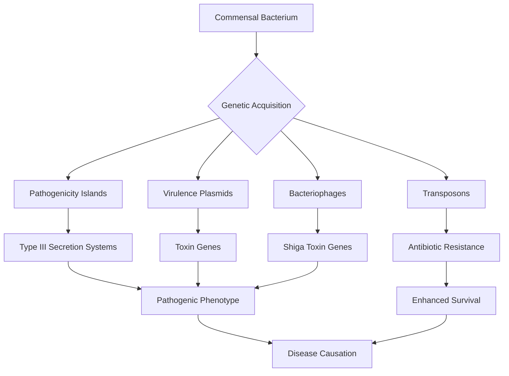

The **2011 *E. coli* O104:H4 outbreak** dramatically illustrated how genetic recombination can create highly virulent hybrid pathogens[^27]. This strain combined the enteroaggregative adherence phenotype with Shiga toxin production, resulting in an unusually severe disease presentation that caused over 3,400 infections and 39 deaths.

#### Environmental Triggers for Virulence Expression

Beyond genetic acquisition, environmental conditions within the host can trigger expression of latent virulence capabilities:

**Bile salt exposure** enhances *C. jejuni* OMV production and proteolytic activity[^33], demonstrating how intestinal conditions can amplify bacterial virulence.

**Nutrient availability** influences bacterial metabolism and virulence factor expression. Iron limitation, for example, induces siderophore production and other iron acquisition systems.

**Quorum sensing** enables bacteria to coordinate gene expression based on population density, potentially triggering virulence programs when bacterial numbers exceed threshold levels.

#### The Balance Between Protection and Pathogenicity

The relationship between gut bacteria and the host exists in a **dynamic equilibrium** that can shift toward either mutual benefit or pathogenicity. This balance is maintained by:

- **Spatial compartmentalization**: Physical separation of bacteria from host tissues through mucus layers and epithelial barriers
- **Immune tolerance mechanisms**: Regulatory T cells and anti-inflammatory cytokines prevent excessive responses to commensals
- **Microbial community structure**: Diverse, stable communities resist pathogen invasion and overgrowth
- **Nutritional competition**: Beneficial bacteria outcompete potential pathogens for limited resources

When these homeostatic mechanisms fail, the consequences can range from localized inflammation to systemic infection and chronic disease. The pathogenesis of inflammatory bowel disease involves impaired intestinal mucosal barrier function, gut microbiota changes, and immune regulation disorder[^30]. *Salmonella* infection exemplifies how disruption of this balance can contribute to chronic inflammation and potentially carcinogenesis[^31][^30].

Understanding these dynamics underscores the importance of maintaining gut microbiome health through appropriate dietary choices, judicious antibiotic use, and strategic probiotic interventions. The protective mechanisms provided by beneficial bacteria—competitive exclusion, SCFA production, barrier enhancement, and immune modulation—represent critical defenses against the pathogenic threats examined in this chapter. Subsequent chapters will address the toxic metabolites produced by harmful bacteria and provide practical dietary guidance for optimizing gut health and minimizing infection risk.

## 7 Toxic Metabolites Produced by Harmful Gut Bacteria

This chapter systematically investigates the harmful metabolic byproducts generated by pathogenic and dysbiotic gut bacteria, examining their molecular mechanisms, pathophysiological effects, and contributions to both local intestinal damage and systemic disease states. Building upon the understanding of pathogenic bacteria established in the previous chapter, this section analyzes how bacterial toxins, carcinogenic compounds, pro-inflammatory metabolites, and protein fermentation products disrupt gut homeostasis and contribute to conditions ranging from acute infection to chronic inflammation and carcinogenesis. The analysis provides essential context for understanding why dietary optimization strategies targeting the gut microbiome are critical for disease prevention.

### 7.1 Clostridial Toxins: Molecular Mechanisms and Pathogenic Effects of TcdA and TcdB

*Clostridioides difficile* infection (CDI) exerts its devastating clinical impact primarily through the elaboration of two large exotoxins—**Toxin A (TcdA) and Toxin B (TcdB)**—which represent the principal virulence factors mediating disease pathology[^35]. These toxins belong to the family of large clostridial glucosylating toxins, ranging from 250 to 308 kDa, and share a high degree of sequence identity while employing sophisticated molecular mechanisms to subvert host cellular functions[^36]. Understanding the structure, function, and pathogenic consequences of these toxins provides critical insights into CDI pathophysiology and informs strategies for prevention and treatment.

#### Multi-Modular Domain Architecture and Functional Organization

TcdA and TcdB share a common **multi-modular domain structure designated as the ABCD model**, which reflects the sequential steps required for toxin action[^35]. This architectural organization enables the toxins to accomplish receptor binding, cellular entry, and enzymatic modification of host targets through a coordinated series of molecular events:

| Domain | Designation | Location | Function |
|--------|-------------|----------|----------|
| **A Domain** | Glucosyltransferase Domain (GTD) | N-terminal | Enzymatic modification of host GTPases |
| **B Domain** | Receptor Binding Domain (RBD) | C-terminal | Host cell recognition and attachment |
| **C Domain** | Cysteine Protease Domain (CPD) | Central | Auto-catalytic cleavage for GTD release |
| **D Domain** | Delivery Domain | Central | Translocation across endosomal membrane |

The C-terminal receptor binding domain contains **combined repetitive oligopeptides (CROPs)** that mediate initial attachment to host cell surface receptors[^35]. The genetic information encoding these toxins resides within a **19.6 kb chromosomally integrated DNA sequence termed the pathogenicity locus (PaLoc)**, which contains the structural genes *tcdA* and *tcdB* along with regulatory genes including *tcdR* (positive regulator), *tcdC* (negative regulator), and *tcdE* (putative holin for toxin release)[^35][^36].

#### Receptor-Mediated Endocytosis and Cellular Entry

The toxins initiate their pathogenic program through **receptor-mediated endocytosis** following binding to specific host cell surface molecules[^35]. TcdA demonstrates binding affinity for sucrase-isomaltase and glycoprotein 96 (gp96), while TcdB binds to chondroitin sulfate proteoglycan 4 (CSPG4) and poliovirus receptor-like 3 (PVRL3)[^35]. These receptor specificities have important implications for understanding tissue tropism and disease manifestations.

Following internalization into endosomes, the toxins undergo a conformational change triggered by **endosomal acidification**[^35]. This pH-dependent structural rearrangement enables the hydrophobic region of the delivery domain to insert into the endosomal membrane, creating a pore through which the enzymatically active GTD is translocated into the host cell cytosol. The release of the GTD from the remainder of the toxin molecule requires **inositol hexakisphosphate (InsP6)-dependent autoprocessing** mediated by the cysteine protease domain[^35].

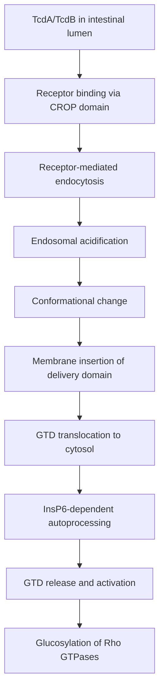

#### Enzymatic Glucosylation of Rho Family GTPases

Once liberated in the cytosol, the glucosyltransferase domain executes its primary enzymatic function: the **glucosylation of Rho family GTPases** including RhoA, RhoB, RhoC, RhoG, Rac1, Rac2, Rac3, Cdc42, and TC10[^35]. This modification involves the transfer of a glucose moiety from the co-substrate UDP-glucose to a conserved threonine residue within the switch I region of these small GTPases[^35][^36]. The catalytic mechanism involves catalyzing the transfer of a glucose moiety onto Rho, Rac, and Cdc42 inside target cells[^36].

The consequences of this glucosylation are profound and multifaceted. Glucosylated Rho proteins are functionally inactivated, as the modification blocks their interaction with downstream effector proteins and prevents their normal cycling between active GTP-bound and inactive GDP-bound states[^35][^36]. Since Rho GTPases serve as master regulators of the actin cytoskeleton, their inactivation triggers a cascade of cellular dysfunctions:

**Cytopathic Effects:**
- **Cell rounding**: Disruption of actin stress fibers causes cells to lose their normal morphology
- **Actin cytoskeleton disruption**: Loss of organized actin structures impairs cellular architecture
- **Loss of cell-cell contacts**: Tight junction and adherens junction integrity is compromised
- **Increased permeability**: Epithelial barrier function deteriorates

**Cytotoxic Effects:**
- **Apoptosis**: Programmed cell death pathways are activated
- **Necrosis**: Severe cellular damage leads to necrotic cell death[^35]

#### Inflammasome Activation and Pro-Inflammatory Cytokine Release

Beyond direct cytotoxicity, the toxins trigger potent inflammatory responses through activation of innate immune signaling pathways. Glucosylated RhoA activates the **pyrin inflammasome**, a cytosolic multiprotein complex that serves as a sensor of bacterial toxins[^35]. Pyrin inflammasome activation leads to **caspase-1 activation**, which in turn processes and releases pro-inflammatory cytokines including **IL-1β and IL-18**[^35]. These cytokines orchestrate the recruitment of neutrophils to the site of infection and amplify the inflammatory response, contributing to the characteristic pseudomembranous colitis observed in severe CDI.

The inflammatory cascade initiated by toxin activity creates a self-perpetuating cycle of tissue damage and immune activation that underlies the severe intestinal pathology observed in CDI patients.

#### Differential Pathogenic Contributions of TcdA and TcdB

A critical question in CDI pathogenesis concerns the relative contributions of TcdA and TcdB to disease. Historical studies using purified toxins suggested that TcdA was the major virulence factor, as intragastric challenge of hamsters with purified TcdA alone induced symptoms of CDI including fluid accumulation, inflammation, and necrosis[^36]. Purified TcdB alone was ineffective unless co-administered with TcdA or unless prior intestinal damage was present, leading to the hypothesis that the toxins act synergistically[^36].

However, **recent research using isogenic mutants has fundamentally revised this understanding**, demonstrating that **TcdB is the essential virulence factor**[^36]. Studies using isogenic *tcdA* and *tcdB* mutants of a virulent *C. difficile* strain in a Syrian golden hamster model revealed striking findings:

| Strain Type | Colonization | Mortality | Interpretation |
|-------------|--------------|-----------|----------------|
| Wild-type (A+B+) | Full | High | Reference virulence |
| TcdA mutant (A-B+) | Full | 94% | TcdB alone sufficient for virulence |
| TcdB mutant (A+B-) | Full | 22% | Markedly attenuated; deaths likely due to reversion |

This paradigm-shifting conclusion is supported by multiple lines of evidence[^36]:

1. **Naturally occurring A-B+ isolates**: Toxin A-negative, Toxin B-positive strains cause the same spectrum of disease as A+B+ isolates, sometimes with increased severity
2. **Human tissue sensitivity**: The human colon is more sensitive to TcdB, and TcdB is **100–10,000 times more potent than TcdA** in various cell types[^35]
3. **Clinical isolate analysis**: Clinical isolates from symptomatic patients invariably produce both toxins or TcdB alone, suggesting TcdB is essential for human disease pathogenesis[^35]

The discrepancy between earlier purified toxin studies and mutant studies may be explained by **toxin receptor specificity**[^36]. Evidence suggests TcdA binds to apical surface receptors on enterocytes, while TcdB binds to basolateral receptors. In intact intestine, TcdB may not access its basolateral receptors without prior damage to the epithelial barrier. The virulence of TcdA mutants suggests that another bacterial factor may compromise the epithelium, allowing TcdB access to its receptors[^36].

#### Systemic Complications and Extraintestinal Toxin Effects

The pathogenic effects of *C. difficile* toxins extend beyond the intestinal tract. **Detectable *C. difficile* toxemia is strongly associated with fulminant disease**[^35]. Toxins have been detected in serum, pleural fluid, and ascitic fluid of animal models, and this systemic dissemination is linked to severe, fatal disease[^35].

Recent animal and *in vitro* studies suggest a more far-reaching role for these toxins, including **cardiac, renal, and neurologic impairment**[^35]. Specific findings include:

- **Neurological effects**: TcdB can induce apoptosis in cerebellar granule neurons
- **Cardiac effects**: TcdB causes cardiotropism and reduced heart rate in zebrafish models
- **Renal effects**: Systemic toxemia is associated with renal failure

While humoral immunity (serum anti-toxin antibodies) may limit detectable toxemia in humans, its impairment is a risk factor for severe CDI[^35]. These findings suggest that the toxins may cause direct damage to extraintestinal organs when they gain access to systemic circulation, expanding our understanding of CDI as a potentially multi-organ disease.

### 7.2 Carcinogenic Metabolites: N-Nitroso Compounds and Secondary Bile Acids

The gut microbiota generates several classes of metabolites with established carcinogenic potential, particularly in the context of colorectal cancer (CRC) development. Among these, **N-nitroso compounds (NOCs) and secondary bile acids** stand out as major contributors to malignant transformation through distinct but complementary mechanisms involving DNA damage, inflammatory signaling, and activation of tumorigenic pathways[^37]. Understanding these carcinogenic metabolites provides essential context for dietary recommendations aimed at reducing cancer risk.

#### N-Nitroso Compounds: Formation and Carcinogenic Mechanisms

N-nitroso compounds represent a class of **potent procarcinogens** derived from the fermentation of proteins in red and processed meat by colonic bacteria[^37]. The formation of NOCs occurs through bacterial nitrosation reactions when nitrosatable substrates, such as amines and amides, encounter nitrosating agents including dietary nitrate and nitrite[^38].

The relationship between diet and NOC formation is well-established. **Western diets, typified by high fat, high meat, and low fiber content**, are associated with an increased risk of colorectal cancers[^38]. Protein-rich diets provide inflammatory and toxic nitrogenous metabolites including phenols, indoles, ammonia, and amines that arise from microbial fermentation of undigested protein residues[^38]. These nitrogenous metabolites include NOCs such as nitrosamine and nitrosamide, which are well-known potential carcinogens formed by the reaction of nitrosating agents with secondary amines and amides[^38].

The role of gut microbiota in NOC formation has been demonstrated experimentally. The population of microbes in the intestine increases along the GI tract, reaching the highest population of 10^12 cfu/g in the feces in the colon[^38]. Experimental studies indicated that **significantly higher levels of NOCs were detected in the gut contents of rats with conventional microbial flora compared to those who were germ free**, suggesting the important role of the microbiota in the formation of NOCs and subsequent development of colorectal cancer[^38]. *In vivo* and *in vitro* studies have demonstrated that certain strains of bacteria, including *Escherichia coli*, can catalyze the formation of NOCs from nitrite and amines at neutral pH[^38].

#### Mechanisms of NOC-Induced Carcinogenesis

The carcinogenic mechanism of N-nitroso compounds involves multiple pathways of DNA damage[^37]:

| Mechanism | Molecular Effect | Carcinogenic Consequence |
|-----------|------------------|-------------------------|
| **DNA alkylation** | Addition of alkyl groups to DNA bases | Mutations in tumor suppressor genes and oncogenes |
| **Oxidative stress induction** | Generation of reactive oxygen species | DNA strand breaks and base modifications |
| **DNA adduct formation** | Covalent binding to DNA | Miscoding during replication |

A particularly significant DNA adduct is **O6-carboxymethyl-2′-deoxyguanosine (O6-CMdG)**, which forms through the reaction of NOCs with guanine residues in DNA[^37]. The imbalance between this DNA damage and DNA repair mechanisms can promote the initiation and progression of CRC[^37]. When the capacity of DNA repair systems is overwhelmed by the rate of adduct formation, mutations accumulate and drive the carcinogenic process.

#### Secondary Bile Acids: Microbial Transformation and Genotoxicity

Secondary bile acids, particularly **deoxycholic acid (DCA)**, play a critical role in the malignant transformation of colorectal adenomas[^37]. These compounds arise through bacterial modification of primary bile acids secreted by the liver. A **high-fat diet increases bile acid secretion** that is transformed by colonic microbiota into secondary bile acids with genotoxic properties including DNA damage due to reactive oxygen and nitrogen species[^38].

Elevated levels of DCA are associated with an increased risk of CRC[^37]. The mechanisms through which DCA promotes intestinal carcinogenesis are multifaceted:

**Barrier Disruption**: DCA disrupts intestinal barrier function, compromising the physical separation between luminal contents and the underlying epithelium. This barrier dysfunction allows increased exposure of epithelial cells to carcinogens and inflammatory stimuli.

**Inflammation Induction**: DCA induces intestinal inflammation, creating a microenvironment characterized by elevated pro-inflammatory cytokines, immune cell infiltration, and oxidative stress—all factors that promote carcinogenesis.

**Activation of Tumorigenic Signaling Pathways**: DCA activates specific intracellular transduction pathways that promote cell proliferation and survival:

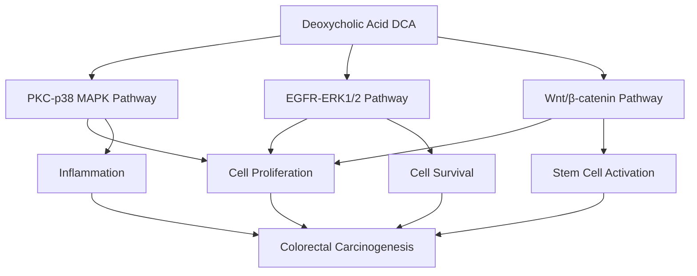

The **PKC-p38 MAPK signaling pathway** activation by DCA promotes inflammatory responses and cellular proliferation[^37]. The **EGFR-ERK1/2 signaling pathway** enhances cell survival and proliferation signals[^37]. The **Wnt/β-catenin signaling pathway**, a master regulator of intestinal stem cell function, when aberrantly activated by DCA, promotes the expansion of stem cell populations and contributes to tumor initiation[^37].

#### Dietary Modulation of Carcinogenic Metabolite Production

The production of both NOCs and secondary bile acids is strongly influenced by dietary patterns. High consumption of red and processed meat provides substrates for NOC formation, while high-fat diets increase bile acid secretion and subsequent secondary bile acid production. Conversely, **high-fiber diets** may counteract these carcinogenic pathways through multiple mechanisms:

- Dilution and binding of carcinogens in the intestinal lumen
- Reduced transit time limiting carcinogen-epithelium contact
- Promotion of SCFA-producing bacteria that maintain barrier integrity
- Modulation of bile acid metabolism

These relationships underscore the importance of dietary choices in modulating cancer risk through effects on gut microbial metabolism.

### 7.3 Lipopolysaccharides: Endotoxemia and Systemic Inflammatory Cascades

Lipopolysaccharides (LPS), also known as endotoxins, represent a major structural component of the outer membrane of Gram-negative bacteria and serve as **key pro-inflammatory metabolites** with profound effects on both local intestinal and systemic health[^39]. The translocation of gut-derived LPS across compromised intestinal barriers leads to **metabolic endotoxemia**, a condition characterized by chronically elevated circulating LPS levels that drive systemic inflammation and contribute to diverse disease states including non-alcoholic fatty liver disease (NAFLD), alcoholic liver disease (ALD), and metabolic syndrome[^39][^40].

#### Mechanisms of LPS Translocation Across the Intestinal Barrier

Under normal physiological conditions, the intestinal barrier serves as a physical and functional barrier deterring translocation of potentially harmful luminal antigens into circulation[^39]. However, disruption of this barrier can cause LPS translocation and cause endotoxemia in systemic circulation and chronic liver inflammation[^39].

LPS translocation occurs through multiple pathways, the relative importance of which depends on barrier integrity:

| Pathway | Normal Conditions | Pathological Conditions |
|---------|-------------------|------------------------|
| **Transcellular pathway** | Primary route | Enhanced |
| **Paracellular pathway** | Minimal | Significantly increased |
| **Chylomicron-mediated** | Active | Enhanced with high-fat diet |

**Chylomicrons**, the lipoprotein particles that transport dietary lipids, can bind and facilitate the absorption of LPS[^39]. Under pathological conditions when there is an increase in gut barrier permeability, the paracellular pathway of LPS translocation is increased[^39].

#### High-Fat Diet-Induced LPS Penetration

High-fat diets (HFD) play a particularly important role in promoting LPS translocation and subsequent systemic inflammation[^41]. Research has demonstrated that consumption of HFD significantly increases intestinal permeability and then weakens the interception of LPS[^41]. Multiple experimental observations support this relationship:

- HFD significantly increased the concentration of fluorescein isothiocyanate dextran (FITC-d), diamine oxidase (DAO), and D-lactate migrating to blood circulation—all markers of intestinal permeability[^41]
- The intestinal barrier in normal fat diet groups effectively blocked the penetration of orally administered LPS, while HFD significantly increased LPS penetration into circulation[^41]
- HFD significantly reduced the number of goblet cells and inhibited the secretion of MUC2 protein, weakening the mucosal barrier[^41]

The mechanism underlying HFD-induced mucosal barrier dysfunction involves **endoplasmic reticulum (ER) stress** in goblet cells. HFD increases the protein abundance of glucose regulated protein 78 (GRP78), a marker of ER stress, and activates the **inositol-requiring enzyme 1 (IRE1)/X box-binding protein 1 (XBP1) pathway** in goblet cells[^41]. This ER stress response impairs goblet cell function and MUC2 secretion.

#### The Role of CD36 in Lipid-Facilitated LPS Transfer

A critical molecular mechanism facilitating LPS penetration involves the scavenger receptor **CD36**[^41]. Excessive lipid facilitates the transfer of LPS across the intestinal cell barrier, and this effect depends on CD36[^41]. Experimental evidence demonstrates:

- Co-administration with oleic acid (OA) significantly increased LPS penetration in intestinal injury models
- In intestinal epithelial cell line (IEC-6) experiments, OA increased the internalization of FITC-LPS into the cytoplasm
- The CD36 inhibitor Sulfo-N-succinimidyl Oleate (SSO) inhibited OA-promoted LPS penetration
- siRNA knockdown of CD36 blocked OA-promoted migration of LPS into the cytoplasm[^41]

These findings establish that **fatty acids assist the cellular internalization of LPS and then activate its intracellular signaling pathway depending on CD36** in intestinal epithelial cells[^41].

#### The LPS-TLR4 Signaling Cascade

Once LPS reaches the liver via the portal vein, it initiates a well-characterized inflammatory signaling cascade[^39]. The molecular events proceed as follows:

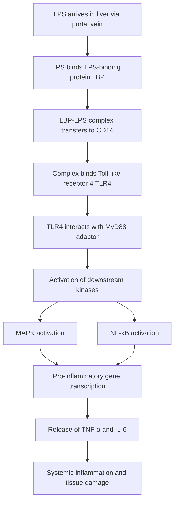

After arriving in the liver via the portal vein, LPS binds to LPS-binding protein (LBP), and the LBP-LPS complex is transferred to membrane-bound or soluble cluster of differentiation 14 (CD14), thereby specifically binding to toll-like receptor 4 (TLR4)[^39]. This induces the interaction of TLR4 with adaptor molecule myeloid differentiation factor 88 (MyD88), which further activates downstream mitogen-activated protein kinase (MAPK) and nuclear factor-κB (NF-κB)[^39]. Stimulation of the LPS-TLR4 signaling pathway eventually leads to the release of proinflammatory mediators like tumor necrosis factor-α (TNF-α) and interleukin 6 (IL-6)[^39].

The critical importance of TLR4 in mediating LPS effects is demonstrated by studies showing that **mice deficient in TLR4 are resistant to both alcohol-induced liver injury and NAFLD**[^39].

#### Endotoxemia in Chronic Liver Disease

Gut dysbiosis and gut barrier dysfunction both contribute to chronic liver disease by abnormal regulation of the gut-liver axis, with gut-derived LPS serving as a key factor in inducing the inflammatory response of liver tissue[^39]. **Endotoxemia is observed in both NAFLD and ALD patients**[^39].

In **NAFLD**, which affects 10–24% of the general population, gut dysbiosis is causative for the enhanced secretion of LPS and the resulting inflammation[^39]. Endotoxin plasma levels are significantly higher in NAFLD patients and are associated with the severity of hepatic steatosis[^39]. LPS itself can cause an increase in intestinal epithelial tight junction permeability, creating a vicious cycle of barrier dysfunction and endotoxemia[^39].

In **ALD**, a major cause of morbidity and mortality causing 50% of liver cirrhosis, chronic alcohol consumption destroys the integrity of the intestinal barrier, disturbs the gut microbiota, and is associated with an increase in the abundance of endotoxin-producing bacterial types[^39]. Alcohol consumption affects bacterial composition, leading to reduced bacterial diversity and a lower proportion of beneficial bacteria[^39]. The by-product acetaldehyde from the metabolization of alcohol by gut microbiota also plays a crucial role in gut barrier dysfunction by increasing paracellular permeability[^39].

#### Dietary Fiber as a Countermeasure Against Metabolic Endotoxemia

**Dietary fiber (DF) contributes significantly to ameliorating metabolic endotoxemia and inflammation**[^40]. Multiple mechanisms underlie this protective effect:

| Mechanism | Description | Effect on Endotoxemia |
|-----------|-------------|----------------------|
| **Chylomicron binding inhibition** | DF impedes absorption of chylomicrons that carry LPS | Reduced LPS absorption |
| **Luminal LPS binding** | DF binds LPS within intestinal lumen | Suppressed LPS translocation |
| **Transit time modulation** | DF regulates intestinal motility | Reduced epithelial exposure to LPS |
| **TLR ligand effects** | Distinct DF types act as TLR ligands | Modulated cytokine production |
| **SCFA production** | DF-derived microbial metabolites including SCFAs | Intestinal immune homeostasis |

A cross-sectional study found a **negative correlation between DF consumption and LPS binding protein**[^40]. Intervention trials examining oligofructose and inulin in subjects with obesity, overweight, or type 2 diabetes demonstrated statistically significant declines in circulating LPS levels[^40]. The administration of galacto-oligosaccharide, a soluble prebiotic DF, has reduced LPS levels among overweight adults[^40].

### 7.4 Hydrogen Sulfide: Dual Roles in Mucosal Homeostasis and Pathology

Hydrogen sulfide (H₂S) has emerged as an important mediator of many physiological functions, including gastrointestinal mucosal defense and repair[^42]. Unlike the unambiguously harmful metabolites discussed in previous sections, H₂S exhibits a **complex dual role** as both a physiological mediator supporting gut health and a potential pathogenic factor under specific circumstances. Understanding this duality is essential for appreciating the nuanced relationship between gut bacterial metabolism and host health.

#### Bacterial Sources and Intestinal Concentrations

H₂S is produced by both gastrointestinal tract tissues and bacteria residing within the gut[^42]. The intestinal microbiome represents a significant source of H₂S, some of which permeates across the intestinal epithelium[^42]. H₂S is produced by a wide range of enteric bacteria, **primarily of the γ-Proteobacteria genera**[^42].

The catabolism of sulfur-containing amino acids, cysteine and methionine, yields hydrogen sulfide and methanethiol[^43]. Numerous bacterial species possess enzymes capable of degrading these amino acids[^43]. H₂S can undergo methylation to form the less toxic methanethiol, which can revert to H₂S, be oxidized to sulfate, and be consumed by sulfate-reducing bacteria, contributing to the intestinal sulfur cycle[^43].

The concentrations of H₂S in the intestinal tract are substantial and regionally variable:

| Intestinal Region | H₂S Concentration | Physiological Context |
|-------------------|-------------------|----------------------|
| Cecum | Up to 40 µM | Moderate fermentation |
| Colon | Up to 250 µM | Peak fermentation activity |
| Rectum | Up to 40 µM | Reduced fermentation |

These concentrations establish H₂S as a physiologically significant metabolite with the potential for both beneficial and harmful effects depending on local concentrations and tissue responsiveness.

#### The Epithelium as a Metabolic Barrier

Several studies have clearly demonstrated that **H₂S is an important metabolic fuel for the epithelial cells that line the GI tract**[^42]. Colonic epithelial cells are particularly efficient in oxidizing H₂S, producing ATP in the process[^42]. The epithelium therefore functions as a **metabolic barrier**, oxidizing bacteria-derived H₂S and preventing its accumulation to potentially toxic levels[^42].

This metabolic barrier function represents a critical interface between microbial metabolism and host physiology. When functioning normally, the colonic epithelium efficiently processes H₂S, extracting energy while preventing excessive exposure of underlying tissues.

#### Protective Functions of Hydrogen Sulfide

Under normal physiological conditions, H₂S exerts multiple protective effects on gastrointestinal health[^42]:

**Mucosal Defense and Repair**: H₂S has been shown to exert protective effects against GI injury induced by ethanol, NSAIDs, and ischemia-reperfusion, as well as promoting resolution of inflammation and repair of tissue damage[^42]. H₂S donors have been shown to promote resolution of colitis in several animal models[^42]. Endogenous H₂S production is markedly elevated at sites of mucosal injury, contributing significantly to promotion of healing[^42].

**Biofilm and Microbiota Regulation**: H₂S plays important roles in modulating epithelial cell-mucus-bacterial interactions[^42]. In rats with colitis, administration of an H₂S donor resulted in significant acceleration of the resolution of colitis, which included acceleration of the restoration of linear biofilm organization and reduced bacterial translocation[^42]. After H₂S donor treatment, a clear mucus layer separated the epithelium from the microbiota biofilm[^42]. H₂S can enhance formation of biofilms, as demonstrated *in vitro* with human-derived intestinal biofilms[^42].

**Antimicrobial Effects**: H₂S donors derived from garlic have been shown to exert antimicrobial effects on planktonic gram-positive and gram-negative bacteria[^42]. Administration of an H₂S donor to rats resulted in significant shifts in the intestinal microbiota[^42].

The importance of endogenous H₂S for gut health is underscored by studies showing that **inhibition of H₂S synthesis leads to increased susceptibility to mucosal injury and impairment of healing**[^42].

#### Pathological Effects When Homeostatic Mechanisms Fail

Despite its protective functions, H₂S can become pathogenic under specific circumstances, particularly when the metabolic barrier function of the epithelium is compromised[^42]:

**Genetic Defects in H₂S Oxidation**: A recent study of pediatric Crohn's disease provided compelling evidence for a role of H₂S in promoting damage in a subset of patients who had a **genetic defect in mitochondrial oxidation of H₂S**[^42]. Those patients also had substantially increased numbers of H₂S-producing bacteria in their intestinal lumen[^42]. A defect in this metabolic barrier function would allow H₂S from luminal bacteria to gain access to the lamina propria, where it could exert pro-inflammatory and cytotoxic effects[^42].

**Dysbiosis-Associated Pathology**: A similar increase in H₂S-producing intestinal bacteria was observed in rat studies of the exacerbation of NSAID-enteropathy by proton pump inhibitors[^42]. This finding suggests that alterations in microbial community composition that favor H₂S-producing bacteria can contribute to intestinal pathology.

**Concentration-Dependent Effects**: The dual role of H₂S reflects its concentration-dependent effects. H₂S generated from the metabolism of sulfur-containing amino acids serves dual functions: **facilitating mucosal healing at low concentrations while provoking dysbiosis and inflammation at elevated levels**[^43].

#### Dietary Influences on H₂S Production

Diet modulates the microbial community that produces H₂S. A diet high in sulfur-containing proteins (from certain meats) or low in fiber may favor H₂S-producing bacteria. Ensuring adequate intake of dietary fiber supports bacteria that produce beneficial metabolites like SCFAs, which can help maintain a balanced microbial ecosystem and healthy mucosal environment.

### 7.5 Protein Fermentation Products: Ammonia, Phenols, and Indolic Compounds

Microbial fermentation of dietary protein by gut microbiota generates a **diverse range of metabolites** with varying physiological effects, some beneficial and others potentially harmful[^44]. Unlike the relatively straightforward toxicity of clostridial toxins or the carcinogenicity of NOCs, protein fermentation products exhibit a complex spectrum of effects that depend on the specific compound, its concentration, and the overall dietary and microbial context. Understanding this complexity is essential for developing nuanced dietary recommendations.

#### Pathways of Protein Fermentation

Microbial amino acid catabolism begins with either **deamination**, yielding carboxylic acid and ammonia, or **decarboxylation**, resulting in an amine and CO₂[^43]. Ammonia, capable of inhibiting specific biological processes, is frequently rapidly ingested by microorganisms or transformed by host cells into less deleterious chemicals[^43]. Deamination is common, resulting in the formation of short-chain fatty acids (SCFAs)[^43]. Certain *Clostridia* spp. are capable of conducting Stickland reactions, yielding ATP directly from amino acids and creating **branched-chain fatty acids (BCFAs)**, which are indicators of protein catabolism[^43].

Gut microbes, including Bifidobacteria, Clostridia, Lactobacilli, Enterococci, Streptococci, and Enterobacteriaceae, play a predominant role in the decarboxylation of basic amino acids into amine by-products[^43].

#### Ammonia: Colonocyte Toxicity and Carcinogenic Potential

Ammonia is produced through amino acid deamination, the first step of the catabolic pathway[^44]. While ammonia can be utilized in the host urea cycle or excreted due to its toxicity, **sustained exposure of colonocytes to free ammonia may contribute to the development of colorectal carcinoma (CRC)**[^44].

The mechanisms through which ammonia contributes to carcinogenesis likely involve:
- Direct cytotoxicity to colonocytes
- Interference with cellular metabolism
- Promotion of inflammatory responses
- Disruption of normal epithelial turnover

#### Phenolic Compounds: p-Cresol and Colonocyte Dysfunction

Fermentation of aromatic amino acids generates bioactive end products with significant health implications[^44]. **Tyrosine metabolism produces phenol and p-cresol**, which are among the most concerning protein fermentation products[^44][^43].

The metabolite **p-cresol** exhibits multiple harmful effects:

| Effect | Mechanism | Health Implication |
|--------|-----------|-------------------|
| **DNA damage** | Genotoxic effects on colonocytes | Carcinogenic potential |
| **Cell cycle alteration** | Disruption of normal proliferation | Abnormal epithelial turnover |
| **Decreased colonocyte proliferation** | Effects on oxidative metabolism and ATP production | Impaired tissue renewal |
| **Endothelial cell effects** | Vascular dysfunction | Kidney disease association |

P-cresol is a bacterial metabolite that may cause DNA damage and alter the cell cycle, reducing colonocyte proliferation[^44]. This may be due to its effects on colonocyte oxidative metabolism and ATP production[^44]. P-cresol also affects endothelial cells and is implicated in kidney disease[^44]. Phenolic metabolites, such as phenol and p-cresol, can harm the intestinal lining, with p-cresol associated with genotoxicity and immune response impairment[^43].

#### Indolic Compounds: Complex Dual Effects

**Tryptophan metabolism produces indole and skatole**, compounds that exhibit a more nuanced profile of effects than the predominantly harmful phenolic compounds[^44][^43]. Indole, a metabolite of tryptophan, demonstrates both beneficial and potentially harmful properties depending on context.

**Beneficial Effects of Indole:**
- **Barrier enhancement**: Indole fortifies the intestinal barrier and mitigates inflammation via receptor interactions[^43]
- **Satiety effects**: Indole enhances satiety and affects bacterial communication[^43]
- **Anti-inflammatory activity**: Indole derived from tryptophan deamination may decrease intestinal epithelial inflammation and improve barrier function[^44]
- **Neuroprotective potential**: Indole has been shown to be protective in mouse models of multiple sclerosis[^44]
- **Immune modulation**: In experimental autoimmune encephalomyelitis models, indole reduces disease severity by inducing regulatory T cells and Th17 cell differentiation[^44]

**Potential Harmful Effects:**
- **Hepatic toxicity at high concentrations**: Although advantageous in low quantities, excessive indole may adversely affect the liver and exacerbate chronic renal disease[^43]
- **Behavioral effects**: A moderate and chronic overproduction of indole has been linked to increased anxiety-like behavior in rats[^44]

The dual nature of indolic compounds illustrates the importance of considering **concentration and context** when evaluating the health effects of bacterial metabolites.

#### Other Aromatic Amino Acid Metabolites

The breakdown of aromatic amino acids in the GI tract produces several additional metabolites[^43]:

**Tyramine** (from tyrosine metabolism by certain Firmicutes, e.g., *Enterococcus faecalis*): Influences blood pressure and the neurotransmitter serotonin, but may induce hypertension and migraines[^43].

**Phenylethylamine** (from phenylalanine breakdown): Functions as an endogenous amphetamine that can elevate mood and energy levels, although excessive consumption presents hazards and it is associated with Crohn's disease[^43].

**Tryptamine** (from tryptophan metabolism): A neurotransmitter that modulates intestinal motility and immunological function[^43].

#### Polyamines and Aryl Hydrocarbon Receptor Ligands

Not all protein fermentation products are harmful. The catabolism of arginine results in the production of chemicals such as **agmatine, putrescine, spermidine, and spermine**[^43]. Recent research suggests that dietary polyamines may have a **protective effect against colorectal cancer development**[^44].

Additionally, aromatic amino acid metabolites capable of binding the **aryl hydrocarbon receptor (AhR)** may decrease cancer development[^44]. This receptor-mediated effect represents a potential mechanism through which certain protein fermentation products could exert protective effects.

#### Dietary Modulation of Protein Fermentation

The interplay between diet and protein fermentation is crucial for determining health outcomes. **High protein intake can increase the production of potentially harmful metabolites**, while **dietary fiber can suppress protein fermentation** and the formation of deleterious metabolites like p-cresol, even when the degradation of their amino acid precursor is occurring[^44].

This finding suggests that the dietary context, particularly fiber intake, can modulate the health impacts of proteolytic fermentation metabolites. High-fiber diets may:
- Shift bacterial metabolism toward carbohydrate fermentation
- Reduce substrate availability for protein fermentation
- Promote bacteria that produce beneficial metabolites
- Dilute harmful metabolites in the intestinal lumen

### 7.6 Metabolite Interactions and Cumulative Effects on Disease Pathogenesis

The toxic metabolites produced by harmful gut bacteria do not act in isolation; rather, they interact through complex networks of synergistic and cumulative effects that collectively shape disease risk and progression. Understanding these interactions provides the mechanistic foundation for appreciating how comprehensive dietary strategies can address multiple pathogenic pathways simultaneously.

#### Synergistic Relationships Between Metabolite Classes

The various toxic metabolites discussed in this chapter contribute to disease through interconnected mechanisms that amplify their individual effects:

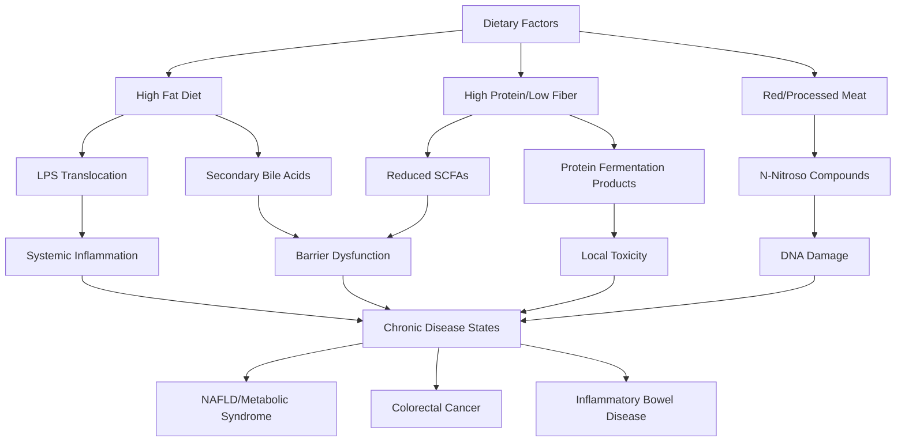

**Barrier Dysfunction as a Central Pathway**: Multiple toxic metabolites converge on intestinal barrier function as a common target. Secondary bile acids disrupt tight junctions, LPS translocation increases when barrier integrity is compromised, and protein fermentation products like p-cresol damage colonocytes. This convergence creates a self-reinforcing cycle where initial barrier damage facilitates exposure to additional harmful metabolites.

**Inflammation as an Amplifying Factor**: The inflammatory responses triggered by LPS through TLR4 signaling create conditions that favor additional pathogenic processes. Inflammation increases intestinal permeability, promotes dysbiosis, and creates oxidative stress that compounds DNA damage from NOCs and secondary bile acids.

**Dysbiosis as Both Cause and Consequence**: Alterations in microbial community composition increase the production of harmful metabolites while simultaneously reducing populations of beneficial bacteria that produce protective SCFAs. This bidirectional relationship explains why dysbiosis tends to be self-perpetuating once established.

#### The Role of Dietary Patterns in Modulating Toxic Metabolite Production

Consistent evidence demonstrates that **overall dietary patterns have a more profound impact on pathogen activity and metabolite profiles than individual foods**, by shaping the entire gut microbial ecosystem. The Western diet, characterized by high fat, high protein, and low fiber content, promotes multiple harmful metabolic pathways simultaneously:

| Dietary Component | Metabolic Consequence | Disease Association |
|-------------------|----------------------|---------------------|
| High saturated fat | Increased bile acid secretion → secondary bile acids | CRC, barrier dysfunction |
| High red/processed meat | NOC formation, heme iron effects | CRC, inflammation |
| Low fiber | Reduced SCFA production, increased protein fermentation | Multiple pathologies |
| High refined carbohydrates | Dysbiosis, reduced beneficial bacteria | Metabolic syndrome |

Conversely, plant-centric dietary patterns rich in diverse fibers and polyphenols counteract these harmful pathways through multiple mechanisms:

**Fiber as a Central Protective Factor**: Dietary fiber consistently appears as a key mitigating factor across multiple pathogen-toxin relationships. It acts by:
1. Nourishing beneficial, SCFA-producing bacteria that compete with pathogens
2. Improving gut barrier integrity to prevent toxin translocation (e.g., LPS)
3. Reducing the production of proteolytic/carcinogenic metabolites (e.g., NOCs, phenols)
4. Binding harmful metabolites in the intestinal lumen

#### Implications for Disease Prevention Strategies

The interconnected nature of toxic metabolite production and effects has important implications for prevention strategies:

**Comprehensive Dietary Approaches**: Because multiple metabolite classes contribute to disease through overlapping mechanisms, dietary interventions targeting the overall microbial ecosystem are likely to be more effective than approaches focused on single metabolites. A Mediterranean-style diet rich in plant foods, fiber, and polyphenols addresses multiple pathogenic pathways simultaneously.

**Substrate Availability as a Modifiable Factor**: The presence of specific dietary substrates directly fuels the microbial pathways that generate harmful metabolites. Reducing intake of red and processed meat limits NOC formation, while reducing saturated fat intake decreases secondary bile acid production. These substrate-level interventions can significantly reduce toxic metabolite burden.

**Supporting Barrier Integrity**: Because barrier dysfunction represents a common pathway through which many toxins exert their effects, interventions that promote SCFA production and barrier function provide broad protection against multiple metabolite classes.

**Prebiotic Interventions**: The mechanistic understanding of how harmful metabolites contribute to disease provides the rationale for prebiotic strategies that promote beneficial bacteria while suppressing those that produce toxic metabolites. By selectively nourishing SCFA-producing bacteria, prebiotics can counteract the inflammatory, barrier-disrupting, and carcinogenic effects of harmful bacterial metabolites.

#### Summary of Toxic Metabolite Mechanisms and Dietary Countermeasures

The following table synthesizes the major toxic metabolites, their mechanisms of harm, and dietary strategies for mitigation:

| Metabolite Class | Primary Mechanisms of Harm | Dietary Risk Factors | Dietary Countermeasures |
|------------------|---------------------------|---------------------|------------------------|
| **C. difficile toxins** | Rho GTPase glucosylation, barrier disruption, inflammation | Antibiotic-induced dysbiosis | Probiotics, prebiotics, diverse fiber |
| **N-Nitroso compounds** | DNA alkylation, adduct formation, oxidative stress | Red/processed meat, low fiber | Reduce meat, increase fiber and vegetables |
| **Secondary bile acids** | Barrier disruption, inflammation, tumorigenic signaling | High-fat diet | Reduce saturated fat, increase fiber |
| **Lipopolysaccharides** | TLR4 activation, NF-κB signaling, systemic inflammation | High-fat diet, barrier dysfunction | Fiber supplementation, Mediterranean diet |
| **Hydrogen sulfide** | Concentration-dependent: protective vs. pathogenic | High sulfur protein, low fiber | Balanced protein intake, adequate fiber |
| **Ammonia** | Colonocyte toxicity, potential carcinogenesis | High protein, low fiber | Moderate protein, high fiber |
| **Phenolic compounds** | DNA damage, colonocyte dysfunction | High protein, low fiber | Fiber to suppress protein fermentation |
| **Indolic compounds** | Context-dependent: beneficial vs. harmful | Variable | Balanced approach |

This comprehensive understanding of toxic metabolite production, mechanisms, and dietary modulation provides the scientific foundation for the practical dietary recommendations that will be developed in subsequent chapters. By appreciating how dietary choices influence the production of both harmful and beneficial bacterial metabolites, individuals can make informed decisions that optimize gut health and reduce disease risk.

## 8 Synbiotics: The Synergistic Combination of Probiotics and Prebiotics

This chapter systematically examines synbiotics as integrated probiotic-prebiotic formulations designed to optimize gut microbiome modulation. Building upon the mechanistic understanding of probiotics and prebiotics established in previous chapters, this section analyzes the scientific rationale for combining live microorganisms with selectively utilized substrates, distinguishes between complementary and synergistic synbiotic approaches based on ISAPP consensus definitions, evaluates the evidence for enhanced efficacy compared to either component administered alone, and explores how strategic pairing of specific probiotic strains with compatible prebiotic substrates can overcome survival challenges and amplify health benefits through coordinated mechanisms.

### 8.1 Definition and Evolution of the Synbiotic Concept

The synbiotic concept represents a significant advancement in functional food science, emerging from the recognition that **combining probiotics with prebiotics could yield benefits exceeding those achievable by either component alone**. Understanding the historical evolution and precise scientific criteria defining synbiotics is essential for appreciating their therapeutic potential and distinguishing genuine synbiotic formulations from simple mixtures of probiotics and prebiotics.

#### Historical Origins and Gibson's Foundational Proposal

The term "synbiotic" was originally proposed in **1995 by Glenn Gibson**, who speculated about the additional benefits that might be achieved if prebiotics were combined with probiotics[^45]. This foundational concept emerged from observations that prebiotics could selectively stimulate beneficial bacteria, while probiotics provided direct health benefits through colonization of the gastrointestinal tract. Gibson's insight was that combining these two approaches might create synergistic effects that amplified the benefits of each component.

The initial conceptualization of synbiotics was relatively straightforward: a synbiotic product would beneficially affect the host by **improving the survival and implantation of live microbial dietary supplements in the gastrointestinal tract** through the selective stimulation of the growth and/or activation of the metabolism of one or a limited number of health-promoting bacteria[^45]. This definition emphasized the functional relationship between the probiotic and prebiotic components, suggesting that the prebiotic should specifically support the co-administered probiotic organism.

The word "synbiotic" itself alludes to **synergism**, and early proponents suggested that this term should be reserved for products in which the prebiotic compound(s) selectively favor the probiotic organism(s)[^45]. This emphasis on synergistic interaction distinguished the synbiotic concept from simple co-administration of independent probiotic and prebiotic products.

#### The 2019 ISAPP Consensus Definition

The scientific understanding of synbiotics underwent substantial refinement when, in **2019, a group of scientists convened to discuss specifics of this class of substances and propose a new definition**[^46]. This expert panel, organized by the International Scientific Association for Probiotics and Prebiotics (ISAPP), recognized that the original conceptualization required updating to accommodate both traditional and innovative product designs.

The resulting consensus definition established that a synbiotic is **"a mixture comprising live microorganisms and substrate(s) selectively utilized by host microorganisms that confers a health benefit on the host"**[^46][^47]. This definition represents a significant evolution from the original concept in several important ways:

| Aspect | Original 1995 Concept | 2019 ISAPP Definition |
|--------|----------------------|----------------------|
| **Substrate target** | Must favor co-administered probiotic | May target host microbiota or co-administered microbe |
| **Health benefit requirement** | Implied | Explicitly required with clinical evidence |
| **Component independence** | Components work together | Allows independent or synergistic action |
| **Scope of application** | Primarily gastrointestinal | May target gut or non-gut microbial ecosystems |

The updated definition importantly clarifies that within this framework, **'host' microorganisms refer to both resident microbes and externally applied (such as probiotics) microorganisms**, either of which can be targets for the substrate contained in the synbiotic[^46]. This broader scope acknowledges that prebiotics may support beneficial bacteria already present in the host's gut microbiome, not exclusively the co-administered probiotic strains.

#### Essential Criteria for Synbiotic Classification

The ISAPP consensus established several critical requirements that distinguish true synbiotics from arbitrary probiotic-prebiotic combinations. **Simply mixing a probiotic and a prebiotic does not automatically create a true synbiotic**; the final blend must have human clinical evidence demonstrating that it delivers real, measurable health benefits[^47].

Implied in the definition is that **safety of the synbiotic for its intended use is established**[^46]. This safety requirement extends beyond the individual safety profiles of the probiotic and prebiotic components to encompass the combination product as a whole.

The scientists who developed the updated definition also wanted to ensure that **innovative products could use this designation**[^46]. They recognized that it would be possible to design a combination of a live microbe and a prebiotic-like substance that could work together—with the substrate feeding the live microbe—but where neither component on its own would necessarily meet the independent definitions of "probiotic" and "prebiotic" (in terms of dose and evidence of health benefit). Hence, the definition is not simply a probiotic plus prebiotic[^46].

A notable clarification in the consensus statement addresses terminology: **'Symbiotic' is not a synonym of synbiotic and is incorrect in this context**[^46]. This distinction prevents confusion between the scientific term for mutualistic biological relationships and the specific functional food category.

#### Regulatory and Application Scope

The ISAPP definition acknowledges that **a synbiotic may target the gut or non-gut microbial ecosystems in the body** and may be formulated into products fitting an array of regulatory categories, including foods, non-foods, cosmetics, drugs, or nutritional supplements[^46]. This flexibility enables synbiotic applications across diverse health contexts while maintaining consistent scientific standards for classification.

### 8.2 Complementary Synbiotics: Independent Mechanisms Working in Parallel

The ISAPP consensus framework distinguishes two fundamental approaches to synbiotic formulation, the first being **complementary synbiotics**. Understanding this category is essential for evaluating synbiotic products and appreciating how different formulation strategies achieve their health benefits through distinct mechanistic pathways.

#### Defining Characteristics of Complementary Synbiotics

Complementary synbiotics are defined as formulations containing a **mixture of probiotic(s) plus prebiotic(s) where each component works independently to achieve one or more health benefits**[^46]. In this approach, the probiotic provides its researched health benefits through its own mechanisms, while the prebiotic serves as fuel for the beneficial bacteria already residing in the host's gut microbiome. The two components function in parallel rather than through direct interaction.

The following diagram illustrates the mechanistic framework of complementary synbiotics:

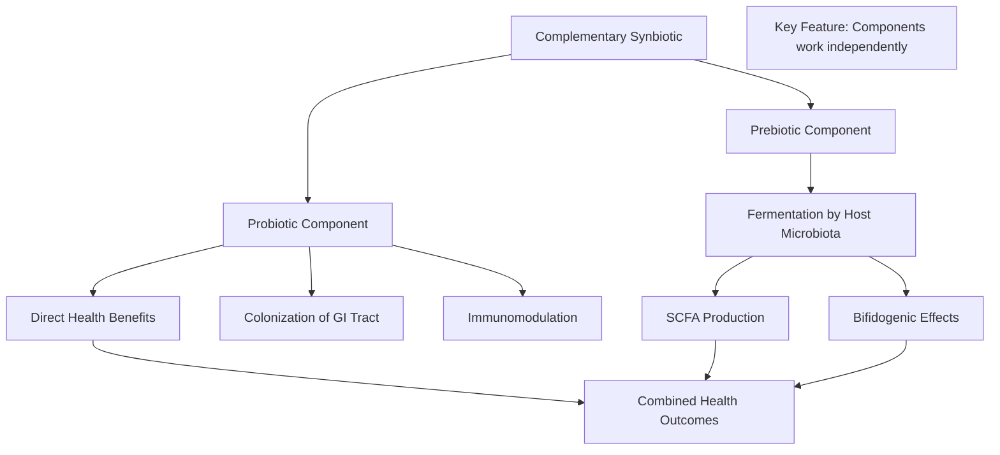

The conceptual distinction is that in complementary synbiotics, **the prebiotic is not specifically selected for a particular probiotic, but both components support gut health through their respective pathways**[^47]. The probiotic delivers benefits through mechanisms such as competitive exclusion, antimicrobial compound production, and immune modulation, while the prebiotic nourishes the resident beneficial microbiota to enhance SCFA production and maintain microbial diversity.

#### Requirement for Clinical Validation of the Combination

A critical requirement for complementary synbiotics is that **the probiotic and prebiotic components must each meet the minimum criteria of these substances independently**[^46]. Specifically:

- **The probiotic must have a demonstrated health benefit** at the dose included in the synbiotic mixture
- **The prebiotic must have a demonstrated health benefit** in the same study showing selective utilization by the host microbiota, at the dose included in the synbiotic mixture

Furthermore, **demonstration of a health benefit of the synbiotic mixture in the target host is required**[^46]. This means that even when combining two independently validated components, the specific combination must be tested in human clinical trials to confirm that it delivers the expected benefits when administered together.

However, for complementary synbiotics, **demonstration of selective utilization of the substrate in the synbiotic mixture is not required**[^46]. This reflects the understanding that in complementary formulations, the prebiotic is expected to be utilized by the host's resident microbiota rather than necessarily by the co-administered probiotic strain.

#### Common Probiotic and Prebiotic Pairings in Complementary Formulations

Complementary synbiotics typically combine well-established probiotic strains with validated prebiotic substrates. The probiotic strains commonly used in synbiotic formulations include ***Lactobacilli*, *Bifidobacteria* spp., *S. boulardii*, and *B. coagulans***, while the major prebiotics used comprise oligosaccharides like **fructooligosaccharide (FOS), galacto-oligosaccharides (GOS), xyloseoligosaccharide (XOS), inulin**, and prebiotics from natural sources like chicory and yacon roots[^45].

These combinations leverage the independent evidence base for each component while potentially achieving additive or complementary effects when administered together. For example, a formulation might combine *Lactobacillus rhamnosus* GG (with its documented efficacy for preventing antibiotic-associated diarrhea) with inulin (with its established bifidogenic effects), expecting that both mechanisms will contribute to overall gut health improvement.

### 8.3 Synergistic Synbiotics: Designed Pairings for Enhanced Efficacy

The second major category recognized by the ISAPP consensus is **synergistic synbiotics**, which represent a more sophisticated approach to formulation design. These products embody the original vision of synbiotics as combinations where the components work together to achieve effects neither could accomplish independently.

#### Defining Characteristics of Synergistic Synbiotics

Synergistic synbiotics are defined as **blends where the prebiotic is chosen because it is the ideal fuel for the specific probiotic it is paired with**[^47]. This targeted pairing is designed so that the prebiotic helps the probiotic survive, grow, and provide benefits it could not achieve on its own, **delivering more impact than from either ingredient alone**[^47].

The fundamental distinction from complementary synbiotics is that in synergistic formulations, **the substrate is utilized by the co-administered live microbe** rather than primarily by the host's resident microbiota[^46]. This direct metabolic relationship between the probiotic and prebiotic components creates the synergistic effect that gives this category its name.

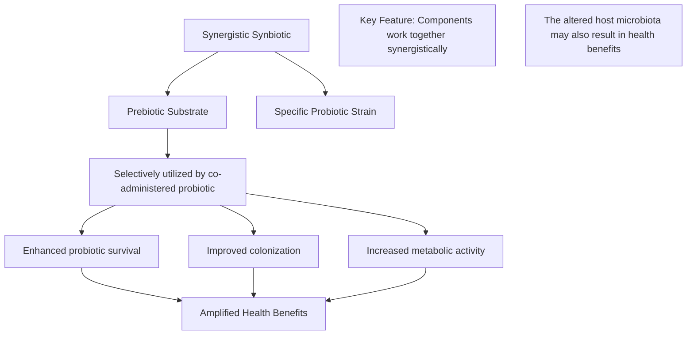

The ISAPP definition specifies that synergistic synbiotics are a **mixture of a selectively utilized substrate and a live microbe chosen for its ability to deliver a health effect**, where the components comprising synergistic synbiotics work together to bring about the resulting health benefit(s)[^46].

#### Stringent Evidence Requirements for Synergistic Claims

The evidence requirements for synergistic synbiotics are more demanding than for complementary formulations. For a synergistic synbiotic, **demonstration of a health benefit AND selective utilization of the substrate by the co-administered live microbe in the target host must be shown in the same study**[^46]. This dual requirement ensures that products claiming synergistic effects can substantiate both the functional relationship between components and the resulting health outcomes.

The entire blend must be **tested together in humans to prove it delivers those extra benefits** beyond what either component could achieve independently[^47]. This requirement prevents manufacturers from simply combining a probiotic and its preferred substrate without demonstrating that the combination actually produces superior outcomes in clinical settings.

#### Rationale for Synergistic Design

Synbiotics were originally developed to **overcome possible survival difficulties for probiotics**[^45]. The rationale for synergistic design is based on observations showing:

1. **Improvement of survival of probiotic bacteria during passage through the upper intestinal tract**: The prebiotic substrate provides energy that helps the probiotic withstand the harsh conditions of gastric acidity and bile exposure

2. **More efficient implantation in the colon**: By providing a preferred substrate, the prebiotic gives the co-administered probiotic a competitive advantage for colonization

3. **A stimulating effect on the growth of probiotics**: The selective substrate promotes proliferation of the probiotic strain after it reaches the colon

These mechanisms collectively contribute to **maintaining intestinal homeostasis and a healthy body**[^45].

### 8.4 Scientific Rationale for Probiotic-Prebiotic Compatibility

The effectiveness of synbiotic formulations depends critically on the **compatibility between the probiotic strain and prebiotic substrate**. Understanding the biochemical basis for selecting compatible combinations is essential for developing effective synbiotic products and interpreting the variable results observed in clinical studies.

#### Substrate Utilization Patterns Among Probiotic Genera

Different probiotic genera and species possess distinct enzymatic capabilities that determine which prebiotic substrates they can effectively utilize. This metabolic diversity has important implications for synbiotic design:

| Probiotic Genus | Preferred Substrates | Enzymatic Capabilities |
|-----------------|---------------------|------------------------|
| *Bifidobacterium* | GOS, FOS, inulin | Multiple glycosyl hydrolases, oligosaccharide transporters |
| *Lactobacillus* | Variable by species | Species-specific carbohydrate utilization |
| *Bacillus coagulans* | Various oligosaccharides | Spore-forming with broad substrate range |

*Bifidobacterium* species are particularly well-adapted to utilize complex oligosaccharides. As discussed in Chapter 2, *Bifidobacterium longum subspecies infantis* possesses a unique **43-kb gene cluster encoding specialized oligosaccharide transport proteins and glycosyl hydrolases**, enabling complete digestion of human milk oligosaccharides. This enzymatic specialization exemplifies how specific probiotic strains have evolved to utilize particular substrate types.

#### In Vitro Screening for Compatible Pairings

Research methodologies for identifying compatible probiotic-prebiotic combinations typically employ **in vitro screening approaches** to evaluate how different substrates support the growth of specific probiotic strains. A recent study aimed to determine compatible synbiotics through in vitro screening, evaluating three commercial prebiotics (inulin, raffinose, and stachyose) as sole energy sources for six lactic acid bacteria (LAB) strains[^48].

The results revealed significant variation in compatibility:

| Prebiotic | Compatible Probiotic Strains | Incompatible Strains |
|-----------|------------------------------|---------------------|
| **Stachyose** | *L. plantarum*, *L. mesenteroides* | Others tested |
| **Inulin** | *L. casei* | Others tested |
| **Raffinose** | Limited compatibility | Most strains tested |

Notably, ***L. rhamnosus* and *P. pentosaceus* were not compatible with any of the commercial prebiotics tested**[^48]. This finding highlights a critical limitation: not all probiotic strains can be effectively paired with commonly available prebiotic substrates to create true synergistic synbiotics.

#### Limitations of Commercial Prebiotics for Synergistic Formulations

The screening study concluded that **the studied commercial prebiotics have limited application in synergistic synbiotics when paired with these LAB strains**[^48]. This limitation has important implications for product development and suggests that achieving true synergistic effects may require:

1. **Novel prebiotic substrates** beyond the commonly available FOS, GOS, and inulin
2. **Strain-specific prebiotic selection** based on detailed metabolic characterization
3. **Alternative approaches** such as plant-derived compounds with prebiotic-like effects

#### Emerging Concept of "Phytobiotics"

The same research group proposed a novel concept of **"phytobiotics"** (probiotics + phytochemicals) as an alternative or complement to traditional synbiotics[^48]. Their evaluation of plant extracts (turmeric, green tea, garlic) at various concentrations revealed interesting patterns:

- **Turmeric extract** (up to 0.6% concentration) showed no inhibitory effect on any of the six LAB tested and demonstrated prebiotic-like effects on *P. pentosaceus* and *L. mesenteroides*
- **Garlic extract** (optimal at 0.5%) showed no inhibitory effect on most LAB and demonstrated prebiotic-like effects on *L. fermentum mucilaginosus* and *P. pentosaceus*
- **Green tea extract** showed dose-dependent growth inhibition of all LAB, with maximum inhibition at 0.6%

These findings suggest that **turmeric and garlic extracts have broad potential for phytobiotic development**, potentially offering alternatives for probiotic strains that cannot be effectively paired with traditional carbohydrate prebiotics[^48].

### 8.5 Mechanisms of Enhanced Efficacy in Synbiotic Formulations

Synbiotics achieve superior outcomes compared to individual probiotic or prebiotic administration through multiple interconnected mechanisms. Understanding these pathways provides the scientific foundation for appreciating why well-designed synbiotic formulations can deliver enhanced health benefits.

#### Improved Probiotic Viability During Gastrointestinal Transit

One of the primary challenges facing orally administered probiotics is **survival during passage through the hostile environment of the upper gastrointestinal tract**. Gastric acidity, bile salts, and digestive enzymes can significantly reduce the viability of probiotic organisms before they reach the colon where they exert their beneficial effects.

Synbiotic formulations address this challenge by providing the probiotic with a **readily available energy source during transit**. The prebiotic substrate helps probiotics survive the journey through the digestive tract by providing energy they can use en route to the colon[^47]. This metabolic support can substantially increase the number of viable probiotic organisms that successfully reach their target site of action.

Several factors that affect probiotic viability, particularly in dairy products like yogurts, include **pH, H₂O₂, organic acids, oxygen, and moisture stress**[^45]. The presence of a compatible prebiotic substrate can help buffer some of these stresses by providing metabolic resources that enable the probiotic to maintain cellular integrity and viability.

#### Enhanced Colonization Through Competitive Advantage

Once probiotics reach the colon, they must compete with the established resident microbiota for nutrients and adhesion sites. Synbiotic formulations provide the co-administered probiotic with a **competitive advantage** by ensuring immediate access to a preferred substrate.

This mechanism is particularly important because the ability to efficiently utilize available nutrients is a key determinant of bacterial success in the competitive colonic environment. When a probiotic strain arrives in the colon accompanied by its optimal substrate, it can begin proliferating immediately rather than competing for the limited pool of fermentable substrates already present.

#### Amplified Short-Chain Fatty Acid Production

Synbiotics fuel the production of beneficial molecules like **short-chain fatty acids (SCFAs)**, which reinforce the intestinal lining and regulate appetite hormones[^47]. The combination of enhanced probiotic activity with prebiotic fermentation by both the administered strain and resident microbiota can produce SCFA levels exceeding what either component would generate independently.

The mechanistic pathway operates as follows:

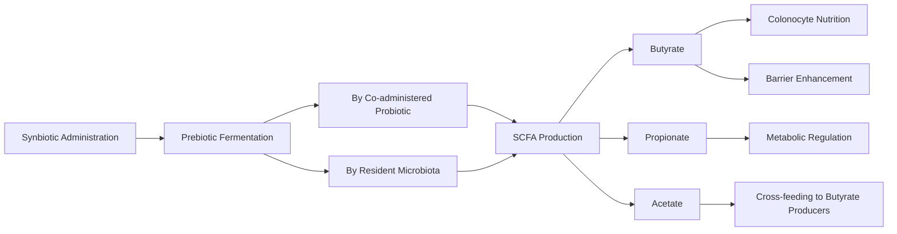

#### Balanced Gut Environment Through Multiple Pathways

Synbiotics balance the gut environment through complementary mechanisms: the prebiotic component selectively feeds beneficial resident bacteria, nudging the microbiome toward greater diversity and stability, while the probiotic component directly contributes to microbial balance through competitive exclusion and antimicrobial compound production[^47].

This dual approach addresses gut health from multiple angles simultaneously, potentially achieving more comprehensive microbiome optimization than either approach alone.

### 8.6 Clinical Applications and Therapeutic Evidence

The clinical evidence supporting synbiotic use spans multiple health conditions, with documented benefits for gastrointestinal disorders, metabolic health, immune function, and various other applications. Evaluating this evidence base is essential for understanding the therapeutic potential and current limitations of synbiotic interventions.

#### Documented Health Benefits in Human Studies

The health benefits claimed by synbiotic consumption in humans include multiple domains of improvement[^45]:

| Health Domain | Documented Benefits | Mechanistic Basis |
|---------------|-------------------|-------------------|
| **Gut Microbiota** | Increased levels of lactobacilli and bifidobacteria; balanced gut microbiota | Direct colonization plus prebiotic stimulation |
| **Liver Function** | Improvement of liver function in cirrhotic patients | Reduced endotoxemia, improved gut-liver axis |
| **Immune Function** | Improvement of immunomodulating ability | Enhanced SCFA production, immune cell modulation |
| **Infection Prevention** | Prevention of bacterial translocation; reduced nosocomial infections in surgical patients | Barrier enhancement, pathogen exclusion |

#### Applications in Inflammatory Bowel Disease

Studies on both acute and chronic intestinal inflammation suggest that **probiotics, prebiotics, and/or synbiotics may be helpful in the management of inflammatory bowel disorder**[^45]. The synbiotic approach offers particular advantages for IBD patients because it addresses multiple aspects of disease pathophysiology:

1. **Restoring beneficial bacterial populations** depleted by inflammation
2. **Enhancing SCFA production** to support colonocyte health and barrier function
3. **Modulating inflammatory responses** through immunoregulatory mechanisms

Clinical trials have evaluated various synbiotic formulations in IBD populations, with evidence suggesting potential benefits for inducing and maintaining remission, though results vary by formulation and patient population.

#### Metabolic Health Applications

Synbiotics have demonstrated effects on **cardiovascular diseases and lipid metabolism**. Studies have shown promising hypocholesterolemic activity with synbiotic formulations. In one study, hypercholesterolemic male pigs fed with a synbiotic formulation of ***L. acidophilus* ATCC 4962, FOS, mannitol, and inulin for 8 weeks** showed promising hypocholesterolemic activity[^45].

The mechanisms underlying these metabolic benefits likely involve multiple pathways including enhanced bile acid deconjugation, modulation of cholesterol synthesis gene expression, and improved gut barrier function reducing metabolic endotoxemia.

#### Immunomodulatory Applications

Synbiotics appear to be an attractive proposition for **enhancing immune function**. A combination of *B. coagulans* with inulin in diet for 6 weeks induced a **significant reduction in the levels of C-reactive protein and also increased glutathione levels**[^45]. These findings suggest anti-inflammatory and antioxidant effects that could benefit various immune-mediated conditions.

Synbiotic supplementation of *Lactobacillus*, *Bifidobacterium*, and 10% FOS in rats fed with high-fat, low-fiber diet **suppressed intestinal and systemic inflammation**, with effects comparable to FOS supplementation alone[^45]. Treatment of inflammation-prone HLA-B27 rats with similar synbiotics improved the histological changes due to inflammation[^45].

#### Cancer Prevention Potential

Evidence from preclinical studies suggests potential anticancer effects of synbiotics. Synbiotic treatment **prevented azoxymethane-induced suppression of NK-cell activity in Peyer's patches**, an effect not observed in the individual pro- and prebiotic treatments[^45]. This finding suggests true synergistic effects on immune surveillance mechanisms relevant to cancer prevention.

Dietary administration of *B. longum* and oligofructose plus inulin **inhibits the formation of pre-neoplastic lesions** and suppresses mammary and colon cancer in experimental models[^45]. These findings provide mechanistic support for the potential role of synbiotics in cancer prevention, though human clinical evidence remains limited.

### 8.7 Formulation Considerations and Product Development Challenges

Developing effective synbiotic products requires addressing numerous practical challenges related to stability, dosing, delivery, and quality assurance. Understanding these considerations is essential for both product developers and consumers seeking to evaluate synbiotic formulations.

#### Stability and Viability Considerations

One of the primary advantages of synbiotic formulations is their potential to **overcome the viability challenges that limit probiotic efficacy**. Synbiotics were developed to overcome possible survival difficulties for probiotics, based on observations showing improvement of survival of probiotic bacteria during passage through the upper intestinal tract and more efficient implantation in the colon[^45].

However, maintaining probiotic viability during manufacturing and storage remains challenging. The prebiotic component of synbiotics offers **production and storage advantages compared to probiotics alone**[^45]. Prebiotics are chemically stable compounds that do not require refrigeration or special handling, potentially extending the shelf life and stability of synbiotic formulations compared to probiotic-only products.

#### Optimal Probiotic-to-Prebiotic Ratios

Determining the optimal ratio of probiotic to prebiotic components requires balancing several considerations:

| Factor | Consideration | Impact on Formulation |
|--------|--------------|----------------------|
| **Probiotic dose** | Must meet minimum effective dose for claimed benefits | Sets baseline for probiotic content |
| **Prebiotic dose** | Must provide sufficient substrate for fermentation | Typically 2-10g for prebiotic effects |
| **Synergistic ratio** | Optimal ratio varies by strain-substrate pairing | Requires empirical optimization |
| **Tolerability** | High prebiotic doses may cause GI discomfort | Upper limit on prebiotic content |

#### Regulatory and Quality Assurance Frameworks

The synbiotic field currently faces challenges related to **standardization and regulatory frameworks**. Different regulatory jurisdictions classify synbiotics differently, with implications for labeling claims, evidence requirements, and quality standards.

Key quality considerations for synbiotic products include:

1. **Strain identification**: Accurate identification of probiotic strains to species and strain level
2. **Viability verification**: Confirmation that labeled CFU counts are maintained through shelf life
3. **Prebiotic purity**: Verification of prebiotic identity and absence of contaminants
4. **Combination testing**: Evidence that the specific combination delivers claimed benefits

#### Challenges in Achieving True Synergism

As the in vitro screening studies discussed earlier revealed, achieving true synergistic effects requires careful matching of probiotic strains with compatible prebiotic substrates. The finding that certain probiotic strains (such as *L. rhamnosus* and *P. pentosaceus*) are not compatible with commonly available commercial prebiotics[^48] highlights a significant challenge for product development.

This limitation suggests that many commercially available "synbiotic" products may function as complementary rather than truly synergistic formulations. While complementary synbiotics can still provide meaningful health benefits through the independent actions of their components, they may not achieve the enhanced efficacy that synergistic pairings could theoretically deliver.

#### Future Directions and Emerging Approaches

The synbiotic field continues to evolve with emerging approaches including:

- **Personalized synbiotics**: Formulations tailored to individual microbiome profiles
- **Next-generation prebiotics**: Novel substrates beyond traditional oligosaccharides
- **Phytobiotics**: Integration of plant-derived compounds with probiotic organisms
- **Precision fermentation**: Engineered strains with enhanced substrate utilization capabilities

These developments may address current limitations and expand the therapeutic potential of synbiotic interventions.

#### Practical Implications for Consumers

For individuals seeking to incorporate synbiotics into their dietary strategies, several practical considerations apply:

1. **Evaluate evidence claims**: Look for products with clinical evidence supporting the specific combination, not just the individual components
2. **Consider formulation type**: Understand whether a product is designed as complementary or synergistic
3. **Assess strain-substrate compatibility**: For synergistic claims, verify that the prebiotic is actually utilized by the co-administered probiotic
4. **Monitor individual response**: As with all microbiome interventions, individual responses vary based on baseline microbiome composition

The synbiotic approach represents a sophisticated strategy for optimizing gut microbiome health that builds upon the foundational understanding of probiotics and prebiotics established in earlier chapters. When properly formulated and validated through clinical evidence, synbiotics offer the potential for enhanced efficacy through coordinated mechanisms that address multiple aspects of gut health simultaneously. However, the field continues to develop, and consumers should approach synbiotic products with informed skepticism, seeking evidence that specific formulations deliver the claimed benefits rather than assuming that any probiotic-prebiotic combination constitutes an effective synbiotic.

## 9 Dietary Strategies for Optimizing Gut Microbiome Health

This chapter synthesizes the scientific evidence from preceding chapters into actionable dietary recommendations for gut microbiome optimization. The analysis translates mechanistic understanding of probiotics, prebiotics, and pathogenic bacteria into practical guidance encompassing probiotic-rich food sources, prebiotic-containing foods, evidence-based dietary patterns that promote beneficial bacteria while suppressing pathogens, and comprehensive supplement selection criteria. The chapter bridges theoretical knowledge with real-world application, enabling informed dietary choices that support microbial balance and overall gut health.

### 9.1 Probiotic-Rich Food Sources and Their Therapeutic Potential

Fermented foods represent the most accessible and historically significant sources of live beneficial microorganisms, offering a natural approach to supporting gut health through dietary means. These foods have been consumed across diverse cultures for millennia, and modern scientific investigation has confirmed their capacity to deliver viable probiotic organisms that can colonize the gastrointestinal tract and confer measurable health benefits. Understanding the characteristics, strain diversity, and practical considerations associated with different fermented foods enables informed dietary choices that effectively support *Lactobacillus* and *Bifidobacterium* populations.

**Yogurt** stands as one of the best sources of probiotics, made from milk fermented by probiotics, mainly lactic acid bacteria and bifidobacteria[^49]. The health benefits associated with eating yogurt are extensive and include improved bone, heart, and gastrointestinal health, reduced risk of diabetes, reduced risk of breast and colon cancer, and improved weight management[^49]. Yogurt may also be suitable for people with lactose intolerance, as the fermentation process partially breaks down lactose[^49]. However, a critical consideration for consumers is that **not all yogurt contains live probiotics**; the pasteurization process used in some commercial products kills beneficial bacteria. Consumers should make sure to choose yogurt with active or live cultures clearly indicated on the label[^49]. When selecting yogurt, look for products that specify "live active cultures" to ensure probiotic viability.

**Kefir** represents a more diverse and potent probiotic source compared to yogurt, offering a fermented probiotic milk drink made by adding kefir grains to cow's or goat's milk[^49]. Kefir grains are cultures of lactic acid bacteria and yeast, creating a complex microbial ecosystem that delivers multiple beneficial strains simultaneously. Kefir has been linked to various health benefits including improved bone health, help with digestive problems, and protection against infections[^49]. Importantly, kefir may also be a good option for people with lactose intolerance[^49]. The key distinction is that kefir contains several major strains of friendly bacteria and yeast, making it a **more diverse and potent probiotic source compared to yogurt**[^49]. This strain diversity may provide broader spectrum benefits through the complementary actions of multiple beneficial organisms.

**Sauerkraut** offers probiotic benefits alongside substantial nutritional value as finely shredded cabbage that has been fermented by lactic acid bacteria[^49]. In addition to its probiotic qualities, sauerkraut is rich in fiber as well as vitamins C and K, and contains iron and potassium[^49]. Sauerkraut also contains the antioxidants lutein and zeaxanthin, which are important for eye health[^49]. A critical practical consideration is that consumers must **choose unpasteurized sauerkraut**, as pasteurization kills the live and active bacteria[^49]. This requirement typically means selecting products from the refrigerated section rather than shelf-stable canned versions, which have undergone heat treatment that eliminates probiotic organisms.

**Kimchi** provides probiotic benefits within a distinct flavor profile as a fermented, spicy Korean side dish, usually made from cabbage[^49]. It contains the bacteria *Lactobacillus kimchii* and other lactic acid bacteria that may benefit digestive health[^49]. Beyond its probiotic content, kimchi made from cabbage is high in some vitamins and minerals, including vitamin K, riboflavin (vitamin B2), and iron[^49]. The fermentation process creates an environment where beneficial lactic acid bacteria thrive while pathogenic organisms are suppressed through acidification.

**Kombucha** represents a fermented beverage option, consisting of fermented black or green tea[^49]. Some research suggests that kombucha may reduce the risk of cancer, diabetes, and other diseases, although other researchers warn that there isn't enough high-quality evidence to confirm these benefits[^49]. Because kombucha is fermented with bacteria and yeast, it likely does have health benefits related to its probiotic properties[^49]. The fermentation process produces organic acids and other compounds that may contribute to health effects beyond direct probiotic action.

**Traditional buttermilk** contains probiotics and is mainly consumed in India, Nepal, and Pakistan as the leftover liquid from making butter[^49]. However, cultured buttermilk, commonly found in American supermarkets, generally does not have any probiotic benefits[^49]. This distinction highlights the importance of understanding traditional versus commercial production methods when seeking probiotic-containing foods. Traditional buttermilk provides vitamin B12, riboflavin, calcium, and phosphorus while being low in fat and calories[^49].

**Certain cheeses** can serve as probiotic sources, though only some types contain live beneficial bacteria. Consumers should look for "live cultures" or "active cultures" on food labels when selecting cheese for probiotic benefits[^49]. Semi-hard cheeses such as cheddar, mozzarella, or gouda, as well as cottage cheese, may contain higher levels of probiotics[^49]. Cheese offers additional nutritional benefits as an excellent source of protein, rich in important vitamins and minerals including vitamins A, B6, B12, D, and K, calcium, iodine, magnesium, potassium, phosphorus, selenium, and zinc[^49]. Moderate consumption of dairy products such as cheese may even lower the risk of heart disease and osteoporosis[^49].

The following table summarizes the key probiotic food sources and their characteristics:

| Food Source | Primary Probiotic Types | Key Selection Criteria | Additional Nutritional Benefits |
|-------------|------------------------|----------------------|-------------------------------|
| **Yogurt** | Lactic acid bacteria, Bifidobacteria | Must contain "live active cultures" | Calcium, protein, B vitamins |
| **Kefir** | Multiple LAB strains + yeasts | Naturally contains diverse strains | Calcium, protein, B vitamins |
| **Sauerkraut** | Lactic acid bacteria | Must be unpasteurized/refrigerated | Vitamins C, K; fiber; antioxidants |
| **Kimchi** | *L. kimchii*, other LAB | Refrigerated products preferred | Vitamins K, B2; iron |
| **Kombucha** | Bacteria and yeast consortium | Unpasteurized products | Organic acids, polyphenols |
| **Buttermilk** | LAB (traditional only) | Traditional vs. cultured distinction | B12, riboflavin, calcium |
| **Aged Cheeses** | Variable LAB strains | Look for "live cultures" label | Protein, calcium, vitamins |

**Practical considerations for incorporating probiotic foods** include the recognition that high temperatures kill beneficial bacteria, so excessive heating should be avoided[^50]. Pasteurization of dairy products uses heat to kill bacteria, but probiotics are often added back later in some products[^50]. For pickled vegetables, canning uses heat to kill bacteria, so consumers should choose pickles in the refrigerated-foods section[^50]. In each case, looking for "live active cultures" on food labels provides assurance of probiotic content[^50]. Consuming a variety of fermented foods is advisable, as different types of fermented foods provide different strains of bacteria[^50].

The benefits of eating probiotics from food sources include increasing helpful bacteria by replacing bacteria lost due to antibiotics, illness, and poor diet; increasing ability to fight infections by strengthening the lining of the intestine and the immune system; reducing harmful bacteria by creating an acidic environment and releasing chemicals that destroy them; producing vitamins and helping the body absorb minerals; decreasing inflammation and protecting against allergies and chronic diseases; and improving bowel movements by adding bulk and decreasing bacteria that cause diarrhea[^50].

### 9.2 Prebiotic-Rich Foods and Dietary Fiber Sources

Prebiotics serve as the essential substrates that nourish beneficial gut bacteria, and understanding which foods provide these compounds enables strategic dietary planning to support microbial health. While the previous chapter established that prebiotics are fibers that feed friendly gut bacteria, helping them make short-chain fatty acids that support colon cells and metabolic health[^51], this section identifies specific food sources and their prebiotic constituents, providing practical guidance for incorporating these foods into daily dietary patterns.

**Garlic** acts as a prebiotic by promoting the growth of beneficial *Bifidobacteria* in the gut while also helping prevent disease-promoting bacteria from growing[^51]. This dual action—supporting beneficial populations while suppressing harmful ones—exemplifies the selective nature of prebiotic effects. Garlic's prebiotic compounds include inulin and fructo-oligosaccharides, which resist digestion in the upper gastrointestinal tract and reach the colon where they serve as fermentation substrates for beneficial bacteria.

**Onions** are rich in inulin and fructooligosaccharides (FOS), providing substantial prebiotic content[^51]. FOS is a type of carbohydrate that helps strengthen gut flora and helps with fat breakdown[^51]. The prebiotic content of onions makes them valuable additions to meals, contributing both flavor and functional benefits. Both raw and cooked onions provide prebiotic compounds, though raw consumption may preserve higher concentrations.

**Bananas** contain some inulin, and unripe (green) bananas are also high in resistant starch, which has prebiotic effects[^51]. The resistant starch content of bananas varies significantly with ripeness, with greener bananas providing substantially more of this prebiotic compound. As bananas ripen, the resistant starch converts to digestible sugars, reducing prebiotic content. This ripeness-dependent variation provides a practical strategy for maximizing prebiotic intake by selecting less ripe bananas.

**Whole oats** are a healthy grain with prebiotic benefits, containing beta-glucan fiber as well as resistant starch[^51]. Oats also contain various phytochemicals that act as prebiotics[^51]. Research suggests that in addition to their prebiotic properties and their positive impact on healthy gut bacteria, oats have other health benefits, such as helping lower cholesterol[^51]. The beta-glucan fiber in oats represents a distinct prebiotic type that complements the fructan-based prebiotics found in vegetables.

**Legumes**, such as beans and lentils, are also good sources of prebiotics[^51]. The complex carbohydrates and resistant starch in legumes provide fermentation substrates for beneficial bacteria, while their high fiber content supports overall digestive health. Regular consumption of legumes contributes to both prebiotic intake and dietary fiber goals.

The following comprehensive overview identifies prebiotic food sources and their specific compounds:

| Food Source | Primary Prebiotic Compounds | Bifidogenic Effects | Practical Considerations |
|-------------|---------------------------|--------------------|-----------------------|
| **Garlic** | Inulin, FOS | Promotes *Bifidobacteria*, inhibits pathogens | Raw consumption maximizes benefits |
| **Onions** | Inulin, FOS | Strengthens gut flora | Both raw and cooked provide benefits |
| **Bananas** | Inulin, resistant starch | Supports beneficial bacteria | Green bananas higher in resistant starch |
| **Whole Oats** | Beta-glucan, resistant starch | Promotes beneficial bacteria | Additional cholesterol-lowering effects |
| **Legumes** | Resistant starch, complex carbohydrates | SCFA production support | Gradual introduction recommended |
| **Asparagus** | Inulin, FOS | Bifidogenic effects | Natural source of fructans |
| **Chicory root** | High inulin concentration | Strong bifidogenic effects | Primary commercial inulin source |

**Dietary polyphenols** found in fruits, whole grains, vegetables, legumes, seeds, and nuts are known for their antioxidant properties and also function as prebiotics[^52]. These polyphenols encourage the growth of healthy microorganisms that are favorable for human health, including the well-known probiotics *Lactobacillus* and *Bifidobacterium*[^52]. Specific examples demonstrate the bifidogenic effects of various polyphenol sources: anthocyanins from blackcurrant and tart cherry increase *Lactobacillus* and *Bifidobacterium*; apple polyphenols increase *Lactobacilli*; cocoa flavanols increase *Bifidobacterium* and *Lactobacillus*; and blueberry proanthocyanins increase *Bifidobacteria*[^52].

A critical consideration for dietary planning is the **gap between natural concentrations and therapeutic doses**. Since the fiber content of prebiotic foods may be altered during cooking, consuming them raw rather than cooked when possible helps gain the full health benefits[^51]. However, achieving the prebiotic doses used in clinical studies often requires either concentrated food sources, strategic food selection emphasizing high-prebiotic foods, or supplementation. This reality underscores the importance of consistent, varied consumption of prebiotic-rich foods rather than occasional intake.

The high intake of fiber-rich foods in health-promoting diets, such as fruits, whole grains, and vegetables, can provide nourishment for beneficial gut bacteria[^52]. Such prebiotics encourage the development and activity of probiotic bacteria like *Lactobacillus* and *Bifidobacteria*[^52]. The short-chain fatty acids (SCFAs) which are produced by these bacteria give energy to the intestinal cells, improve the function of the intestinal barrier, and also have anti-inflammatory properties[^52].

### 9.3 Dietary Patterns That Promote Beneficial Microbiota

Beyond individual foods, overall dietary patterns exert profound effects on gut microbiome composition and function. Evidence consistently demonstrates that certain dietary patterns promote beneficial bacterial populations while suppressing pathogenic species, with effects that extend beyond what individual food components could achieve independently. Understanding these patterns enables the development of comprehensive dietary strategies that optimize gut health through synergistic effects across multiple food categories.

**The Mediterranean diet (MD)** is widely recognized for its health benefits, particularly in modulating gut microbiota composition and reducing the risk of metabolic, cardiovascular, and neurodegenerative diseases[^53]. Characterized by a high intake of plant-based foods, monounsaturated fats, and polyphenols, primarily from extra virgin olive oil, the MD fosters the growth of beneficial gut bacteria such as *Bifidobacterium*, *Faecalibacterium prausnitzii*, and *Roseburia*, which produce short-chain fatty acids that enhance gut barrier integrity, reduce inflammation, and improve metabolic homeostasis[^53].

Clinical and preclinical studies have proved that the MD is associated with **increased microbial diversity, reduced pro-inflammatory bacteria, and improved markers of insulin sensitivity, lipid metabolism, and cognitive function**[^53]. Through metagenomic analysis, greater adherence to the MD in a sample of 153 Italian individuals led to an increase in SCFA-producing bacteria, such as *Roseburia* and *Bifidobacterium*[^53]. A parallel randomized study examined the effect of the MD in a group of obese subjects, and after an 8-week intervention, researchers observed a significant increase in the genetic richness of the gut microbiome, associated with reduced systemic inflammation and improved metabolic parameters, including insulin sensitivity[^53].

Adherence to the MD led to an increased prevalence of ***Akkermansia muciniphila* and *Faecalibacterium prausnitzii***, bacteria known for their role in protecting against chronic inflammation[^53]. Another study demonstrated that greater adherence to the MD was associated with a higher abundance of *Bifidobacterium* and an increased production of SCFA[^53]. A well-balanced MD was associated with a lower presence of pro-inflammatory bacteria, such as *Escherichia coli*, suggesting a protective role against gut dysbiosis[^53].

The high intake of fiber-rich diets in the Mediterranean diet provides a favorable environment for the growth of beneficial bacteria, serving as prebiotics[^52]. By consuming prebiotic-rich foods, individuals can support the growth of bacteria like *Bifidobacteria* and *Lactobacillus*[^52]. Furthermore, the Mediterranean diet is abundant in polyphenols which have antimicrobial properties, influencing the diversity of the gut microbiota[^52]. These polyphenols can promote a healthier microbiome by increasing the number of helpful bacteria and reducing the growth of harmful bacteria in the gut[^52].

**The DASH diet** (Dietary Approaches to Stop Hypertension) emphasizes a diet comprised of vegetables, fruits, whole grains, lean meats, and low-fat dairy products while limiting sodium intake[^52]. The high intake of fiber-rich foods in the DASH diet, such as fruits, whole grains, and vegetables, can provide nourishment for beneficial gut bacteria[^52]. The prebiotic effects of these foods encourage the development and activity of probiotic bacteria like *Lactobacillus* and *Bifidobacteria*, with the resulting SCFA production providing energy to intestinal cells, improving intestinal barrier function, and exerting anti-inflammatory properties[^52].

**Plant-based diets** demonstrate consistent benefits for gut microbiome health. A systematic review assessing the association between vegan and vegetarian diets on gut microbiota composition found evidence for short- to moderate-term beneficial effects of plant-based diets versus conventional diets on gut microbiome composition and biochemical and anthropometric measurements in healthy participants, as well as in obese individuals, cardiovascular disease patients, and rheumatoid arthritis patients[^54]. These diets, rich in dietary fiber, are associated with increased levels of short-chain fatty acids (SCFAs), which have anti-inflammatory and immunomodulatory effects[^54].

Plant-based diets led to statistically significant increases in beneficial bacteria, such as those from the families Ruminococcaceae and Lachnospiraceae, and the species *Faecalibacterium prausnitzii*, which are known for producing SCFAs like butyrate[^54]. Butyrate improves the intestinal barrier and lowers systemic inflammation[^54]. Regarding health outcomes, the studies reported that plant-based diets were associated with lower blood glucose levels, body weight, triglycerides, total cholesterol, and LDL-cholesterol in obese and diabetic individuals[^54].

A large-scale analysis of gut microbiome data from 21,561 individuals across five multinational cohorts identified distinct signatures of vegan, vegetarian, and omnivore diets[^55]. Gut microbial profiles strongly distinguished these common diet patterns, with a mean area under the curve (AUC) of 0.85 for classification, and the highest predictability achieved when separating vegans from omnivores (mean AUC = 0.90)[^55]. Vegan signature microbes, including butyrate producers like Lachnospiraceae, *Butyricicoccus* sp., and *Roseburia hominis*, were correlated with favorable cardiometabolic markers and were enriched in omnivores consuming more plant-based foods[^55].

The following diagram illustrates how beneficial dietary patterns influence gut microbiota:

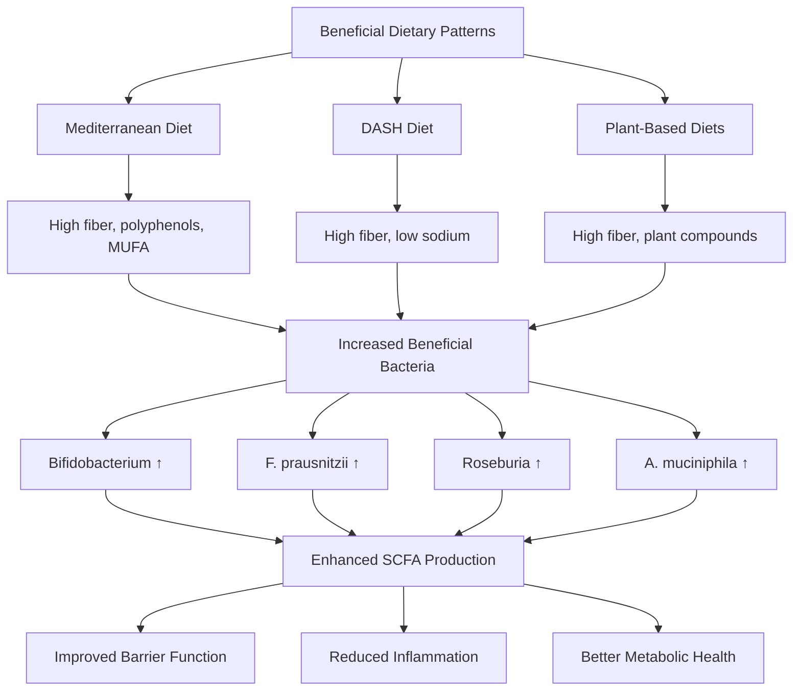

Analysis of the plant-based diet index revealed that **dietary factors within each diet pattern, particularly the amount of healthy plant-based foods, generally transcended the impact of the overall diet pattern on the gut microbiome**[^55]. This finding suggests that omnivores who incorporate more plant-based foods can share beneficial gut microbial signatures with vegetarians and vegans[^55]. Assessment using cardiometabolic health rankings showed that signature microbes of omnivore microbiomes were statistically associated with less favorable cardiometabolic health outcomes, whereas signature vegan microbes were associated with more favorable outcomes[^55].

Plant-based dietary patterns such as the Mediterranean diet and vegetarian diet **decrease the abundance of pathogenic bacteria (especially *E. coli*) and increase the abundance of beneficial species (e.g., *Roseburia* or *Ruminococcus*)**, thereby increasing the concentrations of short-chain fatty acids (SCFAs), which alleviate inflammatory bowel disease[^56]. This dual effect—promoting beneficial bacteria while suppressing pathogens—represents a key advantage of plant-centric dietary patterns.

### 9.4 Dietary Factors That Suppress Pathogenic Bacteria

Understanding which dietary factors promote pathogenic bacteria and toxic metabolite production enables the development of avoidance strategies that complement the beneficial dietary patterns discussed above. The scientific evidence clearly identifies specific dietary components and patterns that create conditions favorable for harmful bacteria, providing actionable guidance for dietary modification.

**The Western diet**, characterized by high fat, high refined carbohydrates, and low fiber, consistently promotes dysbiosis and pathogenic bacterial overgrowth. A high-fat, high-sugar diet, such as the Western diet, has been linked to an elevated risk of obesity and negative impacts on the variety and composition of the gut microbiota[^52]. Those who follow a Western diet have a less diversified gut microbiome marked by a larger number of hazardous bacterial species and a lesser number of helpful bacterial species[^52]. Dysbiosis, or an imbalance in the gut microbial ecology, can promote weight gain, and changes in the composition of the microbes in the gut may affect immunological function[^52].

Proinflammatory diets such as the Western diet (WD) and the high-salt diet (HSD) consistently **reduce the abundance of beneficial species (e.g., *Bifidobacterium* or *Lactobacillus*) and promote the bloom of pathogenic bacteria**, such as adherent-invasive *Escherichia coli* (AIEC)[^56]. WD-induced dysbacteriosis can activate mTOR via microbial-derived pathogen-associated molecular patterns (PAMPs), exacerbating colitis[^56]. An HSD decreases the abundance of *Lactobacillus* and the concentrations of butyrate, and affects T cell phenotype, exacerbating colitis[^56].

**Red and processed meat consumption** represents a significant dietary risk factor due to its association with N-nitroso compound formation and promotion of unfavorable microbial profiles. Red meat consumption was identified as a strong driver of omnivore microbiomes, with signature microbes such as *Ruminococcus torques*, *Bilophila wadsworthia*, and *Alistipes putredinis* being negatively correlated with host cardiometabolic health[^55]. The relationship between diet, gut health, and the risk of developing obesity, cardiovascular diseases, and inflammatory diseases is well-established[^52].

**High saturated fat intake** promotes LPS translocation and secondary bile acid production through multiple mechanisms. Dysbiosis and inflammation caused by a poor diet high in saturated fatty acids (SFAs) may have an impact on the onset of many diseases, including metabolic disorders, obesity, and inflammatory bowel disease[^52]. The mechanisms involve increased intestinal permeability, altered bile acid metabolism, and shifts in microbial community composition favoring pro-inflammatory species.

The following table summarizes dietary factors that promote pathogenic bacteria and their countermeasures:

| Harmful Dietary Factor | Pathogenic Effects | Countermeasure Strategy |
|----------------------|-------------------|------------------------|
| **High saturated fat** | Increased LPS translocation, secondary bile acids, reduced beneficial bacteria | Replace with unsaturated fats (olive oil, nuts) |
| **High refined carbohydrates** | Reduced microbial diversity, dysbiosis | Replace with whole grains, complex carbohydrates |
| **Low fiber intake** | Reduced SCFA production, increased protein fermentation | Increase vegetable, fruit, legume consumption |
| **High red/processed meat** | N-nitroso compound formation, unfavorable microbiome signatures | Moderate intake, increase plant protein sources |
| **High sodium** | Reduced *Lactobacillus*, decreased butyrate | Follow DASH diet sodium guidelines |

**Dietary polyphenols provide protective effects** against pathogenic bacteria through multiple mechanisms. Dietary polyphenols may alter the gut microbiota of the host, encouraging the growth of healthy microorganisms while inhibiting harmful ones[^52]. Additionally, *Clostridium histolyticum* and *Clostridium perfringens* can't grow well due to polyphenols[^52]. Dietary polyphenols can influence the *Firmicutes* to *Bacteroides* ratio, which has been linked to body weight[^52]. Specific dietary polyphenols—rutin, quercetin, chlorogenic acid, and caffeic acid—have been demonstrated to be able to lower the *Firmicutes*-to-*Bacteroides* ratio[^52].

Dietary polyphenols, notably flavanols and flavones, disrupt bacterial cell membranes and increase membrane permeability in pathogenic species[^52]. Tea polyphenols, such as catechins, attach to cell membranes and have antibacterial properties[^52]. For example, apple polyphenols increase *Lactobacilli* and *Streptococcus sp.* while decreasing lecithinase-positive *Clostridium*, *Pseudomonas*, and *Enterobacteriaceae*[^52]. Cocoa flavanols increase *Bifidobacterium* and *Lactobacillus* while decreasing *Clostridium*[^52]. Cranberry proanthocyanidins increase *Bacteroidetes* and decrease *Clostridia* and *Firmicutes*[^52].

The beneficial bacteria that support the integrity of the gut barrier and control the activity of the immune system in the gut are *Faecalibacterium prausnitzii*, *Akkermansia muciniphila*, and *Bifidobacterium*[^52]. Conversely, *Prevotella*, *Bacteroides*, and *Ruminococcus sp.* create inflammation and contribute to the development of various diseases by disrupting gut functioning under certain dietary conditions[^52]. Overall, **dietary modifications can suppress pathogenic bacteria by promoting a healthy and diverse gut microbiota** through the consumption of diets rich in polyphenols, probiotics, and prebiotics, which encourage the growth of beneficial bacteria and inhibit the growth of harmful bacteria, thereby reducing the risk of various inflammatory diseases[^52].

### 9.5 Evidence-Based Probiotic Supplement Selection

When dietary sources of probiotics are insufficient or when specific therapeutic applications require targeted strains, probiotic supplements offer a concentrated approach to microbiome support. However, the wide variety of available products, combined with variable quality and inconsistent labeling practices, necessitates a systematic approach to supplement selection based on scientific evidence and established guidelines.

**Strain specificity represents the foundational principle** of evidence-based probiotic selection. Probiotics are identified by their genus, species, and strain designation, and because the effects of probiotics can be specific to certain probiotic strains, recommendations for their use in the clinic need to be strain-specific[^4]. For the probiotic *Lactobacillus acidophilus* MN5, *Lactobacillus* is the genus, *acidophilus* is the species, and MN5 is the strain designation[^57]. A strain designation identifies the specific strain in the product, and **strain specificity is important as different strains within the same species can have different health benefits**[^57]. Consumers should choose products that identify the strains of bacteria contained in their product[^57].

**CFU (Colony Forming Units)** represents the scientifically accepted measurement for quantifying viable bacteria in probiotic supplements. CFU stands for Colony Forming Units, a scientific measurement that counts viable, living bacteria in probiotic supplements[^58]. This CFU meaning in probiotics is crucial because only living bacteria can colonize your gut and provide health benefits[^58]. Many probiotic supplements contain 1 to 10 billion CFU per dose, but some contain 50 billion CFU or more[^4]. However, **products with higher CFU counts are not necessarily more effective**[^4].

Effective probiotic CFU dosage ranges from 1 billion to 100 billion CFU daily, depending on specific health goals and current gut condition[^58]. The following table provides evidence-based dosing guidance:

| Application | Recommended CFU Range | Key Considerations |
|-------------|----------------------|-------------------|
| **General digestive maintenance** | 1-10 billion CFU daily | Sufficient for normal gut function support |
| **Post-antibiotic recovery** | 10-50 billion CFU daily | Higher doses support microbiome restoration |
| **Therapeutic applications** | 50-100 billion CFU | Healthcare supervision recommended |
| **Irritable bowel syndrome** | 10-50 billion CFU daily | Multi-strain formulations often more effective |

Clinical studies reveal minimum CFU thresholds for different health benefits[^58]. For basic digestive support, 1 billion CFU of specific strains like *Lactobacillus acidophilus* shows measurable effects[^58]. However, more complex conditions require higher doses—studies on irritable bowel syndrome show that 10-50 billion CFU daily of multi-strain formulations provide better symptom relief than lower doses[^58].

**Survival through gastric transit** represents a critical consideration, as not all consumed CFU survive the journey through stomach acid and bile salts. Research indicates that only 10-40% of ingested probiotics reach the intestines alive[^58]. This survival rate explains why higher CFU counts are often necessary[^58]. Advanced delivery systems like enteric coating can improve survival rates[^58]. Taking probiotics with food generally improves bacterial survival through stomach acid, though enteric-coated probiotics can be taken on empty stomachs[^58].

**Strain diversity and specificity** often matter more than total CFU count. Different bacterial strains provide unique benefits—*Lactobacillus rhamnosus* GG excels at immune support, while *Bifidobacterium longum* specializes in digestive comfort[^58]. A well-designed multi-strain formula with moderate CFU often outperforms single-strain high-dose products[^58]. Strain specificity matters more than total CFU for targeted health goals; **1 billion CFU of the right strain can be more effective than 50 billion CFU of less specific bacteria** for particular conditions[^58].

Clinical practice guidelines from organizations such as the American Gastroenterological Association (AGA) and the European Society for Paediatric Gastroenterology, Hepatology, and Nutrition (ESPGHAN) provide evidence-based recommendations for specific strains, doses, and combinations for conditions like antibiotic-associated diarrhea, necrotizing enterocolitis in preterm infants, and acute infectious diarrhea in children[^4]. These recommendations are often strain-specific—for example, the ESPGHAN Working Group recommends specific doses of *Lactobacillus rhamnosus* GG or *Saccharomyces boulardii* for preventing antibiotic-associated diarrhea, and specific combinations of *Lactobacillus* and *Bifidobacterium* strains for preventing necrotizing enterocolitis[^4].

For irritable bowel syndrome (IBS), some analyses suggest that **multi-strain probiotic products may be more effective than single-strain products** for improving global symptoms and quality of life[^4]. The effects of probiotics can vary by the specific symptom being evaluated and the strain used[^4]. Overall, the selection of a probiotic should be guided by evidence for the specific health condition, with careful attention to the strain, dose, formulation, and duration of use that have been demonstrated to be effective in rigorous clinical trials[^4].

### 9.6 Supplement Quality, Storage, and Labeling Considerations

Beyond strain selection and dosing, practical aspects of probiotic supplement quality, storage, and labeling significantly influence product efficacy. Understanding these factors enables consumers to select products that will deliver viable organisms capable of conferring health benefits.

**Label interpretation requires attention to CFU timing**. The labeled quantity of probiotics should reflect the quantity of live microorganisms at the end of the stated shelf life, not at the time of manufacture[^59]. CFU counts naturally decline from manufacturing to expiration due to bacterial die-off[^58]. Quality probiotics maintain labeled potency until expiration when stored properly[^58]. Consumers should **avoid products stating CFU "at time of manufacture"**—such labeling does not account for decline of CFU during storage[^57]. The International Scientific Association for Probiotics and Prebiotics advises manufacturers to list the total number of CFU—ideally for each strain—through the expiration date on the product label and suggests that consumers avoid products that list the number of CFU at time of manufacture[^4].

**Storage requirements vary by formulation** and significantly impact probiotic viability. The World Gastroenterology Organisation recommends that probiotic supplement users check the labels for recommended storage conditions; for example, some require refrigeration, whereas others can be stored at room temperature[^4]. Refrigerated products often maintain higher CFU stability over time compared to shelf-stable versions, though advanced freeze-drying technologies now allow some shelf-stable products to maintain excellent CFU potency without refrigeration[^58]. Storage information on product labels tells consumers how to store the product to ensure product quality and safety[^57].

The following checklist summarizes key quality markers for probiotic supplements:

| Quality Marker | What to Look For | Why It Matters |
|---------------|------------------|----------------|
| **Strain identification** | Genus, species, AND strain designation | Enables verification of clinical evidence |
| **CFU guarantee** | "Through expiration date" not "at manufacture" | Ensures viable organisms at time of use |
| **Storage instructions** | Clear refrigeration or room temperature guidance | Proper storage maintains viability |
| **Expiration date** | Clear use-by date | Indicates shelf life guarantee period |
| **Third-party testing** | Independent verification of contents | Confirms label accuracy |
| **Company contact information** | Accessible manufacturer details | Enables questions and adverse event reporting |

**Third-party testing and manufacturing quality** provide assurance of product integrity. Probiotic effectiveness depends heavily on manufacturing quality and storage conditions[^58]. Look for third-party testing, proper refrigeration where indicated, and clear expiration dating[^58]. Stability testing ensures that claimed CFU counts remain accurate throughout the product's shelf life[^58]. Reputable manufacturers guarantee CFU potency until expiration, not just at production[^58].

**Single-strain versus multi-strain formulations** represent an important selection consideration. Dietary supplements can include single strains or multiple strains of live microorganisms[^4]. Multi-strain probiotic formulas contain two or more different species or strains of beneficial bacteria in a single supplement, typically including various *Lactobacillus* and *Bifidobacterium* species[^60]. Research indicates that multi-strain formulations often demonstrate enhanced therapeutic benefits compared to single-strain supplements, particularly for digestive health applications[^60].

The synergistic effects of combined probiotic strains occur when different bacteria work together to create more favorable conditions in the gut[^60]. For example, certain *Lactobacillus* strains can lower intestinal pH, creating an environment where *Bifidobacterium* species thrive more effectively[^60]. Bioavailability and survival rates also improve in well-designed combination formulas, as some strains act as "pioneers" that help other bacteria survive the digestive system and colonize the gut[^60]. Studies show that certain probiotic combinations can increase the production of beneficial short-chain fatty acids by up to 40% compared to single-strain supplements[^60].

Effective probiotic combinations typically contain between 10-50 billion Colony Forming Units (CFUs), with the specific strains and their ratios being more important than the total count[^60]. Quality markers include third-party testing for potency, proper strain identification, and packaging that guarantees CFU counts through the expiration date[^60]. Most people begin noticing improvements in digestive comfort within 2-4 weeks of consistent use, with significant changes in gut flora balance typically developing over 8-12 weeks of regular supplementation[^60].

**Authoritative guidance resources** provide evidence-based recommendations for specific conditions. The World Gastroenterology Organisation notes that the optimal dose of probiotics depends on the strain and product and recommends that clinicians only advise their patients to use probiotic strains, doses, and durations that have been shown to be beneficial in human studies[^4]. The WGO guidelines include a summary of the evidence on specific probiotic strains used in studies for specific gastrointestinal endpoints[^4]. For individuals with compromised immune function or other serious underlying diseases, the WGO advises restricting probiotic use to the strains and indications that have proven efficacy[^4].

The US Probiotic Guide serves as a practice tool to assist with clinical decision making for appropriate probiotic therapy[^61]. This clinical guide is designed to translate scientific evidence available for probiotic products to practical, clinically relevant information, enabling clinicians to easily select the appropriate product, dose, and formulation for a specific indication[^61]. The guide emphasizes that indications for use are based on specific strains or combinations studied together, and extrapolation of current data and recommendations to be applied for different combinations of probiotic strains is not permitted[^61].

### 9.7 Integrating Probiotics, Prebiotics, and Synbiotics into Daily Practice

Translating the scientific understanding of probiotics, prebiotics, and their synergistic combinations into sustainable daily practices requires practical strategies that account for individual variation, gradual adaptation, and the development of consistent dietary habits. This integration represents the culmination of the evidence-based guidance presented throughout this chapter.

**Pairing prebiotic and probiotic foods** creates opportunities for synergistic effects within regular meals. After establishing tolerance, individuals can pair prebiotic and probiotic-containing foods as part of at least one meal per day to help them work together[^50]. Practical pairings include yogurt with banana (probiotic + resistant starch/inulin), kefir smoothies with oats (probiotic + beta-glucan), or fermented vegetables alongside garlic-containing dishes (probiotic + FOS/inulin). These combinations mirror the synbiotic concept, providing both live beneficial organisms and the substrates that support their growth and activity.

**Gradual introduction minimizes gastrointestinal discomfort**. It is best to start with small servings of probiotic-containing foods and increase gradually[^50]. Some people, especially those with existing stomach and bowel symptoms, may notice increased gas, bloating, or mild cramping when first introducing fermented foods or prebiotic-rich foods[^50]. This adaptation period reflects the gut microbiome adjusting to new substrates and bacterial populations. Starting with small portions and progressively increasing intake over several weeks allows the digestive system to adapt while minimizing uncomfortable symptoms.

**Individual variation in microbiome response** necessitates personalized approaches. The relationship between plant-based diets and the gut microbiome, alongside their underlying metabolic and inflammatory effects, remains subject to individual heterogeneity[^54]. Factors including baseline microbiome composition, genetics, medication use, and health status influence how individuals respond to dietary interventions. Monitoring personal responses and adjusting intake accordingly enables optimization of dietary strategies for individual circumstances.

**Timing considerations for probiotic supplements** can influence efficacy. Taking probiotics with food generally improves bacterial survival through stomach acid[^58]. Probiotic combinations are generally safe to take with most other supplements, but should not be taken simultaneously with antibiotics; space them at least 2-3 hours apart[^60]. This timing guidance helps ensure that probiotic organisms survive to reach the colon while avoiding potential interference with antibiotic activity.

The following framework provides a practical approach to daily integration:

| Time of Day | Probiotic Strategy | Prebiotic Strategy | Synergistic Pairing |
|-------------|-------------------|-------------------|-------------------|
| **Breakfast** | Yogurt or kefir | Oats, banana | Yogurt parfait with oats and banana |
| **Lunch** | Fermented vegetables as side | Legume-based dishes | Bean salad with sauerkraut |
| **Dinner** | Aged cheese, kimchi | Garlic, onions in cooking | Stir-fry with garlic, onions, and kimchi |
| **Snacks** | Kombucha | Raw vegetables | Kombucha with vegetable crudités |

**Special considerations for vulnerable populations** require additional caution. If a child has a health condition that increases the risk for infection, speak to their health care provider before giving probiotics[^50]. Probiotic supplements can also help improve gut health, but consultation with a pediatrician before starting supplements is advisable[^50]. Similarly, individuals with compromised immune function should restrict probiotic use to strains and indications with proven efficacy under healthcare supervision[^4].

**Developing sustainable dietary habits** requires consistency rather than perfection. The evidence supporting gut health benefits comes from regular, consistent consumption patterns rather than occasional intake. Incorporating a variety of fermented foods provides different strains of bacteria[^50], while consistent consumption of prebiotic-rich vegetables, fruits, and whole grains ensures ongoing support for beneficial bacterial populations. The goal is establishing dietary patterns that can be maintained long-term, recognizing that gut microbiome optimization is an ongoing process rather than a one-time intervention.

**Intermittent fasting and meal timing** may also influence gut microbiota. Research suggests that intermittent fasting influences gut microbiota and may improve richness and alpha diversity[^62]. Most studies found an association between intermittent fasting and gut microbiota richness, diversity, and compositional changes[^62]. However, there was heterogeneity in the results, and the specific bacteria significantly affected by IF varied widely depending on the study[^62]. When considering bacteria whose abundance changed across multiple studies, the abundance of Proteobacteria, Gammaproteobacteria, Clostridiales, and *Faecalibacterium* increased, while Negativicutes, Selenomonadales, and *Veillonellaceae* decreased[^62]. The potential health implications include decreases in pro-inflammatory *Veillonellaceae* and increases in anti-inflammatory *Faecalibacterium* possibly being beneficial[^62].

The integration of probiotics, prebiotics, and synbiotics into daily dietary practice represents the practical application of the scientific principles established throughout this report. By selecting appropriate fermented foods, incorporating prebiotic-rich plant foods, choosing evidence-based supplements when needed, and developing sustainable dietary habits, individuals can actively support their gut microbiome health. This dietary optimization contributes to the broader goals of maintaining microbial balance, supporting beneficial bacteria while suppressing pathogens, and ultimately promoting overall health through the gut-systemic axis connections that influence metabolic, immune, and even neurological function.

## 10 Practical Guidelines for Daily Dietary Choices

This chapter translates the scientific evidence and mechanistic understanding established throughout the report into actionable daily dietary practices for gut microbiome optimization. The analysis provides concrete meal planning strategies for incorporating probiotics and prebiotics, identifies specific foods and dietary patterns that promote pathogenic bacteria and toxic metabolite production, addresses life stage-specific considerations from infancy through aging, and establishes a systematic framework for evaluating probiotic supplements based on quality indicators and clinical evidence.

### 10.1 Meal Planning Strategies for Probiotic and Prebiotic Integration

Effective gut microbiome optimization requires translating scientific knowledge about probiotics and prebiotics into practical, sustainable daily eating patterns. The evidence consistently demonstrates that **regular, consistent consumption of both probiotic-rich fermented foods and prebiotic-containing plant foods** produces superior outcomes compared to sporadic intake or reliance on supplements alone. This section provides concrete frameworks for achieving optimal integration of these functional foods into everyday meals.

#### Establishing Daily Prebiotic Intake Targets

Research indicates that most adults need between **5-20 grams of prebiotics daily** for optimal gut health, yet many people consume less than half this amount[^63]. The European Food Safety Authority recommends a minimum of 12 grams daily for adults, while research published in the Journal of Nutrition suggests that 15-20 grams may offer enhanced digestive support[^63]. Individual optimal dosage depends on several factors including current gut health status, dietary habits, and tolerance levels. Most people should **start with 5-8 grams daily and gradually increase** to avoid digestive discomfort[^63].

Age-specific guidelines provide more refined targets for prebiotic intake. Young adults aged 18-30 typically need 12-15 grams daily, adults aged 31-44 may require 15-18 grams, and older adults often benefit from 18-20 grams daily[^63]. These graduated recommendations reflect the changing needs of the gut microbiome across the lifespan and the age-related decline in microbial diversity that higher prebiotic intake can help counteract.

Understanding the prebiotic content of common foods enables strategic meal planning to meet these targets naturally:

| Food Source | Prebiotic Content | Serving Size | Daily Target Contribution |
|-------------|-------------------|--------------|---------------------------|
| Chicory root | ~5 grams per ounce | 1 ounce | 25-33% of daily target |
| Cooked onions | ~2.5 grams per cup | 1 cup | 12-17% of daily target |
| Asparagus | 2-3 grams per cup | 1 cup | 10-20% of daily target |
| Garlic | ~1.5 grams per clove | 2-3 cloves | 15-25% of daily target |
| Banana | ~1 gram per medium fruit | 1 medium | 5-7% of daily target |

Different types of prebiotics have specific optimal daily amounts that inform food selection strategies. For inulin, studies show that 5-10 grams daily effectively promotes beneficial bacteria growth[^63]. For oligofructose, 3-8 grams daily delivers meaningful prebiotic benefits[^63]. Resistant starch requires higher intake levels, typically 10-20 grams daily[^63]. This variation in effective doses across prebiotic types underscores the importance of consuming diverse prebiotic sources rather than relying on a single food.

#### Distributing Prebiotic Intake Across Daily Meals

To maximize benefits, prebiotics for digestion should be **spread throughout the day**, with the daily dose divided into 2-3 portions consumed with meals[^63]. A practical distribution strategy suggests allocating approximately **30% of the daily target with breakfast, 40% with lunch, and 30% with dinner**[^63]. This distribution pattern ensures consistent substrate availability for beneficial bacteria throughout the day while minimizing the digestive discomfort that can occur with large single doses.

The following meal framework illustrates how to achieve adequate prebiotic intake through whole foods:

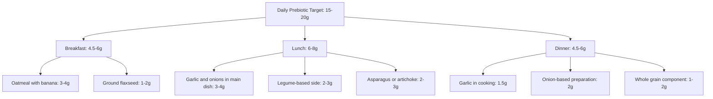

Starting the day with oatmeal topped with sliced banana and a sprinkle of ground flaxseed provides 3-4 grams of prebiotics[^63]. Including garlic and onions in lunch and dinner preparations, adding asparagus or artichokes as side dishes, and snacking on apples or berries helps reach daily targets naturally[^63]. Weekly meal planning should include diverse prebiotic sources rotated between different vegetables, fruits, and whole grains[^63].

#### Optimal Timing and Pairing of Probiotic and Prebiotic Foods

The synergistic relationship between probiotics and prebiotics can be leveraged through strategic food pairing within meals. When probiotic-rich fermented foods are consumed alongside prebiotic-containing foods, the prebiotic substrate provides immediate nourishment for both the consumed probiotic organisms and the beneficial bacteria already residing in the gut. This pairing approach mirrors the synbiotic concept discussed in Chapter 8, creating opportunities for enhanced efficacy through coordinated mechanisms.

Practical probiotic-prebiotic pairings for daily meals include:

| Meal | Probiotic Component | Prebiotic Component | Combined Benefit |
|------|--------------------|--------------------|------------------|
| Breakfast | Yogurt or kefir | Banana, oats | SCFA production, bifidogenic effects |
| Lunch | Fermented vegetables (sauerkraut, kimchi) | Garlic, onion in main dish | Pathogen inhibition, barrier support |
| Dinner | Aged cheese, miso | Asparagus, legumes | Diverse strain exposure, fiber fermentation |
| Snack | Kombucha | Apple, raw vegetables | Polyphenol-microbiome interaction |

The Academy of Nutrition and Dietetics recommends that women aim for 25 grams of fiber per day and men aim for 38 grams per day, or approximately 14 grams of fiber per 1,000 calories consumed[^64]. A well-designed gut-healthy meal plan can provide an average of 39 grams of fiber daily, significantly exceeding typical American intake where only 7% of adults reach their daily fiber goals[^64]. This fiber intake encompasses both prebiotic fibers and other dietary fibers that support overall digestive health.

#### Gradual Introduction Protocols to Minimize Discomfort

Common prebiotic side effects at doses above 10 grams taken suddenly may include gas, bloating, or changes in bowel movements, but these typically subside within 1-2 weeks[^63]. To minimize prebiotics and bloating, individuals should **start with smaller amounts, increase gradually, drink plenty of water, and avoid taking large doses on an empty stomach**[^63].

A systematic strategy for building tolerance involves starting with 25% of the target dose for the first week, then increasing by 25% weekly until reaching the optimal amount[^63]. This graduated approach allows the gut microbiome to adapt to increased substrate availability while minimizing uncomfortable symptoms. For someone targeting 16 grams daily, this would mean:

- **Week 1**: 4 grams daily
- **Week 2**: 8 grams daily
- **Week 3**: 12 grams daily
- **Week 4**: 16 grams daily (full target)

Signs of adequate daily prebiotics include regular, comfortable bowel movements, reduced digestive discomfort, and improved energy levels, typically noticeable within 2-4 weeks of consistent intake[^63]. Excessive prebiotic intake above 25-30 grams daily may cause persistent digestive discomfort[^63]. Initial improvements in digestion often appear within 1-2 weeks, while more significant changes typically develop over 4-8 weeks of consistent intake[^63].

#### Incorporating Gut-Healthy Foods Systematically

Simple strategies can help improve gut health through daily food choices, including eating more fiber, limiting added sugars, and eating foods that contain probiotics such as yogurt, kimchi, and kefir[^64]. A comprehensive approach to gut-healthy eating should focus on incorporating diverse food categories that support the microbiome:

**Gut-Healthy Foods to Focus On:**
- Beans and lentils (prebiotic fiber, resistant starch)
- Whole grains (beta-glucan, resistant starch)
- Nuts and seeds (fiber, polyphenols)
- Fruits and vegetables (diverse prebiotic compounds)
- Avocado (fiber, healthy fats)
- Fermented dairy such as yogurt, kefir, and cottage cheese (live cultures)
- Kimchi, sauerkraut, tempeh, and miso (diverse probiotic strains)[^64]

The state of the gut microbiome appears to have serious implications on overall health. A diverse and healthy gut with beneficial bacteria may aid in healthy weight maintenance, improve heart health, and strengthen the immune system[^64]. Conversely, poor gut health can have negative health implications—a gut microbiome that lacks diversity or is filled with more harmful bacteria can increase the risk of inflammatory and irritable bowel diseases and may even increase the risk of depression and anxiety[^64].

### 10.2 Foods and Dietary Patterns to Limit or Avoid

Understanding which dietary factors promote pathogenic bacterial overgrowth and toxic metabolite production enables the development of evidence-based avoidance strategies. The scientific literature clearly identifies specific foods and dietary patterns that create conditions favorable for harmful bacteria while simultaneously reducing beneficial populations. This section translates mechanistic evidence into practical guidance for dietary modification.

#### High-Fat Foods and Intestinal Barrier Compromise

Foods that are fried or cooked in large amounts of oil can be especially tough on the gut because the body has a harder time digesting such high-fat meals[^65]. Many fried foods are cooked in refined vegetable oils, which can further contribute to gut imbalance when consumed regularly[^65]. The mechanisms underlying these effects involve multiple pathways including increased intestinal permeability, altered bile acid metabolism, and promotion of pro-inflammatory bacterial species.

Fried foods may be harder for the body to digest and are often cooked in oils rich in saturated and trans fats that may irritate the stomach, causing diarrhea, gas, and stomach pain[^66]. Fried foods may also **lower the diversity of gut bacteria**[^66]. The American Liver Foundation recommends that people with liver conditions avoid or limit fried foods[^66]. When the body does not have the right balance of gut bacteria, certain organisms may grow out of control, affecting the risk of fungal and other infections[^66].

The Western diet, which is low in fiber and rich in sugar and processed foods, is tightly linked to a **loss of microbial diversity, dysbiosis, and a high risk of obesity, cardiovascular diseases, metabolic syndrome, and cancer**[^67]. Individual microbiomes would benefit from efforts toward spreading and recommending a new food culture based on limiting dietary surplus and on preferring natural, regional, and fresh foods[^67].

#### Processed Bread and Refined Carbohydrates

Packaged bread sold in many grocery stores may be harder on gut health than people realize[^65]. Many supermarket breads are heavily processed and contain ingredients that can disrupt the balance of bacteria in the gut[^65]. Many commercial breads are made with refined flours and additives designed to extend shelf life, but those ingredients often come at the expense of fiber[^65]. The loss of fiber content removes the prebiotic substrate that would otherwise support beneficial bacterial populations.

Restricting carbohydrate consumption is associated with weight loss and improved health markers when the restriction targets refined carbohydrates rather than complex carbohydrates[^67]. Excessive intake of refined sugars is known to mediate noxious effects on human health, a phenomenon referred to as **"carbotoxicity"**, triggering the proliferation of pathogenic bacteria like *Clostridium difficile* and *Clostridium perfringens* by increasing bile output[^67]. Sugar compounds condition the microbiota, resulting in the acquisition of a Westernized microbiome characterized by a substantial depletion of gut microbial diversity[^67].

#### Added Sugars and Blood Sugar Effects

Foods and drinks high in added sugar are among the biggest contributors to poor gut health[^65]. Ice cream, in particular, combines large amounts of sugar with ingredients that can be difficult for some people to digest[^65]. Foods high in sugar are not beneficial in any way—they contribute to overall inflammation, obesity, diabetes, and heart disease[^65]. **Frequent blood sugar spikes can directly disrupt the gut microbiome**[^65]. The more foods consumed that impact blood sugar and cause a spike in insulin, the worse for the gut, because sugar is essentially fuel for an overgrowth of harmful bacteria[^65].

Dietary sugar intake can promote tumor formation[^67]. An approach to avoid carbotoxicity is the replacement of digestible carbohydrates with resistant starch[^67]. In experimental models, resistant starch retarded tumor growth and simultaneously changed the microbiota profile, favoring the growth of anti-inflammatory microorganisms whilst decreasing pro-inflammatory ones[^67].

#### Highly Processed Plant-Based Alternatives

While plant-based cheese alternatives are popular, some highly processed versions may be tough on gut health[^65]. Some highly processed vegan cheeses may trigger gut inflammation due to the additives and fillers used to bind the products together[^65]. The recommendation is to **stick with real, whole foods**, and when choosing a replacement, ensure the replacement is made of ingredients that are actually real[^65].

This guidance extends beyond plant-based cheeses to all highly processed food products. The processing methods that extend shelf life and create appealing textures often remove beneficial fiber while adding compounds that may disrupt microbial balance. Prioritizing whole, minimally processed foods supports both beneficial bacteria and overall gut health.

#### Animal Protein Considerations

Animal protein from meat, dairy, and eggs offers health benefits but may undermine gut health when consumed in excess[^66]. A 2023 review suggests that people who eat lots of animal protein may have **less beneficial gut bacteria and more harmful bacteria associated with obesity**[^66]. Another 2023 review of 11 studies involving over 4 million people highlighted an association between meat intake and risk of inflammatory bowel disease (IBD); for every additional 100 grams daily of meat, people had a **38% higher risk of IBD**[^66].

A 2019 study suggested red meat may raise levels of trimethylamine N-oxide (TMAO), a byproduct of gut bacteria linked to a higher risk of heart attack and stroke[^66]. These findings support moderation in red meat consumption and suggest that plant-based protein sources may offer advantages for gut microbiome health.

#### High FODMAP Foods for Sensitive Individuals

High FODMAP foods may cause gastrointestinal problems in people with bowel issues like irritable bowel syndrome (IBS)[^66]. FODMAP stands for fermentable oligosaccharides, disaccharides, monosaccharides, and polyols. Some high FODMAP foods include processed foods containing high fructose corn syrup, sorbitol, and other artificial sweeteners; fruit juices; sweeteners like xylitol and honey; cheeses; and white bread and pasta[^66]. However, many nutritious foods are also high FODMAP[^66], so this consideration applies specifically to individuals with documented FODMAP sensitivity rather than the general population.

#### Practical Substitution Strategies

The following table provides evidence-based substitution strategies that maintain dietary satisfaction while reducing harmful metabolite production:

| Food to Limit | Concern | Healthier Alternative | Benefit |
|---------------|---------|----------------------|---------|
| Fried foods | Reduced diversity, digestive stress | Baked, grilled, or steamed preparations | Preserved microbial diversity |
| Processed bread | Low fiber, additives | Whole grain bread, sourdough | Prebiotic fiber content |
| Ice cream, sugary desserts | Blood sugar spikes, harmful bacteria fuel | Yogurt with fruit, dark chocolate | Probiotic content, polyphenols |
| Processed vegan cheese | Inflammatory additives | Aged natural cheese, nut-based spreads | Live cultures, whole food ingredients |
| Excessive red meat | TMAO production, IBD risk | Fish, legumes, poultry | Reduced inflammatory markers |

Plenty of nutritious foods may help promote gut health, including prebiotics and probiotics[^66]. Prebiotic foods include garlic, onions, wheat, soybeans, peas, beans, asparagus, and seaweed[^66]. Probiotics contain healthful bacteria and include cultured yogurt, cultured cottage cheese, kimchi, tempeh, miso, and sauerkraut[^66]. No single food is a key to good gut health; some fermented foods may worsen gut health in people on low FODMAP diets[^66]. Foods like red meat and fried foods may be best to avoid or reduce to improve gut health[^66].

### 10.3 Life Stage-Specific Dietary Considerations

The gut microbiota undergoes dynamic changes throughout the human lifespan, from infancy to old age, and dietary strategies for microbiome optimization must be adapted accordingly[^68]. During each life stage, the gut microbiota influences health and disease through distinct mechanisms, requiring tailored approaches to dietary intervention. Understanding these life stage-specific considerations enables more effective gut health optimization across the entire lifespan.

#### Infant Feeding Practices and Early Microbiome Development

The development of the gut microbiota commences at birth, a critical period where the mode of delivery and early feeding practices lay the foundation for microbial colonization[^68]. This early microbial assembly sets the stage for subsequent transformations during childhood and adolescence, marked by a steady increase in microbial diversity. Among the factors influencing infant microbiome development, **diet seems to be the strongest currently identified determinant for microbiota composition during infancy**[^68].

Breastfeeding is pivotal in the establishment of the infant gut microbiota both directly—by dispersal of viable bacteria in breast milk—and indirectly through stimulation of beneficial bacteria growth via human milk oligosaccharides (HMOs)[^68]. *Bifidobacterium* species dominate the infant gut microbiota during breastfeeding, keeping pH low and diversity appropriately limited for this developmental stage[^68]. These taxa encode specific HMO membrane transporters and HMO-degradation enzymes, enabling them to utilize HMOs[^68].

Formula-fed infants have a more diverse microbiota consisting of increased numbers of *Bacteroides*, *Clostridium*, and *Enterobacteriaceae*, including some opportunistic pathogens[^68]. However, newer milk formulas containing added mixtures of HMOs have been shown to bring the gut microbiota of HMO-supplemented formula-fed infants closer to that of breastfed infants, primarily by increasing the relative abundance of *Bifidobacterium* species[^68].

Key recommendations for infant feeding include:
- **Prioritize breastfeeding** when possible to support optimal *Bifidobacterium* colonization
- **Select HMO-supplemented formulas** when breastfeeding is not possible
- **Introduce complementary foods gradually** during weaning to support microbiota maturation
- **Include diverse fiber sources** as solid foods are introduced

Weaning and the transition to an adult-like diet increase diversity in the gut, with *Bifidobacterium* declining while *Bacteroides*, *Oscillospiraceae*, and *Lachnospiraceae* take on more dominant roles[^68]. As many of these bacteria are butyrate producers, a concomitant increase in butyrate levels is observed during this transition[^68].

#### Childhood and Adolescent Dietary Foundations

During early life, the gut microbiota composition evolves from a simple community dominated by bifidobacteria to a more diverse ecosystem, reaching by approximately 3-5 years of age a composition that closely resembles that of adults[^68]. As children progress into adolescence, further modifications in gut microbiota composition occur due to hormonal shifts and other pubertal changes[^68].

Low gut microbiota diversity during infancy has been associated with children later developing allergy in several studies[^68]. Delayed gut microbiota maturation during infancy has also been associated with later allergy development[^68]. These findings underscore the importance of establishing healthy dietary patterns early in life to support appropriate microbiome development and reduce disease risk.

Dietary recommendations for children and adolescents include:
- **Emphasize diverse plant foods** to support microbial diversity
- **Include fermented foods regularly** to provide probiotic exposure
- **Limit processed foods and added sugars** that can disrupt microbial balance
- **Establish consistent eating patterns** that support microbiome stability

#### Adult Dietary Maintenance for Microbial Stability

In adulthood, the gut microbiota reaches a relatively stable state, influenced by genetics, diet, and lifestyle[^68]. Approximately 23% of the gut microbiome's compositional variation is explained by intra-individual factors, highlighting its relative stability over time[^68]. Despite this stability, inter-individual variation makes it challenging to define universal microbial markers of health[^68].

Diet is the major factor shaping the adult gut microbiome. Long-term dietary patterns influence microbiota composition, with high-fiber diets promoting microbial diversity and SCFA production, whereas high-fat and low-fiber diets can lead to dysbiosis[^68]. Drastic dietary changes lead to rapid temporary shifts in the gut microbiota that return to baseline patterns when the dietary intervention ends, emphasizing that **long-term dietary habits, rather than short-term interventions, are more likely to induce lasting microbiome changes** that promote health[^68].

The Mediterranean diet represents an evidence-based dietary pattern for adult microbiome maintenance. Higher fecal SCFA levels were found in subjects who adhered better to a Mediterranean dietary pattern[^67]. A Mediterranean pattern is associated with a 33% reduced risk of gastric cancer and lower levels of circulating markers of inflammation[^67].

#### Elderly-Specific Considerations and Age-Related Decline

The gut microbiota undergoes significant changes as we age, becoming **less diverse and more variable between individuals compared to adulthood**[^68]. Several factors influence the microbial composition in elderly individuals, including the individual aging process, hormonal changes, diet, and geographical location[^68].

The intestines undergo several physiological changes with aging that can have adverse effects on the gut microbiome. A decline in muscle function affects the alimentary tract and results in reduced motility, which could lead to slower transit time and constipation[^68]. The physiological decline associated with aging further results in reduced production of digestive enzymes, impaired swallowing reflex, and altered sensation[^68]. These changes often lead to altered nutrition dynamics and diets that impact the gut microbiome[^68].

Two seminal studies from the Irish ElderMet project characterized the fecal microbiome in the largest longitudinal study to date, incorporating health indicators such as residence, dietary habits, cognition, frailty, and inflammatory markers[^68]. Living in the community was associated with significantly higher microbial and dietary diversity, where **diet appeared to be driving the changing gut microbiota when moving into care homes**[^68]. Long-stay care residents were also frailer and had higher levels of inflammatory markers and fewer SCFA-producing bacteria in their stool[^68].

Strategies to counteract age-related microbiota decline include:

| Challenge | Dietary Strategy | Expected Benefit |
|-----------|-----------------|------------------|
| Reduced diversity | Increase variety of plant foods | Support diverse bacterial populations |
| Lower SCFA production | Emphasize prebiotic-rich foods | Enhance beneficial metabolite production |
| Reduced motility | Adequate fiber and fluid intake | Support regular bowel function |
| Decreased nutrient absorption | Nutrient-dense whole foods | Optimize nutritional status |
| Inflammaging | Anti-inflammatory dietary pattern | Reduce chronic low-grade inflammation |

Centenarians exhibit a more diverse gut microbiota compared to younger individuals and non-centenarian elderly, often with characteristics associated with better gut health such as higher abundance of beneficial bacteria including *Bifidobacteria* and *Lactobacilli*[^68]. Senior orienteering athletes have emerged as a potential model of healthy aging, experiencing fewer GI symptoms and a higher degree of well-being compared to the general elderly population[^68]. Studies in these athletes have shown that exercise is associated with alterations in gut microbial composition, including increases in beneficial bacteria such as *Akkermansia muciniphila* and *Faecalibacterium prausnitzii*[^68].

### 10.4 Health Condition-Specific Dietary Modifications

Certain health conditions require specific adaptations to gut microbiome dietary strategies. The gut microbiota has been implicated in the development of diverse inflammatory diseases including diabetes, allergies, inflammatory bowel disease, and neurodegenerative conditions[^68]. Understanding condition-specific considerations enables more targeted and effective dietary interventions.

#### Inflammatory Bowel Disease Considerations

Numerous studies have demonstrated that patients with IBD have a distinct gut microbiota, often demonstrated by the microbiota composition in fecal samples[^68]. Not only the composition of gut microbiota but also the products of their metabolism are key factors for GI diseases[^68]. The intestinal metabolite profile reflects the interaction between the microbiota and host metabolism, and an altered fecal metabolome has been linked to IBD, irritable bowel syndrome, and colon cancer[^68].

For individuals with IBD, dietary considerations include awareness of FODMAP content, as some prebiotic and probiotic foods may exacerbate symptoms in sensitive individuals. The fecal metabolome has been demonstrated to be stable over time within IBS patients as well as healthy subjects, supporting its potential as a non-invasive diagnostic tool[^68]. Dietary modifications should be individualized based on symptom response and may require professional guidance.

#### Dietary Approaches During and After Antibiotic Therapy

Antibiotic use represents one of the most significant disruptors of gut microbiome health. Maintaining a lively and beneficial ecosystem of bacteria within our bodies is essential, and we can achieve this by consuming probiotics and prebiotics through our diet[^69]. Many factors can knock the human microbiome ecosystem out of place, including antibiotics and medications[^69].

During antibiotic therapy, dietary strategies should focus on:
- **Consuming probiotic-rich foods** to help replenish beneficial bacteria
- **Maintaining prebiotic intake** to support surviving beneficial populations
- **Timing probiotic supplements** 2-3 hours apart from antibiotic doses
- **Continuing probiotic consumption** for several weeks after completing antibiotics

The potential benefits of probiotic supplementation for allergy prevention have been evaluated in several randomized placebo-controlled clinical trials, with meta-analyses reporting benefits for primary prevention of atopic eczema[^68]. Combined pre- and postnatal supplementation seems to be crucial for preventive effects[^68].

#### Considerations for Immunocompromised Individuals

For immunocompromised individuals, probiotic safety requires careful consideration. While probiotics are generally safe for healthy populations, individuals with compromised immune function may face elevated risks. The use of probiotics has been linked to cases of bacteremia, fungemia, and infections, most of which involved individuals who were severely ill or immunocompromised.

Recommendations for immunocompromised individuals include:
- **Consult healthcare providers** before initiating probiotic supplementation
- **Prioritize food-based probiotics** over supplements when appropriate
- **Select well-characterized strains** with established safety profiles
- **Monitor for adverse effects** and discontinue if concerns arise

#### Metabolic Conditions and Gut Microbiome Modulation

The gut microbiota plays important roles in metabolic health, including glucose homeostasis and lipid metabolism. Common findings from studies suggest that individuals who later developed Type 1 diabetes had increased abundance of *Bacteroides* spp. and a decrease of certain bacteria producing SCFAs[^68]. SCFAs have a multitude of benefits to gut health that include improved glycemic control in humans with Type 1 diabetes[^68].

Dietary strategies for metabolic conditions should emphasize:
- **High fiber intake** to support SCFA production
- **Mediterranean-style eating patterns** associated with improved metabolic markers
- **Regular consumption of fermented foods** for probiotic benefits
- **Limitation of refined carbohydrates** that promote harmful bacterial overgrowth

### 10.5 Probiotic Supplement Evaluation and Selection Framework

When dietary sources of probiotics are insufficient or when specific therapeutic applications require targeted strains, a systematic approach to supplement evaluation ensures selection of products likely to deliver meaningful health benefits. The probiotic supplement market has expanded substantially, with cumulative clinical trials increasing from negligible numbers before 2000 to 2,517 registered trials by 2023[^70]. This growth necessitates careful evaluation frameworks for consumers and healthcare providers.

#### Strain Identification and Evidence Requirements

The importance of strain-specific evidence cannot be overstated. A substantial number of clinical trials (n=1,043) did not clearly define the product type, with **information regarding specific strains, dosages, and product characteristics often missing**[^70]. This lack of specification of probiotic interventions in clinical research is identified as problematic[^70]. Consumers should select products that clearly identify strains to genus, species, and strain designation, enabling verification against clinical evidence.

The distinction between prebiotics measured in grams and probiotics measured in colony-forming units (CFUs) is fundamental[^63]. Prebiotics serve as food for beneficial bacteria, while probiotics represent actual live bacteria[^63]. This measurement difference reflects the distinct mechanisms through which these components support gut health.

#### CFU Count Interpretation and Survival Considerations

Understanding CFU counts requires attention to timing of measurement. Quality products should guarantee CFU counts through the expiration date rather than at time of manufacture, accounting for natural bacterial die-off during storage. The labeled quantity should reflect the quantity of live microorganisms at the end of the stated shelf life.

Survival through gastric transit represents a critical consideration. Research indicates that only 10-40% of ingested probiotics reach the intestines alive due to gastric acidity and bile salt exposure. This survival rate explains why adequate CFU counts are necessary and why delivery systems such as enteric coating may improve efficacy.

#### Storage and Labeling Quality Markers

Quality markers that indicate product reliability include:

| Quality Indicator | What to Verify | Significance |
|-------------------|----------------|--------------|
| Strain designation | Genus + species + strain | Enables evidence verification |
| CFU guarantee timing | "Through expiration" vs "at manufacture" | Ensures viable organisms at use |
| Storage requirements | Clear refrigeration or room temperature guidance | Maintains viability |
| Third-party testing | Independent verification noted | Confirms label accuracy |
| Manufacturer information | Contact details provided | Enables inquiry and reporting |

#### Single-Strain Versus Multi-Strain Selection

The choice between single-strain and multi-strain formulations depends on intended health outcomes. The majority of clinical trials focused on supplements or undefined probiotics, with percentages of clinical trials with probiotic food and non-food remaining below 30%[^70]. This distribution reflects the predominance of supplement-based research, though food-based probiotics offer advantages of additional nutritional benefits and potentially improved survival through the digestive tract.

Multi-strain formulations may offer advantages for general digestive health support, as different strains provide complementary mechanisms of action. However, for specific therapeutic applications, single-strain products with documented efficacy for the target condition may be more appropriate. The selection should be guided by available clinical evidence for the specific health goal.

#### Authoritative Resources for Evidence-Based Recommendations

Clinical practice guidelines from organizations such as the American Gastroenterological Association and the European Society for Paediatric Gastroenterology, Hepatology, and Nutrition provide evidence-based recommendations for specific strains, doses, and combinations for conditions including antibiotic-associated diarrhea and acute infectious diarrhea. The US Probiotic Guide serves as a practice tool to assist with clinical decision making for appropriate probiotic therapy.

The largest numbers of probiotic clinical trials were executed in Asia (39.0%), Europe (35.8%), and North America (13.9%), though stagnating or declining trends have been found in recent years[^70]. The majority of clinical trials in these regions were funded by non-industry sponsors such as academia and governmental organizations[^70]. This funding pattern suggests that evidence may be less influenced by commercial interests than might be assumed.

### 10.6 Sustainable Implementation and Monitoring Strategies

Translating scientific knowledge into lasting dietary habits requires strategies that support long-term adherence rather than short-term interventions. The gut microbiota demonstrates remarkable stability in healthy adults, with the resilience to return to baseline patterns after temporary dietary perturbations[^68]. This stability suggests that **sustained dietary changes, rather than brief interventions, are necessary for meaningful microbiome modification**.

#### Building Sustainable Dietary Patterns

Recent research emphasizes the concept of microbiota resilience—the ability of the gut microbiota to return to a stable state after perturbations[^68]. Although dietary interventions can induce shifts in microbial composition, the gut microbiota often reverts to its original state unless dietary changes are sustained over time[^68]. This finding underscores the importance of developing dietary habits that can be maintained indefinitely rather than pursuing dramatic short-term changes.

Strategies for sustainable implementation include:
- **Start with small, manageable changes** rather than complete dietary overhauls
- **Focus on addition before subtraction**—add beneficial foods before eliminating less healthy options
- **Develop consistent meal patterns** that incorporate probiotic and prebiotic foods regularly
- **Plan weekly menus** that include diverse prebiotic sources rotated between different vegetables, fruits, and whole grains[^63]

#### Recognizing Signs of Beneficial Response

Monitoring personal responses to dietary changes enables optimization of individual strategies. Signs of adequate prebiotic intake and beneficial microbiome response include regular, comfortable bowel movements, reduced digestive discomfort, and improved energy levels[^63]. These improvements typically become noticeable within 2-4 weeks of consistent intake[^63], providing feedback that dietary changes are producing desired effects.

Beyond digestive symptoms, broader indicators of gut health improvement may include:
- Reduced frequency of minor infections (reflecting improved immune function)
- Improved mood and energy (reflecting gut-brain axis effects)
- Better metabolic markers (reflecting improved SCFA production)
- Reduced inflammatory symptoms (reflecting anti-inflammatory effects of beneficial bacteria)

#### When to Seek Professional Guidance

While dietary optimization strategies are generally safe for healthy individuals, certain situations warrant professional consultation. Persistent digestive issues that do not improve with dietary modification may indicate underlying conditions requiring medical evaluation. Individuals with diagnosed gastrointestinal conditions, immunocompromised states, or complex medical histories should work with healthcare providers to develop appropriate dietary strategies.

The intricate details of early life microbial colonization, the functional implications of specific microbial strains, the cause of age-associated microbiota changes throughout the lifespan, and the precise mechanisms by which the gut microbiota influences neurological, immune, and metabolic health remain areas of active investigation[^68]. As research continues to advance understanding, recommendations may evolve, and staying informed through reliable sources supports ongoing optimization.

#### Integrating Gut Health with Overall Lifestyle

Gut microbiome health does not exist in isolation from other lifestyle factors. Exercise is associated with alterations in gut microbial composition, including increases in beneficial bacteria[^68]. The relationship between diet, physical activity, stress management, and sleep quality creates a comprehensive framework for health optimization in which gut microbiome support plays a central but interconnected role.

The following framework summarizes the integration of gut health practices with overall wellness:

```mermaid
flowchart TD
    A[Comprehensive Gut Health] --> B[Dietary Factors]
    A --> C[Lifestyle Factors]
    A --> D[Monitoring & Adjustment]
    
    B --> B1[Probiotic foods daily]
    B --> B2[Prebiotic fiber 15-20g]
    B --> B3[Limit processed foods]
    B --> B4[Mediterranean-style pattern]
    
    C --> C1[Regular physical activity]
    C --> C2[Stress management]
    C --> C3[Adequate sleep]
    C --> C4[Avoid unnecessary antibiotics]
    
    D --> D1[Track digestive symptoms]
    D --> D2[Note energy and mood]
    D --> D3[Adjust based on response]
    D --> D4[Seek guidance when needed]
```

Probiotics are beneficial bacteria that promote and maintain gut health through multiple mechanisms including producing healthy bowel movements, positive effects on the immune system, and defense against harmful species[^69]. Prebiotics are food for the probiotic bacteria in our gut, typically high-fiber foods that our gut bacteria consume to support digestive and immune systems[^69]. Prebiotics strengthen the immune system, help regulate bowel movements, lower the risk of cardiovascular disease, and reduce the risk of colon cancer[^69].

While many factors affecting the human microbiome are beyond our control, including ancestry and environment, **we can actively support healthy gut bacteria and aid digestion by incorporating probiotics and prebiotics into our meals**[^69]. Although they serve different functions and come from distinct sources, including both in the weekly diet is beneficial for overall gut health[^69]. This integration of probiotic and prebiotic foods into consistent dietary patterns, combined with attention to foods that should be limited, life stage-specific adaptations, and evidence-based supplement selection when needed, provides a comprehensive framework for optimizing gut microbiome health through daily dietary choices.

# 参考内容如下：
[^1]:[Understanding the intricate interactions between microbiota ...](https://pmc.ncbi.nlm.nih.gov/articles/PMC12781700/)
[^2]:[Microbiota in health and diseases](https://www.nature.com/articles/s41392-022-00974-4)
[^3]:[The Firmicutes/Bacteroidetes Ratio: A Relevant Marker of Gut ...](https://pmc.ncbi.nlm.nih.gov/articles/PMC7285218/)
[^4]:[Probiotics - Health Professional Fact Sheet](https://ods.od.nih.gov/factsheets/Probiotics-HealthProfessional/)
[^5]:[Lactobacillus Species as Probiotics: Isolation Sources and ...](https://microbiologyjournal.org/lactobacillus-species-as-probiotics-isolation-sources-and-health-benefits/)
[^6]:[Probiotics: What They Are, Benefits & Side Effects](https://my.clevelandclinic.org/health/treatments/14598-probiotics)
[^7]:[Probiotic significance of Lactobacillus strains](https://pmc.ncbi.nlm.nih.gov/articles/PMC11591481/)
[^8]:[Recent Development of Probiotic Bifidobacteria for Treating ...](https://pmc.ncbi.nlm.nih.gov/articles/PMC8727868/)
[^9]:[Why Bifidobacteria Are So Good for You](https://www.healthline.com/nutrition/why-bifidobacteria-are-good)
[^10]:[Bifidobacterium: all you need to know](https://www.optibacprobiotics.com/faqs/probiotics/what-is-bifidobacterium)
[^11]:[Bifidobacterium longum subspecies infantis](https://pmc.ncbi.nlm.nih.gov/articles/PMC4350908/)
[^12]:[Probiotics: mechanism of action, health benefits and their ...](https://pmc.ncbi.nlm.nih.gov/articles/PMC10470842/)
[^13]:[Competitive Exclusion Is a Major Bioprotective Mechanism of ...](https://journals.asm.org/doi/10.1128/AEM.02312-19)
[^14]:[Probiotics Mechanism of Action on Immune Cells and ...](https://pmc.ncbi.nlm.nih.gov/articles/PMC9818925/)
[^15]:[Probiotics and Their Antimicrobial Effect - PMC](https://pmc.ncbi.nlm.nih.gov/articles/PMC9963354/)
[^16]:[Probiotics fortify intestinal barrier function: a systematic review ...](https://pmc.ncbi.nlm.nih.gov/articles/PMC10165082/)
[^17]:[Prebiotics: Definition, Types, Sources, Mechanisms, and ...](https://pmc.ncbi.nlm.nih.gov/articles/PMC6463098/)
[^18]:[Prebiotics 101](https://gastro.org/news/prebiotics-101/)
[^19]:[Prebiotics as functional foods: A review](https://www.sciencedirect.com/science/article/abs/pii/S175646461300193X)
[^20]:[The role of short-chain fatty acids in the interplay between gut ...](https://pmc.ncbi.nlm.nih.gov/articles/PMC8007165/)
[^21]:[Short chain fatty acids and its producing organisms](https://pmc.ncbi.nlm.nih.gov/articles/PMC8047503/)
[^22]:[Can we estimate prebiotic effects from short-chain fatty acid ...](https://isappscience.org/can-we-estimate-prebiotic-effects-from-shortchainfattyacid-production/)
[^23]:[Clostridioides difficile infection - StatPearls - NCBI Bookshelf](https://www.ncbi.nlm.nih.gov/books/NBK431054/)
[^24]:[C. difficile infection - Symptoms and causes](https://www.mayoclinic.org/diseases-conditions/c-difficile/symptoms-causes/syc-20351691)
[^25]:[Clinical Risk Factors for Severe Clostridium difficile– ...](https://wwwnc.cdc.gov/eid/article/15/3/08-0312_article)
[^26]:[Virulence Factors of Enteric Pathogenic Escherichia coli](https://pmc.ncbi.nlm.nih.gov/articles/PMC8468683/)
[^27]:[Pathogenicity and virulence factors of Escherichia coli ...](https://www.frontiersin.org/journals/bacteriology/articles/10.3389/fbrio.2025.1677775/full)
[^28]:[Pathobiology of Salmonella, Intestinal Microbiota, and the ...](https://pmc.ncbi.nlm.nih.gov/articles/PMC4033611/)
[^29]:[Salmonella Pathogenicity Island 1 (SPI-1) and Its Complex ...](https://www.frontiersin.org/journals/cellular-and-infection-microbiology/articles/10.3389/fcimb.2019.00270/full)
[^30]:[Salmonella Infection in Chronic Inflammation and ...](https://pmc.ncbi.nlm.nih.gov/articles/PMC6473780/)
[^31]:[Salmonella infection acts as an environmental risk factor ...](https://pmc.ncbi.nlm.nih.gov/articles/PMC10597815/)
[^32]:[Pathobiology of Salmonella, Intestinal Microbiota, and the ...](https://www.frontiersin.org/journals/immunology/articles/10.3389/fimmu.2014.00252/full)
[^33]:[Pathogenicity and virulence of Campylobacter jejuni](https://pmc.ncbi.nlm.nih.gov/articles/PMC11633169/)
[^34]:[Gut Microbiota Features Associated With Campylobacter ...](https://pmc.ncbi.nlm.nih.gov/articles/PMC7428392/)
[^35]:[Clostridium difficile Toxins A and B: Insights into Pathogenic ...](https://pmc.ncbi.nlm.nih.gov/articles/PMC4885049/)
[^36]:[The role of toxin A and toxin B in Clostridium difficile ...](https://pmc.ncbi.nlm.nih.gov/articles/PMC2906822/)
[^37]:[Gut Microbiota-Derived Metabolites in Colorectal Cancer](https://pmc.ncbi.nlm.nih.gov/articles/PMC8558397/)
[^38]:[Effect of diet and gut environment on the gastrointestinal ...](https://www.sciencedirect.com/science/article/abs/pii/S1089860317301088)
[^39]:[The Role of Gut-Derived Lipopolysaccharides and the ...](https://pmc.ncbi.nlm.nih.gov/articles/PMC8926958/)
[^40]:[Effect of Dietary Fiber Supplementation on Metabolic ...](https://pmc.ncbi.nlm.nih.gov/articles/PMC10514783/)
[^41]:[The Mechanism of Lipopolysaccharide Escaping ...](https://www.frontiersin.org/journals/nutrition/articles/10.3389/fnut.2022.853409/full)
[^42]:[Hydrogen sulfide: an agent of stability at the microbiome- ...](https://pmc.ncbi.nlm.nih.gov/articles/PMC5866422/)
[^43]:[Mechanisms and implications of the gut microbial ...](https://www.nature.com/articles/s44324-025-00066-1)
[^44]:[Microbial Fermentation of Dietary Protein: An Important Factor ...](https://pmc.ncbi.nlm.nih.gov/articles/PMC6352118/)
[^45]:[Probiotics, prebiotics and synbiotics- a review - PMC](https://pmc.ncbi.nlm.nih.gov/articles/PMC4648921/)
[^46]:[Synbiotics](https://isappscience.org/wp-content/uploads/2020/08/Synbiotics-infographic.pdf)
[^47]:[What Is a Synbiotic? How Probiotics and Prebiotics Work ...](https://seed.com/cultured/what-is-a-synbiotic-guide/?srsltid=AfmBOoqQrWPVRVF17IBCyBQ_tMMdwRMg1dmM0HseqKHA2fb6cSmSJq-6)
[^48]:[In-vitro screening of compatible synbiotics and (introducing ...](https://pmc.ncbi.nlm.nih.gov/articles/PMC11144166/)
[^49]:[11 Probiotic Foods That Are Super Healthy](https://www.healthline.com/nutrition/11-super-healthy-probiotic-foods)
[^50]:[Food as Medicine: Probiotic Foods](https://www.chop.edu/health-resources/food-medicine-probiotic-foods)
[^51]:[The 19 Best Prebiotic Foods You Should Eat](https://www.healthline.com/nutrition/19-best-prebiotic-foods)
[^52]:[Elucidating the role of diet in maintaining gut health ...](https://pmc.ncbi.nlm.nih.gov/articles/PMC10773664/)
[^53]:[Gut Microbiota Modulation Through Mediterranean Diet Foods](https://pmc.ncbi.nlm.nih.gov/articles/PMC11944315/)
[^54]:[Effect of Plant-Based Diets on Gut Microbiota: A Systematic ...](https://pmc.ncbi.nlm.nih.gov/articles/PMC10057430/)
[^55]:[Gut microbiome signatures of vegan, vegetarian and ...](https://www.nature.com/articles/s41564-024-01870-z)
[^56]:[Dietary Patterns and Gut Microbiota: The Crucial Actors in ...](https://pmc.ncbi.nlm.nih.gov/articles/PMC9526834/)
[^57]:[Deciphering a Probiotic Label](https://isappscience.org/wp-content/uploads/2019/04/Probiotic_labeling-_rev1029-1.pdf)
[^58]:[CFU Count Explained: Your Complete Probiotic Guide](https://wellbeingnutrition.com/blogs/gut-detox-cleanse/cfu-count-explained-your-complete-probiotic-guide?srsltid=AfmBOorv0iK4EjaGJnbRCIF9WS3orjUTE0vt6cELmPdaQ6H7BSqDJN8K)
[^59]:[Best Practices Guidelines for Probiotics](https://www.crnusa.org/sites/default/files/pdfs/CRN-IPA-Best-Practices-Guidelines-for-Probiotics.pdf)
[^60]:[Probiotic Combinations: Your Ultimate Guide to Ef](https://wellbeingnutrition.com/blogs/gut-detox-cleanse/probiotic-combinations-your-ultimate-guide-to-ef?srsltid=AfmBOoo4FYiZW4RQDvo0kSNE0lzoroHSSoHRagXVd6SokUa8yJ9Lkmwu)
[^61]:[Probiotic Chart](https://usprobioticguide.com/)
[^62]:[The impact of intermittent fasting on gut microbiota](https://pmc.ncbi.nlm.nih.gov/articles/PMC10894978/)
[^63]:[Essential Checklist: Daily Prebiotic Intake Guide](https://wellbeingnutrition.com/blogs/gut-detox-cleanse/essential-checklist-daily-prebiotic-intake-guide?srsltid=AfmBOooaEiH-aAtvVj-SK-bQN5sDZfpaOX86J8HmfkkAVxDTckO315Th)
[^64]:[30-Day Gut-Healthy Meal Plan for Beginners](https://www.eatingwell.com/30-day-gut-healthy-meal-plan-for-beginners-8726748)
[^65]:[These four common foods may be wrecking your gut health ...](https://www.foxnews.com/food-drink/four-common-foods-may-wrecking-your-gut-health-expert-warns)
[^66]:[The worst foods for gut health](https://www.medicalnewstoday.com/articles/326256)
[^67]:[Impact of Different Types of Diet on Gut Microbiota Profiles ...](https://pmc.ncbi.nlm.nih.gov/articles/PMC6524347/)
[^68]:[Gut microbiota development across the lifespan: Disease links ...](https://pmc.ncbi.nlm.nih.gov/articles/PMC12087861/)
[^69]:[Pre and Probiotics for Gut Health](https://dining.uga.edu/pre-and-probiotics-for-gut-health/)
[^70]:[Clinical research with probiotics as an indicator of global ...](https://pmc.ncbi.nlm.nih.gov/articles/PMC10756236/)
