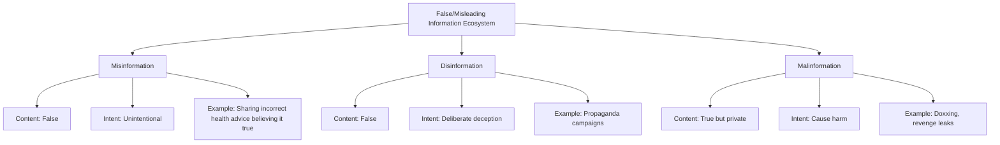
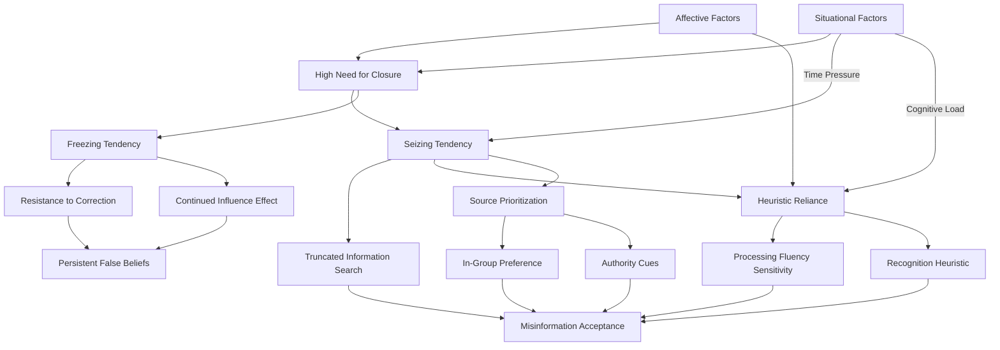
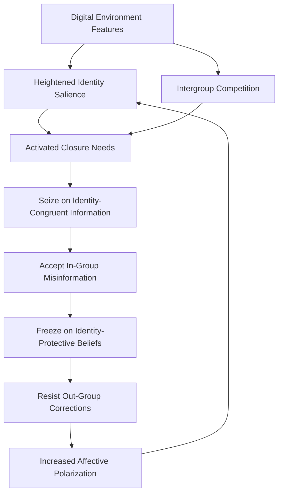
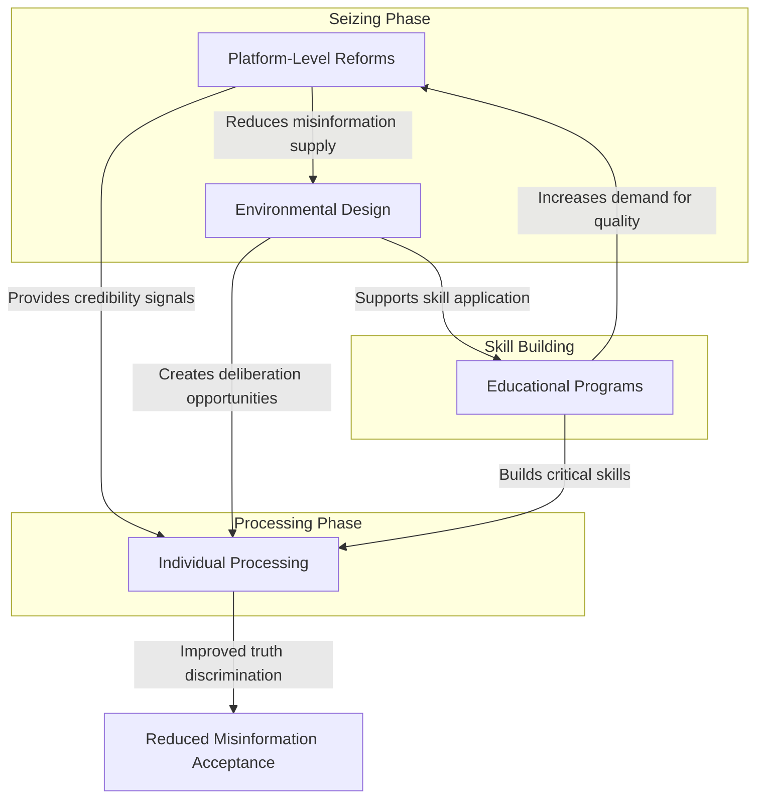

# The Seizing Mind: Unraveling the Role of Need for Closure in Misinformation Acceptance
# 1 Conceptual Foundations: Defining Need for Closure and Misinformation Acceptance

This chapter establishes the theoretical groundwork for understanding the relationship between need for closure and misinformation acceptance by precisely defining and operationalizing both core constructs. A rigorous conceptual foundation is essential for analyzing how motivational tendencies toward certainty may influence susceptibility to false information in contemporary information environments.

## 1.1 Need for Closure as a Motivated Cognitive Tendency

**Need for closure (NFC)** represents a fundamental epistemic motivation characterized by the desire for a definite answer to a question in order to terminate an aversive state of uncertainty, ambiguity, or confusion[^1]. This construct was formally introduced and systematically explored by social psychologist Arie Kruglanski and colleagues in the early 1990s, establishing it as a cornerstone of motivated cognition research[^2]. At its core, NFC functions as a **motivational "stopping mechanism"** that applies "brakes" to the epistemic process, allowing crystallized judgments to form even when further information processing could yield more accurate conclusions[^3].

The theoretical framework conceptualizes NFC as existing along a single motivational continuum. At one pole lies a **strong need for closure**, characterized by the urgent desire to attain definitive answers and maintain them once achieved. At the opposite pole lies the **need to avoid closure**, which is elevated when individuals perceive benefits in maintaining uncertainty (such as open-ended intellectual enjoyment or flexibility in decision-making) or perceive costs in possessing closure (such as fear of making invalid judgments or premature commitment to potentially incorrect positions)[^3]. This continuum model acknowledges that closure motivation is not simply the presence or absence of a trait, but rather a dynamic state influenced by both dispositional tendencies and situational pressures.

### The Dual Mechanisms: Seizing and Freezing

The behavioral and cognitive effects of NFC are driven by two intertwined epistemic tendencies that operate in sequence during the judgment formation process:

**The Urgency Tendency ("Seizing")** represents the drive to attain cognitive closure as quickly as possible. When this tendency is activated, individuals demonstrate reduced information processing, heightened reliance on cognitive shortcuts and heuristics, and rapid judgment formation based on early or readily available information. The seizing phase is characterized by a narrowed focus on information that can quickly resolve uncertainty, often at the expense of thorough deliberation or consideration of alternative perspectives. Individuals in this phase may "jump to conclusions" based on incomplete evidence, prioritizing speed of resolution over accuracy of judgment.

**The Permanence Tendency ("Freezing")** represents the complementary drive to maintain closure once it has been attained. This tendency manifests as cognitive rigidity, resistance to information that contradicts established beliefs, reduced susceptibility to persuasion, and a strong preference for consensus and consistency within one's belief system. The freezing phase protects existing judgments from challenge and revision, even when new evidence suggests those judgments may be incorrect or incomplete.

A critical theoretical insight concerns the **boundary condition** between these phases: the point of "belief crystallization" separates the seizing and freezing dynamics. Prior to crystallization, the urgency tendency dominates cognitive processing, driving rapid information acquisition and judgment formation. Following crystallization, the permanence tendency takes precedence, protecting the newly formed belief from subsequent challenge. This temporal sequence has profound implications for understanding how misinformation becomes entrenched in belief systems—once false information has been "seized" upon and beliefs have crystallized around it, the "freezing" tendency creates substantial barriers to subsequent correction.

### Situational and Individual Modulation

The position of any individual on the closure motivation continuum is determined by the interaction of dispositional factors (stable individual differences in closure needs) and situational factors that can temporarily elevate or reduce closure motivation. Research has identified several situational variables that increase NFC, including **time pressure** (which creates urgency to reach decisions quickly), **environmental noise or cognitive load** (which makes sustained information processing aversive), **fatigue** (which reduces capacity for deliberative thinking), and **accountability to others** (which can create pressure for decisive action)[^2][^3]. Conversely, factors such as **fear of invalidity** (concern about making incorrect judgments) and **high personal relevance** of decisions can temporarily reduce closure motivation by elevating the perceived costs of premature judgment.

People who obtain high scores on measures of dispositional NFC consistently demonstrate characteristic patterns: they **value order**, **dislike ambiguity**, **make decisions and form impressions quickly**, and **hold strong opinions**[^1]. These individuals are motivated to reduce uncertainty efficiently and maintain stable belief systems, tendencies that have important implications for their processing of information—including potentially false information—in complex informational environments.

## 1.2 Sub-Dimensions and Measurement of Need for Closure

The Need for Closure Scale (NFCS) represents the primary instrument for measuring individual differences in closure motivation. Understanding its structure and sub-dimensions is essential for appreciating how different facets of closure needs may relate to misinformation acceptance.

### The Five Sub-Dimensions of NFC

The NFCS operationalizes need for closure as a latent variable manifesting through five specific sub-dimensions, each capturing a distinct aspect of the broader motivation toward certainty:

| Sub-Dimension | Core Characteristic | Sample Item | Relevance to Information Processing |
|---------------|---------------------|-------------|-------------------------------------|
| **Need for Order** | Preference for structure and organization in environment and thinking | "I think that having clear rules and order at work is essential for success" | Drives preference for well-organized, unambiguous information |
| **Need for Predictability** | Desire for stable, reliable patterns and outcomes | "I don't like to go into a situation without knowing what I can expect from it" | Creates discomfort with novel or unexpected information |
| **Decisiveness** | Tendency to make decisions quickly and confidently | "I usually make important decisions quickly and confidently" | Reduces deliberation time and consideration of alternatives |
| **Discomfort with Ambiguity** | Aversion to uncertain or unclear situations | "I'd rather know bad news than stay in a state of uncertainty" | Motivates acceptance of any definitive answer over continued uncertainty |
| **Closed-Mindedness** | Resistance to considering alternative viewpoints | "I do not usually consult many different opinions before forming my own view" | Reduces exposure to corrective information and alternative perspectives |

Each sub-dimension contributes distinctively to the overall construct while sharing the common underlying motivation toward certainty and away from ambiguity. The **need for order** and **need for predictability** dimensions reflect preferences for environmental and cognitive structure that make complex or ambiguous information aversive. **Decisiveness** captures the behavioral tendency toward rapid judgment formation characteristic of the seizing phase. **Discomfort with ambiguity** directly reflects the aversive nature of uncertainty that drives closure motivation. **Closed-mindedness** relates most directly to the freezing phase, representing resistance to information that might challenge existing beliefs[^1][^4].

### Development and Validation of Measurement Instruments

The original NFCS was developed and published in 1994 by Webster and Kruglanski, consisting of 42 items rated on a 6-point scale from "strongly disagree" to "strongly agree"[^1][^4]. This comprehensive instrument was designed to assess individuals' "motivation with respect to information processing and judgment," specifically the desire for an answer in order to end further information processing, even if that answer is not the correct or best answer[^4].

An updated and refined version of the NFCS was published in 2007 by Roets and Van Hiel, who conducted systematic analyses to clarify the dimensional structure of the scale and separate ability-related factors from need-related factors[^1]. This work addressed concerns about potential confounds in the original scale and resulted in a more psychometrically refined instrument. Subsequently, Roets and Van Hiel (2011) developed and validated a **brief 15-item version** of the scale that maintains adequate coverage of the five sub-dimensions while reducing participant burden[^4].

The NFCS can be scored in two ways: as a **total NFC score** computed by summing all items, or as **sub-scale scores** for each of the five dimensions. Researchers must reference both the original Webster and Kruglanski (1994) scale and the Roets and Van Hiel revision when reporting results, acknowledging the developmental history of the instrument[^1]. The availability of both full and abbreviated versions provides flexibility for research applications while maintaining measurement validity.

## 1.3 Defining Misinformation Acceptance and Related Constructs

Precise definition of misinformation acceptance requires careful differentiation from several related but conceptually distinct phenomena. This conceptual clarity is essential for accurately specifying how need for closure may influence susceptibility to false information.

### Misinformation: Definition and Distinction from Related Concepts

**Misinformation** is defined as false or inaccurate information—essentially, "getting the facts wrong"[^5]. Critically, misinformation occurs when someone inadvertently spreads false information **without intent to lie or deceive**; it is simply false or inaccurate information shared without malicious purpose[^6]. This distinguishes misinformation from two related but distinct phenomena:

**Disinformation** refers to false information that is **deliberately intended to mislead**—intentionally misstating the facts[^5]. The crucial distinction lies in the speaker's intent: disinformation is "essentially a lie uttered with malicious intent," often pursued in service of some objective such as political manipulation, financial gain, or social disruption[^6]. While the content may be identical, the psychological and ethical dimensions differ fundamentally based on whether deception is purposeful.

**Malinformation** represents a third category: genuine information, typically private or revealing, that may be distributed in a campaign to cause harm to a person's reputation[^6]. Unlike misinformation and disinformation, malinformation involves factually accurate content deployed with harmful intent—the information itself is true, but its distribution serves malicious purposes.

The following diagram illustrates the relationships among these concepts:

This tripartite distinction has important implications for understanding misinformation acceptance. When individuals accept misinformation, they are endorsing or believing false information regardless of the original source's intent. However, the pathways to acceptance and the appropriate interventions may differ depending on whether the false information was initially created with deceptive intent (disinformation that becomes misinformation as it spreads) or arose from genuine error.

### Misinformation Acceptance versus the Misinformation Effect

It is essential to distinguish **misinformation acceptance** as examined in this report from the **misinformation effect** studied in eyewitness memory research. The misinformation effect refers to a specific memory phenomenon in which exposure to misleading post-event information alters individuals' memories of the original event, leading them to incorporate false details into their recollections[^7]. This effect operates primarily through memory mechanisms such as source confusion and memory trace updating.

**Misinformation acceptance**, by contrast, refers more broadly to the endorsement or belief in false information about the world—whether concerning current events, scientific facts, health recommendations, or other domains. While memory processes certainly contribute to misinformation acceptance, the phenomenon encompasses a wider range of cognitive, social, and motivational factors beyond memory distortion alone. Individuals may accept misinformation not because their memories have been altered, but because the false information aligns with their existing beliefs, satisfies motivational needs (such as the need for closure), or simply because they lack the knowledge or motivation to critically evaluate it.

### Misinformation Acceptance and Belief Updating

Misinformation acceptance must also be understood in relation to **normative belief updating** and **knowledge revision** processes. From a rational perspective, individuals should update their beliefs when presented with new, credible evidence that contradicts prior beliefs. However, research consistently demonstrates that misinformation continues to influence reasoning and judgment even after it has been explicitly corrected—a phenomenon known as the **continued influence effect**[^7].

The spread of misinformation and disinformation has produced significant real-world consequences, affecting society's ability to **improve public health**, **address climate change**, and **maintain stable democracy**[^5]. These consequences arise precisely because misinformation acceptance does not conform to normative models of belief revision: once accepted, false beliefs prove remarkably resistant to correction, continuing to shape attitudes and behaviors even when individuals acknowledge that the original information was false.

### The Stakes of Understanding Misinformation Acceptance

There are real risks in both over-labeling and under-addressing false information in public discourse. Rushing to label communication as "disinformation" without full understanding of a speaker's motive can have chilling effects on legitimate speech, and what is labeled "disinformation" today can sometimes be recognized as fact tomorrow as understanding evolves[^6]. At the same time, psychological science provides valuable insight into **how and why we are likely to believe misinformation and disinformation**, knowledge that can inform how individuals and societies protect themselves against its ill effects[^5]. The solution ultimately requires an informed citizenry capable of separating fact from fiction through critical evaluation rather than relying solely on external authorities to determine truth[^6].

## 1.4 Psychological Mechanisms Underlying Misinformation Acceptance

Understanding why individuals accept misinformation requires examination of the cognitive and social psychological mechanisms that make false information compelling. These mechanisms operate largely independently of the truth value of information, creating systematic vulnerabilities that can be exploited—intentionally or unintentionally—by false claims.

### Truth Bias and Default Acceptance

Humans operate with a fundamental **truth bias**—a default tendency to believe information presented to them rather than to doubt or reject it[^7]. This bias likely evolved as an adaptive response in social environments where most communication was honest; treating all information with suspicion would impose enormous cognitive costs and undermine social cooperation. However, in information environments where false claims are prevalent, this default acceptance creates vulnerability to misinformation.

The truth bias means that false information affects memory and judgment even in the absence of distraction or other factors that might impair critical evaluation[^7]. Individuals do not automatically engage skeptical analysis of incoming information; rather, acceptance is the default state that requires active effort to override. This has profound implications for misinformation acceptance: the burden falls on individuals to identify and reject false claims, rather than on information to prove its accuracy before being believed.

### Source Monitoring Errors

**Source monitoring** refers to the cognitive processes by which individuals attribute their memories and knowledge to their original sources—determining where they learned something, who told them, or whether they experienced it directly versus imagining it[^7]. Source monitoring errors occur when individuals misattribute information to incorrect sources, such as believing they read something in a credible news outlet when they actually encountered it on social media, or confusing information from fiction with factual knowledge.

These errors contribute to misinformation acceptance in several ways. Individuals may accept false claims because they misremember encountering them in credible sources. They may fail to discount information appropriately because they cannot recall that it came from an unreliable source. Over time, the content of information may persist in memory while the source information fades, leaving individuals with beliefs they cannot adequately evaluate because they no longer remember where those beliefs originated[^7].

### Processing Fluency and the Illusory Truth Effect

One of the most robust findings in misinformation research concerns the role of **processing fluency**—the subjective ease with which information is processed—as a cue to truth judgments[^7]. Information that is processed more easily (due to clear presentation, prior exposure, or other factors that facilitate comprehension) is judged as more likely to be true, independent of its actual accuracy.

This fluency-truth link underlies the **illusory truth effect**: the finding that repeated exposure to statements increases their perceived truth, regardless of their actual veracity[^7]. Meta-analytic evidence confirms that this effect is robust across diverse populations and statement types. The mechanism appears to involve fluency misattribution: repeated statements are processed more fluently due to familiarity, and this fluency is interpreted as a signal of truth rather than being correctly attributed to prior exposure.

The illusory truth effect has been demonstrated even for statements that contradict participants' prior knowledge, suggesting that fluency can override stored knowledge in truth judgments[^7]. **Prior exposure increases perceived accuracy of fake news**, and **mere repetition increases belief in factually true COVID-19-related information**—but also in false information[^7]. The effect appears equally strong for plausible and implausible statements, indicating that implausibility does not protect against fluency-based truth inflation[^7].

Several factors modulate the strength of the illusory truth effect:

| Factor | Effect on Illusory Truth | Mechanism |
|--------|--------------------------|-----------|
| Source credibility | Modulates but does not eliminate effect | Low-credibility sources still produce truth gains through repetition |
| Prior knowledge | Provides partial but incomplete protection | Fluency can override stored knowledge |
| Cognitive ability | Limited moderation | Effect robust across ability levels |
| Need for cognitive closure | Under investigation | May amplify reliance on fluency cues |
| Initial accuracy focus | Can prevent effect | Directing attention to accuracy before exposure reduces subsequent truth inflation |

### Analytical versus Intuitive Processing

Research distinguishes between two modes of cognitive processing relevant to misinformation acceptance: **intuitive (System 1) processing**, which is fast, automatic, and heuristic-based; and **analytical (System 2) processing**, which is slow, deliberate, and rule-based[^7]. Susceptibility to misinformation has been linked to reliance on intuitive processing and insufficient engagement of analytical processes.

Evidence suggests that **lack of reasoning rather than motivated reasoning** better explains susceptibility to partisan fake news[^7]. Individuals who score higher on measures of analytical thinking (such as the Cognitive Reflection Test) demonstrate greater ability to distinguish true from false news headlines[^7]. **Analytic thinking predicts hoax beliefs and helping behaviors** in response to events like the COVID-19 pandemic, with more analytical individuals showing greater resistance to false claims[^7]. Critically, **deliberation reduces belief in false (but not true) news headlines**, suggesting that engagement of analytical processes specifically targets misinformation without undermining acceptance of accurate information[^7].

An **initial accuracy focus**—prompting individuals to consider the accuracy of information before making judgments—can prevent the illusory truth effect, suggesting that directing attention toward accuracy engages analytical processes that counteract fluency-based acceptance[^7]. This finding has important implications for intervention design, suggesting that relatively simple prompts may be able to shift processing modes in ways that reduce misinformation acceptance.

### The Interaction of Cognitive and Motivational Factors

The psychological mechanisms underlying misinformation acceptance do not operate in isolation; rather, cognitive processes interact with motivational tendencies to produce patterns of susceptibility. This interaction is where need for closure becomes particularly relevant. The **seize-and-freeze** dynamic characteristic of high NFC may amplify reliance on processing fluency as a truth cue (during the seizing phase, when quick judgments are prioritized) while simultaneously reducing engagement of analytical processes that might identify information as false. Subsequently, the freezing tendency may protect accepted misinformation from correction by creating resistance to contradictory evidence.

The theoretical pathway linking NFC to misinformation acceptance operates through these established mechanisms: high NFC drives individuals to quickly "seize" upon information that offers clear, certain explanations—making simplistic or familiar misinformation particularly attractive—and then "freeze" on these judgments, resisting corrective evidence that would reintroduce uncertainty. Misinformation, especially conspiracy theories and simple causal narratives, provides the structured explanations that satisfy the need to reduce uncertainty, while the fluency and familiarity of repeated false claims provide the quick truth signals that high-NFC individuals prioritize.

This conceptual foundation—understanding NFC as a motivated cognitive tendency with specific mechanisms, and misinformation acceptance as a multiply-determined phenomenon involving truth bias, source monitoring, fluency, and processing mode—establishes the vocabulary and theoretical framework necessary for analyzing the pathways through which closure motivation influences susceptibility to false information in subsequent chapters.

## 2 Theoretical Pathways: How Need for Closure May Drive Misinformation Acceptance

Building upon the conceptual foundations established in Chapter 1, this chapter constructs and analyzes the theoretical causal pathways linking need for closure (NFC) to misinformation acceptance. The analysis synthesizes multiple theoretical perspectives to explain how the motivated cognitive tendency toward certainty creates systematic vulnerabilities to false information. By integrating the seize-and-freeze dynamic, heuristic processing, source evaluation biases, motivated reasoning, and affective factors, this chapter provides a comprehensive mechanistic account of NFC's influence on misinformation susceptibility. Understanding these pathways is essential not only for theoretical advancement but also for designing effective interventions that target the specific cognitive and motivational processes through which closure needs facilitate acceptance of false claims.

### 2.1 The Seize-and-Freeze Dynamic and Reduced Systematic Processing

The dual mechanisms of **seizing and freezing** that characterize high need for closure directly undermine the systematic information processing necessary for accurate truth discrimination. This section examines how these intertwined tendencies create vulnerabilities at different stages of information encounter and belief formation, ultimately facilitating misinformation acceptance while impeding subsequent correction.

#### The Urgency Tendency and Truncated Information Search

The **urgency tendency (seizing)** drives individuals with high NFC to attain cognitive closure as rapidly as possible, fundamentally altering how they engage with new information. Rather than conducting thorough evaluations of incoming claims, high-NFC individuals demonstrate a pattern of **reduced information processing** that prioritizes speed of judgment over accuracy of conclusion. This truncated information search has profound implications for misinformation acceptance: when individuals terminate their epistemic inquiry prematurely, they fail to encounter or adequately weigh evidence that might reveal the falsity of claims they have already begun to accept.

Research employing cognitive modeling approaches has systematically compared the predictive power of various theoretical accounts of misinformation acceptance. Studies using large experimental datasets with thousands of participants have found that models incorporating both analytical reasoning capacity (measured by Cognitive Reflection Test scores) and familiarity-based heuristics achieve high predictive accuracy for individual acceptance decisions[^8]. Critically, these findings suggest that the seizing phase involves not merely faster processing, but qualitatively different processing that relies on readily available cues rather than careful content evaluation. The urgency tendency leads high-NFC individuals to "jump to conclusions" based on **early or easily accessible information**, making them particularly vulnerable to misinformation that presents itself with apparent clarity and definitiveness.

The temporal dynamics of the seizing process are especially important for understanding misinformation vulnerability. During the initial encounter with information, individuals must decide how much cognitive effort to invest in evaluation. High-NFC individuals, driven by the urgency tendency, allocate insufficient time and resources to this evaluation phase. Experimental evidence demonstrates that **deliberation reduces belief in false (but not true) news headlines**, indicating that the rapid, truncated processing characteristic of seizing specifically undermines the ability to identify misinformation while leaving acceptance of accurate information relatively intact[^7]. This asymmetric effect reveals that the seizing tendency does not merely accelerate all judgments uniformly; rather, it selectively impairs the detection of falsehood, which typically requires more effortful processing than acceptance of truth.

#### The Permanence Tendency and Resistance to Correction

Once beliefs have crystallized around misinformation, the **permanence tendency (freezing)** creates formidable barriers to subsequent correction. This tendency manifests as cognitive rigidity, resistance to contradictory information, and strong preference for maintaining consistency within one's belief system. The freezing mechanism explains why misinformation continues to influence reasoning and judgment even after explicit correction—the phenomenon known as the **continued influence effect**.

The continued influence effect represents one of the most robust and troubling findings in misinformation research. Meta-analytic evidence confirms that corrections reduce but do not eliminate reliance on misinformation, with the original false information continuing to shape inferences and judgments even when individuals acknowledge that it has been retracted[^7]. For high-NFC individuals, the freezing tendency amplifies this effect: having invested cognitive resources in reaching closure, they are motivated to protect that closure from information that would reintroduce uncertainty. Corrections, by their nature, require individuals to acknowledge that their previous beliefs were incorrect—a state of uncertainty that high-NFC individuals find particularly aversive.

The mechanisms underlying continued influence involve both **integration and retrieval processes**. When individuals initially accept misinformation, it becomes integrated into their mental models of events or situations. Correcting misinformation requires updating these models, which is cognitively demanding and may leave the original misinformation more accessible in memory than the correction[^7]. For high-NFC individuals, the freezing tendency reduces motivation to engage in this effortful updating process. Furthermore, when retrieving information to make judgments, the original misinformation may come to mind more readily than the correction due to its greater familiarity and integration into existing knowledge structures—a retrieval advantage that the freezing tendency does nothing to counteract.

#### Pre-Crystallization Vulnerability

The theoretical framework identifies a critical **boundary condition** between seizing and freezing: the point of belief crystallization. This boundary has important implications for understanding when high-NFC individuals are most vulnerable to misinformation. Prior to crystallization, during the seizing phase, individuals are actively seeking information that can provide closure. At this stage, misinformation that offers clear, simple, and definitive explanations is particularly attractive to high-NFC individuals because it satisfies their urgent need for certainty.

The pre-crystallization phase represents a window of heightened vulnerability because misinformation encountered during this period can become the foundation for crystallized beliefs. Once misinformation has been "seized" upon and beliefs have formed around it, the transition to the freezing phase makes correction dramatically more difficult. This temporal sequence explains why **prebunking interventions**—which provide warnings or inoculation before misinformation is encountered—may be more effective than debunking interventions that attempt correction after beliefs have crystallized. High-NFC individuals, driven to reach closure quickly, may crystallize their beliefs around the first plausible explanation they encounter, making the timing of information exposure critically important.

The seize-and-freeze dynamic thus creates a two-stage vulnerability to misinformation: first, the urgency tendency leads to acceptance of false claims that offer quick resolution of uncertainty; second, the permanence tendency protects these false beliefs from subsequent correction. This dual vulnerability makes high NFC a significant risk factor for both initial misinformation acceptance and persistent belief in corrected misinformation.

### 2.2 Amplified Reliance on Cognitive Heuristics and Processing Fluency

Elevated need for closure systematically increases dependence on cognitive shortcuts that bypass careful content evaluation. This section analyzes the theoretical mechanisms through which closure motivation heightens sensitivity to heuristic cues—particularly processing fluency—and examines how this reliance creates specific vulnerabilities to misinformation.

#### Processing Fluency as a Truth Signal

**Processing fluency**—the subjective ease with which information is processed—serves as a primary heuristic cue for truth judgments. Information that is processed more easily, whether due to clear presentation, prior exposure, repetition, or other factors that facilitate comprehension, is systematically judged as more likely to be true. This fluency-truth link operates largely outside conscious awareness, making it a particularly insidious pathway to misinformation acceptance.

The theoretical connection between NFC and fluency reliance stems from the urgency tendency's demand for rapid judgment formation. When individuals seek to reach closure quickly, they necessarily rely on cues that can be processed rapidly—and fluency is among the fastest signals available. High-NFC individuals, driven to terminate uncertainty as quickly as possible, may be particularly inclined to interpret fluent processing as evidence of truth rather than engaging in the more effortful process of evaluating content accuracy directly.

Research has established that **repetition increases perceived truth even for known falsehoods**[^7]. This illusory truth effect occurs because repetition increases processing fluency, and people misinterpret this fluency as a signal for truth rather than correctly attributing it to prior exposure[^7]. The robustness of this effect is striking: it occurs even when statements contradict participants' prior knowledge, when statements are highly implausible, and across diverse populations and contexts. The illusion of truth arises from a **dissociation between source recollection and statement familiarity**—people may remember that a statement feels familiar without remembering where they encountered it or whether it was presented as true or false[^7].

#### The Illusory Truth Effect Across Individual Differences

A critical question for understanding NFC's role concerns whether individual differences in closure motivation moderate the strength of the illusory truth effect. Research has investigated the robustness of this effect across individual differences in cognitive ability, need for cognitive closure, and cognitive style[^7]. The findings reveal that the illusory truth effect is remarkably robust, occurring across these individual differences rather than being confined to particular cognitive profiles.

This robustness has important theoretical implications. On one hand, it suggests that fluency-based truth judgments represent a fundamental feature of human cognition that is not easily overridden by individual differences in motivation or ability. On the other hand, it indicates that high-NFC individuals are not uniquely susceptible to the illusory truth effect—rather, they share this vulnerability with the broader population. However, the interaction between NFC and fluency reliance may operate through different mechanisms: while all individuals show the illusory truth effect, high-NFC individuals may be more likely to encounter conditions that maximize fluency's influence (such as time pressure or cognitive load) and less likely to engage the effortful processing that can sometimes override fluency cues.

The finding that **experiential fluency and declarative advice jointly inform judgments of truth**[^7] suggests that fluency's influence can be modulated by explicit guidance. When individuals are advised that fluency is not a reliable indicator of truth, they can partially discount its influence. However, this modulation requires awareness and motivation to engage in corrective processing—resources that high-NFC individuals, driven by the urgency tendency, may be reluctant to expend.

#### The Recognition Heuristic and Familiarity-Based Judgments

Beyond processing fluency, high-NFC individuals may rely heavily on the **recognition heuristic**—the tendency to judge recognized or familiar stimuli more favorably than unrecognized stimuli. Cognitive modeling studies have found that the recognition heuristic performs well in predicting individual acceptance of news items, suggesting that familiarity serves as a powerful cue for truth judgments[^8].

The recognition heuristic operates on a simple principle: if something is recognized, it is likely important, prevalent, or true. This heuristic is adaptive in many contexts—familiar objects, people, and claims often are more relevant and reliable than unfamiliar ones. However, in information environments saturated with repeated misinformation, the recognition heuristic becomes a liability. False claims that have been widely shared, discussed, or debunked may become highly familiar, and this familiarity can paradoxically increase their perceived truth even when individuals have encountered them primarily in contexts that identified them as false.

Research has found that a participant's **perceived familiarity with a news item is a major factor in judging its accuracy**[^8]. This finding has direct implications for high-NFC individuals: their drive to reach closure quickly may lead them to rely heavily on familiarity as a judgment shortcut, accepting claims that feel familiar without engaging in the more effortful process of recalling where and how they encountered those claims. The recognition heuristic thus provides a fast-and-frugal decision strategy that satisfies the urgency tendency while creating vulnerability to familiar misinformation.

#### Fast-and-Frugal Decision Trees and Adaptive Toolboxes

Cognitive modeling research has explored various decision strategies that individuals employ when evaluating information, including **fast-and-frugal decision trees** that make judgments based on sequential evaluation of a small number of cues[^8]. These models capture the kind of simplified, heuristic-based processing that high-NFC individuals may prefer.

Interestingly, research on hybrid models—which combine different decision strategies—has found that combinations involving recognition-based models and cognitive reflection-based models achieve particularly high predictive accuracy[^8]. This finding suggests the existence of an **adaptive toolbox** of cognitive strategies that individuals deploy depending on context and motivation. High-NFC individuals may preferentially select tools from this adaptive toolbox that prioritize speed and certainty over accuracy—tools like the recognition heuristic and fluency-based judgments that can quickly resolve uncertainty even at the cost of increased error.

The concept of an adaptive toolbox has important implications for understanding NFC's role in misinformation acceptance. Rather than high-NFC individuals lacking the capacity for accurate judgment, they may possess the same range of cognitive tools as others but systematically favor those tools that satisfy their closure needs. This suggests that interventions might focus not on providing new cognitive tools but on shifting the selection criteria that determine which tools are deployed—encouraging high-NFC individuals to prioritize accuracy over speed in their tool selection.

### 2.3 Source Prioritization Over Content: In-Group Bias and Authority Cues

High-NFC individuals may systematically prioritize source characteristics over content accuracy when evaluating information, using source cues as shortcuts to determine what to believe. This section explores the theoretical basis for this source prioritization and its implications for misinformation acceptance.

#### Source Credibility and Persuasion

**Source credibility** fundamentally influences the acceptance of information and the effectiveness of corrections[^7]. Individuals are generally more persuaded by messages from sources they perceive as credible, expert, or trustworthy. For high-NFC individuals, source credibility may serve as a particularly attractive heuristic because it provides a basis for judgment that does not require careful evaluation of content. Rather than analyzing the accuracy of claims directly, high-NFC individuals can simply assess whether the source seems credible and accept or reject claims accordingly.

However, research has found that **emphasizing publishers does not effectively reduce susceptibility to misinformation on social media**[^7]. This finding suggests that source information, while influential, does not straightforwardly inoculate against misinformation. The relationship between source credibility and misinformation acceptance is more complex: individuals may attend to source information selectively, weighting it heavily when it supports acceptance of desired conclusions while discounting it when it would require rejection of appealing claims.

The effectiveness of corrections depends significantly on the credibility of the retraction source. **Corrective information from high-credibility sources is generally more effective**[^7], suggesting that source credibility matters not only for initial acceptance but also for belief revision. For high-NFC individuals who have frozen on misinformed beliefs, corrections from low-credibility or out-group sources may be easily dismissed, while corrections from high-credibility sources create greater pressure for belief revision—though the freezing tendency may still generate resistance.

#### In-Group Preference and Social Validation

Individuals are systematically **more persuaded by messages from in-group than out-group members**[^7]. This in-group preference reflects both cognitive and motivational factors: in-group messages are processed more fluently (a cognitive factor) and are more likely to be perceived as relevant and trustworthy (a motivational factor). For high-NFC individuals, in-group sources may be particularly attractive because they offer social validation for beliefs—a form of closure that combines cognitive certainty with social belonging.

The preference for in-group sources has important implications for misinformation acceptance in polarized information environments. When misinformation circulates within ideologically homogeneous communities, high-NFC individuals may accept it based on its in-group provenance without carefully evaluating its accuracy. Conversely, corrections from out-group sources may be rejected precisely because of their out-group origin, regardless of their accuracy. This pattern creates conditions in which misinformation can flourish within communities while corrections fail to penetrate.

**Public perceptions of expert credibility on policy issues are influenced by expert framing and political worldviews**[^7]. This finding suggests that even ostensibly objective markers of credibility—such as scientific expertise—are filtered through partisan lenses. High-NFC individuals, seeking quick resolution of uncertainty, may rely on whether experts are perceived as ideologically aligned rather than evaluating the quality of their evidence. This creates vulnerability to misinformation from ideologically congruent sources while generating resistance to accurate information from ideologically distant sources.

#### Source Monitoring Failures and Closure Motivation

**Source monitoring**—the cognitive process of attributing memories and beliefs to their origins—is crucial for assessing the veracity of information[^7]. Failures of source monitoring can lead people to believe misinformation, particularly when they fail to recall that information came from a low-credibility source. Beliefs can persist even after their original source is discredited if people remember the content but forget the source or its connection to the content[^7].

For high-NFC individuals, source monitoring may be particularly vulnerable because the urgency tendency prioritizes rapid judgment over careful encoding of source information. When individuals are motivated to reach closure quickly, they may encode the content of claims without adequately encoding contextual information about where those claims originated. Subsequently, when retrieving information to make judgments, they may recall claims without recalling the sources—leaving them unable to appropriately discount information from unreliable origins.

The interaction between source monitoring and closure motivation creates a specific pathway to misinformation acceptance: high-NFC individuals may accept claims from unreliable sources during the seizing phase, fail to adequately encode source information, and subsequently be unable to discount those claims even if they would have rejected them had they remembered their unreliable provenance. This pathway is particularly concerning in social media environments where source information is often ambiguous, rapidly changing, or deliberately obscured.

### 2.4 Motivated Reasoning and Worldview Protection

The interplay between need for closure and motivated reasoning represents a theoretically important but empirically contested pathway to misinformation acceptance. This section examines how the freezing tendency may create directional goals that bias information processing, while critically evaluating competing theoretical accounts.

#### The Freezing Tendency and Directional Motivation

Once beliefs have crystallized, the **permanence tendency (freezing)** creates motivation to protect those beliefs from challenge. This protection motivation can manifest as **motivated reasoning**—the tendency to process information in ways that support desired conclusions rather than accurate conclusions. For high-NFC individuals who have frozen on beliefs that happen to be false, motivated reasoning would predict systematic bias in how they evaluate subsequent information: evidence supporting their beliefs would be accepted readily, while evidence challenging their beliefs would be subjected to heightened scrutiny or dismissed entirely.

The theoretical connection between freezing and motivated reasoning is straightforward: if individuals are motivated to maintain closure, they should be motivated to reject information that would disrupt that closure. Corrections to misinformation, by definition, require individuals to acknowledge error and revise beliefs—precisely the kind of uncertainty-inducing process that high-NFC individuals seek to avoid. Motivated reasoning thus provides a mechanism through which the freezing tendency could actively defend misinformed beliefs rather than merely passively resisting correction.

#### Classical Reasoning Versus Motivated Reasoning

However, empirical evidence presents a more complex picture than the motivated reasoning account would predict. Cognitive modeling studies have systematically compared the predictive power of motivated reasoning models against classical reasoning models in explaining misinformation acceptance[^8]. The results provide stronger support for classical reasoning accounts.

Research using the CCOBRA framework to test models' ability to predict individual acceptance decisions found that **classical reasoning models outperformed motivated reasoning models**[^8]. Specifically, an implementation of motivated reasoning (the Motivated System 2 Reasoning model, or MS2R) predicted that higher cognitive reflection would increase the likelihood of accepting news items favorable to one's political party while rejecting contradictory ones. However, this model performed poorly, achieving predictive accuracy only slightly above chance (0.55-0.59 across experiments)[^8]. In contrast, classical reasoning models—which predict that analytical thinking increases correct identification of misinformation regardless of partisan alignment—achieved substantially higher predictive accuracy.

These findings support the conclusion that **susceptibility to partisan fake news is better explained by lack of reasoning than by motivated reasoning**[^7]. Rather than analytical thinking strengthening biased processing of identity-consistent information, analytical thinking appears to improve truth discrimination across the board. This suggests that high-NFC individuals' vulnerability to misinformation stems primarily from reduced analytical engagement (the seizing tendency) rather than from directional bias in how they process information (motivated reasoning).

#### The Van Bavel Identity-Based Model

Interestingly, a model based on Jay Van Bavel's identity-based account of misinformation processing performed very well in predictive accuracy, achieving 0.83-0.86 across experiments[^8]. This model incorporates multiple factors: intellectual style (cognitive reflection), memory (familiarity), partisan bias, and polarization. Its success suggests that misinformation acceptance is **multiply determined**, with identity-related factors playing a role alongside—rather than instead of—classical reasoning processes.

The Van Bavel model's success has important implications for understanding NFC's role. Rather than motivated reasoning operating as a primary pathway, identity-related factors may interact with closure motivation in more nuanced ways. High-NFC individuals may not actively reason in biased directions so much as they fail to engage reasoning processes that would correct initial biased impressions. The identity-based account suggests that partisan cues influence the initial impressions that high-NFC individuals seize upon, while the freezing tendency protects these impressions from subsequent analytical correction.

#### Reconciling Competing Accounts

The empirical evidence suggests a more nuanced theoretical account than either pure motivated reasoning or pure classical reasoning would provide. The following framework reconciles the competing findings:

1. **Initial impressions** are influenced by identity-related factors, including partisan alignment and in-group cues
2. **The seizing tendency** leads high-NFC individuals to accept these initial impressions without engaging analytical processes that might correct them
3. **The freezing tendency** protects accepted beliefs from correction, but this protection operates through resistance to belief revision generally rather than through directional motivated reasoning specifically
4. **Analytical engagement**, when it occurs, improves truth discrimination regardless of partisan alignment—but high-NFC individuals are less likely to engage analytical processes

This reconciled account explains why motivated reasoning models perform poorly while identity-based models perform well: identity factors influence what information is initially salient and attractive, but the subsequent processing of that information follows classical rather than motivated patterns. High-NFC individuals' vulnerability stems from their failure to engage analytical processes rather than from their engagement of biased analytical processes.

### 2.5 Affective Pathways: Anxiety, Uncertainty Aversion, and Emotional Amplification

Emotional states play a significant role in amplifying the connection between need for closure and misinformation acceptance. This section analyzes how anxiety, mood, and uncertainty aversion interact with closure motivation to create heightened vulnerability to false information.

#### Anxiety, Threat, and Elevated Closure Needs

Anxiety and perceived threat systematically increase need for closure by making uncertainty more aversive. When individuals feel threatened or anxious, the psychological costs of remaining uncertain increase—uncertainty becomes not merely uncomfortable but potentially dangerous. This threat-induced elevation of closure needs creates heightened vulnerability to misinformation that offers simple, certain explanations for threatening situations.

The COVID-19 pandemic provides a paradigmatic example of this dynamic. Facing a novel, uncertain, and threatening situation, individuals experienced elevated anxiety that increased their need for closure. Misinformation offering simple explanations (conspiracy theories about the virus's origins, false claims about treatments, exaggerated or minimized risk assessments) became attractive precisely because it reduced the uncertainty that made the situation so anxiety-provoking. Research has documented that **anger contributes to the spread of COVID-19 misinformation**[^7], suggesting that negative emotional states more broadly facilitate misinformation transmission.

The theoretical pathway operates as follows: threat → anxiety → elevated NFC → increased seizing on available explanations → acceptance of misinformation that provides certainty. This pathway explains why misinformation often flourishes during crises, when anxiety is elevated and the need for certain answers is most acute. High-NFC individuals, already predisposed toward closure-seeking, may be particularly vulnerable during threatening situations that further elevate their closure motivation.

#### Mood, Fluency, and Truth Judgments

Research has documented complex interactions between mood and truth judgments. **Positive mood can increase reliance on fluency for truth judgments**[^7], suggesting that happy individuals may be more susceptible to the illusory truth effect. This finding aligns with broader research indicating that positive mood promotes heuristic processing while negative mood promotes systematic processing.

The interaction between mood and processing fluency has important implications for NFC's role in misinformation acceptance. If positive mood increases fluency reliance, and high NFC increases reliance on heuristic cues including fluency, then high-NFC individuals in positive moods may be doubly vulnerable to fluency-based misinformation acceptance. Conversely, negative mood might be expected to promote more careful processing—but for high-NFC individuals, negative mood might instead trigger compensatory certainty-seeking that increases misinformation vulnerability.

Research on mood and skepticism suggests that **negative mood can promote skepticism and careful processing**[^7], potentially providing some protection against misinformation. However, this protection may be limited for high-NFC individuals, for whom negative mood might increase the aversiveness of uncertainty and thereby strengthen rather than weaken the drive toward closure. The relationship between mood and misinformation acceptance for high-NFC individuals may thus be non-linear, with both positive mood (increasing fluency reliance) and negative mood (increasing closure urgency) creating vulnerability through different mechanisms.

#### Emotional Content and Misinformation Acceptance

Misinformation often carries emotional content that may facilitate its acceptance. **Emotional news affects social judgments independent of perceived media credibility**[^7], suggesting that emotional resonance can override source evaluation processes. For high-NFC individuals seeking quick resolution of uncertainty, emotionally compelling misinformation may be particularly attractive because it provides not only cognitive closure but also emotional resolution.

The role of emotional content in misinformation acceptance connects to broader research on persuasion and attitude change. Emotional appeals can be highly persuasive, and misinformation that evokes strong emotions (fear, anger, hope, disgust) may be processed and accepted more readily than emotionally neutral information. High-NFC individuals, prioritizing rapid closure, may be especially susceptible to emotional misinformation that provides quick emotional as well as cognitive resolution.

Research has found that **reliance on emotion promotes belief in fake news**[^7], consistent with the idea that emotional processing can bypass careful content evaluation. For high-NFC individuals, the urgency tendency may lead them to rely on emotional reactions as rapid indicators of truth or importance, accepting emotionally compelling misinformation without engaging the analytical processes that might reveal its falsity.

### 2.6 Integrative Model: Multiple Pathways to Misinformation Acceptance

The preceding analyses reveal that need for closure influences misinformation acceptance through multiple, potentially interacting pathways. This section synthesizes these pathways into a coherent integrative model and identifies key boundary conditions and testable predictions.

#### A Multi-Pathway Framework

The following diagram presents an integrative model of how NFC drives misinformation acceptance:

This model identifies several distinct pathways through which NFC influences misinformation acceptance:

| Pathway | Mechanism | Phase | Primary Vulnerability |
|---------|-----------|-------|----------------------|
| **Truncated Search** | Reduced information processing terminates before accuracy assessment | Seizing | Initial acceptance of false claims |
| **Fluency Reliance** | Processing ease misinterpreted as truth signal | Seizing | Illusory truth effect, repeated misinformation |
| **Recognition Heuristic** | Familiarity used as judgment shortcut | Seizing | Familiar misinformation accepted |
| **Source Prioritization** | Source cues override content evaluation | Seizing | In-group misinformation accepted |
| **Resistance to Correction** | Motivation to maintain closure blocks revision | Freezing | Corrections ineffective |
| **Continued Influence** | Misinformation integrated into mental models | Freezing | False beliefs persist after correction |

These pathways are not mutually exclusive; rather, they may operate simultaneously and reinforce one another. For example, misinformation that is both familiar (activating the recognition heuristic) and from an in-group source (activating source prioritization) may be particularly likely to be accepted by high-NFC individuals. Similarly, misinformation that has been deeply integrated into mental models (continued influence) may be particularly resistant to correction (resistance to correction).

#### Boundary Conditions and Moderating Variables

The integrative model identifies several boundary conditions that determine when and how NFC influences misinformation acceptance:

**Belief Crystallization**: The transition from seizing to freezing marks a critical boundary. Prior to crystallization, high-NFC individuals are vulnerable to accepting misinformation that offers quick closure. After crystallization, they become resistant to corrections that would disrupt closure. Interventions may be more effective when delivered before crystallization occurs.

**Situational Factors**: Time pressure, cognitive load, fatigue, and threat all elevate closure motivation, potentially strengthening the NFC-misinformation link. Conversely, factors that reduce closure motivation (such as accountability for accuracy) may weaken this link.

**Information Characteristics**: Misinformation that offers simple, clear, and definitive explanations is particularly attractive to high-NFC individuals. Complex, nuanced, or probabilistic information may be less likely to satisfy closure needs and thus less likely to be seized upon.

**Source Characteristics**: Misinformation from in-group, familiar, or authoritative sources is more likely to be accepted by high-NFC individuals who prioritize source cues over content evaluation.

**Cognitive Ability**: Research indicates that **fluid intelligence is associated with a more pronounced correction effect**, while need for cognition does not significantly predict correction success[^9]. This suggests that cognitive ability moderates the freezing pathway: high-NFC individuals with greater fluid intelligence may be better able to integrate corrections despite their motivation to maintain closure.

#### Testable Predictions

The integrative model generates several testable predictions for empirical evaluation:

1. **Seizing predictions**: High-NFC individuals should show faster acceptance decisions, reduced information search, and greater reliance on heuristic cues compared to low-NFC individuals, particularly under time pressure or cognitive load.

2. **Fluency predictions**: The illusory truth effect should be moderated by situational factors that elevate closure motivation, with stronger effects under conditions of threat or time pressure.

3. **Source predictions**: High-NFC individuals should show greater acceptance of misinformation from in-group sources and greater rejection of corrections from out-group sources compared to low-NFC individuals.

4. **Freezing predictions**: High-NFC individuals should show stronger continued influence effects and greater resistance to corrections, particularly for misinformation that has been deeply integrated into mental models.

5. **Interaction predictions**: The combination of high NFC and low fluid intelligence should produce the strongest misinformation acceptance and weakest correction effects, as both the motivation to maintain closure and the capacity to integrate corrections are compromised.

#### Implications for Intervention Design

The multi-pathway model suggests that effective interventions must address multiple mechanisms rather than targeting a single pathway. Interventions that only reduce fluency reliance, for example, may be undermined by source prioritization or resistance to correction. Comprehensive intervention strategies should:

- **Target the seizing phase** by encouraging deliberation before belief crystallization
- **Reduce heuristic reliance** by promoting accuracy motivation and analytical engagement
- **Address source biases** by providing corrections from credible, in-group sources
- **Overcome freezing** by making corrections highly accessible and providing alternative explanations
- **Consider individual differences** in cognitive ability when designing correction messages

The theoretical pathways analyzed in this chapter provide a foundation for understanding not only why high-NFC individuals are vulnerable to misinformation but also how that vulnerability might be addressed. The subsequent chapters will examine empirical evidence testing these pathways and explore practical interventions derived from this theoretical framework.

## 3 Empirical Evidence: A Synthesis of Research Findings

This chapter critically reviews and synthesizes the empirical literature examining the relationship between need for closure and misinformation acceptance. Moving from the theoretical pathways outlined in Chapter 2, this chapter evaluates the actual empirical support for those mechanisms by examining direct evidence from studies measuring NFC and belief in false information, analyzing findings on NFC-related cognitive biases such as jumping-to-conclusions and resistance to persuasion, and assessing how NFC compares to other predictive factors within cognitive modeling frameworks. The synthesis reveals a consistent but nuanced pattern: while NFC shows reliable positive associations with misinformation acceptance, its independent predictive power is modest compared to other factors, and the mechanisms through which it operates appear more complex than simple theoretical accounts would suggest.

### 3.1 Direct Evidence: NFC and Acceptance of Conspiracy Theories and Misinformation

The most direct evidence for the relationship between need for cognitive closure and misinformation acceptance comes from large-scale survey studies examining belief in conspiracy theories, particularly those surrounding the COVID-19 pandemic. These studies provide convergent evidence for a **positive but modest association** between NFC and acceptance of false beliefs, while simultaneously revealing that other factors—particularly institutional trust—exert substantially stronger influence.

#### Representative Survey Evidence from the German Population

A comprehensive research program using data from multiple waves of a representative survey among the German population (N = 2,883) provides particularly robust evidence for the NFC-misinformation relationship[^10]. This research design incorporated a critical methodological strength: the need for cognitive closure and general political trust were assessed **before the COVID-19 pandemic** (December 2018–February 2019 for NFC, and June–August 2018 for political trust), while belief in COVID-19 conspiracy theories and specific trust in handling the crisis were measured during the second wave of the pandemic (August–October 2020)[^10]. This temporal separation allows researchers to examine how pre-existing dispositional tendencies predict subsequent conspiracy belief formation, providing stronger evidence for directional effects than purely cross-sectional designs.

The results consistently demonstrate that **individuals with a high need for cognitive closure are more likely to accept conspiracy narratives**, supporting the theoretical prediction that closure motivation facilitates acceptance of simplistic explanations for complex events[^10]. At the bivariate level, NFC showed a weak positive association with belief in conspiracy theories[^10][^11]. This finding aligns with theoretical predictions: conspiracy theories provide the kind of structured, definitive explanations that satisfy the need to reduce uncertainty, making them particularly attractive to high-NFC individuals seeking cognitive closure[^11].

However, the **effect size for NFC is consistently reported as small** across these studies[^10][^11]. Regression analyses predicting endorsement of COVID-19 conspiracies accounted for between 20.7% and 36.8% of the variance, but NFC's contribution to this explained variance was relatively modest compared to other predictors[^10]. The need for closure was positively related to conspiracy beliefs, but its effect size was small relative to other factors in the models[^10][^11].

#### The Dominance of Political Trust as a Predictor

Perhaps the most striking finding from this body of research concerns the **comparative predictive power of political trust versus NFC**. Both pre-pandemic political trust and concurrent trust in political and medical institutions were **strongly negatively related** to conspiracy beliefs[^10][^11]. In fact, political trust and specific crisis trust emerged as **the most influential factors** in predicting conspiracy beliefs, with effect sizes substantially larger than that of NFC[^10][^11].

This pattern has important theoretical implications. The researchers concluded that their study "finds only small effects for individual differences in the need for cognitive closure but strong effects for political trust in explaining conspiracy beliefs"[^10]. This finding **relativizes the importance of individual differences in epistemic needs** in explaining conspiracy beliefs and underlines the importance of a lack of trust in political institutions for democratic societies in the age of misinformation[^10].

The following table summarizes the comparative predictive strength of key factors:

| Predictor | Relationship to Conspiracy Beliefs | Effect Size | Relative Importance |
|-----------|-----------------------------------|-------------|---------------------|
| Need for Cognitive Closure | Positive | Small | Marginal |
| Pre-pandemic Political Trust | Negative | Strong | Most influential |
| Concurrent Crisis Trust | Negative | Strong | Most influential |
| Higher Education | Negative | Moderate | Significant |
| Increased Age | Negative | Moderate | Significant |

#### The Absence of Hypothesized Moderation Effects

The German research program also tested theoretically motivated hypotheses about interaction effects between NFC and political trust. The researchers hypothesized that individuals high in NFC and low in political trust would "seize on conspiracy accounts," whereas those high in both NFC and political trust would be more likely to disregard conspiracies[^10][^11]. This hypothesis was based on the theoretical reasoning that high-NFC individuals should accept whatever information satisfies their closure needs—whether conspiracy theories or official explanations—depending on their trust in information sources.

However, the studies **found no support for a moderating effect of political trust** on the relationship between NFC and conspiracy beliefs[^10][^11]. The relationship between NFC and acceptance of COVID-19 conspiracy narratives was not moderated by levels of political or crisis-specific trust in institutions[^10][^11]. This null finding suggests that NFC operates relatively independently of trust factors, rather than interacting with them in the hypothesized manner. The results "do not support the assumption that the effect of NFC is contingent on prior trust in the political system"[^11].

#### Population-Level Patterns of Conspiracy Belief

The research also provides important contextual information about the distribution of conspiracy beliefs in the population. The data show that **most citizens were not susceptible to coronavirus-related conspiracy theories** at the time of the survey[^10]. Only 7.8% thought it very likely that the virus is a biological weapon, 7.4% believed it was a means to limit civil rights, and 8.8% believed the dangers were exaggerated. The mean value for the conspiracy belief index was 2.50 on a seven-point scale[^10]. This distribution suggests that while conspiracy beliefs exist, they are not the majority position—a finding that contextualizes the role of individual difference factors like NFC in predicting who falls into the susceptible minority.

#### Epistemic Vice as an Alternative Framework

Research examining alternative individual difference predictors has found that **epistemic vice** may be a stronger predictor of misinformation susceptibility than NFC. A study using a novel Epistemic Vice Scale found "overwhelming evidence to the effect that epistemic vice is associated with susceptibility to COVID-19 misinformation"[^12]. Critically, this association was **stronger than with political identity, educational attainment, scores on the Cognitive Reflection Test, personality, dogmatism, and need for closure**[^12]. Epistemic vices are character traits that interfere with acquiring, maintaining, and transmitting knowledge—traits like indifference to truth or rigidity in belief structures. This finding suggests that NFC may be one component of a broader constellation of epistemic traits that influence misinformation susceptibility, rather than a primary causal factor in its own right.

### 3.2 NFC-Related Cognitive Biases: Jumping-to-Conclusions and Data-Gathering Patterns

The theoretical pathway linking NFC to misinformation acceptance emphasizes the "seizing" tendency—the drive to reach conclusions quickly based on limited information. This section examines empirical evidence on the **jumping-to-conclusions (JTC) bias** and its relationship to need for closure, evaluating whether these constructs are causally linked as theoretical accounts would suggest.

#### The Jumping-to-Conclusions Bias: Definition and Measurement

The jumping-to-conclusions bias refers to **the gathering of minimal data when making overconfident probabilistic judgments**[^13]. This bias is typically assessed using probability judgment tasks, such as the "beads task," in which participants observe draws from jars containing different ratios of colored beads and must decide which jar is being sampled. JTC is operationally defined as making a decision with certainty based on insufficient information—typically, deciding after fewer than three evidence presentations[^14][^15].

Research has established that JTC is **consistently evident in individuals with psychotic disorders** compared to healthy controls, with a moderate aggregated effect size[^15]. A meta-analysis found that "there was a hastier data-gathering style in patients with psychosis than healthy individuals"[^15]. However, the same meta-analysis found that after controlling for outliers and publication bias, JTC was **not significantly associated with non-psychotic disorders**, suggesting that it is not a transdiagnostic phenomenon beyond psychosis[^15].

#### Independence of NFC and JTC in Predicting Delusion-Proneness

A critical study examined whether NFC motivates JTC bias, which would in turn lead to delusion-proneness—a theoretical pathway analogous to how NFC might drive hasty acceptance of misinformation. Fifty-eight nonclinical adults were assessed for JTC bias using an experimental reasoning task, and for NFC, decisiveness, and delusion-proneness using questionnaires[^13].

The results revealed a surprising pattern: **delusion-proneness was associated independently with both NFC and JTC bias, but there was no evidence of a direct relationship between NFC and JTC**[^13]. These findings "discount the view that need for closure motivates a jumping-to-conclusions bias, leading, in turn, to delusion-proneness"[^13]. Instead, NFC and JTC appear to be **separate pathways** to susceptibility to false beliefs, each contributing independently rather than one mediating the other.

This independence has important implications for understanding misinformation acceptance. If NFC does not directly cause JTC bias, then the mechanism through which NFC influences misinformation acceptance may not be primarily through hasty data-gathering. Alternative mechanisms—such as resistance to correction, preference for simple explanations, or reliance on source cues—may be more important than the seizing tendency per se.

#### Differential Relationships of NFC Sub-Dimensions

The research on NFC and delusion-proneness also revealed that **the various facets of NFC proved to be independent** in their relationships with outcomes[^13]. While **intolerance of ambiguity correlated positively with delusion-proneness**, **decisiveness correlated negatively**[^13]. This finding was replicated using different scales, establishing that delusion-prone individuals are **more indecisive in everyday life** despite their tendency toward premature conclusions in laboratory tasks[^13].

This paradox—that individuals prone to false beliefs show both intolerance of ambiguity and everyday indecisiveness—suggests that NFC is not a unitary construct with uniform effects on information processing. The different sub-dimensions may have opposing relationships with misinformation acceptance: discomfort with ambiguity may increase acceptance of definitive (if false) claims, while indecisiveness may reflect underlying uncertainty that makes individuals vulnerable to persuasion. The finding that "delusion-proneness is associated independently with jumping-to-conclusions bias on experimental reasoning tasks, intolerance of ambiguity, and indecision concerning real-life dilemmas"[^13] suggests multiple, potentially conflicting pathways from NFC-related traits to false belief acceptance.

#### Mechanisms of Reasoning Errors Beyond Data-Gathering

Research on reasoning errors in clinical populations has revealed that **limited data-gathering is only one mechanism** underlying incorrect conclusions[^14]. In a study of 204 individuals with schizophrenia spectrum disorders, making hasty decisions (JTC) was associated with reasoning errors—individuals who made hasty decisions were more than three times as likely to make reasoning errors (OR=3.2)[^14]. However, only 37% of hasty reasoning errors were consistent with the limited evidence gathered; the majority (63%) were **"inconsistent errors" that directly contradicted all presented evidence**[^14].

This finding suggests that JTC involves more than simply gathering insufficient data—it also involves **ignoring or contradicting available evidence**. The researchers concluded that "limited data collection is a factor in arriving at incorrect conclusions, but it is not the only mechanism"[^14]. For misinformation acceptance, this implies that high-NFC individuals may not merely accept false claims due to insufficient evaluation; they may also actively discount contradictory evidence in ways that go beyond simple information truncation.

#### Implications for the Seizing Mechanism

The evidence on JTC bias complicates the theoretical account of how NFC's seizing tendency facilitates misinformation acceptance. The finding that NFC and JTC are independently associated with delusion-proneness suggests that the urgency tendency may not operate primarily through hasty data-gathering. Instead, NFC may influence misinformation acceptance through other mechanisms—such as preference for certainty-providing explanations, resistance to belief revision, or reliance on heuristic cues—that operate independently of the specific data-gathering patterns captured by JTC tasks.

Furthermore, the finding that JTC involves evidence-ignoring as well as evidence-truncating suggests that interventions targeting misinformation acceptance may need to address not only the quantity of information processing but also its quality. Simply encouraging individuals to gather more information may be insufficient if they continue to discount or contradict that information in their conclusions.

### 3.3 Resistance to Persuasion and the Freezing Dynamic: Experimental Evidence

The theoretical framework predicts that once beliefs have crystallized, high-NFC individuals should show greater resistance to persuasion due to the "freezing" tendency. This section examines experimental evidence testing this prediction, revealing a more nuanced pattern in which NFC's effects on persuasion depend critically on whether individuals possess prior beliefs.

#### The Interaction of NFC and Prior Information

A series of three experiments systematically investigated the relationship between need for cognitive closure and persuasion, revealing a critical **interaction between NFC and the presence of an initial informational base**[^16][^17]. The central finding was that NFC's effect on persuasion depends on whether individuals already possess relevant beliefs or knowledge.

In the first study, subjects high on an individual-differences measure of NFC were **more resistant to persuasion** by their low-NFC counterparts than vice versa[^16][^17]. This finding aligns with the freezing hypothesis: high-NFC individuals, having formed beliefs, resist information that would disrupt those beliefs.

However, the second study revealed the boundary condition for this effect. Using a situational manipulation of NFC (noisy versus quiet environment), subjects in the noisy environment (assumed to instill higher NFC) were more resistant to persuasion than those in the quiet environment, **but only in the presence of an initial informational base for an opinion**[^17]. In its absence, subjects in the noisy environment were **less resistant to persuasion**[^16][^17]. This interaction was replicated in the third experiment using the individual-differences measure of NFC[^17].

The theoretical interpretation is that "depending on prior information, need for closure may differently impact individuals' mode of information processing, which in turn may affect their reactions to persuasion"[^17]. In the presence of an informational base, high-NFC individuals use it to form a definite position and adhere to it, making them resistant to new advocacy. In the absence of such a base, high-NFC individuals are **more persuadable** because they are "ready to embrace any advocacy as a means of attaining closure"[^17].

#### Implications for Misinformation Acceptance and Correction

This pattern has profound implications for understanding when high-NFC individuals are vulnerable to misinformation versus resistant to correction:

| Condition | NFC Effect | Mechanism | Implication for Misinformation |
|-----------|-----------|-----------|-------------------------------|
| No prior beliefs | High NFC → More persuadable | Urgency to attain closure | Vulnerable to initial misinformation |
| Prior beliefs present | High NFC → More resistant | Permanence tendency protects closure | Resistant to corrections |

This pattern explains why misinformation can be both easily accepted and difficult to correct in high-NFC individuals. Before encountering misinformation, high-NFC individuals are in a state of heightened persuadability, ready to accept any information that provides closure. Once misinformation has been accepted and beliefs have crystallized, the same individuals become highly resistant to corrections that would disrupt their achieved closure. The timing of information exposure is thus critical: misinformation encountered first may be accepted and then defended, while corrections encountered later may be rejected.

#### The Break-in-the-Message Effect

Additional evidence for NFC's influence on information processing comes from research on the **break-in-the-message effect**—the finding that cutting a message into smaller portions (such as a headline followed by an elaboration with a temporal break) increases the influence of the initial information over subsequent, often inconsistent, elaboration[^18].

An experiment with 103 male university students tested whether NFC moderates this effect[^18]. Participants listened to a radio story about a patient's death, with the headline describing the death and a doctor's initial diagnosis, followed by an elaboration providing justifications for the doctor's actions. In the break-in-the-message condition, a 2-minute musical interval separated the headline from the elaboration; the control condition presented the story continuously[^18].

The results showed **significant main effects for both the message manipulation and NFC score, and a significant interaction effect**[^18]. The break in the message increased the severity of negative moral judgments, and high NFC was connected with more punitive assessments. Critically, simple slopes analysis revealed that for individuals with low NFC, the effect of the time break manipulation was non-significant. However, **for individuals with high NFC, the effect was significant**, indicating that "the break-in-the-message effect is found mainly for participants with high need for closure"[^18].

This finding demonstrates that high-NFC individuals are particularly susceptible to forming premature judgments based on initial, simplistic information (headlines) and discounting subsequent corrections or elaborations. The media practice of presenting information in fragments—common in news headlines, social media posts, and breaking news alerts—may thus be **especially impactful on high-NFC recipients**, leading them to "premature, overconfident moral judgments based on the initial, simplistic headline"[^18].

#### Synthesis: The Freezing Dynamic in Context

The experimental evidence supports a nuanced understanding of the freezing dynamic. High-NFC individuals are not uniformly resistant to all information; rather, their resistance is **conditional on having already formed beliefs**. This conditionality creates a temporal vulnerability: high-NFC individuals are highly susceptible to initial information (including misinformation) but highly resistant to subsequent corrections. The break-in-the-message research further demonstrates that even within a single message, high-NFC individuals may seize on initial fragments and freeze on those judgments, discounting later elaborations that would modify their conclusions.

### 3.4 Cognitive Modeling Evidence: NFC Within Predictive Frameworks for Misinformation Acceptance

Cognitive modeling approaches provide a systematic framework for comparing the predictive power of different theoretical accounts of misinformation acceptance. This section examines evidence from studies that pit multiple cognitive models against each other, evaluating where NFC fits within these predictive frameworks.

#### Comparative Model Performance

A comprehensive cognitive modeling study comparatively assessed the predictive power of various cognitive models for individual decisions to accept or reject misinformation[^8]. Using three large datasets with a total of 3,794 participants, the study implemented and adapted theories to predict individual responses to news headlines[^8]. Models were evaluated using the CCOBRA framework, which tests a model's ability to predict future outputs of an individual[^8].

The results reveal a clear hierarchy of predictive performance:

| Model Category | Specific Model | Predictive Accuracy (Exp 1&2) | Predictive Accuracy (Exp 3) |
|----------------|----------------|------------------------------|----------------------------|
| **Best Performers** | Van Bavel Identity Model | 0.83 | 0.86 |
| | Hybrid Models | 0.84 | 0.87 |
| | CR & Reaction Time | 0.75 | 0.81 |
| **Heuristic Models** | Recognition Heuristic | 0.75 | 0.74 |
| | Fast-and-Frugal Trees (Z+) | 0.62 | 0.69 |
| **Classical Reasoning** | Classical Reasoning | 0.65 | 0.71 |
| **Poor Performers** | Motivated Reasoning (S2MR) | 0.55 | 0.59 |

#### The Superiority of Classical Reasoning Over Motivated Reasoning

A critical finding concerns the **poor performance of motivated reasoning models** compared to classical reasoning accounts[^8]. The Motivated System 2 Reasoning (S2MR) model—which predicts that analytical thinking would increase acceptance of ideologically congruent information—achieved predictive accuracy only slightly above chance (0.55-0.59)[^8]. In contrast, classical reasoning models, which predict that analytical thinking improves correct classification regardless of partisan alignment, achieved substantially better performance[^8].

This finding "confirms that the Classical Reasoning (CR) account, which posits that analytical thinking increases correct classification of news, yields much better predictions than the motivated reasoning account for this data"[^8]. The implication is that **susceptibility to misinformation is better explained by lack of reasoning than by motivated reasoning**—people accept misinformation because they fail to think analytically, not because analytical thinking is deployed in service of partisan goals[^19].

Research directly testing these competing accounts found that CRT performance was **negatively correlated with perceived accuracy of fake news** and **positively correlated with the ability to discriminate fake from real news**—even for headlines consistent with one's political ideology[^19]. Furthermore, discrimination ability for ideologically consistent headlines was actually **better** than for inconsistent headlines[^19]. These findings support the conclusion that "analytical thinking is used to assess the credibility of headlines regardless of whether the story aligns with one's political ideology"[^19].

#### The Strong Performance of Identity-Based and Hybrid Models

The best-performing individual model was based on Jay Van Bavel's identity-based framework, which incorporates multiple factors: cognitive reflection (intellectual style), familiarity (memory), partisan bias, and polarization[^8]. This model achieved predictive accuracy of 0.83-0.86 across experiments[^8]. Its success suggests that misinformation acceptance is **multiply determined**, with identity-related factors operating alongside—rather than instead of—classical reasoning processes.

Hybrid models, which combine pairs of individual models, achieved the highest predictive performance overall (0.84-0.87)[^8]. Analysis of two-model hybrids showed that **combinations involving recognition-based models and CRT-based models were among the top performers**[^8]. This finding "points toward the idea of an adaptive toolbox, suggesting that different individuals might use different cognitive strategies"[^8]. The concept of an adaptive toolbox implies that individuals deploy different cognitive tools depending on context and motivation—and high-NFC individuals may systematically favor tools that prioritize speed over accuracy.

#### The Role of Familiarity and Recognition

The recognition heuristic—which posits that familiar stimuli are more likely to be accepted—performed well across experiments (0.74-0.75)[^8]. This finding aligns with theoretical predictions about high-NFC individuals' reliance on heuristic cues. Research has confirmed that **perceived familiarity with a news item is a major factor in judging its accuracy**[^8]. For high-NFC individuals seeking quick closure, familiarity provides an efficient shortcut that satisfies the urgency tendency while creating vulnerability to familiar misinformation.

#### Meta-Analytic Evidence on Discrimination Ability and Response Bias

A systematic meta-analysis of 31 studies encompassing 256,337 veracity judgments from 11,561 US-based participants provides comprehensive evidence on factors influencing misinformation susceptibility[^20]. Using signal detection theory (SDT), this analysis distinguished between **discrimination ability** (the capacity to distinguish true from false news) and **response bias** (the tendency to label news as true or false)[^20].

Key findings regarding discrimination ability:

- **Older age** and **higher analytical thinking skills** were associated with higher discrimination ability[^20]
- **Identifying as a Democrat** (compared to Republican) was associated with higher discrimination ability[^20]
- **Gender had no credible effect** on discrimination ability[^20]
- **Higher formal education was not associated** with higher discrimination ability[^20]

Key findings regarding response bias:

- **Ideological congruency** had a strong positive effect on response bias, leading to greater tendency to believe congruent news[^20]
- **Familiarity** had a strong positive effect on response bias, leading to much higher likelihood of believing familiar headlines[^20]
- **Higher analytical thinking** was associated with a false-news bias (caution)[^20]
- **Higher education** and **identifying as Republican** were associated with a true-news bias (naïvety)[^20]

Critically, the meta-analysis found evidence for **motivated reflection**: the interaction between analytical thinking and ideological congruency had a credible positive effect on response bias, meaning that the effect of ideological congruency was stronger for individuals with higher analytical skills[^20]. However, this effect was small, and the overall pattern supports classical reasoning accounts more strongly than motivated reasoning accounts.

#### Where NFC Fits in These Frameworks

The meta-analysis did not include NFC as a primary factor in its main model, focusing instead on analytical thinking, ideological congruency, motivated reflection, and familiarity[^20]. However, the findings provide indirect evidence about NFC's likely role:

1. **Analytical thinking robustly predicts discrimination ability**, suggesting that NFC's influence may operate primarily through reduced analytical engagement rather than through unique mechanisms
2. **Familiarity strongly influences response bias**, consistent with the theoretical prediction that high-NFC individuals rely on recognition heuristics
3. **Ideological congruency affects response bias but not discrimination ability**, suggesting that identity-related factors influence what people want to believe rather than their capacity to distinguish truth from falsehood

The pattern suggests that NFC may be a **secondary factor** that influences misinformation acceptance primarily by reducing analytical engagement and increasing reliance on heuristic cues like familiarity. The strong predictive performance of models incorporating analytical thinking and familiarity—factors theoretically linked to NFC—provides indirect support for NFC's role while suggesting that NFC's contribution may be mediated through these more proximal mechanisms.

#### Evidence on Accuracy Motivation

Research on accuracy motivation provides additional context for understanding NFC's role. Studies have found that **incentivizing accuracy improves truth discrimination and reduces partisan bias**[^21]. In experiments with over 3,000 participants, providing accuracy incentives increased truth discernment and reduced partisan bias by approximately 31%[^21]. This effect operated primarily by increasing perceived accuracy of true news from the opposing political party[^21].

Critically, a non-monetary accuracy intervention—emphasizing accuracy norms, providing feedback, and highlighting reputational costs of sharing inaccurate content—also significantly increased perceived accuracy of politically incongruent true news, achieving approximately 63% of the effect of monetary incentives[^21]. These findings suggest that **motivation plays a causal role** in misinformation acceptance: when people are motivated to be accurate, they perform better at distinguishing true from false information.

For understanding NFC, these findings suggest that the urgency tendency may reduce accuracy motivation, leading high-NFC individuals to prioritize closure over accuracy. Interventions that increase accuracy motivation may partially counteract NFC's effects by shifting individuals' goals from rapid closure to accurate judgment.

### 3.5 Methodological Considerations and Limitations of the Evidence Base

A critical evaluation of the empirical literature reveals important methodological strengths and limitations that affect the conclusions that can be drawn about the NFC-misinformation relationship.

#### Strengths of the Current Evidence Base

**Temporal Separation of Measurement**: The strongest evidence comes from studies that measured NFC **before** the misinformation or conspiracy theories emerged. The German research program assessed NFC in December 2018–February 2019, before the COVID-19 pandemic began, while measuring conspiracy beliefs in August–October 2020[^10]. This temporal separation provides stronger evidence for directional effects than cross-sectional designs, showing that "pre-existing tendencies predict subsequent conspiracy belief formation"[^11].

**Representative Samples**: Several key studies used probability samples representative of national populations, enhancing generalizability[^10][^11]. The German research program explicitly noted that its findings are "based on a highly powered probability sample of the German population" that allows "the associations to be generalized beyond the immediate research context"[^11].

**Multi-Method Approaches**: The evidence base integrates findings from large-scale surveys, controlled experiments, and cognitive modeling studies, providing convergent validity across different methodological approaches[^8][^16][^17].

**Signal Detection Theory Applications**: The use of SDT to distinguish discrimination ability from response bias represents a methodological advance that clarifies what aspects of misinformation susceptibility different factors influence[^20].

#### Limitations and Gaps

**Predominance of Correlational Designs**: Most evidence on the NFC-misinformation relationship is correlational, limiting causal inference[^11]. Even studies with temporal separation cannot rule out third-variable explanations. The researchers themselves acknowledge that "the results' implied meaning is limited by the correlational design" and recommend that "further research should investigate the role of NFC in conspiracy beliefs experimentally"[^11].

**Small Effect Sizes**: The consistent finding of small effect sizes for NFC raises questions about its practical significance[^10][^11]. While statistically significant, NFC's contribution to explaining variance in conspiracy beliefs is modest compared to factors like political trust[^10]. This pattern suggests that NFC may be a **necessary but not sufficient** factor, or that its effects are substantially mediated by other variables.

**Limited Direct Testing of NFC in Cognitive Models**: The cognitive modeling studies that provide the most sophisticated tests of theoretical accounts did not include NFC as a primary factor[^20]. While factors theoretically related to NFC (like analytical thinking and familiarity) were tested, the specific contribution of NFC within these predictive frameworks remains unclear.

**Sample Characteristics**: Many studies rely on convenience samples (e.g., MTurk workers) that may not generalize to broader populations[^20]. The meta-analysis noted that studies conducted on MTurk showed higher discrimination ability than those on Lucid, suggesting platform effects[^20].

**Measurement Challenges**: Disentangling NFC from related constructs—such as analytical thinking, epistemic vice, and cognitive reflection—remains challenging. Research finding that epistemic vice predicts misinformation susceptibility more strongly than NFC[^12] raises questions about whether NFC captures unique variance or is part of a broader constellation of epistemic traits.

**Context Specificity**: Most evidence focuses on political misinformation and conspiracy theories, with less evidence on other domains (health, science, financial). The finding that headline topic (politics, COVID-19, health) did not affect discrimination ability[^20] provides some reassurance, but domain-specific effects of NFC remain understudied.

#### Priorities for Future Research

The evidence base points to several priorities for strengthening causal inferences:

1. **Experimental manipulation of NFC**: Studies manipulating situational NFC (through time pressure, noise, or other factors) and measuring subsequent misinformation acceptance would provide stronger causal evidence than correlational designs.

2. **Longitudinal designs**: Following individuals over time to track how changes in NFC relate to changes in misinformation acceptance would clarify directional relationships.

3. **Integration of NFC into cognitive models**: Including NFC as a predictor in the sophisticated cognitive modeling frameworks that have proven successful would clarify its unique contribution relative to analytical thinking and other factors.

4. **Mechanism-focused studies**: Research specifically testing the proposed mechanisms (fluency reliance, source prioritization, resistance to correction) would clarify how NFC influences misinformation acceptance.

5. **Cross-cultural comparisons**: Extending research beyond German and US samples would test the generalizability of findings across cultural contexts with different information environments and institutional trust levels.

The current evidence base provides consistent support for a modest positive relationship between NFC and misinformation acceptance, while highlighting that this relationship is smaller than theoretically predicted and substantially weaker than the influence of factors like political trust and analytical thinking. Future research should focus on clarifying the mechanisms through which NFC operates and its unique contribution relative to related constructs.

## 4 The Digital Amplifier: Need for Closure in Social Media and Algorithmic Environments

The contemporary information ecosystem represents a fundamentally different context for understanding how need for closure influences misinformation acceptance. While the theoretical pathways and empirical evidence examined in previous chapters establish the cognitive and motivational mechanisms through which closure needs facilitate acceptance of false information, the digital environment introduces structural features that may systematically amplify these vulnerabilities. Social media platforms and algorithmic curation systems are not neutral conduits for information; rather, they are **architectures designed to capture attention and maximize engagement**, creating conditions that interact with—and potentially exploit—the psychological tendencies of high-NFC individuals. This chapter analyzes how the defining characteristics of digital information environments accelerate the seize-and-freeze dynamic, provide the quick and definitive answers that closure-motivated individuals seek, and undermine the deliberative processes necessary for accurate truth discrimination.

### 4.1 Algorithmic Curation and the Acceleration of Seizing Behavior

The algorithms that govern content distribution on social media platforms are specifically engineered to optimize for engagement metrics—likes, clicks, comments, shares, and time spent on platform[^22][^23]. This optimization imperative creates systematic biases in what information reaches users, biases that align remarkably well with the cognitive preferences of high-NFC individuals seeking rapid closure.

#### Engagement Optimization and Content Selection

Social media algorithms function as **automated decision-making systems that sort, rank, and present content to users** based on signals indicating what will capture and maintain attention[^22][^24]. The goal is explicitly to serve content that keeps users engaged, which involves mass personalization—a form of psychological targeting powered by artificial intelligence that uses harvested user data to appeal to psychological traits and can even infer user moods to tailor content[^22]. This process creates a powerful selection pressure favoring content with particular characteristics.

Research demonstrates that these algorithms favor **sensational, emotionally charged content**, often amplifying polarizing perspectives and fostering echo chambers[^24]. The reason is straightforward: content that provokes strong emotional reactions generates more engagement than nuanced, complex, or ambiguous content. For high-NFC individuals, this algorithmic bias creates an information environment saturated with precisely the type of content that satisfies closure needs—simple, definitive, and emotionally compelling claims that resolve uncertainty quickly.

The following table illustrates how algorithmic optimization criteria align with high-NFC information preferences:

| Algorithmic Optimization Criterion | Content Characteristics Favored | Alignment with High-NFC Preferences |
|-----------------------------------|--------------------------------|-------------------------------------|
| Engagement maximization | Emotionally provocative, sensational | Provides quick emotional resolution |
| Attention capture | Clear, definitive claims | Satisfies urgency for certainty |
| Interaction generation | Controversial, polarizing | Offers simple us-vs-them frameworks |
| Shareability | Simplistic, memorable narratives | Easy to seize upon and defend |
| Time on platform | Compelling, curiosity-provoking | Maintains engagement without requiring deliberation |

#### The Moral-Emotional Amplification Loop

A particularly important mechanism involves the **interaction between human attention biases and algorithmic amplification of moral and emotional content**[^25]. Research shows that human attention biases toward moral and emotional information are as prevalent online as they are offline. When these biases interact with content algorithms designed to maximize attentional capture, moral and emotional information are privileged in the online information ecosystem[^25]. This creates a feedback loop: algorithms detect that users engage more with morally and emotionally charged content, and therefore surface more such content, which further trains users to expect and respond to this type of information.

Critically, **misinformation exploits this process to spread online**[^25]. Following events like the 2016 U.S. presidential election, online political misinformation surged, with research showing that misinformation specifically exploits users' impulses to share moral outrage[^25]. Since online content algorithms are designed to capture user attention, they end up amplifying the information humans are biased to attend to—especially misinformation using moral and emotional language[^25]. For high-NFC individuals, this amplification is particularly consequential: the urgency tendency drives them to seize upon information that provides quick resolution, and morally charged misinformation offers exactly this—clear villains, simple explanations, and definitive conclusions.

#### Feedback Loops and Accelerated Belief Crystallization

The interaction between human behavior and algorithms creates **feedback loops that complicate efforts to separate algorithmic effects from existing psychological tendencies**[^23]. Algorithms constantly adapt to changes in human behavior, and humans, in turn, strive for the attention and recognition of others, which motivates them to reproduce the behaviors that algorithms reward[^23]. The observable behavior thus results from interactive feedback loops between human behavior, algorithms, and other platform features[^23].

For high-NFC individuals, these feedback loops may accelerate the seizing phase in several ways:

1. **Shortened information search**: Algorithms surface content predicted to satisfy users immediately, reducing the need for active information seeking
2. **Reinforced heuristic reliance**: The interval at which an algorithm rewards behavior influences how quickly it is repeated, and variable, unpredictable rewards seem more addictive[^23]
3. **Compressed deliberation time**: The rapid flow of algorithmically-curated content creates pressure to respond quickly rather than deliberate carefully

The result is an environment that effectively shortens the window between information encounter and belief crystallization. Where traditional information environments might require individuals to actively seek information and evaluate multiple sources, algorithmic curation delivers pre-selected content that can be immediately seized upon. For high-NFC individuals already motivated to reach closure quickly, this architecture removes friction from the seizing process.

#### The Quality-Engagement Disconnect

A fundamental problem with engagement-optimized algorithms is that **engagement metrics do not necessarily promote quality content**[^23]. Most current digital-media algorithms strongly optimize for engagement, but engagement metrics primarily promote content that fits immediate human social, affective, and cognitive preferences and biases rather than quality content or long-term goals and values[^23]. Users are more likely to like and share low-quality content that others have already liked, and popularity metrics can be gamed with inauthentic behavior, including bots, organized trolls, and fake-account networks[^23].

This disconnect between engagement and quality creates systematic vulnerability to misinformation. Content that satisfies closure needs—simple, definitive, emotionally compelling—may generate high engagement precisely because it appeals to the cognitive shortcuts that high-NFC individuals prefer. The algorithm interprets this engagement as a signal to surface similar content, creating a cycle that privileges closure-satisfying misinformation over more accurate but less engaging information.

### 4.2 Echo Chambers, Filter Bubbles, and the Freezing of Beliefs

The concepts of echo chambers and filter bubbles have become central to discussions of misinformation in digital environments. These phenomena—environments where users are repeatedly exposed to similar viewpoints while being shielded from contradictory information—have direct theoretical relevance to the freezing tendency characteristic of high NFC. However, the empirical evidence on these phenomena is more nuanced than popular accounts suggest, requiring careful analysis of how algorithmic personalization interacts with closure motivation.

#### Conceptual Distinctions: Information Bubbles, Filter Bubbles, and Echo Chambers

Understanding the relationship between algorithmic curation and belief freezing requires distinguishing among related but distinct concepts[^26]:

- **Information bubble**: A situation where a person is surrounded by a limited set of information, often unintentionally
- **Filter bubble**: A digital phenomenon where AI algorithms personalize content for users based on their past behavior, filtering out information that doesn't align with their interests or beliefs
- **Echo chamber**: An environment where a person is repeatedly exposed to the same viewpoints and information, reinforcing their existing beliefs while blocking opposing perspectives, caused by both human behavior and AI-driven filter bubbles

These distinctions matter because they identify different mechanisms through which exposure to diverse information may be limited. Filter bubbles are algorithmically created; echo chambers involve both algorithmic and human behavioral components. For high-NFC individuals, both mechanisms may facilitate the freezing tendency, but through different pathways.

#### The Formation and Reinforcement of AI Echo Chambers

AI echo chambers develop through a combination of **personalization algorithms, feedback loops, and user behavior patterns**[^26]. Machine learning algorithms track user interactions to tailor content recommendations, prioritizing content that aligns with past preferences. This leads to a self-reinforcing cycle where users are exposed only to a narrow set of viewpoints[^26]. Real-life examples include social media platforms like Facebook, Twitter, and YouTube, where algorithms curate users' feeds based on their interactions[^26].

The consequences of AI echo chambers are significant for misinformation acceptance[^26]:

1. They **reinforce existing biases and increase political polarization**, as algorithms optimize for engagement by showing users what they are most likely to interact with
2. They **contribute to the rapid spread of misinformation, conspiracy theories, and fake news** because they prioritize engagement over accuracy
3. They **limit critical thinking and intellectual growth** by restricting exposure to diverse perspectives
4. They **lead to social fragmentation and division**, separating people into ideological groups
5. They **operate in black-box AI systems that lack transparency**, making it difficult for users to break free
6. They can be **exploited by governments, corporations, and bad actors to manipulate public opinion**

For high-NFC individuals, these echo chambers provide an ideal environment for the freezing tendency to operate. Once beliefs have crystallized, the personalized information environment continuously reinforces those beliefs while filtering out contradictory information that might prompt belief revision.

#### Evidence on Algorithmic Amplification Versus User Choice

However, the empirical evidence on algorithmic effects is more complex than the echo chamber narrative suggests. Research indicates that **online echo chambers might have a more minor role than has been commonly assumed and are smaller than offline echo chambers**[^23]. This finding has important implications: weaker online echo chambers mean that people are exposed to more people they disagree with, potentially increasing perceived rather than actual polarization[^23].

Specific studies on algorithmic effects reveal that **algorithms mostly reinforce existing social drivers** rather than creating entirely new patterns of exposure[^23]:

- A study on Facebook data in 2014 found that users' social networks determined posts in their feeds much more strongly than the algorithm[^23]
- Users actively engage with more partisan news than suggested by the Google search algorithm[^23]
- The YouTube algorithm does not seem to radicalize many users: only 1 out of 100,000 who started viewing moderate content later moved to far-right content[^23]

These findings suggest that **evidence neither shows that algorithms cause echo chambers, nor that echo chambers cause polarization**[^23]. Yet algorithms can still contribute to polarization—for example, by weakening echo chambers and exposing people to more views they disagree with[^23]. This paradoxical effect is important for understanding NFC: exposure to disagreeable content may actually strengthen the freezing tendency by triggering defensive processing rather than belief revision.

#### The Paradox of Exposure to Opposing Views

A field experiment on U.S. Twitter observed **increased political polarization after exposure to posts from opinion leaders of the opposing party**[^23]. This finding challenges the assumption that exposure to diverse perspectives necessarily reduces polarization or misinformation acceptance. For high-NFC individuals, encountering contradictory information may not prompt deliberative reconsideration but rather defensive freezing—the permanence tendency protecting existing beliefs from challenge.

The current evidence is consistent with the view that **digital media as a whole, including algorithms, fuels perceived polarization by making extremist voices more visible and hiding moderate majorities**[^23]. The myth of fake news being common makes people more skeptical of news in general[^23]. For high-NFC individuals, this environment of heightened perceived polarization may intensify closure-seeking behavior, as the apparent conflict and uncertainty in the information environment makes definitive answers more psychologically attractive.

### 4.3 The News-Finds-Me Perception and Passive Information Processing

A distinctive feature of contemporary digital information consumption is the emergence of the **"news-finds-me" (NFM) perception**—the belief that important information will passively reach individuals through social networks and algorithms without requiring active monitoring or verification[^27][^28]. This perception represents a fundamental shift in how individuals relate to news and information, one that has direct theoretical connections to need for closure and misinformation susceptibility.

#### Defining the News-Finds-Me Perception

The NFM perception reflects a significant transformation in citizens' news acquisition patterns—**people have become overly reliant on unverified social media and online peers for news, avoiding supervisory use of traditional news media in the belief that important news will incidentally find them**[^27]. This passive orientation toward information has been confirmed as prevalent in U.S. populations, with research based on a national online sample (N=1,014) documenting its widespread occurrence[^27].

The NFM perception has been shown to shape specific types of news consumers[^27]:
- **Passive news consumers** who do not actively seek information
- **Homogenized information seekers** who encounter narrow ranges of perspectives
- **Information-occluded citizens** who lack awareness of important developments
- **Non-voting voters** who disengage from civic participation

Critically, these characteristics describe the type of news consumers **most likely to be deceived by fake news**[^27]. The alignment between NFM perception and vulnerability to misinformation is theoretically significant: the passive information processing characteristic of NFM mirrors the reduced information search that defines the seizing tendency in high-NFC individuals.

#### NFM and Misinformation Susceptibility: Empirical Evidence

Research has demonstrated a **positive association between NFM perception and misperceptions**, including COVID-19 misinformation[^28]. A cross-sectional survey (N=906) of U.S. adults found that NFM perception was positively related to holding false beliefs about the pandemic[^28]. Moreover, **information avoidance mediated the relationship between NFM and misperception**[^28]—individuals with high NFM perception actively avoided seeking information, which in turn increased their vulnerability to misinformation.

The research also identified an important moderator: **need for cognition (NFC) significantly moderated the NFM-misperception relationship**, such that among those with greater need for cognition, the indirect effect of NFM perception on misperceptions became weaker[^28]. This finding suggests that individuals who enjoy thinking and deliberation are partially protected from the misinformation vulnerability created by passive information consumption. Conversely, individuals low in need for cognition—who may overlap substantially with those high in need for closure—experience the full vulnerability of the NFM orientation.

#### The Mechanism: Third-Person Effect and Illusory Invulnerability

Research reveals that the NFM perception operates through a specific metacognitive mechanism: **it creates a biased psychology where individuals believe they can resist fake news while others are susceptible to it**[^27]. This asymmetric cognitive fallacy is known as the **third-person effect (TPP)**, and it is fostered by the NFM perception[^27].

The theoretical pathway operates as follows: the NFM belief leads individuals to believe they are adequately informed (because important news will find them), which generates overconfidence in their information quality and resistance to misinformation. This overconfidence manifests as the third-person effect—believing oneself immune to misinformation while viewing others as vulnerable. As a metacognitive fallacy, TPP **may undermine individuals' motivation and ability to carefully and deliberatively process online information and reflect on their own limitations**[^27]. This leads to vulnerability to fake news in the digital world and its viral spread[^27].

The connection to NFC is clear: the NFM perception creates an illusory sense of being well-informed that reduces motivation for the effortful information processing that might detect misinformation. For high-NFC individuals already motivated to minimize cognitive effort, the NFM perception provides a rationalization for their passive approach—they need not actively seek and verify information because important news will reach them automatically.

#### Social Media as the Enabler of NFM

The NFM perception is explicitly characterized as **a social media-derived news acquisition pattern**[^27]. Social media platforms, with their algorithmic curation and social sharing mechanisms, create conditions where news does indeed appear to "find" users without active seeking. This structural feature of digital environments enables and reinforces the NFM perception.

Research has illuminated that the widely known social media empowerment hypothesis may have two sides[^27]. While social media can facilitate the spread and diversification of knowledge, they may also **breed an illusory sense of being well-informed and overconfidence**. This, in turn, may prevent users from being adequately informed[^27]. The NFM perception thus represents a maladaptive response to the structural features of social media—a response that aligns with and reinforces the cognitive tendencies of high-NFC individuals.

### 4.4 Digital Overconfidence and Metacognitive Vulnerabilities

Beyond the specific NFM perception, broader patterns of overconfidence in news judgment represent a significant metacognitive vulnerability that interacts with need for closure to facilitate misinformation acceptance. Research reveals that **overconfidence in one's ability to distinguish true from false information is widespread and consequential** for misinformation susceptibility.

#### The Prevalence and Magnitude of Overconfidence

Two large nationally representative surveys provide compelling evidence on the extent of overconfidence in news judgment[^29]. The research found that **approximately three-quarters of Americans overestimate their relative ability to distinguish legitimate news from fake news headlines**[^29]. On average, respondents placed themselves 22 percentile points higher than their actual performance warranted[^29].

This overconfidence is not uniformly distributed. **Individuals who performed worst on discrimination tasks (those in the bottom quartile of ability) were the most overconfident about their abilities**, rating themselves at approximately the 63rd or 64th percentile on average—a severe overestimation of their actual performance[^29]. This pattern represents a particularly troubling form of metacognitive blindness: those least equipped to identify misinformation are also least aware of their limitations.

#### Behavioral Consequences of Overconfidence

The research demonstrates that overconfidence has concrete behavioral consequences that facilitate misinformation spread[^29]:

| Behavioral Outcome | Association with Overconfidence | Mechanism |
|-------------------|--------------------------------|-----------|
| Visiting untrustworthy websites | Positive correlation | Reduced vigilance in source selection |
| Difficulty distinguishing true from false claims | Positive correlation | Insufficient motivation for careful evaluation |
| Willingness to like/share false content | Positive correlation, especially for politically congruent content | Overconfident acceptance of appealing claims |
| Holding topic-specific misconceptions | Positive correlation | Failure to recognize and correct false beliefs |

The research conclusion is stark: **those who are least able to identify fake news content are also least aware of their own limitations, and are therefore more likely to believe and further spread fake news**[^29]. Overconfidence may be a key factor in explaining how false and low-quality information spreads through social media[^29].

#### The Interaction of Overconfidence and Need for Closure

The theoretical connection between overconfidence and NFC operates through multiple pathways. High-NFC individuals, driven by the urgency tendency, may be particularly prone to overconfidence because:

1. **Rapid judgment formation precludes accurate self-assessment**: The speed with which high-NFC individuals reach conclusions leaves insufficient time for calibrating confidence to actual accuracy
2. **The freezing tendency protects overconfident self-assessments**: Once individuals have formed beliefs about their own abilities, the permanence tendency resists revision of these self-perceptions
3. **Closure-seeking reduces motivation for accuracy calibration**: The goal of reaching certainty quickly is incompatible with the careful self-monitoring required for accurate confidence calibration

Many people **lack awareness of their own vulnerability to misinformation**[^29]. Although the research is correlational and does not establish causation, the results suggest that **mistaken beliefs about one's own ability to identify fake news may increase the likelihood that people inadvertently consume, believe, and share fake news**[^29]. For high-NFC individuals, this metacognitive blindness compounds their vulnerability: not only do they process information in ways that facilitate misinformation acceptance, but they also lack awareness of this vulnerability, reducing motivation for corrective action.

### 4.5 Social Validation, Herd Behavior, and Algorithmic Conformity

Social media platforms provide abundant cues about what others believe and share—likes, comments, shares, and other engagement metrics that signal social consensus. These social validation signals interact with need for closure in ways that facilitate misinformation acceptance by satisfying the desire for certain, socially-endorsed beliefs.

#### Algorithmic Reinforcement of Herd Behavior

Social media algorithms are designed to optimize user engagement and maintain audience attention through content curation that aligns with users' perceived preferences[^24]. This curation promotes a psychological phenomenon known as **"herd behavior"—the tendency of individuals to conform to the actions or opinions of a larger group**[^24]. The behavior is reinforced by algorithmic mechanisms, resulting in the creation of echo chambers and filter bubbles[^24].

The theoretical framework draws on Solomon Asch's conformity experiments and Herbert Simon's bounded rationality theory[^24]. Asch's work explains how individuals adopt group norms, while Simon's theory suggests decisions are made within constraints—constraints that in digital environments are substantially shaped by algorithmic filtering[^24]. Cognitive dissonance theory also informs the analysis, as individuals seek consonant beliefs within their filtered online environment[^24].

The mechanism operates through engagement metrics: **algorithms prioritize content with high engagement metrics, promoting majority opinions and creating a reinforcement loop that encourages users to adopt popular perspectives**[^24]. Studies indicate that algorithmic curation on platforms like Facebook and Instagram amplifies specific behavioral trends and biases[^24]. For high-NFC individuals seeking quick resolution of uncertainty, these popularity signals provide efficient heuristic cues—if many others have endorsed content, it must be true or important.

#### The Illusion of Autonomy

While platforms offer users options to follow, like, and share, **algorithms ultimately control the content in each user's feed, creating an illusion of autonomy**[^24]. Research on the "filter bubble" effect illustrates how algorithms restrict exposure to diverse content, fostering a false sense of freedom[^24]. Users believe they are making independent choices about what information to consume, when in fact their information environment is substantially shaped by algorithmic curation.

This illusion has important implications for high-NFC individuals. The perception of autonomous choice may prevent recognition that their information diet is algorithmically constrained. When high-NFC individuals seize upon information that satisfies their closure needs, they may believe they have independently evaluated and selected this information, when in fact it has been algorithmically surfaced precisely because it is likely to generate engagement.

#### Cognitive Consequences of Algorithm-Driven Echo Chambers

Algorithm-driven echo chambers **intensify cognitive biases, such as confirmation bias, by repeatedly exposing users to aligning information**[^24]. This reduces critical thinking and solidifies herd mentality. Research argues that such environments encourage **"group polarization"—where initial views are amplified to extreme positions**[^24].

For high-NFC individuals, these cognitive consequences are particularly significant:

1. **Confirmation bias is reinforced**: The freezing tendency already predisposes high-NFC individuals to seek confirming information; algorithmic curation ensures such information is readily available
2. **Critical thinking is further reduced**: The urgency tendency already limits deliberative processing; the homogeneity of algorithmically-curated content removes the contradictions that might prompt deeper analysis
3. **Extreme positions satisfy closure needs**: Polarized, extreme positions offer the clear, definitive answers that high-NFC individuals seek, while nuanced or moderate positions maintain uncomfortable ambiguity

#### Social Feedback and Behavioral Reinforcement

Humans are susceptible to social feedback on digital media: **likes influence how quickly people post again and how happy, self-assured, and popular they feel**[^23]. This susceptibility creates powerful incentives for conformity. When high-NFC individuals share content and receive positive social feedback (likes, shares, supportive comments), this feedback reinforces both the specific beliefs expressed and the general approach of quick, confident judgment.

The feedback loop between social validation and closure motivation may be particularly powerful. High-NFC individuals, having seized upon and shared information that provides closure, receive social validation that confirms their judgment. This validation satisfies both the need for certainty (the information was correct enough to earn approval) and social belonging needs. The freezing tendency then protects these socially-validated beliefs from subsequent challenge.

### 4.6 Affective Polarization and Identity-Driven Information Processing in Digital Spaces

The digital information environment is characterized by intensified **affective polarization**—the tendency to view political opponents with hostility and distrust that extends beyond policy disagreements to encompass personal animosity[^30]. This affective dimension of polarization interacts with need for closure in ways that create particularly strong vulnerability to partisan misinformation.

#### Affective Polarization and Misinformation Susceptibility

Research has established connections between affective polarization and cognitive biases that increase misinformation susceptibility[^30]. Affective polarization has been shown to affect non-political judgments: people exhibit in-group favoritism while displaying prejudice toward out-group members, with some studies finding this prejudice exceeds discrimination based on race, religion, and gender[^30]. More directly relevant to misinformation, **affective polarization is associated with cognitive biases that make individuals susceptible to misinformation**[^30].

Affective polarization also **leads to selective exposure, thereby promoting the formation of echo chambers or network balkanization, which fuels the spread of misinformation and disinformation**[^30]. The mechanism is straightforward: individuals who view political opponents with hostility are motivated to avoid their perspectives and seek information that validates their own views. This selective exposure creates conditions where misinformation aligned with one's political identity circulates freely while corrections from opposing sources are dismissed.

#### Digital Amplification of Intergroup Competition

Platform features systematically amplify intergroup competition in ways that activate closure-seeking behavior. **Vastly enlarged network scale increases audience size and magnifies differences in influence and social status, thereby supercharging motives of social status and connection**[^23]. This makes status comparisons particularly likely and painful[^23]. In large online networks, social groups become the main relationships, making social identities highly salient and creating contexts where different groups compete for status[^23].

When audiences are larger and more public, **competition between groups becomes particularly strong**[^23]. On platforms like Twitter, discussions between political groups show strong intergroup competition[^23]. This competitive environment activates identity-protective motivations that interact with NFC: high-NFC individuals seeking closure may seize upon information that supports their group's position and freeze on beliefs that align with group identity, regardless of accuracy.

#### The NFC-Identity Interaction

The combination of high NFC and strong partisan identity creates particularly strong vulnerability to in-group misinformation. The theoretical mechanism operates as follows:

This cycle is self-reinforcing: digital environments heighten identity salience and intergroup competition, which activates closure needs; high-NFC individuals seize upon identity-congruent information (including misinformation) and freeze on beliefs that protect their group identity; resistance to out-group corrections intensifies affective polarization, which further heightens identity salience.

#### Case Studies: The 2016 Elections and QAnon

Historical cases illustrate how AI-driven recommendation systems shape political opinions and facilitate misinformation spread along partisan lines[^26]. During the 2016 U.S. elections, **Facebook's AI algorithm prioritized sensational political content and fake news**[^26]. A 2018 MIT study found that false political stories spread 70% faster than true ones on Twitter[^26]. Russian operatives exploited AI-powered ad targeting to influence voters, exposing over 126 million Facebook users to Russian-backed content[^26].

The emergence and spread of the QAnon conspiracy theory following the election demonstrates how algorithmic amplification interacts with identity-driven information processing[^26]. Facebook's AI-driven group recommendation system pushed QAnon groups to users engaging with conspiracy content, and by mid-2020, Facebook hosted thousands of QAnon groups[^26]. YouTube's AI recommendation system pushed users from mainstream content to extreme QAnon videos[^26]. This AI-amplified misinformation had real-world consequences, including the January 6, 2021, U.S. Capitol riot, where thousands of QAnon believers were among the rioters, and the spread of COVID-19 misinformation that discouraged vaccinations[^26].

These cases illustrate how algorithmic curation can facilitate the spread of identity-aligned misinformation to individuals seeking closure. The QAnon narrative offered exactly what high-NFC individuals seek: a comprehensive, definitive explanation for complex events, clear identification of heroes and villains, and a sense of special knowledge that satisfies both certainty needs and identity needs.

#### The Broader Societal Context

While algorithms play a significant role, the evidence suggests that **most studies on digital-media effects say little about larger societal drivers of polarization, such as the rise of authoritarian populism in many Western countries**[^23]. The rise of authoritarian populism, potentially driven by economic insecurities, is a likely societal driver of affective polarization, which in turn fuels misinformation[^23]. Algorithms may reinforce these existing dynamics rather than being the primary cause[^23].

This contextual understanding is important for accurately characterizing the role of digital environments in the NFC-misinformation relationship. Digital platforms do not create closure needs or partisan identities; rather, they provide environments where these pre-existing tendencies are expressed and amplified. The **narrative of powerful algorithms is beneficial for digital-media companies' business models, but blaming algorithms without considering root causes may misdirect societal discourse**[^23]. For understanding NFC's role specifically, this means recognizing that digital environments amplify rather than create the vulnerability—high-NFC individuals would be susceptible to misinformation in any information environment, but digital architectures create conditions that maximize this susceptibility.

### Synthesis: The Digital Amplification of NFC-Driven Misinformation Acceptance

The analysis in this chapter reveals that digital information environments create conditions that systematically amplify the vulnerability to misinformation associated with high need for closure. The mechanisms operate at multiple levels:

| Environmental Feature | Interaction with NFC | Consequence for Misinformation |
|----------------------|---------------------|-------------------------------|
| Engagement-optimized algorithms | Accelerates seizing by surfacing closure-satisfying content | Rapid acceptance of emotionally compelling misinformation |
| Personalized content curation | Facilitates freezing by limiting contradictory exposure | Entrenched false beliefs resistant to correction |
| Passive information delivery | Aligns with reduced information search | Acceptance of algorithmically-delivered misinformation without verification |
| Overconfidence-enabling environment | Compounds metacognitive blindness | Failure to recognize own vulnerability |
| Social validation signals | Provides heuristic cues for quick judgment | Acceptance of popular misinformation as socially endorsed |
| Identity salience amplification | Activates identity-protective closure seeking | Partisan misinformation accepted, out-group corrections rejected |

The digital environment does not merely provide a new context for the same NFC-misinformation dynamics observed in traditional information environments. Rather, it creates an **architecture specifically designed to satisfy the psychological needs that drive high-NFC individuals toward misinformation acceptance**. Algorithms deliver quick, clear, emotionally compelling content; social validation signals provide efficient heuristic cues; personalized feeds protect crystallized beliefs from challenge; and heightened identity salience activates closure-seeking behavior along partisan lines.

Potential solutions to mitigate these amplification effects include redesigning AI algorithms to prioritize diversity and factual accuracy over engagement, increasing AI transparency and explainability, government intervention and regulation, combining AI with human moderation and oversight, improving digital literacy and user awareness, and developing alternative social media models that do not rely on engagement-driven AI[^26]. However, eliminating AI-driven amplification entirely is unrealistic; combining strategies offers the best prospect for reducing the impact of digital environments on NFC-driven misinformation acceptance[^26].

The current shift from social media to more algorithmically curated media (like TikTok) brings both risks and opportunities[^23]. Algorithmic media might worsen problems like addiction or propaganda, but it may also present an opportunity because algorithmic content distribution gives greater control to the platform, which could select content based on metrics that foster well-being rather than mere engagement[^23]. Whether this opportunity is realized depends on whether platforms choose to design algorithms that **highlight overlap between opposed groups, prioritize news users actually want to see, or limit how far fake news spreads**[^23]—designs that would reduce rather than amplify the vulnerability of high-NFC individuals to misinformation.

# 5 Implications and Interventions: From Theory to Practice

This chapter translates the theoretical frameworks and empirical findings on need for closure and misinformation acceptance into actionable insights and practical strategies. The preceding chapters have established that high need for closure creates systematic vulnerability to misinformation through the seize-and-freeze dynamic, amplified reliance on heuristic cues, source prioritization over content accuracy, and resistance to correction after belief crystallization. These mechanisms operate within digital environments that algorithmically amplify closure-satisfying content while filtering out contradictory information. Moving from diagnosis to prescription, this chapter examines the broader societal consequences of the NFC-misinformation relationship across political, institutional, and public health domains, then systematically evaluates intervention approaches at individual, educational, and platform levels, assessing their potential effectiveness for high-NFC populations based on the mechanisms identified in preceding chapters.

## 5.1 Societal Consequences of the NFC-Misinformation Nexus

The relationship between need for closure and misinformation acceptance is not merely an individual psychological phenomenon—it carries profound implications for the functioning of democratic societies, the integrity of public institutions, and collective responses to health crises. Understanding these macro-level consequences is essential for appreciating why interventions targeting the NFC-misinformation nexus deserve priority attention from researchers, policymakers, and platform designers.

### Political Polarization and the Fragmentation of Shared Reality

The seize-and-freeze dynamic contributes directly to political polarization by facilitating **rapid acceptance of partisan narratives and creating formidable resistance to corrective information from opposing sources**. When high-NFC individuals encounter politically charged misinformation that aligns with their existing worldview, the urgency tendency drives quick acceptance based on in-group provenance and emotional resonance rather than careful accuracy evaluation. Once these partisan beliefs crystallize, the permanence tendency protects them from challenge—corrections from out-group sources are dismissed precisely because of their out-group origin, regardless of their accuracy.

This pattern creates what might be termed **asymmetric information processing across partisan lines**: high-NFC individuals readily accept misinformation from their own political camp while systematically rejecting accurate information from the opposing camp. The empirical evidence reviewed in Chapter 3 demonstrates that while analytical thinking improves truth discrimination regardless of partisan alignment, the failure to engage analytical processes—characteristic of high NFC—leaves partisan biases in initial impressions uncorrected. The result is that political communities increasingly inhabit incompatible information ecosystems, with each side's beliefs reinforced by in-group misinformation and protected from out-group correction.

The consequences extend beyond mere disagreement about facts to the erosion of **shared epistemic foundations** necessary for democratic deliberation. Democratic governance presupposes that citizens can engage in reasoned debate about policy alternatives based on a common understanding of relevant facts. When substantial portions of the population have crystallized beliefs around incompatible factual claims—and are motivated to resist any information that would challenge those beliefs—the conditions for productive democratic discourse are fundamentally undermined. The NFC-misinformation nexus thus contributes to what scholars have described as the **"disinformation order"**: a systematic disruption of the shared information environment upon which democratic institutions depend.

### Erosion of Institutional Trust

The relationship between need for closure and conspiracy belief documented in Chapter 3 has direct implications for institutional trust. While the empirical evidence shows that **political trust is a stronger predictor of conspiracy belief than NFC**, the mechanisms through which high-NFC individuals process information about institutions create conditions favorable to trust erosion. Conspiracy theories offer exactly what closure-motivated individuals seek: simple, definitive explanations for complex events, clear identification of responsible parties, and a sense of special knowledge that resolves uncertainty. Once high-NFC individuals have seized upon conspiracy narratives that delegitimize established authorities—whether government agencies, scientific institutions, or media organizations—the freezing tendency protects these delegitimizing beliefs from correction.

The consequences of this pattern are particularly severe because **institutional trust and NFC do not interact in the protective way that might be hoped**. The empirical research found no support for the hypothesis that high political trust would protect high-NFC individuals from conspiracy acceptance. Instead, NFC and trust appear to operate as independent pathways, meaning that high-NFC individuals with low institutional trust face compounded vulnerability: their closure motivation facilitates acceptance of anti-institutional narratives, while their low trust provides no corrective counterweight.

The erosion of institutional trust creates cascading consequences for societal functioning. When substantial portions of the population distrust the institutions responsible for producing and certifying knowledge—scientific agencies, universities, professional journalism—the informational infrastructure of society is weakened. High-NFC individuals who have frozen on beliefs that delegitimize these institutions become unreachable by authoritative corrections, creating pockets of the population that are effectively cut off from evidence-based information channels. This fragmentation of epistemic authority represents a fundamental challenge to the coordination problems that modern societies must solve.

### Public Health Implications and Crisis Response

The COVID-19 pandemic provided a stark demonstration of how closure-driven misinformation acceptance can undermine public health responses. The empirical evidence reviewed in Chapter 3 documented that **individuals with high need for cognitive closure were more likely to accept COVID-19 conspiracy narratives**, including beliefs that the virus was a biological weapon, a means to limit civil rights, or that its dangers were exaggerated. These conspiracy beliefs have direct behavioral consequences: individuals who believe pandemic measures are part of a conspiracy are less likely to comply with public health recommendations, reducing the effectiveness of collective responses to health threats.

The theoretical mechanisms identified in Chapter 2 explain why health crises create particularly fertile conditions for closure-driven misinformation acceptance. **Anxiety and perceived threat systematically elevate need for closure** by making uncertainty more aversive—when individuals feel threatened, the psychological costs of remaining uncertain increase, driving stronger motivation to reach definitive conclusions. Health crises like pandemics combine high threat levels with genuine scientific uncertainty (about transmission mechanisms, treatment efficacy, and appropriate policy responses), creating precisely the conditions that activate closure-seeking behavior while providing inadequate certain answers from authoritative sources. Misinformation that offers simple, definitive explanations—whether about the virus's origins, miracle cures, or the motivations of public health officials—becomes attractive precisely because it satisfies closure needs that legitimate science cannot immediately meet.

The consequences for vaccine hesitancy illustrate this dynamic particularly clearly. Vaccines represent a domain where scientific complexity (involving immunology, epidemiology, and risk assessment) meets strong emotional concerns (about bodily autonomy, children's safety, and trust in pharmaceutical companies). High-NFC individuals seeking closure in this domain may seize upon anti-vaccine misinformation that provides simple causal narratives (vaccines cause autism, pharmaceutical companies suppress evidence of harm) rather than engaging with the more complex and probabilistic reasoning that characterizes legitimate vaccine science. Once anti-vaccine beliefs crystallize, the freezing tendency creates resistance to corrective information, even from authoritative medical sources.

### Epistemic Fragmentation at the Population Level

The cumulative effect of closure-driven misinformation acceptance across large populations produces what might be termed **epistemic fragmentation**—a condition in which different segments of society have crystallized incompatible beliefs about fundamental aspects of reality. This fragmentation goes beyond ordinary disagreement: it involves populations that have not merely reached different conclusions from the same evidence, but have accepted different "facts" as the basis for reasoning, and are motivated to resist any information that would challenge their factual foundations.

Epistemic fragmentation creates coordination failures at multiple levels. At the interpersonal level, individuals who have crystallized beliefs around incompatible factual claims find productive dialogue increasingly difficult—disagreements that might be resolvable through evidence and argument become intractable when the parties cannot agree on what counts as evidence. At the institutional level, organizations that depend on shared factual understanding (courts, legislatures, regulatory agencies) face challenges when the populations they serve inhabit incompatible information ecosystems. At the societal level, collective action problems that require coordinated responses based on shared understanding of threats and opportunities become increasingly difficult to address.

The digital amplification mechanisms analyzed in Chapter 4 intensify epistemic fragmentation by sorting individuals into algorithmically-curated information environments that reinforce rather than challenge existing beliefs. High-NFC individuals, having crystallized beliefs around particular narratives, are served content that confirms those beliefs while being shielded from contradictory information. The result is not merely that different groups hold different beliefs, but that they increasingly **lack exposure to the information that might prompt belief revision**, even if they were motivated to engage with it. The freezing tendency thus operates not only at the individual level but is reinforced by information architectures that make contradictory information increasingly invisible.

## 5.2 Individual-Level Interventions: Fostering Epistemic Humility and Deliberative Thinking

Given the cognitive and motivational mechanisms through which need for closure facilitates misinformation acceptance, individual-level interventions must target these specific processes. The evidence reviewed in preceding chapters suggests that high-NFC individuals are characterized by **overconfidence in their judgment abilities, reduced engagement of analytical processes, and heightened reliance on heuristic cues**. Effective individual interventions must address these patterns while recognizing the constraints imposed by closure motivation itself.

### Addressing Metacognitive Blindness Through Epistemic Humility

The overconfidence documented in Chapter 4—with approximately three-quarters of Americans overestimating their ability to distinguish legitimate from fake news—represents a significant barrier to misinformation resistance. **Individuals who believe they are already skilled at identifying misinformation lack motivation to engage in the effortful processing that might actually improve their accuracy**. For high-NFC individuals, this metacognitive blindness is particularly problematic: the urgency tendency drives rapid, confident judgments, while the freezing tendency protects overconfident self-assessments from revision.

Interventions targeting epistemic humility aim to reduce overconfidence by helping individuals recognize the limits of their judgment abilities. Research on accuracy calibration suggests that **feedback on actual performance can improve confidence calibration**, at least temporarily. When individuals learn that their subjective confidence exceeds their objective accuracy, they may become more cautious in subsequent judgments. However, the effectiveness of such feedback for high-NFC individuals faces a theoretical challenge: the freezing tendency may protect overconfident self-assessments just as it protects other crystallized beliefs, making high-NFC individuals resistant to information suggesting their judgment is less reliable than they believe.

A potentially more effective approach involves **reframing epistemic humility as a positive trait rather than an admission of weakness**. High-NFC individuals seek certainty partly because uncertainty feels aversive; interventions that associate intellectual humility with valued outcomes (wisdom, open-mindedness, social approval) might reduce the aversiveness of acknowledging judgment limitations. Research on identity and attitude change suggests that appeals aligned with individuals' self-concepts are more persuasive than those requiring identity threat. If epistemic humility can be framed as consistent with positive self-concepts, high-NFC individuals might be more receptive to acknowledging their vulnerability to misinformation.

### Accuracy Prompts and Deliberation Nudges

Research reviewed in Chapter 3 demonstrates that **deliberation reduces belief in false (but not true) news headlines**, suggesting that interventions encouraging more careful processing can improve truth discrimination without undermining acceptance of accurate information. The challenge for high-NFC individuals is that the urgency tendency actively opposes deliberation—these individuals are motivated to reach conclusions quickly rather than to engage in extended evaluation.

**Accuracy prompts** represent one approach to encouraging deliberation without requiring sustained effortful processing. These interventions simply ask individuals to consider the accuracy of information before making judgments or sharing decisions. Research has found that an initial accuracy focus can prevent the illusory truth effect, suggesting that directing attention toward accuracy engages analytical processes that counteract fluency-based acceptance. For high-NFC individuals, accuracy prompts may be effective precisely because they require minimal sustained effort—a single question about accuracy may be sufficient to shift processing mode, at least temporarily.

The timing of accuracy prompts is critical given the seize-and-freeze dynamic. **Prompts delivered before belief crystallization may be substantially more effective than those delivered after**. Once high-NFC individuals have seized upon information and beliefs have crystallized, the freezing tendency creates resistance to reconsideration. Interventions that prompt accuracy consideration at the moment of information encounter—before the seizing phase completes—may catch high-NFC individuals in the window when they are still processing rather than defending established beliefs.

Evidence on the durability of accuracy prompt effects is mixed. Some research suggests that prompts produce only temporary shifts in processing that fade quickly, while other work finds more persistent effects. For high-NFC individuals, the theoretical expectation is that **prompt effects may be particularly transient**: once the prompt is no longer salient, the urgency tendency reasserts itself, driving return to rapid, heuristic-based processing. This suggests that accuracy prompts may need to be **repeated or embedded in information environments** rather than delivered as one-time interventions.

### Reducing the Aversiveness of Uncertainty

A more fundamental approach to individual intervention involves reducing the psychological aversiveness of uncertainty that drives closure-seeking behavior. If uncertainty feels less threatening, high-NFC individuals may be less motivated to seize rapidly on closure-providing information, including misinformation. Several strategies might accomplish this goal:

**Reframing uncertainty as intellectually valuable** represents one approach. Rather than treating uncertainty as a problem to be eliminated, this framing presents it as an opportunity for learning, exploration, and discovery. Research on need for cognition suggests that some individuals genuinely enjoy thinking and find intellectual uncertainty stimulating rather than aversive. If high-NFC individuals can be helped to adopt this orientation—even temporarily—they may be more willing to tolerate the uncertainty that accurate information processing sometimes requires.

**Reducing threat and anxiety** represents another approach, given that these emotional states elevate closure motivation. Interventions that help individuals manage anxiety about threatening topics (health risks, political conflicts, economic uncertainty) might indirectly reduce misinformation acceptance by attenuating the closure-seeking that threat induces. Mindfulness-based interventions, which help individuals observe and accept uncomfortable emotional states rather than acting to eliminate them, might be particularly relevant for reducing the urgency tendency.

**Providing alternative sources of certainty** represents a third approach. If high-NFC individuals' closure needs can be satisfied in domains unrelated to the misinformation at issue, they may be less driven to accept misinformation for closure purposes. For example, individuals who feel secure in their personal relationships, professional competence, or core values may be less threatened by uncertainty about specific factual claims. This suggests that interventions addressing broader psychological needs might have indirect benefits for misinformation resistance.

### Limitations of Individual-Level Interventions

Individual-level interventions face significant limitations when applied to high-NFC populations. The very characteristics that make these individuals vulnerable to misinformation—urgency toward closure, resistance to belief revision, reliance on heuristic shortcuts—also make them resistant to interventions requiring sustained effort or challenging established beliefs. Several specific limitations deserve acknowledgment:

**Motivation to engage**: Individual interventions typically require some degree of voluntary engagement—individuals must be willing to consider accuracy, reflect on their confidence, or practice uncertainty tolerance. High-NFC individuals, motivated toward quick closure, may be precisely those least likely to engage with interventions requiring sustained attention or uncomfortable self-reflection.

**Durability of effects**: Even when individual interventions produce immediate effects, these effects may fade quickly as closure motivation reasserts itself. The urgency tendency operates continuously, while interventions are typically discrete events. Without ongoing reinforcement, intervention effects may be overwhelmed by the persistent pressure toward rapid, heuristic-based processing.

**Scalability**: Individual interventions that require personalized delivery, extensive training, or professional guidance face challenges in reaching the large populations affected by misinformation. While such interventions might be effective for motivated individuals who seek them out, they are unlikely to reach the broader population of high-NFC individuals who are unaware of or uninterested in improving their misinformation resistance.

These limitations suggest that individual interventions, while valuable, are insufficient as a complete response to closure-driven misinformation acceptance. Effective strategies must also address the information environments in which individuals operate and the structural factors that amplify NFC-related vulnerabilities.

## 5.3 Educational Approaches: Tailoring Media Literacy for Closure-Related Biases

Educational interventions offer the potential to build durable cognitive skills and dispositions that protect against misinformation acceptance. However, conventional media literacy approaches may be poorly suited to high-NFC individuals if they require sustained deliberation or fail to address the specific cognitive biases associated with closure motivation. This section examines how educational programs can be designed to address the particular vulnerabilities of high-NFC populations.

### Prebunking and Inoculation: Targeting the Pre-Crystallization Window

**Inoculation theory** provides a theoretically promising framework for addressing closure-driven misinformation acceptance. The core insight is that **exposing individuals to weakened forms of misinformation or manipulation techniques, along with refutations, builds resistance to subsequent full-strength misinformation encounters**. This approach is analogous to medical vaccination: exposure to weakened pathogens stimulates immune responses that protect against later infection.

For high-NFC individuals, inoculation interventions have particular theoretical appeal because they target the **pre-crystallization window** when these individuals are most persuadable. The research reviewed in Chapter 3 demonstrated that high-NFC individuals without prior beliefs are actually **more persuadable** than low-NFC individuals—they are "ready to embrace any advocacy as a means of attaining closure." Prebunking interventions that reach high-NFC individuals before they encounter misinformation can exploit this persuadability to establish accurate beliefs that will then be protected by the freezing tendency. In effect, inoculation aims to ensure that **high-NFC individuals crystallize their beliefs around accurate information rather than misinformation**.

Research on inoculation interventions has demonstrated promising results across diverse populations and misinformation topics. Prebunking interventions based on inoculation theory **can reduce susceptibility to misinformation across cultures**, suggesting broad applicability. Critically, inoculation effects show reasonable durability: **three longitudinal experiments demonstrated that inoculation effects persisted over time**, addressing concerns about the transience of intervention effects.

Inoculation can be delivered through various formats, including **gamified interventions** that make the learning process engaging. Games like "Bad News" and "Go Viral!" expose players to misinformation creation techniques in a playful context, building awareness of manipulation strategies without requiring sustained academic engagement. For high-NFC individuals who find extended deliberation aversive, gamified inoculation may be particularly appropriate—it provides the structured, goal-directed experience that satisfies closure needs while building resistance to misinformation.

The mechanism through which inoculation protects against misinformation involves both **threat recognition and refutation preparation**. Individuals who have been inoculated can recognize when they are being manipulated (threat component) and have practiced counter-arguments against manipulation techniques (refutation component). For high-NFC individuals, the threat recognition component may be particularly valuable: if manipulation attempts can be quickly identified as threats rather than as sources of closure-providing information, the seizing tendency may be redirected away from misinformation acceptance.

### Lateral Reading and Source Verification Skills

**Lateral reading**—the practice of leaving a website to verify its credibility by consulting external sources—represents a key skill for misinformation resistance. Professional fact-checkers employ lateral reading as their primary verification strategy, quickly determining source credibility by checking what other sources say about a website rather than evaluating the site's content directly. Research has demonstrated that **college students can learn to critically evaluate internet sources through online courses teaching lateral reading**, suggesting that this skill can be effectively trained.

For high-NFC individuals, lateral reading presents both opportunities and challenges. On one hand, lateral reading provides a **relatively quick heuristic for source evaluation**—rather than requiring extended analysis of content, it offers a simple rule (check external sources) that can be applied rapidly. This efficiency may make lateral reading more compatible with the urgency tendency than approaches requiring sustained content analysis. On the other hand, lateral reading requires **leaving the current information source**, which creates a friction point that high-NFC individuals motivated toward quick closure might resist.

The effectiveness of lateral reading training for high-NFC individuals likely depends on whether the skill can be made **automatic and habitual** rather than requiring effortful deliberation each time. If lateral reading becomes a reflexive response to encountering new information sources—as automatic as checking a product's price before purchasing—it might be deployed even by individuals motivated toward rapid closure. Research on habit formation suggests that skills practiced repeatedly in consistent contexts can become automatic, requiring minimal conscious effort. Media literacy programs might therefore focus on **building lateral reading habits** through repeated practice rather than merely conveying the concept.

### Critical Thinking Curricula and Heuristic Awareness

Broader critical thinking curricula aim to develop the analytical reasoning skills that improve truth discrimination. The evidence reviewed in Chapter 3 consistently shows that **analytical thinking predicts better ability to distinguish true from false information**, suggesting that interventions building analytical capacity should improve misinformation resistance. However, for high-NFC individuals, critical thinking training faces the fundamental challenge that **these individuals are motivated to avoid the effortful processing that critical thinking requires**.

One approach to this challenge involves teaching **awareness of cognitive heuristics** rather than attempting to eliminate heuristic use entirely. High-NFC individuals will continue to rely on shortcuts like processing fluency and familiarity; the goal might be to help them recognize when these shortcuts are being exploited. If individuals can learn to identify situations where fluency-based judgments are particularly unreliable (novel topics, emotionally charged claims, information from unfamiliar sources), they might be prompted to engage more careful processing in these specific contexts even while continuing to use heuristics in other situations.

Research on the illusory truth effect suggests that **fluency's influence can be modulated by explicit guidance**. When individuals are advised that fluency is not a reliable indicator of truth, they can partially discount its influence. Educational interventions might therefore focus on teaching the **specific conditions under which common heuristics fail**—not as abstract principles, but as concrete rules that can be applied quickly. For example: "If you've seen a claim many times but can't remember where, be extra cautious—repetition makes things feel true even when they're not."

### Making Media Literacy Engaging for Closure-Motivated Individuals

A fundamental challenge for media literacy education is making it **engaging and accessible for individuals who find sustained deliberation aversive**. High-NFC individuals are unlikely to voluntarily engage with lengthy, complex educational materials that require extended attention and tolerance of ambiguity. Effective media literacy for these populations must be designed with their cognitive preferences in mind.

**Gamification** represents one promising approach, as noted above in the context of inoculation. Games provide structured environments with clear goals and immediate feedback—features that satisfy closure needs while building relevant skills. Research on educational games suggests that **game-based learning can be as effective as traditional instruction** while being more engaging for learners who resist conventional educational formats.

**Brevity and clarity** represent another design principle. Educational materials for high-NFC individuals should convey key concepts in **concise, definitive language** rather than requiring learners to synthesize complex information. This does not mean oversimplifying content, but rather presenting it in formats that provide the clear, structured information that closure-motivated individuals prefer. Infographics, short videos, and interactive tools may be more effective than lengthy texts for this population.

**Social proof and authority cues** might also be leveraged to increase engagement. High-NFC individuals are sensitive to source characteristics; educational materials endorsed by respected authorities or widely adopted by peer groups may be more readily accepted. If media literacy can be positioned as a skill valued by admired figures or social groups, high-NFC individuals' sensitivity to social cues might motivate engagement rather than resistance.

## 5.4 Choice Architecture and Environmental Design for Deliberation

Beyond interventions targeting individual cognition or building educational skills, the design of information environments can be structured to encourage more deliberative processing among high-NFC individuals. **Choice architecture**—the deliberate design of decision environments to influence choices—provides a framework for interventions that do not require individuals to voluntarily engage with educational materials or overcome their cognitive tendencies through willpower alone.

### Friction Interventions: Slowing the Pathway to Acceptance and Sharing

**Friction interventions** introduce obstacles or delays in the pathway from information encounter to acceptance, sharing, or endorsement. By slowing this process, friction creates opportunities for analytical engagement that might otherwise be bypassed by the urgency tendency. The theoretical rationale is straightforward: if high-NFC individuals cannot reach closure immediately, they may engage in the deliberative processing that improves truth discrimination.

Research on friction interventions has demonstrated promising results. Studies have found that **requiring individuals to pause before sharing reduces the spread of misinformation** without substantially reducing the sharing of accurate information. This asymmetric effect mirrors the finding that deliberation reduces belief in false but not true headlines—friction specifically targets the misinformation that benefits from rapid, unreflective sharing.

Specific friction mechanisms that have been tested or proposed include:

| Friction Type | Mechanism | Potential Effectiveness for High-NFC |
|--------------|-----------|-------------------------------------|
| Sharing delays | Mandatory waiting period before sharing | Creates time for analytical engagement |
| Reading requirements | Must scroll through content before sharing | Increases exposure to information beyond headlines |
| Accuracy prompts | Questions about accuracy before sharing | Redirects attention from sharing to evaluation |
| Source verification prompts | Questions about source credibility | Activates lateral reading behaviors |
| Emotional cooling periods | Delays when content is emotionally charged | Reduces emotion-driven sharing |

For high-NFC individuals, friction interventions face a tension: while they create opportunities for deliberation, they also **increase the aversiveness of the information environment** by preventing the quick closure that these individuals seek. If friction is experienced as frustrating or punitive, high-NFC individuals might disengage from platforms implementing friction or find workarounds that circumvent the intended effects. Effective friction design must therefore balance the goal of encouraging deliberation against the risk of alienating users who experience friction as aversive.

One approach to this balance involves making friction **informative rather than merely obstructive**. Rather than simply delaying sharing, friction interventions might provide useful information during the delay—for example, showing what other sources say about a claim, displaying the claim's fact-check status, or indicating whether the content has been widely shared by automated accounts. This approach transforms friction from a barrier into a service, potentially reducing its aversiveness while maintaining its deliberation-promoting effects.

### Warning Labels, Fact-Check Tags, and Credibility Indicators

**Warning labels and fact-check tags** represent a widely-implemented approach to reducing misinformation acceptance by providing explicit signals about content credibility. These interventions leverage high-NFC individuals' sensitivity to source cues by providing authoritative indicators that can be processed quickly without requiring independent verification.

Research on warning labels has demonstrated **moderate effectiveness in reducing belief in labeled misinformation**. Studies have found that fact-check tags and general warnings reduce belief in false stories on social media, though the effects are not always large or durable. Importantly, research has also identified potential limitations: **warning labels may reduce trust in accurate search results** in some contexts, and warning banners may sometimes backfire by drawing attention to misinformation or creating reactance.

For high-NFC individuals, warning labels present a complex picture. On one hand, these individuals' reliance on source cues suggests they should be **responsive to authoritative credibility signals**—if a trusted entity has labeled content as false, this provides the kind of definitive judgment that satisfies closure needs. On the other hand, the freezing tendency may lead high-NFC individuals to **discount labels that contradict already-crystallized beliefs**. If individuals have already accepted misinformation before encountering a warning label, the label may be rejected as itself unreliable rather than prompting belief revision.

The timing of warning labels is therefore critical. **Labels encountered before belief crystallization** may be effective in preventing misinformation acceptance by providing a credibility signal that high-NFC individuals can seize upon. Labels encountered after crystallization face the barrier of the freezing tendency and may be dismissed or rationalized away. This suggests that warning labels should be **displayed prominently and immediately** upon content encounter, rather than requiring users to seek out credibility information.

The source of warning labels also matters given high-NFC individuals' sensitivity to source characteristics. Labels from **politically neutral or bipartisan sources** may be more effective than those from sources perceived as politically aligned, since the latter can be dismissed as partisan rather than authoritative. Research has found that crowdsourced credibility judgments—aggregating assessments from diverse users—can achieve reasonable accuracy while potentially avoiding the partisan dismissal that expert fact-checks sometimes encounter.

### Timing Interventions: Pre-Exposure Corrections and Prebunking

The research reviewed in Chapter 3 demonstrated that **timing matters when correcting fake news**: corrections delivered before misinformation exposure are more effective than those delivered after. This finding has direct implications for intervention design, suggesting that resources should be prioritized toward **pre-exposure interventions** that reach individuals before misinformation has been encountered and beliefs have crystallized.

For high-NFC individuals, the timing advantage of pre-exposure interventions is particularly pronounced. During the pre-crystallization phase, these individuals are highly persuadable—ready to accept whatever information provides closure. If accurate information or warnings about misinformation reach high-NFC individuals first, they may crystallize beliefs around accuracy rather than misinformation, with the freezing tendency then protecting these accurate beliefs from subsequent misinformation exposure.

Implementing timing interventions at scale presents challenges, since it requires predicting what misinformation individuals will encounter and delivering pre-exposure corrections before that encounter occurs. Several approaches might address this challenge:

**Trending topic prebunking**: When misinformation begins spreading on a topic, platforms could proactively deliver prebunking content to users likely to encounter the misinformation based on their interests and network connections. This approach requires rapid detection of emerging misinformation and efficient content delivery systems.

**General inoculation**: Rather than targeting specific misinformation claims, interventions could provide general warnings about manipulation techniques that apply across many misinformation types. This approach sacrifices specificity for scalability, building resistance to categories of misinformation rather than individual claims.

**News literacy integration**: Media literacy content could be integrated into the information environment as a regular feature rather than a response to specific misinformation. If users routinely encounter reminders about source verification and manipulation techniques, these reminders may be salient when misinformation is subsequently encountered.

### Reducing Time Pressure and Cognitive Load

The theoretical framework identifies **time pressure and cognitive load as situational factors that elevate need for closure**. When individuals are rushed or cognitively taxed, the urgency tendency intensifies, driving even faster and more heuristic-based processing. Interventions that reduce time pressure and cognitive load in information environments might therefore attenuate the closure-seeking that facilitates misinformation acceptance.

Platform design choices substantially influence the time pressure users experience. Features like **infinite scroll, autoplay, and notification systems** create a sense of urgency and information overload that may elevate closure motivation. Alternative designs that present information in more bounded, manageable formats—allowing users to complete discrete tasks rather than facing endless streams—might reduce the urgency that drives rapid, unreflective acceptance.

**Cognitive load** is similarly influenced by design choices. Complex, cluttered interfaces increase cognitive demands, potentially leaving fewer resources for careful information evaluation. Simpler, cleaner designs that reduce extraneous cognitive load might free capacity for the analytical processing that improves truth discrimination. Research on cognitive load and decision-making suggests that **reducing load improves decision quality**, though the specific effects on misinformation acceptance have not been extensively studied.

The challenge is that **features creating time pressure and cognitive load often serve platform business interests** by maximizing engagement and time on platform. Interventions reducing these features may face resistance from platforms whose revenue models depend on sustained user attention. This tension between user welfare and platform incentives represents a broader challenge for environmental interventions, addressed further in the following section on platform-level reforms.

## 5.5 Platform-Level Reforms: Algorithmic and Structural Changes

The analysis in Chapter 4 demonstrated that digital platforms create **architectures that systematically amplify the vulnerability to misinformation associated with high need for closure**. Engagement-optimized algorithms surface closure-satisfying content; personalized curation protects crystallized beliefs from challenge; social validation signals provide heuristic shortcuts that bypass careful evaluation. Addressing these structural factors requires platform-level reforms that go beyond individual interventions or educational programs.

### Algorithmic Reforms: Prioritizing Accuracy Over Engagement

The fundamental tension in current platform design is that **algorithms optimized for engagement systematically favor content that satisfies closure needs**—sensational, emotionally charged, and definitive claims that generate reactions—over accurate but less engaging content. Reforming these algorithms to prioritize accuracy and information diversity would address the supply side of closure-satisfying misinformation.

Several algorithmic reform approaches have been proposed or tested:

**Accuracy-weighted ranking**: Rather than ranking content purely by predicted engagement, algorithms could incorporate accuracy signals into ranking decisions. Content from sources with track records of accuracy could be promoted relative to content from unreliable sources, even if the latter would generate more engagement. Research on crowdsourced credibility judgments suggests that **aggregated user assessments can identify reliable sources** with reasonable accuracy, providing signals that could inform algorithmic ranking.

**Diversity injection**: Algorithms could be designed to ensure users encounter diverse perspectives rather than content that merely confirms existing beliefs. This approach directly addresses the echo chamber dynamics that reinforce the freezing tendency. However, the research reviewed in Chapter 4 suggests that **exposure to opposing views does not automatically reduce polarization** and may sometimes increase it, requiring careful design to ensure diversity injection promotes deliberation rather than defensive freezing.

**Engagement metric reform**: Rather than optimizing for raw engagement (likes, comments, shares), algorithms could be designed to optimize for **quality engagement indicators**—metrics that correlate with thoughtful consideration rather than reflexive reaction. For example, time spent reading (rather than just scrolling), comments that engage substantively with content, or shares accompanied by meaningful commentary might indicate more deliberative engagement than simple reaction buttons.

The challenge for algorithmic reform is that **engagement optimization serves platform business models**. Platforms generate revenue through advertising, and advertising value depends on user attention. Algorithms that reduce engagement—even if they improve information quality—may reduce platform revenue. Addressing this tension may require **regulatory intervention or alternative business models** that do not depend on maximizing engagement.

### Transparency Requirements and User Awareness

**Transparency requirements** aim to help users understand how algorithmic curation shapes their information diet, potentially enabling them to compensate for algorithmic biases. If users understand that their feeds are personalized to show content predicted to engage them, they may be more skeptical of that content and more motivated to seek diverse perspectives.

Current platform transparency is limited. Users typically cannot see **why particular content appears in their feeds**, what signals the algorithm uses to make ranking decisions, or how their information diet compares to what other users see. Transparency requirements might mandate that platforms provide this information in accessible formats, enabling users to make more informed decisions about their information consumption.

For high-NFC individuals, transparency presents a mixed picture. On one hand, understanding that algorithms are designed to show engaging rather than accurate content might prompt **healthy skepticism** about algorithmically-curated information. On the other hand, transparency information is itself complex and ambiguous—exactly the kind of information that high-NFC individuals are motivated to avoid. Effective transparency interventions must therefore be designed to convey key insights **simply and definitively** rather than requiring users to engage with complex technical explanations.

**Algorithmic auditing** represents a complementary approach in which independent researchers evaluate platform algorithms for bias, misinformation amplification, and other harms. Audit findings can inform regulatory responses and public pressure for reform, even if individual users do not engage directly with transparency information. Research has demonstrated that **platform algorithms can be studied through systematic observation**, revealing patterns of amplification and bias that might not be apparent to individual users.

### Content Moderation and Misinformation Interruption

**Content moderation**—the removal, labeling, or demotion of content that violates platform policies—represents the most direct approach to reducing misinformation exposure. By removing misinformation before it spreads widely, moderation can prevent the familiarity and fluency that make repeated misinformation compelling to high-NFC individuals.

The effectiveness of content moderation depends on **speed and accuracy**. Misinformation that spreads widely before moderation action has already reached many users and may have already been accepted by high-NFC individuals who seized upon it quickly. Effective moderation requires rapid detection and response, ideally before misinformation achieves viral spread. Research on misinformation spread demonstrates that **false information spreads faster than true information** on social media, creating a race between misinformation spread and moderation response.

Content moderation faces significant challenges:

**Scale**: The volume of content posted to major platforms far exceeds what human moderators can review, requiring reliance on automated detection systems that may miss novel misinformation or incorrectly flag legitimate content.

**Context dependence**: Whether content constitutes misinformation often depends on context, including the speaker's intent, the audience's understanding, and evolving knowledge about the topic. Automated systems struggle with context-dependent judgments.

**Adversarial adaptation**: Misinformation creators adapt to moderation systems, developing new techniques to evade detection. This creates an ongoing arms race between moderation systems and misinformation producers.

**Censorship concerns**: Content moderation raises concerns about censorship and the appropriate role of platforms in determining what speech is permitted. These concerns are particularly acute for political content, where moderation decisions may be perceived as partisan.

For high-NFC individuals specifically, content moderation may be most effective when it **prevents initial exposure** rather than attempting to correct beliefs after exposure. If misinformation is removed before high-NFC individuals encounter it, they cannot seize upon it and crystallize beliefs around it. Once exposure has occurred, moderation actions (like removing content that users have already seen) may be perceived as confirmation of conspiracy theories about suppression, potentially strengthening rather than weakening misinformed beliefs.

### Balancing Platform Interventions with User Autonomy

Platform-level interventions raise fundamental questions about the appropriate balance between **reducing misinformation harms and preserving user autonomy**. Aggressive content moderation, algorithmic manipulation of information exposure, and friction interventions all involve platforms making decisions about what users should see and how they should engage with information. These decisions can be characterized either as paternalistic interference with user choice or as responsible platform governance that protects users from manipulation.

Several principles might guide this balance:

**Transparency over manipulation**: Interventions that help users make informed choices (transparency requirements, credibility indicators) may be preferable to interventions that manipulate user behavior without their awareness (algorithmic ranking changes, hidden friction).

**Targeting manipulation rather than content**: Interventions that address manipulation techniques (coordinated inauthentic behavior, bot networks, deceptive practices) may be less controversial than interventions that target specific content claims, since the former address process violations rather than making judgments about truth.

**User control and customization**: Allowing users to adjust their own information environment—choosing whether to see warning labels, adjusting algorithmic personalization, opting into or out of friction features—respects autonomy while providing tools for those who want them.

**Proportionality to harm**: More aggressive interventions may be justified for misinformation with clear, serious harms (health misinformation during pandemics, election misinformation) than for misinformation with less immediate consequences.

For high-NFC individuals, the autonomy question is complicated by the fact that **their information processing tendencies make them vulnerable to manipulation**. Respecting autonomy in a pure sense—allowing individuals to encounter whatever information they choose and process it however they prefer—may effectively mean allowing high-NFC individuals to be systematically deceived by misinformation that exploits their cognitive tendencies. Some degree of environmental intervention may be necessary to create conditions in which genuine autonomous choice is possible.

## 5.6 Integrating Interventions: A Multi-Level Framework for Addressing Closure-Driven Misinformation

The preceding sections have examined interventions at individual, educational, environmental, and platform levels. This section synthesizes these analyses into a coherent framework for combating misinformation acceptance among high-NFC populations, recognizing that **single-pathway interventions are likely insufficient** given the multiple mechanisms through which closure motivation facilitates misinformation acceptance.

### Matching Interventions to Mechanisms: Seizing Versus Freezing

The seize-and-freeze dynamic suggests that different interventions may be appropriate for different phases of the belief formation process. **Seizing-phase interventions** aim to prevent misinformation acceptance before beliefs crystallize; **freezing-phase interventions** aim to enable belief revision after crystallization has occurred.

| Phase | Mechanism | Promising Interventions | Limitations |
|-------|-----------|------------------------|-------------|
| **Seizing** | Rapid acceptance based on heuristic cues | Accuracy prompts, friction, prebunking, algorithmic reform | Must reach individuals before exposure; effects may be transient |
| **Freezing** | Resistance to correction of crystallized beliefs | High-credibility corrections, alternative explanations, identity-affirming messaging | Freezing tendency actively resists belief revision |

The evidence reviewed throughout this report suggests that **seizing-phase interventions are generally more promising** than freezing-phase interventions for high-NFC populations. The urgency tendency can be redirected (toward accurate information or toward caution) more easily than the permanence tendency can be overcome (to revise crystallized beliefs). This asymmetry suggests prioritizing resources toward interventions that reach individuals before misinformation exposure: prebunking, algorithmic reforms that reduce misinformation supply, and rapid content moderation that removes misinformation before viral spread.

However, freezing-phase interventions remain necessary because **some misinformation exposure is inevitable**. When high-NFC individuals have already crystallized beliefs around misinformation, the most promising correction approaches involve:

**High-credibility sources**: Corrections from sources perceived as credible and trustworthy have greater impact than those from sources that can be dismissed as biased or unreliable.

**Alternative explanations**: Simply negating misinformation leaves a gap in individuals' mental models; providing alternative explanations that account for the same phenomena can facilitate belief revision.

**Repeated corrections**: While repetition increases the fluency of misinformation, repeated corrections may also build familiarity with accurate information, potentially counteracting the fluency advantage of the original misinformation.

**Identity-affirming approaches**: Corrections that threaten individuals' identity or group membership trigger defensive processing; approaches that affirm identity while correcting specific beliefs may reduce this defensive response.

### Coordinating Multi-Level Interventions

Effective response to closure-driven misinformation acceptance requires **coordination across intervention levels**. Individual interventions that build critical thinking skills are more effective when deployed in information environments designed to support deliberation. Educational programs that teach media literacy are more effective when platforms implement algorithmic reforms that reduce misinformation exposure. Platform-level interventions are more effective when users have been educated to understand and utilize them.

The following framework illustrates how interventions at different levels can be coordinated:

This coordinated approach recognizes that **no single intervention level is sufficient**. Platform reforms that reduce misinformation supply are undermined if users lack skills to evaluate the misinformation that does reach them. Educational programs that build critical skills are undermined if information environments are designed to bypass those skills. Individual interventions that prompt deliberation are undermined if platforms algorithmically amplify closure-satisfying content.

### Priorities for Future Research and Intervention Development

The analysis throughout this report identifies several priorities for advancing understanding and intervention effectiveness:

**Empirical testing of theoretically-derived interventions**: Many promising intervention approaches are derived from theoretical reasoning about NFC mechanisms but have not been specifically tested with high-NFC populations. Research should systematically evaluate whether interventions effective in general populations are equally effective for individuals with high closure motivation.

**Longitudinal assessment of intervention durability**: Most intervention research assesses immediate effects; less is known about whether effects persist over time. For high-NFC individuals, whose urgency tendency operates continuously, durability is a particular concern. Longitudinal research should track whether intervention effects fade as closure motivation reasserts itself.

**Mechanism-specific intervention design**: Current interventions often target misinformation acceptance generally rather than specific mechanisms. Research should develop and test interventions specifically designed to address fluency reliance, source prioritization, or resistance to correction, allowing more precise matching of interventions to vulnerabilities.

**Cross-cultural validation**: Most research on NFC and misinformation has been conducted in Western, educated, industrialized, rich, and democratic (WEIRD) populations. Research should examine whether the same mechanisms and interventions apply across cultural contexts with different information environments and institutional structures.

**Platform collaboration**: Many promising interventions require platform implementation but face resistance from platforms whose business models depend on engagement optimization. Research should explore incentive structures, regulatory frameworks, and alternative business models that might align platform interests with intervention goals.

### Acknowledging Limitations and Broader Context

The intervention approaches examined in this chapter address the psychological vulnerabilities that make high-NFC individuals susceptible to misinformation. However, **psychological interventions alone are insufficient** to address the misinformation problem. The analysis in Chapter 4 noted that blaming algorithms without considering root causes may misdirect societal discourse—and the same caution applies to focusing on individual psychology without addressing structural factors.

Several broader conditions must be addressed alongside psychological interventions:

**Institutional trustworthiness**: The empirical evidence demonstrates that political trust is a stronger predictor of conspiracy belief than NFC. Interventions that improve the actual trustworthiness and responsiveness of institutions may reduce misinformation acceptance more effectively than interventions targeting individual psychology.

**Economic and social security**: Research suggests that the rise of authoritarian populism—potentially driven by economic insecurities—fuels the conditions in which misinformation flourishes. Addressing underlying sources of insecurity may reduce the anxiety and threat that elevate closure motivation.

**Information ecosystem quality**: The supply of high-quality, accurate information depends on institutions—journalism, science, education—that face their own challenges. Supporting these institutions may be as important as reducing demand for misinformation.

**Democratic discourse norms**: The norms governing public discourse—expectations about evidence, good faith, and accountability—shape the environment in which misinformation spreads. Strengthening these norms may create conditions less favorable to misinformation acceptance.

The psychological analysis of need for closure and misinformation acceptance provides **one lens** through which to understand and address a complex societal problem. Effective responses will require integrating psychological insights with attention to institutional, economic, and political factors that lie beyond the scope of psychological intervention. The framework developed in this chapter offers a foundation for that integration, identifying where psychological interventions can contribute while acknowledging the broader context in which they must operate.

## 6 Limitations, Contradictions, and Future Research Directions

This chapter critically evaluates the boundaries of current knowledge on the relationship between need for closure and misinformation acceptance, synthesizing methodological limitations, contradictory empirical findings, and unresolved theoretical questions identified throughout the preceding chapters. The analysis examines why existing research provides an incomplete picture of NFC's role in misinformation vulnerability and identifies specific gaps that constrain both theoretical understanding and practical intervention design. By systematically cataloging inconsistencies in the literature and proposing targeted research priorities, this chapter establishes a roadmap for advancing the field toward more robust, actionable knowledge.

### 6.1 Methodological Constraints and Measurement Challenges

The empirical foundation for understanding the NFC-misinformation relationship rests on research designs and measurement approaches that impose significant constraints on the conclusions that can be drawn. These methodological limitations do not invalidate existing findings but rather circumscribe their interpretive scope and highlight the need for more rigorous investigative approaches.

#### The Predominance of Correlational Designs and Causal Inference Limitations

The vast majority of evidence linking need for closure to misinformation acceptance derives from **correlational research designs** that cannot establish causal directionality. While studies have demonstrated consistent positive associations between NFC and belief in conspiracy theories or acceptance of false claims, these associations are compatible with multiple causal interpretations. High NFC might cause increased misinformation acceptance through the seize-and-freeze mechanisms detailed in Chapter 2; alternatively, repeated exposure to misinformation might elevate closure needs by creating uncertainty that individuals seek to resolve; or both NFC and misinformation acceptance might be caused by third variables such as anxiety, threat perception, or institutional distrust.

The most methodologically rigorous studies in this domain have employed **temporal separation** between measurement of NFC and assessment of misinformation beliefs. The German research program examining COVID-19 conspiracy beliefs measured need for cognitive closure in December 2018–February 2019, before the pandemic began, while assessing conspiracy beliefs in August–October 2020. This temporal ordering provides stronger evidence for directional effects than purely cross-sectional designs, demonstrating that pre-existing closure tendencies predict subsequent conspiracy belief formation. However, even this design cannot rule out third-variable explanations—stable individual differences that predict both NFC and misinformation susceptibility could account for the observed associations without NFC playing a causal role.

The researchers themselves acknowledge this limitation explicitly: "the results' implied meaning is limited by the correlational design" and recommend that "further research should investigate the role of NFC in conspiracy beliefs experimentally". True experimental manipulation of NFC—through situational inductions such as time pressure, environmental noise, or accountability manipulations—followed by measurement of misinformation acceptance would provide substantially stronger evidence for causal effects. While some experimental work has manipulated situational NFC and examined effects on persuasion resistance, systematic experimental investigation of NFC's effects on misinformation acceptance specifically remains limited.

#### Self-Report Measures and the Inflation of Misperception Estimates

A fundamental challenge for research on misinformation acceptance concerns the **validity of self-report measures** used to assess both NFC and misinformation beliefs. Survey-based assessments of misperceptions are susceptible to multiple sources of bias that systematically inflate estimates of how many people hold false beliefs.

Research on survey methodology has documented that **more than 90% of media surveys measuring belief in misinformation lack an explicit "Don't know" or "Not sure" option** and use formulations that encourage guessing. Not providing "Don't know" answers is known to increase guessing, and this guessing systematically inflates incorrect response rates. When researchers tested the impact of excluding "Don't know" options and encouraging guessing, they found that it **overestimates the proportion of incorrect answers by nine percentage points** (25% versus 16%). When considering only participants who report being confident in holding a misperception, the overestimation reaches **20 percentage points** (25% versus 5%). In other words, surveys measuring misinformation systematically overestimate the extent to which people are genuinely misinformed, conflating uncertainty and guessing with actual false belief.

**Conspiratorial beliefs are particularly susceptible to measurement inflation**. Participants display a preference for positive response options (agree versus disagree) that inflates agreement with statements—including conspiracy theories—by up to 50%[^31]. The absence of "Don't know" options, combined with the impossibility of expressing preference for conventional explanations over conspiratorial ones, further exaggerates the prevalence of conspiratorial beliefs. These methodological problems have contributed to unsupported alarmist narratives about the prevalence of conspiracy theories.

Beyond measurement inflation, survey responses about misinformation are vulnerable to **"partisan cheerleading"** and **expressive responding**—providing politically congenial responses to signal group membership rather than stating true beliefs. The extent to which expressive responding contributes to overestimation of political misbeliefs is debated, but it is probably significant. Furthermore, even when people report confidently holding misbeliefs, these misbeliefs are **highly unstable across time**—much more so than accurate beliefs. A participant's response at time T does not predict their answer at time T+1; flipping a coin would give a similar response pattern. This instability suggests that many survey-measured "misbeliefs" may not represent stable cognitive commitments but rather momentary responses influenced by question framing, social desirability, or random noise.

For research on NFC specifically, these measurement concerns create interpretive challenges. If misinformation acceptance is systematically overestimated by survey measures, then associations between NFC and misinformation acceptance may partly reflect associations between NFC and response styles (such as willingness to guess or preference for definitive answers) rather than associations with genuine false belief. High-NFC individuals, motivated to provide definitive answers, might be more likely to select substantive responses rather than "Don't know" options even when uncertain—a measurement artifact that would inflate apparent associations between NFC and misinformation acceptance.

#### Distinguishing NFC from Related Constructs

A significant challenge for establishing NFC's unique contribution to misinformation acceptance involves **disentangling NFC from conceptually related constructs** that also predict misinformation susceptibility. The empirical literature has examined multiple individual difference variables—including analytical thinking, need for cognition, epistemic vice, cognitive reflection, and fluid intelligence—that show overlapping relationships with misinformation outcomes.

Research employing cognitive modeling approaches has found that **analytical thinking (measured by Cognitive Reflection Test performance) robustly predicts discrimination ability**—the capacity to distinguish true from false information—while motivational factors like NFC primarily influence response bias rather than discrimination. This pattern suggests that NFC and analytical thinking may operate through different cognitive pathways, with NFC affecting the motivation to reach quick conclusions rather than the capacity for accurate evaluation. However, NFC and analytical thinking are likely correlated (individuals high in NFC may be less motivated to engage analytical processes), creating challenges for isolating their independent effects.

Research on **need for cognition (NFC-cognition)**, a construct distinct from need for cognitive closure (NFC-closure), has produced mixed findings regarding its relationship to misinformation acceptance. Studies have found that higher need for cognition is associated with **fewer false memories in misinformation paradigms**[^32] and **negative associations with COVID-19 misperceptions**[^33]. However, research on correction of misinformation has found that **need for cognition does not significantly predict the degree of attitude change following corrections**[^9], while fluid intelligence does predict correction effectiveness. This pattern—where NFC-cognition predicts initial susceptibility but not correction responsiveness—suggests that different cognitive processes may govern initial acceptance versus subsequent revision of misinformation.

Perhaps most challenging for establishing NFC's unique predictive role is evidence that **epistemic vice may be a stronger predictor of misinformation susceptibility** than NFC. Research using a novel Epistemic Vice Scale found that epistemic vice was associated with susceptibility to COVID-19 misinformation more strongly than political identity, educational attainment, Cognitive Reflection Test scores, personality, dogmatism, and need for closure. Epistemic vices—character traits that interfere with acquiring, maintaining, and transmitting knowledge, such as indifference to truth or rigidity in belief structures—may represent a broader construct that subsumes NFC's effects. This finding suggests that NFC may be one component of a broader constellation of epistemic traits influencing misinformation susceptibility rather than a primary causal factor in its own right.

#### Operationalization of Misinformation Acceptance

Beyond measurement of individual differences, the operationalization of **misinformation acceptance itself** varies substantially across studies in ways that complicate synthesis and comparison. Research has examined acceptance of conspiracy theories, belief in fake news headlines, susceptibility to false memories in misinformation paradigms, and endorsement of health misinformation, among other outcomes. These different operationalizations may capture distinct phenomena with different psychological underpinnings.

How misinformation is defined influences the perceived scale of the problem and the conclusions drawn about predictive factors[^31]. Stricter definitions (imposter sites, pseudo-science, conspiracy, extremism only) lessen the perceived scale, while broader definitions (adding "hyperpartisan" and "junk" sites serving clickbait) increase it. Studies using different definitional boundaries may find different relationships with NFC simply because they are measuring different phenomena. Research on political misinformation, which dominates the literature, may not generalize to health misinformation, scientific misinformation, or other domains where different motivational factors may be salient.

Furthermore, much research focuses on **blatantly false "fake news"** that represents a minute portion of people's actual information diet. Unreliable news represents only 0.15% of the American media diet and 0.16% of the French diet[^31]. The misinformation that people actually encounter may be subtler—partisan framing, selective emphasis, misleading implications—rather than outright fabrication. NFC's relationship to acceptance of subtle versus blatant misinformation may differ substantially, but research has concentrated on the latter category that is methodologically convenient but potentially less consequential.

### 6.2 Contradictory Findings and Theoretical Tensions

The empirical literature on NFC and misinformation acceptance contains several significant contradictions and inconsistencies that challenge straightforward theoretical accounts. These contradictions reveal the complexity of closure-driven information processing and highlight the inadequacy of simple mechanistic models.

#### The Independence of NFC and Jumping-to-Conclusions Bias

Perhaps the most theoretically significant contradiction concerns the relationship between NFC and **jumping-to-conclusions (JTC) bias**. The theoretical framework outlined in Chapter 2 emphasizes the "seizing" tendency as a primary mechanism through which NFC facilitates misinformation acceptance—high-NFC individuals should gather minimal data before reaching conclusions, making them vulnerable to accepting false claims based on insufficient evaluation. JTC bias, operationally defined as making decisions with certainty based on insufficient information, appears to be the behavioral manifestation of this seizing tendency.

However, empirical research has found that **delusion-proneness was associated independently with both NFC and JTC bias, but there was no evidence of a direct relationship between NFC and JTC**[^13]. These findings "discount the view that need for closure motivates a jumping-to-conclusions bias, leading, in turn, to delusion-proneness." Instead, NFC and JTC appear to be **separate pathways** to susceptibility to false beliefs, each contributing independently rather than one mediating the other.

This independence has profound implications for understanding NFC's role in misinformation acceptance. If NFC does not directly cause JTC bias, then the mechanism through which NFC influences misinformation acceptance may not be primarily through hasty data-gathering as the seizing concept implies. Alternative mechanisms—such as resistance to correction, preference for simple explanations, reliance on source cues, or emotional responses to uncertainty—may be more important than truncated information search per se. The theoretical model requires revision to accommodate this empirical finding, potentially separating the urgency tendency (motivation for quick closure) from the specific behavioral pattern of premature conclusion-drawing.

#### The Paradox of Decisiveness and Delusion-Proneness

A related contradiction involves the **differential relationships of NFC sub-dimensions** with outcomes. While the overall NFC construct shows positive associations with delusion-proneness and misinformation acceptance, the sub-dimensions do not operate uniformly. Research has found that while **intolerance of ambiguity correlated positively with delusion-proneness**, **decisiveness correlated negatively**[^13]. This finding was replicated using different scales, establishing that delusion-prone individuals are **more indecisive in everyday life** despite their tendency toward premature conclusions in laboratory tasks.

This paradox—that individuals prone to false beliefs show both intolerance of ambiguity and everyday indecisiveness—suggests that NFC is not a unitary construct with uniform effects on information processing. The different sub-dimensions may have **opposing relationships** with misinformation acceptance: discomfort with ambiguity may increase acceptance of definitive (if false) claims, while indecisiveness may reflect underlying uncertainty that makes individuals vulnerable to persuasion from multiple directions. The finding that "delusion-proneness is associated independently with jumping-to-conclusions bias on experimental reasoning tasks, intolerance of ambiguity, and indecision concerning real-life dilemmas" suggests multiple, potentially conflicting pathways from NFC-related traits to false belief acceptance.

This sub-dimensional complexity has implications for intervention design. Interventions targeting "need for closure" as a unitary construct may have inconsistent effects depending on which sub-dimensions they engage. An intervention that increases tolerance of ambiguity might reduce misinformation acceptance through one pathway while having no effect on the indecisiveness pathway. Effective interventions may need to target specific sub-dimensions rather than NFC broadly.

#### Small Effect Sizes Relative to Institutional Trust

A consistent finding across studies is that **NFC's effect size is small relative to other predictors**, particularly institutional trust. The German research program found that while NFC was positively related to conspiracy beliefs, its effect size was small compared to political trust, which emerged as "the most influential factor" in predicting conspiracy beliefs. The researchers concluded that their study "finds only small effects for individual differences in the need for cognitive closure but strong effects for political trust in explaining conspiracy beliefs."

This pattern **relativizes the importance of individual differences in epistemic needs** in explaining conspiracy beliefs and underlines the importance of institutional factors. If NFC accounts for only a small portion of variance in misinformation acceptance while institutional trust accounts for a large portion, then interventions targeting NFC may be less impactful than interventions addressing institutional trustworthiness. The theoretical framework developed in Chapters 2 and 3, which emphasizes cognitive mechanisms, may overstate NFC's practical significance relative to social and political factors that lie outside the cognitive domain.

However, the small effect sizes for NFC may partly reflect methodological limitations rather than genuine weak effects. If misinformation acceptance is measured with substantial error (as discussed in Section 6.1), true associations may be attenuated. Furthermore, NFC may interact with other factors in ways that simple main-effect analyses do not capture—its effects may be stronger in specific contexts or for specific populations. The small effect sizes warrant caution about NFC's practical importance while not necessarily invalidating the theoretical mechanisms.

#### Absence of Hypothesized Moderation Effects

The theoretical framework predicts that NFC should interact with other factors in determining misinformation acceptance. Specifically, researchers hypothesized that individuals high in NFC and low in political trust would "seize on conspiracy accounts," whereas those high in both NFC and political trust would be more likely to disregard conspiracies. This hypothesis reflects the theoretical reasoning that high-NFC individuals should accept whatever information satisfies their closure needs—whether conspiracy theories or official explanations—depending on their trust in information sources.

However, empirical studies **found no support for a moderating effect of political trust** on the relationship between NFC and conspiracy beliefs. The relationship between NFC and acceptance of COVID-19 conspiracy narratives was not moderated by levels of political or crisis-specific trust in institutions. This null finding suggests that NFC operates relatively independently of trust factors, rather than interacting with them in the hypothesized manner. The results "do not support the assumption that the effect of NFC is contingent on prior trust in the political system."

This absence of expected moderation effects challenges the theoretical model's predictions about how NFC interacts with contextual factors. If NFC's effects are not contingent on trust levels, then the seize-and-freeze dynamic may operate more mechanistically than the theoretical account suggests—high-NFC individuals may be drawn to misinformation regardless of their trust in alternative information sources, rather than seizing on whatever source happens to be available. This has implications for intervention design: if NFC's effects cannot be redirected by increasing trust in authoritative sources, then interventions must target NFC directly rather than working through trust enhancement.

#### Motivated Reasoning Versus Classical Reasoning Accounts

A central theoretical tension concerns whether misinformation acceptance reflects **motivated reasoning** (processing information in ways that support desired conclusions) or **classical reasoning deficits** (failure to engage analytical processes that would detect falsehood). The theoretical framework in Chapter 2 suggests that the freezing tendency may create directional goals that bias information processing, aligning with motivated reasoning accounts. However, empirical evidence provides stronger support for classical reasoning accounts.

Cognitive modeling studies have found that **classical reasoning models outperformed motivated reasoning models** in predicting individual acceptance decisions. An implementation of motivated reasoning (the Motivated System 2 Reasoning model) predicted that higher cognitive reflection would increase the likelihood of accepting news items favorable to one's political party while rejecting contradictory ones. However, this model performed poorly, achieving predictive accuracy only slightly above chance (0.55-0.59). In contrast, classical reasoning models—which predict that analytical thinking increases correct identification of misinformation regardless of partisan alignment—achieved substantially higher predictive accuracy.

These findings support the conclusion that **susceptibility to partisan fake news is better explained by lack of reasoning than by motivated reasoning**. Rather than analytical thinking strengthening biased processing of identity-consistent information, analytical thinking appears to improve truth discrimination across the board. This suggests that high-NFC individuals' vulnerability to misinformation stems primarily from reduced analytical engagement (the seizing tendency) rather than from directional bias in how they process information (motivated reasoning).

However, this conclusion is complicated by the strong performance of identity-based models that incorporate partisan factors alongside analytical reasoning. The Van Bavel identity-based model achieved predictive accuracy of 0.83-0.86, suggesting that misinformation acceptance is multiply determined, with identity-related factors playing a role alongside classical reasoning processes. The theoretical challenge is to reconcile the poor performance of explicit motivated reasoning models with the clear influence of partisan identity on misinformation acceptance. One possibility is that identity factors influence initial impressions that high-NFC individuals seize upon, while subsequent processing follows classical rather than motivated patterns—identity shapes what information is initially salient, but not how that information is analytically evaluated.

### 6.3 Generalizability Concerns and Sample Limitations

The existing evidence base on NFC and misinformation acceptance is constrained by systematic limitations in the populations studied and the contexts examined. These limitations may distort understanding of the relationship and constrain the applicability of findings to diverse real-world settings.

#### Overreliance on WEIRD Samples

Research on misinformation has been criticized for its **overwhelming concentration on Western, Educated, Industrialized, Rich, and Democratic (WEIRD) populations**. Over 80% of misinformation research focuses on Global North countries, with theories and methods primarily based on high-income contexts[^34]. This concentration means that existing research conclusions may not represent the diversity and complexity of global populations, and interventions developed in WEIRD contexts may be inappropriate or ineffective when applied elsewhere.

The problem extends beyond simple underrepresentation. Research samples typically rely on online convenience samples such as Amazon Mechanical Turk or Prolific, which are **concentrated in young, educated, urban, and digitally literate populations**. These samples systematically exclude rural populations, offline communities, conflict-affected regions, low-literacy groups, and vulnerable populations such as refugees, children, and adolescents[^34]. The reliance on WEIRD samples is not merely an ethical concern but an empirical necessity—unexplored contexts may be precisely where misinformation interventions are most needed and could produce the greatest impact.

For understanding NFC specifically, sample limitations are particularly consequential because **cultural factors influence how NFC operates**. Research comparing U.S. and Chinese populations found that the relationship between NFC and outcomes differed across cultural contexts[^35]. In Chinese participants (representing a collectivist culture), higher NFC significantly predicted higher government trust, which in turn predicted compliance behaviors and psychological well-being. However, in American participants (representing an individualist culture), NFC did not predict trust in government or attitudes, and no significant indirect effects emerged. Instead, NFC directly predicted more depression symptoms and lower life satisfaction in the U.S. sample.

These cultural differences were interpreted through an individualism-collectivism framework. In collectivist cultures that emphasize group needs and social norms, high-NFC individuals may satisfy closure needs by aligning with collective consensus and trusting authorities. In individualist cultures that prioritize personal autonomy, high-NFC individuals may experience closure-seeking as conflicting with values of independent judgment, producing different psychological and behavioral outcomes. If NFC operates differently across cultural contexts, then findings from predominantly U.S. and European samples may not generalize to populations with different cultural orientations.

#### Domain Specificity and Topic Concentration

Research on NFC and misinformation has concentrated heavily on **political misinformation and conspiracy theories**, with substantially less evidence from other domains such as health, science, finance, or interpersonal contexts. This concentration reflects both the societal salience of political misinformation and the methodological convenience of using politically charged content that generates measurable responses.

However, domain specificity may limit generalizability. Different misinformation domains may engage different motivational factors, and NFC's role may vary accordingly. Political misinformation often involves identity-relevant content that activates partisan motivations alongside closure needs. Health misinformation may involve different factors such as anxiety about personal vulnerability, trust in medical institutions, or prior health experiences. Scientific misinformation may engage different epistemic orientations toward evidence and expertise. If NFC's effects are domain-specific, then findings from political misinformation research may not apply to other consequential domains.

Evidence on domain effects is limited but suggestive. Meta-analytic research found that headline topic (politics, COVID-19, health) did not significantly affect discrimination ability, providing some reassurance about cross-domain generalizability. However, this analysis focused on discrimination ability rather than specifically on NFC's role, and the topics examined were all high-salience issues that may share characteristics distinguishing them from lower-salience misinformation domains.

#### Underrepresentation of Key Populations

Several populations that may be particularly relevant for understanding NFC and misinformation acceptance are systematically underrepresented in existing research:

**Older adults**: Research has found that older age is associated with higher discrimination ability, suggesting that older adults may process misinformation differently than younger populations that dominate research samples. However, older adults are underrepresented in online convenience samples and may have different relationships between NFC and misinformation acceptance. The reviewed psychological interventions "under-represent older participants, particularly people older than 65 years"[^36]. Given that older adults consume substantial amounts of news and may be targeted by specific misinformation campaigns, their underrepresentation is a significant gap.

**Low-literacy and digitally marginalized populations**: Research samples systematically exclude individuals with limited literacy or digital access, yet these populations may be particularly vulnerable to misinformation spread through non-digital channels such as radio, community gatherings, or interpersonal networks[^34]. NFC's role in misinformation acceptance among these populations is essentially unknown.

**Children and adolescents**: Young people develop information evaluation skills during formative periods when NFC may be particularly malleable. Understanding how NFC develops and relates to misinformation susceptibility during childhood and adolescence could inform educational interventions, yet this population is underrepresented in research.

#### Platform and Media Specificity

Research on misinformation in digital environments has concentrated on **text-based social media platforms like Facebook and Twitter**, with limited evidence from newer, visually-focused platforms such as TikTok, YouTube, and Instagram[^36]. This concentration reflects data availability—text-based platforms have been more accessible to researchers—but creates gaps in understanding how NFC operates across different media formats.

Visual and video-based misinformation may engage different processing mechanisms than text-based misinformation. Processing fluency, a key mechanism through which NFC may influence acceptance, operates differently for visual versus textual content. Source evaluation cues differ across platforms. The rapid, immersive format of short-form video platforms may accelerate the seizing process in ways that text-based platforms do not. If interventions successful for text-based media are not equally effective for image or video-based platforms, then the existing evidence base provides limited guidance for addressing misinformation on increasingly dominant visual platforms.

### 6.4 Temporal Dynamics and Longitudinal Evidence Gaps

A critical limitation of current knowledge concerns the **temporal dynamics** of the NFC-misinformation relationship. The seize-and-freeze model is inherently temporal—it describes a process unfolding over time as individuals encounter information, form beliefs, and subsequently resist or accept corrections. Yet the evidence base consists primarily of cross-sectional snapshots that cannot capture these dynamics.

#### Transience of Intervention Effects

Research on interventions targeting misinformation acceptance has generally assessed **immediate effects** following intervention delivery, with limited evidence on whether effects persist over time. For high-NFC individuals, whose urgency tendency operates continuously, durability is a particular concern. Once an intervention is no longer salient, the urgency tendency may reassert itself, driving return to rapid, heuristic-based processing.

The illusory truth effect provides a relevant example of temporal dynamics. A longitudinal investigation systematically manipulated the interval between initial exposure and truth judgment, finding that **the illusory truth effect diminished as the delay increased**[^37]. The difference in truth ratings between repeated and new statements was 0.68 when tested immediately, 0.39 after one day, 0.27 after one week, and 0.14 after one month. This reduction over time suggests that repetition-based truth inflation may be a relatively short-term phenomenon, with implications for understanding how misinformation maintains its influence.

However, this finding also raises questions about the durability of accurate beliefs and corrections. If the fluency-based truth enhancement from repetition fades over time, do corrections similarly fade? Research on the continued influence effect suggests that misinformation continues to influence reasoning even after correction, but the temporal trajectory of this continued influence is not well characterized. Understanding whether NFC moderates the temporal decay of both misinformation effects and correction effects is essential for designing interventions with lasting impact.

#### Self-Reinforcing Dynamics of Belief

Longitudinal research on conspiracy beliefs has revealed **self-reinforcing dynamics** that have important implications for understanding the freezing tendency. Studies using random intercept cross-lagged panel models found that **increases in conspiracy beliefs predicted even further increases in conspiracy beliefs at the next measurement wave**, suggesting a self-reinforcing cycle[^38]. This pattern indicates that once individuals begin accepting conspiracy theories, they become increasingly likely to accept additional conspiracy content—a dynamic consistent with the freezing tendency's protection of crystallized beliefs.

The same research found mixed evidence regarding whether conspiracy beliefs provide psychological benefits. In shorter-interval studies (two-week intervals), increases in conspiracy beliefs predicted subsequent increases in anxiety, uncertainty aversion, and existential threat—suggesting harmful rather than beneficial effects. In longer-interval studies (four-month intervals), these within-person associations were generally not significant. This inconsistency may reflect different time lags for observing effects, suggesting that the optimal temporal window for studying NFC-misinformation dynamics remains unclear.

For understanding NFC specifically, these findings suggest that the freezing tendency may not simply maintain existing beliefs but may actively expand them. High-NFC individuals who have crystallized beliefs around misinformation may be drawn to additional misinformation that is consistent with their existing beliefs, creating an expanding network of false beliefs that becomes increasingly resistant to correction. This dynamic has not been directly tested with NFC as a predictor, representing a significant gap in understanding.

#### Lack of Longitudinal NFC-Misinformation Research

Despite the inherently temporal nature of the seize-and-freeze model, **no identified research has tracked how changes in NFC relate to changes in misinformation susceptibility over time**. The temporal separation designs discussed earlier (measuring NFC before misinformation emergence) establish that pre-existing NFC predicts subsequent misinformation acceptance, but they do not examine whether fluctuations in NFC correspond to fluctuations in acceptance.

NFC is theorized to have both dispositional (stable trait) and situational (state) components. Situational factors such as time pressure, cognitive load, threat, and anxiety can temporarily elevate closure motivation. If situational NFC fluctuates in response to environmental conditions, and if these fluctuations predict corresponding changes in misinformation susceptibility, this would provide strong evidence for NFC's causal role. Conversely, if dispositional NFC predicts misinformation acceptance but situational fluctuations do not, this would suggest that stable individual differences rather than momentary closure motivation drive the relationship.

Ecological momentary assessment approaches—repeatedly sampling NFC states and information behaviors in real-world contexts—could address this gap. Such approaches would capture the dynamic interplay between closure motivation and information processing as it unfolds in natural information environments, providing evidence that laboratory studies and cross-sectional surveys cannot offer.

### 6.5 Proposed Research Priorities and Methodological Advances

The limitations, contradictions, and gaps identified in preceding sections point toward specific research priorities and methodological innovations that would advance understanding of NFC's role in misinformation acceptance.

#### Experimental Manipulation of Situational NFC

The most critical priority for establishing causal effects is **systematic experimental manipulation of situational NFC** followed by measurement of misinformation acceptance. While some research has manipulated NFC through environmental noise or time pressure and examined effects on persuasion, comparable experimental work specifically targeting misinformation outcomes is limited.

Experimental designs should manipulate NFC through multiple methods to ensure that effects are attributable to closure motivation rather than specific features of particular manipulations. Candidate manipulations include:

- **Time pressure**: Requiring rapid responses to information evaluation tasks
- **Environmental noise or distraction**: Creating conditions that make sustained processing aversive
- **Cognitive load**: Occupying working memory capacity with secondary tasks
- **Accountability manipulations**: Varying expectations about justifying judgments to others
- **Threat inductions**: Manipulating anxiety or perceived threat to elevate closure motivation

Following NFC manipulation, participants would evaluate misinformation materials, with assessments of both initial acceptance and response to corrections. This design would allow testing of whether elevated situational NFC causes increased misinformation acceptance (supporting the seizing mechanism) and whether it causes increased resistance to correction (supporting the freezing mechanism).

Importantly, experiments should test **mechanism-specific predictions** rather than merely examining overall effects. The theoretical framework identifies multiple pathways through which NFC may influence acceptance: fluency reliance, recognition heuristic use, source prioritization, and resistance to correction. Experiments should be designed to isolate these mechanisms—for example, by manipulating fluency independently of NFC to test whether NFC effects are mediated by fluency sensitivity, or by varying source characteristics to test whether NFC effects depend on source cues.

#### Longitudinal Designs Tracking Belief Formation and Correction

Longitudinal research should track individuals over extended periods to capture the **dynamic seize-and-freeze process** as it unfolds in real information environments. Optimal designs would include:

**Multiple measurement waves** at intervals informed by theoretical predictions about temporal dynamics. The illusory truth research suggests that repetition effects decay over weeks to months; longitudinal designs should span comparable periods to capture both initial belief formation and subsequent decay or persistence.

**Assessment of both NFC and misinformation beliefs** at each wave, allowing examination of whether changes in NFC predict subsequent changes in misinformation acceptance (and vice versa). Random intercept cross-lagged panel models, as used in conspiracy belief research, can separate stable between-person differences from within-person changes over time.

**Tracking of information exposure** between measurement waves, ideally through behavioral trace data (browsing history, social media engagement) rather than self-report alone. This would allow examination of whether NFC predicts exposure to misinformation sources, acceptance of encountered misinformation, or both.

**Inclusion of naturally occurring corrections**, such as fact-checks or debunking messages, to examine whether NFC moderates correction effectiveness over time. The temporal dynamics of correction effects—whether they persist, decay, or interact with subsequent misinformation exposure—are poorly understood and highly relevant for intervention design.

#### Cross-Cultural Comparative Research

Given evidence that NFC operates differently across cultural contexts, **systematic cross-cultural research** is essential for establishing the generalizability of findings and identifying cultural moderators. Research should:

**Include diverse cultural contexts** beyond the WEIRD populations that dominate current research. Comparisons between individualist and collectivist cultures are particularly important given existing evidence for cultural moderation, but other cultural dimensions (power distance, uncertainty avoidance, long-term orientation) may also moderate NFC's effects.

**Use culturally adapted measures** that capture NFC and misinformation acceptance in ways appropriate to each context. Direct translation of measures developed in Western contexts may not capture equivalent constructs in other cultural settings.

**Examine culturally relevant misinformation** rather than imposing Western misinformation topics on non-Western samples. Misinformation that is salient and consequential varies across cultural contexts, and NFC's relationship to acceptance may depend on topic relevance.

**Test whether interventions effective in WEIRD contexts generalize** to other populations. Evidence from field experiments in Global South contexts suggests that interventions successful in Western samples sometimes fail to replicate elsewhere[^34]. A randomized controlled trial in India found that fact-checking interventions did not reduce belief in false claims, contrasting with U.S. findings. A field trial of inoculation and gamification interventions in rural India found null results, potentially attributable to unfamiliarity with gamified digital interfaces and cultural differences. These failures highlight the importance of testing NFC-targeted interventions across cultural contexts.

#### Neurocognitive Investigations

Understanding the **neural correlates** of closure-driven misinformation processing would provide converging evidence for proposed mechanisms and potentially identify intervention targets. Research using functional magnetic resonance imaging (fMRI) has begun examining neural responses to misinformation and conspiracy-related content.

Research has found that **conspiracy believers exhibit distinct neural activation patterns** when evaluating conspiracy-related versus factual information[^39]. High conspiracy believers showed increased activation in the ventromedial and dorsomedial prefrontal cortices—regions implicated in value-based decision-making and belief uncertainty—when evaluating conspiracy content. Low conspiracy believers showed greater activation in the hippocampus and precuneus, areas associated with episodic and semantic memory retrieval. These findings indicate that conspiracy beliefs engage distinct neurocognitive pathways in a content-specific manner.

Research on the continued influence effect has used fMRI to examine whether misinformation persistence arises from insufficient encoding of corrections or from competition between correct and incorrect information in memory[^40]. Following corrections, participants exhibited increased activity in the left angular gyrus and bilateral precuneus in response to probes containing prior misinformation, suggesting that susceptibility to continued influence arises from concurrent retention of both correct and incorrect information rather than encoding failures.

Future neurocognitive research should directly examine **NFC as a moderator of neural responses to misinformation**. Do high-NFC individuals show different patterns of neural activation when encountering misinformation? Do they show reduced activation in regions associated with analytical processing and increased activation in regions associated with heuristic processing? Do they show different neural signatures of the continued influence effect? Answers to these questions would provide converging evidence for the cognitive mechanisms proposed in the theoretical framework.

#### Mechanism-Specific Intervention Studies

Intervention research should move beyond testing whether interventions "work" to examining **which mechanisms they engage and for whom they are effective**. Given the multiple pathways through which NFC may influence misinformation acceptance, interventions may need to target specific mechanisms to be effective for high-NFC populations.

**Fluency-targeting interventions** could test whether reducing fluency reliance specifically benefits high-NFC individuals. If high-NFC individuals are particularly sensitive to fluency cues, interventions that disrupt fluency-based processing (such as presenting information in disfluent formats or providing warnings about fluency's unreliability) may be especially effective for this population.

**Source-targeting interventions** could test whether providing source information specifically benefits high-NFC individuals who rely on source cues. Research has found that emphasizing publishers does not effectively reduce susceptibility to misinformation on social media, but this null finding may mask differential effects for individuals who vary in source reliance.

**Correction-targeting interventions** could test approaches specifically designed to overcome the freezing tendency. High-credibility sources, alternative explanations, identity-affirming framing, and repeated corrections have been proposed as approaches for overcoming resistance to belief revision. Research should test whether these approaches are specifically effective for high-NFC individuals who show the strongest freezing effects.

**Timing-targeting interventions** could test whether delivering interventions before versus after belief crystallization produces differential effects for high-NFC individuals. The theoretical framework predicts that prebunking should be more effective than debunking for high-NFC populations, but this prediction has not been directly tested with NFC as a moderator.

#### Methodological Innovations

Beyond specific research questions, several **methodological innovations** would strengthen the evidence base:

**Improved measurement instruments** for NFC that address concerns about sub-dimensional complexity. Instruments that separately assess intolerance of ambiguity, decisiveness, and other sub-dimensions would allow examination of whether these components have different relationships with misinformation acceptance.

**Ecological momentary assessment** approaches that sample NFC states and information behaviors repeatedly in natural contexts. Such approaches would capture the dynamic interplay between closure motivation and information processing that laboratory studies cannot access.

**Integration of behavioral trace data** with self-report measures. Combining survey assessments of NFC and misinformation beliefs with actual browsing behavior, social media engagement, and information sharing would address concerns about self-report validity and provide more ecologically valid measures of information behavior.

**Cognitive modeling approaches** that explicitly include NFC as a predictor alongside analytical thinking, familiarity, and partisan factors. The cognitive modeling research reviewed in Chapter 3 provides a template for comparing theoretical accounts, but NFC has not been incorporated into these models. Including NFC would clarify its unique contribution relative to other predictors.

**Pre-registration and replication** to address concerns about selective reporting and reproducibility. The contradictory findings in the literature may partly reflect publication bias or analytical flexibility. Pre-registered replications of key findings would strengthen confidence in the reliability of the NFC-misinformation relationship.

#### Integration Across Levels of Analysis

Finally, future research should pursue **integration across individual, social, and structural levels of analysis**. The current literature examines NFC as an individual difference variable, but NFC operates within social contexts and information environments that shape its expression and consequences.

Research should examine how **social network structures** interact with NFC to influence misinformation spread. Do high-NFC individuals occupy different positions in information networks? Do they share misinformation differently than low-NFC individuals? Do their social connections moderate the relationship between NFC and misinformation acceptance?

Research should examine how **platform architectures** interact with NFC. Do algorithmic curation systems differentially affect high-NFC individuals? Do design features that create time pressure or cognitive load (infinite scroll, notifications, autoplay) specifically amplify NFC-related vulnerabilities? Do friction interventions specifically benefit high-NFC individuals who would otherwise process information too rapidly?

Research should examine how **institutional and political contexts** interact with NFC. The finding that institutional trust is a stronger predictor of conspiracy beliefs than NFC suggests that NFC operates within broader social contexts that shape its consequences. Understanding how NFC interacts with institutional trust, political polarization, and media environments would provide a more complete picture of closure-driven misinformation acceptance.

By pursuing these research priorities with appropriate methodological rigor, the field can move toward more robust, actionable knowledge about NFC's role in misinformation acceptance—knowledge that can inform effective interventions addressing one of the defining challenges of the contemporary information environment.

# 参考内容如下：
[^1]:[Need For Closure Scale (NFCS) - Arie Kruglanski](https://www.kruglanskiarie.com/need-for-closure)
[^2]:[Need For Closure: Psychology Definition, History & Examples](https://www.zimbardo.com/need-for-closure-psychology-definition-history-examples/)
[^3]:[The need for cognitive closure.](https://psycnet.apa.org/record/2009-12071-023)
[^4]:[Need for (Cognitive) Closure Scale (NFCS)](https://sjdm.org/dmidi/Need_for_(Cognitive)_Closure_Scale.html)
[^5]:[Misinformation and disinformation](https://www.apa.org/topics/journalism-facts/misinformation-disinformation)
[^6]:[Misinformation versus disinformation, explained](https://www.thefire.org/research-learn/misinformation-versus-disinformation-explained)
[^7]:[The psychological drivers of misinformation belief and its ...](https://www.nature.com/articles/s44159-021-00006-y)
[^8]:[When Does an Individual Accept Misinformation? An ...](https://pmc.ncbi.nlm.nih.gov/articles/PMC9093560/)
[^9]:[Fluid intelligence but not need for cognition is associated ...](https://pmc.ncbi.nlm.nih.gov/articles/PMC11411052/)
[^10]:[Need for cognitive closure, political trust, and belief in ...](https://www.frontiersin.org/journals/social-psychology/articles/10.3389/frsps.2024.1447313/full)
[^11]:[Need for cognitive closure, political trust, and belief in ...](https://www.frontiersin.org/journals/social-psychology/articles/10.3389/frsps.2024.1447313/pdf)
[^12]:[Epistemic Vice Predicts Acceptance of COVID-19 ...](https://papers.ssrn.com/sol3/papers.cfm?abstract_id=3644356)
[^13]:[Need for closure, jumping to conclusions, and ...](https://pubmed.ncbi.nlm.nih.gov/16772859/)
[^14]:[Jumping to the wrong conclusions? An investigation of the ...](https://pmc.ncbi.nlm.nih.gov/articles/PMC4118018/)
[^15]:['Jumping to conclusions' data-gathering bias in psychosis ...](https://www.sciencedirect.com/science/article/abs/pii/S0272735815301707)
[^16]:[Motivated resistance and openness to persuasion in the ...](https://pubmed.ncbi.nlm.nih.gov/8246114/)
[^17]:[Motivated Resistance and Openness to Persuasion in the ...](http://www.communicationcache.com/uploads/1/0/8/8/10887248/motivated_resistance_and_openess_to_persuasion_in_the_presence_or_absence_of_prior_information.pdf)
[^18]:[Need for Closure Moderates the Break in the Message Effect](https://pmc.ncbi.nlm.nih.gov/articles/PMC5124571/)
[^19]:[Lazy, not biased: Susceptibility to partisan fake news is ...](https://www.sciencedirect.com/science/article/abs/pii/S001002771830163X)
[^20]:[Susceptibility to online misinformation: A systematic meta- ...](https://pmc.ncbi.nlm.nih.gov/articles/PMC11588074/)
[^21]:[Accuracy and social motivations shape judgements of (mis) ...](https://www.nature.com/articles/s41562-023-01540-w)
[^22]:[Social Media Algorithms - Misinformation on Social Media](https://library.queens.edu/misinformation-on-social-media/algorithms)
[^23]:[Social Drivers and Algorithmic Mechanisms on Digital Media](https://pmc.ncbi.nlm.nih.gov/articles/PMC11373151/)
[^24]:[The Role of Social Media Algorithms in Reinforcing Herd ...](https://medium.com/business-expert-news/the-role-of-social-media-algorithms-in-reinforcing-herd-behavior-while-simulating-user-autonomy-fc2caa6959ae)
[^25]:[Human-algorithm interactions help explain the spread of ...](https://www.sciencedirect.com/science/article/abs/pii/S2352250X23002154)
[^26]:[AI Echo Chambers: How Algorithms Shape Reality, ...](https://www.techrxiv.org/users/892815/articles/1270092-ai-echo-chambers-how-algorithms-shape-reality-influence-democracy-and-fuel-misinformation)
[^27]:[Examining the role of news-finds-me perceptions in ...](https://www.sciencedirect.com/science/article/abs/pii/S0747563224002991)
[^28]:["I Know News Will Find Me": Examining the Relationship ...](https://pubmed.ncbi.nlm.nih.gov/38166580/)
[^29]:[Overconfidence in news judgments is associated with false ...](https://pmc.ncbi.nlm.nih.gov/articles/PMC8201962/)
[^30]:[Development and Validation of the Affective Polarization ...](https://rips-irsp.com/articles/10.5334/irsp.926)
[^31]:[Conceptual and Methodological Challenges](https://sciencespo.hal.science/hal-03700770v1/document)
[^32]:[Misinformation and Need for Cognition: How They Affect False ...](https://digitalcommons.unf.edu/cgi/viewcontent.cgi?article=1627&context=etd)
[^33]:[“I enjoy thinking critically, and I'm in control”: Examining the ...](https://pmc.ncbi.nlm.nih.gov/articles/PMC8631744/)
[^34]:[Towards the study of world misinformation](https://misinforeview.hks.harvard.edu/article/towards-the-study-of-world-misinformation/)
[^35]:[Need for cognitive closure and trust towards government ...](https://pmc.ncbi.nlm.nih.gov/articles/PMC9255507/)
[^36]:[Psychological interventions countering misinformation in ...](https://pmc.ncbi.nlm.nih.gov/articles/PMC9849948/)
[^37]:[A Longitudinal Study of the Illusory Truth Effect](https://journalofcognition.org/articles/10.5334/joc.161)
[^38]:[Can Conspiracy Beliefs Be Beneficial? Longitudinal ...](https://pmc.ncbi.nlm.nih.gov/articles/PMC9896259/)
[^39]:[Neural correlates of conspiracy beliefs during information ...](https://pubmed.ncbi.nlm.nih.gov/40419620/)
[^40]:[Keeping Track of 'Alternative Facts': The Neural Correlates ...](https://pubmed.ncbi.nlm.nih.gov/30872047/)
