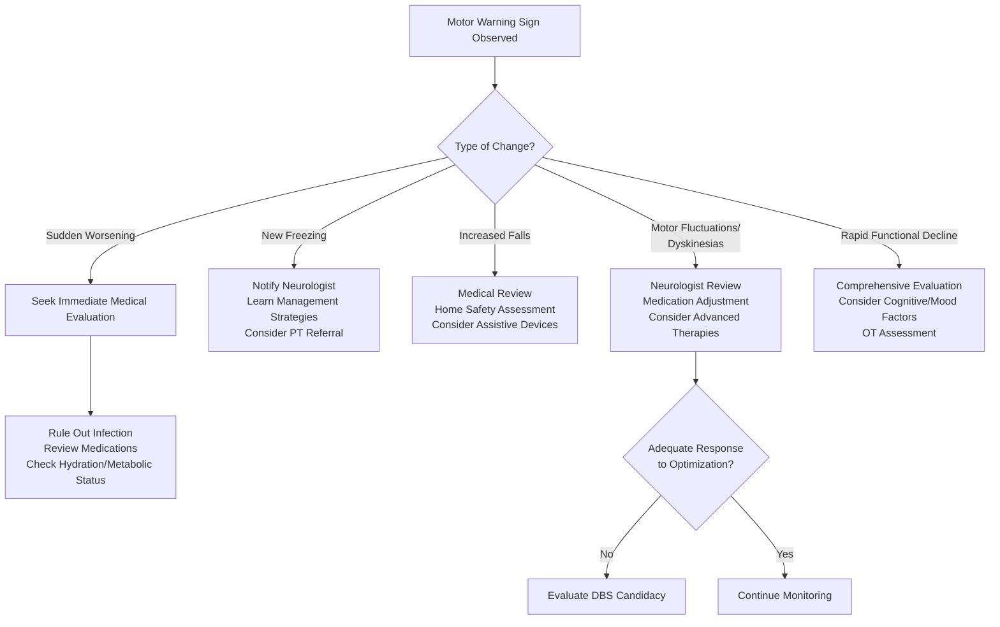
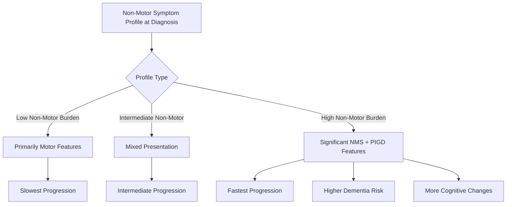
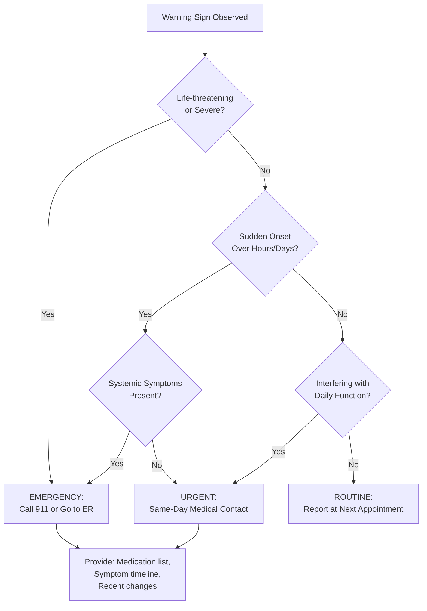
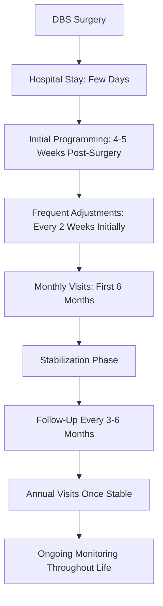
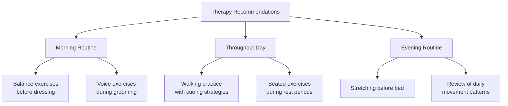
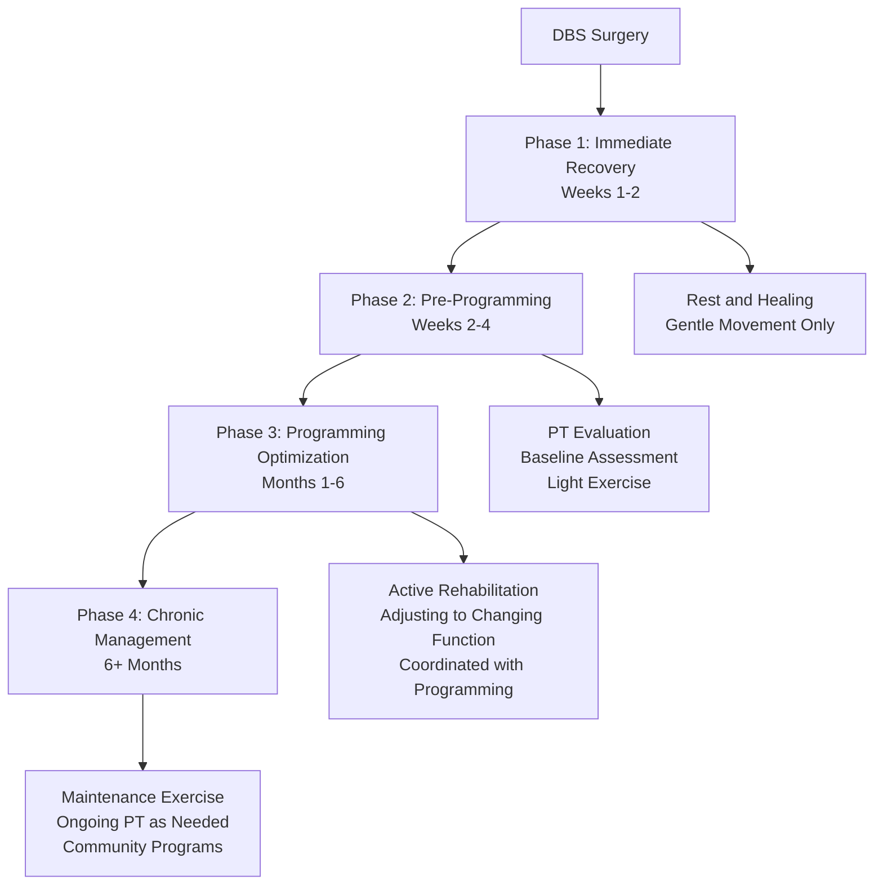
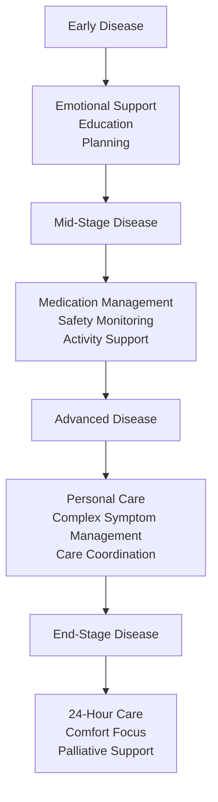
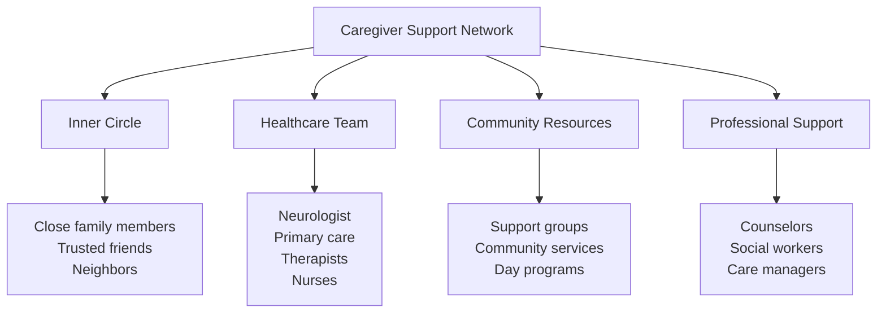

# Parkinson's Disease Stage-Specific Warning Signs and Family Caregiver Guide: From Early Detection to Post-DBS Care Strategies
## 1 Understanding Parkinson's Disease Progression and Staging Systems

Parkinson's disease (PD) represents a progressive neurological condition that fundamentally transforms the lives of patients and their families over time. Understanding how the disease evolves through distinct stages provides family caregivers with essential knowledge for anticipating changes, recognizing warning signs, and making informed decisions about care interventions. This chapter establishes the foundational framework for comprehending disease progression by examining two complementary staging systems: the motor-focused Hoehn and Yahr Scale and the needs-based MacMahon and Thomas Clinical Staging Model. Together, these classification approaches offer a comprehensive lens through which caregivers can interpret symptom evolution and prepare for the evolving challenges of Parkinson's disease management.

### 1.1 The Hoehn and Yahr Scale: Motor Symptom Progression Framework

The Hoehn and Yahr Scale stands as the most widely recognized and accepted staging system for characterizing the severity of Parkinson's disease, having been originally published in 1967 in the journal *Neurology* by Margaret Hoehn and Melvin Yahr[^1]. This foundational classification system was designed to describe the progression of functional disability associated with Parkinson's disease through five distinct stages, enabling clinicians and caregivers to measure disease severity and track its evolution over time[^1].

**Original Five-Stage Classification**

The assessment process requires a medical examination combined with detailed history provided by patients and their caregivers, with scoring determined according to specific clinical criteria[^1]. The following table presents the complete staging criteria for both the original and modified versions of the scale:

| Stage | Original Hoehn and Yahr Scale | Modified Hoehn and Yahr Scale |
|-------|-------------------------------|-------------------------------|
| 1 | Unilateral involvement only, usually with minimal or no functional disability | Unilateral involvement only |
| 1.5 | — | Unilateral and axial involvement |
| 2 | Bilateral or midline involvement without impairment of balance | Bilateral involvement without impairment of balance |
| 2.5 | — | Mild bilateral disease with recovery on pull test |
| 3 | Bilateral disease: mild to moderate disability with impaired postural reflexes; physically independent | Mild to moderate bilateral disease; some postural instability; physically independent |
| 4 | Severely disabling disease; still able to walk or stand unassisted | Severe disability; still able to walk or stand unassisted |
| 5 | Confinement to bed or wheelchair unless aided | Wheelchair bound or bedridden unless aided |

**Stage-by-Stage Clinical Interpretation**

During **Stage One**, the person experiences mild symptoms that generally do not interfere with daily activities, with tremor and other movement symptoms occurring on one side of the body only[^2]. Changes in posture, walking, and facial expressions may occur, but functional independence remains largely preserved[^2]. This initial stage represents the earliest detectable motor manifestation of the disease, when symptoms are often subtle enough to be overlooked or attributed to normal aging.

**Stage Two** marks the point where symptoms begin worsening significantly, with tremor, rigidity, and other movement symptoms affecting both sides of the body or the midline structures such as the neck and trunk[^2]. Walking problems and poor posture may become apparent at this stage, though the person typically remains able to live alone despite daily tasks becoming more difficult and time-consuming[^2]. This bilateral involvement without balance impairment represents a critical transition from localized to generalized motor dysfunction.

**Stage Three** is considered the mid-stage milestone where **loss of balance becomes the hallmark feature**[^2]. Falls become more common as motor symptoms continue to worsen, and functionally the person becomes somewhat restricted in daily activities while still maintaining physical capability for independent living[^2]. Disability at this stage is characterized as mild to moderate, with impaired postural reflexes representing the defining clinical criterion[^1].

At **Stage Four**, symptoms become fully developed and severely disabling[^2]. The person remains able to walk and stand without assistance but may need to ambulate with a cane or walker for safety[^2]. Critically, the person at this stage requires significant help with activities of daily living and is unable to live alone[^2]. This stage represents the transition from modified independence to substantial dependence on caregivers.

**Stage Five** constitutes the most advanced and debilitating phase of the disease[^2]. Stiffness in the legs may make it impossible to stand or walk, and the person becomes bedridden or confined to a wheelchair unless aided[^2]. Around-the-clock care becomes required for all activities, representing complete functional dependence[^2].

**The Modified Scale and Its Clinical Context**

In 1983, Larsen and colleagues published modifications to the original scale, adding stages 1.5 and 2.5 to help describe the intermediate course of the disease[^1]. Stage 1.5 captures patients with unilateral and axial involvement, while Stage 2.5 identifies those with mild bilateral disease who demonstrate recovery on the pull test[^3]. These intermediate stages were intended to provide greater granularity in tracking disease progression, though the Movement Disorder Society has concluded that the modified scale should not be used due to a lack of clinimetric testing[^1].

**Strengths and Correlations**

Despite its limitations, the Hoehn and Yahr scale possesses several significant strengths that maintain its status as the reference standard for disability and impairment measures[^4]. **Progressively higher stages correlate significantly with neuroimaging studies of dopaminergic loss**, providing biological validation of the clinical staging[^4]. The scale also demonstrates meaningful correlations with quality-of-life measures and studies of objective motor performance[^4]. Furthermore, changes in a patient's stage carry prognostic significance and directly influence clinician-based interventions[^4].

**Recognized Limitations**

The scale's primary limitation lies in its **heavy weighting toward postural instability, particularly from Stage 3 and above**, which represents a symptom largely considered non-responsive to levodopa therapy[^4]. Consequently, the scale does not necessarily reflect therapy-related improvements in many other aspects of the disease, especially non-motor symptoms and motor fluctuations[^4][^5]. A major limitation is that the scale focuses solely on motor symptoms and does not factor in psychiatric, cognitive, and autonomic non-motor symptoms, which often cause more disability as PD advances[^5]. For example, someone classified at Stage 3 based on motor criteria may experience difficulties equivalent to Stage 4 due to non-motor symptoms like dysregulated blood pressure or mood disorders[^5].

For clinical trials, the scale is primarily used to define inclusion and exclusion criteria rather than as an outcome measure, precisely because its broad categories do not allow for detection of effective interventions[^1].

### 1.2 MacMahon and Thomas Clinical Staging Model: A Needs-Based Approach

In contrast to the motor-focused Hoehn and Yahr framework, MacMahon and Thomas (1998) developed a clinical staging classification that offers a pragmatic, needs-centered approach to defining Parkinson's disease progression[^6]. This model fundamentally reconceptualizes staging by organizing the disease course around treatment response and care requirements rather than purely physical symptom manifestations.

**Four-Stage Framework Structure**

The MacMahon and Thomas model comprises four stages of progression from a state of gaining the best health through to requiring support and comfort: **Diagnostic, Maintenance, Complex, and Palliative**[^6]. Unlike the Hoehn and Yahr scale, this model explicitly incorporates fluidity, allowing for periods when the person might deteriorate during an illness—whether related to Parkinson's or not (such as a chest infection, rehabilitation period, or recovery following a fall and fracture)—but subsequently regains their prior ability upon recovery[^6].

The following table presents the comprehensive aims and priorities for each stage:

| Stage | Name | Aims | Priorities |
|-------|------|------|------------|
| 1 | Diagnostic | To facilitate acceptance of the diagnosis | Provision of accurate, sensitive information; reduce distress, and relieve symptoms |
| 2 | Maintenance | Relief of morbidity and the prevention of complications | Maintenance of good health: anticipatory care, such as advice on medications, and referral and liaison with multidisciplinary team |
| 3 | Complex | Symptom management, reduce both physical and psychological distress of patients and carers | Drug therapy becomes more complicated; careful titration; neurosurgical options including pallidotomy, thalamotomy, etc. |
| 4 | Palliative | Relief of symptoms and distress in patient and carers | Progressive dopaminergic drug withdrawal, analgesia, sedation, and other palliative techniques |

**Detailed Stage Characteristics**

The **Diagnostic Stage** focuses primarily on psychological and educational support rather than intensive medical intervention. The central aim involves facilitating the patient's acceptance of their diagnosis through provision of accurate, sensitive information while working to reduce distress and relieve initial symptoms[^6]. This stage recognizes that the emotional impact of diagnosis often requires as much attention as the physical symptoms themselves, establishing the foundation for a therapeutic relationship between patient, family, and healthcare providers.

During the **Maintenance Stage**, the clinical focus shifts toward relief of morbidity and prevention of complications[^6]. This stage emphasizes maintenance of good health through anticipatory care, including advice on medications and appropriate referral to and liaison with multidisciplinary team members[^6]. The patient typically experiences good response to medications during this period, representing what is often described as the therapeutic "honeymoon" phase.

The **Complex Stage** addresses the challenging period when symptom management becomes increasingly difficult and the goal expands to reducing both physical and psychological distress for patients and their caregivers[^6]. Drug therapy becomes more complicated during this stage, requiring careful titration of multiple medications[^6]. Neurosurgical options such as pallidotomy, thalamotomy, and deep brain stimulation become relevant considerations during this phase[^6]. This stage acknowledges that managing advanced Parkinson's disease requires sophisticated medical expertise and comprehensive support systems.

The **Palliative Stage** represents the final phase where the primary aim becomes relief of symptoms and distress for both patient and caregivers[^6]. Priorities during this stage include progressive dopaminergic drug withdrawal, analgesia, sedation, and other palliative techniques[^6]. This stage explicitly recognizes that the goals of care shift from disease modification to comfort maximization.

**Distinguishing Features from Motor-Based Staging**

The MacMahon and Thomas model's most significant distinguishing feature is its **explicit acknowledgment that disease progression is not strictly linear**[^6]. By allowing for temporary deterioration and subsequent recovery, this framework better reflects the clinical reality that patients' functional status can fluctuate based on intercurrent illnesses, medication adjustments, and other factors unrelated to underlying disease progression. This fluidity provides caregivers with a more realistic framework for understanding that setbacks do not necessarily indicate permanent decline.

Additionally, the model's **integration of non-motor considerations** into its staging criteria addresses a critical gap in motor-focused systems. The Complex and Palliative stages explicitly incorporate management of psychological distress, caregiver burden, and quality-of-life concerns that extend far beyond motor symptom control[^6].

### 1.3 Comparing Staging Approaches: Clinical Utility and Practical Implications

Understanding the complementary nature of these two staging systems enables caregivers to leverage the strengths of each approach for different aspects of disease management and care planning.

**Comparative Framework Analysis**

The fundamental distinction between these systems lies in their **design purposes and measurement targets**. The Hoehn and Yahr Scale provides a motor-specific severity benchmark that quantifies physical disability progression, while the MacMahon and Thomas Model offers a holistic, care-oriented framework that guides comprehensive patient management. These differences are not contradictions but rather complementary perspectives on the same disease process.

| Comparison Aspect | Hoehn and Yahr Scale | MacMahon and Thomas Model |
|-------------------|---------------------|---------------------------|
| Primary Focus | Motor disability, specifically postural instability and mobility | Patient needs and therapeutic response, encompassing motor and non-motor symptoms |
| Stage Definitions | Rigid, ordinal stages (1-5) based on unilateral/bilateral involvement and balance | Fluid, needs-based stages defined by clinical priorities and care requirements |
| Progression Pattern | Implies linear, one-way progression through motor milestones | Explicitly allows for temporary deterioration and recovery |
| Non-Motor Symptoms | Largely ignored in core staging criteria | Integral to Complex and Palliative stage definitions |
| Primary Use | Research inclusion criteria, motor severity documentation | Clinical care planning, multidisciplinary coordination |

**Clinical Applications and Context**

The Hoehn and Yahr Scale serves essential functions in **research settings and therapy selection criteria**. For deep brain stimulation candidacy, for example, patients are often evaluated based on their Hoehn and Yahr staging, with candidates typically falling within stages 2-4 while on medication[^7]. The scale's correlation with dopaminergic loss provides biological grounding for treatment decisions[^4].

In contrast, the MacMahon and Thomas Model proves more valuable for **day-to-day care planning and family preparation**. By defining stages according to care needs and therapeutic goals rather than specific motor symptoms, this framework helps caregivers understand what type of support will be required at each phase and how to coordinate with healthcare teams effectively.

**Integrated Assessment Approach**

An optimal approach to understanding disease status involves using both systems in their appropriate domains. The Hoehn and Yahr Scale documents the underlying trend of motor decline and provides a common language for communicating with healthcare providers about physical symptom severity. The MacMahon and Thomas Model contextualizes this motor status within the broader framework of care needs, helping families anticipate the types of support, interventions, and resources that will become relevant as the disease progresses.

For family caregivers, this integrated perspective means recognizing that a patient at Hoehn and Yahr Stage 3 (characterized by balance impairment) typically requires the complex symptom management focus described in the MacMahon and Thomas Complex stage. This alignment helps translate clinical staging into practical caregiving implications.

### 1.4 Disease Progression Patterns and Timeline Variability

Understanding typical progression patterns while acknowledging substantial individual variability prepares caregivers to anticipate changes without developing unrealistic expectations about specific timelines.

**General Progression Characteristics**

Parkinson's disease impacts people in different ways, and not everyone will experience all symptoms in the same order or intensity[^2]. The disease progresses differently for each person; some experience changes over 20 years or more, while others find it progresses more quickly[^2]. It is difficult to accurately predict individual progression, making generalized timelines useful only as rough guidelines rather than definitive forecasts[^2].

Research indicates that **most people progress approximately one stage every two years**, with the exception of Stage 2, which may persist for approximately five years[^8]. However, there is no set timeline for progression through the stages, and **many people remain at Stage 2 for decades or never progress beyond Stage 3**[^5]. Approximately one-third of patients may stay at Stage 1 or Stage 2 for as long as ten years[^8].

**Stage-Specific Milestones and Their Significance**

**Stage 3 represents a particularly important milestone** because it correlates with increased fall risk and declining quality of life[^8]. Research demonstrates that among patients with 15 years of disease duration, approximately 80% experience recurrent falls; among those with 18-20 years of disease, the majority require wheelchair use[^8]. These statistics underscore the significance of balance impairment as a marker of disease progression.

The appearance of clinical milestones such as visual hallucinations and cognitive decline identifies an advanced stage of Parkinson's disease[^9]. These milestones are interrelated, as visual hallucinations often accompany cognitive decline[^9]. When plotted against the entire disease course for clinico-pathological correlation, these milestones delineate an advanced PD phase of approximately 5 years[^9]. They carry pathological significance, as scoring for Lewy body burden rises in proportion to the number of milestones recorded[^9].

**Factors Influencing Progression Rates**

Research has identified several clinical features associated with different progression rates[^5]:

**Disease Subtype**: The tremor-predominant subtype, where tremor is the primary feature, is associated with slower motor progression[^5]. In contrast, the **postural instability and gait disorder (PIGD) subtype**, characterized by balance and walking problems, is linked to faster motor decline and a higher likelihood of developing dementia[^5].

**Age at Diagnosis**: Individuals diagnosed at an older age (for example, over 78 years) tend to have more motor impairment than those diagnosed in middle age (for example, 43-66 years) after the same disease duration[^5]. People with young-onset PD are more prone to levodopa-induced dyskinesia and motor fluctuations, while those diagnosed later may experience more cognitive changes and non-motor symptoms[^2].

**Non-Motor Symptom Burden**: A study that followed newly diagnosed individuals identified three distinct groups based on non-motor symptom profiles[^5]. A group with primarily motor features and low non-motor burden demonstrated the slowest progression. A group with significant non-motor symptoms (including apathy, pain, fatigue, depression, anxiety, and autonomic dysfunction) combined with PIGD features showed the fastest progression. A group with intermediate non-motor scores exhibited an intermediate progression rate[^5]. This finding emphasizes that **the absence of non-motor symptoms at diagnosis correlates with slower overall progression**[^5].

**Quantitative Progression Data**

Research examining long-term motor progression based on serial measurements spanning up to 20 years indicates that progression is approximately linear at about 2% of maximum motor disability per year[^9]. However, progression appears twice as fast (nearly 5% per annum) in the prodromal phase leading up to diagnosis and in recently diagnosed patients prior to dopaminergic therapy initiation[^9]. At diagnosis, patients have typically accrued roughly 20% of the maximum disability score[^9].

Motor fluctuations and dyskinesia develop in approximately half of patients after 5 years of treatment, influenced more by disease duration and severity than by treatment duration alone[^9]. Motor fluctuations can become an issue five to ten years after diagnosis, and postural instability typically occurs after about ten years[^2].

**Advanced Disease Phase Characteristics**

The advanced Parkinson's disease phase, marked by milestones like frequent falling, visual hallucinations, cognitive decline, and need for high-level care, represents a phase of approximately 5 years[^9]. Clinico-pathological research suggests this advanced phase has a fixed duration regardless of prior disease course length, implying a possible acceleration in disability during this final period[^9].

Among patients with disease duration exceeding 20 years, the majority reside in nursing homes, with the primary predictors being visual hallucinations, falls, and dementia[^8]. Studies indicate that 25-50% of Parkinson's disease patients develop dementia, and by 18-20 years post-diagnosis (or by age 90), dementia risk increases to approximately 85%[^8].

### 1.5 Integrating Staging Knowledge into Caregiver Preparedness

Translating staging system knowledge into practical caregiving applications empowers families to anticipate challenges, communicate effectively with healthcare teams, and make timely decisions about interventions and support services.

**Understanding Current Stage Placement**

Recognizing a patient's current stage placement across both staging frameworks provides caregivers with a comprehensive picture of present needs and likely near-term developments. Using the Hoehn and Yahr classification, caregivers can assess motor symptom severity and communicate this information clearly to healthcare providers. Simultaneously, applying the MacMahon and Thomas framework helps identify appropriate care priorities and therapeutic goals for the current phase.

For patients in **early disease** (corresponding to Hoehn and Yahr Stages 1-2 and MacMahon and Thomas Diagnostic/Maintenance stages), the primary focus involves education, emotional support, and initial pharmacotherapy optimization[^10]. Early Parkinson's disease usually requires more emotional support and less hands-on care, making this an ideal time for family members to educate themselves about the disease[^10]. Caregivers should use this period to establish relationships with healthcare providers, understand medication regimens, and begin planning for future needs[^10].

During **mid-stage disease** (Hoehn and Yahr Stages 2-3 and late Maintenance/early Complex stages), caregivers should anticipate emerging motor complications including fluctuations and dyskinesia, balance issues, and the need for medication adjustments[^11]. Physical therapy, occupational therapy, and home safety modifications become increasingly important during this phase[^11]. Caregivers should learn to recognize signs of medication wearing-off effects and understand when to seek specialist consultation.

For **advanced disease** (Hoehn and Yahr Stages 4-5 and Complex/Palliative stages), comprehensive multidisciplinary care becomes essential[^11]. Caregivers must prepare for significant assistance requirements with all daily activities, potential cognitive and neuropsychiatric symptoms, and ultimately palliative care approaches[^11].

**Anticipating Transition Points**

Key transition points that signal changing care requirements include:

- **Onset of balance impairment** (transition to Stage 3): This milestone correlates with increased fall risk and typically necessitates home safety modifications, physical therapy intensification, and consideration of assistive devices[^2][^8].

- **Loss of independent living capacity** (transition to Stage 4): This change requires substantial caregiver involvement, potential home care services, and reassessment of living arrangements[^2][^11].

- **Emergence of cognitive changes or hallucinations**: These symptoms often signal transition to advanced disease phases and may require medication adjustments, specialist consultation, and increased supervision[^9][^8][^10].

- **Motor fluctuations and dyskinesia development**: These complications typically emerge 5-10 years after treatment initiation and indicate the need for medication regimen optimization[^2][^9].

**Communication with Healthcare Teams**

Understanding staging systems enables more effective communication with neurologists and other healthcare providers. Caregivers who can describe symptoms in terms of staging criteria provide valuable clinical information that aids treatment decisions. When reporting to healthcare teams, caregivers should note:

- Changes in symptom laterality (unilateral versus bilateral involvement)
- Balance and fall frequency changes
- Functional independence levels for specific activities
- Non-motor symptom emergence or worsening
- Medication response patterns and timing

**Resource Planning and Allocation**

Staging knowledge informs practical resource planning across the disease course. During early stages, resources appropriately focus on education, exercise programs, and establishing care team relationships[^12][^10]. As disease advances, resource allocation shifts toward home modifications, assistive devices, respite care, and eventually full-time caregiving support or facility placement[^11].

Caregivers should recognize that preparing early for advanced-stage needs—including discussions about medical care preferences, end-of-life plans, and legal/financial arrangements—is best accomplished while the patient can still participate meaningfully in these decisions[^11]. The MacMahon and Thomas framework's emphasis on anticipatory care during the Maintenance stage explicitly supports this forward-looking approach[^6].

**Maintaining Perspective on Individual Variability**

While staging systems provide valuable frameworks for understanding disease progression, caregivers must remember that **individual trajectories vary substantially**[^2][^5]. Factors within an individual's control, such as physical exercise and healthy lifestyle choices, may positively impact progression[^5]. Evidence suggests that cardiovascular exercise can slow progression, with general recommendations of 20 minutes of heart-rate-raising activity five times per week[^12]. Programs like Rock Steady Boxing and Dance for PD have demonstrated benefits, and physical therapy can provide individualized guidance[^12].

Ultimately, staging systems serve as guides rather than deterministic predictions. Their greatest value lies in helping caregivers prepare for likely challenges while remaining adaptable to the unique trajectory each patient experiences. By understanding both motor-focused and needs-based staging approaches, family caregivers position themselves to provide informed, responsive care throughout the Parkinson's disease journey.

## 2 Stage-Specific Motor Warning Signs and Their Clinical Significance

Parkinson's disease manifests through a constellation of motor symptoms that evolve predictably across the disease course, yet with substantial individual variation in timing and severity. For family caregivers, understanding how these motor symptoms present, progress, and interact provides essential knowledge for recognizing warning signs that warrant attention, anticipating functional changes, and knowing when to seek medical consultation. This chapter systematically examines the characteristic motor symptoms at each disease stage, establishes the relationship between motor severity and functional independence, and identifies critical motor milestones that signal the need for intervention.

### 2.1 Cardinal Motor Symptoms: Manifestation Patterns Across Disease Stages

Parkinson's disease is fundamentally characterized by four primary motor symptoms that form the diagnostic and monitoring foundation for the condition: **tremor, rigidity, bradykinesia, and postural instability**[^13]. Understanding how each of these cardinal symptoms manifests and evolves across disease stages equips caregivers with the observational framework necessary for effective monitoring and timely intervention.

**Tremor: The Most Recognizable Motor Sign**

Tremor represents the most widely recognized symptom of Parkinson's disease, though importantly, not all patients experience this manifestation[^13]. The characteristic Parkinson's tremor demonstrates several distinctive features that differentiate it from other tremor types. This rhythmic shaking typically begins in the hands or fingers, though it may also initially appear in the foot or jaw[^14]. The tremor characteristically occurs at rest, meaning it is most obvious when the hand is relaxed and not engaged in purposeful activity[^15]. A classic presentation involves the "pill-rolling tremor," where the thumb and forefinger appear to move in a circular motion as if rolling a small object[^14].

The progression pattern of tremor follows a predictable trajectory across disease stages. In early disease, tremor typically affects only one side of the body, representing unilateral involvement characteristic of Hoehn and Yahr Stage 1[^2]. As the disease advances to Stage 2, tremor spreads to affect both sides of the body or midline structures, though symptoms typically remain more pronounced on the initially affected side[^15]. Throughout the disease course, tremor may fluctuate in intensity based on stress, fatigue, and medication timing, but the underlying progression from unilateral to bilateral involvement marks a significant disease milestone.

**Rigidity: Muscle Stiffness and Resistance to Movement**

Rigidity refers to a tightness or stiffness of the limbs or torso that affects most people with Parkinson's disease[^13]. This symptom manifests as resistance to passive movement, where the muscles remain tense and tight even when the person attempts to relax[^15]. Rigidity can occur in any part of the body and often contributes to the sensation that muscles feel painful and uncomfortable[^14].

An important consideration for caregivers is that **rigidity, especially in early disease stages, may be wrongly attributed to arthritis or orthopedic problems**[^13]. This misattribution can delay recognition of Parkinson's disease progression and appropriate intervention. The stiffness associated with rigidity differs from joint-related stiffness in that it affects the entire range of motion and has a characteristic "cogwheel" quality when assessed by clinicians—a ratcheting sensation felt when moving the affected limb.

Rigidity contributes significantly to functional limitations across all disease stages. In early disease, it may cause subtle difficulties with fine motor tasks and contribute to reduced arm swing during walking. As disease advances, rigidity becomes more pronounced and widespread, contributing to the stooped posture characteristic of advanced Parkinson's disease and making all movements more effortful.

**Bradykinesia: The Core Motor Deficit**

Bradykinesia, derived from Greek meaning "slow movement," represents a frequent and particularly disabling symptom of Parkinson's disease[^13]. This symptom encompasses more than simple slowness; it includes difficulty initiating movements, reduced amplitude of movements, and progressive fatigue with repetitive actions. Bradykinesia fundamentally changes how patients interact with their environment, making simple tasks more difficult and time-consuming[^14].

The manifestations of bradykinesia are diverse and affect multiple functional domains. **Facial masking (hypomimia)** refers to a reduced or mask-like expression where the face shows little emotion due to decreased spontaneous facial movements[^13]. Patients may demonstrate a decreased blink rate, contributing to the impression of a fixed stare. Fine motor coordination becomes impaired, resulting in difficulty with tasks requiring dexterity such as buttoning clothes, handling utensils, or manipulating small objects.

**Micrographia**, or progressively smaller and cramped handwriting, represents another characteristic bradykinesia manifestation that caregivers can readily observe[^13][^14]. The writing typically begins at a normal size but becomes progressively smaller across a line or paragraph. Similarly, patients may experience difficulty turning over in bed, a seemingly simple action that requires coordinated sequential movements[^13].

The impact of bradykinesia on walking (gait) is particularly significant. Patients may demonstrate **start hesitation**, where initiating walking becomes difficult[^15]. Once walking, they may take small, shuffling steps—a pattern called **festination**—and show reduced or absent arm swing[^13][^14]. In more advanced stages, patients may experience **freezing of gait**, where they suddenly stop and feel as if their feet are glued to the floor, unable to take the next step[^13].

**Postural Instability: The Late-Stage Hallmark**

Postural instability, encompassing balance problems and changes in posture, represents the fourth cardinal motor symptom and carries particular significance as a marker of disease progression[^15]. Unlike tremor, rigidity, and bradykinesia, which typically appear in early disease, **postural instability is more pronounced in the later stages** of Parkinson's disease[^13].

The manifestations of postural instability include the inability to maintain a steady, upright posture and difficulty preventing falls[^13]. Patients may demonstrate a tendency to list or fall backward (retropulsion), where even a light push can cause them to continue stepping backward or fall[^13]. The characteristic "parkinsonian gait" includes a tendency to lean forward with a stooped posture[^15].

The emergence of postural instability marks a critical transition in the disease course. Research indicates that **postural instability typically occurs after approximately 10 years of disease duration**[^2], though this timeline varies considerably among individuals. When postural instability develops, it signals entry into the mid-stage of disease (Hoehn and Yahr Stage 3) and correlates with significantly increased fall risk and declining functional independence.

**Progression Pattern Summary**

The following table summarizes how the cardinal motor symptoms typically manifest across disease stages:

| Cardinal Symptom | Early Stage (H&Y 1-2) | Mid-Stage (H&Y 3) | Advanced Stage (H&Y 4-5) |
|-----------------|----------------------|-------------------|-------------------------|
| Tremor | Unilateral, may be subtle; hand, foot, or jaw | Bilateral involvement; more consistent | May decrease or persist; masked by other symptoms |
| Rigidity | Unilateral; may mimic arthritis | Bilateral; contributes to stooped posture | Severe; may cause leg stiffness preventing standing |
| Bradykinesia | Reduced arm swing; facial masking; micrographia | Generalized slowness; festination begins | Severe; difficulty with all movements |
| Postural Instability | Generally absent | Emerges as hallmark feature; falls increase | Severe; unable to stand/walk without assistance |

Understanding this progression pattern enables caregivers to anticipate which symptoms are likely to emerge or worsen at different disease phases and to recognize when symptom changes represent expected progression versus concerning developments requiring medical attention.

### 2.2 Early-Stage Motor Warning Signs: Recognizing Subtle Changes in Stages 1-2

The early stages of Parkinson's disease present unique challenges for recognition because motor symptoms are often subtle, unilateral, and easily attributed to normal aging or other conditions. For family members, developing awareness of these early warning signs enables prompt medical consultation and early intervention, which may help optimize disease management from the outset.

**Stage 1: Unilateral Involvement with Minimal Disability**

During Hoehn and Yahr Stage 1, the person experiences mild symptoms that generally do not interfere with daily activities[^2]. The defining characteristic of this stage is **unilateral involvement**, meaning symptoms affect only one side of the body[^1]. This asymmetry represents one of the most reliable early indicators of Parkinson's disease and distinguishes it from many other conditions that cause similar symptoms.

The motor warning signs that caregivers should observe during Stage 1 include:

**Subtle tremor in one hand, foot, or jaw**: The tremor may initially appear only intermittently, particularly during periods of stress or fatigue. It characteristically occurs at rest and may temporarily cease when the person uses the affected limb purposefully. Family members may first notice the tremor when the person is sitting quietly, watching television, or resting their hand in their lap.

**Reduced arm swing on one side during walking**: This subtle change often precedes more obvious symptoms and may be noticed by observant family members before the patient themselves recognizes it[^14]. When walking, one arm naturally swings less than the other, creating an asymmetric gait pattern.

**Changes in facial expression**: The face may show less expression, with reduced spontaneous smiling, blinking, and emotional responsiveness[^2][^14]. Family members may notice that the person's face appears less animated during conversation or that they seem to stare more than previously.

**Early handwriting changes**: Micrographia may begin subtly, with handwriting becoming slightly smaller or more cramped, particularly toward the end of longer writing tasks. Family members who regularly see the person's handwriting may notice these changes before they become pronounced.

**Subtle changes in posture and walking**: Even in Stage 1, slight changes in posture and walking patterns may occur[^2]. The person may begin to lean slightly forward or take somewhat smaller steps than previously.

**Clinical Significance of Stage 1 Recognition**

The importance of recognizing Stage 1 symptoms lies in enabling early diagnosis and treatment initiation. While Parkinson's disease cannot currently be cured, early treatment can help manage symptoms effectively and may influence long-term outcomes. Additionally, early recognition allows families to begin educational preparation, establish relationships with movement disorder specialists, and plan for future needs while the patient can fully participate in these discussions.

**Stage 2: Bilateral Involvement Without Balance Impairment**

The transition to Hoehn and Yahr Stage 2 marks an important disease milestone: **symptoms begin affecting both sides of the body or midline structures**[^1]. Despite this bilateral involvement, balance remains intact during Stage 2, distinguishing it from the more advanced Stage 3[^2].

Motor warning signs characteristic of Stage 2 include:

**Bilateral tremor and rigidity**: Symptoms that previously affected only one side now involve both sides of the body, though they typically remain more pronounced on the initially affected side[^15]. Family members may notice that the person now has difficulty with tasks requiring both hands or that stiffness is apparent in both arms or legs.

**More apparent walking problems and poor posture**: Walking difficulties become more noticeable, with the parkinsonian gait pattern becoming more established[^2]. The person may walk more slowly, take smaller steps, and demonstrate reduced arm swing bilaterally.

**Increased difficulty with daily tasks**: While the person remains able to live alone and maintain independence, daily tasks become more difficult and time-consuming[^2]. Activities that previously required little thought or effort—dressing, grooming, meal preparation—now take longer and require more concentration.

**Speech changes**: The person may begin speaking more softly, quickly, or with less inflection[^14]. Speech may become monotone, and family members may notice they need to ask the person to repeat themselves more frequently.

**Progression of bradykinesia**: Slowness of movement becomes more generalized, affecting multiple activities. The person may take longer to respond to questions, initiate activities, or complete routine tasks.

**Distinguishing Expected Changes from Concerning Developments**

During Stages 1 and 2, caregivers should understand that gradual, symmetric progression of existing symptoms generally represents expected disease evolution. However, certain changes warrant prompt medical consultation:

- **Sudden worsening** of symptoms over days rather than weeks or months
- **Marked asymmetry** in symptom progression, where one side deteriorates much faster than expected
- **New symptoms** that seem inconsistent with typical Parkinson's disease
- **Significant functional decline** that seems disproportionate to the apparent motor symptoms
- **Falls or near-falls**, which should not occur in Stages 1-2 when balance is preserved

### 2.3 Mid-Stage Motor Transitions: Balance Impairment and Bilateral Progression in Stage 3

Hoehn and Yahr Stage 3 represents a critical transition point in Parkinson's disease progression, marked by the emergence of **postural instability as the hallmark feature**[^2]. This stage carries particular significance because it correlates with substantially increased fall risk, declining functional independence, and the need for intensified intervention strategies.

**The Emergence of Postural Instability**

The defining characteristic that distinguishes Stage 3 from Stage 2 is the onset of **impaired postural reflexes**[^1]. While patients in Stage 2 demonstrate bilateral symptoms, they maintain normal balance responses. In Stage 3, these protective reflexes become compromised, fundamentally changing the patient's relationship with their physical environment.

Postural instability manifests through several observable changes:

**Increased fall frequency**: Falls become more common as the disease progresses to Stage 3[^2]. Family members may notice the person stumbling, catching themselves on furniture, or actually falling during routine activities. Research indicates that among patients with 15 years of disease duration, approximately 80% experience recurrent falls.

**Retropulsion**: The tendency to step backward when pushed or when balance is challenged becomes apparent[^13]. A light push from the front may cause the person to continue stepping backward, unable to arrest the movement, potentially leading to falls.

**Difficulty with turns and direction changes**: Turning while walking becomes increasingly challenging, and the person may need to take multiple small steps to complete a turn rather than pivoting smoothly.

**Impaired recovery from perturbations**: When balance is disrupted—by a bump, uneven surface, or sudden movement—the person has difficulty recovering their equilibrium quickly enough to prevent a fall.

**Gait Disturbances: Festination and Freezing**

Stage 3 often brings the emergence or worsening of specific gait disturbances that significantly impact mobility and safety:

**Festination** refers to a pattern of walking characterized by rapid, short, shuffling steps[^15][^13]. The person may appear to be chasing their center of gravity, taking progressively faster and smaller steps. This pattern increases fall risk, particularly on uneven surfaces or when obstacles are encountered.

**Freezing of gait** represents one of the most disabling motor symptoms and commonly emerges during Stage 3. During freezing episodes, the person suddenly stops walking and feels unable to take the next step, as if their feet are stuck to the floor[^13]. Freezing commonly occurs:
- When initiating walking (start hesitation)
- When approaching doorways or narrow spaces
- When turning or changing direction
- When reaching a destination
- Under time pressure or in crowded environments

**Propulsion**, the tendency to accelerate forward with rapid, short steps, may also occur[^13]. Combined with the stooped posture characteristic of advancing disease, propulsion creates significant fall risk, particularly when approaching obstacles or descending slopes.

**Functional Implications of Stage 3**

The motor changes of Stage 3 have profound implications for functional independence. The person becomes **somewhat restricted in daily activities** but typically remains **physically capable of leading an independent life**[^2]. Disability at this stage is characterized as mild to moderate[^2].

Key functional changes include:

**Modified independence**: While the person can still perform most activities, they may need more time, require adaptive strategies, or benefit from supervision during higher-risk activities.

**Increased safety concerns**: The combination of balance impairment and gait disturbances creates genuine safety risks that require environmental modifications and behavioral adaptations.

**Need for assistive devices**: Many patients at Stage 3 benefit from using a cane or walker, particularly in challenging environments or during longer walks.

**Warning Signs Requiring Intervention at Stage 3**

For caregivers, Stage 3 represents a critical period requiring proactive intervention. Warning signs that should prompt immediate attention include:

| Warning Sign | Significance | Recommended Action |
|-------------|--------------|-------------------|
| First fall or near-fall | Indicates balance impairment has reached functional significance | Immediate home safety assessment; consider physical therapy referral |
| New freezing episodes | Suggests disease progression; creates significant fall risk | Notify neurologist; learn freezing management strategies |
| Increasing fall frequency | May indicate medication timing issues or disease progression | Medical review; consider medication adjustment |
| Fear of falling leading to activity restriction | Can create deconditioning spiral worsening mobility | Encourage safe activity; consider supervised exercise programs |

**Home Safety Modifications for Stage 3**

The emergence of balance impairment necessitates systematic home safety evaluation. Critical modifications include:

- Removing loose rugs and reducing clutter in walkways
- Installing grab bars in bathrooms near toilets and in showers
- Ensuring adequate lighting, particularly in hallways and stairs
- Considering raised toilet seats and shower chairs
- Removing or securing electrical cords that cross walking paths
- Installing handrails on both sides of staircases

### 2.4 Advanced-Stage Motor Deterioration: Severe Disability in Stages 4-5

The advanced stages of Parkinson's disease—Hoehn and Yahr Stages 4 and 5—represent the most challenging phase of motor disability, characterized by **severely disabling symptoms** that fundamentally alter the patient's functional capacity and care requirements[^1]. Understanding the motor manifestations of these stages prepares caregivers for the substantial support needs that emerge during advanced disease.

**Stage 4: Severe Disability with Retained Ambulation**

At Stage 4, motor symptoms become **fully developed and severely disabling**[^2]. Despite this severity, a critical distinction from Stage 5 is that the person remains **able to walk and stand without physical assistance from another person**[^1]. However, the practical implications of this retained ability require careful interpretation.

Motor characteristics of Stage 4 include:

**Profound bradykinesia**: Movement becomes extremely slow, and initiating any motor activity requires substantial effort. Simple tasks that healthy individuals perform automatically—rising from a chair, turning in bed, reaching for objects—become laborious and time-consuming.

**Severe rigidity**: Muscle stiffness becomes pronounced throughout the body, contributing to the stooped, flexed posture characteristic of advanced disease. Rigidity may cause significant discomfort and limit the range of motion available for daily activities.

**Marked gait impairment**: While walking remains possible, it typically requires the use of a cane or walker for safety[^2]. The festinating, shuffling gait pattern becomes pronounced, and freezing episodes may occur frequently.

**Postural instability**: Balance impairment is severe, and falls represent a constant risk. The person may be unable to recover from even minor perturbations to balance.

**Functional implications of Stage 4** are profound:

The person **requires significant help with activities of daily living** and is **unable to live alone**[^2]. This represents a fundamental transition from modified independence to substantial dependence on caregivers. Activities requiring standing balance, walking, or fine motor coordination typically require assistance or supervision.

**Stage 5: Complete Motor Dependency**

Stage 5 represents the most advanced and debilitating phase of motor disability in Parkinson's disease[^2]. The defining characteristic is **confinement to bed or wheelchair unless aided**[^1].

Motor characteristics of Stage 5 include:

**Leg stiffness preventing standing and walking**: Rigidity in the legs may become so severe that standing and walking become impossible even with assistance[^2]. The person cannot bear weight or maintain an upright posture.

**Complete dependence for mobility**: All transfers—bed to chair, chair to toilet, position changes in bed—require physical assistance from caregivers.

**Severe bradykinesia affecting all movements**: Even small movements such as adjusting position, reaching, or gesturing become extremely difficult or impossible.

**Around-the-clock care requirements**: The severity of motor disability at Stage 5 necessitates continuous caregiver presence for all activities[^2].

**Motor Complications in Advanced Disease**

Advanced Parkinson's disease is frequently complicated by **motor fluctuations and dyskinesias** that develop as consequences of long-term dopaminergic treatment. These complications typically emerge **five to ten years after diagnosis** and can significantly impact quality of life and functional capacity[^2].

**Motor fluctuations** refer to variations in motor function related to medication timing:

- **Wearing-off phenomenon**: The beneficial effects of medication doses become shorter, with symptoms returning before the next scheduled dose
- **On-off fluctuations**: Unpredictable switches between periods of good motor function ("on" time) and poor function ("off" time)
- **Delayed on or dose failures**: Medication doses that take longer than expected to work or fail to provide benefit

**Dyskinesias** are involuntary movements that occur as a side effect of dopaminergic medications:

- **Peak-dose dyskinesias**: Involuntary writhing or twisting movements occurring when medication levels are highest
- **Diphasic dyskinesias**: Involuntary movements occurring as medication levels are rising or falling
- **Off-period dystonia**: Painful muscle cramping occurring when medication effects have worn off

These complications are particularly significant because **people with young-onset Parkinson's disease are more prone to levodopa-induced dyskinesia and motor fluctuations**[^2], while those diagnosed at older ages may experience more cognitive changes alongside motor progression.

**Warning Signs of Advanced Disease Transition**

Caregivers should be alert to motor changes that signal transition to advanced disease phases:

| Warning Sign | Clinical Significance |
|-------------|----------------------|
| Inability to walk without human assistance | Transition toward Stage 5 |
| Frequent falls despite appropriate precautions | May indicate need for wheelchair use |
| Severe motor fluctuations unresponsive to medication adjustment | May indicate candidacy for advanced therapies |
| Prolonged "off" periods with severe immobility | Requires urgent medication review |
| New or worsening dyskinesias interfering with function | Medication regimen requires optimization |

### 2.5 Motor Symptom Severity and Functional Independence: Quantifying the Relationship

Understanding the relationship between motor symptom severity and functional capacity enables caregivers to anticipate care needs and recognize when motor changes translate into meaningful functional limitations. Research has established strong correlations between standardized motor assessments and performance-based measures of daily living, providing a framework for interpreting the functional implications of motor progression.

**Clinical Assessment Scales and Their Relationships**

Multiple clinical scales are used to characterize motor symptoms and functional status in Parkinson's disease. The relationships among these scales illuminate how motor impairment translates into functional disability.

The **Unified Parkinson's Disease Rating Scale (UPDRS)** and its revision, the **Movement Disorder Society-Unified Parkinson's Disease Rating Scale (MDS-UPDRS)**, provide comprehensive assessment of motor and non-motor symptoms[^2]. Part III of these scales specifically evaluates motor function through standardized examination.

The **Schwab and England Activities of Daily Living Scale** uses percentages to assess a person's level of functional independence in completing daily activities[^2]. This scale ranges from 100% (completely independent) to 0% (vegetative functions only).

Research examining 49 non-demented Parkinson's disease patients using the **Assessment of Motor and Process Skills (AMPS)** scale found significant relationships between disease severity and functional performance[^16]:

- **Strong correlation** between AMPS motor skills and the Hoehn and Yahr scale (p < 0.001)
- **Strong correlation** between AMPS motor skills and UPDRS Part III (p < 0.001)
- **Strong correlation** between AMPS process skills and the Schwab and England scale (p < 0.001)
- **Weak correlation** between AMPS motor scale and disease duration, only in the motor section

These findings demonstrate that **motor symptom severity is closely related to impairment of functional skills** in non-demented patients, with the AMPS scale proving useful for monitoring disease progression through observation of daily living performance[^16].

**Performance-Based Assessment Findings**

A study using the **revised Observed Tasks of Daily Living (OTDL-R)** compared 19 non-demented Parkinson's disease patients with 18 healthy older adults[^17]. The OTDL-R includes subtests for telephone use, medication use, and financial management—instrumental activities that require integration of motor and cognitive skills.

Key findings included:

- The Parkinson's disease group was **significantly slower** to complete the OTDL-R
- Parkinson's disease patients performed **worse on the telephone use subtest**
- **UPDRS motor severity was strongly and negatively correlated** with OTDL-R total score and telephone use subtest score
- Poor performance on telephone use was related to **motor severity**
- Poor performance on financial management was related to **attention and working memory**

These results indicate that **greater motor severity is associated with poorer performance on functional assessments**, particularly for tasks requiring motor dexterity such as telephone use[^17]. The OTDL-R proved sensitive to instrumental activities of daily living decline in the early-mid stages of Parkinson's disease.

**Quantifying Motor Progression Rates**

Longitudinal research from the Parkinson's Progression Markers Initiative (PPMI) cohort provides quantitative data on motor symptom progression in newly diagnosed, untreated patients[^18]:

| MDS-UPDRS Component | Annual Progression Rate | 95% Confidence Interval |
|--------------------|------------------------|------------------------|
| Total Score | 4.68 points/year | 4.22–5.13 |
| Part I (Non-motor) | 0.92 points/year | 0.80–1.05 |
| Part II (Motor ADL) | 0.99 points/year | 0.86–1.13 |
| Part III (Motor Exam) | 2.40 points/year | 2.10–2.70 |

The **total score increase is primarily driven by Part III (motor examination) progression**, which accounts for 51% of the total score increase[^18]. This finding underscores the central role of motor symptom worsening in overall disease progression.

**Impact of Dopaminergic Treatment on Motor Progression**

The PPMI research also evaluated how dopaminergic medication affects motor progression[^18]:

- Patients **on medication**: MDS-UPDRS Part III increased by **1.77 points/year** (95% CI, 1.35–2.19)
- Patients **not on medication**: MDS-UPDRS Part III increased by **4.02 points/year** (95% CI, 2.95–5.10)
- **Difference**: 2.25 points/year slower progression with treatment (95% CI, 1.11–3.39)

This statistically significant difference demonstrates that **dopaminergic treatment substantially slows the rate of motor symptom worsening** as measured by clinical scales, though it does not halt progression entirely.

**Practical Implications for Caregivers**

Understanding these quantitative relationships helps caregivers:

1. **Anticipate functional changes**: As motor scores worsen, specific functional limitations can be expected. Strong correlations between motor severity and ADL performance mean that worsening tremor, rigidity, or bradykinesia will translate into difficulties with specific daily tasks.

2. **Recognize meaningful changes**: The minimum clinically important difference (MCID) for MDS-UPDRS Part III is approximately 4 points[^18]. Changes of this magnitude represent functionally meaningful worsening that patients and caregivers can perceive.

3. **Time interventions appropriately**: The documented progression rates enable anticipation of when support services, home modifications, or treatment adjustments may become necessary.

4. **Evaluate treatment effectiveness**: Understanding expected progression rates provides a benchmark against which to evaluate whether current treatment is providing adequate symptom control.

### 2.6 Critical Motor Milestones: Warning Signs Requiring Immediate Caregiver Response

Certain motor changes represent critical milestones that warrant prompt caregiver attention and healthcare consultation. Distinguishing these concerning developments from expected disease progression enables appropriate and timely intervention, potentially preventing complications and optimizing patient outcomes.

**Sudden Symptom Worsening**

While Parkinson's disease typically progresses gradually, **sudden worsening of motor symptoms** over days rather than weeks or months represents a red flag requiring immediate medical evaluation. Potential causes of sudden deterioration include:

- **Medication issues**: Missed doses, drug interactions, or medication absorption problems
- **Infections**: Urinary tract infections, pneumonia, or other infections can dramatically worsen Parkinson's symptoms
- **Dehydration or metabolic disturbances**: Electrolyte imbalances or dehydration can exacerbate motor symptoms
- **Other medical conditions**: Concurrent illness may unmask or worsen underlying Parkinson's symptoms

Caregivers should seek medical evaluation if motor symptoms worsen substantially over a short period, as this pattern is atypical for Parkinson's disease and usually indicates a treatable underlying cause.

**New Onset of Freezing Episodes**

The **first appearance of freezing of gait** represents a significant disease milestone. Freezing creates substantial fall risk and indicates disease progression to a more advanced phase. When freezing first appears, caregivers should:

- Notify the neurologist or movement disorder specialist
- Learn strategies for managing freezing episodes (visual cues, auditory cues, weight shifting)
- Implement environmental modifications to reduce freezing triggers
- Consider referral to physical therapy for gait training

**Significant Increase in Fall Frequency**

While occasional falls may occur as part of disease progression, a **marked increase in fall frequency** warrants urgent attention. Increased falls may indicate:

- Disease progression requiring treatment adjustment
- Medication timing problems (falls occurring during "off" periods)
- Environmental hazards requiring modification
- Need for assistive devices or increased supervision
- Emergence of orthostatic hypotension or other contributing factors

Any fall resulting in injury should prompt medical evaluation, and patterns of increasing falls should be reported to the healthcare team.

**Emergence of Motor Fluctuations or Dyskinesias**

The **first appearance of motor fluctuations or dyskinesias** signals an important transition in disease management. These complications indicate that the therapeutic window for dopaminergic medications is narrowing and that more sophisticated medication management is needed.

Warning signs of motor fluctuations include:
- Predictable return of symptoms before the next medication dose (wearing-off)
- Unpredictable switches between good and poor motor function (on-off)
- Delayed or absent response to medication doses

Warning signs of dyskinesias include:
- Involuntary writhing or twisting movements, particularly when medication effects are strongest
- Movements that interfere with purposeful activities
- Painful muscle cramping when medication effects wear off

**Rapid Functional Decline**

**Functional decline that seems disproportionate to motor symptom changes** may indicate complications requiring evaluation. If a patient's ability to perform daily activities deteriorates faster than expected based on their motor examination, caregivers should consider:

- Cognitive changes affecting task performance
- Depression or apathy reducing motivation and engagement
- Medication side effects
- Concurrent medical conditions
- Need for occupational therapy evaluation

**When to Consider Advanced Therapies**

Certain motor symptom patterns may indicate that a patient could benefit from advanced therapies such as **Deep Brain Stimulation (DBS)**. Caregivers should discuss DBS evaluation with the healthcare team when:

- Motor fluctuations significantly impact quality of life despite optimized medication
- Dyskinesias are disabling or interfere with daily activities
- Medication requirements have increased substantially
- The patient remains cognitively intact and motivated
- Motor symptoms respond to levodopa but control is inadequate

For patients in **advanced stages (Hoehn and Yahr 3 and 4)**, when pharmacological management becomes less effective or patients experience significant dyskinesias, **Deep Brain Stimulation becomes a viable consideration**[^19]. DBS is a neurosurgical procedure that can significantly improve motor symptoms for carefully selected patients, with proper programming of the neurostimulator being crucial for optimal outcomes[^19].

**Summary: Critical Motor Warning Signs**

The following framework summarizes motor warning signs requiring caregiver response:

By understanding these critical motor milestones and their clinical significance, caregivers can serve as effective advocates for their family members, ensuring that concerning changes receive appropriate medical attention while maintaining perspective on expected disease progression. This knowledge enables informed decision-making about interventions, from simple medication timing adjustments to consideration of advanced surgical therapies, ultimately supporting optimal outcomes across all stages of Parkinson's disease.

## 3 Non-Motor Symptoms as Early and Progressive Warning Indicators

Parkinson's disease has traditionally been conceptualized as a movement disorder, yet this characterization captures only the visible portion of a far more complex condition. **Non-motor symptoms represent the submerged mass of the Parkinson's "iceberg"**—often more troublesome and disabling than the motor symptoms that define clinical diagnosis[^20]. These symptoms span cognitive, psychiatric, sleep, autonomic, and sensory domains, affecting virtually every aspect of daily functioning and quality of life. For family caregivers, understanding the spectrum of non-motor symptoms provides essential knowledge for recognizing early warning signs, anticipating disease progression, and knowing when to seek medical intervention.

The clinical significance of non-motor symptoms extends beyond their immediate impact on well-being. Research has established that some non-motor symptoms—including loss of smell, constipation, depression, and REM sleep behavior disorder—can appear years or even decades before the motor symptoms that lead to diagnosis[^20][^21]. This prodromal phase represents a critical window during which the neurodegenerative process is already underway, though clinical motor manifestations remain absent. As the disease progresses, non-motor symptom burden increases, correlating with declining quality of life and serving as an important marker of overall disease status[^22]. Understanding these symptoms empowers caregivers to serve as informed advocates, ensuring that often-overlooked non-motor manifestations receive appropriate medical attention.

### 3.1 Prodromal Non-Motor Symptoms: Early Warning Signs Before Motor Onset

The recognition that Parkinson's disease begins long before tremor, rigidity, and bradykinesia become apparent has transformed our understanding of disease pathophysiology and opened new possibilities for early detection. **Non-motor symptoms often constitute the earliest detectable manifestations of Parkinson's disease**, appearing during what researchers term the prodromal or premotor phase[^21][^23]. For family members observing a loved one who may be at risk for Parkinson's disease—whether due to family history or concerning symptom patterns—understanding these early warning signs enables timely neurological consultation and proactive health monitoring.

**The Pathophysiological Basis: Braak's Staging Hypothesis**

The appearance of non-motor symptoms before motor manifestations reflects the anatomical progression of Parkinson's disease pathology. In 2003, Heiko Braak proposed a hypothesis suggesting that Parkinson's disease begins not in the substantia nigra—the brain region whose dopamine-producing cells control movement—but rather in the neurons of the nasal cavity and the gut[^2]. According to this model, an unknown pathogen triggers the aggregation of α-synuclein (the abnormal protein that forms Lewy bodies), which then spreads progressively toward the brain, eventually causing the degeneration of dopaminergic neurons that produces motor symptoms.

This pathological staging system describes six stages of disease progression. **Stage I involves pathology in the olfactory bulb and dorsal nucleus of the vagus nerve**, associated with olfactory disturbances and constipation. **Stage II involves the lower brainstem**, with symptoms including autonomic dysfunction and sleep disturbance. Only in Stages III and IV does pathology reach the substantia nigra and telencephalon, producing the motor symptoms that enable clinical diagnosis[^24]. This anatomical progression explains why specific non-motor symptoms consistently appear before motor manifestations—they reflect earlier involvement of structures affected before the substantia nigra.

**The Four Cardinal Prodromal Symptoms**

Research has consistently identified four non-motor symptoms as the most reliable prodromal indicators of Parkinson's disease:

**Loss of Smell (Hyposmia or Anosmia)**: A diminished sense of smell represents one of the most consistently reported early symptoms, potentially impacting individuals years or even decades before motor symptom onset[^20][^21]. The olfactory bulbs are among the first brain areas affected by α-synuclein accumulation, making hyposmia an anatomically logical early manifestation. A significant percentage of individuals newly diagnosed with Parkinson's disease report having experienced smell loss for years before their diagnosis. Caregivers may notice that their family member has difficulty smelling foods like bananas, dill pickles, or licorice—specific examples that clinicians use when screening for this symptom[^25]. Because sense of taste is enhanced by the ability to smell, hyposmia may also manifest as reduced enjoyment of food and decreased appetite[^20].

**Constipation**: Gastrointestinal slowing represents another frequently reported early symptom, reflecting α-synuclein involvement in the enteric nervous system of the gut[^21]. Constipation can occur years before motor symptoms manifest, and some experts believe Parkinson's disease may even originate in the gut before spreading to the brain. Research indicates that constipation may precede motor features by up to two decades and is considered a marker of prodromal Parkinson's disease[^26]. Caregivers should note persistent straining to move bowels as a potential early indicator[^25].

**REM Sleep Behavior Disorder (RBD)**: This sleep disturbance represents a particularly strong predictor of future Parkinson's disease. In RBD, individuals physically act out their dreams because the normal paralysis that occurs during REM sleep is absent[^21]. Family members may observe their loved one thrashing around in bed, talking, yelling, or making movements that correspond to dream content during deep sleep[^25]. **RBD is strongly linked to an increased risk of developing Parkinson's disease, with a significant proportion of individuals with RBD eventually developing the condition**[^21]. Studies indicate that RBD appears approximately 10 years before motor symptoms on average[^24].

**Depression**: Subtle shifts in mood, particularly the emergence of depression, can precede motor symptoms by years. These changes represent a direct consequence of neurochemical alterations in the brain, with changes in dopamine and serotonin systems contributing to feelings of sadness, apathy, and anxiety[^21]. Importantly, depression in this context is not merely a psychological reaction to illness but rather a neurobiological manifestation of the underlying disease process. Approximately 40% of people with Parkinson's disease develop depression[^10].

**Timeline and Clinical Significance**

The following table summarizes the temporal relationship between prodromal symptoms and motor onset:

| Prodromal Symptom | Typical Timeline Before Motor Onset | Pathophysiological Basis |
|-------------------|-------------------------------------|--------------------------|
| Hyposmia (loss of smell) | Years to decades | Olfactory bulb involvement (Braak Stage I) |
| Constipation | Up to 20 years | Enteric nervous system involvement (Braak Stage I) |
| REM Sleep Behavior Disorder | ~10 years on average | Lower brainstem involvement (Braak Stage II) |
| Depression | Years | Brainstem monoaminergic nuclei involvement |

**Practical Guidance for Caregivers**

The presence of a single prodromal symptom does not indicate that someone will develop Parkinson's disease—each of these symptoms can occur due to many other causes. However, **the co-occurrence and persistence of multiple prodromal symptoms, especially without other clear explanations, should prompt consultation with a neurologist**[^21]. Caregivers should be particularly attentive when a family member with known risk factors (such as a first-degree relative with Parkinson's disease) develops combinations of these symptoms.

Currently, standard clinical practice does not routinely perform biomarker testing on individuals with only prodromal symptoms, partly because no proven neuroprotective treatments exist that can prevent or delay motor symptom onset[^23]. However, biomarker tests are becoming available, including cerebrospinal fluid analysis for α-synuclein aggregates and skin biopsies detecting phosphorylated α-synuclein[^23]. For individuals experiencing prodromal symptoms who are concerned about Parkinson's disease risk, the most prudent approach involves scheduling a non-urgent neurological evaluation and—regardless of testing decisions—initiating or increasing regular physical exercise, which represents a potentially neuroprotective intervention that is accessible to everyone[^23].

### 3.2 Cognitive Changes: From Mild Impairment to Dementia Risk

Cognitive involvement represents one of the most significant non-motor aspects of Parkinson's disease, affecting the majority of patients to some degree over the disease course. **Up to 30 percent of all people with Parkinson's report changes in their memory and thinking ability**[^20], and recent research suggests that mild cognitive changes may be present even at the time of diagnosis[^27]. For family caregivers, understanding the spectrum of cognitive involvement—from subtle changes through mild cognitive impairment to dementia—enables appropriate monitoring, timely intervention, and realistic expectation setting.

**The Spectrum of Cognitive Involvement**

Cognitive changes in Parkinson's disease exist along a continuum. At one end are subtle difficulties that may not interfere with daily functioning but can be detected through formal testing. In the middle lies **mild cognitive impairment (MCI)**, an intermediate state between normal cognition and dementia. At the severe end is **Parkinson's disease dementia (PDD)**, where cognitive impairments affect multiple domains and significantly interfere with daily independent living[^27].

**Mild Cognitive Impairment in Parkinson's Disease (PD-MCI)** is a common feature even at the earliest disease stages, with epidemiological studies reporting prevalence rates of 25-50% of patients, and estimates as high as 20-42% at the time of diagnosis[^28]. PD-MCI is a heterogeneous entity, with a range of cognitive domains potentially affected. Symptoms may include feelings of distraction or disorganization, difficulty planning and accomplishing tasks, trouble focusing in situations that divide attention (like group conversations), difficulty remembering information, and trouble finding the right words when speaking[^27].

**Cognitive Domains Affected**

The cognitive changes accompanying Parkinson's disease tend to affect specific domains, though the pattern varies among individuals:

**Attention and Working Memory**: Difficulty with complex tasks requiring maintaining or shifting attention represents a common early change. Patients may struggle to follow conversations with multiple participants or to manage tasks requiring divided attention[^27].

**Speed of Mental Processing**: Slowing in thinking, often associated with depression, affects many patients. This bradyphrenia (slow thinking) parallels the motor bradykinesia characteristic of the disease[^29][^27].

**Executive Function**: Problems with planning and completing activities, mental flexibility, and problem-solving frequently occur. Patients may have difficulty organizing daily tasks or adapting to changing circumstances[^27][^28].

**Memory**: While memory problems occur, they differ from the pattern seen in Alzheimer's disease. Parkinson's patients typically have more difficulty with retrieval of stored information than with encoding new memories, meaning that cues and prompts can often help them access information they have learned[^27].

**Language**: Word-finding difficulties, sometimes called the "tip of the tongue" phenomenon, are common. Patients may know what they want to say but struggle to produce the specific word[^27].

**Visuospatial Abilities**: Difficulty measuring distance and depth perception can occur even in early disease stages, affecting tasks like judging distances while walking or parking a car[^27][^28].

**Progression from MCI to Dementia**

The presence of PD-MCI generally predicts the development of Parkinson's disease dementia, though not all patients with MCI progress to dementia. Longitudinal studies show broadly similar conversion rates: **62% after 4-year follow-up in one study, 50% at 5 years in a Swedish community-based study, and 39% at 5-year follow-up in the Norwegian ParkWest study**[^28]. Notably, some patients revert from MCI back to normal cognition—11% in the Swedish study and 28% in the ParkWest study—indicating that cognitive changes are not inevitably progressive[^28].

**Parkinson's Disease Dementia** develops at least one year—but usually longer—after the initial Parkinson's diagnosis[^30]. The frequency varies based on age and disease duration: dementia affects 16-20% of people aged 60-75 who have had Parkinson's for 5-10 years, 20-30% of those in the same age range with 10-15 years of disease, and 50-60% of people over 75 who have had Parkinson's for more than 15 years[^30]. Overall, studies suggest that 10-70% of those with Parkinson's disease will develop some degree of dementia[^10], with risk increasing to approximately 85% by 18-20 years post-diagnosis or by age 90.

**Risk Factors for Cognitive Decline**

Several clinical factors are associated with higher risk of cognitive involvement and faster progression:

| Risk Factor | Association |
|-------------|-------------|
| Older age at diagnosis | Higher risk of cognitive impairment |
| Akinetic-rigid (non-tremor dominant) phenotype | Faster cognitive decline |
| Poor performance on verbal fluency tests | Higher conversion to dementia |
| REM sleep behavior disorder | Associated with more rapid cognitive decline |
| Dysautonomia (autonomic dysfunction) | Associated with cognitive impairment |
| PIGD (postural instability gait difficulty) subtype | Faster cognitive decline and more frequent depression |
| Depression | Higher rates of conversion from MCI to dementia |

Specific non-motor symptoms—including vivid dreaming, RBD, hyposmia, abnormal stereopsis (depth perception), and depression—are significant predictors of Parkinson's disease dementia at 24 months and are associated with more rapid cognitive decline[^22].

**Factors Contributing to Cognitive Symptoms**

Not all cognitive difficulties in Parkinson's disease result directly from the neurodegenerative process. Several potentially modifiable factors can impact cognition and should be addressed:

- **Depression and anxiety**: Up to 50% of people with Parkinson's experience depression, which can impair concentration and memory[^27]
- **Sleep problems**: Poor sleep quality affects cognitive function and worsens with disease progression[^27]
- **Fatigue**: The deep tiredness characteristic of Parkinson's can impair thinking and memory[^27]
- **Medications**: Some Parkinson's medications, particularly anticholinergics, can cause cognitive side effects
- **Neurogenic orthostatic hypotension (nOH)**: Blood pressure drops upon standing can affect brain perfusion and cognition[^20]

**Caregiver Strategies for Cognitive Support**

More than 50% of care partners at the Parkinson's Foundation 2020 Care Partner Summit identified thinking changes as a significant challenge regardless of their loved one's disease stage[^20]. Caregivers can support cognitive function through several strategies:

**Environmental modifications**: Decluttering spaces, establishing consistent routines, and creating organized systems for important items can reduce cognitive load[^29].

**Cognitive engagement**: Encouraging mentally stimulating activities, social interaction, and engagement with hobbies supports cognitive health.

**Physical exercise**: Research indicates that exercise can slow cognitive decline progression and improve thinking in Parkinson's disease[^20].

**Communication with healthcare providers**: Discussing cognitive changes with the medical team enables evaluation for treatable contributing factors and consideration of appropriate interventions. One medication, Exelon (rivastigmine tartrate), is approved to treat dementia in Parkinson's disease[^27].

**Recognizing warning signs**: Caregivers should report cognitive changes that interfere with daily activities, represent a significant departure from baseline, or progress rapidly. Sudden cognitive deterioration warrants urgent medical evaluation to rule out treatable causes such as infection, medication effects, or metabolic disturbances.

### 3.3 Sleep Disturbances: Patterns, Progression, and Management Implications

Sleep disorders represent one of the most prevalent non-motor symptom categories in Parkinson's disease, affecting the majority of patients and significantly impacting quality of life. **More than 75 percent of people with Parkinson's disease report sleep-related symptoms**[^20], which can be intrusive to quality of life and may serve as early indicators of disease or markers of progression. For caregivers, understanding the diverse sleep disturbances affecting Parkinson's patients enables recognition of concerning patterns and appropriate intervention.

**Prevalence and Complexity of Sleep Disorders**

A systematic study of 162 early Parkinson's disease patients found that **sleep disorders were common (71%) and frequently occurred in combination, with nearly half of patients having at least two types of sleep disturbances**[^31]. The number of sleep disorders increased with disease duration and autonomic dysfunction severity. This finding underscores that sleep problems in Parkinson's disease are both early and complex, often requiring multifaceted management approaches.

**Types of Sleep Disturbances**

**Insomnia** is the most common sleep disorder in Parkinson's disease, affecting approximately 41% of early-stage patients[^31]. In Parkinson's disease, insomnia primarily manifests as **sleep maintenance difficulty rather than sleep onset problems**—patients can fall asleep but have trouble staying asleep through the night[^31]. Insomnia in Parkinson's is associated with female sex, shorter sleep duration, and restless leg syndrome, but interestingly not with motor or psychological symptoms in early disease[^31]. Caregivers may notice their family member waking frequently during the night or reporting unrefreshing sleep.

**REM Sleep Behavior Disorder (RBD)** affects approximately 25% of early Parkinson's patients and represents the strongest prodromal manifestation of the disease[^32][^31]. In RBD, the normal muscle paralysis during REM sleep is absent, causing individuals to physically act out their dreams. This can manifest as talking, yelling, punching, kicking, or other movements during sleep. RBD carries particular significance because it is associated with:
- Higher risk of manifesting hallucinations and delusions[^22]
- Association with orthostatic hypotension[^22]
- More rapid cognitive decline and higher dementia risk[^22][^28]
- Older age and autonomic dysfunction[^31]

**Excessive Daytime Somnolence (EDS)** affects approximately 25% of early Parkinson's patients[^31]. Unlike insomnia, EDS is associated with psychiatric symptoms, motor symptoms, and the sedating effects of dopamine agonist medications rather than with other sleep disorders[^31]. This distinction is clinically important because it suggests different underlying mechanisms and treatment approaches.

**Restless Leg Syndrome (RLS)** affects approximately 16% of early Parkinson's patients and causes uncomfortable sensations in the legs that create an urge to move[^31]. RLS is associated with longer disease duration, and 60% of patients with RLS also have insomnia[^31]. The symptoms are often improved by the same dopaminergic medications that treat Parkinson's motor symptoms[^20].

**Sleep-disordered breathing** (such as obstructive sleep apnea) is notably rare and mild in Parkinson's patients compared to age-matched controls, occurring at similar rates in both groups[^31].

**Sleep Disturbances as Prodromal and Prognostic Markers**

The relationship between sleep disorders and Parkinson's disease progression extends beyond their role as symptoms requiring management. **RBD is by far the strongest prodromal manifestation for Parkinson's disease**, with a high likelihood of eventual conversion to clinical Parkinson's or related synucleinopathies[^32]. There is also reasonable evidence that excessive daytime somnolence can predict Parkinson's disease, though data on the prodromal role of sleep apnea and insomnia is more limited[^32].

Beyond their prodromal significance, sleep disturbances correlate with disease trajectory. Patients with RBD have higher rates of cognitive decline and dementia development. The presence of multiple sleep disorders correlates with greater autonomic dysfunction, which itself predicts faster disease progression[^31][^26].

**Stage-Specific Sleep Patterns**

Sleep disturbances evolve across the disease course:

| Disease Stage | Typical Sleep Patterns |
|---------------|----------------------|
| Prodromal | RBD may appear ~10 years before motor symptoms; insomnia and EDS may also occur |
| Early (H&Y 1-2) | 71% have at least one sleep disorder; insomnia most common; nearly half have multiple disorders |
| Mid-stage (H&Y 3) | Sleep disorders increase in number and severity; medication effects become more prominent |
| Advanced (H&Y 4-5) | Sleep fragmentation severe; nocturnal motor symptoms disrupt sleep; medication timing critical |

**Practical Guidance for Caregivers**

Sleep disturbances warrant medical attention when they:
- Significantly impact daytime functioning or quality of life
- Involve potentially dangerous behaviors during sleep (RBD)
- Represent a new or substantially worsening pattern
- Do not respond to basic sleep hygiene measures

Management strategies include:

**Sleep hygiene practices**: Maintaining consistent sleep-wake schedules, avoiding caffeine and alcohol before bed, limiting evening fluids, avoiding heavy meals near bedtime, ensuring a cool, dark, well-ventilated bedroom, avoiding screens before sleep, and exercising regularly (though not close to bedtime)[^33].

**Medication review**: Discussing sleep problems with the healthcare team enables evaluation of whether Parkinson's medications or their timing contribute to sleep disturbances. Some medications may help sleep (such as mirtazapine), while others may worsen it[^29].

**Safety measures for RBD**: Removing potentially dangerous objects from the bedside, padding bed rails, and considering sleeping in separate beds if the bed partner is at risk of injury from dream-enactment behaviors.

**Addressing contributing factors**: Treating underlying conditions such as depression, managing nocturnal motor symptoms, and addressing urinary frequency that disrupts sleep.

### 3.4 Autonomic Dysfunction: Cardiovascular, Gastrointestinal, and Urinary Symptoms

Autonomic dysfunction represents a frequent and clinically important non-motor feature of Parkinson's disease, evident in both early and later stages[^26]. The autonomic nervous system controls involuntary bodily functions including heart rate, blood pressure, digestion, urination, and temperature regulation. When this system malfunctions in Parkinson's disease, patients experience a broad spectrum of symptoms that can significantly impact quality of life and, importantly, **may signal more rapid disease progression**[^26].

**Prevalence and Significance**

Autonomic symptoms are remarkably common in Parkinson's disease. In one study of 112 patients with early (Hoehn and Yahr Stage 1) Parkinson's disease, **at least one autonomic symptom was evident in 71% at baseline and in 100% three years later**[^26]. This near-universal involvement underscores the importance of monitoring autonomic function throughout the disease course.

The clinical significance of autonomic dysfunction extends beyond symptom burden. Recent studies suggest that **earlier development of autonomic dysfunction is associated with more rapid disease progression and shorter survival time**[^26]. This relationship makes autonomic symptoms important prognostic indicators that warrant careful monitoring.

**Cardiovascular Dysfunction**

**Neurogenic Orthostatic Hypotension (nOH)** is the most prominent cardiovascular manifestation, defined as a sustained decrease in systolic blood pressure of ≥20 mmHg or diastolic blood pressure of ≥10 mmHg within 3 minutes of standing[^26]. A systematic review and meta-analysis provides a prevalence figure of approximately 30% in Parkinson's disease[^26]. Although prevalence increases with age and disease duration, nOH may first appear early in the disease course.

Symptoms of orthostatic hypotension include:
- Dizziness or lightheadedness upon standing
- Feeling faint or actually fainting when rising from sitting or lying positions
- Visual disturbances upon standing
- Weakness or fatigue after standing

Caregivers should note that **feeling dizzy or fainting when standing up from a chair can be a sign of low blood pressure linked to Parkinson's disease**[^25]. This symptom can increase fall risk and may require specific interventions such as standing slowly, wearing compression stockings, increasing fluid and salt intake (if medically appropriate), or medication adjustments.

**Supine hypertension** (high blood pressure when lying down) affects 34-46% of Parkinson's patients and often coexists with orthostatic hypotension, creating a challenging management situation[^26]. **Postprandial hypotension** (blood pressure drops after eating) also occurs in some patients.

**Gastrointestinal Dysfunction**

Gastrointestinal symptoms can involve virtually all levels of the digestive tract, and **as many as 80 percent of people with Parkinson's disease experience some form of digestive issue**[^20].

**Constipation** is the most recognized gastrointestinal symptom, with a median prevalence of 40-50%[^26]. Its significance extends beyond symptom burden because:
- It may precede motor features by up to two decades and is considered a prodromal marker[^26]
- The physiological basis is slowed colonic transit, evident in up to 80% of Parkinson's patients[^26]
- It reflects α-synuclein involvement in the enteric nervous system

**Defecatory dysfunction**, characterized by increased straining and difficulty with the act of defecation itself, is also common, present in 61-67% of individuals with Parkinson's disease[^26].

**Dysphagia (swallowing difficulties)** occurs in at least 50% of people with Parkinson's disease, increasing the risk of aspiration pneumonia—a serious and potentially life-threatening complication[^10]. Swallowing problems typically worsen as the disease progresses and become particularly problematic in advanced stages.

**Urinary Dysfunction**

Urinary symptoms are frequent in Parkinson's disease, with estimates ranging between 27% and 86%[^26]. The most common problem is **detrusor overactivity**, manifesting as:
- Urinary frequency (needing to urinate often)
- Urinary urgency (sudden, strong urge to urinate)
- Nocturia (needing to urinate frequently at night)

In a survey of 545 Parkinson's patients, urinary urgency was reported in 56% and nocturia in 62%[^26]. Nocturia was identified as the most common symptom overall in a comparative study of parkinsonian disorders, affecting 79.2% of patients[^34].

Although urinary symptoms tend to correlate with disease progression, they may be the initial feature of Parkinson's disease in approximately 4% of persons[^26]. This early appearance in some patients reflects the widespread nature of autonomic involvement in the disease process.

**Thermoregulatory and Other Autonomic Symptoms**

Temperature regulation problems manifest as:
- Excessive sweating (hyperhidrosis)
- Reduced sweating
- Oily skin or dry skin[^29]

Sexual dysfunction affects up to 80% of men and 40% of women with Parkinson's disease[^24], though this symptom is often underreported and undertreated.

**Autonomic Symptom Monitoring for Caregivers**

The following framework helps caregivers monitor autonomic symptoms:

| Autonomic Domain | Key Symptoms to Monitor | Warning Signs Requiring Attention |
|------------------|------------------------|----------------------------------|
| Cardiovascular | Dizziness on standing, fainting, falls | Recurrent falls related to standing; syncope |
| Gastrointestinal | Constipation frequency, straining, swallowing difficulty | Severe constipation unresponsive to treatment; choking episodes; weight loss |
| Urinary | Frequency, urgency, nighttime urination, incontinence | Urinary retention; recurrent infections; incontinence affecting quality of life |
| Thermoregulatory | Sweating patterns, temperature tolerance | Severe sweating episodes; inability to regulate temperature |

**Practical Management Strategies**

Effective treatment is available for many autonomic symptoms, making their assessment a regular and important component of neurological evaluation[^26]. Management approaches include:

**For orthostatic hypotension**: Standing slowly in stages, avoiding sudden position changes, elevating the head of the bed, wearing compression stockings, increasing fluid and salt intake (under medical guidance), and medication options when needed[^29].

**For constipation**: Increasing dietary fiber, adequate fluid intake, regular physical activity, establishing regular bowel habits, and laxatives or stool softeners as needed[^33].

**For urinary symptoms**: Bladder training exercises, timed voiding, limiting fluids before bed, reducing caffeine, and medications such as oxybutynin when appropriate[^29][^33].

**For swallowing difficulties**: Speech-language pathology evaluation, dietary modifications (texture changes), exercises to strengthen swallowing muscles, and careful attention to eating posture and pace[^29].

### 3.5 Mood Disorders: Depression, Anxiety, and Apathy Across Disease Stages

Neuropsychiatric symptoms represent a significant burden in Parkinson's disease, profoundly affecting patients' quality of life, treatment adherence, and overall well-being. **People with Parkinson's disease experience depression, apathy, and anxiety more frequently than those without the condition**[^20], and these symptoms can occur at any disease stage—including before motor symptom onset. For caregivers, recognizing mood-related symptoms is crucial because they are often overlooked and undertreated, yet most are responsive to appropriate intervention.

**Depression: Common Yet Undertreated**

Depression affects approximately 40% of people with Parkinson's disease[^10], making it one of the most common non-motor symptoms. Critically, **depression is common in Parkinson's disease but is often overlooked and undertreated**[^20]. This undertreatment occurs partly because depression symptoms can overlap with Parkinson's symptoms (such as fatigue, sleep disturbance, and reduced facial expression) and partly because attention focuses on motor symptoms during medical visits.

Depression in Parkinson's disease has a neurobiological basis, resulting from changes in brain chemistry—particularly dopamine and serotonin systems—rather than being purely a psychological reaction to having a chronic illness[^21]. While reactive sadness and grief about the diagnosis are normal emotional responses, clinical depression represents a distinct condition that can:
- Precede motor symptoms by years, serving as a prodromal indicator[^21][^23]
- Worsen cognitive function and interfere with treatment adherence[^33]
- Significantly impair quality of life beyond what motor symptoms alone would cause
- Affect caregivers as well as patients[^33]

Symptoms of depression in Parkinson's disease include:
- Persistent feelings of sadness, irritability, anger, frustration, or guilt over weeks
- Lack of enjoyment in previously enjoyed activities
- Poor concentration, forgetfulness, fatigue, or excessive restlessness
- Suicidal thoughts
- Loss of motivation
- Negative attitudes
- Changes in sleep patterns[^33]

**Anxiety: Pervasive and Multifaceted**

Anxiety affects up to 40% of people with Parkinson's disease[^27][^33] and can manifest in multiple forms:
- Excessive, uncontrollable worry about health, family, or daily matters
- Fear of falling or showing symptoms in public
- Fear of social situations
- Intrusive, unwanted thoughts
- Fear of medical emergencies or symptoms during "off" periods
- Panic attacks with physical symptoms like breathlessness or upset stomach[^33]

Anxiety often co-occurs with depression, and both conditions can fluctuate with motor symptoms. Patients may experience **non-motor fluctuations** where anxiety, depression, and other symptoms worsen during medication "off" periods and improve during "on" periods[^22]. This pattern suggests that medication timing adjustments may help manage mood symptoms in some patients.

**Apathy: Distinct from Depression**

Apathy—a lack of motivation stemming from neurological changes—is increasingly recognized as a distinct symptom that can occur independently of depression[^29]. Apathy manifests in three domains:
- **Cognitive**: Reduced curiosity and interest
- **Emotional**: Lack of passion or emotional engagement
- **Behavioral**: Difficulty initiating activities[^29]

Apathy can significantly affect treatment adherence because patients may lack motivation to take medications, attend appointments, or engage in beneficial activities like exercise. Caregivers may misinterpret apathy as laziness or depression, but it represents a specific neurological symptom requiring targeted approaches.

**Psychosis: Hallucinations and Delusions**

Psychosis symptoms, including hallucinations and delusions, can occur in Parkinson's disease, particularly in advanced stages or in association with medications[^29][^33].

**Hallucinations** involve seeing, hearing, smelling, or feeling things that are not present. Visual hallucinations are most common and may range from benign (seeing shadows or shapes) to more complex (seeing people or animals). Hallucinations are more common in advanced Parkinson's disease and may be associated with:
- Long-term medication use
- Disease progression
- Cognitive impairment
- REM sleep behavior disorder[^22]

**Delusions** are strongly held false beliefs, such as believing a spouse is unfaithful or that someone is stealing. Delusions can be distressing for both patients and caregivers and may require medication adjustment or specific treatment.

**Relationship Between Mood Disorders and Disease Progression**

Research has established important relationships between mood symptoms and disease trajectory:
- The **postural instability gait difficulty (PIGD) subtype** is associated with faster cognitive decline and more frequent depression[^22]
- Depression is associated with higher rates of conversion from mild cognitive impairment to dementia[^28]
- Patients with significant non-motor symptoms including depression, anxiety, and apathy combined with PIGD features show the fastest disease progression

These associations underscore the importance of addressing mood symptoms not only for immediate quality of life but also as part of comprehensive disease management.

**Caregiver Strategies for Mood Support**

Caregivers play a crucial role in recognizing and supporting management of mood symptoms:

**Recognition**: Be alert to persistent changes in mood, motivation, or behavior. Note whether symptoms fluctuate with medication timing. Distinguish between normal emotional reactions to the disease and clinical depression or anxiety requiring treatment.

**Communication**: Report mood symptoms to the healthcare team. Depression and anxiety are treatable, and addressing them can significantly improve quality of life and treatment adherence.

**Support strategies**:
- For depression: Encourage social connection, meaningful activities, and professional support when needed[^33]
- For anxiety: Practice relaxation techniques such as yoga, meditation, or deep breathing; help identify and address specific anxiety triggers[^33]
- For apathy: Provide gentle encouragement and structure; break tasks into smaller steps; maintain routine activities
- For hallucinations: Inform the healthcare team for medication review; maintain calm reassurance[^33]
- For delusions: Avoid arguing or agreeing with false beliefs; empathize with the emotional experience[^33]

**Professional resources**: Psychologists, psychiatrists, and counselors experienced with Parkinson's disease can provide specialized support. Support groups for both patients and caregivers offer valuable peer connection.

### 3.6 Sensory Alterations: Smell, Vision, Pain, and Other Sensory Changes

Sensory symptoms in Parkinson's disease affect multiple modalities and can significantly impact daily functioning and quality of life. **Sensory issues can affect four of the five senses**[^20], with manifestations ranging from prodromal indicators like smell loss to advanced-stage complications like visual hallucinations. Understanding these sensory alterations helps caregivers distinguish expected changes from concerning developments requiring intervention.

**Olfactory Dysfunction: The Earliest Sensory Sign**

Loss of smell (hyposmia) or complete absence of smell (anosmia) represents one of the earliest and most consistent sensory changes in Parkinson's disease. **A diminished sense of smell can impact people with Parkinson's years or even decades before diagnosis**[^20]. Olfactory disturbances occur in over 90% of Parkinson's patients and are considered a warning sign of the disease[^24].

The clinical significance of hyposmia includes:
- Prodromal marker appearing 15-20 years before motor symptoms[^35]
- Reflects early α-synuclein involvement in the olfactory bulb
- May reduce enjoyment of food and appetite, affecting nutrition
- Patients with early-onset Parkinson's disease (before age 45) may have better smell retention than those with later onset[^24]

Caregivers should be aware that smell loss may also create safety concerns, as patients may not detect smoke, gas leaks, or spoiled food.

**Visual Changes: Progression Across Disease Stages**

Parkinson's disease can affect the visual system in multiple ways, with manifestations varying by disease stage:

**Early visual changes** include:
- Changes in color vision and contrast sensitivity[^35]
- Difficulties with complex visual tasks
- Reduced blink rate contributing to dry eye
- Blurred vision from dry eye or medication effects[^20]

**Double vision** can occur because the eye muscles have trouble working together, affecting coordination of eye movements[^20].

**Visual hallucinations** are more common in advanced Parkinson's disease and represent a significant milestone indicating disease progression[^20]. Hallucinations may be:
- Simple (shadows, shapes, flashes)
- Complex (seeing people, animals, or detailed scenes)
- Associated with medications, cognitive impairment, or REM sleep behavior disorder

The emergence of visual hallucinations, particularly when combined with cognitive decline, identifies an advanced stage of Parkinson's disease and carries pathological significance[^22].

**Pain: A Common and Multifaceted Symptom**

Pain affects approximately 76% of Parkinson's patients and occurs across five general categories[^36][^24]:

| Pain Category | Description | Characteristics |
|---------------|-------------|-----------------|
| Musculoskeletal | Related to rigidity and reduced mobility | Most common type; affects muscles, joints, bones |
| Dystonia-related | Associated with sustained muscle contractions | Often occurs during "off" periods; can be severe |
| Akathisia | Inner restlessness with urge to move | Associated with motor fluctuations |
| Central pain | Originates in the brain | Burning, aching, or sharp; often resistant to typical pain treatments |
| Radiculopathy | Nerve root involvement | Follows nerve distribution patterns |

Pain is more severe and prevalent in early-onset Parkinson's disease compared to late-onset disease[^24]. Central pain, which originates in the brain rather than peripheral structures, can be particularly challenging to treat and may not respond to standard analgesics[^36].

**Peripheral Neuropathy**

**Peripheral neuropathy has a higher rate in people with Parkinson's disease** and can cause numbness, tingling, or burning and prickling pain[^20]. Contributing factors may include:
- The disease process itself
- Levodopa treatment, which may contribute to lower Vitamin B12 levels[^20]
- Age-related factors

Caregivers should report symptoms of numbness, tingling, or burning sensations in the extremities, as these may indicate neuropathy requiring evaluation and potential B12 supplementation.

**Hearing Changes**

While Parkinson's disease does not clearly impact hearing directly, **hearing loss is a risk factor for the development of cognitive impairment**[^20]. Age-related hearing loss is common in the Parkinson's population, and addressing hearing deficits through appropriate amplification may support cognitive function and communication.

**Practical Guidance for Sensory Symptoms**

Management of sensory symptoms requires individualized approaches:

**For olfactory loss**: While no treatment restores smell, caregivers should ensure smoke detectors are functional, check food freshness dates, and be aware of potential nutritional impacts from reduced appetite.

**For visual changes**: Regular ophthalmological evaluation, appropriate lighting in the home, medication review if blurred vision occurs, and prompt reporting of hallucinations to the healthcare team.

**For pain**: Comprehensive evaluation to identify the pain type, physical therapy for musculoskeletal pain, medication adjustment for dystonia-related pain, and multidisciplinary pain management for refractory cases[^36].

**For peripheral neuropathy**: B12 level assessment, medication review, and symptomatic treatment as appropriate.

### 3.7 Interrelationships Among Non-Motor Symptoms and Prognostic Significance

Non-motor symptoms in Parkinson's disease do not occur in isolation—they form complex, interconnected patterns that provide insight into disease mechanisms and predict clinical outcomes. **Understanding how symptoms cluster together and relate to disease trajectory enables caregivers to interpret symptom patterns comprehensively** and anticipate future challenges.

**Symptom Clustering and Interrelationships**

Research has revealed numerous interrelationships among non-motor symptom domains:

**Olfactory dysfunction and autonomic involvement**: Olfactory dysfunction in Parkinson's disease is related to cardiac sympathetic and parasympathetic dysfunction, indicated by abnormal cardiac imaging and heart rate variability[^22]. This connection reflects the shared involvement of autonomic structures in early disease pathology.

**REM sleep behavior disorder and other symptoms**: Patients with RBD have a higher risk of manifesting hallucinations and delusions, and RBD is also associated with orthostatic hypotension[^22]. These associations make RBD an important marker for broader disease involvement.

**Cognitive impairment and autonomic dysfunction**: Cognitive impairment is related to neurocirculatory abnormalities, including orthostatic hypotension and supine hypertension[^22]. This relationship may reflect shared pathological mechanisms or the impact of cerebral hypoperfusion on cognitive function.

**Non-motor fluctuations**: Patients with motor fluctuations commonly experience parallel non-motor fluctuations, where anxiety, depression, fatigue, inner restlessness, pain, concentration difficulties, and dizziness fluctuate in conjunction with motor symptoms—being more frequent and severe in the "off" state[^22]. This pattern indicates that medication timing affects multiple symptom domains.

**Sensory-motor relationships**: Sensory dysfunction contributes to motor deficits; discriminative sensory dysfunction contributes to axial motor deficits and impaired finger dexterity, while postural instability caused by sensory organization defects (visual and vestibular processing) is related to cognitive dysfunction[^22].

**Non-Motor Profiles and Disease Progression**

Research examining non-motor symptom profiles has identified distinct patient subgroups with different progression trajectories:

The **postural instability gait difficulty (PIGD) subtype** is associated with faster cognitive decline, more frequent depression, and greater non-motor symptom burden[^22]. Patients with this motor phenotype combined with significant non-motor symptoms at diagnosis demonstrate the most rapid disease progression.

**Predictors of Dementia Development**

Specific non-motor symptoms serve as predictors of cognitive decline and dementia:

| Predictive Factor | Association with Dementia Risk |
|-------------------|-------------------------------|
| REM sleep behavior disorder | Strong predictor; associated with more rapid cognitive decline |
| Hyposmia (smell loss) | Significant predictor at 24 months |
| Depression | Associated with higher conversion rates from MCI to dementia |
| Vivid dreaming | Significant predictor of dementia at 24 months |
| Abnormal stereopsis (depth perception) | Associated with cognitive dysfunction |
| Non-amnestic MCI pattern | Higher conversion to dementia than amnestic pattern |
| Autonomic dysfunction | Associated with cognitive impairment |

**Non-Motor Symptoms and Quality of Life**

Non-motor symptoms are recognized as a significant cause of disability and poor quality of life for Parkinson's patients[^22]. Research demonstrates that:
- The progression of non-motor symptoms contributes importantly to health-related quality of life decline
- Scores on the Non-Motor Symptoms Scale (NMSS) significantly correlate with quality of life measures such as the PDQ-39[^22]
- Non-motor symptoms can be more troublesome and disabling than motor symptoms[^20]

This quality-of-life impact underscores the importance of addressing non-motor symptoms as a central component of Parkinson's disease management, not as secondary concerns.

**Implications for Comprehensive Monitoring**

The interrelationships among non-motor symptoms have practical implications for caregivers:

1. **Holistic observation**: Because symptoms cluster together, the appearance of one non-motor symptom should prompt attention to related domains. For example, the onset of RBD should heighten vigilance for cognitive changes and autonomic symptoms.

2. **Pattern recognition**: Understanding typical symptom clusters helps caregivers recognize concerning patterns that warrant medical attention.

3. **Prognostic awareness**: Recognizing that certain non-motor profiles predict faster progression enables appropriate planning and preparation.

4. **Treatment opportunities**: Many non-motor symptoms are treatable, and addressing them can improve quality of life even when motor symptoms are well-controlled.

### 3.8 Caregiver Strategies for Non-Motor Symptom Recognition and Response

Effective management of non-motor symptoms requires systematic monitoring, clear communication with healthcare teams, and appropriate response to concerning changes. **Most non-motor symptoms are treatable with appropriate intervention**, making their recognition and reporting essential for preserving quality of life[^20]. This section provides practical frameworks for family caregivers to fulfill this critical role.

**Systematic Monitoring Approaches**

Caregivers can implement structured observation of non-motor symptoms across domains:

**Daily observation checklist**:
- Sleep quality and any unusual nighttime behaviors
- Bowel function and any changes in constipation
- Mood and motivation levels
- Cognitive function (word-finding, memory, task completion)
- Blood pressure symptoms (dizziness on standing)
- Pain levels and locations
- Swallowing difficulties during meals

**Weekly/monthly tracking**:
- Overall sleep pattern trends
- Mood stability or fluctuations
- Cognitive performance on routine tasks
- Fall frequency and circumstances
- Weight changes (may indicate swallowing or appetite issues)

**Documentation strategies**:
- Keep a symptom diary noting timing, severity, and potential triggers
- Record medication timing in relation to symptom fluctuations
- Note which symptoms respond to interventions
- Document questions for healthcare appointments

**Distinguishing Routine Reporting from Urgent Concerns**

Not all non-motor symptom changes require immediate medical attention, but caregivers should understand which developments warrant urgent consultation:

| Symptom Domain | Routine Reporting (Next Appointment) | Urgent Consultation Needed |
|----------------|-------------------------------------|---------------------------|
| Cognitive | Gradual changes in memory or attention | Sudden confusion; rapid cognitive decline; new disorientation |
| Mood | Persistent low mood; increased anxiety | Suicidal thoughts; severe agitation; psychosis |
| Sleep | Ongoing sleep difficulties | Severe RBD with injury risk; new onset of hallucinations |
| Autonomic | Gradual worsening of constipation or urinary symptoms | Syncope (fainting); urinary retention; severe orthostatic symptoms with falls |
| Sensory | Progressive pain or sensory changes | Sudden vision changes; severe uncontrolled pain |

**Sudden changes in any domain warrant prompt medical evaluation** because they often indicate treatable underlying causes such as infection, medication effects, or metabolic disturbances rather than disease progression.

**Effective Communication with Healthcare Teams**

Maximizing the value of medical appointments requires preparation and clear communication:

**Before appointments**:
- Review symptom diary and identify key concerns
- Prioritize the most impactful symptoms to discuss
- Prepare specific questions
- Bring medication list with timing schedule

**During appointments**:
- Describe symptoms specifically (when, how often, how severe, what helps)
- Report changes since the last visit
- Ask about the relationship between symptoms and medications
- Clarify which symptoms are treatable and what options exist

**Key information to communicate**:
- Symptom timing relative to medication doses (to identify fluctuations)
- Impact on daily functioning and quality of life
- Any safety concerns (falls, wandering, dangerous behaviors during sleep)
- Caregiver burden and support needs

**Stage-Specific Vigilance Priorities**

Caregiver monitoring priorities shift across disease stages:

**Early disease (H&Y 1-2)**:
- Establish baseline non-motor symptom profile
- Monitor for prodromal symptoms in at-risk family members
- Focus on mood symptoms and sleep quality
- Begin documentation practices

**Mid-stage disease (H&Y 3)**:
- Heightened attention to cognitive changes
- Monitor for motor and non-motor fluctuations
- Assess autonomic symptoms regularly
- Watch for emerging hallucinations

**Advanced disease (H&Y 4-5)**:
- Comprehensive monitoring across all domains
- Focus on safety-related symptoms (swallowing, falls, confusion)
- Attention to caregiver burden and support needs
- Communication about goals of care

**Empowering Caregivers Through Knowledge**

Understanding non-motor symptoms empowers caregivers to:

1. **Recognize early warning signs** that may indicate disease onset or progression
2. **Advocate effectively** for comprehensive symptom management
3. **Distinguish expected changes** from concerning developments requiring intervention
4. **Support quality of life** by ensuring treatable symptoms receive appropriate attention
5. **Prepare for future challenges** by understanding typical symptom evolution

The recognition that **non-motor symptoms are diverse and can appear across different stages of Parkinson's disease**[^20] underscores the importance of ongoing vigilance throughout the disease course. By maintaining systematic observation, clear communication with healthcare teams, and appropriate response to concerning changes, caregivers serve as essential partners in optimizing outcomes for their family members with Parkinson's disease.

## 4 Critical Alert Signs for Family Intervention and Medical Consultation

Parkinson's disease follows a generally predictable trajectory of gradual progression, yet this course is punctuated by moments when symptom changes signal the need for immediate attention rather than routine monitoring. For family caregivers, developing the ability to distinguish between expected disease evolution and concerning developments represents one of the most valuable skills in supporting a loved one with Parkinson's disease. This chapter provides a comprehensive framework for recognizing critical alert signs across motor, non-motor, medication-related, and device-specific domains, equipping caregivers with actionable criteria for making timely intervention decisions that can prevent complications, preserve function, and potentially save lives.

The stakes of accurate recognition are significant. **Acute or subacute complications in Parkinson's disease patients can be severe or even life-threatening, requiring timely medical intervention**[^37]. Most emergencies in Parkinson's disease patients are caused by changes in dopaminergic treatment, making caregiver awareness of medication-related warning signs particularly crucial[^37]. At the same time, caregivers must understand that not every symptom change requires emergency response—overreaction can create unnecessary stress and healthcare utilization, while underreaction can allow preventable complications to develop. This chapter aims to provide the knowledge foundation for calibrated, appropriate responses to the full spectrum of warning signs.

### 4.1 Differentiating Expected Progression from Concerning Developments

Understanding the distinction between normal disease evolution and alarming changes forms the essential foundation for all caregiver decision-making about when to seek medical attention. Parkinson's disease is typically a slow, progressive illness where symptoms worsen gradually over months and years rather than days[^38]. This fundamental characteristic provides the baseline against which concerning developments can be identified.

**Characteristics of Expected Progression**

Normal Parkinson's disease progression follows predictable patterns that caregivers can learn to recognize. Symptom changes typically occur **gradually over weeks to months**, with the disease progressing approximately one stage every two years according to research, with the exception of Stage 2, which may persist for approximately five years. Motor symptoms generally worsen symmetrically on both sides of the body, though the initially affected side usually remains more severely involved. New symptoms tend to emerge in a predictable sequence aligned with established staging systems—for example, balance impairment typically appears after approximately 10 years of disease duration, marking the transition to Stage 3.

The following characteristics suggest expected disease progression:
- **Gradual worsening** of existing symptoms over weeks to months
- **Predictable patterns** consistent with known disease trajectory
- **Proportionate functional decline** matching the degree of motor symptom change
- **Stable response** to medications, even if requiring dose adjustments
- **Absence of systemic symptoms** such as fever, acute confusion, or sudden pain

**Red Flags Indicating Concerning Developments**

In contrast to gradual progression, certain patterns should immediately alert caregivers that something beyond normal disease evolution is occurring. The most important distinguishing feature is **tempo of change**—sudden worsening over days rather than weeks or months represents a red flag requiring immediate evaluation[^37].

Critical warning signs that differentiate concerning developments from expected progression include:

| Expected Progression | Concerning Development |
|---------------------|----------------------|
| Gradual symptom worsening over weeks/months | Sudden deterioration over hours to days |
| Proportionate motor and functional changes | Functional decline disproportionate to motor symptoms |
| Predictable symptom patterns | New or atypical symptom combinations |
| Stable medication response | Sudden loss of medication effectiveness |
| Preserved alertness and orientation | Acute confusion or altered consciousness |
| Gradual autonomic changes | Sudden autonomic instability |

**Contextual Factors Influencing Interpretation**

Several contextual factors should inform caregiver interpretation of symptom changes:

**Recent medication changes**: Any alteration in Parkinson's medications—including dose changes, timing adjustments, addition of new medications, or discontinuation—creates a window of vulnerability during which symptom changes may reflect medication effects rather than disease progression.

**Intercurrent illness**: Infections, particularly urinary tract infections and pneumonia, can dramatically worsen Parkinson's symptoms temporarily. Fever, even low-grade, should prompt consideration of underlying infection.

**Recent hospitalization or surgery**: Hospital stays frequently disrupt medication timing and can precipitate symptom worsening that may or may not be reversible.

**Environmental changes**: Moves to new living situations, loss of a caregiver, or other major life changes can affect symptom presentation and functional status.

**The Critical Question Framework**

When evaluating any symptom change, caregivers should systematically consider:

1. **How quickly did this change occur?** (Hours/days = concerning; weeks/months = possibly expected)
2. **Is this change consistent with known disease patterns?** (Atypical presentations warrant evaluation)
3. **Are there accompanying systemic symptoms?** (Fever, acute confusion, pain suggest underlying cause)
4. **Have there been recent medication changes?** (May explain symptom changes)
5. **Is there a potential underlying cause?** (Infection, dehydration, metabolic disturbance)

This framework enables caregivers to move beyond subjective impressions toward systematic evaluation of whether observed changes warrant routine reporting or urgent medical consultation.

### 4.2 Sudden Motor Symptom Worsening and Acute Parkinsonism

While Parkinson's disease typically progresses gradually, **sudden worsening of motor symptoms over days rather than weeks or months represents a red flag requiring immediate medical evaluation**. This pattern is atypical for Parkinson's disease and usually indicates a treatable underlying cause rather than disease progression.

**Patterns of Acute Motor Deterioration**

Acute motor worsening can manifest in several ways that caregivers should recognize:

**Sudden increase in tremor severity**: While tremor naturally fluctuates with stress, fatigue, and medication timing, a marked and persistent increase in tremor intensity that does not respond to usual interventions warrants evaluation.

**Acute worsening of rigidity and bradykinesia**: If a patient who was previously managing daily activities suddenly becomes significantly more stiff and slow, unable to perform tasks they accomplished recently, this represents concerning deterioration.

**New-onset or severely worsening freezing episodes**: The **first appearance of freezing of gait represents a significant disease milestone** creating substantial fall risk. However, sudden severe worsening of existing freezing or new-onset freezing in a patient who previously did not experience this symptom warrants prompt evaluation.

**Marked increase in fall frequency**: While occasional falls may occur as part of disease progression, **a marked increase in fall frequency warrants urgent attention**[^37]. Increased falls may indicate disease progression requiring treatment adjustment, medication timing problems, environmental hazards, emergence of orthostatic hypotension, or other contributing factors.

**Underlying Causes of Acute Motor Deterioration**

Understanding potential causes helps caregivers provide useful information to healthcare providers and take appropriate initial steps:

**Infections**: Urinary tract infections, pneumonia, and other infections represent the most common cause of sudden symptom worsening in Parkinson's patients. Even without obvious infection symptoms, occult infection should be considered when motor symptoms suddenly deteriorate. Parkinson's disease patients frequently present to the emergency department for infections[^39].

**Medication issues**: Missed doses, drug interactions, absorption problems (particularly with protein-rich meals affecting levodopa absorption), or medication errors can cause acute symptom worsening. Caregivers should review recent medication administration when sudden deterioration occurs.

**Dehydration and metabolic disturbances**: Inadequate fluid intake, vomiting, diarrhea, or other causes of dehydration can significantly worsen motor symptoms. Electrolyte imbalances and blood sugar abnormalities can also contribute.

**Concurrent medical conditions**: New medical problems—cardiovascular events, pain conditions, or other illnesses—can unmask or worsen underlying Parkinson's symptoms.

**Caregiver Action Steps for Acute Motor Deterioration**

When sudden motor worsening occurs, caregivers should:

1. **Assess for systemic symptoms**: Check temperature, look for signs of infection (urinary symptoms, cough, skin changes), evaluate hydration status
2. **Review medication administration**: Confirm all doses were taken correctly and on schedule; check for new medications or supplements that might interact
3. **Ensure adequate hydration**: Encourage fluid intake if the patient can safely swallow
4. **Contact healthcare provider**: Report the acute change, providing specific information about timing, severity, and any potential contributing factors
5. **Seek emergency evaluation if**: Fever is present, confusion accompanies motor worsening, the patient cannot take medications, or symptoms are severe enough to compromise safety

**The key principle is that sudden motor deterioration usually indicates a treatable underlying cause**, making prompt evaluation essential rather than assuming the change represents inevitable disease progression.

### 4.3 Medication-Related Complications and Emergencies

Parkinson's disease medications, while essential for symptom management, can cause a spectrum of complications ranging from manageable side effects to life-threatening emergencies. **Most emergencies in Parkinson's disease patients are caused by changes in dopaminergic treatment**[^37], making caregiver awareness of medication-related warning signs critically important.

**Motor Fluctuations and Dyskinesias**

As disease progresses, patients commonly develop motor fluctuations and dyskinesias—complications that require medical attention but are not emergencies:

**Wearing-off phenomenon**: The beneficial effects of medication doses become shorter, with symptoms returning before the next scheduled dose. Caregivers may notice predictable patterns of symptom worsening in the hours before medication is due. This represents a signal to discuss medication timing adjustments with the healthcare team.

**On-off fluctuations**: Unpredictable switches between periods of good motor function ("on" time) and poor function ("off" time) that do not correlate predictably with medication timing. These fluctuations can be distressing but are manageable through medication optimization.

**Dyskinesias**: **Involuntary movements that occur as a side effect of Parkinson's disease medications** can range from mild fidgeting to severe, continuous movements[^40]. Dyskinesia (involuntary movements) and wearing off are common side effects that should be discussed with the Parkinson's nurse or specialist about adjusting treatment[^40]. Peak-dose dyskinesias occur when medication levels are highest, while diphasic dyskinesias occur as levels rise or fall.

**Life-Threatening Medication Emergencies**

Several medication-related conditions constitute true emergencies requiring immediate medical intervention:

**Parkinsonism-Hyperpyrexia Syndrome (PHS)**: This severe complication has an incidence of 0.3% and mortality rate of 4%[^37]. It can be triggered by sudden changes in dopaminergic medications, trauma, surgery, or infections[^37]. Clinical presentation includes:
- Rapidly worsening parkinsonism with severe immobility and rigidity
- Confusion, delirium, altered consciousness
- High fever (hyperpyrexia)
- Elevated muscle enzymes (creatine kinase)
- Autonomic dysfunction: rapid heart rate, unstable blood pressure, profuse sweating

**Systemic complications can develop**, including aspiration pneumonia from impaired consciousness and rigidity, acute kidney failure from muscle breakdown (rhabdomyolysis) and dehydration, and blood clots including deep vein thrombosis and pulmonary embolism[^37]. **Early diagnosis is crucial, and the core of management is restoring and gradually increasing levodopa dosage**[^37].

**Dyskinesia-Hyperpyrexia Syndrome**: This condition presents with prolonged, generalized, exhausting dyskinetic movements leading to movement exhaustion, followed by dehydration, hyperthermia, and potentially rhabdomyolysis[^37]. Treatment includes prompt reduction of dopaminergic medications along with hydration and electrolyte monitoring[^37].

**Serotonin Syndrome**: This rare but preventable adverse reaction results from excessive serotonin stimulation, often from drug interactions. It presents with altered mental status and autonomic dysfunction but is distinguished by rapid onset (6-12 hours after starting or increasing a medication), mixed movement abnormalities (akathisia, tremor, myoclonus), hyperreflexia, dilated pupils, and diarrhea[^37]. Treatment centers on stopping all medications that could cause elevated serotonin levels.

**Dangers of Abrupt Medication Discontinuation**

**If you suddenly stop taking levodopa and carbidopa, you could develop a serious syndrome that causes fever, rigid muscles, unusual body movements, and confusion**[^41]. This warning applies to all dopaminergic medications. Caregivers must ensure:
- Medications are never stopped abruptly without medical guidance
- Adequate medication supply is maintained to prevent running out
- During hospitalizations, Parkinson's medications are continued on schedule
- Any planned medication changes are made gradually under medical supervision

**Impulse Control Disorders and Behavioral Side Effects**

**Some people who took medications such as levodopa and carbidopa developed gambling problems or other intense urges or behaviors that were compulsive or unusual for them, such as increased sexual urges or behaviors**[^41]. Impulse control disorders are behavioral addictions that represent a common adverse effect of dopamine replacement therapy[^37]. Caregivers should watch for:
- New or unusual gambling behavior
- Compulsive shopping or spending
- Binge eating
- Hypersexuality
- Compulsive medication use (dopamine dysregulation syndrome)

**Reducing dopamine agonists is the primary (and usually effective) treatment**[^37]. However, rapid reduction or discontinuation of dopamine agonists can cause dopamine agonist withdrawal syndrome[^37].

**Sudden Sleep Attacks**

**Levodopa and carbidopa may make you drowsy or may cause you to suddenly fall asleep during your regular daily activities. You might not feel drowsy or have any other warning signs before you suddenly fall asleep**[^41]. These "sleep attacks" can have catastrophic consequences if they occur during driving or other dangerous activities. Caregivers should:
- Monitor for excessive daytime sleepiness
- Ensure patients do not drive if experiencing drowsiness
- Report any episodes of suddenly falling asleep to the healthcare team

### 4.4 Neuropsychiatric Warning Signs Requiring Intervention

Neuropsychiatric complications represent some of the most distressing aspects of Parkinson's disease for both patients and caregivers. **Acute psychotic symptoms occur in up to 30% of Parkinson's disease patients on long-term dopaminergic treatment**[^37], and other psychiatric manifestations can significantly impact safety and quality of life.

**Acute Psychosis: Hallucinations and Delusions**

**Medications that treat Parkinson's disease can cause hallucinations, delusions, agitation, and mania**[^11]. While mild visual hallucinations (such as seeing shadows or shapes) may be manageable, certain presentations require urgent intervention:

**Hallucinations with lost insight**: When patients no longer recognize that their hallucinations are not real and act on them, safety becomes compromised. The symptoms include hallucinations (mainly visual) and delusions (usually paranoid), and **loss of insight places great strain on caregivers**[^37].

**Paranoid delusions**: Strongly held false beliefs, particularly those involving suspicion of caregivers (believing spouse is unfaithful, believing someone is stealing) can severely disrupt the caregiving relationship and patient safety.

**Agitation and behavioral disturbance**: Severe agitation, particularly when combined with psychosis, may require acute psychiatric intervention.

**In the most severe cases, when the patient's physical safety is threatened, patients may require acute psychiatric admission**[^37]. Management includes reviewing medication changes, ruling out external precipitating factors (infection, metabolic disturbance), and considering atypical antipsychotic medications such as quetiapine, clozapine, or pimavanserin[^37].

**Severe Depression and Suicidal Ideation**

Depression affects approximately 40% of people with Parkinson's disease and can become severe enough to require urgent intervention. Warning signs include:
- Persistent suicidal thoughts or statements about wanting to die
- Hopelessness that does not respond to reassurance
- Significant changes in eating or sleeping
- Social withdrawal and loss of interest in all activities
- Statements about being a burden to others

**If you notice new onset or worsening depression, changes in mood or behavior or impulse control, or have thoughts of suicide, you should contact your physician or emergency services immediately**[^42]. Caregivers should keep contact information for crisis resources readily available.

**Rapid Cognitive Decline and Sudden Confusion**

While gradual cognitive changes are common in Parkinson's disease, **sudden confusion or rapid cognitive decline over days represents a medical emergency** requiring immediate evaluation. Potential causes include:
- Infection (particularly urinary tract infection)
- Medication toxicity or interactions
- Metabolic disturbances (electrolyte imbalances, blood sugar abnormalities)
- Stroke or other neurological events
- Dehydration

The key distinction is tempo: gradual cognitive changes may represent disease progression, while sudden changes almost always indicate a treatable underlying cause.

**Distinguishing Medication-Induced Effects from Disease Progression**

Many neuropsychiatric symptoms can result from either medications or disease progression. Key considerations include:

| Feature | Medication-Related | Disease-Related |
|---------|-------------------|-----------------|
| Onset timing | Often correlates with medication changes | Gradual emergence |
| Fluctuation | May vary with medication timing | More consistent |
| Response to dose reduction | Often improves | Usually persists |
| Associated symptoms | May include other medication side effects | Part of broader disease pattern |

**The best way to manage side effects of your Parkinson's medication is to talk to your Parkinson's nurse or specialist about adjusting your treatment regime**[^40]. Medication review should be the first step when new neuropsychiatric symptoms emerge.

### 4.5 Autonomic Dysfunction Emergencies and Fall Risk Indicators

Autonomic dysfunction affects virtually all Parkinson's disease patients and can lead to serious complications requiring urgent intervention. **Complications related to autonomic dysfunction include symptomatic orthostatic hypotension and gastrointestinal complications such as dysphagia and intestinal pseudo-obstruction**[^37].

**Symptomatic Orthostatic Hypotension and Syncope**

**Symptomatic orthostatic hypotension causes symptoms in approximately 10% of cases, and in the most severe cases, patients may lose consciousness**[^37]. This represents a significant safety concern due to fall risk. Warning signs requiring intervention include:
- Recurrent near-syncope (feeling faint) or syncope (fainting) episodes
- Falls related to standing or position changes
- Symptoms that do not respond to conservative measures (standing slowly, compression stockings, increased fluids)

**Feeling dizzy or fainting can be a sign of low blood pressure and can be linked to Parkinson's disease. Everyone has had a time when they stood up and felt dizzy, but if it happens on a regular basis you should see your doctor**[^25].

**Swallowing Difficulties and Aspiration Risk**

**Dysphagia is common in late-stage disease and can lead to malnutrition, weight loss, high anxiety at every meal, impaired medication intake, and reduced social contact, and is associated with high mortality, mainly due to aspiration pneumonia**[^37]. Warning signs requiring urgent attention include:
- Choking episodes during eating or drinking
- Recurrent pneumonia (may indicate silent aspiration)
- Significant unintentional weight loss
- Inability to take medications due to swallowing difficulty
- Wet or gurgly voice quality after eating

**Urinary Retention**

While urinary frequency and urgency are common in Parkinson's disease, **urinary retention** (inability to empty the bladder) represents an emergency requiring immediate medical attention. Signs include:
- Inability to urinate despite feeling the need
- Lower abdominal distension and discomfort
- Overflow incontinence (small amounts of urine leaking)

**Intestinal Pseudo-Obstruction**

**Intestinal pseudo-obstruction may accompany severe constipation, presenting with abdominal distension, pain, nausea, and vomiting, and can be difficult to diagnose in advanced patients with cognitive decline**[^37]. This condition requires medical evaluation and can become life-threatening if untreated.

**Fall Risk Indicators Requiring Immediate Intervention**

**Falls occur in 50-60% of Parkinson's disease patients and mark disease progression**[^37]. Certain patterns indicate heightened fall risk requiring immediate environmental and care modifications:

- First fall or near-fall (indicates balance impairment has reached functional significance)
- Multiple falls within a short period
- Falls resulting in injury
- Falls occurring in previously safe environments
- Falls related to freezing episodes
- Falls associated with orthostatic symptoms

**Fractures are the most common complication of falls, reducing patient mobility and subsequently increasing mortality risk. Subdural hematoma can also be a major consequence of repeated falls**[^37].

### 4.6 Signs of Advanced Disease Transition and End-Stage Indicators

Recognizing markers of transition to advanced disease phases enables appropriate care planning, goal-setting discussions, and resource allocation. **In advanced stages of the disease, symptoms such as increased falls and impaired thought processes may become serious enough to warrant in-home support services or long-term care placement**[^38].

**Clinical Milestones Indicating Advanced Disease**

Research has identified specific milestones that delineate the advanced Parkinson's disease phase:

**Visual hallucinations combined with cognitive decline**: The appearance of these combined symptoms identifies an advanced stage of Parkinson's disease. These milestones are interrelated—visual hallucinations often accompany cognitive decline—and carry pathological significance.

**Frequent falling**: **Among patients with 15 years of disease duration, approximately 80% experience recurrent falls; among those with 18-20 years of disease, the majority require wheelchair use**.

**Loss of independent ambulation**: Transition toward requiring human assistance for walking or becoming wheelchair-dependent marks entry into the most advanced disease phases.

**Dementia development**: **One study reported that dementia develops in many people after 9 years**[^11]. The development of dementia significantly changes care requirements and prognosis.

**Complications Associated with Increased Mortality**

Certain complications in advanced Parkinson's disease are associated with increased mortality risk and warrant careful attention:

**Aspiration pneumonia**: Due to progressive swallowing difficulties, aspiration pneumonia represents a leading cause of death in Parkinson's disease. Research indicates that **pneumonia is a more common cause of death in Parkinson's disease patients than in the general population**.

**Falls with serious injury**: Traumatic brain injury and hip fractures from falls carry significant mortality risk in this population.

**Frailty and reduced physiological reserve**: **Generally speaking, frail older adults have less reserve to fight off infections and weather new medical problems. Therefore, in the end-stage Parkinson's disease population, a minor medical problem (such as a urinary tract infection) can snowball into a more widespread infection and even death**[^43].

**When to Initiate Palliative Care Discussions**

The emergence of advanced disease markers should prompt discussions about goals of care and palliative approaches. **It is important to have made preparations early on for end-of-life medical care**[^11]. Key discussion points include:

- Advance directives and healthcare proxy designation
- Preferences regarding hospitalization and intensive interventions
- Goals for symptom management versus life prolongation
- Hospice eligibility and timing considerations
- Family caregiver support needs

**In advanced disease, treatment should include palliative care, hospice, or end-of-life care**[^38]. Palliative care focuses on quality of life and can be provided alongside disease-directed treatment, while hospice is appropriate when life expectancy is limited and comfort becomes the primary goal.

### 4.7 Device-Assisted Therapy Complications and DBS-Specific Alerts

For patients who have undergone Deep Brain Stimulation (DBS) surgery, specific warning signs and monitoring requirements apply. **Emergencies and complications related to device-assisted therapies (including DBS, levodopa-carbidopa intestinal gel, and apomorphine subcutaneous injection and infusion) are not uncommon**[^37].

**Post-Surgical Complications**

**After DBS surgery, patients typically spend a few days in the hospital for monitoring to ensure the DBS device is functioning correctly and there are no immediate complications**[^42]. Warning signs of post-surgical complications include:

**Signs of infection**: Redness, swelling, warmth, or drainage at incision sites or along the device pathway require immediate medical attention. **Patients should call the neurosurgeon's office immediately for signs of infection like redness, swelling, or leaking fluid**[^44].

**Bleeding complications**: **Patients may be at risk for intracranial hemorrhages (bleeding in the brain) during DBS lead placement**[^42]. Symptoms of intracranial bleeding include severe headache, confusion, weakness on one side, vision changes, or altered consciousness.

**Hardware-related issues**: **Potential risks associated with DBS surgery can include infection, bleeding, or hardware-related issues. However, serious complications are rare**[^42]. Equipment problems months to years after surgery can include breakage of the electrode wire or skin infection[^44].

**Understanding the Post-DBS "Honeymoon" Effect**

**Your symptoms may improve temporarily after surgery, which is called the "microlesion" or "honeymoon" effect; it can last days or weeks**[^45]. Caregivers should understand that:

- Initial symptom improvement may not reflect final outcomes
- **It is normal for symptoms to return to their pre-DBS level when this effect wears off**[^45]
- Symptoms will improve again as the DBS system is programmed
- **It may take a few months of adjustments before the DBS system works as well as possible**[^45]

This understanding prevents unnecessary alarm when the honeymoon effect wears off and symptoms temporarily return to baseline.

**Programming-Related Issues**

DBS effectiveness depends on appropriate programming of stimulation parameters. Warning signs suggesting programming issues include:

- Gradual return of symptoms despite previously effective settings
- New symptoms that may represent stimulation side effects (speech changes, balance problems, mood changes)
- Sudden loss of benefit (may indicate device malfunction or battery depletion)

**About one month after the implanted pulse generator is placed, you will return to the clinic for programming to adjust the electrical impulses. Many patients need several sessions, usually a month apart, to find the best symptom control**[^45].

**Battery and Device Concerns**

**The battery in the generator is replaced every three to five years in a minor outpatient procedure, while newer rechargeable generators last about 15 years before needing replacement**[^45]. Signs of battery depletion include gradual symptom worsening or sudden loss of stimulation effect.

**If a patient suspects their DBS has turned off, they can use their patient programmer to check and turn it back on. With newer generation batteries, accidental deactivation is very unlikely**[^44].

**Situations Requiring Urgent Neurosurgical Consultation**

Certain situations warrant immediate contact with the DBS team:
- Signs of infection at any surgical site
- Sudden severe symptom worsening not explained by programming
- New neurological symptoms (weakness, sensory changes, speech difficulties)
- Device-related pain or discomfort
- Suspected hardware malfunction

**Strong electromagnetic fields can potentially turn the stimulator off or cause unpredictable changes in stimulation**[^42]. Patients and caregivers should be aware of environmental factors that might affect the device.

### 4.8 Caregiver Action Framework for Emergency Response

This section synthesizes the warning signs discussed throughout this chapter into a practical decision-making framework that caregivers can apply when concerning symptoms arise.

**Three-Tier Response Classification**

Caregivers can classify warning signs into three response levels:

**Level 1: Routine Reporting (Next Scheduled Appointment)**
- Gradual symptom changes consistent with expected progression
- Mild medication side effects that are manageable
- Slow evolution of motor fluctuations or dyskinesias
- Gradual cognitive or mood changes
- Minor sleep disturbances

**Level 2: Urgent Same-Day Consultation**
- Sudden motor worsening over days
- New-onset freezing episodes or significant increase in falls
- Emergence of hallucinations or delusions
- Significant mood changes including new depression or anxiety
- New or worsening autonomic symptoms affecting function
- Medication side effects interfering with daily activities
- Signs of infection without severe systemic symptoms

**Level 3: Emergency Medical Attention**
- High fever with motor symptom worsening (possible PHS)
- Severe, prolonged dyskinesias with exhaustion (possible DHS)
- Sudden confusion or altered consciousness
- Syncope (fainting) episodes
- Choking or aspiration events
- Suicidal ideation or severe psychiatric symptoms
- Signs of infection at DBS surgical sites
- Sudden severe headache or new neurological symptoms in DBS patients
- Inability to take medications

**Decision-Making Flowchart**

**Effective Communication During Urgent Situations**

When contacting healthcare providers about concerning symptoms, caregivers should be prepared to provide:

1. **Specific symptom description**: What exactly is happening? When did it start? How severe?
2. **Timeline**: How quickly did this develop? Hours, days, or weeks?
3. **Context**: Any recent medication changes? Possible infection exposure? Recent falls or injuries?
4. **Current medications**: Complete list with doses and timing
5. **Baseline comparison**: How does this compare to the patient's usual status?

**Preparation for Potential Hospitalizations**

Given that **approximately one-third of patients with Parkinson's disease are seen in an emergency department or hospitalized each year**[^39], caregivers should maintain readiness for potential hospitalizations:

**Essential documents to have ready**:
- Current medication list with exact doses and timing
- Healthcare provider contact information (neurologist, primary care, DBS team if applicable)
- Advance directives and healthcare proxy documentation
- Insurance information
- Summary of Parkinson's disease history and current stage

**Critical hospitalization considerations**:
- **Timing of medications is critical to symptom control**[^38]
- **During hospitalization, ensure the patient receives medications on time, as hospital staff may not be knowledgeable about Parkinson's disease management**[^38]
- Advocate for continuation of home medication schedule
- Alert staff to swallowing difficulties and fall risk

**Caregiver Self-Care in Emergency Situations**

**Caregivers should not forget to take care of themselves. Studies show that women caregivers who do not take care of themselves have more health problems, including depression**[^11]. During crisis situations, caregivers should:

- Accept help from family, friends, and community resources
- Maintain their own health appointments and self-care
- Utilize respite care when available
- Connect with support groups and counseling resources
- **Be aware of the signs and symptoms of depression for both you and the patient and do not delay in seeking support or professional counseling**[^38]

**The Caregiver as Advocate**

Throughout all emergency and urgent situations, caregivers serve as essential advocates for their family members. This role involves:

- **Recognizing warning signs** that patients may not be able to identify or communicate
- **Communicating effectively** with healthcare teams, providing accurate and complete information
- **Ensuring continuity** of Parkinson's disease management during hospitalizations
- **Making informed decisions** when patients cannot participate in decision-making
- **Balancing** aggressive intervention with quality-of-life considerations as disease advances

By understanding the full spectrum of warning signs—from expected progression through manageable complications to true emergencies—caregivers can fulfill this advocacy role with confidence, ensuring that their family members receive appropriate, timely care throughout the Parkinson's disease journey.

## 5 Recognizing Medication-Related Complications and Treatment Response Changes

Parkinson's disease medications represent the cornerstone of symptom management, providing relief that can dramatically improve quality of life for years or even decades. However, as the disease progresses, the relationship between medications and symptom control becomes increasingly complex. **Drug therapy for Parkinson's typically provides relief for 10–15 years or more**, yet this extended benefit comes with evolving challenges that family caregivers must learn to recognize and address[^10]. Understanding how medication responses change over time empowers caregivers to identify warning signs early, communicate effectively with healthcare teams, and advocate for treatment adjustments that optimize their loved one's quality of life.

This chapter provides a comprehensive framework for recognizing the spectrum of medication-related complications that emerge as Parkinson's disease advances. From the predictable wearing-off of individual doses to unpredictable on-off fluctuations, from involuntary movements to behavioral side effects, caregivers who understand these phenomena can serve as essential partners in the medication management process. The knowledge presented here enables informed observation, appropriate documentation, and timely intervention—skills that become increasingly valuable as the disease progresses and medication regimens grow more complex.

### 5.1 Understanding the Evolution of Medication Response in Parkinson's Disease

The journey of medication response in Parkinson's disease follows a characteristic trajectory that caregivers should understand as a foundation for recognizing complications. This evolution reflects fundamental changes in the brain's capacity to process dopaminergic medications, making it an expected part of the disease course rather than a failure of treatment or care.

**The Initial "Honeymoon Period"**

When people with Parkinson's disease first begin taking medication, they often experience what clinicians and patients describe as a **"honeymoon" period**—a phase when medications provide stable, predictable symptom relief throughout the day[^11]. During this time, it can seem like the side effects of the disease are not so disabling, and patients may function at a level that approaches their pre-diagnosis baseline. This period of therapeutic success typically lasts several years, though its duration varies considerably among individuals.

The honeymoon period reflects the brain's remaining capacity to buffer fluctuations in medication levels. In early disease, surviving dopamine-producing neurons can store dopamine synthesized from levodopa and release it gradually, smoothing out the peaks and valleys that would otherwise occur as medication levels rise and fall in the bloodstream. This storage capacity creates a "buffer zone" that maintains relatively stable dopamine stimulation even as plasma levodopa concentrations fluctuate.

**The Transition to Motor Complications**

As Parkinson's disease progresses, more dopamine-producing brain cells die, fundamentally changing how the brain responds to medications[^46]. **The brain eventually reaches a point where it stops producing dopamine in large amounts and therefore must rely on medicine to replace dopamine**[^46]. This transition has profound implications for medication response:

When dopamine-producing cells become less able to store dopamine, they cannot release it gradually between medication doses. Instead, dopamine levels in the brain begin to mirror the short half-life of levodopa in the bloodstream—approximately 90 minutes[^47]. This means that **when the dose fades, 60-90 minutes after taking it, there is no more levodopa for the cells to use, resulting in lower dopamine levels and a worsening of symptoms**[^46].

Simultaneously, the remaining brain cells become more sensitive to both higher and lower concentrations of levodopa. This increased sensitivity narrows the "therapeutic window"—the range of medication levels that provides good symptom control without causing side effects. **There is a higher likelihood of experiencing "off" times when levodopa levels are too low and a higher likelihood of experiencing dyskinesia (involuntary movements) when levodopa levels are too high**[^46].

**Timeline and Prevalence of Motor Complications**

Understanding when motor complications typically emerge helps caregivers anticipate and recognize these changes:

| Timeframe | Expected Developments |
|-----------|----------------------|
| First 5 years | Up to 30-40% of patients experience motor complications[^47] |
| 10 years | 60% or more experience some form of therapy complication[^47] |
| 15-20 years | Nearly all patients develop motor fluctuations and dyskinesias[^48] |

Several factors influence when motor complications develop and how severe they become. **The strongest predictors of motor complications are younger age at onset, worse disease severity, and higher levodopa dose**[^48]. People with young-onset Parkinson's disease are particularly prone to developing dyskinesias and motor fluctuations, while those diagnosed at older ages may experience these complications later or less severely.

**Why Understanding This Evolution Matters for Caregivers**

Recognizing that changing medication responses represent an expected part of disease progression—rather than treatment failure—helps caregivers maintain appropriate perspective and respond constructively. This understanding enables caregivers to:

- **Anticipate changes** rather than being caught off guard when the honeymoon period ends
- **Recognize early signs** of motor complications that warrant medical attention
- **Avoid self-blame** or frustration when medications become less predictable
- **Communicate effectively** with healthcare providers about observed changes
- **Support their loved one** emotionally through this challenging transition

The sections that follow provide detailed guidance on recognizing specific types of motor complications and medication side effects, equipping caregivers with the observational skills needed to serve as effective partners in ongoing medication management.

### 5.2 Recognizing Wearing-Off Phenomena and End-of-Dose Deterioration

Wearing-off represents the most common and often the first motor complication that caregivers will encounter as Parkinson's disease progresses. Understanding its manifestations enables early recognition and appropriate intervention, potentially improving quality of life through medication timing adjustments.

**What Wearing-Off Looks Like**

**Wearing off happens when the Parkinson's medication is no longer working as effectively as it used to**[^49]. Because of this, Parkinson's symptoms return toward the end of a medication dose, or near the beginning of the next dose. In the early stages of Parkinson's, patients may not notice when a dose of levodopa begins to wear off. **But as Parkinson's progresses, some people find that a dose doesn't last as long as it used to**[^49].

The pattern is typically predictable: symptoms improve after taking medication (the "on" period) and then gradually return as the medication effect diminishes (the "off" period). **"Wearing off" is characterized by the reemergence of symptoms as the effect of levodopa diminishes, usually three to four hours after a dose, and is often the first fluctuation encountered**[^47].

Caregivers should watch for these specific signs of wearing-off:

**Motor symptoms returning before the next dose:**
- Tremor becoming more pronounced
- Increased stiffness and rigidity
- Slowness of movement (bradykinesia) worsening
- Walking becoming more difficult with smaller, shuffling steps
- Facial expression becoming more mask-like

**Non-motor symptoms accompanying the "off" period:**
As well as having an effect on movement, **patients may also experience feelings of anxiety, sleepiness, low mood or pain as medication wears off**[^49]. These non-motor fluctuations can be equally distressing and may include:
- Anxiety that intensifies as the next dose approaches
- Depression or irritability
- Fatigue and mental fogginess
- Pain or uncomfortable sensations
- Difficulty concentrating

**Early Morning Akinesia**

A particularly common manifestation of wearing-off is **early morning akinesia**—severe stiffness and difficulty moving upon waking, before the first medication dose of the day takes effect[^48]. After a night without medication, dopamine levels are at their lowest, and patients may experience significant motor symptoms that improve only after their morning medication begins working. Caregivers may notice their loved one has particular difficulty getting out of bed, moving to the bathroom, or performing morning routines until medications take effect.

**Practical Observation Strategies for Caregivers**

Effective management of wearing-off requires systematic observation and documentation. Caregivers should:

**Track medication timing relative to symptoms:**
- Note the exact time each medication dose is taken
- Record when symptoms begin to improve after each dose
- Document when symptoms begin returning before the next dose
- Calculate the duration of benefit from each dose

**Maintain a symptom diary:**
People with Parkinson's disease **need to pay close attention to the times they take their medications and note the length of time the medication helps their symptoms and how long the medication effects last before wearing off. This information helps the physician better determine the amount of medication and the schedule for its use**[^10].

A useful diary format includes:

| Time | Medication Taken | Symptom Status | Notes |
|------|-----------------|----------------|-------|
| 7:00 AM | Sinemet | Severe stiffness | Early morning akinesia |
| 7:45 AM | — | Improving | Beginning to "turn on" |
| 8:30 AM | — | Good control | "On" period |
| 10:30 AM | — | Symptoms returning | Wearing off beginning |
| 11:00 AM | Sinemet | Symptoms moderate | Waiting for next dose to work |

**When to Report Wearing-Off to Healthcare Providers**

Wearing-off should be discussed with the healthcare team when:
- The duration of benefit from each dose has shortened noticeably
- Symptoms during "off" periods significantly impact daily activities
- The patient experiences distressing non-motor symptoms during "off" periods
- Early morning akinesia creates safety concerns or significantly impairs function
- Current medication timing no longer provides adequate coverage throughout the day

**It is very important for people with Parkinson's disease and their family caregiver to work closely with their doctor(s) and to seek advice from a movement disorders specialist, who can best manage the more complicated aspects of the disease**[^10]. The detailed observations caregivers provide enable physicians to make informed decisions about medication adjustments.

### 5.3 Identifying Dyskinesias and Involuntary Movement Complications

Dyskinesias represent one of the most visible and often distressing medication complications in Parkinson's disease. **Dyskinesia are involuntary movements, or muscle movements that people with Parkinson's can't control. They can include twitches, jerks, twisting or writhing movements**[^49]. For caregivers, learning to recognize different types of dyskinesias, distinguish them from Parkinson's tremor, and assess their impact on function is essential for effective medication management.

**Types of Dyskinesias**

**Peak-dose dyskinesias** are the most common type and occur when medication levels in the bloodstream are at their highest point[^49]. These typically consist of **choreic or ballistic movements involving the head, trunk, and limbs**[^50]—fluid, dance-like movements that may affect one or multiple body parts. Peak-dose dyskinesias usually appear 30-90 minutes after taking a dose of levodopa, coinciding with peak plasma concentrations.

**Diphasic dyskinesias** occur during the transition periods when medication levels are either rising or falling—at the beginning and end of each dose cycle[^50][^48]. These movements may have a different character than peak-dose dyskinesias and can be particularly challenging to manage because they occur at two points in each medication cycle.

**Off-period dystonia** involves sustained muscle contractions that cause twisting, cramping, or abnormal postures, typically occurring when medication effects have worn off[^49][^48]. This commonly affects the feet (causing painful curling of the toes) and may be particularly prominent in the early morning before the first medication dose takes effect.

**Distinguishing Dyskinesias from Parkinson's Tremor**

Caregivers often struggle to differentiate dyskinesias from the tremor that is a primary symptom of Parkinson's disease. Understanding the key differences is clinically important:

| Characteristic | Dyskinesia | Parkinson's Tremor |
|---------------|------------|-------------------|
| **Cause** | Side effect of levodopa medication | Symptom of Parkinson's disease |
| **Timing** | Typically appears after years of medication use | Common early symptom of Parkinson's |
| **Pattern** | Unsteady, disorganized, flowing movements | Rhythmic, regular oscillation |
| **Response to movement** | Usually increases with purposeful activity | Usually lessens or stops with movement |
| **Medication relationship** | Occurs when medication levels are high (peak-dose) or transitioning | May improve when medication is working |

**Tremors can sometimes be mistaken for dyskinesia. Both dyskinesia and tremor are uncontrollable movements. But tremor is a symptom of Parkinson's, while dyskinesia is a side effect of levodopa**[^49].

**Assessing Severity and Functional Impact**

Dyskinesias vary enormously in their impact on daily life. **You might not feel too affected by mild dyskinesia. Others may experience more severe dyskinesia, which can prevent them from carrying out simple tasks**[^49]. Caregivers should assess:

**Severity indicators:**
- Mild: Occasional twitches or movements that don't interfere with activities
- Moderate: Noticeable movements that require some adaptation but allow function
- Severe: Continuous, exhausting movements that prevent normal activities

**Functional impact:**
- Can the person still eat, drink, and take medications safely?
- Do movements interfere with walking or balance?
- Is the person at risk of injury from involuntary movements?
- Are movements causing exhaustion or significant distress?
- Is weight loss occurring due to the energy expenditure of continuous movement?

**Because dyskinesia causes people to move around so much, it can sometimes cause weight loss**[^49]. This metabolic impact should be monitored, particularly when dyskinesias are prolonged or severe.

**The Dyskinesia-Control Trade-off**

One of the most challenging aspects of managing dyskinesias is that **reducing medication to control involuntary movements may allow Parkinson's symptoms to return or worsen**. This creates a difficult balance that patients, caregivers, and healthcare providers must navigate together.

**Motor fluctuations and involuntary movements can be difficult to treat. This is because if you take a lower dose of levodopa to reduce involuntary movements, your Parkinson's symptoms may not be as well controlled and you may experience more wearing off**[^49].

**Many people tend to prefer more "on" time, even with the dyskinesia**, rather than more "off" time with other Parkinson's symptoms[^49]. This preference varies among individuals, and caregivers should help facilitate discussions with healthcare providers about their loved one's priorities and quality-of-life goals.

**When Dyskinesias Require Medical Attention**

Caregivers should seek medical consultation when:
- Dyskinesias are new or have significantly worsened
- Involuntary movements interfere with eating, drinking, or taking medications
- Dyskinesias create fall risk or safety concerns
- Movements are causing exhaustion or significant weight loss
- The person expresses significant distress about their involuntary movements
- Dyskinesias occur in patterns suggesting diphasic involvement (harder to manage)

**If you develop motor fluctuations, talk to your specialist or Parkinson's nurse. They will advise you on what changes you can make to your drug regime**[^49].

### 5.4 Understanding On-Off Fluctuations and Unpredictable Motor States

As Parkinson's disease advances, wearing-off may evolve into more complex and unpredictable motor fluctuations that significantly challenge both patients and caregivers. Understanding these patterns enables appropriate recognition and response.

**The Spectrum of Motor Fluctuations**

**Motor fluctuations refer to transitions between ON states (when levodopa provides good benefit) and OFF states (when parkinsonian signs re-emerge)**[^48]. While wearing-off follows a predictable pattern tied to medication timing, more advanced fluctuations can become increasingly unpredictable.

**Types of motor fluctuations include:**

**Predictable wearing-off:** Symptoms return at expected times before the next medication dose—the most common and earliest type of fluctuation.

**On-off fluctuations:** **Very rapid transitions** between good motor function and poor function that may not correlate predictably with medication timing[^48]. Patients may describe feeling like a light switch being turned on and off.

**Sudden or random offs:** Unpredictable episodes of severe parkinsonism that occur without apparent relationship to medication timing[^47]. These can be particularly distressing because they cannot be anticipated.

**Delayed on:** **Increased time latencies from dose intake to turning "on"**—medication takes longer than expected to begin working[^51]. This may leave patients in an "off" state for extended periods despite taking their medication on time.

**Dose failure:** **Complete failure of levodopa dose to induce an "on" response**[^51]. The medication simply doesn't work, leaving the patient stuck in an "off" state.

**Partial on:** Medication provides some improvement but doesn't achieve full symptom control[^48].

**Recognizing "Off" Episodes**

During "off" periods, caregivers may observe:

**Motor manifestations:**
- Marked increase in tremor, rigidity, and slowness
- Difficulty initiating movement
- Freezing of gait
- Shuffling, small steps
- Stooped posture
- Reduced facial expression
- Soft, monotone speech

**Non-motor manifestations:**
**Many non-motor symptoms can also be affected by "off" time**[^46]. Mood fluctuations are particularly common and are often experienced as a general state of dissatisfaction with life, irritability, depression, or anxiety. **Many people experience anxiety as their anti-Parkinson's medications wear off, near the end of the dosing cycle**[^46].

**Factors Affecting Medication Response**

Understanding factors that influence medication absorption and effectiveness helps caregivers identify potentially modifiable causes of fluctuations:

**Protein and dietary factors:** **Patients with Parkinson's disease, especially those with response fluctuations, have gastric atony. The reduced motility of the stomach, combined with the poor solubility of levodopa, is the cause for the delayed and incomplete absorption of levodopa**[^51]. Protein-rich meals can compete with levodopa for absorption, potentially reducing or delaying medication effectiveness.

**Constipation:** Severe constipation can affect medication absorption, making doses less reliable[^49].

**Gastroparesis:** Delayed stomach emptying, common in Parkinson's disease, can cause unpredictable medication delivery to the small intestine where absorption occurs.

**Stress and anxiety:** Emotional stress can worsen motor symptoms and may affect how the body responds to medications.

**When to Seek Medical Consultation**

Complex motor fluctuations warrant discussion with the healthcare team when:
- Predictable wearing-off has evolved into unpredictable on-off fluctuations
- "Off" periods are becoming more frequent or severe
- Delayed on or dose failures are occurring regularly
- The patient experiences sudden, random "off" episodes
- Current medication timing no longer provides adequate symptom coverage
- Quality of life is significantly impacted by motor fluctuations

**The goal of managing motor fluctuations and dyskinesias is to help you remain as active and independent as possible**[^46]. Various treatment strategies are available, including adjusting medication doses and timing, adding adjunctive medications, trying extended-release formulations, or considering advanced therapies for patients with inadequately controlled fluctuations.

### 5.5 Monitoring for Behavioral and Psychiatric Medication Side Effects

Beyond motor complications, Parkinson's disease medications can cause behavioral and psychiatric side effects that caregivers must vigilantly monitor. These complications can significantly impact safety, relationships, and quality of life, making early recognition essential.

**Impulse Control Disorders**

**Dopamine agonists and higher doses of Sinemet may cause impulse control problems, such as excessive spending, gambling, or sexual behavior**[^10]. These behavioral addictions represent a well-described side effect that everyone starting dopamine agonist medications should know about[^10].

**Specific behaviors to watch for include:**
- **Gambling:** New or intensified interest in gambling, casino visits, lottery tickets, or online betting
- **Compulsive spending:** Uncontrolled purchasing, accumulating debt, hiding purchases
- **Hypersexuality:** Increased sexual demands, inappropriate sexual behavior, use of pornography
- **Binge eating:** Uncontrolled eating episodes, particularly of specific foods
- **Hoarding:** Accumulating excessive quantities of items
- **Punding:** Repetitive, purposeless behaviors such as sorting, organizing, or dismantling objects

**These behaviors vary, but may include: excessive spending, gambling, sex, pornography, or hoarding behaviors. Often reducing or stopping this class of medications stops the behavior**[^10]. Caregivers should report any new or unusual behaviors to the healthcare team promptly, as medication adjustment is typically effective.

**Dopamine Dysregulation Syndrome**

Some patients develop compulsive medication use—taking more dopaminergic medication than prescribed despite experiencing side effects. This represents a form of addiction to the medications themselves and requires careful medical management.

**Hallucinations and Psychosis**

**Medications that treat Parkinson's disease can cause hallucinations, delusions, agitation and mania**[^11]. These psychiatric side effects become more common in advanced disease and with higher medication doses.

**Visual hallucinations** are most common and may range from:
- Benign "passage hallucinations" (seeing movement in peripheral vision)
- Presence hallucinations (sensing someone nearby)
- Formed hallucinations (seeing people, animals, or detailed scenes)

**Delusions** are strongly held false beliefs, often paranoid in nature (believing spouse is unfaithful, believing someone is stealing).

**Warning signs requiring attention:**
- New onset of any hallucinations
- Hallucinations that are distressing or frightening
- Loss of insight (no longer recognizing hallucinations as unreal)
- Paranoid beliefs affecting relationships or behavior
- Agitation or aggressive behavior

**In advanced stages, high doses of medications may cause hallucinations or paranoia. Sometimes a choice must be made between managing motor symptoms and the cognitive side effects of the medications**[^10]. This difficult balance requires careful discussion with the healthcare team.

**Sudden Sleep Attacks**

**Some people who took medications such as levodopa and carbidopa developed sudden onset of sleep during their daily activities**[^52]. These "sleep attacks" can occur without warning drowsiness and have serious safety implications:

- **Driving risk:** Patients experiencing excessive daytime sleepiness should not drive
- **Fall risk:** Sudden sleep onset while standing or walking can cause falls
- **Activity restrictions:** Certain activities may become unsafe

Caregivers should monitor for:
- Excessive daytime sleepiness
- Episodes of falling asleep during conversation or activities
- Near-miss incidents while driving
- Difficulty staying awake despite adequate nighttime sleep

**Distinguishing Medication Effects from Disease Progression**

Determining whether psychiatric symptoms result from medications or disease progression has important treatment implications:

| Feature | Medication-Related | Disease-Related |
|---------|-------------------|-----------------|
| Timing | Often correlates with medication changes or dose increases | Gradual emergence over time |
| Fluctuation | May vary with medication timing | More consistent throughout the day |
| Response to dose reduction | Often improves | Usually persists |
| Associated features | May include other medication side effects | Part of broader disease pattern |

**Some things you think are symptoms of Parkinson's may actually be side effects of your medication. The most commonly reported side effects are hallucinations and delusions, impulsive behaviours and wearing off**[^40]. When in doubt, medication review should be the first step.

**When to Seek Urgent Consultation**

Certain behavioral and psychiatric symptoms require same-day or emergency medical attention:
- Severe hallucinations with loss of insight
- Paranoid delusions affecting safety
- Severe agitation or aggressive behavior
- Suicidal thoughts or statements
- Sudden onset of confusion
- New impulsive behaviors creating financial or legal problems

### 5.6 Factors Affecting Medication Absorption and Effectiveness

Practical factors significantly influence how well Parkinson's medications work. Understanding and optimizing these factors can improve medication effectiveness and reduce fluctuations.

**Dietary Protein and Levodopa Absorption**

**For some people with Parkinson's, protein seems to interfere with how well the body absorbs levodopa**[^49]. This occurs because levodopa uses the same transport system in the intestine as dietary amino acids (the building blocks of protein). When protein-rich foods are consumed near the time of levodopa doses, competition for absorption can reduce or delay the medication's effectiveness.

**Practical strategies:**
- **Take levodopa 30-60 minutes before meals** when possible[^49]
- Consider a **protein redistribution diet** that limits protein intake during the day and concentrates it at the evening meal[^47]
- Be consistent with meal timing relative to medication doses
- Monitor whether specific high-protein meals seem to affect medication response

**The Role of Constipation**

**Constipation can affect how well the body absorbs medication, making it less effective**[^49]. Severe constipation slows gastrointestinal transit, potentially affecting when and how much medication reaches the absorption site in the small intestine.

**Strategies for optimizing absorption:**
- Maintain regular bowel function through adequate fiber, fluids, and physical activity
- Address constipation proactively with the healthcare team
- Consider the timing of bowel movements relative to medication doses

**Gastroparesis and Gastric Emptying**

Delayed gastric emptying (gastroparesis) is common in Parkinson's disease and can cause unpredictable medication delivery. When levodopa sits in the stomach rather than moving to the small intestine for absorption, **delayed on** responses or **dose failures** may occur[^51].

**Potential interventions:**
- Taking medications with adequate water
- Avoiding large, heavy meals
- Crushing levodopa tablets (when approved by healthcare provider) may speed gastric emptying[^51]
- Prokinetic medications may help in some cases

**Medication Timing Consistency**

**Ensuring medications are taken consistently is crucial. If your loved one forgets medicine, he or she may not be functioning as well as possible**[^53]. Consistent timing helps maintain stable dopamine levels and reduces fluctuations.

**Practical tools for medication adherence:**
- Smartphone reminders or alarms
- Pill organizers with multiple daily compartments
- Wall calendars with medication times marked
- Medication tracking apps

**To avoid making mistakes or having to bug or nag your loved one, develop a tool you both agree works, such as a smartphone reminder or a hard-to-miss wall calendar. Being consistent with medication can make a difference in both of your lives and lifestyles**[^53].

### 5.7 Communicating Medication Concerns and Advocating for Treatment Optimization

Effective communication between caregivers and healthcare providers is essential for optimal medication management. Caregivers serve as critical observers and advocates, providing information that physicians cannot obtain during brief office visits.

**Maintaining a Medication Diary**

Systematic documentation provides invaluable information for treatment decisions. An effective medication diary should track:

**Daily records:**
- Exact times of all medication doses
- Timing and duration of "on" periods (good symptom control)
- Timing and duration of "off" periods (symptom return)
- Any dyskinesias observed (timing, type, severity)
- Non-motor fluctuations (mood, anxiety, pain)
- Meals and their timing relative to medications
- Any missed or delayed doses

**Weekly observations:**
- Overall pattern of fluctuations
- Changes from previous weeks
- Impact on daily activities and quality of life
- Any new symptoms or side effects

**Use a calendar to track physician and therapy appointments. You can also use a calendar to track medications and keep notes about any side effects**[^53].

**Preparing for Neurology Appointments**

**Caregivers should attend doctors' appointments to ask questions, take notes, and share perspectives on symptoms or other issues that the patient may not bring up**[^53]. Preparation maximizes the value of limited appointment time:

**Before the appointment:**
- Review the medication diary and identify key concerns
- Prioritize the most important issues to discuss
- Prepare specific questions
- Bring the current medication list with exact doses and timing

**Information to communicate:**
- Specific patterns of wearing-off (how long each dose lasts)
- Description of any dyskinesias (when they occur, what they look like, how severe)
- Non-motor symptoms that fluctuate with medications
- Any behavioral changes or psychiatric symptoms
- Impact of symptoms on daily functioning
- Patient's priorities regarding symptom control versus side effects

**Key questions to ask:**
- Are these changes expected at this stage of disease?
- What medication adjustments might help?
- Are there additional medications that could be added?
- Should we consider referral to a movement disorders specialist?
- What warning signs should prompt us to call before the next appointment?

**When to Seek Same-Day Consultation**

Certain medication-related issues warrant urgent contact with the healthcare team rather than waiting for a scheduled appointment:

| Urgent (Same-Day Contact) | Routine (Next Appointment) |
|---------------------------|---------------------------|
| Sudden severe worsening of symptoms | Gradual changes in wearing-off pattern |
| New hallucinations or delusions | Mild dyskinesias that don't impair function |
| Severe dyskinesias causing exhaustion or injury risk | Questions about medication timing optimization |
| New impulsive behaviors | Discussion of long-term medication strategy |
| Inability to take medications due to nausea or swallowing | Minor side effects that are manageable |
| Prolonged "off" periods not responding to medication | Gradual increase in "off" time duration |

**The Caregiver as Essential Observer and Advocate**

**According to a Caregiver Action Network survey, 70% of caregivers are responsible for their loved one's medication management, which includes handling medication side effects**[^54]. This responsibility extends beyond administering medications to include:

**Observation:** Caregivers often notice changes that patients may not perceive or report. The family caregiver may notice cognition changes before the care recipient[^10], and similar vigilance applies to medication effects.

**Documentation:** Systematic tracking provides objective data that supports clinical decision-making.

**Communication:** **Effective communication with healthcare providers is essential for successful medication management, and caregivers should keep them informed about any medication side effects**[^54].

**Advocacy:** When medication regimens are not working optimally, caregivers can advocate for adjustments, specialist referrals, or consideration of advanced therapies.

**It is important to address side effects and concerns promptly; if a loved one experiences adverse effects from their medication, it is crucial to report these to their healthcare provider immediately to adjust the treatment plan as necessary**[^54].

**Working with the Healthcare Team**

**Over time, physicians add combinations of drugs, and more frequent dosing is required as the disease progresses**[^10]. This increasing complexity makes the caregiver-healthcare team partnership increasingly important. Effective collaboration involves:

- **Regular communication** about medication responses and concerns
- **Shared decision-making** about treatment goals and trade-offs
- **Realistic expectations** about what medications can and cannot achieve
- **Openness to adjustments** as the disease evolves

**Sometimes, in the most advanced stages, a choice has to be made between motor function and cognitive function. High doses of medications may be required to manage the motor symptoms, but these same doses cause hallucinations or paranoia. At this point, a team meeting with all the medical providers and the family is advised to discuss the need to adjust the medications causing the side effects, yet balance the need to help the patient's motor symptoms**[^10].

**A multidisciplinary team meeting adds value and can help the family weigh the pros and cons of the Parkinson's disease medications with the caregiver and patient's quality of life**[^10]. Caregivers should not hesitate to request such discussions when medication management becomes particularly challenging.

By understanding the evolution of medication response, recognizing the spectrum of complications, and communicating effectively with healthcare providers, caregivers serve as essential partners in optimizing treatment outcomes throughout the Parkinson's disease journey. This knowledge empowers informed observation, appropriate intervention, and effective advocacy—skills that become increasingly valuable as the disease progresses and medication management grows more complex.

## 6 Deep Brain Stimulation: Post-Surgical Considerations and Monitoring Requirements

Deep Brain Stimulation surgery represents a significant therapeutic milestone for Parkinson's disease patients whose symptoms are no longer adequately controlled by medication alone. While the surgical procedure itself receives considerable attention, the post-operative phase demands equally careful management to achieve optimal outcomes. **DBS is not a set-and-forget treatment**—it requires ongoing attention, regular adjustments, and vigilant monitoring by both healthcare teams and family caregivers. For families supporting a loved one through this journey, understanding what to expect after surgery, how the device functions, and which warning signs require immediate attention can mean the difference between excellent symptom control and preventable complications.

This chapter provides comprehensive guidance for the post-DBS period, covering the recovery timeline, the critical programming process, device maintenance requirements, potential complications, and the essential monitoring framework that caregivers must implement. The knowledge presented here empowers families to serve as effective partners in their loved one's ongoing DBS management, ensuring that this advanced therapy delivers its full potential for improving quality of life.

### 6.1 Post-Surgical Recovery Timeline and Initial Monitoring

The immediate post-operative period following DBS surgery establishes the foundation for long-term therapeutic success. Understanding the typical recovery timeline enables caregivers to distinguish expected healing processes from concerning developments that warrant medical attention.

**Hospital Stay and Immediate Recovery**

After DBS surgery, patients typically spend a few days in the hospital for monitoring to ensure the DBS device is functioning correctly and there are no immediate complications[^42]. During this initial hospitalization, the medical team monitors for surgical complications, manages post-operative discomfort, and ensures the patient is stable before discharge. The pulse generator (battery) implanted in the chest is not activated during this time—**the device remains turned off for several weeks to allow the brain to heal from the surgical procedure**[^55].

Most patients can resume their usual activities within a few days of surgery, but specific activity restrictions apply during the initial recovery period[^42]:

| Recovery Phase | Duration | Activity Guidelines |
|----------------|----------|---------------------|
| Immediate post-operative | First 2 weeks | Avoid strenuous activities; take time off work |
| Early recovery | Weeks 2-6 | Avoid lifting heavy objects (more than 20 pounds) |
| Pre-programming | Weeks 1-4 | Allow brain healing before device activation |

**The Microlesion or "Honeymoon" Effect**

Caregivers should understand an important phenomenon that occurs immediately after surgery: **symptoms may improve temporarily, which is called the "microlesion" or "honeymoon" effect; it can last days or weeks**. This temporary improvement results from the physical insertion of the electrodes into the brain tissue, which creates a small lesion effect independent of any electrical stimulation.

This honeymoon effect has important implications for caregiver expectations:

- **Initial symptom improvement may not reflect final outcomes**—the benefit observed immediately after surgery does not indicate how well DBS will ultimately work
- **It is normal for symptoms to return to their pre-DBS level when this effect wears off**—caregivers should not be alarmed when this occurs
- **Symptoms will improve again as the DBS system is programmed**—the true therapeutic benefit emerges through the programming process that begins weeks later

Understanding this pattern prevents unnecessary alarm when the temporary improvement fades and symptoms return before programming begins.

**Warning Signs of Surgical Complications**

While serious complications are relatively rare, caregivers must remain vigilant for warning signs during the post-operative period. **DBS is generally considered to be low risk, but any type of surgery has the risk of complications**[^55]. A comprehensive 21-year study of 426 DBS patients found that 6.3% experienced complications requiring reoperation, with the most common being infection (2.8% overall incidence)[^56].

**Signs requiring immediate medical attention include:**

**Infection indicators:**
- Redness, swelling, warmth, or drainage at incision sites
- Fever developing after surgery
- Pain or tenderness at the surgical sites that worsens rather than improves
- **Patients should call the neurosurgeon's office immediately for signs of infection like redness, swelling, or leaking fluid**

**Bleeding complications:**
Intracranial hemorrhage (bleeding in the brain) represents a serious but uncommon complication. The 21-year study found that all intracranial hemorrhages occurred at a rate of 2.3%, with major hemorrhages requiring surgery occurring in 0.7% of cases[^56]. Warning signs include:
- Severe headache that differs from typical post-operative discomfort
- Confusion or altered consciousness
- New weakness on one side of the body
- Vision changes
- Seizures

**Hardware-related concerns:**
- Unusual pain along the path of the extension wires (running under the skin from the head to the chest)
- Visible movement or migration of the pulse generator
- Skin erosion over any part of the device

**Possible side effects after surgery may include seizure, infection, headache, confusion and trouble concentrating, stroke, hardware complications such as an eroded lead wire, and temporary pain and swelling at the implantation site**[^55]. Caregivers should report any of these symptoms promptly to the surgical team.

### 6.2 Understanding DBS Programming and Parameter Adjustments

The programming process represents one of the most critical aspects of DBS therapy—**proper programming of the neurostimulator is crucial for optimal outcomes**. Unlike medications that work immediately, DBS requires careful calibration to achieve the best balance between symptom control and side effects.

**Timeline for Programming Initiation**

**DBS programming takes place about 4-5 weeks after surgery. This time frame is selected in order to give time for the brain to heal post-operatively**[^44]. The delay serves multiple purposes:
- Allows the microlesion effect to fade, providing accurate baseline assessment
- Permits tissue impedance to stabilize around the electrodes
- Ensures adequate healing of surgical sites

**Programming is typically initiated 2-4 weeks post-surgery to allow microlesion effects to fade and tissue impedance to stabilize**[^57]. The exact timing may vary based on individual patient factors and institutional protocols.

**The Initial Programming Session**

The first programming visit is a comprehensive and time-intensive appointment. **The initial programming session can take several hours and involves adjusting the device settings to optimize symptom control**[^42]. During this visit:

- The DBS is turned on for the first time
- Multiple settings are tested systematically
- The patient's response to different stimulation parameters is assessed
- Parkinson's medications may be decreased or adjusted

**The process begins with establishing the electrical intactness of the system by checking impedances**[^57]. Abnormal impedance readings can indicate hardware problems:
- **Short circuit (impedance <250 ohms)** may indicate lead contact issues
- **Open circuit (e.g., >10,000 ohms for Medtronic Activa systems)** may indicate lead fractures or anchoring problems

Once system integrity is confirmed, the programming team conducts a **monopolar review**—testing each electrode contact separately to determine which provides the best therapeutic effect with the widest margin before side effects occur[^57].

**Key Stimulation Parameters**

DBS programming involves adjusting three primary parameters to optimize symptom control:

| Parameter | Description | Typical Range for Parkinson's Disease |
|-----------|-------------|--------------------------------------|
| **Amplitude** | Strength of electrical stimulation (voltage or current) | 1-4.4 volts typically |
| **Pulse Width** | Duration of each electrical pulse | 60-450 microseconds |
| **Frequency** | Number of pulses delivered per second | 60-160 Hz typically |

**Research has shown that different parameter combinations affect different symptoms**. A study examining stimulation parameters found that **higher frequency and higher amplitude tended toward higher dyskinesia scores, while lower frequency with higher amplitude improved tremor, rigidity, and dyskinesia**[^58]. This finding illustrates the complexity of programming optimization.

**The Ongoing Programming Process**

**It is important to understand that patients who have DBS must make frequent visits to the outpatient clinic during the first three months after surgery**[^44]. The programming process is iterative:

- **Initial months:** Visits may occur every two weeks for adjustments
- **First six months:** Monthly programming visits are typical
- **After stabilization:** Annual follow-up visits are usually sufficient

**It may take a few months of adjustments before the DBS system works as well as possible**. The goal is to find the optimal balance between symptom relief and side effect avoidance through careful monitoring and adjustment[^59].

**What Caregivers Should Observe and Document**

Caregivers play an essential role in supporting effective programming by systematically observing and documenting their loved one's response to stimulation changes. Important observations include:

**Motor symptoms:**
- Tremor severity and timing
- Rigidity and stiffness levels
- Movement speed and fluidity
- Walking pattern and balance
- Freezing episodes

**Potential side effects:**
- Speech changes (volume, clarity, fluency)
- Balance disturbances
- Mood changes
- Muscle tightness or pulling sensations
- Tingling or numbness

**Timing patterns:**
- How symptoms vary throughout the day
- Relationship between symptoms and medication timing
- Duration of benefit from current settings

**This information helps doctors program your stimulation so that it is just right for you. The doctor can change the strength and frequency of the electrical stimulation that your brain is receiving. These changes are then matched with adjustments in your medications until the right balance is achieved**[^44].

### 6.3 Device Maintenance and Battery Management

Long-term DBS success depends on proper device maintenance, with battery management representing a particularly important aspect of ongoing care. Understanding the differences between battery types and recognizing signs of depletion enables caregivers to ensure uninterrupted therapy.

**Battery Types and Their Characteristics**

DBS systems come with either rechargeable or non-rechargeable batteries, each with distinct advantages and maintenance requirements[^60]:

| Battery Type | Lifespan | Maintenance Requirements | Considerations |
|--------------|----------|-------------------------|----------------|
| **Non-rechargeable** | 3-5 years typically | No regular maintenance; requires replacement surgery when depleted | Simpler daily routine; periodic surgical replacement |
| **Rechargeable** | 10-15 years | Regular charging required (daily to every few days depending on settings) | Reduces replacement surgeries; requires consistent charging routine |

**Available DBS Systems and Battery Options**

Three companies manufacture FDA-approved DBS devices, each offering different battery configurations[^61][^62]:

**Abbott Systems:**
- Infinity: Non-rechargeable battery lasting at least 5 years
- Liberta RC: Rechargeable battery lasting 37 days on full charge (longest available); smallest battery with wireless charging

**Boston Scientific:**
- Vercise Genus R16: Rechargeable battery lasting 15 years
- Vercise Genus P16: Non-rechargeable lasting 3-5 years

**Medtronic:**
- Activa: Available in both rechargeable and non-rechargeable options
- Percept: First adaptive (self-adjusting) DBS system; rechargeable or non-rechargeable options

**Battery Lifespan Factors**

**The lifespan of a DBS battery depends on the type of device and the stimulation settings used. High-frequency or high-intensity stimulation drains batteries faster**[^60]. A long-term study found that **non-rechargeable batteries had an average lifespan of 5.69 ± 1.55 years**, though this varies considerably based on individual programming parameters[^63].

**Recognizing Signs of Battery Depletion**

Caregivers must be alert to signs that the battery is running low:

**Gradual symptom changes:**
- Progressive return of Parkinson's symptoms
- Decreased effectiveness of previously stable settings
- Need for increasing stimulation amplitude to maintain benefit

**Sudden symptom return:**
- **Typically, patients will notice a significant worsening in their symptoms such as difficulty walking, worsening tremor, and stiffness if the battery runs out or the DBS stops working**[^64]
- Abrupt return of symptoms that were previously well-controlled

**Device indicators:**
- Many modern devices allow patients to check battery status at home with a handheld programmer
- Doctors monitor battery levels during routine check-ups

**Battery Replacement Surgery**

When non-rechargeable batteries deplete, replacement surgery is scheduled. **Unlike the original implantation, this procedure is quicker and less invasive. The old generator is removed, and a new one is connected to the existing wires. Recovery is usually fast, and patients can often return home the same day**[^60].

However, battery replacement is not without risk. The 21-year complication study found that **4 of 12 infections occurred after battery replacement surgery rather than after the initial DBS implantation**[^56], highlighting the importance of careful post-operative monitoring even for this relatively minor procedure.

**Living with a Rechargeable System**

**Patients with rechargeable systems must follow regular charging routines. Depending on the device and settings, charging may be needed daily or every few days**[^60]. Key considerations include:

- **Consistency is essential:** Missing charging sessions can reduce therapy effectiveness
- **Charging becomes routine:** Many patients find it becomes part of their daily routine, like charging a phone
- **Portable chargers available:** Travel and activities outside the home can be accommodated
- **Charging is done wirelessly:** A charger is placed over the implant site and charges through the skin

**DBS Withdrawal Syndrome**

One important complication that caregivers should understand is **DBS withdrawal syndrome**, which can occur when stimulation is suddenly interrupted. A case report described a 74-year-old patient who developed DBS withdrawal syndrome 12 years after surgery when his implantable pulse generator was turned off due to insufficient charging of the rechargeable battery[^63].

**Abrupt cessation of stimulation should be avoided as it may cause a return of disease symptoms, in some cases with intensity greater than was experienced prior to system implant ("rebound" effect)**[^65]. This underscores the importance of maintaining charging routines and monitoring battery status.

### 6.4 Stimulation-Related Side Effects and Troubleshooting

While DBS provides significant benefits for many Parkinson's disease patients, stimulation itself can cause side effects that caregivers should recognize. Importantly, **many of these effects can often be resolved through programming adjustments**, making prompt reporting to the DBS team essential.

**Common Stimulation-Related Side Effects**

**Possible side effects of stimulation include numbness or tingling sensations, muscle tightness of the face or arm, trouble with speech, trouble with balance, lightheadedness, vision changes such as double vision, and mood changes such as anger, mania, and depression**[^55].

**Speech changes** represent one of the most frequently reported side effects:
- Reduced voice volume
- Slurred or unclear speech
- Difficulty with word finding
- Changes in speech fluency

**Balance disturbances** may occur, particularly with certain electrode configurations or stimulation settings. Caregivers should monitor for:
- Increased unsteadiness
- New or worsened postural instability
- Changes in walking pattern

**Mood alterations** can result from stimulation affecting brain regions involved in emotional regulation:
- Depression or low mood
- Anxiety
- Irritability
- In rare cases, mania or impulsivity

**Potential side effects from stimulation may include changes in your voice, balance, muscle stiffness, or gait. These are often reduced with adjustments in programming the DBS**[^64].

**Muscle tightness and sensory symptoms:**
- Pulling sensations in face, arm, or leg
- Tingling or numbness
- Muscle cramping

**The Role of Programming in Managing Side Effects**

**When stimulation is adjusted, monitor patients for new or increased seizures, tingling sensation, change in mood, or confusion**[^65]. The key principle is that most stimulation-related side effects reflect suboptimal programming rather than permanent problems:

- **Side effects at certain settings do not mean DBS has failed**
- **A few weeks after the surgery, the device is turned on and the process of finding the best settings begins; some settings may cause side effects, but these often improve with further adjustments of the device**[^55]
- **The contact with the widest therapeutic window is selected for chronic stimulation**[^57]

**Advanced Programming Techniques**

Modern DBS systems offer sophisticated programming options that can help manage side effects while maintaining therapeutic benefit[^57]:

**Directional stimulation** enables steering the electrical field to target specific brain structures while avoiding areas that cause side effects. This technology has been shown to widen the therapeutic window.

**Interleaved programming** allows rapid, alternate activation of two contacts with distinct parameters, useful when different symptoms require different settings or when side effects occur at low amplitudes.

**Current fractionalization** allows delivery of small amounts of stimulation to multiple contacts simultaneously for broader symptom coverage.

**When to Report Concerns**

Caregivers should contact the DBS team when:
- New side effects emerge after programming changes
- Previously stable settings begin causing problems
- Side effects significantly impact daily functioning
- The patient experiences mood changes, particularly depression or unusual behavior
- Speech changes interfere with communication
- Balance problems create fall risk

**The goal is to find the right stimulation parameters by balancing symptom relief and avoiding side effects through careful monitoring and adjustment**[^59].

### 6.5 DBS and Medication Interactions: Coordinating Treatment Approaches

DBS does not replace Parkinson's medications—rather, the two treatments work together, requiring careful coordination to achieve optimal outcomes. Understanding this interaction helps caregivers support the complex process of balancing stimulation and medication.

**The Relationship Between DBS and Medications**

**DBS can reduce the need for medications but usually does not eliminate them entirely. Many patients with Parkinson's disease continue to take levodopa or other drugs, though often at lower doses**[^60]. This fundamental principle shapes post-DBS medication management.

**DBS works best for motor symptoms (slowness, stiffness and tremor). It also may help some walking problems, especially those caused by slowness, dystonia or dyskinesia. However, DBS does not work well for balance changes and often does not ease non-motor symptoms**[^66]. Because DBS does not address all symptoms, medications remain necessary for comprehensive symptom management.

**Medication Adjustments After DBS**

The programming process involves coordinating stimulation settings with medication regimens:

**During initial programming:**
- **Approximately 4-5 weeks after lead placement, you will have your initial programming which is a prolonged visit with the DBS neurologist. During this visit, the DBS is turned on and multiple settings are tried. During this visit, your Parkinson's medications may be decreased or adjusted**[^64]

**Ongoing optimization:**
- **After surgery, your doctor will prescribe medication adjustments; typically you will begin to gradually decrease and sometimes discontinue certain medications, and most people can significantly decrease Parkinson's medications over time**[^66]
- **Over time, you and your doctor will determine the best combination of DBS settings and medication to control symptoms with no or few side effects, a process that can take six months or more**[^66]

**Programming and Medication State**

**The initial programming visit lasts 60-90 minutes and is usually conducted with the patient in an off-medication state**[^57]. This approach allows programmers to:
- Assess the true effect of stimulation without medication confounding
- Identify optimal stimulation settings independent of medication effects
- Establish a baseline for subsequent adjustments

**Caregivers should be aware that prior to DBS surgery and during programming visits, doctors typically recommend holding Parkinson's and tremor medications the morning of the appointment**[^66].

**Warning Signs of Suboptimal Balance**

Caregivers should watch for signs that the stimulation-medication balance needs adjustment:

**Insufficient symptom control:**
- Persistent motor symptoms despite DBS and medications
- Breakthrough symptoms at times when control was previously good
- Progressive worsening not explained by disease progression

**Medication-related complications persisting after DBS:**
- Ongoing dyskinesias that were expected to improve
- Continued motor fluctuations
- Wearing-off effects that DBS should have reduced

**Stimulation-medication interactions:**
- Symptoms that vary unexpectedly with medication timing
- Side effects that seem to emerge only at certain times of day
- Difficulty achieving stable symptom control

**The Importance of Ongoing Coordination**

**Over time, DBS may need to be adjusted for symptom control as your Parkinson's disease progresses. You will have regular follow-up appointments with your DBS neurologist, and any required adjustments will be made**[^64].

This ongoing coordination reflects the reality that:
- Parkinson's disease continues to progress even with DBS
- Optimal settings may change over time
- Medication needs may evolve
- The balance between stimulation and medication requires periodic reassessment

### 6.6 Hardware Complications and Device-Related Warning Signs

While DBS systems are designed for long-term reliability, hardware complications can occur and require prompt recognition. **Caregivers must understand specific warning signs that warrant urgent neurosurgical consultation** to prevent adverse outcomes.

**Types of Hardware Complications**

A comprehensive 21-year study categorized DBS complications and found that **hardware-related complications accounted for 3 of 27 total complications requiring reoperation**[^56]. The study identified specific hardware issues:

**Lead and extension wire problems:**
- **All hardware-related complications were impedance problems due to fracture or disconnection of the extension wire, all of which were resolved by replacing the extension wire**[^56]
- These complications occurred at least 3 years after surgery
- A separate long-term study reported one case of **extension wire fracture occurring in the 14th year after surgery**[^63]

**Implantable pulse generator issues:**
- IPG malfunction (rare but reported)
- IPG migration or rotation
- Twiddler syndrome: **a condition where patients intentionally or unintentionally play with the IPG in the subcutaneous pocket, causing the extension wire to twist and eventually fracture**[^56]

**Infection:**
Infection represents the most common complication requiring reoperation. The 21-year study found:
- **12 cases of infection (44.4% of all complications; 2.8% overall incidence)**[^56]
- 11 were extracranial infections; 1 was a brain abscess at the intracranial electrode
- **2 of 12 infections occurred after trauma causing scalp laceration**
- **4 of 12 infections resulted from skin erosion with wire exposure**
- Patients with lower BMI showed a trend toward higher infection risk

**Warning Signs Requiring Urgent Attention**

Caregivers should seek immediate neurosurgical consultation for:

**Signs of infection:**
- Redness, warmth, or swelling at any surgical site (scalp, behind ear, chest, or along wire pathway)
- Drainage or fluid leaking from incision sites
- Fever developing weeks to months after surgery
- Increasing pain at device sites
- Skin breakdown or erosion over any part of the device

**Signs of hardware malfunction:**
- **Sudden symptom return** that cannot be explained by programming or medication changes
- **If a patient suspects their DBS has turned off, they can use their patient programmer to check and turn it back on**—but if symptoms persist despite the device appearing to be on, hardware malfunction should be suspected
- Unusual sensations along the wire pathway
- Visible changes in device position

**Signs of lead problems:**
- Sudden loss of stimulation effect
- New stimulation side effects that were not present before
- Asymmetric symptom control in patients with bilateral DBS

**Immune Rejection Reactions**

The 21-year study identified **11 cases of immune rejection reactions, manifesting as skin irritation or ulceration from the DBS electrode, extension wire, or implantable pulse generator**[^67]. Warning signs include:
- Persistent skin irritation over device components
- Skin breakdown without obvious infection
- Chronic discomfort at implant sites

**Treatment Approaches for Hardware Complications**

**Treatment for complications included surgical repositioning, debridement, or complete removal of the DBS system, with unilateral pallidotomy as an alternative**[^67]. The specific approach depends on the nature and severity of the complication:

- Minor infections may be managed with antibiotics and local wound care
- Severe infections may require device removal
- Lead fractures typically require surgical replacement
- IPG problems may be addressed by repositioning or replacement

**Risk Factors for Complications**

Understanding risk factors helps caregivers maintain appropriate vigilance:

| Risk Factor | Association |
|-------------|-------------|
| Lower BMI | Trend toward higher infection risk |
| Trauma to device area | Can cause infection or hardware damage |
| Skin erosion | Precursor to infection |
| Time since surgery | Hardware failures more common years after implantation |

**The Importance of Protecting the Device**

**If you fall on the stimulator or get into an accident where your head moves suddenly, and if you notice symptoms return, we may be able to help you check your device. For further evaluation, you may need to come to the clinic to have the DBS checked by your neurologist**[^64].

Caregivers should help patients:
- Avoid trauma to device areas
- Report any falls or accidents affecting the head or chest
- Monitor for skin changes over device components
- Seek evaluation for any sudden symptom changes

### 6.7 Safety Precautions and Environmental Considerations for DBS Patients

Living with an implanted DBS system requires awareness of environmental factors and medical situations that could affect device function or patient safety. **Caregivers must understand these considerations to protect their loved ones in daily life and medical settings**.

**Electromagnetic Interference**

**Sources of electromagnetic interference (EMI) may cause device damage or patient injury**[^65]. Caregivers should be aware of potential EMI sources:

**Security and theft detection systems:**
- **Theft detectors and security screening devices may cause stimulation to switch ON or OFF and may cause some patients to experience a momentary increase in perceived stimulation**[^65]
- Patients should carry their DBS identification card and inform security personnel
- Walk through security gates at a normal pace without lingering

**Medical equipment interactions:**
- **The DBS System may be affected by or adversely affect medical equipment such as cardiac pacemakers or therapies, cardioverter/defibrillators, and external defibrillators**[^65]
- All healthcare providers should be informed about the DBS system before any procedure

**Strong magnetic fields:**
- **Strong electromagnetic fields can potentially turn the stimulator off or cause unpredictable changes in stimulation**
- Avoid close contact with large magnets
- Industrial equipment and some household items may pose risks

**MRI Considerations**

MRI compatibility represents a critical safety consideration for DBS patients:

- **All three systems are considered MRI conditional, meaning patients with these devices can have an MRI done as long as certain conditions are met**[^62]
- MRI scans require specific protocols and settings to be performed safely
- Not all MRI facilities may be equipped to scan DBS patients safely
- Patients should inform any facility scheduling an MRI about their DBS system

**Medical Procedure Precautions**

**All providers should be aware that you have a Deep Brain Stimulator, as certain procedures (such as EKG or surgery) must be done with the stimulator turned off**[^64].

Important considerations include:

**Electroconvulsive therapy (ECT):**
- **The safety of electroconvulsive therapy (ECT) in patients receiving DBS Therapy has not been established**[^65]

**Surgical procedures:**
- The DBS team should be consulted before any surgery
- Electrocautery during surgery may affect the device
- Anesthesia teams need to be informed about the DBS system

**Diagnostic procedures:**
- Some procedures may require the stimulator to be turned off
- Patients should carry device information for emergency situations

**Practical Daily Life Considerations**

**Patients should also be aware of practical issues, like carrying DBS identification cards for airport security or medical emergencies. Most household electronics are safe, but strong magnets and some medical equipment can interfere with DBS systems**[^60].

**Safe activities:**
- Normal household activities
- Most exercise and physical activities (with appropriate precautions)
- Travel (with proper documentation and device information)
- Use of common electronic devices (phones, computers, televisions)

**Activities requiring caution:**
- Contact sports that could damage the device
- Activities with high fall risk
- Exposure to strong electromagnetic fields
- Certain occupational exposures

**Swimming Considerations**

**There have been rare reports that DBS therapy affects the movements needed for swimming**[^55]. Caregivers should:
- Supervise swimming activities, especially initially after DBS
- Be aware that stimulation may affect coordination in water
- Ensure the patient can safely exit the water if needed

**Emergency Preparedness**

Caregivers should ensure:
- DBS identification card is always carried
- Emergency contacts include the DBS team
- Local emergency services are aware of the DBS system if possible
- Medical alert jewelry is considered
- Device information is readily accessible for emergency providers

### 6.8 Long-Term Monitoring and When to Seek Medical Evaluation

Effective long-term DBS management requires systematic monitoring, clear understanding of when concerns warrant medical attention, and effective communication with the healthcare team. This framework enables caregivers to optimize outcomes while avoiding both unnecessary anxiety and dangerous delays in seeking care.

**Recommended Follow-Up Schedule**

**Long-term management involves regular follow-up appointments to monitor the device and make any necessary adjustments**[^42]. The typical follow-up schedule evolves over time:

**Programming requires multiple visits, typically monthly for the first six months, then annually**[^57]. Additional visits may be needed when:
- Symptoms change significantly
- Side effects emerge
- Disease progression requires setting adjustments
- Battery status needs evaluation

**Six months after stimulation is started, we recommend you return for another follow-up visit and neuropsychological testing (if you have Parkinson's disease)**[^44]. This cognitive assessment helps identify any changes that may have occurred after DBS.

**Distinguishing Routine Concerns from Urgent Issues**

Caregivers must differentiate between issues appropriate for routine follow-up versus those requiring immediate attention:

| Routine Follow-Up (Next Scheduled Visit) | Same-Day Contact with DBS Team | Emergency Medical Attention |
|------------------------------------------|--------------------------------|----------------------------|
| Gradual decrease in symptom control | Sudden significant symptom worsening | Signs of infection with fever |
| Minor side effects that are manageable | New concerning side effects | Severe headache or neurological changes |
| Questions about programming optimization | Device appears to have stopped working | Altered consciousness |
| Mild speech or balance changes | Significant mood changes | Seizures |
| Routine battery status checks | Pain or skin changes at device sites | Signs of hardware emergency |

**Symptoms Indicating Need for Programming Review**

Caregivers should request programming evaluation when:

**Motor symptoms:**
- Previously controlled tremor returns or worsens
- Rigidity increases despite stable settings
- Walking difficulties emerge or worsen
- Freezing episodes become more frequent

**Side effects:**
- Speech changes interfere with communication
- Balance problems create safety concerns
- Mood changes affect quality of life
- New sensory symptoms develop

**Functional impact:**
- Daily activities become more difficult
- Quality of life declines
- The patient expresses dissatisfaction with current control

**Warning Signs Requiring Urgent Evaluation**

Certain symptoms warrant immediate contact with the DBS team or emergency evaluation:

**Device-related emergencies:**
- Sudden complete loss of benefit suggesting device malfunction
- Signs of infection at any surgical site
- Skin breakdown over device components
- Severe pain at device locations

**Neurological concerns:**
- Sudden severe headache
- New weakness or sensory changes
- Confusion or altered mental status
- Seizures

**Psychiatric emergencies:**
- **For Parkinson's disease or essential tremor, new onset or worsening depression, suicidal ideation, suicide attempts, and suicide have been reported**[^65]
- Severe mood changes
- Psychotic symptoms
- Dangerous behavior

**Effective Communication with the DBS Team**

Maximizing the benefit of DBS requires effective partnership between caregivers and the healthcare team:

**Before appointments:**
- Review observations and identify key concerns
- Document symptom patterns, including timing and severity
- Note any changes since the last visit
- Prepare specific questions

**Information to provide:**
- Detailed description of current symptoms
- Timing patterns (when symptoms are better or worse)
- Response to current settings and medications
- Any side effects observed
- Impact on daily functioning and quality of life
- Concerns about battery status or device function

**Questions to ask:**
- Are observed changes expected at this stage?
- What programming adjustments might help?
- When should we return for follow-up?
- What warning signs should prompt earlier contact?
- Is the current battery status adequate?

**The Caregiver's Essential Role**

Throughout the DBS journey, caregivers serve multiple essential functions:

**Observer:** Caregivers often notice changes that patients may not perceive or report, making their observations invaluable for programming decisions.

**Documenter:** Systematic tracking of symptoms, medication timing, and functional status provides objective data that supports clinical decision-making.

**Advocate:** When DBS is not providing optimal benefit, caregivers can advocate for programming adjustments, additional evaluations, or specialist consultations.

**Safety monitor:** Caregivers maintain vigilance for warning signs that require urgent attention, potentially preventing serious complications.

**Support provider:** The emotional and practical support caregivers provide contributes significantly to overall outcomes and quality of life.

**This ongoing relationship with the DBS team is vital for successful long-term management**[^59]. By understanding the monitoring requirements, recognizing warning signs, and communicating effectively with healthcare providers, caregivers ensure that their loved ones receive the full benefit of this advanced therapy throughout their Parkinson's disease journey.

## 7 Daily Life Modifications and Environmental Adaptations for DBS Patients

The transition from hospital to home following Deep Brain Stimulation surgery marks the beginning of a critical adaptation period that extends well beyond physical recovery from the procedure itself. While the previous chapter established the monitoring requirements and potential complications caregivers must watch for, this chapter translates that knowledge into practical, actionable strategies for daily living. **Creating a supportive home environment for DBS patients requires integrating general Parkinson's disease safety principles with device-specific considerations**—a dual focus that distinguishes post-DBS care from earlier disease management approaches.

The weeks and months following DBS surgery present unique challenges. Patients may experience the temporary "honeymoon" improvement followed by symptom return before programming optimization, creating a dynamic functional landscape that demands flexible environmental support. Simultaneously, the implanted hardware introduces new considerations: protecting device components from damage, avoiding electromagnetic interference, and accommodating activity restrictions while encouraging appropriate independence. For family caregivers, mastering these environmental and daily living modifications represents an essential complement to the medical monitoring discussed previously, enabling their loved ones to achieve the full quality-of-life benefits that DBS therapy can provide.

### 7.1 Home Safety Assessment and DBS-Specific Environmental Considerations

Establishing a safe home environment for DBS patients requires a systematic approach that addresses both the ongoing challenges of Parkinson's disease and the specific requirements of living with an implanted neurostimulation system. **Parkinson's disease symptoms, such as mobility challenges, tripping, freezing episodes, and vision changes, can increase the risk of falls and impact daily life**[^68]. When combined with the post-surgical recovery period and the presence of implanted hardware, comprehensive home safety evaluation becomes essential.

**Conducting a Professional Home Safety Evaluation**

The foundation of effective home adaptation begins with a thorough assessment. **It is recommended to talk to a doctor about scheduling a Home Safety Evaluation conducted by an in-home occupational therapist for personalized recommendations**[^69]. This professional evaluation provides individualized guidance that accounts for the patient's specific symptom profile, functional abilities, and home layout. An occupational therapist can identify hazards that family members might overlook and recommend modifications tailored to the patient's needs.

For families who cannot immediately access professional evaluation, a systematic room-by-room assessment using established guidelines provides a valuable starting point. The assessment should examine each living space for potential hazards while considering both Parkinson's-related fall risks and DBS device safety requirements.

**General Home Safety Modifications**

Throughout the house, several fundamental modifications reduce fall risk and support safe mobility:

| Area of Concern | Recommended Modifications |
|-----------------|--------------------------|
| Flooring | Remove clutter and tripping hazards like rugs; ensure floors have non-skid surfaces; keep floors unwaxed |
| Furniture | Use stable furniture with armrests; rearrange to allow more space to maneuver; choose chairs and couches with firm cushions and straight backs |
| Lighting | Create good lighting throughout; install nightlights in hallways and bathrooms; ensure lighting is easily accessible from bed |
| Pathways | Create wide walking paths; keep electrical cords out of the way and secured |
| Safety devices | Install smoke alarms on every floor; ensure smoke and carbon monoxide detectors are working |

**Ensuring adequate lighting deserves particular emphasis**, as vision changes are common in Parkinson's disease and can significantly impact balance and spatial awareness[^68]. Poor lighting compounds these challenges, increasing fall risk during nighttime bathroom trips or early morning activities. Nightlights along pathways from bedroom to bathroom, motion-activated lighting in hallways, and easily accessible light switches near beds all contribute to safer navigation.

**Electromagnetic Interference Considerations**

DBS patients face an additional layer of environmental concern that distinguishes their home safety needs from those of other Parkinson's patients. **Sources of electromagnetic interference (EMI) may cause device damage or patient injury**[^65]. Strong electromagnetic fields can potentially turn stimulation off, cause temporary unpredictable changes in stimulation, or interfere with the communication of the remote control[^70].

Caregivers should identify and appropriately manage household items with strong electromagnetic fields:

**Items requiring caution or distance include:**
- Large, magnetized stereo speakers[^70]
- Power generators
- Inductive cooktops
- Household appliances containing magnets, such as refrigerators[^71]

**Items to avoid or use with extra precautions:**
- Electric steel furnaces and arc welders[^70]
- Therapeutic magnets in pillows or mattress pads—**these should not be used as they may unintentionally cause the neurostimulation system to turn on or off**[^71]

While most common household electronics are safe for normal use, caregivers should be aware that **the full effects of cell phones are unknown**[^70], though no interference is typically anticipated with normal use. The prudent approach involves keeping phones and devices with magnets (including smart watches) **at least 6 inches away from the battery**[^71].

**Creating Clear and Safe Pathways**

The physical layout of the home significantly impacts daily safety. **Rearranging furniture to allow more space to maneuver** creates wider pathways that accommodate the gait changes common in Parkinson's disease[^72]. This modification becomes particularly important for DBS patients who may experience varying levels of mobility as programming is optimized.

Key pathway considerations include:
- Removing furniture that creates narrow passages
- Eliminating low coffee tables or ottomans that could be tripped over
- Ensuring clear sightlines to destinations
- Creating multiple routes to frequently used areas
- Positioning furniture to provide support points along walking paths

**Installing Essential Safety Features**

High-risk areas require specific safety installations:

**Handrails and grab bars:**
- Install handrails along walls, hallways, and stairwells[^72]
- Add grab bars in the tub or shower and near the toilet[^72]
- **Install grab bars—not towel racks, which cannot support body weight**[^69]
- Consider handrails on both sides of staircases[^69]

**Non-skid surfaces:**
- Secure bath rugs with rubber backs[^72]
- Ensure all floors have non-skid surfaces[^69]
- Keep bathroom floors unwaxed[^69]

**Stairway safety:**
- Keep steps clutter-free with non-skid surfaces[^69]
- Ensure adequate lighting[^69]
- Consider keeping a mobility aid on each level of a multi-story home[^69]

**Planning for Future Needs**

For families considering home renovations, **PD-tailored modifications** can proactively address anticipated needs[^69]. These include:
- Designing kitchens with ample maneuvering space
- Installing bathrooms with zero-entry showers and slip-resistant flooring
- Using pocket or sliding barn doors instead of traditional doors
- Creating wide hallways
- Optimizing natural light
- Planning for potential future ramp access

This forward-thinking approach acknowledges that Parkinson's disease is progressive and that modifications made now can serve the patient throughout the disease course.

### 7.2 Mobility Management and Fall Prevention Strategies

Fall prevention represents one of the most critical aspects of daily life management for DBS patients. **Falls often become more common as Parkinson's disease progresses**, and understanding how the disease affects balance while taking steps to reduce fall risk can help maintain safety and independence[^68]. The post-DBS period presents particular challenges, as patients must navigate changing symptom control during the programming optimization process.

**Understanding Post-DBS Fall Risk**

The period following DBS surgery carries heightened fall risk that caregivers must recognize and address. **There is an especially high risk of falling in the weeks after DBS; patients often feel overconfident after surgery**[^45]. This overconfidence may stem from the temporary "honeymoon" improvement that occurs immediately after electrode placement, leading patients to attempt activities beyond their current safe capabilities.

This warning deserves particular emphasis: **If you used a walker or cane before surgery, you should keep using it until you are stronger and steadier**[^45]. The temporary improvement in symptoms does not indicate that mobility aids are no longer needed. Rather, continued use of pre-surgical mobility support provides essential protection during the recovery period and the subsequent weeks of programming optimization.

**Reasons for Falls in Parkinson's Disease**

Understanding why falls occur enables more effective prevention strategies. Falls in Parkinson's disease result from multiple interacting factors[^68]:

| Contributing Factor | Manifestation |
|--------------------|---------------|
| Walking changes | Shorter, slower, or shuffling steps |
| Balance issues | Disrupted posture and reflexes |
| Freezing | Feet feel stuck to the floor, creating high falling risk |
| Low blood pressure | Dizziness upon standing (orthostatic hypotension) |
| Medication side effects | Sleepiness and confusion |
| Muscle weakness | Reduced activity leading to deconditioning |
| Thinking changes | Affected focus and attention |
| Vision or perception issues | Impacted balance and spatial awareness |

**Strategies for Improving Balance and Reducing Falls**

A comprehensive approach to fall prevention involves multiple strategies working together[^68]:

**Healthcare team involvement:**
- Talk to the healthcare team to identify and manage risks like medication side effects or low blood pressure
- Request screening for hearing and vision changes
- Obtain referrals to physical and occupational therapy

**Physical and occupational therapy contributions:**
Physical and occupational therapists can provide personalized balance exercises, strategies for managing freezing and short steps, mobility aid suggestions (walking poles, canes, or walkers), and home safety evaluations with modification recommendations[^68]. These professionals play an essential role in optimizing mobility after DBS.

**Safer movement techniques:**
- Move carefully and deliberately
- Widen stance for better stability
- Take bigger steps rather than shuffling
- Stay focused while walking—avoid multitasking
- Arrange frequently used items within easy reach to reduce risky reaching

**Managing Freezing Episodes**

Freezing of gait—where feet feel stuck to the floor—poses a particularly high falling risk[^68]. For DBS patients, freezing patterns may change as programming is optimized, requiring adaptive strategies:

**Techniques for breaking freezing episodes:**
- Visual cues: Focus on stepping over an imaginary line or toward a target on the floor
- Auditory cues: Count steps rhythmically or use a metronome
- Weight shifting: Rock gently side to side before attempting to step
- Mental imagery: Visualize the intended movement before attempting it

**Environmental modifications to reduce freezing triggers:**
- Widen doorways where possible, as narrow spaces often trigger freezing
- Remove thresholds between rooms
- Use contrasting floor colors to provide visual cues
- Avoid cluttered pathways that may trigger freezing

**Appropriate Use of Mobility Aids**

The selection and use of mobility aids requires individualized assessment, ideally with input from physical therapy. Options include:

**Walking poles:** Provide bilateral support and encourage larger steps
**Canes:** Offer unilateral support; particularly useful for mild balance impairment
**Walkers:** Provide greater stability; wheeled walkers with brakes may be appropriate for Parkinson's patients

**Important considerations for DBS patients:**
- Mobility aid needs may change as DBS programming is optimized
- Regular reassessment ensures appropriate support level
- Transitioning away from aids should occur gradually and with professional guidance
- Some patients may ultimately need less support after optimal programming, while others may continue to benefit from aids

**Fall Detection and Response Technology**

**Using fall detection technology like medical alert devices** provides an additional safety layer[^68]. These devices can automatically detect falls and summon help, providing peace of mind for both patients and caregivers, particularly when patients are alone.

**After a Fall**

When falls do occur, proper response minimizes injury risk[^68]:
- Stay calm and assess for injuries before attempting to move
- Plan movements before getting up
- Crawl to sturdy furniture for support if possible
- Use furniture to assist in rising rather than attempting to stand from the floor directly

Caregivers should document all falls, including circumstances, time of day, and relationship to medication timing, as this information supports programming optimization and medical management decisions.

### 7.3 Adapting Activities of Daily Living for Independence and Safety

Daily activities that healthy individuals perform automatically—dressing, bathing, eating, and moving through the home—require thoughtful adaptation for DBS patients. **As Parkinson's disease progresses, adaptive products can help retain independence**[^72]. The goal of these adaptations is to maximize safe independence while protecting both the patient and the implanted device.

**Bedroom Adaptations**

The bedroom requires modifications that address both mobility challenges and sleep quality:

**Bed modifications:**
- **Raise the bed height** to facilitate easier transfers[^69]
- **Use a half side rail or bed pole** to assist in getting out of bed[^69]
- Consider a bedrail to aid in turning over and rising[^72]
- **Use sleeker, satiny sheets** to help with turning over; avoid thick materials that create resistance[^72]

**Accessibility considerations:**
- Ensure lighting is easily accessible with nightlights[^69]
- Keep the path to the bathroom clear of tripping hazards[^72]
- Consider a bedside commode for patients with significant nighttime mobility challenges[^69]
- Position a phone within reach for emergencies

**Bathroom Modifications**

**The bathroom is a high-risk area for falls**[^69], making comprehensive modifications essential:

| Modification | Purpose |
|--------------|---------|
| Grab bars near toilet and shower | Provide support during transfers and movement |
| Elevated toilet seat with armrests | Facilitate easier sitting and standing |
| Sturdy bench in shower | Allow seated bathing for safety |
| Non-slip bath mats with rubber backs | Prevent slipping on wet surfaces |
| Shower chair if necessary | Provide stable seating during bathing |
| Curtains instead of tub doors | Allow easier access to tub/shower[^72] |
| Special door pulls | Assist those with gripping difficulties[^72] |

**Good lighting in the bathroom is essential**, and floors should be kept unwaxed to prevent slipping[^69].

**Kitchen Organization and Adaptive Equipment**

Kitchen safety and accessibility modifications support continued independence in meal preparation:

**Storage and organization:**
- **Store commonly used foods and beverages on easy-to-reach shelves**[^72]
- Decant items into smaller, easier-to-handle containers[^72]
- Keep daily-use items like coffee mugs on hooks rather than in cupboards[^72]
- **Store frequently used items within easy reach**[^69]

**Equipment adaptations:**
- **Install cabinet handles instead of knobs**, which are easier to grasp[^69]
- **Use a single-handle faucet** for easier operation[^69]
- Use special utensils with easy-to-grip handles[^72]
- Consider a knife with a rocking motion for safer cutting[^72]
- Use a long-handled reacher for items on high shelves[^69]

**Safety considerations:**
- **Avoid fire hazards like space heaters and electric blankets**[^72]
- Consider lowering a countertop for access from a chair or wheelchair if needed[^72]
- Ensure adequate lighting for food preparation tasks

**Dressing and Grooming Strategies**

Dressing and grooming activities require adaptations that accommodate both Parkinson's symptoms and device placement considerations:

**Clothing modifications:**
- Choose clothing with elastic waistbands or Velcro closures instead of buttons
- Select shoes with non-slip soles and easy closures
- Use long-handled shoehorns and sock aids
- Consider seated dressing for safety

**Grooming adaptations:**
- Use electric razors rather than manual razors for safety
- Install mirrors at appropriate heights
- Use pump dispensers for soap and shampoo
- Consider weighted utensils for better control

**Device placement considerations:**
- Be aware of the implanted pulse generator location (typically in the chest) when dressing
- Avoid clothing that creates pressure or friction over device sites
- Choose bras or undergarments that do not irritate the IPG area

**Communication Aids**

**For communication ease, place phones within easy reach in main rooms**[^72]. Additional communication considerations include:
- Adapters with oversized buttons for hand tremors[^72]
- Voice amplifiers for low volume[^72]
- Keep emergency numbers near phones and programmed into smartphones[^72]

**Consulting Rehabilitation Professionals**

**Consult a physical or occupational therapist for advice on devices** appropriate for the individual patient's needs[^72]. Professional guidance ensures that adaptive equipment selections match the patient's specific functional profile and that proper techniques are learned for using these aids safely.

### 7.4 Device Protection and Activity Restrictions in Daily Life

Living with an implanted DBS system requires understanding which activities are safe, which need modification, and which should be avoided entirely. **Patients should avoid activities that may put undue stress on the implanted system components**[^65], as damage to the system can result in loss of stimulation, intermittent stimulation, or the need for additional surgery.

**Understanding Activity Restrictions**

The DBS system consists of leads implanted in the brain, extension wires running under the skin, and the implantable pulse generator (IPG) in the chest. Each component requires protection from potential damage.

**Activities that may damage the system include those involving:**
- **Sudden, excessive, or repetitive bending, twisting, or stretching**, which can cause component fracture or dislodgement[^65]
- Direct trauma to device components
- Manipulation of the implanted system components or burr hole site[^65]

**Post-Surgical Activity Restrictions**

The immediate post-operative period requires specific activity limitations:

**Until wounds are healed (approximately 3 weeks post-operative):**
- Avoid heavy lifting (more than 10 pounds)[^73]
- Avoid far reaching and stretching
- Avoid strenuous activity
- Avoid swimming[^73]

**Transitioning to Long-Term Guidelines**

Once healing is complete, patients can resume most daily activities, but certain restrictions remain permanent[^73]:

| Activity Category | Guidance |
|-------------------|----------|
| **Safe activities** | Normal household activities; most exercise with appropriate precautions; travel with proper documentation |
| **Activities requiring caution** | Swimming (loss of coordination is a potential side effect)[^65]; activities requiring coordination[^74] |
| **Activities to avoid** | Contact sports; activities with blows to head or neck; cervical "neck" manipulation[^73]; extreme sports like bungee jumping or skydiving[^73] |

**Protecting the Implanted Pulse Generator**

The IPG, typically located in the chest below the collarbone, requires protection from trauma and manipulation:

- **Avoid manipulating the implanted system components**, as this can result in component damage, lead dislodgement, skin erosion, or stimulation at the implant site[^65]
- Wear seatbelts when in cars[^73]
- Wear helmets when skiing, biking, riding a motorcycle, or horseback riding[^73]
- Avoid rollercoasters or other rides with fast acceleration[^73]
- **During activities like skydiving, the sudden jerking when a parachute opens may cause lead dislodgement or fractures**[^71]

**Depth and Pressure Restrictions**

**Patients should not dive below 10 meters (33 feet) of water or enter hyperbaric chambers above 2.0 atmospheres absolute (ATA)**, as this could damage the neurostimulation system[^65]. Before diving or using a hyperbaric chamber, patients should discuss the effects of high pressure with their clinician[^65].

**Power Tools and Ladder Safety**

**General safety advice includes carefully considering the use of power tools due to tremor and balance changes, and avoiding climbing on ladders or step stools due to an increased risk of falls**[^69]. These restrictions reflect both Parkinson's-related balance concerns and the need to protect the implanted system.

**Patients should not operate potentially dangerous machinery, power tools, or vehicles, as sudden loss of stimulation could cause symptoms to return unexpectedly, potentially leading to injury**[^71].

**Responding to Trauma**

If trauma to the device area occurs:
- **If you fall on the stimulator or get into an accident where your head moves suddenly (such as a whiplash injury), be sure to call your neurologist to have your DBS checked to ensure that it is working properly**[^73]
- Monitor for sudden symptom return, which may indicate device malfunction
- Seek evaluation for any concerns about device integrity

### 7.5 Managing Technology and Electromagnetic Environments at Home

Navigating the electromagnetic environment represents a unique consideration for DBS patients that requires ongoing awareness in daily life. **All items that use electricity or transmit wireless signals have invisible electromagnetic fields that may temporarily interfere with your Deep Brain Stimulation device**[^70]. Understanding these interactions enables safe daily functioning while minimizing interference risks.

**Safe Use of Common Household Appliances**

**Boston Scientific DBS systems are designed to work properly around most electrical devices**, but some items may affect how the device works[^70]. This principle applies to all DBS systems—most household electronics can be used safely with normal precautions.

**Household items requiring awareness:**
- Refrigerators (contain magnets)[^71]
- Inductive cooktops[^71]
- Large stereo speakers (magnetized)[^70]
- Power generators[^70]

**The key principle is maintaining appropriate distance from strong electromagnetic sources** rather than avoiding all electronics. Most normal household use of appliances does not pose significant risk.

**Cell Phones and Wireless Devices**

**Regarding cell phones, while no interference is anticipated, the full effects are unknown**[^70]. Practical guidance includes:

- Most people use phones with no interference[^71]
- **Devices with magnets, such as phones and smart watches, may occasionally turn the DBS system on or off if held too close**[^71]
- **Keep these devices at least 6 inches away from the battery**[^71]
- Discuss magnet mode settings with your doctor[^71]

**Items to Avoid**

Certain items should not be used by DBS patients:

- **Therapeutic magnets, like those in pillows or mattress pads, should not be used as they may unintentionally cause the neurostimulation system to turn on or off**[^71]
- Electric blankets and heating pads require caution—**use caution with hot tubs, tanning beds, and electric blankets so that they do not heat the system and damage it**[^73]

**Security Screening and Theft Detection Systems**

Encounters with security systems require specific preparation and response:

**Airport security:**
- **Airport security screening devices may cause stimulation to switch ON or OFF and may cause some patients to experience a momentary increase in perceived stimulation**[^65]
- Patients can ask to be screened with a handheld wand[^71]
- Should turn off DBS if passing through detectors quickly[^71]
- **Request assistance to bypass or move through the center quickly**[^70]

**Retail and library theft detectors:**
- **Cautiously approach security or antitheft devices and RFID readers**[^71]
- Move quickly through them
- Check the implantable pulse generator afterward to see if it is on or off[^71]

**Tag deactivators in retail stores and libraries** also have strong electromagnetic fields requiring caution[^70].

**Responding to Electromagnetic Interference**

If interference occurs:
- **If you experience uncomfortable stimulation, you should turn off the stimulator**[^70]
- **If the stimulator suddenly turns off by itself, you should move away from the area and check the stimulation status with the remote control**[^70]
- Contact your physician if you have concerns or problems[^70]

**Travel Considerations**

**It is safe to travel with a DBS system, but patients should plan ahead**[^71]:

- Carry device identification card[^71]
- Inform the doctor if away for more than a month[^71]
- Bring Patient Controller or phone with DBS app[^71]
- Pack an electrical adapter for international travel[^71]

**Occupational and Environmental Hazards**

In home and occupational environments, **patients should take reasonable care to avoid devices that generate strong electromagnetic interference (EMI)**[^71]. Examples include:
- Commercial electrical equipment like arc welders[^71]
- Communication equipment like microwave transmitters[^71]
- High-voltage power lines[^71]
- Radiofrequency identification (RFID) devices[^71]

### 7.6 Coordinating Physical and Speech Therapy in the Home Environment

Rehabilitation therapies play an essential role in optimizing DBS outcomes, and the home environment should support ongoing therapeutic activities. **Some people may need physical or speech therapy after DBS to get the best results**[^45], making integration of therapy recommendations into daily life an important aspect of post-DBS care.

**The Role of Physical Therapy**

**Physical and occupational therapists can provide personalized balance exercises, strategies for managing freezing and short steps, and mobility aid suggestions**[^68]. For DBS patients, physical therapy serves multiple purposes:

**During the programming optimization period:**
- Helping patients adjust to changing motor function as settings are refined
- Providing exercises that complement emerging symptom control
- Assessing mobility aid needs as function changes

**After DBS adjustments:**
- **After DBS adjustments, patients may consult with a physical therapist to adjust to improved movements**[^73]
- Learning to take advantage of improved motor function
- Building strength and endurance as activity levels increase

**Staying active through exercise improves balance, mobility, and strength**[^68], making ongoing physical activity an essential complement to DBS therapy.

**Creating Spaces for Exercise and Therapy Practice**

The home environment should facilitate ongoing exercise and therapy activities:

**Space requirements:**
- Clear floor space for balance exercises
- Stable furniture or wall-mounted bars for support during exercises
- Adequate lighting for safe movement
- Non-slip flooring in exercise areas

**Equipment considerations:**
- Resistance bands for strengthening exercises
- Stable chair for seated exercises
- Exercise mat for floor exercises if appropriate
- Mirrors for visual feedback during movement practice

**Speech Therapy Considerations**

Speech changes can occur both as a Parkinson's symptom and as a potential side effect of DBS stimulation. **Potential side effects from stimulation may include changes in your voice**[^73], making speech therapy an important resource for some patients.

**Home strategies supporting speech therapy goals:**
- Practice voice exercises in a quiet environment
- Use voice amplification devices if recommended[^72]
- Maintain regular communication practice with family members
- Record and review speech to monitor progress

**Integrating Therapy into Daily Routines**

Effective home-based therapy requires integration into daily routines:

**Scheduling regular therapy practice times** helps ensure consistency, which is essential for maintaining gains achieved through formal therapy sessions.

### 7.7 Caregiver Strategies for Supporting Daily Routine Optimization

The caregiver's role in supporting daily life adjustments extends beyond physical assistance to encompass observation, documentation, coordination with healthcare teams, and emotional support during the adjustment period. **It may take a few months of adjustments before your DBS system works as well as possible for you**[^45], requiring sustained caregiver engagement throughout this optimization process.

**Establishing Coordinated Medication Schedules**

DBS therapy works in conjunction with, rather than replacing, Parkinson's medications. Caregivers play a crucial role in maintaining medication schedules that optimize the combined effects of stimulation and pharmacotherapy.

**Medication management considerations:**
- Maintain consistent timing of medication doses
- Document the relationship between medication timing and symptom control
- Note how medication effects interact with stimulation
- Report observations to the DBS team to support programming decisions

**Monitoring and Documentation for Programming Support**

Caregiver observations provide essential information for programming optimization. Systematic documentation should include:

**Daily observations:**
- Symptom patterns throughout the day
- Relationship between symptoms and medication timing
- Any side effects observed (speech changes, balance issues, mood alterations)
- Functional abilities during different periods

**Weekly patterns:**
- Overall trends in symptom control
- Changes from previous weeks
- Impact on daily activities and quality of life
- Any new concerns or observations

**This information helps doctors program your stimulation so that it is just right for you**[^73]. The detailed observations caregivers provide enable more precise programming adjustments.

**Recognizing When to Contact the DBS Team**

Caregivers must distinguish between expected adjustment period variations and concerning changes that warrant medical attention:

| Expected During Adjustment | Warrants Contact with DBS Team |
|---------------------------|-------------------------------|
| Varying symptom control as programming is optimized | Sudden significant symptom worsening |
| Gradual improvement over weeks to months | New concerning side effects |
| Minor fluctuations in daily function | Signs of device malfunction |
| Temporary return of symptoms when honeymoon effect fades | Significant mood changes |
| Need for ongoing programming adjustments | Safety concerns related to falls or function |

**Balancing Safety and Independence**

One of the most challenging aspects of caregiving during the post-DBS period involves balancing appropriate safety supervision with encouraging independence. **The goal of DBS is to improve quality of life by restoring freedom and dignity**[^75], which requires supporting appropriate autonomy while maintaining necessary safety measures.

**Strategies for appropriate balance:**
- Provide supervision during high-risk activities (bathing, stairs) while encouraging independence in safer activities
- Gradually reduce supervision as function improves and stabilizes
- Use environmental modifications to enable safe independence
- Communicate openly about safety concerns while respecting patient autonomy
- Reassess the supervision-independence balance as programming optimization progresses

**Supporting Emotional Adjustment**

The post-DBS period involves significant emotional adjustment for both patients and caregivers. Patients may experience:
- Frustration during the programming optimization process
- Disappointment if the honeymoon effect fades before optimal programming is achieved
- Anxiety about device function or complications
- Adjustment to changed capabilities and routines

Caregivers can support emotional adjustment by:
- Maintaining realistic expectations about the timeline for optimization
- Celebrating incremental improvements
- Providing reassurance during setbacks
- Encouraging communication with the healthcare team about concerns
- Connecting with support resources and other DBS patients/families

**Long-Term Perspective**

**For patients with Parkinson's disease, DBS therapy is clinically proven to provide a better quality of life than with medication alone**[^74]. While the adjustment period requires patience and sustained effort, the potential benefits—**improved "on time" without dyskinesias, sustained improvement, and better quality of life**[^74]—make the investment in careful daily life optimization worthwhile.

**DBS helps smooth out fluctuations by providing a constant level of symptom control, meaning patients spend more of their day in a functional state rather than waiting for pills to kick in**[^75]. This fundamental benefit—more consistent, predictable function—ultimately supports greater independence and life satisfaction, goals that guide all the daily life modifications and environmental adaptations discussed in this chapter.

By implementing comprehensive home safety modifications, managing fall risk, adapting daily activities, protecting the device, navigating electromagnetic environments, supporting rehabilitation therapies, and maintaining effective communication with the healthcare team, caregivers enable their loved ones to achieve the full benefits of DBS therapy. **The ongoing relationship with the DBS team, combined with thoughtful home environment management, creates the foundation for optimizing quality of life throughout the post-DBS journey**.

## 8 Physical Activity, Exercise, and Rehabilitation Strategies Post-DBS

The preceding chapters have established the critical importance of home safety modifications, environmental adaptations, and device-specific considerations for patients living with Deep Brain Stimulation. Yet creating a safe physical environment represents only one dimension of optimizing post-DBS outcomes. **Structured physical activity and rehabilitation constitute essential complementary interventions that can maximize the therapeutic benefits of DBS therapy while addressing motor symptoms that stimulation alone may not fully resolve**. For family caregivers supporting a loved one through the post-DBS journey, understanding how exercise and physiotherapy integrate with neurostimulation therapy provides actionable strategies for enhancing comfort, function, and overall quality of life.

This chapter examines the evidence supporting exercise and rehabilitation for DBS patients, provides practical guidance on timing, types, and intensity of physical activity, and equips caregivers with strategies for supporting sustained engagement in therapeutic movement. The knowledge presented here builds directly upon the daily life modifications discussed previously, translating environmental safety into active functional optimization through purposeful physical activity.

### 8.1 The Scientific Rationale for Exercise in DBS Patients

Understanding why exercise matters for DBS patients—and how physical activity may enhance stimulation outcomes—provides the foundation for implementing effective rehabilitation strategies. **Exercise is a vital component to maintaining balance, mobility and activities of daily living for people with Parkinson's disease**, and this principle extends to those who have undergone DBS surgery, potentially with additional benefits related to maximizing stimulation effects[^76].

**The Neuroplasticity Foundation**

Exercise benefits for Parkinson's disease patients rest upon fundamental neurobiological mechanisms that operate regardless of whether patients have received DBS. **Exercise is a powerful tool for body, brain, and mental and emotional health for people with Parkinson's disease**[^77]. The brain-related benefits occur through two primary mechanisms:

**Neuroprotection** refers to the brain's capacity to prevent the death of neurons. Research has demonstrated that exercise may have neuroprotective effects in Parkinson's disease. Studies from Dr. Gerecke at Rhodes University reported that **three months of exercise provided complete protection against MPTP-induced neurotoxicity in mice, with daily, sustained exercise necessary for full protection**[^76]. Exercise protects the brain by stimulating production of growth factors—sometimes described as "brain fertilizer"—which lead to new brain cells and sturdier connections between cells[^77].

**Neuroplasticity** describes the brain's ability to rewire or reorganize, forming new neural connections. Exercise encourages neuroplasticity, which is how exercise might slow Parkinson's progression[^77]. Research conducted by Beth Fisher and her team at the University of Southern California found that **people with Parkinson's disease who exercised moved more normally than those who did not on a day-to-day basis**. The study also found that in mice that had exercised, brain cells were using dopamine more efficiently[^76]. Experts believe that exercise may contribute to neuroplasticity by helping the brain maintain old connections, form new ones, and restore lost ones—potentially outweighing the effects of neurodegeneration[^76].

**The Emerging Expert Consensus for DBS Patients**

While extensive research supports exercise for Parkinson's disease patients generally, the specific evidence base for post-DBS rehabilitation has been limited. However, a landmark Delphi consensus study gathering opinions from 21 internationally recognized DBS clinical and academic experts has provided important guidance. **Despite the low-to-moderate methodological quality of available studies, experts strongly agreed (greater than 80% consensus) that physical therapy might help in improving motor symptoms and quality of life of people with Parkinson's disease implanted with STN-DBS**[^78].

Critically, the expert panel reached consensus that **physical therapy may help maximize the effects of stimulation**[^78]. This finding carries profound implications for caregivers: exercise and rehabilitation are not merely supportive interventions but may actively enhance the therapeutic benefit of the DBS device itself. The mechanism underlying this potential synergy relates to the complementary nature of the two interventions—while DBS addresses certain motor symptoms effectively, physical therapy can improve postural stability, gait performance, and other symptoms that may be less responsive to stimulation alone[^78].

**Why DBS Patients May Particularly Benefit from Rehabilitation**

The rationale for rehabilitation in DBS patients extends beyond general Parkinson's disease exercise benefits. DBS surgery typically occurs after several years of disease, during which patients have modified their body image, motor behavior, environment, and lifestyle to compensate for disease progression. **The stimulation induces a sudden and rapid neurophysiological and clinical change that requires the active and participatory role of the patient to readapt motor and functional strategies**[^78]. This readaptation is essential to fully exploit the improvement potential provided by DBS.

For example, pathological movement patterns typical of Parkinson's gait—such as increased activity of leg flexors and decreased activity of leg extensors during stance phases—must be gradually adapted to the improved mobility achieved by STN-DBS[^78]. Without active rehabilitation to support this motor readaptation, patients may not achieve the full functional benefit that their improved neurological status could support. Physical therapy provides the structured environment for learning to take advantage of DBS-related improvements.

**Current Evidence and Its Limitations**

A systematic scoping review identified only 12 studies meeting inclusion criteria for examining physical therapy in DBS patients, involving a total of 279 patients with DBS implants[^78]. Despite methodological limitations, these studies suggested that **physical therapy could improve dynamic and static balance, gait performance, and posture, ultimately leading to significant decrease of daily number of falls and the fear of falling**[^78].

The expert consensus study explicitly acknowledged the current evidence gap while nonetheless strongly supporting rehabilitation. **The expert consensus indicates that the scientific community should turn attention to the lack of knowledge on physical therapy in DBS patients, which represents an actual clinical unmet need for patients and a limitation for physical therapists in clinical settings**[^78]. This acknowledgment means caregivers should understand that while strong theoretical rationale and expert opinion support post-DBS rehabilitation, ongoing research will continue to refine specific recommendations.

### 8.2 Timing and Phases of Post-DBS Rehabilitation

The journey from DBS surgery to optimal rehabilitation involves distinct phases, each with specific considerations for physical activity initiation and progression. **Understanding these phases enables caregivers to recognize when their loved one is ready for different levels of physical activity** and how to coordinate rehabilitation timing with the DBS programming schedule.

**Phase 1: Immediate Post-Operative Recovery**

The initial period following DBS surgery requires activity restrictions to allow proper wound healing and tissue stabilization. As established in the previous chapter, patients should **avoid strenuous activities for the first two weeks and avoid lifting heavy objects (more than 20 pounds) for approximately six weeks**. During this immediate recovery phase, the focus is on rest and healing rather than active rehabilitation.

However, this does not mean complete immobility. Gentle movement within prescribed limits supports recovery:
- Short walks within the home as tolerated
- Basic range-of-motion exercises for arms and legs
- Seated exercises that do not strain surgical sites
- Gradual resumption of light daily activities

**Caregivers should ensure patients continue using pre-surgical mobility aids (walkers or canes) during this period**, as the temporary "honeymoon" improvement may create overconfidence that does not reflect actual safe functional capacity.

**Phase 2: Pre-Programming Period (Weeks 1-4)**

The DBS device typically remains turned off for several weeks following surgery to allow brain healing before programming begins. During this period, patients' motor symptoms return to approximately their pre-surgical baseline as the microlesion effect fades. This phase presents unique rehabilitation considerations:

| Consideration | Implication for Physical Activity |
|---------------|----------------------------------|
| Symptoms at pre-DBS baseline | Exercise intensity should match pre-surgical functional capacity |
| Device not yet providing benefit | Cannot yet assess exercise tolerance with stimulation |
| Wound healing ongoing | Avoid activities that strain surgical sites |
| Programming appointments upcoming | Document baseline functional status for comparison |

The pre-programming period is appropriate for **beginning formal physical therapy evaluation and establishing baseline measurements** that will help track progress as DBS programming proceeds.

**Phase 3: Programming Optimization (Months 1-6)**

Once DBS programming begins, patients enter a dynamic period where motor function may change significantly as settings are adjusted. **Physical therapy should be prescribed to people with Parkinson's disease implanted with STN-DBS as soon as the clinical conditions are stable**[^78]. The expert consensus supports initiating rehabilitation once initial programming has achieved reasonable stability, typically after the first few programming sessions.

During this phase:
- **Motor function may vary between programming appointments** as different settings are tested
- Exercise programs may need adjustment as stimulation effects change
- Close communication between rehabilitation therapists and the DBS team is essential
- Caregivers should document how exercise tolerance relates to current DBS settings

**Phase 4: Chronic Management (6+ Months)**

Once DBS programming has stabilized, patients enter the long-term management phase where rehabilitation focuses on maintaining and building upon achieved gains. **Physical therapy should be prescribed for chronically implanted patients with Parkinson's disease and STN-DBS**[^78]. This ongoing rehabilitation addresses:
- Maintaining motor function achieved through DBS
- Addressing symptoms that persist despite optimal stimulation
- Preventing deconditioning from reduced activity
- Supporting continued neuroplasticity through regular exercise

### 8.3 Recommended Exercise Types and Components

The expert consensus and Parkinson's disease exercise guidelines provide clear direction on which types of exercise benefit DBS patients. **To help manage the symptoms of Parkinson's disease, an exercise program should include these key components: Aerobic Activity, Strength Training, Balance, Agility and Multitasking, and Flexibility**[^76].

**Conventional Physiotherapy: The Foundation**

The Delphi expert panel reached consensus that **conventional physiotherapy—defined as physiotherapist-supervised active exercise interventions targeting gait, balance, transfers, or physical capacity, or a combination thereof—should be suggested as physical therapy treatment for DBS patients**[^78]. This recommendation applies both to patients whose clinical conditions have recently stabilized and to chronically implanted patients.

Conventional physiotherapy for DBS patients typically includes:

| Component | Focus Areas | Examples |
|-----------|-------------|----------|
| **Gait Training** | Walking pattern, step length, arm swing | Treadmill training, overground walking practice, cueing strategies |
| **Balance Exercises** | Static and dynamic balance, postural control | Standing balance activities, weight shifting, perturbation training |
| **Transfer Training** | Sit-to-stand, bed mobility, chair transfers | Practice of functional movements with proper technique |
| **Physical Capacity** | Overall fitness, endurance, functional ability | Combination exercises addressing multiple domains |

**Aerobic Exercise**

Research has shown that **aerobic exercise improves fitness** and provides multiple benefits for Parkinson's patients[^76]. At the Cleveland Clinic, Dr. Alberts and team found that **when people with Parkinson's disease pedaled on a stationary bike 30 percent faster than their preferred rate, they gained in aerobic fitness and showed improvement in motor function and coordination as well as manual dexterity**[^76].

Appropriate aerobic activities for DBS patients include:
- Stationary cycling
- Treadmill walking (with appropriate supervision and safety measures)
- Swimming (with awareness that DBS may affect movements needed for swimming)
- Recumbent cycling for those with balance concerns

**Strength Training**

**Resistance training strengthens muscles** and addresses the muscle weakness and deconditioning that can develop with Parkinson's disease[^76]. As the disease progresses, it can lead to loss of joint flexibility, decreased muscle strength, and decline in cardiovascular conditioning[^76]. Strength training helps counteract these changes.

For DBS patients, strength training should:
- Focus on major muscle groups including legs, core, and upper body
- Use appropriate resistance (body weight, bands, or weights as tolerated)
- Include exercises that support functional activities
- Progress gradually based on individual response

**Balance and Flexibility**

Balance exercises are particularly important given the persistence of postural instability in many DBS patients. **Targeted exercises can address specific symptoms; aerobic exercise improves fitness, walking exercises assist in gait, and resistance training strengthens muscles**[^76]. Balance training specifically addresses the postural instability that often persists despite DBS.

Flexibility exercises maintain range of motion and reduce rigidity-related discomfort. **The four domains of exercises are included in many types of exercise, such as biking, running, Tai Chi, yoga, Pilates, dance, weight training, non-contact boxing, and qi gong**[^76].

**What Is NOT Recommended**

The expert consensus also clarified what should not be prescribed. **Experts did not agree on recommending massage or manual therapy as treatment for chronically implanted patients**[^78]. This finding indicates that passive treatments alone are insufficient—active exercise interventions are the recommended approach.

### 8.4 Exercise Intensity, Frequency, and Progression Guidelines

Determining appropriate exercise parameters for DBS patients requires balancing the benefits of more intensive exercise with safety considerations. **When it comes to exercise and Parkinson's disease, greater intensity may have greater benefits**[^76].

**Recommended Exercise Frequency and Duration**

The Parkinson's Foundation, in collaboration with the American College of Sports Medicine, provides specific exercise recommendations that apply to DBS patients:

| Exercise Type | Frequency | Duration | Intensity |
|---------------|-----------|----------|-----------|
| **Aerobic** | At least 3 days per week | 30-40 minutes per session | Moderate to vigorous |
| **Strength Training** | At least 2-3 non-consecutive days per week | 30-60 minutes | Progressive resistance |
| **Flexibility** | At least 2-3 days per week | As needed | Gentle stretching |
| **Balance** | At least 2-3 times per week | 30-60 minutes | Challenging but safe |

**The Parkinson's Outcomes Project showed that people with Parkinson's disease who start exercising earlier in their disease course for a minimum of 2.5 hours per week experience a slowed decline in quality of life compared to those who start later**[^76]. This finding emphasizes the importance of establishing and maintaining regular exercise habits.

**Measuring Exercise Intensity**

Exercise intensity can be measured using several practical tools[^77]:

**Talk Test**: During moderate-intensity exercise, you should be able to talk but not sing. During vigorous exercise, you can only say a few words before needing to catch your breath.

**Rating Scale (Borg CR-10)**: A subjective scale where 0 is no exertion and 10 is maximal effort. Moderate intensity corresponds to 4-6 on this scale.

**Heart Rate Monitoring**: Target heart rate zones can be calculated based on age and fitness level, though medication effects on heart rate should be considered.

**The Benefits of Higher Intensity**

Research supports the value of more intensive exercise when safely achievable. **Experts recommend that people with Parkinson's disease, particularly young-onset or those in the early stages, exercise with intensity for as long as possible as often as possible. Intense exercise is exercise that raises your heart rate and makes you breathe heavily**[^76].

A study highlighted that **high-intensity treadmill exercise may be better than moderate intensity at slowing disease progression**[^77]. However, for DBS patients, intensity recommendations must be balanced with:
- Current functional status and balance capacity
- Device protection requirements (avoiding falls or trauma)
- Individual tolerance and safety
- Coordination with the DBS and rehabilitation teams

**Progression Principles**

**People with Parkinson's disease enrolled in exercise programs with durations longer than six months, regardless of exercise intensity, showed significant gains in functional balance and mobility**[^76]. This finding emphasizes that **consistency matters more than initial intensity**—sustained participation yields benefits regardless of starting level.

Exercise programs should progress:
- Gradually increasing duration before intensity
- Adding complexity as balance and coordination improve
- Adjusting to changes in DBS programming effects
- Responding to individual tolerance and preference

### 8.5 The Role of Physical Therapy and Multidisciplinary Rehabilitation

The expert consensus is clear: **physical therapists should be part of the multidisciplinary team taking care of patients with Parkinson's disease implanted with STN-DBS**[^78]. Understanding how to access and maximize physical therapy services is essential for caregivers supporting post-DBS rehabilitation.

**When to Seek Physical Therapy**

Physical or occupational therapy is particularly helpful at several key points[^77]:
- **At diagnosis**: Establishing baseline and exercise habits
- **For balance problems or falls**: Addressing safety concerns
- **For trouble with everyday activities**: Improving functional independence
- **For difficulty sticking with exercise**: Providing structure and motivation

For DBS patients specifically, physical therapy evaluation is recommended:
- Before DBS surgery to establish baseline function
- Once clinical conditions stabilize after surgery
- When DBS programming changes significantly affect motor function
- When specific motor challenges require targeted intervention

**What to Expect from Physical Therapy Evaluation**

**Before starting an exercise program, see a physical therapist specializing in Parkinson's disease for a full functional evaluation and recommendations**[^76]. A comprehensive evaluation includes:

- Assessment of gait, balance, and mobility
- Evaluation of strength and flexibility
- Identification of specific movement challenges
- Development of individualized exercise recommendations
- Home exercise program instruction
- Recommendations for appropriate exercise settings and supervision levels

**The Multidisciplinary Rehabilitation Team**

An exercise team for DBS patients can include multiple professionals[^77]:

| Team Member | Role |
|-------------|------|
| **Parkinson's doctor/DBS neurologist** | Coordinates overall care; adjusts DBS programming |
| **Physical therapist** | Evaluates movement; develops exercise programs; addresses gait and balance |
| **Occupational therapist** | Addresses daily activities; recommends adaptive strategies |
| **Speech-language pathologist** | Addresses speech and swallowing concerns |
| **Fitness professional** | Provides exercise instruction and supervision |
| **Mental health care provider** | Addresses mood and motivation barriers |

**Coordinating Rehabilitation with DBS Care**

Effective post-DBS rehabilitation requires coordination between rehabilitation providers and the DBS team. **The correct management of rehabilitation lies in handling the complex interaction between functioning, health condition, personal factors, and environment to improve quality of life and reduce disability**[^78]. For DBS patients, this coordination ensures:

- Rehabilitation goals align with expected DBS outcomes
- Exercise programs adjust as DBS settings change
- Observations from rehabilitation inform programming decisions
- Safety concerns are communicated across the care team

**Accessing Appropriate Services**

Caregivers should advocate for comprehensive rehabilitation services by:
- Requesting referrals to physical therapists experienced with Parkinson's disease
- Asking about DBS-specific rehabilitation programs if available
- Exploring community exercise programs designed for Parkinson's patients
- Investigating telehealth options for ongoing support

### 8.6 Addressing Specific Motor Challenges Through Targeted Rehabilitation

Despite the motor benefits of DBS, certain symptoms may persist or incompletely respond to stimulation. **Physical therapy effectively complements pharmacological treatment to improve postural stability, gait performance, and other dopamine-resistant symptoms in people with Parkinson's disease who are non-surgically treated**, and similar principles apply to DBS patients[^78].

**Postural Instability and Balance Dysfunction**

Postural instability often responds less completely to DBS than other motor symptoms. Research indicates that **the effect of stimulation on motor axial symptoms (such as postural instability, trunk posture alterations) and gait impairments (such as freezing of gait) is still ambiguous**[^78]. This makes targeted balance rehabilitation particularly important.

Rehabilitation strategies for postural instability include:
- Progressive balance exercises challenging stability limits
- Perturbation training to improve reactive balance
- Strengthening of core and lower extremity muscles
- Practice of functional balance tasks (reaching, turning, dual-tasking)

**Gait Impairments and Freezing of Gait**

Gait difficulties, including freezing of gait, may persist or even worsen in some DBS patients. The available rehabilitative studies suggest that **physical therapy could improve gait performance**[^78], providing evidence for targeted gait rehabilitation.

Evidence-based gait rehabilitation approaches include:

**Cueing Strategies**: Visual cues (lines on the floor, laser pointers), auditory cues (metronome, rhythmic music), and attentional cues help overcome freezing and improve gait parameters. **One study showed that twice-a-week tango dancing classes helped people with Parkinson's disease improve motor symptoms, balance, and walking speed**[^76].

**Treadmill Training**: Multiple studies demonstrate benefits of treadmill training. **Out of 14 studies on treadmill training, three show an immediate effect of increased walking speed, longer stride length, and improved balance as early as after one treadmill session**[^76].

**Cognitive Movement Strategies**: Teaching patients to consciously think about movement components (such as "take big steps" or "swing arms") can improve gait quality when automatic movement control is impaired.

**Posture and Trunk Control**

Trunk posture alterations, including camptocormia (forward flexion of the spine), may persist after DBS. Targeted rehabilitation approaches include:
- Stretching exercises for trunk muscles
- Strengthening exercises for back extensors
- Postural awareness training
- Education about positioning during daily activities

**When to Seek Targeted Intervention**

Caregivers should recognize when specific motor challenges require targeted intervention:

| Warning Sign | Recommended Action |
|--------------|-------------------|
| Increasing fall frequency despite stable DBS settings | Request physical therapy evaluation for balance |
| New or worsening freezing episodes | Learn cueing strategies; consider gait training referral |
| Progressive postural changes | Seek evaluation for targeted trunk rehabilitation |
| Gait deterioration not explained by DBS or medication changes | Comprehensive gait assessment and intervention |

### 8.7 Caregiver Strategies for Supporting Sustained Physical Activity

The caregiver's role in supporting exercise extends far beyond transportation to therapy appointments. **Many people find that they achieve the most success when exercising with a partner. The best way to see benefits is to exercise on a consistent basis**[^76]. Caregivers can serve as essential partners in establishing and maintaining beneficial exercise habits.

**Addressing Common Barriers to Exercise**

Multiple challenges can interfere with exercise participation for DBS patients[^77]:

| Barrier | Caregiver Strategies |
|---------|---------------------|
| **Limited time** | Schedule exercise as a non-negotiable appointment; integrate movement into daily routines |
| **Limited resources** | Use household items for exercises; explore free community programs |
| **Lack of motivation** | Exercise together; celebrate achievements; connect with support groups |
| **Mood changes** | Recognize depression or apathy as symptoms requiring attention; seek professional support |
| **Fatigue** | Schedule exercise during best energy times; start with shorter sessions |
| **Fear of falling** | Ensure appropriate supervision; use safety equipment; build confidence gradually |
| **Freezing episodes** | Learn and practice cueing strategies together; modify environment to reduce triggers |

**Creating Supportive Exercise Routines**

**Establishing early exercise habits is essential to overall disease management**[^76]. Caregivers can support routine development by:

- **Scheduling consistent exercise times**: Same time each day creates habit
- **Preparing equipment and space**: Reduce barriers to starting
- **Participating in exercise**: Provides motivation and safety supervision
- **Tracking progress**: Document improvements to maintain motivation
- **Celebrating consistency**: Acknowledge effort regardless of performance

**Safety Monitoring During Exercise**

Caregivers should monitor for safety concerns during exercise:

- Watch for signs of overexertion (excessive shortness of breath, chest pain, dizziness)
- Ensure adequate hydration
- Monitor for orthostatic hypotension symptoms when changing positions
- Protect DBS device from trauma during physical activity
- Recognize when fatigue requires rest

**Integrating Exercise with Daily Life**

**There is no "exercise prescription" that is right for every person with Parkinson's disease. The type of exercise you do depends on your symptoms and challenges**[^76]. Effective integration considers:

- Patient preferences and interests
- Current functional abilities
- Available resources and support
- Coordination with medication timing
- DBS programming schedule

**Communicating with the Care Team**

Caregivers serve as essential observers and communicators regarding exercise responses:

**Document and report:**
- How exercise tolerance relates to DBS settings
- Any adverse effects during or after exercise
- Functional improvements observed
- Barriers encountered and strategies that help

**Ask the care team:**
- What exercise modifications are needed given current function?
- How should exercise adjust as DBS programming changes?
- When should exercise intensity progress?
- What warning signs require exercise modification?

**Maintaining Long-Term Perspective**

**For people with Parkinson's disease, exercise is not only vital to maintaining balance, mobility, and daily living activities, but it has the potential to have a neuroprotective effect. Exercising enhances the sense of well-being, even across different disease stages and severities**[^76]. This long-term perspective helps caregivers maintain commitment to supporting exercise even when progress seems slow or challenges arise.

The combination of DBS therapy and consistent physical activity offers the best opportunity for optimizing motor function and quality of life. **Physical therapy may help maximize the effects of stimulation**, and caregivers who understand this synergy can advocate effectively for comprehensive rehabilitation while providing the daily support that sustains beneficial exercise habits throughout the post-DBS journey[^78].

By understanding the scientific rationale for exercise, recognizing appropriate timing for rehabilitation phases, implementing recommended exercise types and intensities, accessing professional rehabilitation services, addressing specific motor challenges, and supporting sustained physical activity engagement, caregivers enable their loved ones to achieve the full potential benefit of Deep Brain Stimulation therapy. **The ongoing relationship between exercise, rehabilitation, and DBS optimization creates a foundation for maintaining function and enhancing quality of life** throughout the Parkinson's disease journey.

## 9 Psychosocial Support and Quality of Life Enhancement Strategies

The journey through Deep Brain Stimulation therapy extends far beyond the operating room and programming sessions. While previous chapters have established the critical importance of physical rehabilitation, home safety modifications, and device monitoring, these interventions address only part of what determines whether DBS achieves its ultimate goal: **improving the patient's overall quality of life and sense of well-being**. The psychosocial dimensions of post-DBS care—encompassing emotional adjustment, relationship dynamics, social reintegration, and identity reconstruction—often prove equally determinative of patient and family satisfaction with surgical outcomes. For family caregivers, understanding these psychological and social challenges provides essential knowledge for supporting their loved one through what can be a profound life transition.

The research literature reveals a striking paradox that caregivers must understand: **despite the established clinical effectiveness of DBS in improving motor symptoms, some patients experience significant psychosocial adjustment difficulties that can overshadow their physical improvements**. This phenomenon has prompted researchers to ask whether "the doctor is happy, the patient less so?" and whether DBS might create "a distressed mind in a repaired body."[^79] These questions highlight that successful DBS outcomes require attention not only to motor function but also to the complex psychological and relational adaptations that follow neurostimulation therapy. This chapter provides caregivers with evidence-based frameworks for navigating these challenges, supporting healthy adjustment, and knowing when professional intervention is needed.

### 9.1 Managing Expectations Before and After DBS Surgery

The expectations patients and families bring to DBS surgery profoundly influence their subsequent satisfaction and perceived quality of life—often more than objective measures of motor improvement. **Understanding and appropriately calibrating expectations represents one of the most important psychosocial interventions caregivers can support**, both before surgery and throughout the post-operative adjustment period.

**The Critical Role of Expectations in DBS Outcomes**

Research has established that patients' expectations contribute meaningfully to treatment efficacy through multiple pathways. Experiments investigating the placebo effect have demonstrated clinical improvement after the induction of positive therapeutic expectations. In one study, **patients with DBS improved their motor performance by 11.3% when they knew their stimulators were ON compared to when they were unaware of the stimulator state**.[^80] Another experiment using an overt-covert design showed that **positive expectation improves hand motor speed by approximately 60%**.[^80] These findings indicate that the psychological dimension of expecting improvement actually enhances the physiological benefits of stimulation.

However, this relationship between expectations and outcomes has a problematic corollary: **unrealistic treatment expectations can negatively affect patient satisfaction after surgery, clinical outcomes, and subjective well-being**.[^80] The impact of expectation mismatch can be substantial. Research analyzing the relationship between pre-DBS expectations and post-operative satisfaction has demonstrated that overly optimistic expectations can negatively impact perceived outcomes and quality of life in short-term follow-up, **even when objective motor improvement has been achieved**.[^80]

**Quantifying the Impact of Unrealistic Expectations**

The magnitude of expectation effects deserves careful attention from caregivers. Studies have found that **perceptions of motor improvement in patients with unrealistic expectations were approximately 38% lower than those with adequate expectations**, despite similar objective improvements.[^80] The impact extended beyond motor symptoms: **quality of life was estimated to be about 88% lower, and degree of autonomy approximately 52% lower** in patients whose expectations were not appropriately calibrated.[^80]

These findings carry profound implications for caregivers. A patient who enters DBS surgery expecting complete symptom elimination may experience profound disappointment despite achieving meaningful motor improvement—disappointment that could have been prevented through appropriate expectation management.

**How Expectations Evolve Over Time**

Longitudinal studies have revealed an important phenomenon: **expectations can change over time, and satisfied patients may lower their pre-operative expectations retrospectively, aligning them with actual post-DBS outcomes**.[^80] This psychological adjustment process seems to allow patients to become satisfied with their surgical outcomes even in the absence of objective improvements in the psychosocial domain, or when motor symptoms worsen, or when quality of life returns to pre-DBS levels.[^80]

This finding suggests that psychological adaptation plays a significant role in long-term satisfaction. Patients who can flexibly adjust their expectations to match their actual outcomes may achieve greater satisfaction than those who maintain rigid expectations that their pre-surgical hopes will be fully realized.

**Caregiver Strategies for Expectation Management**

Healthcare providers dedicate substantial time to dispelling the notion that DBS is a "miracle cure."[^79] Caregivers can support this effort through several approaches:

**Before surgery:**
- Encourage detailed discussions with the DBS team about realistic outcomes
- Help the patient understand that **DBS will not be able to correct speech, balance, or cognitive function**[^81]
- Clarify that **after DBS surgery, patients will most likely continue medications alongside treatment**[^81]
- Discuss the timeline for improvement, including the programming optimization period
- Acknowledge both the potential benefits and the limitations of the procedure

**After surgery:**
- Remind the patient that **it may take a few months of adjustments before the DBS system works as well as possible**[^81]
- Help maintain perspective during the programming optimization period
- Celebrate meaningful improvements while acknowledging remaining challenges
- Support flexible adjustment of expectations based on actual outcomes
- Recognize that satisfaction often improves as patients adapt to their post-DBS reality

**The Importance of Multidisciplinary Expectation Assessment**

Research suggests that **candidate patients for DBS should be selected using a multidisciplinary approach that provides comprehensive information**.[^80] The clinical team should explain to patients what they can realistically expect from surgery. Studies have also highlighted that **few tools have been validated to objectively assess the long-term expectations of patients with Parkinson's disease regarding DBS**.[^80]

Caregivers can advocate for thorough pre-operative discussions that address:
- Which symptoms are likely to improve and by how much
- Which symptoms are unlikely to respond to DBS
- The expected timeline for achieving optimal benefit
- The ongoing need for medications and follow-up care
- The potential for complications or side effects

**Realistic and positive expectations can improve the efficacy of DBS, patient-perceived satisfaction, and subjective well-being**.[^80] The goal is not to diminish hope but to channel it toward achievable outcomes, creating a foundation for genuine satisfaction with the benefits DBS can provide.

### 9.2 Understanding and Addressing Post-DBS Psychological Adjustment Challenges

Beyond expectation management, DBS patients may face profound psychological adjustment challenges related to their changing health status and sense of self. **These adaptation difficulties can significantly impact quality of life even when motor symptoms have improved substantially**, making caregiver awareness and support essential.

**The Paradox of Sudden Improvement**

DBS creates a unique situation in the landscape of chronic illness: a rapid improvement in symptoms that have progressively worsened over years. While this improvement is the goal of treatment, it paradoxically creates psychological challenges. **The stimulation induces a sudden and rapid neurophysiological and clinical change** that requires active patient participation to readapt motor and functional strategies. However, this readaptation extends beyond motor function to encompass psychological and identity-related adjustments.

Research has documented that some patients face difficulty adapting to a new concept of themselves following improvement of their illness, or feel strangely about their "after-DBS self."[^79] This phenomenon reflects the profound way chronic illness becomes incorporated into personal identity. When disease symptoms that previously dominated daily life are suddenly improved, **some patients may experience a sudden loss of goal or direction for life**.[^79]

**The "Burden of Normality" Concept**

Healthcare providers have drawn parallels between DBS adjustment challenges and the well-documented phenomenon of the "burden of normality" observed in epilepsy surgery patients.[^79] This concept describes the paradoxical difficulties that can accompany successful treatment of chronic illness.

**The features of this "burden of normality" may present wide-ranging challenges for patients, including in psychological, behavioral, affective, and sociological function**.[^79] The process requires patients to incorporate a change in self-image concurrent with improvement in their illness—a transition that can be surprisingly difficult despite its positive nature.

Key aspects of the burden of normality include:

| Challenge | Manifestation |
|-----------|---------------|
| **Identity discontinuity** | Discord between pre-DBS and post-DBS narrative identity |
| **Role confusion** | Uncertainty about behaviors and expectations after illness improvement |
| **Loss of illness identity** | Difficulty relinquishing the "patient" role that structured daily life |
| **Social expectation mismatch** | Others' expectations may not match the patient's actual capabilities |
| **Grief for lost time** | Recognition of opportunities missed during years of illness |

**Distinguishing Adjustment Challenges from Stimulation Effects**

Caregivers should understand that observed behavioral or psychological changes after DBS may have multiple potential causes. **There is reflection about whether observed alterations in behavior are brought on directly by stimulation (representing an induced change in personality) or relate to the patient adapting to a new role, new health status, and a new device implanted in their body**.[^79]

Research indicates that **mood or behavior changes observed after DBS are related to the stimulation and target of stimulation**, with some studies suggesting that stimulation of the subthalamic nucleus may result in more mood-related adverse events than stimulation of other targets.[^79] However, personal adaptation challenges represent a distinct phenomenon that occurs regardless of stimulation effects.

The distinction matters because:
- Stimulation-related effects may respond to programming adjustments
- Adaptation challenges require psychological support and time
- Both may occur simultaneously, requiring comprehensive intervention

**Warning Signs of Adjustment Difficulties**

Caregivers should monitor for signs that psychological adjustment is not proceeding well:

- Persistent expressions of feeling "not like myself" or "strange"
- Withdrawal from previously enjoyed activities despite improved motor function
- Expressions of purposelessness or loss of direction
- Difficulty accepting the improved health status
- Reluctance to reduce reliance on others despite increased capability
- Persistent preoccupation with the pre-DBS self or life

**Supporting Healthy Psychological Adaptation**

**Healthcare providers may benefit from engaging patients and their families in discussion about psychosocial challenges, thereby increasing early detection of difficulties and facilitating psychosocial interventions**.[^79] Caregivers can support adaptation through several approaches:

**Acknowledge the complexity of the transition:**
- Validate that adjustment to improvement can be surprisingly difficult
- Recognize that identity changes take time to process
- Avoid dismissing concerns about feeling "different"

**Encourage gradual role expansion:**
- Support incremental increases in independence and activity
- Help identify new goals and purposes to replace illness-focused activities
- Celebrate the development of a "post-DBS self" rather than expecting return to a pre-illness identity

**Maintain connection to the healthcare team:**
- Report persistent adjustment difficulties to the DBS team
- Request referral to psychological services when needed
- Participate in support groups with other DBS patients and families

**When to Seek Professional Psychological Support**

Professional intervention is warranted when:
- Adjustment difficulties persist beyond several months
- Depression or anxiety significantly impairs daily functioning
- The patient expresses hopelessness or suicidal thoughts
- Relationship conflicts related to adjustment are not resolving
- The patient is unable to take advantage of improved motor function due to psychological barriers

### 9.3 Navigating Mood Changes and Neuropsychiatric Effects

Mood symptoms represent a significant concern in the post-DBS period, requiring careful monitoring and appropriate intervention. **Multiple factors with different influences contribute to neuropsychiatric outcomes after surgery**, making this domain particularly complex for caregivers to navigate.[^82]

**The Overall Picture: Generally Positive but Variable**

Research provides reassurance that **DBS procedures generally have positive effects on comprehensive mood scales, regardless of the target selected**.[^82] A recent meta-analysis confirmed that DBS produces mild to moderate reductions in depression symptoms.[^82] However, caregivers must understand that **important heterogeneity exists in observed pre-operative versus post-operative depression score changes**, meaning individual patients may experience quite different outcomes.[^82]

The variability in mood outcomes appears to be modulated by at least two related factors: **disease duration and functional impairment severity**. Perhaps unsurprisingly, **greater benefits to depression scores were observed in patients with longer disease duration and more severe functional impairment**.[^82] This finding suggests that patients who have struggled most with their disease may experience the greatest mood benefits from successful DBS.

**Factors Influencing Neuropsychiatric Outcomes**

Understanding the multiple factors that influence mood after DBS helps caregivers interpret observed changes and communicate effectively with healthcare providers:

**Pre-operative psychological status:**
The patient's psychological condition before surgery influences post-operative outcomes. **Ongoing severe depression, psychotic symptoms, and suicidal ideation should be considered absolute contraindications** for DBS because they may worsen and increase suicide risk, especially in the first post-operative year.[^82]

**Post-operative coping mechanisms:**
How patients adapt to their changed circumstances affects mood outcomes. The psychological adjustment challenges discussed in the previous section can manifest as mood symptoms when adaptation proceeds poorly.

**Dopaminergic medication adjustments:**
DBS often allows reduction in dopaminergic medications, which can have mood implications. **Complete cessation of dopaminergic medications, even when permitted from a motor standpoint, may lead to gradual emergence of apathy and anhedonia, and eventually to emergence or worsening of depression symptoms**.[^82] This underscores the importance of careful medication management in the post-DBS period.

**Stimulation-related effects:**
The stimulation itself can directly influence mood. **Direct induction of neuropsychiatric symptoms by DBS is well documented, particularly induction of hypomania or mania, which can be reversed by modifying stimulation parameters**.[^82] These effects are believed to result from stimulation of brain regions involved in emotional processing.

**The Timeline of Mood Monitoring**

Caregivers should understand that **post-operative psychiatric assessment should not be limited to the immediate post-operative period**.[^82] Different mood-related complications emerge on different timelines:

| Timeframe | Potential Concerns |
|-----------|-------------------|
| **Immediate post-operative** | Confusion, delirium (usually temporary) |
| **First few weeks** | Adjustment reactions, anxiety about outcomes |
| **Peak at ~4 months** | Apathy often peaks, frequently accompanied by depression |
| **First year** | Highest risk period for serious mood complications |
| **Ongoing** | Continued monitoring for emerging symptoms |

**Particularly after STN-DBS, which allows more rapid reduction in dopaminergic medications, dopamine withdrawal symptoms should be anticipated**, and continuation of dopamine agonist treatment may be preferred when possible.[^82]

**Warning Signs Requiring Attention**

Caregivers should monitor for and report:

**Depression indicators:**
- Persistent sadness, hopelessness, or emptiness
- Loss of interest in previously enjoyed activities
- Changes in sleep patterns (too much or too little)
- Changes in appetite or weight
- Fatigue or loss of energy
- Expressions of worthlessness or excessive guilt
- Difficulty concentrating or making decisions
- Thoughts of death or suicide

**Apathy indicators:**
- Reduced motivation and initiative
- Emotional blunting or indifference
- Decreased engagement with surroundings
- Reduced goal-directed behavior
- Passivity in activities previously pursued independently

**Hypomania or mania indicators:**
- Unusually elevated or irritable mood
- Decreased need for sleep
- Increased talkativeness
- Racing thoughts
- Increased goal-directed activity or agitation
- Impulsive or risky behavior

**Caregiver Strategies for Supporting Mood Stability**

**Careful patient selection, experienced neurosurgeons, and adequate perioperative management of mood disorders make DBS a safe treatment with respect to anticipated neuropsychiatric outcomes**.[^82] Caregivers contribute to this safety through:

**Consistent monitoring:**
- Track mood patterns over time
- Note relationships between mood and medication timing
- Document any mood changes following programming adjustments
- Report concerns promptly to the healthcare team

**Supporting medication adherence:**
- Ensure dopaminergic medications are taken as prescribed
- Understand that medication reductions should be gradual
- Report any self-initiated medication changes to providers

**Encouraging healthy behaviors:**
- Support regular physical activity, which benefits mood
- Encourage social engagement and meaningful activities
- Maintain consistent sleep schedules
- Limit alcohol consumption

**Maintaining communication:**
- Create a safe environment for discussing mood concerns
- Ask directly about mood and emotional well-being
- Avoid dismissing mood symptoms as "just adjustment"

**When Professional Intervention Is Needed**

**Most teams and guidelines support the recommendation for thorough psychiatric evaluation before DBS as well as careful post-operative follow-up**.[^82] Caregivers should advocate for psychiatric evaluation when:
- Depression symptoms persist or worsen
- Apathy significantly impairs engagement with life
- Mood symptoms do not respond to programming or medication adjustments
- Suicidal thoughts are expressed
- Behavioral changes suggest hypomania or mania
- Mood symptoms significantly impact quality of life

### 9.4 Supporting Relationship Dynamics and Family Adjustment

The impact of DBS extends beyond the individual patient to affect family relationships in profound and sometimes unexpected ways. **Healthcare providers have described different problems that emerged for couples after DBS, resulting in marital discord and difficulties within relationships**.[^79] Caregivers must understand these dynamics to navigate their own relationship changes and support healthy family adjustment.

**Two Patterns of Post-DBS Relationship Conflict**

Research has identified two distinct patterns of relationship difficulty following DBS:

**Pattern 1: Patient reclaims independence, spouse feels displaced**

In this pattern, the patient regains enough independence after surgery that the caregiver spouse no longer feels needed in the same way as before. One documented case described a couple where **the patient regained sufficient independence after surgery such that the caregiver/spouse no longer felt needed in the same way as before**.[^79] The patient's restoration of independence—one of the treatment goals—created serious relationship problems requiring counseling.

This pattern reflects the complex emotional dynamics of caregiving relationships. The caregiver role, while often burdensome, also provides purpose, meaning, and a defined place in the relationship. When that role is suddenly less necessary, both partners must renegotiate their relationship foundation.

**Pattern 2: Patient improvement falls short of spouse expectations**

In the contrasting pattern, **the spouse expected the patient to achieve greater independence than was actually realized, and when expectations were not met, struggles emerged in the relationship**.[^79] The spouse may have hoped that DBS would return life to how it was before the illness, and disappointment at the gap between expectation and reality creates conflict.

**The Prevalence of Relationship Difficulties**

The frequency of post-DBS relationship challenges is substantial. Research indicates that **65% of married patients interviewed in one study experienced a "conjugal crisis" following DBS**.[^79] While most patients who suffered from marital problems after the intervention had also experienced problems beforehand, patients reported that **problems had worsened after DBS**.[^79]

Additional research has described conflicts between spouses where **caregivers were reluctant to maintain the role of caregiver after surgery, while patients were reluctant to give up the attention and special treatments they received from others prior to DBS**. The conflict between spouses could even be marked by hostility.[^79]

**Understanding the Dynamics**

Several factors contribute to post-DBS relationship challenges:

| Factor | Impact on Relationships |
|--------|------------------------|
| **Role disruption** | Established caregiving patterns must be renegotiated |
| **Expectation mismatch** | Partners may have different expectations for post-DBS life |
| **Identity shifts** | Both patient and caregiver identities are affected |
| **Accumulated stress** | Years of caregiving strain may surface when acute crisis passes |
| **Communication patterns** | Illness-focused communication may not serve the new situation |
| **Power dynamics** | Shifts in independence alter relationship power balance |

**Caregiver Strategies for Navigating Relationship Changes**

**A better understanding of how spousal and patient expectations of outcome may influence the marital relationship after DBS may constitute a key area where DBS healthcare teams could intervene to prevent future problems**.[^79] Caregivers can proactively address relationship challenges through:

**Before surgery:**
- Discuss expectations openly with your partner
- Acknowledge that the relationship will change
- Consider pre-operative couples counseling to establish communication patterns
- Discuss how roles might shift and how both partners feel about potential changes

**After surgery:**
- Communicate openly about feelings, including difficult ones
- Recognize that both partners are adjusting, not just the patient
- Avoid assuming what the other person wants or needs
- Be patient with the adjustment process
- Seek counseling if conflicts are not resolving

**Specific strategies for common challenges:**

*When feeling displaced as a caregiver:*
- Acknowledge grief over the changing role
- Identify new ways to contribute to the relationship
- Develop interests and activities outside caregiving
- Recognize that supporting independence is a form of care

*When expectations are unmet:*
- Revisit and adjust expectations together
- Focus on improvements achieved rather than gaps remaining
- Communicate disappointments without blame
- Work with the healthcare team to optimize outcomes

**When to Seek Professional Support**

Couples counseling is warranted when:
- Communication has broken down
- Conflict is persistent or escalating
- One or both partners are experiencing significant distress
- Relationship problems are affecting the patient's recovery or well-being
- Attempts to resolve issues independently have not succeeded

**In the most severe cases, couples required counseling** to address the relationship difficulties that emerged after DBS.[^79] Seeking help is not a sign of failure but a recognition that professional support can facilitate healthier adaptation.

### 9.5 Facilitating Social Reintegration and Community Engagement

Beyond intimate relationships, DBS affects patients' broader social functioning and community engagement. **Social adjustment—the constant accommodation to changing social situations—shows mixed evidence of both positive and negative changes after DBS**.[^83] Caregivers play an important role in supporting appropriate social reintegration while respecting the patient's individual adjustment timeline.

**Evidence on Social Adjustment After DBS**

A systematic review and meta-analysis examining social adjustment in DBS patients found that **most studies reported mild impairment in social adjustment before surgery**.[^83] The analysis revealed **no significant changes but a statistical trend toward improvement in social adjustment up to six months and over 12 months post-surgery**.[^83]

This finding suggests that while DBS does not dramatically transform social functioning, **it may yield beneficial effects toward improved social adjustment**.[^83] However, the research also acknowledged that **not enough data yet exists to draw firm conclusions**.[^83]

**The Importance of Social Support**

Social support plays a critical role throughout the DBS journey. Healthcare providers have emphasized that **social support is crucial for patients undergoing DBS**.[^79] A patient's social situation—including education level, access to a social support system, and access to nearby care—influences suitability for the procedure and long-term outcomes.[^79]

The relationship between social support and DBS success operates bidirectionally:
- Adequate social support improves DBS outcomes
- Successful DBS can enable rebuilding of social connections
- Poor social support may limit access to DBS and compromise outcomes
- Social isolation can persist despite motor improvement if not actively addressed

**Barriers to Social Reintegration**

Several factors may impede social reintegration after DBS:

**Disease-related barriers:**
- Years of social withdrawal during illness progression
- Loss of social skills or confidence
- Persistent symptoms that affect social interaction (speech, facial expression)
- Fatigue limiting social stamina

**Psychological barriers:**
- Anxiety about symptoms appearing in public
- Uncertainty about new capabilities and limitations
- Depression or apathy reducing motivation for social engagement
- Fear of others' reactions or questions about the device

**Practical barriers:**
- Transportation challenges
- Need for rest periods limiting activity duration
- Scheduling around medication and programming appointments
- Financial constraints affecting social activities

**Caregiver Strategies for Supporting Social Engagement**

**As a crucial skill for everyday functioning, social adjustment should be more often considered in clinical routines**.[^83] Caregivers can facilitate social reintegration through:

**Gradual reintroduction to social activities:**
- Start with low-pressure social situations
- Gradually increase duration and complexity of social engagement
- Allow rest periods as needed
- Celebrate social successes without pushing too hard

**Maintaining existing connections:**
- Help maintain contact with friends and family during recovery
- Facilitate visits and communication
- Provide information to social contacts about what to expect

**Building new connections:**
- Explore support groups for DBS patients and families
- Investigate community programs appropriate for the patient's interests
- Consider volunteer activities that provide social connection and purpose

**Addressing barriers:**
- Work with the healthcare team on symptoms affecting social interaction
- Support psychological treatment for anxiety or depression limiting engagement
- Problem-solve practical barriers to social participation

**The Role of Support Groups**

Support groups offer unique benefits for DBS patients and families:
- Connection with others who understand the DBS experience
- Practical information sharing about living with DBS
- Emotional support from peers
- Reduction of isolation
- Opportunity for the patient to help others, enhancing sense of purpose

**Respecting Individual Preferences and Timelines**

While encouraging social engagement, caregivers must respect that:
- Patients vary in their social needs and preferences
- The adjustment timeline differs for each individual
- Pushing too hard can be counterproductive
- Quality of social connections matters more than quantity
- Some patients may choose a quieter social life than before illness

### 9.6 Addressing Vocational and Role Identity Transitions

Employment and occupational identity represent significant concerns for DBS patients, particularly those who are younger or were working before their disease progressed. **DBS can impact work opportunities in complex ways**, creating both possibilities and challenges that caregivers should understand.

**The Employment Landscape for Parkinson's Patients**

Research indicates that **52% of patients with Parkinson's disease retire early, with mean time to loss of employment only 4.9 years from diagnosis**.[^79] By 10 years after illness onset, **82% of Parkinson's patients are no longer working**.[^79] This context means that many patients undergoing DBS have already left the workforce.

However, employment status varies significantly by age at diagnosis. **Younger patients may suffer substantial economic consequences as a result of occupational losses**, and they perceive that their disease has a greater impact compared to older counterparts with similar disease duration.[^79]

**Two Contrasting Scenarios**

Healthcare providers have described contrasting employment scenarios following DBS:

**Scenario 1: DBS enables continued employment**

One documented case described a young, still-working patient given DBS whose surgery **not only improved motor symptoms but also restored the motor skills necessary for his career, allowing him to remain gainfully employed**.[^79] For appropriately selected patients, DBS can maximize work opportunities and reduce disability burden.

**Scenario 2: Improvement creates new challenges**

A contrasting case described a patient with early-onset dystonia who had been unable to work during disability. **When DBS improved her symptoms, she was at a severe disadvantage because she lacked the skills necessary to access employment opportunities**, having missed years of skill development. Additionally, **once symptoms improved, there was an expectation of employment and an expectation that she would not need the same disability social benefits**.[^79]

This scenario illustrates that **providing the best therapy for some patients creates new social and employment challenges**.[^79]

**The "Retrospective Disaster" Phenomenon**

Some DBS patients experience what researchers have termed a "retrospective disaster"—**although motor symptoms have improved, patients have suffered irreparable consequences of the disorder, including loss of friends and loss of employment**.[^79] The improvement in symptoms may highlight rather than resolve these losses, creating grief and regret.

**Factors Affecting Vocational Outcomes**

| Factor | Impact on Employment |
|--------|---------------------|
| **Age at DBS** | Younger patients more likely to have employment goals |
| **Pre-DBS employment status** | Already retired patients less likely to return to work |
| **Disease duration before DBS** | Longer duration may mean more skill atrophy |
| **Type of work** | Some occupations more compatible with residual symptoms |
| **Symptom improvement achieved** | Better outcomes expand possibilities |
| **Non-motor symptoms** | Cognitive and mood symptoms affect work capacity |
| **Social support and resources** | Enable pursuit of vocational goals |

**Caregiver Strategies for Supporting Vocational Transitions**

**Providers may want to discuss with patients and their families what goals they may have with respect to occupation**.[^79] Caregivers can support vocational planning through:

**For patients with employment goals:**
- Discuss vocational aspirations with the healthcare team
- Explore vocational rehabilitation services
- Investigate workplace accommodations that might enable employment
- Consider part-time or modified work as a transition
- Support skill development or retraining if needed

**For patients not planning to work:**
- Recognize that **some patients may make an active choice not to go back to work after DBS**[^79]
- Support development of meaningful activities outside employment
- Help identify volunteer opportunities or other roles providing purpose
- Avoid pressure to pursue employment if it is not the patient's goal

**Addressing role identity beyond employment:**
- Recognize that identity encompasses more than work status
- Support development of new roles and purposes
- Help process grief over lost opportunities
- Celebrate the roles the patient can fulfill

**Providers may be able to help patients look ahead and plan for future success**.[^79] This forward-looking perspective can help patients and families navigate vocational transitions constructively.

### 9.7 Accessing Professional Support Resources and Multidisciplinary Care

Optimal psychosocial outcomes after DBS require access to appropriate professional resources and integration of psychological support into comprehensive care. **Patients undergoing DBS may face a range of psychosocial challenges after the intervention, and psychosocial factors may also impact patients' ability to access and continue successful therapy**.[^79]

**The Case for Multidisciplinary Care**

**Evaluating psychosocial factors is important because these factors will impact overall quality of life, may be integral to the success of the intervention, and may impact how successful the intervention is perceived to be by patients and families**.[^79] This understanding supports the integration of psychological and social support into DBS care.

The multidisciplinary team for DBS patients should include:

| Team Member | Role in Psychosocial Support |
|-------------|------------------------------|
| **Neurologist/DBS specialist** | Coordinates overall care; addresses stimulation-related mood effects |
| **Psychiatrist** | Evaluates and treats mood disorders; monitors for psychiatric complications |
| **Psychologist** | Provides therapy for adjustment difficulties; assesses cognitive function |
| **Social worker** | Addresses practical needs; connects families with resources |
| **Counselor** | Provides individual and couples therapy as needed |
| **Support group facilitators** | Enable peer connection and support |

**Pre-Operative Psychiatric Evaluation**

**Most teams and guidelines support the recommendation for thorough psychiatric evaluation before DBS**.[^82] This evaluation serves multiple purposes:
- Identifies psychiatric conditions that might contraindicate surgery
- Establishes baseline psychological status for comparison
- Enables early intervention for pre-existing conditions
- Prepares patients and families for potential psychological challenges

**Post-Operative Psychological Support**

**Careful post-operative follow-up** is equally important.[^82] Post-operative support should include:

**Routine monitoring:**
- Regular assessment of mood and psychological adjustment
- Screening for depression, anxiety, and apathy
- Evaluation of relationship and social functioning
- Assessment of quality of life and satisfaction

**Intervention as needed:**
- Psychotherapy for adjustment difficulties
- Pharmacotherapy for mood disorders when indicated
- Couples or family therapy for relationship challenges
- Support group referrals for peer connection

**Accessing Counseling Services**

Caregivers should know when and how to access counseling services:

**When to request referral:**
- Persistent mood symptoms not responding to medication adjustments
- Significant relationship conflicts
- Adjustment difficulties interfering with daily functioning
- Caregiver burnout or distress
- Need for support processing the DBS experience

**How to access services:**
- Request referral from the DBS team
- Ask about psychologists or counselors experienced with DBS patients
- Inquire about support groups through the DBS center or Parkinson's organizations
- Explore telehealth options for ongoing support

**Support Groups and Peer Connection**

Support groups offer unique benefits that professional services cannot fully replicate:
- Validation from others with similar experiences
- Practical tips from those further along in the journey
- Hope from seeing others' successes
- Opportunity to help others, enhancing sense of purpose
- Reduction of isolation and stigma

**Effective Communication with Healthcare Teams**

**With an increased emphasis on patient-reported outcome measures in neurological trials, the perspective of patients on aspects of health-related quality of life including social functioning and relationships with others is important to capture**.[^79] Caregivers can facilitate this by:

**Preparing for appointments:**
- Document psychosocial concerns to discuss
- Prioritize the most important issues
- Prepare specific questions about available resources

**During appointments:**
- Raise psychosocial concerns explicitly
- Ask about available support services
- Request referrals when needed
- Provide honest feedback about adjustment challenges

**Ongoing communication:**
- Report emerging psychosocial concerns between appointments
- Update the team on the effectiveness of interventions
- Advocate for comprehensive care addressing all dimensions of well-being

**The Long-Term Perspective**

**The psychosocial success or failure of DBS may become even more important as the therapy is used for additional conditions, and early on, these factors should be explored systematically among patients and their families**.[^79] This recognition underscores that psychosocial support is not an optional add-on but an essential component of comprehensive DBS care.

**DBS is not a cure, but it can significantly improve the quality of life for individuals with movement disorders**.[^42] Achieving this quality of life improvement requires attention not only to motor outcomes but also to the psychological, relational, and social dimensions that ultimately determine whether patients and families experience DBS as a success. **Long-term management involves regular follow-up appointments to monitor the device and make any necessary adjustments**[^42]—and this monitoring should encompass psychosocial well-being alongside device function.

By understanding the critical role of expectations, recognizing psychological adjustment challenges, monitoring mood changes, navigating relationship dynamics, supporting social reintegration, addressing vocational transitions, and accessing appropriate professional resources, caregivers can help ensure that DBS delivers its full potential for enhancing quality of life. **Understanding what to expect after DBS surgery can help you prepare for the recovery process and set realistic expectations. With proper care and follow-up, DBS can be a highly effective treatment for managing movement disorders and improving overall quality of life**.[^42]

## 10 Family Caregiver Education and Long-Term Care Planning

The preceding chapters have established comprehensive frameworks for understanding Parkinson's disease progression, recognizing warning signs across motor and non-motor domains, managing medication complications, supporting post-DBS patients, and addressing psychosocial challenges. Yet all of this clinical knowledge requires translation into sustained, practical action by family caregivers who serve as the frontline observers, advocates, and support providers throughout the disease journey. **The quality of care a person with Parkinson's disease receives depends substantially on the knowledge, skills, and well-being of their family caregivers**—making caregiver education and support not merely beneficial but essential to optimizing patient outcomes.

This final chapter synthesizes the practical guidance caregivers need to fulfill their multifaceted role effectively. From systematic monitoring and documentation strategies to emergency preparedness protocols, from navigating care transitions to maintaining personal well-being, the knowledge presented here empowers caregivers to move beyond reactive crisis management toward proactive, informed care partnership. **Parkinson's disease is a progressive disease, meaning that it changes over time, and the role of a care partner and the level of involvement will also evolve along the way**[^84]. Understanding this evolution and preparing for its challenges enables caregivers to sustain high-quality support across all disease stages while preserving their own health and quality of life.

### 10.1 Essential Caregiver Education: Building Knowledge for Effective Care Partnership

Effective caregiving for Parkinson's disease begins with education—a foundation that should be established early and continuously reinforced as the disease evolves. **Preparing for caregiving starts with education**[^10]. This educational foundation encompasses understanding disease mechanisms, recognizing symptoms across multiple domains, mastering medication management principles, and appreciating how caregiving responsibilities transform as the disease progresses through its stages.

**The Importance of Early and Ongoing Education**

The educational journey should commence at diagnosis rather than waiting until care demands intensify. **Early PD usually requires more emotional support and less hands-on care**[^10], creating an ideal window for families to build knowledge before physical caregiving demands consume available time and energy. This proactive approach enables caregivers to anticipate challenges, recognize warning signs early, and establish relationships with healthcare providers before crises arise.

Education serves multiple purposes throughout the disease course:

| Disease Phase | Educational Priorities |
|---------------|----------------------|
| **Early disease** | Understanding diagnosis; learning about symptoms and progression; establishing healthcare team relationships; beginning planning discussions |
| **Mid-stage disease** | Recognizing motor complications; managing medication timing; implementing safety modifications; coordinating multidisciplinary care |
| **Advanced disease** | Managing complex symptoms; navigating care transitions; understanding palliative approaches; supporting end-of-life planning |

**Core Knowledge Domains for Caregivers**

Comprehensive caregiver education spans several interconnected domains that together enable effective care partnership:

**Disease progression understanding**: Caregivers benefit from understanding staging systems like the Hoehn and Yahr Scale, which describes progression from unilateral involvement (Stage I) through bilateral symptoms (Stage II), balance impairment (Stage III), severe disability requiring assistance (Stage IV), to wheelchair or bed confinement (Stage V)[^10]. This framework helps caregivers anticipate transitions and recognize when their loved one is entering a new phase requiring adjusted support.

**Symptom recognition across domains**: Parkinson's disease extends far beyond the visible motor symptoms of tremor, rigidity, and bradykinesia. **Non-motor symptoms may appear up to ten years before motor symptoms**[^10], including constipation, loss of smell, sleep disorders, depression, and cognitive changes. As the disease progresses, additional symptoms emerge: **swallowing difficulties (dysphagia) affect at least 50% of people with PD, and speech problems (dysarthria) affect 60% to 90%**[^10]. Caregivers must recognize this full symptom spectrum to provide comprehensive monitoring and support.

**Medication management principles**: Understanding how Parkinson's medications work—and their potential complications—enables caregivers to optimize treatment effectiveness. **Drug therapy, effective for 10-15 years or more, often begins with levodopa**[^10]. Over time, however, **dosing schedules become more complex as "wearing off" periods occur**[^10], and side effects including dyskinesias, hallucinations, and impulse control problems may emerge. Caregivers who understand these patterns can document medication responses accurately and communicate effectively with healthcare providers about needed adjustments.

**The Evolving Nature of Caregiving Responsibilities**

**It is important to define "caregiving" for yourself, especially early in the journey when you might not feel like you are actually "giving" care, and care can be emotional and spiritual as well as physical**[^84]. This recognition that caregiving encompasses more than physical assistance helps families appreciate their contributions throughout the disease course.

The caregiving role transforms substantially across disease stages:

**Resources for Caregiver Education**

Multiple resources support ongoing caregiver education. **The Parkinson's Foundation provides resources for care partners, including dedicated webpages covering different stages**[^84]. These resources address topics from adapting to diagnosis through advanced Parkinson's care, providing stage-appropriate guidance as needs evolve.

Key educational resources include:
- **Helpline services**: The Parkinson's Foundation Helpline (1-800-4PD-INFO) provides information and referrals[^85][^84]
- **Local chapters**: Parkinson's Foundation chapters offer programs and support groups[^84]
- **Online courses**: Free, self-paced care partner courses through programs like "Care Partner Program: Building a Care Partnership"[^84]
- **Educational materials**: Fact sheets, podcasts, and guides addressing specific caregiving topics[^84]

**The Caregiver as Care Partner**

The most effective approach frames caregivers not as passive assistants but as active partners in the care team. **A strong support network is essential for the well-being of both the care partner and the person with Parkinson's**[^84]. This partnership model recognizes that caregivers bring unique observational capabilities, intimate knowledge of the patient, and sustained presence that healthcare providers cannot replicate.

**Taking care of yourself can help create a productive partnership that minimizes stress and conflict, offering benefits such as revitalized energy and the realization that you are not alone**[^84]. This recognition that caregiver well-being directly impacts care quality underscores the importance of the self-care strategies discussed later in this chapter.

### 10.2 Systematic Monitoring and Documentation Strategies for Ongoing Care

Effective Parkinson's disease management depends on accurate, systematic observation and documentation of symptoms, medication responses, and functional changes. **Caregivers often notice changes that patients may not perceive or report**, making their observational role invaluable for clinical decision-making. This section provides practical frameworks for monitoring and documentation that transform caregivers' daily observations into actionable clinical information.

**The Value of Systematic Monitoring**

Systematic monitoring serves multiple critical functions in Parkinson's disease care:

- **Detecting subtle changes** that might otherwise go unnoticed until they become severe
- **Identifying patterns** relating symptoms to medication timing, activities, or other factors
- **Supporting programming decisions** for DBS patients by documenting responses to stimulation changes
- **Enabling early intervention** when warning signs indicate emerging complications
- **Providing objective data** for healthcare appointments that maximizes their value

**Daily Observation Framework**

A comprehensive daily observation approach addresses multiple symptom domains:

| Domain | Key Observations |
|--------|-----------------|
| **Motor symptoms** | Tremor severity and timing; rigidity levels; movement speed; walking pattern; freezing episodes; falls or near-falls |
| **Medication response** | Time from dose to symptom improvement; duration of benefit; wearing-off timing; dyskinesias |
| **Non-motor symptoms** | Sleep quality; mood and motivation; cognitive function; constipation; blood pressure symptoms |
| **Functional status** | Ability to perform daily activities; assistance needed; energy levels; participation in usual activities |

**Medication Timing Documentation**

Accurate documentation of medication timing relative to symptoms provides essential information for treatment optimization. **People with Parkinson's disease need to pay close attention to the times they take their medications and note the length of time the medication helps their symptoms and how long the medication effects last before wearing off. This information helps the physician better determine the amount of medication and the schedule for its use**[^10].

An effective medication diary format captures:

| Time | Medication/Dose | Symptom Status | "On" or "Off" | Notes |
|------|----------------|----------------|---------------|-------|
| 7:00 AM | Sinemet 25/100 | Severe stiffness | Off | Early morning akinesia |
| 7:45 AM | — | Improving | Transitioning | Beginning to turn on |
| 8:30 AM | — | Good control | On | Mild dyskinesia noted |
| 11:00 AM | — | Symptoms returning | Wearing off | Tremor increasing |
| 11:30 AM | Sinemet 25/100 | Moderate symptoms | Off | Waiting for dose to work |

**Tracking Warning Signs**

Beyond routine monitoring, caregivers should maintain heightened vigilance for specific warning signs that indicate the need for medical attention:

**Motor warning signs requiring documentation and reporting**:
- New or significantly worsening freezing episodes
- Increased fall frequency or severity
- Sudden motor deterioration (over days rather than weeks)
- Dyskinesias interfering with function
- Prolonged "off" periods not responding to medication

**Non-motor warning signs requiring attention**:
- Significant mood changes, especially depression or anxiety
- New or worsening hallucinations
- Cognitive decline affecting daily activities
- Severe constipation unresponsive to usual measures
- Swallowing difficulties or choking episodes
- Orthostatic symptoms causing falls or near-syncope

**Documentation Tools and Strategies**

**Use a calendar to track physician and therapy appointments. You can also use a calendar to track medications and keep notes about any side effects**[^86]. Effective documentation strategies include:

**Paper-based approaches**:
- Dedicated symptom diary with structured format
- Wall calendar with medication times and symptom notes
- Notebook organized by date with space for observations

**Digital approaches**:
- Smartphone apps designed for Parkinson's symptom tracking
- Spreadsheet templates for medication and symptom logging
- Voice memo recordings for quick observations

**Preparing Documentation for Healthcare Appointments**

The value of monitoring lies in its translation into clinical action. Before appointments, caregivers should:

1. **Review recent documentation** and identify key patterns or concerns
2. **Prioritize the most important observations** to discuss
3. **Organize information chronologically** or by symptom domain
4. **Prepare specific questions** based on documented observations
5. **Bring written documentation** to share with the healthcare team

**Special Monitoring Considerations for DBS Patients**

For patients with Deep Brain Stimulation, monitoring requirements expand to include device-related observations. **This information helps doctors program your stimulation so that it is just right for you**[^87]. DBS-specific monitoring should document:

- Symptom patterns in relation to current stimulation settings
- Any new side effects following programming changes
- Battery status and charging compliance (for rechargeable systems)
- Any concerns about device function or hardware

### 10.3 Effective Communication with Healthcare Teams Across Care Settings

The caregiver's ability to communicate effectively with healthcare providers directly impacts the quality of care their loved one receives. **Caregivers should attend doctors' appointments to ask questions, take notes, and share perspectives on symptoms or other issues that the patient may not bring up**[^84]. This section provides strategies for maximizing the value of healthcare interactions across all care settings.

**Preparing for Neurology and Movement Disorder Appointments**

**It is very important for people with Parkinson's disease and their family caregiver to work closely with their doctor(s) and to seek advice from a movement disorders specialist, who can best manage the more complicated aspects of the disease**[^10]. Effective appointment preparation includes:

**Before the appointment**:
- Review symptom diary and identify key concerns
- Prioritize the most important issues (typically 2-3 main concerns)
- Write down specific questions
- Bring current medication list with exact doses and timing
- Gather documentation of observations since last visit

**Information to communicate**:
- Specific symptom patterns, including timing and severity
- Medication responses and any wearing-off patterns
- Non-motor symptoms affecting quality of life
- Falls or safety concerns
- Functional changes in daily activities
- Caregiver observations that the patient may not report

**Questions to ask**:
- Are observed changes expected at this disease stage?
- What medication adjustments might help current symptoms?
- Are there additional therapies or referrals that would benefit the patient?
- What warning signs should prompt earlier contact?
- When should we schedule the next appointment?

**Communication Strategies with Parkinson's Nurse Specialists**

Research has identified effective communication approaches used by Parkinson's nurse specialists that caregivers can also employ. **Key strategies include establishing a therapeutic relationship, adapting communication to reduce cognitive load, supporting the person with Parkinson's to use strategies to improve their expressive communication, using explicit strategies to support two-way understanding, and recognizing the role of the communication partner**[^88].

Practical communication adaptations include:
- **Using slow, simple, and single messages** to reduce cognitive demands[^89]
- **Allowing additional time** for the person with Parkinson's to respond
- **Minimizing background noise** during important conversations
- **Breaking down complex information** into manageable pieces
- **Checking for understanding** and providing opportunities for clarification

**Communication During Hospitalizations**

Hospital stays present unique challenges for Parkinson's disease patients. **Approximately one-third of patients with Parkinson's disease are seen in an emergency department or hospitalized each year**[^10]. During hospitalizations, caregivers must advocate for appropriate Parkinson's disease management:

**Critical hospitalization considerations**:
- **Timing of medications is critical to symptom control**—ensure the patient receives medications on time
- Hospital staff may not be knowledgeable about Parkinson's disease management—provide education as needed
- Bring the current medication list with exact timing requirements
- Alert staff to fall risk and any swallowing difficulties
- Communicate about DBS devices if applicable

**For DBS patients specifically**: Inform all healthcare providers about the implanted device, as certain procedures may require the stimulator to be turned off or may be contraindicated.

**Building Stronger Communication Partnerships**

**Conversations are key to creating and maintaining relationships. As we age, communicating progressively requires more effort, and it can be even more challenging when one of the people interacting is living with Parkinson's disease**[^90]. Research indicates that **a person with Parkinson's is more than a third more likely to experience a conversation breakdown due to symptoms specific to PD such as changes to speech, decreased facial expression (facial masking), anxiety and isolation**[^90].

Strategies for improving communication include:
- **Pick times of day** for important conversations when the person with PD is most alert and medication is working well
- **Be aware of social cues and body language** to check for understanding
- **Eliminate distractions** by turning off the TV and sitting face to face
- **Remain calm** and do not raise your voice or give up
- **Provide additional time** for conversation, presenting information in smaller chunks
- **Acknowledge conversation difficulties** and verify understanding[^90]

**Communications issues between loved ones can increase caregiver stress and lead to burnout. If the couple or family providing care is constantly frustrated when they speak to the person living with Parkinson's, they are more likely to place their loved one in a long-term care facility. Alternatively, when communicating becomes easier, life becomes easier for all involved**[^90].

### 10.4 Emergency Preparedness and Crisis Response Planning

Parkinson's disease patients face unique vulnerabilities during emergencies, whether medical crises, natural disasters, or power outages affecting medical devices. **National disasters like wildfires, hurricanes, power outages, and floods can wreak havoc on everyone's health and safety, and people with Parkinson's face unique challenges**[^91]. Comprehensive emergency preparedness protects both patients and caregivers during crisis situations.

**Medication Emergency Preparedness**

**Maintaining your regular medication regimen is critical**[^91]. Medication-related emergency preparation includes:

**Medication supply management**:
- **In advance of extreme weather, take inventory of all medications and reorder as needed**[^91]
- **Contact your doctor or pharmacy to maintain at least a week's supply of medication**[^91]
- Store medications in a cool, dry place accessible during emergencies

**Documentation preparation**:
- **Create a list of your medications (name, dosage, times taken, prescriber and contact information, etc.) and store this document in a safe place**[^91]
- **Make a list of your doctors, including your pharmacist, primary care provider, neurologist or movement disorder specialist, along with their contact information**[^91]
- Keep copies of this documentation in multiple locations (home, car, with a trusted family member)

**Survival Kit Essentials**

**In the event that you need to evacuate or lose power, it's important to have a survival kit prepped in advance**[^91]. A comprehensive survival kit for Parkinson's patients should include:

| Category | Essential Items |
|----------|----------------|
| **Water** | 1-2 gallons per person per day; two-week supply at home, three-day supply for evacuation[^91] |
| **Food** | Non-perishable foods with little preparation needed; **crackers and low-protein foods to take with carbidopa-levodopa**[^91] |
| **Medications** | All medications in labeled bottles; extra supply if possible |
| **Medical documents** | Medication list; doctor contact information; insurance cards; advance directives |
| **Assistive devices** | Eyeglasses, hearing aids and batteries, walker, cane[^91] |
| **Tools** | Flashlight, radio, cash, mobile phone and charger[^91] |
| **Emergency contacts** | List of emergency resources and phone numbers[^91] |

**Power Outage Preparedness**

**Power outages particularly affect people with Parkinson's who are susceptible to overheating and rely on chargeable medical devices**[^91]. Preparation strategies include:

**General power outage preparation**:
- **Familiarize yourself with your power provider's outage alert system and enroll in alerts**[^91]
- **Consider investing in a generator and charge backup batteries in advance** (never use a gas generator inside a house)[^91]
- **Invest in coolers and stock up on ice to keep perishable foods and medication cool**[^91]
- **Leave flashlights strategically throughout your home** to reduce fall risk during nighttime outages[^91]

**Heat-related precautions**:
- **Hydrate frequently** during power outages affecting air conditioning
- **Exercise thoughtfully in the early morning and evening, or reduce your activity**[^91]
- **Monitor for heat stroke symptoms**: flushed face, high body temperature, headache, nausea, rapid pulse, dizziness, and confusion[^91][^92]

**DBS-specific power considerations**:
- **If you have a deep brain stimulator (DBS), make sure your patient controller is charged**[^92]
- For rechargeable DBS systems, ensure the recharger is fully charged
- Bring the charging dock for evacuations

**Evacuation Planning**

**Sometimes national disasters or local emergencies require you to evacuate your home**[^91]. Evacuation preparation includes:

**Essential evacuation items**:
- All medications in their labeled bottles
- Medication list and medical documentation
- Medical alert bracelet
- **Documentation and charging devices for medical devices like a Deep Brain Stimulator**[^91]
- Walker, cane, or wheelchair, even if only used occasionally[^92]

**Emergency resources**:
- **FEMA.gov** for local disaster information[^91]
- **American Red Cross (800-733-2767)** for information on local shelters[^91]
- **Partnership for Inclusive Disaster Strategies (800-626-4959)**, a 24/7 hotline for people with disabilities[^91]
- **RxOpen.com** for information on operating status of healthcare facilities and pharmacies[^91]

**When to Seek Emergency Medical Attention**

Caregivers must distinguish between situations requiring emergency response versus those appropriate for urgent same-day consultation:

| Emergency (Call 911 or Go to ER) | Urgent Same-Day Consultation |
|----------------------------------|------------------------------|
| High fever with severe motor worsening | Sudden significant symptom worsening without fever |
| Syncope (fainting) episodes | Increasing falls or near-falls |
| Severe confusion or altered consciousness | New hallucinations with preserved insight |
| Choking or aspiration events | Worsening swallowing difficulties |
| Suicidal thoughts or severe psychiatric symptoms | Significant mood changes |
| Signs of infection at DBS surgical sites | Concerns about DBS function |
| Severe headache or new neurological symptoms | Gradual return of symptoms despite stable settings |

**Communication Plans During Emergencies**

**Check in with your support network before and after an event by arranging for at least one friend or family member to call you, especially if you live alone**[^92]. Establishing communication plans ensures support is available when needed:

- Identify primary and backup emergency contacts
- Establish check-in schedules during anticipated emergencies
- Share location information and evacuation plans with support network
- Ensure multiple people know how to reach the healthcare team

### 10.5 Long-Term Care Planning: From Home Modifications to Care Transitions

As Parkinson's disease progresses, care needs evolve from primarily emotional support to increasingly intensive physical assistance. **In advanced stages of the disease, symptoms such as increased falls and impaired thought processes may become serious enough to warrant in-home support services or long-term care placement**[^10]. Proactive long-term care planning enables families to navigate these transitions thoughtfully rather than reactively.

**Logistical Planning Framework**

**Planning ahead for the long-term care of a loved one with Parkinson's disease is essential and should begin sooner rather than later. Planning can be broken down into logistical, emotional, palliative care, and advance care planning**[^93].

Logistical planning involves organizing critical information into categories:

**Medical Information** should be kept up-to-date and accessible, including:
- Current medications with prescribing physician, purpose, dosage, and frequency
- Primary and specialty care providers with contact information
- Medical conditions, allergies, surgeries, and blood type
- Advance directives and emergency contacts[^93]

**Family Documents** should include:
- Contact information for family, neighbors, and friends
- Locations of important household items
- Contact information for service providers (attorney, accountant, doctors)
- Copies of important documents: wills, trusts, birth certificates, social security cards, disability verification, advance directives, durable power of attorney[^93]

**Insurance and Property Documents**:
- Life, health, homeowner, automobile, disability, and long-term care insurance information
- Mortgage papers, vehicle titles, and property records[^93]

**Financial Documents**:
- Bank accounts and authorized signers
- Safe deposit boxes and credit union accounts
- Investment accounts with account numbers
- Passwords shared with a trusted person[^93]

**Home Safety Assessment and Modifications**

Creating a safe home environment becomes increasingly important as the disease progresses. **Parkinson's disease symptoms, such as mobility challenges, tripping, freezing episodes, and vision changes, can increase the risk of falls and impact daily life**[^86].

Essential home modifications include:

| Area | Key Modifications |
|------|-------------------|
| **General** | Clear walkways; remove clutter and rugs; improve lighting; install grab bars and handrails; use non-slip surfaces[^86] |
| **Bathroom** | Grab bars near toilet and shower; raised toilet seat; non-slip mats; shower chair if needed |
| **Bedroom** | Adequate lighting; clear path to bathroom; appropriate bed height |
| **Kitchen** | Accessible storage; easy-to-use handles; stable seating |

**It is recommended to talk to a doctor about scheduling a Home Safety Evaluation conducted by an in-home occupational therapist for personalized recommendations**[^86].

**Evaluating In-Home Care Services**

**As Parkinson's progresses, your loved one may need additional help**[^85]. In-home care services can provide:
- Personal care assistance (bathing, dressing, grooming)
- Medication reminders
- Companionship
- Respite for family caregivers
- Reinforcement of therapy exercises[^86]

When evaluating in-home care options, consider:
- Caregiver training and experience with Parkinson's disease
- Supervision and quality monitoring
- Flexibility of scheduling
- Communication with family and healthcare team
- Cost and insurance coverage

**Care Transition Considerations**

**If you already receive support from friends, family or home aides, ask the care team if more help could improve daily life. Make sure everyone helping with care understands your loved one's current needs and wishes**[^85].

Indicators that additional support may be needed include:
- Increasing fall frequency despite appropriate precautions
- Difficulty managing medications safely
- Caregiver exhaustion or burnout
- Safety concerns that cannot be addressed through home modifications
- Need for supervision that exceeds family capacity

**Evaluating Assisted Living and Long-Term Care**

When home-based care becomes insufficient, families may need to consider residential options. **Consider bringing up topics such as home safety updates, support for daily tasks, and assisted living or long-term care**[^85].

Evaluation criteria for residential care facilities include:
- Staff training in Parkinson's disease care
- Medication management protocols
- Fall prevention measures
- Therapy services availability
- Communication with families and healthcare providers
- Quality ratings and inspection reports
- Environment and atmosphere
- Cost and financial considerations

### 10.6 Advance Care Planning and End-of-Life Considerations

**Planning ahead helps people with Parkinson's and their families prepare for future healthcare needs and ensure that wishes are respected**[^87]. Advance care planning encompasses choosing healthcare proxies, completing advance directives, and discussing goals of care—conversations that should occur while the person with Parkinson's can participate meaningfully.

**The Importance of Early Planning**

**It is important to have made preparations early on for end-of-life medical care**[^10]. Advance care planning is recommended for all adults, but it holds particular importance for people with progressive conditions like Parkinson's disease. **It is never too early, but ideally when the person with Parkinson's can fully participate**[^93].

For advanced Parkinson's disease—when a person cannot complete activities of daily living without help—specific planning becomes essential. **Who should be involved: Include a social worker, chaplain, or medical team representative to facilitate discussions and document creation. A lawyer may be involved later to finalize documents**[^93].

**Components of Advance Care Planning**

**Advance care planning includes choosing a healthcare proxy, completing advance directives, and discussing goals of care with loved ones and medical providers**[^87].

**Healthcare proxy (healthcare agent)**: A designated person authorized to make medical decisions when the patient cannot make their own. This person should:
- Understand the patient's values and wishes
- Be willing to advocate for those wishes
- Be available when needed
- Be able to make difficult decisions under stress

**Advance directives**: Legal documents that specify healthcare preferences. **Review your state's Advanced Directive forms, available through AARP, and discuss them with your doctor**[^93]. Resources for completing advance directives include:
- **Five Wishes** from Aging with Dignity—an easy-to-use legal advance directive document[^87]
- **AARP Free Advance Directive Forms** available for each state[^87]
- **The Conversation Project** to help begin discussions about end-of-life care wishes[^93]

**Goals of care discussions**: Conversations about what matters most to the patient and how medical care should align with those values. **Make sure to take time to organize important documents, discuss future care preferences, and ensure you understand your loved one's wishes for end of life care**[^85].

**Understanding Palliative and Hospice Care**

**Palliative and hospice care focus on comfort, quality of life, and support for both the person with Parkinson's and their caregivers**[^87].

**Palliative care** is holistic, team-based treatment to support quality of life from diagnosis onward—not just end-of-life care. **Studies show it leads to less pain, better communication, and care more aligned with personal wishes. It is usually covered by insurance, including for enrolled veterans**[^93]. Palliative care can be provided alongside disease-directed treatment.

**If your loved one needs supportive care, ask their doctor about palliative care. Palliative care is designed to ease discomfort and help navigate physical, emotional, and spiritual challenges**[^85].

**Hospice care** is appropriate when life expectancy is limited and comfort becomes the primary goal. **Some families may also consider hospice for comfort near the end of life. When you and your loved one are ready, speak with their doctor to start the process**[^85].

Key differences between palliative and hospice care:

| Palliative Care | Hospice Care |
|-----------------|--------------|
| Available at any disease stage | Typically for life expectancy of 6 months or less |
| Can be provided alongside curative treatment | Focuses on comfort rather than cure |
| Goal: improve quality of life | Goal: peaceful, dignified end of life |
| Covered by most insurance | Covered by Medicare, Medicaid, most insurance |

**Resources for Advance Care Planning**

Multiple resources support advance care planning for Parkinson's patients and families:

- **The Michael J. Fox Foundation** published "Looking Ahead with Parkinson's"—a step-by-step guide for preparing advance healthcare directives[^87]
- **The Davis Phinney Foundation** explains advance directives and provides a values worksheet and six simple steps to create and share your advance directive[^87]
- **The Parkinson's Foundation** provides fact sheets on palliative and hospice care[^87]
- **GetPalliativeCare.org** outlines Parkinson's disease and palliative care, explaining what a palliative care team provides[^87]

### 10.7 Caregiver Self-Care and Burnout Prevention Strategies

**The most important thing to remember is that if you do not take care of yourself, you will not be able to take care of your loved one**[^94]. Caregiver well-being is not an optional luxury but an essential foundation for sustained, quality care. This section addresses recognizing caregiver stress and burnout, implementing self-care practices, and accessing support resources.

**Understanding the Caregiver Burden Continuum**

**When a care partner does not attend to their own needs, they may find themselves on the "Caregiver Burden Continuum"**[^95]. This continuum progresses through three stages:

**Caregiver stress**: A manageable amount of stress and anxiety related to caregiving. At this stage, stress is present but does not significantly impair functioning or care provision.

**Caregiver strain**: Stress and anxiety grow to be less manageable. **You have reached this stage when the stress and anxiety begin to impact your ability to care for your loved one**[^95]. Warning signs include increasing difficulty managing responsibilities and declining personal well-being.

**Caregiver burnout**: **A state of physical, emotional and mental exhaustion that may include a change in attitude, from positive and caring to negative and unconcerned**[^95][^96]. Burnout occurs when caregivers don't get the help they need or try to do more than they are able, physically or financially.

**Recognizing Signs of Caregiver Burnout**

**Caregiver burnout symptoms can include extreme fatigue unrelated to sleep, unusual frustration and anger, feeling "cloudy" or "foggy"**[^94], and other manifestations including:

- Fatigue, irritability, frustration or anger[^96]
- Feelings of hopelessness or helplessness[^96]
- Changes in sleep patterns[^96]
- Withdrawal from social activities[^96]
- Feeling burdened or worrying all the time[^97]
- Gaining or losing weight[^97]
- Frequent headaches or other pains[^97]
- Missing your own medical appointments[^97]

**About half of seriously stressed caregivers meet the diagnostic criteria for clinical depression**[^95]. This statistic underscores the serious health implications of unaddressed caregiver burden.

**Strategies for Preventing and Addressing Burnout**

**To feel better and prevent burnout, place your own physical, medical and emotional needs on equal par with the person with Parkinson's**[^95]. Evidence-based strategies include:

**Self-care practices**:
- **Make time for yourself**: Carve out moments for self-care and relaxation[^96]
- **Set realistic expectations**: Be realistic about what you can handle; prioritize tasks[^96]
- **Exercise regularly and get enough sleep**: Aim for seven to nine hours of sleep; regular exercise reduces depression and stress[^96]
- **Stay organized**: Keep track of appointments, medications, and important information[^96]
- **Incorporate stress-relief techniques**: Deep breathing, meditation, mindfulness[^96]

**Building support systems**:
- **Seek emotional support**: Don't hesitate to seek advice from healthcare professionals, support groups, or experienced caregivers[^96]
- **Delegate and accept help**: Don't be afraid to ask for outside help from family, neighbors, friends, or professionals[^96]
- **Seek connection**: Connect with a Parkinson's Foundation chapter near you to find local resources and events[^94]

**The Importance of Respite Care**

**Regular breaks from caregiving, often called "respite," are an essential part of this balance**[^95]. **Respite care refers to short-term, temporary care provided to your loved one so you can take a break**[^95].

Types of respite care include:
- **In-home services**: Personal care delivered by trained aides[^95]
- **Out-of-home services**: Adult day programs, family care homes, or residential facilities[^95]

**Build a backup team by preparing friends or family to fill in for you or exploring local respite care options**[^95]. Having backup support enables caregivers to take needed breaks without compromising patient care.

**Maintaining Caregiver Health**

**You cannot effectively take care of your loved one if you are not managing your own health**[^95]. Essential health maintenance includes:

- **Attend all regular check-ups and screenings**[^95]
- **Eat well and exercise**[^95]
- **Learn to recognize the signs of depression**[^95]
- **Address your spiritual needs** through religious practices, mindfulness, or time in nature[^95]
- **Seek professional help or counseling if needed**[^95]

**Caregivers report higher levels of stress than do people who are not caregivers**[^97]. **Too much stress over time can harm your health and increase your risk of health conditions, such as heart disease and diabetes**[^97]. These health risks make caregiver self-care a medical necessity, not merely a comfort measure.

### 10.8 Building and Utilizing Support Networks and Community Resources

**Support for the caregiver is critical**[^10]. Building robust support networks and effectively utilizing community resources reduces isolation, enhances care quality, and sustains caregiver well-being throughout the Parkinson's disease journey.

**The Value of Support Networks**

**Good quality relationships reduce caregiver depression and improve health**[^10]. Support networks provide:
- Emotional validation and understanding
- Practical assistance with caregiving tasks
- Information sharing about resources and strategies
- Respite opportunities
- Reduction of isolation

**Key actions include getting prepared through education and assessing needs, taking care of your own physical and mental health, getting help from community services, and working to maintain a good relationship with the person with PD**[^10].

**Parkinson's Foundation Resources**

The Parkinson's Foundation offers comprehensive support for caregivers:

- **Helpline**: 1-800-4PD-INFO (1-800-473-4636) for information and referrals[^94][^85][^84]
- **Local chapters**: Programs and support groups in communities nationwide[^84]
- **Educational resources**: Fact sheets, podcasts, books, and online courses[^84]
- **Care partner programs**: Self-paced online courses through "Care Partner Program: Building a Care Partnership"[^84]

**You can call the Parkinson's Foundation Helpline at 1-800-4PD-INFO (1-800-473-4636) to get connected to services in your area. The Parkinson's Foundation is here to help with free resources, guides and expert tools**[^85].

**Community Support Services**

Multiple community resources support Parkinson's patients and caregivers:

**Healthcare-related services**:
- Movement disorder specialists and Parkinson's disease nurse specialists
- Physical, occupational, and speech therapy services
- Mental health providers experienced with Parkinson's disease
- Palliative care teams

**Community-based services**:
- **Adult day programs**: Provide structured activities and supervision during daytime hours
- **Senior centers**: Offer social activities and support services
- **Area Agency on Aging**: Connects families with local resources[^94]
- **In-home care agencies**: Provide personal care and companionship services

**Additional resources**:
- **Family Caregiver Alliance**: Provides information and support for family caregivers[^10]
- **American Parkinson Disease Association**: Offers resources and support programs[^10]
- **National Parkinson Foundation**: Provides education and community connections[^10]

**Support Groups**

**Join a support group to connect with people who know what you are dealing with**[^97]. Support groups offer unique benefits:
- Connection with others facing similar challenges
- Practical tips from experienced caregivers
- Emotional support and validation
- Reduction of isolation
- Opportunity to help others

**The Parkinson's Foundation Helpline (1-800-4PD-INFO or helpline@parkinson.org) can help locate a support group**[^93].

**Accessing Professional Support**

**Seek professional help or counseling if needed**[^95]. Professional support resources include:
- Individual counseling for caregivers
- Couples or family therapy
- Support groups facilitated by mental health professionals
- Psychiatric evaluation when needed

**Get connected by learning about caregiving resources in your area**[^97]. The national Eldercare Locator and local Area Agency on Aging can help identify available services[^97].

**Building Your Support Team**

Effective support networks include multiple layers:

**Maintaining Connections Throughout the Journey**

**Caregiving evokes a wide range of emotions, and it is important to accept your limits. As Parkinson's progresses, adapting to changes in your loved one is crucial**[^93]. Throughout this adaptation process, maintaining connections provides essential support:

- **Stay connected to family and friends**[^97]
- **Join a club or group** that aligns with your interests
- **Keep employment** if possible, for financial stability and social connection[^95]
- **Accept help** by making a list of specific tasks others can do[^94]
- **Be open with family and friends about your needs**[^95]

**The person you are taking care of is only doing as well as you are**[^95]. By building and utilizing robust support networks, caregivers ensure they have the resources needed to provide sustained, high-quality care while maintaining their own health and well-being throughout the Parkinson's disease journey.

---

The comprehensive guidance presented throughout this report—from understanding disease staging and recognizing warning signs to managing medication complications, supporting DBS patients, addressing psychosocial challenges, and implementing long-term care planning—equips family caregivers with the knowledge foundation for effective care partnership. **Parkinson's disease is a progressive, neurological disease that mainly affects movement but can also affect cognition**[^10], and its management requires sustained attention across multiple domains over many years.

**Caring for a loved one with PD can be challenging, especially as the disease progresses. Former caregivers suggest getting prepared, taking care of yourself, getting help, working to maintain a good relationship, and encouraging the person with PD to stay active**[^10]. These principles—preparation, self-care, support-seeking, relationship maintenance, and activity encouragement—provide the foundation for navigating the evolving challenges of Parkinson's disease caregiving.

By applying the knowledge and strategies presented in this report, family caregivers can optimize outcomes for their loved ones with Parkinson's disease while sustaining their own capacity to provide care across all disease stages. **A strong support network is essential for the well-being of both the care partner and the person with Parkinson's**[^84], and the resources, strategies, and frameworks detailed here support the development of that essential network.

# 参考内容如下：
[^1]:[Hoehn and Yahr Scale](https://www.physio-pedia.com/Hoehn_and_Yahr_Scale)
[^2]:[Stages of Parkinson's](https://www.parkinson.org/understanding-parkinsons/what-is-parkinsons/stages)
[^3]:[Hoehn and Yahr stages - - NCBI - NIH](https://www.ncbi.nlm.nih.gov/books/NBK379751/)
[^4]:[Differences in MDS‐UPDRS Scores Based on Hoehn and ...](https://pmc.ncbi.nlm.nih.gov/articles/PMC6174385/)
[^5]:[Parkinson's disease progression | APDA](https://www.apdaparkinson.org/article/factors-in-parkinson-disease-progression/)
[^6]:[Parkinson's - Clinical Presentation](https://www.physio-pedia.com/Parkinson's_-_Clinical_Presentation)
[^7]:[Neuropsychological profile of Parkinson's disease patients ...](https://pmc.ncbi.nlm.nih.gov/articles/PMC5619268/)
[^8]:[The Parkinson's Journey: Understanding Progression](https://parkinsonsblog.stanford.edu/2021/09/the-parkinsons-journey-understanding-progression-webinar-notes/)
[^9]:[Understanding the progression of Parkinson's disease: a review](https://pmc.ncbi.nlm.nih.gov/articles/PMC12421158/)
[^10]:[Parkinson's Disease and Caregiving](https://www.caregiver.org/resource/parkinsons-disease-caregiving/)
[^11]:[Caregiver's Guide for Parkinson's Disease](https://www.pfizer.com/news/articles/caregiver_s_guide_for_parkinson_s_disease)
[^12]:[Stages of Parkinson's Disease: Symptoms and Care](https://www.templehealth.org/about/blog/understanding-stages-of-parkinsons-disease)
[^13]:[Symptoms of Parkinson's | APDA](https://www.apdaparkinson.org/what-is-parkinsons/symptoms/)
[^14]:[Parkinson's disease - Symptoms and causes](https://www.mayoclinic.org/diseases-conditions/parkinsons-disease/symptoms-causes/syc-20376055)
[^15]:[Parkinson's Disease](https://www.ninds.nih.gov/health-information/disorders/parkinsons-disease)
[^16]:[The impact of Parkinson's disease severity on performance ...](https://pubmed.ncbi.nlm.nih.gov/37046393/)
[^17]:[Evidence from the Revised-Observed Tasks of Daily Living ...](https://www.sciencedirect.com/science/article/abs/pii/S1353802018303857)
[^18]:[Progression of MDS‐UPDRS Scores Over Five Years in De ...](https://pmc.ncbi.nlm.nih.gov/articles/PMC5898442/)
[^19]:[Parkinson's disease stages in Orlando: what are the 5 main ...](https://neurologyone.com/parkinsons-disease-stages-orlando-early-signs/)
[^20]:[Non-Movement Symptoms](https://www.parkinson.org/understanding-parkinsons/non-movement-symptoms)
[^21]:[Subtle Signs of Parkinson's: Before The Visible Tremors](https://photopharmics.com/subtle-signs-of-parkinsons-before-the-visible-tremors/)
[^22]:[Many Faces of Parkinson's Disease: Non-Motor Symptoms of ...](https://pmc.ncbi.nlm.nih.gov/articles/PMC4460545/)
[^23]:[What are the first symptoms of Parkinson's disease?](https://www.apdaparkinson.org/article/first-symptoms-of-parkinsons/)
[^24]:[Progress of non‐motor symptoms in early‐onset Parkinson's ...](https://pmc.ncbi.nlm.nih.gov/articles/PMC12701141/)
[^25]:[10 Early Signs](https://www.parkinson.org/understanding-parkinsons/10-early-signs)
[^26]:[Autonomic Dysfunction in Parkinson's Disease - PMC](https://pmc.ncbi.nlm.nih.gov/articles/PMC7851208/)
[^27]:[Cognitive Changes](https://www.parkinson.org/understanding-parkinsons/non-movement-symptoms/cognitive)
[^28]:[Mild Cognitive Impairment in Parkinson's Disease—What Is It?](https://pmc.ncbi.nlm.nih.gov/articles/PMC5845587/)
[^29]:[Parkinson's Iceberg: The Non-Motor Symptoms You Don't ...](https://photopharmics.com/non-motor-symptoms-of-parkinsons/)
[^30]:[Parkinson's Disease Dementia: What It Is, Symptoms & ...](https://my.clevelandclinic.org/health/diseases/parkinsons-dementia)
[^31]:[Sleep disorders in Parkinson's disease, an early and ...](https://www.nature.com/articles/s41531-024-00642-0)
[^32]:[Sleep Disturbances in the Prodromal Stage of Parkinson ...](https://pubmed.ncbi.nlm.nih.gov/28466429/)
[^33]:[Recognizing Non-Motor Symptoms of Parkinson's](https://www.patientsengage.com/conditions/recognizing-non-motor-symptoms-parkinsons?page=8)
[^34]:[Autonomic Dysfunctions in Parkinsonian Disorders](https://www.e-jmd.org/journal/view.php?number=60)
[^35]:[Parkinson's](https://www.physio-pedia.com/Parkinson's)
[^36]:[Guide to Non-Motor Symptoms of Parkinson's Disease](https://www.pcla.org/blog/non-motor-symptoms-parkinsons)
[^37]:[Emergencies and critical issues in Parkinson's disease - PMC](https://pmc.ncbi.nlm.nih.gov/articles/PMC7029239/)
[^38]:[Parkinson's disease (PD) - VA Caregiver Support Program](https://www.caregiver.va.gov/Tips_by_Diagnosis/Parkinsons.asp)
[^39]:[Emergency department visits in Parkinson's disease](https://www.sciencedirect.com/science/article/abs/pii/S0735675723005594)
[^40]:[Side effects of Parkinson's drugs](https://www.parkinsons.org.uk/information/drugs/side-effects)
[^41]:[Levodopa and Carbidopa: MedlinePlus Drug Information](https://medlineplus.gov/druginfo/meds/a601068.html)
[^42]:[What to Expect After Deep Brain Stimulation Surgery](https://www.dbsandme.com/en/support-and-resources/articles/what-to-expect-after-dbs-surgery.html)
[^43]:[End-Stage Parkinson's Disease & Death | APDA](https://www.apdaparkinson.org/article/death-parkinsons-disease-3/)
[^44]:[DBS General Guide | Movement Disorders Center](https://research.bidmc.org/movement-disorders/dbs-general-guide)
[^45]:[What to Expect After DBS Surgery](https://www.ohsu.edu/brain-institute/what-expect-after-dbs-surgery)
[^46]:[Motor Fluctuations and Parkinson's "Off" Times](https://www.parkinson.org/sites/default/files/documents/motor-fluctuations.pdf)
[^47]:[Medical management of motor fluctuations and dyskinesia ...](https://www.uptodate.com/contents/medical-management-of-motor-fluctuations-and-dyskinesia-in-parkinson-disease)
[^48]:[Medical Management and Prevention of Motor Complications ...](https://pmc.ncbi.nlm.nih.gov/articles/PMC7851275/)
[^49]:[Dyskinesia (involuntary movements) and wearing off](https://www.parkinsons.org.uk/information/drugs/side-effects/dyskinesia-wearing-off)
[^50]:[Motor fluctuations and dyskinesias in Parkinson's disease](https://pubmed.ncbi.nlm.nih.gov/15822109/)
[^51]:[Management of response fluctuations: Practical guidelines](https://www.neurology.org/doi/10.1212/WNL.51.2_Suppl_2.S36)
[^52]:[Parkinson's Disease Medications](https://my.clevelandclinic.org/health/treatments/parkinsons-disease-medications)
[^53]:[The Parkinson's Caregiver: 7 Ways to Help Your Loved One](https://www.hopkinsmedicine.org/health/conditions-and-diseases/parkinsons-disease/the-parkinsons-caregiver-7-ways-to-help-your-loved-one)
[^54]:[Effective Medication Management Tips for Caregivers](https://www.caregiveraction.org/supporting-your-loved-one-managing-their-medications/)
[^55]:[Deep brain stimulation](https://www.mayoclinic.org/tests-procedures/deep-brain-stimulation/about/pac-20384562)
[^56]:[Complications After Deep Brain Stimulation: A 21-Year ...](https://pmc.ncbi.nlm.nih.gov/articles/PMC9022472/)
[^57]:[DBS Programming: An Evolving Approach for Patients with ...](https://pmc.ncbi.nlm.nih.gov/articles/PMC5632902/)
[^58]:[Optimizing Deep Brain Stimulation Programming Settings ...](https://www.neurology.org/doi/10.1212/WNL.0000000000210916)
[^59]:[Key Recovery Time After Deep Brain Stimulation Surgery](https://int.livhospital.com/key-recovery-time-after-deep-brain-stimulation-surgery/)
[^60]:[DBS Battery Care and DBS Maintenance Tips for Long- ...](https://www.gleneagleshospitals.co.in/blogs/neuro-surgery/managing-life-after-dbs-maintenance-battery-changes-and-long-term-care)
[^61]:[Choosing a Deep Brain Stimulation Device](https://www.michaeljfox.org/news/choosing-deep-brain-stimulation-device)
[^62]:[Deep Brain Stimulation(DBS) Surgery](https://neurologyevent.ucdenver.edu/dbs/choosingdevicebattery)
[^63]:[Long-term efficacy of deep brain stimulation in Parkinson's ...](https://pmc.ncbi.nlm.nih.gov/articles/PMC12602932/)
[^64]:[A Guide to Deep Brain Stimulation for Patients with ...](https://www.bumc.bu.edu/parkinsonsdisease/files/2024/02/DBS-Patient-Manual-PD.pdf)
[^65]:[Deep Brain Stimulation - Indications, Safety, and Warnings](https://europe.medtronic.com/xd-en/healthcare-professionals/therapies-procedures/neurological/deep-brain-stimulation/indications-safety-warnings.html)
[^66]:[Deep Brain Stimulation and Parkinson's](https://www.michaeljfox.org/sites/default/files/media/document/DBS_Guide_12.09.21_0.pdf)
[^67]:[The safety issues and hardware-related complications of ...](https://pmc.ncbi.nlm.nih.gov/articles/PMC5472429/)
[^68]:[Fall Prevention in Parkinson's](https://www.parkinson.org/library/fact-sheets/fall-prevention)
[^69]:[Home Safety](https://www.parkinson.org/living-with-parkinsons/management/activities-daily-living/home-safety)
[^70]:[Using household appliances and tools](https://www.bostonscientific.com/en-US/patients-caregivers/device-support/dbs/emi.html)
[^71]:[Get Answers and Resources About Your DBS System](https://www.neuromodulation.abbott/us/en/support-parkinsons-tremor/resources.html)
[^72]:[How to Adapt Your Home If You Have Parkinson's](https://www.hopkinsmedicine.org/health/conditions-and-diseases/parkinsons-disease/how-to-adapt-your-home-if-you-have-parkinsons)
[^73]:[A Guide to Deep Brain Stimulation for Patients with ...](https://www.bumc.bu.edu/parkinsonsdisease/files/2019/02/DBS-Patient-Manual-version-2.8.2019.pdf)
[^74]:[DBS Therapy for Parkinson's Disease](https://www.neuromodulation.abbott/us/en/healthcare-professionals/parkinsons.html)
[^75]:[What Does Deep Brain Stimulation Change in the Patient's ...](https://deepbrainstimulationinturkey.com/what-does-deep-brain-stimulation-change-in-the-patients-life/)
[^76]:[Exercise](https://www.parkinson.org/living-with-parkinsons/treatment/exercise)
[^77]:[Exercise for brain health and life with Parkinson's](https://www.michaeljfox.org/sites/default/files/media/document/Exercise_Guide_singles_02.01.24.pdf)
[^78]:[Physical therapy in patients with Parkinson's disease treated ...](https://pmc.ncbi.nlm.nih.gov/articles/PMC11469472/)
[^79]:[A Review of Social and Relational Aspects of Deep Brain ...](https://pmc.ncbi.nlm.nih.gov/articles/PMC3132670/)
[^80]:[Role of expectations in clinical outcomes after deep brain ...](https://pmc.ncbi.nlm.nih.gov/articles/PMC10576668/)
[^81]:[Life after DBS surgery | Boston Scientific](https://www.brain-stimulation.co.uk/what-is-dbs/how-is-life-with-dbs.html)
[^82]:[Mood Effects After Deep Brain Stimulation for Parkinson's ...](https://pmc.ncbi.nlm.nih.gov/articles/PMC6587122/)
[^83]:[Possible improvement of social adjustment after ...](https://pubmed.ncbi.nlm.nih.gov/38795178/)
[^84]:[For Care Partners](https://www.parkinson.org/resources-support/carepartners)
[^85]:[Practical Ways to Help Your Loved One](https://www.parkinson.org/blog/care/advanced-parkinsons-care)
[^86]:[Family Caregiver's Safety Guide for Parkinson's Disease](https://caringseniorservice.com/blog/parkinsons-safety-considerations/)
[^87]:[Planning Ahead for Parkinson's Care - Stanford Medicine](https://med.stanford.edu/parkinsons/caregiver-corner/planning-ahead.html)
[^88]:[Communication strategies used by Parkinson's nurse ...](https://pmc.ncbi.nlm.nih.gov/articles/PMC9313789/)
[^89]:[Delivering Optimal Care: Cognitive Impairment in Parkinson's ...](https://pmc.ncbi.nlm.nih.gov/articles/PMC10480026/)
[^90]:[Building Stronger Caregiving Partnerships Through Better ...](https://www.parkinson.org/blog/care/communication)
[^91]:[Emergency Preparedness](https://www.parkinsonsresource.org/news/articles/emergency-preparedness/)
[^92]:[Extreme Weather Emergency Preparedness](https://www.parkinson.org/blog/tips/extreme-weather)
[^93]:[Planning Ahead](https://www.parkinson.org/resources-support/carepartners/planning-ahead)
[^94]:[Caregiving Tips: Helping a Loved One in the Later Stages](https://www.parkinson.org/blog/caregiver-corner/caregiving-later-stages)
[^95]:[Caring for the Care Partner](https://www.parkinson.org/resources-support/carepartners/caring-for-self)
[^96]:[Finding Balance: 8 Tips for Avoiding Caregiver Burnout](https://www.parkinson.org/blog/care/avoiding-burnout)
[^97]:[Caregiver stress: Tips for taking care of yourself](https://www.mayoclinic.org/healthy-lifestyle/stress-management/in-depth/caregiver-stress/art-20044784)
