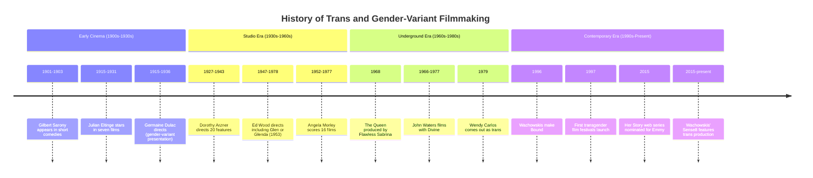

# Transgressing the Frame: A Critical Study of Transgender Representation in Middle Eastern and North African Cinema
# 1 Introduction: Mapping the Terrain of Trans Cinema in the MENA Region

The emergence of transgender themes in Middle Eastern and North African cinema represents a significant yet underexplored dimension of global queer film culture. From the pioneering documentary *Cinema Fouad* (1993) to the internationally acclaimed *Joyland* (2022), filmmakers from and within the MENA region have increasingly engaged with questions of gender variance, bodily transformation, and the social conditions that shape transgender lives. These cinematic works occupy a paradoxical space: they emerge from societies where gender non-conformity often carries severe legal penalties and profound social stigma, yet they have garnered substantial recognition on international festival circuits, from Sundance to Cannes to Berlin. This introduction establishes the foundational framework for examining how these films construct, negotiate, and contest representations of transgender subjectivity across diverse national, religious, and diasporic contexts.

The study of transgender cinema from the MENA region demands an interdisciplinary approach that integrates insights from transgender studies, postcolonial theory, and film analysis. Such an approach must remain attentive to the specificities of regional contexts—the particular configurations of Islamic jurisprudence, state policy, and cultural tradition that produce distinct understandings of gender variance—while also situating these films within transnational circuits of production, distribution, and reception. The films under examination range from intimate documentary portraits that center individual trans subjects to narrative features that employ transgender characters as lenses through which to explore broader questions of family, sexuality, and social belonging. Together, they constitute a corpus that illuminates both the possibilities and constraints of representing transgender lives in cinema emerging from one of the world's most complex geopolitical regions.

## 1.1 Research Scope and Objectives

This study delineates a corpus of films spanning over three decades of transgender representation in MENA cinema, encompassing works produced within the region and by diasporic filmmakers whose artistic practice remains connected to their countries of origin. The geographical scope extends across Iran, Lebanon, Morocco, Tunisia, Egypt, Jordan, Pakistan, and the broader Arab diaspora, recognizing that the boundaries of "MENA" are themselves contested and that transgender cinema from this region often circulates through transnational networks that complicate simple national categorizations.

The temporal boundaries of the study extend from the early 1990s to the present, beginning with Mohamed Soueid's groundbreaking documentary *Cinema Fouad* (1993), which offered an intimate portrait of Khaled El Kurdi, a Syrian trans woman living in Beirut who earned her living as a domestic worker and belly dancer.[^1] This 41-minute documentary, shot in Lebanon, wove together a complex and multi-layered story of sexuality, identity, and desire, showing scenes of El Kurdi's domestic world—eating, applying make-up, and dancing in her bedroom—while she reflected on her life and experiences and expressed her desire to undergo gender reassignment surgery.[^1][^2] The film's significance extends beyond its historical priority; Lebanon's first queer film festival, "Cinema al Fouad Beirut," derives its name from this foundational work.[^2][^3]

The corpus expands to include Tanaz Eshaghian's *Be Like Others* (2008), a documentary examining transgender individuals in Iran that premiered at the Sundance Film Festival and won three Teddy Awards at the Berlin International Film Festival.[^4] This film explored the paradox of Iranian policy wherein homosexuality carries the death penalty while sex reassignment surgery is legally sanctioned following Ayatollah Khomeini's 1987 fatwa declaring it permissible as treatment for "diagnosed transsexuals."[^4] The documentary tracked patients at Dr. Bahram Mir-Jalali's Mirdamad Surgical Center in Tehran, revealing the complex motivations—including social pressure to conform to binary gender norms—that led individuals to pursue surgical transition.[^4]

Negar Azarbayjani's *Facing Mirrors* (2011) represents a landmark as the first Iranian narrative film with a transgender protagonist, following Adineh (Eddie), a trans man fleeing an arranged marriage, and Rana, a conservative taxi driver whose encounter with Eddie challenges her traditional beliefs.[^5][^6] The film received the "Best First Feature" award at San Francisco's Frameline Film Festival and the Grand Prix at Paris's Chéries-Chéris festival, demonstrating the international recognition accorded to MENA transgender narratives.[^5][^6]

More recent works include Saim Sadiq's *Joyland* (2022), which became the first Pakistani film to premiere at the Cannes Film Festival, where it won the Jury Prize in the Un Certain Regard section and the Queer Palm for best LGBTQ-themed film.[^6] Set in inner-city Lahore, the film centers on the Rana family and the complications that arise when Haider becomes infatuated with Biba, a hijra dancer at an erotic dance theater.[^6] The film was initially banned in Pakistan before being approved with minor cuts, and it became the first Pakistani film shortlisted for Best International Feature Film at the Academy Awards.[^6]

The corpus also encompasses short films and documentary works from the 2020s, including *Treat Me Like Your Mother* (2025), Mohamad Abdouni's photographic documentary uncovering the intimate experiences of four trans women from Lebanon, recounting tales spanning from pioneering Lebanese state-funded gender-affirming surgery in 1997 to the present day.[^7][^8] Additional works include *Kelet* (2020), following a young Somali trans woman in Finland; *Our Males and Females* (2023), addressing the burial of a trans daughter in Jordan; and *Aleya* (2026), documenting an Egyptian trans woman rebuilding her life in Berlin.[^2][^9][^8]

The research objectives are threefold. First, the study aims to **map the evolution of trans visibility** in MENA cinema, tracing how representational strategies have shifted from early documentary portraits focused on individual trans subjects to more complex narrative explorations that situate transgender experience within broader social and familial contexts. Second, it seeks to **interrogate the relationship between on-screen representation and off-screen socio-legal realities**, examining how films engage with—and are shaped by—the legal frameworks, religious discourses, and social attitudes that govern transgender lives in different national contexts. Third, the study assesses the **roles of trans and non-trans filmmakers** in shaping these narratives, attending to questions of authorial agency, representational ethics, and the politics of who speaks for whom in cinematic constructions of transgender experience.

## 1.2 Defining 'Transgender' in Regional Context

The application of the term "transgender" to MENA contexts requires careful conceptual navigation, as the category itself emerges from specific Euro-American historical and political formations that may not map neatly onto regional understandings of gender variance. The films under examination engage with multiple frameworks for understanding non-normative gender identities, including religious-legal categories, medical-psychiatric classifications, and indigenous cultural formations that predate and complicate Western taxonomies.

**Iran presents perhaps the most distinctive case**, where a unique legal-religious framework shapes both the lived realities of gender-variant individuals and their cinematic representation. In 1987, Ayatollah Khomeini issued a fatwa declaring sex reassignment surgery permissible for "diagnosed transsexuals," creating a situation wherein Iran performs more such surgeries than any country except Thailand.[^4] As depicted in *Be Like Others*, this policy produces profound contradictions: while homosexuality remains punishable by death, individuals who undergo surgical transition can obtain new identity documents reflecting their affirmed gender and may even receive government loans to finance their operations.[^4][^5]

The documentary reveals how this framework conflates distinct categories of gender and sexual identity, creating pressure for gay and lesbian Iranians to pursue surgical transition as a means of social survival. Director Tanaz Eshaghian observed that patients at the gender reassignment clinic uniformly insisted they were not homosexual, viewing homosexuality as shameful and immoral—a perspective she attributed to the shame that drives many Iranians to choose transition.[^4] One patient stated explicitly: "If I were not living in Iran, I would not touch God's work."[^4] The film thus exposes how the Iranian state's paradoxical policies construct a particular form of "transsexual" identity that may not correspond to individuals' authentic self-understanding but rather represents a survival strategy within a system that criminalizes same-sex desire.

*Facing Mirrors* further illuminates this Iranian context through its narrative treatment of Adineh (Eddie), a trans man whose wealthy father seeks to prevent his transition by arranging a marriage to a male cousin.[^6] The film's producer noted in an end-title card that unofficial statistics indicate one in every 200,000 children in Iran is born transgender, and that the government supports these individuals "from a medical and logical point of view as per Imam Khomeini's Fatwa."[^5] This framing positions transgender identity within a medicalized discourse of congenital condition rather than chosen identity, reflecting the specific configuration of religious authority and biomedical knowledge that governs gender transition in the Islamic Republic.

**Pakistani cinema engages with the distinct category of "hijra,"** a South Asian identity that encompasses individuals assigned male at birth who adopt feminine gender expression and often live in organized communities with their own social structures and cultural practices. *Joyland* centers this identity through the character of Biba, a hijra dancer whose relationship with Haider disrupts the patriarchal expectations of his family.[^6] The film's treatment of Biba as a fully realized character with desires, ambitions, and vulnerabilities represents a significant departure from the stereotypical or marginal representations of hijras that have characterized much South Asian cinema. Notably, Biba is played by Alina Khan, a trans actress, reflecting a growing commitment to trans casting in trans roles.[^6]

**Lebanese and broader Arab contexts** present yet another configuration, where transgender identity intersects with the absence of legal recognition and the presence of social spaces that have historically accommodated gender-variant individuals. *Cinema Fouad* depicts Khaled El Kurdi navigating life in Beirut without legal protections, working as a domestic servant and belly dancer while facing aggression in public spaces.[^1] The documentary's attention to El Kurdi's domestic world—her routines of eating, applying makeup, dancing in her bedroom—constructs an intimate portrait that refuses to reduce trans identity to either medical pathology or exotic spectacle.

*Treat Me Like Your Mother* (2025) extends this Lebanese context across four decades, presenting what is arguably the first photographic archive of trans women in Lebanon.[^7] The film recounts tales spanning from pioneering state-funded gender-affirming surgery in 1997 to vanished safe spaces in the present, with subjects including Em Abed, Jamal Abdo, Antonella, and Mama Jad.[^7] Director Mohamad Abdouni's approach emphasizes celebration over trauma, allowing each woman to structure her own narrative—whether by surgical milestones, romantic relationships, or pivotal accidents—rather than imposing external frameworks.[^8]

**Moroccan cinema** offers another perspective through Maryam Touzani's *The Blue Caftan* (2022), which, while centering a gay male protagonist rather than a transgender character, illuminates the broader landscape of LGBTQ representation in a country where homosexuality remains illegal and punishable by imprisonment.[^6][^10] Touzani articulated her motivation for creating the film: "Homosexuality in Morocco is an ultimate taboo and illegal... I felt it was essential to talk about this to bring about change and give the LGBT community a voice and a face."[^6][^10] This statement reflects the conditions under which queer and trans cinema emerges from the region—as interventions intended to render visible lives that dominant discourses would prefer to erase.

The conceptual complexity of transgender identity in MENA contexts is further illustrated by **diasporic works** that navigate between regional frameworks and Western categories. *Run(a)way Arab* (2017/2018), directed by Amrou Al-Kadhi, follows Queen Za Dream, a 26-year-old Middle Eastern drag queen preparing for a performance, intercut with memories of her childhood as a gender-queer boy named Nazeem and her relationship with her Iraqi-Egyptian mother Halima.[^10][^11] The film explores how Arab society's strict gender expectations shape the possibilities for gender-variant expression, while also depicting how drag performance becomes a means of preserving connection to maternal memory and cultural heritage.

This study therefore employs the term "transgender" with awareness of its limitations and contested meanings, using it as a heuristic category that encompasses the diverse forms of gender variance represented in MENA cinema while remaining attentive to the specific frameworks—religious, legal, medical, cultural—that shape how these identities are understood and lived in particular contexts.

## 1.3 Theoretical Framework and Methodological Approach

The theoretical apparatus guiding this study draws on multiple disciplinary traditions, integrating insights from transgender studies, postcolonial queer theory, and film analysis to develop an approach adequate to the complexity of its object. This interdisciplinary framework recognizes that MENA transgender cinema cannot be adequately understood through any single theoretical lens but requires attention to the intersections of gender, sexuality, religion, nation, and diaspora that shape both the production and reception of these films.

**From transgender studies**, the analysis draws on concepts of visibility politics, examining how films negotiate the tension between making transgender lives visible—and thus potentially legible to hostile state and social forces—and the political necessity of representation for communities seeking recognition and rights. The corpus under examination reveals diverse strategies for managing this tension: *Be Like Others* employs observational documentary techniques that grant viewers intimate access to trans subjects' lives while also exposing them to potentially voyeuristic or pathologizing gazes; *Facing Mirrors* uses narrative fiction to imagine transgender subjectivity from within, centering Eddie's perspective and desires rather than treating trans identity as an object of external scrutiny; *Treat Me Like Your Mother* explicitly foregrounds questions of archival preservation and historical memory, constructing a visual record of trans lives that might otherwise disappear.[^4][^5][^7]

The concept of **narrative agency** proves particularly salient for analyzing how films position transgender subjects as active agents in their own stories versus objects of others' discourse. *Cinema Fouad* presents a complex case: while director Mohamed Soueid's "goading questions" reproduce some of the aggressive dynamics El Kurdi faces in public space, her "adept defiance" in response asserts her own interpretive authority over her experience.[^1] This dynamic—wherein the documentary form simultaneously enables and constrains trans self-representation—recurs across the corpus and demands careful attention to the power relations embedded in filmmaking practices.

**Postcolonial queer theory** informs the study's attention to how MENA transgender cinema negotiates between local and transnational frameworks for understanding gender and sexuality. The films under examination circulate through international festival networks that bring their own expectations and interpretive frameworks, potentially shaping both production choices and reception contexts. *Joyland*'s trajectory—from Cannes premiere to initial Pakistani ban to eventual domestic release with cuts—illustrates how transnational circulation can both enable and complicate the visibility of queer and trans narratives from the Global South.[^6]

The study also engages with **trans of color critique**, which emphasizes the inseparability of gender identity from racial formation, colonial history, and economic marginality. This framework proves essential for understanding films that depict trans subjects navigating multiple axes of vulnerability: El Kurdi's position as a Syrian migrant in Lebanon, working as a domestic servant; the patients in *Be Like Others* facing both gender-based and class-based constraints on their life possibilities; Kelet's experience as a Black trans woman in Finland, where her dreams of modeling intersect with racial exclusion in the fashion industry.[^1][^4][^9]

**From film theory**, the analysis employs concepts of the gaze, narrative structure, and documentary ethics to examine how cinematic form shapes the representation of transgender subjects. The documentary films in the corpus raise particular questions about the **ethnographic gaze**—the power dynamics inherent in filming marginalized subjects for audiences who may not share their social position. *Be Like Others* was made by Tanaz Eshaghian, an Iranian-American filmmaker who returned to Iran for the first time in 25 years to make the film; her position as both insider and outsider to Iranian society shapes the film's perspective and its reception.[^4] The film's screening on BBC television and at international festivals positions its subjects before audiences who may view them through Orientalist or sensationalist lenses, raising questions about the ethics of representing vulnerable lives for global consumption.

The **methodological approach** combines close textual analysis of selected films with attention to production contexts, festival circulation, and conditions of spectatorship. Close reading examines how films employ cinematography, editing, sound, and narrative structure to construct particular representations of transgender experience, attending to both manifest content and the formal choices that shape meaning. Production analysis investigates the conditions under which films are made—funding sources, censorship constraints, the involvement of trans individuals in creative roles—to understand how material circumstances shape aesthetic and political possibilities.

Festival circulation analysis traces how films move through international networks, examining how programming contexts, awards, and critical reception frame their meaning for different audiences. *Facing Mirrors* received the "Best First Feature" award at Frameline and the Grand Prix at Chéries-Chéris, positioning it within LGBTQ film culture; *Joyland* won the Queer Palm at Cannes, the Teddy Award at Berlin, and was shortlisted for the Academy Awards, demonstrating the multiple circuits through which MENA trans films gain visibility.[^5][^6]

Attention to **conditions of spectatorship** proves particularly important for films that face legal prohibition in their countries of origin. Sam Abbas's *The Wedding* (2022), produced by ArabQ Films—the first Arab-based production company dedicated to LGBTQ themes—was screened in Turkey, Tunisia, Lebanon, and Egypt through "secret, speakeasy-style locations" with extensive security measures including NDAs, ID checks, no cell phones, and pat-downs upon entry.[^7] These clandestine screenings represent a distinct mode of film reception that shapes how audiences encounter and interpret queer and trans narratives from the region.

## 1.4 Central Research Questions

The central research questions structuring this study emerge from the intersection of transgender studies, film theory, and area studies, seeking to illuminate how MENA cinema constructs, contests, and circulates representations of transgender experience. These questions guide the close analyses of individual films while also informing the comparative synthesis that identifies patterns across the corpus.

**How do MENA films represent transgender subjectivities, and what narrative and aesthetic strategies do they employ?** This question directs attention to the formal and thematic choices through which filmmakers construct transgender characters and experiences. The corpus reveals diverse strategies: *Be Like Others* employs observational documentary techniques that follow subjects through the process of medical transition, depicting both the surgical procedures and their psychological and social aftermath;[^4] *Facing Mirrors* uses the road movie genre to bring together characters from different social positions, using their journey as a framework for exploring how encounter with difference can transform understanding;[^5][^6] *Joyland* employs the family melodrama to situate transgender identity within the context of patriarchal expectations and intergenerational conflict.[^6]

**To what extent do trans filmmakers and performers exercise authorial agency within these productions?** This question addresses the politics of representation, examining who controls the means of producing transgender images and narratives. The corpus includes films made by trans and non-trans directors, with varying degrees of trans involvement in creative roles. *Joyland* cast trans actress Alina Khan as Biba and employed a trans man, Bulut Sezer, as a casting director;[^6][^8] *Treat Me Like Your Mother* was directed by Mohamad Abdouni, who is not trans but whose approach emphasized allowing subjects to structure their own narratives;[^7][^8] the launch of ArabQ Films, requiring that all projects have "a self-identified queer, gay, lesbian, bisexual and/or transgender director and/or lead producer," represents an institutional effort to ensure queer and trans authorship.[^7]

**How do religious, legal, and familial frameworks shape both cinematic content and audience reception?** This question attends to the socio-political contexts within which MENA transgender cinema is produced and consumed. The Iranian films in the corpus engage directly with the paradoxical legal framework created by Khomeini's fatwa, depicting how state policy shapes individual choices about gender transition;[^4][^5] *Joyland* confronts Pakistani censorship, initially being banned before receiving approval for release with cuts;[^6] *The Blue Caftan* addresses Moroccan illegality of homosexuality while seeking to "give the LGBT community a voice and a face."[^6][^10]

**How do diasporic and transnational circuits of production and distribution influence the visibility and interpretation of trans narratives originating from the region?** This question examines how MENA transgender cinema circulates beyond its contexts of origin, attending to the ways that international festival programming, streaming platforms, and critical discourse shape how these films are understood. The corpus includes films produced entirely within the region (*Facing Mirrors*, *Joyland*), films made by diasporic filmmakers (*Be Like Others*, *Run(a)way Arab*), and international co-productions that involve funding and creative personnel from multiple countries (*Treat Me Like Your Mother*, *Kelet*).[^4][^5][^6][^10][^7][^9]

## 1.5 Significance of the Study

This study contributes to multiple scholarly conversations while also addressing urgent social and political concerns. Its significance lies in its capacity to **correct the Eurocentrism of existing transgender film scholarship**, which has overwhelmingly focused on Euro-American productions while neglecting the rich and complex body of work emerging from the MENA region and its diasporas. By centering films from Iran, Lebanon, Morocco, Pakistan, and other MENA contexts, the study expands the archive of transgender cinema scholarship and challenges assumptions about where and how transgender narratives are produced and circulated.

The films under examination serve as **cultural documents that illuminate lived experiences under conditions of legal precarity and social stigma**. *Be Like Others* reveals how Iranian trans individuals navigate a system that simultaneously enables surgical transition and criminalizes same-sex desire, exposing the human costs of policies that force individuals to choose between authentic self-expression and social survival.[^4] *Cinema Fouad* documents the daily life of a trans woman in 1990s Beirut, preserving a record of experiences that might otherwise be lost to historical erasure.[^1] *Treat Me Like Your Mother* explicitly frames itself as an archival project, constructing "arguably the first photographic archive of trans women in Lebanon."[^7]

These films also function as **aesthetic interventions that challenge dominant representational regimes**. They employ diverse formal strategies—documentary observation, narrative fiction, experimental techniques, photographic portraiture—to construct images of transgender life that refuse reduction to stereotype or pathology. *Facing Mirrors* uses the conventions of the road movie to generate sympathy and solidarity between characters who initially seem to have nothing in common;[^5][^6] *Joyland* employs the family melodrama to position transgender identity within the context of broader social structures rather than as an isolated individual condition;[^6] *Run(a)way Arab* uses fragmented structure and drag performance to explore the intersection of gender variance with cultural memory and diasporic identity.[^10][^11]

The **timeliness of the study** reflects the recent proliferation of MENA queer cinema on international festival circuits and streaming platforms. The 2020s have witnessed an unprecedented visibility for these works: *Joyland* became the first Pakistani film at Cannes and the first shortlisted for the Academy Awards;[^6] *The Blue Caftan* was shortlisted for Best International Film Oscar;[^6] *Crossing* (2024), while set in Turkey and Georgia rather than the Arab world, won the Teddy Award at Berlin and the GLAAD Media Award, demonstrating continued international interest in trans narratives from the broader region.[^8] The MENA Film Festival, now in its seventh edition, programs queer shorts including trans-themed works like *Aleya* (2026), indicating the institutionalization of MENA queer cinema as a recognized category.[^8]

The following table summarizes key films in the corpus, illustrating the geographical and temporal scope of MENA transgender cinema:

| **Film** | **Year** | **Country** | **Director** | **Format** | **Key Recognition** |
|----------|----------|-------------|--------------|------------|---------------------|
| *Cinema Fouad* | 1993 | Lebanon | Mohamed Soueid | Documentary | Namesake of Lebanon's first queer film festival |
| *Be Like Others* | 2008 | Iran/Canada/UK/US | Tanaz Eshaghian | Documentary | Three Teddy Awards, Berlin; Emmy nomination |
| *Facing Mirrors* | 2011 | Iran | Negar Azarbayjani | Narrative | Best First Feature, Frameline; Grand Prix, Chéries-Chéris |
| *The Great Safae* | 2014 | Morocco | Randa Maroufi | Short | Short Film Winner, BBC Arabic Festival 2015 |
| *Run(a)way Arab* | 2017 | UK/Egypt | Amrou Al-Kadhi | Short | BFI Flare, Newfest, OutFest LA |
| *Kelet* | 2020 | Finland | Susani Mahadura | Documentary | Audience Award, DocPoint Helsinki |
| *Joyland* | 2022 | Pakistan | Saim Sadiq | Narrative | Jury Prize & Queer Palm, Cannes; Academy Award shortlist |
| *Our Males and Females* | 2023 | Jordan | Ahmad Alyaseer | Short | Festival circuit |
| *Treat Me Like Your Mother* | 2025 | Lebanon | Mohamad Abdouni | Documentary | Cinema Politica distribution |
| *Aleya* | 2026 | Egypt/Germany | Omar Abogabal | Short | MENA Film Festival 2026 |

This corpus demonstrates the **geographical breadth** of MENA transgender cinema, spanning the Levant, North Africa, the Gulf, South Asia, and the diaspora, while also revealing patterns of concentration—particularly the prominence of Iranian and Lebanese productions—that reflect specific configurations of cultural production and transnational circulation. The temporal range from 1993 to 2026 enables analysis of how representational strategies have evolved over three decades, from pioneering documentary portraits to contemporary works that engage with transgender themes through increasingly sophisticated narrative and aesthetic means.

The study's significance ultimately lies in its capacity to **foster greater understanding** of transgender lives in the MENA region while also contributing to broader theoretical conversations about the politics of representation, the ethics of documentary practice, and the possibilities of cinema as a medium for social transformation. By attending to both the specificities of regional contexts and the transnational circuits through which these films circulate, the study illuminates how MENA transgender cinema negotiates between local and global frameworks for understanding gender, sexuality, and identity.

# 2 Theoretical Frameworks: Intersecting Trans Theory and Film Analysis

The analysis of transgender representation in Middle Eastern and North African cinema requires an interdisciplinary theoretical apparatus capable of navigating the complex intersections of gender, culture, religion, and colonial history that shape both the production and reception of these films. This chapter establishes the foundational concepts from transgender studies and film theory that will guide subsequent close readings, while critically examining how frameworks developed primarily in Euro-American academic contexts must be adapted, contested, and enriched when applied to cinematic works emerging from the MENA region. The theoretical enterprise undertaken here is not merely one of application—importing ready-made concepts to analyze unfamiliar texts—but rather one of **productive dialogue**, wherein the specificities of MENA transgender cinema illuminate limitations in existing theory while also revealing unexpected resonances and possibilities.

The challenge of developing an adequate theoretical framework for MENA trans cinema reflects broader debates within both transgender studies and postcolonial theory about the universality versus cultural specificity of gender categories. As Joseph Massad has argued, sexual identities such as "queer, gay, lesbian" and homosexual do not exist in an Arab and Middle Eastern context in the same form as in the West; these terminologies have been imported through processes of cultural imperialism[^12]. Yet as Dina Georgis counters, Massad's logic "reduces self-identified gay Arabs as self-hating and assimilated to Western constructs"[^12]. This tension between recognizing indigenous forms of gender variance and resisting the imposition of Western categories runs throughout the theoretical work required to analyze MENA transgender cinema. The films themselves often navigate precisely this terrain, representing subjects who may or may not understand themselves through the lens of "transgender" identity as it has been theorized in Euro-American contexts.

The theoretical frameworks assembled in this chapter therefore maintain a **dual orientation**: they draw on the conceptual resources of transgender studies and film theory to illuminate the formal and thematic strategies of MENA films, while simultaneously allowing those films to challenge and extend the theoretical frameworks themselves. This approach recognizes that theory is not a neutral instrument of analysis but a form of cultural production with its own histories, assumptions, and blind spots. The goal is to develop what might be termed a **situated theoretical practice**—one that remains attentive to the power dynamics embedded in the application of theory across cultural contexts while still enabling rigorous and illuminating analysis.

## 2.1 Foundations from Transgender Studies: Performativity, Embodiment, and Beyond

The theoretical foundations of transgender studies provide essential conceptual tools for analyzing how films construct, represent, and position transgender subjects. These frameworks illuminate the ways that gender identity is performed, embodied, and regulated—processes that cinema is uniquely positioned to visualize and interrogate. However, the application of these predominantly Western theoretical frameworks to MENA contexts requires careful critical attention to their assumptions, limitations, and potential for productive transformation.

### 2.1.1 Gender Performativity and Cinematic Representation

**Judith Butler's theory of gender performativity** stands as perhaps the most influential theoretical contribution to understanding gender as a social construction rather than a natural essence. In *Gender Trouble*, Butler argues that "in imitating gender, drag implicitly reveals the imitative structure of gender itself—as well as its contingency"[^13]. This insight—that gender is not an inner truth expressed through external behaviors but rather a set of repeated performances that produce the illusion of a stable identity—has profound implications for analyzing transgender representation in cinema.

Butler's performativity theory suggests that gender is constituted through "the repeated stylization of the body within a regulatory frame that produces the appearance of natural being over time"[^14]. This framework proves particularly illuminating for analyzing how MENA films depict the processes through which trans subjects construct and enact gender identities. The concept of performativity highlights that **gender is both a spatial and temporal concept**, subject to normative and queer inscriptions as well as erasure[^14]. Films can visualize these processes of gender construction—showing characters adopting particular mannerisms, sartorial choices, and bodily comportments—while also revealing how social contexts enable or constrain such performances.

However, the application of performativity theory to MENA transgender cinema reveals significant complications. As analysis of Chinese transgender cinema has demonstrated, **gender performativity is not necessarily subversive**; it merely indicates that heterosexual norms are arbitrary and non-natural[^15]. The films examined in this study often depict transgender performances that, rather than challenging heterosexist gender binaries, may actually support and consolidate gender hierarchies[^15]. This observation proves crucial for analyzing MENA films where transgender representation may serve purposes other than—or in addition to—gender subversion.

The case of Iranian cinema illustrates this complexity with particular clarity. In *Facing Mirrors* (2011), the protagonist Eddie performs masculinity in ways that simultaneously challenge and reinforce normative gender expectations. The film depicts Eddie's "defiance and complexity" as he struggles against his transphobic father's control, yet the narrative framework ultimately positions his transition within a medicalized discourse of congenital condition sanctioned by religious authority[^16]. The performativity of gender in this context operates within a specific regulatory frame—one shaped by Ayatollah Khomeini's fatwa permitting sex reassignment surgery for "diagnosed transsexuals"—that produces particular forms of transgender subjectivity distinct from those theorized in Euro-American contexts.

The concept of **"trans as method"** offers a productive extension of performativity theory for cinematic analysis. This approach "interprets dramatic actions as signifying tacit transness without explicit contemporary vocabulary"[^14]. Rather than requiring that characters explicitly identify as transgender according to Western categories, trans as method attends to how films represent gender variance through performance, embodiment, and social interaction. This framework proves particularly valuable for analyzing MENA films that may depict gender-variant subjects without employing the terminology of transgender identity.

### 2.1.2 Theories of Embodiment and the Materiality of Trans Bodies

While performativity theory emphasizes the discursive construction of gender, **theories of embodiment** attend to the material dimensions of trans experience—the felt sense of inhabiting a gendered body and the transformations that bodies may undergo. These frameworks prove essential for analyzing how films represent the physical processes of transition, the affective experiences of bodily dysphoria and euphoria, and the ways that trans bodies become sites of social regulation and personal agency.

Eliza Steinbock's concept of **"shimmering"** offers a particularly productive framework for understanding how cinema represents gender transitions. Drawing on Barthes's idea of the "shimmer" and Foucault's notion of sex as a mirage, Steinbock shows how "sex and gender can appear mirage-like on film," an effect that "delineates change in its emergent form as well as the qualities of transforming bodies, images, and affects"[^17]. This aesthetic framework illuminates how films can visualize the processual nature of gender transition—not as a movement from one fixed state to another but as an ongoing becoming that resists stable categorization.

The shimmering aesthetic proves particularly relevant for analyzing MENA films that depict the embodied experience of gender transition. *Be Like Others* (2008), for instance, documents patients at a gender reassignment clinic in Tehran, showing both surgical procedures and their psychological aftermath. The documentary's attention to the physical processes of transition—the medical interventions, the healing bodies, the gradual transformation of appearance—engages with embodiment in ways that purely discursive accounts of performativity cannot capture. The film reveals how **the body has its own agency** in processes of gender transition, resisting complete determination by either individual will or social prescription[^15].

The concept of **gender dysphoria** as an affective register provides another essential framework for analyzing how films represent trans experience. Research on transgender media representation indicates that media depictions often engage with dysphoria through what might be termed a **"joy deficit"**—an overemphasis on suffering and pathology at the expense of positive experiences of gender affirmation[^18]. Contemporary scholarship has increasingly emphasized **"trans joy"** as a narrative concept, focusing on positive emotions and gender euphoria to actively challenge historical pathologization[^18]. This framework enables analysis of whether and how MENA films reproduce or challenge the predominant association of transgender experience with suffering.

The films in this study engage with embodiment in diverse ways that reflect the specific configurations of medical, legal, and religious authority governing trans bodies in different national contexts. Iranian films like *Facing Mirrors* and *Be Like Others* must negotiate a framework wherein the state financially supports sex reassignment surgeries for those who cannot afford them, while simultaneously criminalizing homosexuality[^16]. This paradox produces particular forms of embodied transgender experience—shaped by access to medical transition but constrained by the requirement to conform to binary gender norms—that differ significantly from contexts where transition is either entirely prohibited or available through individual choice.

### 2.1.3 Critique of the Medical-Industrial Complex

The **critique of the medical-industrial complex** constitutes another essential theoretical framework from transgender studies, illuminating how medical and psychiatric institutions regulate access to transition while constructing particular understandings of transgender identity. This critique has particular salience for analyzing MENA films that depict the medical dimensions of gender transition.

The concept of **"transnormativity"** describes how media representations often limit acceptable transgender identities to those that conform to binary gender expectations, are white and middle-class, have completed medical transition, and display normative gender behaviors[^19]. Research indicates that "media-displayed trans-normativity and real-life trans-normativity are disconnected," with media representations failing to capture the diversity of actual transgender experiences[^19]. This framework enables critical analysis of how MENA films may reproduce or challenge transnormative expectations.

The medical-industrial complex governing transgender healthcare has been characterized by some critics as a **"gender industrial complex"**—a system driven by economic interests that may not align with patients' best interests[^20]. While this critique has been mobilized by both trans advocates and anti-trans activists, it illuminates the material conditions shaping access to transition in different contexts. In the MENA region, these conditions vary dramatically: Iran provides state-funded surgeries under specific conditions; Egypt prohibits gender-affirming healthcare for transgender individuals through policies influenced by Islamic jurisprudence[^21]; Lebanon lacks official programs for gender-affirming healthcare and clear legal pathways for recognition[^21].

The films in this study engage with medical institutions in ways that reveal these varying configurations. *Be Like Others* documents the operations of Dr. Bahram Mir-Jalali's clinic in Tehran, showing how the Iranian medical system produces particular forms of transgender subjectivity through its gatekeeping practices. The documentary reveals how patients must navigate psychiatric evaluation, family approval, and religious authorization to access surgery—a process that constructs transgender identity as a medical condition requiring institutional validation rather than a matter of individual self-determination.

### 2.1.4 Adapting Western Frameworks to MENA Contexts

The theoretical frameworks outlined above require significant adaptation when applied to MENA contexts, where distinct religious, legal, and cultural configurations produce alternative understandings of gender variance. This adaptation involves both **critical interrogation** of the assumptions embedded in Western theory and **creative extension** of theoretical concepts to illuminate phenomena they were not originally designed to address.

The Iranian context presents perhaps the most striking case of how religious authority shapes understandings of transgender identity in ways that differ from Western secular frameworks. The 1978 fatwa issued by Ayatollah Khomeini declaring sex reassignment surgery permissible created a unique situation wherein "transpeople seeking transition are legally accepted in Iran"[^22]. However, this acceptance operates within a framework that distinguishes sharply between transgender identity (which can be "corrected" through surgery) and homosexuality (which remains punishable by death). This configuration produces forms of transgender subjectivity that cannot be adequately understood through Western frameworks that typically separate gender identity from sexual orientation.

The concept of **"khawal"** in Egyptian cinema illustrates how indigenous categories of gender variance may differ from Western transgender identity. Analysis of Egyptian films reveals how homosexual characters, often depicted through the figure of the khawal, are frequently attributed to "the evils of the Western society"—the colonial powers that occupied North Africa[^23]. This framing positions gender and sexual variance as foreign impositions rather than indigenous phenomena, reflecting the complex entanglement of gender, sexuality, and colonial history in the region.

The theoretical work required for analyzing MENA transgender cinema thus involves what might be termed **"situated translation"**—the careful movement of concepts across cultural contexts with attention to what is gained and lost in the process. This approach recognizes that theoretical frameworks are not neutral tools but cultural products that carry assumptions about gender, sexuality, and identity that may not translate directly to other contexts.

## 2.2 Film Theory and the Politics of Representation: Gaze, Narrative, and Genre

Film theory provides essential conceptual resources for analyzing how cinema constructs, positions, and presents transgender subjects to viewers. The frameworks examined in this section illuminate the formal and aesthetic strategies through which MENA filmmakers represent transgender experience, while also revealing the power dynamics embedded in cinematic representation.

### 2.2.1 The Male Gaze and Its Extensions

**Laura Mulvey's theorization of the male gaze** in her seminal 1975 essay "Visual Pleasure and Narrative Cinema" established a foundational framework for understanding how cinema positions viewers in relation to gendered bodies on screen. Mulvey argues that mainstream cinema is structured around a masculine, heterosexual perspective in which "the scopophilic instinct (pleasure in looking at another person as an erotic object), and, in contradistinction, ego libido (forming identification processes) act as formations, mechanisms which... cinema has played on"[^24]. This framework illuminates how films construct gendered subject positions for both characters and viewers.

The male gaze operates through what Mulvey identifies as **three distinct modes of looking**: the gaze of the camera as it records the pro-filmic event; the gaze of the characters within the film as they look at each other; and the gaze of the spectator as they watch the film[^25]. These three looks are typically organized to serve masculine visual pleasure, with female characters positioned as passive objects of an active male gaze. The camera's movements, angles, and framings work to construct female bodies as spectacles for visual consumption.

The application of this framework to transgender cinema reveals both its utility and its limitations. As John Phillips observes, **the ambiguity of the transgender body hinders the viewer's ability to experience visual pleasure** in conventional ways[^24]. The transgender body disrupts the binary gender system that organizes the male gaze, creating what might be termed a **"crisis of looking"** wherein viewers struggle to position trans characters within familiar categories of identification and desire. This disruption can produce anxiety, fascination, or new forms of visual pleasure that exceed the heteronormative framework Mulvey describes.

The concept of the gaze has been extended and critiqued by subsequent theorists. The notion of a **"female gaze"** has been proposed as a counter to the male gaze, though scholars emphasize that this is not simply a reversal that objectifies male bodies in the same way[^25]. Rather, the female gaze focuses on "more complex narratives, portraying women as autonomous subjects, and embracing their experiences and inner thoughts"[^25]. This framework proves relevant for analyzing MENA films directed by women that center transgender experience, such as Negar Azarbayjani's *Facing Mirrors*.

### 2.2.2 The Transgender Gaze as Counter-Hegemonic Looking

**Jack Halberstam's concept of the transgender gaze** offers a particularly productive framework for analyzing how films can construct alternative modes of looking that destabilize cisnormative visual regimes. Halberstam first articulated this concept in a 2001 essay analyzing *Boys Don't Cry*, arguing that the film "forces spectators to adopt, if only provisionally, Brandon's gaze, a transgender look"[^13]. This transgender gaze is characterized by two key features: first, it "destabilizes cisnormative ideas by subverting and reversing 'lack'"; second, it maintains "the ability to remain in the queer sphere, resisting the institutions of heterosexuality and cisgenderism"[^22].

The transgender gaze operates through what Halberstam terms a **destabilization of the psychoanalytic concept of "lack"**. In classical film theory, the female body signifies castration anxiety for the male viewer; the transgender gaze reverses this dynamic, positioning the male subject as representing "lack, castration anxiety, and incoherence" while the female subject "maintains a complete, coherent existence"[^22]. This reversal challenges the gendered assumptions embedded in psychoanalytic film theory while opening new possibilities for understanding how trans subjects look and are looked at.

Scholars have extended Halberstam's concept to include additional dimensions of the transgender gaze. One theorist proposes that the transgender gaze also encompasses "the development of a heightened awareness of one's own and others' gendered features and their fluidity"[^22]. This awareness extends to the act of **"seeing through"**—not as internalized transphobia but rather as "the ability to see said gendered features as part of a whole new trans identity, a trans body that is separate from ideal representations of man and woman"[^22]. This extended concept of the transgender gaze illuminates how trans viewers may experience films differently than cisgender audiences, recognizing aspects of gender performance and embodiment that remain invisible to normative looking.

The transgender gaze also facilitates what might be termed **"trans kinship"**—the recognition of shared experience that connects trans viewers to trans characters and to each other. Through the transgender gaze, "we see each other's transgressive existences as beautiful in themselves, existences that do not need to be defined or limited by language or science"[^22]. This framework proves particularly relevant for analyzing how MENA transgender films may construct communities of recognition among trans viewers, even when those films circulate through international festival networks to predominantly cisgender audiences.

### 2.2.3 Narrative Structures and Ideological Implications

The narrative structures employed in transgender cinema carry significant ideological implications, shaping how audiences understand and relate to trans characters and experiences. John Phillips identifies **plots of deception and revelation** as characteristic of transgender cinema, arguing that these narrative structures compensate for the challenges that trans bodies present to conventional modes of visual pleasure[^24].

In films employing deception/revelation plots, "the audience derives pleasure from observing the deception's success or failure"[^24]. Some films position the audience as privy to the transgender character's "deception" from the beginning, creating dramatic irony as viewers watch other characters fail to perceive what they already know. Other films "facilitate the deception of the audience in addition to the characters within the film," creating the "pleasure of discovery" when the trans character's identity is revealed[^24]. These narrative structures have been critiqued for positioning transgender identity as inherently deceptive—a framing that has real-world consequences in the form of the **"deceiver" trope** that has been used to justify violence against trans people[^18].

The deception/revelation structure reflects what Marjorie Garber terms the **"progress narrative"** of cross-dressing cinema, wherein "each [cross-dressing character] is 'compelled' by social and economic forces to disguise himself or herself in order to get a job, escape repression, or gain artistic or political 'freedom'"[^24]. This narrative structure communicates that "crossdressing can be 'fun' or 'functional' so long as it occupies a liminal space and a temporary time period"[^13]. The progress narrative typically concludes with the restoration of normative gender, reassuring audiences that gender transgression is temporary and containable.

MENA transgender films often engage with and complicate these narrative structures. *Facing Mirrors* employs a road movie framework that brings together Eddie, a trans man fleeing an arranged marriage, with Rana, a conservative taxi driver. The film's narrative does not follow the deception/revelation pattern; rather, Eddie's trans identity is evident from the beginning, and the dramatic tension derives from Rana's gradual recognition of their shared humanity. This narrative structure positions transgender identity not as a secret to be revealed but as a reality to be understood and accepted.

The **"trans killer" trope** represents another significant narrative pattern in transgender cinema, one that has had particularly damaging effects on public perception of trans people. Films like *Psycho* (1960) and *The Silence of the Lambs* (1991) established a subgenre of horror films wherein transgender or cross-dressing characters are positioned as violent psychotics[^24]. As one analysis notes, *The Silence of the Lambs* "ultimately communicates that 'gender dysphoria is a state of uncertainty in which the subject hovers between the masculine and the feminine, a state of confusion that might even lead to psychosis and murder'"[^13]. This narrative structure positions transgender identity as inherently threatening, constructing trans characters as objects of fear rather than sympathy or identification.

Analysis of transgender horror films reveals how **cisgender authorship and cisgender audiences** shape the construction of trans characters as fear objects. These films are "constructed by cisgender authors for cisgender audiences, with the point of identification located within cisgender identity"[^26]. The alignment of author and audience identification "keeps the film aligned narratively and visually with cisgender ideology," positioning trans characters as dangerous others to be contained or eliminated[^26]. This framework illuminates how the politics of authorship and spectatorship shape transgender representation across genres.

### 2.2.4 Genre Conventions and Trans Representation

Different film genres employ distinct conventions for representing transgender subjects, positioning them variously as objects of comedy, tragedy, horror, or sympathy. Understanding these genre conventions proves essential for analyzing how MENA filmmakers navigate and transform established patterns of transgender representation.

The following table summarizes major genre conventions in transgender cinema:

| **Genre** | **Typical Positioning of Trans Characters** | **Narrative Function** | **Affective Register** |
|-----------|---------------------------------------------|------------------------|------------------------|
| Comedy | Objects of humor; gender transgression as source of laughs | Temporary disruption resolved through return to normative gender | Amusement, relief |
| Horror | Violent psychotics; threats to be eliminated | Embody danger and disorder; justify violence | Fear, disgust |
| Melodrama | Tragic figures; victims of social prejudice | Evoke sympathy; expose social injustice | Pity, sadness |
| Documentary | Subjects of ethnographic observation | Educate audiences; make visible marginalized lives | Curiosity, empathy |
| Romance | Obstacles to heteronormative coupling | Test boundaries of desire; ultimately contained | Desire, anxiety |

**Documentary conventions** prove particularly relevant for analyzing MENA transgender cinema, given the prominence of non-fiction works in the corpus. Documentary representation of transgender subjects raises specific ethical questions about the power dynamics inherent in filming marginalized communities. The observational documentary mode, exemplified by *Be Like Others*, grants viewers intimate access to trans subjects' lives while also potentially reproducing ethnographic gazes that position subjects as objects of external scrutiny rather than agents of their own narratives.

**Melodrama** offers another significant genre framework for transgender cinema, one that positions trans characters as sympathetic victims of social prejudice. Films like *Boys Don't Cry* (1999) employ melodramatic conventions to evoke audience sympathy for trans protagonists, though this approach has been critiqued for constructing transgender experience primarily through suffering and victimization[^18]. The "tragic trans" narrative pattern, wherein trans characters frequently die or face violence, has been identified as a dominant mode of representation that contributes to the "joy deficit" in transgender media[^18].

MENA filmmakers have engaged with and transformed these genre conventions in significant ways. *Joyland* (2022) employs the family melodrama to situate transgender identity within the context of patriarchal expectations and intergenerational conflict, positioning Biba not as a tragic victim but as a fully realized character with her own desires and agency. *Facing Mirrors* combines elements of the road movie and social drama to construct a narrative of encounter and transformation that refuses the deception/revelation structure typical of transgender cinema.

## 2.3 Trans of Color Critique and Postcolonial Interventions

The theoretical frameworks of trans of color critique and postcolonial queer theory provide essential correctives to the Eurocentrism of mainstream transgender studies and film theory. These frameworks illuminate how gender identity is inseparable from racial formation, colonial history, class position, and migration status—all crucial dimensions for understanding MENA transgender cinema.

### 2.3.1 Intersectionality and Trans of Color Critique

**Trans of color critique** emerges from the recognition that transgender experience cannot be understood apart from the racial, economic, and geopolitical contexts that shape it. This framework emphasizes that "transgender as a category is inflected by 'race,' ethnicity, geographical location, sexual orientation, and age"[^15]. The development of "an intersectional trans analysis" requires critical attention to how these multiple dimensions of identity and experience interact and co-constitute each other.

Research on transgender media representation reveals how **transnormativity operates through racial exclusion**, with acceptable transgender representations typically being "white, upper-class, and exclusionary of people of color"[^19]. Media representations often "adhere to a binary logic that erases trans men and misogyny toward trans women," while also "reinforcing heteronormative stereotypes through having cisgender actors play trans roles"[^19]. These patterns of exclusion have particular implications for analyzing MENA transgender cinema, which represents subjects who are racialized as non-white within Western visual economies.

The films in this study depict trans subjects navigating multiple axes of marginalization. *Cinema Fouad* (1993) documents Khaled El Kurdi's position as a Syrian migrant in Lebanon, working as a domestic servant while also facing social stigma as a trans woman. *Kelet* (2020) follows a young Somali trans woman in Finland whose dreams of modeling intersect with racial exclusion in the fashion industry. These films reveal how transgender experience in the MENA region and its diasporas is shaped by intersecting structures of gender, race, nationality, and class.

The concept of **"dual marginalization"** proves particularly relevant for understanding the position of trans women in the MENA region. As analysis of queer representation in Arab cinema notes, "Arab queer women are rendered invisible in the Middle East twice: firstly, for being women living in male-led societies where gender inequalities are still the norm and, secondly, for being queer, which is also against the heterosexual norm"[^12]. This framework illuminates how trans women in the region face compounded forms of marginalization that shape both their lived experiences and their cinematic representation.

### 2.3.2 Orientalism and the Western Gaze

**Postcolonial theory** provides essential frameworks for understanding how MENA transgender cinema is shaped by—and potentially challenges—Orientalist constructions of the Middle East and North Africa. Edward Said's analysis of Orientalism as a discourse that constructs the "Orient" as the West's exotic, backward, and threatening Other has been extended by scholars to examine how Western media representations of MENA gender and sexuality reproduce colonial power dynamics.

The reception of MENA transgender films on international festival circuits is shaped by what scholars term the **"Orientalizing effect of the Western gaze on Middle Eastern subjects"**[^22]. This gaze "historically fantasized about the closed-door sexual lives of Middle Easterners," constructing the region as a site of exotic sexuality while simultaneously positioning it as backward and repressive[^22]. Films that conform to Western expectations about MENA gender and sexuality may receive greater attention and acclaim, while those that challenge Orientalist narratives may be ignored or dismissed.

The contrasting receptions of *Circumstance* (2011) and *Facing Mirrors* (2011) illustrate this dynamic. *Circumstance*, directed by Iranian-American filmmaker Maryam Keshavarz, received significant Western mainstream press coverage and won the Audience Award at Sundance. However, the film was criticized by Iranian feminists and lesbians for presenting an inauthentic portrayal of Iranian life that "objectifies Iranian lesbian women as objects to satisfy the Orientalist fantasy of the Euro-American audience"[^22]. In contrast, *Facing Mirrors*, which presents "strong, complex characters" and shows "the resourceful nature of Iranian women and gender minorities," received far less Western attention[^22].

This disparity reflects how **Western audiences may prefer narratives that confirm Orientalist expectations** about MENA gender and sexuality. As one scholar argues, *Circumstance* "received a relatively positive public reception in the West because it fits the Western Orientalist imagination," while *Facing Mirrors* "challenges the hegemonic and Orientalist narratives about Iran's sexual and gender minorities and, therefore, was neglected in the West"[^16]. This framework illuminates how the politics of international festival circulation shape which MENA transgender films gain visibility and how they are interpreted.

### 2.3.3 Massad's Critique and Its Limitations

**Joseph Massad's critique of Western sexual epistemologies** imposed on Arab contexts represents a significant intervention in debates about queer and trans identity in the MENA region. Massad argues that "the sexual identities 'queer, gay, lesbian' and homosexual do not exist in an Arab and Middle Eastern context" in the same form as in the West, and that these categories "have been imported from the West"[^12]. While Massad does not deny that same-sex relations exist in the Middle East, he suggests that "Arab cultures have given permission to and tolerated same-sex sexual relations as long as they remain unnamed"[^12].

Massad's critique illuminates the potential violence of imposing Western categories on non-Western contexts, forcing individuals to understand themselves through frameworks that may not correspond to their lived experience. This insight proves relevant for analyzing MENA transgender cinema, which often represents subjects who may not identify with the term "transgender" as it has been theorized in Euro-American contexts. The films in this study depict diverse forms of gender variance—from the hijra identity represented in *Joyland* to the medicalized transsexuality depicted in *Be Like Others*—that may not map neatly onto Western transgender categories.

However, Massad's critique has also been challenged by scholars who argue that it **denies agency to self-identified queer and trans Arabs**. As Dina Georgis counters, Massad's logic "reduces self-identified gay Arabs as self-hating and assimilated to Western constructs"[^12]. This counter-argument suggests that indigenous forms of queer and trans self-identification exist in the MENA region, even if they do not take the same form as Western identities. The films in this study often represent subjects who actively claim transgender identity, challenging the notion that such identification is merely a Western imposition.

The theoretical challenge for analyzing MENA transgender cinema lies in navigating between these positions—recognizing the potential violence of imposing Western categories while also respecting the agency of individuals who claim transgender identity. This requires what might be termed a **"critical openness"** to diverse forms of gender variance, neither assuming that Western categories are universal nor denying the validity of indigenous forms of trans self-identification.

### 2.3.4 Colonial History and Gender Variance in MENA Cinema

The representation of gender variance in MENA cinema is shaped by the region's colonial history and its ongoing effects. Analysis of Egyptian cinema reveals how **homosexuality and gender variance have been attributed to Western colonial influence**, positioning these phenomena as foreign impositions rather than indigenous realities[^23]. In films like *The Malatili Bath* (1973), homosexual characters are depicted as products of "the evils of the Western society"—specifically, the colonial powers that occupied North Africa[^23].

This framing reflects a broader pattern wherein **gender and sexual variance are constructed as symptoms of colonial contamination**. The Egyptian film attributes its homosexual character's orientation to "his estranged relationship with his mother, which made him 'loathe all women' and therefore have a desire to dress like one"[^23]. The filmmakers "imply that homosexuality and gender dysphoria are caused by 'the castration of men by women' as well as 'the evils of urbanisation,' which is itself a by-product of colonial rule"[^23]. This narrative positions gender variance as a pathological response to colonialism rather than a legitimate form of identity.

Even progressive Egyptian filmmakers have struggled to escape this framing. Youssef Chahine's autobiographical trilogy includes representations of homosexual desire, but these are complicated by their association with colonial dynamics. In *Alexandria... Why?* (1979), homosexual desire is expressed through a relationship between an Egyptian nationalist and a British soldier, depicted as "a 'murderous hate'"[^23]. The film "allows for this relationship to occur, the only justification narratively (or for the audience) being that the homosexual expression allows the Egyptian nationalist to physically 'rape' his coloniser, in a sense reclaiming his nationhood (and to an extent masculinity)"[^23]. This framing positions homosexuality as acceptable only when it serves nationalist purposes, reinforcing rather than challenging the association of gender and sexual variance with colonial contamination.

The theoretical framework of **postcolonial queer theory** enables critical analysis of how MENA transgender films navigate this complex terrain. Some films reproduce the association of gender variance with Western influence; others challenge this framing by depicting indigenous forms of gender diversity that predate and exceed colonial categories. *Joyland*'s representation of hijra identity, for instance, engages with a South Asian tradition of gender variance that has its own history distinct from Western transgender categories.

## 2.4 Documentary Ethics and the Question of Trans Authorship

The representation of transgender subjects in documentary film raises specific ethical and political questions about power, consent, and narrative agency. These questions are particularly acute for MENA transgender cinema, where filmmakers often represent subjects who face legal persecution and social stigma in their countries of origin.

### 2.4.1 The Ethnographic Gaze and Documentary Power Dynamics

Documentary representation of marginalized communities involves inherent **power dynamics** that shape how subjects are depicted and understood. The ethnographic gaze—the mode of looking associated with anthropological filmmaking—positions subjects as objects of external observation and analysis, potentially reproducing colonial dynamics of knowledge production. This framework proves essential for analyzing MENA transgender documentaries, which often represent subjects to audiences who do not share their social position or cultural context.

The production of *Disclosure: Trans Lives on Screen* (2020) offers a model for addressing these power dynamics through what might be termed **"community-centered documentary practice"**. Director Sam Feder prioritized hiring transgender crew members and researchers, with "over 120 trans individuals contributing to the film"[^27]. The production employed a "research fellow program" that provided trans researchers with "daily stipends, meals, networking with industry professionals, hands-on training, and mentorship"[^27]. This approach recognizes that **only storytellers with "a deep personal stake in the story" can hold "a particular sensitivity of the lens"** that enables authentic representation[^27].

The question of **compensation for documentary subjects** raises additional ethical considerations. Feder describes how the production of *Disclosure* committed to "paying everyone, which includes compensating the film's subjects for their time and expertise"[^27]. This practice challenges the documentary industry norm of not compensating subjects, which Feder critiques by asking: "whose lives do we value?"[^27]. The long-standing practice of not compensating subjects has been particularly criticized in relation to films like *Paris Is Burning* (1990), which documented New York's ballroom culture but has been criticized for failing to compensate its predominantly low-income subjects[^27].

MENA transgender documentaries engage with these ethical questions in various ways. *Be Like Others* was made by Tanaz Eshaghian, an Iranian-American filmmaker who returned to Iran for the first time in 25 years to make the film. Her position as both insider and outsider to Iranian society shapes the film's perspective, enabling access to subjects and institutions while also potentially reproducing the dynamics of the returning diaspora gaze. The film's screening on BBC television and at international festivals positions its subjects before audiences who may view them through Orientalist or sensationalist lenses.

### 2.4.2 Narrative Agency and Trans Self-Representation

The concept of **narrative agency** describes the degree to which subjects control their own stories versus being objects of external discourse. This framework proves essential for analyzing how MENA transgender films position trans subjects—as agents who shape their own narratives or as objects whose stories are told by others.

Research on transgender media representation emphasizes the importance of trans involvement in creative roles. The "transfirmative action" policy adopted by the television series *Transparent* "led to over 25 trans people working on the series"[^28], establishing a model for trans inclusion in production. Similarly, the emergence of trans-made web series and the involvement of out trans people in mainstream television production represent significant shifts toward trans authorship[^28].

The history of **trans and gender-variant filmmakers** reveals a long tradition of trans creative agency that has often been overlooked. As one survey notes, "most writing on transgender cinema focuses on representations of trans people, rather than works made by trans people"[^29]. This scholarship traces trans filmmaking from "the professional gender impersonators of the stage who crossed into film during the medium's first decades to self-identified transvestite and transsexual filmmakers of the mid-twentieth century, to the enormous upsurge in trans filmmaking of the 1990s"[^29].

Key milestones in trans filmmaking history include:

This history demonstrates that **trans people have always had a place behind the camera**, even when their contributions have been unrecognized or erased[^29]. The theoretical framework of trans authorship enables analysis of how the presence or absence of trans creative control shapes the representation of transgender subjects in MENA cinema.

### 2.4.3 Documentary Versus Fiction: Modes of Trans Representation

The distinction between documentary and fictional modes of representation carries significant implications for how transgender subjects are positioned and understood. Each mode offers distinct possibilities and constraints for representing trans experience.

**Documentary representation** offers the potential for authentic engagement with trans subjects' lived experiences, providing space for self-narration and testimony. However, documentary also carries risks of exploitation, voyeurism, and the reproduction of ethnographic power dynamics. Research indicates that "real media portrayals (such as reality shows, talk shows, documentaries) are easier to identify with than fictional works" for transgender viewers[^19], suggesting that documentary may have particular power to shape trans self-understanding.

**Fictional representation** offers different possibilities, enabling the construction of transgender characters who may not correspond to any actual individual but who can embody particular aspects of trans experience. Fiction can imagine transgender subjectivities from within, adopting what Halberstam terms the "transgender gaze" to position viewers in alignment with trans characters' perspectives. However, fiction also carries risks of stereotype, caricature, and the imposition of external frameworks on trans experience.

The films in this study employ both documentary and fictional modes, often in ways that complicate the distinction between them. *Boys Don't Cry* (1999), while a fictional narrative, takes the form of a "docudrama" based on actual events, combining the emotional power of fiction with the truth claims of documentary[^24]. This hybrid form enables complex engagement with transgender experience while also raising questions about the ethics of dramatizing real people's lives.

The emergence of **trans-made documentary** represents a significant development in transgender media, enabling trans subjects to control their own narratives. Films like *Disclosure* demonstrate how documentary can be produced in ways that center trans voices and perspectives, challenging the power dynamics inherent in traditional ethnographic filmmaking. This model offers potential lessons for MENA transgender cinema, suggesting how documentary practice might be transformed to better serve trans subjects' interests and agency.

## 2.5 Synthesizing Frameworks: Toward a Critical Methodology for MENA Trans Cinema

The theoretical frameworks assembled in this chapter provide diverse conceptual resources for analyzing transgender representation in MENA cinema. This concluding section articulates a synthetic methodological approach that productively combines these insights while remaining attentive to the specificities of MENA contexts.

### 2.5.1 Navigating Theoretical Tensions

The theoretical frameworks outlined above contain significant **tensions and potential contradictions** that must be navigated in any synthetic approach. The universalizing tendencies of some trans theory—which posits transgender identity as a cross-cultural phenomenon with shared characteristics—stand in tension with the particularist demands of postcolonial critique, which emphasizes the cultural specificity of gender categories and the violence of imposing Western frameworks on non-Western contexts.

This tension can be productively navigated through what might be termed a **"strategic universalism"** that recognizes both commonalities and differences across cultural contexts. This approach acknowledges that certain aspects of transgender experience—such as the felt sense of gender incongruence, the desire for bodily transformation, and the experience of social stigma—may have cross-cultural resonance, while also attending to how these experiences are shaped by specific cultural, religious, and legal frameworks. The goal is neither to impose Western categories on MENA subjects nor to deny the validity of trans self-identification in non-Western contexts, but rather to develop analytical frameworks that can illuminate both commonalities and differences.

Another significant tension exists between **critique and affirmation** in transgender studies. Critical frameworks that emphasize the social construction of gender and the regulatory power of medical institutions can potentially undermine the validity of trans identity claims, suggesting that transgender experience is merely an effect of discourse or a product of medical-industrial interests. Affirmative frameworks that center trans self-understanding and agency may inadequately attend to the social and institutional forces that shape trans experience. A productive synthesis requires holding both dimensions in view—recognizing the social construction of gender while also affirming the validity of trans self-identification.

### 2.5.2 Analytical Strategies for Close Reading

The close textual analysis of MENA transgender films can productively deploy several analytical strategies derived from the theoretical frameworks outlined above:

**Analysis of the gaze** examines how films position viewers in relation to transgender characters, attending to camera placement, framing, and editing that construct particular modes of looking. This analysis asks: Does the film adopt the transgender gaze, positioning viewers in alignment with trans characters' perspectives? Or does it reproduce cisnormative or Orientalist gazes that position trans subjects as objects of external scrutiny?

**Analysis of narrative structure** examines how films employ plot, character development, and genre conventions to construct particular understandings of transgender experience. This analysis asks: Does the film employ deception/revelation plots that position transgender identity as inherently deceptive? Does it follow the "progress narrative" that treats gender transgression as temporary and containable? Or does it develop alternative narrative structures that refuse these patterns?

**Analysis of embodiment** examines how films represent the materiality of trans bodies and the processes of gender transition. This analysis asks: Does the film employ "shimmering" aesthetics that visualize gender as processual and emergent? Does it engage with the affective registers of dysphoria and euphoria? How does it represent the relationship between trans subjects and medical institutions?

**Analysis of authorship and production** examines the conditions under which films are made, attending to questions of trans involvement in creative roles, funding sources, and censorship constraints. This analysis asks: Who controls the means of producing transgender images and narratives? How do production conditions shape representational possibilities?

### 2.5.3 Contextual Analysis and Cultural Specificity

Close textual analysis must be supplemented by **contextual analysis** that situates films within their specific cultural, legal, and religious frameworks. This requires attention to:

**Legal frameworks** governing gender transition and recognition in different national contexts. Iran's state-sanctioned surgeries, Egypt's prohibition of gender-affirming healthcare, Lebanon's lack of official programs—these varying configurations shape both the lived realities of trans subjects and the conditions of cinematic representation.

**Religious discourses** that shape understandings of gender variance. The influence of Islamic jurisprudence on gender policies in the region—from Khomeini's fatwa permitting surgery for "diagnosed transsexuals" to Egyptian policies influenced by Shari'a that distinguish between intersex conditions and "gender identity disorder"—creates specific frameworks within which trans identities are understood and regulated.

**Colonial and postcolonial histories** that shape the relationship between gender variance and national identity. The association of homosexuality and gender variance with Western colonial influence in Egyptian cinema, the negotiation between local and transnational frameworks in diasporic filmmaking—these historical dynamics shape how trans subjects are positioned within national and cultural narratives.

**Festival and distribution circuits** that shape how films reach audiences and how they are interpreted. The Orientalizing effects of Western festival programming, the conditions of clandestine screening in contexts of legal prohibition, the emergence of streaming platforms that enable new forms of circulation—these material conditions shape the politics of transgender visibility.

### 2.5.4 Toward Critical Reflexivity

The methodology outlined here requires **critical reflexivity** about the cultural and political work that analytical frameworks perform. Theory is not a neutral instrument but a form of cultural production that carries assumptions and produces effects. The application of Western theoretical frameworks to MENA films involves acts of translation that may illuminate certain dimensions of these works while obscuring others.

This critical reflexivity involves several dimensions:

**Attention to positionality**: recognizing how the analyst's own cultural position shapes their interpretation of films from other contexts. Western scholars analyzing MENA transgender cinema must attend to the potential for reproducing Orientalist frameworks even while critiquing them.

**Openness to theoretical transformation**: allowing MENA films to challenge and extend theoretical frameworks rather than simply applying pre-existing concepts. The specificities of MENA transgender cinema—the paradoxes of Iranian policy, the colonial dynamics of Egyptian representation, the diasporic negotiations of identity—may reveal limitations in existing theory while also suggesting new conceptual possibilities.

**Commitment to ethical analysis**: attending to the potential consequences of scholarly interpretation for the subjects represented in films. Analysis of MENA transgender cinema should serve the interests of trans communities in the region, contributing to greater understanding and social change rather than reproducing harmful representations or exposing vulnerable subjects to additional scrutiny.

The theoretical frameworks assembled in this chapter provide conceptual resources for the close analyses that follow, enabling rigorous engagement with the formal and thematic strategies of MENA transgender films while remaining attentive to the specificities of regional contexts. The goal is not to produce definitive interpretations but to open productive conversations about how cinema constructs, contests, and circulates representations of transgender experience in one of the world's most complex geopolitical regions.

# 3 Contexts and Constraints: Trans Lives at the Crossroads of Culture, Law, and Religion

The cinematic representation of transgender experience in the Middle East and North Africa cannot be understood apart from the material conditions that shape both the lives of trans individuals and the possibilities for filmmaking itself. This chapter moves from the theoretical frameworks established in Chapter 2 to examine the concrete socio-political, legal, and religious landscapes that produce the contexts within which MENA transgender cinema emerges. The region presents a complex patchwork of legal regimes, religious interpretations, and social attitudes that vary dramatically across national boundaries—from Iran's paradoxical state-sanctioned surgeries to the explicit criminalization of gender non-conformity in Gulf states to the legal ambiguities that characterize Egypt, Lebanon, and Tunisia. These configurations shape not only which trans stories can be told but also who can tell them, where they can be shown, and how they will be received.

The relationship between trans lives and trans cinema in the MENA region is characterized by a fundamental tension: the very conditions that make transgender experience a compelling subject for cinematic exploration—the struggles against legal persecution, religious condemnation, and social stigma—are also the conditions that make producing and distributing such films extraordinarily difficult. Filmmakers who represent transgender subjects risk censorship, prosecution, and social ostracism; trans individuals who participate in films risk exposure to hostile state and social forces. Yet despite these constraints, a significant body of work has emerged that documents, imagines, and advocates for transgender lives in the region. Understanding how this cinema navigates the crossroads of culture, law, and religion requires detailed attention to the specific configurations of power that govern trans existence across different national contexts.

## 3.1 Legal Landscapes: Criminalization, Recognition, and the Patchwork of Trans Rights

The legal frameworks governing transgender identity across the MENA region constitute a complex and often contradictory patchwork that shapes both the lived realities of trans individuals and the conditions under which their stories can be cinematically represented. This legal landscape ranges from explicit criminalization to ambiguous tolerance, with most nations lacking clear pathways for legal gender recognition while simultaneously deploying various moral and public order statutes to persecute gender-variant individuals.

### 3.1.1 The Colonial Legacy and Contemporary Criminalization

**The criminalization of gender non-conformity in the MENA region must be understood within the context of colonial history.** Most Middle Eastern and North African countries inherited legal frameworks from French or British colonial administrations that contained provisions against "unnatural" or "immoral" sexual conduct. These colonial-era laws, originally designed to prohibit same-sex relations, have been adapted and expanded to target transgender individuals through their broad and often vague language. The legal provisions prohibiting "lewd," "immoral," or "unnatural" acts—while initially aimed at homosexuality—possess sufficient ambiguity to enable states to criminalize gender non-conformity as well.[^30]

The deployment of these inherited legal frameworks against transgender individuals reflects what scholars have termed the **conflation of transgender identity with sexual orientation** by security forces across the region. In Egypt, Lebanon, Tunisia, and other nations, authorities routinely fail to distinguish between gender identity and sexual orientation, subjecting trans individuals to prosecution under laws nominally targeting same-sex conduct.[^31] This conflation has profound consequences: trans individuals face arrest and prosecution not only for their gender expression but also under the assumption that their gender variance implies homosexual conduct.

**Several MENA nations have moved beyond inherited colonial laws to enact explicit criminalization of gender non-conformity.** Kuwait's 2007 legislation criminalizing "imitating the opposite sex" represents the most direct legal targeting of transgender expression in the region, with penalties of up to one year imprisonment and/or fines.[^32] The United Arab Emirates and Oman have similarly enacted provisions specifically targeting gender non-conformity, making these among the few countries globally that explicitly criminalize transgender identity rather than merely same-sex conduct.[^33] In Saudi Arabia, where the legal system operates through uncodified Sharia law, it is illegal for men to "behave like women" or wear women's clothing, and vice versa, with enforcement carried out by the Committee for the Promotion of Virtue and the Prevention of Vice.[^34]

The following table summarizes the legal status of transgender individuals across key MENA nations:

| **Country** | **Explicit Criminalization** | **Legal Gender Recognition** | **Key Legal Provisions** |
|-------------|------------------------------|------------------------------|--------------------------|
| Iran | No (surgery permitted) | Yes (post-surgery) | Khomeini fatwa (1987); Family Protection Law (2012) |
| Egypt | No (de facto criminalization) | No clear pathway | Anti-prostitution laws; public morality statutes |
| Lebanon | No (de facto criminalization) | No clear pathway | Penal Code Art. 521, 531-534 |
| Tunisia | No (de facto criminalization) | No clear pathway | Penal Code Art. 226, 230 |
| Kuwait | Yes | No | 2007 law criminalizing "imitating opposite sex" |
| UAE | Yes | No | 1987 legislation; Sharia provisions |
| Saudi Arabia | Yes (de facto) | No | Uncodified Sharia; Public Decency Law (2019) |
| Turkey | No | Yes (with requirements) | Civil Code Art. 40 (currently under threat) |
| Morocco | No (de facto criminalization) | No | Penal Code Art. 489, 283 |

### 3.1.2 The Absence of Legal Gender Recognition

**Across the MENA region, the absence of standardized legal procedures for gender recognition creates conditions of profound vulnerability for transgender individuals.** Egypt, Lebanon, and Tunisia lack clear legislative avenues for transgender people to obtain legal gender recognition or change gender markers on official documents.[^31] In the absence of such frameworks, trans individuals must rely upon the discretion of individual judges who review applications based on their own interpretations of law, religious principles, and social norms. This judicial process is typically **protracted (taking from three to ten years), expensive, and inaccessible to most**.[^31]

The procedural obstacles to legal gender recognition extend beyond mere bureaucratic delay. Judicial authorities across the region frequently require transgender applicants to have completed all surgical and hormonal interventions before their cases will be reviewed—a requirement that creates a circular trap, since access to gender-affirming healthcare is itself severely restricted.[^31] Trans individuals seeking recognition must navigate a system that demands medical transition as proof of legitimate identity while simultaneously denying access to the medical care that would enable such transition.

**The discrepancy between transgender individuals' official documents and their gender expression creates ongoing vulnerability to state violence.** Security forces routinely target trans individuals whose appearance does not match their identity documents, subjecting them to harassment, arbitrary arrest, and detention. Trans detainees in Egypt and Lebanon are frequently placed in facilities that do not correspond to their gender identity—or alternatively in solitary confinement—where they face ill-treatment that can amount to torture, including forced anal examinations.[^31] These practices reflect how the absence of legal recognition transforms routine encounters with state authority into sites of potential violence.

### 3.1.3 Judicial Discretion and Religious Authority

**The role of judicial discretion in the absence of clear legal frameworks means that outcomes for trans individuals seeking recognition vary dramatically based on the perspectives of individual judges.** In Tunisia, the judiciary has systematically refused requests to change gender markers for transgender people, citing religious and cultural grounds, while being more inclined to allow such changes for intersex individuals.[^31] This distinction—between transgender identity (deemed illegitimate) and intersex conditions (potentially legitimate)—reflects the influence of Islamic jurisprudence on judicial decision-making, a pattern that recurs across the region.

The Lebanese context illustrates both the possibilities and limitations of judicial approaches to gender recognition. In 2016, a Lebanese appeals court delivered a precedent-setting ruling allowing a transgender man to change his documents without requiring surgery, finding that surgical intervention should not be a prerequisite for legal recognition.[^31] However, despite this precedent, procedural obstacles including high costs, protracted proceedings, and requirements for humiliating medical examinations continue to deter most transgender people from seeking court rulings. The 2016 decision represents an exception rather than a transformation of the broader legal landscape.

**The intersection of legal and religious authority creates particular challenges for transgender individuals in the region.** Courts frequently rely upon religious principles to justify denying gender recognition, while religious authorities function as gatekeepers whose approval is required for medical intervention. This entanglement of legal and religious authority means that trans individuals must navigate multiple systems of power, each with its own criteria for legitimate gender identity.

## 3.2 Iran's Paradox: State-Sanctioned Surgery and the Limits of Recognition

Iran presents the most distinctive—and paradoxical—legal-religious configuration governing transgender identity in the MENA region. The 1987 fatwa issued by Ayatollah Ruhollah Khomeini declaring sex reassignment surgery permissible for "diagnosed transsexuals" created a unique situation wherein transgender people seeking transition are legally accepted, even as homosexuality remains punishable by death.[^31] This paradox has made Iran the only Islamic country where sex reassignment surgery is officially recognized, with the government providing financial assistance for surgery costs and permitting changes to legal documents following transition.[^35] Yet this apparent acceptance operates within severe constraints that shape transgender subjectivity in ways fundamentally different from Western contexts.

### 3.2.1 The Fatwa and Its Implementation

**The religious foundation of Iran's transgender policy lies in Khomeini's distinction between homosexuality (prohibited) and transgender identity (potentially correctable through surgery).** The original fatwa, first issued in 1964 and reconfirmed in 1982 and 1987, legitimized gender reassignment for individuals "whose physical appearance is inconsistent with their gender."[^35] This religious authorization was subsequently codified through the Family Protection Law adopted in 2012, which allows individuals to apply for gender matching in family court.[^35] The current Supreme Leader, Ali Khamenei, has reconfirmed this position, establishing continuity in the Islamic Republic's approach to transgender identity.

The implementation of this policy involves an extensive and arduous process of evaluation and authorization. The Iranian Legal Medicine Organization conducts a "filtering" process that includes at least six months of therapy, interviews with family members, physical examinations, hormone tests, and chromosomal tests.[^31] The explicit purpose of this filtering is to distinguish those deemed "truly transgender" from those deemed homosexual—a distinction that reflects the state's investment in maintaining the boundary between acceptable gender transition and prohibited same-sex desire. Only after completing this evaluation process does the Family Court issue permission for surgery; following surgery and confirmation of sterilization, legal documents are changed.[^31]

**The government's financial assistance program represents a distinctive feature of Iran's approach.** The Imam Committee provides interest-free loans to some eligible individuals for surgery costs, aligning with the state's framing of transgender identity as a medical condition requiring treatment.[^35] This financial support, combined with the legal pathway for document change, positions Iran as providing more formal recognition for transgender individuals than most other MENA nations. However, this recognition comes at significant cost.

### 3.2.2 The Limits of Recognition: Discrimination and Social Exclusion

**Despite legal recognition, transgender individuals in Iran face severe discrimination from the law, the state, and wider society.** There are no laws protecting trans people against stigmatization or hate crimes, and transgender individuals who have not undergone surgery have no legal recognition whatsoever.[^31] The binary framework of Iranian policy—which recognizes only post-operative transgender individuals who conform to normative gender expectations—excludes non-binary identities entirely and creates pressure for individuals to pursue surgical transition regardless of their actual desires or needs.

The quality of transgender healthcare in Iran presents serious concerns. Hormone therapy and reconstruction surgeries are often performed by ill-trained surgeons with poor follow-up care, leading to permanent complications.[^31] A 2021 study found that **92% of trans women in Iran had faced verbal or emotional violence and over 70% had faced physical violence**.[^31] Trans individuals face extreme social pressures, often being forced to move, cut ties with previous relationships, and conform to strict sex segregation. Harassment is common, and trans people face increased risks of physical and sexual assault, exclusion from education and employment, poverty, homelessness, and police abuse.

**The Iranian state's classification of transgender identity as "gender identity disorder" reflects an outdated medical framework** that pathologizes trans experience while simultaneously providing the basis for legal recognition.[^31] This medicalized approach positions transition as treatment for a disorder rather than affirmation of authentic identity, shaping how trans individuals must present themselves to access care and recognition. The government monitors online communities, subjecting them to censorship, and police routinely arrest trans people despite the nominal legal protection provided by the fatwa.

### 3.2.3 The Pressure to Transition: Homosexuality and Survival

**Perhaps the most troubling aspect of Iran's transgender policy is the pressure it creates for gay and lesbian individuals to pursue surgical transition as a means of survival.** Media coverage has speculated that homosexual individuals are pressured to undergo medical reassignment to escape the death penalty for same-sex conduct, though some studies contest this view.[^31] The documentary *Be Like Others* (2008) explored this dynamic, showing how patients at gender reassignment clinics uniformly insisted they were not homosexual—a perspective that may reflect genuine identity, internalized shame, or strategic self-presentation in a context where homosexuality carries lethal consequences.

The Iranian paradox thus reveals how **legal recognition can coexist with profound coercion**. The state's willingness to recognize transgender identity operates within a framework that criminalizes homosexuality, creating pressure for individuals who might otherwise identify as gay or lesbian to pursue transition as the only legitimate pathway for their desires. This configuration produces specific forms of transgender subjectivity shaped by the need to distinguish oneself from the criminalized category of homosexuality—a dynamic that films like *Be Like Others* and *Facing Mirrors* engage with and critique.

## 3.3 Islamic Jurisprudence and the Distinction Between 'Sex Change' and 'Sex Correction'

The theological frameworks governing transgender identity across the MENA region reflect competing interpretations of Islamic law that have been codified in medical ethics guidelines, judicial decisions, and state policies. Central to these frameworks is a distinction between surgery for intersex individuals—deemed permissible as "sex correction" or "gender correction"—and surgery for transgender individuals—often prohibited as "sex change" or "transformation." This distinction shapes access to both healthcare and legal recognition across the region.

### 3.3.1 Sunni Jurisprudence and the Prohibition of 'Sex Change'

**Sunni Islamic religious authorities generally distinguish between surgery that "corrects" ambiguous genitalia in intersex individuals and surgery that "changes" the sex of individuals whose bodies are not intersex.** This distinction holds that "sex correction" for intersex people is permissible under Islamic law because it resolves a genuine medical ambiguity, while "sex change" for transgender individuals is prohibited because it alters what God has created without medical necessity.[^30] This theological framework has been codified in medical and legal policies across Sunni-majority nations.

In Egypt, this distinction has been institutionalized through medical ethics guidelines that prohibit doctors from performing "sex change surgery" while permitting "sex correction surgery" for intersex individuals. A Health Ministry committee established in 2003 for people seeking "sex reassignment surgery" met irregularly and had no legal authority; between 2014 and 2017, 87 cases were approved for "physical" reasons but none based on "gender identity disorder."[^31] An Egyptian administrative court stated in a 2016 case that sex reassignment surgeries are allowed for intersex people but not for individuals with gender identity disorder, stating that personal freedoms are subjected to principles of Islamic Sharia and Egyptian traditional social values.[^31]

**Saudi Arabia, Kuwait, the UAE, and other Gulf states have implemented similar restrictions based on this theological distinction.** In Saudi Arabia, according to the head of the Gender Determination and Correction Center at King Abdulaziz University Hospital, gender-affirming surgery is prohibited under Islamic law, with exceptions only for "sex correction surgery" for intersex individuals.[^36] The Saudi Health Ministry requires hospitals to obtain government approval before performing any gender correction procedures.[^36] These restrictions effectively deny transgender individuals access to medical transition while maintaining the appearance of Islamic legitimacy through the exception for intersex conditions.

### 3.3.2 The Shia Exception: Iran's Distinct Framework

**Iran's Shia jurisprudential framework produces a different configuration, one that permits surgery for transgender individuals under specific conditions.** Khomeini's fatwa established that surgery to align physical appearance with gender identity is permissible when properly diagnosed, distinguishing Iran from the Sunni consensus that prohibits such procedures. This theological difference has concrete policy implications: Iran provides state support for transition while Sunni-majority nations prohibit it.

However, even within Iran's more permissive framework, the distinction between transgender and intersex conditions remains significant. The medical and judicial filtering process aims to identify "true transsexuals" whose condition merits surgical intervention, distinguishing them from homosexuals who might seek surgery as a means of escaping criminalization. This filtering process reflects the ongoing influence of the sex change/sex correction distinction, even within a framework that nominally permits transgender surgery.

### 3.3.3 Emerging Distinctions: Gender Identity Disorder as Intermediate Category

**Recent developments in some MENA nations suggest the emergence of a more nuanced framework that treats formally diagnosed "gender identity disorder" as an intermediate category between intersex conditions and mere "sex change."** In Tunisia, a 2018 appeals court overturned a lower court's denial of legal gender recognition for a transgender man who had obtained gender-affirming care in Germany, citing the man's formal gender identity diagnosis as grounds for the decision.[^30] Similarly, a 2017 Lebanese appeals court allowed a transgender man to change his documents based solely on a formal gender identity disorder diagnosis, without requiring surgery, finding that surgical intervention should not be a prerequisite for recognition.[^30]

These decisions suggest potential movement toward recognizing transgender identity as a legitimate medical condition distinct from both intersex status and homosexuality. However, such developments remain exceptional rather than systematic. **The overall trajectory across the region continues to reflect the influence of the sex change/sex correction distinction**, with transgender individuals facing significant barriers to both healthcare and legal recognition based on theological frameworks that position their identities as illegitimate alterations of God's creation.

## 3.4 Censorship Regimes and the Politics of Cinematic Visibility

The production and distribution of transgender cinema in the MENA region operates within complex censorship regimes that target LGBTQ content for deletion, prohibition, or prosecution. Understanding these censorship mechanisms is essential for analyzing how filmmakers navigate constraints on transgender representation and how films circulate—or fail to circulate—within the region.

### 3.4.1 The Multi-Layered Censorship System

**Film censorship in the Arab Middle East operates through a multi-layered system involving distributors, translators, and national classification boards, each exercising forms of content control.** Research reveals that this censorship system is designed to enable rather than simply prohibit film distribution—distributors and other intermediaries engage in preemptive filtering to maximize the chances that films will pass national censorship boards.[^30] This system produces what might be termed **anticipatory censorship**, wherein content is modified or excluded before formal review in anticipation of what censors will reject.

Pan-Arab distribution companies based in Beirut, Cairo, or Dubai play a central role in this system, negotiating with Western production companies, selecting films based on anticipated commercial success and content sensitivity, and conducting initial filtering of scenes deemed problematic for regional audiences.[^30] Scenes depicting nudity, content offensive to Islam or Christianity, and LGBTQ content are routinely targeted for removal. For example, the film *The Danish Girl* (2016) was withdrawn from Jordanian distribution after the distributor's filtering removed so much content that the remaining film was incoherent; *Bohemian Rhapsody* (2018) had male-male kissing scenes removed for Arab markets after the production company initially refused cuts.[^30]

**Subtitle translation represents another site of content modification**, with translators receiving guidelines requiring euphemistic treatment of sexual content, religious references, and LGBTQ terminology. Research indicates that translation practices have evolved over time, with terms for homosexuality shifting from explicitly negative Arabic words (شاذ, meaning "deviant" or "pervert") toward more neutral terminology (مثلي الجنس, meaning "homosexual").[^30] However, translators continue to operate within frameworks that require modification of content deemed culturally inappropriate.

### 3.4.2 National Variations in Censorship Practice

**Censorship practices vary significantly across MENA nations, with some countries maintaining stricter regimes than others.** Kuwait has emerged as one of the strictest Gulf states on film censorship, surpassing even Saudi Arabia in its targeting of LGBTQ content.[^37] In December 2024, Kuwait banned the Hollywood musical *Wicked* reportedly due to its LGBTQ cast, including openly gay actors Jonathan Bailey and Bowen Yang and bisexual actress Cynthia Erivo.[^37] The previous year, Kuwait banned the *Barbie* film to preserve "public ethics" and "social traditions," and also banned the horror film *Talk to Me* due to the inclusion of a non-binary transgender actor.[^37]

The United Arab Emirates presents a more complex picture. In December 2021, the UAE announced it would end theatrical film censorship by implementing a new 21+ age classification policy, positioning itself as a regional leader in media liberalization.[^38] Under this framework, films with mature content including LGBTQ themes can reach theatrical release for adult audiences—*Doctor Strange in the Multiverse of Madness* and *Eternals* were released in UAE theaters, though *Eternals* was edited to remove public displays of affection.[^30] However, streaming platforms like Disney+ Middle East have adopted more restrictive approaches, declining to release children's content with LGBTQ characters (such as *Lightyear* and *Baymax*) even without legal requirement, aligning with what the platform describes as "local regulatory requirements."[^30]

### 3.4.3 Navigating Censorship: Strategies and Consequences

**Filmmakers representing transgender subjects in the MENA region employ various strategies to navigate censorship regimes.** Some adopt what scholars of queer Arab cinema term "connotative homosexuality"—implying queer or trans identities through visual codes, character behaviors, and narrative structures without explicit representation that would trigger censorship.[^39] This approach allows films to circulate within the region while communicating queer content to knowledgeable audiences. Nadine Labaki's *Caramel* (2007), for instance, portrayed its lesbian character Rima through a "tomboyish look" and exchanged glances with another woman rather than explicit romantic content, enabling the film to become the most financially successful Lebanese film ever while still representing queer identity.[^39]

Other filmmakers accept that their works will be banned in their home countries, prioritizing international festival circulation and diaspora audiences over domestic release. Maryam Keshavarz's *Circumstance* (2011), which included overt love-making scenes between two Iranian women, was banned from screening in Iran and the Middle East, and Keshavarz received death threats.[^39] Similarly, Maysaloun Hamoud's *In Between* (2016), which depicted an openly gay Palestinian woman in a relationship, led to death threats and fatwas against the director and actresses, and the film was banned in the conservative Arab-Israeli city of Umm al-Fahm.[^39]

**The case of *Joyland* (2022) illustrates how filmmakers can navigate censorship to achieve domestic release.** The Pakistani film, which centers a hijra character and her relationship with a married man, was initially banned in Pakistan before being approved for release with minor cuts. This trajectory—from international premiere at Cannes to domestic ban to eventual release—reflects the complex negotiations between filmmakers, censors, and audiences that shape transgender cinema's circulation in the region.

### 3.4.4 Digital Platforms and the Circumvention of Theatrical Censorship

**The rise of streaming platforms and online distribution has created new possibilities for circumventing theatrical censorship**, though these possibilities remain constrained by platform policies and state surveillance. Filmmakers are increasingly using the internet to reach audiences, though this often reaches only those actively seeking the content.[^40] The Aflamuna platform's "Love and Identity in Arab Cinema" event in June 2020 exemplifies how online spaces can enable the circulation of queer and trans films that would be prohibited in theatrical release.[^39]

However, digital distribution also creates new vulnerabilities. States across the region monitor online activity and use cybercrime laws to target LGBTQ content and expression. In Iran, the government censors the internet extensively, blocking major social media platforms and dating applications.[^37] Egypt, Jordan, and other nations have introduced cybercrime laws that have been used to prosecute individuals for LGBTQ-related online activity.[^37] These surveillance and prosecution capacities mean that digital circulation of transgender cinema, while enabling new forms of access, also carries risks for both filmmakers and audiences.

## 3.5 Diasporic Filmmaking: Alternative Spaces of Production and Circulation

The constraints on transgender representation within MENA nations have contributed to the emergence of a significant body of diasporic filmmaking that engages with trans themes from positions outside direct state control. Filmmakers working from Europe, North America, and other locations can represent transgender subjects without facing domestic censorship or prosecution, though they navigate different pressures related to funding expectations, festival programming, and the politics of representing communities from a distance.

### 3.5.1 The Geography of Diasporic Production

**A substantial portion of MENA transgender cinema is produced by filmmakers working in diaspora.** The Arab Film and Media Institute's compilation of queer Arab films reveals numerous works by Middle Eastern diaspora filmmakers featuring transgender representation or addressing diasporic experiences.[^41] These include documentaries like *Kelet* (2020), directed by Susani Mahadura, following a young Somali trans woman in Finland; *The Art of Sin* (2020), directed by Ibrahim Mursal, about Sudanese-Norwegian artist Ahmed Umar; and narrative films like *Layla* (2024), directed by Amrou Al-Kadhi, about a struggling Arab drag queen in the UK.[^41]

The diasporic context creates specific conditions for filmmaking. Directors like Tanaz Eshaghian, who made *Be Like Others* after returning to Iran for the first time in 25 years, occupy positions as both insiders and outsiders to the societies they represent. This dual positioning enables access to subjects and locations that might be unavailable to foreign filmmakers while also raising questions about the politics of representation—who has the authority to speak for trans communities in the region, and how does diasporic distance shape the stories that are told.

**Theater and performance artists working in diaspora face similar dynamics.** Zeyn Joukhadar, an author adapting his novel *The Thirty Names of Night* for immersive theater, notes that due to safety considerations, he has not spent significant time in the Levant or North Africa in recent years.[^39] His work reaches regional audiences primarily through translation and anthologies like *This Arab Is Queer*. Raphaël Khouri, creator of the first Arab transgender play *She He Me*, describes presenting work in the Middle East only through secret, non-public events due to safety concerns.[^39] As a trans man, Khouri cannot enter Jordan with his own passport because the country does not allow changes to gender markers on identity documents.[^39]

### 3.5.2 Funding Dynamics and Western Expectations

**The funding structures supporting MENA transgender cinema reveal significant dependencies on Western institutions**, with implications for what stories can be told and how. British-Iraqi filmmaker Amrou Al-Kadhi observes that in the UK, commissioners often assume that queer Arab work should contain trauma, and pitches for comedy frequently do not fit this expectation.[^40] In the Middle East itself, queer work is even harder to finance and is frequently censored. A large portion of funding for Middle Eastern LGBTQ+ films comes from Western institutions or production companies, creating what Jordanian filmmaker Saleem Salameh describes as "a question mark on the policy and the agenda of those funders."[^40]

This funding dynamic can create pressure for films to conform to Western expectations about MENA gender and sexuality—expectations that may be shaped by Orientalist frameworks positioning the region as exceptionally repressive or exotic. As discussed in Chapter 2, the contrasting receptions of *Circumstance* and *Facing Mirrors* illustrate how Western audiences and institutions may prefer narratives that confirm Orientalist expectations over those that present more complex or affirmative representations of queer and trans life in the region.

**Some filmmakers have responded to these dynamics by seeking alternative funding models.** The production team behind the 2019 short film *Marco* opted to crowdfund and accept private donations from LGBTQ+ funders rather than navigate traditional institutional funding with its attendant expectations.[^40] The emergence of dedicated initiatives like ArabQ Films—requiring that all projects have "a self-identified queer, gay, lesbian, bisexual and/or transgender director and/or lead producer"—represents efforts to create funding structures more responsive to the needs and visions of queer and trans filmmakers from the region.

### 3.5.3 Festival Circuits and the Politics of Visibility

**Diasporic MENA transgender films circulate primarily through international festival networks**, which serve as crucial sites for visibility, recognition, and audience building. The MENA Film Festival, now in its seventh edition, programs queer content including trans-themed works, with its director emphasizing curation from "a social justice standpoint" with a goal of "equitable representation for as many communities as possible, including queer, Black, disabled, and neurodivergent communities."[^42] However, the festival director also notes "a rise in censorship" and a disconnect in mainstream art spaces where there is desire to showcase artists but "only if their stories are filtered or softened."[^42]

Festival circulation creates opportunities for films to reach audiences they could not access through theatrical distribution in the region, but it also shapes how films are framed and interpreted. Programming contexts, award categories (such as the Teddy Award for LGBTQ films at Berlin or the Queer Palm at Cannes), and critical discourse position films within frameworks that may or may not correspond to filmmakers' intentions. The international recognition accorded to films like *Joyland* and *The Blue Caftan*—both shortlisted for Academy Awards—demonstrates the potential for MENA queer and trans cinema to achieve global visibility, while also raising questions about how such visibility is mediated by Western institutional gatekeepers.

## 3.6 Social Stigma, Family Violence, and the Conditions of Trans Survival

Beyond formal legal frameworks, transgender individuals in the MENA region navigate pervasive social discrimination, family rejection, and violence that shape the conditions of their survival. These social dimensions of trans existence constitute the lived realities that films both represent and emerge from—the material circumstances that make transgender stories urgent while also making them dangerous to tell.

### 3.6.1 Pervasive Discrimination and Social Exclusion

**Transgender people in the MENA region face widespread social stigma, harassment, social exclusion, and physical and sexual abuse.** The stigma attached to transgender identity in regional societies leads to prejudice and discrimination resulting in societal rejection and what researchers term "minority stress."[^32] Studies from the region indicate that LGBTQ people face discrimination with poor access to education and healthcare; the majority of trans women (81%) report financial hardship, 75% lack insurance coverage, and 40% claim monthly incomes below $500.[^32]

**Discrimination in employment, housing, and healthcare is endemic**, driven significantly by the discrepancy between transgender individuals' official documents and their gender expression. Trans people encounter major financial difficulties and face significant challenges finding employment, primarily because of their physical appearance and document mismatches.[^32] In Turkey, discrimination includes a lack of education and awareness among medical personnel about sexual orientation and gender identity.[^32] These barriers to basic services compound the effects of legal non-recognition, creating cycles of poverty and marginalization.

The mental health consequences of pervasive discrimination are severe. Studies from Lebanon and Syria found that 43.8% of Lebanese and 63% of Syrian transgender participants suffered from depression.[^32] Both sexual minority discrimination and assault exposure were significantly related to anxiety and depression. Depression and suicide attempts are common among trans populations in the region, reflecting the cumulative impact of legal precarity, social stigma, and family rejection.

### 3.6.2 Family Rejection and Honor Violence

**Family rejection represents one of the most significant sources of harm for transgender individuals in the MENA region**, given the central importance of family in regional cultures. The podcast *Kunafa and Shay* explored how MENA cultures possess deep family values and close connections to home, yet the region's complex views on queer identity mean that artistic expression can threaten these emotional ties.[^39] Trans individuals who come out to their families risk rejection, expulsion from the home, and violence.

**"Honor killings" represent an extreme manifestation of family violence against transgender individuals.** In 2022, Doski Azad, an Iraqi Kurdish trans woman, was allegedly murdered by her brother.[^38] In 2019, Hajar Al-Asami, a Kuwaiti transmasculine individual, was killed by their brother, who received a lenient sentence under honor killing statutes.[^38] These cases illustrate how gender non-conformity can be constructed as a violation of family honor warranting lethal violence—violence that legal systems may tacitly condone through lenient sentencing.

Even short of lethal violence, trans individuals face significant family-based harms. Research documents LGBT people losing jobs, being subjected to family violence including conversion practices, and being forced to change residence and phone numbers as consequences of their identities becoming known.[^33] In 2023, a transgender woman in Saudi Arabia killed herself after she said her parents pressured her to detransition.[^34] These patterns of family rejection and coercion shape the conditions within which trans individuals must negotiate their identities and survival.

### 3.6.3 State Violence and Institutional Abuse

**The state itself functions as a perpetrator of violence against transgender individuals** through both direct action and the creation of conditions that enable private violence. Transgender detainees in Egypt and Lebanon are often placed in cells that do not reflect their gender identity or in solitary confinement, where they endure ill-treatment including sexual violence and forced anal examinations.[^31] In one documented case, a transgender woman detained in an Egyptian police station reported being repeatedly sexually assaulted over 13 months.[^33]

State-sponsored violence extends to extrajudicial killings and deaths in custody. In 2024, Jojo, an Iraqi trans woman influencer, died under mysterious circumstances while in state custody.[^38] That same year, a Syrian trans woman was allegedly murdered by authorities in northwestern Syria.[^38] These cases demonstrate how trans individuals face lethal risk not only from family and social actors but from the state itself.

**Medical neglect represents another form of institutional violence.** In 2021, Ezz, a 26-year-old transgender man, died in Cairo as a result of medical negligence.[^38] Transgender people in the region frequently face discrimination in accessing general medical care due to document discrepancies and provider bias, with healthcare professionals often lacking education about transgender health needs.[^32] This medical neglect compounds the effects of restricted access to gender-affirming care, creating conditions of comprehensive healthcare exclusion.

### 3.6.4 Conversion Practices and Coerced Detransition

**Conversion practices targeting transgender individuals occur across the MENA region**, seeking to force trans people to abandon their gender identities. In 2023, Edan Knight, a 23-year-old Saudi trans woman, died by suicide following extreme conversion therapy.[^38] The United Nations Human Rights Council has reported that "lesbian, gay, bisexual and transgender children are subjected to electric shocks and the administration of hormones and strong psychoactive medications" in Iran.[^31]

These conversion practices reflect the broader social and institutional refusal to recognize transgender identity as legitimate, constructing trans existence as a disorder to be cured rather than an identity to be affirmed. The prevalence of such practices—and the lethal consequences they can produce—shapes the conditions within which trans individuals must navigate their identities, often forcing choices between authentic self-expression and survival.

## 3.7 Digital Targeting and New Vulnerabilities

The digital realm presents both opportunities and dangers for transgender individuals in the MENA region. While online spaces can enable community building, information sharing, and access to global networks, they also create new vulnerabilities to surveillance, entrapment, and harassment that have severe offline consequences.

### 3.7.1 State Surveillance and Entrapment

**Security forces across the MENA region use social media and dating applications to target transgender and other LGBTQ individuals.** Human Rights Watch documented how government officials in Egypt, Iraq, Jordan, Lebanon, and Tunisia target LGBT people based on their online activity, using platforms including Facebook, Instagram, and Grindr for entrapment operations.[^33] Security forces create fake profiles to lure individuals into meetings where they are arrested; they subject targets to online extortion and harassment; and they rely on illegally obtained digital photos, chats, and similar information in prosecutions.[^33]

The scale of this digital targeting is significant. Human Rights Watch documented 45 arbitrary arrest cases involving 40 LGBT individuals who were targeted online across Egypt, Jordan, Lebanon, and Tunisia.[^33] In each arrest, security forces searched people's phones through force or threats of violence, collecting or creating personal digital information to support prosecutions. Twenty cases of online entrapment by security forces were documented in Egypt, Iraq, and Jordan, along with 17 cases of online extortion by individuals including organized crime groups in Egypt and armed groups in Iraq.[^33]

**The offline consequences of digital targeting are severe and far-reaching.** Arbitrary arrest, torture, and ill-treatment in detention—including sexual assault—represent immediate consequences. But the effects extend beyond detention: LGBT people report losing jobs, being subjected to family violence, being extorted, and being forced to change residences, phone numbers, and social media accounts or flee their countries entirely.[^33] Six individuals who reported extortion to authorities were themselves arrested, illustrating how the absence of legal protection enables targeting with impunity.

### 3.7.2 Platform Accountability and Content Moderation

**Digital platforms bear significant responsibility for the targeting of transgender individuals**, yet their content moderation practices frequently fail to protect vulnerable users. Meta's Community Standards prohibit bullying, harassment, and content meant to degrade or shame individuals—including claims about sexual orientation and gender identity and the outing of LGBT people.[^37] However, Human Rights Watch found that in all documented cases where LGBT people complained about online harassment and abusive content to Facebook and Instagram, platforms did not remove the content, claiming it did not violate Community Standards even when it included outing, doxxing, and death threats.[^37]

**Meta's insufficient investment in human content moderators and over-reliance on automation undermine its ability to address harmful content.** Automated content assessment tools frequently fail to grasp critical contextual factors necessary to understand content, and face particular challenges moderating non-English content and Arabic dialects.[^37] The "Secure Our Socials" campaign launched in January 2024 by Human Rights Watch, SMEX, and other organizations engages Meta to be more transparent and accountable in protecting LGBT people in the MENA region from online targeting.[^37]

### 3.7.3 Implications for Filmmaking and Documentation

**The digital vulnerabilities facing transgender individuals in the MENA region have significant implications for filmmakers documenting trans lives.** Documentary production necessarily involves creating records—footage, photographs, interviews—that could potentially expose subjects to identification and targeting. The ethical responsibilities of filmmakers thus extend beyond traditional concerns about consent and representation to include considerations of digital security and the potential for documentary materials to be used against subjects.

These concerns shape production practices. Filmmakers may need to employ anonymization techniques, secure storage and transmission of materials, and careful consideration of what information is included in final films. The tension between the documentary impulse to make trans lives visible and the protective impulse to shield subjects from exposure creates ongoing ethical challenges that filmmakers must navigate.

## 3.8 Funding Structures and Institutional Support for Trans Cinema

The material conditions enabling MENA transgender cinema reflect complex dynamics of funding, institutional support, and the politics of who finances stories about trans lives in the region. Understanding these funding structures illuminates both the possibilities for trans cinema production and the constraints that shape what stories can be told.

### 3.8.1 Western Funding and Its Implications

**Western institutions provide a substantial portion of funding for MENA LGBTQ cinema**, creating dependencies that shape production possibilities. The Ford Foundation's JustFilms program allocated an estimated $4.2 million in 2024 to support documentary filmmakers addressing social issues, including projects addressing LGBTQ themes.[^43] Among funded projects is "Heightened Scrutiny," which explores media reporting on trans issues and follows civil rights lawyer Chase Strangio's Supreme Court battle for transgender adolescents' access to healthcare.[^44] While this particular project focuses on US contexts, the Ford Foundation's broader funding portfolio supports documentary work globally.

**The Arab Fund for Arts and Culture (AFAC) represents a significant regional funding source** that supports documentary film production by Arab directors. AFAC's Documentary Film program provides grants up to $50,000 for feature-length productions and $20,000 for short and medium-length documentaries, with eligibility extended to Arab directors and producers living in the Arab region or diaspora.[^40] While AFAC does not specifically target LGBTQ content, its support for Arab documentary filmmaking creates infrastructure that can enable trans-themed productions.

The dependency on external funding creates tensions that filmmakers must navigate. As noted above, Western funders may bring expectations about what MENA queer and trans stories should look like—expectations potentially shaped by Orientalist frameworks or assumptions about trauma narratives. Middle Eastern institutional funding, meanwhile, often passes on films perceived as "too queer."[^40] Filmmakers seeking to maintain artistic vision while securing necessary resources must negotiate between these competing pressures.

### 3.8.2 Emerging Infrastructure for Queer Cinema

**Dedicated initiatives supporting LGBTQ filmmakers from the MENA region represent efforts to create more responsive funding structures.** ArabQ Films, the first Arab-based production company dedicated to LGBTQ themes, requires that all projects have a self-identified queer, gay, lesbian, bisexual, and/or transgender director and/or lead producer. This requirement ensures queer and trans authorship while creating production infrastructure specifically designed to support community-driven storytelling.

**Inside Out's RE:Focus Fund provides another model for supporting trans filmmakers.** Established in 2018, the fund provides financial support to women, non-binary, and trans filmmakers telling 2SLGBTQ+ stories, having distributed more than $300,000 in festival travel grants and professional development programs.[^37] The fund's post-production grants support short and feature films written and directed by women, non-binary, and/or trans creators, with priority given to projects centering QTBIPOC stories and inclusive hiring. While primarily serving Canadian and international filmmakers broadly, such initiatives demonstrate models for supporting trans creative agency that could be adapted for MENA contexts.

### 3.8.3 The Challenge of Sustainable Infrastructure

**The development of sustainable infrastructure for MENA transgender cinema remains an ongoing challenge.** The reliance on Western funding, festival circuits, and diaspora networks creates conditions of precarity wherein individual films may be produced but systematic support for trans filmmaking remains limited. The MENA Film Festival's programming director notes the importance of curation from a social justice standpoint, but also acknowledges the rise in censorship and the filtering of stories in mainstream art spaces.[^42]

Efforts to develop locally-based funding and production infrastructure face significant obstacles, including the legal and social conditions documented throughout this chapter. The criminalization of gender non-conformity, the absence of legal recognition, and the pervasive social stigma that characterize much of the region create environments hostile to the institutional development that would support trans cinema production. Yet the emergence of initiatives like ArabQ Films and the continued production of trans-themed works by both regional and diaspora filmmakers demonstrates ongoing commitment to creating the conditions for trans stories to be told.

---

The contexts and constraints examined in this chapter establish the conditions within which MENA transgender cinema emerges. The legal landscapes of criminalization and non-recognition, the paradoxes of Iranian policy, the influence of Islamic jurisprudence, the mechanisms of censorship, the possibilities of diaspora, the realities of social violence, the vulnerabilities of digital targeting, and the dynamics of funding all shape what trans stories can be told, by whom, and for what audiences. The films analyzed in subsequent chapters must be understood as navigating these crossroads of culture, law, and religion—emerging from conditions of constraint while also working to transform them through the power of cinematic representation.

[^41]: Arab Film and Media Institute, "Queer Arab Films to Watch During Pride Month [Updated 2025]"
[^39]: "Queer Representation in Arab and Middle Eastern Films"
[^39]: "Home and Exile in Queer Middle Eastern and North African Theatre," Kunafa and Shay podcast, HowlRound Theatre Commons, December 6, 2023
[^31]: Human Rights Watch, "Tough Territory for Transgender People in the Middle East and North Africa"
[^31]: Human Rights Watch, "Tough Territory for Transgender People in the Middle East and North Africa" (additional findings)
[^31]: "Transgender rights in Iran"
[^35]: "Sex Reassignment Surgery in Iran, Re-Birth or Human Rights?"
[^33]: "LGBT+ rights and issues in the Middle East"
[^33]: Human Rights Watch, "Middle East, North Africa: Digital Targeting of LGBT People," February 21, 2023
[^32]: "Transgender Health in the Middle East Region"
[^38]: Cairo 52 Legal Research Institute, "Trans people face violence across Middle East and North Africa"
[^38]: "What The United Arab Emirates New Censorship Policy Means"
[^30]: "Censorship as enabling: importing, distributing, and screening foreign films in the Arab Middle East"
[^30]: "Disney+ Middle East to Censor 'Lightyear,' Adopt Local Rules"
[^30]: "Treatment of Transgender Individuals in the Middle East and North Africa"
[^40]: "Soura film festival's quest to normalise Mideastern queer cinema"
[^40]: AFAC Documentary Film Program
[^43]: Ford Foundation's JustFilms 2024 allocations
[^44]: Ford Foundation's JustFilms, "Heightened Scrutiny" project
[^34]: "Saudi Arabia" (LGBTQ rights overview)
[^36]: "Saudi Arabia LGBTQI+ Resources"
[^42]: "Sarah Trad on the 7th Edition of the MENA Film Festival"
[^37]: Inside Out Film Festival, "RE:Focus Fund"
[^37]: Human Rights Watch, "Facebook, Instagram, and Digital Targeting of LGBT People in MENA"
[^37]: "Report 1" (Iran, Egypt, Lebanon legal analysis)
[^37]: "'Wicked' film pulled from Kuwait cinemas 'over LGBTQ cast'"

# 4 Close Analysis I: Documentary and the Politics of Visibility

Documentary cinema occupies a privileged yet precarious position in the representation of transgender lives in the Middle East and North Africa. The non-fiction form offers the promise of authentic engagement with trans subjects' lived experiences, providing space for self-narration, testimony, and the documentation of realities that dominant discourses would prefer to erase. Yet documentary also carries profound risks—of exploitation, voyeurism, and the reproduction of ethnographic power dynamics that position marginalized subjects as objects of external scrutiny rather than agents of their own narratives. These tensions are amplified in the MENA context, where trans individuals face legal persecution, social stigma, and potential violence, making the act of appearing on camera both a political intervention and a personal danger.

This chapter conducts in-depth textual analyses of two foundational documentary films representing transgender experience in the MENA region: Tanaz Eshaghian's *Be Like Others* (2008) and Mohamed Soueid's *Cinema Fouad* (1993). These works, separated by fifteen years and emerging from distinct national contexts—Iran and Lebanon respectively—together establish the documentary parameters within which subsequent representations of trans lives in the region have been negotiated. Through close reading of their formal strategies, ethical negotiations, and political implications, this analysis illuminates how the documentary form constructs, mediates, and circulates narratives of trans existence under conditions of constraint. The chapter applies the theoretical frameworks established in Chapter 2—particularly concepts of the transgender gaze, documentary ethics, and trans of color critique—while remaining attentive to the specific socio-legal contexts outlined in Chapter 3, demonstrating how these films both illuminate and are constrained by the conditions governing trans existence across the region.

## 4.1 Be Like Others: Documenting Transition Under State Sanction

Tanaz Eshaghian's *Be Like Others* (2008) stands as one of the most significant documentary engagements with transgender experience in the MENA region, offering an intimate examination of the intersection of state power, science, religion, gender, and sexuality in the Islamic Republic of Iran.[^20] The film's opening establishes the paradox that structures its entire investigation: "In the Islamic Republic of Iran, sex change operations are legal. Homosexuality is punishable by death."[^45] This stark juxtaposition frames the documentary's central concern—how transgender individuals navigate a legal-religious configuration that permits surgical transition while criminalizing same-sex desire, creating pressure for individuals to pursue medical intervention regardless of whether it corresponds to their authentic self-understanding.

The film's production history reveals the complexities of documenting trans lives in Iran from a diasporic position. **Eshaghian, born in Iran in 1974, emigrated to the United States shortly after the 1979 revolution and grew up in New York, where she continued to speak Persian at home with her mother.**[^46] For *Be Like Others*, her debut feature-length film, Eshaghian returned to Iran for the first time in 25 years.[^46] This biographical context shapes the film's perspective in significant ways: Eshaghian occupies the position of both insider and outsider, possessing linguistic and cultural competence while also approaching Iranian society with the distance of someone who has lived most of her life elsewhere.

Eshaghian's inspiration for the film came from reading a 2004 article in *The New York Times* about sex-change operations in Iran, and she was surprised that such an operation would be acceptable in a Muslim country.[^46] This initial surprise—rooted in Western assumptions about Islamic societies—is itself significant, reflecting the Orientalist frameworks that shape how MENA gender and sexuality are understood in Euro-American contexts. Yet rather than simply confirming or refuting such assumptions, the documentary that emerged from this initial curiosity offers a nuanced exploration that complicates easy narratives about Iranian transgender policy.

The film centers on patients at **Dr. Bahram Mir-Jalali's Mirdamad Surgical Center in Tehran**, a gender reassignment clinic where individuals undergo the medical and bureaucratic processes required for legal transition.[^46] Eshaghian gained access to this clinic and its patients through contacts provided by a British journalist, subsequently spending time in the waiting room talking to patients and their families to find subjects for the documentary.[^46] This methodological approach—entering the institutional space of the clinic and building relationships with patients over time—shapes the film's observational mode, granting viewers intimate access to moments of vulnerability, hope, and despair.

The documentary's primary subjects are **Ali Askar, a 24-year-old who faces harassment from other men due to his feminine appearance and behavior**, and **Anoosh, a 20-year-old who has been ostracized due to his femininity**.[^46] Their contrasting stories illuminate the diverse motivations and outcomes that characterize transgender experience in Iran. Ali does not want to become a woman but sees no other option in Iranian society; despite receiving death threats from his father, he decides to proceed with surgery.[^46] At the clinic, he meets Vida, a post-operative transgender woman who provides support and guidance. By the film's end, Ali has become Negar, but has been disowned by her family, suffers from depression, and has been forced into sex work.[^46]

Anoosh's trajectory initially appears more hopeful. His boyfriend feels more comfortable when Anoosh dresses as a woman, and unlike Ali, **Anoosh's mother is supportive of his desire to change sex**.[^46] The film's conclusion shows Anoosh—now Anahita—happy and engaged to her boyfriend. However, the documentary also reveals that her boyfriend has become increasingly distant since the surgery,[^46] suggesting that the promise of heteronormative integration through transition may prove illusory.

The film's formal structure employs what might be termed **observational intimacy**, following subjects through the processes of consultation, evaluation, surgery, and recovery. The documentary does not shy away from graphic depiction of surgical procedures, with the surgeon outlining in detail exactly what the operation entails.[^20] This clinical gaze serves multiple functions: it demystifies the medical dimension of transition, positions the viewer as witness to bodily transformation, and raises questions about the relationship between medical authority and trans subjectivity. The surgery itself is described as "difficult and incredibly painful,"[^20] and the film's attention to post-operative complications and psychological distress challenges any simple narrative of transition as liberation.

**The film's international recognition attests to its significance within global queer cinema.** *Be Like Others* premiered at the Sundance Film Festival on January 19, 2008, where it was nominated for the Grand Jury Prize.[^46] At the Berlin International Film Festival, it won three Teddy Awards: the Jury Award, the Readers' Jury of the *Siegessäule* Award, and a Special Mention for the Amnesty International Film Prize.[^46] The film was broadcast on BBC television in February 2008 under the title *Transsexual in Iran*,[^46] and was nominated for Outstanding Documentary at the 21st GLAAD Media Awards in 2010.[^46] In 2012, it won Best Documentary at the Noor Iranian Film Festival.[^46] This trajectory through prestigious international festivals and television broadcast positioned the film before global audiences, raising questions about how Iranian trans subjects are framed and interpreted across cultural contexts.

*Variety*'s Robert Koehler described *Be Like Others* as "a powerful window into a once-hidden side of the country" and "a model of non-dogmatic filmmaking on a highly charged subject."[^46] This critical reception emphasizes the film's capacity to reveal aspects of Iranian society that Western audiences might not expect, while also praising its refusal to adopt a polemical stance. Yet this very framing—the film as "window" into a "hidden" Iran—reproduces certain Orientalist dynamics, positioning Iranian trans subjects as exotic objects of Western curiosity. The film's circulation through international festival networks and television broadcast necessarily involves such dynamics, even as Eshaghian's nuanced approach works to complicate simplistic narratives.

## 4.2 The Ethnographic Gaze and Its Complications

The documentary representation of marginalized communities inherently involves power dynamics that shape how subjects are depicted and understood. *Be Like Others* navigates these dynamics with particular complexity, given the multiple axes of difference between filmmaker and subjects—diasporic versus resident, Iranian-American versus Iranian, the returning exile versus those who remained. The ethnographic gaze that structures the film's visual regime is simultaneously enabled by Eshaghian's cultural and linguistic access and complicated by her position as someone who has lived most of her life outside Iran.

**The film's opening sequence establishes a mode of looking that positions viewers as observers of Iranian society from a particular vantage point.** The documentary introduces viewers to Tehran's urban landscape, the clinic's institutional space, and the patients who populate its waiting room. This observational approach grants viewers intimate access to moments that would otherwise remain invisible—consultations with doctors, conversations between patients, the domestic spaces where trans individuals negotiate family relationships. Yet this access is mediated by the filmmaker's presence and the camera's gaze, raising questions about who is looking, at whom, and for what purposes.

Eshaghian's approach to her subjects reflects what she describes as a commitment to presenting "contrasting stories" that "highlighted the importance of family bonds in Iranian society."[^46] The juxtaposition of Ali's rejection by his family with Anoosh's maternal support serves this narrative purpose, illuminating how family relationships shape the possibilities for trans existence in Iran. Yet this structural choice also reflects the filmmaker's interpretive authority—her decision about which stories to tell and how to frame them. The film's construction of meaning is not neutral but shaped by Eshaghian's perspective as a diasporic filmmaker returning to her country of origin.

**The circulation of *Be Like Others* through international festival networks and television broadcast positions its subjects before audiences who may approach the material through Orientalist or sensationalist lenses.** The film's screening at Sundance, Berlin, and on BBC television brought Iranian trans subjects to the attention of Western audiences who may have had limited knowledge of or engagement with Iranian society. The framing of the film in these contexts—as a revelation of a "hidden" aspect of Iran, as surprising evidence that sex change is possible in a Muslim country—risks reducing complex lives to exotic spectacle.

One scholarly analysis argues that the film "simultaneously messages entrenched stereotypes about the Islamic Republic of Iran but also moves beyond a cursory exploration of the life of trans Iranians."[^47] This dual movement—both reproducing and challenging stereotypes—characterizes the film's negotiation of the ethnographic gaze. Eshaghian's nuanced portraiture of individual subjects works against sensationalist framings, presenting Ali, Anoosh, Vida, and others as fully realized human beings with complex motivations, relationships, and struggles. Yet the film's circulation through Western media networks inevitably involves framings that the filmmaker cannot fully control.

**The film's reception in academic and activist contexts reveals how it has been mobilized for diverse purposes.** In 2013, the Unitarian Universalist United Nations Office, the International Gay and Lesbian Human Rights Commission, and the New York Gender Rights Advocacy Association co-hosted a screening of *Be Like Others* at the United Nations Church Center, followed by a panel discussion.[^48] This event positioned the film as a tool for education and advocacy, using its depiction of Iranian trans lives to generate discussion about LGBTQ rights and Western representations of Iran. Panelist Mitra Rastegar "highlighted how the Western conceptualization of Iran influences our understanding of sex reassignment surgery and homosexuality there,"[^48] suggesting critical awareness of how the film might be misread through Orientalist frameworks.

The strength of Eshaghian's film lies in what one critic describes as "her ability to approach the subject with compassion but also with a critical distance."[^20] This critical distance enables the documentary to avoid both uncritical celebration of Iranian transgender policy and simple condemnation of Iranian society. The film presents the Iranian system in its complexity—acknowledging that sex reassignment surgeries are "not only legal in Iran but also provided free of charge to anyone who seeks them"[^20] while also revealing the coercive dimensions of a policy that pressures individuals into transition. This balanced approach distinguishes *Be Like Others* from more polemical treatments that might use Iranian trans subjects primarily as evidence for arguments about Islamic oppression or Western superiority.

**Much of the film's persuasive power comes from Eshaghian's reluctance to play into popular U.S. discourses that usurp stories of social inequality in Iran to justify antagonism toward the country.**[^20] As one analysis notes, "Stories of women's inequality are all too often used to stoke the fires of war, to encourage an already inundated and fearful population to believe that the Middle East is a region intrinsically hostile to freedom."[^20] Eshaghian resists this instrumentalization of Iranian trans suffering, presenting her subjects' struggles without positioning them as justification for Western intervention or condemnation. This ethical stance shapes the film's visual and narrative strategies, enabling a more nuanced engagement with Iranian trans experience than would be possible within a more polemical framework.

## 4.3 Visualizing Medical Transition: Bodies, Surgery, and the Clinical Gaze

*Be Like Others* devotes significant attention to the medical dimensions of gender transition, documenting the institutional processes, surgical procedures, and post-operative outcomes that characterize the Iranian system. This focus on the medicalized body raises important questions about how documentary cinema represents trans embodiment—the relationship between visual representation and bodily experience, the clinical gaze and its implications, and the affective registers through which viewers engage with images of surgical transformation.

**The film's depiction of the Mirdamad Surgical Center establishes the clinic as a central institutional space governing trans existence in Iran.** Dr. Bahram Mir-Jalali, described as "Iran's most noted sex-reassignment surgeon,"[^45] appears throughout the documentary, explaining procedures, evaluating patients, and articulating the medical-religious framework that authorizes transition. In one scene, the doctor tells a patient, "You are unusual creatures, but perfectly normal,"[^47] a formulation that simultaneously pathologizes trans identity ("unusual creatures") and normalizes it ("perfectly normal"). This ambivalent positioning reflects the broader contradictions of Iranian transgender policy, which accepts trans individuals as legitimate subjects while constructing their identities as medical conditions requiring correction.

The documentary reveals the extensive evaluation process that patients must undergo before receiving authorization for surgery. **Authorities view being trans as "an illness with a cure,"**[^47] and Iranians seeking sex reassignment surgery must undergo a six-month process of evaluations to confirm their transgender status before surgery can proceed.[^47] This filtering process aims to distinguish "true transsexuals" from homosexuals who might seek surgery as a means of escaping criminalization—a distinction that reflects the state's investment in maintaining the boundary between acceptable gender transition and prohibited same-sex desire.

One patient in the film asks the doctor for a psychiatrist who is "enlightened" and will not put a "bad label" on them,[^47] indicating the fear many have about the vetting system. This fear reflects the stakes of the evaluation process: failing to convince medical and psychiatric authorities of one's "true" transgender status could result in denial of surgery and continued exposure to the harassment and violence that attend gender non-conformity in Iranian society. The filtering process thus functions as a form of gatekeeping that shapes how trans individuals must present themselves to access care—requiring them to perform particular narratives of gender identity that conform to medical and religious expectations.

**The film's graphic depiction of surgical procedures represents a significant formal choice with important implications for how viewers engage with trans embodiment.** The surgery is described in detail, including the use of "a segment of intestine to construct a vagina,"[^4] and the documentary shows the physical processes of transition in ways that demystify medical intervention while also confronting viewers with the materiality of bodily transformation. This clinical gaze positions the viewer as witness to procedures that are typically hidden from public view, raising questions about the ethics of such exposure and the purposes it serves.

The affective registers of the film's medical sequences oscillate between hope and suffering, anticipation and regret. Patients approach surgery with expectations of transformation—the possibility of living as their authentic selves, of escaping harassment, of achieving social acceptance. Yet the documentary also reveals the limitations of these hopes. **One patient stated explicitly: "If I were not living in Iran, I would not touch God's work."**[^4] This statement, delivered before surgery, suggests that transition is experienced not as authentic self-realization but as a survival strategy imposed by social conditions. The film's attention to such ambivalence complicates narratives that frame transition as straightforward liberation.

Post-operative outcomes depicted in the film range from relative success to devastating failure. Anoosh/Anahita appears happy and engaged at the film's conclusion, though her boyfriend's increasing distance suggests potential future difficulties.[^46] Ali/Negar's trajectory is far more troubling: **she has been disowned by her family, suffers from depression, and has been forced into sex work.**[^46] The documentary reveals that some post-operative trans women support themselves through "temporary marriage contracts"—a legal arrangement in Iran that effectively legitimizes prostitution. As Negar explains, "Since we don't have female reproductive parts, we can get 'married' once an hour."[^47] This grim revelation exposes how legal recognition through surgery does not guarantee social acceptance or economic security.

**The film's attention to post-operative complications and regret challenges narratives that frame transition as unambiguously positive.** One trans woman named Farhad decides to wait for surgery because her family will talk to her only if she avoids the operation; she reports that post-operative friends are unhappy, with health complications and attempted suicides.[^47] Near the film's end, trans Iranians are asked if they would have the surgery if not required by the government; the answer is "no."[^47] One states that "Society" is forcing them, adding "I am an Iranian. I want to live here."[^47] These testimonies reveal how the Iranian system produces specific forms of transgender subjectivity shaped by coercion rather than choice.

## 4.4 Competing Voices: Trans Subjects, Medical Authorities, and Religious Clerics

*Be Like Others* employs a polyphonic structure that juxtaposes multiple voices and perspectives on transgender identity in Iran. This formal strategy enables the documentary to present the complexity of the Iranian system without reducing it to a single narrative, while also raising questions about whose voices are granted authority and how trans subjects negotiate their own self-representation within institutional constraints.

**The film features extensive interviews with medical professionals, religious authorities, and state-aligned figures who articulate the official discourse on transgender identity.** Dr. Mir-Jalali appears throughout the documentary, explaining procedures and positioning transition within a medical framework. The doctor "claims that he can distinguish homosexuals from genuine transsexuals by emphasizing the torturous nature of the operation,"[^16] suggesting that the pain of surgery serves as a filtering mechanism that deters those who are not "truly" transgender. This claim reflects the gatekeeping function of medical authority, which determines who qualifies for transition based on criteria that may not correspond to individuals' actual experiences or desires.

**Religious clerics featured in the film explain the theological framework that authorizes transition while condemning homosexuality.** One cleric explains the significance of the religious decree condoning surgeries to the families of those who hope to have it.[^20] The government logic articulated by these religious authorities constructs transgender identity as a "mistake" of nature that can be corrected through medical intervention: "as intelligent human beings endowed with the capability to reason, it is necessary to correct what is a 'mistake' of nature, a man or woman who feels desire for a person of his/her own gender or feels that they are born the wrong gender, by providing them with a surgical option, science at the service of religion."[^20]

**Vida, a post-operative trans woman who works as a counselor at the clinic, represents a particularly complex voice within the film's polyphonic structure.** She "emphatically reiterates the official government policy on gender and sexuality: Homosexuality is a disorder that can and should, in the eyes of the religious leaders who prescribe it, be addressed by 'straightening out' one's gender."[^20] Vida "insists that she finds homosexuality repugnant, that she is not a homosexual; rather she is someone who was truly born the wrong gender."[^20] As the film progresses, Vida "appears more and more like a government mouthpiece,"[^20] raising questions about the extent to which her statements reflect authentic belief versus strategic self-presentation within a system that criminalizes homosexuality.

The documentary reveals how **patients at the clinic uniformly assert that they are not homosexual, seeing homosexuality as something shameful and immoral.**[^46] Director Eshaghian interprets this pattern as reflecting "the driving force behind so many Iranians deciding to change their sex"—the shame attached to homosexuality creates pressure to identify as transgender rather than gay.[^46] She argues that "identifying as transsexual rather than homosexual allows them to live free from harassment."[^46] This interpretation positions the insistence on transgender identity as a survival strategy rather than necessarily reflecting authentic self-understanding.

**The film's representation of trans subjects' voices reveals the constraints within which self-narration occurs.** When patients insist they are not homosexual, they may be speaking authentically about their gender identity, strategically presenting themselves to avoid criminalization, or expressing internalized shame produced by a society that condemns same-sex desire. The documentary does not resolve this ambiguity but presents it as constitutive of transgender experience in Iran—a context where the boundary between authentic identity and strategic performance cannot be clearly drawn.

At a question and answer session at the Sundance Film Festival, Eshaghian revealed that "one of the men she met while filming decided to live as a gay man rather than become a woman, and that she is now trying to help him leave Iran."[^46] This anecdote, not included in the film itself, suggests that some individuals who initially presented as transgender ultimately understood themselves differently—evidence that the Iranian system produces transgender identification in some individuals who might otherwise identify as gay. The filmmaker's ongoing effort to help this individual leave Iran reflects her awareness of the dangers facing those who refuse the transgender pathway that the state provides.

**The central irony identified by one critic is that "this liberating move, the use of medical technology to become genuinely and authentically one's 'true self,' is simultaneously a form of government control over sexuality and the body."**[^20] The Iranian state's provision of free surgery and legal recognition appears progressive—more supportive of transgender individuals than many Western nations—yet this support operates within a framework that criminalizes homosexuality and pressures individuals into transition. The film illuminates this paradox without resolving it, presenting viewers with the complexity of a system that cannot be easily categorized as either oppressive or liberating.

## 4.5 Cinema Fouad: Intimate Portraiture and Trans Resilience in Beirut

Mohamed Soueid's *Cinema Fouad* (1993) represents a foundational work in MENA transgender cinema, offering an intimate documentary portrait of Khaled El Kurdi, a Syrian trans woman living in Beirut.[^1] Made fifteen years before *Be Like Others*, this 41-minute Lebanese documentary employs a markedly different aesthetic approach—one characterized by domestic intimacy rather than institutional observation, personal reflection rather than sociological analysis. The film's significance extends beyond its historical priority; **Lebanon's first queer film festival, "Cinema al Fouad," derives its name from this foundational work.**[^2]

The documentary presents El Kurdi in her domestic environment, showing "scenes of El Kurdi's domestic world: eating, applying make-up, and dancing in her bedroom, all while she reflects on her life and experiences."[^1] This focus on quotidian activities constructs trans subjectivity as ordinary rather than spectacular, positioning El Kurdi not as an exotic object of curiosity but as a person engaged in the everyday practices of self-care and self-presentation. The intimate domestic setting contrasts sharply with the clinical institutional spaces of *Be Like Others*, suggesting a different relationship between filmmaker and subject—one characterized by access to private space rather than observation of public process.

**El Kurdi earns her living in Beirut as a domestic worker and belly dancer**,[^1] occupying positions at the intersection of gender, class, and migration. As a Syrian in Lebanon, she navigates the precarity of migrant labor; as a trans woman, she faces social stigma and potential violence; as a domestic worker and performer, she occupies feminized labor positions that reflect both her gender identity and her limited economic options. The documentary's attention to these intersecting dimensions of El Kurdi's existence reflects what trans of color critique terms the inseparability of gender identity from racial formation, class position, and migration status.

The film documents El Kurdi's **expression of desire to undergo gender reassignment surgery**,[^2] positioning this aspiration within the context of her broader life circumstances. Unlike the Iranian subjects of *Be Like Others*, who have access to state-sanctioned and state-funded surgery, El Kurdi must navigate a Lebanese context characterized by legal ambiguity and the absence of official programs for gender-affirming healthcare. Her desire for surgery thus represents an aspiration rather than an imminent possibility, shaped by economic constraints and the lack of institutional pathways for transition.

**The documentary also depicts El Kurdi mourning the death of her lover, a Palestinian freedom fighter.**[^2] This personal loss situates her story within the broader political context of the region—the Palestinian struggle, the Lebanese civil war and its aftermath, the movements of people across borders in search of safety and survival. El Kurdi's grief connects her individual experience to collective histories of displacement, violence, and loss, suggesting that trans lives in the MENA region cannot be understood apart from the geopolitical forces that shape them.

Throughout the film, El Kurdi "often alludes to the aggression she faces outside of the home—in the street."[^1] This contrast between domestic safety and public danger structures the documentary's spatial logic, positioning the home as a refuge from the violence that characterizes trans existence in public space. The film's focus on domestic scenes thus carries political significance: by representing El Kurdi in her private space, the documentary offers viewers access to a dimension of her life that is protected from the aggression she faces elsewhere.

**The film weaves together "a complex and multi-layered story of sexuality, identity and desire,"**[^1] refusing to reduce El Kurdi to a single dimension of her experience. She appears as a worker, a performer, a mourner, a dreamer, a survivor—a fully realized human being whose transgender identity is one aspect of a complex life rather than its defining totality. This multidimensional portraiture distinguishes *Cinema Fouad* from documentaries that approach trans subjects primarily through the lens of their gender identity, treating transition as the central narrative around which all other aspects of life revolve.

Director Mohamed Soueid is a Lebanese writer, director, and producer born in Beirut in 1959, currently serving as Head of Documentary at Al Arabiya News Channel.[^1] His filmography includes numerous works engaging with Lebanese history, memory, and identity, including *Civil War* (2002), *Nightfall* (2000), and *Tango of Yearning* (1998).[^1] *Cinema Fouad* thus emerges from a broader artistic practice concerned with documenting marginalized lives and experiences in Lebanese society, positioning trans existence within the filmmaker's ongoing engagement with questions of identity and belonging.

## 4.6 The Interviewer's Role: Provocation, Defiance, and Documentary Ethics

The dynamic between filmmaker Mohamed Soueid and subject Khaled El Kurdi in *Cinema Fouad* raises important questions about documentary ethics and the power relations embedded in the filmmaking process. Unlike the relatively neutral observational mode of *Be Like Others*, Soueid's documentary employs a more confrontational approach that foregrounds the filmmaker's presence and the tensions between interviewer and subject.

**The film reveals how "through her adept defiance in the face of some of Soueid's more goading questions, the film recognizes the echoing of these aggressions in his role as interviewer."**[^1] This acknowledgment is significant: rather than effacing the power dynamics inherent in documentary filmmaking, *Cinema Fouad* incorporates them into its structure, allowing viewers to witness how El Kurdi responds to provocative questioning. The filmmaker's "goading questions" reproduce, within the documentary frame, the aggressive dynamics that El Kurdi faces in public space—yet her "defiance" in response asserts her own interpretive authority over her experience.

This confrontational dynamic raises ethical questions about the documentary representation of marginalized subjects. On one hand, Soueid's provocative questioning might be criticized as exploitative—subjecting a vulnerable subject to aggressive interrogation for the camera. On the other hand, the film's acknowledgment of these dynamics, and its attention to El Kurdi's defiant responses, can be read as a form of honesty about the power relations that inevitably structure documentary encounters. Rather than presenting a sanitized portrait that effaces the filmmaker's role, *Cinema Fouad* makes visible the tensions between filmmaker and subject.

**El Kurdi's "adept defiance" demonstrates her capacity to assert agency within the documentary frame**, refusing to be reduced to a passive object of the filmmaker's gaze. Her responses to Soueid's questions reveal intelligence, wit, and self-awareness—qualities that complicate any simple narrative of trans victimhood. The documentary thus presents El Kurdi as a subject with her own perspective and voice, capable of challenging the terms on which she is represented even within the constraints of the filmmaking process.

The ethical implications of Soueid's approach can be evaluated through the framework of documentary ethics established in Chapter 2. Documentary representation of marginalized communities involves inherent power dynamics that shape how subjects are depicted and understood; the question is not whether such dynamics exist but how they are negotiated. *Cinema Fouad* negotiates these dynamics through transparency—making visible the confrontational aspects of the filmmaker-subject relationship rather than presenting a falsely harmonious portrait. This approach has both strengths and limitations: it offers viewers insight into the conditions of documentary production, but it also subjects El Kurdi to on-screen aggression that may reproduce the violence she faces elsewhere.

**The film's formal structure incorporates the interviewer's presence without making him the focus of the documentary.** Soueid's voice is heard asking questions, but the camera remains focused on El Kurdi, centering her responses and reactions. This formal choice maintains attention on the trans subject while acknowledging the mediating role of the filmmaker. The result is a documentary that is neither purely observational (pretending the filmmaker is not present) nor reflexively focused on the filmmaking process itself, but rather attentive to the dynamic between filmmaker and subject without losing sight of the subject's own experience and perspective.

The ethical questions raised by *Cinema Fouad* have broader implications for documentary representation of trans subjects in the MENA region. Filmmakers who seek to document trans lives must navigate the tension between the desire to make visible experiences that are often hidden and the responsibility to protect vulnerable subjects from exposure to hostile forces. The confrontational approach of *Cinema Fouad* represents one strategy for negotiating this tension—acknowledging the power dynamics of documentary while still centering the trans subject's voice and experience.

## 4.7 Comparative Analysis: Documentary Strategies Across Contexts

The juxtaposition of *Be Like Others* and *Cinema Fouad* reveals significant convergences and divergences in documentary strategies for representing transgender experience in the MENA region. These two films, emerging from distinct national contexts and separated by fifteen years, together illuminate the range of formal and ethical approaches available to filmmakers engaging with trans lives under conditions of constraint.

The following table summarizes key dimensions of comparison between the two documentaries:

| **Dimension** | ***Be Like Others* (2008)** | ***Cinema Fouad* (1993)** |
|---------------|---------------------------|--------------------------|
| **National Context** | Iran (state-sanctioned surgery) | Lebanon (legal ambiguity) |
| **Director's Position** | Diasporic (Iranian-American) | Local (Lebanese) |
| **Primary Setting** | Medical institution (clinic) | Domestic space (home) |
| **Documentary Mode** | Observational/institutional | Intimate/confrontational |
| **Number of Subjects** | Multiple (Ali, Anoosh, Vida, others) | Single (Khaled El Kurdi) |
| **Attention to Surgery** | Extensive (pre-op, surgery, post-op) | Aspirational (desire expressed) |
| **International Circulation** | Extensive (Sundance, Berlin, BBC) | Limited (festival, YouTube) |
| **Running Time** | 74 minutes | 41 minutes |

**The different national contexts shape the representational possibilities of each film.** *Be Like Others* documents a system that provides legal pathways for transition—surgery is available, documents can be changed, the state provides financial support. This institutional framework enables the documentary to follow subjects through the entire process of transition, from initial consultation to post-operative life. *Cinema Fouad*, by contrast, represents a context where transition remains aspirational rather than accessible. El Kurdi expresses her desire for surgery but lacks the institutional pathways that would enable it. This difference shapes the films' respective focuses: *Be Like Others* centers on the process of transition and its outcomes, while *Cinema Fouad* centers on trans existence prior to and apart from medical intervention.

**The filmmakers' positions relative to their subjects differ significantly.** Eshaghian approaches Iranian trans lives from a diasporic position, returning to her country of origin after 25 years abroad. This distance enables certain forms of access—she can circulate the film internationally without facing the consequences that a filmmaker living in Iran might face—but also creates potential gaps in understanding. Soueid, by contrast, works within Lebanese society, documenting a subject who lives in the same city. This proximity shapes the film's intimate aesthetic, its access to domestic space, and its attention to the quotidian dimensions of trans existence.

**The documentary modes employed by the two films reflect different approaches to the ethics of representation.** *Be Like Others* employs an observational mode that positions the filmmaker as a relatively neutral observer, documenting institutional processes and individual testimonies without extensive intervention. This approach enables the film to present multiple perspectives—trans subjects, medical authorities, religious clerics—without the filmmaker's voice dominating the narrative. *Cinema Fouad* employs a more confrontational mode that foregrounds the filmmaker's presence through provocative questioning. This approach makes visible the power dynamics of documentary while also subjecting the subject to on-screen aggression.

**Both films engage with the politics of visibility in ways that reflect their different contexts and concerns.** *Be Like Others* makes visible a dimension of Iranian society that Western audiences might not expect—the existence of state-sanctioned transgender surgery in an Islamic republic. This revelation carries political implications, challenging assumptions about MENA gender and sexuality while also potentially reproducing Orientalist dynamics of Western curiosity about exotic "others." *Cinema Fouad* makes visible a trans life that might otherwise remain hidden, documenting El Kurdi's existence in ways that affirm her humanity and complexity. The film's more limited international circulation means that its politics of visibility operate differently—less as revelation to Western audiences than as documentation for posterity.

**The attention to medical transition differs significantly between the films.** *Be Like Others* devotes extensive attention to surgical procedures, pre-operative evaluation, and post-operative outcomes, constructing the trans body as a site of medical intervention and state regulation. This focus reflects the Iranian context, where surgery is the pathway to legal recognition and social acceptance. *Cinema Fouad* represents surgery as an aspiration rather than an accessible reality, focusing instead on El Kurdi's life as it is rather than as it might be transformed through medical intervention. This difference reflects not only the distinct national contexts but also different conceptions of what constitutes trans existence—whether it is defined primarily by transition or by the ongoing experience of living as one's authentic gender regardless of medical intervention.

**Both films reveal the constraints that shape trans lives in the MENA region, though they illuminate different dimensions of these constraints.** *Be Like Others* reveals how the Iranian state's acceptance of transgender identity operates within a framework that criminalizes homosexuality, creating pressure for individuals to pursue transition regardless of their actual desires. *Cinema Fouad* reveals how the absence of institutional pathways for transition leaves trans individuals in precarious positions, unable to access the medical care they desire while navigating social stigma and potential violence. Together, the films illuminate the range of conditions governing trans existence across the region—from state-sanctioned surgery to legal ambiguity, from institutional access to institutional exclusion.

## 4.8 Authenticity, Agency, and the Limits of Documentary Representation

The close analyses conducted throughout this chapter raise broader theoretical and ethical questions about documentary representation of transgender subjects in the MENA region. These questions concern the extent to which documentary enables trans self-representation versus constructing trans subjects as objects of external discourse, the relationship between visibility and vulnerability, and the implications for trans communities seeking recognition while navigating conditions of legal precarity and social stigma.

**The concept of narrative agency proves central to evaluating documentary representations of trans subjects.** Narrative agency describes the degree to which subjects control their own stories versus being objects of external discourse. In *Be Like Others*, trans subjects speak extensively about their experiences, motivations, and feelings, yet their testimonies are framed within a documentary structure controlled by the filmmaker. The film's juxtaposition of trans voices with medical and religious authorities raises questions about whose interpretations are granted priority. When patients insist they are not homosexual, the filmmaker's interpretation—that this insistence reflects survival strategy rather than authentic identity—potentially overrides the subjects' own self-understanding.

*Cinema Fouad* presents a different configuration of narrative agency. El Kurdi's defiant responses to Soueid's questions demonstrate her capacity to assert her own perspective within the documentary frame, refusing to accept the terms on which she is being questioned. Yet her agency operates within constraints—she is responding to questions posed by the filmmaker, in a setting and format determined by the filmmaking process. The documentary acknowledges these constraints through its attention to the confrontational dynamic between filmmaker and subject, but acknowledgment does not eliminate the power differential.

**The relationship between visibility and vulnerability structures the ethical dilemmas of documentary representation.** Making trans lives visible can serve important political purposes—challenging erasure, building understanding, creating archives of experience that might otherwise be lost. Yet visibility also carries risks, particularly for subjects living under conditions of legal precarity and social stigma. The international circulation of *Be Like Others* brought Iranian trans subjects to the attention of global audiences, potentially exposing them to identification and consequences. The subjects' willingness to appear on camera reflects their own assessment of these risks, but the filmmaker also bears responsibility for how their images and stories circulate.

**The question of authenticity haunts documentary representation of marginalized subjects.** Documentary claims to represent reality, yet the reality it presents is always mediated by the filmmaker's choices—what to film, how to frame it, what to include and exclude. Trans subjects in documentary may present themselves strategically, performing particular versions of their identities for the camera that serve their interests within specific social and institutional contexts. The patients in *Be Like Others* who insist they are not homosexual may be speaking authentically, performing strategically, or both simultaneously—the documentary cannot definitively resolve this ambiguity, nor should it claim to.

**The films analyzed in this chapter demonstrate both the possibilities and limitations of documentary representation of trans lives in the MENA region.** *Be Like Others* provides unprecedented access to the Iranian transgender system, illuminating its paradoxes and contradictions in ways that challenge simple narratives about either Iranian progressivism or Islamic oppression. *Cinema Fouad* offers an intimate portrait of a trans life that affirms El Kurdi's humanity and complexity while acknowledging the constraints within which she exists. Both films make trans lives visible in ways that can serve political purposes—education, advocacy, archive-building—while also raising questions about the ethics of such visibility.

**The emergence of trans-made documentary represents a potential transformation of these dynamics.** As discussed in Chapter 2, films like *Disclosure* (2020) demonstrate how documentary can be produced in ways that center trans voices and perspectives, with extensive trans involvement in creative roles. The model of "community-centered documentary practice"—hiring trans crew members and researchers, compensating subjects for their time and expertise, allowing subjects to shape their own narratives—offers potential lessons for MENA transgender cinema. Such approaches do not eliminate the power dynamics inherent in documentary but redistribute them in ways that grant trans subjects greater control over their own representation.

The documentary films analyzed in this chapter establish foundational parameters for representing transgender experience in the MENA region. Their formal strategies, ethical negotiations, and political implications shape how subsequent films engage with trans lives—whether through documentary or fiction, observation or imagination. The close readings conducted here illuminate both the achievements and limitations of these foundational works, providing the analytical groundwork for the examination of narrative fiction in Chapter 5 and short films and diasporic aesthetics in Chapter 6.

[^46]: "Be Like Others," Wikipedia, regarding Eshaghian's inspiration and filmmaking process.
[^46]: "Be Like Others," Wikipedia (Chinese), regarding plot details and patient stories.
[^46]: "Be Like Others," Wikipedia (Chinese), regarding festival screenings and awards.
[^46]: "Be Like Others," Wikipedia, regarding Anoosh's story and the film's themes.
[^46]: "Be Like Others," Wikipedia (Chinese), regarding critical reception and additional awards.
[^46]: "Be Like Others," ITVS, regarding Eshaghian's biography and the film's premiere.
[^45]: "Be Like Others," Women Make Movies, regarding the film's content and Dr. Mir-Jalali.
[^45]: "HBO's LGBT History: Be Like Others (2008)," regarding the film's opening statement and themes.
[^16]: "Review: Be Like Others," regarding Dr. Mir-Jalali's claims and the film's analysis.
[^48]: "Be Like Others: Transgender Life in Iran," UU-UNO, regarding the 2013 screening and panel discussion.
[^20]: "Be Like Others," Reverse Shot, regarding critical analysis of the film's themes and approach.
[^47]: "Queering the Iranian Nation: Be Like Others and...," regarding academic analysis of the film.
[^4]: "Be Like Others (2008)," IMDb, regarding the film's content and ethical questions.
[^1]: "Cinema Fouad (1993) with English Subs," YouTube, regarding the documentary's subject and content.
[^1]: "Cinema Fouad (1993) with English Subs," YouTube, regarding El Kurdi's domestic world and defiance.
[^1]: "Cinema Al Fouad," Cinema Politica, regarding the film's description and director biography.
[^2]: "Queer Arab Films to Watch During Pride Month," AFMI, regarding Cinema Fouad's significance.

# 5 Close Analysis II: Narrative Fiction and the Trans Imaginary

The transition from documentary to narrative fiction marks a significant shift in how transgender experience is constructed and communicated in Middle Eastern and North African cinema. While documentary claims to represent reality through observation and testimony, narrative fiction operates through imagination—constructing trans subjectivities that may not correspond to any actual individual but that can embody, explore, and interrogate particular dimensions of transgender existence. This imaginative capacity carries both possibilities and risks: fiction can visualize trans interiority in ways that documentary cannot access, positioning viewers within transgender perspectives and generating forms of identification and empathy that observational modes may not achieve. Yet fiction also involves the imposition of authorial frameworks on trans experience, raising questions about who has the authority to imagine trans lives and how such imaginings shape public understanding.

This chapter conducts detailed textual and formal analyses of selected narrative feature films centering transgender characters and themes in MENA cinema, examining how fictional storytelling constructs trans subjectivity through cinematic form. Building upon the documentary analyses in Chapter 4, this chapter investigates how narrative fiction employs distinct strategies—genre conventions, mise-en-scène, character development, and plot structure—to imagine transgender experience, negotiate familial and social conflicts, and engage with normative gender ideologies within specific regional contexts. The films under examination—Negar Azarbayjani's *Facing Mirrors* (2011), Saim Sadiq's *Joyland* (2022), and Maryam Touzani's *The Blue Caftan* (2022)—represent diverse national contexts, generic frameworks, and approaches to representing gender and sexual variance, together illuminating the range of strategies available to filmmakers engaging with trans and queer themes in the region.

The theoretical frameworks established in Chapter 2 guide the analyses that follow. The concept of the **transgender gaze**—Jack Halberstam's theorization of how films can construct modes of looking that destabilize cisnormative visual regimes—provides a framework for examining how these films position viewers in relation to trans characters. The critique of **narrative structures** that position transgender identity as deceptive or temporary informs attention to how these films construct plots that may challenge or reproduce such patterns. The intersection of **trans of color critique** with postcolonial analysis illuminates how gender variance is represented in relation to racial formation, colonial history, and national identity. Throughout, the analyses remain attentive to the specific socio-legal contexts outlined in Chapter 3, demonstrating how the conditions governing trans existence in Iran, Pakistan, and Morocco shape the representational possibilities of narrative fiction.

## 5.1 Facing Mirrors: Iran's First Trans Narrative and the Road Movie Genre

Negar Azarbayjani's *Facing Mirrors* (آینه‌های روبرو, *Aynehaye Rooberoo*, 2011) stands as a landmark in MENA transgender cinema: **the first Iranian narrative film to feature a female-to-male transgender main character that was written, produced, and screened in Iran**.[^37] The film's emergence from within the Iranian film industry—rather than from diaspora or international co-production—marks its particular significance, demonstrating that transgender narratives could be produced and exhibited within the Islamic Republic's cultural apparatus despite the constraints documented in Chapter 3. The film won numerous awards at over 64 different LGBTQ and international film festivals worldwide, including the Special Jury's Crystal Simorgh Award at Iran's 29th Fajr International Film Festival and the Outstanding First Feature Award at San Francisco's 36th Frameline Film Festival.[^37]

The film's narrative brings together two protagonists from radically different social positions. **Rana (Ghazal Shakeri) is a conservative young wife whose husband is imprisoned for unpaid debts**, forcing her to drive a taxi to support her family—an occupation taboo for women of her social class.[^49] **Adineh, who calls himself "Eddie" (Shayesteh Irani), is a pre-operative trans man from a wealthy Tehrani family**, fleeing his home and an arranged marriage to a male cousin that his father insists upon.[^37] Their encounter in Rana's taxi initiates a journey that becomes the framework for exploring how class difference, religious tradition, and gender transgression intersect in contemporary Iranian society.

The **road movie genre** provides the structural and thematic framework through which *Facing Mirrors* constructs its narrative of encounter and transformation. The genre's conventions—the journey as metaphor for personal change, the confined space of the vehicle as site of intimate conversation, the landscape as backdrop for internal transformation—are deployed to bring together characters who would not otherwise meet. As one review observes, "Rana and Adineh, two women of opposite background and social class are accidentally brought together to share a journey."[^37] This accidental encounter sets in motion a process of mutual recognition that challenges both characters' assumptions about gender, class, and moral propriety.

The taxi itself functions as a **liminal space** where social boundaries become negotiable. Within this confined space, Rana and Eddie must navigate their differences—her religious conservatism and his gender transgression, her economic precarity and his family wealth, her adherence to tradition and his rebellion against it. The journey structure enables gradual revelation and growing understanding, as Rana's initial incomprehension gives way to sympathy and ultimately solidarity. The film's title, *Facing Mirrors*, suggests this process of mutual reflection: each character serves as a mirror for the other, revealing aspects of themselves that might otherwise remain hidden.

The film's **mise-en-scène** emphasizes the visual motifs suggested by its title. Scenes of characters looking at themselves in mirrors—applying makeup, examining their reflections, confronting their own images—recur throughout the narrative, highlighting "the search for one's identity" that both protagonists undertake.[^37] The mirror functions as a site of self-recognition and self-construction, where characters negotiate the relationship between their inner sense of self and their outward appearance. For Eddie, the mirror reflects a body that does not correspond to his gender identity; for Rana, it reflects a woman constrained by circumstances that prevent her from living according to her own desires.

The film's critical reception emphasized its **humanistic approach** to transgender representation. Reviews described it as "taking a humanistic look at a dark corner of society in a dramatic way," with a trivia note from the producer supporting the idea that "denying or ignoring these people, is not the answer."[^49] This framing positions the film as an intervention in public discourse about transgender existence in Iran, seeking to generate understanding and acceptance rather than sensationalism or condemnation. The humanistic values that "exemplify Iranian cinema shine through without a trace of sentimentality," according to one review, suggesting that the film achieves emotional resonance without resorting to melodramatic excess.[^37]

**The film's international circulation** positioned it before diverse audiences who brought different frameworks for understanding its representation of transgender experience. At the 2012 Frameline Film Festival in San Francisco, *Facing Mirrors* received the "Best First Feature" award for Azarbayjani's directorial debut.[^49] At the Chéries-Chéris festival in Paris in 2012, Azarbayjani won the Grand Prix prize, competing against nine other films in the official selection.[^6] The film was also presented at the 2012 Melbourne International Film Festival, where it was described as "a schematic account of the burgeoning friendship between a young, traditional mother whose husband has been jailed and a pre-operative transsexual escaping from the conventional frames of behavior and identity imposed by her father and brother."[^37] This international recognition brought the film to audiences who might approach Iranian transgender experience through various lenses—curiosity about gender variance in Islamic societies, interest in Iranian cinema's formal achievements, or identification with transgender narratives across cultural contexts.

The scholarly analysis of *Facing Mirrors* has emphasized its **disruption of Western Orientalist narratives** about Iran. One academic article argues that the film "disrupts the Western Orientalist narrative by presenting a complex, humanizing portrayal of Iranians and their struggles, which is why it is largely ignored by mainstream Western culture in favor of narratives that depict 'oppressed Muslim women and queers in need of saving.'"[^37] This analysis positions *Facing Mirrors* as offering a counter-narrative to films like *Circumstance* (2011), which received significant Western media attention but was criticized by Iranian feminists and lesbians for presenting an inauthentic, exoticized portrayal of Iranian queer life.[^37] The contrast between the two films' receptions illustrates how Western audiences may prefer narratives that confirm Orientalist expectations over those that present more complex representations of gender and sexuality in the region.

## 5.2 Character Construction and the Performance of Trans Masculinity

The construction of Eddie's trans masculine identity in *Facing Mirrors* operates through multiple registers: performance, embodiment, social interaction, and narrative positioning. **Shayesteh Irani's portrayal** of Eddie has been widely praised as "magnetic" and "heartbreaking," anchoring the film's emotional and political impact.[^37] Irani, who also played "the butchest of the forbidden female soccer fans" in banned director Jafar Panahi's *Offside* (2006), brings to the role a physical presence and intensity that communicates Eddie's determination to live as his authentic self despite the constraints arrayed against him.[^37]

The film constructs Eddie's trans masculinity through **visual codes and behavioral performances** that signal his gender identity to viewers. His "short hair and baseball cap" initially lead Rana to perceive him as a young man, and his clothing, mannerisms, and self-presentation consistently align with masculine norms.[^37] When Eddie "disappears into the men's lavatories" at a rest stop, Rana is "mystified," her confusion marking the moment when she begins to recognize that her passenger does not conform to her expectations.[^37] This scene employs the restroom—a gendered space that forces binary categorization—as a site where Eddie's trans identity becomes visible to Rana, initiating the process of revelation and negotiation that structures the narrative.

**Eddie's relationship with his transphobic father** constitutes a central conflict in the film. Described as "a traditionalist patriarch hell bent on forcing his 'daughter' into an arranged marriage," Eddie's father (Homayoun Ershadi) represents the patriarchal authority that seeks to contain gender transgression within normative frameworks.[^37] The film depicts Eddie's father as having "discovered his intent to obtain a passport to leave the country" and attempting "to lock him up," forcing Eddie to escape and seek refuge with Rana.[^37] This familial conflict positions trans identity as a site of struggle between individual authenticity and patriarchal control, with Eddie's father representing the social forces that would deny his son's self-determination.

The film's representation of Eddie's **negotiations with state authorities** illuminates the specific configuration of Iranian transgender policy documented in Chapter 3. In one scene, Eddie and a female friend are stopped by the "Guidance Patrol" (gasht-e ershad), the morality police who enforce dress codes and gender segregation in public space. Eddie "defies the police officers" and attempts "to pass himself off with his brother's driving license," demonstrating both his determination to live as a man and the risks this entails.[^37] This scene reveals the complex position of trans individuals in Iran: while the state permits surgical transition under specific conditions, trans people who have not completed the medical and legal process remain vulnerable to harassment and prosecution for gender non-conformity.

**Eddie's aspiration to undergo surgery in Germany rather than Iran** raises questions about the Iranian system's limitations despite its nominal acceptance of transgender identity. The film explains that "the reason she won't get an operation in Iran (where sex reassignment is surprisingly accessible despite the fundamentalist government's policies against homosexuality) is that her wealthy and humiliated father is just as impatient to marry her off to a male cousin."[^37] Eddie's choice to seek transition abroad reflects the familial constraints that prevent him from accessing the Iranian system—his father's control over his life makes it impossible to pursue the official pathway to transition. This narrative choice positions the problem not as state policy per se but as the intersection of state policy with patriarchal family structures that can circumvent or manipulate official procedures.

The film's construction of Eddie's character refuses the **deception/revelation narrative structure** that John Phillips identifies as characteristic of transgender cinema. Eddie's trans identity is not a secret to be dramatically revealed; rather, it is evident from the film's opening and becomes the subject of explicit discussion between the protagonists. When Eddie tries to explain that "she's 'trans,'" Rana's initial response is panic—she "drives into the path of a bus"—but this reaction initiates a process of understanding rather than serving as a climactic revelation.[^37] The film's narrative structure thus positions transgender identity not as a deception to be exposed but as a reality to be comprehended and ultimately accepted.

**The film's attention to Eddie's vulnerability** complicates any simple narrative of trans heroism or defiance. Eddie is depicted as "on the verge of being assaulted by goons" when he flags down Rana's taxi, establishing from the outset the physical dangers he faces.[^37] His dependence on Rana—first for transportation, then for medical care after the accident, and ultimately for assistance in his escape—positions him as needing help rather than as a self-sufficient protagonist. This vulnerability humanizes Eddie, presenting him as someone whose courage is accompanied by real risk and genuine need for solidarity.

The scholarly analysis of *Facing Mirrors* emphasizes how the film presents "strong, complex characters who exercise agency" in contrast to representations that reduce trans subjects to victims or stereotypes.[^37] Eddie's character demonstrates "defiance, resilience, and the nuanced negotiations between Iranian youth and state authorities," refusing the simplistic narrative of oppressed victims that characterizes some Western representations of MENA gender and sexuality.[^37] This complexity extends to the film's treatment of Eddie's relationship with his family: while his father is depicted as an antagonist, the film suggests the possibility of reconciliation and understanding rather than permanent rupture.

## 5.3 Joyland: Hijra Identity and the Pakistani Family Melodrama

Saim Sadiq's *Joyland* (2022) represents a significant expansion of MENA transgender cinema, bringing hijra identity to the Cannes Film Festival and achieving unprecedented international recognition for Pakistani cinema. **The film became the first Pakistani film to premiere at Cannes**, where it screened in the Un Certain Regard section and won both the Jury Prize and the Queer Palm for best LGBTQ-themed film.[^6] It was subsequently Pakistan's entry for Best International Feature Film at the 95th Academy Awards, where it became the first Pakistani film to be shortlisted in the category.[^6] This trajectory through the world's most prestigious film festivals brought Pakistani transgender representation to global audiences, positioning *Joyland* as a landmark in both national and transnational queer cinema.

The film employs the **family melodrama genre** to situate hijra identity within the context of patriarchal expectations and intergenerational conflict. Set in inner-city Lahore, *Joyland* centers on the low-income Rana family, headed by an elder patriarch (Salmaan Peerzada) who yearns for the birth of a grandson.[^6] The patriarch's desire for a male heir structures the family's dynamics, placing pressure on his younger son Haider (Ali Junejo) and daughter-in-law Mumtaz (Rasti Farooq) to produce the desired grandson. When Haider finds work at an erotic dance theater and becomes infatuated with Biba (Alina Khan), a hijra dancer, the film's central conflict emerges: Haider's desire for Biba disrupts the heteronormative family structure that his father's patriarchal authority seeks to maintain.

**Biba's character represents a significant departure from stereotypical or marginal representations of hijras** in South Asian cinema. Played by trans actress Alina Khan, Biba is depicted as "a fully realized character with desires, ambitions, and vulnerabilities" rather than as a comic figure, tragic victim, or exotic spectacle. Her work as a dancer at the erotic theater positions her within the economy of desire and entertainment that operates at the margins of respectable Pakistani society, yet the film refuses to reduce her to her occupation. Biba's aspirations, her relationship with Haider, and her negotiations with the other dancers at the theater are depicted with complexity and sympathy, granting her the interiority and agency that trans characters are often denied.

The film's **ensemble storytelling** distributes narrative attention across multiple characters, positioning Biba's story within a broader examination of gender, sexuality, and familial duty. Mumtaz, Haider's wife, is forced to quit her job after Haider finds work, reflecting the patriarchal expectation that women should remain in the domestic sphere when men can provide. Her frustration at this constraint parallels Biba's marginalization, suggesting connections between different forms of gender-based oppression. The film's attention to Mumtaz's experience prevents the narrative from becoming solely about the transgender character, instead positioning trans existence within a broader critique of patriarchal family structures that constrain all members regardless of gender identity.

The **hijra identity** represented in *Joyland* requires contextualization within South Asian frameworks that differ from Western transgender categories. Hijras constitute a recognized social category in South Asia, encompassing individuals assigned male at birth who adopt feminine gender expression and often live in organized communities with their own social structures, cultural practices, and ritual functions. The film's representation of Biba engages with this specific cultural formation rather than simply transposing Western transgender identity onto a Pakistani context. Biba's position within the dance theater community, her relationships with other performers, and her navigation of Lahore's social landscape all reflect the particular configurations of hijra existence in contemporary Pakistan.

**The film's domestic reception** reveals the tensions between international recognition and local censorship documented in Chapter 3. *Joyland* was initially banned for theatrical release in Pakistan, with the government citing concerns about content that might offend religious sensibilities and social values.[^6] The ban generated significant controversy, with supporters of the film arguing that it represented an important artistic achievement and critics contending that its representation of hijra identity and male desire violated Pakistani moral standards. Eventually, the film was approved for release after minor cuts, demonstrating the negotiations between filmmakers, censors, and audiences that shape transgender cinema's circulation in the region.[^6]

The critical reception of *Joyland* emphasized its **formal achievements and emotional resonance**. On Rotten Tomatoes, 98% of 85 critics' reviews are positive, with an average rating of 8.2/10; on Metacritic, it has a weighted average score of 82 out of 100, indicating "universal acclaim."[^6] Critics praised the film's nuanced characterization, its visual beauty, and its willingness to engage with taboo subjects in Pakistani society. The international recognition accorded to *Joyland*—from Cannes to the Academy Awards—positioned it as evidence of Pakistani cinema's capacity to produce work that meets the highest standards of global art cinema while engaging with locally specific themes and concerns.

## 5.4 Trans Casting and Authorial Agency in Contemporary MENA Fiction

The question of who creates transgender representations—and who performs transgender characters—carries significant political and ethical implications for MENA fiction cinema. The casting of trans performers in trans roles, the involvement of trans individuals in creative positions behind the camera, and the relationship between cisgender authorship and authentic trans representation all shape how transgender characters are constructed and received. The films under analysis in this chapter demonstrate varying approaches to these questions, illuminating the evolving politics of trans authorship and casting in the region.

***Joyland*'s casting of trans actress Alina Khan as Biba** represents a significant commitment to trans representation by trans performers. Khan's performance brings authenticity and lived experience to the role, enabling a portrayal that reflects the specificities of hijra existence in ways that a cisgender performer might not achieve. The film's production also employed **Bulut Sezer, a trans man, as a casting director**, ensuring trans involvement in the creative process of selecting performers.[^8] Director Levan Akin, discussing his film *Crossing* (2024), emphasized "the importance of representation throughout, not just in front of the camera," a principle that *Joyland* appears to have implemented through its casting and production practices.[^8]

**The involvement of trans individuals in creative roles** extends beyond casting to encompass various aspects of production. Akin's description of *Crossing*'s production practices—ensuring "there were trans artists amongst the crew, including an assistant costume designer"—suggests a model for trans inclusion that goes beyond simply casting trans actors in trans roles.[^8] This approach recognizes that authentic representation requires trans perspectives throughout the production process, shaping not only performances but also costume, set design, and other elements that contribute to how trans characters are visualized and understood.

***Facing Mirrors*** presents a different configuration, with **cisgender actress Shayesteh Irani portraying the trans masculine protagonist Eddie**. This casting choice reflects the conditions of Iranian film production, where the pool of openly trans performers is limited by the legal and social constraints documented in Chapter 3. Irani's performance has been widely praised for its "magnetic, heartbreaking" quality, suggesting that cisgender performers can achieve compelling portrayals of trans characters under certain conditions.[^37] However, the question remains whether trans performers, given the opportunity, might bring dimensions to such roles that cisgender performers cannot access.

**The politics of authorship** in MENA transgender fiction involves questions not only of casting but of who writes, directs, and produces these films. *Facing Mirrors* was directed and co-written by Negar Azarbayjani, a cisgender woman, and produced and co-written by Fereshteh Taerpoor.[^49] *Joyland* was written and directed by Saim Sadiq, a cisgender man.[^6] *The Blue Caftan* was directed by Maryam Touzani, a cisgender woman.[^6] None of these films were directed by trans filmmakers, reflecting the broader pattern wherein "most writing on transgender cinema focuses on representations of trans people, rather than works made by trans people."

The emergence of **trans-led production initiatives** represents efforts to transform this dynamic. ArabQ Films, the first Arab-based production company dedicated to LGBTQ themes, requires that all projects have "a self-identified queer, gay, lesbian, bisexual and/or transgender director and/or lead producer."[^7] This policy ensures queer and trans authorship at the highest levels of creative control, potentially transforming how transgender stories are conceived and executed. Founder Sam Abbas's debut feature *The Wedding*, in which he wrote, directed, and starred, demonstrates this commitment to queer authorship, though the film focuses on gay male experience rather than transgender themes specifically.[^7]

**The question of authentic representation** in transgender fiction cannot be reduced to simple formulas about trans casting or trans authorship. Cisgender filmmakers and performers can create compelling and respectful representations of trans characters, particularly when they engage in extensive research, consultation with trans communities, and commitment to trans involvement in production. Conversely, trans authorship does not automatically guarantee authentic or progressive representation. The goal is not to establish rigid rules about who can represent whom but to recognize the power dynamics involved in representation and to work toward greater trans participation in the creation of transgender cinema.

The films analyzed in this chapter demonstrate varying degrees of success in navigating these questions. *Joyland*'s casting of Alina Khan and employment of trans production personnel represents a significant commitment to trans involvement; *Facing Mirrors*'s casting of a cisgender actress in the lead role reflects the constraints of its production context while still achieving a portrayal that has been praised by trans and cisgender audiences alike. The evolution of trans casting and authorship in MENA cinema will depend on the development of infrastructure that supports trans filmmakers and performers—training programs, funding mechanisms, and industry networks that enable trans individuals to participate fully in the creation of their own cinematic representations.

## 5.5 The Blue Caftan: Queerness, Craft, and the Limits of Trans Adjacency

Maryam Touzani's *The Blue Caftan* (2022) occupies a distinctive position in this analysis: while centering a gay male protagonist rather than a transgender character, the film illuminates the broader landscape of LGBTQ cinema in Morocco and the region, demonstrating how queer narratives navigate conditions of legal prohibition and social stigma. The film's inclusion in this chapter serves to contextualize transgender representation within the wider field of gender and sexual variance in MENA cinema, examining what its formal strategies and international reception reveal about the possibilities and constraints facing queer filmmakers in the region.

The film focuses on **Halim (Saleh Bakri), a master tailor, his wife Mina (Lubna Azabal), and their new apprentice Youssef (Ayoub Missioui)**, depicting the "smoldering desire and love that develops between Halim and Youssef" alongside "Halim's deep affection for Mina."[^6] Set in a traditional caftan shop in Salé, Morocco, the film employs the metaphor of craft—the meticulous, patient work of creating a beautiful garment—to explore hidden desire, the performance of heteronormative marriage, and the possibilities for intimacy under conditions of legal prohibition. Director Touzani stated that "homosexuality in Morocco is an ultimate taboo and illegal," with "the possibility of imprisonment for same-sex relations," making it "essential to talk about this to bring about change and give the LGBT community a voice and a face."[^6]

The film's **formal strategies** emphasize intimacy, restraint, and the communication of desire through glance and gesture rather than explicit representation. Touzani explained that the film's intimacy is conveyed "through details like glances and fabric textures," with the aim of "delving into the characters' intimacy and penetrating their soul through details."[^10] The absence of explicit sexual scenes between Halim and Youssef reflects both aesthetic choice and the constraints of representing same-sex desire in a Moroccan context: "those small intimate moments are what you feel so strongly," Touzani observed, suggesting that restraint can intensify rather than diminish emotional impact.[^10] This approach to representing queer desire—through implication, suggestion, and the charged spaces between characters—offers lessons for how transgender cinema might navigate similar constraints.

**The blue caftan itself functions as a central symbol**, representing "beauty, a dying craft, and the thread that stitches the characters together."[^6] Touzani explained that "as the caftan becomes more complex visually, so do the emotional bonds between the characters," with the garment's intricate construction mirroring the complex relationships among the three protagonists.[^6] The caftan was inspired by one that belonged to Touzani's mother, "embodying the beauty of transmission" across generations.[^6] This symbolic dimension positions craft as a form of care and connection, suggesting how attention to material practice can communicate emotional and relational truths.

The film's **international recognition** demonstrates the potential for MENA queer cinema to achieve global visibility through prestige festival circuits. *The Blue Caftan* was shortlisted for the Best International Film Oscar and opened at Film Forum in New York on February 10, 2023.[^6] This trajectory through international festivals and art-house distribution brought Moroccan queer representation to global audiences, positioning the film as evidence that MENA filmmakers can engage with LGBTQ themes while achieving the highest levels of critical recognition. The film's success suggests that international audiences are receptive to nuanced, artistically accomplished representations of queer experience from the region, potentially creating space for transgender narratives to achieve similar recognition.

**The character of Halim** illustrates the costs of concealment and the possibilities for authentic connection even within constrained circumstances. Touzani described Halim as "a man struggling because he cannot be who he is daily and must put on a façade, internalizing guilt and shame."[^6] Yet the film also suggests that Halim has found a form of happiness within his marriage to Mina, who understands and protects him: "Mina is portrayed as a strong, formidable character who protects Halim from a severe society, acting out of a profound love that is both spousal and maternal."[^6] This representation challenges Western assumptions that queer happiness requires "coming out" and public acknowledgment, suggesting that "happiness can take many forms" and that individuals can "find balance in complex situations."[^10]

The film's **relevance to transgender cinema** lies in its demonstration of how queer narratives can be constructed within conditions of legal prohibition and social stigma. The strategies Touzani employs—intimacy through restraint, symbolism through craft, complexity through ensemble characterization—offer models for how transgender filmmakers might navigate similar constraints. The film's international recognition suggests that global audiences value nuanced, artistically accomplished representations of MENA gender and sexual variance, potentially creating receptivity for transgender narratives that achieve similar levels of formal sophistication.

## 5.6 Comparative Formal Analysis: Genre, Gaze, and Narrative Resolution

The films analyzed in this chapter employ distinct formal strategies to represent transgender and queer experience, reflecting their different national contexts, generic frameworks, and artistic visions. This section synthesizes the close readings conducted above, comparing how the selected films construct narratives, position viewers, and resolve conflicts, examining patterns that illuminate the possibilities and constraints of transgender representation in MENA fiction cinema.

**Genre conventions** shape how each film constructs its transgender or queer narrative. *Facing Mirrors* employs the road movie genre, using the journey structure to bring together characters from different social positions and enable gradual mutual understanding. The confined space of the taxi becomes a site of intimate conversation where class and gender differences can be negotiated. *Joyland* employs the family melodrama, situating hijra identity within the context of patriarchal family expectations and intergenerational conflict. The genre's conventions—emotional intensity, moral complexity, the tension between individual desire and familial duty—provide a framework for exploring how Biba's relationship with Haider disrupts the Rana family's heteronormative structure. *The Blue Caftan* draws on the traditions of art cinema, employing slow pacing, visual beauty, and symbolic density to explore hidden desire and the possibilities for connection within constraint.

The following table summarizes key formal dimensions of the three films:

| **Dimension** | ***Facing Mirrors*** | ***Joyland*** | ***The Blue Caftan*** |
|---------------|---------------------|---------------|----------------------|
| **Genre** | Road movie | Family melodrama | Art cinema drama |
| **Central Trans/Queer Character** | Eddie (trans man) | Biba (hijra) | Halim (gay man) |
| **Performer** | Shayesteh Irani (cis) | Alina Khan (trans) | Saleh Bakri (cis) |
| **Primary Conflict** | Familial control vs. autonomy | Desire vs. duty | Concealment vs. authenticity |
| **Narrative Resolution** | Open (escape attempted) | Tragic | Ambiguous (connection achieved) |
| **International Recognition** | Frameline, Chéries-Chéris | Cannes, Queer Palm, Oscar shortlist | Oscar shortlist |

**The positioning of viewers in relation to trans characters** varies significantly across the films. *Facing Mirrors* constructs sympathy for Eddie through Rana's perspective, positioning the cisgender protagonist as the viewer's surrogate whose gradual understanding models the response the film seeks to generate. This strategy enables audiences who might initially share Rana's incomprehension to journey alongside her toward acceptance. *Joyland* employs a more distributed point-of-view structure, granting viewers access to multiple characters' perspectives including Biba's own interiority. This approach positions Biba not merely as an object of others' desire or curiosity but as a subject with her own perspective on events. *The Blue Caftan* centers Halim's perspective while also granting significant attention to Mina's understanding of her husband's hidden desires, constructing a triangle of perspectives that illuminates the complexities of their arrangement.

**Narrative resolution** differs significantly across the films, reflecting their different generic frameworks and thematic concerns. *Facing Mirrors* concludes with Eddie's continued attempt to escape his father's control and obtain his passport, leaving the outcome uncertain. This open ending refuses the closure that might either celebrate Eddie's liberation or confirm his defeat, instead positioning his struggle as ongoing. *Joyland* moves toward tragedy, with the pressures of familial expectation and social constraint producing devastating consequences for multiple characters. This tragic resolution reflects the melodrama genre's conventions while also suggesting the real costs of Pakistan's social and legal constraints on gender and sexual variance. *The Blue Caftan* achieves a form of resolution through the deepening connection among its three protagonists, suggesting that authentic intimacy is possible even within conditions of concealment and constraint.

**The presence or absence of deception/revelation plots** marks a significant dimension of these films' formal strategies. As discussed in Chapter 2, John Phillips identifies plots of deception and revelation as characteristic of transgender cinema, with narratives structured around the concealment and exposure of trans identity. *Facing Mirrors* explicitly refuses this structure: Eddie's trans identity is not a secret to be revealed but a reality that Rana must come to understand. The film's dramatic tension derives not from revelation but from the process of comprehension and acceptance. *Joyland* similarly avoids the deception/revelation structure; Biba's hijra identity is evident from her introduction, and the film's conflicts derive from the social and familial pressures that constrain her relationship with Haider rather than from concealment of her identity. *The Blue Caftan* does engage with concealment—Halim's homosexuality is hidden from most of the world—but the film's structure does not build toward dramatic revelation; instead, it explores the textures of concealed life and the possibilities for connection within constraint.

**The treatment of medical transition** varies across the films in ways that reflect their different contexts. *Facing Mirrors* positions Eddie's desired surgery as an aspiration that requires escape from Iran—not because surgery is unavailable there but because his father's control prevents him from accessing it. The film thus critiques not Iranian transgender policy per se but the intersection of that policy with patriarchal family structures. *Joyland* does not engage with medical transition; Biba's hijra identity is presented as complete without reference to surgical intervention, reflecting the South Asian framework wherein hijra identity does not necessarily require or aspire to medical transition in the Western sense. *The Blue Caftan*, focusing on gay rather than transgender experience, does not engage with questions of bodily transition.

## 5.7 Challenging and Reinforcing Gender Ideologies: Critical Assessment

The narrative films analyzed in this chapter perform complex ideological work, simultaneously challenging and potentially reinforcing normative gender frameworks. This concluding section evaluates the extent to which these films contest or reproduce dominant ideologies about gender, sexuality, and the family, examining how the specific configurations of religious authority, state policy, and cultural tradition in Iranian, Pakistani, and Moroccan contexts shape the ideological possibilities and constraints of transgender and queer representation.

***Facing Mirrors*** challenges gender ideologies through its sympathetic portrayal of Eddie and its critique of patriarchal family structures that seek to contain gender transgression. The film positions Eddie's father as an antagonist whose insistence on the arranged marriage represents oppressive tradition rather than legitimate authority. Eddie's defiance—his escape from his father's control, his negotiations with state authorities, his determination to live as his authentic self—is presented as courageous and justified. The film's construction of solidarity between Eddie and Rana suggests that women navigating patriarchal constraint can recognize common cause with trans individuals facing similar structures of control.

However, the film also potentially **reinforces certain transnormative expectations**. Eddie's aspiration for surgical transition positions medical intervention as the pathway to authentic gender identity, potentially suggesting that trans individuals must pursue surgery to achieve full recognition. The film's framing of Eddie's situation within the Iranian legal-religious framework—where surgery is permitted but homosexuality is criminalized—may inadvertently reproduce the state's distinction between acceptable transgender identity and prohibited same-sex desire. The producer's end-title note, stating that "Iran supports these individuals from a medical and logical point of view as per Imam Khomeini's Fatwa," positions transgender identity within a medicalized discourse that some trans theorists critique as pathologizing.[^49]

Scholarly analysis has emphasized *Facing Mirrors*'s capacity to **challenge Western Orientalist narratives** while also engaging critically with Iranian society. The film "presents strong, complex characters who exercise agency," refusing the "simplistic narrative of oppressed victims in need of saving" that characterizes some Western representations of MENA gender and sexuality.[^37] Eddie's defiance and Rana's transformation demonstrate "the resilient and resourceful nature of Iranian women and gender minorities," presenting a counter-narrative to representations that reduce Iranian subjects to helpless victims of Islamic oppression.[^37] The film's success at Iranian film festivals, including the Crystal Simorgh Award at Fajr, suggests that its representation of transgender experience was legible and acceptable within Iranian cultural discourse, challenging assumptions about what kinds of stories can be told within the Islamic Republic.

***Joyland*** performs similarly complex ideological work, challenging gender ideologies through its sympathetic portrayal of Biba while also engaging with the constraints that shape hijra existence in Pakistani society. The film's ensemble structure positions Biba's story within a broader critique of patriarchal family structures, suggesting that the same forces that marginalize hijras also constrain cisgender women like Mumtaz. This structural choice refuses to isolate transgender experience from broader gender politics, instead positioning trans marginalization as one manifestation of patriarchal control that affects all family members.

The film's **tragic resolution** raises questions about the ideological implications of narrative structure. The devastating consequences that befall multiple characters might be read as a critique of the social and familial pressures that produce such outcomes—an indictment of Pakistani patriarchy rather than an endorsement of it. Alternatively, the tragic ending might be read as reproducing the "tragic trans" narrative pattern that positions transgender characters as destined for suffering and death. The film's international recognition—its Queer Palm and Oscar shortlist—suggests that global audiences found its representation of hijra experience compelling, though this recognition does not resolve questions about the ideological work the narrative performs.

***The Blue Caftan*** challenges heteronormative ideologies through its sympathetic portrayal of Halim's concealed homosexuality and the complex arrangement among its three protagonists. Touzani's stated intention—to "give the LGBT community a voice and a face" in Morocco—positions the film as an intervention in public discourse about sexuality in a context where homosexuality is illegal.[^6] The film's representation of Halim and Mina's marriage as containing genuine love and care, despite Halim's homosexuality, challenges assumptions that queer desire is incompatible with heterosexual commitment.

However, the film's **emphasis on concealment** might be read as reinforcing the closet as the appropriate position for queer individuals in Moroccan society. Halim's happiness is achieved through careful management of his public presentation rather than through open acknowledgment of his sexuality. Touzani's observation that "happiness can take many forms" and that individuals can "find balance in complex situations" might be read as an acceptance of the closet rather than a critique of the conditions that necessitate it.[^10] The film's restraint in depicting same-sex intimacy—its reliance on glances and gestures rather than explicit representation—might reflect aesthetic choice or might reflect the constraints of representing homosexuality in a Moroccan context where such representation carries legal and social risks.

The ideological assessment of these films cannot be reduced to simple judgments of progressive or regressive representation. Each film operates within specific national, religious, and cultural contexts that shape what kinds of stories can be told and how. **The very existence of these films**—their production within or in relation to MENA societies, their circulation through international festivals, their availability to audiences in the region and beyond—represents a form of ideological intervention, making visible gender and sexual variance that dominant discourses would prefer to erase. The question is not whether these films perfectly challenge all normative frameworks but whether they contribute to the ongoing work of expanding what can be represented, imagined, and understood about transgender and queer lives in the Middle East and North Africa.

The films analyzed in this chapter demonstrate that **narrative fiction offers distinct possibilities for transgender representation** that complement and extend the documentary approaches examined in Chapter 4. Fiction's capacity to imagine trans interiority, to construct sympathetic characters, and to position viewers within transgender perspectives enables forms of identification and understanding that observational documentary may not achieve. At the same time, fiction involves the imposition of authorial frameworks that raise questions about who has the authority to imagine trans lives. The evolution of MENA transgender fiction will depend on the continued development of trans authorship and casting, the expansion of funding and distribution infrastructure, and the ongoing negotiation between filmmakers, censors, and audiences over what transgender stories can be told and how.

[^49]: Search Result-208
[^49]: Search Result-210
[^49]: Search Result-212
[^37]: Search Result-214
[^37]: Search Result-218
[^37]: Search Result-220
[^37]: Search Result-222
[^37]: Search Result-224
[^37]: Search Result-228
[^37]: Search Result-234
[^37]: Search Result-236
[^37]: Search Result-240
[^37]: Search Result-242
[^6]: Search Result-403
[^6]: Search Result-406
[^6]: Search Result-407
[^10]: Search Result-408
[^10]: Search Result-409
[^10]: Search Result-410
[^7]: Search Result-424
[^8]: Search Result-431

# 6 Close Analysis III: Short Films and Diasporic Aesthetics

This chapter extends the close analytical methodology established in Chapters 4 and 5 to examine short-form and diasporic cinema engaging with transgender and gender-variant themes from the MENA region. Focusing primarily on Amrou Al-Kadhi's *Run(a)way Arab* (2017/2018), with comparative attention to works such as *The Great Safae* (2014) and *Our Males and Females* (2023), the analysis investigates how condensed narrative forms and diasporic subject positions generate distinctive aesthetic strategies and political interventions. The chapter argues that short films and diasporic works occupy a unique position within MENA transgender cinema, enabling experimental techniques, hybrid identity performances, and articulations of queer/trans desire that intersect with race, migration, cultural memory, and intergenerational trauma in ways that feature-length productions may not achieve.

The short film format and the diasporic perspective together constitute what might be termed **alternative modes of trans cinematic practice**—approaches to representing gender variance that operate outside the constraints governing feature-length production within MENA nations while also refusing the developmental narratives of transition that characterize much mainstream transgender cinema. Where the documentaries analyzed in Chapter 4 employed observational and intimate modes to construct visibility for trans subjects, and where the narrative features examined in Chapter 5 deployed genre conventions to imagine transgender subjectivity, the short films and diasporic works examined here pursue different strategies: fragmentation rather than linear development, affective intensity rather than comprehensive portraiture, and the performance of hybrid identities that refuse singular categorization. These formal choices reflect both the material conditions of short film production and distribution and the specific subject positions of diasporic filmmakers navigating between multiple cultural frameworks for understanding gender and sexuality.

## 6.1 The Short Film as Queer/Trans Form: Aesthetic Possibilities and Political Affordances

The short film format possesses distinctive characteristics that make it particularly suited to representing transgender and gender-variant experience in MENA contexts. **Brevity enables a concentration of aesthetic and affective force** that longer forms may dilute through the requirements of narrative development, character arc, and dramatic resolution. Where feature films must construct extended narratives that position transgender identity within broader social and familial contexts, short films can focus on singular moments of gender transgression, recognition, or rupture—capturing the intensity of such moments without subordinating them to developmental trajectories. This formal compression aligns with certain dimensions of trans experience that resist the "progress narrative" John Phillips identifies in cross-dressing cinema, wherein gender transgression is positioned as temporary and ultimately containable within normative frameworks.

The material conditions of short film production create **different relationships to censorship, funding, and distribution** than those governing feature-length works. Short films typically require smaller budgets, enabling filmmakers to work with personal resources or small grants rather than navigating the institutional gatekeeping that shapes feature production. This relative independence can enable more experimental approaches to content and form, as filmmakers need not satisfy the commercial expectations or ideological constraints that larger funding sources may impose. In the MENA context, where censorship regimes documented in Chapter 3 target LGBTQ content for deletion or prohibition, short films may circulate through channels—online platforms, festival screenings, community events—that evade the theatrical distribution systems where censorship is most rigorously enforced.

**Festival circuits constitute the primary distribution mechanism for MENA transgender short films**, creating particular conditions of visibility and interpretation. The Arab Film and Media Institute's compilation of queer Arab films reveals numerous short works engaging with transgender and gender-variant themes, including films by directors such as Amrou Al-Kadhi, Ahmad Alyaseer, Randa Maroufi, and others.[^32] These works circulate through LGBTQ film festivals—BFI Flare, NewFest, OutFest LA, Melbourne Queer Film Festival—as well as Arab-focused festivals like Calgary Arab Film Nights, where they are programmed alongside other queer Arab shorts in packages like "Rainbow Reels."[^45] This festival circulation positions short films before audiences who actively seek queer and trans content, creating conditions of reception different from theatrical distribution where films encounter general audiences who may bring hostile or uninformed perspectives.

The short form's **compression of time enables distinctive approaches to representing gender variance** that differ from the developmental narratives characteristic of feature-length transgender cinema. Rather than tracing the arc of transition—from pre-transition identity through medical intervention to post-transition life—short films can focus on moments that crystallize the experience of gender non-conformity: a childhood memory of cross-dressing, a confrontation with familial expectation, a performance that expresses desires otherwise suppressed. This temporal compression aligns with what Eliza Steinbock terms the "shimmering" aesthetic of transgender cinema, wherein gender appears "mirage-like on film," delineating "change in its emergent form as well as the qualities of transforming bodies, images, and affects." The short film's brevity can intensify this shimmering quality, presenting gender as processual and emergent rather than as a stable state achieved through transition.

**Diasporic filmmakers occupy particular positions** that shape both the content and form of their transgender representations. Working from locations outside direct MENA state control—London, Berlin, Paris, New York—diasporic filmmakers can represent gender and sexual variance without facing the domestic censorship or prosecution that would attend such representation within the region. Yet diaspora also creates distance from the communities being represented, raising questions about authenticity, authority, and the politics of representing marginalized subjects from afar. British-Iraqi filmmaker Amrou Al-Kadhi, whose work is central to this chapter's analysis, has spoken about navigating these dynamics: "I find it enraging that queer Middle Eastern filmmakers are often not allowed to tell their stories on their own terms."[^50] Al-Kadhi's observation points to the constraints that diasporic filmmakers face even outside MENA—constraints imposed by Western funding structures and audience expectations that may demand particular kinds of stories about queer Arab experience.

## 6.2 Run(a)way Arab: Drag Performance, Maternal Memory, and Diasporic Identity

Amrou Al-Kadhi's *Run(a)way Arab* (2017/2018) stands as a significant work of diasporic queer cinema that employs the short film format to explore the intersection of gender variance, Arab cultural heritage, and maternal relationship. The 12-minute drama, written and directed by Al-Kadhi, who also stars as the adult protagonist Nazeem, interweaves two temporal registers: the present-tense preparation of a drag performance and childhood memories of gender transgression and maternal response.[^32] This fragmented temporal structure refuses linear developmental narrative, instead constructing a palimpsest of past and present wherein drag performance becomes a technology for preserving connection to maternal memory across temporal and geographical distance.

The film's **narrative structure** juxtaposes the adult Nazeem, a 26-year-old Middle Eastern drag queen who names herself Queen Za Dream, preparing for a show "with the utmost gravity, with an outfit evocative of an Egyptian deity," with flashbacks to Nazeem as "a genderqueer 8-year-old boy" and his relationship with his Iraqi-Egyptian mother, Halima.[^38] This dual temporal structure positions the present-tense drag performance as inseparable from childhood memory, suggesting that Queen Za Dream's elaborately constructed feminine persona emerges from—and maintains connection to—the child's relationship with his mother. The film's title, *Run(a)way Arab*, encodes this duality: the parenthetical "(a)" suggests both "runaway" (flight, escape) and "runway" (performance, display), positioning the protagonist as simultaneously fleeing and performing Arab identity.

**The film's visual strategies** construct meaning through costume, makeup, and the transformation of the body. Queen Za Dream's outfit, "evocative of an Egyptian deity," draws on ancient Egyptian iconography to construct a feminine persona that is simultaneously culturally specific and fantastically elaborated.[^46] This visual reference to Egyptian mythology positions the drag performance within a framework of cultural heritage, suggesting that Queen Za Dream's gender expression draws on traditions that predate and exceed contemporary Western categories of transgender identity. The preparation sequence—the application of makeup, the donning of costume, the construction of the performer's appearance—visualizes the processual nature of gender presentation, showing how feminine identity is built through deliberate aesthetic choices rather than simply expressed from an inner essence.

The childhood sequences depict **Nazeem's early gender transgression and Halima's response**. The film shows "the story of Nazeem as a genderqueer 8-year-old boy, and the close bond he has with his Iraqi-Egyptian mother, Halima."[^32] Halima is described as "flamboyant and in many ways a drag queen herself on the surface," yet she is simultaneously "governed by the strict expectations of gender in Arab society."[^38] This characterization positions Halima as embodying a contradiction: her own performative femininity—her flamboyance, her attention to appearance—mirrors the gender performance that her son will later adopt, yet she enforces the gender norms that prohibit such performance in a male-assigned child. When young Nazeem "transgresses these boundaries, Halima reacts in a way that is utterly confusing to him."[^32]

The film's **emotional core** lies in this moment of maternal reaction and the adult Nazeem's ongoing negotiation with its legacy. The confusion the child experiences—his inability to understand why his mother, herself so attentive to feminine presentation, would respond negatively to his own gender expression—structures the film's affective register. User reviews describe the film as depicting "the story of a single mother, her boy, his interest in his mother's makeup and clothes, and her reaction, love, and fears about his image."[^51] The mother's response encompasses both "love" and "fears," suggesting that her disciplinary reaction emerges not from rejection of her child but from anxiety about the social consequences of gender non-conformity. The film presents this maternal reaction as "utterly confusing" rather than simply hostile, positioning it as a site of ambivalence that the adult Nazeem must continue to negotiate.

**Drag performance functions in the film as a technology of memory preservation**. The film states that "only through his drag, is the adult Nazeem able to keep sacred the memories of his mother before this painful moment, and hold on to their connection."[^38] This formulation positions Queen Za Dream's performance not as escape from or rejection of maternal relationship but as a means of maintaining connection to the mother as she existed before the rupture caused by her disciplinary response. The drag persona becomes a vessel for preserving the pre-rupture maternal bond, enabling Nazeem to access "the memories of his mother before this painful moment" through the very practice of gender transgression that occasioned the rupture. This paradoxical structure—wherein the cause of rupture becomes the means of connection—reflects the complex negotiations of queer diasporic subjects who must find ways to maintain relationship with cultural and familial origins that may not fully accept their identities.

The film's **production context** reflects the conditions of diasporic queer filmmaking. Produced by Fox Cub Films and Kimofilms, *Run(a)way Arab* was released in the United Kingdom on March 25, 2018.[^38] The production company's website describes Al-Kadhi as "the brilliant Amrou Al-Kadhi—filmmaker & drag performer," positioning the director's dual practice as filmmaker and performer as central to the work's authenticity.[^46] Al-Kadhi's autobiographical investment in the material—writing, directing, and performing the adult Nazeem—shapes the film's negotiation of personal and cultural memory, positioning it as a work of creative self-representation rather than external observation of trans or gender-variant subjects.

## 6.3 Intergenerational Transmission and the Politics of Gender Expectation

*Run(a)way Arab* engages centrally with the **transmission of gender norms across generations**, depicting how expectations about appropriate gender behavior are communicated from parent to child and how children navigate the contradiction between parental modeling and parental discipline. The film's representation of Halima as simultaneously "flamboyant" and "governed by the strict expectations of gender in Arab society" illuminates how gender norms operate not through simple prohibition but through complex systems of modeling, expectation, and enforcement that may contain internal contradictions.[^38]

The character of Halima embodies what might be termed **contradictory gender pedagogy**. Her own feminine presentation—described as making her "in many ways a drag queen herself on the surface"—models an attention to appearance, costume, and performative femininity that her son will later adopt in his drag practice.[^32] Yet when young Nazeem attempts to participate in this feminine aesthetic by using "his mother's makeup and clothes," Halima's response is disciplinary rather than welcoming.[^51] This contradiction illuminates how gender norms operate differentially across bodies assigned to different sex categories: the same practices of feminine self-presentation that are expected and celebrated in female-assigned bodies become transgressive and prohibited when performed by male-assigned bodies.

The film's **representation of maternal reaction** refuses simple categorization as either acceptance or rejection. Halima's response is described as "utterly confusing" to the child Nazeem, suggesting that it does not conform to his expectations or understanding.[^32] User reviews emphasize that the film depicts "her reaction, love, and fears about his image"—a formulation that positions the mother's response as encompassing multiple, potentially contradictory affects.[^51] The mother's "love" for her child coexists with "fears about his image," suggesting that her disciplinary response emerges from anxiety about social consequences rather than from rejection of the child himself. This nuanced representation refuses the narrative of simple parental rejection that characterizes some transgender coming-out stories, instead presenting familial response as complex, ambivalent, and shaped by social pressures that constrain parents as well as children.

One user review describes the film's emotional register as defined by **"the loneliness of the boy and his curiosity, with his only model being his mother."**[^51] This observation illuminates the particular dynamics of gender transmission in the film: Nazeem's interest in feminine presentation emerges from his close relationship with his mother, who serves as "his only model" for the aesthetic practices he seeks to adopt. The child's "curiosity" about makeup and clothing is not depicted as pathological or deviant but as a natural extension of his bond with his mother—a desire to participate in the practices that define her femininity. The "loneliness" the review identifies suggests the isolation that results when this natural curiosity is met with disciplinary response, leaving the child without models for his gender expression.

The film's title, *Run(a)way Arab*, encodes the **cultural specificity of the gender dynamics** it depicts. The parenthetical construction suggests that the "runaway" dimension—the flight from familial and cultural constraint—is inseparable from Arab identity. The review notes that "the cultural frame is precisely defined by the title," positioning the film's exploration of gender transgression within a specifically Arab context rather than presenting it as a universal narrative of queer childhood.[^51] This cultural specificity is further emphasized by the film's attention to Halima's Iraqi-Egyptian heritage and by the visual references to Egyptian deities in Queen Za Dream's costume, grounding the film's exploration of gender variance in particular cultural traditions and histories.

**Comparative attention to other MENA short films** reveals different approaches to representing familial negotiations of transgender identity. Ahmad Alyaseer's *Our Males and Females* (2023), an 11-minute Jordanian drama, "tells the story of a pair of parents who are faced with the painful task of washing the body of their deceased trans daughter."[^32] This film engages with familial response to transgender identity through the lens of death and mourning, depicting parents confronting their child's gender identity in the context of Islamic burial practices that require gender-segregated washing of the deceased. The film's central question—"how far will the father go to make sure his 'son' is taken care of properly" when "no one is willing to wash her"—illuminates how religious ritual and gender norms intersect in ways that create particular challenges for transgender individuals and their families.[^32]

Where *Run(a)way Arab* depicts the ongoing negotiation of a living relationship with maternal memory, *Our Males and Females* depicts the finality of death and the impossibility of reconciliation. Both films, however, engage with **the family as a site of gender regulation** where transgender individuals must navigate expectations, disciplines, and potential ruptures. The short film format enables both works to focus on singular moments of familial negotiation—a childhood memory of transgression and response, a parent's confrontation with their child's death—without the requirement to construct extended narratives that would dilute the affective intensity of these moments.

## 6.4 Hybrid Identities and the Aesthetics of In-Betweenness

Diasporic short films construct **visual and narrative aesthetics of hybridity, liminality, and in-betweenness** that reflect the intersecting positions of their subjects across gender, sexuality, race, nationality, and cultural belonging. *Run(a)way Arab* exemplifies these aesthetics through its costume design, its movement between languages and temporal registers, and its construction of a diasporic subjectivity that refuses singular categorization.

Queen Za Dream's **costume, "evocative of an Egyptian deity,"** performs cultural hybridity by drawing on ancient Egyptian iconography within a contemporary UK drag context.[^38] This visual strategy positions the drag persona as simultaneously rooted in Arab cultural heritage and participating in transnational queer performance traditions. The reference to Egyptian deities suggests a genealogy for gender-variant expression that predates both Western transgender categories and contemporary Islamic gender norms, potentially reclaiming a space for gender variance within Arab cultural history. Yet the performance takes place not in Egypt but in the UK, positioning Queen Za Dream as a diasporic figure who carries cultural heritage into new contexts where it is transformed through encounter with other traditions.

The film's **movement between temporal registers**—adult performance and childhood memory—constructs a subjectivity that exists in the space between past and present. This temporal liminality reflects the condition of diasporic subjects who maintain connection to origins while inhabiting new locations, carrying memory forward into contexts where it must be continuously renegotiated. The fragmented structure refuses the linear temporality of developmental narrative, instead presenting identity as constituted through the ongoing interplay of past and present rather than as a stable achievement of transition or assimilation.

Al-Kadhi's **broader artistic practice** provides context for understanding the film's aesthetic strategies. Al-Kadhi is described as "a queer, non-binary actor, drag performer, writer and director, of British-Arab heritage."[^52] Their drag show "Glamrou: From Quran to Queen" explores "the Iraqi non-binary author and performer's relationship with their queerness and Muslim faith," described as "a love story between them in drag and Allah."[^52] This positioning of drag as a means of negotiating queer identity and religious heritage illuminates the cultural work that Queen Za Dream performs in *Run(a)way Arab*: the drag persona becomes a site where seemingly contradictory identifications—queer and Arab, gender-variant and Muslim—can coexist and interact.

Al-Kadhi has spoken about how **drag functions as a technology for connecting to Arab heritage**. In interviews, they explain that drag "allowed them to access parts of their heritage that were inaccessible to them as someone assigned male at birth, helping them merge their queer identity with their Arab heritage."[^52] This observation illuminates the specific function of Queen Za Dream in *Run(a)way Arab*: the drag persona enables access to feminine dimensions of Arab culture that would otherwise be foreclosed by gender assignment, creating a space where queer identity and cultural heritage can be integrated rather than positioned as mutually exclusive.

The film's **aesthetic of in-betweenness** extends to its formal qualities. User reviews describe the film's "gentle touch of storytelling, the music, gestures, and work of the camera," noting that it "talks about the assumption of destiny with a fair, honest manner."[^51] This gentleness—the refusal of melodramatic excess or sensationalist treatment—positions the film's exploration of gender variance as ordinary rather than spectacular, presenting Nazeem's experience as one possible trajectory within the range of human lives rather than as exceptional or pathological. The film's restraint reflects an aesthetic choice that refuses to construct transgender or gender-variant experience as inherently dramatic, instead depicting it with the same attention and care that might be accorded to any story of childhood memory and adult identity.

## 6.5 Experimental Documentary and the Archive of Trans Lives: The Great Safae and Comparative Works

Randa Maroufi's *The Great Safae* (2014) represents a different approach to short-form engagement with transgender themes, employing **experimental documentary/fiction hybrid techniques** to reimagine a trans woman who worked as a domestic servant in the director's family home. This 15-minute work, produced in Lebanon and the Czech Republic, constructs what the Arab Film and Media Institute describes as "a fictional experimental documentary inspired by a real person."[^32]

The film's subject, known as "the Great Safae," was "a trans woman who spent part of her life working as a domestic servant in the director's family home."[^32] Maroufi's approach involves **reimagining and reconstructing** this figure rather than simply documenting her: "Based on this ambiguity, Maroufi reimagines 'Safae' in her daily life, showing her at work at home and her transformation from male to female."[^32] This reconstructive approach raises questions about the relationship between documentary and fiction, between memory and imagination, and between the filmmaker's perspective and the subject's own experience.

The film engages with **the politics of visibility and invisibility within domestic space**. The Arab Film and Media Institute notes that during Safae's time in the director's household, "her 'real' gender identity was hidden from everyone in the house."[^32] This concealment positions the domestic space as a site where transgender identity must be managed and hidden, where the labor of gender presentation is performed alongside the labor of domestic service. Maroufi's film makes visible what was hidden, reconstructing Safae's gender transformation as a subject worthy of cinematic attention rather than something to be concealed.

**The archival dimension** of *The Great Safae* reflects a broader concern in MENA transgender short cinema with documenting lives that might otherwise remain unrecorded. Films like *Cinema Fouad* (1993), analyzed in Chapter 4, similarly construct archives of trans lives through documentary portraiture. The short film format enables these archival projects to proceed with limited resources, creating records of trans existence that can circulate through festival networks and online platforms even when theatrical distribution is unavailable.

*Kelet* (2020), directed by Susani Mahadura, offers another approach to documenting trans lives, following "a young Somali trans woman who dreams of becoming a Vogue model."[^32] This 54-minute Finnish documentary depicts Kelet as she "leaves her family in Manchester behind and moves back to the place of her childhood in Finland," navigating the intersection of trans identity, racial identity, and diasporic belonging in the European fashion industry.[^32] While longer than the other shorts discussed in this chapter, *Kelet* shares their concern with documenting trans lives at the intersection of multiple marginalized positions—trans, Black, migrant, Muslim—that compound vulnerability while also generating distinctive forms of resilience and self-expression.

*The Adam Basma Project* (2020), directed by Leila Basma, represents yet another approach: a 15-minute Lebanese-Czech documentary in which "filmmaker Leila Basma uncovers the story of her uncle Adam, who left Lebanon as a teenager to become a belly dancer."[^32] This film positions the recovery of family history as a form of queer archival practice, documenting a relative whose gender-variant expression led to departure from Lebanon and whose story might otherwise be lost to family memory. The personal investment of the filmmaker—uncovering her own uncle's history—positions the documentary as an act of familial reclamation as well as historical documentation.

These films together constitute **an emerging archive of MENA trans lives** constructed through short-form cinema. Their approaches vary—reconstruction and reimagination in *The Great Safae*, observational documentary in *Kelet*, family history in *The Adam Basma Project*—but they share a commitment to making visible lives that dominant discourses would prefer to erase. The short film format enables these archival projects to proceed outside the constraints of feature production, creating a body of work that documents trans existence across the MENA region and its diasporas.

## 6.6 Festival Circulation, Western Reception, and the Politics of Diasporic Authorship

The material conditions of production, distribution, and reception shape how diasporic MENA transgender short films reach audiences and how they are interpreted. *Run(a)way Arab*'s circulation through international festival networks illustrates these dynamics, revealing both the opportunities and constraints that diasporic filmmakers navigate.

The film's **festival trajectory** demonstrates the circuits through which MENA queer short films achieve visibility. *Run(a)way Arab* screened at the London Short Film Festival 2018, BFI Flare Festival 2018, NewFest Film Festival 2018, Fringe! Film Festival 2018, Underwire 2018, and Melbourne Queer Film Festival 2019.[^46] It also appeared at OutFest LA and East End Film Festival.[^45] This circulation through LGBTQ-focused festivals—BFI Flare, NewFest, OutFest LA, Melbourne Queer Film Festival—positions the film before audiences who actively seek queer content, creating conditions of reception where the film's representation of gender variance is likely to be met with sympathy and understanding rather than hostility or incomprehension.

The film's inclusion in the compilation *Boys on Film 19: No Ordinary Boy* (2019) represents another mode of distribution, positioning it alongside other queer short films for home video consumption.[^51] This compilation format enables the film to reach audiences beyond festival circuits, though it also positions *Run(a)way Arab* within a specifically queer programming context that shapes how viewers approach and interpret the work.

Al-Kadhi has spoken critically about **Western expectations for queer Arab work**, observations that illuminate the constraints diasporic filmmakers face even when working outside MENA state control. Al-Kadhi recounts that in the UK, "people have assumptions that queer Arab work probably has a lot of trauma, so when you pitch comedy, it often doesn't fit the white commissioner's idea of what a queer Arab work should look like."[^53] This expectation of "trauma porn" shapes what kinds of queer Arab stories can secure funding and distribution, potentially limiting the range of narratives available to diasporic filmmakers.[^50]

Al-Kadhi's experience with *Run(a)way Arab* specifically illustrates these dynamics. They recount reactions to the film in the UK such as "'Wouldn't the mother be more violent to the kid when he tries on make-up?' or 'I was expecting more conflict.'"[^50] These responses reveal how Western audiences may approach queer Arab work with expectations shaped by Orientalist assumptions about Arab society—expectations that families will respond to gender variance with violence, that conflict will be extreme and dramatic. Al-Kadhi finds these expectations "enraging," noting that "queer Middle Eastern filmmakers are often not allowed to tell their stories on their own terms."[^50]

The **politics of diasporic authorship** involve navigating between multiple audiences and expectations. Diasporic filmmakers like Al-Kadhi must satisfy Western funding bodies and festival programmers whose expectations may be shaped by Orientalist frameworks, while also maintaining authenticity and connection to the communities they represent. Al-Kadhi notes that despite these constraints, "a 'generational revolution' is happening in some Middle Eastern countries," and they receive "countless positive responses from younger Arabs all around the MENA region who watch their work and resonate with it."[^50] This observation suggests that diasporic work can reach audiences within the MENA region through online circulation, creating connections between diasporic filmmakers and regional audiences that bypass the gatekeeping of Western institutions.

The emergence of **dedicated LGBTQ film festivals focused on MENA content** represents efforts to create alternative contexts for reception. The Soura Film Festival in Berlin, described as dedicated to "Middle-Eastern LGBTQ+ storytelling," provides a venue where MENA queer films can be programmed and received within frameworks attentive to regional specificity rather than Orientalist expectation.[^53] Such festivals create spaces where diasporic filmmakers can present their work to audiences who bring different interpretive frameworks than those prevailing in mainstream Western film culture.

Al-Kadhi's subsequent feature film *Layla* (2024) extends the themes explored in *Run(a)way Arab* to feature length. The film, a 99-minute comedy-drama-romance, follows "Layla, a struggling Arab drag queen" who "falls in love for the first time" in "a transformative relationship that tests who they really are."[^38] Al-Kadhi describes the film as "a gift to my younger self," presenting "a portrait of a life I wish I'd had" where "there's no real homophobia, there's a beautiful love story and there's a great friendship group."[^52] This description positions *Layla* as a counter-narrative to the trauma-focused stories that Western commissioners expect, offering instead a vision of queer Arab joy and possibility.

## 6.7 Condensed Forms and Expanded Possibilities: Toward a Poetics of MENA Trans Short Cinema

The analyses conducted throughout this chapter reveal **distinctive formal strategies, thematic concerns, and political interventions** that characterize MENA transgender short cinema. These works employ the short form's compression to focus on singular moments of gender transgression, recognition, or rupture; they construct aesthetics of hybridity and in-betweenness that reflect diasporic subject positions; they build archives of trans lives that might otherwise remain undocumented; and they navigate the constraints of Western funding and reception while maintaining connection to MENA communities and concerns.

**The temporal compression of the short form** enables approaches to representing gender variance that differ from the developmental narratives characteristic of feature-length transgender cinema. *Run(a)way Arab*'s fragmented structure, moving between adult performance and childhood memory, refuses the linear temporality of transition narrative—the movement from pre-transition identity through medical intervention to post-transition life that structures films like *Be Like Others* and *Facing Mirrors*. Instead, the film presents gender identity as constituted through ongoing negotiation between past and present, with drag performance serving as a technology for maintaining connection to memory rather than as a stage in a developmental trajectory.

**The aesthetics of hybridity** that characterize diasporic short films reflect the intersecting positions of their subjects across multiple axes of identity and belonging. Queen Za Dream's costume, evoking Egyptian deities within a UK drag context, performs cultural hybridity that refuses the binary between Arab heritage and Western queer culture. This visual strategy suggests that gender-variant expression can draw on multiple traditions simultaneously, constructing identities that are neither purely Arab nor purely Western but something new that emerges from their intersection.

**The archival impulse** evident in films like *The Great Safae*, *Kelet*, and *The Adam Basma Project* reflects a recognition that trans lives in the MENA region are often undocumented and at risk of erasure. These films construct records of trans existence that can circulate through festival networks and online platforms, preserving memory and making visible lives that dominant discourses would prefer to ignore. The short film format enables these archival projects to proceed with limited resources, creating a growing body of documentation that future scholars and communities can draw upon.

**The political interventions** of MENA trans short cinema operate on multiple levels. By making trans lives visible, these films challenge the erasure that characterizes much public discourse about gender in the region. By depicting trans subjects with complexity and sympathy, they counter stereotypical representations that reduce trans individuals to objects of pity, fear, or ridicule. By circulating through festival networks and online platforms, they reach audiences who might not otherwise encounter representations of MENA trans experience, potentially generating understanding and solidarity across cultural and geographical distance.

The short films and diasporic works analyzed in this chapter **extend and complicate the representational strategies** identified in the documentary and narrative fiction analyses of Chapters 4 and 5. Where *Be Like Others* employed observational documentary to construct visibility for Iranian trans subjects within the framework of state-sanctioned surgery, *Run(a)way Arab* employs fragmented narrative to explore gender variance as a dimension of diasporic identity negotiation. Where *Facing Mirrors* employed the road movie genre to bring together characters from different social positions, *The Great Safae* employs experimental documentary/fiction hybrid techniques to reimagine a trans life that existed within the filmmaker's own family history. These diverse approaches together constitute a rich and varied landscape of MENA transgender cinema that cannot be reduced to any single mode or strategy.

The **implications for theorizing the relationship between form, diaspora, and trans representation** are significant. The short film format and the diasporic perspective together enable modes of trans cinematic practice that differ from both observational documentary and genre fiction. These modes prioritize affect, memory, and embodiment over developmental narrative; they construct hybrid identities that refuse singular categorization; they build archives of trans lives that might otherwise be lost. Understanding MENA transgender cinema requires attention to these alternative modes alongside the documentary and fiction features that have received more scholarly attention, recognizing the distinctive contributions that short films and diasporic works make to the broader landscape of trans representation in the region.

The following table summarizes key characteristics of the short films analyzed in this chapter:

| **Film** | **Year** | **Director** | **Country** | **Runtime** | **Key Themes** |
|----------|----------|--------------|-------------|-------------|----------------|
| *Run(a)way Arab* | 2017/2018 | Amrou Al-Kadhi | UK | 12 min | Drag, maternal memory, diasporic identity |
| *The Great Safae* | 2014 | Randa Maroufi | Lebanon/Czech Republic | 15 min | Domestic labor, trans visibility, reconstruction |
| *Our Males and Females* | 2023 | Ahmad Alyaseer | Jordan | 11 min | Death, burial, parental negotiation |
| *Kelet* | 2020 | Susani Mahadura | Finland | 54 min | Fashion, migration, Black trans identity |
| *The Adam Basma Project* | 2020 | Leila Basma | Lebanon/Czech Republic | 15 min | Family history, belly dancing, recovery |

These works together demonstrate that **MENA transgender cinema encompasses a diverse range of forms, approaches, and concerns** that cannot be captured by attention to feature-length productions alone. The short film format and the diasporic perspective enable distinctive modes of trans representation that contribute essential dimensions to the broader landscape of gender-variant cinema from the region. Future scholarship on MENA transgender cinema must attend to these alternative modes alongside the documentary and fiction features that have received more attention, recognizing the full range of strategies through which filmmakers engage with trans experience across the Middle East and North Africa and their diasporas.

# 7 Comparative Synthesis: Patterns, Tensions, and Innovations in Representation

The preceding chapters have conducted detailed close readings of documentary, narrative fiction, and short/diasporic films engaging with transgender themes across the Middle East and North Africa. This chapter synthesizes those analytical findings to identify the recurring patterns, fundamental tensions, and formal innovations that characterize MENA transgender cinema as a distinctive body of work. Moving from the granular attention to individual texts that structured Chapters 4, 5, and 6, this synthesis examines the corpus as a whole, tracing connections and divergences across films produced in different national contexts, generic frameworks, and material conditions. The goal is not merely to summarize what has come before but to generate new insights through comparison—illuminating how transgender subjectivity is constructed, contested, and circulated across this diverse body of cinematic work.

The films under examination span more than three decades, from Mohamed Soueid's pioneering *Cinema Fouad* (1993) to Mohamad Abdouni's recent *Treat Me Like Your Mother* (2025). They emerge from contexts as different as Iran's paradoxical state-sanctioned surgery regime, Pakistan's marginalization of hijra communities, Lebanon's legal ambiguity, and the diasporic negotiations of filmmakers working from London, Berlin, and beyond. They employ documentary observation, narrative fiction, experimental hybrid forms, and the compressed intensity of the short film. Yet despite this diversity, certain patterns recur across the corpus—narrative tropes, representational strategies, and thematic preoccupations that together constitute what might be termed the **grammar of MENA transgender cinema**. Identifying these patterns enables both scholarly understanding and practical insight for filmmakers, activists, and audiences seeking to engage with transgender representation in the region.

The theoretical frameworks established in Chapter 2 guide this synthesis. The concept of the **transgender gaze** illuminates how different films position viewers in relation to trans characters, constructing modes of looking that may destabilize or reinforce cisnormative visual regimes. The critique of **narrative structures**—particularly the deception/revelation plots and tragic trans narratives identified in Western transgender cinema scholarship—provides a framework for assessing whether MENA films reproduce or challenge these patterns. **Trans of color critique** and **postcolonial analysis** inform attention to how gender variance intersects with racial formation, colonial history, and the politics of transnational circulation. Throughout, the synthesis remains attentive to the specific socio-legal contexts documented in Chapter 3, recognizing that the conditions governing trans existence in different MENA nations shape the representational possibilities available to filmmakers.

## 7.1 Recurring Narrative Tropes and Representational Strategies

The corpus of MENA transgender cinema reveals several **dominant narrative patterns** that recur across different national contexts, generic frameworks, and temporal periods. These tropes—the journey/escape narrative, the medicalized transition trajectory, familial conflict and negotiation, and the archival/testimonial mode—provide the structural scaffolding within which transgender experience is represented. Understanding how these tropes operate, and how individual films deploy, transform, or subvert them, illuminates both the conventions of MENA trans cinema and the possibilities for innovation within those conventions.

### The Journey/Escape Narrative

**The journey or escape narrative** constitutes one of the most prevalent structural patterns in MENA transgender cinema, positioning trans characters as fleeing hostile circumstances in search of safety, recognition, or authentic existence. This narrative structure appears across both documentary and fiction, reflecting the material realities documented in Chapter 3: the legal precarity, familial rejection, and social violence that compel many trans individuals in the region to seek escape from their immediate circumstances.

*Facing Mirrors* (2011) exemplifies this pattern through its road movie structure, depicting Eddie's flight from his transphobic father's control and his attempt to obtain a passport enabling escape to Germany for surgery. The confined space of Rana's taxi becomes a liminal zone where Eddie can exist between the world he is fleeing and the destination he hopes to reach. The journey structure enables gradual revelation and growing understanding between the two protagonists, with physical movement serving as a metaphor for the psychological and social transformations both characters undergo. The film's open ending—Eddie's continued attempt to escape, the outcome uncertain—refuses the closure that might either celebrate liberation or confirm defeat, instead positioning the struggle as ongoing.

*Cinema Fouad* (1993) employs a different configuration of the journey/escape narrative. While Khaled El Kurdi has already made her journey—from Syria to Beirut—the film depicts her continued navigation of a hostile environment where safety exists only within domestic space. The documentary's attention to El Kurdi's domestic world—eating, applying makeup, dancing in her bedroom—positions the home as a refuge from the aggression she faces in public space. Her expressed desire for gender reassignment surgery represents another form of escape: the aspiration to transform her body in ways that might enable different modes of social existence.

*Be Like Others* (2008) presents the journey/escape narrative through the framework of medical transition itself. The patients at Dr. Mir-Jalali's clinic are depicted as seeking escape from the harassment and violence that attend gender non-conformity in Iranian society. Surgery becomes the pathway to a new life—one where legal documents will match gender presentation, where marriage becomes possible, where social acceptance might be achieved. Yet the documentary complicates this narrative by revealing the limitations of such escape: post-operative subjects like Negar face continued marginalization, family rejection, and economic precarity, suggesting that surgical transition does not guarantee the liberation it promises.

The journey/escape narrative reflects the **material conditions of trans existence** in the MENA region, where legal frameworks, familial structures, and social attitudes often make remaining in place untenable. Yet the recurrence of this narrative pattern also raises questions about what kinds of trans stories are available for telling. The emphasis on flight and escape may obscure the experiences of trans individuals who remain in place, negotiating their existence within hostile environments rather than seeking exit. Films like *Treat Me Like Your Mother* (2025), which documents four trans women who have lived their lives in Lebanon across decades, offer a counter-narrative to the journey/escape pattern, depicting trans existence as rooted in place despite the challenges such rootedness entails.

### The Medicalized Transition Trajectory

**The medicalized transition trajectory** constitutes another dominant narrative pattern, particularly in films engaging with Iranian transgender policy. This pattern structures transgender experience through the framework of medical diagnosis, treatment, and outcome—positioning surgery as the central event around which trans identity is organized. The prevalence of this pattern reflects the specific configuration of Iranian policy, where state-sanctioned surgery provides the pathway to legal recognition, but it also raises questions about whether such framing adequately captures the diversity of trans experience.

*Be Like Others* is structured almost entirely around the medicalized transition trajectory, following patients from initial consultation through evaluation, surgery, and post-operative life. The documentary's attention to the institutional processes of the Mirdamad Surgical Center—the filtering process designed to distinguish "true transsexuals" from homosexuals, the surgical procedures themselves, the post-operative complications and psychological distress—positions medical transition as the defining framework for understanding transgender existence in Iran. This structure reflects the Iranian system's construction of transgender identity as a medical condition requiring treatment, but it also potentially reproduces that construction by centering the narrative on medical intervention.

*Facing Mirrors* engages with the medicalized transition trajectory differently, positioning Eddie's desired surgery as an aspiration rather than an imminent reality. The film's narrative is not structured around the process of medical transition but around Eddie's flight from circumstances that prevent him from accessing that process. His choice to seek surgery in Germany rather than Iran—not because surgery is unavailable there but because his father's control prevents him from accessing it—positions the medicalized trajectory within a broader critique of patriarchal family structures. The film thus employs the medicalized framework while also revealing its limitations: surgery is not straightforwardly available to all who might seek it, and access is shaped by familial and social factors beyond medical eligibility.

Films from contexts where medical transition is less accessible or less central to transgender experience employ different narrative structures. *Joyland* (2022) does not engage with medical transition at all; Biba's hijra identity is presented as complete without reference to surgical intervention, reflecting the South Asian framework wherein hijra identity does not necessarily require or aspire to medical transition in the Western sense. *Cinema Fouad* depicts El Kurdi's desire for surgery as an aspiration constrained by economic and institutional barriers, positioning transition as a horizon of possibility rather than an achievable goal. These variations suggest that the medicalized transition trajectory is not universal to MENA transgender cinema but rather reflects the specific configurations of particular national contexts—particularly Iran, where state policy has made surgery the defining framework for transgender recognition.

### Familial Conflict and Negotiation

**Familial conflict and negotiation** constitutes perhaps the most pervasive thematic concern across MENA transgender cinema, reflecting the central importance of family in regional cultures and the particular challenges that transgender identity poses to familial expectations and relationships. Nearly every film in the corpus engages with family dynamics in some form, depicting the negotiations, ruptures, and potential reconciliations that characterize trans individuals' relationships with parents, siblings, and extended kin.

*Joyland* positions familial conflict at the center of its narrative, depicting how Haider's infatuation with Biba disrupts the patriarchal structure of the Rana family. The elder patriarch's desire for a grandson structures the family's dynamics, placing pressure on all members to conform to heteronormative expectations. Biba's presence threatens this structure not only through her relationship with Haider but through what she represents: a form of existence that refuses the binary gender categories upon which patriarchal family organization depends. The film's ensemble structure connects Biba's marginalization to the constraints facing Mumtaz and other family members, suggesting that patriarchal family structures harm all members regardless of gender identity.

*Run(a)way Arab* (2017/2018) explores familial dynamics through the lens of maternal relationship, depicting the childhood memory of gender transgression and maternal response that continues to shape the adult Nazeem's identity. Halima's reaction to her son's interest in her makeup and clothes—described as "utterly confusing" to the child—represents a moment of rupture that the adult Nazeem negotiates through drag performance. The film positions drag as a technology for preserving connection to maternal memory, enabling access to "the memories of his mother before this painful moment." This representation suggests that familial relationships, even when marked by disciplinary response to gender transgression, remain central to trans individuals' sense of self and belonging.

*Our Males and Females* (2023) engages with familial negotiation through the lens of death and mourning, depicting parents confronting their trans daughter's identity in the context of Islamic burial practices. The film's central question—how far will the father go to ensure his child is properly cared for when no one is willing to wash her body—illuminates how religious ritual and gender norms intersect in ways that create particular challenges for transgender individuals and their families. This representation positions familial love as potentially transcending the constraints of religious and social expectation, even as it acknowledges the difficulty of such transcendence.

The prevalence of familial conflict in MENA transgender cinema reflects both the cultural centrality of family in the region and the specific challenges that transgender identity poses to familial structures. Yet the recurrence of this theme also raises questions about representation: are there trans stories that do not center family, and what would such stories look like? The emphasis on familial negotiation may obscure other dimensions of trans experience—community, friendship, political organizing, creative expression—that are less dependent on biological kinship. Films like *Treat Me Like Your Mother*, which depicts trans women's relationships with each other across decades, gesture toward alternative frameworks for understanding trans sociality that do not center the biological family.

### The Archival/Testimonial Mode

**The archival or testimonial mode** characterizes a significant strand of MENA transgender cinema, particularly documentary works that position themselves as preserving records of trans lives that might otherwise be lost. This mode reflects an awareness of the precarity of trans existence in the region—the legal, social, and physical dangers that threaten trans individuals—and a commitment to documentation as a form of resistance to erasure.

*Cinema Fouad* functions as an early example of the archival mode, documenting Khaled El Kurdi's life in 1990s Beirut in ways that preserve a record of trans existence from that period. The film's attention to quotidian activities—eating, applying makeup, dancing—constructs an archive of everyday life that refuses to reduce El Kurdi to her gender identity alone. The documentary's significance is attested by the fact that Lebanon's first queer film festival, "Cinema al Fouad Beirut," derives its name from this foundational work, positioning the film as a touchstone for subsequent queer and trans cultural production in Lebanon.

*Treat Me Like Your Mother* (2025) explicitly frames itself as an archival project, constructing what director Mohamad Abdouni describes as "arguably the first photographic archive of trans women in Lebanon."[^7] The film presents "an untold history to the backdrop of what is arguably the first photographic archive of trans women in Lebanon," combining personal photographs from the women's own collections with home video footage from the director's family vault.[^7] This archival approach positions the film not merely as representation but as preservation—creating a record of trans lives that spans from pioneering Lebanese state-funded gender-affirming surgery in 1997 to the present day.[^7]

*The Great Safae* (2014) employs the archival mode through reconstruction, reimagining a trans woman who worked in the director's family home. Director Randa Maroufi's approach involves "re-imagining 'Safae' in her daily life, showing her at work at home and her transformation from male to female," constructing an archive of a life that was hidden during the subject's time in the household.[^11] This reconstructive approach raises questions about the relationship between documentation and imagination, between historical record and creative interpretation, while still positioning the film as an intervention against the erasure of trans lives.

The archival/testimonial mode reflects a recognition that **trans lives in the MENA region are at risk of disappearing** from historical memory. The legal precarity, social stigma, and physical violence that characterize trans existence in much of the region threaten not only individual lives but collective memory. Documentary films that preserve records of trans experience perform cultural work that extends beyond their immediate audiences, creating archives that future scholars, activists, and communities can draw upon.

### Comparative Assessment: Reproducing or Challenging Western Patterns

The narrative tropes identified above invite comparison with patterns identified in Western transgender cinema scholarship. John Phillips's analysis of transgender cinema identifies **plots of deception and revelation** as characteristic of the genre, with narratives structured around the concealment and exposure of trans identity. The "progress narrative" identified by Marjorie Garber positions cross-dressing as temporary and ultimately containable within normative gender frameworks. The "tragic trans" narrative pattern positions transgender characters as destined for suffering and death.

MENA transgender cinema engages with these patterns in complex ways. **The deception/revelation structure is notably absent** from most films in the corpus. *Facing Mirrors* explicitly refuses this pattern: Eddie's trans identity is not a secret to be revealed but a reality that Rana must come to understand. *Joyland* similarly avoids the deception/revelation structure; Biba's hijra identity is evident from her introduction. *Be Like Others* documents subjects whose trans identities are known to the institutions and families around them. This refusal of the deception/revelation pattern may reflect the specific conditions of MENA contexts, where trans individuals often cannot conceal their gender variance even if they wished to, making narratives of secret identity less plausible.

**The tragic trans narrative** appears more frequently, though with variations that reflect regional specificity. *Be Like Others* depicts post-operative subjects facing depression, family rejection, and economic marginalization—outcomes that align with the tragic pattern. *Joyland* moves toward tragedy, with devastating consequences for multiple characters. Yet these tragic outcomes are positioned as products of specific social and familial constraints rather than as inherent to transgender existence itself. The films critique the conditions that produce suffering rather than suggesting that trans lives are inevitably tragic.

**The progress narrative**—positioning gender transgression as temporary—is largely absent from MENA transgender cinema. The films in the corpus depict transgender identity as permanent rather than temporary, as a fundamental aspect of characters' existence rather than a phase to be outgrown. This may reflect the specific configurations of MENA contexts, where legal and religious frameworks construct transgender identity as a medical condition requiring permanent correction rather than as a temporary deviation from normative gender.

## 7.2 The Visibility-Vulnerability Dialectic

A fundamental tension structures MENA transgender cinema: the dialectic between **visibility and vulnerability**. Making transgender lives visible serves essential purposes—challenging erasure, building understanding, creating archives, enabling community formation. Yet visibility also creates risks for subjects living under conditions of legal precarity and social stigma. The films in the corpus navigate this dialectic through diverse strategies, revealing different approaches to the ethics of exposure and the politics of who looks at whom.

### Documentary Approaches: Observation, Intimacy, and Celebration

The documentary films analyzed in Chapter 4 employ distinct strategies for negotiating the visibility-vulnerability dialectic. *Be Like Others* adopts an **observational mode** that grants viewers intimate access to trans subjects' lives while also potentially exposing them to identification and consequences. The film's circulation through international festival networks and BBC television brought Iranian trans subjects to global audiences, raising questions about the ethics of such exposure. Director Tanaz Eshaghian's position as a diasporic filmmaker—returning to Iran for the first time in 25 years—shapes the film's negotiation of visibility, enabling access while also creating distance from the subjects' ongoing circumstances.

The film's observational approach positions viewers as witnesses to processes that are typically hidden from public view—medical consultations, surgical procedures, post-operative complications. This clinical gaze serves multiple functions: it demystifies the medical dimension of transition, it confronts viewers with the materiality of bodily transformation, and it raises questions about the relationship between medical authority and trans subjectivity. Yet the observational mode also carries risks: subjects who appear on camera become identifiable, potentially exposing them to consequences within Iranian society despite the film's international circulation.

*Cinema Fouad* employs a different strategy, constructing **intimate portraiture** that focuses on domestic space rather than institutional process. The film's attention to Khaled El Kurdi's everyday activities—eating, applying makeup, dancing in her bedroom—positions visibility as access to private life rather than exposure to public scrutiny. This intimate approach creates a different relationship between viewer and subject, one characterized by proximity and sympathy rather than observational distance. Yet the film also reveals the aggression El Kurdi faces in public space, acknowledging the vulnerability that accompanies any form of trans visibility in Lebanese society.

*Treat Me Like Your Mother* represents a third approach, positioning visibility as **celebration rather than exposure**. Director Mohamad Abdouni describes his commitment to creating "celebratory work" that shifts "attention from trauma to celebration."[^8] This approach allows subjects to structure their own narratives—"each woman saw her life in a completely different way: Antonella structured it around her surgery, Katia by boyfriends and relationships, Emma Abed by a pivotal accident"[^8]—rather than imposing external frameworks. The film's archival dimension positions visibility as preservation, creating records of trans lives that might otherwise be lost while allowing subjects to control how they are represented.

### Fictional Strategies: Sympathy, Ensemble, and Restraint

The narrative fiction films analyzed in Chapter 5 employ different strategies for negotiating visibility and vulnerability. *Facing Mirrors* constructs visibility through the **sympathetic protagonist** structure, positioning the cisgender character Rana as the viewer's surrogate whose gradual understanding models the response the film seeks to generate. This strategy enables audiences who might initially share Rana's incomprehension to journey alongside her toward acceptance. Eddie's vulnerability is depicted—his flight from his father, his near-assault by goons, his dependence on Rana—but it is positioned within a narrative framework that generates sympathy rather than spectacle.

*Joyland* employs an **ensemble structure** that distributes narrative attention across multiple characters, positioning Biba's story within a broader examination of gender, sexuality, and familial duty. This approach prevents the narrative from becoming solely about the transgender character, instead positioning trans existence within a broader critique of patriarchal family structures. Biba's visibility is constructed through her relationships with other characters—her work at the dance theater, her relationship with Haider, her interactions with other performers—rather than through isolated focus on her trans identity.

*The Blue Caftan* demonstrates how **restraint** can function as a strategy for representing queer experience under conditions of legal prohibition. Director Maryam Touzani explained that the film's intimacy is conveyed "through details like glances and fabric textures" rather than explicit representation.[^10] This approach enables the film to represent same-sex desire in a Moroccan context where homosexuality is illegal, navigating the visibility-vulnerability dialectic through implication and suggestion rather than direct depiction. The film's restraint reflects both aesthetic choice and the constraints of representing queer experience in a context where such representation carries legal and social risks.

### The Ethics of Exposure

The visibility-vulnerability dialectic raises fundamental **ethical questions** about documentary and fictional representation of transgender subjects. Who has the right to make trans lives visible? What responsibilities do filmmakers bear for the consequences of such visibility? How can films navigate between the political necessity of representation and the protective impulse to shield vulnerable subjects from exposure?

The films in the corpus reveal different answers to these questions. *Be Like Others* proceeds on the assumption that visibility serves political purposes—challenging Western assumptions about MENA gender and sexuality, documenting the paradoxes of Iranian policy, generating understanding for trans individuals navigating difficult circumstances. The subjects' willingness to appear on camera reflects their own assessment of the risks and benefits of visibility, though the filmmaker also bears responsibility for how their images and stories circulate.

*Treat Me Like Your Mother* addresses these questions through its production practices, allowing subjects to control their own narratives and positioning the filmmaker as facilitator rather than external observer. Abdouni describes how the women's initial "skepticism" gave way to openness when "they realized the genuine, gentle intention behind the project."[^8] This approach recognizes that ethical representation requires ongoing negotiation between filmmaker and subject rather than one-time consent.

The emergence of **trans-made documentary** represents a potential transformation of the visibility-vulnerability dialectic. Films like *Disclosure* (2020), while not from the MENA region, demonstrate how documentary can be produced in ways that center trans voices and perspectives, with extensive trans involvement in creative roles. The model of "community-centered documentary practice"—hiring trans crew members and researchers, compensating subjects for their time and expertise, allowing subjects to shape their own narratives—offers potential lessons for MENA transgender cinema. Such approaches do not eliminate the tensions inherent in visibility but redistribute them in ways that grant trans subjects greater control over their own representation.

## 7.3 Local Specificity Versus Transnational Appeal

MENA transgender films navigate between representing **culturally specific forms of gender variance** and constructing narratives legible to international festival audiences. This tension shapes both production choices and reception contexts, raising questions about how Orientalist expectations influence which MENA trans stories achieve global visibility and whether transnational circulation enables or constrains authentic representation.

### Culturally Specific Forms of Gender Variance

The films in the corpus engage with forms of gender variance that are specific to their national and cultural contexts rather than simply transposing Western transgender categories. **Iranian films** engage with the unique configuration created by Khomeini's fatwa—the state-sanctioned surgery, the distinction between acceptable transgender identity and prohibited homosexuality, the filtering process designed to identify "true transsexuals." *Be Like Others* and *Facing Mirrors* both represent transgender experience within this specific framework, depicting how Iranian trans individuals navigate a system that simultaneously enables and constrains their existence.

**Pakistani cinema** engages with the distinct category of hijra, a South Asian identity that encompasses individuals assigned male at birth who adopt feminine gender expression and often live in organized communities. *Joyland* represents Biba within this specific cultural formation rather than simply applying Western transgender categories to a Pakistani context. The film's attention to Biba's position within the dance theater community, her relationships with other performers, and her navigation of Lahore's social landscape all reflect the particular configurations of hijra existence in contemporary Pakistan.

**Lebanese films** engage with a context characterized by legal ambiguity and the absence of official programs for gender-affirming healthcare. *Cinema Fouad* depicts Khaled El Kurdi navigating life without legal protections, working as a domestic servant and belly dancer while facing aggression in public space. *Treat Me Like Your Mother* documents trans women's lives across four decades, from pioneering state-funded surgery in 1997 to vanished safe spaces in the present, revealing how the conditions of trans existence in Lebanon have shifted over time.

These culturally specific representations challenge the assumption that transgender identity is a universal category with consistent meaning across contexts. The films reveal how gender variance is understood and lived differently in different national, religious, and cultural frameworks—how the Iranian system produces particular forms of transgender subjectivity shaped by the requirement to distinguish oneself from homosexuality, how hijra identity in Pakistan operates within traditions that predate Western transgender categories, how Lebanese trans women navigate a context of legal ambiguity and social precarity.

### Orientalist Expectations and Western Reception

The international circulation of MENA transgender films is shaped by **Orientalist expectations** about gender and sexuality in the region. Western audiences and institutions may prefer narratives that confirm assumptions about Islamic oppression, exotic sexuality, or the need for Western intervention—preferences that shape which films achieve visibility and how they are interpreted.

The contrasting receptions of *Circumstance* (2011) and *Facing Mirrors* (2011) illustrate this dynamic. *Circumstance*, directed by Iranian-American filmmaker Maryam Keshavarz, received significant Western mainstream press coverage and won the Audience Award at Sundance. However, the film was criticized by Iranian feminists and lesbians for presenting an inauthentic portrayal that "objectifies Iranian lesbian women as objects to satisfy the Orientalist fantasy of the Euro-American audience." In contrast, *Facing Mirrors*, which presents "strong, complex characters" and shows "the resourceful nature of Iranian women and gender minorities," received far less Western attention.

This disparity reflects how **Western audiences may prefer narratives that confirm Orientalist expectations**. As scholarly analysis argues, *Circumstance* "received a relatively positive public reception in the West because it fits the Western Orientalist imagination," while *Facing Mirrors* "challenges the hegemonic and Orientalist narratives about Iran's sexual and gender minorities and, therefore, was neglected in the West." This framework illuminates how the politics of international festival circulation shape which MENA transgender films gain visibility and how they are interpreted.

### Navigating Western Funding and Expectations

Diasporic filmmakers face particular challenges in navigating Western funding structures and audience expectations. British-Iraqi filmmaker Amrou Al-Kadhi has spoken about how commissioners in the UK "have assumptions that queer Arab work probably has a lot of trauma, so when you pitch comedy, it often doesn't fit the white commissioner's idea of what a queer Arab work should look like." This expectation of "trauma porn" shapes what kinds of queer Arab stories can secure funding and distribution.

Al-Kadhi recounts reactions to *Run(a)way Arab* such as "'Wouldn't the mother be more violent to the kid when he tries on make-up?' or 'I was expecting more conflict.'" These responses reveal how Western audiences may approach queer Arab work with expectations shaped by Orientalist assumptions—expectations that families will respond to gender variance with extreme violence, that conflict will be dramatic and sensational. Al-Kadhi finds these expectations "enraging," noting that "queer Middle Eastern filmmakers are often not allowed to tell their stories on their own terms."

The development of **alternative funding and distribution structures** represents efforts to circumvent these constraints. ArabQ Films, the first Arab-based production company dedicated to LGBTQ themes, requires that all projects have "a self-identified queer, gay, lesbian, bisexual and/or transgender director and/or lead producer."[^7] This policy ensures queer and trans authorship while creating production infrastructure that may be more responsive to community-driven storytelling than Western funding bodies. Founder Sam Abbas established the company in Alexandria, Egypt, with backing from an unnamed Egyptian producer, demonstrating that regional funding for LGBTQ cinema is possible despite the constraints documented in Chapter 3.[^7]

### Transnational Circulation: Enabling or Constraining?

The question of whether transnational circulation enables or constrains authentic representation of MENA transgender experience admits no simple answer. On one hand, international festival networks provide crucial platforms for films that cannot be theatrically distributed in their countries of origin. *Joyland*'s trajectory—from Cannes premiere to initial Pakistani ban to eventual domestic release with cuts—demonstrates how transnational circulation can generate pressure for domestic acceptance. The film's Queer Palm and Academy Award shortlist brought international attention that may have contributed to the reversal of the initial ban.[^6]

On the other hand, the requirements of transnational circulation shape what kinds of stories can be told and how. Films must satisfy the expectations of international festival programmers, critics, and audiences who bring their own frameworks for understanding MENA gender and sexuality. The preference for narratives that confirm Orientalist expectations, the assumption that queer Arab stories should center trauma, the exoticization of gender variance in Islamic societies—these dynamics constrain the range of stories available for telling even as transnational circulation enables visibility.

The emergence of **dedicated MENA film festivals** represents efforts to create alternative contexts for reception. The MENA Film Festival, now in its seventh edition, programs queer content including trans-themed works, with its director emphasizing curation from "a social justice standpoint" with a goal of "equitable representation for as many communities as possible, including queer, Black, disabled, and neurodivergent communities."[^8] Such festivals create spaces where MENA transgender films can be programmed and received within frameworks attentive to regional specificity rather than Orientalist expectation.

## 7.4 Resistance, Assimilation, and the Politics of Normative Gender

The films in the corpus perform complex ideological work, simultaneously challenging and potentially reinforcing normative gender frameworks. This section examines whether and how MENA transgender films contest heteronormative and cisnormative ideologies versus reproducing transnormative expectations of surgical transition and binary conformity.

### Trans Characters as Agents of Resistance

Several films position trans characters as **agents of resistance** against patriarchal control and normative gender expectations. Eddie in *Facing Mirrors* exemplifies this positioning: his flight from his father's control, his negotiations with state authorities, his determination to live as his authentic self are all presented as courageous acts of defiance. The film constructs Eddie as a sympathetic protagonist whose struggle against patriarchal authority models a form of resistance that viewers are invited to admire and support.

*Run(a)way Arab* positions Queen Za Dream's drag performance as a form of resistance that preserves connection to cultural heritage while refusing the gender expectations of Arab society. The film depicts how "strict expectations of gender in Arab society" constrain both Nazeem and his mother Halima, suggesting that gender norms harm all members of the community regardless of their conformity or transgression.[^11] The adult Nazeem's drag practice becomes a means of maintaining connection to his mother "before this painful moment" of disciplinary response, transforming the cause of rupture into a technology of connection.[^11]

*Cinema Fouad* depicts Khaled El Kurdi's "adept defiance in the face of some of Soueid's more goading questions," demonstrating her capacity to assert agency within the documentary frame.[^1] This defiance—her refusal to accept the terms on which she is being questioned—represents a form of resistance to the aggressive dynamics she faces both within the documentary encounter and in public space. The film positions El Kurdi not as a passive victim but as an agent who negotiates her existence with intelligence and determination.

### Transition as Assimilation

Other films depict transition as a form of **assimilation into binary gender norms** rather than resistance to them. *Be Like Others* reveals how the Iranian system produces transgender identification that conforms to state-sanctioned frameworks. Patients at the clinic uniformly insist they are not homosexual, viewing homosexuality as "shameful and immoral"[^4]—a perspective that may reflect authentic belief, internalized shame, or strategic self-presentation within a system that criminalizes same-sex desire. Director Eshaghian interprets this pattern as reflecting "the driving force behind so many Iranians deciding to change their sex"—the shame attached to homosexuality creates pressure to identify as transgender rather than gay.[^4]

The Iranian system's requirement that transgender individuals undergo surgery and conform to binary gender norms represents a form of **state-mandated assimilation**. The filtering process designed to identify "true transsexuals" functions as a gatekeeping mechanism that excludes those who do not conform to medicalized expectations of transgender identity. Post-operative subjects receive new identity documents and the possibility of heterosexual marriage, but only on condition of conforming to the binary gender system that the state enforces. This configuration reveals how apparent acceptance of transgender identity can coexist with—and even reinforce—normative gender frameworks.

*Facing Mirrors* engages with this dynamic through its depiction of Eddie's aspiration for surgery. The film positions surgical transition as the pathway to authentic existence, potentially suggesting that trans individuals must pursue medical intervention to achieve full recognition. The producer's end-title note, stating that "Iran supports these individuals from a medical and logical point of view as per Imam Khomeini's Fatwa,"[^5] positions transgender identity within a medicalized discourse that some trans theorists critique as pathologizing. Yet the film also reveals the limitations of the Iranian system—Eddie's choice to seek surgery abroad reflects the familial constraints that prevent him from accessing state-sanctioned transition, suggesting that the system's apparent acceptance is conditioned by requirements that not all trans individuals can meet.

### Ensemble Structures and Broader Gender Critique

Films employing **ensemble structures** connect trans marginalization to broader gender oppression, suggesting that patriarchal family structures harm all members regardless of gender identity. *Joyland* exemplifies this approach, positioning Biba's story within a broader examination of how the Rana family's patriarchal organization constrains all its members. Mumtaz, forced to quit her job after Haider finds work, faces constraints that parallel Biba's marginalization—both women are denied autonomy by a system that privileges male authority and heteronormative family formation.

*The Blue Caftan* similarly connects queer marginalization to broader gender dynamics, depicting how Halim's concealed homosexuality exists within a marriage characterized by genuine love and mutual care. Mina's understanding and protection of Halim suggests that women may recognize common cause with queer individuals facing similar structures of constraint. Director Touzani's observation that "happiness can take many forms" and that individuals can "find balance in complex situations"[^10] positions the film's representation of queer life within a broader critique of assumptions about what constitutes legitimate relationship and family.

These ensemble approaches suggest that **trans and queer liberation is connected to broader gender justice**. The films refuse to isolate transgender experience from the gender politics that affect all members of society, instead positioning trans marginalization as one manifestation of patriarchal control that constrains cisgender women and men as well. This framing has political implications: it suggests that solidarity across gender identities is both possible and necessary, that the struggle for trans recognition is part of a broader struggle against patriarchal family structures.

### Ideological Assessment

The ideological assessment of MENA transgender cinema cannot be reduced to simple judgments of progressive or regressive representation. Each film operates within specific national, religious, and cultural contexts that shape what kinds of stories can be told and how. **The very existence of these films**—their production within or in relation to MENA societies, their circulation through international festivals, their availability to audiences in the region and beyond—represents a form of ideological intervention, making visible gender and sexual variance that dominant discourses would prefer to erase.

Yet the films also reveal the **limitations of visibility as political strategy**. Making trans lives visible does not automatically challenge normative gender frameworks; visibility can coexist with—and even reinforce—systems of control that regulate which forms of transgender identity are acceptable. The Iranian system documented in *Be Like Others* provides visibility and recognition for transgender individuals who conform to its requirements, while simultaneously enforcing binary gender norms and criminalizing homosexuality. Visibility within such a system may enable individual survival while leaving broader structures of gender regulation intact.

The question is not whether these films perfectly challenge all normative frameworks but whether they contribute to the ongoing work of expanding what can be represented, imagined, and understood about transgender lives in the Middle East and North Africa. The diversity of approaches represented in the corpus—from resistance to assimilation, from individual protagonist to ensemble structure, from tragic outcome to celebratory archive—suggests that MENA transgender cinema is not monolithic but rather a site of ongoing contestation over the meaning and politics of gender variance.

## 7.5 Innovations in Form, Authorship, and Trans Agency

The corpus of MENA transgender cinema reveals significant **formal and institutional innovations** that distinguish this body of work and point toward future possibilities. These innovations—in temporal structure, casting practices, production infrastructure, and distribution strategies—expand the possibilities for trans self-representation and transform the conditions under which MENA transgender stories can be told.

### Experimental Approaches to Temporality and Memory

Diasporic short films demonstrate **innovative approaches to temporal structure** that differ from the linear developmental narratives characteristic of much transgender cinema. *Run(a)way Arab* employs a fragmented structure that interweaves adult performance and childhood memory, refusing the progressive temporality of transition narrative. This structure positions gender identity as constituted through ongoing negotiation between past and present rather than as a stable achievement of transition.

The film's temporal fragmentation aligns with what Eliza Steinbock terms the "shimmering" aesthetic of transgender cinema, wherein gender appears "mirage-like on film," delineating "change in its emergent form as well as the qualities of transforming bodies, images, and affects." The short film's brevity intensifies this shimmering quality, presenting gender as processual and emergent rather than as a fixed state achieved through medical intervention. This formal innovation challenges the medicalized transition trajectory that structures much transgender cinema, suggesting alternative ways of representing gender variance that do not center surgical transformation.

*Treat Me Like Your Mother* employs a different temporal innovation, using **photographic archives and home video footage** to construct a history of trans lives across four decades.[^7] This archival approach positions the present within a longer temporal framework, revealing how the conditions of trans existence in Lebanon have shifted over time. The film's use of personal photographs from the women's own collections grants subjects control over their visual representation, allowing them to shape how their pasts are presented rather than imposing external archival frameworks.

### Trans Casting and Production Involvement

The casting of trans performers in trans roles represents a significant development in MENA transgender cinema. ***Joyland*'s casting of trans actress Alina Khan as Biba** demonstrates commitment to trans representation by trans performers.[^6] Khan's performance brings authenticity and lived experience to the role, enabling a portrayal that reflects the specificities of hijra existence in ways that a cisgender performer might not achieve.

The film's production also employed **Bulut Sezer, a trans man, as a casting director**, ensuring trans involvement in the creative process of selecting performers.[^8] Director Levan Akin, discussing his film *Crossing* (2024), emphasized "the importance of representation throughout, not just in front of the camera," noting that his production ensured "there were trans artists amongst the crew, including an assistant costume designer."[^8] These practices recognize that authentic representation requires trans perspectives throughout the production process, not only in front of the camera.

The development of **trans authorship** in MENA cinema remains limited but shows signs of growth. Most films in the corpus were directed by cisgender filmmakers—Tanaz Eshaghian, Mohamed Soueid, Negar Azarbayjani, Saim Sadiq, Maryam Touzani. However, the emergence of queer and trans filmmakers like Amrou Al-Kadhi, who wrote, directed, and starred in *Run(a)way Arab*, suggests increasing possibilities for trans creative control. Al-Kadhi's autobiographical investment in the material shapes the film's negotiation of personal and cultural memory, positioning it as a work of creative self-representation rather than external observation.

### Dedicated LGBTQ Production Infrastructure

The development of **dedicated production infrastructure** for LGBTQ cinema represents an institutional innovation with significant implications for MENA transgender filmmaking. ArabQ Films, launched by Egyptian filmmaker Sam Abbas, is "the first-ever Arab-based film company that will focus on films with LGBTQ themes."[^7] Based in Alexandria, Egypt, the company requires that all projects have "a self-identified queer, gay, lesbian, bisexual and/or transgender director and/or lead producer."[^7]

This requirement ensures queer and trans authorship at the highest levels of creative control, potentially transforming how LGBTQ stories are conceived and executed. The company is "backed by an unnamed Egyptian producer who Abbas says wishes to remain anonymous because of the stigma homosexuality still has in Egypt,"[^7] demonstrating that regional funding for LGBTQ cinema is possible despite the constraints documented in Chapter 3. ArabQ's first production, Abbas's feature film *The Wedding*, was screened in "secret, speakeasy-style locations" in Turkey, Tunisia, Lebanon, and Egypt with extensive security measures.[^7]

The emergence of such infrastructure creates possibilities for **sustainable production** of MENA transgender cinema. Rather than relying on Western funding bodies with their attendant expectations, filmmakers can potentially access regional resources that may be more responsive to community-driven storytelling. The anonymous Egyptian producer's willingness to fund LGBTQ cinema despite social stigma suggests that support exists within the region, even if it must operate covertly.

### Alternative Distribution Strategies

The constraints on theatrical distribution documented in Chapter 3 have generated **alternative distribution strategies** that enable MENA transgender films to reach audiences despite censorship. Sam Abbas's secret screenings of *The Wedding* exemplify one approach: establishing "six rules for safety" including no reporters, NDAs and ID requirements for attendees, no cell phones or cameras, and pat-downs upon entry.[^7] These clandestine screenings represent a distinct mode of film reception that shapes how audiences encounter queer and trans narratives.

**Online distribution** provides another alternative to theatrical release. Films like *Cinema Fouad* have been republished on YouTube, reaching audiences who might not have access to festival screenings or theatrical distribution.[^1] The Arab Film and Media Institute's compilation of queer Arab films includes links to streaming platforms where many works can be accessed, including Tubi, Amazon Prime, Apple TV, YouTube, Vimeo, and specialized platforms like Aflamuna and Dekkoo.[^3] This online circulation enables films to reach audiences across the MENA region and diaspora, bypassing the theatrical distribution systems where censorship is most rigorously enforced.

**Festival circulation** remains crucial for MENA transgender cinema, providing platforms for visibility and recognition. The MENA Film Festival's programming of queer shorts including trans-themed works like *Aleya* (2026) demonstrates the institutionalization of MENA queer cinema as a recognized category.[^8] Specialized LGBTQ festivals—BFI Flare, NewFest, OutFest LA, Frameline—provide venues where MENA trans films can be programmed and received within frameworks attentive to queer and trans experience.

### Implications for Future Development

The innovations identified in this section point toward **future possibilities** for MENA transgender cinema. The development of trans casting and production involvement suggests that authentic representation is increasingly achievable, as trans performers and crew members gain access to the film industry. The emergence of dedicated LGBTQ production infrastructure suggests that sustainable funding may be possible, reducing dependence on Western institutions with their attendant expectations. Alternative distribution strategies suggest that films can reach audiences despite censorship, creating possibilities for community building and political mobilization.

Yet significant challenges remain. The legal and social constraints documented in Chapter 3 continue to shape the conditions under which MENA transgender films can be produced and distributed. Trans individuals who participate in films risk exposure to hostile state and social forces. Filmmakers who represent transgender subjects risk censorship, prosecution, and social ostracism. The development of MENA transgender cinema will depend on ongoing negotiation between filmmakers, censors, and audiences over what transgender stories can be told and how.

The following table summarizes key innovations across the corpus:

| **Innovation Type** | **Examples** | **Implications** |
|---------------------|--------------|------------------|
| **Temporal Structure** | *Run(a)way Arab*'s fragmented memory; *Treat Me Like Your Mother*'s archival approach | Challenges linear transition narratives; positions identity as ongoing negotiation |
| **Trans Casting** | Alina Khan in *Joyland*; trans crew in *Crossing* | Enables authentic representation; increases trans involvement in production |
| **Production Infrastructure** | ArabQ Films; regional funding | Reduces dependence on Western institutions; enables community-driven storytelling |
| **Distribution Strategies** | Secret screenings; online circulation; festival networks | Bypasses censorship; reaches audiences across region and diaspora |

The innovations documented in this chapter demonstrate that MENA transgender cinema is not merely a body of representations to be analyzed but a **dynamic field of cultural production** that is actively transforming the conditions under which trans stories can be told. The formal experiments, institutional developments, and distribution strategies identified here expand the possibilities for trans self-representation while also revealing the ongoing constraints that shape this cinema. Future scholarship on MENA transgender cinema must attend not only to the texts themselves but to the material conditions of their production and circulation, recognizing that the development of this cinema depends on institutional transformations as well as artistic innovation.

[^4]: "Be Like Others," Wikipedia, regarding patient perspectives and director interpretation.
[^1]: "Cinema Fouad (1993) with English Subs," YouTube, regarding online availability.
[^1]: "Cinema Fouad (1993) with English Subs," YouTube, regarding El Kurdi's defiance.
[^3]: "Queer Arab Films to Watch During Pride Month," AFMI, regarding streaming platforms.
[^5]: "Facing Mirrors (2011)," IMDb, regarding producer's end-title note.
[^6]: "Joyland (film)," Wikipedia, regarding Cannes premiere and awards.
[^10]: "Q&A with 'The Blue Caftan' director Maryam Touzani," regarding intimacy through details.
[^10]: "The Blue Caftan: Maryam Touzani talks queer joy," regarding happiness taking many forms.
[^11]: "Run(a)way Arab," Fox Cub Films, regarding film synopsis and themes.
[^11]: "2015 HIGHLIGHTS," BBC Arabic Festival, regarding *The Great Safae*.
[^7]: "Berlin: Egyptian Filmmaker Launches LGBTQ-Focused...," regarding ArabQ Films launch.
[^7]: "LGBTQ Movies in the Middle East? Sam Abbas Is...," Vogue, regarding secret screenings.
[^7]: "Berlin: Egyptian Filmmaker Launches Lgbtq...," IMDb, regarding anonymous producer.
[^7]: "Treat Me Like Your Mother," Cinema Politica, regarding archival approach.
[^8]: "Mohamad Abdouni's Tender Portrait of Lebanese Trans...," regarding celebratory approach.
[^8]: "Crossing: A powerful Georgian film about trans life in...," regarding trans crew involvement.
[^8]: "2026 Festival — MENA Film Festival," regarding festival programming.

# 8 Conclusion: Future Projections for Trans Cinema and Scholarship

The corpus of transgender cinema from the Middle East and North Africa examined throughout this study constitutes a body of work that is at once aesthetically diverse, politically urgent, and theoretically generative. From Mohamed Soueid's intimate documentary portrait in *Cinema Fouad* (1993) to the international acclaim accorded to Saim Sadiq's *Joyland* (2022), filmmakers from and within the MENA region have constructed cinematic representations of gender variance that illuminate the complex negotiations between individual authenticity and social constraint, between visibility and vulnerability, between local cultural formations and transnational circuits of production and reception. These films emerge from contexts where transgender existence carries profound legal, social, and physical risks—yet they have achieved recognition on the world's most prestigious festival stages, from Sundance to Cannes to Berlin, demonstrating that MENA transgender cinema demands attention not merely as a regional phenomenon but as a significant contribution to global queer film culture.

This concluding chapter synthesizes the study's central arguments while projecting forward to consider the evolving landscape of MENA transgender filmmaking and the directions future scholarship might take. The analysis conducted across the preceding chapters—examining documentary ethics in Chapter 4, narrative fiction strategies in Chapter 5, short-form and diasporic aesthetics in Chapter 6, and comparative patterns in Chapter 7—reveals a cinematic practice characterized by formal innovation, ethical complexity, and ongoing negotiation with the conditions of constraint that shape trans lives across the region. The films analyzed do not merely represent transgender experience; they actively construct frameworks for understanding gender variance that both draw upon and challenge Western theoretical categories, engaging with culturally specific formations such as Iran's fatwa-authorized transition system, Pakistan's hijra communities, and the legal ambiguities characterizing Lebanon and other Arab states.

The significance of this cinema extends beyond its immediate subjects to raise fundamental questions about representation, authorship, and the politics of visibility under conditions of precarity. Who has the authority to represent transgender lives? What responsibilities do filmmakers bear for the consequences of making vulnerable subjects visible? How do the material conditions of production—funding structures, censorship regimes, festival networks—shape what transgender stories can be told and how? These questions, explored throughout the study, resist definitive resolution but demand continued engagement as MENA transgender cinema continues to develop. The films themselves offer no single answer but rather a range of approaches—from observational documentary to intimate portraiture, from genre fiction to experimental fragmentation—that together constitute what Chapter 7 termed the "grammar" of MENA trans cinema.

## 8.1 Recapitulating Core Arguments: Visibility, Agency, and the Grammar of MENA Trans Cinema

The analytical work conducted throughout this study reveals several **core arguments** about how MENA cinema constructs, negotiates, and circulates representations of transgender experience. These arguments, developed through close textual analysis and contextualized within the socio-legal frameworks documented in Chapter 3, together constitute the study's principal contributions to understanding transgender representation in this region.

**First, MENA transgender cinema operates through a distinctive set of narrative tropes** that reflect the material conditions governing trans existence in the region. The journey/escape narrative, exemplified by *Facing Mirrors*' road movie structure and *Be Like Others*' documentation of patients seeking transformation, positions trans characters as fleeing hostile circumstances in search of safety, recognition, or authentic existence. This narrative pattern reflects the legal precarity and social violence that compel many trans individuals to seek escape from their immediate circumstances, whether through geographical movement, medical transition, or both. The medicalized transition trajectory, particularly prominent in Iranian films, structures transgender experience through the framework of diagnosis, treatment, and outcome—a pattern that reflects the specific configuration of Iranian policy where state-sanctioned surgery provides the pathway to legal recognition. Familial conflict and negotiation appears across nearly every film in the corpus, reflecting the central importance of family in regional cultures and the particular challenges that transgender identity poses to familial expectations. The archival/testimonial mode, evident in works from *Cinema Fouad* to *Treat Me Like Your Mother*, positions documentary as preservation—creating records of trans lives that might otherwise be lost to historical erasure.

**Second, the films reveal a fundamental dialectic between visibility and vulnerability** that structures the ethics of transgender representation in the region. Making trans lives visible serves essential purposes: challenging erasure, building understanding, creating archives, enabling community formation. Yet visibility also creates risks for subjects living under conditions of legal precarity and social stigma. The documentaries analyzed in Chapter 4 navigate this dialectic through different strategies: *Be Like Others* adopts an observational mode that grants intimate access while potentially exposing subjects to identification; *Cinema Fouad* constructs intimate portraiture focused on domestic space rather than institutional process; *Treat Me Like Your Mother* positions visibility as celebration rather than exposure, allowing subjects to structure their own narratives. The narrative fiction films employ different strategies: *Facing Mirrors* constructs sympathy through the cisgender protagonist whose gradual understanding models the response the film seeks to generate; *Joyland* employs ensemble structure that distributes attention across multiple characters; *The Blue Caftan* demonstrates how restraint can represent queer experience under conditions of legal prohibition. These varied approaches reveal that the visibility-vulnerability dialectic admits no single resolution but requires ongoing negotiation between filmmakers, subjects, and audiences.

**Third, MENA transgender cinema navigates complex tensions between local specificity and transnational circulation.** The films engage with culturally specific forms of gender variance—Iran's fatwa-authorized transition system, Pakistan's hijra communities, indigenous categories that predate Western transgender taxonomies—rather than simply transposing Western categories onto regional contexts. Yet these films also circulate through international festival networks where they encounter audiences and institutions whose expectations may be shaped by Orientalist frameworks. The contrasting receptions of *Circumstance* and *Facing Mirrors* documented in Chapter 5 illustrate how Western audiences may prefer narratives that confirm assumptions about Islamic oppression over those presenting more complex representations. Diasporic filmmakers like Amrou Al-Kadhi face particular challenges navigating Western funding structures and audience expectations, with commissioners assuming that "queer Arab work probably has a lot of trauma" and responding with confusion when presented with alternative narratives.

**Fourth, the films perform complex ideological work regarding resistance and assimilation.** Some films position trans characters as agents of resistance against patriarchal control—Eddie's defiance in *Facing Mirrors*, Queen Za Dream's performance in *Run(a)way Arab*, Khaled El Kurdi's "adept defiance" in *Cinema Fouad*. Other films reveal how transition can function as assimilation into binary gender norms rather than resistance to them, particularly in the Iranian context where state-sanctioned surgery produces transgender identification that conforms to state requirements while criminalizing homosexuality. Films employing ensemble structures—*Joyland*, *The Blue Caftan*—connect trans marginalization to broader gender oppression, suggesting that patriarchal family structures harm all members regardless of gender identity. The ideological assessment of these films cannot be reduced to simple judgments of progressive or regressive representation; each operates within specific contexts that shape what kinds of stories can be told and how.

**Fifth, the corpus reveals significant formal and institutional innovations** that distinguish MENA transgender cinema and point toward future possibilities. Experimental approaches to temporality—*Run(a)way Arab*'s fragmented memory structure, *Treat Me Like Your Mother*'s archival approach—challenge linear transition narratives and position identity as ongoing negotiation rather than achieved state. Trans casting practices, exemplified by Alina Khan's performance in *Joyland* and trans crew involvement in productions like *Crossing*, enable more authentic representation while increasing trans participation in creative processes. Dedicated production infrastructure like ArabQ Films creates possibilities for community-driven storytelling that may be less constrained by Western institutional expectations. Alternative distribution strategies—secret screenings, online circulation, festival networks—enable films to reach audiences despite censorship regimes.

These core arguments together constitute the study's contribution to understanding MENA transgender cinema as a distinctive body of work with its own conventions, tensions, and innovations. The films analyzed do not merely illustrate pre-existing theoretical frameworks but actively challenge and extend those frameworks, demanding attention to culturally specific configurations of gender, religion, law, and family that shape transgender experience in the region.

## 8.2 Contributions to Global Queer Cinema and Transgender Theory

The corpus of MENA transgender cinema makes **specific and significant contributions** to broader fields of queer film studies and transgender theory. These contributions emerge from the films' engagement with culturally specific forms of gender variance, their navigation of conditions distinct from those characterizing Euro-American transgender cinema, and their development of formal strategies responsive to regional contexts of production and reception.

**The films challenge the Eurocentrism of existing transgender cinema scholarship**, which has overwhelmingly focused on Euro-American productions while neglecting the rich body of work emerging from the MENA region and its diasporas. As Chapter 2 documented, the theoretical frameworks dominating transgender studies—Butler's performativity, Halberstam's transgender gaze, critiques of the medical-industrial complex—emerge from specific Euro-American historical and political formations that may not map neatly onto regional understandings of gender variance. The films analyzed throughout this study reveal forms of transgender subjectivity shaped by configurations of religious authority, state policy, and cultural tradition that differ significantly from Western contexts. Iran's paradoxical system—where surgery is state-sanctioned and state-funded while homosexuality carries the death penalty—produces forms of transgender identification that cannot be adequately understood through Western frameworks that typically separate gender identity from sexual orientation. Pakistan's hijra communities operate within traditions that predate Western transgender categories, possessing their own social structures, cultural practices, and ritual functions. These culturally specific formations demand theoretical frameworks attentive to their particularities rather than the imposition of categories developed elsewhere.

**The films complicate Western theoretical frameworks** by engaging with gender variance through religious and legal configurations unfamiliar to Euro-American contexts. The Iranian fatwa framework, documented in *Be Like Others* and *Facing Mirrors*, constructs transgender identity as a medical condition that can be "corrected" through surgery—a framing that aligns with certain Western medical models while differing in its grounding in religious authority rather than secular psychiatry. The distinction between "sex correction" (permissible for intersex individuals) and "sex change" (prohibited for transgender individuals) that structures Islamic jurisprudence across Sunni-majority nations reveals how religious categories shape access to transition in ways that differ from the diagnostic frameworks governing Western gender clinics. These configurations challenge assumptions embedded in Western transgender theory about the relationship between medical authority, religious discourse, and state regulation of gender.

**The films offer counter-narratives to Orientalist constructions** of MENA gender and sexuality. As Chapter 5 documented, Western audiences may prefer narratives that confirm assumptions about Islamic oppression—films that position MENA trans subjects as victims in need of Western rescue rather than agents navigating complex circumstances with resilience and creativity. *Facing Mirrors*' representation of "strong, complex characters who exercise agency" challenges such framings, presenting Iranian trans and cisgender women as resourceful navigators of constraint rather than helpless victims. *Joyland*'s depiction of Biba as a fully realized character with desires, ambitions, and vulnerabilities refuses the stereotypical or marginal representations of hijras that have characterized much South Asian cinema. These counter-narratives demonstrate that MENA transgender cinema can represent gender variance without reproducing Orientalist frameworks, though the politics of international circulation continue to shape which films achieve visibility and how they are interpreted.

**The films extend key theoretical concepts in productive new directions.** Jack Halberstam's concept of the transgender gaze—theorized through analysis of *Boys Don't Cry*—finds new applications in MENA contexts where the cultural frameworks for understanding gender variance differ significantly. The films analyzed reveal how the transgender gaze operates differently when trans subjects must navigate religious authority, state-mandated medical evaluation, and familial structures that may not correspond to Western nuclear family formations. Trans of color critique, which emphasizes the inseparability of gender identity from racial formation and colonial history, proves essential for understanding films that depict trans subjects navigating multiple axes of marginalization—El Kurdi's position as a Syrian migrant in Lebanon, the patients in *Be Like Others* facing both gender-based and class-based constraints, Kelet's experience as a Black trans woman in Finland. Documentary ethics frameworks developed in Western contexts require adaptation when applied to films representing subjects who face legal persecution and potential violence for their gender variance.

**The films contribute to ongoing debates about the relationship between visibility and political change.** Western transgender activism has often emphasized visibility as a primary strategy—the assumption that making trans lives visible will generate understanding and acceptance. MENA transgender cinema complicates this assumption by revealing how visibility can coexist with—and even reinforce—systems of control. The Iranian system provides visibility and recognition for transgender individuals who conform to its requirements while simultaneously enforcing binary gender norms and criminalizing homosexuality. This configuration suggests that visibility is not inherently liberatory but depends on the frameworks within which it operates. The films thus contribute to critical perspectives on visibility politics that recognize both its possibilities and its limitations.

The theoretical contributions of MENA transgender cinema extend beyond the specific films analyzed to raise broader questions about the cultural specificity of gender categories, the relationship between religious and medical authority in regulating gender, and the politics of transnational circulation in shaping which transgender stories achieve global visibility. Future transgender theory must engage with these contributions, recognizing that the conceptual frameworks developed in Euro-American contexts require transformation when applied to other regions.

## 8.3 Gaps, Limitations, and Directions for Future Research

The present study, while comprehensive in its engagement with available materials, necessarily leaves significant **gaps that future scholarship must address**. These gaps reflect both the limitations of the current research and the broader state of scholarship on MENA transgender cinema, which remains an emerging field requiring sustained attention from scholars across multiple disciplines.

**Underrepresented national contexts within the MENA region** constitute a significant gap in existing scholarship. The films analyzed in this study concentrate on a limited number of national contexts—Iran, Pakistan, Lebanon, Morocco—while other nations within the region remain largely unexamined. Gulf states, despite their significant film industries and substantial LGBTQ populations, are represented in the corpus primarily through documentation of censorship practices rather than through analysis of films produced within those contexts. The challenges of producing and distributing transgender cinema in Saudi Arabia, Kuwait, the UAE, and other Gulf nations—where explicit criminalization of gender non-conformity creates severe constraints—require scholarly attention even when the cinematic output is limited. North African nations beyond Morocco similarly demand examination: Algeria, Tunisia, Libya, and Egypt each possess distinct configurations of law, religion, and culture that shape transgender existence and representation. Conflict zones within the region—Syria, Yemen, Iraq—present particular challenges for both trans communities and filmmakers, with the violence of war compounding the vulnerabilities that attend gender variance.

**Trans masculine representation relative to trans feminine representation** reveals a notable imbalance in the corpus. While *Facing Mirrors* centers a trans masculine protagonist and *Our Males and Females* depicts parents mourning a trans daughter (whose gender is contested), the majority of films in the corpus focus on trans feminine subjects—El Kurdi in *Cinema Fouad*, the patients in *Be Like Others*, Biba in *Joyland*, the women documented in *Treat Me Like Your Mother*. This imbalance may reflect the greater visibility of trans feminine individuals in MENA societies, the particular dangers facing trans masculine individuals whose gender variance may be less legible, or the preferences of filmmakers and funding bodies. Future research should investigate trans masculine experience and representation more extensively, examining whether and how films engage with the specific challenges facing individuals assigned female at birth who identify as male or masculine.

**The role of digital platforms and social media** in trans community formation and cinematic circulation requires more extensive investigation. Chapter 3 documented how security forces across the region use social media and dating applications to target transgender individuals, while Chapter 7 noted how online distribution enables films to reach audiences despite theatrical censorship. Yet the relationship between digital technologies and transgender cinema extends beyond these dimensions to encompass the emergence of trans-created online content, the formation of virtual communities that transcend national boundaries, and the transformation of reception practices through streaming platforms. Future research should examine how trans individuals in the MENA region use digital technologies to create and circulate their own representations, how online communities shape understandings of gender variance, and how streaming platforms are transforming the distribution and reception of transgender cinema.

**Trans-authored criticism and scholarship from within the region** remains limited in the materials available for this study. While the analysis has drawn on insights from trans scholars and critics working in Euro-American contexts, the perspectives of trans individuals from the MENA region on their own cinematic representation are less extensively documented. Future research should prioritize engagement with trans voices from the region, whether through interviews, collaborative research projects, or attention to criticism and scholarship produced by trans writers based in MENA nations or their diasporas. Such engagement would enrich understanding of how trans individuals in the region interpret and evaluate their cinematic representation, what kinds of stories they wish to see told, and how they assess the films' political and social effects.

**Methodological approaches for future research** should include collaborative projects with trans communities that center community priorities and perspectives rather than imposing external research agendas. Longitudinal studies tracking representational change over time would illuminate how MENA transgender cinema evolves in response to shifting legal, social, and cultural conditions. Comparative analyses with transgender cinema from other Global South contexts—Latin America, Sub-Saharan Africa, Southeast Asia—would reveal patterns that transcend regional specificity while also highlighting what is distinctive about MENA representations. Reception studies examining how different audiences—trans viewers in the region, diaspora communities, international festival audiences—interpret and respond to these films would illuminate the diverse meanings that circulate around MENA transgender cinema.

**The study's limitations** include the reliance on materials available in English or with English subtitles, potentially excluding films and scholarship accessible only in Arabic, Persian, Urdu, or other regional languages. The focus on films that have achieved international festival circulation may overrepresent works that conform to expectations of international programmers while underrepresenting films that circulate only within regional or local contexts. The analysis of production conditions and reception contexts necessarily relies on available documentation, which may not capture the full complexity of how these films are made and experienced. Future research should address these limitations through multilingual scholarship, attention to films circulating outside international festival networks, and more extensive engagement with production and reception contexts.

## 8.4 Evolving Landscapes: Production, Distribution, and Institutional Futures

The material conditions shaping MENA transgender cinema are **not static but evolving**, with developments in production infrastructure, distribution technologies, and institutional support creating new possibilities while ongoing challenges continue to constrain what transgender stories can be told and how. This section considers how these evolving landscapes may transform MENA transgender filmmaking in coming years.

**Emerging production infrastructures** offer possibilities for sustainable transgender cinema production that is less dependent on Western funding bodies. ArabQ Films, launched by Egyptian filmmaker Sam Abbas, represents a significant development: the first Arab-based production company dedicated to LGBTQ themes, requiring that all projects have queer or trans directors and/or lead producers. Based in Alexandria, Egypt, and backed by an anonymous Egyptian producer, the company demonstrates that regional funding for LGBTQ cinema is possible despite the constraints documented throughout this study. The company's first production, Abbas's feature film *The Wedding*, was screened in secret locations across Turkey, Tunisia, Lebanon, and Egypt, demonstrating both the demand for LGBTQ cinema in the region and the creative distribution strategies required to reach audiences.

The development of such infrastructure creates possibilities for **community-driven storytelling** that may differ from films produced with Western funding. Western institutions, as Amrou Al-Kadhi has documented, often bring expectations about what MENA queer and trans stories should look like—expectations shaped by Orientalist frameworks or assumptions about trauma narratives. Regional production companies may be more responsive to the stories that MENA trans communities wish to tell, enabling representations that do not conform to Western expectations. However, the challenges facing such infrastructure are significant: the anonymous status of ArabQ's Egyptian backer reflects the risks that attend LGBTQ cultural production in the region, and the sustainability of such initiatives remains uncertain.

**Streaming platforms and online distribution** are transforming how MENA transgender cinema reaches audiences. Films that cannot achieve theatrical distribution due to censorship can circulate through platforms like YouTube, Vimeo, and specialized services like Aflamuna and Dekkoo. This online circulation enables films to reach audiences across the MENA region and diaspora, bypassing the theatrical distribution systems where censorship is most rigorously enforced. The republication of *Cinema Fouad* on YouTube, for instance, has made this foundational work accessible to audiences who would not otherwise encounter it. Yet online distribution also creates new vulnerabilities: state surveillance of online activity, documented in Chapter 3, means that accessing or sharing LGBTQ content can expose individuals to prosecution or harassment.

**Dedicated LGBTQ and MENA film festivals** create alternative reception contexts where transgender cinema can be programmed and received within frameworks attentive to community concerns rather than Orientalist expectations. The MENA Film Festival, now in its seventh edition, programs queer content including trans-themed works, with its director emphasizing curation from "a social justice standpoint." The Soura Film Festival in Berlin focuses specifically on Middle Eastern LGBTQ storytelling. LGBTQ festivals like BFI Flare, NewFest, OutFest LA, and Frameline provide venues where MENA trans films can reach audiences who actively seek queer content. These festival contexts shape reception in ways that differ from mainstream theatrical distribution, creating communities of interpretation that may be more sympathetic and informed.

**Trans involvement in creative roles** is increasing, though significant barriers remain. The casting of trans actress Alina Khan in *Joyland* and the employment of trans crew members in productions like *Crossing* demonstrate growing commitment to trans participation in filmmaking. Director Levan Akin's emphasis on "the importance of representation throughout, not just in front of the camera" articulates a principle that is gaining traction in the industry. Yet the pool of openly trans performers and crew members in MENA film industries remains limited by the legal and social constraints that make public trans identity dangerous. The development of training programs, mentorship opportunities, and industry networks supporting trans filmmakers would expand the possibilities for trans creative agency.

**Ongoing challenges** continue to constrain MENA transgender cinema despite these developments. Censorship regimes documented in Chapter 3 show no signs of relaxing, with recent bans on films like *Wicked* and *Barbie* in Kuwait demonstrating continued state hostility to content perceived as promoting LGBTQ themes. Funding dependencies on Western institutions persist, with the expectations and assumptions of Western funders continuing to shape what kinds of stories can secure financing. Safety concerns facing filmmakers and subjects remain acute: the risks of prosecution, violence, and social ostracism that attend transgender visibility in the region create ongoing constraints on who can participate in filmmaking and what stories can be told.

The future landscape of MENA transgender cinema will be shaped by the interaction of these enabling and constraining factors. The development of regional production infrastructure, the expansion of online distribution, the growth of festival networks, and the increasing involvement of trans individuals in creative roles all create possibilities for a more diverse and community-driven transgender cinema. Yet the persistence of legal criminalization, censorship regimes, and social stigma means that these possibilities will continue to be realized under conditions of significant constraint.

## 8.5 Cinema as Catalyst: Toward Understanding, Solidarity, and Social Transformation

The broader social and political potential of MENA transgender cinema extends beyond the films themselves to encompass their effects on public discourse, community formation, and the material conditions facing trans individuals in the region. This concluding section reflects on **cinema's capacity as a medium for fostering understanding, building solidarity, and contributing to social transformation**—while acknowledging the limitations of visibility as political strategy and the ongoing gap between representation and material change.

**Films function as cultural interventions that challenge erasure** and assert the existence of transgender lives that dominant discourses would prefer to ignore. The archival dimension of works like *Cinema Fouad* and *Treat Me Like Your Mother* creates records of trans existence that preserve memory against the forces of erasure—the legal precarity, social stigma, and physical violence that threaten not only individual lives but collective history. These films construct what might be termed a **counter-archive**: a body of documentation that refuses the disappearance of trans lives from historical memory. The significance of such archival work extends beyond the immediate audiences who view these films to future generations who will have access to records of trans existence in the MENA region that might otherwise have been lost.

**Films generate empathy across difference**, enabling viewers who may have no direct experience of transgender existence to encounter trans subjects as fully realized human beings with complex motivations, relationships, and struggles. The sympathetic protagonist structure employed by *Facing Mirrors*—positioning the cisgender character Rana as the viewer's surrogate whose gradual understanding models the response the film seeks to generate—exemplifies how narrative cinema can construct pathways for identification and empathy. *Joyland*'s depiction of Biba as a character with desires, ambitions, and vulnerabilities rather than a stereotype or spectacle enables viewers to recognize her humanity across whatever differences of gender, culture, or geography separate them from her. This capacity for empathy generation represents one of cinema's distinctive contributions to social change: the ability to create emotional connections that may shift attitudes and dispositions in ways that purely informational or argumentative discourse cannot achieve.

**Films contribute to shifting public discourse** about gender variance, introducing representations into cultural circulation that expand what can be thought, said, and imagined about transgender existence. Director Maryam Touzani's stated intention with *The Blue Caftan*—to "give the LGBT community a voice and a face" in Morocco—articulates this discursive function explicitly. By making visible what has been invisible, by representing what has been unrepresentable, films participate in the ongoing cultural work of expanding the boundaries of acceptable discourse. This expansion is not automatic or guaranteed—films can be ignored, misinterpreted, or co-opted—but the circulation of MENA transgender cinema through international festivals, streaming platforms, and community screenings creates possibilities for discursive intervention that did not previously exist.

**The relationship between cinematic representation and material conditions** for trans communities is complex and cannot be reduced to simple causation. Making trans lives visible does not automatically improve legal protections, reduce violence, or expand access to healthcare. The Iranian case documented throughout this study demonstrates how visibility can coexist with severe constraints: transgender individuals in Iran are visible and legally recognized, yet they face discrimination, violence, and coercive pressure to conform to binary gender norms. Visibility within such a system may enable individual survival while leaving broader structures of gender regulation intact. This complexity demands that claims about cinema's social effects remain modest and attentive to the specific conditions within which films circulate and are received.

Yet **the limitations of visibility do not negate cinema's potential contributions** to social transformation. Films can create spaces for community formation, enabling trans individuals to recognize themselves and each other through shared cultural reference points. They can provide resources for understanding and articulating experience, offering frameworks and vocabularies that trans individuals can draw upon in making sense of their own lives. They can generate pressure on institutions—the international attention accorded to *Joyland* may have contributed to the reversal of its initial ban in Pakistan. They can inspire and inform activism, providing documentation of conditions that activists can mobilize in advocacy campaigns. These effects are diffuse and difficult to measure, but they constitute real contributions to the ongoing work of social transformation.

**The films analyzed throughout this study testify to the resilience, creativity, and humanity** of transgender individuals navigating conditions of profound constraint. From Khaled El Kurdi's "adept defiance" in 1990s Beirut to the trans women of *Treat Me Like Your Mother* recounting decades of life in Lebanon, from Eddie's determination to live authentically in *Facing Mirrors* to Biba's pursuit of her desires in *Joyland*, these films present trans subjects not as victims to be pitied but as agents navigating complex circumstances with courage and resourcefulness. This representational stance—affirming trans humanity and agency even while documenting the constraints that shape trans existence—constitutes perhaps the most significant contribution of MENA transgender cinema to broader understanding.

The study concludes by affirming the **ongoing significance of MENA transgender cinema** as a site of artistic innovation, political contestation, and human testimony. The films examined throughout these chapters demand continued scholarly attention: close analysis of individual works, investigation of production and reception contexts, engagement with the theoretical questions they raise about gender, representation, and cultural specificity. They also demand public engagement: viewing, discussion, and circulation that extends their reach and amplifies their effects. As MENA transgender cinema continues to develop—with new films emerging, new infrastructures forming, new voices entering the conversation—scholars, activists, and audiences must remain attentive to what these works reveal about transgender existence in one of the world's most complex geopolitical regions and what they contribute to global understanding of gender variance in all its forms.

The transgender individuals whose lives are documented, imagined, and celebrated in these films deserve recognition not merely as subjects of scholarly analysis but as human beings whose struggles and triumphs illuminate fundamental questions about identity, belonging, and the possibilities for authentic existence under conditions of constraint. Their stories, preserved and circulated through cinema, constitute a testament to the enduring human capacity for self-creation and self-expression even in the most challenging circumstances. This testament demands not only scholarly attention but ethical response: solidarity with trans communities in the MENA region and beyond, support for the filmmakers who take risks to tell these stories, and commitment to the ongoing work of creating conditions in which transgender individuals can live with dignity, safety, and the freedom to be themselves.

# 参考内容如下：
[^1]:[List of feature films with transgender characters](https://en.wikipedia.org/wiki/List_of_feature_films_with_transgender_characters)
[^2]:[Berlin: Egyptian Filmmaker Launches LGBTQ-Focused ...](https://www.hollywoodreporter.com/movies/movie-news/berlin-egyptian-filmmaker-launches-lgbtq-focused-production-company-1087786/)
[^3]:[LGBTQ Movies in the Middle East? Sam Abbas Is ... - Vogue](https://www.vogue.com/article/sam-abbas-the-wedding-lgbtq-movies-director-arabq-films-interview)
[^4]:[Kelet](https://www.journeyman.tv/film/7846/kelet)
[^5]:[Berlin: Egyptian Filmmaker Launches Lgbtq ... - IMDb](https://www.imdb.com/de/news/ni61931522/)
[^6]:[Treat Me Like Your Mother](https://www.cinemapolitica.org/film/treat-me-like-your-mother/)
[^7]:[Crossing: A powerful Georgian film about trans life in ...](https://www.dazeddigital.com/film-tv/article/63197/1/crossing-review-levin-akin-interview-film-trans-lgbt-georgia-turkey)
[^8]:[2026 Festival — MENA Film Festival](https://www.menafilmfestival.com/festival/2026)
[^9]:[Crossing (2024 film)](https://en.wikipedia.org/wiki/Crossing_(2024_film))
[^10]:[Mohamad Abdouni's Tender Portrait of Lebanese Trans ...](https://www.culturedmag.com/article/2025/12/23/film-mohamad-abdouni-michael-bailey-gates-cold-cuts/)
[^11]:[Crossing (2024)](https://www.imdb.com/title/tt27417166/)
[^12]:[Disney+ Middle East to Censor 'Lightyear,' Adopt Local Rules](https://www.hollywoodreporter.com/news/general-news/disney-plus-middle-east-lightyear-censor-1235192869/)
[^13]:[Trans rights and freedoms under threat in Türkiye](https://tgeu.org/trans-rights-and-freedoms-under-threat-in-turkiye/)
[^14]:[Morocco](http://www.humandignitytrust.org/country-profile/morocco/)
[^15]:[Factsheet on leaked law proposals against LGBTI+ rights ...](https://www.amnesty.org/en/wp-content/uploads/2025/11/EUR4405172025ENGLISH.pdf)
[^16]:[Soura film festival's quest to normalise Mideastern queer ...](https://www.newarab.com/society/2020/9/30/Soura-film-festivals-quest-to-normalise-Mideastern-queer-stories)
[^17]:[Facebook, Instagram, and Digital Targeting of LGBT ...](https://www.hrw.org/news/2024/01/23/questions-and-answers-facebook-instagram-and-digital-targeting-lgbt-people-mena)
[^18]:[Coalition demands release of Morocco LGBT activist after ...](https://76crimes.com/2025/11/25/coalition-release-morocco-lgbt-activist/)
[^19]:[Treatment of Transgender Individuals in the Middle East ...](https://worldwithoutgenocide.org/genocides-and-conflicts/background/treatment-of-transgender-individuals-in-the-middle-east-and-north-africa)
[^20]:[Be Like Others](https://en.wikipedia.org/wiki/Be_Like_Others)
[^21]:[HBO's LGBT History: Be Like Others (2008) - Blog](http://thefilmexperience.net/blog/2015/9/30/hbos-lgbt-history-be-like-others-2008.html)
[^22]:[Ford Foundation's JustFilms Allocates $4.2 Million to ...](https://www.fordfoundation.org/news-and-stories/news-and-press/news/ford-foundations-justfilms-allocates-4-2-million-to-advance-documentary-films-championing-social-justice-in-2024/)
[^23]:[Saudi Arabia](https://www.humandignitytrust.org/country-profile/saudi-arabia/)
[^24]:[Saudi Arabia LGBTQI+ Resources](https://rightsinexile.org/sexual-orientation-and-gender-identity-country-list/saudi-arabia-lgbtqi-resources/)
[^25]:[Sarah Trad on the 7th Edition of the MENA Film Festival.](https://theproduced.substack.com/p/sarah-trad-on-the-7th-edition-of)
[^26]:[RE:Focus Fund - Inside Out Film Festival](https://insideout.ca/initiatives/re-focus-fund/)
[^27]:[Iran filmmakers defy state censorship despite repression](https://www.iranintl.com/en/202407235420)
[^28]:[AFAC Documentary Film Program](https://www.arabculturefund.org/Programs/7)
[^29]:[Iranian filmmakers mount rare collective challenge to state ...](https://www.iranintl.com/en/202510224062)
[^30]:[Queer and Trans Subjects in Iranian Cinema](https://ajammc.com/2013/05/11/queer-and-trans-subjects-in-iranian-cinema-between-representation-agency-and-orientalist-fantasies/)
[^31]:[Be Like Others](https://reverseshot.org/symposiums/entry/167/be_others)
[^32]:[Facing Mirrors](https://en.wikipedia.org/wiki/Facing_Mirrors)
[^33]:[Facing Mirrors (2011)](https://www.imdb.com/title/tt1974212/)
[^34]:[Walls and Mirrors: Iranian Films at the 2012 Melbourne ...](https://www.sensesofcinema.com/2012/miff2012/walls-and-mirrors-iranian-films-at-the-2012-melbourne-international-film-festival/)
[^35]:[Queering the Iranian Nation: Be Like Others and ...](https://www.irannamag.com/en/article/queering-iranian-nation-like-others-resistance-heteronormative-nationalism/)
[^36]:[Facing Mirrors – @persianatpenn on Tumblr](https://www.tumblr.com/persianatpenn/67081740556/facing-mirrors)
[^37]:[Queer Arab Films to Watch During Pride Month [Updated ...](https://arabfilminstitute.org/queer-arab-films-to-watch-during-pride-month/)
[^38]:[Facing Mirrors](https://www.frameline.org/films/frameline36/facing-mirrors)
[^39]:[Be Like Others: Transgender Life in Iran](https://www.uua.org/global/news/be-like-others-transgender-life-in-iran)
[^40]:[Facing Mirrors Review](https://www.sbs.com.au/whats-on/article/facing-mirrors-review/g29ypkxgm)
[^41]:[(PDF) Queering the Iranian Nation: Be Like Others and ...](https://www.academia.edu/44543474/Queering_the_Iranian_Nation_Be_Like_Others_and_Resistance_to_Heteronormative_Nationalism)
[^42]:[Facing Mirrors - Prerna Lal](https://prernalal.com/2011/09/facing-mirrors/)
[^43]:[Facing Mirrors](https://www.thefilmcollaborative.org/films/facingmirrors)
[^44]:[Facing Mirrors](https://variety.com/2011/film/reviews/facing-mirrors-1117945989/)
[^45]:[Run(a)way Arab | foxcubfilms](https://www.foxcubfilms.co.uk/run-a-way-arab)
[^46]:[Run(a)Way Arab (Short 2018)](https://www.imdb.com/title/tt6884552/)
[^47]:[Be Like Others (2008) ⭐ 7.4 | Documentary](https://www.imdb.com/title/tt1157609/)
[^48]:[Amrou Al-Kadhi on Layla and Queer, Arab Joy on Screen](https://www.curzon.com/journal/amrou-al-kadhi-on-layla-and-queer-arab-joy-on-screen/)
[^49]:[Cinema Al Fouad](https://www.cinemapolitica.org/film/cinema-al-fouad/)
[^50]:[Short: Run(a)way Arab | Rainbow Reels - LGBTQ+ Short Films ...](https://watch.eventive.org/yycarabfilm/play/5f7e8b0ad233e30095cd3cd4/5f7bd95716f83b0045d86db1)
[^51]:[Q&A with 'The Blue Caftan' director Maryam Touzani](https://gaycitynews.com/qa-with-the-blue-caftan-director-maryam-touzani/)
[^52]:[Kelet (2020)](https://www.imdb.com/title/tt11116936/)
[^53]:[2015 HIGHLIGHTS](https://www.bbc.com/news/world-middle-east-35696866)
