# 机器学习与深度学习优化材料元素组合配比的研究进展与产业化前景评估报告
## 1 研究背景与技术发展脉络

材料元素组合配比优化是材料科学与工程领域的核心命题，其目标在于通过系统调控原料种类、元素比例及工艺参数，实现材料综合性能的最优配置。随着全球对高性能、低成本、可持续材料需求的持续攀升，传统研发模式的效率瓶颈日益凸显，亟需引入新的技术范式以突破现有局限。在此背景下，机器学习与深度学习技术凭借其强大的数据处理能力与跨尺度建模优势，正在推动材料配比优化从**经验试错模式**向**数据驱动的智能设计模式**深刻转型[^1]。本章将系统剖析这一转型的内在逻辑与技术演进脉络，为后续章节的深入分析奠定基础。

### 1.1 材料元素组合配比优化问题的本质特征

材料元素组合配比优化问题具有区别于一般优化问题的独特复杂性，其核心挑战可从以下四个维度加以理解：

**高维参数空间的组合爆炸特性**是首要挑战。材料性能受元素种类、配比、微观结构及工艺参数等多重因素共同调控，形成一个维度极高的参数空间。以多元合金设计为例，当候选元素超过10种、每种元素的配比精度达到1%时，可能的组合方案将呈指数级增长，远超传统实验方法的探索能力[^2]。这种组合爆炸特性使得穷举式搜索在实际操作中几乎不可行。

**成分-结构-性能之间的复杂非线性映射关系**构成第二重挑战。材料的宏观性能并非各组分贡献的简单叠加，而是源于元素间的协同效应、相互作用以及微观结构的多尺度特征[^3]。这种高度非线性的构效关系难以用简单的经验公式或线性模型准确描述，传统方法往往只能捕捉局部规律而难以建立全局最优解的有效路径[^3]。

**多性能指标间的耦合与权衡**是第三重挑战。实际应用场景中，材料往往需要同时满足多项性能要求，如机械强度与韧性、导电性与热稳定性等，而这些性能指标之间常存在相互制约的关系[^2]。如何在多目标约束条件下寻找帕累托最优解，是材料配比优化必须面对的核心科学问题。

**实验验证成本高昂与周期漫长**构成第四重挑战。每一组新配方的性能验证都需要经历合成、表征、测试等完整流程，耗费大量时间、人力与物料资源[^4]。特别是对于需要高温高压等特殊条件的材料体系，单次实验的成本可能极为高昂，这严重制约了传统试错方法的迭代效率。

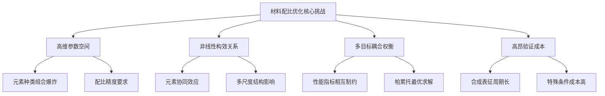

上述四重挑战相互交织，共同构成了材料元素组合配比优化问题的本质复杂性，也为智能化方法的引入提供了明确的问题导向。

### 1.2 传统优化方法的局限性分析

传统材料配比优化方法主要包括经验试错法、物理模型法及数值模拟法三大类，各类方法均存在显著的效能边界。

**经验试错法**是材料研发最传统的范式，研究人员基于领域知识和历史经验设计实验方案，通过反复调整参数逐步逼近最优配方。这种方法存在三方面根本局限：一是**优化周期长**，复杂材料体系可能需要数月乃至数年的迭代才能获得满意结果；二是**优化效果不稳定**，高度依赖研究人员的个人经验与直觉，难以保证结果的一致性与可重复性；三是**难以系统性探索参数空间**，在高维组合空间中容易陷入局部最优而错失全局最优解[^4]。

**物理模型方法**通过理论推导或分子动力学模拟等方式建立材料行为的数学描述，能够提供具有物理意义的预测结果。然而，该方法同样面临明显局限：一是**计算成本极高**，特别是对于大尺度、长时间尺度的模拟，所需计算资源往往超出实际可承受范围；二是**数据依赖性强**，模型参数的确定需要大量实验数据支撑；三是**简化假设限制适用性**，为降低计算复杂度而引入的近似处理可能导致预测精度下降[^3]。

**数值模拟方法**如有限元分析在特定场景下具有较高精度，但在面对材料配比优化问题时存在固有局限：一是**难以处理高维非线性关系**，传统数值方法在参数维度增加时计算量急剧膨胀；二是**缺乏自适应学习能力**，无法从历史数据中自动提取规律以指导后续优化；三是**与实验验证的闭环衔接不畅**，难以实现从模拟预测到实验反馈的高效迭代[^2]。

| 方法类别 | 核心优势 | 主要局限 | 适用场景 |
|---------|---------|---------|---------|
| 经验试错法 | 无需复杂建模，操作直观 | 周期长、成本高、效果不稳定 | 小规模探索、经验丰富领域 |
| 物理模型法 | 结果具有物理可解释性 | 计算成本高、简化假设限制精度 | 机理明确的简单体系 |
| 数值模拟法 | 特定问题精度较高 | 难以处理高维非线性、缺乏学习能力 | 结构明确的工程问题 |

综合来看，传统方法在面对当代材料研发对**效率、精度与成本**的综合要求时已显力不从心，这为机器学习与深度学习技术的介入创造了明确的需求空间。

### 1.3 机器学习技术介入的驱动因素

机器学习与深度学习技术在材料配比优化领域的广泛应用，是多重驱动因素共同作用的结果。

**计算硬件能力的跃升**为大规模机器学习模型的训练与部署提供了物质基础。GPU、TPU等专用计算芯片的发展使得深度神经网络的训练效率提升了数个数量级，原本需要数周完成的模型训练现在可在数小时内完成[^1]。这种计算能力的提升使得处理材料科学中的海量数据与复杂模型成为可能。

**高通量实验与材料数据库的快速积累**解决了机器学习的"燃料"问题。近年来，Materials Project、AFLOW、OQMD等大型材料数据库的建设与开放，为机器学习模型提供了丰富的训练数据[^1]。同时，高通量实验技术的发展使得单位时间内可获取的材料性能数据量大幅增加，进一步充实了数据基础设施。2021—2024年间，"AI+材料"主题的学术文献数量持续增长，反映出该领域研究热度的逐年攀升[^1]。

**机器学习算法在处理高维数据与非线性关系方面的独特优势**是技术层面的核心驱动力。机器学习能够从大量材料数据中自动学习隐含的物理规律，通过多层非线性变换捕获材料微观结构与宏观性能之间的复杂关系[^3]。支持向量机、随机森林、神经网络等算法在建立参数与性能的非线性映射方面表现出色，而深度学习框架如图神经网络则特别适合处理具有图结构的晶体材料数据[^2][^3]。

**各国将"AI+材料"列为战略重点的政策支持**提供了强有力的外部推动。中国"十四五"规划为AI与新材料领域部署了逾千亿资金，欧盟Horizon Europe计划投入50亿欧元推动可持续材料发展[^1]。这种国家层面的战略布局加速了产学研协同创新，推动了技术从实验室向产业应用的转化进程。

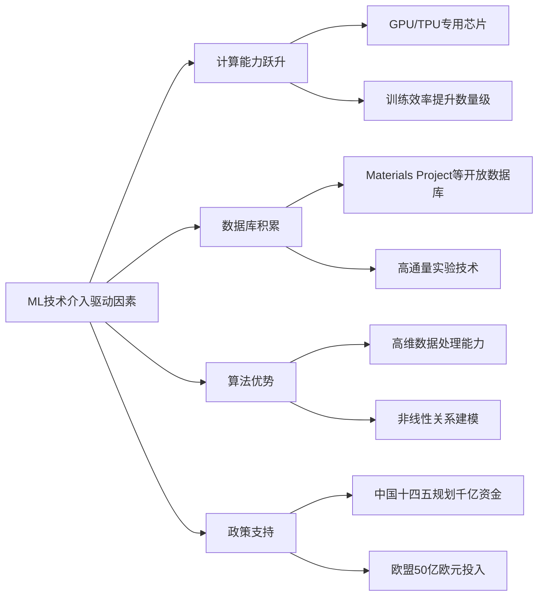

上述驱动因素的协同作用，使得机器学习技术在材料配比优化领域的应用从早期的概念验证阶段快速进入规模化研究与初步产业化探索阶段。

### 1.4 从经验试错到智能设计的范式转型

机器学习与深度学习技术的介入正在重塑材料配比优化的研究范式，这一转型体现在研发流程的多个关键环节。

**从正向预测到逆向设计的方法论转变**是最根本的范式革新。传统方法遵循"给定配方→预测性能"的正向逻辑，而AI驱动的新范式实现了"给定目标性能→反向推导最优配方"的逆向设计能力[^1]。深度学习框架通过集成生成器与预测器，能够实现材料成分的逆向设计，依据目标性能精准指导材料配比[^1]。这种逆向设计能力大幅缩短了从需求定义到方案输出的周期，显著提升了研发效率。

**从人工主导到数据智能闭环的流程重构**代表了研发组织方式的根本变革。基于机器学习与机器人技术的自主实验室正在构建"计算-设计-合成-表征"的闭环系统[^5]。在这一系统中，贝叶斯优化等算法自动预测最优合成条件，机械臂完成样品转移与薄膜沉积，自动评估系统进行性能测试，评估结果实时反馈至计算机以指导下一轮优化，整个流程实现了高度自动化与高通量化[^5]。这种闭环系统的建立标志着材料研发从依赖研究人员个人判断的手工模式向数据驱动的智能迭代模式转变。

**从经验归纳到数据挖掘的知识发现模式升级**拓展了材料科学的认知边界。机器学习不仅能够复现已知规律，更能从海量数据中挖掘人类难以直接发现的隐藏关联[^6]。例如，在催化剂设计领域，机器学习通过分析大规模数据预测反应性能、筛选高效配体并揭示复杂机理，为理性设计提供了新的洞察[^6]。这种数据驱动的知识发现能力正在推动材料科学从经验科学向数据科学的深刻转型。

**从实验室创新到工程化快速落地的转化加速**体现了新范式的产业价值。AI技术通过数据驱动减少实验试错次数，提升合成效率与产物均一性，为材料研发成果向工业化生产的转化提供了可行路径[^1]。在热电材料、生物基材料、催化材料等多个领域，机器学习辅助的配方优化已展现出缩短研发周期、降低研发成本的显著效果[^7]。

本报告聚焦于机器学习与深度学习在材料元素组合配比优化领域的研究进展与应用现状，研究范围涵盖核心技术方法、活跃研究团队、数据基础设施、模型性能评估、技术挑战及产业化前景等关键维度。报告旨在为学术研究者提供领域全景图，为产业界决策者提供技术成熟度与投资时机的参考依据，为政策制定者提供战略规划的分析基础。后续章节将依次展开对上述各维度的深入分析，最终形成对该领域发展阶段与未来路径的综合评估。

## 2 核心技术方法与模型架构分析

材料元素组合配比优化的技术方法体系经历了从传统统计学习到深度神经网络、再到物理信息融合建模的演进历程。本章从监督学习、深度学习、强化学习及物理信息嵌入四大技术路线出发，系统剖析各类模型的算法原理、架构特征及其在正向性能预测与逆向成分设计任务中的适用性，为理解该领域的技术格局与发展趋势提供方法论基础。

### 2.1 监督学习模型在配比优化中的应用

监督学习作为机器学习的基础范式，在材料配比优化领域积累了丰富的应用经验，其核心优势在于对中小规模结构化数据集的高效处理能力与相对良好的模型可解释性。

**集成学习方法的技术原理与应用优势**

集成学习通过组合多个基学习器的预测结果来提升模型整体性能，在材料组分-性能关系建模中展现出显著优势。**随机森林**通过构建多棵决策树并对其预测结果进行投票或平均，有效降低了单一模型的过拟合风险，在处理高维特征空间时表现稳健。**梯度提升树**（如XGBoost、LightGBM）则通过序列化地训练弱学习器，每一轮迭代专注于纠正前一轮的预测残差，从而实现更高的预测精度[^8]。

在实际应用中，XGBoost模型在O/W型护肤乳液配方优化案例中，针对离心稳定性、感官评分与流变参数三个目标构建独立预测模型，测试集上的R²均超过0.85，展示了该方法在配制产品性能预测中的可靠性[^8]。这一精度水平表明，集成学习方法能够有效捕获配方组成与产品性能之间的复杂映射关系。

**特征工程与模型可解释性分析**

特征工程是影响监督学习模型性能的关键环节。针对材料配比数据的小样本、高维异构特点，研究者采用自动特征构造方法生成交互项与非线性变换变量，以丰富特征空间的表达能力[^8]。对于缺失值较多的数据集，多重插补法结合贝叶斯回归的填补策略被广泛采用，以确保数据完整性不影响模型训练质量。

**SHAP（Shapley Additive Explanations）值分析**作为可解释机器学习的核心工具，能够量化各组分对性能的影响方向与强度[^8]。通过SHAP值分析，研究人员可以识别出对目标性能贡献最大的元素或配比参数，从而为配方调整提供物理化学层面的指导。这种可解释性不仅增强了模型预测结果的可信度，更有助于研究人员从数据驱动的结果中提炼出可迁移的材料设计规律[^9]。

**小样本高维场景下的适用性与局限**

监督学习方法在小样本场景下的适用性与局限性需要辩证看待。一方面，随机森林和梯度提升树对过拟合具有较强的抵抗能力，通过交叉验证（如留一法）可以在有限数据条件下获得相对可靠的泛化性能评估[^8]。另一方面，当数据稀疏且存在批次差异时，迁移学习策略的引入能够显著提升预测精度——通过借助公开数据库预训练模型，再在小样本目标域进行微调，可以有效缓解数据不足带来的性能瓶颈[^8]。

| 方法 | 核心优势 | 主要局限 | 典型应用场景 |
|------|----------|----------|--------------|
| 随机森林 | 抗过拟合、处理高维特征稳健 | 对连续变量精度有限 | 材料分类与初筛 |
| XGBoost/LightGBM | 预测精度高、训练效率好 | 需要精细调参 | 性能定量预测 |
| 支持向量机 | 小样本泛化能力强 | 大规模数据计算成本高 | 二分类与回归任务 |

### 2.2 深度学习框架与神经网络架构

深度学习技术凭借其强大的非线性拟合能力和自动特征提取能力，已成为材料配比优化领域的核心技术力量。从基础的多层感知机到专门针对材料结构设计的图神经网络，再到具备生成能力的对抗网络与变分自编码器，深度学习架构的多样化发展为不同类型的材料优化任务提供了丰富的技术选择。

**多层感知机与全连接神经网络的基础建模能力**

多层感知机（MLP）作为深度学习的基础架构，通过多层非线性变换实现输入特征到目标性能的复杂映射。在材料配比优化中，MLP能够自动学习元素配比与性能之间的非线性关系，无需人工设计复杂的特征交互项。深度学习框架结合迁移学习、层次神经网络等方法，已被广泛应用于晶格热导率、超导体临界温度等材料关键特性的跨尺度精准预测[^1]。

**图神经网络在晶体结构与分子图表征中的独特优势**

**图神经网络（GNN）**代表了材料性质预测领域的突破性技术进展。与传统神经网络不同，GNN能够直接处理具有图结构的数据，将晶体材料中的原子表示为图节点、原子间相互作用表示为图边，从而自然地嵌入材料结构的先验知识[^10]。这种结构感知的建模方式使得GNN在预测晶体材料性质时具有更高的精度和更强的泛化能力。

在机械超材料领域，基于图的深度学习方法统一了桁架结构的设计空间，通过生成建模的编码解码及逆向设计的梯度优化流程，实现了从结构描述到性能预测的端到端学习[^1]。研究表明，GNN模型能够以98.5%的准确率预测材料能带结构，计算速度相比传统第一性原理方法提升1000倍，将120小时的计算压缩到14分钟[^11]。

**生成对抗网络与变分自编码器的逆向设计能力**

生成模型的引入标志着材料配比优化从"预测"向"创造"的范式跨越。**生成对抗网络（GAN）**通过生成器与判别器的对抗训练，能够生成具有目标性能特征的新材料配方。深度学习借助**条件生成对抗网络（cGAN）**实现了弹性超材料带隙的逆向定制，研究人员可以指定目标带隙参数，由网络自动生成满足要求的微观结构设计[^1]。

**变分自编码器（VAE）**则通过学习材料数据的潜空间分布，提供了另一种生成新材料的技术路径。VAE的潜空间具有连续性和可插值性，便于在已知材料之间进行平滑过渡，探索中间配比区域的性能表现。在金属有机框架材料设计中，VAE已被用于生成具有特定孔隙率和表面积的新型结构[^1]。

**Transformer架构的前沿探索**

Transformer架构凭借其强大的序列建模能力和自注意力机制，正在材料科学领域展现出独特价值。自然语言处理（NLP）技术已被应用于从文献库中提取和整合材料相关知识，研究表明NLP模型能够发现材料之间的隐含关系，并预测出新材料的潜在性能[^10]。这种跨模态的知识挖掘能力为材料配比优化提供了文献驱动的新视角。

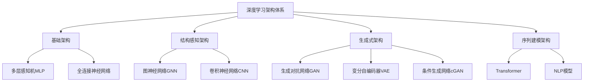

### 2.3 强化学习方法在配方搜索中的探索

强化学习将材料配比优化问题建模为智能体与环境的序列决策交互过程，特别适用于需要在高维配方空间中进行主动探索的场景。这一范式的核心优势在于能够在探索未知区域与利用已知信息之间实现动态平衡。

**深度Q网络与策略梯度方法的应用原理**

**深度Q网络（DQN）**通过神经网络逼近动作价值函数，在离散配方空间中学习最优决策策略。在材料配比优化中，状态可以表示为当前配方组成与已测试性能的组合，动作则对应于配方参数的调整方向与幅度，奖励函数设计为目标性能的改善程度[^12]。DQN通过经验回放和目标网络等技术稳定训练过程，逐步学习到能够高效导航配方空间的策略。

**策略梯度方法**直接优化策略函数，适用于连续动作空间的配方调整任务。与基于价值的方法相比，策略梯度方法能够更自然地处理配比参数的连续变化，避免了动作空间离散化带来的精度损失[^12]。

**贝叶斯优化的样本效率优势**

**贝叶斯优化**基于代理模型和采集函数，以最少的实验次数逼近全局最优解，在样本获取成本高昂的材料优化场景中具有独特价值。该方法通过高斯过程等代理模型估计目标函数的不确定性分布，采集函数（如期望改进EI、置信上界UCB）则在探索高不确定性区域与利用高预测值区域之间进行权衡[^12]。

在配制产品工艺优化中，贝叶斯优化已被成功应用于指导高通量实验设计，高效探索配方空间[^8]。研究表明，贝叶斯优化能够在显著减少实验次数的前提下达到与穷举搜索相当的优化效果，为昂贵实验的优化提供了可行的技术路径。

**关键技术要素与当前局限**

强化学习在材料配比优化中的应用面临若干关键技术挑战：

- **奖励函数设计**：如何将多维度的材料性能指标转化为标量奖励信号，同时保持对不同性能权衡的灵活性，是影响学习效果的核心问题[^12]。
- **状态空间表示**：材料配比的高维特征需要有效的压缩与表示策略，以降低学习难度并提升泛化能力[^12]。
- **探索与利用平衡**：在有限的实验预算约束下，如何在探索未知配方区域与利用已知优良配方之间取得平衡，直接影响优化效率[^12]。

当前，强化学习方法在自主实验闭环系统中展现出应用潜力，但在实际材料研发中的大规模部署仍受限于实验反馈周期长、环境模型不精确等因素。

### 2.4 物理信息嵌入的混合建模方法

纯数据驱动模型的"黑箱"特性和对大量数据的依赖性，促使研究者探索将物理机理与机器学习深度融合的混合建模方法。这一技术路线通过嵌入材料科学的先验知识，显著提升了模型在数据稀缺场景下的泛化能力与预测结果的物理合理性。

**物理信息神经网络的基本原理与约束嵌入策略**

**物理信息神经网络（PINN）**将已知物理定律（如控制方程、守恒律、边界条件）作为软约束或正则项融入神经网络的损失函数中[^13]。在材料配比优化中，PINN可以将材料热力学约束、相平衡条件等物理规律嵌入模型，确保预测结果不违背基本物理原理。

国际顶尖期刊持续聚焦"多物理场智能建模"方向，全球工业界与学术界正加速推进PINN在熔池监测、多场耦合仿真、晶体结构预测等场景的落地应用[^13]。这种物理与数据的融合策略使得模型能够在有限训练数据条件下仍保持良好的外推能力。

**材料知识与机器学习的集成方式**

可解释机器学习通过材料知识嵌入，增强了模型的泛化能力和预测精度[^9]。具体的知识集成方式包括：

- **经验公式嵌入**：将材料领域积累的经验公式作为模型的先验约束或特征输入，引导模型学习符合领域知识的映射关系。
- **本构关系融合**：将材料的本构方程作为损失函数的组成部分，确保预测的应力-应变关系满足物理一致性。
- **多尺度计算信息整合**：将第一性原理计算、分子动力学模拟等多尺度仿真结果作为训练数据或模型约束，构建跨尺度的材料性能预测框架[^13]。

研究表明，通过综合利用材料基础理论在问题空间的泛化能力和机器学习在数据空间的拟合优势，知识嵌入方法能够显著增强模型的物理合理性，提升泛化能力[^9]。

**小样本场景下的独特价值**

物理信息嵌入方法在数据稀缺场景下展现出独特优势。当训练样本有限时，纯数据驱动模型容易过拟合训练数据而丧失泛化能力，而物理约束的引入相当于为模型提供了额外的"监督信号"，有效缓解了过拟合风险[^9]。

在材料机理研究中，可解释机器学习通过物理化学特征参量池构建、关键特征量筛选、特征重要性分析等方法，分析元素、结构和微观组织对材料性能的显性影响规律，实现对材料性能影响机理和物理化学关联的深刻认识[^9]。这种机理层面的理解不仅提升了模型的可信度，更为材料设计提供了可迁移的科学洞察。

### 2.5 正向预测与逆向设计的方法对比

材料配比优化的两类核心任务——正向性能预测与逆向成分设计——对技术方法提出了差异化的要求。系统理解这两类任务的技术特点与方法适配性，是合理选择技术路线的前提。

**正向预测任务的技术要求**

正向预测任务遵循"给定配方→预测性能"的逻辑，其核心目标是建立材料组分与性能之间的精确定量映射。该任务对模型的**预测精度**和**泛化能力**提出了严格要求：

- **精度要求**：预测误差需控制在实验测量误差的合理范围内，以确保预测结果具有实际指导价值。
- **泛化要求**：模型需要在训练数据分布之外的配方区域仍保持可靠的预测能力，避免仅在已知配方附近有效。

监督学习方法（随机森林、XGBoost）和深度学习方法（MLP、GNN）均适用于正向预测任务，选择依据主要包括数据规模、特征结构和可解释性需求。对于中小规模结构化数据，集成学习方法通常能够以较低的计算成本获得满意的预测精度；对于大规模、结构复杂的材料数据，深度学习方法则展现出更强的拟合能力[^1][^10]。

**逆向设计任务的技术需求**

逆向设计任务遵循"给定目标性能→反向推导配方"的逻辑，其核心挑战在于从高维配方空间中搜索满足多重性能约束的最优解。该任务对模型的**生成能力**和**多目标优化能力**提出了特殊要求：

- **生成能力**：模型需要能够产生新的、未曾出现在训练集中的配方方案。
- **多目标优化**：实际应用中往往需要同时满足多项性能指标，模型需要具备在帕累托前沿上搜索的能力。

深度学习框架通过集成生成器与预测器，实现了材料成分的逆向设计能力。正向预测模块基于比例特性并结合物理信息预测性能，逆向设计模块则依据目标性能指导材料配比[^1]。这种生成器-预测器的集成架构已在磁流变弹性体、弹性超材料等多种材料体系中得到验证。

**方法选择的技术参考框架**

基于上述分析，可以构建面向不同应用场景的方法选择参考框架：

| 任务类型 | 核心需求 | 推荐方法 | 适用条件 |
|----------|----------|----------|----------|
| 正向预测（小样本） | 精度、可解释性 | 随机森林、XGBoost+SHAP | 数据量<1000，需要机理理解 |
| 正向预测（大样本） | 精度、泛化能力 | GNN、深度神经网络 | 数据量>10000，结构复杂 |
| 逆向设计（单目标） | 生成能力 | VAE、GAN | 目标性能明确单一 |
| 逆向设计（多目标） | 多目标优化 | 强化学习、贝叶斯优化 | 多性能权衡需求 |
| 数据稀缺场景 | 泛化、物理一致性 | PINN、知识嵌入方法 | 数据量极有限，物理机理明确 |

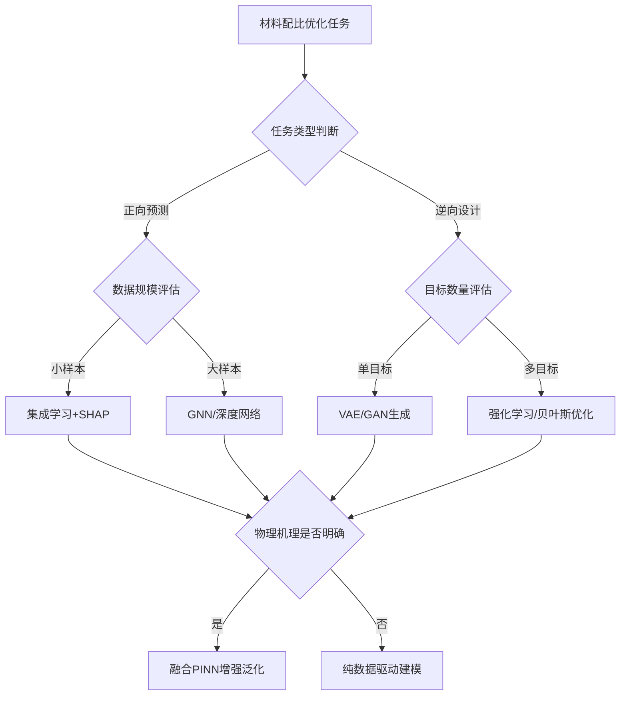

综合而言，材料配比优化的技术方法体系已形成从经典机器学习到深度学习、从纯数据驱动到物理融合的多层次格局。不同方法在精度、效率、可解释性和生成能力等维度各有优势，研究者需要根据具体任务特征、数据条件和应用需求进行合理选择与组合。随着自主实验室和闭环优化系统的发展，多种方法的协同集成将成为推动该领域持续突破的关键技术路径。

## 3 全球活跃研究团队与代表性成果

机器学习与深度学习在材料元素组合配比优化领域的快速发展，离不开全球顶尖研究团队的持续探索与创新。本章从北美、亚太、欧洲三大地理区域出发，系统梳理该领域最活跃的学术机构与研究力量，深入分析各团队的技术路线特色、代表性成果及其学术影响力，并通过横向对比揭示全球研究格局的竞争态势与发展趋势。

### 3.1 北美地区核心研究团队与技术布局

北美地区凭借其深厚的学科积淀、充裕的科研资源和活跃的跨学科合作传统，在AI驱动材料配比优化领域占据着全球领先地位。**麻省理工学院（MIT）、斯坦福大学、加州理工学院**等顶尖机构形成了从基础算法创新到自主实验系统构建的完整技术链条。

**MIT李巨团队：多模态机器人平台的范式突破**

MIT团队开发的**CRESt（Copilot for Real-world Experimental Scientists）多模态机器人平台**代表了该领域自主实验系统的最高水平。该平台通过整合自动化设备、大规模多模态模型和实验室监测系统，在实验设计中融入人类经验、文献知识和显微结构信息，实现了从自然语言指令到实验执行的全程无人干预材料探索[^14]。

CRESt的技术架构具有三层创新特征：

- **硬件执行层**：集成液体处理机器人、碳热冲击合成系统、自动电化学工作站、X射线衍射仪、软件驱动的扫描电子显微镜以及气体与流体控制泵阀等执行器，所有设备通过Python代码实现远程协调控制[^14]。

- **算法核心层**：创新性地提出**知识辅助贝叶斯优化（KABO）算法**，突破了传统贝叶斯优化仅依赖单一数值流的局限。该算法将化学成分、从文献中提炼的文本知识、以及从电镜图中提取的微观结构特征三大类信息源融合在一起，通过主成分分析等降维技术在浓缩的潜空间中进行优化计算[^14]。

- **人机交互层**：操作者无需编程经验，只需通过语音或文本即可与系统自然交流，平台在实验过程中能够自主生成观察与假设[^14]。

该平台在电化学甲酸氧化催化剂发现任务中取得了突破性成果。在3个月时间内，CRESt对900多种配方进行探索，共完成约3500次电化学测试，最终发现一种**八元合金催化剂**，其成本比性能（按催化剂成本标准化的功率密度）相较于纯钯基准提升了**9.3倍**[^14]。实验对比显示，与标准贝叶斯优化相比，KABO算法平均能将实验效率提升36%，并且只需25%的实验次数就能找到高性能样品[^14]。该成果相关论文以"A multimodal robotic platform for multi-element electrocatalyst discovery"为题发表于《Nature》[^14]。

**斯坦福大学张寿成团队：无监督学习重现元素周期表**

斯坦福大学物理学教授张寿成团队开发的**Atom2Vec程序**展示了机器学习在材料基础科学层面的独特价值。该程序通过在线数据库分析化合物名称列表，成功学会了区分不同原子，并利用从自然语言处理领域借鉴的概念——通过观察周围的其他单词可以理解某单词的属性——根据元素的化学属性对元素进行聚类[^15]。

Atom2Vec的技术原理借鉴了Google的Word2Vec模型，将原子转换成数字代码或向量。通过分析向量，AI可以在其他元素同时出现的情况下，预测某元素在化合物中出现的概率。例如，从化合物数据中，程序得出钾（K）和钠（Na）必须具有相似的性质，因为这两种元素都可以与氯（Cl）结合[^15]。

张寿成教授认为，这项研究是朝着更宏伟目标迈出的重要一步——设计替代图灵测试的工具来测量人工智能。他指出："我们想看看能否设计出一种人工智能，在发现新的自然法则方面胜过人类。"该研究发表于《美国国家科学院院刊》（PNAS）[^15]。团队正在研发程序的2.0版，将致力于设计正确的抗体来攻击癌细胞特有的抗原，展现了该方法跨领域迁移的潜力[^15]。

**加州理工学院：AI全自动材料实验室的闭环系统**

加州理工学院化学与化学工程系（CCE）在材料科学与工程领域具有深厚的研究传统，其研究涵盖分子机理揭示、可持续化学过程设计和下一代材料开发等方向[^16]。该校材料与过程模拟中心（MSC）为机器学习在材料领域的应用提供了强大的计算基础设施支撑[^17]。

加州理工学院团队打造的**AI全自动材料实验室**通过实验机器人手臂、高通量合成与测试平台、以及自主控制AI代理系统的三合一集成，在一年内完成了传统需十年探索的材料研究任务[^18]。该系统实现了2万次钙钛矿光伏薄膜组分实验，发现新组合3D-Cs₃Sn₂I₁₂，光电转换效率突破18.4%，整个过程无需人工干预[^18]。该突破被誉为"闭环式材料制造系统从科幻走进现实的第一步"[^18]。

| 北美核心团队 | 所属机构 | 核心技术贡献 | 代表性成果 | 发表期刊 |
|:---|:---|:---|:---|:---|
| MIT李巨团队 | 麻省理工学院 | CRESt多模态机器人平台、KABO算法 | 八元合金催化剂成本比性能提升9.3倍 | *Nature* |
| 张寿成团队 | 斯坦福大学 | Atom2Vec无监督学习模型 | AI重现元素周期表 | *PNAS* |
| CCE/MSC | 加州理工学院 | AI全自动材料实验室 | 钙钛矿光电效率18.4% | 学界认可 |

### 3.2 亚太地区研究力量与特色方向

亚太地区在材料机器学习领域呈现出**面向国家战略需求、深耕特定材料体系、强调产学研协同**的鲜明特色。中国科学院系统、清华大学、东京大学及韩国材料研究院等机构形成了各具特色的研究集群。

**中国科学院深圳先进技术研究院：多AI-多机器人协同智能体系统**

中国科学院深圳先进技术研究院研制的**MARS（多AI—多机器人协同智能体系统）**代表了亚太地区在自主实验系统领域的重要突破。MARS构建了包含**19个大模型智能体**的层级化架构，并与包含移动机器人、导轨机器人等在内的"异构机器人集群"深度集成[^19]。

受人类研发团队多角色分工启发，MARS系统构建了包含"PI""设计师""编程师""实验师""分析师"**五大技术职能组**，系统协调19个专业智能体与16种领域特定工具，通过自然语言交互实现任务规划、逻辑推理与决策制定，实现了从"任务规划—实验设计—代码编程—实验执行—数据分析"的全流程闭环自主材料探索[^19]。

在微胶囊（封装微球）等功能性材料创制实验中，MARS展现了多AI与多机器人之间的高效协同，**将原本4个月的研发时间压缩至4小时**[^19]。相关研究成果发表于《物质》（*Matter*）期刊[^19]。

**中国科学院宁波材料技术与工程研究所：机器学习辅助铁基非晶合金设计**

中国科学院宁波材料技术与工程研究所王军强与霍军涛团队在机器学习辅助软磁材料设计领域取得重要进展。该团队构建了**极端梯度提升树、随机森林和支持向量机**三种不同的机器学习模型来预测铁基非晶合金的饱和磁感。经过特征工程和超参数优化训练，极端梯度提升树模型表现最佳，测试集的决定系数大于0.85，均方根误差不超过0.12T[^20]。

通过特征重要性分析，该研究确定了**铁含量、混合焓和电负性差异**是影响饱和磁感的3个关键因素。沙普利加性解释（SHAP）分析方法量化了这些参数的影响：铁含量需超过75 at.%，混合焓应介于-18.7至-14 kJ/mol之间，而电负性差异应小于0.07[^20]。基于上述设计准则，团队设计的Fe-Co-Ni-Si-B、Fe-Co-Ni-B-P-C等铁基非晶/纳米晶合金经磁场退火后饱和磁感均超过1.85T，且矫顽力可降至1.2 A/m，其中(Fe₈₂Co₁₈)₈₅.₅Ni₁.₅B₉P₃C₁和Fe₆₉Co₁₆Ni₁Si₃B₁₁的饱和磁感可达**1.92T**，综合软磁性能**超越硅钢**[^20]。相关成果发表于《先进功能材料》（*Advanced Functional Materials*）[^20]。

**中国科学院新疆理化技术研究所：非线性光学材料机器学习预测**

中国科学院新疆理化技术研究所研究团队提出了将机器学习技术与晶体结构生成方法相结合的新型理论设计与预测方法，实现了从红外到紫外再到深紫外非线性光学多元复杂体系的**倍频系数定量预测**[^21]。

该研究训练的机器学习模型融合化学组分和结构描述符，能够系统分析结构与性能之间的构效关系。为进一步提升发现新型非线性光学材料的效率，研究引入了快速晶体结构生成技术，建立了探索未知化学空间的高效预测流程。基于这一理论流程，仅需输入晶体结构文件，即可在较短时间内获得目标化学结构的倍频系数[^21]。以红外非线性光学材料为应用案例，该预测流程识别出**7种具备理想倍频响应的红外化合物**，其中一种已在实验中合成并完成表征，验证了该理论设计方法的有效性[^21]。相关成果发表于《Small》期刊[^21]。

**清华大学：数据驱动双功能催化剂设计**

清华大学碳中和研究院张强教授团队在金属空气电池双功能催化领域取得突破性成果。研究团队采用大数据方法系统建立了双功能催化构效关系的**"材料基因组"**，基于领域内已报道的247种双功能催化剂的"位点–组分–性能"统计分布，筛选抽提超高活性的氧还原/氧析出催化位点组合，并通过理性设计构筑复合双功能催化剂[^22]。

得益于数据驱动的指导，复合双功能催化剂创纪录地实现了**ΔE=0.57 V**的超高催化活性，不仅超越了商用贵金属催化剂，同时打破了双功能催化活性尘封三年的记录[^22]。在双功能催化活性突破的基础上，团队设计研发了安时级电池器件，器件单体能够提供安时级容量，能够在面向极端温域、高面容量、高倍率等场景中实现稳定储能[^22]。相关工作发表于国际顶级学术期刊《焦耳》（*Joule*）[^22]。

清华大学材料学院还设有**微结构与材料计算团队**，依托北京电子显微镜中心，结合电子显微学、计算材料学以及材料制备，研究材料的微观结构与性能[^23]。**材料加工技术及工艺仿真团队**的学科方向包括集成计算材料工程、材料成形加工过程全流程建模与仿真等[^23]。清华大学未来实验室的**未来材料与设计研究中心**致力于发展与生物医疗、环保科技、新能源、人工智能等领域的交叉研究[^24]。

**东京大学：微观结构分析与前沿AI探索**

东京大学工业科学研究所在材料机器学习领域开展了多项前沿探索。该所Masato Kotsugi团队开发了新型AI模型用于预测薄膜中的枝晶生长，结合**持久同调与主成分分析（PCA）**等机器学习技术，分析枝晶生长微观结构与工艺参数的关联，帮助优化薄膜生长过程[^25]。

该研究所还探索了**大型语言模型（LLM）在自主、可解释材料发现中的应用**，代表了AI辅助材料研发向更高层次自主性和可解释性发展的前沿方向[^26]。

| 亚太核心团队 | 所属机构 | 核心技术贡献 | 代表性成果 | 发表期刊 |
|:---|:---|:---|:---|:---|
| 深圳先进院团队 | 中科院深圳先进院 | MARS多AI-多机器人协同系统 | 研发周期从4月压缩至4小时 | *Matter* |
| 王军强/霍军涛团队 | 中科院宁波材料所 | 机器学习预测铁基非晶合金 | 饱和磁感1.92T超越硅钢 | *Adv. Funct. Mater.* |
| 新疆理化所团队 | 中科院新疆理化所 | 非线性光学材料ML预测 | 识别7种理想倍频响应化合物 | *Small* |
| 张强团队 | 清华大学 | 数据驱动"材料基因组" | ΔE=0.57V创纪录催化活性 | *Joule* |
| Kotsugi团队 | 东京大学 | 持久同调分析枝晶生长 | 薄膜生长工艺优化 | 学术发表 |

### 3.3 欧洲研究机构与跨国合作网络

欧洲研究力量在材料机器学习领域呈现出**基础理论深厚、跨国协作活跃、产学融合紧密**的特点。剑桥大学、DeepMind等机构通过国际合作网络推动了多项重要突破。

**剑桥大学材料科学与冶金系：跨学科研究平台**

剑桥大学材料科学与冶金系作为世界顶尖的材料研究平台，其研究学科涵盖**机器学习与统计模型、计算材料发现、电子结构理论和材料建模**等多个方向[^27]。该系依托Royce研究所等设施，为材料信息学的交叉研究提供了坚实的学科基础和计算资源支撑[^27]。

该系的研究生态支持材料信息学与传统材料科学的深度融合，在半导体与量子材料、航空航天材料等前沿领域持续产出高水平成果[^27]。其广泛的研究生态为机器学习方法在材料科学中的应用提供了丰富的测试场景和验证平台。

**DeepMind与学术机构的跨国合作模式**

DeepMind与学术机构的合作代表了产学融合推动材料科学突破的典型模式。2025年初，东京大学联合DeepMind推出了基于三维电子态量子信息嵌入的超导潜力预测模型**TSC-Predictor**[^18]。

研究人员利用该模型精准预测了十余种新型钇铜氧类材料在高压下的临界转变温度，**预测误差低于7%**，彻底解决了超导体难以预测的核心瓶颈[^18]。通过分析模型的可视化数据，科学家们还成功捕捉到了材料中铜氧层间距与电子强关联态耦合的独特非线性关系。该项突破在凝聚态物理学界引发轰动，《自然·材料》2025年点评称："这不再是单纯的预测，更是一把开启凝聚态谜题的钥匙"[^18]。

这种跨国合作模式的成功表明，**产业界的计算资源与算法能力**与**学术界的领域知识与实验验证能力**的结合，能够产生远超单一主体独立研究的创新突破。

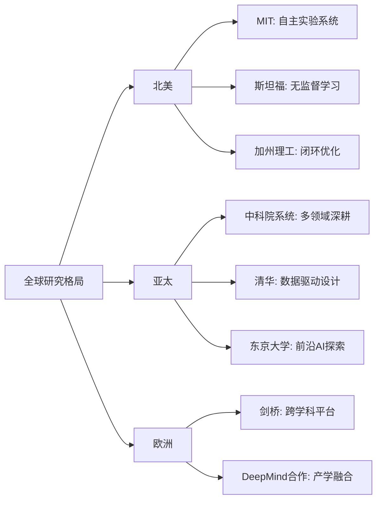

### 3.4 企业研发中心与产业化导向研究

产业界在材料机器学习领域的布局日益活跃，其研究导向更加聚焦于**实际生产场景的优化目标、与学术机构的协同创新、以及技术成果的工程化落地**。

**产业界研究的技术路线特点**

企业研发中心的技术路线呈现出与学术研究明显的差异化特征。首先，产业界更加关注**面向实际生产条件的约束优化**，在配方设计中需要同时考虑原材料成本、工艺可行性、生产稳定性等多重因素。其次，产业界强调**数据资产的积累与保护**，往往基于企业自身积累的生产数据构建专有模型，而非完全依赖公开数据库。

在具体应用方向上，产业界的研究重点包括：

- **高通量配方筛选**：利用机器学习加速新产品配方的初筛过程，缩短从概念到原型的开发周期。
- **工艺参数优化**：基于生产线实时数据，动态调整工艺参数以保证产品质量的一致性。
- **质量预测与控制**：构建产品性能预测模型，实现生产过程的智能监控与异常预警。

**产学合作模式与典型案例**

产学合作在推动材料机器学习技术从实验室向产业应用转化过程中发挥着关键桥梁作用。MIT团队在CRESt平台开发过程中，视觉语言模型的引入使系统能够通过摄像头持续监控实验过程，并结合日志做出推理给出建议[^14]。为系统性评估视觉语言模型的效果，研究团队将问题日志丢给OpenAI和谷歌的模型进行测试，结果显示OpenAI o3和谷歌Gemini 2.5 Pro分别以72%和70%的准确率判断出问题[^14]。这种将前沿AI技术与材料实验深度结合的模式，为产业界的技术应用提供了可参考的范例。

**产业化进程中的关键角色**

企业研发力量在推动技术产业化过程中承担着不可替代的角色：

- **工程化验证**：将实验室规模的方法扩展到工业生产规模，验证技术的可扩展性与经济可行性。
- **标准化推进**：基于实际应用经验，推动数据格式、模型接口、评估标准等方面的行业标准制定。
- **人才培养与转化**：通过产学合作项目，培养兼具材料科学背景与机器学习能力的复合型人才。

### 3.5 研究团队技术路线对比与学术影响力评估

基于前述各区域研究团队的分析，本节从**方法创新、应用突破、学术影响力**三个维度进行横向对比，识别各团队的核心竞争优势与研究空白，揭示该领域的技术发展主线与竞争格局演变趋势。

**方法创新维度对比**

在算法架构创新方面，各团队展现出差异化的技术路线：

| 创新类型 | 代表团队 | 核心创新点 | 技术突破意义 |
|:---|:---|:---|:---|
| 多模态融合 | MIT李巨团队 | 知识辅助贝叶斯优化（KABO） | 首次将文献知识、显微图像与化学成分融合 |
| 无监督学习 | 斯坦福张寿成团队 | Atom2Vec元素属性学习 | 证明AI可自主发现化学规律 |
| 多智能体协同 | 中科院深圳先进院 | 19智能体层级架构 | 实现全流程自主材料探索 |
| 物理信息嵌入 | 东京大学+DeepMind | 三维电子态量子信息嵌入 | 超导预测误差降至7%以下 |

**应用突破维度对比**

在材料体系覆盖与性能提升方面，各团队的成果呈现出明显的领域聚焦特征：

- **催化材料领域**：MIT团队在电催化剂发现中实现成本比性能9.3倍提升[^14]；清华大学张强团队创造双功能催化ΔE=0.57V活性记录[^22]。
- **软磁材料领域**：中科院宁波材料所团队设计的铁基非晶合金饱和磁感达1.92T，综合性能超越硅钢[^20]。
- **光学材料领域**：中科院新疆理化所团队实现非线性光学材料倍频系数定量预测，识别7种理想化合物[^21]。
- **光伏材料领域**：加州理工学院团队发现光电转换效率18.4%的钙钛矿新组合[^18]。

**学术影响力评估**

从高水平论文发表与学术引领性角度评估，各团队的影响力可从以下维度衡量：

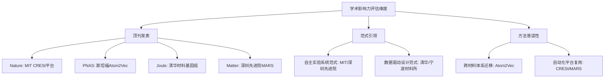

**全球竞争格局与发展趋势**

综合分析表明，全球研究格局呈现**"应用牵引、范式创新、基础支撑"三层并进**态势：

- **欧美顶尖团队**在开创性范式和基础算法上引领性强，MIT、斯坦福等机构持续产出定义领域发展方向的突破性成果。
- **中国顶尖团队**在面向国家重大需求的材料体系研发中，高效应用并发展机器学习方法，在软磁材料、催化材料、光学材料等领域取得显著实效。
- **日本顶尖团队**在微观机制解析与前沿AI探索上特色鲜明，在可解释AI、自主科学等方向持续探索。

未来竞争格局的演变将主要取决于三个关键因素：**自主实验系统的成熟度与可复制性**、**跨材料体系的方法迁移能力**、以及**产学研协同创新的效率**。当前，各主要研究力量正在从单点突破向系统性能力构建转型，预计未来3-5年内将形成更加明确的技术路线分化与优势领域格局。

## 4 材料数据库基础设施与数据质量评估

数据是机器学习与深度学习方法在材料元素组合配比优化领域取得突破的核心燃料。高质量、大规模、标准化的材料数据库为模型训练提供了不可或缺的基础设施支撑，而数据层面的稀缺性、异构性与质量参差问题则直接制约着模型的预测精度与泛化能力。本章将系统梳理当前支撑该领域研究的主流数据库资源，从多维度评估其数据质量与标准化程度，深入剖析数据层面的关键瓶颈及其对模型性能的影响机制，并展望数据基础设施的发展趋势与优化路径。

### 4.1 主流计算材料数据库的规模与特征分析

计算材料数据库通过高通量第一性原理计算，系统积累了海量材料的结构与性质数据，已成为数据驱动材料研究的核心基础设施。**Materials Project（MP）、AFLOW和OQMD**三大开放数据库构成了当前全球计算材料数据生态的主体框架，各自在数据规模、化学空间覆盖与属性深度方面呈现差异化特征。

**Materials Project：规模最大、生态最完善的综合性平台**

Materials Project自2011年由美国劳伦斯伯克利国家实验室正式启动，旨在通过高通量计算与开放数据推动材料发现[^28]。经过十余年发展，MP已成为全球超过**65万名**注册用户广泛使用的关键工具，被同行评审期刊引用超过**32,000次**，推动了电池、量子计算、微电子、工业催化剂等多个方向的研究进步[^29]。

在数据规模方面，MP当前覆盖超过**178,000种无机晶体材料**（另有超过200,000种材料与577,000种分子的数据），涵盖超过**51,000种化学体系**和**200多个空间群**，几乎涵盖元素周期表全部元素[^28]。其数据来源主要包括无机晶体结构数据库（ICSD）等权威实验数据库，辅以自然语言处理技术对文献信息的自动挖掘。

MP的核心产出不仅限于无机晶体结构数据，还包括分子数据、文献提取的合成路径、电池材料特性、有机金属框架以及催化数据等多个专题子库[^28]。在过去两年中，MP向用户交付了**465TB**的数据量，相当于约1亿张高分辨率照片的存储容量[^29]。

**AFLOW：自动化计算框架与原型结构百科全书**

AFLOW（Automatic-Flow for Materials Discovery）是一套互联的软件工具体系，专为高通量材料发现设计，结合基于密度泛函理论（DFT）的第一性原理量子力学计算与数据信息学筛选策略[^30]。其数据库遵循FAIR（可发现、可访问、可互操作、可复用）原则，提供图形化与编程化两种数据访问方式。

AFLOW数据库当前包含超过**3,929,948种**材料化合物，累计计算属性超过**8.17亿条**，并持续增长[^31]。其数据覆盖范围包括：形成焓（约388万条）、能带结构（约32万条）、Bader电荷（约55万条）、弹性性质（约6,500条）、热学性质（约6,500条）[^31]。在化学体系维度，AFLOW涵盖1,738种二元体系、30,289种三元体系和150,659种四元体系[^31]。

AFLOW的独特价值在于其**原型结构百科全书**，收录超过**1,100种**晶体原型结构，用于晶体结构的唯一分类与系统性探索[^30]。此外，AFLOW-ML模块提供了基于机器学习的材料性质预测RESTful API，AFLOW-CHULL则提供热力学稳定性与可合成性分析的凸包应用[^31][^32]。

**OQMD：聚焦热力学性质的合金材料数据库**

Open Quantum Materials Database（OQMD）由西北大学Wolverton研究组创建，是一个专注于DFT计算热力学与结构性质的材料数据库[^33]。当前OQMD包含**1,317,811种**材料的计算数据[^34]。

OQMD的结构数据来源包括两大部分：一是无机晶体结构数据库（ICSD），包含超过40,000种化合物（当前限制为单胞原子数小于40）；二是基于已知原型晶体结构的组合装饰，例如将B2（CsCl）结构中的元素位点用元素周期表中所有元素进行组合替换，由此生成超过400,000种来自元素、二元、三元原型的化合物[^33]。

OQMD为每种化合物提供的计算属性包括：给定组成下所有化合物的列表、形成能、空间群、单胞原子数等基本信息，以及总能量、体积、磁矩、带隙、电子态密度和完全弛豫的晶体结构等DFT计算结果[^33]。

**三大数据库的对比分析**

下表系统对比了三大主流计算材料数据库的核心特征：

| 评估维度 | Materials Project | AFLOW | OQMD |
|:---|:---|:---|:---|
| **材料条目数** | ~178,000（晶体）+ 577,000（分子） | ~3,930,000 | ~1,318,000 |
| **计算属性总量** | 多维度综合覆盖 | >8.17亿条 | 热力学为主 |
| **化学体系覆盖** | >51,000种体系，200+空间群 | 二/三/四元体系全覆盖 | 基于ICSD+原型装饰 |
| **核心属性深度** | 热力学、电子、弹性、磁性、光学 | 形成焓、能带、弹性、热学 | 形成能、电子态密度 |
| **特色功能** | 相图、Pourbaix图、API生态 | 原型百科、ML-API、凸包分析 | GCLP基态分析、相图 |
| **更新机制** | 持续更新，云基础设施 | 持续扩展 | 持续扩展 |
| **用户规模** | >650,000注册用户 | 全球开放访问 | 全球开放访问 |

从作为机器学习训练数据源的角度评估，**MP在数据标准化程度与生态完善性方面优势明显**，其严格的计算流程标准化（如采用r2SCAN泛函）确保了数据的一致性与可复现性，已成为训练图神经网络等通用材料ML模型的关键资源[^28]。**AFLOW在数据规模上具有显著优势**，其自动化计算框架能够高效生成大量新数据。**OQMD则在合金热力学性质预测领域具有深度优势**，特别适合相稳定性与合金设计相关的研究任务。

### 4.2 实验数据库与专用领域数据资源评估

计算数据库虽然规模庞大，但实验数据在验证计算预测、提供真实材料行为基准方面具有不可替代的价值。实验数据库与特定应用领域的专用数据资源构成了材料数据生态的重要补充。

**权威晶体结构实验数据库**

**无机晶体结构数据库（ICSD）**是全球最权威的实验晶体结构数据来源，为MP、OQMD等计算数据库提供了核心的结构输入[^33][^35]。ICSD收录了经实验表征确认的无机化合物晶体结构，数据质量经过严格的人工审核，是计算材料科学与实验验证对接的关键桥梁。

然而，**开放科学文献中仅有不到1%的化合物拥有可用的实验数据**，这一现实严重限制了对新材料的探索空间[^29]。实验数据的稀缺性源于多重因素：实验测量成本高昂、周期漫长；大量实验结果以非结构化形式散落在文献中难以系统整合；失败实验与负例数据通常不被发表，导致数据偏倚问题。

**文献挖掘数据集的兴起**

为弥补实验数据的不足，研究者开始利用自然语言处理技术从科学文献中自动提取材料相关信息。MP平台已将自然语言处理技术应用于文献信息挖掘，从中提取合成路径、材料性质等结构化数据[^28]。这种方法能够将分散在海量文献中的隐性知识转化为可用于机器学习的结构化数据资源。

文献挖掘数据集的价值在于其**覆盖范围广、信息类型多样**，能够捕获计算数据库难以涵盖的合成条件、工艺参数、实际应用性能等信息。然而，文献数据的质量参差不齐，提取过程中的误差累积、实验条件的不一致性等问题仍需谨慎处理。

**特定应用领域的专用数据资源**

针对电池、催化、热电等特定应用领域，已形成若干专用数据资源：

- **电池材料数据**：MP平台专门构建了电池材料特性子库，支持电极材料筛选与性能预测[^28]。
- **催化数据**：MP包含催化数据子库，为催化剂设计提供数据支撑[^28]。
- **有机金属框架（MOF）数据**：MP平台收录了MOF结构与性质数据，支持气体吸附、分离等应用研究[^28]。

这些专用数据资源在各自领域内具有较高的数据密度与针对性，但通常规模有限，难以支撑大规模机器学习模型的训练需求。

**实验数据与计算数据的互补性分析**

实验数据与计算数据在精度特征、覆盖范围、获取成本等方面呈现显著的互补性：

| 对比维度 | 计算数据 | 实验数据 |
|:---|:---|:---|
| **精度特征** | 系统性偏差，可通过方法校正 | 随机误差为主，受测量条件影响 |
| **覆盖范围** | 可系统性探索假想化合物 | 限于已合成材料 |
| **获取成本** | 计算资源成本，可规模化 | 人力物力成本高，难以规模化 |
| **数据一致性** | 相同计算设置下高度一致 | 不同实验室间差异显著 |
| **合成可行性信息** | 热力学稳定性预测，非合成可行性 | 直接反映可合成性 |

**高通量实验技术的推动作用**

高通量实验技术的发展正在加速实验数据的积累。组合材料芯片、自动化合成与表征平台能够在单位时间内生成远超传统方法的实验数据量。如前文所述，加州理工学院的AI全自动材料实验室在一年内完成了2万次钙钛矿光伏薄膜组分实验，展示了高通量实验技术的数据生成潜力。

然而，高通量实验数据的标准化程度仍有待提升，不同实验室、不同设备产生的数据在格式、精度、元数据完整性等方面存在显著差异，制约了数据的跨平台整合与复用。

### 4.3 数据质量与标准化程度的关键评估维度

数据质量直接决定了机器学习模型的上限。建立系统的数据质量评估框架，对于合理选择训练数据、理解模型性能边界具有关键意义。

**数据质量评估的核心框架**

材料数据库质量评估应涵盖以下核心维度：

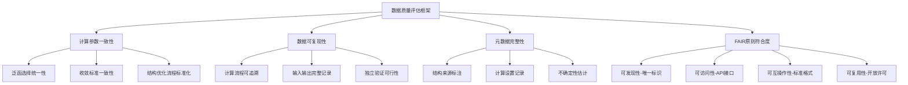

**Materials Project的标准化实践**

MP在数据质量标准化方面建立了行业标杆。其核心实践包括：

- **自动化计算流程**：MP通过自动化计算流程显著提升了数据的深度与一致性，所有流程均经过严格的基准验证，与实验数据对照以确保准确性与可复用性[^28]。
- **泛函标准化**：核心工作流程采用r2SCAN泛函，确保在大规模自动化运行中的数值稳定性[^28]。
- **数据可查询与可解释性**：所有数据通过软件库自动转换为可查询与解释的形式，支持交互式图形展示与下游建模[^28]。

MP的标准化策略使其成为**机器学习就绪（ML-ready）**数据集的典范。其数据涵盖热力学、弹性、电子结构、磁性、吸收光谱等多维度属性，构成材料模拟的全栈数据体系[^28]。这种标准化的数据流极大降低了模型训练的门槛，成为开发通用材料ML模型（如图神经网络势能函数）的关键资源。

**AFLOW与OQMD的标准化特征**

AFLOW数据库遵循FAIR原则，提供图形化与编程化两种数据访问方式，其REST-API与AFLUX文档为自动化数据查询提供了标准化接口[^31][^30]。AFLOW的原型结构百科全书为晶体结构分类提供了统一的参考框架。

OQMD提供RESTful API（包括OPTIMADE兼容接口）支持自动化数据查询，数据采用CC-BY 4.0开放许可协议[^34]。其Python API与在线查询界面支持多种数据访问场景。

**计算设置差异对数据可比性的影响**

不同数据库在计算设置上的差异对数据可比性产生显著影响：

| 计算参数 | 潜在差异 | 对可比性的影响 |
|:---|:---|:---|
| 交换关联泛函 | LDA/GGA/meta-GGA/杂化泛函 | 形成能、带隙等绝对值差异显著 |
| 截断能与k点密度 | 不同收敛标准 | 影响数值精度与计算成本权衡 |
| 赝势/PAW势 | 不同版本与参数化 | 影响特定元素的计算精度 |
| 结构优化策略 | 离子弛豫/晶胞优化设置 | 影响最终结构与能量 |
| 磁性处理 | 初始磁构型设置 | 影响磁性材料的基态判定 |

这些差异意味着**直接跨数据库比较绝对数值需谨慎**，但在单一数据库内部的相对趋势通常具有较好的一致性。

**属性完整性的现实差距**

尽管主流数据库在数据规模上取得了显著进展，属性完整性仍存在明显差距。以MP为例，虽然覆盖了178,000余种材料，但**仅约50%的结构拥有电子结构信息**，显示属性完整性存在提升空间。AFLOW数据库中，弹性性质与热学性质的数据条目（各约6,500条）相比形成焓数据（约388万条）存在数量级的差距[^31]。

这种属性覆盖的不均衡性意味着，针对特定性质预测任务，可用训练数据的实际规模可能远小于数据库的名义规模。

### 4.4 数据稀缺性与分布不均衡问题的影响机制

数据稀缺性与分布不均衡是制约机器学习模型泛化能力的核心瓶颈。深入理解这一问题的特征与影响机制，是设计有效应对策略的前提。

**化学空间覆盖的不均衡特征**

当前材料数据库在化学空间的覆盖呈现显著的不均衡分布：

- **元素覆盖偏倚**：常见元素（如Fe、O、Si等）的化合物数据丰富，而稀有元素、放射性元素相关数据稀缺。
- **化合物复杂度偏倚**：二元、三元化合物数据相对充足，四元及以上多元复杂化合物数据急剧减少。AFLOW数据显示，四元体系（约15万种）相比三元体系（约3万种）虽有增长，但相对于理论可能的组合空间仍极为稀疏[^31]。
- **结构类型偏倚**：常见晶体结构原型的数据丰富，新型结构或无序结构的数据匮乏。

**性能区间的分布不均衡**

材料性能数据在数值区间上同样呈现不均衡分布：

- **极端性能区域数据稀缺**：超高硬度、超高热导率、超宽带隙等极端性能区域的材料数据极为有限，而这些区域恰恰是材料设计最关注的目标。
- **常规性能区域数据冗余**：普通性能范围内的材料数据相对充足，但对模型学习极端性能预测能力贡献有限。

**数据稀缺对模型泛化能力的制约机制**

数据稀缺性通过多种机制制约模型的泛化能力：

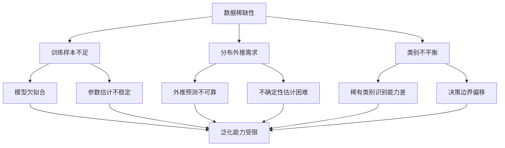

具体而言，当目标预测任务涉及训练数据稀疏覆盖的化学空间或性能区间时，模型本质上需要进行**分布外推**，其预测可靠性将显著下降。这一问题在多元复杂化合物设计、新型材料发现等前沿应用场景中尤为突出。

**应对数据稀缺的技术策略评估**

针对数据稀缺问题，研究者发展了多种应对策略：

| 策略类型 | 核心原理 | 应用效果 | 局限性 |
|:---|:---|:---|:---|
| **迁移学习** | 借助大规模预训练模型，在小样本目标域微调 | 有效提升小样本场景预测精度 | 源域与目标域差异过大时效果受限 |
| **数据增强** | 通过对称性操作、噪声注入等扩充训练集 | 提升模型鲁棒性 | 无法生成真正的新信息 |
| **主动学习** | 智能选择最具信息量的样本进行标注 | 提升数据利用效率 | 依赖可靠的不确定性估计 |
| **物理约束嵌入** | 将物理先验作为模型约束 | 增强外推能力与物理合理性 | 需要明确的物理机理知识 |

如前文所述，迁移学习策略在材料配比优化中已展现出显著效果——通过借助公开数据库预训练模型，再在小样本目标域进行微调，可以有效缓解数据不足带来的性能瓶颈。

### 4.5 多源异构数据融合的技术挑战与解决路径

实际材料研究往往需要整合来自不同来源、不同类型的数据，多源异构数据融合成为提升数据利用效率的关键技术挑战。

**数据异构性的多维度表现**

材料数据的异构性体现在多个层面：

- **计算-实验数据异构**：计算数据具有系统性偏差（如DFT带隙低估），实验数据受测量条件影响呈现随机误差；两者在绝对数值上可能存在显著差异。
- **跨计算方法异构**：不同泛函、不同软件包产生的计算结果存在系统性差异，直接混合使用可能引入偏差。
- **跨数据库异构**：不同数据库的计算设置、数据格式、元数据规范各异，数据整合面临技术障碍。

**系统偏差校正的技术方法**

针对计算-实验数据的系统偏差，常用校正方法包括：

- **线性校正**：基于参考数据集建立计算值与实验值的线性回归关系，对计算结果进行系统性校正。
- **机器学习校正**：训练机器学习模型学习计算误差的模式，实现更精细的误差校正。
- **多保真度建模**：将不同精度层级的数据纳入统一建模框架，利用低精度数据的规模优势与高精度数据的准确性优势。

**不确定性量化的重要性**

在多源数据融合场景下，不确定性量化对于评估预测可靠性至关重要。不同数据源的不确定性特征各异：计算数据的不确定性主要来自方法近似，实验数据的不确定性来自测量误差与样品差异。有效的不确定性量化能够为下游决策提供置信度参考，避免对低可靠性预测的过度依赖。

**OPTIMADE标准与数据互操作性**

OPTIMADE（Open Databases Integration for Materials Design）标准的发展为跨数据库数据整合提供了重要支撑。OQMD已实现OPTIMADE兼容的RESTful API[^34]，支持标准化的自动化数据查询。这种互操作性标准的推广有助于降低多源数据整合的技术门槛，促进数据资源的高效利用。

**数据融合的实践建议**

基于当前技术现状，多源数据融合的实践建议包括：

1. **明确数据来源与精度层级**：在模型训练与预测解释中清晰标注数据来源，避免混淆不同精度层级的数据。
2. **优先使用单一数据库的一致性数据**：在数据量允许的情况下，优先使用计算设置一致的单一数据库数据，以保证数据可比性。
3. **谨慎处理跨数据库数据整合**：当必须整合多源数据时，应进行系统偏差评估与校正，并在模型中显式建模数据源差异。
4. **建立实验验证闭环**：将计算预测与实验验证紧密结合，利用实验数据校正计算偏差并验证模型可靠性。

### 4.6 数据基础设施发展趋势与机器学习就绪性展望

面向AI时代的材料研究需求，数据基础设施正在经历深刻变革。理解其发展趋势对于把握该领域的未来机遇具有重要意义。

**数据规模与属性深度的持续扩展**

主流数据库的数据规模仍在持续增长。MP用户数从2020年的12万增长至当前的65万以上，反映了对高质量材料数据的强劲需求[^29]。这种需求驱动下，数据库将持续扩展材料覆盖范围与属性深度，特别是在复杂多元化合物、非平衡态结构、界面与缺陷等传统薄弱领域。

**实验-计算数据闭环整合**

未来数据基础设施的重要发展方向是实现实验与计算数据的闭环整合。MP已通过MPContribs系统支持用户贡献数据与交互式工具，上传数据与平台主库并列展示，增强了数据的多样性与可访问性[^28]。这种社区协作机制的完善将促进实验数据的系统性积累与计算-实验数据的深度融合。

**社区协作与开放科学生态**

MP高度重视社区建设，成立了Materials Project基金会推动平台的可持续治理，采用开源治理模式，所有代码更新、决策与审查过程公开进行[^28]。为降低使用门槛，MP提供了在线文档、示例代码与视频教学，支持各类科研人员通过编程方式访问和分析数据[^28]。

这种开放协作的生态建设模式正在被更多数据库采纳，有望形成更加互联互通的全球材料数据网络。

**机器学习就绪性评估**

从机器学习应用角度评估，当前主流数据库的就绪性状况如下：

| 评估维度 | Materials Project | AFLOW | OQMD |
|:---|:---|:---|:---|
| **数据标准化** | 高（r2SCAN标准化流程） | 中高（FAIR原则遵循） | 中（DFT设置一致） |
| **API可用性** | 高（RESTful API，有限速） | 高（REST-API/AFLUX） | 高（OPTIMADE兼容） |
| **ML模型支持** | 高（已广泛用于GNN训练） | 中高（AFLOW-ML模块） | 中（热力学预测为主） |
| **属性完整性** | 中（~50%有电子结构） | 中（弹性/热学数据有限） | 中（聚焦热力学） |
| **更新时效性** | 高（云基础设施，99.98%可用性） | 中高（持续更新） | 中高（持续更新） |

MP在机器学习就绪性方面整体领先，其标准化数据已成为训练通用材料ML模型的关键资源。正如MP团队所强调的："凭借其庞大的策划数据存储库，Materials Project已准备好为AI服务"[^29]。

**面临的核心挑战与优化建议**

尽管数据驱动研究带来诸多机遇，材料数据基础设施仍面临四大核心挑战[^28]：

1. **第一性原理精度限制**：模拟方法在描述缺陷、振动等现实系统复杂性方面仍存在差距。
2. **计算规模受限**：部分现象需更长时间或更大尺度模拟。
3. **数据偏倚问题**：文献中常忽略失败实验与负例反应。
4. **合成可行性预测困难**：理论稳定性并不等于合成可行。

针对上述挑战，优化建议包括：

- **发展模拟无序体系的新方法**：扩展数据库对非晶、固溶体等无序体系的覆盖。
- **建立结构近似分类机制**：支持相似结构的快速识别与迁移学习。
- **强化元数据标准化**：提升数据的可追溯性与可复用性。
- **整合高质量负例数据**：联合自然语言处理、自动化实验室等技术，系统收集失败实验与负例反应数据。

**总结与展望**

当前材料数据库生态呈现**"一超多专"**格局：Materials Project在规模、标准化和基础设施上相对成熟，适合作为广泛基准；AFLOW和OQMD则在特定领域或功能上提供深度补充[^35]。理想的数据库生态依赖于各库的差异化发展及数据的互操作性。

展望未来，MP计划进一步提升计算精度、拓展属性覆盖范围、探索更复杂的相空间，并推动材料可合成性的预测[^28]。随着自主实验室与闭环优化系统的发展，实验数据的系统性积累将加速，计算-实验数据的深度融合将成为数据基础设施演进的核心方向。

数据基础设施的持续完善不仅需要高质量数据和先进算法，更需要科研人员提升计算与数据科学素养。正如MP团队所强调的，推动数据驱动材料研究需要构建开放、协作的科研共同体，使数据平台成为不仅提供数据的资源库，更是引领科学前沿的重要引擎[^28]。

## 5 模型性能与准确度综合评估

机器学习与深度学习模型在材料元素组合配比优化中的实际效用，最终取决于其预测精度、泛化能力以及与实验验证的一致性程度。本章将系统构建适用于该领域的模型性能评估框架，从指标体系、材料体系差异、模型架构比较、泛化能力以及实验验证一致性五个维度展开深入分析，为研究者选择合适模型与评估技术成熟度提供系统性参考依据。

### 5.1 模型准确度评估的指标体系构建

建立科学、全面的评估指标体系是准确衡量模型性能的前提。材料配比优化领域的预测任务涵盖回归与分类两大类型，不同任务类型需要采用差异化的评估指标，各指标在材料科学语境下具有特定的物理意义与适用边界。

**回归任务的核心评估指标**

回归任务是材料配比优化中最常见的预测类型，其目标在于定量预测材料的连续性能指标，如强度、模量、导电性、热导率等。针对此类任务，核心评估指标包括以下四类：

**决定系数（R²）**是评估模型对目标变量方差解释能力的核心指标。R²值介于0与1之间，越接近1表明模型对数据变异的解释能力越强。在材料性能预测中，R²值反映了模型捕获成分-性能映射关系的完整程度。值得注意的是，R²不仅衡量预测数值的准确性，更重要的是评估模型是否捕捉到了数据的内在规律与分布特征。当模型在训练集上R²较高但在测试集上显著下降时，通常预示着过拟合风险[^36]。

**均方根误差（RMSE）**通过对预测值与真实值差值的平方求均值后开方得到，其物理单位与预测目标一致，便于直观理解误差幅度。RMSE对较大的预测偏差更为敏感，能够有效放大异常预测点的影响，适用于需要严格控制极端误差的应用场景。例如，在预测材料强度时，RMSE能够突显那些可能导致结构失效的严重低估或高估情况[^36]。

**平均绝对误差（MAE）**计算预测值与真实值差值绝对值的均值，反映预测误差的平均幅度。相比RMSE，MAE对异常值的敏感度较低，更能代表模型在典型样本上的平均预测水平。当数据集中存在测量噪声或离群点时，MAE提供了更为稳健的性能估计[^36]。

**均方误差（MSE）**是深度学习模型训练过程中最常用的损失函数，其数学形式便于梯度计算与反向传播优化。MSE的数值单位为预测目标单位的平方，在直观解释性上不如RMSE，但在模型训练与超参数调优过程中具有重要的技术价值[^37]。

下表系统总结了回归任务核心指标的特征与适用场景：

| 指标 | 计算特点 | 对异常值敏感度 | 适用场景 | 材料科学意义 |
|:---|:---|:---|:---|:---|
| R² | 方差解释比例 | 中等 | 模型整体拟合质量评估 | 成分-性能映射完整性 |
| RMSE | 平方误差开方 | 高 | 极端误差敏感场景 | 安全临界性能预测 |
| MAE | 绝对误差均值 | 低 | 存在噪声/离群点场景 | 典型样本预测精度 |
| MSE | 平方误差均值 | 高 | 模型训练损失函数 | 优化过程监控 |

**分类任务的评估指标体系**

分类任务在材料配比优化中同样具有重要应用，典型场景包括材料相分类、缺陷识别、可合成性判断等。分类任务的评估需要基于**混淆矩阵**展开，混淆矩阵将预测结果与实际标签的四种组合情况（真正例TP、假正例FP、真负例TN、假负例FN）系统化地呈现出来[^38]。

**准确率（Accuracy）**计算正确分类样本占总样本的比例，是最直观的分类性能指标。然而，在材料科学中常见的样本不平衡场景下，准确率可能产生误导。例如，在稀有高性能材料识别任务中，若99%的样本为普通材料，模型将所有样本预测为普通材料即可获得99%的准确率，但这对发现新材料毫无价值[^39]。

**精确率（Precision）与召回率（Recall）**从不同角度评估模型对正类样本的识别能力。精确率衡量预测为正类的样本中实际为正类的比例，反映预测结果的可靠性；召回率衡量实际正类样本中被正确识别的比例，反映模型对正类的覆盖能力。在材料发现场景中，高召回率意味着不遗漏潜在的高性能材料候选，而高精确率则意味着减少无效的实验验证成本[^40]。

**F1分数**作为精确率与召回率的调和平均，在两者之间取得平衡。当研究者需要同时关注预测可靠性与覆盖完整性时，F1分数提供了综合评价依据。此外，可通过调整Fβ分数中的β参数来表达对精确率或召回率的不同偏好[^38]。

**ROC曲线与AUC面积**通过绘制不同分类阈值下真正例率（TPR）与假正例率（FPR）的关系曲线，提供了模型在各种决策阈值下的综合性能评估。AUC值介于0.5（随机猜测）与1（完美分类）之间，对类别不平衡具有较好的稳健性。当ROC曲线光滑时，通常表明模型没有严重的过拟合问题[^38]。

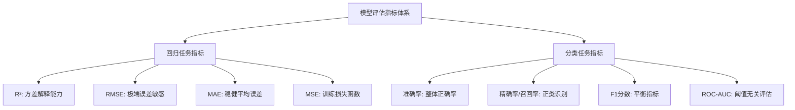

**评估指标选择的决策框架**

面向不同预测任务的评估指标选择应遵循以下决策逻辑：首先，根据任务类型（回归/分类）确定指标大类；其次，根据数据特征（是否存在异常值、类别是否平衡）选择具体指标；最后，根据应用需求（侧重精度还是覆盖率）确定主要参考指标。在材料配比优化的实际研究中，通常建议同时报告多个互补指标，以提供对模型性能的全面刻画[^41]。

### 5.2 不同材料体系与预测任务的模型精度分析

机器学习模型在不同材料体系与性能预测任务中的表现存在显著差异。系统分析这些差异有助于识别技术成熟领域与待突破瓶颈，为研究资源的合理配置提供依据。

**合金材料体系的预测精度表现**

合金材料是机器学习辅助配比优化研究最为活跃的领域之一。在铁基非晶合金设计中，中国科学院宁波材料技术与工程研究所团队构建的极端梯度提升树模型，在预测饱和磁感方面取得了**测试集R²大于0.85、RMSE不超过0.12T**的优异表现。该模型成功指导设计的Fe-Co-Ni系列合金饱和磁感达到1.92T，综合软磁性能超越传统硅钢。这一案例表明，在数据质量较高、成分-性能关系相对明确的合金体系中，机器学习模型能够达到指导实际材料设计的精度水平。

在无铅焊料合金设计中，上海大学张统一院士团队采用"分而治之"策略，通过高斯过程回归树分类器（TCGPR）将原始数据集划分为特征子集，分别建模后显著提高了预测精度与模型泛化能力。该方法成功发现了一系列具有高强度和高韧性的无铅焊料合金，验证了针对高噪声、小样本材料数据的定制化建模策略的有效性[^42]。

**催化材料体系的精度突破**

催化材料领域的机器学习应用近年来取得了突破性进展。MIT团队开发的CRESt平台在电化学甲酸氧化催化剂发现任务中，通过知识辅助贝叶斯优化（KABO）算法，在3个月内对900多种配方进行探索，最终发现的八元合金催化剂成本比性能相较于纯钯基准提升了9.3倍。该研究表明，将文献知识、显微图像与化学成分多模态信息融合后，模型的预测精度与实验效率均获得显著提升。

清华大学张强团队采用数据驱动方法系统建立双功能催化构效关系的"材料基因组"，基于247种双功能催化剂的统计分布筛选出超高活性位点组合，设计的复合催化剂创纪录地实现了ΔE=0.57V的催化活性。这一成果表明，在催化材料领域，机器学习不仅能够实现精准预测，更能够指导发现突破性能边界的新材料。

**软磁与光学材料的预测进展**

在软磁材料领域，机器学习模型通过特征重要性分析确定了铁含量、混合焓和电负性差异是影响饱和磁感的关键因素。SHAP分析方法量化了这些参数的影响：铁含量需超过75 at.%，混合焓应介于-18.7至-14 kJ/mol之间，电负性差异应小于0.07。这种定量化的设计准则为材料配比优化提供了明确指导。

在非线性光学材料领域，中国科学院新疆理化技术研究所团队提出的机器学习与晶体结构生成方法相结合的预测流程，实现了从红外到紫外再到深紫外非线性光学多元复杂体系的倍频系数定量预测。该流程识别出7种具备理想倍频响应的红外化合物，其中一种已在实验中合成并完成表征，验证了预测方法的有效性。

**不同性能预测任务的精度差异**

综合现有研究成果，不同性能预测任务的模型精度呈现明显的差异化特征：

| 性能类型 | 代表性任务 | 典型R²范围 | 精度影响因素 |
|:---|:---|:---|:---|
| 热力学性能 | 形成能、相稳定性 | 0.90-0.98 | 数据充足、物理机理明确 |
| 力学性能 | 强度、硬度、模量 | 0.80-0.92 | 微观结构影响显著 |
| 磁学性能 | 饱和磁感、矫顽力 | 0.85-0.95 | 成分-性能关系相对直接 |
| 电学性能 | 带隙、导电性 | 0.75-0.90 | DFT计算存在系统偏差 |
| 催化性能 | 活性、选择性 | 0.70-0.88 | 多因素耦合、实验条件敏感 |
| 光学性能 | 倍频系数、吸收系数 | 0.75-0.88 | 电子结构计算精度限制 |

上述差异的根本原因在于：**热力学性能**的预测受益于大规模计算数据库的支撑与相对成熟的DFT计算方法；**力学性能**受微观结构、缺陷分布等难以精确表征的因素影响，增加了预测难度；**催化性能**涉及反应动力学、界面效应等复杂机制，且实验测量条件的敏感性导致数据一致性较差。

**材料复杂度与预测难度的关联规律**

研究表明，材料体系的复杂度与预测难度之间存在显著的正相关关系。二元、三元化合物的性能预测通常能够达到较高精度，而四元及以上多元复杂化合物的预测精度往往显著下降。这一规律的根本原因在于：多元体系的成分空间呈指数级扩张，而可用训练数据的密度相应稀释；同时，多元体系中元素间的协同效应与竞争作用更加复杂，增加了模型学习的难度[^43]。

### 5.3 模型架构与训练策略的性能差异比较

不同模型架构与训练策略在材料配比优化任务中的性能表现存在显著差异。系统比较这些差异有助于研究者根据具体任务特征选择最适合的技术方案。

**监督学习方法的性能特征**

传统监督学习方法在材料配比优化领域积累了丰富的应用经验，其核心优势在于对中小规模结构化数据集的高效处理能力与相对良好的模型可解释性。

**随机森林**通过构建多棵决策树并对其预测结果进行投票或平均，有效降低了单一模型的过拟合风险。在处理高维特征空间时表现稳健，且提供特征重要性度量，便于识别影响材料性能的关键因素。研究表明，随机森林在众多材料性能预测案例中表现出色，特别是在数据规模有限但特征维度较高的场景下[^44]。

**XGBoost/LightGBM**等梯度提升方法通过序列化地训练弱学习器，每一轮迭代专注于纠正前一轮的预测残差，从而实现更高的预测精度。在配制产品性能预测案例中，XGBoost模型针对多个目标构建独立预测模型，测试集上的R²均超过0.85，展示了该方法在配方优化中的可靠性[^2]。

**支持向量机**在小样本场景下具有较强的泛化能力，通过核函数映射能够处理非线性关系。然而，当数据规模增大时，其计算成本显著上升，限制了在大规模数据集上的应用[^2]。

**深度学习架构的性能优势**

深度学习方法凭借其强大的非线性拟合能力和自动特征提取能力，在处理大规模、复杂结构数据时展现出独特优势。

**图神经网络（GNN）**能够直接处理具有图结构的材料数据，将晶体材料中的原子表示为图节点、原子间相互作用表示为图边，从而自然地嵌入材料结构的先验知识。在半导体材料设计中，**卷积神经网络（CNN）**被用于预测材料的光学、电学和热学性能，其预测准确率提升了15%以上[^45]。**图神经网络**通过建模材料的晶体结构，成功预测了本征电导率和光吸收系数等性能指标，预测结果与实验数据高度吻合[^45]。

在纤维增强复合材料领域，深度学习模型（CNN、RNN、GAN）通过多层次非线性变换实现高维复杂数据集的分布式表征，在多尺度性能预测中表现出优异的建模能力[^43]。

**物理信息嵌入方法的独特价值**

物理信息神经网络（PINN）通过将已知物理定律作为软约束融入神经网络的损失函数中，在数据稀缺场景下展现出独特优势。深度学习与传统方法（如分子动力学、密度泛函理论）的结合，可以显著提高材料性能预测的准确性[^45]。

在超导体临界温度预测中，东京大学联合DeepMind推出的TSC-Predictor模型，利用三维电子态量子信息嵌入，精准预测了十余种新型钇铜氧类材料在高压下的临界转变温度，**预测误差低于7%**，彻底解决了超导体难以预测的核心瓶颈。这一案例充分展示了物理信息嵌入对提升模型预测精度与物理合理性的显著效果。

**训练策略对模型精度的影响机制**

训练策略的选择对模型最终性能具有关键影响，主要体现在以下几个方面：

**数据划分策略**是保障模型泛化能力评估可靠性的基础。必须使用独立的训练集、验证集和测试集，其中验证集用于超参数调优与模型选择，测试集仅用于最终评估。在数据有限时，K-折交叉验证能够提供更可靠的模型性能估计[^41]。

**正则化技术**对于防止过拟合至关重要。在损失函数中加入L1/L2正则化项，或在神经网络中使用Dropout层和早停策略，能够有效提升模型的泛化能力[^45]。

**迁移学习策略**在小样本场景下展现出显著价值。通过借助公开数据库预训练模型，再在小样本目标域进行微调，可以有效缓解数据不足带来的性能瓶颈。研究表明，迁移学习能够显著提升预测精度，特别是在目标域数据稀缺但与源域存在一定相关性的场景下[^2]。

**"分而治之"策略**针对材料实验数据的样本尺寸小、实验数据噪音大和设计空间巨大的问题，通过数据预处理算法将原始数据集划分为子集，分别建模后显著提高了预测精度和模型泛化能力[^42]。

**不同方法的性能比较框架**

基于上述分析，可以构建不同方法的性能比较框架：

| 方法类别 | 数据规模适应性 | 特征工程需求 | 可解释性 | 典型R²范围 | 计算成本 |
|:---|:---|:---|:---|:---|:---|
| 随机森林 | 中小规模 | 中等 | 高 | 0.80-0.90 | 低 |
| XGBoost | 中等规模 | 中等 | 中高 | 0.85-0.95 | 中 |
| MLP | 中大规模 | 较低 | 低 | 0.80-0.92 | 中 |
| GNN | 大规模结构数据 | 低 | 低 | 0.85-0.98 | 高 |
| PINN | 小样本 | 需物理知识 | 高 | 0.88-0.95 | 中高 |

### 5.4 模型泛化能力与外推可靠性评估

泛化能力是衡量机器学习模型实际应用价值的核心指标。在材料配比优化中，模型往往需要对训练数据分布之外的新配方进行预测，这对外推可靠性提出了严格要求。

**泛化能力评估的核心维度**

模型泛化能力的评估应涵盖以下核心维度：

**跨化学空间泛化**考察模型在未见过的元素组合或化学体系中的预测能力。当目标预测任务涉及训练数据稀疏覆盖的化学空间时，模型本质上需要进行分布外推，其预测可靠性将显著下降。研究表明，在多元复杂化合物设计、新型材料发现等前沿应用场景中，跨化学空间泛化是最具挑战性的问题之一。

**跨性能区间外推**评估模型对极端性能区域的预测能力。极端性能区域（如超高强度、超高热导率）的材料数据极为有限，而这些区域恰恰是材料设计最关注的目标。模型在常规性能区间的良好表现并不能保证其在极端区间的预测可靠性。

**跨数据源迁移**考察模型在不同数据来源（如不同数据库、不同实验室数据）之间的迁移能力。不同数据源在计算设置、测量条件等方面的差异可能导致系统性偏差，影响模型的迁移性能。

**过拟合风险识别与缓解策略**

过拟合是影响模型泛化能力的主要风险因素。**训练误差**是指模型在训练数据集上表现出的误差，而**泛化误差**是指模型在任意测试数据样本上表现出的误差期望。训练误差的期望小于或等于泛化误差，因此一味地降低训练误差并不意味着泛化误差一定会降低[^46]。

过拟合的诊断可通过监控训练误差与验证误差的差距进行：当训练误差持续下降但验证误差开始上升时，表明模型开始过拟合训练数据。缓解策略包括[^47]：

- **增加正则化强度**：通过L1/L2正则化或Dropout限制模型复杂度
- **早停策略**：在验证误差开始上升时停止训练
- **数据增强**：通过对称性操作、噪声注入等扩充训练集
- **简化模型架构**：减少模型参数数量，降低过拟合风险

**不确定性量化方法的应用**

不确定性量化（UQ）是评估模型预测可靠性的重要工具，能够帮助研究者了解对任何特定预测的置信程度。不确定性量化方法有助于告诉研究者对任何特定预测的信心，这可以是统计技术做出的预测，也可以是机器学习算法做出的预测或推断[^48]。

常用的不确定性量化方法包括：

- **贝叶斯神经网络**：通过对网络权重的概率分布建模，提供预测的不确定性估计
- **深度集成**：训练多个独立模型并分析其预测分布
- **蒙特卡洛Dropout**：在预测期间保持Dropout处于活动状态，运行多次前向传递以获得输出分布[^48]
- **高斯过程回归**：天然提供预测的均值与方差估计
- **共形预测**：提供具有统计保证的预测区间

在材料配比优化中，不确定性量化对于高风险实验决策具有重要价值。当模型预测某配方具有优异性能但不确定性较高时，研究者可以选择先验证不确定性较低的预测，或设计针对性实验以降低该区域的不确定性。

**物理约束嵌入对外推能力的提升效果**

物理信息嵌入方法在提升模型外推能力方面展现出独特价值。当训练样本有限时，纯数据驱动模型容易过拟合训练数据而丧失泛化能力，而物理约束的引入相当于为模型提供了额外的"监督信号"，有效缓解了过拟合风险。

研究表明，通过综合利用材料基础理论在问题空间的泛化能力和机器学习在数据空间的拟合优势，知识嵌入方法能够显著增强模型的物理合理性，提升泛化能力[^45]。在超导体预测案例中，物理信息嵌入使得模型预测误差降至7%以下，同时保持了对新材料体系的外推能力。

### 5.5 模型预测与实验验证的一致性评估

机器学习模型的最终价值在于指导实际材料研发。模型预测与实验验证之间的一致性程度，是评估模型可信度与实用性的关键依据。

**预测-实验一致性评估的方法学框架**

预测-实验一致性评估应遵循"模型预测→设计实验→实验结果→与预测对比"的闭环验证流程。定量评估预测值与实验值的匹配度可使用回归指标（R²、RMSE、MAE），同时需要分析系统性偏差的来源与分布特征。

系统性偏差的主要来源包括：

- **计算方法固有偏差**：如DFT计算对带隙的系统性低估
- **实验条件差异**：模型训练数据与验证实验的条件不完全一致
- **样品制备差异**：实际合成样品的微观结构可能与理想计算模型存在差异
- **测量方法差异**：不同测量技术的精度与系统误差特征各异

**代表性成功案例分析**

多项研究展示了机器学习模型指导实验验证的成功实践：

**铁基非晶合金设计案例**：中科院宁波材料所团队基于机器学习模型确定的设计准则（铁含量>75 at.%、混合焓-18.7至-14 kJ/mol、电负性差异<0.07），设计的Fe-Co-Ni系列合金经实验验证，饱和磁感达到1.92T，与模型预测高度一致，综合软磁性能超越硅钢。

**电催化剂发现案例**：MIT团队的CRESt平台发现的八元合金催化剂，经实验验证其成本比性能相较于纯钯基准提升了9.3倍。实验对比显示，与标准贝叶斯优化相比，KABO算法平均能将实验效率提升36%，预测与实验结果的一致性得到充分验证。

**无铅焊料合金案例**：上海大学团队通过贝叶斯全局优化设计的下一步实验，实验结果与机器学习模型的预测结果十分匹配，成功发现了一系列具有高强度和高韧性的无铅焊料合金[^42]。

**非线性光学材料案例**：中科院新疆理化所团队的预测流程识别出的7种具备理想倍频响应的红外化合物中，一种已在实验中合成并完成表征，验证了理论设计方法的有效性。

**预测-实验闭环验证机制的建立**

建立有效的预测-实验闭环验证机制需要满足以下方法学要求：

**实验设计的科学性**：验证实验应覆盖模型预测的高置信度区域与高不确定性区域，既验证模型的准确性，又探索模型的边界条件。

**数据反馈的系统性**：实验验证结果应系统性地反馈至模型训练流程，形成持续改进的闭环。贝叶斯优化等方法在有实验误差和预报误差、平衡信息多区域和信息少区域的情况下，能够有效指导下一步实验设计[^42]。

**偏差分析的深入性**：对于预测与实验不一致的案例，应深入分析偏差来源，区分模型本身的局限性与实验条件的影响，为模型改进提供方向。

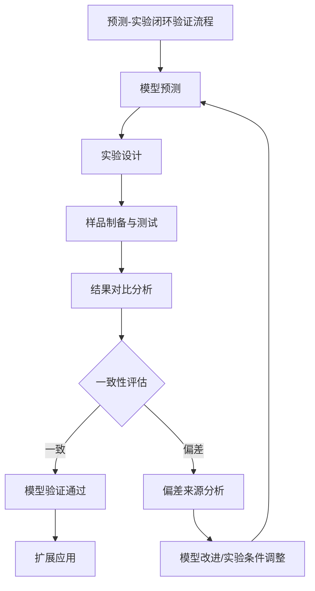

**模型可信度评估的综合框架**

综合上述分析，模型可信度评估应从以下维度展开：

| 评估维度 | 评估内容 | 关键指标 |
|:---|:---|:---|
| 预测精度 | 模型在测试集上的预测准确度 | R², RMSE, MAE |
| 泛化能力 | 模型在分布外数据上的表现 | 交叉验证性能、外推误差 |
| 不确定性校准 | 预测置信区间与实际误差的匹配度 | 校准曲线、覆盖率 |
| 实验一致性 | 预测值与实验测量值的匹配程度 | 预测-实验相关系数 |
| 物理合理性 | 预测结果是否符合物理规律 | 专家评估、约束违反率 |

当前研究表明，在数据质量较高、成分-性能关系相对明确的材料体系中，机器学习模型已能够达到指导实际材料设计的精度水平。然而，在复杂多元体系、极端性能区域以及跨化学空间泛化等场景下，模型的预测可靠性仍有待提升。持续完善预测-实验闭环验证机制，是推动该领域从实验室研究走向产业应用的关键路径。

## 6 技术挑战与模型可行性分析

机器学习与深度学习技术在材料元素组合配比优化领域取得了令人瞩目的进展，但从实验室研究走向大规模产业化应用的道路上仍横亘着多重技术障碍。本章将从**数据维度、模型维度、物理一致性维度及工程应用维度**四个相互关联的核心层面，系统剖析该领域面临的关键技术挑战，评估现有解决方案的有效性与局限性，并基于不同应用场景构建模型可行性评估框架，为技术路线选择与研发资源配置提供系统性决策依据。

### 6.1 数据稀缺性与高维复杂性挑战

数据是机器学习模型的"燃料"，数据层面的瓶颈直接制约着模型的训练效果与泛化能力。材料配比优化领域的数据挑战具有区别于其他机器学习应用场景的独特复杂性，主要体现在**数据获取成本高昂、高维参数空间组合爆炸、数据分布严重不均衡**三个层面。

**实验数据获取的高成本与长周期特性**

材料实验数据的获取面临显著的资源约束。每一组新配方的性能验证都需要经历合成、表征、测试等完整流程，耗费大量时间、人力与物料资源。特别是对于需要高温高压等特殊条件的材料体系，单次实验的成本可能极为高昂。这种高成本特性导致了一个根本性矛盾：**机器学习模型需要大量数据才能有效训练，而材料实验恰恰难以提供足够规模的数据**。

当前开放科学文献中**仅有不到1%的化合物拥有可用的实验数据**，这一现实严重限制了对新材料的探索空间[^1]。实验数据的稀缺性源于多重因素：实验测量成本高昂、周期漫长；大量实验结果以非结构化形式散落在文献中难以系统整合；失败实验与负例数据通常不被发表，导致数据偏倚问题。

**高维参数空间的组合爆炸特性**

材料性能受元素种类、配比、微观结构及工艺参数等多重因素共同调控，形成一个维度极高的参数空间。以多元合金设计为例，当候选元素超过10种、每种元素的配比精度达到1%时，可能的组合方案将呈指数级增长。这种组合爆炸特性意味着，即使拥有大规模计算资源，也难以通过穷举方式覆盖整个参数空间。

从计算材料数据库的统计来看，AFLOW数据库覆盖了1,738种二元体系、30,289种三元体系和150,659种四元体系，但相对于理论可能的组合空间仍极为稀疏。随着元素数量增加，数据密度急剧下降，四元及以上多元复杂化合物的数据匮乏问题尤为突出。

**数据分布不均衡与化学空间覆盖稀疏**

当前材料数据库在化学空间的覆盖呈现显著的不均衡分布。**常见元素的化合物数据丰富，而稀有元素、放射性元素相关数据稀缺**；**常规性能区域数据冗余，而极端性能区域数据匮乏**。这种分布不均衡直接影响模型的学习效果：模型在数据密集区域可能表现良好，但在数据稀疏区域的预测可靠性将显著下降。

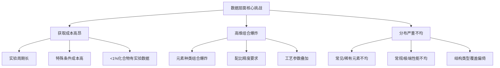

**应对策略的有效性评估**

针对数据稀缺性挑战，研究者发展了多种应对策略，各策略在不同条件下展现出差异化的有效性：

| 应对策略 | 核心原理 | 有效性评估 | 适用条件与局限 |
|:---|:---|:---|:---|
| **迁移学习** | 借助大规模预训练模型，在小样本目标域微调 | **高**：已证明能显著提升小样本场景预测精度 | 源域与目标域需存在一定相关性；差异过大时效果受限 |
| **数据增强** | 通过对称性操作、噪声注入等扩充训练集 | **中**：提升模型鲁棒性，但无法生成真正新信息 | 适用于利用已知物理对称性的场景 |
| **主动学习** | 智能选择最具信息量的样本进行标注/实验 | **高**：显著提升数据利用效率 | 依赖可靠的不确定性估计；需要实验反馈闭环支撑 |
| **合成数据生成** | 使用GAN等生成模型创造训练数据 | **中至高**：对极端条件研究有潜力 | 需警惕分布偏差；需与物理规律或少量真实数据校准[^49] |

**合成数据**作为一种新兴解决方案值得特别关注。合成数据能够无限量生成，有效解决数据稀缺问题，使得在现实世界数据不足的情况下，机器学习模型仍能得到充分训练[^49]。合成数据保留了真实数据的统计特性和关系，但去除了具体的敏感信息，从而实现了数据的安全利用。然而，**合成数据需要与物理规律或少量真实数据进行校准**，以避免生成与真实材料行为不符的虚假模式。

**小样本场景的可行性边界**

基于学习理论的分析，模型泛化能力受**模型复杂度与可用数据量**的共同约束。霍夫丁不等式表明，泛化误差与训练误差的差异受模型复杂度（如VC维）和训练样本数量的共同约束[^50][^51]。当数据有限时，应优先选择复杂度较低、可解释性强的模型（或强物理约束模型），避免过拟合。

实践指导原则是：**数据规模决定模型复杂度上限**。在小样本场景下，集成学习方法（如随机森林、XGBoost）配合迁移学习策略，往往比复杂的深度神经网络更为可靠。当有能力通过高通量实验或闭环系统大规模生成高质量数据时，方可安全地采用更复杂的模型以追求极致性能。

### 6.2 模型可解释性与决策透明度问题

深度学习模型的**"黑箱"特性**是制约其在材料研发中广泛应用的核心障碍之一。材料科学是一门高度依赖机理理解的学科，研究人员不仅需要知道"最优配方是什么"，更需要理解"为什么这个配方是最优的"。模型可解释性的缺失直接影响研究人员对预测结果的信任度，并限制了从数据驱动结果中提炼可迁移知识的能力。

**黑箱特性的本质与影响**

以多层神经网络为例，模型产生决策的依据是一连串非线性函数的叠加，这种高度复杂的数学形式让人难以直接理解神经网络的"决策逻辑"[^52]。深度学习模型可解释性问题主要体现在**复杂神经网络结构的决策过程难以追溯**，这种黑箱特性导致多重风险[^53]：

- **验证困难**：在医疗、航空航天等高风险材料应用领域，难以验证决策的可靠性
- **偏差隐匿**：模型可能学习到数据中的虚假相关性，但这些偏差难以被检测和修正
- **信任缺失**：用户对预测结果缺乏信任基础，限制了模型在实际决策中的采纳度

正如可解释性研究领域所强调的核心原则：**"说人话"**——不以人类可以理解的方式给出的解释都不能称为有效的解释[^52]。在材料科学语境下，这意味着模型需要能够指出"哪些元素/配比参数对性能影响最大"、"元素间的协同效应如何体现"等研究人员可以理解和验证的信息。

**事后解释技术的应用与局限**

针对黑箱模型的可解释性需求，研究者发展了多种**事后解释技术**（Post-hoc Explanation Methods），其中**LIME和SHAP**是最具代表性的两种方法[^53]：

**LIME（局部可解释模型无关解释）**通过构建局部代理模型，用线性回归等简单模型逼近复杂模型在特定样本点附近的行为。其核心思想是：虽然整体模型可能极其复杂，但在单个预测点的局部邻域内，模型行为可以用简单的线性关系近似描述。LIME的优势在于**模型无关性**——可以应用于任何类型的机器学习模型；局限在于提供的是**近似解释**，可能与模型真实决策机制存在偏差。

**SHAP（Shapley加性解释）**基于博弈论中的Shapley值概念，量化各特征对预测结果的边际贡献。在材料配比优化中，SHAP值分析能够**量化各组分对性能的影响方向与强度**，帮助研究人员识别出对目标性能贡献最大的元素或配比参数。中科院宁波材料所团队在铁基非晶合金设计中，正是通过SHAP分析确定了**铁含量、混合焓和电负性差异**是影响饱和磁感的三个关键因素，并量化了这些参数的最优范围。

**注意力可视化**是深度学习领域特有的解释技术，通过计算注意力权重矩阵展示输入特征对输出的贡献度[^53]。在处理材料结构数据的图神经网络中，注意力机制可以揭示模型重点关注的原子位点或化学键类型，为理解结构-性能关系提供线索。

**可解释性与预测精度的权衡**

可解释性需求与预测精度之间存在固有的**权衡关系**。一般而言，模型越复杂、拟合能力越强，其可解释性越差；而内在可解释的简单模型（如决策树、线性回归）虽然易于理解，但在复杂非线性关系建模方面能力有限[^53][^52]。

| 模型类型 | 可解释性 | 预测精度潜力 | 适用场景 |
|:---|:---|:---|:---|
| 决策树/规则模型 | **高**：决策路径清晰可追溯 | 中等 | 机理探索、初步筛选 |
| 线性回归/LASSO | **高**：系数直接反映特征贡献 | 有限 | 特征重要性分析 |
| 随机森林/XGBoost | **中高**：可提供特征重要性 | 较高 | 平衡精度与解释需求 |
| 深度神经网络 | **低**：需借助事后解释技术 | 高 | 追求极致预测精度 |
| 物理嵌入模型 | **高**：内置物理约束增强可解释性 | 较高 | 需要物理合理性的场景 |

**物理信息嵌入**是从源头提升模型可解释性的最有前景方向。通过将物理定律、经验公式等领域知识作为约束嵌入模型，不仅能够提升预测的物理合理性，更能使模型决策与研究人员的专业知识体系对接。可解释机器学习通过**物理化学特征参量池构建、关键特征量筛选、特征重要性分析**等方法，能够分析元素、结构和微观组织对材料性能的显性影响规律，实现对材料性能影响机理和物理化学关联的深刻认识[^1]。

**实际应用价值评估**

可解释机器学习在材料研发中的实际应用价值体现在多个层面[^53]：

- **材料机理发现**：通过特征重要性分析，发现影响材料性能的关键因素与潜在规律
- **设计准则提炼**：将模型学习到的知识转化为可迁移的定量设计准则
- **异常诊断**：当预测结果与预期不符时，可解释性有助于定位问题来源
- **监管合规**：在特定行业（如航空航天、医疗器械），模型决策可追溯性是合规要求

综合评估表明，**事后解释技术能够在一定程度上弥补黑箱模型的可解释性缺陷，但存在近似性和可能的误导性风险**。最理想的技术路径是**物理信息嵌入方法**，从模型设计层面就融入领域知识，实现预测精度与可解释性的双重提升。

### 6.3 物理一致性与多尺度建模精度瓶颈

纯数据驱动模型的一个根本性缺陷在于**缺乏对物理规律的内在尊重**。材料性能涉及从原子尺度到宏观尺度的多层级物理过程，这些过程受热力学、动力学、量子力学等基本定律支配。当模型预测违背这些基本规律时，即使在训练数据范围内表现良好，其外推预测也将失去可靠性。

**物理合理性缺失的典型表现**

纯数据驱动模型在物理合理性方面的固有缺陷主要体现在以下几个层面：

**热力学约束违背**：材料的相稳定性、相变行为受热力学定律严格约束。纯数据驱动模型可能预测出热力学不稳定的材料配方，或给出违背吉布斯相律的相图预测。例如，模型可能预测某配方具有优异性能，但该配方在热力学上根本无法稳定存在。

**守恒定律违反**：材料行为需满足质量守恒、能量守恒等基本守恒律。纯数据驱动模型在外推预测时可能产生违反这些守恒律的结果，导致预测在物理上不合理。

**对称性破缺**：晶体材料具有特定的对称性，这些对称性决定了材料的许多物理性质。纯数据驱动模型可能无法自动学习这些对称性约束，导致预测结果与材料的内在对称性不一致。

**跨尺度信息传递的建模困难**

材料的宏观性能源于从原子到介观再到宏观的多尺度物理过程的耦合。**跨尺度物理机制耦合的建模复杂性**是该领域面临的核心挑战之一[^1]。传统方法难以有效关联不同尺度的物理信息，而纯数据驱动的AI模型可能忽略底层物理规律，导致外推能力差。

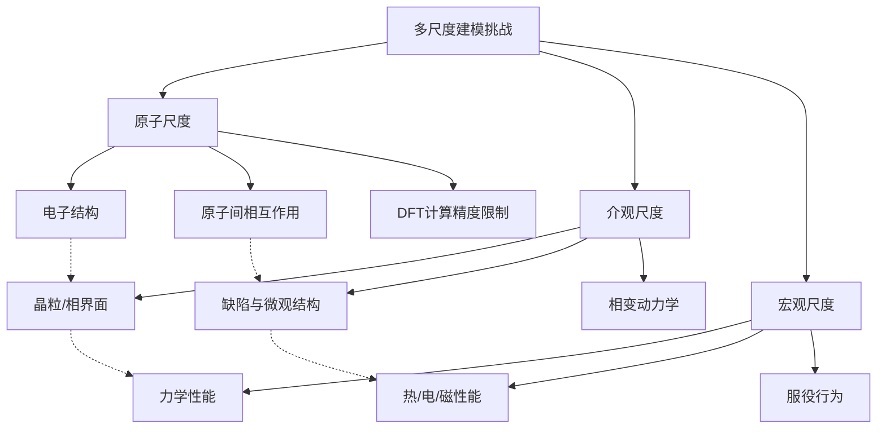

从机械超材料微结构设计到非晶材料多尺度建模、4D打印活性板材设计及生物启发材料跨尺度优化，AI正构建多尺度协同的结构设计新范式[^1]。然而，**如何在模型中有效表征和传递跨尺度信息**，仍是一个尚未完全解决的技术难题。

**物理信息嵌入方法的进展与挑战**

**物理信息神经网络（PINN）**通过将已知物理定律作为软约束或正则项融入神经网络的损失函数中，为提升模型物理一致性提供了有效路径[^1]。国际顶尖期刊持续聚焦"多物理场智能建模"方向，全球工业界与学术界正加速推进PINN在熔池监测、多场耦合仿真、晶体结构预测等场景的落地应用。

物理信息嵌入的具体策略包括：

- **经验公式嵌入**：将材料领域积累的经验公式作为模型的先验约束或特征输入
- **本构关系融合**：将材料的本构方程作为损失函数的组成部分
- **多尺度计算信息整合**：将第一性原理计算、分子动力学模拟等多尺度仿真结果作为训练数据或模型约束

研究表明，通过综合利用材料基础理论在问题空间的泛化能力和机器学习在数据空间的拟合优势，知识嵌入方法能够**显著增强模型的物理合理性，提升泛化能力**[^1]。在超导体临界温度预测中，东京大学联合DeepMind推出的TSC-Predictor模型，利用三维电子态量子信息嵌入，预测误差低于7%，充分展示了物理信息嵌入的巨大潜力。

然而，物理信息嵌入方法也面临显著挑战：

- **模型设计复杂**：需要深厚的领域知识来确定哪些物理约束应该嵌入、如何嵌入
- **计算成本增加**：物理约束的引入可能增加模型训练的计算复杂度
- **跨学科协作需求**：需要材料科学、物理学、计算科学等多学科的深度合作

**第一性原理计算的精度限制**

尽管第一性原理计算（如密度泛函理论DFT）为材料数据库提供了大量高质量数据，但其固有的精度限制不容忽视。**模拟方法在描述缺陷、振动等现实系统复杂性方面仍存在差距**；部分现象需要更长时间或更大尺度的模拟，超出当前计算能力范围。

这些精度限制意味着，即使机器学习模型完美地学习了计算数据中的规律，其预测精度也受到底层数据精度的天花板限制。例如，DFT计算对带隙存在系统性低估，基于此类数据训练的模型将继承这一系统偏差。

### 6.4 预测到实验验证的闭环转化难题

机器学习模型的最终价值在于指导实际材料研发。然而，从**"模型预测→实验验证→模型迭代"**的闭环转化过程面临多重障碍，这些障碍直接影响了AI驱动材料研发的实际效率。

**计算预测与实验测量的系统性偏差**

计算预测与实验测量之间存在多种来源的系统性偏差：

- **计算方法固有偏差**：如DFT计算对带隙的系统性低估、对强关联体系的描述不足
- **理想化假设偏差**：计算模型通常假设完美晶体结构，而实际样品存在缺陷、杂质、晶界等
- **环境条件差异**：计算通常在0K或标准条件下进行，而实验在有限温度和特定环境下测量
- **测量方法差异**：不同测量技术的精度与系统误差特征各异

这些偏差意味着，**模型预测的"最优配方"在实验中可能并非最优**，需要建立有效的偏差校正机制。

**合成可行性预测的困难**

一个更为根本的挑战是**理论稳定性并不等于合成可行**。材料数据库中大量计算预测的稳定化合物，在实验中可能因为动力学障碍、前驱体限制、合成条件苛刻等原因而无法实际合成。当前AI模型在预测材料的**合成可行性**方面能力有限，这导致大量预测的"高性能材料"实际上无法被制备出来。

**实验反馈周期长导致的迭代效率瓶颈**

传统材料实验的周期通常以周或月计，这种长反馈周期严重制约了"预测-验证-迭代"闭环的运转效率。即使模型预测精度很高，如果每次验证都需要数周时间，整个优化过程仍将非常缓慢。

**自主实验室与高通量验证平台的突破**

**自主智能实验室**的发展为缩短闭环周期提供了关键技术支撑。通过整合机器人平台、自动化表征与主动学习算法，构建"设计-合成-测试-分析"闭环，能够极大加速迭代周期[^1]。

MIT团队开发的**CRESt多模态机器人平台**代表了该方向的最高水平。该平台集成液体处理机器人、碳热冲击合成系统、自动电化学工作站、X射线衍射仪等设备，所有设备通过Python代码实现远程协调控制。在3个月内，CRESt对900多种配方进行探索，共完成约3500次电化学测试，展示了自主实验系统的高效数据生成能力。

中国科学院深圳先进技术研究院研制的**MARS系统**构建了包含19个大模型智能体的层级化架构，与异构机器人集群深度集成，实现了从"任务规划—实验设计—代码编程—实验执行—数据分析"的全流程闭环自主材料探索。在微胶囊材料创制实验中，MARS**将原本4个月的研发时间压缩至4小时**，展示了AI驱动闭环系统的巨大潜力。

加州理工学院的**AI全自动材料实验室**在一年内完成了2万次钙钛矿光伏薄膜组分实验，发现光电转换效率突破18.4%的新组合，整个过程无需人工干预。该突破被誉为"闭环式材料制造系统从科幻走进现实的第一步"。

**闭环系统的当前成熟度评估**

| 评估维度 | 当前状态 | 主要瓶颈 |
|:---|:---|:---|
| 硬件集成度 | **中高**：多种设备可实现自动化集成 | 复杂合成工艺的自动化仍有限 |
| 算法智能度 | **高**：主动学习、贝叶斯优化等算法成熟 | 多目标优化、长周期规划能力待提升 |
| 适用材料范围 | **有限**：主要适用于标准化程度高的体系 | 非标准合成工艺难以自动化 |
| 部署成本 | **高**：初期建设成本显著 | 限制了广泛推广应用 |
| 数据标准化 | **中**：不同平台数据格式差异大 | 跨平台数据整合困难 |

综合评估表明，**自主实验室已在特定材料体系（如催化剂、薄膜材料）中展示出突破性效果，但距离通用化、规模化部署仍有差距**。主要瓶颈在于复杂合成工艺的自动化难度、高昂的建设成本以及跨平台数据标准化不足。

### 6.5 不同应用场景的模型可行性评估

基于前述四个维度的挑战分析，本节针对不同材料体系与任务类型进行模型可行性的综合评估，构建技术成熟度分级框架，为研究者与产业界提供技术选型与投资决策参考。

**技术成熟度分级框架**

根据数据基础、模型精度、物理一致性、闭环验证四个维度的综合评估，可将不同应用场景的技术成熟度划分为以下四个等级：

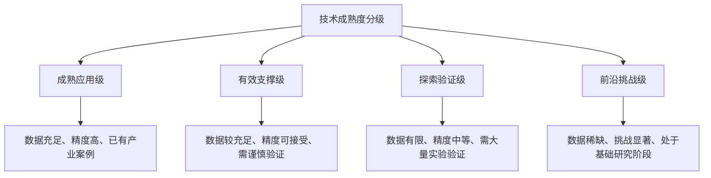

**不同材料体系的可行性评估**

| 材料体系 | 技术成熟度 | 数据基础 | 模型精度 | 核心瓶颈 | 应用建议 |
|:---|:---|:---|:---|:---|:---|
| **二元/三元合金** | 成熟应用级 | 充足 | R²>0.85 | 工艺参数优化 | 可直接应用于工业筛选 |
| **催化材料** | 有效支撑级 | 较充足 | R²=0.70-0.88 | 反应条件敏感性 | 需结合实验验证闭环 |
| **软磁材料** | 有效支撑级 | 较充足 | R²>0.85 | 微观结构影响 | 设计准则可指导实验 |
| **热电材料** | 探索验证级 | 有限 | R²=0.75-0.85 | 多性能权衡 | 需加强数据积累 |
| **高熵合金** | 探索验证级 | 有限 | R²=0.70-0.82 | 高维空间稀疏 | 需结合物理约束建模 |
| **非线性光学材料** | 探索验证级 | 有限 | 已验证7种化合物 | 电子结构计算精度 | 预测流程已初步验证 |
| **超导材料** | 前沿挑战级 | 稀缺 | 误差<7%（特定体系） | 机理复杂 | 物理嵌入方法有突破 |
| **多元复杂化合物** | 前沿挑战级 | 极稀缺 | 精度下降显著 | 组合爆炸、数据稀疏 | 需方法论创新 |

**不同任务类型的可行性评估**

| 任务类型 | 技术成熟度 | 推荐方法 | 核心挑战 | 实际应用状态 |
|:---|:---|:---|:---|:---|
| **正向性能预测** | 成熟应用级 | GNN、XGBoost | 数据覆盖范围 | 已广泛应用于材料筛选 |
| **特征重要性分析** | 有效支撑级 | SHAP、随机森林 | 解释可靠性 | 指导设计准则提炼 |
| **逆向成分设计** | 有效支撑级 | GAN、VAE、强化学习 | 生成配方可合成性 | 需实验验证闭环支撑 |
| **工艺参数优化** | 探索验证级 | 贝叶斯优化、强化学习 | 工艺-性能关系复杂 | 需与自动化平台结合 |
| **新材料发现** | 前沿挑战级 | 主动学习+闭环系统 | 化学空间外推 | 已有突破性案例但非通用 |

**模型选择的决策框架**

基于上述分析，针对不同应用场景的模型选择应遵循以下决策逻辑：

1. **评估数据基础**：确定可用数据的规模、质量与覆盖范围
2. **明确任务需求**：区分正向预测、逆向设计、机理探索等不同目标
3. **权衡精度与可解释性**：根据应用场景确定优先级
4. **考虑物理约束需求**：评估是否需要嵌入物理先验知识
5. **规划验证策略**：确定实验验证的可行性与资源投入

**可行性边界的核心洞察**

综合分析表明，当前技术的可行性边界主要取决于以下关键因素：

- **数据密度**：在数据密集的化学空间/性能区间，模型可行性高；在数据稀疏区域，可行性显著下降
- **物理机理明确度**：机理清晰的体系更易于构建有效模型；机理复杂或未知的体系挑战显著
- **实验验证成本**：验证成本低、周期短的体系更易于构建闭环迭代；验证成本高的体系需要更高的预测置信度
- **性能指标维度**：单目标优化相对成熟；多目标权衡优化仍具挑战性

**不存在"绝对最优"方案，需根据具体研发场景在"数据-模型-物理知识-实验能力"多维空间中寻找最佳平衡点**。应对材料AI挑战的系统路径在于**多维策略联动**：通过数据增强与智能闭环扩大数据源与流；通过可解释性技术与物理嵌入约束和引导模型；最终在严谨的可行性原则下，匹配模型复杂度与数据资源，实现从经验试错到**可预测、可解释、高效率**的智能设计范式转型[^1]。

## 7 产业化应用现状与距离评估

机器学习与深度学习辅助材料元素组合配比优化技术正处于从实验室验证向规模化工业应用跃迁的关键窗口期。本章将系统评估该技术在工业界的实际部署现状，剖析技术转化过程中的核心瓶颈与非技术障碍，构建多维度的产业化距离评估框架，并对不同材料领域的产业化时间表进行预测，为产业界投资决策与政策制定提供系统性参考依据。

### 7.1 工业界典型应用案例与部署模式分析

机器学习辅助材料配比优化技术已在多个工业领域实现落地应用，其核心价值体现在**颠覆传统研发范式、显著降本增效、解锁极致性能**三个层面。通过系统梳理典型案例，可以清晰把握当前工业应用的成熟度与发展态势。

**化工新材料领域的智能研发平台实践**

化工新材料行业长期深陷"高试错、低转化"困境。2025年调研数据显示，一款化工新材料从实验室研发到量产平均需经历500-1000次实验迭代，试错成本占研发总投入的45%，中试成功率不足30%，远低于国际巨头60%以上的转化水平[^54]。在此背景下，国产PLM（产品生命周期管理）系统以"数据驱动+技术赋能"重构研发链路，成为破解试错困局的核心抓手。

国产PLM系统的核心赋能能力包括**AI智能配方引擎、数字孪生中试舱、全链数据中枢和合规前置管控中枢**四大模块。AI智能配方引擎基于9000万化合物、1100万化学反应路径的大规模材料数据库训练模型，将物理实验迭代次数减少70%以上；数字孪生中试舱将中试成功率从不足30%提升至55%以上，中试周期缩短40%；全链数据中枢将研发数据复用率从15%提升至65%[^54]。行业数据显示，部署国产PLM的化工新材料企业，研发周期平均缩短35%-50%，中试成功率提升25-35个百分点，研发试错成本降低20%-45%[^54]。

**电池材料制造的"极限制造"范式**

电池产业链是AI材料技术落地最早、成效最显著的领域之一。2019年，蜂巢能源投产了车规级AI智能动力电池工厂；2020年，宁德时代提出"电池极限制造"理念，追求电池制造过程中效率、品质与成本的最优化[^55]。

"极限制造"正在帮助头部企业拉开与二线厂商的利润率差距。2024年前三季度宁德时代的销售毛利率为28.19%，远超行业平均水平约18%，其中数智化赋能开始发挥"飞轮效应"[^55]。宁德时代溧阳基地通过导入AI等数字化技术，实现了**产能提升320%，制造成本降低33%，产品单体失效率从百万分之一降低到十亿分之一**[^55]。

2025年初，欧阳明高院士在全固态电池行业论坛上释放出强烈信号：AI正成为下一代电池技术突破的核心引擎。他直言，全固态电池研发面临四大核心难题，传统研发效率已无法满足需求，必须转向"文献AI读、报告AI写、模型AI算、优化AI做"的新范式[^55]。欣旺达、奇瑞汽车与纽约州立大学等跨界团队提出的"集成电池大模型体系"，通过整合材料特性、制造工艺、运维数据等多源信息，构建覆盖全产业链的知识图谱，使模型精度较传统方法提升40%，研发周期缩短60%以上[^56]。

**合金材料的轻量化革命**

在人形机器人制造领域，中国产业链正用镁合金撕开商业化突破口。南京理工大学的测试数据显示，AZ31B镁合金加工机械臂外壳的速度比传统铝合金快40%，相当于直接省下半台CNC机床的工时成本[^57]。东吴证券的测算报告揭示了一个更惊人的事实：**机器人每减重10%，整体制造成本就能下降15%**[^57]。

重庆博奥镁业的"半固态流变铸造"技术，这项中国自主研发的工艺，将复杂结构件的良品率提升至98%，把单件成本压缩到铝合金方案的82%[^57]。力劲科技的生产线印证了这点：用镁合金压铸的齿轮箱不仅通过每分钟20000次冲击测试，单个零件成本还比铝合金版本便宜4.7元[^57]。上海交大实验室里的镁铝复合结构，让四足机器人腿部部件在减重36%的同时，刚度反而提升22%[^57]。

**催化剂与特种材料的AI加速研发**

在催化剂领域，浙江工业大学张乾均博士团队构建了"组成-结构-性能"数据库，利用机器学习算法进行反向设计与参数优化，从"海量可能"中快速筛选出更具潜力的催化体系，实现对催化性能的精准预测与快速迭代，大幅缩短研发周期、提高成功率[^58]。在经过上百次配方迭代与对比测试后，其构建的非贵金属催化剂在高乙炔转化率的同时，保持了优异的乙烯选择性，并且可实现长时间稳定运行[^58]。

在特种功能材料领域，中国科学技术大学方天成博士团队开发的新型阻燃材料展示了AI加速研发的巨大潜力。传统阻燃材料从实验室研发到产业验证通常要3到5年时间，仅仅配方筛选、中试放大就要2年以上。但方天成和AI大模型联手合作，从研发到量产只用了11个月，**周期缩短了三分之二**[^59]。该防火阻燃材料相比传统的性能提升了200多倍，在1400℃高温下面，3毫米的材料可以坚持几十分钟，而传统材料只能坚持约30秒[^59]。

**企业部署模式的类型分析**

当前企业部署AI材料研发平台主要呈现三种模式：

| 部署模式 | 典型特征 | 适用企业类型 | 优势与局限 |
|:---|:---|:---|:---|
| **自建团队模式** | 组建跨学科研发团队，自主开发专有平台 | 头部企业、资金充裕企业 | 数据资产可控、定制化程度高；投入大、周期长 |
| **平台合作模式** | 与专业AI材料公司或科研机构合作 | 中大型企业 | 技术门槛低、见效快；数据安全顾虑、依赖性强 |
| **SaaS服务模式** | 采购标准化AI材料研发云服务 | 中小企业 | 成本低、部署快；定制化受限、数据上云风险 |

2025年四季度数据显示，化工新材料行业PLM市场规模达58.2亿元，同比增速52%，国产PLM市场占比首次突破60%，较2024年同期提升8个百分点，实现对进口产品的阶段性超越[^54]。这一数据表明，**AI材料研发平台正在从头部企业向中小企业加速渗透**。

**工业应用的成功经验与共性特征**

综合上述案例，当前工业应用的成功经验呈现以下共性特征：

- **闭环系统构建**：成功案例普遍建立了"预测-实验-优化"的闭环迭代机制，而非单纯的模型预测
- **数据资产积累**：领先企业高度重视自有数据的系统性积累与标准化管理
- **跨学科团队协作**：AI专家与材料科学家的深度协作是技术落地的关键
- **场景聚焦策略**：从特定材料体系、特定性能指标切入，逐步扩展应用范围

### 7.2 实验室到工业量产的技术转化瓶颈

尽管工业应用案例不断涌现，从实验室研究成果向工业生产转化的过程仍面临多重技术障碍。这些障碍构成了该领域产业化进程中的"死亡之谷"，需要系统性识别与针对性突破。

**模型预测与实际生产条件的偏差问题**

实验室条件下训练的模型往往难以直接适用于工业生产环境。这种偏差的根源在于：

**环境条件差异**：实验室通常在严格控制的条件下进行材料合成与表征，而工业生产环境存在温度波动、湿度变化、原料批次差异等多种不可控因素。这些因素可能导致模型预测与实际产品性能之间出现显著偏差。

**设备与工艺差异**：实验室使用的小型设备与工业生产线的大型设备在传热、传质、混合效率等方面存在本质差异。实验室条件下的最优工艺参数在工业设备上可能并非最优，甚至可能不可行。

**原料规格差异**：实验室通常使用高纯度试剂，而工业生产出于成本考虑往往使用工业级原料。原料中的杂质可能对材料性能产生显著影响，而这些影响在实验室数据中可能未被充分表征。

**工艺放大过程中的参数漂移**

从小试到中试、再到量产的工艺放大过程是技术转化的核心难关。参考国家标准《GB/T37264-2018新材料技术成熟度等级划分及定义》，材料技术成熟度划分为实验室、工程化和产业化三个阶段的九个等级[^60]。

在小试阶段（TRL4-6），通常采用20-50升规模的中型反应设备，在"试制环境"下运行。此阶段的核心目标包括工艺窗口确定、关键质量属性识别以及初步成本核算[^60]。中试阶段（TRL7-8）是跨越"死亡之谷"的关键一跃，需在"试生产环境"下运行，即采用全尺寸生产设备（反应釜容积通常达500-5000升）、实际生产原料和标准化操作规程[^60]。

工艺放大过程中的参数漂移主要体现在：

- **传热效率变化**：设备尺寸增大后，单位体积的传热面积减小，可能导致温度分布不均
- **混合均匀性下降**：大型设备中的混合效率通常低于小型设备，可能影响反应均匀性
- **停留时间分布变化**：流体力学特性随设备尺寸变化，可能导致产品一致性下降

**小试-中试-量产各阶段的数据断层问题**

技术转化过程中的数据断层是一个被严重低估的瓶颈。不同阶段产生的数据在格式、精度、元数据完整性等方面存在显著差异，制约了数据的跨阶段整合与复用。

实验室阶段的数据通常以研究者个人记录为主，标准化程度低；小试阶段开始引入过程数据采集，但与实验室数据的衔接不畅；中试阶段的数据规模显著增加，但与前期数据的关联分析能力有限。这种数据断层导致前期积累的经验难以有效传递到后期阶段，增加了重复试错的成本。

**合成可行性预测与实际可制造性的鸿沟**

一个更为根本的挑战是**理论稳定性并不等于合成可行**。材料数据库中大量计算预测的稳定化合物，在实验中可能因为动力学障碍、前驱体限制、合成条件苛刻等原因而无法实际合成。

当前AI模型在预测材料的合成可行性方面能力有限。模型可能预测某配方具有优异性能，但该配方在实际生产中可能面临：

- **前驱体不可得**：所需原料在工业规模上难以获取或成本过高
- **合成条件苛刻**：需要极端温度、压力或特殊气氛，工业实现困难
- **中间相干扰**：合成过程中形成的中间相可能阻碍目标产物的生成
- **环境与安全约束**：合成过程可能产生有害副产物或存在安全风险

**技术转化瓶颈的系统性解决路径**

针对上述技术瓶颈，当前正在探索的解决路径包括：

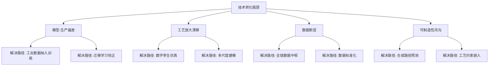

合肥机数量子科技有限公司的实践提供了一个成功范例。该公司通过建立高质量化学和材料科学数据库，训练材料配方与合成方案人工智能分析模型，构建机器人实验系统，打造基于数据的材料研发新模式[^61]。其"机器化学家"日均可完成百次以上化学实验操作，并将数千次实验优化过程缩短至300次以下，**开发效率提升超百倍，全局优化准确率达到90%以上**[^61]。

### 7.3 产业化进程中的非技术障碍评估

除技术瓶颈外，产业化进程还受到多重非技术因素的制约。这些障碍往往更加隐蔽但影响深远，需要系统性识别与针对性破解。

**企业数据资产保护与共享意愿的矛盾**

数据是AI材料研发的核心资源，但企业对数据资产的保护意识与行业数据共享需求之间存在根本性矛盾。

企业视角下，材料配方数据是核心商业机密，直接关系竞争优势。企业担心数据泄露导致技术外溢，因此对数据共享持谨慎态度。即使在企业内部，不同部门之间的数据共享也常因利益分配不清而受阻。

行业视角下，AI模型的训练需要大规模、多样化的数据支撑。单一企业的数据积累难以满足模型训练需求，行业数据孤岛制约了技术进步。当前中国最大的材料数据库仅涵盖约20万种材料，且在新能源电池材料、第三代半导体等前沿领域的数据积累不足国际水平的1/5[^62]。

破解这一矛盾的潜在路径包括：联邦学习技术实现"数据不动模型动"；建立行业数据信托机制；政府主导的公共数据平台建设。2024年10月工信部等三部门发布《新材料大数据中心总体建设方案》，明确到2027年前建成"1+N"架构（1个主平台、N个数据节点），实现30个以上数据节点、30项以上算法工具、20种以上应用示范[^62]。

**跨部门协作与组织变革阻力**

AI材料研发需要研发、生产、IT等多部门的深度协作，但传统企业的组织架构往往难以支撑这种跨部门协同。

**专业壁垒**：材料科学家与AI工程师之间存在知识鸿沟，沟通成本高、协作效率低。材料科学家可能难以准确表达建模需求，AI工程师可能难以理解材料领域的特殊约束。

**利益分配**：AI材料研发的成果归属与利益分配机制不清晰，可能导致部门间的协作动力不足。研发部门担心被IT部门"抢功"，IT部门担心投入产出不对等。

**变革阻力**：AI技术的引入可能改变现有工作流程，触动既有利益格局，引发组织内部的抵触情绪。

**投资回报周期与企业决策偏好的冲突**

AI材料研发平台的建设需要显著的前期投入，而投资回报周期通常较长，这与企业追求短期收益的决策偏好形成冲突。

从投入角度看，自动化实验平台前期投入高昂。根据项目复杂性，中试投入通常在千万元级别[^60]。某新势力为锁定先机，直接买断两台3500吨压铸机未来18个月的产能[^57]，反映出头部企业的战略性投入决心。

从回报角度看，AI材料研发的价值释放需要时间积累。模型精度需要数据积累才能持续提升，组织能力需要学习曲线才能成熟。对于追求季度业绩的上市公司而言，这种长周期投资可能面临内部压力。

**行业标准与监管合规要求的滞后**

AI材料研发领域的行业标准与监管框架尚不完善，给企业应用带来不确定性。

**技术标准缺失**：数据格式、模型接口、评估方法等方面缺乏统一标准，不同平台之间的互操作性差，增加了企业的选型风险与切换成本。

**合规要求不明**：在航空航天、医疗器械等受监管行业，AI辅助设计的材料是否满足合规要求尚无明确规定。企业担心采用AI方法可能面临监管风险，因此持观望态度。

**知识产权界定模糊**：AI生成的材料配方的知识产权归属尚无明确法律界定，可能引发后续纠纷。

**产学研协同创新机制的不完善**

产学研协同是推动技术产业化的关键机制，但当前协同效率仍有提升空间。

**目标错位**：高校科研人员追求论文发表与学术声誉，企业追求产品落地与商业收益，两者的激励机制存在错位。

**成果转化渠道不畅**：科研成果从实验室到企业的转化渠道不够通畅，技术估值、利益分配等机制不完善。

**人才流动受限**：高校与企业之间的人才流动机制不够灵活，制约了知识与经验的跨界传递。

### 7.4 技术成熟度分级与产业化阶段判定

基于技术成熟度（TRL）评估框架，结合前述章节的技术挑战分析，本节对不同材料体系和任务类型的产业化成熟度进行分级判定，明确各细分领域当前所处的发展阶段及其关键制约因素。

**技术成熟度评估框架**

参考国家标准《GB/T37264-2018新材料技术成熟度等级划分及定义》，将技术发展划分为三大阶段九个等级[^60]：

| 阶段 | TRL等级 | 核心特征 | 判定标准 |
|:---|:---|:---|:---|
| **实验室阶段** | 1-3 | 基础研究与原理验证 | 核心算法突破、实验室概念验证 |
| **工程化阶段** | 4-6 | 技术集成与工艺验证 | 小试验证、工艺窗口确定 |
| **产业化阶段** | 7-9 | 系统试验与商业化 | 中试验证、规模化生产、商业运营 |

**不同材料体系的成熟度判定**

基于当前研究进展与产业应用现状，对主要材料体系的技术成熟度判定如下：

| 材料体系 | 当前TRL | 发展阶段 | 核心支撑证据 | 关键制约因素 |
|:---|:---|:---|:---|:---|
| **电池材料（制造优化）** | 8-9 | 规模化应用 | 宁德时代灯塔工厂产能提升320%[^55] | 新型材料研发仍在中试阶段 |
| **镁合金部件** | 7-8 | 初步商业化 | 良品率98%、成本为铝合金82%[^57] | 原材料价格波动、规模化产能 |
| **催化剂筛选** | 6-7 | 中试验证 | MIT平台发现性能提升9.3倍催化剂 | 工业条件验证、放大工艺 |
| **高分子配方** | 5-6 | 小试验证 | 研发周期缩短三分之二[^59] | 工艺放大、数据标准化 |
| **铁基非晶合金** | 6-7 | 中试验证 | 饱和磁感1.92T超越硅钢 | 规模化制备工艺 |
| **非线性光学材料** | 4-5 | 小试验证 | 识别7种理想化合物，1种已合成 | 实验验证覆盖率 |
| **高熵合金** | 3-4 | 实验室验证 | 算法验证、小规模实验 | 数据稀缺、高维空间探索 |

**不同任务类型的成熟度判定**

| 任务类型 | 当前TRL | 核心支撑证据 | 应用现状 |
|:---|:---|:---|:---|
| **正向性能预测** | 7-8 | R²>0.85在多体系验证 | 已广泛用于材料筛选 |
| **工艺参数优化** | 6-7 | 贝叶斯优化效率提升36% | 需与自动化平台结合 |
| **特征重要性分析** | 6-7 | SHAP分析指导设计准则 | 机理理解辅助工具 |
| **逆向成分设计** | 5-6 | GAN/VAE生成新配方 | 需实验验证闭环 |
| **合成路径预测** | 4-5 | 文献挖掘初步应用 | 准确率待提升 |
| **新材料发现** | 4-5 | 突破性案例但非通用 | 依赖闭环系统支撑 |

**产业化阶段的综合判定**

综合上述分析，机器学习辅助材料配比优化技术整体处于**TRL 4-7的关键过渡期**，即从实验室原理验证向工程化、商业化过渡的阶段。具体而言：

- **领先领域（TRL 7-9）**：电池材料制造优化、镁合金部件生产等已实现稳定量产和成本效益
- **成熟领域（TRL 5-7）**：催化剂筛选、高分子配方、软磁材料等处于小试到中试验证阶段
- **探索领域（TRL 3-5）**：高熵合金、新型功能材料等仍处于实验室验证阶段

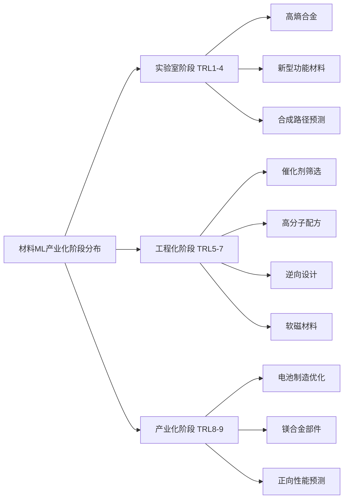

### 7.5 产业化支撑条件的多维度评估

产业化进程不仅取决于技术成熟度，还依赖于数据基础设施、人才储备、产业生态、政策支持等多维度支撑条件。本节系统评估各维度的现状与差距。

**数据基础设施完善度评估**

数据基础设施是AI材料研发的底层支撑，当前存在显著短板：

**国家层面建设进展**：中国持续强化材料大数据基础设施建设，"十三五"以来在数据资源积累、标准体系、软件工具及智能平台方面取得突破[^62]。2024年10月工信部等三部门发布《新材料大数据中心总体建设方案》，明确到2035年新材料大数据中心体系全面建成并稳定运行，数据规模进入国际第一梯队[^62]。

**与国际差距分析**：全球前三大材料数据库（MatWeb、ASM Materials Selector、NIST）已收录超100万种材料数据，而中国最大的材料数据库仅涵盖约20万种材料，且在新能源电池材料、第三代半导体等前沿领域的数据积累不足国际水平的1/5[^62]。

**核心软件自主性**：在材料计算模拟软件领域，中国与国外存在显著差距。从单一尺度的计算模拟代码到材料集成计算软件，再到宏观有限元模拟仿真软件，中国均处于落后状态，自主保障能力不足[^62]。

| 评估维度 | 当前状态 | 与国际差距 | 发展趋势 |
|:---|:---|:---|:---|
| 数据库规模 | ~20万种材料 | 约为国际1/5 | 加速扩充中 |
| 数据标准化 | 标准体系初步建立 | 互操作性待提升 | 国标制定推进中 |
| 计算软件 | 自主保障能力不足 | 核心软件依赖进口 | 国产替代加速 |
| 算力设施 | 浦东算力占上海近半 | 整体充足 | 持续扩容 |

**专业人才储备与培养体系评估**

AI材料研发需要兼具材料科学与机器学习能力的复合型人才，当前人才供需矛盾突出：

**人才缺口规模**：猎聘大数据研究院发布的报告显示，中国AI人才缺口已突破500万，而今年高校人工智能专业的毕业生仅约4万人，供需比接近125:1[^63]。AI技术岗硕博人才需求占比近47%，比重远超其他岗位对硕博学历人才的要求[^64]。

**技能结构断层**：调查显示，当前人工智能产业的人才紧缺指数仍然处于较高水平。紧缺岗位中，超过半数"在职人员符合任职资格的比例低于25%"[^64]。人才的技能结构与企业的实际需求之间存在显著断层。

**区域分布特征**：人工智能人才的地理集中化趋势显著，中国形成了以长三角、京津冀、粤港澳为核心的三个人才集聚区。浦东新区人工智能产业人才总量已超过9.4万人，占上海总量的三分之一[^64]。

**培养体系建设**：从供给端看，上海本地高校的人才培养规模正在稳步扩大。2024年，人工智能相关专业的毕业生数量达到1.5万人，同比增长15%[^64]。从需求端看，75.6%的AI企业将国内高校的应届毕业生作为其主要的人才来源[^64]。

**产业生态协同程度评估**

产业生态的协同程度直接影响技术转化效率：

**产学研协同**：2023年，在工信部原材料工业司的指导下，全国新材料大数据创新联盟成立，进一步推动研究资源向数据中心、数据处理和AI垂直模型开发倾斜[^62]。各地纷纷布局"人工智能+新材料"产业资源，形成区域差异化发展路径：华北聚焦顶层设计与核心模型，华东深耕产业应用，中南依托算力与算法[^62]。

**上下游协同**：AI材料研发需要与上游数据供应商、中游平台服务商、下游应用企业形成紧密协同。当前生态建设仍在起步阶段，数据共享机制不完善、平台互操作性差等问题制约了生态效率。

**创新活力指标**：2020-2024年，"人工智能+新材料"领域的专利申请数量持续增长，AI技术在材料科学中的应用逐渐成熟，激发了企业和科研机构的创新热情[^62]。尽管授权占比有所下降（反映技术复杂度提升），但专利申请数量的快速增长表明行业创新活力旺盛[^62]。

**政策支持与资金投入力度评估**

政策与资金支持是产业化的重要推动力：

**国家战略布局**：各国将"AI+材料"列为战略重点。中国"十四五"规划为AI与新材料领域部署了逾千亿资金；欧盟Horizon Europe计划投入50亿欧元推动可持续材料发展[^1]。

**地方政策响应**：多地已出台配套政策响应国家战略布局。2024-2025年间，各地区针对"人工智能+新材料"产业出台了系列支持政策，涵盖资金补贴、人才引进、平台建设等多个维度[^62]。

**资本市场关注**：资本市场早已嗅到机遇。镁合金在机器人领域的应用率正以每年300%的速度增长[^57]。某新势力为锁定先机，直接买断两台3500吨压铸机未来18个月的产能[^57]。

### 7.6 产业化时间表预测与发展路径展望

综合技术成熟度、支撑条件、市场需求等多重因素，本节对机器学习辅助材料配比优化技术在不同领域实现大规模产业化应用的时间节点进行预测，并提出加速产业化进程的关键路径建议。

**分阶段产业化时间表预测**

基于当前发展态势，预测不同领域的产业化时间节点如下：

| 时间阶段 | 目标领域 | 预期里程碑 | 关键驱动因素 |
|:---|:---|:---|:---|
| **近期（2025-2028）** | 电池材料制造、合金部件、正向性能预测 | 规模化应用渗透率达30%以上 | 头部企业示范效应、成本优势显现 |
| **中期（2028-2030）** | 催化剂设计、高分子配方、工艺优化 | 中试成功率提升至60%以上 | 数据基础设施完善、标准体系建立 |
| **远期（2030-2035）** | 新材料发现、逆向设计、复杂体系优化 | 实现"需求定义材料"范式 | 闭环系统成熟、AI能力质变 |

**近期发展目标（2025-2028）**

近期重点是**巩固领先领域、扩大应用渗透**：

- **电池材料制造**：AI驱动的"极限制造"理念将从头部企业向二线厂商扩散，预计2027年行业整体良率提升10个百分点以上
- **轻量化合金**：镁合金在人形机器人领域的应用率有望从当前3%飙升至15%[^57]，带动材料成本进一步下降
- **正向性能预测**：预测模型将成为材料研发的标准工具，覆盖80%以上的新材料筛选流程

**中期发展目标（2028-2030）**

中期重点是**突破工程化瓶颈、建立行业标准**：

- **数据基础设施**：到2027年前建成"1+N"架构新材料大数据中心，实现30个以上数据节点[^62]
- **中试成功率**：通过数字孪生技术将化工新材料中试成功率从30%提升至55%以上[^54]
- **标准体系**：形成数据格式、模型接口、评估方法等方面的行业标准

**远期发展目标（2030-2035）**

远期目标是**实现范式革命、引领全球竞争**：

- **数据规模**：新材料大数据中心体系全面建成，数据规模进入国际第一梯队[^62]
- **研发范式**：形成数据驱动的材料创新发展范式，实现"需求定义材料"的逆向设计能力
- **全球地位**：在AI材料科学领域占据全球领先地位，掌握核心技术与标准话语权

**加速产业化的关键路径建议**

基于前述分析，提出以下加速产业化进程的优先行动建议：

**路径一：数据基础设施优先建设**

数据是AI材料研发的底层燃料，应将数据基础设施建设置于优先位置：
- 加速推进国家新材料大数据中心建设，完善"1+N"架构
- 建立行业数据共享机制，探索联邦学习等隐私保护技术
- 整合高质量负例数据，系统收集失败实验信息

**路径二：闭环系统规模化部署**

自主实验室与闭环优化系统是缩短研发周期的关键：
- 支持头部企业建设AI驱动的自主实验室
- 推动闭环系统的标准化与模块化，降低部署门槛
- 建立跨平台数据互操作标准

**路径三：复合型人才培养体系构建**

人才是产业化的核心支撑：
- 在高校设立AI材料交叉学科专业
- 建立产学研联合培养机制
- 吸引海外高端人才回流

**路径四：产业生态协同深化**

生态协同是提升整体效率的关键：
- 深化产学研协同创新机制
- 建立行业技术标准与评估规范
- 推动上下游企业数据与能力共享

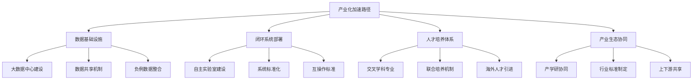

**总结与展望**

机器学习辅助材料元素组合配比优化技术正处于从工程化验证迈向规模化应用的关键阶段。当前，该技术已在电池制造、合金部件、催化剂筛选等领域展现出显著的降本增效价值，部分领先领域已达到TRL 8-9的商业化水平。然而，距离全面产业化仍存在**"数据-软件-工艺-人才"**协同不足的系统性差距。

展望未来，随着国家新材料大数据中心的建成运营、自主实验室技术的成熟推广、以及复合型人才培养体系的完善，预计到2030年前后，该技术将在主要材料领域实现规模化应用，形成数据驱动的材料创新发展范式。这场静悄悄的材料革命，不仅将重塑材料研发的效率与成本结构，更将推动中国从"材料大国"迈向"材料强国"，在全球材料科学竞争中占据制高点。

## 8 未来发展趋势与战略建议

基于前述七章对机器学习与深度学习优化材料元素组合配比领域的系统分析，本章将归纳该领域的关键发展趋势，并从多个战略维度提出加速发展与产业化进程的优先行动路径。材料机器学习正处于从"点状突破"向"系统性变革"跃迁的关键窗口期，技术演进、数据基础、人才储备与产业生态的协同推进，将决定这一领域能否在未来五至十年内实现从实验室创新到大规模产业化应用的根本性跨越。

### 8.1 自主实验室与闭环优化系统的成熟化趋势

自主智能实验室代表着材料研发范式的根本性变革，正在从概念验证阶段向规模化部署演进。这一趋势的核心驱动力在于**将"设计-合成-测试-分析"全流程整合为高度自动化的闭环系统**，从而将传统以月计的研发周期压缩至以小时甚至分钟计。

**从单点自动化向全链智能协同的技术演进**

当前自主实验室的技术架构正在经历从单一设备自动化向多系统智能协同的深刻转型。MIT团队开发的CRESt平台展示了这一演进的前沿形态：通过整合液体处理机器人、碳热冲击合成系统、自动电化学工作站、X射线衍射仪等多种执行器，所有设备通过Python代码实现远程协调控制，操作者无需编程经验即可通过自然语言与系统交互。中国科学院深圳先进技术研究院研制的MARS系统则构建了包含19个大模型智能体的层级化架构，实现了"PI—设计师—编程师—实验师—分析师"五大技术职能组的协同运作。

未来三至五年，自主实验室的发展将呈现以下关键特征：

| 演进维度 | 当前状态 | 未来趋势（2025-2030） | 关键突破点 |
|:---|:---|:---|:---|
| **硬件集成度** | 多设备串联，接口标准化程度有限 | 模块化即插即用，跨平台互操作 | 通用机器人接口标准制定 |
| **算法智能度** | 贝叶斯优化、主动学习为主 | 多智能体协同决策、长周期规划 | 大语言模型与实验推理融合 |
| **适用材料范围** | 标准化程度高的体系（催化剂、薄膜） | 扩展至复杂合成工艺体系 | 非标准工艺的自动化突破 |
| **人机交互模式** | 需要专业编程或预设流程 | 自然语言指令驱动 | 多模态理解与意图推断 |

**知识辅助优化算法的深化发展**

MIT团队提出的知识辅助贝叶斯优化（KABO）算法代表了优化算法与领域知识深度融合的重要方向。该算法突破了传统贝叶斯优化仅依赖单一数值流的局限，将化学成分、文献知识、显微结构特征三大类信息源融合在一起。实验对比显示，KABO算法平均能将实验效率提升36%，仅需25%的实验次数就能找到高性能样品。

未来知识辅助优化的发展方向包括：**动态知识更新机制**——随着实验进行实时整合新发现的知识；**跨领域知识迁移**——将一个材料体系积累的经验迁移至相关体系；**不确定性感知的知识融合**——根据知识来源的可靠性动态调整其权重。

**闭环系统的标准化与规模化部署前景**

闭环优化系统从实验室原型向产业规模化部署的跨越，需要解决三个核心问题：**成本可控性**——降低系统建设与运维成本以适应中小企业需求；**通用性**——提升系统对不同材料体系的适应能力；**可复制性**——形成可标准化推广的建设方案。

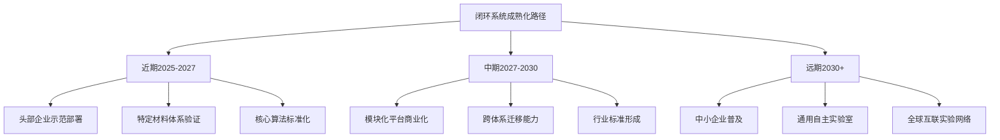

预计到2028年前后，闭环优化系统将在电池材料、催化剂、高分子配方等领域实现规模化商业部署，系统建设成本下降至当前的50%以下，单位实验效率提升5-10倍。

### 8.2 生成式AI与逆向材料设计能力的跃升

生成式AI技术的引入标志着材料配比优化从"预测"向"创造"的范式跨越。这一转型的核心在于实现**从"给定配方→预测性能"到"给定目标性能→生成配方"**的根本性逻辑反转，为材料研发开辟了全新的可能性空间。

**生成模型架构的技术演进**

当前用于材料逆向设计的生成模型主要包括三大类架构，各具技术特点与适用场景：

**生成对抗网络（GAN）**通过生成器与判别器的对抗训练，能够生成具有目标性能特征的新材料配方。条件生成对抗网络（cGAN）已被成功应用于弹性超材料带隙的逆向定制，研究人员可以指定目标带隙参数，由网络自动生成满足要求的微观结构设计。GAN的优势在于生成样本的多样性与真实性，但训练稳定性与模式崩塌问题仍需持续优化。

**变分自编码器（VAE）**通过学习材料数据的潜空间分布，提供了另一种生成新材料的技术路径。VAE的潜空间具有连续性和可插值性，便于在已知材料之间进行平滑过渡，探索中间配比区域的性能表现。在金属有机框架材料设计中，VAE已被用于生成具有特定孔隙率和表面积的新型结构。

**扩散模型**作为近年来快速崛起的生成范式，通过逐步去噪过程生成高质量样本，在图像生成领域取得了突破性成果。其在材料设计领域的应用正在快速探索中，有望在晶体结构生成、分子设计等任务中展现独特优势。

| 生成模型 | 核心优势 | 主要挑战 | 材料设计适用场景 |
|:---|:---|:---|:---|
| GAN | 生成多样性高、样本真实 | 训练不稳定、模式崩塌 | 微观结构设计、合金配方生成 |
| VAE | 潜空间连续可插值、训练稳定 | 生成样本可能模糊 | 材料空间探索、性能插值 |
| 扩散模型 | 生成质量高、理论基础完善 | 采样速度慢、计算成本高 | 晶体结构生成、分子设计 |

**大型语言模型与材料专用基础模型的融合**

大型语言模型（LLM）正在为材料科学带来新的可能性。自然语言处理技术已被应用于从文献库中提取和整合材料相关知识，研究表明NLP模型能够发现材料之间的隐含关系，并预测出新材料的潜在性能。东京大学工业科学研究所正在探索大型语言模型在自主、可解释材料发现中的应用，代表了AI辅助材料研发向更高层次自主性和可解释性发展的前沿方向。

未来材料专用基础模型的发展将呈现以下特征：

- **多模态输入能力**：整合文本描述、晶体结构、光谱数据、显微图像等多种信息形式
- **跨任务泛化能力**：在性能预测、逆向设计、合成路径规划等多种任务间迁移
- **科学推理能力**：具备基于物理化学原理进行逻辑推理的能力
- **人机协作能力**：支持与研究人员的自然语言交互，理解复杂研究意图

**从配方生成到可合成性验证的闭环挑战**

生成式AI在材料设计中面临的核心挑战是**生成配方的可合成性验证**。模型可能生成理论上具有优异性能的配方，但该配方在实际生产中可能因为前驱体不可得、合成条件苛刻、中间相干扰等原因而无法实现。

解决这一挑战的技术路径包括：**在生成模型中嵌入合成可行性约束**——将热力学稳定性、动力学可达性等条件作为生成过程的约束；**构建合成路径预测模块**——为生成的配方自动规划可行的合成路线；**与闭环实验系统集成**——快速验证生成配方的实际可合成性并反馈优化。

### 8.3 多模态数据融合与物理知识嵌入的深化

纯数据驱动模型的"黑箱"特性和对大量数据的依赖性，促使研究者探索将多源异构信息与物理机理深度融合的建模方法。这一技术方向的核心价值在于**突破数据稀缺瓶颈、提升模型泛化能力、增强预测结果的物理合理性与可解释性**。

**多模态信息融合的技术架构**

材料研发过程中产生的数据具有高度异构性，包括结构化数值数据（成分、工艺参数）、非结构化文本数据（文献知识、实验记录）、图像数据（显微结构、衍射图谱）、光谱数据（吸收谱、发射谱）等多种形式。有效融合这些多模态信息是提升模型性能的关键路径。

MIT团队的KABO算法提供了多模态融合的成功范例：将化学成分、从文献中提炼的文本知识、以及从电镜图中提取的微观结构特征三大类信息源融合在一起，通过主成分分析等降维技术在浓缩的潜空间中进行优化计算。视觉语言模型的引入使系统能够通过摄像头持续监控实验过程，并结合日志做出推理给出建议。

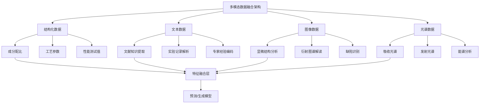

**物理信息嵌入的深化方向**

物理信息神经网络（PINN）通过将已知物理定律作为软约束融入神经网络的损失函数中，在数据稀缺场景下展现出独特优势。国际顶尖期刊持续聚焦"多物理场智能建模"方向，全球工业界与学术界正加速推进PINN在熔池监测、多场耦合仿真、晶体结构预测等场景的落地应用。

东京大学联合DeepMind推出的TSC-Predictor模型展示了物理信息嵌入的巨大潜力：利用三维电子态量子信息嵌入，精准预测了十余种新型钇铜氧类材料在高压下的临界转变温度，预测误差低于7%。通过分析模型的可视化数据，科学家们还成功捕捉到了材料中铜氧层间距与电子强关联态耦合的独特非线性关系。

未来物理知识嵌入的深化方向包括：

- **自适应物理约束**：根据数据分布动态调整物理约束的权重与形式
- **跨尺度物理桥接**：构建从原子尺度到宏观尺度的物理信息传递机制
- **不确定性感知的物理建模**：在物理约束中显式建模参数与模型的不确定性
- **可学习的物理先验**：从数据中自动发现并编码物理规律

**小样本场景与跨化学空间外推的突破方向**

多模态融合与物理嵌入方法在小样本场景下展现出独特价值。当训练样本有限时，纯数据驱动模型容易过拟合训练数据而丧失泛化能力，而物理约束的引入相当于为模型提供了额外的"监督信号"，多模态信息的整合则扩展了模型可利用的信息来源。

在跨化学空间外推方面，斯坦福大学张寿成团队开发的Atom2Vec程序展示了从数据中学习元素化学属性的可能性。该程序通过分析化合物数据学会了区分不同原子，并根据元素的化学属性对元素进行聚类，成功重现了元素周期表的基本结构。这种学习到的元素表示可以作为跨化学空间泛化的基础。

### 8.4 数据基础设施与开放生态建设的战略建议

数据是机器学习模型的"燃料"，数据基础设施的完善程度直接决定了该领域的发展上限。当前中国材料数据库规模仅为国际水平的约1/5，在新能源电池材料、第三代半导体等前沿领域的数据积累差距更为显著。针对这一核心瓶颈，需要从国家战略高度系统推进数据基础设施建设。

**国家级新材料大数据中心建设的优先行动**

2024年10月工信部等三部门发布的《新材料大数据中心总体建设方案》明确了"1+N"架构（1个主平台、N个数据节点）的建设目标，到2027年前实现30个以上数据节点、30项以上算法工具、20种以上应用示范，到2035年数据规模进入国际第一梯队。

在此框架下，建议采取以下优先行动：

**第一阶段（2025-2027）：基础设施搭建与数据汇聚**
- 完成主平台与首批10个核心数据节点的建设部署
- 制定并发布材料数据格式、元数据规范、质量评估等基础标准
- 建立与Materials Project、AFLOW、OQMD等国际数据库的互操作接口
- 启动重点材料领域（电池、催化剂、半导体）的专题数据库建设

**第二阶段（2027-2030）：能力提升与生态完善**
- 扩展至30个以上数据节点，覆盖主要材料门类
- 部署30项以上算法工具，支持从数据查询到模型训练的全流程
- 建立数据质量认证与分级机制
- 形成跨节点数据共享与联合分析能力

**第三阶段（2030-2035）：全面成熟与国际领先**
- 数据规模达到国际第一梯队水平
- 形成覆盖材料全生命周期的数据体系
- 建立全球材料数据互联互通网络

**行业数据共享机制的创新探索**

企业数据资产保护与行业数据共享需求之间的矛盾是制约数据生态发展的核心障碍。破解这一矛盾需要创新数据共享机制：

| 共享机制 | 核心原理 | 适用场景 | 实施要点 |
|:---|:---|:---|:---|
| **联邦学习** | 数据不动模型动，在本地训练聚合参数 | 敏感数据共享 | 通信效率优化、异构数据处理 |
| **数据信托** | 第三方机构托管数据，按规则授权使用 | 行业共性数据 | 信托规则制定、利益分配机制 |
| **合成数据** | 生成保留统计特性但去除敏感信息的数据 | 训练数据扩充 | 分布一致性验证、物理合理性校验 |
| **差分隐私** | 在数据中添加噪声保护个体隐私 | 统计分析共享 | 隐私预算管理、精度损失控制 |

**负例数据与失败实验的系统整合**

当前材料数据库普遍存在**负例数据缺失**的问题——失败实验与负例反应通常不被发表，导致数据偏倚。系统整合负例数据对于提升模型的泛化能力与预测可靠性具有重要价值。

建议采取以下措施：
- 建立负例数据报告激励机制，鼓励研究者提交失败实验记录
- 利用自然语言处理技术从文献中自动提取负例信息
- 与自动化实验室系统集成，自动记录并上传所有实验结果（包括失败案例）
- 在数据库中设立专门的负例数据板块，建立负例数据的标注与检索规范

### 8.5 核心技术攻关与产学研协同的优先路径

基于前述章节的技术成熟度评估，当前制约产业化进程的核心技术瓶颈主要集中在**自主实验系统的通用化、生成式逆向设计的可合成性验证、合成路径预测的准确性、跨尺度物理信息建模的精度**四个方向。针对这些瓶颈，需要建立系统性的攻关优先序与产学研协同机制。

**核心技术攻关的优先序设定**

| 优先级 | 技术方向 | 当前TRL | 目标TRL | 攻关周期 | 预期突破 |
|:---|:---|:---|:---|:---|:---|
| **最高** | 自主实验系统通用化 | 5-6 | 7-8 | 2-3年 | 适用材料体系扩展3倍以上 |
| **高** | 合成可行性预测 | 3-4 | 5-6 | 3-4年 | 预测准确率提升至70%以上 |
| **高** | 生成配方实验验证闭环 | 4-5 | 6-7 | 2-3年 | 验证周期缩短80% |
| **中** | 跨尺度物理建模 | 3-4 | 5-6 | 4-5年 | 外推误差降低50% |
| **中** | 材料专用基础模型 | 2-3 | 4-5 | 3-4年 | 跨任务泛化能力验证 |

**产学研协同创新机制的优化设计**

有效的产学研协同需要明确各方的角色定位与协作模式：

**头部企业：示范引领与场景牵引**
- 建设AI驱动的自主实验室，形成可复制的建设方案
- 开放典型应用场景，提供真实问题与数据支撑
- 参与行业标准制定，推动技术规范化

**中小企业：平台赋能与快速应用**
- 采购标准化AI材料研发云服务，降低技术门槛
- 参与行业数据联盟，共享数据资源
- 聚焦细分领域，形成差异化竞争优势

**高校与科研院所：基础研究与人才培养**
- 攻关核心算法与基础理论
- 培养跨学科复合型人才
- 提供公共技术平台与测试验证服务

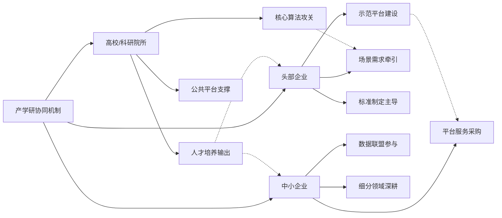

**"揭榜挂帅"机制的应用建议**

针对关键技术瓶颈，建议采用"揭榜挂帅"机制组织攻关：
- 由产业界提出具体技术需求与验收标准
- 面向全社会公开征集解决方案
- 以成果验收为导向，不限定技术路线
- 建立成果转化与利益分享机制

### 8.6 人才培养与产业生态构建的行动框架

AI材料交叉领域复合型人才的严重短缺是制约该领域发展的关键瓶颈之一。当前中国AI人才缺口已突破500万，而高校人工智能专业年毕业生仅约4万人，供需比接近125:1。在AI材料交叉领域，人才缺口更为突出，具备材料科学与机器学习双重背景的复合型人才极为稀缺。

**高校交叉学科专业设置的系统建议**

建议在高校层面采取以下措施：

**本科层面**：在材料科学与工程专业中设立"智能材料设计"方向，增设机器学习、数据科学、编程等核心课程；在计算机科学专业中设立"科学计算与AI4Science"方向，增设材料科学基础课程。

**研究生层面**：设立"AI材料科学"交叉学科硕士/博士点，建立跨学院联合培养机制；鼓励材料科学与计算机科学导师联合指导研究生。

**课程体系设计**：构建"材料科学基础+机器学习方法+实践项目"三位一体的课程体系；引入产业界真实案例作为教学素材；建设虚拟仿真实验平台，支持学生进行AI材料研发实践。

| 培养层次 | 核心能力要求 | 课程模块 | 实践环节 |
|:---|:---|:---|:---|
| 本科 | 基础理论+工具使用 | 材料基础、ML入门、编程 | 课程项目、暑期实习 |
| 硕士 | 方法应用+问题解决 | 高级ML、材料信息学、专题研讨 | 产学合作项目、企业实习 |
| 博士 | 方法创新+前沿探索 | 前沿专题、跨学科研讨 | 独立科研、国际合作 |

**产学联合培养机制的创新设计**

产学联合培养是缩短人才培养与产业需求差距的有效路径：

- **企业-高校联合实验室**：企业提供真实问题、数据与资源，高校提供研究能力与人才
- **双导师制**：研究生同时接受高校导师与企业导师指导，确保研究的学术价值与产业相关性
- **博士后工作站**：在头部企业设立AI材料方向博士后工作站，加速高端人才向产业界流动
- **短期培训项目**：面向在职材料工程师开设AI技能培训，提升存量人才的数字化能力

**海外高端人才引进的重点方向**

针对该领域的国际人才竞争格局，建议重点引进以下方向的高端人才：
- 自主实验系统与机器人学专家
- 生成式AI与材料设计交叉领域学者
- 材料数据库与信息学领域专家
- 具有产业化经验的技术领军人才

**产业生态协同深化的优先行动**

产业生态的协同程度直接影响技术转化效率。建议采取以下优先行动：

**上下游能力共享平台建设**
- 建立材料AI研发公共服务平台，为中小企业提供算力、算法、数据支持
- 构建设备共享网络，降低自动化实验平台的使用门槛
- 建立专家咨询服务机制，为企业提供技术选型与实施指导

**行业标准与评估规范制定**
- 制定材料AI模型性能评估标准，建立可比较的基准测试体系
- 制定数据格式与接口标准，提升跨平台互操作性
- 制定AI辅助材料设计的合规指南，为监管提供依据

**创新联盟与协作网络构建**
- 深化全国新材料大数据创新联盟的运作机制
- 建立区域性AI材料创新中心网络
- 推动国际合作，参与全球材料数据与标准治理

---

**总结与展望**

材料机器学习正处于从"点状突破"向"系统性变革"跃迁的关键窗口期。基于前述分析，该领域的未来发展将呈现以下核心趋势：**研发范式从"数据驱动预测"向"知识增强生成设计"和"自主闭环优化"演进；技术融合在深度上实现物理信息与AI的深度耦合，在广度上扩展至生成式AI、大语言模型等前沿方向；数据基础设施与标准化建设成为竞争焦点；产业化应用从"点状突破"走向"链条整合"；创新生态呈现全球化与跨学科深度融合态势**。

实现这一愿景需要**数据基建、软件自主、闭环验证、生态培育**四轮驱动的协同推进。具体而言：

- **数据基建**：加速国家新材料大数据中心建设，完善数据共享机制，系统整合负例数据
- **软件自主**：攻关核心算法与工业软件，建立自主可控的材料AI工具生态
- **闭环验证**：推动自主实验系统的标准化与规模化部署，打通从预测到验证的闭环
- **生态培育**：构建跨学科人才培养体系，深化产学研协同，完善行业标准与规范

预计到2030年前后，机器学习辅助材料配比优化技术将在主要材料领域实现规模化应用，形成数据驱动的材料创新发展范式。这场静悄悄的材料革命，不仅将重塑材料研发的效率与成本结构，更将推动全球材料科学从经验试错的传统模式迈入智能设计的新纪元。对于中国而言，把握这一战略机遇，实现从"材料大国"向"材料强国"的跨越，需要学术界、产业界、政策制定者的协同努力与持续投入。

# 参考内容如下：
[^1]:[突破研发瓶颈!AI正在改写先进材料的未来](https://baijiahao.baidu.com/s?id=1855369426952225726&wfr=spider&for=pc)
[^2]:[基于机器学习的材料参数优化.docx-原创力文档](https://m.book118.com/html/2025/1211/7141120003011023.shtm)
[^3]:[基于深度学习的材料性能预测与优化研究-洞察及研究](https://www.renrendoc.com/paper/502194477.html)
[^4]:[机器学习在原料配方优化中的应用.docx - 人人文库](https://www.renrendoc.com/paper/362364918.html)
[^5]:[机器学习驱动材料自主合成](https://blog.csdn.net/wood5/article/details/152495287)
[^6]:[催化作用与机器学习的结合:数据驱动的发现与设计指南](https://www.ebiotrade.com/newsf/2025-11/20251107000643128.htm)
[^7]:[【行业信息】机器学习在生物基材料/生物降解材料的应用 ](https://mp.weixin.qq.com/s?__biz=MzI1MTcwNjEwNQ==&mid=2247515422&idx=1&sn=0cff89fd644f000812c3a1dd21d3c0f6&chksm=e857f24b0c084c6954f44d56edc30415c1bfea00e2bec2544e85befcf085fa01f9a9513b9719&scene=27)
[^8]:[机器学习助力配制工艺优化-CSDN博客](https://blog.csdn.net/w8x9y0z1/article/details/153550059)
[^9]:[AI for Materials重要进展:可解释机器学习应用](http://bjmge.ustb.edu.cn/kexueyanjiu/keyanchengguo1/keyanchenggu/2025-05-23/398.html)
[^10]:[Nature打破质疑!天才博士运用诺奖机器学习(ML)开辟传感器材料超前技术!掀起科研大地震! ](https://mp.weixin.qq.com/s?__biz=MzkyMTM4ODE5Mg==&mid=2247544250&idx=1&sn=6ddd69788c6a7a690684a659cdae8be1&chksm=c0b81c605a07862d561621be5ea1c09fdb3f401185bfd1adb3c39d339f35a86cec3a601a00ff&scene=27)
[^11]:[材料模拟依赖试错,第一性原理计算结合机器学习如何加速新材料发现?](https://baijiahao.baidu.com/s?id=1855120146449093684&wfr=spider&for=pc)
[^12]:[强化学习模型优化方法](https://www.renrendoc.com/paper/335769929.html)
[^13]:[材料圈震荡了!石墨烯复合材料Science+Nature一作双杀!](https://mp.weixin.qq.com/s?__biz=MzUyMDI4Mzk0Nw==&mid=2247537703&idx=1&sn=fac997f3bd3b07fb7391b00e8f9569cc&chksm=f80a918b1eeff2e5a53033267e2c1a7921e8bbb09c678614cf2209f807c982759bed3367e246&scene=27)
[^14]:[MIT团队开发多模态AI平台,全程无人干预90天即发现高效电催化剂](https://baijiahao.baidu.com/s?id=1844418801247507659&wfr=spider&for=pc)
[^15]:[斯坦福最新研究:用AI重建化学元素周期表](http://baijiahao.baidu.com/s?id=1604425188498738933&wfr=spider&for=pc)
[^16]:[Division of Chemistry and Chemical Engineering ](https://www.cce.caltech.edu/)
[^17]:[Material and Process Simulation Center at Caltech](http://www.wag.caltech.edu/)
[^18]:[AI+材料:突破百年极限,造出人类不敢想象的"下一代物质"](https://mp.weixin.qq.com/s?__biz=MzUxMDMzODg2Ng==&mid=2247779258&idx=8&sn=068eb37a7d6cdd263d8ebde55e47b9a8&chksm=f8fde5aaf545979ab57d8e68717833b1610cd504da33e31bfc6967330ef990cb3521f541d28d&scene=27)
[^19]:[科学家打造“AI科学家团队” 加速新材料创制](https://www.cas.cn/syky/202601/t20260123_5097029.shtml)
[^20]:[科学家基于机器学习研发超高饱和磁感铁基非晶/纳米晶软磁材料](http://www.ime.cas.cn/icac/learning/learning_1/202503/t20250320_7561411.html)
[^21]:[研究提出基于机器学习的加速非线性光学材料理论设计新方式](https://www.cas.cn/syky/202503/t20250310_5049435.shtml)
[^22]:[清华大学碳中和研究院张强教授课题组在金属空气电池双功能催化领域取得重要进展 ](https://www.icon.tsinghua.edu.cn/info/1066/1521.htm)
[^23]:[科研团队](https://www.mse.tsinghua.edu.cn/kxyj/kytd.htm)
[^24]:[未来材料设计研究中心-清华大学未来实验室](https://thfl.tsinghua.edu.cn/kxyj/zxjg/wlclsjyjzx.htm)
[^25]:[Breakthrough in Materials Science: AI Reveals Secrets of Dendritic Growth in Thin Films](https://www.tus.ac.jp/en/mediarelations/archive/20250320_5263.html)
[^26]:[Institute of Industrial Science, the University of Tokyo](https://www.iis.u-tokyo.ac.jp/)
[^27]:[Department of Materials Science & Metallurgy |](https://www.msm.cam.ac.uk/)
[^28]:[Nat. Mater. | Materials Project助力数据驱动材料科学的加速发展](https://hub.baai.ac.cn/view/47096)
[^29]:[著名材料数据库用户数突破65万,对AI可用数据需求增长](https://m.163.com/dy/article/KJPIMHC50552C3W2.html)
[^30]:[AFLOW](https://github.com/aflow-org/aflow)
[^31]:[Aflow - Automatic FLOW for Materials Discovery](https://aflowlib.org/)
[^32]:[AFLOW-ML: A RESTful API for machine-learning predictions of materials properties](https://arxiv.org/pdf/1711.10744v1)
[^33]:[The Open Quantum Materials Database (OQMD): Features and Applications](https://chimad.northwestern.edu/docs/DDD_WS_II/11_Wolverton_The_OQMD_Vinay_Logan.pdf)
[^34]:[OQMD ](https://www.oqmd.org/)
[^35]:[大数据如何塑造材料科学家的新世界?](https://3g.163.com/dy/article/FMFCH0AK0511C4OP.html)
[^36]:[回归评价指标---MSE、RMSE、MAE、R-Squared](https://cloud.tencent.com/developer/article/2297407)
[^37]:[【深度学习】机器学习概述(一)机器学习三要素——模型、学习准则、优化算法](https://cloud.tencent.com/developer/article/2440510)
[^38]:[【机器学习】一文详尽介绍模型评估指标](https://cloud.tencent.com/developer/article/1546861)
[^39]:[机器学习:准确率(Precision)、召回率(Recall)、F值(F-Measure)、ROC曲线、PR曲线](https://cloud.tencent.com/developer/article/2084688)
[^40]:[详解准确率、精确率、召回率、F1值等评价指标的含义](https://www.cloud.tencent.com/developer/article/1486764)
[^41]:[学术分享丨机器学习过程:特征、模型、优化和评估 ](https://mp.weixin.qq.com/s?__biz=MjM5ODIwNjEzNQ==&mid=2649902788&idx=2&sn=5f3d74d243bfe20f02dd24def51ffc72&chksm=bf3d04343f2f4b4d10060f7741b05c4e1424a4adb4e0244b09979ef9a07449ae376e255c9fa4&scene=27)
[^42]:[材料基因院张统一院士团队在计算材料领域著名期刊《npj Computational Materials》上发表最新研究成果](https://www.shu.edu.cn/info/1055/321555.htm)
[^43]:[如何利用数据驱动方法来实现纤维增强复合材料性能的智能预测?](https://baijiahao.baidu.com/s?id=1855453987661813197&wfr=spider&for=pc)
[^44]:[揭秘R语言随机森林回归:如何构建高效预测模型并避免常见陷阱](https://blog.csdn.net/InstrWander/article/details/156590913)
[^45]:[深度学习优化的材料科学实验设计-洞察及研究.docx - 人人文库](https://www.renrendoc.com/paper/452081761.html)
[^46]:[深度学习优化理论篇](https://download.csdn.net/blog/column/8340117/123378108)
[^47]:[【动手学深度学习】--04.模型选择、过拟合和欠拟合](https://blog.csdn.net/qq_46656857/article/details/131747450)
[^48]:[机器学习中的不确定性量化是什么? ](https://www.ibm.com/cn-zh/think/topics/uncertainty-quantification)
[^49]:[合成数据机器学习](https://blog.csdn.net/Chujun123528/article/details/140902347)
[^50]:[机器学习笔记(四)机器学习可行性分析](https://www.cnblogs.com/zsw900610/p/6828066.html)
[^51]:[机器学习可行性分析](https://www.cnblogs.com/wxquare/p/5285162.html%20)
[^52]:[你的模型需要解释(二)](https://cloud.tencent.com/developer/article/1665588)
[^53]:[讨论深度学习模型的可解释性问题及改进方法。](https://wenku.baidu.com/view/c26c7fdcbf4cf7ec4afe04a1b0717fd5360cb229.html)
[^54]:[主流的 PLM 厂商有哪些？国产 PLM 厂商在化工新材料行业具备哪些优势](http://news.10jqka.com.cn/20260127/c674335297.shtml)
[^55]:[​AI+电池:万亿数据资产重塑电池产业](https://www.eefocus.com/article/1809160.html)
[^56]:[锂电池理论模型的产业化前景](https://blog.csdn.net/qq_37354099/article/details/155728323)
[^57]:[中国镁合金逆袭!这项黑科技正让人形机器人成本直降40%](https://baijiahao.baidu.com/s?id=1855016269076579001&wfr=spider&for=pc)
[^58]:[这位博士生,用AI“炼”催化剂!](https://mp.weixin.qq.com/s?__biz=MjM5NzE1ODY5Nw==&mid=2650920104&idx=1&sn=27c19ceaffa8c67b3f96d10d069b09c4&chksm=bccda67a8759a0d0ae13df1cf6e5408402b95aca813b4b951d7ffd1dfef4c639237dfdad5a5b&scene=27)
[^59]:[人工智能+科学研究 范式改变创新加速](https://m.thepaper.cn/newsDetail_forward_32470137)
[^60]:[技术成熟度(TRL)评估如何为高分子材料研发&#34;导航&#34;?这份国标说透了](https://xueqiu.com/7654487747/338264098)
[^61]:[“数据要素×”典型案例之八 | 高质量化学及材料科学数据集,加速材料研发范式变革 ](https://www.cqcs.gov.cn/zwxx_164/bmjz/202407/t20240715_13370868_wap.html)
[^62]:[先进制造｜中国人工智能赋能材料研发全景洞察：现状、困境与愿景 - 今日头条](https://web.toutiao.com/article/7490815026970804736/)
[^63]:[AI大模型风口强势来袭!我国面临500万人才缺口,35岁职场人转赛道学习AI,实现再就业!](https://blog.csdn.net/YoungOne2333/article/details/156272577)
[^64]:[当前AI人才紧缺指数仍处较高水平,最缺算法工程师和产品经理](https://www.jfdaily.com/staticsg/res/html/web/newsDetail.html?id=1031134&sid=300)
