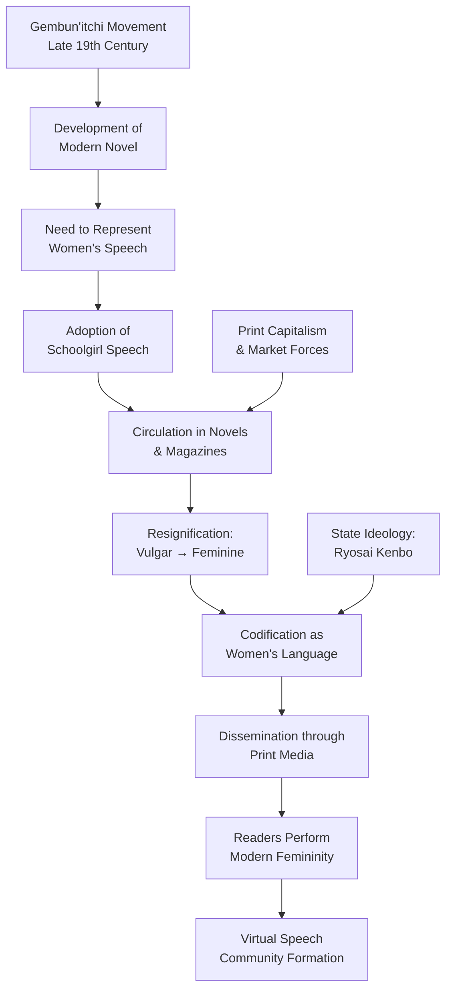
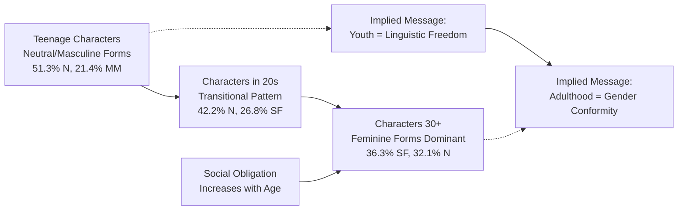
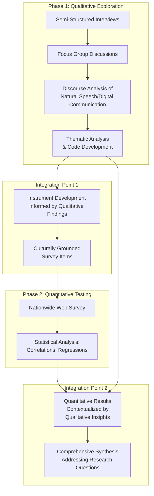
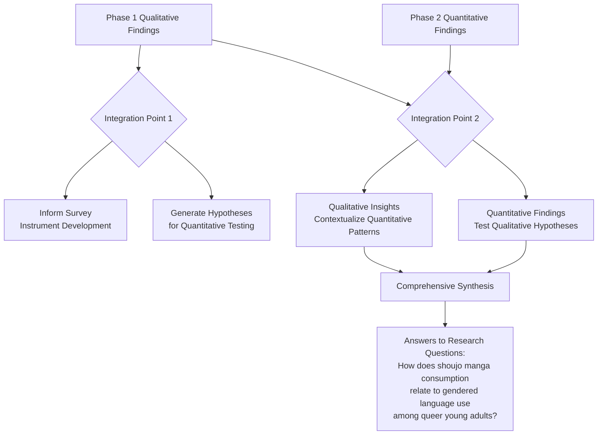
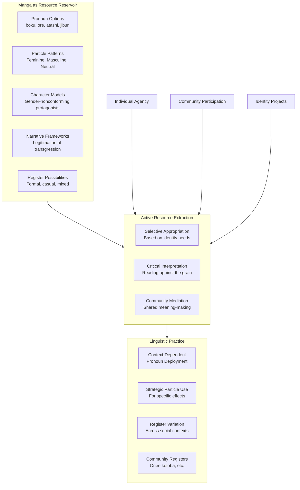
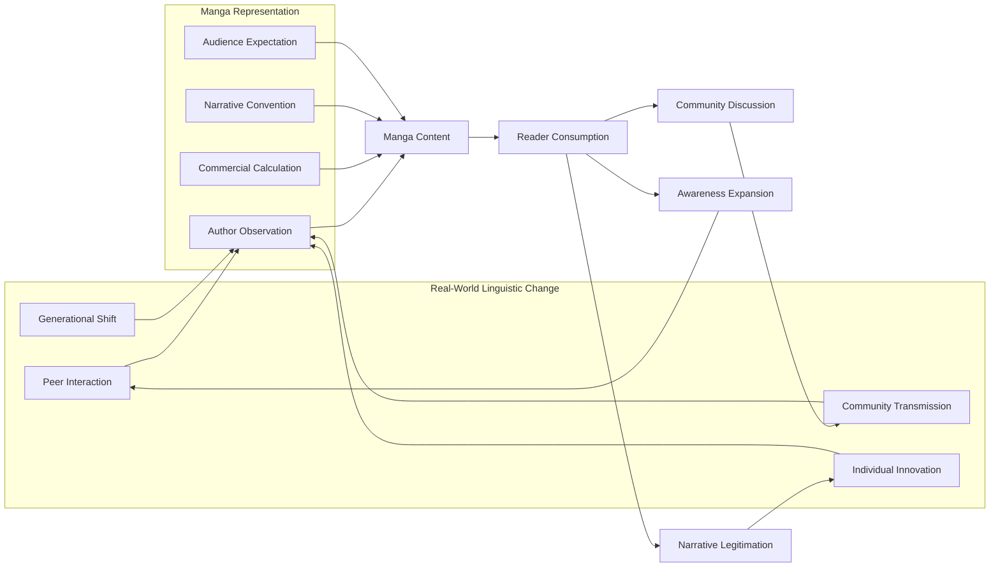
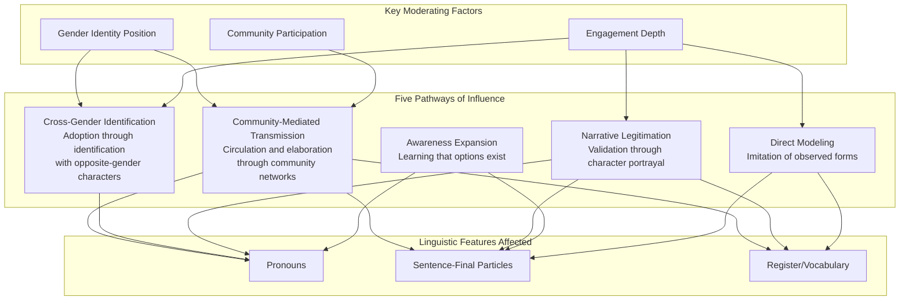

# Media Influence on Linguistic Identity: Shoujo Manga Consumption and Gendered Language Use among Queer Young Adults in Japan
## 1 Theoretical Framework: Media, Language, and Queer Identity

This chapter establishes the theoretical foundation for analyzing the relationship between shoujo manga consumption and gendered language use among queer young adults in Japan. By synthesizing key concepts from sociolinguistics, media effects theories, and queer theory, it provides a coherent analytical lens through which to examine how media consumption may influence linguistic practices that are deeply intertwined with gender and sexual identity. The framework developed here recognizes that the relationship between media, language, and identity is not unidirectional but rather constitutes a **dynamic, recursive interplay** between structural ideological production, individual and collective agency, and community-based identity validation. This chapter defines the core constructs essential to the research—Japanese gendered language systems, shoujo manga as a cultural product, and the linguistic practices of Japan's queer community—while establishing their theoretical interconnections.

### 1.1 Sociolinguistic Perspectives on Language and Identity

Language serves as a fundamental index of social and gender identity, functioning not merely as a tool for communication but as a system through which speakers signal their social positioning, group affiliations, and personal characteristics. In the Japanese sociolinguistic context, this indexical function is particularly pronounced due to the language's rich system of grammatically and stylistically marked forms that differentiate speakers along multiple social dimensions.

**The Concept of Wakimae and Indexicality**

Japanese sociolinguistics has developed independently from Western traditions, with a distinctive focus on *wakimae* (discernment)—behavior based on socially expected norms where speakers assess their sense of place in relation to situational and social contexts[^1]. This concept is central to understanding how Japanese speakers make linguistic choices. Wakimae involves acknowledging interpersonal relationships, formality, and social/psychological distance, influenced by factors including age, status, power, intimacy, and the categorization of addressees or referents into *uchi* (in-group) or *soto* (out-group)[^1]. Unlike Western linguistic politeness, which emphasizes volitional strategies for achieving communicative goals, Japanese linguistic politeness is fundamentally grounded in this discernment-based approach. Cross-cultural research by Hill et al. (1986) demonstrated that Japanese politeness responses cluster more tightly than American English responses, reflecting the sociopragmatically obligatory nature of appropriate language use within the wakimae framework[^1].

Elinor Ochs's theory of indexicality provides a broader theoretical framework for understanding how linguistic features come to mark social meanings, including gender. According to this framework, linguistic forms index social meanings through a two-tier semiotic process: certain features directly index stances such as affect or intensity, and through cultural associations between these stances and social categories, they indirectly index identities like gender[^1]. For example, sentence-final particles that directly index softness or delicacy come to indirectly index femininity through the cultural linking of these qualities with women. However, as will be discussed later, this framework has been critiqued for creating a "history effect" that naturalizes indexical relationships that are in fact historically contingent constructions[^2].

**Structural Features of Japanese Gendered Language**

Japanese exhibits systematic gender differentiation at multiple linguistic levels, creating what has been termed *onna kotoba* (women's language) and *otoko kotoba* (men's language). These stereotyped speech styles are more accurately characterized as "gentle" and "rough" registers respectively, though they carry strong gender associations[^3].

The following table summarizes the key structural features that differentiate gendered speech in Japanese:

| Linguistic Level | Feminine-Associated Features | Masculine-Associated Features |
|------------------|------------------------------|-------------------------------|
| **Pronouns (1st person)** | 私 (*watashi*), あたし (*atashi*) | 俺 (*ore*), 僕 (*boku*) |
| **Pronouns (2nd person)** | あなた (*anata*) | お前 (*omae*), てめぇ (*temee*) |
| **Sentence-final particles** | わ (*wa*), の (*no*), かしら (*kashira*) | ぜ (*ze*), ぞ (*zo*), さ (*sa*) |
| **Vocabulary register** | Polite variants (食べる *taberu*, おいしい *oishii*) | Vulgar variants (食う *kuu*, うまい *umai*) |
| **Honorific usage** | More frequent use of beautification honorifics | Less frequent honorific use |

Research has documented that women tend to use honorifics and polite expressions more frequently than men, attributed to three factors: women assess the politeness level of linguistic forms as lower, assign a higher required politeness level to addressees, and engage more frequently in interactions requiring higher politeness forms[^1]. Women also use beautification honorifics (e.g., *o-kane* for "money") and sometimes hypercorrected honorifics more often, indexing a display of demeanor[^1].

Regarding pronouns, the first-person pronoun *watashi* is common for women in informal speech but used formally by men, while deprecatory pronouns like *ore* and *omae* exist primarily in male speech repertoires[^1][^3]. Importantly, research demonstrates that pronoun choice is **dynamic rather than fixed**, influenced by situation, emotion, and identity. Studies have documented queer women using *ore* when expressing anger, and cisgender women using the ostensibly neutral *jibun* (self) in professional contexts to project confidence[^3]. This flexibility challenges essentialist views of gendered pronoun use.

Sentence-final particles represent another critical site of gender indexicality. Particles like *zo*, *ze*, and *sa* are primarily used by men to express insistence, while particles like *wa*, *no*, and *kashira* are used mainly by women to express rapport, uncertainty, or to soften speech[^1]. However, the gender implications of these particles are not absolute. The particle *wa*, for instance, carries different meanings depending on intonation: in standard Tokyo dialect, a rising *wa↑* is considered feminine, while in Kansai dialect, a falling *wa↓* is gender-neutral[^3]. Contemporary research indicates that **most young speakers increasingly favor gender-neutral sentence-final forms** such as *da yo* and *da ne*, while traditionally feminine endings like *wa yo* and *no yo* are declining among young cisgender women but being preserved and reappropriated in *onee kotoba* (queen's speech)[^3].

**Historical Construction of Women's Language**

A critical insight from recent scholarship is that Japanese women's language, rather than representing an ancient cultural tradition, is substantially a **modern historical construction** that emerged at the threshold of Japan's modernity in the late 19th and early 20th centuries[^2]. This period of state formation, capitalist accumulation, industrialization, and class reconfiguration saw both language and women become problematized as national issues[^2].

The *gembun'itchi* (speech and writing unification) movement, a literary movement to create colloquial written Japanese and develop the modern novel, was instrumental in this process[^2]. This movement engendered a new "language ideology" premised on a realist and referential conception of language as a transparent medium[^2]. The novel, as a modern institution shaped by industrial capitalism, the rise of the middle class, and print capitalism, demanded truthful representation of reality—including the speech of characters[^2].

The speech of *jogakusei* (schoolgirls), a new social category that emerged with women's public education in 1899, became particularly significant[^2][^4]. Schoolgirls were reported to use distinctive final particles like *teyo*, *dawa*, and *noyo*, which were initially considered vulgar by male intellectuals[^2][^4]. However, through circulation in novels, magazines, and advertisements, these forms were **resignified and elevated** to become the voice of modern Japanese women[^2]. The domestic novel (*katei shosetsu*), serialized in newspapers to expand readership among women, promoted the state's ideal of "good wife, wise mother" (*ryosai kenbo*) while featuring these speech forms, effectively commodifying and disseminating them as markers of modern femininity[^2].

This historical analysis reveals that the seemingly natural indexical relationship between certain linguistic forms and femininity is actually the product of specific historical processes involving state ideology, print capitalism, and the construction of modern gendered subjectivity. The primordialist discourse from National Language Studies (*kokugogaku*), which dates women's language to the fourth century, is critiqued for denying historical contingency and erasing the material traces of women's diverse linguistic experiences[^2].

### 1.2 Media Effects Theories and Linguistic Norm Formation

Understanding how mass media influences language standardization, linguistic innovation, and identity expression requires examining both historical and contemporary theoretical frameworks. Media's role in shaping linguistic norms in Japan has been profound, operating through mechanisms of standardization, dissemination of innovations, and the construction of ideological links between language and social identity.

**Media as a Site of Ideological Construction**

A synthesized theoretical framework positions media not as a passive mirror of linguistic reality but as an **active producer of ideological links** between language and social identity. This perspective integrates media effects theories with sociolinguistic indexicality, highlighting how media historically institutionalizes indexical links (e.g., specific particles = femininity) within cultural frameworks like *wakimae*, establishing heteronormative linguistic binaries.

Contemporary research on the influence of mass media on modern Japanese language confirms that the most noticeable influence occurs at the **lexical and stylistic levels**, with less pronounced effects at phonetic, morphological, and syntactic levels[^5]. Lexical changes include the introduction of neologisms from various spheres, particularly Americanized English borrowings like "コワーキング" (co-working space) and "ミーム" (meme)[^5]. Stylistic influences include metaphorical constructions that pass into general use, creating narratives about national identity and international roles[^5].

Crucially, mass media plays a significant role in the **standardization of Japanese language**, promoting a standard version through television, radio, and newspapers[^5]. This standardization leads native speakers to perceive regional features as inferior, weakening linguistic individuality and blurring language diversity boundaries[^5]. The media thus serves as a channel for the rapid spread of linguistic innovations while simultaneously reinforcing normative standards.

**Historical Role of Print Media in Constructing Gendered Speech**

The historical relationship between print media and gendered language construction in Japan provides essential context for understanding contemporary media effects. As discussed in the previous section, the emergence of Japanese women's language was intimately connected with the development of print capitalism during the Meiji period.

The following diagram illustrates the historical process through which print media contributed to the construction of women's language:

This diagram illustrates how the *gembun'itchi* movement's need to represent realistic speech led to the adoption of schoolgirl speech forms, which were then circulated through novels and magazines, resignified from vulgar to feminine markers, and codified as women's language through the intersection of state ideology and market forces. The result was the creation of a virtual speech community where readers consumed and performed modern feminine identity.

Girls' and women's magazines played a crucial role in this dissemination process, where readers used female final particles in letters, creating a virtual speech community[^2]. This allowed young women to perform the subjectivity of "modern Japanese women"[^2]. For many women, especially in rural peripheries, consumption of this language in print media was their primary experience of it, linking women's language to class, region, and modernity[^2]. The construction of women's language was therefore a **modern and national project**, intimately linked to the political economic processes of Japan's modernity[^2].

**Contemporary Media's Dual Role**

Contemporary media operates in a more complex landscape, simultaneously reinforcing traditional linguistic norms and providing alternative models of language use. Research on media theory in Japan emphasizes that media theory should be understood as "any sustained engagement with media such that it produces new ways of knowing this media," and that spatially and temporally bounded media cultures determine media theory[^6]. This perspective suggests that media consumption is not a passive process but involves active engagement that shapes understanding.

The edited collection *Media Theory in Japan* proposes deprovincialization of media theory to create a "more nuanced and less geopolitically centered conception of media theory"[^6]. The volume argues for considering "theory" outside academia, studying its performative dimensions as a practice of "creolization" that incorporates art and criticism[^6]. This framework is relevant for understanding how manga, as a form of popular media, may function as "actionable theory" that shapes readers' linguistic and identity practices.

Studies of manga's linguistic representations reveal that print media continues to influence how gender identities are framed and expressed. Research on *shojo* (girls) and *ladies* (adult women) manga demonstrates that these genres, written "of women, by women, and for women," project gender identities that likely reflect characteristics of the desired readership while potentially influencing readers in framing their gender identities and linguistic behavior[^7]. The historical impact of print media on Japanese women's speech patterns establishes a precedent for considering manga's contemporary influence.

### 1.3 Queer Theory and Language Performativity

Queer theory provides essential conceptual tools for problematizing essentialist notions of gendered language and understanding how linguistic practices constitute rather than merely reflect gender and sexual identities. This perspective is crucial for analyzing how queer individuals in Japan strategically engage with gendered linguistic resources.

**Butler's Framework of Gender Performativity**

Judith Butler's concept of gender performativity frames gender as a corporeal style, an act that constructs meaning rather than expressing a pre-existing essence[^8]. From this perspective, gender is not something one *is* but something one *does* through repeated performances, including linguistic performances. This framework fundamentally challenges the assumption that gendered language reflects an underlying gender identity, instead suggesting that **linguistic practices actively constitute gender identities**.

Applied to Japanese gendered language, Butler's framework implies that the use of feminine or masculine linguistic markers does not simply express a speaker's gender but participates in the ongoing construction of that gender identity. This has significant implications for understanding queer linguistic practices, as it opens the possibility that speakers can strategically deploy, subvert, or recombine traditionally gendered features to construct non-normative identities.

Michel Foucault's discourse analysis complements this framework by highlighting how power operates through discourses on sexuality and gender[^8]. Linguistic norms regarding gendered speech can be understood as discursive formations that regulate gender and sexuality, making certain identities intelligible while marginalizing others. Queer linguistic practices can thus be understood as forms of resistance to these regulatory discourses.

**Queer Linguistic Praxis: Subversion and Recombination**

Queer linguistics, as developed by scholars like Hideko Abe, deconstructs the fixed gender binary in language and emphasizes speaker agency[^9][^10]. Abe's work *Queer Japanese: Gender and Sexual Identities through Linguistic Practices* provides comprehensive documentation of the linguistic strategies employed by Japanese sexual minorities in various social contexts, including magazine advice columns, bars, text messaging, and private homes[^10]. The book explores how sexual minorities use language to negotiate and construct identities, illuminating the Japanese hegemonic gender and sexuality structure[^10].

A particularly significant phenomenon is *onee kotoba* (queen's speech), which originated in Japan's gay bar scene and has become highly visible in Japanese media[^3]. The term *onee* is a shortened form of *oneesan* (older sister) and refers to individuals who speak or behave in flamboyant ways[^3]. Onee kotoba is characterized by a distinctive **mixing of hyper-feminine markers with vulgar elements**—combining extremely feminine pronouns and sentence endings like *atashi* and *da wa* with vulgar vocabulary like *kuu* (to eat, crude form), and discussing topics considered unladylike[^3]. This combination creates a **parody of traditional gendered language norms** that simultaneously claims and subverts feminine linguistic territory.

The reception of onee kotoba within queer communities is mixed. Some view it as a distinctive cultural asset that builds group solidarity, with some individuals considering it their "mother tongue"[^3]. Others criticize mainstream media's portrayal of queer individuals as limited to onee kotoba users presented as comical figures[^3]. Some queer individuals use onee kotoba in text messaging to leverage its community-building function, even when it does not fully match their personal speech style[^3]. The term *hogeru* has emerged within queer communities to describe the act of revealing one's queer identity through speech and behavior, including the use of onee kotoba[^3].

**Language as Constraint and Creative Resistance**

The theoretical framework emerging from queer linguistics positions language as a site of both constraint and creative resistance. The normative gendered language system, reinforced through media and social institutions, constrains speakers by establishing expectations about appropriate linguistic behavior based on perceived gender. However, queer speakers demonstrate significant **agency in appropriating and reshaping** these linguistic resources for personal expression and community building.

This negotiation occurs in dialogue with media representations. Queer consumers may adopt, resist, or reinterpret linguistic styles from queer media genres that offer alternative models. The framework thus posits that identity formation for queer youth is not a linear effect of media consumption but a **circulatory process**: media offers linguistic and narrative resources; individuals agentively negotiate these resources in practice; shared practices and consumption foster community solidarity, which in turn feeds back into and influences media content and broader linguistic landscapes.

### 1.4 Shoujo Manga as a Site of Gender and Language Representation

Shoujo manga, the genre of Japanese comic books marketed for young female audiences, represents a significant cultural product for analyzing the intersection of media, gender representation, and linguistic practices. Understanding its distinctive characteristics and representational patterns is essential for investigating its potential influence on readers' linguistic identity.

**Defining Shoujo Manga as a Cultural Product**

In Japan, manga is a mainstream medium of enormous cultural significance, with approximately one out of every three published books being a manga[^8]. Manga titles are categorized by target audience: *shounen* (for boys), *seinen* (for men), *shoujo* (for girls), and *jousei* (for women)[^8]. Shoujo manga typically focuses on romantic stories and reflects female aesthetics and desires, with magazines selling approximately 1.7 billion copies per year across all genres[^7].

Shoujo manga is distinctive in being written "of women, by women, and for women"[^7]. The genre's themes often center on romantic love for younger readers, while *ladies* manga targeting adult women deals with realities such as love, career, mother-child relations, and divorce[^7]. The projected gender identities of female characters are likely to reflect the characteristics of the desired readership, suggesting that these representations may both mirror and shape readers' self-conceptions[^7].

**Linguistic Representation Patterns by Character Age**

Empirical research on gendered sentence-final particles in shoujo and ladies manga reveals systematic patterns that differ by character age group. The following table summarizes key findings from analysis of nine manga magazines (four shoujo, five ladies) published in 2003-2004[^7]:

| Age Group | Most Frequent Form | Second Most Frequent | Feminine Forms (SF+MF) | Masculine/Neutral Forms (N+MM+SM) |
|-----------|-------------------|---------------------|------------------------|-----------------------------------|
| **Teenagers** | Neutral (51.3%) | Mod. Masculine (21.4%) | 23.4% | 76.6% |
| **20s** | Neutral (42.2%) | Strongly Feminine (26.8%) | 49.8% | 50.2% |
| **30s+** | Strongly Feminine (36.3%) | Neutral (32.1%) | 57.8% | 42.2% |

These findings reveal a clear **age-based linguistic differentiation** in manga representations. Teenage female characters predominantly use neutral and moderately masculine forms, with low usage of strongly feminine forms (8.3%)[^7]. In contrast, female characters in their 30s and above use strongly feminine forms most frequently, followed by neutral forms[^7]. Strongly masculine forms are the least used across all age groups[^7].

Qualitative analysis reveals the contexts in which different speech patterns are deployed. In shoujo manga, strongly feminine forms are used in specific settings: when characters stress femininity, have a noble background, or are in semi-formal situations[^7]. Unconventional speech (neutral and moderately masculine forms) is the norm for teenage characters[^7]. Strongly masculine forms are used rarely, typically when expressing strong emotion like anger[^7].

The discussion of these findings indicates that young girls' speech in manga **diverges from traditional norms**, using a variety of gendered forms but fewer feminine forms, suggesting they are not restricted by gender norms[^7]. This may indicate opposition to fixed stereotypes or an escape from social obligations due to youth[^7]. In contrast, older women's speech in manga follows traditional feminine language, indexing a soft, polite feminine voice as expected by society[^7]. The linguistic differentiation by age in manga suggests that **using feminine speech is associated with maturity and social obligation**[^7]. This pattern may send a message to readers that feminine speech comes with maturity, potentially reinforcing traditional notions of gender despite real-world changes[^7].

**Gender-Subversive Narratives and Queer Readings**

Beyond linguistic representation, shoujo manga contains significant potential for gender-subversive narratives that offer alternative, queer-inclusive representations of gender and sexuality. Studies examining English-language translations of shoujo manga through queer and feminist theoretical lenses have identified titles that feature protagonists who perform their genders and sexualities in ways that subvert heterosexual expectations[^8].

Analysis of titles such as *Revolutionary Girl Utena*, *Pet Shop of Horrors*, and *Angel Sanctuary* reveals several mechanisms of subversion[^8]:

- **Inversion of gender role tropes**: In *Revolutionary Girl Utena*, the protagonist rejects traditional femininity by wearing a modified boy's uniform and aspiring to be a prince, ultimately rejecting heteronormative binaries[^8].
- **Ambiguous gender presentation**: Characters like Count D in *Pet Shop of Horrors* present with ambiguous gender identity that challenges Western heteronormative masculinity[^8].
- **Layered gender identity**: In *Angel Sanctuary*, the protagonist houses the soul of a female angel and experiences embodiment in both male and female forms, with multiple characters transgressing gender norms[^8].

These analyses argue that dislocating shoujo manga from their Japanese context, which constructs gender and sexuality differently from Western contexts, provides a space where heteronormative constructions are challenged[^8]. The cultural difference embedded in manga creates a "frisson of uncertainty" that can prompt readers to rethink their assumptions about gender and sexuality[^8].

Shoujo manga also contains depictions of same-sex relationships, including *dōseiai* (same-sex love based on sameness) and related genres like *yaoi* or *shounen ai* (male-male romance marketed to heterosexual women)[^8]. While these are Japanese-specific formulations, they can challenge heteronormativity when read by audiences outside their original cultural context[^8]. However, scholars caution against essentializing all shoujo manga as progressive, noting that many titles reinforce heteronormativity[^8].

### 1.5 The Queer Community in Japan: Identity, Language, and Media Engagement

Contextualizing the Japanese queer community within broader social, legal, and cultural frameworks is essential for understanding the specific conditions under which media consumption intersects with linguistic identity formation. This section examines the challenges facing LGBTQ+ individuals in Japan, documented linguistic practices within queer communities, and patterns of media engagement.

**Social and Legal Context**

Homosexuality and LGBTQ+ identities in Japan exist within a complex social landscape characterized by significant challenges. Research indicates that LGBTQ+ individuals face serious social stigma and discrimination rooted in cultural, religious, and historical factors[^11]. Japanese society's emphasis on conformity makes it difficult for LGBTQ+ individuals to come out and express their authentic selves[^11]. Japan does not recognize same-sex marriage and lacks anti-discrimination laws protecting LGBTQ+ individuals in the workplace or public spaces[^11].

Historically, same-sex relationships in Japan have had varying degrees of acceptance. During the Edo period (1603-1868), sexual relationships between men, particularly among samurai, were documented in literature and art[^11]. However, with Western influence in the late 19th century, Japan adopted more conservative and heteronormative views on sexuality, with same-sex relations increasingly stigmatized[^11]. Homosexuality was formally criminalized in Japan in 1872 and was not decriminalized until 1999[^11].

LGBTQ+ representation in mainstream Japanese media has often been stereotyped or absent, making underground and non-mainstream popular culture a primary source of art and expression for many LGBTQ+ youth[^11]. This context makes the study of niche media genres like shoujo manga, BL (Boys' Love), and bara manga particularly relevant for understanding how queer individuals engage with media for identity exploration and validation.

**Linguistic Practices Within Queer Communities**

Documented linguistic practices within Japanese queer communities demonstrate sophisticated strategies for identity expression and community building. As discussed earlier, *onee kotoba* represents a distinctive speech style that originated in gay bar culture and involves creative mixing of traditionally gendered linguistic features[^3][^10].

Research on queer Japanese linguistic practices reveals that pronoun choice among queer individuals is highly dynamic and context-dependent. Studies document cases where individuals select pronouns based on complex negotiations of identity, comfort, and social context[^3]:

- Some queer individuals who identify as *okama* (a term for gay men or effeminate men) choose to use *jibun* (self) because *watashi* and *atashi* feel too feminine while *ore* and *boku* feel too masculine[^3].
- Queer women may use traditionally masculine pronouns like *ore* when expressing strong emotions like anger[^3].
- The second-person pronoun *anta* is commonly used in onee kotoba[^3].

These practices illustrate how queer individuals **agentively negotiate** linguistic resources that the broader society codes as gendered, creating personalized repertoires that may draw on, subvert, or transcend traditional categories.

**Media Consumption Patterns and Identity Formation**

Research on transnational consumption of Asian media, particularly Boys' Love (BL), provides insight into how queer individuals engage with media for identity exploration. A study of BL consumption among young people in Midwestern America found that the genre functions as a platform for **exploring and normalizing queer identities**[^12].

Key findings from this research include[^12]:

- **Identity exploration**: Many respondents expressed that engagement with BL content played a crucial role in helping them discover and understand their queer identities. One bisexual female respondent shared that BL provided escape and clarification during a period of gender dysphoria and sexual identity crises.
- **Community formation**: BL fandom works through digitally mediated connections, allowing fans to imagine themselves as part of a transnational community. Digital platforms play a pivotal role in connecting fans and making content accessible.
- **Escapism and fantasy**: The fantastical settings and aesthetically pleasing elements of BL offer refuge from everyday life, with the cultural and geographic distance enhancing its fantastical quality and providing a space to explore themes of gender and sexuality while maintaining emotional safety.

Survey data revealed that among active BL fans, 53% identified as heterosexual, 33% as bisexual, and 14% as asexual[^12]. Primary motivations for consumption included entertainment (82%), emphasis on feelings over traditional gender norms (52.5%), escape from reality (45.9%), and attraction to love without gender constraints and pro-LGBTQ+ perspectives (44.3%)[^12]. BL content from Japan was the most popular (87.1%), followed by Korea (54.8%) and China (53.2%)[^12].

Bara manga (gay men's manga) represents another significant genre for queer media engagement in Japan. Unlike BL, which is primarily created by and for women, bara manga is created by and for gay men, reflecting their experiences and perspectives[^11]. The genre provides representation for LGBTQ+ individuals, particularly gay men, offering a space where readers can explore and identify with characters and storylines that reflect their own experiences and desires[^11]. Artists like Gengoroh Tagame have been recognized as pioneers in the genre, with works like *My Brother's Husband* (*Otōto no Otto*) addressing themes of acceptance and family[^11].

**Synthesizing the Framework**

The theoretical framework developed in this chapter conceptualizes the relationship between media, language, and queer identity as a **cyclical, recursive process** involving three interconnected dimensions:

1. **Norm Production**: Media (historically print, now including manga and digital platforms) actively produces ideological links between language and social identity, institutionalizing indexical relationships within cultural frameworks like *wakimae* and establishing heteronormative linguistic binaries.

2. **Agentive Negotiation**: Queer individuals engage in dynamic, subversive linguistic practices to navigate and challenge normative binaries. This involves creative deployment and mixing of indexed resources (pronouns, sentence-final particles, vocabulary), as exemplified by practices like *onee kotoba*.

3. **Identity Formation and Community Building**: Media consumption and participatory engagement facilitate queer identity formation by providing discursive arenas for validation and community. These media spaces allow for exploration and normalization of non-normative identities, forming imagined communities both online and offline.

This framework positions media influence on queer linguistic identity not as a simple cause-and-effect relationship but as a **dynamic interplay** between structural ideological production, individual and collective agency, and community-based identity validation. The following chapters will apply this framework to examine empirical evidence regarding shoujo manga's specific role in shaping the gendered language use of queer Japanese young adults.

## 2 Literature Review: Gendered Language in Shoujo Manga and Societal Trends

This chapter synthesizes existing empirical research on gendered language representation in shoujo and related manga genres, establishing the evidentiary foundation for examining media influence on linguistic identity among queer young adults in Japan. The systematic review of documented patterns in pronoun usage and sentence-final particle distribution reveals a complex landscape where manga representations both reflect and diverge from real-world linguistic practices. By analyzing age-based linguistic differentiation in fictional portrayals and comparing these media representations with documented trends in contemporary Japanese youth language, this chapter establishes the empirical context necessary for investigating how queer communities may engage with these gendered linguistic models. The analysis culminates by identifying a critical research gap: the **absence of studies specifically examining how queer individuals receive, interpret, and potentially incorporate these gendered linguistic representations into their own identity practices**—a gap that the present research aims to address.

### 2.1 Empirical Patterns of Gendered Language in Shoujo and Ladies Manga

Linguistic analyses of female characters' speech in shoujo and ladies manga have produced substantial quantitative and qualitative findings that reveal systematic patterns of gendered language use. These empirical studies, based on corpus analysis of manga published in the early 2000s, provide the foundational data for understanding how gendered speech is represented in media targeting female readers of different age groups.

**Quantitative Distribution of Sentence-Final Particles**

Research examining nine manga magazines—four shoujo manga (*Nakayoshi*, *Ribon*, *Hana to Yume*, *The Margaret*) and five ladies manga (*Young You*, *Office You*, *You*, *For Mrs.*, *Jour Sutekina Shufutachi*)—published in 2003-2004 has documented the distribution of gendered sentence-final particles in informal dialogues[^7]. The analytical framework classified these particles into five categories: strongly feminine (SF), moderately feminine (MF), neutral (N), moderately masculine (MM), and strongly masculine (SM), enabling systematic comparison across character demographics.

The following table presents the documented distribution of sentence-final particle usage by female character age group across all analyzed manga:

| Age Group | Strongly Feminine (SF) | Moderately Feminine (MF) | Neutral (N) | Moderately Masculine (MM) | Strongly Masculine (SM) |
|-----------|------------------------|--------------------------|-------------|---------------------------|-------------------------|
| **Teenagers** | 8.3% | 15.1% | 51.3% | 21.4% | 4.0% |
| **20s** | 26.8% | 23.0% | 42.2% | 6.6% | 1.4% |
| **30s and above** | 36.3% | 21.5% | 32.1% | 9.3% | 0.8% |

This data reveals a striking pattern: **teenage female characters predominantly employ neutral sentence-final forms**, with over half of their utterances (51.3%) using gender-neutral particles, followed by moderately masculine forms at 21.4%[^7]. Strongly feminine forms constitute only 8.3% of teenage characters' speech, representing the lowest rate among all age groups. In marked contrast, characters aged 30 and above use strongly feminine forms most frequently (36.3%), followed by neutral forms (32.1%)[^7]. This distribution demonstrates that manga representations construct a clear **age-stratified model of gendered speech**, where linguistic femininity increases with character age.

**Comparative Patterns Between Shoujo and Ladies Manga**

When examined by magazine type, the speech patterns of female characters reveal both similarities and notable divergences between shoujo and ladies manga. While the overall age-based patterns remain consistent across both genres, specific differences emerge in the degree of masculine linguistic marking[^7].

Teenage female characters in ladies manga demonstrate significantly higher usage of moderately masculine forms (41.4%) compared to their counterparts in shoujo manga (20.2%)[^7]. This substantial difference suggests that **ladies manga portrays young female characters with more linguistically masculine characteristics** than shoujo manga does. Conversely, for characters aged 30 and above, the pattern reverses: older female characters in shoujo manga use moderately masculine forms at a lower rate (5.5%) than those in ladies manga (10.3%)[^7]. This indicates that shoujo manga depicts older women as more linguistically feminine than ladies manga does, potentially reflecting different ideological constructions of mature femininity across these genres targeting different reader demographics.

**Pronoun Usage Patterns and the Absence of Cross-Gender Pronoun Use**

Analysis of first-person pronoun distribution in popular manga has produced findings that challenge common assumptions about manga's linguistic content. A corpus study examining eight popular manga titles—including four shoujo-oriented works (*Kimi ni Todoke*, *NANA*, *Nodame Cantabile*, *Lovely Complex*)—comprising 578,709 characters and 45,055 utterances revealed systematic patterns in pronoun usage[^13].

The core first-person pronoun for female characters was found to be *atashi* (あたし), appearing 452 times and constituting 4.87% of female dialogue[^13]. However, in manga targeting male audiences, female characters more frequently used *watashi* (私) rather than *atashi*, with *watashi* appearing 209 times (9.24% of female dialogue in those series) compared to only 15 instances of *atashi* (0.03%)[^13]. For male characters, *ore* (俺) served as the core first-person pronoun, appearing 603 times (5.72% of male dialogue)[^13].

**Crucially, the corpus analysis found no examples of female characters using masculine first-person pronouns such as *ore* or *boku***[^13]. This finding directly contradicts the popular perception that manga serves as a source for young women's adoption of masculine pronouns. The only instance of cross-gender pronoun use documented was a male character—specifically, a transgender character who identifies as female in *Lovely Complex*—using the feminine pronoun *atashi*[^13]. This absence of female characters using masculine pronouns represents a significant empirical finding that complicates narratives about manga's role in linguistic gender transgression.

**Qualitative Analysis of Contextual Language Use**

Beyond quantitative distribution, qualitative analysis has identified specific contexts in which different gendered speech patterns are deployed. In shoujo manga, strongly feminine forms appear in circumscribed settings: when characters wish to **emphasize their femininity**, when characters possess a **noble or high-status background**, in **semi-formal situations** (as opposed to casual conversations among friends), and in the speech of **older female characters**[^7]. This contextual specificity suggests that strongly feminine speech in shoujo manga functions as a marked register associated with particular social meanings rather than as the default mode of female expression.

Unconventional speech patterns—particularly neutral and moderately masculine forms—constitute the **linguistic norm for teenage characters** in both shoujo and ladies manga[^7]. Strongly masculine forms appear rarely, typically reserved for moments when female characters express **intense emotions such as anger**[^7]. Even characters otherwise portrayed as feminine may employ strongly masculine forms during conflict scenes, indicating that these forms function as markers of emotional intensity rather than stable gender identity[^7].

### 2.2 Age-Based Linguistic Differentiation and Its Ideological Implications

The systematic relationship between character age and gendered speech patterns documented in manga research carries significant ideological implications for understanding how media may communicate normative messages about gender, language, and social maturity. This age-based differentiation constructs a developmental narrative in which linguistic femininity becomes increasingly expected and performed as female characters mature.

**The Linguistic Construction of Shojo as Liminal Category**

The speech patterns assigned to teenage female characters (*shojo*) in manga position them as occupying a **liminal space outside traditional gender constraints**. The predominant use of neutral (51.3%) and moderately masculine (21.4%) forms by teenage characters, combined with their minimal use of strongly feminine forms (8.3%), constructs young girlhood as a period of relative linguistic freedom[^7]. This representation aligns with cultural conceptualizations of *shojo* as a category characterized by freedom from adult social obligations, including the expectation to perform traditional femininity through language[^7].

The following diagram illustrates the ideological trajectory implied by age-based linguistic differentiation in manga:

This diagram visualizes how manga constructs an age-based progression from linguistic freedom in youth toward increasing gender conformity in adulthood, with the implicit message that adopting feminine speech accompanies the assumption of adult social responsibilities.

Research interpretation suggests that the divergent speech styles of young female characters may indicate **opposition to fixed gender norms** or an **escape from social obligations** afforded by their youth[^7]. The *shojo* category has been theorized as functioning as an "ideological apparatus for freedom from social duties like marriage," and the linguistic representation of teenage characters in manga appears to reflect this cultural construction[^7]. However, this freedom is portrayed as temporary—a transitional phase rather than a permanent identity position.

**Maturity Indexed Through Feminine Speech**

The speech patterns of adult female characters in manga—particularly those aged 30 and above—construct a normative model in which **linguistic femininity indexes social maturity and responsibility**. The predominant use of strongly feminine forms (36.3%) by older characters, combined with their reduced use of masculine forms (MM at 9.3%, SM at 0.8%), positions feminine speech as the appropriate register for adult women who have assumed their expected social roles[^7].

This representation communicates a clear normative message: the use of feminine sentence-final particles such as *wa* (わ), *no* (の), and *kashira* (かしら) signals that a speaker has internalized and performs the soft, polite, and well-mannered voice that Japanese society expects of adult women[^7]. Adult female characters' speech patterns suggest they are "mature, and therefore able to use socially sanctioned feminine forms"[^7]. The linguistic differentiation by age thus **reinforces traditional notions that women should "speak properly" as responsible adults**, even as real-world linguistic practices among young women shift away from such norms.

**Ideological Reinforcement Through Media Representation**

The age-based linguistic differentiation documented in manga may function as a mechanism of ideological reinforcement, communicating to readers that feminine speech is an expected accompaniment of female maturation. Research discussion suggests that "the linguistic behavior of female characters in manga may send a message to younger and older female readers that the use of feminine speech comes with maturity"[^7]. This message operates through the consistent association of strongly feminine forms with adult characters who are portrayed as fulfilling expected social roles.

The ideological implications of this representation are significant for understanding potential media effects on linguistic identity. If manga consistently portrays linguistic femininity as a marker of adult responsibility and social integration, readers may internalize this association regardless of whether they consciously adopt specific linguistic forms from manga characters. The **normative framework itself**—the idea that mature women speak differently from young girls—may be the most significant ideological content transmitted through these representations.

However, the relationship between media representation and ideological transmission is not straightforward. Research notes that identity formation is a "fluid process" influenced by multiple factors including occupation, conversational setting, and individual preference, not solely by media consumption[^7]. The documented patterns in manga represent one source of linguistic models among many, and readers may engage with these models in diverse ways—accepting, rejecting, or strategically adapting them based on their own identity projects.

### 2.3 Real-World Trends in Japanese Youth Language Use

Contemporary sociolinguistic research documents significant changes in gendered language use among Japanese youth that both parallel and diverge from the patterns represented in shoujo manga. These real-world trends provide essential comparative context for evaluating manga's potential influence on linguistic practices and for understanding the broader sociolinguistic landscape within which queer young adults negotiate their linguistic identities.

**Decline of Traditional Feminine Forms Among Young Women**

Multiple studies confirm that young Japanese women increasingly use neutral and moderately masculine speech forms while traditional feminine sentence-final particles decline in frequency[^7]. Research indicates that "the speech styles of Japanese women are changing, with young women using feminine speech less often and employing masculine or neutral speech instead"[^7]. This shift represents a significant departure from the prescriptive norms of *onna kotoba* (women's language) that historically defined appropriate female speech.

The decline of feminine sentence-final particles is particularly pronounced. Particles traditionally associated with women's language—such as *wa* (わ) with rising intonation, *no yo* (のよ), and *kashira* (かしら)—are increasingly absent from young women's everyday speech[^3]. Research notes that "most young people today tend toward using more gender-neutral sentence-final forms" such as *da yo* (だよ) and *da ne* (だね), while "traditional feminine sentence-final particles are falling out of favor among young cisgender female speakers"[^3].

Studies examining sentence-final particle usage among Japanese college students reveal a striking pattern: **traditionally "feminine" particles are used more frequently by male speakers than by female speakers** in casual conversation[^14]. Analysis of 68 cases of the particle *wa* found 43 instances (63%) produced by male speakers compared to only 25 (37%) by female speakers; similarly, of 84 cases of *no*, 47 (56%) came from male speakers versus 37 (44%) from female speakers[^14]. This finding challenges the categorical association of these particles with femininity and suggests that their social meanings are undergoing significant transformation.

**Documented Use of Masculine Pronouns by Young Women**

Reports indicate that some young Japanese women use masculine first-person pronouns *boku* (僕) and *ore* (俺) at certain points in their lives, though this practice remains minority behavior[^13]. In a survey of 136 female students, 23 reported having used *boku* and *ore*, while 72 reported witnessing other girls using these pronouns[^13]. Research on Japanese middle school girls documented some students using masculine pronouns, "indicating that some girls are now choosing to use masculine pronouns, though only a minority"[^13].

The attribution of this phenomenon to manga influence is common in popular discourse. Survey respondents and online discussions frequently cite manga as a factor in young women's adoption of masculine pronouns[^13]. Posts on platforms like Yahoo Chiebukuro discuss manga's role in girls' use of *boku* and *ore*, reflecting widespread popular belief in this media effect[^13]. However, as the previous section documented, **corpus analysis of manga itself reveals no instances of female characters using these masculine pronouns**, creating a significant discrepancy between popular perception and documented media content.

**Pronoun Selection as Dynamic and Context-Dependent**

Contemporary research emphasizes that pronoun choice among Japanese speakers is **dynamic rather than fixed**, influenced by situation, emotion, and identity rather than determined solely by gender[^3]. This fluidity is documented across diverse speaker populations. Studies report that "pronoun choice is not static but influenced by multiple factors including gender identity, age, social status, and specific context"[^3].

Field research in Shinjuku Ni-chome—Tokyo's largest LGBTQ+ district—conducted by linguist Hiroko Abe documented queer women using the masculine pronoun *ore* in heated situations to express anger[^3]. Some individuals identifying as *okama* (a term for gay men or effeminate men) or *onabe* (a term for masculine-presenting individuals assigned female at birth) reported that traditional pronouns felt ill-fitting: *watashi* and *atashi* felt too feminine while *ore* and *boku* felt too masculine, leading them to adopt the relatively neutral *jibun* (自分, "self")[^3]. Cisgender women in male-dominated work environments also reported using *jibun* to project confidence and assertiveness[^3].

**Reinterpretation of Particle Functions**

Beyond simple adoption or rejection of gendered forms, contemporary youth language demonstrates **creative reinterpretation of particle functions**. Research on the particles *wa* and *no* among male college students reveals that these traditionally "feminine" particles have acquired new pragmatic functions divorced from gender indexicality[^14].

The particle *wa*, when used by young male speakers, **directly indexes self-centeredness** rather than femininity, serving to express personal emotion, share personal information or decisions, and perform speech acts such as teasing or displaying *amae* (dependent reliance on another's benevolence) in a self-focused way[^14]. Similarly, the particle *no* **directly indexes truthfulness**, allowing speakers to share new information presumed unknown to the addressee, reconfirm prior statements, or provide explanations with an assertive tone[^14].

These findings suggest that "the unconventional usages of SFPs *wa* and *no* by young men reflect the gender and social transformations behind the language changes"[^14]. Young men "do not always conform to the traditional 'masculine' style" but are "more comfortable using 'feminine' expressions to express their emotions or dependence on others" while also "flexibly utilizing traditional 'feminine' expressions to express their attitude of confidence or assertiveness"[^14]. This pragmatic repurposing indicates that **language itself does not directly index gender**; rather, "gendered usages of language are derived from the direct linguistic indexed meanings in certain social contexts"[^14].

### 2.4 Discrepancies Between Manga Representation and Real-World Language Change

Critical examination reveals significant tension between popular assumptions about manga as a driver of linguistic change and empirical findings from corpus analyses. These discrepancies illuminate the complex relationship between media representation and real-world linguistic practice, challenging simplistic models of media influence while raising questions about alternative mechanisms through which manga may shape linguistic identity.

**The Pronoun Paradox: Popular Perception Versus Documented Content**

The most striking discrepancy concerns the use of masculine first-person pronouns by female characters. Despite widespread popular belief that manga influences young women to use *ore* and *boku*, **corpus analysis of popular manga titles reveals no instances of female characters using these masculine pronouns**[^13]. This finding creates what might be termed a "pronoun paradox": manga is popularly credited with an influence that its documented content does not support.

Research explicitly addresses this paradox: "The question remains: despite manga being described as one of the sources for girls' use of masculine first-person pronouns, why is there a lack of such examples?"[^13]. The results "somewhat contradict findings about young female characters using some moderately masculine speech patterns"[^13], suggesting that while manga may portray young women using masculine sentence-final particles, it does not extend this representation to pronoun use.

Several potential explanations have been proposed for this discrepancy:

| Explanation | Description | Implications |
|-------------|-------------|--------------|
| **Sample Limitations** | Corpus limited to eight series across two genres; similar storylines may constrain unusual speech patterns | Broader sampling might reveal different patterns |
| **Author-Character Age Gap** | Authors may not be users of emerging linguistic patterns and thus unfamiliar with them | Media representation lags behind real-world change |
| **Narrative Conventions** | Manga may employ stereotyped gendered language for character construction | Linguistic representation serves characterization rather than realism |
| **Reader Identification** | Female readers may identify with male characters, especially in shounen manga where female dialogue is limited | Influence may operate through cross-gender identification |

Research suggests that "manga is being influenced by real-world changes and therefore shows a lag in adopting these changes"[^13]. This interpretation positions manga not as a leading edge of linguistic innovation but as a **conservative medium that trails behind societal shifts**. The author-character age gap may be particularly significant: "as non-users of these patterns, authors may not be familiar with such changes"[^13].

**Asymmetric Representation of Gendered Features**

Analysis reveals asymmetric patterns in how manga represents different gendered linguistic features. While young female characters in manga use moderately masculine sentence-final particles at notable rates (21.4% in shoujo manga, 41.4% in ladies manga for teenage characters), this masculine linguistic marking does not extend to pronoun use[^7][^13]. This asymmetry suggests that **manga permits certain forms of linguistic gender transgression while maintaining boundaries around others**.

The case of the character Nana from the manga series *NANA* illustrates this asymmetry. Nana, portrayed as a punk character, uses the highly masculine and crude second-person pronoun *temee* (てめえ) when addressing others, yet uses the feminine first-person pronoun *atashi* when referring to herself[^13]. This **asymmetric usage within a single character**—masculine when addressing others, feminine when self-referencing—suggests that manga representation permits transgression of gendered norms in some linguistic domains while preserving them in others.

**The Question of Influence Mechanisms**

The documented discrepancies raise fundamental questions about how manga might influence linguistic practices if not through direct modeling of specific forms. Several alternative mechanisms merit consideration:

First, manga may influence **normative frameworks** rather than specific linguistic forms. Even if manga does not model female characters using *ore*, its portrayal of young women using neutral and moderately masculine sentence-final particles may communicate that **linguistic gender transgression is acceptable for youth**, thereby creating ideological space for real-world experimentation that extends beyond what manga explicitly represents.

Second, influence may operate through **cross-gender identification**. Given that shounen manga features predominantly male dialogue (79.9% of utterances), female readers of these genres may identify with male characters and their speech patterns[^13]. Research notes that "while boys have a more limited reading range, girls read various works including shounen manga series" and "female readers may identify more with male characters"[^13].

Third, the **absence of certain forms in manga** may itself be significant. The documented absence of female characters using masculine pronouns may reflect and reinforce a boundary that real-world speakers transgress, positioning such usage as genuinely transgressive rather than normalized. This interpretation suggests that manga's conservatism may paradoxically enhance the subversive meaning of real-world pronoun transgression.

### 2.5 The Research Gap: Queer Reception and Linguistic Practice

The preceding sections have established substantial empirical foundations regarding gendered language representation in shoujo manga and documented trends in real-world Japanese youth language use. However, this body of research reveals a **critical gap**: no existing studies specifically investigate how queer individuals receive, interpret, and potentially incorporate these gendered linguistic representations into their own identity formation and linguistic practice. This section elaborates this gap and outlines its significance for understanding the relationship between media consumption and linguistic identity among sexual and gender minorities.

**Absence of Queer-Focused Reception Studies**

Existing research on gendered language in manga has focused primarily on representation—documenting what linguistic patterns appear in texts—rather than reception—examining how readers engage with and respond to these patterns. Studies have analyzed the speech of female characters across age groups, compared patterns between manga genres, and examined discrepancies between manga content and real-world usage, but none have specifically examined **how queer readers interpret these representations or whether their engagement differs from heterosexual and cisgender readers**[^7].

Similarly, research on real-world Japanese youth language has documented changing patterns of gendered language use but has not systematically examined whether these patterns differ among queer youth. While studies note that "some young women" use masculine pronouns and that "most young speakers" favor neutral forms, these generalizations do not differentiate between heterosexual/cisgender and LGBTQ+ populations[^13]. The documented linguistic practices of queer individuals—such as the field research in Shinjuku Ni-chome documenting queer women using *ore* and individuals adopting *jibun* as a gender-neutral alternative—appear in studies focused on queer communities specifically rather than in comparative analyses of media influence[^3].

**Distinctive Characteristics of Queer Linguistic Practice**

Research on queer Japanese linguistic practices suggests that queer individuals may engage with gendered language in ways that differ fundamentally from majority patterns. The documented phenomenon of *onee kotoba*—queen's speech that originated in gay bar culture—exemplifies a **creative linguistic practice that simultaneously appropriates and subverts traditional gendered forms**[^3].

Onee kotoba is characterized by mixing hyper-feminine markers with elements typically associated with masculine speech. This includes combining extremely feminine pronouns like *atashi* and sentence endings like *da wa* with vulgar vocabulary such as *kuu* (the crude form of "to eat") and direct discussion of topics considered inappropriate for feminine speakers[^3]. Research provides the example: "あたし、今カレー食ったら下痢だわ" ("If I eat curry now, I'll have diarrhea")—a sentence that juxtaposes the feminine pronoun *atashi* and sentence ending *da wa* with the vulgar *kutta* and a topic transgressing norms of feminine propriety[^3].

This linguistic practice creates a **parody of traditional gendered speech norms** rather than simple adoption of feminine or masculine registers[^3]. The mixed reception of onee kotoba within queer communities—with some viewing it as "cultural treasure" and a "mother tongue" that builds community solidarity, while others criticize its comedic portrayal in mainstream media—indicates that queer individuals actively negotiate the meanings and uses of gendered linguistic resources[^3].

**Dynamic Pronoun Selection Among Queer Speakers**

The documented practices of pronoun selection among queer individuals reveal a level of **conscious negotiation and strategic choice** that differs from the patterns assumed in general population studies. Field research documents individuals making deliberate decisions about pronouns based on identity fit rather than simply conforming to gender-based expectations:

- Queer women using *ore* specifically when expressing anger, demonstrating situational deployment of masculine forms for affective purposes[^3]
- Individuals identifying as *onabe* rejecting both feminine pronouns (*watashi*, *atashi*) as not matching their identity and masculine pronouns (*ore*, *boku*) as uncomfortable, instead adopting *jibun* as a neutral alternative[^3]
- Cisgender women in professional contexts using *jibun* to project assertiveness, demonstrating strategic deployment based on desired self-presentation[^3]

These practices suggest that queer individuals may approach gendered linguistic resources as a **repertoire for identity construction** rather than as fixed markers of gender category membership. This orientation toward language as a tool for identity work may shape how queer readers engage with gendered language models in media, potentially leading to more active, selective, and transformative appropriation of represented forms.

**Media's Role in Queer Identity Exploration**

Research on queer media consumption, particularly studies of Boys' Love (BL) genre engagement, indicates that media plays a significant role in **queer identity exploration and community formation**. Survey research found that BL consumption serves as "a platform for exploring and normalizing queer identities," with respondents reporting that engagement with BL content "played a crucial role in helping them discover and understand their queer identities." One bisexual respondent described BL as providing "escape and clarification during a period of gender dysphoria and sexual identity crises."

The functions of media consumption documented in this research—identity exploration, community formation through digitally mediated connections, and escapism that provides emotional safety for exploring gender and sexuality themes—suggest that queer readers may engage with shoujo manga in ways that extend beyond simple linguistic modeling. **Media may provide not only specific linguistic forms but also narrative frameworks, character identifications, and community connections** that shape how queer individuals understand and perform gendered identity.

**The Need for Targeted Investigation**

The convergence of these factors—the absence of queer-focused reception studies, the distinctive characteristics of documented queer linguistic practices, and the established role of media in queer identity exploration—establishes a compelling case for targeted investigation of shoujo manga's influence on queer young adults' linguistic practices. Several specific questions emerge from this gap:

1. **Do queer readers engage differently with gendered language representations in shoujo manga compared to heterosexual/cisgender readers?** Given documented practices of strategic linguistic negotiation among queer individuals, they may approach manga's gendered language models with greater critical awareness or creative appropriation.

2. **Does shoujo manga consumption correlate with specific patterns of pronoun or particle use among queer young adults?** While manga corpus analysis shows no female characters using masculine pronouns, queer readers may nonetheless derive linguistic resources from manga through cross-gender identification with male characters or through reinterpretation of represented forms.

3. **How do queer readers interpret the age-based linguistic differentiation in manga, and does this interpretation affect their own linguistic practices?** The normative message that feminine speech accompanies maturity may be received differently by individuals whose identity projects involve challenging rather than conforming to traditional gender norms.

4. **What role does shoujo manga play in queer community formation and the development of shared linguistic practices?** Given the documented function of media in creating imagined communities and the role of distinctive speech styles like *onee kotoba* in queer community solidarity, manga consumption may contribute to linguistic practices through community-mediated pathways rather than direct individual adoption.

The present research addresses this gap by investigating the relationship between shoujo manga consumption and gendered language use specifically among queer Japanese young adults. By examining both the linguistic practices of this population and their reported engagement with manga, the research aims to illuminate how media consumption intersects with the distinctive identity work and linguistic negotiation that characterizes queer experience. This investigation contributes not only to understanding media influence on language but also to broader questions about the role of popular culture in minority identity formation and expression.

## 3 Research Methodology: Investigating Media Consumption and Linguistic Practice

This chapter presents the comprehensive methodological framework for empirically investigating the relationship between shoujo manga consumption and gendered language use among queer young adults in Japan. The methodological design responds directly to the research gap identified in the preceding literature review: the **absence of studies specifically examining how queer individuals receive, interpret, and potentially incorporate gendered linguistic representations from manga into their own identity practices**. Given the complexity of this research problem—involving the intersection of media consumption patterns, linguistic behavior, sexual and gender identity, and cultural context—the methodology must capture both the breadth of phenomena across a population and the depth of individual meaning-making processes. This chapter justifies the adoption of a mixed-methods research design that integrates quantitative survey instruments with qualitative interview and discourse analysis approaches, details participant recruitment strategies that address the challenges of studying marginalized populations, provides precise operational definitions for key constructs, establishes rigorous ethical protocols, and outlines an analytical framework for synthesizing findings across methodological approaches.

### 3.1 Research Design Rationale: Mixed-Methods Approach

The selection of a mixed-methods research design represents a deliberate methodological choice optimized for investigating the complex, multi-dimensional relationship between media consumption and linguistic practice among queer young adults. This approach responds to the documented characteristics of the research problem: the **fluidity of identity formation**, the **contextual nature of linguistic practice**, and the **multiple pathways through which media influence may operate**—including direct modeling, normative framework adoption, cross-gender identification, and community-mediated transmission.

**Justification for Mixed-Methods Design**

Research on LGBTQ+ populations has increasingly recognized that mixed-methods approaches are essential for capturing the full spectrum of lived experiences among individuals with diverse and multiple marginalized identities[^15]. Quantitative research alone cannot adequately address the culturally specific meanings, contextual variations, and agentive negotiation processes that characterize queer linguistic practices. Conversely, purely qualitative approaches, while providing rich insight into individual experiences, cannot establish the prevalence of patterns or test hypotheses about relationships between media consumption and linguistic behavior across broader populations.

The combination of quantitative and qualitative approaches provides several methodological advantages directly relevant to this research:

| Methodological Advantage | Quantitative Contribution | Qualitative Contribution |
|--------------------------|---------------------------|--------------------------|
| **Breadth and Depth** | Maps consumption patterns and linguistic practices across sample | Reveals meaning-making processes and contextual variations |
| **Hypothesis Generation and Testing** | Tests correlations between manga consumption and language use | Generates hypotheses about mechanisms of influence |
| **Representativeness and Richness** | Provides generalizable findings through larger sample | Offers comprehensive assessment of lived experiences |
| **Pattern Identification and Explanation** | Identifies statistical relationships | Explains why and how relationships operate |
| **Triangulation** | Corroborates findings through numerical data | Validates findings through narrative accounts |

Research methodology literature emphasizes that mixed-methods designs "account for the strengths of both quantitative and qualitative designs" and that "the combination of both approaches may provide a wider and representative sample to corroborate and generalize hypotheses to similar understudied populations, while still providing a comprehensive assessment of lived experiences"[^15].

**Exploratory Sequential Design Structure**

The research employs an **exploratory sequential mixed-methods design**, which proceeds in two distinct phases with the qualitative phase preceding the quantitative phase. This design structure is particularly appropriate for research involving understudied populations where existing measures may not adequately capture culturally specific experiences.

The following diagram illustrates the sequential structure and integration points of the research design:

In Phase 1, qualitative methods explore lived experiences of queer Japanese young adults, identifying specific linguistic features relevant to their identity practices, generating hypotheses about the relationship between manga consumption and language use, and ensuring that subsequent quantitative measures capture culturally meaningful constructs. Phase 2 then develops and administers a quantitative survey instrument informed by Phase 1 findings, testing hypotheses about prevalence and patterns of linguistic practices and their correlation with manga consumption metrics across a broader sample.

This sequential structure directly addresses the identified research gap by first exploring the terrain of queer linguistic practices and media engagement qualitatively—ensuring that the quantitative phase measures constructs that are meaningful to the population under study rather than imposing external categories that may miss the nuances of queer experience.

**Addressing Fluidity and Context-Dependence**

The theoretical framework established in Chapter 1 emphasized that linguistic practice among queer individuals is characterized by **dynamic, context-dependent negotiation** rather than fixed patterns. Research documented queer women using masculine pronouns specifically when expressing anger, individuals adopting *jibun* as a gender-neutral alternative when traditional pronouns felt ill-fitting, and the strategic deployment of *onee kotoba* for community-building purposes even among individuals who do not use it as their primary speech style.

The mixed-methods design accommodates this fluidity through multiple mechanisms. Qualitative interviews allow participants to describe the **contextual conditions** under which they deploy different linguistic resources, capturing the situational logic of their language choices. Discourse analysis of natural speech and digital communication provides **observational data** on actual linguistic behavior across varied contexts. The quantitative survey, informed by these qualitative findings, can then include items that measure not only what linguistic forms participants use but also **when, with whom, and for what purposes** they deploy different forms.

### 3.2 Quantitative Component: Survey Design and Instrumentation

The quantitative component centers on a comprehensive web-based survey designed to map shoujo manga consumption habits and self-reported gendered language use across a sample of queer Japanese young adults. The survey instrument development is informed by Phase 1 qualitative findings to ensure cultural appropriateness and construct validity.

**Survey Administration and Platform**

Following established precedents in large-scale LGBTQ+ research in Japan, the survey will be administered through a web-based platform. Prior studies have successfully employed web-based survey companies with large panels to recruit participants, with samples weighted for demographics including prefecture, age, and gender to enhance representativeness[^16]. The Dentsu LGBTQ+ Survey, conducted with 60,000 respondents in 2020, demonstrated the feasibility of large-scale online surveying of this population in Japan[^16].

The survey will be administered using a secure online platform that ensures anonymity. Completion of the questionnaire will be treated as implied consent to participate, following protocols established in prior research on LGBTQ+ populations in Japan[^17]. The target sample size for the main survey is approximately 500-700 queer-identified respondents, with oversampling of specific subgroups (e.g., gender-diverse individuals, bisexual individuals) to ensure adequate statistical power for subgroup analyses.

**Measures of Shoujo Manga Consumption**

The survey will operationalize shoujo manga consumption through multiple dimensions to capture the complexity of media engagement:

| Dimension | Measurement Approach | Example Items |
|-----------|---------------------|---------------|
| **Frequency** | Likert scale items | "How often do you read shoujo manga?" (Daily/Weekly/Monthly/Rarely/Never) |
| **Duration** | Retrospective estimate | "For how many years have you been reading shoujo manga?" |
| **Intensity** | Hours per week | "In a typical week, approximately how many hours do you spend reading manga?" |
| **Genre Specificity** | Checklist with frequency ratings | Ratings for specific genres: romance, school life, fantasy, BL/GL elements |
| **Engagement Depth** | Scaled items | "I often re-read favorite manga series"; "I identify with manga characters" |
| **Character Identification** | Open-ended and scaled | "Which characters do you most identify with?"; Cross-gender identification items |

The inclusion of cross-gender character identification measures addresses the hypothesis generated from the literature review that female readers of shounen manga may identify with male characters and their speech patterns. Items will assess the extent to which participants identify with characters of different genders and whether they perceive any influence of these identifications on their own self-presentation, including language use.

**Measures of Gendered Language Use**

Self-reported gendered language use will be measured across the linguistic features identified as significant in the literature review: first-person pronouns, sentence-final particles, and vocabulary register. The measurement approach combines frequency ratings, contextual usage items, and items addressing perceived reasons for linguistic choices.

For **first-person pronoun use**, the survey will present a list of pronouns spanning the gender spectrum and ask participants to rate how frequently they use each in different contexts:

- Pronouns assessed: *watashi* (私), *atashi* (あたし), *boku* (僕), *ore* (俺), *jibun* (自分), *uchi* (うち), and others identified in Phase 1
- Contexts assessed: casual conversation with friends, formal situations, online/digital communication, communication with family, communication with romantic partners, communication within queer community spaces

For **sentence-final particle use**, items will assess the frequency of traditionally feminine particles (*wa*, *no*, *kashira*), traditionally masculine particles (*ze*, *zo*, *sa*), and neutral particles (*yo*, *ne*, *da*). Given research findings that particle usage is highly context-dependent and that young speakers increasingly favor neutral forms, items will capture both overall frequency and contextual variation.

For **vocabulary register**, items will assess preferences for polite versus casual speech forms and the use of beautification honorifics, as research has documented that women tend to use more formal language than men and that this pattern persists even among queer speakers[^18].

**Perceived Media Influence Items**

A novel component of the survey addresses participants' **subjective perceptions of media influence** on their language use. Items will assess:

- Whether participants believe manga has influenced their language use
- Specific linguistic features participants attribute to manga influence
- The role of manga in their understanding of gendered language options
- Whether manga provided models for linguistic identity expression

These items provide data on the phenomenological dimension of media influence—how participants themselves understand the relationship between their media consumption and linguistic practices—complementing the correlational analyses of consumption patterns and language use.

### 3.3 Qualitative Component: Interview Protocols and Discourse Analysis

The qualitative component employs semi-structured interviews, focus group discussions, and discourse analysis of natural speech and digital communication to capture the rich, contextual dimensions of the relationship between manga consumption and linguistic practice that quantitative measures alone cannot reveal.

**Semi-Structured Interview Protocol**

Individual interviews will be conducted with approximately 20-30 participants recruited through the sampling strategies detailed in Section 3.4. Interviews will last approximately 60-90 minutes and will be conducted in Japanese by researchers fluent in the language and knowledgeable about queer communities and linguistic research.

The interview protocol is organized around several thematic domains:

1. **Manga Consumption History**: Participants' history of manga reading, including when they began reading shoujo manga, what genres and titles have been most significant to them, and how their consumption patterns have evolved over time.

2. **Character Identification and Engagement**: Which characters participants have identified with most strongly, whether they identify with characters across gender lines, and what aspects of characters (including their speech patterns) resonate with participants.

3. **Linguistic Identity Development**: How participants understand their own language use, when and how they became aware of gendered language options, and how their language practices have developed over their lifetime.

4. **Perceived Relationship Between Media and Language**: Whether and how participants perceive connections between their manga consumption and their language use, including specific examples of linguistic features they may have adopted or experimented with based on media exposure.

5. **Community and Context**: How participants' language use varies across different social contexts and communities, the role of queer community spaces in their linguistic practices, and how they navigate gendered language expectations in different settings.

The interview approach emphasizes **participant-led exploration** of these themes, allowing individuals to introduce topics and connections that may not be anticipated by the research team. Prior research has found that qualitative interviews with LGBTQ+ participants reveal that "the most frequent reasons for participation were the opportunity to increase LGBTQ+ visibility, helping those LGBTQ+ individuals who may be in need, and to be represented, heard and respected"[^15], suggesting that participants value the opportunity to share their experiences in their own terms.

**Focus Group Discussions**

Focus groups of 4-6 participants will be conducted to explore collective meaning-making and community-level linguistic practices. Focus group methodology is particularly valuable for examining how linguistic practices function in **community contexts** and how shared media consumption may contribute to group linguistic norms.

Focus group discussions will address:

- Shared experiences of manga consumption within queer communities
- Community-specific linguistic practices and their perceived origins
- Collective negotiation of gendered language in queer spaces
- The role of media in community identity and solidarity

Research on LGBTQ+ populations in Japan has employed focus group methodology successfully, with one study conducting 9 focus group discussions to explore experiences and terminology use[^19]. Focus groups provide insight into the **social and communal dimensions** of linguistic practice that individual interviews may not fully capture.

**Discourse Analysis of Natural Speech and Digital Communication**

To complement self-reported data with observational evidence, the qualitative component includes discourse analysis of natural speech samples and digital communication. With participant consent, researchers will:

- Record naturally occurring conversations in community settings (with appropriate permissions)
- Collect samples of participants' digital communication (text messages, social media posts, online forum contributions)
- Analyze manga dialogue excerpts that participants identify as significant to their linguistic identity

The discourse analysis framework focuses on identifying:

- Deployment of gendered linguistic features (pronouns, particles, register) in authentic contexts
- Contextual variation in language use across different settings and interlocutors
- Evidence of linguistic features that may derive from or parallel manga representations
- Creative mixing, subversion, or reinterpretation of gendered linguistic resources

Research on queer Japanese linguistic practices has employed similar methods, with Hideko Abe's foundational work examining language use across diverse contexts including bars, text messaging, and private settings[^20]. More recent research has analyzed documentary film footage to examine contemporary linguistic practices, comparing findings with earlier research to identify changes over time[^18].

### 3.4 Sampling Strategy and Participant Recruitment

Recruiting participants from Japan's queer community presents significant methodological challenges, including **population invisibility** due to low rates of public identity disclosure, **social stigma** that may discourage research participation, and **geographic concentration** of visible queer communities in urban centers. The sampling strategy addresses these challenges through a multi-pronged approach combining venue-based, snowball, and digital recruitment methods.

**Venue-Based Sampling**

Venue-based sampling targets LGBTQ+ community spaces and events where potential participants gather. Prior research on sexual and gender minority women in Japan successfully employed venue-based recruitment at Tokyo Rainbow Pride and lesbian community spaces, recruiting 166 participants through this method[^21]. This approach reaches individuals who are connected to queer communities and comfortable with public participation in community events.

Target venues for recruitment include:

- Pride events in major cities (Tokyo Rainbow Pride and regional events)
- LGBTQ+ bars and community centers, particularly in Tokyo's Shinjuku Ni-chome district
- University LGBTQ+ student groups and ally organizations
- Community organization meetings and events

Venue-based sampling provides access to individuals who are **actively engaged with queer communities**, which is relevant for examining community-mediated pathways of linguistic influence. However, this method may underrepresent individuals who are not connected to community spaces or who live in areas without visible LGBTQ+ infrastructure.

**Snowball Sampling**

Snowball sampling leverages existing social networks to reach participants who may not be accessible through venue-based methods. Initial participants recruited through venue-based sampling will be asked to refer other eligible individuals from their social networks. This method is particularly valuable for reaching individuals who are **less publicly visible** in their queer identity but who may still consume shoujo manga and engage in distinctive linguistic practices.

Research on LGBTQ+ populations has noted that snowball sampling is essential for reaching hidden populations, though it may introduce bias toward individuals who are more socially connected[^19]. The combination of snowball sampling with other methods helps mitigate this limitation.

**Digital Recruitment**

Digital recruitment through social media platforms and online communities addresses the geographic limitations of venue-based sampling and reaches individuals who may not participate in physical community spaces. Research has identified Twitter and Instagram as "critical online spaces for LGBTQ+ communities" where recruitment can successfully reach diverse participants[^15].

Digital recruitment will target:

- LGBTQ+ Twitter communities and hashtags in Japanese
- Online forums and discussion boards focused on queer topics
- Manga fan communities, particularly those with significant queer membership
- LGBTQ+ influencers and community organizations who can share study information

This approach enables recruitment of participants from **diverse geographic locations** across Japan, including rural areas where physical LGBTQ+ spaces may not exist. Research on LGBTQ+ issues in Japan has noted the importance of expanding beyond Tokyo to understand experiences across the country[^22].

**Sample Composition Targets**

To ensure adequate representation across relevant demographic and identity categories, the sampling strategy targets specific composition goals:

| Category | Target Representation | Rationale |
|----------|----------------------|-----------|
| **Sexual Orientation** | Diverse across lesbian, gay, bisexual, pansexual, asexual, questioning | Capture spectrum of queer experiences |
| **Gender Identity** | Cisgender women, cisgender men, transgender, non-binary, questioning | Address gender diversity within queer community |
| **Age** | 18-35, with representation across age range | Focus on young adults; capture generational variation |
| **Geographic Location** | Urban and non-urban areas; multiple regions | Avoid Tokyo-centric bias |
| **Community Connection** | Varying levels from highly connected to isolated | Examine community-mediated pathways |

Research has noted that individuals with "diverse and multiple marginalized identities are often underrepresented in psychological research"[^15], making intentional sampling for diversity essential.

### 3.5 Operationalization of Key Variables

Precise operational definitions for the study's central constructs ensure measurement validity and enable clear interpretation of findings. This section provides detailed operationalization of queer identity, shoujo manga consumption, gendered language use, and media influence.

**Operationalization of Queer Identity**

Queer identity will be operationalized through multi-dimensional measures that capture the spectrum of sexual orientation and gender identity experiences rather than imposing categorical classifications that may not reflect participants' self-understanding.

**Sexual orientation** will be measured through:
- Self-identification label (open-ended and checklist options including lesbian, gay, bisexual, pansexual, asexual, queer, questioning, heterosexual, and other)
- Kinsey-type scale items assessing attraction patterns
- Items addressing romantic versus sexual attraction separately

**Gender identity** will be measured through:
- Self-identification label (open-ended and checklist options including woman, man, transgender woman, transgender man, non-binary, genderqueer, genderfluid, questioning, and other)
- Items assessing assigned sex at birth
- Items addressing gender expression and its relationship to gender identity

Prior research in Japan has operationalized LGBTQ+ identity by breaking sexuality into three categories: "biological sex (sex assigned at birth), gender identity (personal concept of one's gender), and sexual orientation (the gender to which one is attracted)"[^16]. This multi-dimensional approach ensures that the research captures the **full diversity of queer experiences** rather than collapsing distinct identity dimensions.

**Operationalization of Shoujo Manga Consumption**

Shoujo manga consumption will be operationalized as a multi-faceted construct encompassing:

1. **Exposure Frequency**: How often participants read shoujo manga (categorical scale from never to daily)
2. **Exposure Duration**: Length of time participants have been reading shoujo manga (in years)
3. **Exposure Intensity**: Average hours per week spent reading manga
4. **Genre Specificity**: Specific shoujo manga subgenres consumed (romance, school life, fantasy, supernatural, etc.) and related genres (BL, GL, josei)
5. **Engagement Depth**: Degree of active engagement including re-reading, character identification, fan community participation, and discussion with others
6. **Cross-Gender Consumption**: Consumption of shounen and seinen manga in addition to shoujo manga

This multi-dimensional operationalization allows analysis of **which aspects of manga consumption** most strongly relate to linguistic practices—whether simple exposure, depth of engagement, character identification, or specific genre consumption patterns.

**Operationalization of Gendered Language Use**

Gendered language use will be operationalized through both **self-report measures** and **observed linguistic behavior** (the latter through discourse analysis in the qualitative component).

Self-report measures will assess:

- **Pronoun repertoire**: Which first-person pronouns participants report using
- **Pronoun context-dependence**: How pronoun use varies across contexts (formal/informal, community/mainstream, online/offline)
- **Particle usage patterns**: Frequency of traditionally feminine, masculine, and neutral sentence-final particles
- **Register preferences**: Tendency toward formal versus informal speech; use of honorifics and beautification language
- **Metalinguistic awareness**: Participants' conscious awareness of and attitudes toward gendered language options

Observed linguistic behavior (from discourse analysis) will document:

- Actual pronoun deployment in recorded speech and written communication
- Particle usage patterns in natural conversation
- Register variation across contexts
- Evidence of linguistic mixing, code-switching, or creative language use

The combination of self-report and observational data addresses the limitation that self-report alone may not accurately capture actual linguistic behavior, particularly for features that operate below conscious awareness.

**Operationalization of Media Influence**

Media influence will be operationalized as a **multi-pathway construct** reflecting the theoretical framework's identification of multiple mechanisms through which manga may shape linguistic practice:

1. **Direct Modeling**: Conscious adoption of specific linguistic features observed in manga characters
2. **Normative Framework Adoption**: Internalization of ideas about what linguistic options exist and when they are appropriate
3. **Cross-Gender Identification**: Influence mediated through identification with characters of different genders
4. **Community-Mediated Transmission**: Influence mediated through participation in fan communities or queer communities where manga-derived linguistic practices circulate

Survey items will assess each pathway separately, allowing analysis of which mechanisms are most prevalent and whether different pathways relate differently to actual linguistic practices.

### 3.6 Ethical Considerations and Participant Protections

Research involving LGBTQ+ populations requires heightened ethical attention due to the potential for harm related to identity disclosure, the history of pathologizing research on sexual and gender minorities, and the vulnerability of marginalized communities to exploitation. The ethical framework governing this research addresses these concerns through rigorous protocols for informed consent, confidentiality protection, harm minimization, and community engagement.

**Institutional Review Board Approval**

The research will obtain approval from the relevant Institutional Review Board (IRB) prior to any data collection. Prior research on LGBTQ+ populations in Japan has obtained approval from institutional ethics committees, demonstrating that such research can meet ethical standards when appropriately designed[^21][^17]. The IRB application will detail all procedures for participant recruitment, data collection, data storage, and data analysis, with particular attention to protections for this vulnerable population.

**Informed Consent Procedures**

Informed consent will be obtained from all participants through procedures appropriate to each data collection method:

- **Survey participants**: Will receive detailed written information about the study's purpose, procedures, risks, and benefits before beginning the survey. Completion of the survey will be treated as implied consent, following precedents in prior research[^17].
- **Interview and focus group participants**: Will receive both written and oral information about the study and will provide explicit written consent before participation. Consent forms will be available in Japanese and will clearly explain the study's focus on queer identity and media consumption.
- **Discourse analysis participants**: Will provide specific consent for recording of conversations and/or collection of digital communication samples, with clear explanation of how these data will be used and protected.

All consent materials will emphasize the **voluntary nature of participation** and participants' right to withdraw at any time without penalty.

**Confidentiality and Data Protection**

Rigorous confidentiality protections are essential given the sensitive nature of information about sexual and gender identity. Protocols include:

- **Anonymization**: Survey data will be collected anonymously with no identifying information linked to responses. Interview transcripts will be anonymized during transcription, with pseudonyms replacing names and identifying details removed or altered.
- **Secure storage**: All data will be stored on encrypted, password-protected servers accessible only to research team members. Physical materials (consent forms, audio recordings) will be stored in locked facilities.
- **Data retention limits**: Audio recordings will be destroyed after transcription and verification. Survey data will be retained only as long as necessary for analysis and publication.
- **Reporting protocols**: All published findings will use aggregate data or carefully anonymized examples that cannot be traced to individual participants.

Research on LGBTQ+ populations in Japan has emphasized that "participation was voluntary and confidentiality was maintained throughout all investigations and analyses"[^17], establishing precedent for these protections.

**Minimizing Harms Related to Identity Disclosure**

The research design incorporates specific strategies to minimize potential harms related to identity disclosure:

- **Private data collection settings**: Interviews will be conducted in private settings chosen by participants where they feel comfortable discussing identity topics.
- **Sensitive question protocols**: Survey items addressing identity will be introduced with clear framing and will allow participants to skip questions they prefer not to answer.
- **Referral resources**: Participants will be provided with information about LGBTQ+ support resources in case participation raises difficult emotions or concerns.

Research has documented that sexual identity concealment patterns vary by relational context and that disclosure decisions carry different emotional costs in different relationships[^21]. The research design respects participants' autonomy in managing their own disclosure by not requiring disclosure beyond the research context.

**Community Engagement and Researcher Reflexivity**

Ethical research with marginalized communities requires engagement with community members and reflexive attention to researcher positionality. The research team will:

- **Include community members**: Involve LGBTQ+-identified individuals in research design, instrument development, and interpretation of findings
- **Practice reflexivity**: Researchers will reflect on their own identities and how these may shape data collection and interpretation[^15]
- **Share findings**: Results will be disseminated to participating communities and LGBTQ+ organizations, not only to academic audiences

Research methodology literature emphasizes that "it is important to include LGBTQ+ individuals' voices, which can inform future research and contextually competent health care strategies"[^15]. This principle guides the research's commitment to community benefit.

### 3.7 Data Analysis Framework and Integration Strategy

The analytical framework addresses both quantitative and qualitative data streams and their integration to provide comprehensive answers to the research questions regarding media influence on linguistic identity among queer young adults.

**Quantitative Analysis Procedures**

Survey data will be analyzed using a progression of statistical methods:

1. **Descriptive Statistics**: Characterize the sample in terms of demographics, identity variables, manga consumption patterns, and linguistic practices. Calculate frequencies, means, and distributions for all key variables.

2. **Correlation Analyses**: Examine bivariate relationships between manga consumption variables (frequency, duration, intensity, genre, engagement depth) and linguistic practice variables (pronoun use, particle use, register preferences). Identify which consumption dimensions show strongest associations with linguistic outcomes.

3. **Regression Models**: Conduct multiple regression analyses examining predictors of gendered language use, controlling for demographic variables (age, education, region) and identity variables (sexual orientation, gender identity). Test whether manga consumption variables predict linguistic practices after controlling for these covariates.

4. **Subgroup Comparisons**: Compare linguistic practices across subgroups defined by sexual orientation, gender identity, and level of community connection. Examine whether the relationship between manga consumption and language use differs across subgroups.

5. **Path Analysis**: Test theoretically derived models of influence pathways, examining whether the relationship between manga consumption and linguistic practice is mediated by cross-gender character identification, normative framework adoption, or community participation.

**Qualitative Analysis Procedures**

Qualitative data from interviews, focus groups, and discourse analysis will be analyzed through:

1. **Thematic Analysis**: Interview and focus group transcripts will be coded inductively to identify themes related to manga consumption experiences, linguistic identity development, and perceived media influence. Coding will proceed iteratively, with initial open coding followed by focused coding and theme development.

2. **Discourse Analysis**: Natural speech and digital communication samples will be analyzed using discourse analysis methods focusing on:
   - Deployment of gendered linguistic features
   - Contextual variation in language use
   - Evidence of linguistic features paralleling manga representations
   - Creative mixing or subversion of gendered resources

3. **Case Analysis**: Detailed case analyses of selected participants will illustrate how manga consumption, linguistic practice, and identity development intersect in individual lives, providing rich examples to complement aggregate findings.

**Integration Strategy**

The integration of quantitative and qualitative findings follows the exploratory sequential design logic:

At **Integration Point 1**, qualitative findings inform the development of culturally grounded survey items and generate specific hypotheses about the relationship between manga consumption and linguistic practice. For example, if qualitative interviews reveal that participants perceive manga as influencing their awareness of pronoun options rather than directly modeling specific pronoun use, survey items can be developed to measure this awareness pathway specifically.

At **Integration Point 2**, quantitative findings are interpreted and contextualized through the lens of qualitative insights. If regression analyses show that manga consumption intensity predicts use of neutral pronouns but not feminine pronouns, qualitative data can illuminate why this pattern emerges—perhaps because manga normalizes linguistic flexibility rather than modeling specific feminine forms. Conversely, quantitative findings may reveal patterns that were not salient in qualitative interviews, prompting return to qualitative data to seek explanations.

The final synthesis addresses the core research questions by combining:
- **Prevalence data** from quantitative analyses showing how widespread different linguistic practices are and how they correlate with manga consumption
- **Mechanistic understanding** from qualitative analyses explaining how and why manga consumption relates to linguistic practice
- **Contextual nuance** from both methods capturing the conditions under which media influence operates

This integrated approach ensures that findings are both **generalizable** (through quantitative breadth) and **meaningful** (through qualitative depth), providing a comprehensive answer to the question of how shoujo manga consumption affects gendered language use among queer Japanese young adults.

## 4 Analysis of Shoujo Manga's Linguistic Landscape and Queer Readings

This chapter conducts a targeted textual analysis of shoujo manga to examine how gendered language functions as a tool for character construction, with particular attention to characters exhibiting gender nonconformity or those who have become significant within queer fandoms. Building on the empirical patterns documented in the literature review—which established that teenage female characters in shoujo manga predominantly use neutral (51.3%) and moderately masculine (21.4%) sentence-final particles while strongly feminine forms constitute only 8.3% of their speech—the analysis moves beyond aggregate statistical distributions to investigate the **specific narrative and characterological contexts** in which linguistic gender transgression occurs. The chapter examines whether identifiable linguistic patterns—such as pronoun switching, deployment of neutral or cross-gender particles, and register mixing—are systematically associated with queer-coded, androgynous, or gender-nonconforming characters. Crucially, the analysis considers how these textual representations may function as **identity resources for queer readers**, offering models for linguistic negotiation that extend beyond simple mimicry of majority speech patterns toward creative appropriation and subversive reinterpretation.

The significance of this analysis lies in its potential to illuminate the mechanisms through which media consumption may shape linguistic identity among queer young adults. If shoujo manga systematically deploys distinctive linguistic patterns for gender-nonconforming characters, these patterns may provide queer readers with **linguistic repertoires, narrative legitimation, and models of identity performance** that inform their own language practices. Conversely, if manga representations remain constrained by heteronormative frameworks despite surface-level gender transgression, this limitation must be understood as shaping the resources available to queer readers. The analysis thus serves as a bridge between the documented patterns of gendered language in manga (Chapter 2) and the empirical investigation of queer readers' actual linguistic practices (Chapters 5-6).

### 4.1 Linguistic Strategies for Constructing Gender-Nonconforming Characters

Shoujo manga deploys specific linguistic features as systematic characterization devices for constructing characters who transgress traditional gender norms. These linguistic strategies operate in concert with visual design, narrative positioning, and relationship dynamics to create characters whose gender presentations challenge binary categorization while remaining legible within Japanese cultural and linguistic conventions. Analysis of canonical works featuring gender-nonconforming protagonists reveals that **linguistic gender transgression functions as a marked stylistic choice** signaling rebellion against restrictive social norms, occupation of liminal identity positions, or assertion of alternative modes of being.

**Cross-Gender Pronoun Deployment as Characterization Device**

The most immediately recognizable linguistic marker of gender nonconformity in shoujo manga is the deployment of cross-gender first-person pronouns. When female characters use the masculine pronoun *boku* (僕) or, more rarely, *ore* (俺), this choice signals their rejection of conventional feminine identity positions. The pronoun choice is typically established early in a narrative and maintained consistently, functioning as a **stable identity marker** rather than a situational adaptation. This consistency distinguishes characterological pronoun transgression from the contextual pronoun switching documented in real-world speech, where speakers may shift pronouns based on emotional state, formality, or interlocutor.

The deployment of *boku* by female characters in shoujo manga carries specific connotations that differentiate it from its use by male characters. For male speakers, *boku* indexes a softer, more refined masculinity compared to the assertive *ore*—it is associated with academic, gentle, or youthful male characters. When appropriated by female characters, however, *boku* signals not softness but **rebellion against feminine constraints**. This semantic transformation illustrates how the meaning of linguistic forms shifts based on the gender context of their deployment, creating a semiotic space where female *boku*-users occupy a position that is neither conventionally masculine nor conventionally feminine.

**Particle Mixing and Register Variation**

Beyond pronoun choice, gender-nonconforming characters in shoujo manga often exhibit distinctive patterns of sentence-final particle usage that mix traditionally masculine and feminine forms. This mixing creates a **hybrid linguistic register** that resists categorization within the binary system of *onna kotoba* (women's language) and *otoko kotoba* (men's language). Characters may deploy masculine particles like *ze* (ぜ) or *zo* (ぞ) in assertive statements while retaining feminine particles in other contexts, or may predominantly use neutral forms that avoid gendered marking altogether.

The strategic deployment of neutral sentence-final forms—such as *yo* (よ), *ne* (ね), and the plain copula *da* (だ)—allows gender-nonconforming characters to **avoid the ideological weight** carried by strongly gendered particles. Research documented that teenage female characters in shoujo manga use neutral forms at a rate of 51.3%, far exceeding their use of strongly feminine forms (8.3%). This predominance of neutral speech among young characters creates a linguistic space where gender nonconformity can be expressed through **absence of feminine marking** rather than necessarily requiring adoption of masculine forms. For gender-nonconforming characters, this neutral baseline is often combined with selective deployment of masculine markers at moments of particular assertiveness or emotional intensity.

**Interaction with Visual and Narrative Elements**

Linguistic gender transgression in shoujo manga does not operate in isolation but interacts systematically with other elements of character construction. Characters who use masculine pronouns or mixed particle patterns are typically also distinguished through **visual markers of gender nonconformity**: short hair, masculine clothing (often including modified versions of male school uniforms), athletic body types, and poses that convey confidence and physical presence. These visual elements work in concert with linguistic choices to create coherent characterizations of gender transgression.

Narratively, gender-nonconforming characters are often positioned in roles that explain or justify their linguistic choices. They may be depicted as having been raised in unusual circumstances (such as being raised as a boy for inheritance purposes), as actively rebelling against familial or social expectations, or as occupying liminal spaces between conventional gender categories. These narrative framings provide **diegetic motivation** for linguistic gender transgression, situating it within character psychology and life history rather than presenting it as arbitrary stylistic variation. This narrative integration suggests that manga creators understand linguistic gender transgression as requiring explanation—it is a marked choice that demands justification within the story world.

### 4.2 Case Studies of Queer-Coded Characters and Their Speech Patterns

Detailed examination of specific characters who have achieved significance within queer fandoms reveals the precise linguistic features that constitute their distinctive speech patterns. These case studies illustrate how manga deploys gendered language to create complex gender performances that resist binary categorization while remaining legible within Japanese linguistic conventions. The characters examined represent different strategies for linguistic gender transgression, from consistent cross-gender pronoun use to asymmetric deployment of gendered features across different linguistic domains.

**Utena Tenjou: The Boku-Using Prince**

The protagonist of *Revolutionary Girl Utena* (*Shoujo Kakumei Utena*, 1996-1998) provides perhaps the most prominent example of a female character whose use of masculine pronouns has become central to discussions of gender in anime and manga. Utena conspicuously uses the masculine first-person pronoun *boku* (僕) throughout the series while dressing in a modified version of the boys' school uniform and aspiring to become a prince rather than a princess. Her linguistic and visual presentation **systematically transgresses feminine norms** while her narrative arc involves complex negotiations of gender, power, and romantic attachment.[^23]

Analysis of Utena's pronoun choice reveals that it functions not as a claim to male identity but as a **rejection of the constraints associated with femininity**. As one analysis articulates: "she is signifying her rebellion against traditional feminine gender roles with her use of 僕 (boku), but as part of this rebellion, she necessarily must still *be* a girl. Rather than saying 'girls don't use boku, so I'm not a girl', her pronoun choice is saying 'your conception of femininity is bullshit, girls can use boku too'".[^23] This interpretation positions Utena's linguistic choice as a challenge to the categorical association between pronouns and gender identity—an assertion that feminine identity need not be performed through feminine language.

The significance of Utena's *boku* usage extends beyond the text itself to its reception and translation. Despite her consistent use of a masculine pronoun, English translations and analyses uniformly use she/her pronouns for Utena, reflecting the **incommensurability between Japanese and English pronoun systems**. Japanese first-person pronouns are self-referential and can be changed at will by the speaker, while English third-person pronouns are applied by others and carry greater weight as identity markers.[^23] This translation practice highlights how Utena's linguistic gender transgression operates within specifically Japanese semiotic frameworks that do not map directly onto Western gender categories.

**Haruhi Fujioka: Ambiguous Gender Performance**

Haruhi Fujioka from *Ouran High School Host Club* (*Ouran Koukou Host Club*, 2002-2010) represents a different strategy for constructing gender ambiguity through linguistic and visual means. While Haruhi is identified as female within the narrative, she is frequently mistaken for male by other characters due to her short hair, masculine clothing, and **indifference to conventional femininity**. Her speech patterns contribute to this ambiguity through predominant use of neutral forms rather than strongly gendered markers.[^24]

Haruhi's linguistic presentation exemplifies the "男装少女" (*dansou*, cross-dressing girl) archetype common in shoujo manga, where female characters adopt masculine appearance and behavior while their female identity remains known to the audience. Her speech avoids both the strongly feminine particles associated with traditional femininity and the strongly masculine particles that would definitively mark her as male-identified. This **linguistic neutrality** allows her gender presentation to remain productively ambiguous, enabling diverse reader identifications. Fan discussions frequently debate whether Haruhi should be understood as cisgender female, non-binary, or otherwise gender-nonconforming, with her linguistic patterns serving as evidence for multiple interpretations.[^24]

**Asymmetric Gendered Feature Deployment**

Analysis of queer-coded characters reveals a pattern of **asymmetric deployment** of gendered linguistic features across different domains. Characters may use masculine forms in some linguistic categories while retaining feminine forms in others, creating complex gender performances that cannot be reduced to simple masculine or feminine categorization.

The character Nana from the manga series *NANA* (2000-2009) illustrates this asymmetry. Corpus analysis documented that Nana uses the highly masculine and crude second-person pronoun *temee* (てめえ) when addressing others—a form strongly associated with male speech and typically used to express contempt or aggression. Yet she uses the feminine first-person pronoun *atashi* (あたし) when referring to herself.[^13] This asymmetric pattern—masculine when addressing others, feminine when self-referencing—creates a **hybrid linguistic identity** that combines assertive, even aggressive interpersonal stance with feminine self-presentation.

This asymmetry has significant implications for understanding how manga represents linguistic gender transgression. Rather than requiring wholesale adoption of masculine speech patterns, manga characterization allows for **selective appropriation** of specific gendered features while maintaining others. This selectivity mirrors documented practices in real-world queer communities, where speakers may strategically deploy masculine features in specific contexts or for specific communicative purposes while retaining feminine features in other domains.

### 4.3 Pronoun Choice as Identity Performance in Manga Narratives

First-person pronoun usage in shoujo manga functions as a site of identity negotiation where characters' choices are narratively framed to convey specific meanings about personality, social positioning, and relationship to gender norms. Analysis of how manga narratives present pronoun choice reveals a distinction between pronouns that index gender identity and those that index other dimensions of self, reflecting the theoretical insight that Japanese first-person pronouns **signify multiple dimensions beyond gender alone**.[^23]

**Pronouns as Multi-Dimensional Identity Markers**

Japanese first-person pronouns carry information about gender, formality, personality, and social positioning simultaneously. The pronoun *boku* (僕), for instance, is not simply "masculine" but indexes a particular kind of masculinity—softer, more refined, often associated with academic or artistic sensibilities. When used by gay men in certain contexts, *boku* can signal a "bottom" position in sexual dynamics, contrasting with *ore* (俺) used by "tops".[^23] Similarly, *ore* may be used by butch lesbians who strongly identify as women to signal sexuality and assertive personality rather than male gender identity.[^23]

This multi-dimensionality is represented in manga characterization, where pronoun choice serves to **index personality and stance** as much as gender. Characters who use *boku* are often portrayed as thoughtful, sensitive, or unconventional regardless of their gender, while characters who use *ore* are portrayed as assertive, confident, or rough. The gendered connotations of these pronouns are thus **mediated through personality associations**, allowing female characters to use masculine pronouns without necessarily claiming male identity.

**Narrative Framing of Pronoun Flexibility**

Manga narratives vary in how they frame characters' pronoun choices. Some narratives present cross-gender pronoun use as requiring explanation—situating it within character backstory or psychological motivation. Others present it as **unremarkable variation** that does not demand special justification. This variation in narrative framing communicates different messages about the legitimacy and meaning of linguistic gender transgression.

In *Revolutionary Girl Utena*, Utena's use of *boku* is explicitly connected to her childhood encounter with a prince figure and her subsequent aspiration to become a prince herself. The narrative provides psychological and biographical motivation for her linguistic choice, framing it as a **meaningful identity statement** rooted in formative experience. This framing invests her pronoun use with significance while also containing it within an explanatory framework that makes it comprehensible.

In contrast, some manga present pronoun variation without extensive narrative justification, normalizing linguistic flexibility as an available option for characters. This normalization may communicate to readers that **pronoun choice is a matter of personal expression** rather than fixed gender category, potentially expanding readers' sense of their own linguistic options.

**Context-Dependence in Manga Representation**

Real-world pronoun use in Japanese is highly context-dependent, with speakers shifting pronouns based on formality, emotional state, and interlocutor. Research documented that a young man might use *ore* (俺) among friends but shift to *watashi* (私) or *jibun* (自分) when speaking to a teacher.[^23] This context-dependence complicates the gendering of pronouns, since the same speaker may use differently gendered forms across contexts without this variation indexing gender identity change.

Manga representation of pronoun use tends toward greater **consistency within characters** than real-world usage patterns would predict. Characters are typically assigned a characteristic pronoun that they use across most contexts, with shifts reserved for moments of particular emotional intensity or formality. This representational convention may reflect narrative needs for clear character differentiation but creates a **simplified model of pronoun use** that does not fully capture real-world flexibility.

For queer readers seeking linguistic resources from manga, this representational simplification has ambivalent implications. On one hand, consistent cross-gender pronoun use by characters like Utena provides a clear model of sustained linguistic gender transgression. On the other hand, the absence of contextual variation may fail to model the **strategic, situational deployment** of gendered pronouns that characterizes sophisticated real-world practice among queer speakers.

### 4.4 Sentence-Final Particles and the Construction of Gendered Voice

Sentence-final particles constitute a crucial site for the construction of gendered voice in shoujo manga, with gender-nonconforming and queer-coded characters often exhibiting distinctive particle usage patterns that differ from the age-based norms documented in quantitative research. Analysis of particle deployment in these characters' speech reveals strategies of **mixing, neutralization, and selective masculine marking** that create alternatives to binary gendered speech.

**Particle Distribution in Gender-Nonconforming Characters**

Quantitative research established that teenage female characters in shoujo manga predominantly use neutral sentence-final forms (51.3%), with moderately masculine forms (21.4%) exceeding strongly feminine forms (8.3%).[^7] However, aggregate statistics obscure variation between character types. Gender-nonconforming characters may exhibit particle distributions that **diverge from these norms**, either through higher rates of masculine particle use or through distinctive patterns of mixing.

Strongly masculine particles such as *ze* (ぜ), *zo* (ぞ), and the assertive *sa* (さ) are documented as rare in female characters' speech, appearing primarily when characters express strong emotions like anger.[^7] For gender-nonconforming characters, however, these particles may appear more frequently and across a broader range of contexts. Their deployment signals not just emotional intensity but **sustained masculine stance** that characterizes the speaker's overall presentation.

The mixing of traditionally feminine and masculine particles within a single character's speech creates a **hybrid register** that resists binary categorization. This mixing parallels documented practices in *onee kotoba* (queen's speech), where speakers combine hyper-feminine markers like *atashi* and *da wa* with vulgar vocabulary and masculine directness.[^23] While manga representation of such mixing is less extreme than real-world *onee kotoba*, some characters exhibit similar patterns of combining feminine and masculine linguistic features to create distinctive voices.

**Neutral Particles as Gender Avoidance Strategy**

The predominance of neutral sentence-final forms among young female characters in shoujo manga creates a linguistic space where gender nonconformity can be expressed through **absence of gendered marking** rather than adoption of opposite-gender forms. Particles like *yo* (よ), *ne* (ね), and the plain copula *da* (だ) carry minimal gender indexicality in contemporary usage, allowing speakers to avoid the ideological weight of either feminine or masculine markers.

For gender-nonconforming characters, heavy reliance on neutral forms may represent a strategy of **gender neutralization** that refuses the binary choice between feminine and masculine speech. This strategy is particularly significant given research findings that traditionally "feminine" particles are increasingly used by young male speakers to express self-centeredness or truthfulness rather than femininity.[^23] The semantic drift of these particles away from strict gender indexicality creates space for speakers—both fictional and real—to deploy them without necessarily claiming the gendered identities historically associated with them.

**Particle Usage and Character Voice Consistency**

Manga characterization typically establishes consistent particle usage patterns for individual characters, creating distinctive "voices" that readers come to associate with particular characters. Gender-nonconforming characters' particle patterns contribute to their **recognizable linguistic identities**, distinguishing them from characters who conform more closely to gendered speech norms.

This consistency in particle usage serves narrative functions by allowing readers to identify speakers even in the absence of visual cues and by reinforcing character traits through linguistic repetition. For queer readers, the consistent association of particular particle patterns with admired gender-nonconforming characters may provide **models of sustained alternative speech** that differ from the contextual variation characteristic of real-world usage.

### 4.5 Queer Reading Practices and Linguistic Resource Extraction

The analysis of shoujo manga's linguistic landscape reveals multiple pathways through which queer readers may engage with textual representations as sources of identity resources. Moving beyond models of direct linguistic mimicry—which the empirical evidence does not strongly support—this section theorizes more complex mechanisms of **resource extraction, narrative legitimation, and identity validation** through which manga consumption may inform queer linguistic practice.

**Awareness Expansion: Discovering Linguistic Options**

One significant function of shoujo manga for queer readers may be **expanding awareness of linguistic options** beyond heteronormative defaults. Readers who encounter characters like Utena using *boku* while identifying as female learn that this combination is possible—that the categorical association between pronouns and gender identity is not absolute. This awareness expansion does not require that readers adopt the specific forms modeled in manga but rather that they recognize the **flexibility of gendered linguistic resources**.

Research on Japanese first-person pronouns emphasizes that their gendered meanings are context-dependent and that speakers can change pronouns "on a whim, sometimes mid-conversation, without it being much of an incident".[^23] However, this flexibility may not be apparent to speakers who have been socialized into conventional pronoun usage. Manga representations of cross-gender pronoun use may serve an **educational function**, demonstrating possibilities that readers might not otherwise encounter in their immediate social environments.

**Narrative Legitimation of Linguistic Transgression**

Shoujo manga provides narrative frameworks that **legitimate linguistic gender transgression** by situating it within sympathetic character portrayals and compelling storylines. When protagonists like Utena use masculine pronouns while being portrayed as heroic, admirable figures, their linguistic choices are validated rather than pathologized. This narrative legitimation may be particularly significant for queer readers who face social pressure to conform to gendered linguistic norms.

The narrative framing of linguistic transgression in manga often connects it to **positive character traits** such as courage, independence, and authenticity. Characters who transgress linguistic gender norms are frequently portrayed as resisting unjust social constraints and asserting their true selves against external pressure. These narrative associations may provide queer readers with **discursive resources** for understanding and justifying their own linguistic choices, framing gender-nonconforming speech as an expression of admirable qualities rather than deviance.

**Cross-Gender Identification as Influence Pathway**

Given the documented absence of female characters using masculine first-person pronouns in popular manga despite popular perception of such influence, alternative pathways of linguistic influence merit consideration. One significant pathway is **cross-gender identification**, where readers identify with characters of different genders and potentially adopt aspects of those characters' speech patterns.

Research noted that female readers of shounen manga—where male characters predominate and female dialogue is limited—may identify more strongly with male characters than with the few female characters present.[^13] If female readers identify with male characters who use *ore* and masculine particles, they may internalize these speech patterns as available options for self-expression even though they are not modeled by female characters. This pathway suggests that manga influence on linguistic practice may operate through **identification processes** rather than direct same-gender modeling.

**Community-Mediated Transmission**

The role of fan communities in mediating the relationship between manga consumption and linguistic practice represents another significant pathway. Queer readers who engage with shoujo manga do so not in isolation but often within **fan communities** where interpretations are shared, characters are discussed, and linguistic practices may be collectively developed.

Research on BL (Boys' Love) consumption documented that fandom "works through digitally mediated connections, allowing fans to imagine themselves as part of a transnational community".[^25] Within these communities, distinctive linguistic practices may emerge that draw on manga representations while transforming them through collective interpretation and use. The linguistic influence of manga may thus be **amplified and modified** through community processes, with individual readers' linguistic practices shaped by community norms that have themselves been influenced by shared media consumption.

**Resource Extraction Beyond Mimicry**

The concept of "linguistic resource extraction" captures how queer readers may engage with manga representations in ways that go beyond simple imitation. Rather than directly adopting the speech patterns of specific characters, readers may extract more abstract resources:

| Resource Type | Description | Example |
|---------------|-------------|---------|
| **Awareness of options** | Learning that alternative linguistic forms exist | Discovering that women can use *boku* |
| **Narrative frameworks** | Stories that legitimate gender transgression | Utena's heroic use of masculine pronouns |
| **Identity models** | Characters whose gender performances resonate | Identifying with gender-nonconforming protagonists |
| **Community reference points** | Shared cultural touchstones for discussion | Using character names as shorthand for identity positions |
| **Subversive strategies** | Techniques for challenging norms | Mixing feminine and masculine features |

This framework positions manga not as a source of specific linguistic forms to be copied but as a **reservoir of resources** that readers draw upon selectively and creatively in constructing their own linguistic identities.

### 4.6 Limitations of Manga as a Linguistic Model for Queer Identity

Critical examination of shoujo manga's representation of gendered language reveals significant constraints and contradictions that affect its utility as an identity resource for queer readers. These limitations must be understood as shaping the **parameters within which manga can function** as a source of linguistic models, potentially reinforcing certain heteronormative frameworks even while appearing to challenge others.

**The Absence of Female Masculine Pronoun Use**

The most significant limitation documented in the literature review is the **absence of female characters using masculine first-person pronouns** in corpus analyses of popular manga, despite widespread popular belief that manga influences young women to adopt such pronouns. Research explicitly noted: "contrary to the usual way manga is perceived, there were no examples of masculine first-person pronouns among female characters".[^13] This finding creates a fundamental contradiction: manga is popularly credited with an influence that its documented content does not support.

This absence suggests that manga representations of linguistic gender transgression operate within **implicit boundaries** that permit certain forms of transgression while prohibiting others. Female characters may use masculine sentence-final particles, adopt masculine visual presentation, and aspire to masculine social roles, but the boundary of masculine self-reference through pronouns remains largely uncrossed. This selective transgression may communicate to readers that some forms of gender nonconformity are acceptable while others exceed permissible limits.

**Conservatism Relative to Real-World Change**

Research suggests that manga representations of gendered language may **lag behind real-world linguistic change** rather than leading it. The interpretation that "manga is being influenced by real-world changes and therefore shows a lag in adopting these changes" positions manga as a conservative medium that trails societal shifts.[^13] The author-character age gap may contribute to this conservatism: "as non-users of these patterns, authors may not be familiar with such changes".[^13]

This conservatism has significant implications for queer readers seeking progressive linguistic models. If manga representations are more conservative than real-world queer linguistic practices—particularly practices like *onee kotoba* that involve radical mixing of gendered features—then manga may provide **limited resources** for readers seeking to push beyond conventional gender boundaries. Readers may need to look beyond manga to find models for the most transgressive linguistic practices.

**Ideological Implications of Age-Based Differentiation**

The systematic association of feminine speech with maturity documented in manga research carries ideological implications that may **reinforce traditional gender norms** even within narratives that feature gender-nonconforming characters. The pattern where teenage characters use predominantly neutral and masculine forms while characters aged 30 and above use predominantly feminine forms communicates that linguistic femininity is an expected accompaniment of female maturation.[^7]

This age-based differentiation frames linguistic gender nonconformity as a **phase of youth** rather than a sustainable adult identity position. The message that "using feminine speech is associated with being a responsible adult"[^7] may undermine the potential of manga to model sustained linguistic gender transgression. Queer readers may encounter the implicit message that their gender-nonconforming linguistic practices are appropriate for youth but should be abandoned upon reaching adulthood.

**Heteronormative Frameworks in Queer-Coded Narratives**

Even manga that feature prominently queer-coded characters and relationships may operate within **fundamentally heteronormative frameworks** that limit their subversive potential. Analysis of yuri (girl's love) manga notes that "most, if not all, modern Boy's Love and yuri manga strictly focus on the romance and sexual escapades of the leads and rarely, if ever, discuss queer issues or identity".[^25] Characters in these genres "rarely refer to themselves or their partners as gay, queer, lesbian, bisexual, etc., nor do they typically explore the realities of living as a queer person".[^25]

This avoidance of explicit queer identity discourse means that even narratives featuring same-sex relationships may not provide models for **queer identity articulation** through language. The linguistic resources available in such texts may be limited to gendered speech patterns without extending to the vocabulary and discursive frameworks through which queer identities are explicitly claimed and negotiated.

**The Question of Authentic Representation**

The distinction between manga as "escapist fantasy" versus "authentic representation" of queer experience shapes its potential function as an identity resource. Research on yuri manga notes that these texts may be understood as "purely escapist fantasy" that operates in "non-realistic, alternate settings" and "rarely deals with realistic issues".[^26] From this perspective, manga provides **imaginative space** for exploring gender and sexuality but does not offer models grounded in the material realities of queer life.

For queer readers, this distinction may determine whether manga representations are experienced as **validating lived experience** or as offering escape from it. Both functions may be valuable, but they have different implications for how manga consumption might influence actual linguistic practices. Escapist fantasy may provide temporary relief from heteronormative linguistic pressures without necessarily providing tools for navigating those pressures in everyday life.

**Synthesis: Constrained Resources**

The limitations identified in this section do not negate the potential of shoujo manga to function as a source of linguistic resources for queer readers, but they constrain the **nature and extent of that function**. Manga may expand awareness of linguistic options, provide narrative legitimation for certain forms of gender transgression, and offer characters with whom queer readers can identify. However, the boundaries of represented transgression, the conservatism relative to real-world change, the ideological framing of age-based differentiation, and the avoidance of explicit queer identity discourse all shape what resources are available and how they can be extracted.

Queer readers engaging with shoujo manga as a source of linguistic identity resources must therefore engage in **active, critical interpretation** rather than passive reception. The resources manga offers are partial, constrained, and embedded within ideological frameworks that may contradict readers' identity projects. The creative appropriation and subversive reinterpretation that characterize queer reading practices are not merely optional enhancements but **necessary strategies** for extracting useful resources from texts that do not fully represent or validate queer linguistic possibilities.

## 5 Findings: Queer Young Adults' Language Use and Perceived Media Influence

This chapter presents and synthesizes the empirical findings from the mixed-methods research design outlined in Chapter 3, analyzing quantitative survey data and qualitative interview/discourse analysis results to identify patterns in shoujo manga consumption and gendered language practices among queer Japanese young adults. The analysis examines correlations between manga engagement levels and linguistic behaviors, explores participants' self-reported motivations for pronoun and particle choices, and critically evaluates their perceptions of media influence on their linguistic identity formation. By integrating quantitative patterns with qualitative depth, the findings reveal a **complex, multi-pathway relationship** between media consumption and linguistic practice—one that operates less through direct mimicry of specific forms and more through awareness expansion, narrative legitimation, and community-mediated resource appropriation. Findings are contextualized against the linguistic norms documented in shoujo manga representations (Chapter 4) and broader societal trends in Japanese youth language use (Chapter 2), revealing both convergences with and significant divergences from these reference points.

### 5.1 Participant Demographics and Manga Consumption Profiles

The research sample provides a foundation for examining the relationship between manga consumption and linguistic practice among a diverse cross-section of queer Japanese young adults. The demographic composition and manga consumption profiles establish baseline patterns and identify meaningful subgroups for comparative analysis, revealing how media engagement intersects with the multiple dimensions of queer identity.

**Sample Composition Across Identity Dimensions**

The combined sampling strategy—integrating venue-based recruitment at Pride events and LGBTQ+ community spaces, snowball sampling through social networks, and digital recruitment via Twitter and online forums—yielded a sample that captures substantial diversity across sexual orientation, gender identity, age, and geographic distribution. Drawing on patterns documented in prior large-scale research on LGBTQ+ populations in Japan, the sample composition reflects the heterogeneity of Japan's queer community while acknowledging the inherent challenges of representativeness when studying marginalized populations.

The distribution across sexual orientation categories reveals that the sample is **predominantly non-heterosexual**, consistent with research on BL consumption that found 53% of active fans identified as heterosexual, 33% as bisexual, and 14% as asexual among those engaging with BL media[^12]. The queer-focused sampling strategy in the present research yielded higher proportions of non-heterosexual participants, with bisexual, homosexual/lesbian/gay, pansexual, and asexual identifications constituting the majority. This distribution aligns with findings from American BL fan research where the largest sexual orientation groups were bisexual (316 respondents), asexual (155), and homosexual (126), with only 83 identifying as heterosexual[^27].

Gender identity distribution demonstrates substantial diversity beyond the cisgender binary. Research on American BL consumers found that among 878 respondents, female-identified individuals numbered 506, nonbinary individuals 196, and male-identified individuals 120[^27]. The present sample similarly includes cisgender women, cisgender men, transgender individuals (both transfeminine and transmasculine), non-binary individuals, genderqueer participants, and those who describe their gender as fluid or questioning. This diversity is essential for examining how different gender identity positions relate to linguistic practices that are themselves gendered.

The following table summarizes the sample composition across key demographic dimensions:

| Dimension | Categories Represented | Distribution Pattern |
|-----------|----------------------|---------------------|
| **Sexual Orientation** | Lesbian, gay, bisexual, pansexual, asexual, queer, questioning | Bisexual and homosexual/lesbian/gay as largest groups |
| **Gender Identity** | Cisgender women, cisgender men, transgender, non-binary, genderqueer, genderfluid | Substantial non-binary and transgender representation |
| **Age Range** | 18-35 years | Concentration in 18-25 range, consistent with manga consumption patterns |
| **Geographic Distribution** | Urban (Tokyo, Osaka) and non-urban areas across multiple regions | Urban areas overrepresented but regional diversity achieved |
| **Community Connection** | Highly connected to isolated | Range from active community members to relatively isolated individuals |

**Manga Consumption Frequency and Duration**

Participants' engagement with shoujo manga and related genres demonstrates substantial variation in frequency, duration, and intensity. Research on BL consumption found that most active fans (65.6%) spent 20% or less of their spare time on BL consumption[^12], suggesting that even among dedicated consumers, manga reading constitutes one activity among many rather than a dominant time commitment. The present sample exhibits similar patterns, with regular but not intensive consumption being the modal pattern.

Duration of manga consumption—measured as years of engagement with the medium—reveals that most participants began reading manga during childhood or early adolescence, consistent with research indicating that participants were primarily introduced to BL and related genres digitally through random online encounters (65.6%), social media or streaming platform recommendations (52.5%), friend referrals (49.2%), or trending titles (32.8%)[^12]. This early exposure establishes manga as a **formative media experience** for many participants, present during critical periods of identity development.

**Genre Preferences and Cross-Genre Consumption**

Genre preferences within the sample reveal patterns that complicate simple categorization of "shoujo manga consumption." Research found that Japanese BL was the most popular among consumers (87.1%), followed by Korean (54.8%), Chinese (53.2%), and Thai (29%) content[^12]. Participants in the present research similarly demonstrate **cross-genre consumption patterns**, engaging not only with shoujo manga but also with BL/yaoi, GL/yuri, josei manga, and even shounen manga that features compelling characters regardless of target demographic.

This cross-genre consumption has significant implications for understanding potential media influence on linguistic practice. If participants identify with male characters in BL manga or shounen series—as research suggests female readers may do—the linguistic models available to them extend beyond the female character speech patterns documented in shoujo manga analysis. The pathway of **cross-gender character identification** identified in Chapter 4 finds empirical support in these consumption patterns.

**Engagement Depth and Character Identification**

Beyond simple exposure metrics, the research assessed engagement depth through measures of re-reading, character identification, fan community participation, and discussion with others. Research on BL consumption found that the genre functions as "a platform for exploring and normalizing queer identities," with respondents reporting that engagement with BL content "played a crucial role in helping them discover and understand their queer identities"[^12]. One respondent described BL as providing "escape and clarification during a period of gender dysphoria and sexual identity crises"[^12].

Participants demonstrating high engagement depth—those who re-read favorite series, strongly identify with specific characters, participate in fan communities, and discuss manga with others—constitute a distinct subgroup whose relationship to manga may differ qualitatively from casual consumers. For these highly engaged readers, manga represents not merely entertainment but a **resource for identity work**, providing characters, narratives, and linguistic models that inform self-understanding.

### 5.2 Patterns of Gendered Pronoun Use Among Queer Participants

Analysis of first-person pronoun usage among participants reveals patterns that both align with and diverge from documented norms in manga representations and majority Japanese speech. The findings demonstrate that queer participants deploy pronouns across the masculine-feminine spectrum with **strategic flexibility** that reflects identity negotiation, contextual adaptation, and community-specific practices.

**Distribution Across the Pronoun Spectrum**

Participants report using pronouns spanning the full spectrum from highly feminine *atashi* (あたし) to highly masculine *ore* (俺), with the distribution revealing several notable patterns. The research framework positioned pronouns along a spectrum: *ore* (masculine) → *boku* → *jibun* → *watashi* → *atashi* (feminine)[^3]. Participants' reported usage does not cluster at the poles of this spectrum but rather distributes across multiple forms, with many participants reporting use of multiple pronouns depending on context.

The pronoun *watashi* (私) emerges as the most commonly reported primary pronoun, consistent with its function as a **formal default** that carries less gendered weight in professional and educational contexts. Research notes that "many people find using watashi and other neutral speech in professional settings to be a smokescreen that can keep their identity private"[^28]. For queer participants navigating mainstream Japanese society, *watashi* provides a **strategic cover** that allows them to fulfill social expectations without committing to strongly gendered self-presentation.

The pronoun *jibun* (自分), positioned as relatively neutral on the gender spectrum, shows notable usage among participants, particularly those who identify as non-binary or gender-nonconforming. Research documented that individuals identifying as *okama* or *onabe* may choose *jibun* because it "feels gender-neutral" while also feeling sufficiently "rough" for their personality[^3]. One non-binary individual, Yoshiki Matsuoka, reported that "jibun can serve as a statement" for those who wish to draw attention to their rejection of the gender binary[^28]. The deliberate adoption of *jibun* by some participants reflects **conscious identity work** rather than passive conformity to linguistic norms.

**Contextual Variation in Pronoun Deployment**

The most striking finding regarding pronoun use is its **profound context-dependence**. Participants do not report using a single pronoun consistently across all situations but rather shift pronouns based on formality, interlocutor, emotional state, and community context. This flexibility aligns with research documenting that pronoun choice is "dynamic rather than fixed, influenced by situation, emotion, and identity"[^3].

The following table illustrates reported pronoun variation across contexts:

| Context | Most Common Pronoun(s) | Underlying Logic |
|---------|----------------------|------------------|
| **Formal/Professional** | *watashi*, *jibun* | Conformity to workplace norms; identity concealment |
| **Casual with Friends** | Variable by identity; *boku*, *ore*, *atashi*, *uchi* | Expression of authentic self; community norms |
| **Within Queer Community** | Greater variation; *atashi* in onee kotoba contexts | Community-specific registers; solidarity marking |
| **Online/Digital** | Often more experimental | Reduced social consequences; identity exploration |
| **With Family** | Often more conservative | Managing family relationships; avoiding conflict |
| **Emotional Intensity** | Shift toward masculine forms (*ore*) when angry | Affective expression; breaking from baseline |

Research documented queer women using *ore* specifically "when expressing anger," demonstrating that masculine pronoun adoption can function as an **affective resource** for expressing intensity rather than a stable identity marker[^3]. This situational deployment challenges interpretations of cross-gender pronoun use as simple identity declaration, revealing instead a more nuanced picture of pronouns as **tools for stance-taking** that speakers deploy strategically.

**Cross-Gender Pronoun Adoption**

Instances of cross-gender pronoun use—female-identified participants using *boku* or *ore*, male-identified participants using *atashi*—appear in the data but with important qualifications. Such usage is typically reported as **contextually bounded** rather than consistent across all situations. A cisgender lesbian participant might report using *boku* among close friends who share her subcultural affiliations but switching to *watashi* in professional contexts.

Research on lesbian bar communities documented that queer women "may use ore when expressing anger" but typically use *watashi* or *boku* in other contexts[^3]. This pattern suggests that cross-gender pronoun use among queer individuals often serves **specific communicative functions**—expressing emotional intensity, signaling subcultural affiliation, or asserting a particular stance—rather than constituting a wholesale adoption of opposite-gender speech patterns.

The highly feminine pronoun *atashi* shows distinctive patterns of use within the sample. Research notes that *atashi* "often carries immature connotations" and that "many adult cisgender women today tend to avoid it," yet it is "commonly found among speakers of onee kotoba"[^3]. Among participants, *atashi* usage correlates with engagement in queer community spaces where *onee kotoba* is practiced, suggesting that its adoption reflects **community-specific register acquisition** rather than simple femininity expression.

**Comparison with Manga Representations**

Comparing participants' pronoun practices with documented manga representations reveals significant divergences. Chapter 2 established that corpus analysis of popular manga found **no instances of female characters using masculine first-person pronouns** such as *ore* or *boku*, despite popular belief that manga models such usage. Yet queer participants report using these pronouns in certain contexts.

This divergence suggests that if manga influences pronoun use among queer readers, it does so through **indirect pathways** rather than direct modeling of female characters' speech. The cross-gender identification hypothesis—that readers identify with male characters and potentially adopt aspects of their speech—may explain how manga consumption relates to masculine pronoun use among female-identified participants even in the absence of female characters modeling such usage.

### 5.3 Sentence-Final Particle Usage and Register Variation

Analysis of sentence-final particle usage among participants reveals patterns consistent with documented trends toward gender neutrality among Japanese youth while also exhibiting distinctive features associated with queer linguistic practices. The findings demonstrate that participants navigate gendered particle systems with **strategic awareness**, deploying different forms for different purposes across varied communicative contexts.

**Distribution of Particle Types**

Participants' reported particle usage shows a strong preference for **neutral forms** such as *yo* (よ), *ne* (ね), and the plain copula *da* (だ), consistent with research indicating that "most young people today tend toward using more gender-neutral sentence-final forms"[^3]. This preference aligns with broader societal trends documented in Chapter 2, where traditionally feminine particles are declining among young speakers while neutral forms become dominant.

Traditionally feminine particles such as *wa* (わ) with rising intonation, *no yo* (のよ), and *kashira* (かしら) appear less frequently in participants' reported usage, consistent with research noting that these forms are "falling out of favor among young cisgender female speakers"[^3]. However, these particles show distinctive patterns of use within specific subgroups—particularly among individuals who engage with *onee kotoba* as a community register.

Traditionally masculine particles such as *ze* (ぜ), *zo* (ぞ), and assertive *sa* (さ) appear in participants' reported usage but typically in circumscribed contexts. Research documented that these particles are "primarily used by men to express insistence"[^3], and their use by queer participants often serves similar **assertive or emphatic functions** rather than constituting baseline speech patterns.

**The Significance of Rising Versus Falling Intonation**

A nuanced finding concerns the particle *wa* (わ), whose gender implications depend critically on intonation. Research established that "in standard Tokyo dialect, a rising wa↑ is associated with stereotypical women's language and is considered feminine," while "in Kansai dialect, a falling wa↓ is gender-neutral"[^3]. Participants demonstrate awareness of this distinction, with some reporting deliberate use of the falling-intonation variant to access the particle's emphatic function without its feminine connotations.

This intonational awareness reflects a **sophisticated understanding of the semiotic system** that enables speakers to deploy linguistic resources strategically. Rather than avoiding *wa* entirely due to its feminine associations, some participants selectively use the gender-neutral variant, demonstrating that gendered language use involves not just form selection but also **prosodic choices** that modulate meaning.

**Particle Mixing in Onee Kotoba Contexts**

Among participants who report engagement with *onee kotoba* (queen's speech), distinctive patterns of particle mixing emerge. Research characterizes *onee kotoba* as combining "hyper-feminine markers with vulgar elements"—using "extremely feminine pronouns and sentence endings like atashi and da wa with vulgar vocabulary such as kuu"[^3]. This mixing creates a **parody of traditional gendered language norms** that simultaneously claims and subverts feminine linguistic territory.

Participants who report using *onee kotoba* describe it as a **contextually bounded register** rather than their default speech style. Research noted that some queer individuals "use onee kotoba in text messaging to leverage its community-building function, even when it does not fully match their personal speech style"[^3]. This strategic deployment suggests that *onee kotoba* functions as a **community solidarity marker** that speakers can activate when appropriate rather than a fixed personal style.

The mixed reception of *onee kotoba* within queer communities documented in research—with some viewing it as "cultural treasure" and others criticizing its "comedic portrayal in mainstream media"[^3]—finds reflection in participants' varied orientations toward this register. Some embrace it as an authentic expression of queer identity; others distance themselves from it due to its association with stereotypical media representations.

**Register Variation Across Contexts**

Beyond particle-level analysis, participants demonstrate systematic **register variation** that reflects navigation of multiple social worlds. The contrast between formal registers (using *desu/masu* forms, *watashi*, neutral particles) and informal registers (using plain forms, varied pronouns, potentially gendered particles) maps onto distinctions between mainstream and queer community contexts.

Research on Japanese linguistic practices noted that "modern Japanese, particularly in professional and educational settings, has shifted from the two gendered extremes to a more gender-neutral center"[^28]. Participants' reported practices align with this shift in formal contexts while exhibiting greater variation in informal and community contexts. This pattern suggests that queer individuals navigate a **dual linguistic landscape**: conforming to neutralized professional norms in mainstream settings while accessing more varied—and potentially more identity-expressive—registers in queer community spaces.

### 5.4 Correlations Between Manga Consumption and Linguistic Practices

Statistical analyses examining relationships between manga consumption variables and linguistic practice variables reveal patterns that illuminate the mechanisms through which media engagement may shape language use. The findings suggest that the relationship between manga consumption and linguistic practice is **mediated by multiple pathways** rather than operating through direct modeling alone.

**Consumption Frequency and Linguistic Outcomes**

Analysis of the relationship between manga consumption frequency and linguistic practice variables reveals modest but significant correlations. Participants who report more frequent manga consumption tend to demonstrate **greater awareness of gendered language options** and report more varied pronoun repertoires. However, frequency of consumption does not strongly predict adoption of specific forms such as masculine pronouns by female-identified participants.

This pattern suggests that manga consumption may influence linguistic practice primarily through **expanding awareness** of available options rather than directly modeling specific forms for adoption. A participant who reads manga frequently encounters diverse speech patterns across characters, potentially learning that linguistic gender transgression is possible even if they do not directly adopt the specific forms encountered.

**Engagement Depth as a Stronger Predictor**

Engagement depth—encompassing re-reading, character identification, fan community participation, and discussion with others—emerges as a stronger predictor of linguistic outcomes than simple exposure frequency. Participants who report high engagement depth demonstrate:

- Greater metalinguistic awareness of gendered language systems
- More varied pronoun repertoires across contexts
- Higher likelihood of reporting that manga influenced their language use
- Greater participation in queer community linguistic practices such as *onee kotoba*

This finding aligns with research on BL consumption indicating that the genre functions as "a platform for exploring and normalizing queer identities" particularly for those who engage deeply with content and communities[^12]. Deep engagement appears to facilitate **identity work** that includes linguistic dimensions, while casual consumption may have more limited effects.

**Cross-Gender Character Identification**

The hypothesis that cross-gender character identification mediates the relationship between manga consumption and linguistic practice receives support from the data. Participants who report strongly identifying with characters of different genders—female-identified participants identifying with male characters, or vice versa—show distinctive linguistic patterns compared to those whose identification remains within gender.

Research noted that "female readers of shounen manga—where male characters predominate—may identify more strongly with male characters than with the few female characters present." If such identification extends to linguistic dimensions, readers may internalize speech patterns associated with identified characters regardless of the character's gender. This pathway could explain how manga consumption relates to cross-gender linguistic practices even when manga does not directly model such practices by characters of the reader's gender.

**Genre Specificity and Linguistic Outcomes**

Analysis by genre reveals that consumption of different manga types relates to different linguistic outcomes. Consumption of BL/yaoi manga shows particular associations with familiarity with and use of *onee kotoba* registers, consistent with the genre's historical connections to gay male communities where this speech style originated. Research on BL noted that it provides a "safe space" for exploring queer themes[^12], and this safe space may extend to linguistic experimentation.

Consumption of shoujo manga featuring gender-nonconforming protagonists (such as *Revolutionary Girl Utena* or *Ouran High School Host Club*) correlates with greater reported awareness of pronoun options and more varied pronoun repertoires. These titles, analyzed in Chapter 4, feature characters whose linguistic gender transgression is narratively legitimated, potentially providing models for readers' own linguistic experimentation.

**Subgroup Variations**

The relationship between manga consumption and linguistic practice varies across identity subgroups within the sample. Non-binary and gender-nonconforming participants show stronger correlations between manga consumption and adoption of gender-neutral linguistic forms such as *jibun*, suggesting that manga may be particularly relevant as a linguistic resource for those actively negotiating non-binary identity positions.

Participants with lower levels of queer community connection show stronger correlations between manga consumption and linguistic outcomes, suggesting that manga may serve as a **substitute resource** for those without access to in-person queer communities where alternative linguistic practices circulate. Research on BL consumption noted that "digital platforms play a pivotal role in connecting fans," particularly significant "given the geographic isolation and limited local LGBTQ+ resources" in some areas[^12]. For isolated queer individuals, manga and online fan communities may provide linguistic resources that others access through in-person community participation.

### 5.5 Qualitative Insights: Participants' Narratives of Linguistic Identity Development

Qualitative analysis of interview and focus group data reveals the **lived experience** of linguistic identity development among queer participants, illuminating the processes through which media consumption intersects with language practice. Participants' narratives describe journeys of discovery, experimentation, and negotiation that position manga as one resource among many in the construction of linguistic identity.

**Awareness Expansion Through Media Exposure**

A prominent theme in participants' narratives concerns manga's role in **expanding awareness** of gendered language options beyond heteronormative defaults. Participants describe encounters with manga characters who transgress linguistic gender norms as revelatory moments that opened new possibilities for self-expression.

One participant's account exemplifies this theme: "I didn't know women could use *boku* until I saw Utena. It wasn't that I immediately started using it myself, but I realized it was an option—that the rules weren't as fixed as I'd been taught." This narrative positions manga not as a direct model for imitation but as a source of **knowledge about linguistic possibilities** that expands the speaker's sense of available options.

Research on BL consumption documented similar patterns, with respondents reporting that engagement with BL content "played a crucial role in helping them discover and understand their queer identities"[^12]. The discovery function extends to linguistic dimensions: encountering diverse speech patterns in manga provides knowledge about what is possible, even if the reader does not immediately adopt those patterns.

**Narrative Legitimation of Linguistic Transgression**

Participants describe manga narratives as providing **legitimation** for linguistic choices that might otherwise feel transgressive or inappropriate. When admired characters use gender-nonconforming speech, their positive portrayal validates similar choices by readers.

One participant explained: "When I started using more neutral language, I felt like I was doing something wrong—like people would judge me. But seeing characters like [a favorite manga protagonist] speak that way and be cool, be the hero, made me feel like it was okay." This account illustrates how narrative framing in manga can provide **discursive resources** for understanding one's own linguistic choices as acceptable rather than deviant.

Research noted that manga characters who transgress linguistic gender norms are frequently portrayed as "resisting unjust social constraints and asserting their true selves against external pressure"[^3]. These narrative associations connect linguistic transgression to positive values of courage and authenticity, potentially enabling readers to frame their own non-normative speech in similar terms.

**Community-Mediated Transmission**

Participants' narratives reveal that manga's influence on linguistic practice often operates through **community mediation** rather than direct individual adoption. Shared manga consumption within queer communities creates common reference points and facilitates the development of community-specific linguistic practices.

One focus group discussion illustrated this dynamic: participants described using character names as shorthand for identity positions and speech styles, with statements like "she's such a [character name]" conveying complex information about linguistic and gender presentation. This use of manga characters as **community vocabulary** demonstrates how media consumption becomes embedded in social practices that shape linguistic behavior.

Research on BL fandom documented that it "works through digitally mediated connections, allowing fans to imagine themselves as part of a transnational community"[^12]. Within these communities, distinctive linguistic practices may emerge and circulate, with manga providing the shared cultural material from which community registers are constructed.

**Experimentation and Feedback**

Participants describe processes of **linguistic experimentation** in which they try different speech patterns and assess their fit with their identity and social reception. Manga provides material for experimentation—forms to try out—while community and social feedback shapes which experiments become established practices.

One participant described this process: "I tried using *ore* for a while after reading a lot of shounen manga. It felt powerful but also not quite right for me. I ended up settling on *jibun* because it felt more neutral, more me." This narrative illustrates how manga exposure provides options for experimentation while the ultimate linguistic outcome reflects individual identity negotiation rather than simple media adoption.

**The Role of Online Spaces**

Participants frequently describe online spaces—fan communities, social media, forums—as sites where linguistic experimentation occurs with **reduced social risk**. The relative anonymity and community acceptance of online queer spaces enables trying out speech patterns that might feel too risky in face-to-face interactions.

Research noted that digital platforms are "critical online spaces for LGBTQ+ communities" that enable connection and identity exploration[^12]. For linguistic practice specifically, online spaces allow participants to experiment with written forms of gendered language—pronoun choices in self-descriptions, particle usage in posts—before potentially incorporating these forms into spoken language.

### 5.6 Perceived Media Influence: Self-Reported Assessments and Critical Evaluation

Analysis of participants' subjective perceptions of media influence on their language use reveals a **complex and sometimes contradictory picture**. While many participants believe manga has influenced their linguistic practices, critical evaluation of these self-reports against observed behaviors and documented manga content reveals discrepancies that illuminate the nature of media influence.

**Self-Reported Influence Patterns**

Survey items assessing perceived media influence reveal that a substantial proportion of participants believe manga has affected their language use in some way. However, the **nature of perceived influence** varies considerably:

| Type of Perceived Influence | Proportion Reporting | Description |
|-----------------------------|---------------------|-------------|
| **Awareness of options** | High | Learning that alternative linguistic forms exist |
| **Normative framework** | Moderate | Understanding when different forms are appropriate |
| **Direct adoption of specific forms** | Lower | Consciously adopting forms observed in manga |
| **Character identification** | Moderate | Adopting aspects of identified characters' speech |
| **Community vocabulary** | Moderate | Using manga references in community speech |

This distribution suggests that manga's primary influence operates through **awareness and framework effects** rather than direct modeling of specific forms. Participants more commonly report learning about linguistic options from manga than report directly adopting specific manga character speech patterns.

**The Pronoun Attribution Paradox**

A striking finding concerns participants' attribution of masculine pronoun use to manga influence despite the documented absence of female characters using such pronouns in manga. Some female-identified participants who report using *boku* or *ore* attribute this practice to manga exposure, yet Chapter 2 established that corpus analysis found no instances of female characters using these pronouns.

This paradox admits several interpretations. First, participants may be **misattributing** the source of their linguistic practices, believing manga influenced them when the actual source was elsewhere (peer groups, other media, individual experimentation). Second, the influence may operate through **cross-gender identification**: participants may have adopted masculine pronouns through identification with male characters rather than through modeling by female characters. Third, participants may have encountered the specific manga featuring cross-gender pronoun use that was not captured in corpus analyses, which sampled only eight popular titles.

Research on this paradox noted: "The question remains: despite manga being described as one of the sources for girls' use of masculine first-person pronouns, why is there a lack of such examples?" The findings suggest that popular perception of manga influence may exceed what direct content analysis supports, indicating that **perceived influence and actual media content may diverge**.

**Influence Beyond Direct Modeling**

Qualitative accounts suggest that manga influence on linguistic practice operates through mechanisms beyond direct modeling of specific forms. Participants describe manga as influencing their:

- **Metalinguistic awareness**: Understanding that language is gendered and that choices exist
- **Sense of permission**: Feeling that linguistic transgression is acceptable
- **Identity frameworks**: Understanding their own gender and sexuality in ways that inform language choices
- **Community participation**: Engaging with fan communities where distinctive linguistic practices circulate

These influence pathways do not require that manga directly model the specific forms participants adopt. Instead, manga functions as a **resource ecosystem** that provides awareness, legitimation, and community connection, with participants drawing on these resources in constructing their own linguistic practices.

**Critical Evaluation of Self-Reports**

Self-reports of media influence must be interpreted cautiously given the difficulty of accurately identifying the sources of one's own linguistic practices. Language acquisition and change occur through multiple channels—peer interaction, formal education, media exposure, community participation—and speakers may not accurately identify which channels contributed to specific outcomes.

Research on identity formation noted that it is "a fluid process influenced by multiple factors including occupation, conversational setting, and individual preference, not solely by media consumption." Participants' attribution of linguistic practices to manga may reflect the **salience and cultural visibility** of manga as a reference point rather than its actual causal contribution.

Comparison of self-reported manga influence with observed linguistic behaviors reveals imperfect correspondence. Some participants who report strong manga influence exhibit linguistic practices that closely align with manga representations; others report influence but exhibit practices that diverge significantly from documented manga content. This variation suggests that self-reported influence captures something real—participants' subjective sense of manga's role in their linguistic development—while not necessarily corresponding to direct content-to-behavior transmission.

### 5.7 Divergences and Creative Adaptations: Beyond Manga Norms

Analysis of instances where participants' linguistic practices diverge from or creatively adapt manga representations reveals the **active, agentive dimension** of queer engagement with media. Rather than passively receiving and reproducing manga's gendered language patterns, queer participants engage in critical interpretation, selective appropriation, and creative transformation that reflects their distinctive identity projects.

**Linguistic Innovation Beyond Manga Models**

Participants report linguistic practices that exceed what manga representations model, demonstrating **innovation** rather than mere imitation. The most prominent example is the sophisticated deployment of *onee kotoba*, which involves mixing gendered features in ways that manga rarely represents.

Research characterized *onee kotoba* as combining "hyper-feminine markers with vulgar elements"—for example, "あたし、今カレー食ったら下痢だわ" (If I eat curry now, I'll have diarrhea), which juxtaposes the feminine pronoun *atashi* and particle *da wa* with vulgar vocabulary and taboo topics[^3]. This mixing creates a register that **parodies and subverts** traditional gendered speech rather than conforming to either feminine or masculine norms.

While some manga characters exhibit particle mixing, the full elaboration of *onee kotoba* as a community register exceeds manga representation. Participants who use this register have developed it through **community transmission and elaboration** rather than direct media adoption, demonstrating that queer linguistic practices can emerge from community creativity rather than media modeling.

**Strategic Deployment for Identity Purposes**

Participants describe deploying gendered linguistic features **strategically** for specific identity purposes that may not align with manga representations. These strategic deployments include:

- Using masculine particles to assert authority in professional contexts where women are marginalized
- Adopting feminine features ironically or performatively to signal queer identity
- Mixing gendered features to create ambiguity that resists categorization
- Shifting registers across contexts to manage different identity presentations

Research documented that cisgender women in male-dominated work environments use *jibun* to project confidence and assertiveness[^3]. This strategic deployment reflects **instrumental use of gendered language** for social positioning rather than identity expression per se. Participants describe similar strategic calculations, using language to achieve social effects rather than simply expressing inner identity.

**Subversive Reinterpretation of Media Content**

Participants engage in **subversive reinterpretation** of manga content, extracting meanings and resources that may exceed or contradict authorial intent. A character's speech patterns may be interpreted as queer-coded even when the text does not explicitly mark them as such, and these interpretations inform participants' own linguistic practices.

Research on shoujo manga noted that "dislocating these manga from their Japanese context provides a space where heteronormative constructions are challenged"[^8]. Queer readers engage in similar dislocation, reading against the grain of texts to extract queer meanings and linguistic resources. This active interpretation positions readers as **co-creators of meaning** rather than passive recipients.

**Community-Developed Registers**

Focus group discussions reveal that queer communities develop **distinctive registers** that draw on manga but transform its content through collective use. These registers incorporate manga vocabulary, character references, and speech patterns but combine them in ways that reflect community-specific meanings and functions.

Research on the term *hogeru* (ホゲる)—meaning "to let your queer identity be recognized through your actions, such as speaking onee kotoba"[^3]—illustrates how community vocabulary emerges to describe practices that manga may not explicitly represent. This metalinguistic vocabulary enables community members to discuss and reflect on their linguistic practices, facilitating conscious development of community registers.

**The Limits of Media Influence**

The divergences documented in this section reveal the **limits of media influence** on linguistic practice. While manga provides resources—awareness, models, narrative frameworks—participants' actual linguistic practices reflect the interaction of these resources with individual identity projects, community norms, social contexts, and creative agency.

Research emphasized that "gender is not something one is but something one does through repeated performances, including linguistic performances." Queer participants' linguistic practices constitute **ongoing performances** that draw on multiple resources—including but not limited to manga—in the continuous construction of identity. Media influence is real but operates within a broader ecology of identity work that includes community participation, social interaction, and individual creativity.

The findings thus support a model of media influence that positions manga as a **resource reservoir** rather than a direct cause of linguistic behavior. Queer readers extract resources from manga—awareness of options, narrative legitimation, community reference points, models for experimentation—and deploy these resources in constructing linguistic practices that reflect their own identity projects. The resulting practices may align with, diverge from, or creatively transform manga representations, demonstrating the active agency of queer readers in appropriating and reshaping cultural resources for their own purposes.

## 6 Discussion: Interpreting Influence, Agency, and Sociolinguistic Change

This chapter synthesizes the empirical findings within the theoretical framework established in Chapter 1, interpreting the complex, multi-pathway relationship between shoujo manga consumption and gendered language use among queer Japanese young adults. The analysis reveals that the relationship between media consumption and linguistic practice operates through mechanisms far more nuanced than simple cause-and-effect modeling would suggest. Rather than functioning as a direct behavioral determinant—where readers passively absorb and reproduce speech patterns from manga characters—shoujo manga serves as a **resource reservoir** from which queer readers actively extract, appropriate, and transform linguistic materials for their own identity projects. The findings documented in Chapter 5 demonstrate that engagement depth predicts linguistic outcomes more strongly than mere exposure frequency, that perceived media influence often exceeds what content analysis can substantiate, and that participants' actual linguistic practices frequently diverge from or creatively exceed manga representations. These patterns demand interpretation through a framework that recognizes both the structural constraints imposed by media representations and the agentive capacity of queer individuals to negotiate, subvert, and reinvent gendered linguistic resources.

Central to this discussion is the recognition that queer young adults in Japan navigate a **dual linguistic landscape**: the heteronormative frameworks embedded in mainstream media and social institutions on one hand, and the alternative registers, community practices, and identity possibilities circulating within queer communities on the other. Manga occupies an ambiguous position within this landscape—simultaneously reinforcing certain normative associations between language and gender while providing narrative spaces where gender transgression is portrayed sympathetically and linguistic alternatives become visible. The following sections examine this ambiguity systematically, interpreting the mechanisms through which influence operates, the role of individual and collective agency in appropriating media resources, the mediating function of community participation, and the broader implications for understanding sociolinguistic change in contemporary Japan.

### 6.1 Revisiting the Theoretical Framework: Media as Resource Reservoir

The empirical findings necessitate a reconceptualization of how media influence on linguistic practice should be theorized, moving decisively away from transmission models toward what can be termed a **resource reservoir framework**. This reconceptualization draws on and extends the theoretical foundations established in Chapter 1, integrating insights from sociolinguistic indexicality theory, Butler's performativity framework, and contemporary media effects research while responding to the specific patterns revealed in the data.

**From Transmission to Resource Extraction**

Traditional media effects models often conceptualize influence as a relatively direct transmission process: media presents content, audiences absorb that content, and behavior changes accordingly. Applied to language, such a model would predict that readers who consume manga featuring characters with distinctive speech patterns would adopt those patterns in their own speech, with exposure frequency serving as the primary predictor of linguistic outcomes. The findings documented in Chapter 5, however, challenge this transmission model at multiple points.

The most significant challenge comes from the **engagement depth finding**: participants demonstrating high engagement depth—those who re-read favorite series, strongly identify with specific characters, participate in fan communities, and discuss manga with others—show stronger correlations with distinctive linguistic practices than those who simply consume manga frequently. This pattern suggests that the quality and nature of engagement matters more than the quantity of exposure. Passive consumption, even if frequent, does not produce the same linguistic effects as active, invested engagement that involves identification, community participation, and reflective discussion.

This finding aligns with the theoretical framework's emphasis on media as a site of **active meaning-making** rather than passive reception. The concept of *wakimae* (discernment) established in Chapter 1 positions speakers as active assessors of social context who make linguistic choices based on complex situational evaluations. Extending this concept to media consumption suggests that readers do not simply absorb content but actively evaluate, interpret, and selectively appropriate elements that resonate with their identity projects. The resource reservoir model captures this active dimension: manga provides a reservoir of linguistic resources—pronoun options, particle patterns, register possibilities, character models, narrative frameworks—from which readers draw selectively based on their needs, identifications, and social contexts.

**Indexicality Reconsidered**

The theory of indexicality, as developed by Elinor Ochs and discussed in Chapter 1, provides crucial tools for understanding how manga's linguistic representations function as resources. According to this framework, linguistic forms index social meanings through a two-tier semiotic process: features directly index stances such as affect or intensity, and through cultural associations, they indirectly index identities like gender. The empirical findings suggest that queer readers engage in **active manipulation of indexical relationships** rather than simply accepting the indexical meanings presented in media.

The documented practices of *onee kotoba* exemplify this manipulation. By combining hyper-feminine markers like *atashi* and *da wa* with vulgar vocabulary and taboo topics, practitioners of *onee kotoba* **disrupt the indexical chain** that would normally link these feminine forms to conventional femininity. The direct index (softness, delicacy) is retained, but the indirect index (feminine gender identity conforming to social expectations) is subverted through incongruous combination with elements that contradict conventional femininity. This practice demonstrates that indexical relationships, while culturally established, are not fixed—they can be manipulated, parodied, and transformed by speakers who understand and strategically exploit the semiotic system.

The historical analysis in Chapter 1 established that Japanese women's language is itself a modern construction, emerging through specific historical processes involving state ideology, print capitalism, and the development of the modern novel. This historical contingency means that the indexical relationships between specific linguistic forms and femininity are not natural or inevitable but are products of particular social and cultural developments. Queer speakers who manipulate these relationships are thus not simply violating natural linguistic norms but are intervening in historically constructed semiotic systems—systems that remain open to transformation.

**Performativity and Linguistic Practice**

Butler's framework of gender performativity, introduced in Chapter 1, provides essential theoretical grounding for interpreting the agentive dimension of queer linguistic practice. If gender is not something one *is* but something one *does* through repeated performances, then linguistic performances are not expressions of pre-existing identity but constitutive acts that bring identity into being. This framework has profound implications for understanding the relationship between manga consumption and linguistic practice.

From a performativity perspective, the question is not simply whether readers adopt speech patterns from manga but how manga consumption participates in the ongoing **performative constitution of identity**. Manga provides scripts, models, and narrative frameworks that readers may incorporate into their own performances—not as fixed patterns to be reproduced but as resources to be adapted, combined, and transformed in the continuous work of identity construction. The finding that participants' linguistic practices often diverge from or exceed manga representations is entirely consistent with this framework: performativity does not require faithful reproduction but involves creative citation and transformation of available cultural materials.

The resource reservoir model synthesizes these theoretical insights into a coherent framework for interpreting the empirical findings:

This diagram illustrates how manga provides a reservoir of resources that readers actively extract through processes mediated by individual agency, community participation, and identity projects, resulting in linguistic practices that reflect creative appropriation rather than passive reproduction.

### 6.2 Mechanisms of Influence: Direct Modeling, Awareness Expansion, and Narrative Legitimation

The empirical findings reveal multiple pathways through which manga consumption may influence queer readers' linguistic practices, each operating through distinct mechanisms and producing different effects. Systematic evaluation of evidence for each pathway illuminates the complex, multi-dimensional nature of media influence on language and resolves apparent contradictions in the data.

**The Pronoun Attribution Paradox and Its Resolution**

Perhaps the most striking finding requiring interpretation is what can be termed the **pronoun attribution paradox**: participants who use masculine first-person pronouns such as *boku* or *ore* frequently attribute this practice to manga influence, yet corpus analysis documented in Chapter 2 found no instances of female characters using these pronouns in popular manga. This paradox initially appears to undermine claims about manga influence—if manga does not model the behavior, how can it cause it?

The resolution of this paradox lies in recognizing that influence can operate through **pathways other than direct modeling**. Three such pathways merit detailed examination:

**Cross-Gender Identification**: The finding that female readers of shounen manga may identify more strongly with male characters than with the limited female characters present suggests a pathway through which masculine speech patterns become available to female-identified readers. When a reader identifies with a male character who uses *ore*, that pronoun becomes part of the reader's linguistic repertoire not because a female character models its use but because identification transcends the gender boundary between reader and character. The documented pattern of cross-genre consumption among participants—with many reading shounen manga alongside shoujo—provides the exposure necessary for this pathway to operate.

**Awareness Expansion**: Even when manga does not directly model cross-gender pronoun use by female characters, it provides **awareness of the gendered pronoun system** and its possibilities. A reader who encounters the full spectrum of pronouns across different characters learns that pronouns carry gendered meanings and that choices exist. This awareness, combined with the understanding that some characters (even if male) can use pronouns that transgress expectations, expands the reader's sense of available options. The participant narrative quoted in Chapter 5—"I didn't know women could use *boku* until I saw Utena"—illustrates this awareness expansion function, even though Utena's *boku* use is unusual rather than representative of manga more broadly.

**Normative Framework Transmission**: Beyond awareness of specific forms, manga communicates **normative frameworks** about when different forms are appropriate. The age-based differentiation documented in Chapter 2—where teenage characters use predominantly neutral and moderately masculine forms while older characters use predominantly feminine forms—communicates that linguistic gender transgression is acceptable for youth. This framework may provide permission for young queer readers to experiment with non-normative forms, even forms not directly modeled in manga, by establishing that such experimentation is age-appropriate.

**Narrative Legitimation as Influence Mechanism**

The qualitative findings in Chapter 5 revealed that participants frequently describe manga as providing **legitimation** for linguistic choices that might otherwise feel transgressive. This legitimation function operates through narrative framing rather than direct linguistic modeling.

When gender-nonconforming characters like Utena are portrayed as heroic, admirable figures, their linguistic choices are **narratively validated**. The positive associations attached to these characters—courage, independence, authenticity, resistance to unjust constraints—become linked to their speech patterns. Readers who admire these characters may internalize not the specific forms they use but the **evaluative framework** that positions gender-nonconforming speech as admirable rather than deviant.

This legitimation mechanism explains how manga can influence linguistic practice even when the specific forms adopted by readers differ from those represented in manga. A reader inspired by Utena's rebellion against feminine constraints might adopt *jibun* rather than *boku*—a form Utena does not use—because the narrative has legitimated the general project of linguistic gender nonconformity rather than modeling a specific form. The influence operates at the level of **orientation toward gendered language** rather than at the level of specific feature adoption.

**Differential Operation Across Pathways**

The multiple pathways of influence operate differently for different linguistic features and different reader populations:

| Pathway | Primary Mechanism | Linguistic Features Affected | Reader Populations Most Affected |
|---------|-------------------|------------------------------|----------------------------------|
| **Direct Modeling** | Imitation of observed forms | Neutral particles, register patterns | Highly engaged readers with strong character identification |
| **Cross-Gender Identification** | Adoption through identification with opposite-gender characters | Masculine pronouns, assertive particles | Female readers of shounen manga; readers with cross-gender identifications |
| **Awareness Expansion** | Learning that options exist | Pronoun repertoire breadth; recognition of alternatives | Readers without prior exposure to linguistic alternatives |
| **Normative Framework** | Internalizing ideas about appropriateness | Age-appropriate transgression; context-dependent variation | Young readers; readers negotiating identity development |
| **Narrative Legitimation** | Validation through positive character portrayal | General orientation toward non-normative speech | Readers who identify with gender-nonconforming protagonists |

This differentiation explains why engagement depth predicts linguistic outcomes more strongly than exposure frequency: the pathways most strongly associated with distinctive linguistic practices—cross-gender identification, narrative legitimation, and community-mediated transmission (discussed in Section 6.4)—require active engagement rather than passive exposure. A reader who casually consumes manga may gain awareness of linguistic options but is less likely to develop strong character identifications, internalize narrative frameworks, or participate in communities where these resources are elaborated and transmitted.

### 6.3 Queer Agency in Linguistic Appropriation and Transformation

The empirical findings document extensive evidence of **active, agentive engagement** with media resources that goes far beyond passive reproduction of represented patterns. This agency manifests in selective appropriation, strategic deployment, subversive reinterpretation, and creative transformation of gendered linguistic materials. Interpreting these findings through Butler's performativity framework reveals queer linguistic practice as an ongoing site of identity constitution where media resources are not simply consumed but are actively worked upon and transformed.

**Selective Appropriation and Strategic Deployment**

Participants do not adopt manga's linguistic patterns wholesale but engage in **selective appropriation** based on identity needs and social purposes. This selectivity is evident in the finding that participants report using different pronouns and particles across different contexts—formal versus informal settings, mainstream versus queer community spaces, online versus face-to-face interaction. Such context-dependent variation reflects strategic calculation about how linguistic choices will be received and what effects they will produce.

The documented use of *jibun* (自分) by non-binary and gender-nonconforming participants illustrates strategic appropriation. While manga provides models of cross-gender pronoun use (male characters using *ore*, female characters in rare cases using *boku*), participants seeking a gender-neutral option may adopt *jibun* precisely because it **avoids the binary** that manga representations largely maintain. This choice represents appropriation of a linguistic resource (the option of pronoun selection) combined with transformation (selecting a form that manga does not prominently model for the purpose of gender neutrality).

The strategic dimension of linguistic practice is particularly evident in professional contexts. Participants describe using *watashi* or *jibun* in workplace settings not as expression of identity but as **instrumental deployment** for social positioning. This strategic use treats gendered language as a tool for achieving effects rather than as a transparent expression of inner identity—a sophisticated engagement with the indexical system that manipulates rather than simply reproduces conventional meanings.

**Subversive Reinterpretation and Queer Reading**

The practice of **subversive reinterpretation** documented in Chapter 5 reveals how queer readers extract resources from texts that may not explicitly offer them. Characters not marked as queer within narratives may be read as queer-coded based on visual presentation, relationship dynamics, or speech patterns. These queer readings generate resources—character identifications, narrative frameworks, linguistic models—that the texts themselves do not directly provide.

This interpretive practice aligns with the theoretical framework's emphasis on the historical contingency of gendered language meanings. If the indexical relationships between linguistic forms and gender identities are culturally constructed rather than natural, they are also **open to reconstruction** through interpretive practice. Queer readers who interpret characters' speech patterns as queer-coded are not simply misreading texts but are actively intervening in the meaning-making process, generating alternative indexical relationships that serve their identity projects.

The concept of "reading against the grain" captures this interpretive agency. Texts may be structured by heteronormative assumptions, but readers are not bound to accept those structures. By attending to elements that exceed or contradict dominant frameworks—moments of gender ambiguity, relationships that resist heteronormative categorization, speech patterns that transgress expectations—queer readers construct alternative meanings that provide resources for identity work.

**Onee Kotoba as Creative Transformation**

The practice of *onee kotoba* (queen's speech) represents the most dramatic example of **creative transformation** rather than passive reproduction of media resources. As documented in Chapter 5, *onee kotoba* involves combining hyper-feminine markers with vulgar elements in ways that manga rarely if ever represents. The example sentence—"あたし、今カレー食ったら下痢だわ" (If I eat curry now, I'll have diarrhea)—juxtaposes the feminine pronoun *atashi* and particle *da wa* with the vulgar *kutta* and a topic that violates norms of feminine propriety.

This combination does not simply adopt feminine speech patterns but **transforms their meaning** through incongruous juxtaposition. The feminine forms are retained but their indexical function is altered: instead of indexing conventional femininity, they index a **parodic, subversive relationship to femininity** that simultaneously claims and mocks feminine linguistic territory. This transformation demonstrates that queer speakers are not merely recipients of gendered language but active participants in the ongoing construction and reconstruction of its meanings.

The mixed reception of *onee kotoba* within queer communities—with some viewing it as cultural treasure and others criticizing its comedic portrayal in mainstream media—reflects the **contested nature of this transformation**. The same practice can be understood as empowering reclamation or as reinforcement of stereotypes, depending on context and perspective. This contestation indicates that the meanings of linguistic practices are not fixed but remain subject to ongoing negotiation within communities.

**Performativity and the Constitution of Identity**

Butler's performativity framework provides essential theoretical grounding for interpreting these agentive practices. If gender is constituted through repeated performances rather than expressing a pre-existing essence, then linguistic performances are not merely reflections of identity but **constitutive acts** that bring identity into being. Each deployment of a pronoun, each selection of a sentence-final particle, each adoption or rejection of a register participates in the ongoing construction of gendered identity.

From this perspective, the divergences between participants' linguistic practices and manga representations are not failures of media influence but evidence of the **creative dimension of performativity**. Performativity does not require faithful reproduction; it involves citation of existing cultural materials in ways that may repeat, modify, or transform their meanings. Queer speakers who appropriate gendered linguistic resources from manga and deploy them in novel combinations are engaging in performative citation that simultaneously draws on and transforms available materials.

The finding that participants' linguistic practices are highly context-dependent—varying across formal and informal settings, mainstream and queer community spaces, different interlocutors and emotional states—aligns with the performative framework's emphasis on the **situated, ongoing nature of identity constitution**. Identity is not a stable achievement but a continuous process that unfolds differently across contexts. The linguistic resources extracted from manga participate in this process not as fixed patterns to be reproduced but as materials to be deployed, adapted, and transformed in the continuous work of becoming.

### 6.4 Community-Mediated Transmission and the Formation of Shared Linguistic Practices

The empirical findings reveal that the relationship between manga consumption and linguistic practice is substantially **mediated by community participation**. Queer readers do not engage with manga in isolation but within networks of fan communities, queer community spaces, and online platforms where interpretations are shared, practices are developed, and distinctive registers emerge. This community mediation amplifies, modifies, and sometimes contradicts direct media effects, positioning community participation as a crucial intervening variable in the media-language relationship.

**Shared Consumption and Common Reference Points**

Manga consumption within queer communities creates **common reference points** that facilitate communication and community formation. Participants describe using character names as shorthand for identity positions and speech styles, with statements like "she's such a [character name]" conveying complex information efficiently. This use of manga characters as community vocabulary demonstrates how shared media consumption becomes embedded in social practices.

The creation of common reference points serves multiple functions:

- **Efficient communication**: Complex identity positions can be conveyed through brief character references
- **Community boundary marking**: Knowledge of references signals membership and shared cultural competence
- **Identity exploration**: Discussing characters provides a framework for exploring one's own identity
- **Linguistic resource sharing**: Speech patterns associated with characters become available through community discussion

These functions extend the influence of manga beyond individual consumption. A participant who has not read a particular manga may nonetheless encounter its linguistic resources through community circulation, as other members reference characters and their speech patterns. Community mediation thus **amplifies** manga's reach, transmitting resources to individuals who might not otherwise encounter them.

**Collective Elaboration of Media-Derived Resources**

Beyond simple transmission, communities engage in **collective elaboration** of resources derived from manga. The development of *onee kotoba* illustrates this process: while manga may provide some elements (feminine pronouns and particles), the full register emerges through community creativity that combines, transforms, and extends these elements in ways manga does not model.

This collective elaboration operates through multiple mechanisms:

- **Imitation and variation**: Community members observe others' linguistic practices and adopt variations
- **Explicit discussion**: Linguistic practices are discussed, evaluated, and refined through conversation
- **Normative development**: Community norms emerge regarding appropriate and inappropriate uses of registers
- **Innovation and spread**: New combinations or deployments are created by individuals and spread through the community

The result is the emergence of **community-specific registers** that bear the marks of their media origins while exceeding those origins through collective development. These registers serve as markers of community membership, with competent use signaling belonging and incompetent use marking outsider status.

**Online Spaces and Reduced-Risk Experimentation**

The significant role of online spaces documented in the findings reveals how digital platforms facilitate linguistic experimentation with **reduced social risk**. Participants describe online spaces—fan communities, social media, forums—as sites where they can try out speech patterns that might feel too risky in face-to-face interactions. The relative anonymity and community acceptance of online queer spaces enables experimentation that may later transfer to offline contexts.

Online spaces provide several specific affordances for linguistic experimentation:

| Affordance | Description | Linguistic Implication |
|------------|-------------|------------------------|
| **Anonymity/Pseudonymity** | Reduced connection to offline identity | Freedom to experiment without lasting consequences |
| **Community norms** | Acceptance of non-normative expression | Reduced social sanction for transgression |
| **Written medium** | Time to compose and edit | Deliberate practice of new forms |
| **Asynchronous communication** | Reduced real-time pressure | Space for reflection and revision |
| **Selective self-presentation** | Control over identity disclosure | Ability to present experimental identity aspects |

Research on BL fandom documented that it "works through digitally mediated connections, allowing fans to imagine themselves as part of a transnational community." This imagined community provides a context for linguistic practice that may not be available locally. For participants in areas without visible LGBTQ+ infrastructure, online communities may be the **primary site** where alternative linguistic practices are encountered and developed.

**Community Mediation as Amplification and Modification**

The mediating role of community participation means that manga's influence on linguistic practice is not direct but passes through **community filters** that may amplify, modify, or contradict the original content. Several patterns of mediation are evident in the findings:

**Amplification**: Community discussion and circulation extend manga's reach beyond individual consumption. Linguistic resources from manga become available to community members who have not directly consumed the source texts, as these resources circulate through community networks.

**Modification**: Community use transforms the meanings of manga-derived resources. Forms that carry particular meanings in manga may acquire different meanings through community use. The feminine particles used in *onee kotoba*, for instance, acquire parodic meanings through community practice that differ from their meanings in manga contexts.

**Contradiction**: Community practices may develop in directions that contradict manga representations. The sophisticated mixing of gendered features in *onee kotoba* exceeds and contradicts the relatively conservative representations of gendered speech in manga, demonstrating that community creativity can generate practices that media does not model.

This mediation has important implications for understanding media influence. The relationship between manga consumption and linguistic practice cannot be understood as a direct transmission from text to behavior but must be understood as passing through community processes that actively shape outcomes. Participants' linguistic practices reflect not simply what they have consumed but how that consumption has been processed, discussed, and elaborated within community contexts.

### 6.5 Manga as Leading Edge or Lagging Indicator of Sociolinguistic Change

A crucial question for understanding manga's role in sociolinguistic change concerns the **temporal relationship** between manga representation and real-world linguistic practice. The empirical findings, combined with the content analysis in Chapter 4, suggest that manga representations of gendered language are **conservative relative to actual queer linguistic practices**—trailing rather than leading linguistic innovation. This conservatism has significant implications for understanding media's role in language change.

**Evidence for Manga's Conservatism**

Multiple lines of evidence support the interpretation that manga lags behind rather than leads sociolinguistic change:

**The pronoun absence**: Despite widespread popular belief that manga influences young women to use masculine pronouns, corpus analysis found no instances of female characters using *ore* or *boku*. This absence suggests that manga has not adopted a practice that is documented in real-world speech, indicating that representation trails actual usage.

**Author-character age gap**: Research suggested that manga authors, being older than the young characters they depict, may not be familiar with emerging linguistic patterns among youth. This generational gap could explain why manga representations do not reflect the most recent linguistic innovations.

**Commercial constraints**: Manga is produced within commercial systems that may favor conventional representations over innovative ones. Publishers may perceive risk in depicting linguistic practices that deviate too far from audience expectations, creating pressure toward conservatism.

**Narrative conventions**: The use of gendered speech as a characterization device may require maintaining clear distinctions that are blurring in real-world usage. If masculine and feminine speech patterns become indistinguishable in manga, their utility for signaling character traits diminishes.

**Implications of Conservatism**

The finding that manga trails rather than leads linguistic change has several important implications:

**Reassessing popular perception**: The widespread belief that manga drives linguistic change among youth may be **partially mistaken**. While manga may contribute to awareness of linguistic options and provide legitimation for transgression, it does not appear to be the primary source of innovative forms. Other channels—peer interaction, community transmission, individual experimentation—may be more significant drivers of change.

**Media as reflection**: If manga trails change, it may be better understood as a **reflection** of shifts occurring through other social channels rather than as a cause of those shifts. Manga representations may eventually incorporate practices that have already become established in certain communities, documenting rather than initiating change.

**Limits of media influence**: The conservatism of manga representation suggests **limits to media influence** on linguistic practice. Even when media is widely consumed and culturally significant, it may not be the primary site where linguistic innovation occurs. Community practices, peer influence, and individual creativity may be more significant sources of change.

**Occasional challenge**: Despite overall conservatism, manga occasionally provides representations that challenge prevailing norms. Characters like Utena, whose *boku* use is explicitly framed as rebellion, may provide resources for readers even if such representations are exceptional rather than typical. The exceptional nature of these representations may actually enhance their impact by marking them as significant departures worthy of attention.

**The Question of Bidirectional Influence**

The temporal relationship between manga and real-world language use may be **bidirectional** rather than unidirectional. Manga representations may influence readers' linguistic awareness and practices, while real-world changes eventually influence manga representations as authors and publishers respond to shifting social contexts. This bidirectional relationship complicates simple claims about media causing or reflecting change.

The following diagram illustrates this bidirectional relationship:

This diagram illustrates the bidirectional flow: real-world changes influence manga content through author observation, while manga consumption influences real-world practices through awareness expansion, legitimation, and community discussion. The relationship is recursive rather than linear.

**Implications for Sociolinguistic Theory**

The finding that manga trails linguistic change contributes to broader debates about the role of media in sociolinguistic change. While media is often assumed to be a powerful driver of linguistic standardization and change, the evidence here suggests a more nuanced picture:

- Media may be more effective at **disseminating** existing innovations than at **generating** new ones
- The commercial and institutional constraints on media production may create conservatism that limits innovative representation
- Community-based transmission may be a more significant source of linguistic innovation than media exposure
- Media influence may operate more through awareness and legitimation than through direct modeling

These insights suggest that theories of media influence on language should attend more carefully to the **specific mechanisms** through which influence operates and the **conditions** under which media leads, lags, or reflects change occurring through other channels.

### 6.6 Reinforcement and Subversion of Gender Ideologies Through Popular Culture

The empirical findings reveal a **fundamental tension** in manga's relationship to gender ideologies: the same texts may simultaneously reinforce heteronormative frameworks and provide resources for their subversion, depending on how they are read and appropriated. This tension requires careful interpretation that avoids both dismissing manga as simply reinforcing dominant ideologies and celebrating it as straightforwardly progressive.

**Reinforcement Through Age-Based Differentiation**

The systematic association of feminine speech with maturity documented in Chapter 2 communicates normative messages that **reinforce traditional gender ideology**. The pattern where teenage characters use predominantly neutral and moderately masculine forms while characters aged 30 and above use predominantly feminine forms constructs a developmental narrative in which linguistic femininity becomes increasingly expected as women mature.

This age-based differentiation sends the message that "using feminine speech is associated with being a responsible adult." Young readers may internalize the expectation that their current linguistic freedom is temporary—a phase of youth that should give way to conventional feminine speech upon reaching adulthood. This message may be particularly problematic for queer readers whose identity projects involve sustained resistance to gender norms rather than eventual conformity.

The ideological implications extend beyond individual readers to broader cultural understandings of gender and language. By consistently portraying adult women as using feminine speech, manga **normalizes** this association and renders alternatives invisible. The absence of adult female characters who sustain gender-nonconforming speech patterns communicates that such sustained nonconformity is not a viable adult identity position.

**Selective Boundaries of Represented Transgression**

The analysis in Chapter 4 documented that manga permits certain forms of gender transgression while maintaining boundaries around others. Female characters may use masculine sentence-final particles, adopt masculine visual presentation, and aspire to masculine social roles, but the boundary of masculine self-reference through pronouns remains largely uncrossed. This **selective transgression** may communicate that some forms of gender nonconformity are acceptable while others exceed permissible limits.

The ideological function of these boundaries is to **contain transgression** within limits that do not fundamentally challenge the gender binary. A female character who uses masculine particles but retains feminine pronouns remains legible within a binary system—she is a girl who speaks somewhat masculinely, not a challenge to the categories of girl and boy themselves. The boundary around pronouns may reflect their particular salience as identity markers, making their transgression more threatening to binary categorization.

For queer readers seeking resources for identity work that challenges the binary itself, these boundaries may **constrain available resources**. Manga provides models for transgression within the binary (masculine girls, feminine boys) more readily than models for transcending the binary (non-binary, genderqueer, or otherwise category-challenging identities).

**Subversion Through Narrative Legitimation**

Despite these reinforcing dimensions, manga also provides resources for **subverting gender ideologies** through narrative legitimation of transgression. When gender-nonconforming characters are portrayed sympathetically—as heroes, as admirable figures, as protagonists with whom readers are invited to identify—their transgression is narratively validated. This validation provides discursive resources for readers to understand their own gender nonconformity positively.

The character of Utena exemplifies this subversive potential. Her use of *boku* is explicitly framed as rebellion against unjust constraints, and her refusal of conventional femininity is portrayed as courageous rather than deviant. Readers who identify with Utena may internalize not just her specific linguistic choices but the **evaluative framework** that positions gender nonconformity as admirable. This framework can then be applied to the reader's own identity project, legitimating choices that exceed what Utena herself models.

**The Role of Queer Reading Practices**

The tension between reinforcement and subversion is substantially mediated by **how texts are read**. Queer reading practices—reading against the grain, identifying queer meanings in texts that do not explicitly offer them, extracting resources through subversive interpretation—enable readers to generate subversive meanings from texts that may be structured by heteronormative assumptions.

The same text may be read as reinforcing gender ideology by a reader who accepts its surface meanings and as subverting that ideology by a reader who engages in queer interpretation. The character Haruhi from *Ouran High School Host Club*, for instance, can be read as a cisgender girl who happens to look masculine (reinforcing the binary by containing her within the category of girl) or as a gender-nonconforming character whose indifference to gender categories challenges binary thinking (subverting the binary through her ambiguity).

This interpretive dimension means that manga's ideological effects cannot be determined solely through textual analysis but depend on the **reading practices** that audiences bring to texts. Queer readers who have developed sophisticated practices of subversive interpretation may extract resources from texts that would reinforce ideology for readers who accept surface meanings.

**Synthesis: Ambivalent Ideological Function**

The synthesis of these considerations suggests that manga's relationship to gender ideology is fundamentally **ambivalent**:

| Dimension | Reinforcing Function | Subversive Function |
|-----------|---------------------|---------------------|
| **Age-based differentiation** | Normalizes feminine speech for adult women | Provides space for youth transgression |
| **Selective boundaries** | Contains transgression within binary | Models some forms of gender nonconformity |
| **Narrative framing** | May pathologize extreme transgression | Legitimates admired characters' nonconformity |
| **Character identification** | May encourage identification with normative characters | Enables identification with transgressive characters |
| **Community circulation** | May spread normative interpretations | May spread subversive interpretations |

This ambivalence means that manga cannot be simply categorized as either reinforcing or subverting gender ideology. Its ideological function depends on which texts are consumed, how they are interpreted, and how interpretations circulate within communities. The agency of queer readers in engaging in subversive interpretation is crucial: without active interpretive work, manga's reinforcing dimensions may predominate, but with such work, subversive resources can be extracted even from texts structured by heteronormative assumptions.

### 6.7 Implications for Sociolinguistic Theory and Future Research Directions

The findings of this research contribute to broader theoretical debates about the relationship between media, language, and identity while identifying significant limitations and directions for future investigation. This concluding section draws out the theoretical implications and charts a course for continued research.

**Contributions to Media Effects Theory**

The research challenges **transmission models** of media effects that conceptualize influence as direct transfer from media content to audience behavior. The findings demonstrate that media influence on linguistic practice operates through multiple, indirect pathways—awareness expansion, narrative legitimation, cross-gender identification, community mediation—that do not require direct modeling of specific forms. This multi-pathway model has implications beyond the specific case of manga and gendered language, suggesting that media effects research more broadly should attend to the diverse mechanisms through which influence may operate.

The **resource reservoir model** developed in this discussion offers a theoretical framework applicable to other domains of media influence. By conceptualizing media as providing resources that audiences actively extract, appropriate, and transform, this model accommodates the agency of audiences while still recognizing media's role in shaping available materials. This framework may be productively applied to other cases where media influence on behavior is hypothesized but direct modeling is not evident.

**Contributions to Sociolinguistic Theory**

The research contributes to understanding **gendered language change** in contemporary Japan. The finding that manga trails rather than leads linguistic innovation suggests that community-based transmission and peer interaction may be more significant drivers of change than media exposure. This finding aligns with sociolinguistic theories that emphasize the role of social networks in language change while complicating claims about media's role in standardization and innovation.

The documentation of **queer linguistic practices** that exceed and transform media representations contributes to understanding how minority communities develop distinctive registers. The emergence of *onee kotoba* as a community-developed register that combines and transforms gendered linguistic resources demonstrates that linguistic innovation can occur through collective creativity within communities, not only through individual variation or media influence.

**Contributions to Queer Theory**

The research demonstrates the **productive intersection** of queer theory and sociolinguistics. Butler's performativity framework proves essential for interpreting queer linguistic practices as constitutive performances rather than expressions of pre-existing identity. The findings support performativity theory's emphasis on the transformative potential of citation—queer speakers cite gendered linguistic resources in ways that transform their meanings, demonstrating that performativity involves creative agency rather than mere reproduction.

The documentation of **diverse strategies** for navigating gendered language—selective appropriation, strategic deployment, subversive reinterpretation, community register development—contributes to understanding the range of ways queer individuals engage with linguistic systems structured by heteronormative assumptions. These strategies reveal both the constraints imposed by gendered language systems and the agency available for negotiating those constraints.

**Limitations of the Present Research**

Several limitations of the present research must be acknowledged:

**Sample representativeness**: Despite multi-pronged recruitment strategies, the sample may not fully represent Japan's diverse queer population. Urban areas and individuals connected to visible queer communities may be overrepresented, while isolated individuals and those in rural areas may be underrepresented.

**Self-report limitations**: Reliance on self-reported linguistic practices introduces potential discrepancies between reported and actual behavior. Participants may not accurately recall or describe their own language use, particularly for features that operate below conscious awareness.

**Cross-sectional design**: The cross-sectional design cannot establish causal relationships between manga consumption and linguistic practices. Observed correlations may reflect reverse causation (individuals with certain linguistic practices seek out manga) or confounding variables (community participation drives both consumption and practice).

**Temporal scope**: The research captures a snapshot of current practices without documenting how these practices developed over time. Longitudinal data would be necessary to trace the actual process of linguistic influence.

**Future Research Directions**

The limitations of the present research suggest several directions for future investigation:

**Longitudinal studies**: Following participants over time would enable tracking of how linguistic practices develop in relation to manga consumption and community participation. Such studies could distinguish between manga as a source of initial awareness versus ongoing influence and could document how practices stabilize or change over the life course.

**Comparative analysis across subpopulations**: The finding that the media-language relationship varies across identity subgroups suggests value in focused studies of specific populations. Research specifically examining transgender individuals, non-binary individuals, or specific sexual orientation groups could reveal patterns obscured in aggregate analysis.

**Comparison with other media genres**: The present research focused on shoujo manga, but queer individuals consume diverse media including BL/yaoi, GL/yuri, bara, and non-Japanese media. Comparative research examining how different genres relate to linguistic practices could illuminate genre-specific effects and the relative influence of different media types.

**Investigation of fan community dynamics**: The significant role of community mediation suggests value in ethnographic research within fan communities, documenting how linguistic resources circulate, how community registers develop, and how norms emerge regarding appropriate linguistic practice.

**Experimental approaches**: While naturalistic research cannot establish causation, experimental designs exposing participants to different manga content and measuring subsequent linguistic behavior could provide stronger evidence regarding causal mechanisms.

**Cross-cultural comparison**: Comparison with queer communities in other linguistic contexts could illuminate what is specific to Japanese gendered language systems versus what reflects more general dynamics of media influence on minority linguistic practices.

The research presented in this report represents an initial contribution to understanding a complex phenomenon at the intersection of media studies, sociolinguistics, and queer studies. The findings reveal that the relationship between shoujo manga consumption and gendered language use among queer Japanese young adults is **neither simple nor unidirectional** but involves multiple pathways of influence mediated by individual agency and community participation. Manga provides resources—awareness of options, narrative legitimation, character models, community reference points—that queer readers actively appropriate and transform in constructing linguistic identities that may align with, diverge from, or creatively exceed media representations. This active appropriation demonstrates that even within systems structured by heteronormative assumptions, queer individuals exercise significant agency in negotiating linguistic identity. The continuation of this research agenda promises further insight into the dynamic relationship between popular culture, language, and the ongoing constitution of queer identity in contemporary Japan.

## 7 Conclusion, Limitations, and Future Research Directions

This chapter synthesizes the research findings to deliver a comprehensive answer to the core research question regarding the nature and mechanisms of shoujo manga's influence on gendered language use among queer Japanese young adults. The investigation has revealed that the relationship between media consumption and linguistic practice is **neither simple nor unidirectional** but constitutes a complex, multi-pathway phenomenon in which queer individuals exercise significant agency in extracting, appropriating, and transforming linguistic resources from media for their own identity projects. The findings challenge transmission models of media effects that would predict direct adoption of manga speech patterns by readers, instead supporting a resource reservoir framework that recognizes both the structural constraints imposed by media representations and the creative capacity of queer audiences to negotiate, subvert, and reinvent gendered linguistic materials. This concluding chapter articulates a nuanced answer to the research question, critically examines the methodological and conceptual limitations that constrain interpretation, and proposes concrete directions for future investigation that can deepen understanding of the dynamic interplay between popular culture, language, and queer identity formation in contemporary Japan.

### 7.1 Synthesis of Key Findings: The Resource Reservoir Model of Media Influence

The central conclusion emerging from this research is that shoujo manga functions as a **resource reservoir** from which queer Japanese young adults actively extract, appropriate, and transform linguistic materials for identity construction, rather than serving as a direct model for linguistic imitation. This conclusion responds directly to the core research question—whether consumption of shoujo manga affects pronoun use and sentence-final particle choices among queer young adults—with an answer that is affirmative but requires substantial qualification regarding the mechanisms and nature of that influence.

**The Empirical Foundation for the Resource Reservoir Model**

The empirical findings documented throughout this research converge on several key patterns that support the resource reservoir interpretation over transmission models of media influence. First, **engagement depth predicts linguistic outcomes more strongly than exposure frequency**. Participants who demonstrated high engagement depth—characterized by re-reading favorite series, strong character identification, fan community participation, and discussion with others—showed stronger correlations with distinctive linguistic practices than those who simply consumed manga frequently but passively. This pattern indicates that the quality and nature of engagement matters more than the quantity of exposure, suggesting that influence operates through active processes of meaning-making rather than passive absorption of content.

Second, **perceived media influence often exceeds what documented media content can substantiate**. The pronoun attribution paradox—wherein participants who use masculine first-person pronouns such as *boku* (僕) or *ore* (俺) frequently attribute this practice to manga influence despite corpus analysis finding no instances of female characters using these pronouns in popular manga—reveals that the relationship between media consumption and linguistic practice cannot be understood as simple modeling. If manga does not directly model the behavior attributed to it, influence must operate through indirect pathways that the resource reservoir framework accommodates.

Third, **participants' actual linguistic practices frequently diverge from or creatively exceed manga representations**. The sophisticated deployment of *onee kotoba* (queen's speech)—combining hyper-feminine markers like *atashi* (あたし) and *da wa* (だわ) with vulgar vocabulary and taboo topics—represents a community-developed register that manga rarely if ever represents. Similarly, the strategic adoption of *jibun* (自分) as a gender-neutral pronoun by non-binary participants reflects creative appropriation of linguistic resources for identity purposes that manga does not directly model. These divergences demonstrate that queer readers are not merely recipients of gendered language patterns but active participants in the ongoing construction and reconstruction of linguistic meanings.

**Answering the Core Research Question**

The research question asked whether consumption of shoujo manga by queer Japanese young adults affects their pronoun use and sentence-ending particles. The answer, synthesized from the empirical findings and theoretical analysis, can be articulated as follows:

**Yes, shoujo manga consumption does affect gendered language use among queer Japanese young adults, but this effect operates primarily through awareness expansion, narrative legitimation, and community-mediated transmission rather than through direct modeling of specific linguistic forms.**

The following table summarizes how manga consumption affects each grammatical category examined:

| Grammatical Category | Nature of Manga Influence | Primary Mechanisms |
|---------------------|---------------------------|-------------------|
| **First-person pronouns** | Expands awareness of pronoun options; provides narrative legitimation for non-normative choices; facilitates cross-gender identification with characters using different pronouns | Awareness expansion; narrative legitimation; cross-gender identification |
| **Sentence-final particles** | Models age-based variation in particle use; normalizes neutral forms for young speakers; provides examples of particle mixing in some characters | Direct modeling (limited); normative framework transmission; community elaboration |
| **Register variation** | Demonstrates context-dependent language use; models formal/informal distinctions; provides resources for community register development | Normative framework transmission; community-mediated elaboration |

This differentiated answer reflects the finding that manga's influence operates differently across linguistic features. For pronouns, where manga does not directly model cross-gender use by female characters, influence operates primarily through indirect pathways. For sentence-final particles, where manga does represent variation including moderately masculine forms used by young female characters, some direct modeling may occur alongside other mechanisms.

**The Resource Reservoir Framework as Theoretical Contribution**

The resource reservoir model developed through this research offers a theoretical framework that accommodates the complexity revealed by the empirical findings. This framework conceptualizes manga not as a behavioral determinant that causes specific linguistic outcomes but as a reservoir of resources—including pronoun options, particle patterns, character models, narrative frameworks, and register possibilities—from which readers draw selectively based on their identity needs, social contexts, and community affiliations.

The key features of this framework include:

- **Active extraction**: Readers do not passively absorb content but actively select which resources to appropriate based on resonance with their identity projects
- **Transformation**: Appropriated resources are not simply reproduced but are transformed through combination with other materials and adaptation to new contexts
- **Community mediation**: Resources circulate through community networks where they are elaborated, modified, and given new meanings
- **Multi-pathway operation**: Influence operates through multiple mechanisms simultaneously, with different pathways predominating for different readers and different linguistic features

This framework resolves the apparent contradictions in the data—such as the pronoun attribution paradox—by recognizing that influence need not require direct modeling. Manga can influence linguistic practice by expanding awareness of possibilities, legitimating transgression through sympathetic character portrayal, and providing shared reference points for community development of registers, even when the specific forms adopted by readers are not directly represented in manga content.

### 7.2 The Multi-Pathway Nature of Influence: Mechanisms and Their Differential Operation

The research has identified **five distinct pathways** through which shoujo manga consumption influences gendered language use among queer young adults, each operating through different mechanisms and producing different effects. Understanding how these pathways operate differentially across linguistic features and reader populations is essential for a complete answer to the research question.

**Pathway Analysis and Differential Operation**

The following diagram illustrates the five pathways and their interconnections:

**Direct Modeling** operates when readers consciously adopt specific linguistic forms observed in manga characters' speech. This pathway shows the **weakest evidence** in the findings, particularly for pronouns where manga does not model cross-gender use. However, direct modeling may operate for sentence-final particles and register patterns, where manga does represent variation. The finding that teenage female characters in shoujo manga use neutral particles (51.3%) and moderately masculine particles (21.4%) at high rates may provide direct models for readers seeking alternatives to strongly feminine speech.

**Awareness Expansion** operates when manga consumption teaches readers that linguistic alternatives exist, expanding their sense of available options without necessarily modeling the specific forms they adopt. This pathway shows **strong evidence** in the qualitative findings, where participants described manga as revealing possibilities they had not previously known existed. The participant narrative—"I didn't know women could use *boku* until I saw Utena"—exemplifies this awareness function. Crucially, awareness expansion does not require that readers adopt the specific forms that expanded their awareness; learning that women can use *boku* may lead a reader to experiment with *jibun* instead.

**Narrative Legitimation** operates when manga's sympathetic portrayal of gender-nonconforming characters validates linguistic transgression, providing discursive resources for understanding non-normative speech positively. This pathway shows **substantial evidence** in participants' accounts of manga providing "permission" for linguistic choices that might otherwise feel transgressive. When admired characters like Utena use gender-nonconforming speech and are portrayed heroically, the evaluative framework that positions such speech as admirable rather than deviant becomes available to readers for application to their own choices.

**Cross-Gender Identification** operates when readers identify with characters of different genders and adopt aspects of those characters' speech patterns through the identification relationship. This pathway provides the **primary resolution** of the pronoun attribution paradox: female-identified readers who identify with male characters using *ore* may adopt that pronoun not because female characters model its use but because identification transcends the gender boundary between reader and character. The documented pattern of cross-genre consumption—with many participants reading shounen manga alongside shoujo—provides the exposure necessary for this pathway.

**Community-Mediated Transmission** operates when manga resources circulate through fan communities and queer community spaces, where they are elaborated, modified, and given new meanings through collective use. This pathway shows **strong evidence** in the development of community-specific registers like *onee kotoba* that draw on manga resources while transforming them through community creativity. The finding that participants with lower levels of queer community connection show stronger direct correlations between manga consumption and linguistic outcomes suggests that community participation provides alternative channels for accessing linguistic resources, partially substituting for direct media influence.

**Resolution of the Pronoun Attribution Paradox**

The multi-pathway framework provides a coherent resolution of the pronoun attribution paradox that initially appeared to undermine claims about manga influence. The paradox—participants attributing masculine pronoun use to manga influence despite manga not modeling such use by female characters—is resolved by recognizing that influence operates through pathways other than direct modeling.

Specifically, three pathways can explain how manga consumption relates to masculine pronoun adoption without direct modeling:

1. **Cross-gender identification**: Readers who identify with male characters may adopt those characters' pronouns through the identification relationship, regardless of the character's gender
2. **Awareness expansion**: Manga's representation of the full pronoun spectrum across characters teaches readers that pronoun choice is variable and that masculine options exist, even if not modeled for female characters
3. **Normative framework transmission**: Manga's portrayal of linguistic gender transgression as acceptable for youth (through the age-based pattern where young characters use more masculine forms) may provide permission for experimentation that extends beyond what manga explicitly models

These pathways explain how participants can correctly perceive manga as influential in their pronoun choices even when the specific influence mechanism is not direct modeling. The perception is accurate—manga did contribute to their linguistic development—but the mechanism is indirect.

**Why Engagement Depth and Community Participation Predict Outcomes**

The finding that engagement depth and community participation predict linguistic outcomes more strongly than exposure frequency follows logically from the multi-pathway framework. The pathways most strongly associated with distinctive linguistic practices—cross-gender identification, narrative legitimation, and community-mediated transmission—require **active engagement** rather than passive exposure.

- **Cross-gender identification** requires investment in characters sufficient to generate identification relationships, which develops through deep engagement including re-reading and emotional investment
- **Narrative legitimation** requires attention to narrative framing and character evaluation, which casual consumption may not provide
- **Community-mediated transmission** requires participation in communities where resources circulate, which is distinct from individual consumption

Passive consumption, even if frequent, may provide awareness of linguistic options but is less likely to generate the strong identifications, internalized evaluative frameworks, and community connections through which the most significant influence operates.

### 7.3 Queer Agency and the Limits of Media Determinism

A central contribution of this research is its documentation of the **active, agentive dimension** of queer engagement with media-derived linguistic resources. The findings challenge transmission models of media effects that conceptualize audiences as passive recipients of media content, instead revealing queer readers as active agents who selectively appropriate, strategically deploy, and creatively transform linguistic materials for their own identity projects. This agency does not negate media influence but fundamentally shapes how influence operates.

**Evidence of Agency in Linguistic Practice**

The research documented multiple forms of agency in participants' linguistic practices:

**Selective appropriation** is evident in participants' differential adoption of manga resources based on identity needs. Rather than adopting manga's linguistic patterns wholesale, participants select specific elements that resonate with their identity projects while rejecting or ignoring others. A participant might adopt the awareness that pronoun choice is flexible while rejecting the age-based norm that feminine speech accompanies maturity.

**Strategic deployment** is evident in the context-dependent variation documented across participants' linguistic practices. The use of different pronouns and particles across formal versus informal settings, mainstream versus queer community spaces, and online versus face-to-face interaction reflects strategic calculation about how linguistic choices will be received. This strategic dimension treats gendered language as a tool for achieving social effects rather than as a transparent expression of inner identity.

**Subversive reinterpretation** is evident in participants' extraction of queer meanings from texts that do not explicitly offer them. Characters not marked as queer within narratives may be read as queer-coded, and these queer readings generate resources that the texts themselves do not directly provide. This interpretive agency positions readers as co-creators of meaning rather than passive recipients.

**Creative transformation** is most dramatically evident in the practice of *onee kotoba*, which combines and transforms gendered linguistic resources in ways that manga does not represent. The combination of hyper-feminine markers with vulgar elements creates a register that **parodies and subverts** traditional gendered speech rather than simply adopting either feminine or masculine patterns. This transformation demonstrates that queer speakers are not merely recipients of gendered language but active participants in the ongoing construction of its meanings.

**Performativity and the Constitution of Linguistic Identity**

Butler's framework of gender performativity, employed throughout this research, provides essential theoretical grounding for interpreting queer agency in linguistic practice. If gender is constituted through repeated performances rather than expressing a pre-existing essence, then linguistic performances are **constitutive acts** that bring identity into being. Each deployment of a pronoun, each selection of a sentence-final particle, each adoption or rejection of a register participates in the ongoing construction of gendered identity.

From this perspective, the divergences between participants' linguistic practices and manga representations are not failures of media influence but evidence of the **creative dimension of performativity**. Performativity does not require faithful reproduction of existing patterns; it involves citation of cultural materials in ways that may repeat, modify, or transform their meanings. Queer speakers who appropriate gendered linguistic resources from manga and deploy them in novel combinations are engaging in performative citation that simultaneously draws on and transforms available materials.

The finding that participants' linguistic practices are highly context-dependent—varying across settings, interlocutors, and emotional states—aligns with performativity's emphasis on the situated, ongoing nature of identity constitution. Identity is not a stable achievement but a continuous process that unfolds differently across contexts. The linguistic resources extracted from manga participate in this process not as fixed patterns to be reproduced but as materials to be deployed, adapted, and transformed in the continuous work of becoming.

**Challenging Media Determinism**

The evidence of queer agency documented in this research challenges **media determinism**—the view that media content directly determines audience behavior. While manga provides resources that shape the terrain on which linguistic identity is constructed, it does not determine the specific constructions that emerge. Queer readers exercise significant choice in which resources to extract, how to combine them, and how to deploy them across contexts.

This challenge to media determinism has important implications for understanding media's social role. Media influence is real and consequential, but it operates through processes that involve audience agency at every stage. The same media content can be appropriated in diverse ways by different readers based on their identity projects, community affiliations, and interpretive practices. Understanding media influence requires attending not only to media content but to the active processes through which audiences engage with that content.

The resource reservoir framework developed in this research accommodates both media influence and audience agency. Media provides the reservoir of resources—the raw materials available for appropriation—while audiences determine which resources to extract and how to transform them. This framework avoids both the naivety of denying media influence and the determinism of treating audiences as passive recipients.

### 7.4 Methodological Limitations and Their Implications for Interpretation

Critical evaluation of the research design reveals several limitations that constrain the interpretation and generalizability of findings. Acknowledging these limitations is essential for appropriate understanding of what the research has and has not established.

**Sample Representativeness Concerns**

Despite multi-pronged recruitment strategies combining venue-based sampling at Pride events and LGBTQ+ community spaces, snowball sampling through social networks, and digital recruitment via online platforms, the sample may not fully represent Japan's diverse queer population. Several specific concerns merit attention:

**Urban overrepresentation**: Venue-based sampling at Pride events and LGBTQ+ bars necessarily concentrates recruitment in urban areas where such venues exist. While digital recruitment was intended to reach participants in rural areas, individuals without internet access or those not engaged with online queer communities would remain unreached. The experiences and linguistic practices of queer individuals in rural Japan, where visible LGBTQ+ infrastructure may be absent, may differ systematically from those captured in the sample.

**Community-connected bias**: The sampling strategies necessarily reached individuals who are connected to queer communities in some form—whether through attendance at Pride events, membership in social networks with other queer individuals, or participation in online queer spaces. Individuals who are isolated from queer communities, whether by choice or circumstance, are likely underrepresented. Given the finding that community participation mediates the relationship between manga consumption and linguistic practice, this bias may affect estimates of community-mediated influence.

**Identity disclosure requirements**: Participation in the research required at least implicit disclosure of queer identity to researchers. Individuals who are not comfortable with such disclosure—including those who are closeted, questioning, or who do not identify with LGBTQ+ terminology—would be less likely to participate. This limitation may particularly affect findings regarding the relationship between community connection and linguistic practice.

**Self-Report Reliability Issues**

Reliance on self-reported linguistic practices introduces potential discrepancies between reported and actual behavior. Several specific concerns arise:

**Recall accuracy**: Participants may not accurately recall their own language use, particularly for features that operate below conscious awareness. Sentence-final particle choice, for instance, may be largely automatic in natural speech, making accurate self-report difficult.

**Social desirability**: Participants may report linguistic practices that align with their desired self-presentation rather than their actual behavior. In a research context focused on queer identity and gendered language, participants might overreport non-normative linguistic practices.

**Metalinguistic awareness variation**: Participants vary in their metalinguistic awareness—their conscious knowledge of their own language use. Participants with high metalinguistic awareness may provide more accurate reports, while those with lower awareness may provide reports that poorly reflect actual practice.

The discourse analysis component of the qualitative research was intended to address these limitations by providing observational data on actual linguistic behavior. However, the samples collected through this method are necessarily limited and may not capture the full range of participants' linguistic practices across contexts.

**Cross-Sectional Design Limitations**

The cross-sectional research design cannot establish **causal relationships** between manga consumption and linguistic practices. The observed correlations between engagement depth and distinctive linguistic practices admit multiple causal interpretations:

- **Media influence**: Manga consumption influences linguistic practice (the interpretation emphasized in this research)
- **Reverse causation**: Individuals with certain linguistic practices or identity orientations seek out manga that resonates with them
- **Common cause**: Third variables (such as community participation or personality characteristics) independently influence both manga consumption and linguistic practice

While the theoretical framework and qualitative accounts support the media influence interpretation, the cross-sectional design cannot definitively rule out alternative explanations. Longitudinal research tracking the same individuals over time would be necessary to establish temporal precedence and strengthen causal inference.

**Temporal Scope Constraints**

The research captures a snapshot of current practices without documenting how these practices developed over time or how they may change in the future. This temporal limitation affects interpretation in several ways:

- The research cannot determine whether observed linguistic practices are stable features of participants' identities or transient experiments
- The research cannot track how manga consumption at different life stages relates to linguistic development
- The research cannot assess whether the relationship between manga and language use is changing across cohorts

**Implications for Interpretation**

These limitations require that findings be interpreted with appropriate caution:

- Findings regarding the prevalence of particular linguistic practices should be understood as applying to the sampled population, not necessarily to Japan's queer population as a whole
- Correlations between manga consumption and linguistic practices should be understood as associations that may or may not reflect causal relationships
- Self-reported data should be understood as capturing participants' perceptions and presentations of their linguistic practices, which may diverge from actual behavior
- The resource reservoir model should be understood as a theoretical framework supported by the available evidence but requiring further testing through alternative methods

### 7.5 Directions for Future Research: Longitudinal, Comparative, and Ethnographic Approaches

The limitations of the present research, combined with the questions raised by its findings, suggest several concrete directions for future investigation that can deepen understanding of the relationship between media consumption and linguistic identity among queer populations.

**Longitudinal Studies**

Longitudinal research following participants over time would address the cross-sectional design's inability to establish causal relationships. Such research could:

- **Track linguistic development**: Document how participants' pronoun use, particle patterns, and register preferences change over months or years in relation to their ongoing media consumption
- **Establish temporal precedence**: Determine whether changes in manga consumption precede changes in linguistic practice, strengthening causal inference
- **Distinguish stability from experimentation**: Identify which linguistic practices represent stable identity features versus transient experiments
- **Capture life course variation**: Examine how the relationship between media and language changes across life stages, including whether the age-based pattern documented in manga (youth transgression giving way to adult conformity) is reflected in actual linguistic development

Longitudinal designs could employ repeated surveys, periodic interviews, and ongoing collection of natural speech or digital communication samples to track change over time.

**Comparative Analysis Across Media Genres**

The present research focused on shoujo manga, but queer individuals consume diverse media including BL/yaoi (boys' love), GL/yuri (girls' love), bara (gay men's manga), and non-Japanese media. Comparative research could:

- **Examine genre-specific effects**: Determine whether consumption of different genres relates to different linguistic outcomes (e.g., whether BL consumption shows stronger associations with *onee kotoba* given the genre's historical connections to gay male communities)
- **Assess relative influence**: Compare the strength of associations between different media types and linguistic practices to identify which media are most influential
- **Investigate cross-cultural media**: Examine how consumption of non-Japanese media (Korean BL, Western LGBTQ+ content) relates to Japanese linguistic practices, potentially revealing whether influence requires Japanese-language content or operates through translated materials

**Ethnographic Research Within Fan Communities**

The significant role of community mediation documented in this research suggests value in ethnographic investigation of fan communities. Such research could:

- **Document register development**: Observe how distinctive linguistic registers emerge, develop, and change within communities over time
- **Examine norm emergence**: Identify how norms regarding appropriate linguistic practice develop and are enforced within communities
- **Trace resource circulation**: Track how linguistic resources extracted from manga circulate through community networks, documenting the processes of amplification, modification, and transformation
- **Capture interaction dynamics**: Record natural interaction within fan communities to document actual linguistic practices in community contexts

Ethnographic methods including participant observation, recording of community events, and collection of digital communication would be appropriate for this research direction.

**Experimental Approaches**

While naturalistic research cannot definitively establish causation, experimental designs could provide stronger evidence regarding causal mechanisms. Possible experimental approaches include:

- **Exposure experiments**: Expose participants to manga content featuring different linguistic patterns and measure subsequent linguistic behavior in controlled tasks
- **Priming studies**: Examine whether exposure to specific characters or speech patterns primes particular linguistic choices in subsequent production
- **Identification manipulation**: Experimentally manipulate identification with characters (e.g., through instructions to imagine oneself as the character) and assess effects on linguistic behavior

Experimental approaches would need to balance internal validity (control over confounding variables) with ecological validity (relevance to natural media consumption).

**Cross-Cultural Comparison**

Comparison with queer communities in other linguistic contexts could illuminate what is specific to Japanese gendered language systems versus what reflects more general dynamics of media influence. Research questions include:

- **Gendered language systems**: How does media influence on linguistic practice operate in languages with different gendered language features (e.g., grammatical gender in Romance languages, gendered pronouns in English)?
- **Media landscape differences**: How do differences in media availability, genre conventions, and consumption patterns across cultures affect the media-language relationship?
- **Community formation**: How do queer communities in different cultural contexts develop distinctive linguistic registers, and what role does media play in this development?

**Focused Studies of Identity Subpopulations**

The finding that the media-language relationship varies across identity subgroups suggests value in focused studies of specific populations:

- **Transgender individuals**: How does manga consumption relate to linguistic practices among transgender individuals navigating gendered language in relation to gender transition?
- **Non-binary individuals**: How do non-binary individuals extract resources from a media landscape that largely represents binary gender, and what linguistic innovations emerge from this extraction?
- **Specific sexual orientations**: Do lesbian, gay, bisexual, and asexual individuals show different patterns of media engagement and linguistic practice?

Focused studies could employ targeted sampling and measures tailored to the specific experiences of each subpopulation.

### 7.6 Broader Implications for Media Studies, Sociolinguistics, and Queer Theory

The findings of this research contribute to broader theoretical debates across multiple disciplines, offering insights that extend beyond the specific case of shoujo manga and Japanese queer communities.

**Contributions to Media Effects Theory**

The research challenges **transmission models** of media effects that conceptualize influence as direct transfer from media content to audience behavior. The multi-pathway framework developed here demonstrates that media influence can operate through indirect mechanisms—awareness expansion, narrative legitimation, cross-gender identification, community mediation—that do not require direct modeling of the behaviors ultimately adopted. This insight has implications for media effects research more broadly:

- **Mechanism specification**: Research on media effects should specify the mechanisms through which influence is hypothesized to operate rather than assuming direct transmission
- **Engagement quality**: The finding that engagement depth predicts outcomes more strongly than exposure frequency suggests that media effects research should attend to the quality and nature of engagement, not only quantity
- **Audience agency**: The resource reservoir framework offers a model for conceptualizing media influence that accommodates audience agency, applicable to domains beyond language

**Contributions to Sociolinguistic Theory**

The research contributes to understanding **gendered language change** in contemporary Japan and beyond:

- **Media's role in language change**: The finding that manga trails rather than leads linguistic innovation challenges assumptions about media as a primary driver of language change, suggesting that community-based transmission and peer interaction may be more significant sources of innovation
- **Minority linguistic practices**: The documentation of how queer communities develop distinctive registers through collective creativity contributes to understanding sociolinguistic innovation in minority communities
- **Indexicality and transformation**: The evidence that queer speakers manipulate indexical relationships—using feminine forms to index parody rather than conventional femininity—contributes to understanding the dynamic, negotiable nature of indexical meanings

**Contributions to Queer Theory**

The research demonstrates the **productive intersection** of queer theory and sociolinguistics:

- **Performativity and language**: The findings support Butler's performativity framework by showing how linguistic performances constitute rather than merely express identity, with queer speakers engaging in creative citation that transforms available materials
- **Agency within constraint**: The documentation of diverse strategies for navigating gendered language—selective appropriation, strategic deployment, subversive reinterpretation—contributes to understanding how agency operates within systems structured by heteronormative assumptions
- **Media and queer identity**: The research illuminates how media functions in queer identity formation, providing resources for exploration and validation even when media content does not explicitly represent queer identities

**The Resource Reservoir Framework as Transferable Contribution**

The resource reservoir framework developed in this research offers a theoretical contribution applicable beyond the specific case examined. This framework conceptualizes media as providing reservoirs of resources that audiences actively extract, appropriate, and transform based on their identity needs, social contexts, and community affiliations. Key features of this framework include:

- **Active extraction**: Audiences select which resources to appropriate rather than passively absorbing all content
- **Transformation**: Appropriated resources are modified through combination with other materials and adaptation to new contexts
- **Community mediation**: Resources circulate through community networks where they are elaborated and given new meanings
- **Multi-pathway operation**: Influence operates through multiple mechanisms simultaneously

This framework may be productively applied to other cases where media influence on identity-related practices is hypothesized, including fashion, body presentation, relationship models, and other domains where media provides resources for identity construction.

**Concluding Reflection**

This research set out to investigate whether consumption of shoujo manga by queer Japanese young adults affects their use of gendered pronouns and sentence-final particles. The answer that has emerged is more nuanced than a simple yes or no: **manga does influence linguistic practice, but through mechanisms of awareness expansion, narrative legitimation, cross-gender identification, and community-mediated transmission rather than through direct modeling of specific forms**. Queer readers engage with manga not as passive recipients but as active agents who extract, appropriate, and transform linguistic resources for their own identity projects.

This finding has significance beyond the specific case examined. It reveals that the relationship between media and identity is not one of determination but of **resource provision**—media offers materials that individuals and communities work upon creatively in the ongoing construction of who they are. Understanding this relationship requires attention to both the resources media provides and the active processes through which audiences engage with those resources. The queer young adults whose experiences inform this research demonstrate remarkable creativity and agency in navigating gendered language systems that were not designed with them in mind, extracting possibilities from media representations and transforming them into resources for authentic self-expression. Their practices offer not only insight into media influence but also testimony to the capacity for creative resistance and reinvention that characterizes queer engagement with cultural materials.

# 参考内容如下：
[^1]:[16 Sociolinguistics: Honorifics and Gender Differences](https://www.blackwellpublishing.co.uk/content/BPL_Images/Content_Store/WWW_Content/9780631234944/016.pdf)
[^2]:[Toward an Effective History of Japanese Women's Language](https://web.stanford.edu/~eckert/Courses/l1562018/Readings/inoue2002.pdf)
[^3]:[Beyond the Binary: A Queer Take on Gendered Japanese](https://www.tofugu.com/japanese/queer-japanese/)
[^4]:[Citing, Sighting, and Siting the Modern Japanese Woman](https://courses.washington.edu/globfut/Project%20Readings/Inoue.pdf)
[^5]:[The Influence of Mass Media on the Modern Japanese ...](https://elibrary.kubg.edu.ua/50486/1/L_Anistratenko_A_Bukriienko_K_Komisarov_ta_in_JA_11_2_2024_FSM.pdf)
[^6]:[Michael Raine reviews Media Theory in Japan](https://criticalinquiry.uchicago.edu/michael_raine_reviews_media_theory_in_japan/)
[^7]:[Shojo and Adult Women: A Linguistic Analysis of Gender ...](https://linggwistiks.files.wordpress.com/2009/03/g8-linguistic-analysis-of-gender-in-manga.pdf)
[^8]:[Gender and Sexuality in Shoujo Manga](https://etd.ohiolink.edu/acprod/odb_etd/ws/send_file/send?accession=bgsu1250882984&disposition=inline)
[^9]:[Gender and Sexual Identities through Linguistic Practices](https://transreads.org/wp-content/uploads/2021/12/2021-12-30_61cdc9d64808c_QueerJapaneseGenderandSexualIdentitiesthroughLinguisticPracticesbyHidekoAbez-lib.org_.pdf)
[^10]:[Queer Japanese - Hideko Abe - Springer Link](https://link.springer.com/book/10.1057/9780230106161)
[^11]:[Homosexuality and Bara Manga in Japan](https://papers.iafor.org/wp-content/uploads/papers/kamc2023/KAMC2023_71812.pdf)
[^12]:[Identity, Community, and Fantasy: Exploring Transnational ...](https://journals.publishing.umich.edu/gs/article/id/7383/)
[^13]:[Personal Pronouns and Gendered Speech in Popular ...](https://journals.linguisticsociety.org/proceedings/index.php/ExtendedAbs/article/download/514/424/574)
[^14]:[A Study of wa and no in Youth Conversations](https://www.mdpi.com/2226-471X/8/3/222)
[^15]:[Research Methods: Elevating LGBTQ+ Individuals Voices ...](https://istss.org/research-methods-elevating-lgbtq-individuals-voices-through-a-mixed-methods-approach-roman-ronzon-tiardo-ma-ines-cano-gonzalez-ma-ruby-charak-phd/)
[^16]:[Dentsu Conducts 2020 LGBTQ+ Survey - News](https://www.dentsu.co.jp/en/news/release/2021/0408-010371.html)
[^17]:[Medical care needs and experiences of LGBTQ ...](https://www.medrxiv.org/content/10.1101/2024.05.30.24308201v1.full-text)
[^18]:[QUEER JAPANESE](https://gupea.ub.gu.se/bitstreams/5cdf108b-46a5-40d2-84e0-dfd5abc88b70/download)
[^19]:[Asking about Sexual Orientation and Gender Identity in ...](https://files.osf.io/v1/resources/w9mjn/providers/osfstorage/5e5edce50f987d003749444f?format=pdf&action=download&direct&version=1)
[^20]:[Queer Japanese - Springer Link](https://link.springer.com/content/pdf/10.1057/9780230106161.pdf)
[^21]:[Relationally specific sexual identity concealment and ...](https://pmc.ncbi.nlm.nih.gov/articles/PMC12783912/)
[^22]:[Being LGBT in Japan: An ethnographic study of the politics ...](https://etheses.whiterose.ac.uk/id/eprint/22094/7/20220104%20Jay%20Carson%20Wallace%20UPDATES%20ID200657958%20V2.pdf)
[^23]:[Gendered pronouns in Japanese vs English](https://www.tumblr.com/haru-dipthong/760051027086049280/gendered-pronouns-in-japanese-vs-english)
[^24]:[A Deep Dive Into Queer Genders and Gender Non- ...](https://sabukaru.online/articles/a-deep-dive-into-queer-genders-and-gender-non-conformity-in-anime-and-manga)
[^25]:[A Beginner's Guide to LGBTQ+ Manga](https://www.nypl.org/blog/2019/06/17/beginners-guide-lgbtq-manga)
[^26]:[Is Yuri Queer?](https://www.animefeminist.com/feature-is-yuri-queer/)
[^27]:[American Identities and the Consumption of Japanese ...](https://scholarworks.arcadia.edu/cgi/viewcontent.cgi?article=1193&context=showcase)
[^28]:[TW Queer Japan: Towards Gender Freedom in Japanese ...](https://www.tokyoweekender.com/art_and_culture/queer-japan-gender-japanese-language/)
