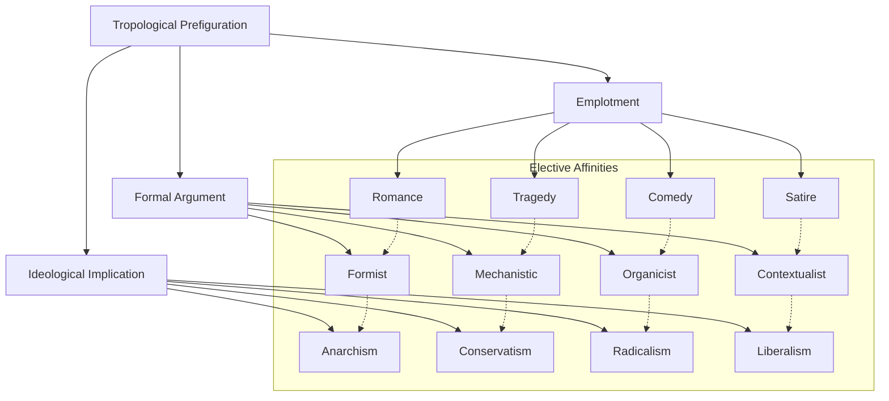
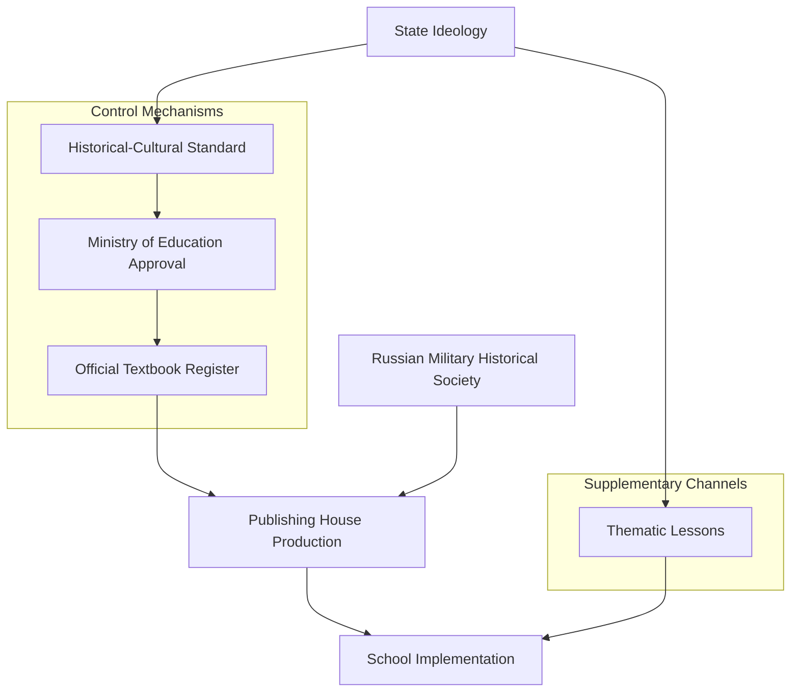
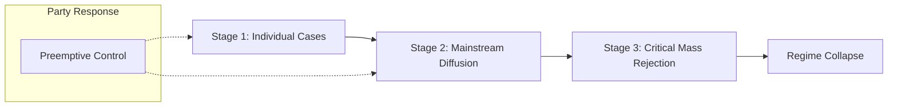
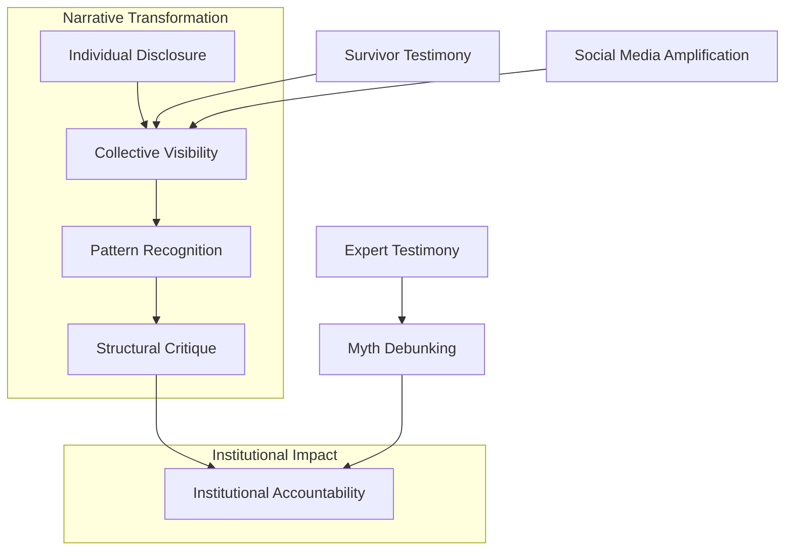
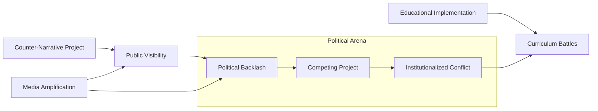
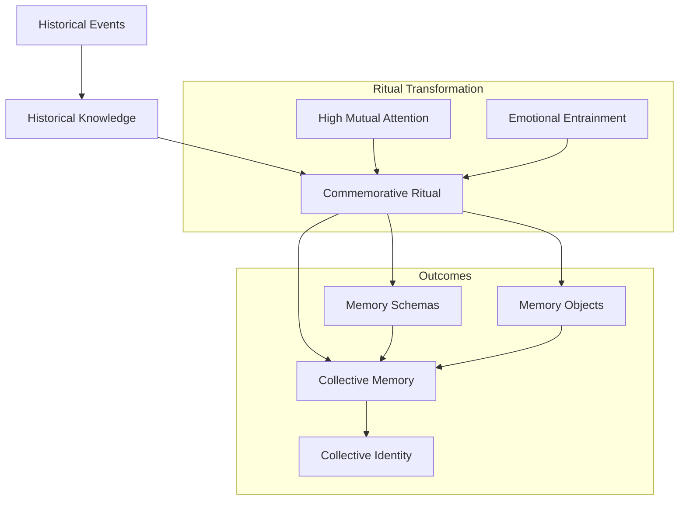
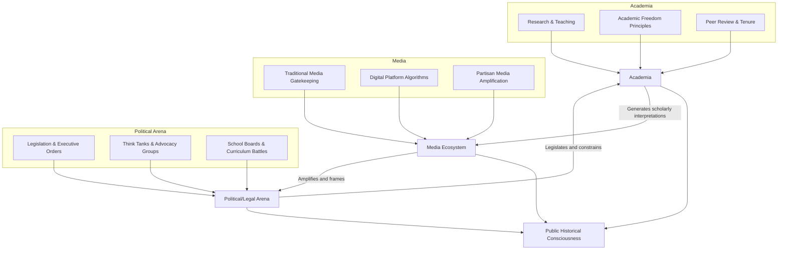
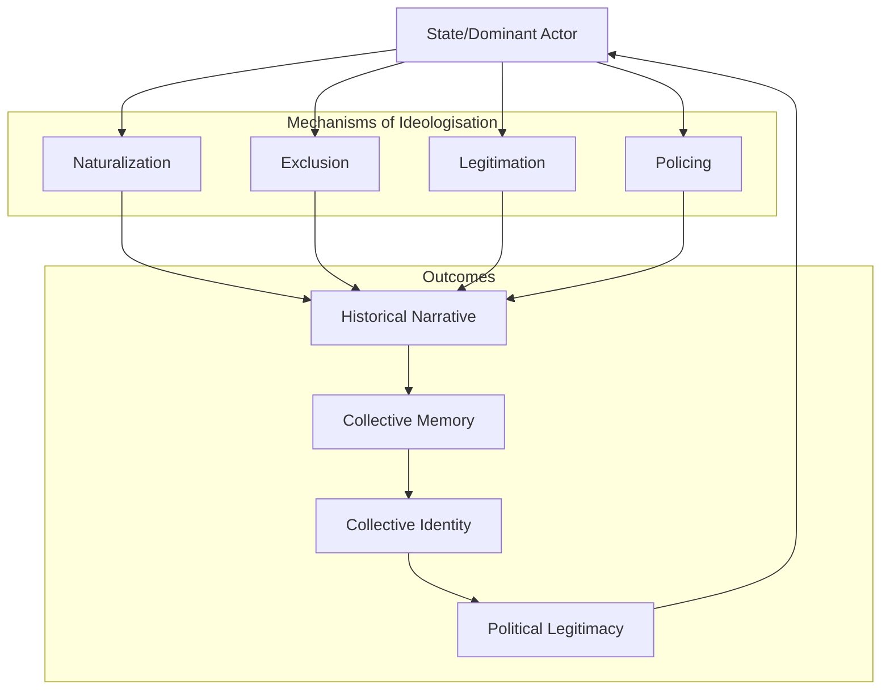

# Reinterpreting the Past: The Ideologisation, Instrumentalisation, and Reclamation of Historical Narratives in Contemporary Contexts
# 1 Theoretical Foundations: Ideology, Frameworks, and the Nature of Historical Knowledge

This chapter establishes the conceptual and philosophical groundwork for analyzing the ideologisation and instrumentalisation of historical narratives. It systematically examines the key theoretical constructs—ideology, interpretive frameworks, and epistemological debates—that shape how history is written, understood, and contested. The interrogation of these foundational concepts reveals how they enable or constrain the production of historical knowledge, setting the stage for subsequent analysis of how historical narratives are appropriated and reclaimed in contemporary contexts. Understanding these theoretical underpinnings is essential because, as the following analysis demonstrates, the act of historical reinterpretation is fundamentally an act of re-framing and re-narrativization, inevitably engaging with ideological substrates and contested standards of validity.

## 1.1 Ideology and Ideologisation: Conceptual Definitions and Critical Perspectives

The concept of ideology stands at the center of any serious analysis of how historical narratives are constructed, contested, and transformed. However, the term itself carries multiple, sometimes conflicting meanings that must be carefully distinguished before it can serve as an effective analytical tool. Scholarly discourse has developed two fundamentally different approaches to ideology: a **descriptive-explanatory** approach that treats ideology as a neutral feature of human cognition, and an **evaluative-critical** approach that views ideology as a mechanism of social domination and distortion.

### Descriptive-Explanatory Conceptions of Ideology

In its descriptive-explanatory sense, ideology refers to **shared mental models constituted by interrelated sets of beliefs, categories, and ways of understanding the world**[^1]. This conception employs the term in evaluatively neutral terms, understanding ideologies as simplified representations that provide individuals with an evaluative orientation in the social world, reducing great complexity to more manageable form and supplying a sense of meaning, coherence, and often a group-based identity[^1]. From this perspective, ideologies can be seen as necessary for human beings in complex, large-scale societies, functioning to supply psychological goods for the individual and coordination for groups[^1].

Research in the psychology of ideology has further refined this descriptive approach by proposing that ideological thinking possesses a common psychological structure regardless of its specific content. This structure comprises two fundamental components: a **doctrinal component** characterized by rigid adherence to certain tenets and resistance to evidence-based belief updating, and a **relational component** manifested through in-group favoritism and out-group antagonism[^2]. These components can be further decomposed into four researchable sub-components: rigid descriptions of the world, rigid prescriptions for behavior, strong in-group identification, and hostility and prejudice toward out-groups[^2]. This structural approach enables comparison across different ideological systems—whether political, religious, or otherwise—and helps diagnose thinking patterns ranging from ideological extremism to moderation.

### Evaluative-Critical Conceptions of Ideology

The evaluative-critical tradition, rooted primarily in Marxist thought, employs ideology as a **pejorative term** whose common theme is that ideologies support unjust social orders[^1]. Critical theorists hold that ideologies facilitate injustice through **false consciousness**—consciousness that includes beliefs that are misleading, distorting, or otherwise not accurately reflective of the social facts they purport to characterize[^1]. Raymond Geuss has identified three distinct modes of ideology critique: **epistemic critiques** that argue the processes by which ideological beliefs are formed and disseminated are epistemically defective; **functional critiques** that criticize ideologies based on their negative effects, particularly their support for unjust social orders; and **genetic critiques** that argue understanding how ideologies originate provides conclusive reasons for their rejection[^1].

The foundational Marxist understanding locates ideology within the **base-superstructure model**, wherein the economic base (mode of production) constitutes the real foundation of society, upon which rises a legal, political, and ideological superstructure[^3]. Art and literature, as parts of this superstructure, are therefore parts of a society's ideology. However, Marx and Engels did not conceive this relationship mechanically; elements of the superstructure constantly react back upon and influence the economic base[^3]. The task of Marxist criticism becomes examining how literary and cultural texts reflect, mediate, or challenge the ideology of the dominant class within specific historical periods[^4].

### Marxist Developments: Hegemony, Aesthetic Distance, and Textual Silences

Subsequent Marxist theorists significantly developed this foundational framework. **Antonio Gramsci's concept of hegemony** describes how the ruling class obtains the consent of the ruled by disseminating its views as consensus, making its particular worldview appear as universal common sense[^4]. For Marxist critics, literature becomes a site where this hegemonic operation takes place, naturalizing certain social relations while marginalizing alternatives.

**Louis Althusser** introduced a more nuanced understanding of art's relationship to ideology. In his view, art is held within ideology but can also distance itself from it, allowing us to **perceive and "see" ideology** through its formal structures[^5]. This "internal distanciation" means that art does not simply reproduce ideology but can make it visible, thereby performing a critical function. **Pierre Macherey** developed this Althusserian insight into a sophisticated theory of literary production, arguing that ideology is both inscribed in and "redoubled" or "made visible" by literary texts as much by what they do not say as by what they overtly proclaim—texts are structured by **eloquent silences**[^5]. A work's significance lies in its gaps, silences, and conflicts of meaning, which reveal the limits of its ideology[^3].

**Georg Lukács** introduced the concept of **reification**, analyzing how capitalist society transforms human relations into seemingly natural, thing-like relations, a process he traced in the forms of the modern novel[^4]. Great "realist" art, for Lukács, achieves a complex totality embodying the "typical" or most historically significant forces of an era, in contrast to "naturalism" which merely reproduces surface phenomena, or "formalism" which dissolves objective reality into abstract subjectivity[^3].

### Feminist and Anti-Racist Extensions

Critical ideology theory has been extended beyond class analysis to address gender and race. **Feminist critiques** view ideology as a mechanism through which social structures perpetuate male domination over women[^1]. Sexist ideology fosters false beliefs about natural differences between men and women, and when widely held, these beliefs affect social practices, norms, and traditions in ways that perpetuate gender hierarchy[^1]. Similarly, **critical race theorists** argue that racist ideologies are built upon racial differentiation to create or perpetuate unjust social relations[^1].

These extensions demonstrate that classist, sexist, and racist ideologies construct representations of social reality that engender false beliefs about groups of people and the individuals within them, bolstering social hierarchies by supporting attitudes and actions that perpetuate them[^1]. The concept of **epistemic injustice**, developed by Miranda Fricker, identifies how ideological distortions produce specifically cognitive harms: **testimonial injustice** occurs when an individual's testimony is given lower credibility than warranted due to prejudices, while **hermeneutical injustice** occurs when the lack of a concept results in an individual being at a disadvantage in understanding their social experiences[^1].

### The Process of Ideologisation

Understanding ideology in both its descriptive and critical dimensions illuminates the process of **ideologisation**—the means by which historical narratives become saturated with ideological content. This process operates through several mechanisms: the naturalization of historically contingent social arrangements as eternal or inevitable; the elevation of particular class, gender, or racial perspectives to the status of universal truth; and the systematic exclusion or marginalization of alternative viewpoints. Ideologisation often masks its own constructed nature, presenting ideologically laden interpretations as objective descriptions of reality. The recognition of this process is essential for any critical analysis of how historical narratives serve particular interests while claiming to represent the past "as it actually was."

## 1.2 Interpretive Frameworks and Narrative Structures in Historiography

Historical inquiry cannot proceed without conceptual frameworks that organize, select, and explain the phenomena under investigation. These frameworks are not optional additions to historical research but constitute its very possibility. This section examines how frameworks function in historiographical practice and how narrative structures actively shape historical understanding, drawing on recent historiographical philosophy and the influential narratological theory of Hayden White.

### The Indispensable Role of Frameworks in Historical Explanation

To identify a series of events as relevant to a historical outcome, one must make assumptions about how the relevant domain works[^6]. These assumptions are provided by a **framework**—a set of factors and interlocking principles that purportedly govern the way historical phenomena operate[^6]. Frameworks thus provide the conceptual scaffolding necessary for historical explanation, enabling historians to construct meaningful patterns from the chaos of past events.

Frameworks perform their work through three interconnected operations: **indexing** (specifying the central subject around which a narrative is constructed), **explanatory expectations** (determining which features count as explanatory factors within the narrative context), and **contrast/comparison sets** (identifying other events, properties, or processes against which the index is related or distinguished)[^7]. These factors function together as selection principles guiding the historian's foregrounding and backgrounding decisions.

The operation of frameworks can be illustrated through the historiography of Newton's first optical paper. Different frameworks have produced markedly different historical narratives of the same subject:

| Framework | Scholar | Index | Key Explanatory Factors | Newton's Image |
|-----------|---------|-------|------------------------|----------------|
| Baconian experimental philosophy | Dana Jalobeanu | Methodological development | Connections to Boyle and Hooke | Baconian experimentalist |
| Chemical corpuscularianism | William Newman | Chemical influences | Inspiration from Boyle's chemistry | Chemist |
| Mathematization of natural philosophy | Peter Dear | Mathematical methodology | Isaac Barrow's influence | Mathematical experimentalist |
| Political context | Simon Schaffer | Power dynamics | Role of experiments in establishing authority | Political actor |

This plurality demonstrates a crucial insight: **for a given historical event, there is no single correct framework, but rather multiple different frameworks that are more or less appropriate in different contexts and for different purposes**[^7]. This framework pluralism—termed "ecumenism"—holds that if a framework is used to highlight a set of contrasts relative to a historical event, and there are multiple valid sets of contrasts that might interest us, then multiple legitimate frameworks should exist for any single historical event[^7].

### Frameworks, Counterfactuals, and Future Scenarios

Frameworks are linked to historical explanation through their role in establishing **counterfactual dependencies**[^6]. Explanation must answer the question "Why X rather than Y?" by pointing to factors Z and W such that if the situation were W rather than Z, the outcome would be Y rather than X[^6]. Tracking such counterfactual dependency patterns requires understanding the causal structure of the target system, which frameworks provide.

This connection between frameworks and counterfactuals has significant implications. Frameworks not only enable us to understand historical sequences but also to construct complex counterfactual past scenarios by providing their skeletal structure[^6]. Moreover, the same frameworks that structure historical explanation can generate logically plausible future scenarios, since constructing future scenarios requires assuming the causal structures present in future situations and using principles to reason about their consequences[^6]. This leads to the "**walk the talk**" principle: commitment to a historiographical explanation is commitment to a set of possible futures, because both share a commitment to the framework[^6].

### Hayden White's Narratological Theory

No theorist has more profoundly influenced contemporary understanding of narrative's role in historiography than **Hayden White**. His 1973 work *Metahistory* challenged the view that history operates in a manifestly different mode from literature, arguing instead that historical narratives are verbal constructions whose form fundamentally shapes their content[^8][^9].

White's theory posits that a **deep structural content lies beyond the surface level of historical texts**—what he calls the "metahistorical element"[^8]. This latent poetic and linguistic content serves as a paradigm for what an "appropriate" historical explanation should be. The historian's work is fundamentally a **poetic and constructive act** in which the historian creates the field of study by shaping the past at a conceptual level[^10].

#### Tropological Prefiguration

At the deepest level of historical consciousness, White identifies **four master tropes** that prefigure the historical field: **Metaphor, Metonymy, Synecdoche, and Irony**[^9][^11]. These tropes are not mere rhetorical devices but the deep, poetic structures that shape how historians perceive, organize, and explain historical data[^11]. The choice of a governing trope is made for aesthetic or moral reasons, and because all are equally legitimate ways of organizing reality, no single trope is inherently more accurate than another[^11].

This tropological prefiguration controls what is seen as evidence and how data are synthesized[^11]. The theory of tropes provides a method to describe the dominant historical thinking modes, with each mode representing a stage in a discursive tradition evolving from Metaphorical understanding, through Metonymic and Synecdochic understanding, to an Ironic apprehension of the irreducible relativism of all knowledge[^9].

#### Emplotment, Argument, and Ideological Implication

Following the prefigurative act, the historian constructs the narrative through three interconnected levels of conceptualization[^11]:

**Emplotment** involves arranging events into a plotted story, gradually revealing it as a particular kind of story[^12]. White borrows Northrop Frye's classification of plot structures: Romance, Tragedy, Comedy, and Satire[^11]. Explanation through emplotment provides the story's "meaning" by identifying the "kind" of story being told[^12].

**Explanation by formal argument** involves applying a nomological-deductive structure, which White categorizes into four paradigms: Formist, Organicist, Mechanistic, and Contextualist[^11]. Each paradigm has an "elective affinity" with a specific trope and plot type.

**Ideological implication** represents the narrative's prescription for social praxis[^11]. White identifies four corresponding modes: Anarchism (associated with Metaphor/Formist argument, idealizing a remote past of natural innocence), Radicalism (associated with Metonymy/Mechanistic argument, viewing utopian conditions as imminent), Conservatism (associated with Synecdoche/Organicist argument, perceiving society's current structure as sound), and Liberalism (associated with Irony/Contextualist argument, projecting improvement into the remote future while discouraging radical present action)[^11][^13].

#### The Constructed Nature of Historical Narrative

White's most significant contribution is his insistence that **historical narratives are constructed, not found**[^11]. The historian confronts a chaos of events from which to choose, and facts are constructed by the questions asked rather than simply discovered[^11]. This constructive nature places history in the camp of art rather than science, allowing for multiple correct views of any object under study[^11]. The value of a historical work depends on the **consistency, coherence, and illuminative power** of its vision, not merely the data or theories used[^11].

White's argument that narrative is not neutral but "entails ontological and epistemic choices with distinct ideological and political implications" means that narrative is "inextricably bound to issues of authority"[^9]. Dominant social groups have wished to control their culture's authoritative myths, supporting the view that social reality can be lived and understood as a story[^9].

### The Annales School Contrast

White's position stands in marked contrast to the **Annales School**, which rejected narrative as unscientific and sought to bring historiography closer to the social sciences[^10]. For Annales historians, traditional historical narrative was insufficiently scientific due to its similarity to and origins in literature, capable only of presenting a simplified, superficial version of past reality[^10]. They advocated for non-narrative, analytical approaches dealing with previously neglected subjects like economic and social structures.

The fundamental difference lies in their conception of narrative's function: **for Annales historians, narrative is primarily a style of presenting historical knowledge that can be abandoned; for White, narrative is the fundamental mode of understanding history and organizing relevant knowledge, making it inescapable**[^10]. Both approaches, however, agree that narrative does not truly represent or refer to the past in a direct correspondence sense[^10].

## 1.3 Epistemological Debates: Objectivity, Constructivism, and Postmodern Critiques

The theoretical foundations of historical reinterpretation cannot be fully understood without engaging the fundamental philosophical tensions surrounding historical knowledge itself. This section examines the contested terrain between traditional claims to historical objectivity, constructivist and social epistemological challenges, and the radical critiques posed by postmodernism.

### Traditional Claims to Historical Objectivity

The traditional ideal of historical objectivity aspires to reconstruct the past "as it actually was" (*wie es eigentlich gewesen*), in Leopold von Ranke's famous formulation. Historians of the late nineteenth century argued that historical writing was like scientific analysis, possessing no aesthetic form and constituting no "narrative" in the literary sense[^9]. This positivist aspiration sought to establish history as a rigorous discipline capable of producing knowledge that accurately corresponds to an independent past reality.

This objectivist tradition, as characterized by Richard Rorty, holds that **the mind is primarily a discovery function oriented toward the cognition of facts**[^14]. The agenda was to give a true account of the world and use it to make the world better. However, Rorty argues that due to problems of skepticism and the divorce of fact and value, this tradition achieved neither a satisfactory account of truth nor a connection between truth and action, leading philosophy to dead-end in skepticism and irrelevance[^14].

### Feminist and Social Epistemological Reconstructions

Contemporary feminist and social epistemology has mounted a sophisticated challenge to traditional objectivity while simultaneously seeking to reconstruct rather than simply abandon the concept. **Helen Longino** attempts to explain how critical discussion of the goals and standards of scientific inquiry is both possible and desirable[^15]. Through "effective critical interaction," we "transform the subjective into the objective, not by canonizing one subjectivity, but by ensuring that what is recognized as knowledge survives criticism from multiple perspectives"[^15].

For Longino, scientific reasoning is objective only when practiced in a scientific community satisfying specific conditions: **shared standards and public forums for criticism; theories responding to criticism of evidence, methods, assumptions, and reasoning; the community as a whole responding to such criticism; and basic intellectual authority equality among qualified inquirers**[^15]. This approach reconceives the cognitive processes of scientific inquiry as themselves social, beginning from science as social practice rather than individual mental activity[^15].

**Sandra Harding** and other difference feminists have sought to reconstruct objectivity through the distinction between "strong" and "weak" objectivity[^15]. **Weak objectivity** refers to the mainstream, detachment-based conception that intentionally or unintentionally shields the scientific social community from criticism. **Strong objectivity** takes into account the knower's position and links rationality and objectivity to openness to criticism[^15]. Feminist critique, in this view, actually "pushes economics to become more objective" by freeing it from one-sided, male-centered assumptions[^15].

#### Problematic Conceptions of Objectivity

Feminist epistemologists have identified several specific conceptions of objectivity as particularly problematic:

| Problematic Conception | Definition | Feminist Critique |
|----------------------|------------|-------------------|
| **Aperspectivality** | Objective knowledge obtained through a "view from nowhere" | Evidence is multiply interpretable; perspective is a source of reasons and evidence[^15] |
| **Detachment** | Scientists adopt emotionally distant, controlling stance toward research objects | Blocks acknowledgment of how values shape inquiry; shields values from critical scrutiny[^15] |
| **Value-neutrality** | Knowers adopt evaluatively neutral stance toward objects of knowledge | Self-deceptive and unrealistic; even activist motivations can promote objectivity[^15] |

**Elizabeth Anderson** argues that detachment prevents acknowledgment and confirmation of how values shape inquiry, shielding those values from critical scrutiny[^15]. The critique of value-neutrality is particularly significant: critics respond that the boundary between science and policy is harder to maintain and less desirable than commonly supposed[^15].

### Postmodern Critiques: White and the Linguistic Turn

The most radical challenge to historical objectivity comes from postmodern thought, which fundamentally reshapes historical inquiry by questioning the foundations of historical writing itself[^16]. Postmodernism rejects the Enlightenment project's claims to universal knowledge, arguing that **truth is contingent, constructed through language, and inherently shaped by power relations**[^16]. This stance questions the legitimacy of scientific objectivity, historicism, and humanism, instead arguing that all knowledge is situated and perspectival.

**Hayden White's *Metahistory*** is typically regarded as the landmark moment when the linguistic turn and rhetorical turn entered historiography[^10]. White's critical approach to the basic premises of scientific historiography placed him in a marginal position within the historical profession, embodying critique of the dominant, normative historical science represented by the Annales School[^10].

White's argument that **history operates through literary and rhetorical structures indistinguishable from fiction** challenges the traditional historian's aim of reconstruction[^11]. If historical narratives are verbal constructions whose value lies not in fidelity to data but in consistency, coherence, and illuminative power, then history becomes an artistic creation rather than a scientific discovery[^11]. White explicitly stated that *Metahistory* was "a rebellion against positivism" aimed to "deconstruct the so-called science of history"[^9].

The postmodern critique extends beyond White to broader challenges to metanarratives and stable truth. **Jacques Derrida's deconstruction**, through concepts like *différance*, challenges the idea that understanding achieves determinate meaning, suggesting discursive experience is characterized by a structure of difference and deferral[^17]. Postmodernists further challenge the binary structures underpinning modernist thought, arguing these are artificial and exclusionary, reinforcing power hierarchies rather than reflecting objective reality[^16].

### Counter-Critiques: Relativism and Epistemological Paralysis

The postmodern critique of historiography has provoked significant counter-arguments. Critics argue that its **radical relativism not only undermines historical inquiry but also social change**[^16]. By deconstructing metanarratives and rejecting objective knowledge, postmodernism challenges traditional epistemology but risks making all knowledge equally valid or equally meaningless. If power is dispersed across innumerable discourses, does this obscure the structural forces shaping society?

The most contested aspect is postmodernism's claim that **objective reality is unknowable**, viewing all facts as mediated by language, making historical events purely textual constructions[^16]. Critics argue this approach blurs the distinction between major historical tragedies and trivial events, and by undermining the capacity to distinguish historical accuracy from ideological distortion, postmodernism potentially fuels misinformation rather than combating it[^16].

**Hayden White's theory has been specifically critiqued for being overly reductive**[^11]. Questions arise whether the four tropes are sufficient to account for the full range of historical consciousness, with critics suggesting that other prefigurative factors—such as the historian's cultural situatedness, access to evidence, and the "givenness" of language and subject matter—are equally important[^11]. The critique contends that by focusing almost exclusively on narrative form and tropological determinism, White risks severing the essential connection between historical narrative and the empirical remains of the past, potentially reducing history to purely rhetorical performance[^11].

### Pragmatist Alternatives

**Richard Rorty's pragmatism** offers an alternative path through these debates. Rorty develops what he calls "epistemological behaviorism," arguing that **knowledge is a matter of conversation and social practice rather than an attempt to mirror nature**[^18]. This view combines arguments from Wilfrid Sellars and W.V.O. Quine to suggest we see knowledge as social justification of belief rather than accuracy of representation[^18].

Rorty's position is not subjectivism or relativism in the traditional sense; rather, he argues that both are products of the representationalist paradigm he seeks to reject[^18]. His mature view holds that while "truth" has various important uses, **it does not itself name a goal toward which we can strive over and above warrant or justification**[^18]. Aiming for truth, as opposed to warrant, does not point to a possible line of action[^18].

This leads Rorty to embrace what he calls "ethnocentrism"—the acknowledgment that we cannot escape our cultural contingency, and that adjudicating conflicts involves comparing alternatives through description rather than invoking transcendent rationality[^18]. The "**liberal ironist**" combines awareness of her commitments' contingency with a commitment to reducing suffering, recognizing that any particular description of reality or of the self is adopted for contingent reasons[^18].

### Hermeneutical Perspectives

**Hermeneutics** offers yet another approach to these epistemological debates. Contemporary hermeneutics, shaped by Martin Heidegger and Hans-Georg Gadamer, emphasizes the "**hermeneutical circle**" where understanding is achieved circularly through renewed attention to the presuppositions informing our existing understanding, rather than by building on secure foundations[^17].

Gadamer argues that the hermeneutical experience of truth is conditioned by **tradition and language**[^17]. Tradition, as a process of historical transmission, is a legitimate source of authority and truth, and our understanding is governed by prejudices shaped by this tradition. The success of understanding involves a "**fusion of horizons**" where our interpretive horizon expands through engagement with the subject matter[^17]. This perspective acknowledges the situated nature of all understanding while maintaining that genuine understanding remains possible through interpretive engagement.

## 1.4 Synthesis: Theoretical Implications for Analyzing Historical Reinterpretation

The preceding theoretical discussions collectively illuminate the complex dynamics through which historical narratives are ideologised, instrumentalised, and potentially reclaimed. This synthesis articulates how ideology, frameworks, and epistemological positions interact to produce contested historical accounts, establishing analytical criteria for examining contemporary practices of historical appropriation and counter-narrative construction.

### The Interconnection of Ideology, Framework, and Epistemology

The theoretical foundations examined reveal historical reinterpretation as a field defined by the negotiation of several interconnected tensions:

**First, the tension between mediation and access**: All history is mediated by language, narrative form, and ideological frameworks (as White and Marxist critics demonstrate), yet pragmatic and reformed epistemological approaches maintain the desire to make warranted claims about the past. This tension cannot be resolved by simply choosing one side; rather, it must be navigated through reflexive awareness of the mediating structures while maintaining commitment to evidential accountability.

**Second, the tension between explanation and interpretation**: History operates both as a framework-based explanatory endeavor (using counterfactual reasoning to establish causal dependencies) and as a hermeneutic, literary practice of meaning-making (through emplotment and tropological prefiguration). These are not mutually exclusive but represent different dimensions of historical understanding that any comprehensive analysis must address.

**Third, the tension between power and knowledge**: The Marxist and postmodern perspective that knowledge production is inextricable from power relations and ideological struggle stands in productive tension with traditional and revised ideals of objectivity that seek normative standards for evaluating claims. Recognizing the role of power does not eliminate the need for evaluative criteria but rather demands that such criteria be developed with awareness of their situatedness.

**Fourth, the tension between pluralism and consensus**: The acceptance of multiple, equally valid historical frameworks for a single event (framework pluralism) must be balanced against the search for communal, critically-achieved consensus on historical understanding. This tension is particularly acute in contexts where competing historical narratives carry significant political stakes.

### Analytical Criteria for Subsequent Analysis

The theoretical framework developed in this chapter establishes several analytical criteria that will guide examination of contemporary practices:

| Analytical Dimension | Key Questions | Theoretical Source |
|---------------------|---------------|-------------------|
| **Ideological Function** | Whose interests does the narrative serve? What social relations does it naturalize or challenge? What silences structure the text? | Marxist ideology critique; Macherey's theory of textual silences |
| **Framework Structure** | What index, explanatory expectations, and contrast sets organize the narrative? What is foregrounded and backgrounded? | Historiographical philosophy of frameworks |
| **Narrative Strategy** | What tropological mode prefigures the narrative? What emplotment and ideological implications follow? | White's narratological theory |
| **Epistemological Commitment** | What claims to objectivity or truth does the narrative make? How does it position itself relative to evidence and alternative accounts? | Debates on objectivity, constructivism, postmodernism |
| **Critical Potential** | Does the narrative enable or constrain critical reflection? Does it acknowledge its own constructedness? | Feminist epistemology; hermeneutics |

### The Act of Reinterpretation as Re-Framing and Re-Narrativization

The core insight emerging from this theoretical analysis is that **the act of historical reinterpretation is fundamentally an act of re-framing and re-narrativization**. When contemporary political and social movements reinterpret historical narratives, they are not simply correcting factual errors or adding new information; they are:

1. **Shifting the ideological function** of the narrative—challenging whose interests it serves, exposing previously naturalized social relations as contingent, and giving voice to previously silenced perspectives.

2. **Reconfiguring the framework** through which events are understood—changing the index around which the narrative is organized, introducing new explanatory expectations, and establishing different contrast sets that highlight previously invisible connections or distinctions.

3. **Transforming the narrative structure**—adopting different tropological modes that prefigure the historical field differently, employing alternative plot structures that give events different meanings, and drawing different ideological implications about social praxis.

4. **Repositioning epistemological commitments**—challenging claims to objectivity that mask particular perspectives as universal, insisting on the situated character of knowledge, and demanding recognition of previously excluded epistemic authorities.

### Implications for Understanding Contemporary Contestation

This theoretical foundation has several implications for understanding how historical narratives are contested in contemporary contexts:

**The inevitability of ideological engagement**: Any historical narrative, whether it acknowledges it or not, operates within ideological coordinates. The choice is not between ideological and non-ideological history but between reflexive awareness of ideological positioning and naive reproduction of dominant frameworks. Counter-narratives that seek to reclaim silenced voices are not introducing ideology into a previously neutral domain but rather challenging the ideological work performed by existing narratives.

**The legitimacy of framework pluralism**: The recognition that multiple frameworks can legitimately organize understanding of the same historical events provides theoretical grounding for the coexistence of competing historical narratives. However, this pluralism does not entail that all narratives are equally valid; frameworks can be evaluated according to their explanatory power, their treatment of evidence, and their acknowledgment of their own limitations.

**The political stakes of narrative form**: White's demonstration that narrative form carries ideological implications means that struggles over historical interpretation are not merely about which facts to include but about how events are emplotted and what political orientations those emplotments imply. The choice between tragic and comic emplotment, for instance, carries different implications for present action.

**The possibility of critical reconstruction**: Despite postmodern challenges to objectivity, feminist and social epistemology demonstrates that critical, reflexive practices can produce more adequate historical understanding. The goal is not a "view from nowhere" but a view that acknowledges its situatedness while remaining open to criticism from multiple perspectives and committed to expanding the community of recognized epistemic authorities.

These theoretical foundations establish the conceptual vocabulary and analytical tools necessary for examining how historical narratives are being reinterpreted through contemporary political and social lenses. The subsequent chapters will apply these tools to analyze specific mechanisms of ideologisation, efforts to reclaim silenced narratives, commemorative practices, and institutional struggles over historical authority.

## 2 Mechanisms of Ideologisation: How Political Agendas Reshape Historical Narratives

The theoretical foundations established in Chapter 1 revealed that historical narratives are inevitably constructed through ideological coordinates, interpretive frameworks, and narrative structures that carry political implications. This chapter moves from abstract theoretical concepts to their concrete operational manifestations, systematically analyzing the specific mechanisms through which contemporary political ideologies instrumentalize historical narratives. The analysis examines how state-sponsored ideological frameworks actively reshape historical understanding to serve political legitimation, how discursive strategies police the boundaries of acceptable historical interpretation, and how competing philosophical positions on value pluralism and monism structure debates over historical truth. These mechanisms operate across different state ideologies and political systems, exhibiting identifiable patterns that illuminate the dynamic relationship between power, knowledge, and the construction of collective memory.

### 2.1 State Ideological Frameworks and the Construction of Historical Legitimacy

State ideologies do not merely interpret the past; they systematically construct historical legitimacy through institutionalized mechanisms that subordinate historical inquiry to political imperatives. This section examines how Marxist-Leninist frameworks and nationalist narratives operationalize the theoretical insights from Chapter 1, demonstrating how ideology functions to naturalize contingent social arrangements as historical necessity through comprehensive control over historiographical production.

#### The Soviet Model: Paradigmatic Ideological Historiography

Soviet historiography represents the paradigmatic case of state-controlled historical production, where **dialectical and historical materialism predetermined research conclusions** and subordinated all historical inquiry to party ideology. The methodology of history studies by historians in the Soviet Union was marked by restrictions imposed by the Communist Party of the Soviet Union (CPSU), creating what scholars have characterized as a system where science was subservient to the party line[^19]. This subordination was not incidental but structural: historical materialism identified the means of production as the chief determinants of historical development, with class struggle as the motor of history progressing inevitably through socioeconomic formations toward communism[^19].

The crystallization of this framework occurred with the publication of Stalin's "Short Course" History of the Soviet Communist Party in 1938, which **established the five official periods of history**—primitive-communism, slavery, feudalism, capitalism, and socialism—and was declared by the Central Committee to be an "encyclopedia of philosophical knowledge" and the only permitted interpretation[^19]. This canonization exemplifies how state ideology transforms contingent historical interpretation into mandatory orthodoxy, foreclosing alternative frameworks while presenting a particular narrative as objective historical truth.

The mechanisms of control extended throughout the entire apparatus of historical production:

| Mechanism | Implementation | Effect |
|-----------|---------------|--------|
| **Archival Restriction** | Historical archives were closed to independent research | Alternative narratives could not access evidentiary basis |
| **Mandatory Citation** | Historians required to reference Stalin and Marxist-Leninist classics | Ideological conformity enforced through scholarly practice |
| **Textbook Revision** | Textbooks rewritten periodically; figures like Trotsky removed or vilified | Historical memory systematically reconstructed |
| **Event Suppression** | Events like the Molotov-Ribbentrop Pact secret protocol censored | Inconvenient facts eliminated from official record |
| **Questioning Criminalized** | Non-conformist history erased and questioning made illegal | Dissent transformed into criminal act |

The Soviet interpretation of Marxism thus **predetermined research, limiting explanations to Marxist theories** and positioning the Communist Party as the infallible vanguard and protagonist of history[^19]. This framework operationalizes what Chapter 1 identified as ideology's function in elevating particular class perspectives to the status of universal truth while systematically excluding alternative viewpoints.

#### Leninism's Authoritarian Foundations

The theoretical foundations for this historiographical control derive from **Leninism's fundamental distrust of spontaneity**—a conviction that historical events, if left to themselves, would not bring the desired socialist society[^20]. Lenin was not convinced that workers would inevitably acquire proper revolutionary consciousness through material conditions alone, as traditional Marxism predicted; instead, he emphasized the indispensable role of the communist elite—the "workers' vanguard"—in forcing through historical transformation[^20].

This Leninist framework carried profound implications for historiography. If historical consciousness cannot emerge spontaneously from material conditions but requires direction by a scientifically-informed vanguard, then **historical interpretation itself becomes a domain requiring party guidance**. The authoritarian aspect appeared in the insistence upon a "proletarian dictatorship" following the seizure of power—a dictatorship that in practice was exercised by Communist Party leaders[^20]. In practice, Leninism's pursuit of socialist society resulted in the creation of a totalitarian state where every aspect of political, economic, cultural, and intellectual life was regulated by the Communist Party in strict fashion that tolerated no opposition[^20].

The consequences for historical knowledge were severe: **the assumption of the class character of all intellectual and moral life led to a relativization of the standards of truth, ethics, and justice**[^20]. Historical truth became subordinate to revolutionary necessity, and terror was applied without hesitation when ideological conformity required enforcement. Leninism thus created not only the first modern totalitarian state but also the first systematic apparatus for the ideological control of historical memory.

#### Contemporary Russian Manifestations

The legacy of Soviet historiographical control persists in contemporary Russia, where institutional mechanisms continue to shape official historical narratives. The **Russian Military Historical Society (RMHS)**, run by former Minister of Culture Vladimir Medinsky, has overseen the development of new history textbooks that maintain continuity with Soviet-era approaches while adapting to contemporary political requirements[^21]. One teacher characterized Medinsky's textbook as "quite good and balanced educational material" that "tries to provide different points of view on the events of Russian history," yet noted that "the section on the period of the collapse of the Soviet Union and modernity differs sharply in tone and rather resembles a set of journalistic clichés of the modern media, but not an attempt of historical analysis"[^21].

The formal apparatus of textbook control illustrates how state ideology operationalizes narrative construction:

Each history textbook in the Russian Federation must comply with the "Historical-cultural standard," and all approved textbook lines are added to an official register controlled by the Ministry of Education[^21]. The most powerful publishing house, "Prosveshchenie," dominates the market, and the most popular textbooks have been criticized for "returning to the language of the Cold War, emphasizing patriotism and national identity" as well as for using heroic semantic constructions in relation to figures like Stalin and Putin[^21].

The deployment of specific discursive concepts reveals how contemporary Russian historiography constructs legitimacy for territorial claims and political positions. In relation to territorial expansion, terms such as **"discovery," "accession," "reunification," "entry," and "request for entry"** are commonly used[^21]. These semantic choices naturalize imperial expansion as voluntary incorporation rather than conquest, transforming contingent historical outcomes into expressions of inevitable national unity. The concept of **"fraternal peoples"** serves similar legitimating functions, constructing an essentialized Slavic unity that justifies contemporary political interventions as the restoration of natural historical relationships[^21].

#### Patriotic Education and Historical Consciousness

The mechanisms through which state ideology shapes historical consciousness extend beyond formal textbook content to encompass broader patriotic education initiatives. Post-Soviet Russian textbooks between 1992 and 2004 portrayed a new national identity signaling a radical ideological repositioning, with **pluralism and critical awareness replacing Marxism-Leninism as the new dominant discourse**[^22]. However, this pluralistic opening proved temporary.

The spirit of patriotism and nationalism has been consistently used to depict the evolution of Russian national and cultural identity. Grade 8 textbooks remind students that history is about patriotism and citizenship, and that Russia became a "great nation in the world"[^22]. One of the explicit goals of teaching history is **values education and patriotic upbringing**, mainly through the study of the Great Fatherland's War (World War II)[^22]. This approach instrumentalizes historical education not merely for knowledge transmission but for the cultivation of emotional attachment to the state and willingness to sacrifice for national purposes.

The political sensitivity of historical interpretation was dramatically illustrated by the **textbook scandal involving Igor Dolutsky's 2002 textbook**, which asked students to discuss whether Putin's leadership was an "authoritarian dictatorship." Putin reacted that school history textbooks should inculcate a feeling of pride and focus on great achievements, and Dolutsky's textbook was stripped of its ministry license in November 2003[^22]. Subsequently, all history textbooks had to be examined by a panel of experts, establishing formal mechanisms for ideological vetting that persist to the present.

In September 2022, the Minister of Education of Russia announced the development of new curricula for both Russian and world history in one course, as well as the creation of **a single standardized history textbook** to be financed from the state budget[^21]. This move toward unification represents the culmination of trends toward ideological monism in historical interpretation, eliminating the framework pluralism that Chapter 1 identified as theoretically legitimate in favor of a singular, state-sanctioned narrative.

### 2.2 'Historical Nihilism' as a Discursive Weapon: Policing the Boundaries of Historical Interpretation

While the Soviet and Russian cases demonstrate institutional mechanisms of historiographical control, the Chinese Communist Party (CCP) has developed a sophisticated discursive strategy for policing historical interpretation through the concept of **"historical nihilism" (历史虚无主义)**. This concept functions as a strategic weapon to delegitimize critical reassessments of Party history while presenting the dominant narrative as objective historical truth—exemplifying how accusations of ideological deviation operate as forms of epistemic policing that foreclose alternative frameworks.

#### Document Number Nine and the Codification of Ideological Threats

The systematic articulation of historical nihilism as an ideological threat appears most clearly in **Document Number Nine**, officially titled "Communiqué on the Current State of the Ideological Sphere," a confidential internal document circulated within the CCP in 2013 by the General Office of the Central Committee[^23][^24]. The document identifies seven "noteworthy problems" threatening ideological security, with **promoting historical nihilism to undermine the history of the CCP and New China** listed as the sixth threat[^23][^24].

The document's characterization of historical nihilism is revealing:

> Historical nihilism, under the guise of "re-evaluation," distorts Party history and New China history. Its main manifestations include: denying revolution, claiming that the revolution led by the CCP "only played a destructive role"; denying the historical inevitability of China's choice of the socialist road, calling it "going astray," and characterizing Party and New China history as "a series of continuous errors"; denying established historical events and figures, disparaging revolutionary predecessors, and vilifying Party leaders[^25].

This definition reveals how the concept functions: **any critical reassessment of revolutionary history, socialist development, or Party leadership can be classified as "nihilism"** and thereby delegitimized as ideologically motivated attack rather than legitimate historical inquiry. The document explicitly warns that "Western anti-China forces and domestic 'dissidents'" are actively infiltrating China's ideological sphere, and that failures in the ideological sphere can result in major disorders[^23][^24].

The prelude to Document Number Nine identifies six challenges to China's ideological control that contextualize the concern with historical nihilism:

| Challenge | Description |
|-----------|-------------|
| Cultural penetration | Western hostile forces using media, cultural commodities, and academic exchanges |
| Subversive social thoughts | Ideas aimed at subverting mainstream ideology |
| Soviet collapse impact | Undermined belief due to the collapse of the Soviet Union |
| Development themes | Downplaying of ideological opposition due to modernization goals |
| Diverse values | Negative impact of diverse value orientations |
| Information networking | Challenges posed by internet and digital communication |

The document's prescribed responses include strengthening leadership in the ideological sphere, guiding party members to distinguish between true and false theories, maintaining unwavering adherence to the principle of the Party's control of media, and conscientiously strengthening management of the ideological battlefield including internet management[^23][^24][^25].

#### The Soviet Precedent and the Three-Stage Threat Model

The CCP's concern with historical nihilism is explicitly linked to the **Soviet precedent**—the fear that critical reassessment of Party history could trigger the same ideological collapse that destroyed the Soviet Union. Xi Jinping articulated this connection shortly after assuming power, declaring that the "complete negation" of Soviet history and "negating Lenin, negating Stalin" amounted to historical nihilism that "caused ideological confusion" and rendered "Party organizations at all levels virtually ineffective"[^26]. A 2022 documentary directly linked historical nihilism to the Soviet collapse, reinforcing this cautionary narrative[^26].

For Xi Jinping, **the correct view of history is primarily not an academic question but a political question**[^26]. This framing transforms historical interpretation from a domain of scholarly inquiry into a matter of regime security, justifying the subordination of historiographical practice to political imperatives. The Party theorists have articulated a **three-stage threat model** describing how historical nihilism could trigger systemic collapse:

First, individual cases of historical nihilism appear; second, historical nihilism spreads in mainstream society; finally, its spread continues until a critical mass of people completely reject the system, leading to its collapse[^26]. Because of these concerns, the Party maintains high vigilance, eager to preemptively prevent the spread of this ideological corrosion[^26].

#### Extension to Cultural Nihilism and Knowledge Autonomy

Since 2022, the CCP has extended its concern beyond historical nihilism to **"cultural nihilism"**—a perceived threat capable of severing the PRC's spiritual identity and leading to complete Westernization[^26]. This extension reflects a broader defensive posture against what the Party perceives as Western ideological penetration across multiple domains.

The response to cultural nihilism involves the construction of **"independent knowledge systems"** and the promotion of **"Chinese-style modernization"**—strategies of conscious intellectual separation designed to insulate Chinese discourse from Western conceptual frameworks[^26]. This approach exemplifies how ideological defense mechanisms extend beyond the policing of historical interpretation to encompass the entire structure of knowledge production, seeking to establish alternative epistemological foundations that cannot be challenged through Western-derived critical frameworks.

The January 2025 warning from the CCP Central Party School's theoretical newspaper *Xuexi Shibao* illustrates the evolving nature of this concern. The article warned that in the AI era, historical nihilism has become more **"circuitous and hidden"**—AI models trained on information the Party-state considers unreliable can repackage and disseminate nihilist narratives through deepfakes, fabricated historical texts, manufactured images, bot armies, and recommendation algorithms tailored to individual preferences[^26]. The threat lies in audiences gradually reinterpreting history and drawing "wrong conclusions" through exposure to alternative narratives.

#### Historical Nihilism in Educational Contexts

The concept of historical nihilism has been specifically applied to educational materials, demonstrating how discursive policing extends to the formation of historical consciousness among youth. Analysis of Hong Kong high school history textbooks has identified what Chinese scholars characterize as **historical nihilism features** in historical perspectives, themes, and narrative discourse—specifically, idealist tendencies in historical perspective and hidden, guided characteristics in historical narrative[^27].

The claimed harms of such textbook content include negative impacts on Hong Kong youth students' formation of correct historical perspectives, damage to national political identity, and serious threats to the implementation of national educational sovereignty in Hong Kong[^27]. Proposed corrective measures include guiding Hong Kong history textbook compilation with "correct historical perspectives," strengthening communication between Hong Kong and mainland textbook compilation and review, and improving the ideological security review mechanism for history textbooks[^27].

This application reveals how the concept of historical nihilism functions as a **flexible discursive weapon** that can be deployed against any historical interpretation deviating from Party-approved narratives. The accusation of nihilism delegitimizes alternative frameworks not through substantive engagement with their historical arguments but through political labeling that marks them as threats to ideological security.

### 2.3 Textbooks as Instruments of Ideological Transmission

History textbooks function as primary mechanisms through which ideological frameworks are transmitted, contested, and perpetuated across generations. Far from neutral repositories of historical knowledge, textbooks operate simultaneously as **collective memory agents, instruments of socialization, and sites of identity politics**. This section examines how state control over curriculum standards, approval processes, and publishing determines narrative content, and how the textbook form itself sustains ideological frameworks even when explicit content changes.

#### The Textbook as Complex Educational Resource

History textbooks are complex educational resources embedded not only in the wider context of education, politics, media, culture, and commerce but also in the context of a specific professional discipline[^28][^29]. Since the 1980s, they have typically consisted of three products: the main textbook with stories, source fragments, images, graphs, maps, and references; a workbook with assignments for students; and a teachers' guide[^28][^29]. Recently, history textbooks have become even more hybrid as they expand to include associated educational websites and digital media.

The special status of history textbooks derives from their function as **repositories of "true" and "valid" knowledge** that learners are expected to master[^28][^29]. This canonical function gives textbooks authority that extends beyond mere information transmission to the shaping of historical consciousness itself. Furthermore, textbooks transmit preferred values, norms, behaviors, and ideologies, functioning as instruments for socialization and identity politics[^28][^29].

The nineteenth-century emergence of nation-states buttressed the professionalization of history into a scientific discipline, with historians building infrastructure to institutionalize the transmission of patriotic values and historical knowledge about the nation[^28][^29]. According to scholars, "the state elites and the majority of professional historians presupposed that education in (national) history was essential for 'nation-building' and for 'responsible citizenship'"[^28][^29]. In the period of nation-building—which often implied the exclusion of cultural and ethnic minorities—both historical scholarship and school history were major producers of national narratives.

#### National Narratives and Their Mobilizing Power

National narratives in textbooks have proven **extremely explosive in their consequences** since the nineteenth century. They have often contributed to the mobilization of the masses for war and for committing genocides by presenting tendentious myths or distorted understandings of the past, while conversely wars were in their turn major sources for producing national narratives[^28][^29]. This reciprocal relationship between national narratives and violence underscores the stakes involved in textbook content.

By "national narratives," scholars mean often canonized stories about a nation's origin and achievements, and the perceived characteristics of a national community, produced to make sense of past events and to create cohesion in the present with a view to the future[^28][^29]. The plots of these narratives are governed by nations as principal actors, and they appeal to young people through their provision of identity and meaning.

The "textbook wars" of the 1990s and 2000s illustrate how political elites, opinion leaders, historians, education experts, and teachers negotiate or even fight about which historical topics are relevant and worthy of presentation in textbooks, and in what ways[^28][^29]. These conflicts become particularly intense during major social and political transformations, which often leave their mark on textbook contents and perspectives.

#### Russian Textbook Development: From Pluralism to Unification

The Russian case provides a telling illustration of textbook development across political transitions. Following the 1989 regime change, Russia faced "the enormous task of revising and rewriting textbooks to adjust to a new reality," which provoked fierce debates[^28]. The new post-Soviet textbooks portrayed a new national identity signaling radical ideological repositioning, setting out to overturn the Soviet emphasis on orthodoxy in historical interpretation by encouraging critical consciousness among students and approaching history from multiple perspectives[^22].

However, this pluralistic opening proved temporary. President Putin has asked historians to develop a "history curriculum that would produce a single history free 'from internal contradictions and ambiguities'"[^28]. These plans to produce new history books have raised particular concern, with critics arguing that the proposed version of history is "highly politicised and grossly distorts the facts"[^28].

The trend toward unification accelerated after the 2003 textbook scandal, when Putin directed the Russian Academy of Science to examine all history textbooks due to complaints from World War II veterans[^22]. Some final-year history textbooks were pulped for portraying unfavorable images, such as huge Soviet losses early in the war. A 1992 textbook had mentioned 2 million Red Army soldiers captured between June 1941 and May 1942, with 663,000 captured during the early phase of the battle for Moscow; these specific figures do not appear in more recent textbooks[^22].

#### Thematic Lessons and Supplementary Channels

State ideological messaging extends beyond formal textbook content through supplementary channels that reinforce official narratives. With the start of full-scale hostilities in Ukraine, the Russian leadership needed to convey its position to a broader audience, including students. **Thematic lessons and homerooms** are used to justify the war and transmit ideological content that supplements or extends textbook materials[^21].

A teacher described several such lessons implemented after February 2022:

| Lesson Topic | Content | Ideological Function |
|--------------|---------|---------------------|
| Justifying the war | Russia not to blame; Ukrainian authorities blamed for oppressing Russian-speakers | Responsibility deflection |
| Brotherhood of Slavs | Ukrainians and Belarusians as fraternal peoples | Historical unity narrative |
| Anglo-Saxon world | Critique of Western powers | External enemy construction |
| "Fakes" and hybrid war | Media literacy framed as defense against Western propaganda | Information control |
| Heroism | Stories about heroes of the "special military operation" | Sacrifice valorization |

Despite statements from individual Russian officials about dramatic textbook changes, current textbooks have already been sufficiently adjusted so that thematic lessons and homerooms correlate well with their content, sharing the same factual tropes (such as "fraternal peoples," "reunification of Ukraine with Russia") and semiotic devices[^21]. This alignment demonstrates how **formal and informal channels of ideological transmission reinforce each other** to create a coherent narrative environment.

#### The Holistic Approach to Textbook Analysis

Recent scholarship has developed a **holistic approach** to textbook research that analyzes the textbook as an integrated whole rather than examining individual topics in isolation[^28][^29]. This approach reveals how historical knowledge is organized through the arrangement of chronological time, the selection and naming of events and periods, and the use of colligatory concepts. Moreover, it enables researchers to trace underlying conceptions of history—specific interpretations of the relationship between past, present, and future.

This research trend highlights the construction of national narratives in history textbooks and the **less visible ways in which they are perpetuated**[^28][^29]. Through holistic analysis, scholars can identify how composition, periodization, and visual intertextuality sustain national narratives even when explicit content appears to change. The notion of **"multidirectional textbook narratives"**—narrations that combine different histories, places, and times to generate meaning from historical combinations—reveals patterns of meaning in the narration of national history[^29].

History textbooks can thus contain a set of resonating stories that together constitute, affirm, and inculcate a national narrative[^29]. Some national narratives are simply "too good not to be told," persisting across political transitions and textbook revisions because of their narrative power and identity-forming function[^29]. This persistence demonstrates how ideological frameworks can survive explicit content changes by operating at deeper structural levels of narrative organization.

### 2.4 Pluralism versus Monism in Historical Interpretation: Philosophical Stakes and Political Implications

The tension between pluralist and monist approaches to historical interpretation connects abstract philosophical debates to concrete political struggles over historical narrative. This section examines how different positions on the fundamental question of whether one or multiple interpretive frameworks should govern historical understanding manifest in educational policy, state control mechanisms, and debates over legitimate historiographical practice.

#### Value Monism and State-Mandated Narratives

**Value monism** in the context of historical interpretation holds that there is one fundamental value or interpretive framework that should govern historical understanding. This position manifests politically in state-mandated unified textbooks, singular "correct" historical views, and the suppression of alternative perspectives. The philosophical appeal of monism lies in its promise of **rational evaluative decision-making**: if there is a single fundamental framework, agents can compare competing historical claims with respect to that standard and reach determinate conclusions[^30].

The monist position faces the **Heterogeneity Argument**: given the vast plurality of valuable historical phenomena that are very heterogeneous, it seems inconceivable how there could be just one fundamental framework that pervades all historical understanding[^30]. The diversity of historical events, actors, and processes appears to resist reduction to any single explanatory or evaluative scheme.

However, **moderate value monism** responds to this challenge by positing that the singular fundamental framework has two relevant dimensions—quantity and quality—rather than being unidimensional[^30]. This position, associated with thinkers like John Stuart Mill and Thomas Hurka, argues that qualitatively distinct aspects of the singular value can account for heterogeneity while maintaining the unity necessary for rational comparison. In historiographical terms, this might translate to a framework that acknowledges diverse historical phenomena while subordinating them to a unified national or ideological narrative.

Contemporary Russian and Chinese educational policies exemplify monist approaches to historical interpretation. Putin's call for a history curriculum "free from internal contradictions and ambiguities"[^28] and the CCP's campaign against historical nihilism both seek to establish **singular authoritative narratives** that preclude legitimate alternatives. The September 2022 announcement of a single standardized Russian history textbook financed from the state budget represents the institutional culmination of monist aspirations[^21].

#### Value Pluralism and Its Political Challenges

**Value pluralism** holds that there is a plurality of values at the fundamental level, implying that multiple legitimate frameworks for understanding the same historical events can coexist[^30]. This position aligns with the framework pluralism established in Chapter 1, which recognized that for a given historical event, there is no single correct framework but rather multiple different frameworks that are more or less appropriate in different contexts and for different purposes.

Pluralists argue they have an edge over monists when it comes to accounting for the conspicuous heterogeneity of historical phenomena and the **rationality of regretting well-justified decisions**[^30]. The Argument from Rational Regret suggests it is rational for an agent to regret a well-justified historical interpretation if it requires disregarding one fundamental value in favor of another, as the loss is not compensated. This captures the intuition that choosing one historical framework inevitably involves sacrificing insights available from alternative perspectives.

However, pluralism faces the **Incomparability Argument**: if there is a plurality of fundamental frameworks, historians would be incapable of comparing their relative merits in the absence of a unifying, more fundamental standard, thus plaguing historical judgment with irrationality[^30]. How can we adjudicate between competing historical narratives if there is no common measure by which to evaluate them?

**Moderate value pluralism** responds by introducing the concept of **"covering values"**—comprehensive evaluative considerations with respect to which the relative weights of conflicting fundamental frameworks can be ascertained[^30]. A covering value has the conflicting frameworks as contributory parts, enabling comparison without reducing plurality to unity. In historiographical terms, this might involve meta-historical criteria (evidential adequacy, explanatory power, coherence) that enable evaluation of competing narratives without privileging any single substantive framework.

#### The Ukraine Crisis as Pluralism-Monism Conflict

The Ukraine crisis illustrates how the tension between pluralism and monism manifests in concrete political conflict. The crisis reveals a **monist vision triumphant in European development**—the European Union becoming the principal representative of what "Europe" means within the Euro-Atlantic alliance system[^31]. While Russia's power system itself is deeply monist, in pan-European politics Russia has advocated for pluralism in the international system—a paradox that remains unreconciled[^31].

Two competing models structure this conflict:

| Model | Conception | Key Features |
|-------|-----------|--------------|
| **Wider Europe** | EU-centric continental project | Monist; EU as sole legitimate European framework |
| **Greater Europe** | Framework for overcoming continental division | Pluralist; different social systems united through respect for sovereignty |

The "Greater Europe" concept, articulated by Mikhail Gorbachev in 1989 and revived by subsequent Russian leaders, envisioned a Europe of different social systems united through respect for sovereignty and political pluralism[^31]. However, this agenda failed to gain traction and is now viewed as merely a Russian attempt to drive a wedge between the EU and the United States[^31].

Within Ukraine itself, the tension manifests as conflict between **"Ukrainization"**—a monist vision of Ukrainian nationhood as having evolved separately from Russia and Belarus—and a more **pluralist interpretation** of Ukrainian history that views Ukraine as a fundamentally diverse community, multicultural and including many indigenous communities[^31]. The debate centers on who has the right to decide what constitutes Ukrainian identity, with the Atlantic community aligned with Ukrainian monists and Russia supporting pluralists[^31].

#### Philosophical Stakes of the Pluralism-Monism Debate

The further debate between value pluralists and value monists should center around **moderate value pluralism and moderate value monism** as the strongest positions in both camps[^30]. An assessment using the notion of metaphysical grounding helps analyze the issues: a value or framework is fundamental if it is not grounded in other values or frameworks.

Moderate value pluralism counters the Incomparability Argument by introducing covering values as **non-fundamental standards of comparison** that are grounded by the fundamental frameworks themselves[^30]. This allows for rational adjudication between competing historical narratives without requiring reduction to a single framework. Moderate value monism counters the Heterogeneity and Rational Regret arguments by conceiving of the singular monistic framework as a **genus whose species are the various framework qualities**; the genus is more fundamental than the species[^30].

For historiographical practice, these positions carry different implications:

- **Moderate pluralism** supports the coexistence of multiple legitimate historical frameworks while maintaining that rational comparison between them remains possible through higher-order evaluative criteria.
- **Moderate monism** supports a unified national or ideological narrative that accommodates diversity as species of a single genus, subordinating heterogeneity to overarching unity.

The political stakes are significant: pluralist approaches challenge authoritarian narrative control by legitimating alternative perspectives, while monist approaches provide theoretical justification for state-mandated singular narratives. Different political systems resolve or exploit this tension according to their requirements for legitimation and control.

### 2.5 Anxiety, Legitimation Crisis, and the Urgency of Historical Revision

The mechanisms of ideological instrumentalization operate not merely at the cognitive level of belief formation but at the **affective level of emotional conditioning and future orientation**. This section examines how political anxiety about regime legitimacy and national survival drives urgent historical revision, demonstrating how historical narratives are constructed to generate emotional responses that mobilize populations for sacrifice and compliance.

#### Collective Future Thinking and Historical Revision

The concept of **"collective future thinking"** provides a framework for understanding how fears of systemic collapse motivate preemptive narrative control. Unlike some countries where national narratives are revised or replaced as social and political systems develop, in Russia there is evidence that **prior narrative templates persist and coexist**[^32]. The state may primarily promote one narrative based on emotional pressure, and in certain cases, this can drive people toward aggression and even death[^32].

Anxiety about the future—particularly whether Russia will exist as a sovereign state—has compelled the current Russian regime to initiate the rewriting of school history textbooks during the Ukraine war, enabling the state to use collective memory to persuade people to participate in brutal conflict[^32]. This instrumentalization of historical narrative operates through the construction of emotionally charged accounts of the past that shape expectations and dispositions regarding the future.

#### Historical Narrative Templates in Russian Historiography

Analysis of Russian history textbooks from the nineteenth century to the present reveals several persistent **narrative templates** that can be activated according to political requirements:

```mermaid
flowchart TD
    A[Imperial Narrative Template] --> E[Contemporary Synthesis]
    B[Early Soviet Narrative Template] --> E
    C[Besieged Fortress Template] --> E
    D[1990s Inclusive Concept] --> F[Marginalized]
    
    A --> A1[Monarchy emphasis]
    A --> A2[Expansion as sacred mission]
    A --> A3[Positive future vision of eternal empire]
    
    B --> B1[Class struggle emphasis]
    B --> B2[World proletarian revolution]
    B --> B3[Russia as vanguard]
    
    C --> C1[Russia surrounded by enemies]
    C --> C2[Internal traitors]
    C --> C3[Sacrifice required]
    C --> C4[Fear and anxiety]
    
    D --> D1[Critical thinking]
    D --> D2[Multiple perspectives]
    D --> D3[Historical responsibility]
```

The **"besieged fortress" narrative template**, introduced during the Stalin period and embodied in Shestakov's textbooks, presents Russia/Soviet Union as constantly surrounded by insidious, aggressive enemies, with internal traitors requiring vigilance, and survival demanding sacrifice and obedience to strong state power[^32]. This template is accompanied by fear, anxiety, and a negative view of the future—emotions that can be instrumentalized for political mobilization.

The **1990s inclusive concept** attempted to introduce critical thinking, multiple perspectives, acknowledgment of historical responsibility, and transformation of blind national pride into reflection[^32]. The future was conceived as a shared responsibility and collective healing. However, this pluralistic approach has been progressively marginalized in favor of templates more amenable to state control.

#### The Putin Era: From Positive Future to Defensive Anxiety

The Putin era has witnessed a transformation in the affective orientation of historical education. Initially, the state promoted a **positive future narrative** based on pride in past glory—denying guilt, beautifying the Soviet period—as exemplified in Filippov's teacher's manual[^32]. However, following the 2011-2013 protests, anxiety about the "Westernization" of the state (especially the younger generation) and external ideological attacks intensified.

This anxiety led to the post-2013 push for unified history textbooks, strengthening patriotism and praise for the state's role while downplaying sensitive events[^32]. The trend toward unification represents not merely administrative rationalization but an **anxious defensive response** to perceived threats to regime legitimacy and national identity.

#### The 2022 War and the Revival of the Besieged Fortress

The 2022 Ukraine war brought anxiety to its peak. Vladimir Medinsky's call for immediate textbook revision reflects extreme survival anxiety[^32]. New "important topic lessons" and revised textbooks (such as Danilov et al.'s 2023 textbook) have revived and strengthened the **besieged fortress narrative**, justifying the war, emphasizing the spirit of sacrifice, and highlighting external (Western, Ukrainian) threats[^32].

Textbooks and teaching materials are designed to create an atmosphere of **fear, uncertainty, and anxiety**, educating the younger generation to sacrifice for the defense of the motherland while promising that those who sacrifice will be remembered forever[^32]. The current message is: the state was forced into war; this is a defensive war to save Russian sovereignty and protect the world from Western aggression; everyone should sacrifice[^32]. The state exchanges obedience for the promise of remembering the sacrificed.

This mechanism reveals how the instrumentalization of history operates at the **affective level**: historical narratives are not merely cognitive frameworks for understanding the past but emotional conditioning devices that shape dispositions toward the future. The construction of anxiety, fear, and resentment through historical education prepares populations for mobilization and sacrifice, demonstrating how ideology's functional role in maintaining social order extends to the management of collective emotions.

#### The Interlocking of Personal and National Futures

Unlike typical research findings where people are optimistic about their personal future but pessimistic about the national future, in contemporary Russia **personal future and national future are tightly connected**[^32]. This fusion represents a successful ideological achievement: individual life trajectories become inseparable from the fate of the nation-state, making personal sacrifice for national purposes appear not as external imposition but as authentic self-realization.

Unless Russia deals with past traumas, people will continue to live among the ghosts of the past, unable to imagine different future possibilities[^32]. The hope expressed by some scholars is that the discussion about the past that began in the 1990s can return, leading Russian society to take responsibility and move toward recovery[^32]. This aspiration points toward the possibility of alternative historical frameworks that acknowledge past harms while enabling collective healing—a possibility that current ideological mechanisms actively foreclose.

The analysis of anxiety-driven historical revision demonstrates how the mechanisms of ideologisation examined throughout this chapter—state ideological frameworks, discursive policing through concepts like historical nihilism, textbook control, and the enforcement of interpretive monism—operate in concert to produce and maintain particular orientations toward past, present, and future. These mechanisms do not merely shape beliefs about what happened but construct the emotional and dispositional foundations for political action, revealing the full scope of ideology's instrumentalization of historical memory.

## 3 Reclaiming Silenced Voices: Social Movements and Counter-Narratives

The mechanisms of ideologisation examined in Chapter 2 revealed how state-sponsored frameworks, discursive policing strategies, and textbook control systematically construct and maintain dominant historical narratives that serve particular political interests. Yet these mechanisms do not operate unopposed. Across diverse social contexts, marginalized groups have organized sustained challenges to master narratives that exclude, distort, or silence their historical experiences. This chapter investigates how gender-based, racial, ethnic, and class-based movements deploy **counter-narratives as tools of epistemic justice**, examining their strategies, achievements, and the formidable obstacles they confront when challenging institutionalized historical authority.

Counter-narrative construction represents more than the addition of previously omitted facts to an existing historical record. As the theoretical foundations established in Chapter 1 demonstrated, historical narratives are structured by ideological frameworks, tropological prefigurations, and emplotment strategies that determine what counts as significant, who qualifies as a historical agent, and which causal relationships appear natural or inevitable. Counter-narratives therefore must operate at multiple levels simultaneously: recovering suppressed evidence, reframing interpretive frameworks, and challenging the epistemological assumptions that rendered certain experiences invisible in the first place. The analysis that follows traces these operations across distinct movement contexts while identifying common patterns, recurring challenges, and the broader implications for historical knowledge production.

### 3.1 Theoretical Foundations of Counter-Narrative Practice

Counter-narratives emerge as deliberate interventions against what scholars have termed **"master narratives"**—the dominant stories that structure collective understanding of the past and become, in one scholar's evocative phrase, "the background music of our lives, undercurrents so ingrained that the violence they often engender is rendered unremarkable"[^33]. These master narratives achieve their power precisely through their apparent naturalness; they present particular perspectives as universal truth while systematically excluding alternative viewpoints. Counter-narratives function to expose this constructed nature, revealing the ideological work performed by seemingly neutral historical accounts.

The theoretical justification for counter-narrative practice draws on the concepts of epistemic injustice developed in Chapter 1. **Testimonial injustice**—the deflation of credibility accorded to marginalized speakers—and **hermeneutical injustice**—the lack of conceptual resources to understand one's own experiences—both operate through dominant historical narratives that delegitimize certain voices while providing interpretive frameworks that obscure structural oppression. Counter-narratives address both forms of injustice by amplifying excluded testimony and developing alternative conceptual frameworks that render visible what master narratives conceal.

Pierre Macherey's concept of **"eloquent silences"** proves particularly relevant here. As established in Chapter 1, literary and historical texts are structured as much by what they do not say as by what they overtly proclaim—their significance lies partly in gaps, silences, and conflicts of meaning that reveal the limits of their ideology. Counter-narratives exploit these silences, treating them not as mere absences but as evidence of active suppression that can be interrogated and filled through alternative methodologies.

Counter-narrative practice operates through several distinct modes that can be analytically distinguished:

| Mode | Description | Methodological Approach |
|------|-------------|------------------------|
| **Recovery** | Bringing to light suppressed or ignored historical experiences | Archival research, oral history, community documentation |
| **Reframing** | Reinterpreting existing evidence through alternative frameworks | Applying new theoretical lenses to familiar material |
| **Speculative Reconstruction** | Imaginatively filling gaps where evidence is absent or destroyed | Critical fabulation, fugitive methodologies |
| **Structural Critique** | Exposing how dominant narratives serve particular interests | Ideology critique, analysis of narrative construction |

These modes are not mutually exclusive; effective counter-narratives typically combine multiple approaches. The recovery of suppressed testimony, for instance, often requires reframing to render that testimony intelligible within new interpretive frameworks, while speculative reconstruction becomes necessary when systematic destruction of evidence has created irreparable archival gaps.

The challenge for counter-narrative practitioners lies in navigating the tension between the **imperative to center silenced voices** and the **epistemological standards** that govern legitimate historical knowledge production. Master narratives derive part of their authority from their apparent conformity to established methodological norms—norms that were themselves developed within frameworks that excluded marginalized perspectives. Counter-narratives must therefore simultaneously challenge dominant content and interrogate the epistemological assumptions that rendered such content authoritative.

In the United States, powerful historical narratives have long dominated public understanding, contributing to a collective memory that reproduces knowledge about events and individuals deemed historically significant while marginalizing alternatives[^34]. The American collective memory has often been built around principles of expanding freedom and nation-building—schematic narrative templates that run deep because they exist outside the bounds of conscious reflection[^34]. These templates rarely acknowledge problematic aspects of the nation's past, creating the conditions for counter-narrative intervention. The difficulty, as scholars have noted, is **"how to tell an almost forgotten story, one often lacking a wealth of archival evidence"**—a challenge that requires "considerable skill, creativity, and imagination"[^33].

### 3.2 Gender-Based Movements and the Reconstruction of Women's Historical Agency

The reconstruction of women's historical agency represents one of the most sustained and theoretically sophisticated counter-narrative projects of the past half-century. Feminist historiography has moved through several phases: from the initial recovery of "women worthies" excluded from male-centered accounts, through the development of women's history as a distinct field, to the contemporary integration of gender analysis as a fundamental category of historical interpretation. Each phase has confronted particular challenges in challenging androcentric narratives while developing methodological innovations that have influenced counter-narrative practice more broadly.

#### The #MeToo Movement: A Case Study in Narrative Transformation

The **#MeToo movement** provides a compelling contemporary case study of how counter-narrative practice can achieve rapid and dramatic shifts in dominant frameworks. The movement's transformation of public discourse around sexual violence illustrates both the potential and the limitations of survivor-led narrative intervention.

The phrase "Me Too" was originally coined by **Tarana Burke in 2006** to provide survivors—especially girls of color in low-wealth communities—with a safe space for disclosure and healing[^35][^36]. Burke's grassroots initiative focused on community-based support and resource provision, operating largely outside mainstream attention. The movement's viral explosion came on October 15, 2017, when actress Alyssa Milano elevated its visibility with a tweet that sparked a hashtag activism movement generating over half a million #MeToo tweets within the first 24 hours[^35].

The speed and scale of this narrative intervention were unprecedented. By the first day's end, the phrase had been used over 200,000 times; by the second day, it had been tweeted more than 500,000 times[^37]. On Facebook, over 4.7 million people used the hashtag in 12 million posts within the initial 24 hours[^37]. Within a week, nearly 1.6 million tweets had been posted, and by October 27, users from 85 countries had participated[^37]. This massive collective disclosure fundamentally challenged what had been termed the nation's **"rape culture"**—a term coined by the New York Radical Feminists collective in 1974 to describe cultural norms that normalize sexual violence, blame victims, and shield perpetrators[^37].

The narrative shift achieved by #MeToo can be understood through the framework of **"rape myth acceptance"** developed by psychologist Martha M. Burt in 1980. Burt defined rape myths as "prejudiced, stereotyped, or false beliefs about rape, rape victims, and rapists"[^37]. Her research demonstrated that substantial portions of the American public accepted these myths—for example, over half of respondents agreed that a woman going to a man's home on a first date "implies she is willing to have sex"[^37]. These myths functioned ideologically to deflect responsibility from perpetrators to victims, supporting what the 2010 FrameWorks Institute study identified as a significant understanding gap between experts and the general public regarding sexual violence[^37].

The #MeToo movement challenged these myths through several interconnected strategies:

The movement's most significant achievement was transforming what had been understood as isolated, individual experiences into **visible patterns of systemic behavior**. The sheer volume of disclosures made it impossible to dismiss sexual violence as rare or exceptional. Furthermore, the movement connected individual experiences to structural analysis, shifting explanatory frameworks from individual pathology (the "sick, deranged mind" conception) to cultural and institutional critique[^37].

The 2020 conviction of Harvey Weinstein demonstrated how this narrative shift could produce concrete legal outcomes. Weinstein's defense relied heavily on traditional rape myths, emphasizing that some accusers had maintained relationships with him after alleged assaults—arguing this proved consent[^37]. However, the prosecution successfully deployed expert testimony from forensic psychiatrist Dr. Barbara Ziv to debunk these myths, explaining that victims of acquaintance rape (85% of cases) rarely report immediately and often maintain contact with perpetrators[^37]. The jury's guilty verdict represented a rejection of the narrative frameworks that had historically protected perpetrators.

#### Intersectional Limitations and Internal Contestation

Despite its achievements, the #MeToo movement also illustrates the **internal contestations** that complicate counter-narrative projects. The movement has been rightfully criticized for the dismissal of contributions from women of color and for generally under-representing their voices[^35]. Analysis of over 600,000 tweets from more than 256,000 unique users revealed that tweets authored by white women were overrepresented compared to other demographics[^35].

This overrepresentation reflects a broader pattern in feminist movements. The movement's default narrative came to privilege and platform the experiences of **white, cisgender, heterosexual women**, thereby undermining the stories of individuals with more complex and intersectional identities[^36]. This phenomenon is rooted in Kimberlé Crenshaw's theory of intersectionality, which demonstrates how multiple axes of marginalization interact to produce distinct experiences that cannot be captured by single-axis analysis.

The differential participation patterns reveal how even counter-narrative movements can reproduce exclusionary dynamics:

| Demographic | Distinctive Topics | Support Strategies |
|-------------|-------------------|-------------------|
| **Black women** | Emotional support; critique of differential treatment in justice system and by police; personal disclosure | More likely to express emotional support |
| **White women** | Sexual allegations against public figures; general political discussions | More likely to include contemporary social/political issues |
| **Black users** | Discussions of race-based discrimination; differential justice system treatment | More likely to express emotional support |
| **White users** | Contemporary social and political issues | More likely to provide informational support |

These patterns demonstrate that intersected identities contributed differing narratives to frame the movement[^35]. Tweets authored by Black women often expressed emotional support and were critical about differential treatment in the justice system and by police, while tweets authored by white women and men often highlighted sexual harassment by public figures and weaved in more general political discussions[^35].

The marginalization of intersectional voices within #MeToo reflects several structural factors identified by scholars[^36]:

- **Racial stereotypes and the "ideal victim" myth**: The Jezebel stereotype, depicting Black women as hyper-sexualized, plays a role in dismissing their experiences of sexual violence[^36].
- **LGBTQ+ exclusion**: Despite being four times more likely to face assault than cisgender persons, LGBTQ+ representation has been scarce because the movement's public nature renders members vulnerable—voicing trauma could mean revealing sexual identity[^36].
- **Disability barriers**: People with disabilities are twice as likely to be sexually assaulted, yet face accessibility barriers both institutional (lack of sign language interpreters) and social (online movements being inaccessible)[^36].

The **Survivor Agenda**, launched in June 2020, represents an effort to address these limitations by building power and changing the conversation "especially for those most marginalized, oppressed by our society's structural forces"[^37]. This initiative articulates four pillars for a new narrative: listening to and believing survivors; recognizing that survivors come from diverse backgrounds and amplifying the most marginalized voices; treating sexual violence as a public health crisis requiring respect and support; and demanding cultural change and institutional accountability[^37].

#### Fugitive Methodologies and the Recovery of Silenced Women

Beyond contemporary movements, feminist historiography has developed innovative methodologies for recovering women's experiences systematically excluded from traditional archives. Scholars like **Saidiya Hartman** and **Erica Armstrong Dunbar** have excelled at advancing crucial counter-narratives for Black women, demonstrating how creative and imaginative approaches can address archival silences[^33].

Hartman's work privileges forgotten Black women of the nineteenth and twentieth centuries following Reconstruction, while Dunbar illuminates the life of an enslaved woman who escaped to freedom during the Revolutionary War era[^33]. Building a counter-narrative necessitates not simply making visible "a problem" but **beginning where most master narratives retreat: the margins**. For these scholars, marginalia become the center—so-called minor figures become key players, witnesses, and protagonists[^33].

Hartman's *Wayward Lives, Beautiful Experiments* focuses on the decades immediately following slavery and Reconstruction, examining how young Black women in Philadelphia and New York lived under everyday threats of arrest for suspicion of "illicit" or "immoral conduct"[^33]. Her methodology employs **speculative imaginings and possibility** to elaborate on the potential thoughts, wishes, and fears each character might have experienced. Hartman crafted a counter-narrative liberated from the judgment and classification that subjected young Black women to surveillance, arrest, punishment, and confinement[^33]. The endeavor is to "recover the insurgent ground of these lives; to exhume open rebellion from the case file, to untether waywardness, refusal, mutual aid, and free love from their identification as deviance, criminality, and pathology"[^33].

Dunbar's *Never Caught* similarly reorients readers away from charitable readings of the first First Family, decisively affirming that the Washingtons fought tirelessly to retain ownership of other humans[^33]. When the Washingtons relocated from Mount Vernon to Philadelphia, Pennsylvania law dictated that enslaved persons be freed after six months; the Washingtons instead sent them back to Mount Vernon every six months, circumventing the law[^33]. Ona Judge's escape to New Hampshire and her refusal of Washington's emissaries demonstrates **fugitive agency** that master narratives systematically obscured.

What marks this turn in Black women's writings is how both subjects and research methods are defined by **"fugitivity"**—for both authors, writing is itself a fugitive act, "a stealing away of the remnants and fragments of conventional historical records"[^33]. Their subversive methodology becomes the major practice, relegating original documents to minor status. The truest hope expressed is for a disavowal of the types of documentation, record keeping, and mythologies that don't affirm and sustain Black life[^33].

### 3.3 Racial Justice Movements and the Contestation of National Narratives

Movements for racial justice have mounted some of the most sustained challenges to dominant national narratives, exposing how mainstream historiography has obscured or minimized histories of racial oppression while constructing mythologies of continuous progress and expanding freedom. These movements confront not merely factual omissions but the fundamental **narrative templates** through which national identity is constructed and transmitted.

#### The African American Civil Rights Movement: Traditional and Revisionist Narratives

The historiography of the African American civil rights movement provides a crucial case study in how collective memory is constructed, contested, and potentially transformed. Research has demonstrated that **enduring narratives exist about the civil rights movement** that shape public understanding in ways that limit comprehension of ongoing racial justice struggles[^34].

The traditional narrative confines the movement to the period **1954-1965**, focusing on the South and presenting a story of progress and expanding freedoms[^34]. Studies of how undergraduate students construct their understanding of the movement reveal the power of this traditional template. When asked to select images depicting the civil rights movement, students consistently chose photographs of Martin Luther King Jr., Rosa Parks, and direct action in southern locations[^34]. Of 17 students in one study, 15 chose photographs of King at the 1963 March on Washington; only 6 included images from before 1954; and 92% of the 170 total images portrayed the movement in the South[^34].

Historian **Jacquelyn Dowd Hall** criticized this master narrative as "a narrow, misleading and politicised story that undermines the true legacies of a much longer and ongoing struggle for social justice"[^34]. She promoted a more complex narrative centered on national conflicts over race, class, and gender—including determined activists, persistent opponents, and contentious public policy—from the Great Depression through to the present day[^34]. Hall's assertion that a revised narrative is "harder to simplify, appropriate, and contain" has important implications for historical education[^34].

The **"Long civil rights movement"** framework connects racial justice to workers' rights, viewing economic justice as central to racial equality[^34]. This expanded temporal and thematic scope challenges the traditional narrative's implicit suggestion that the movement achieved its goals and concluded, revealing instead an ongoing struggle with deep historical roots and contemporary manifestations.

Research comparing the effectiveness of different approaches to narrative revision produced striking findings[^34]:

| Group | Intervention | Revised Narrative Characteristics |
|-------|-------------|----------------------------------|
| **Group A** (7 students) | Read Hall's secondary source essay | Selected images reflecting broader narrative; included 19th-century origins, post-1960s efforts, links between race and labor |
| **Group B** (9 students) | Examined 18 primary sources reflecting revisionist interpretation | 85% of images still illustrated events 1954-1968 in the South; largely avoided images associated with broader interpretation |

These results suggest that **secondary sources providing explicit interpretive frameworks are far more effective than primary sources alone** for encouraging revision of conventional historical narratives[^34]. Students in Group A reflected on how teachers and students are "constantly evaluating and re-evaluating" their perspectives, while students in Group B largely commented on their lack of knowledge and perceived narratives as static[^34]. Without a framework, primary sources were insufficient to guide revision.

This finding has profound implications for counter-narrative practice: simply encouraging teachers and students to "do history" and conduct their own online research is unlikely to change persistent narrative structures that continue to enable and excuse systemic racism[^34]. Teachers need effective narrative frameworks from recent scholarship to inform the selection of meaningful primary source evidence to forge powerful counter-narratives[^34].

#### Black Lives Matter and Contemporary Narrative Contestation

The **#BlackLivesMatter** movement, born online through organizers Alicia Garza, Patrisse Cullors, and Opal Tometi, represents a contemporary continuation of racial justice counter-narrative construction[^38]. The movement is linked to persistent racial violence experienced by Black Americans, particularly at the hands of law enforcement[^38]. It was first created as a response to the not-guilty verdict in the killing of Trayvon Martin and grew significantly after the killing of Michael Brown[^38].

Black Lives Matter's counter-narrative challenges several components of dominant frameworks:

1. **The myth of post-racial America**: By documenting persistent patterns of police violence against Black citizens, the movement exposes the falsity of claims that racial equality has been achieved.

2. **Individualized explanations of violence**: By connecting individual incidents to structural patterns, the movement shifts explanatory frameworks from individual officer behavior to systemic racism embedded in institutions.

3. **The neutrality of law enforcement**: By highlighting differential treatment and outcomes, the movement challenges narratives that present policing as racially neutral.

The movement's emergence in 2020 following the murder of George Floyd brought renewed attention to systemic racism and reminded scholars of "the necessity of constantly revisiting students' construction of narratives, and the power that collective memory holds over our understanding of the past"[^34].

#### Essential Knowledge for Understanding American Racial History

Scholars have identified key historical references that every American should know to understand manifestations of race, racism, and racial injustice—and therefore the full American experience[^38]. These references challenge sanitized national narratives:

- **"Merciless Indian Savages"**: The Declaration of Independence's characterization of Native Americans as subhuman, forming "the roots of white supremacy in America"[^38].

- **Frederick Douglass's "What to the Slave is the Fourth of July?"**: This 1852 speech highlighted the hypocrisy of promoting "life, liberty and the pursuit of happiness" while others were enslaved[^38].

- **Japanese American Internment**: The forced internment of approximately 120,000 Japanese Americans during World War II remains "one of the most atrocious violations of civil rights in modern history"[^38].

- **Voter Suppression**: Ongoing efforts to prevent eligible voters from registering or voting disproportionately affect people of color, illustrating how racial disparities are entrenched in US institutions[^38].

- **Color Blindness and White Privilege**: The refusal to acknowledge race allows people to ignore discrimination and privilege, representing "an insidious form of racial oppression"[^38].

- **Antiracism**: The practice of actively identifying and countering racism at all levels, requiring conscious, equitable decision-making and self-reflection[^38].

These concepts provide the interpretive framework necessary for constructing counter-narratives that challenge the "satisfying morality tale" of American progress[^34].

### 3.4 Ethnic and Indigenous Counter-Narratives: Decolonizing Historical Memory

Ethnic minorities and Indigenous peoples face distinctive challenges in constructing counter-narratives against colonial and nationalist historiographies. These groups must contest not only specific historical claims but the **epistemological foundations** of Western historiography itself—foundations that have systematically delegitimized Indigenous knowledge systems while constructing narratives that justify territorial dispossession and cultural erasure.

#### The Chicano Movement: Identity Reclamation and Counter-Narrative Construction

The **Chicano Movement**, also referred to as El Movimiento, exemplifies how ethnic counter-narratives combine identity reclamation with structural critique[^39]. The movement worked to embrace a Chicano identity and worldview that combated structural racism, encouraged cultural revitalization, and achieved community empowerment by rejecting assimilation[^39].

Central to this counter-narrative project was the **reclamation of the term "Chicano/a"** itself. Before the movement, the term had been one of derision, adopted by some Pachucos as an expression of defiance to Anglo-American society[^39]. With the rise of Chicanismo, the term was reclaimed in the 1960s and 1970s to express political autonomy, ethnic and cultural solidarity, and pride in being of Indigenous descent—diverging explicitly from the assimilationist "Mexican-American" identity[^39].

The movement encompassed a broad list of issues: restoration of land grants, farm workers' rights, enhanced education, voting rights, and challenging ethnic stereotypes of Mexicans in mass media and the American consciousness[^39]. This comprehensive agenda reflected understanding that counter-narrative construction required challenging dominant frameworks across multiple institutional domains simultaneously.

The concept of **Aztlán** became a powerful symbol for the movement's counter-narrative[^39]. Aztlán, understood as the place of origin of pre-Columbian Mexican civilization, was taken up by activists to refer to the lands of Northern Mexico annexed by the United States following the Mexican-American War[^39]. Poet Alurista popularized the term at the Chicano Youth Liberation Conference in Denver, Colorado, in March 1969[^39]. This geographical and mythological concept challenged narratives of legitimate American territorial expansion by asserting prior Indigenous presence and ongoing connection to the land.

The movement achieved significant legal victories that institutionalized aspects of its counter-narrative:

| Case | Year | Significance |
|------|------|--------------|
| *Mendez v. Westminster* | 1947 | Declared segregating children of "Mexican and Latin descent" unconstitutional |
| *Hernandez v. Texas* | 1954 | Declared Mexican Americans entitled to equal protection under 14th Amendment |
| *Madrigal v. Quilligan* | 1975 | Obtained moratorium on compulsory sterilization; adoption of bilingual consent forms |

The Chicano Movement also formed strategic alliances with other civil rights movements, demonstrating how counter-narrative construction benefits from coalition building[^39]. The movement was influenced by and entwined with the Black Power movement; both held similar objectives of community empowerment and liberation while calling for Black-Brown unity[^39]. Leaders such as César Chávez, Reies Tijerina, and Rodolfo Gonzales learned strategies of resistance and worked with Black Power movement leaders[^39]. Chicano organizations like the Brown Berets and Mexican American Youth Organization (MAYO) were influenced by the political agenda of Black activist organizations such as the Black Panthers[^39].

However, the movement also faced **severe state repression** that sought to suppress its counter-narrative[^39]. Similar to the Black Power movement, the Chicano Movement experienced heavy state surveillance, infiltration, and repression through organized activities such as COINTELPRO[^39]. Movement leaders like Rosalio Muñoz were ousted, organizations were infiltrated, and political demonstrations such as the Chicano Moratorium became sites of police brutality, contributing to the movement's decline by the mid-1970s[^39].

**Chicana feminists** within the movement confronted gender inequality, challenging both racism and sexism while advocating for reproductive rights, educational opportunities, and labor protections[^39]. This internal critique demonstrated that counter-narrative movements themselves require ongoing reflexive examination to avoid reproducing exclusionary dynamics. Prominent Chicana activists included Dolores Huerta, Elizabeth "Betita" Martínez, Anna Nieto-Gómez, Alicia Escalante, and Enriqueta Vasquez[^39].

Despite its achievements, the Chicano Movement remains "one of the least-studied movements in American history, demonstrating the tendency for Latinx history to be hidden from mainstream American knowledge"[^38]. This ongoing marginalization illustrates how counter-narratives face persistent challenges in achieving institutionalization within dominant historical frameworks.

#### Decolonizing Heritage Practices

Contemporary efforts to decolonize heritage practices address the **epistemological foundations** of how the past is recognized, preserved, and interpreted. A 2021 conference organized by the UK National Commission for UNESCO and the University of Leeds examined how heritage narratives and processes are typically defined and implemented in exclusionary, colonizing, and contested ways[^40].

The conference identified several key challenges:

- **Colonial methods' persistence**: For several centuries, approaches to recognizing, protecting, celebrating, and interpreting heritage have been deeply influenced by dominant methodologies, mainstream classes, and specific political viewpoints[^40].

- **World Heritage List and colonialism**: The list's inclusions have sometimes been related to colonialism, raising questions about whose heritage is recognized as globally significant[^40].

- **Indigenous marginalization**: Indigenous peoples, comprising less than 5% of world population, account for approximately 15% of those in extreme poverty; they use over 4,000 languages (about 20 of which disappear annually) and continue to suffer widespread racial discrimination, marginalization, and erosion of their distinctive heritage[^40].

- **Research funding patterns**: The way academic research is funded and executed reflects continued colonial approaches, supporting the continuation of prevailing narratives and processes created in the Global North[^40].

The conference recommended several approaches for counter-narrative construction in heritage contexts:

1. **Recognizing and disseminating plural, inclusive heritage narratives**, particularly those defined by marginalized communities[^40].

2. **Using creative and arts-based practices** to disrupt existing narratives and processes[^40].

3. **Understanding and deconstructing past and present power relations** to promote equal partnerships[^40].

4. **Challenging dominant languages, protocols, and practices** while promoting more equitable distribution of research funding based on North-South, South-North, and South-South cooperation[^40].

A case study from Eritrea illustrates the complexities of decolonizing heritage recognition[^40]. While UNESCO listed Asmara as a World Heritage site in 2017, critical reflection reveals problematic dimensions. In colonial imagination, Asmara was projected as an "empty space"—the antithesis of "modernity," a frontier inhabited by "backward populations" with no epistemology of their own, making it an ideal site for "imperial projects, modernist aesthetics and fascist motives"[^40]. This raises questions about celebrating colonial urbanism and Art Deco architecture without acknowledging the violence of colonial imposition.

Another case study examined the use of **picture books in cultural heritage and decolonization**[^40]. Dr. Carly Bagelman explored using picture books as important record keepers, documenting both the colonial violence endured by Indigenous peoples in Canada and Indigenous knowledge often dismissed or denigrated[^40]. Her project collaged Namgis Indigenous visual records for illustrations under "fair use" provisions, allowing records to be made public and reimagined[^40]. The inclusion of Kwak'wala vocabulary and phonetics in picture books can also play a role in Indigenous language revitalization[^40].

### 3.5 Labor and Class-Based Counter-Narratives: Recovering Working-Class History

Labor movements and working-class historians have constructed counter-narratives challenging **elite-centered historiography** that treats economic development as the achievement of entrepreneurs and statesmen while marginalizing the experiences and agency of workers. These counter-narratives recover strike histories, labor organizing, and class struggle as central rather than peripheral to national development.

#### The Long History of Labor Struggle

The compilation of **200 moments in labor history since 1824** by the Blackstone River Valley National Historical Park demonstrates the depth and continuity of working-class counter-narrative[^41]. This compilation honors the 200th anniversary of the first wage earner's strike in Pawtucket, Rhode Island—the 1824 Pawtucket Textile Strike, credited as the first industrial strike in American history, led by 101 women weavers who successfully resisted a 25% wage cut[^41].

The timeline reveals patterns systematically excluded from elite-centered narratives:

| Period | Key Developments | Counter-Narrative Significance |
|--------|-----------------|-------------------------------|
| **1820s-1830s** | First unions formed; early strikes for 10-hour day | Workers as historical agents from industrialization's beginning |
| **1840s-1850s** | *Commonwealth v. Hunt* (1842) legalized unions; Lowell Female Labor Reform Association | Legal recognition of collective action; women's labor organizing |
| **1870s-1880s** | Great Railroad Strike (1877); Haymarket (1886); AFL founded | Nationwide class conflict; labor martyrdom; institutional development |
| **1890s-1910s** | Homestead (1892); Pullman (1894); Triangle Fire (1911); IWW founded | Corporate violence against workers; industrial tragedy; radical unionism |
| **1930s-1940s** | Wagner Act (1935); sit-down strikes; Fair Labor Standards Act (1938) | New Deal labor rights; innovative tactics; federal protections |
| **1980s-present** | PATCO strike (1981); declining union density; 2023 strikes | Neoliberal assault on labor; ongoing resistance |

This counter-narrative challenges several dominant frameworks. First, it positions **workers as active historical agents** rather than passive recipients of economic change. Second, it reveals the **violence routinely deployed against labor organizing**—from the Thibodaux Massacre of 1887 (killing approximately 50 African American workers) to the Memorial Day Massacre of 1937 (killing 10)[^41]. Third, it demonstrates the **intersections of labor, race, and gender**: the Atlanta Washerwoman Rebellion of 1881 was a successful strike by African American women; the Brotherhood of Sleeping Car Porters (founded 1925) organized Black railway workers[^41].

#### The British Miners' Strikes: Class, Community, and Memory

The **British miners' strikes of 1972 and 1984-85** provide crucial case studies in how working-class counter-narratives are constructed, transmitted, and contested. The 1972 strike saw miners successfully resist a pay offer worth less than inflation through solidarity tactics including flying pickets that shut down coal movement from power stations and depots[^42]. Driven by rank-and-file workers, rail workers, lorry drivers, dockers, and seafarers all refused to transport scab coal[^42]. Despite almost the entire media being "vociferously opposed to the strike," workers won a pay increase of approximately 21%—well beyond the government's attempted 7-8% cap[^42].

The **1984-85 strike** represents a turning point in British history with profound implications for working-class counter-narrative[^43]. Miners left their pits to fight the Thatcher government's attempt to close collieries, break the miners' union and labor movement generally, and open the way to a free market economy[^43]. The full force of police, courts, and media were mobilized to defeat the miners, culminating in the battle of Orgreave on June 18, 1984[^43]. Thousands of miners were arrested, fined, imprisoned, or sacked, some never to work again[^43].

The slogan "**close a pit, kill a community**" captured the stakes of this struggle[^43]. Miners were powerfully backed by their wives, who saw clearly that without the pits there was little hope for their children's future or the viability of mining communities[^43]. Women set up support groups to run soup kitchens and assemble food parcels, raising money locally, nationally, and internationally[^43]. Behind the women were politically active community members including Greenham Common women and gay and lesbian activists who saw this struggle as a tipping point[^43].

The defeat led to rapid closure of most coal mines, general deindustrialization, rapid privatization, shattering of organized labor, growing unemployment, hollowing-out of working-class communities, and steady increase in social inequality[^43]. Scholars characterize this as marking "the end of twentieth-century Britain and the ushering in of twenty-first century Britain characterised by speculative capitalism, the dismantling of workers' protections and the rise of the gig economy"[^43].

Yet out of the strike came **rebirth in many ways**[^43]. While many former miners faced unemployment, others returned to college and requalified for new professions. Miners' wives, in even greater numbers, returned to education and became teachers, social workers, or probation officers. The strike had politicized mining families and encouraged many to become involved in other causes, to become local councillors or even MPs. While pits closed, the heritage of the mining industry was preserved through mining museums, revival of banner-making for the Durham miners' gala, and the political struggle continues through the **Orgreave Truth and Justice Campaign**[^43].

#### Oral History Methodology in Working-Class Counter-Narrative

The study of the 1984-85 miners' strike demonstrates how **oral history methodology** enables construction of counter-narratives that official archives exclude[^43]. The research draws on approximately 125 life-history interviews conducted in 2019-21 with former miners, miners' wives, miners' children, and members of support groups[^43].

The life-history interview format makes it possible to explore both the political and the personal in testimony[^43]. It provides a narrative arc beginning with lives before the strike, moving to lives during the strike, and concluding with lives after the strike. For the period after the strike, **two dominant narratives are in tension**: one emphasizing how the loss put families under huge stress, hollowed out communities, and replaced the organized working class with an unorganized precariat; another emphasizing how former miners, wives, and children reinvented themselves, furthering education, finding other occupations, and becoming involved in other political and social causes[^43].

The approach examines the strike through three lenses: **class, community, and family**[^43]. Miners forged their sense of themselves as shock troops of the Industrial Revolution; their underground work was elemental and highly dangerous, with camaraderie as a watchword[^43]. As much as they were producers, miners were also fighters—all members of the union, with the strike as their main weapon[^43]. Never to cross a picket line was a question of honor[^43].

Mining communities, often at some distance from towns and cities, developed distinctive solidarities. During the strike, women came into their own, organizing and staffing support groups, setting up soup kitchens, packing food parcels, raising funds, speaking in public, and even joining picket lines[^43]. Many women emerged from the strike in a much stronger position than their husbands who had lost the fight and would soon lose their jobs[^43].

### 3.6 Methodological Challenges: Evidence, Speculation, and Archival Limitations

The construction of counter-narratives confronts fundamental **methodological challenges** arising from the systematic exclusion of marginalized experiences from official archives. These challenges force counter-narrative practitioners to develop innovative approaches that navigate the tension between traditional historiographical standards and the imperative to recover silenced voices.

#### The Problem of Archival Absence

Counter-narratives must contend with archives that are not merely incomplete but **actively structured by exclusion**. As one scholar observes, the difficulty is "how to tell an almost forgotten story, one often lacking a wealth of archival evidence"[^33]. This absence is not accidental; it reflects the systematic devaluation of certain lives and experiences by those who controlled documentation practices.

The concept of **"counter-archive"** has emerged as a methodological response[^44]. Counter-archival practice uses oral history to document experiences that contest state-led or official narratives. A project titled *Remembering Refuge: Between Sanctuary and Solidarity* collected oral histories from asylum seekers crossing the Canada-US border during two crisis moments: the 1980s Central American crisis and the 2017-19 Roxham Road crisis[^44].

This counter-archive methodology illustrates how borders and border practices are navigated and contested, and how lived experiences challenge state-led migration logics and narratives[^44]. The oral histories collectively and individually question narratives that frame migration as "crisis," borders as requiring further securitization, and the Canadian state as offering generous humanitarianism to selected objects[^44]. The political turn activated by the counter-archive places borders as experienced, contested, or refused at the center of analysis[^44].

#### Fugitive and Speculative Methodologies

When archival evidence is fragmentary or absent, some scholars have developed **"fugitive" methodologies** that embrace speculation and imagination as legitimate historiographical tools. Saidiya Hartman's work exemplifies this approach, employing "speculative imaginings and possibility to elaborate on the potential thoughts, wishes, and fears each character might have experienced"[^33].

This methodology is explicitly **subversive**: it relegates original documents to minor status while centering the reconstructed experiences of those the documents marginalized or criminalized[^33]. The approach acknowledges that conventional archives were constructed by power structures hostile to the subjects being recovered; therefore, treating those archives as authoritative would perpetuate the very exclusions counter-narratives seek to challenge.

The fugitive methodology addresses what scholars identify as the **violence and precarity that continue to define so much of Black womanhood**[^33]. By "stealing away" remnants and fragments from conventional historical records, these scholars perform writing as itself a fugitive act[^33]. The ultimate hope is for "a disavowal of the types of documentation, record keeping, and mythologies that don't affirm and sustain Black life"[^33].

#### Counter-Narrative as Research Method

The concept of **counter-narrative as method** has been explicitly theorized in educational research contexts[^45]. Scholars have critiqued how traditional research methods often portray marginalized groups as homogenized and passive, ignoring their internal experiences, emotions, and complex identity negotiations[^45]. Counter-narrative methodology proposes letting subjects tell their own stories in creative forms—such as satirical poetry presented as "frame texts" designed to subvert traditional research discourse[^45].

This methodological shift is crucial for creating more inclusive and empowering research practices[^45]. It allows marginalized subjects to express their emotional truths and promotes more nuanced scholarly discussion attending to their existence, action, and becoming[^45]. The approach calls on academic researchers to reflect on their role in knowledge production and consider how to support marginalized subjects in becoming primary narrators of their own stories—even if this means researchers relinquishing first-author position[^45].

#### The Scaffolding Problem

Research on how students construct historical narratives reveals a crucial methodological insight: **primary sources alone are insufficient to disrupt master narratives**[^34]. Without explicit interpretive frameworks, learners lack the tools to construct counter-narratives from primary evidence.

This "scaffolding problem" has significant implications. Simply encouraging teachers and students to "do history" and conduct their own online research is unlikely to change persistent narrative structures[^34]. The experience of students examining primary sources reflecting revisionist interpretations—yet still producing narratives conforming to traditional templates—demonstrates that **counter-narrative construction requires explicit scholarly framing**[^34].

Teachers need effective narrative frameworks from recent scholarship to inform the selection of meaningful primary source evidence[^34]. Counter-narrative as pedagogical practice therefore requires not just access to alternative sources but explicit instruction in alternative interpretive frameworks that make those sources legible as challenges to dominant narratives.

### 3.7 Political Dynamics of Integration: Institutional Resistance and Narrative Conflict

Counter-narratives seeking integration into mainstream historiography and public memory confront **formidable political obstacles**. Established historical authorities, nationalist movements, and political actors invested in dominant narratives deploy various strategies to resist, marginalize, or suppress alternative accounts. Understanding these dynamics is essential for assessing the conditions under which counter-narratives achieve institutionalization versus remaining oppositional.

#### The 1619 Project versus 1776 Project Debate

The controversy surrounding the **1619 Project** exemplifies how counter-narratives become sites of intense political contestation. The project, arguing against teaching history as a single, simplistic national origin story, advocates for classroom practices that embrace historical nuance and complexity to foster critical democratic citizenship[^46].

The debate between the 1619 Project and the 1776 Project represents competing visions of American national narrative[^46]. One scholar analyzes this as "the danger of a single origin story," arguing that teaching history as national mythology forecloses critical engagement with "the central paradox of American history"—the simultaneous rise of liberty and slavery[^46].

This contestation illustrates broader patterns in narrative conflict:

The conflict extends beyond scholarly debate to curriculum policy, with competing projects seeking institutionalization in educational systems. This demonstrates how counter-narratives, once achieving public visibility, become targets for organized political opposition that seeks to contain or reverse their influence.

#### Online Harassment of Historians

Historians challenging nationalist orthodoxies face **coordinated online harassment** from global neo-nationalist groups[^46]. Scholars working on sensitive topics—including the Holocaust in Poland, caste in India, and comfort women in Japan—report threats and smear campaigns designed to silence their research[^46].

This harassment represents a new form of **institutional resistance** operating outside traditional academic channels. The article "Trolling History" documents how scholars face coordinated attacks that threaten both their professional standing and personal safety[^46]. The phenomenon underscores the importance of institutional support and professional solidarity in defending academic freedom[^46].

#### Professional Associations and Interpretive Pluralism

Professional historical associations navigate tensions between **interpretive pluralism** and the defense of marginalized scholars. The American Historical Association's Statement on Standards of Professional Conduct affirms that "multiple, conflicting perspectives are among the truths of history"[^47]. Everyone who studies history brings identities, experiences, and interests that affect their questions and sources; no single objective account could end "this endless creative dialogue within and between the past and the present"[^47].

The statement acknowledges that historians often disagree—sometimes vehemently—about interpretations and even basic facts[^47]. This can trouble non-historians who imagine history as "a universally agreed-upon accounting of stable facts and known certainties"[^47]. But universal agreement is not a condition to which historians typically aspire; interpretive disagreements are vital to the profession's creative ferment and can contribute to original and valuable insights[^47].

This professional framework supports counter-narrative practice by legitimating interpretive diversity. However, it also creates tensions when counter-narratives challenge not merely specific interpretations but the epistemological foundations of professional practice itself. The statement emphasizes **reasoned discourse** and **mutual respect** as governing values, while acknowledging that "unmediated platforms are perhaps more likely to generate conflict, often through misunderstanding"[^47].

#### Pedagogical Implementation of Counter-Narratives

Educational projects demonstrate how counter-narratives can achieve partial institutionalization through classroom implementation. An undergraduate class titled "(Re-)Producing Race and Gender through American Material Culture" had students create a digital history project based on original research[^48].

Students selected objects including a woman's athletic sweater, children's books, a photograph of Ida B. Wells-Barnett, and paper dolls[^48]. Through scaffolded assignments, they developed their research and collaboratively decided on the framework for their digital project, organizing objects into two categories: **"Narratives" and "Counternarratives"**[^48].

The 21 students co-wrote an introductory post and published their contributions on a WordPress site[^48]. The assignment taught research skills, digital publishing, and engagement with historical methodologies while creating a community of scholars[^48]. This pedagogical approach demonstrates how counter-narrative construction can be integrated into educational practice, training students to recognize and challenge dominant narratives while developing their own alternative accounts.

### 3.8 Synthesis: Counter-Narratives, Epistemic Justice, and the Transformation of Historical Consciousness

The preceding analysis reveals **common patterns** across diverse counter-narrative movements while identifying persistent challenges that complicate efforts to transform historical consciousness. This synthesis evaluates the broader implications for historical knowledge production, connecting findings to the theoretical frameworks established in Chapter 1 and the mechanisms of ideologisation examined in Chapter 2.

#### Common Strategies Across Movements

Counter-narrative movements across gender, race, ethnicity, and class contexts deploy recognizable strategies:

| Strategy | Implementation Examples | Theoretical Function |
|----------|------------------------|---------------------|
| **Centering Lived Experience** | #MeToo survivor testimony; oral histories of miners and asylum seekers | Challenges testimonial injustice by amplifying marginalized voices |
| **Reclaiming Language and Identity** | Chicano/a term transformation; "Me Too" as empowerment phrase | Contests ideological naturalization of derogatory frameworks |
| **Developing Expansive Historical Frameworks** | "Long civil rights movement"; 200 years of labor history | Exposes temporal limitations of dominant narratives |
| **Creating Alternative Archives** | Counter-archive projects; fugitive methodologies | Addresses hermeneutical injustice through new evidentiary bases |
| **Forming Strategic Alliances** | Chicano-Black Power cooperation; miners' strike support networks | Amplifies challenges through coalition building |

These strategies address the forms of epistemic injustice identified in Chapter 1. By centering testimony from those whose credibility has been systematically deflated, counter-narratives challenge testimonial injustice. By developing new conceptual frameworks for understanding experiences previously rendered unintelligible, they address hermeneutical injustice. By exposing the eloquent silences structuring dominant narratives, they reveal the ideological work those narratives perform.

#### Recurring Challenges

Despite these strategies, counter-narrative movements confront persistent obstacles:

**Intersectional exclusion within movements**: Even counter-narrative projects can reproduce exclusionary dynamics, as demonstrated by the marginalization of women of color within #MeToo[^35][^36]. This pattern suggests that counter-narrative construction requires ongoing reflexive examination to avoid replicating the exclusions it challenges.

**Institutional and state repression**: Movements face surveillance, infiltration, and violence designed to suppress their narratives and power, as experienced by the Chicano Movement through COINTELPRO[^39] and by British miners through police action[^42][^43].

**Epistemological and archival bias**: Colonial foundations of heritage practices and archives systematically exclude Indigenous and minority knowledge, requiring fundamental decolonization of methodologies[^40].

**The scaffolding gap**: Primary sources alone fail to disrupt master narratives without explicit scholarly frameworks providing interpretive tools[^34].

**Cultural and ideological conflict**: Counter-narratives become political battlegrounds, as exemplified by the 1619 Project versus 1776 Project debate[^46].

#### Counter-Narratives and the Mechanisms of Ideologisation

The analysis reveals counter-narrative practice as **both response to and site of ideological negotiation**. Counter-narratives respond to the mechanisms examined in Chapter 2 by:

- Challenging state-sponsored frameworks that naturalize particular perspectives as universal truth
- Exposing the discursive policing that delegitimizes alternative interpretations
- Contesting textbook narratives that transmit ideological frameworks across generations
- Advocating for interpretive pluralism against monist enforcement of singular narratives

Yet counter-narratives are themselves ideologically positioned. They operate through frameworks, employ narrative structures, and carry political implications—as White's theory in Chapter 1 demonstrated all historical narratives must. The difference lies not in escaping ideology but in **reflexive acknowledgment** of positioning and commitment to expanding the community of recognized epistemic authorities.

#### Implications for Historical Knowledge Production

The findings suggest several implications for historiographical practice:

**Framework pluralism requires active cultivation**: The recognition that multiple legitimate frameworks can organize understanding of the same events provides theoretical grounding for counter-narrative coexistence with dominant accounts. However, this pluralism does not emerge automatically; it requires institutional support, professional solidarity, and educational implementation.

**Methodological innovation is necessary but insufficient**: Fugitive methodologies, counter-archival practices, and oral history approaches address archival limitations, but their effectiveness depends on accompanying interpretive frameworks that render alternative evidence legible as challenges to dominant narratives.

**Transformation requires institutional engagement**: Counter-narratives that remain purely oppositional achieve limited impact; integration into educational curricula, professional standards, and public commemorative practices is necessary for durable transformation of historical consciousness.

**Epistemic justice remains an ongoing project**: Expanding the community of recognized historical subjects and epistemic authorities is not achieved through single interventions but requires sustained effort across multiple institutional domains.

The counter-narrative movements examined in this chapter demonstrate that the ideologisation and instrumentalisation of history analyzed in Chapter 2 do not proceed unopposed. Marginalized groups have developed sophisticated strategies for challenging dominant narratives, recovering excluded experiences, and demanding recognition as historical agents and epistemic authorities. Yet these movements also face formidable obstacles—from internal exclusionary dynamics to state repression to the epistemological limitations of archives constructed by power structures hostile to their subjects.

The transformation of historical consciousness requires not merely the addition of previously omitted facts but the reconstruction of interpretive frameworks, the development of alternative methodologies, and the sustained institutional engagement necessary to integrate counter-narratives into mainstream historiography. This ongoing struggle over historical memory connects directly to the commemorative practices examined in the following chapter, where monuments, museums, and public rituals become sites where competing narratives are materialized, contested, and negotiated.

## 4 Commemoration as Historiography: Monuments, Museums, and Public Rituals

This chapter examines how commemorative practices function as active forms of historiographical production rather than passive reflections of established historical knowledge. Building on the theoretical foundations of collective memory and the mechanisms of ideologisation analyzed in previous chapters, it investigates how monuments, museums, and public rituals serve as sites where historical narratives are constructed, contested, and transformed. The analysis reveals how these commemorative forms operate simultaneously as instruments of political legitimation and as arenas for counter-narrative intervention, demonstrating that the material and performative dimensions of public memory are integral to understanding how historical interpretations are ideologised, instrumentalised, and potentially reclaimed in contemporary contexts.

### 4.1 Theoretical Frameworks: From Collective Memory to Commemorative Practice

The analysis of commemoration as historiographical practice requires establishing conceptual foundations that illuminate how public rituals, monuments, and museums transform historical knowledge into lived collective experience. This transformation is not a neutral transmission of information but an active process of meaning-making that carries profound implications for collective identity, political legitimation, and the boundaries of acceptable historical interpretation.

#### The Halbwachsian Foundation and Its Durkheimian Roots

The theoretical framework for understanding commemoration derives primarily from **Maurice Halbwachs's Durkheimian theory of collective memory**, which posits that memory is fundamentally a social phenomenon structured by group contexts and social arrangements. According to this framework, collective memory emerges when those who did not personally experience an event identify with those who did, defining both categories of actors as members of the same social group. This process of identification transforms historical knowledge into something experienced as shared personal heritage—a crucial distinction that explains why commemorative practices carry such emotional weight.[^49]

Commemorative rituals function as the primary mechanism through which this transformation occurs. As Halbwachs articulated, **commemoration is a ritual that transforms "historical knowledge" into "collective memory"**, embedding memory schemas and objects that define the meaning of past events as constitutive of collective identity. The ritual nature of commemoration is essential to its effectiveness: following Randall Collins's analysis, rituals combine high mutual focus of attention with high emotional entrainment, producing feelings of membership attached to cognitive symbols.[^49] This "collective effervescence"—to use Durkheim's term—helps participants feel that their purportedly shared past is real and meaningful.

The relationship between commemoration and collective memory can be understood through the following conceptual framework:

Jeffrey Alexander further elaborates the ritual nature of commemoration as involving "repeated and simplified cultural communication fragments in which the direct partners of social interaction, and the observers of that interaction, share mutual belief in the descriptive and normative validity of the communication's symbolic contents and accept the authenticity of one another's intentions".[^49] This mutual belief and acceptance of authenticity is what enables commemorative rituals to generate the emotional force necessary for transforming detached historical knowledge into felt collective memory.

#### The Problem of Negative Events and Difficult Pasts

While the Durkheimian framework effectively explains how commemoration constructs collective identity around **"positive events"**—such as national independence or military victories that produce collective effervescence and reinforce idealized images of the group—it encounters significant analytical limitations when confronting **"negative events"** that present moral ambiguity and controversy. Robin Wagner-Pacifici and Barry Schwartz first identified this analytical gap, emphasizing the need to study events that "not only result in loss or defeat but that also divide and arouse condemnation".[^49]

The distinction between negative events as **moral trauma** and **cultural trauma** proves crucial for understanding commemorative dynamics. While both may originate in psychologically traumatic experiences, they function differently in collective memory: moral trauma divides group members by preserving the event's moral ambiguity, whereas cultural trauma unifies group members by elevating victims to the status of group totems.[^49] The Vietnam War exemplifies a moral trauma for Americans—various actor groups from veterans to peace activists not only fail to share a unified memory schema but continue to contest the meaning of key memory objects intended to commemorate the event.

This recognition of negative events' divisive potential highlights a crucial insight: **commemorative rituals are sites of political contestation**, not merely mechanisms of social integration. Wagner-Pacifici and Schwartz's detailed account of how the Vietnam Veterans Memorial was initiated by politicians, challenged by veterans, and debated by journalists and artists represents a significant departure from functionalist accounts that take commemoration's identity-building function as given.[^49] Similarly, Vera Zolberg's study of the 1996 Smithsonian Hiroshima exhibition controversy and Vered Vinitzky-Seroussi's research on efforts to commemorate Yitzhak Rabin's legacy capture the intense political contestation inherent in commemorative activities. These works emphasize how different groups mobilize and compete over commemoration to promote their particular versions of collective memory, thereby advancing their own political interests and symbolic legitimacy.

#### Temporal Dynamics: Age, Period, and Cohort Effects

Commemorative rituals, by their very definition, are repeated over time to maintain participants' cognitive and emotional schemas about the world and their place within it. This repetitive character aligns with the nature of memory itself—**memory is best understood as a repeated process rather than a static thing or state**. What we call "memory" is an act of remembering or a moment of recall that always involves reconstruction of past experience. At the individual level, memory of an event persists only as repetitions of moments of recall; at the group level, collective memory persists only as repetitions of commemorative activities.[^49]

This temporal dimension introduces considerable complexity through what scholars term **"age-period-cohort" effects** in commemoration. First, repeated commemoration of past events introduces **period effects**: as the historical conditions under which commemorative rituals occur change over time, so do the ways these rituals are organized. Second, repeated commemoration produces **cohort effects**: as older cohorts exit and newer cohorts join in commemorating a past event, the overall composition of memory schemas shifts with the changing participants themselves. Third, period and cohort effects are further complicated by **age effects**: people change how they commemorate past events as they move through different stages of their life course.[^49]

These temporal dynamics create a seeming paradox of continuity and discontinuity. Like any institutionalized practice, commemorative rituals exhibit **path dependence**—once established, the arrangements adopted at their founding become increasingly difficult to change over time. Yet beneath this appearance of persistence, certain aspects of institutionalized commemorative activities are likely changing in response to new political, cultural, and demographic trends. Such gradual change may eventually affect the overall trajectory of commemorative rituals, or combine with contingent events to produce dramatic transformations.[^49]

#### Memory Malleability versus Persistence

The temporal dynamics of commemoration connect to a broader theoretical debate concerning the **malleability versus persistence** of collective memory. A powerful line of "presentism" runs through sociological work on memory, documenting how images of the past change according to present purposes. This presentist perspective, associated with scholars like Hobsbawm and Ranger's analysis of "invented traditions," emphasizes how political actors strategically construct and reconstruct historical narratives to serve contemporary interests.[^50]

However, other scholars highlight significant limits on malleability. Michael Schudson argues that the past is resistant to efforts to remake it due to the structure of available pasts, individual choice, and social conflict. Barry Schwartz responds to cultural claims of malleability by demonstrating that certain pasts are remarkably persistent. Edward Shils emphasizes the insistence of traditional patterns, while Paul Connerton's focus on memory incorporated in bodily practices suggests an "inertial" persistence that operates below the level of conscious reconstruction.[^50]

A useful typology distinguishes six ideal types of mnemonic malleability or persistence:

| Type | Mechanism | Example |
|------|-----------|---------|
| **Instrumental Persistence** | Intentional maintenance by interested actors | State-sponsored commemorations |
| **Cultural Persistence** | Continued relevance to contemporary concerns | Foundational national myths |
| **Inertial Persistence** | Reproduction through habitual practice | Embodied commemorative rituals |
| **Instrumental Malleability** | Strategic reconstruction for present purposes | "Invented traditions" |
| **Cultural Malleability** | Reinterpretation through changing frameworks | Revisionist historiography |
| **Inertial Malleability** | Gradual drift through generational change | Cohort effects on commemoration |

This framework enables analysis of how commemorative practices simultaneously exhibit stability and transformation, resisting simplistic accounts that emphasize either pure construction or pure reflection of historical reality.

#### The Cosmopolitanization of Memory

Contemporary theorists have extended the analysis of commemoration beyond the nation-state framework that dominated classical accounts. Daniel Levy and Nathan Sznaider explore what they term the **"cosmopolitanization" of collective memory** in the twenty-first century. They argue that when memory objects become deterritorialized from their original geographic locations and transform into "empty signifiers" that can connect with commemorations of other events across national boundaries, commemoration becomes cosmopolitanized.[^49]

According to this perspective, globalization and the transnational circulation of memory objects affect the cosmopolitanization of commemoration. As memory objects traverse national boundaries through electronic communication and transportation networks, the collectives that commemoration might constitute also become unbound. In a globalizing world, as the scale of imagined communities changes, people can incorporate "cosmopolitan" horizons into their commemorative rituals, with emotional investment extending beyond the boundaries of any single nation.[^49]

However, **cosmopolitanism by no means eliminates nationalism from commemoration**. The commemoration of the September 11, 2001 terrorist attacks illustrates this complexity. The attacks can be viewed as cosmopolitan events: victims included not only Americans but individuals from over thirty other countries, and the attacks were broadcast in real-time worldwide. In the immediate aftermath, people across different nations commemorated "9/11" as an event concerning all humanity, though this cosmopolitan commemoration varied in intensity and duration across regions. Yet some American politicians and public members also framed the event as constituting a specifically American cultural trauma, using it as nationalist justification for subsequent military and political actions.[^49] When studying the cosmopolitanization of commemoration in a globalizing context, scholars must carefully delineate the complex entanglements between nationalism and cosmopolitanism.

### 4.2 Monuments and Memorials: Contested Sites of Historical Meaning

Monuments and memorials represent the most visible material instantiations of historical interpretation in public space. Far from being neutral markers of the past, they are simultaneously products of political contestation and catalysts for ongoing struggle over collective memory. This section examines how commemorative monuments function as ideological instruments, how their meanings are contested, and how contemporary memorial design has evolved toward more participatory and experiential forms.

#### The Confederate Memorials Controversy: Patterns and Dynamics

The debate over Confederate monuments in the United States provides a paradigmatic case study of how commemorative forms become sites of intense political struggle over historical interpretation. This controversy gained widespread attention following the **June 17, 2015 mass shooting** at Emanuel African Methodist Episcopal Church in Charleston, South Carolina, where a white supremacist who glorified the Confederate South killed nine Black worshippers. The shooter had posed with the Confederate battle flag and visited historical Confederate sites, prompting renewed scrutiny of Confederate symbols in public space.[^51]

The controversy intensified dramatically after the **August 12, 2017 "Unite the Right" rally** in Charlottesville, Virginia, where white nationalists gathered to protest the proposed removal of statues of Confederate generals Robert E. Lee and Stonewall Jackson. The rally turned deadly when a white nationalist drove a vehicle through a crowd of counterprotesters.[^51][^52] In the immediate aftermath, protestors pulled down a Confederate statue in Durham, North Carolina, and Baltimore removed four Confederate monuments overnight. President Donald Trump voiced disapproval of the removals, illustrating how monument controversies become entangled with national political divisions.[^52]

The **murder of George Floyd on May 25, 2020** sparked nationwide protests and produced the most dramatic wave of monument removals in American history. The Black Lives Matter movement played a major role in these protests, which extended beyond Confederate monuments to include statues of Christopher Columbus, Founding Fathers who were slaveholders, and even figures like Abraham Lincoln and abolitionist Frederick Douglass.[^51]

The scale of removals is documented by the Southern Poverty Law Center's tracking:

| Period | Confederate Monuments Removed | Notes |
|--------|------------------------------|-------|
| June 2015 – July 2020 | 59 statues, 9 markers/plaques | Following Charleston shooting and Charlottesville |
| 2020 (post-Floyd) | At least 160 monuments | More than prior four years combined |
| 2021 | 73 monuments removed or renamed | Including Lee statue in Charlottesville (July 10, 2021) |
| 2022-2024 | 63 additional memorials | Continuing removals |
| **Remaining (2022)** | **Approximately 723** | On public land |

[^53][^51][^52]

This data reveals that **2020 represented a watershed moment**, with more monuments removed in a single year than in all previous years combined. The removals extended internationally: in the United Kingdom, statues of slave traders Edward Colston and Robert Milligan were removed; in Belgium, statues of King Leopold II were taken down; and in post-Soviet countries, monuments to the Soviet era were removed or relocated to museums.[^51]

#### Arguments for Removal and Retention

The controversy has generated clearly articulated positions on both sides, revealing fundamental disagreements about the relationship between commemoration, historical truth, and contemporary values.

**Proponents of removal** advance several interconnected arguments. First, they contend that **Confederate statues misrepresent history** by glorifying individuals who perpetuated slavery and seceded from the nation. After the Confederate States lost the Civil War, the South revised history through the "Lost Cause" mythology, and erecting statues was part of this campaign to rewrite the historical record.[^51] Second, they argue that **the statues are racist and offensive**, intended to promote white supremacy, and that their damaging effect has not been erased by time. The monuments pay homage to hate and continue to communicate messages of racial hierarchy.[^51] Third, they maintain that **these statues should be replaced with monuments reflecting the country's historic progress and diversity**. Of approximately 5,193 public statues of people in the United States, only 394 are of women, and far fewer are of Black Americans—demonstrating how commemorative landscapes reproduce historical exclusions.[^51]

A crucial historical argument concerns the **timing of monument construction**. Experts have demonstrated that most Confederate memorials were not erected immediately following the Civil War but appeared largely during periods of backlash against African American political gains—specifically during the rise of Jim Crow laws in the 1890s and during the civil rights movement in the 1950s and 1960s.[^52] This pattern suggests that the monuments functioned less as genuine commemorations of the war dead than as instruments for asserting white supremacy during moments when that supremacy was being challenged.

**Opponents of removal** counter with their own set of arguments. They contend that **statues are useful "teachable moments"** and that removing them constitutes censorship, whitewashing, and potentially forgetting history. The history of the United States is multilayered, and those who disagree with the beliefs upheld by the statues should work to understand the history they represent.[^51] They further argue that **these statues do not cause racism** but can be used to fight it if placed in historical context with explanatory plaques that teach a more complete history.[^51] Finally, they warn that **statue removal is a slippery slope** that can endanger monuments to worthy heroes. During the 2020 protests, statues of presidents George Washington, Thomas Jefferson, and Ulysses S. Grant were also damaged, despite their contributions to the nation.[^51]

Public opinion on the controversy reveals deep divisions along political and racial lines. An August 2017 Reuters poll found that **54 percent of Americans favored leaving monuments in all public spaces**, with only 27 percent approving removal. However, responses were sharply divided: conservatives and white males favored keeping Confederate monuments, while liberals and people of color were more likely to favor removal.[^52]

#### The Shift Toward Experiential Memorial Design

Contemporary memorial design has undergone a significant transformation from traditional commemorative monuments designed for passive contemplation to **experiential spaces requiring active visitor engagement**. As one analysis observes, "Today's memorial is not an object to contemplate but a space to experience. This shift from contemplation to experience... has been accompanied by an emphasis on active engagement in the present and the future."[^54]

This evolution reflects broader changes in how societies understand the relationship between commemoration and historical consciousness. The 2016 "Memorials for the Future" ideas competition, sponsored by the National Park Service, National Capital Planning Commission, and Van Alen Institute, aimed to "reimagine how we think, feel, and experience memorials." The resulting report, *Not Set in Stone*, emphasized several key principles for future memorial design:

- Engage with the past, present, **and future** rather than treating history as concluded
- **Adapt to evolving narratives** rather than fixing meaning permanently
- Utilize **public participation** in conceptualization
- Explore **mobile or temporary forms** of expression

[^54]

The winning entry, "Climate Chronograph," exemplified these principles by repurposing part of Washington D.C.'s East Potomac Park to allow visitors to boat among dead cherry trees left standing after sea level rise inundates the land—transforming commemoration into an experience of ongoing environmental change rather than a static monument to past events.[^54]

#### Case Studies in Contemporary Memorial Design

Several recent memorial projects illustrate the shift toward experiential, participatory commemoration:

**The Memorial to Enslaved Laborers** at the University of Virginia, designed by Höweler + Yoon and dedicated in 2021, commemorates approximately 4,000 enslaved individuals who built and worked at the university from its 1817 founding through the Civil War. The design consists of concentric granite rings, with the largest ring's inner wall inscribed with 578 names, 311 phrases indicating kinship or occupation, and over 3,000 "memory marks" serving as placeholders for individuals whose identities remain unknown. A timeline with flowing water marks the racial violence underlying Jefferson's "Academical Village." The features partially enclose a grassy area—a public space for gathering and interaction evoking the forest clearings where enslaved people once gathered secretly.[^54]

The memorial exemplifies contemporary design principles: it **actively engages visitors** through multiple flexible means; it **leaves room for emerging information** as research continues to identify previously unknown individuals; and it **incorporated input from multiple stakeholders** including UVA students and descendants of those commemorated. The design team conceived their task as "correcting wrongs of the past" and prompting reflection on how to begin repair in the present.[^54]

**The National Memorial for Peace and Justice** in Montgomery, Alabama, created by the Equal Justice Initiative, commemorates over 4,400 victims of racial terror lynchings in the United States between 1877 and 1950. MASS Design Group collaborated with EJI on a central element: a pavilion housing 800 suspended steel columns, each representing a county where lynching occurred and inscribed with victims' names. A pathway descends through the column forest, placing visitors below the suspended columns—evoking the perspective of crowds who gathered to witness public lynchings.[^54]

Crucially, **matching columns surround the pavilion, awaiting claim by their respective counties** to be transported home. This design extends the memorial's impact beyond direct visitors to hundreds of counties that must choose whether to establish local memorials acknowledging past atrocities or leave their columns in Montgomery as testimony to unacknowledged guilt. The National Lynching Memorial thus functions as an instrument of engagement, education, and public accountability.[^54]

**The Gun Violence Memorial Project**, designed by MASS Design Group and Songha & Company, "conveys the severity of the gun violence epidemic while commemorating the individuals whose lives have been taken."[^54] The design comprises four houses constructed from 700 transparent glass bricks, each house symbolizing the nation's average weekly toll from gun violence. Families who have lost loved ones donate memorial objects—from driver's licenses to jump ropes—displayed within the glass bricks alongside victims' names, birth dates, and death dates. For visitors, these objects humanize victims, transforming statistics back into people. Audio and video clips about gun violence's impact accompany the experience.[^54]

For bereaved families, the memorial objects serve as visible tributes while encouraging interaction among families and with the broader public. The process begins with object collection events that bring families together in specific locations; once objects are placed in glass bricks, families join a community of contributors; finally, the objects connect families with people they may never meet but who will be touched by these personal stories.[^54]

The project opened in Boston in August 2024 with a citywide collaboration involving multiple venues—a shift from single-site to distributed presentation that represents "a leap in scale toward its ambition to 'cultivate a national healing process that begins with acknowledging collective loss and its impact on society.'"[^54] Unlike static monuments designed to be viewed, this contemporary memorial **provokes interaction and active engagement**. As the project demonstrates, such memorials can even be transient; what endures is the human experience they provide.[^54]

#### Transformative Approaches to Existing Monuments

Beyond new memorial construction, transformative approaches to existing controversial monuments have emerged. After the large outdoor bronze statue of Confederate General Robert E. Lee was removed from a Charlottesville park in 2021, it was given to an organization for a project called **"Swords Into Plowshares"** that will melt it down and reuse the material for new public art. The installation will "turn historical trauma into artistic expressions of democratic values and an inclusive vision."[^51]

This approach exemplifies how removal need not mean simple erasure but can become an opportunity for creative transformation that acknowledges difficult history while redirecting commemorative energy toward different values. The melting and recasting of Confederate bronze into new forms represents a material enactment of historical reinterpretation—the same physical substance carrying radically different meanings.

#### Political Contestation and Executive Intervention

The controversy over Confederate monuments has become entangled with national political struggles, illustrating how commemorative practices serve as proxies for broader conflicts over historical interpretation and national identity. Upon his reelection in 2024, Donald Trump promised to restore removed statues. On March 27, 2025, Trump signed an executive order titled **"Restoring Truth and Sanity to American History"** instructing the Secretary of the Interior to determine which public monuments within its jurisdiction had been removed since January 1, 2020, to "perpetuate a false reconstruction of American history" and to take action to reinstate them.[^51]

On August 4, 2025, the National Park Service announced it would restore and reinstall the bronze statue of Confederate Army general Albert Pike, which had been toppled in June 2020. Trump also indicated that Army bases would revert to names honoring Confederate generals, reversing a law passed at the end of his first term.[^51] However, the scope of the executive order remains unclear, as monuments on public land are normally controlled by municipalities or state governments rather than the federal government.[^51]

This executive intervention demonstrates how **commemorative landscapes become battlegrounds for competing visions of national identity and historical truth**. The framing of monument removal as "false reconstruction of American history" and restoration as returning to "truth and sanity" reveals how both sides claim historical accuracy while advancing fundamentally different interpretations of what the past means and how it should be publicly remembered.

### 4.3 Museums as Arbiters of Historical Narrative: Controversies and Transformations

Museums occupy a distinctive position in the commemorative landscape as institutions that select, preserve, and interpret historical materials. Unlike monuments that typically present singular commemorative messages, museums construct complex narratives through the arrangement and contextualization of multiple objects and texts. This curatorial power makes museums **powerful arbiters of culture, memory, and identity**, selecting what gets preserved, how it is presented, and whose stories are told.[^55]

#### Museums as Sites of Interpretive Conflict

Museum controversies arise precisely because museums sit at the crossroads of several critical societal functions: as custodians of history, narrators of identity, centers of power dynamics, and institutions of public trust. A crucial insight is that **a museum is never a truly neutral space**; every decision—from acquisition to display to interpretation—is an act of interpretation influenced by the perspectives and biases of those doing the interpreting.[^55]

The forms of museum controversy are diverse and can be categorized into several types:

| Type of Controversy | Description | Examples |
|---------------------|-------------|----------|
| **Repatriation and Restitution** | Return of artifacts, human remains, and sacred objects acquired during colonial rule | Parthenon Marbles, Benin Bronzes |
| **Interpretative Bias and Historical Revisionism** | Narratives seen as incomplete, biased, or misleading | Civil War exhibitions, colonial history displays |
| **Ethical Sourcing and Provenance** | Items looted during conflicts or illegally acquired | "Blood antiquities" from Iraq and Syria |
| **Funding Controversies** | Donations from controversial sources | Sackler family donations |
| **Representation and Inclusivity** | Lack of diversity among staff and in programming | Demands for equitable representation |
| **Censorship and Freedom of Expression** | Challenging or provocative artworks | 1999 "Sensation" exhibition |

[^55]

The repatriation debate exemplifies how museum controversies connect to broader questions of historical justice and the legacy of colonialism. The **Parthenon Marbles** (also called the Elgin Marbles), held by the British Museum, have been the subject of Greek campaigns for return for decades. The **Benin Bronzes**—hundreds of plaques and sculptures looted by British forces from the Kingdom of Benin (modern-day Nigeria) in 1897—are now scattered across museums worldwide.[^55] The moral arguments for repatriation emphasize justice, cultural sovereignty, and healing historical wounds, while opponents have historically argued for "universal museums" that preserve artifacts for all humanity.

Recent developments show significant shifts in this debate. Germany announced in 2021 its intention to return all Benin Bronzes, and the Smithsonian Institution repatriated 29 bronzes in 2022.[^55] These developments suggest that the balance of arguments is shifting toward recognition of source communities' claims, though challenges remain regarding logistics, storage capacity, and funding for repatriation.

#### A Timeline of Museum Controversies

A historical survey of North American museum exhibitions that caused controversy reveals patterns in how museums have navigated tensions between commemorative and critical-historical voices:[^56]

**Early Controversies (1913-1956):** The 1913 Armory Show provoked controversy for introducing Americans to modern European art considered "obscene." In 1924, the American Museum of Natural History's "The Age of Man" hall was criticized by anthropologist Franz Boas as having a racist premise. During the Cold War, both the Boston Museum of Art (1949-50) and Dallas Museum of Art (1956) faced criticism for exhibiting work by alleged communists.[^56]

**Civil Rights Era (1969-1986):** The 1969 "Harlem on My Mind" exhibition at the Metropolitan Museum of Art represented the first concerted effort by a major art museum to address contemporary social concerns but was criticized as an outsider's view that failed to adequately represent Black-white relations. In 1986, "A More Perfect Union" at the National Museum of American History, dealing with Japanese internment, was criticized as revisionist but well-received by most visitors.[^56]

**Culture Wars (1989-1998):** The late 1980s and 1990s saw intensified controversies. Andres Serrano's "Piss Christ" (1989) became a congressional issue leading to NEA budget cuts. The Robert Mapplethorpe exhibition led to pornography charges against the Cincinnati Contemporary Arts Center. From 1989-93, Holocaust survivors clashed with historians during planning of the United States Holocaust Memorial Museum over details like displaying women's hair from Auschwitz.[^56]

The **1995 Enola Gay controversy** at the National Air and Space Museum exemplifies the tension between historical and commemorative voices. The planned "Last Act" exhibition, featuring the aircraft that dropped the atomic bomb on Hiroshima, created a storm of controversy over whether the historical or commemorative voice should predominate. Veterans' groups and historians advanced competing interpretations, with the exhibition ultimately opening in modified form that critics argued privileged commemoration over critical historical analysis.[^56]

In 1992, **"Mining the Museum"** at the Maryland Historical Society represented a different approach—artist Fred Wilson reinterpreted the permanent collection to tell a greater range of stories, exploring how the museum had ignored the histories of people of color. Some visitors were outraged, but the exhibition was generally well received and has become influential as a model for critical museum practice.[^56]

#### From Static Repository to Dynamic Platform

These controversies have driven significant evolution in museum practice. Museums are increasingly reconceiving themselves as **dynamic platforms for dialogue and community engagement** rather than static repositories of authoritative knowledge. This shift reflects recognition that museums' traditional claim to neutral authority masked particular perspectives that excluded or misrepresented marginalized communities.[^55]

Several strategies have emerged for addressing controversial heritage:

**Polyvocality** involves incorporating multiple perspectives rather than presenting single authoritative narratives. This approach acknowledges that historical events are understood differently by different communities and that museums can present these differences without resolving them into false consensus.

**Community co-creation** involves source communities and affected groups in exhibition development from the outset, rather than consulting them only after curatorial decisions have been made. This approach redistributes interpretive authority from museum professionals to communities with direct stakes in how their histories are represented.

**Re-interpretation and re-curation** involves revisiting existing exhibitions to address previously unacknowledged biases or exclusions. Examples include slavery exhibits that center the experiences of enslaved people rather than presenting slavery primarily from slaveholders' perspectives, and collaborations with contemporary Indigenous communities to recontextualize ethnographic collections.[^55]

These strategies engage with the concept of **"difficult heritage"**—confronting painful pasts to foster empathy and reflection rather than avoiding controversy or presenting sanitized narratives. The challenge is to acknowledge historical harms while enabling visitors to engage critically rather than defensively.

#### Funding Controversies and Institutional Ethics

The **Sackler controversy** illustrates how funding sources can compromise museums' interpretive authority. The Sackler family, whose company Purdue Pharma was a major driver of the opioid crisis, had donated extensively to major museums including the Metropolitan Museum of Art, the Louvre, and the Guggenheim. Public pressure led museums to remove the Sackler name and cease accepting donations, raising broader questions about ethical fundraising.[^55]

This controversy highlights a fundamental tension: museums require substantial funding to operate, yet accepting money from controversial sources can compromise their credibility and potentially influence exhibition content. Strategies for ethical fundraising now include clear vetting processes, values alignment assessments, transparency about funding sources, and diversification of funding to reduce dependence on any single donor.[^55]

The broader lesson is that museums cannot maintain claims to neutral authority while accepting funding that creates conflicts of interest. The Sackler controversy forced museums to acknowledge that their institutional positions are shaped by material interests, not merely by disinterested pursuit of knowledge.

### 4.4 Public Rituals and Anniversary Politics: Temporal Instruments of Memory

Beyond monuments and museums, public rituals and anniversary commemorations function as **temporal instruments through which states and political actors construct, reinforce, or challenge historical interpretations**. Unlike material commemorative forms that persist in space, rituals and anniversaries operate through structured repetition in time, creating regular occasions for collective remembrance that can be mobilized for various political purposes.

#### Anniversaries as Instruments of Memory Politics

Research on parliamentary anniversary resolutions in Poland provides detailed insight into how anniversaries function as tools of memory politics. Anniversary resolutions are mechanisms for commemorating the past—particularly historical events and figures of significance to the nation and state—and can be classified as a type of commemorative resolution representing a symbolic, non-binding, non-controlling form of parliamentary expression.[^57]

These resolutions play an important role in shaping collective memory. As instruments of memory politics, anniversary resolutions help disseminate specific historical views. When resolutions are passed by majority vote rather than unanimously, they may also serve the partisan interests of the ruling party.[^57] Analysis of 774 anniversary resolutions passed by the Polish Sejm and Senate between 1989 and 2023 reveals significant patterns: the number of such resolutions increased substantially after 2000, coinciding with intensified memory policy initiatives and heightened controversy over historical issues.[^57]

The theoretical framework positions historical anniversaries as **"media of memory politics"**—mechanisms that operate by demarcating moments of symbolic recollection and repetition of the past. Anniversaries possess cultural load and serve multiple functions in public life. Major upheavals generate interest in anniversaries; in Polish history, dates such as 1918, 1939, 1945, and 1989 mark the establishment of new orders, prompting political decision-makers to revise anniversary calendars accordingly.[^57]

#### Functions of Anniversary Commemoration

The analysis identifies **six distinct functions** of parliamentary anniversary resolutions, each contributing to how commemoration shapes historical consciousness:

| Function | Description | Mechanism |
|----------|-------------|-----------|
| **Cognitive** | Information carriers about historical events and figures | Transmission of historical knowledge |
| **Identity** | Promoting values and behavior patterns by assigning meaning to the past | Defining relevance for present and future |
| **Integrative** | Demonstrating and fostering bonds between citizens and state | Shared history as basis for national cohesion |
| **Emotional** | Charged with emotion, using specific language and rhetorical devices | Affective engagement with the past |
| **Mobilizing** | Inspiring and motivating further action by institutions and individuals | Past as call to present action |
| **Legitimating/Delegitimating** | Justifying or condemning political orders and figures | Historical validation of contemporary power |

[^57]

The **purposes** served by anniversary resolutions include: commemorating events and figures; reconstructing the past; restoring memory and/or preventing oblivion; and settling accounts with and/or condemning the past. This last purpose proves particularly significant in the Polish context, where many resolutions focus on addressing and condemning events related to victims of the communist regime before 1989.[^57]

The analysis reveals that narratives in anniversary resolutions frequently employ **historical analogies, metaphors, themes, and associations**. They commonly invoke national values and elements presented as eternal in Polish history. A notable feature is frequent use of the optative participle "let" (e.g., "let the memory of Polish heroes live forever"), through which parliament assumes responsibility for preserving and cultivating memory of national heroes and historical events—a mission not formally prescribed in the Polish Constitution.[^57]

#### The Political Dimension of Anniversary Selection

The selection of which historical anniversaries merit commemoration through resolution is **closely tied to the ideological principles and interests of political groups**. Memory conflicts occur frequently, reflecting what Jan Assmann conceptualized as memory's alliance with power. In this context, political power often uses anniversary resolutions as instruments to retrospectively legitimize itself—for example, by interpreting the past in ways consistent with its ideological stance.[^57]

Parliamentary debates on anniversary resolutions are highly polemical, with main points of contention revolving around struggles to define and maintain historical truth. The research demonstrates that the Polish Sejm and Senate play important roles in memory policy, actively contributing on both domestic and international stages. Through anniversary resolutions, many events and figures are brought into focus, helping establish official historical canons through parliamentary commemoration.[^57]

The dynamic character of Polish memory policy since 1989 is likely to continue, providing potential for future research on the significance of anniversary resolutions in shaping memory policy. Suggested directions include comparative studies of anniversary resolutions in Central and Eastern European countries, analysis of national narratives commemorating historical anniversaries, and examination of parliaments as mechanisms shaping national memory.[^57]

#### Cosmopolitan and Nationalist Dimensions

The commemoration of historical anniversaries operates within both nationalist and cosmopolitan frameworks, often simultaneously. As noted in the theoretical discussion, the commemoration of September 11, 2001 illustrates this dual character. The attacks were cosmopolitan events—victims included individuals from over thirty countries, and the attacks were broadcast worldwide in real-time. People across different nations initially commemorated "9/11" as an event concerning all humanity.[^49]

Yet the same event was also framed as constituting a specifically American cultural trauma, used as nationalist justification for subsequent military and political actions. This dual framing demonstrates that **cosmopolitanization does not eliminate nationalism from commemoration** but rather creates complex entanglements between universalist and particularist claims on historical memory.[^49]

The tension between cosmopolitan and nationalist commemoration reflects broader debates about whose suffering deserves recognition and how particular traumas relate to universal human concerns. Anniversaries and public rituals provide regular occasions for negotiating these tensions, with different actors advancing competing framings of the same historical events.

### 4.5 Counter-Commemorative Practices: Reclaiming Public Memory

The preceding sections have examined how dominant actors use commemorative practices to construct and maintain particular historical narratives. However, marginalized groups and social movements also deploy **counter-commemorative strategies** to challenge these dominant narratives and inscribe alternative memories in public space. These practices range from monument removal and recontextualization to the creation of entirely new commemorative sites that center previously silenced voices.

#### Tactics of Monument Intervention

Counter-commemorative tactics include several distinct approaches to existing monuments:

**Removal** involves the physical elimination of monuments deemed to represent oppressive histories. As documented earlier, over 370 Confederate memorials have been removed, renamed, or relocated since June 2015, with the most dramatic wave following George Floyd's murder in 2020.[^52] Removal can occur through official governmental action, as when the Charlottesville city council voted to remove the Robert E. Lee statue, or through direct action by protestors, as when demonstrators toppled the Albert Pike statue in Washington D.C. in June 2020.[^51]

**Recontextualization** involves adding interpretive elements to existing monuments rather than removing them. This approach responds to arguments that monuments serve as "teachable moments" by providing the historical context that original installations typically omitted. Explanatory plaques can acknowledge the circumstances of monument construction (often during periods of racial backlash), the ideologies they promoted, and their contemporary significance.[^51]

**Transformation** involves physically altering monuments or repurposing their materials. The "Swords Into Plowshares" project, which will melt down the removed Lee statue from Charlottesville and recast the bronze into new public art expressing "democratic values and an inclusive vision," exemplifies this approach.[^51] Transformation acknowledges the monument's historical existence while redirecting its material substance toward different commemorative purposes.

**Appropriation** involves using existing monuments as sites for counter-commemorative action. The Lincoln Memorial, originally designed to commemorate the sixteenth president, has been repeatedly appropriated for civil rights purposes—most famously as the site of Martin Luther King Jr.'s "I Have a Dream" speech during the 1963 March on Washington. Such appropriation demonstrates that monument meanings are not fixed by their creators but can be transformed through subsequent use.

#### Alternative Commemorative Sites

Beyond intervening in existing monuments, counter-commemorative practice involves creating **alternative commemorative sites** that center previously marginalized experiences. The National Memorial for Peace and Justice, discussed earlier, exemplifies this approach by creating a monumental presence for the history of racial terror lynching that had been largely absent from American commemorative landscapes.[^54]

The **"Bonsai" project**, a finalist design for a memorial to victims of the 1871 Los Angeles Chinese Massacre, illustrates innovative approaches to community-based commemoration. Nearly 150 years ago, a racist mob terrorized and lynched 18 Chinese men. The design combines the Chinese concepts of "pot" and "scenery" in a series of multi-textured limestone containers holding miniature gardens that mark locations in downtown Los Angeles connected to the massacre. Designers conceived these installations as **living sculptures to be tended by residents** who would encounter the gardens while moving through the neighborhood; ground inscriptions educate visitors and ensure the massacre remains part of public discourse.[^54]

Crucially, the designers conceived of commemoration as **"an ongoing act rather than something sacred and unchanging"**. By incorporating living elements, "the act of commemorating also becomes an act of caring and maintaining, inviting tactile engagement."[^54] This approach resists the ideological closure that traditional monuments often impose, instead creating commemorative forms that require ongoing community participation and remain open to evolving interpretation.

#### Participatory and Transient Memorial Forms

Contemporary counter-commemorative practice increasingly emphasizes **participatory elements, evolving narratives, and community input** that resist fixed meanings. The Gun Violence Memorial Project exemplifies this approach through its collection of memorial objects from bereaved families, which humanize victims while creating networks of connection among contributors and visitors.[^54]

The project's evolution from single-site to distributed citywide presentation represents a significant development. Unlike traditional monuments designed to be viewed in one location, this memorial exists across multiple sites and involves ongoing collection activities that bring families together. The memorial can even be transient—what endures is not a permanent physical structure but the human experience it provides and the community connections it fosters.[^54]

This emphasis on transience and participation represents a fundamental reconception of commemorative practice. Traditional monuments aspire to permanence, fixing particular interpretations in durable material form. Participatory and transient memorials instead emphasize **process over product**, creating occasions for collective remembrance and reflection without claiming to establish definitive meanings.

#### Political Dynamics of Counter-Commemoration

Counter-commemorative practices inevitably encounter political resistance from actors invested in maintaining dominant narratives. The executive order signed by President Trump in March 2025, directing restoration of monuments removed since January 1, 2020, represents an attempt to reverse counter-commemorative gains through federal authority.[^51] The framing of removal as "perpetuating a false reconstruction of American history" and restoration as returning to "truth and sanity" illustrates how commemorative struggles become proxy battles over historical interpretation and national identity.

The struggle over commemorative authority raises fundamental questions: **Who possesses the legitimate power to define public historical memory?** Municipalities and state governments have traditionally controlled monuments on public land, but federal intervention challenges this distributed authority. Community-based memorial projects operate outside governmental structures entirely, creating alternative commemorative spaces that do not depend on official sanction.

The political dynamics of counter-commemoration also involve questions of permanence and reversibility. Removed monuments can potentially be restored; renamed institutions can be renamed again; recontextualized monuments can have their plaques removed. This reversibility distinguishes commemorative struggles from many other forms of political change and creates ongoing uncertainty about whether counter-commemorative gains will prove durable.

### 4.6 Synthesis: Commemoration, Ideology, and the Politics of Historical Representation

The preceding analysis demonstrates that commemorative practices—monuments, museums, and public rituals—function as **active sites of historiographical production** where ideologisation, instrumentalisation, and reclamation intersect. This synthesis draws together the chapter's findings to articulate common patterns and connect them to the broader theoretical framework established in previous chapters.

#### Commemoration as Ideological Practice

The analysis confirms that commemorative practices transform contingent historical interpretations into seemingly natural collective memories. This transformation operates through several mechanisms identified throughout the chapter:

**Ritualization** converts historical knowledge into emotionally charged collective experience through high mutual attention and emotional entrainment. The Durkheimian framework illuminates how commemorative rituals produce feelings of membership and shared identity, making particular interpretations of the past feel authentically one's own rather than externally imposed.[^49]

**Materialization** inscribes historical interpretations in durable physical form—monuments, museum collections, memorial landscapes—that persist across generations and acquire the appearance of permanence and naturalness. The Confederate monuments controversy reveals how materialized interpretations can persist for over a century before being successfully challenged.[^53][^51]

**Institutionalization** embeds commemorative practices in regular calendars of anniversaries and holidays, creating recurring occasions for collective remembrance that reinforce particular narratives through repetition. The analysis of Polish anniversary resolutions demonstrates how parliamentary commemoration establishes official historical canons while serving partisan interests.[^57]

**Canonization** determines which events, figures, and narratives merit public commemoration while consigning others to obscurity. Museum selection practices, monument construction decisions, and anniversary calendar composition all involve choices about what deserves remembrance—choices that reflect and reinforce existing power structures.[^55]

These mechanisms correspond to the theoretical framework established in Chapter 1. Commemoration performs the ideological functions identified by Marxist critics: naturalizing historically contingent arrangements as eternal or inevitable, elevating particular perspectives to the status of universal truth, and systematically excluding alternative viewpoints. The "Lost Cause" mythology, inscribed in Confederate monuments erected during periods of racial backlash, exemplifies how commemorative practices can serve to maintain unjust social orders by constructing false consciousness about historical reality.[^52]

#### The Role of Political Power

The analysis consistently demonstrates that **political power determines which pasts are commemorated and how**. This determination operates through multiple channels:

State actors directly control many commemorative resources—public land for monuments, funding for museums, official calendars of holidays and anniversaries. The Russian state's development of unified history textbooks and thematic lessons, analyzed in Chapter 2, extends to control over commemorative landscapes that reinforce approved narratives while suppressing alternatives.

Political contestation shapes commemorative outcomes even when formal control is distributed. The Confederate monuments controversy illustrates how social movements, governmental bodies, and executive authority compete to determine what stands in public space. The 2025 executive order attempting to restore removed monuments represents an effort to reassert federal authority over commemorative decisions previously made by municipalities and states.[^51]

Funding structures influence museum interpretation, as the Sackler controversy demonstrates. Museums' dependence on private donations creates potential conflicts of interest that can compromise interpretive independence.[^55]

#### Openings for Counter-Narrative Intervention

Despite the power of dominant commemorative practices, the analysis identifies significant openings for counter-narrative intervention. These openings arise from several sources:

**The inherent contestability of commemorative meaning**: Monuments and memorials do not carry fixed meanings but are subject to ongoing interpretation and reinterpretation. The appropriation of the Lincoln Memorial for civil rights purposes demonstrates how commemorative sites can be redirected toward purposes their creators did not intend.

**The visibility of commemorative exclusions**: What is not commemorated becomes increasingly visible as marginalized groups gain voice and challenge dominant narratives. The absence of monuments to enslaved people, lynching victims, and other marginalized groups has become a focus of counter-commemorative activism that creates new memorial sites addressing these exclusions.[^54]

**The evolution of commemorative practice**: The shift from contemplative monuments to experiential memorials creates opportunities for participatory commemoration that resists ideological closure. Contemporary memorial design increasingly incorporates community input, evolving narratives, and ongoing engagement rather than fixed meanings.[^54]

**The transnational circulation of commemorative models**: The cosmopolitanization of memory enables commemorative practices developed in one context to inform activism elsewhere. The international wave of monument removals following George Floyd's murder demonstrates how commemorative struggles can transcend national boundaries.[^51]

#### The Tension Between Persistence and Transformation

A fundamental tension runs through commemorative practice between **memorial persistence and transformative pressure**. Commemorative forms exhibit path dependence—once established, they become difficult to change. Confederate monuments stood for over a century; museum collections accumulated over generations; anniversary calendars became institutionalized in law and custom.

Yet commemorative practices also respond to changing political, cultural, and demographic conditions. The dramatic acceleration of monument removals in 2020 demonstrates that seemingly permanent commemorative landscapes can be rapidly transformed when social movements achieve sufficient mobilization. The evolution of museum practice toward polyvocality and community co-creation represents gradual transformation in response to sustained critique.[^55]

The temporal dynamics identified in the theoretical framework—age, period, and cohort effects—help explain this tension. As older cohorts who participated in monument construction exit and newer cohorts with different historical consciousness enter, the composition of commemorative communities shifts. Period effects introduce new political and cultural conditions that make previously stable commemorative arrangements newly contestable. These dynamics create ongoing potential for transformation even within apparently stable commemorative regimes.[^49]

#### Implications for Historical Knowledge Production

The analysis of commemorative practices confirms and extends the theoretical insights established in Chapter 1. Commemorative forms exemplify the **constructedness of historical narrative**—they are not neutral reflections of an objective past but active constructions that serve particular interests and carry ideological implications. The choice of what to commemorate, how to commemorate it, and who participates in commemoration all involve interpretive decisions that shape collective historical consciousness.

Yet this constructedness does not render all commemorative practices equally valid or reduce commemoration to mere manipulation. The framework pluralism established in Chapter 1 applies to commemoration: multiple legitimate commemorative approaches to the same historical events can coexist, and these approaches can be evaluated according to criteria including their treatment of evidence, their acknowledgment of complexity and contestation, and their openness to ongoing reinterpretation.

The counter-commemorative practices examined in this chapter demonstrate that marginalized groups can successfully challenge dominant commemorative regimes through sustained mobilization, innovative memorial design, and strategic intervention in existing commemorative sites. These challenges do not escape ideology—counter-commemorative practices are themselves ideologically positioned—but they can expand the range of recognized historical experiences and epistemic authorities, moving toward what feminist epistemology terms "strong objectivity" through the incorporation of multiple perspectives.[^54]

Commemorative practices thus occupy a crucial position in the broader landscape of historical knowledge production. They translate scholarly historiography into public memory, making historical interpretations visible and emotionally resonant for mass audiences. They materialize ideological frameworks in durable form, creating commemorative landscapes that shape historical consciousness across generations. And they provide sites where competing historical narratives can be contested, negotiated, and potentially transformed. Understanding commemoration as historiography—as active production of historical meaning rather than passive reflection of established knowledge—is essential for analyzing how historical narratives are ideologised, instrumentalised, and reclaimed in contemporary contexts.

## 5 Case Studies in Narrative Reinterpretation: From Revolutions to Modernization

The theoretical frameworks and analytical tools developed in preceding chapters—ideology critique, framework analysis, narrative theory, and the mechanisms of ideologisation—find their most illuminating application when brought to bear on concrete historical cases where narratives have been heavily contested, reinterpreted, and instrumentalized. This chapter examines specific instances of historiographical conflict that reveal how different interpretive lenses, political interests, and epistemological commitments produce competing historical accounts of the same events. The cases selected—the ideological origins of the American Revolution, the contested legacy of the Russian Revolution and New Economic Policy, and the contemporary construction of "Chinese-style modernization" narratives—span different national contexts, historical periods, and ideological orientations, yet exhibit recognizable patterns that illuminate the dynamic interplay between scholarly interpretation, political legitimation, and collective memory formation.

The analysis proceeds through detailed examination of each case before synthesizing comparative findings that connect specific historiographical conflicts to the broader theoretical concerns established in earlier chapters. By tracing how narratives are constructed, contested, and transformed across these diverse contexts, the chapter demonstrates that historical reinterpretation is never merely an academic exercise but always engages with ideological substrates, power relations, and contested standards of validity. The goal is not to adjudicate between competing interpretations but to reveal the mechanisms through which historical narratives are ideologised and reclaimed, the conditions under which particular frameworks achieve dominance, and the possibilities for more reflexive historiographical practice that acknowledges its own situatedness while maintaining commitment to evidential accountability.

### 5.1 The Ideological Origins of the American Revolution: Competing Interpretive Frameworks

Bernard Bailyn's 1967 Pulitzer Prize-winning book *The Ideological Origins of the American Revolution* stands as one of the most influential studies of the American Revolution published during the twentieth century, fundamentally reshaping scholarly understanding of what motivated colonial resistance to British authority[^58][^59]. The work represents a paradigmatic case of historiographical reinterpretation that challenged prevailing explanatory frameworks, generated a new interpretive paradigm, and subsequently became subject to critique and revision—a trajectory that illuminates how scholarly frameworks emerge, achieve dominance, and evolve through sustained intellectual engagement.

#### Bailyn's Challenge to Progressive Historiography

Bailyn's intervention targeted what he characterized as the dismissive treatment of revolutionary ideology by **"progressive" historians of the early twentieth century**. These scholars, working within a framework that privileged economic and social interests as the fundamental drivers of historical change, had treated the colonists' professed fears of "slavery" and conspiratorial designs against liberty as **mere propaganda**—rhetorical cover for underlying material interests rather than genuine motivations for action[^59]. The progressive interpretation reduced revolutionary rhetoric to epiphenomenal expression of class conflict and economic grievance, denying the causal efficacy of ideas themselves.

Bailyn's research into American political pamphlet writing between 1760 and 1776 led him to a fundamentally different conclusion. He discovered that colonial political writings constantly referenced a particular strain of political literature—the **"radical Whig" or "Commonwealth tradition"** that had emerged from the bitter English Civil War of the seventeenth century[^58]. This tradition's central axiom held that **power was in a constant struggle with liberty**; that the king represented power and the people liberty; and that the preservation of liberty against power required the cultivation of civic virtue. The colonists had absorbed this framework from tracts by Country Party pundits across the opposition spectrum, including influential works like *Cato's Letters* by John Trenchard and Thomas Gordon[^59].

The significance of Bailyn's discovery lay not merely in identifying the intellectual sources of revolutionary thought but in demonstrating that colonists took these ideas seriously as guides to understanding their political situation. The colonists' fear of power—which they conceived as **fundamentally aggressive and compressive**, with liberty as its necessary victim—was not rhetorical posturing but genuine apprehension rooted in an interpretive framework that made sense of their experience[^59]. This fear extended to distrust of standing armies and veneration of militias, reflecting the Commonwealth tradition's warnings about how concentrated power corrupts societies.

#### The Transformation of Political Understanding

Bailyn's work charted how American colonists had to **reconfigure these inherited ideas** during their conflict with Parliament in the 1760s[^58]. The central issue was taxation by a body in which colonists had no representatives—"no taxation without representation"—but this specific grievance grew to encompass a broader fear, driven by the paradigmatic understanding Americans had absorbed from radical Whig literature, of how power corrupts society. The colonists transitioned from a goal of "political liberty" and "personal security, personal liberty, and private property" to a theory of politics that conceived of liberty as **the exercise of natural rights within the boundaries of non-arbitrary law**[^59].

This transformation had profound implications for conceptions of authority and sovereignty. Bailyn examined how debates over **"sovereignty"**—the location of ultimate power in the state—spurred arguments that would haunt efforts to build a stable federal government[^59]. The belief that *imperium in imperio* (sovereignty-within-sovereignty) was a contradiction, combined with the assumption that the "sovereignty of the people" was of the same order as the sovereignty of a government organ, created conceptual tensions that persisted long after independence was achieved.

The revolutionary transformation was not merely intellectual but also social and psychological. In the spiraling disagreement with Britain, **Americans' attacks on traditional institutions of government left the very idea of authority shattered and in need of rebuilding**[^58]. Contemporary skeptics like Loyalist Reverend Jonathan Boucher recognized this radical potential and warned against it. In his 1775 sermon "On Civil Liberty, Passive Obedience, and Nonresistance," Boucher argued that ideas of consent and equality were "particularly loose and dangerous," illogical, unrealistic, and lacking in scriptural sanction[^58]. He contended that government was created by God, with the first father as the first king, and that monarchy is its most ancient form—from which he concluded that resistance to constituted authority is a sin and that subjects' duty is "to be quiet, and to sit still"[^58].

#### The Dialectic of Fear and Hope

Bailyn's analysis captured a fundamental dialectic between **fear of anarchy and hope for freedom** that structured revolutionary discourse. Boucher and other defenders of the status quo saw the final threat as the triumph of ideas and attitudes incompatible with the stability of any standing order—indeed, incompatible with society itself as traditionally conceived[^58]. Their fears were justified within eighteenth-century social thought, as it was genuinely difficult to see how any harmonious, stable social order could be constructed from such materials. If ideas of equality and popular sovereignty prevailed, it would justify a perpetual spirit of defiance whose ultimate resolution could only be anarchy, demagoguery, and tyranny[^58].

Yet some Americans, caught up in a vision of the future, **found in the defiance of traditional order the firmest of all grounds for hope for a freer life**[^58]. Faith ran high that a better world could be built where authority was distrusted and held in constant scrutiny; where the status of men flowed from their achievements and personal qualities, not from distinctions ascribed at birth; and where the use of power over the lives of men was jealously guarded and severely restricted. It was only where there was this defiance, this refusal to buckle, this distrust of all authority—political or social—that institutions would express human aspirations rather than crush them[^58].

This tension between fear and hope, between the perceived dangers of revolutionary ideology and its liberating potential, captures something essential about how historical narratives are contested. The same events and ideas could be emplotted as tragedy (Boucher's warning of impending anarchy) or romance (the revolutionaries' hope for a freer life)—demonstrating how, as Hayden White's theory established in Chapter 1, emplotment choices carry ideological implications that shape the meaning attributed to historical sequences.

#### The Republican Synthesis and Its Discontents

Bailyn's work is credited with helping to father the **"republican synthesis"** of the 1970s and early 1980s, which emphasized the role of classical republicanism and Old Whig doctrines in sparking the 1776 revolution[^60]. Scholars like Gordon S. Wood and J.G.A. Pocock developed Bailyn's insight into a comprehensive paradigm, unearthing a wealth of republican thought that was distinctly non-liberal and non-Lockean[^60]. This paradigm construction exemplifies how a pioneering scholarly intervention can generate an interpretive framework that organizes subsequent research while potentially ossifying into rigid orthodoxy.

However, commentators frequently overlook the **dynamism and heterogeneity** evident from Bailyn's earliest work[^60]. He became associated with what became a rigid view of the republican paradigm that is no longer the dominant interpretation. As Joyce Appleby, the leading critic of the republican thesis, noted, the paradigm gave scholars a past that **fit poorly with what was known about America's commercial future**, since Americans were involved in commerce from very early on[^60]. By the mid-1990s, the republican interpretation was being displaced by a more complicated picture that acknowledged multiple intellectual traditions operating simultaneously.

A rereading of Bailyn shows that the lineaments of a larger synthesis were present from the beginning[^60]. **Never did Bailyn write Locke out of the American pantheon**; he set Locke alongside other strands of revolutionary thought. Bailyn argued that within the framework of these ideas, "Enlightenment abstractions and common law precedents, covenant theology and classical analogy—Locke and Abraham, Brutus and Coke—could all be brought together into a comprehensive theory of politics"[^60]. This was no unchanging paradigm but the vibrant undercurrents of English opposition thought, capable of accommodating diverse intellectual resources.

#### Ideas, Interests, and Lived Experience

Bailyn's core contribution lies in understanding how **historical change arises from the intersection of lived experience and individuals' ideas**[^60]. In his seminal 1959 essay "Politics and Social Structure in Virginia," Bailyn argued that the conditions and opportunities of the New World were as important as social position in influencing the choices Virginia's elite made in politics. It was their lived experience that made certain notions of republican government more appealing. The Virginia elite were well prepared to assume the worst of royal governors and taxes imposed by Parliament. Not trusting each other, they found expression for their anxieties in old Whig republicanism, which described the frailty of men tempted by power[^60].

The crucial insight is the **conscious intellectual selectivity** of colonial leaders; they were not passive receptacles of English opinion but articulated a cultural variant within English political thought because it resonated with their own experiences[^60]. This selectivity demonstrates that ideas are not simply transmitted unchanged across contexts but are actively appropriated, modified, and deployed by historical actors confronting specific situations. The colonists chose among available intellectual resources, emphasizing those elements that made sense of their circumstances while de-emphasizing others.

Gordon S. Wood argued in a 2018 retrospective that the reception of Bailyn's book should be its own subfield[^59]. He stated that Bailyn challenged the **"false dichotomy" between ideas and interests** raised by Progressive historians. Wood clarified that Bailyn was not an idealist dismissing social and economic factors but argued that severe social and economic causes alone could not account for the Revolution; the colonists' belief in a conspiracy against liberty, shaped by their available intellectual framework, was the propelling force[^59]. Historian Mark Peterson contended that Bailyn's principal contribution was **"taking ideas seriously,"** with his emphasis on language and rhetoric demonstrating that the book's arguments about property and liberty remain at the heart of contemporary life[^59].

#### Methodological Innovations and Critiques

Bailyn's approach involved careful attention to the **"meanings and uses of words"**—in 1994, he cast the book as an inquiry into subtle shifts in the meanings of long-familiar terms that proved transformative[^59]. This linguistic sensitivity anticipated later developments in intellectual history and the history of concepts, demonstrating how semantic analysis can reveal ideological transformations that more conventional approaches might miss.

The book was not without critics. Literary scholar Zera Fink critiqued it for not addressing "Continental republicans" and republican thought from Renaissance humanism, though he conceded Bailyn demonstrated the relevance of "English constitutional thought"[^59]. This critique points to the inevitable selectivity of any interpretive framework—Bailyn's focus on English sources necessarily backgrounded other intellectual traditions that may have influenced colonial thought.

Economist Murray Rothbard, writing from a libertarian perspective in 1976, praised Bailyn for bringing "radical libertarian ideology" to the forefront as a cause of the Revolution, arguing that Bailyn showed the colonists' fears were an insightful apprehension of reality fueled by an understanding of state power[^59]. This reception illustrates how the same scholarly work can be appropriated by different ideological positions—Rothbard's libertarian reading emphasized elements that aligned with his political commitments while potentially de-emphasizing others.

Some historians criticized Bailyn's focus on pamphlets as **"limited" and "elitist,"** questioning whether pamphlet literature represented broader popular consciousness[^59]. Wood pointed to evidence that Bailyn intended his interpretation to expand beyond pamphlet readers, but the critique raises important questions about the relationship between elite intellectual production and mass historical consciousness—questions that connect to the mechanisms of ideological transmission examined in Chapter 2.

#### The Constitutional Fulfillment and Its Critics

In a postscript to a 1992 edition of *Ideological Origins*, Bailyn explored how notional "interests" underpinning the Constitutional ratification debates represented an empowered **"fulfillment" of the Revolution's ideology**[^59]. This interpretation presented the federal government as achieving a unity of "liberty and power"—precisely what the Federalists wanted people to believe.

Gordon S. Wood critiqued this view, arguing that Bailyn's praise for the unity of liberty and power in the new federal government **lacked critical evaluation** and underestimated the Federalist perspective while downplaying the Antifederalist view of liberty and power as perpetually oppositional[^59]. Wood also noted that Bailyn's interpretation underestimated the social impact of reconfiguring "property" and "money" as "interests"[^59]. This critique reveals how even scholars who build on Bailyn's framework can identify limitations in his specific interpretations, demonstrating the ongoing nature of historiographical debate.

#### Implications for Understanding Narrative Reinterpretation

The historiography of the American Revolution's ideological origins exemplifies several patterns relevant to understanding how historical narratives are contested and reinterpreted:

**Framework transformation**: Bailyn's work demonstrates how a pioneering intervention can fundamentally reframe scholarly understanding, displacing one interpretive paradigm (Progressive economic determinism) with another (ideological analysis). Yet the new framework itself becomes subject to critique and revision, as the republican synthesis gave way to more pluralistic approaches.

**The dialectic of ideas and interests**: The debate over whether ideas or interests drove the Revolution reflects the deeper tension between idealist and materialist explanatory frameworks examined in Chapter 1. Bailyn's contribution was not to resolve this tension but to demonstrate that ideas must be taken seriously as causal factors while acknowledging their interaction with material conditions and lived experience.

**Selective appropriation**: Both the colonists' selective appropriation of English opposition thought and subsequent scholars' selective appropriation of Bailyn's work illustrate how intellectual resources are actively chosen and modified rather than passively received. This selectivity is shaped by the situations actors confront and the purposes they pursue.

**The persistence of contested meanings**: The ongoing debate over the Revolution's meaning—whether it was primarily about republican virtue or liberal rights, about political liberty or economic interests—demonstrates that foundational national narratives remain sites of contestation even centuries after the events they commemorate. These debates carry contemporary political stakes, as different interpretations support different visions of American identity and purpose.

### 5.2 Historiographical Battles over Communist Revolutions: The Russian Revolution and NEP

The historiography of the Russian Revolution and the New Economic Policy (NEP) provides a particularly illuminating case study in how political contexts fundamentally shape historical interpretation. Unlike the American Revolution, where historiographical debates occur primarily within academic communities operating at some remove from direct political control, the Russian case involves sustained state intervention in historical interpretation, competing national historiographical traditions with distinct ideological orientations, and dramatic shifts in permissible narratives corresponding to political transitions. The analysis reveals how the same historical events can be emplotted as tragedy, romance, or satire depending on the interpretive framework and political commitments of the historian.

#### Western Historiography: The NEP as Golden Age and Its Critics

Western historiography has typically viewed the New Economic Policy as a **"golden age"**—characterized as "the reform socialism variant of the Soviet Union" and "Russia's last chance to avoid Stalinist terror"[^61]. This interpretation, dominant in much Cold War-era scholarship, presented NEP as a period of relative normalcy and moderation between the extremes of War Communism and Stalinist collectivization. The typical textbook view holds that the Kronstadt Rebellion prompted Lenin to implement a retreat, relaxing War Communism and allowing limited capitalism; kulaks and NEP beneficiaries (NEPmen) prospered; some old Bolsheviks viewed this as a betrayal of the revolution; but NEP was presented as an economic success[^61].

Many prominent scholars reinforced this positive assessment. Robert Tucker, Stephen Cohen, and Moshe Lewin argued that NEP brought domestic peace, represented the only acceptable solution to the crises facing the new Soviet state, and allowed war wounds to heal[^61]. This interpretation implicitly positioned NEP as a road not taken—an alternative developmental path that might have avoided the horrors of forced collectivization, famine, and mass terror had it been continued rather than abandoned.

However, **critical voices within Western historiography** challenged this idealized portrait. E.H. Carr argued that NEP represented a **regression from the trend toward state-planned economy**—positioning it not as a progressive alternative to Stalinism but as a temporary deviation from the logical trajectory of socialist construction[^61]. Kochan and Abraham pointed out that the combination of controlled industry and unregulated agriculture was **inherently unstable**, suggesting that NEP's contradictions made its eventual abandonment inevitable rather than contingent[^61].

Samuel Farber and others emphasized that economic concessions were accompanied by **political repression and the loss of democracy**—challenging narratives that presented NEP as a period of liberalization by highlighting the consolidation of one-party rule and suppression of dissent that occurred simultaneously with economic relaxation[^61]. Mark Mazower enumerated NEP's failures, including widening class and regional disparities and making economic growth dependent on the market behavior of peasants and workers rather than party and state direction[^61]. Czech historian Michal Reiman characterized the period as one of **chronic crisis in both agriculture and industry**, while R.W. Davies argued that NEP could only sustain moderate industrial growth rates[^61].

These critical assessments reveal the contested nature of even seemingly straightforward historical evaluations. Whether NEP was a "golden age" or a period of "chronic crisis" depends on the criteria applied, the comparative framework employed, and the ideological assumptions about what constitutes successful socialist development.

#### Soviet Historiography: From Silence to Rehabilitation

Soviet historiography exhibited a dramatically different trajectory shaped by direct political control over historical interpretation. **During the Stalin period, NEP was barely discussed**—the official narrative focused on the heroic construction of socialism under Stalin's leadership, with NEP representing an embarrassing interlude of compromise with capitalism that fit poorly into triumphalist accounts of socialist progress[^61].

Even after Stalin's death, Soviet historiography generally interpreted NEP as a **"Leninist-style temporary forced retreat to state capitalism for tactical reasons"**—an intermediate stage in building socialist society rather than an alternative developmental model[^61]. This interpretation preserved the teleological framework of inevitable socialist progress while acknowledging NEP's historical existence without granting it normative significance as a potential alternative path.

The dramatic shift came in the late 1980s with the collapse of the Soviet Union. **Gorbachev likened his reforms to a return to NEP-style policies**, and he and his supporters recast NEP as a missed opportunity—a creative policy that should never have been terminated[^61]. Historians of this period emphasized NEP's economic success, pluralism, and cultural renaissance, positioning it as evidence that socialism could coexist with market mechanisms and relative political openness.

Conversely, Stalin's abandonment of NEP and transition to a command economy was reinterpreted as **accelerating the establishment of a totalitarian regime**[^61]. This reframing served contemporary political purposes by providing historical legitimation for Gorbachev's reforms while delegitimizing the Stalinist model that reformers sought to displace. The rehabilitation of NEP thus exemplifies how historical interpretation responds to present political needs—the same policies that had been dismissed as tactical retreat became celebrated as creative socialism when they could legitimate contemporary reform agendas.

#### The Revolution versus Coup Debate

A fundamental historiographical controversy concerns whether the October Revolution was a **genuine revolution or merely a coup**[^62]. This debate reflects deeper disagreements about the nature of Bolshevik power and its relationship to popular support.

Richard Pipes, who served as a Soviet expert on the National Security Council during the early Reagan administration, took a particularly hard line, attributing the October Revolution to **Lenin's actions and manipulations**[^63][^62]. Pipes characterized Lenin as an opportunist who exploited the chaos of 1917 to seize power, denying that the Bolsheviks enjoyed significant popular support or that their seizure of power was legitimate[^62]. Official Soviet history and many left-wing historians countered that Russia in 1917 was ripe for a second revolution and that Lenin's seizure of power in the name of the Soviets was justified by historical circumstances[^62].

This debate engaged a generation of American social historians in the 1970s who challenged the characterization of October as a "coup"[^63]. These scholars, primarily social historians with particular interest in labor history, argued that during the crucial months from June to October 1917, the Bolsheviks gained **increasing popular support, particularly from the working class**[^63]. Pipes dismissed their work as effectively pro-Soviet fellow-traveling and, in violation of academic convention, refused to acknowledge their existence in his references[^63].

The Russian working class became an object of intense historical attention during this period[^63]. The social historians' research documented how workers' councils (soviets) increasingly supported Bolshevik positions, suggesting that October represented not a conspiratorial seizure of power by a small elite but the culmination of a genuine revolutionary movement with mass support. Pipes thoroughly rejected the working class's role, insisting that the revolution could only be explained in political terms—as the product of Lenin's manipulations rather than broader social forces[^63].

#### Questions of Popular Support and Peasant Attitudes

Related debates concern the degree of popular support for the revolution and the attitudes of the peasantry—the overwhelming majority of Russia's population. Vladimir Brovkin argued that the Bolsheviks were able to seize and maintain power because **peasants did not resist**[^62]. Most Russian peasants were indifferent to government and political affairs, and in the early period of Bolshevik rule, the new regime and peasants coexisted without major conflict.

However, this accommodation broke down with the introduction of **War Communism in 1918**—particularly grain requisitioning, Lenin's war against kulaks accused of hoarding, and later Stalin's collectivization policies in the 1930s, which brought the Soviet regime into direct conflict with the peasant class[^62]. This trajectory suggests that whatever popular support or acquiescence the Bolsheviks initially enjoyed was progressively eroded by policies that subordinated peasant interests to state priorities.

#### The Betrayal Thesis and Its Critics

Libertarian socialist historians developed what has been termed the **"betrayal thesis"**—the argument that the October Revolution was a genuine revolution supported by and demanded by the proletariat, but was later led astray and betrayed, especially after Lenin's health deteriorated in 1923[^62]. Leon Trotsky articulated this position most influentially in his 1936 work *The Revolution Betrayed*, attributing the new society's failures largely to Stalin's leadership[^62].

Liberal-conservative historians like Pipes countered that the practices and institutions later associated with Stalinism **actually began under Lenin**[^62]. This critique challenges the betrayal thesis by denying the sharp discontinuity it posits between Leninist and Stalinist periods, instead emphasizing continuities in authoritarian practice, terror, and suppression of dissent. The debate thus concerns not merely what happened but how to periodize Soviet history and assign responsibility for its trajectory.

#### Cold War Frameworks and Their Legacy

Sheila Fitzpatrick observed that in the West, **Soviet history did not receive strong attention until after World War II**, when Cold War context made it politically salient[^62]. Western academia was initially dominated by American political science, and the prevailing **totalitarian model**—based on merging Nazi Germany and Stalinist Russia into a single analytical category—shaped interpretation[^62]. Most scholars viewed the Bolshevik Revolution as a minority coup lacking popular support or legitimacy, studying the revolution primarily to illuminate the origins of Soviet totalitarianism[^62].

This framework had significant implications for what questions were asked and what evidence was considered relevant. If the revolution was essentially a coup by a totalitarian party, then questions about popular support, social movements, and grassroots organization became less important than questions about elite manipulation, ideological fanaticism, and the mechanics of authoritarian control.

The social history challenge of the 1970s represented a fundamental reframing that made previously marginalized questions central. By taking seriously the possibility that the revolution enjoyed genuine popular support, social historians opened new research agendas focused on workers' movements, factory committees, and the relationship between Bolshevik leadership and mass constituencies. Yet this reframing was itself politically charged, as Pipes's hostile reception of social history demonstrates.

#### Contemporary Historiographical Positions

Contemporary scholarship has moved toward more nuanced positions that resist the polarized frameworks of Cold War-era debate. Historian R.W. Davies observed that historians' debates have been **"echoing, repeating, and amplifying the debates of the 1920s, wearing the garb of rival schools"**[^61]. This observation suggests that historiographical positions often recapitulate political positions taken by historical actors themselves—with scholars aligned with different factions of the original revolutionary movement producing interpretations that vindicate their chosen faction's perspective.

Sean McMeekin, representing a recent generation of historians, explicitly positioned his work as **"new history" meaning anti-Marxist history**[^63]. Following Pipes but with his own emphases, McMeekin's bibliography excludes all social history works except Orlando Figes, including the earlier books by scholars like Smith and Steinberg as well as Fitzpatrick's *Russian Revolution*[^63]. His narrative suggests, without quite stating, that the entire revolution from Lenin's sealed train in April 1917 to the Rapallo Treaty of 1922 was essentially a German conspiracy[^63].

Richard J. Evans, in an attack on the entire "what if?" school of counterfactual history, proposed that **"in practice... counterfactual history is more or less a monopoly of the right,"** with the target being Marxism[^63]. While this characterization may not apply to all counterfactual scholarship, it highlights how methodological choices can carry ideological implications—and how accusations of ideological bias flow in multiple directions within historiographical debates.

#### Lenin's Own Characterizations and Their Interpretive Stakes

Lenin himself characterized NEP as a **"retreat"**—an economic breathing space necessitated by circumstances rather than a preferred policy[^61]. Bukharin offered a different framing, viewing NEP as a new mode of struggle in alliance with the peasantry, where the state would defeat NEP beneficiaries through competition rather than coercion[^61].

However, opponents and ordinary Russians observed a **contradiction between state rhetoric and practice**: propaganda condemned capitalism while actions permitted and even supported it[^61]. This gap between ideological pronouncement and practical policy created interpretive space that subsequent historians have filled with different explanations—some emphasizing pragmatic flexibility, others highlighting cynical manipulation, and still others pointing to genuine ideological confusion within the Bolshevik leadership.

#### Implications for Understanding Ideological Historiography

The historiography of the Russian Revolution and NEP illustrates several crucial dynamics in how historical narratives are ideologised and contested:

**Direct political control**: Unlike the American case, Soviet historiography operated under direct state control that determined permissible interpretations. The dramatic shift from dismissing NEP to celebrating it under Gorbachev demonstrates how political transitions can rapidly transform official historical narratives.

**Cold War polarization**: Western historiography was shaped by Cold War frameworks that made certain interpretations politically salient while marginalizing others. The totalitarian model and the social history challenge represent competing frameworks with different political implications and different research agendas.

**The persistence of original debates**: Davies's observation that historians' debates echo 1920s debates suggests that historiographical positions often represent continuations of original political conflicts by scholarly means. This pattern raises questions about the possibility of transcending partisan frameworks to achieve more adequate historical understanding.

**Methodological choices as ideological markers**: The exclusion of social history from bibliographies, the embrace or rejection of counterfactual reasoning, and the framing of scholarship as "anti-Marxist" all demonstrate how methodological and presentational choices carry ideological significance beyond their ostensible scholarly purposes.

### 5.3 Chinese-Style Modernization: Constructing National Narratives of Development

The discourse of "Chinese-style modernization" (中国式现代化) represents a contemporary case of national narrative construction that explicitly contests Western developmental frameworks while advancing claims to universal significance. Unlike the historical cases examined above, where narratives are contested retrospectively, the Chinese modernization narrative is actively being constructed and promoted in real time, providing insight into the mechanisms through which states construct historical legitimacy and project alternative visions of development onto the international stage.

#### The Triple Significant Narratives

Chinese scholars and officials frame the path to Chinese-style modernization through what has been termed **"triple significant narratives"**—the logic of national rejuvenation, the logic of socialism, and the logic of human social development[^64]. Each narrative layer performs distinct ideological work while contributing to an integrated account of China's developmental trajectory and its global significance.

**From the perspective of the national rejuvenation narrative**, the path to Chinese-style modernization has successfully realized China's transformation from a backward traditional country to a modernized country[^64]. This narrative emphasizes how modernization has profoundly lifted China out of poverty and backwardness, providing what is characterized as a solid legal foundation for the existence of Chinese civilization in the contemporary world. Crucially, this framing asserts that **Chinese civilization has been maintained and rejuvenated in the process of modernization**—challenging Western modernization theories that posited the necessary displacement of traditional cultures by modern forms[^64].

China's development path and independence of social system are presented as having strengthened the Chinese people's national self-esteem, realizing what is termed the **"spiritual self-reliance of the Chinese nation"**[^64]. This formulation connects material development to psychological and cultural dimensions, suggesting that modernization has not merely improved living standards but has restored national dignity damaged by the "century of humiliation" under foreign domination.

**From the perspective of the world socialism narrative**, Chinese-style modernization is positioned as marking the ending of "the end of history"—directly contesting Francis Fukuyama's influential thesis that liberal democratic capitalism represents the final form of human political development[^64]. The narrative claims to guide people toward correct understanding of socialism by demonstrating its viability as a developmental model. More ambitiously, it asserts that Chinese-style modernization has **solved the "difficult problem of the world socialist movement"**—the question of how to build socialism in backward countries that lack the advanced capitalist development Marx considered prerequisite for socialist transformation[^64].

**From the perspective of human social development**, the narrative makes universalist claims that extend beyond China's specific circumstances. Chinese-style modernization is presented as having **deconstructed the Western hegemony of modernization**, creating a new type of modernity different from Western modernity[^64]. This framing positions China not merely as a successful developer but as the source of an alternative developmental paradigm with global applicability. The narrative claims to have surpassed both Western classical modernization theory (which prescribed Western-style development as universal) and dependency theory (which emphasized structural constraints on peripheral development), successfully constructing an **"independent development" model**[^64].

#### Solving China's Problems and the World's Problems

The narrative explicitly articulates a dual mission—addressing both domestic and global challenges. Chinese-style modernization is presented as capable not only of solving China's problems in her development but also of adhering to the concept of a **community with a shared future for humankind**, providing "Chinese wisdom and Chinese proposition" to solve "problems of the world" and major human problems[^64]. This formulation positions China as a responsible global actor offering solutions derived from its own developmental experience.

The narrative's ambition extends beyond material development to civilizational transformation. While completing the task of modernization, Chinese-style modernization is presented as focusing on **solving the crisis of modern civilization and pursuing the possibility of a new form of human civilization beyond modernity**[^64]. This framing suggests that China offers not merely an alternative path to modernity but a transcendence of modernity's limitations—a claim with profound implications for how development is conceptualized globally.

#### International Reception and Media Construction

The construction and reception of Chinese modernization narratives involves complex dynamics of international communication and media representation. Research examining Malaysian media coverage of Chinese modernization between October 2022 and October 2023 reveals how these narratives are received and reconstructed in different national contexts[^65].

Analysis of 192 related news reports found that Malaysian media reports show a **diversity of attitudes**, with positive reports dominating (83.9%, 161 articles), followed by neutral (10.9%, 21 articles) and negative reports (5.2%, 10 articles)[^65]. This distribution suggests generally favorable reception in the Malaysian context, though the presence of negative reports indicates that the narrative is not universally accepted.

Malaysian media employ **multifaceted discourse strategies** including positive and affirming language, metaphors, and narrative framing to portray Chinese modernization[^65]. Positive reports highlight China's development achievements, the leadership role of the Communist Party of China (CPC), and the inspirational value of China's model for other countries. Neutral reports tend to present factual information and official statements objectively. The limited negative reports often stem from misunderstandings or are influenced by Western media narratives, focusing on issues such as economic slowdown or military expansion[^65].

Word frequency and keyword analysis reveals that Malaysian media coverage emphasizes **China's economic development, international cooperation, and the role of the CPC**. Keywords such as "China," "development," "cooperation," "Xi Jinping," and "modernization" appear with high frequency, reflecting focus on political leadership, economic growth, and global engagement[^65].

Qualitative analysis based on Fairclough's critical discourse analysis model indicates that Malaysian media's construction of Chinese modernization discourse is **complex and multidimensional**, covering economic, political, social, and cultural dimensions[^65]. The findings underscore the importance of media in shaping international perceptions and suggest the need for enhanced media exchanges and cooperation to foster mutual understanding and counter what Chinese officials characterize as stigmatization[^65].

#### Narrative Construction as Ideological Practice

The Chinese-style modernization narrative exemplifies several mechanisms of ideologisation examined in Chapter 2:

**Legitimation through historical narrative**: The narrative constructs historical legitimacy for the current political order by presenting it as the culmination of China's modernization journey and the solution to problems that defeated previous regimes.

**Counter-hegemonic positioning**: By explicitly contesting Western modernization frameworks, the narrative performs ideological work that challenges the universality claims of liberal developmental models while asserting alternative universality claims for the Chinese model.

**Integration of particular and universal**: The narrative simultaneously emphasizes China's unique historical conditions (justifying distinctive policies) and universal applicability (positioning China as a model for other developing countries). This dual framing allows the narrative to resist external criticism as culturally inappropriate while projecting global influence.

**Affective mobilization**: The emphasis on national rejuvenation, spiritual self-reliance, and civilizational continuity engages emotional dimensions that connect individual identity to national narrative, exemplifying the anxiety and legitimation dynamics examined in Chapter 2's analysis of Russian historical education.

### 5.4 Paradigm Shifts in Chinese Modern Historiography: From Revolution to Modernization and Beyond

The evolution of Chinese modern historiography since 1949 provides a detailed case study of how political transitions shape permissible interpretive frameworks and how scholars navigate between state-mandated narratives and professional historiographical standards. This trajectory—from revolutionary paradigm through modernization paradigm to contemporary efforts at synthesis—illuminates the mechanisms through which historical interpretation is ideologised, contested, and potentially transformed within changing political contexts.

#### The Revolutionary Paradigm (1949-1978)

Following the establishment of the People's Republic of China in 1949, modern Chinese history research established a **narrative framework** that positioned 1840 (the First Opium War) as the starting point of modern China and 1919 (the May Fourth Movement) as the endpoint of the "old democratic revolution," with the period characterized as the high tide of three revolutionary movements: the Taiping Rebellion, the Boxer Rebellion, and the 1911 Revolution[^66].

This framework exemplified state-mandated historiography: the revolutionary paradigm served to legitimate CCP rule by presenting Chinese history as a progressive struggle against imperialism and feudalism culminating in communist victory. Historical events and figures were evaluated according to their contribution to or obstruction of revolutionary progress. The paradigm functioned as what Chapter 1 identified as ideological naturalization—presenting a particular interpretation as objective historical truth while systematically excluding alternative frameworks.

During this period, **ancient history dominated Chinese historiography** in both institutional and scholarly terms; modern history could not compete[^66]. This imbalance reflected both the political sensitivity of recent history and the relative safety of studying more distant periods where contemporary political implications were less direct.

The **Cultural Revolution (1965-76)** brought modern history research to a near halt, though the period was not entirely without achievement. In 1972, the Institute of Modern History established a Republic of China history research group under Li Xin and Sun Sibai, marking the first step in Republic of China history research[^66]. Initially, this field defined itself as the study of **ruling class history**, attempting to distinguish itself from both Chinese Communist Party revolutionary history and cooperation with the CCP. The group characterized Chinese revolutionary history as "how the CCP led the Chinese people in revolutionary struggle" while characterizing Republic of China history as "how the ruling class declined and perished"[^66].

#### Reform Era Transformations (1978-1990s)

Reform and opening brought fundamental changes to Chinese historiography. Modern history became **one of the most productive and rapidly developing fields** in Chinese historical studies[^66]. Following the ideological liberation movement of the 1980s, scholars began breaking through ultra-leftist dogmatic constraints, promoting the academicization of historical research[^66].

Multiple institutions—including the Institute of Modern History at the Chinese Academy of Social Sciences, Beijing Normal University, Central China Normal University, Hunan Normal University, East China Normal University, and Fudan University—developed strong modern history programs under scholars like Gong Shuduo, Zhang Kaiyuan, Lin Zengping, Chen Xulu, and Xia Dongyuan[^66]. This institutional development laid a solid foundation for the field's takeoff in the 1990s.

The most important change was the **continuous effort to break free from pure "revolutionary history" and ultra-leftist dogmatic constraints**, returning to genuine academic research[^66]. By the mid-1990s, a new generation of outstanding scholars emerged, restoring the field's academic standing. This transformation exemplifies how political liberalization can create space for historiographical pluralism, though as subsequent developments would show, this space remained contested and conditional.

#### The Modernization Paradigm Debate

From the late 1980s to the mid-1990s, the debate between **modernization paradigm and revolutionary history paradigm** represented the first major transformation changing the field's face[^66]. The modernization paradigm described history since the mid-nineteenth century as the process of Chinese society's transformation from tradition to modernity in response to external crisis.

Taking late Qing history as an example, the modernization paradigm no longer focused—as the revolutionary paradigm did—on how external and internal reactionary forces reduced China to a "semi-colonial semi-feudal society"[^66]. Instead, it fully affirmed significant events beyond the "three revolutionary high tides," including the **Self-Strengthening Movement (1861-95), the Hundred Days' Reform (1898), the Late Qing New Policies (1901-11), and the Constitutional Movement (1917-22)**[^66]. The Nationalist government's contributions during the Nanjing Decade (1927-37) and the War of Resistance against Japan (1937-45) also received more realistic evaluation.

Despite intense debate, both sides acknowledged that the two paradigms were **not necessarily two incompatible extremes**[^66]. They recognized certain validity in each other's claims and generally concluded that each paradigm could guide, modify, or accommodate the other. This mutual recognition suggests that paradigm debates need not be zero-sum conflicts but can produce synthetic frameworks incorporating insights from multiple perspectives.

#### "Farewell to Revolution" and Its Aftermath

In the 1990s, as Chinese society fully embraced the commodity economy tide, the slogan **"farewell to revolution"** proposed by philosopher Li Zehou and literary theorist Liu Zaifu became a realistic choice for many[^66]. Although some in empirical research still claimed fundamental value for the revolutionary history paradigm, its influence was declining, and its persistently pursued topics were more or less forgotten.

The representative work breaking through the revolutionary paradigm and adopting a modernization perspective was Mao Haijian's 1995 *The Collapse of the Celestial Empire*[^66]. Through extensive Chinese and foreign archival research, the author attempted to **"reasonably understand the subject's thoughts and actions using concepts of the time"**[^66]. He broke free from the "loyal-treacherous" narrative model, no longer evaluating historical figures morally as "traitors" and "patriots" but attempting to understand the specific historical circumstances people faced.

Simultaneously, the author adopted a distinct modernization approach, aiming to show that China's defeat in the Opium War was **historically inevitable**, highlighting "the historical mission of Chinese modernization"[^66]. The book provoked strong social response, reflecting the fluctuating trends of social thought at the time.

#### The Emergence of "New Revolutionary History"

In the twenty-first century, revolutionary history began returning to scholars' vision, but this time with the qualifier **"new"**[^66]. In 2010, Li Jinzheng published an article formally raising the banner of "new revolutionary history," calling for a transformation toward this approach[^66].

According to Li Jinzheng, new revolutionary history represents a **return to the historiographical track**, adhering to the plain spirit of seeking truth from facts, attempting to improve the simplified thinking patterns in traditional revolutionary historiography, emphasizing common sense and common feelings, and trying to use new concepts and methods to re-examine CCP revolutionary history to reveal its particularly difficult, tortuous, and complex operations, thereby proposing a set of questions, concepts, and theories suited to revolutionary history's actual reality[^66].

In this sense, new revolutionary history inherited the position of making modern Chinese history return to academic orientation during reform and opening[^66]. It also represented a **rebuttal to the academic world's deliberate correction of traditional revolutionary history research bias** under the modernization paradigm's influence—what might be called a "re-correction" of the "correction."

Following the term's proposal, many scholars immediately adopted this new approach. Research by Wang Qisheng, Ying Xing, Huang Daoxuan, and others further deepened and refined this path at different theoretical and empirical levels, though they might not all use the term "new revolutionary history"[^66]. The popularity of new revolutionary history reflects not only research orientation renewal but also that **revolution was originally a basic thread in twentieth-century Chinese historical development**, possessing enduring charm in historians' eyes.

#### Transcending the Paradigm Debate

Both new revolutionary history and new achievements in party and state history research cannot be viewed as returns to the traditional revolutionary history paradigm[^66]. Rather, they represent manifestations of **breaking through the two competing paradigms** of revolutionary history and modernization in modern historiography.

Some scholars pointed out that both paradigms might distort history's original appearance[^66]. While revolutionary history simplified modern Chinese history into a history of class struggle against imperialism and feudalism, the modernization paradigm simplified it into a history of opposition between tradition and modernity. Hu Cheng emphasized that both actually failed to escape the **simple dichotomy of "civilized/ignorant, dirty/clean, advanced/backward, open/conservative"** deliberately set by colonial rulers among the colonized, thus inevitably "distorting and obscuring" history's actual process[^66].

Breaking through paradigm debates meant scholars developed new understanding of historical research's essence[^66]. Its influence extended not only to modern history but to the entire field of historical studies. In this regard, **Luo Zhitian's contribution is significant**. His works broke through the binary narrative model of "new" and "old," summarized half-jokingly as "new not seeing new, old not seeing old; old containing new, new containing old"[^66].

The breakthrough on new-old issues is only part of Luo Zhitian's overall historical view. We can perceive his fundamental stance on historical research through keywords he frequently uses, including: **relative, pluralistic, non-linear, ambiguous, diverse**, and so forth[^66]. Through this approach, he advocates a more substantial, three-dimensional, dynamic method closer to history's own complexity. He opposes constructing a strictly divided, clearly organized discourse "system" and warns scholars to guard against hindsight in historical research (what he calls the tendency to "play the movie backward")[^66].

#### International Influences and Cultural Self-Awareness

The past thirty years saw significant international—primarily Western—perspectives participating in Chinese modern history[^66]. In the 1990s, large quantities of Western works, represented by *The Cambridge History of China: Late Ch'ing, 1800-1911*, attracted many readers with their novel viewpoints and perspectives. Many publishing entities actively introduced Western sinological essence, with numerous books continuously reprinted.

The publication of Paul Cohen's 1984 *Discovering History in China* in Chinese translation in 1989 can be viewed as a **landmark event**[^66]. Suddenly, "discovering history in China" became a widely known slogan and remains a powerful intellectual current. This slogan inspired Chinese scholars to adopt an "internal" viewpoint, observing modern China's transformation from the perspective of historical continuity and seeing where Chinese cultural tradition's vitality lies—an approach coinciding with the proposition that studying and managing national history must have "warm feelings and respect," proposed by Qian Mu, one of modern China's most important historians, in his *Outline of National History*[^66].

However, this intellectual current also carries the danger of **deliberately downplaying Western influence on modern China** and of isolating and essentializing China[^66]. The popularity of "discovering history in China" cannot simply be viewed as Chinese scholars blindly pursuing Westernization. It also profoundly reflects twenty-first-century Chinese people's deep desire to observe and interpret their own history from their own cultural standpoint.

In the past decade-plus, this desire has become a clearer self-awareness, firmly guiding the practical direction of all fields in Chinese social sciences—though what so-called Chinese cultural self-awareness contains remains a matter of diverse opinions, and Chinese scholars' internal perspective still has a long way to go[^66].

#### New Cultural History and Methodological Innovation

In this century, new cultural history has become passé in Western historiography, but for the younger generation of Chinese historians, it still seems fresh and full of potential[^66]. Inspired by this trend, some previously unnoticed new topics entered the field: political cultural history, medical and disease history, publishing and reading history, popular culture history, urban history, mentality history, psychological history, historical anthropology, representation history, consumption culture history, body history, women's and gender history, children's history, historical memory and collective memory, language social history, conceptual history, oral history, image history, microhistory, regional history, global history, and so forth[^66].

Scholars showed no lack of interest in terms like discourse, construction, imagination, invention, narrative—terms widely used in academic works[^66]. These topics and terms' changes represent the popularity of new historiographical concepts, reminding scholars to begin examining history with new eyes.

Different names with the same agenda as "new cultural history" include **"new social history" and "new historiography"**[^66]. New social history was proposed by Yang Nianqun in 2001. In 2004, 2005, and 2006, special issues of *New Social History* magazine edited by Sun Jiang, Wang Di, and Yang Nianqun were published with themes of "Event·Memory·Narrative," "Time·Space·Writing," and "Body·Mentality·Power" respectively[^66].

According to Yang Nianqun, new social history is a **"mid-level theoretical construction suited to local discourse context,"** seeking "the possibility of interpreting grassroots society and culture in more microscopic units outside traditional economic history's single structure"[^66]. The magazine soon changed its name to the broader *New Historiography*, publishing special issues on topics including "Sensation·Image·Narrative," "Concept·Text·Method," "Cultural History Research Restarts," "Reproduction of Modern Knowledge," "New Frontiers in Qing History Research," "Ecological Interpretation of History," "Reinterpretation of Twentieth-Century Chinese Revolution," "History and Memory," "New Explorations in Medical History," "Debating Confucianism: Religious Identity in Modern China," and "Travel Writing in Modern China"[^66].

#### The Fragmentation Debate

An unintended consequence of new cultural history was triggering debate about **fragmentation in modern history research**[^66]. In 2012, the editorial department of *Modern Chinese History Studies* invited several active scholars to express opinions on "the fragmentation problem in modern Chinese history research" in a written discussion format.

Zheng Shiqu, Luo Zhitian, Wang Di, Li Jinzheng, and others argued that modern history research **does not face fragmentation danger**, or even if it exists, it has not yet occurred[^66]. Zheng Shiqu proposed that what many call the "fragmentation crisis" is actually preparation for modern history research pursuing "new synthesis." Luo Zhitian even proposed the slogan **"no fragmentation, no comprehension,"** advocating establishing "a historiography based on fragments"[^66].

On the other hand, some participants claimed that the modern history field was indeed **too indulgent in "small and microscopic problems,"** lacking "great concern," "great connection," and "great theory"[^66]. However, even those criticizing fragmentation did not completely deny the explorations of new historiography in China this century. Many of them more hoped to effectively synthesize and elevate based on new historiography achievements to more deeply answer the "big questions" of modern history.

Zhang Kaiyuan reminded scholars to refuse fragmentation but also pay attention to "detailed research"[^66]. Xing Long emphasized that "distinct problem consciousness," emphasis on "*longue durée*," and "interdisciplinary intersection of historiography" are all necessary components of "returning to 'total history'"[^66]. Clearly, distrust of "fragmentation" does not mean returning to the situation before new historiography.

#### Implications for Understanding Historiographical Evolution

The evolution of Chinese modern historiography illustrates several crucial patterns:

**Political determination of interpretive frameworks**: The revolutionary paradigm's dominance reflected state requirements for historical legitimation; the modernization paradigm's rise corresponded to reform-era priorities; and new revolutionary history's emergence reflects ongoing negotiation between scholarly autonomy and political constraints.

**The productivity of paradigm conflict**: Rather than one paradigm simply replacing another, the debate between revolutionary and modernization frameworks produced synthetic approaches that incorporated insights from both while transcending their limitations.

**International-domestic interaction**: Western sinological influences interacted with indigenous scholarly traditions to produce new historiographical syntheses, while simultaneously prompting reflection on cultural self-awareness and the dangers of uncritical adoption of foreign frameworks.

**The persistence of foundational questions**: Despite paradigm shifts, fundamental questions about revolution, modernization, and Chinese identity continue to structure historiographical debate, demonstrating that certain historical problems possess enduring significance that transcends particular interpretive frameworks.

### 5.5 Comparative Analysis: Patterns of Narrative Contestation Across Cases

The preceding case studies reveal both common patterns and significant variations in how historical narratives are contested and reinterpreted across different national and ideological contexts. This synthesis identifies recurring dynamics, connects specific findings to theoretical frameworks established in earlier chapters, and articulates implications for understanding the ideologisation and potential reclamation of historical narratives.

#### Paradigmatic Shifts as Mechanisms of Reinterpretation

Across all cases examined, **reinterpretation occurs through the rise of new dominant historiographical lenses or paradigms** that challenge established narratives. Bailyn's ideological lens displaced Progressive economic determinism; revisionist social history challenged the totalitarian school's interpretation of early Soviet policy; and the Chinese modernization paradigm contested the revolutionary history framework. These shifts demonstrate that historical reinterpretation is not merely a matter of discovering new facts but fundamentally involves adopting new frameworks that reorganize existing evidence into different patterns of meaning.

The framework analysis developed in Chapter 1 illuminates how these paradigm shifts operate. Each new framework performs the interconnected operations of **indexing** (specifying the central subject around which narrative is constructed), establishing **explanatory expectations** (determining which features count as explanatory factors), and defining **contrast/comparison sets** (identifying what the index is related to or distinguished from). When Bailyn shifted the index from economic interests to ideological commitments, different evidence became relevant, different causal relationships became visible, and different comparisons became meaningful.

The cases also demonstrate that **paradigm shifts are never complete or final**. The republican synthesis that Bailyn's work helped generate was itself contested and modified; Soviet historiography underwent dramatic reversals corresponding to political transitions; and Chinese historiography has moved through multiple paradigm debates while recent scholarship seeks to transcend the revolutionary-modernization dichotomy entirely. This pattern confirms the framework pluralism established in Chapter 1—for any given historical event, multiple legitimate frameworks exist, and the dominance of any particular framework is historically contingent rather than epistemologically necessary.

#### The Dialectic of Ideas and Interests

A recurring pattern across cases is the scholarly tension between explanations emphasizing **structural forces** (economic conditions, social class, crisis) and those emphasizing **human agency, ideas, and ideology**. The American Revolution is debated as principled ideological defense of liberty versus movement driven by social/economic interests. Soviet War Communism is framed either as logical outcome of fixed ideological tyranny or as pragmatic response to civil war crisis. Chinese modernization is presented as ideologically-driven transformation or as pragmatic adaptation to material circumstances.

This dialectic connects to the theoretical debates examined in Chapter 1 regarding the relationship between ideology and material conditions. The Marxist tradition emphasized that ideas reflect and serve material interests, while idealist approaches treat ideas as independent causal forces. The cases examined suggest that neither pure materialism nor pure idealism adequately captures historical dynamics. Bailyn's insight that colonial leaders consciously selected among available intellectual resources based on their resonance with lived experience points toward a more nuanced understanding in which ideas and interests interact dialectically rather than one simply determining the other.

The practical implication is that accusations of "mere ideology" or "mere propaganda" often function as rhetorical moves within historiographical debates rather than as adequate characterizations of historical actors' motivations. Progressive historians' dismissal of revolutionary rhetoric as propaganda and Pipes's dismissal of social history as fellow-traveling both exemplify how charges of ideological distortion can themselves serve ideological purposes.

#### Presentism and Legitimation

Across all cases, **reinterpretations are frequently linked to contemporary political projects and struggles for legitimacy**. The Chinese modernization paradigm and official "Chinese-style modernization" narrative serve to legitimate the current political project and offer an alternative to Western models. Soviet historiography's nostalgic view of NEP emerged during Gorbachev's reform era when it could legitimate market-oriented reforms. Even American Revolutionary historiography carries contemporary stakes, as different interpretations support different visions of American identity and purpose.

This pattern confirms the presentist dimension of historical interpretation examined in Chapter 1. As Hayden White argued, historical narratives carry ideological implications that prescribe orientations toward social praxis. The choice between emplotting the American Revolution as romance (the triumph of liberty) or tragedy (the unleashing of dangerous forces) carries different implications for how Americans should understand their political heritage and contemporary responsibilities.

However, the cases also demonstrate limits on presentist manipulation. The past exhibits what Michael Schudson termed "resistance" to efforts to remake it. Bailyn's framework achieved influence not merely because it served contemporary purposes but because it illuminated aspects of the historical record that Progressive interpretations had obscured. The rehabilitation of NEP under Gorbachev required engagement with historical evidence that could not simply be invented. Presentist purposes shape which aspects of the past receive attention, but they do not determine what the evidence will reveal upon investigation.

#### International versus Domestic Contestation

Historical narratives are contested on **multiple stages simultaneously**—within domestic academia, between political factions, and internationally through soft power competition and competing civilizational narratives. The Chinese modernization narrative explicitly contests Western developmental frameworks while being received and reconstructed differently across national media contexts. Soviet and Western historiographies of the Russian Revolution developed in mutual opposition, with Cold War frameworks shaping interpretation on both sides. Even American Revolutionary historiography involves international dimensions, as Bailyn traced the transatlantic circulation of radical Whig ideas.

This multi-level contestation demonstrates that historical narratives cannot be understood solely within national frameworks. The "cosmopolitanization of memory" identified in Chapter 4 extends to historiographical production itself, as scholars engage with international scholarly communities, states compete to project preferred historical narratives internationally, and transnational circulation of ideas shapes domestic interpretation.

#### Factors Influencing Narrative Dominance

The cases reveal several factors that influence which narratives achieve dominance within particular contexts:

| Factor | Mechanism | Case Examples |
|--------|-----------|---------------|
| **Academic Innovation** | New methodologies and archival access empower challenging lenses | Bailyn's pamphlet analysis; Soviet revisionist social history |
| **Political Utility** | Narratives serving state-building, regime legitimacy, or national identity receive institutional support | Chinese-style modernization; Soviet rehabilitation of NEP under Gorbachev |
| **Cultural Resonance** | Narratives aligning with broader societal values or academic trends gain traction | Bailyn's focus on ideology during Cold War debates about freedom |
| **Institutional Power** | Control over education, media, and research funding enables promotion or suppression | Chinese paradigm shifts corresponding to political transitions |
| **Critical Events** | Major societal shifts discredit old narratives and create space for new ones | NEP re-evaluation during *perestroika*; paradigm debates following Chinese reform |

These factors interact in complex ways. Academic innovation may challenge dominant narratives, but its success depends partly on whether it resonates with broader cultural concerns and receives institutional support. Political utility can promote particular interpretations, but narratives that too obviously serve political purposes may lose scholarly credibility. The most durable historiographical achievements typically combine genuine scholarly insight with resonance across multiple factors.

#### How Competing Lenses Produce Different Accounts

The cases demonstrate concretely how competing interpretive lenses construct **fundamentally different causal stories and moral evaluations** of the same events:

**The American Revolution**: The radical Whig lens produces an account of principled, ideological struggle for liberty against corrupt power. A conservative or Loyalist lens produces an account of dangerous, anarchic rebellion against divinely ordained authority. A Progressive lens produces an account of economic interests dressed in ideological rhetoric. Each lens foregrounds different evidence, establishes different causal relationships, and implies different moral evaluations.

**Soviet War Communism/NEP**: The totalitarian lens produces an account where ideology deterministically leads to coercion, with NEP as a cynical pause. The revisionist lens produces an account where ideology interacts with extreme circumstance and social forces, making NEP a genuine if temporary pragmatic adjustment. The libertarian socialist lens produces an account of revolutionary promise betrayed by bureaucratic degeneration.

**Chinese Modernization**: The revolutionary history lens centers imperialism and class struggle as the fundamental dynamics of modern Chinese history. The modernization lens re-centers economic development and state-building, leading to more positive reassessment of previously criticized historical actors and periods. The new revolutionary history lens attempts synthesis that acknowledges revolutionary dynamics while applying more rigorous scholarly standards.

These different accounts are not merely matters of emphasis or selection but involve fundamentally different **frameworks** in the sense developed in Chapter 1—different indexes, explanatory expectations, and contrast sets that organize evidence into different patterns of meaning.

#### Connections to Theoretical Frameworks

The comparative analysis confirms and extends the theoretical insights established in earlier chapters:

**Ideology operates through naturalization**: Across all cases, dominant narratives achieve their power partly by presenting particular interpretations as natural or inevitable rather than as constructed and contestable. The revolutionary paradigm naturalized class struggle as the motor of Chinese history; the totalitarian model naturalized the connection between Bolshevik ideology and Stalinist terror; Progressive historiography naturalized economic interests as the fundamental historical reality beneath ideological surface.

**Frameworks are not optional**: The cases demonstrate that historians cannot simply "let the facts speak for themselves" but inevitably operate through frameworks that shape what counts as relevant evidence and how evidence is organized into explanation. The debate is never between framework-laden and framework-free interpretation but between different frameworks with different implications.

**Narrative form carries ideological implications**: Following White's theory, the cases show how emplotment choices—whether to tell the American Revolution as romance or tragedy, whether to tell Soviet history as inevitable degeneration or contingent tragedy—shape the meaning attributed to historical sequences and imply different orientations toward present action.

**Counter-narratives face structural obstacles**: The analysis of how paradigm shifts occur reveals that challenging dominant narratives requires not merely better evidence but institutional support, cultural resonance, and often political transition that creates space for alternative frameworks. This confirms the analysis in Chapter 3 of the structural obstacles facing counter-narrative movements.

**Reflexivity enables more adequate historiography**: The cases suggest that the most sophisticated historiographical positions acknowledge their own situatedness while maintaining commitment to evidential accountability. Luo Zhitian's advocacy for approaches that are "relative, pluralistic, non-linear, ambiguous, diverse" and his warning against hindsight exemplify reflexive historiography that resists both naive objectivism and relativist abandonment of scholarly standards.

#### Implications for Historical Knowledge Production

The comparative analysis yields several implications for how historical knowledge is produced, contested, and potentially improved:

**Paradigm pluralism is both inevitable and productive**: The existence of multiple legitimate frameworks for understanding the same events is not a failure of historical inquiry but a reflection of the genuine complexity of historical reality and the multiple valid questions that can be asked about any historical phenomenon. The goal is not to achieve a single correct interpretation but to develop frameworks that illuminate different aspects of the past while remaining open to critique and revision.

**Political contexts shape but do not determine interpretation**: While political transitions and state interests powerfully influence which narratives achieve dominance, they do not simply dictate historiographical outcomes. Scholars retain agency to develop innovative frameworks, engage critically with evidence, and challenge dominant interpretations even within constraining political contexts. The evolution of Chinese historiography demonstrates both the power of political determination and the persistence of scholarly autonomy.

**International engagement enriches historiography**: The interaction between Western sinology and Chinese indigenous scholarship, the transatlantic circulation of ideas that shaped American revolutionary thought, and the mutual opposition of Soviet and Western historiographies all demonstrate that historiographical development benefits from international exchange even when that exchange involves contestation and critique.

**The past remains open to reinterpretation**: None of the cases examined has achieved final, settled interpretation. The American Revolution's meaning continues to be debated; the Russian Revolution's legacy remains contested; Chinese modernization narratives are actively being constructed and challenged. This openness is not a deficiency but reflects the genuine complexity of historical events and their ongoing relevance to contemporary concerns.

The case studies examined in this chapter demonstrate that historical narrative reinterpretation is a complex process involving the interaction of scholarly innovation, political context, cultural resonance, and institutional power. Understanding these dynamics is essential for analyzing how historical narratives are ideologised and instrumentalized, and for identifying possibilities for more reflexive historiographical practice that acknowledges its own situatedness while maintaining commitment to evidential accountability and openness to critique.

## 6 Scholarly and Institutional Arenas: Universities, Media, and the Battle for Authority

This chapter analyzes the key institutional battlegrounds where historical narratives are negotiated, contested, and legitimated. Building on the theoretical foundations of ideology critique and the mechanisms of ideologisation examined in previous chapters, it investigates how universities, traditional media, and digital platforms function as sites where competing historical interpretations vie for authority and public acceptance. The analysis reveals that these institutional arenas do not merely transmit pre-existing historical knowledge but actively shape what counts as legitimate historical understanding, whose voices are authorized to speak about the past, and which interpretive frameworks achieve dominance in public discourse. The examination of these dynamics demonstrates that the battle for authority over historical narratives is simultaneously an epistemic struggle over truth-claims and a political struggle over collective identity and social power.

The institutional landscape for historical knowledge production has undergone profound transformation in recent decades. Universities face unprecedented pressures from legislative intervention, donor influence, and cultural polarization that constrain scholarly autonomy while simultaneously creating opportunities for counter-narrative intervention. Traditional media organizations, long positioned as authoritative intermediaries between scholarly expertise and public understanding, confront declining trust, accusations of ideological bias, and economic pressures that compromise their gatekeeping functions. Digital platforms have emerged as powerful new arenas where historical narratives circulate, mutate, and compete for attention according to algorithmic logics that systematically privilege emotionally charged and divisive content over nuanced scholarly analysis. Understanding how these institutional dynamics interact is essential for comprehending how historical narratives are ideologised, instrumentalised, and potentially reclaimed in contemporary contexts.

### 6.1 Academic Freedom Under Siege: Political Pressures and Ideological Contestation in Higher Education

Academic freedom stands as the foundational principle enabling universities to function as sites of independent historical inquiry, yet this principle has become intensely contested terrain where competing stakeholders advance fundamentally different visions of what scholarly freedom entails and whose interests it should serve. The contemporary challenges to academic freedom in American higher education reflect deeper conflicts over who possesses legitimate authority to determine how the past should be understood and transmitted to future generations.

#### Competing Definitions and Their Political Stakes

Academic freedom is an **"enigmatic concept in the modern American university, with competing definitions"**[^67]. One perspective defines it as a **natural right**—an eternal spiritual search for truth inherent in human nature—while another views it as **mutable guidelines serving the public interest**[^67]. These competing conceptualizations carry profound implications for how conflicts over historical interpretation should be adjudicated. If academic freedom represents a natural right, then external interference with scholarly inquiry constitutes a fundamental violation regardless of its political justification. If academic freedom is a pragmatic instrument serving social purposes, then its boundaries can legitimately be adjusted according to changing political priorities.

The **American Association of University Professors (AAUP)** has historically advanced a definition favoring faculty interests, which became the consensus understanding for nearly a century. The AAUP's foundational 1915 Declaration divided academic freedom into distinct spheres: **freedom of inquiry and research; freedom of teaching; freedom of extramural utterance and action; and intramural utterances**[^67]. Academic freedom for research has the broadest justification, as producing new knowledge requires independence from political, religious, or economic influence. However, teaching presents different considerations, as researchers present theories for peer review while teachers state theories as true or false to impressionable students[^67].

The current definition of academic freedom, articulated by the AAUP based on the 1940 Statement on the Principles of Academic Freedom and Tenure, establishes it as **"the right of educators and researchers to explore, discuss, teach, and publish findings within their academic fields without interference from political entities, trustees, donors, or other external bodies"**[^68]. This freedom encompasses three main areas: **Freedom in the Classroom** (autonomy to determine course content and teaching methods), **Freedom in Research and Publication** (conducting research and disseminating findings), and **Freedom of Public Discussion** (including both intramural speech regarding institutional governance and extramural speech as citizens)[^68].

Today, however, redefinition is being demanded as other interests push back against the AAUP's expansive view. Contentious new issues include **campus speech codes limiting free speech, the rights of religious students to form exclusive organizations, and the right of students not to be indoctrinated**[^67]. The health of the modern university depends on deciding the proper limits of scholarly inquiry, teaching, and commentary—decisions that inevitably carry implications for how contested historical narratives can be investigated and taught.

#### The Stakeholder Landscape and Power Dynamics

Understanding contemporary conflicts over academic freedom requires mapping the diverse stakeholders who claim interests in how universities produce and transmit historical knowledge:

| Stakeholder | Primary Interests | Position on Academic Freedom |
|-------------|-------------------|------------------------------|
| **Individual Professors** | Professional autonomy; career security; intellectual freedom | Expansive individual rights |
| **Institutions** | Reputation; accreditation; financial stability | Institutional prerogatives to manage faculty |
| **Departments** | Disciplinary standards; hiring and tenure control | Guild-like powers over membership |
| **Students** | Quality education; protection from indoctrination; intellectual development | Rights barely considered until mid-twentieth century |
| **Administrators** | Institutional management; conflict resolution; external relations | Complex mediating role |
| **Trustees** | Fiduciary responsibility; institutional mission | Unique position to advocate for school's interests |
| **Society/Public** | Access to knowledge; educated citizenry; return on investment | Gaining importance but nebulously defined |
| **Political Actors** | Ideological alignment; electoral advantage; constituent satisfaction | Increasingly direct intervention |

The AAUP has historically centered the issue on faculty rights, but other stakeholders' rights must be considered equitably[^67]. The AAUP insists academic freedom adheres to the individual, while courts generally favor institutions. Departments have gained guild-like powers over hiring and tenure. Students' academic freedom was hardly considered until the mid-twentieth century; the AAUP's statements remain insufficient and conflicting, clearly giving greater weight to faculty rights[^67].

This conflict among stakeholders has enabled faculty to dominate the discussion for their own benefit, though this dominance may diminish as other interests push back. The primary reason for faculty control—that academic freedom is best viewed as a professional standard—no longer seems justified as faculty organizations grow increasingly politicized[^67]. Deciding the proper limits of scholarly inquiry is crucial for the nation's intellectual life, yet the criteria for making such decisions remain fundamentally contested.

#### Contemporary Challenges: Legislative Intervention and Institutional Pressure

Academic freedom in the United States is currently **"a highly contested issue, shaped by political polarization, legislative actions, and debates over free speech on college campuses"**[^68]. The challenges have intensified dramatically in recent years, with conservative lawmakers in several states introducing or passing legislation restricting the teaching of topics related to race, gender, and diversity, arguing that certain academic perspectives promote ideological indoctrination[^68].

The specific challenges to academic freedom include:

- **Legislative Interference**: State legislation aimed at restricting what can be taught, particularly concerning United States history and Critical Race Theory[^68]
- **Targeted Harassment**: Online campaigns against faculty through coordinated harassment[^68]
- **Diminished Tenure Protections**: Increasing scrutiny over tenure protections, with some states seeking to weaken or eliminate such protections, leveraging this to pressure faculty from teaching and discussing controversial subjects[^68]
- **Political and Corporate Pressures**: External actors seeking to shape educational policies[^68]
- **Cultural and Political Polarization**: Heightened scrutiny over academic content, particularly around Inclusion, Diversity, Equity, Antiracism and Accessibility (IDEAA)[^68]

High-profile incidents, including student and faculty protests, speaker disinvitations, faculty dismissals, student expulsion, and in extreme cases **"unlawful abduction, detention, and threatened deportation of students"**, reflect the crisis resulting from attempts to dismantle free academic inquiry[^68]. These developments represent a fundamental challenge to the university's capacity to function as an independent site of historical knowledge production.

#### Historical Precedents and Patterns

The current challenges to academic freedom are not unprecedented but follow recognizable historical patterns. The history of academic freedom issues dates to the early Middle Ages, when medieval universities such as Bologna (founded 1098) and Paris had considerable academic freedom within a Christian framework, though Church authorities clamped down on heresy[^67]. The question of who holds academic freedom rights was evident even then: at Paris, academic freedom adhered to individual scholars and institutions; at Bologna, it was controlled by students and patrons[^67].

In American history, major developments around the Civil War secularized higher education. The German model, emphasizing research (*Wissenschaft*) and teaching freedom (*Lehrfreiheit*), along with student learning freedom (*Lernfreiheit*), became commonplace in the United States due to the Morrill Land Grant Act (1862) and wealthy benefactors[^67]. A philosophical shift—the Darwinian revolution—replaced doctrinal morality with empiricism, leading to clashes such as Alexander Winchell's dismissal from Vanderbilt University (1879)[^67].

The AAUP's formation in 1915 formalized academic freedom, but during World War I, the Wilson administration's nationalistic extremism reversed academic freedom, with Columbia University withdrawing it for the war's duration[^67]. The post-WWII McCarthy era is commonly perceived as a crusade against scholars, but later discoveries such as the Venona Papers (1995) revealed that Soviet-backed Communists had made inroads into academia, suggesting that realistic limits may sometimes be warranted[^67].

From the 1960s to today, radical students ushered in what some characterize as a disturbing paradigm, calling for expansion of their rights and silencing opposition. Administrators and trustees responded with what critics describe as complacency, compromise, and appeasement[^67]. Many 1960s agitators became faculty, and their victory was so overwhelming that resistance only began in the new millennium[^67]. This historical trajectory contextualizes current conflicts as the latest iteration of ongoing struggles over who controls the production and transmission of historical knowledge.

#### The Relationship Between Academic Freedom and Free Speech

A crucial distinction that shapes contemporary debates is the relationship between academic freedom and constitutional free speech protections. The First Amendment right to free speech is a legal protection against arrest, but academic freedom concerns employment[^67]. A professor's extramural utterances are protected as free speech but do not guarantee employment rights. At public universities, the First Amendment requires permitting freedom of expression. Private colleges need not concern themselves with academic freedom if they openly declare themselves instruments of propaganda, but the AAUP declares that private schools not promoting a specific view are "public trusts" and must adhere to the same standards as public institutions[^67].

Academic freedom is **"distinct from, but related to, freedom of speech; academic freedom is a professional right grounded in disciplinary expertise within academic contexts, whereas freedom of speech is a broader constitutional right"**[^68]. This distinction matters because it means that academic freedom protections are more limited than general free speech rights while simultaneously being more specifically tailored to the conditions of scholarly inquiry.

A significant concern in contemporary debates is the **weaponization of academic freedom**, where it is invoked to justify harmful, exclusionary, or unprofessional behavior, such as resisting IDEAA initiatives or avoiding accountability[^68]. Academic freedom does not protect hate speech or inflammatory language, and its exercise should consider trauma-informed pedagogy to avoid curricular trauma for students[^68]. This recognition that academic freedom has limits—that it does not authorize all speech in all contexts—creates space for legitimate debate about where those limits should be drawn, but also creates opportunities for political actors to constrain scholarly inquiry by characterizing legitimate research as harmful speech.

#### Tenure as Safeguard and Its Erosion

Tenure is widely seen as **"a primary safeguard for academic freedom, providing job security that allows for intellectual risk-taking"**[^68]. The AAUP promotes the tenure system as the primary defense of academic freedom, but tenure is attained through peer review and consensus, which naturally exclude dissent[^67]. Additionally, tenure's conflation with job security has distorted the AAUP's role into something resembling a labor union[^67].

Part-time faculty face unique challenges in exercising academic freedom due to a lack of job security[^68]. The increasing reliance on contingent faculty—adjuncts, lecturers, and other non-tenure-track instructors—has created a large population of academic workers who lack the protections that would enable them to pursue controversial research or teach contested historical narratives without fear of non-renewal.

If faculty believe their academic freedom is being violated, recommended responses include reviewing campus policies, engaging in dialogue with administrators, utilizing academic due process procedures, seeking support from colleagues or unions, and documenting the issue[^68]. These procedural protections matter, but their effectiveness depends on institutional commitment to academic freedom values that cannot be taken for granted in the current political environment.

### 6.2 The Political Correctness Debate and Its Impact on Historical Scholarship

The discourse surrounding "political correctness" has become central to contemporary conflicts over historical interpretation in academic settings. This section critically analyzes how concerns about speech codes, trigger warnings, and curricular transformation intersect with debates over which historical narratives merit scholarly attention and how they should be taught. The analysis reveals that the political correctness debate functions simultaneously as a genuine conflict over educational values and as a strategic discourse through which competing political actors seek to reshape academic institutions according to their ideological preferences.

#### The Transformation of Academic Culture

Political correctness has been characterized as posing fundamental **"problems for academic freedom"**[^69]. The contemporary campus environment is described as one where **"any politically incorrect speech can lead to blacklisting, disinvitation, and other punishments"**[^69]. Campus sensitivity has become highly alert, with potentially offensive topics expanding rapidly. The selection of campus speakers, once intended to expose students to controversial views from notable figures, has shifted; in politically correct environments, students and faculty are reportedly more interested in being protected from "unpleasant speech" than in hearing challenging viewpoints[^69].

Concrete examples illustrate this dynamic. Former Secretary of State Condoleezza Rice withdrew from a Rutgers University commencement speech after student protests characterizing her as a war criminal. Brandeis University invited human rights activist Ayaan Hirsi Ali but rescinded the invitation following student protests. Azusa Pacific University canceled a speaking invitation to scholar Charles Murray due to his controversial status. Christine Lagarde, the first female head of the International Monetary Fund, withdrew from a Smith College graduation speech after student protests accusing her of supporting imperialism and patriarchy[^69]. In politically correct campus environments, the suppression of controversial voices is viewed as virtue rather than vice[^69].

This transformation represents a significant departure from the foundational principles articulated by Thomas Jefferson in 1820 when establishing the University of Virginia: **"the unlimited freedom of the human mind"** that fearlessly follows truth and tolerates error[^69]. John Stuart Mill's 1859 articulation of the harms of suppressing opinion expression, and John Dewey's leadership in the AAUP's 1915 *Declaration of Principles on Academic Freedom and Academic Tenure*, which defined academic freedom as bidirectional—students' freedom to learn and teachers' freedom to teach—established that professors' role is to train students in independent thinking rather than indoctrinating them with predetermined conclusions[^69].

For many years, academia generally agreed that the exchange of ideas is central to academic life. However, over the past fifty years, the concept of academic freedom has been attacked from within, replaced by an academic system that prioritizes sensitivity and civility while placing free speech last[^69].

#### Defining Political Correctness and Its Mechanisms

Political correctness can be understood as the position that **"certain areas of life and thought have only one acceptable viewpoint, with no need to pursue truth because institutions have already determined it"**[^69]. This has led many university administrations to punish students or faculty for expressing "offensive" thoughts on hot-button topics involving race, gender, and sexuality. Those who deviate from mainstream orthodoxy may be ridiculed or required to attend sensitivity training[^69].

The culture of political correctness has produced several concrete manifestations affecting historical scholarship:

| Manifestation | Description | Impact on Historical Scholarship |
|---------------|-------------|----------------------------------|
| **Core Curriculum Weakening** | Replacement of required foundational courses with electives | Students may graduate without broad historical knowledge |
| **Disciplinary Disappearance** | Traditional historical subfields marginalized | Gaps in coverage of political, diplomatic, constitutional, military history |
| **Speech Codes** | Policies prohibiting certain forms of expression | Chilling effect on discussion of controversial historical topics |
| **Trigger Warnings** | Advance notices about potentially distressing content | May discourage engagement with difficult historical material |
| **Advocacy-Based Courses** | Classes oriented toward predetermined conclusions | Historical inquiry subordinated to political activism |

The consequences for liberal arts education are characterized as tragic: weakening education and leaving students unprepared for the future. Jefferson's concepts of truth and objectivity are often viewed as outdated obstacles to social change. In the politically correct view, all ideas are political, the classroom is an appropriate venue for advocacy, sensitivity should be comforted, and students should be shaped into "agents of change" promoting political agendas[^69].

#### Curricular Transformation and Its Critics

The transformation of university curricula provides concrete evidence of how political correctness debates intersect with historical scholarship. Previously, teachers and administrators had the courage to define what knowledge students needed to master, beginning with prescribed liberal arts courses. Today, majors like English are no longer studies of important writers and works but rather hodgepodges reflecting teachers' diverse interests[^69]. Shakespeare, Milton, and Chaucer are no longer required in many programs, while non-canonical traditions, underrepresented cultures, and non-Western literature have become mandatory[^69].

Specific examples illustrate this curricular shift: Union College students can substitute "Ghost Narratives in American Ethnic Literature" for foreign language study; Wellesley College's "Rainbow Cowboys: Gender, Race, Class, and Sexuality in the Western" satisfies language and literature requirements; the University of Colorado Boulder's "Horror Films and American Culture" fulfills American context requirements[^69]. Critics argue that all content is treated as equal, but sensitivity is not equally distributed—courses are designed to make students "sensitive" to particular groups' issues while providing feminist critiques of traditional scientific methods[^69].

The concern is that education is no longer pursued for its own sake but directed toward predetermined conclusions and actions. Survey courses in American history or government are required by only 18% of over 1,000 liberal arts colleges; only 13% require foreign language knowledge; only 3% require economics study[^69]. Students may obtain coherent education, but they must seek it themselves. A GfK Roper survey found that 70% of graduates complained about lacking a strong core curriculum and foundational subject study[^69].

#### The Disappearance of Academic Disciplines and Perspectives

A more dangerous byproduct of politically correct campus culture is the **actual disappearance of academic disciplines and perspectives**[^69]. Brooklyn College historian KC Johnson researched political correctness's challenge to disciplinary diversity, finding that over the past generation, the proportion of professors studying traditional American history (or what is pejoratively termed "dead white male" studies) has declined sharply[^69]. Even professors remaining in subfields often "reframe" their topics as variants of race/class/gender approaches, making it difficult for students to find courses in American political, diplomatic, constitutional, or military history[^69].

Former Harvard University President Larry Summers acknowledged this problem, stating that the threat comes from prevailing faculty orthodoxy that makes it difficult for scholars holding certain views to advance in certain fields. Pro-Israel scholars find no place in Middle Eastern studies; historians celebrating America's past become outcasts in their field[^69]. This pattern connects directly to the mechanisms of ideologisation examined in Chapter 2, demonstrating how academic institutions can function to police the boundaries of acceptable historical interpretation.

#### Speech Codes and Their Implementation

The Foundation for Individual Rights in Education (FIRE) annual reports show that **nearly 60% of schools maintain strictly restrictive "red light" speech codes**—policies that clearly and substantially restrict protected speech[^69]. These policies appear under benign names such as anti-harassment, anti-bullying, tolerance, respect, civility, bias, and hate speech, ostensibly designed to ensure tolerance and civility rather than restrict speech[^69].

FIRE has identified numerous institutions with red light speech codes, including Case Western Reserve University, Kenyon College, Oberlin College, Ohio University, Shawnee State University, Ohio State University, University of Cincinnati, University of Toledo, Wright State University, and Youngstown State University[^69]. Taking Ohio State University as an example, its policy prohibits sexual harassment including **"sexual jokes, innuendos, gestures, unwanted flirtation, advances or propositions, staring, and any unnecessary physical contact"**—language that blurs the boundary between harassment and free speech[^69].

The federal government's requirement that campuses report "sexual assault," including sexual harassment, means students may be accused of assault or harassment for sexual jokes and unwanted flirtation, tried in campus courts without due process protections[^69]. These mechanisms create conditions where discussion of sensitive historical topics—including the history of sexuality, gender relations, and racial violence—becomes fraught with institutional risk.

#### Trigger Warnings and Their Educational Implications

Trigger warnings, originally used to prevent post-traumatic stress disorder in individuals with mental illness, have become the latest campus trend[^69]. University of California Santa Barbara student leaders passed a resolution urging mandatory trigger warnings in course syllabi. Professors providing content that might trigger PTSD must warn students in advance and allow them to miss class[^69].

This means that speech students dislike or find uncomfortable can be avoided rather than confronted; when they disagree, they can suppress the speaker; when insulted, they can create disturbances. Others' free speech rights do not affect one's "right" to "protect" campus from disliked or offensive viewpoints[^69]. In this worldview, sensitivity and civility are viewed as equal to or superior to academic freedom[^69].

Cultivating friendship, solidarity, harmony, and civility is important, but if these become the primary campus values, the risk is sacrificing the university's core purpose—teaching and scholarship[^69]. First Amendment scholar Greg Lukianoff points out that campus administrators persuade well-meaning students to accept censorship, making them believe free speech is the enemy of social progress. Students leave campus with this notion, and poor intellectual habits inevitably damage national dialogue[^69].

#### The Broader Social Impact

Campus events profoundly affect business, family, and policymaking[^69]. When students are not empowered to think independently, not exposed to multiple disciplines or perspectives in public speaking, and led to believe they should be protected from insult and discomfort, they are deprived of the education they deserve, and society is deprived of thoughtful citizens, prepared workers, and lifelong learners[^69].

Most employers report that college graduates lack critical thinking, clear writing ability, and historical knowledge. Recent Department of Education surveys found that most graduates cannot compare the viewpoints of two editorials. GfK surveys found that graduates do not know congressional terms, constitutional separation of powers, and mistakenly believe D-Day occurred at Pearl Harbor[^69]. Knowledge is not just rote memorization, but when universities allow students to construct their own curricula and give most students "A" grades, when courses do not provide historical breadth and intellectual tools to place political issues in meaningful context, or only present conclusions rather than exploration, and when speech codes imply free speech must yield to sensitivity, it is unsurprising that graduates are unprepared for post-graduation life[^69].

Sociologist April Kelly-Woessner's research found that **political intolerance among post-2000 college graduates has intensified**. Students have become campus thought police, more accepting of speech restrictions and codes than in the past, including banning certain books and controversial figures from teaching[^69]. She notes that this generation has been taught that protecting others' feelings is more important than pursuing truth. Although speech codes are intended to protect minorities from harmful speech, students no longer distinguish and believe that any speech "offensive" to anyone should be restricted[^69].

#### Responses and Recommendations

The American Council of Trustees and Alumni (ACTA) report proposes positive action: a group of distinguished policymakers, teachers, and trustees signed a report titled *Governance for a New Era*, calling on universities to **end disinvitations, insist on disciplinary diversity, ensure strong core curricula, require integrity in hiring processes, clarify that viewpoint diversity is essential, emphasize that free exchange of ideas is the cornerstone of rich education**, and urge administrators and teachers to explain academic freedom and free expression to new students[^69].

These leaders boldly point out that American universities must return to first principles, recognizing that political correctness's dominance on campus equals a war on youth, endangering the empowerment and training of the next generation of leaders. American higher education has long been the envy of the world; only when genuine academic freedom returns as the supreme campus value can this continue[^69].

### 6.3 Critical Race Theory Controversies as a Case Study in Institutional Narrative Conflict

The controversies surrounding Critical Race Theory (CRT) provide a paradigmatic case study of how historical interpretation becomes a site of intense institutional and political struggle. The trajectory from academic legal scholarship to public controversy illuminates the mechanisms through which scholarly frameworks become ideologised and instrumentalised, demonstrating how debates over historical understanding intersect with broader conflicts over national identity, educational authority, and political power.

#### From Academic Framework to Political Flashpoint

Since 2020, efforts have been made by American conservatives to challenge critical race theory in schools across the United States[^70]. Following the 2020 protests of the murders of Ahmaud Arbery and George Floyd and the killing of Breonna Taylor, school districts began introducing additional curricula and creating diversity, equity, and inclusion (DEI) positions. These measures were met with criticism from conservatives, particularly those in the Republican Party[^70]. Political scientist Jennifer Victor of George Mason University has described this as **"part of a cycle of backlash against progress toward racial equality and equity"**[^70].

The most outspoken critics of CRT include President Donald Trump, conservative activist Christopher Rufo, various Republican officials, and conservative commentators on Fox News and right-wing talk radio shows[^70]. In an interview on Fox in September 2020, Rufo strongly denounced critical race theory. After appearing on Fox, Rufo was invited to a series of meetings with Trump[^70]. Trump then publicly denounced CRT in a speech on September 17, 2020, and announced the formation of the 1776 Commission to promote "patriotic education"[^70].

Trump also issued an executive order directing agencies of the U.S. federal government to cancel funding for programs that mention "white privilege" or "critical race theory," on the basis that it constituted **"divisive, un-American propaganda"** and that it was "racist"[^70]. According to *The Washington Post*, CRT became a **"flash point" in the culture wars** and is used as "a catchall phrase for nearly any examination of systemic racism" by conservative lawmakers and activists[^70].

#### The Strategic Recodification of CRT

The transformation of CRT from academic concept to political weapon involved deliberate strategic action. Christopher Rufo, a senior fellow at the Manhattan Institute, has been one of the most active critics of CRT, claiming it is anti-American, poses an **"existential threat to the United States,"** and had "pervaded every aspect of the federal government"[^70].

Rufo's explicit strategy reveals the mechanisms of discursive construction: in 2021 he wrote on Twitter, **"The goal is to have the public read something crazy in the newspaper and immediately think 'critical race theory'"** and **"We have decodified the term and will recodify it to annex the entire range of cultural constructions that are unpopular with Americans"**[^70]. This statement represents a remarkably candid acknowledgment of how political actors can strategically reconstruct the meaning of academic concepts to serve ideological purposes.

The advocacy group No Left Turn in Education has been described by NBC News as **"one of the largest groups targeting school boards"** regarding critical race theory[^70]. Media Matters for America has described it as one of the "leading groups fearmongering about the teaching of critical race theory in schools"[^70]. These organizations exemplify how advocacy groups translate academic debates into political mobilization targeting educational institutions.

#### Public Understanding and Misunderstanding

Polling data reveals significant gaps between public perceptions of CRT and its actual academic content. *The Economist* and Reuters conducted polls finding that **most people are unfamiliar with CRT and misunderstand it**[^70]. Those who support CRT promote the idea that it is an "intellectual tool set developed by legal scholars for examining systemic racism"[^70].

*The Economist*, based on YouGov data from 2021, reported that 50% of Americans thought they had a "good idea of what critical race theory was" and most thought it was bad for America. However, *The Economist* asserted that **"the attitudes and beliefs of 70% of Americans actually 'chime' with CRT—that racism is a significant social problem in the United States"**[^70]. According to surveys, a majority of adult Americans believes that racism exists in Congress, American legal structures, financial institutions, and the police force[^70].

A Reuters 2021 national opinion survey found that **57% of American adults said they were not familiar with CRT**. Of those who claimed familiarity, Reuters found that follow-up responses were informed by "misconceptions about critical race theory that have been largely circulating among conservative media outlets"[^70]. When asked true-false questions about CRT history and teachings, **only 5% of those who said they were familiar with CRT could provide correct answers**[^70].

#### Legislative Responses and Restrictions

The political controversy has produced extensive legislative action. By mid-summer 2021, conservative groups were bringing the battle over CRT to school boards[^70]. Republicans focused on banning CRT from public schools across the United States. As of July 2021, 10 U.S. states had introduced bills or taken other steps to restrict teaching critical race theory, and 26 others were in the process of doing so[^70].

From January 2021 through February 2022, **35 states had introduced 137 bills that limit what schools can teach with regard to race, American history, politics, sexual orientation and gender identity**[^70]. An April 2022 article in *Education Week* reported that 42 states had either introduced legislation or "taken other steps" to restrict "teaching critical race theory" and, more broadly, limit how teachers can discuss racism and sexism in class. Bills were passed in 14 states, all of which had both Republican-majority legislatures and Republican governors[^70].

A study published by Indiana University in 2024 found that **"in 16 Republican-dominated states, policies have been enacted to restrict the teaching of critical perspectives on race, sexuality, and other controversial subjects and to perpetuate a positive view of U.S. history"**[^70]. Historian Timothy D. Snyder has called these new state laws **"memory laws"**—legislation designed to control how the past is remembered and taught[^70].

Specific legislative examples include:

- **Idaho**: In mid-April 2021, a bill was introduced that would effectively ban any educational entity from teaching CRT; signed into law by Governor Brad Little on May 4, 2021[^70]
- **Florida**: On June 10, 2021, the Florida Board of Education unanimously voted to ban public schools from teaching CRT at the urging of Governor Ron DeSantis[^70]
- **Texas**: The state legislature banned teachers from using the 1619 Project as part of coursework; Texas House Bill 3979 became law in December 2021, limiting how Texas schools can teach about race and racism[^70]
- **Virginia**: On his first day as governor, Glenn Youngkin signed executive orders barring the teaching of CRT in public schools[^70]

#### The 1619 Project versus 1776 Commission Conflict

The conflict between the *New York Times*' 1619 Project and Trump's 1776 Commission exemplifies how competing historical narratives become institutionalized through political action. In December 2020, Trump appointed former Mississippi Governor Phil Bryant as a member of the 1776 Commission, which would produce a report in response to the 1619 Project[^70]. On January 18, 2021, The 1776 Report was submitted as a 41-page "national plan" for "patriotic education" as a rebuttal to the 1619 Project. The commission was dissolved on January 21 in an executive order signed by President Joe Biden on his first day in office[^70].

This rapid creation and dissolution of competing historical commissions demonstrates how historical interpretation has become directly entangled with executive authority and partisan politics. The debate raises fundamental questions about **"public education's role in promoting pride in our country and exposing students to an objective and critical view of U.S. history"**[^71].

#### Empirical Evidence on Classroom Practices

Research examining what is actually being taught provides important context for evaluating competing claims. A nationally representative survey of 850 U.S. high school students found that **some concepts opposed by anti-CRT activists are being taught in America's classrooms, but these practices do not appear to be rampant**[^71].

The survey revealed:

- More than a third of students report being taught "often" or "almost daily" that "America is a fundamentally racist nation" and that "white people contribute the most to racism in the United States"[^71]
- 34% of students have heard frequently that "police officers are inherently racist against Black Americans"[^71]
- 20% report teachers assert that "white people should feel guilty about their privilege"[^71]
- Simultaneously, a majority of students report being taught that "the United States has made a lot of progress toward racial equality over the last 50 years"[^71]
- 42% have frequently heard that "the United States is a global leader when comes to ensuring equal rights for all citizens"[^71]
- More than 40% of students report teachers using phrases "white privilege," "systemic oppression," and "decolonization"[^71]
- Yet more than half say their teachers have invoked the phrase "All lives matter"[^71]
- Only 13% of students report ever hearing about the *New York Times*' 1619 Project[^71]

Regarding indoctrination concerns, **76% of students say teachers never or rarely make them feel uncomfortable sharing opinions that differ from their teachers'**, while 54% say their teachers make them feel comfortable sharing differing views often or daily[^71]. When asked who most influences their political beliefs, the top three sources are family, friends, and social media; only 17% report teachers are very influential, while 23% report teachers are not at all influential[^71].

The researchers conclude that **"those who think CRT-related instruction is nonexistent should know that it isn't, and those who think it's an epidemic should be aware that this isn't true either"**[^71]. Polling shows that majorities of both Republican and Democratic parents want schools to instill patriotism in students[^71].

#### International Dimensions

The CRT controversy has extended beyond the United States. In Australia, the conservative Coalition government supported a Senate motion by Pauline Hanson to ban the teaching of CRT in the Australian National Curriculum, despite it not being included in the curriculum[^70]. In France, the minister of education called for **"combat against an intellectual frame originating from American universities"**[^70]. In the United Kingdom, educators were warned by the Women and Equalities minister Kemi Badenoch that teachers teaching white privilege as fact would be breaking the law[^70].

These international responses demonstrate how American debates over historical interpretation circulate globally, with political actors in different national contexts adapting the controversy to their own purposes. The transnational character of the CRT controversy illustrates the cosmopolitanization of memory politics examined in Chapter 4.

### 6.4 Traditional Media as Gatekeepers and Amplifiers of Historical Narratives

Traditional media—print, broadcast, and established news organizations—have historically functioned as crucial intermediaries between scholarly historical knowledge and public understanding. This section examines how editorial decisions, journalistic practices, and institutional pressures shape which historical interpretations receive amplification and which are marginalized, analyzing how declining trust and accusations of bias affect the transmission of historical narratives.

#### The Traditional Media Model and Its Functions

Traditional media refers to **television, broadcast, and print media forms** that have long been the primary sources of news and entertainment worldwide[^72]. These media are characterized by a **top-down communication model**, where information is produced by professional teams and then distributed to local or national audiences[^72]. This model positions traditional media as gatekeepers who determine what historical narratives reach public attention and how they are framed.

According to Deloitte research, **72% of those aged 45-54 and 77% of those aged 55-75 prefer to obtain news through television news and other television programs**. In contrast, only 39% of those aged 18-24 share this preference[^72]. This generational divide has significant implications for how historical narratives are transmitted across different population segments.

In terms of influence, traditional media typically possesses **more lasting social influence on public opinion** due to its historical role in shaping public discourse[^72]. This influence derives from several factors:

- **Editorial Standards**: Traditional media typically follows stricter editorial standards, with its credibility historically considered higher than new media[^72]
- **Fact-Checking**: Traditional media's practices of fact-checking and journalistic ethics have produced a long-term sense of trust[^72]
- **Professional Production**: Content is created by trained journalists with expertise in their subject areas

However, traditional media's authority as an arbiter of historical truth has been significantly challenged. Both traditional and new media have been accused of spreading misinformation and "fake news"[^72]. People increasingly feel that some networks are **too inclined toward specific viewpoints and agendas**, making coverage appear more biased. This perception of bias is a significant reason why some people find it harder to trust traditional media news sources[^72].

#### Trust and Credibility Challenges

Research reveals sharp partisan divides in media trust. A Pew Research Center survey found that **right-leaning individuals are less likely to trust national news media than left-leaning individuals**. However, younger left-leaning audiences are also less likely to trust national news media than older left-leaning individuals[^72]. A Gallup study found that **54% of left-leaning individuals and only 12% of right-leaning individuals** expressed great or considerable trust in media[^72].

These trust disparities have profound implications for how historical narratives are received across different political communities. When significant portions of the population distrust mainstream media's presentation of historical events, alternative sources—including partisan media, social platforms, and direct political communication—gain influence over historical understanding.

#### Media Amplification of Historical Controversies

The CRT controversy illustrates how traditional media amplifies and shapes historical debates. Conservative commentators on Fox News and right-wing talk radio shows have been strongly critical of CRT[^70]. Right-wing media outlets **"weaponized CRT in advance of the 2021 off-year and 2022 midterm elections"**[^70]. Media Matters for America reported that in June 2021, Fox News network mentioned "critical race theory" a record high of **901 times**[^70]. Fox News also promoted No Left Turn in Education[^70].

This pattern of amplification demonstrates how media organizations can transform academic concepts into political flashpoints through sustained coverage and framing. The repetition of particular framings—CRT as "divisive," "anti-American," or threatening—shapes public perception regardless of whether audiences have direct knowledge of the academic literature.

#### The Economic Pressures on Traditional Media

Traditional media organizations face significant economic challenges that affect their capacity to serve as reliable transmitters of historical knowledge. Traditional media (print, radio, television) faces significant challenges in the digital age, experiencing **declining readership, viewership, and advertising revenue as audiences shift to digital platforms**[^73]. This threatens their financial viability, leading to layoffs and reduced quality of journalism[^73].

Traditional media also struggles with adapting to technological changes and competing with the speed and virality of digital content[^73]. These pressures create incentives for sensationalism and conflict-driven coverage that may distort historical understanding in favor of content that attracts attention and engagement.

The interaction between new media's prospects and old media's problems shapes a complex and dynamic media landscape. The democratization of information through new media leads to diversity but also to **information fragmentation and saturation**[^73]. This forces traditional media to adapt by embracing digital technologies, developing online presence, and exploring new revenue models, while new media is influenced by traditional journalistic ethics[^73].

### 6.5 Digital Platforms, Algorithmic Amplification, and the Transformation of Historical Discourse

Digital media platforms and their algorithmic systems have fundamentally transformed the landscape of historical narrative contestation. This section examines the mechanisms through which social media algorithms amplify certain content and how these dynamics affect the circulation of historical interpretations, investigating phenomena including echo chambers, filter bubbles, and the spread of historical misinformation.

#### The New Media Landscape

New media refers to **digital communication channels that emerged with the rise of the internet**[^72]. A defining characteristic is enabling users to become active participants who can not only consume content but also create and publish their own[^72]. New media also features accessibility, with many platforms not limited to a single medium. It has become an increasingly effective way for businesses to conduct targeted advertising[^72].

In terms of influence, new media typically has **more direct and impactful social influence**, but due to the rapid change of information and trends on the internet, this influence may be short-term[^72]. This temporal dynamic has significant implications for historical discourse—while digital platforms can rapidly disseminate alternative historical narratives, they may also facilitate equally rapid forgetting or displacement by new controversies.

#### Algorithmic Amplification and Its Consequences

A pre-registered algorithmic audit found that Twitter's engagement-based ranking algorithm (based on clicks, shares, and likes) **amplifies content with emotional coloring and hostility toward political out-groups** compared to a reverse-chronological baseline, making users feel worse about their political out-groups[^74]. Users do not prefer algorithm-selected political tweets, suggesting that engagement-based algorithms perform poorly in satisfying users' stated preferences[^74].

The specific findings are striking:

- Compared to reverse-chronological baseline, the engagement algorithm amplified more partisan tweets (SD = 0.14, P < 0.001) and tweets expressing more out-group hostility (SD = 0.08, P < 0.005)[^74]
- The algorithm significantly amplified tweets expressing negative emotions (anger SD = 0.18, P < 0.001; sadness SD = 0.09, P < 0.001; anxiety SD = 0.09, P < 0.001)[^74]
- Users' overall stated preference for engagement algorithm tweets was only slightly higher than baseline (SD = 0.04, P < 0.05), while preference for its selected political tweets was significantly lower (SD = -0.08, P < 0.005)[^74]

These findings suggest that engagement-based algorithms **do not cater to users' stated preferences**, especially regarding political content, and may be more polarizing than reverse-chronological baselines[^74]. The implications for historical discourse are significant: algorithms systematically amplify emotionally charged, divisive historical narratives over more nuanced scholarly interpretations.

#### Echo Chambers and Filter Bubbles: Evidence and Nuance

Research on echo chambers and filter bubbles provides a more nuanced picture than popular discourse suggests. A literature review examining evidence on online echo chambers, filter bubbles, and polarization found that in the UK, **only about 6% to 8% of the public is in politically partisan online news echo chambers** (about 2% left-wing, about 5% right-wing)[^75].

Multi-country research including the highly polarized United States consistently shows that **most people's media diets are relatively diverse**. Those who rely on only a single source typically concentrate on widely used sources with diverse audiences (such as commercial or public service broadcasting); only a very small percentage (usually just a few percentage points) obtain news entirely from partisan sources[^75].

Regarding the "filter bubble" hypothesis—that platform algorithm personalization leads to information cocoons—empirical research generally finds **opposite results**. Relying on secondary gatekeepers such as search engines and social media is typically associated with more diverse news use, thanks to automated serendipity (algorithms may recommend sources users don't usually directly visit) and incidental exposure (users accidentally see news on platforms primarily used for other purposes)[^75]. This effect is particularly important for those least likely to actively seek news (such as young people and those with lower news interest)[^75].

**Self-selection**, particularly active choices by a small number of highly partisan individuals, is the main reason some people enter echo chambers[^75]. Research shows that while many people engage in some degree of selective exposure (seeking attitude-consistent information), they do not necessarily engage in selective avoidance (avoiding cross-cutting viewpoints). Those with strong partisan/ideological beliefs, greater certainty in their beliefs, or higher political interest/engagement are most likely to choose pro-attitude content[^75].

#### The PRIME Information Problem

People's daily interactions with online algorithms affect how they learn from others, with negative consequences including **social misperceptions, conflict, and the spread of misinformation**[^76]. On social media platforms, algorithms are mainly designed to amplify information that sustains engagement. A side effect is that algorithms amplify information people are strongly biased to learn from, called **"PRIME"**—Prestigious, In-group, Moral, and Emotional information[^76].

In our evolutionary past, biases toward PRIME information were advantageous: learning from prestigious individuals is efficient because they are successful and their behavior can be copied; paying attention to moral norm violators helps communities maintain cooperation[^76]. However, when PRIME information is amplified by algorithms and some people exploit this to promote themselves:

- **Prestige becomes a poor signal of success** because people can fake prestige on social media
- **Newsfeeds become oversaturated with negative and moral information**, leading to conflict rather than cooperation[^76]

This mismatch between human psychology and algorithm amplification is called **"functional misalignment"**[^76]. A key outcome is that people start forming incorrect perceptions of their social world. Recent research suggests that when algorithms selectively amplify more extreme political views, people begin to think their political in-group and out-group are more sharply divided than they really are—such **"false polarization"** might be an important source of greater political conflict[^76].

#### Misinformation and Historical Narratives

Functional misalignment can also lead to greater spread of misinformation. A recent study suggests that people spreading political misinformation leverage moral and emotional information—for example, posts that provoke moral outrage—to get people to share it more[^76]. When algorithms amplify moral and emotional information, misinformation gets included in the amplification[^76].

A model of online content-sharing shows that a social media platform wishing to maximize content engagement will **propagate extreme articles among its most extremist users**[^77]. "Filter bubbles" prevent content from spreading beyond its extremist demographic, creating **"endogenous echo chambers"** in which misinformation circulates[^77].

The mechanisms work as follows: Online users care about sharing accurate content, as sharing misinformation can damage their reputation. However, users also obtain value from social affirmation such as likes or re-tweets[^77]. A user assesses the veracity of an article based on the distance between its message and her viewpoint, making her more likely to share ideologically aligned content. This decision also depends on whether her followers will fact-check it, which is influenced by the degree of "homophily" in her network—the tendency to associate with similar others[^77].

When echo chambers and homophily are limited, misinformation does not spread far—content circulates until it reaches a user who disagrees with it, who will then fact-check it. Conversely, **when homophily is high, users fact-check much less, and misinformation spreads virally**[^77].

#### Platform Incentives and Regulatory Responses

Platforms that maximize user engagement find echo chambers advantageous. Recommending content to the demographic most likely to agree with it increases engagement, as the content is less likely to be fact-checked[^77]. This "engagement effect" leads to endogenous echo chambers. Echo chambers and viral misinformation are more likely with extreme content. With politically divisive content or strong polarization, platforms find it beneficial to create echo chambers without verifying article veracity. The optimal algorithm **recommends extreme content to the most extremist users within a filter bubble**[^77].

Regulation can mitigate these effects. Article provenance transparency can encourage fact-checking but may backfire due to an "implied truth" effect. The threat of censorship can push platforms to reduce homophily and fact-check themselves. Directly regulating algorithms, such as implementing an ideological segregation standard to limit echo chambers and present diverse content, can lead to more responsible platform behavior and more user fact-checking[^77].

#### The Complexity of Measuring Algorithmic Amplification

Measuring algorithmic amplification presents significant methodological challenges. Algorithmic recommender systems influence what news sources or political viewpoints users are exposed to on social media[^78]. "Algorithmic amplification" is defined as the extent to which an algorithm gives certain content greater reach than it would have gotten under some neutral baseline[^78].

Existing efforts to study algorithmic amplification are driven by concerns that it acts as a vector for societal problems, such as exposing users to overtly harmful content like extremist material and misinformation[^78]. A second concern is about disproportionalities or unfairness in amplification, particularly disparities among groups—including concerns that platforms unfairly allocate more influence to some types of people than others or tip the scales of public opinion by amplifying certain viewpoints over others[^78].

However, operationalizing the definition is challenging due to **imprecision about what constitutes "the algorithm" and lack of clarity about an appropriate "neutral baseline"**[^78]. The algorithm is not just a single ranking model but a complex system including the main content feed, Explore pages, search functions, account recommendation models, content moderation models, and manually coded business rules. These components are interconnected; therefore, **"the algorithm" is, in fact, the entire system**[^78].

The most commonly proposed neutral baseline is a reverse chronological feed, but this baseline implicitly assumes that a user's follow network is a neutral representation of their desired content. This assumption is flawed because the follow network itself is shaped by other algorithmic components, such as biased account recommendation or search functions that preferentially promote certain accounts[^78]. Consequently, any historical bias from these peripheral models is baked into the "neutral" baseline, leading to underestimation of current amplification[^78].

### 6.6 Navigating Contested Spaces: Strategies of Scholars, Educators, and Public Intellectuals

This section examines the strategies employed by historians, educators, and public intellectuals to navigate the contested institutional spaces where historical narratives are negotiated. It analyzes how scholars balance commitments to evidential accountability with pressures from political actors, institutional administrators, and public audiences.

#### Campus Cancel Culture and Defensive Strategies

Campus cancel culture involves people increasingly organizing, especially on social media, to get people fired from their jobs, kicked out of college, or have their admissions revoked because of past statements or actions deemed offensive[^79]. The Foundation for Individual Rights and Expression (FIRE) has long advocated for a **"culture of free speech"** as the antithesis of cancel culture[^79].

FIRE warned about this phenomenon even before it was named, predicting that illiberalism on campus would spread to the world at large[^79]. The historical path to this point is detailed in several FIRE resources:

- The 2012 book *Unlearning Liberty: Campus Censorship and the End of American Debate* argued that students were being taught the habits of unfree societies, promoting an **"unscholarly certainty"** that threatens free speech[^79]
- The 2014 book *Freedom From Speech* noted a change where the drive for "cancellation" began coming from both students and news media, predicting the problem would worsen due to tribalism and polarization[^79]
- The 2015 Atlantic article "The Coddling of the American Mind" (co-written with Jonathan Haidt) argued that cancel culture norms are bad for mental health and would likely bleed into the professional world[^79]

To protect against cancel culture, FIRE recommends staying informed and submitting cases to them for help. They advise reading their Guide to Free Speech on Campus and Guide to Due Process and Campus Justice[^79]. Students and faculty should check their school's record in FIRE's Spotlight Database and join the respective FIRE Network. Students can also found or join a chapter of Student Defenders[^79].

For the future, FIRE advocates pushing campuses to adopt a culture of free expression. Tools include articles on how university presidents can prove their commitment to free speech, Free Speech Curriculum modules for K-12 educators, and Free Speech at Freshman Orientation modules to set expectations from the first day[^79].

#### Alternative Institutions and Legal Advocacy

Alternate institutions offer responses to academic freedom challenges. FIRE and Alliance Defending Freedom (ADF) offer legal services; new schools teach from specific viewpoints; online education enables dissenting scholars; and academic centers within universities provide independence[^67].

Court decisions are increasingly defining equitable boundaries. Early American courts strongly backed universities' rights to control faculty. Post-WWII loyalty cases such as *Sweezy v. New Hampshire* (1957) and *Keyishian v. Board of Regents* (1967) addressed communism[^67]. These Supreme Court cases recognized academic freedom as essential to democracy[^68].

Extramural utterance cases like *Levin v. Harleston* (1991) and *Jeffries v. Harleston* (1993) balanced rights. Faculty versus school cases such as *Garcetti v. Ceballos* (2006) generally give institutions authority over classroom content and grading, though *Adams v. UNC-Wilmington* (2015) began eroding *Garcetti* for academics[^67]. The legal process impartially develops standards fair to all interests[^67].

#### Strategies for Public Historians

Public historians who work in interpretation and education operate in a uniquely different setting from classroom history teachers. While classroom teachers typically have sixteen weeks to build relationships with students, public historians such as those with the National Park Service may have **only a ten-minute introductory talk** to build a relationship with visitors and spark an interest in history[^80].

Those on the front lines are trained to study historical content, develop interpretive programs, expose multiple perspectives, and make connections to present-day circumstances. These objectives are **inherently political**, and public historians will inevitably encounter visitors who object to the historical content shared, the intent to go beyond the perspective of White Anglo Saxon men, and the connections made between past and present[^80].

These interactions can be difficult, as exemplified by hostile anti-immigrant comments from visitors to the Lower East Side Tenement Museum in New York City. While public historians are trained to understand the past, they are less often trained to deal with the present, and **how to turn heated confrontations into meaningful interactions is often left unsaid**[^80].

One strategy is to **respectfully challenge visitors to further explain and defend their claims**. The goal is to encourage learning through dialogue. Public historians must be effective conversationalists and attentive listeners to establish trust[^80]. When a visitor makes a contentious claim, useful prompts include:

- "Tell me more"
- "What sources did you rely on to make that conclusion?"
- "Where did you hear that claim?"
- "I want to better understand your perspective. What do you mean when you say..."
- "Have you read [a relevant work of scholarship]? It might offer a different perspective"
- "Thanks for sharing your perspective. What made you interested in this topic?"[^80]

These prompts challenge visitors to defend their position while encouraging them to share their perspective with a respectful listener. **"Tell me more" and "what sources did you rely on" are particularly effective** as they put the onus on the visitor to explain themselves[^80].

Different circumstances require different responses. While striving for constructive dialogue, sometimes the best option is to **stop the conversation if a visitor refuses to listen or show respect**, as personal emotions, self-respect, and dignity come first[^80]. In other cases, clearing up misinformation may require a more forceful response than dialogue. Each interaction is unique, and public historians must decide individually whether to use dialogue, a more assertive approach to correct inaccuracies, or end the conversation if it becomes too heated[^80].

It is crucial **never to put labels on visitors but to challenge what they say and do**. Focusing on speculating about someone's motives or labeling them turns the conversation into name-calling and loses the learning opportunity[^80]. For instance, when a visitor argues the American Civil War had nothing to do with slavery, rather than accusing them of being a neo-Confederate, a more productive response is to use prompts to ask how they reached that conclusion. One can respectfully state that their argument sounds like something a neo-Confederate might say, using knowledge of historical scholarship, without labeling the individual[^80].

#### Professional Development and Institutional Support

Professional development is essential for promoting a culture of academic freedom, including training on principles, culturally responsive teaching, and handling controversial content[^68]. Local academic senates play a crucial role in supporting academic freedom by creating policy statements, providing professional development, and strengthening shared governance, often in collaboration with collective bargaining units[^68].

In practice, academic freedom supports equity by allowing faculty to challenge traditional narratives and incorporate diverse perspectives[^68]. The 2024 ACCJC accreditation standards specifically require institutions to uphold principles of academic freedom[^68]. The intersection of academic freedom with Artificial Intelligence (AI) raises questions about intellectual autonomy and the use of emerging tools in pedagogy[^68].

#### Campus Free Speech Legislation: A Critical Assessment

The Goldwater Institute has pushed states to adopt a model bill that, in the name of defending campus free speech, may actually undermine it[^81]. A report aims to understand the "campus free speech" movement's background and content, track its influence in state legislatures, and draw conclusions about the best response[^81].

The background is conservative alarm at recent developments on university campuses, often collectively termed "political correctness." The most frequently cited include: protests against campus speakers, "free speech zones" that restrict protests to designated areas, speech codes intended to prohibit discriminatory language and hate speech, "safe spaces" providing protection for historically marginalized groups, and trigger warning policies to alert students to course materials that might trigger pre-existing psychological conditions[^81].

The Goldwater Institute is one of the main forces driving current U.S. free speech legislation. This conservative and libertarian think tank was founded in 1988 and headquartered in Phoenix, Arizona[^81]. On January 30, 2017, the Goldwater Institute released a report by Stanley Kurtz, James Manley, and Jonathan Butcher titled *Campus Free Speech: A Legislative Proposal*, which argues that campus free speech is under attack and proposes a model bill[^81].

The model bill's specific provisions include:

- Creating an official university policy strongly affirming the importance of free speech, abolishing any existing restrictive speech codes in the process
- Preventing administrators from disinviting speakers that campus community members wish to hear, however controversial
- Establishing a disciplinary system for students and others who interfere with others' free speech rights
- Allowing those whose free speech rights have been improperly violated by the university to recover litigation costs and attorney fees
- Reaffirming the principle that universities should remain neutral at the official institutional level on issues of public controversy
- Ensuring students are aware of the official policy on free speech
- Authorizing a special subcommittee of the university board of directors to submit annual reports to the public, board, governor, and legislature on administrative handling of free speech issues[^81]

The report draws several conclusions about the problems posed by the campus free speech movement:

1. **Campus free speech laws and academic freedom are "false friends"**—surface similarities mask fundamental differences in goals[^81]
2. **A political agenda is disguised behind "free speech"**—the goal is not process but outcome, namely changing the balance of power on campus[^81]
3. **The model bill shows a preference for punishment**—this punitive approach may have a chilling effect on campus free speech[^81]
4. **Who teaches "free speech" matters**—teachers should participate in the development and delivery of any free speech-related teaching[^81]
5. **Faculty members need to debunk myths and challenge simple solutions**—they need to challenge the premise underlying the legislation, namely that "free speech is dying on university campuses," and emphasize balancing unimpeded dialogue with making all campus members feel included[^81]

The report notes that although the AAUP opposes the practice of disinviting speakers and opposes speech codes, it is a "false friend" with the campus free speech movement. The challenge is to reaffirm seemingly shared principles while emphasizing how this legislation would undermine those principles in practice[^81]. The key to the Goldwater model bill is its stated ultimate goal of **"changing the balance of power that has led to the current bad climate for campus free speech nationwide"**. The movement's intent is not to enhance campus free speech but to protect conservative voices[^81].

### 6.7 Synthesis: Institutional Authority, Epistemic Legitimacy, and the Future of Historical Knowledge Production

The preceding analysis reveals that universities, media systems, and digital platforms function as an **interconnected ecosystem** where authority over historical interpretation is continuously negotiated. This synthesis articulates the key dynamics shaping this ecosystem and their implications for how societies construct, contest, and potentially transform their collective understanding of the past.

#### The Tripartite Institutional Arena

The formation of historical narratives emerges from negotiation across three primary institutional arenas, each with distinctive logics, actors, and mechanisms:

**Academia** generates and debates historical interpretations based on scholarly standards, but faces constraints from political pressures, funding dependencies, and internal ideological conflicts. The tensions between academic freedom and political correctness, between disciplinary standards and curricular transformation, create contested terrain where different visions of historical truth compete.

**The media ecosystem**, particularly new media's algorithmic logic, selects and amplifies certain interpretations for public consumption, often simplifying and polarizing them. Traditional media's declining authority and economic pressures, combined with digital platforms' systematic amplification of emotionally charged content, create conditions where nuanced historical scholarship struggles to reach public audiences while divisive framings spread virally.

**Political actors and advocacy organizations** weaponize media-amplified narratives, translating them into political campaigns and legal mandates that loop back to constrain academic and educational practice. The CRT controversy exemplifies this feedback loop: an academic framework was simplified by media, leveraged by activists to fuel a political movement, and resulted in legislation directly seeking to control historical teaching in schools.

#### The Mechanisms of Institutional Narrative Formation

The analysis reveals several mechanisms through which these institutional arenas interact to shape historical narratives:

| Mechanism | Description | Example |
|-----------|-------------|---------|
| **Discursive Entrepreneurship** | Strategic redefinition of terms to serve political purposes | Rufo's explicit strategy to "recodify" CRT |
| **Algorithmic Amplification** | Platform algorithms systematically promote emotionally charged, divisive content | Engagement-based algorithms amplifying partisan and hostile content |
| **Legislative Intervention** | Direct state action to mandate or prohibit historical interpretations | Anti-CRT laws in 16+ states |
| **Institutional Capture** | Political actors gaining control over educational governance | School board campaigns; textbook approval processes |
| **Professional Boundary Maintenance** | Scholarly communities defending disciplinary standards against external pressure | AAUP principles; tenure protections |
| **Counter-Narrative Mobilization** | Marginalized groups organizing to challenge dominant narratives | Movements for curricular inclusion; alternative commemorative practices |

These mechanisms operate simultaneously and interact in complex ways. Legislative intervention may constrain academic freedom, but it may also provoke counter-mobilization that strengthens scholarly solidarity. Algorithmic amplification may spread misinformation, but it also enables rapid dissemination of counter-narratives that challenge dominant frameworks.

#### Implications for Epistemic Justice

The institutional dynamics examined in this chapter have profound implications for the epistemic justice concerns raised in Chapter 1. The systematic amplification of emotionally charged content over nuanced analysis, the legislative restriction of certain historical perspectives, and the economic pressures that compromise journalistic integrity all create conditions where **testimonial injustice** (the deflation of credibility accorded to marginalized voices) and **hermeneutical injustice** (the lack of conceptual resources to understand one's experiences) can be perpetuated or challenged.

The CRT controversy illustrates both dynamics. On one hand, legislation restricting discussion of systemic racism in schools represents an institutionalized form of epistemic injustice—preventing students from accessing conceptual frameworks that would enable them to understand racial inequality. On the other hand, the controversy has also prompted widespread public discussion of concepts like "systemic racism" and "white privilege" that were previously confined to academic discourse, potentially expanding the hermeneutical resources available to broader publics.

#### The Conditions for Reflexive Historiography

The analysis suggests several conditions that might enable more reflexive historiographical practice—historical inquiry that acknowledges its own situatedness while maintaining commitment to evidential accountability:

**Institutional pluralism**: The existence of multiple, independent sites of historical knowledge production—diverse universities, media organizations, and public history institutions—creates conditions where no single authority can monopolize historical interpretation. The fragmentation lamented by some may actually protect against ideological capture.

**Procedural protections**: Academic freedom principles, tenure protections, and due process rights provide procedural safeguards that enable scholars to pursue controversial research without immediate retaliation. These protections are under pressure but remain significant.

**Professional standards**: Disciplinary norms regarding evidence, argumentation, and peer review provide criteria for evaluating historical claims that are independent of political preferences. While these standards are themselves historically constructed and contestable, they provide resources for resisting purely ideological determination of historical truth.

**Public engagement**: Scholars who engage directly with public audiences—through public history, media appearances, and digital platforms—can bypass gatekeepers who might otherwise filter or distort their work. However, this engagement requires skills in communication and conflict navigation that traditional academic training often neglects.

**Legal advocacy**: Organizations like FIRE and ADF provide legal resources for defending academic freedom, while court decisions continue to develop the boundaries of permissible institutional action. The legal process, while imperfect, provides an arena where competing claims can be adjudicated according to established principles.

#### The Ongoing Battle for Authority

The battle for authority over historical narratives will continue because it is inseparable from broader struggles over collective identity, political legitimacy, and social power. Historical narratives are not merely academic constructs but are constitutive of how societies understand themselves, justify their institutions, and envision their futures.

The analysis in this chapter demonstrates that this battle is fought across multiple institutional arenas with different rules, resources, and outcomes. Universities remain crucial sites of historical knowledge production, but their autonomy is constrained by political pressures, funding dependencies, and internal conflicts. Media systems amplify certain narratives while marginalizing others according to logics—whether editorial judgment or algorithmic optimization—that do not necessarily align with scholarly standards of accuracy and nuance. Political actors intervene directly to shape what can be taught and discussed, using the language of freedom to justify restrictions and the language of inclusion to justify exclusions.

Understanding these institutional dynamics is essential for anyone seeking to navigate the contested terrain of contemporary historical discourse. Whether one's goal is to defend scholarly autonomy, promote counter-narratives, or simply understand how historical understanding is shaped, the analysis provided here illuminates the mechanisms, constraints, and possibilities that structure the ongoing negotiation of collective memory.

The theoretical frameworks established in Chapter 1—regarding ideology, interpretive frameworks, and epistemological debates—find concrete instantiation in the institutional struggles examined here. The mechanisms of ideologisation analyzed in Chapter 2—state control, discursive policing, textbook regulation—operate through the institutional arenas of academia, media, and politics. The counter-narrative movements examined in Chapter 3 confront the institutional obstacles documented here while also exploiting the opportunities created by digital platforms and public engagement. The commemorative practices analyzed in Chapter 4 become sites where these institutional struggles are materialized in public space.

The battle for authority over historical narratives is ultimately a battle over whose understanding of the past will shape collective futures. The institutional arenas examined in this chapter are where that battle is fought, and understanding their dynamics is essential for participating effectively in the ongoing construction of historical memory.

## 7 Conclusion: Navigating the Politics of Memory in the 21st Century

This concluding chapter synthesizes the key findings from the preceding analysis to assess the implications of the pervasive ideologisation and instrumentalisation of historical narratives in contemporary contexts. The examination has revealed that historical memory is never a neutral repository of facts about the past but functions as a dynamic field of contestation where political legitimation, collective identity formation, and struggles for epistemic authority converge. The analysis demonstrates that understanding how historical narratives are constructed, contested, and transformed is essential not merely for academic purposes but for comprehending the conditions under which democratic deliberation, social cohesion, and epistemic justice can be sustained or undermined in the twenty-first century.

The research has traced the mechanisms through which states, social movements, media systems, and institutional actors shape collective memory, revealing patterns that operate across diverse national contexts while exhibiting recognizable structural similarities. From the theoretical foundations establishing ideology critique and narrative theory as analytical tools, through the examination of state-sponsored historiographical control, counter-narrative movements, commemorative practices, and institutional struggles over historical authority, a comprehensive picture has emerged of how the past is continuously reconstructed to serve present purposes. This concluding chapter draws together these findings to evaluate their implications and to articulate frameworks for navigating the contested terrain of memory politics.

### 7.1 Synthesis of Key Findings: Patterns of Ideologisation and Contestation

The preceding chapters have documented how historical narratives are ideologised through interconnected mechanisms that operate across different national contexts, political systems, and institutional settings. This synthesis identifies the recurring patterns while acknowledging the significant variations that distinguish different manifestations of memory politics.

#### The Architecture of Ideological Historiography

The analysis has revealed a **common architecture of ideological historiography** that structures how states and dominant actors construct and maintain preferred historical narratives. This architecture operates through several interconnected mechanisms:

**Naturalization** transforms historically contingent arrangements into seemingly inevitable or eternal features of social reality. The Soviet historiographical framework that predetermined research conclusions through dialectical and historical materialism exemplifies this mechanism—presenting a particular interpretation of historical development as objective scientific truth while foreclosing alternative frameworks. Similarly, the Chinese revolutionary paradigm naturalized class struggle as the motor of history, making alternative explanatory frameworks appear not merely incorrect but ideologically suspect.

**Exclusion** systematically marginalizes perspectives, experiences, and evidence that challenge dominant narratives. The eloquent silences that Pierre Macherey identified in literary texts operate equally in historical narratives—what is not said reveals the limits of the ideology structuring the account. The systematic exclusion of women's experiences from mainstream historiography, the marginalization of Indigenous knowledge systems in heritage practices, and the suppression of working-class agency in elite-centered accounts all demonstrate how exclusion operates to maintain particular interpretive frameworks.

**Legitimation** deploys historical narratives to justify existing power arrangements and political authority. The Chinese "triple significant narratives" of national rejuvenation, world socialism, and human social development explicitly position the current political order as the culmination of China's modernization journey. Russian textbooks construct historical continuity between contemporary leadership and heroic national traditions. The Confederate monuments controversy revealed how commemorative landscapes functioned to legitimate white supremacy during periods when that supremacy was being challenged.

**Policing** establishes and enforces boundaries around acceptable historical interpretation. The Chinese Communist Party's concept of "historical nihilism" exemplifies discursive policing—any critical reassessment of revolutionary history, socialist development, or Party leadership can be classified as ideologically motivated attack rather than legitimate inquiry. The legislative restrictions on teaching Critical Race Theory in American schools represent a different form of policing that operates through legal mandate rather than ideological classification.

These mechanisms do not operate in isolation but form an **integrated system of narrative control** that can be visualized as follows:

The circular relationship between political legitimacy and narrative control demonstrates why struggles over historical interpretation carry such high stakes—control over collective memory reinforces political authority, which in turn enables continued control over historical narrative.

#### Cross-National Patterns and Variations

The analysis documented how these mechanisms operate across different national contexts while exhibiting significant variations:

| Context | Primary Mechanisms | Distinctive Features |
|---------|-------------------|---------------------|
| **Soviet/Russian** | State control of archives; mandatory citation; textbook revision; criminalization of questioning | "Besieged fortress" narrative template; affective mobilization through anxiety |
| **Chinese** | Historical nihilism discourse; unified textbook development; paradigm enforcement | Explicit counter-hegemonic positioning; integration of particular and universal claims |
| **American** | Legislative intervention; curriculum battles; media amplification; institutional pressure | Decentralized contestation; partisan polarization; constitutional free speech tensions |
| **Commemorative** | Monument construction/removal; museum curation; anniversary politics | Material instantiation of interpretations; ritual transformation of knowledge into memory |

Despite these variations, **common dynamics of naturalization, exclusion, and legitimation** structure dominant narratives across contexts. The specific content varies—Soviet historiography naturalized class struggle while American commemorative landscapes naturalized racial hierarchy—but the structural operations remain recognizable.

#### Counter-Patterns: Contestation and Reclamation

The analysis equally documented that **ideologisation does not proceed unopposed** but generates sustained contestation. Counter-narrative movements across gender, race, ethnicity, and class contexts deploy recognizable strategies:

**Centering lived experience** challenges testimonial injustice by amplifying marginalized voices. The #MeToo movement's massive collective disclosure transformed individual experiences of sexual violence into visible patterns of systemic behavior. Oral histories of British miners and their families recovered working-class agency that elite-centered narratives had obscured.

**Reclaiming language and identity** contests the ideological naturalization of derogatory frameworks. The Chicano Movement's transformation of a term of derision into an expression of political autonomy and ethnic solidarity exemplifies how linguistic reclamation can challenge dominant narratives.

**Developing expansive historical frameworks** exposes the temporal limitations of dominant narratives. The "Long civil rights movement" framework challenged the traditional narrative's confinement of racial justice struggles to 1954-1965, revealing ongoing contestation with deep historical roots.

**Creating alternative archives** addresses hermeneutical injustice by developing new evidentiary bases. Counter-archival practices that document asylum seekers' experiences challenge state-led migration narratives; fugitive methodologies recover Black women's experiences from archives structured by hostile power relations.

**Forming strategic alliances** amplifies challenges through coalition building. The cooperation between Chicano and Black Power movements, the support networks that sustained British miners' strikes, and the international circulation of commemorative models following George Floyd's murder all demonstrate how counter-narrative movements achieve greater impact through solidarity.

These counter-patterns demonstrate that the mechanisms of ideologisation examined throughout the research operate within a **dynamic field of contestation** rather than achieving uncontested dominance. The ongoing struggles over Confederate monuments, the persistence of paradigm debates in Chinese historiography, and the continued vitality of counter-narrative movements all testify to the contested nature of collective memory.

### 7.2 Risks to Historical Understanding and Epistemic Integrity

The pervasive ideologisation and instrumentalisation of historical narratives pose significant risks to historical understanding and epistemic integrity. These risks operate at multiple levels—distorting collective memory, foreclosing legitimate interpretive pluralism, and undermining the evidentiary accountability that distinguishes historiography from propaganda.

#### The Subordination of Inquiry to Imperative

When historical inquiry is subordinated to political imperatives, the fundamental purpose of historiography—understanding the past through rigorous engagement with evidence—becomes corrupted. The Soviet model, where dialectical and historical materialism predetermined research conclusions and science was subservient to the party line, represents the extreme case. But subtler forms of subordination operate wherever political considerations determine which questions can be asked, which evidence is admissible, and which conclusions are permissible.

The Chinese campaign against "historical nihilism" illustrates how discursive policing forecloses legitimate inquiry. When any critical reassessment of Party history can be classified as ideologically motivated attack, the distinction between scholarly critique and political subversion collapses. Historians cannot pursue questions that might yield inconvenient answers without risking professional consequences or worse. The result is not merely biased historiography but the systematic impoverishment of historical understanding.

American legislative restrictions on teaching about race and racism represent a different form of subordination. When state laws prohibit teachers from presenting certain historical interpretations—such as the claim that "America is a fundamentally racist nation" or that "white people contribute the most to racism"—they do not merely express disagreement with those interpretations but legally foreclose their consideration. Students are denied access to interpretive frameworks that might enable them to understand persistent racial inequalities, regardless of whether those frameworks are ultimately persuasive.

The risk is that **historical understanding becomes impossible** when inquiry is constrained to confirm predetermined conclusions. As the theoretical framework established in Chapter 1 demonstrated, historical knowledge is produced through the interaction of evidence, interpretive frameworks, and scholarly judgment. When political imperatives dictate which frameworks are permissible, the productive tension between evidence and interpretation that generates genuine historical understanding is replaced by the mechanical application of approved schemas.

#### The Foreclosure of Interpretive Pluralism

The framework pluralism established in Chapter 1 recognized that for any given historical event, multiple legitimate frameworks can organize understanding. Different indexes, explanatory expectations, and contrast sets illuminate different aspects of complex historical phenomena. The historiography of Newton's first optical paper demonstrated how the same subject yields different but complementary accounts when approached through frameworks emphasizing Baconian experimental philosophy, chemical corpuscularianism, mathematical methodology, or political context.

**Ideological monism forecloses this productive pluralism.** Putin's call for a history curriculum "free from internal contradictions and ambiguities" and the CCP's enforcement of "correct historical views" both seek to establish singular authoritative narratives that preclude legitimate alternatives. The September 2022 announcement of a single standardized Russian history textbook represents the institutional culmination of monist aspirations—eliminating the framework pluralism that enables comprehensive historical understanding.

The consequences extend beyond the specific interpretations enforced. When pluralism is foreclosed, **the capacity for critical historical thinking itself atrophies.** Students trained to accept singular authoritative narratives lack the intellectual tools to evaluate competing interpretations, weigh evidence against frameworks, or recognize the constructed nature of historical accounts. They become consumers rather than critical evaluators of historical claims.

The research on how students construct historical narratives revealed that primary sources alone are insufficient to disrupt master narratives without explicit interpretive frameworks. Students examining primary sources reflecting revisionist interpretations still produced narratives conforming to traditional templates. This finding has profound implications: when dominant frameworks achieve monopoly status, alternative evidence cannot by itself generate alternative understanding. The foreclosure of interpretive pluralism thus perpetuates itself by eliminating the conceptual resources necessary to challenge dominant narratives.

#### Algorithmic Amplification and Epistemic Distortion

The digital transformation of media systems introduces new mechanisms of epistemic distortion that compound traditional forms of ideological control. The analysis of algorithmic amplification revealed that engagement-based algorithms systematically privilege emotionally charged, partisan, and hostile content over nuanced analysis. Compared to reverse-chronological baselines, engagement algorithms amplified more partisan tweets, more out-group hostility, and more negative emotions (anger, sadness, anxiety).

The implications for historical discourse are significant. **Nuanced scholarly interpretations cannot compete** with emotionally charged framings in algorithmic environments optimized for engagement. The CRT controversy exemplifies this dynamic: Fox News mentioned "critical race theory" 901 times in a single month, while only 5% of Americans claiming familiarity with CRT could provide correct answers to basic questions about its content. The algorithmic amplification of simplified, emotionally charged framings displaced substantive engagement with the academic literature.

The PRIME information problem—the systematic amplification of Prestigious, In-group, Moral, and Emotional content—creates conditions where historical misinformation spreads while corrections struggle for attention. When algorithms selectively amplify extreme political views, people begin to think their political in-group and out-group are more sharply divided than they really are. This "false polarization" makes constructive engagement with contested historical interpretations more difficult by exaggerating the stakes of disagreement.

The model of online content-sharing demonstrates that platforms maximizing engagement will propagate extreme articles among extremist users, creating "endogenous echo chambers" where misinformation circulates without fact-checking. While the evidence suggests that only 6-8% of the public is in politically partisan online news echo chambers, this minority can disproportionately influence public discourse by generating the most shareable content.

#### The Erosion of Evidentiary Accountability

Historiography is distinguished from propaganda by its commitment to **evidentiary accountability**—the requirement that claims about the past be grounded in evidence that can be examined, evaluated, and contested by others. This commitment does not guarantee objectivity in any naive sense; as the theoretical framework established, all historical interpretation operates through frameworks that shape what counts as relevant evidence. But evidentiary accountability provides criteria for distinguishing better from worse interpretations and for identifying claims that cannot be sustained.

The mechanisms of ideologisation examined throughout this research systematically undermine evidentiary accountability. When archives are restricted, alternative narratives cannot access their evidentiary basis. When textbooks are revised to remove inconvenient facts—such as the specific figures for Soviet casualties that appeared in 1992 textbooks but not in more recent ones—the evidentiary record itself is manipulated. When questioning established narratives is criminalized, the process of evidential challenge that drives historiographical progress is foreclosed.

The erosion of evidentiary accountability creates conditions where **historical claims become indistinguishable from ideological assertions.** If narratives are evaluated solely by their political utility rather than their evidential grounding, then the distinction between history and propaganda collapses. The result is not merely bad historiography but the destruction of the epistemic practices that enable collective learning from the past.

### 7.3 Implications for Social Cohesion and Democratic Deliberation

The contested character of historical narratives carries profound implications for social cohesion and democratic deliberation. Collective memory provides the shared frameworks through which communities understand their common past, interpret their present circumstances, and envision their collective futures. When these frameworks become sites of intense polarization, the foundations for democratic discourse and collective action are undermined.

#### Memory Conflicts and Social Division

The analysis documented how competing memory claims can deepen polarization and fuel intergroup hostility. The Confederate monuments controversy revealed deep divisions along political and racial lines—54% of Americans favored leaving monuments in public spaces while 27% approved removal, with responses sharply divided between conservatives and liberals, whites and people of color. These divisions reflect not merely aesthetic preferences about public space but fundamental disagreements about national identity and historical meaning.

The affective dimension of memory politics intensifies these divisions. The analysis of Russian historical education revealed how textbooks and teaching materials create an atmosphere of "fear, uncertainty, and anxiety," educating younger generations to sacrifice for the defense of the motherland. The "besieged fortress" narrative template presents Russia as constantly surrounded by enemies, with survival demanding obedience to strong state power. When historical narratives are designed to generate emotional responses that mobilize populations for conflict, the prospects for peaceful coexistence with those constructed as historical enemies diminish.

The #MeToo movement demonstrated both the potential and the limitations of memory-based mobilization. The massive collective disclosure challenged rape culture and produced concrete legal outcomes, but the movement also exhibited internal divisions that reflected broader patterns of intersectional exclusion. Tweets authored by white women were overrepresented; Black women, LGBTQ+ individuals, and people with disabilities faced barriers to participation. Even counter-narrative movements can reproduce exclusionary dynamics that undermine their transformative potential.

#### The Tension Between Pluralism and Common Ground

Democratic deliberation requires both **recognition of legitimate diversity** and **sufficient common ground** for productive engagement. The framework pluralism established in Chapter 1 provides theoretical grounding for the coexistence of multiple legitimate historical interpretations. But this pluralism exists in tension with the need for shared frameworks that enable collective self-understanding and coordinated action.

The philosophical debate between value pluralism and value monism illuminates this tension. Pluralists argue that multiple fundamental frameworks can legitimately organize historical understanding, while monists contend that a singular framework is necessary for rational evaluation and decision-making. The analysis suggested that moderate positions in both camps—moderate pluralism with "covering values" enabling comparison, moderate monism with qualitative dimensions accommodating heterogeneity—offer more promising approaches than extreme versions of either position.

In practical terms, this tension manifests in debates over what should be taught in schools, commemorated in public space, and recognized as legitimate historical interpretation. The CRT controversy exemplifies the difficulty: proponents argue that understanding systemic racism is essential for comprehending American history and contemporary inequality, while opponents contend that such frameworks are divisive and undermine shared national identity. Both positions carry legitimate concerns—the need for comprehensive historical understanding and the need for sufficient commonality to sustain democratic community.

The research on counter-narrative movements suggests that **expanding the community of recognized historical subjects and epistemic authorities** can address this tension. When previously silenced voices are included in collective memory, the resulting narratives become more comprehensive while also creating new possibilities for shared identification. The National Memorial for Peace and Justice, commemorating over 4,400 victims of racial terror lynching, addresses a historical absence that had impoverished collective memory while inviting all Americans to acknowledge this shared history.

#### Commemorative Transformation and Inclusive Belonging

The analysis of commemorative practices revealed how monuments, museums, and public rituals can either reinforce exclusionary narratives or foster more inclusive forms of belonging. The shift from traditional commemorative monuments designed for passive contemplation to experiential spaces requiring active visitor engagement represents a significant transformation with implications for social cohesion.

Contemporary memorial design principles—engaging with past, present, and future; adapting to evolving narratives; utilizing public participation; exploring mobile or temporary forms—resist the ideological closure that traditional monuments often imposed. The Memorial to Enslaved Laborers at the University of Virginia leaves room for emerging information as research continues to identify previously unknown individuals. The Gun Violence Memorial Project creates networks of connection among bereaved families and visitors through ongoing collection activities.

These approaches suggest that **commemorative practices can model forms of collective remembrance** that acknowledge difficult histories while enabling shared engagement across difference. When commemoration becomes an ongoing act of caring and maintaining rather than a fixed assertion of particular meanings, it creates possibilities for communities to work through contested pasts together rather than remaining divided by incompatible memory claims.

However, the political dynamics examined in Chapter 6 demonstrate that commemorative transformation faces significant obstacles. The executive order directing restoration of monuments removed since January 2020 represents an attempt to reverse counter-commemorative gains through federal authority. The framing of removal as "perpetuating a false reconstruction of American history" illustrates how competing claims to historical truth structure commemorative conflicts. The struggle over commemorative authority will continue because it is inseparable from broader struggles over collective identity and political legitimacy.

### 7.4 Toward Reflexive and Ethically Engaged Historiography

The risks identified in the preceding sections are not inevitable consequences of historical inquiry but result from specific practices and institutional arrangements that can potentially be transformed. This section articulates principles for historiographical practice that resist both naive objectivism and relativist abandonment of scholarly standards, drawing on the theoretical resources developed throughout the research.

#### Beyond the Objectivism-Relativism Dichotomy

The epistemological debates examined in Chapter 1 revealed a persistent tension between traditional claims to historical objectivity and postmodern critiques that emphasize the constructed, perspectival, and power-laden character of historical knowledge. The analysis suggested that neither extreme position is adequate: naive objectivism that claims to reconstruct the past "as it actually was" ignores the inevitable role of interpretive frameworks, while radical relativism that reduces history to purely textual construction severs the essential connection between historical narrative and the empirical remains of the past.

**Feminist and social epistemology offers a path beyond this dichotomy.** Helen Longino's account of scientific objectivity as achieved through effective critical interaction in communities satisfying specific conditions—shared standards, public forums for criticism, responsive theories, and intellectual equality among qualified inquirers—provides a model for historiographical practice that acknowledges situatedness while maintaining normative standards. Sandra Harding's distinction between "weak objectivity" (detachment-based approaches that shield assumptions from criticism) and "strong objectivity" (approaches that acknowledge the knower's position and link objectivity to openness to criticism) suggests that reflexive acknowledgment of perspective can enhance rather than undermine epistemic adequacy.

The concept of **strong objectivity** is particularly relevant for historiography. Rather than claiming a "view from nowhere," strong objectivity requires that historians acknowledge their situatedness—their social positions, theoretical commitments, and political interests—while remaining open to criticism from multiple perspectives. This approach does not abandon the aspiration to understand the past accurately but recognizes that accuracy is achieved through critical dialogue rather than individual detachment.

#### Principles for Reflexive Historiographical Practice

Drawing on the theoretical frameworks developed throughout the research, several principles for reflexive historiographical practice can be articulated:

**Evidential accountability** requires that historical claims be grounded in evidence that can be examined, evaluated, and contested by others. This principle does not assume that evidence speaks for itself—the framework analysis demonstrated that evidence is always interpreted through conceptual schemas—but insists that interpretations must engage with available evidence and be responsive to evidential challenges.

**Framework transparency** requires that historians make explicit the interpretive frameworks through which they organize their accounts. Rather than presenting particular frameworks as neutral or natural, reflexive historiography acknowledges that different indexes, explanatory expectations, and contrast sets illuminate different aspects of historical phenomena. This transparency enables readers to evaluate both the interpretation offered and the framework through which it is constructed.

**Perspectival acknowledgment** requires that historians recognize how their social positions, theoretical commitments, and political interests shape their inquiries. This acknowledgment is not a confession of bias that disqualifies the work but a contribution to the critical dialogue through which more adequate understanding is achieved. When perspectives are acknowledged, they can be examined and contested; when they are concealed behind claims to objectivity, they operate without accountability.

**Openness to criticism** requires that historians engage substantively with challenges to their interpretations rather than dismissing them as ideologically motivated. The Longinian conditions for objectivity emphasize that theories must respond to criticism of evidence, methods, assumptions, and reasoning. Historiography that immunizes itself from criticism—whether through appeals to authority, accusations of bad faith, or institutional power—forfeits its claim to epistemic adequacy.

**Expansion of epistemic community** requires ongoing efforts to include previously marginalized voices and perspectives in historiographical dialogue. The analysis of counter-narrative movements demonstrated that dominant narratives achieve their power partly through the systematic exclusion of alternative viewpoints. Expanding the community of recognized epistemic authorities—including those whose experiences have been silenced, whose knowledge systems have been delegitimized, and whose testimony has been systematically devalued—is essential for achieving the multiple perspectives that strong objectivity requires.

#### Institutional Conditions for Reflexive Historiography

Reflexive historiographical practice depends on institutional conditions that enable and support it. The analysis of scholarly and institutional arenas identified several conditions that might enable more adequate historical inquiry:

**Institutional pluralism** ensures that multiple, independent sites of historical knowledge production exist. When diverse universities, media organizations, and public history institutions operate with genuine independence, no single authority can monopolize historical interpretation. The fragmentation that some lament may actually protect against ideological capture by ensuring that alternative frameworks can be developed and disseminated.

**Procedural protections** enable scholars to pursue controversial research without immediate retaliation. Academic freedom principles, tenure protections, and due process rights provide safeguards that are essential for historical inquiry that challenges dominant narratives. These protections are under pressure, as the analysis documented, but they remain significant resources for defending scholarly autonomy.

**Professional standards** provide criteria for evaluating historical claims that are independent of political preferences. Disciplinary norms regarding evidence, argumentation, and peer review are themselves historically constructed and contestable, but they provide resources for resisting purely ideological determination of historical truth. The ongoing vitality of professional associations and their commitment to interpretive pluralism supports historiographical practice that resists political capture.

**Public engagement** enables scholars to reach audiences beyond academic communities. Public historians, museum professionals, and educators who engage directly with diverse publics can bypass gatekeepers who might otherwise filter or distort scholarly work. However, effective public engagement requires skills in communication and conflict navigation that traditional academic training often neglects.

### 7.5 The Enduring Relationship Between Past, Present, and Future

The analysis has demonstrated that historical memory is never merely retrospective but always carries implications for how communities understand their present circumstances and envision their collective futures. This constitutive relationship between past, present, and future underlies all the dynamics examined and must be explicitly addressed in any adequate understanding of memory politics.

#### How the Past Shapes the Future

The concept of "collective future thinking" examined in Chapter 2 illuminates how historical narratives shape expectations and dispositions regarding the future. Anxiety about whether Russia will exist as a sovereign state has compelled textbook revision during the Ukraine war, using collective memory to persuade people to participate in brutal conflict. The current message—that the state was forced into war, that this is a defensive war to save Russian sovereignty, that everyone should sacrifice—constructs a future orientation that makes certain actions appear necessary and others unthinkable.

The Chinese "triple significant narratives" similarly construct future orientations. The claim that Chinese-style modernization has "solved the difficult problem of the world socialist movement" and created "a new type of modernity different from Western modernity" positions China not merely as a successful developer but as the source of an alternative developmental paradigm with global applicability. This narrative shapes how Chinese citizens understand their country's trajectory and their own role in its continued development.

The framework analysis established in Chapter 1 revealed a direct connection between historical explanation and future scenarios. The "walk the talk" principle holds that commitment to a historiographical explanation is commitment to a set of possible futures, because both share commitment to the framework that structures causal understanding. If one accepts a framework that explains the American Revolution through ideological commitment to liberty, that framework carries implications for how contemporary threats to liberty should be understood and addressed.

#### Present Struggles Fought Through Historical Interpretation

The case studies examined throughout the research demonstrated that present political struggles are frequently fought through competing historical interpretations. The debate between the 1619 Project and the 1776 Commission represents competing visions of American national identity that carry direct implications for contemporary policy debates about racial justice, educational priorities, and national purpose. The controversy is not merely about what happened in the past but about what kind of nation America is and should become.

The evolution of Chinese modern historiography illustrates how paradigm shifts correspond to political transitions. The revolutionary paradigm served to legitimate CCP rule by presenting Chinese history as progressive struggle culminating in communist victory. The modernization paradigm emerged during reform and opening, revaluing previously criticized historical actors and periods. New revolutionary history represents ongoing negotiation between scholarly autonomy and political constraints. Each paradigm shift reflects and enables changes in the present political order.

The commemorative controversies examined in Chapter 4 reveal how material instantiations of historical interpretation become sites for present political struggle. The Confederate monuments controversy is not about the Civil War as such but about contemporary racial politics, national identity, and the distribution of symbolic recognition in public space. The rapid acceleration of monument removals following George Floyd's murder demonstrates how present political mobilization can transform seemingly permanent commemorative landscapes.

#### The Openness of the Past to Reinterpretation

A crucial insight emerging from the analysis is that **the past remains open to reinterpretation** in ways that create both dangers and opportunities for collective self-transformation. None of the historical cases examined has achieved final, settled interpretation. The American Revolution's meaning continues to be debated; the Russian Revolution's legacy remains contested; Chinese modernization narratives are actively being constructed and challenged.

This openness is not a deficiency of historical knowledge but reflects the genuine complexity of historical events and their ongoing relevance to contemporary concerns. As the hermeneutical tradition emphasizes, understanding is achieved through a "fusion of horizons" where our interpretive horizon expands through engagement with the subject matter. Each generation brings new questions, new concerns, and new perspectives to the historical record, potentially illuminating aspects that previous generations overlooked or suppressed.

The openness of the past creates **dangers** when it enables manipulation of collective memory for destructive purposes. The rehabilitation of Stalin in contemporary Russian textbooks, the denial of historical atrocities, and the construction of enemy images through selective historical framing all exploit the malleability of memory for harmful ends. The mechanisms of ideologisation examined throughout the research operate precisely by exploiting this openness while concealing their constructed character.

But the openness of the past also creates **opportunities** for collective self-transformation. Counter-narrative movements that recover silenced histories, commemorative practices that acknowledge previously excluded experiences, and historiographical innovations that illuminate neglected aspects of the past all demonstrate how reinterpretation can expand collective self-understanding. The recovery of women's historical agency, the documentation of racial terror lynching, and the inclusion of working-class perspectives in labor history all represent gains in historical understanding that were achieved through challenging dominant narratives.

The analysis suggests that the goal is not to close off reinterpretation—which would be both impossible and undesirable—but to ensure that reinterpretation proceeds through **reflexive engagement** that acknowledges its own situatedness while maintaining commitment to evidential accountability. The difference between legitimate reinterpretation and ideological manipulation lies not in whether interpretations change but in how they change—whether through critical dialogue that expands understanding or through power-backed assertion that forecloses alternatives.

### 7.6 Analytical Frameworks for Navigating Memory Politics

This concluding section synthesizes the theoretical tools developed throughout the research into practical orientations for scholars, educators, public historians, and engaged citizens seeking to navigate the contested terrain of memory politics. The goal is not to transcend the politics of memory—which is neither possible nor desirable—but to enable more reflexive engagement with its dynamics.

#### A Toolkit for Analyzing Historical Narratives

The research has developed several analytical dimensions that can be applied to evaluate any historical narrative:

| Analytical Dimension | Key Questions | Application |
|---------------------|---------------|-------------|
| **Ideological Function** | Whose interests does the narrative serve? What social relations does it naturalize? What silences structure the account? | Identify how narratives legitimate particular power arrangements while marginalizing alternatives |
| **Framework Structure** | What index organizes the narrative? What explanatory expectations govern it? What contrast sets define its comparisons? | Recognize that different frameworks illuminate different aspects; evaluate whether the chosen framework is appropriate for the questions being asked |
| **Narrative Strategy** | What tropological mode prefigures the account? What emplotment gives events meaning? What ideological implications follow? | Understand how narrative form shapes content; recognize that emplotment choices carry political implications |
| **Epistemological Commitment** | What claims to objectivity or truth does the narrative make? How does it position itself relative to evidence and alternatives? | Distinguish between naive objectivism, reflexive acknowledgment, and ideological assertion |
| **Critical Potential** | Does the narrative enable or constrain critical reflection? Does it acknowledge its own constructedness? | Evaluate whether the narrative invites engagement or demands acceptance |

These dimensions do not provide a checklist that mechanically generates evaluations but offer **orientations for critical engagement** with historical narratives. Applying them requires judgment about which dimensions are most relevant in particular contexts and how to weigh competing considerations.

#### Strategies for Different Institutional Contexts

The analysis of scholarly and institutional arenas revealed that different contexts require different strategies for navigating memory politics:

**In academic settings**, the primary resources are professional standards, peer review, and academic freedom protections. Scholars facing pressure to conform to particular interpretations can appeal to disciplinary norms that legitimate interpretive diversity and evidential accountability. The AAUP's affirmation that "multiple, conflicting perspectives are among the truths of history" provides institutional backing for resisting ideological monism. However, scholars must also recognize that professional standards are themselves contested and that appeals to neutrality can mask particular perspectives.

**In educational settings**, the challenge is to develop students' capacity for critical historical thinking while navigating political constraints on curriculum. The research on counter-narrative pedagogy suggests that explicit interpretive frameworks are more effective than primary sources alone for enabling students to challenge dominant narratives. Teachers can use scaffolded assignments that develop research skills, introduce multiple perspectives, and encourage students to recognize the constructed nature of historical accounts. The goal is not to replace one orthodoxy with another but to cultivate the intellectual tools for evaluating competing interpretations.

**In public history settings**, practitioners must balance scholarly standards with engagement of diverse audiences who bring their own perspectives and concerns. The strategies identified for public historians—respectfully challenging visitors to explain their claims, asking about sources, encouraging dialogue rather than confrontation—can transform heated encounters into learning opportunities. However, practitioners must also recognize when dialogue is not possible and when protecting their own dignity requires ending conversations.

**In digital environments**, the challenge is to navigate algorithmic systems that systematically privilege emotionally charged content over nuanced analysis. Strategies include being aware of how algorithms shape exposure, actively seeking diverse sources rather than relying on recommendation systems, and recognizing the difference between viral content and reliable information. The research suggests that most people's media diets are relatively diverse despite concerns about echo chambers, but maintaining this diversity requires conscious effort.

#### Principles for Engaged Citizenship

Beyond professional contexts, the analysis carries implications for engaged citizenship in societies where historical narratives are contested:

**Recognize the constructed nature of historical narratives** without concluding that all narratives are equally valid. The insight that history is constructed through interpretive frameworks does not mean that evidence is irrelevant or that power alone determines truth. Reflexive engagement acknowledges construction while maintaining commitment to evidential accountability.

**Seek multiple perspectives** rather than accepting any single narrative as complete. The framework pluralism established in the research suggests that different frameworks illuminate different aspects of complex historical phenomena. Exposure to diverse interpretations—including those that challenge one's prior assumptions—is essential for comprehensive understanding.

**Attend to silences and exclusions** in dominant narratives. What is not said often reveals as much as what is said. Asking whose experiences are absent, whose perspectives are marginalized, and whose voices are silenced can identify the limits of particular narratives and point toward more comprehensive accounts.

**Distinguish between legitimate reinterpretation and ideological manipulation.** Both involve changing interpretations, but they differ in how change occurs. Legitimate reinterpretation proceeds through critical dialogue, engages with evidence, and acknowledges its own perspective. Ideological manipulation asserts conclusions without engagement, suppresses alternatives, and conceals its own constructed character.

**Participate in the ongoing construction of collective memory.** Memory politics cannot be transcended, but it can be engaged reflexively. Participation in commemorative practices, support for counter-narrative movements, and contributions to public historical discourse all represent ways of shaping collective memory rather than merely receiving it.

#### The Enduring Challenge of Memory Politics

The analysis has demonstrated that the politics of memory is an enduring feature of collective life rather than a problem to be solved. Historical narratives are inevitably constructed through interpretive frameworks that carry ideological implications; they are inevitably contested by actors with different interests and perspectives; and they inevitably shape how communities understand their identities and envision their futures. These dynamics cannot be eliminated but can be engaged more or less reflexively.

The research has identified both the risks and the possibilities inherent in memory politics. The risks include the distortion of collective memory through ideological manipulation, the foreclosure of legitimate interpretive pluralism, the erosion of evidentiary accountability, and the deepening of social divisions through competing memory claims. The possibilities include the recovery of silenced histories, the expansion of recognized epistemic authorities, the transformation of commemorative practices toward more inclusive forms, and the development of reflexive historiographical practice that acknowledges its own situatedness while maintaining commitment to understanding the past.

Navigating between these risks and possibilities requires what might be called **critical memory citizenship**—engagement with collective memory that is informed by understanding of how narratives are constructed, alert to the mechanisms of ideologisation, responsive to the claims of marginalized voices, and committed to the ongoing work of building more adequate historical understanding. This is not a position of detachment from memory politics but a mode of participation that takes seriously both the constructed nature of historical narratives and the real stakes involved in how the past is remembered.

The past is never simply past. It lives on in the narratives through which communities understand themselves, in the commemorative practices through which they mark what matters, and in the institutions through which historical knowledge is produced and transmitted. How the past is remembered shapes how the present is understood and how the future is imagined. The politics of memory is therefore inseparable from the politics of collective self-determination—the ongoing struggle over who we are, where we came from, and where we are going. Reflexive engagement with this struggle is not optional for those who seek to participate meaningfully in collective life but is rather a condition of responsible citizenship in societies where the past remains, as it always has been, contested terrain.

# 参考内容如下：
[^1]:[Theories of Ideology: Origins, Development, and Prospects](https://www.cambridge.org/core/journals/social-philosophy-and-policy/article/theories-of-ideology-origins-development-and-prospects/DA0CD9DAA62DFEB8552C461150501C5B)
[^2]:[Unpacking the Psychological Structure of Ideological Thinking](https://pmc.ncbi.nlm.nih.gov/articles/PMC9274788/)
[^3]:[Marxism and Literary Criticism](https://dtllc.fflch.usp.br/sites/dtllc.fflch.usp.br/files/Eagleton%20-%20Marxism%20and%20Literary%20Criticism.pdf)
[^4]:[Marxist Criticism: Theory of Class & Ideology in Literature](https://bookishbay.com/marxist-criticism/)
[^5]:[Marxist Literary Criticism: An Introductory Reading Guide](https://www.historicalmaterialism.org/marxist-literary-criticism-an-introductory-reading-guide/)
[^6]:[Frameworks in Historiography. Explanation, Scenarios, ...](https://philarchive.org/archive/VIRFIH)
[^7]:[Frameworks for Historians & Philosophers1](https://philsci-archive.pitt.edu/14820/1/Frameworks%20for%20Historians%20preprint.pdf)
[^8]:[Metahistory - Historical Writing Analysis](https://www.press.jhu.edu/books/title/11178/metahistory?srsltid=AfmBOoq4iE_SpRHi89_rHUE5P5eBl-RR8DTAqhKPxnYena5yAHrINLfs)
[^9]:[Narrative and History: Hayden White's Philosophy of History](https://jamescungureanu.com/2014/03/09/narrative-and-history-hayden-whites-philosophy-of-history/)
[^10]:[The Question of the Narrative in Historiography](https://open-research-europe.ec.europa.eu/articles/5-259)
[^11]:[Hayden White on Historical Narrative: A Critique by Gay ...](https://ir.icscanada.edu/bitstreams/d2170d3d-6198-496c-9eaf-7644ea3f3393/download)
[^12]:[is Hayden White's narratological theory of history a suitable ...](https://www.peter-pichler-stahl.at/artikel/narrations-and-narratives-is-hayden-whites-narratological-theory-of-history-a-viable-source-for-research-in-metal-music-studies/)
[^13]:[Hayden White: An Introduction](https://theyorkhistorian.com/2017/12/06/hayden-white-an-introduction/)
[^14]:[Richard Rorty, "Solidarity or Objectivity?" and "The ...](https://www.atlassociety.org/post/richard-rorty-solidarity-or-objectivity-and-the-contingency-of-language)
[^15]:[Part III. Critical Reconstructions of Objectivity 5 ...](https://philarchive.org/archive/AXTORC)
[^16]:[Truth or Fiction? The Postmodern Debate in Historical Writing](https://hrjha.lexarcheus.com/storage/app/public/pdf/1741299645.pdf)
[^17]:[Hermeneutics - Stanford Encyclopedia of Philosophy](https://plato.stanford.edu/archives/spr2024/entries/hermeneutics/)
[^18]:[Richard Rorty - Stanford Encyclopedia of Philosophy](https://plato.stanford.edu/entries/rorty/)
[^19]:[Historiography in the Soviet Union](https://en.wikipedia.org/wiki/Historiography_in_the_Soviet_Union)
[^20]:[Leninism | Marxist-Leninist Theory & Ideology](https://www.britannica.com/topic/Leninism)
[^21]:[Changes of history and civics curriculum and textbooks in ...](https://euroclio.eu/2023/03/28/changes-of-history-and-civics-curriculum-and-textbook-in-russia-in-the-context-of-the-war-in-ukraine/)
[^22]:[1 The new history school textbooks in the Russian Federation](https://www.aare.edu.au/data/publications/2008/zaj08172.pdf)
[^23]:[DOCUMENT NUMBER NINE Page 1 ...](https://ia801406.us.archive.org/2/items/document-no.-9/Document%20No.%209.pdf)
[^24]:[Document Number Nine](https://archive.org/download/05132021/Document%20Number%20Nine%20-%20Wikipedia.pdf)
[^25]:[Communiqué on the Current State of the Ideological Sphere ...](https://digichina.stanford.edu/work/communique-on-the-current-state-of-the-ideological-sphere-document-no-9/)
[^26]:[Battling Nihilism: The PRC's Quest for Autonomy](https://jamestown.org/battling-nihilism-the-prcs-quest-for-autonomy/)
[^27]:[Historical Nihilism and Ideological Security in Textbooks](https://francis-press.com/uploads/papers/t4Osqklq3CE7V4zOQhNSBo2GfFH4bTy7mxG0nLHT.pdf)
[^28]:[A literature review on new insights from history textbook ...](https://journals.uclpress.co.uk/lre/article/2822/galley/17386/view/)
[^29]:[A literature review on new insights from history textbook ...](https://files.eric.ed.gov/fulltext/EJ1159992.pdf)
[^30]:[Value Pluralism versus Value Monism | Acta Analytica](https://link.springer.com/article/10.1007/s12136-023-00560-5)
[^31]:[Monism vs. Pluralism](https://www.e-ir.info/2015/05/21/monism-vs-pluralism/)
[^32]:['Living the last chapter of History': Anxiety as a force for ...](https://www.cambridge.org/core/journals/memory-mind-and-media/article/living-the-last-chapter-of-history-anxiety-as-a-force-for-rewriting-history-textbooks-in-putins-russia-and-before/06500274E20264294DEC7F4BBAB19089)
[^33]:[A Black Counternarrative](https://www.publicbooks.org/a-black-counternarrative/)
[^34]:[Collective memory and historical narratives: The African ...](https://journals.uclpress.co.uk/herj/article/id/598/)
[^35]:[Demographic Representation and Collective Storytelling in ...](https://pmc.ncbi.nlm.nih.gov/articles/PMC8920314/)
[^36]:[The Invisible Voices that Haunt the #MeToo Movement](https://www.oxjournal.org/the-invisible-voices-that-haunt-the-me-too-movement/)
[^37]:[Sexual Violence, The #MeToo Movement, and Narrative Shift](https://opportunityagenda.org/messaging_reports/shifting-the-narrative/case-4/)
[^38]:[10 Movements and Moments to Help You Confront ...](https://www.aspeninstitute.org/blog-posts/10-movements-moments-confront-systemic-racism-america/)
[^39]:[Chicano Movement](https://en.wikipedia.org/wiki/Chicano_Movement)
[^40]:[reducing inequalities and decolonising heritage practices](https://unesco.org.uk/site/assets/files/2809/7_reducing-inequalities-and-decolonising-heritage-practices-people-centred-approaches-.pdf)
[^41]:[200 Years of Labor History - Blackstone River Valley ...](https://www.nps.gov/blrv/learn/historyculture/200-labor-events.htm)
[^42]:[UK miners strike](https://stories.workingclasshistory.com/article/11404/uk-miners-strike)
[^43]:[The Miners' Strike of 1984-5: an oral history](https://www.history.ox.ac.uk/miners-strike-1984-5-oral-history)
[^44]:[Counter-Archive as Methodology: Activating Oral Histories ...](https://acme-journal.org/index.php/acme/article/view/2211)
[^45]:[Counter-narrative as method: Researching immigrant ...](https://link.springer.com/article/10.1007/s13384-024-00699-z)
[^46]:[CONTESTING NARRATIVES](https://www.historians.org/wp-content/uploads/2024/07/Perspectives_60N3.pdf)
[^47]:[Statement on Standards of Professional Conduct – AHA](https://www.historians.org/resource/statement-on-standards-of-professional-conduct/)
[^48]:[Narratives and Counternarratives – AHA](https://www.historians.org/perspectives-article/narratives-and-counternarratives-building-digital-history-projects-in-the-classroom-december-2020/)
[^49]:[From Collective Memory to Commemoration](https://ink.library.smu.edu.sg/cgi/viewcontent.cgi?article=3154&context=soss_research)
[^50]:[Social Memory Studies: From “Collective ...](https://sociology.as.virginia.edu/sites/sociology.as.virginia.edu/files/2023-04/Social%20Memory%20Studies%20From%20Collective%20Memory%20to%20the%20Historical%20Sociology%20of%20Mnemonic%20Practices.pdf)
[^51]:[Historic Statue Removal | Pros, Cons, Civil War, Debate ...](https://www.britannica.com/procon/historic-statue-removal-debate)
[^52]:[Confederate Memorials Controversy | Research Starters](https://www.ebsco.com/research-starters/architecture/confederate-memorials-controversy)
[^53]:[Nearly 100 Confederate Monuments Removed In 2020 ...](https://www.npr.org/2021/02/23/970610428/nearly-100-confederate-monuments-removed-in-2020-report-says-more-than-700-remai)
[^54]:[Contemporary Memorials: Spaces of Engagement, Calls to ...](https://www.gsd.harvard.edu/2024/09/contemporary-memorials-spaces-of-engagement-calls-to-action/)
[^55]:[Unpacking the Debates and Redefining Cultural Narratives](https://www.wonderfulmuseums.com/museum/controversial-museums/)
[^56]:[A Controversy Timeline | Journal of Museum Education](https://mps.uchicago.edu/docs/2006/readings/controversy_timeline.pdf)
[^57]:[Historical anniversaries as instruments of](https://sciendo.com/pdf/10.2478/jnmlp-2025-0001)
[^58]:[The Ideological Origins of the American Revolution](https://www.amrevmuseum.org/read-the-revolution/the-ideological-origins-of-the-american-revolution)
[^59]:[The Ideological Origins of the American Revolution](https://en.wikipedia.org/wiki/The_Ideological_Origins_of_the_American_Revolution)
[^60]:[A Revolutionary Historian](https://claremontreviewofbooks.com/a-revolutionary-historian/)
[^61]:[NEP - Historiography](https://www.johndclare.net/Russ8h.htm)
[^62]:[Russian Revolution historiography](https://alphahistory.com/russianrevolution/russian-revolution-historiography/)
[^63]:[Sheila Fitzpatrick · What's Left? The Russian Revolution](https://www.lrb.co.uk/the-paper/v39/n07/sheila-fitzpatrick/what-s-left)
[^64]:[The Significant Narratives of the Path to Chinese-Style ...](http://journal.pku.edu.cn/EN/Y2022/V59/I2/23)
[^65]:[Discourse construction of Chinese modernization from the ...](https://www.nature.com/articles/s41599-024-03152-9)
[^66]:[Modern Chinese History](https://worldhumanitiesreport.org/wp-content/uploads/2024/05/Chi_2.2_Modern-Chinese-History.pdf)
[^67]:[Academic Freedom in the Age of Political Correctness](https://files.eric.ed.gov/fulltext/ED588360.pdf)
[^68]:[Academic Freedom Resource Guide](https://www.asccc.org/papers/academic-freedom-resource-guide)
[^69]:[Political Correctness and the Problems for Academic ...](https://www.goacta.org/images/download/political_correctness_and_the_problems_for_academic_freedom.pdf)
[^70]:[2020s critical race theory controversies](https://en.wikipedia.org/wiki/2020s_critical_race_theory_controversies)
[^71]:[Bridging the Divide over Critical Race Theory in America's ...](https://www.educationnext.org/bridging-the-divide-over-critical-race-theory-americas-classrooms-debate-woke-instruction/)
[^72]:[Traditional media vs. new media: Differences, pros and cons](https://www.techtarget.com/whatis/feature/Traditional-media-vs-new-media-Differences-pros-and-cons)
[^73]:[Prospects of New Media and Problems of Old ...](https://irasspublisher.com/assets/articles/1729611814.pdf)
[^74]:[Engagement, user satisfaction, and the amplification of ...](https://pmc.ncbi.nlm.nih.gov/articles/PMC11894805/)
[^75]:[Echo chambers, filter bubbles, and polarisation: a literature ...](http://reutersinstitute.politics.ox.ac.uk/echo-chambers-filter-bubbles-and-polarisation-literature-review)
[^76]:[Social Media Algorithms Warp How People Learn from ...](https://www.scientificamerican.com/article/social-media-algorithms-warp-how-people-learn-from-each-other/)
[^77]:[Misinformation: Strategic sharing, homophily, and ...](https://cepr.org/voxeu/columns/misinformation-strategic-sharing-homophily-and-endogenous-echo-chambers)
[^78]:[The Myth of The Algorithm: A system-level view ...](https://knightcolumbia.org/content/the-myth-of-the-algorithm-a-system-level-view-of-algorithmic-amplification)
[^79]:[Campus cancel culture: what you need to know](https://www.thefire.org/news/blogs/eternally-radical-idea/campus-cancel-culture-what-you-need-know-past-present-and-future)
[^80]:[A Few Simple Tips for Public Historians Working with ...](https://pastexplore.wordpress.com/2016/12/06/a-few-simple-tips-for-public-historians-working-with-confrontational-visitors/)
[^81]:[Campus Free-Speech Legislation: History, Progress, and ...](https://www.aaup.org/reports-publications/aaup-policies-reports/topical-reports/campus-free-speech-legislation-history)
