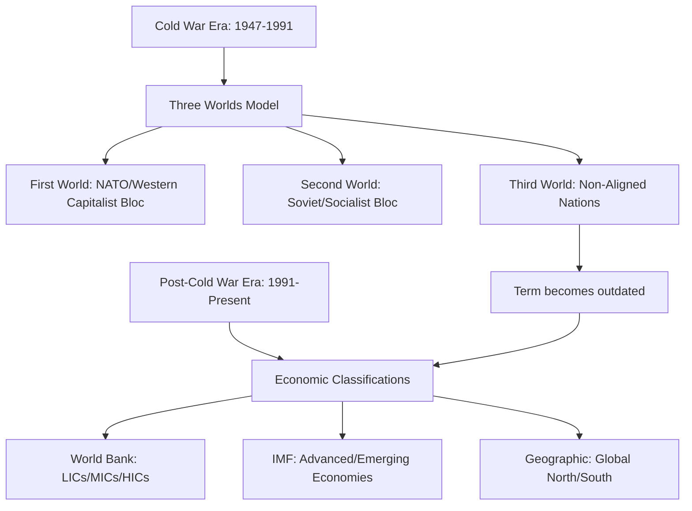
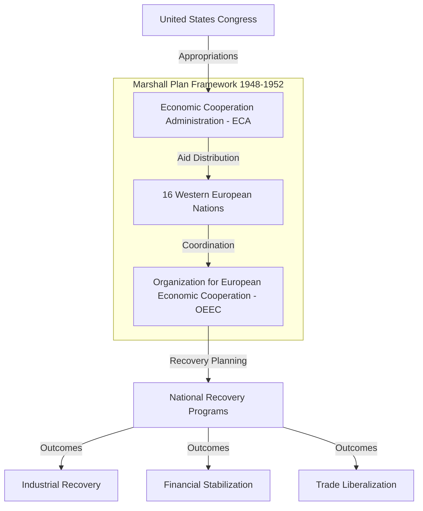
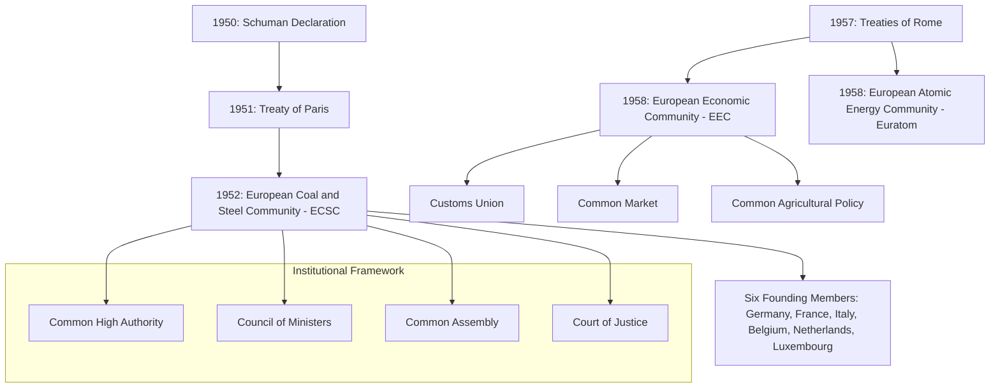
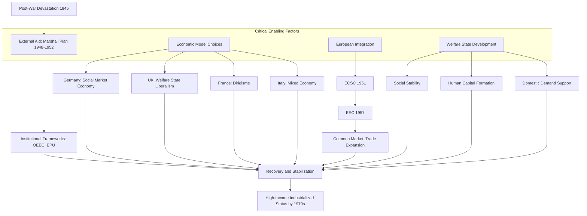
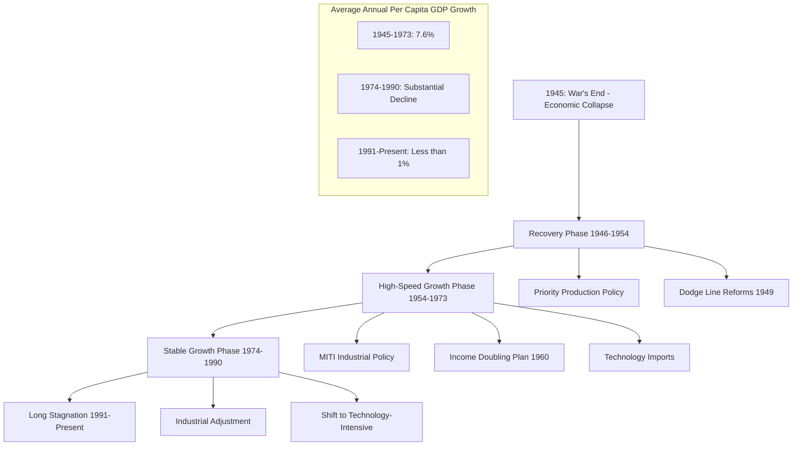
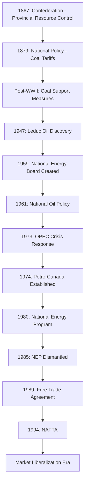
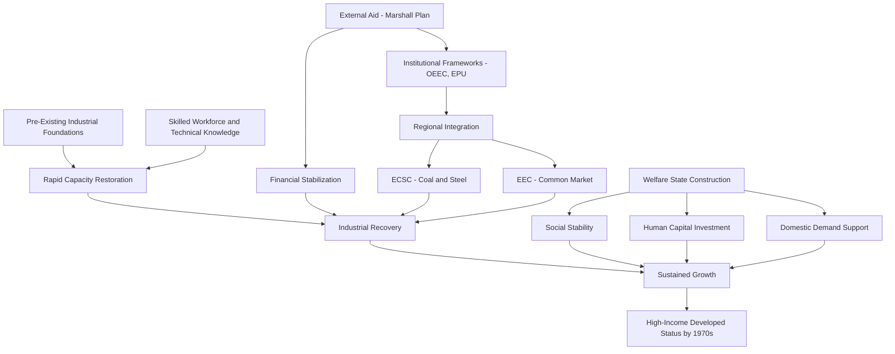
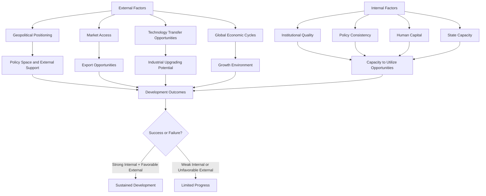
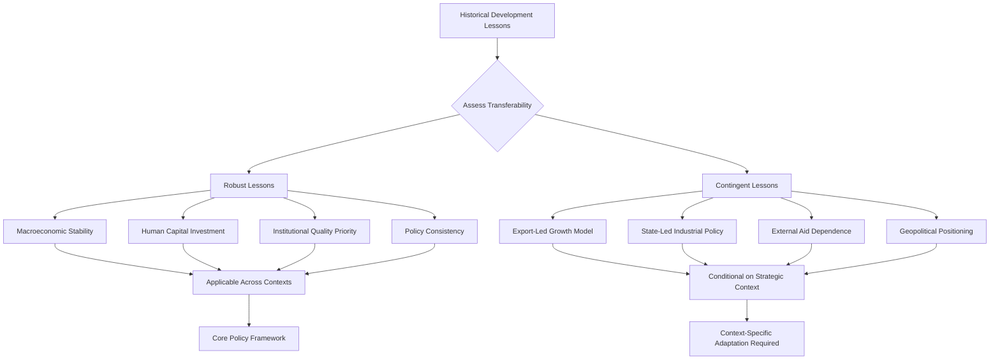
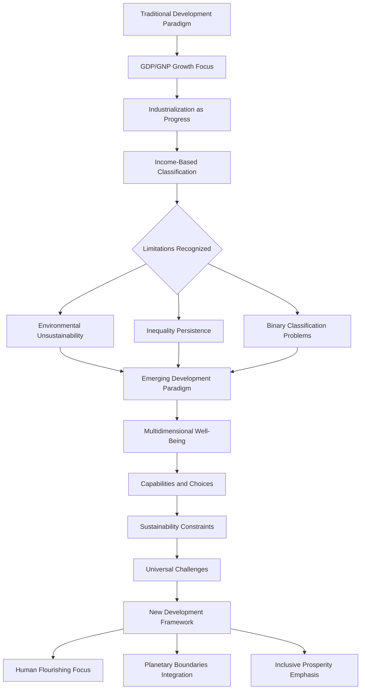

# Divergent Paths to Development: A Comparative Analysis of Post-World War II Transitions into Developed Nations
## 1 Conceptual Foundations and Historical Context of Post-WWII Development

This chapter establishes the theoretical and historical groundwork for understanding post-WWII national development trajectories. It traces the evolution of how 'development' and 'developed nation' have been conceptualized, measured, and classified from 1945 to the present, examining the shift from Cold War-era political alignments to contemporary economic and human development metrics. The chapter also contextualizes the geopolitical environment—including superpower rivalry, decolonization movements, and the creation of the Bretton Woods institutions—that shaped the opportunities and constraints for nations seeking to transition into developed status.

### 1.1 The Evolution of 'Development' as a Concept

The concept of national development has undergone a profound transformation since the end of World War II, evolving from a narrow focus on economic output to a multidimensional understanding that encompasses human well-being, institutional quality, and quality of life. **Development is now understood as the process of change which improves the well-being of a society in terms of material wealth and quality of life, including economic, social, environmental, and political dimensions**[^1]. This contemporary definition stands in stark contrast to the immediate post-war understanding, which equated development almost exclusively with industrialization and aggregate economic growth.

In the early post-war decades, the dominant paradigm viewed development primarily through the lens of **industrialization and economic modernization**. The prevailing assumption was that nations could achieve developed status by replicating the industrial trajectory of Western Europe and North America—transforming agrarian economies into manufacturing powerhouses, urbanizing populations, and accumulating physical capital. This perspective was reinforced by the apparent success of Western reconstruction efforts and the rapid growth of industrial output in the 1950s and 1960s. The quarter century from 1945 to 1970 was characterized as "The Age of Growth," during which world production and trade expanded as never before, with industrial countries experiencing mass automobile use, extensive road building, proliferation of suburban housing, and growing demand for consumer durable goods[^2].

The **emergence of broader socio-economic indicators** during the 1960s and 1970s marked a significant shift in development thinking. Geographers and development economists began employing multiple indicators to measure development, recognizing that economic output alone failed to capture the full picture of national progress[^1]. Social indicators such as **life expectancy, literacy rates, and infant mortality** gained prominence as complementary measures to Gross National Income (GNI) per capita. This period saw growing recognition that a high per-capita GDP alone does not confer developed economy status without other factors—for instance, some economists noted that most developed economies suffer fewer than 10 infant deaths per 1,000 live births, and their citizens live to be 75 or older on average[^3].

The most significant conceptual breakthrough came with the introduction of the **Human Development Index (HDI) by the United Nations Development Programme in 1990**. The first Human Development Report explicitly stated that "this Report is about people—and about how development enlarges their choices. It is about more than GNP growth, more than income and wealth and more than producing commodities and accumulating capital"[^4]. The HDI was created to emphasize that **people and their capabilities should be the ultimate criteria for assessing the development of a country, not economic growth alone**[^5]. This composite measure integrates three key dimensions: a long and healthy life (measured by life expectancy at birth), being knowledgeable (measured by mean years of schooling for adults and expected years of schooling for children), and having a decent standard of living (measured by gross national income per capita)[^5].

The following table summarizes the evolution of development measurement approaches:

| Era | Primary Focus | Key Metrics | Limitations |
|-----|---------------|-------------|-------------|
| 1945-1960s | Economic Growth | GDP/GNP, Industrial Output | Ignored distribution, social welfare |
| 1960s-1980s | Socio-economic Indicators | GNI per capita, Life Expectancy, Literacy | Multiple separate measures, no unified framework |
| 1990-Present | Multidimensional Human Development | HDI (combining health, education, income) | Still simplifies complex realities |

The HDI uses a scale between 0 and 1, with countries closer to 1 considered more developed. The variation of HDI across the world reveals that the highest human development is concentrated in North America, Europe, and Australasia, while the lowest levels are found in Africa and South Asia[^1]. The HDI is widely recognized as a good measure of development because it includes both economic and social indicators, allowing for more nuanced comparisons—for instance, it can be used to question national policy choices by asking how two countries with the same level of GNI per capita can end up with different human development outcomes[^5].

**Critical perspectives on development paradigms** have emerged alongside these measurement frameworks. Scholars have increasingly questioned whether development concepts themselves carry embedded biases rooted in European and North American institutions and structures[^6]. The classification of countries in terms of income or human capacity ignores the historical reasons why some countries have become 'high income/high-skill' while others remain 'low income/low-skill'—raising questions about whether some nations have been intentionally kept resource-limited as an effect of colonization[^6]. Critics argue that the idea of 'developed' implies that countries so labeled have reached their maximum potential, and that there is only one way to be developed[^6]. This critique has prompted calls for development frameworks that acknowledge extraction of capital and human resources, exploitation, and the ongoing effects of colonial legacies.

Despite these critiques, the evolution from purely economic metrics to multidimensional frameworks represents a **genuine expansion of how development is understood and measured**. The contemporary consensus recognizes that development enables people to have choices—including political freedom, guaranteed human rights, and personal self-respect—and that the process of development should create a conducive environment for people to develop their full potential and lead productive and creative lives in accord with their needs and interests[^4].

### 1.2 From Political Blocs to Economic Classifications: Taxonomy of Nations

The classification of nations has undergone a fundamental transformation from Cold War-era political alignments to contemporary economic and developmental taxonomies. Understanding this evolution is essential for analyzing how different countries have been positioned within the global development discourse and how these categorizations have shaped policy approaches and resource allocation.

**The Three Worlds model emerged during the Cold War** as a way of mapping the various players in superpower competition. The term "Third World" arose during the Cold War to define countries that remained non-aligned with either NATO or the Warsaw Pact[^7]. The **First World** included the United States, Canada, Japan, South Korea, Turkey, the Southern Cone, Western European countries and their allies—representing the democratic, industrialized, capitalist nations aligned with the Western bloc[^7][^8]. The **Second World** consisted of the Soviet Union, China, Cuba, North Korea, Vietnam, and their allies—the communist-socialist, industrialized nations of the Eastern bloc[^7][^8]. The **Third World** encompassed all other countries, primarily impoverished former European colonies in Africa, Latin America, Oceania, and Asia that were not actively aligned with either superpower[^9].

The origin of this terminology is attributed to French demographer Alfred Sauvy, who coined the term "Third World" (*tiers monde*) in an article published in the French magazine *L'Observateur* on August 14, 1952[^7]. His usage was a deliberate reference to the Third Estate (*tiers état*), the commoners of pre-revolutionary France. Sauvy wrote, "This third world ignored, exploited, despised like the third estate also wants to be something"[^7]. In the context of the Cold War, he conveyed the concept of political non-alignment with either the capitalist or communist bloc.

**Strictly speaking, "Third World" was a political, rather than economic, grouping**[^7]. However, since most Third World countries were economically poor and non-industrialized, it became a stereotype to refer to developing countries as "third-world"[^7]. By the end of the 1960s, the idea of the Third World came to represent countries in Africa, Asia, and Latin America that were considered underdeveloped by the West based on several characteristics: low economic development, low life expectancy, high rates of poverty and disease[^7].

The following diagram illustrates the evolution of country classification systems:



**The dissolution of the Soviet Union and the end of the Cold War rendered the Three Worlds model increasingly obsolete**. Since 1990, the term "Third World" has evolved to denote countries with less economic development, but it is increasingly perceived as politically incorrect or outdated because it is a historical term that isn't as relevant in modern geopolitics[^7]. The differences among nations formerly categorized as Third World have continually grown, making it difficult to use this classification to define and organize groups of nations based on common political arrangements[^7]. Today, the powerful economies of the West are still sometimes described as "First World," but the term "Second World" has become largely obsolete following the collapse of the Soviet Union[^9].

**Contemporary economic classifications have replaced political alignments** with income-based and developmental criteria. The **World Bank** classifies countries using GNI per capita into three main categories according to 2022 figures: **Low-income countries (LICs)** with a GNI per capita of $1,045 or less (e.g., Chad, Ethiopia); **Middle-income countries (MICs)** with a GNI per capita of more than $1,045 but less than $12,695 (e.g., Mexico, Iraq); and **High-income countries (HICs)** with a GNI per capita above $12,696 (e.g., Germany, USA)[^1]. The **development continuum** is understood as a sliding scale from least to most developed, with intermediates such as newly-industrialized countries (NICs)—countries that have recently seen massive growth in their manufacturing industries, including Mexico, India, and Malaysia[^1].

The **International Monetary Fund (IMF)** employs a distinction between "advanced economies" and "emerging market and developing economies," though it emphasizes that this classification is not based on strict criteria, economic or otherwise[^10][^11]. The IMF currently classifies 37 countries as "advanced economies," with all others categorized as emerging market and developing economies[^10]. This terminology represents a more sophisticated form of the 'developed vs developing countries' distinction, but critics argue the implications remain the same[^6].

The **Global North versus Global South** framework, also known as the Brandt Line, originated in the post-Cold War IMF/structural adjustment period of the 1980s[^6]. According to UN Trade and Development, the Global South broadly comprises Africa, Latin America and the Caribbean, Asia (excluding Israel, Japan, South Korea), and Oceania (excluding Australia and New Zealand), while the Global North broadly comprises Northern America and Europe, Israel, Japan, South Korea, Australia, and New Zealand[^12]. **These two groups do not correspond to the Northern or Southern Hemispheres**, as many Global South countries are geographically located in the north and vice versa[^12]. The terms are understood in the wider context of globalization or global capitalism, defined in terms of differing levels of wealth, economic development, income inequality, and strength of democracy[^12].

**Critical evaluations of these classification systems** reveal embedded limitations and biases. Some terms such as 'First World vs Third World' imply racism in terms of hierarchy—the notion that some are first and others behind[^6]. The idea that countries are inherently different, ordered or ranked along a hierarchy, has been characterized as a racist, colonialist construct, with all these terms having their origin in European and North American institutions and structures[^6]. The classification of "developed versus developing countries" originated among multilateral institutions in the 1960s for the transfer of resources from rich to poor countries, but this concept is now considered outdated as the idea of 'developed' implies that countries so labeled have reached their most potential[^6].

**The World Bank's 2016 decision to stop distinguishing between "developed" and "developing" countries** in its World Development Indicators marked a significant evolution in thinking about the geographic distribution of poverty and prosperity[^11]. Part of the rationale was the success of development efforts in recent decades—a chart plotting countries on axes of infant mortality and fertility shows that in 1960, there were two clear groups, but by 2013, countries had converged into a much tighter group[^11]. This convergence on key development indicators is fast diminishing the need for distinction between developed and developing countries[^11]. The United Nations itself does not have an official definition of a developing country, despite applying the label to 159 nations[^11].

The shift to the **Sustainable Development Goals (SDGs)** in 2015 further reflects changing perspectives. The SDGs view every country as needing development, representing a universal framework rather than the Millennium Development Goals' division between helpers and those needing help[^11]. This represents a fundamental reconceptualization of development as an ongoing process relevant to all nations rather than a destination to be reached by some.

### 1.3 The Post-1945 Geopolitical Landscape: Cold War, Decolonization, and Superpower Competition

The geopolitical landscape that emerged after World War II fundamentally shaped the opportunities and constraints facing nations seeking to develop. The bipolar Cold War order, the massive wave of decolonization, and superpower competition for influence created a complex environment in which development strategies were inextricably linked to international political alignments.

**The Second World War's aftermath marked the beginning of a new era** characterized by the decline of all European colonial empires and the simultaneous rise of the Soviet Union and the United States as the two dominant superpowers[^8]. This transformation had decisive effects on the subsequent history of what would become known as the Third World, creating a fundamentally different international system than had existed before 1945. The period was characterized as a "cold war"—a political landscape of two countries with different worldviews, where one side consisted of industrialized capitalist countries aligned with the United States (the Western bloc, which called itself the "Free World" or "Western World"), while the other consisted of the communist worker-peasant states of the Eastern bloc, socialist nations within the Soviet sphere of influence, and Mao's China[^8].

**Between 1945 and 1960, over three dozen new nations gained autonomy or complete independence** from European colonial rulers in Asia and Africa[^13]. The process of decolonization varied considerably—in some areas it was peaceful and orderly, while in many others independence was achieved only after prolonged revolution[^13]. Some newly independent nations almost immediately achieved stable governments; others were ruled by dictators or military juntas for decades or experienced long-running civil wars[^13].

The creation of these new independent nations changed the composition of the United Nations and the political complexity of regions around the globe. In 1946, the United Nations had 35 member states; with the addition of new independent nations from the "Third World," membership had increased to 127 by 1970[^13]. These new member nations shared several characteristics: they were non-white nations with developing economies facing internal problems sometimes rooted in their colonial history[^13]. They also became active advocates for continued decolonization.

**Colonial legacies created profoundly divergent starting points for post-colonial development**. During the era of European imperialism, industrializing European powers viewed the continents of Africa and Asia as reservoirs of raw materials, labor, and future settlement[^13]. Colonies were exploited, sometimes brutally, for natural resources and labor—and sometimes even for military conscription[^13]. Furthermore, **the introduction of colonial rule drew arbitrary natural boundaries that divided ethnic and linguistic groups and natural features**, laying the foundation for the creation of many nations that lacked geographic, linguistic, ethnic, or political affinity[^13]. This colonial inheritance posed fundamental challenges to subsequent economic development.

**Superpower competition profoundly influenced development trajectories** in newly independent nations. Both the United States and the Soviet Union viewed the newly independent nations as potential allies and went to great lengths to establish connections by offering economic and military support to gain strategically located alliances[^7]. Throughout the Cold War and beyond, the countries of the Third World were the priority recipients of Western foreign aid and the focus of economic development efforts[^7].

The United States generally supported the concept of national self-determination but also maintained close ties with its European allies who had imperial claims over their former colonies[^13]. Cold War considerations complicated the American position, as U.S. support for decolonization was offset by concerns over communist expansion and Soviet strategic ambitions in Europe[^13]. Some NATO allies claimed that their colonial holdings provided them with economic and military strength that would otherwise be lost to the alliance[^13]. As Cold War competition with the Soviet Union began to dominate U.S. foreign policy concerns in the late 1940s and 1950s, the Truman and Eisenhower administrations grew increasingly worried that as European powers lost their colonies or granted them independence, Soviet-backed communist parties might gain power in the new nations[^13].

The **Soviet Union employed similar tactics**, working to encourage new nations to join the communist bloc and attempting to convince newly decolonized countries that communism was essentially a non-imperialist economic and political ideology[^13]. Events such as Indonesia's independence from the Netherlands (1945-50), the Vietnamese struggle against France (1945-54), and nationalist takeovers in Egypt (1952) and Iran (1951) heightened fears that new governments would align with the Soviet Union, even when they did not directly do so[^13].

**Many newly independent nations resisted the pressure to be drawn into the Cold War**, joining the Non-Aligned Movement that formed following the 1955 Bandung Conference and focusing instead on internal development[^13]. The Bandung Conference represented an effort to mobilize the Third World politically, followed by the first Non-Aligned Summit in 1961[^12]. Third Worldism emerged as a political movement arguing for the unity of third-world nations against first-world influence and the principle of non-interference in other countries' domestic affairs, with the Non-Aligned Movement (NAM) and the Group of 77 being the most notable expressions of this idea[^7].

The **economic impact of the transition from colonial rule to independence was complex**. In all cases, the colonies' economies remained tied to that of their colonizer, and it would be a gradual process to diversify economic activity[^14]. The newly founded countries of Africa and Asia all faced the challenges of establishing borders, forming new governments, building economic self-reliance, controlling natural resources, and working toward a more just and equitable society[^14]. Nearly all new nations embraced various forms of democratic constitutions, though many experienced periods of authoritarian rule[^14].

**Different approaches to decolonization produced markedly different development outcomes**, as illustrated by the contrasting experiences of Indonesia, Malaysia, and Singapore. Indonesia nationalized Dutch assets between 1957 and 1959 and subsequently placed remaining Western enterprises under government supervision between 1963 and 1965[^15]. Malaysia and Singapore, however, continued with liberal policies towards expatriate enterprise[^15]. The consequences were significant: between 1960 and 1970—the UN's 'development decade'—GDP per capita (measured in 1985 US dollars) rose in Indonesia by a meager 8.65%; in Singapore, by a remarkable 81.5%; and in Malaysia, by a more modest 40.7%[^15]. According to the 2011 HDI, Singapore achieved 'very high human development' with a world ranking of 26; Malaysia achieved 'high human development' at 61st, while Indonesia managed 'medium human development' at 124th[^15].

The terms of decolonization settlements had lasting economic consequences. Indonesia's independence terms, settled at the 1949 Round Table Conference, required Indonesia to inherit the Netherlands Indies' pre-Pacific War foreign debt and included clauses designed to preserve Dutch business operations, creating high levels of Indonesian resentment towards ex-colonial firms[^15]. In contrast, Britain's financial settlement for independent Malaya in 1957 transferred unspent development funds without insisting on investment guarantees, allowing the Malaysian state more room for maneuver and creating much less resentment[^15]. Indonesia's sudden confrontational rupture with the Netherlands had negative consequences through the dislocation of supply chains and exposure of chronic skills and capital deficits, while Malaysia and Singapore chose incremental ways of "breaking free" and proved adept at bending foreign investment to meet national objectives[^15].

### 1.4 The Bretton Woods System and International Development Architecture

The establishment of the Bretton Woods institutions in 1944 created an international financial architecture that would profoundly shape development possibilities for decades to come. The International Monetary Fund (IMF) and the World Bank emerged from an international conference in the United States (in Bretton Woods, New Hampshire) that established a framework for economic cooperation aimed at creating a more stable and prosperous global economy[^16].

**The IMF and the World Bank share a common goal of raising living standards in their member countries**, but their approaches to achieving this shared goal are complementary[^16]. The IMF focuses on macroeconomic and financial stability while the World Bank concentrates on long-term economic development and poverty reduction[^16]. This division of labor has shaped how international development assistance has been structured and delivered since 1945.

**The IMF promotes global macroeconomic and financial stability** and provides policy advice and capacity development support to help countries build and maintain strong economies[^16]. The IMF provides short- and medium-term loans to help countries experiencing balance of payments problems and difficulty meeting international payment obligations, with loans funded mainly by quota contributions from its members[^16]. The **World Bank promotes long-term economic development and poverty reduction** by providing technical and financial support to help countries implement reforms or projects—such as building schools, providing water and electricity, fighting disease, and protecting the environment[^16]. World Bank assistance is generally long-term and is funded by member country contributions and by issuing bonds[^16].

The two institutions routinely collaborate to assist member countries under terms set out in the 1989 concordat and subsequent frameworks[^16]. This collaboration includes high-level coordination during Annual Meetings of the Boards of Governors, management consultation between the Managing Director of the IMF and the President of the World Bank, and close staff collaboration on country assistance and policy issues[^16]. Areas of collaboration have expanded over time to include assessing financial stability through the Financial Sector Assessment Program (FSAP), reducing debt burdens of heavily indebted poor countries under the HIPC Initiative and Multilateral Debt Relief Initiative, and analyzing country debt sustainability[^16].

**The original mandates of these institutions have evolved significantly over time**, sometimes generating criticism of mission creep. Created in the aftermath of World War II, the World Bank and the IMF have played an important role in the international financial architecture of the modern era[^17]. However, at the operational level, the World Bank and the IMF have been criticized for an inability to maintain strong accountability standards[^17]. The World Bank has been characterized as primarily interested in making new loans, with few consequences for missing development targets[^17]. The IMF's largest borrower, Argentina, repeatedly fell short of its commitments, yet the IMF board continually rolled over loans[^17].

**Problematic governance and changing shareholder priorities have led to expanded mandates**. At the 2023 Annual Meetings, World Bank President Ajay Banga articulated the institution's mission in terms of five verticals with 18 subcategories, an overlay of gender equality, jobs, and climate, and eight global challenges[^17]. The IMF, originally created to address balance-of-payments needs, now has 13 lending facilities financed by three different trust funds and has expanded into topics from cryptocurrency to climate change to artificial intelligence[^17]. The World Bank employs nearly 20,000 staff and continues to lend roughly $2 billion per year to China, which has met the criteria for graduation from World Bank borrowing[^17].

**Calls for governance reform have intensified**, particularly regarding representation of the Global South. A 2023 Brookings Institution report argues that the current governance system, created in 1945, is outdated and does not reflect the increased economic weight of the Global South[^18]. While comprehensive voice and quota reforms may take time, proposals include modernizing the boards of directors to reflect corporate governance best practices, which would enhance the voice of the Global South while retaining oversight for major creditors[^18]. Other proposals include separating the roles of the executive head and board chair, defining board member qualifications, moving to nonresident part-time boards, and including independent directors from civil society and the private sector[^18].

**The 2008 world financial crisis marked a turning point** in the governance of international financial institutions. After the crisis, the collective rise of emerging economies forced the North to readjust international rules[^19]. The G20 became a leading decision-making mechanism, and the World Bank and IMF adjusted voting powers to give China, India, Brazil, and others a greater say[^19]. This era marks the arrival of the Global South as "active agents" in the international order, moving from the periphery towards the center[^19].

The following table summarizes the evolution and current state of the Bretton Woods institutions:

| Institution | Original Mandate | Current Focus Areas | Key Criticisms |
|-------------|------------------|---------------------|----------------|
| IMF | Balance of payments stability | Macroeconomic stability, crisis lending, surveillance, climate | Mission creep, accountability gaps, Global South underrepresentation |
| World Bank | Post-war reconstruction, development financing | Poverty reduction, infrastructure, climate, private sector mobilization | Lending to graduated countries, project accountability, governance structure |

**Sovereign debt problems remain a critical challenge** for the international development architecture. About half of the world's poorest countries are in or at high risk of debt distress, complicating efforts to meet the Sustainable Development Goals and Paris Agreement targets[^18]. Proposed solutions include market-based approaches similar to the 1980s Brady Plan for dealing with private sector debt, and "debt relief for climate" mechanisms to incentivize creditor participation in debt workouts by linking relief to climate investments[^18]. Reforms to the global financial safety net have also been proposed, including revising the IMF quota formula to better reflect current economic realities and vulnerabilities, and revamping the role of Special Drawing Rights (SDRs) by automating their issuance during crises[^18].

**The post-Cold War period created additional challenges for the international development architecture**. The fall of the Berlin Wall in 1989 and the subsequent collapse of the Soviet Union fundamentally altered the global aid landscape, creating competition for resources as transition economies in Eastern Europe and the former Soviet republics emerged as a new category of aid recipients[^20]. The European Union, World Bank, and IMF quickly established substantial aid programs for these regions, such as the EU's PHARE program and the European Bank for Reconstruction and Development[^20]. This redirection of aid had immediate and long-term consequences for developing countries, as aid flows to sub-Saharan Africa stagnated or declined in real terms during the 1990s while assistance to Eastern Europe and the former Soviet Union increased dramatically[^20].

### 1.5 The UN Development Decade and Early Development Paradigms

The United Nations' designation of the 1960s as the first "Development Decade" represented an ambitious effort to accelerate economic progress in developing countries. This period established foundational development theories and set precedents for international cooperation that would shape subsequent approaches to development policy.

**The developing countries approached the Development Decade with great expectations**. While export prospects were viewed with some pessimism, a considerable increase in the rate of economic growth was forecast[^21]. The United Nations called for an annual rate of economic growth of 5 percent in the developing countries to be reached in the course of the 1960s[^21]. However, **this target was not attained in the first half of the decade**; in fact, there was a deceleration rather than an acceleration of economic growth[^21].

The actual economic performance revealed troubling patterns. The average annual rate of increase of the gross domestic product in developing countries declined from 4.6 percent in 1950-55 to 4.4 percent in 1955-60, and again to 4.2 percent in 1960-65[^21]. Among major regions during 1960-65, the Middle East led with a growth rate of 7.6 percent, followed by Latin America at 4.6 percent, while Asia and Africa showed 3.7 and 3.4 percent respectively[^21]. **The rate of growth of per capita incomes in developing countries fell from 2.5 percent in 1950-55 to 2.0 percent in 1955-60, and again to 1.6 percent in the first half of the sixties**[^21].

**The widening gap between developed and developing nations became a defining concern**. While per capita income growth was slowing in developing countries, the growth rate of per capita incomes in developed nations accelerated—from 2.2 percent in 1955-60 to 4.0 percent in 1960-65[^21]. Thus, income differences between the two groups of countries increased during the very decade intended to narrow them. This divergence challenged the optimistic assumptions underlying early development planning.

The following table presents regional growth performance during the first Development Decade:

| Region | GDP Growth Rate 1960-65 (%) | Foreign Exchange Growth 1960-65 (%) | Key Characteristics |
|--------|----------------------------|-------------------------------------|---------------------|
| Middle East | 7.6 | 59.8 | Oil-driven growth, highest regional performance |
| Latin America | 4.6 | 30.9 | Import substitution industrialization |
| Asia | 3.7 | 36.1 | Varied performance, early industrializers emerging |
| Africa | 3.4 | 37.1 | Lowest growth, decolonization challenges |

**Export performance exceeded expectations** during this period, providing one bright spot in the development picture. Whereas the UN forecast exports from developing countries to developed nations to rise at an annual rate of 3.7 percent, actual growth was 6.3 percent a year[^21]. The rapid expansion of these exports was partly explained by the high rate of growth of national incomes in developed nations—while UN projections assumed a GNP growth rate of 3.7 percent for developed countries during 1960-70, the actual figure for 1960-65 was 5.2 percent[^21]. A positive correlation was found between exports and economic growth among developing countries[^21].

**Capital flows to developing countries increased substantially** during the Development Decade. The net flow of official capital to developing countries rose by nearly one-half, from $4.0 billion in 1960 to $5.9 billion in 1965, while the net flow of private capital increased from $2.1 billion to $2.2 billion[^21]. All told, net capital flows to developing countries increased at an annual rate of 8.1 percent during this period[^21]. However, the proportion of aid to national income in developed nations fell from its peak level of 0.78 percent in 1961 to only 0.60 percent in 1965[^21].

**Alternative theoretical frameworks emerged** to explain the persistent development challenges. One primary thinker of non-aligned economics was Raúl Prebisch, who developed "dependency theory"[^14]. According to this theory, the world was divided into an industrialized "core" and an underdeveloped "periphery"[^14]. The purchasing power of the "core" nations accelerated, allowing them to purchase raw materials for a cheaper relative price, while the ability of "periphery" countries to import industrial products decelerated[^14]. The proposed solution was to replace imports with locally produced industrial products while reducing exports to former imperial powers to drive up their cost[^14].

**Newly independent nations faced fundamental questions about how to develop their economies**. Many governments were inspired by the rapid growth of the Soviet Union achieved by Central Planning Committee "Five Year Plans"[^14]. Whether or not new nations aligned themselves with the Soviet Union, new governments tended to view central planning of key sectors as necessary to achieve self-reliance[^14]. Others were coerced by capital investment and attempted to reformulate their economies while still providing imports of raw materials to Western Europe and North America[^14]. Most states attempted mixed economies combining elements of planning and market mechanisms[^14].

The **Green Revolution of the 1960s** represented a significant technological intervention in development. Norman Borlaug developed a disease-resistant strain of dwarf wheat that increased yields worldwide, especially in developing nations facing high population growth and famine[^14]. In the 1960s, the program was exported to India, which was facing famine—India imported 18,000 tons of Borlaug's seed wheat in 1966, and wheat yields increased from 12.3 million tons in 1965 to 20.1 million tons in 1970[^14]. By 1974, India was self-sufficient in all cereal grains, and by 2000, India was producing 76.4 million tons of wheat[^14]. Although the Green Revolution saved lives and allowed populations to increase, it has been criticized for bringing capital- and energy-intensive agricultural techniques to regions that had relied on subsistence farming, widening social inequality and expanding farmer debt[^14].

**The prosperity of industrial countries during "The Age of Growth" had considerable spillover to developing countries**, which also made impressive economic strides, although markedly less than the industrial countries[^2]. When the 1970s began, public officials and economists recognized that economic problems were beginning to jeopardize the very high growth rates and relative price stability that had prevailed in large industrial countries since 1945[^2]. However, on the whole, these problems were regarded as temporary and solvable by appropriate government policies[^2].

**The globalization period (1980-2000) produced divergent outcomes** across regions. The poorest countries (the developing world) saw their average annual growth rate improve by a full percentage point compared to the earlier period, while the industrialized world experienced a sharp decline in annual growth from 3.3% to just 1.6%[^22]. China and India's importance in the developing world's growth performance was substantial—excluding them from the 1980-2000 period would reduce the average annual growth rate by 2.4 percentage points to just 0.7%[^22]. For East Asia, the globalization period proved highly favorable, with average incomes quadrupling since 1960[^22]. However, the globalization period was not favorable for Latin America or Africa—after per capita income nearly doubled from 1960 to 1980, Latin American economies barely maintained 1980 levels over the following twenty years, while Africa's per capita income declined by 12% over the same period[^22].

These early development experiences—including mixed results in growth rates, widening income gaps between developed and developing nations, and the emergence of competing theoretical frameworks—profoundly informed subsequent approaches to development policy and established patterns that would persist for decades. The Development Decade demonstrated both the possibilities and limitations of international development cooperation, setting the stage for the more nuanced and multidimensional approaches that would emerge in subsequent decades.

## 2 European Reconstructions: From Ruin to Renewal

This chapter examines how Western European nations emerged from the devastation of World War II to achieve developed status, analyzing the interplay of post-war conditions, external assistance, economic model choices, regional integration, and welfare state development. It compares the reconstruction trajectories of major Western European economies (Germany, France, UK, Italy) and later Central and Eastern European transitions, identifying the key factors and policy combinations that enabled these nations to attain high-income, industrialized status while highlighting both convergent patterns and divergent national approaches.

### 2.1 Post-War Devastation and Initial Recovery Conditions

The conclusion of World War II in May 1945 left the European continent in a state of unprecedented devastation, creating profoundly challenging baseline conditions for reconstruction. **In the immediate post-World War II period, Europe remained ravaged by war and thus susceptible to exploitation by internal and external threats**[^23]. The scale of destruction varied significantly across nations, but all major European powers faced fundamental challenges in rebuilding their economies, societies, and political institutions.

**Europe was struggling to rebuild; while industrial output was rebounding to prewar levels, this did not transfer into rapid economic growth, and there was a growing dollar deficit in Europe**[^24]. This paradox—where production recovery did not automatically translate into economic prosperity—highlighted the structural nature of post-war economic challenges. The devastation extended far beyond physical infrastructure to encompass the collapse of pre-war trade networks, severe capital shortages, and institutional breakdown that had accumulated during six years of total war.

The following table summarizes the comparative devastation and initial recovery conditions across major Western European nations:

| Country | Physical Destruction | Economic Condition | Key Challenges |
|---------|---------------------|-------------------|----------------|
| Germany | Most severe; cities in ruins, industrial base devastated | Complete economic collapse, occupation zones | Division into occupation zones, denazification, total institutional reconstruction |
| France | Significant infrastructure damage, industrial disruption | Weakened but functioning economy | Political instability, colonial commitments, modernization needs |
| United Kingdom | Urban bombing damage, depleted reserves | Severe debt, exhausted resources | Imperial decline, dollar shortage, welfare commitments |
| Italy | Substantial war damage, regional disparities | Fragmented economy, weak institutions | North-South divide, political fragmentation, reconstruction financing |

The severity of wartime damage in **Germany** represented the most extreme case among major Western European nations. As the primary theater of ground combat in the final years of the war and subject to extensive Allied bombing campaigns, Germany emerged with its cities in ruins and its industrial capacity severely compromised. The Ruhr region, historically key to the country's industrial strength due to its rich supply of coal and coke which attracted the steel industry, became a particular focus of post-war policy[^25]. Initially, **France proposed that an international regime control the production and export of coal and steel in the Ruhr**, reflecting concerns about German industrial revival and the need to prevent future aggression[^25].

**France** faced a different constellation of challenges. While suffering significant infrastructure damage and industrial disruption during occupation and liberation, France retained functioning governmental institutions and a clearer path toward political reconstitution. However, the French economy confronted the dual challenge of domestic reconstruction and managing extensive colonial commitments that would increasingly strain national resources. French government policy initially aimed to assure disarmament and demilitarization of Germany, viewing the control of German industrial capacity as essential to French security[^25].

**The United Kingdom** emerged from the war as a nominal victor but in a profoundly weakened economic position. Despite avoiding occupation, Britain had exhausted its financial reserves, accumulated massive debts, and faced the challenge of managing imperial decline while meeting domestic expectations for social reform. The British case illustrated how victory in war could nonetheless produce severe economic constraints that shaped subsequent development choices.

**Italy** represented yet another variant of post-war devastation. Having experienced both Fascist rule and subsequent occupation, liberation, and civil conflict, Italy faced the challenge of reconstructing not only its physical infrastructure but also its political institutions. The real involvement of the Italian State in welfare provision had started with the advent of the First World War, and the second post-war period marked a turning point with the State moving towards a more advanced concept of social protection[^26]. However, Italy intervened in a limited way compared to Northern European states, primarily because Italy was still a mainly agricultural country and could not afford to finance a complex system[^26].

The immediate post-war period was characterized by **acute humanitarian crises** across the continent. Food shortages, population displacement, and the collapse of normal economic activity created conditions that threatened social stability. American leaders feared that economic struggles could lead to political instability and open the door for communist and Soviet influences[^24]. This fear was characterized by the Truman Doctrine, under which Congress approved $400 million in aid to Greece and Turkey as part of approximately $11 billion in aid to Europe from July 1945 through December 1947, which was intended for more immediate humanitarian relief rather than long-term stability[^24].

The **rapid deterioration of European economies in the winter of 1946–1947** intensified concerns about the region's trajectory[^23]. Production in Western Europe was recovering to pre-war levels more quickly than after World War I—**in Western Europe, production was restored to pre-war levels in only three years compared to six years after World War I, and exports recovered in four years compared to six**[^27]. However, the region's per capita food consumption did not recover to pre-war levels until 1950, and despite Germany and Japan's significant post-war growth, they did not restore pre-war per capita GDP levels until the mid-1950s[^27].

The collapse of pre-war trade networks created particular challenges for European recovery. The international trading system that had existed before 1939 had been fundamentally disrupted, and rebuilding it required not only physical reconstruction but also new institutional frameworks for international economic cooperation. The dollar shortage that plagued European economies reflected their inability to earn sufficient foreign exchange to purchase necessary imports from the United States, which had emerged from the war with its industrial capacity not only intact but significantly expanded.

### 2.2 The Marshall Plan and External Aid as Catalysts for Recovery

The European Recovery Program, commonly known as the Marshall Plan, represented **one of the most significant external interventions in economic development history**, providing a transformative catalyst for Western European reconstruction. On May 8, 1947, Under Secretary of State Dean Acheson unveiled the blueprint for the plan, stressing that the recovery of Europe and Asia depended on the reconstruction of Germany and Japan, which would require international aid[^24]. The following month, **Secretary of State George C. Marshall issued a call for a comprehensive program to rebuild Europe** in a June 5, 1947, speech to the graduating class at Harvard University[^23].

The Marshall Plan was developed as **a more structured approach to address underlying economic instability through joint cooperation**, distinguishing it from earlier humanitarian relief efforts[^24]. William Clayton, Under Secretary of State for Economic Affairs, had significant influence on the final iteration, warning that without substantial aid, "economic, social and political disintegration will overwhelm Europe"[^24]. Marshall's experience at the Moscow Conference in April 1947 solidified his belief that the Soviet Union would not cooperate, leading him to introduce a proposal for a cooperative recovery program at Harvard[^24].

**The plan required participating European nations to assist in developing the recovery program**, establishing a collaborative framework rather than unilateral American direction. On July 12, 1947, representatives from 16 European nations met in Paris, forming the Committee of European Economic Cooperation (CEEC)[^24]. The Soviet Union and its satellites rejected the conditions, ensuring that the program would be limited to Western Europe[^24]. By early 1948, the Truman Administration had finalized the plan, but faced challenges in Congress, where some argued the nearly $13 billion program was a "socialist blueprint" that risked American financial solvency[^24]. Through public relations efforts and bipartisan support, **Congress passed the plan on March 13, 1948, allocating nearly $13 billion in foreign aid over a four-year period**[^24].

The following diagram illustrates the institutional framework and flow of Marshall Plan assistance:



**The scale of Marshall Plan assistance was substantial by any measure**. In the period from 1948 to 1952, Western European countries received resources equivalent to 1% of American GNP[^27]. At its peak, American aid to Western Europe and similar assistance to Japan accounted for 40.5% of U.S. exports from 1946 to 1949[^27]. Fanned by the fear of Communist expansion and the rapid deterioration of European economies in the winter of 1946–1947, Congress passed the Economic Cooperation Act in March 1948 and approved funding that would eventually rise to over $12 billion for the rebuilding of Western Europe[^23].

The **institutional mechanisms coordinating recovery efforts** proved as important as the financial assistance itself. The US-managed Economic Cooperation Administration (ECA) and the European-run Organization for European Economic Cooperation (OEEC) oversaw implementation[^24]. The OEEC, founded in April 1948 as the Organization for European Economic Co-operation to manage the Marshall Plan, became a predecessor of the modern OECD[^25]. This dual structure—American oversight combined with European coordination—created frameworks for cooperation that would have lasting significance beyond the immediate recovery period.

**By the time Marshall Plan aid expired in June 1952, the program had largely accomplished its goals**[^24]. The plan was successful in restoring agricultural and industrial production and some level of self-sufficiency in European nations[^24]. The Marshall Plan generated a resurgence of European industrialization and brought extensive investment into the region, while also serving as a stimulant to the U.S. economy by establishing markets for American goods[^23].

The generous financial support and flexibility regarding international commitments helped restore financial stability, promoted more effective resource allocation, and accelerated trade liberalization[^27]. **A major step toward a multilateral international payments system was the creation of the European Payments Union in 1950**[^27]. By the late 1950s, most countries were complying with their obligations under the IMF Articles of Agreement, and world trade and international payments had become more stable[^27]. Most Western European countries eliminated foreign exchange restrictions and achieved current account convertibility six years after their initial commitment[^27].

However, **debates persist about the relative importance of external aid versus domestic policy choices** in driving European reconstruction. Economic historians have debated the precise impact of the Marshall Plan on Western Europe, but these differing opinions do not detract from the fact that the Marshall Plan has been recognized as a great humanitarian effort[^23]. Secretary of State Marshall became the only general ever to receive a Nobel Prize for peace, and the Marshall Plan also institutionalized and legitimized the concept of U.S. foreign aid programs, which have become an integral part of U.S. foreign policy[^23].

The Marshall Plan's significance extended beyond immediate economic recovery to encompass **broader geopolitical and institutional legacies**. Although the participation of the Soviet Union and East European nations was an initial possibility, Soviet concern over potential U.S. economic domination of its Eastern European satellites and Stalin's unwillingness to open up his secret society to westerners doomed the idea[^23]. Furthermore, it is unlikely that the U.S. Congress would have been willing to fund the plan as generously as it did if aid also went to Soviet Bloc Communist nations[^23]. Thus the Marshall Plan was applied solely to Western Europe, precluding any measure of Soviet Bloc cooperation and intensifying Cold War divisions[^24][^23].

The program also **signaled a new era of global responsibility for the United States**[^24], establishing precedents for American engagement in international development that would shape subsequent decades of foreign policy. The creation of the OEEC laid institutional groundwork for ongoing European economic cooperation, while the experience of coordinated recovery planning influenced approaches to European integration that would culminate in the European Economic Community.

### 2.3 Economic Model Choices: Social Market Economy versus Liberal Approaches

The reconstruction period witnessed **fundamental choices about economic frameworks** that would shape Western European development trajectories for decades. These choices reflected different philosophical traditions, historical experiences, and political configurations, producing distinct models of capitalism that balanced market mechanisms with varying degrees of state intervention and social protection.

**Germany's social market economy (Soziale Marktwirtschaft) emerged as the most distinctive and influential model**, combining free market capitalism with social policies and sufficient regulation to establish fair competition and a welfare state[^28]. The term "social market economy" was coined by Alfred Müller-Armack in December 1946, seeking a "new synthesis" of market freedom and social protection[^28][^29]. The concept was initially implemented in 1949 by West Germany's Christian Democratic Union under Chancellor Konrad Adenauer, with its intellectual roots traceable to the inter-war Freiburg School of economic thought[^28].

**Ludwig Erhard, the Federal Republic's Economics Minister from 1949-63 and Chancellor from 1963-66, is known as the father of West Germany's post-war "economic miracle"**[^29]. Erhard's inner circle included economists and lawyers from Freiburg University, whose central concept is Ordoliberalism[^29]. The Ordoliberal approach, developed by Walter Eucken and others, outlines a free-market order regulated by a "policy of order" (Ordnungspolitik), which maintains the market economy's rules without intervening in the economic process; **the state should be the market's umpire, not a player**[^29].

The following table compares the key features of different Western European economic models:

| Feature | German Social Market Economy | British Welfare State Liberalism | French Dirigisme | Italian Mixed Economy |
|---------|------------------------------|----------------------------------|------------------|----------------------|
| State Role | Framework setter, not player | Provider of universal services | Active economic director | Mixed intervention, regional variation |
| Market Philosophy | Competition within rules | Market with social safety net | Strategic state planning | Pragmatic mix of public/private |
| Industrial Policy | Competition policy focus | Nationalization of key industries | Indicative planning | State enterprise in key sectors |
| Welfare Model | Insurance-based (Bismarckian) | Universal coverage (Beveridgean) | Mixed system | Family-centered, Church influence |
| Labor Relations | Codetermination, social partnership | Collective bargaining | Corporatist elements | Fragmented, politically divided |

**The social market economy aimed to be a middle path between laissez-faire capitalism and socialist economics**[^28]. It was heavily influenced by Ordoliberalism, which in turn was influenced by Christian democratic political ideology[^28]. The model opposes attempts to plan and direct production, labor, or sales, but supports planning efforts that seek to influence the economy through organic means of a comprehensive economic policy combined with flexible adaptation to market research[^28].

Wilhelm Röpke and Alexander Rüstow, also in Erhard's circle, focused on the non-economic foundations of a market economy[^29]. They regarded the social component as an organic whole with the rule of law and free markets, where **social cohesion emerges spontaneously from institutions like family and voluntary associations, fostering responsibility and self-help**[^29]. Social policy is first and foremost Ordnungspolitik, integrating people into market society with a basic safety net[^29].

The German model's main elements included: **core elements of a free market economy such as private property, free trade, exchange of goods, and free price formation**; and unlike state passivity, active implementation of regulatory measures, including social security system components such as pension insurance, universal health insurance, and unemployment insurance[^28]. The model sought to combine free initiative and social welfare based on a competitive economy, opposing laissez-faire policies and socialist economic systems while combining private enterprise with regulation and state intervention to establish fair competition[^28].

**The intellectual roots of Germany's social market economy were diverse**. The Austrian School (Mises, Böhm-Bawerk) restated market principles and analyzed the bankruptcy of interventionism; the British Classical School (Adam Smith, David Ricardo, John Stuart Mill) demonstrated that free market forces and concern for social problems could coexist; German historical sociology (Sombart, Spiethoff, Max Weber) influenced thinking about economic order; and 19th-century German concern with social questions (Soziale Frage) and the doctrines of the Socialists of the Chair (Wagner, Schmoller) provided sources for social orientation, even though they themselves opposed liberalism.

**Erhard's approach represented a decisive break with interventionist traditions**. In his speeches following the 1948 currency reform, Erhard articulated the determination to transition to an uncontrolled market economy organization, emphasizing individual responsibility and performance while rejecting interventionism. He believed the market could achieve justice and optimal allocation, emphasizing profitability and the fulfillment of social responsibility. French economist Jacques Rueff noted that Germany's success stemmed from the transition from interventionism and control to market rules and price mechanism operation.

The **Ordoliberal framework established constitutive principles** for a competitive order: maintaining a properly functioning price system, monetary stability, open markets, policy consistency, private property and risk-bearing, and freedom of contract[^30]. These principles were interdependent, forming an inseparable whole. Additionally, regulatory principles (such as anti-monopoly legislation) were developed to address potential monopolistic structures, inducing holders of economic power to act "as if" under perfect competition.

**Britain adopted a different approach**, combining market mechanisms with comprehensive welfare state provision following the Beveridge Report model. The concept of social market economy was first introduced to Britain by Conservative politician Keith Joseph[^28]. In the post-World War II period, major parties agreed on industrial nationalization and strict economic regulation; in the 1970s, Joseph proposed the social market idea as an alternative to post-war consensus, allowing free market competition and innovation while government's role was to help maintain order, provide infrastructure, maintain monetary stability, legal framework, rule of law enforcement, safety net (welfare state) provision, and defense of property rights and other rights involved in economic processes[^28].

**France pursued a more interventionist approach** through indicative planning and state direction of strategic sectors, while Italy developed a mixed economy characterized by significant state enterprise alongside private sector activity and strong regional variations between the industrialized North and agrarian South. These different national approaches reflected distinct historical legacies, political configurations, and philosophical traditions about the proper relationship between state, market, and society.

The competitiveness Germany has today is a legacy of Erhard's Ordnungspolitik, which transformed West Germany into Europe's economic powerhouse[^29]. However, **Germany now carries the burden of half a century of post-Erhard "social" interventions**, resulting in high taxes, heavy regulation, and a large welfare state, leaving its economy ill-equipped for challenges like an aging population and the need for a more services-based economy[^29].

### 2.4 European Integration as a Development Strategy

European economic integration emerged as **a distinctive development strategy** that combined peace-building objectives with economic modernization goals. The process began with sectoral cooperation in strategic industries and evolved into comprehensive economic union, creating frameworks for coordination that accelerated growth, expanded trade, and drove productivity improvements across member states.

**With the aim of ending the frequent and bloody conflicts that culminated in the Second World War, European politicians began the process of building what we know today as the European Union**[^31]. The European Coal and Steel Community, founded in 1951, represented the first step in securing a lasting peace[^31]. On 9 May 1950, French Foreign Minister Robert Schuman presented a plan for deeper cooperation by integrating the coal and steel industries of Western Europe[^31].

The Schuman Declaration proposed **a fundamentally new approach to the Franco-German relationship**. Schuman's plan was an entirely different approach to the coal and steel issue, as it involved treating the Germans as equals[^25]. He proposed that "Franco-German production of coal and steel as a whole be placed under a common High Authority, within the framework of an organisation open to the participation of the other countries of Europe"[^25]. Such an act was intended to help economic growth and cement peace between France and Germany, as **coal and steel were particularly symbolic because they were the resources necessary to wage war**[^25]. It would also be a first step to a "European federation"[^25].

The following diagram illustrates the evolution of European integration institutions:



**Based on the Schuman plan, six countries signed a treaty on 18 April 1951** to run their coal and steel industries under a common management, creating the European Coal and Steel Community, which came into being in 1952[^31]. The six countries were Germany, France, Italy, the Netherlands, Belgium, and Luxembourg[^31]. The United Kingdom refused to participate due to a rejection of supranational authority[^25]. The Treaty was ratified by the middle of 1952, and the European Coal and Steel Community agreement entered into force on 23 July 1952[^25].

The ECSC established **pioneering supranational institutions** that would serve as models for subsequent integration. At its center was the High Authority (the forerunner to today's European Commission), which served as the Community's executive, with Jean Monnet as its first president[^25]. The member states' governments were represented by the Council of Ministers, while the Common Assembly (now the European Parliament) was composed of 78 representatives exercising supervisory powers over the executive[^25]. The Court of Justice was established to ensure the observation of ECSC law along with the interpretation and application of the Treaty[^25].

**Building on the success of the Coal and Steel Treaty, the six founding countries signed two additional treaties on 25 March 1957**, creating the European Economic Community (EEC) and the European Atomic Energy Community (Euratom)[^31]. These bodies came into being on 1 January 1958[^31]. The EEC was created to establish a full customs union between members, while Euratom fostered cooperation in the nuclear field[^25]. Louis Armand became the first President of the Euratom Commission and Walter Hallstein became the first President of the EEC Commission[^25].

The creation of the EEC in 1957 was **a critical transformative moment that kick-started Europe's economic journey to the modern single market**[^32]. The European Economic Community very quickly became the world's second largest economic grouping after the United States[^33]. The rapid growth of the Common Market and the prospect of enlargement of the Communities to include the United Kingdom in the early 1960s threatened to put the US economy in a difficult position, prompting President Kennedy to propose an Atlantic partnership between Europe and the United States in 1962[^33].

**From the outset, the United States supported the moves towards integration made by the Six**, and Euro-American trade links were established under the General Agreement on Tariffs and Trade (GATT)[^33]. However, the integration process also reflected Cold War dynamics. By contrast to American support, ever since the establishment of the European Coal and Steel Community, the Soviet leadership had condemned any hint of European integration, viewing the revival of the West German economy within the Common Market with great displeasure[^33].

The process of European integration contributed to development through multiple channels. **The pooling of strategic industries** eliminated sources of conflict while creating larger markets that enabled economies of scale. The common market framework facilitated trade expansion and specialization according to comparative advantage. Institutional frameworks for coordination reduced transaction costs and created competitive pressures that drove productivity improvements. The commitment to supranational governance provided credibility for long-term investment and policy stability.

The period from 1950 to 1973 represented **the "golden age" of European economic growth**, during which the integration process coincided with unprecedented prosperity. Trade liberalization entered a new phase after the launch of the Kennedy Round multilateral trade negotiations in 1964[^27]. The characteristic of the golden age was unprecedented growth in international trade, with trade volume exceeding output in the late 1940s, a phenomenon that continued through the 1950s and 1960s[^27].

### 2.5 Welfare State Development and Social Protection Systems

The construction of comprehensive welfare states across Western Europe during the post-war decades represented **a fundamental transformation in the relationship between state and citizen**, establishing social protection systems that contributed to social stability, human capital development, and sustained domestic demand. Different welfare models emerged from distinct historical legacies and political configurations, producing varied institutional designs with common objectives.

**The growth of welfare states proceeded in two analytical dimensions**: the simple growth of government social welfare activity as a share of GNP, and the responsiveness of the state to social welfare demands[^34]. From 1870 to 1965, social welfare expenditure in major European countries grew from less than 1% of GNP to over 20% by the 1970s[^34]. By 1965, social welfare expenditure as a share of GNP reached 22.8% in France, 16.6% in Germany, 10.8% in the UK, and 5.5% in Italy[^34].

The following table compares welfare state development trajectories across major Western European nations:

| Country | Welfare Model | Historical Foundation | Key Characteristics | 1965 Social Expenditure (% GNP) |
|---------|---------------|----------------------|---------------------|-------------------------------|
| Germany | Bismarckian/Insurance-based | 1880s social insurance laws | Contribution-linked benefits, occupational fragmentation | 16.6% |
| France | Mixed system | Post-war expansion | Comprehensive coverage, family focus | 22.8% |
| United Kingdom | Beveridgean/Universal | 1942 Beveridge Report | Universal flat-rate benefits, NHS | 10.8% |
| Italy | Southern European | Limited pre-war foundations | Family-centered, Church influence, regional disparities | 5.5% |

**A major factor in the emergence of the German model was the attempt to improve the conditions of workers under capitalism**, thereby countering the threat of Karl Marx's militant socialist movement[^28]. Germany implemented the world's first welfare state and universal healthcare plan in the 1880s under Chancellor Otto von Bismarck, who developed a plan for close cooperation between industry and the state to stimulate economic growth by giving workers greater security[^28].

Germany's extensive social security system is **a direct result and component of the social market economy**. It is not a universal welfare state model but emphasizes the insurance principle (such as pensions linked to per capita GNP), decentralized management, and in reforms, attention to market-oriented principles, individual responsibility, and property formation. Professor Schreiber's analysis pointed out that in today's mass affluent society, social security is essentially the redistribution of employees' income across different periods of their lives, suggesting reform toward a self-help system based on individual responsibility in the form of a solidarity contract.

**The post-war years saw a strong diffusion of Keynesian ideas, influenced by the British Beveridge Report**[^26]. Both Italy and Canada established commissions based on that model to study welfare state reforms: the Marsh Report in Canada and the D'Aragona Commission in Italy[^26]. These reports came to similar conclusions—that the state should develop a system of social rights covering all aspects of life[^26]. These ideas were channeled into Italy's new constitution in 1948[^26].

However, **the universalistic option of a welfare state did not materialize in the same way across countries**[^26]. Italy intervened in a limited way compared to Northern European states, primarily because Italy was still a mainly agricultural country and could not afford to finance a complex system[^26]. The Italian welfare state was initially designed to protect families with a source of income from a single employee; starting from the 1970s, coverage was extended to self-employed workers[^26]. Healthcare assistance and pensions became a right for the self-employed in the 1970s, though general State healthcare expenditure remained low as there was no national health service until 1978[^26].

**The "golden age" of the welfare state (1950-73) ended at the beginning of the 1970s**[^26]. The economic recession of 1973, which caused stagflation, led to a rethinking of the financial management of the welfare state[^26]. The Italian response was partly different from other countries; containment of expenditure centered more on increasing taxes than cuts in social policies[^26]. In 1978, a law established the national health system, which further increased public expenditure[^26].

According to a comparative framework, **the Italian welfare state is part of the Southern European model**, which includes Greece, Portugal, and Spain[^26]. It is a mixed system but with limited coverage of services, strongly influenced by the Church and the family as supporting institutions[^26]. In this model, healthcare and pensions are well developed, while social security is marginal compared to Northern Europe[^26].

**Different explanatory paradigms account for welfare state growth**. General equilibrium theory (demand-supply model) explains welfare state growth as a functional response to the demands of industrialized societies under scarce resource constraints[^34]. Political interest group and conflict theory (power model) emphasizes the importance of interest organization strength in determining the degree of state participation in social welfare activities[^34]. Cybernetic theory suggests that the state can respond directly to social welfare demands without the intermediary influence of interest groups[^34].

Research findings indicate that **behind the general level of social welfare expenditure lie diverse historical patterns**, but short-term responses to demand are generally dominated by the mass political forces of pro-welfare and anti-welfare interests[^34]. The institutionalization of the welfare state was most related to mass political forces in the UK; in Germany, it was a preemptive response by the right; in France, it was an intermittent response to political forces[^34].

The social market economy also faced opposition, such as the "economic democracy" concept proposed by the post-war left. Böhm criticized this attempt to mix central planning with market orientation, arguing it would ultimately lead to political steering and discretionary intervention, destroying market mechanisms.

### 2.6 The Cold War Divide: Contrasting Trajectories in Eastern Europe

The development trajectory of Central and Eastern European nations under Soviet influence **diverged fundamentally from Western European reconstruction**, producing contrasting outcomes in industrialization patterns, living standards, and institutional development. Understanding this divergence is essential for comprehending the subsequent post-1989 transition challenges and convergence efforts.

**As the Allied forces moved in from the West to secure a German defeat in World War Two, the Soviet forces moved into Germany from the East**, replacing Nazi forces in a number of countries in Eastern Europe[^35]. Stalin was very reluctant to give up control of Eastern Europe, which he saw as a Soviet sphere of influence for protection and exploitation[^35]. Despite the promises made by Stalin at the Yalta Conference to allow free elections, he had in fact started turning Eastern Europe into a buffer zone between the USSR and Western Europe[^35].

**The Soviet takeover of Eastern Europe occurred between 1943 and 1948**, driven by the Soviet leadership's desire to establish buffer zones against potential invasion and ensure post-war economic recovery[^36]. The Soviet Union sought to annex Latvia, Lithuania, Estonia, and parts of Poland while establishing friendly, pro-Soviet governments in Romania, Bulgaria, and Hungary[^36]. The process involved both securing Western acquiescence to territorial claims and often using violent purges and political manipulation to isolate local opposition[^36].

The following timeline illustrates the Soviet consolidation of control over Eastern Europe:

| Year | Country | Method of Communist Takeover |
|------|---------|------------------------------|
| 1945 | Albania | Communist government took power at end of WWII |
| 1945 | East Germany | Soviets established communist regime |
| 1945 | Romania | Communist-led coalition elected, partners gradually removed |
| 1946 | Bulgaria | Monarchy abolished, communist government elected |
| 1947 | Poland | Non-communist politicians arrested in Moscow, communists won election |
| 1947-1949 | Hungary | Rakosi gained complete control through secret police (AVO) |
| 1948 | Czechoslovakia | Only communists allowed to stand, communist government elected |

**During 1946-47, Stalin ensured that communist governments came to power in all the countries of Eastern Europe which the USSR had conquered in 1945**[^35]. The Soviet Union employed consistent methods across different countries: first, local communists joined with non-communist parties to form "patriotic" or "national" fronts; then left-wing elements often merged with the Communist Party to form new, broader left-wing parties; right-wing and centrist parties were increasingly isolated, with some leaders put on trial and others forced into exile[^36].

**The communist takeover throughout Eastern Europe resulted in the establishment of socio-economic and political systems modeled on Soviet Stalinist totalitarianism**[^36]. The system was characterized by: Communist Party monopoly of all political power; pervasive coercive secret police alongside the military monopolizing all combat weapons; mass use of mass media as tools for popular socialization according to the ruling party's will; and abolition of market economies based on free enterprise and private ownership, replaced by centrally planned economies, state-owned industry, and collectivized agriculture[^36].

**The human impact of this transformation was enormous**. In the countryside, millions of peasants—many of whom had just benefited from land reform and resettlement policies initially supported by communists during the takeover—were forced to join state-controlled collective farms, with resisters sent to labor camps or executed[^36]. In industry, trade unions, often newly introduced, were transformed into tools for the regime to enforce worker discipline, with workers severely punished for tardiness, negligence, or sabotage[^36].

**By contrast to American support for Western European integration, the Soviet leadership condemned any hint of European integration from the outset**[^33]. They viewed the revival of the West German economy within the Common Market with great displeasure[^33]. It was only in the early 1960s, with détente in relations between East and West, that the first contacts between the EEC and the Council for Mutual Economic Assistance (Comecon) were established, but trade relations were essentially bilateral[^33].

**The USSR reacted to the Marshall Plan by declaring it "dollar imperialism"**, stopping Eastern bloc countries from applying, and setting up Cominform to tighten Soviet control and Comecon for mutual economic assistance[^35]. The Council for Mutual Economic Aid (Comecon), established in 1949, was an economic cooperation organization meant to showcase the advantages of socialism[^32]. However, **Eastern integration was not successful; the Soviet planned economy lacked traditional market forces, was highly protectionist, and placed a high value on self-sufficiency**[^32]. This led to economic stagnation and inefficiencies, particularly after the failure of economic institutions like Comecon[^32].

**The divide between East and West resulted in vastly different political and economic development rates**[^32]. Western Europe moved swiftly toward a neoliberal democratic framework, while Eastern Europe remained constrained by communist economic practices until the early 1990s[^32]. The Soviet Union's adherence to a communist economic regime significantly slowed the progress of Eastern European countries, leaving them lagging behind their Western counterparts[^32].

A major exception to the significant growth in global trade was **trade between Eastern and Western blocs, which remained far below pre-war levels**[^27]. The Eastern Bloc faced challenges due to technological isolation and limited access to Western innovations, resulting in inefficiencies and lagging consumer technology[^32]. While Western Europe witnessed a boom in consumer electronics in the 1960s and 1970s, Eastern Europe remained technologically constrained.

**Despite the political and ideological division of Europe, some common development paths can be recognized with respect to the shared need for welfare**[^32]. Both blocs endured widespread devastation following World War II and recognized that deeper integration could foster peace and stability[^32]. However, political divisions based on ideology intensified, and by the end of the twentieth century, Soviet dominance in Eastern Europe had ended, opening Europe for liberal consolidation[^32].

The spirit of resistance continued to flicker in the hearts of Eastern European peoples, periodically erupting over the following forty years until the end of the Cold War, but was ruthlessly suppressed by communist authorities[^36]. The fall of the Berlin Wall marked both a physical and symbolic end to the Cold War, while German unification serves as a prime example of how geopolitical developments impacted globalization in Europe[^32].

### 2.7 Synthesis: Factors Enabling the Transition to Developed Status

The preceding analyses reveal **a complex interplay of factors** that enabled Western European nations to achieve high-income, industrialized status by the 1970s. While each nation followed a distinct trajectory shaped by its particular historical circumstances, common patterns and enabling conditions can be identified that illuminate the European reconstruction experience.

**External aid provided crucial initial momentum** but was neither sufficient nor the sole determinant of success. The Marshall Plan's approximately $13 billion in assistance over four years facilitated industrial recovery, restored financial stability, and accelerated trade liberalization[^24][^23]. However, the program's success depended equally on the institutional frameworks it created—the OEEC coordination mechanisms, the European Payments Union, and the collaborative planning processes that built European capacity for economic cooperation[^27]. The generous financial support helped restore financial stability, promoted more effective resource allocation, and accelerated trade liberalization, but these outcomes required complementary domestic policy choices[^27].

**Economic model choices shaped long-term development trajectories** in fundamental ways. Germany's social market economy, rooted in Ordoliberal principles, demonstrated that market competition and social protection could be combined effectively[^28][^29]. The emphasis on maintaining competitive order through Ordnungspolitik—establishing rules without intervening in economic processes—created conditions for sustained growth while preserving social cohesion[^29]. Different national approaches—British welfare state liberalism, French dirigisme, Italian mixed economy—reflected distinct historical legacies and political configurations, producing varied but generally successful paths to developed status.

**European integration served as a development accelerator** through multiple channels. The pooling of strategic industries in the ECSC eliminated sources of conflict while creating larger markets[^31][^25]. The EEC's customs union and common market framework facilitated trade expansion, specialization, and competitive pressures that drove productivity improvements[^23][^33]. The commitment to supranational governance provided policy credibility and institutional frameworks for ongoing cooperation. The EEC very quickly became the world's second largest economic grouping after the United States, demonstrating the economic potential of regional integration[^33].

**Welfare state development contributed to social stability and human capital formation**. The expansion of social protection systems from less than 1% of GNP in 1870 to over 20% by the 1970s represented a fundamental transformation in state-citizen relations[^34]. Different welfare models—Bismarckian insurance-based systems in Germany, Beveridgean universal coverage in Britain, Southern European family-centered approaches in Italy—emerged from distinct historical legacies but shared common objectives of social protection and human capital investment[^34][^26].

The following diagram synthesizes the key enabling factors for Western European development:



**The "Golden Age" of capitalism (1950-1973) provided favorable international conditions** for European reconstruction. Global economic growth exceeded that of the 1950s in the 1960s, with more people positively affected by high-speed economic growth[^27]. Developed market economies achieved average annual GDP growth rates of 5.0%, while developing countries achieved 5.5% during this period[^27]. The characteristic of this golden age was unprecedented growth in international trade, with trade volume exceeding output growth—a phenomenon that continued through the 1950s and 1960s[^27].

**The contrast with Eastern European trajectories underscores the importance of institutional and policy choices**. While Western Europe moved swiftly toward market-oriented frameworks with social protection, Eastern Europe remained constrained by communist economic practices that produced stagnation and inefficiencies[^32]. The Soviet planned economy lacked traditional market forces, was highly protectionist, and placed high value on self-sufficiency, leading to outcomes that left Eastern European countries lagging behind their Western counterparts[^32].

Several **comparative lessons** emerge from the European reconstruction experience:

1. **Sequencing matters**: Initial stabilization (aided by Marshall Plan assistance) preceded structural reforms and integration efforts, creating conditions for sustained growth.

2. **Institutional frameworks enable sustained progress**: The OEEC, ECSC, and EEC created coordination mechanisms and policy credibility that outlasted initial reconstruction phases.

3. **Economic models must balance efficiency and social cohesion**: The social market economy demonstrated that competitive markets and social protection could reinforce rather than undermine each other.

4. **Regional integration amplifies national development efforts**: The pooling of markets and coordination of policies created economies of scale and competitive pressures that individual nations could not achieve alone.

5. **Welfare state development supports rather than impedes growth**: During the Golden Age, expanding social protection contributed to social stability, human capital formation, and domestic demand.

However, **unique historical circumstances shaped these outcomes** in ways that limit direct transferability. The Cold War context provided both constraints (division of Europe) and opportunities (American commitment to Western European recovery). The pre-existing industrial base and human capital of Western European nations provided foundations for rapid reconstruction that newly independent nations in other regions lacked. The shared experience of war and the imperative of preventing future conflict created political will for unprecedented cooperation.

**By the end of the Golden Age, Western European nations had achieved developed status** characterized by high per capita incomes, comprehensive social protection systems, advanced industrial economies, and stable democratic institutions. This transformation—from the devastation of 1945 to the prosperity of the early 1970s—represents one of the most successful reconstruction and development episodes in modern history, providing both inspiration and cautionary lessons for subsequent development efforts worldwide.

## 3 Asian Miracles and Transformations: State, Market, and Export

This chapter examines the distinctive development trajectories of Asian economies that achieved rapid industrialization and high-income status in the post-WWII era. It compares the strategies of first-generation East Asian 'miracle' economies (Japan, South Korea, Taiwan, Singapore, Hong Kong) with the subsequent rise of Southeast Asian nations, analyzing the interplay of state intervention, market mechanisms, and export orientation. The chapter investigates how these economies overcame initial resource constraints through strategic industrial policy, human capital investment, technological acquisition, and integration into global production networks, while identifying both common patterns and divergent approaches that shaped their transitions to developed or upper-middle-income status.

### 3.1 The East Asian Miracle: Defining Characteristics and Theoretical Debates

The exceptional economic performance of East Asian economies from 1960 to 1990 has been extensively studied as a distinctive development phenomenon that challenged prevailing assumptions about growth in the developing world. **The East Asian Miracle study examines the public policy origins of rapid growth in eight High-Performing Asian Economies (HPAEs): Japan; the "four tigers" (Hong Kong, the Republic of Korea, Singapore, and Taiwan); and three newly industrializing economies (Indonesia, Malaysia, and Thailand)**[^37]. These economies demonstrated not only rapid growth but also achieved outcomes that distinguished them from virtually all other developing regions.

The HPAEs constituted **a highly diverse group but are grouped together based on rapid, sustained, and shared growth from 1960 to 1990**. They were positive outliers in the convergence picture, with per capita income growth significantly above predicted levels[^37]. What made this performance particularly remarkable was the combination of growth with equity—**they uniquely combined rapid growth with highly equal income distributions; all high-growth, low-inequality economies in the sample are in East Asia**[^37]. This dual achievement contradicted the widely held assumption that developing countries faced an inherent trade-off between growth and equality.

The World Bank's comprehensive 1993 report examined the public policies of these eight HPAEs from 1965 to 1990, seeking to uncover **the role those policies played in the dramatic economic growth, improved human welfare, and more equitable income distribution**[^38]. The report found that these economies stabilized their economies with sound development policies that led to fast growth, establishing a foundation for understanding what distinguished East Asian development from experiences elsewhere in the developing world.

**Theoretical debates about the sources of East Asian growth have divided economists into two camps**. "Fundamentalists" stress the dominant role of physical and human capital accumulation and policies providing a stable macroeconomic environment, a reliable legal framework, and openness to trade. "Mystics" place greater stress on the acquisition and mastery of technology and on activist government policies that deliberately altered industrial structure[^37]. This debate has profound implications for development policy, as it concerns whether governments should focus primarily on getting fundamentals right or whether more interventionist industrial policies are necessary for rapid development.

The following table summarizes the key positions in this theoretical debate:

| Perspective | Core Argument | Policy Emphasis | Key Mechanisms |
|-------------|---------------|-----------------|----------------|
| Fundamentalist | Growth driven by factor accumulation | Macroeconomic stability, legal framework, trade openness | High investment rates, human capital formation |
| Mystic | Technology acquisition and industrial transformation critical | Activist industrial policy, strategic intervention | Government direction of industrial structure |

**Empirically, the debate concerns the relative roles of factor accumulation and productivity growth**. The HPAEs had high investment rates and were well-endowed with human capital, but accumulation alone cannot fully explain their exceptional income growth[^37]. Estimates of total factor productivity (TFP) growth provide crucial evidence for adjudicating between these perspectives. The evidence shows that **the East Asian success story is primarily a "fundamentalist" one, with between 60% and 120% of output growth deriving from accumulation**[^37]. This finding suggests that the basic mechanisms of capital formation and human capital investment played the dominant role.

However, the story is more nuanced than a simple vindication of fundamentalist views. **The HPAEs were also unusually successful in allocating these factors**. A subset of "productivity-driven" economies (Hong Kong, Taiwan, and Japan) had high TFP growth rates, atypical for developing economies, and were among the few developing countries keeping pace with international best practice[^37]. This suggests that while accumulation was necessary, the efficiency with which accumulated factors were deployed also mattered significantly.

The East Asian experience thus points toward a synthesis rather than a clear victory for either theoretical camp. **Regression analysis shows a significant positive relationship between outward orientation, manufactured export concentration, and TFP growth. There is also evidence of a positive interaction between education and export orientation**[^37]. These findings suggest that export discipline may have served as a mechanism for ensuring efficient allocation of resources, even where governments intervened significantly in industrial structure.

**In contrast, the significance of industrial policy—government efforts to alter industrial structure—is weak**. Although Japan, Korea, and Taiwan employed such policies most systematically, evidence does not show that promoted sectors systematically had higher productivity growth[^37]. Calculations suggest that the unusual evolution of industrial structure in Japan and Korea had only a small quantitative impact on overall manufacturing TFP growth. This finding has important implications: **the upshot is that export push, not industrial promotion, was at the heart of the HPAEs' productivity performance**[^37].

The synthesis emerging from this analysis suggests that **the HPAEs achieved high growth by getting the basics right: high accumulation combined with good allocation**. The key policy lessons are the importance of macroeconomic stability, broadly based education, and export orientation. While selective interventions were used, they were most successful where a credible commitment to export performance provided a consistent yardstick for success[^37]. This framework provides the analytical foundation for examining specific national experiences in subsequent sections.

### 3.2 Japan's Post-War Economic Miracle: From Reconstruction to Industrial Leadership

Japan's transformation from post-war devastation to becoming the world's second-largest economy represents one of the most dramatic development episodes in modern history. **The Japanese Economic Miracle refers to Japan's rapid and sustained economic growth from 1945 to 1991, the period between post-World War II and the end of the Cold War**[^39]. The scale of destruction Japan faced at war's end was immense—World War II cost the country an estimated 2.6 to 3.1 million lives and 56 billion USD, with the loss of all colonial territories and severe damage to domestic industrial capacity and population[^39].

**Japan's economy recovered at an incredible speed. The real growth rate was positive until 1973 and increased for 20 consecutive years**[^39]. In less than ten years, Japan's economy was growing at a peak rate last observed in 1939, with the economy growing two times faster than the prewar standard every year past 1955. This recovery trajectory can be understood through distinct phases that corresponded to evolving policy approaches and international conditions.

The following diagram illustrates the phases of Japan's post-war economic development:



**The postwar growth path of the Japanese economy is divided into three phases**. First, in the period of economic recovery and high growth (1945-1973), the average annual growth rate of per capita GDP was 7.6%[^40]. This phase itself divides into two sub-phases: when the Japanese economy was under government control (1946-1949) and after the transition to a market economy (1949-1973). In 1945, per capita GDP fell to 50.6% of the 1944 level, and the mining and manufacturing production index was 20-30% of the prewar level[^40].

**The "priority production policy" was implemented in 1947 and 1948**, concentrating resources on coal and steel production through distribution control and loans from the Reconversion Finance Bank (RFB)[^40]. This policy contributed to the recovery of steel production but had negative side effects, including reduced incentives for efficiency and accelerated inflation. The transition to a market economy occurred in 1949 under the guidance of Joseph Dodge, who instructed the government to balance the budget, stop new RFB loans, set a fixed exchange rate of 360 yen per US dollar, and abolish price and distribution controls[^40].

**In this new environment, the government devised new industrial policy tools**. The Export Bank of Japan (1950) was renamed the Export-Import Bank of Japan (1952), and the Japan Development Bank was established in 1951; both provided low-interest loans funded mainly by the Fiscal Investment and Loan Program[^40]. The Enterprise Rationalization Promotion Law (1952) introduced tax relief for equipment investment and subsidies for R&D. **Another powerful tool was the foreign exchange allocation system, where MITI allocated foreign exchange through a budget**, with 70-80% designated for Foreign Exchange Allocation goods, allowing MITI to impose de facto import quotas and protect domestic industries until the system ended in the early 1960s[^40].

**Four main factors allowed for Japan's super rapid growth: technological change, accumulation of capital, increased quantity and quality of labor, and increased international trade**[^39]. After the war, Japan had lost more than a quarter of its industrial capacity, which allowed it to adopt an abundance of new technologies. Government policies favoring these technological changes were implemented, with the government aggressively using expansionary monetary policy to create "cheap money" so that growing industries had access to low-cost funds[^39].

The systematic approach to technology acquisition was particularly significant. **Japan's post-war imports of technology were motivated by the "technological gap" and the aspiration to accelerate economic growth, transform industrial structure, and ensure export competitiveness**[^41]. The government prioritized technology imports through licence purchases, considering it the fastest, least expensive, and least risky method to narrow the gap while staving off foreign economic dominance. As a result, **the number and value of "category A" contracts increased from 101 valued at US$7 million in 1951 to 1,546 valued at US$469 million in 1971**[^41].

During 1950-1971, Japan spent $3 billion on technology imports, placing it at the head of world licence importers. Japan's share in world licence imports was twice its share in world goods imports (5.8% in 1970)[^41]. The policy gave different priorities to branches at different stages—initially, preference was given to metallurgy, engineering, and industrial chemicals, while from the mid-1960s, preferences shifted to more technology-intensive branches like non-electrical machinery, plastics, and synthetic fibers[^41].

**The contribution of the residual factor (including technical progress) to Japan's economic growth was 47% for 1955-1970** and 41.1% for the manufacturing industry in 1956-1966[^41]. Branches with high contributions were heavy industries benefiting from technology imports: chemical industry (72.3%), transport equipment (60.2%), non-electric machinery (52.3%), and metallurgy (45.6%). The Japanese improved the imported technology, making it an estimated 20% more efficient, with 9,500 large firms reporting spending a third of their R&D expenditure on "modifying and perfecting the imported technique"[^39].

**The keiretsu system represented a distinctive institutional arrangement**. These were very large business groups that linked banks, trading companies, and industrialists[^39]. The government implemented policies that minimized competition for these firms. The Ministry of International Trade and Industry allowed "administrative" cartels and collusive activities, with more than 1,500 of them going unprosecuted[^39]. The workplace culture improved the quality of labor, with employees expected to work long hours and stay loyal for a lifetime.

**The "Income Doubling Plan" launched by Prime Minister Ikeda in 1960 exemplified Japan's ambitious developmental approach**. The plan aimed to double Japan's economic size in ten years through tax reductions, targeted investment, expanded social safety nets, and incentives for export and industrial development[^42]. The plan required an annual average economic growth rate of 7.2%, but actually, Japan's annual average growth rate during the plan period exceeded 10%, and the economy doubled in less than seven years[^42]. The plan included large-scale investment in infrastructure including highways, high-speed rail, subways, airports, port facilities, and dams.

**Japan's economic miracle ended in 1973 when the first oil price shock hit Japan**. Oil prices rose from $3 per barrel to over $13 per barrel, and during this period, Japan's industrial production fell by 20%[^42]. Despite being severely impacted by two oil crises, Japan successfully transformed from production-focused to technology-focused manufacturing. The second phase of stable growth (1974-1990) saw the average growth rate decline substantially, with MITI implementing extensive industrial adjustment policy under successive laws to address excess capacity in energy-intensive basic material industries[^40].

**Regression analyses showed these adjustment laws had positive and statistically significant effects on the Return on Assets, TFP growth, and labor productivity growth of the designated industries**[^40]. However, this policy was criticized by the US in the 1980s as unfair and a barrier to imports. After the Plaza Agreement in 1985 and yen appreciation, the approach changed toward more market-oriented policy.

The third phase, the period of long stagnation after 1991, saw the average growth rate decline to less than 1%[^40]. The main issue shifted to structural reform for innovation. **MITI had recognized the need for original innovation as early as 1979, proposing Japan as a "technology-intensive nation"**[^40]. The aims and tools of industrial policy in postwar Japan changed substantially over time, characterized by flexibility to address evolving economic issues.

### 3.3 The Tiger Economies: South Korea and Taiwan's State-Led Industrialization

South Korea and Taiwan represent compelling cases of state-led industrialization that transformed agrarian economies into advanced industrial nations within a generation. Both economies shared certain characteristics—including Japanese colonial legacies, Cold War security concerns, and initial dependence on U.S. aid—but pursued somewhat different strategies that produced distinctive industrial structures and development outcomes.

**South Korea's Heavy and Chemical Industry (HCI) drive was an economic development plan enacted in the 1970s under the regime of President Park Chung Hee**[^43]. During the 1960s, South Korea had experienced rapid economic growth following Park's assumption of power, progressing from one of the world's poorest nations to the middle rank of countries by the time of the Yusin Constitution of 1972, though it lacked any heavy industry[^43]. The strategic motivation for the HCI drive combined security and economic considerations.

**The Korean DMZ Conflict (1966–1969) raised concerns among South Korea's leadership about the potential reduction of the United States military presence**. Fearing for the country's security against a heavily armed North Korea, Park set out to build an industrial infrastructure capable of supporting a modern military[^43]. Park decided to channel state capabilities into developing several key industries: steel, petrochemicals, automobiles, machine tools, shipbuilding, and electronics, despite objections from economists who believed the economy was insufficiently advanced[^43].

The government launched the HCI drive in 1973 for at least two reasons: **first, North Korea's military provocations and the partial pull-out of US troops from South Korea in 1971 motivated the government to strengthen its military capabilities by promoting defense industries and their upstream industries. The other motivation was to further promote export, with the explicit target annual export of $10 billion**[^44]. Government support for the targeted industries came in various forms, such as tax incentives, subsidized long-term loans, and constructing industrial complexes.

**In continuation of previous policies, South Korean banks extended virtually interest-free loans to firms in these sectors**[^43]. The country's import-export sector, previously dominated by Japanese firms, was placed in the hands of export companies controlled by the *chaebol*, the individual or family-based conglomerates that had begun to dominate the economy in the 1960s. **The *chaebol* were the key actors in the HCI, as Park's government granted them large-scale credit under favorable conditions, strengthening their position**[^43].

Recent microeconomic analysis of the HCI drive reveals both achievements and costs. **The study finds that output, input use, and labor productivity of the targeted industries and regions grew significantly faster than those of non-targeted ones during the policy period**[^45]. However, while plant-level total factor productivity also grew faster in the targeted sectors, the total factor productivity at the industry-region level did not increase relative to non-targeted ones. **This was because resource misallocation within the targeted industries and regions worsened significantly, particularly among new plants that entered during the policy period**[^45].

A counterfactual exercise shows that **if the degree of misallocation had remained the same as in non-targeted sectors, the average TFP of targeted industries/regions would have been 40 percent higher in 1980**[^45]. The policy reshaped the economy in two key ways: first, the establishment size distribution in targeted sectors shifted towards larger plants, with a thicker right tail, mostly due to the entry of large establishments; second, the targeted industries became more important in the economy's input-output structure, as their output multipliers increased significantly more than those of non-targeted industries by 1980[^45].

**The impacts of the policy on output, input use, labor productivity, establishment size, and the input-output structure persisted at least until 1990**, even after the policy ended following the assassination of President Park in 1979[^45]. The degree of misallocation, however, fell after the policy's reversal but remained above its pre-policy level. The paper concludes that **the HCI drive successfully increased the size of targeted sectors but did not improve their aggregate productivity due to worsened resource allocation, which may be linked to the rise of large business groups (chaebols) and their cross-subsidization practices during this period**[^45].

**Taiwan's development model differed somewhat from Korea's, with the government playing an important role in promoting light industry and consumer goods manufacturing**. The government promoted the flourishing development of small and medium enterprises through subsidies, technical support, and market access measures. This model emphasized the government's role in market-oriented industrialization rather than direct state control[^46]. Taiwan's approach resulted in a more dispersed industrial structure with less concentration in large conglomerates.

The following table compares key aspects of South Korean and Taiwanese industrialization:

| Dimension | South Korea | Taiwan |
|-----------|-------------|--------|
| Industrial Structure | Large conglomerates (chaebol) | Small and medium enterprises |
| State Intervention | Heavy, direct credit allocation | Lighter, supportive measures |
| Key Industries | Heavy and chemical industries | Light manufacturing, electronics |
| Export Dependence | High, with FDI less important | High, with more FDI reliance initially |
| Technology Strategy | Indigenous development emphasis | More technology licensing |

**Korea's export-oriented growth relied less on foreign capital and was more based on technological competitiveness than low wages**. In the early stages of development, wages grew in sync with productivity[^47]. However, after the 1997 Asian financial crisis, accompanied by financial and economic liberalization, labor bargaining power was weakened, wage growth began to lag behind productivity growth, and the wage share subsequently declined[^47].

**Taiwan's development path was somewhere in between**. In the early period, it was similar to Korea, with relatively balanced growth and rising wage shares. But since the 1990s, with the large-scale transfer of capital to mainland China and the introduction of cheap foreign labor domestically, it adopted a "cost reduction" strategy, leading to wage stagnation and declining wage shares[^47].

Both economies demonstrated that **developmental states could successfully orchestrate rapid industrialization through selective intervention**, but the Korean case also illustrated the potential costs of resource misallocation that could accompany aggressive industrial targeting. The persistence of these structural effects long after the policy period ended suggests that initial policy choices can have lasting consequences for industrial organization and economic performance.

### 3.4 City-State Models: Singapore and Hong Kong's Divergent Approaches

Singapore and Hong Kong represent distinctive development models as small, open economies without natural resource endowments that achieved high-income status through fundamentally different policy approaches. Their contrasting experiences illuminate the range of viable strategies for development under conditions of resource scarcity and external dependence.

**As a new nation, Singapore had to rapidly industrialize the economy to address labour unrest and high unemployment. Without a hinterland nor natural resources, the challenges were immense**[^48]. The exit from Malaysia forced Singapore's leaders to switch to an export-oriented strategy instead of focusing on the domestic market. Labour-intensive industries were created to absorb unemployment while infrastructure was built to serve industries.

**In 1967, the British announced it would withdraw its forces from Singapore, which compromised Singapore's defence and impacted the economy**[^48]. This meant Singapore had to accelerate its plans for an export-led industrialization strategy and open its borders to foreign investors, while other newly independent nations were adopting protectionist policies. This geopolitical shock proved transformative, compelling Singapore to pursue a more aggressive outward-oriented development strategy than it might otherwise have adopted.

**To gain a foothold in the global market, Singapore courted foreign investors**. The economic rationale was twofold: large foreign companies targeted the global market and had the necessary expertise, networks, and financial capital to invest in infrastructure. The second goal was to enable knowledge transfer from foreign companies to local enterprises to build local industries in the longer term[^48].

**The Economic Development Board (EDB) shifted its focus to promoting Singapore as an attractive destination for foreign investment**[^48]. Its other functions were transferred to new agencies set up in 1968—the Development Bank of Singapore took over providing financing to companies, while Jurong Town Corporation took over the development and management of industrial infrastructure. EDB officers fanned out to foreign markets such as the United States and Japan to persuade major companies like Texas Instruments, Fairchild, and Seiko to set up production bases in Singapore[^48].

The speed of Singapore's response to investor interest became legendary. **In 1968, when National Semiconductor visited Singapore, EDB worked with other agencies to enable the company to start production within two weeks of the visit. This speed drew the attention of other American manufacturers like Fairchild, Texas Instruments, Hewlett-Packard, and General Electric**[^48].

**To further boost Singapore's attraction to foreign investors, the government created a conducive investment environment**. In 1967, the Economic Expansion Incentives Act was introduced, providing new tax incentives such as up to 90% remission of tax profits to approved enterprises for up to 15 years[^48]. The government also continued to build infrastructure to support industrialization, creating the Port of Singapore Authority in 1964, opening Jurong Port in 1965, and establishing Neptune Orient Lines in 1968.

**Another key priority was quelling labour unrest and communism**. The National Trades Union Congress was founded in 1961. In 1968, the government amended the Industrial Relations Act to reduce the number of strikes. In 1969, NTUC held the "Modernisation of the Labour Movement" seminar, where Prime Minister Lee urged unions to act in the interests of the nation, forming the foundation of tripartism[^48]. Tripartism refers to collaboration among unions, employers, and the government. The National Wages Council, set up in 1972, issues yearly wage guidelines.

**After the introduction of tripartism, the number of labour strikes decreased from 10 in 1972 to one in 1977. By 1970, about a decade after the industrialization plan was first conceived, Singapore had achieved near full employment**[^48]. This transformation from labor unrest to industrial harmony represented a crucial enabling condition for sustained foreign investment attraction.

**Singapore's EDB pioneered reforms in investment promotion, providing incentives to encourage multinationals to invest in design and research and development activities**[^49]. This evolution reflected Singapore's progression up the value chain from labor-intensive assembly to higher-value activities. The city-state's approach demonstrated how small economies could leverage their position within multinational production networks to achieve rapid development.

Hong Kong, by contrast, pursued a much more laissez-faire approach, relying primarily on market mechanisms rather than activist state intervention. **Hong Kong was among the "productivity-driven" economies that had high TFP growth rates, atypical for developing economies, and were among the few developing countries keeping pace with international best practice**[^37]. This achievement occurred without the extensive industrial policy apparatus that characterized Singapore's approach.

The contrast between these two city-states illustrates that **multiple paths to development success were possible**, even for economies facing similar constraints of small size and resource scarcity. Singapore's activist approach and Hong Kong's market-oriented model both produced high-income outcomes, suggesting that the specific policy configuration mattered less than the consistency and effectiveness with which chosen approaches were implemented.

### 3.5 Export-Oriented Industrialization: Mechanisms and Outcomes

Export-oriented industrialization (EOI) emerged as the defining characteristic of East Asian development strategy, distinguishing these economies from the import-substitution approaches prevalent in Latin America and elsewhere. **Southeast Asian countries often run trade surpluses because many countries have followed an economic development model called "export-oriented industrialization." This is one of the more reliable ways for emerging markets to accelerate economic growth—manufacturing goods like textiles and electronics and then exporting them to foreign markets**[^50].

**This economic development model has been supported by and benefited the United States for decades and has been advocated by guardians of the liberal international order like the World Bank**[^50]. This development model was particularly effective in Asia, where the World Bank celebrated it as the "East Asian Miracle" in the 1990s. The logic of this strategy was straightforward: **emerging markets can manufacture these goods at lower costs because production factors like labor are often cheaper than in the United States or Europe**[^50].

**In the mid-1960s, import substituting industrialization was the norm throughout Asia and elsewhere in the developing world. However, starting with the Tiger economies, other East Asians realized the advantages of export-oriented industrialization (EOI) and exploited the opening created by global trade liberalization**[^51]. Using low-tech manufactures as the point of entry, they quickly shifted into medium- and high-tech industries that delivered superior returns.

**The transition to EOI was supported by foreign direct investment, integration into global value chains, rapid technology assimilation, construction of transport and energy infrastructure, and education and training policies**[^51]. The Tigers were the first to diversify into electronics, electrical machinery, transport, ferrous metals, petrochemical and engineering industries, with a few of the Southeast Asians close behind.

The following table summarizes the policy instruments used to promote export-oriented industrialization:

| Policy Instrument | Function | Examples |
|-------------------|----------|----------|
| Exchange Rate Management | Maintain export competitiveness | Fixed rates, managed floats |
| Tax Incentives | Reduce export costs | Tax deductions for overseas sales expenditures |
| Preferential Financing | Lower capital costs for exporters | Subsidized loans, development bank credits |
| Export Processing Zones | Facilitate duty-free manufacturing | Free trade zones, industrial estates |
| Trade Promotion | Open foreign markets | Trade missions, export promotion agencies |

**Japan's exports grew rapidly after the war. The government provided tax deductions for overseas sales expenditures and preferential loans to lower export prices**[^39]. The single most important factor was Japan's ability to change what it exported every couple of years. Between 1950 and 1965, Japan went from primarily exporting textiles and sundry goods to machinery, and finally to metals[^39].

**The HPAEs implemented export push strategies, leading to a steadily rising share of world exports, particularly manufactures**[^37]. Regression analysis shows a significant positive relationship between outward orientation, manufactured export concentration, and TFP growth. There is also evidence of a positive interaction between education and export orientation[^37]. This suggests that export discipline served as a mechanism for ensuring efficient resource allocation.

However, export-oriented growth has also produced **significant distributional consequences**. Research examining five East Asian economies—China, Korea, Taiwan, Malaysia, and Thailand—found that **despite remarkable GDP growth (largely driven by exports), the wage share of GDP in all economies has shown a declining trend since the 1990s, while inequality in both personal income and functional income distribution has intensified**[^47].

**The main reason for the decline in wage share is the divergence between labor productivity growth and real wage growth**, with the former consistently higher than the latter, meaning that the gains from productivity improvements have flowed more to capital than to labor[^47]. This divergence reflects changes in bargaining power between labor and capital and is closely related to the chosen growth model.

Specifically, **the export-oriented growth models of China, Malaysia, and Thailand rely heavily on foreign direct investment and low-wage competitiveness. These countries have deliberately lowered unit labor costs through state policies that suppress labor activities and wages to attract foreign investment and maintain export competitiveness**[^47]. As a result, their wage growth has significantly lagged behind productivity growth, leading to declining wage shares.

**The paper notes that relying on net export surpluses is one way to offset the domestic consumption and aggregate demand shortfalls caused by declining wage shares**[^47]. However, in a new environment where the global economy faces unfavorable conditions and external demand is weak, this export-oriented growth model faces severe challenges and limitations. Some economies (such as Korea and Malaysia) have attempted to shift toward driving personal consumption through household debt to make up for demand shortfalls, but this is seen as an unsustainable model[^47].

**The conclusion argues that if these economies are to seek new sources of growth by shifting toward domestic and regional demand, they must not only adjust their production structures but also reform their distribution systems** (ensuring wages grow in sync with productivity) and redistribution systems (such as implementing more progressive taxation and improving social services) to meet the challenges[^47].

The sustainability of export-dependent development models has come under increasing scrutiny. **The U.S.-led global economic order that gave rise to the East Asian Miracle is undergoing a fundamental shift. Exporting surplus production to foreign markets like the United States is no longer a reliable model of economic development**[^50]. Countries that can adapt fastest to this new reality and develop alternative models of economic growth and development will gain significant advantages in the future.

### 3.6 Human Capital Investment: Education as Foundation for Catch-Up Growth

Investment in human capital, particularly education, stands as one of the most consistent features of successful East Asian development. **The East Asian economic miracle is largely attributed to the region's sustained investment in human capital over a long period. Economic development in East Asia is described as "human resource led development"**[^52]. Understanding the patterns and priorities of educational investment provides crucial insights into how these economies built the foundations for rapid industrialization.

**Starting from very low levels of development in the 1950s and early 1960s, several economies in the region such as the Republic of Korea, Singapore, Taiwan (China), and Hong Kong (China) achieved and maintained significantly higher levels of economic growth compared to many other developing countries. Education is one factor that helped fuel these high growth rates**[^52].

**East Asian economies recognized the critical role of human capital in economic growth. Consequently, there has been an explosion in education systems in the post-war period**[^52]. By 1960, primary education was universal or nearly universal in Japan, Singapore, Korea, Taiwan, Hong Kong, and China. The quantitative expansion during the post-war period occurred in secondary and higher education. By the early 1990s, all economies except China had progressed to above 20 percent enrollment ratios in higher education[^52].

The contribution of education to economic growth has been substantial. **According to Denison's growth-accounting equation, education accounted for 45 percent of growth in GDP in Taiwan during 1965-89**[^52]. Both private and social rates of return to education in East Asia are fairly high and compare favorably with other regions. Investment in education is economically efficient and yields higher returns than in high-income advanced economies[^52].

The following table presents key indicators of educational investment and outcomes in East Asian economies:

| Economy | Public Education Expenditure (% GNP) | Higher Education Enrollment (% by early 1990s) | Mean Years of Schooling Growth (1980-1992) |
|---------|--------------------------------------|------------------------------------------------|-------------------------------------------|
| Taiwan | Over 6% | Above 20% | Significant increase |
| Japan | About 4% | Above 20% | High base, continued growth |
| Korea | About 4% | Above 20% | Rapid increase |
| Singapore | 3% | Above 20% | Rapid increase |

**Two conventional policy lessons from the East Asian experience are macroeconomic stability and broadly based educational strategies**[^37]. The HPAEs focused public expenditure on primary and secondary education, achieving higher enrollment rates than predicted for their income levels. This broad base of human capital was critical for rapid growth and reducing income inequality[^37].

**The education sector's impressive performance is partly due to the pattern of investment**. Public expenditure on education increased in real terms at an annual rate of 9.5 percent in Korea between 1980 and 1990, while GDP grew at 9.7 percent. In Singapore and Hong Kong, expenditure on education increased faster than GDP[^52]. The share of education in total government spending is reasonably high in many East Asian economies.

**Regarding intrasectoral allocation, East Asian economies accorded high priority to basic education relative to higher education historically**[^52]. Currently, school education receives a major share of the total budget. The pattern reflects a balanced nature of educational investment, as shown by ratios of expenditure per student at different levels. **The differences in expenditures per student between higher and primary education are smallest in Japan and Korea. This evenness in public spending is an important strength**[^52].

**East Asian economies emphasized vocational and technical education**. One-third of student enrollments in secondary education in Taiwan, and 10 percent in Hong Kong and China were in vocational schools[^52]. The rate of return to vocational education in Taiwan was estimated to be as high as 27.4 percent in 1970. Another characteristic is heavy investment in research and development—expenditures on R&D in Korea constitute nearly 3 percent of GNP[^52].

**A dominant aspect of education systems in East Asia is the private sector's role**. The private sector is significant in secondary and higher education in Japan and Korea, where over 70 percent of higher education enrollment is in private institutions[^52]. In contrast, its role is negligible in Singapore and Hong Kong. Primary education is provided almost exclusively by the government everywhere. Private financing, such as fees, is important in higher education in Korea and Japan—student fees covered 50 percent of costs in public universities and 82.3 percent in private institutions in Korea in 1985[^52].

**Households in East Asian economies spend a lot on education**. In Korea, household expenditure accounted for 50.1 percent of total spending on primary education and 54.3 percent on high school education in 1985[^52]. A significant item is private tutoring, indicative of the urge to excel in competitive examinations.

Research on ASEAN economies confirms the continuing importance of human capital for technological catch-up. **Findings reveal that human capital accelerates both domestic innovation and the adoption of foreign technologies. Skilled labor (secondary and tertiary education) contributes more significantly to technological advancements than unskilled labor**[^53]. Domestic innovation plays a more substantial role in enhancing productivity growth than technology imitation[^53].

**As ASEAN economies transition from adoption-led to innovation-led growth, human capital strategies must shift from providing basic absorptive capacity to cultivating advanced innovation skills**[^53]. Policy recommendations include a phased approach: strengthening foundational skills for technology adoption, then upgrading to advanced R&D and innovation capabilities. Country-specific measures are proposed, such as Singapore focusing on frontier research, Malaysia enhancing university-industry linkages, Thailand promoting cluster-based R&D, Indonesia investing in foundational education, and the Philippines fostering innovation in services[^53].

**The East Asian experience offers key lessons for other economies**. Colonial legacies can be overcome with firm determination and appropriate policies. Historical drawbacks are not insurmountable; high-quality human capital can be built in a few decades[^52]. Investment in human capital needs to be regarded as a critical factor for development. Even economically poor economies can afford huge investments in education to create economic miracles. **The pattern of intrasectoral allocation should promote balanced investments. High priority should be given to primary and secondary education, including enacting compulsory education laws**[^52].

### 3.7 Technology Acquisition and Industrial Upgrading

The systematic acquisition and adaptation of foreign technology constituted a critical mechanism through which East Asian economies achieved rapid industrial upgrading. **Japan's post-war imports of technology were motivated by the "technological gap" and the aspiration to accelerate economic growth, transform industrial structure, and ensure export competitiveness**[^41]. The government prioritized technology imports through licence purchases, considering it the fastest, least expensive, and least risky method to narrow the gap while staving off foreign economic dominance.

**During 1950-1971, Japan spent $3 billion on technology imports, placing it at the head of world licence importers**[^41]. Japan's share in world licence imports was twice its share in world goods imports (5.8% in 1970). Out of 9,870 category A contracts from 1950-1971, 79.4% were for engineering and chemical industries (83.9% including metallurgy)[^41].

**The policy gave different priorities to branches at different stages**. Initially, preference was given to metallurgy, engineering, and industrial chemicals. From the mid-1960s, preferences shifted to more technology-intensive branches like non-electrical machinery, plastics, and synthetic fibers[^41]. Within engineering, the share of electric machinery licences declined from 23.7% of the total in 1950-1954 to 14.0% in 1970-1971, reflecting its increasing competitiveness.

**The government managed and controlled technology imports to align with economic policy aims**[^41]. Control diminished as the economy developed but remained for crucial sectors. Distinctive features included: using foreign exchange controls to regulate dynamics and structure; ensuring purchased technology was the most modern; and strengthening the bargaining power of Japanese firms by curbing competition and intervening in contract terms[^41].

**The policy was integrated with overall economic policy**. This included providing low-interest loans for investments based on foreign technology in preferred branches in the 1950s and 1960s; regulating the flow of licences to individual branches, including coordinating introduction schedules and temporarily blocking further purchases; and intervening in demand through import restrictions or measures like establishing a public computer leasing corporation to support domestic manufacturers[^41].

**Environmental factors enhancing innovation included**: a high level of education and skills in the labour force; intellectual attitudes conducive to technical progress; a lack of psychological barriers to learning from abroad; lower outlays for imported technology as Japanese firms solved many details themselves; and the integration of technology imports with domestic R&D, where imported technology was adapted and improved[^41].

The following diagram illustrates the technology acquisition and upgrading process:

```mermaid
flowchart TD
    A[Technology Gap Recognition] --> B[Government Policy Framework]
    B --> C[Foreign Exchange Allocation]
    B --> D[License Import Prioritization]
    B --> E[Domestic R&D Integration]
    
    C --> F[Controlled Technology Inflow]
    D --> F
    
    F --> G[Technology Absorption]
    G --> H[Adaptation and Improvement]
    H --> I[Indigenous Innovation Capacity]
    
    E --> H
    
    I --> J[Export Competitiveness]
    I --> K[Industrial Structure Transformation]
    
    subgroup "Outcomes"
    J
    K
    end
```

**A high correlation existed between technology imports and export dynamics in the 1950-1960 period**[^41]. In 1969, only 13% of category A licences were for goods solely for the domestic market. The share of heavy industry in manufacturing output increased from 43.7% in 1955 to 63.0% in 1970, and its share in exports rose from 38% in 1955 to 72.4% in 1970. These industries acquired 83.9% of all licences from 1950-1971[^41].

**Research on ASEAN-5 economies confirms the dual role of human capital in technological catch-up**. The findings reveal that human capital accelerates both domestic innovation and the adoption of foreign technologies[^53]. The extended Nelson-Phelps framework proves well-suited for modeling the catch-up development of ASEAN economies, showing that **ASEAN-5 economies have transitioned from technology adoption toward national innovation, with skilled workers contributing more significantly to this process than low-skilled workers**[^53].

**Policy implications suggest that as ASEAN economies shift from adoption-led to innovation-led growth, human capital strategies should emphasize advanced skill formation, research capabilities, and education-industry integration**[^53]. The study provides country-specific recommendations tailored to each ASEAN-5 nation's structural characteristics and development stage.

The international environment for technology acquisition has evolved significantly. **Western suppliers have become warier, preferring joint-ventures for market access or cross-licence agreements rather than simple licence sales**[^41]. While the absolute value and number of contracts will increase, the growth rate may be lower, and the share of expenditures in GNP may remain stable or decrease. This changing environment poses challenges for economies seeking to replicate earlier patterns of technology-led catch-up.

### 3.8 Southeast Asian Industrialization: The Second Wave

The industrialization of Southeast Asian economies represents a second wave of Asian development that adapted earlier East Asian models to different initial conditions while achieving significant, though varied, results. **Industrialization in Southeast Asia is a relatively recent phenomenon, much of the development having occurred only since the early 1960s. Industrialization policies have been critical goals in the market economies of the ASEAN countries**[^54].

**In all ASEAN countries except Brunei, industry's share of the GDP has grown considerably. The most striking growth occurred in Singapore, Thailand, and the Philippines**[^54]. Manufacturing in particular has accounted for the greatest changes, with Indonesia, Malaysia, and Thailand making especially large gains during the 1980s[^54].

**Small factories dominate in terms of company numbers and workers employed. Agricultural processing is most important in virtually all nations**[^54]. The notable exception is Singapore, which is dominated by the manufacture of various products, led by electrical and electronic equipment and transport equipment. In Thailand, Myanmar, and the Philippines, textiles and clothing are significant, as is the chemical industry in Thailand and Indonesia[^54]. **Light, labour-intensive goods, such as electrical and electronic products, are increasingly important. It is in the manufacture of these products and textiles that employment growth has been greatest**[^54].

**During the boom of the 1980s and 1990s, international production networks (IPNs) led by multinational corporations (MNCs) transformed resource-based economies in Southeast Asia into export powerhouses**[^49]. However, post-crisis trends, including repeated downturns in global electronics markets, political instability and partial economic reforms in Southeast Asia, and the emergence of China as the premier offshore manufacturing platform, reduced foreign direct investment (FDI) flowing into Singapore, Malaysia, Thailand, the Philippines, and Indonesia[^49].

**Southeast Asian industrialization involved deep integration into international production networks**, including internal exchanges between multinational corporations and their subsidiaries, affiliates, and subcontractors[^49]. Although indigenous industry played a secondary role in Southeast Asian industrialization, three elements of local technology accumulation and clustering emerged within foreign-dominated export industries: production deepening, co-location of design, engineering, and R&D with offshore manufacturing, and spatial clustering of multinationals in specific industry areas[^49].

The following table summarizes the characteristics of Southeast Asian industrialization:

| Country | Key Industries | FDI Role | Investment Promotion Agency |
|---------|---------------|----------|----------------------------|
| Singapore | Electronics, services | Central | Economic Development Board (EDB) |
| Malaysia | Electronics, palm oil, petroleum | High | Malaysian Industrial Development Authority (MIDA) |
| Thailand | Automobiles, electronics, food processing | High | Board of Investment (BOI) |
| Indonesia | Oil and gas, textiles, palm oil | Moderate | Investment Coordinating Board |
| Philippines | Electronics, business process outsourcing | Growing | Philippine Economic Zone Authority |
| Vietnam | Textiles, electronics, footwear | Growing | Various agencies |

**Southeast Asian governments responded to changing conditions by broadening investment promotion from manufacturing to commercial services and regional headquarters operations**; by nurturing industrial clusters through targeted incentives and infrastructure development; and by reviving technical support programs for local SMEs in supporting industries[^49].

**The Thailand Board of Investment (BOI) was established in 1966 under the Office of the Prime Minister to promote domestic and foreign direct investment**[^55]. Over its six decades, the BOI has evolved as a central driver of Thailand's economic development, adapting strategies across phases—from foundational promotion in the 1960s–1970s to export-oriented policies in the 1980s.

**In the 1970s, Thailand shifted its investment policies from import substitution to export promotion, with the BOI playing a central role**[^55]. A key change came in 1972 when the investment law was revised to prioritize exporting industries through extended tax holidays and duty exemptions on imported machinery for export-oriented projects. The landmark Investment Promotion Act of 1977 consolidated BOI's authority, granting promoted investments up to eight-year corporate income tax exemptions and permissions for foreign land ownership[^55].

**During the 1980s, BOI reforms emphasized export-led growth amid economic liberalization**, refining incentives to attract foreign direct investment in manufacturing and assembly sectors. Policies included streamlined approval processes and enhanced support for joint ventures, contributing to FDI inflows rising from $147 million in 1980 to over $2.4 billion by 1989[^55]. Efforts to decentralize intensified, with zone-based tax reductions and infrastructure subsidies aimed at provinces.

**Malaysia's Industrial Co-ordination Act 1975 (ICA) aims to secure orderly development and growth in Malaysia's manufacturing sector**[^56]. The government's guidelines for approval of industrial projects are based on the Capital Investment Per Employee ratio, with projects below RM55,000 categorized as labour-intensive and not qualifying for manufacturing licences or tax incentives[^56].

**Major tax incentives for companies investing in the manufacturing sector were the Pioneer Status or Investment Tax Allowance**[^56]. A company granted Pioneer Status enjoyed a 5-year partial exemption from the payment of income tax, paying tax on only 30% of its statutory income. Companies located in Sabah and Sarawak and the designated "Eastern Corridor" paid tax on only 15% of their statutory income[^56].

**Vietnam began its economic reform process with the "Doi Moi" policy announced in 1986**[^57]. Vietnam's GDP growth rate then increased from 3.81 per cent in 1985 to 7.36 per cent in 1989, thanks to extensive reforms in agriculture, industry, and market opening. From 1990 to 1997, Vietnam experienced a period of rapid growth, with the highest rate in 1995, of 9.54 per cent[^57].

**The Asian financial crisis of 1997 rocked the regional economy, with Thailand and Malaysia being hit hard and posting negative growth of -2.75 per cent and -7.36 per cent, respectively, in 1998. Thanks to its relative isolation from international financial markets, Vietnam was only mildly affected and maintained growth of 5-8 per cent during this period**[^57].

**The period from 2000 to 2008 saw Vietnam experience an economic boom, especially after joining the WTO in 2007**[^57]. GDP growth reached 6-7.5 per cent, driven by foreign investment, exports, and rapid industrialization. By 2023, Vietnam had surpassed Malaysia in GDP ($399.6 billion) and caught up with the Philippines ($437.1 billion), while significantly narrowing the gap with Thailand ($514.9 billion) and Singapore ($501.4 billion)[^57].

**These policy trends suggest that Southeast Asia will maintain an important position in the international production networks of multinational corporations**[^49]. Despite competition from China, Southeast Asia's advantage lies in providing an environment for multinationals to implement their global production strategies with maximum flexibility and security. Regional governments have strengthened efforts to upgrade their policy and institutional infrastructure[^49].

### 3.9 Comparative Assessment: Common Patterns and Divergent Outcomes

The preceding analysis reveals both common patterns and significant divergences in Asian development trajectories. Synthesizing these experiences provides insights into the factors that enabled successful transitions to developed or upper-middle-income status, while also illuminating the sources of varied outcomes among economies pursuing similar strategies.

**The HPAEs achieved high growth by getting the basics right: high accumulation combined with good allocation**[^37]. The key policy lessons that emerge from the East Asian experience include the importance of macroeconomic stability, broadly based education, and export orientation. While selective interventions were used, they were most successful where a credible commitment to export performance provided a consistent yardstick for success[^37].

The following table synthesizes the common elements and divergent features across Asian development experiences:

| Dimension | Common Patterns | Divergent Features |
|-----------|-----------------|-------------------|
| Macroeconomic Management | Stability, fiscal discipline, managed exchange rates | Degree of financial repression, capital controls |
| Industrial Policy | Export orientation, technology acquisition | Extent of targeting, role of state enterprises |
| Human Capital | High investment in education, vocational training emphasis | Public vs. private provision, timing of expansion |
| FDI Approach | Active attraction, technology transfer goals | Degree of openness, local content requirements |
| Labor Relations | Wage restraint, productivity focus | Tripartism vs. suppression, union role |
| Institutional Framework | Capable bureaucracy, development planning | Centralization, corruption levels |

**The HPAEs maintained macroeconomic stability by keeping budget deficits within financable limits, managing foreign debt effectively, and maintaining stable real exchange rates**[^37]. They also responded effectively to macroeconomic shocks, avoiding the stop-go patterns seen elsewhere. In education, the HPAEs focused public expenditure on primary and secondary education, achieving higher enrollment rates than predicted for their income levels[^37].

**Developmental states in East Asia successfully achieved the transition from agricultural countries to advanced industrial nations**. These countries met the characteristic requirements considered as developmental states and developed economic models that can be considered factors for their development success[^46]. The characteristics include: setting a vision, capable leadership and developmentalist ideology, relative state autonomy, strong state institutional capacity, effective development planning, coordination of national economic activities, support for the domestic entrepreneurial class, commitment to human capital expansion, peace, political stability, rule of law, and predictability of government behavior[^46].

**The success factors of the economic model include: the role of government, the role of agriculture, industrial policy, foreign investment and technology transfer policy, export-oriented growth policy, and emphasis on skills and education**[^46]. The government in East Asia played a central role, promoting the effective functioning of markets through ensuring macroeconomic stability, regulating financial markets, and guiding investment, rather than replacing the market[^46].

However, **the replicability of East Asian developmental state success is a subject of debate**—whether the experience of East Asian developmental states can be applied to current developing countries[^46]. Many authors lack confidence in recommending the applicability of East Asian developmental state success, believing that its success is related to authoritarian regimes.

**The contrast with South Asia illustrates the consequences of different policy choices**. South Asia failed to climb onto the export-led bandwagon once the East Asians had demonstrated its merits from the 1960s onwards and tested the policy instruments that could help deliver desired results[^51]. Industries were sheltered for too long; firms were not incentivized to seek and seize export opportunities, and domestic firms themselves showed little initiative to develop new products and penetrate the fast-growing segments of the global market[^51].

**South Asian countries have continued to export low-value and low-tech manufactures and resource-based products. By taking the low road, South Asia sacrificed the growth potential inherent in EOI**[^51]. Based on analysis of diversification capacity, technical knowledge base, political economy conditions, and corporate capabilities, the prospects for South Asian export-led growth remain limited[^51].

**The sustainability of the export-oriented model itself faces new challenges**. The U.S.-led global economic order that gave rise to the East Asian Miracle is undergoing fundamental transformation[^50]. We may see intra-ASEAN regional trade becoming more important, or states and domestic markets playing a greater role in driving growth. Countries that can adapt fastest to this new reality and develop alternative models of economic growth and development will gain significant advantages[^50].

**The paper concludes that if these economies are to seek new sources of growth by shifting toward domestic and regional demand, they must not only adjust their production structures but also reform their distribution systems and redistribution systems to meet the challenges**[^47]. This suggests that the lessons of East Asian development, while valuable, must be adapted to fundamentally changed global conditions.

The Asian development experience demonstrates that **rapid industrialization and catch-up growth are achievable through deliberate policy choices**, but the specific policy mix must be adapted to particular circumstances. The common elements—macroeconomic stability, human capital investment, export orientation, and effective state capacity—provide a framework, but the details of implementation vary significantly across successful cases. Moreover, the global environment that enabled East Asian success has evolved, requiring contemporary developing economies to chart new paths while learning from historical experience.

## 4 American Continuities and Exceptions in the Western Hemisphere

This chapter examines the divergent development trajectories within the Western Hemisphere, contrasting the post-war consolidation of advanced economy status in the United States and Canada with the more varied and often challenging paths of Latin American countries. It analyzes how North American economies leveraged technological leadership, deep financial systems, and resource abundance to maintain their developed status, while exploring why Latin American nations pursuing import substitution industrialization, subsequent market reforms, and various development strategies have faced persistent obstacles—including commodity dependence, inequality, and macroeconomic instability—in achieving sustained convergence toward developed status.

### 4.1 North American Foundations: Technological Leadership and Industrial Consolidation

The post-World War II period witnessed the **decisive consolidation of North American technological and industrial preeminence**, establishing foundations that would sustain advanced economy status for decades to come. This consolidation was not merely a continuation of pre-war trends but represented a qualitative transformation driven by wartime mobilization, government investment in research and development, and the emergence of entirely new industrial sectors that would define the modern high-technology economy.

**Technology development in the United States has historically been closely related to defense industrial policies**[^58]. The rise of modern high-technology industries—including semiconductors, computers, key elements of modern communications systems, aircraft and space technology, and biotechnology—was stimulated by post-World War II government investment in research and development to strengthen national defense and in the education of skilled scientists, engineers, and technical staff to work in these new industries[^58]. This symbiotic relationship between defense requirements and civilian technological advancement created a distinctive American development model that leveraged security imperatives into broader economic transformation.

**During the Cold War, roughly two-thirds of U.S. R&D was funded by the federal government, primarily for defense**[^58]. This massive public investment created technological capabilities that spilled over into commercial applications, establishing American leadership in sectors that would drive global economic growth. The scale of this commitment was unprecedented—the federal government effectively underwrote the development of entire industries that would later become predominantly commercial enterprises.

The **aerospace industry exemplifies this defense-civilian symbiosis**. For almost a century, demand shifted back and forth between military and commercial customers, with the aerospace industry never "graduating" from its symbiotic relationship with the military and remaining highly leveraged with military technology investments[^58]. The wartime transformation of aircraft production was particularly dramatic. From January 1, 1940, to August 14, 1945, the United States produced 300,317 military aircraft, with the industry labor force swelling to a high of 2.1 million workers by the end of 1943[^59].

This wartime mobilization **revolutionized production technology itself**. To achieve unprecedented production levels, facilities of existing plants were expanded, new facilities erected, nonaircraft producers (mainly automobile manufacturers) brought into the industry, and new production processes developed[^59]. This necessitated greater standardization of parts and job processes because of the complexity of the product, representing a revolutionary change in the technology of airframe production—shifting from "job shops" with craft labor to assembly lines with workers of lesser skills[^59].

The following table summarizes the key high-technology sectors and their defense origins:

| Sector | Defense Origin | Post-War Development | Current Status |
|--------|---------------|---------------------|----------------|
| Aerospace | WWII aircraft production, Cold War fighters/bombers | Jet propulsion, supersonic flight, V/STOL | Dual-use, military-commercial parity |
| Semiconductors | Military electronics requirements | Commercial demand eventually exceeded military | Commercially driven, military as specialized customer |
| Computers | Military calculation and communication needs | ENIAC and successors, commercial applications | Commercially dominated |
| Communications | ARPANET, military networking | Internet emergence, civilian adoption | Commercially dominated |
| Biotechnology | Defense research investments | Commercial pharmaceutical applications | Primarily commercial |

**The development of jet propulsion and guided missiles during and after World War II illustrates the defense-technology nexus**. The first successful test of a turbojet engine was conducted in 1937 in Britain, while two years later the German Heinkel He 178 became the first operational aircraft powered by a jet engine[^59]. Jet power rendered piston-engine military aircraft virtually obsolete following the end of World War II, and the postwar "Century" series of fighters stressed supersonic performance[^59]. The first production aircraft capable of flying supersonically for a sustained time was the North American Aviation F-100, featuring innovative characteristics including the use of titanium in the airframe[^59].

**The guided missile industry emerged as a new defense-technology frontier**. With the advent of the Cold War and as the military's transition to jet aircraft moved into high gear, a new opportunity arose—the development and production of guided missiles[^59]. During World War II, German researchers had pioneered antiaircraft missiles, submarine-launched solid-fuel missiles, and surface-to-surface missiles, and these developments and researchers provided the foundation for research and development by the victorious countries after the war[^59]. By 1959, of the 16 companies that dominated the U.S. missile business, eight—including the six largest—were traditional aircraft firms[^59].

**Five technologies that emerged in the post-war period proved critical for military capability and had broader economic implications**: nuclear weapons, missile technology, precision-guided munitions, computers and the internet, and stealth technology[^60]. The development of computers proceeded from 19th-century foundations through a series of 20th-century inventions. In 1936, Alan Turing proposed the idea of a universal machine, and the ENIAC built in 1944 at the University of Pennsylvania is considered the birth of digital computing[^60]. From the late 1940s to the 1960s, transistors, the first computer language COBOL, and integrated circuits led to the development of more powerful computers[^60].

**The emergence of the internet from military origins demonstrates the spillover from defense to civilian applications**. The U.S. Department of Defense contracted BBN Technologies to build the first computer routers, which were incorporated into a new project being implemented by the department's Advanced Research Projects Agency to build a reliable distributed communication network called ARPANET[^60]. A key innovation of ARPANET was breaking data into small packets, and in 1972 the first email was sent[^60]. Tim Berners-Lee combined his hypertext ideas with transmission control protocols and the computer domain name system, then in 1991 built the first elements of the World Wide Web and the first web browser[^60].

**The relationship between defense and commercial technology has evolved significantly**. Today, the percentage of R&D funded by the federal government has been reversed, with two-thirds of U.S. R&D funded by private industry[^58]. Despite the military origins of computers and microelectronics, these industries are not on the list of defense industries because commercial demand for these products has far outstripped the requirements of the military[^58]. Only a handful of U.S. industries are now dominated by defense spending, producing "defense-unique" products such as ammunition and ordnance, tanks and armored vehicles, ships, aerospace vehicles and technologies, search and navigation electronics, and some kinds of optical instruments[^58].

This evolution poses new challenges for maintaining technological leadership. **Electronics, software, and "other" defense equipment now dominate investment in defense equipment**, and these technologies, which are primarily driven by commercial suppliers in an increasingly globalized industry, raise difficult long-term questions[^58]. Innovation in IT and biotechnology continues to accelerate, with very large sums being invested in R&D in these areas, yet U.S. defense contractors are barely involved[^58]. Given the threat of chemical and biological weapons and the rise of information warfare, ensuring that producers of defense systems are in close contact with technology development in IT and biotech will require changes to the procurement system inherited from the last century[^58].

### 4.2 Financial System Depth and Capital Market Development

The development of sophisticated financial systems in North America provided crucial infrastructure for economic growth, facilitating the mobilization of savings, efficient capital allocation, and risk management that distinguished these economies from less financially developed regions. **The Canadian financial system illustrates how financial restructuring over decades contributed to economic stability and growth**, offering insights into the relationship between financial development and broader economic performance.

**Historically, the Canadian financial system was based on five principal groupings of financial institutions**: chartered banks, trust and mortgage loan companies, the co-operative credit movement, insurance companies, and securities dealers[^61]. This diversified structure provided multiple channels for financial intermediation, though the system underwent significant transformation in response to changing economic conditions and regulatory frameworks.

**In the post-war period, there have been several changes to the Canadian Bank Act**, reflecting evolving understanding of financial regulation and market dynamics[^61]. The second half of the 1980s and early 1990s saw major legislative reforms that fundamentally altered the competitive landscape. In 1987, changes to federal and provincial legislation permitted chartered banks to enter the securities industry through subsidiaries, and non-resident securities dealers were generally permitted to operate in Canada[^61]. By 1992, further reforms permitted federal financial institutions to diversify into new financial businesses, eliminated reserve requirements, and permitted banks and loan companies to offer portfolio management advice[^61].

**Three primary factors motivated the financial restructuring process**[^61]. The first was the information and technology revolution, which increased the efficiency and competitiveness of global financial markets. The second was the changing financial habits of the "baby boom" generation as they prepared for retirement, shifting demand toward different financial products and services. The third was the effect of a volatile inflation and interest rate environment in the past thirty years, which required financial institutions to develop new risk management capabilities.

These factors, facilitated by legislative changes, led to significant structural changes in the Canadian financial system. **There has been a considerable amount of consolidation through mergers and acquisitions**, with assets redistributed and new financial markets, such as repo markets, becoming fully developed[^61]. Analysis shows that the broad business-cycle characteristics and correlations over the 1990s are similar to those of the 1960 to 1989 period, suggesting that restructuring did not fundamentally alter the monetary transmission mechanism, although it affected monetary data and forced reconsideration of how money is measured[^61].

**The contrast between Canadian financial management in the two World Wars illuminates the importance of policy learning for financial system development**. In the First World War, Canada lacked experience in handling major armed conflicts, and its wartime financial objectives were modest—the government and public's main goal seemed to be "business as usual"[^62]. The government did not make inflation prevention part of policy, misunderstood the relationship between wartime finance and inflation, assumed almost no direct responsibility for wartime production, implemented limited direct controls, used taxation tools sparingly, and issued fiat currency[^62].

**By contrast, Second World War Canadian economic policy clearly benefited from experiences gained during and after the First World War**[^62]. The government was determined from the outset to stimulate a large-scale war effort while controlling price inflation and minimizing post-war disruption. The government was able to draw on large numbers of specially trained and experienced personnel in business, finance, government service, and academia[^62]. Almost all known anti-inflationary tools were employed, and financial policy was firmly controlled.

The following table compares Canadian wartime financial policies and outcomes across the two World Wars:

| Dimension | World War I | World War II |
|-----------|-------------|--------------|
| Policy Orientation | "Business as usual" | Comprehensive war mobilization |
| Inflation Control | Not prioritized | Central objective |
| Direct Controls | Limited | Extensive |
| Tax Utilization | Minimal | Substantial (50%+ of expenditure) |
| War Loans | Limited participation | Broad-based (1/4 of population) |
| Production Expansion | Less than 10% | Multiple times greater |
| Price Stability | Wholesale prices up 99% | Wholesale prices up 40% |

**The results of these contrasting approaches were dramatically different**. In the First World War, total material production apparently did not increase by more than 10%, despite considerable unemployment and excess capacity before the war[^62]. Although the First World War production effort was relatively small, wholesale prices rose by 99% and living costs rose by 49%[^62]. In the Second World War, the expansion of total material production was many times greater than in the First World War—at the peak of production, 70% of manufacturing capacity was devoted to war orders from abroad, compared to 33% in the previous war[^62]. Controlling living costs was also relatively successful, with living costs rising only 18% over four years of war[^62].

**The difference in price experience between the two wars is attributed to the degree to which increases in money supply were recovered by war loans and taxes**, frozen by direct controls, or offset by output increases—not to differences in the degree of monetary expansion[^62]. From August 31, 1939 to August 31, 1943, money supply increased by 60%, while from the end of June 1914 to the end of June 1918, money supply increased by 52%[^62]. The critical difference was that in the Second World War, the public appeared to finance bond purchases more by restricting spending than by credit expansion, and a larger proportion of monetary income increases was recovered by taxes[^62].

**Regarding financial stability, there have been innovations in the supervisory regime during the last decade**[^61]. The regulatory framework was changed in 1987, including the creation of a single supervisory body. In 1995, the mandate of the Office of the Superintendent of Financial Institutions (OSFI) was clarified to focus on depositor protection[^61]. Current trends affecting future regulation include the increasing complexity of financial services, the blurring of distinctions among financial service firms, greater international linkages, a better appreciation of moral hazard, and improved risk-proofing of payments systems[^61].

**The depth and sophistication of North American financial systems provided critical advantages** for economic development that were largely absent in Latin America during the same period. The ability to mobilize domestic savings efficiently, allocate capital to productive investments, and manage macroeconomic shocks through sophisticated monetary policy created conditions for sustained growth that contrasted sharply with the financial fragility and repeated crises that characterized much of Latin American development experience.

### 4.3 Resource Abundance and Energy Policy as Development Factors

Natural resource endowments and energy policy have played pivotal roles in shaping North American development trajectories, with Canada's experience illustrating how resource wealth can support rather than distort broader economic development when managed through appropriate institutional frameworks. **Canada is a leading global energy producer, ranking second among uranium producers, with the fourth-largest oil reserves**, and is also a leader in natural gas exports and as a hydroelectricity producer[^63].

**The development of energy policy in Canada has been closely tied with establishing and preserving national identity and maintaining the balance of power between federal and provincial jurisdictions**[^63]. Distributional powers between the federal and provincial governments were established during the confederation of Canada and the formulation of the constitution in 1867. Provinces retained control of natural resources and oversaw the generation, transmission, and distribution of electricity inside their geographic boundaries, while the federal government has authority over general taxation and all aspects relating to interprovincial and international trade[^63].

**Canada's energy policy is guided by a series of principles, agreements and accords**[^64]. The main principles include: a market orientation, as markets are the most efficient means of determining supply, demand, prices and trade; respect for jurisdictional authority and the role of the provinces, as provincial governments are the direct managers of most of Canada's resources; and, where necessary, targeted intervention in the market process to achieve specific policy objectives such as health and safety or environmental sustainability[^64].

**The evolution of Canadian energy policy reflects adaptation to changing circumstances over more than a century**. With Canada's confederation, energy policy focused on establishing a strong domestic coal sector by limiting coal imports from the United States through the 1879 National Policy, which imposed tariffs on American energy imports[^63]. Concerns over growing imports from the United States and energy security issues surfaced after World War II, and the Canadian government responded by establishing new measures, such as transport subsidies, to promote domestic coal[^63].

**The modern oil era was triggered by the 1947 strike in Leduc, Alberta**[^65]. The overriding objective of Canadian energy policy for the next 20 years was to stimulate the growth of the domestic petroleum industries. From the beginning, the US played a large role, not only because the industry was largely American owned but because of the distribution of Canada's petroleum resources[^65]. Economic efficiency dictated that Alberta supply the American Pacific Northwest and Midwest, while eastern Canada relied on American imports—this reliance on export peaked in 1971, when Canada exported to the US 57% of its oil production and 47% of its gas production[^65].

**The 1950s were an important incubation period for the petroleum and gas sector**[^63]. Energy policies focused on developing this sector through the establishment of favorable prices and tax incentives. In 1959, the National Energy Board was created as a regulatory and advisory body to the federal government[^63]. Several years later, the National Oil Policy was formed to protect the local oil market from foreign competition, establishing a protected market for domestic oil west of the Ottawa Valley while the eastern provinces continued to rely on imports[^65].

The following diagram illustrates the evolution of Canadian energy policy:



**The 1973 oil crisis fundamentally altered Canadian energy policy dynamics**. Canada was unprepared for the consequences of the 4-fold increase in international oil prices and the partial oil embargo imposed by OPEC[^65]. Federal initiatives between 1973 and 1974, such as freezing the domestic price of oil and imposing an export tax, provoked forceful provincial reaction[^65]. Canada's struggle with issues of national unity and attempts to strengthen its independence from American political and economic influences continued throughout the 1970s, with the Arab oil embargo igniting a power struggle between the federal and provincial governments to control oil and gas prices and the increasing revenues[^63].

**In 1980 the federal government introduced the National Energy Program (NEP)**, with objectives to increase Canadian ownership of the oil industry, to achieve oil self-sufficiency, and gain a greater share of energy revenues[^65]. The NEP precipitated an intense confrontation with Alberta, which cut back its oil production, and an understanding was only reached when the federal government substantially altered the NEP's pricing and taxation provisions[^65]. The NEP invoked negative responses from oil-producing western regions, though foreign firms were allowed limited participation, driving up Canadian ownership of oil reserves from 25 percent in 1980 to 40 percent in 1985[^63].

**The shift toward market liberalization marked the 1980s and 1990s**. The 1984 election of a Conservative government led to the elimination of most of the NEP's interventionist policies, and the 50% drop in world oil prices in 1986 forced the cancellation of energy investments[^65]. More important was the free trade agreement negotiated between Canada and the US, which represented a commitment to energy deregulation and the integration of continental markets[^65]. Early in 1991, the federal government began to sell its shares in Petro-Canada, and the Canadian natural gas sector significantly increased production as the market became more closely joined with the United States[^63].

**During the early twenty-first century, the energy sector has developed into an important industry**, generating 9.7 percent of the country's gross domestic product in 2021, or $226 billion[^63]. In terms of exports, energy accounted for 32 percent of the overall exports, with exports to the United States making up 91 percent of total energy exports in 2021[^63]. Canada exported 46 percent of marketable natural gas production and 77 percent of its crude oil production to the United States in 2021, making the United States highly dependent on Canadian gas and oil[^63].

**Hydropower has played a prominent role in electricity generation since the 1970s**, generating 60.2 percent of electricity in Canada in 2020, with nuclear energy as the second-largest fuel source at 14.6 percent[^63]. Canada is the second-largest uranium producer, accounting for approximately 10 percent of overall global output in 2021[^63]. However, pollution from oil extraction has been an environmental issue, with the oil and gas sectors together responsible for about 27 percent of the country's greenhouse gas emissions[^63].

**The Canadian experience demonstrates that resource abundance need not produce the "resource curse" dynamics** observed in many developing countries. Key factors enabling Canada to translate resource wealth into sustained development included: clear constitutional frameworks for resource governance, regulatory institutions providing stability and predictability, integration with sophisticated financial markets, diversified economic structures reducing dependence on any single resource, and democratic accountability mechanisms constraining rent-seeking behavior.

### 4.4 Continental Integration: Trade Agreements and Economic Complementarity

The progressive economic integration between the United States and Canada created frameworks for rationalized production, economies of scale, and competitive industries that reinforced North American economic preeminence. **The 1965 United States-Canadian Agreement Concerning Automotive Products (Auto Pact) was an important and successful step taken by the United States and Canada to create a globally competitive North American automotive industry**[^66].

**The effect of the U.S. and Canadian free-trade policy on automobiles and most automotive products has effectively integrated each country's automotive market**, entitling producers to gain the benefits of increased efficiencies through economies of scale[^66]. The Auto Pact encouraged the integration and rationalization of U.S. and Canadian automotive operations, which improved productivity and resulted in the production of optimum levels of components and vehicles—increased productivity that was of equal importance to both the U.S. and Canadian economies[^66].

**The original function of the Auto Pact was to eliminate the various imposed duties placed upon vehicles and original equipment parts shipped between the United States and Canada**, with the intention to create a single North American market[^66]. It was created in response to the overwhelming bilateral trading problems of the automotive industry in the early 1960s. The U.S.-Canadian automotive trading problems were initiated by unilateral actions when the Canadian Government became concerned with its external net automotive trade deficit and the reduction of Canadian competitiveness as a producer of automobiles[^66].

**The Canadian automotive industry was small and inefficient, producing models in limited quantities at a 60 percent production rate compared to that of the United States**[^66]. Canada commenced a duty remission program designed to increase the dollar value of Canadian content in exported automotive parts, and the dollar value of Canadian exports of automobiles and components subsequently increased over 700 percent between 1962 and 1964[^66]. The U.S. automotive producers' reaction to the Canadian duty remission scheme was hostile, leading to a countervailing duty petition, but both countries were sufficiently concerned about the impact an illegal trade practices ruling would have on trade and international relations that they embarked on discussions that led to the Auto Pact[^66].

**Under the Auto Pact, both governments sought to establish the creation of a broader market for automotive products to achieve the full benefits of specialization and large-scale production**[^66]. They also sought to provide for the liberalization of U.S. and Canadian automotive trade concerning tariff barriers and other impediments, enabling the industries of both countries to participate on a fair and equitable basis in the expanding total market. A third objective was to achieve the development of conditions in which market forces may operate effectively to attain the most economic pattern of investment, production, and trade[^66].

The following table summarizes the impact of the Auto Pact on bilateral automotive trade:

| Indicator | 1965 | 1985 | Change |
|-----------|------|------|--------|
| U.S. vehicle exports to Canada | 64,000 | 833,449 | 13x increase |
| Canadian vehicle exports to U.S. | 48,000 | 1,556,050 | 32x increase |
| Bilateral automotive trade | Limited | $45+ billion | 60x increase |
| Canadian vehicles as % of U.S. sales | Minimal | 12.9% | Substantial integration |

**The Auto Pact has been a valuable mechanism for the integration of the North American automotive industry by limiting trade barriers**[^66]. This collectiveness contributed to improved utilization of both countries' manufacturing facilities and the achievement of important production economies. Since 1964, manufacturers reduced the number of various models produced in Canada, lowering production costs and enabling more effective machinery use through larger quantity production runs[^66]. Bilateral automotive trade grew more than 60 times, exceeding $45 billion and becoming the single largest product of trade between the United States and Canada[^66].

**The broader Free Trade Agreement (FTA) of 1989 and NAFTA of 1994 extended these integration principles**. In 1986, free trade negotiations between Canada and the United States began, with the agreement gradually coming into force in 1989[^63]. As part of the FTA, tariffs were to be phased out over ten years, and oil, gas, and energy prices were set at a low price between the partners, which fostered more energy trade by removing barriers and guaranteeing Americans improved access to Canadian energy sources[^63]. The FTA was essential in providing much-needed investments for developing energy resources in remote regions[^63].

**In 1994, Canada joined the North American Free Trade Agreement (NAFTA) with the United States and Mexico**, which was an expansion of the FTA[^63]. NAFTA reinforced the liberalization of energy trade, canceling tariffs and restrictions on energy trade products and setting price caps on energy import and export prices[^63]. Canada's energy policy has been framed by these agreements, with NAFTA becoming a cornerstone of energy policy with regard to trade[^64].

**Continental integration provided North American economies with competitive advantages** that were difficult for Latin American countries to replicate. The combination of large integrated markets, rationalized production structures, stable institutional frameworks, and complementary resource endowments created conditions for sustained productivity growth and industrial competitiveness that contrasted with the fragmented markets and policy instability characterizing much of Latin America.

### 4.5 Latin America's Import Substitution Industrialization: Achievements and Limitations

The state-led industrialization paradigm that dominated Latin American development from the post-war period through the 1970s represented a deliberate strategy to overcome the region's historical dependence on primary commodity exports. **Latin America experienced a major shift in development paradigms in the decades after World War II**, embracing a paradigm of state-led industrialization that expanded upon the concept of Import Substitution Industrialization (ISI)[^67]. This strategy took root in the postwar years but had precedents in responses to external shocks like the Great Depression of the 1930s[^67].

**The collapse of Latin America's terms of trade and export revenues in the 1930s, together with increased protectionism, suggested that excessive reliance on primary exports could be detrimental**[^67]. This led to a new development strategy combining industrialization and enhanced state intervention, with three main components: macroeconomic policies centered on the management of the balance of payments, industrialization as the engine of growth, and strong state intervention[^67].

**Macroeconomic management in Latin America leant towards managing balance of payments shocks**, using instruments like exchange controls, tariffs, import controls, taxes on traditional exports, and multiple exchange rates[^67]. These interventions were linked to the industrialization strategy, which arose gradually as mistrust in a return to primary export-led growth took hold. The theory for this process was later provided by the United Nations Economic Commission for Latin America (CEPAL), though the theory appeared when the process was already fully underway, aiming to rationalize it[^67].

**State intervention involved an unprecedented degree of state action**, including fiscal incentives, financing through state development banks, directed credit, and intervention in the agricultural sector[^67]. The process was accompanied by an expansion of public expenditures on infrastructure and social services. Latin America opted for a mixed economy model where private enterprise continued to have a major role, and foreign investment was welcomed to contribute to industrialization[^67].

The following table presents growth performance under state-led industrialization:

| Country/Region | GDP Per Capita Growth 1950-1980 | Key Characteristics |
|----------------|--------------------------------|---------------------|
| Latin America Average | 2.7% annually | Above world average |
| Brazil | 4.1% annually | Star performer, large domestic market |
| Mexico | 3.4% annually | Strong growth, domestic market advantages |
| Argentina | Below regional average | Slower transition to mixed model |
| Chile | Below regional average | Policy instability |
| Uruguay | Below regional average | Mature economy challenges |

**Latin America's GDP per capita grew at 2.7% annually from 1950–80, somewhat above the world average**[^67]. However, performance was heterogeneous across the region. Brazil and Mexico, the two most populous countries, were star performers with GDP per capita growth of 4.1% and 3.4% per year respectively, facilitated by the size of their domestic markets which allowed for industries with strong economies of scale and a smoother transition to the "mixed model"[^67]. In contrast, the richer Southern Cone countries (Argentina, Chile, Uruguay) experienced slower growth[^67].

**From the 1960s, CEPAL advocated a "mixed model" combining import substitution with export diversification and regional integration**[^67]. This led to export promotion policies, a partial rationalization of protection, and the adoption of gradual devaluation policies. Larger economies (such as Argentina, Brazil, Chile, Colombia, and Mexico) began to generally implement export promotion policies targeting new export sectors from the mid-1960s[^67]. A factor in these differences was the success of the transition to the "mixed model," including the adoption of export promotion policies and exchange rate policies like crawling pegs in countries like Brazil and Colombia[^67].

**Research examining industrialization in Argentina, Brazil, Chile, and Colombia from 1890-2010 reveals significant heterogeneity** in industrialization speed and patterns across countries that cannot be explained by a single theory[^68]. The timing of industrial takeoff correlated with initial conditions such as human capital, urbanization levels, and infrastructure, while differences in industrialization rates after the 1930s were explained by external shocks, macroeconomic and trade policies[^68].

**In the 1930s Great Depression, Brazil, Chile, and Colombia's industrial output grew at approximately 11% annually**, achieving catch-up with Europe and Japan—supporting the "adverse shock" hypothesis that external crises and corresponding protective policies promoted industrialization[^68]. Brazil and Colombia recovered their terms of trade more quickly due to coffee price support programs, while Chile promoted import substitution through significant devaluation and the establishment of the national development agency CORFO[^68].

**The post-war import substitution industrialization period (1944-1973) was the region's golden age**[^68]. Brazil and Colombia continued to converge toward the United States and its industrial followers. Brazil, through deep, long-term industrial policy, saw its industrial structure shift significantly toward heavy industry and capital goods sectors[^68]. Colombia's industrial policy also brought about transformation of industrial structure. Argentina's import substitution was described as an "incomplete model"—due to insufficient export growth and macroeconomic instability, its industrial performance lagged behind Brazil and Colombia[^68].

**However, by the opening of the 1970s, there was considerable doubt about ISI's success in solving the region's development problems**[^69]. In many countries the possibilities for further import-substitution had disappeared. Industrial growth had slowed, job opportunities in industry for Latin America's rapidly growing urban population were scarce, income distribution had in many countries either remained unchanged or had become more concentrated than in the early post-World War II years, and most industrial goods produced within the region were priced so high that export possibilities were severely limited[^69].

**State-led industrialization was criticized from the left for its inability to transform unequal social structures, and from economic orthodoxy for allocative inefficiencies generated by trade protection**[^67]. The debt crisis of the 1980s was the most important "big fact" determining the shift to a new paradigm, though it was primarily the result of risky macroeconomic policies of the 1970s rather than structural problems of the model[^67]. This crisis led to a new conventional wisdom viewing government as an obstacle and the private sector as the leading actor[^67].

### 4.6 The Debt Crisis and the Washington Consensus: Market-Oriented Reforms

The macroeconomic crisis of the 1980s precipitated a fundamental paradigm shift in Latin American development strategy, replacing state-led industrialization with market-oriented reforms that would define the region's policy approach for the following decades. **The Washington Consensus is a set of ten economic policy prescriptions considered in the 1980s and 1990s to constitute the "standard" reform package promoted for crisis-wracked developing countries** by Washington, D.C.-based institutions including the International Monetary Fund, World Bank, and United States Department of the Treasury[^70].

**The term was first used in 1989 by English economist John Williamson** to describe a list of policies that had gained support among Latin American policymakers in response to the macroeconomic turbulence and debt crisis of the early to mid-1980s[^71]. Though Williamson intended his list to be more descriptive than prescriptive, the term became synonymous with privatization and easing of state control over national economies after the fall of communism[^71].

**The widespread adoption by governments of the Washington Consensus was to a large degree a reaction to the macroeconomic crisis that hit much of Latin America during the 1980s**[^70]. The crisis had multiple origins: the drastic rise in the price of imported oil, mounting levels of external debt, the rise in US interest rates, and loss of access to additional foreign credit[^70]. The import-substitution policies that had been pursued by many developing country governments in Latin America for several decades had left their economies ill-equipped to expand exports quickly to pay for the additional cost of imported oil[^70].

**The prescriptions encompassed free-market promoting policies** such as trade liberalization, privatization and finance liberalization, along with fiscal and monetary policies intended to minimize fiscal deficits and minimize inflation[^70]. The ten recommended policy reforms included:

1. Reduce national budget deficits to restore economic stability
2. Redirect spending from politically popular areas like subsidies toward neglected fields with high economic returns
3. Reform the tax system to broaden the tax base and remove exemptions
4. Liberalize the financial sector with market-determined interest rates
5. Adopt a competitive single exchange rate to promote export-led growth
6. Reduce trade restrictions
7. Abolish barriers to foreign direct investment
8. Privatize state-owned enterprises
9. Abolish policies that restrict competition
10. Provide secure, affordable property rights[^71]

**The new paradigm centered on the liberalization of market forces**[^67]. The core components included "getting the prices right" in macroeconomics, low inflation guaranteed by autonomous central banks, healthy public-sector finances, trade liberalization, opening to foreign direct investment, financial liberalization, privatization, and deregulation[^67]. Social development was not prominent in the initial agenda, though ideas of decentralizing and targeting social spending were later disseminated[^67].

**Although Williamson's label draws attention to the role of Washington-based agencies, Latin American policy-makers arrived at their own packages of policy reforms primarily based on their own analysis**[^70]. According to Joseph Stanislaw and Daniel Yergin, the policy prescriptions were "developed in Latin America, by Latin Americans, in response to what was happening both within and outside the region"[^70]. Joseph Stiglitz has written that "the Washington Consensus policies were designed to respond to the very real problems in Latin America and made considerable sense"[^70].

**The map of structural reforms showed diversity in national responses**[^67]. This was not only external imposition but also national decisions made by democratic governments[^67]. Diversity was reflected in macroeconomic management models and the speed and scope of some structural reforms. Alternative policy proposals, like CEPAL's "neo-structuralism," emphasized counter-cyclical macroeconomic policies, combining trade liberalization with open regionalism, active technology policies, and placing equity at the center of development policy[^67].

**The outcomes of Washington Consensus implementation were mixed**. According to a 2020 study, the implementation of policies associated with the Washington Consensus significantly raised real GDP per capita over a 5- to 10-year horizon[^70]. However, according to a 2021 study, the implementation in Brazil, Chile, and Mexico had "mixed results": "macroeconomic stability is much improved, but economic growth has been heterogeneous and generally disappointing"[^70]. Another 2021 study found that the implementation in sub-Saharan Africa led to "initial declines in per capita economic growth over the 1980s and 1990s" but "notable increases in per capita real GDP growth in the post–2000 period"[^70].

**The economic performance since the 1980s has been weaker than the previous phase**[^67]. For 1990–2008, Latin America's per capita GDP growth averaged 1.8% per year, below the 2.7% of 1950–80 and below the world average[^67]. Growth of GDP per worker was 0.7% for 1990–2008 vs. 2.7% in 1950–80[^67]. This poor productivity performance reflects the rising share of low-productivity informal activities. The "lost decade" of the 1980s was followed by a recovery in 1990–97, then a "lost half decade" in 1998–2003, and a new boom occurred in 2004–7, interrupted by the global crisis in 2008–9[^67].

**The Washington Consensus resulted with *La Década Perdida* or "The Lost Decade" in Latin America**, when many nations in the region faced sovereign debt crises[^70]. It has been argued that it resulted in socioeconomic exclusion and weakened trade unions in Latin America, resulting in unrest. Countries who followed the consensus initially alleviated high inflation and excessive regulation, though economic growth and poverty relief was insignificant[^70]. The consensus resulted with a shrinking middle class in Latin America that prompted dissatisfaction of neoliberalism, a turn to the political left and populist leaders by the late-1990s[^70].

**The case of Venezuela illustrates the political consequences of market reforms**. In the 1980s, a fall in oil prices and the start of the Latin American debt crisis brought economic difficulties[^70]. President Carlos Andrés Pérez initially rejected liberalization policies but decided to respond to the debt and economic restrictions by liberalizing the economy and implementing Washington consensus reforms. Among the policies was the reduction of fuel subsidies and the increase of public transportation fares, which triggered protests and rioting known as the Caracazo in 1989[^70]. The Caracazo and previous inequality were used to justify subsequent coup attempts and led to the rise of Hugo Chávez[^70].

### 4.7 Commodity Dependence and the Resource Curse in Latin American Development

The persistent role of natural resource extraction in Latin American economies has created a complex relationship with development outcomes, distinguishing the region's experience from the successful resource management observed in North America. **Natural resources play an important role in the economic development of Latin America and the Caribbean**, with the region home to almost 20% of the world's oil reserves, at least 25% of its reserves of certain strategic metals, and more than 30% of its primary forests[^72].

**Natural-resource-based economic activities account for 12% of added value, 16% of employment and 50% of exports in the region**[^72]. Renewable resources such as water and energy are key transformative vectors for economic growth with sustainable development and have great potential to create new industries and improve the well-being of local communities. The region must shift towards a more sustainable and equitable development model that incorporates this reconsidered role of natural resources[^72].

**Research on natural resource extraction in Latin America reveals complex macroeconomic impacts**. Using a novel dataset on giant oil and gas discoveries, analysis traces the cyclical response of macroeconomic variables over a 10-year period[^73]. The results show that the current account worsens immediately after a discovery as investment increases to develop the new field, but then improves significantly once production starts[^73]. GDP growth picks up immediately after the discovery, but the impact dies down after a few years. The fiscal balance is unaffected at first but improves after production starts[^73].

**Using non-stationary panel data techniques, research examines the long-run relationship between GDP per capita and the value of oil and gas production**[^73]. The results imply that doubling the value of oil and gas production leads to an increase in GDP per capita of about 12–15 percent on average. Heterogeneity across countries is large, with the link particularly pronounced in the largest per capita producers, Trinidad and Tobago and Venezuela[^73]. This result suggests that the fall of around 50 percent in international crude prices between August 2014 and end-2016 could eventually depress the level of GDP per capita in oil and gas producing LAC countries by 5–6 percent on average[^73].

**The case of Bolivia, which discovered huge natural gas fields in the late 1990s, provides micro-level evidence**. Exploiting municipal data from the 2001 and 2012 population censuses, a difference-in-difference model shows that natural resource abundance tended to be beneficial for local economic development[^73]. Poverty in natural resource-rich municipalities fell over and above the reduction in poverty for the country as a whole, and these municipalities also experienced a shift in employment away from subsistence agriculture and towards construction and manufacturing[^73].

**An interesting difference emerges between the impact of hydrocarbon and metal extraction**[^73]. Municipalities with large gas fields received a much larger fiscal windfall than mining municipalities and consequently reduced poverty by more. However, likely due to the much lower labor intensity of gas production, they did not experience as many positive spillovers to other sectors of the local economy as mining municipalities did[^73]. Mining municipalities saw a reduction in agricultural employment and increases in construction, manufacturing, and net migration, while in gas megacampo municipalities, public sector employment increased very significantly[^73].

The following table compares resource extraction impacts across different types:

| Resource Type | Fiscal Impact | Employment Impact | Sectoral Spillovers | Poverty Reduction |
|---------------|---------------|-------------------|---------------------|-------------------|
| Hydrocarbon (Gas) | Large fiscal windfall | Low labor intensity | Limited spillovers | Significant via fiscal transfers |
| Mining (Metals) | Moderate fiscal impact | Higher labor intensity | Positive spillovers to construction, manufacturing | Moderate via employment |

**The 1970s marked a turning point when all countries' industrial average growth rates fell from 4% to 2%**, and deindustrialization began even while import substitution policies still dominated[^68]. The 2000s commodity boom brought favorable terms of trade but did not lead to rapid industrial convergence—in some countries, Dutch disease-like situations emerged, with labor productivity growth slowing[^68].

**The contrast with successful resource management in Canada and other developed economies highlights the institutional and policy frameworks** necessary to translate resource wealth into sustained development. Key differences include: the presence of robust regulatory institutions, diversified economic structures reducing dependence on resource sectors, sophisticated financial systems enabling productive investment of resource revenues, and democratic accountability mechanisms constraining rent-seeking behavior.

### 4.8 Persistent Inequality and the Limits of Convergence

Despite periods of rapid growth, Latin American countries have struggled to achieve sustained convergence toward developed economy status, with persistent inequality and structural constraints limiting development progress. **Since the late 1990s, emerging economies have experienced exponential convergence relative to U.S. per capita income, a phenomenon unprecedented in the post-WWII period**[^74]. However, when China and India are removed from the emerging market sample, the intensity of convergence is greatly diminished[^74].

**Latin America also exhibits this pattern**. From Latin America's perspective, the key question is whether the recent round of convergence that began in 2004, after a quarter century of relative income decline, represents a break from the past or is merely a transient phenomenon[^74]. The evidence suggests the latter—**according to the definition of convergence, since 1950, only a tiny fraction of emerging countries have achieved growth convergence development miracles**, with only five countries achieving this goal: Japan, Korea, Taiwan, Hong Kong, and Singapore[^74].

**Based on 2014-2018 growth projections, no Latin American country could converge to two-thirds of U.S. per capita income within two generations**[^74]. This stark finding highlights the persistent development gap that separates Latin America from the advanced economies of North America and East Asia.

**Analysis of economic drivers reveals that over the past decade, LAC-7 countries (Argentina, Brazil, Chile, Colombia, Mexico, Peru, and Venezuela, accounting for 93% of Latin America's GDP) failed to converge toward developed country levels on any growth driver**[^74]. The composite index of growth drivers relative to developed economies' equivalent index remained unchanged over the past decade, contrasting with relative income improvements[^74].

**Latin America experienced a decade of uninterrupted high growth rates, ending a quarter-century of relative decline in per capita income levels relative to developed economies**[^74]. However, **high growth and income convergence were primarily the result of exceptionally favorable external conditions, rather than convergence of key growth drivers toward developed country levels**[^74]. Fundamentally, the past decade was a decade of "growth without development" for Latin America[^74].

**As exceptionally favorable external conditions become a thing of the past, the region is expected to hover around a mediocre per capita growth rate of about 2% for the foreseeable future**[^74]. At this growth level, dreams of convergence and development are unlikely to be realized soon[^74].

**Poverty rates increased significantly during the 1980s and only returned to their 1980 levels by 2005**[^67]. Reduction in poverty was helped by the demographic bonus. A significant reduction in poverty in the first decade of the 21st century also reflected an improvement in income distribution in several countries, facilitated by rising social spending, booming agricultural prices, and increased formal employment, though large inequalities persist[^67].

**The comparative study of Argentina and Chile during their military juntas illuminates how policy choices affected long-term development outcomes**[^75]. Half a century ago, the average Argentine income was 50% larger than the average Chilean; today, Chilean per capita incomes are more than 30% larger than those in Argentina[^75]. The divergent outcomes were primarily due to differences in trade policies, legal frameworks, and levels of political violence[^75].

**The Chilean junta implemented a program of market-oriented reform and export-focused trade policy**, including the "National Recovery Plan" designed by the "Chicago Boys," which featured major cuts in government expenditures, opening the economy to international competition, and a large privatization program[^75]. The average nominal tariff rate was lowered from 105% in 1973 to a uniform 10% in 1979, fostering trade openness that nearly doubled during the junta[^75].

**Conversely, the Argentine junta continued with autarkic economic policies focused on import substitution**[^75]. While it reduced weighted average tariffs from approximately 90% to 40%, this rate remained high. Argentina also maintained export taxes, which averaged around 5% from 1970-1990 and over 10% for agricultural goods, creating an anti-export bias[^75]. These policies are estimated to have significantly stunted growth, with one regression suggesting Argentina's GDP could be 11.91-20.1% higher today if it had matched Chile's trade policies during the junta years[^75].

**Institutionally, Chile established a legally independent central bank under its 1980 constitution**, which has contributed to macroeconomic stability[^75]. Argentina's central bank, by contrast, was subjected to political pressure, contributing to instability, including inflation averaging over 20% in the 25 years after the junta and five sovereign debt defaults since 1983[^75].

**The mixed outcomes of market reforms have led to a reopening of issues in the development agenda**, with greater emphasis on counter-cyclical macroeconomic policies, active social policies, and interest in production sector policies[^67]. The dissatisfaction with neoliberalism prompted a turn to the political left and populist leaders by the late-1990s, with economists noting that the consensus established support for Hugo Chávez in Venezuela, Evo Morales in Bolivia, and Rafael Correa in Ecuador[^70].

### 4.9 Comparative Assessment: Explaining Hemispheric Divergence

The preceding analyses reveal **fundamental differences in institutional frameworks, policy choices, and structural conditions** that explain the divergent development outcomes within the Western Hemisphere. North American consolidation of developed status contrasts sharply with Latin American struggles for sustained convergence, reflecting deep-rooted differences in how these economies were organized and governed.

**The post-war period saw the convergence club's membership expand and shift geographically**[^76]. OECD economies (by their 1980s definition) had largely completed the convergence process, and the East Asian miracle emerged with growth rates that were the fastest anywhere, at any time[^76]. However, these successful cases of economic growth and convergence were offset by many economies losing their membership in the world convergence club—including the stagnation of post-communist economies, the disappointing post-war growth of much of Latin America (especially the Southern Cone countries), and the extremely disappointing post-colonial economic performance of Africa[^76].

**Countries like Venezuela, Peru, Argentina, Chile, and Uruguay experienced astonishing relative economic decline over the past half century**[^76]. Between 1913 and 1950, Argentina's relative income level declined due to falling primary product values, but its industrial structure had converged toward industrial core standards. But between 1950 and 2000, the labor force sectoral distribution stagnated, and Argentines lost one-third of their income level relative to the industrial core[^76]. The post-WWII economic development failure of the South American Southern Cone countries has been attributed primarily to political failures[^76].

The following diagram synthesizes the key factors explaining hemispheric divergence:

```mermaid
flowchart TD
    A[Post-WWII Starting Point] --> B[North America]
    A --> C[Latin America]
    
    B --> D[Technological Leadership via Defense R&D]
    B --> E[Deep Financial Systems]
    B --> F[Effective Resource Management]
    B --> G[Continental Integration]
    
    C --> H[Import Substitution Industrialization]
    C --> I[Shallow Financial Markets]
    C --> J[Resource Dependence/Dutch Disease]
    C --> K[Fragmented Regional Markets]
    
    D --> L[Sustained Innovation Capacity]
    E --> L
    F --> L
    G --> L
    
    H --> M[Limited Export Competitiveness]
    I --> M
    J --> M
    K --> M
    
    L --> N[Consolidated Developed Status]
    M --> O[Persistent Development Gap]
    
    subgroup "Outcomes"
    N
    O
    end
```

**The relationship between openness and convergence in the post-war period is not straightforward**[^76]. Why was globalization so friendly to East Asia but not to Latin America? Why did the Eastern Mediterranean perform well while the Southwestern Mediterranean performed poorly? Empirical analysis of openness and convergence shows that during 1960-80, open economies grew significantly faster than closed economies, and openness promoted convergence[^76]. However, during 1980-98, the growth premium from openness appeared smaller, and the benefits of openness to poorer countries seemed less than to richer countries[^76].

**Several key factors distinguish successful from unsuccessful development trajectories in the hemisphere**:

1. **Institutional Quality and Policy Consistency**: North American economies benefited from stable institutional frameworks, constitutional clarity on resource governance, and policy consistency that enabled long-term investment. Latin American countries experienced frequent policy reversals, institutional instability, and political interference in economic management.

2. **Financial System Development**: The depth and sophistication of North American financial systems facilitated efficient capital allocation, risk management, and macroeconomic stabilization. Latin American financial systems remained shallow, crisis-prone, and unable to support sustained investment and growth.

3. **Technology and Human Capital**: North American defense-driven R&D created technological capabilities with commercial spillovers, while education systems produced skilled workforces. Latin American technology acquisition remained limited, and educational investments, while improving, lagged behind East Asian comparators.

4. **Trade Orientation**: North American continental integration created large, rationalized markets with competitive pressures driving productivity growth. Latin American import substitution created protected, inefficient industries unable to compete in global markets.

5. **Resource Management**: Canadian resource governance through clear jurisdictional frameworks and regulatory institutions enabled resource wealth to support diversified development. Latin American resource dependence often produced Dutch disease dynamics, rent-seeking, and macroeconomic instability.

**The synthesis emerging from this analysis suggests that development success in the Western Hemisphere depended on the combination of stable institutions, effective policy implementation, integration into competitive markets, and investment in technological and human capabilities**. Where these elements were present—as in North America—economies consolidated their advanced status and maintained global competitiveness. Where they were absent or inconsistent—as in much of Latin America—development progress remained elusive despite periods of rapid growth driven by favorable external conditions.

**The lessons for contemporary development policy are sobering**. The Latin American experience demonstrates that neither import substitution nor market liberalization alone guarantees development success. What matters is the institutional framework within which policies are implemented, the consistency with which they are maintained, and the complementary investments in human capital, technology, and infrastructure that enable sustained productivity growth. The persistent development gap within the Americas reflects not merely different policy choices but fundamentally different institutional and structural conditions that have proven resistant to reform efforts spanning multiple decades.

## 5 Synthesis of Strategic Archetypes and Critical Enablers

This chapter synthesizes findings from the preceding regional analyses to identify recurring archetypes of development strategy and isolate the critical enabling factors that distinguish successful transitions to developed status. It systematically compares reconstruction-led, export-led, resource-wealth managed, and state-capitalist development models, analyzing how different combinations of internal factors (institutional quality, policy consistency, human capital formation) and external factors (geopolitical positioning, market access, technology transfer, global economic cycles) interacted to produce divergent outcomes across regions and time periods.

### 5.1 Typology of Development Strategy Archetypes

The post-WWII development experience reveals **four distinct strategic archetypes** that characterize successful transitions to developed status. Each archetype represents a coherent combination of policy instruments, institutional arrangements, and strategic orientations that proved effective under specific historical circumstances. Understanding these archetypes provides an analytical framework for comparing development trajectories across regions and identifying the conditions under which different approaches succeeded or failed.

**The reconstruction-led development archetype** emerged primarily in Western Europe following World War II. This model was characterized by the rebuilding of war-damaged industrial capacity, substantial external assistance (most notably the Marshall Plan), the construction of comprehensive welfare states, and progressive regional economic integration. The core logic of this archetype centered on restoring and modernizing pre-existing industrial foundations while simultaneously building new institutional frameworks for social protection and international cooperation. Germany, France, Italy, and other Western European nations exemplified this approach, achieving rapid recovery and sustained growth that transformed them into high-income economies by the 1970s.

**The export-oriented industrialization (EOI) archetype** characterized the East Asian "miracle" economies. This model prioritized manufacturing for export markets, systematic technology acquisition from advanced economies, heavy investment in human capital, and various forms of state guidance over industrial development. The core logic rested on leveraging comparative advantages in labor costs to enter global markets, then progressively upgrading industrial capabilities through learning-by-exporting and deliberate technology transfer. Japan pioneered this approach, followed by South Korea, Taiwan, Singapore, and Hong Kong, each adapting the basic model to their specific circumstances.

**The resource-wealth managed development archetype** describes economies that successfully translated natural resource endowments into sustained broad-based development. Canada represents the most successful example in the Western Hemisphere, demonstrating how resource wealth can support rather than distort economic development when managed through appropriate institutional frameworks. The core logic involves channeling resource revenues into diversified investment, maintaining stable macroeconomic conditions despite commodity price volatility, and building institutional safeguards against rent-seeking behavior.

**The state-capitalist hybrid archetype** encompasses economies that combined significant state ownership and direction with market mechanisms. This model appeared in various forms across different regions, from the mixed economies of post-war Europe to the developmental states of East Asia. The defining characteristic was active state involvement in directing investment, coordinating industrial development, and managing the interface between domestic economies and global markets, while preserving substantial roles for private enterprise and market price signals.

The following table summarizes the core characteristics of each development archetype:

| Archetype | Core Logic | Key Policy Instruments | Institutional Requirements | Primary Examples |
|-----------|------------|----------------------|---------------------------|------------------|
| Reconstruction-Led | Restore and modernize pre-existing industrial base | External aid, regional integration, welfare state construction | Pre-existing industrial skills, stable political settlement, cooperative international framework | Germany, France, Italy, UK |
| Export-Oriented | Leverage labor cost advantages, upgrade through learning | Export promotion, technology licensing, human capital investment, selective industrial policy | Capable bureaucracy, disciplined labor relations, access to export markets | Japan, South Korea, Taiwan, Singapore |
| Resource-Wealth Managed | Channel resource revenues into diversified development | Regulatory frameworks, sovereign wealth mechanisms, counter-cyclical fiscal policy | Strong property rights, federal-provincial coordination, democratic accountability | Canada, Australia, Norway |
| State-Capitalist Hybrid | State coordination of investment and industrial structure | State enterprises, development banks, indicative planning, directed credit | Capable technocratic elite, insulation from rent-seeking, performance accountability | Various mixed forms across regions |

**These archetypes are analytical constructs rather than rigid categories**—actual development trajectories often combined elements from multiple archetypes or evolved from one dominant model to another over time. Japan's post-war development, for instance, began with reconstruction-led recovery before transitioning to export-oriented industrialization. Similarly, European economies combined reconstruction with elements of state-capitalist planning before evolving toward more market-oriented frameworks. The value of this typology lies not in rigid classification but in identifying the distinct strategic logics and institutional requirements that characterized successful development approaches.

**The relationship between archetypes and outcomes was mediated by implementation capacity and contextual factors**. The same strategic archetype produced different results depending on the quality of institutions implementing policies, the consistency with which strategies were maintained over time, and the external environment within which development occurred. This observation points toward the critical importance of both internal and external enabling factors, which subsequent sections examine in detail.

### 5.2 The Reconstruction-Led Model: Conditions and Transferability

The reconstruction-led development model that characterized Western European recovery after World War II represents **one of the most successful development episodes in modern history**, transforming devastated economies into prosperous, stable democracies within a generation. However, understanding this success requires careful attention to the specific conditions that enabled it, as well as honest assessment of the extent to which these conditions could be replicated elsewhere.

**The pre-existing industrial and human capital foundations proved essential to rapid reconstruction**. Western European nations entered the post-war period with substantial, if damaged, industrial infrastructure and large populations of skilled workers, engineers, and managers. Production in Western Europe was restored to pre-war levels in only three years compared to six years after World War I, and exports recovered in four years compared to six—a recovery speed that reflected the underlying capabilities that had survived the war. The challenge was not building industrial capacity from scratch but rather restoring and modernizing existing capabilities, a fundamentally different task than the industrialization faced by newly independent nations in Asia and Africa.

**External assistance through the Marshall Plan provided crucial catalytic support**, but its impact depended on the absorptive capacity of recipient economies. The approximately $13 billion in aid over four years (equivalent to 1% of American GNP) facilitated industrial recovery, restored financial stability, and accelerated trade liberalization. However, the program's success derived as much from the institutional frameworks it created—the OEEC coordination mechanisms, the European Payments Union, and collaborative planning processes—as from the financial transfers themselves. The generous financial support and flexibility regarding international commitments helped restore financial stability, promoted more effective resource allocation, and accelerated trade liberalization, but these outcomes required complementary domestic policy choices and implementation capacity.

**Regional integration served as a distinctive accelerator of reconstruction**. The pooling of strategic industries through the European Coal and Steel Community eliminated sources of conflict while creating larger markets that enabled economies of scale. The subsequent European Economic Community's customs union and common market framework facilitated trade expansion, specialization according to comparative advantage, and competitive pressures that drove productivity improvements. The EEC very quickly became the world's second largest economic grouping after the United States, demonstrating the economic potential of regional integration. This integration process was both economically beneficial and politically motivated—the determination to prevent future European wars provided political will for unprecedented cooperation that might not have emerged from purely economic calculations.

**Welfare state development contributed to social stability and sustained domestic demand**. The expansion of social protection systems from less than 1% of GNP in 1870 to over 20% by the 1970s represented a fundamental transformation in state-citizen relations. Different welfare models emerged from distinct historical legacies—Bismarckian insurance-based systems in Germany, Beveridgean universal coverage in Britain, Southern European family-centered approaches in Italy—but shared common objectives of social protection and human capital investment. During the "Golden Age" of 1950-1973, expanding social protection contributed to social stability, human capital formation, and domestic demand that supported sustained growth.

The following diagram illustrates the interconnected elements of the reconstruction-led model:



**The transferability of this model to other contexts faces significant limitations**. Several conditions that enabled European success were historically specific and difficult to replicate:

First, **the pre-existing industrial base and human capital** that enabled rapid reconstruction were products of centuries of prior development. Newly independent nations in Asia, Africa, and elsewhere lacked these foundations, making their development challenge qualitatively different from European reconstruction.

Second, **the geopolitical context of the early Cold War** created exceptional American commitment to European recovery. The fear that economic struggles could lead to political instability and communist expansion motivated Marshall Plan aid and subsequent security arrangements. This level of external support reflected specific strategic calculations that may not apply in other contexts.

Third, **the regional integration framework** benefited from geographical proximity, shared historical experience, and the political imperative of preventing future wars. These conditions facilitated cooperation that might be more difficult to achieve among nations lacking similar bonds.

Fourth, **the favorable global economic environment** of the 1950s and 1960s—characterized by expanding world trade, stable exchange rates under Bretton Woods, and American economic leadership—provided external conditions that supported European growth. Subsequent periods have often presented less favorable global conditions.

**The core transferable lessons from the reconstruction model** center on the importance of institutional frameworks, policy coordination, and the complementarity between external support and domestic capacity. The Marshall Plan succeeded not merely as a financial transfer but because it was accompanied by institutional mechanisms that enhanced coordination, built European capacity for cooperation, and created frameworks for ongoing policy dialogue. These institutional dimensions may be more transferable than the specific historical circumstances of post-war Europe.

### 5.3 The Export-Led Model: Mechanisms, Variants, and Limitations

The export-oriented industrialization model that characterized East Asian development represents **the most successful pathway to developed status for economies lacking pre-existing industrial foundations**. The HPAEs achieved high growth by combining high accumulation with good allocation, with the key policy lessons including the importance of macroeconomic stability, broadly based education, and export orientation. Understanding the mechanisms through which this model operated, the significant variations across national cases, and its inherent limitations provides crucial insights for evaluating development strategy options.

**The core mechanism of export-led growth rested on using foreign markets as both a source of demand and a discipline mechanism**. By orienting production toward export markets, economies could overcome the limitations of small domestic markets while subjecting firms to competitive pressures that drove efficiency improvements. Regression analysis shows a significant positive relationship between outward orientation, manufactured export concentration, and TFP growth, with evidence of a positive interaction between education and export orientation. This suggests that export discipline served as a mechanism for ensuring efficient allocation of resources, even where governments intervened significantly in industrial structure.

**Technology acquisition represented a second critical mechanism**. Japan's post-war imports of technology were motivated by the "technological gap" and the aspiration to accelerate economic growth, transform industrial structure, and ensure export competitiveness. The government prioritized technology imports through licence purchases, considering it the fastest, least expensive, and least risky method to narrow the gap while staving off foreign economic dominance. During 1950-1971, Japan spent $3 billion on technology imports, placing it at the head of world licence importers. The policy was integrated with overall economic policy, providing low-interest loans for investments based on foreign technology in preferred branches and regulating the flow of licences to individual branches.

**Human capital investment provided the foundation for both export competitiveness and technology absorption**. The East Asian economic miracle is largely attributed to the region's sustained investment in human capital over a long period, with economic development described as "human resource led development." By 1960, primary education was universal or nearly universal in Japan, Singapore, Korea, Taiwan, Hong Kong, and China, with subsequent expansion occurring in secondary and higher education. According to Denison's growth-accounting equation, education accounted for 45 percent of growth in GDP in Taiwan during 1965-89.

**Despite these common mechanisms, significant national variants emerged within the export-led archetype**:

| Economy | Variant Characteristics | Key Instruments | Distinctive Features |
|---------|------------------------|-----------------|---------------------|
| Japan | State-guided industrial policy, technology licensing | MITI coordination, development bank financing, protected domestic market | Keiretsu system, lifetime employment, incremental technology improvement |
| South Korea | Chaebol-led heavy industry drive | Directed credit, export targets, HCI promotion | Large conglomerates, aggressive state intervention, compressed industrialization |
| Taiwan | SME-focused, lighter state intervention | Technical support, export processing zones | Dispersed industrial structure, flexibility |
| Singapore | FDI attraction, tripartite labor relations | Tax incentives, infrastructure provision, EDB coordination | City-state model, multinational-centered |
| Hong Kong | Laissez-faire, minimal intervention | Rule of law, property rights, open markets | Market-driven specialization, entrepôt functions |

**Japan's variant emphasized state coordination and domestic technology development**. The Ministry of International Trade and Industry (MITI) played a central role in coordinating industrial development, allocating foreign exchange for technology imports, and facilitating cooperation among firms. The "Income Doubling Plan" launched in 1960 aimed to double Japan's economic size in ten years through tax reductions, targeted investment, expanded social safety nets, and incentives for export and industrial development—actually achieving this goal in less than seven years.

**South Korea's Heavy and Chemical Industry (HCI) drive represented the most aggressive variant of state-led industrialization**. The government launched the HCI drive in 1973 for security and export promotion reasons, with government support coming in various forms including tax incentives, subsidized long-term loans, and constructing industrial complexes. The chaebol were the key actors, receiving large-scale credit under favorable conditions. Recent analysis finds that output, input use, and labor productivity of the targeted industries and regions grew significantly faster than non-targeted ones during the policy period, though resource misallocation within targeted industries worsened significantly.

**Singapore's variant centered on attracting foreign direct investment**. As a new nation without a hinterland or natural resources, Singapore had to rapidly industrialize through an export-oriented strategy open to foreign investors. The Economic Development Board shifted its focus to promoting Singapore as an attractive destination for foreign investment, with officers fanning out to foreign markets to persuade major companies to set up production bases. The speed of Singapore's response to investor interest became legendary—when National Semiconductor visited in 1968, EDB worked with other agencies to enable the company to start production within two weeks.

**The export-led model faces significant limitations that have become increasingly apparent**:

First, **distributional consequences have been substantial**. Research examining five East Asian economies found that despite remarkable GDP growth largely driven by exports, the wage share of GDP in all economies has shown a declining trend since the 1990s, while inequality in both personal income and functional income distribution has intensified. The main reason is the divergence between labor productivity growth and real wage growth, meaning that the gains from productivity improvements have flowed more to capital than to labor.

Second, **the model's sustainability in changing global conditions is questionable**. The U.S.-led global economic order that gave rise to the East Asian Miracle is undergoing fundamental transformation. Exporting surplus production to foreign markets like the United States is no longer a reliable model of economic development. Countries that can adapt fastest to this new reality and develop alternative models of economic growth will gain significant advantages.

Third, **the significance of industrial policy—government efforts to alter industrial structure—appears weaker than often assumed**. Although Japan, Korea, and Taiwan employed such policies most systematically, evidence does not show that promoted sectors systematically had higher productivity growth. The upshot is that export push, not industrial promotion, was at the heart of the HPAEs' productivity performance.

### 5.4 Resource-Wealth Management: Avoiding the Curse

The contrast between successful resource-wealth management in Canada and the "resource curse" dynamics that afflicted many Latin American nations illuminates **the critical importance of institutional frameworks in determining whether natural resource endowments support or distort broader economic development**. Understanding how some resource-rich economies avoided the curse while others succumbed to it reveals crucial lessons about the relationship between resource governance and development outcomes.

**Canada demonstrates that resource abundance need not produce negative development outcomes**. Canada is a leading global energy producer, ranking second among uranium producers with the fourth-largest oil reserves, and is also a leader in natural gas exports and as a hydroelectricity producer. Natural resources play an important role in the economy, with the energy sector generating 9.7 percent of GDP in 2021. Yet Canada achieved and maintained developed status while managing substantial resource wealth, avoiding the macroeconomic instability, rent-seeking, and institutional deterioration that characterized resource-dependent development elsewhere.

**Several institutional features enabled successful resource management in Canada**:

First, **clear constitutional frameworks for resource governance** established predictable rules for managing resource wealth. Distributional powers between federal and provincial governments were established during confederation in 1867, with provinces retaining control of natural resources while the federal government maintained authority over interprovincial and international trade. This framework provided clarity about resource ownership and revenue distribution that reduced conflict and rent-seeking.

Second, **regulatory institutions providing stability and predictability** created conditions for long-term investment. The National Energy Board, created in 1959 as a regulatory and advisory body, established frameworks for managing energy development that balanced multiple objectives. Canada's energy policy has been guided by principles including market orientation, respect for jurisdictional authority, and targeted intervention where necessary to achieve specific policy objectives.

Third, **integration with sophisticated financial markets** enabled productive investment of resource revenues and management of commodity price volatility. The depth of Canadian financial systems provided mechanisms for channeling resource wealth into diversified investment rather than consumption or rent-seeking.

Fourth, **diversified economic structures** reduced dependence on any single resource sector. While energy is important to the Canadian economy, it represents only one component of a diversified industrial structure that includes manufacturing, services, and other sectors.

Fifth, **democratic accountability mechanisms** constrained rent-seeking behavior and ensured that resource management served broad public interests rather than narrow elite capture.

The following table contrasts successful and unsuccessful resource management:

| Dimension | Successful Management (Canada) | Unsuccessful Management (Latin America) |
|-----------|-------------------------------|----------------------------------------|
| Institutional Framework | Clear constitutional rules, regulatory stability | Contested jurisdiction, frequent policy reversals |
| Revenue Management | Counter-cyclical fiscal policy, diversified investment | Pro-cyclical spending, consumption focus |
| Economic Structure | Diversification, manufacturing and services sectors | Concentration, Dutch disease dynamics |
| Political Economy | Democratic accountability, constrained rent-seeking | Elite capture, clientelism, corruption |
| Macroeconomic Stability | Stable exchange rates, managed volatility | Currency appreciation, boom-bust cycles |

**The contrast with Latin American resource dependence is stark**. Natural resources play an important role in Latin American economic development, with the region home to almost 20% of the world's oil reserves, at least 25% of its reserves of certain strategic metals, and more than 30% of its primary forests. Natural-resource-based economic activities account for 12% of added value, 16% of employment, and 50% of exports in the region. Yet this resource wealth has often been associated with macroeconomic instability, inequality, and disappointing development outcomes.

**Research on natural resource extraction in Latin America reveals complex macroeconomic impacts**. Using data on giant oil and gas discoveries, analysis shows that the current account worsens immediately after a discovery as investment increases, but then improves once production starts. GDP growth picks up immediately after discovery but dies down after a few years. The long-run relationship between GDP per capita and oil and gas production suggests that doubling production value leads to an increase in GDP per capita of about 12-15 percent on average—but the 50 percent fall in crude prices between 2014 and 2016 could eventually depress GDP per capita in oil and gas producing LAC countries by 5-6 percent.

**The critical differentiating factors between successful and unsuccessful resource management include**:

1. **Institutional quality and rule of law**: Successful resource managers maintained strong property rights, contract enforcement, and regulatory predictability that encouraged long-term investment and discouraged rent-seeking.

2. **Fiscal frameworks**: Counter-cyclical fiscal policies and sovereign wealth mechanisms enabled successful managers to smooth consumption and investment across commodity price cycles, while unsuccessful managers exhibited pro-cyclical spending that amplified boom-bust dynamics.

3. **Diversification strategies**: Successful managers actively pursued economic diversification to reduce resource dependence, while unsuccessful managers allowed resource sectors to crowd out other economic activities through Dutch disease mechanisms.

4. **Political economy structures**: Democratic accountability and constraints on elite capture enabled resource wealth to serve broad public interests in successful cases, while weak institutions allowed narrow interests to capture resource rents in unsuccessful cases.

### 5.5 Internal Enablers: Institutions, Policy Consistency, and Human Capital

Across all successful development archetypes, **certain internal factors consistently distinguished successful from unsuccessful development efforts**. These internal enablers—institutional quality, policy consistency, and human capital formation—operated as necessary conditions for development success regardless of the specific strategic archetype pursued.

**Institutional quality and state capacity emerged as foundational requirements**. Developmental states in East Asia successfully achieved the transition from agricultural countries to advanced industrial nations by meeting characteristic requirements including: setting a vision, capable leadership and developmentalist ideology, relative state autonomy, strong state institutional capacity, effective development planning, coordination of national economic activities, support for the domestic entrepreneurial class, commitment to human capital expansion, peace, political stability, rule of law, and predictability of government behavior. These institutional characteristics were not unique to any single archetype but appeared across successful cases from Western European reconstruction to East Asian export-led growth.

The quality of institutions affected development outcomes through multiple channels:

| Institutional Dimension | Development Impact | Examples |
|------------------------|-------------------|----------|
| Property Rights Security | Encourages long-term investment, reduces transaction costs | Strong in East Asia and Western Europe; weak in much of Latin America |
| Contract Enforcement | Enables complex economic transactions, supports market development | Effective judicial systems in successful developers |
| Bureaucratic Capacity | Enables effective policy implementation | MITI in Japan, EDB in Singapore, effective European ministries |
| Corruption Control | Prevents resource diversion, maintains policy credibility | Variable across regions, generally better in successful cases |
| Political Stability | Reduces uncertainty, extends planning horizons | Post-war settlements in Europe, authoritarian stability in some Asian cases |

**Policy consistency and credible commitment mechanisms proved essential for sustained development**. The HPAEs maintained macroeconomic stability by keeping budget deficits within financable limits, managing foreign debt effectively, and maintaining stable real exchange rates. They also responded effectively to macroeconomic shocks, avoiding the stop-go patterns seen elsewhere. This consistency created predictable environments that encouraged private investment and enabled long-term planning.

**The contrast with Latin America illustrates the costs of policy inconsistency**. Latin American countries experienced frequent policy reversals, moving from import substitution to market liberalization and sometimes back again, with each transition disrupting accumulated investments and institutional arrangements. The "lost decade" of the 1980s was followed by recovery, then a "lost half decade" in 1998-2003, with growth driven more by external conditions than by consistent domestic policy frameworks. Countries like Argentina and Chile during their military juntas illustrate how different policy choices—particularly regarding trade openness and institutional frameworks—produced dramatically divergent long-term outcomes despite similar starting points.

**Human capital investment represented perhaps the most consistent enabling factor across successful development cases**. The East Asian economic miracle is largely attributed to sustained investment in human capital over a long period, with education accounting for substantial shares of growth in GDP. The pattern of intrasectoral allocation proved particularly important—East Asian economies accorded high priority to basic education relative to higher education historically, with the differences in expenditures per student between higher and primary education smallest in Japan and Korea. This evenness in public spending represented an important strength.

The contribution of education to development operated through multiple mechanisms:

1. **Labor force quality**: Broad-based education created workforces capable of operating modern industrial equipment and absorbing new technologies.

2. **Technology absorption**: Skilled labor contributes more significantly to technological advancements than unskilled labor, with human capital accelerating both domestic innovation and the adoption of foreign technologies.

3. **Institutional functioning**: Educated populations are better able to participate in democratic governance and hold institutions accountable.

4. **Social mobility**: Education provided pathways for social advancement that contributed to political stability and social cohesion.

**The interaction between education and export orientation proved particularly significant**. There is evidence of a positive interaction between education and export orientation in driving productivity growth, suggesting that human capital investment and trade openness were complementary rather than substitutable strategies. This complementarity helps explain why the combination of export orientation and education investment proved so powerful in East Asian development.

### 5.6 External Enablers: Geopolitics, Market Access, and Technology Transfer

Development outcomes were shaped not only by internal factors but also by **external conditions that created opportunities and constraints for national development efforts**. Understanding how successful developers leveraged favorable external conditions while managing external vulnerabilities provides crucial insights into the relationship between domestic policy and international context.

**Cold War geopolitical positioning profoundly influenced development possibilities**. American leaders feared that economic struggles could lead to political instability and open the door for communist and Soviet influences. This fear motivated substantial external support for allies, including the Marshall Plan for Western Europe and security arrangements that provided both protection and market access for East Asian allies. Throughout the Cold War and beyond, the countries of the Third World were the priority recipients of Western foreign aid and the focus of economic development efforts.

The strategic importance of particular regions created exceptional development opportunities:

| Region | Geopolitical Context | Development Implications |
|--------|---------------------|-------------------------|
| Western Europe | Front line of Cold War, NATO alliance | Marshall Plan aid, American security commitment, regional integration support |
| Japan | Pacific anchor against communism | Security umbrella, market access, technology transfer |
| South Korea/Taiwan | Front-line states facing communist threats | Security guarantees, preferential market access, aid flows |
| Southeast Asia | Strategic importance for containing communism | FDI attraction, market access, military assistance |
| Latin America | Secondary strategic importance | Less consistent support, more policy conditionality |

**Access to large consumer markets—particularly the United States—proved essential for export-led development**. Export-oriented industrialization was supported by and benefited the United States for decades and was advocated by guardians of the liberal international order like the World Bank. This development model was particularly effective in Asia, where emerging markets could manufacture goods at lower costs because production factors like labor were often cheaper than in the United States or Europe. The willingness of the United States to absorb manufactured exports from developing allies created the demand conditions that made export-led growth viable.

**Technology transfer opportunities shaped the pace and direction of industrial upgrading**. Japan's experience illustrates the systematic approach to technology acquisition—during 1950-1971, Japan spent $3 billion on technology imports, with the government managing and controlling imports to align with economic policy aims. The policy gave different priorities to branches at different stages, initially favoring metallurgy, engineering, and industrial chemicals, then shifting to more technology-intensive branches. Environmental factors enhancing innovation included a high level of education and skills in the labour force, intellectual attitudes conducive to technical progress, and a lack of psychological barriers to learning from abroad.

**Global economic cycles created both opportunities and constraints**. The "Golden Age" of 1950-1973 provided exceptionally favorable conditions for development, with world production and trade expanding as never before. The characteristic of this golden age was unprecedented growth in international trade, with trade volume exceeding output growth. However, subsequent periods presented more challenging conditions—the oil shocks of the 1970s, the debt crisis of the 1980s, and the Asian financial crisis of 1997 all disrupted development trajectories and required policy adaptation.

**The international trade regime shaped the feasibility of different development strategies**. In the mid-1960s, import substituting industrialization was the norm throughout Asia and elsewhere in the developing world. However, starting with the Tiger economies, East Asians realized the advantages of export-oriented industrialization and exploited the opening created by global trade liberalization. The transition to EOI was supported by foreign direct investment, integration into global value chains, rapid technology assimilation, construction of transport and energy infrastructure, and education and training policies.

**External vulnerabilities accompanied external opportunities**. Dependence on foreign markets created exposure to external demand shocks and protectionist measures. Reliance on technology imports created dependence on foreign suppliers who have become warier, preferring joint-ventures for market access or cross-licence agreements rather than simple licence sales. The Asian financial crisis of 1997 demonstrated how financial integration could transmit shocks across borders, with Thailand and Malaysia being hit hard and posting negative growth in 1998.

### 5.7 The Interaction of Internal and External Factors

The preceding analysis of internal and external enabling factors reveals that **neither set of factors alone was sufficient for development success**. Rather, successful development emerged from the interaction between domestic capabilities and external conditions, with strong institutions enabling effective utilization of external opportunities while geopolitical positioning shaped domestic policy space.

**Strong institutions enabled effective utilization of external opportunities**. The Marshall Plan succeeded in Western Europe not merely as a financial transfer but because recipient countries possessed the institutional capacity to absorb and deploy resources effectively. Similarly, East Asian economies were able to leverage technology transfer opportunities because they had invested in the human capital and institutional frameworks necessary for technology absorption. The Japanese improved imported technology, making it an estimated 20% more efficient, with 9,500 large firms reporting spending a third of their R&D expenditure on "modifying and perfecting the imported technique."

**Weak institutions, by contrast, could transform potential opportunities into actual liabilities**. Latin American economies received substantial external capital flows during various periods but often failed to translate these into sustained development due to institutional weaknesses that permitted misallocation, corruption, and policy instability. The debt crisis of the 1980s reflected not only external shocks but also the accumulated consequences of risky macroeconomic policies and weak institutional safeguards.

**Geopolitical positioning shaped domestic policy space** in ways that affected development trajectories. Cold War strategic importance provided some countries with external support and market access that expanded their policy options, while others faced more constrained environments. The contrast between East Asian and Latin American development partly reflects differences in the strategic importance assigned to these regions by the United States and the consequent differences in the consistency and generosity of external support.

The following diagram illustrates the interaction between internal and external factors:



**The sequencing of internal reforms and external opening affected development trajectories**. Successful developers typically built domestic institutional capacity before or alongside external liberalization, ensuring that they could manage the challenges of integration into global markets. The HPAEs maintained macroeconomic stability while pursuing export orientation, avoiding the destabilizing capital flows and exchange rate volatility that disrupted development elsewhere. By contrast, premature liberalization in the absence of adequate institutional frameworks often produced financial crises and policy reversals.

**The complementarity between internal and external factors extended to specific policy domains**. The positive interaction between education and export orientation illustrates how domestic investment in human capital enhanced the benefits of external market access. Similarly, institutional frameworks for technology management enabled more effective utilization of technology transfer opportunities than would have been possible with weaker domestic capabilities.

**External conditions also influenced the viability of different development strategies**. The favorable global trading environment of the 1950s-1970s made export-led growth more feasible than it might be under less favorable conditions. The U.S.-led global economic order that gave rise to the East Asian Miracle is undergoing fundamental transformation, suggesting that future development strategies may need to rely less heavily on export orientation and more on domestic and regional demand.

### 5.8 Explaining Divergent Outcomes: Why Some Strategies Succeeded and Others Failed

The central puzzle of post-WWII development is **why similar strategies produced dramatically different outcomes across regions**—particularly the contrast between East Asian success and Latin American struggles despite both pursuing forms of state-led industrialization. Explaining these divergent outcomes requires identifying the critical combinations of factors that distinguished successful from unsuccessful development efforts.

**The comparison between East Asia and Latin America reveals that strategic similarity at the surface level masked fundamental differences in implementation**. Both regions pursued state-led industrialization with significant government intervention in industrial development. However, the nature of intervention differed substantially:

| Dimension | East Asian Implementation | Latin American Implementation |
|-----------|--------------------------|------------------------------|
| Export Orientation | Strong export discipline, performance accountability | Domestic market focus, limited export pressure |
| Industrial Policy Focus | Selective, performance-based support | Broad protection, limited selectivity |
| Macroeconomic Management | Stability priority, fiscal discipline | Tolerance for inflation, fiscal deficits |
| Human Capital Investment | Broad-based, primary education priority | More uneven, elite-focused higher education |
| Policy Consistency | Long-term commitment, gradual adjustment | Frequent reversals, policy instability |
| Institutional Quality | Capable bureaucracy, insulated from rent-seeking | Weaker capacity, more vulnerable to capture |

**Export discipline emerged as a critical differentiating factor**. The upshot is that export push, not industrial promotion, was at the heart of the HPAEs' productivity performance. Export orientation provided a consistent yardstick for success that disciplined both firms and governments, creating pressures for efficiency improvement that import substitution lacked. South Asia failed to climb onto the export-led bandwagon once the East Asians had demonstrated its merits from the 1960s onwards. Industries were sheltered for too long; firms were not incentivized to seek and seize export opportunities.

**Institutional quality and implementation capacity distinguished successful from unsuccessful interventions**. The success factors of the East Asian economic model include the role of government in promoting the effective functioning of markets through ensuring macroeconomic stability, regulating financial markets, and guiding investment—rather than replacing the market. By contrast, Latin American state intervention often lacked the institutional foundations for effective implementation, with weaker bureaucratic capacity and greater vulnerability to rent-seeking and political capture.

**The replicability of East Asian developmental state success remains debated**—many authors lack confidence in recommending the applicability of East Asian developmental state success, believing that its success is related to authoritarian regimes that may not be replicable or desirable elsewhere. However, the evidence suggests that the critical factors were not authoritarianism per se but rather the specific combination of capable institutions, export discipline, human capital investment, and policy consistency that characterized successful cases.

**The comparison of Argentina and Chile during their military juntas illuminates how policy choices affected long-term outcomes** even within similar political contexts. Half a century ago, the average Argentine income was 50% larger than the average Chilean; today, Chilean per capita incomes are more than 30% larger. The divergent outcomes were primarily due to differences in trade policies, legal frameworks, and levels of political violence. Chile implemented market-oriented reform and export-focused trade policy, while Argentina continued with autarkic policies focused on import substitution.

**The role of external conditions in explaining divergent outcomes should not be overstated**. While East Asia benefited from favorable geopolitical positioning and market access, these external advantages were not unique—Latin America also received substantial external support and had access to large markets. The critical difference lay in how domestic institutions and policies translated external opportunities into development outcomes. Strong institutions enabled East Asian economies to leverage external conditions effectively, while institutional weaknesses prevented Latin American economies from doing the same.

### 5.9 Lessons and Contingencies: Toward a Conditional Framework for Development Strategy

The synthesis of post-WWII development experience yields **a conditional framework for understanding development strategy effectiveness** that acknowledges both robust lessons and historical contingencies limiting direct policy transfer. No single archetype guarantees success, and optimal strategies depend on initial conditions, external environment, and implementation capacity.

**The most robust lessons from post-WWII development experience include**:

1. **Macroeconomic stability is foundational**: Across all successful archetypes, maintaining macroeconomic stability—low inflation, sustainable fiscal positions, manageable external debt—created conditions for private investment and long-term planning. The HPAEs maintained macroeconomic stability by keeping budget deficits within financable limits, managing foreign debt effectively, and maintaining stable real exchange rates.

2. **Broad-based human capital investment pays high returns**: Investment in primary and secondary education consistently contributed to development success by creating workforces capable of operating modern industries and absorbing new technologies. The pattern of intrasectoral allocation should promote balanced investments, with high priority given to primary and secondary education.

3. **Export orientation provides discipline and opportunity**: Exposure to international competition created pressures for efficiency improvement while providing access to demand beyond limited domestic markets. However, this lesson must be qualified by recognition that the global trading environment that enabled export-led growth may be changing.

4. **Institutional quality matters more than specific policy choices**: The same policies produced different outcomes depending on the quality of institutions implementing them. Capable bureaucracy, policy consistency, and constraints on rent-seeking proved more important than the specific form of state intervention.

5. **Internal and external factors are complementary**: Neither domestic policy nor external conditions alone determined outcomes. Strong institutions enabled effective utilization of external opportunities, while favorable external conditions expanded domestic policy space.

**Historical contingencies limit direct policy transfer** in several important ways:

First, **initial conditions varied dramatically across cases**. Western European reconstruction benefited from pre-existing industrial foundations and skilled workforces that newly independent nations lacked. The development challenge facing contemporary least-developed countries differs qualitatively from the reconstruction challenge facing post-war Europe.

Second, **the global environment has evolved significantly**. The favorable trading conditions, stable exchange rate regime, and American willingness to absorb manufactured exports that characterized the post-war decades may not persist. The U.S.-led global economic order that gave rise to the East Asian Miracle is undergoing fundamental transformation.

Third, **geopolitical configurations have changed**. Cold War strategic calculations that motivated external support for particular regions no longer apply in the same way. Contemporary developing economies may face different constraints and opportunities than their post-war predecessors.

Fourth, **technology and production have been transformed**. The industrial technologies and production systems that enabled post-war development have evolved, potentially changing the feasibility and desirability of different development strategies. The rise of global value chains, automation, and digital technologies creates a different landscape for industrial development.

**A conditional framework for development strategy** would recognize that:

- **Reconstruction-led approaches** are most applicable where pre-existing industrial foundations exist and external support is available, but may be less relevant for economies lacking these preconditions.

- **Export-led approaches** remain viable where market access is available and institutional capacity for export discipline exists, but may face increasing constraints as global trading conditions evolve.

- **Resource-wealth management** requires strong institutional frameworks to avoid the resource curse, with success depending on regulatory capacity, fiscal discipline, and diversification strategies.

- **State-capitalist hybrids** can succeed where bureaucratic capacity and insulation from rent-seeking exist, but risk capture and inefficiency where these conditions are absent.

**The ultimate lesson from post-WWII development experience** is that successful development requires the alignment of strategy with circumstances—matching policy approaches to initial conditions, institutional capabilities, and external opportunities. The diversity of successful paths demonstrates that there is no single formula for development, while the consistency of certain enabling factors—macroeconomic stability, human capital investment, institutional quality, policy consistency—points toward necessary conditions that must be met regardless of the specific strategic archetype pursued.

## 6 Conclusions: Legacies, Contemporary Relevance, and Future Pathways

This concluding chapter synthesizes the findings from the preceding comparative analysis to draw overarching conclusions about post-WWII development trajectories. It examines the enduring legacies of different development models—reconstruction-led, export-oriented, and resource-managed approaches—and their lasting institutional, economic, and social imprints. The chapter assesses the contemporary relevance of these historical pathways for today's developing economies, considering how changed global conditions affect the transferability of past strategies. Finally, it addresses the evolving challenges to the very concept of 'developed nation' in the 21st century, including sustainability imperatives, persistent inequality, deindustrialization trends, and the need for new development paradigms that transcend traditional growth-centric frameworks.

### 6.1 Enduring Legacies of Post-WWII Development Models

The development archetypes that emerged in the post-WWII era have left **profound and lasting imprints on the institutional, economic, and social fabrics** of nations that successfully transitioned to developed status. These legacies continue to shape contemporary policy debates, economic structures, and social expectations, even as the original conditions that gave rise to these models have fundamentally transformed.

**The reconstruction-led archetype produced enduring institutional frameworks in Western Europe** that continue to define the region's distinctive approach to capitalism. The social market economy concept pioneered in Germany—combining free market capitalism with social policies and sufficient regulation to establish fair competition and a welfare state—remains the foundational philosophy underlying European economic governance. The welfare states constructed during the post-war decades, though subjected to subsequent reform pressures, established expectations for social protection that persist as defining features of European societies. Social welfare expenditure grew from less than 1% of GNP in 1870 to over 20% by the 1970s, representing a fundamental transformation in state-citizen relations that has proven remarkably durable despite periodic retrenchment efforts.

The **regional integration framework** represents perhaps the most consequential institutional legacy of European reconstruction. The progression from the European Coal and Steel Community through the European Economic Community to the contemporary European Union created supranational governance structures unprecedented in modern history. The pooling of sovereignty that began with coal and steel—industries chosen precisely because they were the resources necessary to wage war—evolved into comprehensive economic and political integration that fundamentally altered the nature of European statehood. This institutional innovation, born from the imperative of preventing future European wars, has proven remarkably resilient even as it faces contemporary challenges from nationalism, Brexit, and divergent member state interests.

The following table summarizes the enduring legacies of each development archetype:

| Archetype | Institutional Legacies | Economic Legacies | Social Legacies | Contemporary Challenges |
|-----------|----------------------|-------------------|-----------------|------------------------|
| Reconstruction-Led | Welfare states, regional integration frameworks, social partnership institutions | Mixed economies, regulated capitalism, coordinated market structures | Universal social protection expectations, strong labor rights traditions | Fiscal sustainability, competitiveness pressures, demographic aging |
| Export-Oriented | Developmental state institutions, state-business coordination mechanisms, trade promotion agencies | Manufacturing-intensive structures, export dependence, technology absorption capacity | Education-focused social investment, meritocratic advancement systems | Wage share decline, inequality, export model sustainability |
| Resource-Wealth Managed | Regulatory frameworks, federal-provincial coordination, sovereign wealth mechanisms | Diversified economies with resource sectors, counter-cyclical fiscal capacity | Democratic accountability for resource governance | Environmental sustainability, commodity price volatility |

**The export-oriented industrialization archetype created distinctive state-business relationships** that continue to characterize East Asian economies. The developmental state model—featuring capable bureaucracies coordinating industrial development, selective intervention to promote strategic sectors, and export discipline as a performance yardstick—established institutional patterns that persist in evolved forms. Japan's Ministry of International Trade and Industry (MITI), South Korea's Economic Planning Board, and Singapore's Economic Development Board pioneered approaches to state-market coordination that influenced subsequent development thinking globally. The keiretsu and chaebol structures that emerged from this era continue to shape corporate organization in Japan and Korea respectively, even as they have been subjected to reform pressures following financial crises and changing competitive conditions.

**The human capital investment patterns established during East Asian industrialization** represent another enduring legacy. The emphasis on broad-based education, with high priority accorded to primary and secondary education relative to higher education, created workforces capable of operating modern industries and absorbing new technologies. This educational foundation enabled the technological upgrading that transformed East Asian economies from low-cost assembly platforms to innovation-intensive advanced economies. The pattern of intrasectoral allocation—with the differences in expenditures per student between higher and primary education smallest in Japan and Korea—established an evenness in public spending that contributed to both growth and equity.

However, **the export-oriented model has also bequeathed problematic legacies**. Research examining five East Asian economies found that despite remarkable GDP growth largely driven by exports, the wage share of GDP has shown a declining trend since the 1990s, while inequality in both personal income and functional income distribution has intensified. The main reason for the decline in wage share is the divergence between labor productivity growth and real wage growth, meaning that the gains from productivity improvements have flowed more to capital than to labor. This distributional legacy poses ongoing challenges for social cohesion and political stability in economies that relied on export-oriented growth.

**The resource-wealth managed archetype produced divergent institutional legacies** depending on the quality of governance frameworks established during the developmental period. In Canada, clear constitutional frameworks for resource governance, regulatory institutions providing stability and predictability, and democratic accountability mechanisms created conditions for translating resource wealth into sustained broad-based development. The distributional powers established during confederation in 1867—with provinces retaining control of natural resources while the federal government maintained authority over interprovincial and international trade—provided clarity that reduced conflict and rent-seeking.

By contrast, **Latin American resource dependence produced more problematic institutional legacies**. The persistence of commodity dependence, combined with weaker institutional frameworks for managing resource revenues, contributed to boom-bust cycles, Dutch disease dynamics, and political economy patterns that concentrated benefits among narrow elites. Natural-resource-based economic activities account for 12% of added value, 16% of employment, and 50% of exports in the Latin American region, creating ongoing vulnerability to commodity price volatility and limiting diversification into higher-value activities.

**The durability of these institutional legacies varies significantly**. Some elements have proven remarkably persistent—European welfare state expectations, East Asian educational investment patterns, Canadian resource governance frameworks—while others have eroded under subsequent pressures. The German social market economy now carries the burden of half a century of post-Erhard "social" interventions, resulting in high taxes, heavy regulation, and a large welfare state that leaves its economy ill-equipped for challenges like an aging population and the need for a more services-based economy. This observation suggests that institutional legacies, while durable, are not immutable and may require periodic renewal to remain effective under changed circumstances.

### 6.2 Transferability and Relevance for Contemporary Developing Economies

The historical development experiences analyzed throughout this report offer **valuable lessons but face significant limitations in direct transferability** to contemporary developing economies. Understanding both the robust insights and the historical contingencies that shaped post-WWII development success is essential for deriving appropriate policy implications for today's developing nations.

**Several lessons from post-WWII development appear robust across different archetypes and time periods**. The importance of macroeconomic stability—maintaining low inflation, sustainable fiscal positions, and manageable external debt—consistently distinguished successful from unsuccessful development efforts. The HPAEs maintained macroeconomic stability by keeping budget deficits within financable limits, managing foreign debt effectively, and maintaining stable real exchange rates. This lesson appears transferable because the underlying logic—that stability creates conditions for private investment and long-term planning—applies regardless of specific historical circumstances.

**Broad-based human capital investment** represents another robust lesson. The East Asian economic miracle is largely attributed to sustained investment in human capital over a long period, with education accounting for substantial shares of growth in GDP. The pattern of intrasectoral allocation—according high priority to primary and secondary education—created foundations for both economic growth and social mobility. Contemporary developing economies can apply this lesson by prioritizing foundational education and ensuring balanced investment across educational levels, though the specific content and skills emphasized may need to adapt to changed technological and economic conditions.

**Institutional quality matters more than specific policy choices**—this finding appears robust across cases and time periods. The same policies produced different outcomes depending on the quality of institutions implementing them. Capable bureaucracy, policy consistency, and constraints on rent-seeking proved more important than the specific form of state intervention. This lesson suggests that contemporary developing economies should focus as much on building institutional capacity as on selecting optimal policies.

The following diagram illustrates the framework for assessing transferability of historical lessons:



However, **fundamentally changed global conditions affect the viability of replicating past successful strategies**. The U.S.-led global economic order that gave rise to the East Asian Miracle is undergoing fundamental transformation. Exporting surplus production to foreign markets like the United States is no longer a reliable model of economic development. The willingness of advanced economies to absorb manufactured exports from developing countries—which created the demand conditions that made export-led growth viable—faces increasing political resistance and protectionist pressures.

**The transformation of international production systems** creates both new opportunities and new challenges for contemporary developing economies. During the boom of the 1980s and 1990s, international production networks led by multinational corporations transformed resource-based economies in Southeast Asia into export powerhouses. However, post-crisis trends, including repeated downturns in global electronics markets, political instability, and the emergence of China as the premier offshore manufacturing platform, have altered the landscape for FDI-dependent development strategies.

**Technological disruption poses additional challenges** for replicating historical development paths. The industrial technologies and production systems that enabled post-war development have evolved dramatically. Automation, artificial intelligence, and digital technologies are transforming manufacturing in ways that may reduce the labor-intensive advantages that enabled East Asian export-led growth. Contemporary developing economies may find it more difficult to use low-wage manufacturing as an entry point to global markets when automation reduces the labor content of production.

**Shifting geopolitical alignments** affect the external conditions facing contemporary developing economies. Cold War strategic calculations that motivated external support for particular regions no longer apply in the same way. The fear that economic struggles could lead to political instability and communist expansion motivated substantial external support for Cold War allies—support that may not be available to contemporary developing economies lacking similar strategic importance. The fragmentation of the post-war liberal order and the rise of geopolitical rivalry between major powers create a more volatile and uncertain external environment.

**The lessons from post-WWII development must therefore be applied with careful attention to changed circumstances**. The core principles—macroeconomic stability, human capital investment, institutional quality, policy consistency—remain relevant. However, the specific strategic archetypes that proved successful in the post-war period—particularly export-oriented industrialization dependent on access to large consumer markets in advanced economies—may require substantial adaptation or replacement with alternative approaches suited to 21st-century conditions.

**Contemporary developing economies face the challenge of charting new development paths** that learn from historical experience while adapting to fundamentally different global conditions. This may require greater emphasis on domestic and regional demand rather than dependence on distant export markets, new approaches to technology acquisition in an era of more restricted technology transfer, and development strategies that account for sustainability constraints that were largely ignored during the post-war development era.

### 6.3 Challenges to the Concept of 'Developed Nation' in the 21st Century

The traditional concept of 'developed nation' status faces **fundamental challenges that call into question whether the binary distinction between developed and developing nations remains analytically useful**. These challenges emerge from sustainability imperatives, persistent inequality within developed nations, deindustrialization and economic restructuring, and the fragmentation of the international order that enabled post-war development success.

**Sustainability imperatives necessitate rethinking growth-centric development models**. The Resource-Managed and Export-Led archetypes were predicated on high material throughput and energy-intensive growth. The climate crisis and ecological limits now demand a radical decoupling of development from environmental degradation, challenging the very model of industrial catch-up that defined 20th-century progress. The development trajectories that enabled Western Europe, East Asia, and North America to achieve high-income status involved levels of resource consumption and carbon emissions that cannot be replicated globally without catastrophic environmental consequences.

This sustainability challenge fundamentally alters the meaning of "developed" status. If development is understood as a process of increasing material consumption and industrial output, then the concept becomes problematic in an era of planetary boundaries. The traditional markers of development—high per capita energy consumption, automobile ownership, material-intensive lifestyles—may need to be reconceptualized as symptoms of unsustainable patterns rather than indicators of progress. This reconceptualization has profound implications for how contemporary developing economies should understand their development objectives.

**Persistent and rising inequality within developed nations undermines the assumption that development produces broadly shared prosperity**. The social compacts underpinning the Reconstruction-Led archetype—including the social market economy and comprehensive welfare states—have eroded significantly. The current global economic structure, characterized by financialization, rent-seeking, and winner-take-all dynamics, exacerbates inequality within and between nations, undermining social cohesion that was a key internal enabling factor for past success.

The following table presents indicators of inequality trends in developed nations:

| Dimension | Post-War Golden Age (1950-1973) | Contemporary Period (1990-Present) |
|-----------|--------------------------------|-----------------------------------|
| Wage Share of GDP | Rising or stable | Declining in most developed nations |
| Income Inequality | Declining (Great Compression) | Rising (Great Divergence) |
| Wealth Concentration | Moderate | Increasing dramatically |
| Social Mobility | High | Declining in many countries |
| Middle Class Share | Expanding | Stagnating or shrinking |

Research examining East Asian economies found that despite remarkable GDP growth, the wage share of GDP has shown a declining trend since the 1990s, while inequality in both personal income and functional income distribution has intensified. The main reason for the decline in wage share is the divergence between labor productivity growth and real wage growth, meaning that the gains from productivity improvements have flowed more to capital than to labor. This pattern is not unique to East Asia but characterizes developed economies globally, suggesting that the link between development and broadly shared prosperity has weakened.

**Deindustrialization and economic restructuring are transforming the economic foundations of advanced economies**. The Export-Led model's focus on manufacturing as the ladder to high income is challenged by premature deindustrialization in the Global South and advanced automation in the North. The rise of the intangible, digital, and service-based economy creates new pathways but also risks of polarization, demanding a redefinition of productive sectors and skills.

The industrial structures that characterized developed economies during the post-war period have been fundamentally transformed. Manufacturing employment has declined dramatically in most developed nations, replaced by service sector employment that often offers lower wages and less security. The "good jobs" in manufacturing that enabled working-class prosperity during the Golden Age have largely disappeared, replaced by a polarized labor market featuring high-skill, high-wage professional employment alongside low-skill, low-wage service work with little in between.

**The evolving global economic structures further complicate the concept of developed status**. The post-war liberal order that provided stable external conditions—open markets, security alliances, multilateral institutions—is fragmenting. Geopolitical rivalry, strategic decoupling, and weakened multilateralism reduce the predictability of external enabling factors. This new volatility makes replicating the externally-dependent growth models of East Asia or post-war Europe far more difficult for contemporary developing economies.

The fragmentation of the international order also affects developed nations themselves. The assumption that developed status, once achieved, is permanent and secure is increasingly questionable. Economic restructuring, political instability, and the erosion of institutional quality can reverse development gains, as illustrated by the relative economic decline of countries like Argentina that were once among the world's wealthiest. The post-WWII economic development failure of the South American Southern Cone countries has been attributed primarily to political failures, suggesting that development is a continuous process requiring ongoing institutional maintenance rather than a destination that, once reached, guarantees permanent prosperity.

**These challenges suggest that the binary distinction between developed and developing nations may be losing analytical utility**. The World Bank's 2016 decision to stop distinguishing between "developed" and "developing" countries in its World Development Indicators reflected recognition that the success of development efforts in recent decades has diminished the need for this distinction. A chart plotting countries on axes of infant mortality and fertility shows that in 1960, there were two clear groups, but by 2013, countries had converged into a much tighter group on key development indicators.

### 6.4 Toward New Development Paradigms: Beyond Growth-Centric Frameworks

The challenges confronting traditional development concepts necessitate **exploration of alternative frameworks for conceptualizing development** that move beyond GDP-focused metrics and growth-centric objectives. These emerging paradigms draw on critiques of traditional development thinking while incorporating insights from successful historical experiences that remain relevant under changed conditions.

**The Sustainable Development Goals (SDGs) represent a significant shift toward universal development challenges**. The SDGs view every country as needing development, representing a universal framework rather than the Millennium Development Goals' division between helpers and those needing help. This reconceptualization acknowledges that development challenges—including sustainability, inequality, and institutional quality—affect all nations rather than only those classified as "developing." The 17 SDGs encompass economic, social, and environmental dimensions, reflecting the multidimensional understanding of development that has evolved since the post-war period.

**Multidimensional measures of well-being and human flourishing offer alternatives to income-based classifications**. The Human Development Index, introduced in 1990, was created to emphasize that people and their capabilities should be the ultimate criteria for assessing the development of a country, not economic growth alone. The first Human Development Report explicitly stated that "this Report is about people—and about how development enlarges their choices. It is about more than GNP growth, more than income and wealth and more than producing commodities and accumulating capital."

The following diagram illustrates the evolution toward multidimensional development frameworks:



**The imperative of ecological sustainability requires fundamental reconceptualization of development objectives**. The climate crisis and ecological limits demand a radical decoupling of development from environmental degradation. This requirement challenges the assumption that development involves progressively higher levels of material consumption and energy use. Alternative frameworks emphasize sufficiency rather than endless growth, well-being rather than consumption, and regenerative rather than extractive economic activities.

**Insights from successful historical strategies can be adapted for new development paradigms** while recognizing the need for fundamental reconceptualization. Several elements of post-WWII development success remain relevant:

1. **The strategic state remains relevant** for guiding economic transformation, though its objectives must shift from maximizing industrial output to orchestrating sustainable transitions. The Export-Led and State-Capitalist archetypes demonstrate the enduring relevance of a capable, strategic state in guiding economic transformation, particularly for latecomer development. Contemporary industrial policies in green technology or semiconductors echo East Asia's model of state-facilitated technological upgrading, though they must now navigate complex global value chains, intellectual property regimes, and sustainability constraints.

2. **Integration as an engine of progress** continues to offer growth potential, though the forms of integration may need to evolve. The success of the Reconstruction-Led and Export-Led models underscores the growth potential of deep economic integration. Today, this legacy manifests in the pursuit of regional trade agreements and participation in global production networks, which remain critical for access to markets, capital, and technology.

3. **The synergy of factors** remains essential—sustainable development requires a synergistic combination of internal capacities (strong institutions, human capital, coherent policy) and favorable external conditions. This principle remains central; nations cannot insulate themselves from global forces but must build internal resilience to leverage them effectively.

4. **Human capital investment** retains its foundational importance, though the skills and capabilities emphasized may need to shift toward sustainability competencies, digital literacy, and adaptability to technological change.

**New development paradigms must also address elements that were neglected or problematic in historical models**. The distributional failures of export-oriented growth—where productivity gains flowed disproportionately to capital rather than labor—suggest the need for development strategies that explicitly incorporate distributional objectives. The environmental costs of industrial development, largely externalized during the post-war period, must now be internalized in development planning. The assumption that development follows a linear trajectory from agriculture through manufacturing to services may need to give way to more flexible conceptualizations that acknowledge multiple pathways to human flourishing.

### 6.5 Final Synthesis: Divergent Paths and Convergent Lessons

The comparative analysis of post-WWII development trajectories reveals **both the diversity of successful pathways and the common factors that distinguished success from failure**. This final synthesis distills the core findings about why some nations successfully transitioned to developed status while others did not, articulating a conditional framework for understanding development strategy effectiveness.

**The diversity of successful development paths demonstrates that there is no single formula for development**. Western European reconstruction, East Asian export-oriented industrialization, and Canadian resource-wealth management represent fundamentally different strategic approaches that nonetheless produced successful transitions to high-income status. This diversity suggests that development strategy must be matched to specific circumstances—initial conditions, institutional capabilities, resource endowments, and external opportunities—rather than following a universal template.

**Yet certain enabling factors appear consistently across successful cases**, suggesting necessary conditions that must be met regardless of the specific strategic archetype pursued:

| Enabling Factor | Role in Development Success | Evidence Across Cases |
|-----------------|---------------------------|----------------------|
| Macroeconomic Stability | Creates conditions for private investment and long-term planning | HPAEs maintained stability; Latin American instability undermined growth |
| Human Capital Investment | Builds workforce capabilities and technology absorption capacity | East Asian education investment; European skill preservation |
| Institutional Quality | Enables effective policy implementation and constrains rent-seeking | Developmental state capacity in Asia; regulatory frameworks in Canada |
| Policy Consistency | Extends planning horizons and builds credibility | Long-term commitment in successful cases; frequent reversals in failures |
| Export Discipline or Performance Accountability | Provides yardstick for efficiency and competitive pressure | Export orientation in East Asia; absence in Latin American ISI |

**The interaction between internal and external factors proved decisive** for development outcomes. Neither domestic policy excellence nor favorable external conditions alone guaranteed success. Strong institutions enabled effective utilization of external opportunities—the Marshall Plan succeeded in Europe because recipient countries possessed the institutional capacity to absorb and deploy resources effectively. Similarly, East Asian economies leveraged technology transfer opportunities because they had invested in the human capital and institutional frameworks necessary for technology absorption. Weak institutions, by contrast, could transform potential opportunities into actual liabilities.

**The central puzzle of divergent outcomes—why similar strategies produced different results across regions—finds its resolution in implementation quality and institutional context**. Both East Asia and Latin America pursued state-led industrialization, but the nature of intervention differed substantially. Export discipline provided East Asian economies with a consistent yardstick for success that Latin American import substitution lacked. Institutional quality and implementation capacity distinguished successful from unsuccessful interventions. The success factors of the East Asian economic model include the role of government in promoting the effective functioning of markets—rather than replacing the market—through ensuring macroeconomic stability, regulating financial markets, and guiding investment.

**The conditional framework for development strategy effectiveness** that emerges from this analysis can be summarized as follows:

1. **Strategy must match circumstances**: No single archetype guarantees success; optimal strategies depend on initial conditions, external environment, and implementation capacity.

2. **Internal enablers are necessary but not sufficient**: Macroeconomic stability, human capital, institutional quality, and policy consistency are required for success but do not guarantee it without favorable external conditions.

3. **External conditions shape possibilities but do not determine outcomes**: Geopolitical positioning, market access, and technology transfer opportunities create potential that must be realized through effective domestic policy.

4. **Implementation quality matters more than strategy selection**: The same policies produce different outcomes depending on institutional capacity and execution quality.

5. **Adaptability is essential**: Successful developers adjusted strategies as circumstances changed rather than rigidly adhering to initial approaches.

**Development is best understood as an ongoing process rather than a fixed destination**. The assumption that developed status, once achieved, is permanent and secure is increasingly questionable. Economic restructuring, political instability, and the erosion of institutional quality can reverse development gains. The post-WWII experience demonstrates that development requires continuous institutional maintenance and adaptation to changing circumstances.

**The implications for policy in an era of global uncertainty and transformation** are significant. Contemporary developing economies must learn from historical experience while recognizing that the specific conditions that enabled post-war development success have fundamentally changed. The core principles—stability, human capital, institutions, consistency—remain relevant, but their application must adapt to new realities including sustainability constraints, technological disruption, and geopolitical fragmentation.

**The ultimate lesson from this comparative analysis** is that successful development requires the alignment of strategy with circumstances, the building of institutional capacity to implement chosen strategies effectively, and the flexibility to adapt as conditions evolve. The diversity of successful paths offers hope that development remains achievable through multiple routes, while the consistency of enabling factors provides guidance about the foundations that must be established regardless of the specific pathway pursued. In an era when the very concept of 'developed nation' faces fundamental challenges, these insights point toward development understood not as reaching a fixed destination but as the ongoing process of building capabilities for human flourishing within planetary boundaries.

# 参考内容如下：
[^1]:[Global patterns of development - Globalisation - Eduqas](https://www.bbc.co.uk/bitesize/guides/z8436fr/revision/1)
[^2]:[14 Economic Turbulence of the 1970s in - IMF eLibrary](https://www.elibrary.imf.org/display/book/9780939934652/ch014.xml)
[^3]:[Developed Economy: Definition, How It Works, HDI Indicator](https://www.investopedia.com/terms/d/developed-economy.asp)
[^4]:[Human Development Report 1990](https://hdr.undp.org/content/human-development-report-1990)
[^5]:[Human Development Index (HDI)](https://hdr.undp.org/data-center/human-development-index)
[^6]:[How we classify countries and people—and why it matters](https://pmc.ncbi.nlm.nih.gov/articles/PMC9185389/)
[^7]:[Third World](https://en.wikipedia.org/wiki/Third_World)
[^8]:[First, Second, and Third World Countries](https://www.nationsonline.org/oneworld/third_world_countries.htm)
[^9]:[Why are countries classified as First, Second or Third World?](https://www.history.com/articles/why-are-countries-classified-as-first-second-or-third-world)
[^10]:[Should we continue to use the term “developing world”?](https://blogs.worldbank.org/en/opendata/should-we-continue-use-term-developing-world)
[^11]:[Why is the World Bank getting rid of the term 'developing ...](https://www.weforum.org/stories/2016/05/why-is-the-world-bank-getting-rid-of-the-term-developing-country/)
[^12]:[Global North and Global South](https://en.wikipedia.org/wiki/Global_North_and_Global_South)
[^13]:[Decolonization of Asia and Africa, 1945–1960](https://history.state.gov/milestones/1945-1952/asia-and-africa)
[^14]:[Decolonization – Modern World History](https://louis.pressbooks.pub/worldciv2/chapter/chapter-10-decolonization/)
[^15]:[The Settlement of Decolonization and Post-Colonial ...](https://www.sciencedirect.com/org/science/article/pii/S000622941700003X)
[^16]:[The IMF and the World Bank](https://www.imf.org/en/about/factsheets/sheets/2022/imf-world-bank-new)
[^17]:[The World Bank and the International Monetary Fund ...](https://www.csis.org/analysis/world-bank-and-international-monetary-fund-should-do-less-achieve-more)
[^18]:[Reforms for a 21st century global financial architecture](https://www.brookings.edu/articles/reforms-for-a-21st-century-global-financial-architecture/)
[^19]:[Rise of Global South and changes in contemporary ...](https://link.springer.com/article/10.1007/s42533-024-00160-x)
[^20]:[Post-Cold War Economic Challenges for Developing Nations](https://polsci.institute/international-relations/post-cold-war-economic-challenges-developing-nations/)
[^21]:[The First Half of the Development Decade - Growth, Trade ...](https://thedocs.worldbank.org/en/doc/088041624332392602-0560011968/original/WorldBankGroupArchivesfolder1182461.pdf)
[^22]:[Chapter 2: The Pattern of Economic Growth, 1950-2000](https://www.piie.com/publications/chapters_preview/348/2iie3489.pdf)
[^23]:[Marshall Plan, 1948](https://history.state.gov/milestones/1945-1952/marshall-plan)
[^24]:[The Marshall Plan and Postwar Economic Recovery](https://www.nationalww2museum.org/war/articles/marshall-plan-and-postwar-economic-recovery)
[^25]:[History of European integration (1948–1957)](https://en.wikipedia.org/wiki/History_of_European_integration_(1948%E2%80%931957))
[^26]:[THE WELFARE STATE AFTER THE SECOND WORLD WAR](https://periodicos.ufpb.br/index.php/srh/article/download/19830/10965/37206)
[^27]:[Post-war reconstruction and development in the Golden ...](https://www.un.org/development/desa/dpad/wp-content/uploads/sites/45/WESS_2017_ch2.pdf)
[^28]:[Social market economy](https://en.wikipedia.org/wiki/Social_market_economy)
[^29]:[Ludwig Erhard's social market economy - a liberal, not ...](https://iea.org.uk/blog/ludwig-erhards-social-market-economy-a-liberal-not-a-social-democratic-concept/)
[^30]:[Origins of The German Social Market Economy](https://adamsmith-private.squarespace.com/s/social-market-economy.pdf)
[^31]:[History of the European Union – 1945-59](https://european-union.europa.eu/principles-countries-history/history-eu/1945-59_en)
[^32]:[Globalization: Challenges and Effects on Europe Post-WWII](https://www.intechopen.com/chapters/1193894)
[^33]:[The EEC and the two blocs - Historical events in ...](https://www.cvce.eu/en/education/unit-content/-/unit/02bb76df-d066-4c08-a58a-d4686a3e68ff/7a99db8f-f46a-45dd-8855-a9684a61faeb)
[^34]:[POVER1YD,scWK~J~~ - Institute for Research on Poverty](https://www.irp.wisc.edu/publications/dps/pdfs/dp44877.pdf)
[^35]:[The Soviet takeover of Eastern Europe - BBC Bitesize](https://www.bbc.co.uk/bitesize/articles/zhx7nk7)
[^36]:[Soviets Take Control of Eastern Europe | Research Starters](https://www.ebsco.com/research-starters/history/soviets-take-control-eastern-europe)
[^37]:[The East Asian Miracle: Four Lessons for Development ...](https://www.nber.org/system/files/chapters/c11011/c11011.pdf)
[^38]:[The East Asian miracle : economic growth and public ...](https://documents.worldbank.org/en/publication/documents-reports/documentdetail/975081468244550798)
[^39]:[The Japanese Economic Miracle](https://econreview.studentorg.berkeley.edu/the-japanese-economic-miracle/)
[^40]:[Industrial Policy in Japan: 70-Year History since World War II](https://www.rieti.go.jp/en/papers/contribution/okazaki/06.html)
[^41]:[Japan's imports of technology](https://www.econstor.eu/bitstream/10419/139531/1/v13-i03-a07-BF02928847.pdf)
[^42]:[Japanese economic miracle](https://en.wikipedia.org/wiki/Japanese_economic_miracle)
[^43]:[Heavy-Chemical Industry Drive](https://en.wikipedia.org/wiki/Heavy-Chemical_Industry_Drive)
[^44]:[The plant-level view of an industrial policy: The Korean ...](https://cepr.org/voxeu/columns/plant-level-view-industrial-policy-korean-heavy-industry-drive-1973)
[^45]:[The Korean Heavy Industry Drive of 1973](https://www.nber.org/system/files/working_papers/w29252/w29252.pdf)
[^46]:[Economic development models of East Asian ...](https://www.mospbs.com/uploads/assets/article/pdfs/7997709620062016.pdf)
[^47]:[globalization, export-led growth and inequality](https://www.southcentre.int/wp-content/uploads/2014/11/RP57_Globalisation-Export-led-Growth-and-Inequality-rev_EN.pdf)
[^48]:[1965-1970: Singapore's Development Plan](https://www.sg101.gov.sg/economy/surviving-our-independence/1965-1970/)
[^49]:[Southeast Asian industrialisation and the changing global ...](https://library.fes.de/libalt/journals/swetsfulltext/16363789.pdf)
[^50]:[Why ASEAN Countries Often Run Trade Surpluses](https://thediplomat.com/2025/04/why-asean-countries-often-run-trade-surpluses/)
[^51]:[Why South Asia's per Capita GDP Trails East Asia's](https://www.cgdev.org/blog/why-south-asias-capita-gdp-trails-east-asias)
[^52]:[Building Human Capital WORLD](https://documents1.worldbank.org/curated/en/412751468770664542/pdf/multi0page.pdf)
[^53]:[Human capital's dual impact: Advancing innovation and ...](https://pmc.ncbi.nlm.nih.gov/articles/PMC12611158/)
[^54]:[Southeast Asia - Manufacturing, Agriculture, Trade](https://www.britannica.com/place/Southeast-Asia/Industry)
[^55]:[Thailand Board of Investment](https://grokipedia.com/page/thailand_board_of_investment)
[^56]:[mida (malaysian industrial development authority) ...](http://www.micpa.com.my/micpamember/CPA_Review/06.pdf)
[^57]:[Progress in economic reform - VnEconomy](https://en.vneconomy.vn/progress-in-economic-reform.htm)
[^58]:[Post-Cold War Policy and the U.S. Defense Industrial Base](https://www.nae.edu/7459/Post-ColdWarPolicyandtheUSDefenseIndustrialBase)
[^59]:[Aerospace industry - Interwar, Aircraft, Innovation](https://www.britannica.com/technology/aerospace-industry/Between-the-wars)
[^60]:[An Evolving Twentieth-Century Profession: Technology after ...](https://mwi.westpoint.edu/an-evolving-twentieth-century-profession-technology-after-world-war-ii/)
[^61]:[Restructuring the Canadian financial system](https://www.bis.org/publ/confp07g.pdf)
[^62]:[Canada's Financi](https://www.nber.org/system/files/chapters/c0660/c0660.pdf)
[^63]:[Canadian energy policies | Research Starters](https://www.ebsco.com/research-starters/power-and-energy/canadian-energy-policies)
[^64]:[Energy Policy - Natural Resources Canada](https://natural-resources.canada.ca/domestic-international-markets/energy-policy)
[^65]:[Energy Policy](https://thecanadianencyclopedia.ca/en/article/energy-policy)
[^66]:[The-United-States-Canadian-Automotive-Trading- ...](https://jilc.syr.edu/wp-content/uploads/2024/12/The-United-States-Canadian-Automotive-Trading-Relationship-and-th.pdf)
[^67]:[shifting paradigms in latin america's economic development](https://ipdcolumbia.org/wp-content/uploads/2024/08/Latin_America_Handbook.pdf)
[^68]:[EVIDENCE FROM ARGENTINA, BRAZIL, CHILE AND ...](https://www.nber.org/system/files/working_papers/w24345/w24345.pdf)
[^69]:[Import Substitution and Industrialization in Latin America](https://www.cambridge.org/core/journals/latin-american-research-review/article/import-substitution-and-industrialization-in-latin-america-experiences-and-interpretations/E0C00FD67807202DEBDE79E9BA29E37A)
[^70]:[Washington Consensus](https://en.wikipedia.org/wiki/Washington_Consensus)
[^71]:[What is the “Washington Consensus?” | PIIE](https://www.piie.com/blogs/realtime-economics/2021/what-washington-consensus)
[^72]:[Natural Resources Outlook in Latin America and the ...](https://www.cepal.org/en/publications/48997-natural-resources-outlook-latin-america-and-caribbean-executive-summary)
[^73]:[The Impact of Natural Resource Discoveries in Latin ...](https://www.imf.org/-/media/files/publications/wp/wp1727.pdf)
[^74]:[Four Charts Explaining Latin America's Decade of ...](https://www.brookings.edu/articles/four-charts-explaining-latin-americas-decade-of-development-less-growth/)
[^75]:[A COMPARATIVE STUDY OF ECONOMIC ...](https://scholarsbank.uoregon.edu/bitstreams/7b465e1a-4dab-4081-ba9c-48fff38a49b1/download)
[^76]:[Globalization and Convergence](https://www.nber.org/system/files/chapters/c9589/c9589.pdf)
