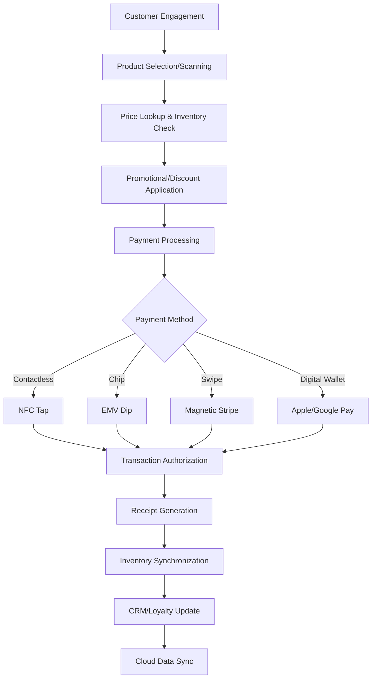

# Comprehensive Market and Product Analysis of Tablet-Style Devices for Payment and SaaS Applications
# 1 Introduction and Market Overview of Tablet-Style Payment and SaaS Devices

This chapter establishes the foundational context for understanding tablet-style devices in commercial payment processing and SaaS applications. By examining the historical evolution, market dynamics, and technological convergence driving this sector, we provide the essential framework for the detailed manufacturer analysis, use case investigation, and regional market assessment that follow in subsequent chapters.

## 1.1 Evolution of Point-of-Sale Technology and the Rise of Tablet-Based Systems

The transformation of point-of-sale technology represents one of the most significant shifts in commercial infrastructure over the past century and a half. Understanding this evolution is essential for appreciating how tablet-based systems have become the dominant paradigm in modern retail and hospitality environments.

### From Mechanical Cash Registers to Electronic Systems

The earliest POS systems were traditional cash registers, which first appeared in the late 1800s and could perform basic functions like adding up purchases and opening a cash drawer[^1]. These mechanical devices served businesses adequately for decades but offered no capability to track inventory or generate sales reports. The progression toward electronic registers added some digital capabilities, though they remained fundamentally limited in their analytical and connectivity functions[^1].

A pivotal moment in payment technology history occurred in the late 1950s when IBM engineer Edward Parry developed the magnetic stripe card, with his wife Dorothea suggesting the innovation of ironing magnetic tape onto cards rather than glueing it[^2]. This breakthrough enabled the "swipe" functionality that would define card payments for decades. The development of chip-and-pin technology by German engineers Helmut Gröttrup and Jürgen Dethloff further advanced payment security by storing card information on electronic chips[^2].

### The Touchscreen Revolution and Software Modernization

POS systems underwent a dramatic transformation in 1986 when touchscreen technology and color graphic monitors became more affordable. ViewTouch, launched by Gene Mosher on the Atari ST platform, became the first POS system solution to leverage these capabilities[^3]. This marked the beginning of user-interface innovations that would eventually lead to the intuitive tablet-based systems we see today.

### The Cloud Computing Transformation

The rise of cloud-based systems occurred gradually through the 2010s as Internet connectivity became more reliable and affordable. **Cloud-based systems fundamentally changed the POS landscape** by saving data securely online instead of on a single terminal, enabling business owners to check sales from their phones and manage multiple locations from a single dashboard[^1]. The subscription model made sophisticated POS technology accessible to smaller businesses through monthly fees instead of large upfront costs[^1].

### The Mobile POS Revolution (2010s)

The 2010s introduced mobile POS (mPOS) systems coinciding with the rise of smartphones and tablets. Businesses could suddenly use iPads, Android tablets, or even smartphones as fully functioning registers, eliminating the need for bulky hardware[^4]. These mPOS systems proved particularly transformative for:

- **Pop-up shops and food trucks** requiring portable solutions
- **Quick-service restaurants** needing flexible checkout options
- **Events and trade shows** demanding temporary payment infrastructure
- **Full-service restaurants** enabling table-side ordering and payment

The widespread adoption of cloud-based POS systems accelerated during this decade, with many business owners and workers beginning to use POS systems on mobile devices[^3]. This became increasingly practical as tablets and smartphones gained larger displays and better processing power, allowing employees to look up product information, answer customer questions, and take payments while walking around the shop floor[^3].

### Security Milestones and Contactless Evolution

Key security milestones shaped the modern POS ecosystem. EMV and chip readers became a major security advancement in the mid-2010s, with chip cards generating unique codes for each transaction and dramatically reducing card fraud[^1]. Contactless and Tap-to-Pay technology made payments nearly frictionless, with Tap-to-Pay on Phone technology turning smartphones and tablets into payment terminals without requiring additional hardware[^1].

The COVID-19 pandemic significantly accelerated contactless payment adoption. In Germany, for example, card payments rose from just 12% of transactions in 2019 to 30% in 2020—more than doubling—and by 2021, card payments outnumbered cash payments for the first time[^2]. A German Payment Systems Initiative study found that 44% of respondents planned to continue paying by card after the pandemic[^2].

### The Modern Integrated Platform Era (2020s)

Modern POS systems of the 2020s have evolved into complete business management platforms that integrate sales, inventory, CRM, accounting, marketing, and analytics[^4]. **Wireless POS devices now lead with a 50% share in product types**, with cloud POS typically bundled with mobile POS using tablets or smartphones as terminals[^5]. Mobile POS enables workers to ring up customers on the floor or at tables without being tethered to a counter[^5].

This timeline illustrates the progressive digitization and integration of payment technology, culminating in today's tablet-based systems that serve as comprehensive business operation hubs rather than simple transaction processors.

## 1.2 Defining the Scope: Payment Devices and SaaS Application Tablets in Commercial Contexts

Establishing clear definitions and boundaries for tablet-style payment and SaaS devices is essential for meaningful market analysis. This section provides a taxonomic framework that distinguishes between device categories, functional applications, and deployment contexts.

### Device Category Taxonomy

Tablet-style commercial devices can be categorized along several dimensions based on their primary function, form factor, and deployment context:

| Category | Primary Function | Typical Hardware | Common Deployment |
|----------|------------------|------------------|-------------------|
| **Tablet POS Systems** | Payment processing, transaction management | Consumer-grade or commercial tablets with payment peripherals | Retail counters, restaurants, hospitality |
| **Mobile POS (mPOS)** | Portable payment acceptance | Smartphones/tablets with card readers | Field sales, pop-up shops, table-side service |
| **SoftPOS (Tap-to-Phone)** | Contactless payment acceptance | Standard smartphones/tablets with NFC | Small merchants, delivery, events |
| **Enterprise Tablets** | SaaS applications, business operations | Rugged commercial tablets | Field service, logistics, healthcare |
| **Self-Service Kiosks** | Automated ordering and payment | Fixed tablet installations | QSRs, retail self-checkout |

**Payment terminals** are devices used by goods or service providers to facilitate non-cash payments during transactions, including credit card payments, electronic money transactions, barcode payments, and QR code payments[^6]. Modern terminals often combine two or more of these functions, creating versatile payment acceptance capabilities.

### Functional Application Categories

Beyond payment processing, tablet devices in commercial environments serve diverse SaaS application functions:

**Inventory and Operations Management**: Modern POS systems function as central hubs for managing customer relationships, inventory, and analytics, driving operational efficiency[^7]. According to industry data, **79% of businesses now rely on POS systems for core functions like inventory tracking, sales monitoring, and transaction processing**[^8].

**Customer Relationship Management (CRM)**: Loyalty and CRM systems are integrated so that when a customer makes a payment, the POS awards rewards and updates the customer's profile[^5]. This integration enables personalized shopping experiences by analyzing past customer behavior to deliver tailored product recommendations and marketing messages.

**Enterprise Mobility Applications**: Enterprise Mobility Management (EMM) frameworks encompass integrated tools for Mobile Application Management (MAM), Mobile Content Management (MCM), and enterprise app stores[^9]. In retail specifically, EMM equips employees with mobile tools for inventory management and customer service while securing mobile Point-of-Sale (mPOS) systems[^9].

**Omnichannel Integration**: Small businesses require their POS to integrate with e-commerce, social commerce, loyalty programs, and accounting platforms seamlessly[^10]. An omnichannel POS system syncs stock automatically across platforms—physical store, website, WhatsApp, and delivery apps—updating inventory everywhere when an item sells anywhere to prevent overselling[^10].

### Deployment Context Framework

The deployment context significantly influences device selection and configuration requirements:

**Retail Environments**: The retail sector is one of the most significant adopters of tablet POS systems, driven by the need to streamline operations and offer a seamless omnichannel experience[^11]. **Retail applications account for 38.7% of tablet POS system usage**, with the sector leading in POS adoption at approximately 52% of installations worldwide in 2025[^8].

**Hospitality and Food Service**: The restaurant sector accounts for 18% of mobile POS applications in 2025[^5]. A 2023 hospitality technology survey found that **71% of participants selected integration and cloud-based operations as key features** for their custom-developed POS software[^5]. The hospitality industry utilizes these systems for personalized and efficient services[^11].

**Healthcare Settings**: Healthcare providers adopt tablet POS systems to improve patient interactions and administrative processes[^11]. The healthcare sector has shown a 19% rise in adoption of tablet POS systems[^8].

**Field Services and Logistics**: Field services require rugged, portable devices for on-the-go payments[^12]. Mobile kiosk deployments, such as healthcare carts, require genuine long-life batteries as a non-negotiable feature[^13].

### Payment Technology Integration Spectrum

The range of payment technologies integrated into tablet devices reflects the diverse needs of modern commerce:

**Contactless Technologies**: NFC (Near Field Communication) is the most common contactless method, used for tapping cards, phones, or smartwatches on enabled terminals[^12]. Other methods include RFID for specific environments like event wristbands, QR codes for merchants like food trucks, BLE for hands-free systems like drive-throughs, and cloud-based in-app payments triggered by proximity or geolocation[^12].

**Traditional Payment Methods**: Credit card terminals read customer information embedded in the magnetic stripe of cards, while electronic money transactions use cards or smartphones with IC chips[^6]. A modern POS must support the full payment mix, including tap, chip, QR, wallet, and Buy Now, Pay Later (BNPL)[^10].

**Digital Wallet Integration**: Digital wallets became the largest POS payment method in many APAC regions in 2024-2025[^10]. Contactless cards now make up 20-30% of POS transactions in many regions[^10].

## 1.3 Market Size, Growth Trajectory, and Key Performance Indicators

The global tablet POS systems market demonstrates robust growth dynamics, though market sizing varies across research sources due to different methodological approaches and scope definitions. This section synthesizes available data to present a comprehensive quantitative picture of the market.

### Current Market Valuation

Multiple research sources provide varying estimates for the current tablet POS systems market size, reflecting different scope definitions and methodological approaches:

| Source/Report | 2024 Market Size | Projected Size | Target Year | CAGR |
|---------------|------------------|----------------|-------------|------|
| Report A[^14] | USD 5.16 billion | USD 7.28 billion | 2030 | 5.90% |
| Report B[^8] | USD 8.5 billion | USD 30 billion | 2034 | 13.4% |
| Report C[^11] | USD 5.4 billion (2023) | USD 12.5 billion | 2032 | 9.8% |

The broader POS software market provides additional context: **the global POS software market is valued at approximately USD 16-16.4 billion in 2025** and is expected to reach approximately USD 29-41 billion by 2030-2034, with a compound annual growth rate of about 9-12%[^10]. The worldwide POS market overall was approximately $29 billion in 2023 and is projected to surpass $110 billion by 2032[^5].

**Cloud POS specifically is growing at a CAGR of over 20%**, driven by small businesses adopting tablet POS, mobile POS, and SaaS-based tools[^10]. This accelerated growth rate for cloud-based solutions indicates a structural shift in the market toward subscription-based, connected systems.

### Market Segmentation Analysis

**By Deployment Mode**: Cloud-based deployment represents the fastest-growing segment:
- Cloud-based deployment shows the highest growth with a CAGR of 6.24% during the forecast period[^14]
- **Cloud adoption dominates the market with about 67% of POS installations now cloud-based**[^8]
- Cloud-based POS adoption has reached 64%, driven by lower upfront costs and easy remote management[^8]

**By Hardware Component**: The card reader segment holds the largest market share of over 54% in 2024[^14]. In another analysis, the card reader segment commands a significant lead at 64.6% of the share[^8].

**By Operating System**: The Android segment dominates the market by operating system[^14]. This dominance reflects Android's flexibility, lower licensing costs, and broader hardware compatibility compared to iOS alternatives.

**By End-User Vertical**:
- **Retail**: The retail segment accounted for the largest market share, with approximately 38.7% to 52% of installations[^14][^8]
- **Restaurants and Quick-Service**: Approximately 28% of installations[^8]
- **Hospitality**: Growing adoption driven by demand from hotels, entertainment venues, and resorts for automated solutions[^14]
- **Healthcare**: 19% rise in adoption[^8]

### Geographic Market Distribution

**North America** maintains market leadership with dominant positioning:
- North America holds the largest share of over 34-35.7% of the global market[^14][^8]
- The region accounted for approximately USD 3.0 billion in revenue in 2024[^8]
- The United States alone accounts for substantial market activity, with a market value of approximately USD 17.6 billion and a steady CAGR of 7.3%[^8]
- Growth is fueled by a high number of retail stores and restaurants[^14]

**Europe** is anticipated to remain a dominant player, supported by strong retail and hospitality sectors and a high rate of technological adoption[^11].

**Asia Pacific** is expected to exhibit the highest growth rate, with a CAGR of over 11%, driven by the rapid expansion of the retail sector, increasing urbanization, and the rising number of SMEs adopting modern POS solutions[^11].

**Latin America** shows the fastest-growing CAGR of 7.73% during the forecast period, driven by factors such as the expanding retail and hospitality sectors[^14].

### Key Performance Indicators and Adoption Metrics

Several metrics illuminate the depth of market penetration and operational impact:

**Adoption Rates**:
- **Around 82% of retailers are actively upgrading their POS setups** to improve speed, accuracy, and customer experience[^8]
- Mobile POS solutions are projected to grow by 20% annually as businesses seek greater flexibility[^8]
- **99% of restaurants use at least one online ordering platform**, and on average, most use three platforms[^5]

**Consumer Preferences**:
- **84% of U.S. consumers now prefer self-service kiosks**, with 66% choosing these options over traditional staffed checkouts[^5]
- Generation Z (84%) and millennials (76%) lead in embracing point-of-sale technologies[^5]
- 86% of American adults have used a self-checkout, and 77% prefer it for a faster experience[^5]
- A 2025 global survey shows 71% of consumers prefer contactless payments over traditional methods[^12]

**Operational Impact**:
- An omnichannel POS can lead to a 70% drop in stock mismatches and a 20% revenue increase due to better product availability[^10]
- A business switching to a mobile cloud POS system achieved 40% faster checkout[^10]
- An AI-driven system helped reduce food waste by 15% and increased average order value by 8%[^10]

## 1.4 Convergence of Hardware and Software Trends Driving Market Expansion

The tablet POS market's growth trajectory is propelled by the convergence of multiple technological and business model innovations. Understanding these driving forces is essential for anticipating future market developments and identifying strategic opportunities.

### Cloud-Based Deployment and SaaS Transformation

The shift toward cloud-based POS systems represents the most significant structural change in the market. **Cloud functionality is a top priority for integrations**, with 71% of 2023 hospitality technology survey participants selecting integration and cloud-based operations as key features for their custom-developed POS software[^5].

The advantages driving cloud adoption include:

- **Lower upfront costs**: The subscription-based, software-as-a-service (SaaS) model common to many mPOS providers reduces initial investment[^7]
- **Remote accessibility**: Business owners can check sales from their phone and manage multiple locations from a single dashboard[^1]
- **Automatic updates**: Cloud systems receive continuous software improvements without manual intervention
- **Scalability**: Businesses can easily add terminals and locations without significant infrastructure investment

The point-of-sale software market has moved towards subscription and usage-based pricing, mirroring the SaaS model. With a subscription model, businesses pay a monthly fee per site or register, significantly reducing upfront costs[^5]. This democratization of sophisticated POS capabilities has been particularly impactful for small and medium enterprises.

### Mobile POS and SoftPOS Innovation

**Tap-to-phone usage (softPOS) has grown over 200% year-over-year**, supported by major payment networks[^10]. This allows businesses to use tablets instead of bulky hardware, avoid high upfront device costs, and enable pop-up shops or events[^10].

The mobile payments market demonstrates explosive growth potential: the market is now worth **$94.5 billion in 2024 but expected to expand rapidly with 34% compounded annual growth to reach $408 billion by 2029**[^15]. These figures are anticipated as the penetration of mobile technology continues to grow; in the second quarter of 2024, global smartphone ownership grew by 6%, including parallel usage of other mobile devices such as tablets[^15].

Cloud POS tends to be bundled with mobile POS, using tablets or smartphones as terminals[^5]. Mobile POS lets workers ring up customers on the floor or at a table without being tethered to a counter, enabling line-busting and improved customer service[^5].

### AI Integration and Data Analytics

**The role of generative AI in tablet POS systems is becoming notably prominent in 2025**. Around 73% of retailers using generative AI have reported faster decision-making and enhanced automation for daily operations[^8]. This technology supports personalized shopping experiences by analyzing past customer behavior to deliver tailored product recommendations and marketing messages[^8].

Key AI applications in POS systems include:

- **Smart inventory intelligence**: Predicting when stock will run out and automated sales forecasting[^10]
- **Fraud detection**: AI systems can detect fraudulent activity with accuracy approaching 97%[^16]
- **Dynamic pricing**: Real-time price optimization based on demand patterns
- **Personalization**: Tailored product recommendations and marketing messages based on customer behavior

Key developments include Toast's launch of AI-driven ToastIQ in 2025, representing the integration of artificial intelligence directly into restaurant POS platforms[^14]. This trend toward AI-powered POS represents a fundamental shift from transaction processing to intelligent business management.

### Contactless and Digital Payment Expansion

The global push towards a cashless society, accelerated by the COVID-19 pandemic, has solidified the necessity for digital payment options. **Contactless payments via NFC technology are now a standard expectation**, and mPOS devices are at the forefront of enabling this capability for businesses of all sizes[^7].

Payment method evolution includes:

- **Contactless cards**: Now make up 20-30% of POS transactions in many regions[^10]
- **Digital wallets**: Became the largest POS payment method in many APAC regions in 2024-2025[^10]
- **BNPL**: Used by over 25% of adults in developed markets[^10]
- **QR code payments**: Prevalent particularly in Asian markets and for specific merchant types

A record 93% of in-store card transactions used contactless payments in 2023, and 80% of consumers aged 85 to 95 now pay with contactless[^15]. Security has been heightened with tech innovations paving the way for biometric authentication to enhance payment security, reducing the risk of fraud and making consumers more at ease with using mobile payments for larger transactions[^15].

### Omnichannel Integration Requirements

A 2023 survey of retailers named **omnichannel integration and order orchestration as the number one POS upgrade priorities**, with 54% of respondents highlighting this need[^5]. Businesses want their point-of-sale software completely integrated with e-commerce websites, mobile apps, and third-party marketplaces.

The demand for omnichannel capabilities drives several integration requirements:

- **Unified inventory management**: An omnichannel POS system syncs stock automatically across platforms[^10]
- **Consistent customer experience**: Consumers increasingly expect to check inventory, complete transactions, or initiate returns anywhere on the shop floor[^7]
- **Third-party service integration**: POS systems integrate with delivery platforms (Uber Eats, DoorDash), accounting software, loyalty programs, and CRM systems[^5]

For restaurants specifically, integrating online ordering services directly into the POS saves time and reduces errors. Instead of workers retyping orders from a tablet into the POS, an integrated setup sends the online order directly into the kitchen and POS stream[^5].

### Self-Service and Automation Trends

Self-service POS is becoming the norm at most quick-service restaurants (QSRs), driven by both manpower shortages and consumer pressure[^5]. **Over 217,000 self-checkout kiosks were sold globally in 2023**, and at restaurants, the self-service kiosk segment is the fastest-growing, with 9.5% annual growth expected[^5].

Self-service kiosks have demonstrated operational benefits beyond labor savings: such kiosks have a tendency to ring up higher average order values[^5]. Even full-service restaurants are experimenting with tabletop self-service—tablet menus at tables where customers can order additional items without waiting for the server[^5].

## 1.5 Enterprise Mobility and the Expanding Role of Tablets in Business Operations

Tablet devices have evolved beyond traditional POS functions to become central components of enterprise mobility strategies. This expansion reflects broader digital transformation initiatives across industries and creates new opportunities for tablet-based solutions.

### The Enterprise Mobility Landscape

Enterprise mobility is evolving to become the central nervous system of business operations, connecting employees, systems, cloud, apps, and data[^17]. The theme for 2026 is adoption at scale, with a convergence of trends driving broader deployment of mobile solutions across enterprises.

A key trend underscoring the importance of Enterprise Mobility Management (EMM) is the surge in mobile device usage. **By 2025, millennials are expected to represent 75% of the global workforce**, with a strong preference for mobile and remote working[^9]. Furthermore, by 2025, it is estimated that 32.6 million Americans will be working remotely, equating to about 22% of the workforce[^9].

### Shared Device Environments and Workforce Management

Organizations increasingly recognize that providing dedicated devices to every employee is cost-prohibitive, particularly for shift-based or geographically distributed workforces. In 2026, organizations will standardize shared device and shift-based mobile device environments[^18].

A critical component of this trend is device enrollment through MDM (Mobile Device Management) platforms. MDM enables administrators to:

- Achieve faster user switching and authentication on shared mobile devices
- Automatically log out users based on shift schedules
- Ensure robust session security to protect enterprise data

The market is prepared for this development, with both Google and Apple supporting shared device management for their mobile operating systems. Microsoft Entra ID offers a shared device mode feature for secure configuration of iOS, iPadOS, and Android devices for multi-employee use, including single sign-on capabilities[^18].

### AI-Powered Unified Endpoint Management

**The global UEM market is expected to grow at a CAGR of nearly 36% through 2026**[^17]. AI is automating device provisioning, patching, compliance checks, app deployment, and threat detection. AI agents are being deployed for predictive maintenance and automated remediation, analyzing endpoint telemetry to autonomously quarantine or remediate devices[^17].

### Enhanced Connectivity and Edge Computing

**Private 5G-as-a-service investments will grow from $58 million in 2021 to $5.8 billion in 2026**—a 100x increase[^17]. These networks offer ultra-low latency, high bandwidth, and improved data security, supporting functions like augmented reality, machine vision, and AI. McKinsey research shows equipping frontline teams with AR glasses and IoT sensors driven by private 5G cuts downtime by up to 30%[^17].

GMI Insights forecasts edge computing as a $118 billion market by 2032[^17], indicating substantial infrastructure investment that will support more sophisticated tablet-based applications in commercial environments.

### Security Evolution: Zero-Trust and Beyond

A CIO blog reports that **81% of businesses plan to implement zero-trust strategies by 2026**[^17]. Enterprises will adopt continuous authentication, device posture checks, and encrypted micro-sessions on all mobile endpoints, including BYOD fleets. AI-based anomaly detection will audit employee devices in real time[^17].

For tablet POS systems specifically, security features like PCI-DSS compliance and end-to-end encryption are non-negotiable in 2025[^10]. A significant restraint for the market remains the heightened risk of cybersecurity threats and data breaches[^8].

### Industry-Specific Applications Beyond Retail

The expanding role of tablets extends across multiple verticals:

**Healthcare**: Healthcare providers adopt tablet POS systems to improve patient interactions and administrative processes[^11]. EMM supports secure access to learning management systems and patient data[^9].

**Field Services**: Field services require rugged, portable devices for on-the-go payments[^12]. Logistics firm DHL deployed smart glass-based vision picking, reporting up to 25% improvement in picking efficiency and cutting onboarding time by almost half[^17].

**Hospitality Integration**: In hotel hospitality, restaurant/bar POS is integrated with hotel property management systems (PMS) so customers can charge meals to their room[^5]. Integrating reservations or appointment systems with POS is highly beneficial—44% of diners find a restaurant less appealing if it's difficult to make a reservation[^5].

### Application Modernization and Workflow Acceleration

According to Mordor Intelligence, **the application modernization market is valued at $21.91 billion in 2025**, with projections to reach $42.6 billion by 2030[^18]. Application modernization refers to the consolidation, repurposing, or refactoring of legacy software code and migrating on-premise systems to modern cloud-native environments.

This trend directly impacts tablet-based commercial applications as businesses seek to:

- Adopt no-code or low-code workflows
- Implement strategies to improve user experience
- Integrate legacy systems with modern tablet-based interfaces

Application modernization is no longer a future optional activity but a critical differentiator enabling modern organizations to grow while leaving laggards stagnant[^18].

### Virtual Assistants and Wearable Integration

Enterprise mobile apps will increasingly integrate AI agents or virtual assistants for scheduling, emailing, summarizing reports, and tracking tasks[^17]. Microsoft Power Platform embeds Copilot directly within mobile apps, and Salesforce has added Einstein GPT to its mobile sales suite. **Gartner predicts over 50% of enterprise app interactions will be AI-augmented or AI-automated by 2027**[^17].

Wearables like smart glasses, smartwatches, and headsets are becoming essential enterprise tools[^17]. Snap plans to launch next-generation AR smart glasses (Specs) in 2026, and Meta is developing Orion smart glasses for enterprise use cases[^17]. These developments suggest future integration pathways between tablet POS systems and wearable devices for enhanced operational capabilities.

---

This introductory chapter has established the foundational context for understanding tablet-style payment and SaaS devices in commercial environments. The evolution from mechanical cash registers to AI-integrated cloud platforms represents a fundamental transformation in how businesses manage transactions and operations. With market valuations ranging from $5.16 billion to $8.5 billion in 2024 and projected growth to $7.28-30 billion by 2030-2034, this sector demonstrates robust expansion driven by cloud adoption, mobile innovation, and the convergence of payment processing with comprehensive business management capabilities. The subsequent chapters will build on this foundation to examine specific manufacturers and devices, deployment scenarios, and regional market dynamics in greater detail.

## 2 Landscape of Key Manufacturers and Device Specifications

This chapter provides a comprehensive analysis of the major hardware manufacturers producing tablet-style devices for payment processing and SaaS applications, along with detailed specifications of their flagship products. It examines the competitive landscape, manufacturer positioning, and technical capabilities across the enterprise tablet and mobile POS segments, offering a structured comparative framework for evaluating available hardware portfolios.

### 2.1 Enterprise Tablet and Payment Device Manufacturer Ecosystem

The tablet-style payment and SaaS device market is characterized by a diverse ecosystem of manufacturers, each bringing distinct competencies, business models, and strategic positioning to serve different segments of the commercial technology landscape. Understanding this ecosystem is essential for hardware product managers seeking to identify competitive dynamics, partnership opportunities, and market positioning strategies.

#### Manufacturer Landscape Overview

The competitive landscape can be broadly segmented into three categories based on business model orientation: **enterprise mobility specialists** focusing on rugged hardware for diverse commercial applications, **integrated payment-software-hardware providers** offering end-to-end POS solutions, and **payment infrastructure companies** providing terminal hardware as part of broader payment processing ecosystems.

| **Manufacturer Category** | **Key Players** | **Primary Business Model** | **Core Competencies** |
|:---|:---|:---|:---|
| **Enterprise Mobility Specialists** | Elo Touch Solutions, Zebra Technologies, Honeywell | Hardware-centric with software management tools | Rugged design, enterprise-grade durability, data capture, device management |
| **Integrated POS Providers** | Square, Clover (Fiserv), Toast | Hardware-software-payments integration | Seamless ecosystem, subscription software, payment processing |
| **Payment Terminal Manufacturers** | Verifone, Ingenico, Adyen | Payment infrastructure with terminal hardware | Security certifications, global payment network integration, multi-acquirer support |

#### Elo Touch Solutions: Touchscreen Pioneer with Unified Architecture

**Elo Touch Solutions**, established in 1971 and headquartered in Milpitas, United States, designs touchscreen POS hardware and interactive displays that integrate seamlessly into retail and hospitality environments[^19]. The company has positioned itself as a provider of **unified architecture solutions** spanning Android, Windows, and Linux operating systems, offering flexibility across deployment contexts[^20].

Elo's strategic focus centers on delivering enterprise-grade mobile point-of-sale tablets with integrated payment capabilities certified to the highest security standards. The company's market positioning emphasizes **long lifecycle support** and unified device management through its EloView platform, appealing to enterprises requiring consistent hardware across multiple locations and extended deployment periods[^21]. Elo Touch is recognized among key integrated POS terminal providers, with particular traction in the Middle East and Africa region where all-in-one POS systems are gaining adoption[^22].

#### Zebra Technologies: Enterprise Mobility and Data Capture Leadership

**Zebra Technologies** represents one of the most significant players in the enterprise mobility space, with a comprehensive portfolio spanning mobile computers, rugged tablets, and wearable devices. The company reported **net sales of $4,981 million for full-year 2024**, representing an 8.7% increase compared to 2023, with the Enterprise Visibility & Mobility (EVM) segment generating $886 million in Q4 2024 alone[^23].

Zebra's strategic positioning emphasizes **purpose-built devices for frontline workers** across retail, warehousing, manufacturing, healthcare, and field services[^24]. The company differentiates through its Zebra DNA software suite, which provides intelligent software tools for device management, security, and performance optimization[^25]. Zebra's business-class lifecycle guarantee—offering **6-8 years of availability and support**—addresses enterprise concerns about device longevity and total cost of ownership[^26].

For 2025, Zebra expects net sales growth between 3% and 7% compared to 2024, with non-GAAP diluted earnings per share projected in the range of $14.75 to $15.25[^27]. This guidance reflects continued enterprise demand for mobile computing solutions.

#### Honeywell: Industrial Heritage with Payment Innovation

**Honeywell** brings its industrial technology heritage to the enterprise tablet and mobile payment space through its Productivity Solutions and Services division. The company's approach combines **rugged tablet computers** designed for retail, grocery, DSD, field service, transportation, and logistics with innovative software solutions[^28].

A significant strategic development was Honeywell's November 2022 release of **Honeywell Smart Pay**, a contactless software payment solution developed in collaboration with Amadis, whose software has been deployed in more than 40 million mobile devices globally[^29]. This SoftPOS solution transforms NFC-enabled Android devices into secure payment terminals without additional hardware, representing Honeywell's entry into the competitive mobile payments market against established players like Square and PayPal[^30].

#### Square: Democratizing Payment Acceptance

**Square** (now part of Block, Inc.) has fundamentally transformed the payment terminal landscape through its focus on **accessibility and transparent pricing**. With an estimated 15% market share in the U.S. payment terminal industry as of 2024, Square is known for easy-to-use devices and straightforward fee structures[^31].

Square's business model integrates hardware, software, and payment processing into unified solutions. The **Square Terminal**, priced at $299 or $27/month for 12 months, exemplifies this approach with its all-in-one design featuring integrated receipt printer, touchscreen interface, and support for tap, dip, and swipe payments[^32]. In May 2025, Square launched the **Square Handheld**, expanding its portfolio for mobile payment scenarios[^33].

#### Clover (Fiserv): Customizable POS Ecosystem

**Clover**, owned by financial services giant Fiserv, holds approximately 10% of the U.S. payment terminal market and offers smart terminals with integrated software solutions[^31]. Clover's strategic positioning emphasizes **customization and expandability**, with devices designed to integrate with multiple countertop and handheld devices and accessories[^34].

The Clover ecosystem spans from compact devices to full-featured stations, with software plans tailored for retail and restaurant verticals. This flexibility appeals to small and medium businesses seeking scalable POS solutions that can grow with their operations.

#### Toast: Restaurant-Specific Innovation

**Toast** has carved a distinctive position as a **purpose-built restaurant POS provider**, focusing exclusively on the hospitality vertical. The company's hardware is designed to withstand restaurant-specific challenges including spills, drops, and high-temperature environments[^35][^36].

Toast's strategic approach combines cloud-based software accessible from anywhere with reliable offline mode capabilities, addressing the operational realities of restaurant environments where connectivity may be intermittent[^36]. The company's launch of AI-driven ToastIQ in 2025 represents integration of artificial intelligence directly into restaurant POS platforms.

#### Verifone and Ingenico: Payment Infrastructure Giants

**Verifone** holds approximately 30% market share in the USA's payment terminal industry as of 2024, positioning it as a global leader known for reliable and secure payment solutions[^31]. The company offers a comprehensive range of terminals suitable for various industries, from portable devices to multilane retail solutions[^37].

**Ingenico Group** commands around 25% of the U.S. market and provides innovative payment terminals supporting multiple transaction types including contactless and mobile payments[^31]. Ingenico's portfolio spans portable devices, countertop terminals, retail PIN pads, self-service solutions, and integrated POS systems[^38]. In October 2024, Ingenico partnered with Lunu Pay to bring cryptocurrency payments to brick-and-mortar stores via Android-based POS terminals[^33].

#### Adyen: Platform-Centric Terminal Approach

**Adyen** differentiates through its platform-centric approach, offering Android payment terminals designed to run third-party business applications alongside payment acceptance[^39]. This strategy positions Adyen terminals as **multifunctional business hubs** rather than single-purpose payment devices, enabling merchants to consolidate operations onto unified hardware.

Adyen's geographic availability spans North America, Europe, Asia Pacific, Latin America, and the Middle East, with terminal models supporting regional payment methods and regulatory requirements[^40].

### 2.2 Elo Touch Solutions Product Portfolio and Specifications

Elo Touch Solutions offers a comprehensive portfolio of tablet-style POS devices spanning mobile tablets, integrated payment systems, and fixed terminals across Android, Windows, and Linux platforms. The company's product strategy emphasizes **unified architecture** enabling consistent deployment experiences across different operating systems and form factors.

#### Elo Pay POS Systems Overview

The Elo Pay product line represents the company's integrated payment solutions, combining enterprise-grade hardware with PCI-certified payment acceptance capabilities. Key products include the **Elo Pay Z30 'Tap to Pay'**, **Elo Pay M60 Mobile POS Computer**, **Elo Pay 7-inch and 10-inch Integrated Payment POS**, **Elo Pay M100 Mobile POS Tablet**, and **Elo Pay 22-inch 'Tap to Pay'**[^20].

#### Elo Pay M100: Flagship Mobile POS Tablet

The **Elo Pay M100** represents Elo's flagship enterprise-grade mobile point-of-sale tablet, designed for commercial environments requiring both mobility and integrated payment capabilities.

**Display and User Interface**: The M100 features a **10.1-inch FHD (1920 x 1200) optically bonded touchscreen** with projective capacitive technology protected by Corning Gorilla Glass. The display delivers 500 nits brightness with 900:1 contrast ratio, featuring water rejection and anti-fingerprint coating for commercial durability[^21][^41].

**Processing and Memory**: Powered by a **Qualcomm Snapdragon 660 2.2GHz Octa-Core processor**, the M100 provides 4GB RAM and 64GB storage, with expansion capability up to 1TB via MicroSD card[^42][^21]. The device runs **Android 12 with GMS (AOSP Capable)**, with a planned upgrade path to Android 14 available through the OS 360 subscription[^21].

**Payment Security and Certification**: The M100 holds **PCI-PTS 6.2 certification** (PCI Approval Number: 4-30551), representing the highest current security standard for payment terminals. Integrated payment readers include EMV Contactless (ISO 14443-A/B, MiFare, ISO-18092) and EMV Chip Card Reader with chip and pin-on-glass capability[^21]. The device supports major payment methods including Visa PayWave, Mastercard PayPass, Amex ExpressPay, Discover D-PAS, Apple Pay, Google Pay, Samsung Pay, China Union Pay, and JCB[^21].

**Ruggedness and Durability**: With an **IP54 rating** per IEC standard 60529, the M100 provides resistance from unintentional spills and dust. Drop specifications include multiple 1m drops per MIL-STD-810G, extending to 1.6m with the ruggedized case[^21][^43]. Operating temperature ranges from -20°C to 50°C (-4°F to 122°F)[^21].

**Connectivity and Wireless**: The M100 supports IEEE 802.11 a/b/g/n/ac Wi-Fi with 2x2 MU-MIMO and Bluetooth 5.0. Cellular variants (M100C) offer LTE connectivity for AT&T in the US/Canada or open carrier in Europe[^21]. GPS support includes GPS, GLONASS, Galileo, and BeiDou concurrent positioning[^21].

**Integrated Peripherals**: Beyond payment readers, select models include an **SE4100 1D/2D barcode scan engine**. Cameras include an 8MP rear auto-focus with LED flash and 5MP front fixed-focus with face authentication capability[^21].

| **Elo Pay M100 Key Specifications** | **Details** |
|:---|:---|
| Display | 10.1" FHD (1920x1200), 500 nits, Gorilla Glass |
| Processor | Qualcomm Snapdragon 660, 2.2GHz Octa-Core |
| Memory/Storage | 4GB RAM / 64GB (expandable to 1TB) |
| Operating System | Android 12 (upgradeable to Android 14) |
| Payment Certification | PCI-PTS 6.2 |
| Ruggedness | IP54, 1m drops (1.6m with case), MIL-STD-810G |
| Connectivity | Wi-Fi 5, Bluetooth 5.0, Optional LTE |
| Battery | 8000mAh Li-Polymer, User Replaceable, Quick Charge 3 |
| Dimensions | 255.48 x 161.96 x 13.67 mm |
| Weight | 767-794g (model dependent) |
| Price | $1,182.99 - $1,250.00[^43] |

**Device Management**: Elo provides seamless provisioning through **EloView**, Google Zero Touch, or GMS, enabling centralized device management across enterprise deployments[^21]. The rotating POS Dock accessory allows the M100 to transition from mobile to fixed deployment, swiveling from merchant-facing to customer-facing orientation[^21].

#### Android POS Terminal Portfolio

Elo's Android POS terminal lineup extends across multiple form factors and screen sizes:

- **EloPOS Z10, Z20, Z30**: Compact to mid-size Android terminals available in current and Gen 1 versions
- **I-Series 4 and I-Series 5**: 10-inch, 15-inch, and 22-inch Android tablets in standard and Slate form factors
- **PayPoint Plus for Android**: Available with Android Open Source or Google Play Services (3.0)[^20]

#### Windows and Linux Terminal Options

For enterprises requiring Windows or Linux deployments, Elo offers parallel product lines:

**Windows POS Terminals** include the 15-inch (4:3 and 16:9), 17-inch (5:4), 22-inch, and 24-inch I-Series with Intel processors, EloPOS systems across sizes, E-Series options, and EloPOS Pack configurations[^20].

**Linux POS Terminals** mirror the Windows lineup, providing deployment flexibility for organizations with Linux-based POS software requirements[^20].

### 2.3 Zebra Technologies Enterprise Tablet Specifications

Zebra Technologies delivers enterprise-grade tablets purpose-built for demanding commercial environments, with a portfolio spanning the current ET40/ET45 series and next-generation ET401 tablets. These devices emphasize **rugged durability, advanced data capture, and long-term enterprise support**.

#### ET40/ET45 Enterprise Tablets

The **ET40 (Wi-Fi only) and ET45 (Wi-Fi plus cellular)** tablets are available in 8-inch and 10-inch screen sizes, designed for retail, hospitality, warehousing, and field service applications[^44].

**Processing and Memory**: Both models are powered by a **Qualcomm Snapdragon SM6375 Octa-Core CPU** with clock speeds of 2.2 GHz (2 cores) and 1.8 GHz (6 cores). Memory configurations include Standard (4GB LPDDR4X SDRAM / 64GB UFS Flash) and Premium (8GB RAM / 128GB)[^44][^25].

**Display Specifications**: The 8-inch model delivers 500 nits brightness at WXGA 1280x800 resolution, while the 10.1-inch model provides 500 nits at WUXGA 1920x1200. Both feature Corning Gorilla Glass protection[^44][^25].

**Operating System and Lifecycle**: Running **Android 11 upgradeable to Android 14**, the ET40/ET45 series offers a **business-class lifecycle with guaranteed availability and support for six years** from initial sale, with the exact model guaranteed available for three years[^25].

**Ruggedness Specifications**: The tablets achieve **IP65 sealing** rating, providing complete protection against dust and water jets. Drop specifications include 4 ft (1.2m) to concrete per MIL-STD-810H, extending to 5.1 ft (1.55m) with the optional rugged frame[^44][^25]. Operating temperature ranges from -4°F to 122°F (-20°C to 50°C)[^44].

**Integrated Data Capture**: Every ET40/ET45 model includes an **integrated enterprise-class barcode scanner** with three scan engine options: SE4100 for standard range scanning, SE4710 with large 'sweet spot' for easy aiming, and SE55 1D/2D Advanced Range Scan Engine with IntelliFocus technology for capturing items both in hand and across the room[^44]. Cameras include 13MP auto-focus rear with LED flash and 5MP front[^44].

**Connectivity**: Wi-Fi 6 (IEEE 802.11 ax) with 2x2 MU-MIMO provides fast wireless connectivity. The ET45 adds **5G cellular** for outdoor and field applications, plus GPS with dual-band GNSS (L1+L5) support[^44][^25]. NFC supports Reader/Writer for ISO 14443 Type A and B, with Host Card Emulation for Apple Pay VAS and Google SmartTap[^44].

**Payment Integration**: The tablets are **payment-ready with NFC tap-to-pay support** and can function as mobile POS devices with optional solutions like the Workstation Connect Cradle[^25].

**Battery System**: The 8-inch model includes a 6100 mAh battery (23.61 Wh), while the 10-inch model features a 7600 mAh battery (29.41 Wh). An **optional hot-swappable 3400 mAh secondary battery** enables continuous operation across multiple shifts without device downtime[^44][^25].

| **Zebra ET40/ET45 Specifications** | **8-inch Model** | **10-inch Model** |
|:---|:---|:---|
| Display | 500 nits, WXGA 1280x800 | 500 nits, WUXGA 1920x1200 |
| Dimensions | 213.9 x 134.8 x 11.4 mm | 257.9 x 162.9 x 11.4 mm |
| Weight | 485g (1.07 lbs) | 690g (1.52 lbs) |
| Battery | 6100 mAh | 7600 mAh |
| Sealing | IP65 | IP65 |
| Drop Rating | 1.2m (1.55m with frame) | 1.2m (1.55m with frame) |

#### ET401 Next-Generation Enterprise Tablets

The **ET401** represents Zebra's next-generation enterprise tablet, replacing the ET40/ET45 with enhanced specifications and extended lifecycle support[^44].

**Advanced Processing**: The ET401 is powered by the **Qualcomm Dragonwing Q-6690 processor**, which is three generations newer than the SM6375 and offers a **42%+ performance boost** with support through 2034[^26]. Memory configurations include 6GB LPDDR5 RAM / 64GB UFS 2.2 Flash, with optional 8GB LPDDR5 RAM / 128GB UFS 3.1 Flash[^26].

**Enhanced Ruggedness**: The ET401 achieves **IP68 sealing rating**, providing complete protection against dust and submersion in water—a significant upgrade from the ET40/ET45's IP65 rating[^26]. Thermal shock testing validates operation from -40°F to +158°F (-40°C to +70°C)[^26]. The tablets are built for an **8-year total service and support lifecycle** (4 years availability plus 4 years extended service)[^26].

**AI-Powered Features**: The Dragonwing Q-6690 enables **embedded AI-enhanced features** including AI-enabled touchscreen with advanced sensing technology for improved touch accuracy, AI-powered acoustic echo cancellation, and enhanced background noise suppression for clearer voice communications[^26].

**Integrated RFID Capability**: A groundbreaking feature is the **optional integrated short-range UHF RFID**, enabled by the world's first enterprise mobile processor with fully integrated RFID capabilities. This can read 90 RFID tags per second up to 4 ft (1.2m) away[^26].

**Next-Generation Connectivity**: The ET401 supports **Wi-Fi 7** (delivering more than double Wi-Fi 6 speed), **5G 2nd Gen Release 17** (fastest cellular with private 5G network support), and **Bluetooth 6.0** with precise positioning accuracy[^26].

**Backward Compatibility**: Nearly all existing ET40/ET45 accessories work with the ET401, enabling seamless upgrades for organizations with established accessory investments[^26].

| **ET401 vs ET40/ET45 Key Upgrades** | **ET40/ET45** | **ET401** |
|:---|:---|:---|
| Processor | Snapdragon SM6375 | Dragonwing Q-6690 (+42% performance) |
| Sealing | IP65 | IP68 |
| Wi-Fi | Wi-Fi 6 | Wi-Fi 7 |
| Bluetooth | 5.1 | 6.0 |
| Lifecycle Support | 6 years | 8 years |
| Integrated RFID | No | Optional |
| AI Features | Limited | Embedded AI |

#### Zebra DNA Software Suite

All Zebra tablets include the **Zebra DNA software suite**, providing intelligent software tools that simplify device management, strengthen security, and enhance performance[^26][^25]. The suite includes complimentary Zebra DNA Professional tools for application development, device management, and security, with optional Zebra DNA Enterprise license unlocking advanced capabilities including Workstation Connect and Workcloud Sync push-to-talk functionality[^25].

### 2.4 Honeywell Mobile Computing and Payment Solutions

Honeywell's enterprise tablet and mobile payment portfolio combines rugged hardware designed for demanding commercial environments with innovative software solutions that transform standard devices into payment terminals.

#### ScanPal EDA10A Enterprise Tablet

The **Honeywell ScanPal EDA10A** is a rugged yet lightweight tablet solution providing fast, reliable mobile data access on a 10-inch screen, designed for retail, warehouse, and field service applications[^45][^46].

**Processing and Performance**: The EDA10A is powered by a **Qualcomm Snapdragon SM4350-AC Octa-Core processor** running at up to 2.2GHz[^46][^47]. Memory configurations include 4GB RAM / 64GB Flash or 8GB RAM / 128GB Flash, with storage expansion via MicroSD supporting up to 2TB[^46][^45].

**Display**: The **10.1-inch Full HD display (1920 x 1200)** features 550 nits brightness and is protected by **Corning Gorilla Glass 5**. The multi-touch capacitive touchscreen supports glove, wet hand, and oily hand modes for industrial environments[^46][^45].

**Operating System**: Running **Android 12 with upgrade path to Android 14**, the EDA10A provides long-term OS support through Honeywell's Sentinel service[^46][^45].

**Ruggedness**: The tablet achieves **IP65 environmental sealing** and meets **MIL-STD-810H drop specifications** with multiple 1.3m (4.3 ft) drops to concrete at room temperature, extending to 2.0m (6.6 ft) with the optional protective boot[^46][^45]. Operating temperature ranges from -20°C to +50°C (-4°F to +122°F)[^46].

**Data Capture**: The integrated **Honeywell S0703 Slim Imager** provides enterprise-level 1D/2D barcode scanning, capable of capturing even damaged barcodes. Cameras include 16MP auto-focus rear and 8MP front for document imaging and video calls[^46][^45].

**Connectivity**: The EDA10A features **Wi-Fi 6 (802.11ax)** with 2x2 MU-MIMO, **Bluetooth 5.1**, and integrated NFC. Cellular models (EDA10A-1) support **5G NR** (SA and NSA modes) along with 4G LTE and 3G WCDMA bands[^46][^47].

**Battery**: The **8,000 mAh lithium-ion battery** provides more than 12 hours of operation and is **hot-swappable** for continuous multi-shift use[^46][^45].

| **Honeywell EDA10A Key Specifications** | **Details** |
|:---|:---|
| Display | 10.1" FHD (1920x1200), 550 nits, Gorilla Glass 5 |
| Processor | Qualcomm Snapdragon SM4350-AC, 2.2GHz Octa-Core |
| Memory/Storage | 4GB/64GB or 8GB/128GB (expandable to 2TB) |
| Operating System | Android 12 (upgradeable to Android 14) |
| Ruggedness | IP65, 1.3m drops (2.0m with boot), MIL-STD-810H |
| Scanner | Honeywell S0703 Slim Imager (1D/2D) |
| Connectivity | Wi-Fi 6, Bluetooth 5.1, NFC, Optional 5G |
| Battery | 8,000 mAh, Hot-Swappable |
| Dimensions | 257 x 166.5 x 11.7 mm |
| Weight | 674g (1.49 lbs) |

**Accessory Ecosystem**: Honeywell provides extensive accessories including single charging dock, display dock for workstation creation with keyboard and mouse, quad bay battery charger, vehicle dock, protective boot, rotating hand strap, and VESA mount plate[^46].

#### Honeywell Smart Pay SoftPOS Solution

**Honeywell Smart Pay** represents a strategic entry into the mobile payments market, transforming NFC-enabled Android devices into secure and compliant payment terminals without additional hardware[^48].

**Solution Overview**: Released in November 2022 in collaboration with payment software provider Amadis, Smart Pay is a **SoftPOS solution** designed for retail, transportation and logistics, and hospitality environments[^29]. The software enables seamless mobile transactions including assisted mobile sales, queue-busting, pop-up sales, emergency POS backup, and self-checkout[^48].

**Technical Implementation**: Smart Pay can be downloaded and installed directly from the Google Play Store in minutes, enabling **Android 8+ devices with NFC** to accept contactless payments[^48]. Integration options include app-to-app, web-to-app, or certified SDK connection with merchants' POS systems and backend architecture[^48].

**Security Certifications**: The solution meets comprehensive security certifications including **PCI DSS, DESV, PCI SSLC, PCI PIN, and PCI MPoC**[^48]. The software incorporates sophisticated secure code and anti-tampering technology, emulating the physical secure platform and tamper detection employed on traditional payment terminals[^29].

**Business Model**: Smart Pay operates on a **simple monthly SaaS pricing model per device**, avoiding transactional fees and eliminating the recurring hardware costs for card readers and encryption keys associated with traditional mPOS accessories[^48][^29].

**Compatible Devices**: Smart Pay works with Honeywell mobile computers including the **CT30 XP and CT40 XP**, enabling employees to accept payment from consumers with chip-enabled credit cards or contactless payment-enabled mobile phones[^29].

**Use Case Applications**:
- **Assisted Mobile Sale**: Staff complete transactions anywhere with Wi-Fi or cellular connectivity
- **Queue-busting**: Speed up checkout inside stores to improve conversion rates
- **Emergency POS**: Backup terminal during payment infrastructure breakdowns
- **Self-checkout**: Enhance consumer experience and operational efficiency[^48]

### 2.5 Integrated POS and Payment Terminal Manufacturers

This section examines manufacturers offering integrated payment terminal solutions where hardware, software, and payment processing are unified into cohesive ecosystems designed for specific commercial applications.

#### Square Terminal and Handheld

**Square Terminal** represents the company's flagship countertop payment device, designed as an **all-in-one solution** for taking card payments and printing receipts[^32].

**Physical Specifications**: The Terminal measures 5.6 inches (142.2 mm) length x 2.5 inches (63.5 mm) height x 3.4 inches (86.4 mm) width, with a weight of 417g (14.7 oz)[^49][^50]. The **5.5-inch display** provides touchscreen interface for transactions[^50].

**Payment Acceptance**: Square Terminal accepts **magnetic stripe cards, EMV chip cards, and NFC contactless payments** including Apple Pay, Google Pay, and Samsung Pay[^50]. Processing fees are 2.6% + 15¢ per tap, dip, or swipe, and 6% + 30¢ per Afterpay transaction[^50].

**Integrated Features**: A **built-in thermal receipt printer** uses 57mm wide paper rolls up to 38mm diameter[^50]. The device can operate cordlessly with a battery designed to last all day, or plugged into a power source[^50].

**Connectivity**: Wi-Fi connectivity is standard, with Ethernet available through the optional **Hub for Square Terminal ($39)**, which also enables connection of up to three USB accessories like cash drawers or barcode scanners[^32][^50]. **Offline payments** allow transactions for up to 24 hours when temporarily disconnected[^32][^50].

**Software**: Square Terminal runs **Square POS software**, providing industry-specific feature sets for various business types[^50]. Setup requires only account login with no downloads or training needed[^32].

**Pricing**: $299 or $27/month for 12 months, with custom rates available for businesses processing $250k+ annually[^50].

| **Square Terminal Specifications** | **Details** |
|:---|:---|
| Display | 5.5 inches |
| Dimensions | 142.2 x 63.5 x 86.4 mm |
| Weight | 417g |
| Payment Methods | Tap, Dip, Swipe, NFC wallets |
| Printer | Integrated thermal (57mm paper) |
| Connectivity | Wi-Fi, Ethernet via Hub |
| Battery | All-day cordless operation |
| Price | $299 or $27/month |

**Square Handheld**, launched in May 2025, provides a **portable device with built-in camera and barcode scanner** for taking payments on the move, differentiating from the countertop-focused Terminal[^32][^33].

#### Clover Station Solo and Station Duo

**Clover** offers a range of POS systems with the **Station Solo** and **Station Duo** representing full-featured countertop solutions.

**Clover Station Solo**: An all-in-one POS priced at **$1,799 or $174/month**, the Station Solo includes cash drawer and receipt printer ready out of the box[^51]. Features include:
- **14-inch high-definition tiltable touchscreen**
- Chip and swipe payment acceptance
- High-speed thermal dot receipt printer
- Clover Security end-to-end encryption
- Single 5 mega-pixel camera with scanning software
- WiFi, Ethernet, and 4G/LTE connectivity
- Cash drawer with bill tray, coin tray, two keys, and security cable[^51]

**Clover Station Duo**: A **fast, dual-screen POS system** priced at $1,899 or $180/month, designed to speed up transactions with customer-facing interaction[^34]. Specifications include:
- **14" HD merchant-facing display**
- **8" customer-facing touchscreen** for order confirmation, tipping, rewards redemption, and digital receipt requests
- High-speed thermal dot receipt printer
- Cash drawer with 5 bill slots and 5 coin slots
- Chip, swipe, and contactless payments (Apple Pay, Google Pay, Samsung Pay)
- Dual 5 mega-pixel cameras with scanning software
- Virtual keypad for PIN entry
- WiFi, Ethernet, and 4G/LTE connectivity[^34]

**Software Plans**: Both stations are available with Retail Growth ($84.95/month) or Restaurant Growth ($89.95/month) plans, with flat transaction fees as low as 2.5% + 10¢[^51][^34].

**Accessory Compatibility**: Station models support external kitchen printers from Epson and Star, with thermal receipt printers (Star TSP143IIIU, Epson TM-20, Epson TM-30) and impact receipt/kitchen printers (Star SP742ML, Epson TM-U220B) compatible with the Clover ecosystem[^52].

#### Toast Restaurant Hardware

**Toast** provides purpose-built restaurant POS hardware designed to withstand hospitality environment rigors including spills, drops, and high temperatures[^35][^36].

**Toast Go 3**: The next-generation **handheld POS** features:
- **6.52-inch screen** in compact form factor
- Dimensions: 189 x 90 x 35 mm
- Weight: 426g (0.94 lb)—**16% lighter** than previous generation
- **24+ hour battery life**
- **5 ft drop rating** and **IP65 protection** from dust and liquids
- Front camera (5 MP) and rear camera (8 MP)
- Wi-Fi 6 2x2 MIMO and 4G cellular (applicable models)
- Swipe, tap/NFC, and dip payment acceptance
- PIN on Glass capability
- **PCI PTS approved** with end-to-end encryption[^53]

**Toast Flex**: A **sleek, modern countertop POS terminal** serving as the primary stationary interface[^35][^36].

**Toast System Accessories**: The ecosystem includes Toast Tap card readers (on-counter and direct-attach configurations), Toast Printer, Impact Printers (configurable in English and Chinese), Toast Hub with color-coded ethernet ports, robust cloud-enabled routers, enterprise-class wireless access points, cash drawers, MSR and EMV credit card readers, barcode scanners, scales, and mounting solutions[^35][^36].

**Kitchen Integration**: The **Kitchen Display System** seamlessly connects front-of-house and kitchen staff, while **Toast Flex for Guest** improves order accuracy by providing guests visibility before orders are fired[^35][^36].

#### Verifone Payment Terminal Portfolio

**Verifone** offers an extensive payment terminal portfolio spanning portable, countertop, multilane, and self-service form factors[^37].

**Verifone T650p Portable Terminal**: A secure, lightweight portable payment device featuring:
- **5.5-inch capacitive multi-touch color LCD** (720 x 1280 HD resolution)
- Ergonomic slim design: 211 x 84 x 72 mm, 363g
- **Verifone Secure OS (VAOS)** based on Android 8.1
- **PCI PTS 5.x certification**
- ARM Cortex A7 Quad-core 1.1 GHz processor
- 2GB RAM + 16GB Flash (Micro SD expandable)
- 2G + 3G + 4G CAT 4, Bluetooth v4.2, WiFi 2.4GHz + 5GHz
- Magstripe, EMV chip, and NFC/contactless payment support
- 40mm paper roll integrated printer
- Front 2MP and rear 5MP cameras with barcode/OCR/QR decode
- 7.2V, 2600mAh field-replaceable Li-ion battery[^54]

**Verifone M425 Multilane Terminal**: A robust multilane payment terminal featuring:
- **8-inch capacitive color touchscreen** with high-definition display
- EMV chip, magstripe, NFC/contactless, and advanced mobile payments
- WiFi, Bluetooth, and USB connectivity
- **PCI 6.x security certification**
- Backward compatibility with M440 and M424 mounting systems
- Verifone Cloud Services for eCommerce enhancements[^55]

**Victa Series**: Verifone's modern lineup includes Victa Mobile (checkout with Android apps), Victa Portable (payments anywhere), Victa SoftPOS Mobile (SoftPOS with integrated contactless), Victa Lane (customer-facing checkout), Victa Reader (tap/chip/swipe for Apple and Android devices), Victa Register (large display for high-volume), Victa Mini (ultra-portable), and Victa Unattended (kiosks, vending, transit)[^37].

#### Ingenico AXIUM Series

**Ingenico** provides Android-powered smart payment terminals through its AXIUM product line[^38].

**AXIUM DX8000**: A smart payment solution for in-store applications featuring:
- **Up to 6-inch touchscreen** with ergonomic interface
- **Android 10** operating system
- ARM Quad-core Cortex A53 high-speed processor
- Up to 3GB RAM + 32GB Flash
- 4G, 3G, GPRS, Bluetooth, and WiFi connectivity
- All payment methods: EMV Chip & PIN, contactless, magstripe, digital wallets, QR codes
- Front camera (up to 2MP) and rear camera (up to 8MP)
- **Long-lasting 3350mAh (24.12Wh) battery**
- **PCI PTS v6 certification**
- ATEX version available for petrol environments
- Integrated thermal printer[^56][^57]

**Additional AXIUM Products**: The portfolio includes AXIUM DX4000 Desktop (countertop), AXIUM EX6000 and EX8000 (retail mobility), AXIUM RX5000/RX7000/RX9000 (retail PIN pads), AXIUM SX series (self-service), and AXIUM CX5000/CX7000/CX9000 (integrated POS)[^38].

**Ingenico SoftPOS**: Transforms NFC phones or tablets into secure Tap to Pay solutions, supporting all major payment methods including cards and digital wallets on iOS and Android with PCI DSS compliance[^38].

### 2.6 Adyen Android Terminal Portfolio

**Adyen** provides a distinctive approach to payment terminals, offering Android-based devices designed to run third-party business applications alongside payment acceptance, enabling merchants to consolidate operations onto unified hardware[^39].

#### Terminal Model Overview

Adyen's Android terminal lineup spans multiple form factors and connectivity options:

| **Model** | **Form Factor** | **Android Version** | **Key Features** |
|:---|:---|:---|:---|
| **AMS1** | Battery-powered mobile | Android 10 | Wi-Fi, 4G, camera, compact design |
| **M450** | Countertop | Android 10 | Big landscape display, front camera, Wi-Fi/Bluetooth/Ethernet |
| **P630** | Countertop | Verifone Secure OS (Android 10) | Great feature support, Wi-Fi/Bluetooth/Ethernet |
| **S1E** | Battery-powered mobile | Android 7.1.2 | Wi-Fi, 3G/4G, camera |
| **S1E Barcode** | Battery-powered mobile | Android 7.1.2 | Built-in barcode scanner, extended battery |
| **S1E2L** | Battery-powered mobile | Android 10 | Octa-core processor, barcode scanner, extended battery |
| **S1F2** | Battery-powered portable | Android 9/10 | Built-in printer, standalone capable |
| **S1F2 Barcode** | Battery-powered portable | Android 9/10 | Built-in printer and barcode scanner |
| **S1U2** | Unattended outdoor | Android 10 | Wi-Fi/Ethernet/Bluetooth/4G, camera, barcode scanner |
| **SFO1** | Countertop/multimedia | Android 13 | 8-inch display, branding customization |

*Source: [^39]*

#### AMS1 Terminal Detailed Specifications

The **AMS1** is Adyen's designed all-in-one terminal, representing the company's approach to unified payment and business application devices[^40].

**Hardware Specifications**:
- Dimensions: 122 x 67 x 18 mm
- Weight: 170g
- **4-inch touch display**
- **2598 mAh (10Wh) replaceable battery**
- Quad-core 1.3 GHz ARM Cortex-A7 32-bit RISC processor
- 16GB Flash + 2GB RAM
- Camera included
- **PCI PTS 6 certification**[^40]

**Connectivity**: Wi-Fi and Bluetooth supported; Ethernet and cellular not available[^40].

**Payment Capabilities**: The AMS1 accepts gift cards, debit/credit cards, local payment methods, and QR code payments. Supported features include customer identification, dynamic currency conversion, tipping, customizable screens and logos, tax-free shopping, contactless payments, chip and swipe, offline processing, standalone operation, Apple VAS wallet passes, Adyen Giving, surcharge, installment payments, NFC tag read/write, accessibility voice guidance, tableside payment, and cashback[^40].

**Integration Options**: Terminal API enables payments initiated from external POS via local or cloud integration; iOS/Android SDK enables in-app payment integration[^40].

**Geographic Availability**: AMS1 is available across Asia Pacific (Singapore, Hong Kong, Malaysia, New Zealand, Australia, Japan), Europe (UK, Belgium, France, Germany, Netherlands, and 20+ additional countries), Latin America (Mexico, Brazil), Middle East (UAE), and North America (US, Canada)[^40].

#### App Deployment and Management

A key differentiator of Adyen's Android terminals is the ability to **deploy third-party Android applications** directly onto payment terminals[^39]. This enables merchants to:

- Check inventory and update stock levels
- Access shopper purchase history
- Run loyalty programs
- Execute business-specific applications

Applications must meet Adyen's requirements including specifications, permissions, and security restrictions. Deployment occurs through uploading apps to Adyen and distributing via schedules, profiles, or API requests[^39].

### 2.7 Comparative Technical Specifications Matrix

This section presents a structured comparative analysis enabling direct product comparison across manufacturers for procurement decision-making.

#### Operating System and Processing Power Comparison

| **Device** | **OS** | **Processor** | **RAM** | **Storage** |
|:---|:---|:---|:---|:---|
| Elo Pay M100 | Android 12 (→14) | Qualcomm Snapdragon 660, 2.2GHz 8-core | 4GB | 64GB (→1TB) |
| Zebra ET40/45 | Android 11 (→14) | Qualcomm Snapdragon SM6375, 2.2GHz 8-core | 4-8GB | 64-128GB |
| Zebra ET401 | Android | Qualcomm Dragonwing Q-6690, 2.0GHz 8-core | 6-8GB | 64-128GB (→2TB) |
| Honeywell EDA10A | Android 12 (→14) | Qualcomm Snapdragon SM4350-AC, 2.2GHz 8-core | 4-8GB | 64-128GB (→2TB) |
| Square Terminal | Proprietary (Android-based) | APQ8039 (Snapdragon 615) | N/S | N/S |
| Toast Go 3 | N/S | N/S | N/S | N/S |
| Ingenico DX8000 | Android 10 | ARM Quad-core Cortex A53 | Up to 3GB | Up to 32GB |
| Adyen AMS1 | Android 10 | ARM Cortex-A7 Quad-core, 1.3GHz | 2GB | 16GB |

*N/S = Not Specified*

**Key Insight**: Enterprise tablets (Elo, Zebra, Honeywell) provide detailed processor specifications and higher memory configurations, while integrated payment terminals (Square, Toast) emphasize functional capabilities over internal hardware specifications.

#### Display and Form Factor Comparison

| **Device** | **Display Size** | **Resolution** | **Brightness** | **Weight** |
|:---|:---|:---|:---|:---|
| Elo Pay M100 | 10.1" | 1920x1200 FHD | 500 nits | 767-794g |
| Zebra ET40/45 (8") | 8.0" | 1280x800 WXGA | 500 nits | 485g |
| Zebra ET40/45 (10") | 10.1" | 1920x1200 WUXGA | 500 nits | 690g |
| Honeywell EDA10A | 10.1" | 1920x1200 FHD | 550 nits | 674g |
| Square Terminal | 5.5" | N/S | N/S | 417g |
| Toast Go 3 | 6.52" | N/S | N/S | 426g |
| Ingenico DX8000 | Up to 6" | 720x1280 HD | N/S | N/S |
| Verifone T650p | 5.5" | 720x1280 HD | N/S | 363g |

**Key Insight**: Enterprise tablets offer larger displays (8-10.1") suitable for complex applications and data visualization, while payment terminals feature compact 5.5-6.5" screens optimized for transaction processing and portability.

#### Ruggedness and Durability Comparison

| **Device** | **IP Rating** | **Drop Spec** | **MIL-STD** | **Operating Temp** |
|:---|:---|:---|:---|:---|
| Elo Pay M100 | IP54 | 1m (1.6m w/case) | MIL-STD-810G | -20°C to 50°C |
| Zebra ET40/45 | IP65 | 1.2m (1.55m w/frame) | MIL-STD-810H | -20°C to 50°C |
| Zebra ET401 | **IP68** | 1.2m (1.5m w/frame) | MIL-STD-810H | -20°C to 50°C |
| Honeywell EDA10A | IP65 | 1.3m (2.0m w/boot) | MIL-STD-810H | -20°C to 50°C |
| Square Terminal | N/S | N/S | N/S | N/S |
| Toast Go 3 | IP65 | 1.5m (5 ft) | N/S | N/S |
| Ingenico DX8000 | PCI PTS v6 | N/S | N/S | N/S |
| Verifone T650p | N/S | N/S | N/S | -10°C to 45°C |

**Key Insight**: **Zebra ET401 leads with IP68 rating** (complete dust and water submersion protection), followed by IP65-rated devices (Zebra ET40/45, Honeywell EDA10A, Toast Go 3). Elo M100's IP54 provides splash resistance but less comprehensive sealing.

#### Payment Security Certification Comparison

| **Device** | **PCI Certification** | **Payment Methods** |
|:---|:---|:---|
| Elo Pay M100 | **PCI-PTS 6.2** | EMV, NFC, Pin-on-Glass |
| Zebra ET40/45/401 | NFC support (not PCI-certified terminal) | NFC tap-to-pay |
| Honeywell EDA10A | Via Smart Pay SoftPOS (PCI MPoC) | NFC contactless |
| Square Terminal | PCI compliant | Tap, Dip, Swipe |
| Toast Go 3 | **PCI PTS approved** | Swipe, Tap/NFC, Dip, Pin-on-Glass |
| Ingenico DX8000 | **PCI PTS v6** | EMV, NFC, Magstripe, QR |
| Verifone T650p | **PCI PTS 5.x** | EMV, NFC, Magstripe |
| Adyen AMS1 | **PCI PTS 6** | Cards, NFC, QR codes |

**Key Insight**: Purpose-built payment terminals (Elo M100, Toast Go 3, Ingenico, Verifone, Adyen) carry direct PCI-PTS certification, while enterprise tablets (Zebra, Honeywell) achieve payment capability through NFC or SoftPOS solutions.

#### Connectivity Comparison

| **Device** | **Wi-Fi** | **Cellular** | **Bluetooth** | **Other** |
|:---|:---|:---|:---|:---|
| Elo Pay M100 | Wi-Fi 5 (802.11ac) | Optional LTE | 5.0 | GPS |
| Zebra ET40/45 | Wi-Fi 6 | 5G (ET45) | 5.1 | GPS, NFC |
| Zebra ET401 | **Wi-Fi 7** | 5G Gen2 | **6.0** | GPS, NFC, RFID |
| Honeywell EDA10A | Wi-Fi 6 | 5G | 5.1 | NFC |
| Square Terminal | Wi-Fi | No | N/S | Ethernet via Hub |
| Toast Go 3 | Wi-Fi 6 | 4G | N/S | N/S |
| Ingenico DX8000 | Wi-Fi | 4G/3G/GPRS | Yes | N/S |
| Verifone T650p | Wi-Fi | 4G/3G/2G | 4.2 | Geolocation |

**Key Insight**: **Zebra ET401 leads connectivity with Wi-Fi 7 and Bluetooth 6.0**, representing next-generation wireless standards. Enterprise tablets generally offer more advanced cellular options (5G) compared to payment terminals (4G/LTE).

### 2.8 Peripheral Integration and Accessory Ecosystems

The value of tablet-style payment and SaaS devices extends significantly through peripheral integration and accessory ecosystems, enabling customization for specific operational requirements.

#### Integrated Component Comparison

| **Device** | **EMV Reader** | **NFC** | **Barcode Scanner** | **Printer** | **Cameras** |
|:---|:---|:---|:---|:---|:---|
| Elo Pay M100 | Integrated | Integrated | Optional SE4100 | No | 8MP/5MP |
| Zebra ET40/45 | No | Integrated | Integrated (SE4100/SE4710/SE55) | No | 13MP/5MP |
| Zebra ET401 | No | Integrated | Optional (SE4100/SR500) | No | 16MP/8MP |
| Honeywell EDA10A | No | Integrated | Integrated S0703 | No | 16MP/8MP |
| Square Terminal | Integrated | Integrated | Via Hub | **Integrated** | No |
| Toast Go 3 | Integrated | Integrated | N/S | No | 8MP/5MP |
| Ingenico DX8000 | Integrated | Integrated | Camera-based | **Integrated** | 8MP/2MP |
| Verifone T650p | Integrated | Integrated | Camera-based | **Integrated** | 5MP/2MP |

**Key Insight**: Enterprise tablets prioritize **high-performance dedicated barcode scanners** (Zebra, Honeywell) while payment terminals integrate **thermal printers** (Square, Ingenico, Verifone) for receipt generation.

#### External Accessory Compatibility

**Receipt Printers**: Compatible thermal and impact printers across ecosystems include:
- **Star**: TSP143IIIU (thermal), SP742ML (impact)
- **Epson**: TM-20, TM-30 (thermal), TM-U220B (impact)[^52]

**Cash Drawers**: Available across all major platforms, typically connecting through supported receipt printers or dedicated ports[^58].

**Barcode Scanners**: Options include:
- Bluetooth scanners (e.g., Socket Mobile S720)[^59]
- USB wired scanners for stationary setups
- Integrated scan engines for enterprise tablets

**Docking and Mounting Solutions**:
- **Elo**: Rotating POS Dock for merchant/customer-facing transitions[^21]
- **Zebra**: Workstation Connect Cradle, desktop and vehicle charging cradles, presentation stands[^25]
- **Honeywell**: Single charging dock, display dock, vehicle dock, VESA mount[^46]
- **Square**: Countertop mount, belt clip, Hub for ethernet and accessories[^32]

**Protective Accessories**:
- Ruggedized cases extending drop specifications
- Protective boots for enhanced durability
- Carrying straps and holsters for mobile use

#### Lightspeed Hardware Ecosystem Example

**Lightspeed** provides a representative example of third-party POS hardware ecosystems[^58]:

**iPad Hardware Kit** (wireless experience):
- LAN receipt printer
- Cash drawer
- Bluetooth scanner
- Lightspeed iPad stand
- Receipt paper
- *(iPad and payment terminal not included)*

**Desktop Hardware Kit**:
- USB receipt printer
- Cash drawer
- USB scanner
- *(iMac not included)*

**Individual Equipment**:
- Lightspeed Stand for iPad (magnetic swivel)
- Mobile Tap V2 (Bluetooth card reader for magstripe, EMV, NFC)
- Smart Terminal (mobile terminal/customer-facing display)
- Universal Stand for Tablets (swivel base)[^58]

This ecosystem approach—combining manufacturer-specific accessories with third-party compatibility—characterizes the broader market, enabling businesses to assemble hardware configurations matching their specific operational requirements and budget constraints.

---

This chapter has provided comprehensive analysis of the major manufacturers and device specifications in the tablet-style payment and SaaS device market. The landscape spans **enterprise mobility specialists** (Elo, Zebra, Honeywell) offering rugged, feature-rich tablets with advanced data capture capabilities, **integrated POS providers** (Square, Clover, Toast) delivering unified hardware-software-payment ecosystems, and **payment terminal manufacturers** (Verifone, Ingenico, Adyen) providing certified payment acceptance devices with Android application capabilities. Key specification differentiators include ruggedness ratings (IP54 to IP68), payment security certifications (PCI-PTS 5.x to 6.2), connectivity generations (Wi-Fi 5 to Wi-Fi 7), and integrated peripheral configurations. The subsequent chapters will examine how these hardware capabilities map to specific deployment scenarios and regional market dynamics.

## 3 Primary Use Cases and Deployment Scenario Analysis

This chapter provides a comprehensive analysis of the core business functions and operational environments where tablet-style payment and SaaS devices are deployed. Building upon the hardware specifications and manufacturer landscape established in Chapter 2, this chapter examines how specific device capabilities—including portability, ruggedness, payment integration, connectivity, and data capture features—map to distinct operational requirements and user workflows across diverse commercial scenarios. Understanding these deployment contexts is essential for hardware product managers seeking to align product development priorities with real-world market demands.

### 3.1 Mobile Point-of-Sale in Retail Environments

Mobile Point of Sale (mPOS) has fundamentally transformed retail operations by liberating transaction processing from fixed checkout counters. This section analyzes how tablet-style mPOS devices address the evolving requirements of modern retail environments, from temporary pop-up installations to sophisticated omnichannel operations.

#### Defining mPOS and Its Core Capabilities

**Mobile POS (mPOS) is a portable point-of-sale setup, typically an app or software on a smartphone or tablet, often paired with a card reader, that allows merchants to process sales and accept payments anywhere with a network signal**[^60]. Unlike traditional fixed terminals, mPOS provides tremendous flexibility by transforming portable devices into full payment terminals. The key components of an mPOS system include a mobile device (smartphone or tablet), POS software/app, a card reader or payment terminal (which can connect via Bluetooth, audio jack, or use built-in NFC), and network connectivity[^60].

The fundamental distinction between traditional POS and mPOS systems centers on deployment flexibility and operational reach:

| **Characteristic** | **Traditional POS** | **mPOS** |
|:---|:---|:---|
| **Location** | Fixed, in-store only | Portable anywhere, in-store or remote |
| **Hardware** | Dedicated terminal | Smartphone, tablet, or handheld device |
| **Connectivity** | Wired network | Wireless, multi-network IoT connectivity |
| **Payment Methods** | Card-focused | Card, cashless, contactless, and wallet payments |
| **Customer Experience** | Counter-based | In-aisle, curbside, personalized |
| **Data Integration** | Local or batch sync | Real-time cloud integration |

*Source: Adapted from [^61]*

Many mPOS systems support an **offline mode**, queuing transactions when connectivity is lost and syncing when back online, ensuring business continuity in environments with intermittent network coverage[^60]. Optional peripherals extend functionality to include portable receipt printers, barcode scanners, and small cash drawers, enabling comprehensive point-of-sale capabilities in mobile configurations.

#### Retail Deployment Scenarios

The versatility of mPOS technology enables deployment across a wide spectrum of retail contexts, each with distinct operational requirements:

**Pop-up Stores and Temporary Events**: For pop-up stores and markets, mPOS enables a full POS in a temporary location with minimal setup[^60]. This capability is particularly valuable for seasonal retailers, market vendors, and brands testing new locations without committing to permanent infrastructure. The portability of devices like the Elo Pay M100 or Square Terminal allows complete transaction processing capability to be established within minutes.

**In-Aisle and On-the-Floor Checkout**: In brick-and-mortar stores, mPOS is used for **line-busting**, where sales associates use mPOS devices on the sales floor to check out customers, reducing wait times at main registers[^60]. This deployment transforms every equipped associate into a mobile checkout point, fundamentally changing the customer journey from browsing to purchase completion.

**Curbside and Drive-Thru Sales**: The pandemic accelerated adoption of curbside pickup models, where mPOS devices enable payment acceptance at the customer's vehicle[^60]. This scenario demands robust wireless connectivity (Wi-Fi or cellular) and weather-resistant hardware capable of outdoor operation.

**Boutique and Small-Format Stores**: Boutique retailers benefit from mPOS systems that eliminate bulky checkout counters, maximizing selling floor space while enabling personalized, consultative selling experiences[^61]. The compact form factor of devices like the Square Terminal (417g) or Adyen AMS1 (170g) integrates seamlessly into intimate retail environments.

**Mobile Retail Trucks and Field Sales**: Food trucks, mobile boutiques, and field sales representatives require fully portable payment solutions with cellular connectivity and all-day battery life[^61]. The Zebra ET45 with 5G connectivity and hot-swappable battery addresses these demanding mobility requirements.

#### Operational Workflow Analysis

The mPOS workflow in retail environments follows a structured progression from customer engagement through post-transaction data synchronization:

This workflow diagram illustrates the integrated nature of modern mPOS transactions, where payment processing represents just one step in a comprehensive data flow that updates inventory, customer profiles, and business analytics in real-time. The cloud connectivity emphasized by manufacturers like Elo and Zebra enables this seamless synchronization across enterprise systems.

**Key features driving retail mPOS adoption** include portability enabling deployment anywhere, multi-payment support accommodating diverse customer preferences, cloud connectivity ensuring real-time data access, user-friendly interfaces minimizing training requirements, scalability allowing incremental deployment, reduced hardware costs compared to traditional POS infrastructure, and space efficiency maximizing retail floor utilization[^61].

For enterprise retailers, mPOS offers scalability and is often added alongside traditional terminals to increase capacity and adapt to modern omnichannel shopping habits, enabling sales beyond the fixed cash wrap[^60]. This hybrid deployment strategy leverages the strengths of both fixed and mobile systems to optimize customer service and operational efficiency.

### 3.2 Tableside Ordering and Payment in Hospitality

The hospitality industry has embraced tablet-based tableside ordering systems as a transformative approach to enhancing service efficiency and customer experience. This section examines how integrated devices combining ordering, payment processing, and kitchen connectivity address the unique operational demands of restaurants, cafes, and food service establishments.

#### System Architecture and Functionality

**Tableside ordering is a system that enables restaurant staff or customers to place food and drink orders directly from the table using a digital interface**[^62]. This can be accomplished through dedicated tablets provided by the restaurant, mobile POS systems operated by servers, or self-ordering via a customer's smartphone. The process involves customers browsing the menu using a tablet or mobile device, placing their orders directly through the digital system, and having orders sent instantly to the kitchen, with payment processed at the table[^62].

Modern tableside ordering solutions like **KPOS All-in-One** exemplify the integration of multiple functions into unified devices. These systems enable servers to place orders directly at the table with real-time error prevention, manage course services, handle split billing in real-time, print high-quality receipts instantly, and monitor kitchen progress precisely as terminals are synced with the kitchen display system[^63]. The hardware integration is sophisticated, with devices like the KPOS 10-inch tablet combining scanning, payment processing, printing, photography, and wireless networking into a single unit[^63].

#### Operational Benefits and Performance Metrics

The deployment of tableside ordering systems delivers measurable improvements across multiple operational dimensions:

**Order Accuracy**: Tableside ordering **reduces the risk of errors caused by handwriting or verbal misunderstandings** by enabling direct digital entry[^62]. The KPOS system claims to **reduce server errors by 20% compared to front-desk models** through real-time error prevention capabilities[^63].

**Service Speed**: By sending orders straight to the kitchen and eliminating the need for servers to manually relay information, tableside systems result in **shorter wait times and increased table turnover**[^62]. KPOS reports **reducing service time by 60% compared to traditional card swipe checkout**[^63].

**Revenue Enhancement**: Digital ordering systems can be programmed to suggest upsells and promotions automatically, leading to **higher sales and increased upselling opportunities**[^62]. The SaaS software powering these systems enables personalized recommendations based on customer behavior analysis[^63].

**Operational Efficiency**: Staff can focus more on providing excellent service rather than taking and rechecking orders[^62]. This reallocation of labor from transaction processing to customer engagement represents a fundamental shift in hospitality service models.

**Hardware Reliability**: The KPOS integrated device demonstrates **60% reduced failure rates compared to iPad setups with Bluetooth card readers**[^63], addressing a critical concern for high-volume hospitality operations where device downtime directly impacts revenue.

| **Performance Metric** | **Improvement** | **Comparison Baseline** |
|:---|:---|:---|
| Server Errors | -20% | Front-desk ordering models |
| Service Time | -60% | Traditional card swipe checkout |
| Hardware Costs | -30% | iPad + card reader + printer setups |
| Failure Rate | -60% | iPad with Bluetooth card readers |

*Source: KPOS performance claims [^63]*

#### Payment Integration and Flexibility

Tableside systems support **secure and convenient payment processing** with various payment methods including contactless payments[^62]. The KPOS system accepts all payment methods including contactless, chip & PIN, magnetic stripe, QR code, and mobile payments (Apple Pay, Google Pay, WeChat Pay, Alipay)[^63]. This comprehensive payment support is essential for hospitality venues serving diverse customer demographics with varying payment preferences.

The face-to-face checkout handled by servers enables a **seamless payment experience** while maintaining the personal service element valued in hospitality contexts[^63]. Pre-split billing capabilities support fast checkout for group dining scenarios, addressing a common pain point in restaurant operations.

#### Implementation Considerations

Successful tableside ordering deployment requires attention to several critical factors:

**Technology Selection**: Restaurants should choose technology that integrates well with existing POS software and kitchen display system (KDS), looking for features like a user-friendly interface, integration with payment processing, and cloud-based reporting[^62].

**Staff Training**: Thorough training on system operation is essential for efficient use[^62]. The intuitive interfaces of modern tableside systems minimize training requirements, but staff must understand both the technology and how to guide customers through the ordering experience.

**Menu Optimization**: Menus should be optimized for digital ordering, simplified for easy navigation with high-quality images and clear descriptions[^62]. Digital menus can display allergen information and dietary options, enhancing the customer experience while supporting regulatory compliance.

**Customer Adoption**: Promoting customer adoption may require offering discounts on first digital orders, providing step-by-step instructions, and having staff available to guide customers[^62]. Customer hesitation, particularly from older demographics or those unfamiliar with technology, can be addressed by offering choice between tableside ordering and traditional ordering methods.

**Contingency Planning**: Technology glitches, such as software bugs or internet connectivity issues, necessitate backup systems including paper-based alternatives and staff training on basic troubleshooting[^62]. Reliable provider selection and investment in high-quality hardware minimize these risks.

The Android Tablet EPoS solutions designed for casual dining restaurants exemplify the specialized approach required for hospitality deployment, offering **fast, clean, and modern user interfaces** that are reliable and feature-rich for tableside ordering without the need to visit a till point[^64]. These systems enable sending orders to the kitchen, managing tables, sending messages, and viewing menu information from any location within the establishment.

### 3.3 Line-Busting and Queue Management Applications

Long checkout lines represent a significant threat to retail revenue and customer satisfaction. This section examines how mobile POS tablets and handheld devices are strategically deployed to reduce wait times, eliminate queue-related customer abandonment, and transform the checkout experience.

#### The Business Impact of Checkout Queues

The financial consequences of checkout queues are substantial and well-documented. **U.S. retailers lose up to $100 billion in sales annually due to long checkout lines**, according to Qudini, a provider of virtual queuing software[^65]. A survey of 2,000 consumers revealed that when they saw a line at checkout, **25% were much more likely to avoid entering stores (store abandonment) or more likely to leave without buying anything (purchase abandonment)**[^65].

**Line busting refers to tactics that help reduce wait times and checkout queues** at retail stores, restaurants, service-based businesses, and other establishments[^66]. Any checkout experience that reduces wait times and falls outside of the traditional interaction of a cashier ringing up a customer at a checkout counter could be considered line busting. This is especially important in retail settings where long lines can wrap through the store, cause overcrowding, and deter customers from entering the store or making a purchase[^66].

#### Mobile Checkout Strategy

The mobile checkout approach fundamentally transforms the retail checkout paradigm. **With mobile checkout, the cash desk is no longer a store's only point of purchase**[^66]. Sales associates equipped with mobile POS terminals become mobile checkout points, meaning customers can check out wherever they prefer. When checkout counters are replaced altogether with mobile checkout, more opportunities for customers to interact with staff are created[^66].

**Nordstrom and Nordstrom Rack are paving the way for mobile checkout technology in fashion retail**, having distributed 5,000 iPod touches to 116 stores to implement a mobile checkout system[^66]. This large-scale deployment demonstrates the enterprise viability of mobile checkout strategies and provides a model for retailers seeking to implement similar programs.

The technology requirements for mobile checkout implementation include:

- **Mobile POS system** installable on tablets, smartphones, and other mobile devices[^66]
- **Mobile card reader** accepting tap and chip payments[^66]
- **Smartphone or tablet** with POS software installed[^66]
- **Network connectivity** (Wi-Fi or cellular) for real-time transaction processing

Mobile checkout **equips associates with mobile solutions for phone-to-phone payments like Tap to Pay on iPhone**[^67], leveraging consumer device familiarity while maintaining payment security standards.

#### Self-Checkout and Kiosk Deployment

**A self-checkout POS kiosk is a line-busting tool consisting of a touch-screen display integrated with POS peripherals, such as payment solutions and barcode scanners, or mobile devices**[^65]. An SCO system with one or more POS kiosks can shorten or even eliminate lines. Beyond line busting, these kiosks can give consumers personalized item suggestions to upsell and cross-sell[^65].

Self-checkout includes using a retailer's mobile app or self-service kiosks, which can also provide personalized suggestions[^67]. The dual benefit of queue reduction and revenue enhancement through intelligent recommendations makes self-checkout kiosks an attractive investment for retailers seeking operational efficiency improvements.

#### BOPIS and Curbside Integration

**Buy Online Pick Up In-Store (BOPIS) and curbside pickup allow customers to avoid lines entirely**[^67]. Retailers can overcome customer line aversion by offering BOPIS alternatives, including curbside pickup options, and/or ship-to-home services[^65]. Prominently featuring these services in all communication channels assures shoppers of a line-free experience.

The ship-to-home option lets customers check out on the spot for items not in stock[^67], extending the line-busting concept beyond physical queue management to comprehensive omnichannel fulfillment.

#### Line-Busting Strategy Framework

This framework illustrates how line-busting strategies either distribute transaction processing across multiple points (mobile checkout, self-service kiosks) or enable customers to bypass physical queues entirely (BOPIS, curbside, ship-to-home). The combined effect reduces wait times, improves customer satisfaction, and increases sales conversion.

#### Technology Requirements and Benefits

**Must-have technologies are mobile POS systems and mobile shopping apps**[^67]. A mobile POS system enables purchases anywhere and allows associates to use customer data for personalized recommendations. A native mobile shopping app serves as an in-store companion for features like location-based store mode to retrieve orders, scan products, and check out[^67].

The **top benefits are shorter in-store lines, a greater distribution of in-store foot traffic, and more time for sales associates to make personalized recommendations**[^67]. Equipped with mobile POS devices containing contactless payment solutions, employees can bring checkout directly to the shopper, offering the possibility of helpful customer interaction at the time and place where purchases are being made[^65].

Devices like the **Elo M60 Pay** are described as **enterprise-grade, Android mobile POS systems that accept all forms of payment and help assist customers anywhere**[^65]. Shifting consumer demands have driven retailers to rethink the role of their physical locations, and line busting helps combine the ease of e-commerce with the tangible experience of a physical store[^65].

### 3.4 Field Service and Mobile Workforce Operations

Tablet deployment for field service technicians, delivery drivers, and mobile workforce applications represents a demanding use case requiring hardware specifically engineered for challenging operational environments. This section analyzes how rugged tablet features address the unique requirements of outdoor and industrial field operations.

#### Environmental Demands and Rugged Design Requirements

**Rugged tablets designed for tough work conditions offer durability, functionality, and portability for field work applications**[^68]. These specialized devices are engineered to resist dust, water, drops, and extreme temperatures, maintaining productivity in challenging outdoor or industrial settings by providing uninterrupted access to important data and applications. Their robust design makes them indispensable tools for field workers who need dependable technology[^68].

**Standard consumer tablets fall short in fieldwork environments**, whereas rugged tablets are built to thrive[^68]. The key advantages of rugged tablets include:

| **Feature Category** | **Rugged Tablet Capability** | **Field Service Benefit** |
|:---|:---|:---|
| **Durability** | Reinforced casings, sealed ports, shock-absorbent materials | Withstands drops, shocks, vibrations |
| **Weather Resistance** | IP65/IP67/IP68 ratings | Operates in rain, dust, extreme temperatures |
| **Display Technology** | High-brightness, anti-glare screens | Visibility in direct sunlight |
| **Battery Life** | Extended capacity, hot-swappable batteries | Full-shift operation without charging |
| **Processing Power** | Powerful processors, ample RAM | Runs intensive field service applications |
| **Connectivity** | 4G LTE, Wi-Fi 6, Bluetooth, 5G, GPS | Constant communication and data exchange |

*Synthesized from [^68]*

#### Critical Hardware Specifications for Field Deployment

**Important features for field work tablets** include high Ingress Protection (IP) ratings, such as IP65 or higher, for protection against dust and water[^68]. The Zebra ET40/ET45 achieves IP65 sealing, while the next-generation ET401 advances to IP68, providing complete protection against dust and water submersion—a significant upgrade for field service applications.

Display technology requires **high-brightness, anti-glare screens for visibility in various lighting conditions**, often with toughened glass like Gorilla Glass[^68]. The Honeywell EDA10A delivers 550 nits brightness with Corning Gorilla Glass 5 protection, while Zebra tablets feature 500 nits displays with Gorilla Glass.

**Extended battery life, including hot-swappable batteries, is critical for field service operations**[^68]. The Zebra ET40/ET45 series offers an optional hot-swappable 3400 mAh secondary battery enabling continuous operation across multiple shifts without device downtime. The Honeywell EDA10A features an 8,000 mAh hot-swappable battery providing more than 12 hours of operation.

**Processing power and ample RAM are needed to handle intensive applications and multitasking**, while connectivity options like 4G LTE, Wi-Fi 6, Bluetooth, 5G, and GPS are essential for constant communication and data exchange[^68]. The Zebra ET401's Wi-Fi 7 and 5G Gen2 connectivity represent the current pinnacle of field service wireless capabilities.

#### Android Platform Advantages for Field Operations

**Android Rugged Tablets deliver the perfect blend of durability, performance, and flexibility for professionals working in the toughest environments**[^69]. Powered by the reliable and intuitive Android operating system, these rugged tablets provide seamless app integration, fast performance, and easy device management for industrial and field operations. Built to withstand drops, dust, water, and extreme temperatures, Android rugged tablets thrive in sectors like manufacturing, logistics, field service, public safety, and military operations[^69].

The 10.1-inch Android Industrial Rugged Tablet exemplifies field-ready specifications with **IP67 and MIL-STD-810H certification**, 700 nit capacitive touch screen with Gorilla Glass, built-in Wi-Fi, Bluetooth, Cellular (4G LTE), GNSS, barcode reader, and NFC[^69]. These tablets make data collection fast and effortless with built-in 1D, 2D barcode scanner and RFID read/write capabilities, perfect for logistics, warehousing, and field service[^69].

**Essential features for rugged performance** include operation in extreme environments with MIL-STD 810H, IP66, and IP67 certifications, allowing reliable operation in temperatures from -4° to 140°F (-20° to 60°C)[^69]. The tablets feature advanced sensors including Compass, Gyroscope, G-Sensor, and Ambient Light Sensor, along with versatile connectivity including USB, USB Type-C, LAN, and Mini HDMI ports[^69].

#### Field Service Workflow Integration

Field service tablet deployment supports comprehensive workflow automation:

- **Work Order Management**: Technicians receive, update, and complete work orders in real-time
- **Customer Signature Capture**: Touch-enabled displays support digital signature collection
- **Parts and Inventory Lookup**: Real-time access to parts availability and ordering
- **Time and Expense Tracking**: Automated logging of service activities
- **Documentation and Photography**: Integrated cameras capture before/after images
- **GPS Navigation**: Integrated positioning supports route optimization
- **Real-Time Data Synchronization**: Cloud connectivity ensures immediate data availability

The ultra-durable touchscreen with scratch-resistant Gorilla Glass **supports glove touch, wet conditions, and active stylus input**[^69], addressing the practical realities of field service work where technicians may be wearing protective equipment or working in adverse weather conditions.

### 3.5 Logistics, Transportation, and Proof-of-Delivery

Rugged tablets have become essential tools in transportation and logistics operations, providing real-time visibility into supply chain activities from warehouse picking to last-mile delivery. This section investigates how integrated tablet features support operational efficiency across the logistics value chain.

#### Supply Chain Visibility and Decision Support

**Rugged tablets provide real-time visibility into the entire supply chain for transportation and logistics companies, enabling smarter decision-making and seamless fulfillment**[^70]. They serve as multi-functional solutions and versatile tools in operations from picking to shipping to delivery, with durable design ensuring reliable performance in busy, varied, and unpredictable environments[^70].

The value proposition extends beyond simple data capture to comprehensive operational intelligence. **With rugged tablets, logistics operators know where drivers and loads are at any time, optimizing driver time to handle more loads**[^70]. This visibility enables dynamic routing, load optimization, and proactive exception management.

#### Integrated Feature Requirements

Transportation and logistics applications demand specific hardware capabilities that address the unique requirements of warehouse and delivery environments:

| **Feature** | **Logistics Application** | **Operational Benefit** |
|:---|:---|:---|
| **Barcode Scanner** | Reading barcodes during picking, shipping, or delivery[^70] | Fast, accurate item identification |
| **NFC Module** | Tracking employee attendance, access to restricted areas[^70] | Security and workforce management |
| **Hot-Swappable Batteries** | Staying powered through multiple shifts[^70] | Continuous operation without downtime |
| **Rugged Bumpers** | Preventing damage from drops[^70] | Hardware protection in demanding environments |
| **Built-in Camera** | Capturing images for chain of custody handoff[^70] | Documentation and proof of delivery |
| **Connectivity** | Real-time access to inventory levels and delivery instructions[^70] | Immediate data synchronization |
| **Mounting Solutions** | Attachment to forklifts, semi-trailers, picking carts[^70] | Hands-free operation in vehicles and warehouses |
| **Mobile Dimensioning** | Capturing item dimensions[^70] | Better load planning and space utilization |

*Synthesized from [^70]*

**The integrated barcode scanner eliminates huge amounts of cost and paperwork**[^70], representing a significant operational efficiency gain compared to manual data entry processes.

#### Operational Application Scenarios

**Picking and Put-Away**: Rugged tablets support fast and accurate picking and put-away by recording accurate inventory level and location data[^70]. Real-time inventory visibility reduces picking errors and improves warehouse throughput.

**Shipping and Receiving**: Tablets streamline fulfillment and optimize cross-docking operations during shipping and receiving, ensuring packages are on the right truck[^70]. The combination of barcode scanning and connectivity enables immediate verification and routing decisions.

**Postal and Courier Delivery**: For last-mile delivery, rugged tablets ensure delivery is efficient and error-proof with accurate data recording[^70]. Camera integration supports proof-of-delivery documentation, while GPS enables route optimization.

#### Case Study: RLS Logistics Modernization

A practical example of logistics tablet deployment comes from **RLS Logistics, which modernized operations, elevated productivity, and reduced costs** by replacing aging rugged handheld devices with rugged xCases for Surface Go[^70]. This case demonstrates the ongoing hardware refresh cycle in logistics operations as organizations seek to leverage newer device capabilities while maintaining the ruggedness required for demanding environments.

#### Mounting and Deployment Flexibility

The ability to mount tablets **nearly anywhere, from forklifts and semi-trailers to picking carts and beams**[^70] is critical for logistics applications where hands-free operation and consistent device positioning are essential. Vehicle mounting solutions must accommodate vibration, temperature extremes, and the need for rapid device removal when transitioning between vehicle and foot-based activities.

### 3.6 Healthcare Point-of-Care and Clinical Applications

Healthcare represents a rapidly growing vertical for tablet-based SaaS solutions, with applications spanning patient engagement, clinical workflows, and administrative processes. This section examines how healthcare-specific requirements influence device selection and deployment strategies.

#### Healthcare SaaS Market Context

**SaaS in healthcare refers to cloud-based software solutions that are delivered over the internet and accessed via a web browser**[^71]. SaaS is the most popular software delivery model in the healthcare market, accounting for around 61% of the healthcare cloud-based software market share. Users do not need to download and install apps on their smartphones, tablets, laptops, or PCs, and can access applications and data from any device and location[^71].

The healthcare SaaS market demonstrates substantial growth trajectory, with **the telehealth and telemedicine market size reaching $214.55 billion in 2023 and expected to reach $1,046.96 billion by 2034**[^71]. This expansion drives demand for tablet devices capable of supporting healthcare-specific applications and compliance requirements.

#### Key Healthcare Use Cases

**Telemedicine**: Healthcare SaaS applications include apps for online healthcare consultations via online chat, phone calls, or video conferences[^71]. Tablet devices with high-quality front-facing cameras and reliable connectivity support these virtual care interactions.

**Remote Patient Monitoring**: Enabled by wearables, biosensors, and smart medical devices, remote patient monitoring allows doctors to continuously track patient vitals[^71]. Tablets serve as integration hubs for these monitoring systems, aggregating data from multiple sources for clinical review.

**Billing and Payment Management**: Medical billing SaaS platforms can be integrated with different payment methods like card payments, PayPal, Stripe, Apple Pay, or Google Pay[^71]. The payment integration capabilities of devices like the Elo Pay M100 support healthcare billing workflows at the point of care.

**Electronic Health Records (EHR/EMR)**: Cloud-based systems store, manage, and share patient health information in real-time across providers and locations, ensuring improved accessibility via web and mobile apps[^71]. Tablet deployment enables clinicians to access and update patient records at the bedside or during patient encounters.

#### Healthcare-Specific Platform Requirements

Healthcare SaaS development encompasses several critical capability areas:

**Patient Engagement and Self-Service**: Platforms enable patients to engage with healthcare providers through intuitive interfaces for scheduling, communication, and health information access[^72].

**Digital Care Delivery**: Remote service models support care delivery beyond traditional clinical settings[^72].

**Home Diagnostics**: Connected lab workflows enable patients to order test kits, register them, and receive secure lab results through intuitive interfaces[^72].

**Billing and Revenue Cycle**: Modules for claims, invoicing, payments, and insurance verification support financial stability by improving cash flow accuracy and speed[^72].

#### Compliance and Security Considerations

**SaaS vendors must ensure security and compliance with standards like HIPAA and GDPR**, which involves data encryption, access controls, and interoperability standards like HL7/FHIR[^71]. Healthcare tablet deployments must incorporate:

- **HIPAA-aware data processes** ensuring patient information protection[^72]
- **End-to-end encryption** for data in transit and at rest
- **Access controls** supporting role-based permissions
- **Audit logging** for compliance documentation

Compared to on-premise software, SaaS solutions feature faster deployment with no infrastructure setup needed, lower maintenance costs as the vendor is responsible for updates, and limited customization but higher standardization[^71]. For healthcare organizations, these characteristics simplify technology adoption while maintaining compliance requirements.

#### Investment Outlook and Growth Drivers

**By 2025, healthcare SaaS is growing faster than most other technology sectors** due to regulatory needs, patient desire for online care, and global adoption of cloud-based health systems[^73]. Industry estimates indicate the global healthcare SaaS market will exceed hundreds of billions of dollars over the next decade. Telemedicine and remote patient monitoring continue to lead venture capital investment, with patient-centered care demand remaining strong[^73].

AI-driven analytics SaaS solutions attract institutional investment for their ability to save costs and improve diagnostics, while cybersecurity and compliance SaaS gains attention as healthcare institutions face increasing cyber threats[^73].

### 3.7 Interactive Digital Signage and Self-Service Kiosks

Tablet-based kiosks and digital signage represent a growing deployment category that leverages touchscreen interfaces, AI capabilities, and peripheral integration to create engaging customer experiences. This section analyzes deployment contexts and operational benefits across retail, events, and hospitality environments.

#### Digital Signage Value Proposition

**Dynamic digital signage is reshaping the way industries ranging from retail to health care to government services interact with consumers**[^74]. In retail operations, smart displays can show relevant content as shoppers peruse digital catalogs via interactive kiosks. By leveraging artificial intelligence, interactive digital signage can help improve sales by delivering targeted content based on the kiosk user's interactions[^74].

The business impact of digital signage is well-documented:

| **Metric** | **Impact** |
|:---|:---|
| Sales Increase (Personalized Experiences) | Average 20% increase[^74] |
| Consumer Purchase Likelihood | 80% more likely to buy with personalization[^74] |
| Premium Payment Willingness | 77% have paid more for personalized experience[^74] |
| Attention Capture | 63% of consumers say digital signage grabs attention[^74] |
| Brand Awareness Effectiveness | 47% effectiveness on brand awareness[^74] |
| Purchase Amount Increase | More than 29% increase[^74] |

*Source: [^74]*

#### Kiosk Hardware and Integration

**KIOSK kiosks are meticulously designed to engage shoppers by incorporating key elements essential for a successful kiosk: a touch screen computer, point-of-sale signs, and endcaps**[^74]. The touch screen computer offers an interactive and user-friendly interface, allowing customers to easily browse and select products.

**Digital signage kiosk features** include interactive touchscreens of varying sizes, support for multiple languages, cloud-based CMS for content management, audience analytics to help make smarter ad content decisions, and consistent branding across several digital signage locations or groupings[^74].

**Meridian's tablet kiosks** are designed to be versatile for use in all industries, offering self-service solutions with engaging content on compact touch screens[^75]. These cost-effective options fit within small footprints, perfect for areas limited on space. Enclosure options include countertop, wallmount, and freestanding configurations[^75].

#### Retail Kiosk Functions

**Retail digital kiosks** serve multiple functions that extend beyond simple information display:

- **Product Information**: Retail digital displays providing product details and stock information[^76]
- **Promotional Content**: Playing promotional adverts, 360° videos, or presentations[^76]
- **Digital Catalog Extension**: Providing real-time information beyond physical inventory[^76]
- **Self-Service Checkout**: Serving as self-service checkout points[^76]
- **Online Store Access**: Shopping via tablet or iPad retail stands with online store catalogue[^76]
- **Visitor Management**: Enhancing safety with visitor management kiosks[^76]
- **Stock Management**: Effectively managing stock in the warehouse[^76]
- **Access Control**: Providing high-security access control for staff[^76]
- **Data Capture**: Showing surveys and capturing customer data[^76]

**Popular device integrations** for retail kiosks include barcode & QR code scanners, POS payment devices, printers, and temperature check cameras[^76].

#### Trade Show and Event Applications

**iPad & Tablet Kiosks for Trade Shows & Events increase ROI and create more efficient events** with ticketing, registration, and lead capture kiosk solutions[^77]. Managing large-scale events and trade shows can be daunting, especially with potential bottlenecks in ticket sales, registration, and check-in. Tablet-based kiosks can streamline these processes and add additional burst capacity to handle spikes in visitor traffic[^77].

**Common use cases for self-service at events** include:

- **Event Ticketing**: Streamlining ticket sales for performances, festivals, athletic games[^77]
- **Check-in & Registration**: Streamlining entry to large conference events[^77]
- **Lead Collection**: Collecting leads quickly and efficiently for follow-up[^77]
- **Extended Access**: Allowing visitors to access information on products not on display[^77]
- **Interactive Elements**: Promoting visitor engagement and education[^77]
- **Audio & Video Playback**: Experiencing content at visitor's own pace[^77]
- **Social Media Integration**: Encouraging visitors to connect to social media[^77]

For teams showing at tradeshows, self-service kiosks ensure successful product showcases, help capture quality leads, and allow team members to focus on important 1-on-1 conversations with potential customers[^77].

#### Operational Benefits

**The benefits of automated retail kiosks** include driving customer footfall with interactive displays, **increasing dwell time by 60%**, recapturing online shopping market share, modernizing in-store retailing with iPad and tablet stands, increasing payment choices, and helping businesses stay current by providing digital catalogue extensions[^76].

A practical example comes from **fashion chain New Look**, which placed retail tablet stands in their flagship store to boost sales, allowing customers to order out-of-stock items through the retail POS system and browse the online catalogue in-store[^76]. This multi-channel retail experience demonstrates how kiosks bridge physical and digital commerce.

### 3.8 Device Feature Mapping to Operational Requirements

This section synthesizes the preceding use case analyses into a comprehensive framework for matching device capabilities to specific deployment requirements. This mapping provides actionable decision criteria for hardware product managers and procurement professionals.

#### Hospitality Payment Processing Requirements

**The global hospitality industry, projected to reach $5.71 trillion in 2025, requires a payment experience that is well considered across multiple touchpoints**[^78]. Payments in hospitality are unique due to the mix of channels and timing: they happen online and in person, guests might pay in full up front or authorize a card for future charges, and charges can come from multiple locations but need to sync in one system[^78].

**Several types of payment technology are used in hospitality**:

- **Point-of-sale (POS) systems**: The centerpiece of most transactions, including mobile POS tablets for tableside ordering and payment[^78]
- **Payment gateways**: Powering the back end of online transactions[^78]
- **Contactless and mobile payments**: Enabled by NFC technology, now standard[^78]
- **Self-service kiosks and mobile checkout**: Touchscreen ordering stations or check-out links sent by text or email[^78]
- **PMS-integrated payment systems**: Auto-posting charges from anywhere on the property to a guest's folio[^78]
- **Virtual card acceptance**: For payments from online travel agencies (OTAs)[^78]
- **Embedded payment options**: Software providers building payment capabilities into their systems[^78]

#### Hospitality Provider Selection Criteria

**When choosing a hospitality payments provider, key criteria include**:

| **Criterion** | **Requirement** |
|:---|:---|
| **Industry Integrations** | PMS integration for hotels, KDS integration for restaurants[^78] |
| **Payment Method Support** | Major card networks, digital wallets, international methods[^78] |
| **Ease of Use** | Intuitive terminals, mobile when needed[^78] |
| **Reliability** | 24/7 support essential[^78] |
| **Security** | PCI Level 1 certification, fraud prevention tools[^78] |
| **Pricing Transparency** | Clear per-transaction fees and hardware costs[^78] |
| **Scalability** | Support for multiple locations, flexibility to grow[^78] |
| **Guest Features** | Customizable checkout pages[^78] |

*Source: [^78]*

#### Digital Transformation Context

**Digital transformation in the hospitality industry refers to both the adoption of new technologies and the strategic shifts needed to realize their value**, with the goal of improving every aspect of business operations from booking and check-in to inventory management and revenue forecasting[^79]. It exploits innovations such as AI, the Internet of Things (IoT), cloud computing, and mobile applications to connect data across systems, automate routine tasks, and anticipate guest needs[^79].

**In the food and beverage sector**, the dining experience often begins on a phone where patrons scan a QR code, browse an interactive menu, and send orders straight to the kitchen. Servers also send orders directly from the table to the kitchen via handheld tablets[^79]. This integration of tablet devices into hospitality workflows represents a fundamental shift in service delivery models.

**A key digital transformation trend is contactless technology**, including app-based check-in, digital keys, and mobile payments, which simplifies arrivals[^79]. The adoption of these technologies accelerated during the pandemic and has become a permanent expectation for hospitality guests.

#### Hotel Payment Processing Integration

**Hotel payment processing manages financial transactions guests make during their stay**, vital for revenue flow and guest experience through secure transactions[^80]. A strong system streamlines operations and improves cash flow. While hotels traditionally used credit cards, multiple payment methods have emerged, including digital wallets, mobile payments, and some cryptocurrencies[^80].

**A good hotel payment processing system must include key components**:

- **POS Systems**: Should connect well, enabling quick transactions throughout the hotel and providing instant updates when linked with hotel management software[^80]
- **Online Payment Gateways**: Crucial for accepting card payments; platforms offer tailored solutions including seamless payment processing and multi-currency support[^80]
- **Security Measures**: PCI DSS compliance required, using tokenization and end-to-end encryption to safeguard guest information[^80]
- **User-Friendly Interface**: Necessary for both staff and guests to minimize errors and improve experiences[^80]

**Integrating hotel payment processing systems with management software is key for improving operations and guest satisfaction**[^80]. This integration helps consolidate financial transactions and centralize operations, improving management of reservations, billing, and customer data. Benefits include fewer manual entry mistakes, quicker transaction times, and better reporting[^80].

#### Comprehensive Feature-to-Scenario Mapping Matrix

The following matrix synthesizes device capabilities against deployment scenario requirements:

| **Device Capability** | **Retail mPOS** | **Tableside** | **Line-Busting** | **Field Service** | **Logistics** | **Healthcare** | **Kiosks** |
|:---|:---:|:---:|:---:|:---:|:---:|:---:|:---:|
| **Portability** | ●●● | ●● | ●●● | ●●● | ●● | ●● | ● |
| **IP65+ Ruggedness** | ● | ● | ● | ●●● | ●●● | ●● | ● |
| **IP68 Ruggedness** | - | - | - | ●●● | ●●● | ● | - |
| **PCI-PTS Certification** | ●●● | ●●● | ●●● | ● | ● | ●● | ●●● |
| **Integrated Barcode Scanner** | ●● | ● | ●● | ●●● | ●●● | ●● | ●● |
| **Hot-Swappable Battery** | ●● | ● | ●● | ●●● | ●●● | ●● | - |
| **Cellular Connectivity** | ●● | ● | ●● | ●●● | ●●● | ●● | ● |
| **Wi-Fi 6/7** | ●●● | ●●● | ●●● | ●●● | ●●● | ●●● | ●●● |
| **NFC Payment** | ●●● | ●●● | ●●● | ●● | ● | ●● | ●●● |
| **Large Display (10"+)** | ●● | ●● | ● | ●● | ●● | ●●● | ●●● |
| **Compact Form Factor** | ●● | ●●● | ●●● | ●● | ●● | ● | ● |
| **Camera Integration** | ● | ● | ● | ●● | ●●● | ●● | ●● |
| **RFID Capability** | ● | - | ● | ●● | ●●● | ●● | ● |
| **Cloud Integration** | ●●● | ●●● | ●●● | ●●● | ●●● | ●●● | ●●● |

*Legend: ●●● = Critical, ●● = Important, ● = Useful, - = Not Required*

This matrix enables systematic evaluation of device specifications against specific deployment requirements. For example, **field service and logistics deployments prioritize IP68 ruggedness, hot-swappable batteries, and integrated barcode scanning**, while **retail mPOS and tableside scenarios emphasize PCI-PTS certification, NFC payment support, and cloud integration**.

#### Future-Proofing Considerations

**To future-proof hospitality payment systems**, businesses should choose flexible, upgradable technology that is cloud-based and updated regularly[^78]. Going omnichannel now, by unifying online, mobile, and in-person payments, sets the business up for scale. Security must be prioritized by design with PCI-compliant providers. Systems should be ready for emerging payment methods and built for scalability to handle multi-location setups and international payments[^78].

Planning for the unexpected means choosing infrastructure that is modular and can adapt, such as accepting remote or contactless payments when needed[^78]. This adaptability requirement favors devices with comprehensive connectivity options and software platforms that support continuous updates.

---

This chapter has provided comprehensive analysis of the primary use cases and deployment scenarios for tablet-style payment and SaaS devices. From **mobile point-of-sale transforming retail checkout** to **tableside ordering revolutionizing hospitality service**, from **line-busting strategies recovering billions in lost sales** to **rugged tablets enabling field service and logistics operations**, the deployment landscape demonstrates both the versatility of tablet-based solutions and the importance of matching device capabilities to specific operational requirements. **Healthcare represents a rapidly growing vertical** with unique compliance demands, while **interactive kiosks and digital signage** leverage AI and personalization to drive customer engagement and revenue. The feature mapping framework provides actionable decision criteria for hardware product managers seeking to align product development and go-to-market strategies with the diverse requirements of these deployment scenarios. The subsequent chapter will examine how these use cases manifest differently across regional markets, analyzing penetration rates, pricing dynamics, and installed base estimates across North America, Japan/Korea, Southeast Asia, and South America.

## 4 Regional Market Analysis: Penetration, Scenarios, Pricing, and Installed Base

This chapter provides a comprehensive comparative analysis of tablet-style payment and SaaS device markets across four key geographical regions: North America, Japan/Korea, Southeast Asia, and South America. Building upon the device specifications and deployment scenarios established in previous chapters, this analysis examines regional variations in market penetration rates, adoption drivers, dominant usage scenarios, device and subscription pricing structures, and installed base estimates. These differences are contextualized within each region's unique economic development stage, retail modernization trajectory, payment infrastructure maturity, and regulatory environment, providing hardware product managers with actionable insights for regional market entry and product positioning strategies.

### 4.1 North America: Mature Market Leadership and Omnichannel Integration

North America represents the most mature and technologically advanced market for tablet-style payment and SaaS devices globally, characterized by high penetration rates, sophisticated omnichannel integration requirements, and a competitive landscape dominated by integrated software-hardware-payment providers. This section analyzes the market structure, growth dynamics, and strategic implications for hardware product managers targeting this region.

#### Market Size and Growth Trajectory

**The North America Tablet POS Systems Market was estimated at USD 1.86 billion in 2024 and is expected to grow at a CAGR of around 7.56% from 2025 to 2035, reaching USD 4.15 billion by 2035**[^81]. This substantial market size reflects the region's early adoption of tablet-based payment solutions and the ongoing modernization of retail and hospitality infrastructure.

The broader POS terminal market in North America demonstrates even more significant scale. **The North America POS terminal market is expected to grow from USD 9.78 billion in 2025 to USD 10.68 billion in 2026 and is forecast to reach USD 16.53 billion by 2031 at a 9.18% CAGR over 2026-2031**[^82]. This growth trajectory reflects the sustained demand for payment infrastructure modernization across the region.

**North America controls more than one-third of the global tablet POS market**, establishing the region as the dominant force in this technology category[^81]. The United States and Canada serve as the key contributors to this market leadership, with the U.S. leading due to its high number of retail stores and restaurants, modern lifestyles, technological advancements, and tech-savvy population[^83][^14].

| **Market Metric** | **Value** | **Source Year** |
|:---|:---|:---|
| Tablet POS Market Size (2024) | USD 1.86 billion | 2024 |
| Tablet POS Market Size (2035 projected) | USD 4.15 billion | 2035 |
| Tablet POS CAGR | 7.56% | 2025-2035 |
| Total POS Terminal Market (2025) | USD 9.78 billion | 2025 |
| Total POS Terminal Market (2031 projected) | USD 16.53 billion | 2031 |
| Global Market Share | >34% | 2024 |

*Sources: [^81][^82][^14]*

#### Market Segmentation and Dominant Verticals

**The retail segment dominated the North American tablet POS market in 2024 and is anticipated to grow at a substantial CAGR over the forecast period**[^81]. This dominance is driven by the widespread use of tablet POS systems in supermarkets, boutiques, and retail stores, where retailers choose these solutions because they simplify inventory management, allow for faster checkout processes, and offer integration with loyalty programs[^81].

By POS type, the market demonstrates an interesting bifurcation between fixed and mobile systems. **Fixed systems controlled 60.05% of the North America POS terminal market size in 2025, whereas mobile and portable devices advance at a 9.24% CAGR through 2031**[^82]. This faster growth rate for mobile solutions reflects the ongoing shift toward flexible deployment models that support tableside ordering, line-busting, and curbside pickup scenarios.

**By end-user vertical, retail accounted for 33.45% of the North America POS terminal market revenue in 2025**[^82]. The hospitality sector is also recovering strongly, contributing to demand growth as hotels, restaurants, and entertainment venues upgrade their payment infrastructure[^82].

The card reader segment holds particular significance within the tablet POS hardware ecosystem. **The card reader segment held a substantial share in 2024 and is anticipated to grow at a remarkable CAGR during the forecast period**, driven by extensive use among small enterprises and retail stores[^81].

#### Key Adoption Drivers

Several interconnected factors propel tablet POS adoption across North America:

**E-commerce and Hospitality Digitization**: The primary drivers of the market include e-commerce and hospitality digitization, with demand skyrocketing in hotels, restaurants, and retail chains as firms shift to contactless payments, real-time inventory management, and omnichannel interaction[^81].

**SME Adoption**: Small and medium-sized enterprises represent a critical growth segment, attracted by the low-cost alternative to traditional cash registers that tablet POS systems provide[^81]. The subscription-based SaaS model reduces upfront investment barriers, enabling broader adoption among smaller merchants.

**Cloud-Based Integration**: Cloud connectivity enables business owners to check sales remotely and manage multiple locations from a single dashboard, driving adoption among multi-location operators[^81].

**Contactless Payment Proliferation**: The shift toward contactless payments has accelerated dramatically. **According to recent studies, over 50% of POS transactions in the US are contactless, and this number is projected to reach 60% by 2025**[^84]. This consumer preference necessitates hardware upgrades to NFC-enabled terminals.

**AI-Enabled Analytics**: Artificial intelligence integration represents an emerging driver, with AI-powered features enabling personalized customer experiences, fraud detection, and operational optimization[^81].

**State-Level Digitalization Incentives**: State-level incentives for small-merchant digitalization, such as those in California and New York, contribute to market expansion with a +0.4% impact on the CAGR forecast in the medium term[^82]. Lower capital expense owing to subscription software prices unlocks adoption among micro-merchants targeted by these state stimulus grants.

**Retail Cloud-POS Refresh Cycles**: Unified commerce strategies pressure retailers to synchronize inventory, pricing, and customer data across channels, prompting replacement of on-premise POS with cloud-native suites[^82]. This refresh cycle drives sustained hardware demand.

#### Pricing Dynamics and Cost Structures

The North American market features a well-established pricing ecosystem across hardware, software, and payment processing dimensions. Understanding these structures is essential for competitive positioning and market entry strategies.

**Hardware Pricing Spectrum**:

The tablet POS hardware market spans a wide price range depending on functionality and integration level:

| **Device Category** | **Price Range** | **Examples** |
|:---|:---|:---|
| Entry-Level Tablet POS | USD 300-800 | Basic tablet with card reader setup |
| Mobile Card Readers | USD 0-299 | Square Reader ($59), basic readers |
| Countertop Terminals | USD 299-849 | Square Terminal ($299), Clover Mini ($849) |
| Full-Featured Stations | USD 1,499-1,899 | Clover Station Solo ($1,799), Station Duo ($1,899) |
| Handheld Devices | USD 399-719 | Square Handheld ($399), Toast Go 3 (~$494) |

*Sources: [^85][^86][^85][^87]*

**A full mobile POS system setup (stand, tablet, card reader) can cost as little as $600**, whereas traditional legacy terminals can cost over $1,000 per unit[^85]. This cost advantage drives mobile POS adoption among cost-conscious small businesses.

**Software Subscription Models**:

North American POS providers predominantly operate on subscription-based SaaS models:

| **Provider** | **Entry Plan** | **Standard Plan** | **Premium/Custom** |
|:---|:---|:---|:---|
| **Square** | $0/month (Free) | $49/month (Plus) | $149/month (Premium) |
| **Clover Retail** | $0/month (Starter) | $84.95/month (Standard) | Custom |
| **Clover Restaurant** | $89.95/month (Starter) | $89.95-$109.90/month | Custom |
| **Toast** | $0/month (Starter Kit) | $69/month (POS) | Custom (Build Your Own) |

*Sources: [^87][^88][^89]*

**For most small to mid-sized restaurants, a restaurant POS system costs between $69 and $250 per month for software subscriptions**[^85]. Initial POS hardware costs typically range from $600 to $1,500 as a one-time fee depending on whether the business chooses a mobile POS system (iPad/Android) or proprietary terminals[^85].

**Payment Processing Fees**:

Transaction fees represent an ongoing operational cost that varies by provider and plan tier:

| **Provider** | **In-Person Rate** | **Online Rate** |
|:---|:---|:---|
| Square (Free) | 2.6% + 15¢ | 3.3% + 30¢ |
| Square (Plus/Premium) | 2.4-2.5% + 15¢ | 2.9% + 30¢ |
| Toast (Core) | ~2.49% + 15¢ | N/A |
| Toast (Full Add-on) | 3.39-3.69% + 15¢ | N/A |

*Sources: [^87][^89]*

**Toast's Starter Kit offers free hardware but higher processing fees ranging from 3.09% + $0.15 to 3.69% + $0.15**, depending on included features such as loyalty, online ordering, and website builder[^89]. This trade-off between upfront hardware costs and ongoing transaction fees represents a critical consideration for merchants evaluating total cost of ownership.

**Total Implementation Costs**:

For comprehensive deployments, total implementation costs can be substantial. **Just to get started with Toast, you can expect to pay $3,694**, including onboarding fees of $1,049 and hardware costs of $2,645 for a typical configuration[^90]. This includes a 14" Toast Flex with Counter Stand, Toast Tap, Toast Printer, Cash Drawer, Kitchen Display, router, and ethernet switch.

#### Installed Base Characteristics

The North American installed base reflects the region's mature market status and high retail density:

**The United States alone accounts for over 40% of global mPOS revenue**, representing the largest single market for mobile point-of-sale solutions globally[^7]. This concentration reflects both the size of the U.S. retail sector and the early adoption of tablet-based payment technologies.

**Portable readers grow due to restaurants moving toward table-side settlement, pop-up retail stalls, and curbside pickup lanes**[^82]. Business owners leverage mobile dashboards to reconcile sales and labor costs on a single device, driving adoption of integrated mobile solutions.

The market witnesses a tilt toward **hybrid ensembles where fixed hubs manage high-volume lanes and handhelds tackle line-busting or aisle checkout**[^82]. This deployment pattern reflects the operational reality that most merchants benefit from combining fixed and mobile terminals to optimize customer throughput.

**Apparel and specialty chains incorporate RFID readers within POS to enable inventory look-up**, relying on freshly certified hardware[^82]. This integration of advanced data capture capabilities with payment processing represents a key trend in enterprise retail deployments.

#### Competitive Landscape and Key Vendors

The North American market features a diverse competitive landscape spanning integrated POS providers, payment terminal manufacturers, and enterprise mobility specialists:

**Key companies include Block, Inc. (Square), Toast, Inc., Shopify Inc., Lightspeed Commerce Inc., Clover (Fiserv, Inc.), Verifone Systems, Inc., Ingenico (Worldline Group), and PAX Technology**[^81].

Recent industry developments highlight ongoing innovation:
- **In August 2025, iVend introduced a mobile POS system in the US** designed to be fast, flexible, and compliant with the new PCI DSS v4.0 security standards[^81]
- **In March 2025, Square, Inc. introduced a next-generation Square Point of Sale app**, consolidating payment and business operations tools into a unified platform[^81]

**The top five mPOS manufacturers collectively command over 55% of the market share**[^7], indicating moderate market concentration with opportunities for differentiated positioning.

#### Market Constraints and Challenges

Despite strong growth prospects, the North American market faces several constraints:

**Data Security and Privacy Concerns**: Heightened cybersecurity threats and data breaches represent significant market restraints[^81]. PCI-DSS compliance requirements and the need for end-to-end encryption add complexity and cost to device deployment.

**Hardware Limitations**: Some tablet-based solutions face limitations in high-volume environments where dedicated terminal hardware may offer superior reliability and throughput.

**Integration Challenges**: Connecting tablet POS systems with existing enterprise infrastructure, including ERP systems, inventory management, and CRM platforms, can present technical challenges.

**Market Saturation and Competition**: The mature market status creates intense competition, pressuring margins and requiring continuous innovation to maintain market position.

### 4.2 Japan and South Korea: Cashless Vision Initiatives and High-Density Retail Environments

Japan and South Korea represent distinctive markets characterized by government-led cashless transformation initiatives, exceptionally high retail density, and sophisticated consumer expectations for payment technology. This section examines the unique market dynamics, adoption patterns, and strategic considerations for these advanced Asian economies.

#### Japan: Market Structure and Cashless Transformation

**Japan's POS Terminal Market was valued at USD 9.78 billion in 2025 and is estimated to grow from USD 10.63 billion in 2026 to reach USD 16.16 billion by 2031, at a CAGR of 8.73% during the forecast period**[^91]. Japan maintains **the largest POS installed base in the APAC region**, reflecting the country's extensive retail infrastructure and high store density[^92].

The Japanese government's **"Cashless Vision" initiative plays a very significant role in popularizing all modes of paying without cash throughout the country**[^93][^94]. This initiative aims to increase the cashless payment ratio to **40% by 2025 and up to 80% in the long-term**[^92]. According to METI data, the ratio of cashless payments against total consumer payments reached **39.3% in 2023**, demonstrating progress toward the 2025 goal[^94].

| **Japan Market Metric** | **Value** | **Timeline** |
|:---|:---|:---|
| POS Terminal Market Size (2025) | USD 9.78 billion | 2025 |
| POS Terminal Market Size (2031 projected) | USD 16.16 billion | 2031 |
| POS Terminal CAGR | 8.73% | 2026-2031 |
| Digital Payment Market (2024) | USD 469.54 billion | 2024 |
| Digital Payment Market (2033 projected) | USD 1.32 trillion | 2033 |
| Digital Payment CAGR | 12.2% | 2025-2033 |
| Cashless Ratio Target | 40% by 2025, 80% long-term | Government target |

*Sources: [^95][^93][^91]*

**Japan's Digital Payment Industry is expected to expand immensely, growing from US$ 469.54 billion in 2024 to US$ 1.32 trillion by 2033 at a CAGR of 12.2%**[^95][^93]. Growth drivers include rising smartphone penetration, consumer demand for cashless payments, and development in payment technologies.

**Mobile POS installations climbed from 99,000 stores in 2015 to 350,000 stores by 2020**[^91], demonstrating the rapid adoption trajectory. **Sumitomo Mitsui Card's "next stera" roadmap seeks 1 million deployments by 2030**, indicating continued expansion expectations[^91].

**POS Type Distribution in Japan**:

**By POS type, fixed systems commanded 67.10% share of the Japan POS terminals market size in 2025, while mobile and portable terminals are forecast to expand at an 11.02% CAGR between 2026-2031**[^91]. This faster growth rate for mobile terminals reflects the ongoing transition toward flexible payment solutions.

**By mode of payment acceptance, contact-based systems held 61.32% of the market share in 2025, while contactless solutions are projected to post a 10.62% CAGR through 2031**[^91]. The shift toward contactless reflects both consumer preference and government incentive programs.

**Japan's convenience store segment has one of the highest store densities globally, with approximately 10x the stores per square mile compared to the USA**, driving the need for advanced POS solutions[^92]. This exceptional retail density creates substantial demand for efficient, compact payment terminals.

**Key Vendors and Competitive Dynamics**:

**Toshiba Tec holds about 50% domestic share**, leveraging the ELERA platform which added 200 companies and 2,300 stores year-over-year[^91]. Other industry leaders include **NEC Corporation, NCR Corporation, Uniwell Corporation, PAX Global Technology Limited, and Sharp Corporation**[^91].

Recent developments include:
- **In January 2025, Toshiba Global Commerce Solutions partnered with Qualcomm Technologies** to embed AI edge processing in retail POS lanes[^91]
- **The GMO Financial Gate and Soft Space alliance moved quickly to secure Japan's first MPoC stamp**[^91]
- **In September 2024, NEC completed the sale of its POS hardware business to Nihon Mirai Capital**[^91]

**Japan's first MPoC-certified SoftPOS**, launched through the Soft Space and GMO Financial Gate alliance, turns standard smartphones into secure payment devices[^91]. GMO Financial Gate's stera tap permits large acquirers to onboard micro-merchants via an app download rather than a leased device.

**Mobile Payment Ecosystem**:

**Mobile POS payments are revolutionizing in-store payments throughout Japan**[^93]. By allowing smartphones or tablets to act as mobile cash registers, merchants such as small and medium businesses can receive digital payments without costly hardware. This democratization of POS solutions is driving increased use of contactless cards, QR codes, and mobile wallets.

**There were 194 million cellular mobile connections active in Japan during early 2025, equaling 157 percent of the population**[^95][^93]. Japan boasts one of the highest smartphone penetration rates globally, making mobile phones a principal driver for mobile payments.

**The growing QR-code interoperability (JPQR) framework aims for full ASEAN linkage by 2025**, obliging merchants to decode multiple QR formats[^91]. This interoperability initiative will facilitate cross-border payments and tourism-related transactions.

**SaaS and Digital Transformation Context**:

Japan's digital transformation presents compelling investment opportunities within its SaaS sector. **The cashless ratio in Japan has steadily climbed from 25.1% in FY2015 to 58.9% by FY2025**, representing a remarkable 10-year transaction CAGR of 34.4%[^96]. Cumulative digital transactions are now projected to exceed 2,768.4 billion yen by FY2025.

However, **a significant analog reality persists**. Over 70% of manufacturing orders are still received via fax, and analog habits remain deeply embedded[^96]. **Small and medium-sized enterprises (SMEs), which represent over 99% of all companies in Japan, exhibit remarkably low SaaS adoption at approximately 37%**[^96]. This confluence of factors translates into a substantial market opportunity for SaaS applications in retail and hospitality sectors.

**Cloud-based Point of Sales (PoS) systems like Smaregi are gaining traction among smaller businesses** for retail and inventory management[^96]. The "2025 Digital Cliff" represents a projected ¥12 trillion (~$80 billion) annual economic loss driving urgent IT modernization.

#### South Korea: Advanced Digital Payment Ecosystem

South Korea represents one of the most digitally advanced payment markets globally, characterized by exceptionally high card usage, sophisticated mobile wallet integration, and strong government support for digital transformation.

**The South Korea POS Terminal Market size is expected to reach USD 3.63 billion in 2026 and grow to USD 5.07 billion by 2031, representing a CAGR of 6.88% during the forecast period**[^97]. This growth is driven by the transition from cash to contactless cards, QR codes, and mobile wallets, government cashless payment policies, tourism industry recovery, and retailer investment in smart payment systems.

**A new report by GlobalData has predicted that the South Korean payment card market will process transaction volumes of KRW 1.4 quadrillion (US$1 trillion) in 2025**, representing a 3.8% rise from 2024[^98]. Analysts noted that **card usage in commercial settings is focused on payments in POS terminals rather than cash withdrawals**.

| **South Korea Market Metric** | **Value** | **Timeline** |
|:---|:---|:---|
| POS Terminal Market Size (2026) | USD 3.63 billion | 2026 |
| POS Terminal Market Size (2031 projected) | USD 5.07 billion | 2031 |
| POS Terminal CAGR | 6.88% | Forecast period |
| Card Payment Volume (2025) | KRW 1.4 quadrillion (~USD 1 trillion) | 2025 |
| Tablet Market Size (2024) | USD 1,612.3 million | 2024 |
| Tablet Market Size (2033 projected) | USD 3,345.4 million | 2033 |
| Tablet Market CAGR | 8.45% | 2025-2033 |

*Sources: [^99][^98][^97]*

**POS-based card payments are projected to soar to previously unseen highs before the end of the decade**, driven by changing consumer preferences among South Korea's tech-savvy population, with **nearly 80% of Gen Z and millennials opting for digital payment platforms**[^98]. Furthermore, **cash usage in South Korea has fallen to new lows** amid innovation in local payment infrastructure.

**Mobile Wallet Integration and Platform Ecosystem**:

South Korea's payment ecosystem is distinguished by deep integration between major platform providers:

**Samsung Pay** is embedded directly into Samsung Galaxy devices and supports both NFC and MST technology. Unlike app-based wallets, Samsung Pay digitizes a user's physical card and can be used at virtually any card-accepting terminal. **Samsung Pay has an estimated 16 million users and had a 2023 transaction volume of KRW 73.2 trillion**[^100].

**A major turning point came in 2023 when Samsung Pay and Naver Pay announced their integration**[^100]. This collaboration allowed Naver Pay users to make tap-to-pay purchases in-store using Samsung Pay's MST and NFC technology, and enabled Samsung Pay users to shop online at over 550,000 Naver-affiliated merchants.

**The following year, Kakao Pay also partnered with Samsung Pay**, bringing tap-to-pay functionality to its users across most offline retail environments[^100]. Accepting contactless card payments via NFC or MST now also covers Naver Pay and Kakao Pay users.

**QR payments remain especially attractive to small merchants and local vendors in Korea**, offering lower infrastructure costs and faster setup than traditional POS systems[^100]. In 2023, GLN International secured KRW 110 billion to expand QR-based payment infrastructure in Korea and abroad.

**In 2024, more than 75% of online purchases were made on mobile devices** in South Korea[^100]. That same year, the country's mobile payment transaction volume reached **USD $50.6 billion—a figure projected to grow to USD $191.1 billion by 2033**.

**Cross-Border Payment Integration**:

**Alipay+ revealed an 18% increase in Alipay+-supported QR code payment transactions in South Korea in 2025**, with total payment volume (TPV) growing 16% year-on-year[^101]. Japan's leading cashless payment service, PayPay, was connected to the country in September 2025, allowing Japanese travelers to pay at stores displaying the Alipay+ logo.

**Alipay+ has brought South Korea's leading wallets – Kakao Pay, Naver Pay and Toss Pay – to over 100 markets**, enabling South Korean travelers to pay with their digital wallets abroad[^101]. Kakao Pay users can also make NFC contactless payments at over 150 million Mastercard merchants worldwide.

**The fastest-growing transaction categories in South Korea were transportation, beauty clinics, and F&B**[^101]. Transportation transactions saw a 120% increase year-on-year, while TPV grew 23%. In Seoul, payments are accepted in over 70,000 taxis and more than 100 airport limousine buses.

**POS Type and Technology Distribution**:

**By POS type, fixed systems are expected to hold 55.34% market share in 2025**, while mobile and portable devices are projected to grow at a 7.67% CAGR[^97]. Products like Bluebird's SP60-M and Point Mobile's P8 weigh under 300g with built-in printers and security features.

**By component, hardware is expected to account for 62.71% of 2025 revenue**, but software is forecast to grow at the fastest rate of 7.84% CAGR[^97]. SaaS product suites like Spharos POS are emerging as key growth drivers.

**Contactless payment volumes are projected to grow at 7.54% CAGR through 2031**[^97]. As of March 2025, NFC-compatible terminals were present in only about 10% of stores, with terminal upgrade costs averaging approximately 200,000 won (USD 138) per unit. Eight card issuers adopted QR codes conforming to EMVCo standards in June 2024.

**By end-user industry, retail is expected to hold 35.58% share in 2025**[^97]. Healthcare represents the fastest-growing sector, projected to reach 8.12% CAGR through 2031, powered by subsidies for My-Number compliant terminals.

**IT Services and SME Digitalization**:

**South Korea IT services market size stands at USD 29.92 billion in 2025 and is projected to grow at a 12.38% CAGR to USD 53.63 billion by 2030**[^102]. By service type, cloud and platform services led with 29% revenue share in 2024.

**SME digital-innovation subsidies and tax credits are a market driver**, with the Ministry of SMEs and Startups earmarking KRW 15.2 trillion to underwrite cloud and AI adoption, including grants of up to KRW 50 million per firm[^102]. Subsidy guidelines prioritize manufacturing, logistics, and healthcare SMEs.

**By enterprise size, SMEs are forecast to expand at a 15.2% CAGR to 2030**[^102], reflecting the government's focus on digital transformation among smaller businesses.

**Tablet Market Context**:

**South Korea tablet market size reached USD 1,612.3 Million in 2024** and is expected to reach USD 3,345.4 Million by 2033, exhibiting a growth rate of 8.45% CAGR during 2025-2033[^99]. Growth drivers include digital transformation, remote working models, expanding eCommerce channels, government regulations supporting digital transformation, 5G network introduction, and widespread product utilization in healthcare.

**For South Korea, the tablet market is expected to experience comprehensive growth at a CAGR of 8.6% from 2025 to 2035**[^103]. Businesses and individuals are embracing AI-powered, 5G-enabled, and foldable tablets across different sectors. Investments in government-led digital transformation initiatives, such as smart cities and enterprise mobility solutions, are driving growth.

#### Pricing Dynamics in Japan and South Korea

**Hardware Pricing**:

In Japan, the POS terminal market demonstrates stable pricing with gradual evolution. **The total market size was €1.38B in 2023, projected to be €1.37B in 2025, with expected growth to €1.40B by 2028**, representing a 2.3% total growth and 0.5% CAGR[^92]. This relatively flat growth reflects market maturity rather than declining demand.

In South Korea, **NFC-capable terminal upgrades cost approximately 200,000 won (USD 138) per unit**[^97], representing a significant investment barrier for smaller merchants.

**Entry-level tablet POS systems typically range from USD 300-800** globally, with full mobile POS setups costing approximately USD 600[^85][^104]. These price points are consistent with regional expectations in both Japan and South Korea.

**Software and SaaS Pricing**:

Restaurant POS software subscriptions typically range from **USD 69-250 per month** in developed markets[^85]. The SaaS model reduces upfront costs while providing ongoing access to software updates and cloud-based features.

**In Japan, SME SaaS adoption remains at approximately 37%**[^96], suggesting significant growth potential as pricing models become more accessible and awareness increases.

### 4.3 Southeast Asia: Rapid Digitalization and SME-Driven Mobile POS Expansion

Southeast Asia represents the fastest-growing regional market for POS terminals globally, characterized by rapid digitalization, strong government cashless initiatives, and a dominant SME sector driving mobile POS adoption. This section analyzes the distinctive market dynamics, growth drivers, and strategic opportunities across this diverse region.

#### Market Size and Growth Trajectory

**The Southeast Asia POS Terminal Market was valued at USD 4.96 billion in 2025 and is estimated to grow from USD 5.73 billion in 2026 to reach USD 11.8 billion by 2031, at a CAGR of 15.55% during the forecast period**[^105]. This growth rate significantly exceeds other regional markets, reflecting the region's earlier stage of digital payment adoption and substantial untapped potential.

Alternative market sizing estimates the **Southeast Asia Point-of-Sale (POS) terminal market at approximately $4.29 billion in 2025**, projected to maintain a CAGR of 15.73% from 2025 to 2033[^106].

| **Southeast Asia Market Metric** | **Value** | **Timeline** |
|:---|:---|:---|
| POS Terminal Market Size (2025) | USD 4.96 billion | 2025 |
| POS Terminal Market Size (2031 projected) | USD 11.8 billion | 2031 |
| POS Terminal CAGR | 15.55% | 2026-2031 |
| Mobile/Portable POS Share | 46.25% | 2025 |
| Mobile/Portable POS CAGR | 16.7% | Through 2031 |
| Contactless Payment Share | 56.97% | 2025 |
| Contactless Payment CAGR | 17.05% | Through 2031 |

*Sources: [^105]*

**By mode of payment acceptance, contactless payments captured 56.97% revenue share in 2025 and is advancing at a 17.05% CAGR through 2031**[^105]. This rapid contactless adoption reflects consumer preference for convenient, hygienic payment methods and strong mobile wallet penetration.

#### Mobile and Portable POS Dominance

**By POS type, mobile and portable systems held 46.25% share of the Southeast Asia POS Terminal market size in 2025 and are poised for a 16.7% CAGR to 2031**[^105]. This dominance of mobile solutions distinguishes Southeast Asia from more mature markets where fixed terminals maintain larger shares.

**Low monthly fees, bundled inventory modules, and simplified KYC have turned tablets into de-facto cash registers for kiosks, food trucks, and pop-up stalls**[^105]. Hardware durability is less critical than battery life and LTE connectivity, leading suppliers to innovate around hot-swap batteries and rugged casings.

**The rising adoption of mPOS among SMEs and micro-merchants is a key market driver**, with a +3.1% impact on the CAGR forecast, particularly in Indonesia, Philippines, and Vietnam rural markets[^105]. This SME focus reflects the region's economic structure where small businesses dominate commercial activity.

#### SME and Micro-Merchant Adoption

**Indonesia-based providers DealPOS and Qasir now serve a combined 500,000 merchants**, proving portable readers can scale quickly[^105]. This substantial merchant base demonstrates the viability of tablet-based POS solutions for the region's extensive SME sector.

**The expansion of small and medium enterprises (SMEs) across Southeast Asia is a crucial factor driving the growth of the POS payment market**[^107]. Many SMEs are increasingly recognizing the importance of digital transformation, leading to growing adoption of affordable, cloud-based POS solutions.

**Governments and financial institutions are also supporting SME digitalization through grants, subsidies, and fintech partnerships**, further accelerating POS adoption[^107]. The rise of mPOS systems has made it easier for small businesses to accept card payments and integrate e-wallets without significant upfront investment.

#### Government Cashless Initiatives

Strong government policy support drives market expansion across the region:

**Government initiatives like Malaysia's e-Tunai Rakyat, Thailand's PromptPay, and Indonesia's SME subsidy schemes inject thousands of subsidized terminals into the market quarterly**[^105]. These programs reduce adoption barriers for merchants and accelerate the transition to digital payments.

**Governments in countries such as Singapore, Malaysia, Thailand, Vietnam, and the Philippines are actively promoting cashless transactions** through initiatives like Singapore's Smart Nation Initiative, Malaysia's MyDigital Blueprint, Thailand's PromptPay, and Vietnam's National Digital Transformation Program[^107].

**Mobile wallets processed more transactions than traditional card networks in Indonesia, Thailand, and the Philippines during 2024**[^105], demonstrating the rapid shift toward digital payment methods.

**By 2025, digital payments total transaction value is expected to exceed $1 trillion** across Southeast Asia[^108]. The region offers a mobile-first environment with a digitally fluent population that began using digital payments through QR codes rather than cards[^109].

#### Technology Trends and Platform Evolution

**A key trend is the migration to Android-based open-OS terminals and app stores**[^105]. Vendors increasingly pivot to software-defined or hybrid devices that consolidate QR, NFC, and card functions. The competitive focus has moved from hardware specifications to software ecosystems, favoring vendors that bundle inventory, CRM, and financing tools into cloud dashboards.

**SoftPOS crystallizes this pivot**. **In January 2025, NETS launched SoftPOS in Singapore**, turning ordinary Android handsets into contactless readers without extra hardware[^105]. Once PCI CPoC standards mature, sub-USD 100 smartphones are expected to cannibalize low-end countertop sales.

**The integration of BNPL capabilities into POS hardware is another driver**, with a +2.3% impact on the CAGR forecast[^105]. Visa's Installment Solutions now resides inside several Android terminals sold across Singapore and Malaysia, enabling in-store installment offers. Larger ticket retailers such as consumer electronics chains notice 15-20% upticks in average basket size, fueling merchant willingness to refresh to BNPL-ready units.

**SUNMI's decision to open repair hubs in Bangkok trims device downtime from weeks to days**, a critical factor for cash-flow-sensitive SMEs[^105]. This localized support infrastructure addresses a key concern for merchants dependent on continuous device operation.

#### Country-Specific Market Dynamics

**Indonesia**: **Indonesia captured 29.55% of the Southeast Asia POS Terminal market share in 2025 and is projected to post a 16.05% CAGR to 2031**[^105]. Indonesia's dominant position anchors the regional market, with mandatory QRIS compliance triggering rapid swap-outs of legacy standalone card readers for code-scanning hybrids. State subsidies slash merchant onboarding fees, and telecom operators bundle SIM data plans with terminal leases. Java and Bali now near saturation, prompting distributors to push deeper into Sumatra and Kalimantan[^105].

**Singapore**: Singapore maintains record terminal density per capita, yet its mature status means replacement, not expansion, drives orders[^105]. The market demonstrates advanced feature adoption including SoftPOS and sophisticated software integrations.

**Thailand and Malaysia**: Secondary markets such as Thailand and Malaysia exhibit advanced feature adoption despite smaller absolute volumes[^105]. Thailand's tourist-centric corridors witness accelerated upgrades to multilingual user interfaces. Malaysia's interoperable DuitNow QR ecosystem drives cross-industry pilots.

**Vietnam and Philippines**: **Vietnam and the Philippines trail on per-capita device count but leapfrog in SoftPOS pilots**[^105]. Urban migration patterns in Ho Chi Minh City and Manila heighten card-not-present fraud concerns, convincing regulators to expedite tokenized contactless rollouts. These markets represent white-space opportunities where low-cost mobile form factors resonate.

**Cambodia, Laos, and Myanmar**: These markets remain nascent yet poised to benefit once ASEAN connectivity cuts certification duplication costs[^105].

#### End-User Industry Distribution

**By end-user industry, retail accounted for 38.15% share in 2025**, while healthcare is forecast to expand at a 16.25% CAGR through 2031[^105]. The retail sector's dominance reflects the high concentration of retail businesses ranging from large chain stores to small independent shops.

**Healthcare is emerging as a growth engine for the POS terminal market**[^105]. Clinics and telemedicine platforms now demand terminals able to tokenize patient data while routing split payments among insurers, doctors, and labs. Such niche workflows push vendors into HIPAA-equivalent compliance builds, creating a specialized SKU tier.

**Pharmacies running consultation booths shell out for barcode scanning to verify e-prescriptions**, expanding attach rates for ancillary modules like label printers and biometric sensors[^105].

#### Pricing Dynamics and Cost Barriers

**A significant restraint is the high total cost of ownership for modern POS devices**[^105]. **Modern contactless-enabled terminals often cost USD 1,500–3,000 upfront, plus USD 500–1,000 in yearly fees**, a barrier for micro-merchants with thin margins.

**In the Philippines and Vietnam, traders prolong the life of mag-stripe readers until compelled by regulation to upgrade**[^105]. Financing models such as hardware-as-a-service and revenue-share bundles are gaining traction, yet many small outlets still hesitate.

**Unless unit economics improve, price sensitivity could shave two full percentage points off the Southeast Asia POS Terminal market CAGR projection**[^105]. The high total cost of ownership is identified as having a -2.1% impact on the CAGR forecast, particularly affecting price-sensitive markets like the Philippines and Vietnam, as well as the SME segment in Indonesia[^105].

**Alternative pricing examples** demonstrate more accessible entry points:

| **Solution Type** | **Price Point** | **Market** |
|:---|:---|:---|
| Tablet POS Bundle (Software + Hardware + Printer) | SGD 696-714 | Singapore |
| QR Payment Solutions | No hardware cost | Philippines |
| Entry-level tablet POS | USD 300-800 | Global |
| Budget Android terminals | Sub-USD 100 (emerging) | Regional |

*Sources: [^104][^110][^111]*

**In Singapore, tablet POS system bundles including BMO POS Software, tablet, and thermal receipt printer are available for SGD 696-714**[^111]. These packages include inventory systems and three years of online support, representing accessible entry points for small merchants.

#### Competitive Landscape

**Global incumbents Worldline, Verifone, and PAX Technology still hold a major share**, but the market now prizes software richness[^105]. Fintech entrants overlay cloud dashboards that merge payments, inventory, and micro-lending into one login, eroding hardware-only players' pricing power.

**Key players in the market include Shopify Inc, Toshiba Tec Corp, iMetrics Pte Ltd, HP Development Company LP, Samsung Electronics Co Ltd, NCR Corporation, and Qashier Pte Ltd**[^106]. According to market share estimates, Shopify Inc. holds 27% of the market, followed by Toshiba Tec Corp at 20.2%, and iMetrics Pte Ltd at 16%[^106].

**Chinese payment companies play a leading role in shaping the region's financial landscape**[^109]. Chinese payment providers' expansion into Southeast Asia has been propelled by policy, macroeconomic, and industry-specific pressures. The Digital Silk Road focuses on building digital infrastructure including e-commerce and payment systems.

**Recent industry developments** include:
- **In July 2022, Shopify launched Shopify POS and integrated hardware, Wisepad 3, to merchants in Singapore**[^107]
- **In December 2023, HashMicro partnered with Gravio to enhance its ERP platform** by integrating IoT and edge computing technologies[^107]
- **Wiseasy introduced its full range of products to the Asian market**, particularly the industry-leading payment tablet T2[^112]

### 4.4 South America: Instant Payment Revolution and Fintech-Led Merchant Digitization

South America presents a distinctive market landscape characterized by transformative instant payment systems, fintech-led merchant digitization, and strong mobile POS adoption among SMEs. This section examines the regional dynamics, with particular focus on Brazil's dominant position and the competitive dynamics shaping market evolution.

#### Market Size and Structure

**The South America POS Terminal Market size is estimated at 10.70 billion units in 2025 and is expected to reach 16.30 billion units by 2030, at a CAGR of 6.20% during the forecast period**[^113]. This substantial installed base reflects the region's extensive retail infrastructure and ongoing digitalization efforts.

**By POS type, mobile and portable POS systems led with 63.72% South America POS Terminal market share in 2024**[^113]. Mobile units generated 63.72% of 2024 shipments and are forecast to post a 7.65% CAGR through 2030, highlighting how merchants value portability and app ecosystems.

| **South America Market Metric** | **Value** | **Timeline** |
|:---|:---|:---|
| POS Terminal Market Size (2025) | 10.70 billion units | 2025 |
| POS Terminal Market Size (2030 projected) | 16.30 billion units | 2030 |
| POS Terminal CAGR | 6.20% | 2025-2030 |
| Mobile/Portable POS Share | 63.72% | 2024 |
| Mobile/Portable POS CAGR | 7.65% | Through 2030 |
| Contactless Payment Market Size | USD 1,490.76 million | 2024 |
| Contactless Payment CAGR | 4.4% | 2024-2031 |

*Sources: [^114][^113]*

**The expansion is fueled by government instant-payment schemes such as Brazil's PIX and Mexico's DiMo, rapid contactless adoption, and fintech-led merchant digitization initiatives**[^113]. Android-based smart terminals are shifting merchant expectations from simple payment acceptance to full-service business hubs.

#### Brazil: Regional Market Leadership

**Brazil generated 34.72% of regional revenue in 2024 and is forecast at a steady 6.89% CAGR** as replacement cycles dominate[^113]. The South America POS Terminal market size in Brazil benefits from PIX-driven software upgrades rather than greenfield installs.

**The Brazil POS Terminal Market was valued at USD 6.45 billion in 2025 and is estimated to grow from USD 6.84 billion in 2026 to reach USD 9.16 billion by 2031, at a CAGR of 6.03%**[^115]. This substantial market size reflects Brazil's position as Latin America's largest economy and most developed payment infrastructure.

**Brazil's POS terminal market maintains an installed base of roughly 20 million terminals**[^115]. **By POS type, mobile and portable devices accounted for 54.50% of the Brazil POS terminal market size in 2025** and are growing at a 7.3% CAGR through 2031[^115].

| **Brazil Market Metric** | **Value** | **Timeline** |
|:---|:---|:---|
| POS Terminal Market Size (2025) | USD 6.45 billion | 2025 |
| POS Terminal Market Size (2031 projected) | USD 9.16 billion | 2031 |
| POS Terminal CAGR | 6.03% | 2026-2031 |
| Mobile/Portable POS Share | 54.50% | 2025 |
| Mobile/Portable POS CAGR | 7.3% | Through 2031 |
| Terminal Installed Base | ~20 million | Current |
| Microentrepreneurs Without POS | 41.91% | 2024 |

*Sources: [^115]*

**Roughly 41.91% of Brazil's 15 million microentrepreneurs still lacked a POS device in 2024**[^115]. Those onboarding favored mobile-first providers such as PagSeguro and Mercado Pago because of lower upfront pricing and bundled banking tools.

**The government's Cartão MEI program, which waives annual fees for licensed microbusinesses**, further broadens the Brazil POS terminal market by reducing entry barriers[^115]. Multi-connectivity ensures transactions clear even in low-bandwidth towns, helping mPOS units reach interior municipalities.

#### PIX: Transformative Instant Payment System

**Brazil's PIX system represents a transformative force in the regional payment landscape**. The upcoming contactless PIX capability requires NFC-enabled readers, prompting 2025 procurement cycles among the 9 million active merchants[^113].

**Brazil's Pix system had 156 million active users in December 2024**, representing 73% of the adult population[^116]. The system enables instant, no-cost payments that are particularly attractive to microentrepreneurs with annual revenues below 360,000 reais (approximately USD 72,000).

**PIX Contactless, launched in February 2025, is set to accelerate NFC adoption further**[^113]. Merchants increasingly demand dual-interface readers to future-proof investments.

**Among SaaS merchants that work with EBANX, Pix already accounts for 61% of total revenue in Brazil**[^117]. The introduction of Pix Automático in June 2025, which allows recurring payments, is expected to further accelerate SaaS adoption.

#### Other Key Markets

**Argentina**: **Argentina is forecast to expand at a 7.1% CAGR to 2030** thanks to Transferencias 3.0 and QR interoperability, which push merchants to install camera-equipped smart POS[^113]. **The Argentina contactless payment market had a market share of USD 250.45 million in 2024** and is projected to grow at a CAGR of 5.2%, with noted rising demand for mobile and wearable payment devices[^114].

**Argentina made 150,000 SMEs able to accept instant payments in 2024**, with 62% of businesses citing improved cash flow as the primary benefit[^116].

**Mexico**: **Mexico's fintech ecosystem transforms the country into the second-largest South America POS Terminal market**, with 4 million aggregator-deployed terminals eclipsing bank devices[^113]. Aggregators like Mercado Pago and Clip prioritize Android-based devices.

**Colombia**: Colombia's Bre-B system launched in November 2024 and attracted 12 million users within 90 days[^116]. **Industry analysis indicates significant growth in wallet usage**, with millions of active digital wallet users in markets such as Colombia nearly doubling from 27 million in 2021 to around 55 million in 2023[^118].

#### SaaS and Digital Transformation

**Latin America's SaaS market is entering a period of rapid adoption**[^119]. **The Latin American SaaS market was valued at approximately $8.3 billion in 2024 and is projected to reach $31.9 billion by 2030**, representing a CAGR of 24.88%[^119]. This growth rate exceeds the global average.

**Small and medium-sized businesses (SMEs) emerge as the core user group, with 75% planning to increase cloud spending**[^119]. More than 98% of enterprises in Latin America are SMEs, and their strong demand for digital transformation creates a substantial market opportunity.

**Brazil accounts for approximately 44.9% of the regional SaaS market in 2024**, remaining the primary growth engine[^119]. Mexico is the second most important growth engine, accounting for about 20% of the market. Colombia accounts for around 12%, and Argentina has an 8% share.

**Research indicates that 60% of Brazilian SaaS companies recover their customer acquisition costs (CAC) within six months**, with an average CAC payback of 6 to 12 months, highlighting the region's efficiency advantage[^119].

**The Latin America software as a service (SaaS) market size was valued at USD 22.02 Billion in 2025 and is projected to reach USD 72.73 Billion by 2034**, growing at a CAGR of 14.20%[^120]. Small and medium-sized enterprises accounted for the largest revenue share of approximately 70% in 2025, owing to their preference for subscription-based pricing models.

**Latin America's Software as a Service (SaaS) sector is set to more than double in size by 2027, reaching USD 46 billion** compared to USD 22 billion in 2023[^117]. The region posted a 23% growth rate in 2024, outpacing Europe at 19%, North America at 17%, and Asia at 16%.

#### Contactless Payment Adoption

**South America Contactless Payment market has more than 5% of the global revenue with a market size of USD 1,490.76 million in 2024** and will grow at a CAGR of 4.4% from 2024 to 2031[^114]. Growth is driven by favorable economic conditions, expansion of mobile wallets in retail applications, and government initiatives to transform financial services into digital platforms.

**Brazil's contactless payment market size was valued at USD 638.05 million in 2024** and is projected to grow at a CAGR of 5.0%[^114]. Plastic cards with embedded contactless technology offer convenience and speed, accelerating the region's transition to cashless transactions.

**By mode of payment acceptance, contact-based EMV transactions accounted for 57.83% South America POS Terminal market share in 2024**[^113]. Yet contactless volumes grow at a 7.23% CAGR as NFC cards and digital wallets proliferate.

#### Pricing Dynamics and Cost Considerations

**A significant market restraint is the high up-front hardware costs for micro-merchants**[^115]. Although free-device promotions helped initial adoption, the total cost of ownership rises as merchants demand NFC, Pix, and fiscal compliance in one chassis.

**A UBS survey shows 54% of SMEs prioritize lower merchant-discount rates over feature richness**, indicating narrow willingness to pay for premium hardware[^115]. Leasing models soften capex but remain culturally unpopular, especially in interior towns where transaction volume fails to amortize monthly fees.

**Entry-level tablet POS systems range from USD 300-800** globally[^104]. Smart terminals like the **PAX A920 Payment Terminal cost between $600 and $900 in the USA in 2025**[^121], with similar pricing expected in South American markets adjusted for import duties and local distribution costs.

**Latin America's digital payments market is projected to triple to $0.3 trillion by 2027**[^122]. E-commerce sales will exceed $260 billion by 2028, accelerating the shift from cash to digital wallets, A2A transfers, and alternative payments.

#### Competitive Landscape

**Established hardware leaders PAX Technology, Ingenico, and VeriFone hold a combined 65% unit share**, giving the South America POS Terminal market a moderate concentration profile[^113]. **PAX enjoys a roughly 50% market share in Brazil**[^113].

Competitive strategies are increasingly centered on software ecosystems, driving recurring revenue beyond interchange fees[^113]. Smart devices like PAX's A920 combine barcode scanners, cameras, and LTE modules, transforming terminals into comprehensive business management hubs.

**For large retailers, fixed terminals remain essential, but the focus shifts to tablet-style systems that sync with cloud-based ERP systems**[^113]. This convergence of payment processing and business management functionality drives hardware refresh cycles.

### 4.5 Comparative Regional Analysis: Pricing Structures, Adoption Barriers, and Growth Trajectories

This section synthesizes cross-regional comparisons through structured analysis of pricing dynamics, adoption barriers, and projected growth trajectories. The comparative framework enables hardware product managers to identify strategic opportunities and inform market entry decisions.

#### Comparative Market Size and Growth Rates

The following table presents a consolidated view of regional market metrics:

| **Region** | **Market Size (2025)** | **Projected Size** | **CAGR** | **Mobile/Portable Share** |
|:---|:---|:---|:---|:---|
| **North America** | USD 1.86B (tablet POS) / USD 9.78B (total POS) | USD 4.15B (2035) / USD 16.53B (2031) | 7.56% / 9.18% | 39.95% (2025), 9.24% CAGR |
| **Japan** | USD 9.78B (total POS) | USD 16.16B (2031) | 8.73% | 32.90%, 11.02% CAGR |
| **South Korea** | USD 3.63B (2026) | USD 5.07B (2031) | 6.88% | 44.66%, 7.67% CAGR |
| **Southeast Asia** | USD 4.96B | USD 11.8B (2031) | 15.55% | 46.25%, 16.7% CAGR |
| **South America** | 10.70B units / USD 6.45B (Brazil) | 16.30B units (2030) / USD 9.16B (Brazil, 2031) | 6.20% / 6.03% | 63.72%, 7.65% CAGR |

*Sources: Compiled from regional sections*

**Key Insight**: **Southeast Asia demonstrates the highest growth rate (15.55% CAGR)** among all regions, driven by earlier-stage digitalization and strong government support. **South America leads in mobile/portable POS penetration (63.72%)**, reflecting the dominance of fintech-led merchant acquisition strategies. **Japan shows the fastest mobile POS growth rate (11.02% CAGR)** among developed markets, driven by the Cashless Vision initiative.

#### Hardware Pricing Comparison

Device pricing varies significantly across regions and device categories:

| **Device Category** | **North America** | **Japan/Korea** | **Southeast Asia** | **South America** |
|:---|:---|:---|:---|:---|
| **Entry-Level Tablet POS** | USD 300-800 | USD 300-800 | USD 300-800 | USD 300-800 |
| **Mobile Card Readers** | USD 0-299 | USD 138+ (NFC upgrade) | SGD 49-349 | Varies by provider |
| **Full Mobile Setup** | USD 600 | USD 600 | SGD 696-714 | USD 600+ |
| **Countertop Terminals** | USD 299-849 | Varies | USD 1,500-3,000 (advanced) | USD 600-900 (PAX A920) |
| **Full-Featured Stations** | USD 1,499-1,899 | Premium pricing | Premium pricing | Premium pricing |
| **Modern Contactless Terminals** | Varies | USD 138/upgrade (Korea) | USD 1,500-3,000 | Varies |

*Sources: [^85][^104][^105][^121][^97][^111]*

**Key Insight**: **Entry-level tablet POS pricing is relatively consistent globally (USD 300-800)**, reflecting standardized hardware components and global supply chains. **Southeast Asia faces the highest cost barriers for advanced terminals (USD 1,500-3,000)**, creating opportunities for lower-cost alternatives and SoftPOS solutions. **South Korea's NFC upgrade cost (USD 138)** represents a specific barrier to contactless adoption among smaller merchants.

#### Software and SaaS Subscription Pricing

| **Provider/Region** | **Entry Plan** | **Standard Plan** | **Premium/Custom** |
|:---|:---|:---|:---|
| **Square (NA)** | $0/month | $49-69/month | $149/month |
| **Clover (NA)** | $0-89.95/month | $84.95-109.90/month | Custom |
| **Toast (NA)** | $0/month | $69/month | Custom |
| **Restaurant Software (Global)** | USD 69/month | USD 120/month | USD 250+/month |
| **Southeast Asia (Indonesia)** | USD 3.5/month | USD 38/month | Custom |
| **Latin America SaaS** | Varies | Varies | 14.20-24.88% CAGR growth |

*Sources: [^85][^87][^88]*

**Key Insight**: **North American providers offer free entry tiers** to capture market share, monetizing through transaction fees and premium feature upgrades. **Southeast Asian markets feature significantly lower subscription pricing (as low as USD 3.5/month)**, reflecting local purchasing power and competitive dynamics. **Latin American SaaS demonstrates exceptional growth rates (24.88% CAGR)**, indicating rapid market expansion.

#### Payment Processing Fee Comparison

| **Region/Provider** | **In-Person Rate** | **Online Rate** | **Notes** |
|:---|:---|:---|:---|
| **Square (NA)** | 2.4-2.6% + 15¢ | 2.9-3.3% + 30¢ | Tiered by plan |
| **Toast (NA)** | 2.49-3.69% + 15¢ | N/A | Varies by features |
| **Brazil (Pix)** | 0% (instant payments) | N/A | Government-backed system |
| **Southeast Asia** | Varies by provider | Varies | QR codes often lower cost |

*Sources: [^87][^89]*

**Key Insight**: **Brazil's PIX system with zero merchant fees** represents a disruptive force that fundamentally alters the economics of payment acceptance. This model influences merchant expectations across the region and creates competitive pressure on traditional card-based payment providers.

#### Adoption Barriers by Region

This diagram illustrates the primary adoption barriers in each region and suggests strategic responses:

**North America**: Market maturity creates saturation challenges, requiring innovation and differentiation to capture market share. Integration complexity with existing enterprise systems and ongoing security compliance costs represent operational barriers.

**Japan/Korea**: Persistent analog habits (70% of manufacturing orders still via fax in Japan) and low SME SaaS adoption (37%) indicate significant untapped potential. Terminal upgrade costs (USD 138 for NFC in Korea) create friction for contactless adoption.

**Southeast Asia**: **High total cost of ownership (USD 1,500-3,000 for advanced terminals)** represents the primary barrier[^105]. Price sensitivity in markets like Philippines and Vietnam prolongs legacy device usage. Infrastructure gaps in rural areas limit connectivity-dependent solutions.

**South America**: **41.91% of Brazilian microentrepreneurs lack POS devices**[^115], indicating substantial untapped market. Cultural resistance to leasing models and connectivity challenges in interior regions create deployment barriers.

#### Growth Trajectory Projections

| **Region** | **Current Stage** | **Growth Drivers** | **5-Year Outlook** |
|:---|:---|:---|:---|
| **North America** | Mature, innovation-driven | Omnichannel integration, AI analytics, cloud refresh cycles | Steady growth (7-9% CAGR), focus on software differentiation |
| **Japan** | Transitioning, policy-driven | Cashless Vision, tourism recovery, SoftPOS adoption | Moderate growth (8.73% CAGR), accelerating mobile adoption |
| **South Korea** | Advanced, platform-integrated | Mobile wallet expansion, cross-border payments, healthcare digitization | Steady growth (6.88% CAGR), premium feature adoption |
| **Southeast Asia** | Rapid expansion | Government mandates, SME digitization, QR/wallet proliferation | Highest growth (15.55% CAGR), mobile-first dominance |
| **South America** | Fintech-disrupted | Instant payment systems (PIX), SME onboarding, Android terminals | Moderate growth (6.20% CAGR), fintech-led transformation |

#### Strategic Implications for Hardware Product Managers

**Market Entry Prioritization**:

1. **Southeast Asia** offers the highest growth potential with 15.55% CAGR, but requires low-cost solutions addressing the USD 1,500-3,000 TCO barrier. SoftPOS and affordable Android terminals represent key opportunities.

2. **North America** provides the largest addressable market with established distribution channels, but requires differentiation through AI integration, omnichannel capabilities, and superior software ecosystems.

3. **Japan** presents opportunities in the mobile POS segment (11.02% CAGR) supported by government cashless initiatives, but requires navigation of domestic vendor relationships (Toshiba Tec holds 50% share).

4. **South America** offers substantial SME onboarding potential (41.91% of microentrepreneurs lack POS), with fintech partnerships (PagSeguro, Mercado Pago) representing key go-to-market channels.

**Product Development Priorities**:

| **Region** | **Hardware Focus** | **Software Focus** | **Partnership Priority** |
|:---|:---|:---|:---|
| **North America** | AI-enabled features, omnichannel integration | Cloud-native platforms, advanced analytics | Enterprise software vendors |
| **Japan/Korea** | Compact form factors, QR/NFC dual-mode | My-Number integration, platform compatibility | Domestic distributors, platform providers |
| **Southeast Asia** | Low-cost Android terminals, SoftPOS | Bundled inventory/CRM/lending | Fintech providers, telcos |
| **South America** | PIX-compatible NFC, multi-connectivity | Fiscal compliance, ERP integration | Fintech aggregators, banks |

**Pricing Strategy Recommendations**:

- **North America**: Subscription-based models with free entry tiers, monetizing through transaction fees and premium features
- **Japan/Korea**: Premium positioning with government subsidy alignment, platform integration partnerships
- **Southeast Asia**: Aggressive hardware pricing or hardware-as-a-service models to overcome TCO barriers
- **South America**: Fintech partnership models with bundled banking services, leasing alternatives

---

This chapter has provided comprehensive regional market analysis for tablet-style payment and SaaS devices across North America, Japan/Korea, Southeast Asia, and South America. **North America maintains market leadership with over 34% global share**, characterized by mature infrastructure and sophisticated omnichannel requirements. **Japan and South Korea demonstrate government-driven transformation** with ambitious cashless targets and unique platform ecosystems. **Southeast Asia represents the fastest-growing opportunity (15.55% CAGR)** with mobile-first adoption patterns and substantial SME potential. **South America is experiencing fintech-led disruption** with instant payment systems like PIX fundamentally reshaping merchant economics.

The comparative analysis reveals that while **entry-level tablet POS pricing remains globally consistent (USD 300-800)**, significant variations exist in advanced terminal costs, software subscription models, and total cost of ownership considerations. **Adoption barriers differ substantially by region**, from market saturation in North America to high TCO in Southeast Asia to micro-merchant cost sensitivity in South America. These insights enable hardware product managers to develop targeted strategies for regional market entry, product development prioritization, and partnership identification aligned with specific market dynamics and growth trajectories.

## 5 Strategic Implications and Future Outlook

This chapter synthesizes findings from the preceding analysis to identify the transformative trends reshaping tablet-style payment and SaaS devices, evaluate the evolving competitive landscape and manufacturer positioning strategies, and deliver actionable strategic recommendations for hardware product managers. The analysis addresses product development priorities, feature roadmap decisions, SaaS partnership frameworks, and region-specific go-to-market approaches to capitalize on emerging market opportunities.

### 5.1 Transformative Technology Trends Shaping Device Evolution

The tablet-style payment and SaaS device market is undergoing fundamental transformation driven by converging technological forces that are redefining device capabilities, deployment models, and competitive differentiation. Understanding these trends is essential for hardware product managers seeking to align product roadmaps with emerging market requirements and capitalize on technological inflection points.

#### AI Integration and Intelligent Device Capabilities

**Artificial intelligence is emerging as the defining technology differentiator for next-generation POS systems**, transforming devices from transaction processors into intelligent business management hubs. The integration of AI capabilities spans multiple functional domains, each creating distinct hardware specification implications.

**Predictive analytics and demand forecasting** represent the most mature AI application in POS environments. AI-powered demand forecasting has demonstrated the capability to **reduce forecasting errors by up to 50% and decrease inventory costs by 10%**[^123]. These capabilities require sufficient on-device processing power to execute machine learning models in real-time, driving demand for advanced processors like the Qualcomm Dragonwing Q-6690 featured in Zebra's ET401, which offers a **42%+ performance boost** over previous generations.

**Fraud detection and security enhancement** through AI represents a critical capability for payment devices. AI systems can now **detect fraudulent activity with accuracy approaching 97%**[^124], analyzing transaction patterns in real-time to flag anomalies far faster than manual checks. Modern POS systems incorporate AI-powered encryption and multi-factor authentication for secure transactions, with machine learning models continuously improving detection accuracy based on new threat patterns[^124].

The adoption trajectory for AI in POS is accelerating rapidly. **More than 75% of retailers employed Generative AI in customer-facing functions in 2025**, while **65% of organizations are using generative AI daily or weekly—almost twice the number from ten months earlier**[^124]. A case study of a mid-sized retail chain implementing a Gen AI-enabled POS system demonstrated significant improvements after 12 months, including a **30% faster checkout experience, 20% reduction in inventory through predictive analysis, and 25% boost in product recommendations from AI-driven upselling**[^123].

**Toast's launch of AI-driven ToastIQ** exemplifies the integration of artificial intelligence directly into restaurant POS platforms[^125]. ToastIQ is described as "the AI Assistant that takes action," enabling predictive analytics to analyze sales data for trend forecasting, personalized recommendations based on customer behavior, automated customer service through AI chatbots, and operational efficiency optimization for staff scheduling and restocking[^125].

| **AI Application** | **Capability** | **Hardware Implication** |
|:---|:---|:---|
| Predictive Analytics | 50% reduction in forecasting errors | Advanced processor, sufficient RAM |
| Fraud Detection | 97% detection accuracy | Real-time processing, secure enclave |
| Personalized Recommendations | 25% boost in upselling | Customer data integration, ML inference |
| Automated Customer Service | Routine inquiry handling | Voice processing, connectivity |
| Operational Efficiency | Staff scheduling optimization | Cloud connectivity, analytics engine |

*Sources: [^124][^125][^123]*

**Hardware implications** of AI integration include the need for more powerful processors capable of on-device inference, expanded memory configurations to support model execution, and enhanced connectivity for cloud-based AI services. The Zebra ET401's Dragonwing Q-6690 processor with **embedded AI-enhanced features** including AI-enabled touchscreen with advanced sensing technology represents the direction of enterprise tablet evolution[^123].

#### SoftPOS and Tap-to-Phone Revolution

**The proliferation of SoftPOS (Software Point of Sale) and Tap-to-Phone technologies represents a potentially disruptive force that could fundamentally alter the hardware landscape**. These technologies enable standard commercial off-the-shelf smartphones and tablets to accept contactless payments without external peripherals, challenging the traditional dedicated terminal paradigm.

**Visa announced in March 2025 that its Tap to Phone technology saw a 200% year-over-year increase in adoption globally**[^126][^127]. This explosive growth reflects merchant demand for lower-cost, more flexible payment acceptance solutions. SoftPOS allows businesses to use tablets instead of bulky hardware, avoid high upfront device costs, and enable pop-up shops or events with minimal infrastructure[^126].

The technology works by transforming NFC-enabled Android devices into secure payment terminals through software certification rather than hardware security modules. **Honeywell Smart Pay**, released in November 2022, exemplifies this approach—a SoftPOS solution that can be downloaded and installed directly from the Google Play Store in minutes, enabling Android 8+ devices with NFC to accept contactless payments[^126]. The solution meets comprehensive security certifications including **PCI DSS, DESV, PCI SSLC, PCI PIN, and PCI MPoC**[^126].

**The strategic implications for hardware manufacturers are significant**. As SoftPOS matures and PCI CPoC standards become established, sub-USD 100 smartphones could potentially cannibalize low-end countertop terminal sales[^126]. However, dedicated payment hardware maintains advantages in:

- **Enterprise-grade reliability** and durability for high-volume environments
- **Integrated peripherals** including barcode scanners, receipt printers, and cash drawers
- **Extended lifecycle support** with guaranteed availability periods
- **Purpose-built form factors** optimized for specific deployment scenarios

The hardware landscape is being revolutionized by the widespread adoption of SoftPOS and Tap-to-Phone technologies, which allow standard commercial off-the-shelf smartphones to accept payments without external peripherals[^127]. This software-driven approach removes the need for proprietary terminals, enabling merchants to download an app and process transactions via Near-Field Communication (NFC) directly on their devices[^127].

#### Next-Generation Connectivity Standards

**Advanced connectivity represents a critical hardware differentiator**, with next-generation standards enabling new deployment scenarios and operational capabilities. The Zebra ET401 exemplifies the leading edge of connectivity evolution, supporting **Wi-Fi 7** (delivering more than double Wi-Fi 6 speed), **5G 2nd Gen Release 17** (fastest cellular with private 5G network support), and **Bluetooth 6.0** with precise positioning accuracy.

**Private 5G-as-a-service investments are projected to grow from $58 million in 2021 to $5.8 billion in 2026—a 100x increase**[^128]. These networks offer ultra-low latency, high bandwidth, and improved data security, supporting functions like augmented reality, machine vision, and AI. McKinsey research shows equipping frontline teams with AR glasses and IoT sensors driven by private 5G cuts downtime by up to 30%.

The connectivity evolution trajectory suggests hardware product managers should prioritize:

| **Standard** | **Current Status** | **Key Benefits** | **Adoption Timeline** |
|:---|:---|:---|:---|
| Wi-Fi 6/6E | Mainstream | Improved throughput, reduced latency | Current |
| Wi-Fi 7 | Emerging | 2x+ Wi-Fi 6 speed, better multi-device | 2025-2026 |
| 5G (Release 15/16) | Established | High bandwidth, wide coverage | Current |
| 5G Gen2 (Release 17) | Emerging | Private 5G support, lower latency | 2025-2027 |
| Bluetooth 5.x | Mainstream | Extended range, improved audio | Current |
| Bluetooth 6.0 | Emerging | Precise positioning, enhanced security | 2025-2026 |

**Edge computing integration** complements advanced connectivity. GMI Insights forecasts edge computing as a **$118 billion market by 2032**, indicating substantial infrastructure investment that will support more sophisticated tablet-based applications in commercial environments.

#### Embedded RFID and Advanced Biometric Authentication

**The integration of RFID capabilities directly into enterprise tablets represents a significant hardware innovation**. The Zebra ET401 features **optional integrated short-range UHF RFID**, enabled by the world's first enterprise mobile processor with fully integrated RFID capabilities. This can read **90 RFID tags per second up to 4 ft (1.2m) away**, enabling new use cases in inventory management, asset tracking, and retail operations.

**Biometric authentication is advancing across multiple modalities**:

- **Fingerprint and iris scanners** are integrated into devices like Evolute's UniPOS A5, supporting Aadhaar-authenticated transactions in India[^129]
- **Facial recognition** capabilities are incorporated for user authentication
- **Biometrics combined with device-bound keys** provide enhanced security while maintaining convenience[^130]

The emerging trend is toward **FIDO2/WebAuthn passwordless authentication**, which will become the default for many high-value services as adoption grows[^130]. These standards allow secure, phishing-resistant authentication using public-key cryptography and platform authenticators (biometrics or PINs stored inside a device)[^130].

**Digital wallets rely on device security (Secure Enclave, TrustZone), tokenization, and biometric authorization**, with risks including compromised devices and malicious apps[^130]. Defenses include relying on OS-level secure elements and hardware-backed key stores, using app attestation and device integrity checks to detect tampered devices, and preferring tokenization and per-transaction cryptograms[^130].

#### Technology Adoption Trajectory Summary

This timeline illustrates the progression of technology adoption, enabling hardware product managers to align development cycles with market readiness and competitive positioning requirements.

### 5.2 Subscription-Based Software Models and Monetization Strategy Evolution

The POS ecosystem is experiencing a fundamental shift from hardware-centric to software-defined value propositions, with subscription-based models becoming the dominant monetization paradigm. This transformation has profound implications for hardware design decisions, competitive positioning, and go-to-market strategies.

#### The SaaS Transformation in POS

**The point-of-sale software market has decisively moved toward subscription and usage-based pricing, mirroring the broader SaaS model**. With a subscription model, businesses pay a monthly fee per site or register, significantly reducing upfront costs and democratizing access to sophisticated POS capabilities. This shift is evidenced by the market structure of leading providers:

| **Provider** | **Entry Tier** | **Standard Tier** | **Premium Tier** | **Model Type** |
|:---|:---|:---|:---|:---|
| Square | $0/month | $49/month | $149/month | Freemium + Transaction Fees |
| Toast | $0/month (Starter) | $69/month | Custom | Freemium + Hardware Lock-in |
| Clover (Retail) | $0/month (Starter) | $84.95/month | Custom | Tiered Subscription |
| Clover (Restaurant) | $89.95/month | $109.90/month | Custom | Tiered Subscription |

*Sources: [^131][^87][^132]*

**Square's business model** exemplifies the freemium approach, offering free POS software with comprehensive functionality including inventory management, sales reporting, customer management, and employee tools without monthly subscription requirements[^87]. Square is the merchant of record, managing payment processing, chargebacks, and PCI compliance without charging compliance fees[^87]. Revenue is generated through transaction fees (2.6% + 15¢ per tap, dip, or swipe for the free plan) and premium feature upgrades[^87].

**Toast's approach** combines free entry with hardware lock-in, requiring businesses to use Toast's proprietary hardware while offering competitive hospitality features like tip-sharing and cost controls[^132]. Toast's Starter Kit offers free hardware but higher processing fees ranging from 3.09% + $0.15 to 3.69% + $0.15, depending on included features[^132].

**Clover** requires monthly subscription fees ranging from $14.95 to $69.95, delivering more sophisticated features tailored to specific industries[^133]. Clover's transaction fees (2.3% + 10¢ to 2.6% + 10¢) are lower than Square's and Toast's, making it more economical for high-volume operations[^132][^133].

#### Hybrid Pricing Structures and Usage-Based Components

**The SaaS industry is transitioning toward comprehensive monetization strategies that go beyond simple subscription pricing**[^134]. This includes hybrid and complex pricing models that encompass all forms of revenue generation, including licensing, advertising, and tiered services for different market segments and geographies[^134].

**Hybrid pricing blends the stability of subscriptions with the flexibility of metered usage**, offering a toolkit for aligning customer experience with company growth[^135]. Common hybrid models include:

- **Seat-based subscriptions** with usage limits (hard caps)
- **Plans with included credits** and overage billing
- **Credits with top-ups** for additional usage
- **Per-seat credits** added to shared or scoped pools

Companies like Netflix, Anthropic, Replit, Cursor, Airtable, Monday.com, and GitHub Copilot have adopted these approaches[^135]. For teams, hybrid models include flat seat rates with fixed credit pools, per-seat credits added to shared pools, and combinations of scoped or pooled credits with overages or top-ups[^135].

**For SaaS businesses looking to scale AI-powered offerings, adopting a usage-based billing model is essential for sustainable and profitable growth**, as flat-rate subscriptions are not suitable for the costs associated with AI[^136]. This insight is particularly relevant for POS providers integrating AI capabilities, suggesting that future pricing models may incorporate usage-based components for AI-powered features.

#### AI Agents in Subscription Lifecycle Optimization

**AI Agents are emerging as autonomous software entities that optimize subscription lifecycle management**, including trial conversion, churn prevention, and payment recovery[^137]. These agents ingest signals, form intent, select policies, and execute actions through integrations, operating in loops that sense, reason, act, and learn[^137].

The operational benefits are substantial:

- **Higher retention and LTV** through proactive saves
- **Increased ARPU** through timely upsell recommendations
- **Fewer failed payments** via smarter recovery
- **Faster resolution** reducing handling time
- **Operational leverage** by automating repetitive tasks

**Aria Billie™**, for example, offers assistive AI experiences through natural language conversation, delivering a **40-70% increase in employee productivity, 15-40% reduction in assisted care for customer inquiries, and 3-5% increase in revenue through smarter upsell**[^136].

**High-impact use cases** for AI agents in subscription management include trial conversion with onboarding nudges, plan recommendations matching usage patterns, churn prevention by detecting risk signals, dunning and recovery with personalized reminders, and cross-sell suggestions based on behaviors[^137].

#### Embedded Payment Solutions and Platform Integration

**The current wave in SaaS pricing emphasizes complete solutions that integrate payments into their ecosystems**[^134]. This integration offers considerable differentiation and embeddedness, allowing businesses to lock in value while giving customers the convenience of an all-in-one solution. Embedding payment solutions provides SaaS companies with additional monetization channels and deeper customer relationships[^134].

**Digital wallets and tokenized credentials** are transforming the payment integration landscape. Digital wallets let people store payment details once and reuse them quickly across channels, while tokenized credentials replace raw card numbers with safer tokens, lowering the impact of breaches and card reissues[^138]. Used together, wallets and tokens reduce cart abandonment, especially on mobile, and tend to see better approval rates since issuers treat well-handled tokens with more confidence[^138].

**Modular payment orchestration and cloud-based platforms** represent a key trend. Modular orchestration places a routing layer between apps and multiple providers, enabling businesses to choose the best path for each transaction based on cost, performance, or rules without constant code changes[^138]. Technology leaders favor cloud-based platforms that scale easily, expose clear observability, and support blue-green release patterns[^138].

#### Strategic Implications for Hardware Manufacturers

The subscription-based software transformation creates several strategic imperatives for hardware manufacturers:

**Hardware as an Enabler**: Hardware increasingly serves as the enabler for software-based value capture rather than the primary revenue source. This shifts competitive focus from hardware specifications to software ecosystem integration and certification.

**Total Cost of Ownership Considerations**: Subscription models reduce upfront hardware costs but create ongoing operational expenses. Hardware manufacturers must position devices within total cost of ownership frameworks that account for software subscriptions, transaction fees, and support costs.

**Vendor Lock-in Dynamics**: Providers like Toast require proprietary hardware, creating lock-in but also limiting market reach. Open hardware platforms that support multiple software ecosystems may capture broader market segments.

**Recurring Revenue Opportunities**: Hardware manufacturers can capture recurring revenue through device management services, extended warranty programs, and value-added software layers that complement third-party POS platforms.

### 5.3 Security Architecture and Compliance Framework Advancement

The security landscape for tablet-style payment devices is evolving rapidly, driven by increasing cyber threats, advancing regulatory requirements, and emerging technologies that both create new vulnerabilities and enable enhanced protection. Hardware product managers must navigate this complex environment to ensure devices meet current standards while preparing for future requirements.

#### Enhanced PCI-PTS Certification Requirements

**Payment Card Industry PIN Transaction Security (PCI-PTS) certification remains the foundational security requirement for payment acceptance devices**. The certification landscape demonstrates progressive advancement:

| **Device** | **PCI Certification Level** | **Security Features** |
|:---|:---|:---|
| Elo Pay M100 | PCI-PTS 6.2 | Highest current standard, Pin-on-Glass |
| Toast Go 3 | PCI PTS approved | End-to-end encryption, Pin-on-Glass |
| Ingenico DX8000 | PCI PTS v6 | All payment methods, ATEX version available |
| Verifone T650p | PCI PTS 5.x | Verifone Secure OS |
| Adyen AMS1 | PCI PTS 6 | Comprehensive payment support |

*Sources: Chapter 2 device specifications*

**PCI-PTS 6.x represents the current highest certification level**, with devices like the Elo Pay M100 achieving PCI-PTS 6.2 certification (PCI Approval Number: 4-30551). This certification encompasses requirements for secure PIN entry, cryptographic key management, and physical tamper resistance.

**SoftPOS security standards are maturing** to enable software-based payment acceptance on commercial off-the-shelf devices. Honeywell Smart Pay meets comprehensive security certifications including **PCI DSS, DESV, PCI SSLC, PCI PIN, and PCI MPoC**. The software incorporates sophisticated secure code and anti-tampering technology, emulating the physical secure platform and tamper detection employed on traditional payment terminals.

#### Post-Quantum Cryptography Considerations

**Digital security is at a turning point**, with cyberattacks on German companies alone causing an estimated **€289 billion in damage over the past twelve months**[^139]. The threat landscape is changing due to new technologies like artificial intelligence and future quantum computing, making attacks more complex. Encrypted data is at risk from "harvest now, decrypt later" attacks[^139].

**Post-quantum cryptography (PQC) represents a critical strategic consideration** for payment device security. Progress in commercial quantum computers risks current asymmetric cryptography being cracked in less than a decade, with some forecasts being even earlier[^139]. The "harvest now, decrypt later" approach is particularly relevant for digital identities and long-term sensitive data in sectors like critical infrastructure or finance[^139].

**Regulatory timelines are accelerating**:
- **EU PQC Roadmap** requires all member states to develop a comprehensive national plan for implementing PQC by the end of 2026[^139]
- **NIST guideline** prohibits support for today's common practices from 2035 onwards[^139]
- **Forrester expects** spending on quantum security to account for more than five percent of total IT security budgets in the coming years[^139]

**Hardware implications** include the need for **crypto-agile hardware**—devices that can be updated with new PQC algorithms without replacing the entire infrastructure[^139]. A complete cryptographic inventory is a key element of PQC migration, and the technological transition must occur via a central, tamper-proof cryptographic infrastructure serving as a root of trust[^139].

#### Zero-Trust Architecture Implementation

**A CIO blog reports that 81% of businesses plan to implement zero-trust strategies by 2026**. Enterprises will adopt continuous authentication, device posture checks, and encrypted micro-sessions on all mobile endpoints, including BYOD fleets. AI-based anomaly detection will audit employee devices in real-time.

**Zero-trust principles for payment devices** include:
- **Continuous authentication** rather than single sign-on sessions
- **Device posture verification** before granting access to sensitive functions
- **Micro-segmentation** of network access based on role and context
- **Encrypted communications** for all data in transit

**Digital sovereignty and cryptographic independence** represent emerging security considerations[^139]. Recent attacks on critical infrastructure, including European airports, highlight dependence on large technology providers. The dominance of a few providers in cryptography poses risks, and digital sovereignty requires a broad base of trustworthy solutions, especially in cryptography, which must not be an opaque black box[^139].

#### AI-Driven Fraud Detection and Security Enhancement

**AI Revolution in POS systems brings advanced algorithms that help detect and stop fraudulent transactions in real-time**[^124]. Machine learning models quickly spot unusual purchase patterns and flag suspicious activities, with detection accuracy approaching 97%[^124].

**AI security applications** in payment devices include:
- **Real-time transaction monitoring** for anomaly detection
- **Behavioral biometrics** analyzing user interaction patterns
- **Predictive risk scoring** for transaction authorization decisions
- **Automated threat response** isolating compromised sessions

However, **Gen-AI creates new security challenges**. The exponential growth of AI models and data sets creates new vulnerabilities and exacerbates data protection issues[^139]. A 2025 study by 451 Research cites data protection and security concerns as main obstacles to GenAI tool implementation. Risks include feeding confidential information into training models and sophisticated attacks like "prompt injection"[^139].

**Mitigation strategies** include consistent encryption of relevant data before it enters LLM environments, systematic detection and classification of sensitive data, clear guidelines for GenAI tool use, and ongoing employee training to prevent "shadow GenAI"[^139].

#### Mobile Device Security Considerations

**Mobile wallets rely on device security (Secure Enclave, TrustZone), tokenization, and biometric authorization**[^130]. Threats unique to mobile include device compromise/rooting/jailbreaking which can expose secure storage, and SIM swap attacks which can influence SMS-based flows[^130].

**Defenses for mobile payment devices** include:
- Relying on OS-level secure elements and hardware-backed key stores
- Using app attestation and device integrity checks to detect tampered devices
- Preferring tokenization and per-transaction cryptograms
- Implementing multi-factor authentication combining something you know, something you have, and something you are[^130]

**The increasing connectivity of POS terminals makes them targets for cyberattacks**, necessitating investment in robust encryption and compliance with standards like PCI DSS[^128]. A major obstacle restricting growth of the Mobile POS Market is the persistent threat of financial fraud and data security breaches. Unlike traditional hardwired terminals, mobile systems transmit sensitive transaction data across wireless networks, creating vulnerabilities that are often targeted by cybercriminals[^127]. **The Association for Financial Professionals reported in 2025 that 79% of organizations had been victims of actual or attempted payment fraud in the previous year**[^126][^127].

#### Security Investment Prioritization Framework

This framework illustrates the security investment progression, enabling hardware product managers to prioritize development efforts aligned with regulatory timelines and threat evolution.

### 5.4 Competitive Landscape Analysis and Manufacturer Positioning

The tablet-style payment and SaaS device market features a complex competitive landscape with distinct manufacturer categories pursuing differentiated strategies. Understanding these dynamics is essential for identifying competitive vulnerabilities, partnership opportunities, and strategic positioning options.

#### Competitive Segmentation and Market Positioning

The market can be segmented into three primary manufacturer categories, each with distinct competitive characteristics:

**Enterprise Mobility Specialists** (Elo, Zebra, Honeywell) focus on rugged hardware with advanced data capture capabilities, emphasizing long lifecycle support and enterprise-grade durability. These manufacturers compete on hardware specifications, peripheral integration, and device management ecosystems.

**Integrated POS Providers** (Square, Clover, Toast) deliver unified hardware-software-payment ecosystems, competing on total solution value, ease of use, and software feature richness. Their hardware serves as an enabler for software-based monetization.

**Payment Terminal Manufacturers** (Verifone, Ingenico, Adyen) provide certified payment acceptance devices with global payment network integration, competing on security certifications, multi-acquirer support, and geographic coverage.

| **Manufacturer** | **Market Position** | **Key Differentiators** | **Strategic Focus** |
|:---|:---|:---|:---|
| **Square** | 15% US market share[^128] | Free entry, transparent pricing, ease of use | SME market expansion, ecosystem integration |
| **Verifone** | 30% US market share[^128] | Security leadership, global presence | Enterprise accounts, multi-lane retail |
| **Ingenico** | 25% US market share[^128] | Innovation, payment method breadth | Self-service, Android platform expansion |
| **Clover** | 10% US market share[^128] | Customization, Fiserv backing | Industry-specific solutions |
| **Toast** | Restaurant-focused | Purpose-built hospitality features | Vertical market dominance |
| **Zebra** | Enterprise mobility leader | Ruggedness, data capture, lifecycle support | Field service, logistics, retail |

*Sources: [^128] and Chapter 2 analysis*

#### Integrated POS Provider Competitive Analysis

**Square vs. Clover vs. Toast** represents the primary competitive battleground for small and medium business POS:

**Square** is the best POS system for small businesses overall because of its affordable and free pricing options, dual Android and iPad functionality, and its wide selection of sales and business growth capabilities[^132]. Square currently holds the largest POS market share in the US[^132]. User reviews show Square with a **95% rating for Ease of Use** compared to Clover's 88%, **94% for Ease of Setup** vs. 81%, and **92% for Hardware Integration** vs. 79%[^87].

**Toast** is the better option for established, full-service restaurants due to its excellent hardware options and competitive hospitality features like tip-sharing and cost controls[^132]. Toast is built specifically for restaurants, excelling with mobile ordering tools and kitchen-friendly features, and is strong when it comes to handling online orders and delivery[^131]. However, users must use Toast's own hardware, and pricing and fees can run higher than Square[^131].

**Clover** offers truly top-of-the-line POS hardware and accessories, specializing in POS software and hardware combined packages[^132]. Clover excels when it comes to industry-specific features, offering stronger retail-focused features than Square and a wider selection of hospitality capabilities than Toast and Square[^132]. Clover's transaction fees (2.3% + 10¢) are lower than those charged by Toast and Square, making it more economical for high-volume operations[^132].

| **Feature** | **Clover** | **Square** | **Toast** |
|:---|:---|:---|:---|
| **Starting Price** | $$ | Free | $$ |
| **Best For** | Full-service Cafés, QSR | Small Cafés, Startups | Restaurants |
| **Hardware Options** | Clover-only | Any device | Toast-only |
| **Inventory Management** | Strong | Basic | Strong |
| **Loyalty Programs** | Add-on | Free | Built-in |
| **Reporting & Analytics** | Advanced | Basic | Advanced |
| **Ease of Setup** | Medium | Very Easy | Medium |
| **Support Quality** | Good | Good | Excellent |

*Source: [^131]*

**Strategic implications**: Square's free entry and ease of use make it the natural choice for startups and small businesses, while Toast's restaurant-specific capabilities and Clover's customization options serve more established operations with complex requirements.

#### Enterprise Mobility Specialist Positioning

**Zebra Technologies** represents the market leader in enterprise mobility, with **net sales of $4,981 million for full-year 2024**, representing an 8.7% increase compared to 2023. Zebra's competitive advantages include:

- **Business-class lifecycle guarantee** offering 6-8 years of availability and support
- **Zebra DNA software suite** providing intelligent device management and security tools
- **Advanced hardware specifications** including IP68 sealing, Wi-Fi 7, and integrated RFID in the ET401

**Honeywell** competes through industrial heritage and innovative software solutions. The **Honeywell Smart Pay** SoftPOS solution represents strategic entry into mobile payments, operating on a simple monthly SaaS pricing model per device and eliminating recurring hardware costs for card readers.

**Elo Touch Solutions** differentiates through **unified architecture** spanning Android, Windows, and Linux operating systems, offering flexibility across deployment contexts. Elo's **EloView** device management platform and long lifecycle support appeal to enterprises requiring consistent hardware across multiple locations.

#### Payment Terminal Manufacturer Dynamics

**The global POS terminals market is characterized by a high level of consolidation, with the top five manufacturers collectively holding over 65% of the market share**[^128]. This dominance is led by global payment technology leaders such as Ingenico (now part of Worldline) and Verifone[^128].

**Beyond the dominant global players, the market includes several significant niche and regional specialists** such as PAX Technology, Newland Payment, LIANDI, Castles Technology, and Bitel[^128]. Technology companies like NCR Corporation also compete in the space[^128].

**Recent industry developments** highlight ongoing consolidation and innovation:
- In March 2023, **Ingenico acquired Phos** to expand smartphone payment acceptance[^140]
- In 2021, **Lightspeed acquired Vend**, a cloud-based retail management software company, to expand its customer base in Asia-Pacific[^83]
- In October 2024, **Ingenico partnered with Lunu Pay** to bring cryptocurrency payments to brick-and-mortar stores via Android-based POS terminals

**The competitive dynamics are influenced by the increasing demand for contactless and mobile POS solutions**[^128]. The market is shifting focus from hardware specifications to software ecosystems, favoring vendors that bundle inventory, CRM, and financing tools into cloud dashboards.

#### Regional Competitive Variations

Competitive dynamics vary significantly across regions:

**North America**: Square, Clover, and Toast dominate the SME segment, while Verifone and Ingenico maintain enterprise leadership. The market is mature with intense competition on software features and pricing.

**Japan**: **Toshiba Tec holds about 50% domestic share**, leveraging the ELERA platform. NEC Corporation, NCR Corporation, and Sharp Corporation represent significant competitors.

**South Korea**: Samsung Pay's deep device integration and partnerships with Naver Pay and Kakao Pay create a platform-centric competitive environment distinct from hardware-focused markets.

**Southeast Asia**: **Global incumbents Worldline, Verifone, and PAX Technology hold major share**, but fintech entrants overlay cloud dashboards that merge payments, inventory, and micro-lending. Shopify Inc. holds 27% of the market, followed by Toshiba Tec Corp at 20.2%.

**South America**: **PAX enjoys roughly 50% market share in Brazil**. Established hardware leaders PAX Technology, Ingenico, and VeriFone hold a combined 65% unit share regionally.

### 5.5 Product Development Priorities and Feature Roadmap Recommendations

Based on the technology trends, competitive dynamics, and regional market requirements established in preceding chapters, this section delivers actionable recommendations for hardware product managers regarding feature prioritization and development investment allocation.

#### Ruggedness vs. Cost Optimization Trade-offs

The appropriate ruggedness specification depends critically on deployment scenario and regional market positioning:

| **Deployment Scenario** | **Recommended IP Rating** | **Drop Specification** | **Cost Implication** |
|:---|:---|:---|:---|
| Retail mPOS (indoor) | IP54 | 1.0m | Standard |
| Tableside Ordering | IP54-IP65 | 1.0-1.2m | Standard to Moderate |
| Line-Busting | IP54-IP65 | 1.0-1.2m | Standard to Moderate |
| Field Service | IP65-IP68 | 1.2-1.5m | Moderate to Premium |
| Logistics/Warehouse | IP65-IP68 | 1.2-1.5m | Moderate to Premium |
| Healthcare | IP65 | 1.2m | Moderate |
| Outdoor/Curbside | IP65-IP68 | 1.2m+ | Premium |

**For Southeast Asian markets** where price sensitivity is acute and total cost of ownership represents a primary adoption barrier, **optimizing for IP54-IP65 with moderate drop specifications** balances durability requirements against cost constraints. The high TCO of USD 1,500-3,000 for advanced terminals limits adoption among price-sensitive SMEs.

**For North American and Japanese markets** where enterprise customers prioritize reliability and lifecycle support, **IP65-IP68 specifications with extended drop ratings** justify premium positioning. The Zebra ET401's advancement from IP65 to IP68 exemplifies this trajectory.

#### AI Processing Capability Integration

**AI integration should be prioritized based on target market sophistication and use case requirements**:

**Essential AI Capabilities** (all markets):
- Fraud detection algorithms for real-time transaction monitoring
- Basic predictive analytics for inventory management
- Customer behavior analysis for personalization

**Advanced AI Capabilities** (mature markets):
- On-device inference for real-time recommendations
- Voice-enabled interfaces for hands-free operation
- Computer vision for self-checkout and item identification

**Hardware specifications supporting AI** include:
- Processors with dedicated AI accelerators (e.g., Qualcomm Dragonwing Q-6690)
- Minimum 4GB RAM, preferably 6-8GB for advanced applications
- Secure enclave for AI model protection
- High-bandwidth connectivity for cloud AI services

#### Connectivity Standard Adoption Timing

**Recommended connectivity roadmap** based on market readiness and competitive positioning:

| **Standard** | **Immediate (2025)** | **Near-Term (2026-2027)** | **Medium-Term (2028+)** |
|:---|:---|:---|:---|
| **Wi-Fi** | Wi-Fi 6 standard | Wi-Fi 6E premium | Wi-Fi 7 standard |
| **Cellular** | 4G LTE standard | 5G premium tier | 5G standard, private 5G |
| **Bluetooth** | 5.1 standard | 5.2-5.3 standard | 6.0 premium |
| **NFC** | Standard on all payment devices | Enhanced security modes | PQC-ready protocols |

**Regional considerations**:
- **North America/Japan/Korea**: Early Wi-Fi 7 and 5G Gen2 adoption justified by infrastructure readiness
- **Southeast Asia**: Wi-Fi 6 and 4G LTE remain primary, with 5G for premium segments
- **South America**: Multi-connectivity (Wi-Fi + cellular + offline) essential for interior market coverage

#### Modular Design Approaches

**Modular design enables diverse deployment scenarios** while optimizing manufacturing efficiency:

**Core Platform Approach**:
- Common processor, memory, and display platform across SKUs
- Modular payment reader integration (removable vs. integrated)
- Optional barcode scanner modules (SE4100, SE4710, SE55)
- Hot-swappable battery compatibility

**Peripheral Ecosystem Strategy**:
- Standardized accessory interfaces across product lines
- Backward compatibility with existing accessories (Zebra ET401 maintains ET40/ET45 accessory compatibility)
- Docking solutions supporting mobile-to-fixed transitions
- Third-party peripheral certification programs

**Software-Defined Flexibility**:
- Android-based platforms enabling software feature differentiation
- Over-the-air update capability for feature deployment
- App store integration for third-party application support
- Device management API for enterprise integration

#### Feature Prioritization Matrix

This quadrant analysis positions features based on market demand and differentiation potential:

- **Strategic Investment** (high differentiation, moderate-high demand): AI Analytics, Wi-Fi 7, Integrated RFID
- **Quick Wins** (high demand, moderate differentiation): SoftPOS Support, Extended Battery
- **Maintain Position** (moderate demand and differentiation): 5G Connectivity, Biometric Authentication
- **Selective Investment** (lower demand, high differentiation): IP68 Ruggedness (for specific verticals)

### 5.6 SaaS Partnership Framework and Ecosystem Strategy

Hardware manufacturers must develop strategic partnerships with SaaS providers, payment processors, and platform operators to enhance hardware differentiation and capture recurring revenue streams. This section outlines partnership frameworks and ecosystem positioning strategies.

#### Partnership Model Taxonomy

**Co-Development Partnerships** involve joint hardware-software optimization:
- Hardware specifications aligned with software requirements
- Pre-loaded software configurations
- Joint certification and testing programs
- Shared roadmap alignment

**Certification Partnerships** establish compatibility ecosystems:
- Third-party software certification programs
- Hardware compatibility testing and documentation
- Partner directory and co-marketing
- Technical integration support

**Revenue-Sharing Partnerships** create aligned incentives:
- Hardware referral commissions
- Software subscription revenue sharing
- Transaction fee participation
- Joint customer success programs

**Platform Integration Partnerships** enable ecosystem participation:
- API integration with major POS platforms
- App store presence on platform marketplaces
- Device management integration
- Single sign-on and identity federation

#### Vertical-Specific Partnership Priorities

**Retail Vertical**:
- **Priority Partners**: Shopify, Lightspeed, Square, Clover
- **Integration Focus**: Inventory management, omnichannel sync, loyalty programs
- **Hardware Requirements**: Barcode scanning, NFC payment, customer-facing displays

**Hospitality Vertical**:
- **Priority Partners**: Toast, Oracle MICROS, NCR Aloha, Lightspeed Restaurant
- **Integration Focus**: Kitchen display systems, tableside ordering, delivery integration
- **Hardware Requirements**: Spill resistance, handheld form factors, high-speed connectivity

**Healthcare Vertical**:
- **Priority Partners**: Epic, Cerner, athenahealth, telehealth platforms
- **Integration Focus**: EHR integration, HIPAA compliance, patient engagement
- **Hardware Requirements**: Disinfectable surfaces, barcode scanning, camera quality

**Field Service Vertical**:
- **Priority Partners**: Salesforce Field Service, ServiceMax, Microsoft Dynamics 365
- **Integration Focus**: Work order management, signature capture, GPS tracking
- **Hardware Requirements**: IP65+ ruggedness, cellular connectivity, all-day battery

#### Ecosystem Positioning Strategy

**Platform Agnostic Approach** (Zebra, Honeywell model):
- Support multiple POS software platforms
- Emphasize hardware excellence and enterprise features
- Capture diverse customer segments
- Avoid platform dependency risks

**Platform-Aligned Approach** (Toast model):
- Deep integration with proprietary software
- Optimized hardware-software experience
- Higher customer lock-in and retention
- Limited market addressability

**Platform-Enabling Approach** (Adyen model):
- Hardware designed to run third-party business applications
- App deployment and management capabilities
- Multifunctional business hub positioning
- Ecosystem orchestration role

**Recommended Strategy** for enterprise tablet manufacturers:

1. **Primary**: Platform agnostic approach with broad software compatibility
2. **Secondary**: Strategic deep integrations with 2-3 leading platforms per vertical
3. **Tertiary**: Platform-enabling capabilities for emerging SaaS applications

#### Partnership Development Roadmap

| **Phase** | **Timeline** | **Activities** | **Outcomes** |
|:---|:---|:---|:---|
| **Foundation** | 0-6 months | Identify priority partners, establish certification programs | Partner directory, integration documentation |
| **Integration** | 6-12 months | API development, joint testing, co-marketing launch | Certified integrations, joint go-to-market |
| **Expansion** | 12-24 months | Revenue sharing models, co-development initiatives | Recurring revenue streams, roadmap alignment |
| **Ecosystem** | 24+ months | Platform marketplace presence, ecosystem orchestration | Ecosystem leadership, partner network effects |

### 5.7 Regional Go-to-Market Strategy Recommendations

This section synthesizes regional market insights from Chapter 4 to formulate tailored go-to-market strategies for North America, Japan/Korea, Southeast Asia, and South America.

#### North America Strategy

**Market Characteristics**:
- Mature market with >34% global share
- Intense competition among integrated POS providers
- High software feature expectations
- Strong omnichannel integration requirements

**Recommended Approach**:

**Positioning**: Premium enterprise segment with differentiation through AI capabilities, advanced connectivity, and superior lifecycle support. Avoid direct competition with Square/Toast on price in SME segment.

**Channel Strategy**:
- Direct enterprise sales for large retail and hospitality chains
- Value-added reseller (VAR) partnerships for mid-market
- Software platform partnerships for SME reach (Square, Clover ecosystem)

**Pricing Strategy**:
- Hardware premium positioning ($1,000-2,000 for enterprise tablets)
- Device-as-a-service options for enterprise accounts
- Competitive processing rates for high-volume customers

**Key Success Factors**:
- PCI-PTS 6.x certification as table stakes
- Wi-Fi 6/7 and 5G connectivity options
- Integration with major POS software platforms
- 24/7 enterprise support capabilities

#### Japan/Korea Strategy

**Market Characteristics**:
- Government-driven cashless transformation
- High domestic vendor market share (Toshiba Tec 50% in Japan)
- Platform-centric ecosystem in Korea (Samsung Pay, Kakao Pay, Naver Pay)
- Low SME SaaS adoption (37% in Japan)

**Recommended Approach**:

**Positioning**: Technology partnership model rather than direct market entry. Leverage domestic distribution relationships and platform integrations.

**Channel Strategy**:
- Strategic partnership with domestic distributors (Japan)
- Platform integration partnerships (Korea: Samsung, Kakao, Naver)
- System integrator relationships for enterprise accounts

**Pricing Strategy**:
- Premium positioning aligned with domestic competitors
- Government subsidy program alignment
- Platform revenue-sharing models in Korea

**Key Success Factors**:
- QR code and NFC dual-mode payment support
- JPQR framework compliance (Japan)
- Platform API integration (Korea)
- Compact form factors for high-density retail environments
- Japanese/Korean language localization

#### Southeast Asia Strategy

**Market Characteristics**:
- Fastest-growing region (15.55% CAGR)
- Mobile-first, SME-dominated market
- High price sensitivity (TCO barrier at USD 1,500-3,000)
- Strong government cashless initiatives

**Recommended Approach**:

**Positioning**: Affordable, mobile-first solutions addressing SME digitalization. Compete on total cost of ownership rather than premium features.

**Channel Strategy**:
- Fintech partnerships (GrabPay, GoPay, ShopeePay)
- Telco bundling (SIM data plans with terminal leases)
- Regional distributor networks (SUNMI repair hubs model)

**Pricing Strategy**:
- Aggressive hardware pricing or hardware-as-a-service models
- Sub-USD 500 entry points for basic configurations
- Revenue-share models reducing upfront costs

**Key Success Factors**:
- Multi-connectivity (Wi-Fi + 4G LTE + offline mode)
- QR code scanning capability
- Android-based open platform
- Local payment method support (QRIS, PromptPay, DuitNow)
- Extended battery life and hot-swap capability

**Country Prioritization**:
1. **Indonesia** (29.55% regional share): QRIS compliance, rural market expansion
2. **Singapore**: Premium segment, SoftPOS early adoption
3. **Thailand/Malaysia**: Tourism corridors, multilingual interfaces
4. **Vietnam/Philippines**: SoftPOS pilots, low-cost hardware

#### South America Strategy

**Market Characteristics**:
- Fintech-led transformation (PIX in Brazil)
- Mobile POS dominance (63.72% share)
- High microentrepreneur potential (41.91% without POS in Brazil)
- Price sensitivity with leasing resistance

**Recommended Approach**:

**Positioning**: Fintech-aligned mobile solutions with PIX/instant payment integration. Partner with aggregators rather than compete directly.

**Channel Strategy**:
- Fintech aggregator partnerships (PagSeguro, Mercado Pago, Clip)
- Bank distribution channels
- Direct SME outreach through government programs (Cartão MEI)

**Pricing Strategy**:
- Bundled banking services reducing perceived hardware cost
- Installment payment options
- Transaction-based pricing models

**Key Success Factors**:
- PIX Contactless (NFC) capability
- Multi-connectivity for interior markets
- Fiscal compliance integration
- Portuguese/Spanish localization
- Android-based platform for aggregator software

**Country Prioritization**:
1. **Brazil** (34.72% regional share): PIX integration, microentrepreneur segment
2. **Mexico**: Fintech ecosystem, DiMo integration
3. **Argentina**: Transferencias 3.0 compliance, QR capability
4. **Colombia**: Bre-B system integration, digital wallet support

### 5.8 Future Market Trajectory and Strategic Investment Outlook

This section projects the medium-term evolution of the tablet-style payment and SaaS device market through 2030, identifying inflection points, disruption risks, and growth acceleration opportunities.

#### Market Sizing Projections Through 2030

**Global POS Terminal Market**:
- **2024**: USD 96.28-99.99 billion[^140][^128]
- **2029-2030**: USD 165.56-194.20 billion[^140][^128]
- **CAGR**: 10.8-11.7%[^140][^128]

**Global Tablet POS Systems Market**:
- **2024**: USD 5.16 billion[^83]
- **2030**: USD 7.28 billion[^83]
- **CAGR**: 5.91%[^83]

**Mobile POS Market**:
- **2025**: USD 63.34 billion[^126][^127]
- **2031**: USD 161.07 billion[^126][^127]
- **CAGR**: 16.83%[^126][^127]

**AI in Retail Market**:
- **2023**: USD 7.14 billion[^129]
- **2032**: USD 85.07 billion[^129]
- **CAGR**: ~31%[^129]

| **Market Segment** | **2024/2025** | **2030/2032** | **CAGR** |
|:---|:---|:---|:---|
| Global POS Terminals | USD 96-100B | USD 165-194B | 10.8-11.7% |
| Tablet POS Systems | USD 5.16B | USD 7.28B | 5.91% |
| Mobile POS | USD 63.34B | USD 161B (2031) | 16.83% |
| AI in Retail | USD 7.14B | USD 85B (2032) | ~31% |
| Latin America SaaS | USD 8.3B | USD 31.9B | 24.88% |

*Sources: [^83][^140][^128][^126][^129][^127]*

#### Technology Inflection Points

**2025-2026: SoftPOS Mainstream Adoption**
- PCI MPoC standards maturation
- Sub-USD 100 smartphone payment acceptance
- Potential cannibalization of low-end terminals

**2026-2027: AI Integration Standard**
- On-device AI inference becomes baseline expectation
- Predictive analytics embedded in all major platforms
- Voice-enabled interfaces gain traction

**2027-2028: Post-Quantum Preparation**
- EU PQC implementation plans required
- Crypto-agile hardware becomes procurement criterion
- Security architecture refresh cycles accelerate

**2028-2030: Next-Generation Connectivity**
- Wi-Fi 7 becomes standard
- Private 5G deployment expands
- Edge computing integration matures

#### Disruption Risk Assessment

**High-Impact Disruption Risks**:

1. **SoftPOS Commoditization**: If SoftPOS security standards mature rapidly and smartphone payment acceptance becomes ubiquitous, dedicated payment hardware faces significant margin pressure in SME segments.

2. **Platform Consolidation**: Major platform providers (Square, Toast, Shopify) could vertically integrate hardware manufacturing, reducing market for independent hardware suppliers.

3. **Quantum Computing Acceleration**: Earlier-than-expected quantum computing advances could obsolete current cryptographic infrastructure, requiring accelerated hardware refresh cycles.

**Moderate-Impact Disruption Risks**:

1. **Alternative Payment Method Proliferation**: Mobile wallets and QR code-based systems can bypass physical terminals for low-value transactions[^128], potentially reducing terminal utilization.

2. **Regulatory Fragmentation**: Divergent regional compliance requirements could increase certification costs and limit economies of scale.

3. **Supply Chain Disruption**: Semiconductor shortages or geopolitical tensions could impact hardware availability and pricing.

#### Growth Acceleration Opportunities

**High-Potential Opportunities**:

1. **Healthcare Vertical Expansion**: Healthcare is emerging as the fastest-growing end-user segment across multiple regions, with projected CAGRs of 8.12% (Korea) to 16.25% (Southeast Asia). Specialized healthcare-compliant devices represent a differentiated growth opportunity.

2. **SME Digitalization Programs**: Government-led SME digitalization initiatives across regions create subsidized demand. Alignment with programs like Malaysia's e-Tunai Rakyat, Brazil's Cartão MEI, and Korea's SME innovation subsidies can accelerate adoption.

3. **AI-Powered Value-Added Services**: Integration of AI capabilities for fraud detection, inventory optimization, and customer personalization creates premium positioning opportunities and recurring revenue streams.

4. **Cross-Border Payment Integration**: Expanding cross-border payment capabilities (Alipay+, JPQR ASEAN linkage) creates opportunities for terminals supporting multi-region payment methods.

**Emerging Opportunities**:

1. **Voice-Enabled POS**: AI voice assistants enabling faster transactions and hands-free operation represent an emerging interface paradigm[^124].

2. **Embedded Finance Integration**: BNPL capabilities integrated into POS hardware drive 15-20% increases in average basket size, creating merchant demand for BNPL-ready terminals.

3. **Sustainability-Focused Design**: Energy-efficient devices, recyclable materials, and extended lifecycle support align with corporate sustainability mandates.

#### Strategic Investment Prioritization

Based on the analysis of market trajectories, technology trends, and competitive dynamics, the following investment priorities are recommended for hardware product managers:

**Tier 1: Critical Investments (2025-2026)**
- AI processing capability integration
- PCI-PTS 6.x certification maintenance
- Wi-Fi 6/6E and 5G connectivity
- SoftPOS compatibility and certification
- Southeast Asia market entry/expansion

**Tier 2: Strategic Investments (2026-2027)**
- Wi-Fi 7 and Bluetooth 6.0 integration
- Post-quantum cryptography preparation
- Healthcare vertical product development
- Latin America fintech partnerships
- Advanced biometric authentication

**Tier 3: Exploratory Investments (2027-2030)**
- Integrated RFID capabilities
- Voice-enabled interface development
- Private 5G optimization
- Embedded finance platform integration
- Sustainability certification programs

#### Risk Mitigation Recommendations

1. **Platform Diversification**: Maintain compatibility with multiple POS software platforms to avoid dependency on any single ecosystem.

2. **Crypto-Agility**: Design hardware architecture supporting cryptographic algorithm updates without hardware replacement.

3. **Regional Manufacturing Flexibility**: Develop manufacturing partnerships across regions to mitigate supply chain concentration risks.

4. **Software Revenue Streams**: Develop device management, analytics, and value-added software services to reduce hardware margin dependency.

5. **Partnership Portfolio Balance**: Balance platform partnerships across integrated providers (Square, Toast) and enterprise platforms (Salesforce, Oracle) to capture diverse market segments.

---

This chapter has synthesized the strategic implications emerging from the comprehensive market analysis presented in preceding chapters. **AI integration, SoftPOS proliferation, and subscription-based monetization models represent the defining trends** reshaping the tablet-style payment and SaaS device market. The competitive landscape is evolving from hardware-centric differentiation toward software ecosystem integration, with **integrated POS providers (Square, Toast, Clover) capturing SME segments** while **enterprise mobility specialists (Zebra, Honeywell, Elo) maintain leadership in rugged commercial applications**.

Regional go-to-market strategies must be calibrated to distinct market dynamics: **North America** requires premium positioning with AI differentiation; **Japan/Korea** demands platform partnership approaches; **Southeast Asia** presents the highest growth opportunity through affordable mobile-first solutions; and **South America** offers fintech partnership pathways to underserved microentrepreneur segments.

The market trajectory through 2030 projects continued strong growth (**10.8-16.83% CAGR** across segments), with **mobile POS and AI-powered solutions representing the fastest-growing categories**. Hardware product managers should prioritize AI processing integration, next-generation connectivity, and SoftPOS compatibility while preparing for post-quantum cryptography requirements and maintaining platform-agnostic ecosystem strategies. Success in this dynamic market requires balancing hardware excellence with software partnership development and regional market customization.

# 参考内容如下：
[^1]:[The Evolution of Point-of-Sale (POS) Systems](https://risewithaurora.com/the-evolution-of-pos-systems/)
[^2]:[From clay tablets to digital wallets: a brief history of ...](https://www.solarisgroup.com/blog/history-of-payment-cards/)
[^3]:[An evolution of POS (Point of Sale) Systems](https://www.techradar.com/news/the-evolution-of-pos-point-of-sale-systems)
[^4]:[The Evolution of Point of Sale Systems: From 1879 to ...](https://www.mentorpos.com/the-evolution-of-point-of-sale-systems-from-1879-to-the-present/)
[^5]:[POS Technology Trends in Retail & Hospitality 2025](https://sapient.pro/blog/pos-technology-trends-in-retail)
[^6]:[10 Payment Terminal Manufacturers in 2025](https://us.metoree.com/categories/8182/)
[^7]:[Mobile POS Systems Market Outlook 2025-2032](https://www.intelmarketresearch.com/mobile-pos-systems-market-15960)
[^8]:[Tablet POS Systems Market Trends | CAGR of 13.4%](https://market.us/report/global-tablet-pos-systems-market/)
[^9]:[Enterprise Mobility Management (EMM): All Facts and Trends](https://www.splashtop.com/blog/enterprise-mobility-management)
[^10]:[Latest POS System Trends Small Businesses Can't Ignore ...](https://salesplay.com/latest-pos-system-trends-small-businesses-cant-ignore-in-2025/)
[^11]:[Tablet POS Systems Market Report | Global Forecast From 2025 ...](https://dataintelo.com/report/global-tablet-pos-systems-market)
[^12]:[The Rise of Contactless Payments: How ISVs Stay ...](https://blog.payroc.com/the-rise-of-contactless-payments-what-isvs-must-do-to-stay-competitive-in-2025)
[^13]:[How to Choose the Best Android Tablet for Kiosks](https://www.hexnode.com/blogs/how-to-choose-the-best-android-tablet-for-kiosks/)
[^14]:[Tablet POS Systems Market Focused Insights Report 2025- ...](https://finance.yahoo.com/news/tablet-pos-systems-market-focused-101600848.html)
[^15]:[The rise and future of mobile transactions](https://thepaymentsassociation.org/article/evolution-of-payments-the-rise-and-future-of-mobile-transactions/)
[^16]:[7 Biggest Innovations Shaping the Payments Industry in 2025](https://www.decta.com/company/media/7-biggest-innovations-shaping-the-payments-industry-in-2025)
[^17]:[Top Enterprise Mobility Trends In 2026](https://www.techdogs.com/td-articles/techno-trends/top-enterprise-mobility-trends)
[^18]:[7 enterprise mobility trends to watch in 2026](https://www.techtarget.com/searchmobilecomputing/feature/enterprise-mobility-trends-to-watch)
[^19]:[How big is the POS Terminal Market | Leading Players 2025](https://www.6wresearch.com/market-takeaways-view/how-big-is-the-pos-terminal-market)
[^20]:[POS Terminals - Mobile & Fixed POS Systems](https://www.elotouch.com/pos-terminals.html)
[^21]:[Elo Pay M100](https://docs.elotouch.com/Elo_Pay_M100_Mobile_POS_Tablet_DS.pdf)
[^22]:[Integrated POS Terminal Market | Size, Share, Volume 2025 to ...](https://www.statsmarketresearch.com/global-integrated-pos-terminal-forecast-market-8061180)
[^23]:[Zebra Technologies Announces Fourth-Quarter and Full ...](https://finance.yahoo.com/news/zebra-technologies-announces-fourth-quarter-113000949.html)
[^24]:[Mobile Computers | Handhelds, Wearables, and More](https://www.zebra.com/us/en/products/mobile-computers.html)
[^25]:[ET40/ET45 Enterprise Tablets Specification Sheet](https://www.zebra.com/us/en/products/spec-sheets/tablets/et40-et45.html)
[^26]:[ET401 Enterprise Tablets Specification Sheet](https://www.zebra.com/us/en/products/spec-sheets/tablets/et401.html)
[^27]:[Zebra Technologies Announces Fourth-Quarter and Full ...](https://www.zebra.com/us/en/about-zebra/newsroom/press-releases/2025/zebra-technologies-announces-fourth-quarter-2024-results.html)
[^28]:[Industrial Tablet](https://automation.honeywell.com/us/en/products/productivity-solutions/mobile-computers/tablets)
[^29]:[Honeywell Mobile Payment Solution Helps Merchants ...](https://www.honeywell.com/us/en/press/2022/11/honeywell-mobile-payment-solution-helps-merchants-meet-customer-needs-anywhere-anytime)
[^30]:[Honeywell jumps into mobile payments battle](https://www.paymentsdive.com/news/honeywell-mobile-payments-contactless-rivals-paypal-square/635442/)
[^31]:[A Market Overview of Payment Terminals in the USA in 2024](https://www.clearlypayments.com/blog/a-market-overview-of-payment-terminals-in-the-usa-in-2024/)
[^32]:[Credit Card Terminal](https://squareup.com/us/en/hardware/terminal)
[^33]:[Payment Devices Market Size, Share and Forecast, 2025- ...](https://www.coherentmarketinsights.com/industry-reports/payment-devices-market)
[^34]:[Clover Station Duo | All in One POS System](https://www.clover.com/station-duo?srsltid=AfmBOoo-0Cfle7BMzhh27YLmyvkr8_pAaLG-7-cy2rsbZN9kJIQ9Xw29)
[^35]:[POS Hardware Solutions for Restaurants](https://pos.toasttab.com/hardware?srsltid=AfmBOooXkmnM-ydJKrhT7nnI0LyGUT32dcAQV5bDFS4EphrAI0nJbB_E)
[^36]:[POS Hardware Solutions for Restaurants](https://pos.toasttab.com/hardware?srsltid=AfmBOoo5ZjKObK0FTsVY9y7WTvMT7aesBv_LHkSd-RBlQJt7q-R2rwen)
[^37]:[Product Listing (UK)](https://www.verifone.com/en-us/products)
[^38]:[Payment Terminals](https://ingenico.com/us-en/products-services/payment-terminals)
[^39]:[Android terminals](https://docs.adyen.com/point-of-sale/android-terminals)
[^40]:[Adyen designed AMS1 terminal running on Android](https://www.adyen.com/devices/ams1)
[^41]:[Elo Pay M100 Mobile POS Tablet - Qualcomm Snapdragon ...](https://www.cdw.com/product/elo-pay-m100-mobile-pos-tablet-10.1-qualcomm-snapdragon-660-4-gb-ram/8193854)
[^42]:[Elo Pay M100 Tablet POS Terminal](https://www.elotouch.com/mobile-computers-elo-pay-m100-mobile-pos-tablet.html)
[^43]:[Elo M100P 10" Tablet with Integrated Payment Module](https://www.cdw.com/product/elo-m100p-10-tablet-with-integrated-payment-module/7856003)
[^44]:[Zebra ET40/45 Tablets](https://posguys.com/tablets_65/Zebra-ET40-45_3945/?srsltid=AfmBOoqz_HQ883SJe6uRHHlsnM6fuZs7IR-pyuEt00JBJQvMnR_pZZxK)
[^45]:[ScanPal EDA10A Tablet](https://automation.honeywell.com/us/en/products/productivity-solutions/mobile-computers/tablets/scanpal-eda10a-tablet)
[^46]:[ScanPal EDA10A Tablet Datasheet (US&C)](https://prod-edam.honeywell.com/content/dam/honeywell-edam/sps/ppr/en-us/public/products/mobile-computers/tablets/eda10a/documents/sps-ppr-scanpal-eda10a-tablet-data-sheet-en-us.pdf)
[^47]:[Honeywell EDA10A - Tablet | Overview, Specs, Details](https://www.publicsector.shidirect.com/product/46339204/Honeywell-EDA10A-Tablet)
[^48]:[Smart Pay Software](https://automation.honeywell.com/us/en/software/productivity-solutions/enabling-software/smart-pay)
[^49]:[Square Terminal Dimensions & Drawings](https://www.dimensions.com/element/square-terminal)
[^50]:[Credit card terminal - Technical Specifications](https://squareup.com/us/en/hardware/terminal/specs)
[^51]:[Clover Station Solo | All in One POS](https://www.clover.com/station-solo?srsltid=AfmBOoo9LfXNZ6uw3BwBaeNO8F-XfBqdyvMNHLSugoYw9MxZSCvAR6y5)
[^52]:[POS System & Software - Point of Sale Terminal](https://www.clover.com/pos-systems?srsltid=AfmBOoqxRJE8OBXUqPNelSw43oXDWJwRswEH0BwfD_GbVdBUubInQ-UI)
[^53]:[Toast Go® 3 | Handheld POS System for Restaurants](https://pos.toasttab.com/hardware/toast-go?srsltid=AfmBOoprf4e9zplErqNsPfo_w8sBgw3nf7R1RxyW9GTmyBfqr5wLoDKs)
[^54]:[Verifone T650p](https://www.verifone.com/en-us/hardware-product/verifone-t650p)
[^55]:[VeriFone M425 Payment Terminals](https://www.barcodegiant.com/verifone/part-m391-060-12-wwa-6.htm)
[^56]:[AXIUM DX8000 series](https://ingenico.com/us-en/products-services/payment-terminals/axium-android/axium-dx8000-series)
[^57]:[Ingenico Axium DX8000 Payment Terminal - New](https://www.discountcreditcardsupply.com/products/ingenico-axium-dx8000-payment-terminal?srsltid=AfmBOooCh5YTC1FIAStmI6Bos7OsswJg3GWV9iZfPu4c2yWj9KT8u0mq)
[^58]:[Retail POS Hardware & Equipment](https://www.lightspeedhq.com/pos/retail/hardware/)
[^59]:[Shopify Hardware Store: Point of Sale Hardware - Shopify ...](https://hardware.shopify.com/?srsltid=AfmBOor08gibsDNs2st5yF0Z0NtK42tPU1Jy5k7byPPIQ9Q9z2YBZ2Ev)
[^60]:[The Ultimate Guide to Mobile POS: Everything You Need ...](https://www.awayco.com/blogs/the-ultimate-guide-to-mobile-pos-everything-you-need-to-know)
[^61]:[What is an mPOS system? The retail upgrade you can't ...](https://www.transatel.com/news-and-insights/blog/what-is-an-mpos-system/)
[^62]:[Everything you need to know about tableside ordering ...](https://cloudkitchens.com/blog/tableside-ordering-restaurant-guide/)
[^63]:[KPOS All-in-One Tableside order](https://www.key.us/saas/mix-all-in-one-tableside-order/)
[^64]:[Restaurant tableside ordering systems](https://slowey.ie/tableside-ordering/)
[^65]:[Line Busting: A Game Changer for Your Business](https://www.elotouch.com/news/line-busting-a-game-changer-for-retail-stores)
[^66]:[Line Busting Strategies Every Retailer Needs To Know](https://www.shopify.com/retail/line-busting)
[^67]:[Line Busting: Top Benefits and Strategies for Retailers](https://www.newstore.com/articles/line-busting/)
[^68]:[Best Tablets for Field Work Applications](https://www.estonetech.com/technologies/tech-blog/best-tablets-for-field-work.html)
[^69]:[Android Rugged Tablets Built for Tough Work Environments](https://maplesystems.com/android-rugged-tablets/?srsltid=AfmBOopdRiIrsiW2Vqdrb7vjSgYruNi0zem6zyU03qJgl5JaUD8rVPX1)
[^70]:[Rugged Tablets for Transportation & Logistics](https://www.mobiledemand.com/rugged-tablet-transportation-logistics)
[^71]:[Healthcare SaaS: Benefits, Use Cases, and Future Outlook](https://anadea.info/blog/healthcare-saas/)
[^72]:[Healthcare SaaS Solutions Development for Providers](https://www.biz4group.com/blog/healthcare-saas-solutions-development)
[^73]:[9 Best Healthcare SaaS Development Areas Worth ...](https://jointoit.com/blog/top-9-areas-in-healthcare-saas-worth-investing-in-2025-guide/)
[^74]:[Interactive Digital Signage Kiosks](https://kiosk.com/market-solutions/retail-kiosks/digital-signage-smart-signage/)
[^75]:[Tablet Kiosks | Interactive Kiosks & Digital Signage](https://www.meridiankiosks.com/kiosks/tablet-kiosks/)
[^76]:[Digital Retail Kiosks & POS Systems](https://www.imageholders.com/custom-kiosk-solutions/retail-kiosk-solutions/)
[^77]:[iPad & Tablet Kiosks for Trade Shows & Events](https://www.kioskgroup.com/pages/ipad-tablet-kiosks-for-trade-shows-events)
[^78]:[Hospitality payment processing](https://stripe.com/en-be/resources/more/hospitality-payment-processing)
[^79]:[Digital Transformation in the Hospitality Industry](https://www.netsuite.com/portal/resource/articles/erp/digital-transformation-hospitality-industry.shtml)
[^80]:[The Ultimate Guide to Streamlined Hotel Payment ...](https://business.tab.travel/blog/the-ultimate-guide-to-streamlined-hotel-payment-processing)
[^81]:[North America Tablet POS Systems Market Size Report 2035](https://www.sphericalinsights.com/reports/north-america-tablet-pos-systems-market)
[^82]:[North America POS Terminal Market Growth Report 2031](https://www.mordorintelligence.com/industry-reports/north-america-pos-terminal-market)
[^83]:[Tablet POS Systems Market Size, Share & Trends 2030 ...](https://www.arizton.com/market-reports/tablet-pos-systems-market)
[^84]:[POS Terminals Market Analysis, Size, and Forecast 2025- ...](https://www.technavio.com/report/pos-terminals-market-industry-analysis)
[^85]:[Restaurant POS Systems Cost: 2025 Complete Guide](https://www.tcang.net/restaurant-pos-systems-cost-2025-complete-guide.html)
[^86]:[Clover vs. Square POS (2025 Comparison)](https://www.forbes.com/advisor/business/software/square-vs-clover/)
[^87]:[Square vs. Clover - POS System Comparison](https://squareup.com/us/en/compare/square-vs-clover)
[^88]:[Flexible pricing options for every restaurant and retailer](https://pos.toasttab.com/pricing?srsltid=AfmBOoruf3dJwIbYTuKeBeR1IFaHIk5Gn1tZskOiUZTrtGb_RdpJ96Qd)
[^89]:[The Real Cost of Using Toast POS (2025)](https://www.plutospay.com/blog/the-real-cost-of-using-toast-pos-2025)
[^90]:[Toast Pricing: How Much Does This POS System Cost ...](https://www.owner.com/blog/toast-pricing)
[^91]:[Japan POS Terminals Market Size & Share Outlook to 2031](https://www.mordorintelligence.com/industry-reports/japan-pos-terminals-market)
[^92]:[Japan POS Terminal Market - 2025 - IHL Group](https://www.ihlservices.com/news/analyst-corner/2025/03/japan-pos-terminal-market-2025/)
[^93]:[Japan Digital Payment Market Size and Forecast 2025-2033](https://www.renub.com/japan-digital-payment-market-p.php)
[^94]:[Japan POS Payment Market Size, Share, Trends & ...](https://www.marketsandata.com/industry-reports/japan-pos-payment-market)
[^95]:[Trends Shaping the US$ 1.32 Trillion Japan Digital ...](https://finance.yahoo.com/news/trends-shaping-us-1-32-161900555.html)
[^96]:[Investing in Japan's SaaS: Unlocking Value in the Next ...](https://podobas.global/ja/news/investing-in-japans-saas-unlocking-value-in-the-next-major-tech-sector)
[^97]:[한국 POS 단말기 시장 규모 및 점유율 - Mordor Intelligence](https://www.mordorintelligence.kr/industry-reports/south-korea-pos-terminal-market)
[^98]:[South Korea's card payments to reach $1 trillion in 2025](https://coingeek.com/south-korea-card-payments-to-reach-1-trillion-in-2025/)
[^99]:[South Korea Tablet Market Size & Growth | Forecast 2033](https://www.imarcgroup.com/south-korea-tablet-market)
[^100]:[Korea Mobile Payment Trends (2025) - KOMOJU](https://en.komoju.com/blog/general-advice/korea-mobile-payment-trends/)
[^101]:[2025 Sees Double-digit Increase in Tourists' Spending via ...](https://finance.yahoo.com/news/2025-sees-double-digit-increase-065500016.html)
[^102]:[South Korea IT Services Market Size, Share & 2025-30 ...](https://www.mordorintelligence.com/industry-reports/south-korea-it-services-market)
[^103]:[Tablet Market Size, Trends & Forecast Analysis 2025 to 2035](https://www.futuremarketinsights.com/reports/tablet-market)
[^104]:[How Much Does a POS System Cost in 2025](https://www.tcang.net/how-much-does-a-pos-system-cost-in-2025.html)
[^105]:[Southeast Asia POS Terminal Market Size & Share Analysis](https://www.mordorintelligence.com/industry-reports/southeast-asia-pos-terminal-market)
[^106]:[Southeast Asia POS Terminal Market Unlocking Growth ...](https://www.datainsightsmarket.com/reports/southeast-asia-pos-terminal-market-14809)
[^107]:[Southeast Asia POS Payment Market Size, Share, Trends](https://www.alliedmarketresearch.com/southeast-asia-pos-payment-market-A325612)
[^108]:[The Future of Southeast Asia's Digital Financial Services](https://www.temasek.com.sg/content/dam/temasek-corporate/news-and-views/resources/reports/future-of-southeast-asia-digital-financial-services.pdf)
[^109]:[Chinese Payment Companies' Expansion in Southeast Asia](https://apcoworldwide.com/blog/qr-diplomacy-chinese-payment-companies-expansion-in-southeast-asia/)
[^110]:[The Most Affordable Portable Card Readers Philippine ...](https://hitpayapp.com/blog/2025-price-breakdown-the-most-affordable-portable-card-readers-philippine-smes-can-buy-today)
[^111]:[Tablet POS System](http://www.posmarket.com.sg/android-pos-system/)
[^112]:[Wiseasy's Innovative Strength Impressed Its Visitors at ...](https://www.wiseasy.com/company/9)
[^113]:[South America POS Terminal Market Size & Share Analysis](https://www.mordorintelligence.com/industry-reports/south-america-pos-terminal-market)
[^114]:[South America Contactless Payment Industry Report 2025](https://www.cognitivemarketresearch.com/regional-analysis/south-america-contactless-payment-market-report)
[^115]:[Brazil POS Terminal Market - Size, Share & Industry Analysis](https://www.mordorintelligence.com/industry-reports/brazil-pos-terminal-market)
[^116]:[South America Real Time Payments Market Size and Share](https://www.mordorintelligence.com/industry-reports/south-america-real-time-payments-market)
[^117]:[Latin America's SaaS Market on Track to Double by 2027, ...](https://www.fintechweekly.com/magazine/articles/latin-america-saas-growth-ebanx-2027)
[^118]:[What to expect from Latin America payments in 2026? - BPC](https://www.bpcbt.com/blog/what-to-expect-from-latin-america-payments-in-2026)
[^119]:[Latin America on the Rise: SME Demand Powers SaaS Growth](https://knowledge.antom.com/latin-america-on-the-rise-sme-demand-powers-saas-growth)
[^120]:[Latin America Software as a Service (SaaS) Market](https://www.imarcgroup.com/latin-america-software-as-a-service-market)
[^121]:[Pax A920 Payment Terminal: Features, Price, And Review ...](https://thriftypayments.com/blog/pax-a920-payment-terminal-features-price-and-review-2025)
[^122]:[Latin America Digital Payments Market Report 2025](https://finance.yahoo.com/news/latin-america-digital-payments-market-130800230.html)
[^123]:[How AI and Generative AI Are Transforming Modern ...](https://retailcloud.com/ai-in-retail-pos-systems/)
[^124]:[AI Revolution in POS: The Future of Payment Is Here](https://www.go-globe.com/ai-revolution-in-pos/)
[^125]:[BEST Small Business POS Systems: How to Choose a ...](https://pos.toasttab.com/blog/on-the-line/small-business-pos-systems?srsltid=AfmBOordnZ1DKNMDrMQJEvUS_1D5LP31IFZaTRMFiKJeurdHPFwSxGaY)
[^126]:[Mobile POS Market Analysis Report 2026 - Global Industry](https://www.globenewswire.com/news-release/2026/01/23/3224653/28124/en/Mobile-POS-Market-Analysis-Report-2026-Global-Industry-Size-Share-Trends-Opportunity-and-Forecast-2021-2031.html)
[^127]:[Mobile POS Market Analysis Report 2026 - Global Industry ...](https://finance.yahoo.com/news/mobile-pos-market-analysis-report-123200741.html)
[^128]:[POS Terminals Market Outlook 2025-2032](https://www.intelmarketresearch.com/pos-terminals-market-16879)
[^129]:[AI-Powered Android POS Machines: The Future of Retail ...](https://www.evolute.in/blog/ai-powered-android-pos-machines-the-future-of-retail-automation/)
[^130]:[Digital Payments Security — A Comprehensive Guide in ...](https://www.mindofcyber.com/2026/01/22/digital-payments/)
[^131]:[Clover vs. Square vs. Toast: Best POS for Restaurants 2025](https://jumpermedia.co/clover-vs-square-vs-toast-pos-review-2025/)
[^132]:[Toast vs. Square vs. Clover POS - Tech.co](https://tech.co/pos-system/toast-vs-square-vs-clover)
[^133]:[Clover POS System vs Square](https://loman.ai/blog/clover-pos-system-vs-square)
[^134]:[7 Trends Impacting SaaS Subscription Models in 2025](https://www.digitalroute.com/blog/saas-subscription-trends/)
[^135]:[Hybrid Pricing In SaaS: A Strategic Guide For AI Products](https://www.forbes.com/sites/metronome/2025/10/01/hybrid-pricing-in-saas-a-strategic-guide-for-ai-products/)
[^136]:[Aria Systems: SaaS Billing Platform](https://www.ariasystems.com/)
[^137]:[AI Agents in Subscription Models: Powerful Growth Wins](https://digiqt.com/blog/ai-agents-in-subscription-models/)
[^138]:[9 Important digital payment trends guiding fintech growth in ...](https://lumenalta.com/insights/9-important-digital-payment-trends-guiding-fintech-growth-in-2026)
[^139]:[three critical security trends for 2026](https://utimaco.com/news/press-releases/digital-security-turning-point-three-critical-security-trends-2026)
[^140]:[Point-of-Sale Terminals Market Report 2025-2034 | Trends](https://www.thebusinessresearchcompany.com/report/point-of-sale-terminals-global-market-report)
