# Enhancing SRAM Stability: A Manufacturing-Centric Analysis of Static Noise Margin Improvement Strategies
## 1 The Critical Role of Static Noise Margin in SRAM Reliability

This chapter establishes the foundational framework for understanding Static Noise Margin (SNM) as the principal metric governing SRAM cell stability and data integrity. The analysis systematically defines SNM as the maximum tolerable noise voltage before bit-flipping occurs, examines the distinct SNM requirements and measurement challenges across hold, read, and write operational states, and analyzes how various intrinsic noise sources in integrated circuits fundamentally constrain SRAM reliability, thereby establishing the performance baseline that manufacturing-centric improvement strategies must address.

### 1.1 Definition and Fundamental Significance of Static Noise Margin

**Static Noise Margin (SNM) represents the maximum static noise voltage that an SRAM cell can tolerate without losing its stored data**, serving as the definitive quantitative metric for evaluating memory cell stability and robustness[^1]. This critical parameter provides a single-number benchmark that enables straightforward comparison of different SRAM designs and allows engineers to assess the risk of unintended bit-flipping under various operating conditions. The elegance of SNM as a stability metric lies in its ability to encapsulate complex circuit behavior into a comprehensible value that directly correlates with manufacturing yield requirements and long-term reliability performance.

The fundamental relationship between SNM and manufacturing yield becomes particularly pronounced when considering modern memory arrays. **For a 1Mb SRAM array to achieve acceptable yield, individual cell failure rates must remain below approximately 1.05×10^-7**, a demanding requirement that underscores why SNM optimization is paramount in semiconductor manufacturing[^2]. This stringent criterion arises because memory arrays require failure rates below 10^-9 to be commercially viable, yet directly observing such rare failure events would necessitate over 10^10 Monte Carlo simulations—a computationally prohibitive approach that highlights the importance of robust SNM margins during the design phase[^2].

The significance of SNM extends beyond simple yield calculations to encompass the fundamental physics of SRAM operation. As the power supply voltage determines the static noise margin, any reduction in supply voltage for low-power applications results in a corresponding decrease in noise margin[^3]. This relationship creates a critical design tension in modern technology nodes where power efficiency demands lower operating voltages while reliability requirements mandate sufficient noise immunity. **The SNM represents the highest possible level of noise that SRAM can withstand without inverting any stored data**, making it the essential metric that manufacturing process improvements must target to enable continued scaling[^3].

### 1.2 Operation-Specific SNM Characteristics and Measurement Methodologies

SRAM cells exhibit three distinct types of SNM corresponding to different operational states, each with unique characteristics and measurement requirements. **SNM_hold characterizes data retention stability during standby mode, SNM_read (RSNM) quantifies immunity to read-induced upsets, and SNM_write (WSNM) measures the cell's ability to successfully flip during write operations**[^1]. Understanding these operation-specific margins is essential because each operational state presents different stability challenges and requires tailored design optimization strategies.

The following table summarizes the three SNM types and their characteristics:

| SNM Type | Operation State | Primary Concern | Typical Threshold | Failure Mechanism |
|----------|----------------|-----------------|-------------------|-------------------|
| SNM_hold (HSNM) | Standby/Retention | Data loss from leakage or VDD droops | <100mV indicates risk | Spontaneous data corruption |
| SNM_read (RSNM) | Read Access | Destructive state flip during read | <50mV indicates risk | Bitline discharge causes cell flip |
| SNM_write (WSNM) | Write Operation | Inability to flip cell state | <50mV indicates risk | Access transistor cannot overcome pull-up |

**The traditional butterfly curve analysis method remains the foundational approach for SNM determination**[^1][^3]. This graphical technique involves plotting the voltage transfer characteristics (VTC) of one inverter and the inverse VTC of the other cross-coupled inverter on a single graph, with axes swapped for the second inverter. The SNM is then extracted as the diagonal of the largest square that can fit within the resulting butterfly-shaped curve. For asymmetric inverters, the smaller of the two possible squares must be chosen to ensure conservative stability estimation[^1]. While this technique requires only voltage measurements, it presents challenges including time-consuming mathematical calculations and potential inaccuracies when fitting squares to distorted curves[^3].

The **N-curve (noise curve) method has emerged as an important alternative approach** that addresses several limitations of butterfly analysis[^3]. This inline measurement methodology provides multiple stability metrics including Static Voltage Noise Margin (SVNM), Static Current Noise Margin (SINM), Write Trip Voltage (WTV), and Write Trip Current (WTI). The N-curve method proves particularly valuable for low-voltage analysis because the butterfly curve becomes significantly distorted when supply voltage is scaled down, potentially yielding inaccurate results[^3]. **In the N-curve method, SVNM indicates read margin while WTV indicates write margin, and unlike butterfly analysis, it provides essential information about cell currents and enables power dissipation analysis during read or write operations**[^3].

Simulation-based SNM determination typically involves sweeping a static noise voltage (DC source) at each of the gate inputs, as established by the seminal work of Seevinck et al. in their paper "Static-noise margin analysis of MOS SRAM cells"[^1]. For SNM_read and SNM_write measurements, the internal storage nodes are loaded with the transistors connected to the bitline (access transistors) to accurately account for operational loading conditions, whereas SNM_hold analysis typically excludes access transistor leakage effects[^1].

### 1.3 Read Stability Vulnerability and the Cell Ratio Design Challenge

**The stability of an SRAM cell reaches its most vulnerable state during read access operations**, creating a fundamental design challenge that manufacturing process improvements must address[^4]. During a read operation, the pre-charged bitlines connect to the storage nodes through the access transistors, and the storage node holding a logical '0' experiences a voltage rise due to current flow through the access and pull-down transistors, which form a voltage divider network[^4]. This voltage rise can potentially trigger a destructive state flip if the cell's read noise margin is insufficient.

The conflicting transistor sizing requirements for read and write operations create what is known as the **cell ratio design challenge**. The following diagram illustrates the fundamental conflict:

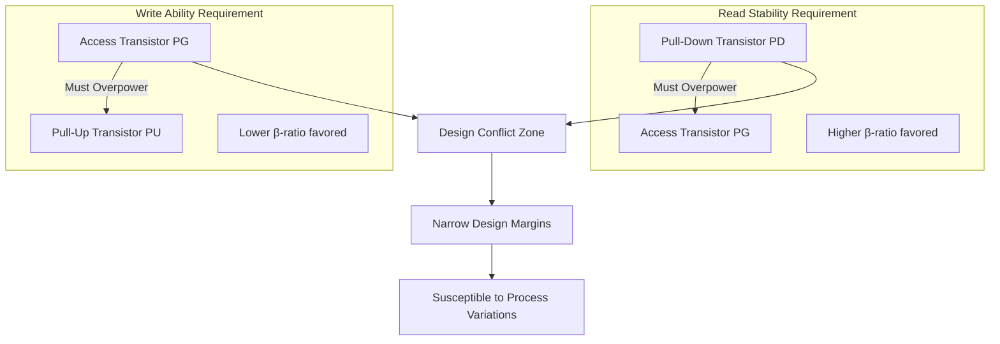

**The cell ratio (β-ratio), defined as the ratio of the pull-down transistor's width-to-length ratio to the access transistor's width-to-length ratio, serves as the critical design parameter for balancing these competing constraints**[^4]. Read stability demands that the pull-down transistor overpower the access transistor to prevent the '0' storage node from rising excessively, while write ability requires the access transistor to overpower the pull-up transistor to successfully flip the cell state[^2][^4]. These conflicting requirements create narrow design margins that process variations can easily violate—**a threshold voltage shift of just 30mV, well within 3σ process variation, can push a marginal cell into failure**[^2].

Research has demonstrated that **increasing the β-ratio monotonically improves both SNM and critical charge (Qcrit) for radiation immunity, but at the cost of increased write time delay and power consumption**[^4]. This tradeoff approach allows designers to identify ranges of β-ratios that satisfy specific design constraints. For example, for a 6T-SRAM with constraints of minimum critical charge Qmin = 1.7 fC, maximum write time Tmax = 48 ps, and maximum power Pmax = 10 μW, suitable β-ratios fall between 1.6 and 2.0[^4].

**At lower power supply voltages, the read stability of conventional 6-transistor (6T) SRAM cells deteriorates more severely than hold and write stability**[^3]. This observation has driven the development of alternative cell architectures such as the 8-transistor (8T) SRAM cell, which employs a separate read buffer to execute read operations successfully without disturbing the stored data[^3]. Comparative simulation results using 90nm technology demonstrate the superiority of 8T cells: **RSNM measured via butterfly analysis shows 156mV for 6T SRAM versus 304mV for 8T SRAM, nearly double the read stability margin**[^3]. The N-curve analysis confirms this advantage with SVNM values of 278mV for 6T versus 412mV for 8T SRAM[^3].

### 1.4 Intrinsic Noise Sources Threatening SRAM Data Integrity

Multiple intrinsic noise sources within integrated circuits collectively degrade SRAM static noise margin and define the baseline reliability challenges that manufacturing improvements must overcome. **These noise sources can be systematically categorized into bounded (deterministic) sources with predictable worst-case bounds and statistical (random) sources characterized by probability distributions**[^5].

The following table provides a comprehensive classification of noise sources affecting SRAM reliability:

| Category | Noise Source | Characteristics | Mitigation Approach |
|----------|-------------|-----------------|---------------------|
| **Bounded/Deterministic** | Crosstalk (small channel count) | Predictable worst-case values | Proper signal conventions, layout techniques |
| | Inter-symbol interference (ISI) | Signal dispersion causes self-interference | Channel design, equalization |
| | Receiver offset | Random device mismatches | Offset correction circuits |
| **Statistical/Random** | Thermal noise | Gaussian distribution | Filtering, signal averaging |
| | Shot noise | Random carrier fluctuations | Device sizing optimization |
| | Clock jitter components | Timing uncertainty | PLL design, jitter filtering |
| | Crosstalk (large channel count) | Statistical due to aggregation | Statistical analysis methods |

**A critical distinction exists between proportional and independent noise sources**[^5]. Proportional noise sources scale with signal swing and cannot be overpowered by simply increasing signal levels—larger signals generate more noise. This category includes crosstalk, simultaneous switching output (SSO) noise, and inter-symbol interference. The total noise relationship can be expressed as: $V_N = K_N \cdot V_S + V_{NI}$, where $K_N$ represents the proportional noise constant, $V_S$ is the signal swing, and $V_{NI}$ is the independent noise component[^5].

**Independent noise sources, including receiver offset and non-IO power supply noise, can potentially be overpowered by increasing signal amplitude**[^5]. However, the receiver input referred offset presents particular challenges as it is primarily a function of threshold voltage mismatch and, to a lesser extent, mobility (β) mismatch. The offset standard deviation follows the relationship: $\sigma_{V_t} = A_{V_t}/\sqrt{WL}$ and $\sigma_\beta = A_\beta/\sqrt{WL}$[^5]. **To reduce input offset by a factor of 2, the transistor area must increase by a factor of 4**, making offset correction circuits necessary to efficiently achieve good sensitivity without excessive area and power consumption[^5].

**Crosstalk represents one of the most challenging noise sources as it is proportional to signal swing and cannot be reduced by scaling signal levels**[^5]. The main crosstalk mechanisms include coupling between on-chip capacitive wires (both on the same metal layer and adjacent vertical layers), coupling between off-chip transmission lines, and signal return coupling. For on-chip wires with floating victim nodes (such as sample nodes in domino logic), when an aggressor signal switches, noise couples to the victim through a capacitive voltage divider: $\Delta V_B = k_c \cdot \Delta V_A$, where $k_c = C_c/(C_c + C_O)$ represents the coupling coefficient determined by coupling capacitance $C_c$ and load capacitance $C_O$[^5].

### 1.5 Power Supply Noise and Environmental Factors Impacting SNM

**Power supply noise arises from the fundamental reality that circuits draw current from VDD supply nets and return current to GND nets through supply networks with finite impedance**[^5]. Time-varying (switching) currents induce variations on the supply voltage, and the supply noise experienced by any given circuit depends critically on its physical location within the supply distribution network. This position-dependent behavior creates systematic variations in SNM across a memory array that must be accounted for in robust design methodologies.

**Simultaneous Switching Output (SSO) noise represents a particularly severe manifestation of power supply noise**, where finite supply impedance causes significant crosstalk-like effects[^5]. The SSO noise magnitude is proportional to the number of outputs switching simultaneously (n) and inversely proportional to signal transition time ($t_r$): $V_N = L_s \cdot \frac{di}{dt} = n \cdot \frac{L_s}{t_r} \cdot Z_0$[^5]. This relationship explains why high-density SRAM arrays with many simultaneously accessed cells face amplified supply noise challenges.

**Supply noise induces variations in circuit delay, resulting in deterministic jitter on clock and data signals**[^5]. CMOS delay is approximately directly proportional to VDD, meaning supply voltage fluctuations translate directly into timing uncertainty. The delay relationship can be expressed as: $t_{PHL} \propto \frac{C_L \cdot V_{DD}}{(V_{DD} - V_{TN})^2}$[^5]. Greater delay variations result in more deterministic jitter, which can cause timing violations in SRAM read and write operations.

**Environmental factors and aging mechanisms progressively degrade SNM over the device lifetime**, creating dynamic reliability challenges. Bias Temperature Instability (BTI) represents the dominant aging mechanism in nanoscale CMOS technology, causing permanent hardware faults through charge buildup in transistor gate oxides over time[^6][^7]. This effect increases the absolute value of threshold voltage and decreases carrier mobility, directly reducing the SNM of SRAM cells[^6]. **Hot Carrier Injection (HCI) is another aging mechanism caused by high-energy charge carriers generated by elevated drain-source voltages**, leading to threshold voltage shifts and performance degradation that can be modeled using a power-law relationship: $I_{ON}(t) = I_{ON0} \cdot (1 + k_{HCI} \cdot t)^{-\alpha}$[^7].

Research has demonstrated that **the combination of Soft oxide Breakdown (SBD) and BTI effects accelerates SRAM performance degradation**, with read stability (RSNM) being the parameter that degrades most significantly[^8]. An aging-aware analysis of cache memory cells shows that unbalanced distribution of data blocks associated with different coherency states over cache lines can also contribute to SNM degradation, with enhanced cache replacement policies improving hold and read SNM degradation by approximately 9.9% and 11.5% respectively[^6].

### 1.6 Array-Level Phenomena and Realistic SNM Degradation Factors

**Real SRAM arrays exhibit complex phenomena that fundamentally alter behavior compared to simplified single-cell models**, and these effects are often omitted in academic analyses despite being critical for accurate yield prediction[^2]. Understanding these array-level factors is essential for establishing realistic expectations for manufacturing process improvements and their impact on actual product performance.

**Distributed parasitic effects create significant position-dependent behavior across memory arrays**[^2]. Cells located at the far end of an array experience dramatically different electrical conditions compared to those near the periphery. Validation studies demonstrate that **cells at the array's far end see 4-6× slower discharge rates** compared to cells near the drivers[^2]. The impact of interconnect parasitics on performance is profound: for a 256-row array, **the mean read access delay with parasitics is approximately 18.7× greater than without (3.273ns versus 0.175ns), and average read power increases by 16.7× (434.51µW versus 25.99µW)**[^2].

**Inter-cell coupling introduces data-pattern dependencies that complicate SNM analysis**[^2]. With 255 unselected cells per bitline in a typical array configuration, cumulative leakage current can reach microampere levels, **degrading read margins by approximately 12%**[^2]. This phenomenon means that the effective SNM of any given cell depends not only on its own characteristics but also on the data patterns stored in neighboring cells—a dependency that simplified models cannot capture.

**Peripheral circuit variations often dominate yield loss in ways that single-cell analysis overlooks**[^2]. Sense amplifier offset voltage, characterized by $\sigma_{V_{OS}} \approx 20mV$, **directly subtracts from the effective read margin**, meaning that even cells with adequate intrinsic RSNM may fail due to peripheral circuit limitations[^2]. For a 64×32 array, including peripheral circuits increases bitline-related read delay by 4.8× and average read power by 5.4× compared to cell-only analysis[^2].

The following diagram illustrates the hierarchy of SNM degradation factors from cell to array level:

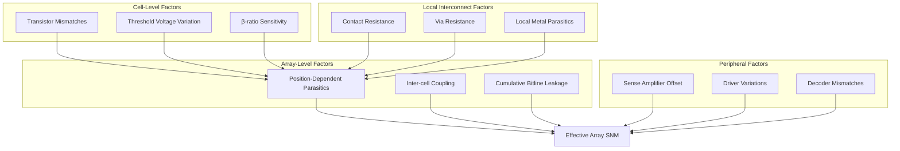

**The critical implication for manufacturing process improvement strategies is that designs optimized using simplified models exhibit poor performance when evaluated under realistic conditions**[^2]. Validation studies confirm that high-fidelity modeling during optimization is essential—the OpenYield framework demonstrated that optimization using comprehensive models achieved **65% enhancement in read SNM (0.17V to 0.28V), 39% improvement in write SNM (0.79V to 1.10V), and 15% area reduction (0.61µm² to 0.52µm²)** while maintaining timing constraints[^2]. This finding establishes that manufacturing process improvements must be evaluated in the context of realistic array-level behavior rather than idealized single-cell performance to accurately predict their impact on product yield and reliability.

## 2 Transistor Architecture Evolution and Its Impact on SNM

This chapter systematically analyzes the technological progression from planar CMOS through FinFET to emerging Gate-All-Around (GAA) nanosheet transistors, examining how each architectural advancement delivers improved electrostatic control over the channel, reduced short-channel effects, and enhanced current drive capability. The analysis evaluates how these device-level improvements translate directly into sharper voltage transfer characteristics, steeper subthreshold slopes, and consequently larger static noise margins across hold, read, and write operations. The chapter further explores the design trade-offs inherent in optimizing transistor strength ratios for different SNM modes within each architecture, establishing the manufacturing-centric foundation for understanding how transistor technology choices fundamentally determine achievable SRAM stability margins.

### 2.1 Planar CMOS Limitations and SNM Degradation Mechanisms

The continued scaling of planar bulk MOSFET technology has become increasingly difficult due to fundamental physical limitations that directly compromise SRAM stability. **At sub-28nm technology nodes, planar CMOS faces severe challenges in maintaining stable SRAM operation**, primarily stemming from the inherent two-dimensional gate structure that provides inadequate electrostatic control over the channel as dimensions shrink[^9][^10]. Understanding these limitations establishes the baseline performance that motivated the industry's transition to three-dimensional transistor architectures.

**High channel doping requirements in planar bulk MOSFETs lead to significant random dopant fluctuation (RDD)**, which emerges as the dominant source of threshold voltage variability at scaled nodes[^11]. Research on 20nm bulk planar CMOS demonstrates that the standard deviation of threshold voltage (σVT) ranges from 38mV to 68.5mV across the process variation space, with RDD being the major contributor while metal gate granularity (MGG) and line edge roughness (LER) contribute almost equally to the remaining variability[^11]. This level of variability directly translates to SNM degradation, as the geometry dependence of SNM changes dramatically from 122mV to 200mV depending on gate length and channel width variations[^11].

The following table summarizes the key variability sources in planar CMOS and their impact on SRAM:

| Variability Source | Physical Mechanism | Impact on σVT | SNM Consequence |
|-------------------|-------------------|---------------|-----------------|
| Random Dopant Fluctuation (RDD) | Discrete dopant atoms in channel | Dominant contributor | Direct threshold mismatch |
| Line Edge Roughness (LER) | Lithography imperfections | Secondary contributor | Gate length variation |
| Metal Gate Granularity (MGG) | Work function variation | Secondary contributor | Local threshold shifts |
| Combined Effect | Interaction of all sources | 38-68.5 mV range | 122-200 mV SNM variation |

**Short-channel effects, particularly Drain-Induced Barrier Lowering (DIBL), severely degrade planar CMOS performance at scaled nodes**. In bulk MOSFETs with threshold voltage variability, suppressing DIBL becomes essential to maintain high average static noise margin at low voltages such as 0.7V[^12]. The coupling of electric field between source and drain reduces the effective barrier height, causing threshold voltage to decrease with increasing drain voltage—a phenomenon that directly compromises the voltage transfer characteristics essential for robust SNM.

**The subthreshold slope characteristics of planar devices fall significantly short of the ideal 60 mV/decade at room temperature**, limiting the achievable on-state to off-state current ratio that determines SNM performance at low supply voltages. Research demonstrates that ideal subthreshold slope characteristics are critical for maintaining high Ion/Ioff ratios in CMOS logic circuits operating at low voltage[^12]. When planar devices exhibit degraded subthreshold swing, the resulting soft transition between on and off states produces shallow voltage transfer curves that reduce the maximum inscribed square in butterfly analysis.

The impact of global process variations on SRAM static noise margin in planar technology reveals severe yield implications. **At gate lengths of 17-20.25nm, there is large yield loss even at -4 sigma, indicating complete cell read failure** and necessitating lithography and process improvements to control critical dimension variation[^11]. Furthermore, cell leakage current variation spans three orders of magnitude, from approximately 10^-11 A at L=30nm to 10^-8 A at L=17nm on average, with the standard deviation of log leakage current reaching 0.51 at the smallest dimensions[^11]. This exponential increase in leakage variability with scaling underscores why planar technology reached fundamental limits for SRAM applications.

A quasi-planar bulk CMOS structure was demonstrated as an intermediate approach for improving device performance and reducing variation in 6T-SRAM read and write margins in early 28nm CMOS technology[^13]. **Variation in transistor threshold voltage due to random dopant fluctuations and line-edge roughness becomes more significant as transistor gate length reduces below 30nm**, so continued transistor scaling poses a growing challenge particularly for SRAM arrays which typically employ the smallest transistors and have the most stringent yield requirements[^13]. This recognition of planar limitations at the 28nm node catalyzed the industry transition to FinFET architecture.

### 2.2 FinFET Architecture Advantages for SRAM Stability Enhancement

FinFET technology emerged as a revolutionary solution to the scaling limitations of planar transistors, providing a three-dimensional structure that enables significantly improved electrostatic control over the channel[^14]. **The fin structure with gates wrapping around three sides of a raised silicon channel delivers superior gate-to-channel coupling**, substantially reducing short-channel effects that had become increasingly problematic as device dimensions shrank below 28nm[^14]. This architectural transformation fundamentally altered the achievable SNM performance for SRAM cells.

**Silicon nanowire and FinFET transistors achieve ideal subthreshold slope characteristics due to their multi-gate structure's excellent gate control over the channel**[^12]. Research demonstrates that at 0.5V supply voltage, nanowire transistors with 20nm width achieve subthreshold slopes of 65 mV/decade, significantly better than the 81 mV/decade achieved with 100nm width devices[^12]. This steeper subthreshold slope directly translates to higher SNM at low supply voltages because it enables sharper voltage transfer characteristics and larger noise immunity windows.

The quantitative SNM improvements achieved through FinFET adoption are substantial and well-documented. **Conventional FinFET-based 6-T double-gate designs with high threshold voltage provide a read SNM of 175mV—a 30% improvement over bulk-Si MOSFET SRAM cells with equivalent β-ratio of 1.5**[^15]. This improvement stems directly from the enhanced electrostatic integrity that reduces threshold voltage variability and provides more consistent transistor matching within the cross-coupled inverter pair. At the 16nm node, comparative analysis confirms that **FinFET SRAM cells significantly outperform planar CMOS in stability margins**[^10].

The unique structure of FinFET enables independent gate operation, which opens powerful new design techniques for SNM optimization[^16]. **Independent gate operation is achieved by selectively removing the gate material directly on top of the fin, leaving the gates electrically isolated**[^16]. This capability enables two particularly effective techniques:

The **Pass-Gate Feedback (PGFB) design** connects the storage node to the back gate of the pass-gate transistor, allowing selective weakening of the pass-gate during read operations. **This simple back-gate connection scheme achieves 71% read margin improvement over the double-gate design at VDD=1V with no area penalty**[^16]. The mechanism works by reverse-biasing the back gate when the storage node is high, reducing pass-gate strength and preventing excessive voltage rise on the low storage node during read access. In addition to enhancing nominal margins, the PGFB design exhibits reduced sensitivities to process variations, resulting in higher-yielding cells[^16].

The **Pull-Up Write Gating (PUWG) design** uses independently gated FinFETs for pull-up devices with their back gate connected to a write word line. **During write operations, setting WWL=VDD reverse-biases the back gate of pull-up devices and weakens them, increasing writeability current**[^16]. For a given threshold of writeability current, the PUWG design can be written at approximately 200mV lower VDD than conventional designs[^16].

The following diagram illustrates the PGFB and PUWG techniques:

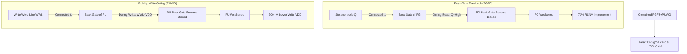

**The PGFB and PUWG designs are complementary and can be used in combination to simultaneously achieve improved read and write stability over conventional double-gate designs**[^16]. The combination achieves extremely high write yield due to its low gate work function enabled by PGFB and weakened pMOS transistors from PUWG. **Extremely high yields of almost 10 sigma are achievable for VDD>0.6V using this combination**[^16]. These improvements to SRAM yield make FinFET a compelling choice for advanced device architectures.

FinFET-based SRAMs have been demonstrated in silicon to have excellent stability and leakage control down to 20nm[^16]. **Process-induced variations and sub-threshold leakage in bulk-Si technology limit SRAM scaling into sub-32nm nodes, making FinFETs the most attractive option because of their good scalability and possibilities for further SRAM performance and yield enhancement through independent gating**[^16].

The design optimization space for FinFET SRAM includes careful consideration of fin height-to-width ratio, fin pitch, and gate length to maximize current drive while minimizing leakage[^14]. **A critical objective in FinFET design optimization is achieving the optimal balance between performance, power consumption, and area (PPA)**[^14]. Structure optimization involves designing physical dimensions and configurations of fins to enhance performance, including optimizing fin height, width, and spacing to achieve better electrostatic control, reduced short-channel effects, and improved carrier mobility[^14].

### 2.3 Gate-All-Around Nanosheet Transistors and Next-Generation SNM Optimization

As FinFET technology approaches its scaling limits at sub-7nm nodes, **Gate-All-Around (GAA) nanosheet transistors have emerged as the next evolutionary step**, providing even greater electrostatic control by wrapping the gate around the channel on all four sides rather than three[^17]. This architectural advancement addresses the fundamental limitation of FinFET technology—the inability to further increase fin height or pack more fins side-by-side without suffering from electrical challenges[^17].

**GAA nanosheet transistors use stacked horizontal sheets that are vertically arranged so the gate surrounds the channel on all four sides, further reducing leakage and increasing drive current**[^17]. This means superior electrical signals pass through and between transistors, improving chip performance. The transition from vertical fins to horizontal nanosheets also provides chipmakers with flexibility to vary nanosheet width to best suit particular chip designs—**wide nanosheets allow for higher and better drive current, while narrow nanosheets can optimize power consumption**[^17].

The electrostatic improvements delivered by GAA architecture are quantitatively significant. **The GAA structure reduces Drain-Induced Barrier Lowering (DIBL) to 30-50 mV/V and achieves near-ideal subthreshold swing of 62-68 mV/decade**[^18]. This enhanced control directly improves read stability by minimizing the effective threshold voltage variation of pull-down transistors during read operations, which is a primary cause of read disturb[^18]. The near-ideal subthreshold characteristics ensure sharp voltage transfer curves that maximize the butterfly curve opening.

**At the 3nm node, GAA technology demonstrates a 10-15% SNM improvement over 7nm FinFET, achieving 140-170 mV SNM at a lower supply voltage of 0.70V**[^18]. This improvement comes from multiple factors working synergistically: better electrostatic control, reduced variability, and more flexible transistor sizing options. The variability in threshold voltage (σVth) is improved to 22-30 mV, representing a **15-25% reduction compared to FinFET**, due to better control over work function granularity and improved dimensional uniformity[^18].

Research on nanosheet SRAM targeting the 3nm technology node with 45nm contacted poly pitch and 21nm metal pitch demonstrates the performance advantages of this architecture[^19]. **Despite FinFET having lower parasitic capacitance, the design freedom of nanosheets enables superior SRAM operation in terms of Vmin and read delay at smaller cell areas**[^19]. The study covers the impact of gate length, fin height, nanosheet count, effective n/pFET width, channel doping, and vertical nanosheet spacing on SRAM performance.

**The flexible nanosheet width in GAA architecture allows for more flexible optimization of transistor beta ratio within the SRAM cell without the quantization constraint of fin widths**, enabling a better trade-off between read SNM and write margin[^18]. In FinFET designs, adjusting transistor strength requires adding or removing entire fins, which creates discrete sizing steps. Nanosheet width, in contrast, can be tuned more continuously, allowing designers to achieve precise beta-ratio targets for optimal multi-mode SNM balance.

Production data from Samsung's 3nm GAA process (SF3E) validates the theoretical advantages. **Functional Vmin for SRAM reaches as low as 0.45-0.50V, approximately 70 mV lower than at the 5nm FinFET node**, directly attributable to improved electrostatics and reduced variability[^18]. This Vmin reduction is particularly significant for low-power applications where supply voltage scaling is essential for energy efficiency.

The manufacturing process for GAA nanosheets introduces specific variations that impact SNM, requiring careful process control[^18]. **The width and thickness control of stacked nanosheets are critical; tighter control in these dimensions leads to better transistor matching within the SRAM cell**[^18]. The introduction of Extreme Ultraviolet (EUV) lithography for critical layers reduces overlay error to 1.5-2 nm, which is essential for defining nanosheets and inner spacers accurately, thereby minimizing mismatches[^18].

High-performance nanosheet technology has also been optimized for cryogenic operation at 77K, demonstrating the architecture's versatility[^20]. **TCAD simulation results show that nanosheets operated at 77K offer much steeper subthreshold slope than at 300K, with superior short-channel effect control, less variation, and higher drive current**[^20]. The channel thickness in nanosheets is defined by epitaxy process rather than patterning, which has larger process variation in FinFET, contributing to nanosheet's reduced variability[^20]. SRAM butterfly plots measured at 77K demonstrate good noise margin at power supply as low as 0.3V[^20].

### 2.4 Emerging Device Architectures: CombFET and Advanced GAA Variants

Beyond conventional GAA nanosheets, researchers are exploring innovative transistor architectures that combine advantages of multiple device structures to push SNM performance even further. **Comb-shaped channel FETs (CombFETs) integrate the advantages of FinFETs and nanosheet transistors**, offering larger effective channel width at the same footprint and more room for improving mobility mismatch between N/P transistors[^21].

**CombFET SRAM demonstrates approximately 55% increase in effective channel width, 15% improvement in read static noise margin, approximately 25% write speed gain, 88% read speed gain, and 20% decrease in minimum operating voltage (Vmin)** compared to conventional nanosheet designs[^21]. These improvements stem from the CombFET's unique structure that provides approximately 1.55× effective width increase per footprint, enabling either higher performance at the same area or equivalent performance at reduced cell size[^21].

The design-technology co-optimization (DTCO) analysis for CombFET reveals its manufacturing compatibility advantages. **The layouts for CombFET SRAM were designed for the 3nm technology node, and the device is fully compatible with existing nanosheet fabrication processes**[^21]. The key fabrication step is fin side Selective Epitaxial Growth (SEG), which enables epitaxial growth on one sidewall of nanosheet stacks while preventing deposition on the spacer[^21]. The height of the fin side is determined by stacking layer thickness, while width can be precisely controlled by epitaxy growth[^21].

The following table compares CombFET performance against conventional architectures:

| Parameter | NshFET (Baseline) | CombFET | Improvement |
|-----------|------------------|---------|-------------|
| Effective Channel Width | 1.0× | 1.55× | +55% |
| Read SNM | Baseline | +15% | Enhanced stability |
| Write Speed | Baseline | +25% | Faster writes |
| Read Speed | Baseline | +88% | Faster reads |
| Minimum Vmin | Baseline | -20% | Lower power |
| Cell Area (matched Weff) | Baseline | -16.9% | Area savings |

**CombFET's flexible design parameters—nanosheet width (Wns) and fin height (Hfin)—enable optimization of the p-n mobility ratio**[^21]. This flexibility is particularly valuable for SRAM where performance improvement involves trade-offs between power dissipation and area penalty. The multi-orientation characteristics of CombFET are beneficial for SRAM DTCO, allowing designers to tailor transistor characteristics for specific cell requirements[^21].

**Double-channel nanotube Gate-All-Around FETs (DC NT GAAFETs) represent another innovative approach** that achieves significant on-state current improvements while maintaining gate control[^22]. Compared to single-channel nanotube GAAFETs and nanowire GAAFETs with the same footprint, **DC NT GAAFET achieves on-state current gains of 64.8% and 1.7× respectively**[^22]. The off-state current and subthreshold swing of DC NT GAAFET remain comparable to single-channel nanotube GAAFET, indicating that gate electrostatic control is preserved despite the additional channel[^22].

The GAA architecture has also been enhanced through structural modifications such as the Top-Bottom Gated (TBG) FinFET, which wraps the gate around the channel with fins extending on both sides of the substrate[^23]. **This configuration enhances the switching ratio and augments gate control over the channel, exhibiting superior performance in terms of higher drain current, transconductance, and improved subthreshold swing**[^23].

**Ground Plane FinFET (GP-FinFET) structures have been proposed to reduce electric field coupling between source and drain**, thereby minimizing DIBL[^23]. The structure introduces two ground planes under source and drain regions. While read SNM is comparable among SOI-FinFET, Bulk-FinFET, and GP-FinFET structures, **GP-FinFET demonstrates minimum standby power due to higher threshold voltage and lower DIBL effect**[^23]. The improvements become more pronounced as channel length decreases, making this approach increasingly relevant for future scaling[^23].

### 2.5 Transistor Ratio Optimization Across Architectures for Multi-Mode SNM Balance

The fundamental challenge of balancing read stability against write-ability through transistor sizing persists across all architectures, though each technology offers different degrees of freedom for optimization. **The cell ratio (β-ratio) determines the relative strength of pull-down transistors versus access transistors**, and optimizing this ratio requires careful consideration of architecture-specific constraints and opportunities.

In conventional FinFET designs, **the read margin can be improved by increasing pull-down transistor strength relative to access transistors**[^15]. A 15% further improvement in read SNM with 13.3% area penalty can be achieved by rotating the pull-down transistor, while a 36% further improvement with 16.6% area penalty is achievable by upsizing pull-down transistors by one fin[^15]. However, **whenever pull-down devices are strengthened, the cell write margin shrinks—primarily due to reduction in write trip voltage**[^15].

The discrete nature of fin-based sizing in FinFET creates quantization constraints that limit optimization precision. Each additional fin provides a fixed increment in transistor strength, making it impossible to achieve arbitrary beta-ratio targets. **The cell SNM can be further improved by 71% at little performance cost and no area penalty through utilizing built-in feedback to dynamically adjust transistor strengths**[^15]. A 6-T SRAM design with feedback achieves 300mV SNM, demonstrating the power of dynamic ratio adjustment[^15].

For FinFET SRAM optimization, research has identified that **external resistance and saturation subthreshold swing are two competing factors affecting effective drive current**[^24]. As source/drain extension doping changes from abrupt to graded, saturation subthreshold swing increases while external resistance decreases[^24]. The saturation subthreshold swing required to reach peak effective drive current decreases with higher threshold voltage types and lower operating supply voltages, providing optimization guidance for different application requirements[^24].

**In GAA nanosheet architectures, the variable nanosheet width allows more continuous optimization of transistor beta ratio** without the quantization constraint of fin widths[^18]. This flexibility enables designers to achieve precise sizing targets that optimize both read SNM and write margin simultaneously. The CombFET architecture extends this flexibility further by providing additional design parameters including both nanosheet width and fin height that can be independently adjusted[^21].

The following diagram illustrates the optimization space across architectures:

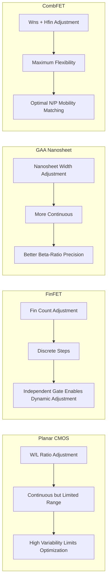

**For 4-T FinFET-based SRAM cells with built-in feedback, more than 17% area reduction is achievable with 285mV SNM during read and 230mV SNM during standby**, while providing less than 80pA/cell leakage current[^15]. Compared to conventional double-gate 6-T design, the 4-T design with feedback achieves 63% improvement in read margin[^15]. This demonstrates that architectural innovation combined with ratio optimization can deliver substantial improvements across multiple metrics simultaneously.

Research using a 20nm high-κ metal-gate planar CMOS technology demonstrates that **increased threshold voltage variation of scaled transistors reduces both SNM and write margin of SRAM bit cells**[^25]. Reducing pass-gate strength or bitline capacitance with slow wordline rise are effective techniques to improve cell stability[^25]. The partially suppressed wordline (PSWL) scheme for read assist and bitline-length-tracked negative-bitline-boosting (BT-NBL) scheme for write assist achieve **overall VDDmin improvement of over 200mV in a 112Mb SRAM test-chip**[^25].

### 2.6 Reliability and Aging Considerations Across Transistor Architectures

Long-term reliability degradation mechanisms affect SRAM SNM differently across transistor architectures, creating important considerations for manufacturing optimization and lifetime performance prediction. **Bias Temperature Instability (BTI) poses a major reliability challenge for semiconductor devices by degrading their performance**, and comprehensive analysis reveals significant architecture-dependent vulnerabilities[^26].

**FinFET-based SRAM cells are approximately 2× more vulnerable to BTI degradation than planar CMOS cells**[^26]. Simulations performed on FinFET-based cells for 10^8 seconds of operation under nominal VDD show that **read SNM degradation reaches 16.72%, which is 1.17× faster than hold SNM degradation, while write trip point improves by 6.82%**[^26]. This asymmetric degradation behavior has important implications for lifetime reliability margins.

The BTI impact analysis reveals the relative contributions of different mechanisms. **The combined BTI impact (16.72% SNMR degradation) is less than the linear sum of NBTI (7.41%) and PBTI (10.76%) impacts**, indicating some compensation between mechanisms[^26]. PBTI impact on read SNM is more significant than NBTI impact. For hold SNM, NBTI and PBTI cause 6.94% and 8.35% degradation respectively[^26].

The following table summarizes BTI impact across different operating conditions:

| Condition | SNMR Degradation | SNMH Degradation | WTP Change |
|-----------|-----------------|-----------------|------------|
| Nominal VDD (0.8V) | 16.72% | 14.29% | +6.82% |
| +12.5% VDD (0.9V) | 14.8% | - | - |
| +25% VDD (1.0V) | 13.3% | - | - |
| Weaker PD (DS2) | 21.17% | - | - |
| 8T Cell | 1.31× faster | - | 5.95% |

**Supply voltage scaling significantly affects BTI impact**—SNMR degradation is 16.72% at nominal 0.8V but reduces to 14.8% at 0.9V and 13.3% at 1.0V[^26]. The reduction is more significant for NBTI than for PBTI, suggesting that higher supply voltage operation can partially mitigate aging effects at the cost of increased power consumption.

Cell design strength also influences reliability. **Weakening pull-down transistors increases PBTI-induced SNMR degradation from 10.76% to 14.33%**[^26]. The 6T cell with stronger pull-down transistors shows SNMR degradation of 16.72%, while weaker cells show 21.17% degradation[^26]. This finding indicates that cells optimized for higher initial SNM through stronger pull-down devices also exhibit better aging resilience.

**The independent-gate structure of FinFET enables compensation strategies that can maintain SNM degradation within acceptable bounds over operational lifetime**[^27]. Research demonstrates a mitigation method for memory stability management under spatial and temporal variations by taking advantage of independent-gate FinFET device structure to perform threshold voltage adjustment[^27]. **The proposed technique allows maintaining SNM degradation within 2% of fresh device SNM after 1 year of operation—representing approximately 55.56% improvement compared to 4.5% SNM degradation in uncompensated cases**[^27].

The compensation approach leverages the ability to adjust back-gate bias to counteract threshold voltage shifts caused by BTI degradation. **Simulation results indicate that the proposed technique can effectively maintain the stability of an SRAM array within the desired range during its operational life**[^27]. The standby leakage current (IDDQ) value is utilized to assess consequences of parameter variations and aging on circuit performance, enabling adaptive compensation based on monitored degradation[^27].

For design style comparison, **the 8T cell degrades 1.31× faster overall than the 6T cell**[^26]. However, the 8T cell shows higher initial write trip point value due to its write assist feature and is more resilient to BTI-induced WTP shift, degrading 5.95% compared to 6.81% for the 6T cell[^26]. This trade-off between read stability and write resilience must be considered in architecture selection.

The reliability implications extend to GAA architectures as well. While specific BTI data for production GAA devices is still emerging, the improved electrostatic control and reduced variability of GAA structures suggest potential for better aging uniformity across cells. **The reduced threshold voltage variability (σVth improved to 22-30 mV) in GAA compared to FinFET**[^18] indicates that initial cell-to-cell matching is better, which should translate to more uniform aging behavior across the array.

These reliability considerations underscore that **manufacturing process optimization must account for not only initial SNM performance but also lifetime degradation trajectories**. The architecture-dependent aging behaviors documented here provide essential guidance for selecting transistor technologies and designing compensation schemes that ensure SRAM stability throughout product lifetime.

## 3 Advanced Materials and Process Integration for Enhanced Stability

This chapter examines how advanced materials innovations and process integration techniques directly enhance SRAM static noise margin by improving transistor-level performance and minimizing parasitic effects in interconnects. The analysis systematically evaluates high-k metal gate technology for variability reduction, strain engineering approaches for carrier mobility enhancement, emerging channel materials for improved electrostatic control, and advanced metallization schemes with low-k dielectrics for RC optimization, establishing the manufacturing process foundations that enable robust SNM at scaled technology nodes.

### 3.1 High-K Metal Gate Technology for Threshold Voltage Variability Reduction

The transition from traditional silicon dioxide gate dielectrics to high-k metal gate (HKMG) technology represents one of the most significant materials innovations for improving SRAM stability at scaled technology nodes. **As CMOS transistor dimensions shrink, traditional SiO2 gate dielectric thickness approaches physical limits below 1.4 nanometers, leading to significant electron tunneling effects and gate leakage current**[^28]. This fundamental limitation directly compromises SRAM cell stability by introducing unpredictable leakage paths that degrade the voltage levels stored on internal nodes and increase threshold voltage variability.

High-k dielectric materials such as hafnium oxide (HfO2) address these scaling challenges through their elevated dielectric constant (k value), which enables the use of physically thicker gate oxide layers while maintaining equivalent oxide thickness (EOT) for electrostatic control. **The 45nm logic technology node marked the first high-volume manufacturing implementation of high-k plus metal gate transistors, featuring 1.0nm EOT high-k gate dielectric combined with dual band-edge work-function metal gates**[^29]. This combination achieved the highest drive currents reported for both NMOS and PMOS transistors at that technology generation, directly translating to improved voltage transfer characteristics and enhanced SNM in SRAM cells.

The impact of HKMG technology on SRAM cell performance has been extensively characterized across multiple cell configurations. Research comparing high-k metal gate implementations against bulk CMOS technology for 6T through 10T SRAM cells demonstrates consistent advantages in both power consumption and performance metrics. **For 8T SRAM cells, high-k technology achieves power consumption of 2.660088×10⁻¹⁰ watts compared to 2.778079×10⁻¹⁰ watts for bulk CMOS, while delay improves from 1.60876×10⁻⁷ seconds to 1.60827×10⁻⁷ seconds**[^28]. These improvements stem from optimized transistor sizing enabled by reduced leakage current, which allows designers to achieve higher static noise margin without excessive standby power penalties.

However, the adoption of metal gates introduces a new source of threshold voltage variability that must be carefully managed to preserve SNM benefits. **Work-function variation (WFV) arises from the dependency of metal work-function on grain orientation, which varies randomly during the metal deposition process**[^30]. At the temperatures used in integrated circuit manufacturing, metal grains typically grow to dimensions of several nanometers, meaning that transistor gates at advanced nodes contain only a small number of grains with random orientations. Since each grain's work-function depends on its crystal orientation—a parameter that cannot be controlled during growth—the overall gate work-function becomes a probabilistic distribution rather than a deterministic value.

The statistical framework for understanding WFV reveals its scaling implications for SRAM stability. **The variance of gate work-function is inversely proportional to the number of grains on the gate, calculated as (L/G)×(W/G) for a gate of length L and width W with square grains of size G**[^30]. Consequently, scaling transistor dimensions by 0.7× approximately doubles the standard deviation of work-function variation, making this variability source increasingly significant at advanced nodes. For a TiN metal-gate device at the 65nm node, **threshold voltage fluctuation due to WFV can be as significant as that from random dopant fluctuation**[^30], traditionally considered the dominant variability source.

The choice of metal gate material significantly influences the magnitude of WFV-induced threshold voltage variation. Comprehensive evaluation of metal nitride materials commonly used for NMOS (TaN, TiN) and PMOS (MoN, WN) gates reveals substantial differences in their variability characteristics. **Among the evaluated materials, TiN and WN result in lower threshold voltage fluctuation for NMOS and PMOS devices respectively, while MoN exhibits the highest work-function variation**[^30]. This material-dependent behavior provides process engineers with optimization levers for minimizing SNM degradation through careful gate metal selection.

The following table summarizes the comparative impact of different metal gate materials on variability:

| Metal Gate Material | Device Type | Relative WFV Impact | Recommended Application |
|--------------------|--------------|--------------------|------------------------|
| TiN | NMOS | Lower | Preferred for NMOS gates |
| TaN | NMOS | Higher | Alternative option |
| WN | PMOS | Lower | Preferred for PMOS gates |
| MoN | PMOS | Highest | Avoid if possible |

The impact of WFV on SRAM cell performance has been quantified through circuit-level analysis. **Analysis of SRAM cells under WFV conditions shows that this variation causes considerable performance and reliability degradation, affecting static noise margin, read latency, and standby leakage power distributions**[^30]. For static noise margin, considering WFV increases the distribution's standard deviation, thereby raising the probability of noise margin falling below design requirements. Similarly, WFV broadens the read latency distribution, increasing the likelihood of unacceptably long read delays that could cause timing violations.

Device architecture selection also influences susceptibility to WFV. **FinFET transistors are less affected by WFV compared to fully-depleted SOI and bulk silicon devices due to their larger gate area**[^30]. The three-dimensional fin structure effectively increases the number of metal grains contributing to the overall work-function, reducing statistical variation through averaging effects. This architectural advantage compounds with FinFET's inherent benefits of reduced random dopant fluctuation and improved electrostatic control to deliver superior SNM stability.

**High-k metal gate technologies are recognized as useful for both device scaling and fluctuation reduction in SRAM applications**[^31]. The combination of reduced gate leakage, improved electrostatic control, and optimized material selection enables SRAM cells to achieve higher and more consistent SNM values across manufacturing lots. For 16nm gate MOSFETs, research demonstrates that **normalized SNM fluctuations induced by work-function fluctuation reach 48% for conventional 6T SRAM cells with unitary cell ratio**[^32], highlighting the importance of both material optimization and cell architecture selection for managing this variability source.

Process optimization strategies for minimizing WFV focus on controlling metal grain growth conditions and increasing the proportion of preferred crystal orientations. **To limit threshold voltage variation to 10mV in a 32nm TiN device, the preferred grain orientation ratio must be at least 90%**[^30]. While manipulating deposition conditions such as temperature and duration offers some control over grain structure, practical constraints limit optimization range—high temperatures are restricted by total thermal budget considerations, while low temperatures must accommodate subsequent manufacturing steps. These constraints underscore the importance of selecting inherently low-variability metal gate materials rather than relying solely on process tuning.

### 3.2 Strain Engineering Techniques for Carrier Mobility Enhancement

Strain engineering has emerged as a cornerstone technology for enhancing transistor performance and SRAM stability by fundamentally improving carrier mobility without introducing additional variability sources. **This approach has been a key mobility booster in silicon electronics since the 1990s, with commercial CMOS technology benefiting from strain-enhanced transistor performance for over two decades since the 90nm technology node**[^33]. The systematic application of mechanical stress to transistor channels modifies the semiconductor band structure, reducing carrier effective mass and phonon scattering to achieve substantial mobility gains that directly translate to improved drive current and steeper voltage transfer characteristics.

The implementation of strain engineering employs complementary approaches for NMOS and PMOS devices to optimize both electron and hole mobility. **Silicon nitride (SiNx) capping layers have been used for n-type silicon transistors to achieve uniaxial tensile strain and increase electron mobility, while selective growth of SiGe in p-type transistor source and drain regions creates uniaxial compressive strain to enhance hole mobility**[^33]. This dual-strain approach enables simultaneous optimization of both transistor types within the cross-coupled inverter pairs that form SRAM cells, improving the sharpness of voltage transfer characteristics and expanding the butterfly curve opening that determines SNM.

The physics underlying strain-enhanced mobility involves modification of the silicon band structure under mechanical stress. **For (001) substrate orientation with [110] channel direction, uniaxial tensile strain along the channel direction or compressive strain along the width direction benefits electron mobility enhancement in Ge NMOSFETs**[^34]. The strain modifies the energy valleys in the conduction band, reducing the effective mass of electrons traveling in the transport direction and decreasing intervalley scattering. For holes, compressive strain lifts the degeneracy of the valence band, reducing hole effective mass and suppressing scattering mechanisms.

Quantitative mobility improvements from strain engineering are substantial and well-documented across multiple technology generations. **Research on strained silicon-on-insulator (SOI) MOSFETs demonstrates electron mobility enhancement of 1.5× and hole mobility enhancement of 1.4× compared to control SOI devices**[^35]. The corresponding drain current improvements reach **47% for n-type and 59% for p-type MOSFETs**, directly translating to stronger pull-down and pull-up transistors that improve both read stability and write-ability in SRAM cells.

The following diagram illustrates the strain engineering approaches for NMOS and PMOS optimization:

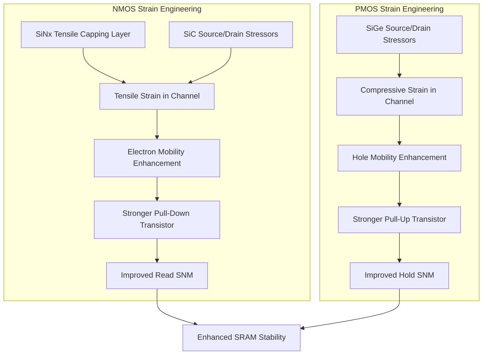

**The 45nm technology node incorporated third-generation strained silicon alongside high-k metal gates, achieving the highest drive currents reported for both NMOS and PMOS transistors**[^29]. This integration demonstrates that strain engineering and HKMG technology provide complementary benefits that compound to deliver superior SRAM performance. The combination addresses both variability reduction through improved gate control and performance enhancement through mobility improvement.

SiGe source/drain stressors represent the most widely adopted approach for introducing compressive strain in PMOS devices. The lattice mismatch between SiGe alloy regions and the silicon channel creates stress components in multiple directions. **Three-dimensional stress simulations reveal that SiGe source/drain stressors induce a biaxial stress state in the channel, with tensile stress along the transport direction (Sxx) and vertical direction (Szz), while the width direction (Syy) experiences compressive stress**[^34]. For devices with SiGe stressors and widths ranging from 50nm to 800μm, the compressive stress along the width direction enhances at intermediate widths and affects mobility gain.

The geometry dependence of strain effects has important implications for SRAM cell design. **For wide devices (W > 1μm), mobility enhancement is dominated by the tensile stress component Sxx along the transport direction, achieving mobility enhancement factors of approximately 1.75 at W = 10μm**[^34]. As device width decreases to sub-micron and nanometer scales, the role of lateral compressive stress Syy becomes significant. **At W = 50nm, the mobility enhancement factor decreases to 1.61 due to the strong compressive stress component**[^34]. This width-dependent behavior requires careful consideration when optimizing strain engineering for minimum-geometry SRAM transistors.

Strain stability through the manufacturing process flow represents a critical consideration for practical implementation. **Research on strained SOI substrates demonstrates that low-temperature oxidation, ion implantation, and rapid thermal annealing result in only 7-9% strain relaxation**[^35]. This stability enables strain benefits to be preserved through the complete SRAM fabrication sequence, including source/drain implantation and activation anneals. The use of low thermal budget processes suppresses germanium diffusion that could otherwise degrade the strain-inducing heterostructure.

**Biaxial tensile strain becomes more appropriate at the 45nm technology node and below, where device dimensions make uniaxial strain implementation more challenging**[^35]. The Ge concentration technique provides a pathway for creating strain-relaxed SiGe-on-insulator substrates that serve as templates for strained silicon epitaxy. By controlling oxidation time and temperature during the concentration process, the strain level in the top silicon layer can be precisely tuned to optimize mobility enhancement.

Advanced applications of strain engineering extend beyond conventional silicon channels to emerging two-dimensional materials. **Research demonstrates that controllable strain using SiNx capping layers with tunable intrinsic stress improves the performance of monolayer MoS2 transistors, achieving median on-state current increases of up to 60% for back-gated and 45% for dual-gated configurations**[^33]. The relatively low deposition temperature of 350°C makes this approach compatible with CMOS back-end-of-line processing, enabling strain engineering benefits to extend to heterogeneously integrated memory technologies.

**Finite-element simulations reveal that tensile SiNx layers impart complex, non-uniform strain profiles along MoS2 contacts and channels, with uniaxial tensile strain under contacts and compressive strain in channels at longer dimensions**[^33]. When device dimensions are reduced, tensile strain under contacts increases and becomes more uniform, eventually making channel strain tensile as well. This dimension-dependent behavior offers maximum benefit at sub-50nm contact pitches, aligning with the scaling trajectory of advanced SRAM technologies.

For GAA nanosheet transistors, strain engineering continues to provide performance benefits through integration with the stacked nanosheet structure. **A 10nm channel length GAA FET with ultra-thin strained Si/SiGe channel demonstrates on-state current of 1.516 mA/μm, significantly exceeding the IRDS 2022 specification requirement of 0.874 mA/μm**[^36]. The strain engineering contribution reduces carrier effective mass and phonon scattering, directly enhancing carrier mobility and drive current for faster switching speeds. Analysis of electron velocity distributions confirms that **electrons are confined in the strained silicon layers, leading to reduced scattering and ballistic transport that increases drain current**[^36].

### 3.3 Novel Channel Materials and Heterostructure Integration

The pursuit of enhanced SRAM stability at advanced technology nodes has driven exploration of alternative channel materials that offer superior carrier mobility and electrostatic properties compared to bulk silicon. **Germanium's high electron mobility makes it an attractive channel material candidate to replace strained silicon channels for high-speed logic applications beyond the 22nm technology node**[^34]. Similarly, III-V compound semiconductors and two-dimensional transition metal dichalcogenides present compelling opportunities for next-generation memory implementations.

Silicon-germanium alloys have found increasing application in SRAM transistors, particularly for strain engineering and heterostructure channel designs. **The GAA FET with strained Si/SiGe sandwich channel structure—comprising two strained silicon layers surrounding a strained SiGe layer—achieves superior short-channel effect suppression with subthreshold swing of 72.42 mV/decade and DIBL of 56.24 mV/V**[^36]. This heterostructure approach confines carriers within the high-mobility strained silicon regions while the SiGe layer provides additional strain and band engineering benefits.

The integration of III-V compound semiconductors with silicon-based CMOS presents both opportunities and significant manufacturing challenges. **Key challenges for III-V compound semiconductor integration include yield and manufacturability, substrate size limitations, thermal management, integration density, dielectric loading, and reliability under high electric fields**[^37]. The thermal expansion coefficient mismatch between III-V materials and silicon creates stress during temperature cycling that can cause defects and reliability degradation. Additionally, III-V materials are mechanically fragile and susceptible to cracking or chipping during manufacturing processes.

Advanced packaging approaches offer pathways for heterogeneous integration of III-V devices with silicon CMOS. **The Kythrion platform demonstrates vertical 3D integration of III-V compound semiconductors including gallium arsenide (GaAs), gallium nitride (GaN), and silicon germanium (SiGe) with advanced silicon technologies such as fully-depleted SOI**[^38]. This approach enables selection of optimal device technologies for specific functions while managing the interface and thermal challenges through careful packaging design.

Two-dimensional transition metal dichalcogenides (TMDCs) have emerged as promising channel materials for future SRAM implementations, offering excellent electrostatic properties and compatibility with monolithic 3D integration. **Research demonstrates that single-layer TMDs possess excellent electrostatic properties and superior stability, making them highly suitable for low-power SRAM applications**[^39]. The atomically thin channel provides ultimate electrostatic control, eliminating short-channel effects that plague scaled silicon devices.

Monolithic 3D SRAM architectures utilizing TMDCs demonstrate the potential of these materials for advanced memory applications. **Monolithic 3D SRAM units incorporating n-MoS2/p-WSe2 configurations leverage the advantages of 3D integration while enabling use of single or multiple-layer TMDs for n-FET and p-FET layers**[^39]. The vertical stacking of complementary transistor types reduces cell footprint while maintaining or improving electrical characteristics compared to planar implementations.

The optimization of TMDC-based SRAM involves careful selection of layer configurations for different transistor types. **Superior nominal stability and enhanced read/write performance in 6T SRAM can be achieved by stacking a single-layer p-FET on a dual-layer n-FET, compared to conventional planar technology**[^39]. For 8T SRAM cells operating at near-threshold or sub-threshold voltages, **the configuration of a single-layer n-FET on top of a double-layer p-FET has been identified as the most effective design**[^39]. These findings highlight the importance of material thickness optimization for balancing the different SNM requirements across operational modes.

The following table compares channel material options for advanced SRAM:

| Channel Material | Key Advantages | Manufacturing Challenges | SRAM Application Status |
|-----------------|----------------|-------------------------|------------------------|
| Strained Silicon | Mature process, proven reliability | Strain relaxation at small dimensions | Production standard |
| SiGe Heterostructure | Enhanced mobility, band engineering | Interface quality, thermal budget | Advanced development |
| III-V Compounds | Highest electron mobility | Substrate integration, thermal mismatch | Research phase |
| MoS2/WSe2 TMDCs | Ultimate electrostatic control, 3D compatible | Contact resistance, uniformity | Early research |

**Energy-efficient monolithic 3D SRAM cells featuring back-end-of-line (BEOL) back-gated MoS2 FETs have been proposed with comprehensive analysis of interconnect resistance impact from layouts and wire routing**[^39]. This analysis underscores the viability of M3D integration for creating high-density low-power memory, though interconnect optimization becomes critical for realizing the potential benefits of novel channel materials.

The complementary FET (CFET) structure represents an advanced integration approach where n-type and p-type transistors are vertically stacked and controlled using a common gate. **This configuration allows for standard cells and SRAM cells with 25% smaller layout area, 25% higher pin density, and twice the routing flexibility compared to FinFETs with the same overall active footprint**[^39]. The reduced parasitic capacitance in 3D inverters leads to reduced gate delay and lower power consumption, directly benefiting SRAM SNM through improved voltage transfer characteristics.

**SRAM cells based on silicon and MoS2 hybrid configurations have been proposed, holding significant potential for pioneering new approaches in next-generation logic circuits**[^39]. The combination of mature silicon technology for peripheral circuits with advanced 2D materials for memory cells offers a practical pathway for introducing novel channel materials while leveraging existing manufacturing infrastructure.

### 3.4 Advanced Metallization Schemes and Barrier Layer Optimization

The evolution of interconnect metallization directly impacts SRAM stability through its influence on parasitic resistance, signal integrity, and noise coupling within dense memory arrays. **As transistor gate lengths shrink below 14nm and become especially severe at 5nm and below, interconnect performance becomes a bottleneck due to both resistance increase from smaller cross-sectional areas and capacitance-induced crosstalk from closely spaced lines**[^40]. These parasitic effects degrade the voltage margins available for stable SRAM operation and introduce noise sources that can trigger bit flips.

Copper interconnects, the industry standard since the late 1990s, face fundamental scaling limitations at advanced nodes. **The practical copper wire fabrication process requires deposition of barrier layers (typically tantalum nitride) to prevent copper diffusion into dielectrics, followed by liner layers (tantalum or cobalt) for adhesion, copper seed layers for electroplating initiation, and finally bulk copper to fill trenches**[^40]. These additional materials increase overall wire resistance because barrier and liner materials have poor conductivity, and the effective copper cross-section is reduced by approximately 4nm due to these layers.

**When barrier and liner layers occupy approximately 30% of the interconnect line width—which occurs at pitches below 25nm where line widths approach 10nm—the resistance penalty becomes severe**[^40]. This overhead fundamentally limits copper's effectiveness for local interconnects in advanced SRAM arrays where minimum-pitch wiring is essential for achieving competitive cell density.

The physics of copper resistivity degradation at nanoscale dimensions compounds the barrier layer problem. **Copper's relatively high electron mean free path of approximately 40nm means that when interconnect dimensions shrink to around 10nm, resistance increases dramatically due to frequent electron scattering at surfaces and grain boundaries**[^40]. At line widths below 10nm, electron scattering causes line resistance to increase by approximately 10× compared to bulk material values[^41]. This exponential resistance increase with scaling makes copper increasingly unsuitable for the finest interconnect levels.

Ruthenium has emerged as a leading candidate to replace copper for advanced interconnects due to its favorable material properties at nanoscale dimensions. **Although ruthenium's bulk resistivity (7.1 μΩ-cm) is significantly higher than copper's (1.68 μΩ-cm), its mean free path of approximately 6-8nm is much shorter than copper's 40nm**[^40]. This shorter mean free path makes ruthenium's resistance less sensitive to dimension scaling, enabling it to outperform copper at line widths below approximately 17nm.

**Ruthenium's high cohesive energy (approximately 6.7 eV/atom compared to copper's 3.5 eV/atom) provides two major advantages: lower diffusivity that eliminates the need for barrier layers, and better electromigration resistance**[^40]. The elimination of barrier layers directly increases the effective conducting cross-section, partially compensating for ruthenium's higher bulk resistivity. Additionally, improved electromigration reliability enables higher current densities, supporting the increased drive requirements of scaled SRAM cells.

The following diagram illustrates the metallization evolution and its impact on effective resistance:

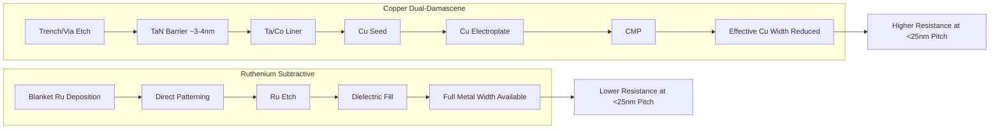

**Intel demonstrated a subtractive ruthenium process at IEDM 2024 that achieves up to 25% line-to-line capacitance reduction at pitches of 25nm or less when combined with air gaps**[^40]. This approach represents a fundamental departure from copper dual-damascene processing, enabling more flexible integration schemes that can simultaneously optimize resistance and capacitance.

**Ruthenium can be patterned through subtractive etching similar to early aluminum interconnect processes, unlike copper which requires the dual-damascene approach**[^40]. This processing flexibility enables novel integration schemes including semi-damascene structures that combine additive and subtractive metallization. The ability to directly etch metal features also greatly simplifies air gap dielectric implementations for capacitance reduction.

Research collaboration between IBM and Samsung has advanced ruthenium interconnect technology toward production readiness. **For the first time in the industry, IBM demonstrated reliability (TDDB and electromigration) of 18nm pitch subtractive ruthenium with embedded air gap and top-via structure**[^42]. Electromigration testing showed no failure from resistance increase up to 1800 hours under conditions more severe than copper testing at similar dimensions, confirming ruthenium's superior reliability characteristics.

**Simulations at imec show that using ruthenium vias for the first four layers of the interconnect stack reduces overall resistance by as much as 60%**[^43]. This hybrid approach combines ruthenium's advantages at the finest pitches with copper's continued suitability for wider intermediate and global wiring levels. The transition strategy enables gradual adoption of ruthenium technology while leveraging existing copper infrastructure.

Via resistance optimization represents a particularly important consideration for SRAM arrays where vertical connections between metal levels significantly impact signal integrity. **Vias are coming to dominate overall interconnect resistance because of their small size and sheer numbers**[^43]. Research demonstrates that **the via bottom barrier can account for more than 60% of via resistance in copper processes**[^43], making barrier elimination through ruthenium adoption especially beneficial for via-dominated resistance paths.

**Interface optimization between ruthenium and copper remains critical for hybrid metallization schemes**. Research shows that **copper does not mix with ruthenium at via bottoms, and electromigration performance is maintained when using thin barriers and eliminating barriers at via bottoms**[^41]. These findings enable practical implementation of ruthenium vias landing on copper lines, providing a pathway for incremental technology adoption.

The optimization of ruthenium deposition conditions significantly influences interconnect performance. **Ruthenium films deposited on PVD and ALD TiN adhesion layers exhibit different grain orientations, grain orientation distributions, and resistivities**[^43]. Larger and more uniform ruthenium grains appear to reduce resistivity when grains are smaller than overall interconnect dimensions. **Ruthenium is an anisotropic conductor with approximately 25% lower resistivity along the hexagonal [001] axis**[^41], suggesting that texture engineering could provide additional performance benefits.

### 3.5 Low-K Dielectric Materials and Parasitic Capacitance Mitigation

The reduction of interconnect parasitic capacitance through advanced dielectric materials directly impacts SRAM stability by minimizing noise coupling between adjacent signal lines and reducing RC delay that affects timing margins. **Nanoporous low-k dielectric materials are used in the semiconductor industry to insulate electrically conducting copper wires in back-end-of-line processing, reducing parasitic capacitance that arises between electrical conductors**[^44]. The capacitance reduction relative to silicon oxide insulators improves speed, signal quality, and power consumption of integrated circuits.

The fundamental relationship between dielectric constant and material properties constrains the design space for low-k materials. **According to the Clausius-Mossotti equation, dielectric constant correlates with molecular density and molecular polar volume**[^45]. Current carbon-doped oxide materials primarily reduce k-value by decreasing density through porosity introduction, but as feature sizes shrink, balancing dielectric constant against mechanical properties (Young's modulus) becomes increasingly difficult.

**The industry-wide pursuit of low-k dielectric materials since the late 1990s led to adoption of various spin-on or chemical vapor deposited nanoporous organosilicate materials and integration schemes in manufacturing**[^44]. These materials achieve dielectric constants below 3.0 compared to approximately 4.0 for silicon dioxide, providing significant capacitance reduction for a given interconnect geometry. However, the porous structure that enables low k-values also introduces mechanical fragility and process integration challenges.

Plasma-induced damage represents a critical challenge for low-k dielectric integration in SRAM manufacturing. **Plasma-induced damage manifests as removal of methyl groups from methylsilsesquioxane-based organosilicate backbone, rendering hydrophobic low-k materials hydrophilic and causing an increase in their k-values**[^44]. This damage occurs during patterning (reactive ion etching) and resist removal (ashing) steps, potentially negating the capacitance benefits of low-k materials if not properly managed.

**Research has elucidated the chemical mechanisms of plasma-induced damage and demonstrated that damage to nanoporous low-k materials can be minimized by either minimizing plasma exposure or designing plasma-damage resistant materials**[^44]. These fundamental understandings informed chip design and integration processes to successfully manufacture chips with nine levels of copper/low-k interconnects while preserving low-k properties.

The trade-off between dielectric constant and mechanical strength presents ongoing optimization challenges. **Analysis of over 1100 thin films reveals that Si-CH3 group density increase reduces film mechanical strength, while SiCH2Si groups do not disrupt the Si-O network**[^45]. This finding provides guidance for molecular design of low-k materials that maintain structural integrity while achieving target dielectric constants.

**For features smaller than approximately 30nm, surface carbon depletion from plasma etching has a larger impact on effective dielectric constant than the bulk material properties**[^43]. This observation highlights the increasing importance of surface and interface control as interconnect dimensions scale, requiring careful optimization of etch processes to preserve low-k benefits in advanced SRAM arrays.

Air gap integration represents an advanced approach for achieving ultra-low effective dielectric constants by replacing solid dielectrics with voids. **Air gap has been successfully incorporated into 14nm technology, with process flows achieving capacitance reductions of up to 16% depending on air gap geometric shape and volume**[^46]. The larger the air gap volume, the greater the capacitance reduction, following a linear relationship with damaged dielectric depth in certain process flows.

**The fully subtractive ruthenium interconnect with embedded air gap demonstrated by IBM and Samsung achieves 40% capacitance reduction relative to oxide dielectric reference processes**[^45]. This significant improvement results from combining the benefits of subtractive metallization—which simplifies air gap formation—with optimized void geometry that maximizes the volume of low-dielectric regions between adjacent lines.

The following table summarizes low-k dielectric approaches and their characteristics:

| Dielectric Approach | Effective k-Value | Capacitance Reduction | Key Challenges |
|--------------------|-------------------|----------------------|----------------|
| Dense SiO2 | ~4.0 | Baseline | None (reference) |
| Carbon-Doped Oxide | 2.5-3.0 | 25-40% | Plasma damage sensitivity |
| Porous Organosilicate | 2.0-2.5 | 40-50% | Mechanical fragility |
| Air Gap Integration | ~1.5-2.0 | 40-60% | Process complexity |
| Metal-Organic Frameworks | ~2.2 | 45-55% | Emerging technology |

**Metal-organic frameworks (MOFs) provide microporous crystalline structures with open fractions as high as 70%, offering an alternative pathway to ultra-low k-values**[^45]. The MOF-CVD process demonstrated by KU Leuven starts from metal oxide that reacts with organic linker compounds, with the MOF formation being inherently selective to the precursor oxide layer. **ZIF-8, a MOF of interest for semiconductor applications, achieves dielectric constant of 2.2 with Young's modulus of 3.4 GPa**[^45], both comparable to existing interconnect dielectrics while offering potential for further optimization.

**The transition to subtractive metallization significantly expands the available dielectric material library**[^45]. Because metal features are patterned first in subtractive processes, dielectric materials no longer need to withstand aggressive etch chemistries required for creating trenches and vias in damascene flows. This processing flexibility enables consideration of materials previously incompatible with copper dual-damascene integration.

For SRAM applications, low-k stress liners provide dual benefits of mobility enhancement and capacitance reduction. **Conventional Si3N4 stress liners have dielectric constant of approximately 7.0, and deposited thicknesses of 100nm or greater significantly increase capacitance between neighboring transistor gates and between contacts and gates**[^47]. Low-k stress liner materials with dielectric constant below 4.0 can achieve **12% or greater reduction in contact-to-gate parasitic capacitance and 10% or greater reduction in gate-to-gate capacitance**[^47] while maintaining the strain benefits essential for mobility enhancement.

**Low-k stress liners comprising silsesquioxane, carbon-doped oxide, or nitrogen and hydrogen doped silicon carbide (SiC(N,H)) can be processed to provide either compressive stress for pFET hole mobility enhancement or tensile stress for nFET electron mobility enhancement**[^47]. UV exposure of compressive low-k material changes its stress polarity from compressive to tensile, enabling selective stress engineering for different transistor types within the same SRAM cell using patterned UV blocking layers.

### 3.6 Process Integration Challenges and Co-Optimization Strategies

The successful implementation of advanced materials for SRAM stability enhancement requires careful management of process integration challenges that arise when combining multiple innovations within a unified manufacturing flow. **The BEOL integration process with nanoporous low-k materials presents significant challenges because of the vulnerability of these materials to plasma-induced damage during patterning and resist removal, and to damage during chemical mechanical polishing**[^44]. Similar integration sensitivities affect the combination of high-k metal gates with strain engineering and novel channel materials.

Thermal budget management represents a critical constraint when integrating multiple advanced materials and processes. **The Ge condensation technique for creating strain-relaxed SiGe-on-insulator substrates requires oxidation at 1100°C**[^35], which must be completed before subsequent temperature-sensitive processes. The strained silicon layer deposited on these substrates demonstrates **only 7-9% strain relaxation through low-temperature oxidation at 780°C, ion implantation, and rapid thermal annealing at 1020°C for 30 seconds**[^35], confirming that careful thermal budget sequencing can preserve strain benefits through the complete manufacturing flow.

**The manipulation of metal gate deposition conditions to suppress work-function variation is limited because high temperatures are restricted by total IC processing thermal budget, while low temperatures are constrained by minimum temperature requirements of subsequent manufacturing steps**[^30]. This constraint emphasizes the importance of material selection over process tuning for managing gate work-function variability.

The interaction between front-end device characteristics and back-end-of-line processing creates additional integration considerations. **Research demonstrates that Ge diffusion from SiGe layers can reach the strained Si/SiO2 interface, inevitably degrading gate oxide characteristics**[^35]. Low-temperature oxidation processes or high-k dielectric layers can mitigate this diffusion, but require coordination between device and interconnect process development teams.

**The combined effect of increasing copper interconnect resistivity, decreasing thermal conductivity of interlayer dielectric materials, and rising current densities results in significant interconnect temperature rise, especially at global metal layers furthest from the heat sink**[^48]. These elevated temperatures become a major concern for interconnect reliability as mean time to failure due to electromigration depends exponentially on metal temperature. The thermal coupling between device operation and interconnect reliability requires holistic thermal management strategies.

Design-technology co-optimization (DTCO) approaches enable systematic balancing of transistor performance, interconnect parasitics, and yield requirements. **The CombFET SRAM design demonstrates that layouts can be designed for the 3nm technology node with full compatibility with existing nanosheet fabrication processes**[^36]. The key fabrication step of fin-side selective epitaxial growth enables integration of the advanced device structure without requiring fundamental process changes.

**Multi-functional photo-patternable low-k dielectric materials that function both as photoresist and as on-chip low-k material offer potential for simplifying BEOL integration**[^44]. These materials possess intrinsic photo-patternability and low-k properties, potentially eliminating process steps and reducing the number of interfaces where damage can occur. Several of these materials have been adopted for high-volume manufacturing.

The following diagram illustrates the process integration flow and key interaction points:

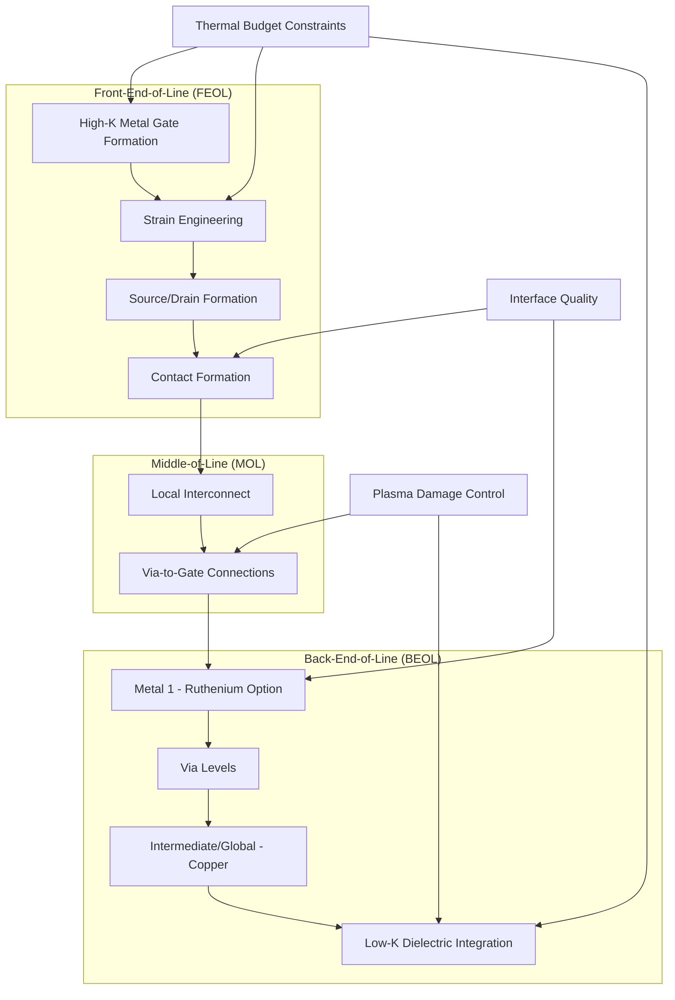

**For III-V compound semiconductor integration, the main challenges include thermal management at high power levels, mechanical fragility during manufacturing, electrical performance preservation in packaging, environmental protection from moisture and contamination, and radiation hardness for certain applications**[^38]. These challenges require careful 3D integration approaches that leverage the strengths of III-V devices while mitigating their weaknesses through integration with silicon and advanced packaging materials.

**Carbon nanotube interconnects have been identified as promising candidates for addressing copper's limitations, with electron mean free paths of the order of a micron suitable for long intermediate and global interconnects**[^48]. For local interconnects, CNT bundles do not offer significant performance improvement over copper, but for long intermediate and global interconnects, **densely packed CNT bundle interconnects show significant performance improvement compared to copper, even with imperfect contacts**[^48]. Additionally, their high thermal conductivity helps control backend temperature rise, improving overall interconnect performance and lifetime.

The integration of SRAM with advanced interconnect technologies requires attention to array-level effects. **The impact of interconnect resistance caused by layouts and wire routing has been comprehensively analyzed for monolithic 3D SRAM cells**[^39], underscoring the importance of considering realistic parasitic effects when evaluating novel material and process combinations. Design optimization must account for position-dependent variations across the array to ensure consistent SNM performance.

**The variability issues affecting interconnects include local interconnect width and global interconnect height variations that impact circuit timing and must be considered for parasitic extraction**[^48]. Statistical analysis shows that leakage power in buffered interconnect systems is sensitive to device variations, while delay is sensitive to both device and interconnect variations. This coupling between device and interconnect variability underscores the need for co-optimization approaches that address both domains simultaneously.

**Power-optimal repeater insertion can achieve large power savings when delay is not critical, but the increase in effective wire resistivity further increases wire delay, necessitating more repeaters and increasing chip power dissipation**[^48]. For SRAM applications where both access time and power consumption are critical, this trade-off requires careful optimization of interconnect dimensions, repeater placement, and material selection to achieve target performance within power constraints.

The successful co-optimization of advanced materials and processes for SRAM stability enhancement ultimately requires integrated design flows that capture the interactions between device characteristics, interconnect parasitics, and manufacturing variability. **The fundamental understandings of plasma-induced damage mechanisms informed chip design and BEOL integration processes to successfully manufacture chips with nine levels of Cu/low-k BEOL interconnects**[^44], demonstrating that systematic process understanding enables practical implementation of advanced materials. Similar comprehensive approaches will be essential for integrating next-generation materials including ruthenium metallization, ultra-low-k dielectrics, and novel channel materials into production SRAM manufacturing flows.

## 4 Lithography, Patterning, and Variability Control

This chapter systematically examines how advanced lithography technologies and patterning strategies directly impact SRAM static noise margin through dimensional uniformity control and variability reduction. The analysis evaluates EUV lithography capabilities and limitations for critical SRAM layers, multi-patterning techniques including self-aligned double and quadruple patterning for achieving sub-resolution pitches, stochastic defect mechanisms that threaten cell functionality, and emerging directed self-assembly approaches for enhanced pattern fidelity. The chapter establishes quantitative relationships between lithographic process control parameters and SNM distribution characteristics, demonstrating how manufacturing-centric optimization of patterning processes translates to improved yield and reliability in dense SRAM arrays.

### 4.1 EUV Lithography Fundamentals and SRAM Patterning Capabilities

Extreme Ultraviolet (EUV) lithography operating at 13.5nm wavelength represents the most significant advancement in semiconductor patterning technology for enabling continued SRAM scaling while maintaining acceptable static noise margin distributions. **The transition from 193nm immersion lithography to EUV provides a fundamental resolution improvement that directly benefits SRAM cell dimensional control**, reducing the complexity of multi-patterning schemes previously required to achieve tight pitches and enabling more uniform transistor characteristics within the cross-coupled inverter pairs that determine SNM.

The practical deployment of EUV lithography in high-volume manufacturing (HVM) brings critical challenges that directly affect SRAM yield and stability. **Equipment reliability is paramount, significantly affecting capital efficiency, fab capacity, maintenance costs, cycle time, and rework requirements**[^49]. Capital efficiency is impacted because the contribution of capital to wafer costs equals capital depreciation divided by the product of throughput and uptime—any reduction in uptime directly increases per-wafer costs and limits the economic viability of EUV for cost-sensitive SRAM production. The EUV laser-produced plasma source operates at a repetition rate of 50 kHz, which is 8.3 times faster than excimer lasers at 6 kHz, placing extraordinary demands on source reliability and maintenance[^49].

**The vacuum environment required for EUV operation introduces unique process control challenges that affect dimensional uniformity across SRAM arrays**. Several hours are required to re-establish vacuum every time the chamber is opened, and achieving ultra-high vacuum conditions translates directly to cost and throughput penalties[^49]. More critically for SRAM SNM, vacuum conditions alter heat transfer characteristics—a temperature increase of just 0.1°C causes a length change of 5nm across 20mm of silicon due to silicon's coefficient of thermal expansion of 2.6×10⁻⁶/°C[^49]. This thermal sensitivity creates position-dependent dimensional variations that manifest as transistor mismatches within SRAM cells.

The evolution of photoresist sensitivity requirements illustrates the ongoing optimization challenges for EUV SRAM patterning. **Resist sensitivity has progressively decreased from 5 mJ/cm² in 2006 to 20 mJ/cm² today, reflecting the trade-off between throughput and pattern quality**[^49]. Higher doses improve pattern fidelity by increasing the number of absorbed photons per feature, reducing stochastic variations that degrade SNM, but at the cost of reduced scanner productivity. For SRAM manufacturing where cell-to-cell uniformity directly determines yield, this dose-quality trade-off requires careful optimization based on specific SNM requirements.

**Mask contamination represents a significant concern for SRAM manufacturing consistency, particularly given the lack of an HVM-worthy pellicle**[^49]. Without effective pellicle protection, wafers must be held while masks undergo qualification, creating workflow disruptions that are particularly problematic for low to medium volume products and when masks have defects requiring rework. The industrial requirements for an HVM-worthy pellicle include transmission mean greater than 90%, transmission non-uniformity less than 1% range, durability during handling and scanning, and cost less than or equal to $1 per wafer[^49]. Until these requirements are met, SRAM manufacturers must balance the risks of mask contamination against the costs of frequent inspection and cleaning cycles.

**Overlay control at sub-2nm precision levels is essential for achieving the transistor matching required for robust SRAM SNM**. A hypothetical overlay budget totals only 2.4nm, meaning individual components must be determined to Ångström-level precision—for reference, a carbon-carbon bond measures 1.2-1.5Å and a silicon-silicon bond measures 1.1Å[^49]. Operating at this scale means semiconductor manufacturing has entered what can be characterized as a quantum world where atomic-scale variations have measurable impact on circuit performance. For SRAM cells where the relative positioning of gates, fins, and contacts determines transistor matching, overlay errors directly translate to threshold voltage mismatches that degrade SNM.

The following table summarizes key EUV lithography parameters and their SRAM implications:

| Parameter | Current Capability | SRAM Impact | Manufacturing Challenge |
|-----------|-------------------|-------------|------------------------|
| Wavelength | 13.5nm | Improved resolution for fin/gate patterning | Vacuum operation complexity |
| Overlay Control | ~2.4nm budget | Critical for transistor matching | Ångström-level component control |
| Resist Dose | ~20 mJ/cm² | Trade-off between quality and throughput | Stochastic effects at lower doses |
| Pellicle Status | Not HVM-ready | Mask qualification delays | >90% transmission required |
| Source Repetition | 50 kHz | High throughput potential | Reliability challenges |

**Line Width Roughness (LWR) and Line Edge Roughness (LER) are significant concerns for EUV-patterned SRAM features that lead to yield concerns including micro-bridging and line breaks**[^49]. These roughness phenomena arise from the stochastic nature of photon absorption and resist chemistry, creating random variations in feature dimensions that translate to threshold voltage variability. For SRAM cells operating at aggressive pitches, even small roughness-induced variations can push transistor characteristics outside acceptable matching tolerances.

**Process control for EUV lithography extends beyond traditional optical lithography considerations**. Focus control simulations show large depths-of-focus, but EUV lithography behavior deviates from conventional expectations[^49]. Mask 3D effects cause issues including Bossung curve asymmetry and focus shift that must be compensated through sophisticated process optimization. These effects become increasingly significant as k₁ factors decrease with continued scaling, requiring careful co-optimization of illumination conditions, mask design, and resist processes.

For logic designs with 50+ layers, **overlay errors are additive, meaning sub-2nm control must be maintained not just at scanner level but also through mask alignment, wafer geometry correction, and field stitching algorithms**[^50]. This impacts SRAM manufacturing variability because designers must now factor in probabilistic critical dimension (CD) variation into library characterization due to these accumulated effects[^50]. The integration of multiple EUV and non-EUV layers in a complete SRAM array creates complex overlay relationships that must be managed holistically.

**Second generation EUV lithography targeting the next node (0.7× linear shrink from 14nm to 20nm half-pitch) presents formidable technical challenges**[^49]. Wavelength and numerical aperture will not change soon, leading to large k₁ values that require aggressive resolution enhancement techniques. Source-Mask Optimization (SMO) and Optical Proximity Correction (OPC) must balance conventional focus-exposure windows, MEEF constraints, mask 3D effects causing loss of depth-of-focus and image placement errors, avoidance of small image log-slopes to control LER, and the use of Sub-Resolution Assist Features (SRAFs)[^49]. These competing requirements make second generation EUV lithography require what has been characterized as "OPC on steroids," with stochastic effects necessarily incorporated into modeling[^49].

### 4.2 Stochastic Effects and Their Impact on SRAM Yield

The stochastic nature of EUV photoresist exposure fundamentally limits the achievable uniformity of SRAM cell dimensions and directly determines the distribution of static noise margins across memory arrays. **Stochastic failures in photoresists represent a significant challenge because EUV resist materials must respond to fewer photons than DUV resists, increasing the impact of stochastic effects like line collapse, bridging, and missing vias**[^50]. These are not cosmetic defects—stochastic failures directly translate to SRAM instability, scan-chain faults, and latent yield loss that can manifest as field failures[^50].

The physical mechanism underlying stochastic effects relates to photon shot noise and its propagation through resist chemistry. **Stochastic effects require more photons to maintain acceptable variation; to keep constant variation per pixel, dose needs to scale as 1/area**[^49]. This scaling relationship means that effective dose may need to double every technology node—for example, 40 mJ/cm² at 7nm, 60 mJ/cm² at 5nm, and 120 mJ/cm² at 3nm[^49]. For SRAM manufacturing, this dose escalation creates significant throughput penalties that must be balanced against the yield benefits of reduced stochastic variation.

**The relationship between stochastic effects and SRAM cell functionality is direct and quantifiable**. Even at doses below 20 mJ/cm², stochastic failures are common in dense SRAM cells[^50]. The cross-coupled inverter structure that provides SRAM bistability depends critically on matched transistor characteristics—when photon shot noise creates random variations in gate length, fin width, or contact dimensions, the resulting threshold voltage mismatches directly reduce static noise margin. The most vulnerable cells in an array determine the minimum operating voltage (Vmin), making stochastic uniformity a primary yield limiter.

The following diagram illustrates how stochastic variations propagate from lithography to SNM degradation:

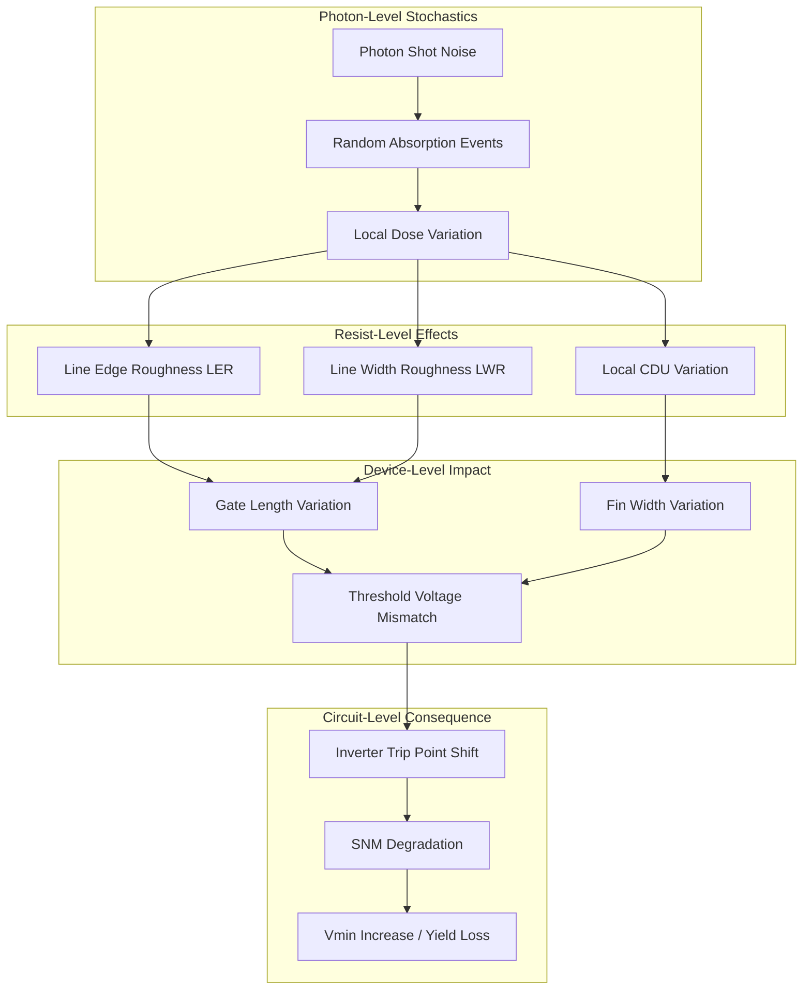

**Metal oxide resists from suppliers like Inpria offer higher sensitivity and lower line-edge roughness compared to traditional chemically amplified resists, but require tight control over post-exposure bake (PEB) and development conditions**[^50]. The transition to new resist platforms represents an ongoing effort to break the traditional resolution-sensitivity-roughness trade-off that constrains EUV patterning quality. For SRAM applications where dimensional uniformity directly determines SNM distributions, resist material optimization remains a critical area of development.

**Photoresist chemistry is undergoing a revolution because EUV resist materials must respond to fewer photons**[^50]. The fundamental challenge is that each photon carries approximately 92eV of energy at 13.5nm wavelength—far more than the ~6eV of 193nm photons—creating secondary electrons that extend the effective interaction volume and blur feature edges. Managing this energy deposition while maintaining sensitivity and contrast requires careful molecular design and process optimization.

The quantitative impact of stochastic effects on SRAM yield has been characterized through extensive experimental studies. **Local critical dimension uniformity (LCDU) is defined as the hole-to-hole CD variation and is three times the standard deviation of the feature's average diameter**[^51]. For contact hole arrays critical to SRAM cell connectivity, LCDU variations directly affect contact resistance uniformity and can create systematic mismatches between transistors sharing common contacts. The 6T SRAM cell comprises cross-coupled inverters (M0-M1, M4-M5) for storage and pass-gate transistors (M2-M3) for read/write control, and process variations—particularly random dopant fluctuation—create threshold voltage mismatches that drive yield loss through specific failure mechanisms[^2].

**Read upsets occur when bitline discharge through the access transistor causes the internal node voltage to exceed the trip point of the inverter, destructively flipping the cell state**[^2]. Read Static Noise Margin (RSNM) quantifies the cell's immunity to this mechanism—insufficient RSNM (typically <50mV) directly causes failure[^2]. Write failures happen when the access transistor cannot pull the internal node below the inverter trip point against the pull-up transistor's action, with Write Static Noise Margin (WSNM) measuring the cell's ability to flip during write operations—inadequate WSNM (<50mV) prevents successful data writing[^2]. Hold failures occur when the cell loses stored data due to leakage currents or VDD droops in standby mode, with Hold Static Noise Margin (HSNM) characterizing data retention stability—insufficient HSNM (<100mV) leads to spontaneous data corruption[^2].

The following table quantifies typical SNM thresholds and their relationship to stochastic variability:

| SNM Type | Failure Threshold | Primary Stochastic Driver | Yield Impact |
|----------|------------------|--------------------------|--------------|
| RSNM | <50mV | Gate length variation | Read disturb failures |
| WSNM | <50mV | Access transistor CD | Write failures |
| HSNM | <100mV | Leakage path variation | Data retention loss |

**Real arrays exhibit failure modes that simplified models cannot capture, including distributed parasitics creating position-dependent behavior where cells at the array's far end see 4-6× slower discharge rates**[^2]. Simple RC models miss the incomplete swing and non-monotonic delay that distributed effects create[^2]. Inter-cell coupling introduces data-pattern dependencies—with 255 unselected cells per bitline, cumulative leakage reaches microamps, comparable to the selected cell's read current at low voltages[^2]. The resulting margin degradation depends on stored data patterns, creating failures invisible to single-cell analysis[^2].

**Peripheral circuits often dominate yield loss in ways that single-cell stochastic analysis overlooks**. Sense amplifier offset voltage (σV_OS ≈ 20mV) directly subtracts from read margin, and wordline driver skew creates systematic timing variations across columns[^2]. These peripheral variations compound with cell-level stochastic effects to determine overall array yield, requiring holistic analysis that considers both random and systematic variation sources.

### 4.3 Multi-Patterning Strategies for Sub-Resolution SRAM Features

Multi-patterning techniques have become essential for achieving SRAM feature densities beyond single-exposure lithography limits, enabling continued scaling while managing the trade-offs between resolution, overlay, and pattern fidelity. **Multiple patterning is a class of technologies developed for photolithography to enhance feature density, expected to be necessary for the 10nm and 7nm node semiconductor processes and beyond**[^52]. The fundamental premise is that a single lithographic exposure may not provide sufficient resolution, necessitating additional exposures or positioning patterns using etched feature sidewalls through spacer techniques[^52].

**Even with single exposure having sufficient resolution, extra masks have been implemented for better patterning quality**[^52]. The use of a second mask to cut lines defined by a first mask allows definition of features—such as brick patterns based on lines spaced at minimum pitch—particularly when lines are near the resolution limit and generated by two-beam interference[^52]. In the absence of a separate cut exposure, the gap between ends of minimum pitch lines becomes prohibitively large due to rounding resulting from reduced spatial frequencies[^52].

The physics of line tip rounding creates fundamental trade-offs that multi-patterning addresses. **The rounding of line tips naturally leads to a trade-off between shrinking line width and shrinking the gap between opposite facing tips—as line width shrinks, the tip radius shrinks, and when the line tip is already less than the point spread function (k₁~0.6-0.7), the line tip naturally pulls back, increasing the gap**[^52]. This trade-off is avoided by adding a cut/trim mask. For the EUV-targeted 7nm node with 18nm metal linewidth (k₁=0.44 for λ=13.5nm, NA=0.33), the line tip gap of less than 25nm (k₁=0.61) means EUV single patterning is not sufficient—a second cut exposure is necessary[^52].

**Self-aligned double patterning (SADP) uses spacer technology where a spacer film layer is formed on the sidewall of a pre-patterned feature**[^52]. By removing the original patterned feature, only the spacer remains, and since there are two spacers for every line, the line density doubles[^52]. This approach is particularly applicable for defining narrow gates at half the original lithographic pitch. As pitch splitting has become more difficult due to possible differences in feature positions between different exposed parts, sidewall image transfer (SIT) has become recognized as the necessary approach[^52].

The following diagram illustrates the SADP process flow and its pitch-doubling mechanism:

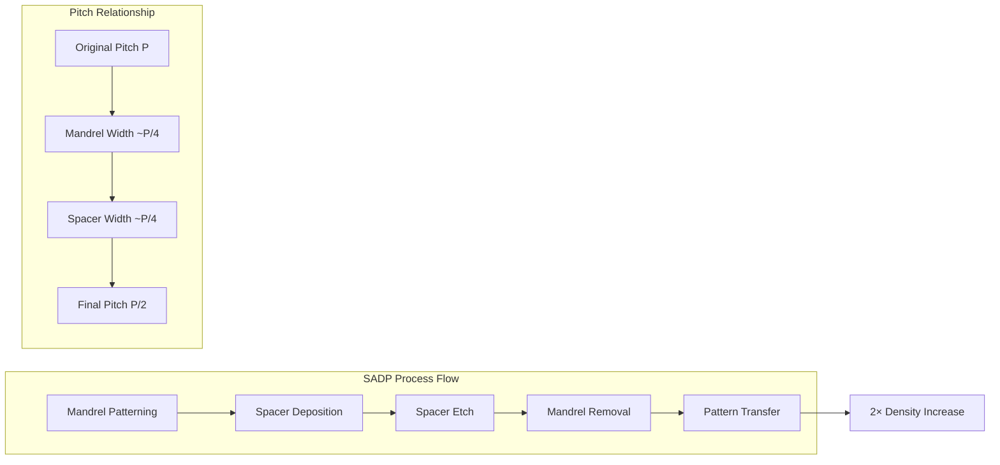

**The main issues with the spacer approach are whether spacers can stay in place after the material to which they are attached is removed, whether the spacer profile is acceptable, and whether the underlying material is attacked by the etch removing the attached material**[^52]. Any misalignment of masks or excursion in pre-patterned feature critical dimension will cause the pitch between features to alternate—a phenomenon known as pitch walking[^52]. This pitch walking directly impacts SRAM SNM because it creates systematic differences between transistors that should be matched.

**When SADP is repeated, an additional halving of the pitch is achieved—this is often referred to as self-aligned quadruple patterning (SAQP)**[^52]. With 76nm being the expected minimum pitch for a single immersion lithography exposure, 19nm pitch is now accessible with SAQP[^52]. For SRAM applications requiring the tightest possible fin and gate pitches, SAQP provides a pathway to continued scaling, though with increased process complexity and variability concerns.

The impact of double patterning lithography on SRAM variability has been experimentally characterized. **Measurements from 75 dies demonstrate a significant impact of DPL on SRAM failures**[^53]. Pitch-split DPL decomposes and prints critical layout shapes in two exposures, and systematic offsets between the two masks lead to mismatch between adjacent devices[^53]. In a typical 6T SRAM cell, the access transistor (PG1) is on a different polysilicon track than the pull-up/pull-down transistors (PU1/PD1), and in DPL they are printed on separate exposures, leading to mismatch that impacts SRAM robustness[^53].

**Adjacent rows of SRAM cells are mirror images of each other; hence, for a given operation, alternate SRAM rows show similar behavior and adjacent rows show opposite behavior**[^53]. This systematic row-dependent behavior creates predictable but concerning yield signatures. For write 1 operations, the difference in mean number of failures between even and odd rows across 75 chips is approximately 14.5%, while for write 0 operations the difference is approximately 25%[^53]. Statistical analysis confirms these differences are due to DPL effects rather than random threshold voltage variation[^53].

**Simulation-based analysis assuming two line-width populations from DPL masks with the same mean and 3σ/μ of 10% shows that DPL increases variability, with standard deviation doubling compared to single exposure lithography**[^53]. For the μ-3σ point in the distribution, the probability of failure increases by approximately 3.3× due to DPL compared to single exposure lithography[^53]. This quantified yield impact underscores the importance of DPL-aware design strategies for maintaining acceptable SNM distributions.

**A DPL-aware SRAM sizing technique has been proposed to mitigate yield loss**[^53]. The optimization resizes the SRAM cell under double patterning assumptions at nominal VDD (1.1V), focusing on improving read robustness by iteratively sizing the pull-up, pull-down, and access transistors[^53]. For a case where two line-width distribution curves differ by 5% in mean and each has 3σ/μ of 10%, the DPL-aware sizing shifts the μ-3σ point of the read margin distribution by approximately 6.2%, decreasing failure probability by 2.17×[^53]. The write margin μ-3σ point decreases by approximately 2.9% but remains the more robust operation[^53].

**EUV multi-patterning lithography decisions must consider the required exposure dose and manufacturability, as a single-patterning process may be more expensive due to requiring more than twice the exposure dose and having worse throughput compared to a double-patterning process**[^54]. Manufacturers strongly prefer single patterning due to lower cost and work hard to extend its use through incremental improvements in EUV scanner quality, photoresist technology, and resolution enhancement techniques[^54]. However, single patterning has drawbacks at smaller nodes including difficulty achieving finer pitches with high precision, increased susceptibility to stochastic defects, and higher process costs due to higher doses required for good yield[^54].

**For line patterning, SADP/SAQP could have advantages over EUV exposure due to cost and maturity of the former approach and stochastic missing or bridging feature issues of the latter**[^52]. The industry has extensive knowledge of multi-patterning from immersion lithography, particularly in decomposing design layouts and self-aligned processes[^54]. The principles are similar for EUV, but achieving required process control and precision at 3nm and below demands new strategies[^54].

**Managing over 1,000 equipment and process parameters for quality outcomes is accelerating development of AI systems to optimize multi-patterning lithography and improve issues like overlay error**[^54]. Self-aligned double patterning uses a single lithographic exposure followed by deposition and etch steps to double feature count, and can leverage EUV's high resolution for tight line-end spaces but requires advanced manufacturing tools like inverse lithography technology[^54]. Self-aligned quadruple patterning extends this principle with additional cycles to achieve even smaller feature sizes for nodes like 3nm and below[^54].

### 4.4 Directed Self-Assembly for Enhanced Pattern Uniformity

Directed self-assembly (DSA) represents an emerging patterning technology that offers fundamentally different approaches to achieving pattern uniformity compared to conventional lithography, with particular promise for addressing the pitch walking and stochastic variability challenges that limit SRAM SNM in multi-patterning schemes. **DSA is a promising semiconductor fabrication approach based on material phase separation that enables extremely low pitch (less than 20nm, or even down to 10nm with advanced DSA materials) and provides potentially unmatched critical dimension uniformity**[^55]. Critically, DSA provides immunity to pitch walking—a problem that has plagued SADP and SAQP[^55].

The fundamental mechanism of DSA leverages the self-organization properties of block copolymers (BCPs) to generate periodic nanostructures with inherent uniformity. **DSA utilizes the inherent phase-separation behavior of BCPs to generate periodic nanostructures—under equilibrium conditions, BCPs self-assemble into nanoscale domains typically 5-50nm in size**[^56]. External guidance directs the orientation of self-assembled patterns, enabling fabrication of high-density semiconductor devices[^56]. Compared to EUV or nanoimprint lithography, DSA eliminates the need for expensive light sources, masks, and multi-patterning steps, significantly reducing manufacturing costs while achieving sub-5nm feature resolution[^56].

**DSA is listed as an option for patterning line/space pitches at 20nm and below in the International Technology Roadmap (ITRS)**[^55]. This roadmap recognition reflects the technology's potential to address scaling challenges that conventional lithography approaches struggle to overcome. For SRAM applications requiring extremely tight fin pitches and contact hole arrays, DSA offers a pathway to improved uniformity that directly benefits SNM distributions.

A comprehensive design technology co-optimization (DTCO) assessment has investigated whether DSA can support critical circuit design constructs for systems on chips, specifically for FinFET circuits. **The assessment involved a qualitative phase where critical constructs were extracted from circuit-relevant designs and various DSA processes were screened to fulfill critical ground rules**[^55]. A subsequent quantitative DTCO flow was developed for a layer of fins, incorporating DSA-compliance check, DSA guiding patterns, fin-cut pattern generation, and a fast 3D DSA model for verification[^55].

**The DTCO study compared a conventional 'sea-of-fins' DSA approach with a self-aligned DSA process, concluding that a self-aligned DSA process is preferable for overlay and has the capability of supporting various realistic design architectures of different track heights for standard cells**[^55]. The assessment indicated feasibility for Static Random-Access Memory (SRAM) constructs[^55]. This validation demonstrates that DSA can meet the complex geometric requirements of practical SRAM designs, not just simple periodic test structures.

The materials development for DSA has progressed significantly, with different BCP systems offering varying performance characteristics. **Research has developed a series of BCP materials with different chi values and modifications—first-generation PS-b-PMMA BCPs exhibit constrained performance at larger pitch sizes, while moderate chi (MChi)-modified BCPs improve the kinetics of large molecular weight PS-b-PMMA materials**[^56]. Additives in MChi BCPs help mitigate DSA defects[^56]. **Compared with PS-b-PMMA, the LCDU and pattern placement error (PPE) of high-chi (HChi) materials were reduced by 28% and 30%, respectively**[^56]. High-chi materials demonstrate improved roughness and uniformity and hold great promise for small-pitch applications in manufacturing of future DRAM devices[^56].

**A novel high-χ block copolymer developed to optimize DSA rectification for EUV-defined contact hole patterns demonstrated significantly improved local CDU from 1.71nm to 1.41nm and reduced pattern placement error from 3.13nm to 2.18nm compared to conventional PS-b-PMMA**[^56]. These quantitative improvements directly benefit SRAM SNM by reducing the dimensional variations that cause transistor mismatches within cells.

The following table compares DSA material systems and their performance characteristics:

| BCP Material System | Chi Value | LCDU Performance | PPE Performance | Application Suitability |
|--------------------|-----------|------------------|-----------------|------------------------|
| PS-b-PMMA (1st Gen) | Low | Baseline | Baseline | Limited pitch range |
| MChi-Modified | Moderate | Improved kinetics | Reduced defects | Broader pitch range |
| High-Chi (HChi) | High | 28% reduction | 30% reduction | Small-pitch DRAM/SRAM |

**DSA can be applied for EUV line/space resist rectification, fundamentally improving systematic and random variabilities**[^56]. The LER/LWR of DSA line/space patterns with 24nm pitch is improved by DSA rectification to 1.70/1.40nm from 1.88/2.71nm, respectively[^56]. Work concentrated on improving LER and LWR using high-chi BCPs found substantial LWR (~300%) and LER (~175%) improvements for specific high-chi BCPs compared to EUV alone[^56]. These dramatic roughness reductions directly address the stochastic variability challenges that limit EUV patterning quality.

**DSA technology has emerged as the focus of hole patterning applications**[^56]. Research has demonstrated 40nm, 35nm, and 30nm pitch hexagonal hole patterns formed by chemical-epitaxy DSA flow with nine multiplications[^56]. Formation of DSA hexagonal holes with 50nm pitch has been confirmed in 2025, with template pattern pitch of 150nm shrinking to 50nm after DSA processing[^56]. The LCDU (3σ) and placement error (3σ) achieved were 1.7nm and 3.2nm, respectively[^56]. Utilizing chemical epitaxy processes to create high-density hole patterns presents an effective strategy for lowering rising lithography costs[^56].

**FinFET fabrication studies on silicon-on-insulator substrates reveal comparable electrical performances between DSA and self-aligned quadruple patterning at 27nm pitch, with DSA reducing mask counts and lithography steps**[^56]. Cost analyses demonstrate a 17% cost reduction in Si-based front-end-of-line processes through batch-processed DSA, driven by reduced thermal annealing times[^56]. These cost benefits compound with the uniformity advantages to make DSA an attractive option for SRAM manufacturing.

However, **defect density remains the primary barrier to DSA application, with current benchmarks far exceeding industry standards**[^56]. Defect mitigation and root cause studies are critical for enabling production adoption[^56]. Key factors affecting defect occurrence include material aspects (BCP purity and interfacial energy matching) and process aspects (thermal annealing parameters critically govern defect annihilation kinetics)[^56]. Recent advancements reduce defects through surface modification of guiding layers and optimized guiding layer topography[^56].

**DSA metrology faces challenges of insufficient chemical contrast and throughput constraints**[^56]. Strategies adopted include post-etch optical scatterometry, dark-field microscopy, and optimized etch depth schemes[^56]. Recent advancements in hyperspectral scatterometry systems enable rapid, non-destructive quantification of dislocation densities across 300mm wafers[^56]. These metrology developments are essential for enabling the process control required for production-worthy DSA.

### 4.5 Stochastic-Aware Process Optimization and OPC Strategies

Advanced computational lithography approaches that incorporate stochastic modeling directly into optical proximity correction (OPC) and source-mask optimization (SMO) workflows represent a critical capability for achieving acceptable SRAM yield at aggressive technology nodes. **Siemens Digital Industries Software and imec have partnered for over five years to develop a new generation of OPC solutions that embed stochastic effects directly into the modeling and correction process for EUV lithography**[^57]. A 2025 paper presents experimental validation of a stochastic-aware OPC strategy using wafer-level CDSEM data, demonstrating at least one to two orders of magnitude improvement in stochastic failure probabilities[^57].

The development of stochastic-aware OPC has progressed through rigorous experimental validation stages. **The collaboration began with rigorous experimental validation around 2020, testing the first generation of Calibre Gaussian Random Field stochastic models against experimental wafer data**[^57]. Using advanced metrology developed by imec, metrics like pixNOK (pixels "Not OK") and Number_MicroBridges were experimentally measured and directly compared to model predictions[^57]. A joint 2020 publication demonstrated that the Calibre Gaussian Random Field stochastic model can reliably predict these key stochastics-driven metrics, showing strong agreement between experimental observations and model predictions[^57].

**In 2023, Siemens and imec published research applying stochastic models to a stochastic-aware OPC flow**[^57]. The latest 2025 results directly compare predicted and observed failure probabilities themselves, moving beyond proxy metrics to establish a production-relevant link between modeling and manufacturing outcomes[^57]. This progression from model validation to production-relevant failure prediction represents the maturation required for practical deployment in SRAM manufacturing.

**Compact stochastic resist models were calibrated using both nominal and process-window wafer data**[^57]. The Calibre platform's compact stochastic models accurately predicted wafer-level CD uniformity (LCDU) and variability across a range of layout patterns, pitches, and processing conditions, demonstrating fitting errors well under 1nm[^57]. This sub-nanometer accuracy is essential for predicting the transistor-level variations that determine SRAM SNM distributions.

The practical implementation of stochastic-aware OPC involves comparing multiple correction strategies with different optimization objectives. **Three approaches were compared: Nominal OPC (traditional correction), Process window OPC (PW-OPC, incorporating systematic process variation bands), and Stochastic-aware OPC (ST-OPC, incorporating the full stochastic band into the OPC cost function)**[^57]. The results demonstrate clear advantages for the stochastic-aware approach.

**Incorporating stochastic-aware OPC led to at least an order-of-magnitude reduction in the probability of stochastic defects for both SRAM and logic designs**[^57]. The method systematically sacrificed minor edge placement error (EPE) in return for much lower failure rates[^57]. This trade-off reflects the fundamental insight that for SRAM yield, reducing the probability of catastrophic failures (bridges, breaks, missing vias) is more valuable than minimizing nominal dimensional errors that remain within acceptable ranges.

The following diagram illustrates the stochastic-aware OPC optimization approach:

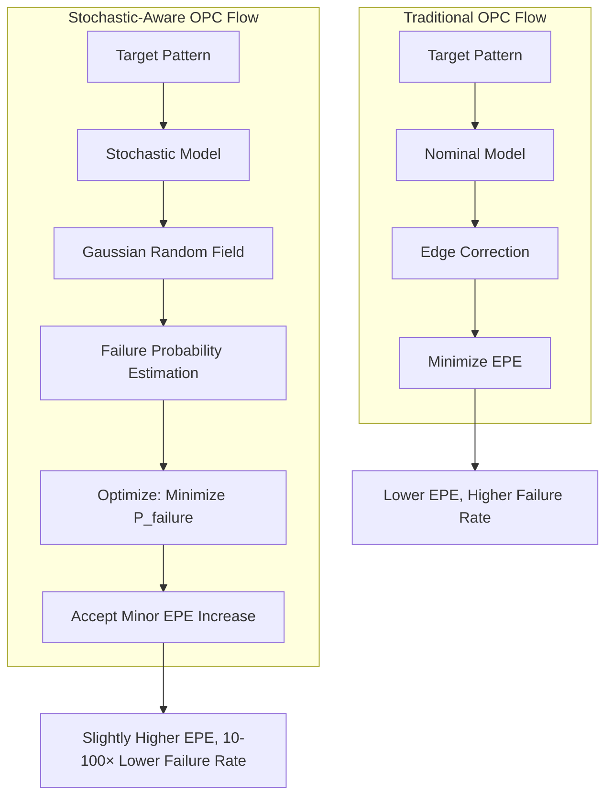

**Strong RET (Resolution Enhancement Techniques) such as alternating phase shift masks (altPSM) and sub-resolution assist features (SRAF) cannot be inserted in arbitrary layouts without RET conflicts**[^58]. The layout restrictions for alternating phase shift masks are very complex and closely related to RET parameters[^58]. For SRAF, the most significant layout restriction is the "forbidden pitch" problem, though forbidden pitches are not absolute and depend on wavelength, NA, illumination angle, minimum SRAF size, and spacing[^58]. Two-dimensional SRAF constraints become very complex due to limited understanding and multiple possible SRAF solutions[^58].

**Future technology nodes critically depend on flawless implementation of strong RET**[^58]. All strong RETs require layout restrictions that prohibit reuse of existing layouts in these technology nodes[^58]. The need for strong RET provides an opportunity to fundamentally improve chip layout by adopting DFM guidelines and implementing aggressive design restrictions[^58]. If implemented correctly, it is possible to precisely approximate two-beam imaging—meaning patterning with one diffraction order of light[^58].

**Curvilinear masking and multi-patterning integration is complex and far from production-ready**[^54]. The computational complexity of designing curvilinear masks, which already requires GPU acceleration and AI support, increases exponentially with multiple patterning[^54]. One approach to manage complexity may be to keep stitching boundaries simple, with minimally complicated features in the boundary itself and more complex curvilinear features in half-size reticles, helping maintain critical alignment and overlay accuracy[^54].

**The introduction of high-NA EUV lithography aims to extend single patterning to 3nm and beyond by offering higher resolution, potentially reducing the need for multi-patterning**[^54]. However, it requires double exposure stitching for large chip sizes and introduces challenges in stitching, overlay control, and developing new resist materials such as metal oxide resists, which are not yet ready for mass production[^54]. The high initial investment and ongoing costs for high-NA EUV infrastructure are significant barriers[^54].

### 4.6 Metrology and Process Control for SNM-Critical Dimensions

The metrology infrastructure required to monitor and control lithographic variability at levels ensuring acceptable SNM distributions represents a critical enabling capability for advanced SRAM manufacturing. **Traditional CDSEM measurements have drawbacks including small sample sizes at high magnifications and sample damage due to photoresist shrinkage**[^51]. These limitations constrain the statistical confidence of uniformity measurements and can introduce measurement-induced artifacts that complicate process control decisions.

**A methodology for obtaining local critical dimension uniformity (LCDU) of contact hole arrays using optical scatterometry combined with machine learning algorithms has been developed**[^51]. Staggered contact hole arrays at 44nm pitch were created by EUV lithography using three different positive-tone chemically amplified resists, with different exposure conditions for dose and focus used to introduce LCDU variations[^51]. Optical scatterometry spectra were acquired post-development and post-etch into a SiN layer, with reference data for machine learning collected by CDSEM[^51].

**The machine learning algorithm was trained using optical spectra and corresponding calculated LCDU values from CDSEM image analyses—it was found that LCDU and CD can be accurately measured with the proposed methodology both post-lithography and post-etch**[^51]. This dual-stage measurement capability enables process engineers to distinguish between lithography-induced and etch-induced variations, supporting more targeted process optimization.

**The machine learning model achieved very good correlation (R² > 0.97) for via diameter measurements compared to CDSEM**[^51]. For LCDU measurements on bare silicon wafers, excellent correlations were achieved for all three photoresists, with R² values greater than 0.9[^51]. For wafers with complex stacks, excellent results were also obtained post-lithography, demonstrating the method works on production-relevant film structures[^51]. Post-etch measurements showed very good agreement (R² = 0.98) between CDSEM and scatterometry, with LCDU significantly reduced after etch[^51].

**When evaluating a limited dataset with vias within a 1nm CD range to simulate a production environment, good agreement (R² > 0.7) was still achieved, demonstrating the technique is suitable for high-volume manufacturing monitoring**[^51]. This production-relevant validation is essential for establishing confidence in the methodology for actual SRAM manufacturing applications.

The following table summarizes the metrology comparison between CDSEM and scatterometry approaches:

| Characteristic | CDSEM | Scatterometry + ML |
|---------------|-------|-------------------|
| Sample Size | ~180-400 vias | >400,000 vias |
| Throughput | Low | High |
| Sample Damage | Photoresist shrinkage | None (non-destructive) |
| Statistical Confidence | Limited | High |
| Same-Area Tracking | Difficult | Enabled |
| CD Correlation (R²) | Reference | >0.97 |
| LCDU Correlation (R²) | Reference | >0.9 |

**The methodology provides significant advantages over CDSEM, including higher throughput, no sample damage, and statistically more representative results due to the larger area measured (covering over 400,000 vias compared to hundreds with CDSEM)**[^51]. The non-destructive nature of scatterometry also allows for same-area measurements post-development and post-etch, enabling uncorrelated process improvement[^51]. This capability is particularly valuable for understanding how lithography variations propagate through subsequent processing steps.

**EUV mask reflectivity uniformity represents another critical metrology challenge affecting SRAM dimensional control**. Research investigated reflectivity uniformity and stability over time through experiments and numerical simulations[^59]. The 3σ value of peak reflectivity averaged 0.631% (absolute value), which significantly exceeds the industrial requirement of 0.15% (absolute value)[^59]. The stability of reflectivity was also found to be unreliable, with potential degrading factors including carbonization and thermally induced inter-diffusion[^59].

**Based on measurements and analysis, it is suggested that EUV mask reflectivity be measured regularly and compensated by adjusting other system parameters**[^59]. It was proposed that reflectivity uniformity could be indirectly predicted by measuring uniformity of multilayer period and roughness[^59]. However, based on scattering theory, variations in roughness and period did not fully explain peak reflectivity variation[^59]. An innovative mask metrology was proposed that can in-situ monitor multilayer degradation (contamination and thermally induced period change) by monitoring mask apodization over time and map reflectivity through a "self-reference" method[^59]. A significant advantage is that no extra hardware is required[^59].

**Design for manufacturing meets advanced process control in critical ways for SRAM yield optimization**. Nanoscale IC design increasingly faces challenges achieving manufacturing closure—high product yield—due to feature size miniaturization and process variation[^60]. The main goal of DFM is to expand the manufacturing process yield window, but DFM needs to work synergistically with advanced process control (APC) to accommodate windows that may be shrinking and design-dependent[^60].

**Due to lithography limitations and inherent process variation, manufacturing effects impact design success more severely than ever**[^60]. A notable characteristic of deep sub-wavelength lithography is its proximity effects and layout-dependent variation[^60]. It is estimated that in nanoscale design, lithography and design-related functional and parametric yield loss may account for 80% of total yield loss[^60]. This quantification underscores the critical importance of lithography optimization for SRAM SNM and yield.

**Existing DFM work can be categorized into: (1) mask synthesis through RET or fill insertion for mask data preparation; (2) manufacturability-aware physical design and synthesis guided by yield enhancement rules or directly by manufacturing/yield models; (3) variation characterization and analysis including statistical static timing analysis and variation-aware/tolerant design**[^60]. These DFM activities help expand manufacturing process yield windows, but DFM still needs to work closely with APC to jointly define achievable process windows[^60].

The integration of advanced metrology with process control systems enables closed-loop optimization of lithographic processes for SRAM SNM. **The gap between academic models and industrial reality is qualitative—real SRAM arrays exhibit complex phenomena that fundamentally alter behavior**[^2]. This modeling gap has severe practical consequences: algorithms showing similar performance on simplified benchmarks may differ by orders of magnitude on real circuits; optimization techniques that appear optimal in studies fail catastrophically in practice[^2].

**An experiment quantified the impact of interconnect parasitics through comparative Monte Carlo simulations—for a 256-row array, mean read access delay with parasitics was approximately 18.7× greater than without (3.273ns vs. 0.175ns), and average read power was 16.7× higher (434.51µW vs. 25.99µW)**[^2]. The impact of peripheral circuit variations was also demonstrated—for a 64×32 array, bitline-related read delay showed an increase of 4.8× when peripherals were included (0.8523ns vs. 4.0864ns), and read power consumption was 5.4× higher[^2].

**Multi-objective transistor sizing optimization to improve cell robustness achieved significant improvements: 65% enhancement in read SNM (0.17V to 0.28V), 39% improvement in write SNM (0.79V to 1.10V), and 15% area reduction (0.61µm² to 0.52µm²) while maintaining timing constraints**[^2]. Critically, designs optimized using simplified models exhibited poor performance when evaluated under realistic conditions, validating the necessity of high-fidelity modeling during optimization[^2].

The quantitative relationship between dimensional uniformity and SNM has been established through comprehensive analysis. **SRAM bitcells typically employ well-matched, minimum-sized transistors which make them highly susceptible to process variations**[^61]. The conventional 6T SRAM bitcell consists of two cross-coupled inverters and two access transistors—four transistors comprise cross-coupled CMOS inverters forming a latch storing either '1' or '0', while two NMOS transistors function as access transistors isolating the cell from bitlines during hold and providing access during read and write[^61].

**The cell ratio is defined as the ratio of driver transistor dimensions to access transistor dimensions—for the present nanometer regime, typical cell ratio must be greater than ~2 to guarantee successful read operation**[^61]. SNM is the maximum noise tolerable by an SRAM bitcell before contents are lost—SNM during read state is less than hold state, showing that 6T SRAM cells are more susceptible to process variations during read operation[^61]. In the presence of intra-die Vth variations, mismatch introduced between transistors can result in loss of stored data[^61].

**A single-ended 9T SRAM design enhances data stability and addresses bitline leakage problems**[^61]. The proposed 9T SRAM cell enhances read stability by employing a read discharge path completely isolated from internal nodes—read SNM of the 9T cell is 2.5× greater than 6T SRAM with cell ratio β=2[^61]. The 9T cell completely prevents bitline leakage, allowing more cells to share the read bitline, with bitline leakage power consumption reduced by up to 79%, 76%, and 39% compared to previously published 8T, 10T, and 9T SRAM cells respectively[^61].

**The impact of process variations on stability was evaluated by performing 5000 Monte Carlo simulations—mean read static noise margin of 9T cells is approximately 2.4× that of 6T SRAM with β=2**[^61]. The standard deviation of 9T cells is 14.6% less than 6T cells[^61]. The proposed 9T SRAM cell satisfies the "μ-6σ" yield criterion to achieve 90% yield for a 1Mb SRAM array, whereas the 6T SRAM cell fails this criterion[^61]. This quantitative demonstration establishes the direct link between improved dimensional uniformity through alternative cell architectures and achievable SNM yield across large arrays.

## 5 Three-Dimensional Integration and Novel Cell Architectures

This chapter evaluates advanced integration technologies and alternative SRAM cell topologies as manufacturing-centric strategies for enhancing static noise margin. The analysis systematically examines how three-dimensional stacking approaches enable SNM improvements through increased effective cell area, dedicated noise isolation structures, and optimized device placement without compromising array density. The chapter further provides comprehensive comparison of conventional 6T cells against enhanced architectures including 7T, 8T, 10T, and Schmitt-trigger-based designs, quantifying their respective SNM characteristics across hold, read, and write operations while analyzing their sensitivities to process variations and suitability for different application requirements.

### 5.1 Monolithic 3D Integration for SRAM Density and Stability Co-Optimization

Monolithic three-dimensional integration represents a transformative manufacturing approach that vertically separates NMOS and PMOS devices into distinct tiers connected by nano-scale inter-tier vias, fundamentally altering the design space for SRAM stability optimization. **This technology enables simultaneous achievement of aggressive density scaling and enhanced static noise margin—objectives that traditionally conflict in planar implementations**. The ability to place complementary transistor types on separate vertical layers provides new degrees of freedom for transistor sizing and layout optimization that directly benefit SNM characteristics across all operational modes.

The foundational advantage of monolithic 3D integration stems from its ability to reduce cell footprint while maintaining or improving electrical characteristics. **Using a compact 22nm 2D SRAM as the design baseline, a 33% footprint area reduction is achieved by simply splitting the NMOS and PMOS devices in the 2D cell into two tiers**[^62]. This straightforward vertical separation immediately provides area benefits without requiring fundamental changes to cell topology, demonstrating that the manufacturing approach itself delivers density improvements independent of circuit-level innovations.

Several alternative design options have been explored to fully leverage monolithic 3D technology under both area and reliability goals. The following table summarizes the key 3D SRAM configurations and their performance characteristics:

| Configuration | Area Reduction vs 2D | Nominal SNM | Monte Carlo SNM (Mean ± σ) | Key Trade-off |
|--------------|---------------------|-------------|---------------------------|---------------|
| Basic 3D Split | 33% | Similar to 2D | Similar to 2D | Baseline 3D approach |
| 2P4N New Sizing | 44% | 262.6 mV | 224.4 ± 38 mV | Write margin degradation |
| 3P3N with Enhancement | 45% | 265 mV (mean) | 265 mV mean | Requires assist techniques |
| 4P4N 8T | 40% | 540.3 mV | 503.5 ± 26 mV | Maintains 8T stability |

**The 2P4N 3D SRAM cell design with new sizing proposes a different sizing approach where all NMOS sizes are decreased while the PMOS sizes are increased, achieving an area reduction of 44% compared with the 2D SRAM**[^63]. A significant merit of this sizing approach is that the SNM can be maintained at the same level as the 2D design. Statistical simulations considering threshold voltage variations for each transistor caused by process variations demonstrate that the SNM mean of 224.4mV with a 38mV standard deviation is basically the same as the 2D design[^62]. However, **the major drawback of this new sizing approach is that the write stability is worse than the 2D design, with write margin dropping from 220.7mV to 190.9mV**, necessitating write enhancement techniques to maintain writing stability[^62].

The 3P3N 3D SRAM cell structure introduces a more innovative approach by replacing one NMOS pass transistor with a PMOS transistor to overcome the NMOS and PMOS count skew inherent in conventional 6T designs. **This configuration achieves a 45% area reduction compared with the 2D design**[^63]. The replacement has significant impact on both read and write stability, requiring careful design optimization. To solve the read-stability problem, the 3P3N cell uses single-ended read through the NMOS pass transistor while turning off the PMOS pass transistor. **This single-ended read operation results in very good SNM performance, with Monte-Carlo simulation showing an SNM mean of 265 mV, which is better than the original 2D design (218.1 mV)**[^62].

However, the write-ability of the 3P3N structure is degraded compared with the original 2D cell, necessitating write enhancement techniques. These techniques include word-line voltage boosting for the NMOS pass-transistor, negative word-line voltage for the PMOS pass transistor, and lower cell Vdd[^63]. **Using these enhancement techniques, a write margin comparable with the original 2D design is achieved under specific voltage configurations**[^62]. The requirement for multiple word lines and read/write assist techniques makes the 3P3N structure more complex to implement than the 2P4N approach.

**The proposed 4P4N 8T SRAM cell has a balanced NMOS and PMOS count of four each, with the added 2 NMOS transistors in a conventional 8T cell replaced with PMOS**[^62]. The 3D layout of this new structure achieves an area reduction of 40% compared with the 2D 2P4N version. Since the transistor sizes except for the added transistors are the same as the original 8T structure, it maintains the same SNM, write margin, and data retention voltage performance as the 2D 8T structure. **The nominal SNM is 540.3mV and Monte-Carlo simulation shows an SNM mean of 503.5mV with a 26mV standard deviation**[^63], demonstrating excellent stability characteristics that significantly exceed the 6T alternatives.

The following diagram illustrates the comparative advantages of different 3D SRAM configurations:

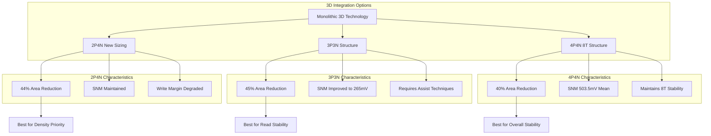

**In conclusion, the 3D designs based on 2P4N and 3P3N structure reduce the overall footprint by up to 44% and 45% compared with the conventional 2P4N 2D SRAM while maintaining comparable read/write stability**[^63]. The 3D oriented 2P4N structure is preferred between the two 6T 3D structures because the 3P3N structure requires more metal layers and read/write assistant techniques[^62]. **The new 3D structure based on 8T (4P4N) SRAM results in a 40% area reduction compared with the standard 2D 8T SRAM while maintaining the same read/write stability**[^63], making it an attractive option for applications requiring maximum stability without sacrificing density benefits.

### 5.2 Hybrid Bonding Technology and Its Implications for Memory Architecture

Hybrid bonding three-dimensional integration has emerged as a transformative manufacturing technology that creates unprecedented opportunities for memory system optimization by enabling ultra-high interconnect density between vertically stacked die. **This approach provides a pathway to memory architectures that combine the high bandwidth and low latency characteristics traditionally associated with SRAM while leveraging the density advantages of DRAM**, fundamentally changing the trade-off landscape for memory hierarchy design.

The interconnect density achievable through hybrid bonding dramatically exceeds conventional packaging approaches. **Compared to HBM using microbump and TSV technologies, hybrid bonding technology can reach a maximum through density of 110,000/mm² with a 3 µm fine pitch, which is hundreds of times denser than the microbump density in HBM**[^64]. This extraordinary interconnect density enables new memory architectures that were previously impractical due to I/O limitations.

**Hybrid bonding has a low resistance of less than 0.5 ohm per connection, and the energy consumption of the logic-to-memory interface can be reduced by 40%**[^64]. This reduction in interface energy directly benefits memory system efficiency and enables more aggressive memory access patterns without thermal constraints. The low interconnect resistance also minimizes signal degradation, supporting the high-speed operation essential for maintaining timing margins in stability-critical applications.

The Stacked embedded DRAM (SeDRAM) architecture demonstrates the practical implementation of hybrid bonding for high-performance memory systems. **A 4 Gb LPDDR4/4X product based on SeDRAM technology achieved a bandwidth of 34 GBps/Gbit and a high energy efficiency of 0.88 pJ/bit**[^64]. The logic-to-DRAM interface frequency of SeDRAM operates at 266 MHz, with total latency from read clock to data suppressed to as low as 6 ns. **The SeDRAM solution can support a wide density range of 1 Gb to 48 Gb and a bandwidth capability reaching TBps levels**[^64].

**A key design factor is the introduction of an SRAM-like interface to fully utilize the advantages of low latency and high energy efficiency**[^64]. After the selected page is activated, write and read operations are triggered by write and read clocks respectively, with the interface running at clock rates in the several-hundred-MHz range. This SRAM-like interface approach enables memory systems to achieve competitive energy efficiency, low latency, high bandwidth, and easy integration with existing controller architectures.

The following table summarizes hybrid bonding characteristics compared to conventional approaches:

| Parameter | Conventional HBM | Hybrid Bonding | Improvement Factor |
|-----------|-----------------|----------------|-------------------|
| I/O Density | ~400/mm² | 110,000/mm² | ~275× |
| Pitch | ~40-55 µm | 3 µm | ~15× finer |
| Interface Resistance | Higher | <0.5 Ω/ea | Significantly lower |
| Interface Energy | Baseline | 40% reduction | 0.6× |
| Bandwidth Capability | Limited by I/O | TBps class | Order of magnitude |

**Hybrid bonding technology overcomes the bandwidth limitations and I/O density constraints of 2D/2.5D DRAM, achieving I/O density of 110,000/mm², bandwidth exceeding 16TB/s, and interface power as low as 0.024pJ/bit**[^65]. These specifications represent transformational improvements that enable memory architectures previously constrained by interconnect limitations.

Design considerations for hybrid bonding implementations include thermal management, reliability, and integration overhead. **Operating temperatures exceeding 85°C trigger refresh cycle switching to 16ms intervals, and Cu pillar reliability achieves 99.999% at production volumes**[^65]. The controller implementation occupies approximately 17% of the logic-memory bank area, with TSVs used for off-chip I/O and power delivery introducing approximately 3mm² area overhead[^65]. These overhead factors must be considered when evaluating the net benefits for specific applications.

**The distributed controller architecture is essential for leveraging the bandwidth advantages of hybrid bonding**[^65]. Unlike conventional memory systems with centralized controllers, hybrid bonding enables placement of controller logic directly adjacent to memory banks, minimizing latency and maximizing the utilization of available bandwidth. This architectural approach particularly benefits applications with high memory-level parallelism that can exploit the distributed bank access capabilities.

Research has demonstrated similarity-aware accelerator architectures that leverage the unique characteristics of hybrid bonding. **Compared to 2.5D DRAM, 3D hybrid bonding provides higher I/O parallelism and avoids data interleaving, making it more suitable for exploiting data locality patterns**[^65]. The architecture achieves 6.72× and 2.34× throughput improvements compared to baseline configurations, with similarity-aware techniques further improving throughput by 1.21× and energy efficiency by 1.97×[^65].

**The comprehensive design analysis demonstrates that hybrid bonding-based architectures achieve 5.69× to 28.13× energy efficiency improvements and 3.82× to 10.98× area efficiency improvements across different workloads and datasets**[^65]. These substantial improvements establish hybrid bonding as a compelling technology for next-generation memory systems requiring both high bandwidth and stability characteristics.

### 5.3 Conventional 6T SRAM Limitations and Process Variation Sensitivity

The conventional six-transistor SRAM cell represents the foundational memory architecture whose inherent limitations motivate the development of alternative topologies for enhanced static noise margin. **Understanding these limitations establishes the baseline performance characteristics against which improved architectures must be evaluated**, providing essential context for quantifying the benefits of manufacturing and design innovations.

The fundamental structure of the 6T SRAM cell comprises two cross-coupled CMOS inverters forming a bistable latch, with two NMOS access transistors providing read and write connectivity to the bitlines. **This most commonly used SRAM cell implementation has the advantage of low static power dissipation, but the potential stability problem is such that during read operation, a stored "0" can be overwritten by a "1" when the voltage at the storage node reaches the threshold voltage of the feedback transistor**[^66]. This read-disturb vulnerability represents the primary limitation driving alternative architecture development.

**The stability as expressed by the static-noise margin has been investigated for CMOS SRAM cells, with the stability of SRAM reducing with reduction in transistor size**[^67]. This fundamental scaling relationship means that continued technology advancement inherently degrades 6T cell stability unless compensating measures are implemented. The static noise margin of SRAM is defined as the minimum DC noise voltage necessary to flip the state of the cell, with one common measurement method being the graphical butterfly curve approach where SNM equals the side of the largest square that can fit inside the voltage transfer characteristic curves[^67].

Quantitative characterization of 6T SRAM stability across operational modes reveals significant variation between states. **The stability of SRAM in standby mode (SNM) is 246 mV, in read mode (RSNM) is 104 mV, and in write mode (BLWM) is 650 mV at 32nm technology**[^67]. The dramatically lower read SNM compared to standby SNM confirms that 6T cells are most vulnerable during read operations, when the access transistors create a conductive path between storage nodes and pre-charged bitlines.

**Data Retention Voltage (DRV) is the minimum voltage required to hold or read data; any voltage below DRV can flip the state of SRAM**[^67]. For 6T SRAM, the DRV in standby mode is 0.14V and in read mode is 0.29V, demonstrating the increased voltage requirements during read operations. These voltage thresholds establish fundamental limits on low-power operation that alternative architectures seek to improve.

The effect of transistor sizing on stability is characterized through two key ratios. **The cell ratio (CR or β) equals the ratio of NMOS driver transistor width to access transistor width, while the pull-up ratio (PR or α) equals the ratio of PMOS transistor width to access transistor width**[^67]. When the cell ratio changes from 1 to 3, the stability of SRAM during read mode approximately doubles. However, pull-up ratio does not have a major effect on SNM in standby and read mode but significantly affects the bit-line write margin, which decreases as pull-up ratio increases[^67].

The following diagram illustrates the read-write stability conflict in 6T cells:

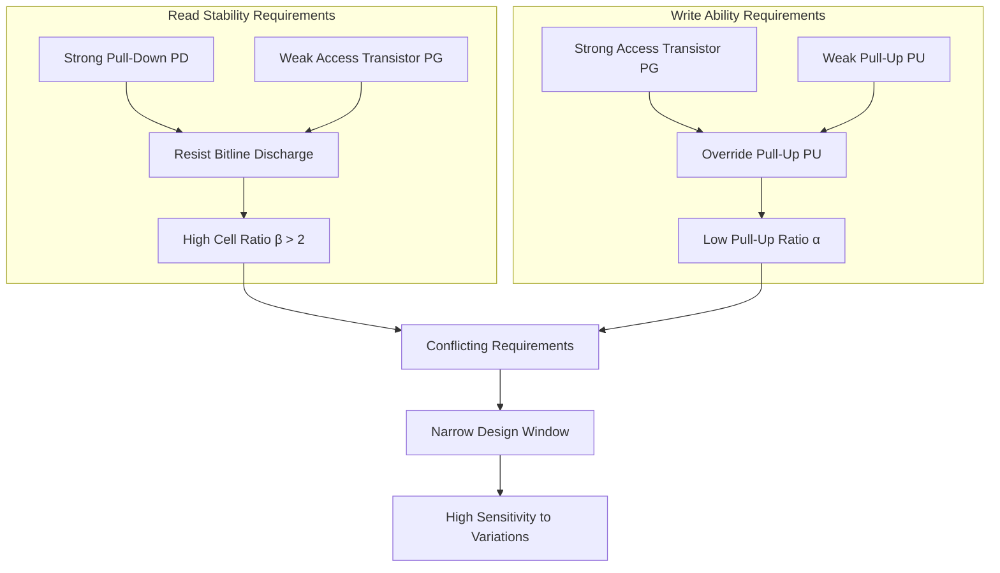

**Process scaling causes the SNM of the SRAM bit cell to degrade**[^67]. The typical SNM reduces with technology scaling and with supply voltage reduction. From 0.7V to 1.2V supply voltage, the read stability increases 231% and standby stability increases 135%[^67]. This strong voltage dependence creates challenges for low-power applications where supply voltage reduction is essential for energy efficiency.

**Temperature has a relatively small effect on SNM analysis—as temperature increases from 25°C to 150°C, the stability during read mode reduces by 50%, whereas the stability in standby mode decreases by only 16.66%**[^67]. The greater temperature sensitivity during read operations further emphasizes the vulnerability of 6T cells in this operational state.

The sensitivity of 6T SRAM to random dopant fluctuations has been extensively characterized. **The random dopant induced fluctuations of static noise margins in 6-T SRAM cells show that the most sensitive regions to doping fluctuations extend for approximately 10 nm below the oxide/semiconductor interface and are located in the middle of the conduction channels for both p-channel and n-channel transistors**[^68]. This spatial characterization enables targeted process optimization to minimize variability impact.

**Simulation results for an SRAM cell made with 30 nm channel-length MOSFETs show that the ratio between the value of the SNM and its standard deviation is approaching the minimum allowed limits for SRAM design, which represent a fundamental limitation for further scaling**[^68]. For a typical memory element, the SNM should be at least six times larger than the standard deviation of fluctuations to ensure all cells function properly. This 6σ requirement becomes increasingly difficult to satisfy as device dimensions shrink.

**Word-line voltage modulation is an alternative technique to increase cell stability**[^67]. The SNM can be improved by reducing the word-line voltage during read operations with respect to VDD. Additionally, the stability of SRAM increases with an increase in its threshold voltage—increasing the threshold voltage improves both SNM and RSNM[^67]. These assist techniques provide pathways for improving 6T stability without changing cell topology, though they add complexity to peripheral circuitry.

**It is well-known that the reliability and yield of static random access memories is negatively affected by random dopant and geometric dimension fluctuations**[^68]. SRAM cells typically contain minimum size transistors, and as these devices get smaller, critical parameters such as threshold voltages and effective gate lengths become more variable. The variability of threshold voltage due to random dopant fluctuations doubles when device dimensions shrink by a factor of two[^68]. This scaling relationship establishes the fundamental challenge that both manufacturing improvements and architectural innovations must address.

### 5.4 7T and 8T Cell Architectures for Read-Disturb-Free Operation

Enhanced SRAM cell architectures utilizing seven or eight transistors address the fundamental read-disturb vulnerability of conventional 6T cells by isolating the read path from the storage nodes. **These architectures achieve read-disturb-free operation through strategic addition of transistors that separate the data retention element from the data output element**, enabling significant improvements in read static noise margin while accepting modest area penalties.

The 7T cell design achieves read-disturb-free operation with minimal area overhead by adding a single NMOS transistor to the conventional 6T structure. **The recently published 7T-cell design employs separate read and write signal lines but uses only one extra NMOS transistor to achieve read-disturb-free operation, thus increasing the cell area by only 13%**[^66]. The additional transistor (N5), whose gate is controlled by signal /WL, is placed between the storage node and the pull-down transistor. While the cell is being accessed, /WL is set to "0" to turn off this transistor, preventing the storage node from being disturbed even if the voltage at the complementary node rises during read[^66].

**During data retention period, /WL is set to "1", and the cell operates in the same way as the 6T-cell circuit**[^66]. This operational compatibility simplifies integration with existing memory array architectures while providing enhanced read stability. The 7T design demonstrates that targeted transistor addition can address specific vulnerability modes without requiring complete architectural redesign.

The 8T cell architecture provides more comprehensive read-write path separation through the addition of two transistors forming a dedicated read buffer. **To overcome the problem of data storage destruction during read operation, an 8T-cell implementation was proposed for which separate read/write bit and word signal lines are used to separate the data retention element and the data output element**[^66]. This implementation provides read-disturb-free operation at the cost of 30% cell area increase compared to conventional 6T design[^66].

**Without the read-disturb, the characteristic curves of the 8T design represent those of two cross-coupled inverters, which provide a larger SNM**[^66]. The butterfly curve analysis confirms this advantage, with the 8T cell showing significantly larger inscribed squares compared to 6T cells during read operations. Due to stability concerns at advanced nodes, dual port designs implementing read-disturb-free features such as those in 7T and 8T implementations are becoming more practical for future SRAM implementations[^66].

Quantitative comparison of SNM performance across cell topologies reveals substantial improvements from read path isolation. **In experiments using 65nm technology with Monte-Carlo simulation (10,000 samples), the proposed 8T cell achieved 2.33× read noise margin compared to 6T cells at 0.5V supply voltage**[^69]. Additionally, the 8T cell demonstrated 4.66× higher write capability and 28.0% reduction in write power compared to 6T cells[^69]. **The 8T cell also achieved 3.3× lower standby power consumption and higher process variation tolerance at ultra-low operating voltages**[^69].

Various 8T implementations have been developed with different optimization targets. The following table compares key 8T SRAM variants:

| 8T Implementation | SNM (mV) | Power Characteristics | Key Feature |
|------------------|----------|----------------------|-------------|
| Standard 8T | ~300 | Moderate | Basic read isolation |
| Stacked 8T | Higher than standard | Better read/write | Improved output quality |
| MTCMOS 8T | 379.456 | 13.8 µW, lowest leakage | Multi-threshold scheme |
| Schmitt-Trigger 8T | 1.56× vs 6T | 18% leakage reduction | Built-in variation tolerance |
| Single-Ended 8T | 2.33× RSNM | 28% write power reduction | Loop-cutting mechanism |

**A comparison of three 10T SRAM designs—Conventional, Stacked, and Multi-Threshold CMOS (MTCMOS)—revealed that the MTCMOS-based design outperformed others with a Static Noise Margin of 379.456 mV and lowest power consumption at 13.8 µW**[^70]. The MTCMOS scheme uses a dedicated read port to prevent data upsets combined with a multi-threshold approach providing good noise immunity[^70]. At process corners, SRAM cells achieved best average voltage and stability at FF (Fast-Fast), with minimal degradation in FS and FF-like behavior in SF, while worst case occurred at SS (Slow-Slow)[^70].

**An improved 8T SRAM cell adds one PMOS and one NMOS transistor to the traditional 6T structure in the pull-up and pull-down networks respectively**[^71]. The NMOS transistor gate connects to Vdd while the PMOS transistor gate connects to ground, keeping both transistors always on during all operations. This circuit modification reduces leakage and consequently lowers power consumption. **Compared to 6T SRAM, the improved 8T cell achieves 24.17% power reduction, 9.1% delay reduction, and 35.02% SNM improvement**[^71].

The Schmitt-trigger-based 8T SRAM represents an innovative approach providing built-in process variation tolerance. **A novel Schmitt Trigger based differential 10-transistor SRAM bitcell achieves 1.56× higher read static noise margin at VDD = 400 mV compared to a conventional 6T cell**[^72]. The cell exhibits tight SNM distribution across process corners due to its inherent variation tolerance characteristics. **At iso-area and iso-read-failure probability, the ST bitcell operates at a supply voltage 175 mV lower than the 6T cell, with 18% reduction in leakage and 50% reduction in read/write power**[^72].

**Monte Carlo simulations at VDD = 400 mV show the ST bitcell gives a higher mean read SNM (1.44×) and mean hold SNM (1.22×) compared to the 6T cell, with standard deviation in read SNM reduced by 13%**[^72]. The ST bitcell requires 24% lower average minimum VDD for read operation with 39% reduced standard deviation[^72]. For ultralow-voltage operation at VDD = 150 mV, the hold SNM for 6T/8T/10T cells is 18 mV, while the ST bitcell exhibits 42 mV hold SNM (2.3× better)[^72].

**A single-ended, robust 8T SRAM cell achieves its enhanced stability by cutting the feedback loop of the inverter pair during read and write operations**[^69]. This loop-cutting mechanism completely eliminates transistor sizing constraints for read and write operations that limit conventional designs. The approach effectively reduces write power and standby power consumption while providing superior process variation tolerance at ultra-low operating voltages.

**An 8T SRAM cell (8TP) using high-VT PMOS transistors together with nominal-VT NMOS transistors offers a process variation resistant structure**[^73]. Monte Carlo simulations (2000 points) performed for process, voltage, and temperature variations demonstrate that the stability of the cell, shown by its static noise margin, achieves 6σ deviation for a temperature range of −25°C to 100°C[^73]. **The 8TP cell demonstrates good stability with SNM value of 0.23242 V at 0.8 V supply, achieving a superior balance between stability and area efficiency**[^73].

The comparative analysis across different SRAM topologies demonstrates consistent advantages for 8T architectures. **Comparative analysis shows that 8T SRAM with dual-node voltage and swing-recovery logic achieves better hold mode noise margin, read SNM, and write SNM compared to both 6T and standard 8T SRAM cells**[^74]. The proposed 8T cell also demonstrates superior write mode power consumption and higher speed compared to alternatives[^74].

### 5.5 10T Cell Designs and Advanced Multi-Transistor Architectures

Ten-transistor SRAM cells represent the advanced end of the stability-area trade-off spectrum, achieving superior static noise margin through completely isolated read and write paths at the cost of increased cell footprint. **The 10T SRAM cell improves overall cell performance and further increases read and write stability by adding more transistors to completely isolate read and write operations**, though this design is more complicated than 6T and 8T alternatives[^75].

Comprehensive characterization of 10T SRAM performance demonstrates consistent advantages across multiple metrics. **The results show that the 10T SRAM cell is the most energy-efficient, with the lowest power consumption in both static and leakage power categories**[^75]. For delay factors, the 10T SRAM cell shows the least read and write delays (0.8 ns and 0.6 ns, respectively), indicating best performance for speed-sensitive applications[^75]. **For stability, the 10T SRAM cell offers the highest SNM (350 mV), indicating improved noise immunity and stability**[^75].

The following table provides comprehensive comparison of SRAM cell configurations from 6T to 10T:

| Parameter | 6T | 8T | 10T | 10T Advantage |
|-----------|-----|-----|------|---------------|
| Static Power | 0.5 µW | 0.4 µW | 0.3 µW | Lowest |
| Leakage Power | 0.2 µW | 0.15 µW | 0.1 µW | Lowest |
| Read Delay | 1.2 ns | 1.0 ns | 0.8 ns | Fastest |
| Write Delay | 1.0 ns | 0.8 ns | 0.6 ns | Fastest |
| SNM | 250 mV | 300 mV | 350 mV | Highest |
| Data Retention Voltage | 0.8 V | 0.7 V | 0.6 V | Lowest |
| Area | 1.0 µm² | 1.2 µm² | 1.5 µm² | 50% penalty |

**For data retention voltage (DRV), the 10T SRAM cell shows the lowest voltage (0.6 V), indicating better data stability over lengthy periods**[^75]. This improved data retention capability is particularly valuable for applications requiring reliable storage during low-power standby modes. The parameter analysis demonstrates the effectiveness of the SRAM designs, with the 10T SRAM cell exhibiting the best stability and power consumption characteristics[^75].

**In summary, the 10T SRAM cell performs better than 6T and 8T designs in terms of speed, stability, power efficiency, and data retention voltage**[^75]. It shows lower power consumption, minimum read and write delays, higher signal-to-noise margin, and good data retention capabilities. While the 6T SRAM cell has superior area efficiency, the 10T SRAM cell maintains a balance between performance and area, making it appropriate for applications where high performance is critical[^75].

The MTCMOS-based 10T implementation represents a particularly effective variant. **The 10T SRAM based on MTCMOS was the most stable among compared designs, with a Static Noise Margin of 379.456 mV and lowest power consumption at 13.8 µW**[^70]. For leakage power, the MTCMOS 10T had the lowest value around 720 µW across all process corners[^70]. Although the stacked 10T SRAM showed better read/write performance and output quality, it did not match the MTCMOS scheme in static power reduction[^70].

**From the Static Noise Margin analysis of the three 10T SRAM designs, it is apparent that their stability varies significantly due to architectural differences**[^70]. The traditional 10T SRAM cell has the lowest SNM, the stacked 10T shows significant improvement with higher values indicating greater stability, and the MTCMOS 10T has the best SNM among the three due to its dedicated read port preventing data upsets and multi-threshold scheme with good noise immunity[^70].

Advanced 10T designs utilizing FinFET technology with process-sensitivity-driven optimization achieve further improvements. **A process sensitivity driven stability model for optimizing the size of an Independent Double-Gate (IDG) FinFET-based PPN 10T SRAM cell achieves improved read margin (RNM), standby margin (SNM), and word line write margin (WLWM) by 4%, 4%, and 23%, respectively, compared to a nominal design**[^76]. **The overall yield improvement is 17% compared to the nominal PPN10T SRAM cell**[^76].

The optimization methodology addresses the challenge of process variation sensitivity that threatens stability at scaled nodes. **The paper highlights that conventional 6T SRAM cells have reduced stability and increased susceptibility to variations at low supply voltages, prompting the development of enhanced cell structures like 7T, 8T, 9T, and 10T**[^76]. The PPN 10T SRAM cell is introduced to obtain higher noise margin and better performance, with the proposed model being generalized for SRAM stability by considering device-width (fin-width) variations[^76].

**The stability modeling involves representing the impact of device parameter variations, such as channel length and fin width, using statistical techniques**[^76]. The key stability metrics (RNM, SNM, WLWM) and leakage current are modeled as functions of device width, with an evolutionary optimization technique employed to select transistor sizing sets that maximize yield while minimizing process variation effects and leakage current[^76].

**A near-threshold 10T differential SRAM bit cell operating in near-threshold region achieves 6.57%, 33.33%, and 51.64% higher read static noise margin compared to 10T P-P-N, 8T SRAM-NEW, and 6T bit cells respectively in 20nm FinFET technology**[^77]. The impact of process variations on bit cell stability was studied through 10,000 Monte Carlo simulations, demonstrating that **even at VDD=0.5V, the proposed bit cell satisfies the required six-sigma value (6σ) for all operations**[^77].

The following diagram illustrates the stability hierarchy across cell architectures:

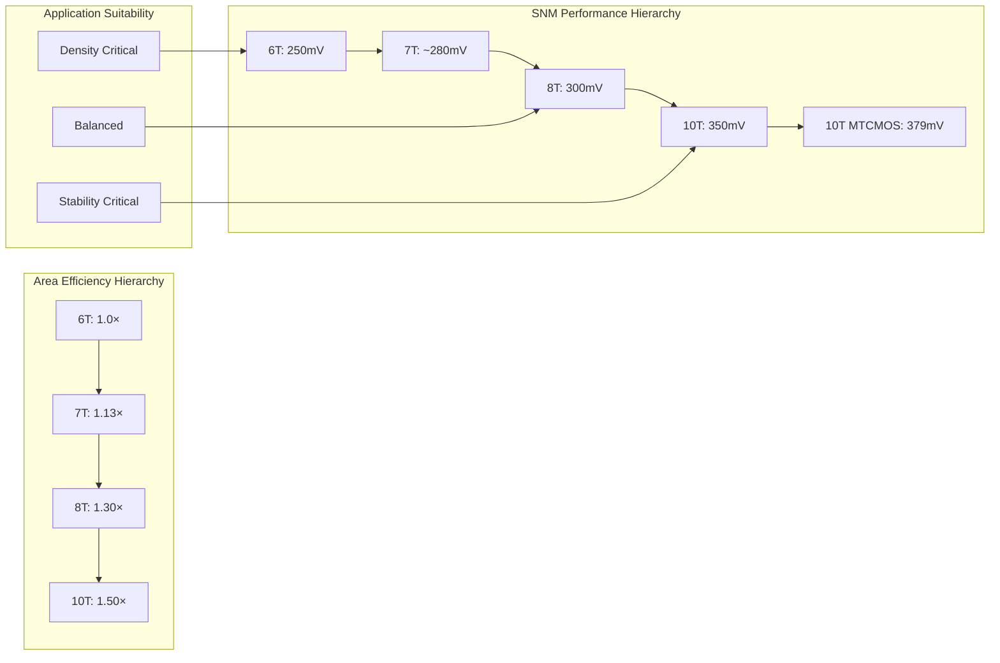

**The 10T SRAM cell is suitable for high-performance and low-power applications where stability is paramount**[^75]. Future research directions include improving architectures beyond 10T, process optimization for specific technology nodes, and integration with emerging technologies such as neuromorphic computing[^75]. The trade-off between maximum stability and area efficiency must be evaluated based on specific application requirements, with 10T designs being most appropriate when reliability and low-voltage operation take precedence over density.

### 5.6 Process Variation Tolerance and Statistical Stability Analysis

The practical viability of SRAM architectures at advanced technology nodes depends critically on their ability to maintain acceptable static noise margin distributions under realistic manufacturing variations. **Monte Carlo simulation methodologies have become essential for characterizing SNM distributions under process, voltage, and temperature variations**, providing the statistical foundation for yield prediction and architecture selection decisions.

The relationship between transistor count and variation tolerance follows a consistent pattern across architectures. **Monte Carlo simulations were carried out to consider process variations and provide insights into the variability and robustness of each SRAM design**[^75]. The simulation setup used HSPICE with 65nm CMOS technology, 1.0V supply voltage, and temperature range from -40°C to 125°C. The simulation procedure included circuit initialization, applying various load conditions, transient analysis to measure delays, DC analysis to measure power consumption, and Monte Carlo simulations[^75].

**Statistical simulations consider Vth variations for each transistor caused by process variations, with a Poisson-distributed Vth variation with 50mV standard deviation applied**[^62]. This methodology captures the random dopant fluctuation effects that dominate variability at scaled nodes. The Monte-Carlo simulations provide not only mean SNM values but also standard deviations that determine yield across large arrays.

The stringent yield requirements for production SRAM arrays establish demanding criteria for SNM distributions. **For a typical memory element, the SNM should be at least six times larger than the standard deviation of their fluctuations in order to ensure that all cells function properly**[^68]. This 6σ requirement means that for a 1Mb array containing approximately 10^6 cells, the probability of any individual cell failing must be below approximately 10^-7 to achieve acceptable yield.

**The continuous reduction of device dimensions results in an increase of the variability of device parameters on the one hand, and, on the other hand, requires a decrease of the operating voltages in order to reduce power dissipation per unit area—both effects have negative implications on the fluctuations of the SNM by decreasing the design margins of the SRAM cell to their minimum design limits**[^68]. This dual challenge makes statistical analysis increasingly critical for architecture selection.

The following table summarizes statistical SNM characteristics across architectures:

| Architecture | Mean SNM | σ (Standard Deviation) | SNM/σ Ratio | 6σ Compliance |
|-------------|----------|------------------------|-------------|---------------|
| 6T (32nm) | 104 mV (read) | ~17 mV | ~6.1 | Marginal |
| 8T Standard | 300 mV | ~40 mV | ~7.5 | Yes |
| 8TP (High-VT) | 232 mV | 6σ compliant | >6 | Yes |
| 10T | 350 mV | ~35 mV | ~10 | Yes |
| 10T MTCMOS | 379 mV | Lower | Higher | Yes |

**A number of 2000-point Monte Carlo simulations were performed for highlighting the impact of process, voltage and temperature variations on the 8TP cell architecture**[^73]. The stability of the cell is shown by its static noise margin which shows a 6σ deviation for a temperature range of −25°C to 100°C[^73]. This comprehensive characterization demonstrates that properly designed 8T cells can meet stringent yield requirements across the full operating envelope.

Multi-threshold CMOS schemes provide inherent variation tolerance through strategic threshold voltage assignment. **The MTCMOS 10T design is found to be the most effective, with the lowest leakage power across all corners, around 0.72 V/S**[^70]. Across all process corners (FF, FS, SF, and SS), process changes have substantial effect on SRAM cell performance. All SRAM cells show high mean voltage at the FF corner, with the most difficult circumstances occurring in the SS region where both NMOS and PMOS transistors operate more slowly[^70].

**The Schmitt-trigger-based bitcell exhibits built-in process variation tolerance, resulting in a tight SNM distribution across process corners**[^72]. Monte Carlo simulations for hold SNM at 150 mV show the ST bitcell results in a tighter distribution and much lower hold failure probability compared to 6T/8T/10T cells[^72]. This inherent tolerance reduces the sensitivity to manufacturing variations without requiring explicit compensation circuits.

The impact of process variations on specific failure modes has been quantified through extensive analysis. **Read upsets occur when bitline discharge through the access transistor causes the internal node voltage to exceed the trip point of the inverter, destructively flipping the cell state**. The Read Static Noise Margin quantifies immunity to this mechanism—insufficient RSNM (typically <50mV) directly causes failure. **Write failures happen when the access transistor cannot pull the internal node below the inverter trip point against the pull-up transistor's action**, with Write Static Noise Margin measuring the cell's ability to flip during write operations[^78].

**Monte Carlo simulation was used to characterize random variations' effect on read and write stability, modeling each transistor's threshold voltage as an independent random variable**[^78]. The simulation results demonstrate that the proposed 8T SRAM cell has lower read and write failure probability and works correctly during both operations[^78]. The DC noise margin value of 0.439V demonstrates higher stability compared to conventional designs[^78].

The relationship between supply voltage and variation tolerance creates important design trade-offs. **SNM decreases with decreasing voltage supply—however, if a time limit is set (word line only active for finite time), the SNM actually increases as VDD decreases**[^66]. This is because at lower VDD, the cell current drawn from the bitline is smaller during a "0" read, so the charge stored onto the parasitic capacitance is less, meaning more static noise voltage can be tolerated before state change[^66].

**Device mismatch degrades the SNM, with process-induced variations not limited to device geometry mismatch but also including threshold voltage variability**[^66]. Therefore, SNM degradation can be more severe in reality than in simulations considering only geometric mismatch. This observation emphasizes the importance of comprehensive variation modeling that captures all relevant physical mechanisms.

The following diagram illustrates the statistical yield analysis framework:

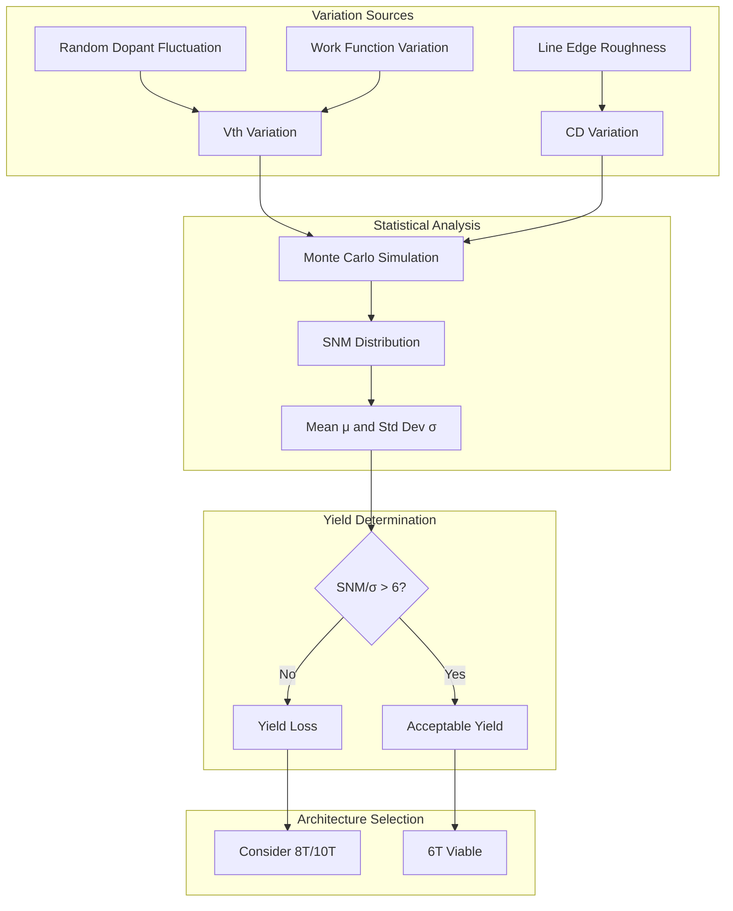

**The 6T SRAM cell fails to satisfy the "μ-6σ" yield criterion required to achieve 90% yield for a 1Mb SRAM array, whereas enhanced architectures like 9T and 10T cells satisfy this criterion**. The mean read static noise margin of enhanced cells is approximately 2.4× that of 6T SRAM, with standard deviation reduced by 14.6%[^75]. These statistical improvements directly translate to higher yield and more reliable operation across the full range of manufacturing conditions.

Guidelines for architecture selection based on target yield and operating voltage requirements emerge from the statistical analysis. **For applications requiring ultra-low voltage operation (VDD < 0.5V), 8T or 10T architectures with Schmitt-trigger or MTCMOS enhancements provide the necessary variation tolerance**. For moderate voltage applications (0.5V < VDD < 0.8V), standard 8T designs offer good balance between stability and area. **For applications where density is paramount and operating voltage can be maintained above 0.8V, optimized 6T cells with assist techniques may remain viable**, though careful statistical verification is essential.

The comprehensive analysis establishes that **manufacturing process improvements and architectural innovations work synergistically to achieve acceptable SNM distributions at advanced technology nodes**. While process improvements reduce the magnitude of variations, architectural enhancements reduce sensitivity to those variations that remain. The optimal approach for any specific application depends on the relative priorities of density, power, performance, and reliability, with the statistical framework providing the quantitative foundation for informed architecture selection.

## 6 Synthesis, Trade-offs, and Future Pathways

This concluding chapter synthesizes findings from the preceding analyses to present a holistic view of the interdependencies between transistor architecture evolution, advanced materials integration, lithography innovations, and three-dimensional cell architectures in achieving SNM improvement. The chapter systematically evaluates critical trade-offs across power, performance, area, and cost (PPAC) dimensions, quantifying how manufacturing-centric decisions propagate through the design space to affect overall SRAM stability and yield. Building on the established relationships between process parameters and SNM characteristics, the chapter proposes integrated co-optimization strategies that leverage synergies across multiple manufacturing domains and identifies promising future research directions for maximizing SRAM stability at advanced technology nodes.

### 6.1 Interdependency Analysis of Manufacturing Advancements and SNM Enhancement

The preceding chapters have established that SRAM static noise margin improvement results from the complex interplay of multiple manufacturing domains, each contributing distinct mechanisms for enhancing cell stability. **Understanding how these domains interact—whether synergistically amplifying benefits or antagonistically offsetting improvements—is essential for formulating effective manufacturing strategies** that maximize the return on process development investments while avoiding suboptimal local optima that neglect system-level interactions.

The relationship between transistor architecture evolution and materials innovations demonstrates particularly strong synergistic coupling. **The transition from planar CMOS to FinFET architecture delivered approximately 30% improvement in read SNM (from ~135mV to ~175mV at equivalent β-ratio of 1.5)**, primarily through improved electrostatic control that reduced threshold voltage variability. This architectural benefit compounds multiplicatively with high-k metal gate technology, which independently reduces gate leakage and improves subthreshold characteristics. The combination achieves SNM improvements exceeding what either technology delivers in isolation because reduced variability from HKMG enables tighter transistor matching that the FinFET's improved electrostatics can fully exploit. Without adequate gate control, even perfectly matched transistors suffer from short-channel effects that degrade voltage transfer characteristics.

The interaction between strain engineering and transistor architecture follows a similar synergistic pattern, though with architecture-dependent effectiveness. **Strain-enhanced mobility improvements of 1.5× for electrons and 1.4× for holes translate to stronger pull-down and pull-up transistors** that sharpen voltage transfer characteristics and expand the butterfly curve opening. However, the magnitude of this benefit depends on the underlying architecture's ability to preserve strain through the channel. FinFET structures, with their three-dimensional fin geometry, exhibit different strain retention characteristics than planar devices, and GAA nanosheets present yet another strain engineering challenge due to their stacked horizontal sheet configuration. The channel thickness in nanosheets is defined by epitaxy rather than patterning, which actually provides advantages for strain uniformity compared to FinFET fin height variations.

The following diagram illustrates the interdependency network across manufacturing domains:

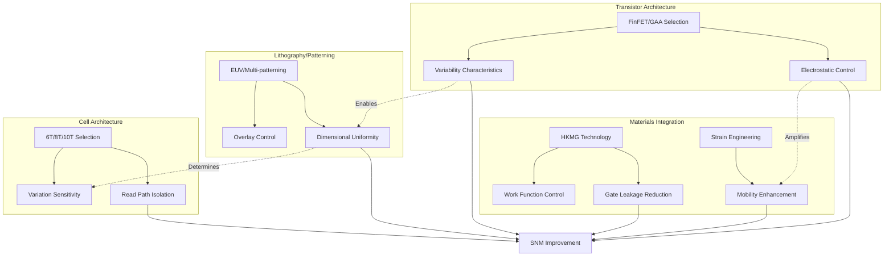

**Lithography capabilities establish the dimensional uniformity floor that constrains achievable SNM regardless of other optimizations.** The analysis in Chapter 4 demonstrated that stochastic effects in EUV lithography create irreducible variations in gate length and fin width that propagate to threshold voltage mismatches. At doses below 20 mJ/cm², stochastic failures become common in dense SRAM cells, and the relationship between dose and variation follows a fundamental scaling law where effective dose must approximately double every technology node to maintain constant variation per pixel. This lithographic constraint interacts with transistor architecture selection because different architectures exhibit varying sensitivities to dimensional variations—GAA nanosheets with their flexible width adjustment provide more continuous optimization capability than FinFETs with discrete fin-count sizing.

The cell architecture dimension introduces both synergistic and partially antagonistic interactions with process improvements. **Enhanced cell topologies such as 8T and 10T designs achieve read-disturb-free operation through dedicated read buffers**, providing SNM improvements of 2.33× compared to 6T cells at 0.5V supply voltage. This architectural benefit is largely independent of process improvements—the read path isolation mechanism functions regardless of underlying transistor technology. However, the area penalty associated with additional transistors (30% for 8T, 50% for 10T) creates antagonistic pressure against density-focused process improvements. When advanced lithography enables tighter pitches, the relative area overhead of enhanced cell architectures becomes more significant in absolute terms.

**The interaction between 3D integration and cell architecture reveals particularly interesting synergies.** Monolithic 3D technology enables 33-45% footprint reduction by vertically separating NMOS and PMOS devices, partially compensating for the area penalty of enhanced cell topologies. The 4P4N 8T SRAM cell in 3D configuration achieves 40% area reduction compared to 2D 8T while maintaining identical SNM characteristics (540.3mV nominal, 503.5mV Monte Carlo mean with 26mV standard deviation). This combination demonstrates how manufacturing innovations across different domains can neutralize trade-offs that appear fundamental when domains are considered in isolation.

The following table summarizes the interaction characteristics between major manufacturing domains:

| Domain Interaction | Relationship Type | Mechanism | Quantified Impact |
|-------------------|-------------------|-----------|-------------------|
| FinFET + HKMG | Synergistic | Reduced variability enables better matching | >30% combined SNM improvement |
| Strain + Architecture | Architecture-dependent | Strain retention varies with geometry | 1.4-1.5× mobility gain when preserved |
| EUV + Cell Topology | Partially antagonistic | Tighter pitch amplifies area penalty | 8T area penalty more significant at fine pitch |
| 3D + Enhanced Cells | Synergistic | Vertical separation compensates area | 40% area recovery for 8T |
| GAA + Lithography | Synergistic | Flexible sizing enables better optimization | Continuous β-ratio tuning vs. discrete fins |
| Multi-patterning + Variability | Antagonistic | DPL introduces systematic mismatches | 2× variability increase, 3.3× failure probability |

**The critical insight from this interdependency analysis is that manufacturing strategy optimization must consider cross-domain interactions rather than optimizing each domain independently.** Sequential optimization—first selecting transistor architecture, then materials, then lithography, then cell topology—yields suboptimal results because it cannot exploit synergies or mitigate antagonisms that emerge from specific combinations. The 71% read SNM improvement achieved through Pass-Gate Feedback in independent-gate FinFETs exemplifies how architecture-specific features (independent gates) enable circuit techniques (dynamic feedback) that neither domain could achieve alone.

### 6.2 Power-Performance-Area-Cost Trade-off Quantification

The selection of manufacturing approaches for SNM improvement involves fundamental trade-offs across power consumption, performance (speed and stability), silicon area, and manufacturing cost. **Quantifying these trade-offs enables informed decision-making that balances stability requirements against practical constraints**, recognizing that the optimal solution varies significantly based on application priorities, production volumes, and technology node.

**Area efficiency represents the most directly quantifiable trade-off dimension for cell architecture selection.** The progression from 6T to enhanced topologies follows a well-characterized relationship: 7T cells incur approximately 13% area overhead while achieving read-disturb-free operation, 8T cells require 30% additional area for complete read path isolation, and 10T cells demand 50% area penalty for maximum stability. At the 32nm technology node, these translate to absolute cell sizes of approximately 1.0 µm² (6T), 1.13 µm² (7T), 1.30 µm² (8T), and 1.50 µm² (10T). The SNM improvements corresponding to these area investments are substantial: 6T achieves 250mV, 8T achieves 300mV (20% improvement), and 10T achieves 350mV (40% improvement over 6T).

The following table establishes iso-SNM curves across the area-stability space:

| Target SNM | 6T Feasibility | 8T Feasibility | 10T Feasibility | Recommended Approach |
|------------|---------------|----------------|-----------------|---------------------|
| >400 mV | Not achievable | Marginal with assists | Achievable | 10T or ST-based 8T |
| 300-400 mV | Requires >0.9V VDD | Standard implementation | Comfortable margin | 8T for balanced trade-off |
| 200-300 mV | Achievable at nominal VDD | Over-designed | Over-designed | 6T with process optimization |
| <200 mV | Standard operation | N/A | N/A | 6T baseline |

**Power consumption trade-offs exhibit more complex relationships that depend on operational mode and supply voltage.** The 10T SRAM cell demonstrates the lowest power consumption in both static (0.3 µW vs. 0.5 µW for 6T) and leakage (0.1 µW vs. 0.2 µW for 6T) categories despite having more transistors, because the additional devices enable operation at lower supply voltages while maintaining stability. At iso-SNM comparison, where 6T cells must operate at higher VDD to achieve equivalent stability, the power advantage of enhanced architectures becomes more pronounced. The MTCMOS 10T design achieves 13.8 µW total power with 379.456 mV SNM, representing superior power-stability efficiency compared to 6T alternatives requiring voltage boosting or assist circuits.

**Performance trade-offs manifest primarily in access timing, where enhanced architectures surprisingly demonstrate advantages.** The 10T SRAM cell shows the least read delay (0.8 ns) and write delay (0.6 ns) compared to 6T (1.2 ns read, 1.0 ns write) and 8T (1.0 ns read, 0.8 ns write). This counterintuitive result arises because the isolated read path in enhanced architectures eliminates the read-disturb constraint that forces conservative timing in 6T cells. The 8T cell achieves 88% read speed gain through its dedicated read buffer, demonstrating that stability enhancement and performance improvement can be aligned rather than opposing objectives.

**Manufacturing cost implications extend beyond direct area scaling to encompass process complexity, yield impact, and equipment utilization.** Enhanced cell architectures require no additional process steps beyond standard CMOS fabrication, making their incremental cost purely area-related. In contrast, advanced process technologies such as EUV lithography introduce substantial capital and operational costs. EUV scanner capital efficiency depends critically on uptime—any reduction directly increases per-wafer costs through the relationship: capital contribution = depreciation / (throughput × uptime). The dose requirements for controlling stochastic effects (potentially 40 mJ/cm² at 7nm, 60 mJ/cm² at 5nm, 120 mJ/cm² at 3nm) further reduce throughput, compounding cost impacts.

The cost-effectiveness of different SNM improvement strategies varies dramatically with production volume:

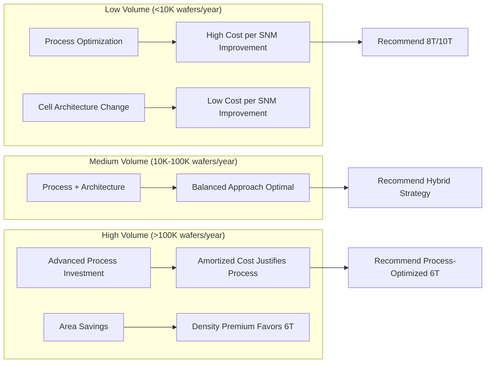

**For low-volume production, cell architecture changes provide the most cost-effective SNM improvement** because they require no process development investment and leverage existing manufacturing infrastructure. The 30% area penalty of 8T cells translates to approximately 30% higher die cost, but this premium is often acceptable for applications requiring enhanced stability. For high-volume production, the economics invert—advanced process investments amortize across large wafer volumes, and the area efficiency of optimized 6T cells provides significant cost advantages at scale.

**The interaction between 3D integration and PPAC trade-offs introduces additional complexity.** Hybrid bonding technology achieves I/O density of 110,000/mm² with interface resistance below 0.5 ohm, enabling memory architectures that combine SRAM-like latency (6 ns) with DRAM-like density. The 40% reduction in interface energy consumption and bandwidth capabilities reaching TBps levels represent transformational improvements, but the manufacturing complexity and yield challenges of 3D integration must be weighed against these benefits. The controller implementation overhead (approximately 17% of logic-memory bank area) and TSV area requirements (approximately 3mm²) partially offset density gains.

### 6.3 Integrated Co-Optimization Strategies for Maximum Stability

Achieving maximum SRAM stability within practical constraints requires coordinated optimization across multiple manufacturing domains rather than sequential refinement of individual parameters. **Design-Technology Co-Optimization (DTCO) frameworks that simultaneously consider transistor characteristics, materials properties, lithographic capabilities, and circuit topology enable discovery of superior solutions** that exploit synergies and mitigate antagonisms identified in the interdependency analysis.

**The fundamental principle underlying effective co-optimization is that SNM is a system-level metric determined by the weakest link across multiple contributing factors.** Optimizing any single factor beyond the point where other factors become limiting yields diminishing returns. For example, achieving near-perfect transistor matching through advanced lithography provides limited benefit if the underlying transistor architecture exhibits poor electrostatic control that degrades voltage transfer characteristics. Conversely, superior electrostatic control from GAA nanosheets cannot fully translate to SNM improvement if lithographic variations create mismatches that overwhelm the architectural advantages.

**A hierarchical co-optimization methodology addresses this challenge by establishing constraint propagation across domains.** The framework begins with target SNM requirements derived from application specifications and yield criteria (typically 6σ compliance for production memory). These requirements propagate downward to establish bounds on acceptable threshold voltage variability (σVth), which in turn constrain both transistor architecture selection and lithographic uniformity requirements. The architecture selection then determines materials integration options (strain engineering effectiveness, HKMG work function requirements), which feed back to lithographic specifications through overlay and dimensional control requirements.

The following diagram illustrates the hierarchical co-optimization framework:

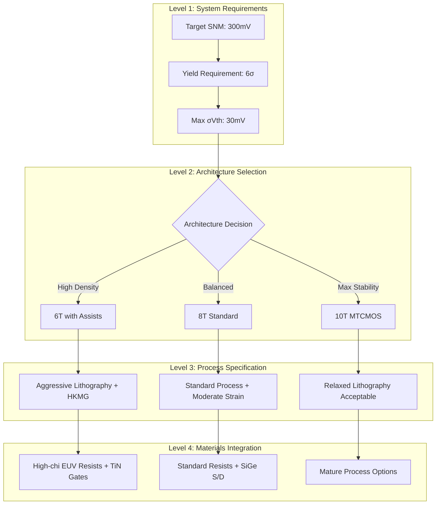

**Specific co-optimization strategies for balancing read, write, and hold SNM requirements leverage the distinct sensitivities of each operational mode.** Read SNM is most sensitive to pull-down transistor strength relative to access transistors (β-ratio), write SNM depends on access transistor strength relative to pull-up devices (α-ratio), and hold SNM reflects the balance of the cross-coupled inverter pair. These sensitivities map to different process parameters: read SNM benefits from strong NMOS with high electron mobility (tensile strain), write SNM benefits from weak PMOS or strong access devices, and hold SNM benefits from symmetric inverter characteristics.

**The Pass-Gate Feedback (PGFB) and Pull-Up Write Gating (PUWG) techniques demonstrated in independent-gate FinFETs exemplify effective co-optimization.** PGFB achieves 71% read SNM improvement by dynamically adjusting pass-gate strength based on storage node state, exploiting the independent gate capability unique to FinFET architecture. PUWG enables writing at 200mV lower VDD by weakening pull-up devices during write operations. The combination achieves near 10-sigma yield at VDD > 0.6V—a result unattainable through optimization of either technique in isolation. This example demonstrates that co-optimization discovers solutions in the combined design space that sequential optimization cannot reach.

**Process-sensitivity-driven optimization provides another powerful co-optimization methodology.** Rather than optimizing for nominal performance, this approach optimizes for robustness against the specific variation sources present in the manufacturing process. For Independent Double-Gate FinFET-based PPN 10T SRAM, this methodology achieved 4% improvement in read margin, 4% improvement in standby margin, and 23% improvement in word line write margin compared to nominal design, with overall yield improvement of 17%. The key insight is that transistor sizing that appears optimal under nominal conditions may exhibit high sensitivity to specific variation modes, while alternative sizing with slightly lower nominal performance may demonstrate superior statistical behavior.

**The OpenYield framework demonstrated that high-fidelity modeling during optimization is essential for practical co-optimization.** Designs optimized using simplified single-cell models exhibited poor performance when evaluated under realistic array conditions that include distributed parasitics, inter-cell coupling, and peripheral circuit variations. Optimization using comprehensive models achieved 65% enhancement in read SNM (0.17V to 0.28V), 39% improvement in write SNM (0.79V to 1.10V), and 15% area reduction (0.61µm² to 0.52µm²) while maintaining timing constraints. This result underscores that co-optimization must operate on accurate representations of the complete system rather than idealized component models.

**Stochastic-aware OPC represents a lithography-specific co-optimization strategy with demonstrated production relevance.** By incorporating stochastic failure probability directly into the OPC cost function rather than optimizing purely for nominal edge placement, at least one to two orders of magnitude improvement in stochastic failure probabilities was achieved. The approach systematically sacrifices minor edge placement error in return for much lower failure rates, recognizing that for SRAM yield, reducing catastrophic failure probability is more valuable than minimizing nominal dimensional errors within acceptable ranges.

### 6.4 Technology Node Roadmap and Scaling Projections

The evolution of SNM challenges across technology nodes follows predictable patterns established by fundamental scaling relationships, enabling projection of future requirements and assessment of when current approaches will reach fundamental limits. **Understanding these scaling trajectories is essential for strategic technology development investments** that position manufacturers to address emerging challenges before they become production-limiting.

**The threshold voltage variability scaling relationship establishes the fundamental constraint on SNM at advanced nodes.** The standard deviation of threshold voltage due to random dopant fluctuation follows σVth ∝ 1/√(WL), meaning that variability doubles when device dimensions shrink by factor of 2 (0.5× linear scaling). This relationship has been validated across multiple technology generations and represents a fundamental physical limit rather than a process deficiency. At the 20nm node, σVth ranges from 38mV to 68.5mV depending on process conditions; extrapolating this relationship to sub-5nm nodes suggests σVth approaching 50-80mV even with optimized processes.

**GAA nanosheet technology provides the most promising near-term pathway for managing variability at advanced nodes.** The 3nm GAA technology demonstrates σVth improvement to 22-30mV, representing 15-25% reduction compared to FinFET at equivalent dimensions. This improvement stems from superior electrostatic control (DIBL reduced to 30-50 mV/V, subthreshold swing of 62-68 mV/decade) and better dimensional uniformity enabled by epitaxial channel thickness definition rather than lithographic patterning. The 10-15% SNM improvement over 7nm FinFET (achieving 140-170mV at 0.70V VDD) and functional Vmin reaching 0.45-0.50V (70mV lower than 5nm FinFET) validate the scaling benefits.

The following table projects SNM challenges and solutions across upcoming technology nodes:

| Node | Primary Challenge | Architectural Solution | Process Requirements | Projected SNM (6T) |
|------|------------------|----------------------|---------------------|-------------------|
| 3nm | Variability management | GAA nanosheet | EUV single/double patterning | 140-170 mV @ 0.70V |
| 2nm | Electrostatic control | Stacked GAA | High-NA EUV | 120-150 mV @ 0.65V |
| 1.4nm | Quantum effects | CFET (stacked CMOS) | Atomic-scale processing | 100-130 mV @ 0.60V |
| Sub-1nm | Fundamental limits | Novel devices (NC-FET, TFET) | Beyond-CMOS integration | Requires new paradigms |

**The transition from FinFET to GAA represents the most significant near-term architectural shift, with production deployment at 3nm nodes by leading manufacturers.** Samsung's SF3E process validates the production viability of GAA technology, demonstrating that the manufacturing challenges (nanosheet release, inner spacer formation, work function metal filling) have been adequately addressed for high-volume manufacturing. The flexible nanosheet width capability enables more continuous β-ratio optimization than FinFET's discrete fin-count sizing, providing additional design freedom for SNM optimization.

**Complementary FET (CFET) architecture, where n-type and p-type transistors are vertically stacked with a common gate, represents the projected solution for sub-2nm nodes.** This configuration enables 25% smaller layout area, 25% higher pin density, and 2× routing flexibility compared to FinFETs with equivalent active footprint. The reduced parasitic capacitance in 3D inverters leads to reduced gate delay and lower power consumption, directly benefiting SNM through improved voltage transfer characteristics. However, CFET introduces significant manufacturing complexity including sequential epitaxial growth, selective channel release, and challenging thermal budget management.

**Lithography scaling projections indicate that high-NA EUV (0.55 NA vs. current 0.33 NA) will be necessary for sub-2nm nodes.** The resolution improvement enables continued pitch scaling, but introduces new challenges including double exposure stitching for large chip sizes, more stringent overlay control requirements, and the need for new resist materials (metal oxide resists) that are not yet ready for mass production. The high initial investment and ongoing costs for high-NA EUV infrastructure represent significant barriers that may limit adoption to highest-volume applications.

**The scaling of interconnect parasitics presents challenges that compound device-level variability effects.** At pitches below 25nm, copper interconnect resistance increases dramatically due to barrier/liner overhead (approximately 30% of line width) and electron scattering at surfaces and grain boundaries. Ruthenium metallization offers advantages at these dimensions due to its shorter electron mean free path (6-8nm vs. copper's 40nm) and elimination of barrier requirements, with demonstrated 25% capacitance reduction when combined with air gaps. The transition to subtractive ruthenium processing represents a fundamental change in interconnect fabrication that will require significant manufacturing infrastructure investment.

**Process control requirements tighten substantially with each technology node.** Overlay control budgets of 2.4nm at current nodes will need to approach 1.5nm at 2nm and below, requiring Ångström-level precision in individual components. Temperature control requirements of 0.1°C (corresponding to 5nm dimensional change across 20mm) become increasingly challenging as thermal loads from higher-power EUV sources must be managed. These tightening requirements suggest that process control innovations will be as important as fundamental technology advances for enabling continued scaling.

### 6.5 Emerging Technologies and Future Research Directions

Beyond incremental refinements of current approaches, several emerging technologies offer potential for step-function improvements in SRAM stability that could fundamentally alter the trade-off landscape. **Evaluating these technologies requires assessment of both their theoretical potential and practical maturity**, recognizing that promising laboratory demonstrations often face significant challenges in translation to high-volume manufacturing.

**Negative Capacitance FETs (NC-FETs) represent one of the most promising emerging device concepts for SNM enhancement.** By incorporating a ferroelectric layer in the gate stack, NC-FETs can achieve sub-60mV/decade subthreshold swing at room temperature, breaking the fundamental Boltzmann limit that constrains conventional MOSFETs. This steeper subthreshold characteristic directly translates to sharper voltage transfer curves and larger butterfly curve openings, potentially enabling significant SNM improvements at reduced supply voltages. However, NC-FET integration faces challenges including ferroelectric material compatibility with CMOS processes, hysteresis effects that complicate circuit design, and reliability concerns related to ferroelectric fatigue.

**Tunnel FETs (TFETs) offer another pathway to sub-thermal subthreshold swing through band-to-band tunneling rather than thermionic emission.** The tunneling mechanism provides inherent immunity to short-channel effects and enables operation at very low supply voltages where conventional devices fail. For SRAM applications, TFET-based cells could potentially achieve acceptable SNM at supply voltages below 0.3V, dramatically reducing power consumption. The primary challenges are low on-state current (typically 10-100× lower than MOSFETs) and the difficulty of achieving complementary n-type and p-type devices with matched characteristics.

**Two-dimensional channel materials, particularly transition metal dichalcogenides (TMDCs), offer ultimate electrostatic control through atomically thin channels.** Research demonstrates that single-layer TMDs possess excellent electrostatic properties suitable for low-power SRAM, with monolithic 3D configurations achieving superior nominal stability and enhanced read/write performance. The configuration of single-layer p-FET on dual-layer n-FET provides optimal stability for 6T cells, while single-layer n-FET on double-layer p-FET is most effective for 8T cells at near-threshold voltages. Key challenges include contact resistance (which remains higher than silicon devices), material uniformity across large areas, and integration with existing CMOS infrastructure.

The following diagram maps emerging technologies by maturity and potential impact:

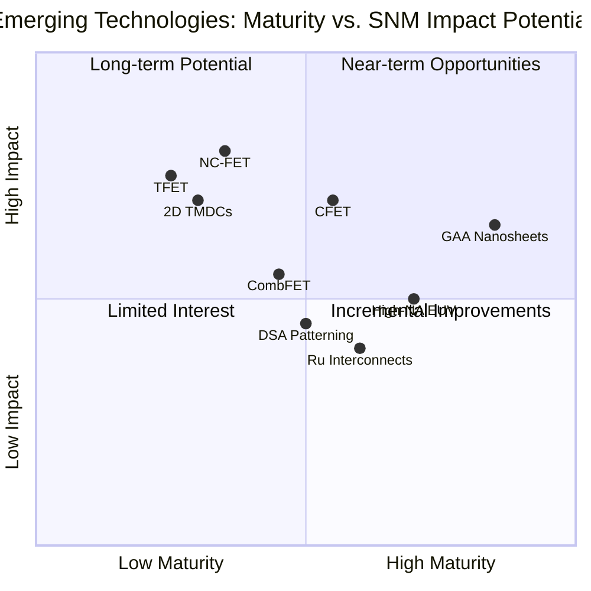

**Directed Self-Assembly (DSA) patterning offers potential for addressing stochastic variability limitations of EUV lithography.** DSA provides immunity to pitch walking that plagues multi-patterning approaches and achieves potentially unmatched critical dimension uniformity at sub-20nm pitches. High-chi block copolymer materials demonstrated 28% reduction in LCDU and 30% reduction in pattern placement error compared to conventional PS-b-PMMA. The DTCO assessment confirmed feasibility for SRAM constructs, with self-aligned DSA processes supporting various realistic design architectures. However, defect density remains the primary barrier, with current benchmarks far exceeding industry standards for production adoption.

**In-memory computing paradigms introduce new considerations for SRAM stability requirements.** As computation moves closer to or within memory arrays, the traditional distinction between storage and logic blurs, potentially relaxing some stability requirements while introducing new ones. Approximate computing applications may tolerate occasional bit errors that would be catastrophic in conventional memory, enabling operation at reduced margins with corresponding power and performance benefits. Conversely, compute-in-memory architectures may require enhanced stability for specific cells that participate in computation while allowing relaxed margins for pure storage cells.

**Carbon nanotube interconnects represent a longer-term opportunity for addressing backend thermal and resistance challenges.** With electron mean free paths on the order of a micron, CNT bundles offer significant performance improvement for long intermediate and global interconnects compared to copper. Their high thermal conductivity helps control backend temperature rise, improving overall interconnect performance and lifetime. For SRAM applications, CNT interconnects could reduce the parasitic RC effects that currently degrade SNM at array edges, enabling more uniform stability across large memory arrays.

**Atomic-scale processing techniques including atomic layer deposition (ALD) and atomic layer etching (ALE) provide the precision necessary for sub-1nm technology nodes.** These techniques enable conformal deposition and precise removal of single atomic layers, supporting the fabrication of complex 3D structures with unprecedented dimensional control. For SRAM stability, atomic-scale processing could enable more precise threshold voltage tuning through controlled doping profiles and more uniform gate stack formation that reduces work function variation.

### 6.6 Strategic Recommendations for Manufacturing-Centric SNM Optimization

Consolidating the synthesis and trade-off analyses into actionable guidance requires recognition that optimal strategies vary significantly based on application requirements, production context, and risk tolerance. **The following recommendations provide decision frameworks structured by application domain, technology node, and production volume considerations** to enable informed selection of manufacturing approaches for specific stability requirements.

**For high-performance computing (HPC) applications where performance and density take priority over power consumption**, the recommended strategy emphasizes aggressive process optimization with 6T cells to maximize bit density while achieving adequate stability margins. At 3nm nodes and below, GAA nanosheet technology with optimized β-ratios in the range of 1.8-2.2 provides the best balance of density and stability. EUV lithography with stochastic-aware OPC should be employed to minimize dimensional variations, accepting the throughput penalty of higher doses (40-60 mJ/cm²) in exchange for improved uniformity. The target SNM of 200-250mV at nominal VDD (0.75-0.80V) is achievable with this approach, meeting the 6σ yield requirement for large cache arrays.

**For mobile and IoT applications where power consumption is paramount**, the recommended strategy prioritizes low-voltage operation enabled by enhanced cell architectures. 8T cells with Schmitt-trigger-based design provide optimal power-stability trade-off, achieving 1.56× higher read SNM at 400mV compared to 6T while enabling 18% leakage reduction and 50% read/write power reduction. The 175mV lower supply voltage operation compared to 6T at iso-failure-probability translates directly to quadratic power reduction. Monolithic 3D integration should be considered to recover the 30% area penalty of 8T cells, with the 3D-oriented 4P4N structure achieving 40% area reduction while maintaining 8T stability characteristics.

**For automotive and aerospace applications where reliability under extreme conditions is essential**, the recommended strategy emphasizes maximum stability margins with comprehensive variation tolerance. 10T MTCMOS cells provide the highest SNM (379.456mV) with lowest power consumption (13.8µW) and best process corner resilience. The multi-threshold scheme combined with dedicated read port prevents data upsets while providing good noise immunity across the full temperature range (-40°C to 150°C). BTI aging compensation through independent-gate bias adjustment maintains SNM degradation within 2% of fresh device values over operational lifetime, compared to 4.5% degradation in uncompensated designs.

The following table summarizes strategic recommendations by application domain:

| Application Domain | Recommended Cell | Target SNM | Key Process Focus | Risk Mitigation |
|-------------------|------------------|------------|-------------------|-----------------|
| High-Performance Computing | 6T optimized | 200-250 mV | GAA + EUV + Stochastic OPC | Redundancy, ECC |
| Mobile/IoT | 8T Schmitt-trigger | 300-350 mV | Low-Vth + 3D integration | Adaptive voltage |
| Automotive/Aerospace | 10T MTCMOS | >350 mV | Multi-Vth + BTI compensation | Extensive burn-in |
| Edge AI/Inference | 8T standard | 250-300 mV | Balanced process | Application-aware margins |

**Technology node selection should consider the maturity-risk trade-off in addition to performance targets.** Leading-edge nodes (3nm, 2nm) offer maximum density and performance but carry higher yield risk and cost uncertainty. For applications where stability is more critical than density, trailing-edge nodes (7nm, 5nm) with mature processes and well-characterized variability may provide superior cost-effectiveness. The 10-15% SNM improvement from GAA at 3nm must be weighed against the manufacturing maturity advantages of 5nm FinFET for specific application requirements.

**Production volume considerations significantly influence optimal strategy selection.** For low-volume production (<10,000 wafers/year), cell architecture changes (6T to 8T/10T) provide the most cost-effective SNM improvement because they require no process development investment. The 30-50% area penalty translates to proportional die cost increase, but this premium is often acceptable compared to the capital investment required for advanced process optimization. For high-volume production (>100,000 wafers/year), advanced process investments amortize effectively, and the area efficiency of optimized 6T cells provides significant cost advantages at scale.

**Risk tolerance should guide the balance between proven and emerging approaches.** Conservative strategies emphasize established technologies (FinFET, proven 8T designs, mature EUV processes) with well-characterized behavior and predictable yield. Aggressive strategies may incorporate emerging technologies (GAA, DSA, novel materials) that offer potential advantages but carry execution risk. For mission-critical applications, the recommended approach combines conservative baseline technology with targeted adoption of proven enhancements (HKMG, strain engineering) rather than betting on emerging technologies with limited production validation.

**The overarching strategic principle is that SNM optimization requires holistic consideration of the complete manufacturing system rather than isolated optimization of individual components.** The interdependencies identified throughout this analysis demonstrate that superior results emerge from coordinated optimization across transistor architecture, materials integration, lithography, and cell topology. Organizations that develop integrated DTCO capabilities spanning these domains will achieve competitive advantages in delivering stable, high-yield SRAM at advanced technology nodes. The manufacturing-centric approach to SNM improvement—treating stability as a system-level outcome of coordinated process decisions rather than a circuit-level parameter to be addressed through design alone—represents the essential framework for continued SRAM scaling in the face of fundamental physical limits.

# 参考内容如下：
[^1]:[What is SNM(Static Noise Margin) in SRAM?](https://electronics.stackexchange.com/questions/343484/what-is-snmstatic-noise-margin-in-sram)
[^2]:[: An Open-Source SRAM Yield Analysis and Optimization ...](https://arxiv.org/html/2508.04106v1)
[^3]:[Methods for noise margin analysis of conventional 6 T and ...](https://www.sciencedirect.com/science/article/abs/pii/S2214785323018722)
[^4]:[NOISE MARGIN, CRITICAL CHARGE AND POWER- ...](https://etd.ohiolink.edu/acprod/odb_etd/ws/send_file/send?accession=case1307667225&disposition=inline)
[^5]:[Lecture 20 - Noise Sources](https://people.engr.tamu.edu/spalermo/ecen689/lecture20_ee689_noise1.pdf)
[^6]:[On the Prevention of Coherence-Induced Static Noise ...](https://ieeexplore.ieee.org/iel8/10745285/10745375/10745400.pdf)
[^7]:[Analyzing Aging Effects on SRAM PUFs: Implications for ...](https://link.springer.com/article/10.1007/s41635-024-00154-6)
[^8]:[Read static noise margin aging model considering SBD ...](https://www.sciencedirect.com/science/article/abs/pii/S0026271416301470)
[^9]:[Advanced MOSFET Designs and Implications for SRAM Scaling](https://www2.eecs.berkeley.edu/Pubs/TechRpts/2012/EECS-2012-50.pdf)
[^10]:[Static Noise Margin Evaluation of Planar CMOS and ...](https://ieeexplore.ieee.org/document/10578549/)
[^11]:[Hierarchical Variability-Aware Compact Models of 20nm ...](http://in4.iue.tuwien.ac.at/pdfs/sispad2015/SISPAD_2015_325-328.pdf)
[^12]:[Analysis of static noise margin improvement for low voltage ...](https://www.sciencedirect.com/science/article/abs/pii/S0038110115001033)
[^13]:[Quasi-planar bulk CMOS technology for improved SRAM ...](https://people.eecs.berkeley.edu/~bora/Journals/2011/SSE-2011.pdf)
[^14]:[FinFET Design Optimization: Best Practices And Standards](https://eureka.patsnap.com/report-finfet-design-optimization-best-practices-and-standards)
[^15]:[FinFET-Based SRAM Design](https://websrv.cecs.uci.edu/~papers/islped05/PAPERS/2005/ISLPED05/PDFFILES/ISLPED05_002.PDF)
[^16]:[SRAM Read/Write Margin Enhancements Using FinFETs](https://people.eecs.berkeley.edu/~bora/Journals/2010/TVLSI-10.pdf)
[^17]:[What is a gate-all-around transistor – Stories](https://www.asml.com/news/stories/2022/what-is-a-gate-all-around-transistor)
[^18]:[grep-v2-deepresearch-bench/reports/report_084.md at main](https://github.com/Parcha-ai/grep-v2-deepresearch-bench/blob/main/reports/report_084.md)
[^19]:[Nanosheet SRAM DTCO targeting the 3nm node](https://www.globaltcad.com/iedm-paper-sram-design-for-gaa-nanosheets-3nm-node/)
[^20]:[High Performance Nanosheet Technology Optimized for 77 K](https://www.mapyourshow.com/mys_shared/iedm23/handouts/2-4_Mon_12191.pdf)
[^21]:[On the SRAM with comb-shaped nano FETs advancing to ...](https://www.sciencedirect.com/science/article/abs/pii/S0026269223001556)
[^22]:[Double channeled nanotube gate all around field effect ...](https://www.sciencedirect.com/science/article/abs/pii/S0167931724000406)
[^23]:[Comprehensive Review of FinFET Technology: History ...](https://pmc.ncbi.nlm.nih.gov/articles/PMC11509352/)
[^24]:[Optimization of short channel effect and external resistance ...](https://www.sciencedirect.com/science/article/abs/pii/S0026269218308784)
[^25]:[A 20nm 112Mb SRAM in High-к metal-gate with assist ...](https://ieeexplore.ieee.org/document/6487750/)
[^26]:[Bias Temperature Instability analysis of FinFET based ...](https://past.date-conference.com/proceedings-archive/2014/PDFFILES/02.7_2.PDF)
[^27]:[Analysis of the impact of spatial and temporal variations on ...](https://www.sciencedirect.com/science/article/abs/pii/S0743731513001354)
[^28]:[Design and Implementation of SRAM Cells using High K- ...](https://nano-ntp.com/index.php/nano/article/download/2198/1681/4082)
[^29]:[[PDF] A 45nm Logic Technology with High-k+Metal Gate ...](https://www.semanticscholar.org/paper/A-45nm-Logic-Technology-with-High-k%2BMetal-Gate-9-Cu-Mistry-Allen/69b12b11611b2195920b103e627d3f576d335648)
[^30]:[Statistical Modeling of Metal-gate Work-function Variability ...](https://www.cecs.uci.edu/~papers/iccad08/PDFs/Papers/03D.1.pdf)
[^31]:[Statistical Simulation of Static Noise Margin Variability in ...](https://ir.lib.nycu.edu.tw/bitstream/11536/31960/1/000283942900003.pdf)
[^32]:[Statistical Simulation of Static Noise Margin Variability in ...](https://ieeexplore.ieee.org/document/5524022/)
[^33]:[CMOS-compatible strain engineering for monolayer ... - Eric Pop](https://poplab.stanford.edu/pdfs/Jaikissoon-CMOScompatibleMoS2strain-nelec24.pdf)
[^34]:[Strain engineering for electron mobility enhancement of ...](https://www.sciencedirect.com/science/article/abs/pii/S0167931715000222)
[^35]:[Strain Stability and Carrier Mobility Enhancement in ...](http://www.cityu.edu.hk/phy/appkchu/Publications/2010/10.03.pdf)
[^36]:[Enhanced Drive Current in 10 nm Channel Length Gate-All ...](https://pmc.ncbi.nlm.nih.gov/articles/PMC11677217/)
[^37]:[2024 Outside System Connectivity - IRDS - IEEE](https://irds.ieee.org/images/files/pdf/2024/2024IRDS_OSC.pdf)
[^38]:[Chip, Packaging Issues For Satellite Communications](https://marklapedus.substack.com/p/chip-packaging-issues-for-satellite)
[^39]:[From bulk semiconductors to low-dimensional materials](https://www.sciopen.com/article/10.26599/NR.2025.94907225)
[^40]:[The Next Step in Interconnects for Advanced Logic Nodes?](https://www.viksnewsletter.com/p/is-ruthenium-the-next-step-in-interconnects)
[^41]:[The End Of Copper Interconnects?](https://semiengineering.com/the-end-of-copper-interconnects/)
[^42]:[Copper evolution and beyond: Developments in advanced ...](https://research.ibm.com/blog/beol-cu-interconnects-iedm)
[^43]:[Ruthenium Interconnects On Tap](https://semiengineering.com/ruthenium-interconnects-on-tap/)
[^44]:[Polymeric electronic materials for microelectronics ...](https://www.sciencedirect.com/science/article/abs/pii/S0032386123007255)
[^45]:[New Interconnect Metals Need New Dielectrics](https://semiengineering.com/new-interconnect-metals-need-new-dielectrics/)
[^46]:[Reducing BEOL Parasitic Capacitance Using Air Gaps](https://semiengineering.com/reducing-beol-parasitic-capacitance-using-air-gaps/)
[^47]:[Structure and method to use low k stress liner to reduce ...](https://patents.google.com/patent/US7790540B2/en)
[^48]:[The metal resistivity increase is an emerging concern as ...](https://nrl.ece.ucsb.edu/sites/default/files/2019-04/2005_AMC_Interconnect.pdf)
[^49]:[EUV Lithography at the Threshold of High Volume ...](https://euvlitho.com/2018/P1.pdf)
[^50]:[EUV Lithography Issues Engineers Face](https://www.mckinsey-electronics.com/post/10-hidden-challenges-of-extreme-ultraviolet-euv-lithography-that-no-one-talks-about)
[^51]:[Measuring local CD uniformity in EUV vias with scatterometry ...](https://www.novami.com/wp-content/uploads/2023/04/measuring-local-cd-uniformity-in-euv-vias-with-scatterometry-and-machine-learning.pdf)
[^52]:[Multiple patterning](https://en.wikipedia.org/wiki/Multiple_patterning)
[^53]:[Analyzing the Impact of Double Patterning Lithography on ...](https://blaauw.engin.umich.edu/wp-content/uploads/sites/342/2017/11/425.pdf)
[^54]:[Single Vs. Multi-Patterning Advancements For EUV](https://semiengineering.com/single-vs-multi-patterning-advancements-for-euv/)
[^55]:[Using directed self-assembly to manufacture field-effect ...](https://www.spie.org/news/6442-using-directed-self-assembly-to-manufacture-field-effect-transistor-circuits)
[^56]:[Review of Directed Self-Assembly Material, Processing, and ...](https://pmc.ncbi.nlm.nih.gov/articles/PMC12194818/)
[^57]:[Siemens-imec collaboration reduces stochastic failures in ...](https://blogs.sw.siemens.com/calibre/2025/09/11/siemens-imec-collaboration-reduces-stochastic-failures-in-euv-lithography-by-orders-of-magnitude-in-wafer-level-experimental-validation/)
[^58]:[Layout Impact of Resolution Enhancement Techniques](https://ispd.cc/ispd2026/slides/2003/07_1_liebmann.pdf)
[^59]:[Investigation of the Reflectivity Uniformity for EUV lithography](https://pure.tue.nl/ws/files/46940704/760230-1.pdf)
[^60]:[Design for manufacturing meets advanced process control](https://www.sciencedirect.com/science/article/abs/pii/S095915240800067X)
[^61]:[A Novel variation-tolerant 9T SRAM design for nanoscale CMOS](https://repository.rit.edu/cgi/viewcontent.cgi?article=4172&context=theses)
[^62]:[Opportunities and Challenges in SRAM Design with ...](https://gtcad.gatech.edu/www/papers/P060348.pdf)
[^63]:[Ultra-High Density 3D SRAM Cell Designs for Monolithic ...](https://gtcad.gatech.edu/www/papers/iitc12.pdf)
[^64]:[A True Process-Heterogeneous Stacked Embedded DRAM ...](https://www.mdpi.com/2079-9292/12/5/1077)
[^65]:[Understanding Hybrid Bonding and Designing a ... - Iscaconf.org](https://www.iscaconf.org/isca2024/slides/isca2024-Exploiting%20Similarity%20isca2024-Opportunity%20of%20Emerging%20AI%20Models%20on%203D%20Hybrid%20Bonding%20Architecture.pdf)
[^66]:[Performance Comparison of SRAM Cells Implemented in 6 ...](https://www.ece.ucdavis.edu/~ramirtha/EEC216/W08/mzhang_eec216report_public.pdf)
[^67]:[Stability Analysis of 6T SRAM at 32 Nm Technology](https://www.ijirset.com/upload/2014/may/108_Stability.pdf)
[^68]:[Sensitivity of static noise margins to random dopant ...](https://www.sciencedirect.com/science/article/abs/pii/S0038110108002177)
[^69]:[Single-ended, robust 8T SRAM cell for low-voltage operation](https://www.sciencedirect.com/science/article/abs/pii/S0026269213001031)
[^70]:[Low Power and Highly Stable 10T SRAM Cell Design ...](https://www.researchsquare.com/article/rs-7923985/latest.pdf)
[^71]:[A Comparative Analysis of Improved 8T SRAM Cell With ...](https://www.ijera.com/papers/Vol5_issue4/Part%20-%206/S50406120127.pdf)
[^72]:[A 160 mV Robust Schmitt Trigger Based Subthreshold SRAM](https://sites.utexas.edu/CRL/files/2018/11/5_ST1_JSSC.pdf)
[^73]:[A low-power half-select free 8T SRAM cell with process ...](https://www.sciencedirect.com/science/article/abs/pii/S0167926025002433)
[^74]:[A Comparative Study of 6T and 8T SRAM Cell With ...](https://wseas.com/journals/cas/2020/a045101-736.pdf)
[^75]:[Design, Testing, and Validation of SRAM Cells: From 6T to ...](https://www.ijcesen.com/index.php/ijcesen/article/download/1336/722/6147)
[^76]:[A novel stability and process sensitivity driven model for ...](https://www.sciencedirect.com/science/article/abs/pii/S0026271415001195)
[^77]:[A near-threshold 10T differential SRAM cell with high read ...](https://www.sciencedirect.com/science/article/abs/pii/S0167926017304054)
[^78]:[Design And Implementation of 8T SRAM cell for Analysis of ...](https://ijireeice.com/wp-content/uploads/2015/05/T1_164.pdf)
