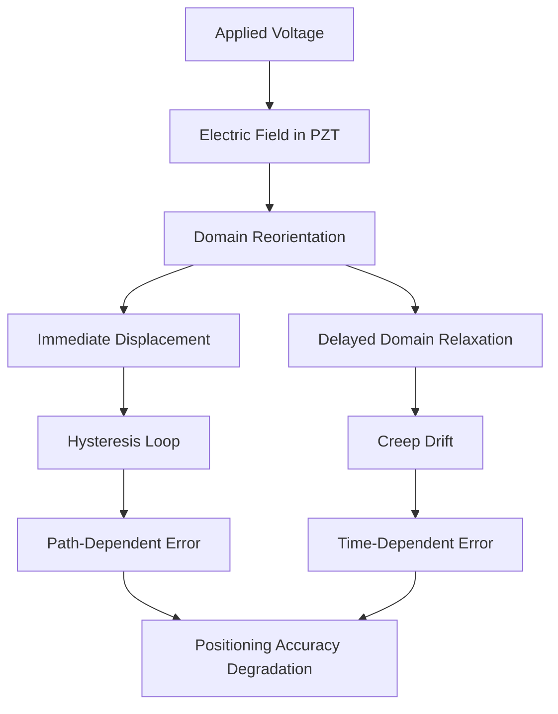
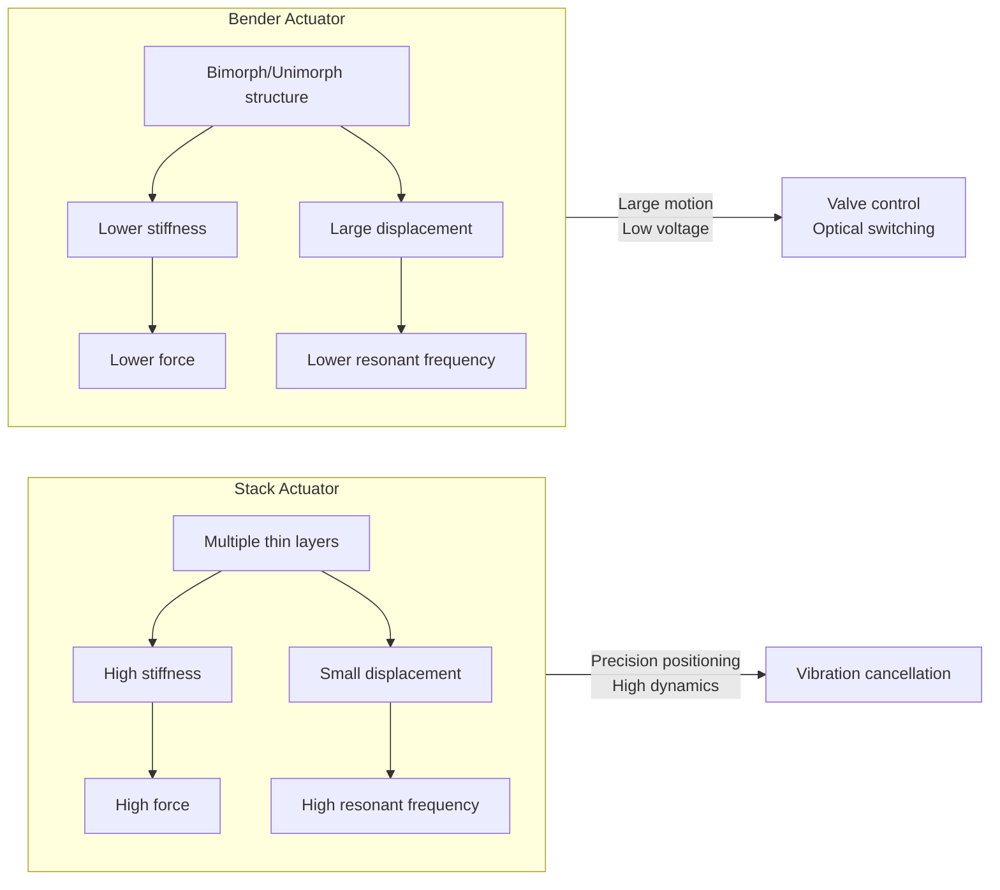
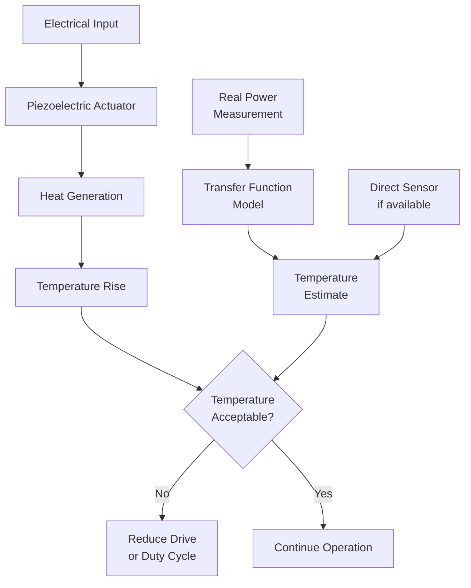
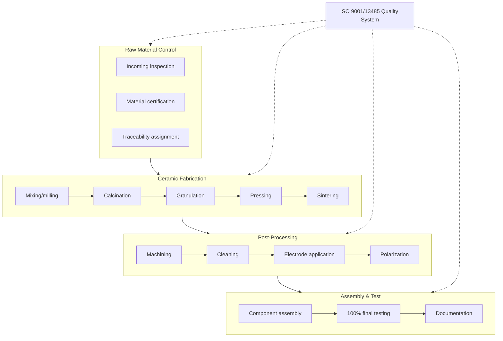
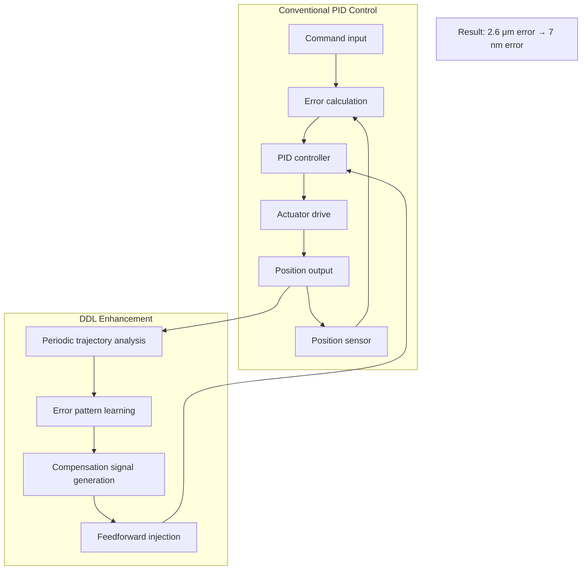
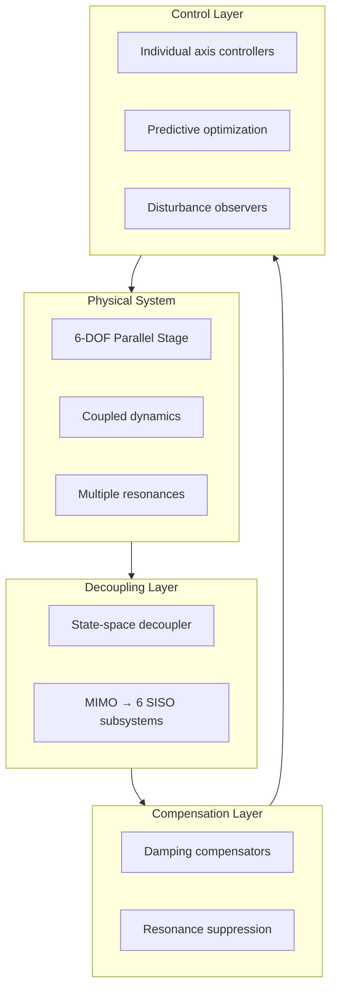
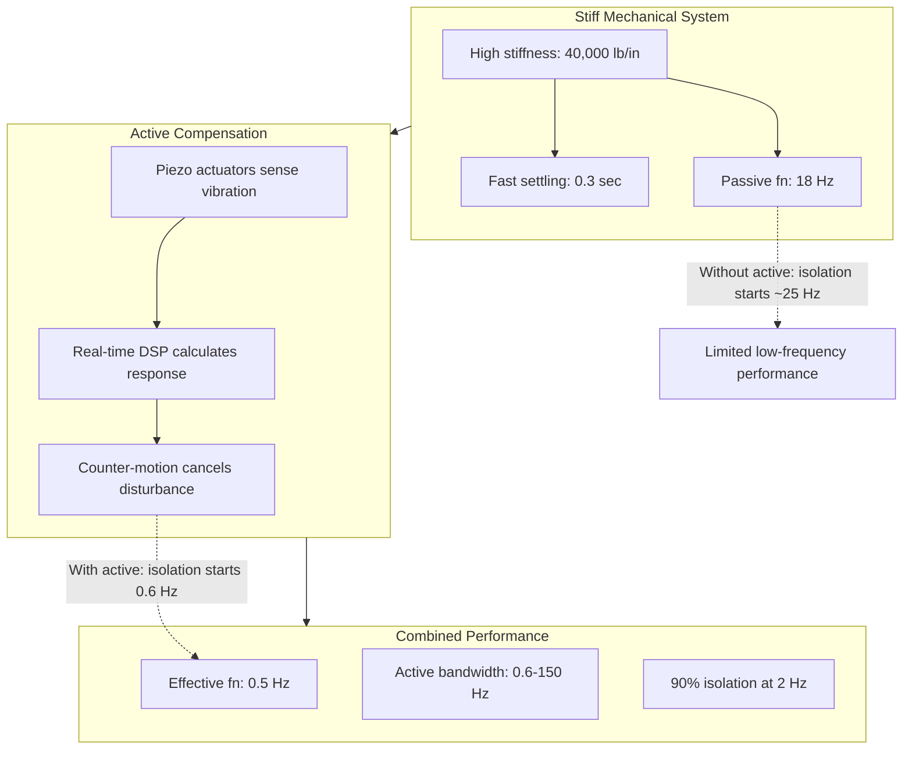
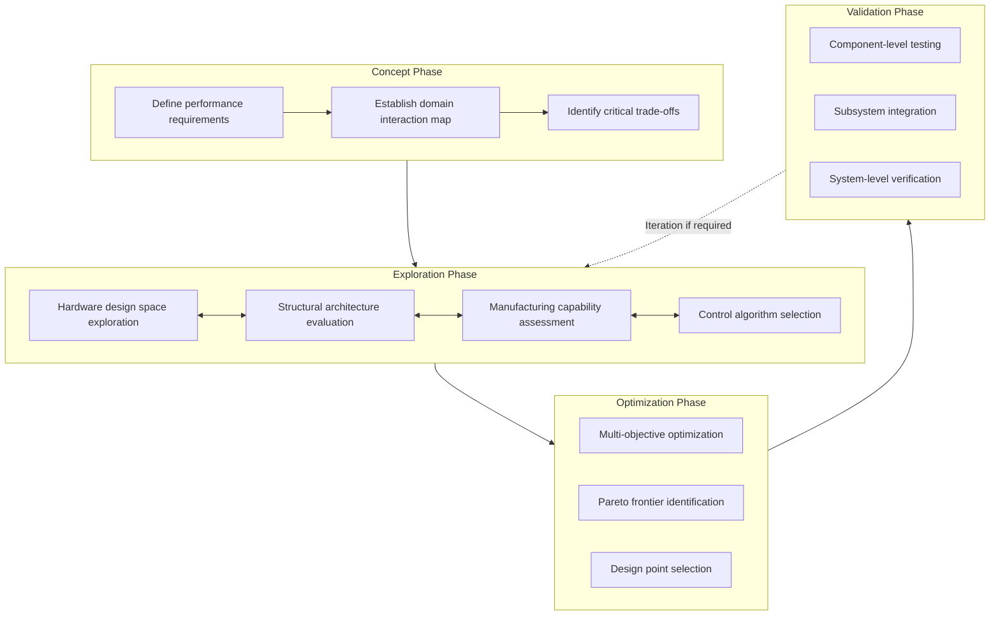
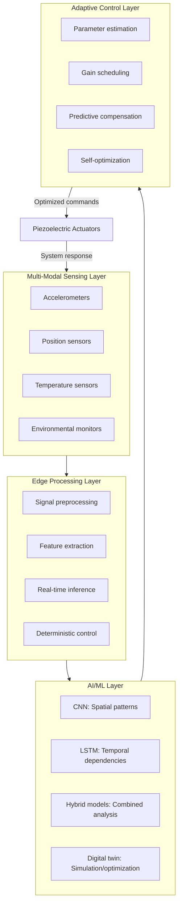

# Enhancing Accuracy and Ensuring Consistency in Precision Piezoelectric Vibration Isolation Systems: A Holistic Analysis of Hardware, Structure, Manufacturing, and Control
## 1 Foundations and Performance Metrics of Piezoelectric Vibration Isolation Systems

This chapter establishes the theoretical and technical foundation for understanding piezoelectric vibration isolation systems, systematically examining the core components, their functional interdependencies, and the quantitative metrics used to evaluate system performance. It provides the baseline framework against which all subsequent enhancement strategies will be assessed.

### 1.1 Core Components and System Architecture

Piezoelectric vibration isolation systems comprise three fundamental functional elements that operate in coordinated fashion to detect, process, and counteract unwanted mechanical disturbances. The architecture of these systems represents a sophisticated integration of sensing technology, actuation mechanisms, and computational intelligence that enables sub-nanometer precision in vibration cancellation.

**Piezoelectric sensors** serve as the primary detection mechanism, converting mechanical vibrations into electrical signals through the direct piezoelectric effect. In typical active isolation systems, **piezo accelerometers** are strategically positioned to sense incoming vibrations across all six degrees of freedom. A representative high-performance system incorporates at least eight sensors distributed in different orientations to achieve comprehensive spatial coverage[^1]. These sensors convert kinetic vibration energy into electrical signals with exceptional sensitivity, enabling detection of disturbances at frequencies as low as 0.3 Hz in advanced configurations[^2]. The sensor array must capture both the amplitude and phase characteristics of incoming vibrations with sufficient fidelity to enable effective cancellation.

**Piezoelectric actuators** constitute the active force-generation component, utilizing the inverse piezoelectric effect to produce precisely controlled mechanical displacements in response to electrical input signals. These actuators are constructed as **layered structures of specialized PZT ceramic interleaved with electrodes**, where an applied voltage causes a bulk change in the ceramic's length[^3]. The solid-state nature of PZT material provides distinct advantages over classical actuators: they require no maintenance or lubricants, and when properly designed and operated, they provide essentially unlimited lifetime because there are no mechanical parts subject to wear[^3]. Piezo actuators offer exceptional performance characteristics including response times of a few milliseconds, resolutions in the subnanometer range, accelerations exceeding 10,000 g, and load capacities reaching several tons[^4]. Furthermore, because the piezo effect is based on electric fields, these actuators neither produce magnetic fields nor are affected by them, making them suitable for magnetically sensitive applications[^4].

The **digital signal processing controller** serves as the computational core that reconciles sensor inputs and generates appropriate actuation commands. A real-time digital signal processor performs the necessary calculations rapidly, providing high bandwidth cancellation while virtually eliminating latencies to minimize settling times[^3]. The controller implements sophisticated algorithms that process signals from multiple sensors using proprietary computational methods, then transmit cancellation signals to the actuators[^1]. This computational element must operate with deterministic timing to ensure that the generated counter-forces maintain proper phase relationships with incoming disturbances.

The functional architecture of active vibration isolation systems typically employs either **feedback control**, **feedforward control**, or hybrid approaches combining both strategies. Feedback systems continually sense and react to incoming vibrations through a closed loop where sensors, electronics, and actuators create a continuous monitoring and correction cycle[^1]. The feedback loop effectively removes resonances that would otherwise be present in the system, including the low-frequency resonance that plagues all passive vibration isolation systems[^1]. Feedforward systems, by contrast, are programmed to compensate for regular periodic vibrations through predictive action[^1]. Advanced systems like the DVIA-M series implement **dynamic feedforward control** that uses real-time ground sensor measurements to detect vibration and sends signals to actuators to cancel the vibration before it reaches the isolated mass[^2].

**Hybrid active-passive configurations** represent the predominant architecture for high-performance applications, combining the strengths of both isolation approaches. In these systems, passive components such as stiff metal springs support the load weight and provide inherent isolation, while the active isolation component consisting of vibration sensors, control electronics, and actuators addresses frequencies where passive isolation is ineffective[^1]. The active-passive vibration isolator design philosophy employs a piezoelectric actuator in the active part and a damping buffer in the passive part, with the passive system primarily isolating high-frequency vibrations above 100 Hz while the active element suppresses middle and low-frequency bands below 100 Hz[^5]. This division of responsibility allows each subsystem to operate in its optimal frequency range, achieving effective vibration isolation across a broader bandwidth than either approach could accomplish independently.

The signal flow within these systems follows a well-defined pathway: vibrations entering the system are first detected by the sensor array, which converts mechanical motion into electrical signals. These signals are transmitted to the control electronics, which reconcile and process inputs from various sensors. The electronics then compute the required cancellation response and send drive signals to the actuators. The actuators generate vibrations that are equal in magnitude to the incoming disturbances but opposite in phase, resulting in cancellation of the unwanted motion[^1]. This entire process occurs within 5 to 20 milliseconds of a vibration entering the system[^1], enabling effective real-time compensation.

### 1.2 Key Performance Metrics for System Accuracy

The evaluation of piezoelectric vibration isolation system performance requires a comprehensive set of quantitative metrics that characterize both the magnitude and quality of vibration attenuation across relevant operational conditions. These metrics establish the benchmarks against which system designs are assessed and provide the framework for specifying enhancement requirements.

**Attenuation level** represents the primary measure of isolation effectiveness, quantifying the reduction in vibration amplitude achieved by the system. This parameter is typically expressed either as a percentage reduction or in decibels (dB), with higher values indicating superior performance. State-of-the-art active piezoelectric systems achieve **vibration reduction exceeding 90% starting at 2 Hz**[^2], while at 1 Hz, both horizontal and vertical vibrations are reduced by more than 50%[^6]. The following table summarizes representative attenuation performance across different system configurations and frequency ranges:

| System Type | Frequency Range | Attenuation Level | Application Context |
|:------------|:----------------|:------------------|:--------------------|
| STACIS Active | 0.6-250 Hz | >90% above 2 Hz | Semiconductor lithography[^3] |
| Active-Passive Hybrid | 5-500 Hz | 30% minimum | Precision equipment[^5] |
| Stewart Platform | 1.4 Hz sinusoidal | 14-15.3 dB | Space payloads[^7] |
| APHI System | Fundamental frequency | 32.7 dB | High-precision payloads[^8] |
| Adaptive Negative Capacitor | 1 kHz harmonic | >40 dB | Vibration transmission[^9] |

For active vibration isolation systems designed for deterministic disturbances, **residual vibration suppression exceeding 20 dB on average** has been demonstrated for multifrequency disturbances, with response times of less than 0.3 seconds when disturbance characteristics change suddenly[^10]. In noise shielding applications using analogous piezoelectric membrane technology, sustainable increases in acoustic transmission loss of approximately 45 dB have been achieved, resulting in total transmission loss of about 65 dB[^9].

**Operational bandwidth** defines the frequency range over which the isolation system provides effective attenuation. Active piezoelectric systems demonstrate particularly impressive bandwidth characteristics, with **high bandwidth cancellation spanning 0.6 to 250 Hz** in advanced implementations[^3]. Hybrid active-passive systems extend this range further, achieving **effective vibration isolation from 5 Hz to 500 Hz** under typical loading conditions[^5]. The bandwidth specification must consider both the lower cutoff frequency, which determines effectiveness against low-frequency building vibrations, and the upper limit, which affects isolation of higher-frequency machinery disturbances.

**Isolation starting frequency** is a critical parameter that distinguishes active systems from passive alternatives. Conventional soft isolators do not isolate vibrations below 2 Hz and perform poorly in responding to onboard vibration driven by rapid processing[^3]. By contrast, STACIS technology provides **aggressive attenuation starting at sub-Hz levels**, directly benefiting applications where low-frequency floor vibrations are problematic[^3]. The DVIA-M series achieves **active vibration isolation starting at 0.5 Hz**[^2], while advanced systems can detect disturbances at frequencies as low as 0.3 Hz[^2].

**Resonance frequency characteristics** significantly influence system behavior, particularly in passive and hybrid configurations. Passive pneumatic isolators typically exhibit resonance frequencies in the 1.8 to 2.0 Hz range[^6], while elastomer-based passive components in piezoelectric systems have higher resonant frequencies around 20 Hz[^2]. The system resonance determines the frequency at which isolation begins—approximately 1.2 to 1.5 times the resonance frequency depending on damping—and also represents a region of potential vibration amplification rather than attenuation[^6]. Active control strategies specifically target the elimination or damping of these resonance peaks, with hybrid systems demonstrating **dramatic reduction of system resonance peaks** and broadened frequency bands[^5].

**Settling time** quantifies the temporal response of the isolation system following a disturbance or load change. Active piezoelectric systems achieve **response times of 5 to 20 milliseconds**[^1], enabling rapid stabilization after transient events. The inherent stiffness of piezoelectric-based systems provides additional settling benefits; because they rely on stiff mechanical supports rather than soft air springs, these systems settle out and begin isolating within a second of a shock or disturbance[^1]. The STACIS serial design specifically improves settling time in response to onboard disturbances such as substrate loading, helping cycle rates meet demanding throughput requirements[^3].

**Six-degree-of-freedom isolation capability** addresses the requirement for comprehensive vibration cancellation in all translational and rotational axes. Advanced systems sense the onset of vibration in six degrees of freedom and actively nullify it via canceling actuation of piezoelectric actuators acting both vertically and horizontally[^3]. This multi-axis capability is essential for precision applications where vibrations from any direction can compromise performance.

**Load capacity** specifications define the range of payload masses that the system can effectively isolate. Active-passive hybrid systems have demonstrated effective operation with **load masses ranging from 9 to 72 kg**[^5], while industrial-scale systems can support loads of several tons[^4]. The system must maintain consistent isolation performance across its rated load range, with automatic leveling mechanisms adjusting isolator pressure and stiffness to accommodate varying payloads[^6].

### 1.3 Inherent Nonlinearities and Material Limitations

Piezoelectric materials exhibit fundamental physical behaviors that introduce nonlinearities into system operation, constraining achievable accuracy and necessitating sophisticated compensation strategies. Understanding these limitations establishes the baseline error levels that hardware design, manufacturing processes, and control algorithms must address.

**Hysteresis** represents the most significant nonlinearity affecting piezoelectric actuator performance, manifesting as a path-dependent relationship between input voltage and output displacement. The voltage-dependent displacement curves of piezo actuators have a **strongly nonlinear course subject to hysteresis** due to extrinsic domain contributions[^11]. This behavior makes it impossible to interpolate linearly from nominal displacement to intermediate positions with a particular driving voltage[^11]. The hysteresis value is defined as the ratio between the maximum opening of the curve and the maximum displacement, with especially high values resulting for shear actuators or with bipolar control due to increasing involvement of extrinsic polarity reversal processes[^11].

Quantitative characterization of hysteresis effects reveals the magnitude of positioning errors introduced. Before applying feedforward linearization compensation, systems exhibit **average linearity of 8.9% with hysteresis errors less than 7.79%**[^7]. These error levels significantly affect positioning accuracy in precision applications, as the inherent hysteretic nonlinearity of piezoelectric ceramics directly degrades the achievable positioning precision[^7]. The hysteresis mechanism involves domain switching within the ceramic structure, where the applied electric field causes reorientation of ferroelectric domains in a manner that depends on the history of previous field applications[^11].

**Creep** describes the gradual change in displacement over time when the drive voltage is held constant, representing a time-dependent nonlinearity distinct from hysteresis. The creep speed decreases logarithmically over time, with the same material properties responsible for hysteresis also causing creep behavior[^11]. Quantitatively, creep causes **approximately 1% to 2% of displacement change per logarithmic time decade**, as characterized by a creep factor of approximately 0.01 to 0.02[^11]. This phenomenon affects the static positioning accuracy of piezoelectric-based microsystems, introducing drift that accumulates over extended operational periods[^12].

The relationship between hysteresis and creep can be understood through their common origin in domain dynamics within the piezoelectric ceramic. Both phenomena arise from the movement and reorientation of ferroelectric domains under applied electric fields, with hysteresis reflecting the energy dissipation during cyclic domain switching and creep representing the continued domain relaxation toward equilibrium configurations under sustained field application. The following diagram illustrates the nonlinear behavior mechanisms:



**Temperature-dependent performance variations** introduce additional complexity, as piezoelectric properties change with ambient thermal conditions. Varying ambient temperatures affect the coupling coefficients, dielectric constants, and mechanical compliance of piezoelectric materials, altering both the sensitivity of sensors and the stroke of actuators. The adaptive vibration isolation system utilizing negative capacitor shunting demonstrated this sensitivity: under heating conditions at 0.6 kHz, the non-adaptive system's performance degraded by 10 dB within 5 minutes, while the adaptive system sustained a 20 dB reduction in transmissibility[^9]. This thermal sensitivity necessitates either temperature compensation in control algorithms or adaptive mechanisms that can track parameter variations.

The impact of these nonlinearities on system accuracy is substantial and multifaceted. Hysteresis nonlinearity **degrades positioning accuracy and repeatability**, while creep affects the static positioning of piezoelectric-based microsystems[^12]. For vibration isolation applications requiring sub-nanometer precision, these error sources can exceed acceptable tolerances by orders of magnitude if left uncompensated. The phenomenological mathematical models developed to characterize hysteresis behavior, such as those based on Bouc-Wen operators, enable the development of compensation strategies[^7]. However, the complexity of these models and the computational requirements for real-time compensation present ongoing challenges.

The combined effect of hysteresis and creep creates a challenging control problem where both instantaneous accuracy and long-term stability must be addressed. Hysteresis and creep can be eliminated most effectively through **position control in a closed servo loop**[^11]. In applications with purely dynamic control, hysteresis can be effectively reduced to values of 1 to 2% even without closed-loop control by using a charge-control amplifier[^11]. These compensation approaches form the foundation for the control algorithm enhancements discussed in subsequent chapters.

### 1.4 Operational Constraints and Environmental Sensitivities

Practical deployment of piezoelectric vibration isolation systems involves numerous operational constraints and environmental sensitivities that affect performance consistency across varying conditions. These factors establish the boundary conditions within which system designs must operate and highlight areas requiring robustness enhancements.

**Humidity sensitivity** represents a critical environmental factor affecting piezoelectric actuator reliability and longevity. The ingress of moisture into actuator structures can cause electrical breakdown, degradation of piezoelectric properties, and ultimately premature failure. Accelerated life testing under increased humidity conditions (100 V DC, 22°C, 90% relative humidity) revealed dramatic differences between protected and unprotected actuator designs: **PICMA® actuators with ceramic encapsulation demonstrated extrapolated mean time to failure (MTTF) exceeding 400,000 hours (approximately 45 years)**, while all polymer-coated comparison samples failed after at most only 1,600 hours (MTTF of approximately 890 hours, about 1 month)[^13]. This three-orders-of-magnitude improvement in humid condition reliability underscores the importance of proper environmental protection in actuator design.

**Load capacity constraints** define the operational envelope for different system configurations. Compact active-passive hybrid isolators have demonstrated effective operation with **load masses ranging from 9 to 72 kg**[^5], suitable for laboratory instruments and precision equipment. Industrial-scale systems utilizing high-load piezo actuators can accommodate significantly greater masses, with specifications reaching several tons[^4]. The system must maintain consistent isolation performance across its rated load range, requiring automatic adjustment of support stiffness and control parameters to accommodate varying payload characteristics.

**Frequency-dependent performance degradation** affects different system architectures in characteristic ways. For piezoelectric-based systems with elastomer passive components, the high stiffness of the elastomer results in **resonant frequencies around 20 Hz**, leading to **performance degradation at frequencies beyond approximately 50 Hz**[^2]. This limitation arises because the active control must use high gain to minimize high-frequency vibrations, making the entire system very stiff and reducing its effectiveness at higher frequencies. Additionally, systems relying solely on feedback control without feedforward elements exhibit **limited low-frequency performance** compared to systems implementing both control strategies[^2].

The **trade-off between system stiffness and low-frequency isolation** presents a fundamental design challenge. Increasing isolator stiffness improves load-carrying capacity, settling time, and resistance to tilting instabilities, but simultaneously raises the isolation starting frequency and reduces low-frequency attenuation. Passive damping can reduce resonance amplification but at the cost of high-frequency isolation performance, with typical compromises limiting damping to a quality factor of approximately 10[^6]. Active control systems address this trade-off by using high-stiffness passive supports while compensating for the resulting isolation loss through high-performance active feedback[^6].

**Stacked isolation configurations** present counterintuitive performance challenges that merit careful consideration. When instruments with internal pneumatic isolation systems are placed on secondary platforms supported by additional pneumatic isolators, the resulting stacked configuration can **paradoxically degrade performance in the critical 0.5-5 Hz frequency band** while also introducing **poor tilt stability**[^6]. Computer modeling of stacked systems reveals that the RMS noise increase depends on the mass ratio between the upper and lower isolated masses:

| Mass Ratio (M2/M1) | RMS Noise Increase |
|:-------------------|:-------------------|
| 1 | 24% |
| 2 | 43% |
| 5 | 83% |
| 10 | 130% |
| 30+ | 225%+ |

This performance degradation occurs because the effective bounce frequency of the intermediate mass exceeds the nominal frequency of the lower isolators, since the air pressure and stiffness are set to support the combined static load while the resonance is determined by the dynamic mass alone[^6].

**Tilt stability** concerns become particularly acute in stacked configurations and for systems supporting tall, narrow payloads. The stability condition requires that the load's center of mass remain within a parabolic region whose height is proportional to the isolator frequency and the square of the isolator spacing[^6]. Many pneumatic isolators have effective support points located 4 to 9 inches below their support pads, resulting in unexpectedly limited tilt stability margins[^6]. Overcoming tilt instability requires either increasing the platform footprint, lowering the load center of mass, or increasing isolator stiffness—with the third option severely compromising passive isolation performance[^6].

**Environmental adaptability** requirements extend beyond humidity to include temperature variations, electromagnetic interference, and facility-specific vibration characteristics. The system must maintain specified performance despite changes in ambient conditions, payload configurations, and disturbance spectra. Adaptive control mechanisms that can track changes in system characteristics and adjust compensation parameters accordingly provide enhanced robustness. Experimental validation has confirmed that **active vibration isolation remains effective despite changes in the system's inherent characteristics** caused by factors such as cable tension variations[^7].

### 1.5 Baseline Requirements for Enhancement Strategies

The systematic analysis of system architecture, performance metrics, material limitations, and operational constraints establishes clear requirements for enhancement strategies across all domains of system design. These requirements define the improvement targets that subsequent chapters will address through hardware optimization, structural innovation, manufacturing excellence, and advanced control implementation.

**Linearity improvement requirements** are quantified by the gap between current uncompensated performance and application demands. Systems exhibiting **average linearity of 8.9% before compensation must achieve sub-2% linearity** to meet precision positioning requirements[^7]. The demonstrated capability to improve average linearity from 8.9% to 1.8% through feedforward linearization compensation—representing **linearity improvement exceeding 90%**—establishes the achievable performance benchmark[^7]. This improvement level transforms piezoelectric actuators from components with significant positioning uncertainty to precision motion elements suitable for nanometer-scale applications.

**Hysteresis compensation targets** follow directly from the measured error levels and application requirements. The reduction of **hysteresis error from less than 7.79% to below 0.6%** has been demonstrated through appropriate compensation techniques[^7], establishing this as the minimum acceptable improvement level for high-precision systems. The compensation approaches include both model-based feedforward techniques utilizing inverse hysteresis models and closed-loop feedback control with position sensing. The choice between these approaches involves trade-offs between computational complexity, sensor requirements, and dynamic performance that must be evaluated for specific applications.

**Bandwidth extension requirements** address the need for effective isolation across the full frequency range of relevant disturbances. The target specifications include:

- **Low-frequency extension**: Achieving effective isolation starting at sub-Hz frequencies (0.5-0.6 Hz) rather than the 2 Hz limit of conventional passive systems[^3][^2]
- **High-frequency coverage**: Maintaining attenuation through 250 Hz or higher for active cancellation[^3]
- **Broadband performance**: Achieving effective isolation from 5 Hz to 500 Hz in hybrid configurations[^5]
- **Resonance suppression**: Eliminating or dramatically reducing resonance peaks that cause amplification rather than isolation

**Environmental robustness requirements** specify the conditions under which systems must maintain performance. The three-orders-of-magnitude improvement in humidity resistance demonstrated by ceramic-encapsulated actuators[^13] establishes the standard for environmental protection. Systems must accommodate temperature variations without significant performance degradation, either through inherent stability or adaptive compensation mechanisms. The demonstrated maintenance of 20 dB transmissibility reduction under heating conditions through adaptive control[^9] provides a benchmark for thermal robustness.

**Application-specific requirements** vary according to the precision and environmental demands of different use cases:

- **Semiconductor lithography**: Requires sub-nanometer positioning accuracy, sub-Hz isolation starting frequency, and compatibility with cleanroom environments. The enabling role of active vibration isolation technology for next-generation 22nm scale lithography[^3] establishes the performance expectations for this application domain.

- **Electron microscopy**: Demands elimination of low-frequency floor vibrations that cause image artifacts and sample instabilities. The demonstrated capability to achieve **resolution at 250,000x to 300,000x** through aggressive piezoelectric-based low-frequency vibration cancellation[^14] defines the performance requirements. The elimination of "sample fly-away" during FIB lift-out processes despite streetcar passage[^14] illustrates the practical impact of effective isolation.

- **Space payload isolation**: Requires effective suppression of low-frequency vibrations and resonances below 10 Hz that traditional passive systems cannot address[^7]. The demonstrated **14-15 dB vibration reduction** in axial and lateral directions[^7] and the maintenance of effectiveness despite actuator failures[^7] establish reliability requirements for these critical applications.

The **integration requirements** for enhancement strategies recognize that improvements in individual domains must be coordinated to achieve optimal overall system performance. The demonstrated success of systems combining piezoelectric actuators with passive damping elements, implementing both feedforward and feedback control, and utilizing adaptive algorithms for parameter tracking[^5] illustrates the importance of holistic design approaches. Enhancement strategies must consider the interactions between hardware characteristics, structural dynamics, manufacturing tolerances, and control algorithm capabilities to avoid suboptimization of individual subsystems at the expense of overall performance.

The **consistency requirements** for production systems extend beyond individual unit performance to encompass unit-to-unit repeatability. The reliability data demonstrating consistent performance after billions of load cycles[^3][^13] and the quality control measures ensuring dimensional and functional integrity establish the standards for manufacturing excellence. Systems must be designed not only for optimal performance but also for producibility, with manufacturing processes capable of maintaining tight tolerances across production volumes.

These baseline requirements frame the enhancement strategies examined in subsequent chapters, providing quantitative targets against which proposed improvements can be evaluated. The systematic approach to defining requirements ensures that enhancement efforts address the most significant performance limitations while maintaining compatibility with application constraints and production realities.

## 2 Hardware Component Design for Enhanced Sensitivity and Response

This chapter systematically examines the optimization of individual hardware components—sensors and actuators—to enhance the sensitivity, signal-to-noise ratio, and response characteristics of piezoelectric vibration isolation systems. Building upon the foundational understanding of system architecture and performance metrics established in Chapter 1, this chapter addresses the material-level and design-level strategies that directly improve detection fidelity and counter-motion precision, establishing the hardware foundation for the structural, manufacturing, and control enhancements discussed in subsequent chapters.

### 2.1 Piezoelectric Sensor Material Selection and Performance Trade-offs

The selection of piezoelectric sensing materials fundamentally determines the detection capabilities and operational characteristics of vibration isolation systems. Three primary material families—quartz, PZT ceramics, and PVDF polymers—offer distinct performance profiles that must be carefully matched to application requirements. Understanding the comparative advantages and limitations of each material enables engineers to optimize sensor performance for specific frequency ranges, environmental conditions, and integration constraints.

**Quartz** stands as a naturally piezoelectric material exhibiting exceptional characteristics for precision measurement applications. Its **high voltage sensitivity, stiffness comparable to steel, and excellent long-term stability** make it particularly valuable for reference standard applications[^15]. A critical advantage of quartz is its **non-pyroelectric behavior**, meaning it does not produce spurious output signals due to thermal transients—a property that proves essential in environments with temperature fluctuations[^15]. The material demonstrates a **low and stable thermal coefficient**, ensuring measurement consistency across varying ambient conditions[^16]. However, quartz exhibits relatively **low charge sensitivity at 2.2 pC/N**, which limits its effectiveness for low-level vibration detection where signal amplification introduces noise[^17]. The low capacitance of quartz elements results in high voltage output but also contributes to slightly elevated noise levels when operating in voltage mode due to the higher noise floor of MosFET amplifiers used for internal impedance conversion[^16].

**PZT (Lead Zirconium Titanate) ceramics** represent the dominant material choice for vibration sensing applications requiring high sensitivity. The **charge sensitivity of PZT reaches 350 pC/N—approximately 160 times higher than quartz**—providing a dramatically stronger output signal that overcomes electronic noise contributions from sensor amplifiers and monitoring instruments[^17]. This superior charge sensitivity proves particularly critical for **low-frequency vibration monitoring**, where amplifier noise is inversely proportional to charge sensitivity[^17]. The use of PZT significantly lowers the accelerometer's contribution to low-frequency "ski slope" noise and greatly improves the signal-to-noise ratio of measurements[^17]. Additionally, the resonance frequency of PZT accelerometers exceeds that of equivalent charge output quartz sensors, extending the usable frequency range and providing more accurate high-frequency readings[^17]. Modern PZT sensors undergo heat treatment to stabilize the poling process, eliminating changes due to long-term temperature and shock exposure[^17]. The material's **controllable polarization process** during manufacturing enables optimization of piezoelectric properties for specific applications[^16]. However, PZT exhibits slightly inferior long-term stability compared to quartz and demonstrates **pyroelectric sensitivity** that can limit performance in certain explosive or shock applications where rapid temperature changes occur[^16].

**PVDF (Polyvinylidene Fluoride) polymers** offer a fundamentally different value proposition centered on mechanical flexibility and biocompatibility. Unlike rigid ceramic alternatives, PVDF provides a **lightweight, thin form factor with mechanical flexibility** that enables conformance to curved or moving surfaces[^18]. The material exhibits a **piezoelectric charge constant approximately 10 times higher than quartz**, boosting sensitivity for dynamic signals while maintaining wide frequency responsiveness and low acoustic impedance[^18]. PVDF demonstrates **excellent chemical and fatigue resistance** along with thermal stability and low moisture absorption[^18]. Recent manufacturing advances have enhanced PVDF performance through techniques such as **electrospinning to produce nanofiber films rich in the electroactive β-phase**, which increases sensitivity without requiring additional poling[^18]. Composite doping with materials like graphene or ZnO-carbon structures yields self-powered, highly sensitive, breathable membranes suitable for wearable applications[^18]. However, PVDF is **limited to dynamic measurement and proves less effective for static pressures**[^18]. Despite inferior piezoelectric properties compared to PZT, innovative design approaches have enabled PVDF-based accelerometers to achieve **sensitivity of 29.45 pC/g with bandwidth of 160 Hz and noise density of 1.4 µg/√Hz**—performance surpassing many PZT-based devices[^19].

The following table summarizes the comparative material properties critical for sensor selection:

| Property | Quartz | PZT Ceramic | PVDF Polymer |
|:---------|:-------|:------------|:-------------|
| Charge Sensitivity | 2.2 pC/N | 350 pC/N | ~22 pC/N (10× quartz) |
| Long-term Stability | Excellent | Good (heat-treated) | Good |
| Pyroelectric Effect | None | Present | Present |
| Temperature Coefficient | Low, stable | Moderate | Moderate |
| Mechanical Form | Rigid | Rigid | Flexible |
| Biocompatibility | Limited | Limited (lead content) | Excellent (lead-free) |
| Low-frequency Performance | Limited by noise | Excellent | Good with design optimization |
| High-temperature Capability | Moderate | Up to 540°C (special ceramics) | Limited |

**Material selection criteria** must account for the specific application context. For **dynamic calibration reference standards and thermally active environments**, quartz sensing elements excel due to their non-pyroelectric behavior and exceptional stability[^15]. For **low-noise, general-purpose vibration measurement** including modal analysis, automotive NVH testing, and aircraft ground vibration testing, ceramic sensing elements provide superior performance through their high charge sensitivity combined with low-noise J-FET internal amplifiers[^15]. For **wearable applications, curved surface monitoring, and biocompatible sensing requirements**, PVDF offers unique advantages that cannot be achieved with rigid ceramic or crystalline materials[^18]. The emerging trend toward **lead-free, eco-friendly alternatives** further favors PVDF solutions for applications where environmental sustainability is prioritized[^18].

### 2.2 High-Sensitivity Accelerometer Design and Specifications

The design of accelerometers for precision vibration isolation systems requires careful optimization of sensing element configurations, electronic integration approaches, and specification parameters to achieve the ultra-low-level detection capabilities demanded by modern applications. High-sensitivity accelerometers enable the capture of minute vibrations associated with large structures, foundations, and subtle environmental disturbances that would otherwise escape detection.

**Sensing element configurations** significantly influence accelerometer performance characteristics across multiple dimensions. Piezoelectric sensors utilize three primary material configurations: **compression, flexural, and shear modes**[^15]. The **shear configuration** has emerged as the preferred approach for high-performance applications due to its **wide frequency range, low off-axis sensitivity, and reduced sensitivity to base strain and temperature variations**[^15]. This configuration positions the sensing element such that applied acceleration induces shear stress within the piezoelectric material, generating charge output while minimizing spurious responses to mounting surface strain or thermal expansion. Piezoelectric materials produce high output with very little strain and essentially no deflection, making sensors inherently rugged with linear signal response over wide amplitude ranges[^15]. These sensors can measure acceleration levels as low as **0.0001 g** but are fundamentally limited to dynamic events—the signal from static accelerations will decay over time[^15].

**Electronic integration approaches** define two primary accelerometer categories with distinct operational characteristics. **Charge Mode (PE) accelerometers** generate a high-impedance charge output that requires transmission through low-noise cable to an external charge amplifier[^15]. This architecture provides flexibility in adjusting electrical output characteristics and enables operation at higher temperatures where integrated electronics would fail[^15]. **ICP® accelerometers** incorporate a built-in microelectronic amplifier that converts the high-impedance charge signal into a low-impedance voltage output, operating from a constant-current power source through standard coaxial cable[^15]. The integrated electronics approach simplifies system implementation but generally limits maximum operating temperature compared to charge-mode sensors[^15]. For structural health monitoring applications, **high-sensitivity ICP® accelerometers represent the common choice**, typically utilizing ceramic sensing elements in shear configurations—quartz sensing and compression configurations are not favored for these applications[^15].

The specifications of high-sensitivity accelerometers demonstrate the remarkable detection capabilities achievable through optimized design. The following table presents representative specifications for accelerometers designed for ultra-low-level vibration detection:

| Model | Sensitivity | Broadband Resolution | Measurement Range | Frequency Range |
|:------|:------------|:---------------------|:------------------|:----------------|
| 393B31 | 10.0 V/g | **0.000001 g rms** | 0.5 g pk | 0.1 to 200 Hz |
| 393B04 | 1000 mV/g | 0.000003 g rms | ±5 g pk | **0.06 to 450 Hz** |
| 393B05 | 10 V/g | 0.000004 g rms | 0.5 g pk | 0.7 to 450 Hz |
| 393B12 | 10000 mV/g | 0.000008 g rms | 0.5 g pk | 0.15 to 1000 Hz |
| 393A03 | 1000 mV/g | 0.00001 g rms | ±5 g pk | 0.5 to 2000 Hz |
| 355B04 | 1000 mV/g | 0.0001 g rms | ±5 g pk | 1 to 8000 Hz |
| 352B | 1000 mV/g | 0.00008 g rms | ±5 g pk | 2 to 10000 Hz |

These specifications reveal several critical design relationships. **Resolution down to 1 µg rms broadband** enables detection of exceedingly subtle vibrations[^20]. The **extended low-frequency measurement capability reaching 0.06 Hz** allows capture of very slow structural movements and ground motions[^20]. The highest sensitivity models achieve **10 V/g output**, providing strong signals that minimize noise contributions from downstream electronics[^20]. All high-sensitivity units feature **hermetic sealing in titanium or stainless steel housings**, with models incorporating 2-pin military-style connectors providing electrical case isolation for superior RF and EMI protection[^20].

**Design features for high-sensitivity operation** involve deliberate trade-offs that favor detection capability over other parameters. High-sensitivity accelerometers possess **comparatively larger physical size**, which furnishes a stronger output signal and lower noise floor[^20]. The five key features characterizing high-sensitivity ICP® accelerometers include: **high sensitivity (1000 mV/g or greater)** to capture small forces; **low g-range (typically less than 1 to 5 g)** optimized for low-amplitude measurements; **low frequency range (0.01 to less than 4000 Hz)** appropriate for large structure monitoring; **higher mass** that contributes to sensitivity; and **low spectral noise** with values as low as 0.5 µg/√Hz at 10 Hz compared to 11 µg/√Hz for general-purpose models[^15].

**Application-specific design considerations** guide accelerometer selection for different measurement scenarios. **Vibration monitoring of buildings, monuments, and critical infrastructure** in smart city applications requires sensors capable of identifying stress applied to structures during full-capacity events or environmental disturbances[^20]. Studies have demonstrated that synchronized crowd motion in stadium grandstands or theater balconies imparts tremendous forces and harmonic motion to structures[^20]. Earth tremors, foot traffic, and vehicle passage can cause structures to sway, shift, or experience fatigue[^20]. **Permanently installed high-sensitivity accelerometers provide real-time data** for trending, analysis, and alert generation[^20]. For **bridge and infrastructure health monitoring**, vibration measurements enable continuous monitoring, modal analysis, and structural integrity investigation[^20]. High-sensitivity accelerometers generate signals in response to traffic, wind, and programmatic impulse stimuli that, when analyzed, provide insight into structural condition and safety[^20].

Advanced accelerometer designs have achieved remarkable performance through innovative structural approaches. A **novel monolithic quartz vibrating beam accelerometer (QVBA)** demonstrates how design innovation can enhance sensitivity through mechanical leverage mechanisms[^21]. By positioning the hinge at the center of the wafer thickness rather than on one side, the proposed structure creates a leverage mechanism that **magnifies the inertial force on the vibrating beam**, producing nearly twice the axial force for the same acceleration input[^21]. This design modification also **greatly suppresses cross-axis sensitivity**—for cross-axis acceleration, the exerted force on the beam approaches zero[^21]. The fabricated sensor achieved a **sensitivity of 54.46 Hz/g**, a **bias stability of 33 µg (1σ) over one hour**, and **temperature stability below 1.9 ppm/°C** across the -40 to 60°C range[^21]. A vibration isolation frame implemented between the sensing element and mounting area acts as a passive mechanical low-pass filter, attenuating high-frequency environmental vibrations while maintaining a high quality factor (Q) of 8000[^21].

### 2.3 Actuator Architecture Optimization: Stack and Bender Configurations

Piezoelectric actuators for vibration isolation systems are realized through two primary architectural approaches—multilayer stack actuators and bender actuators—each offering distinct performance characteristics suited to different application requirements. Understanding the design principles, performance specifications, and optimal application domains of each architecture enables engineers to select and configure actuators that maximize counter-motion precision and dynamic response.

**Multilayer stack actuators** represent the dominant architecture for applications requiring high force generation, high stiffness, and fast response. These actuators consist of many thin piezoelectric ceramic layers interleaved with electrodes, co-fired into a monolithic structure. The **PICMA® and PICMA® PLUS technologies** exemplify state-of-the-art multilayer stack design, featuring ceramic insulation that provides exceptional reliability and environmental robustness[^22]. Key specifications for representative stack actuators demonstrate the achievable performance envelope:

| Specification | Representative Values | Design Implications |
|:--------------|:---------------------|:--------------------|
| Dimensions | 3×2×9 mm to 5×5×36 mm | Compact integration capability |
| Nominal Travel Range | 8 µm to 36 µm | Position control authority |
| Maximum Travel Range | 9.5 µm to extended (at 120V) | Reserve displacement capacity |
| Blocking Force | 220 N to >1000 N | Load handling capability |
| Stiffness | 23 N/µm typical | System dynamics influence |
| Electrical Capacitance | 0.17 µF to 3.6 µF | Drive electronics requirements |
| Resonant Frequency | Up to **135 kHz** | Dynamic response bandwidth |

The **PICMA® PLUS series** offers enhanced performance compared to standard PICMA® actuators, with a **12% increase in travel range (36 µm versus 32 µm)** and **15% increase in electrical capacitance (3.6 µF versus 3.1 µF)** for equivalent dimensions[^22]. Both series demonstrate exceptional reliability with **DC lifetime (MTTF) of 60 years** under test conditions of 70% relative humidity, 22°C, and 100 V DC[^22]. The AC lifetime reaches **1×10⁹ cycles tested** under 0 V to 100 V sine wave operation at frequencies above 10 Hz limited by self-heating[^22].

**Operating voltage and layer thickness** exhibit an inverse relationship that enables design optimization for specific drive electronics constraints. Multilayer elements are controlled by much lower voltages than single-layer piezo elements due to the reduced thickness of individual active layers[^23]. The height of active layers in PICMA® multilayer actuators can be reduced to a **minimum of 15 µm**, enabling operation at voltages as low as **10 V**[^23]. This low-voltage capability simplifies drive electronics design and reduces safety concerns while maintaining full displacement performance. The operating voltage range for PICMA® PLUS actuators spans **-20 V to 120 V**, with nominal specifications at 0 V to 100 V and maximum travel achieved at 0 V to 120 V[^22].

**Force generation and stiffness relationships** govern the mechanical performance of stack actuators in vibration isolation applications. PZT ceramic material can withstand pressures up to **250 MPa** without mechanical failure, though depolarization occurs at pressures of **20% to 30% of this mechanical limit**[^24]. The load capacity data listed for commercial actuators represent conservative values ensuring long lifetime[^24]. Tensile loads for non-preloaded piezo actuators are limited to **5% to 10% of the compressive load limit**, and PZT ceramic is especially sensitive to shear forces[^24]. The maximum force (blocked force) a piezo actuator can generate depends on its stiffness and maximum displacement according to the relationship **F_max = ΔL_0 × k_T**, where ΔL_0 is the maximum nominal displacement and k_T is the actuator stiffness[^24]. In practical applications with elastic loads, the effective force becomes **F = ΔL_0 × k_T × k_S / (k_T + k_S)**, where k_S represents the external spring stiffness[^24].

**Dynamic operation considerations** require attention to preload, resonance, and frequency response characteristics. For dynamic applications, **preloaded elements are highly recommended** with preload force around **20% of the compressive load limit**[^24]. The preload spring stiffness should be soft compared to the actuator—**at most 10% of the actuator stiffness**—to minimize displacement loss[^24]. If preload stiffness equals actuator stiffness, travel reduces by 50%[^24]. The resonant frequency of an unloaded actuator follows **f_0 ≈ (1/2π) × √(k_T/m_eff)**, where m_eff is the effective mass[^24]. Adding external mass M reduces resonant frequency to **f_0' ≈ (1/2π) × √(k_T/(m_eff + M))**[^24]. A piezo actuator can reach nominal displacement in approximately **1/3 of the period of its resonant frequency**, provided the controller delivers necessary current[^24]. For high-dynamics applications, multilayer actuators are equipped with electrodes supporting currents up to **20 A**, enabling operating frequencies in the kHz range with rise times of a few tens of microseconds when used with high-power amplifiers[^22].

**Bender actuators** provide an alternative architecture optimized for large displacement with lower force output. PICMA® multilayer piezo bender actuators deliver **particularly large stroke in combination with high dynamics** while operating at low piezo voltages[^23]. The **bimorph structure** ensures bidirectional displacement capability, expanding the range of achievable motion profiles[^23]. Benders with unidirectional displacement consist of a single active piezoceramic layer bonded to a substrate of Al₂O₃ ceramic or stainless steel; compared to bimorph structures, these actuators achieve **higher stiffness and larger unidirectional displacement**[^23].

The **geometric flexibility of bender actuators** enables integration into diverse application contexts. Multilayer bending actuators can be manufactured in almost any shape, including round or triangular cross-sections and configurations with inner holes[^23]. Dimensions range from only a few millimeters to sizes larger than standard actuators, with geometry determined by force generation and dynamics requirements[^23]. This manufacturing flexibility simplifies actuator integration into specific applications. Bender actuators can be assembled with adapted ceramic or metal end pieces, additional coatings, temperature sensors, and customized holders that facilitate installation[^23].

The following diagram illustrates the architectural differences and performance trade-offs between stack and bender configurations:



**Multilayer contracting plates** represent a hybrid approach that can be applied to metal or silicon substrates to realize bender or pump elements with low control voltages[^23]. These plates can be manufactured in rectangular or disc shapes, enabling customized solutions for specific displacement and force requirements. The integration of piezo ceramics into customer products includes both electrical contacting according to requirements and mounting of customer-provided components, as well as gluing or casting of piezo ceramics[^23].

### 2.4 Advanced Materials and Encapsulation for Environmental Robustness

The operational reliability and longevity of piezoelectric actuators in demanding environments depends critically on material selection and protective encapsulation technologies. Advanced materials expand operational temperature envelopes while encapsulation prevents degradation from humidity, contamination, and mechanical stress. These technologies transform piezoelectric components from laboratory instruments into robust industrial devices capable of sustained operation under challenging conditions.

**Ceramic encapsulation technology** represents a breakthrough in actuator environmental protection, achieving reliability improvements of multiple orders of magnitude compared to conventional polymer coatings. The PICMA® ceramic insulation approach produces actuators that are **polymer-free, insensitive to humidity, and demonstrate excellent temperature stability**[^22]. Under accelerated life testing at elevated humidity (70% relative humidity, 22°C, 100 V DC), PICMA® actuators demonstrate a **DC lifetime (MTTF) of 60 years**[^22]. This exceptional humidity resistance proves critical for applications where moisture ingress would cause electrical breakdown or degradation of piezoelectric properties. The ceramic encapsulation also provides **UHV compatibility to 10⁻⁹ hPa** with no outgassing and high bakeout temperature capability, enabling deployment in vacuum environments such as semiconductor processing equipment and scientific instruments[^22]. Encapsulated versions are available for operation in splash water or oil environments, further extending the application envelope[^22].

**High-temperature piezoelectric materials** address the fundamental limitation of conventional PZT ceramics, which experience self-heating issues that limit maximum operating temperature to around **200°C**[^25]. At high operating powers, the combination of internal heat generation and environmental heat sources restricts PZT-based actuator applications in industries operating at temperature extremes such as aerospace, oil and gas, mining, and energy[^25]. The material at the core of precise actuator designs—the piezoelectric ceramic—often determines the maximum operating temperature of the complete device[^25].

**HPZ (High-Performance Piezoelectric) materials** represent a specialized class combining high Curie temperature with high piezoelectric activity. Most high-temperature piezoelectric materials with Curie temperatures above 400°C suffer from high production costs, low mechanical strength, and generally low piezoelectric activity (such as bismuth titanate)[^25]. HPZ uniquely combines **Curie temperature exceeding 400°C with piezoelectric activity greater than 100 pC/N**[^25]. The material demonstrates **high toughness** to withstand required pre-loads and **very high strain to failure**, allowing the actuating crystal to create larger displacements[^25]. A stack actuator fabricated using HPZ material displayed **excellent performance and linear response beyond 400°C**, while maintaining compatibility with the same assembly processes used for PZT[^25]. This process compatibility minimizes development time and costs when transitioning from conventional to high-temperature designs.

The **temperature operating ranges** of different actuator constructions reflect the combined influence of ceramic properties, bonding materials, and structural design:

| Actuator Type | Standard Range | Extended Range | Special Configurations |
|:--------------|:---------------|:---------------|:-----------------------|
| Glued actuators | -20 to 85°C | — | — |
| PICMA® multilayer | -40 to 150°C | — | Special solders: -271 to 200°C |
| HPZ-based | — | Beyond 400°C | Linear response maintained |
| PICMA® PLUS | -40 to 150°C | Up to 200°C (custom) | Cryogenic with reduced displacement |

The temperature range of **-271°C to 200°C**—spanning almost **500 K**—demonstrates the remarkable operational envelope achievable with appropriate material selection and construction techniques[^26]. At cryogenic temperatures, displacement decreases significantly; when driven unipolarly in the liquid-helium temperature range, piezo actuators achieve only **10 to 15% of room temperature displacement**[^26]. However, considerably higher displacement at lower temperatures can be achieved with bipolar drive, as the coercive field strength increases with cooling, allowing operation at higher voltages even against the polarization direction[^26].

**Thermal expansion characteristics** differ between all-ceramic and adhesive-bonded constructions, affecting system stability in thermally variable environments. The temperature expansion coefficient of an all-ceramic PICMA® stack actuator is approximately **-2.5 ppm/K** (negative coefficient, meaning the ceramic lengthens when cooled)[^26]. In contrast, additional metal contact plates and adhesive layers in PICA stack actuators lead to a nonlinear characteristic with a positive total coefficient[^26]. All-ceramic PICMA® bender actuators show **minimal temperature drift in the displacement direction** due to their symmetrical structure[^26]. When nanopositioning systems operate in closed servo loops, temperature drift is eliminated along with nonlinearity, hysteresis, and creep[^26].

**Customization options** for extreme environment operation include special electrodes supporting currents up to 20 A for high-dynamics applications, variable geometry (inner holes, round, rectangular shapes), ceramic or metal tips, applied strain gauge sensors for positional stability, and optional connecting wires[^22]. High operating temperature versions up to 200°C are available as customized products[^22]. These options enable system designers to specify actuators precisely matched to application requirements without compromising environmental robustness.

### 2.5 Thermal Management Strategies for Dynamic Operation

High-power piezoelectric actuator operation generates significant internal heat that, if unmanaged, causes performance degradation, accelerated aging, and potential failure. Effective thermal management strategies encompass understanding heat generation mechanisms, implementing temperature monitoring approaches, and designing systems that maintain acceptable operating temperatures under demanding duty cycles.

**Heat generation mechanisms** in piezoelectric actuators arise from multiple loss sources during dynamic operation. When driven at high frequencies, piezoelectric actuators are prone to overheating due to **electrical resistance, viscous damping, and dielectric and hysteresis losses**[^27]. The temperature rise induces thermal stress that reduces the lifetime of piezoelectric ceramics[^27]. Heat generation during harmonic excitation follows the relationship **P = π × f × C × (U_pp)² × tan(δ)**, where f is frequency, C is capacitance, U_pp is peak-to-peak voltage, and tan(δ) is the dielectric loss factor[^24]. Under large-signal conditions, **8% to 12% of electrical power can be converted to heat**[^24]. This substantial heat generation becomes the limiting factor for maximum actuator performance, with increased ambient temperatures further weakening heat dissipation at the surface and reducing achievable dynamic performance[^28].

**Temperature distribution within actuators** exhibits significant spatial variation that simple lumped-mass thermal models fail to capture. Under conditions with free convection and metallic holding fixtures, the **temperature at the actuator center can reach 97°C while the average temperature is only 80°C**—a 17°C difference[^28]. With heat conduction at end plates and forced convection on free surfaces, the center temperature can reach **99°C with an average of 80°C**[^28]. Only with isolated end plates does the temperature distribution become nearly constant, but this configuration is uncommon in practical applications[^28]. Therefore, **computation of temperature gradients is mandatory** for reliable system dimensioning, requiring finite-element-method (FEM) models to resolve temperature distribution inside the actuator[^28].

**Temperature estimation techniques** enable thermal protection when direct measurement is impractical due to limited access or small actuator size. A proven approach exploits the **linear relationship between dissipated real power and resulting temperature**[^27]. Since this relationship behaves like a linear system, it can be determined through system identification without requiring independent measurement of thermal conductivity and specific heat capacity[^27]. The thermal system is modeled using an equivalent thermal circuit, with the relationship between power and temperature approximated by a **second-order linear transfer function with two poles and two zeros**[^27]. Experimental validation demonstrated that estimated and measured temperatures show an **absolute error of less than 3°C** for a wide range of input power profiles[^27]. The estimation accuracy is independent of drive amplitude and frequency and does not require knowledge of any thermal properties[^27]. This approach applies to nanopositioning systems where heat transfer can be approximated as one-dimensional, though model parameters must be experimentally identified for each new device[^27].

The following diagram illustrates the thermal management system architecture:



**Temperature-dependent performance variations** affect actuator behavior across the operating envelope. The amount a key parameter changes with temperature depends on the distance from the Curie temperature[^26]. PICMA® actuators with their relatively high Curie temperature of **350°C** exhibit displacement changes of only **0.05%/K** at high operating temperatures[^26]. At cryogenic temperatures, displacement decreases substantially—**10 to 15% of room temperature values** when driven unipolarly in the liquid-helium range[^26]. The temperature dependence of remnant strain and coercive field strength determines actuator behavior below the Curie temperature[^26]. As the actuator cools, remnant strain and coercive field strength increase, causing the strain curves to become flatter and reducing strain induced by unipolar control even though total bipolar strain amplitude remains relatively constant[^26].

**Design approaches for thermal management** span passive and active strategies. Material selection favoring ceramics with high Curie temperatures (such as PICMA® at 350°C or HPZ above 400°C) provides inherent thermal margin[^26]. Duty cycle limitations prevent sustained operation at power levels that cause excessive temperature rise. **Piezoelectric fan technology** offers an innovative active cooling approach, providing **solid-state cooling with no rotating parts** that can wear out, enabling superior reliability especially at elevated temperatures[^29]. These fans have demonstrated reliable operation at temperatures up to **140°C** in confined spaces where traditional fan technology cannot provide adequate reliability[^29]. The technology has undergone substantial accelerated life testing including highly accelerated life testing (HALT), humidity HALT, and salt fog exposure[^29]. For integrated thermal management, **piezoelectric-actuated active cooling substrates** have demonstrated temperature reduction from 70°C to 51°C—a **34% decrease in overall thermal resistance** and **91% reduction in thermal resistance to air**[^30]. The heat transfer coefficient improved from 12 W/m²K without actuation to **110 W/m²K with piezoelectric actuation**[^30].

### 2.6 Integrated Sensor-Actuator Design for Closed-Loop Precision

The integration of position feedback sensors with piezoelectric actuators enables closed-loop operation that fundamentally transforms system accuracy by compensating for the hysteresis, creep, and thermal drift limitations inherent in open-loop piezoelectric systems. This integration establishes the hardware foundation for advanced control algorithms that achieve nanometer-level positioning precision.

**Strain gauge sensor (SGS) integration** represents the primary approach for incorporating position feedback into piezoelectric actuators. These sensors consist of **thin metal foil applied directly to the piezo ceramics** to measure displacement[^23]. The direct attachment to the active element ensures that measured displacement reflects actual actuator motion rather than intermediate structural deformations. Piezo actuators equipped with position sensors become **suitable for repeatable positioning with nanometer precision**[^23]. The SGS approach provides several advantages: minimal added mass that preserves dynamic response; direct measurement of the piezoelectric element's strain; compatibility with the actuator's operating environment; and straightforward signal conditioning using established bridge amplifier techniques.

**Closed-loop operation benefits** directly address the nonlinearities identified in Chapter 1 as fundamental limitations of piezoelectric systems. When operated in a closed servo loop, the system **eliminates temperature drift in addition to nonlinearity, hysteresis, and creep**[^26]. The dramatic improvement in linearity—from approximately 8.9% to 1.8% as established in Chapter 1—transforms piezoelectric actuators from components with significant positioning uncertainty to precision motion elements. Hysteresis reduction from nearly 8% to below 1% enables accurate bidirectional positioning without the path-dependent errors characteristic of open-loop operation. Creep compensation eliminates the gradual position drift that would otherwise accumulate during extended static positioning.

**Signal-to-noise ratio considerations** in piezoelectric sensing systems follow fundamental relationships that guide design optimization. A theoretical analysis of piezoelectric microphones—applicable to sensing elements generally—identifies that **SNR is maximized when the compliance of the deformable structure matches the compliance of the back-volume**[^31]. For a dielectric-loss noise limited sensor, the coupling coefficient k² becomes the only design parameter determining SNR[^31]. The maximum attainable SNR **increases 3 dB with each doubling in microphone (sensor) size**[^31]. The relevant material property influencing SNR is the dimensionless ratio **k²/tan(δ)**, where tan(δ) is the dielectric loss tangent[^31]. For AlN material, the highest possible k² of 11.0% is achieved with a 3-3 bar deformation geometry, while the commonly used 3-1 plate geometry achieves k² of 3.67%[^31]. For PZT5H, the k² values reach 1.310 for 3-3 bar geometry with k²/tan(δ) of 32.76 (using tan(δ) = 0.04)[^31]. These relationships guide sensor element design for optimal noise performance.

**Application-specific sensor integration** has been demonstrated for demanding measurement scenarios. A **monolithic sensor with 32 metallic electrodes deposited on a single PZT substrate** was developed for aerospace structural health monitoring using Lamb waves[^32]. This design replaces a linear array in reception, with the tape casting manufacturing technique enabling precise electrode patterning[^32]. The signal-to-noise ratio depends naturally on the PZT characteristics, with the sensor demonstrating sensitivity to multi-wave generation and damage detection in aluminum plate testing[^32]. By measuring Lamb wave signals at different positions along the propagation path, the device enables identification of all generated Lamb modes through spatial and temporal Fourier transform analysis[^32].

**Design considerations for bandwidth matching** ensure that the sensing and actuation elements operate compatibly within the control loop. The sensor bandwidth must exceed the actuator bandwidth to avoid introducing phase delays that destabilize feedback control. For stack actuators with resonant frequencies reaching 135 kHz, sensors with bandwidth extending to several hundred Hz typically provide adequate margin for vibration isolation applications where control bandwidth requirements are more modest. The sensor's low-frequency response must extend to the lowest frequencies of interest—potentially sub-Hz for building vibration applications—requiring careful attention to charge amplifier time constants or ICP® accelerometer specifications.

The integration of sensing and actuation within a unified hardware platform creates the foundation for the advanced control algorithms examined in Chapter 5. The hardware provides the physical capability for sub-nanometer positioning; the control algorithms transform this capability into achieved performance by implementing sophisticated compensation strategies that exploit the sensor feedback to overcome inherent material limitations. The **combination of high-sensitivity detection, robust actuation, environmental protection, and integrated feedback sensing** establishes the complete hardware foundation upon which structural optimization, manufacturing excellence, and algorithmic sophistication build to achieve ultimate system performance.

## 3 Structural and Mechanical Architecture for Optimal Dynamic Stability

This chapter examines how the overall structural and mechanical design of piezoelectric vibration isolation platforms fundamentally determines system accuracy, dynamic stability, and control effectiveness. Building upon the hardware component foundations established in Chapter 2, this chapter analyzes architectural choices including kinematic configurations, flexure mechanisms, isolator designs, and stiffness management strategies that collectively govern multi-axis precision, modal decoupling, and bandwidth optimization. The structural architecture serves as the mechanical framework within which sensors detect disturbances, actuators generate counter-forces, and controllers orchestrate the cancellation process—making structural design decisions equally critical as component selection for achieving ultimate system performance.

### 3.1 Serial versus Parallel Kinematic Architectures for Multi-Axis Isolation

The selection between serial and parallel kinematic architectures represents one of the most consequential design decisions for multi-degree-of-freedom vibration isolation systems, fundamentally affecting achievable precision, dynamic response, and control complexity. Each architectural approach presents distinct advantages and limitations that must be carefully evaluated against application requirements to optimize overall system performance.

**Serial kinematic configurations**, also known as nested or stacked systems, implement multi-axis motion by assigning each actuator to exactly one degree of freedom, with successive motion stages mounted upon one another in a hierarchical arrangement. This approach offers **simpler and less costly implementation** compared to parallel alternatives, making it attractive for applications where cost constraints dominate performance requirements[^33]. The serial architecture enables straightforward control system design since each axis can be addressed independently, and manufacturing tolerances for individual stages can be managed separately. However, this apparent simplicity introduces fundamental limitations at the nanometer precision level. **Manufacturing precision does not allow for crosstalk-free mechanics at the nanometer level**—by nesting a second and/or third axis onto a translation stage, motion in the first axis influences subsequent axes, resulting in **coupled (unwanted) motion in many degrees of freedom that cannot be detected by internal serial metrology sensors**[^33]. This undetectable coupling introduces systematic errors that accumulate through the kinematic chain, ultimately limiting achievable positioning accuracy regardless of individual stage quality.

**Parallel kinematic configurations** fundamentally differ by having all actuators drive only one moving platform, eliminating the stacked arrangement that causes cumulative errors in serial systems. This architecture enables **reduced size and inertia** compared to equivalent serial systems, and critically **eliminates microfriction caused by moving cables** that would otherwise transmit disturbances between stages[^33]. The reduced moving mass directly translates to **higher dynamics and scanning rates**, while the unified platform structure provides **better trajectory guidance, reproducibility, and stability**[^33]. For applications demanding ultimate precision, parallel kinematics facilitates implementation of **Direct Parallel Metrology—measurement of all controlled degrees of freedom relative to a fixed reference (ground)**[^33]. This measurement approach ensures that all motion is inside the servo-loop regardless of which actuator may have caused it, resulting in **superior multi-axis precision, repeatability, and flatness**[^33]. The direct parallel metrology capability also allows **stiffer servo settings for faster response** and permits **real-time correction of all deviations from prescribed trajectories**—a feature termed active trajectory control that is not feasible with serial metrology systems[^33].

The **Stewart platform** has emerged as the predominant parallel kinematic architecture for six-degree-of-freedom vibration isolation applications, particularly in demanding aerospace and precision equipment contexts. A Stewart platform driven by piezoelectric actuators provides the mechanical framework for active vibration isolation systems addressing the critical challenge that **traditional passive methods perform poorly in isolating low-frequency vibrations and resonances below 10 Hz**[^7]. The kinematic analysis of such platforms requires establishing the geometric vector relationship between fixed and moving coordinate systems to determine the telescopic displacement each actuator must output for a given platform position[^7]. Each leg of the Stewart platform can be modeled as a spring-mass system, with the Newtonian-Euler equations for the legs expressed as functions of actuator output force, mass, acceleration, damping, and stiffness[^7]. The forces from all six legs on the load are expressed in terms of principal vector and principal moment, enabling establishment of complete kinetic equations using the Newtonian-Euler method[^7].

**Demonstrated performance of Stewart platform isolation systems** validates the effectiveness of parallel kinematic architectures for precision applications. In experimental validation targeting space payload protection, vibration isolation control at an excitation frequency of 1.403 Hz achieved **vibration reduction of 14 dB in the axial direction and 15.3 dB in the lateral deflection direction**[^7]. Random control experiments without cable interference demonstrated **axial vibration reduction of 10 dB**[^7]. Remarkably, the system maintains substantial effectiveness even under partial actuator failure conditions: with one leg failed, axial displacement was reduced by 13 dB and lateral deflection by 15.6 dB; with two legs failed, reductions of 13.3 dB axial and 13.8 dB lateral were achieved; even with three legs failed, the system achieved 8.2 dB axial and 14.2 dB lateral reduction[^7]. This fault tolerance demonstrates the inherent redundancy advantages of parallel kinematic architectures where multiple actuators share the isolation burden.

The following table summarizes the comparative characteristics of serial and parallel kinematic architectures:

| Characteristic | Serial Kinematics | Parallel Kinematics |
|:---------------|:------------------|:--------------------|
| Implementation complexity | Simpler, lower cost | More complex, higher cost |
| Crosstalk at nanometer level | Present, undetectable | Minimized through unified platform |
| Moving mass/inertia | Higher (cumulative) | Lower (single platform) |
| Cable-induced microfriction | Present between stages | Eliminated |
| Dynamics and scanning rates | Lower | Higher |
| Metrology approach | Serial (cumulative errors) | Direct parallel (all DOF referenced to ground) |
| Trajectory control | Limited | Active real-time correction feasible |
| Fault tolerance | Single point failures | Graceful degradation with redundancy |

The **decoupling characteristics** of parallel kinematic platforms represent a critical advantage for vibration isolation applications. The Stewart platform's kinematic inverse solution enables determination of joint coordinates from working coordinates, allowing the control system to decouple the six-degree-of-freedom motion into individual actuator commands[^7]. The sky-hook damper technique applied to Stewart system control provides effective damping without the ground reference limitations of conventional dampers[^7]. This decoupled control architecture enables independent optimization of each degree of freedom while maintaining coordinated platform motion.

### 3.2 Flexure Guide Design for Frictionless Precision Motion

Flexure mechanisms constitute the enabling technology for achieving friction-free, sub-nanometer precision motion within piezoelectric vibration isolation systems. Unlike conventional bearing systems that introduce stiction, wear, and maintenance requirements, flexures provide motion through elastic deformation of solid materials, fundamentally eliminating the tribological limitations that would otherwise constrain system accuracy.

**Flexure-guided actuators and positioners** represent complex nanopositioners with integrated piezo drives and solid-state, friction-free linkages. These systems are employed **for extremely straight and flat motion, or multi-axis motion with accuracy requirements in the sub-nanometer or sub-microradian range, and for isolation of the actuator from external forces and torques**[^33]. Flexure motion is based on the elastic deformation of a solid material, which **eliminates friction and stiction entirely** while exhibiting **high stiffness, load capacity, and resistance to shock and vibration**[^33]. The elimination of friction removes a primary source of nonlinearity and unpredictability in precision motion systems, enabling the deterministic behavior essential for closed-loop control at nanometer scales. Additionally, flexures are **maintenance free, not subject to wear, vacuum compatible, operate over a wide temperature range, and require neither lubricants nor compressed air**[^33]—characteristics that make them ideally suited for demanding environments including semiconductor cleanrooms and space applications.

**Four fundamental flexure types** provide the building blocks for designing complete flexure systems, each constraining specific degrees of freedom:

| Flexure Type | Constrained DOF | Primary Application |
|:-------------|:----------------|:--------------------|
| Wire | 1 (translation along length) | Single-axis constraint |
| Toroidal | 3 (all translations) | Multi-axis translation constraint |
| Blade (leaf) | 3 (two translations + one rotation) | Linear motion guidance |
| Notch | 5 | High-constraint pivot applications |

These fundamental types can be **arranged and combined in parallel, series, or hybrid configurations** to design flexure systems meeting specific application requirements[^34]. The flexibility in combining basic elements enables engineers to create custom constraint patterns optimized for particular motion requirements and loading conditions.

**Blade flexure design** represents the most common approach for linear motion guidance in vibration isolation applications. The stiffness of a blade flexure follows the relationship **K = (E × b × t³) / (4 × l³)**, where E is Young's modulus, b is width, t is thickness, and l is length[^34]. This cubic dependence on thickness and inverse cubic dependence on length provides substantial design leverage—small changes in these parameters produce large stiffness variations. Sizing involves iterating on blade thickness, length, and width to achieve required stiffness while maintaining adequate stroke and stress margins[^34]. **Multiple flexure blades arranged in parallel** provide high force capability and relatively long stroke, as demonstrated in PZT-actuated struts and optical instruments requiring precise linear motion[^34].

**Buckling resistance** represents a critical design consideration for flexures under compressive loads. Buckling can be mitigated by **making the blade longer or designing the flexure with bending elements only at the ends of the beam**[^34]. The load line management becomes especially important for mounts—**the load line must run down the center of the flexure blade to avoid moment loads**, which is particularly critical for semi-kinematic mounts like flexure bipods under axial load[^34]. If the load line is eccentric to the flexures, the generated moment **significantly reduces buckling capability**[^34].

**Fatigue life estimation** follows established aerospace standards to ensure long-term reliability. For spaceflight applications, **NASA-STD-5001 requires a minimum service life factor of four**, generally achieved by **limiting alternating stress to below 20% of the material yield strength**[^34]. For random vibration environments, the **Palmgren-Miner linear damage rule is used with an S-N curve to estimate fatigue damage**[^34]. These conservative design practices ensure that flexure-guided systems maintain their precision characteristics throughout extended operational life without degradation from cyclic loading.

**Pivot flexure configurations** address rotational motion requirements but introduce the challenge of **center shift**, where the pivot point moves as the flexure rotates[^34]. This effect can be minimized by constraining the flexure blades to stretch, though this approach increases stress and stiffness while reducing angular displacement[^34]. A pair of blade flexures configured as a bipod mount enables the supported object to **pivot about the virtual point where the two blades intersect**, creating virtual pivot points outside the structure's envelope[^34]. However, this arrangement remains subject to center shift effects that must be accounted for in precision applications.

The integration of flexures into piezoelectric vibration isolation systems creates a synergistic combination where the flexure provides the mechanical guidance and the piezoelectric actuator provides the driving force. The flexure's inherent stiffness contributes to system dynamics, while its friction-free nature ensures that actuator motion translates directly to platform motion without the hysteresis and stick-slip behavior that would otherwise limit positioning accuracy.

### 3.3 Constant Natural Frequency Isolator Design and Modal Decoupling

Constant natural frequency (CNF) isolators represent a sophisticated passive design approach that automatically achieves modal decoupling—a critical requirement for preventing unwanted vibration transfer between degrees of freedom. Unlike conventional constant-stiffness isolators that exhibit strong mode coupling under varying load conditions, CNF isolators maintain proportional stiffness-to-load relationships that satisfy decoupling conditions across their operational range.

**The fundamental limitation of constant-stiffness (CS) isolators** arises from the practical impossibility of achieving proper stiffness matching under real-world conditions. Decoupling requires that each isolator's vertical stiffness be proportional to its weight load, but this condition cannot be satisfied with CS isolators due to multiple uncertainty sources: inaccurate center-of-gravity determination; uncertain weight distribution for statically indeterminate installations; mounting surface irregularities causing weight redistribution; variable internal loads; and **commercial CS isolator series having stiffness coefficient ratios of approximately 1.2-2.0 between adjacent models** with rubber hardness tolerances causing ±17% stiffness variation and dynamic-to-static stiffness ratios ranging from 1.5 to 4.0[^35]. Considering all uncertainties, **the stiffness dispersion of isolators selected based on calculated weight distribution is conservatively estimated at ±4 times**[^35]. This massive uncertainty means that **decoupling conditions cannot even be approximately satisfied with CS isolators**, resulting in strong coupling between vertical and horizontal/rocking modes[^35].

**CNF isolators fundamentally resolve this problem** because their stiffness is proportional to the applied weight load, causing **decoupling conditions to be automatically satisfied**—making CNF isolators function as **passive smart elements**[^35]. The stiffness values in all directions are proportional to the load in the main axis direction, with **commercial CNF isolators deviating from this proportional relationship by no more than ±10-15%**[^35]. This inherent proportionality easily satisfies the z-direction vibration decoupling condition and provides significant coupling reduction for other modes even with asymmetric objects[^35]. For objects with symmetry planes, even deeper decoupling can be achieved.

**Experimental validation** demonstrates the practical benefits of CNF isolators for precision equipment. Testing on a precision surface grinder with a symmetry plane showed that when installed on five CS isolators (natural frequency 15 Hz), relative vibration amplitude was **approximately 30% higher (0.35 mm versus 0.25 mm)** compared to installation on five CNF isolators with substantially higher stiffness (natural frequency 20 Hz)[^35]. This counterintuitive result—better isolation from stiffer isolators—can only be explained by the **dynamic decoupling effect provided by CNF isolators**[^35].

**Practical CNF isolator implementations** utilize various mechanisms to achieve the required nonlinear stiffness characteristic. The OB-31 isolator (U.S. Patent 3,442,475) employs a rubber flexible element with two quasi-independent rubber rings having calibrated gaps[^35]. At low loads, all four ring surfaces expand freely, producing relatively low stiffness. As load increases, the outer ring surface contacts the housing and the inner ring surface contacts the outer ring's expansion, progressively filling the gaps and constraining rubber expansion to increase stiffness[^35]. This mechanism maintains **nearly constant natural frequency of 20 Hz ±15%** across a rated load range from 3,200 N to 40,000 N—a **load ratio of approximately 13:1**[^35]. The vertical-to-horizontal stiffness ratio remains relatively constant at **kz/kx,y = 2.5 ±20%** throughout the load range[^35].

**Manufacturing tolerance sensitivity** of CNF isolators proves remarkably low compared to CS alternatives. Despite production processes that were not "industry best," the OB-31 isolator's natural frequency variation was only **approximately ±3%**[^35]. This consistency arises because **the nominal natural frequency of CNF isolators is determined by geometry rather than material properties**[^35], making the design inherently robust against material property variations that would cause large performance variations in CS isolators.

**Streamlined rubber element designs** provide simplified CNF implementations using naturally nonlinear compression characteristics. Spheres, ellipsoids, tori, and radially-loaded cylinders exhibit nonlinear load-deflection characteristics that produce quasi-CNF load-frequency relationships[^35]. A rubber torus (H=30 hardness, 50.8 mm major diameter, 12.7 mm cross-section diameter) maintains **nominal natural frequency of 12 Hz ±5%** across a load range of 50-240 lbs (load ratio approximately 5:1)[^35]. These elements cannot be bonded to metal components but can be packaged using foam matrices, enabling cost-effective CNF isolator production[^35].

**Advanced elastomeric CNF isolators** such as the NewDamp™ series achieve exceptional damping performance alongside constant frequency characteristics. These isolators provide **remarkably high damping with loss factors around 0.5 to 0.8 at room temperatures in the 10-100 Hz frequency range**—**two to five times better than other commercial elastomers**[^36]. The superior CNF design reduces sensitivity to load deviations and offers a **high degree of modal decoupling**[^36]. Unlike most elastomeric mounts where natural frequency varies with load, NewDamp isolators use **special geometry profiled elastomers and mounting fixtures** that accommodate load changes with corresponding stiffness changes, holding the stiffness-to-mass ratio constant[^36]. This design enables **much better isolation than even softer conventional isolators** while providing **quick attenuation of transient motions** that reduces settling time after stage movements or disturbances[^36]. Load capacity reaches **up to 800 kg per isolator** with cleanroom-compatible polyurethane construction[^36].

The following diagram illustrates the modal decoupling principle of CNF versus CS isolators:

```mermaid
flowchart TD
    subgraph CS["Constant Stiffness Isolator"]
        CS1[Fixed stiffness K] --> CS2[Variable load W]
        CS2 --> CS3[Variable fn = √(K/W)]
        CS3 --> CS4[Stiffness ratios ≠ Load ratios]
        CS4 --> CS5[Strong mode coupling]
    end
    
    subgraph CNF["Constant Natural Frequency Isolator"]
        CNF1[Stiffness K ∝ Load W] --> CNF2[Variable load W]
        CNF2 --> CNF3[Constant fn = √(K/W)]
        CNF3 --> CNF4[Stiffness ratios = Load ratios]
        CNF4 --> CNF5[Automatic decoupling]
    end
    
    CS5 --> |"Vertical vibration excites<br>horizontal/rocking modes"| Poor[Poor isolation]
    CNF5 --> |"Modes isolated<br>independently"| Good[Optimal isolation]
```

**Variable stiffness capability** extends CNF isolator applications to adaptive systems. By assembling two CNF isolators with a preload adjustment mechanism, the effective stiffness can be varied through preload force changes. Adjusting the preload produces **natural frequency variation from 20 Hz to 60 Hz**—equivalent to approximately **9:1 stiffness ratio**[^35]. This variable stiffness capability enables experimental optimization of isolation systems with complex excitation or flexible support surfaces, and supports adaptive control applications[^35].

### 3.4 High-Stiffness Support Strategies and Control Loop Decoupling

The strategic implementation of high-stiffness mechanical supports represents a counterintuitive but highly effective approach to enhancing vibration isolation system performance. While conventional passive isolation theory emphasizes soft supports to lower natural frequency and extend isolation bandwidth, high-stiffness designs combined with active control achieve superior results by improving direct disturbance rejection while maintaining low-frequency isolation through electronic compensation.

**The high-rigidity support design philosophy** addresses a fundamental limitation of soft passive isolators: their sensitivity to direct disturbances on the isolated platform. By employing **rigid springs that make the natural frequency of the overall vibration isolation system greater than 10 Hz**, the system improves resistance to direct disturbances such as stage motion, payload changes, and cable forces[^37]. The active control then compensates for the resulting loss of passive low-frequency isolation through two complementary mechanisms: **adding skyhook damping to improve robustness and eliminate resonance amplification**, and **adding virtual mass to reduce the system's natural frequency and enhance medium and high frequency vibration isolation performance**[^37].

**The mathematical framework** for this approach expresses the transmissibility function as:

$$Tr = \frac{X_1(s)}{X_0(s)} = \frac{cs + k}{(m + G \cdot k_a)s^2 + (c + G \cdot k_v)s + k}$$

where the terms G·ka and G·kv represent the virtual mass and skyhook damping contributions from the active control system[^37]. The compliance function expressing resistance to direct interference follows a similar form:

$$Co = \frac{X_1(s)}{F_d(s)} = \frac{1}{(m + G \cdot k_a)s^2 + (c + G \cdot k_v)s + k}$$

The undamped natural angular frequency becomes ωn = √[k/(m + G·ka)], demonstrating how virtual mass addition effectively lowers the resonant frequency without requiring soft physical springs[^37].

**Experimental validation** demonstrates the remarkable effectiveness of this approach. Feedback control not only eliminates resonance amplification but **reduces the natural frequency by 55%, from 11 Hz to 5 Hz**[^37]. At the original resonance frequency, **vibration attenuation reaches -40 dB**, with additional attenuation of **-10 to -20 dB across other control bands**[^37]. The high-rigidity support structure combined with virtual mass and skyhook damping control can **reduce floor vibration levels from vibration criterion A (VC-A) to VC-E**—the stringent standard required for nanoscale instruments[^37]. Most significantly, the system achieves a **fivefold increase in rigidity compared to conventional low-rigidity installations**, thereby enhancing direct interference suppression while maintaining effective attenuation within the **1-100 Hz sensitive frequency range**[^37].

**Control loop decoupling benefits** emerge from the separation of passive mechanical and active electronic functions. When passive supports are sufficiently stiff, the mechanical system exhibits simple, well-characterized dynamics that facilitate stable high-gain feedback control. Soft passive supports, by contrast, introduce low-frequency poles that complicate controller design and can cause instability when combined with active elements. The high-stiffness approach enables what might be termed "active-on-passive" rather than "active-on-active" operation, where the active system compensates for a predictable passive baseline rather than interacting with another dynamic system.

**Hybrid active-passive architectures** exemplify this design philosophy in commercial implementations. The APHI (Active-Passive Hybrid Isolation) system consists of a **serially connected electromagnetic damper and an active piezoelectric actuator**, with a strain sensor applied to the membrane as the sensing element[^8]. The electromagnetic damper provides passive damping while the piezoelectric actuator enables active control based on integral (I) control methods using strain sensing[^8]. Under sinusoidal excitation at the fundamental frequency (5.296 Hz), the system demonstrates progressive performance improvement: open-loop peak-to-peak amplitude of 104.4 μm reduces to **69 μm with electromagnetic damping alone (3.5 dB reduction)** and further to **2.4 μm with active control (32.7 dB reduction)**[^8]. Under narrowband random excitation (0.2-20 Hz), RMS payload displacement decreases from 29.9 μm (open-loop) to 16.6 μm (electromagnetic damping, 5.1 dB reduction) to **3.2 μm (active control, 19.4 dB reduction)**[^8].

**Sensor selection for active control** significantly influences achievable performance. Comparative testing of acceleration, displacement, and strain sensors under random excitation yielded RMS values of 4.47 μm (acceleration sensor), 3.15 μm (displacement sensor), and 3.18 μm (strain sensor)[^8]. The **control effects based on strain and displacement sensors are comparable**, while acceleration sensor performance is inferior[^8]. Importantly, **strain sensors hold more potential for practical aerospace applications than displacement sensors** due to their simpler integration and reduced susceptibility to environmental disturbances[^8].

### 3.5 Inertia Management and Foundation Design for Dynamic Stability

The management of system inertia through strategic mass distribution and foundation engineering establishes the mechanical baseline upon which active piezoelectric isolation systems operate. Large inertia blocks and seismic masses provide fundamental benefits for dynamic stability that cannot be replicated through electronic compensation alone, making foundation design a critical element of comprehensive vibration isolation strategies.

**Proper foundation design and structural engineering constitute the initial defense against vibration** in precision facilities[^38]. Large concrete inertia blocks or "seismic masses," which can **weigh hundreds of tons**, offer a high-inertia platform that resists motion[^38]. These blocks are designed with **particular resonant frequencies that do not amplify vibrations at key equipment operating frequencies** while providing efficient damping effects on higher-frequency vibrations[^38]. The massive inertia fundamentally limits the acceleration that external forces can impart to the supported equipment, providing a stable reference frame for active isolation systems.

**Inertia masses serve multiple stability and control functions** beyond simple vibration attenuation. They **increase system stability by allowing correct spacing of mounts** when machine fixation holes are positioned too closely for direct isolator installation[^39]. Mounting machinery on a substantial concrete base **lowers the center of gravity of the complete assembly**, improving stability and reducing the likelihood of rocking motion[^39]. Inertia blocks provide **more even weight distribution for uneven machinery**, potentially enabling symmetrical mounting arrangements that simplify isolation system design[^39]. They **minimize the effect of external forces such as fan reaction forces and transient torques** by increasing the system's resistance to acceleration, even though they do not improve transmissibility for a given static deflection[^39]. Additionally, they **reduce problems due to coupled modes by lowering the rocking natural frequencies** of tall equipment—an effect that can be further enhanced using stepped foundation blocks to lower the center of gravity closer to the plane of vibration isolators[^39]. Inertia blocks also **minimize effects of errors in estimated center-of-gravity positions**, reducing loading errors and the likelihood of tilted installation[^39].

**Site selection and geotechnical assessment** form the foundation for foundation design. Critical factors include **stable bedrock, low seismic risk, and distance from vibration sources** like highways and rail lines[^38]. For sites with soft soil, ground improvements may be required before construction. Engineers use **finite element modeling to predict site response** to various excitation sources, enabling optimization of foundation design before construction[^38].

**Structural isolation techniques** extend the foundation concept to building-scale implementations. "Buildings within buildings" with vibration breaks, **floating floors on elastomeric pads or springs**, and box-in-box construction for critical equipment create multiple isolation stages that progressively attenuate vibrations from external sources[^38]. These architectural approaches complement equipment-level piezoelectric isolation by reducing the baseline vibration level that active systems must address.

**Mounting configuration options** present trade-offs between isolation performance and stability:

| Configuration | Characteristics | Applications |
|:--------------|:----------------|:-------------|
| Machine on inertia block only | Isolation depends on floor flexibility | Basic stability improvement |
| Machine on isolators directly | Force reduction depends on isolator dynamic stiffness | Compact installations |
| Machine on mounts on inertia block | Compound spring system effects | Enhanced stability with isolation |
| Inertia block on isolators | Isolation through adequate dynamic stiffness; inertia reduces motion from rotary/reciprocating action | Optimal combined performance |

The fourth configuration—**machine on inertia block supported by vibration isolators**—achieves vibration isolation through adequate dynamic stiffness while the inertia block reduces machine motion from internal rotary or reciprocating action[^39]. This arrangement provides the benefits of both inertia management and isolation system performance.

**Inertia variation effects on active control** introduce additional complexity that must be addressed in system design. Variations in inertia associated with stage and manipulator movement require changes in system modeling that can cause **suboptimal performance or instability if control gains approach critical system points**[^40]. The phase margin decreases to **40° or lower as the rate of inertia variation increases**, potentially compromising stability[^40]. When the system model is updated to reflect inertia changes, the Nyquist path remains within the unit circle, maintaining stability[^40]. Performance analysis shows **approximately 10 dB difference depending on whether the model is updated** to reflect inertia variations[^40]. Adaptive LQG controllers that update the system model based on stage mover position provide effective compensation for these inertia variations[^40].

### 3.6 Structural Stiffness Optimization for Bandwidth and Damping Effectiveness

The optimization of structural stiffness involves navigating complex trade-offs between static load support, dynamic isolation bandwidth, resonance characteristics, and damping effectiveness. Advanced design approaches including quasi-zero-stiffness systems and negative stiffness elements enable achievement of seemingly contradictory objectives—high static stiffness for load support combined with low dynamic stiffness for superior low-frequency isolation.

**Quasi-zero-stiffness (QZS) isolators** achieve the desirable "high-static-low-dynamic" characteristic that addresses fundamental limitations of conventional linear isolators. Compared to linear isolation systems under identical parameter conditions, QZS systems demonstrate **resonance frequency ratio reduction of approximately 27%**, **peak force transmissibility reduction of approximately 25.8%**, and **starting isolation frequency ratio reduction of approximately 62.98%**[^41]. These improvements significantly broaden the isolation frequency band and enhance low-frequency isolation performance[^41]. The QZS approach achieves these benefits through specific structural design and parameter selection that creates nonlinear force-displacement relationships with near-zero stiffness within certain displacement ranges while maintaining adequate stiffness outside this range for structural support[^41].

**Compact QZS implementations** using elastic materials offer advantages of **simple structure, high reliability, no friction, and good isolation performance**[^41]. Unlike most QZS systems based on geometric element positive-negative stiffness parallel connection, which suffer from **large size, high cost, poor reliability, assembly errors, and significant friction** that degrades low-frequency isolation, compact elastic designs avoid these limitations[^41]. The system transitions between different stiffness regions through pitchfork bifurcation, saddle-node bifurcation, period-doubling bifurcation, and boundary excitation-induced mechanisms[^41].

**Negative stiffness elements (NSEs)** provide the enabling technology for achieving QZS characteristics. Negative stiffness produces a restoring force that **decreases with increasing deformation or even points in the same direction as the external force**, assisting rather than resisting deformation[^42]. When positive and negative stiffness elements are connected in parallel, the negative stiffness counteracts positive stiffness within a certain displacement range, resulting in **near-zero stiffness for excellent low-frequency vibration isolation**[^42]. As displacement increases beyond this range, the system transitions to a strengthening region with significant positive stiffness, **avoiding excessive deformation and isolator failure** while the variable stiffness characteristic **avoids resonance**[^42].

The **historical development of NSE-based isolation** traces to Molyneux's 1957 proposal of a vibration isolator composed of three coil springs: two oblique springs generating negative stiffness and one vertical spring providing positive stiffness[^42]. This design achieved a nonlinear force-displacement relationship with low-dynamic-high-static stiffness, providing quasi-zero stiffness within a certain displacement range while the vertical spring generated sufficient restoring force to support the object[^42]. Since this foundational design, many NSE-based vibration isolators have been developed using various mechanisms to generate negative stiffness.

**Structural vibration control strategy classification** provides context for understanding where stiffness optimization fits within the broader control landscape:

| Strategy | Characteristics | Advantages | Limitations |
|:---------|:----------------|:-----------|:------------|
| Passive | Predesigned properties, specific control force | Highest reliability, simplicity, economical; no external energy needed | Lowest adaptability |
| Semi-active | Controllable force via property modification | High adaptability/effectiveness with reduced energy consumption; can work as passive without power | Moderate complexity |
| Active | Optimal control force via actuation based on real-time feedback | High adaptability and effectiveness | Enormous energy consumption, high maintenance, lower reliability |
| Hybrid | Combines two or more strategies | Balances advantages | Complexity of combined systems |

Despite the higher effectiveness of active, semi-active, and hybrid systems, their **dependence on external power, complex signal systems, and expensive maintenance limits wide applications**, making **passive control more favorable** especially for large-scale civil structures[^42]. This reality motivates the development of highly effective passive approaches like NSE-based isolators.

**Composite damping solutions** complement stiffness optimization by addressing the resonance amplification that occurs even in well-designed isolation systems. **Tuned mass dampers and viscoelastic materials that dissipate vibration energy through molecular friction** minimize vibration amplitudes at resonance frequencies[^38]. The integration of these damping mechanisms with QZS or NSE-based stiffness designs enables broadband vibration attenuation that neither approach could achieve independently.

**Application to specific domains** demonstrates the practical value of stiffness optimization. For high-speed train floor isolation, QZS isolators achieve effective isolation **starting at frequencies above 11 Hz compared to 28 Hz for traditional isolators**—a dramatic expansion of the isolation bandwidth[^43]. The first-order natural frequencies of the systems are 18.3 Hz (traditional) versus 7.8 Hz (QZS), corresponding to the peak frequencies in transmissibility curves[^43]. The QZS isolator maintains high load capacity with low dynamic stiffness through a trapezoidal structure combining rubber and embedded spring steel, achieving the high-static-low-dynamic characteristic essential for low-frequency isolation while accommodating the variable loads from empty to fully loaded conditions[^43].

**Isolator location optimization** provides an additional degree of freedom for enhancing isolation system performance. Analytical and experimental studies using genetic algorithm optimization have demonstrated that **optimized isolator locations can achieve predicted performance 30 to 70 times better than baseline configurations**[^44]. Experimental validation showed **7 to 46 times improvement in vibration isolation** from baseline configurations[^44]. Although optimization targeted transmissibility at a single frequency (50 Hz), the optimized designs showed **significant broadband improvement across the isolation range**[^44]. This finding confirms that **significant performance improvements can be achieved by optimizing isolator locations** when isolation is required at specific points/directions and disturbance information is available[^44].

The synthesis of stiffness optimization approaches—QZS design, negative stiffness integration, composite damping, and location optimization—enables piezoelectric vibration isolation systems to achieve performance levels that would be impossible through any single technique. The structural stiffness characteristics establish the mechanical framework within which active piezoelectric control operates, with optimal structural design reducing the demands on active compensation while expanding the frequency range over which effective isolation can be achieved.

## 4 Advanced Manufacturing Processes for Precision and Repeatability

This chapter systematically examines how manufacturing techniques fundamentally determine the accuracy, consistency, and reliability of piezoelectric vibration isolation system components. Building upon the hardware component designs established in Chapter 2 and the structural architectures analyzed in Chapter 3, this chapter addresses the critical manufacturing processes that translate design specifications into functional precision components. The transformation from engineered design to manufactured reality introduces numerous potential sources of variation and degradation that must be controlled through sophisticated process engineering, quality systems, and inspection methodologies. The manufacturing phase represents the bridge between theoretical performance capabilities and achieved real-world performance, making process excellence equally critical as design excellence for achieving ultimate system accuracy.

### 4.1 Piezoelectric Ceramic Fabrication: Bulk and Multilayer Co-Firing Technologies

The fabrication of piezoelectric ceramics represents the foundational manufacturing operation that establishes the material properties upon which all subsequent system performance depends. Two primary manufacturing routes—bulk pressing and multilayer tape casting with co-firing—offer distinct capabilities and performance characteristics that must be matched to application requirements. Understanding the process physics, critical control parameters, and achievable outcomes of each approach enables engineers to specify appropriate fabrication methods for specific performance requirements.

**Bulk ceramic manufacturing** follows a well-established sequence beginning with raw material preparation and culminating in polarized piezoelectric elements ready for system integration. The process initiates with **mixing and ball milling of raw materials** to achieve homogeneous composition distribution essential for uniform piezoelectric properties throughout the finished component[^45]. Following initial mixing, the material undergoes **pre-sintering (calcination) at approximately 75% of the final sintering temperature** to accelerate solid-state reactions between constituent oxides and form the desired perovskite crystal structure[^45]. This calcination step is critical for establishing the crystallographic phase that provides piezoelectric functionality. The calcinated powder then undergoes **secondary ball milling to increase reactivity** and achieve the fine particle size distribution required for subsequent densification[^45].

**Granulation with organic binders** transforms the fine powder into a form suitable for pressing operations. The binder, typically comprising approximately 5% of the feedstock by weight, serves multiple functions: it compresses particles, reduces entrapped air, and facilitates uniform density distribution during molding[^46]. The granulation process involves adding the binder, stirring to achieve even distribution, and screening to obtain consistent granule size. Properly granulated powder enables the production of green bodies with uniform density that translate to consistent properties after sintering.

**Pressing and shaping operations** utilize mechanical hydraulic presses to form the granulated material into desired geometries. The compacts may be manufactured true to size, accounting for sintering contraction, or with machining allowances that permit subsequent precision finishing to achieve required tolerances[^47][^45]. The pressing operation must achieve sufficient green density while avoiding defects such as lamination or density gradients that would compromise final properties. Following pressing, the green ceramics undergo **binder burnout at approximately 750°C** to remove organic constituents before high-temperature sintering[^45].

**Sintering represents the critical thermal processing step** that transforms the pressed powder compact into a dense, mechanically robust ceramic with the desired piezoelectric properties. Bulk piezoelectric ceramics are sintered at temperatures between **1250°C and 1350°C**[^45]. During sintering, particle rearrangement occurs to increase density while crystal growth establishes the microstructure that determines piezoelectric performance. The sintering process requires precise temperature control because **excessive sintering temperature causes uneven crystal growth, while insufficient temperature results in incomplete crystal development**—both conditions adversely affecting piezoelectric properties[^46]. The sintered ceramic material becomes hard and can be subsequently processed using sawing, grinding, polishing, and lapping operations to achieve required dimensional precision[^47][^45].

**Multilayer tape casting technology** enables fabrication of actuators with significantly different characteristics compared to bulk-processed elements. The process begins with preparation of a ceramic slurry that is cast into thin films using tape casting equipment capable of achieving **individual layer thicknesses as low as 20 μm to 50 μm**[^47][^45]. This thin-layer capability fundamentally enables the low-voltage operation characteristic of multilayer actuators—because the applied electric field is inversely proportional to layer thickness, thin layers achieve full displacement at voltages far below those required for bulk elements.

The **co-firing process** distinguishes multilayer technology from bulk manufacturing and provides critical performance advantages. After tape casting, sheets are **screen printed with electrode patterns while still in the green (unfired) state**[^47][^45]. Individual layers are then laminated together, with alternating electrode polarities creating the interdigitated structure characteristic of multilayer actuators. A compacting process increases the density of the green laminate and removes air trapped between layers[^45]. The assembled structure then undergoes **binder burnout followed by co-firing sintering at temperatures below 1100°C**[^47][^45]—notably lower than bulk sintering temperatures. This lower sintering temperature is possible because the thin layers and intimate electrode contact facilitate densification, while the reduced temperature preserves electrode integrity.

The **patented PICMA® co-firing technology** creates a **monolithic piezoceramic block with ceramic encapsulation** that provides exceptional environmental protection[^47]. During co-firing, the internal electrodes and ceramic sinter together, creating an encapsulating ceramic layer that protects inner electrodes from humidity and environmental degradation. This ceramic encapsulation eliminates the need for polymer coatings that limit operating temperature and introduce failure modes under humid conditions. The co-firing process enables PICMA® actuators to achieve **usable temperature ranges up to 150°C**, far exceeding the 80°C limit of conventional polymer-insulated multilayer actuators[^47]. The exclusive use of inorganic materials provides optimal conditions for ultra-high vacuum applications with no outgassing and high bakeout temperature capability.

**Process control requirements** for both fabrication routes demand exceptional precision because **the smallest change in heating and sintering cycles affects quality and properties of the piezo material**[^45]. Temperature profiles must be controlled to tight tolerances throughout all thermal processing stages. Atmosphere control during sintering affects oxygen stoichiometry and resulting electrical properties. Cooling rates influence residual stress states and domain configurations. The integration of all process parameters determines whether the finished ceramic achieves its specified piezoelectric coefficients, mechanical strength, and reliability characteristics.

The following table summarizes the comparative characteristics of bulk and multilayer fabrication approaches:

| Parameter | Bulk Pressing | Multilayer Co-Firing |
|:----------|:--------------|:---------------------|
| Sintering Temperature | 1250-1350°C | Below 1100°C |
| Minimum Layer Thickness | Limited by handling | 20-50 μm |
| Operating Voltage | High (kV range) | Low (below 150V) |
| Encapsulation | External coating required | Integral ceramic encapsulation |
| Temperature Range | Limited by coating | Up to 150°C (PICMA®) |
| Humidity Resistance | Dependent on coating | Exceptional (ceramic barrier) |
| Manufacturing Complexity | Lower | Higher |
| Geometric Flexibility | Standard shapes | Complex shapes including holes |

### 4.2 Electrode Application and Polarization Process Control

The application of electrodes and subsequent polarization constitute the manufacturing steps that transform sintered ceramic material into functional piezoelectric components. These processes establish the electrical connectivity required for actuation and sensing while creating the aligned domain structure that produces the piezoelectric effect. Process control during electrode application and polarization directly determines the magnitude of piezoelectric coefficients, uniformity of response across the component, and long-term stability of performance.

**Electrode metallization techniques** must achieve intimate contact with the ceramic surface while providing sufficient conductivity for charge transfer during operation. **Screen printing represents the primary metallization method** for piezoelectric elements, depositing conductive paste patterns onto ceramic surfaces through mesh stencils[^47][^45]. The screen printing process offers flexibility in electrode geometry, compatibility with production volumes, and adequate thickness for most applications. For applications requiring **thin metallizing layers**, physical vapor deposition (PVD) processes such as sputtering are employed[^47][^45]. Sputtering deposits thin metallic films through momentum transfer from energetic ions, achieving precise thickness control and excellent adhesion to ceramic substrates.

Traditional electrode application methods extend beyond screen printing and sputtering to include **burn-in silver layers, vacuum evaporation, chemical silver plating, and chemical copper plating**[^46]. The selection among these methods depends on required electrode thickness, adhesion requirements, operating environment, and cost constraints. Silver-based electrodes predominate due to their excellent conductivity and compatibility with ceramic surfaces, though applications requiring operation at elevated temperatures or in corrosive environments may specify alternative metallizations.

**Electrode quality critically affects electrical performance and reliability** of the finished component. Electrode adhesion must withstand thermal cycling, mechanical stress, and environmental exposure throughout the component's service life. Porosity in screen-printed electrodes can compromise conductivity and create sites for moisture ingress. Edge definition affects the uniformity of electric field distribution during polarization and operation. For multilayer actuators, the internal electrode pattern determines the effective active volume and influences both displacement and capacitance characteristics.

**The polarization process** transforms the randomly oriented ferroelectric domains within sintered PZT ceramic into an aligned configuration that produces macroscopic piezoelectric response. Without polarization, the piezoelectric effects of individual domains cancel statistically, yielding no net piezoelectric activity. Polarization applies a strong electric field that reorients domains toward alignment with the field direction, creating the remnant polarization that persists after field removal and enables piezoelectric functionality.

**Polarization is conducted in heated oil baths at electric fields up to several kV/mm**[^45]. The oil bath serves multiple functions: it provides uniform temperature distribution, electrical insulation to prevent arcing, and thermal mass to maintain stable conditions throughout the polarization duration. The elevated temperature reduces the coercive field required for domain switching, facilitating more complete polarization at practical field strengths. Typical polarization temperatures range from 80°C to 150°C depending on material composition and desired properties.

**Polarization conditions profoundly influence resulting piezoelectric performance**. The three primary parameters—**polarization electric field, polarization temperature, and polarization time**—must be reasonably selected to achieve optimal domain alignment[^46]. Under the applied polarization field, electric domains orient and align along the field direction. **Higher polarization electric fields produce greater domain orientation**, resulting in larger piezoelectric coefficients. However, excessive fields risk dielectric breakdown and permanent damage. The relationship between field strength and domain alignment exhibits diminishing returns, with most alignment achieved at moderate fields and incremental improvement at higher levels.

**Temperature during polarization** affects domain mobility and the degree of alignment achievable at a given field strength. Higher temperatures reduce the energy barrier for domain switching, enabling more complete polarization. However, temperatures approaching the Curie point risk depolarization of already-aligned regions. The optimal polarization temperature balances enhanced domain mobility against thermal depolarization risk, typically falling in the range of 100-130°C for standard PZT compositions.

**Polarization time** determines whether domain alignment reaches equilibrium under the applied conditions. Insufficient polarization duration results in incomplete alignment and reduced piezoelectric coefficients. Extended polarization times ensure thorough domain reorientation but add manufacturing cycle time. The time required for complete polarization depends on field strength, temperature, and material characteristics, with typical durations ranging from minutes to hours.

The relationship between polarization parameters and resulting piezoelectric properties can be understood through the domain dynamics framework established in Chapter 1. The piezoelectric coefficients d₃₃ and d₃₁ that characterize actuator displacement and sensor sensitivity depend directly on the degree of domain alignment achieved during polarization. Coupling coefficients k that describe electromechanical energy conversion similarly reflect polarization effectiveness. Long-term stability depends on achieving a domain configuration that resists relaxation under operating conditions—configurations achieved through higher polarization fields and temperatures generally exhibit superior stability.

**Heat treatment following polarization** stabilizes the domain configuration and eliminates changes that would otherwise occur during long-term temperature and shock exposure. Modern PZT sensors undergo heat treatment processes that **stabilize the poling process, eliminating changes due to long-term temperature and shock exposure**. This stabilization ensures that piezoelectric coefficients measured during initial characterization remain valid throughout the component's service life.

### 4.3 Precision Machining Techniques for Ceramic and Mechanical Components

The machining of piezoelectric ceramics and associated mechanical components presents unique challenges arising from the hard, brittle nature of ceramic materials and the tight dimensional tolerances required for precision vibration isolation systems. Specialized machining processes utilizing appropriate abrasives, controlled parameters, and precision fixturing enable achievement of the geometric accuracy essential for system integration and performance.

**The fundamental mechanism of ceramic machining is grinding rather than cutting** due to the hardness and brittleness of piezoelectric materials[^48]. Successful material removal requires **diamond or silicon carbide abrasives** that can effectively abrade the hard ceramic surface without inducing fracture or subsurface damage[^48]. The material removal process involves progressive abrasion by individual abrasive particles, each removing microscopic chips from the ceramic surface. This grinding mechanism differs fundamentally from metal cutting where continuous chips form through plastic deformation.

**Critical process parameters** must be balanced to achieve acceptable outcomes across multiple quality dimensions. The key trade-offs involve **surface finish (Ra), tool wear rate, abrasive surface speed, and feed rate**[^48]. A **surface roughness target of Ra < 0.7 μm** represents typical requirements for machined PZT surfaces[^48]. Achieving this surface quality while maintaining acceptable tool life and production rates requires careful parameter optimization.

**Typical machining parameters** for piezoelectric ceramics include:

| Parameter | Typical Range | Considerations |
|:----------|:--------------|:---------------|
| Abrasive Grit Size | ~320 mesh (~44 μm) | Finer grit improves finish but reduces removal rate |
| Bond Type | Metal bond | Provides durability for hard ceramic machining |
| Surface Speed | 1200-1800 m/min | Higher speeds improve finish but increase wear |
| Feed Rate | 25-200 mm/min | Lower rates improve finish and reduce fracture risk |

**Lapping operations** produce extremely flat, parallel surfaces essential for actuator stacking and precision mounting applications. The lapping process simultaneously removes material from both top and bottom surfaces of ceramic elements between two hard, extremely flat plates[^48]. Controlled pressure and processing time enable maintenance of **strict tolerances and high precision** on flatness and parallelism[^48]. Lapping is particularly valuable for preparing mating surfaces that must achieve intimate contact for adhesive bonding or direct mechanical coupling.

**Centerless grinding** addresses cylindrical geometry requirements, reducing element diameters through material removal from the circumference[^48]. The process employs a high-speed grinding wheel and a low-speed regulating wheel that together rotate the workpiece while removing material. This technique maintains circularity while achieving specified diameter tolerances on disc-shaped elements.

**Internal diameter (ID) slicing** provides capabilities for producing very thin elements or complex geometries that would be impractical through lapping[^48]. The ID slicing process uses blades with diamond-impregnated inner edges, with the blade geometry reducing wobble and enabling **extremely tight tolerances on thickness and flatness**[^48]. This technique proves particularly valuable for producing thin piezoelectric elements for sensor applications where minimal mass loading is required.

**CNC grinding and cutting** operations enable production of custom tapered, curved, or complex planar geometries[^48]. Multi-axis CNC capability extends machining flexibility to produce rings, cylinders, long rods, multi-hole configurations, truncated shapes, and virtually any geometry achievable from sintered PZT blanks[^48]. The CNC approach also supports rapid tool changes for combining multiple operations—slicing, grinding, drilling—in efficient production sequences. **Workholding proves critical for precision** in CNC operations, with fixture design directly affecting achievable geometric accuracy[^48].

**Geometric precision requirements** for vibration isolation system components include flatness, perpendicularity, parallelism, and dimensional tolerances that enable proper assembly and function. The achievable tolerances depend on machining process selection, fixturing quality, and process control rigor. Standard CNC machining tolerances of **±0.25 mm (±0.010")** may be adequate for structural components, while precision techniques can achieve **±0.05 mm (±0.002")** or tighter[^49]. For ultimate precision, specialized processes including wire EDM can achieve tolerances of **±0.0125 mm to ±0.0025 mm (±0.0005" to ±0.0001")** by eliminating mechanical cutting forces[^49].

**Post-machining cleaning** removes residual debris, abrasives, oils, water, and additives that would otherwise compromise subsequent processing[^48]. Clean ceramic surfaces are essential for electrode application and adhesive bonding operations. Contamination at interfaces can cause adhesion failures, electrical discontinuities, or degraded performance. Cleaning protocols must be validated to ensure complete removal of machining residues without introducing new contaminants.

**Environmental controls** during precision machining enhance achievable tolerances by minimizing thermal expansion effects. Temperature-controlled environments maintaining **±0.5°C (±1°F)** can achieve tolerances of **±0.125 mm (±0.005")**, while full environmental control enables **±0.0125 mm (±0.0005")** precision[^49]. These environmental requirements become increasingly important as tolerance specifications tighten toward the limits of machining capability.

### 4.4 Tolerance Stack-Up Analysis and Mitigation in Assembly

The assembly of piezoelectric vibration isolation systems combines multiple precision components whose individual dimensional variations accumulate to determine overall assembly accuracy. Tolerance stack-up analysis provides the mathematical framework for predicting how component tolerances combine, while assembly techniques and design strategies mitigate the effects of tolerance accumulation on system performance.

**Tolerance stack-up refers to the cumulative effect** of dimensional and geometric tolerances across multiple parts in an assembly or across multiple features in a single part[^50]. When tolerances stack, small deviations from nominal dimensions in individual components combine and can cause assembled systems to fall outside functional requirements even when all individual parts meet their specifications[^50]. This phenomenon represents a fundamental challenge in precision system manufacturing where ultimate performance depends on the combined accuracy of numerous components.

**Linear tolerance stack-up** provides the simplest illustration of accumulation effects. A machined component with three length dimensions, each specified with tolerances of **±0.0005 inches**, will have an overall length subject to tolerance of **±0.0015 inches**[^50]—three times the individual tolerance. The same accumulation principle applies to angular tolerances and geometric characteristics including flatness, roundness, and parallelism[^50]. For complex assemblies with dozens of toleranced features, the potential accumulation becomes substantial.

**The consequences of tolerance stack-up** in vibration isolation systems include improper fit between mating components, assembly difficulties requiring rework, increased wear from misalignment, and degraded isolation performance from geometric errors[^50]. Manufacturing concerns from tolerance issues cause project delays and cost increases. For piezoelectric actuator stacks, tolerance accumulation affects the parallelism of stacked elements, uniformity of preload distribution, and alignment of the actuation axis—all factors that influence system accuracy.

**Two primary analysis methods** enable prediction of tolerance effects: worst-case analysis and statistical analysis[^50][^49]. **Worst-case analysis assumes all tolerances stack in their most unfavorable direction**, providing a conservative bound on possible variation. This approach guarantees that all assemblies will function if the worst-case result meets requirements, but may impose unnecessarily tight component tolerances. **Statistical analysis methods**, including root-sum-square (RSS) calculations and Monte Carlo simulation, account for the probability that not all tolerances will simultaneously reach their extreme values[^50][^49].

Statistical analysis provides **more realistic predictions** by recognizing that dimensional variations typically follow statistical distributions rather than uniformly populating the tolerance range. The RSS method calculates assembly tolerance as the square root of the sum of squared individual tolerances, yielding results significantly smaller than worst-case addition. **Statistical analysis shows assembly tolerance can be approximately 37% smaller compared to worst-case analysis**, enabling more economical manufacturing by permitting looser component tolerances while still achieving assembly requirements[^49].

The following table illustrates the difference between analysis methods for a hypothetical five-component stack:

| Analysis Method | Component Tolerance | Assembly Tolerance | Relative Result |
|:----------------|:--------------------|:-------------------|:----------------|
| Worst-Case | ±0.001" each | ±0.005" | 100% |
| Statistical (RSS) | ±0.001" each | ±0.00224" | 45% |
| Monte Carlo | ±0.001" each | ~±0.002-0.003" | 40-60% |

**Assembly techniques for piezoelectric actuator stacks** must accommodate tolerance variations while achieving the structural integrity and alignment required for proper function. **Gluing represents a critical assembly stage** with decisive effects on properties including overall resonant frequency and stability[^51]. For serial production, joining and gluing operations utilize **fully automated equipment with specially developed dosing and positioning systems** that ensure even, high-quality adhesive layers[^51]. The adhesive layer thickness and uniformity affect both mechanical coupling between elements and the total stack height.

**Stack actuator construction** involves stacking multiple piezoceramic bulk elements with intermediate metal foils, followed by application of outer insulation layers[^47]. Contact electrodes are attached using standard stranded wires or soldering points, with external soldering guides enabling parallel operation of all layers[^51]. The assembly sequence must maintain alignment throughout the stacking process to achieve the straight actuation axis essential for precision applications.

**Tolerance mitigation strategies** extend beyond analysis to include design and process approaches that reduce sensitivity to variations:

- **Precision machining** using high-precision CNC machines with optimized setups minimizes dimensional variations at the component level[^50]
- **Matched assembly** selects components with complementary deviations to achieve tighter assembly tolerances than random selection would provide
- **Adjustable interfaces** accommodate tolerance variations through shimming, adjustment mechanisms, or compliant elements
- **Functional testing** verifies assembly performance regardless of dimensional variations, accepting assemblies that meet functional requirements even if dimensions deviate from nominal

**Design for manufacturability** principles guide tolerance specification to balance functional requirements against manufacturing economics. **Manufacturing costs increase exponentially as tolerances tighten** due to additional setup time, specialized tooling, enhanced measurement requirements, and reduced production rates[^49]. Tolerance specifications should consider manufacturing process capabilities, applying tight tolerances only where functionally necessary while permitting looser tolerances elsewhere.

### 4.5 AI-Enabled Quality Control and Defect Detection Systems

Advanced quality assurance technologies utilizing artificial intelligence and machine learning have transformed inspection capabilities for piezoelectric components, enabling automated detection of defects that would escape manual inspection while achieving throughput compatible with production requirements. These AI-enabled systems provide the consistent, objective evaluation essential for maintaining quality standards across production volumes.

**Traditional manual visual inspection** exhibits fundamental limitations for ceramic defect detection. Manual inspection achieves **overall industry accuracy of approximately 80%** and is both time-consuming and costly[^52]. The effectiveness of manual inspection is affected by numerous factors including task complexity, environmental conditions, operator fatigue, organizational pressures, and social factors[^52]. These limitations motivate the development of automated inspection systems that eliminate human variability while improving detection accuracy.

**Deep learning approaches** have emerged as the dominant technology for automated ceramic surface defect detection. **Convolutional Neural Networks (CNN) can directly detect and classify two-dimensional surface defects** by extracting abstract features from images with minimal human involvement[^53]. The CNN architecture automatically learns relevant features from training data, eliminating the need for manual feature engineering that limits traditional machine vision algorithms. Current commonly used deep learning algorithms for surface defect detection include CNN, Recurrent Neural Networks (RNN), and Multilayer Perceptrons (MLP)[^53].

**Real-time defect detection systems** have demonstrated exceptional performance in industrial ceramic manufacturing environments. A system implemented at a Portuguese tableware manufacturer achieved **testing accuracy of 98.00% and F1-Score of 97.29%** using a ResNet architecture trained with transfer learning and fine-tuning[^54]. The system operates within the factory's quality control process, capturing images, preprocessing them through a four-step pipeline (grayscale conversion, thresholding, contour detection, cropping/resizing), and providing real-time predictions that alert operators to defective pieces[^54].

**The Smart Quality Inspection (SQI) approach** utilizing custom CNN architectures has achieved **inspection accuracy of 99.86%** on casting product datasets, with precision of 99.62%, recall of 100%, and F1 score of 99.81%[^52]. The confusion matrix analysis revealed 261 true positives (correctly accepted), 453 true negatives (correctly rejected), one false positive, and zero false negatives—meaning **no defective products were incorrectly accepted**[^52]. This performance significantly exceeds manual inspection capabilities while providing consistent, objective evaluation.

**YOLO (You Only Look Once) model implementations** have proven particularly effective for ceramic surface defect detection, offering real-time processing capability essential for production integration[^53]. Multiple research teams have optimized YOLO architectures for ceramic inspection applications:

| Research Team | Model | Application | Key Improvements |
|:--------------|:------|:------------|:-----------------|
| Chen et al. | DepRes-SK-ECA-YOLOv5 | 3D printed ceramics | Multi-scale defect detection |
| Pan et al. | Optimized YOLOv5s | Ceramic disks | **5.4% accuracy improvement, 10% speed increase** |
| Li et al. | YOLOv5 with prediction heads | Ceramic package chips | Small, dense, elongated defect detection |
| Karimi et al. | YOLOv7 | Building ceramic tiles | 63.9% accuracy (unoptimized) |

**Attention mechanisms incorporated into YOLO models** enhance focus on defect features, while anchor box optimization improves detection of defects with specific aspect ratios[^53]. These optimizations demonstrate that **detection accuracy improvements of 5-10%** are achievable through architecture refinement tailored to ceramic defect characteristics.

**Piezoelectric sensor integration** enables in-process monitoring that complements post-process visual inspection. Piezoelectric sensors embedded within manufacturing processes can **monitor and control material deposition in real-time**, ensuring precise layer-by-layer fabrication and improved dimensional accuracy[^55]. This real-time monitoring capability enables **immediate detection and correction of defects or inaccuracies**, reducing the need for post-processing or rework[^55]. In aerospace applications, integration of piezoelectric sensors for real-time monitoring led to **substantial reduction in waste generation** by addressing issues before they propagated[^55].

**Ultrasonic testing methods** utilizing piezoelectric transducers provide non-destructive evaluation of internal defects invisible to surface inspection. The technique uses a pulser-receiver to trigger a transducer that sends high-frequency waves through the material; when waves encounter discontinuities such as cracks or voids, a portion reflects back to the transducer for analysis[^56]. The time-of-flight diffraction (TOFD) method enables **estimation of defect location** using the formula d = (v × t) / 2, where d is distance, v is sound velocity, and t is return time[^56].

**Machine learning classification of ultrasonic signals** enables automated assessment of defect severity. Five ML methods—Decision Trees, Random Forests, Logistic Regression, K-Nearest Neighbors, and Support Vector Machines—have been applied to ultrasonic defect classification[^56]. **Support Vector Machines achieved best performance with 97-99% accuracy** across different data distribution approaches[^56]. Principal Component Analysis applied to signal features significantly improved classification performance across all methods.

**Deep learning for damage detection in PZT ceramics** has been demonstrated using CNN architectures with class activation mapping (CAM)[^57]. A VGG16-based model trained on ultrasonic wave pattern images achieved high classification accuracy for distinguishing damaged from undamaged samples, with localization accuracy dependent on heatmap threshold selection[^57]. This approach enables both detection and spatial localization of damage within piezoelectric components.

### 4.6 Additive Manufacturing for Rapid Prototyping and Custom Components

Additive manufacturing technologies are emerging as valuable tools for piezoelectric vibration isolation system development, enabling rapid design iteration, custom geometry production, and exploration of functionally graded material compositions. While not yet matching the performance of conventionally manufactured piezoceramics for production applications, additive approaches accelerate development cycles and enable geometries impossible through traditional fabrication.

**Functionally graded piezoceramics** represent a new generation of engineering materials whose properties are determined by **chemical composition gradients, material microstructure, or design characteristics**[^58]. Additive manufacturing methods enable creation of these gradient materials through controlled variation of composition or porosity during fabrication. The ability to produce **gradient chemical composition and gradient porosity (both controlled and disordered)** opens possibilities for optimizing performance characteristics that cannot be achieved with homogeneous materials[^58].

**Binder jetting technology** has received particular attention for gradient piezoceramic fabrication. This additive process deposits binder selectively onto powder beds, building three-dimensional structures layer by layer. The technology's compatibility with ceramic powders and ability to vary composition spatially make it suitable for functionally graded piezoceramic production[^58]. Analysis indicates that **creation of functional gradient piezoceramics by additive manufacturing is a poorly-studied but promising research area** due to rapid development of additive manufacturing capabilities and unique advantages for complex part geometries[^58].

**Real-time monitoring during additive fabrication** addresses quality concerns inherent in layer-by-layer processes. Integration of piezoelectric sensors within additive manufacturing systems enables **monitoring and control of deposition in real-time**, ensuring dimensional accuracy and identifying defects as they occur[^55]. This in-situ monitoring capability proves particularly valuable for piezoelectric component fabrication where internal defects would compromise electrical and mechanical performance.

**Quality considerations for additively manufactured piezoceramics** include porosity control, grain structure development, and achievement of specified piezoelectric properties. The layer-by-layer fabrication process can introduce anisotropy and interfacial defects absent in bulk-processed materials. Post-processing requirements including binder removal and sintering must be optimized for additive geometries. Current research focuses on establishing process-property relationships that enable reliable production of functional piezoelectric components through additive routes.

**Applications in vibration isolation system development** include rapid prototyping of custom actuator geometries, fabrication of complex mounting structures, and production of test fixtures for development programs. The ability to iterate designs rapidly without tooling investments accelerates optimization cycles. Custom geometries tailored to specific installation constraints can be produced economically in small quantities. As additive manufacturing technology matures, production applications for piezoelectric components may become viable for specialized requirements where conventional fabrication proves impractical.

### 4.7 Process Integration and Manufacturing Quality Systems

The synthesis of individual manufacturing operations into an integrated production workflow requires systematic quality management that ensures consistency across production volumes while maintaining traceability from raw materials through finished assemblies. Certified quality systems provide the framework for process control, documentation, and continuous improvement essential for high-performance piezoelectric vibration isolation systems.

**ISO 9001 and ISO 13485 certifications** establish the quality management system foundation for piezoelectric component manufacturing[^59]. ISO 9001 provides the general framework for quality management across industries, while ISO 13485 addresses the more stringent requirements for medical device manufacturing. Achievement of these certifications demonstrates **continual efforts to improve** and reflects **ongoing investment in technology, material development, and process maturity**[^59]. The certification process requires documentation of procedures, validation of processes, and demonstration of consistent output quality.

**100% final testing protocols** ensure that every piezoelectric component meets specifications before shipment[^45]. This comprehensive testing approach verifies that process variations have not compromised individual component performance. Testing typically includes electrical characterization (capacitance, dielectric properties), mechanical verification (dimensions, surface quality), and functional assessment (displacement, force output). The commitment to 100% testing rather than statistical sampling reflects the critical nature of piezoelectric component performance in precision applications.

**Process control across manufacturing stages** addresses the interfaces between ceramic fabrication, machining, electrode application, polarization, and assembly operations. Each interface represents an opportunity for contamination, damage, or specification deviation. Handling procedures, environmental controls, and in-process inspection maintain component integrity throughout the manufacturing sequence. **All processes, especially heating and sintering cycles, must be controlled to very tight tolerances** because small variations affect piezoelectric material quality and properties[^45].

**Clean room assembly conditions** prevent contamination during final assembly operations where exposed surfaces and interfaces are most vulnerable. The **final assembly of subassemblies is performed under clean room conditions** to exclude particulates that would compromise adhesive bonds, electrical contacts, or mechanical interfaces[^51]. Clean room protocols specify air filtration levels, personnel gowning requirements, and material handling procedures appropriate for the sensitivity of operations performed.

**Automated assembly processes** for miniaturized components and larger production runs ensure consistency that manual operations cannot achieve. **Ready-made components with connecting wires are manufactured using manual soldering processes or the latest automatic soldering machines** depending on component size and production volume[^51]. Automated processes eliminate operator variability while enabling the precision placement and process control required for reliable electrical connections.

The following diagram illustrates the integrated manufacturing workflow and quality system interfaces:



**Statistical process control (SPC)** monitors manufacturing processes to detect trends before parts are produced outside tolerance limits[^49]. Control charts track critical parameters over time, enabling identification of systematic drift, increased variation, or process shifts that would compromise output quality. SPC provides early warning of process degradation, enabling corrective action before defective products result.

**Supply chain management for critical components** ensures consistent material quality and availability. Piezoelectric ceramic raw materials, electrode metallizations, and specialty adhesives require qualified suppliers with demonstrated capability to meet specifications. Supplier qualification, incoming inspection, and ongoing performance monitoring maintain the material foundation upon which process consistency depends.

**Traceability requirements** link finished products to specific material lots, process conditions, and test results. This traceability enables investigation of field issues, identification of affected products, and correlation of performance variations with manufacturing parameters. Complete traceability from raw materials through final test provides the information foundation for continuous improvement and customer confidence.

**Manufacturing technology transfer** from development to production requires systematic validation that production processes replicate development results. Process qualification demonstrates that production equipment, personnel, and procedures achieve equivalent outcomes to development conditions. This validation ensures that the performance demonstrated during development translates to consistent production output.

The integration of advanced manufacturing processes with rigorous quality systems transforms the theoretical performance capabilities established through hardware and structural design into consistently achieved real-world performance. The manufacturing phase represents the critical bridge between engineered design and delivered product, making process excellence equally essential as design excellence for achieving the ultimate accuracy and reliability required by precision piezoelectric vibration isolation systems.

## 5 Control Algorithms and Real-Time Signal Processing for Adaptive Cancellation

This chapter examines the pivotal role of control algorithms and real-time signal processing in achieving sub-nanometer accuracy in piezoelectric vibration isolation systems. Building upon the hardware foundations (Chapter 2), structural architectures (Chapter 3), and manufacturing precision (Chapter 4), this chapter analyzes how control strategies transform physical capabilities into achieved performance by compensating for material nonlinearities, adapting to varying disturbance conditions, and orchestrating coordinated multi-axis cancellation. The analysis encompasses control architecture selection, advanced linearization and damping algorithms, adaptive parameter estimation, and the computational requirements for deterministic real-time implementation.

### 5.1 Feedback, Feedforward, and Hybrid Control Architecture Comparison

The selection of control architecture fundamentally determines the achievable performance envelope of piezoelectric vibration isolation systems, with each approach presenting distinct advantages and limitations that must be carefully matched to application requirements. Understanding the theoretical foundations, practical constraints, and performance characteristics of feedback, feedforward, and hybrid architectures enables engineers to design control systems that maximize vibration cancellation effectiveness across relevant operational conditions.

**Feedback control architectures** utilize payload-mounted sensors to detect disturbances that have already affected the isolated platform, generating corrective actuation through closed-loop regulation. This reactive approach offers inherent stability advantages because the controller responds only to measured deviations, eliminating the need for accurate disturbance models or predictive capability. A real-time digital signal processor provides high bandwidth cancellation while virtually eliminating latencies to minimize settling times[^3]. The feedback loop effectively removes resonances that would otherwise be present in the system, including the low-frequency resonance that plagues all passive vibration isolation systems. However, feedback control exhibits fundamental bandwidth limitations arising from structural resonances in the payload, typically in the 100-500 Hz range, which limit practical bandwidth to around 10-40 Hz[^60]. The lower unity gain frequency is constrained to approximately 0.1 Hz by noise in inertial sensors such as geophones, creating a dual-bounded operational range[^60].

**The signal-to-noise characteristics of feedback systems** present significant challenges for achieving ultimate precision. Because feedback controllers react to measured position errors, the sensor noise floor directly limits achievable accuracy. When a structure is subjected to disturbance forces, control algorithms with only feedback control may lead to unacceptable performance because the controller cannot distinguish between actual disturbances and sensor noise[^61]. This limitation becomes particularly acute at low frequencies where sensor noise increases and the required control authority for effective isolation is highest.

**Feedforward control architectures** fundamentally differ by using ground-referenced sensors to detect incoming disturbances before they affect the payload, enabling preemptive cancellation that does not require waiting for errors to develop. Disturbance feedforward control uses measured base vibrations as controller input, rendering the controller inherently stable with a better input signal-to-noise ratio compared to feedback control[^62]. This predictive capability enables cancellation of disturbances at frequencies where feedback systems cannot respond quickly enough, extending effective isolation to lower frequencies. The feedforward approach proves particularly valuable in semiconductor manufacturing, where command feedforward uses signals proportional to known disturbance forces—such as stage acceleration—to apply equal and opposite forces, suppressing stage-induced payload motions by an order of magnitude or more[^60].

**However, feedforward control requires accurate system models** to achieve effective cancellation. An accurate model of the vibration isolator is needed for feedforward control, and for isolators with low suspension frequencies, internal isolator dynamics should be included in the feedforward controller model because they impact performance within the frequency range of interest[^62]. Achieving better than 10% cancellation through vibrational feedforward alone proves difficult without precise model knowledge[^60]. This model dependency represents the primary limitation of pure feedforward approaches, as modeling errors translate directly into cancellation errors.

**Hybrid control architectures** combine feedback and feedforward strategies to leverage their complementary strengths while mitigating individual limitations. The feedforward and feedback control method is implemented to reduce beam vibration, with a disturbance force observer established to observe disturbance modal forces for the feedforward control while feedback provides robustness against modeling uncertainties[^61]. This combination achieves performance exceeding either individual approach by using feedforward for predictable, low-frequency disturbances and feedback for residual errors and unpredictable variations.

The following table summarizes the comparative characteristics of the three fundamental control architectures:

| Characteristic | Feedback Control | Feedforward Control | Hybrid Control |
|:---------------|:-----------------|:--------------------|:---------------|
| Disturbance Detection | Payload sensors (reactive) | Ground sensors (predictive) | Both sensor types |
| Stability | Inherently stable | Inherently stable | Requires coordination |
| Model Dependency | Low | High | Moderate |
| Low-frequency Performance | Limited by sensor noise | Excellent with accurate model | Excellent |
| Bandwidth | 10-40 Hz typical | Limited by model accuracy | Extended range |
| Cancellation at 2 Hz | 20-40 dB maximum gain | Dependent on model | Optimized combination |

**Active-passive hybrid configurations** represent a particularly effective implementation of the hybrid philosophy at the system architecture level. An active-passive vibration isolator with a piezoelectric actuator in the active part and a damping buffer in the passive part achieves effective vibration isolation from 5 Hz to 500 Hz under appropriate loading conditions[^5]. The passive system primarily isolates high-frequency vibrations while the active element suppresses middle and low-frequency bands, with experimental results demonstrating that even the worst vibration isolation effect can still achieve 30% attenuation of the excitation amplitude[^5]. This division of responsibility allows each subsystem to operate in its optimal frequency range.

**For low-frequency vibration cancellation below 2 Hz**, hybrid approaches demonstrate clear superiority over either pure strategy. The combination of feedforward disturbance prediction with feedback error correction enables effective isolation at frequencies where passive systems provide no attenuation and pure feedback systems struggle with sensor noise limitations. Measurement results from industrial vibration isolation systems show that residual vibrations are largely reduced up to the level of output noise limitations when self-tuning feedforward is combined with feedback control[^62]. Implementation of self-tuning controllers on industrial systems has achieved reduction up to 89% under challenging conditions[^62].

**The integration of feedforward and feedback within a unified control framework** requires careful attention to stability and coordination. The feedforward controller poles, which correspond to internal isolator dynamics, are obtained offline from system identification experiments, while the controller zeros are obtained from online self-tuning using measured sampled-data[^62]. This structured approach maintains the model-based advantages of feedforward while using adaptation to reduce parameter uncertainty and account automatically for noise amplification effects.

### 5.2 Dynamic Digital Linearization for Hysteresis and Tracking Error Compensation

Dynamic Digital Linearization (DDL) represents a breakthrough algorithmic technique for compensating the inherent nonlinearities of piezoelectric actuators during dynamic operation, transforming the fundamental material limitations identified in Chapter 1 into manageable control challenges. This advanced digital signal processing approach enables piezoelectric systems to achieve tracking accuracy that approaches the theoretical limits of sensor resolution rather than being constrained by actuator nonlinearities.

**The fundamental limitation addressed by DDL** arises from the inability of conventional piezo controllers to completely avoid phase-shift and tracking errors in applications with rapid, periodic motion[^63]. This limitation stems from multiple sources: the non-linear nature of the piezoelectric material that causes hysteresis; the finite control bandwidth of servo systems that introduces phase lag; and the inherent limitations of proportional-integral (PI) servo-control, which only reacts when a position error is detected[^63]. These combined effects cause significant deviations between commanded and actual trajectories, particularly at higher frequencies where phase accumulation becomes substantial.

**The mathematical foundation of DDL** exploits the repetitive nature of periodic trajectories to iteratively learn and compensate for systematic errors. DDL works for periodic signals and uses the position information available from highly linear capacitive position feedback sensors integrated in the piezo mechanism to calculate the optimum control signal[^63]. Unlike conventional PID control that reacts to instantaneous errors, DDL analyzes the complete trajectory over one or more periods, identifies systematic deviations, and generates compensating commands that anticipate and cancel these deviations in subsequent cycles. This learning process converges to optimal compensation as the algorithm accumulates trajectory data.

**The performance improvements achieved through DDL** are dramatic and well-documented through experimental validation. For a single axis movement with a 312 Hz triangular signal, a conventional PID controller exhibits tracking error of up to 2.6 μm, whereas with DDL control the deviation is only 7 nanometers[^63]. This represents an **improvement of approximately 370 times**—nearly three orders of magnitude reduction in tracking error. The result is an improvement in linearity and tracking accuracy of up to three orders of magnitude for periodic trajectories[^64]. Such improvements transform piezoelectric positioning systems from components with significant dynamic limitations into precision motion elements suitable for demanding scanning and trajectory applications.

The following diagram illustrates the DDL compensation mechanism and its integration with conventional servo control:



**Signal Preshaping represents a related patented technique** that provides similar benefits through a different mathematical approach. Signal Preshaping can reduce rolloff, phase error, and hysteresis in applications with repetitive (periodic) inputs through an analytical approach in which the complex transfer function of the system is calculated, then mathematically transformed and applied in a feedforward manner to reduce the tracking error[^64]. This technique is based on Fast Fourier Transformation (FFT) and external metrology, enabling improvement of effective bandwidth up to 10 times and more, especially in tracking applications such as precision contouring of mechanical and optical parts[^64]. With Signal Preshaping, it is possible to increase the command rate for a piezomechanism with a natural frequency of 400 Hz from 20 Hz to 200 Hz without compromising stability, while the tracking error is reduced by 50-fold[^64].

**The applicability of DDL extends specifically to repetitive motions**, which fortunately encompasses many critical precision applications. DDL is of benefit to single- and multi-axis applications where motion follows a given trajectory repeatedly[^63]. Scanning microscopy, precision machining, optical component fabrication, and semiconductor inspection all involve repetitive trajectories where DDL provides maximum benefit. For elliptical scans with XY piezo scanners, conventional PI-servo controllers show significant tracking error with the actual motion deviating substantially from the desired position, whereas the same scan with a DDL controller reduces tracking error to a few nanometers—desired and actual position cannot be distinguished in graphical representation[^63].

**Implementation of DDL requires digital controller architecture** with sufficient computational capability and memory for trajectory analysis and compensation signal generation. DDL is implemented as a firmware option available with recent digital piezo controllers, requiring no external metrology unlike Signal Preshaping[^64]. The DDL option is available for multi-channel controllers, enabling coordinated multi-axis trajectory optimization[^63]. The firmware implementation means that DDL enhancement can be added to existing controller hardware through software upgrade, providing a cost-effective path to improved performance.

**The integration of DDL with conventional servo control** follows a hierarchical approach where the conventional feedback loop provides baseline stability and disturbance rejection while DDL optimization improves trajectory tracking accuracy. The conventional PID servo continues to operate, responding to non-repetitive disturbances and providing the closed-loop stability foundation. DDL operates as an overlay that modifies the command signal based on learned trajectory characteristics, effectively creating a model-based feedforward compensation that adapts to the specific system and trajectory.

**For non-repetitive motions**, DDL provides limited benefit because the learning algorithm cannot accumulate trajectory-specific compensation data. Applications involving point-to-point positioning with varying targets, random trajectory following, or transient response optimization require alternative compensation approaches such as model-based feedforward using inverse hysteresis models or the adaptive algorithms examined in Section 5.4. The distinction between repetitive and non-repetitive motion requirements guides algorithm selection for specific applications.

### 5.3 State-Space Controllers and Advanced Piezo Control for Resonance Damping

State-space control approaches, particularly Advanced Piezo Control (APC), represent a fundamental departure from conventional PID-based servo architectures, offering superior resonance management capabilities that translate directly into faster settling times, improved phase fidelity, and enhanced robustness against external disturbances. Understanding the theoretical advantages and practical limitations of state-space controllers enables engineers to select optimal control strategies for specific system characteristics and performance requirements.

**The conventional approach to resonance management** in piezoelectric positioning systems relies on PID controllers augmented with notch filters that attenuate controller output at frequencies corresponding to mechanical resonances. While conventional PID/notch filter concepts "cut" the mechanical resonance out of the excitation spectrum, this approach has fundamental limitations[^63]. Notch filters introduce phase distortion at frequencies near the notch, degrading trajectory tracking accuracy. Multiple resonances require multiple notch filters, each adding phase lag and complexity. The passive nature of notch filtering means that resonant modes remain undamped—they are simply not excited by the controller, but external disturbances can still excite them.

**Advanced Piezo Control (APC) fundamentally differs** by actively damping resonant frequencies rather than filtering them. APC is an alternative closed loop algorithm based on a state controller which is, in turn, modelled on the positioning system[^64]. This model-based approach uses knowledge of system dynamics to generate control actions that actively suppress resonant oscillations. APC actively damps these unwanted resonant frequencies, resulting in higher stability, faster settling, and lower sensitivity to external disturbances[^64]. The active damping mechanism means that even when external disturbances excite resonant modes, the controller actively suppresses the resulting oscillations rather than passively waiting for natural damping to dissipate the energy.

**The performance advantages of APC over PID architectures** manifest across multiple dimensions critical for precision vibration isolation:

| Performance Metric | PID with Notch Filter | Advanced Piezo Control |
|:-------------------|:----------------------|:-----------------------|
| Resonance Suppression | Passive (not excited) | Active (damped) |
| Phase Fidelity | Degraded near notch frequencies | Significantly improved |
| Settling Time | Limited by natural damping | Faster through active damping |
| External Disturbance Sensitivity | High (resonances can be excited) | Lower (active suppression) |
| Multiple Resonance Handling | Requires multiple notch filters | Model captures all dynamics |

**The phase fidelity improvement** proves particularly significant for trajectory tracking applications. There is significantly less phase shift compared to the damping based on one or multiple notch filters[^64]. This improved phase response directly translates to better trajectory tracking accuracy because phase errors cause the actual position to lag or lead the commanded position, creating geometric errors in scanned patterns or machined features. The consequences are faster settling times and lower sensitivity with respect to interferences from the outside, with direct effects on path fidelity and settling behavior[^65].

**Transient response comparison** between optimized PID parameters and Advanced Piezo Control demonstrates the practical benefits of state-space approaches. The transient response shows that APC achieves faster settling with reduced overshoot compared to even well-tuned PID controllers[^63]. This settling time improvement directly benefits vibration isolation applications where rapid stabilization after disturbances is essential for maintaining precision during sensitive operations.

**The applicability conditions for APC** define the system characteristics where state-space controllers provide maximum benefit. APC provides most benefits over PID algorithms for mechanical systems with resonant frequencies below 1 kHz[^64]. This frequency range encompasses most piezoelectric positioning systems used in vibration isolation applications, where structural resonances typically fall in the 100-500 Hz range. Within this operational envelope, the model-based approach enables superior performance that justifies the additional complexity of state-space controller implementation.

**However, APC exhibits specific limitations** that constrain its applicability for certain system configurations. If the mechanical system has too many resonances close together, or if the resonance frequency to be damped is about 1 kHz or more, the state controller in this form no longer has any advantage over conventional PID controllers[^64][^65]. These limitations arise from the increasing difficulty of accurate model identification at higher frequencies and the computational demands of high-bandwidth state estimation. When multiple closely-spaced resonances exist, the model complexity required for accurate representation may exceed practical implementation constraints.

**Digital controller implementation** enables practical realization of state-space control algorithms that would be impractical with analog circuits. Digital piezo controllers have several advantages over analog servo circuits, in particular for high-precision positioning tasks: linearity and settling behavior can be specifically influenced by digital algorithms, resulting in higher precision and better dynamic performance[^65]. The computational flexibility of digital implementation allows state-space algorithms to be realized through firmware, with parameters stored and adjusted through software interfaces rather than hardware modifications.

**The integration of APC with other control enhancements** creates comprehensive control architectures that address multiple performance limitations simultaneously. State-space controllers can be combined with DDL for trajectory optimization, adaptive algorithms for parameter uncertainty, and feedforward compensation for predictable disturbances. This layered approach enables each algorithm to address specific performance limitations while maintaining overall system stability and coordination.

### 5.4 Adaptive and Self-Tuning Algorithms for Parameter Uncertainty and Time Variation

Adaptive control algorithms that automatically adjust controller parameters to account for system uncertainties and time-varying conditions represent essential capabilities for achieving consistent performance across varying operational scenarios. These algorithms address the fundamental challenge that fixed-parameter controllers, however well-tuned initially, cannot maintain optimal performance as system characteristics change due to payload variations, environmental conditions, or component aging.

**The motivation for adaptive control** arises from multiple sources of parameter uncertainty and time variation in piezoelectric vibration isolation systems. The performance of feedforward control depends greatly on parameter accuracy, which can be difficult to identify or can be time-varying[^66]. Payload mass changes affect system dynamics and optimal control gains. Cable tension variations alter mechanical coupling between stages. Thermal drift modifies piezoelectric coefficients and structural stiffness. These variations cause fixed-parameter controllers to operate suboptimally, degrading isolation performance below achievable levels.

**Self-tuning feedforward controllers** provide an efficient solution to estimate controller parameters online while keeping the model-based controller structure intact[^62]. This approach maintains the theoretical advantages of model-based feedforward—predictive disturbance cancellation with inherent stability—while using adaptation to compensate for modeling errors and parameter drift. The structure of the feedforward controller follows from modeling, but to achieve robust performance the tuning of the controller parameters is based on measurement data[^62]. The controller poles, which correspond to internal isolator dynamics, are obtained offline from system identification experiments, while the controller zeros are obtained from online self-tuning using measured sampled-data systems[^62].

**The filtered-error Kalman approach** represents a specific adaptive algorithm implementation that has demonstrated substantial performance improvements in vibration isolation applications. An adaptive algorithm in the form of a filtered-error Kalman approach is proposed and implemented for updating feedforward controller parameters[^66]. This approach uses filtered position error signals to drive parameter adaptation, with the Kalman framework providing optimal estimation in the presence of measurement noise. The filtering prevents noise from corrupting parameter estimates while maintaining responsiveness to actual system variations.

**Uncertainty and Disturbance Estimator (UDE) based control** offers an alternative adaptive approach that requires minimal model information while achieving excellent tracking performance. The UDE-based controller requires only the slope information of the PI hysteresis asymptotes, not the detailed model, to effectively compensate for hysteresis nonlinearity and uncertainties[^67]. This reduced model dependency simplifies implementation while maintaining robustness. Experimental studies demonstrate that the UDE-based controller achieves asymptotic stability and superior tracking performance compared to PID and disturbance-observer-based (DOB) controllers[^67].

**Quantitative performance improvements** from adaptive control approaches demonstrate their practical value:

| Performance Metric | Improvement | Reference Condition |
|:-------------------|:------------|:--------------------|
| Power spectral density reduction | **91.1%** at fundamental frequency | Compared to passive system[^66] |
| Harmonic suppression | Up to **99.99%** at 3rd harmonic | Compared to passive system[^66] |
| Motion stage tracking error | **90% reduction** to ~300 nm | Compared to passive system[^66] |
| Feedforward disturbance rejection | Up to **89%** reduction | Industrial system validation[^62] |
| Tracking bandwidth extension | 100 Hz → **450 Hz** | UDE vs. open-loop[^67] |

**The convergence characteristics of adaptive algorithms** determine how quickly the controller achieves optimal performance after system changes. The filtered-error Kalman adaptation updates parameters to account for uncertainty and time-variance with convergence rates determined by filter bandwidth and excitation conditions[^66]. Faster adaptation enables quicker response to system changes but increases sensitivity to measurement noise. The design tradeoff between adaptation speed and noise immunity must be resolved based on the expected rate of system variation and available signal quality.

**Robustness against specific disturbance sources** has been validated through experimental testing. The UDE-based controller shows robustness against an additive 1V input disturbance[^67]. Active vibration isolation remains effective despite changes in the system's inherent characteristics caused by factors such as cable tension variations. The adaptive mechanisms automatically compensate for these variations without requiring manual retuning or system recalibration.

**Computational requirements for adaptive algorithms** exceed those of fixed-parameter controllers due to the additional parameter estimation calculations. However, modern digital signal processors provide adequate computational capacity for real-time adaptive control implementation. The control strategy was tested in a simulation environment and implemented on an experimental setup at a 9 kHz sample rate, confirming improved disturbance attenuation on all axes[^66]. This sample rate provides sufficient computational margin for parameter adaptation alongside primary control calculations.

**Practical implementation considerations** include initialization procedures, parameter bounds, and convergence monitoring. Adaptive algorithms require reasonable initial parameter estimates to ensure stable operation during the convergence period. Parameter bounds prevent adaptation from driving gains to values that would cause instability. Convergence monitoring detects situations where adaptation is not achieving expected improvements, potentially indicating model structure inadequacy or sensor failures.

### 5.5 Real-Time Digital Signal Processing Implementation Requirements

The computational infrastructure for implementing advanced control algorithms must satisfy stringent requirements for deterministic timing, adequate bandwidth, and numerical precision to achieve the sub-nanometer vibration cancellation that piezoelectric systems are capable of delivering. Understanding these implementation requirements enables engineers to specify appropriate processor architectures, sampling rates, and computational approaches that translate algorithmic capabilities into achieved performance.

**The fundamental requirement for real-time control** is deterministic execution—the guarantee that control calculations complete within specified time bounds regardless of computational load variations. A real-time digital signal processor provides high bandwidth cancellation (0.6-250 Hz) and virtually eliminates latencies to minimize settling times[^3]. Latency in the control loop introduces phase lag that degrades stability margins and limits achievable bandwidth. For piezoelectric vibration isolation systems targeting sub-nanometer accuracy, latencies must be minimized to microsecond levels to maintain adequate phase margin at the frequencies of interest.

**Sampling rate requirements** are determined by the control bandwidth targets and stability margin requirements. Experimental studies on piezoelectric stages demonstrate successful implementation at sampling frequencies of 20 kHz[^67], while other systems operate at 25 kHz[^68] or even higher rates. The sampling rate must be sufficiently high to provide adequate phase margin at the highest frequency of interest—typically 8-10 times the control bandwidth as a practical guideline. For control bandwidths extending to several hundred Hz, sampling rates of 20-50 kHz provide adequate margin while remaining within the computational capabilities of modern digital signal processors.

**The relationship between sampling rate and achievable bandwidth** is demonstrated through experimental validation. The closed-loop trajectory tracking bandwidth was increased to 0–1500 Hz, a significant improvement over the conventional level of 200–300 Hz[^68]. This dramatic bandwidth extension requires not only high sampling rates but also sophisticated compensation for amplifier dynamics and actuator nonlinearities. The open-loop system bandwidth is about 100 Hz, while the closed-loop system with the UDE-based controller can track reference signals up to 450 Hz, significantly broader than the 100 Hz industrial requirement[^67].

**Processor architecture selection** involves tradeoffs between computational flexibility, deterministic timing, and implementation complexity. Two primary approaches dominate piezoelectric control applications:

| Architecture | Characteristics | Advantages | Limitations |
|:-------------|:----------------|:-----------|:------------|
| Digital Signal Processor (DSP) | Sequential processing, floating-point | Algorithm flexibility, development speed | Determinism requires careful design |
| Field-Programmable Gate Array (FPGA) | Parallel processing, fixed-point | Deterministic timing, high throughput | Development complexity, fixed-point errors |

**FPGA-based embedded controllers** offer deterministic timing guarantees essential for precision control applications. A Field-Programmable Gate Array (FPGA) based embedded controller with a processing rate up to 40 MHz is used to realize advanced control algorithms[^69]. The FPGA architecture enables true parallel execution of control calculations, sensor processing, and communication functions without the timing uncertainties inherent in sequential processors. However, FPGA implementation requires careful attention to fixed-point arithmetic effects.

**Fixed-point versus floating-point implementation** presents significant tradeoffs for precision control applications. Fixed-point arithmetic, typical of FPGA implementations, introduces quantization errors that accumulate through calculations and can cause steady-state errors or instability. Using a repetitive controller alone on the fixed-point platform caused steady-state ripple errors due to finite word-length effects, which became more significant with lower arithmetic precision[^69]. These errors require careful management through appropriate word lengths, scaling strategies, and algorithm modifications that minimize error accumulation.

**Practical implementation issues** extend beyond core control calculations to encompass sensor linearization, multi-channel coordination, and auxiliary functions. Digital controllers use higher-order polynomials to reduce the motion nonlinearity to values below 0.001%, which for a typical travel range of 100 μm corresponds to an accuracy of one nanometer and better[^65]. This sensor linearization must execute within the control loop timing constraints, adding to computational requirements. True digital controllers offer dynamic settings that can be easily changed remotely via software, allowing easy optimization for momentary application requirements[^70].

**Multi-channel controller architectures** support coordinated control of multiple axes with synchronized timing. Multi-channel digital piezo controllers provide coordinated control with the required comparison data stored on ID chips in stages and called up by the controller prior to start-up[^65]. This automatic configuration capability simplifies system integration while ensuring consistent performance across different stage combinations. High-speed interfaces including TCP/IP Ethernet connectivity enable integration with higher-level automation systems[^70].

**Integration of waveform generation and data recording** within the controller architecture provides essential capabilities for trajectory optimization and system characterization. Waveform generators and data recorders are integrated in true-digital controllers, enabling DDL optimization and diagnostic data collection without external instrumentation[^70]. These integrated functions operate synchronously with the control loop, ensuring accurate timing relationships between commanded trajectories and recorded responses.

**The evolution of digital controller accessibility** has expanded the application of advanced control techniques beyond elite applications. Recent design approaches have made advanced digital control features affordable for mainstream piezo motion applications[^70]. Controllers like the E-709 (single axis) and E-727 (multi-axis) bring the benefits of true-digital design to highly affordable price points, including accommodation of cost-effective strain gauge sensors for positional feedback with real-time digital compensation providing up to 10X improvement in absolute accuracy[^70]. This democratization of advanced control capabilities enables broader deployment of precision piezoelectric vibration isolation systems.

### 5.6 Multi-Axis Coordination and Decoupling Control Strategies

Multi-degree-of-freedom piezoelectric vibration isolation systems, including the Stewart platform configurations examined in Chapter 3, present unique control challenges arising from mechanical coupling between axes, coordinated actuation requirements, and the need to maintain effectiveness under varying conditions including partial actuator failures. Advanced decoupling and coordination strategies transform these coupled multi-input multi-output (MIMO) systems into manageable control problems while preserving the benefits of parallel kinematic architectures.

**The fundamental challenge of MIMO control** arises from mechanical coupling that causes actuation on one axis to produce motion on other axes. Due to the application of flexible joints and complex kinematic chains, parallel piezostages exhibit cross coupling between axes that complicates controller design[^71]. This coupling means that independent single-axis controllers cannot achieve optimal performance—coordinated multi-axis control is required to account for inter-axis interactions and achieve desired motion in all degrees of freedom simultaneously.

**Decoupling strategies** transform the coupled MIMO system into independent single-input single-output (SISO) subsystems that can be controlled using simpler algorithms. A state-space-based decoupler is applied to decouple the MIMO system into six SISO subsystems, enabling independent controller design for each axis[^71]. This transformation simplifies the control problem while maintaining the physical advantages of parallel kinematic architectures. The decoupler design requires accurate knowledge of the coupling relationships, typically obtained through system identification or derived from kinematic analysis.

**Modal space control approaches** provide an alternative framework for multi-axis vibration control that targets individual vibration modes rather than physical axes. The independent modal space control (IMSC) method is selected as the framework for feedforward and feedback control, with each mode individually controlled according to IMSC principles for distributed structures[^61]. Modal filters serve as state estimators to obtain modal coordinates and modal velocities, enabling control actions targeted at specific vibration modes. This approach proves particularly effective when certain modes dominate the vibration response and require preferential attenuation.

**The integration of decoupling with damping compensation** addresses multiple nonlinearities simultaneously. The proposed controller design integrates a decoupler, a damping compensator, and a feedback control law[^71]. The notch filter-based damping compensator modifies the resonant peaks of the decoupled subsystems, compensating for vibration nonlinearity after decoupling has separated the axes. This hierarchical approach—first decouple, then damp—simplifies the design of each compensation element while achieving comprehensive nonlinearity mitigation.

**Predictive control integration** with decoupling strategies enables handling of input constraints and optimization of transient response. Discrete-time sliding mode predictive control with decoupling and damping properties (DSMPC-DDP) achieves higher tracking accuracy and control bandwidth than existing proportional-integral (PI) and model predictive control (MPC) methods[^71]. The predictive element optimizes control actions over a receding horizon while the sliding mode component provides robustness against nonlinear disturbances. Through receding horizon optimization, sliding mode states are optimized to explicitly deal with input constraints that would otherwise limit actuator authority[^71].

**Disturbance observer integration** enhances multi-axis control robustness by estimating and compensating for unmeasured disturbances. A disturbance force observer is established to observe the disturbance modal forces for feedforward control, with the unmeasurable disturbance modal forces regarded as augmented states in the design of the nearly optimal control system[^61]. This approach enables feedforward compensation of disturbances that cannot be directly measured, improving rejection of external forces and internal coupling effects.

The following diagram illustrates the hierarchical multi-axis control architecture:



**Fault tolerance under partial actuator failure** represents a critical capability for systems requiring high reliability. The Stewart platform architecture inherently provides redundancy because multiple actuators share the isolation burden. Systems maintain substantial effectiveness even under partial actuator failure conditions: with one leg failed, performance degradation is minimal; with two legs failed, significant isolation capability remains; even with three legs failed, meaningful vibration reduction is achieved. This graceful degradation characteristic distinguishes parallel kinematic architectures from serial configurations where single actuator failures cause complete system failure.

**Experimental validation of coordinated multi-axis control** demonstrates practical achievability of theoretical performance predictions. Substantial performance improvement was observed compared to passive and feedback-controlled systems, especially on axes where disturbances due to motion stage reaction forces were most prominent[^66]. The maximum motion stage error improved from 2.65 μm (passive) to 600 nm (feedback+feedforward) and further to 400 nm after parameter adaptation[^66]. These results confirm that coordinated multi-axis control with adaptive parameter estimation achieves performance levels approaching fundamental sensor and actuator limitations.

**The synthesis of decoupling, damping, prediction, and adaptation** within a unified multi-axis control framework represents the current state-of-the-art for piezoelectric vibration isolation systems. The complementary association of predictive control and sliding mode control increases robustness against nonlinear disturbances, while integration of the decoupler and damping compensator contributes to improved performance by effectively handling cross-coupling and vibration[^71]. This comprehensive approach addresses the full spectrum of control challenges—coupling, resonance, nonlinearity, uncertainty, and constraints—enabling achievement of the sub-nanometer accuracy that advanced piezoelectric hardware and precision manufacturing make physically possible.

## 6 System Integration and Synergistic Optimization of Multi-Domain Enhancements

This chapter synthesizes the interdependencies among hardware, structural, manufacturing, and control enhancements established in preceding chapters, demonstrating that **optimal system performance emerges from coordinated multi-domain co-optimization rather than isolated subsystem refinement**. The analysis examines how design decisions in one domain propagate constraints and opportunities to others, establishes frameworks for managing cross-domain trade-offs, and validates the holistic design philosophy through industrial case studies that quantify the performance advantages of integrated approaches. The fundamental insight driving this chapter is that piezoelectric vibration isolation systems exhibit deeply coupled behaviors where hardware characteristics constrain algorithmic possibilities, structural choices determine controllability, manufacturing precision affects stability margins, and control sophistication compensates for physical limitations—creating a web of interactions that must be navigated holistically to achieve ultimate system accuracy.

### 6.1 Cross-Domain Interaction Mapping and Dependency Analysis

The development of high-performance piezoelectric vibration isolation systems requires systematic understanding of how design decisions in hardware, structure, manufacturing, and control domains interact bidirectionally to determine overall system capability. These interactions form a complex dependency network where choices in one domain create both constraints and opportunities for others, necessitating coordinated optimization rather than sequential refinement of isolated subsystems.

**Hardware-to-control dependencies** represent perhaps the most direct interaction pathway, where sensor and actuator characteristics fundamentally constrain achievable control performance. The sensor noise floor establishes the minimum detectable vibration level, below which control algorithms cannot distinguish actual disturbances from measurement artifacts. High-sensitivity accelerometers achieving **resolution to 0.000001 g rms broadband** enable detection of exceedingly subtle vibrations that would otherwise escape measurement, directly expanding the operational envelope of feedback control algorithms[^3]. Conversely, inadequate sensor sensitivity forces either gain reduction—sacrificing bandwidth and disturbance rejection—or acceptance of noise-induced actuation that can excite rather than suppress vibrations. The actuator bandwidth and force generation capability similarly constrain controller authority, with **piezoelectric actuators providing response times of a few microseconds and resolution in the subnanometer range** enabling the rapid, precise counter-motions that advanced algorithms command[^72].

**Structural-to-control interactions** determine the fundamental controllability and observability of the multi-axis isolation problem. Parallel kinematic architectures facilitate implementation of **Direct Parallel Metrology—measurement of all controlled degrees of freedom relative to ground**—which ensures that all motion is inside the servo-loop regardless of which actuator caused it, resulting in **superior multi-axis precision, repeatability, and flatness**[^33]. This structural choice directly enables the modal decoupling strategies examined in Chapter 5, transforming complex MIMO control problems into independent SISO subsystems that can be addressed with simpler, more robust algorithms. Serial kinematic configurations, by contrast, introduce cumulative positioning errors and cross-coupling that complicate controller design and limit achievable accuracy regardless of algorithmic sophistication.

**Manufacturing-to-stability dependencies** emerge from how component tolerances affect the variability of system dynamic characteristics across production units. Tolerance stack-up in assembled systems causes unit-to-unit variation in resonance frequencies, mode shapes, and coupling coefficients that directly impact control loop transfer functions. Controllers tuned for nominal system parameters may exhibit degraded stability margins or suboptimal performance on units whose actual characteristics deviate from nominal values. The **ceramic encapsulation technology achieving MTTF improvements of approximately three orders of magnitude** over conventional polymer coatings demonstrates how manufacturing process choices affect not only component reliability but also the consistency of piezoelectric properties that control algorithms depend upon[^3][^73].

The following dependency matrix captures the critical interaction pathways where design decisions have amplified system-level consequences:

| Source Domain | Target Domain | Critical Interaction | System-Level Impact |
|:--------------|:--------------|:---------------------|:--------------------|
| Sensor sensitivity | Control bandwidth | Noise floor limits minimum detectable vibration | Determines low-frequency isolation capability |
| Actuator stiffness | Structural resonance | Stiffness affects system natural frequencies | Influences settling time and stability margins |
| Actuator stiffness | Control bandwidth | High stiffness requires high-bandwidth compensation | Determines isolation starting frequency |
| Structural kinematics | Control complexity | Parallel enables decoupling; serial introduces coupling | Affects MIMO vs. SISO algorithm selection |
| Manufacturing tolerances | Control tuning | Parameter variation affects transfer functions | Requires adaptive algorithms or tighter tolerances |
| Flexure precision | Positioning accuracy | Geometric errors propagate to motion errors | Limits achievable closed-loop accuracy |
| Encapsulation quality | Long-term stability | Environmental protection affects drift | Determines recalibration requirements |

**Control-to-hardware feedback** completes the interaction loop, where algorithm capabilities influence optimal hardware specifications. Advanced algorithms like **Digital Dynamic Linearization (DDL)** that achieve **tracking error reduction from 2.6 μm to 7 nanometers**—an improvement of approximately 370 times—relax requirements for inherent actuator linearity because algorithmic compensation addresses material nonlinearities[^33]. Similarly, adaptive control strategies that automatically adjust parameters to account for system variations reduce the manufacturing precision required to achieve consistent performance, trading algorithmic complexity for relaxed tolerance specifications. This bidirectional relationship means that optimal system design requires concurrent consideration of hardware capabilities and algorithmic compensation possibilities.

**Amplified interaction pathways** identify design decisions with disproportionate system-level consequences. Actuator stiffness exemplifies such amplification: high stiffness improves settling time, load capacity, and direct disturbance rejection, but simultaneously raises system resonance frequencies that must be addressed through control, affects the structural dynamics that determine modal characteristics, and influences manufacturing requirements for maintaining alignment under load. A stiffness change propagates through all four domains, making actuator specification a leverage point where careful optimization yields multiplied benefits while poor choices create cascading limitations.

### 6.2 Actuator Stiffness versus Control Bandwidth Trade-off Resolution

The relationship between piezoelectric actuator stiffness and achievable control bandwidth presents a fundamental design tension that pervades vibration isolation system development. High actuator stiffness provides immediate benefits for settling time, load capacity, and resistance to direct disturbances, yet simultaneously raises system resonance frequencies that can limit isolation effectiveness at low frequencies where many critical disturbances occur. Resolving this trade-off requires coordinated hardware and control design that exploits the unique characteristics of piezoelectric technology.

**The stiffness advantage for settling and stability** emerges from basic mechanical principles. STACIS active isolators are **more than 100 times stiffer than conventional pneumatic systems**, directly benefiting settling behavior because stiff systems return to equilibrium faster after perturbations[^3]. The settling time after a 10 lb step input achieves **10:1 reduction in 0.3 seconds** for STACIS systems, compared to several seconds for soft pneumatic isolators[^74]. This rapid settling proves critical for semiconductor manufacturing and precision metrology where throughput depends on minimizing stabilization delays between operations. The **stiffness of 40,000 lb/in (73 × 10⁵ N/m)** for typical STACIS configurations provides robust load support without the compliance-induced instabilities that plague soft isolation approaches[^74][^75].

**The bandwidth challenge from high stiffness** arises because stiff mechanical systems exhibit higher natural frequencies, potentially placing resonances within the frequency range where isolation is required. Traditional passive isolators achieve low-frequency isolation by using soft springs with natural frequencies around 1-2 Hz, providing attenuation at frequencies above approximately 1.4 times the natural frequency. Stiff piezoelectric systems with **passive natural frequencies around 18 Hz** would nominally begin isolation only above approximately 25 Hz, leaving the critical 1-10 Hz range where building vibrations concentrate without passive protection[^74].

**The STACIS serial design philosophy resolves this apparent conflict** by combining stiff passive mechanical elements with active piezoelectric compensation that extends isolation to sub-Hz frequencies. The unique serial design and proprietary high-force piezoelectric technology results in a **wide active bandwidth from 0.6 Hz to 150 Hz** with **90% vibration reduction starting at 2 Hz**[^74][^75]. The **effective active resonant frequency of 0.5 Hz** achieved through electronic compensation dramatically extends low-frequency performance beyond what the 18 Hz passive natural frequency would suggest[^74]. This approach exploits the rapid response capability of piezoelectric actuators—operating within the **0.6-250 Hz high bandwidth cancellation range**—to actively suppress vibrations that the stiff mechanical structure cannot passively isolate[^3].

The following diagram illustrates how the serial design achieves both stiffness benefits and bandwidth extension:



**Hardware stiffness specifications must coordinate with controller gain structures** to achieve optimal combined performance. The piezoelectric actuators in STACIS systems feature **stiffness of several hundred million N/m**, which prevents force transmission through the actuator stack from affecting the small sensing mass that drives the control loop[^76]. This mechanical decoupling ensures that the control system operates independently of payload forces, enabling the **plug-and-play feature** where STACIS can support tools with internal active isolation without requiring gain readjustment[^76]. The coordination between actuator stiffness and control architecture exemplifies the multi-domain integration philosophy: hardware specifications are chosen not in isolation but to enable specific control strategies that together achieve performance neither could accomplish alone.

**Sensor noise floor interactions with stiffness-bandwidth trade-offs** add another dimension to the optimization problem. High-gain feedback control required to extend bandwidth below the passive natural frequency amplifies sensor noise, potentially causing noise-induced actuation that degrades isolation at high frequencies. The **internal noise specification of <0.1 nm RMS** for STACIS systems ensures that aggressive low-frequency compensation does not introduce high-frequency artifacts[^74]. This noise specification represents a hardware requirement derived from control algorithm needs—another example of cross-domain dependency where sensor characteristics must be specified in conjunction with controller design.

### 6.3 Sensor Noise Characteristics and Algorithm Complexity Interdependencies

The relationship between sensor noise specifications and control algorithm effectiveness establishes fundamental constraints on achievable system performance, creating interdependencies that must be carefully managed through coordinated hardware and software design. Sensor characteristics including broadband resolution, low-frequency noise floor, and dynamic range directly determine whether advanced algorithms can achieve their theoretical performance limits or must be simplified to accommodate measurement limitations.

**High-sensitivity sensor specifications enable advanced algorithm deployment** by providing the measurement fidelity required for sophisticated compensation strategies. Accelerometers achieving **broadband resolution of 0.000001 g rms** detect vibrations at levels approaching the thermal noise floor of mechanical systems, enabling control algorithms to address disturbances that would be invisible to less sensitive instruments[^33]. This exceptional sensitivity proves critical for algorithms like **Digital Dynamic Linearization (DDL)** that rely on accurate position feedback to calculate optimal compensation signals. DDL achieves **tracking error reduction from 2.6 μm to 7 nanometers** by analyzing trajectory deviations and generating corrective commands—performance that requires sensor resolution substantially finer than the target accuracy[^33].

**The signal-to-noise ratio determines effective control bandwidth** through the fundamental relationship between measurement quality and feedback gain. At frequencies where sensor noise dominates the measured signal, increasing controller gain amplifies noise rather than improving disturbance rejection, ultimately destabilizing the system or causing noise-induced actuation. The **low-frequency extension to 0.06 Hz** achieved by high-sensitivity accelerometers directly enables the sub-Hz active isolation that distinguishes advanced piezoelectric systems from conventional approaches[^3]. Without adequate low-frequency sensor performance, control algorithms cannot distinguish actual building vibrations from sensor drift, forcing either bandwidth restriction or acceptance of degraded low-frequency isolation.

**Algorithm complexity scales with available sensor quality** in a relationship that guides system specification decisions. The following table illustrates how sensor performance tiers map to achievable algorithm sophistication:

| Sensor Performance Tier | Representative Resolution | Enabled Algorithms | Achievable Performance |
|:------------------------|:-------------------------|:-------------------|:-----------------------|
| Standard industrial | 0.0001 g rms | Basic PID feedback | Isolation above 5-10 Hz |
| High-sensitivity | 0.00001 g rms | Advanced PID with notch filters | Isolation above 2-3 Hz |
| Ultra-high-sensitivity | 0.000001 g rms | DDL, APC, adaptive feedforward | Sub-Hz isolation, sub-nm accuracy |
| Research-grade | 0.0000001 g rms | Full state estimation, predictive control | Approaching thermal limits |

**Position feedback sensor selection for closed-loop piezoelectric control** follows similar principles, with **capacitive sensors emerging as the default choice for travel ranges below 1 mm** due to their compact form, high bandwidth, and **sub-nanometer resolution**[^33]. These sensors provide the measurement quality required for closed-loop operation that **eliminates temperature drift in addition to nonlinearity, hysteresis, and creep**—the fundamental material limitations identified in Chapter 1[^33]. Alternative sensor technologies including piezoresistive strain gauges offer **low cost and high resolution but temperature sensitivity** that may require algorithmic compensation, while optical encoders provide **resolution in the 100 picometer range** for applications demanding ultimate precision[^33].

**Advanced Piezo Control (APC) algorithm requirements** illustrate the sensor-algorithm interdependency in resonance damping applications. APC actively damps resonant frequencies through model-based state estimation, requiring sensors that accurately capture system dynamics including resonance peaks and phase relationships. The algorithm provides **faster settling times and lower sensitivity to external disturbances** compared to conventional PID approaches, but only when sensor measurements faithfully represent actual system behavior[^33]. Inadequate sensor bandwidth or excessive noise corrupts the state estimates upon which APC depends, potentially causing the algorithm to inject energy at resonant frequencies rather than extracting it.

**Notch filter tuning exemplifies the sensor-algorithm coordination requirement** in practical controller implementation. All PI nanopositioning controllers are equipped with **one or more user-tunable notch filters** that suppress resonance effects before they affect system stability[^33]. Effective notch filter placement requires accurate identification of resonance frequencies through sensor measurements—if sensor noise obscures the resonance peaks during system identification, filters may be tuned to incorrect frequencies, failing to suppress actual resonances while introducing unnecessary phase lag. The **controller with notch filter can be tuned to provide higher bandwidth** only when sensor quality supports accurate resonance characterization[^33].

**Design guidelines for matching sensor specifications to algorithm requirements** emerge from these interdependencies. For applications targeting isolation above 2-3 Hz with conventional PID control, standard industrial accelerometers provide adequate performance at reasonable cost. Sub-Hz isolation applications requiring advanced algorithms like DDL or APC demand high-sensitivity sensors with **extended low-frequency response to 0.06 Hz or below** and **noise floors below 0.00001 g rms**. Ultimate precision applications approaching nanometer-level accuracy require capacitive position sensors with sub-nanometer resolution coordinated with ultra-low-noise accelerometers for vibration detection. These guidelines establish that sensor specification is not an isolated hardware decision but a system-level choice that enables or constrains the full range of downstream algorithm options.

### 6.4 Manufacturing Precision Impact on Control System Stability and Tuning

Manufacturing tolerances in piezoelectric components, flexure mechanisms, and assembled systems propagate through the system to affect control loop transfer functions, stability margins, and required tuning procedures. Understanding these relationships enables engineers to specify appropriate manufacturing precision levels and design control strategies that maintain performance consistency despite inevitable production variations.

**Tolerance stack-up affects system resonance characteristics** through the accumulation of dimensional variations across multiple components. As established in Chapter 4, tolerance stack-up in assemblies with multiple toleranced features can cause assembled systems to fall outside functional requirements even when individual parts meet specifications. For piezoelectric vibration isolation systems, resonance frequency variations directly impact control loop design because controllers tuned for nominal resonance frequencies may exhibit degraded stability margins when actual resonances differ. The **statistical analysis showing assembly tolerance approximately 37% smaller than worst-case** provides guidance for predicting resonance frequency distributions across production units, enabling control designs with adequate robustness margins.

**Flexure mechanism tolerances influence modal characteristics** that determine both passive isolation behavior and active control requirements. The stiffness of blade flexures follows **K = (E × b × t³) / (4 × l³)**, exhibiting cubic dependence on thickness that amplifies the effect of thickness variations on system dynamics. A 5% thickness tolerance translates to approximately 15% stiffness variation, which propagates to resonance frequency variations of approximately 7%. These variations must be accommodated either through tighter manufacturing specifications or through adaptive control strategies that adjust parameters based on measured system characteristics.

**Piezoelectric actuator manufacturing consistency affects displacement-voltage relationships** that controllers depend upon for accurate force generation. The **DC lifetime (MTTF) of 60 years** achieved by PICMA® actuators under controlled conditions reflects not only reliability but also the manufacturing consistency that produces predictable electromechanical behavior[^33]. Variations in piezoelectric coefficients across production units cause the same voltage command to produce different displacements, requiring either calibration of individual units or adaptive algorithms that estimate and compensate for actuator variations. The **100% final testing protocols** described in Chapter 4 address this challenge by characterizing each unit's actual behavior rather than relying on nominal specifications.

**The relationship between manufacturing quality and control tuning requirements** presents a fundamental cost-performance trade-off:

| Manufacturing Precision Level | Resonance Frequency Variation | Control Approach | Tuning Requirement |
|:------------------------------|:-----------------------------|:-----------------|:-------------------|
| Standard (±10% tolerance) | ±5% frequency variation | Fixed-parameter PID | Unit-specific tuning required |
| Precision (±5% tolerance) | ±2.5% frequency variation | Robust PID with margins | Batch-level tuning adequate |
| High-precision (±2% tolerance) | ±1% frequency variation | Advanced algorithms (APC, DDL) | Single tuning for all units |
| Ultra-precision (±1% tolerance) | ±0.5% frequency variation | Optimal control near theoretical limits | Minimal tuning, maximum performance |

**Adaptive control strategies compensate for manufacturing variations** by automatically adjusting parameters based on measured system behavior. The **self-tuning feedforward controllers** examined in Chapter 5 maintain model-based controller structure while using adaptation to compensate for parameter uncertainty, achieving **reduction up to 89%** under challenging conditions without requiring precise a priori knowledge of system parameters. This algorithmic approach trades computational complexity for relaxed manufacturing requirements, potentially reducing production costs while maintaining performance consistency.

**Stability margin sensitivity to parameter variations** determines the robustness requirements for control designs intended for production deployment. Controllers designed with minimal stability margins—optimized for nominal system parameters—may become unstable on units whose parameters fall at the extremes of manufacturing distributions. The **phase margin decreasing to 40° or lower as inertia variation increases** illustrates how parameter changes compromise stability. Production-intent controllers must incorporate sufficient margins to accommodate the full range of parameter variations expected from manufacturing tolerances, typically requiring 10-15 dB gain margin and 45-60° phase margin to ensure consistent stability across all units.

**Quality control feedback to manufacturing** completes the integration loop by using control system performance data to identify manufacturing process improvements. When production units consistently require specific tuning adjustments, this pattern indicates systematic manufacturing deviations that can be corrected at the source. The **statistical process control (SPC)** methodologies described in Chapter 4 enable detection of manufacturing trends before they cause performance issues, while the traceability systems link field performance to specific production lots for root cause analysis.

### 6.5 Structural Architecture Selection for Control Loop Decoupling

Structural design choices fundamentally affect the controllability and observability of multi-axis piezoelectric vibration isolation systems, determining whether sophisticated control algorithms can achieve their theoretical performance limits or are constrained by mechanical coupling and measurement limitations. The selection between parallel and serial kinematic architectures, flexure configurations, and isolator implementations establishes the mechanical foundation upon which control effectiveness depends.

**Parallel kinematic architectures enable modal decoupling** that transforms complex MIMO control problems into independent SISO subsystems amenable to simpler, more robust algorithms. In parallel kinematic systems, **all actuators drive one moving platform**, eliminating the stacked arrangement that causes cumulative errors in serial configurations[^33]. This unified platform structure enables **Direct Parallel Metrology—measurement of all controlled degrees of freedom relative to ground**—ensuring that all motion is inside the servo-loop regardless of which actuator caused it[^33]. The direct parallel metrology capability allows **stiffer servo settings for faster response** and permits **real-time correction of all deviations from prescribed trajectories**—features not feasible with serial metrology systems[^33].

**Serial kinematic configurations introduce control complications** that limit achievable performance regardless of algorithmic sophistication. Manufacturing precision does not allow for **crosstalk-free mechanics at the nanometer level** in serial systems—by nesting successive axes, motion in earlier axes influences subsequent axes, resulting in **coupled motion in many degrees of freedom that cannot be detected by internal serial metrology sensors**[^33]. This undetectable coupling introduces systematic errors that accumulate through the kinematic chain, creating control challenges that no algorithm can fully overcome because the errors are not observable.

**The 6-DoF vibration isolated frame design** examined in recent research exemplifies structural optimization for control effectiveness. The design utilized a **serial combination of two 3-DoF stages**, with folded leaf flexures and **six integrated piezoelectric bimorphs acting as collocated sensor-actuator pairs**[^77]. This structural configuration enabled the MIMO control problem to be **transformed into six SISO problems using modal decoupling**, defining virtual actuators and sensors for each nominal mode[^77]. The achieved damping ratios increased to **between 9% and 13%**, equivalent to an optimally tuned Tuned Mass Damper with 10% mass ratio but without the additional mass and with greater adaptability[^77].

**Constant Natural Frequency (CNF) isolator integration** provides inherent modal decoupling that simplifies control requirements. As established in Chapter 3, CNF isolators automatically satisfy decoupling conditions because their stiffness is proportional to applied load, causing **stiffness ratios to equal load ratios across all isolators**. This proportionality eliminates the strong coupling between vertical and horizontal/rocking modes that plagues constant-stiffness isolator installations, reducing the control complexity required to achieve comparable isolation performance. The **NewDamp™ series achieving loss factors of 0.5-0.8** combines CNF characteristics with high damping, providing passive modal decoupling that reduces demands on active control systems.

**Structural design criteria for optimal control effectiveness** emerge from these relationships:

| Structural Feature | Control Benefit | Implementation Approach |
|:-------------------|:----------------|:-----------------------|
| Parallel kinematics | Enables direct parallel metrology | Stewart platform, hexapod configurations |
| Collocated sensor-actuator pairs | Guarantees stability, simplifies control | Integrated piezoelectric bimorphs |
| Modal decoupling | Transforms MIMO to SISO | CNF isolators, symmetric configurations |
| High first parasitic mode | Extends control bandwidth | Optimized flexure design (>200 Hz target) |
| Minimized moving mass | Enables higher dynamics | Parallel kinematics, lightweight materials |

**The co-design framework integrating mechanical and control design** represents the state-of-the-art approach for achieving optimal system performance. The **multi-domain co-design framework** demonstrated in the 6-DoF vibration isolation system integrates mechanical design with control system development from the outset, using **SPACAR/SPABS multibody software for dynamic modeling** followed by **Finite Element Analysis for validation**[^77]. This concurrent approach ensures that structural choices support control requirements while control strategies exploit structural characteristics, avoiding the suboptimal compromises that result from sequential design where one domain constrains the other.

**Parasitic mode management through structural design** directly affects achievable control bandwidth. The design specification requiring **eigenfrequencies of all higher modes beyond the first eigenmode per DoF to exceed 200 Hz** ensures adequate separation between controlled modes and parasitic dynamics[^77]. This frequency separation enables aggressive control of nominal modes without exciting parasitic resonances that would compromise stability. When structural design fails to achieve adequate mode separation, control bandwidth must be restricted to avoid parasitic mode excitation, sacrificing performance that better structural design would enable.

### 6.6 Holistic Co-Design Framework and Optimization Methodology

The systematic optimization of piezoelectric vibration isolation systems requires concurrent consideration of hardware, structure, manufacturing, and control as an integrated system from initial concept through production. This section presents a framework for multi-domain co-optimization that propagates constraint changes across domains, identifies Pareto-optimal design regions, and defines verification procedures validating system-level performance.

**The sequential versus concurrent design debate** reflects fundamentally different philosophies with quantifiable performance implications. Traditional sequential design optimizes each domain independently—first specifying hardware, then designing structure, then developing manufacturing processes, finally implementing control—with each domain constrained by preceding decisions. This approach simplifies project management but produces suboptimal systems because early decisions made without knowledge of downstream requirements create unnecessary constraints. The **over-actuated precision motion stage design** exemplifies concurrent co-design, achieving **weight reduction of 24% and control bandwidth improvement of 2.4 times** compared to baseline designs through integrated hardware-control optimization[^78].

**The co-design framework structure** organizes the multi-domain optimization process into coordinated phases that maintain design flexibility while progressively converging toward production specifications:



**Design iteration protocols propagate constraint changes** across domains to maintain consistency throughout the optimization process. When hardware specifications change—for example, selecting a higher-sensitivity sensor—the implications for control algorithm options, structural resonance requirements, and manufacturing precision must be evaluated and incorporated. The **selective compliance approach** demonstrated in over-actuated stages illustrates this propagation: introducing structural compliance in controlled modes requires corresponding control capability to stabilize the compliant dynamics, manufacturing precision to achieve the designed compliance characteristics, and hardware specifications (actuators, sensors) that enable the required control bandwidth[^78].

**Pareto-optimal design regions** balance competing objectives that cannot be simultaneously optimized. The **multi-objective optimization framework for piezoelectric metamaterials** demonstrates methodology applicable to vibration isolation systems, establishing that **energy harvesting and vibration suppression may exhibit conflicting behavior** requiring trade-off management[^79]. For vibration isolation systems, typical competing objectives include:

- **Isolation bandwidth versus settling time**: Soft systems isolate lower frequencies but settle slowly
- **Hardware cost versus performance**: Higher-sensitivity sensors and precision actuators increase cost
- **Manufacturing complexity versus consistency**: Tighter tolerances improve consistency but increase cost
- **Algorithm complexity versus robustness**: Advanced algorithms achieve better performance but may be sensitive to parameter variations

**Verification procedures validate system-level performance** rather than isolated subsystem specifications. Component-level testing confirms that individual elements meet specifications, but system-level verification ensures that the integrated system achieves required performance when all domains interact. The **physics-driven vibration control analysis** approach uses **experimentally measured values for isolator frequency response, damping factor, and gain** to produce precise simulations with high confidence[^80]. This methodology enables prediction of system-level performance from component characteristics, identifying integration issues before physical assembly.

**The sequential structure-control design framework** proposed for over-actuated stages provides a specific implementation of co-design principles. The approach **minimizes controlled mode resonance frequencies while maximizing non-controlled mode frequencies**, placing the target control bandwidth between these frequency groups[^78]. This systematic method ensures that structural design supports control objectives while control design exploits structural characteristics, achieving performance that neither domain could accomplish in isolation.

### 6.7 Industrial Case Study: STACIS Integration for Precision Instrumentation

The STACIS active vibration isolation system exemplifies successful multi-domain integration, demonstrating how coordinated optimization of piezoelectric actuators, structural architecture, manufacturing quality, and control implementation achieves performance unattainable through isolated subsystem refinement. This case study quantifies the synergistic benefits of holistic design philosophy through examination of specific design choices and their combined performance outcomes.

**Piezoelectric actuator selection** for STACIS systems reflects careful matching of hardware capabilities to system requirements. The systems incorporate **PI piezoelectric actuators** featuring **PICMA® all-ceramic encapsulation** that improves MTBF in humid conditions by **approximately three orders of magnitude** versus conventional polymer-encapsulated construction[^3][^73]. This encapsulation technology addresses the environmental robustness requirements identified in Chapter 2 while providing the **solid-state nature** that eliminates maintenance requirements, lubricant needs, and wear mechanisms[^3]. The actuators achieve **basically unlimited lifetime** when properly designed and operated, supporting the reliability requirements of mission-critical semiconductor fabrication applications[^3].

**The serial hard-mount structural architecture** resolves the stiffness-bandwidth trade-off through innovative mechanical design. STACIS employs a **unique serial design** where the piezoelectric actuators operate in series with stiff passive elements, achieving **stiffness more than 100 times higher than typical pneumatic systems** while maintaining **active bandwidth from 0.6 Hz to 150 Hz**[^3][^74]. The **hard-mount design with stiffness of 40,000 lb/in** provides rapid settling—**10:1 reduction in 0.3 seconds**—while the active compensation extends isolation to **90% vibration reduction starting at 2 Hz**[^74][^75]. This architecture directly benefits settling time, which is critical for semiconductor manufacturing throughput where **cycle times must meet demanding requirements**[^3].

**Manufacturing quality through ceramic encapsulation** demonstrates how process choices enable system-level performance. The **co-fired ceramic encapsulation** creates a monolithic structure that protects internal electrodes from humidity without the temperature limitations of polymer coatings. Accelerated life testing demonstrated that **PICMA® actuators achieved extrapolated MTTF exceeding 400,000 hours (approximately 45 years)** under elevated humidity conditions, while polymer-coated comparison samples failed after at most 1,600 hours[^3]. This three-orders-of-magnitude reliability improvement enables deployment in semiconductor fabrication environments where system failures cause costly production interruptions. A **PICMA® actuator tested for space applications amassed 3.22×10¹² cycles**, validating the manufacturing quality required for demanding applications[^3][^73].

**Real-time digital signal processing implementation** coordinates the hardware and structural capabilities into effective vibration cancellation. A **real-time digital signal processor performs the necessary calculations rapidly**, providing **high bandwidth cancellation (0.6-250 Hz)** while **virtually eliminating latencies** to minimize settling times[^3]. The **DC-2020 controller features a dual-core processor (150/75 MHz) with 10 kHz sampling rate**, providing the computational capacity for sophisticated control algorithms[^74]. The control system senses vibration in **six degrees of freedom** and actively nullifies it through **canceling actuation of stiff piezoelectric actuators acting vertically and horizontally**[^3].

**The integrated performance achievements** demonstrate synergistic benefits exceeding what any individual domain optimization could accomplish:

| Performance Metric | STACIS Achievement | Enabling Domain Integration |
|:-------------------|:-------------------|:---------------------------|
| Active bandwidth | 0.6-150 Hz | Hardware bandwidth + Control algorithms |
| Isolation at 2 Hz | ≥90% | Structural stiffness + Active compensation |
| Isolation at 1 Hz | 40-70% | Sensor sensitivity + Low-frequency control |
| Settling time | 0.3 sec (10:1 reduction) | High stiffness + Fast actuators |
| Internal noise | <0.1 nm RMS | Sensor quality + Signal processing |
| Effective resonance | 0.5 Hz | Control compensation of 18 Hz passive |
| Reliability (MTTF) | >400,000 hours | Ceramic encapsulation manufacturing |

**Application validation in semiconductor lithography** confirms system-level performance in demanding production environments. The **45 nm line-width test patterns produced with advanced Immersion Lithography** demonstrate the practical impact: patterns are **obliterated by floor vibration without STACIS** but achieve **crisp, accurate photolithography** with STACIS isolation enabled[^3][^73]. This application represents the ultimate validation of multi-domain integration—the system enables nanoscale manufacturing that would be impossible with any individual domain optimized in isolation.

**The active-on-active compatibility** feature illustrates how structural design enables control flexibility. The STACIS system **challenges the "no active-on-active" rule** that claims machines with internal active isolation cannot be mounted on actively controlled platforms[^76]. The **high stiffness of PZT stacks (several hundred million N/m)** ensures that force transmitted through the system does not move the sensing mass, **eliminating feedback loops** that would cause interference between control systems[^76]. Test results confirmed that **open-loop transfer functions measured on concrete floor and on active STACIS platform were nearly identical**, demonstrating the **plug-and-play feature** that simplifies system integration[^76].

### 6.8 Performance Verification and System-Level Validation Protocols

Comprehensive validation methodologies must assess integrated system performance rather than component-level specifications alone, capturing the synergistic effects that emerge from multi-domain optimization while ensuring production systems achieve the holistic performance demonstrated during development. This section establishes test protocols, performance metrics, and acceptance criteria that address the unique challenges of validating highly integrated piezoelectric vibration isolation systems.

**Test protocols characterizing cross-domain interactions** must exercise the system under conditions that reveal coupling effects invisible in isolated component testing. The **behavior of various vibration control methodologies can be modeled** using experimentally measured values for isolator frequency response, damping factor, and gain[^80]. While most simulation work is computer-generated, **the inputs used in these simulations are experimentally measured using shaker platforms**, enabling **precise, physics-driven vibration control analysis with high confidence and accuracy**[^80]. This approach validates not only individual component performance but also the interactions between components that determine system-level behavior.

**Performance metrics capturing synergistic effects** must extend beyond traditional single-parameter specifications to characterize combined capabilities. The **settling time** metric illustrates this requirement: settling performance depends on actuator stiffness, structural resonance characteristics, sensor noise, and control algorithm tuning acting together. The STACIS specification of **0.3 second settling time for 10:1 reduction after 10 lb step input** represents a system-level metric that cannot be predicted from component specifications alone[^74]. Similarly, the **combined specification of 90% isolation at 2 Hz with 40,000 lb/in stiffness** captures the synergistic achievement of the serial design that resolves the stiffness-bandwidth trade-off[^74][^75].

**System-level validation test matrix** should include conditions that stress cross-domain interactions:

| Test Category | Validation Objective | Critical Interactions Exercised |
|:--------------|:--------------------|:-------------------------------|
| Broadband vibration input | Verify isolation across frequency range | Sensor bandwidth, control algorithms, structural resonances |
| Step load change | Validate settling performance | Actuator response, structural stiffness, control tuning |
| Thermal cycling | Confirm environmental robustness | Material stability, sensor drift, control adaptation |
| Long-duration operation | Verify reliability and consistency | Manufacturing quality, component aging, parameter drift |
| Payload variation | Validate load range performance | Structural dynamics, control robustness, sensor range |
| Multi-axis excitation | Confirm 6-DoF isolation | Kinematic design, decoupling effectiveness, MIMO control |

**Acceptance criteria ensuring production consistency** must account for the unit-to-unit variation inherent in manufacturing while guaranteeing that all units meet system-level performance requirements. The **100% final testing** approach described in Chapter 4 provides the foundation, but system-level acceptance testing must verify integrated performance rather than component specifications. For STACIS systems, acceptance testing would verify that each unit achieves **≥90% isolation at frequencies ≥2 Hz**, **40-70% isolation at 1 Hz**, and **settling time ≤0.3 seconds**—system-level specifications that depend on all domains functioning correctly together[^74].

**Attribution of system-level performance to domain contributions** enables continuous improvement by identifying which domain enhancements would most effectively improve overall performance. When system-level performance falls short of targets, diagnostic protocols must determine whether the limitation arises from hardware capabilities, structural characteristics, manufacturing variations, or control algorithm effectiveness. The **simulation capabilities using measured component parameters** enable this attribution by predicting system performance from component characteristics, identifying discrepancies that indicate specific improvement opportunities[^80].

**Production system verification versus development validation** addresses the challenge of ensuring that production units replicate development performance. Development systems benefit from extensive characterization, optimal tuning, and careful assembly that may not be replicated in production. The **STACIS systems engineered-to-order for specific tools and floor conditions** represent one approach—custom tuning for each installation ensures optimal performance[^74]. For higher-volume production, robust designs with adequate margins must ensure consistent performance across the manufacturing distribution without unit-specific optimization.

**Continuous monitoring and field performance feedback** complete the validation loop by tracking system performance throughout operational life. Degradation in field performance may indicate component aging, environmental effects, or usage patterns not anticipated during development. This feedback enables both immediate corrective action for affected units and design improvements for future production. The **traceability systems** linking field performance to production records support root cause analysis when performance issues arise, enabling targeted improvements in specific domains rather than broad specification tightening that increases cost without addressing actual failure modes.

The comprehensive validation framework ensures that the synergistic benefits achieved through multi-domain co-optimization translate from development demonstrations to consistent production performance, delivering the sub-nanometer accuracy and reliability that precision applications demand while maintaining the manufacturing efficiency required for commercial viability.

## 7 Design and Production Phase Management for Performance Consistency

This chapter addresses the critical project and quality management methodologies required to translate high-accuracy piezoelectric vibration isolation system designs into consistently performing mass-produced units. Building upon the hardware foundations (Chapter 2), structural architectures (Chapter 3), manufacturing processes (Chapter 4), control algorithms (Chapter 5), and system integration principles (Chapter 6), this chapter systematically examines how stage-gate development processes, design optimization principles, rigorous testing protocols, statistical process control, documentation systems, and supply chain management collectively minimize unit-to-unit variation and ensure every production unit meets specified performance benchmarks. The transition from validated development prototypes to consistent production units represents a critical phase where the performance achievements demonstrated during development must be preserved and replicated across manufacturing volumes—a challenge that requires disciplined management methodologies operating in concert with the technical excellence established in preceding chapters.

### 7.1 Stage-Gate Development Process for Precision Piezoelectric Systems

The application of stage-gate methodology to piezoelectric vibration isolation system development provides a structured framework for systematic risk mitigation and quality embedding throughout the product development lifecycle. This disciplined approach ensures that precision system designs progress through well-defined phases with rigorous gate reviews that prevent premature advancement of designs with unresolved accuracy or consistency issues, ultimately protecting both development investment and production quality.

**The Stage-Gate® process has served as the dominant framework for managing new product development (NPD) for over forty years**, representing both a value-creation engine and a risk-management governance model that systematically guides projects from idea to launch by embedding critical principles and best practices[^81]. At its core, the model divides the innovation process into discrete, manageable stages, with each stage containing a set of parallel, cross-functional tasks. Before entering any new stage, the project must pass through a gate—a go/kill and resource-allocation decision point where senior leaders assess the project's business value[^81]. This architecture provides the discipline essential for precision piezoelectric systems where premature advancement of designs with unresolved technical issues can result in costly production problems and field failures.

**The standard stage-gate process consists of six stages and five gates** that provide a comprehensive framework adaptable to precision piezoelectric system development[^82]. The following table maps the standard stages to piezoelectric vibration isolation system development activities:

| Stage | Standard Definition | Piezoelectric System Application |
|:------|:-------------------|:--------------------------------|
| Stage 0: Discovery | Research activities to understand the case | Market analysis for isolation requirements; technology feasibility assessment |
| Stage 1: Scoping | Clear problem statement and viability assessment | Define isolation bandwidth, accuracy targets, environmental requirements |
| Stage 2: Build Business Case | Product definition, business case, feasibility review | Detailed performance specifications; manufacturing cost analysis |
| Stage 3: Development | Build prototype with timeline critical to SMART factors | Hardware design, structural optimization, control algorithm development |
| Stage 4: Testing and Validation | Testing prototype, collecting feedback, conducting tests | Component characterization, subsystem integration, system-level verification |
| Stage 5: Launch | Introducing product to market based on marketing strategy | Production ramp-up, field deployment, customer support establishment |

**Gate reviews serve as critical quality checkpoints** where the assessment includes three essential elements: the quality of execution of the previous stage, the business rationale to determine the project's viability, and the action plan to determine if required resources can be provided and implementation can be managed[^83]. For precision piezoelectric systems, gate criteria must specifically address the performance verification milestones established in Chapter 6, ensuring that isolation bandwidth, accuracy specifications, and reliability requirements are validated before advancing to subsequent stages.

**The gate decision framework provides five possible outcomes** that enable appropriate project disposition based on assessment results[^82]:

- **Go**: The project is viable and proceeds to the next stage with allocated resources
- **Kill**: The project is terminated due to insurmountable technical or business obstacles
- **Hold**: The project is halted temporarily pending resolution of specific issues
- **Recycle**: The project requires amendments and returns to the previous stage for rework
- **Conditional Go**: The project proceeds contingent upon meeting specified conditions

For precision piezoelectric systems, the **Recycle decision proves particularly valuable** when performance testing reveals accuracy or consistency issues that require design modifications. Rather than forcing premature advancement or complete termination, recycling enables targeted improvement cycles that address specific deficiencies while preserving validated aspects of the design.

**Cross-functional engagement represents a hallmark of authentic Stage-Gate® implementation**, requiring active participation from all necessary functions throughout the development process[^81]. For piezoelectric vibration isolation systems, this cross-functional requirement encompasses:

- **Hardware engineering**: Sensor and actuator specification, component selection, electrical design
- **Mechanical engineering**: Structural architecture, flexure design, thermal management
- **Manufacturing engineering**: Process development, tolerance analysis, assembly procedures
- **Control systems engineering**: Algorithm development, real-time implementation, tuning procedures
- **Quality engineering**: Test protocol development, acceptance criteria, SPC implementation
- **Supply chain management**: Supplier qualification, material specification, sourcing strategy

**The customer-centric principle embedded in Stage-Gate® methodology** requires hardwiring customer engagement into every stage[^81]. For precision piezoelectric systems serving semiconductor lithography, electron microscopy, and precision metrology applications, this customer engagement ensures that performance specifications reflect actual application requirements rather than theoretical ideals. The **90% vibration reduction at 2 Hz** and **sub-nanometer internal noise** specifications established in Chapter 6 exemplify customer-driven requirements that must be validated at appropriate gate reviews.

**Risk mitigation through incremental investment** represents a fundamental Stage-Gate® principle where investment levels rise with each stage as information improves[^81]. Early stages involving concept development and feasibility assessment require modest investment, while later stages involving detailed design, prototyping, and validation demand substantially greater resources. This graduated investment approach protects development budgets by ensuring that significant resources are committed only after earlier stages have validated technical feasibility and market viability.

**Adaptation for precision system development** requires modification of generic stage-gate frameworks to address the specific challenges of piezoelectric vibration isolation systems. The **Next Generation Idea-to-Launch System** incorporates adaptive, flexible, agile, and accelerated characteristics that prove particularly valuable for precision systems[^82]. Integration of methods like frequent build-and-test cycles enables rapid iteration on critical design parameters, while the spiral development approach allows teams to update designs based on new information gathered during testing[^82]. These adaptive characteristics enable response to the complex interactions between hardware, structure, manufacturing, and control domains identified in Chapter 6.

**Gate criteria specific to precision piezoelectric systems** must address the multi-domain performance requirements that distinguish these systems from conventional products. Representative gate criteria for the Development-to-Testing transition (Gate 4) include:

| Criterion Category | Specific Requirements | Verification Method |
|:-------------------|:---------------------|:-------------------|
| Hardware Performance | Sensor noise floor meets specification; Actuator stroke and bandwidth verified | Component-level testing per Chapter 4 protocols |
| Structural Dynamics | Resonance frequencies within design range; Modal decoupling achieved | Experimental modal analysis |
| Manufacturing Readiness | Tolerance stack-up analysis complete; Assembly procedures documented | Process capability studies |
| Control Algorithm | Stability margins verified; Tracking accuracy demonstrated | Closed-loop testing with DDL/APC |
| Integration | Cross-domain interactions characterized; System-level performance validated | Integrated system testing |

**The advantages of Stage-Gate® implementation** for precision piezoelectric systems include improved teamwork across functional disciplines, higher success rates through systematic risk mitigation, stronger early detection of potential failures, and significantly shorter cycle times—often reduced by 30%[^81]. A major APQC benchmarking study found that **88% of U.S. firms involved in NPD apply Stage-Gate®**, confirming its widespread adoption and proven effectiveness[^81].

### 7.2 Design for Manufacturing and Assembly Principles in Piezoelectric Component Production

The application of Design for Manufacturing (DFM) and Design for Assembly (DFA) principles to piezoelectric vibration isolation systems directly addresses the challenge of translating high-accuracy designs into consistently performing production units. These methodologies systematically optimize product and process designs to reduce defects, minimize variation, and ensure that manufacturing capabilities align with performance requirements established during development.

**Design for Manufacturing is the process of ensuring designs can be consistently manufactured by the specified supply chain with minimal defects**[^84]. For piezoelectric vibration isolation systems, DFM encompasses the ceramic fabrication processes, precision machining operations, electrode application techniques, and polarization procedures examined in Chapter 4. The fundamental principle of **implementing DFM early in the design process** proves critical because addressing manufacturability concerns during later stages almost always results in discovering problems too late, causing multiple design iterations and increased expenses[^84]. The general rule is to **invest proactively in DFM during early design phases** where front-end investment yields substantial cost savings by preventing downstream problems.

**Design for Assembly optimizes both the product and the assembly process**, representing a critical component of the Design for X (DFX) family[^85]. The significance of DFA stems from the recognition that **over 70% of a product's final cost is determined during the design process**[^85]. DFA simplifies product structure by reducing the number of components and minimizing the number of assembly operations required, making manufacturing easier, faster, and more consistent. For piezoelectric vibration isolation systems where assembly precision directly affects system accuracy, DFA principles prove essential for achieving production consistency.

**The basic DFA process involves asking three fundamental questions** for each part in an assembly[^85]:

1. Does the part have to move relative to other parts?
2. Is the part made of different material for aesthetic or functional reasons?
3. Does the part have to be separate for access or repair?

If the answer is no to all questions, the part should likely be combined with another. This systematic evaluation identifies opportunities for part consolidation that reduce assembly complexity, tolerance stack-up, and potential failure modes. For piezoelectric systems, applying these questions to mounting brackets, alignment fixtures, and cable management components often reveals consolidation opportunities that improve both manufacturability and performance consistency.

**The main principles of DFA** applicable to piezoelectric vibration isolation systems include[^85]:

| DFA Principle | Application to Piezoelectric Systems | Benefit |
|:--------------|:------------------------------------|:--------|
| Minimize part count | Consolidate mounting and alignment features | Reduced tolerance stack-up, fewer assembly operations |
| Modularity | Design sensor, actuator, and controller as replaceable modules | Simplified repair, batch-level testing feasibility |
| Built-in fasteners | Incorporate snap-fits and self-locking features | Faster assembly, reduced fastener-related defects |
| Part symmetry | Design symmetric mounting interfaces | Reduced reorientation time, lower assembly errors |
| Mistake-proofing (Poka-Yoke) | Physical obstructions preventing incorrect assembly | Elimination of assembly-induced failures |
| Standard parts | Use commercially available fasteners and connectors | Reduced inventory, established quality levels |
| Reasonable tolerances | Specify tolerances matching process capabilities | Lower manufacturing costs, higher yields |

**Mistake-proofing through Poka-Yoke mechanisms** proves particularly valuable for piezoelectric systems where incorrect assembly can cause subtle performance degradation that escapes detection until field deployment[^85]. Physical obstructions that prevent components from being fitted incorrectly eliminate entire categories of assembly errors. For example, asymmetric connector keying ensures that sensor and actuator cables cannot be interchanged, while alignment pins guarantee correct orientation of precision-machined components.

**DFM best practices specifically applicable to piezoelectric systems** include leveraging existing industry standards as the foundation for design decisions[^84]. Available IPC standards and test methods provide verified practices for PCB and PCBA design that apply to the control electronics within piezoelectric systems. These standards offer insights into standard design practices and reliability testing that have been validated across the industry. However, standards may exhibit lag relative to current technology, requiring supplementary consideration of design-specific issues and ongoing communication with suppliers throughout the process[^84].

**Formal design reviews constitute a critical DFM implementation step**, evaluating products, systems, and applications to ensure each component conforms to industry standards[^84]. Design reviews should be executed by teams independent of the manufacturing organization to provide objective assessment. This independent evaluation identifies manufacturability issues before prototyping, helping to conserve enterprise resources, reduce costs, and accelerate time to market. For piezoelectric systems, design reviews must specifically address the tolerance stack-up analyses, assembly sequence evaluations, and process capability assessments that determine production consistency.

**Simulation tools enable DFM assessment** of aspects that cannot be readily evaluated through physical testing[^84]. In-circuit testing (ICT) analysis can evaluate whether board bending during manufacturing processes might cause component failures. Similarly, simulation of flex-rigid board technology—commonly used in piezoelectric system control electronics—can determine potential failure risks and optimize designs before physical prototyping. These simulation capabilities enable rapid comparison of design alternatives, identifying components at highest risk and guiding design modifications that improve manufacturability.

**Supply chain auditing forms the final DFM step**, encompassing reviews of PCB manufacturers, contract manufacturers, and their suppliers[^84]. On-site audits examining materials and processes prove especially important before committing to large-volume production. Supplier evaluation services assess component and technology conformance to industry standards, confirming that products will not experience reliability issues attributable to manufacturing errors. For piezoelectric systems, these audits must specifically address the ceramic fabrication, electrode application, and polarization processes that determine piezoelectric component quality.

**Assembly process considerations** extend DFA principles to the specific challenges of piezoelectric system assembly[^85]:

- **Avoid components that are too small or too large** for reliable handling
- **Use self-aligning features** that guide components into correct positions
- **Be mindful of parts like springs** that can tangle or be difficult to orient
- **Design for top-down assembly** to minimize reorientation during assembly sequences

The Sony Walkman's top-down assembly design exemplifies the DFA principle of minimizing reorientation—a principle directly applicable to piezoelectric system assembly where maintaining alignment throughout the assembly sequence preserves the geometric precision established during machining.

**Combining DFM and DFA practices creates synergistic benefits** that significantly impact overall costs[^85]. Many DFX principles overlap and reinforce each other, creating a comprehensive framework for product design optimization. For piezoelectric vibration isolation systems, the integration of DFM (ensuring components can be manufactured consistently) with DFA (ensuring components can be assembled correctly) addresses both the component-level and system-level sources of variation that would otherwise compromise production consistency.

### 7.3 Testing and Calibration Protocol Establishment for Performance Verification

Comprehensive testing and calibration frameworks ensure that each production unit achieves the performance benchmarks validated during development, addressing the fundamental challenge of replicating development-demonstrated accuracy across manufacturing volumes. These protocols span multiple levels from component characterization through system-level validation, with calibration procedures specifically compensating for the hysteresis, creep, and temperature sensitivity inherent in piezoelectric materials.

**Calibration establishes the relationship between input quantities and output quantities**, known as sensitivity for piezoelectric devices[^86]. For accelerometers, calibration involves comparing the device under test (DUT) to a reference standard (REF), with an electrodynamic exciter generating sinusoidal acceleration typically in the range from 10 Hz to 10 kHz and 1 m/s² to 200 m/s²[^86]. The DUT is mounted on the reference accelerometer in a back-to-back configuration, enabling direct comparison of responses to identical excitation. The charge sensitivity is calculated using the relationship between output voltages, reference sensitivity, and charge amplifier transfer functions.

**Piezoelectric actuator calibration presents unique challenges** arising from the nonlinear behaviors identified in Chapter 1. An approach based on dynamic response signals from fiber interferometers enables precise calibration of fine-positioning piezo elements[^87]. Measurements involve expansion and contraction of piezo elements by amounts on the order of 100 nm, raising issues of **piezo nonlinearity, hysteresis, and creep** that must be systematically addressed[^87]. Experimental results demonstrate that **calibration factors for contraction and extension differ from each other**—for example, one study found contraction calibration of -0.741 ± 0.006 nm/V versus extension calibration of -0.889 ± 0.020 nm/V[^87]. This asymmetry reflects the hysteretic behavior that must be characterized and compensated during calibration.

**The deviation of measured calibration data from ideal straight-line relationships** exhibits a systematic bow shape attributed to piezo creep and hysteresis[^87]. Furthermore, measured calibration factors may differ from nominal manufacturer values by factors of two or more, possibly due to manufacturing tolerance or depolarization from thermal cycling during processing[^87]. These findings underscore the necessity of **unit-specific calibration** rather than reliance on nominal specifications for precision applications.

**Multi-level testing strategies** address the hierarchical nature of piezoelectric vibration isolation systems:

| Testing Level | Scope | Key Parameters | Acceptance Criteria |
|:--------------|:------|:---------------|:-------------------|
| Component | Individual sensors, actuators, electronics | Sensitivity, capacitance, resonance frequency | Within specified tolerance bands |
| Subsystem | Integrated sensor-actuator pairs, control boards | Transfer functions, noise floors, bandwidth | Match development-validated characteristics |
| System | Complete isolation platform | Isolation bandwidth, settling time, accuracy | Meet system-level performance specifications |

**Calibration procedures must specifically address the nonlinearities** that limit piezoelectric system accuracy. For hysteresis compensation, calibration characterizes the forward and return stroke relationships, enabling control algorithms to apply appropriate corrections based on motion direction. For creep compensation, time-dependent drift characteristics are measured and modeled, enabling predictive compensation during extended positioning operations. For temperature sensitivity, calibration across the operating temperature range establishes correction factors that maintain accuracy despite thermal variations.

**Machine learning methods have emerged as effective tools** for calibration of complex piezoelectric sensor systems where analytical relationships prove difficult to establish[^88]. A prototype piezoelectric rainfall sensor demonstrated that ML calibration methods including Decision Tree Regression (DTR), Random Forest (RF), and K-Nearest Neighbors Regression (KNNR) achieved performance comparable to professional instruments[^88]. For validation datasets, **MAE values of 0.08 mm/h** were achieved—comparable to the minimum resolution of common reference instruments[^88]. This ML-based approach proves particularly valuable when the relationship between sensor outputs and physical quantities involves complex nonlinearities that resist analytical modeling.

**Calibration accuracy depends critically on environmental conditions** during the calibration process. Calibration should be performed under conditions as close as possible to actual operating conditions, and the system should be given time to relax to avoid deterioration by piezo creep[^87]. The influence of extension history on calibration accuracy demonstrates that **misalignment and piezo motion history may deteriorate calibration results**, probably due to piezo hysteresis effects[^87]. For well-aligned systems, calibration with **2% relative uncertainty** is achievable, but additional care is needed when calibration is performed under non-ideal conditions.

**Experimental setup requirements for precision calibration** include stable, massive bases with vibration isolation, low-noise cables to minimize triboelectric effects, and appropriate signal conditioning equipment[^86]. The calibration environment must provide sufficient isolation from external vibrations that would corrupt calibration measurements. Temperature stability during calibration prevents thermal drift from introducing systematic errors into calibration coefficients.

**Acceptance criteria ensuring production consistency** must bridge the gap between component-level specifications and system-level performance requirements. While individual components may meet their specifications, the integrated system performance depends on how component characteristics combine through tolerance stack-up and interaction effects. System-level acceptance testing verifies that the assembled system achieves required performance regardless of where individual components fall within their specification ranges.

**Calibration data management** ensures that calibration coefficients established during production testing are properly documented and applied during system operation. Calibration coefficients may be stored in system firmware, recorded in accompanying documentation, or encoded in identification chips that controllers read during initialization. The **comparison data stored on ID chips in stages and called up by the controller prior to start-up** approach described in Chapter 5 exemplifies automated calibration data management that ensures consistent application of unit-specific calibration.

### 7.4 Statistical Process Control Implementation for Manufacturing Consistency

Statistical Process Control (SPC) provides the data-driven methodology for monitoring, controlling, and improving piezoelectric system manufacturing processes, enabling proactive defect prevention through early detection of process drift rather than reactive quality inspection of finished products. The systematic application of SPC to critical manufacturing parameters ensures that production processes remain stable and capable of consistently producing units meeting performance specifications.

**Statistical Process Control is a data-driven approach to monitoring, controlling, and improving processes using statistical techniques**[^89]. The core principle distinguishes between **common cause variation**—intrinsic to the process and always present—and **special cause variation**—stemming from external sources indicating the process is out of statistical control[^90]. This distinction proves fundamental for piezoelectric system manufacturing where common cause variation (inherent material property distributions, normal equipment variation) must be accommodated through design margins while special cause variation (equipment malfunctions, material batch changes) requires immediate investigation and correction.

**The historical development of SPC** traces to Walter Shewhart's development of control charts at Bell Laboratories in the 1920s, with subsequent adoption by Japanese industries under W. Edwards Deming's guidance[^89]. The methodology has since expanded from manufacturing to healthcare, service industries, food and beverage, and pharmaceuticals[^89]. For piezoelectric system manufacturing, SPC provides the proven framework for achieving the consistency required by precision applications.

**Control charts serve as the central tool of SPC**, enabling visualization of process behavior over time and identification of trends requiring intervention[^89][^90]. Two primary categories address different data types:

| Chart Category | Chart Types | Application to Piezoelectric Manufacturing |
|:---------------|:------------|:------------------------------------------|
| Variable charts | X-bar and R charts, I-MR charts | Continuous measurements: piezoelectric coefficients, dimensional tolerances, displacement |
| Attribute charts | P and NP charts, C and U charts | Discrete data: defect counts, pass/fail results, conformance rates |

**Control limit establishment** follows statistical principles, typically setting limits at ±3 standard deviations from the process mean[^89]. Points falling outside control limits indicate special cause variation requiring investigation. Beyond simple limit violations, control chart interpretation involves analyzing trends and patterns that may indicate developing problems before specification limits are exceeded.

**Advanced SPC techniques** extend basic control charting to address complex manufacturing scenarios[^89]:

- **Multivariate SPC** (T-squared charts, MEWMA charts) monitors multiple variables simultaneously, capturing correlations between parameters that univariate charts would miss
- **Short Run SPC** addresses small batch production typical of precision piezoelectric systems where traditional sample sizes may not be achievable
- **CUSUM (Cumulative Sum) charts** where each plotted point represents the algebraic sum of previous deviations from target, providing enhanced sensitivity to small persistent shifts[^90]
- **EWMA (Exponentially Weighted Moving Average) charts** giving more weight to recent process history while incorporating older data with decreasing weights[^90]

**Key advantages of SPC implementation** for piezoelectric system manufacturing include[^89]:

- **Reduced variability** through early detection and correction of process drift
- **Increased productivity** by maintaining processes in optimal operating regions
- **Lower costs** through defect prevention rather than detection and rework
- **Improved customer satisfaction** through consistent product quality
- **Proactive problem solving** addressing issues before they cause defects

**Quantified benefits from SPC implementation** demonstrate substantial returns: an automotive plant reduced defect rates by 37% within six months, an electronics manufacturer achieved 22% throughput increase, and a packaging company reported annual savings of $1.2 million[^89]. For piezoelectric systems where production volumes may be lower but unit values higher, the per-unit quality improvements translate to significant value preservation.

**Integration with Industry 4.0 technologies** enhances SPC effectiveness through real-time data collection via IoT sensors, cloud-based analysis systems, and predictive quality control[^89]. Machine learning and AI enable automated pattern recognition that identifies subtle trends human operators might miss, along with predictive maintenance that prevents equipment-induced variation. One AI-powered SPC system **predicted yield issues 24 hours in advance with 92% accuracy**, resulting in 15% yield improvement[^89].

**Critical parameters requiring SPC monitoring** in piezoelectric system manufacturing span multiple process stages:

| Manufacturing Stage | Critical Parameters | Control Chart Selection |
|:-------------------|:-------------------|:-----------------------|
| Ceramic fabrication | Sintering temperature, density, grain size | X-bar and R for temperature; I-MR for density |
| Polarization | Field strength, temperature, time; d33 coefficient | X-bar and R for process parameters; I-MR for d33 |
| Machining | Dimensional tolerances, surface finish | X-bar and R for dimensions; I-MR for Ra |
| Assembly | Adhesive thickness, alignment accuracy | I-MR for continuous; P chart for pass/fail |
| Final test | Isolation performance, settling time | I-MR for system-level metrics |

**Intervention protocols when processes approach control limits** must be established before production begins. When control charts indicate developing trends—even before limit violations occur—predetermined investigation and correction procedures ensure timely response. These protocols specify responsibility assignments, investigation procedures, corrective action options, and documentation requirements that maintain process discipline while enabling rapid response to emerging issues.

**The distinction between process capability and process control** proves important for piezoelectric system manufacturing. A process may be in statistical control (stable, predictable) while lacking capability to meet specifications (too much variation relative to tolerance). Capability indices (Cp, Cpk) quantify the relationship between process variation and specification limits, guiding decisions about whether process improvement or specification revision is required. For precision piezoelectric systems, capability analysis during process development ensures that production processes can consistently achieve required performance levels.

### 7.5 Documentation Systems and Quality Management Standards Compliance

Comprehensive documentation systems provide the foundation for maintaining production consistency, enabling traceability from field performance to specific production conditions, and supporting continuous improvement through systematic analysis of quality data. Compliance with international quality management standards establishes the organizational framework within which documentation systems operate, ensuring that documented procedures reflect proven practices and that quality records provide reliable evidence of conformance.

**ISO 9001:2015 is the globally recognized standard for quality management systems**, helping organizations of all sizes establish, implement, maintain, and continually improve quality management systems to improve performance and meet customer expectations[^91]. The standard is the most widely used quality management standard in the world, with over one million certificates issued in 189 countries[^91]. For piezoelectric vibration isolation systems, ISO 9001 certification demonstrates commitment to quality management principles that directly support production consistency.

**The 2015 revision of ISO 9001 aimed to develop a simplified set of standards** applicable to all organization sizes while making documentation more relevant to process results[^92]. The standard allows flexibility for each organization to determine the necessary documented information to demonstrate effective planning, operation, control of processes, and QMS implementation and improvement. Importantly, it requires a **"documented quality management system" rather than a "system of documents"**[^92]—emphasizing that documentation serves operational purposes rather than existing for its own sake.

**Documented information serves three primary purposes** according to ISO 9000 definitions[^92]:

1. **Communication**: Conveying information necessary for process execution
2. **Evidence of conformity**: Demonstrating that requirements have been met
3. **Knowledge sharing**: Preserving organizational learning for future application

The form of documented information can include paper documents, electronic files, photographs, or master samples—the standard does not prescribe specific formats but requires that whatever form is used effectively serves its intended purpose.

**ISO 9001:2015 clause 7.5 requirements** establish the framework for documented information management[^93]:

| Requirement Category | Specific Requirements | Application to Piezoelectric Systems |
|:--------------------|:---------------------|:------------------------------------|
| Maintained documentation | QMS scope, process support info, quality policy, objectives | System specifications, calibration procedures, quality targets |
| Operational documentation | Procedures, work instructions, forms | Assembly procedures, test protocols, calibration records |
| Retained documentation | Competence evidence, design records, nonconformity records | Training records, design calculations, corrective action reports |

**Document control requirements** ensure that documented information remains current, accessible, and protected[^93]:

- **Approve documents for adequacy** prior to issue
- **Review, update as necessary, and re-approve** documents periodically
- **Identify changes and current revision status** to prevent use of obsolete versions
- **Make relevant documents available at points of use** where they are needed
- **Ensure documents remain legible and readily identifiable**
- **Identify external documents and control their distribution**
- **Prevent obsolete documents from unintended use** with suitable identification if retained

**The extent of documented information differs** based on organization size, activity/process/product/service type, process complexity and interactions, and personnel competence[^92]. For piezoelectric vibration isolation systems with complex multi-domain interactions, comprehensive documentation of process parameters, inspection results, and calibration data proves essential for maintaining consistency and enabling root cause analysis when issues arise.

**ISO 13485 addresses medical device quality management** and applies to piezoelectric systems used in medical applications[^94]. The standard imposes more stringent requirements than ISO 9001, reflecting the safety-critical nature of medical devices. Suppliers demonstrating ISO 13485 certification provide confidence in their quality management maturity for applications where regulatory compliance is mandatory.

**Traceability systems link field performance to production records**, enabling investigation of issues and identification of affected products. Complete traceability encompasses:

- **Material lot traceability**: Linking finished products to specific raw material batches
- **Process traceability**: Recording process parameters for each production unit
- **Test result traceability**: Associating calibration and test data with specific units
- **Personnel traceability**: Documenting who performed critical operations

This comprehensive traceability enables root cause analysis when field issues arise, identification of potentially affected units for proactive intervention, and correlation of performance variations with production factors for continuous improvement.

**Quality records must be maintained** as evidence of conformity to requirements and effective QMS operation[^93]. Records require controls for identification, storage, protection, retrieval, retention, and disposition. For piezoelectric systems with expected service lives of decades, retention periods must accommodate the potential need for historical data throughout the product lifecycle.

**While ISO 9001:2015 does not explicitly require a quality manual**, such a document can effectively satisfy requirements for documented information concerning quality policy, QMS scope, and process support information[^93]. The key principle is that processes used to meet goals should determine documentation requirements—documentation must be accurate, objective, and current to withstand external audit scrutiny while supporting actual operational needs.

**Benefits of ISO 9001 implementation** directly relevant to piezoelectric system production include[^91]:

- **Increased customer trust and satisfaction** through demonstrated quality commitment
- **Robust quality control processes** ensuring consistent output
- **Cost savings** through defect prevention and process efficiency
- **Productivity gains** from optimized, documented processes
- **Effective complaint resolution** through systematic investigation procedures
- **Process improvement** through identification of inefficiencies
- **Culture of continuous optimization** through regular audits and management review

### 7.6 Supply Chain Management for Critical Piezoelectric Components

Effective supply chain management ensures consistent quality of critical components including piezoelectric ceramics, electrode materials, and specialty adhesives, maintaining the material property consistency upon which system accuracy depends. The selection and management of suppliers for these specialized materials requires evaluation criteria extending beyond price to encompass technical capability, quality systems, and partnership potential for long-term collaboration.

**Selecting the right piezoelectric supplier is crucial for ensuring project success** because the quality of materials used in piezoelectric components significantly impacts their performance and longevity[^95]. High-quality materials ensure that components are reliable and efficient, directly affecting the system accuracy established through design optimization. The supplier selection process must evaluate multiple dimensions beyond initial cost to identify partners capable of consistently delivering materials meeting precision system requirements.

**Key criteria for selecting piezoelectric suppliers** encompass technical, quality, and commercial dimensions[^94]:

| Evaluation Dimension | Specific Criteria | Assessment Methods |
|:--------------------|:-----------------|:-------------------|
| Material expertise | Deep knowledge of PZT materials including soft, hard, and semi-hard compositions | Technical discussions, material datasheets, application support capability |
| Manufacturing capability | In-house R&D, consistent performance data, experience with multilayer co-firing | Facility audits, process documentation review, sample evaluation |
| Quality certifications | ISO 9001, ISO 13485, RoHS and REACH compliance | Certificate verification, audit reports, compliance documentation |
| Testing capability | In-house testing for d33, kp, kt, dielectric loss, resonant frequency | Equipment lists, test procedure documentation, sample test reports |
| Technical support | Application engineering, simulation support, design suggestions | Responsiveness evaluation, technical discussion quality |

**Quality control and certifications serve as indicators** of supplier commitment to quality and reliability[^95]. In-house testing capabilities for piezoelectric properties including d33 (piezoelectric charge coefficient), kp and kt (coupling coefficients), dielectric loss, resonant frequency, and mechanical Q prove essential for ensuring material consistency[^94]. Advanced testing may include laser interferometry for displacement verification, high-voltage endurance and thermal cycling tests, and scanning electron microscopy for microstructure analysis[^94].

**Suppliers demonstrating SPC implementation** through provision of control charts and batch traceability reflect mature quality management[^94]. These suppliers can provide evidence that their processes remain stable and capable, reducing the risk of receiving materials with properties outside expected ranges. The batch traceability capability enables correlation of any performance issues with specific material lots, supporting root cause analysis and continuous improvement.

**Incoming inspection protocols** verify that received materials meet specifications before entering production. For piezoelectric ceramics, incoming inspection typically includes:

- **Visual inspection**: Surface quality, dimensional conformance, absence of visible defects
- **Electrical characterization**: Capacitance, dielectric properties, piezoelectric coefficients
- **Mechanical verification**: Dimensions, flatness, surface finish
- **Documentation review**: Certificates of conformance, test reports, traceability information

**Batch-to-batch variation management** addresses the inherent variability in piezoelectric material properties. As noted in Chapter 2, piezoelectric materials exhibit significant property variation, with some manufacturers citing ±20% tolerance[^96]. Managing this variation requires:

- **Specification of acceptable ranges** that accommodate material variation while ensuring system performance
- **Pairing strategies** that combine elements with complementary properties to reduce net variation[^96]
- **Incoming inspection** verifying that received materials fall within acceptable ranges
- **Traceability systems** enabling correlation of system performance with material batch characteristics

**The strategy of pairing piezoelectric elements** with complementary properties provides a powerful approach to reducing system-level variation[^96]. By combining elements with low electromechanical coupling with those having high coupling, the net variation reduces significantly—more than half according to practical experience[^96]. This pairing approach requires incoming inspection data to characterize individual elements and assembly procedures that implement the pairing strategy.

**Long-term value considerations** should guide supplier selection beyond initial cost comparisons[^95]. High-quality piezoelectric materials may have higher upfront cost but offer better performance and durability over time. Warranty and service agreements add significant value, while the feasibility of proposed solutions and rationality of mechanical designs indicate supplier technical competence[^95].

**Innovation capability** represents an important supplier attribute for precision piezoelectric systems[^95]. Research and development activities drive advancements in piezoelectric technology, potentially enabling future performance improvements. Collaborations with academic institutions indicate commitment to advancing the technology base. Suppliers investing in innovation provide partnership value extending beyond current product supply.

**Supply chain stability** ensures timely component availability without disruption[^95]. Assessment of supplier capacity, inventory management practices, and contingency planning reveals supply continuity risks. For critical piezoelectric components where alternative sources may require lengthy qualification, supply stability directly affects production continuity.

**Common pitfalls in supplier selection** that should be avoided include[^94]:

- **Over-relying on price** without considering total cost of ownership including quality issues
- **Ignoring long-term scalability** as production volumes grow
- **Neglecting regional compliance** requirements for target markets
- **Choosing suppliers with poor communication** that complicates technical collaboration
- **Failing to validate quality claims** through sample testing and facility audits

**After-sales support** proves essential for addressing issues arising post-purchase[^95]. A dependable supplier not only delivers quality products but stands by customers through excellent support. For piezoelectric systems with long service lives, supplier commitment to ongoing support ensures that technical assistance remains available throughout the product lifecycle.

**Supplier qualification processes** should include initial qualification establishing baseline capability, ongoing monitoring through incoming inspection and performance tracking, and periodic requalification confirming continued capability. This systematic approach maintains supplier quality while enabling response to any degradation in supplier performance before it affects production quality.

The integration of robust supply chain management with the stage-gate development processes, DFM/DFA principles, testing protocols, SPC implementation, and documentation systems examined in this chapter creates a comprehensive framework for translating high-accuracy piezoelectric vibration isolation system designs into consistently performing production units. Each element reinforces the others: supplier quality provides the material foundation, DFM/DFA ensures designs can be consistently manufactured, testing and calibration verify performance, SPC maintains process stability, documentation preserves knowledge and enables traceability, and stage-gate discipline ensures systematic progression through development phases. Together, these methodologies address the fundamental challenge of achieving production consistency for precision systems where performance depends on the coordinated excellence of hardware, structure, manufacturing, and control domains established in preceding chapters.

## 8 Future Trends, Challenges, and Concluding Synthesis

This chapter synthesizes the comprehensive findings from the preceding analysis of hardware, structural, manufacturing, and control domains to present a consolidated framework for accuracy enhancement in piezoelectric vibration isolation systems. It projects emerging technological trends including AI/ML integration for predictive control and self-optimization, advanced piezoelectric material development, and convergence with complementary isolation technologies. The chapter identifies persistent challenges spanning cost-performance optimization, environmental adaptability requirements, and scalability constraints. The conclusion delivers actionable insights and a structured decision framework for engineers and managers pursuing next-generation ultra-precise and reliable piezoelectric vibration isolation systems.

### 8.1 Synthesis of Multi-Domain Accuracy Enhancement Pathways

The systematic analysis conducted across preceding chapters reveals that **sub-nanometer accuracy in piezoelectric vibration isolation systems emerges from synergistic integration across hardware, structural, manufacturing, and control domains rather than from isolated subsystem refinement**. This synthesis consolidates the key findings into a unified framework that quantifies cumulative performance improvements, maps critical interdependencies, and establishes benchmarks against which future advancements can be measured.

**Hardware domain contributions** to accuracy enhancement center on sensor sensitivity optimization and actuator performance maximization. High-sensitivity accelerometers achieving **broadband resolution of 0.000001 g rms** enable detection of vibrations approaching thermal noise floors, directly expanding the operational envelope of feedback control algorithms. The selection of PZT ceramics with **charge sensitivity of 350 pC/N—approximately 160 times higher than quartz**—provides dramatically stronger output signals that overcome electronic noise contributions from sensor amplifiers. On the actuation side, PICMA® multilayer stack actuators with **resonant frequencies reaching 135 kHz** and **ceramic encapsulation achieving MTTF exceeding 400,000 hours** establish the force generation and reliability foundation essential for precision applications. The integration of strain gauge sensors directly onto piezoelectric elements enables closed-loop operation that **eliminates temperature drift, nonlinearity, hysteresis, and creep**—transforming actuators from components with significant positioning uncertainty to precision motion elements suitable for nanometer-scale applications.

**Structural architecture contributions** determine the controllability and observability characteristics that govern achievable multi-axis precision. Parallel kinematic configurations, exemplified by Stewart platform implementations, enable **Direct Parallel Metrology** where all controlled degrees of freedom are measured relative to a fixed ground reference, ensuring that all motion remains inside the servo-loop regardless of which actuator caused it. This architectural choice directly enables modal decoupling strategies that transform complex MIMO control problems into independent SISO subsystems amenable to simpler, more robust algorithms. Constant Natural Frequency (CNF) isolators automatically satisfy decoupling conditions because their stiffness is proportional to applied load, eliminating the strong mode coupling that plagues constant-stiffness installations. The high-stiffness support philosophy—with STACIS systems achieving **stiffness more than 100 times higher than conventional pneumatic systems**—resolves the apparent conflict between settling time requirements and low-frequency isolation through active compensation that extends isolation to sub-Hz frequencies while maintaining **settling times of 0.3 seconds for 10:1 reduction**.

**Manufacturing process contributions** ensure that design-specified performance translates to consistent production output. The co-firing process for multilayer actuators creates monolithic structures with **ceramic encapsulation providing three-orders-of-magnitude reliability improvement** over polymer-coated alternatives under humid conditions. Precision machining achieving **surface roughness Ra < 0.7 μm** and tolerance control through statistical analysis that yields **assembly tolerances approximately 37% smaller than worst-case predictions** enable the geometric precision essential for system integration. AI-enabled quality control systems achieving **inspection accuracy of 99.86%** with zero false negatives ensure that manufacturing variations do not compromise delivered performance.

**Control algorithm contributions** transform physical hardware capabilities into achieved accuracy through sophisticated compensation and cancellation strategies. Digital Dynamic Linearization (DDL) achieves **tracking error reduction from 2.6 μm to 7 nanometers—an improvement of approximately 370 times**—by exploiting the repetitive nature of periodic trajectories to iteratively learn and compensate for systematic errors. Advanced Piezo Control (APC) actively damps resonant frequencies rather than filtering them, resulting in **higher stability, faster settling, and lower sensitivity to external disturbances** compared to conventional PID approaches. Adaptive algorithms including self-tuning feedforward controllers achieve **disturbance rejection up to 89%** while automatically compensating for parameter uncertainty and time-varying conditions.

The following table synthesizes the quantified performance improvements achievable through coordinated multi-domain optimization:

| Enhancement Domain | Key Technique | Quantified Improvement | System-Level Impact |
|:-------------------|:--------------|:----------------------|:--------------------|
| Hardware - Sensors | High-sensitivity PZT accelerometers | 160× charge sensitivity vs. quartz | Extended low-frequency detection capability |
| Hardware - Actuators | PICMA® ceramic encapsulation | MTTF: 400,000+ hours (3 orders improvement) | Long-term reliability in humid environments |
| Structure | Parallel kinematics with direct metrology | 14-15 dB vibration reduction | Superior multi-axis precision |
| Structure | High-stiffness with active compensation | 0.5 Hz effective resonance from 18 Hz passive | Sub-Hz isolation with fast settling |
| Manufacturing | AI-enabled inspection | 99.86% accuracy, 0 false negatives | Consistent production quality |
| Control | Digital Dynamic Linearization | 370× tracking error reduction | Sub-nanometer trajectory accuracy |
| Control | Self-tuning feedforward | Up to 89% disturbance rejection | Robust performance under variation |

**Critical interdependencies between domains** determine whether individual enhancements achieve their potential or are constrained by limitations elsewhere. Sensor noise floor directly limits control bandwidth—high-gain feedback required for low-frequency isolation amplifies sensor noise, potentially causing noise-induced actuation that degrades high-frequency performance. The **internal noise specification of <0.1 nm RMS** for STACIS systems ensures that aggressive low-frequency compensation does not introduce high-frequency artifacts, exemplifying how hardware specifications must be coordinated with control algorithm requirements. Similarly, manufacturing tolerances affect control loop transfer functions through resonance frequency variations—controllers tuned for nominal parameters may exhibit degraded stability margins when actual resonances differ, necessitating either tighter manufacturing specifications or adaptive algorithms that adjust parameters based on measured characteristics.

**The cumulative effect of coordinated optimization** far exceeds the sum of individual domain improvements. The STACIS case study demonstrates this synergy: combining **stiffness of 40,000 lb/in** with **active bandwidth from 0.6 Hz to 150 Hz** achieves **90% vibration reduction starting at 2 Hz** and **40-70% isolation at 1 Hz**—performance that neither stiff passive systems nor soft active systems could accomplish independently. The **45 nm line-width test patterns obliterated by floor vibration without STACIS but achieving crisp, accurate photolithography with STACIS enabled** provides ultimate validation that multi-domain integration enables manufacturing precision impossible through isolated optimization.

### 8.2 AI and Machine Learning Integration for Predictive Control and Self-Optimization

The integration of artificial intelligence and machine learning technologies represents a **transformative frontier for next-generation piezoelectric vibration isolation systems**, offering capabilities for real-time adaptive parameter estimation, predictive disturbance modeling, autonomous control tuning, and self-optimizing compensation algorithms that transcend the limitations of conventional fixed-parameter approaches. The vibration monitoring and control market is experiencing profound transformation driven by these technologies, with the **global vibration sensor market projected to reach USD 7.05 billion in 2025, expanding to USD 13.25 billion by 2034** at a compound annual growth rate of 7.27%[^97].

**AI/ML-based predictive maintenance systems** have fundamentally reshaped the paradigm from reactive and rule-based approaches to sophisticated, data-driven strategies. Modern systems excel at detecting subtle anomalies and complex patterns in vibration data, with some achieving **up to 99% prediction accuracy**[^97]. These algorithms significantly reduce false positives by handling the inherent complexity of real-world industrial environments, addressing critical aspects including anomaly detection, fault diagnosis, and Remaining Useful Life (RUL) prediction. For piezoelectric vibration isolation systems, similar ML architectures can be adapted to predict system degradation, optimize control parameters proactively, and maintain performance consistency throughout operational life.

**Deep learning architectures** provide the computational foundation for advanced vibration analysis and control optimization. **Convolutional Neural Networks (CNNs)** prove highly effective for analyzing vibration data transformed into two-dimensional representations such as time-frequency images, extracting spatial features that correlate with system conditions[^97]. **Recurrent Neural Networks (RNNs)**, particularly Long Short-Term Memory (LSTM) and Gated Recurrent Units (GRUs), capture temporal dependencies in time-series vibration data essential for predictive modeling[^97]. The most effective solutions combine different architectures—**hybrid CNN-LSTM-GRU models** achieve comprehensive spatio-temporal feature extraction that neither architecture accomplishes alone[^97]. Research comparing deep learning models for predictive maintenance demonstrated that **CNN-LSTM hybrid models achieved 96.1% accuracy and 95.2% F1-score**, outperforming standalone CNN (95.2% accuracy) and LSTM (94.5% accuracy) architectures[^98].

**Real-time adaptive parameter estimation** enabled by AI addresses the fundamental challenge that fixed-parameter controllers cannot maintain optimal performance as system characteristics change. The **Intelligent Excitation Adaptive Active Vibration Control (IEA-AVC) method** combines traditional active vibration control with real-time identification of excitation frequencies and autonomous adaptation of feedback gains[^99]. This approach employs multiple complementary control gain settings with interleaved resonance characteristics, switching between them as needed based on identified conditions. The algorithm achieves **fast (minimum 95 milliseconds) and accurate tracking of time-varying excitation frequencies**, enabling real-time autonomous switching between preset control gain settings[^99]. Each modal order resonance is effectively avoided, significantly enhancing vibration suppression without the performance degradation that occurs when fixed-parameter controllers encounter changing excitation conditions.

**Digital twin implementations** represent an emerging paradigm for system simulation, optimization, and prescriptive maintenance. Digital twins are virtual replicas of physical assets updated with real-time data, enabling real-time monitoring, advanced analytics, and precise forecasting[^97]. For piezoelectric vibration isolation systems, digital twins can simulate the effects of control parameter changes before implementation, predict system response to anticipated disturbances, and optimize configurations for specific operational scenarios. The technology facilitates transition from predictive maintenance (forecasting failures) to **prescriptive maintenance** (suggesting specific corrective actions), representing a fundamental advancement in system management sophistication.

**Edge computing architectures** address the deterministic timing requirements essential for real-time AI inference in control applications. Processing data closer to its source offers advantages for real-time decision-making and reduces bandwidth requirements compared to cloud-based approaches[^97]. For piezoelectric systems requiring microsecond-level latencies, edge computing enables deployment of sophisticated AI algorithms without compromising the deterministic behavior essential for effective vibration cancellation. The advent of **5G connectivity and anticipated 6G** provides the high-bandwidth, low-latency communication backbone necessary for real-time data transmission from massive sensor arrays while maintaining the timing precision control loops demand[^97].

**Feature importance analysis from ML research** identifies the sensor inputs most critical for predictive maintenance, providing guidance for sensor array design in next-generation systems. Research revealed that **vibration amplitude, temperature, and pressure ranked among the most critical sensor features** for predictive maintenance tasks[^98]. Ablation studies demonstrated that removing convolutional layers reduced accuracy to 94.8% while removing LSTM layers reduced it to 93.5%, confirming the importance of both spatial and temporal feature extraction[^98]. These findings guide sensor selection and signal processing architecture design for AI-enhanced vibration isolation systems.

The following diagram illustrates the architecture of AI-integrated vibration isolation systems:



**Quantitative projections for AI-enhanced performance** indicate substantial improvements over conventional approaches. The global vibration control system market is expected to reach **$7.6 billion by 2030** with AI and machine learning integration identified as an emerging trend changing the landscape by enabling proper scheduling of preventive maintenance and preventing system wear-out[^100]. These technologies perform data analysis for predictive diagnostics to increase system availability and reduce downtime[^100]. For piezoelectric vibration isolation specifically, AI integration enables the transition from periodic calibration to continuous self-optimization, from fixed control parameters to adaptive real-time tuning, and from reactive maintenance to predictive intervention—collectively representing a paradigm shift in system management that promises both improved performance and reduced lifecycle costs.

### 8.3 Advanced Piezoelectric Materials and Manufacturing Technology Evolution

The development trajectory of piezoelectric materials and manufacturing processes will enable future performance improvements that extend the accuracy, reliability, and application envelope of vibration isolation systems. Emerging material systems including lead-free alternatives, high-temperature piezoceramics, and functionally graded compositions offer enhanced electromechanical coupling and environmental robustness, while manufacturing advances including additive fabrication, precision co-firing, and AI-enabled quality control approach near-zero defect production.

**Lead-free piezoelectric materials** address growing regulatory and environmental pressures while offering performance characteristics approaching or exceeding conventional PZT compositions for specific applications. Life cycle assessment of piezoelectric devices reveals that the **PZT active material has relatively low environmental impact** compared to other accelerometer components, with ionizing radiation being the most significant concern at 8.185 milli-Points, followed by human toxicity effects[^101]. However, **regulatory restrictions on lead-based materials due to the dominant presence of lead in PZT chemical composition** mean that substitution with lead-free alternatives is increasingly preferred[^101]. PVDF polymers offer an established lead-free alternative with **piezoelectric charge constant approximately 10 times higher than quartz**, mechanical flexibility enabling conformance to curved surfaces, and excellent chemical and fatigue resistance. Recent manufacturing advances including **electrospinning to produce nanofiber films rich in the electroactive β-phase** increase sensitivity without requiring additional poling, while composite doping with graphene or ZnO-carbon structures yields self-powered, highly sensitive membranes suitable for emerging applications.

**High-temperature piezoelectric materials** expand the operational envelope for demanding applications in aerospace, energy, and industrial processing environments. Conventional PZT ceramics experience limitations at elevated temperatures due to self-heating and proximity to Curie temperature transitions. **HPZ (High-Performance Piezoelectric) materials** uniquely combine **Curie temperature exceeding 400°C with piezoelectric activity greater than 100 pC/N**, addressing the limitation that most high-temperature piezoelectric materials with Curie temperatures above 400°C suffer from high production costs, low mechanical strength, and generally low piezoelectric activity. Stack actuators fabricated using HPZ material display **excellent performance and linear response beyond 400°C** while maintaining compatibility with standard assembly processes, minimizing development time and costs for high-temperature applications.

**Environmental challenges for space applications** illustrate the demanding conditions that advanced materials must address. The harsh environment of space including vacuum, microgravity, extreme temperatures (-170°C to +123°C), and high radiation levels presents significant challenges for piezoelectric actuator reliability and operational stability[^102]. The vacuum of space causes **material outgassing** leading to contamination of sensitive surfaces and changes in material properties—for PZT-6, average mass loss in space is 1.2×10⁻⁸ mbar·l·s⁻¹·cm⁻²[^102]. Temperature variations significantly affect electromechanical properties: numerical investigations reveal that resonant frequency varies from **28.036 kHz at -20°C to 27.946 kHz at 40°C**, while impedance at resonance decreases from 29.7316 Ω to 10.1445 Ω across this range[^102]. These findings underscore the importance of accounting for thermal effects in design and optimization to ensure consistent performance under variable conditions.

**Functionally graded piezoceramics** represent a new generation of engineering materials whose properties are determined by **chemical composition gradients, material microstructure, or design characteristics**. These gradient materials enable optimization of performance characteristics unachievable with homogeneous compositions—for example, grading composition to maximize surface sensitivity while maintaining bulk mechanical strength, or varying porosity to optimize acoustic impedance matching. Analysis indicates that **creation of functional gradient piezoceramics by additive manufacturing is a poorly-studied but promising research area** with unique advantages for complex geometries and customized property distributions.

**Additive manufacturing advances** enable rapid design iteration, custom geometry production, and exploration of functionally graded compositions. **Binder jetting technology** deposits binder selectively onto powder beds to build three-dimensional structures layer by layer, with compatibility for ceramic powders and ability to vary composition spatially making it suitable for functionally graded piezoceramic production. Integration of piezoelectric sensors within additive manufacturing systems enables **real-time monitoring and control of deposition**, ensuring dimensional accuracy and identifying defects as they occur—addressing quality concerns inherent in layer-by-layer processes.

**AI-enabled quality control systems** are achieving inspection accuracy levels approaching theoretical limits. Deep learning approaches using **Convolutional Neural Networks directly detect and classify surface defects** by extracting abstract features from images with minimal human involvement. Real-time defect detection systems have demonstrated **testing accuracy of 98.00% and F1-Score of 97.29%** using ResNet architectures with transfer learning[^97]. The **Smart Quality Inspection approach achieved inspection accuracy of 99.86%** with precision of 99.62%, recall of 100%, and F1 score of 99.81%—meaning **no defective products were incorrectly accepted**. YOLO model optimizations for ceramic inspection achieved **5.4% accuracy improvement with 10% speed increase**, enabling real-time production integration.

**Manufacturing technology implications for system-level performance** extend beyond component quality to encompass consistency and reliability. The combination of advanced materials with AI-enabled quality control enables production of piezoelectric components with tighter property distributions, reducing the unit-to-unit variation that complicates control system design and limits achievable accuracy. As defect rates approach zero and property consistency improves, the gap between development-demonstrated performance and production-achieved performance narrows, enabling broader deployment of precision piezoelectric vibration isolation systems in demanding applications.

### 8.4 Convergence with Complementary Isolation Technologies

The integration of piezoelectric active isolation with complementary technologies including quasi-zero-stiffness mechanisms, negative stiffness elements, magnetorheological dampers, and advanced passive isolation systems creates **hybrid architectures leveraging the strengths of multiple approaches** to achieve broader bandwidth, enhanced low-frequency performance, and improved fault tolerance beyond what any single technology accomplishes independently.

**Active-passive hybrid isolation systems** represent the dominant architecture for high-performance applications, combining passive elements that handle high-frequency attenuation with active piezoelectric components addressing the low-frequency regime where passive systems prove ineffective. An active-passive vibration isolator with a piezoelectric actuator in the active part and a damping buffer in the passive part achieves **effective vibration isolation from 5 Hz to 500 Hz**, with even the worst isolation effect achieving **30% attenuation of excitation amplitude**[^5]. The passive system primarily isolates high-frequency vibrations above 100 Hz while the active element suppresses middle and low-frequency bands below 100 Hz, with each subsystem operating in its optimal frequency range[^5].

**The Active-Passive Integrated Vibration Isolation (APIVI) platform** exemplifies sophisticated hybrid architecture for demanding applications. Composed of three orthogonal isolation modules each containing an **active piezoelectric actuator and passive rubber isolator**, the platform achieves **vibration isolation frequency band above 18 Hz** with active control **fully attenuating the first-order resonance peak with maximum attenuation of 18 dB**[^103]. The H∞ controller design with μ-synthesis methodology establishes a parameter uncertainty model ensuring robust performance despite system variations[^103]. This architecture addresses the wide vibration frequency band of sensitive instruments—from rigid body modes to thousands of Hertz—making active-passive hybrid technology the optimal method for suppressing vibration in sensitive spacecraft loads.

**Quasi-zero-stiffness (QZS) mechanisms** achieve the desirable "high-static-low-dynamic" characteristic that resolves the fundamental conflict between load support and low-frequency isolation. QZS isolators composed of curved beams effectively address the contradiction between high load-bearing capacity and low-frequency vibration isolation[^104]. Dynamic analysis demonstrates that QZS isolators have **low resonant frequencies enabling ultra-low-frequency vibration isolation**, while series-parallel arrangements significantly improve load-bearing capacity or isolation performance[^104]. Deep neural networks accurately learn the relationship between curved beam geometry and nonlinear mechanical response, with genetic algorithm optimization enabling **two-order-of-magnitude improvement in design speed** compared to traditional methods[^104].

**Magnetically tunable piezoelectric cantilever beam structures (MTPCBS)** demonstrate the synergy achievable through combining QZS mechanisms with active piezoelectric control. A magnetic spring with negative stiffness (NSMS) forms a quasi-zero-stiffness structure that **reduces natural frequency from 9 Hz to 3.4 Hz** and shifts effective vibration isolation frequency from **15.3 Hz to 4.6 Hz**[^105]. Under random vibration excitation from 1 to 80 Hz, RMS vibration decreases from 0.03 g to 2.6×10⁻³ g, with vibration attenuation rate improving from **-50% (amplification) to 87%**[^105]. When active control combines with NSMS, the resonance peak reduces from 19.4 dB to 3.6 dB, achieving **91% vibration attenuation rate**[^105]. This hybrid approach significantly enhances low-frequency vibration suppression capability beyond either passive QZS or active piezoelectric control alone.

**Negative stiffness elements (NSEs)** provide the enabling mechanism for achieving QZS characteristics. Negative stiffness produces a restoring force that **decreases with increasing deformation or points in the same direction as external force**, assisting rather than resisting deformation. When positive and negative stiffness elements connect in parallel, negative stiffness counteracts positive stiffness within a certain displacement range, resulting in **near-zero stiffness for excellent low-frequency vibration isolation** while avoiding resonance through variable stiffness characteristics.

**Stacked isolation configurations** present counterintuitive performance challenges that hybrid approaches must address. When instruments with internal pneumatic isolation are placed on secondary platforms supported by additional isolators, the stacked configuration **paradoxically degrades performance in the critical 0.5-5 Hz frequency band** while introducing poor tilt stability[^6]. Computer modeling reveals RMS noise increases of **24% at mass ratio 1, rising to over 225% at mass ratio 30 or above**[^6]. Active piezoelectric isolators like STACIS provide a solution by offering **"hard-mount" vibration isolation** that increases performance without introducing tilt instability—reducing horizontal and vertical vibration by **more than 50% at 1 Hz and more than 90% at frequencies above 2 Hz**[^6].

The following table summarizes hybrid architecture options and their performance characteristics:

| Hybrid Configuration | Key Technologies | Performance Advantages | Optimal Applications |
|:--------------------|:-----------------|:----------------------|:--------------------|
| Active-Passive Serial | Piezo actuator + rubber damper | 5-500 Hz bandwidth, 30%+ attenuation | Precision instruments, aerospace |
| APIVI Orthogonal | Piezo + rubber, 3-axis modules | 18+ Hz isolation, 18 dB resonance attenuation | Space payloads, sensitive instruments |
| QZS + Piezo Active | Negative stiffness + MFC patch | 91% attenuation, 3.4 Hz natural frequency | Ultra-low-frequency isolation |
| Hard-mount Active | Piezo on stiff elastomer | 0.6-150 Hz, no tilt instability | Semiconductor tools with internal isolation |

**Design frameworks for technology convergence** must address the complex interactions between multiple isolation mechanisms operating simultaneously. The passive components establish baseline isolation characteristics while active elements compensate for passive limitations—but the combined system dynamics differ from either subsystem in isolation. Successful hybrid design requires modeling the complete system including all mechanical coupling paths, control loop interactions, and failure mode behaviors to ensure that the combined architecture achieves its intended performance advantages without introducing unexpected instabilities or performance degradation.

### 8.5 Persistent Challenges and Technical Barriers

Despite substantial advances in piezoelectric vibration isolation technology, **persistent challenges constrain performance, adoption, and scalability** across critical application domains. These barriers span cost-performance trade-offs limiting market penetration, environmental adaptability requirements for extreme conditions, miniaturization constraints for emerging applications, and supply chain vulnerabilities for critical materials.

**Cost-performance trade-offs** represent the primary barrier to broader market adoption of precision piezoelectric vibration isolation systems. The global piezoelectric ceramic active vibration isolator market is projected to reach **$38.4 billion by 2025** with CAGR of 4.4%, driven by increasing need for precision manufacturing[^106][^107]. However, **high cost compared to passive alternatives poses a challenge** that needs addressing to fully unlock market potential[^107]. Initial costs and integration expertise requirements create barriers for organizations without specialized engineering capabilities[^106]. A significant trend is growing emphasis on **cost-effective designs to broaden market reach**, including exploring alternative materials and manufacturing techniques to reduce production costs while maintaining performance standards[^107]. Major players including The Modal Shop (25% market share), Herzan (21.2%), and Bilz Vibration Technology (14.3%) are focusing on efficiency and cost reduction to address this challenge[^107].

**Environmental adaptability requirements** for extreme conditions present fundamental materials and design challenges. Space environments impose severe constraints including vacuum (10⁻⁹ to 10⁻¹¹ Torr in LEO), temperature variations from **-170°C to +123°C**, and radiation exposure[^102]. Piezoelectric material properties exhibit significant temperature dependence: resonant frequency varies by approximately 0.3% across a 60°C range, impedance changes by factor of 3, and phase angle shifts by over 55°[^102]. Humidity effects compound these challenges—experiments demonstrate that **Lamb wave amplitude decreases significantly at low-frequency vibration (20-100 Hz)** while remaining relatively intact at higher frequencies[^108]. Humid environments (30%-80% relative humidity) affect PMUT electromechanical performance through moisture absorption decreasing membrane Young's modulus and acoustic impedance changes[^109]. These environmental sensitivities require either materials with inherently stable properties or adaptive compensation systems that track and correct for environmental variations.

**Semiconductor manufacturing demands** are approaching limits that challenge current isolation technology capabilities. Nanometer-scale production requires highly stable conditions as **microscopic vibrations lead to misalignment, pattern distortion, and faulty chips**[^38]. As device dimensions approach atomic scale, manufacturers require progressively tighter vibration tolerance[^38]. Studies show that during immersion lithography with 45nm line widths, **just a few nanometers of vibrational displacement cause pattern distortion**[^38]. The semiconductor sector demands stricter controls as nodes transition below 3nm, necessitating **sub-nanometric measures**[^110]. Next-generation extreme ultraviolet (EUV) lithographic machinery will require even tighter restrictions, pushing development toward improved accuracy and responsiveness[^110]. Currently achievable thresholds hover around **0.5 Hz inherent frequencies yielding over 90% efficacy**, but future requirements may exceed these capabilities[^110].

**Miniaturization constraints** limit deployment in emerging applications requiring compact form factors. While the piezoelectric ceramic active vibration isolator market shows growth driven by **miniaturization facilitating integration into compact systems and devices**[^106], fundamental physical limits constrain how small piezoelectric isolation systems can become while maintaining performance. The significant developments including **2023 introduction of highly integrated, miniaturized piezoelectric isolator modules for benchtop scientific instruments**[^106] represent progress, but applications in chip-level apparatus and wearable devices require further miniaturization advances that may necessitate fundamentally different approaches.

**Supply chain vulnerabilities** for critical piezoelectric materials create business continuity risks. PZT ceramics depend on lead zirconate titanate compositions requiring controlled raw material sourcing and specialized processing. The concentration of innovation in **East Asia and North America**[^106] creates geographic dependencies, while regulatory pressures on lead-containing materials introduce compliance complexity. Supply chain stability directly affects production continuity for systems where alternative sources require lengthy qualification processes.

**Performance gaps between current capabilities and emerging requirements** can be quantified for specific application domains:

| Application Domain | Current Capability | Emerging Requirement | Performance Gap |
|:-------------------|:-------------------|:--------------------|:----------------|
| Semiconductor (sub-3nm) | Sub-nanometer accuracy | Sub-angstrom stability | 5-10× improvement needed |
| Space instrumentation | -40°C to +150°C operation | -170°C to +123°C with stability | Extended range + stability |
| EUV lithography | 0.5 Hz isolation start | Sub-0.1 Hz isolation | 5× frequency extension |
| Chip-level integration | Benchtop modules | On-chip isolation | Orders of magnitude miniaturization |

**Active system limitations** constrain ultimate performance regardless of technological sophistication. Active systems are expensive due to components like PZT ceramics, rare-earth magnets, and power amplifiers, with **no incremental active solution**—systems must match forces from stage motions[^111]. Active systems can only enhance performance by a certain factor, and if design methods do not change, they may not work for future requirements[^111]. Moore's Law creates challenges requiring better collaboration among system engineers, tool manufacturers, and integrators[^111]. These fundamental limitations suggest that continued progress requires not only component improvements but also architectural innovations that change the fundamental design approach.

### 8.6 Actionable Framework for Next-Generation System Development

This section provides a structured decision framework and actionable recommendations for engineers and managers pursuing development of ultra-precise piezoelectric vibration isolation systems, establishing prioritized enhancement pathways based on application requirements, resource constraints, and risk tolerance.

**Technology selection criteria** must balance performance requirements against cost, complexity, and development risk. The following decision matrix guides technology selection based on application characteristics:

| Application Characteristic | Recommended Technology Approach | Key Selection Criteria |
|:--------------------------|:-------------------------------|:----------------------|
| Isolation starting frequency < 1 Hz | Active piezoelectric with feedforward | Sensor sensitivity, control bandwidth |
| Settling time < 0.5 seconds | High-stiffness serial architecture | Actuator stiffness, structural resonance |
| Environmental extremes | PICMA® ceramic encapsulation, HPZ materials | Temperature range, humidity resistance |
| Cost-sensitive applications | Hybrid active-passive with optimized passive | Passive component selection, control complexity |
| Multi-axis precision | Parallel kinematics with direct metrology | Structural architecture, decoupling effectiveness |
| Production volume > 100 units/year | DFM/DFA optimization, SPC implementation | Manufacturing capability, tolerance analysis |

**Development phase management protocols** should follow the stage-gate methodology established in Chapter 7, with gate criteria specifically addressing multi-domain integration requirements. Critical milestones include:

**Gate 1 (Concept Validation)**: Confirm that application requirements can be met with available technology; identify critical performance drivers; establish preliminary specifications for hardware, structure, and control domains.

**Gate 2 (Design Feasibility)**: Complete tolerance stack-up analysis demonstrating manufacturability; validate control algorithm effectiveness through simulation; confirm supplier capability for critical components.

**Gate 3 (Development Completion)**: Demonstrate system-level performance meeting specifications; validate manufacturing process capability; establish calibration and test protocols.

**Gate 4 (Production Readiness)**: Confirm production consistency through pilot run; validate SPC implementation; complete supplier qualification and documentation systems.

**Supplier qualification strategies** for critical piezoelectric components should evaluate:

- **Technical capability**: In-house R&D, material expertise, testing capability for d33, kp, kt, dielectric loss
- **Quality systems**: ISO 9001/13485 certification, SPC implementation, batch traceability
- **Supply stability**: Capacity assessment, inventory management, contingency planning
- **Partnership potential**: Innovation capability, technical support responsiveness, long-term commitment

**Validation methodologies ensuring production consistency** must address system-level performance rather than component specifications alone. The validation framework should include:

1. **Component-level testing**: Verify individual sensors, actuators, and electronics meet specifications
2. **Subsystem integration testing**: Validate transfer functions, noise floors, bandwidth for integrated assemblies
3. **System-level verification**: Confirm isolation bandwidth, settling time, accuracy under representative conditions
4. **Production consistency validation**: Demonstrate that manufacturing processes produce consistent results through pilot production

**Application-specific guidance** addresses the distinct requirements of major market segments:

**Semiconductor Manufacturing**: Target **≥90% isolation at 2 Hz** with **settling time ≤0.3 seconds** for throughput optimization. Prioritize STACIS-type serial architecture with high stiffness (>40,000 lb/in) combined with active compensation extending to sub-Hz frequencies. Implement DDL for repetitive scanning applications. Plan for sub-3nm requirements by evaluating AI-enhanced adaptive control and advanced material options.

**Aerospace and Space**: Address temperature range requirements (-40°C to +150°C minimum, extending to -170°C to +123°C for space) through PICMA® ceramic encapsulation or HPZ high-temperature materials. Implement Stewart platform parallel kinematics for 6-DoF isolation with fault tolerance. Design for vacuum compatibility with UHV-rated components (10⁻⁹ hPa). Validate against radiation exposure requirements for space applications.

**Precision Instrumentation**: Optimize for **sub-nanometer internal noise** to enable atomic-scale imaging and measurement. Implement hybrid active-passive architectures with QZS mechanisms for ultra-low-frequency isolation. Prioritize sensor sensitivity (≤0.000001 g rms broadband resolution) to enable advanced control algorithms. Consider digital twin implementation for continuous optimization.

**Implementation timeline guidance** for typical development programs:

| Phase | Duration | Key Activities | Deliverables |
|:------|:---------|:---------------|:-------------|
| Concept | 2-3 months | Requirements analysis, technology selection, preliminary design | Specification document, architecture selection |
| Design | 4-6 months | Detailed design, simulation validation, supplier qualification | Design documentation, qualified suppliers |
| Development | 6-9 months | Prototype fabrication, subsystem testing, integration | Validated prototype, test reports |
| Validation | 3-4 months | System testing, calibration protocol development, pilot production | Production-ready design, validated processes |
| Production ramp | 3-6 months | Manufacturing scale-up, SPC implementation, documentation completion | Production capability, quality systems |

**Risk mitigation priorities** should address the highest-impact uncertainties first:

1. **Control algorithm stability**: Validate stability margins across manufacturing tolerance range before committing to production design
2. **Supplier capability**: Qualify critical piezoelectric component suppliers early; establish backup sources for single-source items
3. **Environmental robustness**: Test under worst-case environmental conditions before finalizing design
4. **Manufacturing consistency**: Implement SPC during pilot production to identify process capability issues before full-scale production

**Future-proofing considerations** should anticipate technology evolution and application requirement progression:

- Design control architectures with capacity for AI/ML algorithm integration
- Specify sensor interfaces supporting future sensor technology upgrades
- Document system models enabling digital twin implementation
- Establish supplier relationships supporting access to advanced materials as they become available

The synthesis of findings across hardware, structural, manufacturing, and control domains confirms that **sub-nanometer accuracy in piezoelectric vibration isolation systems emerges from synergistic multi-domain optimization rather than isolated refinement**. The quantified performance improvements—**370× tracking error reduction through DDL**, **three-orders-of-magnitude reliability improvement through ceramic encapsulation**, **90% isolation starting at 2 Hz through active compensation of high-stiffness structures**—demonstrate the transformative potential of coordinated design approaches. As AI integration enables predictive control and self-optimization, advanced materials expand environmental envelopes, and hybrid architectures achieve broader bandwidth, the next generation of piezoelectric vibration isolation systems will enable precision applications currently beyond reach. Success requires not only technical excellence across all domains but also disciplined project management ensuring that development-demonstrated performance translates to consistent production output—the ultimate measure of engineering achievement in precision system development.

# 参考内容如下：
[^1]:[Active Vibration Control](https://www.herzan.com/resources/technology/active-vibration-control.html)
[^2]:[DVIA-M vs Piezoelectric Vibration Isolation Systems. Which is ...](https://www.vibeng.com/blogs-and-case-studies/misconceptions-about-feedback-and-feedforward-controls/)
[^3]:[Understanding and Measuring Noise Sources in Vibration ...](https://www.techmfg.com/learning/whitepapers/piezo-driven-active-vibration-control-pushes-limits)
[^4]:[Active Vibration Isolation with Piezo Actuators](https://www.pi-usa.us/en/expertise/active-vibration-isolation-with-piezo-actuators)
[^5]:[A novel piezoelectric-based active-passive vibration ...](https://www.sciencedirect.com/science/article/abs/pii/S0360544223012641)
[^6]:[Performance Loss In Stacked Pneumatic Vibration Isolation ...](https://www.techmfg.com/learning/whitepapers/performance-loss-in-stacked-vibration-isolation-systems)
[^7]:[Research on design and control method of active vibration ...](https://www.nature.com/articles/s41598-024-84980-2)
[^8]:[Design and Experimental Study of a Hybrid Micro-Vibration ...](https://pmc.ncbi.nlm.nih.gov/articles/PMC10934170/)
[^9]:[NOISE AND VIBRATION CONTROL USING ...](https://www.fm.tul.cz/document/233)
[^10]:[Adaptive Deterministic Vibration Control of a Piezo ...](https://www.mdpi.com/2076-3417/11/8/3338)
[^11]:[Displacement Behavior](https://www.pi-usa.us/en/expertise/technology/piezo-technology/properties-piezo-actuators/displacement-behavior)
[^12]:[A review on control strategies for compensation of ...](https://www.sciencedirect.com/science/article/abs/pii/S0888327020300200)
[^13]:[Reliability & Lifetime of Multilayer Piezo Actuators](https://www.pi-usa.us/fileadmin/user_upload/pi_us/files/catalogs/Piezo_Actuator_Lifetime_Test_Reliability_Results.pdf)
[^14]:[Active Piezoelectric Vibration Isolation Enables Advanced ...](https://www.techmfg.com/learning/applicationnotes/active-piezoelectric-vibration-isolation-enables-scanning-electron-microscopes-in-harsh-city-environment)
[^15]:[Selecting the Correct High Sensitivity Piezoelectric ...](https://www.pcb.com/sensors-for-test-measurement/accelerometers/shm-white-paper-download-2)
[^16]:[Piezoelectric Accelerometers - Quartz vs Ceramic](https://www.modalshop.com/calibration/learn/accelerometers/piezoelectric-sensing-elements)
[^17]:[Piezoelectric Materials For Vibration Sensors-PZT vs. Quartz](https://www.scribd.com/document/48363329/Piezoelectric-Materials-for-Vibration-Sensors-PZT-Vs-Quartz)
[^18]:[The Piezoelectric Effect Explained | PZT & PVDF Sensors ...](https://piezodirect.com/pvdf-piezoelectric-film-sensors-flexibility-meets-precision/)
[^19]:[Polymeric piezoelectric accelerometers with high sensitivity ...](https://www.nature.com/articles/s41378-024-00704-6)
[^20]:[High Sensitivity ICP ® Accelerometers](https://www.pcb.com/sensors-for-test-measurement/accelerometers/high-sensitivity-icp)
[^21]:[Design and Fabrication of Quartz MEMS-based Monolithic ...](https://sensors.myu-group.co.jp/sm_pdf/SM2521.pdf)
[^22]:[PICMA® PLUS Stack Multilayer Piezo Actuators](https://www.pi-usa.us/en/products/piezo-actuators-stacks-benders-tubes/picmar-plus-stack-multilayer-piezo-actuators)
[^23]:[PICMA® Piezo Bender Actuators](https://www.piceramic.com/en/products/piezoceramic-actuators/bender-actuators)
[^24]:[Piezo Design: Forces & Stiffnes in Piezoelectric Actuation](https://www.piezo.ws/piezoelectric_actuator_tutorial/Piezo_Design_part3.php)
[^25]:[BLOG | High-Temperature Piezoelectric Actuators](https://ionixadvancedtechnologies.co.uk/2022/05/25/high-temperature-pizoelectric-actuator/)
[^26]:[Temperature-Dependent Behavior](https://www.pi-usa.us/en/expertise/technology/piezo-technology/properties-piezo-actuators/temperature-dependence)
[^27]:[Thermal Protection of Piezoelectric Actuators Using ...](https://www.precisionmechatronicslab.com/wp-content/uploads/2025/12/J24b.pdf)
[^28]:[A phenomenological approach to temperature dependent ...](https://www.sciencedirect.com/science/article/abs/pii/S0924424712006139)
[^29]:[Piezo Fans Trump Traditional Fan Challenges in the Oil and ...](https://blog.piezo.com/case-study-piezo-fans-traditional-fan-challenges-oil-and-gas-industry)
[^30]:[Integrated Printed Circuit Board (PCB) Active Cooling ... - DTIC](https://apps.dtic.mil/sti/tr/pdf/ADA567661.pdf)
[^31]:[On the theoretical maximum achievable signal-to-noise ...](https://pmc.ncbi.nlm.nih.gov/articles/PMC5687584/)
[^32]:[Optimized piezoelectric sensor for a specific application](https://www.sciencedirect.com/science/article/abs/pii/S0924424705005856)
[^33]:[Piezo Control Wiki: How to use the Piezoelectric Effect for ...](https://www.pi-usa.us/en/products/piezo-flexure-nanopositioners/piezo-motion-control-tutorial)
[^34]:[An Introduction to Flexure Design](https://www.esmats.eu/amspapers/pastpapers/pdfs/2024/carson.pdf)
[^35]:[Vibration Isolation of Precision Objects](http://www.sandv.com/downloads/0607rivi.pdf)
[^36]:[NewDamp™ Constant Natural Frequency Elastomeric ...](https://www.newport.com/f/newdamp-elastomeric-vibration-isolators)
[^37]:[Active Vibration Isolation Method for High Stiffness Support ...](https://www.mdpi.com/2673-4591/120/1/10)
[^38]:[Vibration Control in Semiconductor Manufacturing Facilities](https://future-bridge.us/vibration-control-in-semiconductor-manufacturing-facilities/)
[^39]:[VIBRATION ISOLATION OF INDUSTRIAL MACHINERY. ...](https://www.mecanocaucho.com/en-US/news/advices8-us/)
[^40]:[Effect of inertia variations for active vibration isolation ...](https://www.sciencedirect.com/science/article/abs/pii/S0141635919309341)
[^41]:[Dynamic analysis and vibration isolation characteristics of ...](https://www.sciencedirect.com/science/article/abs/pii/S0020746224003718)
[^42]:[A state-of-the-art review on negative stiffness-based ...](https://www.sciencedirect.com/science/article/abs/pii/S0141029624018091)
[^43]:[Design and static and dynamic analysis of floor vibration ...](https://pmc.ncbi.nlm.nih.gov/articles/PMC11536666/)
[^44]:[Vibration Isolation Optimization](https://www.cedengineering.com/userfiles/M02-004%20-%20Vibration%20Isolation%20Optimization%20-%20US.pdf)
[^45]:[PZT Ceramics Manufacturing Process: Piezo Tutorial](https://www.pi-usa.us/en/products/piezo-flexure-nanopositioners/piezo-motion-control-tutorial/tutorial-4-16)
[^46]:[How are piezoelectric ceramics made?](https://www.he-shuai.com/how-are-piezoelectric-ceramics-made/)
[^47]:[Piezoelectric Effect, Piezo Manufacturing Process, ...](https://www.pi-usa.us/fileadmin/user_upload/pi_us/files/catalogs/Piezo_Manufacturing_Process.pdf)
[^48]:[Ceramic Manufacturing Series – Machining PZT Ceramics](https://www.americanpiezo.com/blog/ceramic-manufacturing-series-machining-pzt-ceramics/)
[^49]:[The Complete Guide to Machining Tolerances](https://www.modusadvanced.com/the-complete-guide-to-machining-tolerances)
[^50]:[Tolerance Stack-Up in High Precision Machining](https://www.gompc.net/blog/tolerance-stack-up-in-high-precision-machining)
[^51]:[Assembling Technology](https://www.physikinstrumente.com/en/expertise/technology/piezo-technology/manufacturing-technology/assembling)
[^52]:[Artificial Intelligence-Based Smart Quality Inspection for ...](https://pmc.ncbi.nlm.nih.gov/articles/PMC10058274/)
[^53]:[Research progress in deep learning for ceramics surface ...](https://www.sciencedirect.com/science/article/abs/pii/S0263224124018414)
[^54]:[A Real-Time Automated Defect Detection System for ...](https://www.mdpi.com/1424-8220/24/1/232)
[^55]:[Piezoelectric Sensors for Real-time Monitoring and Quality ...](https://arxiv.org/pdf/2310.14321)
[^56]:[ML-Enabled Piezoelectric-Driven Internal Defect ...](https://www.mdpi.com/2075-1702/11/12/1038)
[^57]:[Damage Detection and Localization by Learning Deep ...](https://openaccess.thecvf.com/content/CVPR2024W/CV4MS/papers/Banerjee_Damage_Detection_and_Localization_by_Learning_Deep_Features_of_Elastic_CVPRW_2024_paper.pdf)
[^58]:[A Review on Additive Manufacturing of Functional Gradient ...](https://pubmed.ncbi.nlm.nih.gov/35888946/)
[^59]:[Quality / Certifications](https://piezotechnologies.com/quality-certifications/)
[^60]:[Active Vibration Isolation Systems](https://www.techmfg.com/learning/technicalbackgroundindex/activevibrationisolationsystems)
[^61]:[Modal space vibration control of a beam by using the ...](https://www.sciencedirect.com/science/article/abs/pii/S0020740301000881)
[^62]:[Disturbance feedforward control for active vibration ...](https://www.sciencedirect.com/science/article/abs/pii/S0022460X1830590X)
[^63]:[DDL: Dynamic Digital Linearization](https://www.pi-usa.us/fileadmin/user_upload/pi_us/files/product_datasheets/DDL_DigitalDynamicLinearization_APC_Advanced_Piezo_Control.pdf)
[^64]:[Methods to Improve Piezo Dynamics, Accuracy and Linearity](https://www.pi-usa.us/en/tech-blog/methods-to-improve-piezo-dynamics-accuracy-and-linearity-preshaping-ddl-apc)
[^65]:[Digital Motion Controllers & Drivers](https://www.physikinstrumente.com/en/expertise/technology/controllers-software/precision-motion-control)
[^66]:[Adaptive Feedforward Control for Active Vibration Isolation ...](https://essay.utwente.nl/fileshare/file/95120/Grootkarzijn_SC_ET.pdf)
[^67]:[UDE-Based Trajectory Tracking Control of Piezoelectric Stages](https://www.myweb.ttu.edu/bren/paper/J25-UDE-based%20Trajectory%20Tracking%20Control%20of%20Piezoelectric%20Stages.pdf)
[^68]:[High-Bandwidth Repetitive Trajectory Tracking Control of ...](https://pmc.ncbi.nlm.nih.gov/articles/PMC10673245/)
[^69]:[Design and Implementation of Advanced Digital Controls ...](https://www.naturalspublishing.com/download.asp?ArtcID=7596)
[^70]:[Advances in Piezo Nanopositioning Controllers – Digital vs ...](https://www.pi-usa.us/en/tech-blog/advances-in-piezo-nanopositioning-controllers-digital-vs-analog)
[^71]:[Nonlinearities compensation of a parallel piezostage using ...](https://www.sciencedirect.com/science/article/abs/pii/S0888327023001139)
[^72]:[Vibration Isolation for Industry, Laboratory and Research](https://www.physikinstrumente.com/fileadmin/user_upload/physik_instrumente/files/success_stories/PI_SUCCESS_STORY_Vibration_Isolation_pi1049.pdf)
[^73]:[Pushing the Limits of Nano-Scale Imaging with the Piezo- ...](https://www.azom.com/article.aspx?ArticleID=13497)
[^74]:[STACIS III | Active Floor Vibration Cancellation](https://www.techmfg.com/products/stacis/stacisiii)
[^75]:[STACIS® III Piezoelectric Cancellation System](https://www.azonano.com/equipment-details.aspx?EquipID=1255)
[^76]:[STACIS 'Hard- Mount' Piezoelectric Isolation Systems](https://www.azom.com/article.aspx?ArticleID=13493)
[^77]:[Design of a 6-DoF vibration isolated frame with active ...](https://essay.utwente.nl/fileshare/file/104032/Haan_MA_ET.pdf)
[^78]:[Over-actuated precision motion stages with selective ...](https://www.sciencedirect.com/science/article/abs/pii/S0957415825000236)
[^79]:[Multi-objective functions for the optimization of ...](https://www.sciencedirect.com/science/article/abs/pii/S0888327025005588)
[^80]:[Enhancing Semiconductor Manufacturing with Vibration ...](https://www.azom.com/article.aspx?ArticleID=23783)
[^81]:[The Stage-Gate Model: An Overview](https://www.stage-gate.com/blog/the-stage-gate-model-an-overview/)
[^82]:[Stage Gate Process: The Complete Practice Guide](https://www.designorate.com/stage-gate-new-product-development-process/)
[^83]:[All about Stage-Gate Process for Product Development](https://slidemodel.com/stage-gate-process-for-product-development/)
[^84]:[Design for Manufacturing (DfM) Best Practices](https://www.ansys.com/blog/design-for-manufacturing-best-practices)
[^85]:[Design for Assembly (DFA) Principles Explained](https://fractory.com/design-for-assembly-dfa/)
[^86]:[Calibration of a Piezoelectric Accelerometer by Comparison to ...](https://physik.co-i60.com/2022/11/calibration-of-a-piezoelectric-accelerometer-by-comparison-to-a-reference-transducer/)
[^87]:[Calibration of piezo actuators and systems by dynamic ...](https://pmc.ncbi.nlm.nih.gov/articles/PMC12642949/)
[^88]:[Development and Calibration of a Low-Cost, Piezoelectric ...](https://www.mdpi.com/1424-8220/22/17/6638)
[^89]:[Statistical Process Control (SPC): The Ultimate Guide [2025]](https://www.6sigma.us/six-sigma-in-focus/statistical-process-control-spc/)
[^90]:[What is Statistical Process Control? SPC Quality Tools](https://asq.org/quality-resources/statistical-process-control?srsltid=AfmBOopRm650ndqzBGRz6BydsBxljEaQJoYhAkXBtdhkoDTqUdOfFjjW)
[^91]:[ISO 9001:2015 - Quality management systems](https://www.iso.org/standard/62085.html)
[^92]:[Guidance on the requirements for Documented Information](https://www.iso.org/iso/documented_information.pdf)
[^93]:[ISO 9001 Requires that you maintain control of documents](https://the9000store.com/articles/iso-9000-tips-document-control-requirements/)
[^94]:[Choosing a Reliable Supplier for Piezoelectric Ceramics ...](https://yujiepiezo.com/blog/choosing-reliable-supplier-piezoelectric-ceramics-transducers/)
[^95]:[Key Factors to Consider When Choosing a Reliable ...](https://piezodirect.com/key-factors-to-consider-when-choosing-a-piezoelectric-supplier/)
[^96]:[How Can You Reduce the Variability of Piezoelectric ...](https://www.ultrasonicadvisors.com/the-shock-show-7-how-can-you-reduce-the-variability-of-piezoelectric-materials)
[^97]:[The State of Vibration Monitoring in 2025 - Factory AI](https://f7i.ai/blog/the-state-of-vibration-monitoring-in-2025)
[^98]:[Comparison of deep learning models for predictive ...](https://pmc.ncbi.nlm.nih.gov/articles/PMC12223142/)
[^99]:[Active vibration control enabled by intelligent excitation ...](https://www.sciencedirect.com/science/article/abs/pii/S0888327025015328)
[^100]:[Vibration Control System Market Report: Trends, Forecast ...](https://www.lucintel.com/vibration-control-system-market.aspx)
[^101]:[Life Cycle Assessment of Piezoelectric Devices ...](https://www.mdpi.com/1996-1073/17/16/3928)
[^102]:[The Challenges of Piezoelectric Actuators and Motors ...](https://www.mdpi.com/2076-0825/13/8/312)
[^103]:[Design and Control of an Active–Passive Integrated Six ...](https://www.mdpi.com/2076-3417/15/7/3437)
[^104]:[Accelerated inverse design of vibration isolators with ...](https://www.sciencedirect.com/science/article/abs/pii/S1270963824008642)
[^105]:[Active–Passive Vibration Control of Cantilever Beam ...](https://pmc.ncbi.nlm.nih.gov/articles/PMC12735327/)
[^106]:[Piezoelectric Ceramic Active Vibration Isolator Unlocking ...](https://www.archivemarketresearch.com/reports/piezoelectric-ceramic-active-vibration-isolator-815225)
[^107]:[Piezoelectric Ceramic Active Vibration Isolator Market's ...](https://www.marketreportanalytics.com/reports/piezoelectric-ceramic-active-vibration-isolator-371076)
[^108]:[Environmental Effects on Piezoelectric Sensors Array ...](https://pmc.ncbi.nlm.nih.gov/articles/PMC8617824/)
[^109]:[Effect of humid environment on electromechanical ...](https://www.sciencedirect.com/science/article/abs/pii/S0924424723006702)
[^110]:[Research on Vibration and Vibration Isolation Technology ...](https://www.oreateai.com/blog/research-on-vibration-and-vibration-isolation-technology-in-precision-mechanical-design/139777b6e9d552f9c429e269027904de)
[^111]:[Using Active Vibration Isolation Systems for Semiconductor ...](https://www.azom.com/article.aspx?ArticleID=13492)
