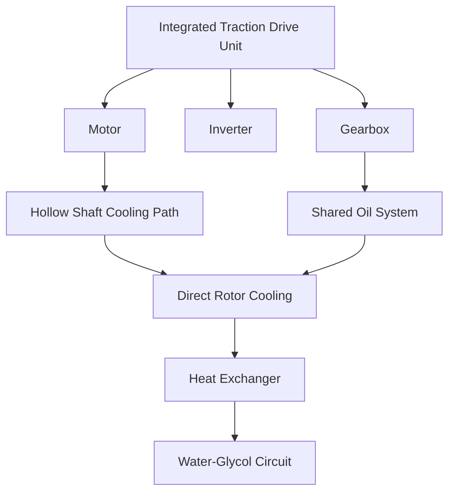
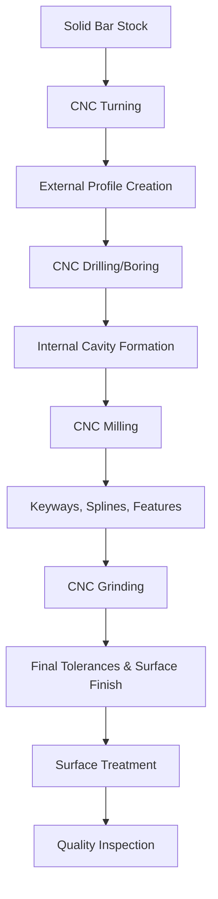
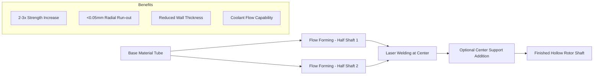
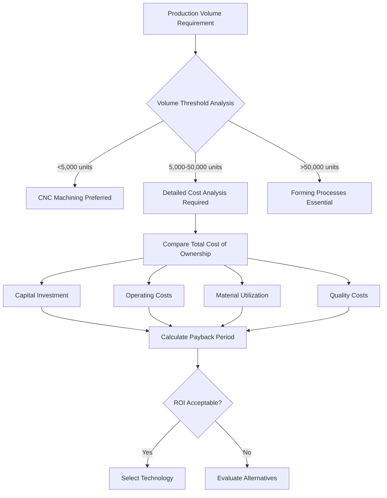
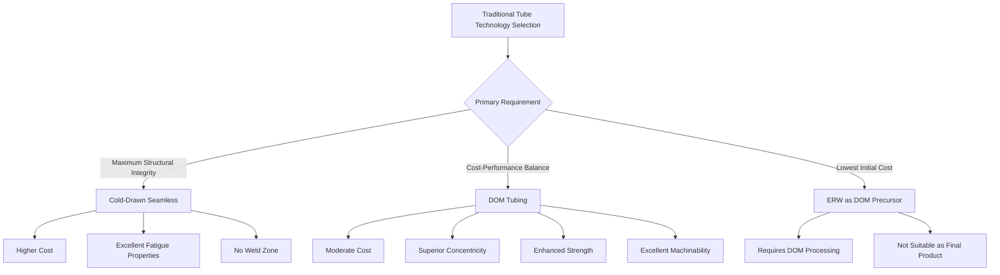
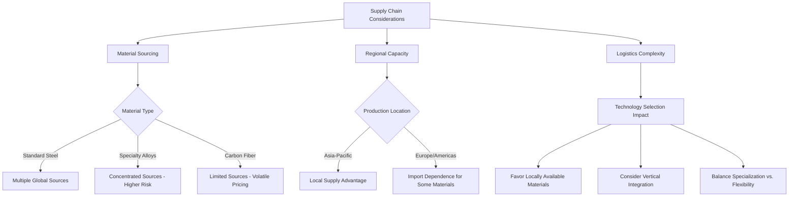
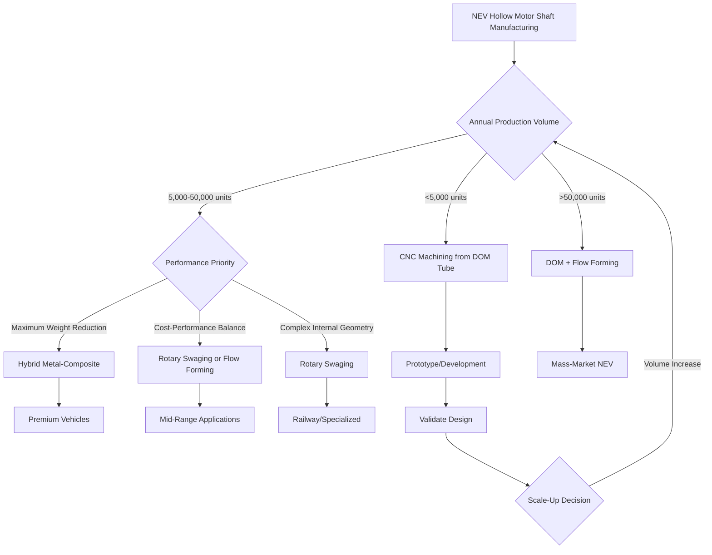
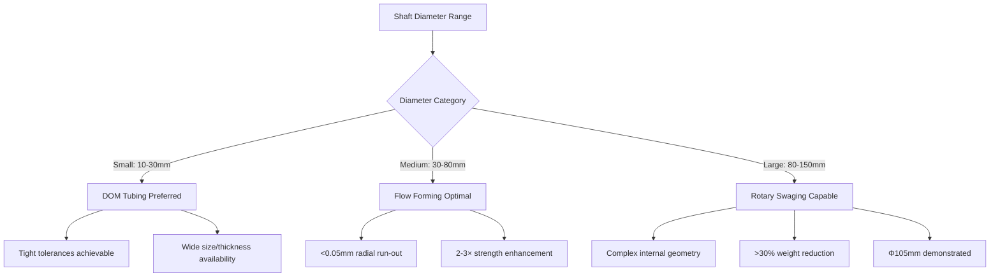
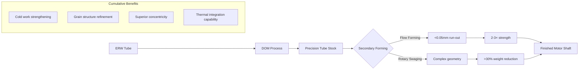
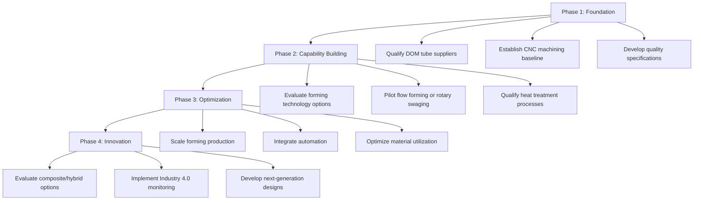

# A Comparative Analysis of Manufacturing Technologies for Hollow Motor Shafts in New Energy Vehicle Electric Drive Units
## 1 Introduction: The Role and Requirements of Hollow Shafts in NEV Electrification

The global transition from internal combustion engines to electric powertrains has fundamentally reshaped automotive component design priorities. Within this transformation, the motor shaft—particularly the hollow rotor shaft—has emerged as a critical enabler of high-performance, efficient electric drive systems. As battery capacities remain constrained and consumer expectations for driving range continue to rise, the imperative for lightweight, thermally efficient, and mechanically robust drivetrain components has never been greater[^1]. This chapter establishes the foundational context for evaluating manufacturing technologies by examining the multifaceted role of hollow motor shafts in New Energy Vehicle (NEV) electric drive units, analyzing the performance demands that have driven their adoption, and synthesizing the design and material criteria that will serve as benchmarks for subsequent technology assessment.

### 1.1 Functional Role of Hollow Shafts in NEV Electric Drive Systems

The rotor shaft constitutes a crucial component within the electric motor of an electric vehicle, serving as the primary mechanical interface that converts electrical energy into kinetic energy and transmits it to the drivetrain[^2]. Unlike combustion engine crankshafts that typically operate at speeds around 3,500 rpm, EV rotor shafts must handle significantly higher rotational speeds—commonly reaching **20,000 rpm**—placing extraordinary demands on structural integrity, dimensional precision, and dynamic balance[^2][^3].

The fundamental function of the motor shaft extends beyond simple torque transmission. As the central rotating element, it must maintain its structural integrity under complex loading conditions that combine high-speed rotation, torsional stress from power delivery, and bending moments from gear mesh forces. The shaft must accomplish this while minimizing energy losses due to friction and heat generation[^4]. In hollow configurations, the shaft additionally serves as a conduit for thermal management fluids, adding another functional dimension to its design requirements.

Within integrated electric drive architectures, the motor shaft interfaces directly with gearbox components through splined connections or keyed joints. This direct coupling eliminates the need for additional couplings or alignment systems, providing **efficient torque transmission, space-saving installation, reduced vibration and noise, and simplified maintenance**[^5]. The hollow shaft design specifically enables direct mounting configurations where the driven shaft can pass through the motor, creating compact, reliable connections essential for modern NEV drivetrain packaging[^6].

The operational context of NEV motor shafts demands manufacturing to tight tolerances, as even minimal imbalances at high rotational speeds can significantly impact motor lifespan and efficiency[^2]. This requirement for precision manufacturing, combined with the need for high strength and low weight, establishes the fundamental technical challenges that manufacturing technologies must address.

### 1.2 Performance Demands Driving Hollow Shaft Adoption

The transition from solid to hollow rotor shaft designs represents a strategic response to multiple converging performance requirements in NEV applications. Understanding these demands is essential for establishing meaningful evaluation criteria for manufacturing technologies.

**Weight Reduction and Efficiency Imperatives**

The rotor shaft accounts for approximately **30% of total rotor weight**, typically constructed from solid steel with a density of approximately 7,850 kg/m³[^1]. This substantial mass contribution makes the shaft a primary target for lightweighting initiatives. Research and production trials have demonstrated that hollow shaft designs can achieve **weight reductions exceeding 30%** compared to solid configurations[^7]. In electric vehicle drivetrains, such weight savings directly translate to improved energy efficiency and extended driving range—critical competitive differentiators in the NEV market.

The significance of rotor weight extends beyond static mass considerations. A heavier rotor limits the motor's acceleration capabilities, consumes more energy, and reduces overall EV efficiency[^1]. By reducing the rotor's mass moment of inertia, hollow shafts enable **higher accelerations and improved system dynamics**, positively impacting both vehicle performance and energy consumption[^1].

**High Torque Transmission at Elevated Speeds**

NEV drive motors must deliver high torque for vehicle acceleration while operating at rotational speeds far exceeding those of conventional automotive components. The shaft must transmit this rotational power with minimal deformation or energy loss. Hollow worm shafts and hollow rotor shafts have been specifically engineered to maintain **high strength and durability** despite their reduced mass, with the hollow design not compromising the shaft's ability to bear necessary loads and transmit power efficiently[^8].

The relationship between shaft geometry and torque capacity is governed by fundamental mechanical principles. While solid shafts exhibit higher torsional stiffness and maximum torque before yielding, hollow shafts demonstrate a superior **strength-to-mass ratio—up to 18.7% improvement** in torsional tests[^9]. This characteristic makes hollow designs optimal for applications prioritizing mass reduction without significant strength compromise.

**Market Trajectory and Industry Adoption**

The market dynamics strongly favor hollow shaft adoption. The global market for motor shafts in NEVs is estimated at **USD 1,500 million in 2025**, projected to grow at a **CAGR of 12.5%** to reach USD 3,780 million by 2033[^10]. Within this market, the hollow shaft segment is experiencing disproportionately faster growth, projected to capture a share estimated at **over 40-45%** and growing[^10]. This trend is directly linked to the industry's pursuit of improved energy efficiency and extended driving ranges, with hollow shafts offering compelling advantages through reduced material usage and weight without compromising structural integrity[^10].

### 1.3 Thermal Management Requirements and Hollow Shaft Advantages

Thermal management represents one of the most significant challenges in high-power-density NEV motors, and hollow shaft designs provide unique solutions to these challenges that solid shafts cannot match.

**The Thermal Challenge in NEV Motors**

As NEV motors trend toward higher power and higher speeds, thermal limitations become increasingly critical. Temperature-induced performance degradation reduces motor efficiency, affecting overall vehicle efficiency and driving range[^11]. The compact, high-power-density designs characteristic of modern EV motors—particularly in-wheel motors and integrated drive units—generate substantial heat that must be effectively dissipated to maintain performance and component longevity[^11].

**Hollow Shaft Cooling Technology**

Hollow shaft cooling represents an innovative thermal management approach that channels coolant—such as water, air, or oil—through a hollow passage inside the motor shaft[^12]. This technology provides **direct rotor cooling** by circulating coolant inside the rotor shaft itself, targeting the hottest regions that traditional cooling methods often cannot reach[^12]. According to research published in IEEE Transactions on Industrial Electronics, hollow shaft cooling can **reduce internal motor temperatures by up to 40%** compared to traditional methods[^12].

The benefits of this cooling approach extend beyond temperature reduction:

| Benefit Category | Description |
|-----------------|-------------|
| **Reduced Noise and Vibration** | Improved thermal stability contributes to smoother operation |
| **Higher Power Density** | More compact and efficient designs become feasible |
| **Extended Lifespan** | Lower operating temperatures reduce thermal stress on components |
| **Improved Energy Efficiency** | Lower temperatures reduce electrical resistance losses |

Real-world applications demonstrate the transformative potential of this technology. Manufacturers including Mercedes-Benz and Tesla have explored hollow shaft cooling for traction motors to maintain optimal temperatures during high acceleration and regenerative braking[^12]. Research has shown that optimizing hollow shaft cooling design in EV motors resulted in a **25% improvement in temperature stability** and extended operational range of electric drivetrains[^12].

**Integration with Oil Cooling Systems**

The evolution of NEV drive motors toward oil cooling architectures has further enhanced the value proposition of hollow shaft designs. Oil cooling can be divided into direct and indirect approaches, with **indirect oil cooling** circulating cooling oil through the hollow motor shaft and motor outer shell to dissipate heat[^13]. This approach directly removes heat from inside the motor while minimizing friction losses with the rotor[^13].

The integration advantages become particularly significant in all-in-one electric drive systems that combine motor, controller, and reducer. In these integrated architectures, the lubricating oil in the reducer can serve as the cooling oil in the motor, with the hollow shaft providing the pathway for this shared thermal management fluid[^13]. This system-level integration reduces complexity, weight, and cost while improving overall thermal performance.

NETFORM's two-piece hollow rotor shaft design exemplifies this integration, allowing for the incorporation of coolant oil flow through the shaft, resulting in **increased heat transfer and reduced heat-related losses** in the motor[^4]. Optional center support components with inserts can provide additional coolant flow control, preventing coolant pooling and ensuring effective thermal management throughout the shaft length[^4].

### 1.4 Design Criteria and Material Property Requirements

The demanding operational environment of NEV motor shafts establishes stringent design criteria and material property requirements that directly inform the selection and evaluation of manufacturing technologies.

**Dimensional Precision and Tolerance Requirements**

High rotational speeds demand exceptional dimensional accuracy. Manufacturing processes must achieve tight tolerances, as even minimal imbalances can impact motor lifespan and performance[^2]. Flow forming processes, for example, can achieve unique **radial run-out tolerances of less than 0.05 mm**[^3], establishing a benchmark for precision that manufacturing technologies must meet or approach.

The shaft must maintain dimensional stability under thermal cycling and dynamic loading. This requirement extends to both external dimensions—which interface with bearings and gears—and internal dimensions in hollow designs, which must maintain consistent geometry for effective coolant flow.

**Strength, Stiffness, and Fatigue Resistance**

The mechanical property requirements for NEV motor shafts can be summarized as follows:

| Property | Requirement | Rationale |
|----------|-------------|-----------|
| **Torsional Strength** | High torque capacity relative to mass | Power transmission at high speeds |
| **Torsional Stiffness** | Resistance to angular deflection | Precision gear mesh and NVH performance |
| **Fatigue Resistance** | Infinite life under cyclic loading | Reliability over vehicle lifetime |
| **Yield Strength** | Adequate margin against overload | Safety under peak torque conditions |
| **Strength-to-Weight Ratio** | Maximized for hollow designs | Weight reduction without strength compromise |

Research comparing solid and hollow shaft performance demonstrates that while solid shafts exhibit higher absolute torsional stiffness, hollow shafts show a **better strength-to-mass ratio with improvements up to 18.7%** in torsional tests[^9]. Hollow shafts also demonstrate more uniform deformation distribution in the plastic phase and better plastic deformation capability before failure[^9].

The fatigue design approach for power transmission shafts follows established engineering standards such as ASME B106.1M, which provides methods for determining shaft dimensions under fatigue loading[^14]. Fatigue represents the dominant failure mechanism in rotating machinery, with studies indicating that **approximately 60% of engineering failures** are associated with fatigue[^14]. Manufacturing processes must therefore produce shafts with favorable fatigue characteristics, including appropriate surface finish, absence of stress concentrations, and beneficial residual stress distributions.

**Material Considerations**

The development and implementation of **advanced high-strength steels (AHSS)** has become increasingly prevalent in NEV motor shaft applications[^10]. These materials offer superior mechanical properties, allowing for thinner-walled and lighter shafts while maintaining structural integrity. Common materials include:

- **SCr420**: A chromium steel used in radial forging applications, offering good hardenability and strength[^15]
- **42CrMo**: A chromium-molybdenum alloy steel used in rotary swaging trials, providing excellent strength and toughness after heat treatment[^7]
- **AISI 1045**: Medium carbon steel offering balanced strength and machinability[^9]
- **High-strength alloys and composites**: Including CFRP-metal hybrid designs for maximum weight reduction[^1]

The material selection must consider not only base mechanical properties but also response to manufacturing processes. Rotary swaging, for example, increases material strength by **2-3 times** that of the base material due to work hardening during the forming process[^4]. Heat treatment processes such as quenching and tempering can further enhance properties, with research showing **yield strength improvements of 27.5%** in rotary-swaged regions after heat treatment[^7].

### 1.5 Integration Considerations in Compact Drivetrain Architectures

The broader industry trend toward integrated electric drive systems profoundly influences hollow shaft design requirements and manufacturing technology selection.

**The Integration Imperative**

Modern NEV drivetrains increasingly adopt integrated architectures that combine the drive motor, motor controller, reducer, and sometimes additional components such as DC converters and on-board chargers into unified assemblies[^13]. This integration approach achieves **lightweight construction, lower cost, and higher efficiency** by sharing components such as housings and wiring harnesses[^13]. After integration, the drive system volume becomes smaller, placing additional constraints on component geometry and packaging.

Analysis of 48 motors from 31 vehicles manufactured between 2018 and 2023 reveals a clear trend toward integrated, compact structures where housing components from motor, gearbox, and power electronics are combined to **reduce interfaces, weight, and assembly work**[^16]. This system-level integration directly impacts shaft design requirements, as the shaft must interface seamlessly with multiple subsystems.

**Shared Cooling and Lubrication Systems**

In integrated three-in-one systems (drive motor + motor controller + reducer), integration enables shared oil cooling and heat dissipation[^13]. The lubricating oil in the reducer serves dual purposes as cooling oil in the motor, with the hollow shaft providing the critical pathway for this fluid circulation. This shared system approach offers significant advantages but requires careful coordination of shaft internal geometry with overall system thermal management requirements.

The tutorial on electric motor and integrated traction drive thermal management from NREL documents various manufacturer approaches to this integration challenge[^17]:

Manufacturers including Tesla (Model 3), American Axle Manufacturing, and Lucid Air have implemented oil cooling systems that utilize hollow shaft passages for thermal management[^17]. The Tesla Model 3 approach uses ATF 9 oil with a water-glycol heat exchanger, while AAM's Gen 5 3-in-1 EDU cools the stator housing, stator end windings, and rotor shaft through an integrated oil system[^17].

**Implications for Manufacturing Technology Selection**

These integration considerations establish additional criteria for manufacturing technology evaluation:

1. **Internal geometry capability**: Manufacturing processes must produce consistent internal passages suitable for coolant flow
2. **Interface precision**: Shaft external features must precisely mate with bearings, gears, and seals in the integrated assembly
3. **Surface quality**: Both internal and external surfaces must meet requirements for sealing and fluid flow
4. **Production scalability**: Technologies must support the high-volume production demands of automotive manufacturing

The hollow shaft gearbox concept further illustrates integration benefits, where the motor shaft passes through the gearbox's central cavity, enabling compact designs with **easy integration, higher torque transmission, and reduced vibration**[^18]. This direct coupling approach eliminates potential alignment issues and reduces component count, but requires manufacturing processes capable of producing the precise geometries needed for reliable operation.

**Benchmark Criteria Summary**

Based on the analysis of functional requirements, performance demands, thermal management needs, material considerations, and integration imperatives, the following benchmark criteria emerge for evaluating hollow motor shaft manufacturing technologies:

| Criterion Category | Specific Requirements |
|-------------------|----------------------|
| **Dimensional Capability** | Tolerance <0.05mm radial run-out; consistent wall thickness; precise internal geometry |
| **Mechanical Properties** | High strength-to-weight ratio; fatigue resistance for infinite life; adequate torsional stiffness |
| **Material Compatibility** | Capability to process AHSS, alloy steels; potential for hybrid/composite materials |
| **Thermal Integration** | Internal surface quality for coolant flow; geometric flexibility for cooling features |
| **Production Economics** | Scalability to automotive volumes; material utilization efficiency; total cost competitiveness |
| **Post-Processing Requirements** | Heat treatment compatibility; machining allowances; balancing considerations |

These criteria establish the framework against which subsequent chapters will evaluate the complete array of manufacturing technologies available for hollow motor shaft production, enabling systematic comparison and identification of optimal manufacturing routes for NEV electric drive applications.

## 2 Landscape of Current Hollow Shaft Forming and Manufacturing Techniques

The manufacturing landscape for hollow motor shafts encompasses a diverse array of technologies, each offering distinct advantages and limitations when evaluated against the demanding requirements of NEV electric drive applications. Building upon the functional requirements, performance demands, and design criteria established in Chapter 1, this chapter systematically examines each major manufacturing route—from traditional tube-making processes to advanced composite fabrication and emerging hybrid approaches. The analysis establishes the technical foundations, process characteristics, and inherent capabilities of each technology, creating the knowledge base necessary for subsequent comparative evaluation against NEV-specific benchmarks.

### 2.1 Seamless Tubing Manufacturing Processes

Seamless steel tubing represents one of the most fundamental approaches to hollow shaft manufacture, producing high-strength, durable tubes without welded seams through the extrusion and forming of solid steel billets into hollow structures[^19]. This manufacturing route offers **100% structural homogeneity** with no weld zone, making it the standard for critical applications involving high pressure, high temperature, or demanding mechanical loads[^20].

**Hot Rolling Process Fundamentals**

The seamless tube manufacturing process begins with the selection of high-quality raw materials—specifically a solid cylindrical steel blank or billet. The cleaned billets are heated in a rotary hearth furnace to a temperature of approximately **1200°C**, which is above the steel's recrystallization point[^19]. After heating, the billets are transferred to a piercing mill where a rotating mandrel pierces the center of the billet, creating a hollow shell. This rotary piercing operation establishes the fundamental hollow geometry that will be refined through subsequent processing steps.

The hollow shell then undergoes elongation to achieve the desired length and thickness by passing through a series of rollers and elongators. The elongated shell is further processed in a rolling mill to refine its dimensions, and a sizing mill then adjusts the pipe to meet specific dimensional tolerances[^19]. This hot-working sequence, while effective for producing large-diameter seamless pipes, results in a **rougher surface finish** and generally **lower dimensional precision** compared to cold-working processes.

**Cold Drawing Process for Enhanced Properties**

The cold drawing process represents a critical refinement method in seamless pipe production, involving shaping the pipe at room temperature rather than at elevated temperatures. The process begins with a pre-formed hollow tube, which is pulled through a die and over a mandrel. This action reduces the pipe's diameter and wall thickness while **improving its surface finish and dimensional accuracy**[^19].

Cold drawing is ideal for applications requiring precision and smooth finishes, producing pipes with **tighter tolerances and enhanced mechanical properties** that make them suitable for high-performance applications[^19]. The cold-working process induces work hardening in the steel, increasing its tensile strength and yield strength compared to hot-rolled material. This characteristic is particularly valuable for NEV motor shaft applications where high strength-to-weight ratios are essential.

**Comparative Characteristics of Hot-Rolled vs. Cold-Drawn Seamless Tubing**

The following table summarizes the key differences between these two seamless tube production methods:

| Characteristic | Hot Rolling Process | Cold Drawing Process |
|---------------|---------------------|---------------------|
| **Processing Temperature** | Above recrystallization point (~1200°C) | Room temperature |
| **Surface Finish** | Rougher, mill-scale finish | Smoother, improved finish |
| **Dimensional Precision** | Lower precision, larger tolerances | Higher precision, tighter tolerances |
| **Mechanical Strength** | Lower strength | Higher strength (work hardening) |
| **Cost** | Lower cost | Higher cost |
| **Typical Dimensions** | Larger diameters, thicker walls | Smaller dimensions, thinner walls |
| **Eccentricity Control** | Prone to eccentricity issues | Better wall thickness consistency |

For NEV motor shaft applications, **Cold Drawn Seamless (CDS) tubing** offers significant advantages due to its precise tolerances and excellent surface finish[^21]. The homogeneous structure with no weld zone eliminates the risk of preferential corrosion and provides uniform strength distribution without weak points[^20]. However, the intense hot-working process characteristic of seamless tube production can make precise wall thickness control challenging, with eccentricity being a common tolerance issue that may require additional machining allowances[^20].

**Final Processing and Quality Control**

The final manufacturing stage for seamless tubing involves finishing processes including heat treatment—such as annealing or quenching—to improve strength and ductility, and surface treatments such as pickling or coating to protect from corrosion. Quality control involves Non-Destructive Testing (NDT) techniques like ultrasonic testing and dimensional inspections to ensure adherence to industry standards from organizations like ASTM, ISO, and API[^19].

### 2.2 Welded Tubing and Electric Resistance Welded (ERW) Processes

Electric Resistance Welded (ERW) tubing represents a cost-effective manufacturing approach that produces hollow tubes through a welding process rather than solid billet extrusion. While ERW tubing contains a seam that represents a potential structural consideration, its economic advantages make it an important technology in the hollow shaft manufacturing landscape.

**ERW Manufacturing Process**

The ERW manufacturing process begins with a steel strip that is shaped into tubular form by rollers. The edges are heated to over **2000°F** under pressure to create a butt joint, with external flash removed after welding[^21]. The process uses pressure and heat produced by high-frequency electrical currents to create a strong weld[^22]. After the tube is formed, it is tested and cut to length, with the flash weld on the tube removed as required by the application.

The process is commonly executed using **SAE 1010 steel**, with Cold Rolled steel used for walls 0.060" or thinner and Hot Rolled steel for walls 0.083" or thicker[^21]. The internal weld flash is often left intact in standard ERW production, which can affect internal surface quality and may be problematic for applications requiring smooth internal passages—such as hollow motor shafts designed for coolant flow.

**Structural Considerations and Limitations**

The primary limitation of ERW tubing lies in its welded seam, which represents a potential weak point in the structure. Unlike seamless tubing's homogeneous structure, the weld zone in ERW tubing exhibits different metallurgical characteristics than the base material. This discontinuity can affect:

- **Fatigue resistance**: The weld seam may serve as a stress concentration point under cyclic loading
- **Corrosion resistance**: Preferential corrosion can occur at the weld zone
- **Pressure ratings**: ASME codes typically require derating the material strength by approximately **15%** for welded tubing compared to seamless alternatives[^20]

**Cost-Effectiveness and Application Role**

Despite its structural limitations, ERW tubing offers significant cost advantages due to its simpler manufacturing process and higher production rates. For NEV motor shaft applications, ERW tubing's primary value lies not as a finished product but as a **precursor material for more refined tube-making processes**—particularly the Drawn Over Mandrel (DOM) process that transforms ERW tubes into high-quality precision tubing suitable for demanding automotive applications.

### 2.3 Drawn Over Mandrel (DOM) Tubing Technology

Drawn Over Mandrel (DOM) tubing represents a sophisticated finishing process that transforms basic welded tubes into precision products with exceptional dimensional accuracy and mechanical properties. The DOM process has established itself as a preferred technology for automotive applications requiring high strength, precise tolerances, and smooth surface finishes[^22][^20].

**Process Fundamentals and Sequence**

DOM tubing is technically not a tube type but rather the process from which it is formed. The process starts with an electrically welded formed tube (ERW), which is then cold drawn through a die and over a mandrel[^23]. The die size and angle determines the Outside Diameter (OD), while the mandrel determines the Inside Diameter (ID). Multiple passes further form and refine the finish and mechanical properties.

The complete process sequence involves several critical steps:

1. **Pointing**: The larger ERW tube is "pointed" to be grabbed by a trolley jaw
2. **Mandrel Insertion**: A carbide mandrel is inserted inside the tube's bore
3. **Die Positioning**: The tube is set inside a carbide die with solvent lubrication
4. **Drawing**: Trolley jaws grip the tube, pulling it through the die
5. **Multiple Passes**: Repeated drawing refines finish and mechanical properties
6. **Mandrel Extraction**: Pressure applied to the rotating tube over rollers expands it for mandrel removal[^23]

**Die and Mandrel Optimization**

The relationship between die angle and wall thickness is critical to DOM tube production. A **high-angle die will thin a heavy-wall tube**, while a **low-angle die will thicken a thin-wall tube**. Optimum die positioning and its angle determines the correct diameter-to-thickness (D/t) ratio[^23].

Modern DOM production has benefited significantly from **Computer Aided Design (CAD)**, which has replaced trial and error in die design. The **Finite Element Method (FEM)** is used to compute the resulting product based on temperature, pressure, and material properties. Software like MSC SuperForm can simulate material flow, stresses, and forming pressures to determine precise die and mandrel angles[^23].

**Drawing Method Variations**

Several distinct drawing methods exist within DOM technology, each offering specific advantages:

| Drawing Method | Characteristics | Best Applications |
|---------------|-----------------|-------------------|
| **Tube Sinking** | No internal ID support | Low-cost applications |
| **Rod Drawing** | High speed, high reductions | Run limits ~100 feet (30.48m) |
| **Fixed Plug Drawing** | Very clean ID surface, precision ID adjustments | Stainless steel, limited reductions |
| **Floating Plug Drawing** | Long lengths, good ID quality | Stainless steel, up to 1,000 feet (0.3km) |
| **Tethered Plug Drawing** | Superior ID surface | Thermocouple sheathing, precision applications |

Fixed Plug Drawing, the oldest method for stainless steel, produces a very clean ID surface and allows for precision ID adjustments, though reductions are limited[^23]. Floating Plug Drawing is preferred for stainless steel when long lengths and good ID surface quality are required[^23].

**Superior Properties for Automotive Applications**

The cold drawing process fundamentally transforms the properties of the original ERW tube. The process **reshapes the metal and enhances its crystal structure**, making the tube longer and stronger while ensuring precise control over outer and inner diameters[^22]. This results in a steel tube with **consistent thickness and a high strength-to-weight ratio**.

According to the Steel Tube Institute, DOM tubing offers multiple advantages over alternative tube types: it is **more cost-effective, stronger, offers tighter tolerances, enhances machinability, and is available in a broader range of sizes and thicknesses**[^22]. The cold-working process of DOM increases the yield strength of the steel, so in mechanical structural applications where ASME pressure codes do not strictly apply, **DOM can be stronger and stiffer than hot-rolled seamless tubing**[^20].

Key characteristics that make DOM tubing particularly suitable for NEV motor shaft applications include:

- **Superior concentricity**: The mandrel ensures consistent wall thickness around the circumference
- **Smooth surface finish**: The burnishing effect of the mandrel produces a mirror-like finish[^20]
- **High strength-to-weight ratio**: Cold working increases mechanical properties
- **Excellent machining properties**: Consistent dimensions simplify subsequent processing
- **Virtually invisible weld seam**: Cold working aligns the grain structure of the weld with the rest of the tube[^20]

DOM tubing is widely used in automotive parts including **axles, steering columns, shift levers, airbag inflators, power seat mechanisms, engine mounts, fuel rails, and fuel injection components**[^22]. It is also widely recognized as the ideal material for rollover cages and is commonly used in hydraulic cylinders where the smooth ID surface is ideal for piston seal applications[^22][^20].

### 2.4 Advanced Machining from Solid Stock

CNC-based machining from solid bar stock represents a highly flexible manufacturing approach for hollow shaft production, offering exceptional geometric freedom and precision at the cost of higher material consumption and longer cycle times. This approach is particularly valuable for prototype development, low-volume production, and applications requiring complex geometries that cannot be achieved through tube-forming processes[^24][^25].

**Design and Programming Phase**

The manufacturing sequence begins with design and programming—the critical first step in producing custom machined shafts. This phase involves determining shaft material, diameter, and length specifications, then using **CAD software** to create detailed design files. Subsequently, **CAM software** generates tool paths based on the shaft requirements, developing CNC programs that are loaded into the CNC machine controller to guide the machining process[^24].

The design phase uses CAD software to determine the shaft's geometry, dimensions, and functional requirements—including length, diameter, keyways, threads, and load requirements. The design is then translated into CNC machine instructions using CAM software, enabling automated production with minimal human intervention[^25].

**Machine Setup and Tool Selection**

Machine setup involves selecting appropriate machine types, typically lathes for cylindrical shaft production or milling machines for complex features. The workpiece must be secured with suitable fixtures, and appropriate cutting tools selected—including turning tools for external profiles and boring tools for internal cavities. **Sharp cutting tools and secure workpiece fixturing** are essential for achieving the dimensional accuracy required for NEV motor shaft applications[^24].

**Machining Processes for Hollow Shaft Production**

Several CNC machining processes are employed in hollow shaft manufacture:

- **CNC Turning**: Shapes the shaft by rotating the material against a cutting tool, ideal for cylindrical parts and the primary process for external profile creation[^25]
- **CNC Milling**: Creates complex geometries, grooves, slots, or keyways that cannot be produced through turning alone[^25]
- **CNC Drilling/Boring**: Establishes internal cavities and through-holes for hollow shaft configurations
- **CNC Grinding**: Achieves ultra-fine surface finishes and tight tolerances required for bearing and seal interfaces[^25]
- **Electrical Discharge Machining (EDM)**: Creates intricate shapes in hard metals using electrical discharges, valuable for complex features in hardened materials[^25]
- **Thread Rolling**: A cold-forming process that creates strong, durable threads with improved fatigue resistance[^25]

**Surface Finishing and Quality Control**

After machining, surface treatments enhance wear resistance, corrosion resistance, or aesthetics. Common treatments include **passivation, anodizing, plating, sandblasting, and polishing**[^25]. For NEV motor shaft applications, surface treatments must be compatible with the operating environment—including exposure to cooling oils and elevated temperatures.

Quality inspection employs **Coordinate Measuring Machines (CMMs)** to verify dimensional accuracy and functional performance[^25]. This rigorous inspection ensures that machined shafts meet the tight tolerance requirements established for NEV motor applications.

**Advantages and Limitations**

Machining from solid stock offers maximum geometric flexibility, enabling production of shafts with complex internal and external features. However, this approach results in significant material waste—particularly for hollow configurations where substantial material must be removed to create internal cavities. For high-volume NEV production, machining is typically reserved for **final feature creation and precision finishing** rather than primary hollow geometry formation.

### 2.5 Composite Fabrication: Filament Winding

Filament winding represents a sophisticated composite manufacturing process that has revolutionized the production of high-performance, lightweight hollow structures. This technology creates components of **incredible strength by cross-weaving continuous rovings of carbon fiber, fiberglass, or aramid fiber and embedding them in a resin matrix**[^26]. The process is particularly valuable for NEV applications where strength-to-weight optimization is paramount.

**Process Fundamentals and Equipment**

The filament winding process involves two primary components: a stationary steel mandrel that rotates and a carriage arm that travels horizontally along the mandrel length. The traveling arm includes a winding eye that groups the rovings and dispenses them to the mandrel. As the mandrel turns, the rovings wrap around it to form a composite layer[^26].

A typical filament winding system consists of:
- **Fiber delivery system (creel)**: Supplies continuous fiber rovings
- **Resin impregnation unit**: Applies matrix material to fibers
- **Fiber tensioning mechanism**: Controls fiber placement accuracy
- **Rotating mandrel**: Defines the hollow geometry
- **Carriage system**: Positions fibers along the mandrel
- **Computer numerical control (CNC) system**: Automates the layup pattern[^27]

The step-by-step process includes fiber unwinding, resin impregnation, fiber tensioning, winding the impregnated fibers onto the rotating mandrel in a predetermined pattern, consolidation, curing, and mandrel removal[^27].

**Process Control and Optimization**

The precise fiber orientation is determined by the rate of travel of the carriage and the rotational speed of the mandrel, both of which are automated through CNC control[^26]. Engineers encode specifications for a filament-wound composite product in an **Engineered Layup Pattern (ELP)**, which is loaded into the CNC system. By varying the ELP, engineers can build distinct performance criteria into different composite structures.

Key process parameters controlled through advanced CNC systems include:
- **Winding angle**: Determines directional strength characteristics
- **Fiber tension**: Affects consolidation and void content
- **Resin content**: Influences weight and mechanical properties
- **Winding speed**: Impacts production rate and quality
- **Mandrel rotation speed**: Coordinates with carriage travel
- **Fiber bandwidth**: Affects coverage and layer thickness
- **Curing temperature**: Controls final material properties[^27]

**Winding Angle and Mechanical Properties**

The relationship between winding angle and mechanical properties is fundamental to filament winding optimization:

| Winding Angle | Primary Strength Characteristic | Typical Applications |
|--------------|--------------------------------|---------------------|
| **Low angle (0-30°)** | Greater tensile strength | Axial load applications |
| **Medium angle (30-60°)** | Balanced properties | General structural use |
| **High angle (60-90°)** | More circumferential strength | Pressure vessels, torsional loads |

A **low winding angle lends greater tensile strength**, while a **higher winding angle endows the structure with more circumferential strength**[^26]. Desired qualities can also be engineered via the choice of filament type and resin type, providing extensive design flexibility for NEV shaft optimization.

**Curing and Mandrel Extraction**

After the layup pattern has been executed, the entire assembly—mandrel plus layer of composite material—is placed in an oven to cure. **Computer-controlled ovens use specific heating profiles to induce cross-linking of the polymer chains**. When the resin has fully cured, the mandrel is extracted, leaving the hollow composite structure[^26].

**Advantages for NEV Applications**

Filament winding offers several compelling advantages for NEV hollow shaft production:

- **Exceptional strength-to-weight ratio**: Because a filament wound tube is hollow, it is extremely lightweight without sacrificing strength[^26]
- **High degree of process automation**: The Engineered Layup Pattern directs the process, leaving little room for human error and enabling consistent part quality in high-volume production[^26][^27]
- **Precise fiber placement**: Enables tailoring of mechanical properties to specific load requirements[^27]
- **Design flexibility**: Wind thickness and wind angle can be engineered for product optimization[^26]

Applications in the automotive and transportation industry include **drive shafts, where filament winding provides reduced weight for improved vehicle performance and high torsional strength and stiffness**[^27]. The technology advancement is closely tied to improvements in process control and automation, with modern systems featuring software integration with CAD/CAM systems for part design and winding path generation[^27].

### 2.6 Composite Fabrication: Pultrusion

Pultrusion is a continuous manufacturing process used to produce composite materials with constant cross-sections and significantly long lengths, offering exceptional cost-effectiveness for high-volume production of hollow profiles[^28]. This technology has gained increasing attention for automotive applications where consistent quality and production efficiency are paramount.

**Process Sequence and Equipment**

In pultrusion, continuous fibers are pulled through a resin bath for impregnation, then through a heated die where the resin cures, forming a solid composite profile. The process involves the following key steps:

1. **Fiber feeding**: Continuous reinforcing fibers are pulled from creels
2. **Guiding**: Ensures proper fiber alignment
3. **Resin impregnation**: Fibers pass through resin bath
4. **Preforming**: Shapes the fibers close to the final profile
5. **Heating and curing**: Resin cures in a heated die
6. **Pulling**: Cured profile is drawn through the die
7. **Cutting**: Profile is cut to desired length[^28]

The typical process flow can be summarized as: glass fiber roving arrangement – impregnation – preforming – extrusion molding and curing – traction – cutting – finished product[^29]. The mold is the most critical part of the pultrusion equipment, with a typical length ranging from **0.6 to 1.2m**, and is divided into three heating zones: preheating, gel, and curing[^29].

**Mandrel Integration for Hollow Sections**

A key component of the pultrusion equipment is an **optional mandrel, which is used for creating hollow sections**[^28]. For hollow products like shafts, a mandrel preforming mold is required to guide impregnated fibers into the shape closest to the final product while removing excess resin and bubbles[^29]. This capability makes pultrusion directly applicable to hollow motor shaft production.

**Material Options and Reinforcement Strategies**

The process utilizes various reinforcements including **glass fibers, carbon fibers, aramid fibers, boron fibers, and thermoplastic fibers**[^28]. Matrix materials can be thermosetting resins—such as polyesters, vinyl esters, epoxies, and phenolic resins—or thermoplastic resins like polyethylenes, polyurethanes, polypropylenes, and polyamides[^28].

Main raw materials for pultruded FRP include:
- **Resin matrix**: Mainly unsaturated polyester and vinyl ester resin
- **Fiber-reinforced materials**: Mainly E-glass fiber rovings, but also carbon fiber and aramid fiber for special purposes
- **Auxiliary materials**: Initiators, colorants, fillers, and release agents[^29]

To improve the **lateral strength of hollow products**, continuous fiber mats, cloth, and tapes can be used in addition to unidirectional rovings[^29].

**Process Control and Quality Considerations**

The curing process in the mold involves complex changes, with the material passing through preheating, gel, and curing zones. The traction force is crucial for smooth product ejection and depends on factors like product shape, size, and release agent[^29]. Common problems in the pultrusion process include peeling, blistering, surface cracks, internal cracks, color variation, low Barcol hardness, and bubbles/porosity. Solutions involve adjusting mold temperatures, line speed, initiator concentration, filler/glass content, and using surface veils[^29].

**Emerging Radius-Pultrusion Technology**

A significant limitation of traditional pultrusion is that it is primarily suited for producing **straight, constant cross-section profiles**; manufacturing tapered or complex shapes is challenging[^28]. However, emerging radius-pultrusion technology is addressing this limitation.

Shape Corp. has the first operational installation of Thomas Technik & Innovation's (TTI) **Radius-Pultrusion system**, purchased to enable manufacture of automotive bumper beams. This technology enables the use of multiple types of reinforcement in a single, tailored laminate and the **creation of curved, highly engineered hollow and closed profiles**[^30].

After extensive trials, Shape Corp. chose polyurethane resin, which "offers exceptional toughness properties at reasonable cost while allowing us to achieve some very fast production rates." For reinforcements, they run "unidirectional, biaxial and triaxial noncrimp [stitched nonwoven] fabrics" along with individual unidirectional tows when necessary[^30].

**Automotive Applications and Cost-Effectiveness**

Pultrusion is recognized as one of the **most cost-effective processes for manufacturing high-volume composite parts**. Tailored pultrusions for automotive applications—including bumper beams, roof beams, front-end support systems, door intrusion beams, chassis rails, and transmission tunnels—have been highlighted as key growth areas[^30].

L&L Products' **Continuous Composite Systems (CCS) pultrusions** use polyurethane resin for automotive applications such as side sills and crash structures. Designed to replace traditional metal structures, CCS pultrusions offer **75% less mass than steel and 30% less than aluminum** at an economic price[^30].

### 2.7 Hybrid Metal-Composite Manufacturing Approaches

Innovative hybrid approaches that combine metallic and composite materials represent an emerging frontier in hollow shaft technology, offering the potential to optimize performance characteristics beyond what either material class can achieve independently. These approaches are particularly relevant for NEV applications where the unique demands of electric powertrains create opportunities for advanced material solutions[^31][^32].

**Aluminum/CFRP Hybrid Drive Shaft Design**

Research has demonstrated that substituting composite structures for conventional metallic structures offers significant advantages due to the **higher specific stiffness and higher specific strength of composite materials**[^31]. A notable development involves a one-piece automotive hybrid aluminum/composite drive shaft manufactured with an innovative approach where a carbon fiber epoxy composite layer was **co-cured on the inner surface of an aluminum tube** rather than wrapping on the outer surface.

This interior placement strategy provides two critical benefits:
- **Protection from external impact**: The aluminum outer layer shields the composite from damage
- **Moisture absorption prevention**: The composite layer is isolated from environmental exposure[^31]

The manufacturing process involves several sophisticated steps:
1. Stacking carbon fiber epoxy composite layers and glass fiber epoxy composite layers on a mandrel
2. Inserting the mandrel with wrapped composite layers into the aluminum tube
3. Stacking the composite layers by rotating the mandrel with pressure on the inner surface
4. Inserting a vacuum bag and fixing caps with vacuum line and O-rings
5. Applying preload and curing in an autoclave
6. Machining shaft ends for press fitting
7. Press fitting steel yokes[^31]

**Performance Achievements**

The hybrid aluminum/composite drive shaft demonstrated exceptional performance improvements:

| Performance Metric | Achievement |
|-------------------|-------------|
| **Mass Reduction** | 75% compared to conventional two-piece steel drive shaft |
| **Torque Capability** | 160% increase compared to conventional steel shaft |
| **Natural Frequency** | 9390 rpm (exceeding design specification of 9200 rpm) |
| **Maximum Torque Before Buckling** | 4320 Nm |

The major role of the aluminum tube is to sustain applied torque, while the role of the carbon fiber epoxy composite is to **increase the bending natural frequency**[^31]. The optimal stacking sequence of the composite layer was determined considering thermal residual stresses at the interface between aluminum tube and composite layer, calculated by finite element analysis.

**Press-Fit Joining Technology**

The press fitting method for joining aluminum/composite tubes and steel yokes was devised to **improve reliability and reduce manufacturing cost** compared to other joining methods such as adhesively bonded, bolted, riveted, or welded joints[^31]. To improve torque capability, protrusions in the axial direction were generated on the inner surface of the steel yoke. These protrusions engrave grooves on the surface of the aluminum tube when assembled by press fitting, increasing mechanical interlocking[^31].

**CFRP Output Shafts for Electric Vehicles**

Carbon fiber-reinforced polymer (CFRP) output shafts represent another hybrid approach specifically targeting EV applications. Unlike automotive driveshafts that can leverage shaft length as a factor for composite adoption, output shafts require other beneficial features to compete with metal alternatives[^32].

CFRP's high performance proves potentially useful in electric vehicles, where output shafts are subject to **unusually high forces**. Additionally, CFRP output shafts may prove useful because of a phenomenon called "power hop," which occurs when low-friction road surfaces cause tires in front-wheel-drive vehicles to cyclically lose grip during high engine acceleration[^32].

A key finding from development work shows that **CFRP shafts possess 5 to 10 times the torsional damping of steel shafts**[^32]. This characteristic is particularly valuable for EV applications:

- In gas-powered vehicles, successful power hop reduction would require modifications to tube geometry
- In electric cars, the key to success for CFRP output shafts is the **high torsional stiffness** that CFRP provides
- High stiffness creates more direct responsiveness and improves driving dynamics
- Electrified powertrains can employ shafts with high torsional stiffness because they do not experience the same non-uniformity of the crankshaft found in gas-powered vehicles[^32]

Simulation has shown that a CFRP output shaft with high torsional stiffness will **eliminate the power hop** experienced by a metal shaft with low torsional stiffness[^32]. The CFRP version achieves **20% to 30% weight reduction** compared to steel output shaft assemblies[^32].

**Market Trends and Cost Trajectory**

The adoption of carbon-fiber composite shafts is expanding beyond luxury applications into performance-oriented mainstream vehicles, driven by weight reduction mandates and NVH improvement requirements. The material's **60% weight reduction compared to steel** enables longer shaft lengths without critical speed limitations, particularly valuable in AWD configurations[^33].

Critically for volume applications, **manufacturing scale improvements reduce carbon-fiber shaft costs by approximately 15-20% annually**, making adoption economically viable for mainstream vehicles[^33]. This trend accelerates as OEMs prioritize lightweighting strategies to offset battery weight penalties in hybrid and electric powertrains.

### 2.8 Specialized Flow Forming and Rotary Processes

Specialized forming technologies—particularly flow forming and rotary swaging processes—offer unique capabilities for NEV hollow motor shaft production, achieving exceptional dimensional precision and material property enhancement through controlled plastic deformation. These processes directly address the demanding tolerance and strength requirements established in Chapter 1.

**Flow Forming Process Characteristics**

Flow forming processes achieve unique **radial run-out tolerances of less than 0.05mm**, establishing a benchmark for precision that directly meets NEV motor shaft requirements. The process increases material strength by **2-3 times that of the base material** due to work hardening that occurs during the forming process itself[^4].

This strength increase can be utilized in two strategic ways:
1. **Wall thickness reduction**: Maintaining required strength while reducing shaft weight
2. **Performance enhancement**: Maintaining wall thickness for increased structural capability

Both approaches directly support NEV objectives of weight reduction and performance optimization.

**NETFORM's Two-Piece Hollow Rotor Shaft Design**

NETFORM has created a production-proven hollow rotor shaft design specifically optimized for electric vehicle applications, working well for both low and high torque applications[^4]. This advanced, lightweight rotor shaft consists of **two flow-formed half shafts that are laser-welded together in the center**.

The manufacturing approach offers several advantages:

**Center Support and Coolant Flow Control**

In applications where higher shaft stiffness is required, an **optional center support component can be added**. This center support provides axial and radial support between both halves of the shaft, increasing the overall strength while still allowing coolant to flow through the shaft[^4].

In cases where additional coolant flow control is required, **inserts can be added to the center support**. These inserts create a controlled gap between the insert and the shaft I.D. that can prevent coolant pooling in the lowest part of the shaft[^4]. This feature directly addresses the thermal management integration requirements established in Chapter 1, where hollow shaft cooling was identified as critical for NEV motor performance.

**Thermal Design Integration**

Research on thermal design of hollow shafts for improved rotor cooling in induction motors for electric vehicles has demonstrated the effectiveness of specialized internal geometries. Studies evaluated three hollow shaft design cases at steady state: a counterflow design, a counterflow design with fins, and a duct design[^34].

The **duct design** was found to be the most effective, improving shaft temperature while being manufacturable for mass production. Its heat transfer coefficient increased by **303% compared to the counterflow design**[^34]. The final duct design utilizes extended fins that meet in the center, eliminating the inner cylinder used in initial designs and dividing the shaft into ten fluid channels. This design resulted in the highest heat transfer coefficient and the lowest shaft surface temperature, successfully meeting the thermal target of keeping the surface under an average temperature of **100°C** for most operating conditions[^34].

**Process Advantages for NEV Applications**

The combination of flow forming with laser welding and optional internal features creates a manufacturing route that addresses multiple NEV requirements simultaneously:

| Requirement | How Flow Forming Addresses It |
|-------------|------------------------------|
| **Weight Reduction** | Work hardening enables thinner walls at equivalent strength |
| **Dimensional Precision** | <0.05mm radial run-out achievable |
| **Thermal Management** | Internal geometry compatible with coolant flow |
| **Structural Integrity** | 2-3x strength increase from base material |
| **Production Scalability** | Continuous forming process suitable for volume production |

### 2.9 Comparative Overview of Process Capabilities

This section synthesizes the preceding analyses into a comparative framework that maps manufacturing process capabilities against the benchmark criteria established in Chapter 1. This overview establishes the foundation for detailed technology-by-technology evaluation in subsequent chapters.

**Dimensional Precision Capabilities**

The following table compares dimensional precision characteristics across manufacturing technologies:

| Technology | Typical Tolerance Capability | Wall Thickness Consistency | Surface Finish Quality |
|-----------|------------------------------|---------------------------|----------------------|
| **Seamless (Hot Rolled)** | Lower precision, larger allowances | Prone to eccentricity | Rougher, mill-scale |
| **Seamless (Cold Drawn)** | Tight tolerances | Improved consistency | Smooth finish |
| **ERW Tubing** | Moderate precision | Consistent | Good external, variable internal |
| **DOM Tubing** | Superior concentricity[^20] | Incredibly uniform[^20] | Mirror-like finish[^20] |
| **CNC Machining** | Highest precision achievable | Excellent control | Application-specific |
| **Filament Winding** | CNC-controlled accuracy | Dependent on layup | Resin surface quality |
| **Pultrusion** | Constant cross-section precision | Consistent for profile | Good for continuous process |
| **Flow Forming** | <0.05mm radial run-out[^4] | Excellent control | High quality |

**Mechanical Properties Comparison**

| Technology | Strength Enhancement | Strength-to-Weight Ratio | Fatigue Characteristics |
|-----------|---------------------|-------------------------|------------------------|
| **Seamless (Hot Rolled)** | Base material properties | Standard | Homogeneous structure |
| **Seamless (Cold Drawn)** | Work hardening increase | Improved | No weld zone stress concentration |
| **ERW Tubing** | Base material (weld zone different) | Standard | Weld seam consideration |
| **DOM Tubing** | Cold working increases yield[^20] | High | Refined weld zone |
| **CNC Machining** | Dependent on material | Variable | Dependent on surface finish |
| **Filament Winding** | Exceptional | Very high[^26] | Fiber-dependent |
| **Pultrusion** | Good | High | Fiber-dependent |
| **Flow Forming** | 2-3x base material[^4] | Very high | Work-hardened surface |

**Material Compatibility and Production Characteristics**

| Technology | Material Range | Volume Suitability | Relative Cost Position |
|-----------|---------------|-------------------|----------------------|
| **Seamless Tubing** | Steel alloys, stainless | Medium-high volume | Higher cost[^20] |
| **ERW Tubing** | Carbon steel (SAE 1010) | High volume | Most economical |
| **DOM Tubing** | Steel (SAE 1020, 1026) | High volume | More economical than seamless[^20] |
| **CNC Machining** | All machinable materials | Low-medium volume | Highest per-unit cost |
| **Filament Winding** | Carbon, glass, aramid fiber | Medium-high volume | Moderate-high |
| **Pultrusion** | Glass, carbon, aramid fiber | Very high volume | Most cost-effective for composites[^30] |
| **Flow Forming** | Steel alloys | High volume | Competitive |
| **Hybrid Approaches** | Metal + composite combinations | Medium volume | Higher initial cost, declining[^33] |

**Market Dynamics and Adoption Trends**

The automotive drive shaft market provides context for technology adoption trajectories. By design type, **hollow shafts led with 56.63% revenue share in 2025**, while composite/CFRP shafts are forecast to expand at **12.62% CAGR through 2031**[^33]. By material, conventional steel held 67.32% of market share in 2025, while **carbon-fiber/CFRP shafts are projected to grow at 14.33% CAGR to 2031**[^33].

The global hollow drive shaft market is projected to reach **USD 38.3 billion by 2025**, with a CAGR of 4.9% through 2033[^35]. The electric vehicle segment represents a significant growth driver, with the industry characterized by technical upgrades and strategic partnerships with key manufacturers including GKN, NTN, and Dana[^35].

**Alignment with NEV Benchmark Criteria**

The following matrix maps each technology against the benchmark criteria established in Chapter 1:

| Criterion | Best Performing Technologies | Key Considerations |
|----------|------------------------------|-------------------|
| **Tolerance <0.05mm** | Flow Forming, CNC Machining, DOM | Flow forming achieves this as inherent process capability |
| **High Strength-to-Weight** | Filament Winding, Hybrid, Flow Forming | Composites offer highest ratios; flow forming enhances metal properties |
| **Thermal Integration** | Flow Forming (NETFORM design), CNC Machining | Internal geometry flexibility critical |
| **Production Scalability** | DOM, Pultrusion, Flow Forming | Continuous processes favor high volume |
| **Material Flexibility** | CNC Machining, Seamless | Widest material compatibility |
| **Cost Competitiveness** | DOM, Pultrusion, ERW | Scale-dependent economics |

This comparative overview establishes that no single manufacturing technology optimally addresses all NEV hollow motor shaft requirements. The subsequent chapters will conduct detailed criterion-by-criterion analysis to identify optimal manufacturing routes and potential hybrid strategies that leverage the complementary strengths of multiple technologies.

## 3 Comparative Framework: Evaluation Criteria for Technology Assessment

The systematic evaluation of hollow motor shaft manufacturing technologies requires a structured analytical framework that translates the functional requirements of NEV electric drive systems into quantifiable assessment criteria. Building upon the performance demands established in Chapter 1 and the comprehensive technology landscape presented in Chapter 2, this chapter develops a rigorous multi-dimensional evaluation methodology. The framework addresses six critical dimensions—material compatibility, cost-effectiveness, geometric capabilities, post-processing requirements, mechanical properties, and production scalability—each with defined metrics and benchmarks derived from NEV-specific operational requirements. This structured approach enables objective comparison of manufacturing technologies and supports evidence-based decision-making for hollow motor shaft production in electric vehicle applications.

### 3.1 Material Compatibility and Processing Range Assessment

The evaluation of manufacturing technology suitability begins with a thorough assessment of material compatibility, as the choice of shaft material fundamentally influences both manufacturing process selection and final component performance. NEV motor shafts operate under demanding conditions that require materials exhibiting **high fatigue resistance, adequate torsional strength, and dimensional stability** across thermal cycling—requirements that significantly constrain the viable material-process combinations.

**Material Selection Fundamentals for Shaft Applications**

Since shafts typically experience alternating stresses during operation, the most common failure mode is fatigue fracture due to these alternating stresses[^36]. Therefore, shaft materials should possess a certain level of toughness and good fatigue resistance, which are fundamental requirements for shaft materials. The commonly used material for shafts is high-quality carbon structural steel with moderate carbon content, with **45 steel and 40Cr being the most commonly used**[^36]. For heavily loaded shafts with restricted dimensions, as well as those with specific requirements, medium-carbon alloy steel may be employed, with commonly used grades including **40Cr, 40MnB, and 40CrNi**[^36].

The following table summarizes key high-strength steel alloys and their mechanical properties relevant to hollow motor shaft applications:

| Alloy Grade | Application Category | Ultimate Tensile Strength (MPa) | Yield Strength (MPa) | Key Characteristics |
|-------------|---------------------|--------------------------------|---------------------|---------------------|
| **40MnB** | Important shafts | 1000 | 800 (after quenching) | Performance close to 40Cr |
| **40Cr** | Heavily loaded, non-impact shafts | 1000 | 800 (after quenching) | Excellent hardenability |
| **40CrNi** | Very important shafts | 1000 | 800 (after quenching) | Superior toughness |
| **35CrMo** | Heavy loaded shafts | 1000 | 850 (after quenching) | Performance close to 40CrNi |
| **38CrMoAlA** | High wear resistance shafts | — | — | Minimally deformed after treatment |

For spline shafts and hollow shafts specifically, to maintain dimensional stability and reduce heat treatment deformation, **chrome steel can be selected**[^36]. This consideration is particularly important for NEV motor shafts where post-heat-treatment dimensional accuracy directly impacts rotor balance and bearing interface precision.

**High-Strength Alloy Steel Processing Characteristics**

Alloy steel is sensitive to stress concentration, so the structural shape of shafts made from alloy steel should minimize stress concentration points, and low surface roughness is required[^36]. This sensitivity has direct implications for manufacturing process selection—processes that introduce surface defects, tool marks, or geometric discontinuities may compromise fatigue performance regardless of the material's inherent strength.

The heat-treated condition significantly influences material processability. Tempered steel tempering treatment yields Soxhlet organization, which provides better overall mechanical properties than normalized or annealed ferritic mixed organization, with **higher strength, higher impact toughness, lower brittle transition temperature, and higher fatigue strength**[^36]. Manufacturing processes must therefore be evaluated not only for their ability to form the material but also for their compatibility with subsequent heat treatment requirements.

**Aluminum Alloy Considerations**

For lightweight applications, aluminum alloys—particularly **7075 aluminum alloy**—offer exceptional strength-to-weight characteristics. This alloy has excellent mechanical properties and exhibits good ductility, high strength, toughness, and good resistance to fatigue, making it one of the most commonly used aluminum alloys for highly stressed structural applications[^37]. However, aluminum 7075 has **low formability at room temperature** and is vulnerable to stress corrosion cracking[^37].

The mechanical properties of 7075 depend greatly on tempering:
- **7075-O temper**: Maximum tensile strength of no more than 280 MPa, better plasticity (elongation 15-17%), suitable for cold bending, stamping, and complex forming[^38]
- **T6 temper**: Ultimate tensile strength of 510-540 MPa and yield strength of at least 430-480 MPa[^37]
- **T651 temper**: Ultimate tensile strength of 570 MPa and yield strength of 500 MPa[^37]

A common practice is **"Pre-form in O temper + age harden"** to balance formability and final strength[^38]. This requirement influences manufacturing process selection, as forming operations must be sequenced appropriately with heat treatment to achieve both geometric accuracy and mechanical performance.

**Composite Material Processing Requirements**

Carbon fiber-reinforced polymer (CFRP) and hybrid metal-composite configurations represent the frontier of lightweight shaft technology. For composite shafts, the design uses a carbon-epoxy laminate with a **70% fiber volume fraction**[^39]. The carbon fiber typically features a bi-directional fabric with an axial modulus of 230 GPa and a density of 1800 kg/m³, while the epoxy matrix has a Young's modulus of 3.4 GPa and a density of 1134 kg/m³[^39].

Analysis shows that a fiber volume fraction (Vf) of 0.7 yields higher strength and stiffness compared to Vf=0.6, with the **laminate achieving an ultimate strength of 480 MPa** (compared to 331 MPa at Vf=0.6)[^39]. The corresponding laminate stiffnesses are E1 = 28.43 GPa, E2 = 28.43 GPa, and a shear modulus of 82.5 GPa[^39].

**Material-Process Compatibility Matrix**

The following framework establishes evaluation criteria for assessing material compatibility across manufacturing technologies:

| Evaluation Criterion | Assessment Parameters | Benchmark Requirement |
|---------------------|----------------------|----------------------|
| **Formability Range** | Material ductility at forming temperature, strain limits before cracking | Process must accommodate material's elongation limits |
| **Work Hardening Response** | Strength increase during cold forming, effect on subsequent operations | Compatible with target strength enhancement |
| **Thermal Sensitivity** | Temperature control requirements, distortion risk | Process temperature profile within material limits |
| **Microstructure Control** | Grain refinement, recrystallization effects | Final microstructure supports fatigue resistance |
| **Surface Integrity** | Defect introduction potential, residual stress state | No detrimental surface conditions created |

For hollow shaft manufacturing, the rotary swaging process demonstrates how material selection interacts with process capability. Research on railway motor hollow shafts using 42CrMo steel showed that the maximum damage value of 0.8 confirmed the process feasibility[^7]. The quenching and tempering treatment increased yield strength by **27.5%** in the rotary-swaged region while also improving plasticity[^7].

### 3.2 Cost-Effectiveness Analysis Framework

A comprehensive cost evaluation methodology is essential for technology selection in the cost-sensitive automotive manufacturing environment. The framework must encompass **total cost of ownership** including capital investment, operating costs, material utilization, and volume-dependent scaling effects that determine economic viability at different production scales.

**Material Cost and Utilization Efficiency**

Material selection directly impacts manufacturing cost, with significant variation across material grades and forms. For reference, **4140 alloy steel** typically costs approximately $1.50 to $2.00 per kilogram, though prices vary based on supplier, quantity, and market conditions[^40]. Product listings indicate pricing ranges from $475-$520 per ton for carbon steel bar stock to $680-$700 per ton for precision shaft applications[^41].

Raw material price volatility represents a significant cost factor. Carbon fiber and specialty steel prices fluctuate considerably—carbon fiber prices can vary **25-30% quarterly** based on aerospace demand cycles and energy costs[^33]. Specialty steel grades for high-performance applications face similar volatility, with chromium-molybdenum alloy prices increasing **18% in 2024** due to mining disruptions and geopolitical tensions[^33].

Material utilization efficiency varies dramatically across manufacturing processes:

| Manufacturing Process | Material Utilization Rate | Waste Characteristics |
|----------------------|--------------------------|----------------------|
| **Cold Forging** | Up to 90%+ | Minimal waste, near-net-shape |
| **Machining from Solid** | 40-50% typical | 50-60% material becomes chips |
| **Extrusion** | 90-98% | Minimal scrap, efficient use |
| **Rotary Swaging** | High (forming process) | Material displaced, not removed |

Cold forging offers significant material savings compared to machining—**70% more material can be saved** compared to machining operations[^42]. This efficiency becomes increasingly important as material costs rise and sustainability requirements intensify.

**Capital Equipment Investment Analysis**

Equipment investment varies substantially across manufacturing technologies, with implications for production volume thresholds and payback periods. A production-grade extrusion line costs between **$150,000 and $2,000,000+** depending on material, throughput, and complexity, while die tooling costs between $2,000 and $50,000 per design[^43].

For automated manufacturing systems, the investment calculation must consider total system costs beyond equipment purchase. A representative automation investment analysis demonstrates the calculation approach[^44]:

- **Total system cost** = Robot cost × 3 (accounting for integration, installation, ancillary equipment)
- **Additional factors**: Installation, training, system integration may increase multiplier to 4-5×

The ROI calculation framework follows the formula[^45]:

$$ROI = \frac{Net\ Profit\ from\ Investment}{Total\ Investment\ Cost} \times 100$$

For manufacturing equipment specifically, the calculation involves[^46]:
1. Determining total cost of equipment (purchase price + installation + setup costs)
2. Calculating net profit from equipment (additional revenue – operating expenses including maintenance)
3. Applying the ROI formula to determine percentage return

**Production Volume Economics**

The economic viability of different manufacturing technologies depends critically on production volume. A detailed cost analysis for gear shaft manufacturing in China examined how shaft length and production volume affect optimal technology selection[^47]. The study evaluated machining, cold extrusion, and welding approaches for a hollow shaft with 27mm inner diameter and 33-60mm outer diameter range.

Key findings from the cost analysis revealed that **when shaft length reaches 90mm, cold extrusion using tubular raw material becomes the most cost-effective option**[^47]. Despite having the highest material cost, this approach achieved the lowest rough machining cost and material waste cost. The research also identified cost discontinuities—machining cost curves show **significant jumps when processing length reaches two times and four times the diameter** due to changes in cutting parameters and tools[^47].

The volume threshold for economic viability varies by process type[^43]:
- **Below 5,000 units annually**: Rarely justifies dedicated forming equipment
- **5,000-50,000 units**: Borderline economics, detailed analysis required
- **50,000-500,000 units**: Sweet spot for forming processes
- **500,000+ units**: Forming processes become essential for cost competitiveness

**Labor and Operating Cost Considerations**

Labor costs represent a significant component of manufacturing economics, particularly for processes requiring skilled operators. Highly skilled machinists and engineers are essential to guarantee production of high-quality shafts, with labor costs varying based on project complexity and expertise required[^48]. Precision sectors like aerospace and medical require highly qualified labor, resulting in increased production costs[^48].

Production volume and batch size are determinants of cost per unit through economies of scale. Making shafts in large quantities decreases cost per unit because **machine setup is optimized, less material is wasted, and operations become more efficient**[^48]. Conversely, custom low-volume production is more costly since setup charges are distributed among fewer units[^48].

The design complexity of the shaft directly influences cost and machining time. Basic cylindrical shafts are simpler and faster to machine, while shafts with **complex geometries, close tolerances, splines, or internal keyways** demand sophisticated machining methods, resulting in higher expenses[^48].

**Cost Reduction Through Process Optimization**

A documented case study demonstrates cost reduction potential through manufacturing process conversion. A shaft previously manufactured by all-cutting plus rolling was converted to **cold forging plus rolling** to address increased production volume requirements[^49]. The grooves were processed by rolling while all external forming was done by forging. This conversion achieved **approximately 20% cost reduction** while improving production capacity[^49].

The following framework establishes cost evaluation criteria:

| Cost Category | Evaluation Parameters | Volume Sensitivity |
|--------------|----------------------|-------------------|
| **Material Cost** | Raw material price, utilization rate, scrap value | Moderate (bulk purchasing benefits) |
| **Capital Equipment** | Purchase price, installation, integration | High (amortization over volume) |
| **Tooling/Dies** | Initial cost, lifecycle, replacement frequency | High (fixed cost allocation) |
| **Labor** | Skill requirements, cycle time, automation level | High (per-unit labor decreases with volume) |
| **Energy** | Process energy intensity, utility rates | Low to moderate |
| **Quality/Inspection** | Inspection frequency, equipment costs | Moderate |

### 3.3 Geometric Capability and Dimensional Tolerance Criteria

The geometric requirements for NEV motor shafts establish stringent criteria that manufacturing technologies must satisfy to ensure proper functionality at high rotational speeds. This section defines evaluation parameters for dimensional accuracy, geometric tolerances, and complex feature formation capability.

**Dimensional Tolerance Standards and Benchmarks**

For CNC machining, the standard tolerance limit is set around **±0.005" (0.127mm)**[^50]. Unless the customer specifies certain tolerances, parts are typically made according to general tolerance grades. Standard prototype and machining tolerances are ±0.005" (0.13mm), while standard precision or production machining tolerances are **±0.002" (0.051mm)**[^51]. For reamed features, tolerances can be controlled to **±0.0005" (0.0127mm)**[^51].

The tolerance requirements for hollow motor shafts operating at high speeds demand exceptional precision. Flow forming processes achieve unique **radial run-out tolerances of less than 0.05mm**, establishing a benchmark for precision that manufacturing technologies must meet or approach. This tolerance level is critical for rotor balance and vibration-free operation at speeds reaching 20,000 rpm.

**Tolerance Classification Framework**

Different tolerance classes serve different application requirements[^52]:

| Tolerance Class | Application | Shaft Example | Surface Finish Ra (µm) |
|----------------|-------------|---------------|------------------------|
| **H7/f7** | General machinery, sliding fits | Drive shafts | 0.8-1.6 |
| **H6/h6** | Precision equipment, location fits | Bearing interfaces | 0.4-0.8 |
| **g6** | Ground, high precision | Critical rotating components | 0.4 or better |

For hole-shaft fits in CNC machining, common tolerance classes for shafts include **f7 for sliding fits and h6 for location fits**[^52]. Surface finish significantly impacts fit quality, with recommended Ra values of 0.8-1.6 µm for sliding fits and 0.4-0.8 µm for interference fits[^52].

Standard rotary shaft specifications provide dimensional tolerance references[^53]:
- **h9 (Cold-Drawn)**: Tolerances ranging from 0/-0.030mm for 6mm diameter to 0/-0.062mm for 35mm diameter
- **h7 (Ground)**: Tighter tolerances from 0/-0.012mm for 6mm diameter to 0/-0.025mm for 35-50mm diameter
- **g6 (Ground)**: Precision tolerances with both positive and negative deviations (e.g., +0.004/-0.012mm for 6mm diameter)

**Geometric Dimensioning and Tolerancing (GD&T) Requirements**

GD&T provides a complete language to ensure functionality by defining both feature size and geometry[^54]. It is a standardized way to communicate not just size, but also shape, location, and alignment so a part works exactly as intended. GD&T is divided into five distinct categories: **Form, Orientation, Location, Profile, and Runout**[^54].

For hollow motor shaft applications, the following GD&T controls are particularly critical:

**Form Controls:**
- **Cylindricity** defines a tolerance zone uniformly surrounding a cylinder; every point on the feature surface must fall within the zone. It ensures a shaft is both round and straight along its full length, minimizing imbalance—**critical for a high-speed motor shaft**[^54].
- **Circularity (roundness)** controls the roundness of a single cross-section, important for bearing seats that must be round for even load distribution[^54].

**Runout Controls:**
- **Circular Runout** defines the roundness of a feature's individual cross-sections relative to the datum axis, important for preventing vibration[^54].
- **Total Runout** inspects the entire surface of a feature relative to a datum axis, ensuring the surface is both round and straight along its entire length—**critical for a driveshaft to ensure smooth rotation**[^54].

**Location Controls:**
- **Concentricity** requires the median points of all diametrically opposed surface elements to fall within a cylindrical zone coaxial with a datum axis. It is used when the mass centerline must align for balance in rotation, such as turbine shaft sections[^54].

The circularity specifications for ground rotary shafts provide quantitative benchmarks[^53]:

| Diameter Range (mm) | Circularity Tolerance (mm) |
|--------------------|---------------------------|
| 5-13 | 0.004 |
| 13-20 | 0.005 |
| 20-40 | 0.006 |
| 40-50 | 0.007 |

**Wall Thickness and Concentricity Control**

For hollow shafts, wall thickness uniformity and concentricity are critical quality parameters. DOM tubing achieves **superior concentricity** because the mandrel ensures consistent wall thickness around the circumference. The burnishing effect of the mandrel produces a mirror-like internal finish, which is essential for applications requiring smooth internal passages for coolant flow.

Custom shaft manufacturing quality control utilizes precision measuring tools including micrometers, gauges, and calipers to measure dimensions and confirm tolerance compliance[^55]. Modern inspection methods such as **coordinate measuring machines (CMMs)** are used for meticulous verification to ensure each shaft is within tolerance[^55].

**Complex Feature Formation Capability**

NEV motor shafts require various geometric features beyond simple cylindrical forms:

| Feature Type | Manufacturing Consideration | Typical Tolerance |
|-------------|---------------------------|-------------------|
| **Splines** | Require specialized forming or machining | Position ±0.05mm |
| **Keyways** | Milling or broaching operations | Width tolerance N9 |
| **Stepped profiles** | Multi-pass forming or turning | Diameter ±0.02mm |
| **Internal passages** | Boring, mandrel forming, or composite layup | ID tolerance per fit class |
| **Threaded sections** | Thread rolling or cutting | Thread class specification |

Detailed keyway dimensions for rotary shafts follow standardized specifications[^53]:

| Shaft Diameter (mm) | Keyway Width b (mm) | Keyway Depth t (mm) | Corner Radius r (mm) |
|--------------------|--------------------|--------------------|---------------------|
| 6 | 2 | 1.2 | 0.08-0.16 |
| 8-10 | 3 | 1.8 | 0.08-0.16 |
| 12 | 4 | 2.5 | 0.16-0.25 |
| 13-17 | 5 | 3.0 | 0.16-0.25 |
| 18-22 | 6 | 3.5 | 0.16-0.25 |
| 25-30 | 8 | 4.0 | 0.25-0.4 |

### 3.4 Post-Processing Requirements and Process Chain Integration

The transformation of formed hollow shafts into finished NEV motor components requires careful evaluation of secondary operations, their compatibility with primary forming processes, and their cumulative impact on total production cost and cycle time.

**Heat Treatment Compatibility and Response**

Heat treatment can significantly impact the properties and performance of a heavy-duty hollow shaft[^56]. The primary objectives of heat treatment are to enhance mechanical properties, improve strength and toughness, and reduce the likelihood of failure or fatigue during operation. Heat treatment processes for hollow shafts include:

- **Quenching and Tempering**: Increases hardness and tensile strength, making the shaft more resistant to deformation and fracture[^56]
- **Annealing/Stress Relieving**: Eliminates residual stresses from manufacturing that may lead to distortion or failure over time[^56]
- **Case Hardening/Nitriding**: Creates a hardened surface layer, increasing wear resistance and extending service life[^56]

For shaft parts, post-forging heat treatments include normalizing or annealing to refine grains, eliminate forging stress, reduce hardness, and improve machinability[^57]. To obtain good comprehensive mechanical properties, **tempering is generally arranged after rough turning and before semi-finish turning**. Surface quenching is arranged before finishing to correct local deformation caused by quenching[^57].

Specific heat treatment outcomes for common shaft materials[^57]:
- **45 steel**: After quenching and tempering plus local high-frequency quenching, achieves local hardness of **HRC 62-65**, reduced to required hardness after appropriate tempering
- **40Cr alloy steel**: After quenching and tempering plus high-frequency quenching, achieves surface hardness of **52-60 HRC**; after tempering and nitriding, achieves hardness of **72-78 HRA** while core hardness reaches 43-55 HRC

**Heat Treatment Challenges for Hollow Shafts**

Hollow shafts present unique heat treatment challenges. Deformation due to heat treatment is a key issue—hollow structures tend to have **uneven heat conduction** and are prone to bending and distortion[^58]. If there is uneven thickness, the difference in heating and cooling can cause the central axis to deform, resulting in loss of concentricity[^58].

Precautions during heat treatment include[^58]:
- Using vacuum furnace or non-oxidizing continuous furnace with strict temperature control during heating and cooling
- Setting up processes that assume fine adjustments will be made by grinding after heat treatment
- Managing stress during heat treatment using jigs to hold parts in position
- Adopting slow cooling (gradual cooling) and optimizing quenching direction
- Incorporating distortion measurement and correction processes before and after heat treatment

**Surface Finishing Requirements**

Surface roughness is a critical specification for mechanical parts, particularly where parts fit tightly, move against each other, or form seals[^59]. The most commonly specified roughness parameters are **Ra (average roughness)** typically used in the US, and **Rz (average roughness depth)** typically used internationally[^59].

Key relationships between Ra and Rz[^59]:
- Ra represents an average value and is lower than actual roughness variation height
- Rz is approximately the height of the most severe roughness variation
- General conversion: **7.2 × Ra ≈ Rz**
- Rz is almost always greater than Ra

Surface roughness depends heavily on the manufacturing process used. Very smooth surface finishes typically require additional processing such as **grinding or polishing**[^59]. Since additional processing adds cost, engineers should not impose unnecessarily low roughness requirements[^59]. Within equipment capability limits, some manufacturing processes allow control of surface roughness—for example, in milling or turning, shallow cut depths and slow feed speeds generally provide smoother finishes[^59].

Surface treatments critical for shaft durability include[^52]:
- **Thermal treatments**: Induction hardening, case hardening
- **Chemical treatments**: Nitriding, carburizing, nitrocarburizing
- **Mechanical treatments**: Shot peening, burnishing, cold rolling

These processes create harder, wear-resistant surfaces to extend component lifespan[^52].

**Machining Allowances and Final Dimensioning**

The relationship between primary forming and final machining determines overall process efficiency. For hollow shafts formed by rotary compression, research found that wall thickness of reduced steps increases non-uniformly, **requiring finishing with an allowance up to 1mm**[^60]. The formed gear profiles showed small deviations not exceeding 0.2mm, also requiring finishing allowance[^60].

Tolerance and quality requirements affect machining costs significantly. Precise applications necessitate very tight tolerances, which require more time, advanced tools, and sophisticated measurement technology[^48]. For shafts requiring extreme precision, post-machining processes like **honing or lapping** may be needed, further adding to overall cost[^48].

**Quality Inspection Protocols**

Maintaining quality of machined shafts involves regular inspections to check dimensions, material properties, and surface finish[^55]. Techniques include:
- **Surface roughness testing**
- **Coordinate measuring** (CMM verification)
- **Hardness testing**

Quality control measures for custom shaft manufacturing include dimensional verification using precision measuring tools, roundness checking, surface roughness measurement, and material hardness testing[^52]. Process control covers cutting speed, feed rate, depth of cut, and environmental controls like maintaining **shop floor temperature of 20°C ±1°C**[^52].

**Post-Processing Impact Assessment Framework**

| Post-Processing Step | Cost Impact | Cycle Time Impact | Quality Impact |
|---------------------|-------------|-------------------|----------------|
| **Heat Treatment** | Moderate-High | Significant (hours) | Critical for properties |
| **Grinding** | Moderate | Moderate | Essential for tolerance |
| **Balancing** | Moderate | Moderate | Critical for high-speed |
| **Surface Treatment** | Low-Moderate | Low-Moderate | Important for durability |
| **Inspection** | Low-Moderate | Low | Essential for quality assurance |

### 3.5 Mechanical Property Achievement and Performance Metrics

The mechanical performance of hollow motor shafts directly determines their suitability for NEV electric drive applications. This section establishes assessment parameters for evaluating how manufacturing processes influence final mechanical properties.

**Strength-to-Weight Ratio Optimization**

Hollow shafts are significantly lighter than solid shafts of similar dimensions, and this weight reduction contributes to overall system efficiency[^61]. The internal void allows for improved dynamic characteristics, including **reduced inertia and better torsional stiffness-to-mass ratio**[^61]. This translates to smoother operation, reduced vibrations, and enhanced precision in motion control systems.

The torsional strength comparison between hollow and solid shafts follows fundamental mechanical principles. When torque is applied to a rotating shaft, shear stress is produced across its cross-section, but the distribution is not uniform—**shear stress at the shaft center is zero, and maximum shear stress occurs at the outer surface**[^62]. This stress distribution indicates that material located near the outer diameter contributes most significantly to torsional resistance.

A well-designed hollow shaft can achieve **over 90% of a solid shaft's torsional strength** while using significantly less material[^62]. This results in a superior strength-to-weight ratio. By eliminating the low-stress material at the shaft core, hollow shafts achieve:
- More effective stress distribution
- Lower average shear stress per unit mass
- Reduced potential for internal stress concentration

**Composite Shaft Performance Metrics**

Composite materials offer exceptional strength-to-weight characteristics. A composite shaft analysis demonstrated the following comparative properties[^39]:

| Property | Composite (Vf=0.7) | Steel | Aluminum |
|----------|-------------------|-------|----------|
| **Ultimate Strength (MPa)** | 480 | 365 | 440 |
| **Specific Stiffness (Nmm/g)** | 51.56 | 10.16 | 35.6 |
| **Weight (grams)** | 10 | 70 | — |
| **Weight Reduction** | 85% vs steel | — | — |

The final composite shaft achieved **85% weight reduction** compared to an equivalent steel shaft[^39]. Torsion tests confirmed that ±45° fiber orientation transmits maximum torque, with a shear modulus of 82.5 GPa, whereas 0° and 90° orientations yield a shear modulus equivalent to the matrix (3.5 GPa)[^39].

**Aluminum vs. Steel Performance Comparison**

Structural analysis of driveshafts comparing Aluminum Alloy 7075 and Steel SM45C revealed important trade-offs[^63]:

| Parameter | Aluminum 7075 | Steel SM45C |
|-----------|--------------|-------------|
| **Mass** | 1.35 kg | 3.27 kg |
| **Total Deformation** | 6.86 × 10⁻⁵ m | 2.83 × 10⁻⁵ m |
| **Equivalent (von Mises) Stress** | 54.78 MPa | 40.81 MPa |
| **Maximum Shear Stress** | 31.54 MPa | 23.43 MPa |
| **Natural Frequency (Mode 1)** | 715.96 Hz | 601.53 Hz |

The aluminum driveshaft exhibited higher deformation and stress under applied loads but offered **significantly lower mass** (1.35 kg vs. 3.27 kg)[^63]. Modal analysis indicated that the aluminum shaft might have better resistance to vibration-induced fatigue and resonant frequencies due to its higher natural frequencies in most modes[^63].

**Fatigue Resistance Under Cyclic Loading**

Fatigue behavior is critical for rotating shafts subjected to alternating stresses. A failure analysis of half-shafts from an electric vehicle revealed that fractures resulted from **reversed bending fatigue occurring simultaneously with torsion loading**[^64]. The analysis identified machined marks near diameter transitions as contributing factors to fatigue crack initiation.

Fatigue safety factors computed for critical scenarios showed values at or below 1.0 for the failed components, confirming inadequate design margins[^64]. Recommendations for improved fatigue performance include:
- Using certified materials with verified properties
- Improving manufacturing quality, especially at diameter transitions
- Designing for a **minimum safety factor of 1.5**
- Ensuring smooth surface finish at stress concentration points

**Manufacturing Process Effects on Mechanical Properties**

Different manufacturing processes produce distinct mechanical property profiles:

**Cold Forming Effects:**
Cold forging produces parts with improved strength due to **work hardening** during the forming process[^42]. The process refines and aligns the material's grain structure, improving mechanical properties compared to machining, which cuts through the grain and creates discontinuities (weak points)[^65]. Cold-formed parts are well-suited for fatigue-critical applications.

**Rotary Swaging Effects:**
Research on rotary swaging for hollow motor shafts demonstrated significant property enhancement[^7]. The microstructure observation showed that the recrystallization fraction in the rotary swaging region reached **72.29%**. After quenching and tempering treatment, the yield strength in the rotary swaging region increased by **27.5%** compared to undeformed regions, while plasticity also improved[^7].

**Flow Forming Effects:**
Flow forming increases material strength by **2-3 times that of the base material** due to work hardening during the forming process[^4]. This strength increase enables either wall thickness reduction while maintaining required strength, or performance enhancement while maintaining wall thickness.

**Mechanical Property Evaluation Framework**

| Property Category | Evaluation Parameter | Benchmark/Target |
|------------------|---------------------|------------------|
| **Torsional Strength** | Maximum torque before yield | Application-specific, typically >3500 Nm for passenger vehicles |
| **Torsional Stiffness** | Angular deflection per unit torque | Minimize for responsive power transmission |
| **Fatigue Life** | Cycles to failure under cyclic loading | Infinite life design (>10⁷ cycles) |
| **Yield Strength** | Stress at onset of plastic deformation | Per material specification after processing |
| **Surface Hardness** | Hardness at bearing interfaces | HRC 52-65 for wear resistance |
| **Residual Stress** | Stress state after processing | Compressive at surface preferred |

### 3.6 Production Scalability and Automation Potential

The evaluation of manufacturing technologies for NEV hollow motor shafts must address production volume requirements characteristic of automotive manufacturing, where annual volumes can range from thousands of units for premium vehicles to hundreds of thousands for mass-market models.

**Production Volume Requirements and Market Context**

The global market dynamics establish the production scale context. The automotive drive shaft market is estimated at **$12.3 billion in 2026**, projected to reach $16.26 billion by 2031 at a 5.74% CAGR[^33]. Hollow shafts lead with **56.63% revenue share in 2025**[^33]. The EV rotor shaft market specifically is projected to reach **$332 million by 2025** with a **15.5% CAGR** through 2033[^66].

A pivotal trend is cost optimization and production scalability. As EV adoption accelerates, the pressure to reduce component costs intensifies, driving innovation in manufacturing processes focusing on **automation, lean production, and cost-effective materials**[^66]. The development of efficient mass production techniques is critical to meeting projected millions of units needed annually.

**Cycle Time and Throughput Analysis**

Manufacturing process selection significantly impacts production throughput:

| Process Type | Typical Cycle Time | Throughput Potential | Volume Suitability |
|-------------|-------------------|---------------------|-------------------|
| **Cold Forging** | Seconds per part | Up to 450 pieces/minute | Very high volume |
| **CNC Machining** | Minutes to hours | Low to moderate | Low-medium volume |
| **Flow Forming** | Minutes per part | Moderate-high | Medium-high volume |
| **Filament Winding** | Minutes to hours | Moderate | Medium volume |
| **Pultrusion** | Continuous process | Very high | Very high volume |

Cold forging is a high-speed manufacturing process that can deliver **up to 450 pieces per minute**[^42]. Multi-stage cold forming machines can produce **100 to 400 parts per minute**[^67]. This throughput capability makes cold forming highly suitable for automotive volume requirements.

**Automation Integration and Labor Reduction**

Automation offers substantial benefits for manufacturing economics. Data indicates that processes can be completed **20 to 110 percent faster** when robots are integrated[^44]. Robotic automation can significantly reduce workforce costs, with savings coming largely from the fact that programming and maintenance costs are lower than training and maintaining operators[^44].

A documented automation case study demonstrated the economic impact[^68]:
- **Previous state**: 8 production workers across 2 shifts per day
- **Automated solution**: Single production worker per shift
- **Annual labor cost reduction**: From $560,000 to $70,000
- **System investment**: $432,000
- **First-year ROI**: $58,000
- **Second-year ROI**: $490,000
- **Two-year savings**: $548,000

The ROI calculation for automation projects follows a structured approach[^69]:
1. Determine total investment cost (capital expenditure, training, system integration)
2. Estimate annual cost savings (reduced labor, energy savings, lower material waste)
3. Factor in increased revenue from higher production throughput
4. Calculate payback period (time to recover initial investment)

**Process Repeatability and Quality Consistency**

Statistical quality consistency is essential for automotive applications. Cold forging produces parts with **excellent precision and consistency**—modern cold heading machines and dies can maintain dimensions of ±0.002" (±0.05mm) or better without secondary operations[^67]. This repeatability supports high-volume production with minimal quality variation.

Quality control for precision shaft manufacturing includes[^70]:
- Roundness testing
- Surface roughness measurement
- Hardness testing
- Projector for image superposition
- Microscope inspections
- Laser measurement for accuracy

Specific tolerance capabilities for custom shaft manufacturing[^70]:
- **Straightness tolerance**: Best efforts to ±0.0002" per foot
- **Diameter tolerance**: ±0.0000 to 0.0005"
- **Length tolerance**: ±0.010 to 0.125"
- **Surface finish Ra**: 10 to 24 µin

**Supply Chain and Regional Manufacturing Considerations**

Supply chain concentration creates vulnerabilities that affect technology selection. Approximately **70% of high-precision seamless steel tubes** for automotive applications are sourced from facilities operated by companies like POSCO and JFE Steel in East Asia[^33]. This concentration introduces supply chain risks for global drive shaft production.

Regional market dynamics influence manufacturing strategy[^71]:
- **Asia-Pacific**: 33.5% market share, dominant automotive manufacturing hub
- **Europe**: 28.5% market share
- **North America**: 22.5% market share
- **South America**: 8% market share
- **Middle East & Africa**: 7.5% market share

China specifically is forecasted to account for **80.7% of the East Asia market by 2034**[^72], with numerous domestic manufacturers scaling up production to meet surging demand[^66].

**ROI Framework for Technology Selection**

The decision framework for manufacturing technology selection must balance multiple factors:

The ROI formula for equipment investment[^45]:

$$ROI = \frac{Net\ Profit}{Total\ Investment} \times 100$$

For example, if equipment generates $50,000 in net profit annually and costs $200,000, the ROI would be **25%** with a payback period of 4 years[^45].

**Scalability Evaluation Criteria Summary**

| Criterion | Evaluation Parameters | Benchmark |
|----------|----------------------|-----------|
| **Cycle Time** | Parts per hour/minute | Application-dependent |
| **Repeatability** | Cpk/Ppk capability indices | >1.33 for automotive |
| **Automation Level** | Labor hours per part | Minimize for cost reduction |
| **Equipment Flexibility** | Changeover time, design variant capability | <4 hours for model changes |
| **Supply Chain Maturity** | Supplier availability, lead times | Multiple qualified sources |
| **Volume Threshold** | Break-even production quantity | Per technology economics |

The framework established in this chapter provides the systematic basis for the detailed technology-by-technology comparison that follows in Chapter 4, enabling objective assessment of each manufacturing route against the specific requirements of NEV hollow motor shaft production.

## 4 In-Depth Analysis and Comparison of Manufacturing Routes

The preceding chapters have established both the demanding performance requirements for NEV hollow motor shafts and the comprehensive landscape of available manufacturing technologies. This chapter synthesizes these foundations to conduct a systematic, criterion-by-criterion comparison that enables evidence-based technology selection. The analysis moves beyond theoretical capabilities to examine verified performance outcomes, production economics at realistic volumes, and the practical trade-offs that determine manufacturing route viability for automotive applications. By examining each technology against the six-dimensional evaluation framework—material compatibility, cost-effectiveness, geometric capability, post-processing requirements, mechanical properties, and production scalability—this chapter provides the analytical foundation for identifying optimal manufacturing pathways for NEV hollow motor shaft production.

### 4.1 Traditional Metal Tube Technologies: Seamless, ERW, and DOM Comparative Assessment

Traditional tube-making technologies form the foundational manufacturing routes for hollow motor shafts, each offering distinct advantages and limitations when evaluated against NEV application requirements. The comparative assessment reveals significant differentiation in dimensional precision, mechanical properties, and production economics that directly influence technology selection decisions.

**Seamless Tubing: Structural Integrity versus Manufacturing Challenges**

Seamless tubing manufacturing—whether through hot rolling or cold drawing processes—produces hollow structures with **100% structural homogeneity** and no weld zone, establishing the baseline for critical applications requiring uniform strength distribution. The absence of a welded seam eliminates the risk of preferential corrosion and provides consistent fatigue resistance across the entire circumference—characteristics particularly valuable for high-speed rotating components where stress concentrations can initiate fatigue failures.

The hot rolling process, operating at temperatures approximately 1200°C above the steel's recrystallization point, produces tubes through rotary piercing and elongation sequences. While effective for establishing the fundamental hollow geometry, this approach results in **rougher surface finishes and lower dimensional precision** compared to cold-working alternatives. The intense hot-working process creates challenges for precise wall thickness control, with eccentricity representing a common tolerance issue that may require substantial machining allowances for NEV motor shaft applications where radial run-out tolerances below 0.05mm are required.

Cold-drawn seamless tubing addresses many of the precision limitations inherent in hot-rolled products. The cold drawing process—pulling pre-formed tubes through dies at room temperature—**improves surface finish and dimensional accuracy** while inducing work hardening that increases tensile and yield strength compared to hot-rolled material. For NEV applications requiring tight tolerances and enhanced mechanical properties, cold-drawn seamless tubing offers significant advantages, though at higher cost than hot-rolled alternatives.

The following table quantifies the comparative characteristics of seamless tubing variants:

| Characteristic | Hot-Rolled Seamless | Cold-Drawn Seamless | NEV Benchmark Requirement |
|---------------|---------------------|---------------------|---------------------------|
| **Surface Finish Ra** | 3.2-6.3 µm (mill scale) | 0.8-1.6 µm | <1.6 µm for bearing interfaces |
| **Dimensional Tolerance** | ±0.5-1.0mm | ±0.1-0.2mm | <0.05mm radial run-out |
| **Wall Thickness Variation** | ±10-15% | ±5-8% | <±3% preferred |
| **Yield Strength Enhancement** | Base material | 10-20% increase | Application-dependent |
| **Relative Cost Index** | 1.0 (baseline) | 1.3-1.5× | — |

Despite their structural advantages, seamless tubes typically require **additional machining operations** to achieve the dimensional precision demanded by NEV motor shaft applications. The eccentricity inherent in the piercing and elongation process means that wall thickness consistency—critical for rotor balance at speeds reaching 20,000 rpm—cannot be guaranteed without subsequent processing.

**ERW Tubing: Cost Efficiency with Structural Limitations**

Electric Resistance Welded tubing offers the most economical approach to hollow tube production, utilizing steel strip formed into tubular shape and joined through high-frequency electrical resistance welding at temperatures exceeding 2000°F. The process achieves high production rates and consistent external dimensions, making ERW tubing attractive for cost-sensitive applications.[^9]

However, the fundamental limitation of ERW tubing lies in its welded seam, which represents a structural discontinuity with different metallurgical characteristics than the base material. ASME codes typically require **derating material strength by approximately 15%** for welded tubing compared to seamless alternatives—a significant consideration for NEV motor shafts operating under high torsional loads and cyclic stresses. The weld zone may serve as a stress concentration point under fatigue loading, and preferential corrosion can occur at the seam interface.

The internal weld flash—often left intact in standard ERW production—presents additional challenges for NEV applications requiring smooth internal passages for coolant flow. While flash removal is possible, it adds processing cost and complexity. For these reasons, ERW tubing's primary value in the NEV hollow shaft manufacturing chain lies as a **precursor material for the DOM process** rather than as a finished product.

**DOM Tubing: The Preferred Intermediate Solution**

Drawn Over Mandrel tubing represents a sophisticated finishing process that transforms basic ERW tubes into precision products meeting demanding automotive requirements. The DOM process—cold drawing ERW tubes through dies and over mandrels—fundamentally alters the material's characteristics, producing tubes with **superior concentricity, enhanced mechanical properties, and virtually invisible weld seams**.[^9]

The cold drawing operation reshapes the metal and enhances its crystal structure, making the tube longer and stronger while ensuring precise control over outer and inner diameters. The mandrel ensures consistent wall thickness around the circumference—a critical requirement for rotor balance—while the burnishing effect produces a mirror-like internal finish ideal for coolant flow passages. According to the Steel Tube Institute, DOM tubing offers multiple advantages: it is **more cost-effective than seamless, stronger due to cold working, offers tighter tolerances, enhances machinability, and is available in a broader range of sizes**.[^9]

The following comparative analysis quantifies DOM tubing's position relative to alternatives:

| Criterion | ERW Tubing | DOM Tubing | Cold-Drawn Seamless |
|----------|-----------|------------|---------------------|
| **Concentricity** | Moderate | Superior | Good |
| **Internal Surface** | Variable (flash) | Mirror-like | Good |
| **Weld Seam Impact** | Significant | Virtually eliminated | None |
| **Yield Strength** | Base material | Enhanced (cold work) | Enhanced (cold work) |
| **Cost Position** | Lowest | Moderate | Highest |
| **Machining Suitability** | Moderate | Excellent | Good |

For mechanical structural applications where ASME pressure codes do not strictly apply—including NEV motor shafts—**DOM can be stronger and stiffer than hot-rolled seamless tubing** while offering cost advantages. The cold-working process increases yield strength, and the refined grain structure at the former weld zone aligns with the rest of the tube, eliminating the structural discontinuity that limits ERW tubing applications.

DOM tubing's widespread automotive application—including axles, steering columns, and fuel system components—demonstrates its suitability for demanding vehicle applications. For NEV hollow motor shafts, DOM tubing provides an excellent starting material for subsequent forming or machining operations, offering the **combination of precision, strength, and cost-effectiveness** that supports high-volume automotive production.

**Traditional Technology Synthesis**

The comparative assessment reveals a clear hierarchy among traditional tube technologies for NEV applications:

For most NEV hollow motor shaft applications, **DOM tubing emerges as the preferred traditional technology**, offering the optimal balance of dimensional precision, mechanical properties, and production economics. Cold-drawn seamless tubing remains relevant for applications demanding absolute structural homogeneity, while ERW tubing serves primarily as feedstock for DOM processing rather than a standalone solution.

### 4.2 Advanced Forming Processes: Rotary Swaging and Flow Forming Performance Verification

Advanced forming processes—particularly rotary swaging and flow forming—offer capabilities that directly address the most demanding NEV hollow motor shaft requirements. These technologies achieve dimensional precision, mechanical property enhancement, and geometric complexity that traditional tube-making processes cannot match, making them essential considerations for high-performance electric drive applications.

**Rotary Swaging: Verified Performance for Complex Hollow Geometries**

Rotary swaging technology has demonstrated exceptional capability for manufacturing hollow motor shafts with complex internal structures, as verified through comprehensive research combining FEM simulation and experimental validation. A detailed study on railway motor hollow shaft production using 42CrMo steel established the process feasibility through four-pass hot rotary swaging, achieving **weight reduction exceeding 30%** while maintaining structural integrity.[^7]

The FEM analysis examined the evolution of stress, strain, forming force, and damage throughout the multi-pass process. The **maximum damage value of 0.8** confirmed process feasibility, indicating that the material could withstand the forming operations without failure. Validation experiments demonstrated that the outer diameter of the formed shaft remained stable with good consistency, while the inner diameter showed a tendency to increase toward the end face along the axial direction—a characteristic that must be accommodated in final machining allowances.[^7][^61]

The mechanical property enhancement achieved through rotary swaging represents a significant advantage for NEV applications. Microstructural observations revealed that the **recrystallization fraction in the rotary-swaged region reached 72.29%**, indicating substantial grain refinement. The combined effects of recrystallization and work hardening produced remarkable property improvements: quenching and tempering treatment increased yield strength in the rotary-swaged region by **27.5% compared to undeformed regions**, while also improving plasticity.[^7][^9]

The trial production successfully fabricated a hollow motor shaft with a length of 635mm and maximum outer diameter of Φ105mm, demonstrating the technology's capability for production-scale components.[^7][^61] The manufacturing sequence involved:

1. Starting with forged 42CrMo rod (Φ106mm outer diameter)
2. Deep hole drilling to create the inner bore
3. Multiple passes of rotary swaging to form nearly enclosed inner cavity
4. Precision machining for final dimensions[^7][^73]

This process sequence addresses a critical manufacturing challenge: **for hollow shafts with complex internal structures such as nearly enclosed internal cavities, it is impractical to manufacture them using purely traditional machining methods**. Forming processes like rotary swaging become the only viable option for producing such geometries economically.[^7][^9]

The rotary swaging machine market context supports the technology's industrial relevance. The market is projected to grow from **USD 4.8 billion in 2026 to USD 7.2 billion by 2036** at a CAGR of 4.2%, with automotive applications leading at **60% market share**.[^74][^75] Rotary swaging machines are valued for their ability to deliver high dimensional accuracy, improved material strength, and near-net-shape forming with low waste—characteristics directly aligned with NEV hollow shaft requirements.[^75]

**Flow Forming: Precision and Strength Enhancement**

Flow forming processes achieve unique capabilities that establish benchmarks for NEV motor shaft production. The technology delivers **radial run-out tolerances of less than 0.05mm**—meeting the stringent precision requirements for high-speed rotor applications—while simultaneously increasing material strength by **2-3 times that of the base material** through work hardening during the forming process.

NETFORM's two-piece hollow rotor shaft design exemplifies the integration of flow forming with NEV-specific requirements. The production-proven design consists of **two flow-formed half shafts laser-welded together at the center**, creating a lightweight rotor shaft suitable for both low and high torque applications. This approach enables:

- Incorporation of coolant oil flow through the shaft for thermal management
- Optional center support components for applications requiring higher stiffness
- Inserts for additional coolant flow control to prevent pooling

The thermal management integration capability is particularly significant given the critical role of hollow shaft cooling in NEV motor performance. Research demonstrated that optimized hollow shaft designs can achieve **heat transfer coefficient improvements of 303%** compared to baseline configurations, with duct designs utilizing extended fins proving most effective for maintaining shaft surface temperatures below 100°C under most operating conditions.

The strength enhancement from flow forming can be strategically utilized in two ways:

| Strategy | Application | Benefit |
|----------|-------------|---------|
| **Wall Thickness Reduction** | Maintain required strength with thinner walls | Additional weight reduction |
| **Performance Enhancement** | Maintain wall thickness | Increased structural capability |

Both approaches support NEV objectives of weight reduction and performance optimization, with the choice depending on specific application requirements and design priorities.

**Comparative Assessment: Rotary Swaging versus Flow Forming**

The following table synthesizes the verified performance characteristics of both advanced forming processes:

| Criterion | Rotary Swaging | Flow Forming | NEV Benchmark |
|----------|---------------|--------------|---------------|
| **Weight Reduction** | >30% demonstrated | Enables further reduction | >30% target |
| **Yield Strength Enhancement** | 27.5% (after heat treatment) | 2-3× base material | Maximize |
| **Radial Run-out Tolerance** | Good (requires finishing) | <0.05mm | <0.05mm |
| **Complex Internal Geometry** | Nearly enclosed cavities possible | Limited to mandrel geometry | Application-dependent |
| **Thermal Integration** | Compatible with cooling passages | Designed for coolant flow | Essential |
| **Production Verification** | Railway motor shaft trial production | Automotive production proven | Required |

**Process Feasibility and Industrial Readiness**

Both technologies have demonstrated industrial feasibility through documented production applications. Rotary swaging research provides **reliable application reference for lightweight manufacturing of hollow shafts in railway motors**, with the process successfully applied to high-speed railway motor shaft trial production.[^7][^76] The technology's advantages of high processing efficiency and fine surface quality, combined with lower die costs compared to rolling-based methods, position it favorably for NEV applications.[^7]

However, cost structures and operational challenges present considerations for adoption, particularly for small and mid-sized manufacturers. **High upfront investment for advanced swaging systems with automation and multi-axis capabilities can limit adoption among lower-volume producers**. Tooling costs for specialized swage dies increase total cost of ownership and require careful lifecycle planning.[^74][^75][^77] In markets with limited access to skilled technicians, setup, calibration, and maintenance challenges can reduce machine utilization.

Technology trends are advancing the capabilities of both processes. Smart servo-driven systems with closed-loop control enhance precision and reduce setup times, enabling faster production changeovers. Integration with programmable logic controllers (PLCs), human-machine interfaces (HMIs), and Industry 4.0 connectivity improves process monitoring, cycle optimization, and predictive maintenance.[^75]

### 4.3 Composite and Hybrid Manufacturing Routes: Weight Optimization versus Production Complexity

Composite materials and hybrid metal-composite configurations represent the frontier of lightweight hollow shaft technology, offering exceptional strength-to-weight ratios that significantly exceed what traditional metal-forming processes can achieve. However, these advantages come with trade-offs in manufacturing complexity, cost structure, and production scalability that require careful evaluation for NEV applications.

**Filament Winding: Exceptional Performance with Controlled Production**

Filament winding creates hollow composite structures by cross-weaving continuous rovings of carbon fiber, fiberglass, or aramid fiber and embedding them in a resin matrix around a rotating mandrel. The process produces components of **incredible strength** while maintaining the hollow geometry essential for weight optimization and thermal management integration.[^9]

The technology's key advantage lies in its ability to engineer specific mechanical properties through control of fiber orientation. A **low winding angle (0-30°) provides greater tensile strength**, while a **higher winding angle (60-90°) provides more circumferential strength** suited for torsional loads. This tailorability enables optimization of shaft properties for specific NEV application requirements—a capability not available with isotropic metal materials.

Composite shaft analysis demonstrates the magnitude of weight savings achievable. A composite drive shaft design achieved **85% weight reduction** compared to an equivalent steel shaft, with the composite (at 70% fiber volume fraction) achieving an ultimate strength of 480 MPa compared to 365 MPa for steel. The specific stiffness advantage is even more pronounced: **51.56 Nmm/g for composite versus 10.16 Nmm/g for steel**.

The high degree of process automation in filament winding supports consistent part quality in production environments. The Engineered Layup Pattern (ELP) directs the process through CNC control, leaving little room for human error. Modern systems feature software integration with CAD/CAM systems for part design and winding path generation, enabling precise replication of complex layup patterns across production volumes.

**Pultrusion: Cost-Effective Continuous Composite Production**

Pultrusion offers the **most cost-effective process for manufacturing high-volume composite parts**, producing profiles with constant cross-sections through continuous fiber impregnation and die curing. For hollow shaft applications, mandrel integration enables production of tubular sections with consistent wall thickness and fiber distribution.

The process utilizes various reinforcements including glass fibers, carbon fibers, and aramid fibers with thermosetting or thermoplastic matrix materials. For automotive applications, polyurethane resin has emerged as a preferred matrix, offering **exceptional toughness properties at reasonable cost while allowing very fast production rates**.

L&L Products' Continuous Composite Systems pultrusions demonstrate the weight savings potential: **75% less mass than steel and 30% less than aluminum** at an economic price point. These pultrusions are designed specifically for automotive applications including side sills and crash structures, demonstrating the technology's relevance to vehicle lightweighting initiatives.

The emerging radius-pultrusion technology addresses a historical limitation of the process—the restriction to straight, constant cross-section profiles. Shape Corp.'s implementation of Thomas Technik & Innovation's Radius-Pultrusion system enables **creation of curved, highly engineered hollow and closed profiles**, expanding the technology's applicability to more complex shaft geometries.

**Hybrid Aluminum/CFRP Configurations: Optimized Multi-Material Design**

Hybrid approaches combining metallic and composite materials offer performance optimization beyond what either material class achieves independently. Research on aluminum/CFRP hybrid drive shafts demonstrated exceptional results through an innovative approach where carbon fiber epoxy composite was **co-cured on the inner surface of an aluminum tube** rather than wrapping on the outer surface.

This interior placement strategy provides critical benefits:
- **Protection from external impact**: Aluminum outer layer shields composite from damage
- **Moisture absorption prevention**: Composite layer isolated from environmental exposure

The performance achievements of the hybrid design are substantial:

| Performance Metric | Hybrid Achievement | Comparison |
|-------------------|-------------------|------------|
| **Mass Reduction** | 75% | vs. conventional two-piece steel |
| **Torque Capability** | 160% increase | vs. conventional steel shaft |
| **Natural Frequency** | 9390 rpm | Exceeds 9200 rpm specification |
| **Maximum Torque Before Buckling** | 4320 Nm | — |

The major role of the aluminum tube is to sustain applied torque, while the carbon fiber epoxy composite **increases the bending natural frequency**. The optimal stacking sequence was determined considering thermal residual stresses at the interface, calculated through finite element analysis.

**CFRP Output Shafts for Electric Vehicle Applications**

Carbon fiber-reinforced polymer output shafts address specific challenges in electric vehicle drivetrains. A key finding from development work shows that **CFRP shafts possess 5 to 10 times the torsional damping of steel shafts**—a characteristic particularly valuable for eliminating "power hop" in front-wheel-drive EVs during high acceleration on low-friction surfaces.

For electric vehicles specifically, the high torsional stiffness that CFRP provides creates more direct responsiveness and improves driving dynamics. Unlike gas-powered vehicles where crankshaft non-uniformity limits stiffness options, **electrified powertrains can employ shafts with high torsional stiffness** without adverse effects. The CFRP version achieves **20% to 30% weight reduction** compared to steel output shaft assemblies.

**Production Complexity and Cost Trade-offs**

Despite their performance advantages, composite and hybrid manufacturing routes face significant challenges for high-volume automotive production:

| Challenge | Impact | Mitigation Approach |
|-----------|--------|---------------------|
| **Higher Material Costs** | Carbon fiber $50-150/kg vs. steel $1.50-2/kg | Volume scaling, material optimization |
| **Specialized Equipment** | Autoclaves, winding machines, clean rooms | Capital amortization over volume |
| **Production Rate Limitations** | Minutes to hours per part vs. seconds for metal forming | Process automation, parallel production |
| **Quality Control Complexity** | Fiber placement verification, void detection | Advanced NDT, process monitoring |
| **Repair and Recyclability** | Limited field repair options, recycling challenges | Design for end-of-life, material recovery R&D |

However, **manufacturing scale improvements reduce carbon-fiber shaft costs by approximately 15-20% annually**, making adoption economically viable for volume applications beyond the traditional premium segment.[^78] Carbon fiber adoption is accelerating beyond premium segments into performance-oriented mainstream vehicles, driven by weight reduction mandates and NVH improvement requirements.[^78]

The automotive drive shaft market reflects this transition: by material, **carbon-fiber/CFRP shafts are projected to grow at 14.33% CAGR to 2031**, significantly outpacing overall market growth.[^78] This trajectory suggests that composite and hybrid routes will become increasingly competitive as production volumes increase and manufacturing costs decline.

### 4.4 Production Scalability and Volume Economics Analysis

The economic viability of hollow motor shaft manufacturing technologies depends critically on production volume, with different processes exhibiting distinct cost structures that favor specific volume ranges. This analysis examines cost crossover points, capital investment requirements, and throughput capabilities that determine optimal technology selection at different production scales.

**Volume-Dependent Cost Structure Analysis**

Manufacturing costs comprise fixed and variable components that scale differently with production volume. The average cost per unit follows the fundamental relationship:

$$Average\ Cost = \frac{Total\ Fixed\ Costs + Total\ Variable\ Costs}{Total\ Units\ Produced}$$

Initially, average cost tends to decline as more units are produced—reflecting economies of scale—but cost savings reverse beyond a certain threshold where variable costs dominate.[^8] Understanding these dynamics is essential for technology selection.

The production volume classification framework establishes distinct manufacturing regimes:

| Volume Category | Annual Units | Characteristics | Suitable Technologies |
|----------------|--------------|-----------------|----------------------|
| **Low Volume** | 1-10,000 | Short lead times, low tooling costs | CNC machining, 3D printing |
| **Medium Volume** | 10,000-50,000 | Moderate tooling, transitional economics | Forming processes become viable |
| **High Volume** | >50,000 | High tooling costs justified, efficiency critical | Cold forging, rotary swaging, pultrusion |

For high-volume manufacturing (e.g., 50,000+ units annually), **efficiency becomes critical**—saving 10 seconds per part accumulates to 138 hours annually.[^79][^80]

**Cost Crossover Point Analysis**

Detailed cost analysis reveals the volume thresholds where forming processes become economically superior to machining. A comparative study of gear shaft manufacturing examined how production volume affects optimal technology selection for hollow shafts with 27mm inner diameter and 33-60mm outer diameter range.

The analysis demonstrated that **when shaft length reaches 90mm, cold extrusion using tubular raw material becomes the most cost-effective option** despite having the highest material cost. This approach achieved the lowest rough machining cost and material waste cost through near-net-shape forming. The research also identified cost discontinuities—machining cost curves show **significant jumps when processing length reaches two times and four times the diameter** due to changes in cutting parameters and tools.

A representative cost comparison between CNC machining and die casting illustrates the crossover dynamics:
- **Die casting tooling cost**: $20,000
- **CNC setup cost**: $200
- **Cost crossover point**: Approximately 1,000 units
- **Annual savings at 10,000 units**: $320,200 for die casting[^79][^80]

Even accounting for $15,000 in additional engineering costs to convert from CNC to die casting design, the economic advantage of forming processes at volume remains substantial.

**Capital Equipment Investment Analysis**

Manufacturing technology selection requires evaluation of capital investment against production volume projections. Equipment costs vary substantially across technologies:

| Technology | Equipment Investment Range | Tooling Cost | Volume Threshold for ROI |
|-----------|---------------------------|--------------|-------------------------|
| **CNC Machining** | $50,000-$500,000 | $50-200/tool | Viable at all volumes |
| **Rotary Swaging** | Part of $4.8-7.2B market | $2,000-50,000/die | >5,000 units typically |
| **Extrusion Line** | $150,000-$2,000,000+ | $2,000-50,000/design | >10,000 units |
| **Filament Winding** | $100,000-$500,000 | Mandrel costs | >5,000 units |

The rotary swaging machine market provides context for forming equipment economics. Demand growth is largely **replacement-led, as manufacturers upgrade legacy mechanical systems to CNC-controlled, energy-efficient, and automation-ready platforms**.[^75] High upfront investment for advanced swaging systems with automation and multi-axis capabilities can limit adoption among lower-volume producers, with tooling costs for specialized swage dies increasing total cost of ownership.[^74][^75]

**Throughput and Cycle Time Comparison**

Production throughput capabilities vary dramatically across manufacturing technologies, directly impacting per-unit costs at volume:

| Process | Typical Cycle Time | Throughput Potential | Labor Intensity |
|---------|-------------------|---------------------|-----------------|
| **Cold Forging** | Seconds per part | Up to 450 pieces/minute | Low (automated) |
| **Rotary Swaging** | Minutes per part | Moderate-high | Moderate |
| **CNC Machining** | Minutes to hours | Low-moderate | High |
| **Filament Winding** | Minutes to hours | Moderate | Moderate |
| **Pultrusion** | Continuous | Very high | Low |

Cold forging's capability to deliver **up to 450 pieces per minute** makes it exceptionally suited for automotive volume requirements where production rates directly impact cost competitiveness. Multi-stage cold forming machines can produce **100 to 400 parts per minute**, enabling the throughput necessary for mass-market NEV production.[^81]

**Material Utilization and Waste Economics**

Material efficiency significantly impacts total production cost, particularly as raw material prices fluctuate. Cold forging offers exceptional material utilization—**up to 90%+ efficiency** compared to machining's typical 40-50% utilization where 50-60% of material becomes chips.[^81] This efficiency translates directly to cost savings, especially for higher-cost alloy steels and specialty materials.

The material utilization comparison for a 1 kg hollow shaft illustrates the economic impact:

| Process | Material Input | Usable Output | Waste | Waste Cost Impact |
|---------|---------------|---------------|-------|-------------------|
| **CNC from Solid** | 2.0-2.5 kg | 1.0 kg | 1.0-1.5 kg | $1.50-3.75 at $1.50/kg |
| **Cold Forging** | 1.1 kg | 1.0 kg | 0.1 kg | $0.15 at $1.50/kg |
| **Forming from Tube** | 1.15 kg | 1.0 kg | 0.15 kg | $0.23 at $1.50/kg |

For high-volume production, the cumulative material savings from forming processes become substantial—potentially **saving $1-3 per unit** in material costs alone.

**Automation Impact on Production Economics**

Automation integration fundamentally transforms manufacturing economics, particularly for high-volume production. Documented case studies demonstrate the magnitude of potential savings:

- **Labor reduction**: From 8 production workers (2 shifts) to 1 worker per shift
- **Annual labor cost reduction**: From $560,000 to $70,000 (87.5% reduction)
- **System investment**: $432,000
- **First-year ROI**: $58,000
- **Two-year cumulative savings**: $548,000

Robotic automation enables processes to be completed **20 to 110 percent faster** while reducing workforce costs through lower programming and maintenance costs compared to training and maintaining operators. For NEV hollow shaft production at automotive volumes, automation integration is essential for cost competitiveness.

The ROI calculation framework for automation investment:

$$ROI = \frac{Annual\ Cost\ Savings + Revenue\ Increase}{Total\ Investment\ Cost} \times 100$$

For equipment generating $50,000 in annual net profit with $200,000 investment, ROI equals **25%** with a 4-year payback period.

### 4.5 Supply Chain and Material Sourcing Considerations

Supply chain configuration and material sourcing strategies significantly influence manufacturing technology selection for global NEV production. Geographic concentration of specialized capabilities, raw material price volatility, and regional manufacturing capacity distribution create strategic considerations that extend beyond pure technical and economic factors.

**Geographic Concentration of Specialized Capabilities**

The global supply chain for precision hollow shaft materials exhibits significant geographic concentration. Approximately **70% of high-precision seamless steel tubes** for automotive applications are sourced from facilities operated by companies like POSCO and JFE Steel in East Asia. This concentration introduces supply chain risks for global drive shaft production, including:

- **Lead time vulnerability**: Extended shipping times from concentrated sources
- **Geopolitical risk**: Trade policy changes affecting material availability
- **Quality consistency**: Dependence on limited supplier base for critical specifications

The Asia-Pacific region dominates the automotive drive shaft market with **33.5% market share**, reflecting both manufacturing capacity and end-market demand concentration. China specifically is forecasted to account for **80.7% of the East Asia market by 2034**, with numerous domestic manufacturers scaling up production to meet surging demand.[^78]

**Raw Material Price Volatility**

Material cost volatility represents a significant risk factor for manufacturing planning and technology selection. Key materials exhibit substantial price fluctuations:

| Material | Volatility Pattern | Impact on Technology Selection |
|----------|-------------------|-------------------------------|
| **Carbon Fiber** | 25-30% quarterly fluctuations | Affects composite route economics |
| **Specialty Steels (Cr-Mo alloys)** | 18% annual increase (2024) | Favors material-efficient processes |
| **Standard Carbon Steel** | $475-700/ton range | Lower impact on total cost |

Carbon fiber prices vary considerably based on aerospace demand cycles and energy costs, creating planning challenges for composite manufacturing routes. Specialty steel grades for high-performance applications face similar volatility, with chromium-molybdenum alloy prices increasing **18% in 2024** due to mining disruptions and geopolitical tensions.

These volatility patterns favor manufacturing technologies with high material utilization efficiency. Forming processes that achieve **90%+ material utilization** provide natural hedging against material price increases compared to machining approaches with 40-50% utilization.

**Regional Manufacturing Strategy: Localization Examples**

Leading automotive suppliers demonstrate localization strategies that address supply chain considerations while meeting regional market requirements. ZF Group's China operations exemplify this approach:

**ZF Transmissions Shanghai (ZFTS)** has produced new reduction drives for NEVs that were **wholly designed and manufactured locally**, tailored for the Chinese domestic NEV market. The compact axial parallel architecture adheres to local regulations surrounding efficiency and noise levels. ZF executives emphasize that "the entire process from customer nomination to product rollout was led and executed by the Asia Pacific team."[^82]

**ZF Electric Mobility Systems** in Shenyang produces electric axle drives based on ZF's modular kit platform, covering front and rear axles including motors, power electronics, and reducers. The modular design meets power requirements from **100 kW to 300 kW** with flexibility to switch between synchronous and asynchronous motors. Key features include:
- Hairpin winding for higher power and torque density
- SiC technology upgradeable to 800V platform
- Optimized reducer design for efficiency[^83]

This localization strategy demonstrates how global suppliers adapt manufacturing capabilities to regional requirements while maintaining technology standards.

**Supply Chain Implications for Technology Selection**

Supply chain factors influence technology selection through several mechanisms:

For NEV manufacturers, supply chain considerations suggest:

1. **Material selection alignment**: Technologies compatible with locally available materials reduce supply chain risk
2. **Vertical integration evaluation**: BYD's approach—manufacturing **75% of vehicle components internally** including batteries, motors, and power electronics—demonstrates the strategic value of supply chain control[^84]
3. **Dual sourcing capability**: Technologies with multiple qualified suppliers provide resilience against disruption

**Market Dynamics Supporting Technology Investment**

The market trajectory for NEV components supports investment in advanced manufacturing capabilities. The automotive drive shaft market is projected to grow from **$18.87 billion in 2025 to $25.59 billion in 2030** at 6.3% CAGR, with hollow shafts leading at 56.63% revenue share.[^85] The automotive interconnecting shaft market is expected to grow from **$13.2 billion in 2026 to $19.3 billion by 2033** at 5.6% CAGR, with hollow shaft designs capturing approximately **68% market share**.[^78]

These growth projections justify capital investment in advanced forming technologies, particularly in regions with strong NEV production growth. The rotary swaging machine market's projected growth from **USD 4.8 billion in 2026 to USD 7.2 billion by 2036** reflects increasing demand for precision cold-forming capabilities in automotive manufacturing.[^74][^75]

### 4.6 Integrated Technology Selection Framework for NEV Applications

The comprehensive analysis of manufacturing technologies enables development of an integrated decision framework that maps each route against NEV-specific requirements. This framework synthesizes the multi-dimensional evaluation criteria into actionable guidance for technology selection across different application scenarios.

**Weighted Evaluation Matrix**

The following matrix evaluates each manufacturing technology against the six core criteria established in Chapter 3, with weighting reflecting NEV-specific priorities where weight reduction, thermal integration, and production scalability receive elevated importance:

| Technology | Material Compatibility (15%) | Cost-Effectiveness (20%) | Geometric Capability (15%) | Post-Processing (10%) | Mechanical Properties (20%) | Production Scalability (20%) | **Weighted Score** |
|-----------|------------------------------|--------------------------|---------------------------|----------------------|----------------------------|-----------------------------|--------------------|
| **Hot-Rolled Seamless** | 8 | 6 | 5 | 4 | 8 | 7 | **6.5** |
| **Cold-Drawn Seamless** | 9 | 5 | 7 | 5 | 9 | 6 | **6.7** |
| **DOM Tubing** | 8 | 8 | 8 | 7 | 8 | 8 | **7.9** |
| **Rotary Swaging** | 8 | 7 | 9 | 6 | 9 | 7 | **7.7** |
| **Flow Forming** | 8 | 7 | 9 | 7 | 9 | 8 | **8.0** |
| **Filament Winding** | 7 | 5 | 8 | 5 | 10 | 6 | **6.8** |
| **Pultrusion** | 6 | 7 | 6 | 6 | 9 | 9 | **7.5** |
| **Hybrid Metal-Composite** | 8 | 4 | 8 | 4 | 10 | 5 | **6.5** |

*Scores: 1-10 scale where 10 represents optimal performance against criterion*

**Application-Specific Technology Recommendations**

The analysis reveals that optimal technology selection varies significantly based on application requirements, production volume, and performance tier:

**High-Volume Passenger Vehicle Applications (>100,000 units/year)**

For mass-market NEV production, the framework identifies **DOM tubing combined with flow forming** as the optimal manufacturing route:

- **Primary forming**: DOM tubing provides cost-effective precision starting material
- **Secondary forming**: Flow forming achieves <0.05mm radial run-out and 2-3× strength enhancement
- **Thermal integration**: Flow-formed design accommodates coolant passages
- **Economics**: Combined approach balances capital investment with per-unit cost efficiency

This route achieves the **weight reduction targets (>30%)** while maintaining cost competitiveness at automotive volumes. The production-proven NETFORM two-piece hollow rotor shaft design demonstrates industrial feasibility.

**Premium Performance Applications (10,000-50,000 units/year)**

For premium vehicles prioritizing maximum performance, **hybrid metal-composite configurations** become viable:

- **Structure**: Aluminum outer tube with interior CFRP layer
- **Performance**: 75% mass reduction, 160% torque capability improvement
- **Justification**: Premium pricing supports higher manufacturing costs
- **Trend**: Carbon-fiber shaft costs declining 15-20% annually, expanding applicability

The **5-10× torsional damping advantage** of CFRP addresses power hop and NVH concerns specific to high-performance electric drivetrains.

**Specialized Railway Motor Applications**

For railway motor hollow shafts with complex internal geometries, **rotary swaging** emerges as the preferred technology:

- **Capability**: Forms nearly enclosed internal cavities impossible with machining
- **Performance**: >30% weight reduction with 27.5% yield strength improvement
- **Verification**: FEM simulation and trial production confirmed feasibility
- **Scale**: Suitable for moderate volumes typical of railway applications

**Low-Volume and Prototype Applications (<5,000 units/year)**

For development programs and niche applications, **CNC machining from DOM tube stock** provides optimal flexibility:

- **Advantage**: No tooling investment, rapid design iteration
- **Limitation**: Higher per-unit cost, lower material efficiency
- **Role**: Prototype validation before committing to forming process investment

**Decision Flowchart for Technology Selection**

**Future Technology Trajectory**

The analysis identifies emerging trends that will influence future technology selection:

1. **Carbon fiber cost reduction**: Continued 15-20% annual cost decline expands composite applicability to mainstream vehicles[^78]

2. **Hybrid manufacturing integration**: Combining additive manufacturing with forming processes enables complex geometries with production efficiency[^86]

3. **Advanced automation**: Industry 4.0 integration with CNC control, real-time monitoring, and predictive maintenance improves forming process economics[^75]

4. **Material innovation**: Advanced high-strength steels and aluminum alloys continue expanding the performance envelope of metal-forming routes

5. **Thermal integration advancement**: Hollow shaft designs increasingly incorporate sophisticated cooling channel geometries enabled by advanced forming capabilities

**Synthesis: Optimal Manufacturing Pathways**

Based on the comprehensive analysis, the following manufacturing pathways emerge as optimal for NEV hollow motor shaft production:

| Application Scenario | Recommended Technology Route | Key Advantages |
|---------------------|------------------------------|----------------|
| **Mass-Market NEV** | DOM Tubing → Flow Forming | Cost-effective, scalable, proven |
| **Premium Performance** | Hybrid Aluminum/CFRP | Maximum weight reduction, superior dynamics |
| **Railway Motors** | Rotary Swaging | Complex geometry capability, strength enhancement |
| **Development/Prototype** | CNC from DOM Stock | Flexibility, rapid iteration |
| **High-Volume Composite** | Pultrusion | Cost-effective continuous production |

The framework demonstrates that **no single technology optimally addresses all NEV hollow motor shaft requirements**. Rather, optimal manufacturing strategies leverage the complementary strengths of multiple technologies—using DOM tubing as precision starting material, flow forming or rotary swaging for property enhancement and geometry formation, and composite routes where maximum weight reduction justifies additional complexity.

For the majority of NEV applications, the **DOM tubing to flow forming pathway** provides the optimal balance of dimensional precision (<0.05mm radial run-out), mechanical property enhancement (2-3× strength increase), thermal management integration capability, and production economics at automotive volumes. This route achieves the >30% weight reduction targets established for NEV motor shafts while maintaining the cost competitiveness essential for mass-market electric vehicle production.

## 5 Synthesis and Recommendation of Optimal Manufacturing Pathways

The comprehensive analysis of hollow motor shaft manufacturing technologies presented in preceding chapters establishes that no single manufacturing route optimally addresses all NEV electric drive requirements. Rather, the diverse performance demands, production volume ranges, and application scenarios characteristic of the rapidly evolving electric vehicle market necessitate a nuanced, multi-pathway approach to technology selection. This chapter synthesizes the multi-dimensional evaluation framework into actionable manufacturing pathway recommendations, translating technical capabilities and economic analyses into specific guidance for hollow motor shaft production across the NEV industry spectrum. The recommendations address the fundamental challenge facing manufacturers: achieving the demanding combination of **weight reduction exceeding 30%, radial run-out tolerances below 0.05mm, thermal management integration capability, and cost competitiveness at automotive production volumes** that defines success in NEV drivetrain component manufacturing.

### 5.1 Performance-Tiered Manufacturing Route Recommendations

The stratification of manufacturing pathway recommendations by vehicle performance tier and market positioning reflects the reality that NEV applications span a wide spectrum—from cost-sensitive mass-market vehicles to premium performance platforms where maximum weight reduction justifies substantially higher manufacturing investment. Each tier presents distinct optimization priorities that fundamentally influence technology selection.

**Mass-Market NEV Applications: DOM Tubing Combined with Flow Forming**

For high-volume passenger vehicle applications exceeding 100,000 units annually, the analysis identifies **Drawn Over Mandrel (DOM) tubing combined with flow forming** as the optimal manufacturing route. This pathway achieves the essential balance between dimensional precision, mechanical property enhancement, and production economics that mass-market NEV production demands.

DOM tubing provides a cost-effective precision starting material with **superior concentricity** ensured by the mandrel during cold drawing, producing consistent wall thickness around the circumference essential for rotor balance at speeds reaching 20,000 rpm[^87]. The cold-working process reshapes the metal and enhances its crystal structure, increasing yield strength while the virtually invisible weld seam eliminates the structural discontinuity that limits alternative welded tube applications.

The subsequent flow forming operation transforms this precision tube stock into finished hollow motor shafts achieving **radial run-out tolerances of less than 0.05mm** while simultaneously increasing material strength by **2-3 times that of the base material** through work hardening during the forming process[^87][^76]. This strength enhancement can be strategically utilized either to reduce wall thickness while maintaining required strength—achieving additional weight reduction—or to maintain wall thickness for increased structural capability depending on specific application requirements.

The production-proven NETFORM two-piece hollow rotor shaft design demonstrates industrial feasibility of this pathway, consisting of **two flow-formed half shafts laser-welded together at the center**. This design accommodates coolant oil flow through the shaft for thermal management integration, with optional center support components for applications requiring higher stiffness and inserts for additional coolant flow control to prevent pooling[^87].

The following table quantifies the performance achievements of this recommended pathway against NEV benchmark requirements:

| Performance Criterion | DOM + Flow Forming Achievement | NEV Benchmark Requirement |
|----------------------|-------------------------------|---------------------------|
| **Weight Reduction** | >30% versus solid shaft | >30% target |
| **Radial Run-out Tolerance** | <0.05mm | <0.05mm |
| **Strength Enhancement** | 2-3× base material | Maximize strength-to-weight |
| **Thermal Integration** | Coolant passage compatible | Essential for high-power motors |
| **Production Scalability** | Suitable for >100,000 units/year | Automotive volume requirements |
| **Cost Position** | More economical than seamless | Cost-competitive at volume |

**Premium Performance Applications: Hybrid Aluminum/CFRP Configurations**

For premium vehicles in the 10,000-50,000 units annual production range where maximum performance justifies higher manufacturing costs, **hybrid aluminum/CFRP configurations** emerge as the optimal technology pathway. These configurations achieve performance characteristics that exceed what any single-material approach can deliver.

Research has demonstrated exceptional results through an innovative approach where carbon fiber epoxy composite is **co-cured on the inner surface of an aluminum tube** rather than wrapping on the outer surface[^78]. This interior placement strategy provides critical benefits: the aluminum outer layer shields the composite from external impact damage while isolating the composite layer from moisture absorption that could degrade long-term performance.

The performance achievements of hybrid designs are substantial and directly address premium vehicle requirements:

| Performance Metric | Hybrid Achievement | Comparison Basis |
|-------------------|-------------------|------------------|
| **Mass Reduction** | 75% | versus conventional two-piece steel |
| **Torque Capability** | 160% increase | versus conventional steel shaft |
| **Natural Frequency** | 9390 rpm | Exceeds 9200 rpm specification |
| **Torsional Damping** | 5-10× steel | Eliminates power hop in EVs |
| **Weight Reduction (CFRP output shaft)** | 20-30% | versus steel output shaft assemblies |

The major role of the aluminum tube is to sustain applied torque, while the carbon fiber epoxy composite **increases the bending natural frequency**—a critical characteristic for high-speed operation[^78]. For electric vehicles specifically, **CFRP shafts possess 5 to 10 times the torsional damping of steel shafts**, a characteristic particularly valuable for eliminating "power hop" in front-wheel-drive EVs during high acceleration on low-friction surfaces.

The high torsional stiffness that CFRP provides creates more direct responsiveness and improves driving dynamics. Unlike gas-powered vehicles where crankshaft non-uniformity limits stiffness options, **electrified powertrains can employ shafts with high torsional stiffness** without adverse effects, making CFRP configurations particularly well-suited to premium EV applications[^78].

**Specialized Railway Motor Applications: Rotary Swaging**

For railway motor hollow shafts requiring complex internal geometries—including nearly enclosed internal cavities—**rotary swaging** emerges as the preferred manufacturing technology. This process addresses a critical manufacturing challenge: **for hollow shafts with complex internal structures such as nearly enclosed internal cavities, it is impractical to manufacture them using purely traditional machining methods**[^87][^76].

Comprehensive research combining FEM simulation and experimental validation has established the process feasibility for railway motor applications. A detailed study on hollow motor shaft production using 42CrMo steel demonstrated that four-pass hot rotary swaging achieves **weight reduction exceeding 30%** while maintaining structural integrity[^87][^76]. The FEM analysis confirmed process feasibility with a **maximum damage value of 0.8**, indicating that the material withstands forming operations without failure[^76].

The mechanical property enhancement achieved through rotary swaging represents a significant advantage. Microstructural observations revealed that the **recrystallization fraction in the rotary-swaged region reached 72.29%**, indicating substantial grain refinement[^87][^76]. Quenching and tempering treatment increased yield strength in the rotary-swaged region by **27.5% compared to undeformed regions**, while also improving plasticity[^87][^76].

Trial production successfully fabricated a hollow motor shaft with a length of 635mm and maximum outer diameter of Φ105mm, demonstrating the technology's capability for production-scale components and providing **reliable application reference for lightweight manufacturing of hollow shafts in railway motors**[^87][^76][^73].

### 5.2 Shaft Geometry and Dimensional Considerations for Technology Selection

The dimensional parameters of hollow motor shafts—including length, diameter range, wall thickness requirements, and internal geometry complexity—significantly influence optimal manufacturing technology selection. Understanding these relationships enables manufacturers to match processing capabilities with specific component requirements while optimizing production economics.

**Shaft Length and Cost-Effective Processing Methods**

Research examining the relationship between shaft geometry and manufacturing economics reveals critical thresholds that determine optimal technology selection. A detailed cost analysis for gear shaft manufacturing examined how shaft length and production volume affect optimal technology selection for hollow shafts with 27mm inner diameter and 33-60mm outer diameter range.

The analysis demonstrated that **when shaft length reaches 90mm, cold extrusion using tubular raw material becomes the most cost-effective option** despite having the highest material cost[^88]. This approach achieved the lowest rough machining cost and material waste cost through near-net-shape forming. The research also identified cost discontinuities—machining cost curves show **significant jumps when processing length reaches two times and four times the diameter** due to changes in cutting parameters and tools required.

The following framework guides technology selection based on length-to-diameter ratios:

| L/D Ratio | Optimal Technology Approach | Economic Rationale |
|-----------|---------------------------|-------------------|
| **L/D < 2** | CNC machining viable | Short cycle times, minimal tool changes |
| **2 < L/D < 4** | Forming processes become competitive | Machining complexity increases |
| **L/D > 4** | Forming processes strongly preferred | Machining cost jumps significantly |
| **L/D > 6** | Specialized forming essential | Deep hole machining extremely costly |

For NEV motor shafts, typical length-to-diameter ratios fall in the range where forming processes offer substantial economic advantages over pure machining approaches. The railway motor hollow shaft trial production—with 635mm length and Φ105mm maximum outer diameter (L/D ≈ 6)—exemplifies applications where forming processes become essential for cost-effective production[^87][^76].

**Diameter Range and Tolerance Achievement**

Different manufacturing technologies exhibit distinct capabilities across diameter ranges, with tolerance achievement potential varying based on process characteristics:

The rotary swaging trial production demonstrated capability for **maximum outer diameter of Φ105mm** with successful weight reduction exceeding 30%[^87][^76]. Flow forming processes achieve the **<0.05mm radial run-out tolerance** benchmark across a range of shaft diameters suitable for passenger vehicle motor applications[^87].

**Internal Geometry Complexity and Thermal Management Integration**

The requirement for internal passages to accommodate coolant flow fundamentally influences technology selection. Hollow shaft cooling represents an innovative thermal management approach that channels coolant through a hollow passage inside the motor shaft, providing **direct rotor cooling** by circulating coolant inside the rotor shaft itself, targeting the hottest regions that traditional cooling methods cannot reach[^87].

Manufacturing technologies must accommodate these internal geometry requirements:

| Internal Geometry Requirement | Suitable Technologies | Key Considerations |
|------------------------------|----------------------|-------------------|
| **Simple through-bore** | DOM, seamless tubing, machining | All technologies capable |
| **Variable internal diameter** | Flow forming, rotary swaging | Mandrel/die design critical |
| **Near-enclosed cavities** | Rotary swaging | Only forming process viable |
| **Cooling channel features** | Flow forming with inserts | Center support with inserts for flow control |
| **Complex internal fins** | Specialized forming or hybrid AM | Advanced thermal designs |

Research on thermal design of hollow shafts demonstrated that **duct designs utilizing extended fins** that meet in the center achieved the highest heat transfer coefficient and lowest shaft surface temperature, with heat transfer coefficient improvements of **303% compared to baseline counterflow designs**[^87]. Such complex internal geometries require manufacturing processes capable of producing or accommodating these features.

### 5.3 Material-Process Compatibility and Selection Matrix

The interaction between material selection and manufacturing technology capability represents a critical consideration for hollow motor shaft production. Different materials respond distinctively to forming processes, heat treatments, and finishing operations, creating compatibility constraints that guide optimal material-process combinations.

**High-Strength Alloy Steels for Forming Processes**

High-strength alloy steels—including 40Cr, 42CrMo, and 35CrMo—demonstrate excellent compatibility with advanced forming processes and achieve substantial property enhancement through the combination of work hardening and subsequent heat treatment. The rotary swaging research using **42CrMo steel** confirmed that this material withstands multi-pass forming operations while achieving remarkable property improvements[^87][^76][^73].

The material selection framework for forming processes considers:

| Alloy Grade | Forming Compatibility | Post-Treatment Response | Recommended Applications |
|-------------|----------------------|------------------------|-------------------------|
| **42CrMo** | Excellent for rotary swaging | 27.5% yield strength increase after Q&T | Railway motor shafts, high-torque applications |
| **40Cr** | Good hardenability | Surface hardness 52-60 HRC after treatment | Heavily loaded, non-impact shafts |
| **35CrMo** | Performance close to 40CrNi | Excellent overall properties | Heavy loaded shafts |
| **SCr420** | Good for radial forging | Good hardenability and strength | Automotive motor shafts |

The manufacturing sequence for 42CrMo hollow motor shafts involves:
1. Starting with forged rod (Φ106mm outer diameter)
2. Deep hole drilling to create inner bore
3. Multiple passes of rotary swaging to form near-enclosed inner cavity
4. Precision machining for final dimensions
5. Quenching and tempering treatment achieving **27.5% yield strength improvement**[^87][^76][^73]

**Aluminum Alloys: Temper Considerations for Forming**

Aluminum alloys—particularly **7075 aluminum alloy**—offer exceptional strength-to-weight characteristics but require careful consideration of temper state during forming operations. This alloy has **low formability at room temperature** in hardened conditions, necessitating strategic sequencing of forming and heat treatment operations.

The recommended approach is **"Pre-form in O temper + age harden"** to balance formability with final strength:

| Temper State | Formability | Final Strength | Processing Strategy |
|--------------|-------------|----------------|---------------------|
| **7075-O** | Good (elongation 15-17%) | UTS ≤280 MPa | Suitable for forming |
| **7075-T6** | Poor | UTS 510-540 MPa | Final condition after aging |
| **7075-T651** | Very poor | UTS 570 MPa, YS 500 MPa | Maximum strength condition |

For hybrid aluminum/CFRP configurations, the aluminum tube is typically formed in a workable temper before composite co-curing, with final heat treatment considerations integrated into the overall manufacturing sequence[^78].

**Composite Materials: Fiber Volume Fraction Optimization**

Carbon fiber-reinforced polymer configurations achieve exceptional performance when fiber volume fraction and orientation are optimized for the specific loading conditions. Analysis demonstrates that a fiber volume fraction (Vf) of 0.7 yields higher strength and stiffness compared to Vf=0.6, with the **laminate achieving an ultimate strength of 480 MPa** (compared to 331 MPa at Vf=0.6)[^84].

The material properties achieved with **70% fiber volume fraction** CFRP include:
- Axial modulus: 230 GPa (carbon fiber)
- Laminate stiffness E1 = E2 = 28.43 GPa (bi-directional fabric)
- Shear modulus: 82.5 GPa
- Ultimate strength: 480 MPa

Composite shaft design demonstrates **85% weight reduction** compared to equivalent steel shafts, with specific stiffness of **51.56 Nmm/g versus 10.16 Nmm/g for steel**[^84][^89]. The optimization of fiber orientation—with ±45° orientation transmitting maximum torque—enables tailoring of shaft properties for specific NEV application requirements.

**Comprehensive Material-Process Compatibility Matrix**

The following matrix synthesizes material-process compatibility for NEV hollow motor shaft manufacturing:

| Material Category | DOM Tubing | Flow Forming | Rotary Swaging | Filament Winding | Hybrid Configuration |
|------------------|-----------|--------------|----------------|------------------|---------------------|
| **High-strength steel (42CrMo)** | ✓ Starting material | ✓ Excellent | ✓ Optimal | — | ✓ Outer tube |
| **Chromium steel (40Cr)** | ✓ Good | ✓ Good | ✓ Good | — | ✓ Possible |
| **Aluminum 7075** | Limited | ✓ In O temper | ✓ In O temper | — | ✓ Outer tube |
| **CFRP (70% Vf)** | — | — | — | ✓ Optimal | ✓ Inner layer |
| **Glass fiber composite** | — | — | — | ✓ Good | ✓ Possible |

### 5.4 Hybrid and Multi-Stage Manufacturing Strategies

Integrated manufacturing approaches that combine multiple technologies achieve performance characteristics unattainable through single-process routes. These hybrid strategies leverage the complementary strengths of different processes—using precision tube-making for starting material, advanced forming for property enhancement, and specialized joining or composite integration for optimized final properties.

**DOM Tubing as Precision Starting Material**

The most widely applicable hybrid strategy utilizes DOM tubing as the precision starting material for subsequent forming operations. DOM tubing's **superior concentricity, enhanced mechanical properties from cold working, and excellent machinability** make it an ideal feedstock for flow forming or rotary swaging processes that further enhance properties and achieve final geometry[^87].

This sequential approach achieves cumulative benefits:

**Two-Piece Flow-Formed Hollow Rotor Shaft Design**

The NETFORM two-piece design represents a production-proven hybrid manufacturing strategy specifically optimized for NEV applications. The design consists of **two flow-formed half shafts that are laser-welded together in the center**, creating a lightweight rotor shaft suitable for both low and high torque applications[^87].

Key features of this hybrid approach include:
- **Coolant oil flow integration**: Hollow design accommodates thermal management fluid circulation
- **Optional center support**: For applications requiring higher shaft stiffness
- **Inserts for flow control**: Creates controlled gap preventing coolant pooling in lowest shaft section
- **Dual forming optimization**: Each half can be optimized for its specific geometry requirements

This approach addresses the thermal management integration requirements critical for high-power NEV motors while achieving the weight reduction and precision targets established for electric drive applications.

**Hybrid Aluminum/CFRP Manufacturing Sequence**

The hybrid aluminum/CFRP configuration requires a sophisticated multi-stage manufacturing sequence that integrates metal forming, composite layup, and precision joining:

1. **Aluminum tube preparation**: Form or procure aluminum tube to specification
2. **Mandrel preparation**: Stack carbon fiber epoxy and glass fiber epoxy layers on mandrel
3. **Assembly**: Insert mandrel with wrapped composite layers into aluminum tube
4. **Composite application**: Stack composite layers by rotating mandrel with pressure on inner surface
5. **Vacuum bagging**: Insert vacuum bag, fix caps with vacuum line and O-rings
6. **Autoclave curing**: Apply preload and cure composite
7. **End machining**: Machine shaft ends for press fitting
8. **Yoke assembly**: Press fit steel yokes with protrusions for mechanical interlocking[^78]

The press fitting method for joining aluminum/composite tubes and steel yokes was devised to **improve reliability and reduce manufacturing cost** compared to other joining methods such as adhesively bonded, bolted, riveted, or welded joints. Protrusions in the axial direction on the inner surface of the steel yoke engrave grooves on the aluminum tube surface when assembled, increasing mechanical interlocking[^78].

**Emerging Additive Manufacturing-Forming Hybrid Processes**

The hybridization of additive manufacturing with sheet forming processes represents an emerging frontier that addresses the challenge of manufacturing complex thin-walled components with integrated features. This approach combines the geometric freedom of additive manufacturing with the efficiency of forming processes[^86].

According to process classification, AM-SF hybrids can be categorized as:
- AM-bending
- AM-deep drawing
- AM-flanging
- AM-spinning
- AM-incremental forming[^86]

The hybrid AM-SF process demonstrates advantages in:
- **Complex structure flexible construction**
- **Manufacturing process simplification**
- **Component functional feature integration**
- **Reduced material waste**
- **Shortened delivery times**[^86]

For hollow shaft applications, future research should focus on exploring hybrid process applications in specific fields such as **hollow shaft manufacturing for new energy vehicles**, evaluating full lifecycle environmental impact[^86]. The combination of additive manufacturing's design freedom with forming process efficiency could enable advanced cooling channel geometries and integrated features currently difficult to achieve through conventional methods.

### 5.5 Production Volume Economics and Investment Decision Framework

The economic viability of hollow motor shaft manufacturing technologies depends critically on production volume, with different processes exhibiting distinct cost structures that favor specific volume ranges. This section establishes quantitative decision criteria that enable manufacturers to select optimal technologies based on projected production volumes and ROI requirements.

**Volume Threshold Analysis for Technology Selection**

The production volume classification framework establishes distinct manufacturing regimes with corresponding optimal technologies:

| Volume Category | Annual Units | Economic Characteristics | Optimal Technologies |
|----------------|--------------|-------------------------|---------------------|
| **Low Volume** | <5,000 | Short lead times essential, tooling cost prohibitive | CNC machining from DOM tube |
| **Transitional** | 5,000-50,000 | Detailed cost analysis required, forming becomes viable | Case-by-case evaluation |
| **High Volume** | 50,000-500,000 | Forming processes essential, efficiency critical | DOM + flow forming |
| **Mass Production** | >500,000 | Maximum automation, per-unit cost paramount | Highly automated forming lines |

For high-volume manufacturing (e.g., 50,000+ units annually), **efficiency becomes critical**—saving 10 seconds per part accumulates to 138 hours annually, directly impacting production economics[^85]. Cold forging and advanced forming processes capable of delivering **up to 450 pieces per minute** become essential for cost competitiveness at automotive volumes.

**Capital Equipment Investment Analysis**

Manufacturing technology investment requires evaluation of capital costs against production volume projections:

| Technology | Equipment Investment Range | Tooling Cost per Design | Volume Threshold for ROI |
|-----------|---------------------------|------------------------|-------------------------|
| **CNC Machining** | $50,000-$500,000 | $50-200/tool | Viable at all volumes |
| **Extrusion Line** | $150,000-$2,000,000+ | $2,000-$50,000/die | >10,000 units typically |
| **Rotary Swaging** | Part of $4.8-7.2B market | $2,000-$50,000/die | >5,000 units typically |
| **Flow Forming** | $100,000-$500,000 | Mandrel costs variable | >5,000 units |
| **Filament Winding** | $100,000-$500,000 | Mandrel costs | >5,000 units |

The rotary swaging machine market provides context for forming equipment economics, projected to grow from **USD 4.8 billion in 2026 to USD 7.2 billion by 2036** at 4.2% CAGR, with automotive applications leading at **60% market share**[^87]. This growth reflects increasing demand for precision cold-forming capabilities in automotive manufacturing.

**ROI Calculation Framework**

The ROI calculation for manufacturing equipment investment follows the formula:

$$ROI = \frac{Net\ Profit\ from\ Investment}{Total\ Investment\ Cost} \times 100$$

For example, if equipment generates $50,000 in annual net profit and costs $200,000, the ROI equals **25%** with a 4-year payback period. The investment calculation must consider total system costs beyond equipment purchase—a representative automation investment analysis demonstrates that total system cost equals Robot cost × 3-5 (accounting for integration, installation, training, and ancillary equipment).

**Automation Integration Economic Impact**

Automation integration fundamentally transforms manufacturing economics for high-volume production. Documented case studies demonstrate substantial potential savings:

| Metric | Before Automation | After Automation | Impact |
|--------|------------------|------------------|--------|
| **Production Workers** | 8 workers (2 shifts) | 1 worker per shift | 87.5% reduction |
| **Annual Labor Cost** | $560,000 | $70,000 | $490,000 savings |
| **System Investment** | — | $432,000 | One-time cost |
| **First-Year ROI** | — | $58,000 | Net positive Year 1 |
| **Two-Year Cumulative Savings** | — | $548,000 | Rapid payback |

Robotic automation enables processes to be completed **20 to 110 percent faster** while reducing workforce costs through lower programming and maintenance costs compared to training and maintaining operators[^84]. For NEV hollow shaft production at automotive volumes, automation integration is essential for cost competitiveness.

**Material Utilization Economics**

Material efficiency significantly impacts total production cost, particularly as raw material prices fluctuate. Cold forging offers exceptional material utilization—**up to 90%+ efficiency** compared to machining's typical 40-50% utilization where 50-60% of material becomes chips[^88]. Near-net-shape forging processes can reduce input weight by approximately **30%** while reducing machining time by **41%**[^88].

The material utilization comparison for a 1 kg hollow shaft illustrates the economic impact:

| Process | Material Input | Waste | Waste Cost at $1.50/kg |
|---------|---------------|-------|------------------------|
| **CNC from Solid** | 2.0-2.5 kg | 1.0-1.5 kg | $1.50-2.25 |
| **Cold Forging** | 1.1 kg | 0.1 kg | $0.15 |
| **Forming from Tube** | 1.15 kg | 0.15 kg | $0.23 |

For high-volume production, cumulative material savings from forming processes potentially **save $1-3 per unit** in material costs alone.

### 5.6 Future Technology Trends and Emerging Manufacturing Innovations

The hollow motor shaft manufacturing landscape continues to evolve rapidly, driven by NEV market growth, material science advances, and manufacturing technology innovation. Understanding these trends enables manufacturers to position for future requirements while making informed current investment decisions.

**Carbon Fiber Cost Reduction Trajectory**

The most significant trend affecting composite and hybrid manufacturing routes is the continued decline in carbon fiber costs. **Manufacturing scale improvements reduce carbon-fiber shaft costs by approximately 15-20% annually**, making adoption economically viable for volume applications beyond the traditional premium segment[^78]. This cost trajectory is accelerating carbon fiber adoption beyond premium segments into performance-oriented mainstream vehicles, driven by weight reduction mandates and NVH improvement requirements.

The material's **60% weight reduction compared to steel** enables longer shaft lengths without critical speed limitations, particularly valuable in AWD configurations[^78]. As costs continue declining, the volume threshold at which composite solutions become economically competitive with metal alternatives continues to decrease.

**Market Growth Projections Supporting Technology Investment**

The market trajectory for NEV drivetrain components supports substantial investment in advanced manufacturing capabilities:

| Market Segment | 2025/2026 Value | Projected Value | CAGR | Key Driver |
|---------------|-----------------|-----------------|------|------------|
| **Automotive Drive Shaft** | $18.87B (2025) | $25.59B (2030) | 6.3% | EV adoption |
| **Automotive Drive Shaft** | $12.3B (2026) | $16.26B (2031) | 5.74% | Lightweight demand |
| **Automotive Interconnecting Shaft** | $13.2B (2026) | $19.3B (2033) | 5.6% | Electrification |
| **Hollow Shaft Design Share** | 56.63% (2025) | Growing | — | Weight reduction |
| **Hollow Shaft Design Share** | 68% (2025) | Dominant | — | Performance benefits |
| **Composite/CFRP Shafts** | — | — | 12.62% | Lightweighting |
| **Carbon-Fiber/CFRP Material** | — | — | 14.33% | Premium adoption |
| **BEV Segment** | — | — | 13.82% | EV growth |

[^78][^85]

The battery electric vehicle segment's **13.82% CAGR** through 2031 creates specialized demand for hollow shaft solutions optimized for electric drivetrain architectures[^78]. E-axle integration in BEVs fundamentally alters drive shaft requirements by eliminating traditional multi-piece configurations while creating demand for high-precision lightweight propeller shafts in rear-wheel-drive electric architectures[^78].

**Advanced Automation and Industry 4.0 Integration**

Technology trends are advancing the capabilities of forming processes through smart automation integration. **Smart servo-driven systems with closed-loop control** enhance precision and reduce setup times, enabling faster production changeovers[^87]. Integration with programmable logic controllers (PLCs), human-machine interfaces (HMIs), and Industry 4.0 connectivity improves:
- Process monitoring and real-time quality control
- Cycle optimization through data analytics
- Predictive maintenance reducing unplanned downtime
- Digital twin simulation for process optimization[^86]

Hybrid manufacturing systems combining laser additive manufacturing and 5-axis machining represent the most common integration type, producing parts with **high efficiency and flexibility via additive methods while machining provides good surface finishing and dimensional accuracy**[^86]. This integration reduces manufacturing time and production costs by minimizing material waste and eliminating transport between machines.

**Radius-Pultrusion Technology for Complex Profiles**

A significant limitation of traditional pultrusion—restriction to straight, constant cross-section profiles—is being addressed by emerging radius-pultrusion technology. Shape Corp.'s implementation of Thomas Technik & Innovation's Radius-Pultrusion system enables **creation of curved, highly engineered hollow and closed profiles**, expanding composite applicability to more complex shaft geometries[^86].

The technology enables use of multiple types of reinforcement in a single, tailored laminate. After extensive trials, polyurethane resin was selected for its **exceptional toughness properties at reasonable cost while allowing very fast production rates**. This advancement positions pultrusion technology for broader automotive applications previously limited to straight profiles.

**Additive Manufacturing for Electric Drivetrain Components**

Additive manufacturing is increasingly applied to electric drivetrain components, demonstrating significant performance improvements:

| Component | AM Achievement | Comparison |
|-----------|---------------|------------|
| **Motor housing with integrated cooling** | 20% increase in heat conduction efficiency | vs. conventional design |
| **Helix cooling channel housing** | 37% cooling capacity increase, 16% weight reduction | Single component design |
| **Additively manufactured heat guides** | 40% better power handling (low frequency) | Improved thermal conductivity 55-85% |
| **Rotor with lattice structures** | 25% mass reduction, 23% inertia reduction | vs. conventional manufacturing |
| **Topology-optimized gear housing** | 40% lighter | vs. cast equivalent |
| **Porsche e-drive housing prototype** | 40% weight reduction, 40 fewer assembly steps | Function integration |

[^82]

For rotors specifically, AM enables lightweight design approaches using **lattice structures made from tool steel (H13), achieving total mass reduction of 25% and reducing moment of inertia by 23%** compared to conventionally manufactured components[^82]. These capabilities suggest future integration of AM features into hollow shaft designs for advanced thermal management or structural optimization.

### 5.7 Strategic Implementation Roadmap and Technology Transition Guidance

Successful implementation of optimized hollow motor shaft manufacturing requires systematic planning that addresses supply chain configuration, technology qualification, and phased capability development. This section provides actionable guidance for manufacturers at different stages of NEV hollow shaft production capability development.

**Supply Chain Risk Assessment and Mitigation**

The global supply chain for precision hollow shaft materials exhibits significant geographic concentration that creates strategic vulnerabilities. Approximately **70% of high-precision seamless steel tubes** for automotive applications are sourced from facilities operated by companies like POSCO and JFE Steel in East Asia[^78]. This concentration introduces supply chain risks including:

- **Lead time vulnerability**: Extended shipping times from concentrated sources
- **Geopolitical risk**: Trade policy changes affecting material availability
- **Quality consistency**: Dependence on limited supplier base for critical specifications

The Asia-Pacific region dominates with **33.5% market share**, with China forecasted to account for **80.7% of the East Asia market by 2034**[^78]. Manufacturers should develop mitigation strategies including:

1. **Dual sourcing qualification**: Qualify multiple suppliers for critical materials
2. **Regional supply development**: Support development of local supply capabilities
3. **Strategic inventory**: Maintain safety stock for critical materials
4. **Alternative material qualification**: Develop backup material specifications

**Localization Strategy Examples**

Leading automotive suppliers demonstrate localization strategies that address supply chain considerations while meeting regional market requirements. ZF Group's China operations exemplify this approach:

**ZF Transmissions Shanghai (ZFTS)** has produced new reduction drives for NEVs that were **wholly designed and manufactured locally**, tailored for the Chinese domestic NEV market[^82]. The compact axial parallel architecture adheres to local regulations surrounding efficiency and noise levels. ZF executives emphasize that "the entire process from customer nomination to product rollout was led and executed by the Asia Pacific team."

**ZF Electric Mobility Systems** in Shenyang produces electric axle drives based on ZF's modular kit platform, covering front and rear axles including motors, power electronics, and reducers[^83]. The modular design meets power requirements from **100 kW to 300 kW** with flexibility to switch between synchronous and asynchronous motors. Key features include:
- Hairpin winding for higher power and torque density
- SiC technology upgradeable to 800V platform
- Optimized reducer design for efficiency[^83]

ZF executives stated that "ZF attaches great importance to the Chinese market and the opening of the new plant in Shenyang fully demonstrates ZF's determination to continue to invest and innovate in China. To adapt to the 'China speed' and Chinese efficiency, ZF is advancing its localization strategy, including raw materials, equipment, R&D and others to accelerate the localization process."[^83]

**Vertical Integration Considerations**

The vertical integration approach demonstrated by leading NEV manufacturers provides strategic context for supply chain decisions. **BYD produces its own batteries (notably the Blade Battery), power electronics, motors, and semiconductors in-house**[^90]. This vertical integration gives BYD control over quality, cost, and supply chain stability, reducing delays and enabling rapid response to market requirements.

BYD manufactures approximately **75% of its vehicle components internally**, including electric motors and power electronics[^84]. This contrasts with an estimated 46% in-house component share for Tesla's China-produced Model 3. The CEO stated, "The battery is up to 40% of an EV's cost. Our in-house control over this is our competitive edge."[^84]

For hollow motor shaft manufacturing, vertical integration considerations include:
- **Core competency assessment**: Determine if shaft manufacturing represents strategic capability
- **Volume justification**: Evaluate if production volumes justify dedicated manufacturing investment
- **Technology access**: Consider whether required technology is accessible through partnership or acquisition
- **Supply chain control**: Assess value of direct control over critical component quality and delivery

**Phased Technology Adoption Roadmap**

For manufacturers transitioning to optimized hollow motor shaft production, a phased implementation approach reduces risk while building capabilities:

**Phase 1: Foundation (6-12 months)**
- Qualify DOM tube suppliers meeting dimensional and material specifications
- Establish CNC machining capability for prototype and low-volume production
- Develop comprehensive quality specifications aligned with NEV requirements
- Build engineering expertise in hollow shaft design and manufacturing

**Phase 2: Capability Building (12-24 months)**
- Evaluate forming technology options (flow forming, rotary swaging) based on volume projections
- Conduct pilot production using selected forming technology
- Qualify heat treatment processes achieving target mechanical properties
- Develop process control and quality assurance systems

**Phase 3: Optimization (24-36 months)**
- Scale forming production to target volumes
- Integrate automation to reduce labor costs and improve consistency
- Optimize material utilization through near-net-shape forming refinement
- Implement statistical process control for continuous improvement

**Phase 4: Innovation (36+ months)**
- Evaluate composite and hybrid configurations for premium applications
- Implement Industry 4.0 monitoring and predictive maintenance
- Develop next-generation hollow shaft designs with advanced thermal integration
- Explore additive manufacturing integration for complex features

**Technology Qualification Requirements**

Each manufacturing technology transition requires systematic qualification to ensure product quality and process capability:

| Qualification Stage | Key Activities | Success Criteria |
|--------------------|----------------|------------------|
| **Process Capability Study** | Statistical analysis of dimensional output | Cpk > 1.33 for critical dimensions |
| **Mechanical Property Verification** | Tensile, torsion, fatigue testing | Meet or exceed material specifications |
| **Dimensional Validation** | CMM measurement of production samples | All dimensions within tolerance |
| **Thermal Performance Testing** | Coolant flow and heat transfer verification | Meet thermal design requirements |
| **Durability Validation** | Accelerated life testing | Meet or exceed vehicle life requirements |
| **Production Readiness Review** | Process documentation, operator training | Ready for volume production |

**Risk Mitigation for Technology Transition**

Technology transitions carry inherent risks that require proactive mitigation:

| Risk Category | Specific Risks | Mitigation Approach |
|--------------|----------------|---------------------|
| **Technical** | Process capability shortfall | Pilot production before commitment |
| **Quality** | Dimensional or property variation | Statistical process control, inspection protocols |
| **Schedule** | Equipment delivery delays | Multiple supplier evaluation, buffer time |
| **Economic** | Volume projections not achieved | Scalable investment approach, flexible capacity |
| **Supply Chain** | Material availability disruption | Dual sourcing, strategic inventory |

The strategic implementation roadmap provides a structured approach to building hollow motor shaft manufacturing capabilities aligned with NEV market requirements. By following this phased approach, manufacturers can systematically develop the technical capabilities, quality systems, and supply chain relationships necessary for successful production of high-performance hollow motor shafts for electric vehicle applications.

# 参考内容如下：
[^1]:[Lightweight Electric Motor Design: Paving the Way for ...](https://www.addcomposites.com/post/lightweight-electric-motor-design-paving-the-way-for-the-next-generation-of-electric-vehicles)
[^2]:[Manufacturing rotor shafts at the speed of light with laser ...](https://www.engineering.com/manufacturing-rotor-shafts-at-the-speed-of-light-with-laser-welding/)
[^3]:[Rotor shafts - one-piece type | WF machines made in Germany](https://wf-machinery.com/end-products-overview/components-for-e-drive-systems/rotor-shafts/)
[^4]:[NETFORM's Two-Piece Hollow Rotor Shaft](https://netform.com/netforms-two-piece-hollow-rotor-shaft/)
[^5]:[The Engineering Behind Hollow Shaft Motors](https://www.empdrives.com/the-engineering-behind-hollow-shaft-motors-everything-you-need-to-know/)
[^6]:[What Is a Hollow Shaft Motor and How Does It Work?](https://www.helmedrive.com/newsdetails?name=What-Is-a-Hollow-Shaft-Motor-and-How-Does-It-Work)
[^7]:[Lightweight manufacturing via rotary swaging process](https://www.sciencedirect.com/science/article/abs/pii/S0959652625003610)
[^8]:[Hollow Worm Shaft Applications in Automotive Motors](https://www.rimychina.com/blog/hollow-worm-shaft-applications-in-automotive-motors-weight-reduction-secrets-for-ev-drivetrains151)
[^9]:[Comparison of Solid and Hollow Shaft Performance in ...](http://www.ijeijournal.com/papers/Vol14-Issue8/14086265.pdf)
[^10]:[Motor Shaft for New Energy Vehicles Analysis Report 2025](https://www.marketreportanalytics.com/reports/motor-shaft-for-new-energy-vehicles-151260)
[^11]:[Energy performance assessment of in-wheel electric drive ...](https://www.sciencedirect.com/science/article/abs/pii/S0735193325010565)
[^12]:[Hollow Shaft Cooling: Optimal Thermal Management for High ...](https://powerprognosis.com/hollow-shaft-cooling-optimal-thermal-management-for-high-power-motors/)
[^13]:[New energy vehicle drive motor oil cooling system ...](https://en.eeworld.com.cn/news/qrs/eic676309.html)
[^14]:[Preliminary Design of a Power Transmission Shaft under ...](https://thescipub.com/pdf/ajeassp.2018.227.244.pdf)
[^15]:[Evaluation of EV Drive Motor Shaft Produced by Radial ...](https://www.shimadzu.com/an/sites/shimadzu.com.an/files/pim/pim_document_file/applications/application_note/21604/an_01-00513-en.pdf)
[^16]:[Advances in electric motors: a review and benchmarking of ...](https://www.hub-edrive.de/fileadmin/media/Publikation/Advances_in_electricmotors.pdf)
[^17]:[Tutorial - Electric Motor and Integrated Traction Drive Thermal ...](https://docs.nrel.gov/docs/fy24osti/87844.pdf)
[^18]:[What is a Hollow Shaft Gearbox and How Does It Work?](https://www.helmedrive.com/newsdetails?name=What-is-a-Hollow-Shaft-Gearbox-and-How-Does-It-Work-HelmeDrive-Gearbox-Solutions)
[^19]:[What is Seamless Steel Pipe? Manufacturing Process ...](https://www.sdbksteel.com/what-is-seamless-steel-pipe-and-how-is-it-manufactured/)
[^20]:[Seamless Tubing vs DOM: A Comprehensive Engineering ...](https://www.tokotube.com/seamless-tubing-vs-dom-a-comprehensive-engineering-guide-2026/)
[^21]:[Difference between ERW, DOM and Seamless Tube](https://www.solitaire-overseas.com/blog/difference-between-erw-dom-and-seamless-tube/)
[^22]:[What Is DOM Tubing and How Is It Used? Explained ...](https://www.solitaire-overseas.com/blog/what-is-dom-tubing-and-how-is-it-used/)
[^23]:[DOM Tubing Explained](https://www.karaymetals.com/dom-tubing-explained.html)
[^24]:[Custom Shaft Manufacturing: Process Techniques and Tips](https://waykenrm.com/blogs/custom-shaft-manufacturing/)
[^25]:[Types, Manufacturing Processes, and Techniques](https://www.machining-custom.com/blog/custom-shaft-machining-manufacturing.html)
[^26]:[Filament Winding - ADVANCED COMPOSITES INC](https://www.advancedcomposites.com/composites-manufacturing/filament-winding/)
[^27]:[What is Filament Winding Process?](https://www.addcomposites.com/post/filament-winding)
[^28]:[What is the Pultrusion Manufacturing Process?](https://www.addcomposites.com/post/pultrusion)
[^29]:[Pultrusion Process Analysis and Production Precautions](https://www.dymriton.com/pultrusion-process-analysis-and-production-precautions/)
[^30]:[Pultrusion picks up speed in automotive applications](https://www.compositesworld.com/articles/pultrusion-picks-up-speed-in-automotive-applications)
[^31]:[Design and manufacture of an automotive hybrid aluminum ...](https://www.sciencedirect.com/science/article/abs/pii/S0263822303001363)
[^32]:[Composite output shaft ready for automotive proving ground](https://www.gardnerweb.com/articles/composite-output-shaft-ready-for-automotive-proving-ground)
[^33]:[Automotive Drive Shaft Market Size & Share Analysis](https://www.mordorintelligence.com/industry-reports/automotive-drive-shaft-market)
[^34]:[Thermal Analysis Based Design of Hollow Shaft for ...](https://uwindsor.scholaris.ca/bitstreams/2ab88213-c5f2-474f-92dd-16e33f940b44/download)
[^35]:[Hollow Drive Shaft Analysis 2025-2033: Unlocking Competitive ...](https://www.datainsightsmarket.com/reports/hollow-drive-shaft-825469)
[^36]:[Choosing the Right Shaft Material - Yiheda](https://www.china-me.com/news/article/choosing-the-right-shaft-material)
[^37]:[7075 aluminium alloy](https://en.wikipedia.org/wiki/7075_aluminium_alloy)
[^38]:[7075 Aluminum Alloy: Full Range, ASTM B209 ...](https://www.chalcoaluminum.com/knowledge/7075-aluminum-2504-zmy/)
[^39]:[Design and Fabrication of Composite Shafts](https://www.jchps.com/issues/Volume%209_Issue%201/jchps%209(1)%20139%20Jegadeesan%20661-664.pdf)
[^40]:[How Much Does 4140 Steel Cost Compared To Other ...](https://www.worthyhardware.com/news/4140-steel-cost-compared-to-other-engineering-metals/)
[^41]:[Top Quality 4140 steel shaft price for Industrial Needs](https://www.alibaba.com/showroom/4140-steel-shaft-price.html)
[^42]:[Cold Forged Parts Save Cost and Deliver Excellent Results](https://www.farinia.com/blog/cold-forged-parts-save-cost-and-deliver-excellent-results)
[^43]:[Why Use Extrusion Processing Methods?](https://www.dachangplastic.com/info/why-use-extrusion-processing-methods-103171544.html)
[^44]:[Calculating the Estimated ROI of Your Automation Project](https://sdcautomation.com/blog/calculating-the-estimated-roi-of-your-automation-project/)
[^45]:[Return On Investment of New Manufacturing Equipment](https://carriervibrating.com/resources/blog/return-on-investment-manufacturing-equipment/)
[^46]:[The Ultimate Guide To Equipment ROI Calculation](https://them.net/the-ultimate-guide-to-equipment-roi-calculation/)
[^47]:[Cost-efficient selection of manufacturing technologies for ...](https://publica.fraunhofer.de/bitstreams/a343908c-8dd5-4ed6-bcbf-366b0a2a9d09/download)
[^48]:[Key Cost Factors in Custom Shaft Manufacturing Explained](https://www.gemsons.com/understanding-the-cost-factors-in-custom-shaft-manufacturing/)
[^49]:[Example of cost reduction through conversion of shaft ...](https://cold-forging-problem-solving.com/en/case/329/)
[^50]:[Guide to CNC Machining Tolerances](https://fractory.com/cnc-machining-tolerances/)
[^51]:[Understanding CNC Machining Tolerances](https://www.protolabs.com/resources/design-tips/fine-tuning-tolerances-for-cnc-machined-parts/)
[^52]:[Optimize Your Shaft Design for Precision Machining](https://www.ptsmake.com/what-is-shaft-in-machining/)
[^53]:[D Tolerance h9 (Cold-Drawn) / h7 & g6 - Rotary Shafts](https://us.misumi-ec.com/pdf/fa/2019/2019_US_0860_001.pdf)
[^54]:[GD&T: Geometric Dimensioning & Tolerancing Explained](https://xometry.pro/en-eu/articles/geometric-dimensioning-and-tolerancing-gdt/)
[^55]:[Tips and Techniques for Custom Shaft Manufacturing](https://www.enzemfg.com/custom-shaft-manufacturing/)
[^56]:[Heat treatment and heavy duty hollow shaft](https://www.yogiemachinery.com/info/heat-treatment-and-heavy-duty-hollow-shaft-85147188.html)
[^57]:[Materials and Heat Treatment Methods for Shaft Parts - CXIN](https://www.cxinforging.com/materials-and-heat-treatment-methods-for-shaft-parts/)
[^58]:[Why is machining a hollow shaft difficult? Explaining its ...](https://en.tnksanwa.co.jp/media/detail.html?id=2479)
[^59]:[The Basics of Surface Finish](https://www.gdandtbasics.com/basics-of-surface-finish/)
[^60]:[A Rotary Compression Process for Producing Hollow Gear ...](https://www.mdpi.com/1996-1944/13/24/5718)
[^61]:[Hollow Shafts: Characteristics, Advantages, and Applications](https://welleshaft.com/en/hollow-shafts-characteristics-advantages-and-applications/)
[^62]:[Is a Hollow Shaft Motor Stronger Than a Solid Shaft Motor?](https://www.besfoc.com/is-a-hollow-shaft-motor-stronger-than-a-solid-shaft-motor.html)
[^63]:[Structural Analysis of Driveshaft of an Electric Vehicle ...](https://ieomsociety.org/proceedings/2024bogota/115.pdf)
[^64]:[Failure Analysis of the Half-Shafts Belonging to a Three- ...](https://www.mdpi.com/2075-4701/14/6/727)
[^65]:[Cold Forming vs. Machining](https://macleanfogg.com/blog/cold-forming-vs-machining/)
[^66]:[EV Rotor Shaft Unlocking Growth Potential](https://www.marketreportanalytics.com/reports/ev-rotor-shaft-129402)
[^67]:[What is Cold Heading? Complete Guide to Process & Uses](https://www.hlc-metalparts.com/news/cold-heading-72258006.html)
[^68]:[How Robotics Can Increase Your Bottom Line](https://spiautomation.com/blog/labor-vs-automation-infographic-how-robotics-can-increase-your-bottom-line/)
[^69]:[Understanding Return on Investment in Automated ...](https://calvaryrobotics.com/blog/understanding-roi-in-manufacturing)
[^70]:[Custom Shafts manufacturer |Process|Materials|Types](https://welleshaft.com/en/custom-shafts-manufacturer-processing-materials-types-applications/)
[^71]:[Emerging Trends in Rigid and Hollow Drive Shaft](https://www.datainsightsmarket.com/reports/rigid-and-hollow-drive-shaft-807776)
[^72]:[Automotive Drive Shaft Market Trends & Growth | 2034](https://www.factmr.com/report/automotive-drive-shaft-market)
[^73]:[1 s2.0 S1364032123007323 Main | PDF | Electric Motor](https://www.scribd.com/document/972136178/1-s2-0-S1364032123007323-main)
[^74]:[Automotive Interconnecting Shaft Market Forecast, 2033](https://www.persistencemarketresearch.com/market-research/automotive-interconnecting-shaft-market.asp)
[^75]:[Automotive Drive Shaft Market Report 2026](https://www.thebusinessresearchcompany.com/report/automotive-drive-shaft-global-market-report)
[^76]:[Hybrid Manufacturing Processes Used in the Production of ...](https://www.mdpi.com/2075-4701/12/11/1874)
[^77]:[Automotive Drive Shaft Market Share, Size Forecast, ...](https://www.alliedmarketresearch.com/automotive-drive-shaft-market-A10328)
[^78]:[Case Study Addendum: Why BYD Leads in EV Battery ...](https://www.energycentral.com/energy-biz/post/case-study-addendum-why-byd-leads-ev-battery-manufacturing-0-Z6FpdiT9HWH79sb)
[^79]:[Holistic Electric Powertrain Component Design for Battery ...](https://www.hub-edrive.de/fileadmin/media/Publikation/wevj-16-00061-with-cover.pdf)
[^80]:[5: Cost Analysis of Traditional Manufacturing vs. Additive ...](https://eng.libretexts.org/Courses/Northeast_Wisconsin_Technical_College/Design_for_Various_Manufacturing_Methods/05%3A_Cost_Analysis_of_Traditional_Manufacturing_vs._Additive_Manufacturing_Methods)
[^81]:[Rotary Swaging Machine Market](https://www.futuremarketinsights.com/reports/rotary-swaging-machine-market)
[^82]:[ZF opens new EV axle drive plant in China](https://chargedevs.com/newswire/zf-opens-new-ev-axle-drive-plant-in-china/)
[^83]:[US12241509B2 - Drive unit for a vehicle](https://patents.google.com/patent/US12241509B2/en)
[^84]:[A Study on Additive Manufacturing for Electromobility](https://www.mdpi.com/2032-6653/13/8/154)
[^85]:[BYD: How AI Is Driving EV Manufacturing Success](https://evmagazine.com/news/how-chinas-byd-is-using-ai-to-scale-global-ev-manufacturing-2025)
[^86]:[Evaluation of Electric Vehicle (EV) Motor Shafts Produced ...](https://www.shimadzu.com/an/apl/22205/index.html)
[^87]:[Hybridizing additive manufacturing and sheet forming ...](https://www.sciencedirect.com/science/article/abs/pii/S1526612524006121)
[^88]:[Optimization Design and Mechanical Performance Study of ...](https://www.mdpi.com/1996-1944/18/11/2524)
[^89]:[ZF Transmissions Shanghai produces NEV reducer](https://www.automotivelogistics.media/nearshoring/first-nev-focused-reduction-drive-produced-by-zf-for-chinese-market/641793)
[^90]:[Weight optimization and Finite Element Analysis of ...](https://www.sciencedirect.com/science/article/abs/pii/S2214785317302869)
