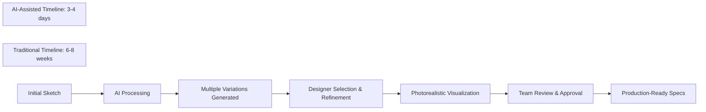
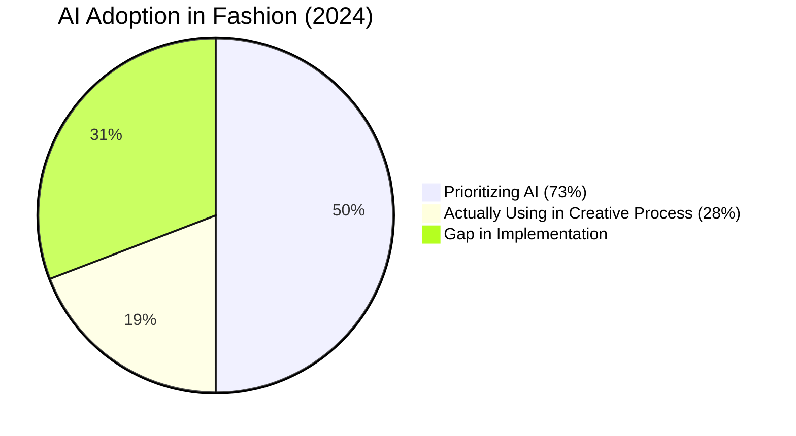
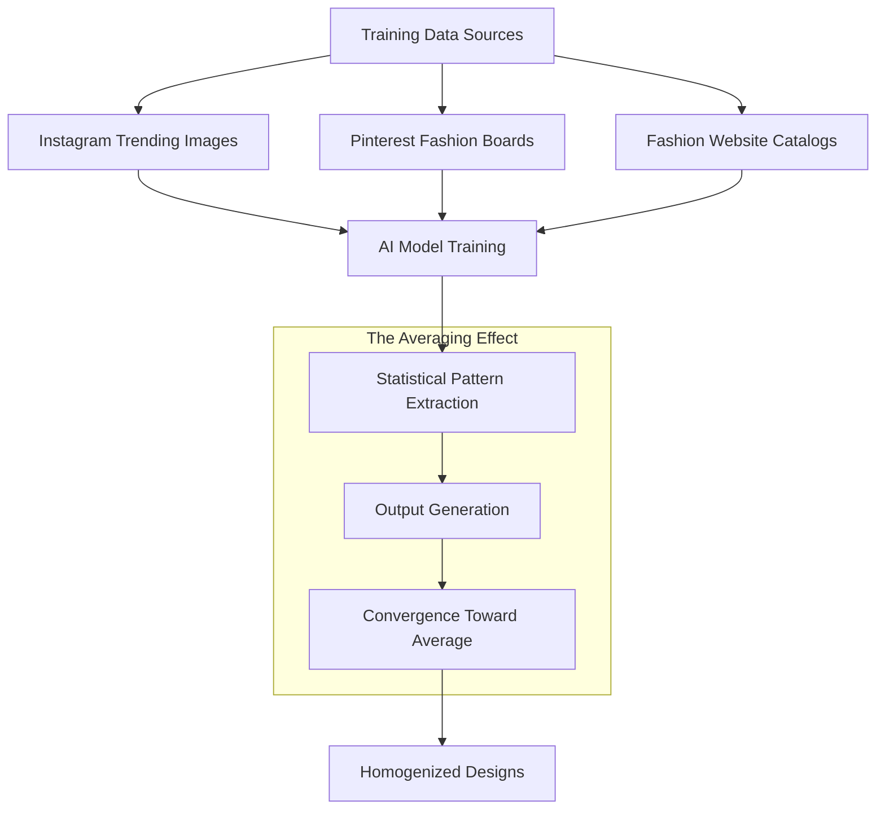
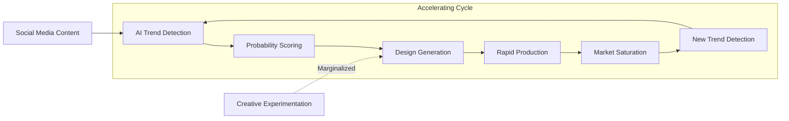
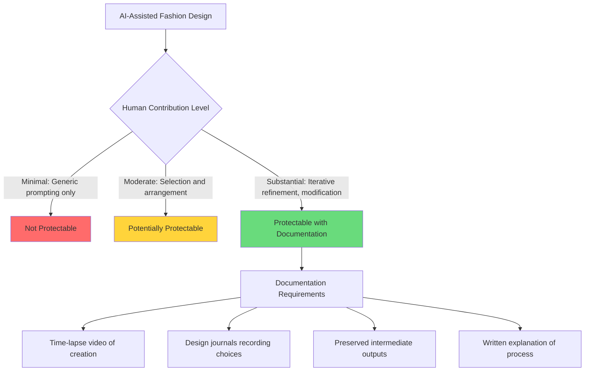
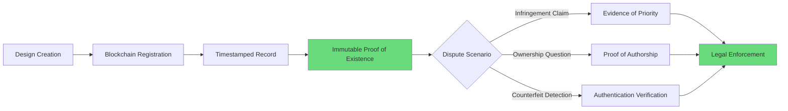
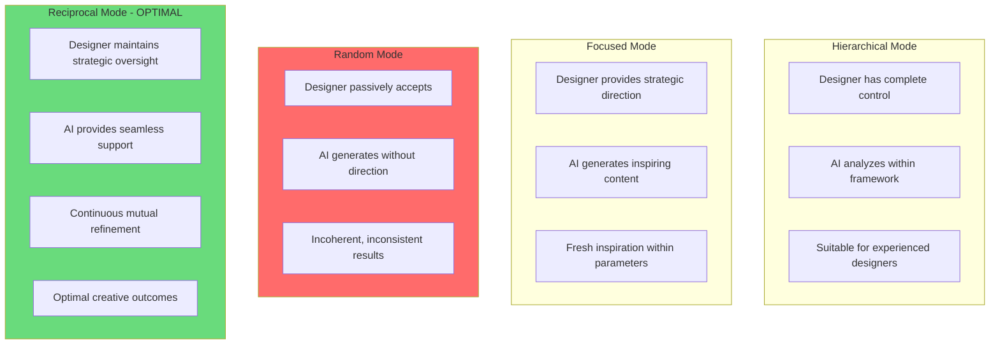
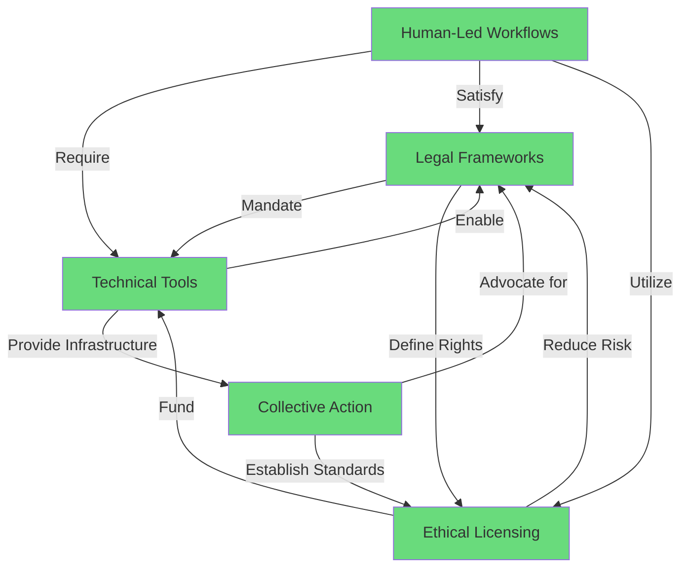

# Algorithmic Aesthetics and Ownership: Investigating Creative Homogenization and Copyright in AI-Driven Fashion Design
# 1 The Rise of AI in Fashion: Tool Ecosystems, Applications, and Industry Adoption

This chapter establishes the foundational landscape of AI in fashion design by systematically examining the current ecosystem of AI-powered tools, their functional capabilities across the fashion value chain, and the extent of industry adoption. Understanding how these technologies operate—including the data they learn from and the outputs they generate—provides essential context for subsequent chapters that investigate their implications for creative homogenization and copyright ownership disputes between independent designers and algorithmic systems.

## 1.1 Defining the AI Fashion Tool Ecosystem: Categories and Core Functionalities

The integration of Artificial Intelligence into fashion design represents **a fundamental shift in how designers conceptualize, create, and share their work**, forming a comprehensive ecosystem of specialized tools tailored to meet the various demands of the fashion industry[^1]. Rather than a single monolithic technology, this ecosystem comprises distinct functional categories, each addressing specific pain points in the design workflow while reducing the time investment previously necessary[^1]. Understanding these categories and their underlying technical mechanisms is critical for analyzing how these tools may contribute to creative homogenization—a central concern when AI systems learn from and reproduce patterns found in existing fashion data.

### Generative Design and Sketch-to-Image Conversion

The first major category encompasses **generative design platforms** that transform conceptual inputs into visual outputs. **NewArc.ai** exemplifies this category, positioning itself as a specialized tool for digital fashion and quick sketch-to-image prototyping that allows designers to upload a sketch and receive a photorealistic visual in approximately 10 seconds[^1]. The platform enables experimentation with different colors, materials, and variations, helping designers control the image generation process while adding specific patterns or developing colorways[^1]. Unlike general AI image generators, NewArc.ai is specifically trained on fashion data, which allows for better understanding of garment proportions, fabrics, and styling conventions[^2].

**Resleeve.AI** has emerged as another leader in this space, offering end-to-end design capabilities including creating design variations and turning sketches into high-quality product designs[^3]. The platform claims to offer an unmatched level of market responsiveness, driving brands towards more sustainable and consumer-focused fashion practices. Similarly, **The F* Word** platform enables users to launch digital collections reportedly 10x faster and 90% cheaper, moving from concept to tech pack in hours instead of weeks, with features including a Gen AI Design Studio that generates production-ready designs from text prompts[^4].

| Platform | Primary Function | Key Capability | Pricing Model |
|----------|-----------------|----------------|---------------|
| NewArc.ai | Sketch-to-image | 10-second photorealistic conversion | Free tier (10/month); Basic $19/mo; Pro $39/mo[^1] |
| Resleeve.AI | End-to-end design | Design variations and sketch conversion | Contact for pricing[^3] |
| The New Black | AI design ideation | Text-to-visual with trend analysis | Starting ~$8/month[^5] |
| The F* Word | Concept to tech pack | 50+ design variations in minutes | Tiered credit system[^4] |

### 3D Prototyping and Garment Simulation

The second category focuses on **three-dimensional garment visualization and simulation**, enabling designers to create and review garments in virtual environments before physical production. **CLO 3D** stands as a professional platform for 3D garment design and simulation, featuring a realistic fabric simulation engine and AI-assisted draping capabilities[^1]. The platform helps visualize and resolve potential issues before working with physical materials, improving communication between designers and production teams, though it comes with a substantial learning curve and pricing starting at $50 per month[^1].

**Style3D** provides integrated 3D design capabilities for end-to-end digital fashion creation workflows, from initial concepts to marketing[^1]. The platform includes a digital asset library and AI texture generation for creating realistic fabric appearances, with features spanning automated pattern making, fabric physics simulation, and avatar customization that enables accurate virtual try-ons and fittings[^6]. **Browzwear** combines 3D design with AI for fit validation and realistic visualization, focusing on manufacturing integration and technical accuracy while supporting sustainable practices by reducing material waste from physical sampling[^1]. These tools integrate with Product Lifecycle Management (PLM) systems to ensure smooth data flow from design to production[^7].

### Trend Forecasting and Predictive Analytics

**Heuritech** represents the leading platform for data-driven trend forecasting, using AI to scan millions of social media images to identify emerging trends before they become mainstream[^1]. Created in 2013 by two PhDs in Machine Learning, Heuritech possesses an AI-based visual recognition technology and a forecasting model allowing apparel brands to quantify and predict what people wear based on the largest dataset on fashion[^8]. The platform detects 2000 fashion attributes—from macro prints, colors and fabrics to granular shapes and attributes—and provides predictive insights for upcoming seasons with claimed accuracy exceeding 91%[^8].

**Trendalytics**, a New York-based company, leverages AI to extract insights from social media and Google to assist retailers in evaluating the popularity and life cycle stages of fashion trends[^9]. **Designovel** similarly offers AI-driven trend prediction by analyzing global data to forecast emerging trends in colors, silhouettes, prints, and consumer preferences[^5]. These tools help brands anticipate customer wants by analyzing how past patterns evolve into new trends, though Heuritech's premium pricing—starting from €12,000 per year for the Essential plan and €35,000 per year for the Business plan—makes it less accessible for independent designers[^1].

### Virtual Try-On and Model Generation

**ZMO.ai** specializes in generating high-quality, realistic images of models wearing designs, creating ethnically diverse digital models and offering AI editing tools[^1]. The platform allows experimentation with styling without physical samples, operating on a credit-based system with plans ranging from $15/month for 300 credits to $59.9/month for unlimited credits[^1]. **Revery.AI** focuses specifically on reducing e-commerce return rates through virtual try-on technology, allowing consumers to visualize clothing on models matching their body type with AI-powered size recommendations[^1].

Platforms like **Botika** transform flat product images into on-model photography, while **Lalaland.ai** develops inclusive digital avatars for 3D design integration[^10]. **Google's Virtual Try-On** and similar technologies address a critical e-commerce challenge: according to a 2023 survey by Google and Ipsos, 42% of online shoppers feel excluded due to the lack of representation in model images, while 59% experienced disappointment when purchased items didn't meet expectations[^9].

### Marketing Content Creation and Campaign Generation

The final category encompasses tools for **automated marketing content creation**. **StyleScan** transforms single product photos into diverse marketing assets, turning 2D photos into 3D visuals with different poses and models, with pricing starting at $29/month after trial[^1]. **Creati** has evolved from simple model generation into a comprehensive ideation engine that produces both digital models and viral marketing strategies, with the company reporting revenues exceeding $13 million after repositioning to address the finding that companies were "still spending $70,000 to $100,000 on agencies just for a launch video"[^10].

These marketing tools leverage advanced techniques including visual detection and natural language processing to enhance content creation. The underlying technical mechanisms across all categories include **machine learning algorithms** that analyze vast repositories of historical fashion data, **computer vision** systems that recognize and replicate visual patterns, and **natural language processing** that interprets design prompts and customer feedback[^11]. This reliance on learning from existing fashion data—a foundational technical characteristic—becomes critically important when analyzing creative homogenization risks, as AI systems inherently reproduce patterns and aesthetics present in their training datasets.

## 1.2 AI Integration Across the Fashion Value Chain: From Ideation to Consumer Experience

AI tools are being deployed at virtually every stage of the fashion product lifecycle, transforming workflows from initial concept development through final consumer engagement. Generative AI creates new space for creativity by inputting unstructured data and outputting new forms of media, from fully-written scripts to 3-D designs and realistic virtual models[^12]. This comprehensive integration has the potential to help fashion businesses become more productive, get to market faster, and serve customers better, with McKinsey analysis suggesting that in the next three to five years, generative AI could add $150 billion, conservatively, and up to $275 billion to the apparel, fashion, and luxury sectors' operating profits[^12].

### Concept Development and Mood Board Creation

At the earliest stages of design, AI tools assist creative directors and their teams in analyzing unstructured data in real time to inform creative direction[^12]. Designers can input sketches and desired details—such as fabrics, color palettes, and patterns—into generative AI platforms that automatically create an array of designs, allowing exploration of an enormous variety of styles and looks[^12]. **Khroma**, for example, serves as an AI-powered tool for exploring color combinations that learns user preferences, generating personalized color palettes and providing detailed information like hex codes and accessibility ratings[^1]. The platform eliminates manual color experimentation and requires no technical knowledge, though it focuses solely on color development without supporting garment design or broader fashion planning tasks[^13].

This capability became reality in December 2022, when a group of Hong Kong-based fashion designers from the Laboratory for Artificial Intelligence in Design (AiDLab) held a fashion show featuring generative-AI-supported designs using tools from tech companies such as Cala, Designovel, and Fashable[^12]. Fashion designers are already tapping into the power of generative AI to spark new ideas, try myriad design variations without having to produce expensive samples, and vastly accelerate their processes[^12].

### Design Iteration and Rapid Prototyping

The design iteration phase has experienced perhaps the most dramatic transformation through AI integration. **AI-powered sketch-to-image technology transforms rough sketches into photorealistic visualizations**, accelerating internal approval processes and cutting down days of manual rendering work[^1]. Companies developing generative AI software for fashion report that the technology can significantly reduce manual tasks: **AiDA (AI-based Interactive Design Assistant) reportedly can produce a dozen fashion templates within 10 seconds**, while **Cala, a fashion supply chain interface that includes generative AI in its design tools, can help designers produce more than 100 sketches in a single day**[^14].

The platform **Onbrand AI Design** exemplifies this integration by bringing AI design and PLM structure together in one fashion design platform, with brands reportedly seeing 10× faster design cycles, 30–50% fewer physical samples, and over 10 weeks saved each year[^15]. Features include generative design from text and sketches, realistic fabric and texture visualization, automated sketches and flat outputs, design iteration with layered editing, and version tracking and rollback capabilities[^15].

### Pattern Making and Production Optimization

AI is transforming the technical aspects of fashion production, particularly in pattern making and manufacturing optimization. **AI-powered tools can generate patterns that meet manufacturing standards automatically, predict fit issues before physical sampling, and maintain consistency across entire pattern libraries**[^16]. Digital pattern creation transforms supply chains by eliminating multiple sampling rounds—traditional fashion supply chains involve multiple sampling rounds, with each cycle taking 2-3 weeks and costing $500-2,000 per style[^16].

With platforms like **fashionINSTA**, designers can generate production-ready patterns from sketches in 10 minutes instead of 8 hours, eliminating 2-3 sampling rounds and reducing supply chain timelines by 6-8 weeks[^16]. **Refabric** specializes in AI-assisted pattern making, automatically drafting pattern pieces and performing marker making to minimize fabric waste while supporting zero-waste pattern making methods[^5]. By late 2025, AI robots are expected to handle up to 90% of sewing and stitching processes in high-volume apparel production[^7].

| Production Stage | Traditional Timeline | AI-Assisted Timeline | Efficiency Gain |
|-----------------|---------------------|---------------------|-----------------|
| Pattern creation | 8 hours | 10 minutes | 70% faster[^16] |
| Design cycle | 12 weeks | 3-4 days | 10x faster[^4] |
| Sampling rounds | 3-4 rounds | 1-2 rounds | 50% reduction[^15] |
| Image production | 6-8 weeks | 3-4 days | 90%+ faster[^17] |

### Supply Chain Management and Demand Forecasting

AI integration in supply chain operations enables **predictive analytics for demand forecasting, supplier performance monitoring, and quality control**[^16]. According to Oracle's research, AI can predict supplier reliability, forecast potential shortfalls, and recommend solutions to unforeseen problems[^16]. Fashion giant **Zara** leverages predictive analytics and RFID tagging to streamline inventory management and forecast fashion trends, with the AI-driven system analyzing social media trends, customer feedback, and sales data to reduce overstock and improve supply chain precision[^18].

**H&M's Advanced Analytics team** employs sophisticated AI-driven demand forecasting models that incorporate sales data, weather forecasts, and social media trends, enabling H&M to minimize waste by aligning production more accurately with customer demand[^18]. **Nike** utilizes predictive analytics, RFID technology, and robotics in warehouses for precise inventory management and fulfillment optimization, with AI-driven demand forecasting models positioning inventory effectively and enhancing Nike's direct-to-consumer strategy by significantly reducing fulfillment times[^18].

### Personalized Marketing and Virtual Retail Experiences

At the consumer-facing end of the value chain, AI powers **personalized product recommendations, virtual try-on experiences, and automated content creation**. AI-powered recommendation systems elevate the customer shopping experience by delivering personalized product suggestions tailored to individual preferences through analysis of user data[^11]. Companies that excel at personalization increase revenues by 40 percent compared with companies that don't[^12].

Generative-AI-powered chats represent a measurable improvement over existing AI chats and could eventually help handle complex inquiries in multiple languages[^12]. Generative-AI agents can also serve luxury brands in "clienteling"—a retail strategy whereby sales associates develop long-term relationships with a brand's highest-spending customers—by coaching sales associates on customer engagement, personalizing communications, and analyzing consumer profiles[^12]. **Zegna launched Zegna X**, an AI-powered clienteling app developed with Microsoft, where associates can share new arrivals, recommendations and styling ideas with customers via text, email or platforms like WhatsApp[^17].

## 1.3 Industry Adoption Rates and Investment Trajectories

The fashion industry's embrace of AI technologies has accelerated dramatically, though a significant gap persists between stated strategic priorities and actual implementation in creative processes. Quantitative evidence reveals both the substantial market opportunity and the barriers preventing widespread adoption—understanding this landscape is essential for contextualizing debates about creative homogenization and copyright concerns.

### Market Valuations and Growth Projections

The global AI in fashion market demonstrates remarkable growth trajectories across multiple analyst projections:

| Source | 2024 Valuation | Projected Value | Timeline | CAGR |
|--------|---------------|-----------------|----------|------|
| Market Report A | USD 1.99 billion | USD 39.71 billion | 2033 | 39.43%[^11] |
| Market Report B | USD 2.23 billion | USD 60 billion | 2034 | 39%[^19] |
| Market Report C | USD 4.926 billion | USD 35.71 billion | 2035 | 19.73%[^20] |
| Generative AI Segment | USD 96.5 million (2023) | USD 2.23 billion | 2032 | N/A[^19] |

These projections indicate that **AI technologies are fundamentally reshaping the fashion industry's operational and creative infrastructure**. Precedence Research predicts that the AI fashion market will reach $60 billion by 2034, with annual growth rates nearing 40%[^10]. In the United States specifically, the fashion industry is projected to reach a market value of $358.7 billion by 2024, reflecting a 21% increase from 2023, with growth propelled by technological advancements and the early adoption of artificial intelligence[^11].

### Executive Priorities Versus Implementation Reality

Despite the substantial market opportunity, **a striking disconnect exists between executive recognition of AI's importance and actual deployment in creative processes**. According to the BoF-McKinsey State of Fashion 2024 Survey of global fashion executives, **73 percent of respondents said generative AI will be an important priority for their businesses in 2024**[^14][^9][^21]. However, **just 28 percent said their businesses had tried using it in creative processes for design and product development**, indicating fashion companies are not yet capturing its value in the creative process[^14][^22].

Morgan Stanley reports that AI adoption in consumer and apparel companies rose from 20% to 44% in the first half of 2025, demonstrating accelerating implementation[^19]. According to the latest McKinsey Global Survey on AI, the regular utilization of generative AI almost doubled in 2024 compared to the previous year, with sixty-five percent of respondents reporting that their organizations have adopted generative AI in at least one business function[^21]. Among business functions, generative AI was most commonly used for marketing and sales, product and service development, and IT[^21].

### Barriers to Adoption

Several significant barriers prevent broader AI implementation in fashion design:

**Data Privacy and Security Concerns**: Personalization algorithms require large amounts of customer data, raising questions about regulatory compliance and data protection[^1]. Some companies, like NewArc.ai, are implementing compliance protocols such as SOC 2 Type II to protect sensitive information[^1].

**Integration Challenges**: Integrating AI tools into existing workflows can be difficult and require retraining staff, potentially causing a temporary decrease in productivity and facing resistance from designers accustomed to traditional methods[^1]. Many companies remain stuck in pilot mode, testing siloed AI solutions with limited impact—while 92 percent of companies say they will increase their investments in generative AI, only 1 percent say their deployment of AI has reached maturity[^17].

**Substantial Upfront Investment Costs**: The significant investment required for software expenses, system customization, and ongoing support can be a barrier for smaller brands[^1]. Enterprise-grade solutions like Browzwear require significant investment in both licensing and training without publicly available pricing[^1].

**Shortage of Skilled Professionals**: A critical market restraint is the **lack of skilled professionals proficient in both fashion and AI technologies**, which is essential for developing and maintaining AI systems[^11]. This dual expertise requirement creates bottlenecks in implementation across the industry.

**Creative Limitations and Homogenization Concerns**: There is a potential for creative limitations and a homogenized aesthetic if designers rely too heavily on AI, as AI systems learn from existing patterns[^1]. This concern—central to the research questions addressed in subsequent chapters—represents a fundamental tension between efficiency gains and creative differentiation.

### Investment and Funding Trends

**Equity funding for generative AI-focused start-ups skyrocketed in 2023, reaching $14.1 billion in the first half of the year alone**[^14]. Companies across industries are expected to unlock productivity gains of more than 30 percent over the next five years due to automation and generative AI[^17]. According to Gartner, "91% of retail IT leaders are prioritizing AI as the top technology to implement by 2026," though challenges persist: "Despite an average spend of $1.9 million on GenAI initiatives in 2024, less than 30% of AI leaders report their CEOs are satisfied with AI investment returns"[^10].

## 1.4 Case Studies: Leading Brands and Their AI Implementation Strategies

Concrete examples of AI deployment across market segments illustrate the varying approaches to integration and provide empirical grounding for assessing both benefits and limitations. These cases span luxury fashion houses, fast-fashion giants, sportswear brands, and independent designers, revealing how different business models and creative philosophies shape AI implementation outcomes.

### Luxury Brands: Preserving Heritage While Embracing Innovation

**Moncler** integrates AI in both fashion design and marketing campaigns, working alongside Maison Meta to produce the Verone AI Jacket and AI-generated advertising campaigns, applying generative design methods to innovate quilted textures and extreme-weather gear concepts[^18]. This approach demonstrates how luxury brands can leverage AI for product innovation while maintaining brand identity.

**Valentino** introduced an AI-powered campaign called 'Essential' in January 2024, representing one of the first major luxury houses to fully embrace AI-generated marketing content[^1]. **Gucci** uses computer vision and augmented reality for virtual try-ons of sneakers via its mobile app, significantly enhancing customer satisfaction and reducing return rates while successfully bridging physical and digital retail[^18]. The brand's adoption of cutting-edge technology highlights its commitment to maintaining luxury identity while modernizing customer experiences—user engagement increased by 25% on Gucci's AR-powered app, and over 60% of Gucci's products were traceable via blockchain in 2023[^23].

**Burberry** integrates AI into its supply chain management to monitor and redistribute inventory based on real-time demand signals, with AI-driven inventory optimization significantly reducing markdowns and excess stock[^18]. The brand has also introduced an augmented reality (AR)-based shopping tool that allows customers to virtually experience Burberry products in their own surroundings[^9].

### Fast Fashion: Speed and Scale Through Algorithmic Operations

**Zara** has utilized the power of artificial intelligence to enhance its entire operation, from predicting style trends to automating customer experiences[^24]. The AI-driven system tracks sales across 7,000+ stores globally, enabling rapid production adjustments and demand forecasting that allows Zara to restock stores within days and achieve up to **85% sell-through at full price**—far exceeding the industry average of approximately 60%[^19]. Zara has incorporated AI features in stores such as smart mirrors that allow shoppers to scan a product and, using RFID, view a reflected holographic image along with other products that pair well with their preferences[^24].

Zara has recruited **Jetlore**, a consumer behavior prediction platform, for their AI initiatives, helping build a consumer behavior map to make production decisions[^24]. Inditex reported that from 2023 to 2024, Zara's sales grew 7.1% and gross profit increased 7.2%, attributing part of this growth to its AI initiatives[^20][^24].

**Shein** employs proprietary AI to detect emerging fashion trends in real-time, instantly triggering small-batch production[^18]. This model of rapid trend forecasting and demand forecasting allows Shein to maintain agility and responsiveness, significantly reducing inventory waste while enabling the company to bring new designs to market at unprecedented speed.

**H&M** announced in March 2025 that it intends to create 30 digital versions of existing models, allowing models ownership of their digital twins and establishing ongoing revenue streams[^10]. The brand's Advanced Analytics team employs sophisticated AI-driven demand forecasting models that incorporate sales data, weather forecasts, and social media trends[^18].

### Sportswear and Lifestyle Brands: Technical Innovation and Customer Experience

**Nike** utilizes predictive analytics, RFID technology, and robotics in warehouses for precise inventory management and fulfillment optimization[^18]. The company's **Nike Fit** feature uses computer vision and machine learning to scan users' feet and recommend optimal shoe sizing with sub-2mm precision, addressing the common issue that up to one-third of online footwear returns are due to sizing problems[^19]. Nike achieved a 36% increase in US digital sales in 2022, while optimized inventory management systems reduced overstock by 20%[^23].

**Tommy Hilfiger** partnered with the Fashion Innovation Agency during Metaverse Fashion Week 2023, inviting customers to participate in AI-driven generative design processes where participants used prompt-based image generators to virtually design preppy-style garments[^18]. The brand's 'Reimagine Retail' project, in collaboration with IBM and FIT, used AI to analyze 15,000 runway and product images to inspire new designs, **reducing design-to-sample cycle time by approximately 30%**[^19].

### Independent Designers and Emerging Applications

**Collina Strada**, led by designer Hillary Taymour, fed its extensive design archive into an AI system, with the generative AI creating novel garment concepts that were iteratively refined over several weeks and brought to life for their Spring 2024 collection[^18][^14]. The brand used AI to create runway sculptures and prints, demonstrating how independent designers can leverage AI for creative experimentation rather than mere efficiency[^1].

**Norma Kamali** uses generative AI to amplify her creative vision, collaborating with AI studio Maison Meta to train a custom AI model on 57 years of fashion archives[^18]. The AI generates fresh fashion sketches and garment concepts, rejuvenating iconic styles and sparking innovative collections—the generative AI has even transformed unexpected outcomes, such as design "errors," into avant-garde inspirations[^18].

**Heliot Emil** similarly fed images of previous looks into a generative AI tool to produce new designs for their Spring/Summer 2024 collection[^14]. Spanish brand **Desigual** launched an on-demand collection designed using AI tools, while online retailer **Revolve** used the technology for a series of billboards and dropped a limited capsule collection with garments from the campaign[^14].

### Retail and E-Commerce Innovations

**Zalando** is using generative AI to accelerate image creation for its app and website, cutting production time from six to eight weeks to just three to four days[^17]. In the fourth quarter of 2024, **70 percent of its editorial content was AI-generated**, with the company reporting that generative AI has **reduced image production costs by 90 percent**[^17][^19].

**Stitch Fix** combines generative AI services and human stylist expertise to offer hyper-personalized fashion recommendations, analyzing extensive customer data[^18]. The brand's AI merchandising tools have helped **increase average order value by 9% year-over-year** while maintaining a customer retention rate of approximately 67%[^19]. In July 2022, Stitch Fix experimented with GPT-3 and DALL-E 2 to help stylists quickly and accurately interpret customer feedback and curate products that customers would be likelier to purchase[^12].

## 1.5 Evaluating Claimed Benefits: Efficiency Gains, Personalization, and Sustainability Promises

A critical assessment of the stated advantages of AI fashion tools against available evidence reveals where claims are substantiated and where gaps persist. This balanced evaluation establishes the foundation for subsequent analysis of the technology's broader implications for creative practice and intellectual property—particularly relevant when considering whether efficiency gains come at the cost of creative differentiation.

### Prototyping Acceleration: Verified Efficiency Gains

The evidence strongly supports claims of dramatic prototyping acceleration. **Zalando's reduction from 6-8 weeks to 3-4 days for image production** represents a verified transformation in content creation workflows, with 70% of editorial content AI-generated by late 2024 and related costs reduced by 90%[^17][^19]. This efficiency gain is corroborated across multiple sources and represents one of the most well-documented benefits of AI implementation.

Similarly, **pattern creation acceleration of 70%** is supported by multiple platform claims and industry reports[^25][^16]. The F* Word platform reports reducing the timeline from 12 weeks (sketch to sample) to just 3-4 days (concept to tech pack), with costs reduced from $50K+ per collection to $5K with an AI workflow[^4]. AI algorithms have successfully demonstrated the ability to achieve 70% faster pattern creation, with platforms like fashionINSTA speeding up digital pattern creation significantly[^25].

| Claimed Benefit | Evidence Source | Verification Status |
|----------------|-----------------|---------------------|
| 90% image cost reduction | Zalando implementation[^17] | **Strongly verified** |
| 70% faster pattern creation | Multiple platforms[^25][^16] | **Verified** |
| 10x faster design cycles | Onbrand AI, The F* Word[^15][^4] | **Verified by vendors** |
| 30-50% fewer physical samples | Onbrand AI, Style3D[^15][^6] | **Verified by vendors** |

### Personalization Impact: Measurable Customer Engagement Improvements

Evidence supports claims that AI-powered personalization significantly impacts customer engagement and retention. **Stitch Fix's 9% increase in average order value** and approximately 67% customer retention rate demonstrate measurable business outcomes from AI-driven personalization[^19]. Companies that excel at personalization increase revenues by 40 percent compared with companies that don't, according to McKinsey analysis[^12].

Seventy-three percent of shoppers expect brands to understand their tastes and preferences, with AI becoming essential for customized styling[^25]. More than 40% of global consumers purchased apparel and accessories at least three times via social media in 2024, indicating growing comfort with AI-mediated shopping experiences[^25]. Nike's Nike Fit technology, achieving sub-2mm scanning precision, addresses the significant problem that up to one-third of online footwear returns are due to sizing issues[^19].

### Sustainability Assertions: Promising but Less Verified

Sustainability claims present a more complex picture with promising indicators but less comprehensive verification. AI is credited with helping reduce fabric waste through pattern-cutting efficiency and material selection based on environmental impact metrics, with claims of **waste reduction up to 25-50% through advanced cutting algorithms**[^7]. AI enables higher precision in demand forecasting to avoid overproduction—the fashion industry produced between an estimated 2.5 billion and 5 billion items of excess stock in 2023, worth between $70 billion and $140 billion in sales[^16].

**Stella McCartney** has partnered with Google Cloud on a project incorporating machine learning and cloud-based data processing to enhance supply chain transparency and make more responsible sourcing decisions[^9]. AI plays a pivotal role in facilitating the selection of sustainable materials by assessing factors including ethical sourcing practices, environmental impact, and cost-effectiveness[^11]. However, comprehensive industry-wide data on actual sustainability improvements remains limited, and claims should be viewed as promising potential rather than fully verified outcomes.

### Identifying Evidence Gaps and Limitations

Several important gaps exist in the evidence base:

**Creative Quality Assessment**: While efficiency metrics are well-documented, systematic assessment of creative quality and originality in AI-assisted outputs remains limited. The research from Milan Polytechnic University involving 76 master's students found that **none of the 76 student teams could use AI for digital pattern making or virtual prototyping**—AI could generate attractive images but could not translate them into actual garments[^22]. This reveals a fundamental limitation: AI does not understand garment construction principles, how fabrics behave on the human body, manufacturing technical specifications, or brand fit DNA and consistency requirements[^22].

**Long-term Homogenization Effects**: Evidence on whether AI tools lead to creative convergence over time remains largely anecdotal rather than systematically measured. The potential for creative limitations and a homogenized aesthetic if designers rely too heavily on AI is acknowledged across multiple sources[^1], but longitudinal studies tracking stylistic diversity are not yet available.

**Independent Designer Outcomes**: While case studies from major brands are well-documented, systematic evidence on outcomes for independent designers using AI tools is sparse. The power asymmetry between well-resourced brands and independent creators in navigating AI implementation and potential disputes remains underexplored in available evidence.

**Copyright and Ownership Clarity**: The legal landscape surrounding AI-generated works remains unresolved, with risks including unresolved legal parameters around intellectual property for AI-generated works, bias in data sets, and employee unfamiliarity with the technology's shortcomings[^12]. This uncertainty affects how benefits should be weighted against potential legal exposure.

### Synthesis: A Foundation for Critical Analysis

The evidence establishes that AI fashion tools deliver **substantial, verified efficiency gains** in prototyping, content creation, and supply chain optimization. Personalization capabilities demonstrate **measurable positive impacts** on customer engagement and business metrics. Sustainability claims show **promising potential** but require more comprehensive verification. However, **significant questions remain** regarding creative quality, long-term effects on design diversity, and the distribution of benefits across different market segments.

This foundation—acknowledging both verified benefits and persistent uncertainties—is essential for the subsequent chapters' examination of whether these efficiency gains contribute to creative homogenization and how copyright disputes between independent designers and algorithmic systems might be resolved. The very mechanisms that enable AI's efficiency—learning from existing fashion data and reproducing successful patterns—may simultaneously create the conditions for stylistic convergence and intellectual property conflicts that demand careful analysis and balanced solutions.

# 2 Deconstructing Creative Homogenization: Evidence, Mechanisms, and Contributing Factors

This chapter systematically examines the phenomenon of creative homogenization in AI-driven fashion design, building upon the foundational landscape established in Chapter 1. It investigates empirical evidence demonstrating stylistic convergence in AI-generated fashion outputs, deconstructs the technical mechanisms underlying this convergence, analyzes how deployment contexts shape divergent outcomes, and synthesizes the socio-technical factors that amplify homogenization risks. The analysis provides critical groundwork for understanding how algorithmic systems may constrain creative diversity while setting the stage for subsequent examination of copyright implications.

## 2.1 Empirical Evidence of Stylistic Convergence in AI-Generated Fashion

The phenomenon of creative homogenization in AI-generated fashion is not merely a theoretical concern but a **measurable reality documented through multiple empirical observations**. Industry practitioners, researchers, and design professionals have accumulated substantial evidence demonstrating that AI fashion tools, when deployed under typical conditions, produce outputs exhibiting striking statistical similarity—a convergence that threatens the diversity essential to fashion's creative vitality.

### Quantitative Documentation of Output Similarity

Perhaps the most striking empirical evidence comes from direct observation of AI-generated fashion outputs. In a documented case analysis of generative fashion experiments, **out of 100 AI-generated "summer dresses," 87 looked like variations of the same basic design**[^26][^27]. This remarkable 87% similarity rate demonstrates that when designers use standard prompts with mainstream AI fashion tools, the resulting outputs cluster around a narrow aesthetic center rather than exploring the full spectrum of design possibilities. The statistical convergence is not coincidental but reflects the fundamental operation of these systems: when a designer types "avant-garde evening gown," the AI returns variations of what's already popular online, and the result looks exactly like what other designers selected using the same approach[^27].

This pattern of convergence has been corroborated through structured research involving design professionals. A mixed-methods study involving 19 participants—including both design students and professionals—who used commercial AI tools like Midjourney and DALL-E for concept ideation revealed systematic gaps between AI capabilities and designer needs[^28]. When participants evaluated AI-generated fashion sketches across five criteria, **"Visual Fidelity and Realism" received the highest mean rating (4.25), while "Designer Input and Customization" received the lowest scores (3.13)**[^28]. Critically, designers ranked "Designer Input and Customization" as the most important category, highlighting a significant disconnect between what AI delivers and what creative professionals require[^28]. The category of "Originality and Creativity" also received a low mean rating of 3.25, indicating that AI tools excel at producing polished, realistic images but struggle to generate truly novel or distinctive designs[^28].

| Evaluation Criterion | Mean Rating | Designer Priority Ranking |
|---------------------|-------------|--------------------------|
| Visual Fidelity and Realism | 4.25 (Highest) | Lower |
| Designer Input and Customization | 3.13 (Lowest) | **Highest** |
| Originality and Creativity | 3.25 | High |

### Designer Perceptions and Professional Feedback

Beyond quantitative metrics, qualitative feedback from design professionals provides rich evidence of homogenization concerns. Participants in research studies expressed concerns that **AI might inhibit deep thinking by providing straightforward design outcomes**[^28]. The ease with which AI generates polished outputs may paradoxically undermine the reflective, iterative process through which designers develop distinctive creative voices. AI-generated designs were often perceived as **less valuable than original ideas**, with designers noting that outputs exhibit randomness that leads to misalignment with their intentions[^28].

A particularly revealing finding concerns AI's limitations in understanding novel concepts. **Participants believed that AI had a limited understanding of novel ideas and unique styles, often operating based on existing content and not conforming to uncommon design principles**[^28]. This observation strikes at the heart of the homogenization problem: AI systems are fundamentally constrained to recombine and reproduce patterns present in their training data, making them inherently biased toward established aesthetics rather than groundbreaking innovations. When designers attempt to push beyond conventional boundaries, they encounter AI systems that pull outputs back toward statistical averages.

### Industry-Wide Recognition of the Problem

The fashion industry has increasingly acknowledged homogenization as a significant challenge accompanying AI adoption. **Seventy-three percent of fashion executives said generative AI will be a priority for their businesses in 2024, but just 28 percent have tried using it in creative processes for design and product development**[^26][^27]. This gap between strategic prioritization and creative implementation reflects, in part, industry wariness about homogenization risks. Executives recognize AI's potential for operational efficiency but remain cautious about its implications for the creative differentiation that defines brand identity.

The concern extends beyond individual outputs to encompass broader aesthetic convergence across the industry. There is widespread recognition that **AI models could lead to a homogenisation of beauty standards**, as AI-generated faces and designs tend to conform to certain mathematical averages that may lack the unique characteristics making human creations interesting[^26][^27]. This averaging effect threatens to flatten the rich diversity of aesthetic traditions, cultural references, and individual creative visions that have historically characterized fashion as an art form.

## 2.2 Technical Mechanisms Driving Homogenization

Understanding why AI fashion tools produce homogenized outputs requires examining the technical architecture and data dependencies underlying these systems. The convergent outputs documented empirically are not accidental but emerge from fundamental characteristics of how generative AI models are trained, optimized, and deployed. Three primary technical mechanisms—**training data bias, mode collapse, and the echo chamber effect**—combine to create powerful pressures toward aesthetic convergence.

### Training Data Bias and Statistical Averaging

The most fundamental driver of homogenization lies in **how AI fashion tools learn from their training data**. Most AI fashion tools work through a consistent methodology: they train on millions of trending images from Instagram, Pinterest, and fashion websites[^26]. When a user requests a "summer dress," the system returns the algorithm's statistical average of what summer dresses look like online—not a creative interpretation, but a mathematical composite of existing popular designs[^26]. This means that **every brand using the same tools receives nearly identical outputs**, as the underlying statistical distributions converge toward common patterns present in the training data[^26].

The statistical nature of this process means that AI systems inherently favor designs that appear most frequently in training data while marginalizing rare, unconventional, or culturally specific aesthetics. A report from the University of Toronto highlights how AI-driven systems, designed to optimize efficiency and cater to widespread preferences, **inadvertently lead to a uniformity in artistic expression, cultural experiences and creative content**[^29]. The essence of the issue lies in a paradox: while AI has the potential to enrich and diversify our cultural landscape, it is simultaneously steering us toward a more monolithic and less diverse world[^29].

### Mode Collapse and Reduced Output Variety

Beyond training data bias, AI systems face technical challenges that further constrain output diversity. **Mode collapse** occurs when generative models—particularly Generative Adversarial Networks (GANs) commonly used in fashion applications—produce limited sample variety, converging on a narrow subset of possible outputs[^30]. In the context of fashion design, mode collapse manifests as generators that repeatedly produce similar silhouettes, color combinations, or stylistic elements regardless of prompt variations.

The technical dynamics of mode collapse stem from the adversarial training process itself. GANs consist of two neural networks—a Generator that creates data samples and a Discriminator that classifies between real and fake samples[^30]. During training, if the Generator discovers that certain output patterns consistently fool the Discriminator, it may over-optimize toward those patterns while abandoning exploration of the broader design space. This results in **outputs that appear polished and realistic but lack the variety necessary for genuine creative diversity**. Challenges and limitations of GANs include dependence on training data diversity, training instability due to sensitivity to network architecture and hyperparameters, and mode collapse where the generator produces limited sample variety[^30].

### The Echo Chamber Effect and Recursive Reinforcement

Perhaps the most insidious technical mechanism is the **echo chamber effect**, where AI systems create self-reinforcing cycles that progressively narrow creative possibilities. When an AI model learns from the same pool of trending images, it creates an echo chamber where the most popular designs get fed back into the system, reinforcing the same aesthetic patterns[^26]. This operates as a visual feedback loop that gradually narrows creative possibilities, making each generation of outputs more similar to the last[^27].

The recursive nature of this problem is exacerbated by the growing prevalence of AI-generated content online. **Model collapse**—a phenomenon where models trained on their own AI-generated data degrade and eventually decay—represents a significant long-term risk[^31]. This creates a recursive loop that leads to decreased quality on large language models trained on AI-generated content, formerly called "AI cannibalism"[^31]. Early signs include forgetting rare events or minority data patterns, and later stages show repetitive, low-variance outputs like generic text or uniform images[^31].

Research published in *Nature* and at the 2024 International Conference on Learning Representations has explored this phenomenon, finding that **only if the proportion of real images in training data remains above a certain threshold, and human curation is incorporated as a safeguard, can the training process remain stable**[^32]. Without these protections, AI systems risk entering degenerative cycles where each iteration strips away subtle details until outputs become increasingly blurry and repetitive, irretrievably losing the original richness of the model's knowledge over multiple generations[^31].

### Prompt Convergence and the Limits of User Control

A final technical mechanism concerns the relationship between user inputs and AI outputs. While users may believe that detailed prompts provide meaningful control over generated designs, evidence suggests that **prompting an AI system is closer to proposing an idea than translating that idea into protected expression**[^33]. The generative AI system relies on probabilistic processes, training data, and random noise, meaning users select outputs without actually exercising control over their expressive content[^33].

This limitation has profound implications for design diversity. When multiple designers input similar prompts—"avant-garde evening gown," "minimalist streetwear," or "bohemian summer dress"—the underlying statistical processes produce outputs that converge toward common patterns regardless of each designer's unique creative intent. The technical architecture of these systems fundamentally constrains their ability to translate individual creative visions into distinctive outputs, instead channeling diverse inputs toward homogenized results.

## 2.3 The Visual Feedback Loop and Algorithmic Trend Amplification

The technical mechanisms driving homogenization do not operate in isolation but interact with broader algorithmic systems that amplify their effects. AI-powered trend forecasting, recommendation algorithms, and demand prediction tools create **self-reinforcing cycles that progressively narrow the fashion industry's creative landscape** while accelerating the pace at which this narrowing occurs.

### Recommendation Systems and Aesthetic Marginalization

Fashion recommendation systems, powered by sophisticated algorithms, are rapidly transforming how consumers discover and purchase clothing[^34]. However, these systems contain biases that perpetuate societal inequalities and undermine inclusivity and sustainability[^34]. **Data bias** occurs when training datasets overrepresent certain demographics, causing algorithms to favor their styles, while **selection bias** arises from unrepresentative data, leading to the underrepresentation of certain body types, ethnicities, or age groups[^34].

The consequences for creative diversity are significant. **Biased algorithms can marginalize certain body types or cultural aesthetics, resulting in a homogenized fashion landscape and reinforcing narrow beauty standards**[^34]. Algorithmic logic itself can introduce bias by prioritizing features like popularity metrics or fast-fashion trends, which may promote unsustainable consumption patterns while marginalizing alternative aesthetics[^34]. This creates a scenario where AI systems actively suppress the visibility of unconventional designs, making it harder for innovative aesthetics to gain traction in an increasingly algorithm-mediated marketplace.

### Trend Forecasting and Micro-Trend Acceleration

AI-powered trend forecasting tools, while valuable for demand prediction, contribute to homogenization by **amplifying popular patterns while compressing the time available for creative development**. Fashion Trend Forecast Algorithms aggregate probability scores from computer-vision engines that parse micro-influencer posts hours after publication, tagging silhouettes, colors, and context, then weighting each microtrend for regional resonance[^35]. This capability enables brands to respond rapidly to emerging trends but simultaneously intensifies pressure toward aesthetic convergence.

The compression of design-to-market timelines exemplifies this dynamic. Traditional seasonal calendars once spanned nine months, but **Zara now replenishes key styles in two weeks**, while vendor OmniThink claims concept-to-buyer windows fell from four weeks to three days after deploying these algorithms[^35]. While such acceleration delivers operational benefits, it **pressures brands into chasing micro-trends with short shelf lives, accelerating production and waste while reducing room for slower, more meaningful fashion cycles**[^36]. The result is an industry increasingly oriented toward rapid replication of proven patterns rather than patient development of distinctive creative visions.

### The Broader Homogenization of Culture and Creativity

The dynamics observed in fashion reflect a broader phenomenon affecting creative industries. A phenomenon of "AI-formization" is emerging, describing the subtle yet profound impact that AI algorithms are having on culture and creativity[^29]. AI has revolutionized the way products are recommended and advertised, tailoring user experiences to unprecedented levels of personalization, but this technology often **reinforces existing consumer behaviors rather than expanding them**[^29]. By continuously presenting products and ads based on past interactions, these systems create a feedback loop that narrows the scope of exposure to new choices, leading to a homogenization of consumer experiences[^29].

In artistic creation, AI has radically pushed boundaries by generating art pieces and composing music, but these technological advances bear a critical downside: **the tendency of AI to favor prevailing trends**[^29]. By predominantly learning from and replicating widely accepted and popular styles, these algorithms often overlook less mainstream, unconventional art forms, leading to a homogenization of creative outputs across multiple domains[^29]. The integration of AI in the literary world similarly transforms how we interact with literature, with AI-driven recommendations often excluding diverse literary voices and unconventional genres[^29].

## 2.4 Divergent Outcomes Across Deployment Contexts

While the evidence for homogenization is substantial, it is not inevitable. **The degree to which AI tools produce convergent or diverse outputs depends significantly on how they are deployed**—specifically, whether AI is used for inspiration or execution, whether designers maintain creative control, and whether brand-specific customization counteracts generic tendencies. Examining these divergent outcomes reveals pathways through which AI can amplify rather than constrain creative diversity.

### The Critical Distinction: Inspiration Versus Execution

The fundamental insight emerging from industry experience is that **the real problem is using AI for inspiration instead of execution**[^26][^27]. Most designers approach AI backwards by using it to generate ideas, but when you ask AI to be creative for you, you get its version of creativity, which is a remix of what already exists online[^26]. This approach directly taps into the homogenization mechanisms described above, as AI systems return statistical averages rather than novel concepts.

However, when designers come to AI with their own creative vision, the dynamic changes fundamentally. Platforms like fashionINSTA exemplify this alternative approach: they do not generate designs but enable the user's designs[^26][^27]. The process involves the designer sketching their unique idea, defining their vision including measurements, construction details, and brand aesthetic, and then the AI creating the technical pattern[^26]. **The AI translates the vision into something manufacturable without judging ideas or trying to make them "more trendy"**[^26][^27]. This execution-oriented approach preserves the designer's creative DNA while leveraging AI's technical capabilities.

| Approach | AI Role | Creative Control | Homogenization Risk |
|----------|---------|------------------|---------------------|
| AI for Inspiration | Idea generation | Low (AI-driven) | **High** |
| AI for Execution | Technical translation | High (Human-driven) | **Low** |

### Case Studies of Preserved Creative Diversity

Concrete examples demonstrate how designers successfully use AI while maintaining distinctive aesthetics. **Designer A sketched a jacket inspired by brutalist architecture**, and AI created the technical pattern for a completely unique piece that generic AI tools would never generate[^26][^27]. **Designer B drew from traditional textile patterns**, combining them with modern silhouettes to produce a collection that respects cultural heritage while remaining contemporary[^26]. **Designer C, obsessed with biomimicry, created garments inspired by plant structures**—each piece unprecedented in fashion[^26].

The common thread across these cases is that **none of these designers asked AI to be creative for them; they brought their creativity to AI and asked it to make their visions manufacturable**[^26][^27]. By positioning AI as a technical translator rather than a creative partner, these designers preserved their unique perspectives while benefiting from AI's efficiency in pattern generation and production preparation.

### Brand-Specific Training and Custom Models

A more systematic approach to counteracting homogenization involves training AI models on brand-specific data rather than generic fashion datasets. **It is quantified that up to 25 percent of the potential of AI in fashion will come from the creative side**, enabling companies to create unique generative AI models that infuse their brand DNA across design processes rather than relying on the generic output of image generators[^26][^27]. This approach recognizes that homogenization stems partly from centralized, one-size-fits-all AI tools and addresses it through decentralized, brand-customized alternatives.

**Combining outputs from multiple systems creates an adaptable process that leverages diversity rather than succumbing to uniformity**[^26]. Just as diverse human perspectives reduce blind spots and improve decision-making, orchestrating diverse AI models can smooth out biases and expand creative possibilities[^26]. This multi-model approach prevents any single system's statistical biases from dominating outputs, creating space for distinctive aesthetics to emerge.

### The Role of Human Agency in Shaping Outcomes

The divergent outcomes across deployment contexts ultimately reflect differences in human agency. Research suggests that **AI's final effect depends on whether individuals act as passive consumers conforming to AI's statistical output or as active curators who critically examine, re-contextualize, and recombine these outputs**. The designers who thrive in the AI era will be those who become master curators of their own creative vision, curating their creative inputs, guiding AI execution, and maintaining complete control over their aesthetic vision[^26][^27].

This framing positions homogenization not as an inevitable consequence of AI adoption but as the **default outcome when AI is used passively**. Active curation and execution-oriented use demonstrate potential to diverge from this path, suggesting that the fashion industry's creative future depends significantly on how designers choose to engage with AI tools rather than on the tools' inherent characteristics alone.

## 2.5 Socio-Technical Factors Exacerbating Homogenization Risks

The technical mechanisms driving homogenization interact with broader market, institutional, and behavioral factors that compound their effects. Understanding these socio-technical amplifiers is essential for developing comprehensive responses to homogenization risks, as technical solutions alone cannot address dynamics rooted in commercial incentives, cognitive biases, and structural power imbalances.

### Commercial Pressures and Risk-Averse Design Decisions

The fashion industry's economic structure creates powerful incentives toward homogenization that AI tools amplify. **AI's promise of increased efficiency can be illusory if it prioritizes short-term profits over long-term sustainability**, potentially increasing pollution or exploiting workers while reinforcing unsustainable practices[^37]. If trained on data reflecting fast fashion trends, AI may perpetuate overconsumption and waste cycles, with AI-driven marketing encouraging impulsive purchases and unsustainable consumption patterns[^37].

Brands like H&M release approximately 16 collections per year, and their investments in AI technology work to speed up production, which **perpetuates purchasing habits that result in a quicker use-and-discard mindset**[^38]. The combination of cheap materials and heavy reliance on trend cycles leads an average clothing item to be worn only 14 times before it is discarded in the UK[^38]. H&M and similar brands use AI to predict trend cycles, contributing to an overwhelming tendency to buy more, buy cheap, throw away, and move on[^38]. This commercial context creates powerful pressures toward designs that align with algorithmic predictions of commercial success, marginalizing experimental or unconventional aesthetics that carry higher perceived risk.

### AI-Derived Epistemology and Cognitive Deference

Beyond commercial pressures, behavioral dynamics shape how designers interact with AI tools in ways that amplify homogenization. A theoretical framework describes how the widespread adoption of generative AI leads to an **"AI-derived epistemology," where individuals increasingly outsource cognitive and evidential work to AI models, treating their single, synthesized outputs as primary sources of truth**[^39]. This dependence enables the model to operate as an "AI prism"—a centralized tool whose internal statistical mechanisms compress variation and converge toward averages[^39].

This cognitive deference manifests through several mechanisms: **effort-trust tradeoffs** (the rational choice to offload cognition), **statistical optimal explanations** (AI's tendency to produce fluent, plausible-seeming explanations), **AI as oracle** (automation bias treating AI as an authoritative source), and **path dependence** (design fixation on AI's initial outputs)[^39]. The consequences include skill degradation, narrowed solution spaces, knowledge illusions, and aspiration shaping—all of which compound technical homogenization tendencies by reducing designers' capacity and willingness to challenge AI outputs.

### Minority Data Representation and Cultural Marginalization

The issue of minority data representation constitutes a significant concern that connects technical bias to broader questions of cultural equity. **AI systems predominantly trained on mainstream data not only impoverish our cultural landscapes but also diminish the potential for breakthrough ideas that often come from the fringes**[^29]. By amplifying what is already popular, they overlook unique perspectives vital for innovation[^29]. Techniques like data rebalancing and augmentation for minority groups aim to address this skewness, but implementation remains inconsistent[^29].

The reliance on AI raises concerns about **the erosion of creativity and cultural diversity**[^37]. If trained on Western-centric data, AI may marginalize other cultural styles, perpetuating inequalities[^37]. AI dictating trends may stifle human innovation, leading to a less expressive landscape where non-Western aesthetics and unconventional design traditions struggle to gain visibility[^37]. This marginalization has implications not only for creative diversity but also for the economic viability of designers working outside dominant aesthetic paradigms.

### Power Asymmetries and Structural Vulnerabilities

Homogenization risks are not distributed equally across the fashion industry. **Automating parts of the fashion industry to cut costs and boost efficiency poses significant risks to labor rights, particularly for vulnerable garment workers**[^38]. According to the International Labour Organization, 60% of garment workers in Bangladesh face the risk of losing their jobs due to automation[^38]. These workers, many already female-dominated and enduring low wages, unsafe working conditions, and limited protections, face further devaluation of human labor and exacerbation of gender and economic disparities[^38].

For independent designers specifically, AI creates complex challenges related to intellectual property and competitive positioning. **AI has been implicated in issues relating to intellectual property**, with independent designers filing lawsuits against companies like Shein, arguing that "their design algorithm could not work without generating exact copies that can greatly damage an independent designer's career—especially because Shein's artificial intelligence is smart enough to misappropriate the pieces with the greatest commercial potential"[^38]. This power asymmetry—where well-resourced companies leverage AI to replicate designs while independent creators lack comparable tools or legal resources—represents a structural vulnerability that homogenization dynamics exacerbate.

## 2.6 Implications for Creative Diversity and the Path Forward

The evidence and analysis presented in this chapter establish that **creative homogenization in AI fashion design is a probable default outcome driven by core technical architectures optimized for statistical replication, amplified by prevailing market incentives and passive use cases**. However, this outcome is contingent rather than inevitable, with human agency emerging as the critical variable determining whether AI constrains or expands creative possibilities.

### The Tension Between Efficiency and Creativity

The efficiency gains documented in Chapter 1—90% cost reductions, 70% faster pattern creation, 10x faster design cycles—must be weighed against the creative costs identified in this analysis. This tension reflects a fundamental characteristic of generative AI systems: the same mechanisms that enable rapid, scalable output generation simultaneously constrain output diversity. **AI has shown capabilities in combinational creativity, which involves combining familiar ideas, and exploratory creativity, which is about generating new ideas within existing structures. However, AI struggles with transformational creativity, which requires generating ideas beyond existing frameworks to create something entirely new**[^29].

The implication is that **humans with AI will not replace exceptional humans without AI**[^29]. The homogenizing effects of AI will make creation outside the norms more difficult to access, potentially stifling the groundbreaking innovations that have historically driven fashion forward[^29]. Addressing "AI-formization" matters to ensure that exceptional creations and ideas continue to reach us, breaking through the wall of normalization artificially created by algorithms[^29]. The integrity of the nuanced nature of human creativity is at stake, risking being overshadowed by AI-generated content that leans heavily toward the average[^29].

### Conditions for AI as Authentic Expression

Despite these risks, the analysis identifies clear conditions under which AI can serve as a tool for authentic expression rather than aesthetic convergence. **Generic AI tools can make cultural appropriation problems worse by scraping cultural imagery without context, mixing sacred symbols with fast fashion aesthetics. But when designers control the creative input and understand the cultural significance of what they design, AI becomes a tool for authentic expression, not appropriation**[^26][^27].

The path forward requires fundamental shifts in how AI tools are designed, deployed, and integrated into creative workflows:

1. **Stop using AI for inspiration**—inspiration should come from personal life, culture, and obsessions, not from algorithms' statistical averages of trending content[^26][^27].

2. **Start using AI for execution**—bring unique ideas, cultural references, and personal aesthetics to AI for technical translation rather than creative generation[^26][^27].

3. **Keep the creative process human**—the magic and poetry in real creativity remain the prerogative of the human subconscious[^26][^27].

4. **Train on your own aesthetic**—develop brand-specific AI models that infuse brand DNA across design processes rather than relying on generic outputs[^26][^27].

### Foundation for Copyright Analysis

The homogenization dynamics analyzed in this chapter have direct implications for the copyright disputes examined in subsequent chapters. When AI systems produce outputs that converge toward statistical averages of existing designs, questions of originality, authorship, and infringement become increasingly complex. **The U.S. Copyright Office has affirmed that AI-assisted works can be copyrighted, but only with significant human authorship**[^40], placing the onus on fashion brands to ensure and document clear human input in AI-generated content to establish ownership.

The homogenization trap is real but not inevitable[^26][^27]. **The choice is whether to use AI to become more generic or to become more yourself**[^26]. Most designers may choose the simpler path—using generic tools, getting generic results, and wondering why their brands don't stand out. But some designers will choose the harder path, bringing their unique visions to AI and using it to execute ideas that were previously impossible[^26]. These designers, who position themselves as active curators rather than passive consumers of AI outputs, represent the future of creative fashion design in an algorithmic age.

## 3 Case Studies in Contrast: Brand Strategies and the Spectrum from Replication to Innovation

This chapter provides a comparative analysis of AI tool deployment across diverse fashion entities, examining how business models, creative philosophies, and human-AI collaboration approaches produce divergent outcomes ranging from design homogenization to amplified brand distinctiveness. By contrasting fast-fashion giants, luxury houses, and independent designers, the chapter offers concrete evidence of how algorithmic systems can either constrain or enhance creative diversity, establishing empirical foundations for subsequent copyright and ownership discussions.

### 3.1 Fast-Fashion AI Deployment: Shein and Zara's Algorithmic Approaches to Trend Replication

The fast-fashion sector has emerged as the most intensive adopter of AI technologies, deploying sophisticated algorithmic systems that fundamentally reshape the relationship between trend detection, design generation, and market delivery. **Shein and Zara represent two distinct approaches to AI integration**—one prioritizing pure algorithmic speed and volume, the other balancing data-driven insights with centralized human curation—yet both illustrate how AI deployment in high-volume, low-margin business models creates inherent pressures toward homogenization and raises significant copyright concerns.

#### Shein's Algorithmic Design Engine: Speed Through Systematic Replication

Shein has constructed what may be the fashion industry's most aggressive AI-powered design and production system, enabling the company to list as many as **600,000 items on its platform at any given moment** while serving customers in over 220 countries[^41]. The technical architecture underlying this capability involves sophisticated electronic systems that **algorithmically scour the internet for popular works created by artists and designers**, identifying trending and viral images on social media and websites[^42]. This system does not merely detect trends—it operationalizes them at unprecedented speed by transmitting algorithm-identified designs directly to factories for production.

The scale of Shein's AI-driven operations is staggering. By 2023, Shein was reportedly **adding as many as 10,000 new items to its app daily**, with over 470,000 distinct stock-keeping units (SKUs) in its catalog[^43]. Peter Pernot-Day, Shein's head of global strategy and corporate affairs, has explained that more than 5,000 Shein suppliers have gained access to an AI software platform that analyzes customer preferences, enabling the production of small batches to match supply in real-time[^41]. The company claims this approach reduces inventory waste, though critics argue it simply accelerates the cycle of overproduction and disposal.

The business model's dependence on AI extends beyond trend detection to encompass the entire design-to-market pipeline. Research from Stanford University's Graduate School of Business found that companies like Shein achieve their speed advantage **not through faster production or shipping, but through extremely rapid design generation**[^44]. These companies deploy AI to quickly generate thousands of designs, effectively "bombarding the market" with products at high frequency and low prices. This strategy has proven commercially successful—by November 2022, **Shein accounted for 50% of fast-fashion sales in the U.S.**, with one in four Gen Z consumers shopping there and 44% making at least one purchase monthly[^41].

However, this AI-driven approach carries significant legal and ethical risks. Multiple lawsuits have alleged that **widespread copyright infringement is baked into Shein's business model**[^42]. In April 2024, artist Alan Giana filed a class action complaint alleging that Shein uses "algorithms, AI, and related computerized monitoring systems to identify trending and 'viral' images and designs on social media, apps, and websites," then transmits these directly to factories "with no human intermediary or compliance function taking care that the algorithm's designs are not the property of others"[^45]. The complaint specifically alleges that Shein's system identified and copied Giana's original artwork "Coastal Escape" without authorization, selling products bearing his copyrighted work[^45].

Earlier lawsuits have made similar allegations. In 2023, NPR reported that Shein was accused of violating the federal anti-racketeering act (RICO) by copying independent designers' works, with three artists—Krista Perry, Larissa Martinez, and Jay Baron—alleging that Shein made exact copies of their work without their knowledge[^46]. The plaintiffs argued that Shein's "design algorithm could not work without generating exact copies that can greatly damage an independent designer's career—especially because Shein's artificial intelligence is smart enough to misappropriate the pieces with the greatest commercial potential"[^38].

| Aspect | Shein's AI Approach | Implications |
|--------|-------------------|--------------|
| Design Volume | 10,000+ new items daily | Massive scale amplifies any IP violations |
| Trend Detection | Algorithmic social media scraping | Risk of copying without attribution |
| Human Oversight | Minimal compliance function | Systematic infringement allegations |
| Production Speed | Direct algorithm-to-factory transmission | No review for IP conflicts |
| Legal Exposure | Multiple ongoing lawsuits | Significant copyright liability |

#### Zara's Integrated AI Strategy: Data-Driven Curation with Human Oversight

Zara presents a contrasting model of AI deployment that, while still oriented toward speed and trend responsiveness, maintains stronger human oversight and centralized design curation. The Spanish fashion giant, valued at approximately **17.8 billion U.S. dollars in 2024**, has integrated AI across its operations while preserving a vertically integrated structure that enables quality control and brand consistency[^47].

Zara's AI implementation encompasses multiple technology-powered initiatives. The company partnered with **Jetlore**, a consumer behavior prediction platform founded by Stanford computer scientists, which uses AI to map consumer behavior into structured predictive attributes like size, color, fit, and style preferences[^47]. This enables Zara to optimize merchandising decisions and personalize customer communications while maintaining centralized design control. Additionally, Zara hired **Tyco to install microchips into clothing security tags**, providing full inventory visibility across the supply chain to inform forecasting analytics[^47].

The company's AI tools assess styles and fabrics to create feedback for upcoming trends and generate prototypes based on data for evaluation prior to final production[^24]. Critically, these AI-generated insights feed into a **centralized design team in Spain that curates collections**, rather than transmitting directly to production as in Shein's model[^43]. This human curation layer represents a fundamental difference: while AI identifies patterns and generates possibilities, human designers make final creative decisions, maintaining what analysts describe as "the idea of a coherent wardrobe" rather than "individual trendy items"[^43].

Zara's AI integration has delivered measurable business results. Inditex reported that from 2023 to 2024, Zara's sales grew 7.1% and gross profit increased 7.2%, with a **41% increase in e-commerce sales**[^24]. The company's AI-driven inventory management enables it to **restock stores within days and achieve up to 85% sell-through at full price**—far exceeding the industry average of approximately 60%. This efficiency comes from AI-powered demand forecasting that analyzes social media trends, customer feedback, and sales data to reduce overstock and improve supply chain precision[^18].

Recent developments indicate Zara is expanding its AI capabilities into content creation. The company has become the latest fast-fashion retailer to use AI to help create new images of real models in different outfits, speeding up the production process[^48]. A spokesperson for Zara owner Inditex stated that the company is "using artificial intelligence only to complement our existing processes" and works "collaboratively with our valued models—agreeing any aspect on a mutual basis—and compensating in line with industry best practice"[^48].

#### Homogenization Dynamics in Fast Fashion

Both Shein and Zara's AI-driven approaches contribute to aesthetic convergence, though through different mechanisms. Shein's model, by algorithmically identifying and replicating popular designs at industrial scale, directly produces homogenized outputs that reflect statistical averages of trending content. One analyst noted that Shein's AI-driven approach can lead to **"a homogenization of design, as algorithms optimize for proven elements, resulting in a 'Frankenstein-ing of different trend-led components'"**[^43].

Zara's approach, while more curated, still accelerates trend cycles in ways that compress creative development time. H&M releases approximately 16 collections per year, with investments in AI technology working to speed up production, which **perpetuates purchasing habits that result in a quicker use-and-discard mindset**[^38]. Both companies use AI to predict trend cycles, contributing to what critics describe as "an overwhelming tendency to buy more, buy cheap, throw away, and move on"[^38].

The environmental implications are significant. Fast fashion releases **1.2 billion tonnes of carbon emissions every year, accounting for 10% of global emissions**[^41]. Shein's 2023 sustainability report recorded a carbon footprint of 16.7 million tonnes—nearly triple its emissions from the previous three years, surpassing Zara and roughly double that of Nike, H&M, and LVMH[^41]. Environmental experts question whether AI-driven efficiencies truly improve outcomes, warning that **without strong ethical, social, and environmental standards, AI could drive faster production and overconsumption**[^41].

### 3.2 Luxury Brand Integration: Preserving Heritage While Embracing AI Innovation

Luxury fashion houses occupy a fundamentally different position in the AI adoption landscape, where the imperative is not speed-to-market but preservation of exclusivity, artisanal heritage, and distinctive brand identity. **AI in the luxury segment serves as a brand elevation tool** rather than an operational engine, enhancing personalization, extending heritage narratives into digital realms, and deepening client relationships while maintaining the human craftsmanship that defines luxury positioning[^49].

#### Gucci's Multi-Faceted AI Ecosystem

Gucci has emerged as a pioneer in luxury AI adoption, deploying technologies across virtual try-on, personalized recommendations, design process enhancement, and immersive digital experiences. Since December 2023, the Italian luxury house has adopted cutting-edge technologies including **VR, AR, XR, and artificial intelligence** to enhance business operations and customer experience[^50].

The brand's AI integration spans multiple touchpoints. Gucci has leveraged **AR to introduce "try-before-you-buy" features**, where customers can virtually try on clothes and accessories using smartphones[^50]. This technology, using computer vision and augmented reality for virtual try-ons of sneakers via its mobile app, has **successfully bridged physical and digital retail, driving significant customer engagement** while reducing return rates[^18]. The experience addresses a critical luxury retail challenge: enabling customers to experience products without physical presence while maintaining the exclusivity that defines the brand.

In April 2024, Gucci began using **Apple Vision Pro technology** in their Gucci Ancora fashion campaign, setting a fresh example of integrating technology and fashion[^50]. The Gucci Apple Vision Pro app allows users to explore 3D elements built into video content, including realistic 3D models of the Gucci Horsebit platform loafer and Gucci Bamboo 1947 handbag. In another experience, a Gucci Ancora tram unexpectedly emerges from a user's physical bookcase and continues along virtual tracks—demonstrating how AI and immersive technologies can extend brand narratives into customers' personal environments[^50].

Gucci's AI deployment extends to design process enhancement. In 2024, the brand integrated **Generative AI into its creative workflows** to boost design processes while preserving distinct artistic integrity[^51]. AI models trained on decades of Gucci archives, contemporary fashion trends, and consumer preferences generate novel patterns, fabric textures, and color combinations, catalyzing rapid virtual prototyping and ideation. This approach allows designers to experiment with more concepts virtually without the expenses or waste from physical samples, while the archive-trained model ensures outputs remain consistent with Gucci's established aesthetic DNA[^51].

The brand has also pioneered **AI-driven personalization and client relationship management**. Gucci deploys AI-powered virtual stylists and chatbots that provide immediate, personalized style recommendations both online and in stores[^51]. AI-driven predictive pricing helps the brand clear inventory strategically without compromising its exclusive image, while real-time data enables highly targeted marketing campaigns. Beyond commerce, Gucci's AI initiatives extend to sustainability through its Gucci Equilibrium program, where **AI algorithms map material sourcing throughout the global supply chain**, ensuring compliance with environmental and social governance standards[^51].

Gucci's digital innovation trajectory demonstrates sustained commitment to technology leadership. The brand became the **first luxury house to launch an NFT in May 2021**, created the interactive Gucci Garden experience with Roblox, and purchased digital real estate in the Sandbox virtual world[^50]. As Gucci's ex-CEO Marco Bizzarri told Vogue Business: "Gucci is not afraid to be a first mover in many areas and will continue to adopt this mindset and challenge the status quo"[^50].

#### Moncler's Generative Design Innovation

Italian luxury brand Moncler exemplifies how AI can be deployed for product innovation while maintaining brand-specific aesthetics. Working alongside **Maison Meta**, Moncler produced the **Verone AI Jacket** and AI-generated advertising campaigns, applying generative design methods to innovate on the brand's signature quilted textures and extreme-weather gear concepts[^18].

This collaboration demonstrates a strategic approach to AI integration in luxury design. Rather than using generic AI tools that might produce homogenized outputs, Moncler worked with a specialized AI studio to develop brand-specific applications. The generative AI was trained on Moncler's distinctive design language—particularly its iconic quilted patterns—enabling the system to produce variations that extend rather than dilute brand identity. The AI-generated designs were then refined through human curation, ensuring final products met the brand's quality and aesthetic standards[^18].

Moncler's approach illustrates how luxury brands can leverage AI for **innovation within established brand parameters**. The Verone AI Jacket represents not a generic AI output but a brand-specific innovation that builds on Moncler's heritage while exploring new possibilities in quilted construction and extreme-weather functionality. This positions AI as a creative amplifier rather than a replacement for human design vision.

#### Louis Vuitton and LVMH's Enterprise AI Strategy

Louis Vuitton and its parent company LVMH have been at the forefront of integrating AI into luxury operations. The brand's **LV Virtual Advisor uses AI to provide product recommendations and customer service**, offering personalized shopping experiences that maintain the exclusivity expected of luxury retail[^49]. Louis Vuitton has used AI for **inventory management and demand forecasting**, ensuring exclusive products are available at the right time and place for discerning customers[^49].

At the enterprise level, LVMH has deployed an internal AI platform called **MaIA**, which handles over **2 million monthly queries across brands including Dior, Tiffany, and Celine**[^52]. This platform represents a shift from consumer-facing AI experiments to embedded AI agents that automate operations, improve margins, and unlock internal knowledge. The scale of LVMH's AI deployment—spanning 75 maisons—demonstrates how luxury conglomerates can develop proprietary AI infrastructure that serves brand-specific needs rather than relying on generic tools[^52].

| Luxury Brand | Primary AI Applications | Brand Preservation Strategy |
|--------------|------------------------|----------------------------|
| Gucci | Virtual try-on, AR experiences, design ideation | Archive-trained models, phygital integration |
| Moncler | Generative design, marketing campaigns | Brand-specific AI training with Maison Meta |
| Louis Vuitton | Personalization, inventory management | LV Virtual Advisor, LVMH MaIA platform |
| Burberry | Supply chain optimization, customer interaction | AI-enhanced chatbots, digital innovation |
| Dior | Virtual try-on, CRM technologies | AR experiences, immersive digital platforms |

#### Strategies for Counteracting Homogenization in Luxury

Luxury brands have developed several strategies to leverage AI efficiency while preserving creative distinctiveness:

**Archive-Based Training**: By training AI models on proprietary design archives rather than generic fashion datasets, luxury brands ensure outputs remain consistent with established brand DNA. Gucci's approach of training AI on decades of archives enables the system to generate novel patterns that extend rather than dilute brand identity[^51].

**Curated Human Oversight**: Luxury brands maintain strong human curation layers between AI outputs and final products. AI-generated concepts pass through creative directors and design teams who ensure alignment with brand vision and quality standards. This contrasts sharply with fast-fashion models where AI outputs may transmit directly to production.

**Selective Partnership Strategies**: Rather than using generic AI tools, luxury houses engage with **specialized AI studios like Maison Meta** that can develop brand-specific applications[^18]. These partnerships enable customized AI solutions that amplify rather than homogenize brand aesthetics.

**Heritage Narrative Integration**: Luxury brands use AI to extend heritage narratives into digital realms rather than replace artisanal traditions. Gucci's NFT initiatives and virtual experiences reinforce brand heritage while reaching digitally native consumers, creating what analysts describe as a "blended approach to the metaverse" where NFT holders receive physical rewards like exclusive wallets or bags[^53].

### 3.3 Independent Designer Strategies: AI as Creative Amplifier Versus Generic Tool

Independent designers and smaller labels occupy a unique position in the AI adoption landscape, facing resource constraints that make AI tools attractive while simultaneously requiring distinctive creative visions to compete against well-resourced competitors. The most successful independent designer approaches demonstrate how **AI can serve as a creative democratizer**—amplifying unique vision and overcoming resource constraints—when deployed strategically rather than passively.

#### Collina Strada: Archive-Trained AI for Creative Exploration

New York-based label **Collina Strada**, led by designer Hillary Taymour, has become a prominent example of independent designers using AI to enhance rather than replace creative vision. For the brand's **Spring/Summer 2024 collection**, Taymour fed Collina Strada's extensive design archive into an AI system, with the generative AI creating novel garment concepts that were iteratively refined over several weeks[^18].

The process illustrates the distinction between using AI for inspiration versus execution. Rather than asking AI to generate generic fashion designs, Taymour trained the system specifically on Collina Strada's previous collections, enabling outputs that reflected the brand's established aesthetic while exploring new possibilities. The AI-generated sketches were described as "whimsical and phantasmic," requiring **concerted effort from Taymour's design team over several weeks** to construct real-life outfits from the algorithm's initial concepts[^54].

This approach positions AI as a creative catalyst rather than a replacement for human design. Taymour aimed to use AI to **"remix old Collina and drive it further"**[^54], treating the technology as a tool for exploring variations on established themes rather than generating entirely new aesthetic directions. The process required significant human labor to translate AI outputs into manufacturable garments, maintaining the designer's creative control while leveraging AI's capacity for rapid iteration.

Collina Strada's AI experimentation has not been without controversy. When the brand debuted its collaboration with nylon bag maker Baggu, some consumers expressed anger over the use of generative AI, pointing to the technology's implications for artist livelihoods and environmental impact[^55]. Taymour defended the approach, noting that Midjourney was used to generate prints by **mixing existing hand-drawn graphics from the brand's archives to create a layered effect**, meaning no external designs were appropriated. She stated: "It's an incredibly common tool … more brands should be transparent about how they are using it"[^55].

#### Heliot Emil: Systematic Archive Integration

Copenhagen-based ready-to-wear label **Heliot Emil**, led by designer Julius Juul, employed a similar methodology for its Spring/Summer 2024 collection. Juul fed images of previous looks into a generative AI tool, adding the current season's designs as well, then edited and refined the machine's translations of the brand's distinct DNA into wearable garments[^56].

The approach required substantial human involvement. As Juul noted: **"We're not at the stage yet that AI can replace people in the design process"**[^56]. The AI served as a starting point for exploration rather than a final output generator, with the design team investing significant effort in translating algorithmic suggestions into coherent, manufacturable pieces. This workflow demonstrates how AI can expand creative possibilities while maintaining human creative control.

Heliot Emil's experience validates the finding that **the most successful AI implementations position the technology as a collaborative partner rather than an autonomous creator**. The brand trained AI on its own aesthetic archive, ensuring outputs remained consistent with established brand identity while exploring new variations. Human designers then curated and refined these outputs, maintaining the distinctive vision that differentiates the label in a competitive market.

#### Norma Kamali: AI for Legacy Preservation

Perhaps the most ambitious independent designer AI initiative comes from **Norma Kamali**, who is developing a custom AI model to preserve her 57-year design legacy. Collaborating with AI studio **Maison Meta**, Kamali has been training a bespoke AI system on thousands of images from her brand's archive, teaching it the essence of her style[^57].

The intent is explicitly not to replace human designers but to ensure that **when Kamali eventually steps back, her team will still be able to draw on her creativity as if she were present**. Kamali explained: "The model will start to really be in the process of downloading my brain, so that when I train other people here to follow what I've done, the legacy of the company can literally continue and go on. I have the advantage of that because it's 56 years of content and there's only been one designer"[^57].

The technical implementation involves substantial customization. Maison Meta uses the open-source model **Stable Diffusion XL** as a foundation, combined with another open-source tool called Fooocus that has been customized for Kamali's needs[^57]. Because of the extensive imagery involved—approximately 10,000 images for swimwear alone—training proceeds by categories, with each batch of 1,500-2,000 images requiring about seven hours of training. The entire system runs from a computer installed in Kamali's office to maintain security[^57].

Kamali's approach demonstrates how AI can serve succession planning for founder-led labels. Numerous companies defined by their creators—such as Helmut Lang and Ann Demeulemeester—have struggled after their departures. AI offers a new, if unconventional, means for preserving creative DNA across leadership transitions. However, limitations remain: as one executive recruiter noted, **"AI cannot tell you why this brand is this brand. What is the reason why of this product?"**[^57]. Designers also evolve over time, and a company can stagnate if too focused on the past.

The generative AI has even transformed unexpected outcomes into creative opportunities. Kamali stated: **"Even AI's so-called 'hallucinations'—distortions often seen as errors—became a source of inspiration"**[^18]. This demonstrates how designers working actively with AI can leverage its unpredictable outputs as creative catalysts rather than viewing them as failures.

#### The Reciprocal Collaboration Model

Research conducted with Milan Polytechnic University involving 76 fashion master's students identified four distinct collaboration modes between designers and AI, revealing that outcomes depend significantly on how designers engage with the technology[^22]:

| Collaboration Mode | Designer Role | AI Contribution | Outcome |
|-------------------|---------------|-----------------|---------|
| **Hierarchical** | Complete creative control | Analysis within established framework | Suitable for experienced designers seeking AI assistance |
| **Focused** | Strategic direction, quality control | Generates inspiring content, pushes boundaries | Fresh inspiration within controlled parameters |
| **Random** | Passive acceptance, no critical evaluation | Fragmented, unfocused generation | Incoherent designs lacking brand consistency |
| **Reciprocal** | Strategic oversight, continuous refinement | Seamless support across all design stages | **Optimal creative outcomes** leveraging both human intuition and AI capabilities |

The **reciprocal collaboration mode** emerged as the ideal partnership, where humans and AI contribute respective strengths throughout the process. AI provides seamless support across design stages while designers maintain strategic oversight and continuous refinement, resulting in optimal creative outcomes that leverage both human intuition and AI capabilities[^22].

The research also revealed a critical limitation: **none of the 76 student teams could use AI for digital pattern making or virtual prototyping**[^58]. AI could generate attractive images but could not translate them into actual garments because it does not understand garment construction principles, how fabrics behave on the human body, manufacturing technical specifications, or brand fit DNA and consistency requirements. This finding underscores that AI remains a tool requiring human expertise for translation into viable fashion products.

### 3.4 Divergent Outcomes: Comparative Analysis of Homogenization Versus Brand Differentiation

The contrasting approaches across market segments reveal clear patterns in how AI deployment strategies produce divergent outcomes. **The fundamental strategic divergence lies between using AI for generic, efficiency-driven inspiration—which risks uniformity—versus employing it as a tool for executing a distinct, pre-defined brand vision—which enables differentiation**.

#### Business Model as Primary Determinant

The evidence demonstrates that **business model objectives dictate AI's primary role**, which in turn shapes creative outcomes:

**Fast-Fashion Models**: AI serves as an **embedded operational engine** for hyper-efficiency, speed, and data-driven agility. The objective is reinforcing low-margin, high-volume models by compressing trend-to-sale timelines and minimizing costs. This deployment context creates inherent pressures toward homogenization, as algorithms optimize for proven elements that maximize commercial success probability. Shein's approach of algorithmically identifying trending designs and transmitting them directly to production exemplifies this dynamic—the system is designed to replicate success rather than generate novelty.

**Luxury Models**: AI serves as a **brand elevation tool** for enhancing exclusivity, personalization, and heritage storytelling. It aligns with high-margin, brand-centric models to deepen client relationships and extend narratives into digital realms. Luxury brands counteract homogenization through archive-trained models that encode brand DNA, strong human curation layers, and selective partnerships with specialized AI studios. Gucci's multi-faceted AI ecosystem demonstrates how luxury positioning can be maintained while leveraging AI capabilities.

**Independent Designer Models**: AI acts as a **creative and operational democratizer**, amplifying unique vision and overcoming resource constraints. When deployed strategically—training on brand archives, maintaining human creative control, using AI for execution rather than inspiration—independent designers can leverage AI to enable viable small-scale production and rapid prototyping while preserving distinctive aesthetics.

#### Technical Approach Differentiation

The technical implementation of AI tools varies significantly across segments, directly impacting homogenization outcomes:

| Factor | Fast-Fashion | Luxury | Independent (Strategic) |
|--------|-------------|--------|------------------------|
| **Training Data** | Generic trending content | Brand archives, heritage imagery | Brand-specific archives |
| **Model Type** | Off-the-shelf algorithms | Custom-trained systems | Customized open-source models |
| **Human Oversight** | Minimal compliance function | Strong curation layers | Active creative direction |
| **Output Use** | Direct production transmission | Ideation and refinement input | Creative exploration catalyst |
| **Homogenization Risk** | **High** | **Low** | **Variable (depends on approach)** |

The distinction between **generic versus brand-trained models** emerges as a critical variable. When designers use generic image generators like Midjourney or DALL-E for fashion inspiration, they receive variations of what's already popular online—the algorithm's statistical average[^27]. This creates an echo chamber where the most popular designs get fed back into the system, reinforcing the same aesthetic patterns. In contrast, brands that train AI on proprietary archives ensure outputs remain consistent with established brand DNA while exploring new variations.

#### Workflow Integration Patterns

How AI integrates into design workflows further differentiates outcomes:

**AI for Inspiration (High Homogenization Risk)**: When designers use AI to generate ideas, they receive the algorithm's version of creativity—a remix of existing online content[^27]. The typical workflow involves inputting a prompt ("avant-garde evening gown"), receiving variations of popular designs, selecting the "best" option, and producing results that look identical to what other designers selected using the same approach. This passive consumption of AI outputs leads to convergent aesthetics.

**AI for Execution (Low Homogenization Risk)**: When designers bring their own creative vision to AI for technical translation, the dynamic changes fundamentally. The designer sketches their unique idea, defines their vision including measurements and brand aesthetic, and AI creates the technical pattern while the designer retains 100% of their creative DNA[^27]. This active curation approach positions AI as a tool for realizing pre-existing creative visions rather than generating them.

The independent designers who successfully maintain distinctive aesthetics—Collina Strada, Heliot Emil, Norma Kamali—all employ the execution-oriented approach. They bring their creativity to AI and ask it to make their visions manufacturable, rather than asking AI to be creative for them. As one analysis noted: **"The designers who thrive in the AI era will not be those who let AI create for them—they will become master curators of their own creative vision"**[^27].

#### Quantifying Divergent Outcomes

Observable differences in design diversity across segments provide empirical validation of these patterns:

**Fast-Fashion Convergence**: Shein's AI-driven approach allegedly produces near-identical copies, with lawsuits claiming the company's algorithm generates "exact copies that can greatly damage an independent designer's career"[^38]. The system is described as "smart enough to misappropriate the pieces with the greatest commercial potential"—explicitly optimizing for replication of proven success rather than creative novelty.

**Luxury Differentiation**: Luxury brands report AI-enhanced design processes that maintain brand distinctiveness. Gucci's archive-trained AI generates novel patterns and textures that extend brand heritage rather than diluting it[^51]. Moncler's collaboration with Maison Meta produced the Verone AI Jacket—an innovation on brand-specific quilted aesthetics rather than a generic output[^18].

**Independent Designer Outcomes**: Strategic independent designers demonstrate that AI can amplify unique visions. Collina Strada's AI-generated concepts for Spring/Summer 2024 required weeks of human refinement but produced distinctive pieces reflecting the brand's established aesthetic[^54]. Norma Kamali's custom AI model is explicitly designed to preserve her unique design DNA across future collections[^57].

### 3.5 Implications for Creative Ownership and the Copyright Landscape

The contrasting AI deployment strategies across market segments create **differential exposure to copyright disputes and intellectual property conflicts**. The spectrum from replication to innovation maps directly onto questions of authorship, originality, and ownership in AI-assisted design, with fast-fashion models facing the greatest legal exposure while luxury and strategic independent approaches occupy more protected positions.

#### Legal Challenges Facing Replication-Oriented Models

Shein's AI-driven business model has generated the most significant legal challenges, with multiple lawsuits alleging systematic copyright infringement enabled by algorithmic systems. The April 2024 class action complaint filed by artist Alan Giana alleges that **Shein's "years-long use of a sophisticated system of algorithms, AI, and other electronic surveillance to copy and appropriate copyrighted works designed and owned by others confirm that [its] serial copyright infringement is willful"**[^42].

The legal theory underlying these claims centers on the absence of human oversight in Shein's design pipeline. The complaint alleges that algorithm-generated designs—often identical copies of copyrighted works—are transmitted directly to factories "with no human intermediary or compliance function taking care that the algorithm's designs are not the property of others"[^45]. This creates a scenario where AI systems systematically identify, copy, and commercialize protected works at industrial scale, with the company allegedly treating litigation and settlement costs as "a necessary business expense"[^45].

The proposed class action encompasses two classes: a Damages Class and an Injunctive-Relief Class, estimated to potentially number in the tens of thousands of affected copyright owners[^45]. The prayer for relief includes requests for a declaration that Shein's conduct constitutes unlawful and willful copyright infringement, an injunction to stop using algorithms to copy works, and an award of statutory damages including enhanced damages for willfulness[^45].

These legal challenges highlight how **AI deployment strategies create differential IP exposure**. The more automated and less human-curated the design process, the greater the risk of systematic infringement. Shein's model—optimized for speed and volume—minimizes the human oversight that might catch IP conflicts before production, creating structural vulnerability to copyright claims.

#### Protected Positions of Archive-Trained Approaches

Brands using archive-trained custom models occupy a more protected legal position. When AI systems are trained exclusively on proprietary design archives, outputs derive from owned intellectual property rather than potentially infringing external sources. Collina Strada's approach of mixing existing hand-drawn graphics from the brand's own archives to create new prints means **"no external designs were appropriated in the process"**[^55].

Similarly, Norma Kamali's custom AI model, trained on 57 years of her own design archive, generates outputs that extend her established aesthetic without incorporating third-party intellectual property[^57]. This approach creates a clear chain of ownership: the training data consists of owned works, and outputs represent variations on that owned foundation.

The legal implications extend to questions of AI-generated work ownership. The U.S. Copyright Office has affirmed that AI-assisted works can be copyrighted, but only with significant human authorship. Brands that maintain strong human curation layers—reviewing, selecting, and refining AI outputs—can more readily demonstrate the human creative contribution required for copyright protection. In contrast, fully automated pipelines that transmit AI outputs directly to production may struggle to establish the human authorship necessary for copyright claims.

#### Framework for Understanding Copyright Exposure

The case studies establish a clear framework mapping AI deployment strategies to copyright exposure:

| Deployment Strategy | Training Data Source | Human Oversight | Copyright Exposure |
|--------------------|---------------------|-----------------|-------------------|
| Generic trend scraping | Public internet, social media | Minimal | **Very High** |
| Mixed sources with curation | Varied with human review | Moderate | **Moderate** |
| Brand archive training | Proprietary owned works | Strong | **Low** |
| Custom model development | Exclusively owned content | Comprehensive | **Very Low** |

This framework reveals that **copyright risk correlates inversely with the degree of human oversight and proprietary training data**. Brands that invest in custom AI development using owned archives while maintaining strong human curation occupy the most protected positions. Those that deploy generic AI tools on scraped internet content with minimal human review face the greatest legal exposure.

#### Establishing Foundations for Resolution

The contrasting outcomes across market segments provide essential context for subsequent discussions of copyright frameworks and dispute resolution mechanisms. The evidence demonstrates that:

1. **AI deployment strategies are not neutral**—they create differential exposure to homogenization and copyright risks based on technical implementation, training data sources, and human oversight levels.

2. **The spectrum from replication to innovation reflects business model choices**—fast-fashion's volume imperatives drive toward replication, while luxury and strategic independent approaches enable innovation through brand-specific customization.

3. **Human agency remains the critical variable**—whether AI constrains or enhances creativity depends on whether designers act as passive consumers of algorithmic outputs or as active curators maintaining creative control.

4. **Legal exposure maps onto deployment strategy**—the more automated and less human-curated the process, the greater the risk of systematic infringement and the weaker the claim to ownership of outputs.

These findings establish that **resolving copyright disputes between independent designers and algorithmic systems requires addressing the structural conditions that create differential exposure**—not merely adjudicating individual infringement claims, but developing frameworks that account for the varying deployment strategies and their implications for creative ownership across the fashion industry.

[^18]: Fashion Brands Using AI (25 Leading Brands) Nike, Gucci ...
[^18]: Fashion Brands Using AI (25 Leading Brands) Nike, Gucci ...
[^18]: Fashion Brands Using AI (25 Leading Brands) Nike, Gucci ...
[^18]: Fashion Brands Using AI (25 Leading Brands) Nike, Gucci ...
[^14]: How Gen AI Is Reshaping Fashion's Creativity | BoF
[^14]: How Gen AI Is Reshaping Fashion's Creativity | BoF
[^24]: How Tech is Reshaping the Future of Zara's Fashion Empire
[^24]: How Tech is Reshaping the Future of Zara's Fashion Empire
[^22]: AI in fashion design: the real truth about human-AI ...
[^46]: Artist Claims Shein Used AI to Steal and Sell Images
[^42]: A New Lawsuit Lifts the Lid on Shein & its AI-Powered Model
[^38]: From Algorithm to Aesthetics: How AI Is Shaping ...
[^27]: AI fashion homogenization: why most designs look identical
[^27]: AI fashion homogenization: why most designs look identical
[^47]: AI for Retail: How Zara Leads in Fast Fashion Innovation
[^47]: AI for Retail: How Zara Leads in Fast Fashion Innovation
[^52]: 5 AI Use Cases That Drive Immediate ROI for Fashion Brands ...
[^47]: AI for Retail: How Zara Leads in Fast Fashion Innovation
[^52]: 5 AI Use Cases That Drive Immediate ROI for Fashion Brands ...
[^49]: Weaving Elegance With Intelligence: How Luxury Brands ...
[^49]: Weaving Elegance With Intelligence: How Luxury Brands ...
[^41]: How AI Could Transform Fast Fashion for Better—and Worse
[^41]: How AI Could Transform Fast Fashion for Better—and Worse
[^45]: Giana v. Shein Distribution Corp. et al. - 1:24-cv-02599
[^50]: Gucci: Pioneers in Virtual World Fashion - ISM, Inc.
[^50]: Gucci: Pioneers in Virtual World Fashion - ISM, Inc.
[^58]: AI in fashion design: the real truth about human-AI ...
[^53]: A year of generative AI and phygital drops: How did Gucci ...
[^48]: Zara turns to AI to generate fashion imagery using real-life ...
[^55]: Fashion's AI Dilemma Is Getting Worse | BoF
[^56]: Heliot Emil Spring 2024 Ready-to-Wear Collection
[^57]: Can AI carry on this fashion designer's legacy?
[^54]: Collina Strada Takes On AI Fashion At New York ...
[^51]: Gucci's AI-Driven Transformation of Luxury Fashion
[^44]: How AI and tariffs are transforming fast fashion
[^43]: How Zara Fought Off Shein and Outmaneuvered the Ultra-Fast ...

## 4 The Copyright Conundrum: Legal Ambiguities, Ethical Dilemmas, and Power Asymmetries

This chapter systematically examines the unresolved legal landscape surrounding AI-generated fashion works, analyzing how existing copyright frameworks struggle to address novel questions of authorship, ownership, and infringement in algorithmic design contexts. Building upon the case studies of Chapter 3 that revealed differential copyright exposure across deployment strategies, this chapter investigates the core legal disputes, jurisdictional divergences between the US and EU, the contested legality of training AI on copyrighted datasets, and the ethical and structural power imbalances that disadvantage independent designers in disputes against well-resourced AI companies and fast-fashion conglomerates.

### 4.1 The Human Authorship Requirement: Foundational Legal Principles Under Challenge

The foundational principle underlying copyright protection in both the United States and European Union is that **copyright vests only in works created by human authors**—a doctrine now facing unprecedented challenge from generative AI systems capable of producing fashion designs, patterns, and marketing imagery with minimal human intervention. Understanding how this principle applies to AI-generated fashion works is essential for designers seeking to protect their creations and navigate an increasingly algorithmic creative landscape.

#### The US Copyright Office's Definitive Stance

The U.S. Copyright Office has taken a firm and consistent position that **works generated by artificial intelligence, even when refined or curated by a human user, do not qualify for copyright protection unless the human author clearly limits their claim to their own original contributions**[^33]. This stance reflects the Copyright Office's interpretation of the Copyright Act's requirement that protection extends only to "original works of authorship"—language consistently interpreted to require human creative input.

The Copyright Office's position was crystallized in its January 2025 response and cross-motion for summary judgment in the ongoing Allen v. Copyright Office litigation. Artist Jason Allen applied to register his AI-generated artwork "Théâtre D'opéra Spatial" without initially disclosing its AI origins. When the Copyright Office discovered the work was created using Midjourney, it requested that Allen exclude the AI-generated elements from his claim. **Allen's refusal to do so led to denial of registration on the grounds that the work contained inseparable AI-generated material not attributable solely to human authorship**[^33].

The Copyright Office's legal reasoning rests on several interconnected arguments. First, it emphasizes that **prompting an AI system is closer to proposing an idea than translating that idea into protected expression**[^33]. The Office counters the argument that providing detailed text prompts gives users meaningful control over final outputs by citing Midjourney's own documentation, which acknowledges that the generative AI system relies on probabilistic processes, training data, and random noise to generate images. Under this analysis, users select outputs without actually controlling their expressive content—a critical distinction that undermines claims of authorship.

The Office further argues that **effort alone does not equal authorship**. Even substantial investment of time and creative energy in crafting prompts, iterating through outputs, and selecting final results does not satisfy the authorship requirement if the expressive elements themselves originate from the AI system rather than the human user[^33]. This position has profound implications for fashion designers who may invest considerable effort in directing AI tools without gaining copyright protection for the resulting designs.

#### Judicial Affirmation: The Thaler Precedent

The Copyright Office's administrative position received powerful judicial affirmation in **March 2025, when the U.S. Court of Appeals for the D.C. Circuit affirmed the refusal to register an AI-generated image created by Stephen Thaler, holding that copyright protection requires human authorship and cannot vest in a machine**[^33]. The Thaler case involved an attempt to register a work created entirely by an AI system called "Creativity Machine," with Thaler listing the AI as author and himself as owner.

The D.C. Circuit's ruling establishes binding precedent that **courts will apply copyright law as written, and any expansion of authorship to encompass AI-generated works must come from Congress rather than judicial interpretation**[^33]. The court emphasized its role as interpreter rather than policymaker, declining to extend copyright protection to non-human creators regardless of the sophistication of their outputs. This ruling mirrors the Copyright Office's arguments in the Allen case, creating a consistent legal framework that excludes purely AI-generated works from protection.

For fashion designers, the Thaler precedent establishes clear boundaries: **designs generated autonomously by AI systems, without sufficient human creative contribution, fall outside copyright protection regardless of their aesthetic merit or commercial value**. This creates both risks and opportunities—risks for designers who rely heavily on AI without documenting human input, and opportunities for those who can demonstrate meaningful creative control over AI-assisted outputs.

#### European Union: The "Author's Own Intellectual Creation" Standard

The European Union maintains a parallel requirement that copyright protection extends only to works reflecting the **"author's own intellectual creation"**—a standard established through Court of Justice of the European Union (CJEU) jurisprudence and reaffirmed in Directive 2019/790/EU[^59]. This standard requires that protected works bear the stamp of the author's personality through free and creative choices, criteria that cannot be satisfied without human input.

The CJEU confirmed this requirement in landmark cases including **Infopaq International A/S v. Danske Dagblades Forening** and **Eva-Maria Painer v. Standard VerlagsGmbH**, establishing that copyright requires the expression of an intellectual creation reflecting the author's personality[^59]. Under this framework, **works generated fully autonomously by AI are excluded from copyright protection under current EU law** because they cannot reflect an author's personality when no human author exists[^59].

The EU's approach creates important distinctions for AI-assisted fashion design. When AI operates as a tool facilitating human expression—analogous to a camera or computer—the human operator who provides creative input would likely be considered the author and owner of the resulting work[^59]. However, when AI operates independently to generate designs without meaningful human creative direction, no claimant is apparent because EU law does not recognize non-human entities as authors or rightsholders.

#### The Critical Distinction: Tool Versus Creator

Both US and EU frameworks recognize a **critical distinction between AI as an autonomous creator versus AI as a tool facilitating human expression**. This distinction determines whether AI-assisted fashion designs can receive copyright protection and who owns that protection.

| AI Role | Human Contribution | Copyright Status | Ownership |
|---------|-------------------|------------------|-----------|
| **Autonomous Creator** | Minimal prompting only | Not protectable | No owner |
| **Creative Tool** | Substantial human direction, modification, curation | Potentially protectable | Human contributor |
| **Technical Assistant** | Human creates; AI executes technical translation | Protectable | Human designer |

The Copyright Office's guidance clarifies that **using AI in the creative process does not automatically disqualify a work from protection if AI assists with editing, generating drafts, or acting as a creative assistant while the human determines the final expression**[^60]. The key question is whether the human contribution is sufficiently expressive and creative to satisfy authorship requirements.

For fashion designers, this framework suggests several pathways to maintaining copyrightable claims:

**Documented Human Creative Contribution**: Designers should maintain design journals documenting decision-making steps, creative choices, and the evolution of designs from initial concept through final output[^60]. This documentation can support copyright claims by demonstrating that human creativity—not AI probability—determined expressive elements.

**Modification and Curation of AI Outputs**: When designers significantly modify or arrange AI-generated material, these modifications or arrangements may qualify as authorship because they introduce expressive elements attributable to the human author rather than the machine[^59]. Sketching over AI outputs, iteratively refining concepts, and manually combining multiple sources all represent potentially protectable human contributions.

**Expressive Input Beyond Generic Prompts**: If humans exercise creative control through drafting original text materials that guide AI or embedding unique artistic choices in prompts, the final work may reflect the author's own intellectual contribution[^59]. However, merely providing generic prompts without more substantial input does not involve sufficient human expression to establish authorship.

The Copyright Office has emphasized that it has **already registered hundreds of works that incorporate AI-generated material, so long as applicants properly identify and claim only their original, human-created elements**[^33]. This demonstrates that the path to protection exists for designers who understand and comply with the human authorship requirement—but requires careful attention to documentation and claim limitation.

### 4.2 Landmark Lawsuits and Evolving Case Law: From Getty Images to Shein Class Actions

The legal landscape governing AI in fashion is being actively shaped by a growing wave of litigation that tests how existing copyright and trademark frameworks apply to generative AI technologies. These lawsuits—spanning claims against AI model developers, fast-fashion retailers, and image generation platforms—are establishing precedents that will determine the boundaries of permissible AI use in fashion design and the remedies available to creators whose works may be incorporated into AI systems without consent.

#### Getty Images v. Stability AI: The Foundational Test Case

The lawsuit filed by **Getty Images against Stability AI** represents perhaps the most significant test case for how copyright and trademark law apply to AI image generation in fashion and creative industries broadly. Getty Images alleges that Stability AI engaged in **"brazen infringement of Getty Images' intellectual property on a staggering scale,"** copying more than 12 million photographs along with associated captions and metadata without permission or compensation to train its Stable Diffusion model[^61].

The case encompasses multiple theories of infringement. Getty's **copyright claims** allege three types of infringement: primary infringement for training the model through unlawful copying and processing of images; primary infringement for communicating infringing works to the public by authorizing or facilitating reproduction of images similar to Getty's works; and secondary copyright infringement through importation of infringing copies into the UK via Stability AI's online platform[^62].

Stability AI has mounted several defenses that, if successful, could significantly limit rightsholders' ability to challenge AI training practices. For the training-related claims, Stability AI argues that **training occurred entirely outside the UK on cloud-based servers**, placing it outside UK copyright law's territorial scope[^62]. For output-related claims, it argues that users generate the outputs rather than the company, and that the model begins with random noise rather than copying specific images. For importation claims, it contends that model weights are intangible data structures rather than tangible "infringing articles" under the Copyright, Designs and Patents Act.

The January 2025 judgment delivered mixed results. The court found **no secondary copyright infringement**, accepting that an "article" can include intangible digital material like an AI model but finding that Getty could not show the model contained stored copies of its works at importation or that training occurred in the UK[^62]. However, the case continues on other grounds, and its ultimate resolution will establish critical precedents for AI training practices.

Beyond copyright, Getty's **trademark claims** raise novel questions particularly relevant to fashion branding. Getty alleges that outputs generated by Stable Diffusion contain **"a modified version of a Getty Images watermark, creating confusion as to the source of the images and falsely implying an association with Getty Images"**[^63]. The court found trademark infringement only on a very limited, historic basis—specific example outputs from an earlier model version where generated watermarks were identical to iStock marks—while dismissing broader claims for lack of evidence that harm occurred in practice[^62].

For fashion brands, the Getty case illustrates both the potential and limitations of existing IP frameworks. The territorial and evidentiary challenges Getty faces in establishing infringement suggest that **brands seeking to protect designs from AI scraping and reproduction face significant procedural hurdles** even when infringement seems apparent.

#### The Shein Class Action: Algorithmic Design as Systematic Infringement

The class action lawsuit against Shein filed by artist Alan Giana in California federal court presents a distinct but equally significant legal theory: that **fast-fashion companies using AI to identify and replicate trending designs engage in systematic, willful copyright infringement**[^46]. Unlike the Getty case, which focuses on AI model developers, the Shein litigation targets a fashion retailer that allegedly uses AI as an instrument of design theft.

According to the complaint, Shein uses **"artificial intelligence (AI) and other technologies to scour the internet for popular designs, which it then copies and sells"**[^46]. The proposed class action is brought on behalf of artists, painters, and other copyright owners who accuse Shein of copying their works without permission in violation of US copyright law. The complaint alleges that Shein's electronic monitoring system and AI track what consumers look at online—primarily over Instagram and TikTok—to identify trends and designs anticipated to be popular[^46].

The legal theory underlying the Shein case centers on the **absence of human compliance oversight** in the design pipeline. Previous lawsuits have alleged that Shein's "design algorithm could not work without generating exact copies that can greatly damage an independent designer's career—especially because Shein's artificial intelligence is smart enough to misappropriate the pieces with the greatest commercial potential". The 2023 lawsuit accused Shein of violating the federal anti-racketeering act (RICO) by copying independent designers' works, with three artists alleging exact copies made without their knowledge[^46].

The Shein litigation raises critical questions about **corporate liability for AI-facilitated infringement**. If Shein's AI systems autonomously identify and replicate copyrighted designs, who bears responsibility—the AI developers, the company deploying the system, or both? The complaint's characterization of Shein's approach as involving "no human intermediary or compliance function" suggests plaintiffs will argue that the company's deliberate choice to minimize human oversight demonstrates willfulness.

#### Consolidated Cases Against OpenAI and Midjourney

A Manhattan court has consolidated a series of high-profile copyright lawsuits against OpenAI and Microsoft, with plaintiffs including **The New York Times and authors such as Ta-Nehisi Coates and Sarah Silverman**, who argue their work was used without permission to train models that can now recreate their voice and ideas[^40]. A federal judge has already rejected OpenAI's motion to dismiss the Times' case, signaling that courts are taking these concerns seriously[^40].

Additional lawsuits continue to accumulate. In late 2025, **The Chicago Tribune and The New York Times accused AI startup Perplexity of large-scale copyright infringement and trademark violations**, alleging systematic scraping, copying, storing, and reproducing of millions of newspaper articles to power generative AI tools[^61]. Both publishers also assert trademark violations under the Lanham Act, alleging that Perplexity's GenAI products generate "hallucinated" or misleading content falsely attributed to them[^61].

**Warner Bros. Discovery accused Midjourney of direct and secondary copyright infringement** for allegedly training on and producing unauthorized reproductions and derivative works featuring valuable characters including Superman, Batman, Wonder Woman, Bugs Bunny, and others[^61]. Similarly, **Disney and Universal filed suit against Midjourney** accusing it of "wholesale appropriation" of iconic characters including Elsa from Frozen and Darth Vader from Star Wars[^61].

These cases test several legal theories with direct implications for fashion:

**Direct Infringement**: Plaintiffs argue that training AI models on copyrighted works without authorization constitutes copying that infringes exclusive reproduction rights. If courts accept this theory, fashion brands whose designs are scraped for training data may have claims against AI developers.

**Contributory Liability**: When AI platforms enable users to generate infringing outputs, platforms may face contributory infringement claims. To establish such liability, plaintiffs must show the defendant either intentionally induced infringement or continued to supply its product to one it knew or had reason to know was engaging in infringement[^63].

**The Fair Use Defense**: AI companies frequently defend by arguing that training constitutes fair use—a transformative processing of copyrighted materials that creates new value without substituting for the original works. The outcome of this defense will significantly impact whether fashion designers can prevent their archived collections from being incorporated into AI training datasets.

#### Implications for Fashion Design Contexts

The evolving case law creates a complex landscape for fashion stakeholders. For **independent designers**, the litigation demonstrates that legal remedies exist but require substantial resources to pursue. The Shein class action structure—aggregating claims from numerous affected creators—may provide a model for collective action that overcomes individual resource constraints.

For **fashion brands using AI tools**, the cases highlight significant liability exposure. If courts rule that models trained on copyrighted materials without consent produce infringing outputs, **brands using those models could be held accountable**[^40]. This creates pressure for due diligence in vendor selection and documentation of AI tool provenance.

For **AI tool developers**, the cases signal that the industry's early approach of "scrape first, litigate later" faces serious legal challenge. Many generative AI companies have implemented safeguards in response—for instance, when prompted to create a trademark similar to Nike's "Swoosh," ChatGPT declined, citing respect for intellectual property rights[^63]. However, whether such safeguards are sufficient to avoid liability remains untested.

### 4.3 Jurisdictional Divergences: US Fair Use Doctrine Versus EU Regulatory Frameworks

The United States and European Union have adopted fundamentally different approaches to regulating AI's intersection with copyright law, creating a fragmented global landscape that multinational fashion brands must navigate carefully. These divergent frameworks reflect deeper philosophical differences about the balance between innovation and creator protection, with significant practical implications for where AI fashion tools are developed, deployed, and contested.

#### The US Approach: Case-by-Case Fair Use Analysis

The United States relies primarily on **judicial interpretation of the fair use doctrine** to determine when unauthorized use of copyrighted materials for AI training is permissible. This case-by-case approach provides flexibility but creates uncertainty, as outcomes depend on how courts weigh four statutory factors: the purpose and character of the use, the nature of the copyrighted work, the amount used, and the effect on the market for the original.

AI companies have vigorously argued that training constitutes fair use because it is transformative—the AI learns patterns and relationships from training data rather than copying specific works for distribution. However, **recent research suggests generative AI doesn't just learn style—it remembers substance**, with findings indicating that models like OpenAI's GPT may reproduce passages from training materials that closely resemble copyrighted content under certain conditions[^40]. This challenges the transformative use argument by demonstrating that training can enable substantial reproduction rather than mere pattern learning.

The US approach places significant burdens on rightsholders. To challenge AI training practices, copyright owners must typically initiate litigation, demonstrate infringement, and overcome fair use defenses—a process requiring substantial resources and time. The ongoing lawsuits against OpenAI, Stability AI, and others will eventually establish clearer precedents, but until then, **the legal parameters remain unresolved**, creating uncertainty for both AI developers and fashion designers seeking to protect their works[^40].

#### The EU Approach: Comprehensive Regulatory Framework

The European Union has adopted a **more comprehensive regulatory approach** that proactively establishes rules for AI development and deployment rather than relying solely on after-the-fact litigation. This framework operates through multiple interconnected instruments that collectively create a more structured environment for AI copyright issues.

The **EU AI Act**, adopted in June 2024, regulates AI systems across the EU and categorizes them based on risk levels[^59]. While initially not focused on copyright, the rise of generative AI prompted drafters to include provisions specific to general-purpose AI (GPAI) models. These provisions require **transparency regarding training data, technical documentation, and policies to respect EU copyright law**[^59]. Providers of GPAI models must publicly disclose a sufficiently detailed summary of the content used for training, including copyrighted works—a requirement with no US equivalent.

The **European Commission's General-Purpose AI Code of Practice**, released in July 2025, supplements the AI Act by requiring developers to disclose data sources, ensure lawful access to training materials, and prevent outputs from reproducing protected works[^59]. This code operationalizes the AI Act's transparency requirements and creates specific compliance obligations for AI developers operating in the EU market.

The **EU Copyright Directive (Directive 2019/790/EU)** further interacts with the AI Act by granting rightsholders the ability to **opt out of text and data mining**[^59]. Article 53 of the AI Act requires providers of general-purpose AI models to implement technology to identify and respect any data mining opt-out expressed in accordance with the Copyright Directive[^64]. This gives fashion brands a reason to explicitly reserve their rights in a machine-readable format to prevent their collections from being used to train generative AI models[^64].

#### Differential Compliance Burdens for Global Fashion Brands

The jurisdictional divergence creates **significant differential compliance burdens** for fashion brands operating globally. Brands using AI tools must navigate a patchwork of regulations that vary substantially by jurisdiction:

| Requirement | United States | European Union |
|-------------|---------------|----------------|
| Training data disclosure | Not required (absent litigation) | **Mandatory under AI Act** |
| Opt-out mechanism respect | Case-by-case litigation | **Required under Copyright Directive** |
| AI-generated content labeling | No federal requirement | **Mandatory under Article 50** |
| Biometric data processing | State-level variation | **GDPR + AI Act requirements** |
| Rightholder notification | Not required | **Summaries must be publicly available** |

For fashion brands, the EU framework creates both obligations and opportunities. The AI Act's Article 50 mandates that **brands using AI clearly disclose AI-generated content to consumers**, with a broad definition of "deepfake" covering any AI-generated images that resemble real people, objects, places, or events that could be mistaken for authentic[^64]. This likely applies to AI-generated visuals used in place of traditional photo shoots—a practice increasingly common in fashion marketing.

The Act also imposes **additional transparency requirements for deployers of AI systems that involve "biometric categorisation,"** potentially relevant to virtual try-on tools that analyze body measurements or facial features[^64]. Since many fashion brands rely on third-party AI providers, updating vendor compliance processes will be critical to address transparency points regarding data and bias used to train the AI[^64].

#### Jurisdictional Arbitrage and Development Location

The divergent regulatory environments may influence **where AI fashion tools are developed and deployed**. The EU's more stringent requirements—particularly mandatory training data disclosure and opt-out mechanism respect—create compliance costs that may encourage AI development in jurisdictions with lighter regulatory touch. Conversely, the EU's clearer framework may attract brands seeking regulatory certainty over the ambiguity of US fair use litigation.

For fashion brands, the strategic implications are significant. Brands operating primarily in the EU market must ensure their AI tools and vendors comply with AI Act requirements, while brands focused on the US market face greater uncertainty but fewer proactive compliance obligations. **Global brands must develop compliance frameworks that satisfy the most stringent applicable requirements**—effectively meaning EU standards often become the de facto global standard for multinational operations.

The regulatory divergence also affects how fashion brands protect their own intellectual property. Under the EU framework, brands can proactively opt out of text and data mining by expressing this reservation in machine-readable format. This provides a **concrete mechanism for preventing design archives from being incorporated into AI training datasets**—a protection not available under US law absent successful litigation.

### 4.4 The Training Data Controversy: Legality, Consent, and the Input Problem

At the heart of copyright disputes surrounding AI in fashion lies a fundamental controversy: **whether training AI models on copyrighted fashion imagery without explicit consent or compensation constitutes infringement or permissible use**. This "input problem" represents perhaps the most contentious legal question in AI copyright law, with the answer determining whether fashion designers can prevent their archived works from being incorporated into generative systems that may then produce competing designs.

#### The Core Legal Tension

AI developers and copyright holders advance fundamentally incompatible positions regarding training data use. AI companies argue that training constitutes **fair use or transformative processing**—the AI learns patterns and relationships from training data without copying specific works for distribution. Under this view, training is analogous to a human studying existing works to learn techniques and styles, a process that has never required licensing.

Copyright holders counter that **training involves unauthorized copying at scale**. When AI systems ingest millions of images to learn patterns, they necessarily reproduce those images in memory during training, creating copies that infringe reproduction rights regardless of whether the trained model later outputs recognizable reproductions. As the core allegation in multiple lawsuits asserts, "training involves the copying of images"[^65].

The technical reality complicates this debate. Research indicates that **generative AI doesn't just learn style—it remembers substance**, with models capable of reproducing passages from training materials that closely resemble copyrighted content under certain conditions[^40]. If language models can memorize and regenerate prose, visual models could reproduce distinctive silhouettes or patterns they were trained on. Fashion, built on references and historical cues, may unknowingly walk into a copyright minefield as generative models ingest billions of images and descriptions without always knowing what is protected[^40].

#### Evidence of Memorization and Reproduction

The concern that AI systems memorize rather than merely learn from training data has gained empirical support. In written evidence to the House of Lords Communications and Digital Select Committee inquiry into Large Language AI models, **OpenAI claimed that "it would be impossible to train today's leading AI models without using copyrighted materials"**[^65]. This admission suggests that copyrighted content is not incidental to AI training but essential to it—raising questions about whether the entire enterprise of generative AI rests on unauthorized use of creative works.

The implications for fashion are immediate. If AI systems can memorize and reproduce elements from training data, **fashion brands may unknowingly walk into a copyright minefield** when using AI tools trained on datasets of uncertain provenance[^40]. A designer using an AI tool to generate a "minimalist evening gown" may receive outputs incorporating elements from specific copyrighted designs in the training data—potentially creating infringement liability for the designer even though they had no knowledge of or intent to copy the original works.

This risk is particularly acute given the nature of fashion design, where visual similarity is both common and legally significant. Unlike text, where verbatim reproduction is easily identified, fashion designs exist on a spectrum of similarity where the line between permissible inspiration and impermissible copying is often unclear. AI systems that reproduce elements from training data may generate outputs that fall into legally contested territory—similar enough to raise infringement concerns but different enough to complicate proof.

#### The Fashion Designer's Dilemma

For fashion designers whose works may be incorporated into AI training datasets, the input problem creates a troubling asymmetry. Their archived collections—representing years of creative investment—may be scraped from websites, social media, and digital platforms to train AI systems that then compete with them by generating similar designs at scale. Yet designers typically have **no knowledge that their works have been incorporated, no opportunity to consent or negotiate compensation, and limited legal mechanisms for recourse**[^66].

The power dynamics underlying this situation reflect broader patterns in AI development. As one analysis notes, AI development often relies on **the exploitation of legal gray areas, such as bypassing copyright protections or disregarding consent for the use of workers' digital likenesses**[^66]. Creative workers, including independent designers, share common challenges over pay and compensation, a loss of control around when and how their data is used, and struggles to build collective responses among isolated and often precarious workforces[^66].

Major media companies have entered licensing deals with AI companies to use their archives for training, but **workers employed within organizations generally have little say over the content they produce**[^66]. Independent designers face even greater challenges—they lack the negotiating leverage of large media companies and the resources to pursue individual litigation against well-funded AI developers.

#### Emerging Solutions and Protective Mechanisms

Several mechanisms are emerging to address the training data controversy, though none yet provides comprehensive protection for fashion designers:

**Opt-Out Mechanisms**: The EU Copyright Directive grants rightsholders the ability to opt out of text and data mining, and the AI Act requires GPAI model providers to respect such opt-outs[^59]. Fashion brands can explicitly reserve their rights in machine-readable format to prevent collections from being used to train generative AI models[^64]. However, this protection requires proactive action and may not apply to works already incorporated into existing training datasets.

**Licensing Frameworks**: Some AI companies are beginning to negotiate licensing agreements with content providers, creating legitimate pathways for training data acquisition. However, these agreements typically involve large content aggregators rather than individual designers, and the compensation structures may not adequately value creative contributions.

**Technical Protection Measures**: Emerging technologies may enable designers to embed signals in digital images that identify them as protected works or disrupt AI training processes. However, such measures remain experimental and may be circumvented by determined scrapers.

**Machine-Readable Rights Reservations**: Under the Copyright Directive framework, fashion brands can express opt-out preferences in machine-readable format that AI systems are required to identify and respect[^64]. This creates a technical mechanism for protection, though its effectiveness depends on AI developers' compliance.

The UK government's struggle to resolve the input problem illustrates the difficulty of finding balanced solutions. In 2022, the UK government indicated it might provide a general exemption under copyright law to allow AI applications to learn, but by early 2024, the UKIPO announced that consultation had failed to reconcile the tension between rights owners and AI developers[^65]. A UK minister predicted that resolution would require three elements: some change to copyright law, technology to achieve compliance, and international standards[^65].

### 4.5 Ownership Ambiguities in AI-Assisted Fashion Design: Who Claims the Output?

When human creativity and AI generation intertwine in fashion design, **determining who owns the resulting work becomes a complex legal puzzle** with no clear resolution under current frameworks. The question of output ownership affects not only designers' ability to protect and monetize their creations but also their exposure to liability for infringement claims—making clarity on this issue essential for anyone working with AI fashion tools.

#### The Copyright Office's Disclaimer Requirement

The U.S. Copyright Office has established a **disclaimer requirement** that directly addresses ownership ambiguities in AI-assisted works. When a work contains more than a de minimis amount of unprotectable material—including AI-generated content—applicants must identify and exclude that material from their copyright claim[^33]. This requirement forces designers to distinguish between their human contributions and AI-generated elements, claiming protection only for the former.

The Allen case illustrates this requirement's practical operation. The Copyright Office stressed that it was prepared to register Allen's human contributions to "Théâtre D'opéra Spatial," but **by insisting on registering the work "as a whole," Allen effectively forced the Office to refuse the application altogether**[^33]. Had Allen been willing to disclaim the AI-generated elements and claim only his human-created contributions—such as his selection, arrangement, and any modifications—registration might have proceeded.

For fashion designers, this creates a practical framework: **AI-assisted designs can receive copyright protection, but only for the human-contributed elements that are identified and claimed separately from AI-generated material**. A designer who uses AI to generate initial concepts but then substantially modifies, refines, and develops those concepts into final designs may claim protection for their modifications and creative choices, though not for the underlying AI-generated foundation.

#### The Challenge of Determining Sufficient Human Authorship

The disclaimer requirement raises a challenging practical question: **how much human contribution is sufficient to establish authorship when AI systems make probabilistic creative choices?** The Copyright Office's guidance indicates that using AI in the creative process does not disqualify a work from protection if AI assists while the human determines the final expression[^60]. However, the boundary between AI assistance and AI creation remains unclear.

The Copyright Office has identified three scenarios where AI-generated material can receive copyright protection: when human-authored content is incorporated into the AI output; when a human significantly modifies or arranges the AI-generated material; and when the human contribution is sufficiently expressive and creative[^60]. These scenarios provide general guidance but leave substantial room for interpretation in specific cases.

In fashion design contexts, several factors may support human authorship claims:

**Iterative Refinement**: When designers use AI tools like Midjourney's "Vary Region" feature or similar capabilities to iteratively refine outputs through human-guided decisions, each round of selection and modification may constitute protectable human contribution[^60].

**Integration of Human-Created Elements**: When designers incorporate their own sketches, hand-drawn elements, or original concepts into AI-assisted workflows, these human-created elements remain protectable regardless of AI involvement in other aspects of the design.

**Substantial Transformation**: When designers take AI-generated starting points and substantially transform them through their own creative choices—changing colors, modifying silhouettes, adding details, combining elements—the transformative work may qualify for protection.

**Documentation of Creative Process**: Designers who maintain detailed records of their creative decision-making can more readily demonstrate that human creativity, rather than AI probability, determined the expressive elements of their designs[^60].

#### Archive-Trained Custom Models Versus Generic Tools

The ownership analysis differs significantly depending on whether designers use **archive-trained custom models or generic AI tools trained on scraped internet content**. This distinction, explored in Chapter 3's case studies, has direct legal implications for ownership claims.

When designers train AI models exclusively on their own proprietary archives—as Norma Kamali and Collina Strada have done—the ownership chain is clearer. The training data consists of owned works, and outputs represent variations on that owned foundation. While the AI-generated elements themselves may not be protectable, the designer's proprietary training data and the creative choices involved in training, prompting, and curating outputs may support stronger ownership claims.

When designers use generic tools trained on datasets of uncertain provenance, ownership becomes more complicated. The designer cannot claim ownership of training data they do not own, and the AI-generated elements derive from a collective pool of potentially copyrighted works. Moreover, **if courts rule that models trained on copyrighted materials without consent produce infringing outputs, brands using those models could be held accountable**[^40]—creating liability exposure rather than ownership rights.

| Model Type | Training Data | Ownership Clarity | Infringement Risk |
|------------|---------------|-------------------|-------------------|
| **Archive-trained custom** | Proprietary owned works | Higher | Lower |
| **Licensed commercial** | Licensed datasets | Moderate | Moderate |
| **Generic open-source** | Scraped internet content | Lower | Higher |

#### Practical Documentation Strategies

Given the legal uncertainties, fashion designers should employ **proactive documentation strategies** to establish the strongest possible ownership claims for AI-assisted works:

**Maintain Design Journals**: Document the creative process from initial concept through final output, recording human decisions, modifications, and creative choices at each stage[^60]. This documentation can support claims that human creativity determined expressive elements.

**Preserve Iteration Records**: When using AI tools that allow iterative refinement, save intermediate outputs and record the human choices that guided each iteration. This creates evidence of human creative direction throughout the process.

**Separate Human and AI Contributions**: Where possible, structure workflows to clearly distinguish human-created elements from AI-generated material. This facilitates compliance with the disclaimer requirement and enables claiming protection for human contributions.

**Verify Training Data Provenance**: Before using AI tools, investigate the training data sources and licensing arrangements. Tools trained on properly licensed or public domain content present lower infringement risk than those trained on scraped copyrighted material.

**Update Vendor Contracts**: Ensure contracts with AI tool providers address ownership of outputs, indemnification for infringement claims, and disclosure of training data sources[^40]. These contractual protections can allocate risk and clarify ownership expectations.

### 4.6 Trademark Complications: Brand Identity, Confusion, and Indirect Liability

Beyond copyright concerns, generative AI creates **distinct complications for trademark protection** in fashion—a sector where brand identity, logos, and distinctive visual elements are often more valuable than any individual design. The ability of AI systems to generate outputs resembling existing trademarks raises novel questions about infringement, confusion, and the liability of AI platforms that enable such generation.

#### AI Tools and Trademark Generation Risks

AI tools designed to assist fashion designers increasingly offer capabilities that extend beyond design generation to include **brand name creation, slogan development, and logo design**. For example, an AI tool called The New Black helps fashion designers create brand names, slogans, and bags[^63]. If such tools generate outputs resembling existing trademarks, it raises the question of how trademark owners can seek redress.

The risk is not hypothetical. The Getty Images litigation includes trademark claims alleging that **outputs generated by Stability AI's Stable Diffusion model contain "a modified version of a Getty Images watermark, creating confusion as to the source of the images and falsely implying an association with Getty Images"**[^63]. This demonstrates that AI systems can and do generate outputs incorporating recognizable trademark elements—whether intentionally or as artifacts of training on watermarked images.

For fashion brands, the implications extend beyond watermarks to encompass **distinctive visual identities, signature design elements, and brand-associated aesthetics**. If AI systems trained on fashion imagery can generate outputs that evoke specific brands' visual identities, brands may face both dilution of their distinctiveness and consumer confusion about the source of AI-generated designs.

#### Legal Framework for AI-Related Trademark Infringement

Trademark infringement requires that the accused use the infringing trademark **"in connection with the sale, offering for sale, distribution or advertising of any goods or services"**—known as commercial use—and that this use be likely to cause consumer confusion[^63]. Applying these requirements to AI-generated outputs raises several novel questions.

**Commercial Use**: A fashion designer who uses generative AI to produce and commercialize products bearing infringing trademarks could be held liable under direct infringement theory[^63]. The commercial use requirement is clearly satisfied when AI-generated designs are manufactured and sold. However, whether the AI platform itself engages in commercial use by merely generating the infringing output is less clear—the platform provides a tool used by third parties rather than itself using the mark in commerce.

**Consumer Confusion**: The likelihood of confusion analysis considers whether consumers would mistakenly believe that AI-generated products bearing trademark-similar elements originate from or are associated with the trademark owner. In the Getty case, the court found likelihood of confusion only for specific real-world images where generated watermarks were clearly visible, refusing to extend the finding beyond those isolated examples[^62].

**Direct Versus Indirect Liability**: Under existing law, a generative AI company may evade direct infringement liability because the trademark owner likely cannot show the commercial use requirement applies to the company itself—it provides a platform used by third parties but does not itself use the infringing mark[^63]. This shifts focus to indirect liability theories.

#### Contributory Trademark Infringement Challenges

Fashion brands seeking to hold AI platforms liable for trademark infringement must typically pursue **contributory infringement theories**, which require showing that the defendant either intentionally induced infringement or continued to supply its product to one it knew or had reason to know was engaging in infringement[^63]. For service providers like AI platforms, plaintiffs must also establish that the defendant had direct control and monitoring of the instrumentality used to infringe.

Plaintiffs may argue that AI companies have **direct control over the tools used to create infringing designs**[^63]. The AI company develops, trains, and deploys the model; sets the parameters within which it operates; and could theoretically implement safeguards to prevent trademark-infringing outputs. However, plaintiffs may face significant hurdles in proving the requisite knowledge—that the AI company knew or had reason to know its tool was being used to infringe.

Many generative AI companies have implemented **safeguards to address IP infringement concerns**. For instance, when prompted to create a trademark similar to Nike's "Swoosh," ChatGPT responded that it cannot create one intentionally similar to an existing trademark to avoid legal issues[^63]. Such safeguards may undermine plaintiffs' ability to establish the knowledge element required for contributory liability, as they demonstrate the company's efforts to prevent infringement rather than facilitate it.

#### Implications for Fashion Brand Protection

The trademark complications created by generative AI require fashion brands to adopt **proactive protection strategies**:

**Monitor AI-Generated Content**: Brands should monitor AI platforms and marketplaces for outputs that may infringe their trademarks, enabling early detection and response to potential violations.

**Enforce Against End Users**: Given the challenges of establishing AI platform liability, brands may need to focus enforcement efforts on end users who commercialize AI-generated products bearing infringing marks—the parties who clearly satisfy the commercial use requirement.

**Engage with AI Developers**: Brands can work with AI companies to ensure their trademarks are included in safeguard systems that prevent generation of infringing outputs. Some AI companies may be receptive to such engagement as a means of reducing their own liability exposure.

**Document Trademark Use and Distinctiveness**: Strong trademark protection requires evidence of use and distinctiveness. Brands should maintain comprehensive records supporting their trademark rights to facilitate enforcement when needed.

Given that direct infringement liability may be inapplicable to generative AI companies and indirect infringement may be difficult to prove, **courts and lawmakers will need to adapt existing legal frameworks to address the unique challenges AI technology poses**[^63]. Until such adaptation occurs, fashion brands face an enforcement gap where AI-facilitated trademark violations may be difficult to remedy through existing legal mechanisms.

### 4.7 Ethical Dilemmas: Consent, Attribution, and the Commodification of Creative Labor

The legal disputes surrounding AI in fashion reflect deeper **ethical tensions regarding consent, attribution, and the value of creative labor** in an increasingly algorithmic creative economy. These ethical dimensions, while not always legally actionable, shape public perception, consumer trust, and the sustainability of AI-driven fashion practices.

#### The Consent Crisis in AI Training

At the foundation of ethical concerns lies the **systematic use of designers' content without knowledge, consent, or compensation**. AI development often relies on the exploitation of legal gray areas, bypassing copyright protections or disregarding consent for the use of creative workers' materials[^66]. Writers, artists, and photographers find their work commodified—scraped into datasets that train systems generating competing content—without any opportunity to consent or negotiate terms.

For fashion designers, this consent crisis manifests in multiple ways. Design archives posted online for portfolio purposes may be incorporated into training datasets. Social media images showcasing collections may be scraped alongside millions of other fashion images. Editorial photography commissioned by magazines may be used to train systems that then generate competing imagery. In each case, **the designer's creative investment is appropriated without their knowledge or agreement**.

The ethical violation extends beyond mere unauthorized use to encompass the **transformation of creative expression into training data**—a commodity extracted from creators and processed into commercial AI products. This commodification strips creative work of its context, attribution, and connection to its human creator, reducing it to statistical patterns that AI systems learn to reproduce.

#### Attribution and the Erasure of Creative Identity

Traditional creative economies maintain connections between works and their creators through attribution—the acknowledgment that a particular design, image, or concept originated with a specific individual or brand. AI systems **fundamentally disrupt this attribution chain** by generating outputs that may incorporate elements from countless unattributed sources.

When an AI system generates a fashion design, it draws on patterns learned from its training data—potentially incorporating elements from hundreds or thousands of human-created designs. Yet the output carries no attribution to these sources. The resulting design appears as a novel creation of the AI system (or its user), with the human creators whose work informed it rendered invisible.

This erasure has both economic and dignitary dimensions. Economically, designers lose the reputational benefits of attribution—the recognition that builds careers and commands premium pricing. Dignitary harms arise from the failure to acknowledge creative contribution, treating human creativity as raw material to be processed rather than expression deserving recognition.

#### Power Imbalances and the Devaluation of Human Labor

The ethical concerns surrounding AI in fashion reflect **broader power imbalances between a small concentration of companies with the capital and resources to build and profit from AI systems, and the people whose data labor supports their production**[^66]. A narrow cast of AI companies—including high-profile firms like OpenAI and established tech giants like Google, Microsoft, and Meta—are shaping the future of generative AI, its intended uses, and long-term impact[^66].

These powerful companies are positioned against millions of individuals whose materials are scraped into AI datasets, including creative workers whose work is commodified without consent or compensation[^66]. Workers often have little leverage; major media companies have entered licensing deals with AI companies to use their archives for training, and workers employed within organizations generally have little say over the content they produce[^66]. There are limited legal mechanisms for recourse, and few workers have the resources to challenge the uncompensated commodification of their work[^66].

The integration of AI into workplaces can further **obscure new dynamics of extraction and devalue human labor**[^66]. In some cases, workers are expected to edit and "re-humanize" AI-generated content while being paid less than they would receive for original creation. The discourse around workers' agency is often framed as merely a choice to either harness AI's power or be "left behind," obscuring the broader power dynamics and economic conditions that shape how AI is adopted[^66].

#### Transparency Requirements and Ethical Frameworks

In response to these ethical concerns, regulatory frameworks increasingly mandate **transparency regarding AI use**. The EU AI Act mandates that brands using AI clearly disclose AI-generated content to consumers[^64]. The Act's definition of "deepfake" is broad, covering any AI-generated images that resemble real people, objects, places, or events that could be mistaken for authentic—which applies to AI-generated visuals used in place of traditional photo shoots[^64].

Beyond regulatory requirements, fashion brands face **ethical imperatives to maintain consumer trust** through transparent AI practices. Consumers increasingly expect brands to disclose how AI is deployed throughout the customer experience[^64]. Brands that fail to meet these expectations risk reputational damage and erosion of consumer relationships built on authenticity and trust.

Ethical frameworks for AI use in fashion should encompass several principles:

**Informed Consent**: Where feasible, obtain consent from creators before incorporating their works into training datasets, with clear disclosure of how the works will be used.

**Fair Compensation**: When consent cannot be obtained individually, develop licensing frameworks that provide compensation to creators whose works contribute to AI training.

**Attribution Where Possible**: Explore technical and practical mechanisms for maintaining attribution chains even in AI-assisted creative processes.

**Transparency in AI Use**: Clearly disclose to consumers when AI has been used in design, marketing, or other aspects of the fashion product lifecycle.

**Human Oversight**: Maintain meaningful human involvement in creative decisions rather than fully automating design processes in ways that eliminate human creative contribution.

### 4.8 Power Asymmetries: Independent Designers Versus Corporate AI Systems

The legal and ethical challenges surrounding AI in fashion fall **disproportionately on independent designers**, who lack the resources, legal expertise, and market power to effectively protect their interests against well-resourced AI companies and fast-fashion conglomerates. Understanding these power asymmetries is essential for developing solutions that protect creative diversity and enable fair competition in an AI-transformed industry.

#### Resource Disparities in Legal Enforcement

Independent designers facing potential infringement of their works by AI systems or AI-enabled fast-fashion companies confront **significant resource barriers to legal enforcement**. Litigation against well-funded defendants requires substantial financial investment in legal fees, expert witnesses, and prolonged proceedings. Most independent designers lack the resources to pursue individual claims, even when infringement seems apparent.

The Shein litigation illustrates this dynamic. The company's alleged business model reportedly treats **litigation and settlement costs as "a necessary business expense"**—a cost of doing business that can be absorbed by a company generating over $30 billion in annual revenue[^46]. Independent designers whose works are allegedly copied face a defendant with vastly superior resources and a demonstrated willingness to litigate rather than settle on terms favorable to plaintiffs.

This resource disparity creates a **structural advantage for potential infringers**. Companies can calculate that the cost of occasional settlements or judgments will be less than the profits generated by AI-enabled design replication, making infringement economically rational even if legally risky. Independent designers, unable to afford enforcement, effectively subsidize this business model through uncompensated appropriation of their creative work.

#### Evidentiary Challenges in AI Infringement Cases

Beyond resource constraints, independent designers face **significant evidentiary challenges** in proving AI-facilitated infringement. When AI systems generate outputs through probabilistic processes rather than direct copying, establishing that a specific output infringes a specific copyrighted work becomes technically complex.

AI systems do not copy in the traditional sense—they learn patterns from training data and generate new outputs based on those learned patterns. Proving that a particular AI-generated design infringes a particular copyrighted design requires demonstrating either that the AI system was trained on the copyrighted work (which may require discovery into proprietary training datasets) or that the output is substantially similar in ways that cannot be explained by independent creation or common design conventions.

These evidentiary challenges favor defendants who can argue that similarities between AI outputs and copyrighted works result from the AI learning general fashion patterns rather than copying specific designs. The probabilistic nature of AI generation provides a built-in defense—any specific output could theoretically have been generated without reference to the plaintiff's work, even if the training data included that work.

#### Limited Collective Action Mechanisms

Individual designers' limited resources might be overcome through **collective action**—pooling resources and claims to achieve enforcement economies of scale. However, independent designers face significant barriers to organizing effective collective responses.

The fashion design community is **isolated and often precarious**, with designers working independently rather than through organized structures that facilitate collective action[^66]. Unlike unionized workers who can bargain collectively with employers, independent designers lack institutional mechanisms for coordinating responses to AI-related challenges. The proposed class action structure in the Shein litigation represents one model for collective enforcement, but such actions require entrepreneurial plaintiffs' attorneys willing to invest in uncertain outcomes.

Creative workers are responding to the systematic use of their content without knowledge, consent, or compensation, with some turning to legal challenges[^66]. However, workers often have little leverage, and there are limited legal mechanisms for recourse[^66]. Building collective responses among isolated workforces remains a significant challenge.

#### Proposed Solutions and Protective Frameworks

Addressing power asymmetries requires **multi-faceted approaches** that combine legal reform, industry self-regulation, and collective organization:

**Industry Standards for Ethical AI Use**: Organizations like the Council of Fashion Designers of America (CFDA) are partnering with companies like Raive, which builds IP-safe AI models, to foster brand protection within the fashion industry[^67]. Raive's model is designed to attribute the use of specific intellectual property and provide royalties to official licensed IP holders, offering a potential solution to concerns that AI systems utilize protected works without credit or compensation[^67].

**Advocacy for Stronger International IP Protections**: Fashion professionals globally should unite to set industry standards on ethical and responsible AI use in design, and advocate for stronger international laws and regulations that protect intellectual property rights in the digital age[^67].

**Technical Protection Tools**: Designers can explore digital watermarks that help track their work's origin and prove ownership in case of infringement[^67]. While not foolproof, such technical measures can support enforcement efforts and deter casual infringement.

**Emerging Professional Roles**: New roles like AI Ethics Officer or Generative AI Compliance Specialist are poised to become essential for embedding risk management into creative pipelines, auditing datasets, vetting vendors, and creating internal guidelines for AI use[^40]. These professionals can help brands navigate the complex landscape while respecting creator rights.

**Documentation and Transparency**: Brands should maintain better documentation of their creative processes, update contracts with AI vendors, and define clear boundaries on AI use[^40]. This documentation supports both copyright claims and demonstrates good-faith efforts to avoid infringement.

The structural power imbalances facing independent designers will not be resolved through any single mechanism. Rather, **a combination of legal reform, industry standards, technical tools, and collective organization** offers the most promising path toward a fashion industry where AI enhances rather than undermines creative diversity and fair competition. Forward-thinking brands will act thoughtfully to ensure innovation honors originality and that responsibility becomes a brand value[^40].

# 5 Pathways to Resolution: A Multi-Layered Framework for Balanced Co-Creation

This chapter synthesizes and evaluates proposed solutions addressing both creative homogenization and copyright disputes in AI-driven fashion design, drawing upon the legal ambiguities, power asymmetries, and divergent deployment outcomes established in preceding chapters. The analysis demonstrates that **no single solution is sufficient**—rather, effective resolution requires a coordinated, multi-layered framework spanning legal reform, technical protection mechanisms, ethical market structures, and collective action strategies. Each pathway is critically assessed for its efficacy, implementation challenges, and interdependencies with other approaches, recognizing that progress in one domain often relies on advancement in others. The chapter concludes by identifying conditions under which this integrated framework can achieve balanced co-creation outcomes that preserve creative diversity while respecting intellectual property rights.

## 5.1 Legal and Regulatory Pathways: Transparency Mandates and Authorship Clarification

The legal landscape governing AI in fashion remains in flux, with courts and legislators grappling to adapt frameworks designed for human creativity to algorithmic systems capable of generating designs at industrial scale. Emerging regulatory approaches—particularly the EU AI Act's transparency mandates and evolving copyright frameworks addressing human authorship thresholds—offer potential pathways toward resolution, though their effectiveness depends on achieving international harmonization and overcoming significant implementation challenges.

### The EU AI Act: A Regulatory Template for Transparency

The European Union has established the most comprehensive regulatory framework governing AI's intersection with creative industries through the **EU AI Act (Regulation 2024/1689)**, which entered into force in August 2024 with phased implementation extending through 2027. This framework creates binding transparency obligations that directly address several concerns identified in preceding chapters regarding training data provenance and AI-generated content disclosure.

The AI Act requires providers of general-purpose AI models to **publicly disclose a sufficiently detailed summary of the content used for training, including copyrighted works**—a requirement with no equivalent under US law[^65]. This transparency mandate responds directly to the training data controversy examined in Chapter 4, where designers' archived works are incorporated into AI systems without knowledge or consent. By requiring disclosure of training data sources, the EU framework enables fashion brands to determine whether their collections have been used to train competing AI systems and provides evidentiary foundations for potential legal action.

Article 50 of the AI Act further mandates that **AI-generated content be clearly labeled**, with a broad definition of "deepfake" covering any AI-generated images that resemble real people, objects, places, or events that could be mistaken for authentic[^68]. For fashion brands increasingly using AI to generate marketing imagery—as documented in Zalando's 70% AI-generated editorial content—this requirement creates compliance obligations around disclosure to consumers. The labeling mandate addresses ethical concerns about transparency while potentially helping consumers distinguish between AI-generated and human-created fashion content.

The **General-Purpose AI Code of Practice**, released by the European Commission in July 2025, supplements these requirements by operationalizing transparency obligations. Developers must disclose data sources, ensure lawful access to training materials, and prevent outputs from reproducing protected works[^68]. This code creates specific compliance pathways that AI developers can follow to demonstrate adherence to EU standards—a practical framework that reduces legal uncertainty compared to the US approach of case-by-case litigation.

| EU AI Act Requirement | Implementation Timeline | Impact on Fashion Industry |
|----------------------|------------------------|---------------------------|
| Training data disclosure | August 2025 | Enables brands to identify unauthorized use of archives |
| AI-generated content labeling | August 2026 | Requires disclosure in AI-generated marketing |
| GPAI Code of Practice compliance | Ongoing | Creates operational standards for AI tool providers |
| Opt-out mechanism respect | Immediate | Enables proactive protection of design archives |

### The EU Copyright Directive and Opt-Out Mechanisms

Interacting with the AI Act, the **EU Copyright Directive (2019/790/EU)** grants rightsholders the ability to opt out of text and data mining—a mechanism that provides fashion brands with **proactive protection unavailable under US law**[^65]. Article 53 of the AI Act requires providers of general-purpose AI models to implement technology to identify and respect any data mining opt-out expressed in accordance with the Copyright Directive.

This opt-out framework gives fashion brands a concrete mechanism for preventing design archives from being incorporated into AI training datasets. By expressing reservation of rights in **machine-readable format**, brands can technically communicate their refusal of consent to AI systems that are legally required to respect such reservations. However, the practical effectiveness of this mechanism depends on AI developers' compliance and enforcement capacity—limitations that underscore the need for complementary technical and collective action approaches.

The opt-out mechanism represents a significant departure from the US approach, which provides no equivalent proactive protection. Under US law, fashion designers must wait for potential infringement to occur and then pursue costly litigation, whereas the EU framework enables prevention rather than merely remediation. This differential creates **strategic advantages for brands operating primarily in EU markets** while highlighting the need for international harmonization.

### US Fair Use Doctrine: Ongoing Uncertainty and Judicial Development

The United States continues to rely on **case-by-case judicial interpretation of the fair use doctrine** to determine when unauthorized use of copyrighted materials for AI training is permissible[^69]. This approach provides flexibility but creates persistent uncertainty, as outcomes depend on how courts weigh four statutory factors: the purpose and character of the use, the nature of the copyrighted work, the amount used, and the effect on the market for the original.

AI companies have vigorously argued that training constitutes transformative fair use—the AI learns patterns and relationships rather than copying specific works for distribution. However, **recent research challenges this argument** by demonstrating that generative AI models may reproduce passages from training materials closely resembling copyrighted content under certain conditions[^40]. A federal judge's rejection of OpenAI's motion to dismiss the New York Times case signals that courts are taking these copyright infringement claims seriously, potentially limiting the scope of fair use defenses.

The ongoing litigation landscape—including consolidated cases against OpenAI, Microsoft, Midjourney, and Stability AI—will eventually establish clearer precedents for AI training practices. However, until definitive rulings emerge, **fashion designers and brands face significant legal uncertainty** regarding both the protection of their works from AI training and the ownership of AI-assisted outputs. This uncertainty creates differential compliance burdens for global fashion brands, which must often adopt EU-compliant practices as the de facto standard for multinational operations.

### Evolving Frameworks for Human Authorship Clarification

Both US and EU jurisdictions maintain that copyright protection requires human authorship, but the **threshold of human contribution necessary to satisfy this requirement in AI-assisted works remains inadequately defined**[^70]. The Copyright Office's position that prompting an AI system is closer to proposing an idea than translating it into protected expression creates challenges for designers who invest substantial creative effort in directing AI tools.

Recent developments suggest potential pathways toward clarification. The **U.S. Copyright Office's January 2025 determination** regarding the AI-assisted digital composition "A Single Piece of American Cheese" established that properly documented human creative choices—even when executed through AI tools—can satisfy the originality requirement for copyright protection[^71]. The registration was granted after the applicant provided comprehensive evidence including a time-lapse video documenting the creation process and detailed explanation of human involvement. Using a technique called "inpainting," the creator iteratively enhanced and modified a chosen AI-generated image 35 times, introducing distinctive elements that demonstrated sufficient human authorship.

This precedent suggests that **comprehensive digital documentation of the creative process** can support copyright claims for AI-assisted fashion designs. Designers who maintain detailed records of their decision-making—including video documentation of iterative refinement, written explanations of creative choices, and preserved intermediate outputs—can more readily demonstrate the human contribution required for protection. The Copyright Office has emphasized that it has already registered hundreds of works incorporating AI-generated material, provided applicants properly identify and claim only their original, human-created elements.

### Proposals for International Harmonization

The jurisdictional divergence between US and EU approaches creates **fragmented global governance** that complicates compliance for multinational fashion brands and limits the effectiveness of any single jurisdiction's protections. Proposals for international harmonization have gained momentum as stakeholders recognize that AI development and deployment transcend national boundaries.

The UK government's struggle to resolve these tensions illustrates the difficulty of finding balanced solutions. In 2022, the UK indicated it might provide a general exemption under copyright law to allow AI applications to learn, but by early 2024, the UKIPO announced that consultation had failed to reconcile the tension between rights owners and AI developers[^65]. A UK minister predicted that resolution would require three elements: **some change to copyright law, technology to achieve compliance, and international standards**—a formulation that recognizes the interdependence of legal, technical, and collaborative approaches.

International bodies including WIPO are adapting protocols to accommodate digital and multimedia trademark filings, while discussions around integrating blockchain-backed IP registries gain traction under various national AI governance initiatives[^72]. However, achieving meaningful harmonization faces significant obstacles including differing philosophical approaches to balancing innovation and creator protection, varying levels of domestic AI industry development, and competing economic interests.

### Implementation Challenges and Efficacy Assessment

The legal and regulatory pathways examined above offer significant potential for addressing homogenization and copyright disputes, but their **efficacy depends on overcoming substantial implementation challenges**:

**Enforcement Capacity**: Even comprehensive regulations like the EU AI Act require robust enforcement mechanisms. The ability of regulatory bodies to monitor compliance, investigate violations, and impose meaningful penalties will determine whether transparency mandates translate into actual protection for fashion designers.

**Evidentiary Burdens**: Proving that specific AI outputs infringe specific copyrighted works remains technically complex, particularly when AI systems generate outputs through probabilistic processes rather than direct copying. Legal frameworks must develop evidentiary standards appropriate to AI's technical characteristics.

**Resource Requirements**: Independent designers often lack the resources to pursue litigation even when clear infringement occurs. Legal reforms must be accompanied by accessible enforcement mechanisms—such as class action structures or regulatory complaint procedures—that aggregate enforcement resources.

**Adaptation Speed**: AI technology evolves rapidly, while legal frameworks develop slowly through legislative processes and judicial precedent. The gap between technological capability and legal clarity creates windows of uncertainty that may be exploited by well-resourced actors.

Despite these challenges, the legal and regulatory pathways provide **essential foundations for other solution approaches**. Technical protection tools and ethical licensing platforms gain legal force when embedded within regulatory frameworks that mandate their use or respect. Collective action strategies become more effective when they can invoke clear legal standards rather than arguing novel theories. The interdependence of legal solutions with technical, market, and collective approaches underscores the need for the multi-layered framework developed throughout this chapter.

## 5.2 Technical Protection Mechanisms: Watermarking, Blockchain Verification, and Provenance Tracking

Technical solutions offer fashion designers practical tools for protecting intellectual property and establishing verifiable ownership claims independent of—or complementary to—legal enforcement. These mechanisms include **digital watermarking technologies, blockchain-based timestamping and verification systems, and AI model auditing tools** that identify potential infringement in training data. While no technical solution provides complete protection, their integration into creative workflows can significantly strengthen designers' positions in disputes while deterring unauthorized use.

### Digital Watermarking: Invisible Markers for Content Provenance

Digital watermarking technologies embed **invisible, cryptographically secure markers** within visual content that persist through various transformations and enable verification of origin and ownership. Unlike visible watermarks that can be cropped or edited out, invisible watermarks alter pixel values in ways imperceptible to human eyes but detectable through specialized software[^73].

**SynthID-Image**, developed by Google DeepMind, represents the state-of-the-art in invisible watermarking for AI-generated imagery. The system is designed for internet-scale deployment, addressing key requirements of effectiveness, fidelity, robustness, and security[^74]. As a post-hoc, model-independent approach, the watermark is applied as a post-processing step to AI-generated content using an encoder and detected using a corresponding decoder—making it applicable to any generative model regardless of architecture.

The technical capabilities of SynthID-Image demonstrate the potential of watermarking for fashion applications:

| Capability | Performance | Relevance to Fashion |
|-----------|-------------|---------------------|
| **Invisibility** | Human studies confirm imperceptibility | Preserves aesthetic quality of designs |
| **Robustness** | Survives 30+ common transformations | Withstands social media sharing, editing |
| **Payload capacity** | 136-bit message encoding | Enables tracking of model, user, deployment |
| **Detection accuracy** | 99.72% TPR at 0.1% FPR | Reliable verification in disputes |

The payload capacity is particularly significant for fashion provenance, allowing the encoding of multi-bit messages that can identify specific generative models, users, and deployment scenarios. This enables **tracking of different AI tools and their outputs** across the fashion ecosystem, supporting both attribution and enforcement efforts.

However, watermarking technologies face important limitations. Research has demonstrated that **protection tools like Glaze and NightShade—designed to prevent AI models from learning artists' styles—have critical vulnerabilities** that can be bypassed[^75][^76][^77]. A method called LightShed, developed by researchers at Cambridge, Darmstadt, and UT San Antonio, can detect, reverse-engineer, and remove the protective distortions with 99.98% accuracy for NightShade-protected images. This demonstrates that even sophisticated protection mechanisms may be circumvented by determined adversaries, underscoring the need for **continuous evolution of defensive technologies** and complementary legal and collective action approaches.

### Integration with C2PA Content Authenticity Standards

The **Coalition for Content Provenance and Authenticity (C2PA)** has developed standards for digital file manifests that include critical copyright ownership and provenance information[^78]. These manifests are digital certificates attaching metadata directly to media files, establishing robust content credentials for verification. However, the journey of content across the web often leads to erosion of these manifests—a 2018 study revealed that 80% of images analyzed across 750 websites had their metadata removed.

Invisible watermarking addresses this vulnerability by ensuring that **even if metadata is stripped, the content's provenance can be accurately verified**. The C2PA standard outlines secure connections between digital content and its manifest through hard and soft bindings. While hard bindings create direct cryptographic links, soft bindings—including digital watermarks—offer flexible connection methods especially useful when the hard link is broken or altered.

The integration of watermarking with C2PA standards creates a **multi-factor authentication approach** for fashion content:

1. **Initial manifest attachment**: Design files receive C2PA manifests containing ownership, creation date, and rights information
2. **Watermark embedding**: Invisible watermarks encode identifiers linking to the manifest database
3. **Manifest recovery**: If manifests are stripped during sharing or editing, watermarks enable reattachment by matching with repository data
4. **Verification pathway**: Recipients can verify authenticity through either manifest inspection or watermark detection

This integrated approach addresses scenarios common in fashion—images shared across social media, edited for marketing, or incorporated into presentations—where metadata stripping is routine. The watermark serves as a persistent link back to original provenance information, enabling verification even after extensive transformation.

### Blockchain-Based Timestamping and Ownership Verification

Blockchain technology offers **immutable, timestamped records** that can establish the existence and creation date of fashion designs with legal evidentiary value. The technology's core characteristics—decentralization, transparency, and immutability—make it particularly suited for intellectual property applications where proof of priority and ownership is essential[^79].

A landmark decision by the **Tribunal Judiciaire of Marseille on March 20, 2025** formally recognized blockchain timestamps as admissible evidence in establishing the existence and creation date of fashion designs[^71]. In the case between AZ Factory and Valeria Moda, the court accepted blockchain-based documentation secured through the "BlockchainYourIP" platform as conclusive proof of anteriority—determining that AZ Factory's designs demonstrably existed prior to the alleged infringements. The blockchain records, dated May 5, 2021, and September 15, 2021, provided critical temporal documentation that the court specifically relied upon rather than alternative certification methods.

This judicial recognition of blockchain evidence has **significant implications for fashion designers**:

**Establishing Priority**: Regular blockchain registration during the creative process helps fashion companies prove ownership and identify contributors. By timestamping designs at various stages of development, designers create an immutable record of their creative evolution that can support copyright claims.

**Combating Counterfeits**: Blockchain's secure architecture enables consumers to verify product origins and creators, enhancing brand protection. Each product can be assigned a unique digital identifier recorded on the blockchain, enabling authentication through scannable tags or chips[^80].

**Supporting Enforcement**: In China, copyright owners have successfully used blockchain time-stamped evidence in infringement claims, leading to administrative penalties[^79]. The technology provides the verifiable, tamper-proof documentation necessary to support legal action.

The **EUIPO's pilot projects** with luxury brands including PRADA Group and ENDSTATE have demonstrated blockchain's role in product authentication, leading to the development of "AUTHENTIC view" infrastructure to combat counterfeiting[^79]. These initiatives show how blockchain can be integrated into existing brand protection strategies while creating industry-wide standards for authentication.

### Complementary Evidentiary Approaches

The parallel developments in blockchain verification and digital process documentation suggest a **strategic integration into a unified evidentiary framework**[^71]. This synthesis would provide creators with comprehensive solutions addressing fundamental requirements across intellectual property jurisdictions.

An integrated methodology involves:

1. **Process Documentation**: Recording the entire creative process through video or sequential records, capturing human decision-making and creative choices
2. **Blockchain Anchoring**: Securing this documentation within a blockchain system through timestamping, creating verifiable proof of existence and creation date
3. **Watermark Integration**: Embedding invisible watermarks in outputs that link to blockchain records and process documentation

This approach establishes **verifiable existence and temporal priority, creator identity and attribution, and demonstration of originality**—offering particular value for AI-assisted works where human contribution might otherwise be difficult to isolate. The French court's reliance on blockchain timestamps and the US Copyright Office's acceptance of time-lapse video documentation demonstrate that **properly integrated technical evidence can satisfy legal requirements** in both jurisdictions.

### AI Model Auditing Tools for Infringement Detection

Emerging **AI model auditing tools** address intellectual property risks by analyzing the training data of generative AI models to identify potential copyright or design right infringement[^65]. These tools examine whether protected works were used without authorization to train AI systems—a crucial capability given that using AI to create new designs based on existing protected works raises significant infringement questions.

**Deloitte's AI-powered infringement tracking tool** exemplifies practical applications in fashion. The system scans online marketplaces and social media for counterfeits and near-identical copies of designer goods, using machine learning to analyze product images and identify copies based on specific design elements like patterns, shapes, and logos[^81]. Processing millions of images weekly, the tool flags potential infringements for human review and provides detailed reports with evidence supporting legal action or platform takedown requests.

For fashion brands, these auditing tools offer several capabilities:

**Proactive Monitoring**: Rather than waiting to discover infringement through chance observation, brands can systematically scan for unauthorized use of their designs across digital platforms.

**Evidence Generation**: The tools produce documented evidence of copying that can support legal claims or administrative complaints, reducing the evidentiary burden on brands.

**Scale Efficiency**: AI-powered monitoring can process volumes of content that would be impossible for human teams to review, enabling comprehensive protection even for brands with extensive design portfolios.

However, auditing tools face limitations in addressing the fundamental training data controversy. While they can identify infringing outputs, they typically cannot determine whether a brand's designs were incorporated into AI training datasets without consent. This limitation underscores the need for complementary legal frameworks—like the EU AI Act's transparency requirements—that mandate disclosure of training data sources.

### Implementation Challenges for Independent Designers

While technical protection mechanisms offer significant potential, their **practical implementation poses challenges for independent designers with limited resources**:

**Cost Barriers**: Enterprise-grade blockchain registration, watermarking integration, and AI monitoring services often require subscription fees or per-use charges that may be prohibitive for individual designers. SynthID-Image is deployed across Google's services but may not be accessible to independent creators; professional blockchain registration platforms involve ongoing costs.

**Technical Complexity**: Implementing integrated protection strategies requires technical knowledge that many designers lack. Understanding how to properly configure watermarking tools, structure blockchain registrations, and interpret monitoring results demands expertise beyond traditional design skills.

**Workflow Integration**: Adding protection mechanisms to existing creative workflows requires process changes that may slow production or add friction. Designers must balance protection benefits against operational efficiency.

**Incomplete Coverage**: No single technical solution provides comprehensive protection. Watermarks can be attacked, blockchain records prove existence but not infringement, and monitoring tools identify problems after they occur. Effective protection requires layered approaches that compound complexity.

These challenges suggest that **technical solutions alone cannot resolve the power asymmetries** between independent designers and well-resourced AI companies. Technical tools must be embedded within broader frameworks—including accessible legal mechanisms, industry standards, and collective action structures—that reduce implementation barriers and aggregate protection capabilities. The interdependence of technical solutions with legal and collective approaches reinforces the need for the multi-layered framework this chapter develops.

## 5.3 Ethical Data Licensing Platforms and Market-Based Solutions

Market-based approaches offer potential pathways for resolving the training data controversy through **voluntary ethical licensing frameworks** that establish consent and compensation as foundations for AI development. These solutions—including the Dataset Providers Alliance's opt-in model, platforms using exclusively licensed training data, and custom model training on proprietary archives—attempt to align economic incentives with creator protection while maintaining innovation capacity.

### The Dataset Providers Alliance: Opt-In Consent and Compensation Structures

The **Dataset Providers Alliance (DPA)**, a trade group formed in 2024, represents a coordinated effort to establish ethical standards for AI training data acquisition[^82]. Comprising seven AI licensing companies including music-copyright-management firm Rightsify, Japanese stock-photo marketplace Pixta, and generative-AI copyright-licensing startup Calliope Networks, the DPA has released a position paper advocating for fundamental changes to how AI companies source training data.

The DPA's core advocacy centers on an **opt-in system** requiring explicit consent from creators and rights holders before their data can be used for AI training. This represents a significant departure from the opt-out approaches used by major AI companies, which place the burden on data owners to withdraw their work on a case-by-case basis—often without knowledge that their content has been incorporated. As Alex Bestall, CEO of Rightsify, explained: "Artists and creators should be on board... Selling publicly available datasets is one way to get sued and have no credibility"[^82].

The ethical case for opt-in is compelling. Ed Newton-Rex, former AI executive and founder of the ethical AI nonprofit Fairly Trained, characterizes opt-outs as "fundamentally unfair to creators," noting that some may not even know when opt-outs are offered[^82]. The opt-in approach addresses the consent crisis identified in Chapter 4 by ensuring that designers' creative investments are not appropriated without their knowledge or agreement.

The DPA proposes **five potential compensation structures** to ensure creators are paid appropriately for their data contributions[^82]:

| Compensation Model | Description | Fashion Application |
|-------------------|-------------|---------------------|
| **Subscription-based** | Fixed periodic payments for dataset access | Brands pay for ongoing access to licensed design archives |
| **Usage-based** | Fees paid per use of training data | Compensation tied to how frequently designs inform AI outputs |
| **Outcome-based** | Royalties tied to profit from AI products | Designers share in revenue from AI tools trained on their work |
| **Hybrid models** | Combinations of above approaches | Flexible structures adapted to specific use cases |
| **One-time licensing** | Single payment for perpetual rights | Appropriate for archived collections |

However, the opt-in standard faces significant implementation challenges. Shayne Longpre of the Data Provenance Initiative observes that "under this regime, you're either going to be data-starved or you're going to pay a lot... It could be that only a few players, large tech companies, can afford to license all that data"[^82]. This concern highlights a potential tension between ethical sourcing and market accessibility—if only well-resourced companies can afford properly licensed training data, the opt-in model may inadvertently concentrate AI capabilities among incumbent players while excluding independent developers and designers.

### Platforms Using Exclusively Licensed Training Data

Several platforms have emerged that **differentiate themselves through ethical data sourcing**, offering fashion designers AI tools built on properly licensed foundations. These platforms demonstrate that ethical AI development is commercially viable while providing models for industry-wide adoption.

**fashionINSTA** exemplifies this approach, using exclusively licensed training data, transparent sourcing, and revenue sharing with creators[^83]. The platform works directly with pattern makers, fashion schools, and industry partners who explicitly consent to their work being used for AI training—no web scraping or unauthorized use of copyrighted materials. The company documents exactly where training data comes from and allows creators to request removal if desired. Critically, fashionINSTA is building systems to track the influence of training patterns and share revenue with original artists, creating economic incentives aligned with creator protection.

The platform's **custom training capability** offers enterprise clients AI systems trained exclusively on their own pattern libraries[^83]. This approach ensures that:

- The AI learns specific fit preferences and construction methods
- Generated patterns maintain brand consistency
- No intellectual property concerns arise from external training data
- Brands have complete control over what informs their AI tools

A documented example involves a luxury brand that trained custom AI on 15 years of archived patterns, enabling generation of new variations that perfectly match their established fit and construction methods without intellectual property concerns[^83].

**Adobe's Firefly model** represents another approach to ethical data sourcing, training only on licensed, ethical data sources rather than scraped internet content[^70]. This positions Adobe as a safer option for commercial fashion applications where infringement risk must be minimized. However, not all fashion AI tools follow these practices—the variation in data sourcing approaches across the market creates differential risk profiles that designers must evaluate.

**Defined.ai** operates as an AI marketplace for ethical data, offering datasets collected and managed with explicit consent and transparent practices[^84]. The platform provides access to various content types including imagery, audio, and video, positioning itself as a source for responsible AI development. Such marketplaces may play increasing roles as demand for ethically sourced training data grows.

### Custom Model Training on Proprietary Archives

Training AI models on **proprietary brand archives** rather than generic fashion datasets offers a pathway to avoiding infringement while maintaining brand distinctiveness—addressing both copyright concerns and homogenization risks simultaneously. This approach, documented in Chapter 3's case studies of Collina Strada, Heliot Emil, and Norma Kamali, creates clear ownership chains where training data consists of owned works and outputs represent variations on that owned foundation.

The strategic advantages of archive-trained custom models include:

**Ownership Clarity**: When AI systems are trained exclusively on proprietary design archives, outputs derive from owned intellectual property rather than potentially infringing external sources. Collina Strada's approach of mixing existing hand-drawn graphics from the brand's own archives to create new prints means "no external designs were appropriated in the process"[^27].

**Brand Consistency**: Custom models learn specific aesthetic preferences, construction methods, and design language unique to each brand. This counteracts the homogenization tendency of generic AI tools trained on statistical averages of trending content.

**Reduced Legal Exposure**: Brands using archive-trained models face lower infringement risk than those using generic tools trained on scraped content of uncertain provenance. If courts rule that models trained on copyrighted materials without consent produce infringing outputs, brands using properly licensed or proprietary training data occupy more defensible positions[^40].

**Legacy Preservation**: As demonstrated by Norma Kamali's collaboration with Maison Meta, custom AI models can preserve founder creative DNA across leadership transitions—ensuring that when designers step back, their teams can continue drawing on their creativity as if they were present.

### Scalability and Accessibility Challenges

While ethical licensing platforms and custom model training offer compelling solutions, their **scalability and accessibility remain significant concerns**:

**Cost Barriers**: fashionINSTA starts at EUR 299 per month because ethical AI development costs money—investing in licensed data and fair creator compensation[^83]. This pricing, while justified by ethical practices, may exclude independent designers with limited budgets from accessing these tools.

**Data Volume Requirements**: Modern AI models require vast training datasets to achieve competitive performance. The opt-in model may result in data scarcity that limits the capabilities of ethically trained systems compared to those built on scraped content. This creates potential competitive disadvantages for ethical platforms.

**Market Adoption**: Despite the DPA's efforts to establish standards, "not enough AI companies are adopting them"[^82]. Achieving industry-wide adoption of ethical licensing requires either regulatory mandates or sufficient market pressure from consumers and brands demanding ethically sourced AI tools.

**Independent Designer Access**: The most sophisticated custom model training capabilities—like those offered by Maison Meta—require substantial investment and technical partnerships that may be inaccessible to independent designers. This risks creating a two-tier system where well-resourced brands benefit from ethical, brand-specific AI while independent designers must rely on generic tools with higher homogenization and infringement risks.

### Potential for Industry Norm Establishment

Despite scalability challenges, ethical licensing platforms may establish **industry norms that balance innovation incentives with creator protection** through several mechanisms:

**Precedent Setting**: As ethical platforms demonstrate commercial viability, they establish proof-of-concept that responsible AI development is possible. This undermines arguments that ethical constraints are incompatible with competitive AI capabilities.

**Consumer Pressure**: Growing awareness of AI ethics may drive consumer preferences toward brands using ethically sourced AI tools. Just as "organic," "fair trade," and "sustainable" have become brand differentiators in other industries, **"ethically trained AI" may become a competitive advantage** signaling quality and values alignment[^85].

**Legal Risk Mitigation**: As litigation against AI companies using scraped training data proceeds, the legal risks of unethical sourcing become clearer. Brands may increasingly prefer ethical platforms to avoid liability exposure, driving market demand toward responsible alternatives.

**Regulatory Alignment**: The EU AI Act's transparency requirements and the Copyright Directive's opt-out mechanisms create regulatory pressure favoring ethical sourcing. Platforms already practicing transparency and consent-based data acquisition are better positioned for compliance.

The market-based solutions examined in this section offer **necessary but not sufficient** approaches to resolving homogenization and copyright disputes. Their effectiveness depends on achieving scale while remaining accessible to independent designers—a challenge that may require complementary regulatory mandates, collective action structures, and technical tools to overcome. The interdependence of market solutions with other framework elements reinforces the need for integrated, multi-layered approaches.

## 5.4 Human-Led, AI-Assisted Creative Workflows: Preserving Originality Through Process Design

The evidence assembled across preceding chapters demonstrates that **deployment strategy—not AI technology itself—determines whether algorithmic tools constrain or enhance creative diversity**. Designers who position AI as an execution tool for realizing pre-existing creative visions produce distinctive outputs, while those who use AI for inspiration receive homogenized results reflecting statistical averages. This section synthesizes evidence on workflow design strategies that counteract homogenization while strengthening copyright claims, providing actionable frameworks for designers seeking to maintain creative control in AI-assisted processes.

### The Critical Distinction: Inspiration Versus Execution

The fundamental insight emerging from industry experience is that **the real problem is using AI for inspiration instead of execution**[^27]. When designers ask AI to generate creative ideas, they receive the algorithm's version of creativity—a remix of what already exists online. The typical workflow involves inputting a prompt ("avant-garde evening gown"), receiving variations of popular designs, selecting the "best" option, and producing results that look identical to what other designers selected using the same approach.

This pattern directly engages the homogenization mechanisms identified in Chapter 2. Most AI fashion tools train on millions of trending images from Instagram, Pinterest, and fashion websites. When a user requests a "summer dress," the system returns the algorithm's statistical average of what summer dresses look like online—not a creative interpretation, but a mathematical composite of existing popular designs[^27]. The documented finding that **87 out of 100 AI-generated "summer dresses" looked like variations of the same basic design** demonstrates the convergent outcomes this approach produces.

However, when designers come to AI with their own creative vision, the dynamic changes fundamentally. Platforms like fashionINSTA exemplify this alternative approach: they do not generate designs but enable the user's designs[^27]. The process involves:

1. **Designer sketches their unique idea**—inspiration comes from personal life, culture, and obsessions rather than algorithmic suggestions
2. **Designer defines their vision**—including measurements, construction details, and brand aesthetic
3. **AI creates the technical pattern**—translating the vision into something manufacturable
4. **Designer retains 100% of their creative DNA**—AI serves as technical translator, not creative partner

This execution-oriented approach preserves the designer's creative DNA while leveraging AI's technical capabilities. The AI "doesn't judge ideas or try to make them 'more trendy'"—it simply translates whatever vision the designer brings into manufacturable specifications[^27].

### The Reciprocal Collaboration Model

Research conducted with Milan Polytechnic University involving 76 fashion master's students identified **four distinct collaboration modes** between designers and AI, revealing that outcomes depend significantly on how designers engage with the technology[^86]:

The **reciprocal collaboration mode** emerged as the ideal partnership, where humans and AI contribute respective strengths throughout the process. AI provides seamless support across design stages while designers maintain strategic oversight and continuous refinement, resulting in optimal creative outcomes that leverage both human intuition and AI capabilities[^86].

The research revealed important findings about the differential impact of AI across experience levels:

- For **novice designers**, the Human-AI Co-Creative Design Process primarily facilitates idea generation, compensating for cognitive limitations in problem framing and ideation
- For **experienced designers**, AI contributes more to elevating the quality and refinement of creative outcomes, serving as a controllable tool rather than an autonomous creator
- **Design experience remains a critical factor** shaping creative output—under both traditional and AI-assisted processes, experienced designers significantly outperformed novices in novelty, quality, and refinement[^86]

This finding reinforces that **AI enhances but does not replace human expertise**. The designers who thrive in the AI era will be those who develop strong foundational skills while learning to leverage AI as a technical amplifier of their vision.

### Documentation Strategies for Establishing Human Authorship

Given the legal requirement that copyright protection extends only to human-authored elements of AI-assisted works, **proactive documentation strategies** become essential for designers seeking to protect their creations. The U.S. Copyright Office's January 2025 determination regarding "A Single Piece of American Cheese" established that comprehensive digital documentation—including time-lapse video—can serve as proof of human authorship in AI-assisted creative works[^71].

The integrated evidentiary approach validated by recent legal developments involves:

**Process Documentation**: Recording the entire creative process through video or sequential records, capturing human decision-making at each stage. The Copyright Office accepted time-lapse video showing 35 iterative modifications as evidence of sufficient human creative contribution.

**Design Journals**: Maintaining written records of creative choices, inspirations, and the evolution of designs from initial concept through final output. These journals document that human creativity—not AI probability—determined expressive elements.

**Preserved Intermediate Outputs**: Saving versions of designs at various stages of development demonstrates the iterative refinement process and human involvement in shaping final outcomes.

**Blockchain Anchoring**: Securing documentation within blockchain systems through timestamping creates verifiable proof of existence and creation date, as validated by the French court's acceptance of blockchain evidence in the AZ Factory case[^71].

This documentation framework serves multiple purposes: it supports copyright claims by demonstrating human authorship, provides evidence in potential infringement disputes, and creates institutional memory of creative processes that can inform future design decisions.

### Leveraging Archive-Trained Custom Models

Chapter 3's case studies demonstrated that **archive-trained custom models offer pathways to maintaining brand distinctiveness** while benefiting from AI capabilities. This approach involves training AI systems on proprietary design archives rather than generic fashion datasets, ensuring outputs remain consistent with established brand DNA while exploring new variations.

The strategic framework for archive-trained AI deployment includes:

**Archive Curation**: Selecting and organizing historical designs that represent the brand's core aesthetic identity. Norma Kamali's collaboration with Maison Meta involved training on 57 years of archives, with approximately 10,000 images for swimwear alone requiring categorization and preparation[^27].

**Category-Specific Training**: Training AI models on specific design categories (evening wear, accessories, prints) rather than attempting comprehensive coverage. This focused approach produces more coherent outputs aligned with category-specific brand conventions.

**Iterative Refinement**: Using AI-generated concepts as starting points for human-guided development rather than final outputs. Collina Strada's Spring/Summer 2024 collection required "concerted effort from the design team over several weeks" to construct real-life outfits from AI-generated concepts.

**Error Integration**: Treating unexpected AI outputs as creative catalysts rather than failures. Kamali noted that "even AI's so-called 'hallucinations'—distortions often seen as errors—became a source of inspiration," demonstrating how active engagement with AI can transform limitations into opportunities.

### Actionable Framework for Designers

Synthesizing the evidence on workflow design, the following framework provides **actionable guidance for designers** seeking to maintain creative control while benefiting from AI capabilities:

| Stage | Human Responsibility | AI Role | Documentation |
|-------|---------------------|---------|---------------|
| **Inspiration** | Draw from personal experience, culture, research | None—keep AI out of ideation | Record inspiration sources in design journal |
| **Concept Development** | Sketch initial ideas, define aesthetic direction | Optional reference generation | Preserve original sketches with timestamps |
| **Technical Translation** | Specify measurements, construction, materials | Generate patterns, technical drawings | Video-record AI interaction and selections |
| **Refinement** | Evaluate, modify, and direct iterations | Execute specified modifications | Save all intermediate versions |
| **Finalization** | Make final creative decisions | Produce production-ready specifications | Blockchain-register final designs |

This framework positions AI as a **technical translator** rather than creative partner, ensuring that human creativity determines expressive elements while AI handles execution. The documentation requirements at each stage support copyright claims while creating evidence of the human-led process.

The evidence consistently demonstrates that **homogenization is not an inevitable consequence of AI adoption but rather the default outcome when AI is used passively**. Designers who bring their own creative vision to AI, maintain active curation throughout the process, and document their human contributions can leverage AI's technical capabilities while preserving the distinctive aesthetics that differentiate their work. The choice, ultimately, is whether to use AI to become more generic or to become more yourself[^27].

## 5.5 Collective Action and Industry Self-Regulation: Building Protective Ecosystems

Individual designers—particularly independents with limited resources—face significant barriers to protecting their interests against well-resourced AI companies and fast-fashion conglomerates. **Collective action and industry self-regulation** offer pathways to aggregate enforcement resources, establish ethical standards, and create protective ecosystems that enable equitable participation in AI-transformed fashion markets.

### Industry Initiatives: CFDA Partnership and IP-Safe Platforms

The **Council of Fashion Designers of America (CFDA)** has partnered with Raive, a company building IP-safe AI models, to foster brand protection within the fashion industry. Raive's model is designed to attribute the use of specific intellectual property and provide royalties to official licensed IP holders—offering a potential solution to concerns that AI systems utilize protected works without credit or compensation.

This partnership exemplifies how industry organizations can facilitate access to ethical AI tools while establishing standards for responsible use. By endorsing platforms that incorporate IP protection mechanisms, the CFDA provides guidance for member designers navigating the complex AI landscape while creating market incentives for ethical AI development.

Similar initiatives are emerging across the fashion ecosystem:

**Professional Organization Standards**: Fashion industry associations are developing guidelines for AI use that address both creative and legal considerations. These standards can establish baseline expectations for ethical AI deployment while providing frameworks that individual designers can reference in their own practices.

**Educational Programs**: Platforms like FashionAI School are emerging to teach designers how to collaborate with AI responsibly—protecting their work while crediting AI fairly[^70]. These educational initiatives address the knowledge gap that leaves many designers vulnerable to AI-related risks.

**Certification Programs**: Industry bodies may develop certification systems for AI tools that meet ethical sourcing and IP protection standards, similar to organic or fair trade certifications in other industries. Such certifications would help designers identify trustworthy tools while creating market differentiation for ethical platforms.

### Class Action Mechanisms and Aggregated Enforcement

The **class action structure** in the Shein litigation demonstrates how collective legal mechanisms can aggregate enforcement resources to overcome individual designers' resource constraints. The proposed class action encompasses two classes—a Damages Class and an Injunctive-Relief Class—estimated to potentially number in the tens of thousands of affected copyright owners.

Class actions offer several advantages for addressing AI-related IP violations:

**Resource Pooling**: By combining claims from numerous affected creators, class actions achieve economies of scale that make enforcement economically viable even when individual claims would be too costly to pursue.

**Precedent Setting**: Successful class actions establish precedents that benefit all creators, not just class members. Rulings on the legality of AI training on copyrighted materials or the liability of platforms for AI-facilitated infringement create legal frameworks applicable industry-wide.

**Deterrent Effect**: The prospect of class action liability creates incentives for AI companies and fast-fashion retailers to implement compliance measures, potentially preventing violations before they occur.

However, class actions face limitations. They require entrepreneurial plaintiffs' attorneys willing to invest in uncertain outcomes, and the fashion design community's fragmented structure complicates class formation. Alternative collective mechanisms—including regulatory complaint procedures, industry arbitration systems, and collective licensing organizations—may complement litigation-based approaches.

### Emerging Professional Roles: AI Ethics Officers and Compliance Specialists

The complexity of AI-related risks has created demand for **new professional roles** focused on embedding responsible AI practices into creative pipelines[^40][^87]. These roles include:

**AI Ethics Officers**: Professionals responsible for establishing organizational policies on AI use, ensuring alignment with ethical principles and legal requirements. AI Ethics Officers develop guidelines for training data sourcing, output verification, and disclosure practices.

**Generative AI Compliance Specialists**: Technical experts who audit AI tools for IP risks, verify training data provenance, and ensure outputs do not infringe protected works. These specialists bridge the gap between legal requirements and technical implementation.

**AI Governance Teams**: Cross-functional groups that coordinate AI strategy across design, legal, marketing, and technology functions. These teams ensure that AI deployment decisions consider creative, legal, and ethical implications holistically.

For fashion brands, these roles are becoming **essential for managing the legal and reputational risks** associated with AI deployment. Brands will need better documentation of their creative processes, updated contracts with AI vendors, and defined boundaries on AI use to protect their data integrity and establish defensible positions in disputes[^40].

### Collective Bargaining and Industry Standards

Beyond litigation and professional roles, **collective bargaining mechanisms** may enable fashion creators to negotiate with AI companies from positions of greater strength:

**Licensing Collectives**: Organizations that aggregate rights from multiple creators and negotiate licensing terms with AI companies on behalf of members. Similar structures exist in music (ASCAP, BMI) and photography (stock agencies) and could be adapted for fashion design.

**Industry-Wide Standards**: Voluntary standards established through multi-stakeholder processes that define acceptable practices for AI training, attribution, and compensation. The Dataset Providers Alliance's position paper represents an early effort at such standard-setting.

**Advocacy Coalitions**: Organizations that advocate for stronger legal protections and regulatory frameworks. Fashion professionals globally should unite to set industry standards on ethical and responsible AI use in design and advocate for stronger international laws and regulations that protect intellectual property rights in the digital age.

### Challenges to Collective Action

Despite their potential, collective approaches face significant obstacles:

**Fragmented Industry Structure**: The fashion design community is isolated and often precarious, with designers working independently rather than through organized structures that facilitate collective action. Unlike unionized workers who can bargain collectively with employers, independent designers lack institutional mechanisms for coordinating responses to AI-related challenges.

**Competing Interests**: Fashion industry stakeholders have diverse and sometimes conflicting interests. Large brands may benefit from AI capabilities that threaten independent designers; fast-fashion retailers may resist standards that constrain their AI-driven business models.

**Global Coordination**: Fashion operates across jurisdictions with different legal frameworks and enforcement capacities. Effective collective action requires coordination across borders, complicating organizational efforts.

**Resource Requirements**: Building and maintaining collective organizations requires sustained investment of time and resources. Independent designers, already stretched thin by the demands of running their businesses, may struggle to contribute to collective efforts.

These challenges suggest that **collective action alone cannot resolve the power asymmetries** facing independent designers. Collective approaches must be embedded within broader frameworks that include supportive legal structures, accessible technical tools, and market incentives for ethical AI practices. The interdependence of collective action with other solution pathways reinforces the need for the integrated framework this chapter develops.

## 5.6 Implementation Challenges and Trade-offs: Toward a Balanced Framework

The pathways examined throughout this chapter—legal reform, technical protection, ethical licensing, human-led workflows, and collective action—each offer significant potential for addressing homogenization and copyright disputes, but none is sufficient alone. This section synthesizes these approaches into an **integrated framework**, critically examining implementation barriers, resource requirements, and inherent trade-offs while identifying conditions under which balanced co-creation outcomes can be achieved.

### Interdependencies Across Solution Domains

The solutions examined are **highly interdependent**; success in one domain often relies on progress in others:

**Technical Tools Enable Legal Enforcement**: Blockchain timestamps and watermarks provide the verifiable evidence required for legal actions on copyright infringement. The French court's reliance on blockchain evidence in the AZ Factory case demonstrates that without such technical documentation, legal claims become harder to prove. Technical infrastructure thus serves as a prerequisite for effective legal protection.

**Legal Frameworks Mandate Technical and Ethical Practices**: Regulations like the EU AI Act, which require disclosure of AI-generated content and transparency regarding training data, drive the development and adoption of corresponding technical watermarking and provenance tools. Legal rulings on fair use and required consent for training directly shape the business models of ethical data platforms. Without clear legal requirements, market adoption of ethical practices may remain limited.

**Collaborative Models Require Legal Clarity and Technical Infrastructure**: Effective human-AI co-creation and custom model training depend on clear IP ownership rules (legal) and secure, transparent platforms that protect user input and output (technical). Designers cannot confidently invest in archive-trained custom models without assurance that their proprietary training data and resulting outputs receive legal protection.

**Ethical Sourcing Underpins All Solutions**: Widespread adoption of licensed training data reduces the legal risk of infringement lawsuits and the technical need for adversarial "poisoning" tools, creating a more stable foundation for collaborative innovation. If ethical sourcing becomes industry standard, many of the contentious legal and technical battles currently consuming resources become unnecessary.

### Critical Trade-offs in Framework Implementation

Implementing the multi-layered framework requires navigating **inherent tensions** between competing values and objectives:

**Innovation Incentives Versus Creator Protection**: Stringent consent requirements and training data licensing may increase costs for AI development, potentially slowing innovation or concentrating AI capabilities among well-resourced players. The opt-in model advocated by the Dataset Providers Alliance could result in data scarcity that limits AI capabilities[^82]. Conversely, permissive approaches that prioritize innovation may enable systematic appropriation of creative work without consent or compensation. Finding the appropriate balance requires calibrating requirements to protect creators while maintaining space for beneficial innovation.

**Efficiency Gains Versus Creative Diversity Preservation**: The efficiency gains documented in Chapter 1—90% cost reductions, 70% faster pattern creation, 10x faster design cycles—derive partly from AI systems' ability to rapidly generate outputs based on learned patterns. Measures that preserve creative diversity by encouraging human-led processes or limiting AI's role in ideation may sacrifice some efficiency benefits. Designers and brands must determine their own balance between speed and distinctiveness based on their market positioning and creative values.

**Global Market Access Versus Jurisdictional Compliance Complexity**: The divergence between US and EU regulatory approaches creates compliance complexity for multinational fashion brands. Adopting EU-compliant practices globally provides regulatory certainty but may impose unnecessary costs in jurisdictions with lighter requirements. Maintaining jurisdiction-specific approaches reduces costs but increases complexity and risk of non-compliance. Most global brands will likely adopt EU standards as the de facto baseline, accepting associated costs in exchange for simplified compliance.

**Accessibility for Independent Designers Versus Comprehensive Protection**: Many of the most effective protection mechanisms—custom model training, enterprise-grade watermarking, professional compliance specialists—require resources beyond independent designers' reach. Solutions that provide comprehensive protection may inadvertently create two-tier systems where well-resourced brands benefit while independents remain vulnerable. Ensuring equitable access requires deliberate design of accessible tools and collective structures that aggregate resources.

### Conditions for Balanced Co-Creation Outcomes

Based on the analysis throughout this chapter, **balanced co-creation outcomes** that preserve creative diversity while respecting intellectual property rights can be achieved under the following conditions:

**Regulatory Clarity and Harmonization**: Clear legal frameworks that define human authorship thresholds, training data consent requirements, and AI-generated content disclosure obligations reduce uncertainty and enable informed decision-making. Progress toward international harmonization—while challenging—would reduce compliance complexity and create consistent global standards.

**Accessible Technical Infrastructure**: Protection tools including watermarking, blockchain registration, and provenance tracking must be accessible to independent designers, not just enterprise clients. This may require subsidized access programs, open-source alternatives, or collective licensing structures that aggregate resources.

**Scaled Ethical Licensing Markets**: Ethical data licensing platforms must achieve sufficient scale to offer competitive AI capabilities while maintaining consent and compensation foundations. Market pressure from brands demanding ethically sourced AI tools, combined with regulatory requirements favoring transparency, can drive adoption toward critical mass.

**Embedded Human Agency in Creative Processes**: Designers must actively maintain creative control rather than passively consuming AI outputs. This requires both individual commitment to human-led workflows and organizational cultures that value distinctive creativity over algorithmic efficiency.

**Effective Collective Structures**: Industry organizations, licensing collectives, and advocacy coalitions must develop sufficient capacity to aggregate enforcement resources, establish standards, and represent creators' interests in policy discussions. Building these structures requires sustained investment and coordination across the fragmented fashion design community.

### Strategic Recommendations

For **fashion designers** seeking to navigate the evolving landscape:

1. **Position AI as execution tool, not creative partner**—bring your own creative vision to AI rather than asking AI to generate ideas
2. **Document creative processes comprehensively**—maintain design journals, preserve intermediate outputs, and consider video documentation of AI interactions
3. **Evaluate AI tools for training data provenance**—prefer platforms using licensed or proprietary training data over those built on scraped content
4. **Register designs using blockchain timestamping**—establish verifiable proof of existence and creation date
5. **Engage with collective organizations**—support and participate in industry initiatives that aggregate resources and establish standards

For **fashion brands** deploying AI tools:

1. **Conduct due diligence on AI vendors**—investigate training data sources, licensing arrangements, and compliance with applicable regulations
2. **Invest in custom model training**—train AI on proprietary archives to maintain brand distinctiveness while reducing infringement risk
3. **Establish AI governance structures**—create roles and processes for managing AI-related legal, ethical, and creative risks
4. **Update contracts and documentation practices**—ensure agreements with AI vendors address ownership, indemnification, and data handling
5. **Adopt transparency practices proactively**—disclose AI use in design and marketing before regulatory requirements mandate it

For **policymakers** developing AI governance frameworks:

1. **Clarify human authorship standards**—provide guidance on the level of human contribution required for copyright protection in AI-assisted works
2. **Mandate training data transparency**—require disclosure of training data sources to enable informed decisions by creators and users
3. **Support accessible protection mechanisms**—fund development of open-source technical tools and accessible collective structures
4. **Pursue international harmonization**—work toward consistent global standards that reduce compliance complexity while maintaining protection
5. **Balance innovation and protection**—calibrate requirements to protect creators without unduly constraining beneficial AI development

For **AI developers** building fashion tools:

1. **Adopt ethical data sourcing**—implement opt-in consent and compensation structures for training data
2. **Build provenance infrastructure**—integrate watermarking and blockchain capabilities into platforms
3. **Support human-led workflows**—design tools that enhance rather than replace human creativity
4. **Maintain transparency**—disclose training data sources, model capabilities, and limitations
5. **Engage with industry standards**—participate in collective efforts to establish ethical AI practices

### Conclusion: A Multi-Layered Framework for Balanced Co-Creation

The evidence assembled throughout this report demonstrates that **AI fashion design tools create real risks of creative homogenization and copyright disputes, but these outcomes are contingent rather than inevitable**. The mechanisms driving homogenization—training data bias, mode collapse, the echo chamber effect—can be counteracted through deliberate deployment strategies that position AI as an execution tool for human creative vision. The copyright disputes between independent designers and algorithmic systems can be addressed through multi-layered frameworks combining legal reform, technical protection, ethical licensing, human-led workflows, and collective action.

No single solution is sufficient. **Robust technical tools** for provenance and protection must be developed in tandem with **adaptive legal frameworks** that provide clear rules and incentives. These must be operationalized through **scalable ethical business models** that embed responsible practices into the design workflow. And they must be supported by **collective structures** that aggregate resources and establish industry standards.

The interdependencies among these approaches mean that **progress must be coordinated across legal, technical, and industry domains** to effectively address both creative homogenization and copyright disputes. Piecemeal solutions addressing only one dimension will prove inadequate; the challenges require integrated responses that recognize how legal frameworks enable technical tools, how technical infrastructure supports ethical markets, and how collective action amplifies individual efforts.

The fashion industry stands at a critical juncture. The choices made by designers, brands, policymakers, and AI developers in the coming years will determine whether AI enhances or constrains creative diversity, whether independent designers can participate equitably in AI-transformed markets, and whether the fashion industry's rich tradition of human creativity can coexist with algorithmic capabilities. The multi-layered framework developed in this chapter offers pathways toward balanced co-creation—but realizing that potential requires sustained commitment, coordinated action, and recognition that **the future of fashion creativity depends not on the technology itself, but on how we choose to deploy it**.

# 参考内容如下：
[^1]:[Top 9 AI Fashion Design Software in 2025: Best AI for ...](https://www.newarc.ai/blog/top-10-ai-software-tools-for-fashion-designers)
[^2]:[12 Best AI Tools for Fashion Brands in 2026 (Complete ...](https://www.wearview.co/blog/12-best-ai-tools-for-fashion-brands-in-2025-complete-guide)
[^3]:[Best AI Tools for Fashion in 2024](https://resleeve.ai/best-ai-tools-for-fashion-in-2024/)
[^4]:[The F* Word – AI Fashion Design Platform | Agentic AI Tools ...](https://thefword.ai/)
[^5]:[Top AI Fashion Design Tools for Independent Designers in ...](https://world-collective.com/blogs/news/top-ai-fashion-design-tools?srsltid=AfmBOooj-VVXrDMZ95P-gBmm_yRazl366VEFUu9XEPJ9LywnHpKoarCl)
[^6]:[What Are the Top AI Fashion Design Software Tools in 2025?](https://www.style3d.com/blog/what-are-the-top-ai-fashion-design-software-tools-in-2025/)
[^7]:[Which AI Tools Transform Fashion Manufacturing in 2025?](https://www.style3d.ai/blog/which-ai-tools-transform-fashion-manufacturing-in-2025/)
[^8]:[Heuritech: Fashion trend forecasting & prediction with AI](https://heuritech.com/)
[^9]:[How AI Is Shaping the Fashion Industry in 2024](https://www.voguecollege.com/articles/london/how-ai-is-shaping-the-fashion-industry-in-2024/)
[^10]:[The AI Models Replacing Fashion Models And Business ...](https://www.forbes.com/sites/douglaslaney/2025/08/04/ai-models-replacing-fashion-models-a-blueprint-for-other-industries/)
[^11]:[AI in Fashion Market Size & Outlook, 2025-2033](https://straitsresearch.com/report/ai-in-fashion-market)
[^12]:[Generative AI: Unlocking the future of fashion](https://www.mckinsey.com/industries/retail/our-insights/generative-ai-unlocking-the-future-of-fashion)
[^13]:[Top 9 Fashion AI Tools for Design and Product Teams in ...](https://www.onbrandplm.com/blog/fashion-ai-tools)
[^14]:[How Gen AI Is Reshaping Fashion's Creativity | BoF](https://www.businessoffashion.com/articles/technology/the-state-of-fashion-2024-report-generative-ai-artificial-intelligence-technology-creativity/)
[^15]:[8 Top AI Fashion Design Software in 2026 - Onbrand Blog](https://www.onbrandplm.com/blog/ai-fashion-design-software)
[^16]:[Fashion supply chain 2025: what every designer must know](https://fashioninsta.ai/blog/fashion-supply-chain-what-every-designer-needs-to-know-in-2025)
[^17]:[AI Is Shaking Up Fashion's Workforce | BoF](https://www.businessoffashion.com/articles/technology/the-state-of-fashion-2026-report-ai-automation-workforce-organisation-talent/)
[^18]:[Fashion Brands Using AI (25 Leading Brands) Nike, Gucci ...](https://stylitics.com/resources/blog/fashion-brands-using-ai/)
[^19]:[AI in Fashion: Top Use Cases You Need To Know](https://smartdev.com/ai-use-cases-in-fashion/)
[^20]:[AI in Fashion Market Size, Trends | Industry Report, 2035](https://www.marketresearchfuture.com/reports/ai-in-fashion-market-31618)
[^21]:[Generative AI in 2024: Adoption Trends and Major Use Cases ...](https://ftbec.textiles.ncsu.edu/generative-ai-in-2024-adoption-trends-and-major-use-cases-in-the-fashion-industry/)
[^22]:[AI in fashion design: the real truth about human-AI ...](https://www.fashioninsta.ai/blog/ai-fashion-design-real-truth-human-ai-collaboration)
[^23]:[How Digital Transformation is Reshaping the Fashion ...](https://www.rapidops.com/blog/digital-transformation-in-the-fashion-industry/)
[^24]:[How Tech is Reshaping the Future of Zara's Fashion Empire](https://sites.lsa.umich.edu/mje/2025/04/04/ai-powered-fashion-how-tech-is-reshaping-the-future-of-zaras-fashion-empire/)
[^25]:[Best AI trends 2026: what worked and failed in 2025](https://fashioninsta.ai/blog/best-ai-trends-2026-what-worked-failed-2025)
[^26]:[AI fashion homogenization: why most designs look identical](https://www.fashioninsta.ai/blog/ai-fashion-homogenization-why-designs-look-identical-break-free)
[^27]:[AI fashion homogenization: why most designs look identical](https://fashioninsta.ai/blog/ai-fashion-homogenization-why-designs-look-identical-break-free)
[^28]:[Understanding Fashion Designers' Behavior Using ...](https://aodr.org/xml//41431/41431.pdf)
[^29]:[AI Homogenization Is Shaping The World](https://www.forbes.com/sites/hamiltonmann/2024/03/05/the-ai-homogenization-is-shaping-the-world/)
[^30]:[Revolutionizing Fashion: Future of AI with GANs](https://www.analyticsvidhya.com/blog/2023/05/future-of-ai-with-gans/)
[^31]:[What Is Model Collapse? Causes, Examples, and Fixes](https://www.datacamp.com/blog/what-is-model-collapse)
[^32]:[Could we see the collapse of generative AI?](https://www.inria.fr/en/collapse-ia-generatives)
[^33]:[Copyright Office Doubles Down on AI Authorship Stance](https://www.thefashionlaw.com/copyright-office-doubles-down-on-ai-authorship-stance-in-the-midjourney-case/)
[^34]:[Algorithmic Bias in Fashion Recommendation Systems](https://prism.sustainability-directory.com/scenario/algorithmic-bias-in-fashion-recommendation-systems/)
[^35]:[Fashion Trend Forecast Algorithms Accelerate Design-to- ...](https://www.aicerts.ai/news/fashion-trend-forecast-algorithms-accelerate-design-to-shelf/)
[^36]:[AI in Fashion: Fueling Overconsumption or Driving ...](https://world-collective.com/blogs/news/ai-in-fashion?srsltid=AfmBOopCorizaemPLkmS0J8J_QZV59Zak5s1MpwDl7HhncxhHm_Dp24Z)
[^37]:[What Are the Drawbacks of Ai in Fashion? → Question](https://fashion.sustainability-directory.com/question/what-are-the-drawbacks-of-ai-in-fashion/)
[^38]:[From Algorithm to Aesthetics: How AI Is Shaping ...](https://www.threadingchange.org/blog/fromalgorithmtoaesthetics)
[^39]:[A Theory of Information, Variation, and Artificial Intelligence](https://arxiv.org/html/2508.19264v1)
[^40]:[AI, Ownership And The Legality Of Generative Inspiration](https://www.theinterline.com/2025/04/08/ai-ownership-and-the-legality-of-generative-inspiration/)
[^41]:[How AI Could Transform Fast Fashion for Better—and Worse](https://time.com/7022660/shein-ai-fast-fashion/)
[^42]:[A New Lawsuit Lifts the Lid on Shein & its AI-Powered Model](https://www.thefashionlaw.com/a-new-lawsuit-lifts-the-lid-on-sheins-ai-powered-ultra-fast-fashion-model/)
[^43]:[How Zara Fought Off Shein and Outmaneuvered the Ultra-Fast ...](https://www.inc.com/howard-yu/how-zara-fought-off-shein-and-outmaneuvered-the-ultra-fast-fashion-tide/91280871)
[^44]:[How AI and tariffs are transforming fast fashion](https://phys.org/news/2026-01-ai-tariffs-fast-fashion.html)
[^45]:[Giana v. Shein Distribution Corp. et al. - 1:24-cv-02599](https://www.classaction.org/media/giana-v-shein-distribution-corp-et-al.pdf)
[^46]:[Artist Claims Shein Used AI to Steal and Sell Images](https://aeonlaw.com/artist-claims-shein-used-ai-to-steal-and-sell-images/)
[^47]:[AI for Retail: How Zara Leads in Fast Fashion Innovation](https://ctomagazine.com/zara-innovation-ai-for-retail/)
[^48]:[Zara turns to AI to generate fashion imagery using real-life ...](https://us.fashionnetwork.com/news/Zara-turns-to-ai-to-generate-fashion-imagery-using-real-life-models,1793017.html)
[^49]:[Weaving Elegance With Intelligence: How Luxury Brands ...](https://www.forbes.com/sites/neilsahota/2024/03/15/weaving-elegance-with-intelligence-how-luxury-brands-are-embracing-ai/)
[^50]:[Gucci: Pioneers in Virtual World Fashion - ISM, Inc.](https://ismguide.com/gucci-pioneers-in-virtual-world-fashion/)
[^51]:[Gucci's AI-Driven Transformation of Luxury Fashion](https://aimmediahouse.com/market-industry/guccis-ai-driven-transformation-of-luxury-fashion)
[^52]:[5 AI Use Cases That Drive Immediate ROI for Fashion Brands ...](https://upsidelab.io/blog/ai-use-cases-roi-for-fashion-brands)
[^53]:[A year of generative AI and phygital drops: How did Gucci ...](https://www.vogue.com/article/a-year-of-generative-ai-and-phygital-drops-how-did-gucci-differentiate)
[^54]:[Collina Strada Takes On AI Fashion At New York ...](https://www.forbes.com/sites/rosecelestin/2023/09/18/collina-strada-takes-on-ai-fashion-at-new-york-fashion-week-ss24/)
[^55]:[Fashion's AI Dilemma Is Getting Worse | BoF](https://www.businessoffashion.com/articles/technology/fashion-ai-dilemma-is-getting-worse/)
[^56]:[Heliot Emil Spring 2024 Ready-to-Wear Collection](https://www.vogue.com/fashion-shows/spring-2024-ready-to-wear/heliot-emil)
[^57]:[Can AI carry on this fashion designer's legacy?](https://www.cnn.com/2024/02/06/style/can-ai-carry-on-this-fashion-designers-legacy-bof)
[^58]:[AI in fashion design: the real truth about human-AI ...](https://fashioninsta.ai/blog/ai-fashion-design-real-truth-human-ai-collaboration)
[^59]:[AI, Authorship, and Copyright: A Comparison Between the ...](https://international-and-comparative-law-review.law.miami.edu/ai-authorship-and-copyright-a-comparison-between-the-united-states-and-the-european-union/)
[^60]:[How The U.S. Copyright Office's AI Stance Is Reshaping ...](https://techpacker.com/blog/design/how-the-us-copyright-offices-ai-stance-is-reshaping-fashions-creative-pipeline/)
[^61]:[A Running List of Key AI Lawsuits](https://www.thefashionlaw.com/from-chatgpt-to-deepfake-creating-apps-a-running-list-of-key-ai-lawsuits-page/)
[^62]:[Getty Images v Stability AI: The Case So Far and Its ...](https://www.appleyardlees.com/getty-images-v-stability-ai-the-case-so-far-and-its-implications-part-1/)
[^63]:[Generative AI in fashion design complicates trademark ...](https://www.insidetechlaw.com/blog/2024/05/generative-ai-in-fashion-design-complicates-trademark-ownership)
[^64]:[Fashion meets the AI Act - low risk systems with important ...](https://www.taylorwessing.com/en/interface/2024/ai-act-sector-focus/fashion-meets-the-ai-act)
[^65]:[The impact of AI on IP Law in the world of fashion](https://www.citma.org.uk/resources/the-impact-of-ai-on-ip-law-in-the-world-of-fashion-mb24.html)
[^66]:[Generative AI and Labor: Power, Hype, and Value at Work](https://datasociety.net/wp-content/uploads/2024/12/DS_Generative-AI-and-Labor-Primer_Final.pdf)
[^67]:[Fashion's AI Dilemma: Innovation or Imitation?](https://fashionunited.com/education/news/fashions-ai-dilemma-innovation-or-imitation/2024082261494)
[^68]:[AI-Ethics FAQ for AI-generated Fashion Images](https://www.thefabricant.com/post/ai-ethics-faq-for-ai-generated-fashion-images)
[^69]:[AI Trained on Copyrighted Works: When Is It Fair Use?](https://www.thefashionlaw.com/ai-trained-on-copyrighted-works-when-is-it-fair-use/)
[^70]:[AI and Intellectual Property in Fashion Design](https://fashionaischool.com/ai-and-intellectual-property-in-fashion-design/)
[^71]:[Blockchain & AI: New Evidence Rules in Copyright Law](https://www.ddg.fr/actualite/blockchain-and-video-new-ways-of-proving-copyright-comparison-of-a-french-court-ruling-and-a-decision-by-the-us-copyright-office)
[^72]:[Brand protection with AI, Blockchain and NFT](https://depenning.com/blog/tech-meets-trademarks-ai-blockchain-and-nfts-in-brand-protection-for-2025/)
[^73]:[6 Digital Watermarking Examples and Real-World Use Cases](https://www.imatag.com/blog/6-examples-of-uses-of-digital-watermarking)
[^74]:[SynthID-Image: Image watermarking at internet scale](https://arxiv.org/html/2510.09263v1)
[^75]:[AI art protection tools still leave creators at risk, researchers ...](https://www.cam.ac.uk/research/news/ai-art-protection-tools-still-leave-creators-at-risk-researchers-say)
[^76]:[Researchers show AI art protection tools still leave creators ...](https://news.utsa.edu/2025/06/researchers-show-ai-art-protection-tools-still-leave-creators-at-risk/)
[^77]:[AI art protection tools still leave creators at risk, researchers ...](https://techxplore.com/news/2025-06-ai-art-tools-creators.html)
[^78]:[Integrating Watermarking into C2PA Standards: A Must for ...](https://www.imatag.com/blog/enhancing-content-integrity-c2pa-invisible-watermarking)
[^79]:[Fashion Brands: Leveraging Blockchain Technology for IP ...](https://www.simmons-simmons.com/en/publications/cmbrd561a0020uwr46b2difvc/fashion-brands-leveraging-blockchain-technology-for-ip-protection)
[^80]:[Fashion Design and Utility Patent valuation using Digital ...](https://www.medialaws.eu/fashion-design-and-utility-patent-valuation-using-digital-platforms-ai-and-block-chained-anti-counterfeiting/)
[^81]:[The Dupe Killer: Tracking copies with AI](https://www.vogue.com/article/the-dupe-killer-tracking-copies-with-ai)
[^82]:[A New Group Is Trying to Make AI Data Licensing Ethical](https://www.wired.com/story/dataset-providers-alliance-ethical-generative-ai-licensing/)
[^83]:[AI pattern making ethics: fashionINSTA responsible ...](https://fashioninsta.ai/blog/ai-pattern-making-ethics-fashioninsta-leads-responsible-development)
[^84]:[Defined.ai: The World's Largest Data Marketplace](https://defined.ai/)
[^85]:[AI's Next Growth Challenge: Transparency and Ethically ...](https://www.ndash.com/blog/ais-next-growth-challenge-transparency-and-ethically-sourced-training-data)
[^86]:[Exploring creativity in human–AI co-creation](https://www.frontiersin.org/journals/computer-science/articles/10.3389/fcomp.2025.1672735/full)
[^87]:[AI in Fashion: Navigating a Minefield of Ethical and Legal ...](https://aimodelagency.com/ai-in-fashion-navigating-a-minefield-of-ethical-and-legal-challenges/)
