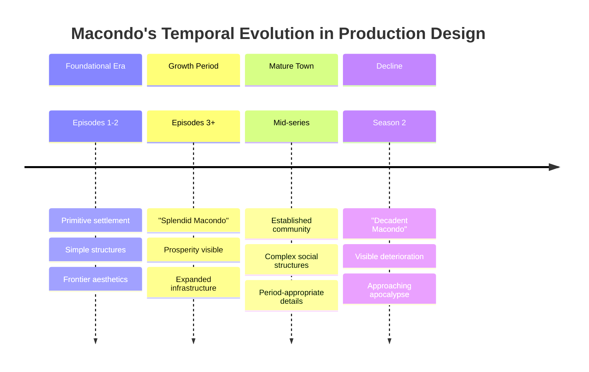
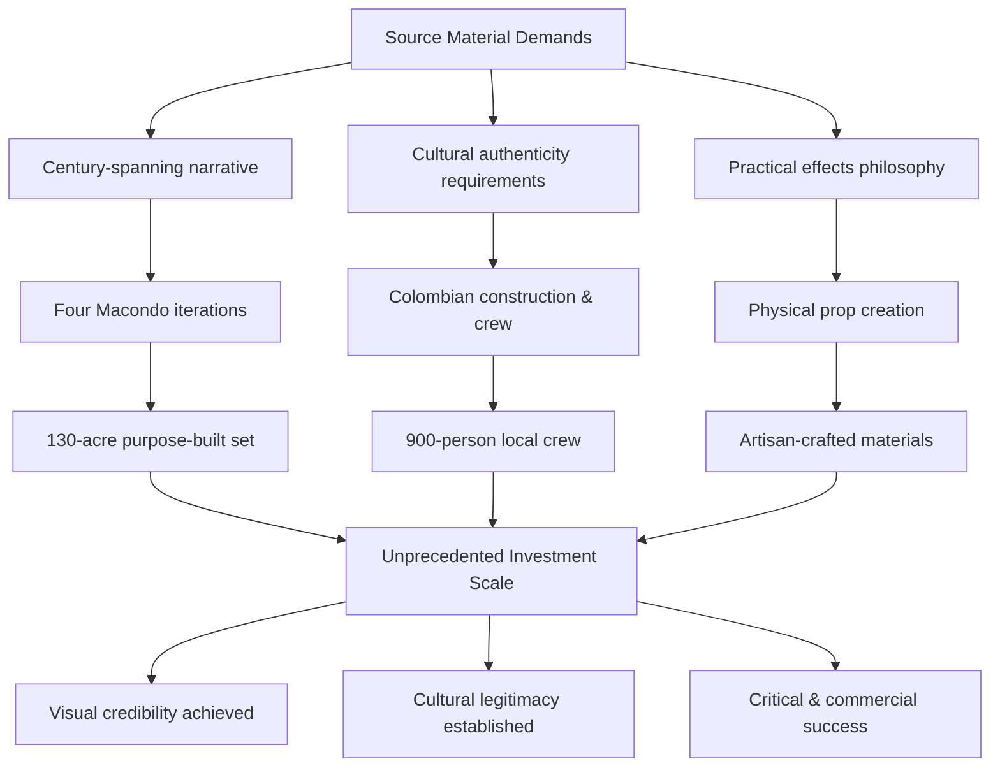

# Netflix's Successful Adaptation of One Hundred Years of Solitude: Overcoming the 'Unfilmable' Challenge
## 1 The 'Unfilmable' Novel: Understanding García Márquez's Opposition to Adaptation

Gabriel García Márquez's resistance to adapting *One Hundred Years of Solitude* for screen was not merely a personal preference but a deeply held philosophical position maintained throughout his lifetime. Until his death in 2014, the Nobel laureate repeatedly and emphatically declared that his masterwork was "impossible to commit to film," insisting that the book was "written *against* the cinema"[^1]. This chapter systematically examines the multifaceted foundations of his opposition—philosophical, artistic, and cultural—establishing the critical context necessary to understand why Netflix's eventual adaptation represented such a profound departure from the author's explicit and documented wishes.

### 1.1 The Sacred Relationship Between Reader and Text

At the heart of García Márquez's opposition lay a profound conviction about the irreplaceable nature of the reader's imaginative engagement with literature. In a 1991 interview, he articulated this belief with remarkable clarity: "The novel, unlike movies, leaves the reader a margin of creation that allows them to imagine the characters, the environments, and the situations as they think they are... they reconstruct the novel in their imagination and create a novel for themselves. Now, you can't do that in cinema"[^2]. This statement reveals not merely a preference but a fundamental philosophy about the relationship between text and reader.

García Márquez viewed this "margin of creation" as **the defining gift that literature offers its audience**—a collaborative space where each reader becomes, in essence, a co-creator of the narrative experience. When a reader encounters Úrsula Iguarán or Colonel Aureliano Buendía on the page, they construct these characters from their own imagination, drawing upon personal experiences, cultural memories, and individual aesthetic sensibilities. The result is that no two readers encounter precisely the same Macondo; each creates a unique version that belongs to them alone.

Film, in García Márquez's analysis, fundamentally violates this sacred compact. Cinema imposes fixed visual interpretations—specific faces, particular landscapes, definitive colors and textures—that supplant the reader's imaginative constructions. As writer and university professor Nicolás Pernett summarized this concern, a Netflix adaptation would constitute nothing less than an "assault" on "pure literary imagination"[^2]. The author's fear was not simply that an adaptation might fail to capture his vision, but that any visual representation would necessarily destroy the infinite plurality of visions his readers had created.

This philosophy connected to García Márquez's broader understanding of the fundamental differences between literary and cinematic storytelling. In his 1981 interview with *The Paris Review*, he drew a crucial distinction: "In journalism, just one fact that is false prejudices the entire work. In contrast, in fiction, one single fact that is true gives legitimacy to the entire work... A novelist can do anything he wants so long as he makes people believe in it"[^3]. This observation reveals his understanding that fiction operates through a fundamentally different epistemology than visual media—one that depends upon the reader's willing participation in constructing belief rather than passive acceptance of presented images.

### 1.2 'Written Against the Cinema': The Novel's Structural Resistance

García Márquez's claim that *One Hundred Years of Solitude* was "written *against* the cinema" suggests not merely incompatibility but deliberate opposition—that the novel's very structure was conceived as a refutation of cinematic conventions[^1]. Following its publication in 1967, he repeatedly rejected attempts to purchase adaptation rights, insisting that the scope and voice of his most famous work would function on screen only under conditions so extreme as to be practically impossible: "told in Spanish over the course of 100 hours—or, according to other reports, a full 100 years"[^1].

These hyperbolic time requirements—100 hours or 100 years—were not arbitrary figures but rather García Márquez's way of expressing what he perceived as the **fundamental incompatibility between the novel's form and the film medium**. The novel spans seven generations of the Buendía family, encompassing approximately one hundred years of Colombian history from the founding of Macondo to its apocalyptic destruction. This vast temporal scope presents challenges that go far beyond mere running time.

The novel's non-linear narrative structure further complicates any attempt at visual translation. García Márquez weaves past, present, and future into a tapestry where time itself becomes cyclical rather than progressive—a structural choice that reflects the novel's thematic preoccupation with repetition, fate, and the inescapability of history. Characters share names across generations, events echo and mirror one another, and the famous opening sentence places us simultaneously in three temporal moments. Such narrative complexity, García Márquez believed, could only be experienced through the sustained, recursive engagement that reading allows—the ability to pause, return, reread, and gradually construct understanding over time.

The distinctive magical realist voice that permeates the novel presents perhaps the most intractable challenge. García Márquez's prose renders the extraordinary ordinary and the ordinary extraordinary through a narrative tone that treats levitating priests and rains of yellow flowers with the same matter-of-fact acceptance as mundane domestic details. This tonal achievement depends upon the reader's gradual acclimatization to the narrative voice—an acclimatization that occurs through the accumulation of words on a page rather than images on a screen. As García Márquez himself observed, "The biggest praise for my work comes for the imagination, while the truth is that there is not a single line in all my work that does not have a basis in reality. The problem is that Caribbean reality resembles the wildest imagination"[^3]. This grounding of the magical in the real requires a narrative mediation that García Márquez believed only literature could provide.

### 1.3 Cultural Imperialism and the Fear of Hollywood Distortion

Beyond philosophical and structural concerns, García Márquez harbored deep anxieties about adaptation stripping *One Hundred Years of Solitude* of its essential Latin American identity. In a 1987 interview, he offered a sardonic vision of what Hollywood adaptation would entail: "so costly a production that it would have to be with big stars, De Niro as Colonel Aureliano Buendía or Sophia Loren as Ursula"[^2]. This image—American and Italian actors embodying Colombian Caribbean characters—encapsulated his fear that adaptation would inevitably impose foreign faces upon a story whose meaning was inseparable from its cultural specificity.

This concern connected directly to García Márquez's broader critique of how the outside world interpreted Latin American reality. In his 1982 Nobel Lecture, "The Solitude of Latin America," he argued forcefully that "the interpretation of Latin American reality through foreign patterns only makes it more unknown, less free, and more solitary"[^4]. He questioned why "originality granted in literature is denied in attempts at social change," suggesting that the same condescension that dismissed Latin American political aspirations also threatened to distort Latin American cultural expression[^4].

The novel itself was widely understood as **"the most comprehensive depiction of Latin America"**—what García Márquez described as a "grand, inclusive, metaphorically far-reaching continental narrative"[^2]. To hand this narrative to Hollywood would risk transforming it into something palatable to foreign audiences but unrecognizable to the people and places it sought to represent. García Márquez's fear was not merely aesthetic but political: that adaptation would become another form of the cultural imperialism he had spent his career resisting.

In interviews, García Márquez consistently emphasized his desire to maintain direct communication with his readers: "I want to communicate with my readers directly, through the words I write for them"[^2]. This statement reveals his understanding of the novel as a form of unmediated connection between author and audience—a connection that film, with its armies of producers, directors, actors, and technicians, would inevitably compromise. The intimacy of reading, where one consciousness encounters another through the medium of language alone, represented for García Márquez a form of cultural authenticity that cinema could not replicate.

### 1.4 The Novelist's Ambivalent Relationship with Cinema

The depth of García Márquez's opposition to adapting *One Hundred Years of Solitude* becomes even more striking when considered against his extensive engagement with cinema throughout his career. He was not a literary purist dismissive of film as an art form; rather, he was an "avid cinephile and screenwriter himself"[^1] who had studied directing in Rome, worked as a screenwriter in Mexico, and co-founded Cuba's International Film and Television School in San Antonio de los Baños[^2]. He had authorized adaptations of other works, including *Chronicle of a Death Foretold* and *Love in the Time of Cholera*[^1].

In a 1982 interview, García Márquez reflected on his early ambitions: "There was a time when I wanted to be a film director, and I studied directing in Rome. I felt that cinema was a medium that had no limitations, where everything was possible"[^5][^6]. He came to Mexico specifically to work in film, not as a director but as a screenwriter. Yet his experience revealed what he came to see as cinema's fundamental limitation: "I came to realize that a great limitation of cinema is that it's an industrial art, a whole industry. It's very difficult in cinema to express what you really want to say"[^5][^6].

This recognition of cinema as "industrial art" helps explain why García Márquez treated *One Hundred Years of Solitude* as uniquely untouchable among his works. Other novels might survive the compromises inherent in film production, but his masterwork—the book that had sold over 50 million copies in 32 languages and secured his reputation as the master of magical realism[^2]—required protection from the industrial processes that would inevitably dilute its vision.

García Márquez captured this tension in a memorable metaphor: his relationship with cinema was like "a couple who can't live apart yet can't live together"[^5][^6]. He remained fascinated by film's possibilities while increasingly convinced of its limitations. When asked to choose between owning a film company or a magazine, he unhesitatingly chose the magazine[^6]—a choice that revealed his ultimate allegiance to the written word.

The paradox deepens when we consider his 1982 observation: "I have seen many great films based on very bad novels, but I have never seen a great film based on a great novel"[^2][^5][^6]. This statement suggests not merely that great novels resist adaptation but that the qualities making a novel great are precisely those that cannot survive translation to screen. The implication for *One Hundred Years of Solitude*—universally regarded as one of the twentieth century's greatest novels—was clear: its very greatness guaranteed that any film version would be a diminishment.

### 1.5 The Million-Dollar Barrier: Strategic Resistance Through Economics

García Márquez's philosophical objections were reinforced by practical measures designed to prevent adaptation from occurring. In a 1982 interview, he revealed his agent's strategy: "My agent priced the film rights at a million dollars to discourage inquiries, and when the offers approached that figure, the price was raised to around three million"[^5]. This escalating price barrier functioned as a concrete manifestation of his resistance—a way of ensuring that his philosophical opposition would have practical effect regardless of how persistent potential adapters might be.

The strategy was explicitly designed not to maximize profit but to prevent any deal from occurring. García Márquez made this intention unmistakable: "I have no interest in it being made into a film, and as long as I can prevent it, it will not happen"[^5][^6]. This definitive statement—"as long as I can prevent it"—would acquire profound significance after his death, when the ability to prevent adaptation passed to his heirs.

The economic barrier worked in tandem with his public statements to create what appeared to be an insurmountable obstacle. Potential adapters faced not only prohibitive costs but also the certain knowledge that the author himself opposed their efforts. Any adaptation made against García Márquez's wishes during his lifetime would have faced not only legal challenges but also the moral opprobrium of proceeding against a living author's explicit objections.

This combination of philosophical conviction, public declaration, and economic strategy established the weight of the decision that would eventually face García Márquez's sons. When Netflix announced in 2019—five years after the author's death—that it had acquired adaptation rights, the decision generated immediate controversy. Critics accused the author's children, Rodrigo and Gonzalo García Barcha, of "betraying" their father's lifelong wishes[^2]. Argentine writer Mariana Enríquez expressed reservations, arguing that violating the explicit wishes of the deceased was morally problematic[^2]. The controversy demonstrated that García Márquez's opposition had become part of the novel's cultural meaning—that *One Hundred Years of Solitude* was understood not merely as a difficult book to adapt but as a book whose author had specifically forbidden adaptation.

The significance of Netflix's eventual success, therefore, cannot be measured solely by the quality of the resulting series. It must be understood against the backdrop of García Márquez's documented, sustained, and multifaceted resistance—a resistance grounded in philosophy, reinforced by practice, and maintained until his final breath. The chapters that follow will examine how Netflix attempted to address each of the author's specific concerns, but the weight of those concerns—established over decades of interviews, statements, and strategic decisions—provides the essential context for evaluating whether the adaptation honored or betrayed the author's legacy.

## 2 Breaking the Impasse: The Estate's Decision and Netflix's Acquisition

The transformation of *One Hundred Years of Solitude* from an "unadaptable" literary monument to a Netflix production represents one of the most significant reversals in contemporary adaptation history. For nearly half a century, Gabriel García Márquez's opposition had functioned as an absolute barrier—a combination of philosophical conviction, public declaration, and economic strategy that seemed to guarantee the novel would never reach the screen. Yet within five years of his death in April 2014, the streaming giant had secured rights to what would become one of its most ambitious Latin American productions. This chapter examines the complex interplay of factors that enabled this transition: the transfer of authority to heirs with different perspectives and professional backgrounds, Netflix's strategic positioning within a transformed media landscape, the careful negotiation of conditions designed to honor the author's cultural priorities, and the ethical controversy that inevitably accompanied a decision to override a deceased master's documented wishes.

### 2.1 The Transfer of Authority: From Author's Veto to Heirs' Discretion

The death of Gabriel García Márquez on April 17, 2014, fundamentally altered the legal and moral landscape surrounding adaptation rights to *One Hundred Years of Solitude*. While the author lived, his opposition functioned as an absolute veto—no amount of money or persuasion could overcome his philosophical conviction that the novel must remain exclusively literary. With his passing, however, decision-making authority transferred to his sons, **Rodrigo García Barcha and Gonzalo García Barcha**, who would prove to hold markedly different views about their father's legacy and its relationship to visual media[^7].

The brothers' willingness to reconsider their father's position was reportedly grounded in a crucial piece of private communication. According to Rodrigo García, their father had told them that "once he was dead, we could do whatever we wanted"[^8]. This statement—informal, private, and impossible to verify independently—would become central to the family's justification for proceeding with adaptation. Whether this permission represented García Márquez's genuine acceptance of eventual adaptation or merely a resigned acknowledgment that he could not control events beyond his death remains a matter of interpretation. What is certain is that the sons understood this statement as granting them moral latitude to make decisions their father had publicly opposed during his lifetime.

The timing of the adaptation decision was shaped not only by García Márquez's death but also by the subsequent passing of other key figures who had served as guardians of his literary estate and legacy. **Carmen Balcells, García Márquez's legendary literary agent**, died in 2015—the woman who had represented him throughout his career and who had implemented the escalating price strategy designed to discourage adaptation inquiries[^9]. Her death removed one of the most formidable advocates for maintaining the author's documented wishes. More significantly, **Mercedes Barcha, García Márquez's widow and lifelong partner**, remained part of the estate's decision-making process when Netflix first approached the family in 2018, but she died in 2020—after the rights had been sold but before the series reached production[^8][^9]. The extent of her involvement in or approval of the Netflix deal remains unclear from public records, though her presence during the initial negotiations suggests she did not actively block the decision.

The progressive loss of these guardians—first the author himself, then his agent, then his widow—created what some critics perceived as an increasingly permissive environment for decisions that might not have been possible while more protective voices remained. As one analysis noted, the series launch "coincided with the passing of the two most important guardians of García Márquez's legacy"[^9]. This observation does not necessarily imply impropriety, but it does highlight how the constellation of individuals surrounding a literary estate can profoundly influence posthumous decisions about an author's work.

### 2.2 The Netflix Proposition: Strategic Timing and Industry Context

Netflix's pursuit of *One Hundred Years of Solitude* adaptation rights did not emerge from a vacuum but rather from a deliberate strategic initiative to expand the platform's presence in Latin American markets and its catalog of prestige non-English content. In 2018, **Francisco Ramos, Netflix's Vice President of Latin American content**, initiated contact with the García Márquez estate to propose what would become the streaming platform's most ambitious project in the region[^8][^10]. This approach came at a moment when Netflix was aggressively investing in international content as a key differentiator in an increasingly competitive streaming landscape.

The timing of Netflix's proposition aligned with what Rodrigo García described as **"the current golden age of series"**—a period characterized by unprecedented investment in long-form television storytelling, elevated production values that approached or exceeded theatrical film quality, and growing audience acceptance of subtitled foreign-language content[^7][^11]. This transformed media environment provided the sons with a framework for reconsidering their father's objections that had been formulated in an era of very different constraints.

García Márquez's primary stated objections—that the novel could not be captured "under the time constraints of a feature film" and that "producing it in a language other than Spanish would not do it justice"—had been articulated in a context where film adaptation meant Hollywood feature films of approximately two hours, typically produced in English for American audiences[^7]. The emergence of prestige streaming series offered a potential solution to both concerns. A multi-episode series format could provide the extended runtime García Márquez had insisted upon (even if not literally 100 hours), while Netflix's global distribution model and commitment to original-language productions meant a Spanish-language series could reach worldwide audiences without the dubbing or English-language casting the author had feared.

Rodrigo García articulated this changed calculus explicitly: "In the current golden age of series, with the level of talented writing and directing, the cinematic quality of content, and the acceptance by worldwide audiences of programs in foreign languages, the time could not be better to bring an adaptation to the global viewership that Netflix provides"[^7][^11]. This statement framed the decision not as a betrayal of García Márquez's principles but as a recognition that the conditions he had deemed necessary—Spanish language, sufficient duration, quality production—had finally become achievable.

Netflix's proposition also addressed the industrial concerns García Márquez had expressed about cinema as "industrial art" where individual vision becomes compromised by commercial imperatives. While Netflix certainly operates as a commercial enterprise, its model of commissioning prestige content and allowing creative teams substantial autonomy—at least during this period of aggressive content investment—offered a different relationship between art and industry than the Hollywood studio system García Márquez had criticized. The platform's willingness to invest over **$50 million in production costs** and to accept the family's conditions regarding language, location, and casting demonstrated a level of commitment to cultural authenticity that traditional Hollywood adaptations had rarely offered[^12].

### 2.3 Negotiating the Terms: Family Requirements and Contractual Conditions

The negotiations between the García Barcha family and Netflix resulted in a set of contractual conditions that directly addressed García Márquez's documented concerns about cultural authenticity and potential Hollywood distortion. These requirements transformed what might have been a standard licensing agreement into a carefully structured framework designed to preserve the novel's Latin American identity while enabling its translation to visual media.

The family's demands can be understood as an attempt to honor their father's cultural priorities even while overriding his categorical opposition to adaptation. The specific conditions included:

| Requirement | Rationale | Implementation |
|-------------|-----------|----------------|
| **Spanish-language production** | Addressed García Márquez's insistence that the story must be told in Spanish | All dialogue filmed in Spanish with subtitles for international distribution |
| **Colombian filming locations** | Honored the novel's deep connection to Colombian Caribbean culture and landscape | Entire series filmed across 15 locations in Colombia |
| **Colombian cast and crew** | Prevented the "De Niro as Colonel Aureliano" scenario García Márquez had mocked | Almost entirely Colombian cast, many non-professional actors; Colombian-based 900-person crew |
| **Sufficient duration** | Addressed the time constraints objection central to García Márquez's resistance | 16-episode series format (two seasons of eight episodes each) |
| **Family executive producer roles** | Ensured ongoing oversight of creative decisions | Rodrigo and Gonzalo García Barcha served as executive producers throughout production |

The **construction of Macondo** became perhaps the most tangible expression of Netflix's commitment to these conditions. The streaming platform agreed that the mythical town would be "recreated in Colombia and built by Colombians"[^13]. The result was an unprecedented production facility: a **540,000-square-meter (approximately 130-acre) set** in Alvarado, Tolima, representing one of the largest purpose-built television sets in Latin American history[^13][^10]. This massive investment in physical infrastructure demonstrated that Netflix was not merely paying lip service to cultural authenticity but was willing to make substantial financial commitments to realize it.

The economic dimensions of the agreement extended beyond production budgets to encompass broader regional impact. Netflix reported that filming the adaptation "delivered a **225 billion Peso ($51.8 million) economic boost** to Colombia," a figure measuring impact on Colombian GDP including both direct production spending and downstream supply chain effects[^13]. This economic footprint transformed the adaptation from a purely artistic endeavor into a significant event for Colombia's creative economy, with the President of Colombia attending the series launch and describing it as "a high-quality product that respects Colombian culture and nature"[^12].

The family's decision to serve as executive producers represented more than an honorific title—it provided a mechanism for ongoing creative oversight that distinguished this adaptation from the arm's-length licensing arrangements García Márquez had feared. Rodrigo García Barcha, himself an accomplished film director whose credits include *Things You Can Tell Just by Looking at Her* and episodes of *The Sopranos* and *Six Feet Under*, brought professional expertise to this supervisory role[^9]. His brother Gonzalo, who had worked in film production and design on projects including Julie Taymor's *Frida*, similarly possessed the technical knowledge to evaluate creative decisions meaningfully[^9].

### 2.4 The Ethical Controversy: Literary Community Responses and Precedents

Despite the careful negotiation of conditions designed to honor García Márquez's cultural priorities, the decision to adapt *One Hundred Years of Solitude* generated significant controversy within literary circles. Critics argued that no set of contractual conditions could address the fundamental ethical problem: **the author had explicitly, repeatedly, and publicly opposed adaptation throughout his lifetime**, and proceeding after his death constituted a violation of his documented artistic wishes.

The controversy centered on a question with no easy answer: **Do heirs have the moral right—or perhaps even the responsibility—to override an author's explicit directives about their work?** This question has no universal answer in literary history, and different cases have produced different judgments.

One analysis framed the decision as going "against the wishes of their father," noting that García Márquez "had been adamant against adapting the novel for film, believing that specific visual representations would undermine the complexity of the narrative and limit readers' ability to imagine the novel's images"[^9]. The author's conviction that film would constitute an "assault" on "pure literary imagination" represented not a casual preference but a deeply held philosophical position maintained over decades of interviews and public statements.

The García Barcha brothers' decision to proceed with adaptation paralleled—and was complicated by—their simultaneous decision to publish their father's final, unfinished novel *Until August* in 2024, despite García Márquez's explicit instruction that the manuscript be destroyed. For that publication, the brothers explicitly acknowledged the transgressive nature of their choice, writing in their introduction: **"In an act of betrayal, we decided to put his readers' pleasure ahead of all other considerations"**[^14][^15]. This remarkable framing—the author's own sons describing their decision as "betrayal"—provided a template for understanding how they conceptualized their relationship to their father's wishes.

Gonzalo García Barcha defended the *Until August* decision by invoking literary precedent: "There are plenty of examples in the history of literature of people who are requested to destroy manuscripts, and then they turn out to be important items in literature"[^14]. The most famous such example is Franz Kafka's instruction to his friend Max Brod to burn his unpublished manuscripts—an instruction Brod famously ignored, preserving works including *The Trial* and *The Castle* that became cornerstones of twentieth-century literature. Similarly, Emily Dickinson's poetry survived only because her sister ignored her wishes for destruction, and Ludwig Wittgenstein's *Philosophical Investigations* exists because friends persuaded him not to destroy it[^9].

However, critics noted crucial differences between these precedents and the García Márquez situation. Kafka never published *The Trial* or *The Castle* during his lifetime—the works existed only in manuscript form and had never been offered to the public. García Márquez, by contrast, had published *One Hundred Years of Solitude* in 1967 and had spent the subsequent decades actively protecting it from adaptation. His opposition was not a private instruction to a friend but a public, documented, and repeatedly affirmed position. The question was not whether to preserve an unpublished work but whether to transform a published work into a different medium against the author's explicit wishes.

Miranda France, consultant editor for Spain, Portugal and Latin America at the *Times Literary Supplement*, offered a measured critique of the *Until August* publication that applies equally to the adaptation question: "The danger is that not only does it not really add, but it might actually slightly detract" from García Márquez's otherwise "terrific" body of work[^14]. This concern—that posthumous decisions might diminish rather than enhance a literary legacy—haunted both the novel's publication and the television adaptation.

### 2.5 The Sons' Justification: Professional Background and Personal Rationale

The García Barcha brothers' decision to authorize the Netflix adaptation cannot be fully understood without examining their professional backgrounds and personal relationship to both their father and the film industry. Unlike heirs who might approach such decisions from purely financial or sentimental perspectives, **Rodrigo and Gonzalo García Barcha possessed deep professional connections to cinema** that shaped their evaluation of adaptation feasibility and their confidence in their ability to oversee the process meaningfully.

**Rodrigo García Barcha** is an accomplished film and television director in his own right, with credits including *Things You Can Tell Just by Looking at Her*, *Nine Lives*, and episodes of prestigious television series such as *The Sopranos*, *Six Feet Under*, and *In Treatment*[^9]. His career demonstrates both artistic sensibility and practical understanding of how complex narratives translate to visual media. This expertise positioned him to evaluate Netflix's proposition with professional judgment rather than mere hope—to assess whether the proposed format, timeline, and creative team could plausibly achieve what his father had deemed impossible.

**Gonzalo García Barcha** has worked in film production and design, with credits including Julie Taymor's *Frida*[^9]. His technical knowledge of production processes provided complementary expertise to his brother's directorial perspective, enabling the family to engage with Netflix's proposals at a professional level.

This professional background created both advantages and potential complications. On one hand, the brothers' industry experience meant they could serve as genuinely effective executive producers rather than merely lending their names to the project. Their involvement went beyond "the most general aspects—ensuring it was in Spanish, predominantly Colombian, and of sufficient duration"—to encompass meaningful creative oversight[^10]. On the other hand, their deep integration into the film industry may have predisposed them to view adaptation more favorably than their father had, creating what some critics perceived as a conflict of interest.

When confronted with accusations of greed—the suggestion that financial considerations had motivated their decision—Rodrigo García Barcha responded with evident emotion: "When he reads accusations of greed, he feels sad, but ultimately these are decisions they have to make"[^8]. This statement reveals both the personal cost of the controversy and the brothers' conviction that they were exercising legitimate authority over decisions that fell within their purview as heirs.

The brothers' public justification rested on several pillars. First, they invoked their father's private statement that they could "do whatever they wanted" after his death—a permission that, while impossible to verify, provided moral cover for proceeding[^8]. Second, they argued that the transformed media landscape had made possible what their father had deemed impossible—that the "golden age of series" and global acceptance of foreign-language content had created conditions that addressed his specific objections[^7]. Third, they emphasized the contractual conditions they had secured, framing these requirements as a way of honoring their father's cultural priorities even while overriding his categorical opposition.

Rodrigo García Barcha described the adaptation as **"a huge success"** based on its reception, noting that he reads "only the headlines and first paragraphs of reviews to gauge the trend of acceptance, which he considers important for inviting people to engage with the series"[^12]. This metric of success—audience engagement and critical acceptance—represents a different standard than the one García Márquez himself would likely have applied. The author had been concerned not with whether an adaptation would be well-received but with whether adaptation itself was appropriate. The brothers' satisfaction with the series' reception suggests they had adopted a different framework for evaluating the decision—one focused on outcomes rather than principles.

The first season of eight episodes reached Netflix's **top 10 in non-English-language series worldwide**, with over **12 million hours watched in its first month**[^12]. By conventional streaming metrics, the adaptation has achieved significant commercial success. Whether this success vindicates the brothers' decision or merely demonstrates that audiences will consume content regardless of its ethical provenance remains a matter of perspective. What is certain is that the decision to proceed—made possible by the transfer of authority from author to heirs, enabled by Netflix's strategic proposition, structured by carefully negotiated conditions, and defended against ethical criticism—transformed *One Hundred Years of Solitude* from an untouchable literary monument into a major streaming production, fundamentally altering the novel's relationship to visual media and its place in contemporary culture.

## 3 Addressing the Author's Concerns: Netflix's Strategic Framework

The transformation of Gabriel García Márquez's categorical opposition into a viable production required more than securing family approval—it demanded a comprehensive strategic framework that could credibly address each of the author's documented objections. Netflix's approach represented an attempt to demonstrate that the conditions García Márquez had deemed impossible were now achievable, constructing a production model that systematically engaged with his philosophical, cultural, and practical concerns. This chapter examines whether these strategic choices constituted genuine solutions to the author's lifelong resistance or merely sophisticated accommodations designed to overcome family hesitation while serving the platform's commercial imperatives.

### 3.1 The Language Imperative: Spanish-Language Production as Cultural Preservation

García Márquez's insistence that any adaptation must be produced in Spanish represented perhaps his most non-negotiable requirement—a condition that had effectively blocked Hollywood interest for decades. His 1987 sardonic vision of "big stars, De Niro as Colonel Aureliano Buendía or Sophia Loren as Ursula" encapsulated not merely a casting concern but a deeper anxiety about linguistic imperialism[^2]. The author understood that language carries culture, and that imposing English dialogue on the Buendía family would fundamentally alter the story's relationship to its Latin American roots.

Netflix's decision to produce the entire series in Spanish—titled *Cien Años de Soledad* in its original form—directly addressed this foundational concern[^16]. The choice was both culturally significant and commercially strategic, reflecting the transformed media landscape that Rodrigo García Barcha had cited as justification for reconsidering his father's position. **The growing global acceptance of subtitled foreign-language content**—demonstrated by the success of productions ranging from *Narcos* to *Squid Game*—had created market conditions where Spanish-language production no longer meant limited distribution or commercial marginalization.

Francisco Ramos, Netflix's Vice President of Latin American content, explicitly connected the language decision to the platform's broader strategic vision, citing "the global appeal of Latin American content" as both artistic and commercial rationale[^17]. This alignment of cultural authenticity with business strategy represented a departure from the Hollywood model García Márquez had criticized, where commercial imperatives typically demanded English-language production to maximize domestic American audiences.

However, the question of whether Spanish-language production alone could preserve the novel's linguistic texture remains more complex. García Márquez's prose draws heavily on the **Caribbean Costeño dialect**—a regional variation of Colombian Spanish characterized by distinctive rhythms, vocabulary, and patterns of speech that reflect the novel's geographic and cultural specificity. One critical analysis noted that "a stronger Caribbean accent would have enhanced authenticity" in the series' voice-over narration, suggesting that even within Spanish-language production, questions of regional linguistic fidelity remained imperfectly resolved[^18].

The series' actors underwent training to master period-appropriate speech patterns and regional accents, with the creative team receiving "Colombian history lessons about the Thousand Days' War" and actors learning "the regional Costeño accent"[^17]. This attention to linguistic detail demonstrated awareness that Spanish-language production was necessary but not sufficient—that authentic representation required engagement with the specific registers of Colombian Caribbean speech rather than generic Latin American Spanish.

### 3.2 Rooting Macondo in Colombian Soil: Location, Labor, and Economic Impact

García Márquez's concern that adaptation would strip *One Hundred Years of Solitude* of its "Latin American essence" extended beyond language to encompass the physical landscape in which the story would be visualized[^2]. The mythical town of Macondo—though fictional—was rooted in the Colombian Caribbean geography of García Márquez's childhood, drawing on memories of Aracataca and the banana plantation regions that shaped his imaginative world. Netflix's commitment to filming entirely in Colombia represented an attempt to ground the adaptation in authentic physical space rather than recreating Latin America on soundstages in Los Angeles or Madrid.

The scale of this commitment proved unprecedented in Latin American television production. Netflix constructed a **life-sized replica of Macondo spanning approximately 540,000 square meters (nearly 130 acres)** near Alvarado in the Tolima department, employing 1,100 workers to build what would become one of the largest purpose-built television sets in the region's history[^19][^16]. The production filmed across fifteen locations throughout Colombia, including the departments of La Guajira, Magdalena, Cesar, Cundinamarca, and Tolima—regions that collectively represent the diverse landscapes García Márquez drew upon in constructing his fictional geography[^19].

The physical construction of Macondo required addressing a challenge unique to the novel's temporal scope: **the town evolves dramatically over the century the story spans**, from primitive frontier settlement to prosperous town to decaying ruin. Executive producer Diego Ramírez Schrempp identified this as "the biggest challenge" of the production—"time's passage, as the story spans one hundred years, affecting sets, costumes, cast, and every aspect"[^20]. The solution involved constructing **four distinct versions of Macondo** to represent different stages of the town's evolution: a "foundational Macondo" for early episodes, a "splendid Macondo" from episode three onward, and preparations for a "decadent Macondo" in the second season[^18][^20].

The economic dimensions of this Colombian commitment extended far beyond production budgets. Netflix reported that filming generated a **225 billion peso ($51.8 million) contribution to Colombia's GDP**, measuring both direct production spending and downstream economic effects[^19][^21]. This figure transformed the adaptation from purely artistic endeavor into significant national economic event, with the Colombian government actively supporting production and the President attending the series launch.

**The involvement of local artisans and craftspeople** represented another dimension of authentic Colombian production. Over 150 artisans from different Colombian communities contributed to the series, with materials like tiles and palm thatch sourced from local suppliers and elements such as linens and ceramics created by local craftspeople[^20][^17]. Production designer Bárbara Enríquez detailed the recreation of nineteenth-century architectural styles and flora, with props like baskets and hats commissioned specifically from Colombian artisans[^17]. This approach honored Rodrigo García Barcha's stated intention that the production should "give back to local communities" and "contribute to the country's cultural industry development, leaving an important industrial and professional legacy"[^20].

Yet the question remains whether physical authenticity automatically translated into narrative authenticity. One critical analysis observed that despite "lavish production design—Netflix's most expensive in Latin America—the physical sets pale beside Márquez's metaphorical treatment of space"[^18]. García Márquez's Macondo exists as much in linguistic and imaginative space as in physical geography; whether even the most meticulously constructed set could capture the town's symbolic dimensions represents a limitation that no amount of production investment could fully overcome.

### 3.3 Colombian Faces and Voices: Casting Strategy and the Rejection of Hollywood Stars

García Márquez's sardonic 1987 vision of Hollywood stars imposing "American or European faces on Latin American characters" had crystallized his fear that adaptation would visually colonize his narrative[^2]. Netflix's casting strategy represented a direct repudiation of this scenario, implementing an approach that prioritized Colombian authenticity over international star power—a choice that carried both artistic and commercial risks.

The casting process began with an **open call in 2022 that reviewed over 10,000 candidates for the 25 main roles**[^19]. This exhaustive search reflected the production's commitment to finding actors who could embody the Buendía family with cultural authenticity rather than selecting from established international talent pools. The resulting cast was almost entirely Colombian, featuring performers largely unknown to international audiences:

| Character | Actor | Notable Casting Decision |
|-----------|-------|-------------------------|
| José Arcadio Buendía | Diego Vásquez | Colombian theater actor |
| Úrsula Iguarán | Marleyda Soto | Colombian actress with telenovela background |
| Colonel Aureliano Buendía | Claudio Cataño | Colombian actor praised for "haunting stillness"[^22] |
| Pilar Ternera | Viña Machado | Colombian actress spanning multiple generations |
| Rebeca | Akima | Maintained character's "wildness into adulthood"[^22] |

A particularly striking aspect of the casting strategy was the decision that **only 30% of the cast would be professional actors**[^19]. This choice reflected both practical necessity—the scale of the production required more performers than Colombia's professional acting community could supply—and artistic philosophy. The use of non-professional actors has a distinguished history in Latin American cinema, associated with neorealist traditions that prioritize authenticity over polish. The selection of **20,000 extras from local communities** further embedded the production in Colombian social reality rather than relying on professional extras imported from larger production centers[^2][^19].

The risk inherent in this approach was significant. García Márquez's novel contains some of the most psychologically complex characters in twentieth-century literature; whether predominantly unknown actors—many without professional training—could carry the weight of such demanding material represented a genuine artistic gamble. Critical reception suggested the gamble largely succeeded. Reviews praised specific performances, with Claudio Cataño bringing "a haunting stillness to the grown-up Aureliano" and the actress playing Rebeca retaining "her wildness into adulthood"[^22]. The series was described as featuring "superb casting" that contributed to "unforgettable scenes"[^23].

However, some critics noted that the casting strategy created its own limitations. The use of non-professional actors, while authentic, occasionally produced performances that lacked the technical precision that more experienced performers might have brought. The series' reliance on dialogue heavier than the book's original text placed additional demands on actors who were simultaneously learning period-appropriate accents and skills like goldsmithing to embody their characters authentically[^18][^22].

### 3.4 From Two Hours to Sixteen Episodes: The Series Format as Temporal Solution

García Márquez's most frequently cited objection to adaptation concerned temporal constraints—his insistence that the novel could only be rendered "over the course of 100 hours—or, according to other reports, a full 100 years." These hyperbolic figures expressed his conviction that the story's seven-generation, century-spanning scope was fundamentally incompatible with the time limitations of feature film. The emergence of prestige streaming series offered a potential solution that had not existed when García Márquez first formulated his objections.

Netflix's decision to structure the adaptation as a **16-episode limited series, divided into two seasons of eight episodes each**, represented the most direct attempt to address the temporal constraint problem[^19][^24]. At approximately one hour per episode, the format provided roughly sixteen hours of content—substantially more than the two hours a feature film would allow, though far short of García Márquez's hyperbolic 100-hour requirement. The question became whether this intermediate duration could capture the novel's scope without the compression that had made feature film adaptation seem impossible.

The series format offered structural advantages beyond mere duration. **Episodic storytelling allowed the narrative to breathe**, providing space for the gradual accumulation of detail and the patient development of multiple generations that the novel's structure demands. As one analysis noted, "the expansive, limited-series format was the ideal container for the multigenerational saga, allowing it to escape the constraints of a two-hour film"[^16]. The format enabled the production to "capture the breadth of [García Márquez's] narrative" in ways that theatrical release could not accommodate[^24].

However, the adaptation of a non-linear novel to episodic television required significant structural adjustments. The series' scripts, overseen by Oscar nominee José Rivera, "interpret García Márquez's text by streamlining the book's many swirling, time-hopping storylines" to allow for "the clear character arcs expected from episodic TV"[^24]. This streamlining represented a necessary accommodation to the demands of visual storytelling, but it also meant that the novel's distinctive temporal structure—its cyclical treatment of time, its recursive patterns, its famous opening sentence that places readers simultaneously in three temporal moments—could not be preserved intact.

One critical analysis described the adaptation as shifting "the novel's cyclical structure toward a more linear narrative while preserving key elements of fate, such as the prolepsis of Colonel Aureliano Buendía facing the firing squad"[^18]. This compromise—maintaining certain temporal markers while linearizing the overall structure—represented an attempt to balance fidelity to the source material against the practical requirements of television narrative. Whether this balance succeeded or merely demonstrated the limits of any visual adaptation remains a matter of critical debate.

The pacing of sixteen hours also created its own challenges. Some critics noted that "despite hints of humor and sensuality, this adaptation can sometimes lapse into reverent formality" and that "retaining García Márquez's swift pace, it occasionally moves too quickly past crucial moments"[^22]. The paradox of having more time than feature film yet still feeling rushed suggests that García Márquez's hyperbolic time requirements may have reflected genuine insight into the story's demands rather than mere rhetorical exaggeration.

### 3.5 Latin American Vision: The Selection of Laura Mora and Alex García López

García Márquez's fear of Hollywood distortion extended beyond language and casting to encompass the creative vision that would shape the adaptation's aesthetic and narrative approach. His concern was not merely that American actors might play Colombian characters, but that American sensibilities would impose foreign interpretive frameworks on Latin American reality. Netflix's selection of **Colombian director Laura Mora and Argentine director Alex García López** to helm the series represented an attempt to ensure that the adaptation would be guided by Latin American creative vision rather than Hollywood conventions.

The choice of Laura Mora brought specifically Colombian perspective to the production. Her previous work, including *The Kings of the World* (Colombia's 2023 Oscar entry) and *Pablo Escobar: The Father of Evil*, demonstrated engagement with Colombian social realities and visual traditions[^25][^20]. Mora's initial reaction to the adaptation proposal—that it seemed "an act of folly and irresponsible"—suggested she approached the project with appropriate awareness of its difficulty rather than naive enthusiasm[^26]. Her eventual decision to participate came from recognizing that "the best way to guarantee the series would have made García Márquez proud was to take the plunge and make it their own"[^26].

Alex García López brought complementary expertise: experience managing large-budget television productions (including *The Witcher* and *Chilling Adventures of Sabrina*) combined with Latin American roots that aligned with the project's cultural priorities[^25][^20]. His previous adaptation experience with *Cowboy Bebop*—which was not well-received by fans—had made him initially hesitant, but he recognized the opportunity as "one he could not miss"[^25]. García López's ability to navigate substantial production budgets while maintaining artistic vision was considered essential for achieving "the goal of creating an authentic Colombian story on a scale equal to American and European productions"[^25].

**The directors' approach to magical realism** became central to the adaptation's aesthetic strategy. Mora articulated their guiding principle: "One of the great gambles was to distance ourselves from magical realism interpreted as a fantastic place and embrace it instead as a poetic place, where reality surpasses any fiction in an artisanal way"[^26]. This distinction—between fantastic and poetic—reflected an attempt to honor García Márquez's own understanding of his work. The author had consistently maintained that his magical realism was grounded in Caribbean reality rather than pure fantasy, insisting that "there is not a single line in all my work that does not have a basis in reality."

The practical implementation of this philosophy involved shooting magical elements **in-camera whenever possible, avoiding visual effects**. Co-director Mora explained: "The formal decision was that 'Everything has to feel very homemade, very analog, very, very on-camera'"[^17]. Ghosts were portrayed by flesh-and-blood actors; the levitating priest was lifted with ropes on set; the famous flower rain scene used thousands of real and plastic flowers falling while cameras rolled[^17]. This approach aimed to present supernatural elements with the same matter-of-fact acceptance that characterizes García Márquez's prose, rather than signaling their extraordinariness through CGI spectacle.

However, the question of whether Latin American directorial vision could fully counterbalance Netflix's algorithmic production model remained contested. Critical analyses noted that "the series follows a corporate production model guided by algorithms" and that Netflix's approach prioritizes "comfort and familiarity over challenge"[^12]. One particularly pointed critique suggested that "the best director on Netflix is not a filmmaker, it's an algorithm"[^12]. The tension between individual artistic vision and platform-wide content strategies represented a structural constraint that even carefully selected directors could not entirely overcome.

### 3.6 Family Oversight as Creative Safeguard: The Executive Producer Role

The García Barcha brothers' roles as executive producers represented Netflix's final strategic element for addressing concerns about creative integrity—a mechanism for ongoing family oversight that distinguished this adaptation from standard licensing arrangements where authors or estates surrender creative control upon signing contracts. Whether this oversight provided substantive creative protection or primarily served legitimizing functions requires careful examination.

**Rodrigo García Barcha's professional credentials** gave weight to his executive producer role. As an accomplished director whose credits include *Things You Can Tell Just by Looking at Her* and episodes of *The Sopranos* and *Six Feet Under*, he possessed the technical knowledge and industry standing to engage meaningfully with creative decisions rather than merely lending his name to the project[^19]. His brother Gonzalo's experience in film production and design provided complementary expertise. Together, they could evaluate proposals, challenge decisions, and advocate for approaches aligned with their father's artistic priorities.

The nature of their involvement extended beyond passive approval to active creative guidance. Rodrigo García Barcha reportedly told the creative team they "should feel free to truly adapt it," explaining that "previous adaptations of his father's work suffered from too much respect for the book and too much awe for the writer"[^26]. This instruction—to adapt rather than merely illustrate—reflected sophisticated understanding of what successful adaptation requires: not slavish fidelity but intelligent translation between media with different expressive capabilities.

At the same time, the brothers acknowledged limits to their involvement. They described their oversight as focusing on "the most general aspects of the adaptation—ensuring it was in Spanish, predominantly Colombian, and of sufficient duration to do justice to the book"—after which they "allowed Netflix to proceed"[^10]. This characterization suggests that family oversight operated primarily at the level of foundational conditions rather than granular creative decisions, leaving substantial latitude for the production team to make choices the brothers might not have made themselves.

The executive producer role also served important legitimizing functions regardless of its substantive creative impact. **Family involvement provided moral cover** for an adaptation that proceeded against the author's documented wishes. Critics who might have dismissed the series as exploitation of a deceased master's legacy faced the complicating fact that his own sons—themselves accomplished filmmakers—had approved and participated in its creation. Rodrigo García Barcha's satisfaction with the result—describing it as "a huge success" based on audience reception[^12]—suggested the family considered their oversight effective, though this assessment focused on commercial metrics rather than artistic fidelity.

The tension between meaningful oversight and commercial production realities emerged in critical analyses of the finished series. One review noted that the adaptation "coincides with a Netflix directive to its screenwriters" to "have characters announce what they are doing so that viewers who have this show on in the background can follow along"[^12]. The replacement of the novel's omniscient narrator with character narration by Aureliano Babilonia was interpreted by some critics as reflecting this platform-wide approach to casual viewing rather than artistic choice[^12]. Whether family oversight could—or did—push back against such directives remains unclear from public accounts.

**The ultimate assessment of Netflix's strategic framework** depends on how one weighs different measures of success. By the standard of addressing García Márquez's specific documented objections—Spanish language, Colombian production, sufficient duration, Latin American creative vision—the framework achieved its stated goals. The series was produced entirely in Spanish, filmed across Colombia with predominantly Colombian cast and crew, structured as a sixteen-episode limited series, and directed by Latin American filmmakers with family oversight throughout.

By the standard of preserving what García Márquez considered essential about his novel—the reader's imaginative freedom, the purely literary achievement, the resistance to visual fixation—the framework's success is more contested. One critic observed that "something essential is missing" in the adaptation, that "the novel is above all a feat of language, a singular strategy for conveying the world" that "has been lost"[^23]. Another noted that the series, despite its accomplishments, represents "a traditional audiovisual product derived from a novel that was anything but traditional"—a "paradox" that no strategic framework could fully resolve[^12].

The framework succeeded in making adaptation possible and in producing a series that achieved significant commercial success and generally positive critical reception. Whether it succeeded in honoring García Márquez's deeper concerns about the relationship between literature and visual media—concerns that extended beyond specific production conditions to fundamental questions about artistic form—remains the subject of ongoing debate that subsequent chapters will continue to explore.

## 4 Production Scale and Authenticity: Building Macondo

The physical realization of Gabriel García Márquez's fictional universe demanded an investment unprecedented in Latin American television history. Netflix's commitment to constructing a life-sized Macondo—rather than relying on existing locations or digital fabrication—represented both a strategic response to the author's concerns about cultural authenticity and an artistic gamble that the novel's imaginary geography could be made tangible without diminishing its mythic power. This chapter examines how the streaming platform transformed approximately 130 acres of Colombian countryside into the Buendía family's ancestral home, mobilized thousands of local contributors to embed the production in Colombian social reality, and navigated the extraordinary logistical challenges of depicting a town's century-long evolution across multiple generations.

### 4.1 Constructing the Impossible: The 540,000-Square-Meter Macondo Set

The decision to build Macondo from scratch in Tolima, Colombia, transformed what might have been a conventional location shoot into a massive civil engineering project. The production selected an **undeveloped plot spanning 5,812,506 square feet (approximately 133.4 acres)**—an area larger than many actual Colombian towns—and faced the immediate challenge that this land lacked the basic infrastructure necessary for film production or human habitation[^27].

Before a single set piece could be constructed, the production team confronted foundational challenges that extended far beyond traditional filmmaking concerns. **Building roads to provide access** for construction vehicles, equipment trucks, and eventually production crews required extensive earthmoving and grading across terrain that had never been developed for vehicular traffic[^27]. **Installing drainage systems** proved essential not merely for the construction phase but for protecting the completed sets from Colombia's tropical rainfall patterns—a practical consideration that García Márquez himself had woven into the novel's famous extended rain sequence[^27]. **Bringing electricity** to this remote location required coordination with regional utilities and the installation of infrastructure capable of powering the lighting, equipment, and support facilities that a production of this scale demanded[^27].

The engineering complexity of the Macondo construction reflected Netflix's determination to create a physical environment that could serve as the authentic backdrop for the Buendía family saga. Dynamo co-founder-CEO Andrés Calderón characterized the undertaking as requiring the production team to **"learn how to build a set"** in ways that transcended conventional film production knowledge[^27]. The challenge was not merely constructing buildings that looked period-appropriate on camera, but creating an integrated urban environment that could function as a coherent fictional town across multiple seasons of production.

The physical scale of the Macondo set—**540,000 square meters** according to Netflix's official figures—made it one of the largest purpose-built television sets in world history[^13]. This investment in physical infrastructure represented a fundamental departure from the cost-minimization logic that typically governs television production, where location shooting, existing structures, and digital enhancement usually substitute for purpose-built environments. Netflix's willingness to absorb the substantial costs of ground-up construction demonstrated a commitment to realizing the novel's setting with a fidelity that previous adaptation attempts—constrained by feature film budgets and timelines—could never have achieved.

The town's design drew upon the characteristic layout of Colombian settlements that García Márquez had absorbed during his Caribbean childhood. Executive producer Carolina Caicedo noted that **"typically, town squares in Colombia feature a central tree, from which everything branches out. The town is organized around this focal point—the tree, the square, the ever-present church, and the political center, like town halls"**[^27]. This architectural grammar—deeply embedded in Colombian cultural memory—provided the organizing principle for Macondo's physical layout, ensuring that the fictional town would resonate with authentic patterns of Colombian urban space.

### 4.2 Economic Footprint and Local Industry Development

The production of *One Hundred Years of Solitude* generated economic effects that extended far beyond direct production spending, transforming what might have been an extractive international production into a significant catalyst for Colombian economic development. Netflix reported that filming the adaptation **delivered a 225 billion peso ($51.8 million) economic boost to Colombia**, a figure measuring impact on Colombian GDP that encompasses both direct production expenditures and the ripple effects through downstream supply chains[^13].

This economic impact figure explicitly **excludes the budget for the series itself**, which Netflix has never publicly disclosed[^13]. The distinction is significant: the $51.8 million represents the broader economic multiplier effect of Netflix's presence in Colombia rather than the production budget alone. This methodology captures how production spending circulates through the economy—when Netflix pays Colombian suppliers, those suppliers pay their employees and vendors, who in turn spend in local businesses—creating economic activity that substantially exceeds the initial investment.

The production's engagement with **Colombia's CINA tax incentive framework** demonstrated how government policy could attract international production while ensuring meaningful local participation. The CINA incentive provides a **35% tax rebate on location shoot expenses** for international projects, encompassing audiovisual and logistical services contracted with Colombian individuals or companies[^27]. Colombian Film Commissioner Silvia Echeverri confirmed that *One Hundred Years of Solitude* represents **"the biggest and most important project to have tapped this incentive"** and that the second season, currently in production, continues to utilize the same framework[^27].

The incentive system operates on a self-sustaining model that reinvests in industry development. Foreign producers contribute **5% of their project's eligible expenditures directly to the Colombia Film Commission**, with approximately **50% of collected resources invested in training and educational programs**[^27]. This structure ensures that international productions not only provide immediate economic stimulus but also contribute to building the professional capacity that will enable Colombia to attract and execute future productions.

The scale of local industry engagement was substantial across multiple dimensions:

| Category | Scale | Significance |
|----------|-------|--------------|
| **Crew Members** | ~900 (mostly Colombian) | Largest Colombian television crew assembled |
| **Suppliers** | 850+ | Extensive supply chain integration |
| **Artisans** | 150 | Traditional crafts preserved and employed |
| **Hotel Nights** | 100,000+ in Ibagué | Major tourism sector impact |

The booking of **over 100,000 hotel nights in the town of Ibagué** during the filming process illustrates how production activity can transform local economies[^27]. Ibagué, the capital of Tolima department, experienced an influx of production personnel, visiting executives, and support staff that sustained hospitality businesses over an extended production timeline. This concentration of economic activity in a regional center—rather than in Bogotá or other major cities—distributed the production's benefits more broadly across Colombian geography.

Dynamo co-founder-CEO Andrés Calderón emphasized how the production advanced Colombian professional capacity: **"If we compare it to our previous projects, we almost always had to bring department heads from abroad, be it Mexico or Spain and now, to some extent, we've managed to have mostly Colombian department heads"**[^27]. This evolution—from relying on international expertise to developing domestic leadership—represents precisely the kind of industry development that production incentives are designed to foster. The experience gained by Colombian professionals on *One Hundred Years of Solitude* creates human capital that will benefit future productions, whether domestic or international.

### 4.3 Mobilizing a Nation: Extras, Artisans, and Community Participation

The production's commitment to Colombian authenticity extended beyond professional cast and crew to encompass **thousands of extras drawn from local communities** and **over 150 artisans** whose traditional crafts contributed to the series' visual texture[^27]. This mass participation transformed the adaptation from a conventional international production into a collective cultural undertaking that embedded the series in Colombian social reality.

The involvement of Colombian artisans in creating period-appropriate materials represented a deliberate strategy to ensure that Macondo's physical environment would carry authentic cultural weight. Materials including **tiles and palm thatch were sourced from local suppliers**, while elements such as **linens and ceramics were created by local craftspeople**[^27]. Props including **baskets and hats were commissioned specifically from Colombian artisans**, ensuring that even background details would reflect genuine Colombian material culture rather than generic period approximations.

This approach honored Rodrigo García Barcha's stated intention that the production should **"give back to local communities"** and **"contribute to the country's cultural industry development, leaving an important industrial and professional legacy"**. The engagement of traditional artisans served multiple purposes: it provided economic opportunity for craftspeople whose skills might otherwise find limited market demand; it ensured visual authenticity that no prop department could replicate; and it created a sense of collective ownership over the production that distinguished it from extractive international filmmaking.

The deployment of extras from local communities required logistical coordination on a scale rarely attempted in television production. Netflix's VP of Latin American Content, Paco Ramos, emphasized the extent of Colombian participation: **"I would say that 98% of the people who made this show are from Colombia"**[^27]. This figure encompasses not only professional cast and crew but the thousands of community members who populated Macondo's streets, markets, and public spaces across multiple episodes.

The use of non-professional performers extended the production's authenticity in ways that professional extras could not replicate. Local community members brought genuine familiarity with Colombian customs, body language, and social interactions—knowledge that informed their presence on screen even in background roles. This approach connected to distinguished traditions in Latin American cinema, where neorealist filmmakers have long valued authentic community participation over professional polish.

The production's engagement with Colombian communities also created lasting infrastructure and professional development opportunities. The construction of the Macondo set required training local workers in specialized construction techniques; the operation of the production introduced community members to film industry practices; and the completion of filming left behind physical infrastructure and professional networks that could support future productions in the region.

### 4.4 Temporal Architecture: Capturing a Century of Change

The novel's century-spanning narrative presented production designers with a challenge unique in television history: depicting a single location's evolution across **100 years of fictional time** within a coherent visual framework. Executive producer Diego Ramírez Schrempp identified this temporal dimension as **"the biggest challenge"** facing the production—**"time's passage, as the story spans one hundred years, affecting sets, costumes, cast, and every aspect"**[^27].

The solution required constructing not one Macondo but multiple versions representing distinct phases of the town's development. The production design team created **four distinct iterations** of the town to represent its evolution from primitive frontier settlement to prosperous community to declining ruin:

This **"foundational Macondo"** for early episodes gave way to a **"splendid Macondo"** from episode three onward, with preparations underway for a **"decadent Macondo"** in the second season[^27]. Each version required distinct architectural details, aging treatments, and environmental modifications that would register the passage of decades within the visual frame.

Executive producer Carolina Caicedo articulated the narrative challenge this temporal scope created: **"Given that each eight-episode season spans 50 years, the challenge for locations and, more broadly, for the story, lies in the passage of time—capturing it in a way that's both told and visible on screen"**[^27]. This observation highlights how the visual medium demands that temporal change be *shown* rather than merely narrated—a requirement that distinguishes film and television from literature, where a single sentence can encompass decades.

The coordination required to maintain temporal coherence across sets, costumes, props, and performances represented a logistical undertaking of extraordinary complexity. **Each department had to track the fictional year** in which each scene occurred and ensure that their contributions reflected appropriate period details. Costume designers created wardrobes that evolved across generations; prop masters aged and replaced objects to reflect changing eras; and makeup departments tracked characters' aging across the century the story spans.

Production designer Bárbara Enríquez detailed the recreation of **nineteenth-century architectural styles and flora** that would ground the early episodes in historical authenticity while allowing for the town's subsequent evolution[^27]. This attention to period-appropriate detail extended to vegetation, street surfaces, and background elements that might register only subliminally but would collectively create the sense of a lived environment rather than a constructed set.

### 4.5 Geographic Authenticity: Filming Across Colombia's Diverse Landscapes

While the Macondo set provided the production's physical center, the adaptation's commitment to geographic authenticity required filming across **15 locations throughout Colombia**, spanning multiple departments including **La Guajira, Magdalena, Cesar, Cundinamarca, and Tolima**[^27]. This dispersed production strategy ensured that the series would capture the diverse landscapes that García Márquez had drawn upon in constructing his fictional geography.

The first episode presented perhaps the most demanding location challenge, depicting **José Arcadio Buendía's exodus** as he leads his family and neighbors across Colombia's varied terrain to establish Macondo. Dynamo co-founder-CEO Andrés Calderón described this sequence as requiring the production to traverse **"nearly half of Colombia, from the peaks of the Páramo de Chingaza to the mangrove swamps on the Magdalena/La Guajira border"**[^27]. This geographic range—from high-altitude páramo ecosystems to coastal wetlands—demanded logistical coordination across radically different environments, each with distinct access challenges, weather patterns, and technical requirements.

Colombian Film Commissioner Silvia Echeverri emphasized how the country's demanding geography shapes both its culture and its filmmaking challenges: **"Colombian geography is incredibly challenging—brimming with mountains, swamps, and jungles—which has led to towns being founded in some of the most difficult locations. This reality shapes who we Colombians are, defining how we adapt and persevere"**[^27]. This observation connects the production's logistical challenges to the novel's thematic concerns: García Márquez's Macondo exists in a landscape that isolates and defines its inhabitants, and capturing that relationship required filming in environments that genuinely embody Colombian geographic reality.

The decision to film across Colombia's diverse regions rather than concentrating production in a single location carried both artistic and economic implications. Artistically, it ensured that the series would present authentic Colombian landscapes rather than generic tropical settings that might have been filmed anywhere. The specific quality of light in La Guajira, the vegetation patterns of Magdalena, the mountain atmospherics of Cundinamarca—these regional characteristics contribute visual authenticity that no amount of production design could fabricate.

Economically, the dispersed production strategy distributed the series' economic impact across multiple Colombian communities rather than concentrating benefits in a single region. Local crews, suppliers, and service providers in each filming location participated in the production, extending the economic multiplier effects that Netflix reported for the overall project. This geographic distribution aligned with Rodrigo García Barcha's stated intention that the production should benefit Colombian communities broadly rather than extracting value from a single location.

The logistical challenges of managing a production across such diverse environments required coordination capabilities that few television productions have attempted. Equipment, personnel, and support services had to be mobilized across regions with varying infrastructure quality; weather contingencies had to account for the distinct climatic patterns of highland and coastal environments; and communication systems had to maintain coherence across a production footprint spanning hundreds of kilometers.

The successful execution of this geographically dispersed production demonstrated that Colombian infrastructure and professional capacity could support international productions of the highest ambition. This demonstration effect—proving that Colombia could serve as a location for complex, large-scale productions—may prove as significant for the country's audiovisual industry as the immediate economic benefits the production generated. Future international productions considering Colombian locations will be able to point to *One Hundred Years of Solitude* as evidence that the country's challenging geography can be navigated and its diverse landscapes captured with the production values that global streaming platforms demand.

## 5 Translating Magical Realism to Screen: Visual and Narrative Strategies

The challenge of translating Gabriel García Márquez's magical realism from prose to visual medium represented the adaptation's most fundamental artistic test. García Márquez's distinctive narrative voice—which renders levitating priests and rains of yellow flowers with the same matter-of-fact acceptance as mundane domestic activities—depends upon a tonal equilibrium that cinema's inherent tendency toward spectacle constantly threatens to disrupt. Netflix's production team confronted this challenge through a comprehensive visual and narrative philosophy that sought to preserve the novel's signature quality: the seamless integration of the extraordinary into the fabric of everyday reality. This chapter examines how cinematographic choices, practical effects, set design philosophy, and structural adaptations combined to translate what many considered untranslatable—the literary achievement of magical realism—into a coherent visual language.

### 5.1 The Poetic Rather Than Fantastic: Establishing the Visual Philosophy of Magical Realism

The production's approach to visualizing magical realism began with a foundational distinction that would guide aesthetic decisions across every department. Director Laura Mora articulated this guiding principle with precision: **"One of the great gambles was to distance ourselves from magical realism interpreted as a fantastic place and embrace it instead as a poetic place, where reality surpasses any fiction in an artisanal way"**[^28]. This distinction—between the fantastic and the poetic—represented more than semantic nuance; it established a philosophical framework that determined how supernatural elements would be photographed, designed, and integrated into the narrative fabric.

The fantastic, in Mora's formulation, implies spectacle—visual effects that announce their extraordinariness, that separate magical moments from mundane reality through heightened treatment. Hollywood fantasy films typically employ this approach, using CGI, dramatic lighting shifts, and musical cues to signal when audiences should recognize they are witnessing something supernatural. García Márquez's prose, by contrast, refuses such signals. His narrative voice treats Remedios the Beauty's ascension to heaven with the same reportorial calm it brings to descriptions of household chores. The poetic approach the directors adopted sought to replicate this tonal flatness—to present the miraculous as simply another aspect of Caribbean reality rather than as interruption or exception.

Production designer Bárbara Enríquez translated this philosophy into set design methodology: **"Magical realism is 'actually just reality wherein magical things occur'"**[^29]. From this understanding emerged a design strategy that prioritized historical rigor as the foundation upon which extraordinary events could unfold. Enríquez explained that **"from the set design perspective, what they wanted to do was a very rigorous historical set, so that they could then insert the extraordinary parts within the ordinary"**[^29]. This approach inverted conventional fantasy production design, which often creates visually heightened environments to match magical content. Instead, the Macondo sets were designed with documentary precision—accurate to nineteenth-century Colombian architectural styles, furnished with period-appropriate objects, populated with authentic regional vegetation—so that when supernatural events occurred within these spaces, they would appear as natural extensions of an already-established reality rather than departures from it.

The philosophy extended to how the production treated the novel's most celebrated supernatural elements. Rather than designing sets that anticipated or accommodated magical events, the team created environments so grounded in historical authenticity that the extraordinary would register as merely another dimension of Colombian Caribbean existence. This approach honored García Márquez's own understanding of his work. The author had consistently maintained that **"there is not a single line in all my work that does not have a basis in reality"** and that **"Caribbean reality resembles the wildest imagination"**. The production's visual philosophy attempted to capture this insight: that magical realism is not fantasy imposed upon reality but reality perceived with sufficient attention to reveal its inherent strangeness.

The cinematographic implementation of this philosophy required deliberate restraint. Cinematographer Paulo Pérez articulated the ethos that guided visual treatment of magical elements: **"The magic realism happened very naturally"**[^28]. This statement describes not merely an outcome but a methodology—an approach to filming supernatural content that refused to distinguish it visually from naturalistic sequences. The camera would not zoom dramatically when ghosts appeared; lighting would not shift to ethereal registers when characters experienced visions; editing would not accelerate to signal moments of magical significance. The supernatural would be photographed with the same documentary attention brought to scenes of domestic life, market transactions, or political upheaval.

### 5.2 Practical Magic: In-Camera Techniques and the Rejection of Digital Spectacle

The production's commitment to presenting magical realism as poetic rather than fantastic found concrete expression in a deliberate technical choice: **achieving magical effects through practical, in-camera methods rather than computer-generated imagery**. This decision carried both aesthetic and philosophical implications, connecting the adaptation's visual methodology to the artisanal quality García Márquez's prose embodies.

Co-director Laura Mora explained the formal principle governing this approach: **"Everything has to feel very homemade, very analog, very, very on-camera"**. This directive shaped how the production realized the novel's most celebrated supernatural moments. Ghosts were portrayed by flesh-and-blood actors rather than digital apparitions; the levitating priest was lifted with physical ropes on set rather than composited in post-production; the famous flower rain sequence employed **thousands of real and plastic flowers falling while cameras rolled** rather than CGI petals added in visual effects.

The use of **real ice for Aureliano's first encounter with frozen water** exemplifies this practical approach and its rationale. Production designer Bárbara Enríquez explained the decision: **"It was so important to have the authentic look and feel, and so that when (young Aureliano) touched the ice, the actor's reaction was authentic"**[^29]. This moment—José Arcadio Buendía presenting his sons with their first sight of ice, which the novel describes as "the largest diamond in the world"—carries tremendous narrative weight. García Márquez uses it to establish Macondo's isolation from modernity and to characterize José Arcadio's wonder at scientific discovery. By using real ice rather than a prop or digital effect, the production ensured that the actor's reaction would carry genuine amazement rather than performed wonder at an imaginary object.

The practical effects approach extended to the creation of key props that carry magical significance within the narrative. The parchment manuscript in which the gypsy Melquíades writes Macondo's history—a document that ultimately reveals the town's entire fate—required particular attention. **The production team worked with a Sanskrit translator to adapt the full text and a calligrapher to create the tome**[^29], ensuring that this central magical object would possess physical authenticity that close-up photography could capture. The manuscript's tactile reality—its weight, texture, and the visible evidence of handcraft—contributes to the matter-of-fact presentation of its supernatural function.

Cinematographers Paulo Pérez and María Sarasvati Herrera employed specific technical choices to integrate supernatural moments seamlessly into the naturalistic visual fabric. **Anamorphic lenses and a diaptor** were used to create visual effects that would **"bring to life the Buendías' fate"**[^28] without resorting to digital manipulation. These optical tools—which distort the image in subtle ways, creating distinctive bokeh and flare characteristics—allowed the cinematographers to suggest otherworldly qualities through the physical properties of light passing through glass rather than through post-production intervention.

The lighting philosophy reinforced this practical approach. **Pérez lit much of his episodes with fire from candles and torches**, while **Herrera, who shot more nighttime interiors, relied on LEDs** that could be calibrated to match the quality of practical light sources[^28]. Both cinematographers aimed for **"a realistic sense of darkness"** that would ground even supernatural sequences in the physical reality of how light actually behaves. Pérez articulated this philosophy: **"I like the darkness. You see what's important in the frame, and that feels natural"**[^28]. This embrace of darkness—allowing portions of the frame to fall into shadow rather than filling every corner with illumination—created a visual texture that matches the novel's prose, which similarly allows certain details to remain obscure while highlighting others with vivid specificity.

The rejection of CGI spectacle represented a calculated risk. Contemporary audiences have grown accustomed to digital effects that can realize any imaginable visual; practical effects, by contrast, carry inherent limitations. Yet these limitations aligned with the production's philosophical commitment to presenting magical realism as an extension of reality rather than an escape from it. The slightly imperfect quality of practical effects—the visible evidence that real objects were manipulated in real space—contributes to the matter-of-fact presentation that García Márquez's prose achieves through its deliberately flat narrative tone.

### 5.3 Visualizing the Insomnia Plague: A Case Study in Adaptation

The insomnia plague sequence—one of the novel's most celebrated magical episodes—provided a crucial test case for the adaptation's visual philosophy. In García Márquez's text, the plague spreads through Macondo after the arrival of the orphan Rebeca, causing residents to lose first their ability to sleep, then their memories, and finally their knowledge of the most basic aspects of reality. The episode culminates with Melquíades's return from death bearing an antidote that restores the town's collective memory. Translating this sequence required the production to visualize internal psychological states, depict collective social breakdown, and present resurrection as matter-of-fact occurrence.

The third episode, titled **"A Daguerreotype of God,"** depicts this sequence with careful attention to both narrative clarity and tonal fidelity[^19]. The adaptation shows **Rebeca arriving at the Buendía home and falling ill with the "insomnia plague," which she then spreads to the entire town**[^19]. As the plague progresses, **residents begin to experience amnesia, sending the town into chaos**[^19]. The visual challenge lay in depicting a condition that manifests primarily through absence—the absence of sleep, the absence of memory, the absence of recognition.

The production addressed this challenge through **the use of labeling props as visual shorthand for the characters' memory loss**. This technique—drawn directly from the novel, where José Arcadio Buendía begins labeling objects to preserve knowledge of their names and functions—provided a concrete visual correlative for an otherwise invisible psychological condition. The proliferation of labels throughout Macondo's spaces created an increasingly cluttered visual environment that externalized the community's desperate struggle against forgetting. This approach exemplifies how the adaptation translated García Márquez's narrative descriptions into visual storytelling: the labels function simultaneously as period-appropriate objects (handwritten signs on paper or wood), as character action (we see residents creating and consulting them), and as symbolic representation (the town's reality fragmenting into discrete, labeled components).

**Melquíades's return from death with an antidote that cures everyone**[^19] presented the sequence's most challenging moment of magical realism. The character's resurrection—presented in the novel with the same matter-of-fact tone used for any other arrival in Macondo—required visual treatment that neither sensationalized the supernatural nor rendered it invisible. The production's practical effects approach proved essential here: Melquíades was portrayed by a flesh-and-blood actor whose physical presence on set carried the same material weight as any other character. His return was filmed without the visual markers—ethereal lighting, slow motion, reverential framing—that conventional supernatural cinema employs to signal otherworldly presence.

The sequence's resolution demonstrates how the adaptation balanced exposition with visual storytelling. The novel explains the plague's cure through narrative description; the adaptation had to show the antidote's effects while conveying sufficient information for viewers to understand what has occurred. This required additional dialogue and visual cues that the novel's omniscient narrator could communicate directly. The trade-off—between the novel's elegant narrative economy and the adaptation's need for visual clarity—illustrates the fundamental challenge of translating magical realism to screen: the prose technique depends upon a narrator who can simultaneously describe events and contextualize their significance, while film must externalize this information through action, dialogue, and mise-en-scène.

The insomnia plague sequence also carries **thematic resonance regarding collective memory and cultural erasure** that the adaptation sought to preserve. García Márquez's plague functions as allegory for how communities can lose connection to their histories, how the knowledge that binds societies together can dissipate under pressure. The visual treatment of Macondo's descent into forgetfulness—the increasing disorder of public spaces, the confusion in characters' interactions, the desperate proliferation of labels—communicated this thematic dimension without requiring explicit statement. The restoration of memory through Melquíades's intervention similarly carried allegorical weight: the suggestion that cultural memory requires active preservation, that knowledge can be recovered through appropriate intervention.

### 5.4 From Cyclical to Chronological: Restructuring Time for Television

The adaptation's most significant structural departure from the source material involved the treatment of time itself. García Márquez's novel employs a **non-linear, cyclical temporal structure** that reflects its thematic preoccupation with repetition, fate, and the inescapability of history. The famous opening sentence—"Many years later, as he faced the firing squad, Colonel Aureliano Buendía was to remember that distant afternoon when his father took him to discover ice"—places readers simultaneously in three temporal moments: the present of the firing squad, the future implied by "many years later," and the past of the ice discovery. This temporal complexity, sustained throughout the novel, creates a reading experience in which past, present, and future interpenetrate, reinforcing the sense that the Buendía family's fate is predetermined and that history moves in cycles rather than linear progression.

The adaptation shifted this structure toward **a predominantly chronological narrative suited to episodic television**. Screenwriter José Rivera, an Oscar nominee whose credits include *The Motorcycle Diaries*, oversaw scripts that **"interpret García Márquez's text by streamlining the book's many swirling, time-hopping storylines"** to allow for **"the clear character arcs expected from episodic TV"**. This streamlining represented a necessary accommodation to the demands of visual storytelling, where audiences must track characters, relationships, and plot developments across extended viewing sessions without the ability to flip back through pages for clarification.

The restructuring preserved certain key temporal markers while linearizing the overall narrative flow. The **proleptic firing squad opening**—Colonel Aureliano Buendía's memory of ice as he faces execution—was retained as a framing device that establishes the novel's characteristic temporal layering. However, the adaptation's subsequent episodes proceed in largely chronological order, following the Buendía family's story from José Arcadio Buendía and Úrsula's flight from their original village through the founding of Macondo and the subsequent generations' experiences.

The voice of **Aureliano Babilonia, a sixth-generation Buendía**, provides narration that **reflects the narrative's flexibility**[^28]. This choice—using a character from the novel's final generation to narrate events from its beginning—creates a temporal perspective that partially compensates for the loss of the novel's non-linear structure. Aureliano Babilonia speaks from a future vantage point, commenting on events whose outcomes he already knows, creating a sense of predestination that echoes the novel's treatment of fate. Cinematographer Paulo Pérez noted that **"Babilonia doesn't know what's going to happen, so it has to be a very free camera"**[^28], suggesting that the narration creates dramatic irony—the narrator knows the ending while the characters do not—that substitutes for the novel's temporal complexity.

The trade-offs inherent in this restructuring warrant careful consideration. **Chronological presentation clarifies the narrative** for viewers unfamiliar with the novel, providing the "clear character arcs" that episodic television conventions demand. The Buendía family tree—notoriously confusing in the novel due to repeated names across generations and the non-linear revelation of relationships—becomes more navigable when presented in temporal sequence. Viewers can track which José Arcadio or Aureliano they are watching based on their position in the chronological flow rather than having to construct this understanding from scattered temporal references.

However, **chronological presentation may diminish the novel's thematic preoccupation with cyclical time**. García Márquez's temporal structure reinforces his central insight: that the Buendías are trapped in patterns they cannot escape, that each generation repeats the mistakes and obsessions of its predecessors, that Macondo's fate was determined from its founding. The non-linear structure creates a reading experience in which this cyclical quality is felt rather than merely described—readers experience the interpenetration of past and future that the characters themselves cannot perceive. A chronological adaptation, however skillfully executed, necessarily presents events as sequential rather than simultaneous, as progression rather than repetition.

The adaptation attempted to compensate for this loss through visual and thematic echoes—recurring visual motifs, parallel staging of scenes across generations, and dialogue that explicitly references patterns and repetitions. Whether these techniques successfully preserve the novel's temporal philosophy or merely gesture toward it remains a matter of critical judgment. What is certain is that the structural adaptation represented a necessary compromise: the novel's temporal complexity, achievable through prose techniques unavailable to visual media, could not be fully replicated on screen.

### 5.5 Expanding the Spoken Word: Dialogue, Narration, and the Voice of Aureliano Babilonia

The challenge of translating García Márquez's omniscient narrative voice into visual medium required fundamental decisions about how information would be conveyed to viewers. The novel's narrator—omniscient, ironic, capable of moving freely through time and into characters' thoughts—provides context, characterization, and thematic commentary that film cannot replicate through visual means alone. The adaptation addressed this challenge through two primary strategies: **the use of Aureliano Babilonia as narrator** and **the expansion of dialogue beyond the novel's original text**.

The selection of Aureliano Babilonia as narrator carried both practical and thematic significance. As the character who ultimately deciphers Melquíades's manuscripts and understands the family's complete history, Aureliano Babilonia possesses narrative authority that other characters lack. His voice-over narration can convey information about events he did not witness because, within the novel's logic, he eventually learns the entire story through reading the prophetic manuscripts. This choice creates a narrative frame that partially replicates the novel's omniscient perspective while grounding it in a specific character's consciousness.

The narration's function evolved across the series in response to the story's changing demands. Cinematographer Paulo Pérez noted that the narrator's uncertain knowledge—**"Babilonia doesn't know what's going to happen"**—required cinematographic flexibility[^28]. The camera work responds to this narrative uncertainty, using handheld techniques that suggest discovery and contingency rather than the fixed certainty of predetermined fate. This dynamic relationship between narration and cinematography creates a visual experience that honors the novel's complex treatment of knowledge and destiny.

The **expansion of dialogue** represented a more controversial adaptation choice. García Márquez's novel is notably sparse in direct speech; much of its content is conveyed through narrative description rather than character dialogue. The adaptation, by contrast, is **"dialogue-heavier than the book"**—a necessity given that film cannot access characters' thoughts directly and must externalize internal states through speech and action.

This expansion serves multiple functions. Added dialogue **externalizes internal states** that the novel communicates through narrative description. When García Márquez writes that a character feels jealousy, longing, or despair, the adaptation must show that character speaking or acting in ways that convey these emotions. Dialogue also **conveys exposition** that the novel's narrator can communicate directly. Historical context, family relationships, and thematic significance that the omniscient narrator explains must be woven into conversations between characters.

Critical responses to this dialogue expansion have been mixed. Some viewers and critics have noted that the added speech alters **the novel's distinctive relationship between speech and silence**. García Márquez's Macondo is a place where much remains unspoken, where characters communicate through gesture, routine, and the accumulated weight of shared history rather than explicit verbal exchange. The adaptation's dialogue-heavy approach risks transforming this world of pregnant silences into one of continuous explanation.

The dialogue expansion also reflects Netflix's platform-wide content strategies. One analysis noted that the adaptation **"coincides with a Netflix directive to its screenwriters"** to **"have characters announce what they are doing so that viewers who have this show on in the background can follow along"**. This observation suggests that some dialogue additions may serve accessibility goals rather than artistic ones—ensuring that viewers engaged in distracted viewing can track narrative developments through audio alone. Whether family executive producer oversight pushed back against such directives, or whether the brothers accepted them as necessary accommodations to contemporary viewing habits, remains unclear from public accounts.

### 5.6 Cinematographic Duality: Visual Language for Discovery and Control

The first season's cinematography was divided between two directors of photography whose distinct approaches created a **visual duality reflecting the novel's thematic trajectory**. **Paulo Pérez** shot episodes 1, 2, 3, 7, and 8, while **María Sarasvati Herrera** shot episodes 4, 5, and 6[^28]. This division was not arbitrary but corresponded to different phases of Macondo's development and the narrative's evolving concerns.

Pérez's episodes encompass Macondo's **founding era of freedom and discovery**—the exodus from the original village, the establishment of the new settlement, and the early years of utopian isolation. His cinematographic approach employed **handheld camera work** that conveyed spontaneity and energy. Pérez articulated the philosophy guiding this choice: **"We wanted to feel the freedom of the people of the [Caribbean]. In this moment, it was the diaspora, the dream of a new time, of a new civilization. We wanted to feel this type of energy in the camera"**[^28]. The handheld technique creates a sense of participation—viewers feel themselves moving through space alongside characters rather than observing from a fixed, authoritative position.

Herrera's block of episodes marks a tonal shift corresponding to **Macondo's loss of isolation and autonomy**. As she explained: **"When my block arrives, religion and the government enter Macondo, and many things change"**[^28]. Her cinematographic response to this narrative development employed **more controlled techniques—Steadicam and sequence shots** that establish **"a framed, pictorial language"**[^28]. Where Pérez's camera moved freely, Herrera's camera observes with greater formality, reflecting how institutional power constrains the spontaneity that characterized Macondo's early years.

This visual duality serves the novel's thematic concerns without requiring explicit statement. The shift from handheld freedom to controlled formality **visualizes the loss of utopian possibility** that García Márquez traces through Macondo's history. Viewers experience this shift kinesthetically—through the different qualities of camera movement—before they fully understand it intellectually. The cinematographic approach thus achieves what the novel accomplishes through prose rhythm and narrative tone: communicating thematic content through formal means rather than explicit commentary.

Maintaining visual consistency across this dual approach required careful coordination. **Pérez and Herrera watched each other's work** to ensure that the series would read as a unified production rather than two distinct visual styles awkwardly joined[^28]. They worked to **match colors and contrast** across the episodic transitions, creating continuity that allows the visual duality to register as meaningful variation rather than inconsistency. Herrera described the challenge: **"There were these gaps between blocks where many things changed in the town over the years. So we had to find a way to respond to what was happening in the story, but at the same time, merge between blocks so it didn't look like a completely different show"**[^28].

Both cinematographers grounded their work in **extensive engagement with García Márquez's original text**. Pérez noted that **"We worked a lot with the book"**[^28], while Herrera stated of their relationship to the source material: **"We know it by memory"**[^28]. This deep familiarity with the novel informed technical decisions at every level, from lens selection to lighting design. The use of **anamorphic lenses and a diaptor** to **"bring to life the Buendías' fate"**[^28] demonstrates how technical choices were made in dialogue with the novel's thematic concerns rather than according to purely aesthetic criteria.

The treatment of night sequences—which constitute a significant portion of the narrative—required particular attention from both cinematographers. **Herrera discussed determining the color and texture of moonlight**, noting that **"every night is different"**[^28]. This attention to the specific quality of nocturnal illumination reflects the production's broader commitment to naturalistic presentation. Rather than employing a standardized "night look," the cinematographers calibrated each sequence to the specific conditions it depicted, creating visual variety that mirrors the novel's attention to atmospheric detail.

The cinematographic duality ultimately served the adaptation's larger goal of translating García Márquez's literary achievement into visual form. The novel's prose style shifts subtly across its span, reflecting the changing conditions of Macondo's existence. The dual cinematographic approach provided a visual equivalent for this stylistic evolution—a way of marking narrative development through formal means that honors the novel's own technique of using style to communicate content.

## 6 Creative Departures: Adaptation Choices That Enhanced the Story

The transformation of Gabriel García Márquez's *One Hundred Years of Solitude* from page to screen required more than faithful reproduction—it demanded intelligent reimagination. The novel's distinctive achievements—its non-linear temporality, its omniscient narrator capable of inhabiting multiple consciousnesses simultaneously, its prose rhythms that render the extraordinary ordinary—depend upon literary techniques unavailable to visual media. Netflix's adaptation team, led by Oscar-nominated screenwriter José Rivera and directors Laura Mora and Alex García López, confronted this fundamental challenge not by attempting impossible replication but by developing creative strategies that honored the novel's spirit while exploiting cinema's distinct expressive capabilities. This chapter examines how deliberate departures from García Márquez's text—structural reorganizations, invented scenes, expanded characterizations, and modified dialogue—served to translate what many considered untranslatable, producing what critics would describe as "one of the most faithful page-to-screen adaptations in recent years" precisely because the creative team understood that true fidelity sometimes requires transformation[^30].

### 6.1 Restructuring Time: From Cyclical Narrative to Chronological Clarity

The adaptation's most consequential structural decision involved the fundamental reorganization of García Márquez's temporal architecture. The novel's celebrated non-linear structure—in which past, present, and future interpenetrate, events echo across generations, and the famous opening sentence places readers simultaneously in three temporal moments—reflects its thematic preoccupation with cyclical fate and the inescapability of history. José Rivera, who wrote the initial drafts that Colombian writers subsequently developed, recognized that this temporal complexity, however essential to the novel's literary achievement, would create insurmountable obstacles for television viewers attempting to track characters, relationships, and narrative developments across sixteen hours of content.

Rivera's solution was to **"tidy up the chronology"** spanning roughly 1850 to the mid-twentieth century, creating what he described as a necessary accommodation to the demands of visual storytelling[^26]. The rationale was straightforward: "the book's many swirling, time-hopping storylines" would prove "difficult to understand" on screen, where viewers lack the ability to flip back through pages for clarification or to pause and reconstruct temporal relationships at their own pace[^26]. This restructuring "unlocked a way to structure the 400-page novel that features little dialogue and covers six generations"—providing the "clear character arcs expected from episodic TV" that would enable audiences to engage with the Buendía saga without the constant disorientation that the novel's temporal structure deliberately cultivates[^26].

The trade-offs inherent in this decision warrant careful consideration. **Chronological presentation clarifies the narrative** for viewers unfamiliar with the novel, making the notoriously confusing Buendía family tree—with its repeated names across generations and complex web of relationships—navigable in ways the novel deliberately resists. Viewers can track which José Arcadio or Aureliano they are watching based on their position in the chronological flow rather than having to construct this understanding from scattered temporal references. The adaptation "adds even more narrative depth" in certain respects, "draw[ing] out scenes that García Márquez passes over in a page or two" and providing "clear links between characters and scenes" that make "watching the adaptation a more cohesive experience than reading the book"[^31].

However, **chronological presentation necessarily diminishes the novel's thematic preoccupation with cyclical time**. García Márquez's temporal structure reinforces his central insight: that the Buendías are trapped in patterns they cannot escape, that each generation repeats the mistakes and obsessions of its predecessors, that Macondo's fate was determined from its founding. The non-linear structure creates a reading experience in which this cyclical quality is felt rather than merely described—readers experience the interpenetration of past and future that the characters themselves cannot perceive. A chronological adaptation, however skillfully executed, necessarily presents events as sequential rather than simultaneous, as progression rather than repetition.

The adaptation attempted to compensate for this loss through visual and thematic echoes—recurring visual motifs, parallel staging of scenes across generations, and dialogue that explicitly references patterns and repetitions. The series "shifts the original's cyclical structure toward a more linear narrative but preserves key nods to fate," particularly "the prolepsis of Colonel Aureliano Buendía facing the firing squad"[^18]. By "circling back to the book's vision of fate and isolation," the series "taps into how themes of solitude resonate in the Buendía saga—José Arcadio's obsession with alchemy, Amaranta's emotional seclusion, and Aureliano's single-minded obsession with war"[^18]. Whether these techniques successfully preserve the novel's temporal philosophy or merely gesture toward it remains a matter of critical judgment, but the structural adaptation represented a necessary compromise that enabled the story to function within television's episodic framework.

### 6.2 The Opening Gambit: Beginning with the End

The series' most striking departure from the novel's structure occurs in its opening moments, before a single word of dialogue is spoken. Rather than beginning where the novel begins—with Colonel Aureliano Buendía facing the firing squad and remembering ice—the adaptation opens with **two minutes of silence showing the crumbling Buendía house**, presenting imagery drawn from the novel's apocalyptic conclusion[^32]. A corpse lies in the ruins; an empty bassinet stands abandoned; ants traverse the decaying space; and a shadowy figure opens ancient manuscripts written in Sanskrit. Only then does the silence break with the phrase "Many years later..."[^32].

This opening gambit represents what Rodrigo García Barcha described as **"a way to differentiate itself from the text and to honor the work"** simultaneously[^32]. The visual prologue establishes elements that readers of the novel will recognize as belonging to its final pages: the corpse is Amaranta Úrsula, who dies in childbirth; the empty bassinet represents Aureliano III, who dies soon after birth; the red ants are a gruesome detail from the ending; and the shadowy man is Aureliano Babilonia, the last surviving Buendía who finally deciphers Melquíades' prophetic manuscripts[^33]. By presenting these images before the narrative proper begins, the adaptation creates a framing device that establishes the predetermined nature of the Buendía fate from the outset.

This structural choice provides **a visual equivalent to the novel's famous opening sentence**, which simultaneously occupies multiple temporal moments—the present of the firing squad, the future implied by "many years later," and the past of the ice discovery. Where García Márquez achieves temporal layering through grammatical construction, the adaptation achieves it through visual juxtaposition: viewers see the ending before they see the beginning, understanding from the first frames that they are watching a tragedy whose conclusion is already determined. This creates dramatic irony that persists throughout the series—viewers know the family's fate even as they watch characters struggle against it.

The decision to use Aureliano Babilonia's voice as narrator extends this framing strategy throughout the series. García Barcha explained that "the decision to start with Mauricio Babilonia's voice frames the book in a very good way, being different from the book's opening but remaining very faithful to its spirit"[^32]. This narrative choice—using a character from the novel's final generation to narrate events from its beginning—creates a perspective informed by complete knowledge of the family's history, partially compensating for the loss of the novel's omniscient narrator who can move freely through time and consciousness.

Before the first line is uttered, the adaptation also includes **a momentary shot of the Buendía family tree**, mirroring the family tree printed in the beginning of the physical book[^33]. This visual aid acknowledges the complexity viewers will face in tracking the family's multiple generations and repeated names, providing a reference point that readers have always had available but that television viewers might otherwise lack.

### 6.3 Scenes Beyond the Page: Strategic Narrative Additions

The adaptation created numerous scenes that do not appear in García Márquez's original text, each serving specific narrative or thematic functions that the novel accomplishes through techniques unavailable to visual media. These additions represent the creative team's recognition that adaptation requires invention—that certain effects achievable through prose must be translated into action, dialogue, and visual imagery to register on screen.

**The pig hunt between José Arcadio and Aureliano** exemplifies how invented scenes can serve multiple narrative functions simultaneously. This sequence, which does not appear in the novel, "foreshadows future violence and deepens their fraternal bond"[^2]. By showing the brothers engaged in a shared activity that involves both cooperation and latent aggression, the scene establishes their relationship through action rather than narrative description. The hunt's violence anticipates the political violence that will later consume Aureliano's life, while the brothers' collaboration establishes an emotional connection that makes their subsequent divergence more poignant. This single invented scene accomplishes through visual storytelling what the novel achieves through accumulated narrative observation across many pages.

**The expanded Magistrate acquittal scene** for José Arcadio Buendía's murder of Prudencio Aguilar demonstrates how the adaptation transformed brief narrative references into fully dramatized sequences. The novel contains only one sentence on this matter: "The matter was put down as a duel of honor, but both of them were left with a twinge in their conscience"[^33]. The adaptation expands this into a full scene that externalizes the legal and social dimensions of the killing, showing how the community processes violence and how José Arcadio's guilt becomes institutionally legitimized even as it remains psychologically unresolved. This expansion provides visual context for the haunting that follows—viewers understand more fully why Prudencio's ghost pursues the Buendías, because they have witnessed the inadequacy of the formal resolution.

**The dream sequence during the insomnia plague** represents an addition that serves both narrative clarity and thematic depth. The novel's detail that the plague "allowed the Buendías to see into each other's dreams, which enabled Úrsula to confirm Rebeca's parentage," is transformed in the adaptation into a visualized dream sequence for José Arcadio Buendía[^34]. This change allows the adaptation to externalize internal psychological states that the novel communicates through narrative description, giving viewers access to the characters' mental experience during this crisis.

**The scene excluding Pilar Ternera from the Buendía house unveiling** demonstrates how invented scenes can reinforce thematic concerns that the novel addresses through other means. By showing Pilar and other locals excluded from this social event, the adaptation "highlights modern hierarchies encroaching on Macondo's egalitarian foundations"[^18]. Social stratification—a theme that runs throughout García Márquez's work—becomes visible through this dramatized exclusion in ways that the novel conveys through accumulated observation. The scene "departs from the novel" specifically "to accentuate themes" that might otherwise remain implicit in visual storytelling[^18].

These additions share a common purpose: **externalizing what the novel internalizes**. García Márquez's omniscient narrator can enter characters' thoughts, describe their feelings, and comment on the significance of events. The adaptation, lacking this narrative resource, must find ways to make internal states visible and thematic concerns concrete. Invented scenes provide this function, translating the novel's psychological and thematic richness into action and imagery that television can convey.

### 6.4 Deepening Interiority: Character Psychology on Screen

One of the adaptation's most significant achievements—and departures—involves its treatment of character psychology. García Márquez's novel moves at what critics describe as "a dizzying pace," covering a century of history and seven generations of characters in approximately 400 pages[^2]. This narrative velocity means that individual psychological moments often receive only brief attention before the story moves forward. The adaptation, paradoxically, **"succeeds by prioritizing character interiority more than the novel"** does, lingering on psychological moments that the book passes over quickly[^2].

The psychological burden of killing Prudencio Aguilar provides a paradigmatic example. The novel treats this foundational violence efficiently, establishing it as the event that drives the Buendías from their original home and haunts their subsequent history. The adaptation, by contrast, "lingers on the psychological burden of killing Prudencio Aguilar, offering a richer portrayal of inner lives through close-ups and extended scenes"[^2]. This expansion gives viewers access to José Arcadio Buendía's guilt, his attempts to rationalize his action, and the gradual psychological toll that the killing exacts—dimensions that the novel conveys through accumulated narrative observation but that the adaptation concentrates into dramatized moments of emotional intensity.

This approach reflects Rodrigo García Barcha's explicit guidance to the creative team. He "told the team they should feel free to truly adapt it," explaining that "previous adaptations of his father's work suffered from too much respect for the book and too much awe for the writer"[^26]. This instruction—to adapt rather than merely illustrate—licensed the creative team to expand psychological moments beyond their textual duration, recognizing that what works on the page may require different treatment on screen. The result is an adaptation that, in certain respects, provides **"a more cohesive experience than reading the book"** precisely because it develops character psychology in ways the novel's rapid pace does not permit[^31].

The treatment of **Colonel Aureliano Buendía's psychological evolution** demonstrates this approach across the series' arc. The novel traces his transformation from quiet, introspective youth to embittered revolutionary through narrative summary and occasional dramatized scenes. The adaptation expands this trajectory, showing "Aureliano's seclusion likewise shifts from quiet reserve in youth to embittered resolve in adulthood, a self-hatred absorbed by the futility of war"[^18]. Actor Claudio Cataño's performance brings "a haunting stillness to the grown-up Aureliano," conveying psychological depth through sustained screen presence rather than narrative description[^18]. The performer "learned goldsmithing to play Colonel Aureliano Buendía," demonstrating the production's commitment to grounding psychological portrayal in physical authenticity[^18].

**Amaranta's psychological isolation** receives similarly expanded treatment. The novel conveys her emotional withdrawal through narrative observation; the adaptation "expresses [her solitude] through emotional withdrawal and implied self-harm," with "this insulation reinforced by the series's visual direction"[^18]. The camera work, lighting, and staging combine to externalize her internal state, creating a visual language for psychological isolation that complements the dialogue and action.

The adaptation's willingness to expand psychological treatment reflects a sophisticated understanding of how different media convey interiority. Literature can directly access characters' thoughts through narrative voice; film must externalize thought through action, expression, and environment. By prioritizing "character interiority more than the novel," the adaptation translates García Márquez's psychological insights into the visual and performative registers that television can employ[^2].

### 6.5 Humanizing the Matriarch: The Expanded Treatment of Úrsula

Úrsula Iguarán—the long-lived matriarch whose presence spans nearly the entire novel—receives particularly significant expanded treatment in the adaptation. The series' deepening of her character represents both one of its most successful departures and, according to some critics, one of its most problematic reductions.

The adaptation **"deepens our understanding of Úrsula, humanizing her by fleshing out what might seem like an absurd plot point from the novel: Her fear that her marriage to her cousin will result in her baby being born with a pig's tail"**[^35]. Where the novel presents this fear as given, the series explores its psychological and moral dimensions. "On screen, we understand that her anxiety is rooted in a larger moral dilemma: what happens when sex isn't primarily procreative, but an act of pleasure?"[^35]. This expansion connects Úrsula's specific fear to broader questions about women's sexuality in Latin American society, where "women at the time were expected to be maternal, not sexual"[^35].

The series traces Úrsula's gradual assumption of household responsibility as José Arcadio Buendía descends into obsession and eventually madness. "As José Arcadio drifts toward madness, Úrsula takes greater responsibility for keeping her household intact"[^35]. Her journey to find her runaway son and her return with "civilization"—European standards and materials—becomes a visual narrative of transformation. The series shows her "wearing a Victorian button-up checkered dress that covers her completely" upon her return, having "shed the Indigenous influences of her clothes"[^35]. This visual detail externalizes her psychological and cultural evolution in ways the novel conveys through narrative description.

The adaptation presents Úrsula's "increasing isolation from her community, her family, and herself" through "a more gradual and considered way than it does in the novel"[^35]. Where García Márquez's rapid narrative pace summarizes her growing alienation, the series dramatizes it through accumulated scenes that show her struggles to maintain family cohesion against centrifugal forces of passion, ambition, and fate.

However, critical assessments have noted that **the series "has undercut her role, excising many of her appearances in the novel"**[^18]. Specific omissions include "the scene of her giving Aureliano a weapon which did not make it from the book to the screen"[^18]. The novel presents Úrsula as "a healthy way to balance private and public life," a model of resilience against the solitude that consumes other family members[^18]. Some critics argue that the adaptation's excisions diminish this dimension of her character, reducing her from the novel's moral center to a more conventional matriarch figure.

This tension—between expanded psychological treatment and reduced narrative presence—illustrates the trade-offs inherent in adaptation. The series provides deeper access to Úrsula's interiority in the scenes it includes, but includes fewer scenes than the novel provides. Whether this trade-off enhances or diminishes her character depends on whether one values psychological depth or narrative scope more highly.

### 6.6 Dialogue as Navigation: Expanding the Spoken Word

García Márquez's novel is notably sparse in direct speech; much of its content is conveyed through narrative description rather than character dialogue. The adaptation, by necessity, is **"dialogue-heavier than the book"**—a transformation required by the fundamental difference between literary and visual storytelling[^16]. This expansion serves multiple functions while also generating critical concern about its effects on the novel's distinctive relationship between speech and silence.

Added dialogue **externalizes internal states** that García Márquez communicates through narrative description. When the novel's omniscient narrator describes a character's jealousy, longing, or despair, the adaptation must show that character speaking or acting in ways that convey these emotions. Dialogue becomes the primary vehicle for this externalization, allowing viewers to understand characters' psychological states through their own words rather than through narrative commentary they cannot hear.

The expansion also **conveys exposition** that the novel's narrator provides directly. Historical context, family relationships, and thematic significance that the omniscient narrator explains must be woven into conversations between characters. The complex Buendía family tree—with its repeated names and intricate web of relationships—becomes more navigable when characters explicitly identify their relationships to one another rather than relying on readers to track these connections through narrative description.

The adaptation's dialogue helps viewers **navigate the complex family relationships and recurring names across generations**. Where readers can flip back through pages to confirm who is related to whom, television viewers must construct this understanding in real time. Added dialogue provides signposts that orient viewers within the family's multi-generational structure, reducing the confusion that the novel's complexity can generate.

However, this dialogue expansion has generated critical concern. One analysis noted that the adaptation's approach **"coincides with a Netflix directive to its screenwriters"** to **"have this character announce what he's doing so that viewers who have this show on in the background can follow along"**[^12]. This observation suggests that some dialogue additions may serve accessibility goals rather than artistic ones—ensuring that viewers engaged in distracted viewing can track narrative developments through audio alone. The replacement of the novel's omniscient narrator with character narration by Aureliano Babilonia was interpreted by some critics as reflecting this platform-wide approach to "casual viewing" rather than artistic choice[^12].

Critics have also noted that the dialogue-heavy approach **alters the novel's distinctive relationship between speech and silence**. García Márquez's Macondo is a place where much remains unspoken, where characters communicate through gesture, routine, and the accumulated weight of shared history rather than explicit verbal exchange. The adaptation's continuous dialogue risks transforming this world of pregnant silences into one of constant explanation. The novel's narrative economy—its ability to convey vast amounts of information through carefully chosen details—gives way to a more explicit mode of storytelling that some critics find reductive.

### 6.7 Softening and Sharpening: Textual Modifications and Their Implications

Beyond structural reorganization and scene additions, the adaptation made specific modifications to García Márquez's original text—alterations that reveal how the creative team navigated contemporary sensibilities regarding the novel's treatment of sex, gender, and consent while attempting to preserve narrative integrity.

**José Arcadio Buendía's accusatory line to Úrsula after the murder of Prudencio Aguilar** provides a telling example of textual softening. The novel's original line reads: "If you bear iguanas, we'll raise iguanas. But there'll be no more killings in this town because **of you**"[^33]. The adaptation changes this to: "If you bear iguanas, we'll raise iguanas. But there'll be no more killings in this town because **of the two of us**"[^33]. This modification shifts responsibility from Úrsula alone to the couple jointly, softening José Arcadio's accusation and distributing culpability more equitably. The change reflects contemporary sensibilities about gendered blame while altering the novel's characterization of José Arcadio as a man capable of deflecting responsibility onto his wife.

**Aureliano's scene at Catarino's store** underwent more substantial modification to avoid depicting attraction between an adult and a minor. The novel explains that Aureliano was nervous because he couldn't compare to his brother José Arcadio, and he later decided to marry a young prostitute to free her, though she had already left town[^34]. "The TV show has him simply give her a large tip without having sex, a change likely made to make the character appear more noble and avoid an attraction between an adult and a minor"[^34]. This modification sanitizes a morally complex moment in the novel, removing ambiguity in favor of clearer heroic characterization.

The adaptation has been criticized for **"faithfully reproducing the novel's problematic views on sex and gender, which glamorize sex with minors and male privilege"**[^36]. The dynamic between Colonel Aureliano Buendía and Remedios Moscote—"a girl who hasn't hit puberty yet"—is presented in both novel and series as romantic love despite the age disparity[^36]. Similarly, Pilar Ternera's sexual relationships with the Buendía boys, "which constitute molestation, are portrayed as exciting and romantic"[^36]. The adaptation's fidelity to these elements has generated criticism that it "does not advance the conversation about what it means to be Latin American beyond the problematic perspectives of the 1967 original"[^36].

Conversely, the adaptation **added symbolic elements** not present in the novel that serve to reinforce thematic concerns. **Melquíades' drawing of a snake biting its own tail**—the ouroboros—"represents the cyclical nature of the Buendía family's self-destructive behavior"[^34]. This illustration, not mentioned in the book, provides a visual symbol for the novel's thematic preoccupation with repetition and fate, giving viewers a concrete image that encapsulates abstract concepts the novel conveys through narrative structure.

These modifications—both softenings and sharpenings—reveal the adaptation's navigation between fidelity and contemporary sensibility. Some changes respond to evolved understandings of consent and appropriate representation; others add visual symbols that make thematic content more accessible. Whether these modifications enhance or diminish the adaptation's relationship to its source depends on how one weighs fidelity to the original text against responsiveness to contemporary audiences.

### 6.8 Visual Storytelling Imperatives: Why Departures Were Necessary

The preceding analyses converge on a fundamental principle that guided the adaptation's creative departures: **the recognition that faithful adaptation requires transformation rather than literal translation**. This principle, articulated explicitly by key creative figures, informed decisions at every level of the production.

Rodrigo García Barcha's instruction to the creative team established the philosophical foundation: they **"should feel free to truly adapt it"** because **"previous adaptations of his father's work suffered from too much respect for the book and too much awe for the writer"**[^26]. This guidance—from the author's son and the production's executive producer—licensed departures that might otherwise have seemed presumptuous. García Barcha understood that excessive reverence produces failed adaptations, that the attempt to reproduce a literary work exactly on screen typically results in something that honors neither the original nor the new medium's capabilities.

Director Laura Mora articulated the aesthetic dimension of this principle through her distinction between **the "fantastic" and the "poetic"**. The adaptation's gamble was "to distance ourselves from magical realism interpreted as a fantastic place and embrace it instead as a poetic place, where reality surpasses any fiction in an artisanal way"[^26]. This distinction guided visual treatment of supernatural elements, set design philosophy, and performance style—ensuring that the adaptation would capture the novel's spirit rather than merely illustrating its events.

The creative team's approach recognized that **literature and film possess distinct expressive capabilities** that cannot be directly translated. García Márquez's prose achieves effects through grammatical construction, narrative voice, and the reader's temporal control over their engagement with the text. Film achieves different effects through visual composition, performance, editing, and the viewer's surrender to the medium's temporal control. Attempting to replicate literary effects through cinematic means typically fails; successful adaptation requires identifying the essential qualities of the source and finding cinematic equivalents that achieve comparable effects through different means.

The adaptation's departures—chronological restructuring, invented scenes, expanded characterization, modified dialogue, textual alterations—all served this fundamental goal of finding cinematic equivalents for literary achievements. The chronological restructuring provided narrative clarity that compensates for the loss of temporal complexity. Invented scenes externalized internal states that the novel conveys through narrative description. Expanded characterization used the camera's ability to linger on faces and moments to achieve psychological depth that the novel achieves through accumulated narrative observation. Modified dialogue transformed the omniscient narrator's commentary into character speech that viewers can hear.

Critics recognized this approach as successful. The series was described as **"one of the most faithful page-to-screen adaptations in recent years"** precisely because it was willing to depart from the page[^30]. The adaptation "faithfully realizes Gabriel García Márquez's seminal novel with sumptuous polish, making for an adaptation that is nothing short of magical"[^19]. These assessments suggest that the creative team's departures achieved their intended purpose: preserving the novel's essential spirit while translating it into a medium with fundamentally different expressive resources.

The principle that emerges from this analysis has implications beyond this specific adaptation. **Fidelity to a literary source is not measured by literal reproduction but by successful translation of essential qualities into the new medium's terms**. García Márquez's sons understood this when they instructed the creative team to adapt rather than illustrate. The directors understood this when they distinguished between the fantastic and the poetic. The screenwriters understood this when they restructured time and expanded dialogue. And critics recognized this when they praised the adaptation's faithfulness despite—or rather because of—its departures.

The adaptation's creative departures thus represent not betrayal of the source but intelligent engagement with the fundamental challenge of adaptation: how to honor a literary masterpiece while recognizing that its achievements cannot be directly replicated in a different medium. Netflix's *One Hundred Years of Solitude* succeeds not despite its departures from García Márquez's text but because of them—because the creative team understood that true fidelity requires the courage to transform.

## 7 Critical Reception and Measures of Success

The release of Netflix's *One Hundred Years of Solitude* in December 2024 subjected the adaptation to the ultimate test: the judgment of critics, audiences, and industry professionals who would determine whether this ambitious undertaking had achieved what Gabriel García Márquez himself had deemed impossible. The reception that followed revealed a production that had largely succeeded in its stated goals while also exposing the irreducible gap between literary and cinematic achievement—a gap that even the most accomplished adaptation cannot fully bridge. This chapter examines the multidimensional response to the series, synthesizing quantitative critical metrics, qualitative assessments of fidelity and craft, performance evaluations, substantive critiques of what was lost in translation, industry recognition, and commercial performance to construct a comprehensive picture of how the adaptation was received and what that reception reveals about the possibilities and limitations of adapting literary masterpieces for the screen.

### 7.1 Aggregate Critical Scores and Industry Consensus

The quantitative measures of critical reception for *One Hundred Years of Solitude* established a clear consensus: the adaptation had achieved what most observers considered impossible—a successful translation of García Márquez's masterwork to visual medium. On the review aggregator **Rotten Tomatoes, 83% of 30 critics' reviews registered as positive**, with an average rating of **7.9 out of 10**[^19]. The site's critical consensus distilled the predominant view into a single assessment: "*One Hundred Years of Solitude* faithfully realizes Gabriel García Márquez's seminal novel with sumptuous polish, making for an adaptation that is nothing short of magical"[^19].

**Metacritic's weighted average score of 80 out of 100**, based on 16 critics, indicated "generally favorable" reviews and positioned the series among the more successful literary adaptations in recent streaming history[^19]. This score places the adaptation in the upper tier of prestige television productions, suggesting that critics recognized genuine artistic achievement rather than merely competent execution.

| Platform | Score | Sample Size | Interpretation |
|----------|-------|-------------|----------------|
| Rotten Tomatoes | 83% positive | 30 critics | Strong critical approval |
| Rotten Tomatoes Average | 7.9/10 | 30 critics | Above-average quality assessment |
| Metacritic | 80/100 | 16 critics | "Generally favorable" consensus |
| IMDb | 8.3/10 | 19,000+ ratings | Strong audience approval |

These aggregate scores acquire particular significance when contextualized against the history of literary adaptations and the specific challenges this source material presented. García Márquez's novel had been considered "unadaptable" for decades—a designation that implied not merely difficulty but impossibility. The critical consensus that emerged suggests the adaptation defied these expectations, achieving a level of success that surprised even skeptical observers. The **Rotten Tomatoes consensus description**—"nothing short of magical"—deliberately invokes the novel's magical realist tradition, suggesting critics perceived the adaptation as having captured something essential about its source rather than merely illustrating its plot.

The scores also reflect the particular moment in which the adaptation appeared. Released during what critics described as a period of "contraction" in the streaming economy, following Netflix's first subscriber decline in 2022, the series represented a production model increasingly rare on the platform—ambitious, expensive, culturally specific, and designed for attentive viewing rather than background consumption[^16]. That critics responded favorably despite—or perhaps because of—this positioning suggests the adaptation benefited from comparison to the more formulaic content that has come to dominate streaming platforms.

### 7.2 Praise for Fidelity and Visual Achievement

The positive critical assessments that dominated reviews coalesced around several interconnected themes: the adaptation's faithfulness to García Márquez's source material, its visual magnificence, and its success in translating the novel's distinctive magical realist quality to screen. These assessments reveal the standards by which critics evaluated the adaptation and the specific achievements they recognized.

**The Atlantic's** assessment established the tone that would characterize much of the positive reception, describing the series as "a superb translation—as haunting and wondrous as García Márquez's readers would hope for it to be"[^1]. This framing—emphasizing the adaptation as "translation" rather than mere adaptation—acknowledged the fundamental challenge of rendering literary achievement in visual form while asserting that the production had met this challenge successfully. The description of the series as "haunting and wondrous" invoked the novel's distinctive emotional register, suggesting critics perceived the adaptation as having captured not merely plot and character but the ineffable quality that distinguishes García Márquez's prose.

The same review offered what became perhaps the most frequently cited assessment: that the series "may be the best execution of a so-called 'unadaptable' novel yet"[^1]. This judgment positioned the adaptation within a broader category of literary works long considered impossible to film—a category that includes texts like *Ulysses*, *Gravity's Rainbow*, and García Márquez's own novel—and asserted that Netflix's production had achieved what none of its predecessors had managed. The qualification "so-called" acknowledged the contested nature of the "unadaptable" designation while affirming that the adaptation had overcome whatever obstacles that designation implied.

**Helen Coffey of *The Independent*** called the series "pretty much perfect" and "nothing short of miraculous," commending the creators for "staying faithful to the source material while creating a piece of visually gorgeous storytelling"[^19]. This assessment highlighted the dual achievement critics recognized: fidelity to García Márquez's vision combined with the creation of something genuinely cinematic. The description "visually gorgeous" pointed to the production's aesthetic accomplishments—its cinematography, set design, and visual composition—while "miraculous" invoked the improbability of success given the source material's reputation.

**Judy Berman of *Time*** offered a more analytical assessment that addressed the specific challenges the adaptation faced: "Considering the difficulty of the assignment, it's remarkable how close Netflix's splendid *One Hundred Years of Solitude* comes to recreating not just the substance, but also the kinetic spirit of the book"[^19]. The distinction between "substance" and "kinetic spirit" proved crucial to understanding what critics valued in the adaptation. Capturing plot and character—the substance—represented the minimum requirement; capturing the novel's distinctive energy and movement—its "kinetic spirit"—represented the higher achievement that distinguished successful adaptation from mere illustration.

Berman specifically praised the series for not shying away from "ugly but symbolically meaningful aspects of the story, from self-harm to incest," suggesting that the adaptation's fidelity extended to morally complex elements that a more cautious production might have sanitized[^19]. This willingness to engage with difficult material contributed to critics' sense that the adaptation had honored García Márquez's vision rather than domesticating it for contemporary sensibilities.

**Carly Lane of *Collider*** described the series as "a masterpiece in its own right," asserting that it "succeeds as a triumph of filmmaking thanks to stunning cinematography and an epic story that spans across multiple generations of the ill-fated Buendía family"[^19]. The phrase "masterpiece in its own right" made an important claim: that the adaptation should be evaluated not merely as a rendering of García Márquez's novel but as an independent artistic achievement. This assessment suggested that the production had transcended the derivative status that literary adaptations often occupy, creating something with its own claim to significance.

The **visual achievement** received particular attention across reviews. Critics praised the "sumptuous polish" of the production, the "stunning cinematography" of Paulo Pérez and María Sarasvati Herrera, and the production design of Eugenio Caballero and Bárbara Enríquez[^19]. These technical accomplishments—the result of Netflix's unprecedented investment in Latin American production—were recognized as essential to the adaptation's success. The construction of a life-sized Macondo, the attention to period-appropriate detail, and the cinematographic strategies for presenting magical realism all contributed to what critics experienced as a fully realized visual world.

### 7.3 Performance and Casting Assessments

The decision to cast predominantly Colombian actors—many without professional training—represented one of the adaptation's most significant gambles. Critics' responses to these performances provide insight into whether the production's commitment to authenticity over star power had succeeded artistically.

**Claudio Cataño's portrayal of Colonel Aureliano Buendía** emerged as the most consistently praised performance. Keith Watson of *The Telegraph*, who awarded the series five stars, specifically commended Cataño's work, describing it as contributing to "a faithful but not overly reverent take on Márquez"[^19]. The character of Aureliano—who transforms from quiet, introspective youth to embittered revolutionary leader—required an actor capable of conveying psychological depth across a dramatic arc spanning decades. Critics recognized that Cataño achieved this transformation, bringing what one review described as "a haunting stillness" to the role that captured the character's essential solitude.

**Marleyda Soto's portrayal of the mature Úrsula Iguarán** received similarly strong notices. Watson's review highlighted her performance alongside Cataño's as exemplifying the cast's ability to embody García Márquez's characters authentically[^19]. Úrsula's role as the family's moral center and longest-lived member required an actress capable of conveying both strength and vulnerability across the decades the character spans. Soto's background in Colombian telenovelas provided experience with extended dramatic arcs that proved valuable for this demanding role.

**Julio Ricardo Varela of MSNBC** offered the most comprehensive assessment of the ensemble, writing that the series "provides countless moments of brilliance that prove creating art from other works of art is still possible"[^19]. He specifically praised "the performances of the entire cast, especially Soto, Cataño, and Marco Antonio González" (who plays the young José Arcadio Buendía), noting "the care that seemed to have gone into the series' production"[^19]. This assessment connected performance quality to production values more broadly, suggesting that the careful attention evident in set design and cinematography extended to the guidance of actors.

The casting of non-professional actors—which constituted approximately 70% of the cast—received mixed but generally positive assessment. Critics recognized that this approach carried risks but largely concluded that the gamble had paid off. The authenticity these performers brought—their genuine familiarity with Colombian culture, speech patterns, and physical presence—contributed to the sense of lived reality that distinguished the adaptation from more polished but less authentic productions.

At the **2025 Platino Awards**, the series' performances received formal recognition: **Claudio Cataño won the Platino Award for Best Actor in a Miniseries or TV series**, while **Jairo Camargo won for Best Supporting Actor**[^19]. Marleyda Soto received a nomination for Best Actress, and additional nominations went to Janer Villarreal for Best Supporting Actor and to Loren Sofía and Viña Machado for Best Supporting Actress[^19]. This industry recognition validated critics' assessments of the cast's quality and confirmed that the decision to prioritize authenticity over international star power had succeeded by professional standards.

The **Premios India Catalina**—Colombia's most prestigious television awards—provided even more comprehensive recognition of the performances. The series won **Best Leading Actor for Claudio Cataño** and **Best Leading Actress for Marleyda Soto**, along with **Best Supporting Actor for Diego Vásquez** and **Best Supporting Actress for Viña Machado**[^19]. **Susana Morales won Breakthrough Actor of the Year**, and **Cristal Aparicio won Best Young Talent**[^19]. This sweep of performance categories at Colombia's national television awards demonstrated that the cast had succeeded not merely by international standards but by the standards of the culture the series sought to represent.

### 7.4 Critiques of Pacing, Tone, and Accessibility

Despite the predominantly positive reception, critics identified substantive concerns that qualified their praise and pointed to limitations inherent in the adaptation's approach. These critiques reveal the trade-offs the production made and the elements of the novel that proved resistant to visual translation.

**Daniel Fienberg of *The Hollywood Reporter*** offered one of the most nuanced assessments, calling the series "a gorgeous, ambitious adaptation" that is "honorable and beautiful, if not without flaws"[^19]. His specific concerns addressed the adaptation's relationship to its source text: "much of the series' content was taken verbatim from the novel, which 'doesn't always work' on screen," and "everything plays better when the show is at its most figurative and least literal"[^19]. This observation identified a tension at the heart of the adaptation—between fidelity to García Márquez's words and the demands of visual storytelling. Fienberg suggested that the most successful moments came when the adaptation departed from literal rendering to find visual equivalents for literary effects.

**Pacing concerns** emerged as a recurring theme in critical assessments. Fienberg noted that "despite hints of humor and sensuality, this adaptation can sometimes lapse into reverent formality"[^19]. This "reverent formality"—the adaptation's tendency to treat the source material with perhaps excessive respect—manifested in sequences that moved deliberately where the novel's prose moves swiftly. The paradox identified by several critics was that the adaptation, despite having far more time than a feature film would allow, sometimes felt rushed: it "retaining García Márquez's swift pace, it occasionally moves too quickly past crucial moments"[^19].

**Aramide Tinubu of *Variety*** praised the series as "exquisitely detailed and layered in intricate symbolism" and "one of the most faithful page-to-screen adaptations in recent years," while acknowledging that "certain sequences felt dense" and the pacing was "too lackadaisical at times"[^19]. This assessment captured the contradiction several critics identified: the series was simultaneously too slow (in its "reverent formality") and too fast (in rushing past "crucial moments"). The tension reflects the fundamental challenge of adapting a novel whose prose achieves effects through accumulation and rhythm that visual media cannot directly replicate.

**Ed Potton of *The Times*** offered the most critical assessment among major reviews, awarding the series only two stars out of five and calling it "gorgeous but lethargic," writing that it "lacks the vibrancy and energy of the novel"[^19]. While praising the production design, Potton argued that "the series struggled to translate magic realism to the screen"[^19]. This dissenting view—that the adaptation had failed at the fundamental task of capturing magical realism—represented a minority position but articulated concerns that even positive reviews acknowledged in more muted form.

**Jack Seale of *The Guardian*** offered a three-star assessment that identified a different concern: the series "might struggle with the novel's problematic sexual politics, but it's a big, gorgeous adaptation"[^19]. This observation pointed to elements of the source material that created difficulties for contemporary adaptation—the novel's treatment of sexuality, gender, and consent that reflects mid-twentieth-century Latin American attitudes rather than contemporary sensibilities. The adaptation's fidelity to these elements generated both praise (for not sanitizing the source) and criticism (for reproducing problematic representations).

The **dialogue-heavy approach** that the adaptation adopted to compensate for the loss of García Márquez's omniscient narrator generated particular concern among critics attuned to the novel's distinctive relationship between speech and silence. Some assessments suggested that the continuous dialogue transformed García Márquez's world of pregnant silences into one of constant explanation, diminishing the novel's distinctive quality. This concern connected to broader questions about Netflix's platform-wide content strategies, which reportedly encourage dialogue that allows distracted viewers to follow narratives through audio alone.

### 7.5 What Was Lost in Translation: Literary Elements Beyond Visual Reach

The most substantive critiques of the adaptation addressed not its execution but its inherent limitations—the recognition that certain elements essential to the novel's greatness exist only in García Márquez's prose and cannot be translated to any visual medium, however accomplished. These critiques confront the fundamental question that García Márquez himself had posed: whether his novel could ever be successfully adapted, or whether its achievements are irreducibly literary.

The most pointed articulation of this concern came from critics who argued that "something essential is missing" in the adaptation—that "the novel is above all a feat of language, a singular strategy for conveying the world" that "has been lost"[^16]. This assessment did not deny the adaptation's achievements but insisted that those achievements could not encompass what makes the novel great. García Márquez's prose—its rhythms, its ironic distance, its ability to render the extraordinary ordinary through tonal flatness—constitutes a literary achievement that exists only in the encounter between reader and text. No visual rendering, however faithful, can replicate the experience of reading those sentences.

The novel's **distinctive humor**—a quality that García Márquez considered essential to his work—proved particularly resistant to visual translation. The ironic detachment of the narrative voice, which treats absurdity with deadpan seriousness, creates comic effects that depend upon the reader's recognition of the gap between event and tone. Visual media, which must show rather than describe, cannot easily achieve this tonal irony. Critics noted that while the adaptation contained moments of humor, it lacked the sustained comic register that makes the novel as much a work of dark comedy as of magical realism.

The **subversive political dimensions** of García Márquez's work—his critique of Colombian history, his allegory of Latin American political cycles, his indictment of foreign intervention—registered less forcefully in visual form than in prose. The novel's political content is woven into its narrative structure, its treatment of time, and its ironic commentary on events. The adaptation, by linearizing the narrative and reducing the omniscient narrator's commentary, necessarily diminished these dimensions. What remains is the story's surface politics—the civil wars, the banana company massacre, the cycles of violence—without the deeper critique that García Márquez's prose achieves through formal means.

One critical analysis described the adaptation as representing "a traditional audiovisual product derived from a novel that was anything but traditional"—a "paradox" that no strategic framework could fully resolve[^18]. This observation identified the fundamental tension: García Márquez's novel achieved its effects through techniques that were deliberately "anti-cinematic," and any visual adaptation would necessarily domesticate those techniques into conventional visual storytelling. The adaptation might be excellent television, but it could not be what the novel is—a revolutionary literary achievement that changed how readers understood the possibilities of prose fiction.

The **reader's imaginative participation**—which García Márquez had identified as the essential gift literature offers its audience—was necessarily foreclosed by visual adaptation. The author had argued that novels leave readers "a margin of creation that allows them to imagine the characters, the environments, and the situations as they think they are." Film, by contrast, imposes specific visual interpretations that supplant the reader's imaginative constructions. Every viewer of the Netflix series now sees the same Macondo, the same Úrsula, the same Colonel Aureliano Buendía. The infinite plurality of imagined Macondos that existed in readers' minds has been replaced by a single, fixed visual representation.

Critics who valued the adaptation most highly acknowledged these limitations while arguing that the production had achieved what was possible within visual media's constraints. The series could not replicate the novel's linguistic achievements, but it could create a visual equivalent that honored the novel's spirit while exploiting cinema's distinct capabilities. Whether this constitutes "success" depends on what standard one applies—whether adaptation should be judged by its relationship to its source or as an independent artistic achievement.

### 7.6 Industry Recognition and Award Performance

The adaptation's reception extended beyond critical reviews to formal industry recognition through awards that measured its standing among television professionals. This recognition provided external validation of the series' quality while also reflecting the adaptation's significance as a landmark production for Latin American television.

The **2025 Platino Awards**—the Ibero-American equivalent of the Emmys—provided the most comprehensive recognition of the series' achievements. *One Hundred Years of Solitude* won the **Platino Award for Best Ibero-American Miniseries or TV series**, the ceremony's highest honor for television drama[^19]. This award positioned the adaptation as the year's most accomplished Spanish-language television production, validating Netflix's investment in the project and the creative team's execution.

The acting categories at the Platino Awards reflected the cast's quality:

| Award | Winner/Nominee | Result |
|-------|----------------|--------|
| Best Actor in a Miniseries | Claudio Cataño | Won |
| Best Actress in a Miniseries | Marleyda Soto | Nominated |
| Best Supporting Actor | Jairo Camargo | Won |
| Best Supporting Actor | Janer Villarreal | Nominated |
| Best Supporting Actress | Loren Sofía | Nominated |
| Best Supporting Actress | Viña Machado | Nominated |
| Best Series Creator | José Rivera, Natalia Santa | Nominated |

The **2025 Premios India Catalina**—Colombia's national television awards—provided even more extensive recognition, with the series dominating the ceremony. The production won **Best Fiction Series**, **Best Fiction Script** (for José Rivera, Camila Brugés, and Natalia Santa), and swept the major performance categories[^19]. Technical awards included **Best Fiction Editing** (Irene Blecua and Miguel Schverdfinger), **Best Fiction Cinematography** (Paulo Pérez and María Sarasvati Herrera), **Best Fiction Production Design** (Eugenio Caballero and Bárbara Enríquez), and **Best Fiction Score** (Camilo Sanabria and Juancho Valencia)[^19]. The series also won **Audience Favorite Fiction Series**, demonstrating that popular reception aligned with critical and professional assessment[^19].

The **2025 Premios Aura** recognized the series with awards for **Highest Impact** and **Best Executive Production**, acknowledging both the production's cultural significance and the quality of its management[^19]. These awards reflected the series' importance beyond its artistic merits—its role in demonstrating what Latin American television production could achieve with adequate resources and creative ambition.

International recognition included nominations at the **2025 Gotham TV Awards** for **Breakthrough Drama Series** and at the **2025 Peabody Awards** in the **Entertainment category**[^19]. The **Set Decorators Society of America** nominated the series for **Best Achievement in Décor/Design of a One Hour Period Series**[^19]. While these nominations did not result in wins, they positioned the adaptation within the broader landscape of prestige television and demonstrated that its achievements were recognized beyond Latin American markets.

The pattern of recognition—dominant at Latin American awards, nominated but not winning at international ceremonies—reflects the series' positioning as a culturally specific achievement that succeeded on its own terms rather than by the standards of English-language prestige television. This positioning aligns with García Márquez's own concerns about cultural authenticity: the adaptation was made for Latin American audiences first, with international recognition as a secondary consideration.

### 7.7 Commercial Performance and Audience Reach

The adaptation's commercial performance provides a final measure of success, addressing whether the series fulfilled its stated purpose of introducing García Márquez's work to new audiences while satisfying devoted readers of the novel. Netflix's metrics, while not fully disclosed, indicate significant viewership that positioned the series among the platform's most successful non-English-language productions.

The series reached **Netflix's top 10 in non-English-language series worldwide** following its December 2024 release, demonstrating substantial international audience interest[^19]. This performance validated Netflix's investment in the production and the strategic calculation that Spanish-language prestige content could attract global viewership. The series' success in non-English markets—where subtitled viewing has become increasingly normalized—confirmed that the conditions Rodrigo García Barcha had identified as enabling adaptation had indeed materialized.

**IMDb data** provides additional insight into audience reception. The series holds a rating of **8.3 out of 10 based on approximately 19,000 user ratings**[^37], indicating strong audience approval that aligns with critical assessment. This score positions the adaptation among well-regarded television productions and suggests that viewers who engaged with the series found it satisfying regardless of their prior familiarity with the novel.

The **economic impact** of the production extended beyond direct viewership metrics. Netflix reported that filming generated a **225 billion peso ($51.8 million) contribution to Colombia's GDP**, measuring both direct production spending and downstream economic effects[^19]. This figure—which excludes the production budget itself—demonstrates that the adaptation's significance extended beyond artistic achievement to encompass meaningful economic development for Colombian communities.

The production's commercial success enabled **continuation of the series**, with a second season of eight episodes planned and production beginning in February 2025[^19]. This renewal indicates that Netflix considers the adaptation commercially viable and suggests confidence that audience interest will sustain through the conclusion of the Buendía saga. The second season's premiere is scheduled for **August 2026**[^37], allowing sufficient time for the complex production requirements the story's later generations demand.

The question of whether the adaptation introduced García Márquez's work to new audiences—or primarily served existing readers—cannot be definitively answered from available data. However, the series' strong performance in markets beyond Latin America suggests it reached viewers who might not otherwise have encountered the novel. The adaptation's accessibility—its linearized narrative, expanded dialogue, and visual clarity—was designed precisely to serve viewers unfamiliar with the source material, and commercial performance indicates this accessibility succeeded in attracting audiences.

**The adaptation's commercial success exists in tension with critiques of Netflix's content strategies**. One analysis noted that the series "arrived during a period of contraction in the streaming economy" and was "green-lit during TV's 'blank-check golden age'"[^16]. The production represents a model of ambitious, culturally specific content creation that Netflix has increasingly moved away from in favor of more formulaic programming designed for "casual viewing." That the series succeeded commercially despite—or perhaps because of—its departure from these trends suggests audience appetite for prestige content remains strong even as platforms reduce their investment in producing it.

The adaptation's reception across all measures—critical scores, performance assessments, industry recognition, and commercial performance—constructs a picture of substantial success qualified by acknowledgment of inherent limitations. The series achieved what most observers considered impossible: a translation of García Márquez's masterwork that honored its source while creating something genuinely cinematic. That it could not capture everything the novel achieves—its linguistic brilliance, its ironic humor, its revolutionary formal innovations—reflects not failure but the irreducible difference between literary and visual media. The adaptation succeeded in its own terms while demonstrating, through its very achievements, why García Márquez had believed his novel could never be fully realized on screen.

## 8 Lessons for Literary Adaptation: Implications and Legacy

The successful adaptation of *One Hundred Years of Solitude* represents more than a single production achievement—it constitutes a case study in how the streaming era has fundamentally altered the calculus of literary adaptation. For nearly half a century, Gabriel García Márquez's masterwork stood as the paradigmatic "unadaptable" novel, its resistance to visual translation enshrined not merely in critical consensus but in the author's own categorical opposition. That Netflix's production emerged to critical acclaim, commercial success, and industry recognition demands systematic analysis of the conditions, strategies, and trade-offs that made this transformation possible. This chapter synthesizes the preceding examination of García Márquez's opposition, the estate's decision-making, Netflix's strategic framework, production execution, creative departures, and critical reception to extract broader principles applicable to future attempts at adapting challenging literary masterpieces.

### 8.1 The Format Revolution: Why Series Structure Succeeded Where Film Failed

The single most consequential factor enabling Netflix's adaptation was the decisive abandonment of the feature film model that García Márquez had spent decades rejecting. His hyperbolic insistence that the novel could only be rendered "over the course of 100 hours—or, according to other reports, a full 100 years" expressed not arbitrary resistance but genuine insight into the temporal demands his seven-generation, century-spanning narrative imposed. The emergence of prestige streaming series provided a format that, while not literally meeting these requirements, addressed the fundamental constraint that had made feature film adaptation impossible.

**The sixteen-episode structure** (divided into two seasons of eight episodes each) provided approximately sixteen hours of content—**eight times the duration** a conventional feature film would allow. This expanded temporal canvas enabled the production to accomplish what compressed formats could not:

| Narrative Requirement | Feature Film Limitation | Series Solution |
|----------------------|------------------------|-----------------|
| Seven generations of characters | Impossible to develop adequately | Sustained character arcs across episodes |
| Century of historical change | Requires excessive compression | Four distinct Macondo iterations showing evolution |
| Complex family relationships | Confusing without development | Time for relationship establishment and clarification |
| Magical realist accumulation | Rushed, spectacular treatment | Matter-of-fact integration through repetition |
| Thematic depth | Sacrificed to plot | Space for psychological exploration |

The format's advantages extended beyond mere duration to encompass **structural flexibility** suited to the novel's episodic quality. García Márquez's narrative proceeds through accumulated incidents, generations, and repetitions rather than through conventional dramatic arcs building toward singular climaxes. Episodic television, with its rhythm of weekly installments and season-ending pauses, mirrors this accumulative structure more closely than the compressed intensity of theatrical film. The adaptation could allow storylines to develop across multiple episodes, characters to age and transform over extended screen time, and themes to emerge through repetition rather than explicit statement.

However, the format also imposed constraints that qualified its advantages. **Episodic television conventions**—the expectation of clear character arcs, episode-ending hooks, and narrative accessibility for viewers who may miss installments—required structural accommodations that altered the novel's distinctive temporal architecture. José Rivera's decision to "tidy up the chronology" and create "clear character arcs expected from episodic TV" represented a necessary accommodation to format conventions that the novel's non-linear structure deliberately violated. The trade-off was explicit: **chronological clarity purchased at the cost of cyclical complexity**.

The question of whether sixteen hours proved sufficient for the novel's scope received mixed critical assessment. Some reviewers noted that despite the expanded duration, the adaptation "occasionally moves too quickly past crucial moments," suggesting that even sixteen hours could not fully accommodate the novel's density. Others argued that the format enabled the production to "draw out scenes that García Márquez passes over in a page or two," providing depth in some areas while necessarily compressing others. The evidence suggests that **series format is necessary but not sufficient** for adapting sprawling literary works—it addresses the most fundamental constraint while introducing its own demands that shape the resulting adaptation.

The broader implication for literary adaptation is clear: **the serialized streaming series has become the contemporary equivalent of the epic novel**, offering temporal breadth that feature films cannot match. Works previously considered unadaptable due to scope—multi-generational sagas, dense historical narratives, complex ensemble stories—may now be viable candidates for adaptation in ways that were impossible before the streaming era. The format revolution does not eliminate the challenges of adaptation, but it removes the most insurmountable obstacle that García Márquez identified: the impossibility of capturing his novel's scope within feature film constraints.

### 8.2 Cultural Authenticity as Non-Negotiable Foundation

The adaptation's success rested fundamentally on its commitment to cultural authenticity—a commitment that addressed García Márquez's deepest fears about Hollywood distortion while enabling the production to achieve a quality of representation that previous adaptation attempts could not have matched. The García Barcha brothers' non-negotiable conditions—Spanish-language production, Colombian filming locations, predominantly Colombian cast and crew—transformed from protective requirements into enabling conditions that distinguished this adaptation from conventional international productions.

**Spanish-language production** addressed García Márquez's most categorical requirement while aligning with transformed market conditions that made such production commercially viable. The author's sardonic vision of "De Niro as Colonel Aureliano Buendía or Sophia Loren as Ursula" had captured his fear that adaptation would impose foreign faces and voices on a story whose meaning was inseparable from its cultural specificity. The decision to produce entirely in Spanish—with subtitles for international distribution—preserved the linguistic texture that carries Colombian Caribbean culture while benefiting from the "growing global acceptance of subtitled foreign-language content" that Rodrigo García Barcha cited as justification for reconsidering his father's position.

**Colombian filming locations** grounded the adaptation in authentic physical space rather than recreating Latin America on soundstages elsewhere. The construction of Macondo across nearly 130 acres of Colombian countryside, the filming across fifteen locations spanning multiple departments, and the engagement with local landscapes from the páramo highlands to coastal mangrove swamps created visual authenticity that production design alone could not achieve. The specific quality of Colombian light, vegetation, and geography contributed to an aesthetic that distinguished the series from generic tropical settings.

**Local casting and crew involvement** extended authenticity from setting to performance. The decision to cast almost entirely Colombian actors—with only 30% professional performers—embedded the production in Colombian social reality. The open casting call that reviewed over 10,000 candidates, the engagement of 20,000 extras from local communities, and the employment of a 900-person predominantly Colombian crew created a production that was genuinely Colombian rather than merely set in Colombia. The involvement of over 150 artisans from different Colombian communities—creating tiles, ceramics, baskets, and other period-appropriate objects—ensured that even background details carried authentic cultural weight.

The critical and commercial reception validated these authenticity commitments. **The Premios India Catalina sweep**—Colombia's national television awards—demonstrated that the production succeeded by the standards of the culture it sought to represent. International recognition at the Platino Awards positioned the series as the year's most accomplished Spanish-language production. Critics consistently praised the authenticity of performances, settings, and cultural representation, with assessments describing the series as honoring García Márquez's vision rather than domesticating it for international audiences.

The broader conclusion for literary adaptation is that **cultural authenticity should be considered non-negotiable rather than merely desirable** when adapting works deeply tied to specific cultural contexts. García Márquez's fears about Hollywood distortion were not paranoid but prophetic—the history of Latin American representation in international productions justified his concerns. The adaptation succeeded precisely because it refused the compromises that conventional international production would have demanded: English dialogue for accessibility, international stars for marketing, generic locations for cost efficiency. Each of these compromises would have diminished the adaptation's cultural authority and its ability to represent García Márquez's world authentically.

This principle carries implications for future adaptations of culturally specific literary works. Productions seeking to adapt African, Asian, Middle Eastern, or other non-Western literary traditions should consider whether authenticity requirements—original language, local production, regional casting—are essential to the adaptation's legitimacy or merely preferred options that can be sacrificed to commercial considerations. The *One Hundred Years of Solitude* case study suggests that such requirements may be **foundational rather than optional**, enabling rather than constraining successful adaptation.

### 8.3 Estate Dynamics and Posthumous Authorization: Navigating Author Opposition

The adaptation's existence required confronting one of literary history's most fraught questions: **the legitimacy of heirs overriding a deceased author's documented wishes**. García Márquez had not merely declined adaptation offers but had actively, publicly, and repeatedly opposed any visual rendering of his masterwork throughout his lifetime. The decision by Rodrigo and Gonzalo García Barcha to authorize Netflix's production—five years after their father's death—generated controversy that illuminates the complex ethics of posthumous literary stewardship.

The brothers' justification rested on several pillars of varying persuasiveness. Their claimed private permission—García Márquez allegedly telling them that "once he was dead, we could do whatever we wanted"—provided moral cover that public documentation could not verify. Their professional backgrounds in film gave them credibility to evaluate adaptation feasibility that purely financial heirs might lack. Their executive producer roles ensured ongoing oversight that distinguished this authorization from arm's-length licensing. And their argument that transformed media conditions had made possible what their father deemed impossible—Spanish-language series format with global distribution—reframed the decision as honoring his requirements rather than violating his principles.

The ethical complexity deepens when considering **literary precedents** the brothers invoked. Franz Kafka's instruction to Max Brod to burn his unpublished manuscripts—famously ignored, preserving *The Trial* and *The Castle*—provides the most celebrated example of heirs or executors overriding authorial wishes to beneficial effect. Emily Dickinson's poetry survived only because her sister ignored destruction requests. These precedents suggest that authorial wishes, however clearly expressed, do not always represent the best judgment about a work's fate.

However, crucial distinctions separate the García Márquez case from these precedents. Kafka never published the works Brod preserved—they existed only in manuscript form, never offered to the public. García Márquez, by contrast, had published *One Hundred Years of Solitude* in 1967 and spent subsequent decades actively protecting it from adaptation. His opposition was not a private instruction to a friend but a public, documented, and repeatedly affirmed position. The question was not whether to preserve an unpublished work but **whether to transform a published work into a different medium against the author's explicit wishes**.

The brothers' acknowledgment of the transgressive nature of their decisions—describing their publication of their father's unfinished novel *Until August* as "an act of betrayal"—suggests awareness that they were exercising authority their father would not have sanctioned. Their framing of this betrayal as putting "readers' pleasure ahead of all other considerations" reveals a utilitarian calculus that prioritizes cultural dissemination over authorial autonomy. Whether this calculus is legitimate—whether heirs have the moral right to override documented wishes for the benefit of audiences the author chose to deny—remains contested.

The broader implications for literary estates are significant. The *One Hundred Years of Solitude* adaptation establishes precedent that **documented authorial opposition does not permanently foreclose adaptation** once decision-making authority transfers to heirs. Estates managing works by authors who opposed adaptation—whether for philosophical, artistic, or personal reasons—may face pressure to authorize productions that the authors themselves rejected. The García Barcha brothers' success—both commercially and in terms of critical reception—may encourage other estates to reconsider protections that authors established during their lifetimes.

This precedent carries both liberating and troubling implications. On one hand, it suggests that works previously considered untouchable may become available for adaptation as generational transitions occur in literary estates. On the other hand, it raises questions about whether authors' wishes regarding their own work deserve protection that extends beyond their deaths. The adaptation's success does not resolve this ethical question—it merely demonstrates that posthumous authorization can produce artistically and commercially successful results, not that such authorization is morally justified.

### 8.4 Production Investment and the Economics of Prestige Adaptation

Netflix's unprecedented financial commitment to *One Hundred Years of Solitude* raises questions about the relationship between production investment and adaptation success—questions with significant implications for future attempts to adapt challenging literary works. The reported **$51.8 million economic impact on Colombia** (excluding the production budget itself), the construction of the 130-acre Macondo set, the employment of a 900-person crew, and the engagement of 850+ suppliers represent a scale of investment rarely seen in television production, particularly for non-English-language content.

The production's scale was not arbitrary but responded to specific demands the source material imposed. **The novel's century-spanning scope** required constructing four distinct versions of Macondo to represent the town's evolution—a requirement that could not be met through location shooting or digital fabrication alone. The commitment to Colombian authenticity necessitated building infrastructure in undeveloped areas—roads, drainage, electricity—before production could begin. The decision to use practical effects rather than CGI for magical elements required physical construction and on-set execution that digital alternatives might have accomplished more cheaply.

The question of whether such investment levels are **necessary or merely beneficial** for adapting complex literary works admits no simple answer. The production's visual magnificence—consistently praised by critics—contributed significantly to its reception, suggesting that investment in production values enhanced the adaptation's artistic achievement. The economic impact on Colombian communities created goodwill and local investment that supported the production's cultural legitimacy claims. And the scale of the undertaking demonstrated commitment that distinguished this adaptation from more modest attempts that might have seemed exploitative.

However, the production's timing—"green-lit during TV's 'blank-check golden age'" before Netflix's 2022 subscriber decline prompted industry-wide budget reductions—raises questions about whether similar investments will be possible for future adaptations. The streaming landscape has contracted significantly since the production was authorized, with platforms reducing content budgets and prioritizing programming designed for "casual viewing" over prestige productions requiring sustained attention. The *One Hundred Years of Solitude* model may represent a **high-water mark** rather than a replicable template.

The broader implication is that **adapting "unadaptable" literary works may require investment levels that only exceptional circumstances enable**. The conjunction of Netflix's aggressive international expansion strategy, the García Barcha family's willingness to authorize adaptation, and the "golden age" production environment created conditions that may not recur. Future adaptations of similarly challenging works may need to find ways to achieve comparable results with more constrained resources—or may simply not be viable until another period of expanded investment arrives.

### 8.5 Creative Flexibility Within Fidelity: The Adaptation Paradox

The adaptation's critical reception revealed a seeming paradox: it was praised as "one of the most faithful page-to-screen adaptations in recent years" precisely because of its willingness to depart from García Márquez's text. This paradox—that **faithful adaptation requires transformation rather than literal reproduction**—emerges as perhaps the most important creative principle the production establishes.

Rodrigo García Barcha's instruction to the creative team articulated this principle explicitly: they "should feel free to truly adapt it" because "previous adaptations of his father's work suffered from too much respect for the book and too much awe for the writer." This guidance—from the author's son and the production's executive producer—licensed departures that might otherwise have seemed presumptuous while establishing the philosophical framework that guided creative decisions.

The specific departures the adaptation made served identifiable functions that literal fidelity could not have accomplished:

| Departure Type | Specific Example | Function Served |
|---------------|------------------|-----------------|
| **Structural** | Chronological linearization | Narrative clarity for visual medium |
| **Framing** | Opening with ending imagery | Visual equivalent of novel's temporal layering |
| **Invented scenes** | Pig hunt between brothers | Externalized relationship dynamics |
| **Psychological expansion** | Prudencio Aguilar guilt | Deepened character interiority |
| **Dialogue addition** | Throughout | Compensated for lost narrator |
| **Symbolic addition** | Ouroboros drawing | Visual shorthand for cyclical themes |

Each departure addressed a specific limitation of visual storytelling relative to prose. **Chronological restructuring** provided the "clear character arcs expected from episodic TV" that the novel's non-linear structure deliberately frustrated. **Invented scenes** externalized internal states that García Márquez's omniscient narrator could describe directly. **Expanded dialogue** compensated for the loss of narrative commentary by distributing the narrator's functions across character speech. **Psychological expansion** used the camera's ability to linger on faces and moments to achieve depth that the novel achieves through accumulated narrative observation.

Director Laura Mora's distinction between the "fantastic" and the "poetic" provided the aesthetic framework for these departures. The adaptation's gamble was "to distance ourselves from magical realism interpreted as a fantastic place and embrace it instead as a poetic place, where reality surpasses any fiction in an artisanal way." This philosophy guided visual treatment of supernatural elements, ensuring that departures from the text served the novel's spirit rather than conventional fantasy aesthetics.

The broader principle that emerges is that **fidelity to a literary source should be measured by successful translation of essential qualities rather than literal reproduction of text**. García Márquez's novel achieves its effects through techniques specific to prose—grammatical construction, narrative voice, reader temporal control, accumulated rhythm. Visual media achieve different effects through different means—composition, performance, editing, viewer temporal surrender. Attempting to replicate literary effects through cinematic means typically fails; successful adaptation requires identifying what makes the source essential and finding visual equivalents that achieve comparable effects through different means.

This principle has implications for how adaptations should be evaluated. Critics who measure fidelity by correspondence to source text miss the deeper question of whether the adaptation captures the source's essential spirit. The *One Hundred Years of Solitude* adaptation succeeded not despite its departures but because of them—because the creative team understood that true fidelity sometimes requires the courage to transform.

### 8.6 The Irreducible Gap: What Literary Adaptation Cannot Capture

The adaptation's success must be qualified by acknowledgment of what it could not achieve—the elements of García Márquez's novel that exist only in prose and resist translation to any visual medium, however accomplished. These limitations do not represent failures of execution but rather confirm García Márquez's insight that certain literary achievements are irreducibly textual.

**The novel's linguistic brilliance** constitutes its most fundamental untranslatable quality. García Márquez's prose—its rhythms, its ironic distance, its ability to render the extraordinary ordinary through tonal flatness—exists only in the encounter between reader and text. The famous opening sentence, which places readers simultaneously in three temporal moments through grammatical construction, achieves effects that no visual equivalent can replicate. Critics who observed that "the novel is above all a feat of language, a singular strategy for conveying the world" that "has been lost" in adaptation identified not a correctable flaw but an inherent limitation.

**The novel's distinctive humor**—a quality García Márquez considered essential—proved particularly resistant to visual translation. The ironic detachment of the narrative voice, which treats absurdity with deadpan seriousness, creates comic effects that depend upon the reader's recognition of the gap between event and tone. Visual media, which must show rather than describe, cannot easily achieve this tonal irony. The adaptation contained moments of humor, but it lacked the sustained comic register that makes the novel as much a work of dark comedy as of magical realism.

**The reader's imaginative participation**—which García Márquez identified as literature's essential gift—was necessarily foreclosed by visual adaptation. The author argued that novels leave readers "a margin of creation that allows them to imagine the characters, the environments, and the situations as they think they are." Film imposes specific visual interpretations that supplant readers' imaginative constructions. Every viewer of the Netflix series now sees the same Macondo, the same Úrsula, the same Colonel Aureliano Buendía. **The infinite plurality of imagined Macondos that existed in readers' minds has been replaced by a single, fixed visual representation.**

**The novel's subversive political dimensions** registered less forcefully in visual form than in prose. García Márquez's critique of Colombian history, his allegory of Latin American political cycles, his indictment of foreign intervention—these elements are woven into the novel's narrative structure, its treatment of time, and its ironic commentary. The adaptation's linearization and reduction of narrative commentary necessarily diminished these dimensions, leaving surface politics without the deeper critique that formal means achieve.

The question these limitations raise is whether the adaptation's achievements justify its existence despite what was lost—or whether García Márquez was correct that his novel should never have been adapted. The answer depends on how one weighs different values: **cultural dissemination versus artistic integrity, accessibility versus complexity, visual achievement versus literary preservation**.

The adaptation introduced García Márquez's story to audiences who might never have read the novel—viewers who encountered Macondo through Netflix rather than through the page. For these audiences, the adaptation provides access to themes, characters, and narrative that would otherwise remain inaccessible. The series' commercial success and critical recognition suggest it succeeded as a work of television, whatever its relationship to its literary source.

Yet the adaptation also risks **displacing the novel in cultural memory**. Future generations may encounter the Buendía family through Netflix rather than through García Márquez's prose, experiencing a version of the story that lacks the linguistic brilliance, ironic humor, and imaginative freedom that make the novel a masterpiece. The adaptation's success may paradoxically diminish engagement with the source it seeks to honor.

The most honest assessment acknowledges both achievements and limitations. The adaptation succeeded in translating what could be translated while demonstrating, through its very achievements, why García Márquez believed his novel could never be fully realized on screen. **The irreducible gap between literary and cinematic achievement remains**—not because the adaptation failed but because certain artistic achievements are medium-specific and cannot be transferred without transformation into something fundamentally different.

### 8.7 Legacy and Precedent: Implications for Future 'Unadaptable' Works

The *One Hundred Years of Solitude* adaptation establishes precedent whose implications extend far beyond this single production. It demonstrates that works long considered "unadaptable" may become viable candidates for visual translation under specific conditions—while also revealing how exceptional those conditions may need to be.

**The replicable elements** of this case study include:

- **Format choice**: The serialized streaming series as container for sprawling literary works offers temporal breadth that feature films cannot match. This format advantage is available to any production and represents a genuine expansion of adaptation possibilities.

- **Cultural authenticity as strategy**: The commitment to original-language production, local filming, and regional casting proved essential to the adaptation's legitimacy and reception. This approach is theoretically replicable for any culturally specific literary work, though it requires platforms willing to accept the commercial risks of non-English content.

- **Creative flexibility within fidelity**: The philosophy of translating essential spirit rather than reproducing literal text provides a framework applicable to any adaptation. This principle requires creative teams willing to depart from source material in service of capturing its deeper qualities.

**The potentially unique elements** of this case study are more concerning for those hoping to replicate its success:

- **Exceptional production investment**: The scale of Netflix's commitment—enabled by the "blank-check golden age" of streaming expansion—may not be available in the current contracted media environment. Future adaptations of similarly challenging works may need to achieve comparable results with significantly reduced resources.

- **Family cooperation and professional oversight**: The García Barcha brothers' willingness to authorize adaptation, their professional backgrounds enabling meaningful creative oversight, and their claimed private permission from their father created conditions that other estates may not replicate. Authors without filmmaking heirs, or whose heirs lack professional expertise, may not benefit from similar oversight mechanisms.

- **Platform strategic alignment**: Netflix's aggressive expansion into Latin American content created institutional support for this specific production that reflected corporate strategy rather than purely artistic commitment. As platforms reduce international content investment, similar institutional support may not be available.

**Specific "unadaptable" works** that might benefit from similar approaches include:

| Work | Challenge | Potential Solution |
|------|-----------|-------------------|
| *Ulysses* (Joyce) | Stream-of-consciousness, linguistic experimentation | Series format with innovative visual techniques |
| *Gravity's Rainbow* (Pynchon) | Narrative complexity, paranoid structure | Multi-season series with non-linear structure |
| *Infinite Jest* (Wallace) | Length, footnote structure, multiple narratives | Interactive or non-linear streaming format |
| *2666* (Bolaño) | Five-part structure, violence, scope | Limited series treating each part as season |
| *The Master and Margarita* (Bulgakov) | Magical realism, Soviet critique, dual narratives | Russian-language production with period authenticity |

Each of these works presents challenges that the *One Hundred Years of Solitude* adaptation addressed through specific strategies—but each also presents unique challenges that would require novel solutions. The precedent established is not a template to be copied but a demonstration that creative problem-solving can overcome obstacles previously considered insurmountable.

**The evolving relationship between literature and screen adaptation** in the streaming era reflects broader transformations in how culture is produced and consumed. The streaming series has emerged as a prestige format capable of attracting creative talent, production investment, and audience attention that was previously reserved for theatrical film. This elevation of the series format expands adaptation possibilities while also creating new pressures—the demand for "casual viewing" accessibility, the algorithmic optimization of content, the platform-wide directives that shape creative decisions.

The *One Hundred Years of Solitude* adaptation arrived at a transitional moment—produced during streaming's expansion but released during its contraction, representing a production model that platforms are increasingly reluctant to support. Its success demonstrates what is possible when conditions align; its exceptional nature demonstrates how rarely such alignment occurs.

**The final assessment** must acknowledge both achievement and limitation. Netflix's adaptation succeeded in translating García Márquez's masterwork to visual medium with a fidelity and quality that exceeded expectations. It addressed the author's documented objections through strategic choices that honored his cultural priorities while exploiting new format possibilities. It achieved critical acclaim, commercial success, and industry recognition that validated the decision to proceed despite the author's posthumous opposition.

Yet the adaptation also confirmed García Márquez's insight that certain literary achievements resist visual translation. The novel's linguistic brilliance, ironic humor, and invitation to imaginative participation exist only in prose and cannot be captured on screen. The adaptation succeeded as television while demonstrating why the novel remains irreplaceable as literature.

For future adaptations of challenging literary works, the *One Hundred Years of Solitude* case study offers both encouragement and caution. It demonstrates that "unadaptable" is often a designation that reflects technological and economic constraints rather than inherent impossibility—constraints that new formats and production models can address. But it also demonstrates that successful adaptation requires exceptional conditions: substantial investment, cultural commitment, creative flexibility, estate cooperation, and platform support. These conditions aligned for García Márquez's novel in ways that may not recur for other works.

The legacy of this adaptation may ultimately be measured not by its own achievements but by what it enables others to attempt. If the success of *One Hundred Years of Solitude* encourages platforms to invest in culturally authentic adaptations of challenging literary works—if it demonstrates that prestige content can succeed commercially without sacrificing artistic integrity—then its impact will extend far beyond the Buendía family's hundred-year saga. If, alternatively, it represents a singular achievement enabled by unrepeatable conditions, it will stand as a monument to what was once possible rather than a template for what might be attempted.

The streaming era has transformed the possibilities for literary adaptation, but it has not eliminated the fundamental challenge that García Márquez identified: the irreducible difference between what literature achieves through language and what visual media achieve through image. The most successful adaptations acknowledge this difference rather than denying it, finding visual equivalents for literary effects rather than attempting impossible replication. Netflix's *One Hundred Years of Solitude* succeeded by embracing this principle—and by demonstrating, through its very achievements, why the novel it adapted will always offer something that no screen can capture.

# 参考内容如下：
[^1]:[Adapting One Hundred Years of Solitude ...](https://www.theatlantic.com/culture/archive/2024/12/one-hundred-years-of-solitude-netflix-review/680972/)
[^2]:[One Hundred Years of Betrayal](https://newlinesmag.com/review/one-hundred-years-of-betrayal/)
[^3]:[Gabriel García Márquez, The Art of Fiction No. 69](https://www.theparisreview.org/interviews/3196/the-art-of-fiction-no-69-gabriel-garcia-marquez)
[^4]:[Gabriel García Márquez – Nobel Lecture](https://www.nobelprize.org/prizes/literature/1982/marquez/lecture/)
[^5]:[Compiled Interviews: Gabriel García Márquez – journal](https://sayedasifmahmud.com/journal/compiled-interviews-gabriel-garcia-marquez/)
[^6]:[García Márquez, the journalist and the writer | - Felipe Sahagún](https://felipesahagun.es/19240/)
[^7]:[Netflix to adapt One Hundred Years of Solitude by Gabriel ...](https://www.theguardian.com/books/2019/mar/07/netflix-to-adapt-one-hundred-years-of-solitude-by-gabriel-garcia-marquez)
[^8]:[Bringing 'One Hundred Years of Solitude' to the Screen ...](https://www.vanityfair.com/hollywood/story/bringing-one-hundred-years-of-solitude-to-the-screen?srsltid=AfmBOooOe4wxf3RO_K8mn0mJFqx7k_b-5UJWhkHfnU5kwog_Vj-JMxam)
[^9]:[Streaming Macondo - Beautiful Eccentrics - Substack](https://pablohelguera.substack.com/p/streaming-macondo)
[^10]:[Netflix's Production of "One Hundred Years of Solitude" is a ...](https://www.motionpictures.org/2024/05/netflixs-production-of-one-hundred-years-of-solitude-is-a-bold-showcase-of-latin-american-culture/)
[^11]:[Netflix to adapt Gabriel Garcia Marquez's 'One Hundred ...](https://www.cnbc.com/2019/03/06/netflix-adapts-gabriel-garcia-marquezs-one-hundred-years-of-solitude.html)
[^12]:[The Power of Netflix (and Gabriel García) Marquez)](https://substack.com/home/post/p-154681811)
[^13]:[Netflix's Colombian Series Spurs Economy](https://deadline.com/2024/12/netflix-one-hundred-years-of-solitude-series-colombia-economy-1236202767/)
[^14]:['An act of betrayal': Gabriel García Márquez's son on ...](https://www.theguardian.com/books/2024/mar/08/gabriel-garcia-marquez-son-publishing-fathers-work-until-august)
[^15]:[Gabriel García Márquez: Sons publish last novel that late ...](https://www.bbc.com/news/entertainment-arts-68488756)
[^16]:[How is a 'One Hundred Years of Solitude' Netflix ...](https://troyreimink.substack.com/p/how-is-a-one-hundred-years-of-solitude)
[^17]:[How Netflix Made Magic Look Real in 'One Hundred Years ...](https://www.nytimes.com/interactive/2024/12/09/books/one-hundred-years-of-solitude-netflix-magical-realism.html)
[^18]:[Television Review: Macondo Redux - A Progress Report ...](https://artsfuse.org/303968/television-review-macondo-redux-a-progress-report-on-netflixs-one-hundred-years-of-solitude/)
[^19]:[One Hundred Years of Solitude (TV series)](https://en.wikipedia.org/wiki/One_Hundred_Years_of_Solitude_(TV_series))
[^20]:[What I Learned Visiting the Set of Netflix's 'One Hundred ...](https://www.vogue.com/article/one-hundred-years-of-solitude-netflix-site-visit)
[^21]:[Netflix Revs Up Colombian Production With New ... - Variety](https://variety.com/2025/film/global/netflix-colombia-one-hundred-years-of-solitude-rcn-caracol-1236475063/)
[^22]:['100 Years of Solitude' Breathes Life Into a Classic Novel](https://time.com/7178594/one-hundred-years-of-solitude-review-netflix/)
[^23]:[What Would Gabriel García Márquez Have Thought of the ...](https://lithub.com/what-would-gabriel-garcia-marquez-have-thought-of-the-netflix-version-of-his-novel/)
[^24]:['One Hundred Years of Solitude': How a Bold Netflix Series ...](https://www.vanityfair.com/hollywood/story/one-hundred-years-of-solitude-how-a-bold-netflix-series-honors-a-beloved-novel?srsltid=AfmBOor90862Ppb0dyYrguDmez-YiOIfzGawWhzjBCjRdn8yvB2JDnKW)
[^25]:[Alex Garcia López On Tackling 'One Hundred Years Of ...](https://deadline.com/2024/12/alex-lopez-garcia-one-hundred-years-of-solitude-gabriel-garcia-marquez-netflix-1236200422/)
[^26]:[How do you adapt 'One Hundred Years of Solitude' into ...](https://www.latimes.com/delos/story/2024-12-19/100-years-of-solitude-netflix-streaming-gabriel-garcia-marquez-alex-garcia-lopez-laura-mora)
[^27]:['One Hundred Years of Solitude': How It Was Crafted in ...](https://variety.com/2025/tv/news/netflix-one-hundred-years-of-solitude-shooting-in-colombia-1236278697/)
[^28]:[Making Macondo: How the “One Hundred Years of ...](https://www.motionpictures.org/2025/01/making-macondo-how-the-one-hundred-years-of-solitude-cinematographers-brought-gabriel-garcia-marquezs-epic-to-netflix/)
[^29]:['One Hundred Years of Solitude': How Netflix brought the ...](https://www.cnn.com/2024/12/02/style/one-hundred-years-of-solitude-netflix-production-costumes)
[^30]:['One Hundred Years of Solitude' Review: Netflix's Series Is ...](https://variety.com/2024/tv/reviews/one-hundred-years-of-solitude-review-netflix-1236233757/)
[^31]:[One Hundred Years of Solitude: Netflix adaptation is ...](https://theconversation.com/one-hundred-years-of-solitude-netflix-adaptation-is-faithful-ambitious-and-beautifully-realised-244972)
[^32]:[Rodrigo García Barcha: Growing up in that house ... - produ](https://www.produ.com/english/noticias/rodrigo-garcia-barcha-growing-up-in-that-house-and-gabos-world-didnt-necessarily-make-me-the-right-director-for-cien-anos-de-soledad/)
[^33]:[10 Reflections on Episode 1: Macondo from Netflix's One ...](https://substack.com/home/post/p-153181173)
[^34]:[8 Biggest Changes Netflix's One Hundred Years Of ...](https://screenrant.com/one-hundred-years-solitude-season-1-book-changes-differences/)
[^35]:['One Hundred Years of Solitude': How a Bold Netflix Series ...](https://www.vanityfair.com/hollywood/story/one-hundred-years-of-solitude-how-a-bold-netflix-series-honors-a-beloved-novel?srsltid=AfmBOoqb5IaPZMS6H-MVDbpks9nYoL5ty1Sz2vMDDPekuqhp5AR8wMgp)
[^36]:[Netflix Faithfully Adapts “One Hundred Years of Solitude," ...](https://www.rogerebert.com/streaming/one-hundred-years-of-solitude-netflix-tv-review)
[^37]:[One Hundred Years of Solitude (TV Series 2024–2026)](https://www.imdb.com/title/tt9892936/)
