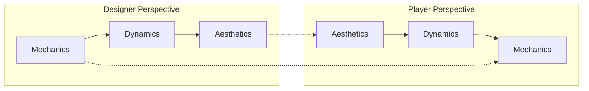
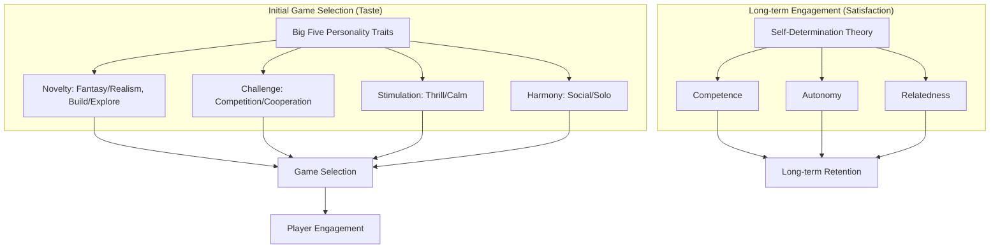
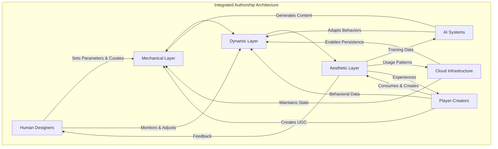

# Beyond Mechanics: The Evolution of Game Design Frameworks in the Era of Generative AI and Immersive Platforms
## 1 Foundations and Evolution: Re-examining Core Game Design Frameworks

This chapter establishes the theoretical foundation for the entire report by systematically analyzing the MDA framework as the dominant paradigm in game design discourse. It traces the framework's origins, explicates its tripartite structure and bidirectional designer-player perspectives, and evaluates both its contributions to formalizing game analysis and its documented limitations. The chapter positions MDA's constraints—particularly its mechanic-centric orientation and static aesthetic taxonomy—as the conceptual departure point for understanding why generative AI and immersive platforms demand evolved or supplementary frameworks.

### 1.1 Origins and Theoretical Foundations of the MDA Framework

The MDA (Mechanics-Dynamics-Aesthetics) framework emerged from a critical period in game development history when the industry recognized the need for more rigorous, formalized approaches to game design and analysis. The framework was developed and taught as part of the **Game Design and Tuning Workshop at the Game Developers Conference in San Jose from 2001 to 2004**, representing a collaborative effort to establish scientific foundations for what had previously been considered an intuitive craft[^1]. The framework was formally introduced by game designers **Robin Hunicke, Marc LeBlanc, and Robert Zubek** in their seminal white paper titled "MDA: A Formal Approach to Game Design and Game Research," which was officially published in 2004[^1][^2].

The intellectual context motivating MDA's development centered on a fundamental communication problem within the game development ecosystem. Prior to MDA, discussions about game design relied heavily on **subjective and ambiguous terminology** such as "fun" and "gameplay"—terms that carried different meanings for different stakeholders and resisted precise definition or measurement. The MDA framework was specifically conceived to address this limitation by providing **objective, measurable constructs** that would enable game designers, players, and researchers to engage in effective and analytical dialogue[^2]. This shared vocabulary was not merely an academic exercise; better communication was understood to lead directly to better games through more precise design iteration and clearer articulation of design goals.

The foundational premise underlying MDA asserts that games can be **systematically decomposed into formal components** amenable to rigorous analysis and iterative refinement. This approach supports what the original authors described as "a formal, iterative approach to design and tuning," enabling designers to "reason explicitly about particular design goals, and to anticipate how changes will impact each aspect of the framework and the resulting designs/implementations"[^1]. By moving between MDA's three levels of abstraction, designers gain the conceptual tools to understand and manipulate the **dynamic behavior of game systems** in predictable ways. This formalization transformed game design from a purely intuitive practice into one that could be taught, analyzed, and systematically improved—establishing MDA as both a design methodology and an analytical framework for game studies.

### 1.2 The Tripartite Structure: Mechanics, Dynamics, and Aesthetics Defined

The MDA framework achieves its analytical power through a precise tripartite decomposition of games into three interconnected layers, each operating at a distinct level of abstraction. Understanding these components requires moving beyond colloquial usage to embrace the specific technical definitions that give the framework its utility.

**Mechanics** constitute the foundational layer of the MDA model, representing the game's basic building blocks at the level of **data representation and algorithms**[^3][^1]. This category encompasses the complete set of rules governing gameplay, every basic action available to players within the game space, the algorithmic processes running within the game engine, and the underlying data structures that maintain game state. In practical terms, mechanics include systems such as combat formulas, progression trees, inventory management rules, movement constraints, and resource generation algorithms. The defining characteristic of mechanics is that they represent elements **directly under designer control**—the concrete specifications that can be documented, implemented, and modified through deliberate design decisions[^2].

**Dynamics** occupy the middle layer of abstraction, describing the **runtime behavior that emerges when mechanics interact with player inputs and with each other over time**[^3][^1]. Dynamics are not directly authored by designers but rather arise as second-order effects of mechanical systems in operation. When a player engages with game mechanics, patterns of behavior emerge that were not explicitly programmed but result from the complex interplay of rules, player choices, and systemic feedback. The original MDA authors emphasized that small changes in mechanics can **cascade through the system**, creating complex dynamic behaviors and emergent gameplay—situations where "interactions between objects in the game world or the player's actions result in a second order of consequences that was not planned, or perhaps even predicted, by the game developers"[^4]. This emergent quality makes dynamics both powerful and challenging for designers, who must anticipate how mechanical modifications will ripple through the dynamic layer.

**Aesthetics** represent the experiential layer of the framework, defined as the **desirable emotional responses evoked in the player when interacting with the game system**[^3][^1]. Crucially, aesthetics in the MDA context does not refer to visual appearance or artistic style but rather to the **emotional targets** that designers aim to achieve through their mechanical and dynamic design choices[^2]. To provide designers with concrete emotional objectives, Hunicke, LeBlanc, and Zubek articulated **eight canonical aesthetic categories**:

| Aesthetic Category | Description | Game Function |
|-------------------|-------------|---------------|
| **Sensation** | Sense-pleasure derived from memorable audiovisual elements | Game as sensory experience |
| **Fantasy** | Engagement with make-believe and fictional worlds | Game as imagination |
| **Narrative** | Dramatic elements and story that drive continued engagement | Game as drama |
| **Challenge** | The drive to overcome obstacles and master systems | Game as obstacle course |
| **Fellowship** | Social connection and community participation | Game as social framework |
| **Discovery** | The urge to explore and uncover the unknown | Game as uncharted territory |
| **Expression** | Player creativity and self-discovery through gameplay | Game as self-expression |
| **Submission** | Passive engagement and time-passing enjoyment | Game as pastime |

The original paper also acknowledged a **ninth aesthetic category—Competition**—representing the satisfaction derived from measuring oneself against others[^3]. These standardized terms enable designers to articulate specific experiential targets and evaluate whether their mechanical implementations successfully produce the intended emotional outcomes.

### 1.3 Bidirectional Perspectives: Designer Intent Versus Player Experience

A central theoretical contribution of the MDA framework lies in its articulation of **symmetrical but opposing perspectives** through which designers and players engage with games. This bidirectional model provides crucial insights into why design intentions do not always translate into player experiences and offers a structured approach to diagnosing and resolving design problems.

From the **designer's perspective**, the creative process flows from mechanics through dynamics to aesthetics. Designers begin by crafting specific mechanical systems—rules, algorithms, and interactive possibilities—which then give rise to dynamic system behaviors when players engage with them. These dynamics, in turn, produce particular aesthetic experiences in players[^3]. This progression reflects the designer's actual workflow: they can only directly manipulate mechanics, and must rely on those mechanics to generate meaningful dynamics and achieve desired aesthetic outcomes. The framework acknowledges this as a fundamental design challenge—designers possess direct control only over the mechanical layer, yet their ultimate goal lies in the aesthetic layer[^3].

From the **player's perspective**, the experience unfolds in reverse. Players first encounter the aesthetic layer—the emotional tone, atmosphere, and experiential quality of the game—which draws them into engagement. Through continued play, they observe the dynamic behaviors that produce these aesthetic effects, gradually developing an understanding of the underlying mechanics that govern the system[^3]. This reversed trajectory explains why players often describe games in aesthetic terms ("exciting," "relaxing," "frustrating") rather than mechanical terms, even though their experiences are mechanically determined.

This bidirectional model serves multiple practical functions in the design process. First, it enables **predictive reasoning** about how mechanical changes will cascade through the system to affect player experience. When designers modify a rule or algorithm, they can trace the expected path through dynamics to aesthetics, anticipating both intended and unintended consequences[^1]. Second, it provides a **diagnostic framework** for identifying the source of design problems. When playtesting reveals that players are not having the intended experience, designers can work backward from the aesthetic failure through dynamics to identify which mechanical elements require adjustment[^1]. Third, it informs **stakeholder communication** by mapping different concerns to appropriate abstraction levels—engineers focus on mechanical implementation, while marketing addresses aesthetic promises to players[^1].

The model also shapes assumptions about **player onboarding and game comprehension**. For digital games, which the original authors primarily considered, the aesthetic-first player experience aligns with intuitive learning through play. Players can engage with a game's emotional qualities immediately, gradually discovering its mechanical underpinnings through experimentation, tutorials, and feedback systems[^4]. This assumption, however, carries significant implications for framework applicability that subsequent sections will examine.

### 1.4 Contributions and Applications: MDA as Design Ontology and Analytical Tool

The MDA framework has demonstrated substantial value across multiple domains, functioning both as a **game design ontology** providing systematic coherence for understanding component interactions and as a practical tool for design, analysis, and communication. Its influence extends from academic game studies through design education to commercial industry applications.

As a **design ontology**, MDA provides what scholars describe as a "conceptual map" defining the constituent parts of games and their interrelationships[^2]. This ontological function serves both scholars and designers by establishing a shared structure and standardized terminology for discussing different aspects of games and how they interact. The framework's systematic coherence—its articulation of how three planes of abstraction interact in game design—represents its primary theoretical contribution, enabling rigorous analysis regardless of game genre or platform[^4].

In **academic game studies and design education**, MDA has become foundational curriculum. The framework is widely used as a theoretical basis for academic analysis and taught in game design courses as an essential analytical tool[^4]. Its formal approach enables students to move beyond intuitive design judgments toward structured reasoning about how specific design decisions produce particular player experiences. The framework's emphasis on iteration—requiring teams to continuously test and refine their designs—aligns with contemporary pedagogical approaches to design education[^2].

**Industry applications** demonstrate MDA's practical utility in professional contexts. One documented case study describes how a design team facing the challenge of creating a digital game interface leveraged MDA to facilitate collaborative dialogue with client engineers, product managers, and marketing personnel[^1]. The designer found that each MDA "perspective" mapped clearly to specific design deliverables:

| MDA Layer | Design Deliverable | Stakeholder Focus |
|-----------|-------------------|-------------------|
| Mechanics | Storyboards, product concepts | Engineering, product definition |
| Dynamics | Workflow diagrams, wireframes | Development, interaction design |
| Aesthetics | Visual concepts, brand alignment | Marketing, user experience |

This mapping enabled focused design review meetings where decisions at one layer informed considerations at others. The team used prototypes as test platforms to validate design decisions, with the ability to "extract feedback and isolate problems to one of the three levels of the MDA framework"[^1]. The framework thus provided not only a design methodology but also confidence that the team understood the rationale behind their decisions.

**Serious game design** represents another significant application domain. Research on generative AI-enhanced serious games for digital literacy instruction demonstrates how MDA principles inform educational game architecture. Such systems integrate mechanics (scenario-based tasks, AI-driven NPCs), dynamics (adaptive interactions, scaffolded learning progressions), and aesthetics (engagement, competence development) to achieve pedagogical objectives[^5]. The framework enables researchers to analyze how game-based learning approaches produce measurable improvements in learner outcomes compared to traditional instruction.

**Microlearning and gamification** applications extend MDA beyond traditional games into instructional design. Practitioners have applied the framework to design training programs where mechanics (point systems, progress bars, achievement badges, adaptive content delivery) generate dynamics (competition, streak maintenance, curiosity-driven exploration) that produce aesthetics (satisfaction, motivation, relief, joy)[^6]. This application demonstrates MDA's versatility as a lens for any designed experience seeking to engage users through game-like structures.

**Commercial game analysis** using MDA enables designers to study successful titles systematically. Detailed analysis of games like Dragon Age: Origins demonstrates how the framework can decompose complex RPGs into analyzable elements—level design, character systems, progression mechanics, quest structures, narrative design, world-building, combat, exploration, economy, and UI design—revealing how different elements interact to achieve aesthetic goals[^2]. Such analysis allows designers to understand why certain designs succeed, identify which mechanical elements contribute to specific aesthetic outcomes, and apply these insights to their own projects.

### 1.5 Critical Limitations: Mechanic-Centrism and the Boundaries of the Aesthetic Taxonomy

Despite its widespread adoption and demonstrated utility, the MDA framework has attracted sustained criticism addressing several significant limitations. These critiques establish important context for understanding why contemporary technological and theoretical developments may require evolved or supplementary frameworks.

The **aesthetic taxonomy** has faced criticism as an **arbitrary and non-exhaustive categorization** lacking empirical foundation. Critics argue that the eight (or nine) aesthetic categories represent a "fairly arbitrary list of emotional goals" that fails to explore the full range of emotional responses games can evoke[^3]. The selection of these particular categories appears to reflect the original authors' intuitions rather than systematic research into player emotional experiences. Recent empirical research on player perceptions in Action Role-Playing Games (ARPGs) provides partial support for this critique while also suggesting refinements. A 2025 study with 462 respondents found that while MDA's aesthetic dimensions remain relevant, their **relative importance differs from the original model's implicit ordering**. The research identified "Aesthesis" (sensory experience including visual, auditory, and tactile elements) as the most important dimension, followed by "Story," "Adventure," and "Connection" (social interaction)[^7]. Notably, the study found that **player background factors**—including educational background, game experience, monthly spending, and playtime—significantly influence aesthetic perceptions, while age and gender showed no significant relationship[^7]. These findings suggest that aesthetic responses are more contextual and player-dependent than MDA's universal taxonomy implies.

The framework's **mechanic-centric orientation** has drawn criticism for neglecting crucial design dimensions. Critics contend that MDA focuses excessively on game mechanics while ignoring other essential aspects of game design, rendering it "not suitable for all types of games, particularly gamified content or any type of experience-oriented design"[^3]. This limitation becomes particularly apparent when analyzing games where narrative, interface design, or atmospheric elements drive player experience more than mechanical systems. The framework provides no systematic place for analyzing how visual design, audio design, narrative structure, or interface conventions contribute to player experience independent of mechanical function.

The **linear progression model** has been challenged by evidence from non-digital games that contradicts MDA's assumptions about player experience trajectories. The original framework assumes players approach new games from the aesthetic perspective, proceeding to discover dynamics and eventually learn underlying mechanics—an assumption the authors acknowledge was "shaped by their experience with digital games"[^4]. However, this assumption **fails for boardgames** and other non-digital formats where players must engage with mechanics before experiencing aesthetics. In digital games, rules are implemented and enforced by the computer, allowing intuitive learning through play. In boardgames, players themselves must implement the rules—"it is impossible for a Chess novice to learn its rules simply by moving pieces; at least one player must read the rules"[^4]. Therefore, the boardgame player's experience necessarily begins in the mechanics plane, with aesthetic experience becoming apparent only during initial plays and mastery of dynamics developing over time[^4].

This critique reveals that MDA's linear model represents **one possibility rather than a universal truth**. The framework "is not broken; its main use is in the systematic coherence of how the three planes interact in game design. However, the linear model is not universal"[^4]. Games exist which, by their nature or medium, do not conform to this linear progression, suggesting the need for "a more dynamic use of the model that is not constrained by that linearity"[^4]. The "blindness" of digital game designers focusing exclusively on digital games may contribute to theoretical and practical limitations that could be addressed by learning from all game formats[^4].

Additional structural limitations emerge when considering MDA's assumptions about **designer control and system predictability**. The framework presumes mechanics are intentionally crafted, static building blocks that designers fully control. Modern technologies—particularly generative AI—challenge this assumption by introducing mechanics that are dynamically generated, context-aware, or emergent from AI systems rather than explicit designer specification. Similarly, MDA's treatment of dynamics as predictable emergent behaviors struggles to account for AI-driven systems where dynamics arise from "black box" processes that designers cannot fully anticipate or control. The framework's aesthetic categories also fail to capture technology-enabled experiences such as presence in virtual reality or the seamless blending of virtual and physical reality in mixed reality applications.

### 1.6 Proposed Extensions and Alternative Frameworks: From MDA to DDE and Beyond

Recognition of MDA's limitations has prompted various attempts to extend, adapt, or replace the framework while preserving its analytical strengths. These proposals establish important precedents for framework evolution that subsequent chapters will build upon when examining how generative AI and immersive platforms demand new theoretical constructs.

The **DDE (Design-Dynamics-Experience) framework** represents a significant proposed evolution of MDA, developed to address concerns about the original model's inability to accommodate narrative design and production process considerations[^8]. Proposed by Wolfgang Walk in 2015, DDE emerged from the observation that "in the current development environment, MDA fails to provide a framework or coherent interface for narrative design" despite the framework being over eleven years old at that time[^8].

DDE restructures MDA's tripartite model with several key modifications:

| MDA Component | DDE Equivalent | Key Changes |
|---------------|----------------|-------------|
| Mechanics | Design | Expanded into three subcategories: Blueprint (conceptual design of game world), Mechanics (code-related content), Interface (player communication design) |
| Dynamics | Dynamics | Retained but expanded to emphasize indirect designer control and the "player-subject" concept |
| Aesthetics | Experience | Reframed as holistic experience encompassing sensory, emotional, and intellectual journeys |

The **Design** category in DDE encompasses everything under direct designer control, explicitly acknowledging that game creation involves more than mechanical rule specification. The **Blueprint** subcategory captures conceptual and world design elements that MDA subsumes under mechanics but which operate at a different creative level. The **Interface** subcategory addresses all aspects of player-game communication—an area MDA neglects despite its crucial role in shaping player experience[^8].

The retention of **Dynamics** with expanded emphasis reflects recognition that this middle layer captures essential emergent phenomena while requiring greater attention to the player as an active subject rather than passive recipient of mechanical outputs. The reconceptualization of aesthetics as **Experience** addresses criticism that the original aesthetic taxonomy was too narrow, instead framing the experiential layer as comprising interconnected sensory, emotional, and intellectual journeys[^8].

DDE also introduces the concept of the game system as a "qualified antagonist" to the player-subject—a framing that positions the game as responsible for obstacles players encounter and overcome during play. This conceptualization provides vocabulary for discussing game difficulty, challenge progression, and player growth that MDA's aesthetic categories address only indirectly through "Challenge"[^8].

The **SUX MDA framework** demonstrates how the original model can be adapted for analyzing and designing **intentionally subversive user experiences**—games deliberately designed to violate normative UX conventions[^9]. This 2025 research analyzed 31 games featuring "sh@*!y user experiences" and developed a thematic structure organized according to MDA's tripartite model:

**SUX Mechanics** focus on non-normative player control:
- **Control Mismatch**: Violating player expectations about control mappings
- **Overly Specific Control**: Limiting player manipulation to minute entity portions
- **Exaggerated Response**: Altering the degree of system feedback to player input

**SUX Dynamics** address emergent states from mechanic-player interaction:
- **Out of Control**: Unpredictable control effects on gameplay
- **Fast Failure**: Brief, inconsequential failure states
- **Slight Failure**: Incidental failures of non-critical objectives

**SUX Aesthetics** differentiate between success and failure emotional responses:
- *Success aesthetics*: Hard-Earned Satisfaction, Character Bonding, Great Cooperation
- *Failure aesthetics*: Absurdist Joy, Shock Value, Spiteful Motivation

This adaptation demonstrates MDA's flexibility as a structural template that can be repurposed for analyzing design approaches that deliberately invert conventional design wisdom. The SUX MDA framework provides designers with tools to "inject" subversive elements into games to create specific aesthetic experiences, extending the original model's applicability beyond normative design goals[^9].

These extensions and alternatives collectively establish that **MDA's core contribution—systematic decomposition of games into interrelated abstraction layers—remains valuable** even as its specific categories and assumptions require revision. The DDE proposal addresses MDA's neglect of narrative and interface design while preserving the mechanics-dynamics-aesthetics progression. The SUX adaptation demonstrates the framework's utility for analyzing non-normative design approaches. Both extensions suggest that MDA's limitations can be addressed through expansion and adaptation rather than wholesale replacement.

However, these proposals were developed primarily in response to theoretical and practical limitations observed in conventional game development contexts. The emergence of **generative AI systems** capable of dynamically creating game content, **cloud gaming infrastructure** enabling persistent cross-platform experiences, and **immersive technologies** introducing entirely new experiential dimensions presents challenges that even these extended frameworks may not fully address. The framework's assumption of human designers crafting static mechanical systems, its linear model of designer-player perspective relationships, and its bounded aesthetic taxonomy all face fundamental challenges from technologies that introduce adaptive, persistent, and perceptually novel elements operating outside traditional design paradigms. These technological catalysts and their implications for framework evolution form the subject of subsequent chapters.

## 2 Technological Catalysts: AI, Cloud, and Immersive Systems as New Design Primitives

This chapter systematically analyzes how three convergent technological forces—Generative AI, cloud gaming infrastructure, and immersive platforms (VR/AR/MR)—function as fundamental catalysts reshaping the core elements of game design. Building upon Chapter 1's identification of MDA framework limitations, this chapter examines how these technologies challenge the traditional assumptions of designer-controlled mechanics, predictable dynamics, and bounded aesthetic taxonomies. The analysis demonstrates how each technology introduces new design primitives that operate outside conventional framework paradigms, necessitating evolved theoretical constructs for understanding contemporary game design.

### 2.1 Generative AI as a Mechanics Transformer: From Static Rules to Dynamic Content Systems

The traditional MDA framework treats mechanics as the foundational building blocks of game design—static rules, algorithms, and data structures that designers craft intentionally and control completely. Generative AI fundamentally disrupts this assumption by transforming mechanics from fixed, designer-authored specifications into **dynamic, self-generating systems** capable of producing novel content in real-time. This transformation represents not merely an incremental tool improvement but a paradigmatic shift in how the mechanical layer of games operates.

**Industry Adoption and Scale of Transformation**

The integration of generative AI into game development has accelerated dramatically, reaching a critical mass that signals permanent transformation rather than experimental adoption. According to the Game Developer Conference's 2025 State of the Game Industry report, **more than 50% of game development companies are now using generative AI during development**[^10]. This figure represents a watershed moment where AI-assisted development has transitioned from competitive advantage to industry standard practice. Analysis of Steam metadata reveals that **around 20% of new games in mid-2025 disclosed the use of AI**, double the figure from a year earlier[^11]. The global AI in gaming market reflects this trajectory, projected to grow from **$3.28 billion in 2024 to more than $51 billion by 2033**—a compound annual growth rate indicating fundamental market restructuring[^10].

A systematic review of generative AI adoption patterns reveals that approximately **60% of disclosed implementations involve visual asset generation**, demonstrating how art pipelines have become the central entry point for GenAI in game production[^12]. This concentration in visual assets reflects both the maturity of image-generation technologies and the significant labor costs associated with traditional asset creation. However, the scope of AI integration extends far beyond visual elements into every aspect of game mechanics.

**Workflow Integration Patterns**

Survey research with game design professionals provides granular insight into how generative AI is reshaping development workflows. The most common application reported was **ideation and brainstorming at 90.5%** of participants, indicating that AI has become integral to the earliest conceptual stages of game design[^13]. Asset creation followed as the second most reported use case at **83.3%**, while **73.8%** reported using AI for programming tasks—likely reflecting the growing popularity of AI-assisted code generation tools[^13]. Narrative or dialogue generation represented another significant area at **66.7%** of participants[^13].

| Application Area | Adoption Rate | Primary Tools |
|-----------------|---------------|---------------|
| Ideation & Brainstorming | 90.5% | ChatGPT, Gemini |
| Asset Creation | 83.3% | Midjourney, Stable Diffusion |
| Programming | 73.8% | Copilot, ChatGPT |
| Narrative/Dialogue | 66.7% | ChatGPT, GPT-4 |
| Music & Sound | 47.6% | Various specialized tools |
| Procedural Level Generation | 28.6% | Unity Muse, custom systems |
| Playtesting/QA | 11.9% | AI simulation systems |

The tool landscape reveals clear market leaders: **ChatGPT dominates at 90.5%** usage among surveyed professionals, followed by **Midjourney at 76.2%**, **Copilot at 69.0%**, and **Gemini at 64.3%**[^13]. This concentration around general-purpose AI tools rather than game-specific solutions suggests that developers are adapting broadly available technologies to game development contexts, creating workflows that integrate multiple AI systems across the production pipeline.

**Procedural Content Generation: The New Mechanical Foundation**

Procedural content generation (PCG) has evolved from simple randomization techniques to sophisticated systems that understand game design principles. Modern AI-driven PCG enables the creation of entire ecosystems, cities, and quests that adapt to player behavior, fundamentally changing what constitutes a game's mechanical foundation[^10]. Games like **No Man's Sky** demonstrate this potential at scale, utilizing AI-generated planetary landscapes to create expansive universes with billions of procedurally generated worlds[^13].

The efficiency gains from AI-driven PCG are substantial. Unity Technologies estimates that **procedural content generation cuts development time by up to 50%**[^14]. A case study in procedural RPG generation demonstrated AI creating **500+ hours of unique content with 92% player retention**, while racing game applications generated **1000+ unique tracks with 85% community approval**[^15]. These metrics indicate that AI-generated content can match or exceed human-created content in terms of player engagement while dramatically reducing production costs and timelines.

**Google DeepMind's Genie 3** represents the frontier of this transformation. Announced in August 2025, Genie 3 is a general-purpose world model capable of generating **an unprecedented diversity of interactive environments from text prompts**[^16]. The system generates dynamic worlds that users can navigate in real-time at 24 frames per second, retaining consistency for several minutes at 720p resolution[^16]. This capability fundamentally challenges MDA's assumption that mechanics are designer-specified—Genie 3 creates complete mechanical systems from natural language descriptions, with the AI determining rules, physics behaviors, and interactive possibilities.

**AI-Driven NPC Behavior Systems**

Perhaps the most transformative application of generative AI lies in non-player character systems. Traditionally, NPCs followed scripted behaviors—predetermined response trees and state machines that designers explicitly authored. Today, **AI-driven NPCs are capable of learning, adapting, and evolving** through machine learning and behavior trees that enable characters to respond intelligently to player strategies, simulate emotions, and form relationships with other NPCs[^10].

The **Nemesis System** introduced in Middle Earth: Shadow of Mordor established early precedents for adaptive NPC behavior, where enemies remember past encounters and adapt accordingly[^10]. Contemporary implementations push significantly further, allowing NPCs to evolve across entire gameplays and creating experiences that feel realistic and less predictable[^10]. The integration of Large Language Models enables NPCs with **memory, personality, and adaptive behaviors** that generate genuinely novel responses rather than selecting from predetermined options[^11].

Research on generative AI-enhanced serious games demonstrates the pedagogical potential of adaptive NPC systems. A study integrating LLMs to drive adaptive NPCs for digital literacy instruction found that students interacting with AI-driven NPCs achieved **larger gains in credibility-evaluation performance** (mean gain score of 12.10) compared to traditional instruction (mean gain score of 9.43), a statistically significant difference[^5]. The system employed role-based prompt engineering to align real-time AI dialogue with educational frameworks, enabling dynamic scaffolding that responded to individual learner performance[^5].

**The 'Black Box' Challenge to Designer Control**

The integration of generative AI introduces what can be characterized as **'black box' generative processes** that produce emergent mechanical elements outside direct designer specification. When an LLM generates NPC dialogue or a diffusion model creates game assets, the specific outputs are not predetermined by designers—they emerge from complex model behaviors that designers can influence but not fully control. This fundamentally challenges MDA's foundational assumption that mechanics represent elements "directly under designer control."

Qualitative research synthesis identifies this as a defining characteristic of contemporary AI-game integration: **generative outputs are provisional and require human-in-the-loop refinement as the production norm**[^12]. Human editorial decision-making determines which AI-generated variants anchor subsequent work, but the generative process itself operates outside traditional mechanical specification. The synthesis further notes that **GenAI's primary value lies in early-stage ideation as a scaffold, not in autonomous authorship**—human framing, evaluation, and integration remain constitutive of the design process[^12].

This human-AI collaboration model represents a fundamental restructuring of the designer's relationship to mechanics. Rather than directly authoring rules and algorithms, designers increasingly function as **curators, orchestrators, and editors** of AI-generated mechanical possibilities. The mechanical layer becomes a collaborative space where human intent and AI generation interact, producing outcomes that neither party would create independently.

### 2.2 Cloud Infrastructure and the Emergence of Persistent, Scalable Game Worlds

Cloud gaming infrastructure introduces mechanical and dynamic possibilities that traditional frameworks—designed around local computation and discrete play sessions—cannot adequately capture. The shift from client-side to server-side processing fundamentally alters what games can be, enabling persistent worlds, massive concurrency, and cross-platform experiences that challenge session-based design assumptions implicit in MDA.

**Market Trajectory and Mainstream Adoption**

Cloud gaming has reached an inflection point where mainstream adoption appears imminent. BCG's 2025 Gaming Survey found that **60% of players had tried cloud gaming, and 80% reported a positive experience**[^11]. Global revenues for cloud gaming are projected to grow from **approximately $1.4 billion in 2025 to roughly $18.3 billion in 2030**, representing a compound annual growth rate exceeding 50%[^11]. The cloud gaming population is projected to reach **455.4 million users in 2025**, expanding to 493 million by 2027[^17]. These figures indicate that cloud gaming is transitioning from early adopter technology to mass-market service.

The business models enabling this transition have diversified significantly. Current approaches include **pure plays** like NVIDIA's GeForce Now, **multigame subscriptions** such as PlayStation Plus Extra, and **hybrid/bundled models** exemplified by Xbox Game Pass[^11]. This model diversity reflects ongoing market experimentation as the industry determines optimal approaches for different player segments and content types.

**Cloud-Native Technical Capabilities**

Cloud gaming fundamentally shifts traditional local graphic computing processes to cloud server clusters. The game program runs entirely on remote servers, including all computational aspects such as physics engine calculations and graphics rendering, with completed video streams transmitted in real-time to user terminal devices via high-speed networks[^18]. This architecture means terminal devices require only basic video decoding capabilities and network connectivity—enabling gaming on devices that could never run demanding titles locally.

The technical capabilities enabled by cloud infrastructure extend far beyond streaming existing games. **High-performance computing on the cloud enables developers to offload resource-intensive tasks** such as physics simulations that would be impossible on consumer hardware[^19]. Cloud processing capabilities allow developers to incorporate intricate physics simulations, leading to more dynamic and responsive gameplay[^19]. Games can now support **expansive, persistent worlds that evolve over time**, thanks to the cloud's ability to store and manage vast amounts of data in real-time[^19].

**AWS for Games** exemplifies the scale of cloud infrastructure supporting contemporary game development. The platform supports **over 750 million players each month** across games built on AWS infrastructure, with Amazon GameLift capable of scaling to support **up to 100 million concurrent players per game**[^20]. The system can add **9,000 new compute instances per minute and 100,000 players per second** into a game, demonstrating the elastic scalability that cloud architecture enables[^20].

**Meta Horizon Engine**, previewed at Meta Connect in October 2025, demonstrates purpose-built cloud gaming infrastructure. The engine features **"from cloud to mobile scalability"** that automatically scales from high-end cloud rendering to mobile device operation[^21]. It supports large numbers of real-time avatars in single shared spaces, vast environments that stream as sub-levels, and automatic quality management through auto-generated LOD systems[^21]. The engine's modular architecture includes data-driven asset pipelines, secure actor-based networking topology with low-latency player prediction, and an ECS-based simulation system capable of efficiently simulating millions of networked entities[^21].

**Persistent Spatial Worlds and Continuous Evolution**

Cloud architecture enables a fundamental shift from discrete game sessions to **persistent spatial worlds** that continue evolving regardless of individual player presence. This persistence challenges the implicit session-based assumptions in MDA, where mechanics, dynamics, and aesthetics are analyzed within bounded play experiences. In cloud-enabled persistent worlds, the game state exists continuously, player actions have permanent consequences, and the world evolves through the aggregate behavior of all participants.

AWS provides **scalable solutions for hosting persistent virtual worlds and massive multiplayer online games**, enabling seamless world management and dynamic scaling[^20]. This infrastructure supports game designs where the mechanical layer exists as a continuous cloud service rather than software running during individual play sessions. The distinction is profound: mechanics become **living systems** maintained by server infrastructure rather than static rules instantiated during gameplay.

**Cross-Platform Persistence and Hardware Agnosticism**

Cloud technologies facilitate **seamless cross-platform experiences**, allowing players to engage with games on various devices without compromising performance or progress continuity[^19]. This capability directly addresses player expectations in 2025, where gamers demand uninterrupted experiences across PCs, consoles, mobile devices, and VR systems[^22]. Activision Blizzard research shows that **53% of weekly gamers play across some combination of mobile, PC, and console platforms**, while Unity reports that **87% of multiplayer gamers have experienced cross-platform games**[^23].

The implications for game design are substantial. Games must now be conceived as **platform-agnostic experiences** that maintain coherent mechanics, dynamics, and aesthetics across radically different hardware contexts. Where Winds Meet demonstrates this potential—after conquering China's mobile market in early 2025, the Wuxia open-world RPG expanded globally to PC and console, attracting **9 million players within two weeks** while maintaining cross-platform play and progression[^23].

BCG's analysis suggests this represents a fundamental industry restructuring: **"The future is not hardware-less, but increasingly it will be hardware agnostic"**[^11]. Cloud gaming changes game distribution by potentially rebundling games with the cloud hardware on which they run—reversing the 40-year separation of games from dedicated hardware[^11]. This shift has profound implications for how designers conceptualize their target platforms and the mechanical constraints they must accommodate.

**Latency Optimization and Technical Challenges**

Despite its transformative potential, cloud gaming faces persistent technical challenges that affect design possibilities. **Latency**—the delay between player input and game response—remains the primary obstacle. Even minimal delays of a few milliseconds can disrupt gameplay, making experiences feel unresponsive or sluggish[^22]. Network latency is a critical factor affecting user experience; ideally, it should be controlled within **50ms to ensure responsive operations**[^18].

Primary causes of latency include network congestion during peak gaming hours, server distance from player locations, hardware limitations in network equipment, frame rendering delays on cloud servers, and cross-platform synchronization challenges[^24]. Solutions being deployed include **edge computing** (deploying servers geographically closer to users to reduce data travel times), **AI-based latency optimization** (algorithms that predict player behavior and pre-load game assets), and **advanced 5G connectivity** (reducing latency to as low as 1 millisecond compared to 50-100 milliseconds with 4G)[^24][^22].

These technical constraints directly shape design possibilities. Competitive genres requiring precision timing face particular challenges, as fluctuations and jitter in even urban broadband environments can result in delayed responses and stuttering visuals[^18]. Designers must account for latency variability in their mechanical systems, potentially favoring designs that are more forgiving of input delays or that leverage cloud capabilities in ways that minimize latency sensitivity.

### 2.3 Immersive Technologies and the Expansion of Experiential Dimensions

Virtual Reality (VR), Augmented Reality (AR), and Mixed Reality (MR) platforms introduce entirely new experiential dimensions that exceed MDA's aesthetic taxonomy. These technologies do not simply enhance existing aesthetic categories—they create **foundational aesthetic experiences** such as presence, embodiment, and coherence that the original framework never contemplated. Understanding these platforms requires examining both their technical foundations and the novel design paradigms they enable.

**Technical Foundations and Platform Differentiation**

The distinction between VR, AR, and MR is essential for understanding their design implications. **Virtual Reality fully immerses the user in a virtual world** through head-mounted displays that create completely enclosed digital environments[^25]. VR achieves visual immersion through dual-eye disparity and head tracking technologies that construct three-dimensional spatial perception, while physical interaction utilizes controllers or full-body motion capture for feedback operations within virtual worlds[^26].

**Augmented Reality superimposes virtual elements onto the real world**, relying on camera modules capturing real-world scenes, SLAM algorithms establishing spatial coordinate systems, and rendering engines completing virtual-real fusion visual presentation[^26]. AR's unique design challenge lies in environmental adaptability—handling lighting condition variations affecting virtual object shadows, different surface materials challenging anchoring stability, and dynamic obstacles requiring real-time collision detection updates[^26].

**Mixed Reality combines and evolves both approaches**, allowing virtual elements to interact with both the user and the physical space[^25]. MR's most significant characteristic is **bidirectional interaction** between virtual objects and surrounding environments—physically, MR systems identify geometric features and material properties to respond according to physical laws; semantically, advanced MR systems understand scene information such as furniture "sittability" or wall "penetrability"[^26].

**Hardware Evolution and Market Positioning**

The XR hardware market has developed clear product stratification. In the mainstream price range (approximately $450-600), **Meta Quest 3** establishes the performance benchmark with Snapdragon XR2 Gen2 chip, Pancake optical solution, and single-eye resolution of 2064×2208 pixels at 90Hz refresh rate[^26]. The device's color passthrough capability through dual 1600MP cameras reconstructs environments in mixed reality mode, providing developers with extensive creative possibilities[^26].

**Apple's Vision Pro** represents the current performance ceiling in MR devices, featuring M2+R1 dual-chip architecture, Micro-OLED displays exceeding 3660×3200 pixels per eye, and 12ms end-to-end latency redefining responsive interaction standards[^26]. However, its high price limits consumer accessibility, and the lack of dedicated handheld peripherals constrains playable game types[^26]. The device's **immersion adjustment mechanism** allowing users to fine-tune transition ratios from pure VR to more mixed experiences may set precedents for future product iterations[^26].

The global smart glasses market, valued at **$1.93 billion in 2024**, is projected to grow with a CAGR of 27.3% through 2030[^27]. Advancements in micro-OLED and holographic lenses contribute to brighter, sharper visuals and wider fields of view within more compact form factors—crucial for enhancing immersion and reducing user fatigue[^27].

**Presence, Embodiment, and Coherence as Novel Aesthetic Categories**

Immersive technologies introduce aesthetic dimensions absent from MDA's original taxonomy. The concept of **presence**—the subjective experience of "being there" in a virtual environment—constitutes a foundational aesthetic goal specific to immersive platforms. Presence is not merely enhanced sensation (MDA's closest equivalent); it represents a qualitatively different experiential category where the boundary between player and avatar dissolves.

**Embodiment** extends presence to include the experience of inhabiting a virtual body. Research presented at IEEE VR 2025 investigates methods for enhancing embodiment in VR using video pass-through, the impact of avatar clothing on stereotype threat (Proteus effect), and how facial expression coverage affects avatar embodiment[^28]. These studies demonstrate that embodiment is not a binary state but a complex experiential dimension influenced by avatar representation, tracking fidelity, and interaction design.

**Coherence**—the seamless blending of virtual and physical reality—emerges as a critical aesthetic category for mixed reality. For MR experiences to succeed, virtual objects must interact convincingly with real environments, maintaining consistent physics, lighting, and spatial relationships. As one analysis notes, making these new realities credible "all comes down to 'presence' and 'coherence,'" bringing new design concerns including cognitive presence, perceptual presence, 3D user interfaces, and world scale, alongside extreme technical obstacles including ultra-high frame rates and ultra-low latency[^29].

**Mixed Reality Design Paradigms**

Mixed Reality creates unique design opportunities by transforming physical spaces into interactive game environments. MR experiences can be categorized into **Static MR** (experiences enjoyed while seated, such as miniaturized strategy games), **Dynamic MR** (experiences pushing physical space boundaries, such as transforming homes into haunted houses), and **2D & Classic Style Experiences** (interacting with 2D surfaces and planes)[^25].

The technical infrastructure supporting MR experiences includes the **Passthrough API** providing real-time visualization of surrounding environments, **Audio SDK** supporting spatialization features that change sound origination points, and **Scene API** building representations of users' physical spaces including walls and furniture[^25]. **Shared Spatial Anchors** enable multiple users to share virtual frames of reference in the same physical space, creating multiplayer experiences that blend virtual and physical interaction[^25].

The exemplary MR-FPS game **Spatial Agents Squad** demonstrates MR's potential—virtual bullets leave traces on actual walls, and players can genuinely hide behind sofas for cover[^26]. This interaction depth creates experience dimensions impossible within traditional game frameworks, where the mechanical layer must account for arbitrary physical environments and the aesthetic layer must achieve coherence between virtual and real elements.

**Transformation of Player Agency**

Immersive technologies fundamentally alter player agency from symbolic input to **embodied action**. Traditional game input—button presses, mouse movements, keyboard commands—represents symbolic communication where players indicate intentions through abstract mappings. VR and MR replace this symbolic layer with direct physical action: players reach, grab, throw, dodge, and move through natural body movements.

This transformation has profound implications for the designer-player relationship. Where MDA assumes designers create mechanics that players learn to manipulate through interface conventions, immersive platforms leverage players' existing sensorimotor knowledge. Research at IEEE VR 2025 explores designing intuitive superpower interactions using sensorimotor regularities in MR, demonstrating how designers can build on players' embodied understanding rather than teaching arbitrary control schemes[^28].

The **Movement SDK** enables tracking of users' bodies, faces, and eyes for more immersive interactions, while hand tracking and gesture recognition allow controller-free input[^25]. These capabilities mean that the mechanical layer must accommodate the full range of human physical capability rather than the constrained input space of traditional controllers—a fundamental expansion of what mechanics must specify and what dynamics can emerge.

### 2.4 Reshaping Dynamics: Emergent Behaviors in AI-Augmented and Cloud-Connected Systems

The convergence of AI and cloud technologies generates unprecedented dynamic complexity that challenges MDA's model of predictable emergence. Traditional dynamics arise from the interaction of fixed mechanics with player inputs—designers cannot directly author dynamics but can anticipate them based on understanding their mechanical systems. AI-augmented and cloud-connected systems introduce dynamics that are **genuinely unpredictable**, emerging from AI model behaviors, persistent world states, and player-AI-system interactions that exceed designer anticipation.

**Real-Time Adaptive Systems**

Dynamic Difficulty Adjustment (DDA) exemplifies how AI enables real-time adaptation of gameplay based on player performance or emotional state. A comprehensive case study comparing five difficulty adjustment methods—Fixed Difficulty, Player-Selected Difficulty, Performance-Based Adaptation, Emotion-Based Adaptation, and Hybrid approaches—revealed nuanced findings about adaptive systems[^30]. The Emotion-Based adaptation consistently assigned the highest objective difficulty levels (mean 5.93 on a 7-point scale), while players' engagement, excitement, and enjoyment **remained consistent across all methods**[^30].

This finding challenges assumptions about what adaptive systems achieve. Rather than producing highly personalized experiences with extreme highs and lows, **adaptive systems appear to function as stabilizers** ensuring consistent, playable experiences across diverse player populations[^30]. The research concludes that "the value of adaptation may lie less in creating extreme highs and lows, and more in offering gameplay that remains steady, immersive, and responsive across a wide spectrum of player experiences"[^30].

AI-driven adaptive systems extend beyond difficulty to encompass **personalized content generation**. Microsoft research suggests personalized content can increase player engagement by as much as **30%**[^14]. Ubisoft studies show that adaptive difficulty boosts player satisfaction and retention while improving accessibility[^14]. These systems create dynamics where the game continuously reconfigures itself in response to individual player patterns—a form of emergence that traditional frameworks cannot model because the mechanical layer itself is in flux.

**AI-Driven Narrative Branching**

AI enables stories to unfold dynamically in response to player choices, transforming storytelling from linear sequences into **co-created experiences**. Early successes like AI Dungeon demonstrated appetite for AI-generated narratives—by mid-2020, the text adventure had attracted **over 1.5 million players globally**[^31]. A 2024 study had 28 gamers interact with GPT-4-driven characters in a text adventure and found they discovered **entirely new story paths beyond the original design**—emergent "nodes" not written by the authors[^31].

This represents a fundamental shift in narrative dynamics. Instead of predetermined "choose your path" forks, **AI allows stories to branch fluidly at any moment** in response to unanticipated player actions[^31]. The game is not limited to branches the writers predicted—the AI can introduce new branches on the fly, leading to truly emergent storylines that feel driven by player choices in the moment. Industry analyses predict **AI-powered game storytelling will increase threefold by the late 2020s**[^31].

**Hyper-Adaptive NPC Behaviors**

The shift to **Hyper-Adaptive Non-Player Characters driven by in-game-optimized Large Language Models** represents one of the most immediately impactful AI innovations in late 2025[^32]. This technology moves beyond scripted behavior to enable genuine, emergent conversations and complex, contextual decision-making from every character. Studios are partnering with AI companies like **Inworld AI and NVIDIA** to integrate models like NVIDIA's ACE directly into game engines[^32].

The innovation involves a refined, low-latency AI runtime allowing NPCs to process natural language, access contextual lore, remember past interactions, and generate unique responses in real-time[^32]. Games like the anticipated **Grand Theft Auto VI** are expected to feature this technology, creating dynamic, improvisational play experiences that shatter the predictability of traditional NPCs[^32]. This produces dynamics that are neither designer-authored nor simply emergent from fixed mechanics—they arise from AI model behaviors that designers influence but cannot fully predict.

**Persistent World Dynamics**

Cloud-enabled persistent worlds create dynamics that **span sessions and platforms**, evolving continuously regardless of individual player presence. When players log off, the world continues—other players' actions, AI systems, and scheduled events modify the game state. When players return, they encounter a world that has changed in their absence, creating dynamics that no individual player experiences in full.

This persistence fundamentally challenges MDA's implicit assumption that dynamics occur within bounded play sessions. The dynamic layer becomes a **continuous, globally shared phenomenon** rather than something that emerges fresh each time a player engages. Designers must consider how dynamics accumulate over time, how different players' contributions interact, and how the world maintains coherence across millions of simultaneous participants.

### 2.5 Novel Aesthetics: Personalization, Presence, and Co-Creative Experience

The technological catalysts collectively generate aesthetic experiences that transcend MDA's original taxonomy. Where MDA proposes eight or nine aesthetic categories as targets for design, contemporary technologies enable experiences that either exceed these categories or transform them so fundamentally that the original definitions no longer apply.

**AI-Enabled Personalization**

Generative AI enables **unique narrative and gameplay experiences for each player**, challenging MDA's implicit assumption that aesthetics represent shared experiential targets. When AI generates personalized dialogue, quests, or challenges based on individual player patterns, each player receives a distinct aesthetic experience. The game's aesthetic identity becomes plural rather than singular—not one designed experience but millions of generated variants.

This personalization operates across multiple dimensions. AI can generate **customized gameplay features and new in-game content** tailored to individual preferences[^17]. Adaptive soundtracks shift with game action, creating personalized sensory experiences[^33]. Narrative systems generate branching storylines that respond to individual player choices, making each playthrough unique[^31]. The aesthetic layer becomes a **generative space** rather than a designed target.

The tension between personalization and shared cultural artifacts emerges as a significant consideration. Games have traditionally functioned as shared cultural experiences—players discuss common challenges, memorable moments, and narrative revelations. When AI generates unique experiences for each player, this shared cultural function is potentially diminished. The aesthetic of **fellowship** (social connection through shared experience) may conflict with the aesthetic of **personalization** (unique individual experience).

**Presence and Embodiment as Distinct Aesthetic Categories**

Immersive platforms introduce **presence and embodiment as aesthetic categories** absent from MDA's original taxonomy. Presence—the subjective experience of "being there"—represents a foundational experiential goal that subsumes and transforms MDA's sensation category. Where sensation refers to sensory pleasure from audiovisual elements, presence describes the dissolution of awareness of the mediating technology, creating the experience of inhabiting the virtual space.

Embodiment extends presence to include the experience of **inhabiting a virtual body**. Research demonstrates that embodiment is influenced by avatar representation, tracking fidelity, and interaction design[^28]. The aesthetic goal is not merely to provide sensory pleasure but to create the experience of being a body in a space—a qualitatively different experiential category that traditional frameworks cannot capture.

**Coherence** in mixed reality represents another novel aesthetic category—the seamless blending of virtual and physical reality such that the distinction becomes imperceptible. Achieving coherence requires virtual objects to respond appropriately to real-world lighting, physics, and spatial relationships. When coherence is achieved, players experience a unified reality rather than virtual elements overlaid on physical space.

**Co-Creative Aesthetics**

The emergence of **co-creative aesthetics** represents perhaps the most fundamental challenge to MDA's designer-centric model. When players participate in content generation—through user-generated content platforms, AI-assisted creation tools, or collaborative world-building—they become co-authors of their aesthetic experience. The aesthetic layer is no longer something designers create for players to receive but something players actively construct.

Roblox exemplifies this paradigm, with **1.6 million monetized creators** who have created **over 100 million UGC experiences**[^11]. The creator economy for Fortnite and Roblox alone will see payouts exceeding **$1.5 billion in 2025**[^11]. BCG's Global Gaming Survey found that **40% of gamers are consuming more UGC than they did a year ago**[^11]. These figures indicate that co-creative aesthetics have become a mainstream expectation rather than a niche phenomenon.

The aesthetic experience of creation—designing levels, crafting items, building worlds—constitutes a category that MDA's expression aesthetic only partially captures. Expression in MDA refers to player creativity within designer-defined possibility spaces. Co-creative aesthetics involve players **defining the possibility spaces themselves**, creating experiences that other players will consume. This recursive structure—players creating aesthetics for other players—exceeds MDA's bidirectional designer-player model.

**Ethical Considerations in Novel Aesthetics**

The personalization enabled by AI and data analytics raises significant ethical concerns around **AI-driven monetization and data privacy**. Research indicates that **63.7% of players surveyed are unwilling to pay for AI-driven features**, suggesting resistance to monetization of AI capabilities[^34]. Concerns about over-personalized monetization—where AI systems optimize for player spending rather than player experience—represent a tension between business objectives and aesthetic integrity.

A 2025 GDC report found that **30% of industry professionals now believe generative AI negatively affects gaming**, citing issues including intellectual property theft, content quality decline, and regulatory challenges[^34]. The ethical implications extend to data privacy, algorithmic bias, and transparency in how AI systems shape player experiences[^34]. These concerns suggest that novel aesthetics enabled by AI must be balanced against ethical considerations that traditional frameworks did not contemplate.

### 2.6 Challenging Linear Designer Control: Toward Distributed Authorship Models

The three technological catalysts collectively disrupt MDA's linear, designer-controlled model of game creation. MDA assumes a clear progression from designer-authored mechanics through emergent dynamics to player-received aesthetics. Contemporary technologies introduce **multiple authorship sources**—AI systems, cloud infrastructure, and players themselves—that participate in creating the game experience alongside human designers.

**From Singular to Distributed Authorship**

The shift from singular to distributed authorship involves designers, AI systems, cloud infrastructure, and players as **co-creators** of game experiences. Designers specify high-level parameters and curate AI outputs; AI systems generate content within those parameters; cloud infrastructure maintains persistent states and enables cross-platform experiences; players contribute through UGC, behavioral data that trains AI systems, and choices that shape procedurally generated content.

This distributed model challenges traditional notions of creative ownership. When an AI generates a character design, a cloud system maintains a persistent world state, and players create content within that world, **who is the author** of the resulting experience? The question is not merely philosophical—it has practical implications for copyright, attribution, and creative responsibility.

**The Evolving Role of Human Designers**

Human designers increasingly function as **orchestrators rather than direct authors** of game experiences. Qualitative research synthesis identifies this as a defining characteristic of contemporary AI-game integration: designers set meta-rules for generative systems, curate AI outputs, and design frameworks within which AI and players operate[^12]. The designer's role shifts from crafting specific content to designing systems that generate content.

Participants in industry surveys expressed desire for **deeper integration of generative AI capabilities within existing game engines**, indicating that these tools are becoming integral components of design processes[^13]. However, concerns persist about the potential loss of the "human touch" and the homogenization of creative outputs—**over 60% of participants agreed that generative AI might reduce the originality of game design**[^13].

The challenge lies in developing **collaborative human-AI workflows that maintain human oversight** while leveraging AI capabilities. Future work in this area focuses on designing systems that support rather than replace creative decision-making, establishing ethical guidelines to ensure transparency and accountability, and preserving authorship in AI-assisted content creation[^13].

**Ethical and Legal Challenges**

The distributed authorship model creates significant ethical and legal challenges, particularly around **copyright and attribution** for AI-generated content. The United States Copyright Office maintains that copyright protection can only be granted to works created by human authors, though protection may be available when AI tools merely assist humans who contribute original authorship[^35].

A significant development occurred in January 2025 when a company called Invoke received the **first successful copyright registration for a complete image in which each element was generated entirely by AI**[^35]. This was achieved through "inpainting" where a human artist selected AI-generated images, added features manually, and prompted AI tools to modify portions. The registration succeeded because a human "actively selected, coordinated, and arranged" each element into a final composition[^35].

This precedent suggests that game developers can and should **seek copyright registration for AI-generated assets where humans make creative contributions** such as arranging and selecting visual elements[^35]. However, the requirement for documented human contribution creates workflow implications—developers should maintain detailed logs of human contributions during asset generation processes[^35].

Additional ethical concerns include **bias in AI development, player privacy and data collection, exploitation, and transparency**[^34]. The normalization of generative AI could lead to workforce reductions, particularly affecting junior artists, writers, and designers[^13]. Multiple participants in industry research mentioned concerns about professional risk alongside creative concerns[^13].

```mermaid
graph TB
    subgraph "Traditional MDA Model"
        D1[Human Designer] --> M1[Static Mechanics]
        M1 --> Dy1[Predictable Dynamics]
        Dy1 --> A1[Bounded Aesthetics]
        A1 --> P1[Player]
    end
    
    subgraph "Distributed Authorship Model"
        D2[Human Designer/Orchestrator]
        AI[AI Systems]
        Cloud[Cloud Infrastructure]
        Players[Players as Co-Creators]
        
        D2 --> |Sets Parameters| AI
        D2 --> |Designs Frameworks| Cloud
        AI --> |Generates Content| DM[Dynamic Mechanics]
        Cloud --> |Maintains State| DM
        Players --> |Contribute UGC| DM
        DM --> ED[Emergent/Unpredictable Dynamics]
        ED --> NA[Novel/Personalized Aesthetics]
        NA --> Players
        Players --> |Behavioral Data| AI
    end
```

The diagram above illustrates the shift from MDA's linear designer-controlled model to a distributed authorship model where multiple agents contribute to game creation. This structural transformation necessitates evolved theoretical frameworks that can account for multi-agent authorship, dynamic mechanical systems, and personalized aesthetic outcomes.

**Implications for Framework Evolution**

The analysis in this chapter establishes that contemporary technologies introduce elements operating outside MDA's foundational assumptions. Generative AI transforms mechanics from static designer specifications to dynamic, AI-generated systems. Cloud infrastructure enables persistent, cross-platform experiences that challenge session-based analysis. Immersive technologies introduce aesthetic categories—presence, embodiment, coherence—absent from MDA's taxonomy. The convergence of these technologies creates dynamics that are genuinely unpredictable and aesthetics that are personalized rather than universal.

These findings do not invalidate MDA's core contribution—the systematic decomposition of games into interrelated abstraction layers remains analytically valuable. However, they demonstrate that the specific assumptions underlying MDA's categories require revision. The framework's assumption of designer-controlled mechanics, predictable dynamics, and bounded aesthetics cannot accommodate technologies that introduce generative, adaptive, persistent, and blended-reality elements.

Subsequent chapters will explore how these technological catalysts interact with theoretical developments in narrative design, player psychology, and co-creation paradigms, building toward an integrated understanding of game design that accounts for both traditional frameworks and contemporary technological realities.

## 3 Theoretical Expansions: Narrative, Psychology, and Player-Centric Models

This chapter examines cutting-edge theoretical developments that complement or supersede the MDA framework's scope, moving beyond technological tools to address conceptual gaps identified in previous chapters. The analysis integrates three interconnected domains: narrative design as a systemic layer requiring formal integration into game design frameworks, psychological models of player engagement grounded in empirical research, and emerging player-centric paradigms that fundamentally redistribute creative agency. By synthesizing these theoretical expansions, the chapter establishes the conceptual foundation for understanding how contemporary game design must evolve to accommodate both AI-driven content generation and immersive platform experiences.

### 3.1 Narrative as a Systemic Design Layer: From Supplementary Element to Core Framework Component

The MDA framework's treatment of narrative as one aesthetic category among eight fundamentally underestimates its structural importance to contemporary game design. As generative AI enables increasingly sophisticated story generation and players demand more meaningful narrative experiences, theoretical frameworks must reconceptualize narrative not as a peripheral aesthetic outcome but as a **distinct systemic layer with its own design logic** that intersects with mechanics and dynamics in complex, bidirectional ways.

#### The Theoretical Case for Narrative Elevation

The traditional MDA model positions narrative within its "Aesthetics" category, treating it as one of several emotional responses evoked in players—specifically, "game as drama" involving "dramatic elements and story that drive continued engagement"[^36]. This classification reflects a mechanics-first design philosophy where narrative emerges as a byproduct of mechanical systems rather than functioning as an independent design dimension. However, contemporary game development practice and theoretical research increasingly challenge this subordinate positioning.

The **Design-Dynamics-Experience (DDE) framework** proposed by Wolfgang Walk explicitly addresses this limitation, emerging from the observation that MDA "fails to provide a framework or coherent interface for narrative design" despite narrative's central importance to player experience. DDE restructures the tripartite model to accommodate narrative as part of the expanded "Design" category, which encompasses everything under direct designer control including conceptual world design (Blueprint), code-related content (Mechanics), and player communication design (Interface). This restructuring acknowledges that narrative operates at a different creative level than mechanical rule specification, requiring its own design vocabulary and methodological approaches.

The case study of **Darknet's development** provides concrete illustration of how narrative functions as a design driver rather than aesthetic outcome. Designer Edward McNeill describes a bidirectional design process where he "did not design the gameplay first and then wrap a story around it" but instead "started with the narrative theme of cyberpunk hacking" which then informed mechanical development[^37]. The narrative theme provided both **target aesthetics**—the game should feel tense, cerebral, skillful, and complex—and **inspiration for low-level mechanics**, suggesting verbs like "tunneling through cybersecurity, injecting viruses, and breaking firewalls"[^37]. This approach demonstrates that narrative can function as a generative constraint that shapes mechanical possibilities rather than merely decorating predetermined systems.

#### The Universal Narrative Model and Formal Narrative Encoding

The **Universal Narrative Model (UNM)** represents a significant theoretical advancement in formalizing narrative's relationship to game systems. Developed with funding from a consortium including Amazon Studios, Disney, Epic Studios, and NBCUniversal, the UNM proposes "an open and extensible standard designed to place writers at the center of future narrative design workflows and enable interoperability across authoring platforms"[^38]. The model addresses two fundamental dilemmas in computational narrative that illuminate narrative's systemic nature.

The **player dilemma** refers to the tension between narrative structure (the author's intended story) and storytelling (the actual events a player experiences). The UNM operates at the abstracted layer of narrative structure, "ensuring coherent narrative structure but not coherent storytelling, thus providing a maximally unconstrained possibility space for downstream CNTs [Computational Narrative Technologies] to manage player agency"[^38]. This approach positions narrative structure as **semantic "guard rails"** for generative systems—a fundamentally different function than MDA's aesthetic categorization implies.

The **authoring dilemma** concerns the tension in conforming one's story to a fixed narrative structure. The UNM proposes that generative AI, particularly Large Language Models, can mitigate this by "acting as an interpreter between the author and the UNM"[^38]. An author can describe their story in natural language, and a properly configured LLM can map this narrative intent to the UNM's structure, enabling a shift from "symbolic" to "generative" narrative design. This capability fundamentally transforms narrative from a static authored element to a **dynamically interpreted system** that can adapt to player actions while maintaining structural coherence.

The UNM's technical architecture, based on Dramatica® theory, encodes a "Storyform" consisting of three interrelated components: **Dynamics** (broader strokes of authorial intent), **Storypoints** (specific sources of conflict), and **Storybeats** (temporal sequencing of events)[^38]. The model is built around four Perspectives necessary to explore a central narrative inequity: the Objective Story, the Main Character, the Catalyst Provocateur, and the Relationship Story. This structural complexity demonstrates that narrative operates according to its own internal logic that cannot be reduced to mechanical rules or aesthetic outcomes.

#### AI-Generated Narrative Quality Assessment

The emergence of AI-assisted narrative generation has necessitated rigorous methodologies for evaluating narrative quality—methodologies that reveal narrative's multidimensional nature. Research utilizing the **Delphi study structure** with a panel of narrative design experts from AAA studios, free-to-play titles, and indie developers has identified **twenty-three story quality dimensions (SQDs)** that may impact narrative quality[^39]. The validation process revealed that none of these dimensions received a median importance score below 3.0 on a 5-point Likert scale, with **78% of SQDs achieving median scores of at least 3.5** and **26% scoring above 4.5**[^39].

The classification of these dimensions using the **Kano model framework** provides insight into how different narrative qualities affect player satisfaction:

| Kano Category | Percentage of SQDs | Implication for Design |
|---------------|-------------------|------------------------|
| One-dimensional (Performance) | 57% | Linear relationship with satisfaction |
| Must-have | 26% | Absence causes dissatisfaction |
| Attractive (Delighter) | 13% | Presence creates positive surprise |
| Indifferent | 4% (one SQD) | Minimal impact on satisfaction |

Expert feedback identified two additional dimensions not captured in the initial literature review: **voice** and **genre alignment**[^39]. Experts emphasized that "a distinctive narrative voice is a critical marker of story quality" and that "genre alignment is a fundamental dimension, where a failure to adhere to genre conventions is a significant quality failure"[^39]. These findings demonstrate that narrative quality involves sophisticated considerations beyond simple story coherence—considerations that require dedicated design attention rather than treatment as mechanical byproducts.

#### Comparative Analysis of AI Models for Narrative Design

Empirical research comparing generative AI models for narrative design tasks reveals the complexity of achieving high-quality narrative generation. A comparative analysis of **ChatGPT (GPT-4), Claude, and NovelAI** across five criteria—creativity, emotional depth, genre fit, clarity/flow, and ethical soundness—demonstrated significant performance variations[^40]:

| Model | Overall Score | Key Strengths | Limitations |
|-------|--------------|---------------|-------------|
| Claude | 24.67/25 | Emotional resonance, lore-rich content, nuanced character psychology | - |
| ChatGPT | 24.0/25 | Structural clarity, implementation-ready content, logical organization | - |
| NovelAI | 14.5/25 | Conceptual exploration | Clarity/flow, genre fit |

The qualitative analysis revealed **distinct "personalities"** for each model: Claude demonstrated "exceptional strength in creating emotionally resonant, lore-rich narrative content with nuanced character psychology and atmospheric details"[^40], while ChatGPT "excelled in producing clear, structured, and implementation-ready content with logical organization and attention to gameplay integration"[^40]. NovelAI "consistently produced meta-narrative reflections and conceptual exploration rather than implementable game content"[^40].

These findings suggest that different AI models may be optimal for different phases of the narrative design pipeline—Claude for establishing emotional depth and worldbuilding, ChatGPT for structural clarity and implementation, and NovelAI for early-stage conceptual brainstorming[^40]. This multi-model approach treats narrative as a **complex system requiring diverse tools** rather than a simple aesthetic outcome that emerges automatically from mechanical systems.

#### Challenges in AI-Driven Narrative Systems

Despite promising developments, AI-driven storytelling presents significant challenges that illuminate narrative's irreducible complexity. Research indicates that "AI-generated narratives often lack the emotional depth and character development found in human-written stories" and "may struggle with maintaining coherence over long story arcs, leading to inconsistencies in character behavior and plot progression"[^13]. While AI can assist in generating story ideas, **human writers remain essential** for refining and structuring narratives.

The development of **AI-assisted narrative tools** like Ubisoft's Ghostwriter demonstrates industry recognition of narrative's specialized requirements. Ghostwriter assists narrative designers "by producing first-draft NPC dialogue," illustrating how AI can "enhance creative efficiency without fully replacing human input"[^13]. This tool positions AI as a **collaborator in narrative design** rather than an autonomous generator, acknowledging that narrative quality requires human judgment that current AI systems cannot replicate.

Games utilizing large language models for interactive storytelling, such as **AI Dungeon**, demonstrate both the potential and limitations of AI-driven narrative. These systems create "interactive storytelling experiences where players' choices influence the unfolding narrative"[^13], but concerns remain about "coherence, consistency, and unintended bias"[^39]. The development of AI-assisted narrative generation has outpaced game developers' ability to ensure consistent quality, creating situations where "poorly generated content may disrupt player immersion"[^39].

### 3.2 Psychological Foundations of Player Engagement: Flow, Motivation, and Neuropsychological Reward Systems

While MDA provides a structural vocabulary for analyzing games, it lacks rigorous psychological grounding for understanding **why** particular mechanical configurations produce specific aesthetic responses. Contemporary research in player psychology offers empirically validated models that can inform design decisions with greater precision than MDA's intuitive aesthetic categories. These psychological foundations are essential for designing adaptive systems, personalization strategies, and experiences that sustain long-term engagement.

#### Flow Theory and Its Operationalization in Game Contexts

**Mihaly Csikszentmihalyi's Flow Theory** has become foundational to understanding player engagement, describing a psychological state of "intense involvement in an activity with high degrees of concentration and focused attention accompanied by a sense of pleasure"[^41]. The theory identifies a critical relationship between skill and challenge: when challenge exceeds skill, players experience anxiety; when skill exceeds challenge, players experience boredom; when skill and challenge are **proportionally matched**, players enter the flow state[^42].

The flow state is characterized by several distinctive experiential qualities: "extreme focus, a sense of active control, merging of action and awareness, loss of self-awareness, distortion of time, and intrinsic motivation"[^42]. Video games are particularly effective tools for inducing flow because they allow experimental manipulation of the skill-challenge balance through difficulty adjustment systems. Research confirms that "keeping players in this state is considered to be one of the central goals of game design"[^41].

Csikszentmihalyi outlined **four task characteristics** that promote flow, each with direct implications for game design[^42]:

1. **Concrete goals with manageable rules**: Games should avoid overwhelming players' limited information processing and attentional capabilities. Designers should provide clear cues, avoid giving directions during high-stimulation periods, and ensure congruency between information and tasks.

2. **Actions fitting within player capabilities**: Stress from high difficulty relative to skill harms performance and flow. Each player has a unique performance-stress curve, suggesting that coarse difficulty settings may be suboptimal and AI-driven dynamic adjustment could be beneficial.

3. **Clear and timely feedback**: Feedback occurring **200-400 milliseconds** after an action fosters the strongest action-outcome associations, while simultaneous feedback is less effective. Feedback on progress toward medium and long-term goals drives further engagement.

4. **Removal of extraneous information**: Sensory and informational clutter disrupts information processing, goal comprehension, and rule learning. HUDs and menus should be simple, and game skills or options should only be included if relevant.

#### Neuropsychological Correlates of Flow States

Research on **peripheral-physiological and neural correlates** of flow provides empirical grounding for understanding this experiential state. Studies report mixed findings on autonomic nervous system activity, with some indicating "a co-activation of the sympathetic and parasympathetic systems" and others suggesting "an inverted U-shaped relationship between physiological arousal and flow"[^41]. **Electrodermal activity (EDA)**, an indicator of sympathetic arousal, has been shown to positively correlate with flow.

Neural research investigates several hypotheses about flow's brain basis. The **transient hypofrontality theory** suggests inhibition of the explicit system and prefrontal areas during flow, receiving partial support from studies reporting decreased activity in the medial prefrontal cortex (MPFC)[^41]. The **synchronization theory of flow** proposes that flow results from synchronized activity in attentional and reward networks; supporting studies show "joint activation of frontoparietal attention networks (e.g., inferior frontal gyrus) and reward structures (e.g., putamen)"[^41].

A consistent neural finding is the **deactivation of the default mode network (DMN)**, particularly the MPFC, indicating less self-referential processing[^41]. This aligns with the loss of self-awareness component of flow—players in flow states are not thinking about themselves but are fully absorbed in the activity. EEG studies have explored neural oscillations, linking flow to changes in theta (associated with concentration) and alpha/beta bands, though results vary across studies.

These neuropsychological findings have practical implications for game design. The association between flow and reward network activation suggests that **intrinsic reward structures** (achievement, mastery, discovery) may be more effective at inducing flow than extrinsic rewards (points, badges, virtual currency). The DMN deactivation finding suggests that design elements prompting self-reflection or self-evaluation may disrupt flow states.

#### Self-Determination Theory and the PENS Model

**Self-Determination Theory (SDT)** provides a complementary psychological framework addressing three basic psychological needs: **competence, autonomy, and relatedness**[^43]. These needs are characterized as "innate and universal, and if met, lead to self-motivation and growth"[^43]. The theory distinguishes between extrinsic and intrinsic motivations, noting that while intrinsic motivation is inwardly driven to satisfy needs like autonomy and competence, some extrinsic motivations are unavoidable and not necessarily detrimental.

Scott Rigby and Immersyve developed the **Player Experience of Need Satisfaction (PENS) model** using SDT as its foundation. Research studying "over 7500 players" found that "PENS strongly correlates with what motivates players to play a game for months or years and to identify as a player of that game"[^43]. This finding establishes PENS as a **predictor of long-term engagement**—a critical consideration for live-service games and persistent world designs.

The three SDT needs translate to specific design considerations:

**Competence** is satisfied when games create an optimal level of challenge. Rigby proposes that focusing only on optimal challenge is insufficient; designers must create a "balanced mastery curve where challenges become progressively more conquerable, allowing the player to express his mastery"[^43]. When mastery is expressed, players must receive clear and immediate feedback. This elaboration of competence connects directly to flow theory while providing additional design guidance.

**Autonomy** is satisfied when games give players "choices, customization, and agency"[^43]. Rigby states that autonomy is "particularly important for titles that achieve perennial value and define players' identities"[^43]. This finding has significant implications for player-centric design approaches that emphasize player agency and co-creation—autonomy satisfaction may explain why UGC platforms achieve such high engagement.

**Relatedness** addresses the need for social connection and "can be driven by multiplayer features or well-scripted NPCs that create emotional connections"[^43]. This need connects narrative design (NPCs as relationship sources) with social systems design, demonstrating how psychological needs cut across MDA's categorical boundaries.

#### Personality-Based Frameworks: Distinguishing Taste from Satisfaction

Jason Vandenberghe's research proposes a crucial distinction between **taste** (motivations for initially selecting a game) and **satisfaction** (motivations for long-term engagement)[^43]. He applies the **Big Five personality traits (OCEAN)**—Openness to Experience, Conscientiousness, Extraversion, Agreeableness, and Neuroticism—as drivers of taste, mapping these traits to game elements to create the **5 Domains of Play**.

Vandenberghe developed **Taste Maps** as a practical tool, scoring players on four traits: Novelty, Challenge, Stimulation, and Harmony[^43]. Each trait is scored on two axes—for example, Novelty is scored on a Fantasy/Realism axis and a Build/Explore axis. The maps include investment layers: players highly invested in a trait will base their purchase decision on it, while the majority (approximately 60%) in the middle do not care strongly. The outer rings represent about 5% of passionate gamers with strong opinions.

This framework has significant implications for understanding player diversity:

The conclusion from this research is that "individual tastes guide the initial choice of a game, while universal satisfactions (SDT) guide long-term engagement"[^43]. Combining the Big Five framework for taste with the SDT/PENS model for satisfaction provides a powerful tool for game design, "aiding in playtest interpretation and communication about the game type"[^43]. These models focus on the building blocks of engagement rather than emotions like fun itself, providing more actionable design guidance than MDA's aesthetic categories.

#### Lazzaro's Four Keys to Fun

**Nicole Lazzaro's 4 Keys 2 Fun** framework provides another empirically-grounded approach to understanding player motivation, identifying four distinct emotional response categories[^36][^44]:

| Fun Type | Description | Design Implications |
|----------|-------------|---------------------|
| **Hard Fun** | Satisfaction from overcoming challenges | Difficulty progression, skill mastery systems |
| **Easy Fun** | Pleasure from exploration and creativity | Open worlds, sandbox mechanics, discovery systems |
| **Serious Fun** | Meaning from purposeful experiences | Narrative significance, real-world connections |
| **People Fun** | Enjoyment from social interaction | Multiplayer systems, social features, community tools |

The **6D framework** for gamification design emphasizes considering all four fun activities to "maximise engagement and satisfaction"[^44]. This multi-dimensional approach to fun contrasts with MDA's single "Challenge" aesthetic, demonstrating how psychological research reveals greater complexity in player motivation than the original framework captured.

#### Implications for Adaptive Systems and Personalization

These psychological models directly inform the design of **adaptive systems** that dynamically adjust to individual players. The recognition that each player has a unique performance-stress curve suggests that AI-driven difficulty adjustment should account for individual differences rather than applying universal difficulty scaling. The distinction between taste (personality-driven) and satisfaction (need-driven) suggests that personalization systems should address both dimensions—matching players to appropriate content initially while ensuring the content satisfies fundamental psychological needs.

The **player-centered design framework** introduced by Janaki Kumar and Mario Herger in 2013 explicitly incorporates these psychological foundations. The framework's third step involves "understanding the principles of human motivation to ensure the game mechanics are engaging and effective," requiring "a deep understanding of what motivates people to play games"[^44]. The fourth step applies "game mechanics to create a positive flow for the project"[^44], directly operationalizing Csikszentmihalyi's theory in design practice.

### 3.3 Player-Centric Design Paradigms: From Passive Consumption to Active Co-Creation

The emergence of **player-centric design paradigms** represents a fundamental theoretical shift that challenges MDA's designer-centric assumptions. Where MDA positions designers as the sole authors of mechanics that produce dynamics and aesthetics for player reception, contemporary frameworks increasingly recognize players as **active co-creators** whose contributions shape all three layers. This redistribution of creative agency has profound implications for how game design frameworks must evolve.

#### The Evolution from User-Centered to Co-Creative Design

The game market has undergone substantial demographic transformation, expanding from its historical focus on young males to encompass diverse segments including "women aged 30-50"[^45]. This expansion has necessitated design approaches that move beyond designers' intuitive judgments about what feels playable. Research indicates that "most gaming industry professionals are not using many methods to engage customers in game development, and that they get close to users only in the testing stage"[^45]. Many professionals recognize this as "an imperfect approach" and express interest in "understanding the advantages of including the players as early as the concept stage"[^45].

**Ernest Adams' player-centric process**, presented in his 2010 book *Fundamentals of Game Design*, divides game design into three stages: **concept** (imagining the game and defining how it works), **elaboration** (transmitting information to the development team), and **tuning** (polishing before launch)[^45]. Each stage employs specific methods:

| Stage | Purpose | Methods |
|-------|---------|---------|
| Concept | Imagining and defining the game | Idea generation, personas, player journey maps, player interviews, focus groups |
| Elaboration | Communicating design to team | Paper prototypes, player interviews, focus groups, game blueprints |
| Tuning | Final polish | Beta tests, usability testing, UX questionnaires |

Research proposes adding a fourth **Agile Development** stage that makes the process "more receptive to the players' point of view after the game launch"[^45]. This stage involves "continuously scanning user behaviors, feedback, engagement, and satisfaction using methods such as game analytics, focus groups, and collaborative tools like forums and communities"[^45]. The addition acknowledges that game design does not conclude at launch but continues through live-service operation.

#### The Player Experience as Holistic Cycle

A critical insight from player-centric research is that **the player experience should be considered as a whole experience cycle**[^45]. This perspective challenges approaches that focus narrowly on gameplay and core mechanisms, arguing instead that designers must "think outside of the game and consider the player in others aspects of the business"[^45]. The player experience encompasses not only in-game interactions but also community engagement, content creation, and ongoing relationship with the game ecosystem.

Sus Lundgren from Chalmers University of Technology argues that "gameplay design is design of the core game, for example, the rules of the game" and that "an understanding of players' previous experiences, abilities, and capabilities as part of game development reduces the chances of failure"[^45]. This perspective positions player understanding as foundational to mechanical design rather than an afterthought addressed during testing.

The importance of player experience as an **integral part of company thinking** requires that "methods and tools need to be part of the whole design process—inspiration, idealization, and implementation"[^45]. This integration contrasts with approaches that treat player research as a validation step applied to completed designs.

#### Collaborative and Co-Creative Methods

Some game companies have recognized the potential value of including customers in the development process, leading to approaches where "users are given tools to collaborate and co-create products further"[^45]. This represents a fundamental shift from viewing customers as consumers to viewing them as **co-developers**.

**Collaborative and co-creation methods** help "imagine present and futures that might go unnoticed by a team of experts"[^45]. Creating spaces for players to express ideas engages them more actively, and "people can be engaged to use a product when they give their own personal ideas or have some kind of personal identification"[^45]. The range of engagement techniques includes:

- **Customization**: Players modify predefined options within designer-specified parameters
- **Personalization**: Systems adapt to individual player preferences and behaviors
- **Collaboration**: Players contribute feedback and ideas that influence design decisions
- **Co-creation**: Players actively create content that becomes part of the game experience

All these techniques "enable people to personally identify with a product or service"[^45], addressing the autonomy need identified in Self-Determination Theory. The psychological benefits of co-creation—ownership, identity expression, community belonging—extend beyond the content created to encompass the player's relationship with the game itself.

#### Industry Examples of Player Co-Creation

Several prominent examples demonstrate successful implementation of player co-creation approaches:

**Rovio** uses a "transmedia (multiplatform storytelling) approach which includes various channels to reach new users"[^45], integrating player feedback across multiple touchpoints. **Zynga's FarmVille** community on Facebook exemplifies how player voice can directly influence game development—community discussions requesting a harvester machine "eventually became part of the game"[^45].

**Blizzard Entertainment** maintains "a large, official community for World of Warcraft (WOW), where players talk about add-ons and better features"[^45]. This community functions as an ongoing co-design resource where player-created modifications (mods) can become official features or inspire developer-created additions. **Minecraft**, developed in 2009 by Markus Persson, "illustrates the power of fans to develop games; as of January 2013, it had sold more than nine million copies"[^45]. The game's success derives substantially from its embrace of player creativity and modification.

These examples demonstrate that game companies "can't concentrate only on the gameplay and core mechanisms"[^45]. Success requires thinking about the player experience holistically and creating infrastructure for ongoing player contribution.

#### Taxonomy of User-Generated Content

Research provides a **refined classification of User-Generated Content (UGC)** that illuminates the diverse ways players contribute to game experiences[^46]. The taxonomy prioritizes "user experience" as the central criterion, classifying UGC into two primary categories based on impact:

**Changes to Gameplay** relate to the "expansion" of the gaming experience and include:
- **User-generated game modes**: Changes to game targets (e.g., Counter-Strike as a MOD of Half-Life), changes to game operations (e.g., DOTA as a MOD of Warcraft III), and original game creation (e.g., Roblox, Dreams)[^46]
- **User-generated game levels/campaigns**: Changes to game difficulty, theme, or path[^46]

**Changes to Resource Files** affect the "improvement" of the gaming experience and include:
- **User-generated instruments**: Tools or plugins adjusting game complexity
- **User-generated objects**: Modifications to characters, items, or maps
- **User-generated global impacts**: Visual impacts (shader packs), auditory impacts (sound replacements), physical manipulations[^46]

The distinction between **professional generation** (skilled developers creating indie games) and **ordinary user generation** (users without technical expertise creating fan-made content) is crucial[^46]. UGC platforms like Roblox and Dreams specifically target ordinary users, providing tools that enable creation without advanced development skills.

#### UGC Platform Ecosystems: Roblox and Fortnite Creative

The **UGC segment matured at an incredible pace in 2024**, with engagement at all-time highs and artificial intelligence lowering barriers to creation[^47]. Roblox reported substantial year-over-year growth in Q4 2024:

| Metric | 2024 Performance | Year-over-Year Change |
|--------|------------------|----------------------|
| Bookings | $4.4 billion | +24% |
| Daily Active Users | 82.93 million | +21% |
| Hours Engaged | 73.5 billion | +23% |
| Revenue | $3.6 billion | +29% |

At the Roblox Developers Conference 2024, CEO Dave Baszucki unveiled a vision for Roblox to capture **10% of all gaming revenue, or about $18 billion annually**[^47]. The company identified three strategic pillars: bringing people together through features like "Party" and "Communities"; scaling creation through AI-powered tools; and helping creators build businesses through initiatives like Shopify partnerships and paid access programs offering up to 70% revenue share.

**Fortnite Creative** saw its creator count nearly triple from 24,000 in 2023 to 70,000 in 2024, with daily active users for Creator Islands up 15% year-over-year[^47]. Total creator payouts reached a record $352 million in 2024. However, the massive influx of creators meant that **89% of creators who earned anything made less than $1,000 per year**[^47], highlighting the competitive dynamics within UGC ecosystems.

**Amazon's Roblox strategy** demonstrates how brands leverage UGC platforms for engagement. The evolution from "Amazon's Holiday Dash" (2023) to "Amazon's Joyful Horizons" (2024) showed visits increasing from 7.7 million to 15.7 million+[^48]. Key success factors included cross-platform integration (QR codes reaching 32M+ households), community engagement through voting mechanics, and content strategy with biweekly zone releases[^48]. The campaign generated **491 million+ virtual gifts found and given to other players**[^48], demonstrating the social dynamics enabled by UGC platforms.

#### AI-Powered Creation Tools and Democratization

**Roblox's approach to AI** centers on a reciprocal relationship with creators: "creators provide data to train AI, and in return receive free, sophisticated AI tools integrated into Roblox Studio"[^49]. This model has generated "one of the world's largest multimodal datasets for game development"[^49].

The **Roblox Assistant** includes features for code creation, material generation, and asset creation, positioned as handling "tedious tasks to remove friction without replacing human creativity"[^49]. Metrics demonstrate significant impact: creators using Assistant "create 180% more code and 60% more materials, and they publish 30% more experiences"[^49]. This productivity enhancement suggests that AI tools can substantially amplify player-creator capabilities.

A key philosophy is **"constrained creativity"** where AI tools work within defined boundaries, such as customizing specific items like vehicles or characters, "to make game development accessible to those with creative vision but limited technical skills"[^49]. This approach maintains quality while democratizing creation—a balance that enables meaningful player contribution without requiring professional development expertise.

Looking forward, Roblox predicts that within five years, **AI-powered neural rendering will enable instant visual restyling of games** without changing underlying assets or physics, allowing developers and players to alter a game's appearance through simple text or images[^49]. The company is developing a "3D foundation model to synthesize scenes from multimodal input" with the ultimate goal of "teaching AI game development itself"[^49].

#### Redistribution of Agency Across the MDA Spectrum

Player-centric paradigms fundamentally redistribute agency across the mechanics-dynamics-aesthetics spectrum. In traditional MDA, designers control mechanics, dynamics emerge from player-mechanic interaction, and aesthetics are experienced by players. In co-creative paradigms:

- **Mechanics**: Players can create new rules, levels, and game modes through UGC tools
- **Dynamics**: Player-created content generates novel dynamics when other players engage with it
- **Aesthetics**: Players determine their own aesthetic experiences through content selection and creation

This redistribution challenges MDA's bidirectional model where designers create and players receive. Instead, players become **simultaneously creators and consumers**, generating content that other players experience while consuming content created by others. The framework must account for this recursive structure where the player-designer distinction becomes fluid.

The **total developer payouts from the largest platforms** (Roblox, Fortnite, Overwolf) grew by 32% year-over-year to approximately **$1.488 billion in 2024**[^47]. This economic scale demonstrates that player co-creation has become a significant industry force requiring theoretical frameworks that can account for distributed creative agency.

### 3.4 Integrating Theoretical Expansions: Toward a Unified Framework for Contemporary Game Design

The preceding sections have examined three theoretical streams—narrative integration, psychological grounding, and player-centric paradigms—that collectively address documented limitations of the MDA framework. This section synthesizes these developments to articulate how they interact, where they converge and diverge, and what implications they carry for framework evolution in the context of generative AI and immersive platforms.

#### Points of Convergence Between Theoretical Streams

The three theoretical expansions share several fundamental commitments that distinguish them from MDA's original formulation:

**Recognition of Player Subjectivity**: All three streams acknowledge that player experience is fundamentally subjective and contextual. Psychological models demonstrate that the same mechanical configuration produces different experiences depending on individual skill levels, personality traits, and psychological needs. Narrative research shows that story quality dimensions are perceived differently by different players. Player-centric paradigms recognize that players actively construct meaning through their choices and creations rather than passively receiving designer intentions.

**Rejection of Linear Causality**: MDA's implied linear chain (Mechanics → Dynamics → Aesthetics) is challenged by all three streams. Narrative can function as a design driver that shapes mechanics rather than emerging as an aesthetic outcome. Psychological engagement involves feedback loops where player states influence subsequent interactions. Co-creative systems create recursive structures where player outputs become inputs for other players' experiences.

**Emphasis on Dynamic Adaptation**: Each stream emphasizes the importance of systems that adapt to individual players. Narrative systems must balance authorial intent with player agency. Psychological models inform adaptive difficulty and personalization systems. Player-centric paradigms create frameworks where content evolves based on player contribution.

#### Points of Tension and Potential Conflict

Despite convergences, significant tensions exist between the theoretical streams:

**Narrative Coherence vs. Player Agency**: The Universal Narrative Model explicitly addresses the tension between maintaining coherent narrative structure and allowing player freedom. This tension intensifies in co-creative contexts where players generate content that may conflict with intended narrative arcs. The "player dilemma" identified in narrative research becomes more complex when players are not merely choosing between authored options but creating entirely new content.

**Psychological Optimization vs. Creative Expression**: Psychological models suggest optimizing experiences for flow states and need satisfaction. However, co-creative paradigms may value player expression even when it produces suboptimal psychological outcomes. A player-created level that is too difficult may violate flow principles but may be meaningful to its creator. Frameworks must balance psychological optimization with respect for player creative agency.

**Standardization vs. Personalization**: Narrative quality dimensions and psychological models tend toward universal standards—dimensions that matter across contexts and needs that are innate and universal. Player-centric paradigms emphasize individual expression and contextual meaning. The tension between universal standards and individual variation requires frameworks that can accommodate both.

#### Conceptual Bridges: Connecting Narrative, Psychology, and Co-Creation

Several conceptual bridges can connect these theoretical streams:

**Narrative as Psychological Need Satisfaction**: Narrative engagement can be understood through the lens of SDT needs. Stories satisfy **competence** through challenges protagonists overcome, **autonomy** through meaningful choices that affect outcomes, and **relatedness** through character relationships and social themes. This framing positions narrative not as separate from psychological engagement but as a vehicle for need satisfaction.

**Co-Creation as Autonomy Expression**: The psychological importance of autonomy explains why co-creative paradigms produce such high engagement. When players create content, they exercise autonomy in its most direct form—not merely choosing among options but generating new possibilities. The **180% increase in code creation** among Roblox creators using AI tools[^49] reflects not just productivity enhancement but amplified autonomy expression.

**Flow Through Narrative Progression**: Narrative structures can be designed to produce flow states by managing the skill-challenge balance across story arcs. The temporal sequencing of Storybeats in the UNM can be aligned with psychological principles of progressive challenge and mastery expression. This integration treats narrative and psychological engagement as complementary rather than competing design considerations.

#### Implications for Framework Evolution

The integration of these theoretical streams has several implications for how game design frameworks must evolve:

**Multi-Layered Structure**: Frameworks must accommodate narrative as a distinct layer rather than subsume it under aesthetics. The DDE proposal's expansion of "Design" to include Blueprint, Mechanics, and Interface provides one model. The UNM's encoding of narrative structure as semantic guard rails provides another. Future frameworks should explicitly address how narrative logic interacts with mechanical systems and psychological engagement.

**Persona-Conditioned Analysis**: The recognition that the same game produces different experiences for different players suggests frameworks should incorporate persona-based analysis. The **MDA Reasoning Framework** operationalizes this by using LLMs to model the causal chain from mechanics to **persona-conditioned aesthetics**[^50]. This approach "enables a causal, interpretable bridge from system specification to anticipated user experience"[^50], making subjective player responses more predictable.

The MDA Reasoning Framework demonstrates how traditional MDA concepts can be computationally enhanced:

| Component | Traditional MDA | MDA Reasoning Framework |
|-----------|----------------|------------------------|
| Mechanics | Static rule specification | "Enumerated, objective rule elements" extracted from structured documentation[^50] |
| Dynamics | Emergent behaviors | "Interactive or behavioral phenomena" inferred from mechanics[^50] |
| Aesthetics | Universal emotional targets | "Experiential or affective outcomes, contextualized by the values and preferences articulated in persona"[^50] |

Empirical validation shows that systems trained with this methodology achieve **70% preference rates** over state-of-the-art commercial LLMs in user studies[^50], demonstrating the practical value of persona-conditioned analysis.

**Distributed Authorship Models**: Frameworks must account for multiple authorship sources—human designers, AI systems, and player-creators. The distinction between professional and ordinary user generation[^46] suggests different framework applications for different creation contexts. Professional developers may prioritize narrative coherence and psychological optimization; player-creators may prioritize expression and community engagement.

**Dynamic Evaluation Criteria**: The Kano model classification of narrative quality dimensions demonstrates that different quality aspects have different relationships to satisfaction. **Must-have** dimensions cause dissatisfaction when absent; **Performance** dimensions have linear relationships with satisfaction; **Delighter** dimensions create positive surprise when present[^39]. Frameworks should incorporate similar multi-dimensional evaluation approaches that recognize different quality aspects function differently.

#### Challenges for Generative AI and Immersive Platforms

The theoretical expansions examined in this chapter create specific challenges and opportunities when combined with the technological catalysts analyzed in Chapter 2:

**AI-Generated Narrative Quality**: Generative AI can produce narrative content at unprecedented scale, but ensuring quality requires attention to the multiple dimensions identified in expert research. The finding that **voice** and **genre alignment** are critical quality markers[^39] suggests that AI systems must be trained or prompted to maintain distinctive narrative voice and genre conventions—capabilities that current systems struggle to achieve consistently.

**Psychological Engagement in Adaptive Systems**: AI-driven adaptive systems can optimize for psychological engagement by adjusting difficulty, pacing, and content to maintain flow states and satisfy SDT needs. However, the finding that adaptive systems function primarily as "stabilizers" ensuring consistent experiences rather than creating extreme highs and lows suggests that psychological optimization may produce reliable but not exceptional experiences.

**Co-Creation in Immersive Environments**: Immersive platforms introduce new dimensions for player co-creation. VR and MR environments can become canvases for player-created content that leverages spatial presence and embodiment. The bWell cognitive care platform demonstrates how immersive environments can be designed with **customizable parameters** that allow adaptation to individual needs[^51], suggesting models for player-configurable immersive experiences.

**Narrative Coherence in Persistent Worlds**: Cloud-enabled persistent worlds create challenges for narrative coherence when multiple players contribute to ongoing story development. The UNM's approach of encoding structural constraints while allowing storytelling flexibility provides one model, but implementation in massively multiplayer contexts remains an open challenge.

#### Toward Integrated Design Practice

The theoretical expansions examined in this chapter do not invalidate MDA's core contribution—the systematic decomposition of games into interrelated abstraction layers. Rather, they reveal that MDA's specific categories and assumptions require expansion to accommodate:

1. **Narrative as systemic layer** with its own design logic and quality dimensions
2. **Psychological foundations** that explain engagement mechanisms with empirical rigor
3. **Player agency** that extends beyond consumption to active co-creation
4. **Persona-dependent aesthetics** that acknowledge subjective variation in player experience

These expansions collectively point toward frameworks that are **more dynamic, more psychologically grounded, and more accommodating of distributed authorship** than MDA's original formulation. The challenge for subsequent chapters is to synthesize these theoretical developments with the technological catalysts examined in Chapter 2, proposing practical frameworks that can guide design in an era of generative AI, cloud infrastructure, and immersive platforms.

The integration is synergistic and corrective: MDA's structural clarity and vocabulary remain valuable, but its gaps have catalyzed the development of hybrid, computationally enhanced models. These new models embed dynamic narrative layers, formalized psychological theory, and frameworks for player agency, moving toward a more fluid, recursive, and player-subjective understanding of game systems that addresses MDA's original linear and designer-centric limitations while preserving its analytical power.

## 4 Paradigm Shifts in Practice: Live Services, Ecosystems, and Ethical Design

This chapter synthesizes the practical implications of generative AI, cloud infrastructure, and immersive technologies on contemporary game development and business models. Building upon the theoretical expansions examined in Chapter 3, the analysis transitions from conceptual frameworks to operational realities, examining how live-service architectures, platform ecosystems, and evolving monetization strategies embody the distributed authorship and player-centric paradigms previously identified. The chapter critically assesses the ethical challenges emerging from these paradigm shifts—including algorithmic fairness, data privacy, addictive design patterns, and accessibility requirements—demonstrating how regulatory pressures and player expectations are reshaping design practices and necessitating new ethical frameworks for game development.

### 4.1 Live-Service Architecture and Continuous Deployment as Design Philosophy

The transformation from discrete game releases to perpetual platform operations represents one of the most profound paradigm shifts in contemporary game development. Live-service games have fundamentally altered the relationship between developers and players, establishing an ongoing dialogue where games function as **evolving platforms rather than finished products**. This operational model embodies the distributed authorship and adaptive systems principles identified in previous chapters, creating practical implementations that challenge traditional framework assumptions about designer control and static mechanical systems.

#### The Operational Foundation of Live-Service Games

The live-service model marks a decisive departure from the traditional game development cycle, where studios would ship a complete product and move on to the next project. According to industry analysis, **95% of game studios are now aiming to release a live-service game**, recognizing that this model offers extended revenue potential and deeper player engagement[^52]. The distinction in lifespan is stark: traditional games typically maintain relevance for 2 to 3 years, while live-service productions sustain active player bases for **over 5 years**[^52]. This extended operational horizon fundamentally changes how designers conceptualize their work—not as creating a fixed artifact but as establishing and maintaining a living system.

The Game as a Service (GAAS) model represents this shift in how games are developed, marketed, and monetized. GAAS functions as a mechanism to monetize games after initial sale through various approaches including subscriptions, free-to-play distribution, and in-game purchases[^52]. The most crucial factors for successfully operating a GAAS business are **long-term developer support, new and relevant content, and the retention of a paying audience**[^52]. This operational reality transforms the designer's role from author of a complete work to orchestrator of an evolving system—a shift that aligns with the distributed authorship models identified in Chapter 2's analysis of AI-augmented development.

#### Continuous Deployment Infrastructure and Technical Architecture

The technical foundation enabling live-service operations centers on **continuous deployment pipelines** that minimize friction between development and delivery. These systems enable teams to push content, mechanics, and fixes directly into the game environment with minimal downtime[^53]. The core components of contemporary CD pipelines in live-service gaming include automated build validation, feature flagging systems, rollback protocols, and multivariate release strategies[^53]. Studios relying on these continuous deployment systems report **40–60% fewer critical failures** compared to traditional release pipelines[^53].

The scale of deployment frequency has reached remarkable levels. A 2024 GDC survey revealed that **68% of studios operating live games deploy new content weekly**[^53], reflecting the industry's reliance on automation and predictable pipelines. This deployment cadence would be impossible without sophisticated DevOps infrastructure. A 2023 Atlassian State of DevOps report indicates that high-performing DevOps teams deploy **973 times more frequently** than their peers[^53], illustrating how advanced coordination and automation elevate both output quality and operational stability.

The infrastructure supporting these operations relies on elastic cloud environments engineered to scale automatically based on real-time player load. Modern studios depend on resilient IT infrastructures that safeguard stability even during unpredictable population spikes[^53]. This multilayer design ensures that millions of players maintain seamless access during daily peaks, special events, and expansion launches—operational requirements that demand continuous monitoring and rapid response capabilities.

#### Data-Validated Design and Real-Time Content Loops

The success of live-service games depends heavily on how quickly studios can translate player feedback into fresh content. Modern audiences expect games to function as continuously evolving platforms, and continuous delivery plays a crucial role in meeting these expectations by automating the final stages of production[^53]. The economic significance of this capability is substantial: a report by Newzoo found that **over 74% of revenue in top-grossing games comes from live service updates**[^53], showcasing how deeply engagement loops affect profitability.

Elements of modern content loops include **live telemetry dashboards, data-validated design, predictive engagement models, and rapid concept-to-deploy workflows**[^53]. These systems create a feedback architecture where player behavior data directly informs design decisions, enabling studios to iterate on content based on empirical evidence rather than intuition alone. This data-driven approach represents a practical implementation of the adaptive systems discussed in Chapter 2, where AI-driven analytics enable real-time adjustment of game parameters.

**AI-Enabled Live-Ops and Game Balancing** exemplifies how artificial intelligence is transforming live-service operations. For games that never truly "end," balance is everything. AI models now test future updates in advance, spotting problems before players notice them[^54]. Epic Games, for instance, runs machine simulations of upcoming Fortnite seasons where AI predicts how new weapons might shift win rates and helps designers tweak stats long before launch day[^54]. This capability for **predictive game balancing** minimizes patch errors and maintains player trust—crucial considerations for long-term live service games[^54].

The integration of AI into live operations extends beyond balancing to encompass **dynamic content generation and personalization**. AI can craft engaging LiveOps elements such as events, challenges, and rewards, further enhancing the gaming experience[^55]. Industry analysts estimate that AI-led operations could reduce manual live-ops staffing needs by **20–40%**, allowing teams to focus on creative tasks while automation handles routine operational requirements[^53].

#### The Transformation of Designer Agency

The live-service paradigm fundamentally transforms the designer's relationship to their creation. Where traditional development positioned designers as authors who complete a work and release it, live-service operations require designers to function as **stewards of evolving systems**. This shift aligns with the distributed authorship models identified in Chapter 2, where multiple agents—including AI systems, cloud infrastructure, and players—contribute to the ongoing game experience.

Operational excellence in live-service contexts requires tightly synchronized teamwork across global time zones. Coordination methods include **24-hour relay development, cross-disciplinary pods, and automated release checkpoints**[^53]. This organizational structure reflects the continuous nature of live-service operations, where the game never truly stops evolving and teams must maintain constant readiness to respond to player feedback, technical issues, and competitive pressures.

The cultural shift toward perpetual engagement has created expectations for **instant feedback, seasonal events as shared rituals, and persistent characters and worlds that evolve for years**[^53]. These expectations place continuous pressure on development teams to maintain content velocity while ensuring quality—a balancing act that increasingly relies on AI-assisted tools and automated systems to achieve at scale.

Continuous deployment also helps maintain stable digital marketplaces by allowing developers to **adjust values, drop rates, and crafting systems in real time**[^53]. Studios leveraging these systems observe up to **35% longer player lifecycle retention**, especially when economic updates occur at predictable intervals[^53]. This capability for real-time economic adjustment demonstrates how live-service architecture enables the kind of adaptive, responsive design that traditional static releases cannot achieve.

### 4.2 Platform Ecosystems and the Restructuring of Game Distribution

The game industry is experiencing a fundamental restructuring of distribution models as platform ecosystems consolidate player relationships and challenge traditional hardware-centric business approaches. This transformation reflects the broader technological shifts analyzed in Chapter 2, where cloud infrastructure and cross-platform persistence enable new forms of player engagement that transcend individual devices. The emergence of powerful UGC platforms, the regulatory push for platform openness, and the consolidation of gaming marketplaces collectively represent a paradigm shift in how games reach players and how value is created and distributed across the industry.

#### The Consolidation Imperative and Marketplace Dynamics

Contemporary gamers increasingly seek unified experiences across their gaming activities, creating pressure toward marketplace consolidation. Research indicates that **90% of gamers want to consolidate their games onto a single marketplace**, and half of those are willing to pay for this convenience[^56]. This preference reflects broader consumer expectations shaped by streaming services and digital platforms in other entertainment sectors, where fragmentation creates friction and diminishes user experience.

The implications of this consolidation trend are profound for industry structure. Consumers are likely to settle on a handful of marketplaces: big game platforms like Roblox or Fortnite, or integrated media platforms like Netflix Gaming[^56]. As gamers concentrate their engagement, companies that fail to maintain a direct relationship with players will need strategic alliances to remain viable. Game device makers may need to innovate their hardware value proposition while opening their marketplaces, and developers must decide whether to engage players through direct-to-consumer platforms or large marketplaces[^56].

The live-service market has reached a **saturation point** where new games must be compelling enough to pull players away from games they're already playing[^57]. The market dynamics are characterized as "biggest-winners-take-most"—in some genres, the top two or three titles capture **66% to 80%** of the activity and revenue[^57]. This concentration creates extreme risk profiles where successful games retain players for hundreds to thousands of hours, while others disappear a week after launch[^57]. For studios wanting to enter the market, timing is critical, and the foundational advice is to articulate why the online component is integral to the game's core success[^57].

#### Regulatory Pressure and Platform Openness

The **Digital Markets Act (DMA)** has introduced significant changes to European digital markets, placing new data privacy responsibilities on seven designated gatekeeper companies: Alphabet, Amazon, Apple, Booking.com, ByteDance, Meta, and Microsoft[^58]. To achieve DMA compliance, these companies must ensure that third-party advertisers and developers using their platforms obtain valid user consent and signal it to the gatekeepers[^58]. This regulatory framework has direct implications for game distribution, as mobile app ecosystems are opening up due to groundbreaking legislation that compels major platforms to allow alternative app marketplaces and payment methods[^59].

Epic Games revealed plans to launch the **Epic Games Store Mobile on iOS and Android in 2024**[^59], representing a direct challenge to the traditional app store duopoly. This development reflects broader industry movement toward distribution diversification, where developers seek alternatives to platform fees and restrictions that have historically constrained business models. The regulatory push for openness creates opportunities for new marketplace entrants while challenging established platforms to demonstrate value beyond mere distribution access.

The future of distribution is becoming **hardware-agnostic**. BCG's analysis suggests that "the future is not hardware-less, but increasingly it will be hardware agnostic"[^56]. Cloud gaming changes game distribution by potentially rebundling games with the cloud hardware on which they run—reversing the 40-year separation of games from dedicated hardware. This shift is signaled by flat console penetration over the past decade while the global gaming population has increased[^56]. The future involves seamless play across any device, starting on a phone and continuing on a TV—a model taking shape because gamers want ubiquity, technology has improved, and developers are dropping exclusivity[^56].

#### Cross-Platform Persistence and Player Expectations

The demand for cross-platform experiences has become a defining characteristic of contemporary gaming. Research shows that **nearly 70% of gamers play on at least two devices**, and half want more accessibility across devices[^56]. This expectation has driven development practices: **95% of game development studios with more than 50 people are working on cross-platform games**[^56]. Major publishers are responding to this demand—Square Enix announced in May 2024 that it would "aggressively pursue a multiplatform strategy"[^56], reflecting industry-wide recognition that exclusivity strategies increasingly conflict with player expectations.

The cross-platform trend benefits PC gaming disproportionately. As development costs rise and economic pressures mount, major players like Sony and Microsoft are shifting away from exclusivity toward broader cross-platform approaches, with PC gaming as the prime beneficiary[^59]. This shift is aided by a more gradual hardware upgrade curve on PC and the growth of community engagement models like early access[^59]. PC revenues grew **+4.0% year on year to $43.2 billion** in 2024, outpacing both mobile and console growth[^59].

#### UGC Platforms as Distribution Ecosystems

User-generated content platforms have emerged as powerful distribution ecosystems that embody the co-creative paradigms discussed in Chapter 3. These platforms create **recursive value creation structures** where players simultaneously consume and produce content, fundamentally redistributing creative agency across the player-developer spectrum.

The **UGC segment matured at an incredible pace in 2024**, with engagement at all-time highs and artificial intelligence lowering barriers to creation. Total developer payouts from the largest platforms grew by **32% year-over-year to approximately $1.488 billion in 2024**. The creator economy for Fortnite and Roblox alone exceeded **$1.5 billion in payouts** for 2025[^56]. These figures demonstrate that player co-creation has become a significant economic force requiring theoretical frameworks that account for distributed creative agency.

Fortnite Creative saw its creator count nearly triple from 24,000 in 2023 to 70,000 in 2024, with daily active users for Creator Islands up 15% year-over-year. However, the massive influx of creators meant that **89% of creators who earned anything made less than $1,000 per year**, highlighting the competitive dynamics within UGC ecosystems where success concentrates among a small percentage of creators.

These platforms demonstrate how the boundaries between game developer and player have become increasingly fluid. The traditional MDA model's assumption of a clear designer-player distinction breaks down when millions of players are simultaneously creating content that other players experience. This redistribution of creative agency requires frameworks that can account for multiple authorship sources and recursive content creation cycles.

#### Innovation Strategies Within Platform Ecosystems

Research on platform ecosystems reveals nuanced dynamics regarding innovation strategies and performance outcomes. An empirical analysis of 4,857 video games for seventh-generation consoles examined four innovation strategies based on combinations of development and commercialization activities: the **proprietary strategy** (development and commercialization by the platform sponsor), the **outbound strategy** (development by the platform sponsor and commercialization by a third party), the **inbound strategy** (development by a third party and commercialization by the platform sponsor), and the **third-party strategy** (development and commercialization by a third party)[^60].

The findings show that the proprietary, outbound, and inbound strategies all perform better than the third-party strategy, emphasizing that **the involvement of platform sponsors enhances the performance of complementary products**[^60]. However, the advantage enjoyed by both the proprietary and outbound strategies decreases over time compared to the third-party strategy, while the advantage of the inbound strategy remains stable[^60]. These findings challenge traditional distinctions between open versus closed innovation or platform sponsors versus third parties, demonstrating that different innovation strategies can co-exist simultaneously within a platform ecosystem, each involving a different degree of openness and collaboration[^60].

### 4.3 Evolving Monetization Strategies and Economic Design Challenges

Contemporary game monetization has evolved into a sophisticated domain where psychological engagement mechanisms, economic design principles, and regulatory constraints intersect. The transition from one-time purchases to ongoing revenue streams has created monetization models that leverage the psychological foundations examined in Chapter 3, raising significant ethical questions about player welfare and design responsibility. Understanding these monetization dynamics is essential for developing frameworks that can guide ethical design practice in an era of increasing regulatory scrutiny.

#### The Divergence of Mobile and PC/Console Monetization

The game industry cannot be understood as a monolithic entity when analyzing monetization strategies. Industry analysis identifies at least four distinct sectors: **single-player casual, single-player core, mobile/casual live, and core live**[^57]. The critical insight is that mobile/live-casual and PC/console core live represent fundamentally different industries with distinct success factors[^57].

Success in mobile/casual gaming is heavily driven by the **mathematics of user acquisition cost and lifetime value extraction**. In contrast, success on PC and console is more driven by **word-of-mouth and influencers**[^57]. This divergence has profound implications for monetization design. Top mobile models typically involve gacha or pulse mechanics with randomized rewards for heroes or items, exemplified by Genshin Impact[^57]. Successful PC/console models, as seen in League of Legends, Path of Exile, and Warframe, focus on **selling cosmetics and supporter packs** while keeping randomness within the gameplay itself, such as defeating a boss for a chance at an item[^57].

The global games market in 2024 generated **$187.7 billion**, with mobile gaming responsible for **48% of global revenues** at $92.6 billion[^59]. This market dominance of mobile gaming explains why monetization practices developed for mobile contexts have influenced the broader industry, even when those practices may be less appropriate for PC/console audiences with different expectations and tolerance for aggressive monetization.

#### Loot Boxes and the Gambling Analogy

Loot boxes represent one of the most controversial monetization mechanisms in contemporary gaming, generating substantial revenue while attracting intense regulatory scrutiny. The mechanism involves players spending real or virtual currency for randomized prizes, creating uncertainty about outcomes that some researchers and regulators compare to gambling. A Harvard study found that loot boxes generate approximately **$15 billion per year** for gaming companies, with up to **70 percent of those revenues coming from just 1 to 2 percent of total players**, known as "whales"[^61]. The study compared the whales' behavior to gambling, noting that receiving a rare item triggers a similar psychological rush[^61].

From a psychological mechanism perspective, loot boxes exploit **variable ratio reinforcement schedules**—the same psychological principle underlying slot machines and other gambling activities. The uncertainty of outcomes combined with occasional high-value rewards creates powerful engagement loops that can be difficult for players to resist[^62]. Research confirms an association between loot box spending and harmful gambling behavior, with estimates suggesting that **5% of loot box spenders produce over half of loot box revenue**[^63]. This relationship has been replicated across adolescents and the general population in European countries, North America, Australia, New Zealand, and mainland China[^63].

The concern is particularly acute for younger players. Use of loot boxes among adolescents is associated with gambling frequency and seeking out gambling activities[^63]. The psychological mechanisms that make loot boxes engaging—variable rewards, anticipation, and the possibility of rare outcomes—are particularly effective on players whose prefrontal cortex has not fully developed, limiting their capacity for impulse control and long-term decision-making[^62].

#### Regulatory Responses and Industry Adaptation

Regulatory responses to loot boxes vary significantly across jurisdictions, creating a complex compliance landscape for global game publishers. Belgium has **banned loot box purchases entirely**, while the Netherlands has implemented a partial ban[^61]. China requires **disclosure of odds** for randomized rewards[^61]. In 2025, Brazil passed a law that will **ban loot boxes for minors starting in 2026**[^64]. Australia now requires a minimum **"15+" rating** for games with chance-based purchases[^64].

A landmark settlement occurred in the United States in 2025 between the FTC and the distributor of Genshin Impact. The settlement required the **disclosure of win probabilities and real-world costs directly on the purchase screen**, and mandated avoiding multi-step currency conversions that could confuse younger players[^64]. This settlement establishes precedent for transparency requirements that may influence future regulatory approaches across jurisdictions.

The German Federal Council adopted a resolution in late 2025 calling for significantly stricter regulation of loot boxes to improve youth protection. The initiative urges examination of whether loot boxes should be treated as gambling, which would likely result in a **mandatory 18+ age rating**[^64]. It also demands full transparency and a unified European framework within the proposed "Digital Fairness Act"[^64].

The industry has responded with voluntary transparency measures. A 2019 industry commitment requires disclosure of **probabilities for paid loot boxes** in all new games and game updates[^65]. Since October 2020, major console manufacturers have required publishers to disclose paid random item probabilities, and all major mobile platforms have introduced similar requirements[^65]. The PEGI behavior code was updated in 2024 to incorporate this commitment, requiring that consumers be clearly informed about probabilities in an easy-to-understand manner before acquisition[^65].

#### The Harvard Study's Policy Implications

The Harvard study that identified the concentration of loot box revenue among a small percentage of players also simulated policy interventions. A **complete ban on loot boxes** would result in a near-25 percent loss of enjoyment for the average player and a plummet in revenue[^61]. However, **spending caps set at $500 per player** preserved most satisfaction for high-spending players while allowing manufacturers to retain 85 percent of revenue[^61]. This finding suggests that regulatory approaches short of outright bans could address the most harmful aspects of loot box monetization while preserving the gameplay elements that many players enjoy.

The monetization model that industry veteran Scott Hartsman would most like to see retired is **loot boxes**[^57]. He notes that purely cosmetic models, like those used by Riot Games, work for large audiences but can be unsustainable for startups with smaller audiences[^57]. This observation highlights the tension between ethical monetization and business viability, particularly for smaller studios that may lack the player base to sustain cosmetic-only revenue models.

#### Alternative Monetization Approaches

Beyond loot boxes, contemporary games employ diverse monetization strategies with varying ethical implications. **Battle passes** represent a time-limited progression system where players purchase access to a reward track, typically offering both free and premium tiers. Games like Fortnite employ battle passes and time-limited cosmetics that create urgency[^66]. While battle passes provide clear value propositions compared to randomized loot boxes, they can still create **FOMO (fear of missing out)** pressure that may not align with player well-being.

**Gacha systems**, prevalent in mobile gaming, involve spending currency for randomized character or item draws. These systems often include **pity mechanics** that guarantee rewards after a certain number of unsuccessful attempts, as seen in Genshin Impact[^67]. While pity systems provide some protection against extreme spending, the fundamental randomization mechanism shares psychological characteristics with gambling.

The intersection of monetization design with psychological engagement models from Chapter 3 reveals tensions between business objectives and player welfare. Monetization mechanics that exploit variable reward schedules may generate revenue but can disrupt flow states and undermine autonomy satisfaction—the psychological foundations of healthy engagement. Designing monetization that respects psychological well-being while maintaining business viability represents one of the central ethical challenges facing contemporary game development.

### 4.4 Algorithmic Fairness and Bias in AI-Driven Game Systems

The integration of artificial intelligence into game systems introduces significant ethical challenges around algorithmic fairness and bias. As AI-driven NPCs, matchmaking systems, and personalization algorithms become more prevalent, the potential for these systems to perpetuate or amplify biases demands serious attention. The 'black box' nature of many AI systems—identified in Chapter 2 as a fundamental challenge to designer control—creates situations where unfair outcomes may emerge without designer awareness or intent.

#### Documented Bias in LLM-Driven Game Agents

Research investigating the ethical implications of Large Language Models in game contexts has revealed concerning patterns of bias. A study using *Werewolf* (also known as *Mafia*) as a case study found that **gender bias affects game fairness and player experience** in LLM-driven game agents[^68]. The research demonstrated that some roles, such as the Guard and Werewolf, are more sensitive than others to gender information, exhibiting a higher degree of behavioral change based on player gender attributes[^68].

The study addressed three research tasks examining how gender information affects LLM-based agent behavior. The findings showed that the deductive reasoning by LLMs demonstrates a **strong bias toward either female or male groups, depending on context**[^68]. When LLMs perform inequitably across different social groups, they may negatively impact disadvantaged populations. In the context of games specifically, such bias **greatly diminishes the gaming experience for players**[^68].

This research connects to broader concerns about LLM trustworthiness, including data privacy, potential misuse, and the risk of propagating biases. As LLMs become more deeply involved in human activities, it is essential to identify and mitigate potential discriminating behaviors. Otherwise, these biases could **reinforce harmful stereotypes, skew decision-making in subtle but impactful ways, or lead to breaches of trust** between AI systems and users[^68].

The methodology employed in this research provides a template for bias auditing in game AI systems. Three distinct scenarios were evaluated: nighttime skill usage (where biased targeting could undermine experience), daytime trust assessment (where biased scoring could unfairly overlook contributions), and voting decisions (where demographic targeting could systematically disadvantage certain groups)[^68]. These scenarios map to common game mechanics, suggesting that similar auditing approaches could be applied across diverse game types.

#### Quality-Diversity Algorithms for Bias Mitigation

Research has proposed novel approaches to mitigating bias in AI systems that could be applied to game contexts. Researchers at USC developed a method using **quality-diversity algorithms** to create diversified synthetic datasets that strategically "fill gaps" in real-world training data[^69]. These algorithms, typically used for generating diverse solutions to problems like robot exploration or video game level generation, were applied to the challenge of creating diverse synthetic training data[^69].

The research team was able to generate a dataset of approximately 50,000 images in about 17 hours, achieving efficiency approximately **20 times higher than traditional "rejection sampling" methods**[^69]. The team tested datasets on up to four diversity metrics: skin tone, gender presentation, age, and hair length[^69]. The findings demonstrated that training data generated through this method has potential to improve machine learning model fairness, particularly for **intersectional groups** (such as individuals with both deep skin tone and glasses) that are especially underrepresented in traditional datasets[^69].

This research represents the first demonstration that generative models can use quality-diversity algorithms to repair biased classifiers through iterative generation and rebalancing of user-specified features[^69]. The approach offers a path toward "self-healing" AI systems that can iteratively generate and retrain on synthetic data to reduce bias—a capability with significant implications for maintaining fairness in AI-driven game systems over time.

#### The Fair Game Framework for Dynamic Bias Auditing

The **Fair Game framework** proposes a dynamic approach to auditing and debiasing AI algorithms over time, addressing limitations of static fairness approaches[^70]. The framework recognizes that existing fair machine learning methods are typically based on static, observational bias definitions that are inherently conflicting and can only be applied retrospectively after algorithm deployment[^70]. This creates a gap between ideal fairness objectives and practical implementation capabilities.

The Fair Game framework places an auditor and a debiasing algorithm in a loop around the machine learning system, using reinforcement learning to connect these components[^70]. The framework's unique contribution is allowing fairness objectives to adapt over time by modifying only the auditor and its quantified bias metrics[^70]. This approach aims to simulate the evolution of social ethics and legal frameworks, creating a flexible and temporally adaptive system for building fair ML systems both before and after deployment[^70].

The framework specifies several properties that components should satisfy:

| Property | Description | Implication |
|----------|-------------|-------------|
| **Data Frugality** | Auditor uses minimal samples for accurate bias estimation | Efficient monitoring without excessive data collection |
| **Manipulation Resistance** | Auditor adapts to small changes or manipulations | Robust against gaming attempts |
| **Adaptivity** | Auditor interacts dynamically with changing environments | Responds to evolving bias metrics |
| **Structured Feedback** | Provides preference feedback on prediction subcases | Enables targeted bias correction |
| **Stable Equilibrium** | Achieves stability between auditor and algorithm | Sustainable fairness maintenance |

The framework explicitly addresses the connection between algorithmic auditing and legal compliance, using New York City's bias audit law as an example of real-world regulatory requirements[^70]. The approach is designed to **augment rather than replace human AI auditors**, providing statistically reliable summaries about bias while allowing human intervention through case studies and outcome preferences[^70].

#### Implications for AI-Driven Game Design

The documented biases in AI game systems and proposed mitigation approaches have significant implications for game design practice. When AI systems generate NPC behaviors, matchmaking decisions, or personalized content, designers cannot assume these outputs will be fair across all player demographics. The 'black box' challenge identified in Chapter 2 means that unfair outcomes may emerge from complex model behaviors that designers influence but cannot fully control.

Several design principles emerge from this analysis:

**Proactive Bias Auditing**: Game studios should implement systematic bias auditing for AI-driven systems before and after deployment. The methodology from the *Werewolf* study—examining AI behavior across different demographic scenarios—provides a template for identifying potential bias issues.

**Diverse Training Data**: AI systems should be trained on diverse datasets that represent the full range of player demographics. Quality-diversity algorithms offer promising approaches for generating synthetic data that fills gaps in real-world training sets.

**Dynamic Monitoring**: Fairness is not a one-time achievement but requires ongoing monitoring and adjustment. The Fair Game framework's approach of continuous auditing with adaptive bias metrics provides a model for maintaining fairness over time.

**Transparency and Accountability**: Studios should be prepared to explain how AI systems make decisions and to take responsibility for unfair outcomes. As regulatory scrutiny of AI systems increases, documentation of fairness efforts will become increasingly important for compliance and trust.

### 4.5 Data Privacy, Consent Management, and Regulatory Compliance

The intensifying regulatory landscape surrounding player data represents one of the most significant constraints on contemporary game design and business operations. As games collect increasingly detailed information about player behavior, preferences, and demographics, regulatory frameworks have evolved to protect player privacy—particularly for vulnerable populations like children. The intersection of data privacy requirements with AI-driven personalization capabilities creates tensions that require careful navigation and new design approaches.

#### The Regulatory Framework Landscape

Gaming companies must navigate a complex web of data privacy regulations that vary across jurisdictions but share common principles around consent, transparency, and data minimization. The **General Data Protection Regulation (GDPR)** has been in effect since 2018, establishing requirements for handling EU residents' data regardless of business location[^58]. The **Children's Online Privacy Protection Act (COPPA)** requires verifiable parental consent before collecting personal information from children under 13 in the United States[^71].

The enforcement of these regulations has accelerated significantly. A record-setting **$275 million fine**—the largest ever imposed under COPPA—was issued to a gaming company in 2023 for failing to obtain consent and improper data processing practices, especially regarding children's data[^71]. This penalty demonstrates that regulatory authorities are willing to impose substantial financial consequences for non-compliance, making data privacy a material business risk rather than merely a legal formality.

Recent enforcement actions highlight the breadth of regulatory scrutiny. Microsoft was fined **$20 million in June 2023** for collecting personal information from children who signed up for Xbox accounts without parental consent[^58]. ByteDance has been subjected to multiple investigations for collecting biometric data from users without verifiable parental consent[^58]. Snap Inc. and Meta have also faced scrutiny for data collection practices related to children[^58].

#### Emerging Regulations Targeting Minors

As regulatory focus on protecting minors online intensifies, gaming companies must prepare for new compliance requirements. The **California Age-Appropriate Design Code Act (CAADCA)** establishes requirements for online services and platforms targeted toward minors under 18, including implementing age-appropriate design features, clear notices, privacy settings, and limiting personal data collection from minors[^71]. The **Kids Online Safety Act (KOSA)** aims to establish safe online spaces for children through safeguards related to transparency, parental inclusion, and responsible online practices[^71].

These emerging regulations extend protection beyond the under-13 threshold established by COPPA, recognizing that adolescents also require protection from potentially harmful design practices. The regulatory trend suggests that gaming companies should anticipate increasingly stringent requirements around minor protection, making proactive compliance investment a strategic priority.

The risks to children online that these regulations address include **online predators, cyberbullying, exposure to harmful content, and security risks** such as scams and identity theft[^71]. These risks may be exacerbated by Generative AI, which could be used to generate inappropriate content, produce deepfakes, impersonate other users, or commit fraud[^71]. The intersection of AI capabilities with child safety concerns creates particular urgency for developing robust protection mechanisms.

#### Platform Requirements and Consent Management

Beyond government regulation, platform requirements create additional compliance obligations. Google announced that any publisher hoping to monetize app inventory in Europe must use a **certified Consent Management Platform (CMP)** to comply with the IAB Transparency and Consent Framework (TCF) v2.2[^72]. This requirement applies to any developer using Google AdSense, Ad Manager, or AdMob to serve ads in the European Economic Area or UK[^72].

The TCF v2.2, launched in May 2023, excludes **"legitimate interest" as a legal basis for data processing**[^58]. This change means app publishers must now obtain explicit consent for both cookie use and mobile identifiers to deliver personalized and non-personalized ads[^58]. The practical implication is that consent has evolved from a formality to a **core operational requirement** affecting monetization capabilities.

Best practices for consent management include:

| Practice | Rationale |
|----------|-----------|
| **Customization** | Integrating consent experience with app design increases consent rates |
| **A/B Testing** | Data-driven decisions about design, timing, and sequencing optimize outcomes |
| **Localization** | Different jurisdictions enforce different interpretations of compliance |
| **Webview Flexibility** | Enables adaptation to evolving regulations without new builds |
| **Multi-regulation Support** | Handles requirements across multiple jurisdictions simultaneously |

Optimizing consent rates has direct business implications. Improving consent rate by just **one percentage point can positively impact ad monetization revenue** and user acquisition tracking[^72]. The challenge is that detailed consent requests may deter users from agreeing to tracking, creating tension between transparency requirements and business objectives[^58].

#### The Privacy-Personalization Tension

The data privacy constraints examined above create significant tension with the AI-driven personalization capabilities discussed in Chapter 2. Effective personalization requires detailed understanding of player preferences, behaviors, and characteristics—exactly the type of data that privacy regulations aim to protect. This tension is particularly acute in mobile gaming, where changes to iOS App Tracking Transparency (ATT) have significantly impacted attribution and user acquisition[^72].

Data firm Newzoo attributed a lower growth forecast for the games market partly to a **"challenging privacy landscape"**[^72]. For mobile gaming specifically, user acquisition has become more difficult as privacy changes impact attribution capabilities[^72]. As the industry contends with the revenue impact of data privacy regulations, optimizing consent rates has become a critical business metric[^72].

The integration of AI adds complexity to privacy compliance. AI capabilities are expected to emerge supporting each phase of data and compliance management life cycles, bringing efficiency, consistency, and automation to manual tasks[^71]. Use cases being explored include using AI for **data-subject access requests, training content generation, compliance chatbots, and prediction of risks** based on historical enforcement data[^71]. However, AI itself introduces privacy concerns around automated decision-making and targeted profiling that some regulations specifically address[^58].

#### Trust-by-Design Approaches

The solution to navigating privacy requirements while maintaining business effectiveness lies in **trust-by-design approaches** that embed privacy, security, and safety considerations into product development from the outset[^71]. This approach involves unifying privacy, security, and safety reviews of products and features prior to launch to demonstrate that products can be trusted by both consumers and regulators[^71].

Gaming companies should establish a **demonstrable legal basis** for collecting and processing data from gamers, such as performance of a contract, legitimate interest (where still permitted), or proper consent[^71]. Companies should keep records of verifiable consent obtained from parents and guardians to demonstrate accountability and compliance with COPPA requirements[^71].

As of early 2025, **82 percent of the world's population was protected by at least one data privacy law**[^58]. Data privacy laws are typically extraterritorial—the GDPR, for example, applies to handling of EU residents' data for all businesses regardless of location[^58]. This global reach means that developers may need to comply with multiple regulations to operate legally, making robust and flexible data privacy frameworks essential for international operations.

### 4.6 Combating Addictive Design: Dark Patterns and Player Well-Being

The ethical challenges surrounding addictive design patterns in games have attracted increasing attention from researchers, regulators, and the public. While engagement is a legitimate design goal, certain design patterns exploit psychological vulnerabilities in ways that may harm player well-being. Understanding these patterns, their psychological mechanisms, and emerging regulatory responses is essential for developing ethical design frameworks that balance engagement with player welfare.

#### The Psychological Mechanisms of Addictive Design

Addictive digital products share several characteristics that explain their psychological grip. They are typically **fun or interesting** (invoking strong reactions), **endless** (providing unlimited content or missions), equipped with **reward mechanisms**, and **always within reach** (encouraging habitual use)[^73]. These characteristics align with the psychological engagement mechanisms examined in Chapter 3, but in addictive design they are deployed without regard for player well-being.

**Variable ratio reinforcement schedules**—the same mechanism underlying slot machines—are particularly powerful engagement tools. Loot boxes and similar randomized reward systems exploit this mechanism, creating anticipation and excitement that can be difficult to resist[^62]. The psychological principle is that unpredictable rewards are more engaging than predictable ones, but this same unpredictability can foster compulsive behavior patterns.

**FOMO (fear of missing out)** represents another powerful psychological lever. Making content available for limited time creates urgency that can override rational decision-making[^73]. The effects of FOMO can be amplified by **streak systems** that reward consecutive engagement and create anxiety about breaking chains of activity[^73]. While these mechanics can reward healthy habits, they become problematic when applied to activities that primarily serve business engagement metrics rather than player benefit.

**Endlessness** is identified as a particularly concerning dark pattern. Endless content feeds, missions, and tasks exploit **plan continuation bias**—the tendency for people to continue activities even as conditions change negatively[^73]. This pattern underlies "doom scrolling" behaviors and can lead players to continue engaging long past the point of enjoyment. The European Parliament has specifically identified autoplay and notifications as features that should be **off by default** to combat addictive design[^73].

#### Regulatory Recognition and Response

The European Parliament has assessed the nature and impact of addictive apps, websites, and platforms and determined that **new rules must be put into place to combat digital addiction**[^73]. This assessment reflects growing recognition that addictive design represents a public health concern requiring regulatory intervention rather than merely individual responsibility.

The World Health Organization's 2018 recognition of **gaming disorder** as a diagnosable mental health condition has significantly influenced both public perception and regulatory approaches[^66][^61]. While scientific debate continues about whether problematic gaming constitutes a distinct addiction or represents a coping mechanism for underlying issues[^62], the WHO classification provides a framework for addressing gaming-related harms through medical and regulatory channels.

The proposed **Digital Fairness Act** will specifically target addictive design features in digital products including video games[^74]. According to the European Commission's Digital Fairness Fitness Check, consumers do not always feel in control of their online experience due to dark patterns, addictive design features, and exploitation of vulnerabilities through personalization[^74]. The fitness check found that **68% of surveyed stakeholders** believed loot boxes and addiction-inducing features increased during the evaluation period[^74].

Some jurisdictions have already implemented specific measures. The Chinese government implemented **curfews restricting minors' access to games** during certain hours and limiting playtime on weekdays and weekends[^71]. While such measures raise questions about government overreach, they reflect serious concern about gaming's impact on youth well-being.

#### The ETHIC Framework for Ethical Design

The **ETHIC Framework** provides a set of guiding principles for creating gamification that benefits users while achieving business goals, developed specifically in response to predatory design patterns[^75]. The framework consists of five principles:

**E — Empowering**: Design makes users feel capable and effective, with scaffolded difficulty curves and tools to overcome obstacles. Stardew Valley exemplifies this approach, providing players with clear paths to mastery and achievement[^75].

**T — Transparent**: Users understand system outcomes, pricing, and the business model. Monument Valley's simple upfront pricing demonstrates transparency that builds trust[^75].

**H — Holistic**: Complete experiences are provided without hiding core functionality behind paywalls or creating artificial progress slowdowns[^75].

**I — Intrinsically Motivating**: Design aligns with users' genuine interests without using anxiety or artificial urgency. The Finch app ties self-care activities to virtual pet care, creating intrinsic motivation rather than external pressure[^75].

**C — Customizable**: Users have real control, including ability to opt out of features, control notifications, and take breaks without punishment[^75].

The framework identifies several **warning signs of predatory gamification**: compulsion instead of motivation (where users act to relieve anxiety), opaque economies that deliberately obscure currency values, discomfort used as a lever to force action, collection treadmills creating perpetual incompleteness, and lack of control that traps users[^75].

#### Engagement Limits and Harm Reduction

Implementing **engagement limits** represents a concrete approach to combating addictive design. These can take several forms: **soft limits** (friendly warnings about time spent), **hard limits** (temporary time-outs after extended use), and **self-exclusion** (user-requested temporary or permanent account restrictions)[^73]. Self-exclusion is already mandated by law in the UK for gambling websites[^73], providing a regulatory precedent for gaming contexts.

**Bank gambling blocks (BGBs)**, which allow consumers to block gambling payments from their accounts, have shown effectiveness as a harm reduction safety net in the UK[^63]. While challenges include transaction miscoding by operators and underutilization, the mechanism demonstrates how financial infrastructure can support player protection. Similar approaches could be adapted for gaming contexts, allowing players to set spending limits enforced at the payment level.

The core principle underlying ethical engagement design is that **engagement should serve player benefit rather than merely business metrics**. As one analysis notes, it is ethical to use engagement mechanics to motivate completion of mundane tasks (like long forms) but unethical to use the same mechanics on tasks people are already motivated to complete (like games), because the latter fosters addiction rather than providing genuine value[^73].

#### Business Implications of Ethical Design

The business case for ethical design is strengthening as regulatory pressure increases and consumer expectations evolve. Epic Games paid **over $500 million** to settle FTC allegations related to design practices[^75]. Robinhood paid **$7.5 million** for "gamification" securities violations[^75]. Dating apps like Tinder face lawsuits over addictive techniques[^75]. These enforcement actions demonstrate that predatory design practices carry significant financial and reputational risks.

User expectations are evolving, with people increasingly choosing products that respect their agency[^75]. The most powerful engagement comes from **genuine value creation, not psychological manipulation**[^75]. This insight suggests that ethical design represents not merely regulatory compliance but potential competitive advantage as players become more sophisticated about recognizing and avoiding manipulative design patterns.

Addictive design will almost certainly become more heavily regulated. Businesses must begin shifting away from addictive design practices now, as those slower to adapt will face more legal challenges and reputational damage[^73]. Instead of addictive design, creating more value and attracting more customers through ethical means represents a more sustainable approach to revenue generation[^73].

### 4.7 Inclusive Design and Accessibility as Ethical Imperatives

Accessibility in game design represents both an ethical obligation and a significant business opportunity. As the gaming population diversifies and regulatory requirements expand, ensuring that games can be enjoyed by players regardless of physical, sensory, or cognitive abilities has become a defining characteristic of responsible game development. Inclusive design extends the player-centric paradigms examined in Chapter 3 by ensuring that all players can participate in game experiences—a fundamental prerequisite for the co-creative ecosystems that contemporary gaming increasingly relies upon.

#### The Scale and Scope of Accessibility Needs

The population of players with accessibility needs is substantial. Insights from AbleGamers suggest **over 46 million players have disabilities**[^76], while an estimated **26 percent of Americans have a disability** and **33 million gamers are living with a disability**[^77]. One in five casual gamers has a physical, mental, or developmental disability[^77]. These figures represent not a niche market segment but a significant portion of the gaming population whose needs have historically been underserved.

Accessibility challenges span multiple categories: **visual impairments** (affecting ability to perceive game information), **auditory impairments** (limiting access to audio cues and communication), **motor impairments** (constraining input capabilities), **cognitive differences** (affecting processing of complex information), and **vestibular issues** (creating sensitivity to certain visual effects)[^76]. Each category requires specific design considerations, and many players experience multiple overlapping challenges.

The consequences of inaccessible design extend beyond individual inconvenience. Players with disabilities are often limited to playing specific, more accessible titles, **missing out on the benefits of gaming** including education, rehabilitation, social development, stress relief, and improvement of coordination and concentration[^77]. When games exclude players with disabilities, they deny access to experiences that provide genuine value to participants.

#### Regulatory Developments and Industry Standards

The regulatory landscape for game accessibility is evolving toward more comprehensive requirements. The **21st Century Communications and Video Accessibility Act (CVAA)** in the United States mandates accessibility for communication features in games, such as voice chat and text chat, encouraging features like speech-to-text and adjustable fonts[^78]. The **European Accessibility Act** applies to game interfaces and online marketplaces, encouraging subtitling, high-contrast settings, and hands-free access[^78].

However, current legal frameworks remain inadequate for ensuring comprehensive game accessibility. The Americans with Disabilities Act (ADA) prohibits discrimination but does not explicitly apply to video games, and courts are split on whether digital products constitute "places of public accommodation"[^77]. The CVAA addresses only communication components, not overall gameplay accessibility[^77]. The proposed **Websites and Software Applications Accessibility Act (WSAA)** would require online goods and services to be accessible but may not specifically address game design[^77].

Non-governmental **Game Accessibility Guidelines** provide a framework for developers, organized by type of impairment (motor, cognitive, visual, speech) and categorized by reach, impact, and implementation value[^78]. These guidelines offer practical direction for developers seeking to improve accessibility without waiting for regulatory mandates. The **International Game Developers Association (IGDA)** has developed SIG Guidelines offering measures like controller remapping, colorblind-friendly design, sound alternatives, separate volume controls, high-visibility graphics, difficulty levels, tutorial modes, and accessible menus[^77].

#### Inclusive Design Principles and Implementation

Inclusive design principles aim to create clarity and adaptability, considering the needs of the whole population to prevent mismatch between promised and actual experiences[^76]. Key principles include:

**High-contrast visuals** ensure central features stand out, which is important for users with visual impairments. Some games offer high-contrast modes to boost visibility[^76]. **Color accessibility** should be built into the game's structure using patterns, shapes, and symbols instead of relying solely on color[^76]. **Readable typography** with sans-serif fonts and high contrast is essential, with adjustable text providing additional assistance[^76].

**Remappable controls** allow players to configure inputs to match their capabilities, supported by devices like the **Xbox Adaptive Controller**[^78]. Microsoft's **Proteus Controller** with "snap and play" functionality accommodates one-handed gamers[^76]. **Motor accommodations** include reducing quick-time events, offering **Co-Pilot Mode** for shared control, and providing difficulty customization with adaptive difficulty and skip features[^78].

**Subtitles and closed captions** should describe sound effects and speaker identities, not merely transcribe dialogue[^78]. **Audio description for cutscenes** provides access to visual narrative content for players with visual impairments[^78]. Some games now offer **accessibility presets on first boot**, allowing players to configure accessibility features before beginning play[^78].

#### Industry Leadership Examples

Several studios have demonstrated leadership in accessibility implementation, providing models for the broader industry:

**The Last of Us Part II** from Naughty Dog offers **over 60 accessibility presets** covering visual, auditory, motor, and cognitive accommodations[^76][^77][^78]. The game won the Innovation in Accessibility category at the 2020 Game Awards, demonstrating that comprehensive accessibility can be integrated into AAA productions without compromising creative vision[^77].

**Forza Motorsport** features **dynamic steering assistance** that adapts to player needs[^78]. **Forza Horizon 5** offers colorblind sliders and high-contrast mode integrated directly into gameplay[^76]. These implementations demonstrate that accessibility features can enhance rather than detract from core gameplay experiences.

**Sea of Thieves** provides robust **text-to-speech chat** functionality[^78]. **Apex Legends** features voice-to-chat text and visual assist settings[^76]. **Animal Crossing: New Horizons** uses bold, bright visuals and sound design cues that benefit players with various accessibility needs[^76].

**Naughty Dog** prioritizes accessibility from the beginning of development rather than treating it as an afterthought[^76]. **Ubisoft** maintains a dedicated accessibility team[^76]. **Microsoft** champions accessibility through hardware like the Xbox Adaptive Controller and software features including over 150 accessibility features on PC and Xbox, a store filter for accessible games, and a Game Accessibility Testing Service that has logged **over 13,000 hours of testing since 2021**[^77].

#### The Business Case for Accessibility

The business benefits of inclusive design extend beyond ethical considerations. Increased market reach is substantial—**15% of the general population and 20% of casual gamers have a disability**[^78]. Accessible design leads to greater brand loyalty as players with disabilities become advocates for studios that serve their needs[^78]. Accessibility features often benefit all players, not just those with disabilities, improving overall user experience.

A 2023 Game Developers Conference report stated that **38 percent of developers had implemented accessibility measures** in their current games[^77]. This figure indicates growing industry recognition of accessibility's importance, though it also reveals that the majority of developers have not yet prioritized these considerations.

Implementation is most effective when considered early in the design process[^77]. While accessibility features can be costly for smaller developers, the investment often pays returns through expanded market reach and positive reputation. Financial assistance or stipends could incentivize compliance among studios with limited resources[^77].

#### Accessibility in Educational Contexts

Game accessibility has also been addressed in educational settings, with frameworks developed for teaching inclusive design principles to future game developers. A **Tentative Curriculum Framework (TCF)** for game accessibility education divides learning outcomes into six categories: Concepts within inclusive design and game accessibility; Needs of different groups of disabled people; Methods for how to design for those needs; Scope of how common different issues are; Experience through empathy and making issues personal; and Solutions with examples and code[^79].

The framework structures education across three levels: (I)ntroductory, (T)ransitional, and (E)mphasized outcomes that must be examined[^79]. Example modules include Introduction to Game Accessibility (examining Concepts, Scope, and Solutions), Reflections on Game Accessibility (examining Concepts through models like the Game Accessibility Paradox), Inclusive Game Design in Practice (focusing on Needs and Methods through study visits and persona workshops), and Playtesting with an Inclusive Lens (focusing on Methods, Experience, and Solutions through iterative evaluation)[^79].

This educational infrastructure suggests that accessibility considerations are becoming institutionalized within game development training, potentially leading to improved accessibility practices as new generations of developers enter the industry.

### 4.8 Toward Ethical Design Frameworks for Contemporary Game Development

The ethical challenges examined throughout this chapter—monetization practices, algorithmic fairness, data privacy, addictive design, and accessibility—collectively demand integrated frameworks that can guide responsible game design in an era of AI, cloud infrastructure, and immersive platforms. Rather than treating these concerns as separate compliance requirements, contemporary game development requires holistic approaches that embed ethical considerations into design philosophy and practice.

#### Synthesizing Ethical Considerations

The diverse ethical challenges examined in this chapter share common underlying tensions. **Business objectives versus player welfare** appears across monetization design (where aggressive tactics may maximize revenue while harming players), engagement optimization (where addictive patterns boost metrics while undermining well-being), and data collection (where detailed tracking enables personalization while threatening privacy). Resolving these tensions requires frameworks that recognize player welfare as a legitimate design constraint rather than an obstacle to business success.

**Designer control versus emergent outcomes** manifests in algorithmic fairness concerns (where AI systems produce biased outputs despite designer intentions) and personalization systems (where individual player experiences diverge from intended designs). The 'black box' nature of AI systems means that ethical outcomes cannot be guaranteed through designer intent alone—they require ongoing monitoring, auditing, and adjustment.

**Universal standards versus individual variation** appears in accessibility requirements (where diverse player needs require flexible design solutions) and psychological engagement (where different players respond differently to the same mechanics). Ethical frameworks must accommodate this variation while maintaining coherent design principles.

#### Core Principles for Ethical Game Design

Drawing from the analysis throughout this chapter, several core principles emerge for ethical game design in contemporary contexts:

**Transparency and Honesty**: Players should understand how game systems work, what data is collected, and how monetization operates. The ETHIC framework's emphasis on transparency[^75], regulatory requirements for probability disclosure[^64][^65], and consent management best practices[^72] all point toward transparency as a foundational ethical requirement. Opacity—whether in loot box odds, AI decision-making, or data usage—undermines player trust and enables exploitation.

**Respect for Player Agency**: Ethical design empowers players rather than manipulating them. This principle connects to Self-Determination Theory's autonomy need (Chapter 3), the ETHIC framework's empowering and customizable principles[^75], and accessibility requirements that ensure all players can participate meaningfully. Design that coerces, traps, or exploits psychological vulnerabilities violates this principle.

**Inclusive by Design**: Accessibility should be considered from project inception rather than retrofitted as an afterthought. The finding that implementation is most effective when considered early[^77], combined with the substantial population of players with disabilities[^76][^77], establishes inclusion as a design imperative rather than optional enhancement.

**Fairness Across Populations**: AI-driven systems should be audited for bias and designed to treat all player demographics equitably. The documented biases in LLM game agents[^68] and the development of frameworks like Fair Game[^70] demonstrate both the problem and potential solutions. Fairness requires ongoing vigilance, not one-time verification.

**Sustainable Engagement**: Engagement design should create value for players rather than exploit psychological vulnerabilities. The distinction between ethical engagement patterns (breaking mundane tasks into subtasks) and addictive patterns (applying the same mechanics to intrinsically motivating activities)[^73] provides guidance for sustainable design. Long-term player relationships built on genuine value creation outperform short-term extraction strategies.

#### Integrating Ethics with Business Models

The tension between ethical design and business viability is real but often overstated. Several factors suggest that ethical design increasingly aligns with business success:

**Regulatory Risk Mitigation**: The substantial fines imposed for COPPA violations[^71], FTC settlements[^75][^64], and GDPR enforcement[^72] demonstrate that unethical practices carry significant financial risk. Proactive ethical design reduces exposure to regulatory penalties that can exceed hundreds of millions of dollars.

**Evolving Consumer Expectations**: Players are becoming more sophisticated about recognizing manipulative design patterns, and many actively seek products that respect their agency[^75]. As awareness grows, ethical design becomes a competitive differentiator rather than merely a cost center.

**Long-term Relationship Value**: The psychological research examined in Chapter 3 demonstrates that sustainable engagement depends on satisfying fundamental needs for competence, autonomy, and relatedness—not on exploiting psychological vulnerabilities. Studios that build genuine player relationships through ethical design may achieve superior long-term retention compared to those relying on manipulative tactics.

**Market Access Requirements**: Platform requirements for consent management[^72], accessibility standards for certain markets, and emerging regulations like the Digital Fairness Act[^74] increasingly make ethical design a prerequisite for market access rather than an optional enhancement.

#### Implementation Approaches

Translating ethical principles into practice requires organizational commitment and systematic processes:

**Trust-by-Design**: Following the model recommended for privacy compliance[^71], ethical considerations should be unified with security and safety reviews prior to product launch. This approach ensures that ethical assessment is integrated into development workflows rather than applied retrospectively.

**Continuous Monitoring**: The Fair Game framework's approach of ongoing auditing with adaptive metrics[^70] provides a model for maintaining ethical standards over time. Ethical compliance is not achieved through one-time certification but requires sustained attention as systems evolve and player populations change.

**Cross-functional Responsibility**: Ethical design cannot be delegated to a single team or role. UX designers should not implement dark patterns, product designers should not entertain exploitative features, executives should not push for success requiring unethical practices, and users should not support unethical products[^73]. Organizational culture must support ethical decision-making at all levels.

**Documentation and Accountability**: Studios should maintain documentation of ethical design decisions, bias auditing results, and compliance efforts. As regulatory scrutiny intensifies and AI-generated content raises attribution questions, demonstrable commitment to ethical practices provides both legal protection and stakeholder trust.

#### The Convergence of Technology, Ethics, and Design

The technological catalysts examined in Chapter 2—generative AI, cloud infrastructure, and immersive platforms—amplify both the opportunities and risks associated with ethical design. AI enables unprecedented personalization but also introduces bias risks and opacity challenges. Cloud infrastructure enables persistent, cross-platform experiences but also creates new data privacy concerns and opportunities for addictive engagement patterns. Immersive technologies create powerful experiences but also raise questions about psychological impact and accessibility.

Navigating this landscape requires frameworks that can adapt to technological change while maintaining consistent ethical principles. The MDA framework's structural decomposition—mechanics, dynamics, aesthetics—provides a useful scaffold for ethical analysis: ethical considerations apply at the mechanical level (how systems are designed), the dynamic level (how systems behave in practice), and the aesthetic level (what experiences players actually have). Each level requires distinct ethical attention.

The paradigm shifts examined in this chapter—from discrete releases to live services, from closed platforms to open ecosystems, from designer control to distributed authorship—create new contexts for ethical design that traditional frameworks did not anticipate. The theoretical expansions examined in Chapter 3—narrative integration, psychological grounding, player-centric paradigms—provide conceptual resources for addressing these new contexts. The synthesis of technological capabilities, theoretical understanding, and ethical commitment points toward a more responsible and sustainable future for game development.

The ultimate measure of ethical game design is whether it creates genuine value for players while maintaining viable business operations. This balance is achievable, but it requires intentional commitment to ethical principles, systematic implementation processes, and ongoing vigilance as technologies and markets evolve. The studios that master this balance will be best positioned for long-term success in an industry increasingly shaped by regulatory requirements, platform standards, and player expectations for ethical treatment.

## 5 Synthesis and Future Trajectories: Toward an Integrated Design Language

This concluding chapter synthesizes the report's cumulative findings across technological catalysts, theoretical expansions, and practical paradigm shifts to propose an integrated design language for contemporary game development. The preceding chapters have established that the MDA framework, while foundational, faces significant challenges from generative AI systems that introduce dynamic mechanics outside designer specification, cloud infrastructure enabling persistent cross-platform experiences, immersive technologies creating novel aesthetic categories, and player-centric paradigms redistributing creative agency. The chapter articulates how traditional frameworks can be reconciled with emerging models addressing adaptive AI systems, distributed authorship, psychological engagement, narrative integration, and ethical imperatives. It establishes a conceptual architecture that accounts for the fluid boundaries between designer, AI, and player as co-creators, while identifying persistent tensions and unresolved challenges that will shape the field's evolution. The chapter concludes by projecting future trajectories across technology, theory, and practice, emphasizing the convergence pathways that will define game design in the coming decade.

### 5.1 Reconciling Legacy Frameworks with Contemporary Realities

The MDA framework's enduring contribution lies in its systematic decomposition of games into interrelated abstraction layers—a structural insight that remains analytically valuable even as its specific categories and assumptions require revision. The challenge facing contemporary game design theory is not to abandon this foundational work but to **extend and adapt it** in ways that accommodate the technological and conceptual developments documented throughout this report. This reconciliation requires careful assessment of what MDA preserves, what it lacks, and how proposed extensions address these gaps while maintaining the framework's analytical coherence.

#### Preserving MDA's Structural Contribution

The core insight underlying MDA—that games can be understood through distinct but interconnected layers of abstraction—provides an essential conceptual scaffold that subsequent frameworks have built upon rather than replaced. The tripartite structure offers designers a **systematic vocabulary** for discussing how specific design decisions at one level cascade to affect other levels, enabling the kind of predictive reasoning and diagnostic analysis that transforms game design from intuitive craft to rigorous practice. This structural contribution remains valid regardless of whether mechanics are human-authored or AI-generated, whether dynamics emerge within bounded sessions or persistent worlds, and whether aesthetics conform to MDA's original taxonomy or expand to include presence, embodiment, and coherence.

The bidirectional perspective model—where designers progress from mechanics through dynamics to aesthetics while players experience the reverse trajectory—continues to illuminate fundamental aspects of the designer-player relationship. Even in contexts where AI systems and player-creators contribute to game experiences, understanding how different stakeholders approach games from different abstraction levels remains essential for effective design communication and problem diagnosis. The model requires expansion to accommodate additional agents and more complex relationship structures, but its underlying insight about perspective asymmetry retains explanatory power.

#### Addressing Documented Limitations Through Framework Extensions

The limitations identified in Chapter 1—MDA's mechanic-centric orientation, its arbitrary aesthetic taxonomy, and its linear progression assumptions—have prompted various extension proposals that collectively point toward a more comprehensive framework architecture.

The **Design-Dynamics-Experience (DDE) framework** addresses MDA's neglect of narrative and interface design by expanding the mechanical layer into three subcategories: Blueprint (conceptual world design), Mechanics (code-related content), and Interface (player communication design). This expansion acknowledges that game creation involves more than rule specification—it encompasses the full range of elements under designer control, each operating at different creative levels and requiring distinct design approaches. DDE's reconceptualization of aesthetics as holistic Experience—encompassing sensory, emotional, and intellectual journeys—responds to criticism that MDA's eight-category taxonomy was overly restrictive and lacked empirical foundation.

The **SUX MDA framework** demonstrates how the original model can be adapted for analyzing non-normative design approaches, establishing that MDA's structural template is flexible enough to accommodate diverse design philosophies. By articulating SUX Mechanics (non-normative player control), SUX Dynamics (emergent states from mechanic-player interaction), and SUX Aesthetics (differentiated success and failure emotional responses), this adaptation preserves MDA's analytical structure while extending its applicability to deliberately subversive design—a capability increasingly relevant as games explore unconventional player experiences.

The **MDA Reasoning Framework** represents perhaps the most significant computational enhancement to MDA, using Large Language Models to model the causal chain from mechanics to persona-conditioned aesthetics. This approach addresses MDA's implicit assumption that aesthetics represent universal experiential targets by explicitly incorporating player personas into the analytical process. The framework's demonstrated ability to achieve 70% preference rates over state-of-the-art commercial LLMs in user studies validates the practical value of persona-conditioned analysis while pointing toward AI-assisted design tools that can predict how specific mechanical configurations will affect different player segments.

#### Accommodating Technological Disruptions

The technological catalysts examined in Chapter 2 challenge MDA's assumptions at each layer of the framework:

| MDA Layer | Traditional Assumption | Contemporary Challenge | Required Adaptation |
|-----------|----------------------|----------------------|---------------------|
| **Mechanics** | Static, designer-authored rules | AI-generated, dynamic systems | Framework must accommodate mechanics that emerge from generative processes rather than explicit specification |
| **Dynamics** | Predictable emergence from fixed mechanics | Unpredictable behaviors from AI systems and persistent worlds | Framework must account for dynamics that designers influence but cannot fully anticipate |
| **Aesthetics** | Bounded taxonomy of emotional responses | Novel categories (presence, embodiment, coherence) and personalized experiences | Framework must expand categorical scope and accommodate individual variation |

Generative AI's introduction of **black-box generative processes** fundamentally disrupts the assumption that mechanics represent elements directly under designer control. When Large Language Models generate NPC dialogue or procedural systems create game content, the specific outputs emerge from complex model behaviors that designers can influence through prompts, training data, and parameter selection but cannot fully predict or control. Reconciling this reality with MDA requires reconceptualizing the mechanical layer as a **collaborative space** where human intent and AI generation interact, producing outcomes that neither party would create independently.

Cloud-enabled persistence challenges MDA's implicit session-based analysis by creating dynamics that **span sessions and platforms**, evolving continuously regardless of individual player presence. The dynamic layer becomes a continuous, globally shared phenomenon rather than something that emerges fresh each time a player engages. Framework adaptation must account for how dynamics accumulate over time, how different players' contributions interact, and how the world maintains coherence across millions of simultaneous participants.

Immersive technologies introduce aesthetic categories—presence, embodiment, coherence—that the original MDA taxonomy never contemplated. These are not merely enhanced versions of existing categories like sensation; they represent **qualitatively different experiential dimensions** where the boundary between player and avatar dissolves, where embodied action replaces symbolic input, and where virtual and physical reality blend seamlessly. Framework extension must incorporate these novel aesthetic targets while recognizing that they operate according to different design logics than traditional screen-based experiences.

#### Principles for Framework Integration

Drawing from the analysis of existing extensions and technological challenges, several principles emerge for integrating legacy frameworks with contemporary realities:

**Preserve Structural Decomposition**: The insight that games operate across distinct but interconnected abstraction layers remains analytically essential. Integration efforts should maintain this structural clarity while expanding the specific categories within each layer.

**Embrace Dynamic Categories**: Rather than fixed taxonomies, integrated frameworks should accommodate categories that evolve with technological capabilities and player expectations. The aesthetic layer, in particular, must be treated as an **open set** that can incorporate novel experiential dimensions as new platforms emerge.

**Incorporate Multiple Authorship Sources**: Frameworks must explicitly account for AI systems, cloud infrastructure, and player-creators as contributors to game experiences alongside human designers. This requires vocabulary for describing different types of authorship and how they interact.

**Enable Persona-Conditioned Analysis**: The recognition that identical game configurations produce different experiences for different players necessitates frameworks that can incorporate player diversity into analytical and predictive processes.

**Support Iterative Refinement**: Frameworks should facilitate the iterative design processes that contemporary development demands, enabling rapid cycling between mechanical implementation, dynamic observation, and aesthetic evaluation.

The reconciliation of legacy frameworks with contemporary realities does not require abandoning MDA's foundational insights but rather **extending and contextualizing them** within a broader conceptual architecture that accommodates generative AI, persistent worlds, immersive platforms, and distributed authorship. The following sections articulate this integrated architecture and its implications for design practice.

### 5.2 An Integrated Conceptual Architecture for Distributed Authorship

The transformation from singular designer authorship to distributed creative contribution represents one of the most fundamental shifts in contemporary game development. Where MDA assumed a clear designer-player distinction—designers create mechanics that produce dynamics and aesthetics for player reception—contemporary practice involves multiple agents contributing simultaneously across all abstraction layers. This section proposes a unified conceptual architecture that formally accounts for these multiple authorship sources, establishing vocabulary for describing how creative agency is distributed and negotiated in modern game development.

#### The Multi-Agent Authorship Model

Contemporary game development involves at least four distinct authorship sources, each contributing to game experiences in characteristic ways:

**Human Designers** retain primary responsibility for establishing creative vision, defining high-level parameters, and making curatorial decisions about AI-generated and player-created content. Their role has shifted from direct authorship of all game elements to **orchestration and stewardship** of systems that generate content. Designers specify meta-rules for generative systems, evaluate and select among AI outputs, design frameworks within which AI and players operate, and maintain coherent creative direction across distributed contributions.

**AI Systems** contribute through content generation, behavioral adaptation, and personalization. Generative AI produces assets, dialogue, levels, and narrative elements that designers did not explicitly author. Adaptive AI systems modify game parameters in response to player behavior. Personalization algorithms create individualized experiences that diverge from any single intended design. The characteristic of AI authorship is that it operates within designer-specified parameters but produces **outputs that designers influence rather than determine**.

**Cloud Infrastructure** enables contributions through persistent state maintenance, cross-platform synchronization, and massive concurrency support. While infrastructure may seem passive compared to AI or human creativity, cloud systems actively shape game experiences by determining what persists, how different players' actions interact, and what scale of shared experience is possible. The architectural decisions embedded in cloud infrastructure constitute a form of **structural authorship** that constrains and enables other contributors.

**Player-Creators** participate through user-generated content, behavioral data that trains AI systems, and choices that shape procedurally generated experiences. The scale of player contribution has grown dramatically—Roblox's 1.6 million monetized creators have produced over 100 million UGC experiences, while Fortnite Creative's creator count nearly tripled to 70,000 in 2024. Player-creators range from professional developers creating indie games on UGC platforms to ordinary users generating fan-made content without technical expertise.

The diagram illustrates how multiple authorship sources contribute to each layer of the game system while receiving feedback that informs subsequent contributions. This recursive structure—where outputs become inputs for further creation—characterizes contemporary game development and distinguishes it from MDA's linear designer-to-player model.

#### Vocabulary for Distributed Authorship

Describing distributed authorship requires vocabulary that captures the different modes of creative contribution and their interactions:

**Parametric Authorship** describes contributions that establish boundaries and constraints within which other agents operate. Human designers exercise parametric authorship when they configure AI generation systems, define UGC platform rules, or establish persistent world parameters. The characteristic of parametric authorship is that it shapes possibility spaces rather than determining specific outcomes.

**Generative Authorship** describes contributions that produce specific content within established parameters. AI systems exercise generative authorship when they create assets, dialogue, or procedural content. Player-creators exercise generative authorship when they build levels, design items, or craft narratives within UGC platforms. Generative authorship is bounded by parametric decisions but produces novel outputs that parametric authors did not explicitly specify.

**Curatorial Authorship** describes contributions that select, evaluate, and refine among generated possibilities. Human designers exercise curatorial authorship when they choose among AI-generated variants or feature player-created content. Players exercise curatorial authorship when they select which UGC experiences to engage with or which procedurally generated elements to pursue. Curatorial authorship shapes the final experience without directly creating content.

**Emergent Authorship** describes contributions that arise from the interaction of multiple systems and agents without any single author's intention. Dynamics in complex game systems often exhibit emergent authorship—patterns of behavior that no designer, AI system, or player deliberately created but that nonetheless constitute meaningful aspects of the game experience. Emergent authorship is characteristic of live-service games where player communities develop strategies, cultures, and meanings that transcend individual contributions.

#### Transforming the Bidirectional Model

MDA's bidirectional model—designers progress mechanics→dynamics→aesthetics while players experience aesthetics→dynamics→mechanics—must be transformed into a **multi-nodal network** to accommodate distributed authorship:

In the traditional model, two perspectives (designer and player) encounter the same game system from opposite directions. In the distributed model, multiple agents engage with the game system simultaneously, each contributing and receiving across all layers. The relationships become:

**Designer-AI Collaboration**: Designers establish parameters; AI generates within those parameters; designers curate AI outputs; AI learns from curation decisions. This iterative loop operates primarily at the mechanical layer but affects dynamics and aesthetics through the content it produces.

**Designer-Player Co-Creation**: Designers provide creation tools; players generate content; designers feature or moderate player creations; players respond to design decisions. This loop spans all layers—players create mechanics (game modes, levels), dynamics (community strategies, emergent behaviors), and aesthetics (visual styles, narrative meanings).

**AI-Player Interaction**: AI systems adapt to player behavior; players respond to AI adaptations; AI learns from player responses. This loop operates primarily at the dynamic layer, creating personalized experiences that emerge from ongoing AI-player negotiation rather than static designer specification.

**Player-Player Networks**: Players create content for other players; players consume and respond to peer creations; player communities develop shared meanings and practices. This recursive loop characterizes UGC platforms where the player-designer distinction dissolves entirely.

#### Implications for Design Practice

The distributed authorship model has significant implications for how designers approach their work:

**From Author to Orchestrator**: Designers must develop skills in parameterizing generative systems, curating AI outputs, and designing frameworks that enable meaningful player contribution. The designer's role becomes less about creating specific content and more about establishing conditions for valuable content to emerge from multiple sources.

**Embracing Unpredictability**: Distributed authorship necessarily produces outcomes that no single agent intended or predicted. Designers must become comfortable with emergent results and develop capabilities for monitoring, adjusting, and responding to unexpected developments rather than attempting to specify all possibilities in advance.

**Maintaining Coherence**: With multiple authorship sources contributing simultaneously, maintaining coherent creative vision becomes both more challenging and more important. Designers must articulate clear creative direction that can guide AI systems, inform player-creators, and provide evaluative criteria for curatorial decisions.

**Ethical Responsibility**: The distribution of authorship does not distribute ethical responsibility equally. Human designers retain primary accountability for the experiences their systems produce, even when specific content emerges from AI generation or player creation. This asymmetry between distributed contribution and concentrated responsibility creates obligations for monitoring, safeguarding, and intervening when distributed systems produce harmful outcomes.

The integrated conceptual architecture for distributed authorship provides vocabulary and structure for understanding contemporary game development's multi-agent nature. The following section examines how this architecture intersects with technological capabilities, psychological engagement models, narrative design principles, and ethical imperatives.

### 5.3 Convergence Pathways: Technology, Psychology, Narrative, and Ethics

Contemporary game design operates at the intersection of multiple domains that were historically treated as separate concerns. Technological capabilities enable new design possibilities; psychological models inform engagement strategies; narrative principles guide storytelling approaches; ethical frameworks constrain acceptable practices. In contemporary practice, these domains **converge and interact** in ways that require integrated thinking rather than siloed expertise. This section maps the convergence pathways where these domains intersect, identifying synergistic relationships and mutual constraints that shape design possibilities.

#### Technology-Psychology Convergence

The intersection of AI-driven personalization with psychological engagement models creates both opportunities and tensions that designers must navigate:

**Adaptive Systems and Flow Optimization**: AI capabilities enable real-time adjustment of game parameters to maintain optimal challenge-skill balance for individual players. The psychological research on flow states provides clear design targets—maintaining players in the zone between anxiety (challenge exceeds skill) and boredom (skill exceeds challenge). AI-driven Dynamic Difficulty Adjustment can pursue these targets with precision impossible for static difficulty settings, monitoring player performance and emotional indicators to calibrate challenge continuously.

However, research findings complicate this optimization narrative. Studies comparing different difficulty adjustment methods found that adaptive systems function primarily as **stabilizers ensuring consistent experiences** rather than creating extreme highs and lows. Players' engagement, excitement, and enjoyment remained consistent across fixed, player-selected, performance-based, emotion-based, and hybrid adaptation methods. This suggests that the value of adaptation may lie in **reliability rather than optimization**—ensuring playable experiences across diverse player populations rather than maximizing peak experiences for individuals.

**Personalization and Autonomy**: AI-enabled personalization can satisfy the autonomy need identified in Self-Determination Theory by creating experiences tailored to individual preferences. When games adapt to player choices, provide customized content, and respond to individual play styles, they enhance the sense of control and self-determination that SDT identifies as essential for sustained engagement.

Yet personalization also risks undermining autonomy through **manipulative targeting**. When AI systems optimize for engagement metrics rather than player well-being, personalization becomes a tool for exploitation rather than empowerment. The psychological models that inform beneficial personalization can equally inform harmful manipulation—the same understanding of variable reward schedules that enables engaging game loops also enables addictive loot box mechanics. The convergence of technology and psychology requires **ethical constraints** that distinguish beneficial adaptation from harmful exploitation.

**Neuropsychological Implications**: Research on neural correlates of flow states reveals that optimal engagement involves deactivation of the default mode network (particularly the medial prefrontal cortex), indicating reduced self-referential processing. This finding has design implications—elements that prompt self-reflection or self-evaluation may disrupt flow states. AI systems that monitor engagement and adjust accordingly could potentially optimize for neural states associated with flow, though the ethical implications of such optimization require careful consideration.

#### Technology-Narrative Convergence

The intersection of generative AI with narrative design principles creates new possibilities for interactive storytelling while introducing challenges for maintaining narrative coherence:

**AI-Generated Narrative Content**: Large Language Models can generate dialogue, story elements, and narrative branches that human writers did not explicitly author. Research comparing AI models for narrative design tasks found distinct capabilities—Claude excels at emotional resonance and character psychology, ChatGPT at structural clarity and implementation-ready content, NovelAI at conceptual exploration. These different strengths suggest **multi-model pipelines** where different AI systems contribute to different narrative functions.

The Universal Narrative Model provides a theoretical framework for integrating AI generation with narrative structure. By encoding narrative as semantic "guard rails" that constrain generative systems while allowing storytelling flexibility, the UNM enables AI to generate content that maintains structural coherence without requiring explicit authorship of every story element. The model's approach of separating narrative structure from storytelling addresses the **player dilemma**—the tension between authorial intent and actual player experience.

**Procedural Narrative and Player Agency**: AI enables stories to branch dynamically in response to player choices, creating possibilities for emergent narrative that exceeds predetermined branching structures. Research found that players interacting with GPT-4-driven characters discovered entirely new story paths beyond original design—emergent nodes not written by authors. This capability transforms narrative from **authored content to generative space**, where stories emerge from AI-player interaction rather than designer specification.

However, AI-generated narratives face significant quality challenges. Research indicates that AI-generated narratives often lack emotional depth and character development found in human-written stories and may struggle with coherence over long story arcs. The twenty-three story quality dimensions identified through expert research—including voice and genre alignment as critical markers—establish standards that current AI systems struggle to achieve consistently. The convergence of technology and narrative requires **human oversight and curation** to maintain quality while leveraging AI capabilities for scale and responsiveness.

#### Technology-Ethics Convergence

The intersection of AI capabilities with ethical imperatives creates urgent challenges that shape what designs are permissible regardless of technical feasibility:

**Algorithmic Fairness**: AI systems integrated into games can perpetuate or amplify biases in ways that harm player populations. Research on LLM-driven game agents found that gender bias affects game fairness and player experience, with some roles exhibiting significant behavioral changes based on player gender attributes. These biases can reinforce harmful stereotypes, skew decision-making, and breach trust between AI systems and users.

Addressing algorithmic bias requires **proactive auditing** before and after deployment. The Fair Game framework proposes dynamic approaches using reinforcement learning to connect auditors and debiasing algorithms, allowing fairness objectives to adapt over time. Quality-diversity algorithms offer methods for generating diversified synthetic datasets that fill gaps in real-world training data, achieving approximately 20 times higher efficiency than traditional rejection sampling methods.

**Data Privacy and Personalization**: Effective AI-driven personalization requires detailed player data, creating tension with privacy regulations and player expectations. The regulatory landscape—GDPR, COPPA, emerging frameworks targeting minors—increasingly constrains what data can be collected and how it can be used. The record-setting $275 million COPPA fine demonstrates that privacy violations carry substantial financial consequences.

The convergence of personalization capabilities with privacy requirements demands **trust-by-design approaches** that embed privacy considerations into product development from the outset. Consent management has evolved from formality to core operational requirement, with optimization of consent rates directly impacting monetization capabilities. Designers must balance personalization benefits against privacy costs, recognizing that some technically feasible personalization approaches may be ethically or legally impermissible.

**Addictive Design and Well-Being**: AI capabilities can optimize engagement through mechanisms that harm player well-being. Variable ratio reinforcement schedules, FOMO-inducing time limits, and endless content feeds exploit psychological vulnerabilities in ways that current AI can amplify through personalization and adaptation. The European Parliament's assessment that new rules must combat digital addiction, combined with the proposed Digital Fairness Act targeting addictive design features, signals regulatory intervention in this convergence space.

The ETHIC framework—Empowering, Transparent, Holistic, Intrinsically Motivating, Customizable—provides principles for ethical engagement design that distinguish beneficial engagement from harmful addiction. The core insight is that engagement should create value for players rather than exploit psychological vulnerabilities. AI systems that optimize for engagement metrics without well-being constraints risk producing experiences that are technically engaging but ethically problematic.

#### Psychology-Narrative Convergence

The intersection of psychological engagement models with narrative design principles reveals how story can serve psychological functions:

**Narrative as Need Satisfaction**: Stories can satisfy the psychological needs identified in Self-Determination Theory. Narratives provide **competence** satisfaction through challenges protagonists overcome that players vicariously experience. They provide **autonomy** satisfaction through meaningful choices that affect outcomes. They provide **relatedness** satisfaction through character relationships and social themes that create emotional connections. This framing positions narrative not as separate from psychological engagement but as a **vehicle for need satisfaction**.

**Flow Through Narrative Progression**: Narrative structures can be designed to produce flow states by managing challenge-skill balance across story arcs. The temporal sequencing of story beats can align with psychological principles of progressive challenge and mastery expression. When narrative tension escalates appropriately, players experience the absorption and engagement characteristic of flow. When narrative pacing misaligns with psychological engagement curves, players may disengage regardless of story quality.

**Emotional Depth and Engagement**: The psychological models examining player motivation—Lazzaro's Four Keys to Fun, the distinction between taste (personality-driven initial selection) and satisfaction (need-driven long-term engagement)—inform how narrative can create sustained engagement. **Serious Fun**—meaning derived from purposeful experiences—directly connects to narrative significance and real-world resonance. Narrative that provides meaning beyond immediate gameplay can sustain engagement when mechanical novelty fades.

#### Multi-Domain Integration

The convergence pathways examined above do not operate in isolation—they interact to create complex design spaces where advances in one domain enable or constrain possibilities in others:

| Convergence | Synergies | Tensions |
|-------------|-----------|----------|
| Technology-Psychology | AI enables personalized flow optimization | Personalization can become manipulation |
| Technology-Narrative | AI enables dynamic, responsive storytelling | AI struggles with emotional depth and coherence |
| Technology-Ethics | AI can audit for bias and enhance accessibility | AI introduces opacity and new bias risks |
| Psychology-Narrative | Narrative can satisfy psychological needs | Narrative pacing may conflict with flow optimization |
| Psychology-Ethics | Understanding motivation enables beneficial design | Same understanding enables exploitation |
| Narrative-Ethics | Meaningful stories can promote well-being | Narrative manipulation can exploit emotions |

Navigating these convergences requires **integrated design thinking** that considers how decisions in one domain affect possibilities in others. A design choice that optimizes for one convergence may create problems at another. For example, AI-driven narrative personalization that maximizes engagement (technology-psychology synergy) may undermine shared cultural experience (ethics concern) while struggling to maintain narrative coherence (technology-narrative tension). Effective design requires balancing multiple convergence considerations rather than optimizing for any single pathway.

### 5.4 Persistent Tensions and Unresolved Challenges

Despite significant theoretical and technological advances, fundamental tensions remain unresolved in contemporary game design. These tensions are not problems awaiting solutions but rather **inherent trade-offs** that designers must navigate through principled judgment. Understanding which challenges are amenable to technical solutions, which require regulatory intervention, and which represent irreducible trade-offs is essential for realistic assessment of the field's trajectory.

#### Narrative Coherence Versus Player Agency at Scale

The tension between maintaining coherent narrative structure and enabling meaningful player agency intensifies as games scale to massive multiplayer environments and AI-generated content:

**The Structural Challenge**: Compelling narratives typically require careful pacing, character development, and thematic coherence—qualities that depend on authorial control over what players experience and when. Player agency, by definition, transfers control from author to player. As the scope of agency expands—from choosing dialogue options to creating entire game worlds—the possibility of maintaining narrative coherence diminishes.

**AI Mediation**: The Universal Narrative Model's approach of encoding structural constraints while allowing storytelling flexibility offers one path forward, positioning narrative structure as semantic guard rails for generative systems. However, this approach works best for relatively constrained narratives. When players can create content that other players experience, or when AI generates story elements in response to unpredictable player actions, maintaining coherence across the aggregate experience becomes extraordinarily difficult.

**Scale Amplification**: In single-player games, narrative-agency tension affects individual player experiences. In massively multiplayer environments, it affects shared world coherence. When millions of players contribute to an ongoing story, ensuring that contributions maintain narrative logic while respecting player agency requires either heavy moderation (constraining agency) or acceptance of incoherence (sacrificing narrative quality). Neither approach fully resolves the tension.

**Assessment**: This tension is partially amenable to technical solutions—AI systems can enforce narrative constraints, procedural generation can maintain structural coherence, and moderation tools can filter problematic content. However, the fundamental trade-off between authorial control and player freedom cannot be eliminated through technology. Designers must make principled choices about where on the coherence-agency spectrum their experiences will sit.

#### AI Opacity Versus Designer Control and Accountability

The black-box nature of AI systems creates fundamental challenges for designer control and ethical accountability:

**The Control Problem**: When AI systems generate game content, designers influence but do not determine outputs. The specific dialogue an LLM produces, the behaviors an adaptive AI exhibits, the content a procedural system generates—these emerge from complex model processes that designers cannot fully predict or control. This represents a categorical shift from MDA's assumption that mechanics are directly under designer control.

**The Accountability Problem**: Despite distributed authorship, ethical and legal accountability remains concentrated with human designers and studios. When AI systems produce biased, harmful, or inappropriate content, the studio bears responsibility even though no human explicitly authored that content. This asymmetry between distributed contribution and concentrated accountability creates obligations for monitoring, safeguarding, and intervention that current practices may not adequately address.

**Interpretability Efforts**: Research on AI interpretability and explainability offers partial solutions—techniques for understanding why AI systems produce particular outputs. The MDA Reasoning Framework's use of LLMs to model causal chains from mechanics to aesthetics represents one approach to making AI-mediated design more interpretable. Quality-diversity algorithms for bias mitigation offer another path toward controllable AI outputs.

**Assessment**: The opacity-control tension is partially amenable to technical solutions through interpretability research and bias auditing frameworks. However, the fundamental challenge of maintaining meaningful human oversight over systems whose outputs cannot be fully predicted remains unresolved. Regulatory frameworks requiring human accountability for AI outputs may help by creating incentives for robust oversight mechanisms, but they cannot eliminate the underlying tension between AI capability and human control.

#### Personalization Versus Shared Cultural Experience

AI-enabled personalization creates tension with games' traditional function as shared cultural artifacts:

**The Personalization Value**: Personalization enables experiences tailored to individual preferences, skill levels, and play styles. Research suggests personalized content can increase engagement by up to 30%. From a psychological perspective, personalization can enhance autonomy satisfaction by creating experiences that respond to individual choices and characteristics.

**The Shared Experience Value**: Games have traditionally functioned as shared cultural experiences—players discuss common challenges, memorable moments, and narrative revelations. This shared experience creates community, enables social connection, and contributes to games' cultural significance. When AI generates unique experiences for each player, this shared foundation erodes.

**The Fellowship Tension**: MDA's fellowship aesthetic—social connection through shared experience—may conflict with personalization aesthetics. If every player has a different experience, what do they share? Communities may fragment into micro-audiences who cannot meaningfully discuss their experiences because those experiences differ fundamentally.

**Assessment**: This tension represents an inherent trade-off rather than a problem awaiting solution. Technical approaches can create **shared anchors within personalized experiences**—ensuring that certain narrative beats, challenges, or moments remain common while allowing variation elsewhere. Design choices can balance personalization depth against shared experience breadth. But the fundamental tension between individual optimization and collective meaning cannot be eliminated—designers must choose where on the spectrum their experiences will sit.

#### Economic Pressures Versus Ethical Design

Market dynamics create persistent pressure toward exploitative design despite ethical frameworks and regulatory constraints:

**The Economic Logic**: Live-service games depend on ongoing revenue generation. Monetization mechanics that exploit psychological vulnerabilities—loot boxes, FOMO-inducing time limits, aggressive personalization—can generate substantial revenue. The finding that 1-2% of players generate up to 70% of loot box revenue demonstrates the economic power of targeting vulnerable populations.

**The Ethical Constraint**: The ETHIC framework, regulatory requirements, and player expectations increasingly constrain exploitative practices. The substantial fines for COPPA violations, FTC settlements, and emerging regulations targeting addictive design demonstrate that unethical practices carry significant risks. Yet economic pressure persists—studios face competitive markets, investor expectations, and operational costs that create incentives for revenue maximization.

**The Sustainability Question**: Research suggests that ethical design may be economically sustainable—long-term player relationships built on genuine value creation may outperform short-term extraction strategies. However, this sustainability depends on market conditions, competitive dynamics, and investor patience that vary across contexts. Studios facing immediate financial pressure may find ethical approaches difficult to sustain regardless of long-term benefits.

**Assessment**: This tension requires both technical and regulatory intervention. Technical solutions include monetization designs that generate revenue without exploitation—cosmetic-only models, fair battle passes, transparent pricing. Regulatory intervention through spending caps, probability disclosure requirements, and age restrictions can constrain the most harmful practices. However, as long as exploitative designs generate revenue and market pressure exists, the tension between economic incentives and ethical constraints will persist. Principled judgment about acceptable trade-offs remains essential.

#### Accessibility Universality Versus Design Constraints

The imperative for inclusive design creates tension with certain design approaches and resource constraints:

**The Accessibility Imperative**: Over 46 million players have disabilities, representing a substantial population whose needs have historically been underserved. Regulatory frameworks increasingly require accessibility features, and ethical principles demand that games be playable by diverse populations. The business case for accessibility—expanded market reach, brand loyalty, improved experience for all players—reinforces the ethical imperative.

**The Design Constraint Challenge**: Some design approaches inherently conflict with certain accessibility needs. Games built around precise timing may be inaccessible to players with motor impairments regardless of accommodation features. Visual-dependent puzzles may exclude players with visual impairments. Audio-centric experiences may exclude deaf players. While many accessibility barriers can be addressed through alternative modes and accommodation features, some design concepts may be fundamentally incompatible with universal accessibility.

**The Resource Reality**: Comprehensive accessibility implementation requires significant investment. The Last of Us Part II's 60+ accessibility presets represent substantial development effort that smaller studios may be unable to match. While accessibility considered early in development is more cost-effective than retrofitting, resource constraints remain real for studios with limited budgets.

**Assessment**: This tension is partially amenable to technical solutions—AI-assisted accessibility features, standardized accessibility frameworks, and platform-level accommodations can reduce implementation burden. Regulatory and industry standards can establish minimum requirements while allowing design diversity. However, the fundamental tension between certain design visions and universal accessibility cannot be eliminated. Designers must make principled choices about which accessibility accommodations are essential versus which design constraints are acceptable, recognizing that no single design can optimally serve all possible players.

### 5.5 Future Trajectories: Projections for Theory and Practice

The game design field stands at an inflection point where multiple technological, theoretical, and regulatory trajectories converge. Projecting the evolution of theory and practice across the coming decade requires examining anticipated developments in AI capabilities, platform convergence, regulatory landscapes, and player expectations, while identifying potential divergence points where current trajectories may shift.

#### AI Capability Evolution

The trajectory of AI capabilities will fundamentally shape game design possibilities over the coming decade:

**Foundation Models for Game Development**: Roblox's development of a 3D foundation model to synthesize scenes from multimodal input points toward AI systems that can generate complete game environments from natural language descriptions. Google DeepMind's Genie 3 already demonstrates generation of interactive environments at 24 frames per second. The projection is that within five years, AI-powered neural rendering will enable instant visual restyling of games without changing underlying assets or physics. These capabilities will further transform the designer's role from content creator to **system architect and curator**.

**Hyper-Adaptive NPC Systems**: The shift to Large Language Model-driven NPCs enabling genuine emergent conversations and contextual decision-making will accelerate. Studios partnering with AI companies like Inworld AI and NVIDIA to integrate models directly into game engines represent the current frontier. The projection is that AI-driven NPCs with memory, personality, and adaptive behaviors will become standard rather than exceptional, fundamentally changing player expectations for character interaction.

**Automated Quality Assurance**: AI capabilities for testing, balancing, and quality assurance will expand significantly. Current implementations where AI predicts how game changes affect win rates and helps designers adjust parameters before launch will evolve toward more comprehensive automated testing. The projection is that AI-led operations could reduce manual live-ops staffing needs by 20-40% while improving quality consistency.

**Generative Content Pipelines**: The current pattern where 60% of disclosed AI implementations involve visual asset generation will expand to encompass audio, narrative, and mechanical content generation. Multi-model pipelines leveraging different AI systems' strengths—Claude for emotional depth, ChatGPT for structural clarity, specialized models for specific content types—will become standard production approaches.

#### Platform Convergence

The trajectory toward hardware-agnostic, cross-platform experiences will continue reshaping distribution and design:

**Cloud Gaming Maturation**: Cloud gaming's projected growth from $1.4 billion in 2025 to $18.3 billion by 2030 signals mainstream adoption. The finding that 60% of players have tried cloud gaming with 80% reporting positive experiences suggests that technical barriers are diminishing. The projection is that cloud gaming will become a standard delivery mechanism rather than alternative platform, with games designed for cloud-first deployment.

**Platform Openness**: Regulatory pressure through the Digital Markets Act and similar frameworks will continue forcing platform openness. Epic Games' plans for mobile app stores on iOS and Android represent early manifestations of this trend. The projection is that the app store duopoly will weaken, creating more diverse distribution options while fragmenting player attention across multiple marketplaces.

**UGC Platform Expansion**: The UGC segment's rapid maturation—Roblox's vision of capturing 10% of gaming revenue, Fortnite Creative's tripling creator count—will continue. AI-powered creation tools will lower barriers further, enabling ordinary users without technical expertise to create sophisticated content. The projection is that the boundary between player and developer will continue dissolving, with significant portions of gaming content created by player-creators rather than professional studios.

**Immersive Platform Evolution**: Hardware advances in VR/AR/MR—improved displays, reduced latency, more natural interaction—will expand the addressable market for immersive experiences. Meta Horizon Engine's "from cloud to mobile scalability" suggests convergence between immersive and traditional platforms. The projection is that immersive capabilities will increasingly integrate with mainstream gaming rather than remaining a separate segment.

#### Regulatory Landscape Evolution

The regulatory environment for games will become more comprehensive and internationally coordinated:

**Loot Box Regulation**: The trajectory from Belgium's ban through China's disclosure requirements to Brazil's upcoming minor ban and Germany's push for gambling classification signals continuing regulatory pressure on randomized monetization. The projection is that loot box regulation will become more stringent globally, with spending caps, age restrictions, and probability disclosure becoming standard requirements.

**AI-Specific Regulation**: As AI becomes more central to game development and operation, AI-specific regulations will emerge. Current frameworks like the EU AI Act will be supplemented by game-specific provisions addressing algorithmic fairness, AI-generated content attribution, and automated decision-making in games. The projection is that studios will face compliance requirements for AI systems similar to current data privacy obligations.

**Minor Protection Expansion**: The trajectory from COPPA's under-13 focus through CAADCA's under-18 scope to KOSA's comprehensive online safety requirements signals expanding protection for minors. The projection is that age-appropriate design requirements will become more stringent, with games facing obligations to verify age, implement protective features, and limit data collection for younger players.

**Addictive Design Intervention**: The European Parliament's assessment that new rules must combat digital addiction, combined with the proposed Digital Fairness Act, signals regulatory intervention in engagement design. The projection is that certain engagement mechanics—endless feeds, aggressive notifications, streak systems—will face regulatory constraints, requiring designers to achieve engagement through value creation rather than psychological exploitation.

#### Player Expectation Evolution

Player expectations will continue evolving in response to technological capabilities and cultural shifts:

**Personalization Expectations**: As AI-driven personalization becomes more sophisticated, players will increasingly expect experiences tailored to their preferences, skill levels, and play styles. The projection is that static, one-size-fits-all game experiences will become less competitive against personalized alternatives.

**Co-Creation Expectations**: The finding that 40% of gamers consume more UGC than a year ago signals growing appetite for player-created content. The projection is that co-creation capabilities will become expected features rather than differentiators, with players anticipating tools for customization, creation, and sharing.

**Ethical Expectations**: Growing awareness of manipulative design practices, combined with regulatory attention and media coverage, will increase player sensitivity to ethical concerns. The projection is that players will increasingly factor ethical considerations into game selection, creating competitive advantage for studios that demonstrate ethical commitment.

**Accessibility Expectations**: As accessibility features become more common in major releases, player expectations for accommodation will rise. The projection is that comprehensive accessibility will transition from differentiator to baseline expectation, particularly for major releases.

#### Research Agenda for Emerging Challenges

The trajectories identified above create research needs that the field must address:

**AI Interpretability in Game Contexts**: As AI systems become more central to game design and operation, understanding how these systems produce outputs becomes critical. Research is needed on interpretability techniques specifically adapted to game contexts, enabling designers to understand and control AI contributions.

**Distributed Authorship Frameworks**: Current theoretical frameworks inadequately address multi-agent authorship. Research is needed on conceptual models that formally account for how creative agency is distributed among human designers, AI systems, and player-creators.

**Ethical AI Design Patterns**: While ethical frameworks exist, translating them into concrete design patterns requires research. What specific implementations satisfy ETHIC framework principles? How can AI systems be designed to optimize for well-being rather than mere engagement?

**Narrative Coherence at Scale**: The tension between narrative coherence and player agency at scale remains theoretically and practically unresolved. Research is needed on approaches that maintain meaningful narrative experience in massively multiplayer and procedurally generated contexts.

**Cross-Cultural Design Principles**: As games reach global audiences and face diverse regulatory environments, research is needed on design principles that accommodate cultural variation while maintaining coherent experiences.

### 5.6 Toward a Living Design Language: Principles for Adaptive Practice

The synthesis of this report's findings yields actionable principles for designers, studios, and researchers navigating the contemporary landscape. These principles address how to leverage emerging capabilities while maintaining creative vision, how to design for well-being rather than mere engagement, how to build inclusive experiences, and how to anticipate regulatory evolution. Crucially, these principles emphasize that design frameworks must themselves become **adaptive**—capable of evolving alongside technological and cultural change rather than representing fixed categorical systems.

#### Principles for AI Collaboration

**Principle 1: Position AI as Collaborative Tool, Not Autonomous Author**

The finding that generative AI's primary value lies in early-stage ideation as a scaffold rather than autonomous authorship establishes the appropriate relationship between human designers and AI systems. Designers should leverage AI for brainstorming (90.5% of surveyed professionals), asset creation (83.3%), programming assistance (73.8%), and narrative generation (66.7%) while maintaining human responsibility for creative direction, quality curation, and ethical oversight.

**Implementation**: Establish workflows where AI generates options and humans select, refine, and integrate. Document human contributions to AI-generated content to support copyright claims. Maintain clear creative direction that guides AI parameterization. Treat AI outputs as drafts requiring human editorial judgment rather than finished content.

**Principle 2: Design for AI Transparency and Accountability**

The opacity of AI systems creates accountability challenges that designers must proactively address. The Fair Game framework's approach of continuous auditing with adaptive bias metrics provides a model for maintaining fairness over time.

**Implementation**: Implement systematic bias auditing for AI-driven systems before and after deployment. Document AI system behaviors and decision processes to the extent possible. Establish monitoring systems that detect unexpected AI outputs. Create intervention protocols for when AI systems produce problematic content. Accept that human accountability persists regardless of AI contribution.

#### Principles for Psychological Well-Being

**Principle 3: Optimize for Need Satisfaction, Not Engagement Metrics**

The psychological research demonstrating that Self-Determination Theory needs (competence, autonomy, relatedness) drive long-term engagement provides design targets superior to raw engagement metrics. The PENS model's strong correlation with what motivates players for months or years establishes need satisfaction as the foundation for sustainable engagement.

**Implementation**: Design progression systems that enable mastery expression, not just challenge presentation. Provide meaningful choices that affect outcomes, not illusory agency. Create opportunities for social connection through both multiplayer features and well-crafted NPCs. Evaluate designs against need satisfaction criteria rather than time-on-task or session frequency.

**Principle 4: Distinguish Beneficial Engagement from Harmful Addiction**

The ETHIC framework's distinction between ethical engagement (breaking mundane tasks into subtasks) and addictive design (applying engagement mechanics to intrinsically motivating activities) provides guidance for principled design.

**Implementation**: Use engagement mechanics to help players accomplish goals they already have, not to create artificial compulsions. Implement soft and hard engagement limits that respect player autonomy. Avoid FOMO-inducing time pressure that overrides rational decision-making. Design endings and natural stopping points rather than endless content feeds. Provide transparency about how engagement systems work.

#### Principles for Inclusive Design

**Principle 5: Integrate Accessibility from Project Inception**

The finding that accessibility implementation is most effective when considered early, combined with the substantial population of players with disabilities (over 46 million), establishes accessibility as a design imperative rather than optional enhancement.

**Implementation**: Include accessibility considerations in initial design documentation. Consult accessibility guidelines (IGDA SIG Guidelines, Game Accessibility Guidelines) during concept development. Budget for accessibility features as core requirements rather than stretch goals. Test with players who have disabilities throughout development. Provide accessibility presets on first boot to enable configuration before play begins.

**Principle 6: Design for Player Diversity Across Multiple Dimensions**

The research demonstrating that player background factors—educational background, game experience, monthly spending, playtime—significantly influence aesthetic perceptions establishes that one-size-fits-all design inadequately serves diverse player populations.

**Implementation**: Develop player personas that represent diverse segments of target audience. Use persona-conditioned analysis (as in the MDA Reasoning Framework) to predict how designs affect different player types. Provide customization options that enable players to adapt experiences to their preferences. Avoid assumptions that designer preferences represent player preferences.

#### Principles for Ethical Business Practice

**Principle 7: Treat Regulatory Compliance as Minimum Standard, Not Target**

The trajectory of regulatory evolution—expanding minor protection, increasing loot box restrictions, emerging addictive design constraints—suggests that current compliance requirements will become more stringent. Designing to minimum standards creates ongoing compliance risk.

**Implementation**: Anticipate regulatory evolution when making design decisions. Implement protections beyond current requirements where feasible. Document ethical design decisions to demonstrate good faith compliance efforts. Engage with regulatory developments proactively rather than reactively.

**Principle 8: Align Monetization with Player Value Creation**

The tension between economic pressure and ethical design can be navigated by focusing monetization on genuine value creation rather than psychological exploitation. The finding that ethical design may offer competitive advantage as players become more sophisticated about manipulative practices supports this approach.

**Implementation**: Prefer transparent monetization (clear pricing, cosmetic-only purchases) over exploitative mechanics (loot boxes, aggressive personalization). Implement spending caps and cooling-off periods that protect vulnerable players. Ensure that free-to-play experiences are genuinely enjoyable without payment. Build long-term player relationships rather than maximizing short-term extraction.

#### Principles for Adaptive Framework Development

**Principle 9: Treat Frameworks as Living Systems, Not Fixed Categories**

The limitations of MDA's fixed aesthetic taxonomy and the ongoing development of extensions (DDE, SUX MDA, MDA Reasoning Framework) demonstrate that frameworks must evolve alongside technological and cultural change. Static categorical systems cannot accommodate the dynamism of contemporary game design.

**Implementation**: Regularly reassess framework applicability as technologies and practices evolve. Incorporate new aesthetic categories (presence, embodiment, coherence) as platforms introduce novel experiential dimensions. Adapt frameworks for different contexts (professional development, UGC platforms, educational games) rather than assuming universal applicability. Contribute to framework development through practice-based research and community engagement.

**Principle 10: Embrace Complexity While Maintaining Analytical Clarity**

The multi-domain convergences examined in this report—technology-psychology, technology-narrative, technology-ethics, and their interactions—create design spaces of substantial complexity. Effective practice requires navigating this complexity while maintaining clarity about design intentions and their likely effects.

**Implementation**: Use structured frameworks (MDA's tripartite decomposition, the distributed authorship model) to organize thinking about complex design spaces. Recognize that optimizing for one convergence may create tensions at others. Make explicit trade-off decisions rather than hoping to satisfy all considerations simultaneously. Document design rationales to enable learning from both successes and failures.

#### Conclusion: The Evolving Design Landscape

This report has traced the evolution of game design from MDA's foundational framework through the technological catalysts of generative AI, cloud infrastructure, and immersive platforms; through theoretical expansions in narrative, psychology, and player-centric paradigms; through practical paradigm shifts in live services, platform ecosystems, and ethical design. The synthesis reveals a field in transformation—where designer control gives way to distributed authorship, where static mechanics become dynamic systems, where bounded aesthetics expand to encompass novel experiential dimensions, and where ethical imperatives increasingly constrain design possibilities.

The integrated design language proposed in this chapter does not replace MDA but rather **extends and contextualizes it** within a broader conceptual architecture. MDA's core contribution—systematic decomposition into interrelated abstraction layers—remains analytically valuable. The extensions address its limitations: the distributed authorship model accounts for multiple creative agents; the convergence pathways map how technology, psychology, narrative, and ethics interact; the persistent tensions acknowledge irreducible trade-offs that principled judgment must navigate; the future trajectories project how the field will evolve.

The principles articulated in this concluding section provide actionable guidance for practitioners navigating this landscape. They emphasize AI as collaborative tool rather than autonomous author, psychological well-being over mere engagement metrics, inclusive design as imperative rather than option, ethical business practice as competitive advantage rather than constraint, and adaptive frameworks that evolve alongside the field they describe.

The game design field's future will be shaped by how practitioners, researchers, and regulators address the challenges identified throughout this report. The convergence of technological capability, theoretical understanding, and ethical commitment creates possibilities for experiences that engage, inspire, and respect players in ways that previous generations of games could not achieve. Realizing these possibilities requires the integrated design thinking this report has sought to articulate—thinking that embraces complexity while maintaining clarity, that leverages emerging capabilities while preserving human values, and that adapts continuously to a landscape that will never stop evolving.

# 参考内容如下：
[^1]:[Using the MDA Framework as an Approach to Game Design](https://medium.com/@jenny_carroll/using-the-mda-framework-as-an-approach-to-game-design-9568569cb7d)
[^2]:[MDA Game Design Framework: Meaning, Model, Examples](https://gamedesignskills.com/game-design/mda/)
[^3]:[MDA framework](https://en.wikipedia.org/wiki/MDA_framework)
[^4]:[Revisiting the MDA framework](https://www.gamedeveloper.com/design/revisiting-the-mda-framework)
[^5]:[Design and Evaluation of a Generative AI-Enhanced ...](https://www.mdpi.com/2227-9709/13/1/16)
[^6]:[MDA FrameworkGame Design Meets Microlearning: A Deep ...](https://maxlearn-microlearning.medium.com/mda-frameworkgame-design-meets-microlearning-a-deep-dive-into-the-mda-framework-501a3bb0d55e)
[^7]:[Analysing of players' perceptions on game aesthetics](https://www.frontiersin.org/journals/communication/articles/10.3389/fcomm.2025.1622613/full)
[^8]:[From MDA to DDE](https://www.gamedeveloper.com/design/from-mda-to-dde)
[^9]:[This Game SUX: Why & How to Design Sh@*!y User ...](https://exertiongameslab.org/wp-content/uploads/2025/04/sux_chi2025.pdf)
[^10]:[AI in Video Game Development: From Smarter NPCs to ...](https://www.captechu.edu/blog/ai-in-video-game-development)
[^11]:[Video Gaming Report 2026: The Next Era of Growth | BCG](https://www.bcg.com/publications/2025/video-gaming-report-2026-next-era-of-growth)
[^12]:[Generative AI in Game Development: A Qualitative ...](https://arxiv.org/html/2509.11898v1)
[^13]:[Generative AI in Game Design: Enhancing Creativity or ...](https://pmc.ncbi.nlm.nih.gov/articles/PMC12193870/)
[^14]:[Generative AI in Gaming: Creating Dynamic and Adaptive ...](https://www.xcubelabs.com/blog/generative-ai-in-game-development-creating-dynamic-and-adaptive-environments/)
[^15]:[AI Game Generation: Procedural Content Creation ... - Morph](https://www.morphllm.com/use-cases/ai-game-generation)
[^16]:[Genie 3: A new frontier for world models](https://deepmind.google/blog/genie-3-a-new-frontier-for-world-models/)
[^17]:[Cloud Game Development: Shaping the Future of Next-Gen ...](https://www.redappletech.com/blog/cloud-game-development-next-gen-gaming)
[^18]:[In-Depth Review of Cloud Gaming Platforms](http://oreateai.com/blog/indepth-review-of-cloud-gaming-platforms-current-status-and-future-prospects-of-four-major-services/14907f34d01f4e348739949cda4e350f)
[^19]:[Utilizing Cloud Technologies in Game Development](https://www.ecbuilder.com/utilizing-cloud-technologies-in-game-development/)
[^20]:[AWS for Games: Built for breakthrough gaming experiences](https://d1.awsstatic.com/psc-digital/2024/gc-a4gmt/deliv-game-exp/Deliver-superior-gaming-experiences.pdf)
[^21]:[Meta Horizon Engine at a Glance](https://developers.meta.com/horizon/blog/studio/meta-horizon-engine-at-a-glance/)
[^22]:[Top Gaming Technology Challenges in 2025](https://www.fruitiongroup.com/resources/blog/top-gaming-technology-challenges-in-2025/)
[^23]:[The Future of Cross-Platform Gaming](https://naavik.co/digest/the-future-of-cross-platform-gaming/)
[^24]:[Cross-Platform Gaming in the Cloud: Overcoming Latency ...](https://deftsoft.com/cross-platform-gaming-in-the-cloud-overcoming-latency-and-performance-hurdles-in-2025/)
[^25]:[Mixed Reality Experience and Use Cases](https://developers.meta.com/horizon/documentation/native/mr-experience-and-use-cases/)
[^26]:[Analysis and Practical Guide to Mixed Reality Game ...](https://www.oreateai.com/blog/analysis-and-practical-guide-to-mixed-reality-game-development-technologies/968617fbb263d05f2b16ac53f4679770)
[^27]:[Navigating the AR and VR Trends of 2025](https://www.harmony.co.uk/insights/ar-vr-trends-2025)
[^28]:[Papers | IEEE VR 2025](http://ieeevr.org/2025/program/papers/)
[^29]:[VR, AR and MR — Game Development's New Frontier](https://www.favro.com/articles/vr-ar-and-mr-game-developments-new-frontier)
[^30]:[Dynamic Difficulty Adjustment in Games](https://www.intechopen.com/chapters/1228576)
[^31]:[AI Interactive Storytelling and Narratives: 20 Advances ...](https://yenra.com/ai20/interactive-storytelling-and-narratives//)
[^32]:[Some of the Most Exciting GenAI Innovations Are in Games ...](https://etcjournal.com/2025/10/30/some-of-the-most-exciting-genai-innovations-are-in-games-nov-2025/)
[^33]:[Generative AI in Creative Applications: The 2024-2025 ...](https://urancompany.com/blog/generative-ai-in-creative-applications)
[^34]:[Part I - Beyond the Screen: The Role of AI in Evolving ...](https://amt-lab.org/blog/2025/11/beyond-the-screen-the-role-of-ai-in-evolving-game-ecosystems-and-player-dynamics-part-i)
[^35]:[Copyright for AI-Generated Visual Content in Video Games](https://perkinscoie.com/insights/article/copyright-ai-generated-visual-content-video-games)
[^36]:[Game Design Frameworks and Principles: A Quick Summary](https://medium.com/@ashley.herman/game-design-frameworks-a-high-level-summary-541d940f3ee1)
[^37]:[Narrative and the MDA Framework - Design](https://www.gamedeveloper.com/design/narrative-and-the-mda-framework)
[^38]:[an Author-centric Storytelling Framework for Generative AI](https://arxiv.org/html/2503.04844v3)
[^39]:[Evaluating Quality of Gaming Narratives Co-created with AI](https://arxiv.org/html/2509.04239v1)
[^40]:[Evaluating Generative AI Models for Game Narrative Design](https://www.namiraharis.com/assets/thesis/2025.pdf)
[^41]:[Peripheral-physiological and neural correlates of the flow ...](https://pmc.ncbi.nlm.nih.gov/articles/PMC7751419/)
[^42]:[Cognitive Flow: The Psychology of Great Game Design](https://www.gamedeveloper.com/design/cognitive-flow-the-psychology-of-great-game-design)
[^43]:[Looking at Player Motivation Models | by Paula Neves](https://medium.com/@pauladneves/looking-at-player-motivation-models-a80f18cd90f9)
[^44]:[Gamification Design Frameworks - Mambo.io](https://mambo.io/gamification-guide/gamification-design-frameworks)
[^45]:[Users as Co-creators: Player-centric Game Design](https://uxpamagazine.org/users-as-co-creators/)
[^46]:[User-Generated Content and Editors in Games](https://arxiv.org/html/2412.13743v1)
[^47]:[The State of UGC Games (2025)](https://naavik.co/deep-dives/the-state-of-ugc-games-2025-deep-dive/)
[^48]:[Amazon case studies - The Gang](https://www.thegang.io/case-studies/amazon-on-roblox-case-study)
[^49]:[Roblox's Stef Corazza: How AI is Empowering Creators](https://sequoiacap.com/podcast/training-data-stef-corazza/)
[^50]:[MDA Reasoning Framework](https://www.emergentmind.com/topics/mechanics-dynamics-aesthetics-mda-reasoning)
[^51]:[An Immersive and Interactive Platform for Cognitive ...](https://pmc.ncbi.nlm.nih.gov/articles/PMC8600432/)
[^52]:[What are live service games? How GAAS model shift ...](https://thundercloud-studio.com/article/what-are-live-service-games-and-how-game-as-a-service-gaas-model-can-shift-the-future-of-gaming-industry/)
[^53]:[Continuous Deployment in Live Service Games](https://medium.com/@kingswelldorothy/continuous-deployment-in-live-service-games-tech-powering-modern-play-f7822cfa5fc3)
[^54]:[Future of AI in Game Development: Innovation & Impact](https://appinventiv.com/blog/ai-in-gaming/)
[^55]:[How AI disrupts the Video Game Industry in 2024](https://whimsygames.co/blog/how-ai-disrupts-the-video-game-industry-in-2024/)
[^56]:[Gaming Report 2024](https://s3.amazonaws.com/media.mediapost.com/uploads/BAIN-report_gaming-report-2024.pdf)
[^57]:[The Truth About Live Service Games: Insights from Industry ...](https://gdconf.com/article/the-truth-about-live-service-games-insights-from-industry-veteran-scott-hartsman/)
[^58]:[Biggest Data Privacy Issues in 2025 for Apps, Games & Web](https://usercentrics.com/knowledge-hub/2025-privacy-challenges-for-app-and-game-publishers/)
[^59]:[2024 - Global Games Market Report](https://best-of-gaming.be/wp-content/uploads/2024/09/2024_Newzoo_Global_Games_Market_Report.pdf)
[^60]:[Openness in platform ecosystems: Innovation strategies for ...](https://www.sciencedirect.com/science/article/abs/pii/S0048733320302237)
[^61]:[The Role of Ethics in Gaming Design: How to Optimize ...](https://www.computer.org/publications/tech-news/trends/role-of-ethics-in-gaming)
[^62]:[Ethics in the Videogame Industry - Celia Hodent](https://celiahodent.com/ethics-in-the-videogame-industry/)
[^63]:[Legal and regulatory responses to online gambling harms](https://pmc.ncbi.nlm.nih.gov/articles/PMC12505849/)
[^64]:[Games industry legal trends to watch in 2026: AI, child ...](https://www.gamesindustry.biz/games-industry-legal-trends-to-watch-in-2026)
[^65]:[Random elements / loot boxes (2025)](https://www.egdf.eu/documentation/7-balanced-protection-of-vulnerable-players/consumer-protection/lootboxes/)
[^66]:[Video Game Addiction Litigation: How Lawsuits Are ...](https://www.shirianpc.com/resources/2025/october/video-game-addiction-litigation-how-lawsuits-are/)
[^67]:[17 Proven Player Retention Strategies and Tactics](https://gamedesignskills.com/game-design/player-retention/)
[^68]:[Ethical Considerations of Large Language Models in ...](https://arxiv.org/html/2508.16065v1)
[^69]:[Diversifying Data to Beat Bias in AI](https://viterbischool.usc.edu/news/2024/02/diversifying-data-to-beat-bias/)
[^70]:[The Fair Game: Auditing & Debiasing AI Algorithms Over ...](https://arxiv.org/html/2508.06443)
[^71]:[Building Trust: Best Practices for Gaming Data Privacy](https://www.deloitte.com/us/en/services/consulting/articles/game-on-securely-data-privacy-and-the-gaming-industry.html)
[^72]:[Navigating Privacy in Gaming: Key Insights for 2024](https://sourcepoint.com/blog/navigating-privacy-in-gaming/)
[^73]:[Combating addictive design is the UX challenge of 2024](https://blog.logrocket.com/ux-design/combating-addictive-design/)
[^74]:[Digital Fairness Act (DFA) | Updates](https://www.digital-fairness-act.com/)
[^75]:[The ETHIC Framework: Designing Ethical Gamification ...](https://blog.prototypr.io/the-ethic-framework-designing-ethical-gamification-that-actually-works-50fa57c75610)
[^76]:[Accessibility in Video Games: Applying Universal Design ...](https://www.rmcad.edu/blog/accessibility-in-video-games-applying-universal-design-principles/)
[^77]:[The Video Game Industry Needs a Buff](https://digitalcommons.lmu.edu/cgi/viewcontent.cgi?article=3214&context=llr)
[^78]:[Video Game Accessibility: Ensuring Play for Everyone](https://www.testdevlab.com/blog/video-game-accessibility-testing)
[^79]:[Game accessibility course design modules in higher ...](https://www.frontiersin.org/journals/computer-science/articles/10.3389/fcomp.2024.1182541/full)
