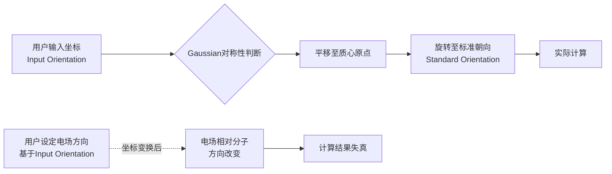
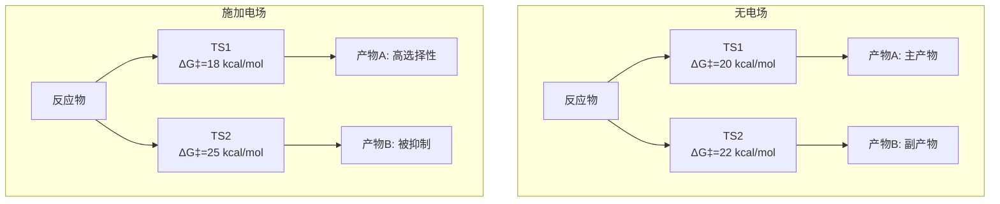
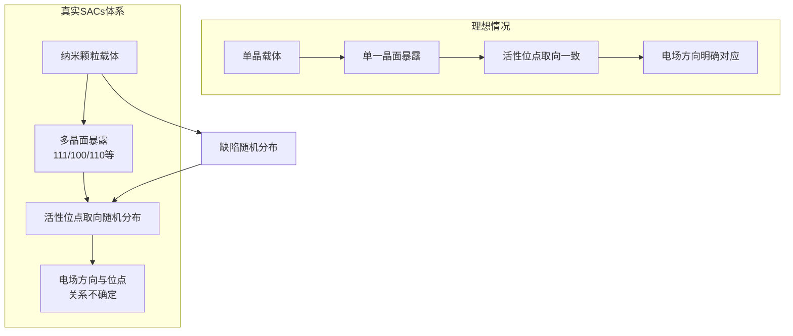
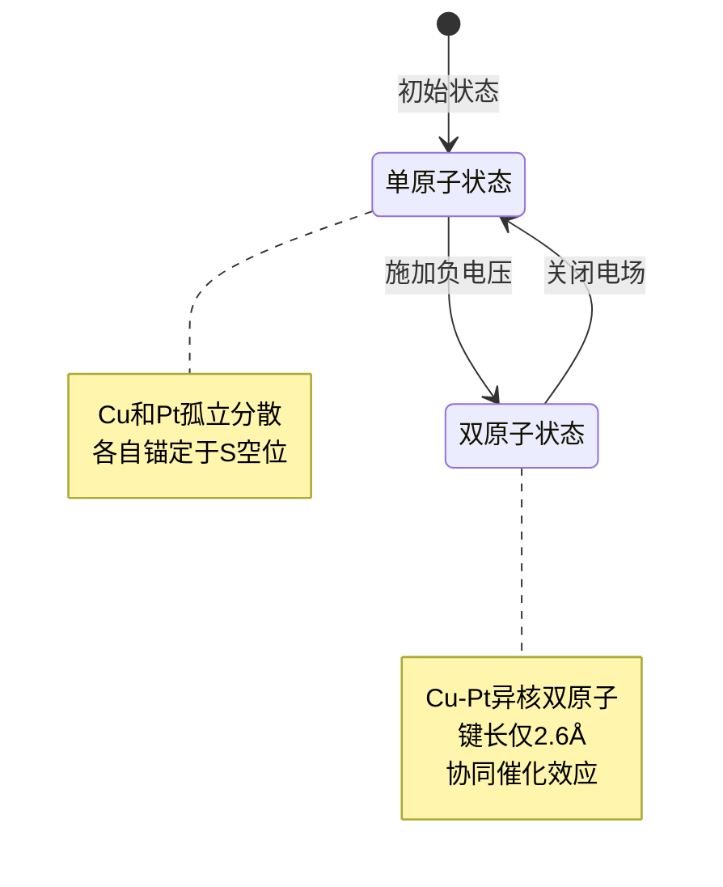
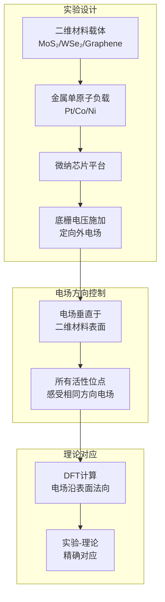
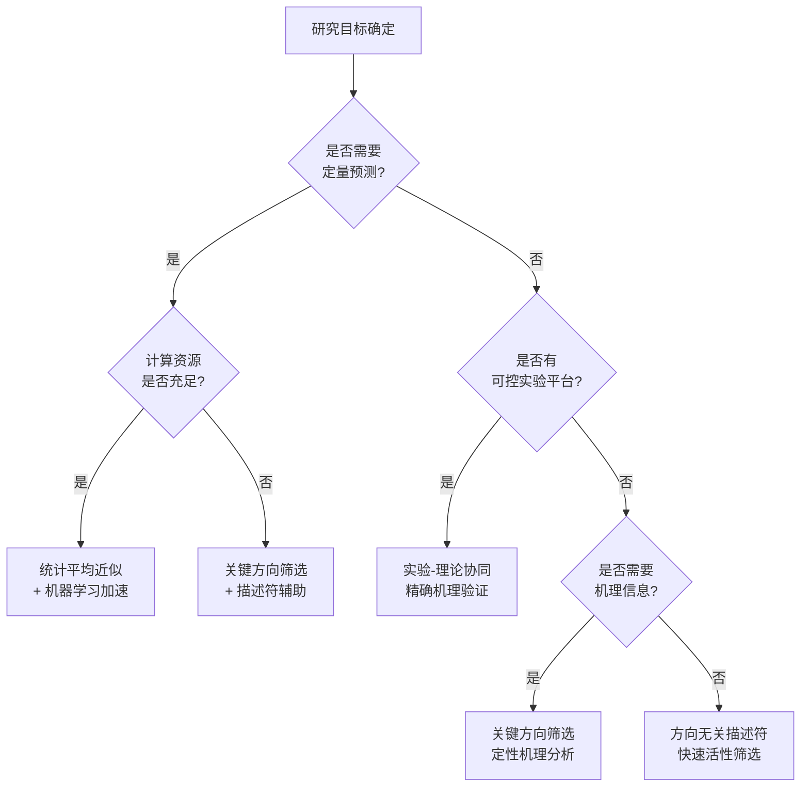
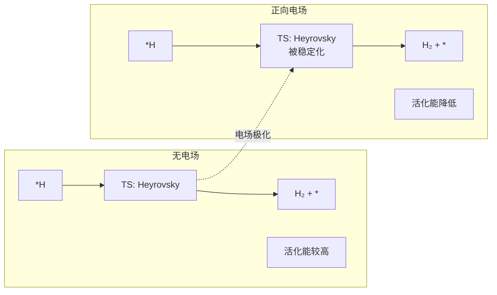
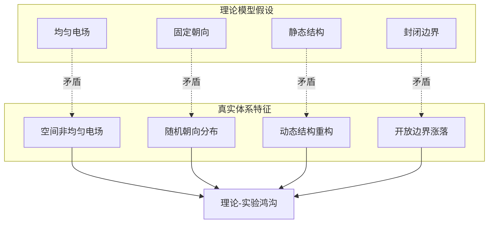

# 计算化学中外加电场模拟的理论方法与实践挑战：以单原子催化剂体系为例
## 1 计算化学中外加电场模拟的基础原理与方法

在量子化学计算中，外加电场是研究分子极化响应、反应机理调控以及电化学催化等问题的重要理论工具。通过在体系哈密顿量中引入电场微扰项，研究者可以系统考察电场对分子几何结构、电子分布、反应势垒等性质的影响。然而，电场模拟的准确实施涉及多个技术细节，包括电场参数的正确设定、分子坐标朝向的处理以及不同量子化学程序之间的方法差异。本章将系统阐述这些基础原理与方法，为后续章节中复杂体系的电场模拟研究奠定方法学基础。

### 1.1 Gaussian程序中Field关键词的语法结构与物理含义

Gaussian作为计算化学领域最广泛使用的量子化学程序之一，提供了**Field关键词**用于在计算中施加有限电场。该关键词支持两种参数格式，分别对应不同的物理应用场景[^1]。

**第一种格式为M±N形式**，其中M指定电多极矩的类型，N指定场强大小。电场强度的实际数值为N乘以0.0001原子单位（atomic units, a.u.）。Gaussian支持从电偶极场到十六极场（hexadecapole）的完整电多极展开。具体而言，当M为单个坐标字母（如X、Y、Z）时，表示施加电偶极场；当M为多个坐标字母的组合（如XXYZ）时，则表示施加更高阶的电多极场[^1]。

以下为典型的电场设置示例及其物理含义：

| 关键词示例 | 电场类型 | 场强（a.u.） | 方向说明 |
|:---|:---|:---|:---|
| Field=X+10 | 电偶极场 | 0.001 | 沿X正方向 |
| Field=X-10 | 电偶极场 | 0.001 | 沿X负方向 |
| Field=XXYZ-20 | 十六极场 | 0.002 | 方向与默认相反 |

**第二种格式为F(M)N形式**，用于施加Fermi接触微扰。这里M表示原子序号（按分子输入部分的顺序），N乘以0.0001指定微扰强度。例如，Field=F(3)27表示对第3个原子施加强度为0.0027倍其自旋密度的Fermi接触微扰[^1]。这种格式主要应用于核磁共振参数计算等特殊场景。

需要特别强调的是，**Field关键词中的系数对应笛卡尔算符矩阵的系数**，用户在解释计算结果时必须注意符号惯例的选择。此外，当使用Field关键词时，Gaussian会自动禁用计算结果的存档功能[^1]。

### 1.2 电场方向定义与分子坐标朝向的关联机制

理解电场方向与分子坐标朝向之间的关系，是正确实施电场模拟的关键前提。Gaussian中存在两套坐标系统：**输入朝向（Input orientation）**和**标准朝向（Standard orientation）**，两者之间的转换机制直接影响电场的实际作用方向[^2]。

**输入朝向**是用户在输入文件中直接指定的原子坐标。然而，为了判断和利用分子对称性，Gaussian在计算开始时会自动将体系调整至**标准朝向**。这一调整过程包括两步操作：首先将体系平移，使原子核电荷中心位于笛卡尔坐标原点；然后根据特定规则对体系进行旋转[^2]。例如，即使用户在GaussView中将苯分子摆成任意歪斜位置，计算完成后查看输出文件时会发现分子已被自动调整至XY平面，且环中心位于坐标原点。

这种坐标变换机制带来一个**关键问题**：Field关键词中的电场参数是基于输入朝向定义的，而非标准朝向[^1]。这意味着如果用户设定Field=X+10希望沿某特定化学键方向施加电场，但该键在输入文件中并未与X轴对齐，则实际电场方向将偏离用户预期。更复杂的是，当Gaussian将体系旋转至标准朝向后，电场方向相对于分子的实际取向会发生改变，导致计算结果失去物理意义。



上图展示了坐标变换对电场方向的影响机制。当程序自动将分子旋转至标准朝向时，用户预设的电场方向（基于输入坐标定义）与分子的相对关系发生改变，从而导致实际施加的电场方向偏离用户意图。

### 1.3 nosymm关键词在电场模拟中的关键作用

为解决上述坐标变换带来的问题，Gaussian提供了**nosymm关键词**，其核心功能是**完全禁用对称性的判断和利用**[^2]。使用nosymm后，程序不再尝试识别分子点群，也不会将体系调整至标准朝向，从而确保实际计算过程中的坐标与输入文件中的坐标完全一致。

nosymm关键词在电场模拟中的必要性体现在以下几个方面：

**首先，维持电场方向的准确性**。当用户预先将分子旋转至特定朝向（例如使目标化学键沿X轴方向），并设定Field=X+100施加沿键轴方向的电场时，只有使用nosymm才能保证电场确实作用于预期方向[^2]。否则，程序的自动坐标旋转将使电场方向相对于分子发生偏转，计算结果将毫无物理意义。

**其次，在电场存在下进行几何优化时存在特殊要求**。根据Gaussian使用规范，在有电场存在的情况下进行几何优化，**必须使用Opt=Z-Matrix NoSymm关键字组合**，并采用传统的Z矩阵坐标或符号化笛卡尔坐标定义输入结构[^3]。这一要求确保优化过程中分子朝向保持固定，电场始终沿预设方向作用。

**第三，保证多步计算中坐标的一致性**。在涉及电子密度差图绘制、电荷分解分析（CDA）、ETS-NOCV分析等需要比较不同计算结果的任务中，nosymm确保各计算步骤中原子坐标的对应关系[^2]。这对于分析电场对电子结构影响的研究尤为重要。

然而，使用nosymm也存在**代价**：程序将无法利用分子对称性加速计算。对于高对称性体系，这可能导致计算时间显著增加。例如，在CCSD(T)/def2-TZVP级别下计算D6h对称性的苯二聚体，利用对称性仅需约1.5小时，而不启用对称性则需要超过两天半[^2]。因此，nosymm应仅在必要时使用，而非作为所有计算的默认选项。

### 1.4 ORCA程序中电场施加方法及其实现特点

ORCA作为另一款广泛使用的量子化学程序，同样支持外加电场模拟，但其实现方式与Gaussian存在显著差异。ORCA通过**%scf模块中的EField参数**施加均匀电场，语法格式如下[^4]：

```
%scf
  EField X-field-strength, Y-field-strength, Z-field-strength  # 单位为a.u.
end
```

三个参数分别指定电场在X、Y、Z方向的分量强度（以原子单位表示）。值得注意的是，**EField是ORCA的非文档化功能**，在官方手册中并未详细说明[^4]。尽管该关键词位于%scf模块中，但电场效应会自动应用于所有计算方法，包括后HF方法、多参考方法和TDDFT等，仅XTB和力场方法除外[^5]。

然而，**ORCA 5.0.x及更早版本在电场相关计算中存在严重缺陷**，用户必须充分了解这些限制以避免得到错误结果[^5]：

**第一，解析梯度计算不完整**。ORCA 5.0.4及更早版本无法正确计算电场对解析梯度的贡献，具体表现为缺失了电场项几何导数对梯度的贡献。这意味着在电场存在下进行几何优化时，得到的优化结构是错误的。

**第二，分子无法在电场中旋转**。由于电场规范原点固定于核电荷中心，即使使用数值梯度（通过!NumGrad关键词），分子也无法在电场作用下发生转动响应。这与物理现实中极性分子在电场中倾向于沿电场方向排列的行为相矛盾。

**第三，适用范围受限**。EField功能最初设计用于有限差分偶极矩和极化率计算的内部调用，而非用于电场下的几何优化、频率分析或分子动力学模拟[^5]。

作为**临时解决方案**，用户可以在以下特定条件下使用ORCA进行电场计算：（1）仅进行单点能计算而不涉及结构优化；（2）用户不希望分子旋转，或在所选电场方向下分子本身不会旋转；（3）如需优化，必须指定!NumGrad使用数值梯度[^5]。ORCA开发团队已表示将在后续版本中修复这些问题。

此外，ORCA还提供了另一种**通过POTENTIALS施加原子间外力**的方法，可用于拉直分子等特殊应用[^6]。在%geom模块中使用如下语法：

```
%geom
  POTENTIALS
    { C atom1 atom2 force }  # C代表constant force，force单位为nN
  end
end
```

这种方法通过在两个原子之间施加恒定力来驱使它们远离或靠近，虽然与电场效应的物理机制不同，但在某些构型调控任务中具有实用价值。

### 1.5 Gaussian与ORCA在外加场方法上的比较分析

综合上述分析，下表系统比较了Gaussian与ORCA在外加电场实现上的关键差异：

| 比较维度 | Gaussian | ORCA (5.0.x) |
|:---|:---|:---|
| **关键词/参数** | Field（官方支持） | EField（非文档化） |
| **电场类型** | 电多极场（偶极至十六极）+ Fermi接触 | 均匀电偶极场 |
| **参数格式** | M±N 或 F(M)N | X, Y, Z分量直接指定 |
| **单点能计算** | ✓ 正确 | ✓ 正确 |
| **几何优化** | ✓ 需配合Opt=Z-Matrix NoSymm | ✗ 解析梯度错误 |
| **频率分析** | ✓ 支持 | ✗ 不推荐 |
| **分子动力学** | 有限支持 | ✗ 结果错误 |
| **后HF方法兼容性** | ✓ 良好 | ✓ 能量正确，梯度错误 |
| **坐标朝向要求** | 需配合nosymm | 无自动旋转但有规范原点问题 |
| **数值梯度替代** | 通常不需要 | 可作为临时方案 |

从上表可以看出，**Gaussian在电场模拟方面的实现更为成熟和完善**。其Field关键词作为官方支持功能，在单点能、几何优化、频率分析等多种计算任务中均能正确工作，只需注意配合nosymm关键词使用即可。相比之下，ORCA的EField功能在当前版本中存在根本性缺陷，仅适用于不涉及结构弛豫的单点能计算。

对于需要在电场下进行几何优化的研究者，**建议优先选择Gaussian程序**，并严格遵循以下操作规范：（1）预先将分子旋转至目标朝向，使待研究的化学键或反应轴与所需施加电场的坐标轴对齐；（2）在关键词中同时包含Field和nosymm；（3）使用Opt=Z-Matrix格式定义优化任务。这一工作流程能够确保电场方向与用户意图一致，获得物理上有意义的计算结果。

然而，无论选择何种程序，计算化学中的电场模拟都面临一个更深层的挑战：**理论计算中预设的固定电场方向如何对应于真实体系中可能存在的随机或动态变化的电场环境**。这一问题在单原子催化剂等复杂体系中尤为突出，将在后续章节中深入探讨。

## 2 确定朝向体系的理论模拟与实验对照

在计算化学研究中，外加电场模拟的准确性根本上依赖于电场方向与分子特定化学键或反应轴之间的精确对齐。当研究对象为气相分子或具有固定晶体取向的体系时，分子朝向是可控或已知的，这为理论模拟提供了理想化的研究条件。本章将系统阐述如何通过预设分子坐标朝向实现电场方向的精确控制，分析这种"理想化"模拟策略在预测电场对分子结构、电子性质及反应势垒等影响时的有效性，并建立理论模拟与可控实验条件下结果对比的研究范式。这一方法学框架将为后续章节中讨论复杂催化体系（如单原子催化剂）面临的方向不确定性挑战提供重要参照。

### 2.1 分子坐标朝向的预处理方法与工具实现

在施加外加电场进行量子化学计算之前，**将分子调整至特定朝向是确保电场沿预期方向作用的关键步骤**。这一预处理过程涉及分子可视化工具的操作、坐标变换的数学原理以及与计算程序关键词的配合使用。

#### 可视化工具的旋转操作流程

目前广泛使用的分子可视化软件如**VMD（Visual Molecular Dynamics）**、**GaussView**和**Avogadro**等均提供了直观的分子旋转功能。以VMD为例，研究者可通过以下步骤将目标化学键与笛卡尔坐标轴对齐：首先加载分子结构文件，然后利用鼠标拖动或通过Extensions菜单中的Tk Console输入旋转命令，将待研究的化学键（如C-H键、金属-配体键）旋转至与X轴平行的位置。GaussView则提供了更为便捷的操作界面，用户可在Edit菜单中选择"Reorient"功能，通过指定原子序号来定义新的坐标轴方向。

**具体操作流程可归纳为以下步骤**：

1. **识别目标方向**：确定需要与电场方向对齐的化学键、反应轴或分子偶极矩方向
2. **执行旋转操作**：利用可视化工具将目标方向调整至与所选笛卡尔坐标轴（如X轴）重合
3. **验证朝向正确性**：检查关键原子的坐标数值，确认目标方向确实与坐标轴平行
4. **导出坐标文件**：将调整后的分子坐标保存为Gaussian输入文件格式

#### 坐标变换的数学原理

分子旋转操作的数学本质是对原子坐标施加**旋转变换矩阵**。设原始坐标为$\mathbf{r} = (x, y, z)^T$，旋转后的坐标为$\mathbf{r'} = \mathbf{R} \cdot \mathbf{r}$，其中$\mathbf{R}$为$3 \times 3$正交旋转矩阵。绕Z轴旋转角度$\theta$的变换矩阵为：

$$\mathbf{R}_z(\theta) = \begin{pmatrix} \cos\theta & -\sin\theta & 0 \\ \sin\theta & \cos\theta & 0 \\ 0 & 0 & 1 \end{pmatrix}$$

当需要将任意方向的向量$\mathbf{v}$旋转至与X轴对齐时，可通过计算$\mathbf{v}$与X轴单位向量之间的旋转角和旋转轴，构造相应的旋转矩阵。这一过程在高级可视化工具中通常被自动化处理，用户无需手动计算矩阵元素。

#### 与nosymm关键词的配合使用

如第一章所述，Gaussian程序在默认情况下会将分子自动调整至标准朝向，这将破坏用户精心设定的坐标朝向。因此，**在完成分子旋转预处理后，必须在Gaussian输入文件中同时包含Field和nosymm关键词**。典型的输入文件关键词行应写为：

```
#p B3LYP/6-311G(d,p) Field=X+100 nosymm
```

这一组合确保程序在计算过程中保持输入坐标不变，使Field=X+100指定的电场确实沿用户预设的X轴方向（即目标化学键方向）施加。若省略nosymm，即使分子已被正确旋转，程序的自动坐标调整仍会导致电场方向与化学键方向发生偏转，计算结果将失去物理意义。

### 2.2 电场对分子结构与电子性质影响的理论预测

基于确定朝向的分子模型，外加电场将对体系的几何结构和电子性质产生系统性影响。**电场通过静电相互作用改变分子内部的电荷分布，进而引发键长键角的变化、偶极矩的增强以及分子轨道能级的移动**。

#### 几何参数的电场响应

当电场沿特定化学键方向施加时，键两端原子所受的静电力方向相反，导致**键长发生伸缩变化**。对于极性键（如C-O键、N-H键），正向电场（电场方向从负电性原子指向正电性原子）通常使键长增加，因为电场力倾向于将带部分负电荷的原子和带部分正电荷的原子沿相反方向拉开。相反，反向电场则可能使键长缩短。

以羰基化合物为例，当电场沿C=O键轴方向施加时，理论计算表明键长变化与电场强度呈近似线性关系。在0.01 a.u.量级的电场强度下，键长变化通常在0.001-0.01 Å范围内，这一微小但可测量的变化对反应活性具有重要影响。

#### 电子密度分布与偶极矩变化

电场诱导的电子密度重新分布是理解电场效应的核心。**在外加电场作用下，电子云倾向于向电场负端方向移动**，导致分子偶极矩增大（若电场方向与原有偶极矩方向一致）或减小（若方向相反）。这种极化效应的强度由分子的极化率张量决定，可通过以下关系定量描述：

$$\mu_{induced} = \alpha \cdot E$$

其中$\mu_{induced}$为诱导偶极矩，$\alpha$为极化率，$E$为电场强度。对于各向异性分子，极化率为张量形式，诱导偶极矩的方向与电场方向不一定平行。

#### 理论方法的选择与准确性评估

不同密度泛函理论（DFT）方法在描述电场诱导效应时的准确性存在差异。**杂化泛函（如B3LYP、M06-2X）通常能够较好地描述电场对分子性质的影响**，而纯GGA泛函可能低估极化效应。基组的选择同样重要，包含弥散函数的基组（如6-311++G(d,p)、aug-cc-pVDZ）对于准确描述电子在电场中的响应至关重要，因为弥散函数能够更好地描述电子云在空间中的扩展。

| 理论方法 | 优势 | 局限性 | 推荐应用场景 |
|:---|:---|:---|:---|
| B3LYP/6-311G(d,p) | 计算效率高，结果可靠 | 对色散作用描述不足 | 常规有机分子电场效应 |
| M06-2X/def2-TZVP | 对非共价作用描述较好 | 计算成本较高 | 涉及弱相互作用的体系 |
| ωB97XD/aug-cc-pVDZ | 包含色散校正和长程校正 | 对某些体系收敛困难 | 大分子、催化体系 |
| CCSD(T)/CBS | 高精度基准 | 计算成本极高 | 小分子基准计算 |

### 2.3 电场调控反应势垒与反应路径的计算策略

电场对化学反应的调控作用主要通过改变反应势垒和选择性反应路径来实现。**当电场方向与反应过渡态的偶极矩方向一致时，可显著降低活化能；反之则可能升高活化能**[^7]。这一原理为理性设计电场辅助催化提供了理论基础。

#### 过渡态搜索的计算方法

在电场存在下进行过渡态搜索需要特别注意方法选择。常用的QST2、QST3方法在电场环境中仍然适用，但需确保反应物、产物和过渡态猜测结构均采用相同的坐标朝向，以保证电场在整个反应路径上沿同一方向施加。

**推荐的计算流程如下**：

1. 在无电场条件下完成反应物、过渡态和产物的几何优化
2. 将所有结构统一旋转至目标朝向
3. 在各结构上分别施加电场进行单点能计算，评估电场对能量的影响
4. 以无电场优化结构为初猜，在电场存在下重新优化几何结构
5. 使用Opt=Z-Matrix NoSymm进行电场下的过渡态搜索

#### 电场对活化能的调控机制

电场调控活化能的微观机制可从**过渡态稳定化**角度理解。在许多化学反应中，过渡态具有比反应物更大的偶极矩，这是因为过渡态通常涉及电荷分离或重新分布。当外加电场方向与过渡态偶极矩方向一致时，电场-偶极相互作用能$U = -\boldsymbol{\mu} \cdot \mathbf{E}$为负值，过渡态能量降低，活化能随之减小[^7]。

南京大学丁梦宁课题组与合作者的研究表明，在单原子催化剂体系中，**特定方向的外部电场能够显著改变电催化过程中单原子位点及其关键反应中间体的电荷密度分布，进而实现电催化过程中反应动力学的优化**[^7]。这种"位点静电极化"机制在电析氢（HER）和电析氧（OER）等模型反应中得到了验证。

#### 反应路径选择性的电场调控

对于存在多个竞争反应路径的体系，电场可通过差异化稳定不同过渡态来改变反应选择性。例如，在有机反应中，当两个竞争过渡态具有不同方向的偶极矩时，沿特定方向施加电场将选择性降低其中一个过渡态的能量，从而提高相应产物的选择性。



上图示意性展示了电场如何通过差异化稳定竞争过渡态来调控反应选择性。当电场方向与TS1的偶极矩方向一致而与TS2相反时，TS1被稳定而TS2被去稳定，导致产物A的选择性显著提高。

### 2.4 气相分子束实验与理论模拟的对照验证

气相分子束实验为验证电场效应理论预测提供了理想的实验平台。在高真空环境下，分子间相互作用可忽略，分子取向可通过特定技术精确控制，这与理论计算中的孤立分子模型高度吻合[^8][^9]。

#### 分子立体取向控制的实验技术

**激光取向控制技术**是实现气相分子立体取向的关键手段。中国科学院大连化学物理研究所杨学明院士团队发展了一种能够将氢分子（及其同位素分子HD）调整到特定量子态和空间取向的新方法[^9]。该技术的核心原理是：**电磁波将分子激发到特定的量子态之后，分子本身就具有了特定的朝向，该朝向与电磁场方向存在一定的关系**[^8]。

具体而言，研究团队研制出高能量、单纵模纳秒光参量振荡放大器，将激光作用于氢分子使其激发至振动激发态，同时使化学键的方向平行于激光的电场方向（即偏振方向）[^8]。通过简单旋转波片即可改变激光偏振方向，从而精确控制分子的空间取向。这一技术使研究者能够做氢分子的"掌舵人"，控制氢分子在化学反应中的碰撞方向[^8]。

#### 交叉分子束技术与反应动力学研究

**交叉分子束技术**通过将反应物分子制备到特定的速度和量子态后进行相互碰撞，可以在单次碰撞水平上研究化学反应的微观机理[^8]。结合激光取向控制，该技术能够实现对化学反应立体动力学的精准调控[^9]。

以H + HD → H₂ + D反应为例，研究团队通过控制HD分子的空间取向，研究了不同碰撞方向对反应产物分布的影响。实验结果表明，**从不同方向进攻HD分子（如从"哑铃"的中间进攻或从某一侧进攻），碰撞的过程和结果完全不同**[^8]。这一发现直接验证了理论预测中关于反应立体化学效应的核心观点。

#### 实验与理论的定量对比

杨学明院士团队的研究实现了实验与理论的高度融合。**理论研究团队利用量子动力学计算，不仅精确复现了实验观测，更从量子力学的角度阐明了反应的微观过程和机理**[^9]。审稿人评价该研究是"反应动力学研究中的一个里程碑"[^9]。

这种实验-理论对照研究的成功要素包括：

- **实验条件的理想化**：高真空环境消除了溶剂和环境干扰
- **取向控制的精确性**：激光技术实现了分子取向的精准调控
- **理论方法的严格性**：量子动力学计算能够处理完整的势能面信息
- **可观测量的明确性**：产物角分布、态分辨截面等数据可直接与理论预测对比

### 2.5 单晶定向体系的电场效应模拟与实验关联

在凝聚态体系中，单晶材料为电场效应研究提供了另一类取向确定的理想平台。**单晶中分子或活性位点的取向相对于晶格是固定的，这使得外加电场方向与活性位点的相对关系可以精确确定**。

#### 周期性边界条件下的电场实现

在使用周期性边界条件进行固态体系计算时，外加电场的实现需要特别考虑。常用的方法包括：

1. **锯齿势方法（Sawtooth potential）**：在超胞中引入线性变化的静电势，在真空区域产生均匀电场
2. **Berry相方法**：通过计算电子波函数的Berry相来描述有限电场效应
3. **有限电场方法**：直接在哈密顿量中加入电场项，但需要处理周期性边界条件带来的规范问题

对于表面催化体系的电场模拟，**电场方向通常设定为垂直于表面（即沿表面法线方向）**，这与电化学实验中电极表面的电场方向一致。

#### 单晶电化学实验的对应关系

在单晶电化学实验中，电极表面的电场方向由外加电位和双电层结构决定，主要沿晶面法线方向。这为理论模拟提供了明确的电场方向参照。例如，在研究Pt(111)单晶表面的电催化反应时，理论计算中的电场方向应设定为垂直于(111)晶面。

**中国科学技术大学廖伍平等人的研究**展示了电流辅助策略在单原子催化剂体系中的应用[^10][^11]。他们开发的Pt₁-Nb₁/ATO双原子催化剂在电流辅助下实现了丙烷的低温完全转化，**原位实验与理论模拟表明，电流辅助下Nb原子与Pt原子的邻近性促进了丙烷中C-H键的解离和CO₂的解吸，同时电流削弱了Nb侧附近的Pt-O键，促进了晶格氧的活化与释放**[^10][^11]。这一研究为外场辅助催化提供了新的范式。

#### 纳米曲率诱导的局部电场调控

新加坡国立大学林彦玮课题组的研究揭示了**纳米曲率诱导场效应**对单原子电催化剂活性的调控作用[^12]。通过调整电催化剂表面的曲率，可以改变局部电场强度，从而控制单原子催化剂的活性。研究表明，**更高的纳米曲率（更小的球体直径）会产生更强的电场**，这一效应通过开尔文探针力显微镜和拉曼光谱得到了实验验证[^12]。

这一发现的重要意义在于：**即使催化剂的活性位点化学组成完全相同，仅通过改变载体的几何形貌（曲率）就可以调控其催化活性**[^12]。这为设计高效电催化剂提供了新的材料学策略。

### 2.6 理想化模拟的有效性边界与适用条件总结

基于上述分析，确定朝向体系的电场模拟策略在特定条件下具有良好的有效性，但其适用范围存在明确边界。

#### 适用场景归纳

| 体系类型 | 取向特征 | 模拟策略 | 有效性评估 |
|:---|:---|:---|:---|
| 气相孤立分子 | 可通过激光精确控制 | 预设坐标朝向 + nosymm | **高**：实验-理论高度吻合 |
| 单晶表面 | 相对晶格固定 | 周期性边界 + 表面法向电场 | **高**：方向关系明确 |
| 液晶高分子 | 可通过外场诱导取向 | 统计分布模型 | **中等**：需考虑取向分布 |
| 溶液中分子 | 随机取向 | 需统计平均 | **有限**：单一方向模拟偏离实际 |
| 多相催化剂 | 颗粒随机分布 | 需多方向采样 | **有限**：计算成本高 |

#### 模型简化假设的影响分析

理想化电场模拟通常采用以下简化假设，每种假设都会对结果可靠性产生特定影响：

**固定取向假设**：假设分子在电场作用下保持固定朝向。这一假设在气相分子束实验条件下成立，但在溶液或界面环境中，分子的热运动和溶剂相互作用会导致取向的动态涨落。

**均匀电场假设**：假设电场在分子尺度上是均匀的。这一假设对于宏观外加电场是合理的，但在电化学界面的双电层区域，电场梯度可能相当显著，均匀电场模型将引入误差。

**忽略环境涨落假设**：假设电场强度恒定不变。实际电化学体系中，界面电场受溶剂重组、离子吸脱附等过程的影响而持续涨落。华南理工大学樊栓狮教授团队的研究表明，**余弦振荡电场通过分子尺度调节水分子取向、氢键网络及气-液界面行为，能够实现甲烷在吸附-水合体系中的高效存储与可控释放**[^13]。这一发现强调了电场动态特性的重要性。

#### 判断理论预测有效性的关键指标

研究者在评估电场模拟结果的可靠性时，应关注以下关键指标：

1. **体系取向的可控程度**：取向越可控，单一方向模拟的有效性越高
2. **环境复杂度**：气相 > 固态单晶 > 溶液 > 多相界面（有效性递减）
3. **电场与反应轴的对齐精度**：对齐越精确，模拟结果越可靠
4. **时间尺度匹配**：静态模拟适用于快速过程，慢过程需考虑动态效应
5. **实验验证的可行性**：能够与可控实验对比的模拟结果更具说服力

**总结而言**，确定朝向体系的电场模拟代表了理论计算的"理想状态"，为理解电场效应的基本规律提供了重要基础。然而，当研究对象转向单原子催化剂等复杂真实体系时，分子朝向的随机性和不确定性将使这种理想化模拟策略面临根本性挑战，这正是下一章将深入探讨的核心问题。

## 3 单原子催化剂体系的特殊性与模拟挑战

前两章分别阐述了外加电场模拟的基础方法以及确定朝向体系中理论与实验的良好对应关系。然而，当研究对象从气相孤立分子或单晶定向体系转向单原子催化剂（Single-Atom Catalysts, SACs）时，情况发生了根本性变化。SACs作为近年来催化领域最具前景的研究方向之一，其活性位点在真实反应环境中的朝向具有高度不确定性，这一特征与传统计算化学中预设固定电场方向的做法形成了深刻矛盾。本章将系统剖析这一矛盾的物理根源、表现形式及其对理解电场调控催化机制的深远影响。

### 3.1 单原子催化剂活性位点的结构特征与朝向不确定性来源

单原子催化剂的核心特征是**金属以孤立的单个原子形式均匀分散在载体表面，且原子间无任何相互作用**[^14]。这种原子级分散结构赋予SACs极高的原子利用率（理论上可达100%）和明确的活性位点结构，但同时也带来了朝向不确定性这一根本性挑战。

#### 配位环境的多样性与载体依赖性

SACs的活性位点结构高度依赖于载体的化学性质和表面特征。以典型的M-N₄配位结构为例，金属单原子通过配位键与载体（如氮掺杂碳材料）中的氮原子结合，形成如Co-O-Mn、Pt-O-Ti等明确的局域配位环境[^14]。然而，**不同载体类型决定了完全不同的活性位点几何构型**：

| 载体类型 | 典型配位结构 | 活性位点朝向特征 | 代表性体系 |
|:---|:---|:---|:---|
| 二维过渡金属硫化物 | M-S配位 | 平行于二维平面 | Pt SAs-MoS₂, Co SAs-WS₂ |
| 氮掺杂碳材料 | M-N₄配位 | 取决于碳骨架局部曲率 | Fe-N-C, Co-N-C |
| 金属氧化物 | M-O配位 | 取决于氧化物晶面 | Pt₁/TiO₂, Au₁/CeO₂ |
| 石墨烯 | M-C配位 | 平行于石墨烯平面 | Pt SAs-Graphene |

南京大学丁梦宁课题组的研究系统考察了负载在不同二维原子晶体材料（二硫化钼、二硒化钨、石墨烯）上的金属单原子催化剂（Pt, Co, Ni），发现**不同载体具有不同的场效应调控特性**：n型半导体二硫化钼、p型半导体二硒化钨和类金属型石墨烯对电场的响应机制存在本质差异[^7]。这种载体依赖性意味着，即使是相同的金属单原子，其活性位点的空间取向也会因载体不同而呈现显著差异。

#### 缺陷分布的随机性与位点异质性

SACs的合成过程中，金属单原子通常锚定于载体表面的缺陷位点。以二硫化钼（MoS₂）为例，通过电化学脱硫手段可在表面引入高密度硫空位，诱导2H相向1Tʹ相转变，这些空位作为"原子级锚点"负载金属单原子[^15]。然而，**缺陷的空间分布本质上是随机的**，不同缺陷位点的局部化学环境存在微妙差异，导致锚定于这些位点的金属单原子具有不同的配位几何和空间取向。

这种位点异质性可通过以下途径产生：

1. **缺陷类型多样性**：单空位、双空位、边缘缺陷等不同类型缺陷提供不同的锚定环境
2. **缺陷密度涨落**：载体表面不同区域的缺陷密度存在统计涨落
3. **合成条件波动**：温度、前驱体浓度等合成参数的局部波动影响缺陷形成

#### 纳米颗粒暴露晶面的多样性

对于负载在纳米颗粒载体上的SACs，问题更加复杂。纳米颗粒通常暴露多种晶面，每种晶面具有不同的表面原子排布和化学活性。**当单原子锚定于不同晶面时，其相对于宏观电场方向的取向将完全不同**。



上图对比了理想单晶载体与真实纳米颗粒载体上SACs活性位点的取向特征。在真实体系中，多晶面暴露和缺陷随机分布共同导致了活性位点取向的高度不确定性。

### 3.2 溶液与电极界面环境中的动态涨落效应

SACs的实际应用场景主要集中在电催化领域，这意味着活性位点处于溶液与电极界面的复杂环境中。**这一界面环境的动态特性为电场模拟带来了额外的挑战维度**。

#### 双电层结构的时空演化

电化学界面的核心特征是双电层（Electrical Double Layer, EDL）的存在。根据电双层量子模型，电极/电解液界面可描述为离散电荷层构成的双电层结构，其电场强度由表面电荷密度与吸附偶极矩共同决定[^16]。然而，这一结构并非静态不变：

**离子吸脱附动力学**：界面区域的离子浓度随电极电位的变化而持续调整，导致局部电场强度的时间涨落。在典型的电催化反应条件下，这种涨落的时间尺度可能与反应基元步骤的时间尺度相当，使得"恒定电场"的假设失效。

**溶剂分子重组**：水分子在电极表面形成有序排列层，其取向响应电场变化而发生重组。这种重组过程改变了局部介电环境，进而影响活性位点感受到的有效电场强度。

**表面质子电流机制**：在电场驱动下，催化剂载体表面产生定向质子迁移流，这种质子电流不仅改变了界面双电层的离子分布，还通过浓度梯度使反应物分子在催化剂/载体界面区域选择性富集[^16]。

#### 反应中间体吸附构型的多样性

电催化反应过程中，反应中间体在活性位点上的吸附构型并非唯一确定。以析氢反应（HER）为例，氢原子可能以顶位（top）、桥位（bridge）或穴位（hollow）等不同方式吸附于金属单原子，每种吸附构型对应不同的M-H键取向。**当外加电场沿特定方向施加时，不同吸附构型对电场的响应将存在显著差异**。

更重要的是，吸附构型本身可能随反应进程和电位变化而动态转换。新加坡国立大学林彦玮课题组的研究表明，**具有高偶极矩或极化率的反应中间体对界面电场尤为敏感**[^17]。例如，在碱性介质中的析氧反应（OER）和析氢反应（HER）中，纳米曲率诱导的电场变化显著影响催化活性；而在酸性介质的HER中，由于*H中间体没有偶极矩或极化率，其结合能不受界面电场影响，纳米曲率对活性无明显调控作用[^17]。

#### 局部电场的空间非均匀性

与理论计算中常用的均匀电场假设不同，**真实电化学界面的电场在空间上是高度非均匀的**。电场强度从电极表面向体相溶液方向急剧衰减，衰减长度通常在纳米量级。对于分散在载体表面的单原子位点，其所处的局部电场环境取决于：

- 距离电极表面的高度
- 载体的局部几何形貌（如曲率）
- 周围吸附物种的存在

新加坡国立大学的研究直接证实了**纳米曲率对局部电场强度的调控作用**：更高的纳米曲率（更小的球体直径）会产生更强的电场，这一效应通过开尔文探针力显微镜和原位拉曼光谱得到了实验验证[^17]。这意味着，即使是化学组成完全相同的SACs，仅因载体几何形貌的差异就会感受到不同强度的局部电场。

### 3.3 单一固定电场方向假设的物理局限性

在传统计算化学实践中，研究者通常将分子旋转至特定朝向后施加固定方向的电场（如Field=X+100），这一做法在气相分子或单晶表面体系中是合理的。然而，**当应用于SACs多相催化体系时，这一简化假设与物理现实之间存在根本性矛盾**。

#### 确定朝向体系与SACs体系的本质差异

第二章详细讨论了确定朝向体系（气相分子束实验、单晶电化学）中电场模拟的有效性。这些体系的共同特征是：**分子或活性位点的空间取向是已知的、可控的或统计上确定的**。在此条件下，理论计算中预设的电场方向可以与实验条件精确对应。

SACs体系则呈现截然不同的特征：

| 特征维度 | 确定朝向体系 | SACs多相催化体系 |
|:---|:---|:---|
| 活性位点取向 | 已知/可控 | 随机分布 |
| 载体均匀性 | 高（单晶） | 低（多晶/缺陷） |
| 环境复杂度 | 低（真空/气相） | 高（溶液/界面） |
| 时间尺度 | 快速（单次碰撞） | 多尺度（涨落） |
| 电场方向对应 | 明确 | 不确定 |

这种本质差异意味着，**在SACs体系中采用单一固定电场方向的计算结果，其物理意义是模糊的**：计算得到的能量变化、电荷重分布等结果仅反映了众多可能取向中的一种特定情况，而非真实体系的统计平均行为。

#### 简化假设导致的系统性偏差

当理论计算中的电场方向与真实体系中活性位点的实际取向存在偏差时，计算结果将产生系统性误差：

**能量计算偏差**：电场与分子偶极矩的相互作用能$U = -\boldsymbol{\mu} \cdot \mathbf{E} = -|\mu||E|\cos\theta$，其中$\theta$为偶极矩与电场方向的夹角。当计算中假设$\theta = 0$（完美对齐）而实际体系中$\theta$呈随机分布时，计算得到的能量稳定化效应将被系统性高估。

**反应路径预测偏差**：电场对不同反应路径的影响取决于各过渡态偶极矩与电场方向的相对关系。如果理论计算中选取的电场方向恰好与某一过渡态偶极矩对齐，该路径将被人为"优选"，而在真实体系中这种选择性可能并不存在。

**选择性预测失真**：电场调控反应选择性的本质是差异化稳定竞争过渡态。当电场方向与真实体系不符时，理论预测的选择性变化趋势可能与实验观测相反。

#### 从"理想化"到"统计平均"的概念转变

认识到上述局限性后，研究者需要从根本上转变对SACs电场模拟的认知框架：**理论计算的目标不应是精确复现单一理想化构型的行为，而是提供对真实体系统计平均行为的合理近似**。

这一概念转变带来方法学上的深刻挑战：如何在可接受的计算成本下，对大量可能的取向构型进行采样并获得统计平均结果？这一问题将在第四章详细讨论。

### 3.4 方向失配问题对电场调控机制解读的影响

方向失配问题不仅影响定量计算结果的准确性，更可能导致对电场调控催化机制的根本性误读。本节结合前沿研究实例，分析这一问题如何阻碍对核心催化原理的正确理解。

#### "位点静电极化"机制的方向依赖性

南京大学丁梦宁课题组、马晶课题组与加州大学洛杉矶分校段镶锋课题组合作的研究，提出了**"位点静电极化"（onsite electrostatic polarization）**这一重要机制来解释外电场对SACs催化性能的调控作用[^7]。该机制的核心要点是：特定方向的外部电场能够显著改变电催化过程中单原子位点及其关键反应中间体的电荷密度分布，进而实现反应动力学的优化。

然而，**"位点静电极化"效应的强度和方向性高度依赖于电场与活性位点的相对取向**。研究团队的实验设计巧妙地规避了这一问题：他们在自己搭建的微纳电催化芯片平台上，通过底栅电压引入定向外部电场，使电场方向垂直于二维材料载体表面[^7]。在这种实验配置下，所有锚定于二维材料表面的单原子位点感受到的电场方向是一致的（均垂直于表面），从而实现了实验条件与理论模拟的精确对应。

但如果在常规多相催化条件下（如粉末催化剂悬浮于电解液中），**不同催化剂颗粒的取向随机，外加电场相对于各个活性位点的方向各不相同**。此时，理论计算中假设的"沿特定方向施加电场"将无法反映真实体系的复杂性，对"位点静电极化"机制的定量分析也将失去物理基础。

#### 纳米曲率诱导场效应的机制解析

新加坡国立大学林彦玮课题组的研究从另一个角度揭示了电场方向问题的重要性[^17]。他们发现，通过调整碳载体的纳米曲率，可以系统调控单原子催化剂的活性。**原位拉曼光谱分析表明，更高的纳米曲率确实诱导了更强的界面电场**[^17]。

这一研究的关键洞察在于：**纳米曲率诱导的电场方向是沿球面法线方向的**，即对于球形碳载体，电场从球心指向表面（或相反）。当单原子位点锚定于球面上时，其感受到的电场方向与该位点处的表面法线一致。由于球面各点的法线方向不同，**即使是同一个球形颗粒上的不同单原子位点，也感受到不同方向的电场**。

理论计算要准确描述这一效应，需要考虑：
1. 载体的真实几何形貌
2. 单原子位点在载体表面的分布
3. 各位点处的局部电场方向

传统的"均匀电场+固定方向"模型显然无法捕捉这种复杂性。

#### 吸附能调控规律的方向敏感性

电场对反应中间体吸附能的调控是理解电催化机制的关键。DFT计算表明，电场可以显著改变吸附能的数值——例如，+0.5 V/Å的电场可使Ni (111)表面*CO₂的吸附能增强0.8 eV[^16]。然而，**这一调控效应的大小和符号强烈依赖于电场方向与吸附物种偶极矩的相对关系**。

以*CO中间体为例，其偶极矩主要沿C-O键轴方向。当电场平行于表面（即垂直于典型的M-C键方向）时，电场对*CO吸附能的影响较小；而当电场垂直于表面（即沿M-C键方向）时，影响显著增强。**如果理论计算中选取的电场方向与真实体系不符，得到的吸附能调控规律将产生误导**。

### 3.5 电场诱导动态重构现象对静态模拟框架的挑战

传统DFT计算基于静态优化结构进行分析，隐含假设活性位点的几何构型在电场作用下保持不变或仅发生微小弛豫。然而，**最新研究揭示了电场可能诱导活性位点发生根本性的结构重构**，这对静态模拟框架提出了严峻挑战。

#### 异核双原子催化剂的电场诱导组装与解离

新加坡国立大学罗健平教授课题组的最新研究首次展示了**电场操控下原子级活性中心的可逆重构现象**[^15]。他们基于1Tʹ-MoS₂这一硫空位富集的二维材料，构建了高载量的Cu与Pt单原子催化位点。令人惊讶的是，**通过施加外部电场，可以驱动这些孤立的单原子可逆地重构为Cu–Pt异核双原子催化构型（DAC）**。



通过原位X射线吸收光谱和理论计算，研究团队发现：施加负电压时，Cu和Pt单原子靠近，在MoS₂表面形成稳定的异核双原子结构，键长仅2.6Å；关闭电场后，它们又恢复为孤立单原子状态[^15]。**这一过程犹如"原子开关"，完全可逆且高度可控**。

原位同步辐射X射线吸收谱（XAS）和密度泛函理论（DFT）以及分子动力学模拟（MD）明确揭示，**S–H键的质子化过程促使金属–硫键断裂与重排，从而实现了DAC构型的可控生成与释放**[^15]。

#### 动态活性中心对催化性能的影响

这种电场诱导的动态重构对催化性能产生了深刻影响。在苯乙炔的半氢化（氘代）反应中，**动态DAC催化剂表现出远超单原子体系的活性、选择性与稳定性**[^15]。机制研究表明，双原子协同调控吸附能：Cu负责强吸附炔烃，Pt负责高效活化氢；二者结合后，中间体结合能刚好合适，既加速反应又避免过度加氢[^15]。

这一发现的方法学启示是深刻的：**传统静态DFT计算框架假设活性位点结构在计算过程中保持不变，但电场可能从根本上改变这一前提**。如果活性位点的几何构型本身是电场的函数，那么基于单一固定结构的计算将无法捕捉真实的电场效应。

#### 静态模拟框架的根本性不足

电场诱导动态重构现象揭示了静态DFT计算在以下方面的局限：

**构型空间采样不足**：静态计算通常只考虑一种（或少数几种）优化结构，而电场可能诱导体系在多个局域极小点之间转换。

**时间尺度不匹配**：静态优化给出的是势能面上的驻点结构，无法描述电场驱动下的动态演化过程。

**电场-结构耦合效应缺失**：传统计算中，电场被视为外部参数，结构优化与电场施加是分离的步骤；而在真实体系中，结构与电场是相互耦合、共同演化的。

**从方法学角度看，捕捉电场诱导动态重构现象需要发展超越静态DFT的计算方法**，如恒电位分子动力学（Constant Potential Molecular Dynamics）或自适应增强采样技术。

### 3.6 从理想化模型到真实体系的方法学鸿沟

综合以上分析，SACs电场模拟面临的挑战可归结为**理想化理论模型与真实催化体系之间存在深刻的方法学鸿沟**。弥合这一鸿沟需要在多个层面进行方法学创新。

#### 核心挑战的系统总结

SACs电场模拟面临的核心挑战可从以下维度进行归纳：

| 挑战维度 | 具体表现 | 根本原因 | 影响程度 |
|:---|:---|:---|:---|
| **朝向不确定性** | 活性位点取向随机分布 | 载体非均匀性、缺陷随机性 | **根本性** |
| **环境复杂性** | 双电层涨落、溶剂重组 | 电化学界面的多体相互作用 | **显著** |
| **时间尺度分离** | 电场响应 vs. 结构弛豫 | 不同过程的特征时间差异 | **中等** |
| **空间非均匀性** | 局部电场强度/方向变化 | 纳米曲率、界面效应 | **显著** |
| **动态重构** | 电场诱导构型转变 | 电场-结构耦合 | **新兴挑战** |

#### 计算成本与精度的权衡

解决朝向不确定性问题的直接思路是对大量可能的取向构型进行采样，然后取统计平均。然而，**这一策略面临巨大的计算成本挑战**：

假设需要对取向空间进行充分采样，至少需要考虑数十至数百个不同取向的构型。对于每个构型，如果需要进行几何优化和频率分析，计算成本将呈线性增长。对于涉及过渡态搜索的反应机理研究，计算量更将急剧膨胀。

**在当前计算能力条件下，对SACs体系进行完整的取向采样在实践中几乎不可行**。这一现实迫使研究者必须寻找更高效的替代策略。

#### 多尺度耦合效应的理论描述困难

SACs电场模拟的另一核心困难在于**多尺度物理过程的耦合**：

- **电子尺度**（亚飞秒）：电场对电子密度的极化响应
- **原子尺度**（飞秒-皮秒）：核构型对电场的弛豫响应
- **介观尺度**（纳秒-微秒）：双电层结构的动态演化
- **宏观尺度**（毫秒以上）：催化反应的稳态动力学

当前主流的DFT计算主要描述电子尺度的行为，通过Born-Oppenheimer近似将原子核视为固定或经典粒子。**要准确描述电场对SACs的调控作用，需要发展能够跨越上述多个尺度的理论方法**。

#### 实验验证的可行性限制

理论预测的价值最终需要通过实验验证来确认。然而，**在SACs体系中直接验证电场效应的理论预测面临独特困难**：

1. **局部电场难以直接测量**：虽然原位拉曼光谱可以间接反映界面电场强度[^17]，但无法给出单个活性位点处电场的方向和大小
2. **取向分布难以表征**：目前缺乏有效手段来测定真实催化条件下SACs活性位点的取向分布
3. **动态过程难以追踪**：电场诱导的结构重构发生在原子尺度和快速时间尺度，对原位表征技术提出极高要求

新加坡国立大学罗健平课题组的工作展示了**原位同步辐射X射线吸收谱在追踪电场诱导结构演化方面的强大能力**[^15]，为理论-实验对话提供了重要工具。然而，这类先进表征手段的普及程度和时间分辨率仍有待提升。

#### 弥合鸿沟的可能路径

尽管挑战严峻，当前研究已经探索出若干有前景的路径来弥合理想化模型与真实体系之间的方法学鸿沟：

**策略一：构建实验可对应的理论模型**。丁梦宁课题组的微纳电催化芯片平台[^7]和林彦玮课题组的纳米曲率调控策略[^17]都展示了如何通过精巧的实验设计，创造出电场方向明确、可与理论计算直接对应的研究体系。这一思路的核心是**让实验条件向理论模型靠拢**。

**策略二：发展统计平均的高效算法**。通过机器学习力场、增强采样技术等方法，在保持量子力学精度的同时大幅提升构型采样效率，使对取向分布的统计平均变得计算可行。

**策略三：建立不依赖绝对方向的描述符**。探索以局部电场强度、静电势梯度等标量或张量不变量作为分析工具，规避对电场绝对方向的依赖。

**策略四：发展恒电位动态模拟方法**。通过恒电位分子动力学等技术，直接模拟电化学界面的动态行为，让电场方向和强度在模拟过程中自然涌现，而非作为外部参数人为设定。

这些策略将在第四章进行详细评析，为解决SACs电场模拟的核心挑战提供系统性的方法学框架。

**总结而言**，单原子催化剂体系的电场模拟面临着朝向不确定性、环境复杂性、动态重构效应等多重挑战，这些挑战的根源在于真实催化体系与理想化理论模型之间存在深刻的物理差异。认识到这些挑战的本质，是发展更加准确、可靠的电场模拟方法的必要前提。

## 4 应对朝向不确定性的现有研究策略评析

面对第三章所揭示的核心挑战——单原子催化剂体系中活性位点朝向的随机性与理论计算中固定电场方向假设之间的根本矛盾，计算化学研究者已发展出多种应对策略。这些策略从不同角度切入问题：有的承认并量化不确定性，通过统计方法获取平均行为；有的基于化学直觉简化问题，聚焦于最关键的方向；有的通过精巧实验设计消除不确定性来源；还有的试图发展不依赖绝对方向的替代分析框架。本章将系统剖析各策略的理论基础、操作实践、适用条件与内在局限，为研究者根据具体科学问题选择合适的模拟方案提供方法学指导。

### 4.1 统计平均近似策略的原理与实践

统计平均近似策略的核心思想是**承认并量化界面电场固有的空间与时间不均匀性，将宏观观测信号视为微观非均匀响应的统计平均结果**。这一策略借鉴统计力学的基本框架，将单一固定方向的计算结果推广为对取向分布的系综平均。

#### 统计力学框架与取向分布函数

在统计力学框架下，宏观可观测量$\langle A \rangle$可表示为微观状态$A$对所有可能构型的统计平均：

$$\langle A \rangle = \int A(\Omega) P(\Omega) d\Omega$$

其中$\Omega$表示分子取向参数（通常用欧拉角$\phi_1, \Phi, \phi_2$描述），$P(\Omega)$为取向分布函数。对于完全随机取向的体系，$P(\Omega)$为常数，积分简化为球面均匀平均。

**取向分布函数（Orientation Distribution Function, ODF）**是描述多晶体或分子体系三维空间取向分布的定量表征方法。该函数通过欧拉角参数表示晶体坐标系与样品坐标系的旋转关系，可通过极图数据经球谐函数计算获得[^18]。在欧拉空间内，取向分布函数通过Bunge级数展开法计算强度系数，并可分析特定取向范围内的体积分数[^18]。这一数学工具为处理SACs体系中活性位点取向的随机分布提供了理论框架。

#### 分子动力学中的时间平均实现

分子动力学（Molecular Dynamics, MD）模拟提供了另一种实现统计平均的途径。**分子动力学的关键概念是运动，即计算粒子的位置、速度和取向随时间的演化**[^19]。通过长时间轨迹模拟，体系将遍历各种可能的取向状态，时间平均等效于系综平均（遍历假设）。

具体实现中，研究者可在分子动力学模拟中引入外加电场，观察体系在电场作用下的动态响应。**外加电场可直接改变核外电子、原子及分子等粒子的微观运动，进而影响宏观的传质过程及化学反应的发生和进行**[^20]。以OPLS-AA力场和反应力场（ReaxFF）为代表的分子动力学模拟方法，为考察大量原子及分子的扩散过程及化学反应的内在机理提供了可能[^20]。

清华大学许雪飞课题组的研究展示了这一方法的应用。他们**结合深度势能分子动力学（DPMD）与增强采样技术，系统探究了外部电场对甘氨酸互变异构的调控作用**[^21]。通过开发融合长程静电相互作用的深度学习势函数（DPLR），实现了电场环境下反应自由能面和动力学过程的精确模拟。这一工作表明，**电场可能通过影响水分子取向调控质子转移**，而统计平均方法能够揭示电场如何微观上影响反应的热力学、动力学及路径选择。

#### 采样效率与计算成本的权衡

统计平均策略面临的核心挑战是**计算成本与采样充分性之间的矛盾**。要获得可靠的统计平均结果，需要对取向空间进行充分采样。对于三维取向空间（三个欧拉角），即使采用粗粒化网格（如每个角度10°间隔），也需要计算数千个构型。若每个构型需要进行DFT级别的几何优化和能量计算，总计算量将极为庞大。

| 采样策略 | 构型数目（典型值） | 单构型计算成本 | 总计算量评估 |
|:---|:---|:---|:---|
| 粗粒化网格采样 | 1,000-10,000 | DFT单点能 | 可行但昂贵 |
| 随机Monte Carlo采样 | 100-1,000 | DFT优化 | 边界可行 |
| 增强采样MD | 连续轨迹 | 力场/机器学习势 | 计算高效 |
| 全量子动力学 | 连续轨迹 | AIMD | 极其昂贵 |

为缓解计算瓶颈，研究者发展了多种加速技术。**机器学习力场**能够以接近量子力学的精度、经典力场的速度进行模拟，是突破采样瓶颈的关键技术。华中科技大学冯光教授团队开发的**恒电流充放电模拟方法（GCD-CPM）**展示了等电势法在超级电容器模拟中的应用，通过精确控制电极电势实现对界面动态过程的准确描述[^22]。这类方法的发展为统计平均策略的实际应用提供了技术支撑。

#### 策略的优势与局限

**优势方面**：统计平均策略反映了真实体系的复杂性，是连接微观不均一性与宏观可观测量的理论桥梁。它不依赖于对"正确"方向的先验判断，在原理上能够给出体系的真实平均行为。

**局限方面**：该策略会**掩盖局部细节和特异性效应，无法揭示特定位点或特定电场方向的微观机制**。当体系中存在少数"超活性"位点时，统计平均可能稀释这些位点的贡献，误导对本征活性的理解。此外，对于涉及多个竞争反应路径的体系，不同取向下的主导路径可能不同，简单平均可能产生物理上无意义的结果。

### 4.2 关键方向筛选策略的化学逻辑与选择依据

与统计平均策略的"全面但昂贵"特征不同，关键方向筛选策略采取**"聚焦核心、简化复杂性"**的思路。其核心假设是：在众多可能的电场方向中，只有少数特定方向对反应起决定性作用，通过识别并聚焦这些关键方向，可以在大幅降低计算成本的同时捕捉主要的电场效应。

#### 基于中间体偶极矩的方向选择

电场与分子的相互作用能$U = -\boldsymbol{\mu} \cdot \mathbf{E}$表明，**电场效应的强度取决于分子偶极矩与电场方向的相对关系**。当电场方向与中间体偶极矩平行时，相互作用最强；当两者垂直时，相互作用为零。这一物理原理为关键方向的选择提供了化学逻辑基础。

新加坡国立大学林彦玮课题组的研究提供了这一策略的典型应用。他们发现，**纳米曲率显著影响具有高偶极矩或极化率的反应中间体的活性**[^17]。在碱性介质中的析氧反应（OER）和析氢反应（HER）中，纳米曲率诱导的电场变化显著影响催化活性；而在酸性介质的HER中，由于*H中间体没有偶极矩或极化率，其结合能不受界面电场影响。这一发现表明，**关键方向的选择应优先考虑高偶极矩中间体的取向**。

#### 基于过渡态极化特征的方向确定

对于涉及反应能垒调控的研究，过渡态的极化特征是确定关键电场方向的重要依据。**过渡态通常具有比反应物更大的偶极矩，这是因为过渡态涉及电荷分离或重新分布**。当电场方向与过渡态偶极矩方向一致时，过渡态被稳定，活化能降低。

南京大学丁梦宁课题组的研究系统展示了这一逻辑。他们通过DFT计算分析了定向电场对Pt单原子催化剂电析氢（HER）和电析氧（OER）反应的影响，发现**正向电场能够显著优化HER中的Heyrovsky步骤动力学**[^23]。这一优化效应的方向依赖性源于过渡态偶极矩的取向特征。基于这一理解，研究者可以通过初步计算确定过渡态偶极矩方向，然后选择该方向作为电场施加方向进行详细机理研究。

#### 结构描述符指导的方向筛选

北京化工大学程道建教授和曹达鹏教授团队与美国内布拉斯加林肯分校曾晓成教授团队合作，**基于机器学习模型鉴定单原子催化剂的关键特点，提出了φ描述符用于预测催化活性**[^24]。该描述符仅与材料的本征特性有关：

$$\phi = \frac{(E_N \cdot n_N + \alpha \cdot E_C \cdot n_C)}{\theta_d}$$

其中$E_N$和$E_C$分别为氮元素和碳元素的电负性，$n_N$和$n_C$代表与金属原子配位的氮原子和碳原子的数目，$\alpha$为矫正系数，$\theta_d$为d轨道价电子的数目[^25]。

这一描述符的重要意义在于：**它能够根据催化剂的本征性质（配位数、金属电负性、配位原子）快速预测其催化活性，无需对所有可能的电场方向进行穷举计算**[^25]。研究表明，φ描述符可以关联中间体吸附自由能（$\Delta G_{OH*}$、$\Delta G_{H*}$），进而关联ORR/OER的起始电位和HER的过电势[^25]。这为关键方向的筛选提供了理论指导——应优先选择使φ描述符变化最显著的电场方向。

#### 策略的优势与风险

**优势方面**：关键方向筛选策略能够**直指问题核心，简化分析复杂度**，在有限计算资源下获得对电场效应的定性乃至半定量理解。它特别适用于机理研究的初期阶段，帮助研究者快速识别电场调控的主要模式。

**风险方面**：该策略**高度依赖于准确的先验化学知识和初步计算**。如果关键方向的判断出现偏差，可能遗漏重要的取向效应，导致对电场调控机制的片面理解。此外，对于复杂反应网络，不同基元步骤的关键方向可能不同，单一方向的选择可能无法全面描述整个反应过程。

### 4.3 实验-理论协同设计策略的范式与案例

与前两种策略在计算层面应对朝向不确定性不同，实验-理论协同设计策略采取了**从根源消除不确定性**的思路。其核心理念是：通过精巧的实验设计，创造出电场方向明确、可控的研究体系，使理论计算的电场方向能够与实验条件精确对应。这一策略的本质是**让实验条件向理论模型靠拢**。

#### 微纳电催化芯片平台：定向外电场的精确施加

南京大学丁梦宁课题组、马晶课题组与加州大学洛杉矶分校段镶锋课题组合作的研究，展示了这一策略的典范应用。他们**在自己搭建的微纳电催化芯片平台上，对负载在二维原子晶体材料上的金属单原子催化剂施加动态可量化的定向外部电场（OEEFs）**[^23]。



这一实验配置的关键优势在于：**通过底栅电压引入的电场方向垂直于二维材料载体表面，而所有锚定于表面的单原子位点相对于载体的取向是一致的（均位于表面上方）**。因此，尽管不同单原子位点在载体表面的具体位置不同，它们感受到的电场方向是相同的——均垂直于表面。这使得理论计算中设定的"沿表面法向施加电场"与实验条件完美对应。

研究结果表明，**负载在不同二维基底上的铂单原子均在正向电场作用下实现了电析氢性能的显著提升**[^7]。这种性能提升的一致性验证了实验设计的有效性，也为理论计算提供了可靠的验证基准。

#### 纳米曲率调控：几何形貌实现电场均匀化

新加坡国立大学林彦玮课题组发展了另一种实验-理论协同策略。他们**设计了一系列球形碳载体负载M-N₄活性位点的SAC系统，这些载体具有不同程度的纳米曲率**[^17]。

这一设计的物理基础是：**纳米曲率诱导的局部电场方向沿球面法线方向**，即从球心指向表面（或相反）。通过原位拉曼光谱分析，研究团队证实**更高的纳米曲率确实诱导了更强的界面电场**。虽然球面各点的法线方向不同，但通过选择具有特定曲率的载体，可以系统调控活性位点处的电场强度。

在电化学CO₂还原（CO₂R）测试中，**具有最佳纳米曲率的Ni-SAC在>99%法拉第效率下表现出约400 mA cm⁻²的高CO部分电流密度**[^17]。这一结果表明，通过几何形貌调控实现电场优化是一条可行的催化剂设计路径。

#### 电场限域合成：从源头构建利于场效应的结构

清华大学黄霞教授团队联合北京林业大学、麻省理工学院等机构，提出了一种**电场限域电纺-电喷（DESP）策略**，从材料制备阶段就引入电场的定向作用[^26]。

该策略的核心是：**在电纺和电喷过程中，利用强电场的约束和定向作用，使前驱体高度分散并原位生成与碳纳米纤维牢固融合的单原子位点**。通过这种方法制备的TiOxCy膜具备**超高电化学活性表面积（ECSA达1840 cm²/cm²）和优异的机械稳定性**[^26]。

这一策略的独特之处在于：**它不仅利用电场调控催化性能，更在合成过程中就利用电场构建有利于场效应发挥的电极结构**。单原子Ti与TiOxCy亚纳米簇通过电场限域过程与碳纳米纤维形成共价连接，这种强融合结构确保了电催化位点的高密度分布和电子快速传输[^27]。

#### 策略的适用性与推广局限

实验-理论协同设计策略的**核心优势**在于：它能够提供清晰、可靠的实验数据，极大降低了理论解析的难度，是验证理论机制和获取本征性能的关键手段。

然而，该策略也存在明显的**推广局限**：

1. **对特定实验平台的依赖**：微纳电催化芯片平台需要复杂的微加工技术，难以在常规实验室推广
2. **与实际催化条件的差异**：二维材料载体、球形碳载体等特殊结构与工业催化剂（如粉末催化剂）存在显著差异
3. **电场强度范围受限**：实验可实现的电场强度通常远小于理论计算中常用的场强，两者的定量对比存在困难

尽管如此，这一策略为理解电场效应的本质机制提供了不可替代的研究平台，其揭示的基本规律可以指导更广泛催化体系的设计。

### 4.4 方向无关描述符的构建与应用探索

面对朝向不确定性的根本挑战，一种更为根本的解决思路是**发展不依赖电场绝对方向的替代分析工具**。这类方向无关描述符试图从催化剂的本征结构特征出发，建立与催化活性的直接关联，从而规避对电场方向的依赖。

#### 结构描述符φ的理论基础与应用验证

北京化工大学与内布拉斯加林肯分校合作团队提出的**结构描述符φ**是这一方向的代表性成果。与传统的能量描述符（如中间体吸附能$\Delta G_{OH*}$、$\Delta G_{H*}$）不同，**φ描述符仅与材料的本征特性有关，无需额外计算即可快速预测催化活性**[^25]。

该描述符的构建逻辑是：催化活性中心的局域结构（配位数、配位原子类型、金属d电子数、电负性等）决定了其电子结构特征，进而决定了与反应中间体的相互作用强度。通过将这些结构参数组合成单一描述符，可以建立结构-活性的定量关联。

研究验证表明，**φ描述符不仅能够描述各种实验报道的单原子催化剂活性趋势，而且有助于发展Fe-吡啶/吡咯-4N（ORR电催化）、Co-吡啶/吡咯-4N（OER）等新型单原子电催化剂替代商业化的贵金属催化剂**[^24]。更重要的是，研究者发现**φ描述符能够广泛对尺寸较小、中等尺寸、较大尺寸的单原子大环配合物的催化活性进行校正**[^24]，表明其具有良好的普适性。

#### 改进描述符φ′的发展与拓展

在原始φ描述符的基础上，研究团队进一步发展了**改进版本φ′描述符**，以更准确地描述复杂配位环境下的催化活性[^24]。改进主要体现在：

1. **考虑轴向配位效应**：引入轴向O原子的引入对M-N₄-C活性位点电子结构的调节作用
2. **优化参数权重**：根据更大规模的DFT计算数据库重新拟合描述符中各参数的权重系数
3. **拓展适用范围**：将描述符应用范围从ORR/OER/HER拓展至CO₂还原等更复杂反应

山东大学赵显、樊唯镏教授团队的研究进一步拓展了这一思路。他们**通过考虑金属原子最外层d电子数、中心金属原子和最近邻原子的电负性、配位数和键长的综合影响，构建了基于材料固有性质的结构参数描述符来关联CO₂还原制CH₄的催化活性**[^28]。研究发现，轴向O原子的引入调节了金属原子的配位环境和电子结构，不仅提高了M-N₄O-C的稳定性，也影响了反应中间物种的吸附强度。

#### 局部电场强度作为替代描述符

除结构描述符外，**局部电场强度本身也可作为方向无关的分析工具**。这一思路的物理基础是：虽然电场方向在空间上变化，但电场强度（作为标量）可以作为表征局部电化学环境的统一指标。

新加坡国立大学林彦玮课题组的研究直接支持了这一观点。他们通过**开尔文探针力显微镜和原位拉曼光谱**测量了不同纳米曲率载体上的局部电场强度，建立了电场强度与催化活性之间的定量关联[^17]。这种方法的优势在于：它不依赖于对电场方向的假设，而是直接测量活性位点处的电场强度，从而规避了朝向不确定性问题。

#### 描述符方法的潜力与不足

**潜力方面**：方向无关描述符为快速筛选高性能催化剂提供了有效工具，**描述符所包含的参数均能通过查阅获取，无需额外计算，为实验工作者提供了快速筛选的理论基础**[^25]。这对于高通量催化剂筛选和理性设计具有重要实用价值。

**不足方面**：当前描述符的发展仍处于相对初级阶段，存在以下局限：

1. **普适性有待验证**：现有描述符主要针对M-N-C类单原子催化剂发展，对其他类型SACs（如金属氧化物负载）的适用性需要进一步检验
2. **机理信息缺失**：描述符提供的是结构-活性的统计关联，无法揭示电场调控的微观机制
3. **动态效应难以捕捉**：描述符基于静态结构参数，无法描述电场诱导的动态重构现象

### 4.5 各策略的适用边界与综合比较

上述四类策略各有其理论基础、适用条件和内在局限，构成了应对SACs电场模拟朝向不确定性的完整方法学工具箱。本节对各策略进行系统比较，建立基于研究目标和资源条件的策略选择框架。

#### 策略特征的系统对比

| 比较维度 | 统计平均近似 | 关键方向筛选 | 实验-理论协同 | 方向无关描述符 |
|:---|:---|:---|:---|:---|
| **核心思想** | 承认不确定性，取平均 | 聚焦关键，简化复杂性 | 消除不确定性来源 | 规避方向依赖 |
| **理论基础** | 统计力学 | 化学直觉+初步计算 | 实验设计 | 结构-活性关联 |
| **计算成本** | 高（需大量采样） | 低（仅计算关键方向） | 中等（需配套实验） | 极低（查表即可） |
| **机理信息** | 平均化，细节丢失 | 聚焦特定路径 | 完整，可直接对应 | 统计关联，机理缺失 |
| **适用阶段** | 定量预测 | 机理探索初期 | 机理验证 | 快速筛选 |
| **主要局限** | 计算瓶颈 | 依赖先验知识 | 实验平台依赖 | 普适性待验证 |

#### 基于研究目标的策略选择决策框架



#### 策略的互补性与组合使用

**各策略之间并非相互排斥，而是具有层次性和互补性**。在实际研究中，研究者可根据研究阶段和具体需求组合使用多种策略：

**初期探索阶段**：使用方向无关描述符快速筛选有潜力的催化剂体系，缩小研究范围。

**机理研究阶段**：采用关键方向筛选策略，基于化学直觉和初步计算确定优先模拟的电场方向，获得对电场效应的定性理解。

**定量验证阶段**：若具备实验条件，采用实验-理论协同策略，在可控条件下验证理论预测；若无实验条件，采用统计平均策略获取定量结果。

**机制深化阶段**：结合实验-理论协同策略揭示的机制（如"位点静电极化"），发展更精确的方向无关描述符，形成研究闭环。

#### 当前方法学发展的整体局限

尽管上述策略各有优势，**当前方法学发展仍存在整体性局限**：

1. **理论与实验的鸿沟**：即使是最精巧的实验设计，也难以完全复现理论计算的理想化条件；而理论计算也难以完整描述真实实验的复杂性

2. **动态效应的处理不足**：现有策略主要基于静态结构分析，对电场诱导的动态重构现象缺乏有效描述手段

3. **多尺度耦合的挑战**：电场效应涉及从电子到介观的多个尺度，当前方法难以同时准确描述各尺度的行为

4. **普适性验证的缺乏**：各策略的有效性主要在特定体系（如M-N-C类SACs）中得到验证，向其他催化体系的推广需要更多研究

**突破这些局限需要方法学的根本创新**，包括发展更高效的多尺度模拟方法、结合机器学习加速构型采样、设计更贴近实验调控手段的理论模型等。这些方向将在第六章进行展望。

**总结而言**，应对SACs电场模拟朝向不确定性的现有策略已形成较为完整的方法学体系。统计平均策略提供了理论上严格的解决方案，关键方向筛选策略在有限资源下实现了效率与深度的平衡，实验-理论协同策略创造了理想的验证平台，方向无关描述符则为快速筛选提供了实用工具。研究者应根据具体科学问题的特点，灵活选择和组合这些策略，在计算精度、资源消耗和物理洞察之间取得最佳平衡。

## 5 案例研究：外电场调控单原子催化性能的理论与实验对话

前几章系统阐述了计算化学中外加电场模拟的基础方法、确定朝向体系的有效性边界、单原子催化剂体系面临的方向失配挑战，以及应对这些挑战的多种策略。本章将以南京大学丁梦宁课题组、马晶课题组与加州大学洛杉矶分校段镶锋课题组合作发表于Nature Communications的研究为核心案例，深入剖析如何在实际研究中实现理论模拟与实验观测的精确对应。该研究通过精巧的实验设计和严谨的理论分析，成功解决了单原子催化剂电场模拟中的方向不确定性问题，为理解外加电场对催化性能的调控机制提供了范式性的方法学框架。

### 5.1 微纳电催化芯片平台的实验设计与电场方向控制原理

该研究的核心创新之一在于**构建了能够施加精确可控定向外部电场的微纳电催化芯片平台**，从实验层面根本性地解决了活性位点朝向不确定性问题。

#### 底栅电压产生定向电场的物理原理

微纳电催化芯片平台的设计借鉴了场效应晶体管的基本架构。在该平台中，二维材料载体（如MoS₂、WSe₂或石墨烯）被转移至具有绝缘层的导电基底上，通过在基底施加栅压（Vg），可以在二维材料表面产生**垂直于材料平面的定向外部电场（Oriented External Electric Fields, OEEFs）**[^29]。这种电场配置的关键优势在于：电场方向由器件几何结构唯一确定，与材料在宏观空间中的摆放位置无关。

具体而言，当正栅压施加于n型半导体MoS₂时，电场从基底指向二维材料表面；当负栅压施加于p型半导体WSe₂时，电场方向相反。**这种通过器件结构实现的电场方向控制，确保了实验条件的高度可重复性和定量可控性**[^29]。

#### 二维原子晶体作为载体的独特优势

选择二维原子晶体材料作为单原子催化剂的载体具有深刻的方法学意义。与传统三维纳米颗粒载体不同，**二维材料的原子级平整表面使得所有锚定于其上的单原子位点相对于载体表面具有一致的几何关系**。当外电场垂直于二维材料表面施加时，所有单原子活性位点感受到的电场方向是相同的——均沿表面法线方向[^29]。

这一特征从根本上消除了第三章所讨论的朝向不确定性问题。在传统粉末催化剂体系中，不同催化剂颗粒的取向随机分布，外加电场相对于各活性位点的方向各不相同。而在微纳芯片平台上，**二维材料载体的使用将原本随机的朝向分布简化为单一确定的方向关系**，为理论计算提供了明确的电场方向参照。

#### 电场强度的定量调控与测量

该平台不仅实现了电场方向的精确控制，还实现了**电场强度的连续可调**。通过改变栅压值（如从-40 V到+40 V），可以系统调变活性位点处的电场强度。研究团队通过电输运测量和电动研究，建立了栅压与局部电场强度之间的定量关系[^29]。

这种定量可控性为理论-实验对比提供了关键基础：实验中观测到的催化性能变化可以与特定电场强度下的理论预测进行直接对应，从而验证理论模型的准确性。

### 5.2 DFT计算中电场参数设定与实验栅压的对应关系

理论计算部分的成功关键在于**建立了DFT计算中电场参数与实验栅压之间的物理对应关系**，确保计算结果具有明确的实验可比性。

#### 电场方向的设定与坐标系选择

在DFT计算中，研究团队将电场方向设定为**垂直于二维材料表面**，即沿z轴方向（假设二维材料位于xy平面）。这一设定与实验中底栅电压产生的电场方向完全一致[^29]。

为确保电场方向在计算过程中保持不变，需要采取第一章所述的技术措施：使用nosymm关键词禁用对称性判断，防止程序自动调整分子朝向；采用Opt=Z-Matrix格式进行几何优化，维持预设的坐标朝向。这些技术细节虽然看似繁琐，但对于保证计算结果的物理意义至关重要。

#### 电场强度的转换与校准

实验中的栅压值（以伏特为单位）需要转换为DFT计算中使用的电场强度参数（通常以原子单位或V/Å为单位）。这一转换涉及以下考量：

**几何因素**：电场强度取决于栅压与绝缘层厚度的比值。对于典型的SiO₂绝缘层（厚度约300 nm），+40 V栅压对应的平均电场强度约为0.13 V/nm。然而，由于界面效应和局部电荷屏蔽，活性位点处的实际电场强度可能与这一简单估算存在偏差。

**校准方法**：研究团队通过**电动研究和原位表征**，对理论计算中使用的电场强度进行了校准。具体而言，通过测量不同栅压下的载流子浓度变化和电化学响应，建立了宏观栅压与微观电场效应之间的经验关联[^29]。

| 实验参数 | 理论计算对应 | 对应关系说明 |
|:---|:---|:---|
| 栅压Vg = +40 V | 正向电场（沿+z方向） | n型载体上电子富集 |
| 栅压Vg = -40 V | 负向电场（沿-z方向） | p型载体上空穴富集 |
| 栅压变化范围 | 电场强度扫描 | 连续调变电场效应 |

#### 周期性边界条件下的电场实现

对于二维材料体系的DFT计算，通常采用周期性边界条件。在此框架下施加外电场需要特别处理：研究团队采用**锯齿势方法或有限电场方法**，在超胞的真空区域引入静电势梯度，从而在二维材料表面产生所需方向和强度的电场[^29]。这种处理方式确保了计算中的电场配置与实验条件的一致性。

### 5.3 位点静电极化机制的理论解析与计算验证

该研究的核心理论贡献是提出并验证了**"位点静电极化"（onsite electrostatic polarization）机制**，从原子尺度解释了外电场如何调控单原子催化剂的性能。

#### 电场对单原子位点电荷分布的调控

DFT计算揭示，当垂直电场施加于锚定在二维材料上的单原子位点时，**电场有效地调节了单原子位点的电荷分布**。具体表现为：正向电场使金属单原子获得更多电子密度（电子从载体向金属原子转移），负向电场则相反[^29]。

这种电荷重分布直接影响了金属原子与反应中间体的相互作用。以Pt单原子催化析氢反应（HER）为例，正向电场增加了Pt原子的电子密度，**优化了*H中间体的吸附强度**，使其更接近火山曲线的峰值位置。

#### 前沿轨道的极化与反应路径调控

"位点静电极化"机制的深层含义在于：**电场不仅改变静态电荷分布，更极化了金属原子、吸附物和反应中间体的前沿轨道**[^29]。前沿轨道（HOMO和LUMO）的能级位置和空间分布决定了化学反应的活性和选择性。

DFT计算表明，在正向电场作用下，Pt单原子的d轨道与*H中间体的s轨道之间的杂化程度发生改变，导致Pt-H键的性质（键长、键强）相应调整。更重要的是，**这种轨道极化效应显著改变了反应过渡态的能量**，从而调控了反应的活化能和动力学路径[^29]。

#### Heyrovsky步骤动力学的优化机制

该研究特别关注了**正向电场对HER中Heyrovsky步骤的优化作用**。Heyrovsky步骤是HER的两种主要机理路径（Volmer-Heyrovsky和Volmer-Tafel）中的关键步骤，涉及吸附氢原子与溶液中质子的结合生成H₂分子。



DFT计算显示，在正向电场下，Heyrovsky步骤的过渡态被选择性稳定。这是因为**该过渡态具有较大的偶极矩**，当电场方向与过渡态偶极矩方向一致时，静电相互作用能降低过渡态能量。计算预测的活化能降低与实验观测到的Tafel斜率改善（从较高值降至51 mV dec⁻¹）形成了良好对应[^29]。

### 5.4 不同二维载体上单原子催化剂的场效应响应差异分析

该研究系统考察了**三种不同电子结构特性的二维材料载体**——n型半导体MoS₂、p型半导体WSe₂和类金属型石墨烯——上单原子催化剂对电场的差异化响应，揭示了载体电子结构如何决定电场调控的方向依赖性。

#### n型MoS₂上Pt单原子的正向电场响应

Pt SAs-MoS₂体系在**正向电场（正栅压）下表现出显著改善的HER性能**。在Vg = +40 V时，过电位（ηHER）在10 mA cm⁻²电流密度下仅为20 mV，Tafel斜率为51 mV dec⁻¹[^29]。

这一响应特性的物理根源在于MoS₂的n型半导体特性。正栅压在MoS₂中诱导电子富集，这些额外电子通过载体-金属相互作用转移至Pt单原子，**增强了Pt位点的还原能力**，优化了HER的热力学和动力学[^29]。

#### p型WSe₂上Co单原子的负向电场响应

与Pt SAs-MoS₂形成鲜明对比，**Co SAs-WSe₂体系在负向电场（负栅压）下实现了显著提高的OER活性**。在Vg = -40 V时，过电位（ηOER）在10 mA cm⁻²电流密度下为139 mV，Tafel斜率为64 mV dec⁻¹[^29]。

WSe₂的p型半导体特性决定了其对负栅压的响应机制：负栅压诱导空穴富集，**有效降低了Co单原子的电子密度**，增强了其氧化能力。对于OER这一涉及氧物种氧化的反应，Co位点电子密度的降低有利于促进O-O键的形成和O₂的释放。

#### 载体电子结构对电场调控方向依赖性的决定作用

通过对比分析，该研究揭示了一个重要规律：**载体的电子结构类型（n型、p型或金属型）决定了电场调控的最优方向**[^29]。

| 载体类型 | 代表材料 | 最优电场方向 | 优化反应 | 物理机制 |
|:---|:---|:---|:---|:---|
| n型半导体 | MoS₂ | 正向电场 | HER | 电子富集增强还原能力 |
| p型半导体 | WSe₂ | 负向电场 | OER | 空穴富集增强氧化能力 |
| 类金属型 | 石墨烯 | 双向可调 | HER/OER | 费米能级连续调控 |

这一规律的发现具有重要的方法学意义：它表明**理论计算中电场方向的选择应当考虑载体的电子结构特性**，而非简单地沿某一固定方向施加电场。对于不同类型的载体和目标反应，最优电场方向可能完全相反。

### 5.5 理论预测与实验观测的定量对比与验证

该研究的说服力在于**建立了理论预测与实验观测之间的定量对应关系**，通过多维度数据比较验证了"位点静电极化"机制的正确性。

#### 活化能变化与过电位降低的对应

DFT计算预测的活化能变化与实验测量的过电位变化呈现良好的定量对应。以Pt SAs-MoS₂的HER为例：

- **理论预测**：正向电场使Heyrovsky步骤的活化能降低约0.1-0.2 eV
- **实验观测**：正栅压使HER过电位从无电场时的较高值降至20 mV（在+40 V时）[^29]

根据电化学动力学的Tafel方程，过电位的降低直接反映了反应活化能的减小。两者之间的定量一致性为理论机制提供了有力支持。

#### 电荷转移趋势与Tafel斜率改善的关联

Tafel斜率是表征电催化反应动力学机制的关键参数。该研究中观测到的**Tafel斜率从较高值降至51 mV dec⁻¹**，表明反应速率决定步骤发生了改变[^29]。

DFT计算对这一变化给出了清晰解释：在正向电场下，Pt单原子的电子密度增加，*H中间体的吸附强度优化，使得原本受限于Heyrovsky步骤的反应转变为更高效的动力学模式。**Tafel斜率的改善与计算预测的反应机制转变完全一致**。

#### 原位表征提供的机制验证证据

该研究结合了多种原位表征手段为理论机制提供独立验证：

**电动研究**：通过测量不同栅压下的电输运特性，直接证实了电场对载体电子结构的调控作用。载流子浓度的变化趋势与DFT计算预测的电荷转移方向一致[^29]。

**原位光谱表征**：虽然原文未详细描述具体光谱数据，但研究框架中包含了原位研究手段，用于追踪电场作用下活性位点电子结构的实时变化。这些表征结果为"位点静电极化"机制提供了直接的实验证据[^29]。

### 5.6 案例启示：促进理论模拟与实验观测融合的关键要素提炼

基于该案例的成功经验，可以提炼出促进SACs电场模拟中理论与实验深度融合的**五大关键方法学要素**。

#### 要素一：实验平台设计消除朝向不确定性

该研究最根本的成功因素在于**通过精巧的实验设计从源头消除了朝向不确定性**。微纳电催化芯片平台的使用，使得所有单原子活性位点感受到相同方向的电场，将复杂的三维取向分布问题简化为一维的电场强度调控问题[^29]。

这一设计思路的核心启示是：**当理论模型的简化假设难以修改时，可以通过改变实验条件使其向理论模型靠拢**。这种"实验向理论对齐"的策略为解决复杂催化体系的电场模拟问题提供了可行路径。

#### 要素二：电场方向的明确物理对应

理论计算中设定的电场方向（垂直于二维材料表面）与实验中底栅电压产生的电场方向具有**明确的物理对应关系**[^29]。这种对应关系不是简单的数值相等，而是建立在对器件物理和界面电化学深刻理解基础上的机制对应。

研究者在进行类似研究时，应当首先明确实验中电场的产生机制和作用方向，然后在理论计算中准确复现这一配置。任何方向上的偏差都可能导致理论预测与实验观测的系统性偏离。

#### 要素三：计算参数与实验条件的定量关联

该研究建立了**栅压-电场强度-催化性能**之间的定量关联链条。通过电输运测量和电动研究，研究团队校准了理论计算中使用的电场强度参数，确保计算结果可以与特定实验条件下的观测进行直接比较[^29]。

这一要素强调了**定量化**的重要性。定性的趋势预测虽然有价值，但只有建立定量对应关系，才能真正验证理论机制的正确性并指导催化剂的理性设计。

#### 要素四：原位表征提供机制验证

原位表征手段的引入为理论机制提供了**独立于电化学性能测试的验证证据**。电动研究直接探测了电场对载体电子结构的影响，为"位点静电极化"机制提供了微观层面的实验支持[^29]。

这一要素提示：在电场调控催化的研究中，仅有活性测试数据是不够的。**原位表征能够揭示电场作用的微观过程**，帮助区分不同的可能机制，提高理论解释的可信度。

#### 要素五：载体效应的系统考量

该研究通过对比三种不同类型载体上单原子催化剂的电场响应，揭示了**载体电子结构对电场调控效果的决定性影响**[^29]。这一发现表明，电场效应不能孤立地从活性金属原子角度理解，必须将载体纳入考量。

对于理论计算而言，这意味着模型构建应当包含足够大的载体片段，准确描述载体的电子结构特性及其对电场的响应。简化的孤立原子模型可能遗漏关键的载体效应。

#### 研究范式的借鉴意义与推广局限

该研究建立的**"精准实验平台-明确方向对应-定量参数关联-原位机制验证-载体效应考量"**五要素框架，为其他电场调控催化体系的研究提供了重要借鉴。

新加坡国立大学林彦玮课题组的纳米曲率调控研究采用了类似的方法学逻辑：通过设计特定几何形貌的载体（球形碳颗粒），实现对局部电场的可控调节；通过原位拉曼光谱验证电场强度与曲率的关联；建立电场强度-催化活性的定量关系[^30]。这一工作进一步验证了该研究范式的普适性。

然而，该范式也存在明显的**推广局限**：

1. **对特殊实验平台的依赖**：微纳电催化芯片需要复杂的微加工技术，难以在常规实验室普及
2. **与工业催化条件的差距**：二维材料载体与实际工业催化剂（粉末、颗粒）存在显著差异
3. **电场强度范围受限**：实验可实现的电场强度通常远小于某些理论研究中使用的场强
4. **体系特异性**：该研究主要针对电催化反应，对于热催化等其他类型反应的适用性需要进一步验证

尽管如此，该研究揭示的**基本物理规律**——电场通过"位点静电极化"机制调控单原子催化剂性能——具有普遍意义。这一机制的理解可以指导更广泛催化体系的设计，即使在无法实现精确电场控制的条件下，也可以通过调控载体性质、界面结构等手段间接实现类似的电子结构调控效果[^30]。

**总结而言**，该案例研究展示了如何通过精巧的实验设计和严谨的理论分析，成功解决单原子催化剂电场模拟中的方向不确定性问题。其核心经验——让实验条件向理论模型靠拢、建立明确的物理对应关系、实现定量化验证——为计算化学领域处理复杂真实体系的电场效应研究提供了重要的方法学参考。

## 6 总结、局限与未来展望

本章对全文进行系统性归纳与前瞻性分析，总结计算化学中外加电场模拟的核心方法体系，深入剖析现有模拟范式面临的根本局限，并展望推动该领域从定性描述走向定量预测的未来发展方向。

### 6.1 外加电场模拟核心方法与应对策略的系统总结

经过前五章的系统阐述，计算化学中外加电场模拟的方法学体系可归纳为**技术实现层、挑战识别层和策略应对层**三个层次的完整框架。

#### 技术实现层的核心要点

在主流量子化学程序中，**Gaussian的Field关键词**提供了最为成熟的电场模拟功能。该关键词支持从电偶极场到十六极场的完整电多极展开，通过M±N格式指定电场类型和强度（实际场强为N×0.0001 a.u.）。使用Field关键词时**必须配合nosymm关键词**，以防止程序自动将分子调整至标准朝向而破坏预设的电场方向。在电场存在下进行几何优化时，需采用Opt=Z-Matrix NoSymm关键字组合，确保优化过程中分子朝向保持固定。

相比之下，**ORCA程序的EField功能**（在5.0.x及更早版本中）存在根本性缺陷：无法正确计算电场对解析梯度的贡献，电场规范原点固定于核电荷中心，导致在电场下进行几何优化或分子动力学模拟的结果不可靠[^31]。因此，涉及结构弛豫的电场计算应优先选择Gaussian程序。

#### 挑战识别层的核心矛盾

单原子催化剂（SACs）体系的电场模拟面临**朝向不确定性**这一根本挑战。与气相分子或单晶定向体系不同，SACs的活性位点在真实反应环境中呈随机分布：载体的多晶面暴露、缺陷分布的随机性、纳米颗粒取向的多样性共同导致了活性位点相对于外加电场方向的不确定性。这种不确定性使得理论计算中预设的固定电场方向（如Field=X+100）与真实体系的复杂情况产生根本性偏离。

此外，电化学界面的**动态涨落效应**进一步加剧了这一挑战：双电层结构的时空演化、溶剂分子的重组、反应中间体吸附构型的多样性，以及纳米曲率诱导的局部电场空间非均匀性，都使得静态均匀电场假设与真实界面环境之间存在显著差距[^31]。

#### 策略应对层的方法学框架

针对上述挑战，本研究报告系统评析了四类应对策略：

| 策略类型 | 核心思想 | 主要优势 | 关键局限 | 适用场景 |
|:---|:---|:---|:---|:---|
| **统计平均近似** | 对多取向构型采样取平均 | 理论严格，反映真实复杂性 | 计算成本高，细节丢失 | 定量预测 |
| **关键方向筛选** | 聚焦高偶极矩中间体方向 | 效率高，直指核心机制 | 依赖先验知识 | 机理探索初期 |
| **实验-理论协同** | 设计电场方向明确的实验 | 精确对应，可验证机制 | 平台依赖性强 | 机理验证 |
| **方向无关描述符** | 建立结构-活性统计关联 | 快速筛选，无需额外计算 | 机理信息缺失 | 高通量筛选 |

**这些策略之间具有层次性和互补性**。在实际研究中，研究者可根据研究阶段组合使用：初期采用描述符快速筛选，中期采用关键方向筛选获取机理理解，后期采用实验-理论协同或统计平均策略进行定量验证。

### 6.2 现有模拟范式的根本局限与理论-实验鸿沟分析

尽管当前方法学体系已形成较为完整的框架，**现有模拟范式仍面临多个层面的根本性局限**，这些局限构成了理论预测与实验观测之间难以逾越的鸿沟。

#### 均匀电场假设与界面电场空间非均匀性的矛盾

传统DFT计算中通常采用**均匀电场假设**，即在整个模拟体系中施加恒定方向和强度的电场。然而，真实电化学界面的电场在空间上是高度非均匀的。电场强度从电极表面向体相溶液方向急剧衰减，衰减长度通常在纳米量级[^31]。

更重要的是，**纳米曲率对局部电场的调控作用**已被实验证实：更高的纳米曲率（更小的球体直径）会产生更强的电场。这意味着即使是化学组成完全相同的SACs，仅因载体几何形貌的差异就会感受到不同强度的局部电场。均匀电场模型无法捕捉这种空间非均匀性，可能导致对电场效应的系统性高估或低估。

#### 静态模型与电场诱导动态重构的不兼容

传统DFT计算基于**静态优化结构**进行分析，隐含假设活性位点的几何构型在电场作用下保持不变或仅发生微小弛豫。然而，最新研究揭示了电场可能诱导活性位点发生根本性的结构重构。

例如，通过施加外部电场可以驱动孤立的Cu和Pt单原子可逆地重构为Cu–Pt异核双原子催化构型（DAC），键长仅2.6Å；关闭电场后，它们又恢复为孤立单原子状态。**这一过程犹如"原子开关"，完全可逆且高度可控**。原位同步辐射X射线吸收谱和分子动力学模拟明确揭示，S–H键的质子化过程促使金属–硫键断裂与重排，从而实现了DAC构型的可控生成与释放。

这一发现的方法学启示是深刻的：**如果活性位点的几何构型本身是电场的函数，那么基于单一固定结构的静态计算将无法捕捉真实的电场效应**。

#### 周期性边界条件下电势涨落描述的不足

在电化学界面的第一性原理模拟中，**微观体系固有的热涨落（如局部电势、电荷的波动）会显著影响反应活性**，这与宏观观测到的恒定平均值有本质不同[^31]。这类似于分子动力学中通过恒温器控制温度涨落，但目前在第一性原理模拟中实现类似的"恒电位"控制以稳定电极电势仍很罕见。

设计电化学双电层的代理模型面临根本性挑战：**在标准周期性边界条件的DFT框架中，仅有一个费米能级，无法在单个超胞内同时容纳处于不同电势的工作电极与显式对电极**，这限制了直接模拟完整双电层结构的能力[^31]。

传统的恒定电荷边界条件固定表面电荷，能正确描述双电层的慢弛豫及其热涨落，但在模拟涉及电荷转移的反应时，无法描述电极表面的快速电荷调整。相反，恒定电场边界条件强制界面电压精确恒定，却迫使双电层发生瞬时弛豫，严重扭曲了其真实的慢速动力学行为[^31]。

#### 理论-实验鸿沟的多维度表现

上述局限共同导致了理论预测与实验观测之间的系统性鸿沟：



弥合这一鸿沟需要在多个层面进行方法学创新，这正是下文将要探讨的未来发展方向。

### 6.3 多尺度模拟方法的发展方向与技术路径

突破现有局限的关键在于**发展能够跨越多个时空尺度、融合微观量子细节与介观/宏观环境的模拟方法**。

#### 热力学开放边界条件的算法发展

**热力学开放边界条件**提供了更完备的框架来描述电化学界面。它仅在平均意义上控制电压，允许电荷和电势在目标值附近发生符合涨落-耗散定理的动力学涨落[^31]。这使得它能在短程上捕捉电极的快速电荷响应，同时在长程上再现双电层的慢弛豫，从而统一了恒定电荷和恒定电场边界条件的优势。

这种对电势涨落及其时间尺度的真实描述，**对于准确计算与电势涨落动态耦合的电化学反应速率至关重要**[^31]。未来发展需要将这种开放边界条件与高效的第一性原理方法相结合，实现对真实电化学界面的准确模拟。

#### 恒电位分子动力学的技术进展

**恒电位分子动力学（Constant Potential Molecular Dynamics, CPM）**是实现电化学界面动态模拟的关键技术。与传统的恒电荷模拟不同，CPM允许电极表面电荷在模拟过程中动态调整，以维持恒定的电极电位，从而更真实地复现实验条件[^32]。

华中科技大学冯光教授团队开发的**恒电流充放电模拟方法（GCD-CPM）**展示了等电势法在超级电容器模拟中的应用，通过精确控制电极电势实现对界面动态过程的准确描述。这类方法的进一步发展将为电场调控催化的研究提供更可靠的理论工具。

#### QM/MM混合方法对环境效应的显式处理

**QM/MM（量子力学/分子力学）混合方法**结合了显式与隐式区域的优点，能够在保持活性位点量子力学精度的同时，以较低计算成本描述溶剂和载体环境的影响[^31]。

在电场模拟中，QM/MM方法的优势在于：可以在QM区域准确描述电场对活性位点电子结构的调控，同时在MM区域捕捉溶剂重组、双电层动态等介观尺度效应。这种多尺度耦合策略为解决电场-结构-环境的复杂相互作用提供了可行路径。

#### 基于现代极化理论的电场施加方案

**基于现代极化理论的几何相位方法**能够更精确地处理周期性体系中的电势降，但其实现复杂且通常仅适用于有带隙体系[^31]。近年来的发展包括使用赝原子构建显式对电极的方案，实现了超胞内电荷连续调控，且兼容标准代码与各类电极。

最新发展采用**完全溶剂化的高斯反电荷**，有效消除了疏水间隙引起的寄生势降，允许施加更强的真实电场[^31]。这些技术进步为在第一性原理框架内准确模拟电化学界面提供了新的可能。

### 6.4 机器学习加速构型采样与力场开发的前沿进展

**机器学习技术**为解决电场模拟的计算瓶颈提供了革命性的工具，其核心价值在于能够以接近量子力学的精度、经典力场的速度进行大规模长时间模拟。

#### 深度学习势函数的突破性进展

**深度势能分子动力学（Deep Potential Molecular Dynamics, DPMD）**代表了机器学习力场发展的前沿。清华大学许雪飞课题组的研究展示了这一方法在电场模拟中的应用：他们**结合DPMD与增强采样技术，系统探究了外部电场对甘氨酸互变异构的调控作用**[^32]。

通过开发融合长程静电相互作用的深度学习势函数（DPLR），实现了电场环境下反应自由能面和动力学过程的精确模拟。这一工作表明，**电场可能通过影响水分子取向调控质子转移**，而机器学习加速的统计平均方法能够揭示电场如何微观上影响反应的热力学、动力学及路径选择[^32]。

#### 图神经网络在催化剂筛选中的应用

**图神经网络（Graph Neural Networks, GNNs）**因其能够自然处理分子和材料的图结构表示，在高通量催化剂筛选中展现出巨大潜力[^33]。香港城市大学范俊教授团队的综述指出，图神经网络结合机器学习助力的高通量筛选，构建起一套多尺度、多物理场耦合的综合研究框架[^33]。

在电场调控催化的研究中，GNNs可用于快速预测不同电场条件下催化剂的活性，从而在大规模材料数据库中筛选出有潜力的候选体系，再进行精细的DFT计算和实验验证。

#### 物理驱动的机器学习模型与涌现现象预测

**生成式人工智能要真正具有预测能力，必须能够捕捉涌现化学现象——即由简单相互作用在大尺度或长时间下自发产生的新性质**[^34]。当前生成式模型在化学中的使用仍面临挑战：其多数方法依赖数据插值而非物理预测，缺乏对涌现行为的建模能力，难以外推到未知化学空间[^34]。

未来发展方向是**深度融合化学原理，尤其是统计力学**，以实现从化学结构出发预测新现象的目标[^34]。对于电场调控催化的研究，这意味着机器学习模型不仅要准确复现已知条件下的催化行为，更要具备预测未探索电场条件下可能出现的新现象（如电场诱导相变、动态重构等）的能力。

#### 机器学习辅助的增强采样技术

**增强采样技术**是解决稀有事件采样和自由能面计算的关键工具。将机器学习与增强采样相结合，可以：

1. **自动识别集体变量**：利用机器学习从高维数据中提取描述反应进程的关键自由度
2. **加速构型空间探索**：通过学习势能面特征，智能引导采样向未探索区域移动
3. **提高自由能计算精度**：结合多个独立轨迹的信息，降低统计误差

这些技术的发展为解决SACs体系中取向采样的计算瓶颈提供了新的可能。

### 6.5 实验-理论协同设计范式的推广与实用化路径

**将精准实验设计范式向更广泛催化体系推广**是推动电场效应研究从基础理解走向实用化应用的关键环节。

#### 微纳电催化芯片平台的技术推广

南京大学丁梦宁课题组开发的微纳电催化芯片平台成功实现了定向外电场的精确施加，为理论-实验对应提供了理想平台。**该平台的技术推广面临以下挑战与机遇**：

| 推广维度 | 当前状态 | 发展方向 |
|:---|:---|:---|
| 微加工技术 | 需专业设备 | 简化工艺，降低门槛 |
| 载体材料选择 | 以二维材料为主 | 拓展至氧化物、碳材料 |
| 电场强度范围 | 受绝缘层限制 | 开发高介电常数材料 |
| 反应条件兼容性 | 主要适用于电催化 | 拓展至光催化、热催化 |

#### 纳米曲率调控策略的材料学拓展

新加坡国立大学林彦玮课题组的研究表明，**通过调整电催化剂表面的曲率，可以改变局部电场强度，从而控制单原子催化剂的活性**。这一策略的优势在于不需要外部电场施加装置，而是通过材料自身的几何形貌实现电场调控。

未来发展方向包括：
1. **系统建立曲率-电场-活性的定量关系**：为不同反应体系提供曲率设计指导
2. **开发精准控制纳米曲率的合成方法**：实现从原子尺度到介观尺度的形貌调控
3. **探索曲率与其他调控手段的协同效应**：如曲率与缺陷工程、应变工程的耦合

#### 原位表征技术在机制验证中的关键作用

**原位表征技术**为验证电场调控机制提供了不可替代的实验证据：

**同步辐射X射线吸收谱（XAS）**能够追踪电场作用下活性位点的电子结构和配位环境变化。例如，在电场诱导的单原子到双原子重构研究中，原位XAS直接观测到了Cu-Pt键的形成与断裂过程。

**原位拉曼光谱**可以间接测量界面电场强度。新加坡国立大学的研究利用拉曼光谱验证了纳米曲率与局部电场强度的关联，为理论预测提供了定量校准基准。

**开尔文探针力显微镜（KPFM）**能够在纳米尺度上测量表面电势分布，直接验证电场的空间非均匀性。

#### 从机理理解到工业应用的转化路径

推动电场效应研究从实验室走向工业应用，需要建立**完整的研究闭环**：


这一闭环的关键在于：**将精准实验平台揭示的基本规律转化为可在常规条件下应用的设计原则**。例如，"位点静电极化"机制的理解可以指导通过载体电子结构调控、界面工程等手段实现类似的电子结构优化效果，而无需依赖复杂的外加电场装置。

#### 未来展望：定量预测与实用化的双重目标

综合以上分析，计算化学中外加电场模拟的未来发展应聚焦于**定量预测能力的提升**和**实用化应用的推进**两大目标：

**定量预测方面**：发展能够融合介观环境、精确处理电荷交换与涨落的开放边界模拟方法，是推动原子尺度电化学理论走向真实的关键[^31]。这需要：
- 突破恒电位模拟的技术瓶颈
- 发展高效的多尺度耦合算法
- 建立电场强度-催化性能的定量预测模型

**实用化应用方面**：打通"理论–实验"之间的最后一公里，需要依托物理驱动的机器学习方法，构建起能量计算–机制识别–性能预测–实验反馈的闭环系统[^33]。这不仅有助于揭示催化反应本质，也将显著提升新材料开发效率。

**总结而言**，计算化学中外加电场模拟正处于从理想化模型向真实复杂体系过渡的关键阶段。解决方向不确定性、环境复杂性、动态重构效应等核心挑战，需要实验精准控制、理论机制探索和先进计算方法的深度融合。随着多尺度模拟方法的创新、机器学习技术的成熟以及实验-理论协同范式的推广，外加电场效应研究有望从定性描述走向定量预测，最终为电催化、能源转化等领域的催化剂理性设计提供可靠的理论指导。

# 参考内容如下：
[^1]:[Field](https://gaussian.com/field/)
[^2]:[谈谈Gaussian中的对称性与nosymm关键词的使用](http://sobereva.com/297)
[^3]:[电场中的几何优化:Opt=Z-MatrixNoSymm关键应用,-CSDN博客](https://blog.csdn.net/qq_44004117/article/details/128618753)
[^4]:[ORCA中是否可以像gaussian一样加外电场](http://bbs.keinsci.com/thread-21846-1-1.html)
[^5]:[警告:ORCA 5.0.x加电场优化结构/跑MD的结果是错误的(但能量、波函数是正确的)](http://bbs.keinsci.com/thread-45163-1-1.html)
[^6]:[[综合交流] 利用Gaussian或ORCA程序把分子结构拉直的几种方法](http://bbs.keinsci.com/thread-22945-1-1.html)
[^7]:[丁梦宁、马晶课题组:外电场定向极化作用高效调控单原子电催化体系](https://chem.nju.edu.cn/be/e2/c26866a573154/page.htm)
[^8]:[【动态】Science 成果解读 | “各位分子,找准方向排队了!”](https://erd.dicp.ac.cn/info/1056/1330.htm)
[^9]:[揭开化学反应“黑匣子”,杨学明院士团队联合发展控制氢分子立体取向新方法,精准调控化学反应](https://www.163.com/dy/article/J1JIND6605119734.html)
[^10]:[中科大,最新Nature Chemistry!](https://www.163.com/dy/article/KK8UDN6H05329TW8.html)
[^11]:[中科大,最新Nature Chemistry!](https://new.qq.com/rain/a/20260127A01LJW00)
[^12]:[科学家用纳米曲率调控单原子电催化剂活性,有望提高电催化剂效率](https://www.163.com/dy/article/IUHJ0PVR05119734.html)
[^13]:[ZIF-8吸附-水合储甲烷 :余弦振荡电场的调控策略](https://www2.scut.edu.cn/hydratech/2026/0109/c10761a617071/page.htm)
[^14]:[单原子能做哪些DFT计算? ](https://m.sohu.com/a/930842003_121814811/?pvid=000115_3w_a)
[^15]:[新加坡国立大学Nature Nanotechnology:异核双原子催化剂动态调控新突破,电场操控下的"分分合合"! ](https://mp.weixin.qq.com/s?__biz=MzU3Njc4NDE3Mg==&mid=2247592789&idx=1&sn=99d31a0270ba3f887f50049d873fedfd&chksm=fc601c9a32f431e0d0ae9381d0de042cc00ec9b62d4e9388fd21091b8377a371120c00a0bc74&scene=27)
[^16]:[什么是电场效应? ](https://it.sohu.com/a/958288140_121814811)
[^17]:[Nature子刊:计算+实验!场效应能够控制单原子催化剂的活性](https://baijiahao.baidu.com/s?id=1793048759830765101&wfr=spider&for=pc)
[^18]:[取向分布函数](https://baike.baidu.com/item/取向分布函数/7705317)
[^19]:[第四章 分子动力学方法](http://micro.ustc.edu.cn/CompPhy/lecturenote/15.pdf)
[^20]:[外加电场对微观传质过程与化学反应影响的分子模拟研究](http://cdmd.cnki.com.cn/Article/CDMD-10335-1018011973.htm)
[^21]:[清华大学能动系和燃烧能源中心许雪飞课题组章鹏超等人在竞争反应机制的电场和界面效应研究中取得新进展](https://www.cce.tsinghua.edu.cn/info/1012/4070.htm)
[^22]:[《自然•计算科学》刊发团队关于电极超级电容器模拟的工作](http://itp.energy.hust.edu.cn/info/1029/1712.htm)
[^23]:[丁梦宁、马晶课题组:外电场定向极化作用高效调控单原子电催化体系](https://chem.nju.edu.cn/be/e2/c26951a573154/page.htm)
[^24]:[Nature Catalysis:单原子电催化剂描述符](http://www.nanoer.net/e/action/ShowInfo.php?classid=4&id=59468)
[^25]:[基于结构描述符的单原子电催化剂的通用设计原则 ](http://x-mol.com/news/12500)
[^26]:[环境学院黄霞教授团队合作提出电场限域合成策略制备高效电催化单原子水处理膜 ](https://mp.weixin.qq.com/s?__biz=MzU2ODEyNzYyMQ==&mid=2247524152&idx=1&sn=ebb69cb2e97a8eeebd04655ad56e2aae&chksm=fd9bacf24b75e7dbfed492161c779c7047b36922b1b29290aece1ff36b05959d435e2bc080ee&scene=27)
[^27]:[清华 黄霞&北京林业 梁帅&麻省理工学院 李巨 Science Advances:电场限域合成策略制备高效电催化单原子水处理膜 ](https://mp.weixin.qq.com/s?__biz=MzA5NDQxODYyNg==&mid=2649406613&idx=2&sn=61c19d532aa8d5cb2a92220562d9beee&chksm=89bc87b1688df9c8e9db1f24b897420b397fb6befd6e21a321bbbb97676623bd775c4c78c16e&scene=27)
[^28]:[山大赵显/樊唯镏ACS Catal:电催化CO2还原反应的结构参数描述符及轴向氧原子对M−N4−C单原子催化剂的影响机制 ](https://www.x-mol.com/news/763578)
[^29]:[最新Nat. Commun.:外部电场极化助力单原子催化剂!](https://weibo.com/ttarticle/p/show?id=2309405000659773817001)
[^30]:[科学家用纳米曲率调控单原子电催化剂活性,有望提高电催化剂效率](https://baijiahao.baidu.com/s?id=1794963227044150997&wfr=spider&for=pc)
[^31]:[IF=51.7!最新Nature Reviews Chemistry综述:聚焦电极界面研究!](https://mp.weixin.qq.com/s?__biz=MzUzOTUzMDYxNw==&mid=2247891000&idx=1&sn=816459d71a0e22ee86b08d249543d50e&chksm=fb3bb9fd6bcc32f324fa8deda687599b72db38d90d2daebc7a5d1ae441d7e413e6e67eb5a55f&scene=27)
[^32]:[机器学习辅助计算电化学揭示盐包水电解液电化学稳定性根源](https://chem.xmu.edu.cn/info/1445/17924.htm)
[^33]:[港城大范俊团队: 计算驱动下的电催化革新与多尺度设计策略](https://mp.weixin.qq.com/s?__biz=MzAxNjE4NTE5MQ==&mid=2651341290&idx=4&sn=fe96e0b7267a6ae805523306521c984e&chksm=816f9b2cd28e80976e70a32cab2f2bf05d12363fee5c2e03dea94c2f3dc2d98a3626c89643cb&scene=27)
[^34]:[Proc. Natl. Acad. Sci. | 生成式人工智能引领计算化学新纪元:迈向可预测涌现现象的未来之路-腾讯云开发者社区-腾讯云](https://cloud.tencent.com/developer/article/2614061)
