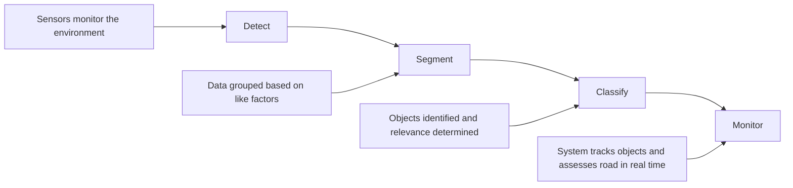
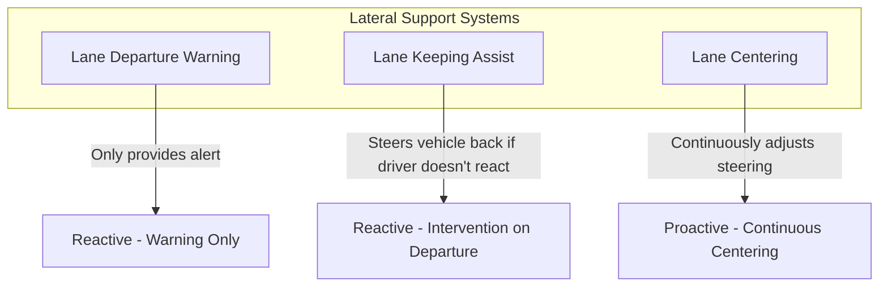
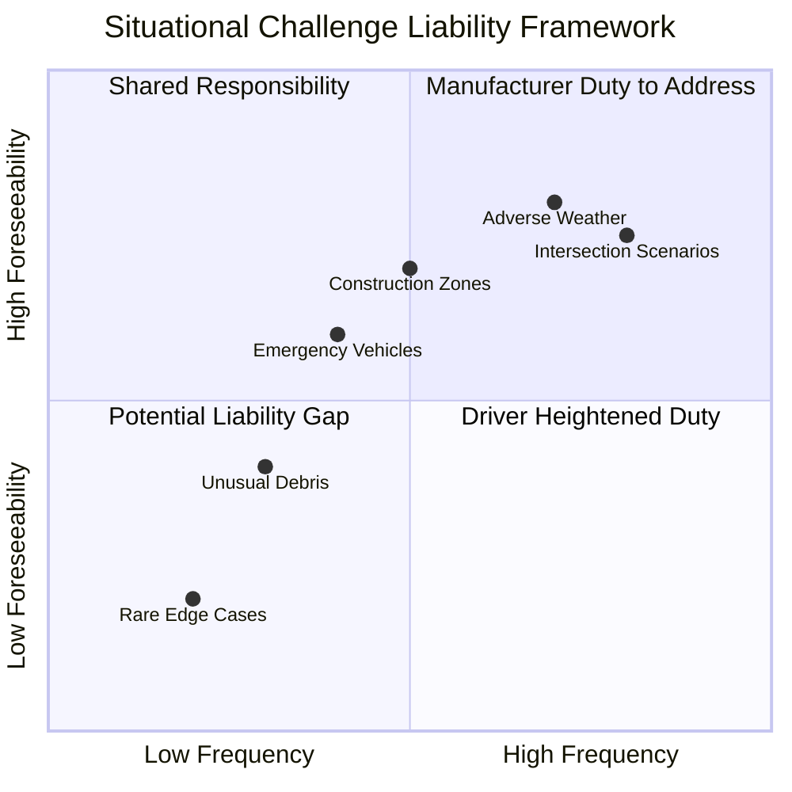
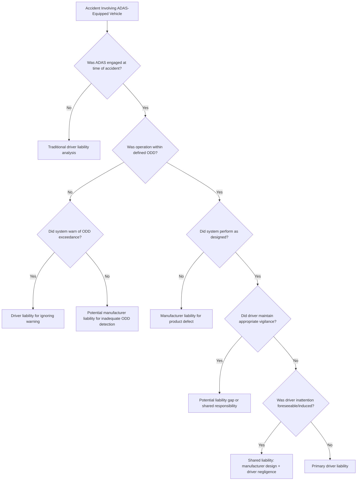
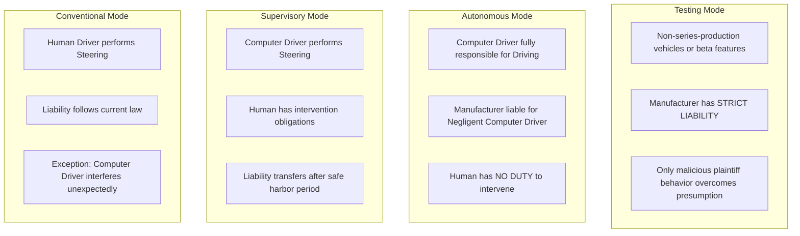

# Shared Responsibility on the Road: A Framework for Allocating Liability in Accidents Involving Advanced Driver-Assistance Systems (ADAS)
## 1 The Technical and Operational Landscape of Modern ADAS

This chapter establishes the foundational technical understanding of Advanced Driver-Assistance Systems (ADAS) as a prerequisite for analyzing liability allocation in accidents. It examines the hardware architecture, software algorithms, and functional design parameters that define the 'machine' side of shared driving responsibility, providing essential context for understanding where technical capabilities end and driver obligations begin.

### 1.1 ADAS Architecture and Sensor Technologies

Advanced Driver-Assistance Systems are fundamentally built upon a tripartite architecture consisting of **sensors, processors, and actuators**. Data collected by the sensor suite is transmitted to the processor, where the Electronic Control Unit (ECU) analyzes the information and makes decisions, which are then relayed to the actuators that control the throttle, braking system, and steering wheel[^1]. Understanding this architecture is critical for determining liability, as failures can occur at any point in this data-decision-action chain.

#### Sensor Suite Components and Operational Principles

The perception layer of ADAS relies on multiple sensor modalities, each with distinct operational principles and detection capabilities:

| Sensor Type | Primary Function | Strengths | Limitations |
|-------------|------------------|-----------|-------------|
| **Cameras** | Visual data detection (traffic signs, lane markings, vehicles, pedestrians) | Rich information content, precise object classification, low cost | Performance degrades with glare, night conditions, rain/snow/fog, occlusion, and soiling; limited distance estimation accuracy[^2] |
| **LiDAR** | Precise range measurement and 3D mapping using light pulses | Accurate range and 3D shape detection, works in low light, effective for small distant objects and curb edges | Higher cost, increasingly common in L3/L4 transition vehicles[^3][^2] |
| **Millimeter-Wave Radar** | Distance and velocity measurement using radio waves | Minimal weather impact, excellent for mid-to-long-range detection and relative velocity measurement | Lower resolution than cameras, difficulty detecting small, non-metallic, or static objects[^3][^2] |
| **Ultrasonic Sensors** | Near-field sensing using sound waves | Reliable close-range detection, cost-effective | Limited range (tens of centimeters to several meters), primarily for parking assistance[^3][^2] |

**Cameras** serve as the richest information source in ADAS perception systems, capable of detecting lanes, traffic signs and signals, pedestrians and vehicles, traffic light states, road edges, and drivable areas[^2]. However, their performance significantly degrades under adverse lighting conditions and environmental contamination, necessitating complementary sensor technologies for robust operation.

**LiDAR** has become increasingly common in high-end ADAS and vehicles transitioning toward Level 3 and Level 4 automation. This technology provides precise range measurements and detailed 3D shape information, proving particularly valuable for detecting small distant objects, unusual obstacles, and curb edges that may challenge camera-only systems[^2].

**Radar sensors** in modern ADAS suites include both millimeter-wave and ultrasonic variants. Millimeter-wave radar excels at range and velocity measurement with minimal weather impact, making it a key component for Adaptive Cruise Control (ACC), Forward Collision Warning (FCW), and Automatic Emergency Braking (AEB)[^2]. Typical vehicle configurations deploy one long-range front radar complemented by two to four mid/short-range corner radars covering front and rear flanks, enabling functions such as lane change assist, blind spot monitoring, and rear cross traffic alert[^2].

#### Electronic Control Unit and Power Management

The ECU serves as the central nervous system of ADAS, responsible for processing sensor data and executing system commands. The ADAS ECU monitors the environment using the sensor suite, communicates with other ECUs in the vehicle to determine current vehicle speed and driver settings, and commands changes to vehicle behavior[^4]. With the rapid development of ADAS, there is a growing need for stable and fast electronic signal transmission, and as the amount of information transmitted increases, more power is required[^1].

Modern ADAS architectures employ multiple processors, including PCIE switches and security ECUs, each requiring separate power supplies to avoid interference when problems occur[^1]. To meet the requirements of voltage conversion and electromagnetic interference (EMI) reduction within limited space, power supply circuits often utilize Power Management ICs (PMICs) that integrate DC/DC converters and low dropout regulators (LDOs)[^1]. Circuit protection is also critical—TVS diodes protect against transient overvoltage from events like lightning strikes or electrostatic discharge, while freewheeling diodes protect solenoid coils in brake hydraulic valve bodies[^1].

### 1.2 Sensor Fusion and Environmental Perception

The integration of data from multiple sensors through **sensor fusion algorithms** represents the critical software layer that transforms raw sensor data into actionable environmental understanding. This process is fundamental to ADAS safety and effectiveness, as it enables vehicles to overcome the limitations inherent in any single sensor modality.

#### The Sensor Fusion Process

Sensor fusion takes data from different sensors and combines them to perceive the environment accurately and make informed decisions[^3]. The data from cameras, radar, LiDAR, and ultrasonic sensors is shared with a central processing unit that uses sensor fusion algorithms to create a comprehensive picture of the driving environment[^3]. For instance, while cameras excel at classifying objects but struggle to estimate distance (especially in poor lighting), LiDAR and radar excel at distance estimation—by fusing this data, the system can make more accurate decisions than any single sensor could provide[^3].

The fusion process operates through four fundamental steps[^3]:

**Low-level fusion** aligns time and coordinates, associating radar tracks with visual detection boxes to form stable target trajectories[^2]. **High-level fusion** further integrates semantic segmentation, free space analysis, and dynamic target prediction, outputting unified environmental models for control and planning modules[^2].

#### Redundancy and Safety Mechanisms

Sensor fusion is crucial for the safety and efficiency of autonomous driving because it allows for **redundancy**—if one sensor fails, others can ensure continued operation[^3]. To meet functional safety requirements, ADAS systems design multi-source redundancy and health monitoring, including cross-checking between critical channels, sensor self-diagnosis, and degradation strategies[^2].

The practical implementation of sensor fusion varies by ADAS function:

- **Forward Collision Warning (FCW) and Automatic Emergency Braking (AEB)**: Practice often uses radar fusion to improve ranging accuracy, while pure vision approaches require explicit depth heads or Inverse Perspective Mapping (IPM) with lane constraints[^2]
- **Blind Spot Warning (BSW)**: Most production systems primarily use corner radar, though vision-only solutions are replacing radar in some designs[^2]
- **Automated Parking Assist (APA)**: Space detection benefits from multi-sensor fusion, with ultrasonics providing distance data and surround cameras contributing semantic understanding[^2]

#### Computational Challenges and Future Developments

Despite its benefits, sensor fusion presents significant challenges. The substantial processing power required for real-time data interpretation demands more powerful on-board computing systems[^3]. Standardizing sensor fusion technology across platforms remains crucial for industry-wide advancement[^3].

The future of ADAS sensor fusion is promising, with advancements in AI and Machine Learning enabling more precise data interpretation[^3]. Progress in LiDAR, radar, and camera technology will enable more detailed environmental perception, while the development of V2X (Vehicle to Everything) technology will add another layer of information, giving ADAS a more holistic understanding of the driving environment[^3].

### 1.3 Classification of ADAS Features and SAE Automation Levels

The **SAE J3016 standard** provides the industry's most authoritative taxonomy for driving automation, establishing six levels that define the functional role of driving automation systems and clarify the responsibilities of human drivers[^5][^6]. This classification framework is essential for understanding the legal and operational boundaries of driver responsibility in accident liability analysis.

#### SAE Levels of Driving Automation

The SAE J3016 standard, developed in partnership with the International Organization for Standardization (ISO) through a joint working group with representatives from nine countries, defines automation levels based on the specific role played by the human user, the driving automation system, and other vehicle systems in performing the **Dynamic Driving Task (DDT)** and/or DDT fallback[^6][^7].

| SAE Level | Classification | System Capability | Driver Role | DDT Responsibility |
|-----------|---------------|-------------------|-------------|-------------------|
| **Level 0** | No Driving Automation | None (active safety systems only) | Performs entire DDT | Driver: 100% |
| **Level 1** | Driver Assistance | Lateral OR longitudinal control | Performs remainder of DDT, supervises system | Driver: Primary |
| **Level 2** | Partial Driving Automation | Lateral AND longitudinal control | Completes OEDR, supervises system | Driver: Primary |
| **Level 3** | Conditional Driving Automation | Entire DDT within ODD | Fallback-ready user, receptive to intervention requests | ADS: Primary (within ODD) |
| **Level 4** | High Driving Automation | Entire DDT and DDT fallback within ODD | No intervention expected | ADS: Complete (within ODD) |
| **Level 5** | Full Driving Automation | Entire DDT and DDT fallback unconditionally | No intervention expected | ADS: Complete (unlimited ODD) |

*Source: Compiled from SAE J3016_202104[^5][^7]*

#### Driver Support Systems versus Automated Driving Systems

A fundamental distinction exists between **Driver Support Systems** (Levels 1-2) and **Automated Driving Systems** (Levels 3-5). The latest version of SAE J3016 explicitly adopts the "Driver Support Systems" terminology for Level 1 and Level 2 driving automation systems, emphasizing that these systems assist rather than replace the human driver[^6].

At **Level 0**, the human driver performs all aspects of the Dynamic Driving Task, even when enhanced by active safety systems[^5][^7]. Active safety systems such as automatic emergency braking are explicitly excluded from the automation taxonomy because they provide only momentary intervention rather than performing the DDT on a sustained basis[^5][^7].

At **Level 1** (Driver Assistance), the driving automation system performs either lateral or longitudinal vehicle motion control on a sustained basis, while the driver performs the remainder of the DDT and supervises the system[^7]. At **Level 2** (Partial Driving Automation), the system performs both lateral and longitudinal control, but the driver must complete the Object and Event Detection and Response (OEDR) subtask and supervise the system[^7].

The critical transition occurs at **Level 3** (Conditional Driving Automation), where an Automated Driving System performs the entire DDT within its specific Operational Design Domain (ODD), and the driver becomes a "fallback-ready user" expected to be receptive to requests to intervene[^7]. The latest SAE J3016 version provides further clarity on the differences between Level 3 and Level 4, addressing concepts that were previously misunderstood[^6].

#### Operational Design Domain and Its Implications

The **Operational Design Domain (ODD)** defines the specific conditions under which a feature is designed to function[^7]. This concept is crucial for liability analysis because it establishes the boundaries within which system performance claims are valid.

Levels 1-4 have limited ODDs, while Level 5 has no ODD limitations[^7]. For Level 4 systems, the ADS can achieve a minimal risk condition automatically when ODD boundaries are reached, without expectation of user intervention[^7]. This distinction has profound implications for determining when responsibility shifts from system to driver—a shift that occurs when ODD boundaries are exceeded or when the system requests driver intervention.

The SAE J3016 standard also introduces definitions for **remote support functions**, distinguishing between remote assistance and remote driving, and clarifies the concept of **failure mitigation strategy**[^6]. These additions reflect the evolving complexity of human-machine interaction in advanced driving systems.

### 1.4 Core ADAS Functions: Design Parameters and Operational Boundaries

This section examines three representative ADAS functions—Automatic Emergency Braking (AEB), Lane Keeping Assist (LKA), and Adaptive Cruise Control (ACC)—to illustrate the gap between design intent and real-world performance, a gap that has significant implications for liability allocation.

#### Automatic Emergency Braking (AEB)

**Automatic Emergency Braking** is an advanced safety technology that can slow or fully stop a vehicle without driver input by relying on cameras, radar, or other sensors to identify potential collisions[^8]. AEB systems represent a critical safety intervention, but their capabilities are bounded by significant operational constraints.

**Design Parameters and Capabilities:**
- AEB systems found in most new cars bring vehicles to a full stop at slower speeds, while fewer systems work at higher speeds[^8]
- Some systems can recognize and brake for pedestrians, cyclists, and animals, but not all have this capability[^8]
- The NHTSA has proposed requiring AEB technology to work at speeds ranging from 6 to 50 miles per hour[^8]

**Documented Limitations:**
The limitations of AEB technology are substantial and directly relevant to liability analysis:

1. **Limited Speed Range**: Most AEB systems are designed for slower speeds (6-50 mph), meaning at higher speeds, AEB may not fully stop the vehicle in time[^8]
2. **Recognition Limitations**: Not all systems can detect pedestrians, cyclists, or animals[^8]
3. **False Activations**: Systems can sometimes activate when there are no real threats[^8]
4. **Scenario Restrictions**: AEB systems are primarily designed to prevent rear-end collisions and may not be effective in preventing T-bone crashes at intersections or collisions during left turns in oncoming traffic[^8]
5. **System Variations**: Effectiveness varies by manufacturer and model[^8]

**Empirical Testing Results:**
AAA testing revealed critical performance gaps that challenge assumptions about AEB reliability. Testing four popular 2022 model vehicles (Chevy Equinox, Ford Explorer, Honda CR-V, Toyota RAV4) at speeds representative of real-world crash scenarios produced revealing results[^9]:

| Test Scenario | Results |
|--------------|---------|
| **Rear-end collisions (40 mph)** | All vehicles alerted drivers and reduced speed. Toyota RAV4 avoided crashes in 4/5 tests; Ford Explorer reduced speed by average 31.8 mph; Chevy Equinox reduced speed by average 17.5 mph but never avoided crash[^9] |
| **T-bone collisions** | None of the test vehicles warned drivers or activated brakes[^9] |
| **Turning collisions** | None of the test vehicles warned drivers or activated brakes[^9] |

These findings are particularly significant given that AAA research found three crash types responsible for **79 percent of injuries**: rear-end crashes, 90-degree angle T-bone crashes, and crashes when a vehicle turns across another car's path, with **60 percent occurring on roadways with speed limits of 30-45 mph**[^9].

#### Lane Keeping Assist (LKA)

**Lane Keeping Assist** is an ADAS feature designed to keep vehicles in their lane using front-mounted sensors on the windshield or rear-view mirror to identify lane markings and detect unintentional veering[^10]. When the system detects unintentional lane departure (typically triggered when leaving a lane without using a turn signal), it can gently steer the car back toward the center of the lane and may also apply brakes under certain manufacturer-specific circumstances[^10].

**Operational Design Domain:**
- LKA is designed for highway driving and typically functions only at speeds of at least 40 mph (varying by model)[^11][^10]
- Toyota's integrated system begins functioning at 30 mph, while Volkswagen's Lane Assist works at speeds above 35 mph, and Mazda's system activates above 60 km/h[^11][^10]
- LKA is easily deactivated by a slight pull of the steering wheel and will not activate when the turning indicator is on[^11]

**Distinction from Related Systems:**
Understanding the differences between related lateral support systems is crucial for liability analysis:

Lane Departure Warning (LDW) only provides an alert when a vehicle begins to leave its lane, while LKA builds upon LDW by steering the vehicle back if the driver does not react[^11]. Lane Centering continuously provides adaptive steering to keep the vehicle aimed toward the center of the lane, making it proactive rather than reactive[^11].

**Performance Limitations:**
LKA systems have documented limitations that affect reliability:
- Performance affected by faded, chipped, or obscured lane markings (snow, dirt, debris)[^11]
- Degraded performance on hills, at intersections, and on curved roads[^11]
- Research from the AAA Foundation for Traffic Safety found that during naturalistic evaluations, issues with Level 2 automation (primarily from LKAS) occurred **once every eight miles**[^11]
- An IIHS study found that **49% of drivers had their lane maintenance system turned off**, partly due to false positives[^11]

**Calibration Requirements:**
LKA systems rely on precise sensor alignment, and forward-facing cameras require professional calibration after events such as collisions, suspension changes, or windshield replacement[^11][^10]. This maintenance requirement has implications for post-accident system integrity assessment.

#### Adaptive Cruise Control (ACC)

**Adaptive Cruise Control** represents an illustrative example of multi-sensor ADAS functionality. ACC utilizes a combination of radar, LiDAR, and camera sensors that interact with the ADAS ECU to detect and react dynamically to obstacles in front of a vehicle while cruise control is enabled[^4]. The system maintains a specified speed but automatically accelerates or decelerates to maintain a safe following distance from vehicles ahead.

**System Architecture and Communication:**
The ACC implementation demonstrates the complexity of modern ADAS communication:
- Radar sends object lists as CAN messages to the ADAS ECU at 15 Hz, along with status messages every second[^4]
- The ADAS ECU sends command messages to the powertrain ECU at 30 Hz, including parameters for ACC enabled status, throttle (0-100%), and brake (0-100%)[^4]
- Driver settings from the dash ECU are sent to the ADAS ECU at 10 Hz[^4]
- Front camera returns images at 60 Hz in response to frame-sync pulses[^4]
- LiDAR sends point cloud data at 10 Hz via Automotive Ethernet[^4]

**Integration with Other ADAS Features:**
The integration between LKAS and ACC is high, using primarily the same sensors to control steering, acceleration, and brakes[^10]. However, both systems require the driver to pay attention and keep hands on the wheel, disengaging with warnings if hands are removed for extended periods[^10].

### 1.5 System Limitations and the Imperative of Driver Supervision

The technical analysis presented in preceding sections converges on a fundamental conclusion: **current SAE Level 0-2 ADAS technologies inherently require continuous driver supervision and engagement**. This section synthesizes the technical rationale for this requirement, establishing the foundation for understanding driver responsibility in the shared human-machine driving context.

#### Comprehensive Limitation Analysis

The limitations of current ADAS technologies span multiple dimensions:

**Environmental and Sensor Degradation:**
- Camera performance degrades significantly under adverse lighting conditions (glare, night driving), weather conditions (rain, snow, fog), and sensor contamination (occlusion, soiling)[^2]
- Lane marking detection fails when markings are faded, chipped, or obscured by snow, dirt, or debris[^11]
- Weak-texture environments such as underground garages present major challenges for parking assist algorithms[^2]

**Recognition and Classification Failures:**
- Radar has difficulty detecting small, non-metallic, or static objects[^2]
- Not all AEB systems can recognize pedestrians, cyclists, or animals[^8]
- AEB systems may not effectively prevent collisions with pedestrians walking in the same direction as the vehicle[^8]

**Scenario-Specific Blind Spots:**
- AEB systems cannot prevent T-bone crashes at intersections or left turns in the path of oncoming traffic[^8][^9]
- AAA testing confirmed that none of four tested vehicles warned drivers or activated brakes in T-bone or turning collision scenarios[^9]
- These intersection-based scenarios represent a significant gap given that such crashes account for a substantial portion of injury-causing accidents[^9]

**False Activation Concerns:**
- AEB systems can activate when there are no real threats, leading to potentially dangerous false activations[^8]
- The high rate of false positives in lane keeping systems has led 49% of drivers to disable their lane maintenance systems entirely[^11]
- Level 2 automation issues (primarily from LKAS) occur approximately once every eight miles during naturalistic driving[^11]

#### The Technical Rationale for Driver Supervision

The SAE J3016 framework explicitly establishes that at Levels 0-2, the human driver retains primary responsibility for the Dynamic Driving Task. This is not merely a regulatory classification but reflects fundamental technical realities:

1. **OEDR Responsibility**: At Level 2, while the system performs lateral and longitudinal control, the driver must complete the Object and Event Detection and Response subtask[^7]. The system cannot reliably detect all relevant objects and events, particularly in edge cases.

2. **System Supervision**: The driver must supervise the system's performance and be prepared to intervene when the system reaches its operational boundaries[^7]. This supervision requirement acknowledges that systems operate within defined ODDs and may fail outside those domains.

3. **Fallback Capability**: Unlike Level 3+ systems where the ADS can achieve a minimal risk condition automatically, Level 0-2 systems depend on the human driver to provide fallback capability when system limitations are encountered[^7].

**The driver's role in SAE Level 0-2 systems is therefore not that of a passive monitor but an active participant who must:**
- Maintain situational awareness at all times
- Understand system capabilities and limitations
- Recognize when system boundaries are being approached
- Be prepared to immediately assume full control of the vehicle
- Keep hands on the steering wheel and attention on the road

This technical imperative for driver engagement establishes the baseline against which driver behavior must be evaluated in accident liability analysis. The question is not whether the driver should have been supervising the system, but whether the driver's level of supervision was reasonable given the known limitations of the technology and the specific circumstances of the driving situation.

#### Market Context and Safety Implications

The significance of these limitations is amplified by market realities. Over 90% of new vehicles now have at least one ADAS feature[^10], and the LKAS market alone is forecast to grow at 15.9% annually, reaching over $22 billion by 2033[^10]. A 2024 NHTSA study found that LKAS contributed to reducing fatal crashes by 24%[^10], demonstrating that despite limitations, these systems provide meaningful safety benefits when used as designed—with continuous driver supervision.

AAA's conclusion from its testing program encapsulates the current state of ADAS technology: **automakers must improve AEB systems to assist drivers in intersection-based crash scenarios and should make the systems standard on every make and model, while drivers must recognize AEB system limitations and remain engaged when behind the wheel**[^9]. This dual responsibility—manufacturer improvement and driver engagement—frames the shared accountability that must inform liability allocation frameworks.

## 2 Legal Frameworks and Evolving Jurisprudence for Automated Vehicle Liability

This chapter analyzes the current and evolving legal landscape governing liability for accidents involving vehicles equipped with automated features. Building upon the technical foundation established in Chapter 1, it examines how existing legal doctrines are being adapted and challenged by the unique characteristics of human-machine shared driving responsibility, identifying the key legal frameworks, emerging jurisprudential trends, and doctrinal challenges that will inform the development of a liability allocation framework for ADAS-related accidents.

### 2.1 Jurisdictional Definitions and Legal Classification of Automated Vehicles

The legal classification of automated vehicles varies significantly across jurisdictions, creating a complex patchwork of regulatory frameworks that directly affects how liability is allocated between drivers, manufacturers, and other parties. Understanding these definitional distinctions is essential for analyzing how responsibility shifts as automation levels increase and for identifying the regulatory gaps that complicate cross-border litigation and harmonized safety standards.

#### The Significance of SAE Automation Levels in Legal Classification

The SAE J3016 taxonomy, which defines automation levels from 0 to 5, has become the **de facto reference framework** for legal classification worldwide. However, jurisdictions differ substantially in how they incorporate these technical definitions into their legal frameworks and, critically, in how they assign liability consequences to each level.

A fundamental pattern emerges from comparative analysis: **liability standards ought to differ according to levels of automation**[^12]. At Levels 0–2, where human drivers maintain effective control of the vehicle, the driver retains primary liability under traditional fault-based frameworks. At Level 3, liability becomes shared between the driver and manufacturer or operator, contingent upon road and system circumstances. At Levels 4–5, where automated driving systems achieve high intelligence and full autonomous operation, liability shifts predominantly to manufacturers, operators, and system providers[^12].

| Automation Level | Primary Liability Bearer | Legal Rationale |
|------------------|-------------------------|-----------------|
| **L0–L2** | Driver | Human maintains effective control; traditional driver-centric paradigm applies |
| **L3** | Shared (Driver/Manufacturer/Operator) | Dynamic control allocation; liability depends on whether system or human was in control at accident time |
| **L4–L5** | Manufacturer/Operator/System Provider | Technical control and product safety determine responsibility; human intervention not expected |

*Source: Compiled from comparative analysis of international liability regimes*[^12]

#### Comparative Jurisdictional Approaches

**United States**: The regulatory landscape remains fragmented, with **no federal liability statute** specifically addressing automated vehicles. Liability is governed by a patchwork of state laws applying common law negligence, product liability, and comparative fault doctrines[^13]. Under Illinois product liability statutes, for example, any company involved in the chain of distribution can be held liable if a product is defective and causes harm, with defects arising from design flaws, manufacturing errors, or failure to warn[^14]. This variability creates significant uncertainty for manufacturers operating across state lines and for plaintiffs seeking consistent remedies.

**European Union**: The modernized **Product Liability Directive (EU) 2024/2853** represents a comprehensive approach to harmonizing liability rules across member states. The PLD explicitly brings software—including embedded, stand-alone, and cloud-based applications, firmware, operating systems, AI systems, and digital manufacturing files—within the definition of a "product"[^15]. Member States must transpose these rules into national law by December 9, 2026[^16][^17]. Notably, while the Directive aims for full harmonization, national differences can still arise regarding non-material damage (such as pain and suffering) and the development risk defense, which Member States may retain or abolish[^17].

**United Kingdom**: The UK has adopted a **two-pronged legislative approach**. The Automated and Electric Vehicles Act 2018 established a no-fault insurance framework focused on the insurer, where in the event of an accident during automated vehicle operation, the insurance company is obligated to reimburse victims irrespective of culpability[^12]. Subsequently, the insurance company may pursue compensation from the manufacturer or system provider. The Automated Vehicles Act 2024 further strengthened this framework by establishing the **Authorised Self-Driving Entity (ASDE)** regime, assigning certified companies direct legal responsibility for the automated driving system's performance[^12].

**Germany**: German law exemplifies the manufacturer/operator liability regime. The Road Traffic Act dictates that in the event of an accident occurring under manual control, the driver retains liability. However, **if the accident transpires during system operation or due to system failure, liability transfers to the vehicle manufacturer**[^12]. German law also requires automated vehicles to be equipped with "black box" recorders to document operational data for determining accident responsibility[^12].

**Japan**: The Japanese framework operates primarily through the Road Traffic Law, which requires service providers or operators to remotely monitor Level 3+ vehicles and bear legal responsibility for safety and accidents[^12]. The Automobile Compensation Security Law imposes semi-strict liability on "vehicle operators" who use vehicles for their own benefit. To successfully defend against claims, vehicle owners and drivers must prove they exercised due care, the victim was at fault, and the vehicle had no structural or functional defects[^18]. This framework demonstrates Japan's shift from driver-centric to system-centric liability for higher automation levels[^12].

**South Korea**: The Autonomous Vehicles Act stipulates that within designated Level 4 autonomous zones, the operator or owner is liable for any harm incurred[^12]. They must also maintain ongoing safety management, vehicle maintenance, and risk mitigation strategies[^12]. This regime is based on technical control and service responsibility, assigning liability to entities with prevention and control capabilities[^12].

**China**: National legislation remains underdeveloped relative to technological advancement, but **local regulations have conducted important explorations**[^12]. The 2022 Shenzhen regulations specify that for vehicles below Level 2 automation, drivers bear primary responsibility. For Level 4 and above fully automated vehicles without human drivers, vehicle owners or managers bear damage liability, with a product liability recovery mechanism against manufacturers or sellers[^12]. However, local regulations vary considerably in identifying accountable parties, resulting in "structural ambiguity" where multiple parties may be liable but boundaries remain unclear[^12].

**Australia**: Current law holds drivers liable for maintaining "proper control" of vehicles up to Level 2/3, rendering drivers responsible for accidents resulting from failure to maintain such control[^19]. Australia is expected to implement the **Automated Vehicle Safety Law (AVSL)** beginning in 2026, which will regulate automated driving system operation and establish **Authorised Driving Entities (ADSEs)** required to demonstrate their systems can safely replace human drivers and maintain appropriate insurance[^19].

#### Regulatory Gaps and Inconsistencies

The comparative analysis reveals several critical regulatory gaps. First, many jurisdictions struggle to differentiate between driver negligence and product culpability attributed to manufacturers, especially in **human-machine shared-control contexts** characteristic of Level 2 and Level 3 systems[^12]. This overlap often leads to simultaneous liabilities and application conflicts. Second, some regulations adopt enumeration strategies but fail to incorporate key parties such as software developers and data service providers[^12]. Third, the premise that liability should match control and risk is sometimes violated when vehicle owners are designated as primary responsible parties while manufacturers bear only supplementary responsibility[^12].

These inconsistencies highlight the urgent need for a **dynamic liability mechanism** that aligns with automation levels and accounts for the specific circumstances of each accident scenario, including road types, environmental conditions, and the complexity of human-machine interaction[^12].

### 2.2 Traditional Tort Law Principles Applied to ADAS Accidents

The application of traditional negligence doctrine to ADAS-related accidents presents significant challenges, as the four fundamental elements of negligence—duty of care, breach, causation, and damages—must be adapted to accommodate the unique characteristics of human-machine shared control. While traditional automobile liability cases focus on the actions of the vehicle operator, **ADAS liability could focus on more than one actor**, potentially leading to shared or shifting fault among several parties resulting from an accident[^20].

#### The Four Elements of Negligence in ADAS Context

**Duty of Care**: In traditional negligence claims, a driver's basic responsibility is to operate their vehicle with reasonable caution to avoid harming others, including following traffic laws, paying attention to surroundings, and driving at a safe speed[^21]. In the context of automated vehicles, manufacturers owe a duty to use reasonable care in the design of their automated vehicles to avoid unreasonable risks of injury and to minimize injuries in the event of an accident. Moreover, there is a duty to build cars without "latent or hidden defects," which would include defective automated technology[^22].

The *Ortiz v. Daimler Trucks* decision significantly clarified the scope of manufacturer duty. The California Court of Appeal applied the *Rowland v. Christian* factors and concluded that **a duty of care exists toward all persons within the zone of potential danger**, with no exception for ADAS technology[^23]. The court found that collisions like the one at issue were foreseeable and that "the connection between Daimler Trucks' conduct and Ortiz's death" was "sufficiently close, at least to some degree, to support finding a duty of care"[^23]. Critically, the court rejected the argument that "too many events had to occur" for the accident to happen, characterizing the causal chain as "a limited series of events" not too remote to establish duty[^23].

**Breach of Duty**: Breach occurs when a driver fails to meet their duty of care by doing something a reasonably careful driver wouldn't do or failing to do something a reasonably careful driver would do[^21]. In ADAS contexts, drivers can be held liable if they **over-relied on these systems or ignored the warning signs of misuse**[^20]. Even in vehicles with advanced automation, drivers could be held liable for failing to supervise or override ADAS systems when required, misuse or over-reliance on the systems, ignoring warnings, alerts, or operating limitations, and for distracted driving despite the engagement of ADAS systems[^20].

An example of manufacturer breach would be "simply failing to warn of or make safe defects or hazards in the automated vehicle"[^22]. The *Ortiz* court emphasized the distinction between duty and breach, noting that Daimler Trucks "often failed to understand the difference between duty and breach of duty"[^23]. The court stressed that finding a duty "does not mean that commercial truck manufacturers must install collision avoidance systems" or that "manufacturers will be found liable for failing to install novel safety devices that may not be as effective, practical, or cost-effective." Rather, the existence of duty "only means that manufacturers must exercise due care in choosing whether to install collision avoidance systems"[^23].

**Causation**: The causation element requires demonstrating that the driver's breach of duty directly caused the injuries and damages, comprising two parts: actual causation (the accident only happened because of the careless actions) and proximate causation (injuries must be a foreseeable result of the actions)[^21]. For strict products liability, the evidence must show the defect was "more likely than not" the actual cause of the harm[^22].

In ADAS cases, **establishing causation presents particular difficulties** due to the interplay between human inattention and system limitations. The *Ortiz* court found that whether the allegedly defective design proximately caused the death was a factual question for the jury[^23]. The court determined that evidence "supports the conclusion that it is reasonably foreseeable that some truck drivers... would fail to brake in time and rear-end cars on the road," that the Detroit Assurance 4.0 system was designed to avoid such collisions and could be installed "at relatively low cost," and that if the truck had been equipped with the system, "the accident that killed Ortiz would not have occurred"[^23]. Thus, a reasonable juror could find that the absence of the safety feature caused the collision even if other proximate causes existed[^23].

**Damages**: This element refers to the actual harm or losses experienced, including medical bills, lost wages, pain and suffering, and property repair costs[^21]. Victims of ADAS-related accidents may be entitled to compensation for medical expenses, lost income, property damage, pain and suffering, emotional distress, and wrongful death damages if applicable[^24].

#### Comparative Fault and Apportionment

The doctrine of **comparative negligence** allows for a more fair distribution of fault between causal actors[^22]. Shares of responsibility are assigned in percentages to those with legal responsibility, including the negligence of the driver of the automated vehicle. Before an accident occurs, the driver might be negligent by failing to carefully watch the road, failing to take control of the steering wheel, failing to apply the brakes, or failing to perceive a warning that the automated technology is defective[^22].

The defendant manufacturer bears the burden to prove the plaintiff driver was also negligent. If the factfinder determines the driver is a legal cause of the accident, responsibility must be apportioned based on "awareness or indifference with respect to the risks created... and any intent with respect to the harm caused... and the strength of the causal connection between the person's risk-creating conduct and the harm"[^22].

Jurisdictional variations in comparative fault rules significantly affect recovery. In Washington, D.C., which follows **contributory negligence laws**, proving that the victim was not even 1% at fault is critical for compensation[^24]. Under the **modified comparative negligence rule** used in Minnesota, Wisconsin, Iowa, and North Dakota, plaintiffs can recover damages if their percentage of fault does not exceed specified thresholds (50% in North Dakota, 51% in the other states), with recoverable damages reduced by their percentage of fault[^21].

**Shared liability scenarios** are increasingly common where both driver negligence and defective technology contribute to the accident, creating cases with multiple liable parties[^24]. ADAS evidence can help support claims of total driver or manufacturer responsibility, but determining whether fault lies with the driver, manufacturer, or both can complicate cases[^24].

### 2.3 Product Liability Frameworks for ADAS Defects

Manufacturers, sellers, and other parties in the "chain of commerce" could be held liable for injuries caused by faulty ADAS systems under theories of product liability[^20]. This section examines the three traditional product liability theories and their application to ADAS claims, with particular attention to the EU's modernized framework and the unique evidentiary challenges posed by algorithmic systems.

#### Three Theories of Product Liability

**Design Defect**: A design defect claim alleges that the overall design of the product was defective, making it dangerous to consumers, even if the individual product was manufactured correctly according to specifications[^20]. In ADAS contexts, design defect claims may target inadequate driver-monitoring systems, insufficient safety margins in AEB algorithms, or the failure to incorporate available safety technologies[^25].

The *Ortiz* case demonstrates how design defect claims can extend to the **absence of available safety features**. The plaintiffs alleged that Daimler Trucks was liable for failing to equip a heavy truck with an optional collision avoidance technology (Detroit Assurance 4.0), a forward collision warning and automatic braking system designed to alert drivers and "autonomously slow the truck" to "fully brake for stationary objects" in the truck's path[^23]. The court allowed this claim to proceed to jury trial, finding that evidence supported the conclusion that the system could have prevented the fatal accident[^23].

**Manufacturing Defect**: A manufacturing defect occurs when the product departs from its intended design and is more dangerous than consumers expect it to be[^20]. In the software context, manufacturing defects might include coding errors that cause the system to malfunction in ways not intended by designers[^25]. However, the opacity of AI decision-making makes it **difficult to classify whether defects are due to manufacturing or design**[^26], complicating the application of traditional manufacturing defect doctrine.

**Failure to Warn**: A failure to warn claim arises when there were improper instructions surrounding the use or operation of a product and a failure to warn consumers of latent (hidden) defects in the product[^20]. For ADAS, this theory encompasses claims of **inadequate human-machine interface (HMI)**—drivers turn the systems over to automotive technology but need to be prepared, at any moment, to regain control[^20]. Incomplete user instructions, unclear limitations, or failure to disclose known malfunctions can all ground failure to warn claims[^14].

#### The EU Product Liability Directive (EU) 2024/2853

The new EU Product Liability Directive represents a **fundamental modernization** of product liability law with direct implications for ADAS manufacturers[^15]. Several innovations are particularly significant:

**Expanded Definition of "Product"**: The PLD explicitly brings software—including embedded, stand-alone, and cloud-based applications, firmware, operating systems, AI systems, and digital manufacturing files—within the definition of a "product"[^15]. For the automotive industry, this means that not only physical vehicle components but also **software updates, over-the-air (OTA) upgrades, and digital services** (such as navigation, health monitoring, and voice assistants) are now subject to strict liability[^15]. The Directive also covers related digital services integrated into or interconnected with a product such that their absence would prevent the product from performing its functions[^15].

**Cybersecurity Vulnerabilities as Defects**: A major innovation is the explicit recognition that **cybersecurity vulnerabilities and failures to provide necessary software updates can constitute product defects**[^15]. If a vehicle's software is not updated to address a known security vulnerability, and that vulnerability is exploited to cause harm, the manufacturer may be strictly liable—even if the defect arises after the vehicle was first placed on the market[^15].

**AI System Behavior**: The new PLD also covers harm caused by the **autonomous or adaptive behavior of AI systems**, including post-sale changes resulting from machine learning or OTA updates[^15]. This provision addresses the dynamic nature of AI products that may change their behavior after deployment.

**Rebuttable Presumptions**: The PLD introduces several rebuttable presumptions that make it **significantly easier for claimants to establish liability**[^15]:

| Presumption Type | Triggering Circumstances |
|-----------------|-------------------------|
| **Defectiveness presumed** | Manufacturer fails to disclose relevant evidence; product does not comply with mandatory safety requirements (including cybersecurity standards); "obvious malfunction" occurs |
| **Causation presumed** | Product was defective and damage is of a kind typically consistent with the defect |
| **Both presumed** | Claimant faces "excessive difficulties, in particular, due to technical or scientific complexity" |

*Source: Compiled from EU Product Liability Directive (EU) 2024/2853*[^15][^16]

The presumption for technical complexity is particularly significant for ADAS litigation, as it directly addresses the "black box" problem where claimants cannot understand or explain how an AI system reached a particular decision[^15].

**Cascading Liability Hierarchy**: For products manufactured outside the EU, liability first falls to the importer, then to the authorized representative, and if neither exists, to the fulfillment service provider[^15]. Any party that **substantially modifies a product** after it is placed on the market outside the manufacturer's control (including through software updates or AI-driven changes) can now be deemed a manufacturer and held strictly liable[^15].

**Enhanced Disclosure and Extended Periods**: National courts are now empowered to order the disclosure of relevant evidence from both claimants and defendants, marking a shift toward more robust discovery obligations[^15]. The standard liability period is 10 years, but for latent injuries, the period is **extended to 25 years**[^15].

#### Challenges in Proving ADAS Defects

**The "Black Box" Problem**: AI systems are typically described as black boxes, with complex internal workings and decision processes that are difficult to understand[^26]. This opacity limits foreseeability and makes establishing liability challenging. The "intractability" of AI systems restricts what can be predicted about their behavior, complicating both design defect and causation analysis[^26].

**Evidence Gathering**: When bringing a claim under product liability, the following information can be crucial in helping to determine whether ADAS caused an accident: Accident Reports, Witness Statements, Dashboard Cameras, Retrieval of Event Data Recorder Data (storing data such as vehicle speed, driver steering, and brake application for up to several seconds before a collision), Analysis of Vehicle Telematics and Logs, ADAS Experts, Review of Regulatory Investigations, Prior Complaints about the System, and System Recalls[^20]. ADAS lawsuits require specialized legal experience because they combine traditional product liability law with cutting-edge technology and data analysis[^14].

**Extended Liability Chain**: Additional parties that could face liability include maintenance/repair shops (for improper calibration of ADAS systems after installation or repair, or misalignment of system sensors after repairs) and car dealerships (if they sell a vehicle with known safety issues or fail to perform required software upgrades)[^20][^14].

### 2.4 Emerging Liability Regimes and Legislative Developments

As autonomous driving technology advances, traditional driver-centric liability frameworks have proven inadequate for the regulatory demands of advanced automation[^12]. This section surveys the emerging legislative and regulatory frameworks specifically designed to address automated vehicle liability, examining the shift toward tiered liability approaches and novel institutional arrangements.

#### Tiered Liability Correlated with Automation Levels

A clear pattern is emerging across jurisdictions where **legal responsibility shifts from the human driver to the manufacturer/operator as automation levels increase**[^12]. This approach recognizes that as algorithmic decision-making, software integrity, and perception capability become determinative of safety, liability should follow technical control[^12].

```mermaid
flowchart TB
    subgraph "Driver Liability Regime (L0-L2)"
        D1[Human driver maintains effective control]
        D2[Traditional fault-based liability applies]
        D3[Driver responsible for DDT and supervision]
    end
    
    subgraph "Shared Liability Regime (L3)"
        S1[Dynamic control allocation between human and system]
        S2[Liability depends on who was in control at accident time]
        S3[Multi-layered shared liability centered on manufacturers/operators]
    end
    
    subgraph "Manufacturer/Operator Regime (L4-L5)"
        M1[ADS achieves full autonomous operation]
        M2[Primary liability on manufacturers, operators, system providers]
        M3[Human intervention not expected]
    end
    
    D1 --> D2 --> D3
    S1 --> S2 --> S3
    M1 --> M2 --> M3
```

**Driver Liability Regime (Levels 0-2)**: This regime primarily applies to situations where human drivers maintain effective control of the vehicle[^12]. The driver is the primary entity responsible for liability in traffic incidents, founded on fault-based liability highlighting the driver's obligation of care and control[^12]. In countries with specific legislation, this strategy remains applicable at reduced degrees of automation. Japan and South Korea mandate that drivers maintain control and execute timely remedial measures as needed; neglecting these monitoring and intervention responsibilities renders the driver chiefly accountable for subsequent damages[^12].

**Manufacturer and Operator Liability Regime (Levels 3+)**: This regime applies where control of the vehicle is delegated from the human driver to the automated system[^12]. It establishes liability based on **technical control and product safety**, placing primary responsibility for accidents on manufacturers, operators, and system providers[^12]. The normative foundation lies in the extension of product and service liability, aligning responsibility with control capability[^12].

Germany's Road Traffic Act exemplifies this approach: if an accident occurs during system operation or due to system failure, liability transfers to the vehicle manufacturer[^12]. France's Highway Code absolves the driver of liability when the vehicle functions in an approved automated-driving mode, with responsibility resting on the manufacturer or system operator[^12]. Similar provisions exist in South Korea, Japan, Singapore, and Tennessee, USA[^12].

**Composite Liability Regime (Transitional Phase)**: This regime primarily concerns the transitional phase between Level 2 and higher levels of automated driving, when system control and human interaction coexist[^12]. During this phase, control is collaboratively managed by human and automated systems, and drivers, manufacturers, system developers, and operators each possess distinct levels of influence regarding vehicle safety[^12]. This regime facilitates the distribution of responsibility among many parties, offering a flexible approach to manage intricate cause linkages in traffic incidents[^12].

In the United States and Australia, victims may receive basic compensation through mandatory vehicle insurance or no-fault liability, with additional responsibility determined by traditional tort and product liability law where proven negligence or product defects exist[^12]. Canada's Ontario Negligence Act provides for proportionate fault assessment, with courts dynamically distributing responsibility based on facts and causation[^12].

#### The UK's Pioneering Approach: No-Fault Insurance and Authorized Entities

The United Kingdom illustrates the **system liability regime** most prominently[^12]. The Automated and Electric Vehicles Act 2018 established a no-fault insurance framework where, in the event of an accident during automated vehicle operation, the insurance company is obligated to reimburse victims irrespective of culpability[^12][^27]. Subsequently, the insurance company may pursue compensation from the manufacturer or system provider[^12].

The Act addresses several critical issues identified by the UK Law Commission[^27]:

**Coverage Exclusions**: Section 3(2) excludes coverage when an accident is "completely due to the individual's negligence in allowing the vehicle to begin self-driving at an inappropriate time"[^27]. This provision places the burden on drivers to discern the appropriateness of activating automated systems—a concern raised by UK stakeholders who worry about requiring drivers to exercise "meteorological skills" to determine suitable conditions[^27].

**Subrogation Claims**: Section 5 allows insurers who bear direct liability to injured parties to bring subrogation claims against any other party at fault (whether another traditional vehicle driver or a manufacturer)[^27]. Such claims may only be brought after the injured party's claim has been resolved through judgment, arbitration award, or enforceable settlement, incentivizing timely resolution of primary claims[^27].

**Causation and Contributory Fault**: Section 2 states that coverage applies when the accident is "caused" by the automated vehicle while the automated driving system is activated[^27]. The UK Law Commission took a "fairly non-committal position" on whether fault is required, leaving it to courts to determine[^27]. Section 3(1) confirms that contributory negligence remains applicable, with liability reduced according to the injured party's degree of negligence[^27].

The Automated Vehicles Act 2024 further established the **Authorised Self-Driving Entity (ASDE)** regime, creating an authorized organization responsible for compliance, safety, and oversight of the automated system's functioning[^12]. Human drivers do not bear personal responsibility for traffic violations during system operation[^12].

#### China's Local Experimentation and National Legislative Gap

China's existing legal framework for traffic liability continues to assume human oversight of vehicles and does not consider the legal ramifications of system takeover and control transfer[^12]. The Draft Revision of the Road Traffic Safety Law established provisions for system intervention and data collection but **failed to develop systematic regulations for culpability distribution, causation, or the burden of proof** in autonomous driving contexts[^12].

In the absence of national legislation, local regulations have conducted important explorations[^12]. The 2022 Shenzhen regulations represent the most comprehensive local framework, specifying liability allocation by automation level[^12]. Between 2023 and 2025, multiple cities including Shanghai, Wuxi, Suzhou, and Hangzhou have also issued local regulations refining vehicle operation, accident liability, and insurance frameworks for autonomous driving[^12].

However, local regulations vary considerably, resulting in structural ambiguity with "multiple subjects but unclear boundaries"[^12]. Many jurisdictions designate vehicle owners or managers as primary responsible parties while manufacturers and sellers bear supplementary responsibility, which **contradicts the premise that liability should match control and risk**[^12]. This highlights the need for a composite regime with dynamic liability mechanisms appropriate for China's complex traffic conditions[^12].

#### Insurance Industry Transformation

As higher levels of automation are commercially introduced (SAE Levels 3 and 4), the insurance industry may see **higher proportions of commercial and product liability lines of business, while the personal automobile insurance line of business shrinks**[^13]. A KPMG white paper estimated that personal auto accounted for 87% of loss insurance in 2013, projected to fall to 58% by 2040, while commercial auto rises to 28% and product liability gains 14%[^13]. This reflects the view that personal liability will fall as the responsibility of driving shifts to the vehicle[^13].

The existing insurance system in many jurisdictions is inadequate for delivering appropriate coverage for autonomous vehicles, as it is based on driver liability regimes intended for human driving situations[^12]. For Level 3 and higher autonomous driving, the insurance industry should develop specialized products requiring collaborative coverage from manufacturers and operators[^12].

### 2.5 Key Jurisprudential Challenges in ADAS Litigation

The application of traditional legal frameworks to ADAS accidents reveals several doctrinal challenges that courts, legislators, and scholars are actively grappling with. This section synthesizes these challenges and examines proposed solutions, including novel liability frameworks designed to address the unique characteristics of partial autonomy.

#### The *Ortiz v. Daimler Trucks* Decision and Its Implications

The *Ortiz v. Daimler Trucks North America* case represents a **landmark decision** with potentially broad implications for the automotive industry[^23]. The California Court of Appeal reversed a summary judgment in favor of Daimler Trucks, allowing claims for strict liability design defect and design negligence to proceed to jury trial based on the manufacturer's failure to equip a heavy truck with an optional collision avoidance technology[^23].

**Key Holdings and Reasoning**:

*Proximate Causation*: The court found that whether the allegedly defective design proximately caused the death was a factual question for the jury, not a legal question suitable for summary judgment[^23]. The court rejected the trial court's reasoning that an attentive driver could have avoided the collision without the safety feature, finding instead that evidence supported the conclusion that the collision avoidance system could have prevented the accident[^23].

*Duty of Care*: Applying the *Rowland* factors, the court concluded that no exception to the general duty of care exists for ADAS technology[^23]. The court found that similar collisions were foreseeable, that the connection between the manufacturer's conduct and the victim's death was sufficiently close to support finding a duty, and that the "limited series of events" leading to the accident was not too remote[^23].

*Policy Considerations*: While agreeing that Daimler Trucks did not engage in "particularly morally reprehensible conduct," the court concluded that the policy of preventing future harm favored finding a duty[^23]. The court noted that although NHTSA had not yet required forward collision warning and automatic emergency braking systems on new heavy trucks, "we cannot say it approved manufacturers making these safety features optional"[^23].

**Limitations of the Decision**: The *Ortiz* decision should not be read as foreclosing all summary judgment in ADAS cases. The court did not address arguments based on evidence that a particular ADAS feature would have been ineffective in the specific collision circumstances[^23]. Additionally, the court did not adopt Daimler Trucks' argument that the truck was not defective under the risk-benefit test, as this argument at the trial court level "focused entirely on causation"[^23]. The decision also did not address breach of duty, emphasizing that a jury "could subsequently find that the manufacturer's decision not to install the equipment did not breach this duty" after considering the specific case facts[^23].

#### The "Automation Complacency" Problem

A central challenge in ADAS litigation involves the phenomenon of **"automation complacency"**—the tendency for drivers to over-rely on automated systems and reduce their vigilance[^20][^25]. This creates what scholars describe as a "double bind" for drivers: they are encouraged to trust the technology through marketing ("autonowashing") but held fully responsible when it fails[^25].

The "ironies of automation" compound this problem: automation can **paradoxically decrease safety** by inducing human over-reliance[^25]. Drivers who engage ADAS features may reduce their situational awareness, making them less capable of responding when the system reaches its operational limits or fails unexpectedly. Plaintiffs' counsel will likely argue that defendants who rely completely on ADAS systems are engaged in "automation complacency"[^20].

This dynamic complicates liability allocation because:
- **Driver liability** may be mitigated if manufacturers' marketing induced reasonable reliance
- **Manufacturer liability** may be established if inadequate warnings or HMI design contributed to over-reliance
- **Comparative fault** analysis must account for foreseeable human reactions to automation[^25]

#### The "Many Hands Problem" and Distributed Responsibility

The **"many hands problem"** makes liability allocation challenging when AI systems cause harm, as responsibility is distributed across complex networks of actors and automated processes[^26]. In ADAS deployment, this includes hardware manufacturers, software developers, system integrators, vehicle manufacturers, dealers, repair facilities, and fleet operators[^26].

Traditional tort frameworks presume human agency and predictable behavior, whereas AI operates through machine learning, leading to actions that may not fit established legal categories like "intent" or "foreseeability"[^28]. For example, algorithmic bias—such as a system's reduced ability to detect pedestrians with darker skin tones—complicates attributing liability to a programmer's "substantial certainty" of harm[^28].

**Network Theory Approach**: Scholars propose using network theory to map different actors involved in AI accidents and allocate responsibility[^26]. Representing actors (human and non-human) as nodes in a network, with their relationships depicted as edges, can reveal which human nodes exercise control over the AI system and to what degree[^26]. This approach recognizes that while users play key roles in AI system operation, focusing solely on their responsibility does not align with how these systems actually work[^26].

The 2018 Uber autonomous vehicle fatality illustrates this problem: the backup driver was ultimately charged with responsibility for the fatal crash, yet the National Transportation Safety Board also found that Uber lacked adequate safety assessment processes and a safety culture more broadly[^26]. Attributing all fault to the last human actor in the command chain is inappropriate and may lead to **scapegoating**[^26].

#### Proposed Novel Liability Frameworks

**AI-Chaperone Liability**: Professor Peter Y. Kim proposes a new tort framework called "AI-Chaperone Liability" to address gaps left by traditional torts[^28]. This strict liability rule would apply when an entity (the "chaperone") has supervisory authority over an AI performing a traditionally human task (e.g., driving) and the AI causes physical harm[^28]. Liability would attach **regardless of intent or specific causation**, though damages could be reduced if the victim was partially responsible[^28].

This approach fills gaps by focusing on the chaperone's control over the AI rather than fault-based elements[^28]. Using the Uber accident as illustration, both Uber and its safety driver would be chaperones liable for the harm, with potential reduction due to the pedestrian's contributory negligence[^28]. Implementation pathways include federal preemption to avoid a patchwork of state laws, incorporation into the Restatements of Torts, or regulatory action by the U.S. Department of Transportation[^28].

**Collaborative Driving System Approach**: Legal scholars argue that manufacturers' position—that drivers bear full responsibility for crashes involving ADAS because these systems require constant human oversight—is likely **wrong both descriptively and normatively**[^25]. Descriptively, current products liability law offers a pathway toward shared legal responsibility, as automakers' marketing efforts build public trust in automation features, and drivers are not always able to react in time when that trust is misplaced[^25]. Normatively, the nature of modern semi-autonomous systems requires a collaborative driving endeavor between human and machine, and the human driver should not bear full liability for harm arising from this shared responsibility[^25].

This framework offers three recommendations[^25]:
1. **Courts should consider collaborative driving as a system** when allocating liability, evaluating the human-machine system as a whole and considering foreseeable human reactions like over-reliance
2. **The legal system should recognize and encourage regular software updates** for vehicles, which can improve safety and impact jurisdictional questions
3. **Customers should pursue fraud and warranty claims** when manufacturers overstate autonomous capabilities, as claims for economic damages can encourage manufacturers to internalize the cost of defects before customers suffer serious physical injury

**Networked Responsibility**: Given that AI systems comprise networks of actors and automated processes, individualized forms of responsibility should yield to more **collective forms of responsibility**[^26]. Legal innovation around networked responsibility forms is essential, where liability is either shared among several actors within the network or all actors in the network bear some degree of responsibility[^26]. This approach centers on victim needs, ensuring fair compensation for AI accident injuries even when it is difficult to determine which specific actor should be held responsible[^26].

#### The Role of Data and Evidence in ADAS Litigation

**Event Data Recorders (EDRs)** play a pivotal role in determining fault in ADAS-related accidents[^24]. Vehicle data from "black box" reports documenting ADAS activity, vehicle maintenance records, expert testimony from automotive engineers or accident reconstructionists, and surveillance or dashcam footage are all critical evidence types[^24].

The EU Product Liability Directive's **disclosure provisions** represent a significant shift toward more robust discovery obligations[^15]. National courts are now empowered to order disclosure of relevant evidence from both claimants and defendants, provided the request is necessary and proportionate while protecting confidential information and trade secrets[^16]. The presumption of defectiveness when manufacturers fail to disclose relevant evidence creates strong incentives for transparency[^15].

Successfully litigating ADAS claims requires access to vehicle data and event recorders, expertise in sensor calibration and software diagnostics, understanding of federal motor vehicle safety standards (FMVSS), and experience with manufacturer recall and compliance issues[^14]. As one analysis notes, ADAS systems **will not reduce the number of vehicular lawsuits** against drivers and owners but only add manufacturers, retailers, technology companies, service stations, and other defendants to motor vehicle litigation, increasing the cost of litigation and shifting lawsuits from driver-centric to technology-centric[^20].

## 3 Deconstructing the Shared Control Paradigm: A Systematic Analysis of Responsibility Boundaries

This chapter systematically examines the fundamental challenge of delineating responsibility between human drivers and ADAS in accident scenarios. Building upon the technical foundations established in Chapter 1 and the legal frameworks analyzed in Chapter 2, this chapter develops an analytical framework for understanding how responsibility boundaries are defined, contested, and allocated in the shared control environment characteristic of SAE Level 1-3 systems. The analysis integrates technical capabilities, human factors research, and situational variables to identify the critical junctures where liability determination becomes complex and contested.

### 3.1 Models of Shared Control and Their Implications for Responsibility Attribution

The allocation of responsibility in ADAS-equipped vehicles fundamentally depends on the underlying model of human-machine interaction that governs the driving task. Different control paradigms create distinct expectations for driver engagement, system performance, and manufacturer accountability, each carrying significant implications for liability determination when accidents occur.

#### The Supervisory Control Model

The **supervisory control model** characterizes SAE Level 1-2 systems, where the automated system performs specific driving subtasks while the human driver maintains overall supervisory responsibility. Under this paradigm, ADAS comprises a set of functions that work through sensors, controllers, and human-machine interfaces to reduce risk, lighten driver workload, and improve comfort in specific driving scenarios, but all share one fundamental trait: **assist rather than replace**[^2]. The system aids perception and control under certain conditions, but the driver monitors the environment and remains responsible, with hands-on readiness to take over at any moment.

This model creates clear responsibility expectations: the driver bears primary liability for the Dynamic Driving Task because the system is explicitly designed as an assistive tool rather than a replacement for human judgment. Courts evaluating accidents under this model typically focus on whether the driver maintained adequate supervisory attention and whether the driver's reliance on the system was reasonable given its documented limitations. The supervisory control model aligns with traditional negligence frameworks, as drivers remain responsible for their actions even when operating vehicles equipped with ADAS, since these systems are designed to assist rather than replace human judgment[^29].

#### The Collaborative Driving Model

The **collaborative driving model** represents a more nuanced understanding of human-machine interaction, particularly relevant to advanced Level 2 systems that simultaneously control steering, acceleration, and braking. Under this paradigm, semi-autonomous systems require humans and machines to collaborate in driving[^30]. Automated driving systems can outperform humans on many driving tasks—they never get bored, distracted, or drunk—while humans have the advantage of judgment in new and unexpected situations, something that automated driving systems are notoriously poor at handling.

Theoretically, combining both should offer the best of both worlds: routine machine safety supervised by humans who are good at handling emergencies. However, in practice, this is not the case[^30]. Partial automation can cause human drivers to over-rely on system features, thereby hindering reaction times and making effective supervision difficult. This reality has profound implications for responsibility attribution, as it suggests that **the human driver should not bear full liability for harm arising from this shared responsibility**[^30].

The collaborative driving model challenges the binary allocation of fault characteristic of traditional tort law. When a conditionally automated vehicle (L3) jointly causes a crash involving both human and machine driver errors, research indicates that the human driver and car manufacturer are asked to share responsibility[^31]. Cross-national survey research demonstrates a negative association between automation level and human responsibility, which is partly mediated by perceived human controllability—as automation increases and human control decreases, attributing full responsibility to the human becomes increasingly unjust[^31].

#### The Fallback-Ready Model

The **fallback-ready model** governs SAE Level 3 conditional automation, where the automated system performs the entire Dynamic Driving Task within its Operational Design Domain, but the human driver must remain receptive to intervention requests and capable of resuming control. This model creates the most complex responsibility allocation challenges because it involves **dynamic control transfer** between human and machine.

A proposed statutory framework addresses this complexity by advocating for the creation of a legal fiction called a "Computer Driver" that can be held to a negligence standard, where its behavior is compared to the level of care expected of an attentive and unimpaired Human Driver[^32]. Under this framework, the Manufacturer of the Computer Driver would bear financial responsibility for losses caused by its negligence, while the Human Driver's responsibility is contingent upon specific conditions being met during control transitions.

The following table summarizes the responsibility implications of each control model:

| Control Model | SAE Level | Primary Responsibility Bearer | Key Liability Considerations |
|---------------|-----------|------------------------------|------------------------------|
| **Supervisory Control** | L1-L2 | Human Driver | Driver vigilance, reasonable reliance, system understanding |
| **Collaborative Driving** | Advanced L2 | Shared (Driver/Manufacturer) | Foreseeable over-reliance, system design adequacy, warning sufficiency |
| **Fallback-Ready** | L3 | Dynamic (shifts upon intervention request) | Handover timing, driver readiness, ODD compliance |

The choice of control model significantly affects how courts and regulators approach liability allocation. The driver-centric tort law that currently predominates needs to become **control-centric**, recognizing that responsibility should follow actual control capability rather than nominal supervisory authority[^31].

### 3.2 The Driver's Duty to Monitor: Scope, Standards, and Limitations

The driver's obligation to monitor ADAS performance constitutes the cornerstone of responsibility attribution in shared control environments. However, defining the scope, standards, and practical limitations of this duty presents substantial challenges that directly affect liability determination.

#### Legal Scope of the Monitoring Obligation

Drivers remain responsible for their actions even when operating vehicles equipped with ADAS. These systems are designed to assist rather than replace human judgment[^29]. If a driver disregards instructions or fails to maintain control, liability may still rest on them. Courts evaluate whether drivers were adequately using the technology, and factors like inattentiveness or misuse can significantly influence cases[^29].

The monitoring duty encompasses several specific obligations. Drivers can be held liable for **failing to supervise or override ADAS systems when required, misuse or over-reliance on the systems, ignoring warnings, alerts, or operating limitations, and for distracted driving despite the engagement of ADAS systems**[^20]. This comprehensive duty reflects the fundamental principle that ADAS technologies are driver support systems, not autonomous driving systems, and the human remains the responsible party for vehicle operation.

NHTSA guidance explicitly states that these are driver assistance technologies, not self-driving systems. Human drivers must stay fully engaged at all times and remain ultimately responsible for the safe operation of the vehicle[^33]. This regulatory position establishes a baseline standard against which driver behavior is measured in litigation.

#### Standards of Attentiveness

Determining the appropriate standard of driver attentiveness when automation is engaged requires balancing competing considerations. On one hand, the purpose of ADAS is to reduce driver workload and improve comfort[^2]. On the other hand, the inherent limitations of these systems necessitate continuous human oversight.

Courts and regulators have developed several approaches to defining attentiveness standards:

**The Reasonable Driver Standard**: Under traditional negligence principles, drivers must exercise the care that a reasonably prudent person would exercise under similar circumstances. When ADAS is engaged, this standard requires understanding the system's capabilities and limitations, maintaining visual attention to the roadway, keeping hands positioned to assume control quickly, and remaining alert to system warnings and environmental changes.

**The System-Specific Standard**: Some jurisdictions recognize that attentiveness requirements may vary based on the specific ADAS features engaged. For example, a driver using only adaptive cruise control may have different monitoring obligations than one using a combined lane-keeping and ACC system that controls both lateral and longitudinal movement.

**The Marketing-Informed Standard**: An emerging approach considers how manufacturer marketing affects reasonable driver expectations. When automakers describe technology as "self-driving," "autonomous," or "full self-driving," those words shape consumer behavior and, ultimately, legal responsibility[^34]. Courts are increasingly acknowledging that marketing claims matter in evaluating whether driver behavior was reasonable.

#### Inherent Human Limitations

The duty to monitor must be evaluated against the backdrop of inherent human limitations that constrain effective supervision of automated systems. Research has identified several predictable human responses to automation that affect monitoring capability:

**Vigilance Decrement**: Human attention naturally degrades over time when monitoring automated systems that rarely require intervention. The more reliable a system appears, the less vigilant the human monitor becomes—a phenomenon sometimes called the "ironies of automation."

**Attention Allocation Challenges**: Humans have limited attentional capacity and struggle to maintain dual focus on both the automated system's performance and the external driving environment. When the system is performing well, attention naturally shifts away from monitoring tasks.

**Response Time Limitations**: Even when drivers detect a need for intervention, human reaction time creates an irreducible delay before control can be assumed. Research on human factors and reaction times has led to proposals for minimum "safe harbor" periods during which drivers cannot be found contributorily negligent following system intervention requests[^32].

The tension between legal expectations and human capabilities creates what scholars describe as an **uncomfortable double bind** for drivers. Automakers' mixed messaging about partial autonomy—encouraging trust in automated capabilities while insisting that safety remains the driver's responsibility—places drivers in an untenable position[^30]. Over-marketing automated features sends drivers the message that they should enjoy the benefits of increased safety and convenience, but when those automated features foreseeably lull drivers into relaxation, distraction, and foreseeable misuse, auto companies pivot to their disclaimers: "The driver is always responsible"[^30].

### 3.3 Operational Design Domain Boundaries and Responsibility Transitions

The **Operational Design Domain (ODD)** represents the specific conditions under which an ADAS or automated driving system is designed to function safely. ODD definitions create critical responsibility boundaries, as operation within the ODD carries different liability implications than operation at or beyond ODD limits.

#### Technical Parameters Defining ODD Limits

The ODD concept is used within SAE automation levels to define the operating conditions for which a given driving automation system is designed to function[^35]. Currently, there is no clear standard and systematic process to evaluate automated systems to determine their ODD, creating significant uncertainty about system boundaries.

A comprehensive ODD taxonomy classifies operating conditions into three top-level attributes[^36]:

| ODD Attribute Category | Examples | Impact on ADAS Function |
|------------------------|----------|------------------------|
| **Scenery** (non-movable elements) | Road types, zones, drivable areas, junctions, special structures, fixed road structures, temporary road structures | Defines geographic and infrastructure boundaries |
| **Environmental Conditions** | Weather (wind, rainfall, snowfall), particulates (fog), illumination (day, night, artificial lighting), connectivity (communication, positioning) | Significantly impacts perception and control functions |
| **Dynamic Elements** | Traffic density, volume, agent types (including vulnerable road users and animals), subject vehicle speed | Affects prediction and decision-making capabilities |

Environmental conditions can significantly impact ADS functions like perception and control[^36]. For example, an ADS may be allowed on motorways only in the absence of rainfall, creating conditional dependencies between ODD attributes that must be communicated to drivers.

#### ODD Management and Responsibility Allocation

A critical question in liability allocation concerns **who bears responsibility for ensuring operation within ODD limits**. The answer depends on the automation level and the designated ODD management approach.

For SAE Level 1 and 2 systems, ODD management is a human responsibility—the human operator is responsible for observing ODD-related conditions and making automation use decisions[^35]. This places the burden on drivers to understand system limitations and refrain from using ADAS features in inappropriate conditions.

For SAE Level 3 systems, ODD management becomes shared—the automated system detects ODD violations and issues intervention requests to the human operator[^35]. This shared responsibility creates complex liability scenarios when the system fails to detect ODD exceedance or when the driver fails to respond appropriately to intervention requests.

For SAE Level 4 systems, ODD management is fully automated—the automated system is responsible for observing conditions, making decisions, and executing management actions[^35]. When accidents occur within the defined ODD, manufacturer liability becomes primary.

#### Analysis of ODD-Related Accidents

Analysis of accidents involving driving automation systems between 2016 and 2019 in the United States revealed that **in 8 of 9 analyzed accidents, the incident occurred outside the defined ODD**[^35]. ODD management failures can be categorized into three types:

1. **Perception Failure**: ODD violation was unobservable—the conditions that exceeded ODD limits were not detectable by either the human or the system
2. **Comprehension Failure**: ODD violation was ignored—the driver or system detected relevant conditions but failed to recognize them as ODD violations
3. **Prediction Failure**: ODD violation was not anticipated—the driver or system failed to predict that conditions would exceed ODD limits

The accident analysis indicates that **human operators' lack of understanding of automated systems, over-trust in automation, inattention, and inaccurate prediction of future conditions are key causes of ODD management failures**[^35]. These findings have significant implications for liability allocation, suggesting that manufacturer responsibility extends to designing systems that account for foreseeable human limitations in ODD management.

#### Legal Implications of ODD Boundary Violations

When accidents occur at or beyond ODD boundaries, several liability considerations arise:

**Driver Responsibility for ODD Compliance**: At Levels 1-2, drivers bear primary responsibility for ensuring operation within ODD limits. However, this responsibility is contingent upon adequate communication of ODD boundaries. If manufacturers fail to clearly communicate ODD limitations, driver liability may be mitigated.

**Manufacturer Responsibility for ODD Detection**: At Level 3, manufacturers bear responsibility for accurate ODD monitoring and timely intervention requests. System failures to detect ODD exceedance or delayed intervention requests may establish manufacturer liability.

**Shared Responsibility in Ambiguous Conditions**: Many accident scenarios involve conditions at the margins of defined ODDs, where neither the driver nor the system could clearly determine whether operation was appropriate. These cases present the most challenging liability allocation questions and may require proportionate fault assessment.

Recommendations for improving ODD management include: **automating ODD management wherever possible; considering the limitations of human or automated ODD managers when defining ODD; providing feedback for SAE Level 3 systems to support operators in building accurate mental models; recognizing that human operators may over-trust automation; and supporting operators in building accurate mental models of ODD knowledge through instructional materials**[^35].

### 3.4 System Handover Dynamics: Timeliness, Clarity, and Driver Response Requirements

The transition of control from automated system to human driver represents a critical juncture where responsibility boundaries shift. The adequacy of system handover requests and the reasonableness of driver responses directly affect liability allocation in accidents occurring during or shortly after control transitions.

#### Technical Requirements for Effective Handover

Effective handover from automated system to human driver requires careful attention to timing, modality, and information content. Research has identified **23 factors influencing driver situation awareness during takeover**, categorized into task/system factors, situational factors, individual factors, and non-driving-related task factors[^37].

**Timing Considerations**: The lead time of takeover requests significantly affects driver situation awareness and response capability. Research generally finds that **longer takeover request lead times are associated with better situation awareness**[^37]. However, the appropriate lead time varies based on the complexity of the situation, the driver's engagement level prior to the request, and the nature of the required response.

**Modality Requirements**: Multi-modal takeover requests are more effective than single-modality requests[^37]. Effective handover systems typically combine visual alerts (dashboard displays, head-up displays), auditory warnings (tones, voice prompts), and haptic feedback (steering wheel vibration, seat alerts) to ensure driver attention is captured regardless of the driver's current focus.

**Information Content**: Providing drivers with event cues about impending hazards—such as the location and nature of the threat—effectively directs attention, shortens reaction time, and improves post-takeover vehicle control[^37]. For emergency takeover events, the highest priority information includes the presence, type, and location of hazards, and the immediate action required. For non-emergency takeovers, key information includes the reason for takeover, system reliability status, and distance to the event requiring intervention.

#### The "Safe Harbor" Proposal

A significant proposal for addressing handover liability involves establishing a **minimum "safe harbor" period** following intervention requests during which the human driver cannot be found contributorily negligent or at fault as a matter of law[^32]. This proposal is based on human factors research regarding reaction times and the phenomenon of "automation complacency."

The proposed framework specifies that for a minimum of ten seconds after the system issues a takeover request, the Human Driver cannot be found contributorily negligent or at fault as a matter of law[^32]. This safe harbor acknowledges the realities of human reaction time and the difficulty of rapidly transitioning from passive monitoring to active control. After this period, fault would be determined based on the specific circumstances of the case.

The safe harbor concept addresses several important considerations:

- **Human Reaction Time**: Even alert drivers require time to assess the situation, formulate a response, and execute control inputs
- **Situation Awareness Recovery**: Drivers who have been passively monitoring must rebuild situation awareness before they can respond appropriately
- **Automation Complacency Effects**: The safe harbor accounts for the predictable reduction in vigilance that occurs during automated operation
- **Judicial Efficiency**: Clear temporal boundaries reduce the need for repetitive courtroom disputes over reaction time adequacy

#### Emergency Versus Non-Emergency Handovers

The distinction between emergency and non-emergency handovers carries significant implications for liability allocation. Emergency handovers occur when the system encounters a situation requiring immediate driver intervention, while non-emergency handovers provide advance notice of upcoming conditions that exceed ODD limits.

For **emergency handovers**, the critical questions include whether the system provided adequate warning given the available time, whether the hazard was "readily apparent" to the driver considering their enforced level of attentiveness, and whether the driver's response was reasonable given the circumstances[^32]. The framework proposes that liability does not transfer to the Human Driver until ten seconds after an alarm or request, and even then, the hazard must be readily apparent considering the driver's enforced attentiveness level.

For **non-emergency handovers**, drivers have greater opportunity to prepare for control assumption, and the reasonableness of their response is evaluated against a higher standard. However, even in non-emergency situations, the system must provide sufficient lead time and clear information about the reason for the handover.

#### Handover Failures and Liability Implications

When handover failures contribute to accidents, liability analysis must consider multiple factors:

**System-Side Failures**: The system may fail to detect conditions requiring handover, provide inadequate warning time, deliver unclear or confusing handover requests, or fail to ensure driver readiness before completing the transition. These failures may establish manufacturer liability under product liability theories.

**Driver-Side Failures**: The driver may fail to respond to handover requests, respond too slowly to prevent the accident, assume control but respond inappropriately to the situation, or be incapable of responding due to incapacitation or distraction. These failures may establish driver liability under negligence principles.

**Shared Failures**: Many accidents involve combinations of system and driver failures, requiring proportionate fault allocation. For example, a system that provides minimal warning time combined with a driver who was slow to respond may result in shared liability between manufacturer and driver.

### 3.5 Reasonable Reliance on System Performance: Defining the Boundaries of Driver Trust

The concept of reasonable reliance serves as a critical factor in responsibility allocation, determining when driver trust in ADAS performance is legally justified versus when it constitutes negligent over-reliance. This analysis must account for the complex interplay between manufacturer representations, system performance history, warning adequacy, and situational context.

#### Factors Affecting Reasonableness of Reliance

**Manufacturer Representations**: The way manufacturers market and describe ADAS capabilities significantly affects what reliance is reasonable. Legal experts caution that manufacturers may face liability if they market ADAS as more autonomous than it is, misleading consumers about the system's capabilities[^34]. This is especially true if system performance or alerts contributed to an accident.

The 2025 federal jury verdict finding Tesla partly responsible for a fatal Autopilot-related crash represents a watershed moment for this principle. The jury concluded that Tesla's Autopilot system contributed to the accident and that the company **failed to warn consumers about its limitations adequately**[^34]. This verdict underscores that marketing claims shape consumer behavior and, ultimately, legal responsibility.

**System Track Record**: A driver's reliance on ADAS may be more reasonable if the system has performed reliably over extended use. Conversely, if the driver has experienced system failures or limitations, continued reliance without heightened vigilance may be less reasonable. The proposed statutory framework recognizes this by requiring activation of a "Driver Monitoring Feature" to ensure driver attentiveness before liability can transfer to the human driver[^32].

**Warning Adequacy**: The sufficiency of manufacturer warnings about system limitations directly affects the reasonableness of driver reliance. Warnings must be clear, prominent, and specific about the conditions under which the system may fail. Failure to provide adequate warnings can constitute a product defect and may make driver reliance reasonable even in situations where the system was not designed to function.

**Situational Context**: The reasonableness of reliance varies with driving conditions. Reliance that might be reasonable on a clear day on a well-marked highway may be unreasonable in fog, rain, or complex urban environments where system limitations are more likely to be encountered.

#### The "Double Bind" Problem

Automakers' mixed messaging about partial autonomy creates what scholars describe as an **"uncomfortable double bind"** for drivers[^30]. Over-marketing automated features encourages drivers to trust the system and enjoy perceived safety benefits, but when automated features foreseeably lull drivers into relaxation and distraction, manufacturers pivot to disclaimers asserting that the driver is always responsible.

This blame-shifting approach creates problematic incentives. Some industry publications suggest that this approach encourages automakers to cut corners on safety design, knowing that liability can be shifted to drivers[^30]. The double bind is particularly acute because the very features that make ADAS valuable—reduced driver workload and increased convenience—are the same features that naturally induce reduced vigilance.

Legal analysis suggests that **automakers' position that drivers bear full responsibility for crashes involving ADAS is likely wrong both descriptively and normatively**[^30]. Descriptively, current products liability law offers a pathway toward shared legal responsibility, as automakers' marketing efforts build public trust in automation features. Normatively, the nature of modern semi-autonomous systems requires collaborative driving between human and machine, and the human driver should not bear full liability for harm arising from this shared responsibility.

#### Distinguishing Justified Reliance from Culpable Complacency

The distinction between justified reliance and culpable complacency depends on several factors:

| Factor | Justified Reliance | Culpable Complacency |
|--------|-------------------|---------------------|
| **System Understanding** | Driver understands system capabilities and limitations | Driver has unrealistic expectations of system capability |
| **Attention Level** | Driver maintains appropriate situational awareness | Driver is completely disengaged from driving task |
| **Response to Warnings** | Driver heeds system warnings and limitations | Driver ignores warnings or disables safety features |
| **Situational Appropriateness** | System used within ODD and appropriate conditions | System used outside ODD or in clearly inappropriate conditions |
| **Marketing Influence** | Reliance shaped by manufacturer representations | Reliance exceeds even manufacturer claims |

A real-world example illustrates this distinction: a driver using adaptive cruise control with emergency braking struck a stopped vehicle. Crash analysis showed the system had issued a visual alert 1.8 seconds before impact, the driver never applied the brakes, and the system didn't engage full braking because the driver's foot remained on the accelerator[^38]. The analysis confirmed driver responsibility, showing that ADAS features had functioned correctly but were not a substitute for active driving. This case demonstrates culpable complacency—the driver failed to respond to system warnings despite having opportunity to do so.

### 3.6 Technical Failure Modes and Their Impact on Liability Determination

Specific categories of technical failures create distinct liability implications, depending on whether the failure was foreseeable, detectable by the driver, and within the manufacturer's duty to prevent or warn against. Understanding these failure modes is essential for accurate responsibility attribution.

#### Sensor Degradation Scenarios

ADAS systems rely on multiple sensor modalities, each with characteristic failure modes that affect liability analysis:

**Camera-Related Failures**: Camera performance degrades significantly under adverse lighting conditions (glare, night driving), weather conditions (rain, snow, fog), and sensor contamination (occlusion, soiling). These limitations are well-documented and foreseeable, raising questions about manufacturer duty to warn and driver duty to recognize degraded conditions.

**Radar Interference**: Millimeter-wave radar can experience interference from other vehicles' radar systems, certain road surfaces, or electromagnetic sources. While radar is generally weather-resistant, it has difficulty detecting small, non-metallic, or static objects—limitations that may not be apparent to drivers.

**Environmental Limitations**: Lane marking detection fails when markings are faded, chipped, or obscured by snow, dirt, or debris. Research indicates that issues with Level 2 automation (primarily from lane-keeping systems) occurred **once every eight miles** during naturalistic driving, and 49% of drivers had their lane maintenance systems turned off, partly due to false positives.

For sensor degradation failures, liability analysis considers whether the degradation was foreseeable and documented in warnings, whether the driver should have recognized the degraded conditions, and whether the manufacturer could have designed more robust sensor systems or better degradation detection.

#### Algorithmic Errors

Algorithmic failures present particularly challenging liability questions due to the "black box" nature of AI decision-making:

**False Positives**: Systems may activate when there are no real threats, potentially causing accidents. The "phantom braking" phenomenon—where automatic emergency braking activates unexpectedly—has been the subject of class action litigation. In August 2022, a consumer class action was filed alleging that Tesla's Autopilot system contained a defect causing vehicles to suddenly and unintentionally brake[^39]. In November 2024, Tesla's attempt to dismiss the lawsuit was denied, allowing the case to proceed[^39].

**Missed Detections**: Systems may fail to detect obstacles, vehicles, or pedestrians that should trigger warnings or interventions. Not all AEB systems can recognize pedestrians, cyclists, or animals, and AAA testing confirmed that none of four tested vehicles warned drivers or activated brakes in T-bone or turning collision scenarios.

**Edge Case Failures**: The most challenging algorithmic failures involve "edge cases"—unusual situations that the system was not designed or trained to handle. When state-of-the-art programming fails to anticipate a particular difficulty, **there is almost certainly no defect under any theory of products liability**[^30]. This creates potential liability gaps where victims cannot recover despite suffering harm from system limitations.

#### System Integration Failures

Modern ADAS involves complex integration of multiple subsystems, creating potential failure points at system interfaces:

**Sensor Fusion Errors**: The fusion of data from cameras, radar, LiDAR, and other sensors can produce erroneous environmental models if individual sensor inputs conflict or if fusion algorithms make incorrect associations.

**Communication Delays**: ADAS systems involve high-speed communication between sensors, processors, and actuators. Communication delays or failures can result in delayed responses that fail to prevent accidents.

**Subsystem Coordination Failures**: Integrated systems like Traffic Jam Assist (TJA) and Highway Assist (HWA) orchestrate ACC, LKA, AEB, and other functions. Integration is far more complex than stacking features—subsystems cannot decide in isolation but must share perception results and prediction information[^2]. Failures in subsystem coordination can produce unexpected behavior even when individual components function correctly.

For system integration failures, manufacturer liability is typically stronger because these failures are internal to the vehicle system and generally not detectable by drivers. The duty to design safe integrated systems and to test for integration failures rests primarily with manufacturers.

### 3.7 Human Factors in Shared Control: Complacency, Mode Confusion, and Cognitive Limitations

Human factors research reveals predictable patterns of human response to automation that significantly complicate responsibility attribution. These responses are not individual failings but systematic effects that manufacturers should anticipate and account for in system design.

#### Automation Complacency

**Automation complacency** refers to the reduced vigilance that occurs when humans monitor automated systems that perform reliably over time. This phenomenon is well-documented in aviation, industrial control, and increasingly in automotive contexts. The fundamental irony is that the more reliable a system appears, the less vigilant its human monitor becomes—creating a situation where system reliability can paradoxically decrease overall safety.

Research on driver situation awareness during automated driving identifies automation complacency as a key factor affecting takeover performance[^37]. Drivers who have been passively monitoring a well-functioning system require significant time to rebuild situation awareness when intervention becomes necessary. This finding supports proposals for "safe harbor" periods during which drivers cannot be found at fault following intervention requests[^32].

The liability implications of automation complacency are contested. Manufacturers argue that drivers have a duty to remain vigilant regardless of system performance. However, scholars contend that **foreseeable human responses to automation should be factored into liability allocation**, and manufacturers bear responsibility for designing systems that account for predictable complacency effects[^30].

#### Mode Confusion

**Mode confusion** occurs when drivers misunderstand the current state or capabilities of the automated system. This can result from unclear system status displays, complex mode structures, or unexpected mode transitions.

Common sources of mode confusion in ADAS include:

- **Ambiguous Activation Status**: Drivers may believe ADAS features are active when they are not, or vice versa
- **Capability Misunderstanding**: Drivers may believe the system can handle situations beyond its actual capability
- **Unexpected Deactivation**: Systems may deactivate without clear warning, leaving drivers unaware that they have assumed full control responsibility

Mode confusion is particularly problematic because it can lead drivers to behave reasonably based on their (incorrect) understanding of system state while still failing to provide adequate supervision. Liability analysis must consider whether the mode confusion was caused by inadequate HMI design, insufficient training, or driver inattention.

#### Skill Degradation

Extended reliance on automated systems can lead to **skill degradation**—reduced proficiency in manual driving tasks that may be needed when automation fails or reaches its limits. Drivers who regularly use lane-keeping and adaptive cruise control may become less practiced at maintaining lane position and following distance manually.

Skill degradation creates a concerning feedback loop: as drivers become more reliant on automation, their ability to safely assume control when needed diminishes, making them more dependent on automation continuing to function. This effect is particularly relevant for Level 3 systems, where drivers may be called upon to assume control after extended periods of automated operation.

#### Implications for Liability Allocation

The predictability of these human factors responses has significant implications for liability allocation:

**Design Duty**: Manufacturers may bear responsibility for designing systems that account for foreseeable human limitations. This includes designing HMI that maintains driver engagement, providing clear mode status information, and implementing driver monitoring systems that detect complacency.

**Warning Duty**: Manufacturers should warn drivers about the risks of automation complacency and the importance of maintaining vigilance. Failure to provide adequate warnings may constitute a product defect.

**Comparative Fault Considerations**: When accidents result from predictable human factors responses, comparative fault analysis should consider whether the manufacturer's design induced or failed to mitigate those responses. A driver who becomes complacent due to manufacturer marketing and inadequate driver monitoring may bear less fault than one who deliberately disengages from the driving task.

The 2018 Uber autonomous vehicle fatality illustrates these dynamics. The backup driver was ultimately charged with responsibility for the fatal crash, yet the National Transportation Safety Board also found that Uber lacked adequate safety assessment processes and a safety culture more broadly[^31]. Attributing all fault to the last human actor in the command chain may be inappropriate when systemic factors contributed to the human's failure.

### 3.8 Situational Context and Edge Cases: Environmental and Scenario-Specific Liability Factors

Situational variables create ambiguous liability scenarios that challenge clear responsibility attribution. The foreseeability and frequency of these scenarios significantly affects how responsibility should be allocated between drivers and manufacturers.

#### Edge Cases and Unusual Scenarios

**Edge cases** represent unusual situations that automated systems were not specifically designed or trained to handle. These include unusual obstacles (debris, fallen cargo, animals), atypical road configurations (temporary construction layouts, unmarked intersections), and rare traffic scenarios (emergency vehicle maneuvers, multi-vehicle chain reactions).

The liability implications of edge case failures are complex. When state-of-the-art programming fails to anticipate a particular difficulty, there is almost certainly no defect under any theory of products liability[^30]. This creates potential **liability gaps** where victims suffer harm but cannot establish manufacturer fault because the system performed as well as current technology allows.

However, this defense has limits. If a particular edge case is foreseeable and occurs with sufficient frequency, manufacturers may bear responsibility for either designing systems that can handle it or warning drivers about the limitation. The question becomes whether the edge case was truly unforeseeable or whether it represents a known limitation that should have been addressed.

#### Adverse Environmental Conditions

Environmental conditions significantly impact ADAS performance and create scenario-specific liability considerations:

**Weather Conditions**: Rain, snow, fog, and other weather conditions can degrade sensor performance and reduce system reliability. The ODD taxonomy explicitly includes weather as a defining attribute, with conditions like rainfall potentially excluding automated operation[^36]. When accidents occur in adverse weather, liability analysis must consider whether the driver should have recognized the conditions as outside the system's ODD and whether the system provided adequate warnings about weather-related limitations.

**Lighting Conditions**: Camera-based systems are particularly vulnerable to adverse lighting, including glare, low light, and rapidly changing illumination. The ODD framework includes illumination (day, night, artificial lighting) as a key environmental attribute[^36]. Drivers may bear greater responsibility for accidents occurring in lighting conditions that obviously exceed system capabilities.

**Road Surface Conditions**: Ice, standing water, debris, and damaged pavement can affect both sensor performance and vehicle dynamics. Systems designed for normal road conditions may behave unpredictably on degraded surfaces.

#### Complex Traffic Situations

Certain traffic scenarios present particular challenges for ADAS and create heightened liability considerations:

**Intersections**: AAA testing revealed that none of four tested vehicles warned drivers or activated brakes in T-bone collision scenarios at intersections. AEB systems are primarily designed to prevent rear-end collisions and may not be effective in preventing intersection crashes. Given that intersection-based crashes represent a significant portion of injury-causing accidents, this limitation has substantial safety implications.

**Construction Zones**: Temporary road configurations, unusual lane markings, and the presence of workers create challenging conditions for ADAS. Systems may fail to recognize temporary traffic patterns or may be confused by conflicting lane markings.

**Emergency Vehicles**: The presence of emergency vehicles with lights and sirens can create complex scenarios requiring human judgment that may exceed system capabilities.

#### Foreseeability and Frequency Analysis

The foreseeability and frequency of situational challenges affects responsibility allocation:

**High Foreseeability, High Frequency**: Scenarios that are both foreseeable and common (adverse weather, intersection scenarios) create strong manufacturer duties to either design systems that can handle them or provide clear warnings about limitations. Driver responsibility is reduced when manufacturers fail to address known, common limitations.

**High Foreseeability, Low Frequency**: Scenarios that are foreseeable but rare (construction zones, emergency vehicles) may warrant manufacturer warnings but may not require system capability to handle them. Driver responsibility increases for recognizing and responding to these situations.

**Low Foreseeability, Low Frequency**: True edge cases that are neither foreseeable nor common present the greatest liability challenges. Neither manufacturer nor driver may bear clear responsibility, potentially creating liability gaps.

### 3.9 Integrative Framework: Mapping the Interaction of Technical, Human, and Situational Factors

The preceding analyses reveal that ADAS accident liability rarely results from a single cause but typically involves complex interactions among technical failures, human factors, and situational context. This section synthesizes these elements into an integrative framework for analyzing multi-factor accident causation and evaluating responsibility boundaries.

#### Multi-Factor Causation Analysis

Most ADAS-related accidents involve multiple contributing factors that interact in complex ways. A systematic approach to analyzing these interactions requires considering:

**Technical Factor Assessment**:
- Was there a sensor failure, degradation, or limitation?
- Did the system algorithm perform as designed, or was there an error?
- Were system integration or communication failures involved?
- Was the failure within or outside the system's ODD?

**Human Factor Assessment**:
- Was the driver maintaining appropriate vigilance?
- Did automation complacency or mode confusion contribute?
- Did the driver respond appropriately to system warnings?
- Was the driver's reliance on the system reasonable?

**Situational Factor Assessment**:
- Were environmental conditions within system design parameters?
- Was the scenario foreseeable and common, or an edge case?
- Did situational complexity exceed reasonable driver capability?
- Were there external factors (other drivers, road conditions) that contributed?

#### Interaction Patterns and Liability Implications

The following framework maps common interaction patterns and their liability implications:

| Interaction Pattern | Example Scenario | Primary Liability Consideration |
|---------------------|------------------|--------------------------------|
| **Technical + Human** | System fails to detect obstacle; driver was inattentive | Comparative fault based on relative contribution |
| **Technical + Situational** | System fails in adverse weather within ODD | Manufacturer liability if system should have handled conditions |
| **Human + Situational** | Driver fails to recognize conditions exceeding ODD | Driver liability for inadequate situational assessment |
| **All Three Factors** | System degrades in weather; driver complacent; edge case scenario | Complex comparative fault requiring detailed analysis |

The real-world example from Section 3.5 illustrates this framework: a driver using adaptive cruise control struck a stopped vehicle. The system issued a visual alert 1.8 seconds before impact, but the driver never applied brakes, and the system didn't engage full braking because the driver's foot remained on the accelerator[^38]. This scenario involves:
- **Technical**: System functioned correctly, providing warning and attempting intervention
- **Human**: Driver failed to respond to warning and blocked system intervention
- **Situational**: Stopped vehicle in roadway (common, foreseeable scenario)

The analysis confirmed driver responsibility because the technical system performed correctly and the situational context was within design parameters—the failure was primarily human.

#### Framework for Responsibility Boundary Evaluation

Based on the integrated analysis, the following decision framework provides a structured methodology for evaluating responsibility boundaries:

This framework acknowledges that responsibility boundaries are not binary but exist on a spectrum. The key insight is that **liability should be allocated based on actual control capability and the foreseeability of contributing factors**, rather than rigid assignment based solely on automation level or nominal supervisory responsibility.

#### Contested Liability Scenarios

Certain combinations of factors produce particularly contested liability determinations:

**Scenario 1: System Failure During Foreseeable Conditions**
When an ADAS fails during conditions that are foreseeable and within the stated ODD, manufacturer liability is strong. However, if the driver had reason to know the system might struggle (e.g., prior similar failures), comparative fault may apply.

**Scenario 2: Driver Inattention Induced by System Design**
When driver inattention results from foreseeable automation complacency effects that the manufacturer failed to mitigate through design or warnings, shared liability is appropriate. The manufacturer's failure to account for predictable human responses should not result in full driver liability.

**Scenario 3: Edge Case Beyond Current Technology**
When accidents result from true edge cases that exceed current technological capability, potential liability gaps exist. Neither manufacturer nor driver may bear clear fault, highlighting the need for insurance and regulatory frameworks that ensure victim compensation.

**Scenario 4: Ambiguous Handover Situations**
When accidents occur during or shortly after control transitions, liability depends on the adequacy of the handover request, the reasonableness of the driver's response, and whether the proposed safe harbor period had elapsed. These cases require detailed factual analysis of timing, warning content, and driver behavior.

The integrative framework developed in this chapter provides the analytical foundation for the regulatory guidelines and recommendations developed in Chapter 4. By systematically mapping the interactions among technical, human, and situational factors, the framework enables more nuanced and equitable liability allocation that accounts for the complex realities of shared human-machine control in modern ADAS-equipped vehicles.

## 4 Towards Equitable Allocation: Proposing Regulatory Guidelines and Recommendations

This chapter synthesizes the technical foundations, legal frameworks, and responsibility boundary analyses from preceding chapters to propose a comprehensive set of regulatory guidelines and recommendations for equitable liability allocation in ADAS-related accidents. Building upon the understanding that current SAE Level 0-2 systems inherently require continuous driver supervision while simultaneously inducing foreseeable human responses such as automation complacency, and recognizing that existing legal frameworks struggle to adequately address the complex interplay between human and machine contributions to accidents, this chapter develops actionable proposals for achieving balanced outcomes. The recommendations aim to promote technological innovation while ensuring safety, protecting consumers, and providing legal certainty for all stakeholders operating in the shared human-machine driving context.

### 4.1 A Graduated Liability Framework Correlated with Automation Levels

The fundamental premise underlying an equitable liability allocation system is that **responsibility should correlate with actual control capability**. As established in preceding chapters, the SAE J3016 taxonomy provides a technically grounded framework for distinguishing between automation levels based on the specific roles played by human users and driving automation systems in performing the Dynamic Driving Task (DDT)[^7]. This section proposes a tiered liability allocation model that systematically translates these technical distinctions into clear legal presumptions, addressing the critical transition points where responsibility shifts between human and machine.

#### Tiered Liability Presumptions by Automation Level

The proposed framework establishes distinct liability regimes for each tier of automation, recognizing that the normative basis for responsibility attribution differs fundamentally between driver support systems and automated driving systems:

**Tier 1: Driver-Primary Liability Regime (SAE Levels 0-2)**

For vehicles operating with no automation (Level 0), driver assistance (Level 1), or partial driving automation (Level 2), the human driver retains primary responsibility for the Dynamic Driving Task. At these levels, the driver must perform part of the DDT and supervise the driving automation system[^7]. The framework proposes the following liability structure:

| Liability Element | Presumption | Rebuttal Conditions |
|-------------------|-------------|---------------------|
| **Driver Liability** | Primary—driver presumed responsible for accidents | Evidence of product defect that proximately caused harm; inadequate warnings that induced unreasonable reliance |
| **Manufacturer Liability** | Secondary—arises upon proof of defect | Design defect, manufacturing defect, or failure to warn; cybersecurity vulnerabilities constituting defects[^15] |
| **Comparative Fault** | Applies when both driver negligence and product defect contribute | Proportionate allocation based on relative causal contribution |

This tier reflects the technical reality that Level 1 systems automate either lateral or longitudinal vehicle motion control, while Level 2 systems automate both simultaneously, but in neither case does the system perform the Object and Event Detection and Response (OEDR) subtask[^7]. The driver remains the responsible party for environmental monitoring and must be prepared to intervene at any moment.

**Tier 2: Shared Liability Regime (SAE Level 3)**

Level 3 Conditional Driving Automation presents the most complex liability allocation challenges because the ADS performs the entire DDT within its Operational Design Domain, but a fallback-ready user must be receptive to intervention requests[^7]. The framework proposes dynamic liability allocation based on control status at the time of the accident:

The proposed statutory framework advocates for creating a legal fiction called a **"Computer Driver"** that can be held to a negligence standard if its behavior fails to imitate or exceed the level of care expected of an attentive and unimpaired Human Driver[^32]. Under this framework:

- **When the Computer Driver is in control**: The Manufacturer bears financial responsibility for losses caused by a Negligent Computer Driver[^32][^40]
- **When liability transfers to the Human Driver**: Transfer occurs only after specific conditions are met, including the expiration of safe harbor periods following intervention requests[^32]

**Tier 3: Manufacturer/Operator-Primary Liability Regime (SAE Levels 4-5)**

For High Driving Automation (Level 4) and Full Driving Automation (Level 5), where the ADS performs the entire DDT and DDT fallback without expectation of user intervention[^7], the framework establishes manufacturer and operator primary liability:

- The Manufacturer is liable for losses caused by a Negligent Computer Driver when the vehicle is in Autonomous Mode[^32][^40]
- A Human Driver or remote monitor has no duty to assume responsibility, and failure to do so does not constitute contributory negligence[^32][^40]
- The Manufacturer may only overcome liability by proof of malicious intervention by the plaintiff[^32][^40]

#### The "Computer Driver" Legal Fiction and Negligence Assessment

The proposed framework operationalizes algorithmic negligence through carefully defined terms. A **"Computer Driver"** is defined as a set of computer hardware, software, sensor, and actuator equipment collectively capable of steering a vehicle on a sustained basis without continual directional input from a Human Driver[^32][^40]. This definition is a superset of the SAE J3016 "Automated Driving System" (ADS) concept, encompassing features at SAE Levels 3, 4, and 5[^40].

The **"Duty of Care"** for a Computer Driver means operating without "Undue Risk"—an overall risk of harm greater than that presented by attentive and unimpaired Human Drivers[^32]. A breach includes failure to comply with traffic laws or failure to implement defensive driving maneuvers expected of a human driver[^32]. This standard provides courts with a familiar negligence framework adapted for algorithmic decision-making.

The **"Manufacturer"** is defined as the last entity in the development and supply chain with substantive ability to mitigate the potential for Computer Driver negligence via technical means[^32][^40]. This entity bears financial responsibility for losses caused by Negligent Computer Drivers, ensuring that liability attaches to the party best positioned to prevent harm.

#### Safe Harbor Provisions and Transition Period Protections

A critical innovation in the proposed framework is the establishment of **safe harbor provisions** that account for human reaction time limitations and the phenomenon of automation complacency. The framework specifies that liability transfers from the Computer Driver to the Human Driver only after specific conditions are met[^32]:

1. **Ten seconds after a Driver Monitoring Feature sounds an alarm** for inattentiveness
2. **Ten seconds after an Intervention Request Feature requests a takeover** due to a system fault
3. **Ten seconds after a hazard has become readily apparent**, with longer time if necessary for a reasonable reaction

The rationale for this minimum ten-second window is grounded in human factors research and regulatory precedent. The United Nations Economic Commission for Europe (UNECE) Regulation No. 157 for Automated Lane Keeping Systems (ALKS) contains a system specification allowing ten seconds for human takeover[^32]. This benchmark reflects the reality that human reaction time necessitates a process for takeover, not an instantaneous shift[^40].

The safe harbor concept addresses several critical considerations identified by the U.S. National Transportation Safety Board (NTSB) as "automation complacency"[^32]. During this grace period, the Human Driver cannot be found contributorily negligent or at fault as a matter of law, avoiding inefficient courtroom disputes over responsibility during a window where it is unreasonable to argue for any Human Driver responsibility due to human nature and response times[^32].

#### Operating Mode-Specific Liability Rules

The framework delineates liability rules across four Operating Modes that determine the Human Driver's responsibility[^32][^40]:

**Testing Mode** applies to vehicles with non-series-production Computer Drivers, prototypes, vehicles in beta testing, or those installed in fewer than 2,500 vehicles[^32][^40]. The Manufacturer has strict liability for any accident, requiring only proof of damages and physical causation, not defect or negligence[^32]. This strict liability standard incentivizes safety during public road testing and ensures that the public is not exposed to unreasonable risks from experimental systems.

**Autonomous Mode** applies when the Computer Driver is completely responsible for Driving[^32][^40]. The Manufacturer is liable for losses caused by a Negligent Computer Driver, and a Human Driver's failure to respond to a request to take over does not constitute contributory negligence[^40]. This reflects the technical reality that at higher automation levels, human intervention is neither expected nor designed for.

**Supervisory Mode** involves the most complex liability transfers, applicable to SAE Level 3 vehicles where the Human Driver is expected to supervise the Computer Driver[^32][^40]. The framework intentionally avoids using the engineering concept of an Operational Design Domain (ODD) as a direct factor for liability transfer, arguing it is an unreasonable burden to place on Human Drivers[^32]. Instead, the focus is on whether the hazard requiring intervention was "readily apparent" to the Human Driver considering their enforced level of attentiveness[^40].

**Conventional Mode** applies when the Human Driver performs Steering and is responsible for Driving[^32][^40]. Liability follows current law, attaching to the Human Driver, except when the Computer Driver unexpectedly assumes control or interferes with manual driving in an unanticipated way that proximately causes an accident[^32][^40].

### 4.2 Mandatory Data Recording and Preservation Standards

The ability to accurately reconstruct accident circumstances is essential for equitable liability allocation in ADAS-related incidents. **Event Data Recorders (EDRs)** serve as critical evidentiary tools, functioning as the automotive equivalent of aviation "black boxes" to capture vehicle and system status information before, during, and after crashes[^41][^42][^43]. This section develops comprehensive recommendations for data recording requirements specifically tailored to ADAS-equipped vehicles, addressing both the technical specifications for data capture and the procedural requirements for evidence preservation.

#### Enhanced EDR Recording Requirements

NHTSA has issued a final rule amending EDR regulations to extend the recording period for timed data metrics from 5 seconds of pre-crash data at a frequency of 2 Hz to **20 seconds of pre-crash data at a frequency of 10 Hz**[^44]. This rule responds to the mandate of the Fixing America's Surface Transportation Act (FAST Act) and takes effect January 17, 2025, with a compliance date of September 1, 2027 for most manufacturers[^44].

The objective of this extended recording duration is to capture and record the appropriate amount of data to assist investigations of the cause of motor vehicle crashes[^44]. The increased recording duration will help capture actions such as running a stop sign or red light and any corrective maneuvers prior to an initial road departure, while the increased data recording frequency will clarify the interpretation of recorded pre-crash information, including braking and steering actions, and reduce potential uncertainty in the relative timing of data elements[^44].

The following table summarizes the affected data elements under the current rule:

| Data Category | Required Elements | "If Recorded" Elements |
|---------------|-------------------|------------------------|
| **Pre-Crash Data** | Speed (Vehicle Indicated), Engine throttle (% full), Service brake (on/off) | Engine RPM, ABS activity, Stability control, Steering input |
| **Recording Duration** | 20 seconds pre-crash | 20 seconds pre-crash |
| **Recording Frequency** | 10 Hz | 10 Hz |

*Source: Compiled from 49 CFR Part 563 amendments[^44]*

#### Proposed Additional Data Elements for ADAS Liability Determination

While the current EDR requirements address fundamental vehicle dynamics, they do not comprehensively capture the ADAS-specific information necessary for liability determination in shared control scenarios. The framework proposes mandatory recording of additional data elements critical for ADAS liability analysis:

**System Engagement Status**: EDRs should record which ADAS features were engaged at the time of the crash and for the preceding 20-second period. This includes Adaptive Cruise Control status, Lane Keeping Assist engagement, Automatic Emergency Braking activation attempts, and any other active driver assistance features. Legal experts emphasize that when reporting accidents involving ADAS, stating only objective facts regarding which features were engaged—such as lane-keeping assist or adaptive cruise control—is essential for accurate liability determination[^41][^42].

**Sensor Performance Metrics**: Recording sensor health status and any degradation indicators is critical for determining whether technical failures contributed to accidents. ADAS relies on fragile components like cameras, radar, lidar, and ultrasonic sensors that can be affected by environmental conditions, contamination, or damage[^41][^45]. When sensors are obstructed or miscalibrated, the vehicle's perception of its surroundings changes dramatically[^45].

**ODD Compliance Indicators**: For Level 3+ systems, EDRs should record whether the vehicle was operating within its defined Operational Design Domain at the time of the incident. NHTSA's Standing General Order allows confidentiality claims for information about whether the vehicle was within its operational design domain[^46], recognizing the sensitivity of this information while acknowledging its importance for liability determination.

**Driver Monitoring Data**: Systems equipped with Driver Monitoring Features should record driver attentiveness status, including any alerts issued for inattentiveness and driver response to those alerts. This data is essential for determining whether liability has transferred from the Computer Driver to the Human Driver under the proposed safe harbor framework[^32][^40].

**Intervention Request Timing**: For systems capable of issuing takeover requests, precise timing of intervention requests, the nature of the request, and driver response timing must be recorded. This information is critical for applying the ten-second safe harbor period and determining whether the Human Driver had adequate opportunity to assume control[^32].

#### Data Preservation Protocols

A primary concern in ADAS litigation is the preservation of volatile digital evidence. EDR data is frequently overwritten after a specific number of ignition cycles, and legal guidance urges drivers and attorneys to contact manufacturers immediately to issue preservation notices, preventing the permanent erasure of critical data[^41][^42].

The framework proposes the following preservation requirements:

**Automatic Locking Upon Crash Detection**: Once an event meeting crash threshold criteria is detected, the EDR data should be automatically locked and protected from overwriting. Current regulations provide that an event may be overwritten by a subsequent event, but once locked, it cannot be erased unless manually reset[^47]. The framework recommends that crash-related data be locked automatically and require manufacturer authorization for any reset.

**Extended Retention Period**: Data from reportable crashes should be retained for a minimum period aligned with applicable statutes of limitations. The EU Product Liability Directive establishes a standard liability period of 10 years, extended to 25 years for latent injuries[^15], suggesting that data retention requirements should accommodate these extended claim periods.

**Chain-of-Custody Documentation**: Standardized procedures for data retrieval should ensure admissibility in legal proceedings. California Vehicle Code Section 9951 establishes that the registered vehicle owner has primary authority to retrieve EDR/SDM data, with exceptions for consent, valid court orders, anonymized research use, and diagnostic purposes[^47]. The framework recommends clear documentation requirements for each data access to establish chain of custody.

#### Standardized Data Formats and Retrieval Procedures

The proliferation of proprietary data formats creates barriers to evidence access and increases litigation costs. The framework recommends:

**Universal Data Format Standards**: NHTSA should establish standardized data formats for ADAS-related EDR information, enabling consistent retrieval and interpretation across manufacturers. This standardization should cover both the data structure and the retrieval interface.

**Qualified Retrieval Tool Certification**: Tools used to retrieve EDR data should meet certification standards ensuring accurate and complete data extraction. Accident reconstruction experts currently use specialized tools to retrieve EDR data[^43], but the lack of standardization can lead to disputes over data accuracy and interpretation.

**Manufacturer Disclosure Obligations**: Manufacturers should be required to provide retrieval tools and documentation to qualified parties, including law enforcement, certified accident reconstructionists, and parties to litigation. The EU Product Liability Directive empowers national courts to order disclosure of relevant evidence[^15], and similar disclosure mechanisms should apply to EDR data access.

#### Balancing Evidentiary Needs with Privacy Considerations

While comprehensive data recording is essential for liability determination, privacy considerations must be addressed. The framework proposes:

**Limited Personal Information Recording**: EDRs should not record personally identifiable information beyond what is necessary for accident reconstruction. Current EDRs do not identify the operator or even the event date, only recording ignition cycles from which dates must be inferred[^47].

**Confidentiality Protections for Sensitive Technical Information**: NHTSA's Standing General Order allows confidentiality claims for certain information, including automation feature version, ODD compliance status, and incident narratives[^46]. Similar protections should apply to proprietary technical information while ensuring that information necessary for liability determination remains accessible to parties with legitimate interests.

**Victim Access Guarantees**: Despite confidentiality protections, victims must have access to evidence necessary for establishing liability claims. The EU Product Liability Directive's presumption of defectiveness when manufacturers fail to disclose relevant evidence[^15] provides a model for ensuring that confidentiality claims do not unduly burden claimants.

### 4.3 Transparency and Consumer Disclosure Requirements

The preceding chapters established that manufacturer marketing practices significantly affect consumer expectations and, consequently, the reasonableness of driver reliance on ADAS features. The "double bind" problem—where manufacturers encourage trust through marketing while disclaiming responsibility when systems fail—creates information asymmetries that complicate liability determination and may induce foreseeable over-reliance. This section proposes mandatory transparency standards to address these asymmetries and establish clearer baselines for evaluating reasonable reliance.

#### Standardized Naming Conventions for ADAS Features

A fundamental source of consumer confusion is the **profound lack of standardized terminology** for ADAS features across automakers. Research has identified 20 unique terms for Adaptive Cruise Control alone, including "Dynamic Radar Cruise Control" (Lexus) and "Active Distance Assist DISTRONIC" (Mercedes-Benz)[^48]. This naming proliferation directly affects consumer understanding: industry-wide, only 49% of owners with ACC completely understand how it works, with brands using non-standard terminology showing significantly lower understanding rates—42% for Lexus and 38% for Mercedes-Benz compared to higher rates for brands using the standard term "Adaptive Cruise Control"[^48].

The framework proposes:

**Mandatory Use of Standardized Feature Names**: Regulators should establish a standardized nomenclature for ADAS features that all manufacturers must use in consumer-facing materials. This nomenclature should be based on functional descriptions that accurately convey system capabilities:

| Standardized Name | Function Description | Prohibited Misleading Terms |
|-------------------|---------------------|----------------------------|
| **Adaptive Cruise Control** | Maintains set speed and following distance | "Autopilot," "Self-Driving Cruise" |
| **Lane Keeping Assist** | Provides steering input to maintain lane position | "Autonomous Steering," "Self-Steering" |
| **Automatic Emergency Braking** | Applies brakes to mitigate or avoid forward collisions | "Collision Prevention System" |
| **Driver Monitoring System** | Monitors driver attentiveness and alerts when attention wanes | N/A |

**Restrictions on "Autonomous" Terminology**: The SAE J3016 standard deprecates terms like "autonomous," "self-driving," and "unmanned" due to imprecision[^7]. NHTSA confirms that there is no vehicle currently available for sale that is fully automated or "self-driving" and that every vehicle currently for sale in the United States requires the full attention of the driver at all times for safe operation[^49]. The framework recommends regulatory restrictions on the use of such terms for vehicles below SAE Level 4.

#### Clear ODD Boundary Disclosures

Consumers must understand the specific conditions under which ADAS features are designed to function. The framework proposes mandatory disclosure requirements including:

**Explicit Environmental Limitations**: Manufacturers must clearly disclose weather conditions, lighting conditions, road types, and traffic scenarios that may degrade system performance or exceed ODD boundaries. These disclosures should be provided in accessible formats at point of sale, in owner's manuals, and through in-vehicle displays.

**Geographic and Infrastructure Requirements**: For systems with geographic limitations (such as highway-only operation or specific mapped areas), clear disclosure of these boundaries is essential. Consumers should understand where systems can and cannot be safely engaged.

**Speed and Traffic Density Parameters**: The operational speed range and traffic density conditions for which systems are designed should be prominently disclosed. Many ADAS features have minimum and maximum speed thresholds that significantly affect their utility and safety.

#### Prominent Warnings About System Limitations

Consumer Reports research demonstrates that when consumers do not trust, understand, or are satisfied with a feature, they may not use it, leading to a loss of potential safety benefits[^48]. Conversely, inadequate understanding of limitations can lead to dangerous over-reliance. The framework proposes:

**Mandatory Limitation Disclosures**: Manufacturers must prominently disclose known system limitations, including scenarios where the system may not detect obstacles or hazards, conditions that may cause false activations, and the inherent requirement for continuous driver supervision at SAE Levels 0-2.

**In-Vehicle Reminder Systems**: Vehicles should provide periodic reminders of system limitations, particularly when features are first engaged and when approaching conditions that may challenge system performance.

**Clear Distinction Between Assistance and Autonomy**: All consumer communications must clearly distinguish between driver assistance systems (which assist but do not replace the driver) and automated driving systems (which perform the entire DDT). The SAE J3016 standard explicitly adopts "Driver Support Systems" terminology for Level 1 and Level 2 systems[^7], and this terminology should be consistently used in consumer communications.

#### Addressing the "Double Bind" Problem

The framework directly addresses the marketing practices that create the uncomfortable double bind for drivers:

**Marketing Claim Substantiation Requirements**: Manufacturers should be required to substantiate marketing claims about ADAS capabilities with empirical evidence. Claims that imply greater autonomy than systems actually provide should be prohibited.

**Consistency Between Marketing and Warnings**: The framework proposes regulatory review to ensure that marketing messages are consistent with safety warnings and limitation disclosures. Manufacturers should not be permitted to market systems as providing autonomous capabilities while simultaneously disclaiming responsibility through fine-print warnings.

**Consumer Fraud Remedies**: Customers should be able to pursue fraud and warranty claims when manufacturers overstate autonomous capabilities[^48]. Claims for economic damages can encourage manufacturers to internalize the cost of misleading marketing before customers suffer serious physical injury.

#### Impact on Reasonable Reliance Determinations

These transparency requirements directly support liability determination by establishing clearer baselines for evaluating reasonable reliance:

**Objective Standards for Consumer Expectations**: Standardized naming and mandatory disclosures create objective standards against which consumer understanding can be measured. A driver who relies on a system in a manner consistent with disclosed capabilities and limitations has stronger grounds for claiming reasonable reliance.

**Manufacturer Accountability for Induced Reliance**: When manufacturers fail to comply with transparency requirements or make misleading claims, their liability exposure increases. The 2025 federal jury verdict finding Tesla partly responsible for a fatal Autopilot-related crash demonstrates that marketing claims shape consumer behavior and legal responsibility, with the jury concluding that Tesla failed to warn consumers adequately about system limitations.

### 4.4 Certification and Validation Processes for ADAS Systems

The absence of comprehensive certification requirements for ADAS technologies creates uncertainty about system safety and complicates liability determination when accidents occur. While vehicles must self-certify compliance with Federal Motor Vehicle Safety Standards (FMVSS), there are currently no FMVSS specifically addressing ADS performance[^50]. This section recommends the establishment of formal certification and validation frameworks drawing on emerging regulatory models.

#### The NHTSA AV STEP Program Model

In January 2025, NHTSA issued a Notice of Proposed Rulemaking to establish a new framework for reviewing and overseeing vehicles equipped with automated driving systems called the **ADS-equipped Vehicle Safety, Transparency, and Evaluation Program (AV STEP)**[^51]. This voluntary program provides a model for certification requirements that could be adapted for broader application.

**Program Structure**: AV STEP would be available to vehicle manufacturers, ADS developers, fleet operators, and system integrators[^51]. The program divides applications into two categories based on whether vehicles rely on "fallback personnel"—Step 1 for vehicles operating with continuous supervision from fallback personnel, and Step 2 for vehicles that can function without fallback personnel[^51]. Given the increased responsibility of the ADS in Step 2 vehicles, the level of system maturity is expected to be higher and applications will be scrutinized more closely[^51].

**Eligibility Criteria**: The program would be available only for vehicles equipped with ADS, defined as hardware and software collectively capable of performing the entire dynamic driving task on a sustained basis without any expectation of an attentive human driver[^51]. While the proposed rule does not subscribe to SAE International Levels of Driving Automation, NHTSA indicates that certain vehicles operating at SAE Levels 3, 4, or 5 would likely be eligible[^51].

#### Mandatory Safety Case Requirements

A particularly notable innovation in AV STEP is the proposed requirement that applications include a **"safety case"** assessment by an independent entity with specialized experience and expertise[^51]. A safety case is an affirmative, substantiated argument that a system is acceptably safe for a given use.

NHTSA proposes that each safety case should include detailed analysis of nine topics[^51]:

| Safety Case Topic | Description |
|-------------------|-------------|
| **Safety Risk Assessment** | Identification and evaluation of potential safety risks |
| **Safety Risk Management** | Measures implemented to mitigate identified risks |
| **System Evolution** | Processes for managing system changes and updates |
| **Safety Performance Indicators** | Metrics for monitoring ongoing safety performance |
| **Conformance with Traffic Safety Law** | Demonstration of compliance with applicable laws |
| **Vehicle Fallback and Assistance** | Mechanisms for safe system disengagement |
| **Human Factors** | Analysis of human-machine interaction design |
| **Crash Avoidance** | Capabilities for preventing collisions |
| **Tool Qualification** | Validation of development and testing tools |

The framework recommends that safety case requirements be extended beyond voluntary programs to mandatory pre-market certification for ADAS systems above specified capability thresholds.

#### Representative Scenario Testing Protocols

Current ADAS testing does not comprehensively address the crash scenarios most responsible for injuries. AAA research found that three crash types are responsible for 79 percent of injuries: rear-end crashes, 90-degree angle T-bone crashes, and crashes when a vehicle turns across another car's path. However, AAA testing revealed that none of four tested vehicles warned drivers or activated brakes in T-bone or turning collision scenarios.

The framework proposes mandatory testing protocols covering:

**Common Crash Scenarios**: Testing must include scenarios representing the most frequent and severe crash types, not just rear-end collisions for which AEB systems are primarily designed. Intersection scenarios, turning conflicts, and vulnerable road user encounters should be mandatory test elements.

**Edge Case Evaluation**: While true edge cases cannot be exhaustively tested, systems should demonstrate robust performance across a representative range of challenging conditions, including adverse weather, degraded road markings, and complex traffic situations.

**Sensor Degradation Testing**: Systems should be tested under conditions that may degrade sensor performance, including various lighting conditions, weather scenarios, and sensor contamination states.

#### Software Update and OTA Modification Compliance

A critical challenge for certification frameworks is ensuring continued compliance throughout the vehicle lifecycle, particularly given the prevalence of over-the-air (OTA) software updates. The EU Product Liability Directive explicitly recognizes that software updates and OTA upgrades are now subject to strict liability, and that any party that substantially modifies a product after market placement (including through software updates) can be deemed a "manufacturer"[^15].

The framework recommends:

**Pre-Deployment Update Certification**: Significant software updates affecting ADAS functionality should require certification review before deployment, ensuring that updates do not degrade safety performance or expand system capabilities beyond validated parameters.

**Post-Update Monitoring Requirements**: Manufacturers should be required to monitor safety performance following updates and report any degradation to regulators. NHTSA's Standing General Order already requires reporting of crashes involving ADS and Level 2 ADAS[^46][^52], providing a foundation for post-update monitoring.

**Liability for Post-Sale Changes**: The framework affirms that manufacturers bear liability for harm caused by the autonomous or adaptive behavior of AI systems, including post-sale changes from machine learning or OTA updates[^15]. This ensures that the benefits of continuous improvement do not come at the cost of accountability for safety degradation.

### 4.5 Insurance Framework Adaptations for Shared Human-Machine Control

The shifting liability landscape created by ADAS technologies necessitates fundamental reforms to automobile insurance frameworks. As automation levels increase, liability is expected to shift from drivers to manufacturers and operators, with projections suggesting that personal auto insurance will decline from 87% of loss insurance to 58% by 2040, while commercial auto rises to 28% and product liability gains 14%. This section proposes insurance framework adaptations to ensure adequate victim compensation while maintaining appropriate incentives for safety investment.

#### No-Fault Insurance Mechanisms for Initial Victim Compensation

The UK's Automated and Electric Vehicles Act 2018 provides a model for no-fault insurance mechanisms that prioritize victim compensation while preserving subrogation rights. Under this framework, in the event of an accident during automated vehicle operation, the insurance company is obligated to reimburse victims irrespective of culpability, with subsequent rights to pursue compensation from manufacturers or other responsible parties.

The framework proposes adoption of similar mechanisms:

**First-Party Coverage Requirements**: All ADAS-equipped vehicles should carry insurance that provides immediate compensation to accident victims regardless of fault determination. This ensures that victims receive timely compensation while complex liability questions are resolved.

**Subrogation Rights Preservation**: Insurers who provide initial compensation should retain rights to pursue recovery from responsible parties, including manufacturers in cases of product defect. This preserves incentives for manufacturers to invest in safety while ensuring victims are not left waiting for compensation during protracted litigation.

**Coverage Exclusions for Manifest Misuse**: Consistent with the UK model, coverage may be excluded when an accident is completely due to the individual's negligence in allowing the vehicle to begin automated operation at an inappropriate time. However, this exclusion should be narrowly construed to avoid recreating the double bind problem.

#### Specialized Product Liability Coverage for Manufacturers

As liability increasingly shifts to manufacturers for higher automation levels, specialized insurance products are needed:

**Mandatory Product Liability Coverage**: Manufacturers of ADAS and ADS should be required to maintain product liability coverage adequate to compensate victims of system-related accidents. Coverage requirements should scale with the automation level and deployment volume of systems.

**Coverage for Software and Cybersecurity Risks**: Insurance products must address the new categories of liability established by the EU Product Liability Directive, including cybersecurity vulnerabilities and failures to provide necessary software updates[^15]. Traditional product liability policies may not adequately cover these risks without specific endorsements.

**Extended Reporting Period Coverage**: Given the EU PLD's extension of liability periods to 25 years for latent injuries[^15], manufacturers should maintain coverage with extended reporting periods to address claims arising long after initial deployment.

#### Graduated Premium Structures

Insurance premiums should reflect the actual risk profile of vehicles based on their automation capabilities and demonstrated safety performance:

**Automation Level Differentiation**: Premium structures should differentiate based on SAE automation levels, with appropriate adjustments as vehicles transition between levels through software updates.

**Safety Performance Metrics**: Insurers should incorporate safety performance data, including incident rates reported under NHTSA's Standing General Order[^46][^52], into premium calculations. This creates market incentives for manufacturers to improve safety performance.

**Driver Behavior Integration**: For vehicles at SAE Levels 0-2 where driver supervision remains essential, premiums should continue to reflect driver behavior factors, potentially incorporating data from driver monitoring systems with appropriate privacy protections.

#### Mechanisms for Complex Multi-Party Scenarios

Many ADAS-related accidents involve multiple potentially liable parties, including drivers, vehicle manufacturers, software developers, sensor suppliers, and maintenance providers. The framework proposes:

**Joint and Several Liability Coverage**: Insurance arrangements should ensure that victims can recover full compensation even when multiple parties share liability, with subsequent contribution claims among insurers.

**Coordinated Claims Handling**: Industry protocols should facilitate coordinated claims handling when multiple insurers may be involved, reducing administrative burdens on victims and expediting compensation.

**Dispute Resolution Mechanisms**: Specialized arbitration or mediation mechanisms should be available for resolving inter-insurer disputes over contribution and subrogation, reducing litigation costs and delays.

### 4.6 Harmonization and Cross-Jurisdictional Coordination

The fragmented regulatory landscape across jurisdictions creates uncertainty for manufacturers operating globally and may lead to inconsistent outcomes for similarly situated accident victims. While 38 states and the District of Columbia have enacted legislation regarding autonomous vehicle development and use, no state has clearly specified liability allocation from initial vehicle manufacture and component assembly[^53]. At the federal level, no laws have been enacted addressing liability allocation for damages caused by autonomous vehicle operation[^53]. This section proposes mechanisms for greater harmonization while respecting legitimate national regulatory differences.

#### Adoption of Common Definitional Frameworks

The SAE J3016 taxonomy has achieved widespread international adoption, having been adopted by the International Organization for Standardization (ISO) under ISO 22736 and by the International Organization of Motor Vehicle Manufacturers (OICA)[^53]. The framework recommends:

**Mandatory SAE J3016 Alignment**: All jurisdictions should align their legal definitions of automation levels with SAE J3016 taxonomy to ensure consistent classification of vehicle capabilities and corresponding liability implications.

**Harmonized Terminology Standards**: Building on the standardized naming conventions proposed in Section 4.3, international coordination should establish globally consistent terminology for ADAS features to facilitate cross-border commerce and consistent consumer understanding.

**Coordinated Definition Updates**: As SAE J3016 is periodically updated to address emerging technologies and clarify previously misunderstood concepts[^7], jurisdictions should coordinate adoption of updated definitions to maintain alignment.

#### Mutual Recognition of Certification Standards

The framework proposes mechanisms for mutual recognition of certification and validation processes:

**Equivalence Assessments**: Regulatory authorities should conduct assessments of other jurisdictions' certification frameworks to identify those meeting equivalent safety standards, enabling mutual recognition of certifications.

**Harmonized Testing Protocols**: International coordination on representative scenario testing protocols would enable manufacturers to conduct testing once for global deployment rather than duplicating efforts across jurisdictions.

**Shared Safety Case Standards**: The safety case framework proposed for AV STEP[^51] could serve as a model for internationally harmonized safety case requirements, with mutual recognition of safety cases meeting agreed standards.

#### Coordinated Incident Reporting and Data Sharing

NHTSA's Standing General Order requiring crash reporting for ADS and Level 2 ADAS vehicles[^46][^52] provides a model for systematic incident data collection. The framework proposes:

**International Incident Reporting Standards**: Harmonized incident reporting requirements would enable cross-jurisdictional analysis of safety trends and facilitate identification of systemic issues affecting vehicles deployed globally.

**Data Sharing Agreements**: Regulatory authorities should establish data sharing agreements enabling access to incident data from other jurisdictions, with appropriate protections for confidential business information and personal data.

**Collaborative Safety Analysis**: International collaboration on safety analysis would enable identification of trends that may not be apparent from single-jurisdiction data, particularly for edge cases that occur infrequently in any one market.

#### The EU Product Liability Directive as a Model

The EU Product Liability Directive (EU) 2024/2853 introduces several innovations that merit consideration for adoption in other jurisdictions[^15]:

**Software as Product**: The explicit inclusion of software—including embedded, stand-alone, and cloud-based applications—within the definition of "product" addresses a significant gap in traditional product liability frameworks.

**Rebuttable Presumptions**: The presumptions of defectiveness when manufacturers fail to disclose evidence, when products do not comply with mandatory safety requirements, or when "obvious malfunctions" occur significantly reduce evidentiary barriers for claimants facing technically complex cases.

**Cybersecurity Defects**: Recognition that cybersecurity vulnerabilities and failures to provide necessary software updates can constitute product defects addresses emerging risk categories not contemplated by traditional frameworks.

**Extended Liability Periods**: The 25-year extended period for latent injuries acknowledges that some harms from complex technological products may not manifest for extended periods.

The framework recommends that other jurisdictions evaluate these innovations for potential adoption, recognizing that harmonization of substantive liability rules would reduce forum shopping and ensure more consistent outcomes for accident victims globally.

### 4.7 Implementation Roadmap and Stakeholder Responsibilities

Translating the proposed framework into effective regulation requires coordinated action across multiple stakeholder groups with clearly delineated responsibilities and realistic timelines. This section provides a practical implementation roadmap addressing the specific obligations of legislators, regulators, manufacturers, insurers, and consumers.

#### Legislative Priorities

Legislators should prioritize statutory reforms that establish the foundational legal concepts necessary for equitable liability allocation:

**Recognition of Algorithmic Negligence**: Statutes should recognize the "Computer Driver" legal fiction and establish standards for assessing algorithmic negligence against the benchmark of an attentive and unimpaired human driver[^32]. This provides courts with a familiar negligence framework adapted for automated systems.

**Safe Harbor Provisions**: Legislation should codify the ten-second safe harbor period following intervention requests, during which human drivers cannot be found contributorily negligent as a matter of law[^32]. This addresses the automation complacency problem identified by NTSB and provides clear temporal boundaries for liability transfer.

**Tiered Liability Presumptions**: Statutes should establish the tiered liability framework correlated with SAE automation levels, providing clear presumptions while allowing for rebuttal based on specific case facts.

**Data Access Rights**: Legislation should establish rights for accident victims to access EDR data and other evidence necessary for establishing liability claims, with appropriate procedural protections.

#### Regulatory Rulemaking Priorities

Regulators should pursue phased rulemaking beginning with foundational requirements:

**Phase 1 (Years 1-2): Data Recording Standards**
- Finalize and implement enhanced EDR requirements for ADAS-specific data elements
- Establish data preservation protocols and chain-of-custody requirements
- Develop standardized data formats and retrieval procedures

**Phase 2 (Years 2-3): Transparency Requirements**
- Promulgate standardized naming conventions for ADAS features
- Establish mandatory ODD boundary disclosure requirements
- Implement marketing claim substantiation requirements

**Phase 3 (Years 3-5): Certification Frameworks**
- Develop safety case requirements for ADAS certification
- Establish representative scenario testing protocols
- Implement software update compliance monitoring

NHTSA should continue to refine its incident reporting requirements under the Standing General Order[^46][^52], using collected data to inform rulemaking priorities and identify emerging safety concerns. The third amended General Order, effective June 16, 2025, mandates five-day reports for the most severe crashes and monthly reports for less severe ones[^52], providing timely data for regulatory analysis.

#### Manufacturer Compliance Expectations

Manufacturers bear primary responsibility for implementing the technical and operational changes necessary for framework compliance:

**Enhanced Driver Monitoring Systems**: Manufacturers should implement robust Driver Monitoring Features that enforce driver attentiveness and provide the alerts necessary for liability transfer under the proposed framework[^32][^40]. The presence and effectiveness of these features directly affects liability allocation.

**Improved Human-Machine Interface Design**: Addressing the design flaws identified in consumer research—including unintuitive controls, inadequate feedback, and lack of personalization[^48]—manufacturers should redesign HMI to promote driver understanding, acceptance, and appropriate use of ADAS features.

**Proactive Safety Culture**: Manufacturers should establish safety assessment processes and safety cultures that go beyond minimum compliance, recognizing that systemic safety failures can establish liability even when individual components function as designed.

**Transparent Communication**: Manufacturers must align marketing communications with actual system capabilities and limitations, avoiding the double bind created by encouraging reliance while disclaiming responsibility.

#### Insurance Industry Adaptation

Insurers should develop new products and processes to address the evolving liability landscape:

**Product Development Timeline**: Within 2-3 years, insurers should develop specialized coverage products for ADAS-equipped vehicles, including no-fault mechanisms for initial victim compensation and specialized product liability coverage for manufacturers.

**Data Integration**: Insurers should develop capabilities to incorporate ADAS safety performance data into underwriting and pricing, creating market incentives for safety investment.

**Claims Handling Protocols**: New claims handling protocols should address the multi-party nature of ADAS-related accidents, including coordination mechanisms for complex liability scenarios.

#### Consumer Responsibilities

While the framework shifts significant responsibility to manufacturers and systems at higher automation levels, consumers retain important obligations:

**Understanding System Limitations**: Consumers must understand that current SAE Level 0-2 systems are driver support features requiring continuous supervision, not autonomous driving systems[^49]. NHTSA emphasizes that drivers will continue to share driving responsibilities for the foreseeable future and must remain engaged and attentive to the driving task[^49].

**Appropriate System Use**: Consumers should use ADAS features only within their designed operational parameters and should not engage systems in conditions that obviously exceed their capabilities.

**Maintenance Obligations**: Consumers bear responsibility for maintaining ADAS systems in proper working condition, including ensuring proper sensor calibration following repairs or modifications. Repair facilities that improperly calibrate ADAS systems may face liability[^45][^54], but consumers should verify that required calibrations have been performed.

**Reporting Safety Concerns**: Consumers should report safety concerns and potential defects to manufacturers and NHTSA, contributing to the incident data that informs safety improvements and regulatory action.

#### Framework Review and Adaptation Mechanisms

Given the rapid pace of technological evolution, the framework must include mechanisms for periodic review and adaptation:

**Scheduled Review Cycles**: The framework should be formally reviewed at regular intervals (e.g., every 3-5 years) to assess whether liability allocations remain appropriate given technological developments.

**Technology Trigger Reviews**: Significant technological advances—such as widespread deployment of new automation levels or fundamental changes in system architecture—should trigger expedited framework reviews.

**Stakeholder Input Processes**: Review processes should include structured opportunities for input from all stakeholder groups, including manufacturers, insurers, consumer advocates, and accident victims.

**International Coordination**: Review processes should consider developments in other jurisdictions to maintain harmonization where appropriate and to incorporate beneficial innovations from other regulatory frameworks.

The implementation of this framework represents a significant undertaking requiring sustained commitment from all stakeholders. However, the alternative—continued uncertainty, inconsistent outcomes, and potential liability gaps—imposes substantial costs on accident victims, manufacturers, and the broader goal of realizing the safety benefits that ADAS technologies can provide. By establishing clear rules that correlate responsibility with control capability, the framework creates incentives for both driver vigilance and manufacturer safety investment while ensuring that victims of ADAS-related accidents receive fair compensation.

# 参考内容如下：
[^1]:[Beyond Braking: Advanced Driver Assistance Systems (ADAS ...](http://www.taiwansemi.com/en/blog-adas/)
[^2]:[ADAS Clearly Explained: Functions, Algorithms, Sensors ...](https://www.basic.ai/blog-post/advanced-driver-assistance-systems-adas-clearly-explained-functions-sensors-data-algorithms)
[^3]:[Autonomous Driving: What is ADAS Sensor Fusion?](https://caradas.com/adas-sensor-fusion/)
[^4]:[Replay and HIL AD Reference Architecture Example](https://www.ni.com/docs/en-US/bundle/adas-replay-hil-reference-architecture/page/acc-example.html?srsltid=AfmBOopOMkmWwuBq1kWN2FMgbhcu7JchXKTz5zjqbhEcQdZt0DJbRMrC)
[^5]:[Taxonomy and Definitions for Terms Related to Driving ...](https://www.sae.org/standards/j3016_202104-taxonomy-definitions-terms-related-driving-automation-systems-road-motor-vehicles)
[^6]:[SAE Levels of Driving Automation™ Refined for Clarity and ...](https://www.sae.org/news/blog/sae-levels-driving-automation-clarity-refinements)
[^7]:[SAE J3016_202104.pdf](https://wiki.unece.org/download/attachments/128418539/SAE%20J3016_202104.pdf)
[^8]:[Automatic Emergency Braking in Cars](https://ncsrsafety.org/automatic-emergency-braking-in-cars/)
[^9]:[AAA Tests Show Limits of Automatic Emergency Braking](https://www.kbb.com/car-news/test-show-limits-of-automatic-emergency-braking/)
[^10]:[ADAS Features: Lane Keeping Assist System (LKAS)](https://www.revvhq.com/blog/adas-features-lane-keeping-assist-system-lkas)
[^11]:[Lane Keep Assist 101 | Learn About LKA](https://caradas.com/understanding-adas-lane-keep-assist/)
[^12]:[Liability for Autonomous Vehicle Torts: Who Should Be ...](https://www.mdpi.com/2032-6653/16/12/665)
[^13]:[Self-driving car liability](https://en.wikipedia.org/wiki/Self-driving_car_liability)
[^14]:[Faulty ADAS: Who's Liable for Your Accident?](https://www.collinslaw.com/faulty-adas-whos-liable-for-your-accident/)
[^15]:[The new EU Product Liability Directive: key implications…](https://www.reedsmith.com/articles/the-new-eu-product-liability-key-implications-autonomous-vehicle/)
[^16]:[2024/2853 - EN - Product Liability Directive - EUR-Lex](https://eur-lex.europa.eu/eli/dir/2024/2853/oj/eng)
[^17]:[EU Member States Begin Rolling Out New Product Liability ...](https://www.insideprivacy.com/uncategorized/eu-member-states-begin-rolling-out-new-product-liability-rules/)
[^18]:[Autonomous driving in Japan - part 3: liabilities](https://www.lexology.com/library/detail.aspx?g=5696dc10-4f75-4ddf-8a53-7aeb266d3c56)
[^19]:[Autonomous Vehicles: Land, Air, and Sea: Navigating ...](https://cowellclarke.com.au/insights/autonomous-vehicles-liability-issues)
[^20]:[Liability for Defective Advanced Driver Assistance Systems](https://www.hurwitzfine.com/blog/liability-for-defective-advanced-driver-assistance-systems)
[^21]:[Understanding the Four Elements of A Negligent Driver ...](https://nicoletlaw.com/blog/4-elements-of-a-negligent-driver-claim/)
[^22]:[Automated Vehicles: Strict Products Liability, Negligence ...](https://publish.illinois.edu/illinoisblj/2016/01/07/automated-vehicles-strict-products-liability-negligence-liability-and-proliferation/)
[^23]:[California Court of Appeal Rules Against Manufacturer on ...](https://www.bowmanandbrooke.com/insights/ca-court-of-appeal-rules-against-manufacturer-on-adas-claim)
[^24]:[ADAS & Accident Liability in Washington, D.C.](https://www.simeonemiller.com/blog/how-advanced-driver-assistance-systems-adas-affect-liability-in-auto-accidents/)
[^25]:[Litigating Partial Autonomy](https://ilr.law.uiowa.edu/sites/ilr.law.uiowa.edu/files/2024-05/ILR-109-BurkeRobertson_0.pdf)
[^26]:[Addressing the Liability Gap in AI Accidents](https://www.cigionline.org/static/documents/PB_no.177.pdf)
[^27]:[Civil Machines: The Current State of Autonomous Vehicle ...](https://sbalawyers.ca/emerging-issues/civil-machines-the-current-state-of-autonomous-vehicle-liability/)
[^28]:[Autonomous Vehicles and AI-Chaperone Liability](https://scholarship.law.edu/cgi/viewcontent.cgi?article=3543&context=lawreview)
[^29]:[How Advanced Driver Assistance Systems (ADAS) Impact ...](https://tflcar.com/2025/03/how-advanced-driver-assistance-systems-adas-impact-liability/)
[^30]:[Litigating Partial Autonomy](https://scholarlycommons.law.case.edu/cgi/viewcontent.cgi?article=3188&context=faculty_publications)
[^31]:[Human and machine drivers: Sharing control, ...](https://www.sciencedirect.com/science/article/abs/pii/S0001457523001434)
[^32]:[Liability Rules for Automated Vehicle: Definitions and Details](https://repository.law.miami.edu/cgi/viewcontent.cgi?article=2243&context=fac_articles)
[^33]:[When “Driver Assist” Fails: Is the Driver or the Car at Fault?](https://manoukianlaw.com/driver-assist-adas-accident-lawsuit-liability/)
[^34]:[Courtrooms Are Catching Up to Auto Technology](https://bannisterandwyatt.com/courtrooms-are-catching-up-to-auto-technology/)
[^35]:[OPERATIONAL DESIGN DOMAIN (ODD) FRAMEWORK ...](https://dspace.mit.edu/bitstream/handle/1721.1/128822/ICAT-2020-10_HongSeok_Final_report_ICAT.PDF?sequence=1)
[^36]:[Operational Design Domain (ODD) taxonomy for an ...](https://www.bsigroup.com/globalassets/localfiles/en-gb/cav/pas1883.pdf)
[^37]:[Driver Situation Awareness for Regaining Control from ...](https://pmc.ncbi.nlm.nih.gov/articles/PMC11874498/)
[^38]:[ADAS Car Crashes: Understanding Liability When Systems Fail](https://roadwaydynamics.com/adas-crash-analysis-liability-1/)
[^39]:[How Vehicle Tech Impacts Injury Claims & Liability](https://recoverylawcenterhawaii.com/blog/vehicle-technology-personal-injury-claims/)
[^40]:[Liability Rules for Automated Vehicles: Definitions & Details](https://users.ece.cmu.edu/~koopman/pubs/Widen2023_AV_LiabilityRules.pdf)
[^41]:[Legal Experts Issue Critical Protocols for Documenting ...](https://news.marketersmedia.com/legal-experts-issue-critical-protocols-for-documenting-crashes-involving-autonomous-vehicles/89179478)
[^42]:[Legal Experts Issue Critical Protocols for Documenting ...](https://markets.businessinsider.com/news/stocks/legal-experts-issue-critical-protocols-for-documenting-crashes-involving-autonomous-vehicles-1035668986)
[^43]:[How Technology in Your Car Can Assist With Crash Data](https://www.malmlegal.com/blog/how-technology-in-your-car-can-assist-with-crash-data/)
[^44]:[Event Data Recorders](https://www.federalregister.gov/documents/2024/12/18/2024-29862/event-data-recorders)
[^45]:[ADAS Sensors, FMVSS and Shop Liability | MOTOR](https://www.motor.com/2026/01/adas-sensors-fmvss-shop-liability/)
[^46]:[Third Amendment | Standing General Order 2021-01](https://www.nhtsa.gov/sites/nhtsa.gov/files/2025-04/third-amended-SGO-2021-01_2025.pdf)
[^47]:[Electronically stored information issues in personal-injury ...](https://www.advocatemagazine.com/article/2024-october/electronically-stored-information-issues-in-personal-injury-practice)
[^48]:[2022 ADAS UX Guidelines DI Report](https://data.consumerreports.org/wp-content/uploads/2021/09/consumer-reports-active-driving-assistance-systems-ux-guide-revised-december-09-2022.pdf)
[^49]:[Automated Vehicle Safety](https://www.nhtsa.gov/vehicle-safety/automated-vehicles-safety)
[^50]:[Enabling American Innovation Through a National Safety ...](https://administrativestate.gmu.edu/wp-content/uploads/2025/07/PB25_01_Owens-3.pdf)
[^51]:[NHTSA Proposes New Autonomous Vehicle Program](https://www.cov.com/en/news-and-insights/insights/2025/01/nhtsa-proposes-new-autonomous-vehicle-program)
[^52]:[Standing General Order on Crash Reporting](https://www.nhtsa.gov/laws-regulations/standing-general-order-crash-reporting)
[^53]:[Apportionment of Liability in Autonomous Vehicle Accidents](https://www.clausen.com/wp-content/uploads/2020/11/ClausenMiller_ApportionmentofVehicleLiabilityinAutonomousVehicleAccidents.pdf)
[^54]:[ADAS Regulations Are Evolving in 2025](https://www.adasfind.com/post8)
