# Saint Seiya Franchise: Comprehensive Analysis of Armor Classes and Their Warriors
## 1 Athena's Saints and the Cloth Hierarchy System

The Saint Seiya universe is built upon an intricate armor system known as the **Cloths (聖衣, Kurosu)**—sacred armors worn by Athena's Saints that correspond to the 88 recognized constellations[^1]. These armors serve as the foundational power framework of the series, representing not merely protective equipment but living entities that form symbiotic bonds with their wearers. The Cloth system establishes a clear hierarchical structure that governs the power dynamics throughout the franchise, dividing warriors into distinct ranks with corresponding capabilities, responsibilities, and narrative significance.

The 88 Cloths are distributed across four primary categories: **48 Bronze Cloths, 24 Silver Cloths, 12 Gold Cloths, and 4 Cloths of unknown material**[^1]. Beyond this standard classification exists **Athena's Cloth, a God Cloth** that stands outside the conventional 88, representing the pinnacle of divine protection[^1]. This hierarchical arrangement reflects both the cosmic power requirements for each rank and the strategic organization of Athena's army, with Bronze Saints forming the largest contingent, Silver Saints serving as intermediate enforcers, and Gold Saints representing the elite guardians of the Sanctuary.

### 1.1 Origins and Material Composition of the Cloths

The Cloths trace their origins to the **Myth Age**, when they were created by the **Alchemists of the Mu Continent** to counter the formidable power of **Poseidon's Marina Shogun**[^1]. Before the creation of these sacred armors, Athena's followers found themselves unable to defeat the armored warriors serving the Sea God, necessitating the development of equivalent protective equipment. This mythological origin establishes the Cloths as instruments of divine warfare, specifically designed to enable mortal warriors to stand against godly forces.

The material composition of the Cloths represents a sophisticated alchemical achievement combining multiple legendary substances. The primary components include:

| Material | Properties | Significance |
|----------|------------|--------------|
| **Orichalcum (オリハルコン)** | Near-indestructible hardness, energy generation capability | The "ghost metal" of Atlantis; also the base component of Poseidon's Scales[^1][^2] |
| **Gammanium** | Extreme durability | Contributes to structural integrity[^1][^3] |
| **Stardust Sand** | Cosmic essence | Connects Cloths to stellar energy sources[^1] |

**Orichalcum** deserves particular attention as the foundational material shared across different armor systems. Originally produced in Atlantis, this legendary metal possesses remarkable properties including **great resistance** and the unique ability to **generate energy sufficient to give life to inanimate objects**[^2]. This energy-generating property explains the fundamental characteristic that distinguishes Cloths from ordinary armor—their status as living beings.

The combination of these materials results in armors that possess **their own regenerative abilities**, capable of self-repair from minor damage[^1]. However, this regeneration has limits; a Cloth that sustains catastrophic damage can actually **"die" and become useless**[^1]. The living nature of the Cloths, derived from their material composition and the Cosmos infused within them, represents one of the most distinctive aspects of the Saint Seiya armor system.

### 1.2 Hierarchical Classification: Bronze, Silver, and Gold Cloths

The hierarchical classification of the 88 Cloths follows a consistent pattern where **the stronger the Cloth, the more it covers the wearer's body**[^1]. This correlation between rank and coverage provides a visual indicator of power level while also reflecting the practical defensive capabilities of each tier.

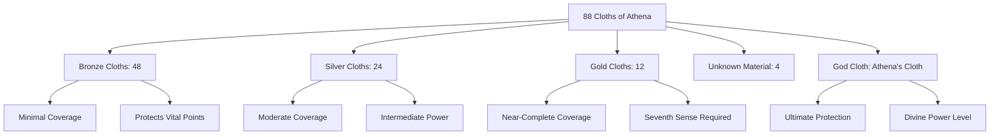

**Bronze Cloths** represent the entry-level tier, covering only **a small part of the body, usually the most important vital points and not much more**[^1]. Despite their limited coverage, these armors are sufficient for Saints who have awakened their basic Cosmo abilities. The 48 Bronze Cloths correspond to the less prominent constellations, and their wearers typically serve as the front-line warriors of Athena's army.

**Silver Cloths** occupy the middle tier, providing enhanced protection and power amplification compared to their Bronze counterparts. The 24 Silver Saints serve as intermediate enforcers, often dispatched to handle threats beyond Bronze Saint capabilities while reserving Gold Saints for the most critical missions[^4].

**Gold Cloths** represent the elite tier, leaving **very small parts of the body uncovered, like the upper part of the legs and arms**[^1]. These 12 armors correspond to the zodiacal constellations and are worn by Saints who have mastered the **Seventh Sense**—the ability to burn Cosmo at its maximum potential[^4]. The Gold Saints represent **the real battle force to defeat the most powerful enemies**, with each guarding one of the twelve temples along the path to Athena's statue[^4].

A crucial principle governs the relationship between Cloth rank and actual combat power: **"The power of a Saint is not related to the Cloth he wears but to his Cosmo"**[^4]. This foundational rule explains how lower-ranked Saints can potentially match or exceed higher-ranked opponents through superior Cosmo mastery, providing the narrative framework for protagonist growth throughout the series.

### 1.3 The Symbiotic Relationship Between Saints and Cloths

The relationship between Saints and their Cloths transcends that of warrior and equipment, constituting a **symbiotic bond** that enhances both parties. Cloths are explicitly described as **living beings because they are filled with Cosmos, the source of all life**[^1]. This living nature manifests in their ability to make autonomous decisions and respond to the wills of their owners.

The synergy between Saint and Cloth operates through constellation alignment. When a Saint wears their designated Cloth, the armor **creates a sort of synergy with the Saint and his/her constellation, helping to burn his/her Cosmo at a much greater extent than normal**[^1]. This amplification effect is not automatic but requires the wearer to actively burn their Cosmos—without this active engagement, **the Cloth is useless**[^1].

The series provides several illustrative examples of this principle:

- **Seiya's initial experience**: When Seiya first donned his Pegasus Cloth, he expected it to function as a magical item that would fight for him. Instead, **he was semi-immobilized because he was not burning his cosmos**[^1]. Only after learning to properly channel his Cosmo could he utilize the Cloth's full potential.

- **Kanon's power differential**: During the Hades saga, Kanon demonstrated the dramatic difference between fighting with and without a Cloth. While wearing the Gemini Cloth, he could **fight on par with Rhadamanthys**, but after returning it to his brother, **he was no match for Rhadamanthys anymore**[^1].

The autonomous nature of Cloths manifests most dramatically in their ability to **take decisions on their own** in extreme situations[^1]. The most notable example involves the **Cancer Cloth abandoning Deathmask** because **it considered him too wicked to be a Saint**[^1]. This incident demonstrates that Cloths possess moral discernment and loyalty to Athena that can override their bond with their current wearer.

Additionally, Cloths can **respond to the will of their previous owners**[^1], suggesting a form of inherited memory or spiritual connection that persists across generations of Saints. This characteristic reinforces the Cloths' status as living entities with their own histories and allegiances.

### 1.4 Cloth Repair, Death, and Revival Mechanisms

The repair and restoration of damaged Cloths represents a specialized art practiced exclusively by the **Jamir tribe**, descendants of the original Mu Continent Alchemists[^1]. This tribe remains **the only people who know the secret art of repairing Cloths or bringing them back to life**[^1], making their members invaluable to Athena's forces.

The repair process requires **special tools related to the Sculptor Bronze Cloth**, whose Saint specializes in Cloth restoration[^1]. During the 20th century, **Aries Mu** serves as the sole remaining Clothsmith capable of performing these repairs, an art he teaches to his apprentice **Kiki**[^1]. Historical Clothsmiths include **Aries Shion** and **Altar Hakurei**, indicating that this knowledge has been preserved across generations within specific lineages[^1].

When a Cloth sustains damage beyond its regenerative capacity, it can **"die"**—a state rendering it completely useless[^1]. The only method to revive a dead Cloth involves **a great amount of a Saint's blood**[^1]. Importantly, **the blood given doesn't have to be an actual Saint's; it can be an individual who has the equivalent strength of a Saint**[^1]. This flexibility is demonstrated when Yuzuriha used her blood to repair Unicorn Yato's Cloth because her strength was equivalent to that of a Silver Saint[^1].

The **Cloths Graveyard** in Jamir serves as the final resting place for many dead Cloths, described as **remnants of a previous Holy War**[^1]. These deceased armors await either revival through blood sacrifice or remain as silent testimonies to fallen warriors.

The source of blood used in repair significantly affects the resulting Cloth:

| Blood Source | Effect on Cloth |
|--------------|-----------------|
| Standard Saint blood | Basic restoration |
| Gold Saint blood | Enhanced power and potential form change |
| Athena's divine blood | Maximum enhancement; God Cloth potential |

After the Battle of Sanctuary, the Bronze Cloths of Seiya, Shun, Shiryu, Ikki, and Hyoga were destroyed and unwearable. **Through the blood of the remaining Gold Saints, they were repaired and improved**[^1]. This enhancement enabled the Bronze Cloths to **glow gold and attain the same strength as a Gold Cloth** when their wearers raised their Cosmos to the Seventh Sense level[^1].

Cloths are stored in special containers called **Pandora's Boxes**, a name referencing their dual potential to bring **both hope or despair, according to how it's used**[^1]. This symbolic naming acknowledges that Cloths, despite their sacred purpose, are ultimately weapons capable of destruction as well as protection.

### 1.5 Evolutionary Potential and God Cloth Awakening

The evolutionary potential of Cloths represents one of the most significant aspects of the Saint Seiya power system, enabling armors to **exceed their own limits in terms of protection and power**[^1]. This transcendent evolution occurs through specific conditions involving both the wearer's Cosmo development and external enhancement through blood infusion.

The first tier of evolution involves Bronze Saints achieving **Seventh Sense awakening**—the ability to burn Cosmo at the level of a Gold Saint[^1]. When this occurs, the Bronze Cloth **would actually glow gold and attain the same strength as a Gold Cloth**[^1]. This transformation demonstrates that Cloth potential is not fixed but responsive to the wearer's spiritual advancement.

The second and highest tier of evolution produces **God Cloths**, achieved when Bronze Saints reach the **Eighth Sense (阿頼耶識, Arayashiki)**—the sense linked to **reincarnation, dead consciousness and the first steps of godhood**[^5]. However, this transformation through Eighth Sense awakening alone produces God Cloths that last **only for a limited time**[^1].

**Permanent God Cloth transformation** requires **Athena's divine blood** to be spilled on the original Cloths[^6]. This process produces armors that represent **the apex of the man-made Cloths**, providing protection and power **near-equal to those of the 12 Olympian Kamui**[^6].

The capabilities of God Cloths dramatically exceed all other Cloth tiers:

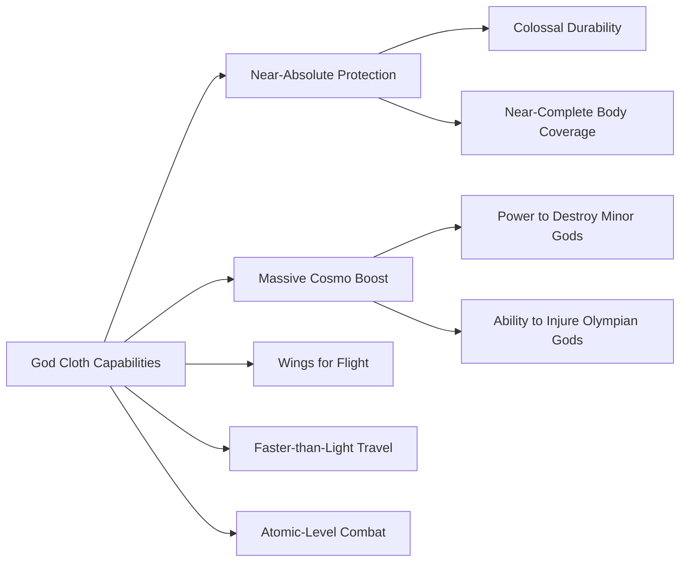

The defensive superiority of God Cloths is demonstrated when **Thanatos' Terrible Providence attack, which had previously destroyed five Gold Cloths in one strike, was unable to even scratch Seiya's Pegasus God Cloth**[^6]. This comparison illustrates the exponential power increase from Gold to God tier.

Offensively, God Cloths grant their wearers **the power to destroy minor gods and even injure one of the 12 Olympian Gods**[^6]. The Pegasus Saint has historically been able to **injure Hades on every reincarnation cycle** when wielding a God Cloth[^6], establishing a pattern of mortal warriors transcending their limitations through divine armor enhancement.

However, God Cloths possess inherent limitations. As they are **still made from mortal hands, they pale against the Kamui**—the true divine armors worn only by Olympian gods[^6]. This distinction is demonstrated when **Hades easily pierced through Seiya's armor with his sword**[^6], confirming that even God Cloths cannot provide absolute protection against the highest divine powers.

The God Cloth transformation represents the ultimate expression of the Saint Seiya armor philosophy: that through devotion to Athena, sacrifice of blood, and mastery of Cosmo, mortal warriors can achieve power sufficient to challenge the gods themselves. This evolutionary potential provides the narrative foundation for the protagonists' journey from novice Bronze Saints to warriors capable of participating in divine conflicts.

## 2 Bronze Saints: The Protagonists and Their Ascension

The five main Bronze Saints constitute the narrative heart of the Saint Seiya franchise, embodying the series' central theme that determination and spiritual growth can transcend predetermined power hierarchies. These warriors—**Pegasus Seiya, Dragon Shiryu, Cygnus Hyoga, Andromeda Shun, and Phoenix Ikki**—begin their journeys as entry-level combatants in Athena's army, yet through relentless battles, profound sacrifices, and unwavering loyalty to their goddess, they ultimately achieve power levels capable of challenging Olympian deities. Their progression from novice Bronze Saints to God Cloth bearers represents the most dramatic power evolution documented in the series, demonstrating that the strength of a Saint lies not in the rank of their Cloth but in the depth of their Cosmo.

All five protagonists share a common origin as orphans adopted by Japanese billionaire **Mitsumasa Kido**, who recruited them into the **Graad Foundation** with the explicit purpose of training them to become Saints[^7][^8]. This shared background establishes them not merely as comrades but as half-brothers connected by blood, adding familial dimension to their bonds forged through combat. Their initial goal of competing in the **Galaxian Wars** tournament for the Sagittarius Gold Cloth eventually transforms into a sacred mission to protect Athena's reincarnation, Saori Kido, against threats ranging from corrupt Sanctuary leadership to the gods of the sea and underworld themselves.

### 2.1 Pegasus Seiya: The Destined Hero and Hades' Eternal Nemesis

**Pegasus Seiya** stands as the titular protagonist whose name literally means "Star Arrow" (星矢), embodying his role as a weapon aimed at the heart of divine adversaries[^7]. His significance extends far beyond his status as a Bronze Saint—he is explicitly identified as **the reincarnation of the first Pegasus Saint**, the legendary warrior who first wounded Hades in mythological times[^7]. This cyclical destiny establishes Seiya as Hades' eternal nemesis, capable of injuring the God of the Underworld in every reincarnation cycle.

**Background and Training**

Seiya's personal motivation throughout the series centers on finding his missing older sister **Seika**, who disappeared while searching for him during his six years of training in Greece[^9][^7]. This deeply personal quest initially drives his reluctant participation in Saint activities, though his motivations gradually shift toward protecting Athena as he recognizes her true identity. He trained at the Sanctuary in Greece under **Silver Saint Eagle Marin**, earning the Pegasus Bronze Cloth through rigorous trials that forged his foundational combat abilities[^9].

At the series' start, Seiya is **thirteen years old**, characterized as passionate, brave, yet sometimes brash and impulsive[^9]. His personality combines selflessness with fierce determination—he is described as **kind-hearted and known for his refusal to give up** regardless of how impossible the situation appears[^9][^7]. This indomitable will becomes his defining characteristic, enabling him to perform "miracles" that amplify his power and manipulate probability itself[^7].

**Signature Techniques and Combat Style**

Seiya's fighting style centers on high-speed striking techniques that channel his Cosmo into devastating attacks:

| Technique | Description | Combat Application |
|-----------|-------------|-------------------|
| **Pegasus Meteor Fist** | Launches hundreds of light energy punches resembling small meteors | Primary offensive technique; ranked first in technique popularity polls[^9][^7] |
| **Pegasus Comet Fist** | Concentrates Cosmo into a single powerful blast of light | Focused high-damage attack |
| **Pegasus Rolling Crush** | Creates a tornado of energy, launching opponent upward before crashing them into the ground | Grappling technique for close combat |

His speed capabilities demonstrate the most dramatic progression among the Bronze Saints. Initially capable of **Mach 10 transonic speeds**, Seiya eventually achieves **light-speed capabilities** during the Sanctuary arc when he dodged Leo Aiolia's light-speed attack despite having a broken leg[^7]. With full Seventh Sense mastery, he can theoretically achieve **infinite speeds**[^7].

**Power Progression Through Story Arcs**

Seiya's growth across the series follows a clear trajectory of escalating challenges and corresponding power increases:

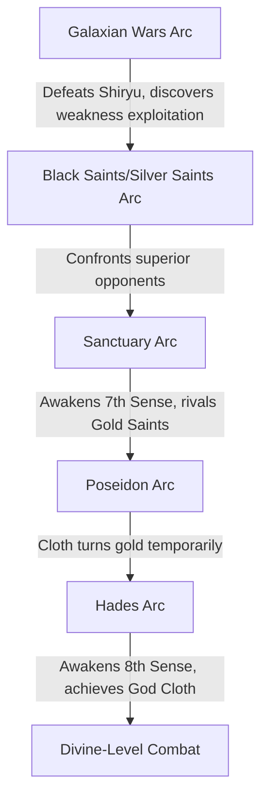

During the **Sanctuary arc**, Seiya's power grows to **rival the Gold Saints** after awakening his Seventh Sense[^9]. This awakening occurs through the crucible of traversing the Twelve Temples, where each battle against a Gold Saint pushes his limits further. The arc culminates in the defeat of the Pope, revealed as **Gemini Saga**, establishing Seiya's capability to overcome opponents who should vastly outclass him[^9].

The **Poseidon arc** witnesses his Cloth temporarily turning gold, signifying his Cosmo reaching Gold Saint equivalence[^9]. He occasionally wears the **Sagittarius Gold Cloth** during this period, foreshadowing his ultimate destiny.

The **Hades arc** represents Seiya's ultimate transcendence. Following Athena's suicide to face Hades in the Underworld, Seiya awakens his **Eighth Sense** to enter the realm of the dead while retaining his physical body[^9]. His Cloth gains wings during this transformation, symbolizing his elevation beyond mortal limitations. The climactic moment arrives when his Cloth transforms into a **God Cloth** after being bathed in Athena's blood, enabling him to help defeat the God of Death Thanatos[^9].

**Ultimate Fate and Legacy**

Despite his victories, Seiya is **mortally wounded by Hades** during the final battle, demonstrating that even God Cloths cannot provide absolute protection against the highest divine powers[^9]. In **Saint Seiya: Next Dimension**, Seiya survives in a catatonic state from Hades' curse, prompting his companions to journey into the past to save him[^9]. He is proclaimed the **future Sagittarius Gold Saint**, successor to the legendary Aiolos who sacrificed himself to save the infant Athena[^9].

An incarnation of Seiya in the 18th century, **Pegasus Tenma**, appears in both Next Dimension and The Lost Canvas, reinforcing the cyclical nature of the Pegasus Saint's destiny across Holy Wars[^9].

Curiously, despite being the main protagonist, Seiya has **not killed any main antagonists in the manga**—Phoenix Ikki is attacked by Lizard Misty, Gemini Saga commits suicide, Poseidon is bound by Athena, and Hades is destroyed by Athena and the other protagonists[^7]. This pattern emphasizes his role as protector rather than executioner, aligning with his fundamentally merciful nature.

### 2.2 Dragon Shiryu: The Wisest Saint and Master of Excalibur

**Dragon Shiryu** is universally recognized as **the most mature and wisest of the five main heroes**, combining philosophical depth with the greatest sheer physical strength among the Bronze Saints (with the possible exception of Phoenix Ikki)[^10][^8]. His character embodies the ideals of discipline, sacrifice, and unwavering loyalty, making him the moral anchor of the protagonist group.

**Background and Training**

Shiryu trained for **six years at the Five Ancient Peaks of Lushan (Rozan) in China** under the tutelage of **Libra Dohko**, the legendary Gold Saint who had survived the previous Holy War and served as the Old Master[^10][^8]. During his training, he befriended **Shunrei (Chunli)**, who would become his lifelong romantic partner and eventually his wife[^10][^8]. His final test to earn the Dragon Cloth required him to **reverse the flow of a waterfall**—a feat demanding extraordinary Cosmo control that he accomplished after years of dedicated practice[^8].

Born on **October 4** with the astrological sign of Libra, Shiryu possesses a distinctive physical marker: a **large tattoo-like image of a green and white dragon on his back** connected to his guardian constellation[^8]. This image serves as a life indicator—it **fades as his life force diminishes and completely vanishes upon his death**, providing a visual representation of his vital energy[^10][^8].

**The Legendary Dragon Cloth**

Shiryu's **Dragon Bronze Cloth** holds special status among Bronze armors due to its exceptional properties. Having been **hardened under a mineral-rich waterfall for centuries**, it possesses legendary defensive capabilities[^10]. The Cloth is renowned for its **indestructible shield** and **offensive gauntlet**, earning it the nickname **"the strongest fist and shield"** among all Cloths[^10].

**Signature Techniques**

Shiryu's combat repertoire centers on dragon-themed techniques that combine devastating power with inherent risk:

| Technique | Description | Notable Characteristic |
|-----------|-------------|----------------------|
| **Rozan Shō Ryū Ha (Rising Dragon Lord)** | Channels Cosmo into an ascending dragon strike | Leaves heart exposed for one millisecond—a critical weakness[^8] |
| **Rozan Ryū Hi Shō (Dragon Soar)** | Aerial dragon technique | High mobility attack |
| **Rozan Hyaku Ryū Ha (One Hundred Dragon Lords)** | Unleashes multiple dragon strikes simultaneously | Maximum offensive output |
| **Rozan Kō Ryū Ha (High Dragon Lord)** | Forbidden suicide technique | Destroys opponent at cost of user's life[^8] |
| **Excalibur** | Cosmo-focused cutting technique inherited from Capricorn Shura | Can negate regeneration; focuses energy into a sharp beam on right arm[^8] |

The **Excalibur** technique deserves special attention as it represents a legacy passed from **Capricorn Shura** to Shiryu during their climactic battle. Shura, recognizing Shiryu's noble spirit, bequeathed this legendary technique that focuses Cosmo into an impossibly sharp cutting edge[^8]. During the Poseidon arc, Shiryu uses Excalibur to **perceive and cut through an opponent's seven chakras**, demonstrating its precision alongside its destructive power[^8].

**Pattern of Self-Sacrifice**

Shiryu's battles are characterized by a willingness to sacrifice himself that borders on the extreme. His most notable sacrifices include:

1. **Against Perseus Algol**: To counter Algol's Medusa Shield that turns people to stone, Shiryu **pierced his own eyes**, rendering himself blind but immune to the petrification effect, enabling his victory[^10][^8].

2. **Against Cancer Deathmask**: Though initially outmatched, Shiryu's determination to protect his master Dohko led to his **Seventh Sense awakening** in the Temple of Cancer, allowing him to fight at Gold Saint level[^10][^8].

3. **Against Capricorn Shura**: Shiryu employed the **forbidden suicide move Rozan Kō Ryū Ha**, intending mutual destruction. Shura, moved by Shiryu's selflessness, saved him at the cost of his own life[^8].

4. **Blood sacrifice for Cloth repair**: After the Galaxian Wars, Shiryu traveled to Jamir to repair his and Seiya's damaged Cloths, **sacrificing a massive amount of his own blood** that nearly killed him[^8].

**Sense Awakenings and God Cloth Evolution**

Shiryu's **Seventh Sense awakening** occurs during his battle against Cancer Deathmask, enabling him to fight on par with Gold Saints and move at or beyond the speed of light[^8]. During the Poseidon Arc, when burning his Cosmo to maximum, his **Dragon Cloth temporarily turns gold**, granting him power equivalent to a Gold Saint[^8].

His **Eighth Sense awakening** occurs during the Hades Arc, allowing him to enter the Underworld with his physical body intact[^8]. By pushing his Cosmo beyond even the Eighth Sense and utilizing **Athena's blood**, Shiryu awakens his **Dragon God Cloth**[^8]. In this divine state, alongside Cygnus Hyoga, he **defeats the god Hypnos**—one of the twin gods serving Hades—demonstrating that mortals with God Cloths can challenge legitimate deities[^8].

**Ultimate Fate and Legacy**

In **Saint Seiya: Next Dimension**, Shiryu travels back in time to the 18th century Holy War, where his young master Dohko **proclaims him the future Gold Saint of Libra**[^10][^8]. In **Saint Seiya Omega**, set after the Hades arc, Shiryu marries Shunrei and they have a son named **Ryūhō**[^10]. After losing his senses in an accident, he passes his duties to his son, though his senses are later restored following the defeat of Abzu[^10].

Shiryu holds the distinction of being **the most popular character in Japan** among the five Bronze Saints, ranking first in character polls[^10][^8]. His combination of wisdom, strength, and self-sacrifice resonates deeply with audiences, embodying the ideal of the noble warrior.

### 2.3 Cygnus Hyoga: The Ice Saint and Heir to Absolute Zero

**Cygnus Hyoga** represents the ice-manipulating Bronze Saint whose calm exterior conceals deep emotional currents. As a Saint born under the Cygnus constellation, he possesses the ability to **control and manipulate ice and snow** by mastering the fundamental technique of ice Saints: **stopping the atoms of matter through the power of Cosmo**[^11][^12].

**Background and Emotional Complexity**

Hyoga is **half-Japanese on his father Mitsumasa Kido's side and half-Russian on his mother Natassia's side**, inheriting his mother's blue eyes and blond hair[^12]. His mother, an Orthodox Christian, **died in a shipwreck when Hyoga was six years old**[^12]. This traumatic loss shapes his entire character—his primary motivation for becoming a Saint was to **gain the power to visit his deceased mother's body at the bottom of the Siberian Sea**[^12].

His training occurred in **Siberia** under **Aquarius Camus** (in the manga) or the **Crystal Saint**, a student of Camus (in the 1986 anime)[^12]. Camus taught him to control ice by **arresting the movement of atoms with Cosmo**, establishing the foundation for his eventual mastery of absolute zero temperatures[^12].

Beneath his calm, collected, and unemotional surface, Hyoga is **passionate and devoted to his ideals and loved ones**[^11][^12]. His love and attachment to those he cares about initially represents his greatest weakness but progressively transforms into his greatest strength[^12]. This emotional depth distinguishes him from the stereotypical cold warrior archetype.

**Ice Manipulation Techniques**

Hyoga's combat abilities center on progressively more powerful ice techniques:

| Technique | Temperature/Effect | Significance |
|-----------|-------------------|--------------|
| **Diamond Dust** | Freezes air, fires ice shards | Basic offensive technique[^13] |
| **Kol'tso** | Ice ring attack | Restraining technique[^12] |
| **Aurora Thunder Attack** | Fires balls of ice | 1986 anime exclusive[^12] |
| **Freezing Coffin** | Encases opponent in unbreakable ice | Defensive/imprisonment technique[^13] |
| **Aurora Execution** | Reaches temperatures **hundreds of times colder than absolute zero** | Ultimate technique; surpasses master's power[^12][^13] |

The **Aurora Execution** represents the pinnacle of ice Saint techniques, reaching temperatures that **stop all atomic motion**—the theoretical definition of absolute zero[^12]. Hyoga's mastery of this technique during his battle with Camus demonstrates his transcendence of his master's teachings.

**Seventh Sense Awakening Against Aquarius Camus**

Hyoga's Seventh Sense awakening occurs during one of the series' most emotionally charged battles—his confrontation with his master **Aquarius Camus** in the Aquarius Temple during the Sanctuary arc[^12].

The battle proceeds through distinct phases:

1. **Initial defeat**: Camus easily defeats Hyoga and traps him in a Freezing Coffin[^12].
2. **Revival and confrontation**: After being freed and revived, Hyoga confronts Camus again[^12].
3. **Understanding and transcendence**: By comprehending his master's true teachings and embracing the nature of his Cosmo, Hyoga reaches the Seventh Sense[^12].
4. **Achieving Absolute Zero**: Hyoga attains the temperature at which all atomic movement stops, overcoming Gold Saint power[^12].
5. **Mutual destruction**: He masters Aurora Execution during this fight, ultimately defeating Camus while suffering a fatal blow himself, from which Athena later revives him[^12].

This awakening enables Hyoga to **fight on par with Marina Generals and God Warriors**, as demonstrated when he elevated his Cosmo to defeat opponents like **Kraken Isaak** (his former training partner) in the Poseidon arc by producing cold **lower than Absolute Zero**[^12].

**God Cloth Evolution and Divine Combat**

During the Hades Arc, Hyoga awakens the **Eighth Sense**, enabling him to enter the Underworld alive[^12]. His Cygnus Cloth eventually evolves into the **Cygnus God Cloth** after being bathed in Athena's blood, granting him power to challenge deities[^11][^12].

In this divine state, Hyoga partners with Dragon Shiryu to **defeat the god Hypnos**, one of the twin gods serving Hades[^11][^12]. He also lends his Cosmos to Athena to help kill Hades in the final battle[^11].

**Ultimate Fate and Legacy**

In **Saint Seiya: Next Dimension**, Hyoga travels back in time and encounters **Aquarius Mystoria**, the Gold Saint of the previous era. Using Aurora Execution, Hyoga **freezes Mystoria's Gold Cloth**, prompting Mystoria to proclaim him the **future Gold Saint of Aquarius**[^12]. This recognition confirms that Hyoga has surpassed even Gold Saint level in his ice manipulation abilities.

Hyoga ranks **second in popularity** among the Bronze Saints in Japanese polls, his emotional depth and tragic backstory resonating strongly with audiences[^11]. Critics have noted his **Oedipus complex** stemming from losing his mother, which adds psychological dimension to his character[^11].

### 2.4 Andromeda Shun: The Reluctant Warrior and Vessel of Hades

**Andromeda Shun** stands as perhaps the most complex of the Bronze Saints—a pacifist warrior whose gentle nature conceals **one of the strongest powers in the series**[^14][^15]. His reluctance to engage in violence creates a fascinating tension with his immense latent capabilities, and his role as the human incarnation of Hades represents one of the series' most significant plot revelations.

**Background and Pacifist Philosophy**

Shun is the **younger brother of Phoenix Ikki**, and their contrasting personalities define much of both characters' development[^14][^15]. Where Ikki is harsh, cold, and aggressive, Shun is calm, soft, caring, and deeply emotional[^16]. He is described as possessing **"the purest soul in his era"** and being the "Chosen One"[^15].

His pacifist philosophy sets him apart from other Saints: he is **"a firm believer in solving problems without causing bloodshed"**[^14][^15]. He only fights when it becomes an **absolute necessity** or when his patience wears out—at which point he transforms into **"an extremely skilled and deadly fighter"**[^14]. His mercy extends even to enemies, as demonstrated when his kindness causes **Charon to abandon an attack** and his sorrow **distracts Lune unintentionally**[^15].

**The Legendary Andromeda Chains**

Shun's fighting style centers on his **Andromeda Chains**, legendary weapons said to be **the same chains used to tie Princess Andromeda in Greek mythology**[^14]. These chains possess remarkable properties:

- **Legendary durability** and defensive capabilities[^14]
- Can **extend to light years away**[^15]
- Provide **warning signs** when threats approach[^14]
- Become charged with **at least 10,000 volts** when danger is present[^14][^15]

Shun normally relies on the chains to **avoid killing opponents**, preferring to restrain rather than destroy[^14].

**Signature Techniques**

| Technique | Description | Usage |
|-----------|-------------|-------|
| **Nebula Chain** | Basic chain manipulation for offense and defense | Primary technique[^15] |
| **Rolling Defense** | Defensive chain formation | Protection[^15] |
| **Thunder Wave** | Electric discharge through chains | Stunning opponents[^15] |
| **Great Capture** | Restraining technique | Non-lethal incapacitation[^15] |
| **Nebula Stream** | Concentrated chain attack | Intermediate offense[^15] |
| **Nebula Storm** | Ultimate technique of extreme destructive power | Last resort only; requires abandoning Cloth and chains[^15] |

The **Nebula Storm** deserves special attention as Shun's ultimate technique. Due to its **extreme destructive nature**, Shun will only use it as a last resort[^15]. When executing this technique, he must abandon his Cloth and chains to gain full access to his Cosmos[^15]. Despite his reluctance to fight, Shun uses Nebula Storm to **kill Pisces Aphrodite** in the Sanctuary arc, demonstrating that when pushed to his limits, he can overcome even Gold Saints[^15].

**The Hades Revelation**

In **one of the biggest plot twists of the series**, Shun is revealed to be the **human incarnation of Hades, God of the Underworld**, paralleling how Saori Kido is Athena's incarnation[^14][^15]. Although Shun was initially unaware of this fact, the soul of Hades became dominant once Shun lost a **childhood pendant** that had bound his body with the god's soul[^15].

The possession sequence unfolds dramatically:

1. Hades' soul unites with Shun's body in Hades' throne room[^15]
2. Hades, controlling Shun's body, is confronted by Phoenix Ikki[^15]
3. Shun regains enough control to strangle his own body, urging Ikki to destroy him[^15]
4. Ikki hesitates, unable to kill his beloved brother[^15]
5. Eventually, **Athena's boiling blood** and encouragement give Shun the strength to **separate Hades from his body**[^14][^15]

This plot element adds profound depth to Shun's character—his pure soul was specifically chosen as Hades' vessel, yet his inherent goodness ultimately enables him to reject the god's control.

**Sense Awakenings and God Cloth Evolution**

Shun's **Seventh Sense awakening** occurs briefly in the **Temple of Gemini** during the Sanctuary arc, where he escapes the Another Dimension and reaches Gemini Saga, making the illusion disappear[^15]. His full awakening develops through subsequent battles.

Born under the **astrological constellation of Virgo**, Shun has the privilege of donning the **Virgo Gold Cloth** in times of crisis[^15]. This occurs when the Bronze Saints battle the God of Death Thanatos, though Thanatos attacks before they can utilize the Gold Cloths effectively[^15].

Shun is the **second of the Bronze Saints to achieve his God Cloth**[^15]. His Andromeda Cloth transforms when he burns his Cosmo to protect Ikki from a fatal blow by Hypnos—the armor revives as a **full plate golden armor equipped with wings and a divine aura**[^15].

**Ultimate Fate and Legacy**

In **Saint Seiya: Next Dimension**, Shun travels with Athena to the past to save Seiya. He encounters **Pegasus Tenma** (the Pegasus Saint of that era) and proceeds through multiple temples[^15]. Near the Temple of Virgo, he witnesses the duel between **Virgo Shaka** and **Virgo Shijima**, after which **Shaka declares Shun will be the new Gold Saint of Virgo in the future**[^15].

In **Saint Seiya Omega**, Shun reappears as a **wandering doctor** after being wounded by Mars, which prevents him from using his Cosmos[^14]. He aids the new generation of Bronze Saints, though he loses the use of his left arm after using his Cosmos again[^14]. He remains revered as **one of the strongest Saints of the 20th century**[^14].

Shun ranked **third in popularity** among the Bronze Saints in volume 3 polls[^14]. His androgynous appearance and pacifist nature have generated academic discussion regarding themes of masculinity in the series[^14].

### 2.5 Phoenix Ikki: The Immortal Loner and Strongest Bronze Saint

**Phoenix Ikki** occupies a unique position among the Bronze Saints as both the most powerful and the most isolated. While officially recognized as a Bronze Saint, his **base power easily places him well above most Silver Saints**[^16], and he is consistently recognized as **the strongest Bronze Saint when it comes to raw power**[^16]. His connection to the Phoenix constellation grants him the legendary ability to **resurrect from death**, with his strength increasing after each revival[^16].

**Tragic Background and Transformation**

Ikki's character arc begins in tragedy. Originally the protective older brother who shielded the delicate young Shun, Ikki **volunteered to train on Death Queen Island** in his brother's place when Shun was originally assigned there[^16]. This hellish training ground, under the brutal master **Guilty**, transformed Ikki into a cold, aggressive loner—the opposite of his former self[^16][^17].

The only light in his training was **Esmeralda**, a young girl who, in Ikki's own words, was **"the only thing that kept him sane"**[^16]. Her death became the spark that drove Ikki to kill his master and obtain the Phoenix Cloth, channeling his rage into overwhelming power[^16].

**Initial Antagonist Role**

Ikki's introduction differs fundamentally from the other Bronze Saints—he appears as the **first antagonist** the protagonists must defeat[^16]. As leader of the **Black Saints**, he steals parts of the Sagittarius Gold Cloth during the Galaxian Wars, seeking revenge against the Graad Foundation[^16][^17]. His defeat by the combined efforts of the other Bronze Saints, culminating in Gemini Saga's **Galaxian Explosion** reducing him to "space dust," marks the first of his many deaths and resurrections[^16].

Following this defeat, Ikki overcomes his hatred and becomes **a crucial ally** who appears at critical moments to save his comrades from certain death[^17]. This pattern—Ikki arriving unexpectedly when most needed—becomes a defining narrative element throughout the series.

**Signature Techniques and Resurrection Power**

Ikki's combat abilities combine physical devastation with psychological warfare:

| Technique | Type | Effect |
|-----------|------|--------|
| **Hō Yoku Tenshō (Phoenix Wings Rise)** | Physical | Gathers forces of wind and heat, unleashing them in a devastating wide-range blow[^16] |
| **Hōō Genma Ken (Phoenix Illusion Demon Fist)** | Mental | Destroys opponents' minds by sending nightmare illusions directly created by the victim's brain[^16] |

The **Phoenix Illusion Demon Fist** is particularly infamous for its psychological devastation—it literally destroys the mind of its victims through personalized nightmares[^16]. Ikki often combines these techniques, using the mental attack to paralyze opponents before finishing them with Phoenix Wings Rise[^16].

His most extraordinary ability is **resurrection**. The Phoenix Cloth has the unique capability to **reform from atoms if pulverized**—an ability not even Gold Cloths possess[^16]. Ikki himself **can never truly die permanently**; the Phoenix constellation grants him the power of resurrection, and his **strength increases with each revival**[^16]. This power is demonstrated when he regenerates after being reduced to space dust by Saga's Galaxian Explosion[^16].

**Sense Awakenings and Power Progression**

Ikki's **Seventh Sense awakening** occurs during his battle with **Virgo Shaka**, one of the most powerful Gold Saints[^16]. This awakening places him **in the ranks of Gold Saints and Hades' Judges in terms of power and skill**[^16]. The significance of this achievement is demonstrated when he **easily defeats Garuda Aiacos** after saving Kanon in the Hades arc[^16].

His **Eighth Sense awakening** enables him to traverse the Underworld while remaining alive[^16]. In the Hades chapter, Ikki defeats Garuda Aiacos and confronts Hades himself, who has possessed Shun's body[^16]. Though Ikki fails to rip Hades from Shun and is killed (sent to Cocytus, the 8th prison of Tartarus), he escapes through his resurrection power[^16].

**God Cloth and Implied Ninth Sense**

During the battle against Thanatos, the **Leo Gold Cloth** assembles itself on Ikki, as he was born under the sign of Leo[^16][^17]. Subsequently, when the Bronze Saints' Cloths evolve into God Cloths after being blessed by Athena's blood, Ikki's Phoenix Cloth becomes the **Phoenix God Cloth**[^16].

This evolution carries profound implications—it is **implied that Ikki reaches the 9th Sense (Godhood/Divinity)** when his Cloth transforms[^16]. The 9th Sense represents the "Supreme Virtue" that separates gods from lower beings, and Ikki's God Cloth transformation suggests he achieved **a power level capable of fighting gods**[^16]. This is further supported during the battle against Apollo in the "Heaven Chapter: Overture" movie[^16].

In **Saint Seiya Omega**, Ikki's power level is described as **comparable to Aegaeon of the four First-class Pallasites**, making him the strongest among the Bronze Saints in that series[^16].

**Ultimate Fate and Legacy**

In **Saint Seiya: Next Dimension**, Ikki appears to save an unconscious Shun from Artemis's soldiers[^17]. He travels 243 years into the past, facing **Garuda Suikyou** and **Gemini Cain** (who uses Galaxian Explosion against him)[^16]. After Cain heals him, Ikki continues his journey and is **proclaimed as the future Gold Saint of Leo** by the past Gold Saint **Kaiser Lion**[^16][^17].

Ikki's character represents the ultimate expression of the phoenix mythology—through suffering, death, and rebirth, he achieves power that transcends mortal limitations while maintaining his core identity as Shun's protective older brother.

### 2.6 Power Progression and Sense Awakening Across Story Arcs

The five Bronze Saints' power evolution follows a carefully structured progression across the series' major arcs, with each arc presenting challenges that catalyze specific growth milestones. This systematic escalation transforms them from entry-level warriors to god-slaying combatants.

**Galaxian Wars Arc: Establishing Baselines**

The Galaxian Wars tournament establishes the Bronze Saints' initial power levels and introduces their signature techniques. Key battles include:

- **Seiya vs. Shiryu**: Seiya discovers the millisecond weakness in Shiryu's Rising Dragon technique, stopping Shiryu's heart before restarting it with a strike to the back[^8]
- **Shun vs. Unicorn Jabu**: Shun defeats his opponent to meet his brother Ikki[^14][^15]
- **Hyoga's arrival**: Initially ordered by Sanctuary to assassinate the Bronze Saints, Hyoga becomes indecisive as he bonds with his half-brothers[^11][^12]

At this stage, the Bronze Saints operate with the **6th Sense (basic Cosmo)**, capable of continent-level attacks and transonic to high hypersonic speeds[^18][^13].

**Sanctuary Arc: Seventh Sense Awakening**

The Sanctuary arc represents the most dramatic power leap, as the Bronze Saints traverse the Twelve Temples and awaken their Seventh Sense through battles against Gold Saints:

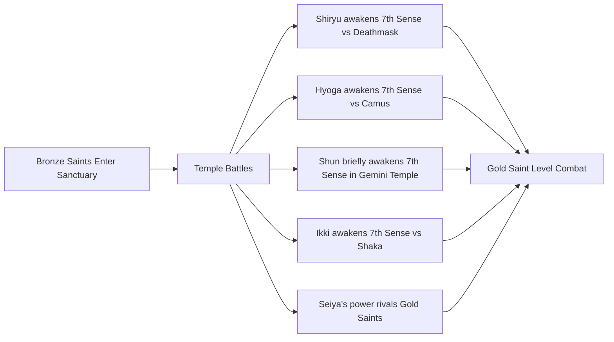

The **Seventh Sense (Miraculosity)** represents a heightened state of Cosmo energy that enables users to:
- Tap into the true potential of divine power[^7][^8]
- Perform actions defying natural laws, including space-time manipulation[^7]
- Move at or beyond the speed of light[^7][^8]
- Fight on the level of Gold Saints[^8]
- Burn Cosmos comparable to the Big Bang itself[^7]

Each awakening occurs under specific circumstances:

| Saint | Awakening Battle | Catalyst |
|-------|-----------------|----------|
| Shiryu | Cancer Deathmask | Protecting his master Dohko[^8] |
| Hyoga | Aquarius Camus | Understanding master's true teachings[^12] |
| Shun | Gemini Temple | Escaping Another Dimension[^15] |
| Ikki | Virgo Shaka | Confronting the "man closest to god"[^16] |
| Seiya | Throughout arc | Cumulative battles against Gold Saints[^9] |

**Asgard and Poseidon Arcs: Cloth Golden Transformation**

During these arcs, the Bronze Saints' Cloths demonstrate their enhanced potential by **temporarily turning gold** when their wearers elevate their Cosmo to Seventh Sense levels:

- **Shiryu vs. Chrysaor Krishna**: His Dragon Cloth shines golden as he manifests Excalibur to destroy Krishna's spear and Scale[^8]
- **Hyoga vs. Kraken Isaak**: Produces cold lower than Absolute Zero to defeat his former training partner[^12]

This golden transformation signifies that the Bronze Cloths, enhanced by Gold Saint blood during repairs, can **attain the same strength as Gold Cloths** when their wearers achieve sufficient Cosmo levels.

**Hades Arc: Eighth Sense and God Cloth Evolution**

The Hades arc pushes the Bronze Saints beyond mortal limitations entirely. Following Athena's suicide to face Hades in the Underworld, the protagonists must awaken the **Eighth Sense (Arayashiki)** to follow her:

The **Eighth Sense** grants:
- Control over soul and body in the spirit realm[^7][^8]
- Ability to enter the Underworld with physical body intact[^8]
- Power to resurrect oneself[^7]
- Essential awareness for crossing the Hyperdimension to reach Elysion[^8]

The ultimate transformation occurs when Athena's blood contacts their shattered Cloths, creating **God Cloths**:

| Saint | God Cloth | Achievement |
|-------|-----------|-------------|
| Seiya | Pegasus God Cloth | Injures Hades; first to transform[^19] |
| Shiryu | Dragon God Cloth | Defeats Hypnos with Hyoga[^8] |
| Hyoga | Cygnus God Cloth | Defeats Hypnos with Shiryu[^11][^12] |
| Shun | Andromeda God Cloth | Second to achieve transformation[^15] |
| Ikki | Phoenix God Cloth | Implied 9th Sense; fights gods[^16] |

### 2.7 God Cloth Transformation and Divine-Level Combat Capability

The **God Cloths** represent the absolute pinnacle of mortal-crafted armor achievement, enabling the Bronze Saints to challenge beings of divine origin. Their awakening requires the confluence of two critical factors: **Eighth Sense attainment** and **Athena's divine blood**.

**Awakening Conditions and Process**

The transformation process is documented most clearly through Seiya's experience in the Hades OVA:

1. **Pushed beyond breaking point** by Thanatos, Seiya's Cosmo approaches divine levels[^19]
2. His **shattered Cloth** (reduced to dust) reacts to both his elevated Cosmo and Athena's blood[^19]
3. The armor **evolves into something closer to the gods' Kamui**[^19]
4. The transformation produces a **full plate golden armor** covering almost the entire body[^19]

The anime version adds emotional dimension: Thanatos's threat on **Seika's life** (Seiya's sister) fuels his emotions to divine Cosmo levels, triggering the transformation[^19].

**Capabilities and Limitations**

God Cloths provide dramatically enhanced capabilities:

| Capability | Evidence |
|------------|----------|
| **Near-absolute protection** | Thanatos's Terrible Providence—which destroyed five Gold Cloths in one strike—left Seiya's God Cloth virtually unharmed[^19] |
| **Divine-level offense** | Enabled defeat of minor gods Hypnos and Thanatos[^8] |
| **Ability to wound Olympians** | Seiya injured Hades while wearing God Cloth[^19] |
| **Flight capability** | Wings enable aerial combat and dimensional travel |
| **Near-complete body coverage** | Provides maximum physical protection |

However, God Cloths retain inherent limitations as mortal-crafted armor:

- **Hades easily pierced** Seiya's God Cloth with his sword, demonstrating that they **pale against true Kamui**[^19]
- The Cloth was "last seen as Hades stabbed through it, piercing Seiya's heart, showing it's still not quite enough to face a powerful god"[^19]

**Design Variations Across Media**

The God Cloth designs vary across different adaptations:

| Version | Color | Notes |
|---------|-------|-------|
| Manga | Pure gold | Kurumada's intended design[^19] |
| Hades OVA anime | Similar to prior Cloth versions | Not golden[^19] |
| Tenkai-Hen Overture film | Pure silver | Closer to manga detail[^19] |
| The Lost Canvas | Golden full body armor | Wings spread like actual wings[^19] |

### 2.8 Legacy and Future Destinies as Gold Saints

The Bronze Saints' ultimate recognition as future Gold Saints in the **Next Dimension** storyline represents the thematic culmination of their journeys. Each protagonist receives proclamation from a previous-era Gold Saint, confirming their transcendence of the Bronze-Silver-Gold hierarchy:

| Bronze Saint | Future Gold Cloth | Proclaimed By | Significance |
|--------------|-------------------|---------------|--------------|
| **Pegasus Seiya** | Sagittarius | (Implied through narrative) | Successor to Aiolos, the legendary protector[^9] |
| **Dragon Shiryu** | Libra | Libra Dohko (young version) | Inherits master's position[^10][^8] |
| **Cygnus Hyoga** | Aquarius | Aquarius Mystoria | Surpasses ice Saint lineage[^12] |
| **Andromeda Shun** | Virgo | Virgo Shaka | Recognized for purest soul[^15] |
| **Phoenix Ikki** | Leo | Leo Kaiser | Acknowledged for supreme power[^16][^17] |

These proclamations carry profound thematic significance:

1. **Validation of growth philosophy**: The series' core message—that Cosmo mastery transcends Cloth hierarchy—receives ultimate confirmation when Bronze Saints are recognized as worthy of the highest rank.

2. **Cyclical continuity**: By becoming Gold Saints, the protagonists ensure the continuation of Athena's protection across eras, just as previous Gold Saints sacrificed themselves to enable their growth.

3. **Constellation alignment**: Each Bronze Saint's future Gold Cloth corresponds meaningfully to their character:
   - Seiya → Sagittarius: The archer constellation suits the "Star Arrow"
   - Shiryu → Libra: Balance and wisdom match his mature personality
   - Hyoga → Aquarius: Ice mastery continues the Aquarius lineage
   - Shun → Virgo: Purity of soul aligns with Virgo's spiritual nature
   - Ikki → Leo: Raw power and leadership befit the lion constellation

The Bronze Saints' journey from orphans competing in a tournament to god-slaying warriors proclaimed as future Gold Saints encapsulates Saint Seiya's central narrative: that through unwavering determination, profound sacrifice, and burning Cosmo, mortal warriors can transcend their limitations and stand among the divine protectors of Athena.

## 3 Silver Saints: The Middle Tier Warriors

The Silver Saints occupy a critical intermediate position within Athena's hierarchical army, serving as the bridge between the numerous Bronze Saints and the elite Gold Saints. Numbering approximately **24 to 28 warriors**, they represent the "true concept of a Saint of Athena" with respectable strength and Cosmo, functioning as the Sanctuary's primary enforcement arm for missions requiring power beyond Bronze capabilities yet not demanding Gold Saint intervention[^20]. Their narrative role in Saint Seiya is predominantly antagonistic during the Sanctuary arc, where they serve as the corrupt Pope's executioners dispatched to eliminate the protagonist Bronze Saints and Saori Kido. This chapter examines their defining characteristics, organizational functions, individual combat capabilities, and thematic significance as morally ambiguous warriors whose pride and institutional loyalty ultimately render them stepping stones for the protagonists' dramatic growth.

The Silver Saints present a fascinating study in the series' power dynamics and moral complexity. While theoretically representing Athena's noble warriors, their portrayal throughout the franchise emphasizes **ruthlessness, malevolence, and sadistic tendencies** more akin to assassins than peacekeepers[^20]. This characterization reflects the corruption permeating the Sanctuary under the false Pope's rule, transforming defenders of justice into instruments of tyranny. Their systematic defeats at the hands of the Bronze Saints—initially with difficulty, later with increasing ease—serve the narrative function of demonstrating protagonist growth while establishing the threat level that the Gold Saints will subsequently represent.

### 3.1 Silver Saint Classification and Power Parameters

The Silver Saints are defined by quantifiable power parameters that establish their position within the Cloth hierarchy. According to series documentation, the **weakest Silver Saint possesses at least twice the strength of a Bronze Saint**, with the strongest reaching **up to five times Bronze Saint power levels**[^20]. This substantial differential explains why the Sanctuary initially considered sending Silver Saints sufficient to eliminate the rebellious Bronze protagonists—under normal circumstances, such a power gap would prove insurmountable.

**Combat Speed Capabilities**

Silver Saints demonstrate significantly enhanced speed compared to their Bronze counterparts, capable of reaching **Mach 5** in combat situations[^20]. This hypersonic capability represents a dramatic escalation from standard Bronze Saint speeds, enabling Silver Saints to overwhelm lower-ranked opponents through sheer velocity differential. The following table summarizes the key power parameters:

| Parameter | Bronze Saints | Silver Saints | Differential |
|-----------|---------------|---------------|--------------|
| **Relative Strength** | Baseline (1x) | 2x to 5x Bronze | 100-400% increase |
| **Maximum Speed** | Varies by individual | Up to Mach 5 | Hypersonic capability |
| **Cosmo Attunement** | Basic awareness | Wider knowledge than Bronze | Enhanced but incomplete |
| **Cloth Freeze Threshold** | Higher temperatures | -200°C | Superior cold resistance |

**Cosmo Attunement and Seventh Sense**

A critical distinction separates Silver Saints from Gold Saints: their **Cosmo is not as completely awakened as the Gold Saints**, though they possess **wider knowledge of it than the Bronze Saints**[^20]. This intermediate Cosmo development explains both their superiority over Bronze Saints and their ultimate vulnerability to protagonists who achieve Seventh Sense awakening. Silver Saints operate with enhanced but incomplete spiritual awareness, capable of impressive techniques yet fundamentally limited compared to those who have mastered the highest Cosmo states.

**Silver Cloth Properties**

The Silver Cloths themselves demonstrate enhanced material properties befitting their rank. They **freeze at a temperature of -200°C**, significantly lower than Bronze Cloths, indicating superior composition and durability[^20]. This cold resistance threshold reflects the Cloths' enhanced Orichalcum content and alchemical refinement. Currently, **23 Silver Cloths have been confirmed to exist**, with the possibility of additional unidentified armors[^20].

**Exceptional Silver Saints Rivaling Gold Level**

Despite the general power hierarchy, the series explicitly acknowledges several Silver Saints whose capabilities **exceed even Gold Saint levels**:

- **Lyra Orphée**: Described as the "Legendary Saint" whose Cosmo mastery reportedly surpasses Gold Saints[^20]
- **Crateris Suikyō**: Characterized by Bronze Saint Ikki as "stronger than any Gold Saint Ikki has previously fought"[^20]
- **Altar Hakurei**: Said to possess strength equal to Grand Pope Sage, and notably served as the previous Gold Saint of Cancer before Sage[^20]

These exceptions demonstrate that the Saint hierarchy, while generally reliable, ultimately reflects Cloth rank rather than absolute power—the fundamental principle that "the power of a Saint is not related to the Cloth he wears but to his Cosmo" applies equally to Silver Saints who transcend their nominal classification.

### 3.2 Organizational Role and Sanctuary Functions

Within the Sanctuary's military structure, Silver Saints fulfill multiple institutional responsibilities that extend beyond direct combat. Their organizational role encompasses **mission command, Cloth guardianship, Saint training, and enforcement operations**, making them essential to the Sanctuary's operational continuity between Holy Wars.

**Mission Command and Bronze Saint Leadership**

When the Sanctuary dispatches forces for significant assignments, Silver Saints typically serve as **squad commanders leading groups of Bronze Saints**[^20][^21]. This command structure reflects both their superior power and their greater experience—Silver Saints are expected to possess the judgment and tactical awareness necessary to direct lower-ranked warriors effectively. The Sanctuary's military operations depend on this hierarchical deployment, with Silver Saints providing the leadership layer between the Pope's directives and Bronze Saint execution.

**Cloth Guardianship and Candidate Training**

A crucial responsibility assigned to Silver Saints involves **caring for Cloths that do not currently have owners**[^20]. This guardianship role connects directly to their function as **trainers for potential candidates** seeking to earn these ownerless Cloths. The series explicitly notes that "finding a successor worthy of a Cloth is part of their work because they have enough skill and knowledge to be able to train new cadets"[^20]. This training function proves particularly important given the losses sustained during Holy Wars—Silver Saints bear responsibility for **rebuilding Athena's forces** by identifying talented individuals and preparing them for Sainthood.

Examples of Silver Saints fulfilling this mentor role include:
- **Eagle Marin**: Trained Pegasus Seiya in Greece, teaching him the foundational Ryūsei Ken technique
- **Ophiuchus Shaina**: Served as mentor to Cassios, who competed against Seiya for the Pegasus Cloth
- **Cepheus Daidalos/Albiore**: Trained Andromeda Shun and Chameleon June on Andromeda Island

**Enforcement Operations Under the Corrupt Pope**

The Silver Saints' role as the Pope's primary enforcement agents becomes central to the Sanctuary arc's narrative. Following the Galaxian Wars tournament, **Pope Arles (with Gigas and later Phaeton as intermediaries in the anime)** tasked the Silver Saints with hunting down the Bronze Saints and Saori Kido[^21]. The official justification framed the Bronze Saints as having "used their cloths and status for personal gain" while accusing Saori of "promoting this and later falsely declaring herself as Athena incarnate"[^21].

This enforcement mission reveals the Silver Saints' institutional vulnerability—their loyalty to Sanctuary hierarchy supersedes independent moral judgment. As warriors trained to follow orders from legitimate authority, most Silver Saints accepted the Pope's commands without questioning whether the targets truly deserved execution. Only exceptional individuals like Eagle Marin recognized the corruption and chose to protect the Bronze Saints despite orders.

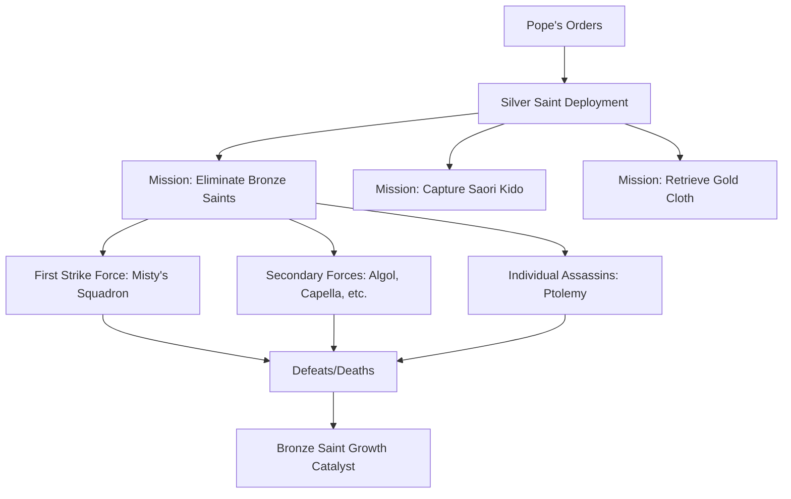

### 3.3 The First Strike Force: Misty, Moses, Asterion, and Babel

The initial Silver Saint squadron dispatched to eliminate the Bronze Saints consisted of **Lizard Misty, Whale Moses, Hound Asterion, and Centaurus Babel**, accompanied by Eagle Marin whose true loyalties lay with protecting Seiya[^22][^23][^24]. This first strike force represented the Sanctuary's expectation that overwhelming Silver Saint power would swiftly conclude the threat posed by rebellious Bronze Saints—an expectation that proved catastrophically mistaken.

**Lizard Misty: The Narcissistic Air Master**

**Lizard Misty** holds the distinction of being **the first Silver Saint officially introduced with his title** in both anime and manga, establishing the benchmark for Silver Saint capabilities[^22]. His character embodies extreme narcissism—he considers himself "inferior only to the goddess Athena herself" and maintains an obsessive concern with his physical beauty, believing that "if his body is dirtied, his soul will also be tainted"[^22].

Misty's combat abilities center on **air manipulation techniques**:

| Technique | Japanese | Effect |
|-----------|----------|--------|
| **Mavrou Trypa** | マーブル・トリパー | Creates a devastating tornado by concentrating Cosmos-manipulated air; means "black hole" in Greek |
| **Air Shield** | — | Generates an invisible defensive barrier through high-speed hand movements |

The **Mavrou Trypa** demonstrates remarkable destructive potential—its impact against Mount Fuji "was so violent that it shook the mountain and its foundations, causing tremors so intense that Seiya believed the volcano was about to erupt"[^22]. This technique generates wind currents capable of reaching targets "several kilometers away," establishing Misty as a genuine threat despite his vain personality[^22].

Misty's Air Shield provides seemingly impenetrable defense, blocking attacks by manipulating surrounding air into a force field. However, this technique possesses a critical weakness: **if an opponent moves at the same speed as the shield's generation, they can potentially bypass the defensive barrier**[^22]. Seiya exploited this limitation by recognizing that Misty avoided combat in water—where neither his Mavrou Trypa nor Air Shield function effectively—ultimately defeating him through underwater combat.

Despite his arrogance, Misty demonstrated **unexpected grace in defeat**, calmly acknowledging Seiya's victory and dying peacefully with a smile[^21]. His death shocked the remaining Silver Saints, who had considered him invincible, and his comrades subsequently sought vengeance for his unexpected fall.

**Whale Moses: The Physical Powerhouse**

**Whale Moses (Cetus/Kaitos Moses)** served as the squadron's physical specialist, providing brute strength to complement Asterion's tactical intelligence[^23]. His partnership with Asterion proved particularly effective—Moses delivered devastating attacks while Asterion read opponents' minds to anticipate and counter their movements.

Moses's signature technique, **Kaitos Spouting Bomber**, throws opponents into the air before delivering a crushing uppercut that causes massive blood loss[^21]. His entrance in the manga demonstrated his power dramatically—he **split the ocean in two and marched across the seabed**, echoing his Biblical namesake[^21].

His defeat came at Seiya's hands following a battle where Asterion's mind-reading initially gave the Silver Saints significant advantage. Moses's reliance on Asterion's telepathic support proved his undoing when Marin intervened, freeing herself and disrupting their coordinated assault.

**Hound Asterion: The Mind-Reading Strategist**

**Hound Asterion** possessed one of the most tactically valuable abilities among Silver Saints: **Satori no hō (悟りの法)**, the power to read minds and anticipate enemy movements[^23][^21]. This telepathic capability allowed him to predict attacks before execution, directing allies to counter effectively and rendering conventional combat approaches futile.

His offensive technique, **Million Ghost Attack**, varies between manga and anime versions. In the anime, Asterion multiplies himself, with all replicas attacking simultaneously with energy blasts[^21]. This combination of mind-reading defense and multi-target offense made him a formidable opponent.

However, Asterion's ability possessed a critical weakness: **it becomes useless if the enemy can create a vacuum in their mind**[^23][^21]. Eagle Marin exploited this limitation by completely clearing her thoughts, rendering Asterion's telepathy ineffective. Unable to anticipate her movements, he fell to her **Eagle Toe Flash** technique.

Asterion's fate differs between adaptations—in the manga, Marin spares him and directs him to confront the Pope, though his tombstone later appears in the Hades arc indicating his death[^21]. In the anime, Marin kills him directly after their battle[^21]. Before dying, he warned Marin that "the Pope is invulnerable," hinting at the greater threat awaiting the Bronze Saints[^23].

**Centaurus Babel: The Fire Manipulator**

**Centaurus Babel** wielded fire-based combat techniques, generating flames through **air friction using his Cosmos**[^24]. His signature technique, **Fotia Roufihtra**, surrounds his body with flames generated by high-speed movement, concentrates fire in his right hand, and upon impact erupts into a whirlwind capable of **reducing an enemy's body to ashes instantly**[^24].

Babel's portrayal differs significantly between manga and anime. In the manga, he appears briefly and is **easily defeated by Hyoga's Kholodnyi Smerch (Aurora Thunder Attack)**[^24]. The anime substantially enhanced his role, making him **powerful enough to hold his own against all five Bronze Saints simultaneously**[^24]. This adaptation elevated his threat level, requiring the intervention of the Steel Saints before Hyoga could finally freeze him with Diamond Dust.

The anime version also provided Babel with an emotionally resonant death scene. Mortally wounded, he is blessed by Saori Kido's Cosmos and **recognizes her as the true Athena**. Understanding his mistakes, "he weeps with joy as he passes away in her arms"[^24]. This redemptive moment humanizes Babel beyond his antagonist role, suggesting that even the Pope's enforcers retained loyalty to Athena's true cause beneath their misguided obedience.

### 3.4 Eagle Marin and Ophiuchus Shaina: The Female Silver Saints

The two female Silver Saints—**Eagle Marin** and **Ophiuchus Shaina**—occupy unique positions as the most developed Silver Saint characters, serving as recurring figures throughout the entire series rather than merely Sanctuary arc antagonists[^25][^21]. Their contrasting personalities, relationships with Seiya, and character arcs provide the Silver Saint rank with its most nuanced representation.

**Eagle Marin: Seiya's Mentor and Athena's Loyalist**

**Eagle Marin (Aquila Marin)** is established in official materials as **"the strongest amazon"** among female Saints[^21]. She trained Seiya during his six years in Greece, teaching him the foundational techniques that would carry him through countless battles. Her role as mentor establishes an emotional bond that transcends typical Saint relationships—she functions as a combination of teacher, protector, and surrogate family figure.

Her signature techniques demonstrate the skills she passed to her student:

| Technique | Description |
|-----------|-------------|
| **Ryūsei Ken (Meteor Punch)** | Strikes hundreds of times per second, generating a meteor shower-like burst; the technique she taught Seiya |
| **Eagle Toe Flash** | A powerful diving kick that defeated Hound Asterion in single combat |

Marin's subplot involves searching for her **missing younger brother**, paralleling Seiya's quest for his sister Seika. This similarity initially suggested Marin might be Seiya's long-lost sister—a possibility the series **memorably subverted** when her actual brother was revealed to be **Toma**, who became an Angel serving another god[^21].

What distinguishes Marin from other Silver Saints is her **immediate recognition of the Pope's corruption** and her decision to protect Seiya despite orders. When dispatched with Misty's squadron, she **faked Seiya's death** by appearing to kill him and burying him on the beach, buying time for his escape[^21]. She later discovered the **real Pope's deceased body at Star Hill**, confirming the current Pope as an impostor—information crucial to understanding the Sanctuary's corruption.

The anime adaptation unfortunately subjected Marin to significant **adaptational weakening**, having her lose almost every battle she participates in despite her stated strength[^21]. This includes losing to Shaina in sparring matches and being defeated by enemies below Silver Saint level. The manga and subsequent materials like Next Dimension restore her combat effectiveness, with Next Dimension issue #56 showing her **defeating Shaina via Eagle Toe Flash**[^21].

In Next Dimension, Marin travels to the past where her young master Dohko **proclaims her a future Gold Saint candidate**, though her specific future Gold Cloth is not explicitly stated.

**Ophiuchus Shaina: From Nemesis to Ally**

**Ophiuchus Shaina** presents a dramatically different character arc—beginning as Seiya's most persistent enemy before transforming into a devoted ally. Her initial antagonism stems from her role as **Cassios's mentor**, seeking vengeance after Seiya defeated her student in competition for the Pegasus Cloth[^25].

Shaina's combat capabilities center on her signature technique:

**Thunder Claw (サンダークロウ)**: She raises her arm like a cobra, ignites her Cosmos, and creates an attack combining **sharp claw strikes** with **lightning bolts carrying 10,000 volts** that pierce and shatter everything in their path[^25].

In the anime, Shaina is portrayed as **"the strongest Saint who did not awaken to the Seventh Sense, even topping Misty"**[^21]. Her early battles against Seiya demonstrate this power—in their second fight, she **beat him until he could no longer move**, put him in a sleeper hold, and prepared to claw his face out before Marin intervened[^21]. This established her as **"The Dreaded"** in Seiya's mind, the only Silver Saint besides Misty who genuinely frightened him[^21].

The transformation in Shaina's character stems from the **female Saint mask law**—a Sanctuary rule requiring female Saints to either **kill or love** any man who sees their face[^21]. When Seiya accidentally saw her face during combat, Shaina found herself bound by this law, her hatred gradually transforming into reluctant love. This emotional conflict drives her character development throughout the series, as she struggles between her duty to kill Seiya and her growing feelings for him.

Shaina's eventual alliance with the protagonists proves invaluable. During the Poseidon arc, she **defeats Mermaid Thetis** in combat, demonstrating her continued effectiveness against high-level opponents[^21]. Her character arc represents one of the series' most complete redemption narratives, transforming an antagonist defined by rage and vengeance into a protector motivated by love and loyalty.

The contrast between Marin and Shaina extends to their personalities—Marin is **calm, reserved, and stoic** while Shaina is **aggressive, passionate, and emotionally volatile**[^21]. Together, they represent the **"Two Girls to a Team"** among Silver Saints, the only female warriors at this rank confirmed in the original series[^21].

### 3.5 The Secondary Antagonists: Perseus Algol to Sagitta Ptolemy

Following the first strike force's defeat, the Sanctuary dispatched additional Silver Saints in increasingly desperate attempts to eliminate the Bronze Saints. These secondary antagonists demonstrated varied abilities but shared a common fate—defeat at the hands of protagonists whose power continued to grow through each confrontation.

**Perseus Algol: The Medusa Shield Bearer**

**Perseus Algol** wielded one of the most dangerous weapons among Silver Saints: the **Medusa Shield**, which petrifies anyone who looks at it regardless of blindfolds or closed eyelids[^21]. The shield's power passes directly into the retinas, making conventional protection useless. His offensive technique, **R'has Al'Ghul Gorgoneio** ("Head of the Ghoul Gorgoneion"), combines illusory serpents with a powerful aerial kick[^21].

Algol's **genre-savvy awareness** of the Perseus myth made him particularly dangerous—when Shiryu attempted to use reflections to see him safely (as the mythological Perseus did against Medusa), Algol revealed he knew that trick and had prepared countermeasures[^21]. His cruelty was demonstrated when he **petrified and smashed three children** who tried to flee the Sanctuary after promising to release them[^21].

Shiryu's victory required extreme sacrifice: he **gouged out his own eyes**, rendering himself permanently blind but immune to the Medusa Shield's power[^21]. Once the shield's threat was neutralized, Shiryu quickly destroyed both it and Algol. Importantly, **people turned to stone by the shield returned to normal when it was broken**, restoring Seiya and Shun who had been petrified[^21].

**Auriga Capella: The Deadly Disc Wielder**

**Auriga Capella** fought using **two deadly saucers** that function as boomerangs, always returning to his hands[^21]. His **Saucer Kogeki (Saucer Attack)** launches these discs with lethal precision. However, his death proved particularly gruesome—Phoenix Ikki used his **Hōō Genma Ken (Phoenix Illusion Demon Fist)** to brainwash Capella into **cutting off his own hands with his saucers** before the discs struck his chest fatally[^21].

**Cerberus Dante: The Flail Fighter**

**Cerberus Dante** wielded a **flail tipped with large morning stars**, using his **Jigoku no Kōkyūsa (Ball and Chain of Hell)** technique[^21]. Despite witnessing Capella's horrific death and receiving Ikki's warning, Dante **defiantly attempted to attack Seiya and Saori**, only to be instantly defeated by Shun's Nebula Chain[^21]. His Cloth notably represents the **Cerberus constellation**, which was made obsolete by the IAU in 1930—its stars are now included as part of Hercules[^21].

**Crow Jamian: The Beast Master**

**Crow Jamian** possessed the ability to **control large murders of crows**, using them as attack animals and extensions of himself[^21]. His **Black Wing Shaft** technique nearly suffocated Seiya with crow feathers. However, Saori's awakening Cosmos **turned his crows against him**, causing a villainous breakdown. Though the crows' betrayal didn't directly kill him, Shun's chain accidentally struck his head, causing him to stumble off a cliff to his death[^21].

**The Monitoring Trio: Algethi, Dio, and Sirius**

**Heracles Algethi, Musca Dio, and Canis Major Sirius** formed a trio assigned to **monitor Gold Saint Leo Aiolia** when he was dispatched to kill the Bronze Saints[^21]. Their presence reflected the Pope's distrust of Aiolia's loyalty. When they confronted Seiya directly, all three were **easily defeated** by Seiya wielding the Sagittarius Gold Cloth[^21].

Their techniques included:
- **Algethi's Kornephoros**: A whirlwind attack sending enemies flying
- **Dio's Dead End Fly**: His signature offensive technique
- **Sirius's Great Mountain Smasher** (anime only): A powerful physical attack

**Sagitta Ptolemy: The Phantom Archer**

**Sagitta Ptolemy** played a pivotal role despite having **the shortest screentime of all Silver Saints**[^21][^26]. Disguised as a guide, he greeted the Bronze Saints at the Sanctuary entrance, explaining what awaited them in the Twelve Temples. Near the Aries Temple, he revealed himself and attacked with a **shower of phantom arrows**—all illusions except for **one golden real arrow**[^26].

The Bronze Saints recognized the illusions and Seiya **defeated Ptolemy with a single punch**, prompting Seiya to lampshade how weak he was compared to earlier Silver Saints[^21]. However, Ptolemy's single real arrow struck **Saori directly in the chest**, establishing the **twelve-hour time limit** that drives the entire Twelve Temples arc[^26]. Before dying, Ptolemy revealed that only Pope Ares could remove the arrow before it pierced Saori's heart.

This demonstrates the **"Small Role, Big Impact"** trope—Ptolemy's brief appearance **single-handedly set the direction of the Twelve Temples Arc**[^21], creating the urgent stakes that force the Bronze Saints to confront all twelve Gold Saints within a strict deadline.

### 3.6 Lyra Orphée: The Legendary Silver Saint

**Lyra Orphée** stands apart from all other Silver Saints as a warrior whose **Cosmo reportedly surpasses even Gold Saint levels**[^20][^21]. His reputation precedes his appearance—when he first appears in the Hades arc, both Seiya and Shun immediately recognize him and express awe at encountering "the Legendary Saint"[^21]. This exceptional status, combined with his tragic backstory and ultimate sacrifice, makes Orphée the most narratively significant Silver Saint in the franchise.

**Musical Combat Techniques**

Orphée's fighting style uniquely centers on his **lyre**, transforming music into devastating attacks:

| Technique | Japanese | Effect |
|-----------|----------|--------|
| **Stringer Nocturne** | — | Uses lyre strings to send electric shocks through opponents, trapping them in "a nighttime spiral which leads to death" |
| **Stringer Fine** | — | Lyre strings trap and shred anything of Orphée's choosing |
| **Death-Trip Serenade** | — | A requiem that sends opponents to sleep for days or into eternal slumber |

The **Stringer Nocturne** and **Stringer Fine** demonstrate the lyre's dual capability as both instrument and weapon, while **Death-Trip Serenade** showcases Orphée's ability to affect consciousness itself through music[^21].

**Tragic Backstory: Eurydice and the Underworld**

Orphée's story directly parallels the Greek myth of Orpheus—he descended into the Underworld to rescue his beloved **Eurydice** after her death[^21]. Unlike most Saints driven by duty to Athena, Orphée's primary motivation was always **love for music and for Eurydice**. This personal focus led him to brave Hades' realm, demonstrating courage and devotion that transcended his role as a warrior.

The series leaves **ambiguous whether Orphée is meant to be the mythological Orpheus himself** or simply someone whose life eerily parallels the original myth. The manga slightly implies the latter interpretation, while the anime leans toward treating him as the actual mythological figure[^21].

**Implied Eighth Sense Awakening**

Orphée's ability to **enter the Underworld while remaining alive** strongly suggests he achieved **Eighth Sense awakening** prior to the main characters[^21]. This sense enables control over soul and body in the spirit realm—precisely what would be required to descend into Hades' domain without dying. If this interpretation is correct, Orphée represents the first Saint shown to have achieved this transcendent state, predating even the protagonists' Hades arc awakenings.

**Ambiguous Allegiance and Heroic Sacrifice**

During the Hades arc, Orphée's allegiance appears questionable—he seems to serve Hades, having remained in the Underworld. However, his true loyalty to Athena is revealed when he **sacrifices himself to give Seiya an opportunity to strike Rhadamanthys**, one of the three Judges of Hell[^21].

The sacrifice unfolds dramatically: Orphée uses his techniques to restrain Rhadamanthys, then urges Seiya to attack them both. Seiya reluctantly launches his **Pegasus Ryūsei Ken** at the pair, with Orphée accepting his death to ensure the Judge's defeat[^21]. Though Rhadamanthys ultimately survives (the attempt was only partially successful), Orphée's sacrifice demonstrates that even the most exceptional Silver Saint ultimately serves Athena's cause.

**Implications for the Hierarchy System**

Orphée's existence challenges the rigid interpretation of Saint rankings. His Cosmo surpassing Gold Saints while wearing a Silver Cloth reinforces the series' core principle that **power derives from Cosmo mastery rather than Cloth rank**. He represents the ultimate expression of Silver Saint potential—proof that the middle tier can produce warriors capable of standing among the elite.

### 3.7 Narrative Function and Thematic Significance

The Silver Saints collectively serve essential narrative and thematic functions within Saint Seiya's structure, operating as more than mere antagonists to be defeated. Their portrayal illuminates the series' exploration of institutional corruption, the nature of true strength, and the moral complexity inherent in hierarchical warrior systems.

**Embodiment of Sanctuary Corruption**

The Silver Saints' characterization as **"ruthless, malevolent and sadistic in nature, akin to assassins rather than warriors of peace"** directly reflects the Sanctuary's corruption under the false Pope[^20]. Their willingness to **"do whatever it takes to destroy their enemies, seemingly devoid of the requisite preference for peace"** represents the institutional rot that transformed Athena's protectors into tyrants[^20].

This corruption manifests in their **anti-villain status**—they genuinely believe they serve Athena by following orders, unaware that the Pope commanding them is an impostor. As the series notes, "they are just following orders and believe that Saori Kido is an imposter trying to take the real Athena's place"[^21]. Their antagonism stems from misplaced loyalty rather than genuine evil, making their defeats tragic as well as triumphant.

**Escalating Challenges and Bronze Saint Growth**

The Silver Saints function as **calibrated challenges** that catalyze Bronze Saint development before the Gold Saint confrontations. The first Silver Saints encountered—Misty, Moses, Asterion—represent genuine threats requiring the protagonists to push beyond their limits. Each subsequent battle forces growth, preparing the Bronze Saints for the exponentially greater challenges awaiting in the Twelve Temples.

The series explicitly acknowledges this escalation pattern through the **"Monster Threat Expiration"** phenomenon[^21]. The initial Silver Saints prove formidable, but "the next ones to appear keep getting weaker than the previous ones, even when it's two or three silver saints against one Bronze Saint, they still lose pathetically"[^21]. This is **justified narratively**—Phaeton "sent in the strongest one at the start to try and finish it early," and when Misty unexpectedly failed, the remaining Silver Saints simply weren't capable of matching the rapidly growing Bronze Saints[^21].

Ptolemy's defeat by a single punch from Seiya, with Seiya explicitly **lampshading how weak he was**, marks the transition point where Silver Saints cease to represent meaningful threats[^21]. This transition prepares audiences for the Gold Saints, who will provide the escalated challenge the Bronze Saints now require.

**Pride Before the Fall**

A consistent characterization across Silver Saints is their **excessive pride and underestimation of opponents**. The series captures this through representative dialogue: *"To compare a Bronze Saint to a Silver one is like comparing a worm to a god"*[^21]. This arrogance inevitably leads to shock when defeated: *"This Cannot Be! A Silver Saint defeated by a Bronze one!"*[^21]

This pride reflects their **"Soldiers at the Rear"** status—in Athena's absence from the Sanctuary, "they had no impetus to get stronger and reach their whole potential as the reliable saints they were supposed to be"[^21]. Their hubris, born from facing little accountability, ultimately costs most of them their lives when confronted by Bronze Saints burning with genuine determination to protect Athena.

**Hades Arc Resurrection and Redemption**

The deceased Silver Saints receive unexpected narrative continuation during the **Hades arc**, where they are **resurrected by Hades** with twelve-hour lifespans and promises of eternal life in exchange for killing Athena[^20][^22][^24]. Misty, Moses, and Babel travel to Siberia to confront Hyoga, only to be **easily defeated** by the now vastly more powerful Bronze Saint[^22][^24].

However, their final moments reveal **redemptive loyalty to Athena**. Before dying, they "reaffirm their loyalty to Athena by warning Hyōga of the danger"[^22]. This redemption completes their character arcs—warriors who served the false Pope in ignorance ultimately demonstrate that their true allegiance always belonged to the goddess they were sworn to protect.

**Thematic Contrast: Authority vs. Righteousness**

The Silver Saints embody the series' exploration of **institutional authority versus moral righteousness**. They possess legitimate rank, official sanction, and numerical superiority, yet they serve a corrupt system. The Bronze Saints, by contrast, are labeled traitors and rebels, yet they fight for Athena's true cause.

This contrast establishes a core Saint Seiya theme: **true strength derives from righteous purpose rather than institutional position**. The Silver Saints' defeats demonstrate that power exercised in service of corruption cannot overcome power wielded in defense of justice—a message reinforced when the Bronze Saints later triumph over Gold Saints who similarly serve the false Pope.

The Silver Saints ultimately represent a cautionary narrative about the dangers of **blind obedience to authority**. Their skills, training, and dedication prove insufficient when directed against those fighting for genuine justice. Only those like Marin, who recognized the corruption and chose conscience over orders, escape the fate that befalls their prideful comrades.

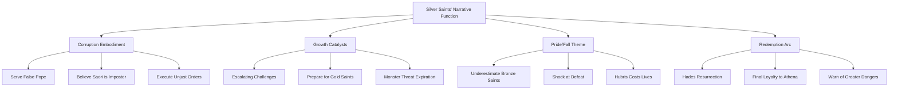

The Silver Saints' collective journey—from prideful enforcers to defeated antagonists to redeemed martyrs—encapsulates Saint Seiya's complex treatment of its warrior classes. They are neither pure villains nor innocent victims, but tragic figures whose institutional loyalty led them astray until death itself provided opportunity for redemption. Their legacy within the series serves as both warning against blind obedience and testament to the possibility of redemption even for those who served unjust causes.

## 4 Gold Saints: The Elite Guardians of the Twelve Temples

The Gold Saints represent the apex of mortal warrior achievement within Athena's hierarchical army, constituting a brotherhood of twelve supreme combatants whose mastery of Cosmo transcends ordinary human limitations. As guardians of the Twelve Houses of the Zodiac along the path to Athena's statue, they serve as **the last line of defense and the ultimate warriors** in service of the goddess and the Grand Pope[^27]. Their power derives not merely from their legendary Gold Cloths—the most durable and powerful among all 88 Cloths—but from their complete awakening of the **Seventh Sense**, the mystical awareness that enables them to tap into Cosmo's true potential and perform feats that defy natural law[^28][^27].

The Gold Saints' narrative significance extends far beyond their combat capabilities. They embody the central moral tensions of the Saint Seiya universe: the conflict between institutional loyalty and righteous conscience, the burden of power wielded in service of potentially corrupt authority, and the ultimate question of what it means to protect Athena when her earthly representatives may have betrayed her cause. The Sanctuary arc's tragedy stems largely from the Gold Saints' division—some unknowingly serving a usurper, others recognizing the corruption yet bound by duty, and a precious few actively working to restore Athena's true rule. Their collective journey from divided warriors to unified martyrs at the Wailing Wall represents one of the franchise's most powerful redemption narratives.

### 4.1 Defining Characteristics and Power Parameters of Gold Saints

The Gold Saints are distinguished from lower-ranked warriors by a constellation of extraordinary attributes that establish them as fundamentally different beings operating on a transcendent plane of existence. Their power derives primarily from **complete mastery of the Seventh Sense**—the awareness that Cosmo is actually the seventh of human senses, beyond the normal five and the sixth sense of intuition[^28]. This awakening enables them to draw out the true potential of their Cosmo and achieve feats far beyond ordinary Saints, including **the capability to move at the speed of light**[^27].

**Seventh Sense Mastery and Combat Capabilities**

The Seventh Sense represents a heightened state of Cosmo energy that fundamentally transforms a warrior's capabilities. When a Saint becomes deeply aware of their Cosmo's nature as the seventh sense, they unlock abilities that include:

| Capability | Manifestation | Combat Application |
|------------|---------------|-------------------|
| **Light-Speed Movement** | Physical velocity matching photons | Instantaneous positioning and attack delivery |
| **Star-Level Destructive Power** | Cosmo capable of pulverizing celestial bodies | Attacks with astronomical energy output |
| **Billions of Strikes Per Second** | Transcendent attack frequency | Overwhelming offensive pressure |
| **Space-Time Manipulation** | Defying natural laws through Cosmo | Dimensional techniques and reality alteration |

The series establishes that burning one's Cosmo produces the energy needed for extraordinary feats including "pulverizing rocks with their bare hands, striking faster than the speed of sound, and throwing hundreds (or even thousands to millions) of blows in a second"[^28]. For Gold Saints who have fully awakened their Seventh Sense, these capabilities scale exponentially—they can wield "power destructive enough to pulverize a star, reach the speed of light, or being able to punch billions of times per second"[^28].

**Gold Cloth Properties and Solar Connection**

The Gold Cloths themselves possess unique properties that distinguish them from all other armor classes. Representing the twelve constellations of the zodiac, these Cloths occupy a special position in the celestial hierarchy: "Since these constellations are located over the ecliptic, the Cloths also contain the energy and light of the sun"[^27]. This solar connection manifests in several remarkable phenomena.

The most notable is **Gold Cloth resonance**—when all twelve Gold Cloths are brought into proximity, "they emit a shining light and produce a loud sound"[^27]. This resonance demonstrates the Cloths' interconnected nature and their collective power when united. The phenomenon serves both practical and symbolic functions, signaling the gathering of Athena's ultimate warriors and foreshadowing their capacity for combined techniques.

The Gold Cloths' coverage provides near-complete body protection, "leaving very small parts of the body uncovered, like the upper part of the legs and arms"[^27]. This extensive coverage reflects their status as the most powerful mortal-crafted armors, designed to protect warriors who face the most dangerous opponents in the universe.

**The Thousand Day War and Matched Combat**

The series introduces a fascinating concept regarding Gold Saint combat: "When two Gold Saints with equivalent forces confront one another, it is referred to as a 'Thousand Day War'"[^27]. This phenomenon describes battles between equally matched Gold Saints that reach inevitable stalemates, with neither combatant able to overcome the other despite their transcendent power levels.

The Thousand Day War concept emphasizes that Gold Saint power, while astronomical, operates within a framework of relative balance. When two warriors of equivalent Cosmo mastery face each other, their light-speed attacks and star-level power cancel out, producing extended conflicts with no clear victor. This principle explains why internal Gold Saint conflicts rarely resolve through direct combat and why external factors—moral conviction, tactical innovation, or intervention—typically determine outcomes.

**The Forbidden Athena Exclamation**

The most devastating technique available to Gold Saints is the **Athena Exclamation**, a forbidden attack that requires three Gold Saints to execute: "When three Gold Saints come together, they can join their cosmos to unleash a technique known as the 'Athena Exclamation', which releases an amount of energy similar to a small scale Big Bang"[^27].

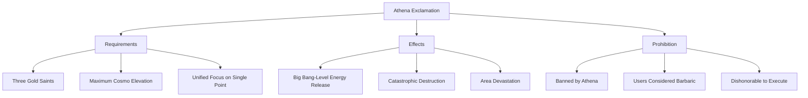

The technique's prohibition stems from its violation of Saint combat ethics: "Because of its immense destructive power, Athena banned its use"[^27], and "those who use it are considered barbaric and dishonorable"[^27]. The Athena Exclamation contradicts the Saint honor code dictating one-on-one combat, requiring three warriors to combine against potentially single opponents. Despite this prohibition, the technique is employed during the Hades arc when desperate circumstances override ethical constraints.

**The Supreme Seventh Sense and Beyond**

Beyond standard Seventh Sense mastery exists an elevated state called the **"Supreme Seventh Sense" or "Extreme Seventh Sense"**—"a level so high as to generate a small-scale Big Bang, and also an extension far above even the capacity of many Gold Saints"[^28]. This supreme state represents the maximum extension of human Cosmo potential, achieved by exceptional warriors during moments of transcendent determination.

Some Gold Saints have also achieved the **Eighth Sense (Arayashiki)**, the awareness linked to reincarnation and dead consciousness[^27]. This sense enables control over soul and body in the spirit realm, allowing warriors to enter the Underworld while retaining their physical forms—a capability essential for the Hades arc's climactic confrontations.

### 4.2 The Loyalist Guardians: Aries Mu, Taurus Aldebaran, Leo Aiolia, and Scorpio Milo

Among the twelve Gold Saints of the 20th century, four warriors maintained fundamental loyalty to Athena's true cause despite the Sanctuary's corruption under the false Pope. These loyalist guardians—**Aries Mu, Taurus Aldebaran, Leo Aiolia, and Scorpio Milo**—represent the Gold Saint ideal: warriors whose devotion to justice transcends institutional commands, recognizing that true service to Athena requires moral discernment rather than blind obedience.

**Aries Mu: The Lemurian Clothsmith**

**Aries Mu** occupies a unique position among Gold Saints as both supreme warrior and master craftsman. A descendant of the Mythical People of Lemuria, Mu was "naturally born with a great talent for Cosmic Control and all manner of Psychokinesis"[^29]. His childhood in Jamir led to discovery by **Shion**, the former Aries Saint and Pope, who recognized the child's potential and trained him to become both the new Aries Saint and inheritor of the sacred Cloth repair arts[^29].

| Attribute | Detail |
|-----------|--------|
| **Age** | 20 |
| **Origin** | Tibet |
| **Training Location** | Jamir |
| **Special Status** | Cloth Blacksmith; strongest raw psychic power among Gold Saints |

Mu's training was "cut short when Gemini Saga, in a fit of madness, killed Pope Shion"[^29]. Despite being only seven years old, Mu recognized that his master had been slain and that whoever wore the Pope's mask was an impostor. This awareness led him to become "a recluse among the Saints, concluding his training by himself and remaining as far away from the Sanctuary as he possibly could"[^29].

His techniques demonstrate unparalleled psychokinetic mastery:

- **Crystal Wall**: "A transparent, glass-like barrier made of psycho-power" that shields against everything from normal cosmos attacks to poison scent, capable of "rebounding the attack back to the enemy"[^29][^30][^31]
- **Crystal Net**: "A spider-web-like construct out of psychokinetic power to restrain foes"[^29][^30]
- **Starlight Extinction**: A technique that "allows Mu to send his target to a location of his choosing," bombarding them with photons at light speed; can send targets "anywhere from Hades' castle to out of existence itself"[^29][^30][^31]
- **Stardust Revolution**: An offensive attack "summoning stardust" at light speed[^30]

During the Sanctuary arc, Mu guards the first temple but rather than fighting the Bronze Saints, he "repairs their Cloths and reveals the 'Seventh Sense'"[^30]. His decision to aid rather than obstruct the protagonists reflects his recognition that they serve Athena's true cause. He later "reveals the secret that the Grand Pope is actually Gemini Saga"[^30], confirming the corruption he had long suspected.

In the Hades arc, Mu confronts Spectres at the Aries temple, including his deceased master Shion and the revived Cancer Deathmask and Pisces Aphrodite. He "defeats Deathmask and Aphrodite using his Starlight Extinction technique"[^30], demonstrating his combat supremacy even against fellow Gold Saints. Later, he participates in the Athena Exclamation clash against Saga, Camus, and Shura, and ultimately joins the twelve Gold Saints at the Wailing Wall for their collective sacrifice[^30].

**Taurus Aldebaran: The Strongest Physical Force**

**Taurus Aldebaran** represents the physical apex of Gold Saint power—"physically the strongest of the Gold Saints in the modern era"[^32]. His Brazilian origin and massive stature (210cm, 130kg) reflect his emphasis on overwhelming physical force rather than esoteric techniques[^33].

His primary technique, the **Great Horn (グレートホーン)**, demonstrates devastating offensive capability: "Aldebaran sends devastating waves of massive Cosmo toward his enemy. The offensive power of this technique is great enough to pulverize a warrior completely together with his armor"[^34]. Analysis of his battles reveals the Great Horn to be "one of the most powerful attacks among the gold saints in terms of impact and strength"[^35], with "astounding power and speed" that may represent "the fastest attack among the gold saints with a terrible impact power"[^35].

Aldebaran's combat philosophy emphasizes his arms-crossed defensive posture: "While in this pose, Aldebaran can instantly react to incoming attacks, uncross his arms and counter-attack so quickly the enemy is unable to perceive the blow before Aldebaran crosses his arms again"[^34]. This stance enables both maximum defensive readiness and instantaneous offensive response.

During the Twelve Houses arc, Aldebaran serves as the Bronze Saints' first genuine Gold Saint challenge. His battle against Seiya demonstrates his overwhelming power—"making Shun, Hyoga, and Shiryu pass out in a single blow" and striking Seiya so forcefully he "pierces several walls of the Taurus temple"[^35]. However, his defeat comes through Seiya's Seventh Sense awakening rather than any failure on Aldebaran's part; as Mu later confirms, "if Aldebaran had fought with intent to kill, the temple would have shed a sea of blood"[^35].

The Hades arc reveals Aldebaran's tragic end. After destroying his own eardrums during his battle against Siren Sorrento in the Poseidon arc—a sacrifice that rendered him deaf—he was "surprised by Deep Niobe because he was deaf"[^32][^34]. The Specter killed him with an unexpected blow, but Aldebaran's final act demonstrated his indomitable spirit: "With Aldebaran's very last remaining cosmo, Mu was able to move again after Niobe attacked him"[^32]. Even in death, Aldebaran fired his Great Horn at Niobe, who "dies without even realizing it happened"[^35].

Later, Aldebaran "joined the rest of the twelve Gold Saints at the Wailing Wall with his Gold Cloth," showing "his surprised comrades that he remained loyal to his friends and Athena, even after death"[^32]. His sacrifice alongside the other Gold Saints to destroy the Wailing Wall completed his arc as a warrior whose loyalty transcended mortality itself.

**Leo Aiolia: The Traitor's Brother**

**Leo Aiolia** bears the unique burden among Gold Saints of being **Sagittarius Aiolos's younger brother**—the sibling of the man branded as Sanctuary's greatest traitor. This familial connection defines Aiolia's character arc, as he struggles to prove his loyalty while secretly believing in his brother's innocence[^33].

| Attribute | Detail |
|-----------|--------|
| **Age** | 20 |
| **Origin** | Greece |
| **Training Location** | Greece, Sanctuary |
| **Signature Techniques** | Lightning Plasma, Lightning Bolt |

Aiolia's combat style centers on lightning-based attacks of devastating speed and power:

- **Lightning Plasma (ライトニングプラズマ)**: His primary offensive technique, unleashing electrical devastation
- **Lightning Bolt (ライトニングボルト)**: A focused lightning strike for precision attacks

During the Sanctuary arc, Aiolia initially serves the false Pope despite his doubts, dispatched to eliminate the Bronze Saints. His confrontation with Seiya proves pivotal—Seiya's possession of the Sagittarius Gold Cloth and his righteous cause force Aiolia to confront the truth about his brother's legacy. The battle ends with Aiolia's recognition that Aiolos died protecting the true Athena, not betraying her.

In the Hades arc, Aiolia participates in the Athena Exclamation clash against the revived Gold Saints and later fights in the Underworld. His ultimate fate sees him joining the twelve Gold Saints at the Wailing Wall, sacrificing himself alongside the brother whose memory he spent years defending.

**Scorpio Milo: The Enforcer's Conscience**

**Scorpio Milo** represents the Sanctuary's enforcement arm—a warrior whose duty involves executing judgment on those deemed traitors or threats[^33]. His role as enforcer creates inherent tension between institutional loyalty and moral discernment, a conflict that defines his character throughout the series.

| Attribute | Detail |
|-----------|--------|
| **Age** | 20 |
| **Origin** | Greece |
| **Training Location** | Milo Island |
| **Signature Techniques** | Restriction, Scarlet Needle - Antares |

Milo's techniques reflect his role as judge and executioner:

- **Restriction (リストリクション)**: A paralysis technique that immobilizes opponents
- **Scarlet Needle - Antares (スカーレットニードル・アンタレス)**: His signature attack, delivering fifteen needle strikes that progressively incapacitate victims; the final Antares strike proves fatal

The Scarlet Needle technique embodies Milo's philosophy of measured justice—each strike provides opportunity for surrender before the final, lethal blow. This graduated approach distinguishes him from more ruthless Gold Saints, suggesting a conscience that seeks alternatives to immediate execution.

During the Sanctuary arc, Milo confronts the Bronze Saints but ultimately recognizes their righteous cause. In the Hades arc, he participates in the Athena Exclamation clash against Saga, Camus, and Shura alongside Mu and Aiolia[^30]. His journey from enforcer to rebel demonstrates the Gold Saints' collective awakening to the Sanctuary's corruption.

### 4.3 The Corrupted Servants: Cancer Deathmask and Pisces Aphrodite

Among the twelve Gold Saints, **Cancer Deathmask** and **Pisces Aphrodite** stand apart as warriors who knowingly served the false Pope while embracing his corrupt philosophy. Their characterization as "the cunningest and cruelest among the Zodiac Gold Saints"[^36] and "the most feared of all the 88 Saints"[^37] respectively establishes them as morally compromised figures whose power serves personal ideology rather than Athena's justice. Yet their ultimate revelation as secret loyalists during the Hades arc adds profound complexity to their narratives, demonstrating that even the most apparently corrupt Gold Saints retained devotion to their goddess beneath their villainous facades.

**Cancer Deathmask: The Soul Collector**

**Cancer Deathmask** embodies the darkest potential of Gold Saint power—a warrior whose techniques manipulate death itself and whose temple serves as a monument to his victims. His primary technique, **Sekishiki Meikai Ha (Praesepe Underworld Waves)**, "sends an opponent's soul to Yomotsu Hirasaka, the entrance to the world of the dead"[^36]. Within this realm, "a person's soul loses almost all strength, and if thrown into the Yomotsu's Maw, their body in the living world becomes completely lifeless"[^36].

| Attribute | Detail |
|-----------|--------|
| **Age** | 23 |
| **Origin** | Italy |
| **Training Location** | Sicily Island |
| **Signature Technique** | Sekishiki Meikai Ha (Praesepe Underworld Waves) |

Deathmask's most disturbing characteristic involves his temple decoration: he "decorates his Cancer Temple with the faces of his victims"[^36]. This grotesque display demonstrates his complete rejection of Saint ethics, transforming his sacred duty as temple guardian into a celebration of murder. His personality is described as "extremely bloodthirsty, strong, and sadistic," believing that "for a greater goal, sacrifices are inevitable and that the ends justify the means"[^36].

His philosophical framework centers on power as the ultimate arbiter: "He holds the belief that force is justice and that justice changes according to time and perspective"[^36]. This relativistic morality enabled him to serve the false Pope with full knowledge of the usurpation: "He was one of the few Saints who knew the truth about the false pope, Gemini Saga, but continued obeying his orders based on this philosophy"[^36].

During the Sanctuary arc, Deathmask's battle against Dragon Shiryu demonstrates both his power and his vulnerability. His Sekishiki Meikai Ha initially overwhelms Shiryu, transporting the Bronze Saint to the death realm. However, Shiryu's determination to protect his master Dohko triggers his Seventh Sense awakening, enabling him to fight at Gold Saint level. The battle's climax reveals Deathmask's fundamental weakness: when his cruelty becomes too extreme, "the Cancer Cloth abandoning Deathmask" because "it considered him too wicked to be a Saint"[^36]. This autonomous rejection by his own Cloth demonstrates that even corrupted warriors cannot escape the Cloths' moral discernment.

The Hades arc reveals Deathmask's hidden complexity. Revived by Hades alongside other deceased Gold Saints, he appears at the Aries temple with apparent intent to kill Athena. Mu "defeats Deathmask and Aphrodite using his Starlight Extinction technique"[^30], seemingly confirming their treachery. However, "it was subsequently revealed by Shion that this was a plan to awaken Athena's Cloth, meaning Deathmask and the others were not truly siding with Hades"[^36].

The revelation recontextualizes Deathmask's entire character: "Deathmask and Aphrodite were secretly on Athena's side, along with the rest of the deceased Gold Saints, and were asked by Shion to pretend to follow Hades' order"[^37]. Their willingness to "carry the burden of the traitor's branding in pretending to betray Athena"[^37] demonstrates that beneath his sadistic exterior, Deathmask retained loyalty to his goddess—a loyalty he expressed through the ultimate sacrifice of his reputation and apparent honor.

**Pisces Aphrodite: The Beautiful Executioner**

**Pisces Aphrodite** presents a fascinating paradox—a warrior of incomparable beauty who wields techniques of devastating lethality. Formally introduced in volume 11 of the manga, Aphrodite "was a Saint famous not only because of his beauty, but also for his reputation as one of the strongest among the 88 Saints"[^37]. According to Gemini Saga, "despite his good looks, Aphrodite is the most feared of all the 88 Saints of Athena, due to his sadistic nature and to his fighting power"[^37].

| Attribute | Detail |
|-----------|--------|
| **Age** | 22 |
| **Origin** | Sweden |
| **Training Location** | Greenland |
| **Blood Type** | O |
| **Special Status** | Immune to plant poison |

Aphrodite's combat techniques center on rose-based attacks that combine beauty with lethality:

| Technique | Description | Effect |
|-----------|-------------|--------|
| **Royal Demon Rose** | Red roses as projectiles | Poison that slowly removes all five senses, leading to death |
| **Piranha Rose** | Black roses as projectiles | Break anything on impact; powerful enough to destroy Bronze Cloths |
| **Bloody Rose** | White roses targeting the heart | Drains all blood from victim's heart; Aphrodite's strongest attack |

The **Bloody Rose** deserves particular attention as Aphrodite's ultimate technique: "It strikes at the opponent's chest and drains all blood from their heart. As the white rose draws blood, it eventually becomes red"[^37]. The technique's targeting mechanism appears autonomous—"the rose seeks the heart of the enemy, so is not possible to avoid it"[^37]—making it exceptionally difficult to counter.

His personality defies expectations created by his appearance: "Tough and candid, Aphrodite is taciturn and blunt in the original manga"[^37]. Despite his incomparable beauty, "Aphrodite is not narcissistic, because he never exalts his own beauty, which is only commented on by third parties"[^37]. Instead, he is characterized by sadism and a philosophy that "power is justice and that the weak should be dominated by the stronger"[^37].

Aphrodite's role in the Sanctuary arc includes a significant revelation: "He was the Gold Saint who attacked Andromeda Island and killed Shun's master, Cepheus Daidalos"[^37]. This backstory establishes personal stakes for his battle against Andromeda Shun, who had "vowed beforehand to defeat the man who killed his beloved master"[^37].

The battle between Aphrodite and Shun showcases both warriors' capabilities. Aphrodite's Royal Demon Roses are repelled by Shun's Rolling Defense, prompting escalation to Piranha Roses that shatter Shun's Nebula Chains and Bronze Cloth. However, Shun's hidden power emerges: "Using the power of his hidden Cosmo, Shun performed a secret attack: Nebula Stream, which he used to restrain Aphrodite"[^37]. When Aphrodite refuses to repent, Shun is "forced to counter with his final attack Nebula Storm, and ended the battle by killing Aphrodite, but not without being struck in the center of his heart by the Bloody Rose"[^37].

The Hades arc reveals Aphrodite's true allegiance. Like Deathmask, he was "secretly on Athena's side" and "willingly carrying the burden of being branded as traitors"[^37]. In the final gathering of the 12 Gold Saints at the Wailing Wall, "Aphrodite's spirit and the Pisces Gold Cloth appeared to help open the gateway to Elysion"[^37]. His sacrifice alongside his fellow Gold Saints completed his redemption arc, demonstrating that even the most apparently corrupt warriors served Athena's cause in the end.

### 4.4 The Tragic Antagonist: Gemini Saga and the Sanctuary Conspiracy

**Gemini Saga** stands as the central figure of the Sanctuary arc's tragedy—a warrior described as "the most powerful Gold Saint of its generation"[^38][^39] whose internal corruption transformed him from Athena's greatest champion into her most dangerous enemy. His thirteen-year masquerade as the false Pope represents the series' exploration of how institutional power can be perverted from within, corrupting an entire organization while maintaining facades of legitimacy.

**The Dual Nature: Angel and Demon**

Saga's defining characteristic is his **split personality**, described as possessing "the kindness of an angel but the darkness of a demon"[^38][^39]. This psychological division manifests as two distinct personas: "a good Saga that was extremely loyal to Athena, and an evil one that keeps control of the body most of the time"[^39]. The evil personality ultimately "killed the previous Pope to steal his place"[^39], initiating the Sanctuary's corruption.

| Attribute | Detail |
|-----------|--------|
| **Age** | 28 |
| **Origin** | Unknown |
| **Training Location** | Greece, Sanctuary |
| **Status** | Most powerful Gold Saint of his generation |
| **Dual Goals** | Good side: Protect Athena / Evil side: Rule the world, kill Athena |

The origin of Saga's corruption traces to his denial of the Pope succession: "after being denied the successorship to the Pope in favor of Sagittarius Aiolos, his evil personality fully manifested"[^38]. This rejection triggered the complete emergence of his dark side, leading to the assassination of Pope Shion and the attempted murder of the infant Athena.

**Signature Techniques and Combat Supremacy**

Saga's techniques reflect his status as the most powerful Gold Saint:

| Technique | Japanese | Effect |
|-----------|----------|--------|
| **Galaxian Explosion** | ギャラクシアン・エクスプロージョン | "Extremely concentrated wave of destructive Cosmo" comparable to "the destruction of the stars and planets of the Milky Way"[^40][^41] |
| **Another Dimension** | アナザーディメンション | "Warps space and time, opening a tear between universes that sucks the opponent into an inescapable dimension"[^40][^41] |
| **Demon Emperor Fist** | 幻朧魔皇拳 | "Directly attacks the mind to manipulate actions and thoughts"[^40]; enables brainwashing through suggestion |
| **Labyrinth of Twins** | ツインズの迷宮 | "An illusion to make enemies wander aimlessly around the Gemini Temple without being able to find an exit"[^41] |

The **Galaxian Explosion** represents Saga's ultimate offensive capability: "he concentrates all of his cosmos energy to the maximum in between his hands, and releases it in the form of a gigantic shock-wave capable of obliterating nearly anything in its path. The aftermath is reported to resemble like a small tactical nuke has been set off"[^41].

**Another Dimension** provides both offensive and defensive applications: "Saga concentrates his cosmos to the maximum again, then lets off a powerful lightning which rips the fabric of space and time, he then proceeds to launch his opponent into this, the intent being that opponents caught into this will wander endlessly inside this limbo between time and space with no opportunity to return"[^41].

**The Thirteen-Year Conspiracy**

Posing as the Pope for thirteen years, Saga "ordered the kidnapping of Saori (Athena) and sent various Saints, including Silver Saints and Gold Saints like Leo Aiolia and Scorpio Milo, to kill the Bronze Saints"[^38]. His manipulation extended throughout the entire Sanctuary hierarchy, with most Saints unaware that their supreme commander was an impostor who had murdered the true Pope.

His intelligence enabled this deception: "He manipulated the entire Sanctuary for his scheme and is one of the most talented Gold saints of his era"[^41]. The conspiracy only unraveled when the Bronze Saints stormed the Sanctuary, forcing direct confrontation that revealed the truth.

**Redemption Through Suicide**

The Sanctuary arc's climax occurs in the Pope's chamber, where Saga confronts Pegasus Seiya. In a moment of psychological complexity, "his good personality initially appeared and instructed Seiya on how to save Athena using her shield"[^38]. However, "his evil personality reasserted control, leading to a battle where he was ultimately defeated by the combined efforts of Seiya, Phoenix Ikki, and the other Bronze Saints"[^38].

Saga's death demonstrates his fundamental nobility: "In his final moments, his good personality took control, and he died after impaling himself with Athena's scepter, asking for her forgiveness"[^38]. This suicide represents the ultimate victory of his angelic nature over his demonic corruption—choosing death rather than continuing to harm the goddess he truly loved.

**Legacy: Gemini Kanon**

Following Saga's death, his brother **Gemini Kanon** assumes the Gemini Gold Cloth. Kanon's own journey from villain (as Sea Dragon in Poseidon's army) to hero parallels his brother's redemption, demonstrating that the Gemini legacy encompasses both corruption and salvation. "Gemini Kanon, Saga's brother, dons the Gemini Gold Cloth. He and Libra Dōko proceed to fight Hades's army in the Underworld"[^27].

**Hades Arc Resurrection**

In the Hades Chapter, "Saga, along with Aquarius Camus and Capricorn Shura, was revived by Hades"[^38]. They infiltrated the Sanctuary "under the guise of Specters to warn Athena about her cloth"[^38]. The revived Saga faced his brother Kanon, who was defending the Gemini Temple: "After a brief confrontation where Saga realized his brother had turned to the good side, he and the others continued their mission"[^38].

The mission required terrible sacrifice: "They were forced to fight and kill Virgo Shaka using the Athena Exclamation"[^38]. This act, though necessary for Athena's ultimate victory, demonstrated the moral complexity of their situation—former villains now serving as secret heroes, committing apparent atrocities to advance their goddess's cause.

Their true loyalty was revealed to Athena, but "the life granted by Hades expired, and they turned to dust, with Saga's last words being a plea to Seiya to protect Athena"[^38]. Saga was "later resurrected by Athena in Hell and sacrificed alongside the other Gold Saints to destroy the Wailing Wall"[^38], completing his redemption arc from usurper to martyr.

### 4.5 The Philosophical Warriors: Virgo Shaka and Libra Dohko

Among the twelve Gold Saints, **Virgo Shaka** and **Libra Dohko** represent the pinnacle of spiritual attainment and wisdom. Their extraordinary Cosmo mastery derives not merely from combat training but from profound philosophical understanding—Shaka through his reputation as "the man closest to godhood" and Dohko through his 243-year survival as the sole witness to the previous Holy War's secrets.

**Virgo Shaka: The Man Closest to God**

**Virgo Shaka** occupies a unique position in the Gold Saint hierarchy as a warrior whose spiritual development approaches divine levels. His reputation as "the man closest to godhood" reflects his extraordinary Cosmo mastery and his deliberate cultivation of transcendent awareness through sensory deprivation.

| Attribute | Detail |
|-----------|--------|
| **Age** | 20 |
| **Origin** | India |
| **Training Location** | India, Basin of the Ganges |
| **Special Status** | "Man closest to god"; keeps eyes closed to enhance Cosmo |

Shaka's signature technique involves **deliberate sensory deprivation** to enhance his Seventh Sense: "Because of the fact that Cosmo is actually a human sense, it happens that with a loss of one or more of the other six senses, the seventh refines itself. This strategy is exploited deliberately by all the known Virgo Gold Saints"[^28]. By keeping his eyes perpetually closed, Shaka maintains "a superior Cosmo" that exceeds even other Gold Saints[^28].

His techniques reflect his spiritual mastery:

| Technique | Japanese | Effect |
|-----------|----------|--------|
| **Tenbu Horin** | 天舞宝輪 | "Sky-Dance-Treasure-Circle"; removes opponents' senses progressively |
| **Rikudo Rinne** | 六道輪廻 | "Endless Cycle of Rebirth through 6 Worlds"; traps opponents in reincarnation cycle |
| **Tenma Kofuku** | 天魔降伏 | "Demon Capitulation"; spiritual subjugation technique |
| **Kahn** | カーン | Meditation-based defensive/offensive technique |

The **Tenbu Horin** represents Shaka's most devastating technique, systematically removing each of an opponent's five senses before eliminating their sixth sense (intuition) and finally their Cosmo itself. This graduated destruction mirrors Buddhist concepts of attachment and liberation, transforming combat into spiritual instruction.

During the Hades arc, Shaka makes the ultimate sacrifice for Athena's cause. When confronted by the revived Saga, Camus, and Shura, he recognizes their true mission and accepts death to advance Athena's plan: "Gemini Saga, Aquarius Camus and Capricorn Shura use the banned 'Athena Exclamation' technique to kill Virgo Shaka"[^27]. His voluntary death demonstrates that even the "man closest to god" subordinates personal survival to divine purpose.

**Libra Dohko: The Ancient Survivor**

**Libra Dohko** represents living history—the sole Gold Saint to survive the previous Holy War 243 years before the series' present. His extraordinary longevity results from a special blessing that slowed his aging, enabling him to serve as guardian over Hades' seal at the Five Ancient Peaks of Rozan while awaiting the next Holy War's arrival.

| Attribute | Detail |
|-----------|--------|
| **Age** | 261 |
| **Height** | 140-170cm (variable) |
| **Origin** | China |
| **Training Location** | China, Mount Rozan, Five Old Peaks |
| **Special Status** | Survivor of previous Holy War; mentor to Dragon Shiryu |

Dohko's techniques center on dragon-based attacks passed to his student Shiryu:

- **Rozan Hyaku Ryū Ha (Rozan 100 Dragons)**: Unleashes multiple dragon strikes simultaneously
- **Rozan Shō Ryū Ha**: The Rising Dragon technique inherited by Shiryu

The **Libra Cloth** possesses unique properties among Gold Cloths: "The Libra Cloth has six pairs of golden weapons that can be used in exceptional situations at the discretion of the Libra Saint, the only one allowed to weigh the justice and righteousness of a cause in the absence of Athena herself"[^27]. These weapons—including spears, rods, tonfas, swords, and shields—represent "the destructive force of the weapons is extraordinary; they are said to be able to pulverize a star with a single blow"[^27].

During the Sanctuary arc, Dohko's role proves pivotal: "Libra Dōko orders them to remain in Sanctuary to prepare for Hades' imminent attack"[^27], demonstrating his strategic authority over the other Gold Saints. His centuries of experience provide wisdom that guides Athena's forces through the coming conflict.

In the Hades arc, Dohko and Gemini Kanon "proceed to fight Hades's army in the Underworld"[^27]. His participation in the Wailing Wall sacrifice alongside the other Gold Saints brings his 243-year vigil to its ultimate conclusion—the ancient survivor finally joining his long-dead comrades in collective martyrdom for Athena's cause.

### 4.6 The Mentors Who Fell: Capricorn Shura and Aquarius Camus

The deaths of **Capricorn Shura** and **Aquarius Camus** during the Sanctuary arc carry unique emotional weight—both fall to protagonists with whom they share profound personal connections. Shura's battle against Dragon Shiryu and Camus's confrontation with Cygnus Hyoga transform standard combat into tragic encounters between masters and students, killers and victims bound by complex relationships of duty, love, and regret.

**Capricorn Shura: The Legendary Blade**

**Capricorn Shura** wields the most famous offensive technique among Gold Saints: **Excalibur**, the legendary sword reborn as pure Cosmo. His arms have been "trained to the point that he can focus his Cosmo into impossibly sharp cutting edges"[^33], transforming his limbs into weapons capable of slicing through virtually any substance.

| Attribute | Detail |
|-----------|--------|
| **Age** | 23 |
| **Origin** | Spain |
| **Training Location** | Spain, Pyrenees |
| **Signature Technique** | Excalibur |

Shura's backstory carries the Sanctuary arc's central tragedy: he was the Gold Saint who killed Sagittarius Aiolos under the false Pope's orders. Believing he served Athena by eliminating a traitor, Shura executed the man who was actually protecting the infant goddess. This act of misguided loyalty haunts his character, representing how the Sanctuary's corruption transformed noble warriors into instruments of injustice.

His battle against Dragon Shiryu in the Capricorn Temple becomes a contest of legendary techniques—Excalibur versus the Dragon's Rising Dragon. When Shiryu employs the forbidden suicide technique Rozan Kō Ryū Ha, intending mutual destruction, Shura recognizes the Bronze Saint's noble spirit. In his final moments, Shura makes a choice that redefines his legacy: rather than allowing Shiryu to die, he saves his opponent at the cost of his own life while **bequeathing the Excalibur technique to Shiryu**.

This transmission transforms Shura from antagonist to mentor, his death enabling Shiryu to carry the legendary technique forward. The Excalibur inherited by Shiryu proves crucial in subsequent arcs, demonstrating that Shura's redemption extends beyond his own death to empower future generations of Athena's warriors.

In the Hades arc, the revived Shura joins Saga and Camus in their secret mission for Athena. Their use of Athena Exclamation against Virgo Shaka represents the terrible cost of their loyalty—committing apparent atrocities to advance their goddess's cause. Shura's ultimate sacrifice at the Wailing Wall completes his redemption, the warrior who once killed for the false Pope now dying to ensure Athena's victory over Hades.

**Aquarius Camus: The Master of Absolute Zero**

**Aquarius Camus** represents the pinnacle of ice-based combat, wielding techniques that manipulate temperature at the atomic level. His mastery enables him to reach **absolute zero**—the theoretical temperature at which all atomic motion ceases—and his ultimate technique, **Aurora Execution**, achieves temperatures "hundreds of times colder than absolute zero"[^33].

| Attribute | Detail |
|-----------|--------|
| **Age** | 20 |
| **Origin** | France |
| **Training Location** | Siberia |
| **Signature Techniques** | Aurora Execution, Freezing Coffin, Diamond Dust |

Camus's techniques demonstrate progressive mastery of cold:

| Technique | Effect |
|-----------|--------|
| **Diamond Dust** | Freezes air, fires ice shards |
| **Freezing Coffin** | Encases opponent in unbreakable ice |
| **Aurora Execution** | Reaches temperatures stopping all atomic motion |

His role as **Cygnus Hyoga's master** (in the manga) adds profound emotional complexity to their confrontation in the Aquarius Temple. Camus trained Hyoga in Siberia, teaching him to "control ice by arresting the movement of atoms with Cosmo." Their battle becomes a test of whether the student can surpass the master—and whether the master can bring himself to kill the student he raised.

The battle proceeds through devastating phases: Camus initially defeats Hyoga easily, trapping him in a Freezing Coffin. After Hyoga's revival and return, the confrontation escalates as both warriors push toward their limits. Hyoga's Seventh Sense awakening enables him to achieve absolute zero himself, overcoming Gold Saint power through understanding his master's true teachings.

The climax sees Hyoga master Aurora Execution during the battle itself, turning Camus's own ultimate technique against him. Their mutual destruction—Hyoga defeating Camus while suffering a fatal blow himself—represents the tragic culmination of their master-student relationship. Camus's death serves as the final lesson: the master's purpose is to be surpassed by the student, even at the cost of his own life.

In the Hades arc, the revived Camus joins Saga and Shura in their secret mission. His participation in the Athena Exclamation against Shaka and his ultimate sacrifice at the Wailing Wall demonstrate that his loyalty to Athena transcended death itself. The warrior who trained Hyoga in Siberia's frozen wastes ultimately gives his existence to ensure his goddess's victory.

### 4.7 The Legendary Sacrifice: Sagittarius Aiolos

**Sagittarius Aiolos** occupies a unique position among Gold Saints—he dies before the series begins, yet his sacrifice casts the longest shadow over its events. His decision to save the infant Athena from Gemini Saga's assassination attempt, at the cost of being branded a traitor and hunted to death, establishes the moral standard against which all other Gold Saints are measured.

| Attribute | Detail |
|-----------|--------|
| **Age** | 14 (at death, 13 years before Sanctuary battles) |
| **Origin** | Greece |
| **Training Location** | Greece, Sanctuary |
| **Status** | Deceased; branded as traitor for saving Athena |

Aiolos's backstory reveals the Sanctuary arc's originating tragedy. When Gemini Saga, overcome by his evil personality, "attempted to kill the infant Athena with a golden dagger," Aiolos intervened and "was prevented by Aiolos"[^38]. This act of protection transformed Aiolos from the Pope's favored successor into a fugitive, forced to flee the Sanctuary with the infant goddess while branded as her would-be assassin.

The irony defines the series' central conflict: the man condemned as Athena's greatest enemy was actually her first and most faithful protector. Aiolos's death during his escape—killed by Capricorn Shura under the false Pope's orders—established the pattern of noble warriors manipulated into serving corruption.

**The Autonomous Sagittarius Cloth**

Aiolos's influence extends beyond death through the **Sagittarius Gold Cloth's autonomous actions**. Unlike other Cloths that remain dormant without wearers, the Sagittarius Cloth demonstrates remarkable independent agency, appearing to protect Athena's champions at critical moments:

- During the Galaxian Wars, the Sagittarius Cloth appears to protect Seiya
- The Cloth repeatedly aids the Bronze Saints throughout their battles
- Its autonomous protection suggests Aiolos's will persists within the armor

This phenomenon reflects the Cloths' nature as living beings capable of "responding to the will of their previous owners." Aiolos's devotion to Athena apparently transcended his physical death, enabling his Cloth to continue his protective mission.

**Legacy and Moral Exemplar**

Aiolos's sacrifice establishes the moral framework for the entire series. His willingness to accept dishonor and death rather than allow harm to Athena represents the ideal of Saint devotion—loyalty to the goddess herself rather than to institutional authority claiming to represent her.

His younger brother **Leo Aiolia** bears the burden of this legacy, spending years defending his family honor while secretly believing in his brother's innocence. The Sanctuary arc's resolution vindicates both brothers: Aiolos is revealed as a hero, and Aiolia's faith is confirmed.

The Sagittarius Gold Cloth's ultimate fate sees it worn by Pegasus Seiya during critical battles, symbolically passing Aiolos's protective mantle to the new generation of Athena's champions. Seiya's proclamation as the future Sagittarius Gold Saint in Next Dimension completes this succession, establishing continuity between the legendary protector and his spiritual heir.

### 4.8 The Wailing Wall Sacrifice and Collective Redemption

The climax of the Hades arc witnesses the most powerful moment in Gold Saint history: **all twelve Gold Saints reuniting in death to destroy the Wailing Wall** and open the path to Elysion. This collective sacrifice represents the thematic culmination of their narratives—warriors who were divided by corruption, manipulation, and misunderstanding finally united in service to their goddess.

**The Wailing Wall: The Indestructible Barrier**

The **Wailing Wall (嘆きの壁, Nageki no Kabe)** represents the ultimate obstacle between Athena and her victory over Hades. Located "in Judecca, inside Hades's Palace at the heart of the Underworld," it is described as "the indestructible Western Wall" marked with "the effigies of Hypnos and Thanatos"[^42].

The Wall's properties make conventional destruction impossible:

| Property | Description |
|----------|-------------|
| **Durability** | "Incredible durability allows it to receive, without the slightest scratch, all the blows of the Libra Saint's weapons"[^42] |
| **Location** | "The last frontier that marks the upper limit of Hades that only a ray of sunshine can pierce"[^42] |
| **Function** | "Prevents access to Lethe, or Hyperdimension... and Elysion, the paradise of the gods"[^42] |
| **History** | "Remained intact since the mythological times"[^42] |

The only method to breach the Wall requires "a light equal to that of the sun"[^42]—an impossibility in the "subterranean underworld devoid of sunlight." This requirement establishes the conditions for the Gold Saints' ultimate technique.

**The Sacrifice of the Gold Saints**

The **"sacrifice of the Gold Saints"** represents their most powerful and destructive technique: "the twelve Gold Saints raise their Cosmo and, taking advantage of the fact that their cloths are connected to the ecliptic, put their souls into an energy beam as strong and bright as the sun"[^27].

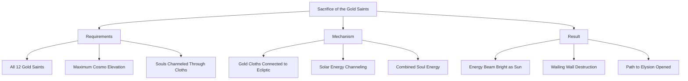

The technique exploits the unique property of Gold Cloths: their connection to the zodiacal constellations along the ecliptic enables them to channel solar energy even in the sunless Underworld. By combining their souls with this channeled energy, the twelve Gold Saints recreate "the brilliance of the Sun"[^42] in the heart of Hades' domain.

**The Gathering of the Twelve**

The Wailing Wall scene represents the first time all twelve Gold Saints unite since the Sanctuary's corruption began. The gathering includes:

- **The Loyalists**: Mu, Aldebaran, Aiolia, Milo—who never betrayed Athena
- **The Redeemed Corrupted**: Deathmask and Aphrodite—whose secret loyalty was finally revealed
- **The Tragic Antagonist**: Saga—whose good personality ultimately triumphed
- **The Philosophical Warriors**: Shaka and Dohko—whose wisdom guided the others
- **The Fallen Mentors**: Shura and Camus—who died teaching their students
- **The Legendary Sacrifice**: Aiolos—whose spirit finally joins his brothers
- **The New Gemini**: Kanon—who inherited his brother's Cloth and redemption

The scene explicitly emphasizes their unity: "All twelve Gold Saints eventually reunite before the Wailing Wall in the Hades arc, sacrificing their lives so that Athena may prevail over Hades"[^27].

**Thematic Significance: Transcending Death for Duty**

The Wailing Wall sacrifice embodies the series' central theme: **true devotion to Athena transcends death itself**. The Gold Saints who died during the Sanctuary arc—killed by Bronze Saints, by each other, or by their own hands—return to fulfill their ultimate duty. Those who served the false Pope unknowingly receive redemption through sacrifice. Those who served him knowingly reveal their hidden loyalty.

The sacrifice also demonstrates that **individual power matters less than collective purpose**. The Wailing Wall withstood individual attacks from the most powerful techniques available—even the Libra weapons, capable of "pulverizing a star with a single blow," left no scratch. Only the combined souls of all twelve Gold Saints, united in purpose and channeling solar energy through their ecliptic-connected Cloths, could generate sufficient power.

**The Final Destruction**

The Wall's destruction is documented with appropriate gravitas: "The wall remained intact since the mythological times and was finally destroyed during the Holy War in the Twentieth Century, when 12 Gold Saints gathered their cosmos and sacrificed themselves to recreate the brilliance of the Sun"[^42].

This destruction carries profound symbolic weight:

1. **Breaking the impossible**: What had stood since mythological times falls to mortal warriors
2. **Unity overcoming division**: The scattered, conflicted Gold Saints achieve together what none could alone
3. **Sacrifice enabling victory**: Their deaths open the path for Athena's triumph
4. **Redemption through service**: Even those who failed Athena in life serve her perfectly in death

The Gold Saints' collective sacrifice establishes the ultimate standard for Saint devotion. Their souls, channeled through Cloths connected to the heavens, recreate the sun's light in the deepest darkness—a metaphor for how loyalty to Athena can illuminate even the most corrupt circumstances.

Following the sacrifice, "his spirit and Cosmo disappeared, and all that was left of him was the [Gold] Cloth"[^37]—the pattern repeated for all twelve. Their physical existence ends, but their Cloths remain as testimonies to their sacrifice, ready to be inherited by future generations of Athena's warriors.

The Wailing Wall sacrifice represents the Gold Saints' finest hour—the moment when twelve warriors, despite their histories of conflict, corruption, and tragedy, united to give everything for their goddess. Their collective redemption demonstrates that the path to honor lies not in avoiding mistakes but in transcending them through ultimate sacrifice.

## 5 Marina Generals and the Scales of Poseidon

The Marina Generals represent Poseidon's elite warrior force—seven supreme combatants who guard the oceanic pillars sustaining the seven seas above the Underwater Sanctuary known as Atlantis. These warriors wear the **Scales (鱗衣, Sukeiru)**, a distinctive armor system that predates Athena's Cloths and established the prototype for divine warrior protection. The Poseidon arc serves as a critical narrative bridge between the Sanctuary and Hades storylines, presenting the Bronze Saints with challenges that forced them to consolidate their Seventh Sense mastery and demonstrate Gold Saint-equivalent combat capabilities. Understanding the Marina Generals requires examination of both their armor system's unique properties and the individual warriors who wore these legendary Scales into battle against Athena's champions.

The conflict between Poseidon and Athena represents one of the oldest divine rivalries in the Saint Seiya universe, with roots extending to the mythological Time of the Gods. This ancient enmity manifests through the Marina Generals' absolute devotion to their sea god, their formidable combat abilities, and their willingness to sacrifice everything to fulfill Poseidon's ambition of flooding the surface world. The arc's resolution—achieved through the Bronze Saints' systematic destruction of the seven Mammoth Pillars—demonstrates how mortal warriors empowered by righteous purpose can overcome forces serving divine ambition divorced from justice.

### 5.1 Origins and Material Composition of the Scales

The Scale armor system traces its origins to the **Time of the Gods**, when the fundamental conflicts between Olympian deities shaped the warrior traditions that would persist through millennia of Holy Wars. During this primordial era, **Athena and Poseidon clashed many times for hegemony over Attica**, establishing the pattern of divine rivalry that would define their relationship across countless incarnations[^43]. The Scales emerged from this conflict as instruments of divine warfare, specifically created when Poseidon began preparing for broader territorial expansion.

**The Catalyst for Scale Creation**

Following the mysterious **disappearance of Zeus "to a place beyond the sky,"** the balance of power among the Olympian gods shifted dramatically[^43]. Zeus had entrusted the land of Earth to his daughter Athena, but Poseidon viewed this arrangement as temporary—an opportunity to be exploited rather than a permanent settlement. Learning of Zeus's absence, **Poseidon started preparing for a broader invasion to wrest from Athena the land entrusted to her**[^43].

The Scales were created specifically **in anticipation of this war**, designed to equip Poseidon's gathered army with protection and power sufficient to overwhelm surface defenders[^43]. From the seven seas, Poseidon assembled his forces—powerful warriors who would later be known as Mariners—and equipped them with these revolutionary armors[^44].

**Battlefield Superiority and the Birth of Cloths**

The Scales' impact on the ancient battlefield proved devastating. Their **superiority on the battlefield was such that Athena was forced to order the creation of special armors for her own warriors**[^43]. This response—the creation of the Cloths—represents a direct countermeasure to Scale dominance:

| Timeline Event | Consequence |
|----------------|-------------|
| Zeus's disappearance | Poseidon begins invasion preparations |
| Scale creation | Mariners gain overwhelming battlefield advantage |
| Surface warrior defeats | Athena's forces unable to resist Scale-equipped warriors |
| Cloth commission | Athena orders creation of counterbalancing armor |
| First Holy War | Extended conflict between Scale and Cloth-equipped forces |

The series explicitly establishes this causal relationship: **"The Cloths were born to counteract the devastating powers of Poseidon's Scales"**[^43]. This origin story positions the Scales as the **prototype for divine warrior armor**, with Athena's Cloth system representing a reactive development rather than an independent innovation.

**Orichalcum: The Legendary Hypermetal**

The Scales derive their extraordinary properties from their primary material component: **Orichalcum (オリハルコン)**, described as **"a metal known in Antiquity as 'mountain copper'"**[^43]. Within the Saint Seiya universe, Orichalcum occupies a unique position in the metallurgical hierarchy—it is explicitly identified as **"the strongest metal on earth"** and classified as **"hypermetal"** in the Gigantomachia novels[^43].

The material's properties explain several distinctive Scale characteristics:

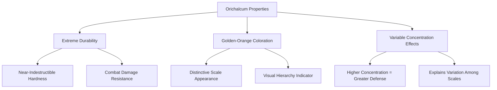

The **golden-orange hue** characteristic of Marina General Scales and Poseidon's own Scale **"most likely"** derives from Orichalcum's presence in their composition[^43]. This distinctive coloration serves as a visual marker distinguishing Poseidon's forces from other divine armies.

**Variable Orichalcum Concentration**

The series addresses an important question regarding Scale defensive capabilities: why do different Scales demonstrate varying levels of protection? The answer lies in **differential Orichalcum content**: "The difference in defensive abilities among the armors would seem to indicate that stronger Scales contain more Orichalcum"[^43].

This variable concentration creates an internal hierarchy among Scales:

| Scale Tier | Orichalcum Content | Defensive Capability |
|------------|-------------------|---------------------|
| Poseidon Scale | Highest | Superior to all General Scales |
| Sea Dragon Scale | Very High | Near Gold Cloth equivalence |
| Other General Scales | High | Gold Cloth equivalence |
| Lower-rank Scales | Moderate | Below General level |

Whether Orichalcum constitutes the **sole component or part of an alloy** remains uncertain[^43], but the correlation between Orichalcum concentration and defensive strength is consistently maintained throughout the series.

### 5.2 Scale Properties and Comparative Analysis with Cloths

The comparison between Poseidon's Scales and Athena's Cloths reveals fundamental differences in armor philosophy, material properties, and functional capabilities. While both armor systems derive protective power from Orichalcum, their divergent development paths produced distinct characteristics that reflect the contrasting natures of their divine patrons.

**Living Status and Regenerative Capabilities**

One of the most significant distinctions between Scales and Cloths concerns their **living status**. Athena's Cloths are explicitly described as living beings filled with Cosmos, capable of autonomous decisions, self-repair, and evolution. The Scales present a markedly different picture:

**"There is no information regarding the potential ability of the Scales to either heal or evolve and no indication that they may even be alive"**[^43].

This absence of living properties represents a fundamental philosophical difference:

| Property | Athena's Cloths | Poseidon's Scales |
|----------|-----------------|-------------------|
| **Living Status** | Confirmed living beings | No evidence of life |
| **Self-Healing** | Natural regeneration from minor damage | No healing capability confirmed |
| **Evolution** | Can evolve through blood infusion and Cosmo awakening | No evolution evidence |
| **Autonomous Action** | Can make independent decisions | No autonomous behavior documented |
| **Moral Discernment** | Can reject unworthy wearers | No rejection mechanism observed |

The Cloths' living nature—derived from Cosmos infused during creation—enables remarkable behaviors such as the Cancer Cloth abandoning Deathmask for being "too wicked to be a Saint." No comparable phenomenon has been documented for Scales, suggesting they function as exceptionally powerful but fundamentally inert protective equipment.

**Storage and Repair Mechanisms**

The storage methods for Scales and Cloths differ significantly. Cloths are preserved in **Pandora's Boxes**—special containers that maintain the armor's life force and facilitate natural regeneration. Scales, by contrast, **"appear devoid of Pandora boxes"** and **"were stored in object form in Poseidon's Temple"**[^43].

Despite lacking Pandora Boxes and living properties, Scales demonstrate remarkable durability and can be restored after damage:

**"They saw combat and suffered damage during Poseidon's defeats at the hands of the Saints, yet when Kanon discovered them in Poseidon's Temple, the Scales were in perfect condition, indicating they can be repaired"**[^43].

This repair capability suggests either:
1. Scales possess some form of passive regeneration not yet documented
2. Poseidon's forces include craftsmen capable of Scale restoration
3. Divine intervention restores damaged Scales between Holy Wars

The perfect condition of Scales discovered by Kanon—despite "suffering damage during Poseidon's defeats"—confirms that some restoration mechanism exists, even if its nature remains unexplained.

**Weapon Integration: Poseidon's Exception**

A striking difference between the two armor systems concerns **weapon integration**. Athena famously banned weapons among her Saints, requiring them to fight with their bodies and Cosmos alone. Poseidon imposed no such restriction:

**"Unlike Athena, it appears Poseidon did not place a ban on weapons and the Chrysaor Scale comes equipped with a lance"**[^43].

This philosophical divergence reflects the gods' contrasting approaches to warfare:

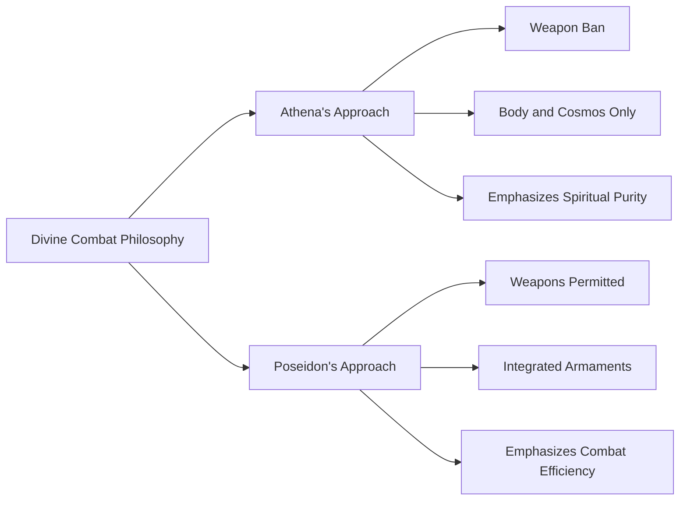

The Chrysaor Scale's equipped lance demonstrates this practical approach—Marina Generals may employ whatever tools maximize their combat effectiveness, unconstrained by spiritual prohibitions.

**Power Equivalence with Gold Cloths**

Combat evidence establishes that **Marina General Scales possess defensive properties equivalent to Gold Cloths**. This equivalence is demonstrated most clearly through Sea Horse Baian's battle against Pegasus Seiya:

**"Seiya's attacks break the Sea Horse General's barrier and hit him. Baian says that his Scale is invulnerable, but after a split second the armor fractures. Pegasus launches another Ryu Sei Ken and obliterates his enemy, destroying the Sea Horse Scale, whose hardness and endurance was said to be equal to that of a Gold Cloth"**[^45].

This explicit comparison—Scale hardness and endurance equaling Gold Cloth levels—establishes the Marina Generals as **Gold Saint-equivalent combatants**. The Bronze Saints' ability to defeat them demonstrates their growth to Gold Saint power levels, not any inherent weakness in Scale protection.

### 5.3 The Seven Pillars and Oceanic Domain Structure

The organizational structure of Poseidon's underwater domain centers on the **Underwater Sanctuary**, also known as **Atlantis**—a gigantic fortress-temple that serves as both the god's residence and the command center for his forces[^44]. This domain's defensive architecture incorporates seven **Mammoth Pillars** that sustain the seven seas above the Sanctuary, with each pillar assigned to a Marina General's protection.

**The Mammoth Pillar System**

The seven Mammoth Pillars represent both structural necessities and strategic objectives. Each pillar supports a portion of the ocean above Atlantis, and their destruction would cause catastrophic flooding of the Sanctuary itself. This defensive arrangement creates a distributed protection system:

| Pillar | Ocean Represented | Guardian General |
|--------|-------------------|------------------|
| North Pacific Pillar | North Pacific Ocean | Sea Horse Baian |
| South Pacific Pillar | South Pacific Ocean | Scylla Io |
| Indian Ocean Pillar | Indian Ocean | Chrysaor Krishna |
| Arctic Ocean Pillar | Arctic Ocean | Kraken Isaac |
| Antarctic Ocean Pillar | Antarctic Ocean | Lyumnades Caça |
| North Atlantic Pillar | North Atlantic Ocean | Siren Sorrento |
| South Atlantic Pillar | South Atlantic Ocean | Sea Dragon Kanon |

**Strategic Significance During the Poseidon Arc**

When the Bronze Saints entered the Poseidon-governed Submarine Sanctuary, **"they learned that the only way to save Athena was to destroy all the Mammoth Pillars holding up the seven seas"**[^45]. This objective transformed the arc into a systematic assault on Poseidon's defensive infrastructure, with each pillar battle serving as both combat challenge and strategic milestone.

The pillar destruction sequence forced the Bronze Saints to:
1. Defeat the Marina General guarding each pillar
2. Destroy the pillar itself (requiring Gold Saint-level power)
3. Progress to the next pillar before Athena's time limit expired

This structure created escalating tension as the Bronze Saints raced against time, with each General representing a potential endpoint to their mission. The successful destruction of all seven pillars—accomplished through the combined efforts of the five Bronze Saints—demonstrated their collective growth to power levels sufficient for challenging divine forces.

**Atlantis: The Fortress-Temple**

The broader context of the pillar system lies within Atlantis itself, described as **"a gigantic fortress-temple"** built **"right above the Atlantic Ocean"** during the ancient conflict[^44]. This structure served as **"the foothold of the invasion"** during Poseidon's first Holy War against Athena.

The fortress's legendary defenses earned it the nickname **"the Continental Temple"** due to its enormity, with historical accounts claiming **"even tens of thousands of soldiers wouldn't make a difference, if one were to attack it"**[^44]. The original Atlantis was sunk during the first Holy War when **"Athena sent eight Saints to the fortress-temple"** and **"at the end of an intense fight, Atlantis was sunk to the bottom of the ocean"**[^44].

The modern Submarine Sanctuary represents either a rebuilt or relocated version of this ancient fortress, maintaining the seven-pillar defensive structure that characterizes Poseidon's domain organization.

### 5.4 Sea Dragon Kanon: The Mastermind General

**Sea Dragon Kanon** stands as the most narratively significant Marina General—a character whose machinations orchestrated the entire Poseidon arc conflict and whose subsequent redemption arc parallels his twin brother Gemini Saga's journey from corruption to sacrifice. As the wearer of the **Sea Dragon Scale**, Kanon occupies the highest position among Marina Generals while harboring ambitions that extend far beyond serving Poseidon.

**Background and Manipulation of Julian Solo**

Kanon's history intertwines with the Sanctuary arc's central tragedy. As Gemini Saga's twin brother, he was **imprisoned by Saga at Cape Sounion** after attempting to convince his brother to kill Athena and seize power. During his imprisonment, Kanon discovered Poseidon's seal and the dormant Sea Dragon Scale, recognizing an opportunity for revenge and power.

His manipulation of **Julian Solo**—the human vessel chosen for Poseidon's reincarnation—represents the arc's true origin:

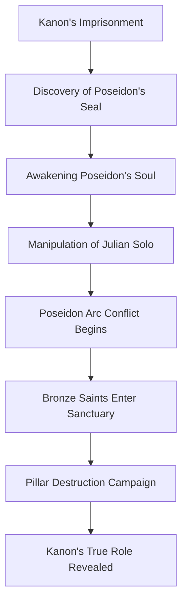

Kanon effectively used Poseidon as a weapon against Athena, manipulating the sea god's reawakening to serve his personal vendetta. This manipulation establishes him as the arc's true antagonist—Poseidon himself being more victim than villain, his divine will subverted by a mortal schemer.

**Combat Abilities and Techniques**

As a Marina General, Kanon possesses combat abilities **rivaling Gold Saints**—a power level inherited from his status as Saga's identical twin. His techniques mirror those of the Gemini Gold Saint:

| Technique | Description | Combat Application |
|-----------|-------------|-------------------|
| **Galaxian Explosion** | Concentrated wave of destructive Cosmo | Ultimate offensive technique |
| **Another Dimension** | Opens dimensional tear to trap opponents | Spatial manipulation attack |
| **Golden Triangle** | Creates dimensional prison | Defensive/offensive spatial technique |

His mastery of these techniques while wearing the Sea Dragon Scale demonstrates that **Gold Saint-level warriors can achieve full combat effectiveness regardless of armor type**—the Scale provides protection equivalent to a Gold Cloth while Kanon's personal Cosmo determines his offensive capabilities.

**Character Arc: From Villain to Redeemer**

Kanon's narrative trajectory represents one of the series' most complete redemption arcs. His journey progresses through distinct phases:

1. **Villain Phase**: Manipulates Poseidon, orchestrates conflict, serves as final obstacle
2. **Defeat Phase**: Confronted and defeated during Poseidon arc climax
3. **Reflection Phase**: Recognizes the error of his ambitions
4. **Redemption Phase**: Inherits Gemini Gold Cloth, fights for Athena in Hades arc
5. **Sacrifice Phase**: Participates in Wailing Wall destruction alongside other Gold Saints

The transition from Sea Dragon Scale to Gemini Gold Cloth symbolizes his transformation—abandoning the armor of manipulation for the armor of his brother's legacy. During the Hades arc, Kanon demonstrates that his redemption is genuine, fighting against Hades' forces with the same intensity he once directed against Athena.

**Significance as Power Benchmark**

Kanon's presence among the Marina Generals establishes the **upper limit of General-level power**. His Gold Saint-equivalent abilities confirm that the strongest Marina Generals operate at the same tier as Athena's elite guardians. This equivalence validates the Bronze Saints' achievements—defeating Marina Generals represents genuine Gold Saint-level victories, not triumphs over inferior opponents.

### 5.5 Siren Sorrento and Scylla Io: Musical Devastation and Multi-Beast Combat

Among the Marina Generals, **Siren Sorrento** and **Scylla Io** demonstrate the diverse combat philosophies possible within Poseidon's forces. Sorrento weaponizes music itself into devastating attacks, while Io's Scale grants access to six distinct beast-themed combat forms. Their contrasting styles illustrate the range of abilities available to Scale-equipped warriors.

**Siren Sorrento: The Musical Warrior**

**Siren Sorrento** guards the **North Atlantic Pillar** and wields one of the most unusual combat styles among all warriors in the Saint Seiya universe—his flute serves as both instrument and weapon, transforming melody into lethal force.

| Attribute | Detail |
|-----------|--------|
| **Scale** | Siren Scale |
| **Pillar** | North Atlantic Ocean |
| **Weapon** | Flute |
| **Combat Style** | Music-based attacks |

His signature technique, **Dead End Symphony**, weaponizes sound waves to devastating effect. The music penetrates opponents' defenses through auditory channels, bypassing conventional physical protection to attack directly. This approach proves particularly dangerous against opponents who rely on physical defense, as the attack vector circumvents armor entirely.

Sorrento's battle against **Taurus Aldebaran** during the Poseidon arc demonstrates both his power and his limitations. Aldebaran's decision to **destroy his own eardrums** to counter Sorrento's music-based attacks represents an extreme sacrifice—one that would later contribute to his death in the Hades arc when his deafness left him vulnerable to surprise attack.

**Recurring Significance Across Series**

Sorrento holds the distinction of being **the only Marina General to appear across multiple series continuities**. In **Saint Seiya Omega**, set after the Hades arc, Sorrento returns as a Marina General, indicating either his survival or resurrection. This recurring presence establishes him as the most enduring of Poseidon's warriors, his musical combat style apparently proving valuable enough to warrant continued service across eras[^44].

**Scylla Io: The Six-Beast Warrior**

**Scylla Io** guards the **South Pacific Pillar** with a combat style derived from Greek mythology's multi-headed sea monster. His **Scylla Scale** grants access to **six different beast-themed attack forms**, each representing one of Scylla's legendary heads:

| Beast Form | Attack Type | Combat Application |
|------------|-------------|-------------------|
| Wolf | Claw-based strikes | Close-range offense |
| Bat | Sonic attacks | Disorientation |
| Snake | Venomous strikes | Poison damage |
| Bear | Crushing force | Heavy offense |
| Bee | Stinging attacks | Rapid strikes |
| Eagle | Aerial assault | Mobility attacks |

This multi-form capability makes Io one of the most versatile Marina Generals, capable of adapting his combat style to counter various opponents. Each beast form provides distinct tactical advantages, enabling Io to switch approaches mid-battle based on enemy vulnerabilities.

His defeat by **Andromeda Shun** demonstrates the Bronze Saint's growth—Shun's Nebula Chain techniques proved capable of countering all six beast forms, establishing his power as sufficient to overcome even the most versatile Marina General.

### 5.6 Chrysaor Krishna and Kraken Isaac: The Lance Master and the Ice Warrior

**Chrysaor Krishna** and **Kraken Isaac** represent two distinct combat philosophies among Marina Generals—Krishna embodies Poseidon's weapon-permissive approach through his lance mastery, while Isaac's ice-based techniques create emotional resonance through his connection to Cygnus Hyoga.

**Chrysaor Krishna: The Lance-Wielding General**

**Chrysaor Krishna** guards the **Indian Ocean Pillar** and wields the **Chrysaor Scale**—the only Marina General Scale explicitly described as **"equipped with a lance"**[^43]. This integrated weapon represents Poseidon's philosophical divergence from Athena's weapon ban, demonstrating that Marina Generals may employ armaments to maximize combat effectiveness.

| Attribute | Detail |
|-----------|--------|
| **Scale** | Chrysaor Scale |
| **Pillar** | Indian Ocean |
| **Weapon** | Integrated lance |
| **Combat Style** | Spear-based techniques |

Krishna's lance techniques demonstrate exceptional skill, with his **Maha Roshini** attack channeling Cosmo through the weapon to devastating effect. His battle against **Dragon Shiryu** forced the Bronze Saint to employ the **Excalibur** technique inherited from Capricorn Shura—using the legendary cutting ability to perceive and sever Krishna's chakras while destroying both his lance and Scale.

The confrontation established an important power benchmark: Shiryu's Excalibur, a technique originally belonging to a Gold Saint, proved necessary to overcome Krishna's defenses. This requirement confirms that Marina General Scales provide Gold Cloth-equivalent protection, necessitating Gold Saint-level techniques for penetration.

**Kraken Isaac: The Tragic Ice Warrior**

**Kraken Isaac** guards the **Arctic Ocean Pillar** with ice-based techniques that mirror those of Athena's ice Saints. His significance extends beyond combat capability—he was **Cygnus Hyoga's former training partner** in Siberia, creating emotional stakes that transform their confrontation into a battle between former brothers-in-arms.

| Attribute | Detail |
|-----------|--------|
| **Scale** | Kraken Scale |
| **Pillar** | Arctic Ocean |
| **Combat Style** | Ice manipulation |
| **Connection** | Former training partner of Hyoga |

Isaac's backstory reveals tragic circumstances: during training, he **sacrificed himself to save Hyoga from drowning**, losing an eye in the process. Rather than dying, he was found by Poseidon's forces and recruited as a Marina General. His survival, unknown to Hyoga, created the dramatic revelation that transformed their pillar battle into a confrontation laden with guilt, obligation, and competing loyalties.

**The Battle Beyond Absolute Zero**

Isaac's ice techniques rival those of Aquarius Camus, the Gold Saint who trained both him and Hyoga. Their confrontation forced Hyoga to **surpass absolute zero temperatures**—producing cold **"lower than Absolute Zero"** to overcome his former comrade[^44].

This achievement represents a crucial power milestone:

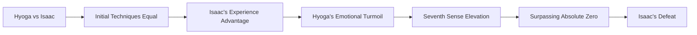

The necessity of exceeding absolute zero—the theoretical temperature at which all atomic motion ceases—confirms that Marina Generals possess Gold Saint-equivalent power. Hyoga's victory required transcending the same limitation he overcame against Aquarius Camus, demonstrating that his Sanctuary arc growth remained applicable against Poseidon's elite forces.

### 5.7 Lyumnades Caça and Sea Horse Baian: Illusion and Wind Mastery

The remaining Marina Generals—**Lyumnades Caça** and **Sea Horse Baian**—demonstrate specialized combat approaches that exploit psychological vulnerabilities and environmental manipulation respectively. Their defeats illustrate how the Bronze Saints' accumulated experience proved decisive against opponents who might otherwise have overwhelmed them.

**Lyumnades Caça: Master of Shapeshifting Illusions**

**Lyumnades Caça** guards the **Antarctic Ocean Pillar** with techniques centered on **shapeshifting and psychological manipulation**. His ability to assume the appearance of others—particularly deceased loved ones—exploits opponents' emotional vulnerabilities to create openings for attack.

| Attribute | Detail |
|-----------|--------|
| **Scale** | Lyumnades Scale |
| **Pillar** | Antarctic Ocean |
| **Combat Style** | Illusion and shapeshifting |
| **Psychological Approach** | Exploits emotional connections |

Caça's techniques prove particularly insidious against warriors with strong emotional bonds. By assuming the forms of fallen comrades or beloved family members, he creates hesitation that transforms into fatal vulnerability. This approach represents a fundamentally different combat philosophy from direct power confrontation—Caça wins by undermining opponents' will to fight rather than overpowering their defenses.

His defeat required opponents capable of seeing through illusions and maintaining combat focus despite emotional manipulation. The Bronze Saints' accumulated experience with deception—from the Sanctuary arc's revelations about the false Pope to various Silver Saint tricks—prepared them to recognize and counter Caça's psychological warfare.

**Sea Horse Baian: The Wind Master and First General Encountered**

**Sea Horse Baian** holds particular narrative significance as **"the first Marina General that the Saints of Athena battled"**[^45]. Guarding the **North Pacific Ocean's Mammoth Pillar**, he established the benchmark for Marina General combat capabilities that would define the entire arc.

| Attribute | Detail |
|-----------|--------|
| **Scale** | Sea Horse Scale |
| **Pillar** | North Pacific Ocean |
| **Origin** | Canada |
| **Age** | 18 |
| **Combat Style** | Wind-based techniques |

Baian's techniques center on **air manipulation**:

| Technique | Description | Effect |
|-----------|-------------|--------|
| **God Breath** | Gale generated from mouth | Immensely powerful wind attack |
| **Rising Billows** | Powerful rising tidal wave | Launches enemy from sea depths to surface |

His combat style notably **parallels Silver Saint Lizard Misty's abilities**—both warriors create defensive barriers through air current manipulation. This similarity proved decisive in Baian's defeat:

**"Remembering his battle with Misty, and benefitting from the experience he gained in it, Seiya was able to overcome Baian's air barrier in the same way he did with Misty's and disabled it with his Pegasus Ryu Sei Ken"**[^45].

**The Rewards of Prior Experience**

The connection between Baian and Misty illustrates a crucial narrative principle: **combat experience accumulates into tactical advantage**. Seiya's prior victory over Misty—achieved through discovering the air barrier's weakness—provided the knowledge necessary to overcome Baian's similar technique.

The key difference lay in environmental conditions: **"Because the pressure of the sea water was higher in Poseidon's Temple, Baian's barrier was somewhat more visible than Misty's, and this allowed Seiya to discover Baian's secret"**[^45]. The underwater environment that should have favored the Marina General actually revealed his technique's vulnerability.

**Scale Destruction and Power Confirmation**

Baian's defeat confirmed the Bronze Saints' growth to Gold Saint levels:

**"Seiya's attacks break the Sea Horse General's barrier and hit him. Baian says that his Scale is invulnerable, but after a split second the armor fractures. Pegasus launches another Ryu Sei Ken and obliterates his enemy, destroying the Sea Horse Scale, whose hardness and endurance was said to be equal to that of a Gold Cloth"**[^45].

This explicit statement—that the Sea Horse Scale possessed **"hardness and endurance equal to that of a Gold Cloth"**—establishes the definitive power comparison between Marina Generals and Gold Saints. Seiya's ability to destroy such armor confirms his Seventh Sense mastery and validates the growth achieved during the Sanctuary arc.

**The Sea Horse Scale's Mythological Significance**

The **Sea Horse Scale** itself carries mythological weight, representing **"the Hippocampi, mythological beings that Poseidon, Emperor of the Seas, used to pull his chariot"**[^45]. This connection to Poseidon's personal transportation establishes the Sea Horse as a creature of particular significance to the sea god, making Baian's guardianship of the first pillar encountered appropriately symbolic.

### 5.8 The Poseidon Scale and Divine Armor Hierarchy

At the apex of Poseidon's armor hierarchy stands the **Poseidon Scale**—the personal armor of the sea god himself, worn by his human avatar **Julian Solo** during the series' events. This Scale demonstrates properties that exceed all Marina General armors, establishing a clear distinction between divine and mortal-tier equipment within Poseidon's forces.

**The Poseidon Scale's Superior Properties**

The Poseidon Scale's characteristics reflect its status as a god's personal armor:

**"The Scale is a golden orange, a likely indicator of the presence of Orichalcum. Its design is rather sober, more martial than ceremonial, with coverage similar to that of a Sea General Scale. Its resistance though was far superior"**[^46].

| Property | Poseidon Scale | General Scales |
|----------|----------------|----------------|
| **Color** | Golden orange | Golden orange |
| **Design** | Martial, practical | Varied by mythological theme |
| **Coverage** | Similar to General Scales | Full body protection |
| **Resistance** | Far superior | Gold Cloth equivalent |

The "far superior" resistance distinguishes Poseidon's armor from his generals' equipment. While Marina General Scales provide Gold Cloth-equivalent protection, the Poseidon Scale exceeds even this benchmark.

**The Sagittarius Arrow Penetration**

The extraordinary force required to breach the Poseidon Scale demonstrates its defensive supremacy:

**"It took the arrow of the Sagittarius Gold Cloth imbued with the cosmos of four Bronze Saints to pierce its headpiece. Apart from that it came out of the final confrontation with little more than a few tears in the cape"**[^46].

This penetration requirement establishes a precise power threshold:

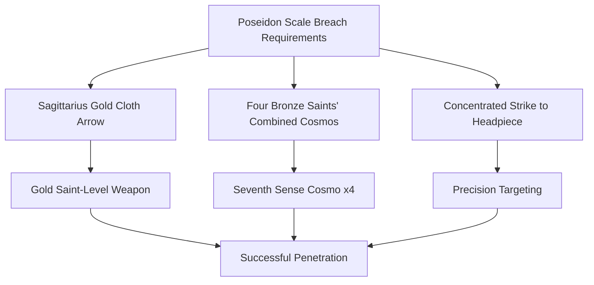

The combination required—a Gold Cloth's weapon enhanced by four Seventh Sense-awakened Saints' combined Cosmos—exceeds what any single Gold Saint could achieve. This threshold confirms the Poseidon Scale's position above Gold Cloth defensive levels.

**Avatar System and Scale Storage**

The Poseidon Scale's usage reflects the series' avatar system for divine incarnation:

**"The Sea God possesses his own Scale, the Poseidon Scale, which was worn by Julian Solo, his avatar in the Classic series, and Seraphina, the receptacle of his power in the Lost Canvas"**[^46].

The Scale's storage between incarnations follows established patterns: **"In the current era, the armor was stored in Poseidon's submarine Temple in the Mediterranean"**[^46]. This storage location—within Poseidon's personal temple rather than among the General Scales—reflects its elevated status.

**Contextualizing Marina Armor Within Divine Hierarchy**

The Scale system establishes a clear hierarchy within Poseidon's forces:

| Tier | Armor Type | Defensive Level | Wearers |
|------|------------|-----------------|---------|
| **Divine** | Poseidon Scale | Above Gold Cloth | Poseidon's avatar only |
| **General** | Marina General Scales | Gold Cloth equivalent | Seven Marina Generals |
| **Standard** | Lower-rank Scales | Below General level | Rankless Mariners |

This hierarchy parallels Athena's system (God Cloth > Gold Cloth > Silver Cloth > Bronze Cloth) while reflecting Poseidon's distinct organizational structure. The Marina Generals occupy positions analogous to Gold Saints, while Poseidon's personal Scale represents divine-tier equipment comparable to God Cloths or Kamui.

**The Mermaid Scale and Non-Combat Roles**

Beyond the seven General Scales and Poseidon's personal armor, the series documents additional Scale types serving non-combat functions. The **Mermaid Scale**, worn by **Mermaid Thetis**, represents a Scale assigned to a warrior outside the General hierarchy[^43][^44].

Thetis's role as Poseidon's attendant rather than pillar guardian demonstrates that the Scale system encompasses support positions as well as combat roles. Her defeat by **Ophiuchus Shaina** during the Poseidon arc confirms that non-General Scales provide protection below the Gold Cloth-equivalent level of General equipment.

**Implications for the Broader Divine Armor System**

The Poseidon Scale's properties establish important precedents for understanding divine armor across factions:

1. **Gods possess personal armors exceeding their generals' equipment**: Poseidon's Scale surpasses Marina General Scales just as Athena's Cloth exceeds Gold Cloths
2. **Divine armor requires combined mortal efforts to breach**: The Sagittarius arrow requirement parallels the Bronze Saints' need for combined Cosmos against divine-tier opponents
3. **Armor hierarchy reflects organizational structure**: The Scale system's tiers mirror the command hierarchy of Poseidon's forces

These principles apply across the Saint Seiya universe's divine factions, establishing consistent rules for how armor systems reflect and reinforce power hierarchies within each god's army.

The Marina Generals and their Scale armor system represent a crucial chapter in the Saint Seiya power hierarchy—warriors whose Gold Saint-equivalent abilities forced the Bronze Saints to demonstrate their Seventh Sense mastery in sustained combat. Their systematic defeat across the seven pillars validated the protagonists' growth while establishing the pattern of divine armies that would continue through the Hades arc. The Scales themselves, as the prototype for divine warrior armor, occupy a unique historical position—the original response to divine conflict that prompted Athena's creation of the Cloth system that would define her forces across millennia of Holy Wars.

## 6 God Warriors and the Divine Robes of Asgard

The Asgard arc represents a unique narrative expansion within the Saint Seiya anime—an **anime-exclusive storyline** positioned between the Sanctuary and Poseidon arcs that introduced an entirely new warrior faction devoted to the Norse god Odin. The seven God Warriors who defend the northern lands of Asgard wear the **God Robes (ゴッドローブ)**, ancient armors linked to the seven stars of the Big Dipper constellation within Ursa Major. Unlike the conflicts against Sanctuary's corruption or Poseidon's ambition, the Asgard arc presents a **morally complex confrontation** where both sides fight for noble ideals—Athena's Saints seeking to save their goddess while Odin's God Warriors defend their homeland and priestess with equal devotion.

The arc's central tragedy stems from manipulation rather than malevolence. **Polaris Hilda**, the High Priestess of Odin, falls under the control of the **Nibelungen Ring**—a cursed artifact through which Poseidon corrupts her will and drives Asgard's forces against Athena's Sanctuary. The God Warriors who serve Hilda do so out of genuine loyalty, unaware that their priestess has been transformed from a benevolent ruler into an instrument of divine conspiracy. This framework transforms each battle between Bronze Saints and God Warriors into a **clash of righteous purposes**, with warriors on both sides fighting for causes they believe just, their conflict arising not from opposing moralities but from external manipulation that set noble defenders against one another.

The God Warriors themselves represent some of the most **fully realized antagonist characters** in the franchise, each possessing detailed backstories, complex motivations, and tragic circumstances that humanize them beyond simple villainy. Their power levels rival Gold Saints, their techniques draw from Norse mythology's rich traditions, and their fates carry emotional weight that distinguishes the Asgard arc as a narrative achievement worthy of detailed examination.

### 6.1 Origins and Awakening of the God Robes

The God Robes occupy a mysterious position within the Saint Seiya armor hierarchy—ancient armors whose origins remain largely undocumented yet whose power rivals the most sacred protections available to mortal warriors. These legendary armors **"slept hidden for thousands of years prior to the events of the Asgard arc"**, awaiting the circumstances that would call them forth to defend Odin's sacred land[^47].

**Ancient History and the Siegfried Paradox**

The historical context surrounding God Robe creation presents an intriguing puzzle. The series explicitly notes that **"the Siegfried of legends, ancestor of the current God Warrior, did not wear a God Robe when he defeated the dragon Fafnir during the Age of Myth"**[^47]. This observation suggests that the God Robes were **crafted sometime after Fafnir's defeat**, potentially during what the series terms "the Age of Men." The identity of their creators remains unknown, adding to the mystique surrounding these powerful armors.

This timeline creates an interesting parallel with Athena's Cloth system—both armor types appear to have been created in response to specific historical circumstances rather than existing since primordial times. While the Cloths were born to counteract Poseidon's Scales, the God Robes may have been created to formalize Asgard's defense after the legendary heroes of myth had passed.

**The Awakening Through Polaris**

The mechanism by which the God Robes returned to active service demonstrates the **unique relationship between Asgard's spiritual hierarchy and its warrior tradition**. Hilda, serving as High Priestess of Odin, **"awakened the God Robes through the power of Polaris, the North Star"**[^47]. This awakening occurred after Poseidon placed the Nibelungen Ring upon her, transforming her benevolent rule into aggressive expansion against Athena's domain.

The awakening process reveals that the Robes possess a form of **autonomous selection capability**:

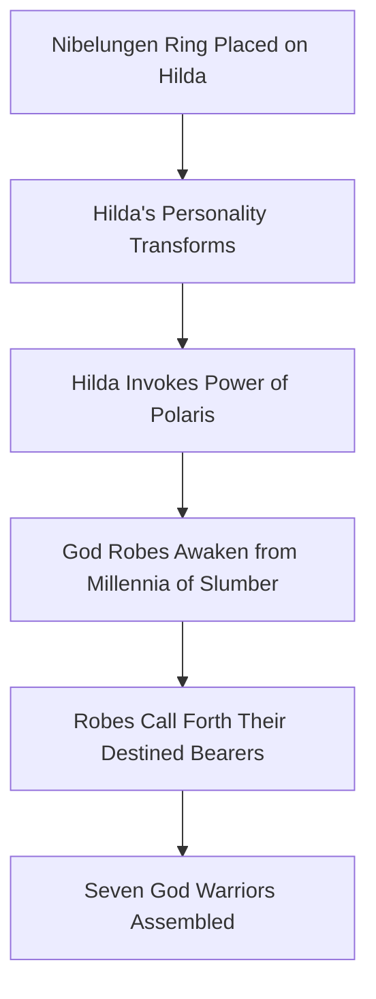

The series describes this selection as the Robes themselves calling forth their bearers, **"with Hilda doing little more than acknowledging the bound between armor and warrior"**[^47]. This autonomous behavior suggests the God Robes possess some form of awareness or predetermined destiny system, though they lack the confirmed living status of Athena's Cloths.

**The Warrior-Robe Correspondence Mystery**

One of the most intriguing aspects of the God Warrior system involves the **correlation between each warrior's personal history and their assigned Robe's mythological symbolism**. The series acknowledges this connection as "intriguing to say the least" while noting the impossibility of determining causation[^47].

| God Warrior | Robe Symbolism | Personal History Connection |
|-------------|----------------|----------------------------|
| Fenrir | Wolf | Raised by wolves after parental abandonment |
| Mime | Harp/Lyra | Found solace in music as a traumatized child |
| Siegfried | Fafnir (Dragon) | Descendant of the dragon-slayer |
| Hagen | Sleipnir (Horse) | Childhood friend of Siegfried |

Two interpretations exist: either **"the life they lead caused the pairing"**—with Fenrir receiving the Epsilon Robe because he had been raised by wolves—or **"they had been destined by birth for a particular Robe which in return influenced their life"**[^47]. This ambiguity adds philosophical depth to the God Warrior concept, suggesting either fate or circumstance shapes the warrior-armor bond.

### 6.2 God Robe Properties and Power Classification

The God Robes demonstrate remarkable protective capabilities that position them among the elite armor classes in the Saint Seiya universe. Their properties establish them as **comparable to Gold Cloths in defensive strength** while possessing distinct characteristics that differentiate them from Athena's armor system.

**Coverage and Design Characteristics**

From a structural perspective, the God Robes **"exhibit a great variety of details and colors, but are fairly similar in terms of overall components and provide coverage just below that of a Gold Cloth"**[^47]. This coverage level places them above Silver Cloths in the protective hierarchy while maintaining the distinctive aesthetic variety that characterizes Asgardian warrior tradition.

The design philosophy differs markedly from Athena's constellation-based system. Rather than representing celestial patterns, the God Robes draw inspiration from **Norse mythology's legendary creatures and figures**, creating armors that embody the cultural heritage of Asgard rather than universal astronomical phenomena.

**Defensive Capabilities Against Seventh Sense Attacks**

The most significant evidence of God Robe power comes from their performance against Saints who had awakened their Seventh Sense:

**"The fact that they withstood the attacks of the Saints, who were all in possession of the seventh sense, without major damage would indicate a resistance far superior to that of a Silver Cloth"**[^47].

This observation establishes a crucial benchmark—God Robes can endure attacks from warriors capable of light-speed movement and star-level destructive power. Such durability confirms their position in the **Gold Cloth-equivalent tier** of armor classification.

However, the defensive assessment includes an important caveat: **"Seiya was however able to punch through Siegfried's chest protection so the God Robes may still be inferior to the Gold Cloths"**[^47]. This penetration, achieved during the arc's climactic battle, suggests that while God Robes approach Gold Cloth defensive levels, they may not fully match the zodiacal armors' ultimate protection.

| Armor Tier | Defensive Benchmark | God Robe Comparison |
|------------|---------------------|---------------------|
| Bronze Cloth | Withstands basic Cosmo attacks | Superior |
| Silver Cloth | Resists enhanced techniques | Superior |
| Gold Cloth | Endures Seventh Sense attacks | Comparable but potentially inferior |
| God Cloth | Near-divine protection | Inferior |

**Absence of Special Properties**

Unlike Athena's Cloths, the God Robes **"do not appear to have any particular properties, beyond the acid stored in the gauntlets of Alberich's Delta Robe"**[^47]. This single exception—Alberich's acid-dispensing gauntlets—represents the only documented special capability among the seven standard God Robes.

The series further notes critical absences:

- **No confirmed living status**: "There is no indication of what materials may have been used in their construction, or if they can, just like the Cloths, heal themselves"[^47]
- **No Pandora Boxes**: The Robes "seem to be devoid of Pandora Boxes and were stored in object form at various locations throughout Asgard"[^47]
- **No self-repair confirmation**: Unlike Cloths that regenerate from minor damage, God Robes show no documented healing capability

**Power Equivalence Assessment**

The God Warriors' combat performance confirms their **Gold Saint-equivalent power levels**. The series establishes that God Warriors are **"exceptionally strong, possessing a standard level of strength comparable to a Gold Saint"** with the additional note that **"their powers can be pushed even beyond"**[^48].

This power assessment carries an important qualifier regarding its source:

**"Their impressive Cosmo doesn't seem to be attained with training; instead, they seem to have been simple warriors of Asgard or criminals awakened as supernatural fighters by Polaris Hilda and by the power of their armors, the God Robes"**[^48].

This observation suggests the God Robes themselves may **enhance their wearers' Cosmo** to Gold Saint levels, rather than the warriors having achieved such power through traditional training methods. The Odin Sapphires embedded in each Robe, containing **"the power of the 7 stars of the Ursa Major constellation, related to the power of Odin himself"**[^48], may serve as the mechanism for this enhancement.

### 6.3 Norse Mythology Design Influences

The God Robes distinguish themselves through their **deep integration of Norse mythological imagery**, transforming each armor into a visual representation of legendary creatures, heroes, and divine servants from the northern traditions. This design philosophy creates armors that embody Asgard's cultural heritage while providing thematic resonance with each warrior's combat style and personal narrative.

**Creature-Based Designs: The Mythological Menagerie**

Four of the seven God Robes draw direct inspiration from creatures central to Norse mythology:

| God Warrior | Robe Design | Mythological Source | Significance |
|-------------|-------------|---------------------|--------------|
| **Siegfried** | Fafnir | The dragon slain by the legendary Siegfried | Connects to warrior's ancestral legacy |
| **Hagen** | Sleipnir | Odin's eight-legged horse | Reflects service to the All-Father |
| **Thor** | Jormungand | The World Serpent, enemy of Thor | Ironic pairing with thunder god's namesake |
| **Fenrir** | Fenrir Wolf | The monstrous wolf bound by the gods | Direct naming correspondence |

**Siegfried's Fafnir Design** carries particular narrative weight. The current Siegfried is explicitly identified as **"the descendent of the legendary hero Siegfried, who defeated the dragon Fafnir"**[^49]. His God Robe's dragon motif thus represents both **ancestral achievement and inherited destiny**, visually marking him as the heir to Asgard's greatest heroic tradition.

**Thor's Jormungand Design** presents an interesting irony—the warrior named after the thunder god wears armor representing **Thor's prophesied killer** from Ragnarok mythology. This design choice may reflect the Asgard arc's themes of tragic fate and noble warriors fighting against circumstances beyond their control.

**Non-Mythological Adaptations**

Not all God Robes draw from traditional Norse sources. **Syd's Robe** features a **saber-tooth tiger (Smilodon)**, a creature that **"does not appear in Northern myths but the fact that the creatures lived during the last ice age may have been enough to link it to the frozen wastelands of the North"**[^47]. This design demonstrates creative adaptation, connecting prehistoric ice age fauna to Asgard's frozen environment.

**Alberich's Robe** draws from a different cultural source entirely—the series suggests it **"may have been inspired by Wagner's opera *Der Ring des Nibelungen*, in which Alberich, king of the Dwarves is the guardian of the Nibelungen's treasure"**[^47]. The Robe's object form, described as **"a demon surrounded by crystal-like gems"**[^47], reflects this operatic connection while tying into the arc's central Nibelungen Ring plot device.

**Mime's Lyra Connection**

**Mime's Robe** presents the most direct cross-franchise design reference: **"Mimé's Robe is a somewhat asymmetrical variation of Lyra Orpheus' Cloth in the first Saint Seiya movie"**[^47]. This connection extends beyond visual similarity—both warriors employ **harp-based combat techniques**, creating a thematic parallel between Athena's legendary Silver Saint and Odin's traumatized musician warrior.

The shared design philosophy suggests either:
1. A common origin for harp-wielding warrior traditions across divine factions
2. Deliberate homage by the anime creators to previously established character designs
3. Universal association between the lyre/harp and certain combat styles in the Saint Seiya universe

**Constellation Naming System**

The God Warriors follow a systematic naming convention linking each warrior to their corresponding **Big Dipper star**:

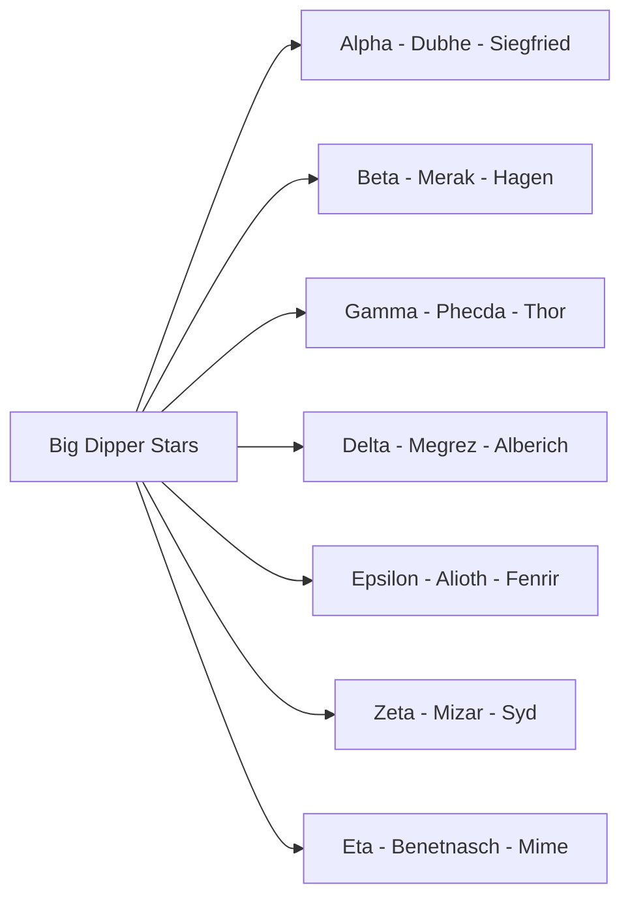

This stellar association connects the God Warriors to **"the power of the 7 stars of the Ursa Major constellation, related to the power of Odin himself"**[^48]. The Big Dipper's prominence in northern hemisphere skies makes it an appropriate celestial anchor for Asgard's warrior tradition, mirroring how Athena's Gold Saints correspond to zodiacal constellations.

### 6.4 The Odin Sapphire System and Balmung Sword

Central to the Asgard arc's narrative structure is the **Odin Sapphire (オーディーンサファイア)** system—seven blue gems embedded within the God Robes that serve as keys to unlocking Odin's ultimate armor and legendary weapon. The collection of these Sapphires drives the arc's plot progression, with each God Warrior's defeat releasing a gem necessary for the Bronze Saints' ultimate objective.

**Sapphire Placement and Function**

Each of the seven God Robes **"are adorned with one of these blue gems"**[^50]. The placement follows a consistent pattern: **"Except for the Mizar Zeta Robe, all Odin Sapphires are located in the 'buckle' of the God Robes"**[^50]. This standardized positioning creates visual unity among the God Warriors while marking the Mizar Robe as distinct—an appropriate differentiation given the Syd/Bud twin dynamic.

The Sapphires' function extends beyond mere decoration:

| Function | Mechanism | Significance |
|----------|-----------|--------------|
| **Odin Robe Summoning** | All seven placed on Odin's statue crown | Unlocks divine armor and Balmung |
| **Power Connection** | Contains Ursa Major stellar energy | Links warriors to Odin's power |
| **Release Mechanism** | Freed upon bearer's death or voluntary removal | Enables Sapphire collection |

**The Summoning Requirement**

The ultimate purpose of the Odin Sapphires involves summoning Odin's personal armor:

**"All seven Odin Sapphires must be set in place on the crown of Odin's monumental statue in the Valhalla Palace in order to bring forth the Odin Robe and the legendary sword it contains: Balmung (バルムング)"**[^50].

This requirement transforms the Asgard arc into a **collection quest**—the Bronze Saints must defeat all seven God Warriors to gather the Sapphires necessary for freeing Hilda from the Nibelungen Ring's control. The structure parallels the Poseidon arc's pillar destruction objective, creating systematic progression through increasingly powerful opponents.

**Sapphire Release Mechanisms**

The series documents two methods for releasing Odin Sapphires from their God Robes:

1. **Death Release**: **"The death of a God Warrior automatically frees the Odin Sapphire from their God Robe"**[^50]
2. **Voluntary Removal**: **"Siegfried showed that it can also be voluntarily removed when he gave his to Seiya before facing Sorrento"**[^50]

Siegfried's voluntary transfer represents a pivotal narrative moment—the strongest God Warrior, having learned of Hilda's manipulation, chooses to aid Athena's champions rather than continue fighting for a corrupted cause. This act symbolizes his recognition that true loyalty to Asgard requires opposing Poseidon's scheme rather than defending it.

**The Sapphire Power Clarification**

A crucial clarification regarding Odin Sapphire function dispels potential misconceptions:

**"The gems do not confer any special power to either the Robes or the Warriors, as demonstrated by the wearer of the Alcor Zeta Robe, who was able to perform at the same level as the official God Warriors without one"**[^50].

Alcor Zeta Bud's equal combat performance **without an Odin Sapphire** confirms that the gems serve primarily as **keys for the Odin Robe summoning** rather than power sources for individual God Warriors. This clarification maintains consistency with the series' emphasis on Cosmo as the true source of warrior strength rather than equipment-based enhancement.

**Balmung: The Legendary Sword**

The **Balmung sword** contained within the Odin Robe represents the ultimate weapon of Asgardian tradition. Named after the legendary sword from Norse mythology (also known as Gram or Nothung in various traditions), Balmung serves as the instrument capable of destroying the Nibelungen Ring and freeing Hilda from Poseidon's control.

The sword's significance extends beyond combat utility—it represents **Odin's blessing upon whoever proves worthy** to don his armor and wield his weapon. Seiya's temporary use of both Odin Robe and Balmung during the arc's climax demonstrates that Athena's champion can receive Odin's power when fighting to restore justice to Asgard.

### 6.5 Dubhe Alpha Siegfried: The Dragon Slayer's Descendant

**Dubhe Alpha Siegfried (アルファ星ドゥベのジークフリート)** stands as the **most powerful of the seven God Warriors** and the final opponent the Bronze Saints face before confronting Hilda directly. His character embodies the tragic hero archetype—a noble warrior of unmatched strength whose devotion to his corrupted priestess leads him into conflict with those who could save her[^49][^51].

**Legendary Heritage and Character Profile**

Siegfried's significance derives from his **direct lineage to Asgard's greatest hero**:

| Attribute | Detail |
|-----------|--------|
| **Age** | 20 |
| **Origin** | Asgard |
| **Height** | 195cm |
| **Weight** | 85kg |
| **Family** | Older brother Grani Sigmund |
| **Love Interest** | Polaris Hilda |
| **Status** | Deceased |

**"Siegfried is said to be the descendent of the legendary hero Siegfried, who defeated the dragon Fafnir but fell victim to a cursed ring, leading to his death"**[^49]. This ancestral connection to both dragon-slaying heroism and ring-curse tragedy foreshadows his own fate—a warrior who fights against those trying to break another cursed ring's hold over his beloved.

**The Hidden Love for Hilda**

Siegfried's motivation transcends mere duty to Asgard: **"Siegfried met Hilda long before becoming a God Warrior and secretly loved her, vowing to protect her"**[^49]. This unrequited devotion shapes his entire character arc—he notices that **"Hilda had become more aggressive but remained loyal to her"**[^49], choosing to serve the changed priestess rather than question her transformation.

His friendship with **Merak Beta Hagen** adds dimension to his character: **"When the time for the return of the God Warriors came, Siegfried and his best friend Merak Beta Hägen were chosen"**[^49]. This bond with Hagen establishes Siegfried as a figure of personal connections rather than isolated strength.

**Combat Supremacy and Techniques**

As the Alpha God Warrior, Siegfried demonstrates combat capabilities that **overwhelm multiple Bronze Saints simultaneously**:

| Technique | Japanese | Description |
|-----------|----------|-------------|
| **Odin Sword** | オーディーン・ソード | "Fires a laser at his opponent's feet and shoots them upwards"[^49] |
| **Dragon Bravest Blizzard** | ドラゴン・ブレーヴェスト・ブリザード | "Most powerful attack which fires a cold blast in the form of a two-headed dragon"[^49] |

The **Dragon Bravest Blizzard** carries a critical weakness: it **"forces him to expose his chest for a millionth of a second"**[^49]. This momentary vulnerability connects to his legendary ancestor's fatal flaw—the spot on his back where a leaf landed during his dragon blood bath.

**The Battle Against Five Bronze Saints**

Siegfried's combat record demonstrates his overwhelming power:

**"After the six other God Warriors were defeated, Siegfried was the last opponent for Seiya... Siegfried deflected Seiya's Pegasus Meteor Punch and knocked him out with his Odin Sword. He subsequently defeated Phoenix Ikki, Andromeda Shun, and Cygnus Hyoga"**[^49].

This systematic defeat of four Bronze Saints—each of whom had achieved Seventh Sense awakening—confirms Siegfried's position among the **most powerful opponents** the protagonists face throughout the series.

**The Vulnerability and Dragon Shiryu's Intervention**

Dragon Shiryu's arrival introduces the knowledge necessary to challenge Siegfried:

**"Shiryu realized the only way to defeat Siegfried was to use the Proud Dragon Lord, but was warned it would kill both of them. Shiryu instead used Rising Dragon Lord on Siegfried's heart, exploiting a vulnerability left by a leaf that landed on his back when he bathed in Fafnir's blood"**[^49].

This vulnerability—inherited from his ancestor's legendary bath in dragon blood—represents the **single point where Siegfried can be harmed**. Shiryu's discovery and exploitation of this weakness demonstrates how knowledge and strategy can overcome seemingly invincible power.

**Tragic Confrontation with Sorrento**

The arc's most emotionally resonant moment occurs when Siegfried learns the truth:

**"Siegfried then faced Siren Sorrento, who confirmed Hilda was under the control of the Nibelungen Ring. In a rage, Siegfried tried to kill them both by ascending into the sky but was terrified by an illusion from Sorrento and left to die"**[^49].

Sorrento's revelation transforms Siegfried's entire understanding—the priestess he loved and served had been manipulated by Poseidon, making his battles against the Bronze Saints tragically misguided. His final act, giving his Odin Sapphire to Seiya, acknowledges that Athena's champions represent Asgard's true salvation.

### 6.6 Merak Beta Hagen: Master of Ice and Fire

**Merak Beta Hagen** possesses one of the most **unique combat capabilities** among all warriors in the Saint Seiya universe—the ability to wield both ice and fire with equal mastery. This dual-element fighting style, combined with his emotional complexity as Freya's childhood friend and Siegfried's closest companion, creates a character defined by passionate intensity beneath a warrior's discipline[^52].

**Dual-Element Combat System**

Hagen's techniques demonstrate complete mastery over opposing elemental forces:

**Ice Techniques - Universe Freezing (ユニバース・フリージング)**:

| Variation | Effect |
|-----------|--------|
| **Variation 1** | "A large mass of cold air that freezes the opponent quickly"[^52] |
| **Variation 2** | "A blizzard directed towards the opponent, freezing them where they stand, with the cold flash coming down to near absolute zero"[^52] |
| **Variation 3** | "Rays of ice capable of freezing fire, and if the opponent is frozen, it is impossible to break the ice"[^52] |

**Fire Techniques - Great Ardent Pressure (グレート・アーデント・プレッシャー)**:

| Variation | Effect |
|-----------|--------|
| **Variation 1** | "The power of flames which, coupled with extreme heat, quickly overwhelms the opponent and can defrost anything"[^52] |
| **Variation 2** | "Hagen making huge flames erupt from his wrist that go directly to the opponent, scorching them with the intensity of the flame"[^52] |

This elemental versatility makes Hagen a **tactical nightmare for opponents**—ice-based fighters face fire counters, while fire-based opponents encounter freezing attacks. His ability to reach temperatures **"near absolute zero"** places his ice techniques among the most powerful cold-based attacks in the series.

**The Jealous Love for Freya**

Hagen's emotional core centers on his feelings for **Freya**, Hilda's younger sister:

**"He is Freya's childhood friend and the best friend of Siegfried. Upon learning that Freya had left Asgard with Hyoga, he flew into a rage and chased the Cygnus Saint"**[^52].

This jealousy drives his confrontation with Hyoga beyond mere duty—Hagen perceives the Bronze Saint as a romantic rival who has **"put Freya under a spell"**[^52]. His inability to accept Freya's independent choice transforms a battle between warriors into a conflict fueled by personal passion.

**The Magma Cavern Battle**

Hagen's tactical intelligence manifests in his choice of battlefield:

**"Hagen tricked Hyoga into a magma cavern, where the intense heat weakened Hyoga"**[^52].

By selecting an environment that **neutralized Hyoga's ice advantages**, Hagen demonstrated strategic thinking beyond raw power. The magma cavern's heat would theoretically prevent Hyoga from utilizing his freezing techniques while providing Hagen with an environmental power source for his fire attacks.

**Death by Aurora Execution**

Despite his tactical advantages and dual-element mastery, Hagen falls to Hyoga's ultimate technique:

**"Despite Freya's pleas to stop, a jealous Hagen continued his attack, convinced Hyoga had put Freya under a spell. Furious, Hyoga used his Aurora Execution attack. Hagen tried to counter it but was overpowered, sent flying into the air, and killed. Freya later wept bitterly over his death"**[^52].

Hagen's death carries particular tragedy—he dies fighting against someone Freya cares about, his jealousy blinding him to the possibility that her departure was voluntary rather than coerced. Freya's grief over his death underscores the **waste of a life** consumed by misplaced passion.

### 6.7 Phecda Gamma Thor: The Gentle Giant

**Phecda Gamma Thor** presents the most **emotionally sympathetic** characterization among the God Warriors—a gentle giant whose kind heart led him to share food with Asgard's poor before Hilda's corruption transformed his world. His story illustrates how noble warriors can be manipulated into serving unjust causes through loyalty to corrupted leaders[^53].

**Character Profile and Physical Presence**

Thor's physical statistics establish him as the **largest God Warrior**:

| Attribute | Detail |
|-----------|--------|
| **Age** | 23 |
| **Height** | 265cm |
| **Weight** | 220kg |
| **Status** | Deceased |

**"Thor is one of the tallest characters in the series"**[^53], his massive frame reflecting the thunder god namesake's legendary strength. His Robe represents **Jörmungandr, an enormous sea serpent**[^53], creating an ironic pairing between the Norse thunder god's name and his mythological nemesis.

**The Encounter with Hilda**

Thor's backstory reveals the compassion beneath his warrior exterior:

**"Owner of a kind heart, the giant Thor shared his food with poor families in Asgard. One day, he hunted in the castle grounds and was attacked by castle guards who wounded him in his arm. Polaris Hilda appeared, asked her subordinates to stop, and healed Thor's wound after noting his willingness to hunt and feed the poor"**[^53].

This encounter established Thor's **devotion to Hilda**—she recognized his nobility when others saw only a trespasser. His loyalty stems from genuine gratitude and admiration for her **"gentle Cosmo"** rather than mere duty or ambition.

**The Transformation Under Poseidon's Influence**

Thor witnesses Hilda's corruption firsthand:

**"Everything changed when Poseidon put on Hilda the Nibelungen Ring, changing her Cosmo into one of malice"**[^53].

Despite recognizing this transformation, Thor continues serving Hilda—his loyalty to the woman who showed him kindness supersedes his discomfort with her changed nature. This decision reflects the **tragic bind** affecting all God Warriors: they serve a corrupted leader out of genuine devotion to who she was.

**Combat Techniques**

Thor's fighting style emphasizes overwhelming physical force:

| Technique | Description |
|-----------|-------------|
| **Titanic Hercules** | "Focuses his Cosmo in his fist and rushes at his opponent, firing a capsule of powerful purple energy"[^53] |
| **Titanic Hercules (Enhanced)** | "After his Cosmo increases, he charges his fist and fires many purple lightning bolts"[^53] |
| **Mjolnir Hammer** | "Two hammers which he uses to attack" (despite being battle axes)[^53] |

The **Mjolnir weapons**, though referred to as hammers in reference to Thor's mythological weapon, are **"clearly battle axes"**[^53]. This discrepancy between naming and design reflects the anime's creative liberties with Norse mythology.

**The Battle Against Seiya**

Thor serves as **"the first God Warrior that Seiya and his friends face in Asgard"**[^53], establishing the power benchmark for the arc:

**"During the battle, Thor uses his twin hammers 'Mjolnir' to attack Cygnus Hyōga and Andromeda Shun. Thor surprises Seiya with his power, and Pegasus Seiya withstands his signature attack, Titanic Hercules. Seiya almost dies and is saved by Dragon Shiryū"**[^53].

The battle's intensity demonstrates that God Warriors represent **genuine Gold Saint-level threats**. Seiya's near-death experience confirms that the Asgard arc opponents demand the Bronze Saints' full Seventh Sense capabilities.

**Death with Memory of Kindness**

Thor's final moments carry poignant emotional weight:

**"Near the end of the fight, Thor and Seiya meet with one more attack, in which Seiya tears a hole through Thor's torso, killing him soon after. Before falling, Thor remembers how Hilda once had a Cosmo of vast kindness and concludes that Seiya and his friends will be able to return her to her old self"**[^53].

Even in death, Thor's thoughts turn to **Hilda's restoration** rather than his own fate. His recognition that the Bronze Saints fight to save his priestess, not destroy Asgard, demonstrates the wisdom beneath his simple warrior exterior.

### 6.8 Megrez Delta Alberich: The Scheming Strategist

**Megrez Delta Alberich (デルタ星メグレスのアルベリッヒ)** stands alone among the God Warriors as one who **knew the truth of Hilda's corruption from the beginning**—and chose to exploit it for personal ambition rather than resist it. His character represents the **dark mirror** to the other God Warriors' noble-if-misguided loyalty[^54][^55].

**The Nineteenth Generation Strategist**

Alberich's lineage establishes his position within Asgardian tradition:

**"He is the nineteenth descendant of the lineage of the Megrez Delta warriors"**[^54].

This generational continuity suggests the Delta position carries particular significance within Asgard's warrior hierarchy—a lineage of strategists and schemers rather than straightforward combatants.

**Secret Knowledge and Ambition**

Alberich's unique awareness shapes his entire character:

**"He harbored a secret ambition to dominate Asgard and was the only God Warrior to notice the change in Hilda's personality when she was dominated by Poseidon through the Nibelungen Ring"**[^54].

Rather than attempting to free Hilda or warn his fellow God Warriors, Alberich **developed his own scheme**:

**"His goal was to collect the seven Odin Sapphires to kill Hilda himself using the Balmung sword"**[^54].

This plan reveals Alberich as the **true antagonist** among the God Warriors—not a manipulated servant but a calculating opportunist using the crisis for personal gain.

**Inherited Techniques**

Alberich's combat abilities include techniques passed down through his lineage:

| Technique | Description | Origin |
|-----------|-------------|--------|
| **Amethyst Sealed** | "Fires amethyst crystals that trap an opponent in a coffin of amethyst that slowly drains their life; can only be undone if Alberich is killed"[^54] | Personal technique |
| **Unity of Nature** | "Uses his Cosmo to manipulate the spirits of nature to attack his opponent; only counter is to stop moving and become one with nature"[^54] | Created by ancestor Alberich XIII |
| **Sword of Fire** | "A sword composed of a crystalline substance that generates its own flames, which he can freely control"[^54] | Personal weapon |

The **Amethyst Sealed** technique proves particularly insidious—victims remain trapped until Alberich's death, creating hostage situations that complicate combat against him.

**Combat Record**

Alberich demonstrates formidable combat capability:

**"He defeated Marin, Seiya, and Hyoga but was killed by Shiryū, who countered his Nature Unity attack with the help of Libra Dohko"**[^54].

His victories over multiple opponents—including two Bronze Saints—confirm his power despite his reliance on strategy over raw strength. However, his defeat required **intervention from a Gold Saint** (Dohko), suggesting his techniques could only be countered through superior knowledge rather than superior power.

**The Rivalry with Siegfried**

Alberich's relationship with Siegfried reflects their opposing philosophies:

**"Siegfried is his main rival because Siegfried is a noble warrior who relies on his own power, whereas Alberich values strategy"**[^55].

This contrast—honorable strength versus cunning manipulation—defines the internal dynamics among the God Warriors. Significantly, **"Hilda never trusted Alberich due to his personality, but when she became evil, she began to value his advice"**[^55]. The corrupted Hilda's appreciation for Alberich's scheming nature reflects her own transformation under the Nibelungen Ring.

### 6.9 Alioth Epsilon Fenrir: The Wolf-Raised Misanthrope

**Alioth Epsilon Fenrir** presents one of the most **tragic backstories** among the God Warriors—a child abandoned by humanity who found family among wolves, developing a misanthropy that shapes his entire worldview. His battle against Dragon Shiryu becomes a philosophical confrontation about the nature of humanity itself[^56][^57].

**Character Profile**

| Attribute | Detail |
|-----------|--------|
| **Age** | 14 |
| **Height** | 177cm |
| **Weight** | 60kg |
| **Robe** | Alioth Epsilon Fenrir Robe |
| **Status** | Deceased |

Fenrir is notably the **youngest God Warrior**, his youth emphasizing the tragedy of a life shaped by early trauma.

**The Origin of Misanthropy**

Fenrir's hatred of humanity stems from a specific traumatic incident:

**"The reason for his misanthropy was the death of both his parents at the hands of a bear, while their friends abandoned them in fear. He was saved by a pack of wolves led by Ging and lived with them for most of his life"**[^56].

The abandonment by humans who could have helped—contrasted with the wolves who risked themselves to save him—created Fenrir's worldview: **humans are cowardly and treacherous, while animals demonstrate true loyalty**.

**Noble Heritage Rejected**

Fenrir's background adds irony to his situation:

**"Fenrir is descended from one of the richest and most powerful families of Asgard, the Fenrirs"**[^57].

He could have lived in privilege but chose the wolf pack over human society. His rejection of his noble heritage represents a **complete repudiation of humanity** rather than mere preference for animal companionship.

**Combat Techniques**

Fenrir's fighting style reflects his wolf-raised nature:

| Technique | Description |
|-----------|-------------|
| **Wolf Cruelty Claw** | "Concentrating his Cosmo in his fist and firing it in the form of enormous claws which carve up the enemy at the speed of light"[^56] |
| **Northern Wolf Pack Punch** | "Firing his red-tinted Cosmo as numerous wolf heads that tear through the enemy's defenses"[^56] |

These techniques transform Cosmo into **wolf-themed attacks**, reflecting how completely Fenrir has adopted his pack's identity.

**The Philosophical Battle with Shiryu**

The confrontation between Fenrir and Shiryu transcends physical combat:

**"Shiryu was disgusted with how easily Fenrir let his faith in humanity be ruined by a single tragedy and informed him of the love and trust one could put in humans. Shiryu then took on Fenrir in a clash between their philosophies"**[^56].

Shiryu's argument—that one traumatic experience should not define all humanity—challenges Fenrir's entire worldview. The battle becomes a contest between **cynicism and hope**.

**Death by Avalanche**

The battle's conclusion reflects both warriors' determination:

**"Fenrir blinded Shiryu with his own blood after inflicting many deep cuts on his body and eyelids. Knowing he was otherwise no match, Shiryu used his Rising Dragon Lord against an ice wall behind him, triggering an avalanche that buried both warriors and the pack of wolves"**[^56].

Shiryu's willingness to sacrifice himself—and his survival through determination—proves his argument about human nobility. Fenrir's death, mourned by his wolves, demonstrates that even the misanthrope inspired loyalty:

**"Fenrir's wolves survived and dug through the snow to find their master's deceased body. Shiryu lamented, praying for Fenrir to be reborn knowing the compassion and love of humankind"**[^56].

### 6.10 Mizar Zeta Syd and Alcor Zeta Bud: The Separated Twins

The **Zeta God Warriors** present the Asgard arc's most **emotionally complex narrative**—twin brothers separated at birth by superstition, raised in opposite circumstances, yet bound by blood that transcends their resentment. Syd's privilege and Bud's abandonment create a dynamic of jealousy, hidden protection, and ultimate tragedy[^58][^59].

**The Superstition That Divided Them**

The twins' separation stems from Asgardian belief:

**"Bud was abandoned at birth due to a superstition that twins are a bad omen and was left to die in a snowstorm but was found and raised by a peasant couple"**[^58].

This cultural prejudice created fundamentally different lives: **Syd grew up not knowing he had a twin brother**[^59], while Bud **"harbors great resentment towards Syd for having the life he was denied"**[^58].

**Syd: The Official Zeta God Warrior**

| Attribute | Detail |
|-----------|--------|
| **Age** | 20 |
| **Height** | 185cm |
| **Weight** | 72kg |
| **Robe** | Mizar Zeta Robe (black sabertooth tiger) |
| **Status** | Deceased |

Syd's techniques demonstrate formidable combat capability:

| Technique | Description |
|-----------|-------------|
| **Viking Tiger Claw** | "A lightspeed flurry of claw strikes that produces frost"[^59] |
| **Blue Impulse** | "A large blue sphere of energy described as the fury of the Arctic Ocean"[^59] |

**"Syd is one of the strongest God Warriors, able to hold his own against Taurus Aldebaran"**[^59]—a comparison that places him among the most powerful warriors in the arc.

**Bud: The Shadow God Warrior**

Bud occupies a unique position—a **"Shadow God Warrior"** whose armor lacks official recognition:

**"He possesses the Alcor Zeta Robe, which is white with a white and red cape and does not hold an Odin Sapphire, making him a Shadow God Warrior, though its power is equal to the authentic Mizar Zeta Robe"**[^58].

The absence of an Odin Sapphire proves significant: **"The gems do not confer any special power to either the Robes or the Warriors, as demonstrated by the wearer of the Alcor Zeta Robe, who was able to perform at the same level as the official God Warriors without one"**[^50]. Bud's equal performance confirms that warrior strength derives from Cosmo rather than Sapphire enhancement.

**Hidden Protection**

Despite his resentment, Bud **secretly protects his brother**:

**"He secretly helps his brother in battles against Athena's Saints and shows brotherly concern for him"**[^58].

This hidden devotion creates dramatic irony—Bud hates Syd for having the privileged life yet cannot stop himself from ensuring his brother's safety. When **"Hilda, influenced by the Nibelungen Ring, told Bud he would become the official Zeta God Warrior if Syd died"**[^58], she exploited his resentment while underestimating his love.

**The Treacherous Blow Against Aldebaran**

Bud's intervention demonstrates his combat capability:

**"He secretly accompanies Syd to the temple of Aldebaran and delivers a treacherous blow that defeats the Taurus Saint"**[^58].

This attack—striking a Gold Saint from concealment—establishes Bud as a **serious threat** despite his unofficial status.

**Resolution Through Phoenix Ikki**

The twins' story reaches emotional climax through Ikki's intervention:

**"Through Ikki's Specter Punch, Bud's true concern for Syd is revealed"**[^58].

Ikki's mind-reading technique exposes Bud's hidden feelings, transforming their dynamic from apparent hatred to acknowledged love. After Syd's defeat:

**"Mortally wounded, Syd encouraged his brother Bud to defeat the Saints. During Ikki and Bud's fight, Syd, while dying, acknowledged Bud and asked Ikki to kill them both. Bud refused, and Syd fell lifeless. Bud then took Syd's body back to their birthplace"**[^59].

**"It is implied that Bud also died in the snow beside Syd near their birthplace"**[^58]—the twins separated at birth reunited in death.

### 6.11 Benetnasch Eta Mime: The Traumatized Musician

**Benetnasch Eta Mime (エータ星ベネトナーシュのミーメ)** presents the most **psychologically complex** characterization among the God Warriors—a traumatized young man whose suppressed memories and harp-based combat techniques create a warrior defined by internal conflict rather than external ambition[^60].

**Character Profile**

| Attribute | Detail |
|-----------|--------|
| **Age** | 17 |
| **Height** | 178cm |
| **Weight** | 68kg |
| **Master** | Folken (foster father) |
| **Status** | Deceased |

**The Suppressed Truth**

Mime's trauma centers on a fundamental misunderstanding:

**"Mime is a traumatized young who murdered his foster father Folken, who took care of him ever since he was a baby. However Mime resented him due to him knowing he had killed his real parents"**[^60].

This belief—that Folken murdered his biological parents—drove Mime to patricide. The truth, revealed through Phoenix Ikki's technique, proves far more tragic.

**Musical Combat Techniques**

Mime's fighting style parallels **Lyra Orphée's** approach:

| Technique | Description |
|-----------|-------------|
| **Stringer Requiem** | "Plays his harp, and several strings are fired at his opponent. The strings begin to strangle the opponent as Mime plays the harp, giving the enemy unbearable pain. The opponent dies as soon as the music ends"[^60] |
| **Lightspeed Attack** | "Plays his harp before firing several strings of energy from his fingertips, each one travelling at the speed of light"[^60] |

The series explicitly notes the parallel: **"Mime has a similar attack style as Lyra Orphée"**[^60], connecting Asgard's musician warrior to Athena's legendary Silver Saint.

**The Battle Against Shun and Ikki**

Mime's confrontation with the brothers demonstrates his power:

**"During the battle with the Saints he faced Andromeda Shun, who could not use his chains to attack, because they did not perceive him as an enemy. Mime concealed his resentment, which remained suppressed in his heart"**[^60].

Shun's chains' refusal to attack Mime reflects the Andromeda equipment's **moral discernment**—they recognize Mime as a victim rather than a true enemy. This phenomenon creates a combat disadvantage that nearly costs Shun his life.

**The Revelation Through Phoenix Illusion**

Ikki's intervention transforms the battle into psychological revelation:

**"Ikki, who came to the aid of his brother, used his Specter Punch to make Mime see what actually happened. His stepfather was a noble person who killed Mime's parents by mistake and decided to take care of him, feeling guilty for his transgression"**[^60].

The truth inverts Mime's entire worldview—Folken was not a murderer but a **guilt-ridden guardian** who devoted his life to raising the child he had orphaned. Mime's patricide, rather than righteous vengeance, becomes **tragic mistake**.

**Redemption in Death**

Mime's final moments demonstrate character growth:

**"Having become unsure of his own resolve, Mime decides to abandon his God Robe and loses his hatred. Facing off against Mime in one last clash, Ikki ultimately kills him. Mime falls to the ground dying, wishing to be reborn with Ikki as friends in a world with no strife or war"**[^60].

His wish for friendship with Ikki—the warrior who forced him to confront his suppressed truth—represents **acceptance of his mistakes** and hope for redemption beyond death.

**Mythological Naming**

The series notes Mime's name derives from Norse mythology: **"He is named after the Nibelung Dwarf Mime, brother of the dwarven king Alberich, who trains and takes care of Siegfried"**[^60]. This connection to the Siegfried legend reinforces the Asgard arc's integration of Norse mythological traditions.

### 6.12 The Odin Robe Awakening and Arc Resolution

The Asgard arc reaches its climax through the **collection of all seven Odin Sapphires** and the subsequent summoning of **Odin's Robe and the legendary sword Balmung**. This divine armor's temporary use by Pegasus Seiya enables the destruction of the Nibelungen Ring and Hilda's liberation from Poseidon's control, resolving the arc's central conflict while establishing important precedents for mortal warriors wielding divine equipment.

**The Odin Robe's Properties**

The **Odin Robe (オーディーンローブ)** represents the pinnacle of Asgardian armor:

**"The Odin Robe is the God Robe worn by Norse god, Odin. In ancient mythology, Odin used this robe during fights against the enemies of Asgard"**[^61].

| Property | Description |
|----------|-------------|
| **Weight** | "Very heavy, however, the knight can move freely"[^61] |
| **Origin** | Odin's personal armor from mythological times |
| **Contained Weapon** | Balmung sword |
| **Summoning Requirement** | All seven Odin Sapphires on statue crown |

**Temporary Wearers Across Series**

The Odin Robe has been worn by mortals on two documented occasions:

| Wearer | Purpose | Series |
|--------|---------|--------|
| **Pegasus Seiya** | "Temporarily, to destroy the Nibelungen Ring and release Polaris Hilda"[^61] | Classic Asgard Arc |
| **Leo Aiolia** | "Temporarily, to defeat Loki and save Asgard"[^61] | Soul of Gold |

These temporary uses establish that **Odin's blessing can extend to warriors fighting for Asgard's true interests**, regardless of their allegiance to other gods.

**The Nibelungen Ring's Destruction**

Seiya's use of the Odin Robe and Balmung sword enables the arc's resolution:

The Nibelungen Ring—the cursed artifact through which Poseidon controlled Hilda—proves vulnerable to Balmung's power. By wielding Odin's own weapon, Seiya destroys the instrument of corruption and frees Hilda from Poseidon's influence.

This resolution carries thematic significance: **Odin's power, channeled through Athena's champion, defeats Poseidon's scheme**. The cooperation between divine forces—Odin's equipment enabling Athena's Saint to succeed—suggests that the gods' rivalry with Poseidon transcends their own conflicts.

**Thematic Significance: Noble Warriors in Tragic Conflict**

The Asgard arc distinguishes itself through its **moral complexity**:

**"The battle against the God Warriors is not a battle of 'good versus evil,' because both Athena's Saints and Odin's God Warriors fight for Asgard's safety and for noble ideals. The war takes place because Poseidon possesses Hilda with the Nibelungen Ring to make her drive Asgard's forces against Sanctuary"**[^48].

This framework transforms every God Warrior death into tragedy rather than triumph. The Bronze Saints do not defeat villains but **overcome noble opponents manipulated into conflict**:

**"Most of the God Warriors understood the Bronze Saints were not enemies, but fought regardless under the orders of Hilda"**[^48].

Warriors like Thor, who died remembering Hilda's former kindness, and Siegfried, who gave his Sapphire to Seiya upon learning the truth, demonstrate that the God Warriors' loyalty to Asgard ultimately aligned with the Bronze Saints' mission to free Hilda.

**Bronze Saint Growth Through Gold-Level Combat**

The Asgard arc serves a crucial narrative function: **validating the Bronze Saints' Seventh Sense mastery** through sustained combat against Gold Saint-equivalent opponents. Each God Warrior battle required the protagonists to demonstrate the power levels achieved during the Sanctuary arc, confirming their growth was permanent rather than temporary.

The systematic defeat of seven warriors **"possessing a standard level of strength comparable to a Gold Saint"**[^48] established that the Bronze Saints could consistently perform at elite levels, preparing them for the challenges awaiting in the Poseidon and Hades arcs.

**Legacy: The Blue Warriors Connection**

The series acknowledges the God Warriors' conceptual origins:

**"The God Warriors are probably inspired by the Blue Warriors from the manga, sharing concepts like living in a land of ice with the wish to migrate to a warmer land and having fighting skills similar to Saints"**[^48].

This connection to manga source material demonstrates how the anime adaptation developed existing concepts into fully realized characters with distinct mythological identities, tragic backstories, and meaningful narrative arcs.

The Asgard arc's God Warriors represent some of the franchise's most **emotionally resonant antagonists**—noble warriors whose devotion to their corrupted priestess led them into tragic conflict with heroes fighting to save her. Their Norse mythology-inspired designs, Gold Saint-equivalent power levels, and complex personal histories create a narrative that enriches the Saint Seiya universe while providing the Bronze Saints with challenges worthy of their awakened Seventh Sense capabilities.

## 7 Specters and the Surplices of Hades

The 108 Specters constitute the **dark army of Hades**, God of the Underworld—a formidable military force whose organizational structure, armor system, and combat capabilities present the most sustained threat Athena's Saints face throughout the franchise. Unlike the corrupted Sanctuary or manipulated Asgard, Hades' forces represent a **genuinely antagonistic divine faction** whose millennia-spanning conflict with Athena drives the series' climactic arc. The Specters wear **Surplices (冥衣, Sāpurisu)**—armors crafted from Underworld minerals that enable passage through Hades' realm while providing protection comparable to Athena's Cloths.

The Specter army's organizational philosophy draws from the **Chinese literary classic *Water Margin* (水滸伝)**, dividing the 108 warriors into **36 Celestial Star Specters** and **72 Terrestrial Star Specters**. This hierarchical framework establishes clear distinctions in power, responsibility, and strategic deployment, creating a military structure that mirrors yet differs fundamentally from Athena's Bronze-Silver-Gold hierarchy. The Celestial Specters occupy elite positions comparable to Gold Saints, while Terrestrial Specters provide numerical strength and operational flexibility—though notable exceptions demonstrate that individual power can transcend categorical limitations.

The Hades arc's narrative weight derives significantly from the Specters' characterization as **worthy adversaries** rather than mere obstacles. The three Judges of Hell—**Wyvern Rhadamanthys, Griffon Minos, and Garuda Aiacos**—command respect through demonstrated combat supremacy, while the twin gods **Hypnos and Thanatos** represent divine-level threats requiring God Cloth awakening to overcome. The phenomenon of **resurrected Saints** whose Cloths transform into Surplices adds moral complexity, as former Athena warriors serve Hades while maintaining hidden loyalties that ultimately advance their goddess's cause.

### 7.1 Origins and Material Composition of the Surplices

The Surplices represent a distinct armor tradition within the Saint Seiya universe—**protective equipment designed specifically for Underworld warfare** rather than surface-world conflicts. Their origins, material composition, and functional properties establish them as equivalents to Athena's Cloths while possessing unique characteristics that reflect their infernal nature and purpose.

**Legendary Origins and Underworld Minerals**

According to the series' mythology, **"Surplices are made from minerals from the Underworld"**—materials fundamentally different from the Orichalcum, Gammanium, and Stardust Sand comprising Athena's Cloths[^62]. This distinct material origin explains several unique Surplice properties while establishing the armors as products of Hades' realm rather than surface-world craftsmanship.

The Surplices' design philosophy draws from diverse mythological traditions: **"they represent monsters from various mythologies and literary works"**[^62]. This eclectic approach produces armors depicting creatures ranging from Greek mythology (Cerberus, Sphinx, Harpy) to literary sources (Deep Ones from Lovecraft's Cthulhu Mythos) to various cultural traditions. The diversity reflects Hades' domain over all deceased souls regardless of cultural origin, with Surplice designs honoring the monsters and demons associated with death across human civilization.

**Color Variations Across Adaptations**

The visual presentation of Surplices varies significantly between manga and anime:

| Adaptation | Primary Color | Additional Colors |
|------------|---------------|-------------------|
| **Original Manga** | Black | Consistent darkness |
| **Anime Adaptation** | Black | "Violet, indigo, dark grey, dark green and even red and gold"[^62] |

This color variation reflects the anime's desire for visual distinction among the numerous Specters while maintaining the fundamental association between Surplices and darkness. The manga's consistent black coloring emphasizes the armors' infernal nature, while the anime's expanded palette enables easier character identification during complex battle sequences.

**Functional Properties: Underworld Travel**

The most significant functional property of Surplices involves their relationship to Underworld travel:

**"Surplices allow Specters to travel to the Underworld without having to burn their Cosmo up to levels comparable to the Eighth Sense"**[^62].

This capability represents a crucial advantage for Hades' forces. While Athena's Saints must achieve **Eighth Sense awakening (阿頼耶識, Arayashiki)**—the sense linked to reincarnation and dead consciousness—to enter the Underworld alive, Specters wearing Surplices can traverse Hades' realm freely. The series confirms this: **"Specters are unaffected, and may enter and leave at the discretion of Hades because they wear Surplices"**[^63].

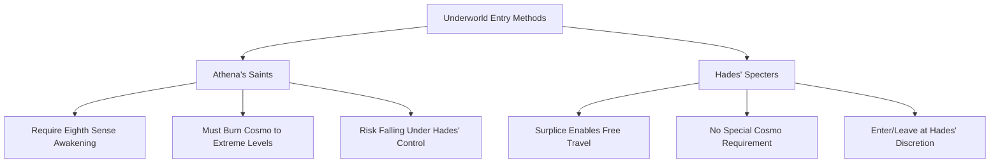

**Absence of Living Properties**

Unlike Athena's Cloths—which are explicitly described as living beings filled with Cosmos—Surplices demonstrate no confirmed living characteristics:

**"There is no information regarding the potential ability of the Surplices to either heal or evolve and no indication that they may even be alive"**[^62].

This absence of living properties carries significant implications:

| Property | Athena's Cloths | Hades' Surplices |
|----------|-----------------|------------------|
| **Living Status** | Confirmed living beings | No evidence of life |
| **Self-Healing** | Natural regeneration capability | No healing confirmation |
| **Evolution** | Can evolve through blood/Cosmo | No evolution evidence |
| **Autonomous Action** | Can reject unworthy wearers | No autonomous behavior |
| **Moral Discernment** | Cancer Cloth abandoned Deathmask | No rejection documented |

The series notes that Surplice durability varies considerably: **"Some of them proved to be very resistant while others were easily destroyed by simple blows"**[^62]. This inconsistency, combined with the absence of confirmed healing capability, suggests Surplices function as powerful but fundamentally inert protective equipment rather than symbiotic partners.

**Divine Surplices: A Special Category**

While standard Specter Surplices lack divine properties, the armors worn by Hades, Hypnos, and Thanatos occupy a distinct category:

**"Hades, Hypnos, and Thanatos have their own Surplices soaked with their divine blood, however, they are not true Kamui or God Cloths"**[^62].

This divine blood infusion elevates their Surplices above standard Specter equipment while still falling short of the Olympian Kamui—the true divine armors worn only by the highest gods. The distinction establishes a hierarchy within Surplice classification:

1. **Divine-Blood Surplices**: Hades, Hypnos, Thanatos—enhanced by divine essence
2. **Celestial Star Surplices**: Elite Specters including the three Judges
3. **Terrestrial Star Surplices**: Standard Specter equipment

**Cloth-to-Surplice Transformation**

A unique phenomenon occurs when deceased Saints are resurrected by Hades:

**"Saints who are resurrected as Specters by Hades have their Cloths turned into Surplices"**[^62].

This transformation converts Athena's sacred armor into Hades' dark equipment, symbolizing the shift in allegiance (whether genuine or feigned) that accompanies resurrection. The transformed Surplices retain their original constellation-based forms while adopting the dark coloration and Underworld-travel properties of standard Surplices.

### 7.2 The Water Margin Star Classification System

The organizational structure of Hades' 108 Specters draws directly from **the Chinese literary classic *Water Margin* (水滸伝)**—a novel depicting 108 outlaws who gather at Mount Liang. This literary foundation provides both the numerical framework and the hierarchical division that defines Specter military organization, creating a system that parallels yet differs fundamentally from Athena's constellation-based Saint hierarchy.

**The 108 Specter Division**

The complete Specter army divides into two distinct categories based on their assigned "evil stars":

**"The 72 Terrestrial Specters along with the 36 Celestial Star Specters make up Hades' 108 Specters in both the series and manga"**[^64].

This division mirrors the *Water Margin* structure, where 36 "Heavenly Spirits" and 72 "Earthly Fiends" comprise the 108 outlaws. The adoption of this framework establishes clear hierarchical boundaries while providing narrative justification for the power differential between Specter ranks.

| Category | Number | Literary Origin | Power Level |
|----------|--------|-----------------|-------------|
| **Celestial Star Specters (天星)** | 36 | Heavenly Spirits | Elite—Gold Saint equivalent or superior |
| **Terrestrial Star Specters (地星)** | 72 | Earthly Fiends | Lower rank—Bronze/Silver Saint equivalent |

**Celestial Star Specter Characteristics**

The 36 Celestial Star Specters represent the **elite combat force** of Hades' army:

**"They are the high-ranked Specters and the 3 Judges of Hell themselves are among the lines of these Specters. Their battle capacity is variable but most of them have a strength rivaling that of the Gold Saints"**[^65].

The Celestial Specters fulfill several critical functions:

1. **Strategic Defense**: "Assigned to the defense of some important locations like the Prisons of Hell or the Demon Temples inside Lost Canvas, in the same way the Gold Saint guard the 12 Zodiac Temples"[^65]
2. **Leadership Roles**: The three Judges command the entire army from their positions atop the Celestial hierarchy
3. **Direct Divine Service**: "Their high and noble rank allow them to stand directly at the presence of Hades himself, a privilege not granted to the lowest ranks"[^65]

**Terrestrial Star Specter Characteristics**

The 72 Terrestrial Star Specters constitute the **numerical backbone** of Hades' forces:

**"The Terrestrial Specters are the lowest rank, analogous to the Bronze Saints or the Silver Saints, and there are more of them, but they still can't compare to the power of the other 36 Specters"**[^64].

Their primary functions emphasize support and operational flexibility:

**"The Terrestrial Specters are primarily used to strengthen Hades' forces in numbers more than in individual talent, and are mostly used for tasks like getting rid of dead Saints, spying, guarding wards, and giving information. They usually operate in groups"**[^64].

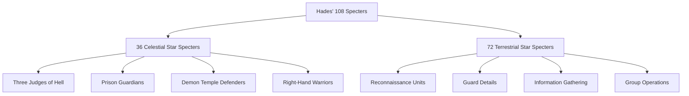

**Exceptions to Hierarchical Power Levels**

While the Celestial/Terrestrial division generally correlates with power levels, the series acknowledges significant exceptions:

**"However, like some Bronze Saints such as Seiya who are said to be stronger than a Gold Saint, it is possible to have some Terrestrial Specters that are actually quite powerful and fearsome, like Papillon Myu"**[^64].

This principle—that individual capability can transcend categorical classification—mirrors the foundational Saint Seiya theme that **"the power of a Saint is not related to the Cloth he wears but to his Cosmo"**. The Terrestrial Star designation reflects organizational placement rather than absolute power ceiling.

**Power Enhancement Through Resurrection**

An intriguing phenomenon involves the power increase when Saints are resurrected as Specters:

**"A Specter by nature should be stronger than a standard Bronze Saint or Silver Saint, as suggested when the Cerberus, Sagitta, and Auriga Silver Saints from The Lost Canvas increased their power dramatically after becoming Specters"**[^64].

This enhancement suggests that Surplice-wearing and Hades' resurrection blessing provide power amplification beyond what the warrior possessed in life—a significant consideration when evaluating the threat posed by resurrected Saints.

**Comparison to Athena's Hierarchy**

The Specter classification system presents both parallels and contrasts to Athena's Bronze-Silver-Gold hierarchy:

| Aspect | Athena's Saints | Hades' Specters |
|--------|-----------------|-----------------|
| **Basis** | Cloth rank (88 constellations) | Evil star assignment (Water Margin) |
| **Top Tier** | 12 Gold Saints | 36 Celestial Specters |
| **Middle Tier** | 24 Silver Saints | (Included in both tiers) |
| **Lower Tier** | 48 Bronze Saints | 72 Terrestrial Specters |
| **Numerical Emphasis** | Quality over quantity | Balanced approach |
| **Promotion Mechanism** | Cloth inheritance | Fixed star assignment |

The Specter system's fixed star assignments contrast with the Saints' Cloth inheritance system, where warriors can potentially earn higher-ranked Cloths through achievement. A Terrestrial Specter's star designation appears permanent regardless of demonstrated power—organizational placement rather than recognition of growth.

### 7.3 The Three Judges of Hell: Supreme Commanders of the Specter Army

At the apex of the Specter hierarchy stand the **Three Judges of Hell (冥界三巨頭)**—**Wyvern Rhadamanthys, Griffon Minos, and Garuda Aiacos**—the supreme commanders whose authority extends over the entire 108-Specter army. These Celestial Star Specters occupy positions of absolute military leadership while personally guarding the three demon temples that protect Hades' palace, Giudecca. Their combat capabilities equal or exceed most Gold Saints, and their narrative roles as primary antagonists establish them as the most significant Specter characters in the franchise.

**Hierarchical Position and Authority**

The three Judges hold uncontested supremacy within the Specter ranks:

**"The 3 Judges of Hell, among all of the Celestial Star Specters, are ranked at the top of the hierarchy with the leading role above the whole army and the protection of the 3 Temples that are located right before Hades' 'Giudecca'"**[^65].

Their territorial responsibilities divide the final defensive line before Hades' throne:

| Judge | Temple | Location |
|-------|--------|----------|
| **Wyvern Rhadamanthys** | Caina | First demon temple |
| **Garuda Aiacos** | Antenora | Second demon temple |
| **Griffon Minos** | Tolomea | Third demon temple |

**Combat Power Assessment**

The Judges' combat capabilities represent the highest tier among Specters:

**"In terms of combat power, the 3 Judges of Hell are absolutely overwhelming, with a Cosmo that equal or even surpasses most of the Gold Saints"**[^65].

This assessment places the Judges at **Multi-Universe Level** power according to detailed analysis, with Rhadamanthys specifically noted as **"one of the strongest Spectres"**[^66]. Their ability to challenge Gold Saints directly—demonstrated through multiple confrontations throughout the Hades arc—confirms their elite status.

---

**Wyvern Rhadamanthys: The Brutal Commander**

**Wyvern Rhadamanthys (ワイバーンのラダマンティス)** serves as **Pandora's right-hand man** and the most prominently featured Judge throughout the Hades arc. His characterization emphasizes **brutal efficiency and unwavering dedication to duty**.

| Attribute | Detail |
|-----------|--------|
| **Surplice** | Wyvern Surplice |
| **Temple** | Caina |
| **Personality** | "Brutal but capable leader with a no-nonsense attitude"[^67] |
| **Status** | "Unwaveringly bound to his duties"[^67] |

**Signature Technique: Greatest Caution**

Rhadamanthys' primary attack demonstrates devastating power:

**"His most deadly attack is Greatest Caution, also known as Maximum Destruction. In this technique, he burns a great quantity of his destructive Cosmos within him, and after focusing said Cosmos on top of his palms, fires an overwhelming blast at the opponents"**[^68].

The technique possesses two distinct variations:

| Variation | Execution | Effect |
|-----------|-----------|--------|
| **Focused Form** | "Points his palms at the opponent and fires a volley of Cosmic Beams" | Concentrated damage |
| **Area Attack** | "Spreads both arms and releases a devastating energy wave that engulfs all of his surroundings" | Wide-area destruction |

An alternative description characterizes Greatest Caution as **"a wind-type move that charges his Cosmo to its highest point of power, unleashed as a powerful typhoon-like wind blast or in the form of his spirit, the mythical Wyvern"**[^67].

**Combat Record**

Rhadamanthys' most notable achievement involves confronting multiple Gold Saints simultaneously:

**"He took on three Gold Saints simultaneously in an area that cripples non-Specters"**[^67].

This feat—fighting Gold Saints in the Underworld where non-Specters suffer environmental disadvantage—demonstrates both his raw power and tactical intelligence. His ability to challenge Gemini Kanon (while Kanon wore the Gemini Gold Cloth) establishes a direct power comparison to Gold Saint level.

---

**Griffon Minos: The Marionette Master**

**Griffon Minos (グリフォンのミーノス)** distinguishes himself through his **unique combat technique** and his role in judging the deceased—a duty he delegated to subordinate Balron Lune during the Holy War.

| Attribute | Detail |
|-----------|--------|
| **Surplice** | Griffon Surplice |
| **Temple** | Tolomea |
| **Role** | "Has actual duties in Hell, judging the recently deceased"[^67] |
| **Combat Style** | "Techniques versatile enough to counter several of Athena's Saints"[^67] |

**Signature Technique: Cosmic Marionation**

Minos' signature ability represents one of the most insidious techniques in the series:

**"This technique allows Minos to wrap his opponent with strings of Cosmo energy, entrapping and turning them into living, human marionettes. Minos can control every joint in the opponent's body, bending and distorting them at will, which can cause fractures and death"**[^69].

The technique's versatility extends to controlling enemy attacks:

**"In the anime adaptation, the Cosmic Marionation was also able to control an enemy's technique, as shown when Minos manipulated the technique's Cosmo energy to reverse Pegasus Seiya's 'Pegasus Ryu Sei Ken', deflect Andromeda Shun's 'Nebular Chains', and counter both Cygnus Hyoga's 'Diamond Dust' and Dragon Shiryu's 'Rozan Ryu Hi Sho'"**[^69].

The strings themselves possess remarkable properties: **"Griffon Minos creating strings of his Cosmo that are so small they are invisible; these strings wrap around the opponent's limbs before bending and twisting them to break them"**[^70].

**Additional Technique: Gigantic Feathers Flap**

In *The Lost Canvas*, Minos demonstrates a secondary technique:

**"By moving the wings of his Griffon Surplice, Minos generates a hurricane of high-concentration cosmic energy that expands and explodes, devastating the area"**[^69].

**Combat Record and Fate**

Minos demonstrated his power against multiple opponents:

- **Tortured Gemini Kanon** with Cosmic Marionation, breaking one of Kanon's fingers[^69]
- **Survived an Eighth Sense powered Aurora Execution** from Cygnus Hyoga[^69]
- In *The Lost Canvas*, used Cosmic Marionation to "capture the Gold Saint Pisces Albafica and crush all of his bones"[^69]

His ultimate fate proved gruesome: **"Minos was ultimately defeated when Cygnus Hyoga led him into the Hyperdimension; Minos' Griffon Surplice and body were crushed and obliterated into atoms by the dimensional currents"**[^69].

---

**Garuda Aiacos: The Overconfident Judge**

**Garuda Aiacos (ガルーダのアイアコス)** receives the least development among the three Judges, characterized primarily by his **arrogance and overconfidence**.

| Attribute | Detail |
|-----------|--------|
| **Surplice** | Garuda Surplice |
| **Temple** | Antenora |
| **Personality** | "Marked as cocky and overconfident"[^67] |
| **Combat Style** | Aerial-focused with predictive capabilities |

**Signature Technique: Garuda Flap**

Aiacos' combat abilities center on his wing-based attacks:

**"His attack involves a 'Garuda Flap' that can calculate how long it takes for an opponent to hit the ground and where they will land, incorporating a magic countdown"**[^67].

This predictive capability enables tactical positioning: **"He nonchalantly dodges attacks and flaps his wings to provide extra power"**[^67].

**Narrative Assessment**

The series treats Aiacos as the least developed Judge: **"He is considered a Flat Character with the least development among the Judges"**[^67]. His defeat by Phoenix Ikki—who "easily defeats Garuda Aiacos" after saving Kanon—demonstrates that despite his Celestial Star ranking, Aiacos proved less formidable than his fellow Judges when facing a Bronze Saint with awakened Seventh Sense.

### 7.4 Celestial Star Specters: Elite Warriors and Prison Guardians

Beyond the three Judges, the remaining Celestial Star Specters constitute an **elite warrior class** whose combat capabilities rival Gold Saints and whose strategic assignments involve defending the most critical locations throughout Hades' domain. These high-ranking Specters guard the eight prisons of Hell, serve as right-hand warriors to the Judges, and occupy positions of authority that enable direct audience with Hades himself.

**Guardian Assignments and Strategic Roles**

The Celestial Specters fulfill defensive responsibilities paralleling the Gold Saints' temple guardianship:

**"They are assigned to the defense of some important locations like the Prisons of Hell or the Demon Temples inside Lost Canvas, in the same way the Gold Saint guard the 12 Zodiac Temples"**[^65].

The documented guardianship assignments include:

| Location | Guardian | Series |
|----------|----------|--------|
| **First Prison** | Balron Lune | Saint Seiya (1986) |
| **Sphinx Prison** | Sphinx Pharaoh | Saint Seiya (1986) |
| **Golem Prison** | Golem Rock | Saint Seiya (1986) |
| **Lycaon Prison** | Lycaon Phlegyas | Saint Seiya (1986) |
| **Mercury Temple** | Mephistopheles Yōma | Lost Canvas |
| **Venus Temple** | Balron Lune | Lost Canvas |
| **Earth Temple** | Bennu Kagaho | Lost Canvas |
| **Mars Temple** | Ghost-Gemini Aspros | Lost Canvas |
| **Jupiter Temple** | Harpy Valentine | Lost Canvas |
| **Saturn Temple** | Wyvern Rhadamanthys | Lost Canvas |
| **Uranus Temple** | Owl Partita | Lost Canvas |

**Right-Hand Warriors**

Certain Celestial Specters serve as direct subordinates to the three Judges:

**"Some of the other Celestial Star Specters solves also the function of right-hand men for one of the 3 Judges and have an incredible fighting ability second only to theirs; an example could be Basilisk Sylphid"**[^65].

This organizational layer creates a clear chain of command:

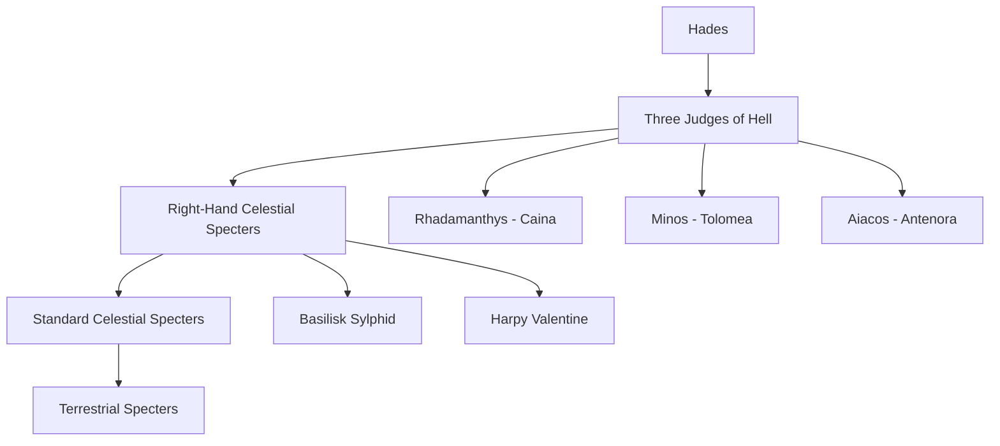

**Notable Celestial Star Specters**

The documented Celestial Star Specters across various series include:

**Generals (Appearing in Multiple Series)**:
- Garuda Aiacos / Garuda Suikyō (Next Dimension)
- Griffon Minos / Griffon Veermer (Next Dimension)
- Wyvern Rhadamanthys[^65]

**Prison and Temple Guardians**:
- Balron Lune (First Prison / Venus Temple)
- Sphinx Pharaoh
- Golem Rock
- Lycaon Phlegyas
- Deadly Beetle Stand
- Harpy Valentine (uncertain prison assignment / Jupiter Temple)[^65]

**Troops and Support Specters**:
- Acheron Charon
- Alraune Queen
- Basilisk Sylphid
- Troll Ivan
- Minotauros Gordon
- Behemoth Violate (Lost Canvas)
- Genbu Gregor (Lost Canvas)
- Mandrake Fyodor (Lost Canvas)
- Nasu Veronica (Lost Canvas)
- Necromancer Byaku (Lost Canvas)
- Dryad Luco (Lost Canvas Gaiden)
- Atavaka (Lost Canvas Gaiden)[^65]

**Privilege of Divine Audience**

The Celestial Star designation carries significant ceremonial importance:

**"Their high and noble rank allow them to stand directly at the presence of Hades himself, a privilege not granted to the lowest ranks"**[^65].

This access to Hades distinguishes Celestial Specters as a **noble warrior class** within the Underworld hierarchy—trusted servants whose loyalty and capability earn them proximity to their god.

### 7.5 Terrestrial Star Specters: The Numerical Strength of Hades' Forces

The 72 Terrestrial Star Specters constitute the **majority of Hades' military force**, providing numerical superiority and operational flexibility that complements the Celestial Specters' elite combat power. While generally weaker than their Celestial counterparts, several Terrestrial Specters demonstrated exceptional capabilities that challenged even Gold Saints, proving that individual power can transcend categorical classification.

**General Characteristics and Roles**

The Terrestrial Specters fulfill support and operational functions:

**"The Terrestrial Specters are primarily used to strengthen Hades' forces in numbers more than in individual talent, and are mostly used for tasks like getting rid of dead Saints, spying, guarding wards, and giving information. They usually operate in groups"**[^64].

This emphasis on **group operations** reflects their tactical deployment—while individual Terrestrial Specters may lack Gold Saint-equivalent power, coordinated groups can accomplish objectives through combined effort and numerical advantage.

**Power Level Assessment**

The baseline Terrestrial Specter power level places them above standard Saints:

**"A Specter by nature should be stronger than a standard Bronze Saint or Silver Saint"**[^64].

However, this baseline admits significant variation:

| Tier | Description | Examples |
|------|-------------|----------|
| **Strong Terrestrial** | Threatened or defeated Gold Saints | Deep Niobe, Papillon Myu, Worm Raimi |
| **Average Terrestrial** | Standard Specter capability | Cyclops Gigant, Frog Zelos, Elf Mills, Gorgon Ox |

**Exceptional Terrestrial Specters**

Three Terrestrial Specters from the original series demonstrated power levels far exceeding their rank:

---

**Deep Niobe: The Gold Saint Killer**

Deep Niobe achieved the remarkable feat of **killing Taurus Aldebaran**, one of the twelve Gold Saints:

**"Strong Terrestrial Stars include Deep Niobe (who killed Taurus Aldebaran)"**[^64].

His techniques center on poison manipulation:

| Technique | Effect |
|-----------|--------|
| **Deep Fragrance** | Poisonous mist that enters the skin, paralyzing and killing victims |
| **Dead Perfume** | Additional poison-based attack |

The circumstances of Aldebaran's death involved his prior injury: after destroying his own eardrums during the Poseidon arc battle against Siren Sorrento, Aldebaran was **"surprised by Deep Niobe because he was deaf"**[^71]. However, Aldebaran's final act proved devastating:

**"With Aldebaran's very last remaining cosmo, Mu was able to move again after Niobe attacked him... Mu leaves, stating there is no point fighting a man already dead, and Niobe's body subsequently disintegrates"**[^71].

Aldebaran's Great Horn, fired with his dying Cosmo, had already shattered Niobe's body—the Specter simply hadn't realized his death yet.

---

**Papillon Myu: The Telekinetic Transformer**

Papillon Myu represents the most powerful documented Terrestrial Specter:

**"Papillon Myu (who almost defeated Aries Mu)"**[^64].

His power level is explicitly compared to Gold Saints: **"He is one of the Terrestrial Specters of Hades, and his power rivals that of a Gold Saint"**[^72].

| Attribute | Detail |
|-----------|--------|
| **Star** | Terrestrial Bewitching Star |
| **Status** | "Feared by fellow specters"[^73] |
| **Abilities** | Telekinesis, fairy control, transformation |

Myu's techniques demonstrate remarkable versatility:

| Technique | Description |
|-----------|-------------|
| **Ugly Eruption** | Named offensive technique |
| **Silky Thread** | Web-based attack |
| **Fairy Thronging** | "Uses his Cosmos to summon a large myriad of Underworld Butterflies that surround his opponent, restrict their movement, and open a gate to the underworld to drag his enemy to the depths of Hades"[^72] |

His transformation ability adds tactical complexity: **"Papillon Myu can change his appearance through timed stages of transformation, beginning as a pile of slime, evolving into a larva that spins webs, and finally achieving his full Specter form"**[^73].

Despite his power, Myu **"was sent to the Sanctuary by Wyvern Rhadamanthys to eliminate the surviving Saints but was defeated by Aries Mu"** using Starlight Extinction[^72].

---

**Worm Raimi: The Aiolia Challenger**

Worm Raimi demonstrated sufficient power to threaten Leo Aiolia:

**"Worm Raimi (who almost defeated Leo Aiolia)"**[^64].

His near-victory against a Gold Saint confirms that Terrestrial Star designation does not preclude Gold Saint-level combat capability.

**Terrestrial Specters Across Series**

The documented Terrestrial Star Specters include:

**Saint Seiya (1986)**:
- Deep Niobe, Papillon Myu, Worm Raimi (Strong)
- Cyclops Gigant, Frog Zelos, Elf Mills, Gorgon Ox (Average)[^64]

**Saint Seiya: The Lost Canvas**:
- Bat Wimber
- Cait Sith Cheshire
- Dullahan Cube
- Kageboshi (Lost Canvas Gaiden)
- Sylph Edward[^64]

**Saint Seiya: Next Dimension**:
- Frog Miyan[^64]

### 7.6 Hypnos and Thanatos: The Twin Gods of Sleep and Death

Above the entire Specter hierarchy stand **Hypnos (ヒュプノス)** and **Thanatos (タナトス)**—the twin gods of sleep and death who serve directly under Hades. Unlike the 108 Specters who constitute Hades' mortal army, these divine beings possess **the Cosmo of gods** and dwell in **Elysion**, the paradise reserved for deities. Their defeat by the Bronze Saints wielding God Cloths establishes the power threshold required to challenge divine-level opponents.

**Divine Status and Position**

The twin gods occupy a unique position within Hades' forces:

**"He is the twin brother of Hypnos, the god of sleep, and a subordinate of Hades, the ruler of the Underworld"**[^74].

Their dwelling place reflects their divine status: **"His dwelling place is Elysion"**[^74]—the same paradise where Hades himself resides, separate from the Underworld prisons where Specters operate.

**Historical Role in Holy Wars**

The twin gods have served Hades across multiple Holy Wars:

**"The Twin Gods have assisted Hades since the ages of myth and have fought Athena in several Holy Wars across centuries, including the 16th, 18th, and 20th centuries"**[^74].

Their sealing and release follows a cyclical pattern: **"Thanatos was sealed along with his brother by Athena after being defeated in her last battle against Hades in the 18th century. He spent 243 years sealed in a box marked with the Seal of Athena and was freed when a three-year-old Pandora opened it"**[^74].

---

**Thanatos: The God of Death**

**Thanatos** embodies mortality and death itself, wielding divine power that vastly exceeds any Specter:

| Attribute | Detail |
|-----------|--------|
| **Domain** | Death, mortality |
| **Personality** | "Cruel, merciless, haughty, and prone to losing his temper"[^74] |
| **Dwelling** | Elysion |
| **Divine Power** | "Big Will"—the divine Cosmo of the Gods |

**Signature Technique: Terrible Providence**

Thanatos' primary attack demonstrates devastating divine power:

**"His primary technique is 'Terrible Providence' (テリブルプロビデンス). This technique takes the form of an immensely powerful blast of energy that, upon reaching the target, cripples their body and mind, annihilating the five senses at once while driving the mind instantly insane and dismembering the body"**[^74].

The technique's power is explicitly demonstrated: **"He wields the 'Big Will,' the divine Cosmo of the Gods, which allowed him to completely smash five Gold Cloths with a single attack, an unprecedented feat"**[^74].

**Death Manipulation Abilities**

Beyond Terrible Providence, Thanatos possesses fundamental control over death:

**"As the god of death, Thanatos can cause the death of any living creature, regardless of distance. He can find his target and attack without physical contact using powerful, invisible blasts of energy that inflict excruciating pain and instant death"**[^74].

Additional documented abilities include:
- **Thought-based death manipulation**: "He killed Pandora with a mere thought"[^75]
- **Portal creation**: "Used to create a portal between Elysium and Earth"[^75]
- **Tartaros Phobia** (*The Lost Canvas*): "Unleashes tortured souls from Tartaros to attack his victim"[^74]

**Defeat by Pegasus Seiya**

Thanatos' ultimate defeat came at the hands of Seiya wielding the Pegasus God Cloth:

**"Seiya ultimately defeats Thanatos by punching through his chest, shattering his Surplice and killing him"**[^74].

The transformation that enabled this victory demonstrates the power threshold required: **"Seiya's Cosmo blazes to the limit, and his Bronze Pegasus Cloth is revived by combining his Cosmo with Athena's blood that had spilled on it, transforming it into a Divine Cloth. Empowered by the Divine Cloth, Seiya easily dodges Thanatos's attacks and counters his Terrible Providence"**[^74].

---

**Hypnos: The God of Sleep**

**Hypnos** presents a contrasting personality to his violent brother—calm and calculating where Thanatos is temperamental:

| Attribute | Detail |
|-----------|--------|
| **Domain** | Sleep, slumber |
| **Personality** | "Calm, calculating, and serene, remaining in control even in critical situations"[^76] |
| **Dwelling** | Elysion |
| **Relationship** | "Highly respectful of Hades's authority"[^76] |

**Signature Technique: Eternal Drowsiness**

Hypnos' primary ability manipulates sleep itself:

**"Hypnos's main divine ability is to instantly induce any living being into a deep slumber through his special technique, the Eternal Drowsiness. The victim cannot reawaken unless Hypnos wills it"**[^76].

The technique's effectiveness extends even to gods: **"This power is effective even on divine beings, as he used it to force Athena into sleep and imprison her in the Sacred Amphor to slowly die"**[^76].

**Combat Philosophy**

Unlike his death-dealing brother, Hypnos prefers non-lethal approaches:

**"Hypnos himself stated he hates violence and death, preferring to disable his opponents with sleep"**[^76].

This philosophical difference shapes their combat styles—Thanatos seeks destruction while Hypnos prefers incapacitation.

**Additional Technique: Encounter Another Field**

In *The Lost Canvas*, Hypnos demonstrates expanded capabilities:

**"He uses a technique called Encounter Another Field, which brings his opponents' dreams to reality, allowing him to control the battlefield"**[^76].

This technique enables: **"Transport opponents to the World of Dreams, where he has total control over their minds and can make dreams real, inflicting real damage"**[^76].

**Defeat by Hyoga and Shiryu**

Hypnos' defeat required two Bronze Saints with awakened God Cloths:

**"When Cygnus Hyouga and Dragon Shiryuu revive their Cloths to a Divine state, they neutralize his attack by raising their Cosmo to the extreme, having learned that a technique won't work twice on a Saint. Their counterattack shatters Hypnos's Surplice and obliterates him"**[^76].

**Divine Power Level Assessment**

The twin gods' power levels vastly exceed standard Specters:

| Attribute | Assessment |
|-----------|------------|
| **Attack Potency** | "Multiverse level+" (demonstrated by destroying Gold Cloths)[^75] |
| **Speed** | "Infinite speed"[^75] |
| **Range** | "Multiversal+ to possibly Low Complex Multiversal"—could attack Earth from Elysion[^75] |
| **Weakness** | "Extreme overconfidence and a temper that causes him to act without regard for consequences"[^75] |

The requirement of **God Cloths** to defeat the twin gods establishes a clear power threshold: divine-level opponents cannot be overcome by Gold Saint-level power alone, necessitating the transcendent armor evolution achieved through Athena's blood.

### 7.7 Resurrected Saints and Cloth-to-Surplice Transformation

One of the Hades arc's most compelling narrative elements involves **deceased Saints resurrected by Hades** with limited lifespans and transformed Cloths. This phenomenon creates moral complexity as former Athena warriors appear to serve her enemy while maintaining hidden loyalties that ultimately advance their goddess's cause. The transformation of Cloths into Surplices symbolizes apparent betrayal while enabling covert operations crucial to Athena's victory.

**The Resurrection Mechanism**

Hades offers deceased Saints a bargain: **twelve hours of life** in exchange for killing Athena, with the promise of eternal life upon mission completion. The series documents this resurrection process affecting multiple Gold Saints:

**"In the Hades Chapter, Saga, along with Aquarius Camus and Capricorn Shura, was revived by Hades"**[^38].

The resurrection carries specific conditions:

| Condition | Detail |
|-----------|--------|
| **Duration** | Twelve hours of life |
| **Mission** | Kill Athena |
| **Reward** | Eternal life upon completion |
| **Transformation** | Cloths become Surplices |

**Cloth-to-Surplice Transformation**

The physical manifestation of resurrection involves armor transformation:

**"Saints who are resurrected as Specters by Hades have their Cloths turned into Surplices"**[^62].

This transformation converts Athena's sacred armor into Hades' dark equipment. The **Gemini Surplice** worn by the resurrected Saga exemplifies this conversion—the Gold Cloth that once protected Athena's temple now bears the dark coloration and properties of Underworld armor.

**The Secret Mission: Awakening Athena's Cloth**

The resurrected Gold Saints' apparent betrayal concealed a crucial mission:

**"It was subsequently revealed by Shion that this was a plan to awaken Athena's Cloth, meaning Deathmask and the others were not truly siding with Hades"**[^38].

The former Pope Shion—himself resurrected—coordinated this covert operation:

**"Deathmask and Aphrodite were secretly on Athena's side, along with the rest of the deceased Gold Saints, and were asked by Shion to pretend to follow Hades' order"**[^38].

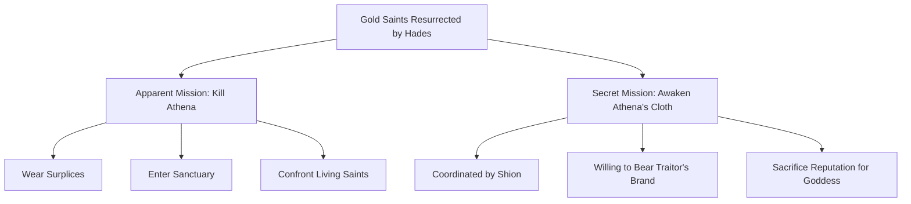

**The Athena Exclamation Sacrifice**

The secret mission required terrible sacrifice—the resurrected Gold Saints used the forbidden Athena Exclamation against Virgo Shaka:

**"They were forced to fight and kill Virgo Shaka using the Athena Exclamation"**[^38].

This act, though necessary for Athena's ultimate victory, demonstrated the moral weight of their covert operation. Shaka's death advanced the plan to awaken Athena's Cloth while appearing to confirm the resurrected Saints' treachery.

**Gemini Saga's Surplice Form**

The resurrected Saga provides the most detailed example of Cloth-to-Surplice transformation:

**"As a Specter, he wore the Gemini Surplice. His mission was to bring Hades the head of Athena, but his true intention was to warn Athena about Hades' armor"**[^38].

His confrontation with his brother Kanon at the Gemini Temple demonstrated the complexity of his position:

**"He fought against his brother Kanon at the Gemini Temple and later participated in the battle against Virgo Shaka, where he, Camus, and Shura used the forbidden technique, the Athena Exclamation"**[^38].

**Power Level in Surplice Form**

The transformation into Surplice form provides specific power enhancements:

As **Gemini Surplice**, Saga gains:
- **Immortality (Type 4)**: Enhanced resistance to death
- **Regeneration (Mid-Godly)**: "Scaling to Shakka regenerating after soul destruction"[^77]
- **Resurrection**: Ability to return from death
- **Immeasurable Speed**: "Moving in Hell, which exists beyond space and time"[^77]

The Surplice form's power level is assessed as **"Multi-Universe Level (scaling to Phoenix Ikki defeating multiple Spectres stronger than Gold Saints)"**[^77].

**The Burden of False Betrayal**

The resurrected Saints accepted profound sacrifice beyond physical death:

**"They were willingly carrying the burden of being branded as traitors"**[^38].

This willingness to destroy their reputations—to be remembered as traitors rather than heroes—demonstrates the depth of their loyalty to Athena. Their true allegiance was revealed only after their twelve hours expired:

**"The life granted by Hades expired, and they turned to dust, with Saga's last words being a plea to Seiya to protect Athena"**[^38].

**Silver Saint Resurrections**

The resurrection phenomenon extended to Silver Saints as well:

**"Misty, Moses, and Babel travel to Siberia to confront Hyoga, only to be easily defeated by the now vastly more powerful Bronze Saint"**[^38].

Their final moments revealed their true loyalties: before dying, they **"reaffirm their loyalty to Athena by warning Hyōga of the danger"**—demonstrating that even Silver Saints who served the false Pope retained devotion to their goddess beneath their apparent treachery.

### 7.8 Power Hierarchy and Combat Capabilities Within the Specter Army

The Specter army's power structure presents a complex hierarchy that parallels yet differs from Athena's Saint system. Understanding this hierarchy requires synthesizing combat evidence, organizational placement, and direct comparisons between Specters and their Saint counterparts. The resulting framework illuminates how Hades' forces function as a coherent military organization capable of challenging Athena's elite warriors.

**Comparative Power Assessment**

The following table synthesizes power level comparisons across the Specter hierarchy:

| Specter Rank | Equivalent Saint Rank | Combat Evidence |
|--------------|----------------------|-----------------|
| **Twin Gods (Hypnos/Thanatos)** | Above Gold Saints; require God Cloths to defeat | Thanatos destroyed five Gold Cloths simultaneously |
| **Three Judges of Hell** | Gold Saint equivalent or superior | Rhadamanthys fought three Gold Saints; Minos survived Aurora Execution |
| **Elite Celestial Specters** | Gold Saint equivalent | Prison guardians assigned same strategic importance as temple guardians |
| **Standard Celestial Specters** | High Silver to Gold Saint | Basilisk Sylphid noted as second only to Judges |
| **Strong Terrestrial Specters** | Gold Saint threatening | Deep Niobe killed Aldebaran; Papillon Myu nearly defeated Aries Mu |
| **Average Terrestrial Specters** | Bronze to Silver Saint | Group operations emphasize numerical advantage |

**Surplice Defensive Properties**

The Surplice armor system provides protection that varies considerably across the hierarchy:

**"Some of them proved to be very resistant while others were easily destroyed by simple blows"**[^62].

This variability contrasts with the more consistent protective scaling of Athena's Cloth system. The documented Surplice types include:

- Acheron, Alraune, Balron, Basilisk, Behemoth
- Cyclops, Deep, Frog, Garuda, Golem
- Griffon, Lycaon, Harpy, Minotaur, Papillon
- Sphinx, Wyvern, Troll, Worm
- Thanatos, Hypnos, and Hades Surplices[^62]

**Strategic Deployment Patterns**

The Specter army employs distinct deployment strategies based on rank:

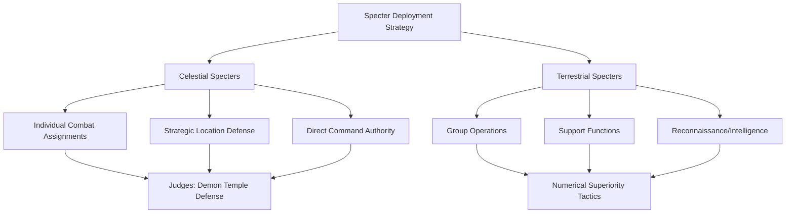

**Key Battle Benchmarks**

Several battles establish definitive power benchmarks:

**Thanatos vs. Gold Cloths**: The god of death **"completely smashed five Gold Cloths with a single attack"**[^74]—establishing that divine-level power vastly exceeds Gold Saint equipment durability.

**Rhadamanthys vs. Three Gold Saints**: The Wyvern Judge **"took on three Gold Saints simultaneously in an area that cripples non-Specters"**[^67]—demonstrating that elite Celestial Specters can challenge multiple Gold Saints under favorable conditions.

**Minos vs. Hyoga**: The Griffon Judge **"survived an Eighth Sense powered Aurora Execution attack from Cygnus Hyoga"**[^69]—proving Celestial Specter durability against transcendent Saint techniques.

**Papillon Myu vs. Aries Mu**: The Terrestrial Specter **"almost defeated Aries Mu"**[^64]—confirming that exceptional individuals can transcend categorical limitations.

**Underworld Environmental Advantage**

The Underworld itself provides strategic advantage to Specters:

**"No life is possible in the Underworld without the Eighth Sense (or special devices), as all things in the Underworld normally fall under the control of Hades"**[^63].

This environmental control means non-Specters fighting in the Underworld suffer significant disadvantage—their life force naturally falls under Hades' influence unless protected by Eighth Sense awakening or Surplice equipment.

**Organizational Efficiency Assessment**

The Specter army's organizational structure demonstrates several advantages:

| Advantage | Manifestation |
|-----------|---------------|
| **Clear Hierarchy** | 36 Celestial / 72 Terrestrial division provides unambiguous command structure |
| **Numerical Superiority** | 108 Specters versus 88 Saints (with fewer active) |
| **Environmental Control** | Underworld grants home-field advantage |
| **Divine Leadership** | Twin gods and Hades provide supreme command |

However, the structure also reveals limitations:

| Limitation | Manifestation |
|------------|---------------|
| **Fixed Rankings** | No documented promotion mechanism unlike Cloth inheritance |
| **Variable Surplice Quality** | Inconsistent armor protection |
| **Absence of Living Properties** | No autonomous Surplice actions or moral discernment |
| **Dependence on Hades** | Specter power tied to god's will |

**Ultimate Assessment**

The Specter army represents a **formidable military force** whose organizational efficiency, numerical strength, and elite warrior capabilities present genuine threat to Athena's forces. The three Judges alone possess power rivaling the strongest Gold Saints, while the twin gods require God Cloth-level opposition to defeat.

However, the army's ultimate defeat stems from factors beyond raw power:

1. **Bronze Saint Growth**: The protagonists' transcendence to God Cloth level exceeded Specter power ceilings
2. **Hidden Loyalties**: Resurrected Saints' covert operations undermined Hades' strategy
3. **Divine Intervention**: Athena's blood enabling God Cloth transformation provided the power differential necessary for victory

The Specters' defeat does not diminish their threat assessment—rather, it demonstrates that overcoming Hades' forces required the Bronze Saints to achieve power levels previously thought impossible for mortal warriors, validating the Specter army's status as the most dangerous opponents Athena's champions faced throughout the franchise.

## 8 Divine Armors: God Cloths, Kamui, and the Armor of Deities

The highest tier of protective equipment in the Saint Seiya universe represents the ultimate convergence of mortal aspiration and divine power—armors that enable human warriors to challenge gods themselves while simultaneously revealing the insurmountable boundaries that separate mortality from true divinity. This chapter examines the **God Cloths**, **Kamui**, and the specific divine armors worn by major deities, establishing the definitive hierarchy that governs combat at the transcendent levels of the franchise's power system. Understanding these distinctions proves essential for comprehending both the Bronze Saints' ultimate achievements and the theological framework underlying the entire series.

The divine armor hierarchy reflects Saint Seiya's central philosophical tension: the belief that mortal determination can challenge divine authority balanced against the recognition that certain boundaries remain absolute. The God Cloths represent humanity's greatest achievement in protective equipment—Cloths transformed through divine blood that approach godly power levels—yet even these transcendent armors **"pale against the Kamui"** worn by Olympian deities[^6]. This fundamental distinction shapes the narrative possibilities of the franchise, enabling mortal heroes to achieve remarkable victories while preserving the theological hierarchy that gives those victories meaning.

The exploration of divine armors necessarily encompasses multiple armor systems across different divine factions. While Athena's God Cloths receive the most detailed treatment in the source material, the armors worn by antagonist deities—Hades' Surplice, Poseidon's Scale, and the legendary Kamui possessed by all twelve Olympians—establish the comparative framework within which mortal achievements must be evaluated. The following analysis synthesizes available documentation to present a comprehensive understanding of divine-tier protection in the Saint Seiya universe.

### 8.1 The Divine Armor Hierarchy: Distinguishing God Cloths from Kamui

The classification of divine armors requires precise terminology to avoid conflation between fundamentally different categories of protective equipment. The Saint Seiya universe establishes a clear hierarchical relationship where **Kamui represent the absolute pinnacle of armor power**, worn exclusively by the twelve Olympian Gods, while **God Cloths constitute the apex of human-made Cloths** that approach but never fully equal Kamui capabilities[^6]. This distinction carries profound implications for understanding both the achievements and limitations of mortal warriors who attain divine-tier equipment.

**Defining the Kamui**

The Kamui (カムイ), also called **"The Sacred Armor"** (スピリチュアル・鎧), are explicitly identified as **"the original forms of protection worn by the 12 Olympian Gods"**[^78]. According to the Saint Seiya Encyclopedia, these armors existed during the mythological era when the twelve Olympians actively participated in earthly affairs:

**"It is said that in the time of the myths, the 12 Olympus Gods worn Clothes that had a noble splendor on their bodies. The Clothes that only the gods can wear... They are called, Kamui"**[^79].

The Kamui's defining characteristic lies in their **incomparable superiority** to all mortal-crafted armors:

| Armor Type | Creator | Power Level | Wearers |
|------------|---------|-------------|---------|
| **Kamui** | Divine origin | Supreme—incomparable to mortal armors | 12 Olympian Gods only |
| **God Cloths** | Mu Continent Alchemists (transformed by divine blood) | Near-equal to Kamui | Saints who achieve transcendence |
| **Gold Cloths** | Mu Continent Alchemists | Highest mortal tier | Gold Saints |
| **Scales/Surplices** | Various divine craftsmen | Equivalent to Gold Cloths | Marina Generals/Specters |

The Saint Seiya Encyclopedia emphasizes this hierarchy: **"These 12 Gods all wore the armor called Kamui which is said to emit a divine brightness and has an ability that the Cloth, Scale or Surplice can't compare to"**[^79].

**Defining God Cloths**

In contrast to the divine-origin Kamui, God Cloths represent the **transformation of mortal-crafted Cloths** through specific conditions involving divine blood and transcendent Cosmo. The series explicitly characterizes them as **"the apex of the man-made Cloths"**[^6], emphasizing their mortal origins despite their divine enhancement.

The relationship between God Cloths and Kamui is precisely defined:

**"Having been reborn by Athena's blood, the God Cloths are the apex of the man-made Cloths, as it gives their respective Saints a level of protection and power that are said to be near-equal to those of the 12 Olympian Kamui"**[^6].

The critical qualifier **"near-equal"** establishes that even at their maximum potential, God Cloths remain fundamentally inferior to true Kamui. This distinction manifests in combat:

**"However, as the God Cloths are still made from mortal hands, they pale against the Kamui and can be destroyed by a god, as seen when Hades easily pierced through Seiya's armor with his sword"**[^6].

**Theological Significance of the Hierarchy**

The divine armor hierarchy reflects the series' broader theological framework regarding the relationship between mortals and gods. The existence of God Cloths demonstrates that **mortal craftsmanship enhanced by divine blessing can approach godly power**, yet the Kamui's continued superiority preserves the fundamental distinction between human and divine nature.

```mermaid
graph TD
    A[Divine Armor Hierarchy] --> B[Kamui - Supreme Tier]
    A --> C[God Cloths - Near-Divine Tier]
    A --> D[Gold Cloths - Elite Mortal Tier]
    
    B --> B1[Worn by 12 Olympians Only]
    B --> B2[Divine Origin]
    B --> B3[Incomparable Power]
    
    C --> C1[Mortal-Made, Divine-Enhanced]
    C --> C2[Near-Equal to Kamui]
    C --> C3[Can Be Destroyed by Gods]
    
    D --> D1[Mortal Craftsmanship]
    D --> D2[Seventh Sense Required]
    D --> D3[Cannot Challenge Divine Beings]
```

The statement from Hypnos provides authoritative confirmation of this hierarchy: **"The Divine Cloth was stated by Hypnos to be one type of mortal-made Cloth that was closest to the power and prominence of a God Cloth"**[^78]. This acknowledgment from a divine being validates the God Cloths' exceptional status while simultaneously affirming their ultimate inferiority to true divine equipment.

### 8.2 Conditions for God Cloth Awakening: Divine Blood and Transcendent Cosmo

The transformation of ordinary Cloths into God Cloths requires the **simultaneous fulfillment of two distinct conditions**: the elevation of Cosmo to infinite levels and the contact of Athena's divine blood with the armor[^80]. Understanding these precise requirements illuminates both the rarity of God Cloth awakening and the specific circumstances that enabled the Bronze Saints' transcendence during the Hades arc.

**The Dual Requirement System**

The official series documentation establishes unambiguous criteria for God Cloth evolution:

**"In the official Saint Seiya manga, the exact conditions for the awakening of the God Cloth are the simultaneous fulfillment of two conditions: the infinite elevation of the Cosmo and the Cloth being bathed in the divine blood of the goddess Athena"**[^80].

This dual requirement system prevents God Cloth awakening through either condition alone:

| Condition | Alone Sufficient? | Combined Effect |
|-----------|-------------------|-----------------|
| **Infinite Cosmo Elevation** | No—produces temporary enhancement only | Enables permanent transformation |
| **Athena's Divine Blood** | No—requires active Cosmo to trigger evolution | Provides divine catalyst for transformation |
| **Both Conditions Together** | Yes—produces God Cloth awakening | Complete armor transcendence |

**The Eighth Sense Clarification**

A crucial clarification addresses common misconceptions regarding the relationship between Eighth Sense awakening and God Cloth evolution:

**"The Eighth Sense is a deeper level of consciousness that transcends the Seventh Sense and surpasses life and death, allowing Saints to survive in the Underworld while maintaining self-awareness. However, the Eighth Sense alone is not sufficient to evolve a Cloth into a God Cloth"**[^80].

The Eighth Sense enables **Underworld survival** rather than armor transformation. While the Bronze Saints achieved Eighth Sense awakening to enter Hades' realm with their physical bodies intact, this achievement represents a **separate accomplishment** from God Cloth evolution. The distinction proves significant because:

1. **Eighth Sense** = Consciousness transcending life/death → Underworld access
2. **God Cloth** = Infinite Cosmo + Divine Blood → Armor transformation

**The Role of Athena's Blood**

Athena's divine blood serves as the **essential catalyst** for God Cloth transformation, possessing unique properties that enable armor evolution:

**"Athena's divine blood possesses sacred power and is believed to heal all injuries and illnesses. It is also one of the key factors in awakening the God Cloth"**[^80].

The blood's transformative capability extends beyond simple healing to fundamental armor restructuring. When Athena's blood contacts a Cloth whose wearer has elevated their Cosmo to infinite levels, the combination triggers the evolution process:

**"In the Elysion arc, the five Bronze Saints' Cloths awakened into God Cloths after being stained with Athena's blood, granting them the power to fight against gods such as Thanatos and Hypnos"**[^80].

**The Hades Arc Awakening Sequence**

The specific sequence of events during the Hades arc demonstrates how the dual conditions were fulfilled:

```mermaid
graph TD
    A[Bronze Saints Enter Underworld] --> B[Eighth Sense Awakening]
    B --> C[Survival in Hades' Realm]
    C --> D[Confrontation with Twin Gods]
    D --> E[Emotional Catalyst - Threat to Loved Ones]
    E --> F[Cosmo Elevation to Infinite Levels]
    F --> G[Contact with Athena's Blood]
    G --> H[God Cloth Transformation]
```

The transformation sequence for Seiya exemplifies this process:

**"Thanatos' Terrible Providence attack, which had previously destroyed five Gold Cloths in one strike, was unable to even scratch Seiya's Pegasus God Cloth"**[^6].

This dramatic demonstration occurred after Seiya's Cosmo reached divine levels in response to Thanatos threatening his sister Seika, combined with Athena's blood that had spilled on his shattered Cloth.

**Temporary Versus Permanent Transformation**

The series distinguishes between temporary and permanent God Cloth states based on the conditions of awakening:

**"If the bronze saint was able to reach their 8th sense, their cloths become God Cloths but only for a limited time"**[^1].

This temporary transformation through Eighth Sense alone contrasts with the **permanent enhancement** achieved through Athena's blood:

**"In the Hades arc, the bronze cloths were repaired with Athena's blood, enhancing the cloths to their highest potential"**[^1].

The distinction suggests that while Eighth Sense-triggered transformations represent **momentary transcendence**, the combination of divine blood and infinite Cosmo produces **lasting armor evolution** that persists beyond the immediate combat situation.

### 8.3 Physical Properties and Combat Capabilities of God Cloths

The God Cloths demonstrate remarkable physical properties that establish them as fundamentally superior to all other mortal-crafted armors while revealing specific limitations when facing true divine power. Analysis of documented combat encounters provides precise benchmarks for understanding God Cloth capabilities relative to both Gold Cloths and Kamui.

**Physical Coverage and Design**

God Cloths appear as **"exceedingly elaborate versions of the original Cloths that almost covers a Saint's entire body"**[^6]. This near-complete coverage represents a dramatic enhancement over standard Cloth designs:

| Cloth Type | Body Coverage | Exposed Areas |
|------------|---------------|---------------|
| **Bronze Cloths** | Minimal—vital points only | Most of body |
| **Silver Cloths** | Moderate | Significant portions |
| **Gold Cloths** | Extensive | Upper legs, upper arms |
| **God Cloths** | Near-complete | "Small portion of the thighs, upper arms, fingers and head" |

A distinctive feature common to all God Cloths involves **integrated wings**: **"All of the God Cloths are provided with wings"**[^6]. These wings serve functional purposes beyond aesthetics, enabling capabilities discussed below.

**Defensive Properties: Colossal Durability**

The defensive capabilities of God Cloths vastly exceed all lower-tier armors, demonstrated most dramatically through comparison with Gold Cloth durability:

**"A God Cloth provides a near-absolute level of protection to their Saint, as they possess colossal durability and almost completely covers the Saint's body"**[^6].

The definitive benchmark for God Cloth defense involves Thanatos' attack:

**"Thanatos' Terrible Providence attack, which had previously destroyed five Gold Cloths in one strike, was unable to even scratch Seiya's Pegasus God Cloth"**[^6].

This comparison establishes a precise power differential:

```mermaid
graph LR
    A[Thanatos' Terrible Providence] --> B[Five Gold Cloths]
    A --> C[One God Cloth]
    
    B --> B1[Complete Destruction]
    B --> B2[Single Strike]
    
    C --> C1[No Damage]
    C --> C2[Not Even Scratched]
```

The five-to-one ratio suggests God Cloths possess **defensive properties exceeding Gold Cloths by at least an order of magnitude**, enabling survival against attacks that would obliterate multiple elite-tier mortal armors simultaneously.

**Offensive Enhancement: Massive Cosmo Boost**

Beyond defensive properties, God Cloths provide **dramatic offensive enhancement** through Cosmo amplification:

**"Likewise they provide their Saint with a massive boost in Cosmo. This lethal combination gives a Saint the power to destroy minor gods and even injure one of the 12 Olympian Gods"**[^6].

The offensive capabilities manifest in documented achievements:

| Achievement | Target | Significance |
|-------------|--------|--------------|
| **Defeating Thanatos** | God of Death | Minor deity destroyed by God Cloth-equipped Saint |
| **Defeating Hypnos** | God of Sleep | Minor deity destroyed by two God Cloth-equipped Saints |
| **Injuring Hades** | Olympian God | Major deity wounded across multiple incarnation cycles |

The historical pattern of Pegasus Saints injuring Hades deserves particular attention: **"the Pegasus Saint was able to injure Hades on every reincarnation cycle they stood against each other"**[^6]. This cyclical achievement suggests that God Cloth-level power represents the **minimum threshold** for challenging Olympian deities.

**Movement Capabilities: Faster Than Light**

God Cloths enable transcendent movement capabilities:

**"The God Cloth provides its user with the ability to travel faster than the speed of light and enables them to fight at an atomic level. Because of this, the surroundings don't even get a scratch"**[^6].

The atomic-level combat capability explains how God Cloth-equipped Saints can engage divine beings without causing collateral destruction—their battles occur at scales where environmental damage becomes irrelevant.

**Documented Limitations**

Despite their remarkable capabilities, God Cloths possess definitive limitations when facing true divine power:

**"However, as the God Cloths are still made from mortal hands, they pale against the Kamui and can be destroyed by a god, as seen when Hades easily pierced through Seiya's armor with his sword"**[^6].

This penetration demonstrates that **Olympian-level divine weapons can overcome God Cloth protection**. The limitation establishes that while God Cloths enable mortals to challenge gods, they cannot guarantee survival against the highest divine attacks.

**Bronze and Gold God Cloth Variants**

The documented God Cloths include both Bronze and Gold variants:

**Bronze God Cloths**:
- Andromeda God Cloth
- Cygnus God Cloth
- Dragon God Cloth
- Pegasus God Cloth
- Phoenix God Cloth

**Gold God Cloths** (depicted in various media):
- All twelve zodiacal Gold Cloths possess God Cloth potential[^6]

The existence of Gold God Cloth variants suggests that the transformation mechanism applies universally to Athena's Cloth system rather than being limited to Bronze-tier armors.

### 8.4 Kamui: The Sacred Armors of the Twelve Olympians

The Kamui represent the **supreme tier of protective equipment** in the Saint Seiya universe—divine armors possessed by the twelve Olympian Gods that exist beyond the capabilities of any mortal-crafted protection. While documentation of specific Kamui remains limited, available sources establish their legendary status and the mystery surrounding their forms.

**Confirmed Existence and Limited Documentation**

The series explicitly confirms that all twelve Olympians possessed Kamui:

**"While stated that all 12 Olympian Gods each possessed a respective Kamui, only one has seemingly been shown in battle on several occasions: Athena's Cloth"**[^78].

This limitation reflects narrative circumstances—most Olympian Gods have not appeared in active combat roles throughout the series, leaving their Kamui forms undocumented. The Saint Seiya Encyclopedia addresses this gap:

**"In the far era of the myths, because the Gods disappeared to the sky with Zeus, except for Athena and Poseidon, the form of the Kamui was only handed down in fragments of oral tradition"**[^79].

**Zeus's Kamui: Concept Art Evidence**

Evidence for Zeus's Kamui exists through creator documentation:

**"As seen from a piece of concept art by Masami Kuramada of Zeus's silhouette, he also uses a Kamui"**[^78].

This concept art confirms that the supreme god of the Olympian pantheon possesses divine armor consistent with the Kamui tradition, though the full details of its appearance and capabilities remain unrevealed.

**The Poseidon and Hades Question**

A significant theological question involves whether Poseidon and Hades possess Kamui distinct from their documented Scales and Surplices:

**"Although members of the Olympian Pantheon, Poseidon's reincarnation and Hades have not been seen wearing their own Kamui, wearing instead a Scale and Surplice, respectively. It is possible that each god has their own version of 'God _____' in some form, such as 'Poseidon's God Scales' or 'Hades' God Surplice' and that they all qualify in the same class comparative to Athena's 'Cloth'"**[^78].

The Saint Seiya Encyclopedia elaborates on this mystery:

**"Athena and Poseidon each possess the Cloth and Scale, but they are considered part of the 12 Olympus Gods, so it wouldn't be surprising if they originally had the Kamui. But why then, did they take off the Kamui and wore the Cloth and Scale?"**[^79].

This question suggests that gods may **choose to wear lesser armors** during earthly incarnations, reserving their Kamui for circumstances requiring absolute divine power.

**Kamui Properties: Oral Tradition**

While specific Kamui capabilities remain largely undocumented, oral traditions describe their extraordinary nature:

**"These 12 Gods all wore the armor called Kamui which is said to emit a divine brightness and has an ability that the Cloth, Scale or Surplice can't compare to"**[^79].

The key characteristics attributed to Kamui include:

| Property | Description |
|----------|-------------|
| **Divine Brightness** | Emits luminous energy reflecting divine nature |
| **Incomparable Ability** | Surpasses all mortal armors categorically |
| **Exclusive Wearability** | "Clothes that only the gods can wear" |
| **Noble Splendor** | Aesthetic magnificence befitting Olympian status |

**Design Characteristics**

The limited documentation suggests Kamui possess distinctive design elements:

**"These Cloths also have a much bulkier, elaborate, and ornate design, almost completely covering their user's body as opposed to the lesser armor types"**[^78].

This design philosophy—maximum coverage with elaborate ornamentation—reflects the Kamui's status as divine equipment requiring no compromise between protection and mobility.

**The God Cloth Connection**

The relationship between God Cloths and Kamui provides the primary means of understanding Kamui capabilities:

**"The Cloths rejuvenated by Athena's blood is said to become God Cloths which is close to the Kamui, so today, we can only imagine the form of the Kamui based on those God Cloths"**[^79].

This statement confirms that God Cloths serve as the **closest mortal approximation** to Kamui power, enabling indirect assessment of divine armor capabilities through documented God Cloth performance.

### 8.5 Athena's Cloth: The Goddess's Divine Protection

Athena's personal Cloth represents the **only confirmed Kamui shown in battle** throughout the Saint Seiya series, providing the sole documented example of true divine armor in active combat. This armor's unique properties, historical significance, and pivotal role in Holy Wars against Hades establish it as the definitive benchmark for understanding Kamui capabilities.

**Supreme Defensive Properties**

Athena's Cloth demonstrates defensive capabilities that establish the Kamui power ceiling:

**"The only known example, Athena's Cloth, which allows her to use her divine Cosmo to its full potential, was able to sustain near-endless amounts of damage from a major deity such as Hades without any visible damage to itself, and is overall the most powerful Cloth in the series"**[^78].

This performance against Hades—one of the three supreme gods alongside Zeus and Poseidon—confirms that Kamui can withstand attacks from the highest divine tier. The armor's durability exceeds all documented limits:

| Attack Source | Result Against Athena's Cloth |
|---------------|------------------------------|
| **Hades (Major Deity)** | No visible damage |
| **Multiple Holy Wars** | Sustained functionality |
| **Various Divine Attacks** | Near-endless damage absorption |

The sole documented exception involves **Abzu, the creator of the Universe** (in Omega continuity): **"only the full-power impact from Abzu, the creator of Universe, is able to deal extensive damage to the Kamui"**[^78]. This exception reinforces rather than diminishes Athena's Cloth supremacy—only a being of universal creative power can overcome its protection.

**The Hibernation State**

Athena's Cloth possesses a unique preservation mechanism:

**"Athena's Cloth when not in use for large periods of time enters in state similar to that of hibernation, where it becomes the signature Athena's statue ever present at the top of the Sanctuary"**[^78].

This transformation serves multiple functions:
1. **Preservation**: Maintains the Cloth during extended periods between Holy Wars
2. **Symbolic Presence**: The statue represents Athena's protection over Sanctuary
3. **Concealment**: The armor's true nature remains hidden from enemies

**Blood-Awakening Mechanism**

Restoring Athena's Cloth from hibernation requires specific conditions:

**"However, it can be restored to its original form and power by spilling Athena's blood onto it"**[^78].

This blood-awakening requirement parallels the God Cloth transformation process, suggesting a fundamental connection between divine blood and armor activation throughout the Saint Seiya mythology.

**Strategic Significance in Holy Wars**

Athena's Cloth proved so strategically significant that Hades specifically targeted it:

**"Athena's Cloth was a vital element in her defense against the gods and was especially prominent in her multiple battles against the God of the Underworld Hades, where it was said it could completely turn the tides of battle, to the point where in their last two wars, Hades made several attempts to prevent the Cloth from being used against him"**[^78].

Hades' recognition of the Cloth's threat level validates its supreme status—the God of the Underworld considered preventing its use **essential to his victory strategy**.

**Enabling Divine Cosmo Potential**

Beyond defensive properties, Athena's Cloth serves an enabling function:

**"Athena's Cloth, which allows her to use her divine Cosmo to its full potential"**[^78].

This capability suggests Kamui serve as **divine Cosmo amplifiers** rather than merely protective equipment—they enable gods to channel their full power in ways that lesser armors cannot facilitate.

**The Hades Statue Question**

An intriguing parallel exists in Hades' domain:

**"A statue of Hades is seen atop the pillar of the Temple of Hades at the Elysium fields, although the possibility of it having any relation to Hades's Kamui has never been confirmed"**[^78].

This observation suggests that Hades may possess a similar hibernation-capable Kamui, though the connection remains speculative.

### 8.6 Divine Armors of Antagonist Deities: Hades' Surplice and Poseidon's Scale

The major antagonist deities—Hades and Poseidon—wear armors that occupy a **unique position** within the divine hierarchy: enhanced beyond standard Specter and Marina equipment through divine blood infusion, yet potentially inferior to the true Kamui they may possess but choose not to wear. Understanding these armors requires examining both their documented capabilities and the theological implications of gods selecting lesser protection.

**Hades' Surplice: Divine Blood Enhancement**

Hades' personal Surplice demonstrates properties exceeding all standard Specter equipment:

**"Hades, Hypnos, and Thanatos have their own Surplices soaked with their divine blood, however, they are not true Kamui or God Cloths"**[^62].

This divine blood infusion creates a **distinct armor category**—superior to standard Surplices but inferior to Kamui. The Saint Seiya Encyclopedia provides additional context:

**"The defensive ability of Hades' Surplice is said to be like an absolute barrier. Other than the Surplice, it is thought of that he has the defensive gear that only the Gods have, Kamui"**[^79].

This statement confirms:
1. Hades' Surplice possesses **near-absolute defensive capability**
2. Hades likely possesses a **separate Kamui** he chose not to wear
3. The Surplice represents a **deliberate choice** rather than his only option

**Hades' Combat Capabilities**

Hades' power while wearing his Surplice demonstrates overwhelming divine might:

**"In his true form, Hades effortlessly defeated Pegasus Seiya and the other Bronze Saints who were empowered by God Cloths, attacking them all simultaneously with an attack they could not react to"**[^81].

His combat record includes:
- **Simultaneous defeat** of five God Cloth-equipped Bronze Saints
- **Equal combat** with Athena wearing her Cloth
- **Piercing Seiya's God Cloth** with his sword[^81]

The ability to pierce a God Cloth confirms that Hades' offensive power exceeds God Cloth defensive limits, consistent with the established hierarchy where divine beings surpass mortal-crafted armor.

**Poseidon's Scale: The Sea God's Protection**

Poseidon's Scale demonstrates defensive properties exceeding Marina General equipment:

**"The Scale is a golden orange, a likely indicator of the presence of Orichalcum. Its design is rather sober, more martial than ceremonial, with coverage similar to that of a Sea General Scale. Its resistance though was far superior"**[^46].

The specific benchmark for Poseidon Scale durability involves the Sagittarius arrow:

**"It took the arrow of the Sagittarius Gold Cloth imbued with the cosmos of four Bronze Saints to pierce its headpiece. Apart from that it came out of the final confrontation with little more than a few tears in the cape"**[^46].

This penetration requirement—a Gold Cloth weapon enhanced by four Seventh Sense-awakened Saints' combined Cosmos—establishes the Poseidon Scale's defensive level as **significantly above Gold Cloth standard** but achievable through concentrated mortal effort.

**The Choice of Lesser Armors**

The theological question of why gods choose Surplices and Scales over Kamui remains partially addressed:

**"Athena and Poseidon each possess the Cloth and Scale, but they are considered part of the 12 Olympus Gods, so it wouldn't be surprising if they originally had the Kamui. But why then, did they take off the Kamui and wore the Cloth and Scale?"**[^79].

Possible explanations include:
1. **Incarnation limitations**: Gods in mortal vessels may be unable to manifest Kamui
2. **Power restraint**: Kamui may represent power levels inappropriate for earthly conflict
3. **Symbolic choice**: Wearing armor associated with their armies demonstrates solidarity with followers
4. **Narrative necessity**: Full Kamui deployment would eliminate dramatic tension

**Comparative Assessment**

The following table synthesizes divine armor properties:

| Armor | Wearer | Divine Blood Status | Kamui Equivalent? |
|-------|--------|--------------------|--------------------|
| **Athena's Cloth** | Athena | Divine origin | Yes—confirmed Kamui |
| **Hades' Surplice** | Hades | Divine blood infused | No—separate Kamui likely exists |
| **Poseidon's Scale** | Poseidon | Unclear | No—separate Kamui possible |
| **God Cloths** | Bronze/Gold Saints | Athena's blood | No—"near-equal" only |

### 8.7 The Elysion Battle: God Cloths Against Divine Power

The climactic confrontation in Elysion provides the **definitive combat documentation** for God Cloth capabilities against divine-level opponents. This battle sequence demonstrates both the remarkable achievements enabled by God Cloths and the absolute limitations mortals face against Olympian power, establishing the precise boundaries of transcendent mortal capability.

**The Twin Gods Confrontation**

The Bronze Saints' first divine-level opponents in Elysion were the twin gods Hypnos and Thanatos. These encounters established that **God Cloths enable victory against minor deities**:

**"This lethal combination gives a Saint the power to destroy minor gods and even injure one of the 12 Olympian Gods, as the Pegasus Saint was able to injure Hades on every reincarnation cycle they stood against each other"**[^6].

**Thanatos' Defeat**

The battle against Thanatos demonstrated God Cloth superiority over Gold Cloth-level attacks:

**"Thanatos' Terrible Providence attack, which had previously destroyed five Gold Cloths in one strike, was unable to even scratch Seiya's Pegasus God Cloth"**[^6].

Seiya's counterattack proved decisive: the God Cloth-enhanced Pegasus Saint destroyed the God of Death, establishing that properly awakened God Cloths provide sufficient power to eliminate minor deities.

**Hypnos' Defeat**

The God of Sleep fell to the combined efforts of Dragon Shiryu and Cygnus Hyoga:

**"When Cygnus Hyouga and Dragon Shiryuu revive their Cloths to a Divine state, they neutralize his attack by raising their Cosmo to the extreme... Their counterattack shatters Hypnos's Surplice and obliterates him"**[^6].

This victory required **two God Cloth-equipped Saints** working in coordination, suggesting Hypnos represented a greater threat than Thanatos or that combined effort proved more effective than individual combat.

**The Hades Confrontation: Absolute Limitation**

The battle against Hades himself revealed the **fundamental ceiling** of God Cloth capability:

**"In his true form, Hades effortlessly defeated Pegasus Seiya and the other Bronze Saints who were empowered by God Cloths, attacking them all simultaneously with an attack they could not react to"**[^81].

The power differential proved stark:

```mermaid
graph TD
    A[God Cloth Bronze Saints vs Hades] --> B[Initial Confrontation]
    B --> C[Hades Defeats All Five Simultaneously]
    C --> D[Bronze Saints Cannot React to Attack]
    D --> E[Seiya Mortally Wounded - Sword Pierces God Cloth]
    
    E --> F[God Cloths Insufficient Against Olympian Power]
```

The specific moment of limitation occurred when:

**"Hades easily pierced through Seiya's armor with his sword"**[^6].

This penetration—an Olympian god's weapon overcoming God Cloth protection—confirms that **mortal-crafted armor, even at its transcendent peak, cannot guarantee survival against the highest divine attacks**.

**The Victory Staff Resolution**

Ultimate victory over Hades required a mechanism beyond individual God Cloth power:

**"Ultimately, Hades is defeated by the combined efforts of Athena and the Bronze Saints, who channel their cosmos into Athena's Victory Staff to destroy his body"**[^81].

This resolution demonstrates that defeating an Olympian god required:
1. **Divine weapon** (Athena's Victory Staff)
2. **Combined Cosmo** of multiple God Cloth-equipped Saints
3. **Divine assistance** (Athena's direct participation)

The necessity of these combined factors confirms that God Cloths alone—while sufficient against minor gods—cannot independently overcome Olympian-level opponents.

**Combat Capability Summary**

| Opponent | God Cloth Effectiveness | Outcome |
|----------|------------------------|---------|
| **Thanatos (Minor God)** | Fully effective | Victory—single Saint |
| **Hypnos (Minor God)** | Effective | Victory—two Saints combined |
| **Hades (Olympian)** | Insufficient | Defeat until divine assistance |

### 8.8 Theological Significance: Mortals Wielding Divine Power

The God Cloth system embodies Saint Seiya's **central philosophical exploration** of the relationship between mortal determination and divine authority. The armor hierarchy reflects a carefully constructed theological framework where human achievement can approach but never fully equal godly power, preserving both the possibility of heroic transcendence and the fundamental distinction between mortal and divine nature.

**The Miracle Concept**

The series introduces a specific mechanism by which mortals can challenge absolute divine power:

**"The only way a human could oppose this absolute Cosmos is called a miracle, the sole force that the supreme God granted to mankind"**[^28].

This "miracle" represents the **theological permission** for mortal heroes to challenge divine beings—not through inherent capability but through a grace that enables transcendence of normal limitations. The God Cloths serve as the **material manifestation** of this miracle concept, providing the equipment necessary for mortals to act on divine-level battlefields.

**The Cyclical Pegasus Pattern**

The historical pattern of Pegasus Saints injuring Hades carries profound theological implications:

**"The Pegasus Saint was able to injure Hades on every reincarnation cycle they stood against each other"**[^6].

This recurring achievement suggests:
1. **Predetermined confrontation**: The Pegasus-Hades conflict represents a cosmic pattern
2. **Mortal capability ceiling**: Injuring but not destroying an Olympian defines the maximum mortal achievement
3. **Divine permission**: The repeated pattern implies theological sanction for mortal challenge

The Saint Seiya Encyclopedia elaborates on this cyclical nature:

**"According to Poseidon's words, soon the Olympus Gods will give a great punishment to the humans and descend to the land again. Will the appearance of the Kamui wearing 12 Olympus Gods trigger a new Holy War for the Saints...?"**[^79].

**The Limitation as Meaning**

The God Cloths' inferiority to Kamui serves essential narrative and theological functions:

1. **Preserves heroism**: Victory against gods becomes meaningful precisely because it requires transcending normal limitations
2. **Maintains hierarchy**: The divine order remains intact even as mortals achieve remarkable feats
3. **Enables sacrifice**: The possibility of death against divine opponents gives Saint sacrifices weight
4. **Defines aspiration**: The gap between God Cloths and Kamui represents the eternal human striving toward the divine

**Cosmo as the Great Equalizer**

The fundamental principle that **"the power of a Saint is not related to the Cloth he wears but to his Cosmo"** extends to the divine tier. Even God Cloths function as **amplifiers** rather than sources of power:

**"Cloths are not weapons and do not contain their own source of power; they can only reach their potential when the wearer burns their own cosmos"**[^1].

This principle preserves **human agency** at the center of the power system. God Cloths enable divine-level combat, but the actual power derives from the Saint's burning Cosmo—their will, determination, and spiritual development.

**The Eighth Sense and Divine Consciousness**

The relationship between Eighth Sense awakening and divine combat capability reveals the series' conception of spiritual evolution:

**"The process of awakening one's 8th Sense is an arduous feat, requiring one to have achieved enlightenment upon death and skilled enough to burn their Cosmos to its utmost in that moment. This enables them to surpass the level of the Seventh Sense and breach into the Eighth; achieving a Cosmos superior in dimension and concept; a Cosmos which transcends concepts of life & death"**[^28].

The Eighth Sense represents **consciousness transcending mortality**—a spiritual achievement that enables Underworld survival and contributes to God Cloth awakening conditions. This spiritual dimension ensures that divine-level combat requires **internal transformation** rather than merely acquiring powerful equipment.

**Synthesis: The Divine Armor Philosophy**

The God Cloth system synthesizes multiple thematic elements:

```mermaid
graph TD
    A[Divine Armor Philosophy] --> B[Mortal Achievement]
    A --> C[Divine Hierarchy]
    A --> D[Transcendent Possibility]
    
    B --> B1[Human Craftsmanship Can Approach Divine]
    B --> B2[Determination Enables Transcendence]
    B --> B3[Sacrifice Proves Devotion]
    
    C --> C1[Kamui Remain Supreme]
    C --> C2[Gods Retain Ultimate Authority]
    C --> C3[Boundaries Preserve Meaning]
    
    D --> D1[Miracles Enable Challenge]
    D --> D2[Cosmo Transcends Equipment]
    D --> D3[Love and Loyalty Fuel Power]
```

The divine armors ultimately embody Saint Seiya's **optimistic humanism within a theistic framework**—mortals can achieve remarkable feats and challenge the gods themselves, yet the divine order remains intact, giving those achievements their profound significance. The God Cloths represent not the abolition of the boundary between mortal and divine, but the **maximum approach** to that boundary that human devotion and divine blessing can achieve together.

## 9 Power Scaling and Combat System Analysis

The Saint Seiya universe operates on a meticulously constructed power system where combat effectiveness derives from the **synergistic relationship between Cosmo energy mastery and armor amplification**. Unlike conventional power hierarchies where equipment rank determines absolute capability, Saint Seiya establishes a foundational principle that elevates spiritual development above material classification: **"The power of a Saint is not related to the Cloth he wears but to his Cosmo."** This principle creates a dynamic combat system where Bronze Saints can challenge Gold Saints, Terrestrial Specters can threaten elite warriors, and mortal combatants can ultimately wound Olympian deities—all while maintaining internal logical consistency across four major story arcs spanning conflicts against corrupted Sanctuary leadership, oceanic conquest, manipulated northern kingdoms, and the Underworld itself.

The power scaling framework synthesizes multiple interacting variables: the **progressive awakening of Cosmo senses** from basic Sixth Sense awareness through transcendent Eighth Sense consciousness, the **material properties and defensive thresholds** of different armor systems, the **cross-faction equivalencies** that enable meaningful conflict between divine armies, and the **exceptional circumstances** that allow protagonists to overcome theoretically insurmountable opponents. Understanding this framework requires examining each component systematically while recognizing that Saint Seiya's power system ultimately serves narrative purposes—demonstrating that human determination, burning Cosmo, and devotion to righteous causes can transcend predetermined limitations.

The following analysis constructs a unified framework for evaluating combat effectiveness across all documented warriors and armor classes, establishing precise benchmarks while acknowledging the flexibility that enables dramatic storytelling. The goal is not merely cataloging power levels but understanding the **principles governing power progression** that make the Bronze Saints' journey from tournament fighters to god-challenging warriors both believable within the series' internal logic and thematically resonant as an expression of human potential.

### 9.1 The Cosmo Energy System: Sixth Through Ninth Sense Progression

The Cosmo energy system constitutes the **fundamental mechanism underlying all combat capability** in Saint Seiya, establishing a progression of spiritual awakening that directly correlates with power tiers. Cosmo represents the universal energy pervading all existence—the same force that created stars and galaxies exists within every living being, awaiting awakening through training, determination, and transcendent experiences. The series structures this awakening as a **hierarchy of senses**, each representing a quantum leap in capability that redefines what a warrior can achieve.

**The Sixth Sense: Foundation of Saint Power**

The Sixth Sense represents **basic Cosmo awareness**—the intuitive perception that enables Saints to perform superhuman feats distinguishing them from ordinary humans. Warriors operating at this level can strike faster than sound, shatter stone with bare hands, and perceive threats beyond normal sensory range. The Sixth Sense establishes the **entry threshold for Saint classification**, with even the weakest Bronze Saints possessing capabilities far exceeding untrained humans.

Combat parameters at the Sixth Sense level include:

| Capability | Manifestation | Benchmark |
|------------|---------------|-----------|
| **Attack Speed** | Transonic to hypersonic | Up to Mach 10 for talented Bronze Saints |
| **Destructive Power** | Continent-level potential | Can shatter buildings, create localized devastation |
| **Sensory Range** | Enhanced perception | Detect approaching threats, sense Cosmo signatures |
| **Technique Execution** | Signature attacks | Meteor Fist, Diamond Dust, Nebula Chain at basic levels |

The Sixth Sense represents the **plateau where most Saints remain**—sufficient for defending against ordinary threats but inadequate against elite opponents who have progressed further along the awakening path.

**The Seventh Sense: Miraculosity and Light-Speed Combat**

The **Seventh Sense (第七感, Sebunsu Sensu)**, also termed **Miraculosity**, represents the critical threshold separating ordinary Saints from elite warriors capable of challenging the universe's most powerful beings. This awakening occurs when a Saint becomes **deeply aware that Cosmo is actually the seventh of human senses**—not merely an external energy to be channeled but an intrinsic aspect of consciousness that, when fully recognized, unlocks capabilities defying natural law.

The transformation enabled by Seventh Sense mastery is dramatic and precisely defined:

```mermaid
graph TD
    A[Seventh Sense Awakening] --> B[Light-Speed Movement]
    A --> C[Star-Level Destructive Power]
    A --> D[Billions of Strikes Per Second]
    A --> E[Space-Time Manipulation]
    
    B --> B1[Physical velocity matching photons]
    B --> B2[Instantaneous battlefield repositioning]
    
    C --> C1[Cosmo capable of pulverizing celestial bodies]
    C --> C2[Attacks with astronomical energy output]
    
    D --> D1[Transcendent attack frequency]
    D --> D2[Overwhelming offensive pressure]
    
    E --> E1[Dimensional techniques possible]
    E --> E2[Reality alteration through Cosmo]
```

The series explicitly establishes that burning one's Cosmo produces energy enabling extraordinary feats including **"pulverizing rocks with their bare hands, striking faster than the speed of sound, and throwing hundreds (or even thousands to millions) of blows in a second."** For warriors who fully awaken their Seventh Sense, these capabilities scale exponentially—they can wield **"power destructive enough to pulverize a star, reach the speed of light, or being able to punch billions of times per second."**

The Seventh Sense serves as the **definitive benchmark for Gold Saint-level combat**. All twelve Gold Saints possess complete Seventh Sense mastery, enabling their legendary status as Athena's ultimate warriors. The awakening conditions vary by individual but consistently involve **extreme circumstances that force Saints beyond their perceived limits**—typically life-or-death battles where protecting something precious demands transcendence of normal capability.

**The Eighth Sense: Arayashiki and Transcendence Over Death**

The **Eighth Sense (第八感, Arayashiki)** represents consciousness transcending the fundamental boundary between life and death. This awakening enables warriors to **"surpass the level of the Seventh Sense and breach into the Eighth; achieving a Cosmos superior in dimension and concept; a Cosmos which transcends concepts of life & death."**

The practical significance of Eighth Sense awakening involves **Underworld access**:

| Capability | Without Eighth Sense | With Eighth Sense |
|------------|---------------------|-------------------|
| **Underworld Entry** | Soul falls under Hades' control | Maintains self-awareness and physical form |
| **Death State** | Permanent unless resurrected | Can resurrect oneself through Cosmo |
| **Dimensional Travel** | Cannot cross Hyperdimension | Can traverse to Elysion |
| **Divine Combat** | Cannot challenge gods in their realm | Can fight divine beings on their territory |

The Eighth Sense represents a **necessary but insufficient condition** for God Cloth awakening. While achieving this transcendent consciousness enables Underworld survival, the complete transformation of Cloths into God Cloths additionally requires Athena's divine blood. The distinction proves crucial: Eighth Sense alone produces **temporary enhancement**, while the combination with divine blood creates **permanent God Cloth evolution**.

The awakening process demands extraordinary spiritual achievement: **"The process of awakening one's 8th Sense is an arduous feat, requiring one to have achieved enlightenment upon death and skilled enough to burn their Cosmos to its utmost in that moment."** This requirement explains why so few Saints throughout history achieved this level—it demands not merely power but **profound spiritual development** at the moment of greatest crisis.

**The Ninth Sense: Godhood and Divine Consciousness**

Beyond the Eighth Sense exists the **Ninth Sense**, associated with **"Supreme Virtue"**—the quality separating gods from all lower beings. While rarely explicitly discussed, the series implies that Phoenix Ikki may have approached this level during his God Cloth transformation, as **"it is implied that Ikki reaches the 9th Sense (Godhood/Divinity) when his Cloth transforms."**

The Ninth Sense represents the **theoretical ceiling of mortal evolution**—the point where a human consciousness approaches divine nature. However, the series maintains clear distinction between approaching divinity and achieving it, preserving the theological hierarchy that gives mortal achievements their significance.

**Sense Progression and Combat Tier Correlation**

The relationship between sense awakening and combat effectiveness follows a clear progression:

| Sense Level | Combat Tier | Representative Warriors | Capabilities |
|-------------|-------------|------------------------|--------------|
| **Sixth Sense** | Bronze/Silver | Most Saints | Superhuman baseline |
| **Seventh Sense** | Gold Saint | Gold Saints, awakened protagonists | Light-speed, star-level power |
| **Eighth Sense** | Transcendent | Hades arc protagonists | Death transcendence, divine realm access |
| **Ninth Sense** | Near-Divine | Implied for Ikki | Approaching godhood |

This hierarchy establishes **clear progression markers** that the series consistently respects—advancement to higher sense levels correlates directly with ability to challenge previously insurmountable opponents.

### 9.2 Armor Durability Hierarchy: Material Composition and Defensive Benchmarks

The armor systems across Saint Seiya's divine factions demonstrate **consistent hierarchical relationships** based on material composition, Cosmo infusion, and demonstrated battlefield performance. Understanding this hierarchy requires synthesizing documented material properties with combat evidence to establish precise defensive benchmarks that explain why certain armors withstand attacks that destroy others.

**Material Composition Across Armor Systems**

Each divine faction's armor system employs distinct materials that determine baseline defensive properties:

| Armor System | Primary Materials | Special Properties | Origin |
|--------------|-------------------|-------------------|--------|
| **Athena's Cloths** | Orichalcum, Gammanium, Stardust Sand | Living—self-healing, autonomous decisions | Mu Continent Alchemists |
| **Poseidon's Scales** | Orichalcum (variable concentration) | Near-indestructible hardness | Atlantean craftsmen |
| **Hades' Surplices** | Underworld minerals | Enable Underworld travel | Unknown—Underworld origin |
| **Odin's God Robes** | Unknown | Odin Sapphire enhancement | Unknown—awakened by Polaris |

**Orichalcum** deserves particular attention as the foundational material appearing across multiple armor systems. This **"ghost metal"** of Atlantis possesses remarkable properties including **"great resistance"** and the unique ability to **"generate energy sufficient to give life to inanimate objects."** The variable Orichalcum concentration in Poseidon's Scales explains defensive variation among Marina Generals—**"stronger Scales contain more Orichalcum."**

**Defensive Threshold Benchmarks**

The series establishes specific temperature and damage thresholds that define armor tier boundaries:

**Freezing Point Comparison:**
- Bronze Cloths: Higher temperature threshold (more vulnerable to cold)
- Silver Cloths: **-200°C freezing point**
- Gold Cloths: Significantly lower threshold (exact temperature unspecified)
- God Cloths: Effectively immune to temperature-based attacks

**Combat Damage Benchmarks:**

The most definitive defensive benchmark involves **Thanatos' Terrible Providence** attack:

```mermaid
graph LR
    A[Thanatos' Terrible Providence] --> B[Five Gold Cloths]
    A --> C[One God Cloth]
    
    B --> B1[Complete Destruction]
    B --> B2[Single Strike Annihilation]
    
    C --> C1[No Visible Damage]
    C --> C2[Not Even Scratched]
```

This comparison establishes that God Cloths possess **defensive properties exceeding Gold Cloths by at least an order of magnitude**—the same attack that obliterated five elite-tier armors simultaneously produced zero damage against a single God Cloth.

**Cross-Tier Defensive Relationships**

The following table synthesizes defensive capabilities across armor tiers:

| Armor Tier | Withstands | Vulnerable To | Benchmark Evidence |
|------------|------------|---------------|-------------------|
| **Bronze Cloth** | Basic Cosmo attacks | Seventh Sense attacks | Destroyed by Gold Saint techniques |
| **Silver Cloth** | Enhanced techniques | Concentrated Gold attacks | -200°C freeze threshold |
| **Gold Cloth** | Seventh Sense attacks | Combined Gold techniques, divine attacks | Five destroyed by single divine attack |
| **Marina General Scale** | Seventh Sense attacks | Equivalent to Gold Cloth | Sea Horse Scale "equal to Gold Cloth" |
| **God Robe** | Seventh Sense attacks | Potentially inferior to Gold Cloth | Seiya punched through Siegfried's chest |
| **Celestial Specter Surplice** | Variable—some very resistant | Variable—some easily destroyed | Inconsistent durability noted |
| **God Cloth** | Divine attacks from minor gods | Olympian weapons | Survived Terrible Providence unscratched |
| **Kamui** | Olympian attacks | Only universe-creator level | Athena's Cloth undamaged by Hades |

**Living Properties and Defensive Implications**

A crucial distinction separates Athena's Cloths from other armor systems: their **confirmed living status**. Cloths are **"living beings because they are filled with Cosmos, the source of all life,"** enabling capabilities unavailable to other armor types:

- **Self-healing**: Regeneration from minor damage without external repair
- **Autonomous action**: Can reject unworthy wearers (Cancer Cloth abandoning Deathmask)
- **Evolution potential**: Can transform through blood infusion and Cosmo awakening
- **Moral discernment**: Respond to wearer's righteousness

In contrast, Scales, Surplices, and God Robes show **"no indication that they may even be alive."** This absence of living properties means these armors cannot self-repair, cannot evolve, and cannot exercise moral judgment—they function as powerful but fundamentally inert protective equipment.

**Armor Rank Versus Actual Protection**

The series consistently demonstrates that armor rank provides **starting point and potential ceiling** rather than guaranteed protection level. The principle that **"the power of a Saint is not related to the Cloth he wears but to his Cosmo"** extends to defensive properties—a Bronze Cloth worn by a Seventh Sense-awakened Saint provides protection approaching Gold Cloth levels because the wearer's Cosmo enhances the armor's effectiveness.

This synergistic relationship explains apparent inconsistencies in armor performance:

| Scenario | Expected Outcome | Actual Outcome | Explanation |
|----------|------------------|----------------|-------------|
| Bronze Cloth vs Gold attack | Destruction | Survival | Wearer's Seventh Sense Cosmo enhanced defense |
| Gold Cloth vs divine attack | Strong resistance | Destruction | Divine power exceeds mortal armor ceiling |
| God Robe vs awakened Saint | Strong resistance | Penetration | Saint's Cosmo exceeded Robe's defensive limit |

### 9.3 Cross-Faction Power Equivalence: Saints, Generals, Warriors, and Specters

The Saint Seiya universe establishes **consistent power equivalencies** across its four major divine factions, enabling meaningful conflict between armies serving different gods. This cross-faction calibration demonstrates sophisticated narrative design—each faction's elite warriors operate at comparable power levels, ensuring dramatic tension regardless of which divine army the protagonists face.

**The Gold Saint Benchmark**

Gold Saints serve as the **universal benchmark** against which all other elite warriors are measured. Their complete Seventh Sense mastery, light-speed combat capability, and star-level destructive power establish the standard for top-tier mortal combat. Cross-faction comparisons consistently reference this benchmark:

**Marina Generals:**
- Explicitly described as possessing **"power comparable to Gold Saints"**
- Sea Horse Baian's Scale confirmed as having **"hardness and endurance equal to that of a Gold Cloth"**
- Sea Dragon Kanon demonstrated Gold Saint-equivalent power while wearing Marina Scale

**God Warriors:**
- Characterized as **"exceptionally strong, possessing a standard level of strength comparable to a Gold Saint"**
- Dubhe Alpha Siegfried defeated four Bronze Saints who had achieved Seventh Sense awakening
- God Robes **"withstood the attacks of the Saints, who were all in possession of the seventh sense, without major damage"**

**Celestial Star Specters:**
- The three Judges possess **"a Cosmo that equal or even surpasses most of the Gold Saints"**
- Rhadamanthys **"took on three Gold Saints simultaneously"**
- Prison guardians assigned **"same strategic importance as temple guardians"**

**Cross-Faction Power Matrix**

| Faction | Elite Tier | Gold Saint Comparison | Evidence |
|---------|------------|----------------------|----------|
| **Athena's Saints** | Gold Saints | Benchmark | Seventh Sense mastery, light-speed combat |
| **Poseidon's Mariners** | Marina Generals | Equivalent | Scale durability, combat performance |
| **Odin's Warriors** | God Warriors | Equivalent | Sustained combat against awakened Saints |
| **Hades' Army** | Celestial Specters | Equivalent or superior | Three Judges challenged multiple Gold Saints |

**Environmental Advantages and Tactical Considerations**

Cross-faction encounters involve environmental factors that can shift power dynamics:

**Underworld Advantage (Specters):**
- Non-Specters in the Underworld **"fall under the control of Hades"** unless possessing Eighth Sense
- Rhadamanthys fought Gold Saints **"in an area that cripples non-Specters"**
- Surplices enable free Underworld travel without special Cosmo requirements

**Aquatic Conditions (Mariners):**
- Poseidon's Sanctuary provides home-field advantage
- Water pressure affects technique execution (Baian's barrier more visible underwater)
- Bronze Saints fought at disadvantage in submarine environment

**Frozen Environment (God Warriors):**
- Asgard's climate favors ice-technique users
- Hagen exploited magma cavern to neutralize Hyoga's ice advantage
- Environmental manipulation demonstrated tactical sophistication

**Notable Anomalies: Power Transcending Classification**

The cross-faction framework accommodates exceptional individuals whose power exceeds categorical expectations:

**Lyra Orphée (Silver Saint):**
- Cosmo **"reportedly surpasses even Gold Saint levels"**
- Recognized as **"the Legendary Saint"** by Bronze Saints
- Implied Eighth Sense awakening (entered Underworld alive)
- Demonstrates that Silver Cloth rank does not preclude Gold-level power

**Papillon Myu (Terrestrial Specter):**
- Power **"rivals that of a Gold Saint"**
- Nearly defeated Aries Mu, a Gold Saint
- **"Feared by fellow specters"** despite lower classification
- Proves Terrestrial designation reflects organizational placement, not power ceiling

**Deep Niobe (Terrestrial Specter):**
- Killed Taurus Aldebaran, a Gold Saint
- Exploited Aldebaran's deafness from previous battle
- Demonstrates that circumstance can enable lower-ranked warriors to defeat elite opponents

**Crateris Suikyō (Silver Saint):**
- Characterized as **"stronger than any Gold Saint Ikki has previously fought"**
- Exceptional power within Silver classification
- Further evidence that individual Cosmo mastery transcends armor rank

These anomalies reinforce the series' central principle: **armor classification indicates starting position and typical ceiling, but exceptional individuals can transcend categorical limitations through superior Cosmo development**.

### 9.4 The Bronze Saint Ascension: Mechanisms of Unprecedented Growth

The five protagonist Bronze Saints achieved the most dramatic power progression documented in the Saint Seiya universe—ascending from entry-level warriors to god-challenging combatants through a series of **precisely defined growth mechanisms**. Understanding this ascension requires analyzing each transformation stage and the specific conditions that enabled unprecedented development.

**Stage One: Training and Baseline Establishment**

Each Bronze Saint underwent rigorous training establishing their foundational capabilities:

| Saint | Training Location | Master | Duration | Baseline Achievement |
|-------|-------------------|--------|----------|---------------------|
| **Seiya** | Greece, Sanctuary | Eagle Marin | 6 years | Pegasus Cloth earned; Meteor Fist mastered |
| **Shiryu** | Rozan, China | Libra Dohko | 6 years | Waterfall reversal; Rising Dragon technique |
| **Hyoga** | Siberia | Aquarius Camus | Years | Ice manipulation; Diamond Dust |
| **Shun** | Andromeda Island | Cepheus Daidalos | Years | Chain mastery; Nebula techniques |
| **Ikki** | Death Queen Island | Guilty | Years | Phoenix resurrection; Illusion Demon Fist |

At this stage, the Bronze Saints operated with **Sixth Sense awareness**—capable of superhuman feats but far below Gold Saint level. Their initial power placed them at the bottom of the Saint hierarchy, theoretically outclassed by Silver Saints (2-5x Bronze power) and vastly inferior to Gold Saints.

**Stage Two: Seventh Sense Awakening Through Sanctuary Battles**

The Sanctuary arc provided the **crucible experiences** necessary for Seventh Sense awakening. Each protagonist achieved this transcendent state through specific battles against Gold Saints:

```mermaid
graph TD
    A[Bronze Saints Enter Sanctuary] --> B[Twelve Temple Gauntlet]
    
    B --> C[Shiryu vs Cancer Deathmask]
    B --> D[Hyoga vs Aquarius Camus]
    B --> E[Shun in Gemini Temple]
    B --> F[Ikki vs Virgo Shaka]
    B --> G[Seiya: Cumulative Growth]
    
    C --> C1[Protecting Master Dohko]
    C --> C2[Seventh Sense Awakens]
    
    D --> D1[Understanding Master's Teachings]
    D --> D2[Achieves Absolute Zero]
    
    E --> E1[Escapes Another Dimension]
    E --> E2[Brief Awakening]
    
    F --> F1[Confronts Man Closest to God]
    F --> F2[Full Awakening]
    
    G --> G1[Progressive Temple Battles]
    G --> G2[Rivals Gold Saints]
```

The awakening conditions shared common elements:
- **Extreme life-or-death circumstances** forcing transcendence
- **Protective motivation** (defending loved ones, masters, or Athena)
- **Confrontation with superior opponents** requiring growth or death
- **Accumulated combat experience** building toward breakthrough

**Stage Three: Gold Saint Blood Enhancement**

Following the Sanctuary arc, the Bronze Saints' damaged Cloths received critical enhancement:

**"Through the blood of the remaining Gold Saints, they were repaired and improved."**

This repair produced a transformative effect: when the Bronze Saints elevated their Cosmo to Seventh Sense levels, their Cloths **"would actually glow gold and attain the same strength as a Gold Cloth."** The golden transformation demonstrated that their armors had acquired **Gold Cloth potential** through the infusion of Gold Saint blood.

This enhancement proved crucial during subsequent arcs:
- **Asgard Arc**: Bronze Cloths demonstrated Gold-equivalent performance against God Warriors
- **Poseidon Arc**: Shiryu's Dragon Cloth **"shines golden"** when manifesting Excalibur against Chrysaor Krishna
- **Hades Arc**: Foundation for eventual God Cloth transformation

**Stage Four: God Cloth Transformation**

The ultimate evolution occurred during the Hades arc when **two conditions simultaneously fulfilled**:

1. **Cosmo elevation to infinite levels** (triggered by extreme emotional catalyst)
2. **Contact with Athena's divine blood** (spilled on shattered Cloths)

The transformation sequence for each protagonist:

| Saint | Emotional Catalyst | Transformation Trigger | Achievement |
|-------|-------------------|----------------------|-------------|
| **Seiya** | Thanatos threatens sister Seika | Cosmo blazes to limit + Athena's blood | First God Cloth; defeats Thanatos |
| **Shun** | Protecting brother Ikki from Hypnos | Cosmo burns to protect loved one | Second God Cloth transformation |
| **Shiryu** | Combined effort against Hypnos | Extreme Cosmo elevation | Defeats Hypnos with Hyoga |
| **Hyoga** | Combined effort against Hypnos | Extreme Cosmo elevation | Defeats Hypnos with Shiryu |
| **Ikki** | Confronting divine threats | Implied Ninth Sense approach | Phoenix God Cloth |

**Accumulated Experience as Growth Multiplier**

A crucial factor enabling Bronze Saint victories involved **accumulated combat experience** providing tactical advantages:

**"Remembering his battle with Misty, and benefitting from the experience he gained in it, Seiya was able to overcome Baian's air barrier in the same way he did with Misty's."**

This pattern repeated throughout the series:
- Techniques learned from one opponent proved applicable against others
- Weaknesses discovered in earlier battles informed later strategies
- Survival of each challenge built confidence and capability for subsequent encounters

The Bronze Saints' ascension thus combined **multiple reinforcing factors**: Seventh Sense awakening providing power foundation, Gold Saint blood enhancing armor potential, accumulated experience providing tactical sophistication, and finally Athena's blood triggering God Cloth transformation.

### 9.5 Combat Effectiveness Variables: Beyond Armor Rank

The Saint Seiya combat system incorporates **multiple variables beyond armor classification** that determine battle outcomes. Understanding these factors explains how lower-ranked warriors consistently defeat theoretically superior opponents while maintaining power system coherence.

**Technique Compatibility and Counter-Relationships**

Specific techniques possess advantages or vulnerabilities against particular opponents:

| Technique Type | Strong Against | Weak Against | Example |
|----------------|---------------|--------------|---------|
| **Mind attacks** | Physical defenders | Mental discipline | Phoenix Illusion Demon Fist vs most opponents |
| **Ice techniques** | Fire users (in some cases) | Superior cold manipulation | Hyoga vs Isaac—lower temperature wins |
| **Music-based attacks** | Standard defenses | Deafness/sound immunity | Sorrento vs Aldebaran (who destroyed his eardrums) |
| **Petrification** | Visual-dependent opponents | Blindness | Algol's Medusa Shield vs Shiryu (who blinded himself) |

The series demonstrates that **technique knowledge enables counter-strategies**:
- Seiya exploited Misty's air barrier weakness by fighting underwater
- Shiryu countered Algol's petrification by removing his own eyes
- Marin defeated Asterion's mind-reading by clearing her thoughts completely

**Environmental Factors**

Battlefield conditions significantly impact combat effectiveness:

```mermaid
graph TD
    A[Environmental Variables] --> B[Location Advantages]
    A --> C[Elemental Conditions]
    A --> D[Dimensional Properties]
    
    B --> B1[Underworld favors Specters]
    B --> B2[Submarine Sanctuary favors Mariners]
    B --> B3[Asgard favors ice users]
    
    C --> C1[Temperature affects ice techniques]
    C --> C2[Water pressure reveals barriers]
    C --> C3[Magma neutralizes cold attacks]
    
    D --> D1[Hyperdimension crushes physical forms]
    D --> D2[Dream World enables Hypnos control]
    D --> D3[Another Dimension traps opponents]
```

Hagen's tactical exploitation of environment exemplifies this principle: **"Hagen tricked Hyoga into a magma cavern, where the intense heat weakened Hyoga."** By selecting terrain that neutralized his opponent's primary advantage, Hagen demonstrated that **battlefield selection can equalize or reverse power differentials**.

**Psychological Factors: Determination and Protective Motivation**

The series consistently portrays **emotional intensity as a Cosmo amplifier**:

**"Their strong willpower burns Cosmo more intensely, maximising their Cloth's amplifying effect."**

Protective motivation proves particularly powerful:
- Shiryu's Seventh Sense awakened when protecting his master Dohko
- Seiya's God Cloth transformation triggered by threat to his sister
- Shun's transformation occurred while protecting his brother Ikki

The inverse also applies—psychological weakness undermines combat effectiveness:
- Fenrir's hatred blinded him to Shiryu's philosophical arguments
- Hagen's jealousy over Freya prevented rational combat decisions
- Mime's suppressed trauma created vulnerability to Ikki's mental attacks

**The Miracle Factor**

Beyond quantifiable variables, the series introduces **"miracles"** as a mechanism for transcending absolute limitations:

**"The only way a human could oppose this absolute Cosmos is called a miracle, the sole force that the supreme God granted to mankind."**

This concept provides **theological justification** for protagonist victories against impossible odds—their achievements represent not merely superior power but divine permission for mortal determination to challenge cosmic authority.

**Combat Effectiveness Synthesis**

The complete formula for combat effectiveness incorporates:

| Factor | Weight | Manifestation |
|--------|--------|---------------|
| **Cosmo Level (Sense)** | Primary | Seventh Sense = Gold Saint tier |
| **Armor Enhancement** | Significant | Provides protection and amplification |
| **Technique Mastery** | Significant | Determines attack options and counters |
| **Combat Experience** | Moderate | Enables tactical adaptation |
| **Environmental Conditions** | Variable | Can favor or hinder specific abilities |
| **Psychological State** | Variable | Determination amplifies, doubt diminishes |
| **Protective Motivation** | High | Can trigger transcendent power surges |

### 9.6 Arc-by-Arc Power Scaling Consistency Analysis

Evaluating the internal consistency of Saint Seiya's power scaling requires tracing **how opponent threat levels appropriately escalate** across the four major story arcs while accommodating the protagonists' continuous growth. This analysis identifies both the narrative principles maintaining coherent progression and the mechanisms explaining apparent contradictions.

**Sanctuary Arc: Establishing the Hierarchy**

The Sanctuary arc establishes the foundational power hierarchy through **graduated opponent introduction**:

| Opponent Tier | Threat Level | Protagonist Response | Outcome |
|---------------|--------------|---------------------|---------|
| **Black Saints** | Below Bronze | Basic techniques | Easy victories |
| **Silver Saints (early)** | 2-5x Bronze | Struggle, growth required | Difficult victories |
| **Silver Saints (late)** | Same tier | Accumulated experience | Easier victories |
| **Gold Saints** | Vastly superior | Seventh Sense awakening required | Victory through transcendence |

The **"Monster Threat Expiration"** phenomenon appears during this arc: **"The initial Silver Saints prove formidable, but the next ones to appear keep getting weaker than the previous ones."** This is **narratively justified**—Phaeton **"sent in the strongest one at the start to try and finish it early,"** and when Misty unexpectedly failed, remaining Silver Saints simply couldn't match rapidly growing Bronze Saints.

Ptolemy's defeat by a single punch, with Seiya **"lampshading how weak he was,"** explicitly acknowledges this transition—Silver Saints have become insufficient threats, preparing audiences for Gold Saint escalation.

**Asgard and Poseidon Arcs: Validating Growth**

These arcs serve the **narrative function of confirming Bronze Saint growth** to Gold Saint-equivalent levels:

**God Warriors:**
- Possess **"standard level of strength comparable to a Gold Saint"**
- Defeated systematically by Bronze Saints demonstrating Seventh Sense mastery
- Validated that Sanctuary arc growth was permanent, not temporary

**Marina Generals:**
- Operate at **"power comparable to Gold Saints"**
- Bronze Cloths **"glow gold"** during battles, confirming enhancement
- Systematic pillar destruction demonstrates consistent Gold-level performance

The arcs maintain consistency by presenting opponents **calibrated to challenge but not overwhelm** the protagonists' current power level—neither trivially easy nor impossibly difficult.

**Hades Arc: Divine Escalation**

The Hades arc introduces **escalating threat tiers** requiring corresponding protagonist growth:

```mermaid
graph TD
    A[Hades Arc Threat Escalation] --> B[Resurrected Saints]
    A --> C[Terrestrial Specters]
    A --> D[Celestial Specters]
    A --> E[Three Judges]
    A --> F[Twin Gods]
    A --> G[Hades]
    
    B --> B1[Easily defeated—validates Bronze growth]
    C --> C1[Variable threat—some challenge Gold Saints]
    D --> D1[Gold Saint equivalent—serious obstacles]
    E --> E1[Gold Saint superior—major challenges]
    F --> F1[Divine tier—requires God Cloths]
    G --> G1[Olympian—requires divine assistance]
```

The escalation maintains consistency:
- Resurrected Silver Saints **"easily defeated"** by now vastly superior Bronze Saints
- Celestial Specters provide Gold Saint-level challenges appropriate to current protagonist power
- Twin gods require **God Cloth transformation**—new power tier for new threat tier
- Hades requires **combined divine assistance**—acknowledging mortal ceiling

**Consistency Principles Identified**

The power scaling system maintains coherence through several principles:

1. **Graduated Introduction**: Each arc introduces threats appropriate to current protagonist level
2. **Growth Validation**: Subsequent arcs confirm previous growth through easier handling of equivalent threats
3. **New Ceilings for New Threats**: Divine-tier opponents require divine-tier power (God Cloths)
4. **Acknowledged Limitations**: Even God Cloths cannot independently defeat Olympians

**Apparent Contradictions and Resolutions**

| Apparent Contradiction | Resolution |
|----------------------|------------|
| Bronze Saints defeating Gold Saints | Seventh Sense awakening equalizes power |
| Terrestrial Specters threatening Gold Saints | Individual Cosmo can transcend classification |
| God Warriors losing to Bronze Saints | Bronze Saints had achieved Gold-equivalent power |
| Silver Saints becoming trivial threats | Protagonist growth outpaced static opponents |

The system remains **internally consistent** because the foundational principle—**Cosmo mastery determines power regardless of armor rank**—accommodates all documented outcomes.

### 9.7 The Divine Combat Threshold: God Cloths and the Limits of Mortal Power

The ultimate power ceiling in Saint Seiya involves **divine-tier combat**, where God Cloths enable remarkable achievements while simultaneously revealing absolute limitations that preserve the theological hierarchy. This analysis examines precisely what God Cloths enable and what remains beyond mortal capability.

**God Cloth Achievements: Victory Against Minor Gods**

God Cloths provide sufficient power to **destroy minor deities**:

| Battle | Opponent | God Cloth Wielders | Outcome |
|--------|----------|-------------------|---------|
| **Thanatos Confrontation** | God of Death | Seiya (Pegasus God Cloth) | Thanatos destroyed |
| **Hypnos Confrontation** | God of Sleep | Shiryu + Hyoga (Dragon/Cygnus God Cloths) | Hypnos destroyed |

These victories establish that **God Cloth-equipped mortals can eliminate divine beings below Olympian tier**. The twin gods, despite possessing **"the Cosmo of gods"** and dwelling in Elysion, fell to properly awakened Bronze Saints.

**The Olympian Limitation: Hades' Penetration**

Against true Olympian power, God Cloths reveal their **fundamental ceiling**:

**"However, as the God Cloths are still made from mortal hands, they pale against the Kamui and can be destroyed by a god, as seen when Hades easily pierced through Seiya's armor with his sword."**

This penetration carries profound implications:
- God Cloths are **"near-equal"** to Kamui but not equal
- Olympian weapons can overcome God Cloth protection
- Mortal craftsmanship, even enhanced by divine blood, cannot match divine origin

**The Cyclical Pegasus Pattern**

The historical pattern of Pegasus Saints injuring Hades provides crucial insight:

**"The Pegasus Saint was able to injure Hades on every reincarnation cycle they stood against each other."**

This recurring achievement suggests:
1. **Predetermined Confrontation**: The Pegasus-Hades conflict represents cosmic pattern
2. **Mortal Capability Ceiling**: Injuring but not destroying an Olympian defines maximum mortal achievement
3. **Divine Permission**: The repeated pattern implies theological sanction for mortal challenge

**Victory Requirements Against Olympians**

Defeating Hades required factors **beyond individual God Cloth power**:

**"Ultimately, Hades is defeated by the combined efforts of Athena and the Bronze Saints, who channel their cosmos into Athena's Victory Staff to destroy his body."**

The necessary combination:
- **Divine weapon** (Athena's Victory Staff)
- **Combined Cosmo** of multiple God Cloth-equipped Saints
- **Divine assistance** (Athena's direct participation)

This requirement confirms that **God Cloths alone cannot independently overcome Olympian-level opponents**—they enable participation in divine combat but not unilateral victory.

**Theological Significance of the Limitation**

The God Cloth ceiling serves essential thematic functions:

```mermaid
graph TD
    A[God Cloth Limitations] --> B[Preserves Divine Hierarchy]
    A --> C[Maintains Heroic Meaning]
    A --> D[Enables Sacrifice Significance]
    
    B --> B1[Gods remain categorically superior]
    B --> B2[Mortal achievement has defined ceiling]
    
    C --> C1[Victory against odds remains meaningful]
    C --> C2[Transcendence requires genuine struggle]
    
    D --> D1[Death against divine foes remains possible]
    D --> D2[Sacrifice carries real stakes]
```

The limitation ensures that mortal achievements retain significance—if God Cloths made Saints equal to gods, the theological framework underlying the entire series would collapse. Instead, the series maintains that **mortals can approach but never equal divine power**, with God Cloths representing the maximum approach that human devotion and divine blessing can achieve together.

**Power Scaling System: Final Assessment**

The Saint Seiya power scaling system demonstrates **remarkable internal consistency** across four major arcs spanning conflicts against corrupt human authority, oceanic divine ambition, manipulated northern kingdoms, and the Underworld itself. The system's coherence derives from several foundational principles:

1. **Cosmo Primacy**: Power derives from spiritual development, not equipment rank
2. **Clear Progression Path**: Sixth → Seventh → Eighth Sense provides defined advancement markers
3. **Cross-Faction Calibration**: Elite warriors across divine armies operate at comparable levels
4. **Evolution Mechanics**: Cloth transformation follows specific, consistent conditions
5. **Defined Ceilings**: Even transcendent mortal achievement cannot equal true divine power

The Bronze Saints' journey from tournament fighters to god-challenging warriors exemplifies these principles—their ascension required Seventh Sense awakening, Gold Saint blood enhancement, accumulated combat experience, and finally Athena's blood triggering God Cloth transformation. Each stage built upon previous achievements, creating a progression that feels earned rather than arbitrary.

The power system ultimately serves the series' thematic core: **human determination, burning Cosmo, and devotion to righteous causes can transcend predetermined limitations**—but the divine order remains intact, giving those achievements their profound significance. The hierarchy from Bronze to God Cloth represents not merely increasing power but a journey of spiritual ascension, with cross-faction threats calibrated to challenge the protagonists at each stage of their growth.

## 10 Narrative Significance and Thematic Analysis of Armor Symbolism

The armor system in Saint Seiya transcends its mechanical function as combat equipment to become the **primary symbolic architecture** through which the franchise explores its deepest philosophical concerns. Cloths, Scales, Surplices, and God Robes are not merely protective shells worn by warriors—they are living embodiments of mythological tradition, repositories of inherited legacy, and material manifestations of the eternal tension between mortal aspiration and divine authority. To understand Saint Seiya's enduring resonance across decades and cultures requires examining how armor serves as the narrative vehicle through which themes of sacrifice, transformation, identity, and spiritual transcendence find concrete expression.

The armor system's symbolic richness derives from its **multi-layered functionality** within the narrative. At the surface level, armor provides the visual hierarchy that enables audiences to immediately comprehend power relationships—Bronze, Silver, and Gold classifications communicate relative strength through coverage and ornamentation. At a deeper level, the living nature of Athena's Cloths, the mythological resonance of each faction's armor traditions, and the transformative potential of divine blood infusion create a symbolic vocabulary that expresses the series' core proposition: **that human determination, burning Cosmo, and devotion to righteous causes can approach but never fully equal divine power**. This chapter explores these symbolic dimensions systematically, revealing how armor functions as the franchise's primary mechanism for expressing its philosophical and thematic core.

### 10.1 Mythological Synthesis: Greek, Norse, and Eastern Traditions in Armor Design

Saint Seiya achieves remarkable **mythological eclecticism** by weaving together disparate cultural traditions into a unified symbolic framework where Greek constellations, Norse heroic sagas, Atlantean legends, and Chinese literary classifications converge around shared themes of heroic sacrifice and divine-mortal relationships. This synthesis creates a universal narrative language that transcends any single cultural origin, enabling the franchise to resonate across diverse audiences while maintaining thematic coherence.

**The Greek Foundation: Constellation-Based Cosmic Order**

The foundational armor system—Athena's 88 Cloths corresponding to recognized constellations—establishes Greek astronomical and mythological tradition as the series' primary symbolic framework. This design choice carries profound implications beyond mere aesthetic preference. The constellations represent **cosmic order itself**, the eternal patterns that ancient Greeks perceived as divine architecture governing the universe. By linking each Saint's identity to a specific constellation, the series positions Athena's warriors as defenders of cosmic harmony against forces of chaos and destruction.

The twelve Gold Cloths occupy particular symbolic significance through their correspondence to the **zodiacal constellations along the ecliptic**—the apparent path of the sun through the heavens. This solar connection manifests in the Gold Cloths' unique property of resonating when brought together, emitting light and sound that echo their celestial origins. The Gold Saints thus represent not merely powerful warriors but **guardians of the cosmic cycle itself**, their twelve temples mirroring the sun's annual journey through the zodiac.

| Greek Mythological Element | Armor System Manifestation | Symbolic Significance |
|---------------------------|---------------------------|----------------------|
| 88 Constellations | 88 Cloths of varying ranks | Cosmic order defended by mortal warriors |
| Zodiacal Ecliptic | 12 Gold Cloths with solar connection | Guardians of celestial cycle |
| Athena as Wisdom Goddess | Living Cloths with moral discernment | Divine wisdom embodied in equipment |
| Olympian Pantheon | Kamui worn by 12 Olympians | Divine hierarchy preserved in armor |

**Poseidon's Atlantean Legacy: Oceanic Power and Ancient Civilization**

The Scale armor system draws from **Atlantean mythology**, positioning Poseidon's forces within the legendary lost civilization that has captivated human imagination across millennia. The Scales' primary material—Orichalcum, the "ghost metal" of Atlantis—connects Poseidon's army to this mythological heritage, with the material's properties reflecting Atlantean technological supremacy. The golden-orange hue characteristic of Marina General Scales visually distinguishes Poseidon's forces while evoking the legendary wealth and power associated with Atlantis.

The seven Mammoth Pillars supporting the seas above the Underwater Sanctuary extend this Atlantean symbolism, creating an architectural framework that echoes descriptions of Atlantis as a civilization of monumental construction. The Marina Generals' guardianship of these pillars positions them as **defenders of oceanic order**, their role paralleling the Gold Saints' temple guardianship while reflecting Poseidon's distinct domain.

**Norse Warrior Tradition: Fate, Heroism, and Tragic Nobility**

The God Warriors of Asgard introduce **Norse mythological tradition** into Saint Seiya's symbolic vocabulary, creating a distinct warrior culture characterized by fate-driven heroism and tragic nobility. The God Robes' designs draw directly from Norse legendary creatures—Fafnir the dragon, Sleipnir the eight-legged horse, Jörmungandr the World Serpent, Fenrir the monstrous wolf—embedding each warrior within the rich tapestry of northern mythology.

The Odin Sapphire system and the legendary sword Balmung connect the God Warriors to the **Nibelungen cycle**, the same mythological tradition that inspired Wagner's operatic masterwork. This connection proves particularly significant given the arc's central conflict—Hilda's corruption by the Nibelungen Ring directly references the cursed ring that brought tragedy to Siegfried's legendary ancestor. The God Warriors thus embody the **tragic heroism** characteristic of Norse tradition, where noble warriors fight and die for causes they believe just, even when manipulation has set them against those who could save them.

```mermaid
graph TD
    A[Mythological Traditions in Saint Seiya] --> B[Greek Tradition]
    A --> C[Atlantean/Poseidon Tradition]
    A --> D[Norse Tradition]
    A --> E[Eastern Traditions]
    
    B --> B1[88 Constellations → 88 Cloths]
    B --> B2[Olympian Pantheon → Divine Hierarchy]
    B --> B3[Athena's Wisdom → Living Armor Morality]
    
    C --> C1[Atlantis → Underwater Sanctuary]
    C --> C2[Orichalcum → Scale Material]
    C --> C3[Seven Seas → Seven Pillars]
    
    D --> D1[Norse Creatures → God Robe Designs]
    D --> D2[Nibelungen Cycle → Cursed Ring Plot]
    D --> D3[Odin's Warriors → Fate-Driven Heroes]
    
    E --> E1[Water Margin → 108 Specters]
    E --> E2[Buddhist Concepts → Eighth Sense Arayashiki]
    E --> E3[Reincarnation Cycles → Holy War Pattern]
```

**Eastern Traditions: Classification Systems and Spiritual Concepts**

The Specter army's organization according to the **Water Margin (水滸伝)** classification—36 Celestial Stars and 72 Terrestrial Stars comprising 108 warriors—introduces Chinese literary tradition into the armor system. This numerical framework provides both organizational structure and symbolic resonance, connecting Hades' forces to one of China's four great classical novels while establishing clear hierarchical relationships within the Underworld army.

Beyond organizational structure, Eastern philosophical concepts permeate the Cosmo energy system. The **Eighth Sense (阿頼耶識, Arayashiki)**—the consciousness transcending life and death—derives from Buddhist concepts of the storehouse consciousness containing seeds of all phenomena. This Eastern spiritual framework enables the series' treatment of death, reincarnation, and spiritual transcendence, providing philosophical vocabulary for experiences that Western mythology addresses differently.

**Convergence Around Universal Themes**

The remarkable achievement of Saint Seiya's mythological synthesis lies in how these **diverse traditions converge around shared themes** rather than merely coexisting as aesthetic choices. Greek cosmic order, Atlantean ancient power, Norse tragic heroism, and Eastern spiritual transcendence all address fundamental human concerns: the relationship between mortals and gods, the meaning of sacrifice, the nature of heroic identity, and the possibility of transcending predetermined limitations.

This convergence creates a **universal symbolic language** that enables Saint Seiya to resonate across cultural boundaries. Audiences from any tradition can recognize the archetypal patterns—the hero's journey, the mentor's sacrifice, the transcendence through devotion—while finding specific cultural resonances in the mythological details. The armor system serves as the **material embodiment** of this synthesis, with each faction's distinctive equipment expressing its mythological heritage while participating in the franchise's unified thematic exploration.

### 10.2 Armor as Identity: The Constellation Bond and Warrior Selfhood

The relationship between Saints and their Cloths transcends the conventional warrior-equipment dynamic to become a **defining element of character identity**. In Saint Seiya's symbolic framework, armor does not merely protect the body—it expresses the soul, embodies destiny, and creates bonds that persist beyond death itself. Understanding this identity function reveals how armor serves as the primary mechanism through which characters achieve selfhood and discover their place within cosmic order.

**The Constellation-Saint Correspondence**

Each Saint's identity becomes inseparable from their designated constellation, creating a **cosmic correspondence** that defines their nature, abilities, and destiny. The constellation bond operates on multiple levels simultaneously:

| Level of Correspondence | Manifestation | Symbolic Function |
|------------------------|---------------|-------------------|
| **Nominal Identity** | Saints named by constellation (Pegasus Seiya, Dragon Shiryu) | Armor defines public identity |
| **Technique Derivation** | Attacks reflect constellation imagery (Meteor Fist, Rising Dragon) | Fighting style expresses cosmic nature |
| **Personality Resonance** | Character traits echo mythological associations | Inner nature aligns with celestial pattern |
| **Destiny Framework** | Constellation history shapes individual fate | Cosmic narrative determines life trajectory |

The Pegasus constellation provides the clearest example of this correspondence. Seiya's identity as the Pegasus Saint connects him to the **cyclical confrontation with Hades** that has defined every Pegasus Saint across millennia. His destiny—to wound the God of the Underworld in each Holy War—derives not from personal choice but from the constellation bond that makes him the inheritor of this eternal pattern. The armor thus becomes the **material link** connecting individual identity to cosmic narrative.

**The Living Cloth: Mutual Recognition and Symbiotic Bond**

Athena's Cloths possess a **living consciousness** that transforms the armor-wearer relationship from one-way protection into mutual recognition and symbiotic partnership. The Cloths are described as **"living beings because they are filled with Cosmos, the source of all life"**—entities capable of making autonomous decisions, responding to the wills of previous owners, and exercising moral judgment about their current wearers.

This living nature creates a **two-way identity relationship**:

1. **The Cloth shapes the Saint**: Wearing constellation-linked armor influences fighting style, technique development, and even personality expression
2. **The Saint shapes the Cloth**: The wearer's Cosmo, determination, and moral character affect the Cloth's power, evolution potential, and behavior
3. **Mutual recognition**: The bond between Saint and Cloth involves acknowledgment from both parties—the Cloth accepting the wearer as worthy, the wearer accepting the responsibilities of the constellation

The symbiotic nature of this relationship appears most clearly when disrupted. When Seiya first donned his Pegasus Cloth without burning his Cosmos, **"he was semi-immobilized because he was not burning his cosmos"**—the Cloth refused to function as mere passive equipment, demanding active engagement from its wearer. Similarly, Kanon's dramatic power differential when fighting with and without the Gemini Cloth demonstrates that the Cloth-Saint bond provides capabilities **unavailable to either party alone**.

**Armor Rejection as Moral Judgment**

The most profound expression of armor-as-identity involves the **Cancer Cloth's rejection of Deathmask**, abandoning its wearer because **"it considered him too wicked to be a Saint."** This autonomous moral judgment reveals that Cloths possess not merely consciousness but **ethical discernment**—the capacity to evaluate their wearers' worthiness and withdraw partnership from those who violate the Saint ideal.

This rejection carries profound symbolic implications:

- **Identity requires moral alignment**: The Saint identity cannot be claimed through power alone; it demands ethical commitment that the Cloth itself evaluates
- **Armor as moral witness**: Cloths serve as ongoing judges of their wearers' conduct, creating accountability that transcends human observation
- **Divine standard embodied**: The Cloth's moral discernment reflects Athena's values, making the armor a **material embodiment of divine ethical standards**

The Cancer Cloth's rejection demonstrates that in Saint Seiya's symbolic framework, **identity is not merely claimed but earned and maintained**. The armor-wearer bond requires continuous moral commitment, with the living Cloth serving as both partner and judge.

**Inherited Armor and Legacy Identity**

When Saints wear armor associated with **fallen predecessors**, they inherit not merely equipment but identity dimensions accumulated across generations. The Sagittarius Gold Cloth exemplifies this inheritance pattern—its autonomous actions protecting Athena's champions reflect **Aiolos's enduring will** persisting within the armor beyond his physical death.

This inheritance creates **layered identity**:

```mermaid
graph TD
    A[Inherited Armor Identity] --> B[Current Wearer's Identity]
    A --> C[Previous Owners' Legacies]
    A --> D[Constellation's Cosmic Nature]
    
    B --> B1[Personal Cosmo and Techniques]
    B --> B2[Individual Moral Character]
    B --> B3[Current Era Relationships]
    
    C --> C1[Accumulated Wills and Memories]
    C --> C2[Inherited Techniques - e.g., Excalibur]
    C --> C3[Historical Expectations]
    
    D --> D1[Mythological Associations]
    D --> D2[Destined Confrontations]
    D --> D3[Cosmic Role Definition]
```

The Bronze Saints' proclamation as **future Gold Saints** in Next Dimension represents the ultimate expression of this identity inheritance. When Dohko proclaims Shiryu as the future Libra Saint, or Shaka declares Shun will become the new Virgo Saint, they acknowledge that the protagonists have **earned the right to inherit these cosmic identities**—their growth has made them worthy successors to the legendary positions.

**Contrast: Non-Living Armor and Identity Limitation**

The identity-defining function of Athena's Cloths becomes clearer through contrast with armor systems lacking living properties. Poseidon's Scales, Hades' Surplices, and Odin's God Robes show **"no indication that they may even be alive"**—they function as powerful but fundamentally inert equipment that provides protection without partnership.

This distinction carries symbolic weight:

| Armor System | Living Status | Identity Function | Symbolic Implication |
|--------------|---------------|-------------------|---------------------|
| **Athena's Cloths** | Living beings | Mutual identity bond | Divine wisdom creates partnership |
| **Poseidon's Scales** | No evidence of life | One-way protection | Oceanic power without moral dimension |
| **Hades' Surplices** | No evidence of life | Functional equipment | Underworld serves without judging |
| **Odin's God Robes** | No evidence of life | Enhancement tools | Fate determines without partnership |

The absence of living properties in other armor systems suggests that **Athena's tradition uniquely values the moral dimension** of warrior identity. Her Cloths judge, partner, and grow with their wearers in ways that other divine armies' equipment does not, reflecting her status as goddess of wisdom rather than merely war.

### 10.3 The Symbolism of Armor Evolution: Transformation as Spiritual Ascension

Armor transformation sequences constitute some of Saint Seiya's most **emotionally resonant narrative moments**, serving as visual climaxes that mark character transcendence while embodying the series' core philosophical proposition. When Bronze Cloths glow gold or shatter only to reform as God Cloths, audiences witness not merely power increases but **spiritual metamorphoses** made materially visible. Understanding the symbolic architecture of these transformations reveals how armor evolution expresses the franchise's deepest themes.

**The Visual Language of Increasing Coverage**

The correlation between armor rank and body coverage—Bronze Cloths protecting only vital points while Gold Cloths leave **"very small parts of the body uncovered"** and God Cloths achieve near-complete coverage—creates a **visual vocabulary of spiritual completeness**. This progression suggests that higher spiritual development corresponds to greater integration and wholeness, with the armor's expanding coverage reflecting the Saint's expanding consciousness.

| Armor Tier | Coverage Level | Symbolic Meaning |
|------------|----------------|------------------|
| **Bronze Cloth** | Minimal—vital points only | Beginning of spiritual journey; vulnerability acknowledged |
| **Silver Cloth** | Moderate | Intermediate development; growing but incomplete |
| **Gold Cloth** | Extensive | Seventh Sense mastery; approaching wholeness |
| **God Cloth** | Near-complete with wings | Transcendence achieved; spiritual completion |

The addition of **wings** to God Cloths carries particular symbolic weight, evoking angelic imagery and the capacity for transcendent movement. Wings represent **liberation from earthly constraints**—the God Cloth-equipped Saint can travel faster than light, traverse dimensional boundaries, and challenge divine beings. The wings visually express what the transformation spiritually achieves: **freedom from the limitations that bind ordinary existence**.

**Divine Blood as Sacrificial Catalyst**

The requirement that God Cloth awakening involves **Athena's divine blood** contacting the armor embeds the transformation within a framework of sacrifice and blessing. The blood represents both the goddess's willingness to sacrifice for her Saints and the Saints' devotion that makes them worthy of receiving divine enhancement.

This blood-catalyst mechanism operates on multiple symbolic levels:

1. **Sacrifice enabling transcendence**: The blood must be spilled—transformation requires genuine sacrifice, not merely symbolic gesture
2. **Divine-mortal union**: Athena's blood merging with mortal-crafted armor represents the fusion of divine blessing with human devotion
3. **Inheritance of divine nature**: Blood carries essence; the Cloth absorbs something of Athena's divine nature through the blood contact
4. **Covenant materialized**: The blood represents the goddess's commitment to her Saints, made physically manifest in their armor

The transformation thus becomes a **covenant ceremony**, with the blood serving as the seal that binds goddess and Saint in mutual commitment. The God Cloth is not merely enhanced equipment but **material evidence of divine-mortal partnership**.

**Transformation as Narrative Climax**

Armor transformation sequences function as **dramatic climaxes** that mark pivotal narrative moments. The pattern recurs throughout the franchise:

```mermaid
graph LR
    A[Crisis Point] --> B[Emotional Catalyst]
    B --> C[Cosmo Elevation]
    C --> D[Transformation Trigger]
    D --> E[Visual Transformation]
    E --> F[Victory/Transcendence]
    
    B --> B1[Threat to loved one]
    B --> B2[Protective determination]
    B --> B3[Refusal to surrender]
    
    D --> D1[Divine blood contact]
    D --> D2[Maximum Cosmo burn]
    D --> D3[Spiritual breakthrough]
```

Seiya's God Cloth awakening exemplifies this pattern: Thanatos threatens his sister Seika, triggering emotional intensity that elevates his Cosmo to infinite levels; Athena's blood, already spilled on his shattered Cloth, combines with this elevated Cosmo to trigger transformation. The sequence positions armor evolution as the **material manifestation of spiritual breakthrough**—the external change reflecting internal transcendence.

**The Golden Glow: Intermediate Transformation**

Before achieving full God Cloth status, the Bronze Saints experience an **intermediate transformation** where their Cloths **"glow gold and attain the same strength as a Gold Cloth"** when their Cosmo reaches Seventh Sense levels. This golden glow serves as both narrative milestone and symbolic statement:

- **Visual confirmation of growth**: Audiences can see that the Bronze Saints have achieved Gold Saint-equivalent power
- **Cloth potential revealed**: The transformation demonstrates that Bronze Cloths contain latent capability awaiting activation
- **Cosmo primacy affirmed**: The glow proves that armor rank matters less than spiritual development

The golden glow transformation reinforces the series' **foundational principle** that power derives from Cosmo mastery rather than equipment classification. The Bronze Cloth remains Bronze in nominal rank, yet achieves Gold-level performance when its wearer achieves Gold-level consciousness.

**Transformation Versus Replacement**

A crucial distinction separates Saint Seiya's armor evolution from conventional power-up mechanics: the Cloths **transform rather than being replaced**. The Pegasus Bronze Cloth that Seiya earned in Greece becomes the Pegasus God Cloth through evolution, not substitution. This continuity carries profound symbolic significance:

- **Identity preserved**: The Saint remains connected to their original constellation and the journey that earned their first Cloth
- **Growth acknowledged**: The transformation honors the accumulated experiences that enabled transcendence
- **Relationship deepened**: The Cloth-Saint bond intensifies rather than being severed and reformed

The transformation model suggests that **spiritual growth builds upon rather than discards the past**. The God Cloth contains everything the Bronze Cloth was, elevated and fulfilled rather than abandoned.

### 10.4 Inheritance and Legacy: Armor as Narrative Memory

The armor system functions as a **mechanism for transmitting legacy** across generations of Saints, with Cloths serving as repositories of accumulated history, wisdom, and responsibility. When a Saint dons armor worn by previous warriors, they inherit not merely equipment but the **narrative weight of all who wore it before**. This inheritance dimension transforms armor into living memory, connecting individual warriors to the continuous tradition of those who fought and sacrificed in Athena's name.

**Technique Inheritance: The Excalibur Transmission**

The transmission of **Excalibur** from Capricorn Shura to Dragon Shiryu provides the clearest example of armor-mediated legacy inheritance. During their climactic battle, Shura—recognizing Shiryu's noble spirit—**bequeathed the legendary technique** to his opponent at the moment of his own death. This inheritance operates through the Cloth system:

| Inheritance Element | Manifestation | Symbolic Significance |
|--------------------|---------------|----------------------|
| **Technique knowledge** | Shiryu gains ability to focus Cosmo into cutting edge | Skill passes across generations |
| **Moral recognition** | Shura acknowledges Shiryu's worthiness | Legacy requires ethical validation |
| **Redemption achieved** | Shura's final act transforms him from antagonist to mentor | Inheritance enables redemption |
| **Continuity established** | Excalibur survives Shura's death through Shiryu | Technique transcends individual mortality |

Shiryu's subsequent use of Excalibur—perceiving and cutting through Krishna's chakras, destroying the Chrysaor Scale—demonstrates that inherited techniques become **fully integrated** into the inheritor's capabilities. The legacy lives through the successor.

**The Sagittarius Cloth: Autonomous Legacy Protection**

The **Sagittarius Gold Cloth** demonstrates the most remarkable form of armor-mediated legacy, acting autonomously to protect Athena's champions across decades following Aiolos's death. The Cloth's repeated interventions—appearing to shield Seiya during the Galaxian Wars, providing protection at critical moments throughout subsequent arcs—suggest that **Aiolos's protective will persists within the armor itself**.

This autonomous protection reveals several dimensions of armor-as-legacy:

1. **Will transcending death**: Aiolos's devotion to Athena continues through his Cloth long after his physical death
2. **Active rather than passive inheritance**: The Cloth doesn't wait to be worn but actively participates in protecting worthy successors
3. **Moral continuity**: The Cloth's choices about whom to protect reflect Aiolos's values, maintaining ethical standards across time
4. **Narrative memory**: Each intervention recalls Aiolos's sacrifice, keeping his memory alive within the story

The Sagittarius Cloth's behavior demonstrates that in Saint Seiya's symbolic framework, **legacy is not merely remembered but enacted**. The armor becomes the agent through which past sacrifice continues to shape present events.

**Gold Saint Proclamations: Formal Legacy Recognition**

The **Next Dimension** storyline's proclamations of the Bronze Saints as future Gold Saints represents **formal legacy recognition**, with previous-era Gold Saints acknowledging that the protagonists have earned the right to inherit legendary positions:

```mermaid
graph TD
    A[Legacy Proclamations] --> B[Seiya → Sagittarius]
    A --> C[Shiryu → Libra]
    A --> D[Hyoga → Aquarius]
    A --> E[Shun → Virgo]
    A --> F[Ikki → Leo]
    
    B --> B1[Inherits Aiolos's protective legacy]
    C --> C1[Succeeds his master Dohko]
    D --> D1[Continues ice Saint lineage]
    E --> E1[Recognized for purest soul]
    F --> F1[Acknowledged for supreme power]
```

These proclamations carry weight beyond mere acknowledgment of power levels. They represent **acceptance into a continuous tradition**, with each Bronze Saint recognized as worthy to carry forward the specific legacy associated with their future Gold Cloth:

- **Seiya → Sagittarius**: Inherits the protector's role that Aiolos exemplified
- **Shiryu → Libra**: Continues his master's tradition of wisdom and balance
- **Hyoga → Aquarius**: Extends the ice Saint lineage from Camus through himself
- **Shun → Virgo**: Recognized for the spiritual purity that defines Virgo Saints
- **Ikki → Leo**: Acknowledged for the raw power and leadership befitting Leo

**The Weight of Fallen Predecessors**

Wearing armor associated with **fallen predecessors** creates narrative tension between honoring legacy and establishing individual identity. The resurrected Gold Saints wearing Surplices during the Hades arc exemplify this tension—their transformed armor represents both their continued service to Athena and the apparent betrayal that their mission requires.

The burden of predecessor legacy manifests in several ways:

| Legacy Burden | Character Example | Narrative Function |
|---------------|-------------------|-------------------|
| **Expectation to match** | Aiolia bearing Aiolos's brother's reputation | Pressure to prove family honor |
| **Guilt over succession** | Saints wearing armor of those they defeated | Moral weight of victory |
| **Responsibility to continue** | Kanon inheriting Saga's Gemini Cloth | Redemption through service |
| **Memory preservation** | Any Saint wearing inherited Cloth | Keeping predecessors' sacrifice meaningful |

This legacy weight ensures that armor inheritance involves **moral and emotional dimensions** beyond mere equipment transfer. The inheritor accepts responsibility for honoring what the predecessor represented while finding their own expression within the inherited role.

### 10.5 Sacrifice and Protection: The Ethical Core of Cloth Philosophy

The recurring themes of **sacrifice and protection** constitute the ethical foundation of Saint Seiya's armor system, establishing a moral framework where true strength derives from willingness to give rather than capacity to take. The Cloth system embodies this ethical proposition through its requirements for blood sacrifice, its protective function, and its role in the franchise's climactic moments of collective devotion.

**Blood Sacrifice as Transformation Catalyst**

The requirement that Cloth repair and evolution involve **blood sacrifice** embeds the armor system within an economy of devotion where power costs something precious. The series documents multiple forms of this sacrifice:

| Sacrifice Type | Example | Symbolic Meaning |
|----------------|---------|------------------|
| **Repair blood** | Shiryu nearly dying to repair Cloths at Jamir | Restoration requires life-force investment |
| **Enhancement blood** | Gold Saint blood upgrading Bronze Cloths | Superior warriors empower successors |
| **Divine blood** | Athena's blood triggering God Cloth awakening | Goddess shares her essence with devoted Saints |
| **Soul sacrifice** | Gold Saints at Wailing Wall | Ultimate devotion transcends physical death |

The blood sacrifice mechanism ensures that **power increases carry moral weight**. A Saint cannot simply acquire stronger armor through training or discovery—they must receive blood willingly given by others, creating bonds of obligation and gratitude that reinforce the communal nature of the Saint tradition.

**The Wailing Wall: Ultimate Collective Sacrifice**

The **sacrifice of the Gold Saints** at the Wailing Wall represents the armor system's ultimate expression of devotion-as-power. When all twelve Gold Saints **"raise their Cosmo and, taking advantage of the fact that their cloths are connected to the ecliptic, put their souls into an energy beam as strong and bright as the sun,"** they achieve what no individual power could accomplish—destroying the indestructible barrier that had stood since mythological times.

This collective sacrifice embodies several thematic propositions:

1. **Unity transcends individual power**: The Wailing Wall withstood individual attacks from the most powerful techniques; only combined souls could breach it
2. **Devotion enables the impossible**: The Gold Saints' willingness to annihilate their existence created power beyond normal capability
3. **Legacy through sacrifice**: Their souls disappear, but their Cloths remain as testimonies to their devotion
4. **Protection through self-destruction**: The ultimate act of protection involves accepting personal annihilation

The Wailing Wall sacrifice redefines protection itself—not merely defending others from harm but **accepting complete self-destruction** to enable others' victory. The Gold Cloths' solar connection, which enables the technique, transforms astronomical symbolism into sacrificial mechanism.

**Protective Motivation as Power Amplifier**

Throughout the series, **protective motivation triggers power transcendence**. The pattern recurs with remarkable consistency:

```mermaid
graph TD
    A[Protective Motivation Pattern] --> B[Threat to Loved One]
    B --> C[Emotional Intensity Surge]
    C --> D[Cosmo Elevation Beyond Normal Limits]
    D --> E[Transformation/Victory]
    
    B --> B1[Shiryu: Master Dohko threatened]
    B --> B2[Seiya: Sister Seika threatened]
    B --> B3[Shun: Brother Ikki endangered]
    
    E --> E1[Shiryu awakens Seventh Sense]
    E --> E2[Seiya achieves God Cloth]
    E --> E3[Shun transforms to protect]
```

This pattern establishes **protection as the highest form of strength**—not power for its own sake but power in service of others. The armor system reflects this ethical framework by responding to protective motivation with enhanced capability, suggesting that the Cloths themselves recognize and reward selfless devotion.

**The Cloth as Covenant Symbol**

The armor ultimately functions as a **material symbol of covenant** between Saints and their goddess. The Cloth represents:

- **Athena's trust**: She provides sacred armor to those who serve her cause
- **Saint's commitment**: Wearing the Cloth signifies dedication to protecting Athena and humanity
- **Mutual obligation**: The living Cloth-Saint bond creates reciprocal responsibility
- **Sacrificial readiness**: Accepting a Cloth means accepting potential death in service

This covenant dimension explains why Cloth rejection carries such weight—when the Cancer Cloth abandons Deathmask, it represents **broken covenant**, the armor withdrawing from partnership with one who violated the terms of service. The ethical framework embedded in the armor system makes betrayal not merely wrong but materially consequential.

### 10.6 The Living Cloth Paradox: Autonomy, Morality, and Divine Will

The **living nature of Athena's Cloths** raises profound philosophical questions about the relationship between equipment, consciousness, and moral agency. When armor can make autonomous decisions, reject unworthy wearers, and respond to the wills of previous owners, the conventional boundary between tool and agent dissolves. Examining this paradox reveals how the Cloth system reinforces Saint Seiya's emphasis on righteousness over raw power while raising theological questions about the nature of divine will.

**Autonomous Action: The Cloth as Agent**

The Cloths' capacity for **autonomous action** transforms them from passive equipment into active participants in the narrative. Documented autonomous behaviors include:

| Autonomous Behavior | Example | Implication |
|--------------------|---------|-------------|
| **Moral rejection** | Cancer Cloth abandoning Deathmask | Cloths judge wearer worthiness |
| **Protective intervention** | Sagittarius Cloth defending Seiya | Previous owner's will persists |
| **Selective response** | Cloths responding to worthy candidates | Armor chooses its wearer |
| **Healing recognition** | Cloths accepting blood for repair | Armor evaluates sacrifice sincerity |

These behaviors suggest that Cloths possess something analogous to **consciousness and will**, though the series never fully defines the nature of this awareness. The Cloths are described as **"living beings because they are filled with Cosmos"**—their consciousness derives from the universal energy that permeates all existence, making them participants in the cosmic order they were created to defend.

**Moral Discernment: Armor as Judge**

The Cancer Cloth's rejection of Deathmask represents the most dramatic expression of **Cloth moral discernment**. The armor evaluated its wearer's conduct, found him **"too wicked to be a Saint,"** and withdrew partnership. This judgment carries several implications:

1. **Ethical standards exist objectively**: The Cloth's judgment implies that Saint conduct has objective standards against which wearers are measured
2. **Power requires worthiness**: Even possessing a Gold Cloth does not guarantee continued access if moral standards are violated
3. **Divine values embodied**: The Cloth's moral framework presumably reflects Athena's values, making the armor a material expression of divine ethics
4. **Accountability persists**: Saints face ongoing moral evaluation from their own equipment

The moral discernment function distinguishes Athena's Cloths from other divine factions' armor. Poseidon's Scales, Hades' Surplices, and Odin's God Robes show no evidence of rejecting unworthy wearers—they serve whoever possesses them regardless of moral character. This distinction suggests that **Athena's tradition uniquely values ethical conduct**, with her Cloths enforcing standards that other gods' equipment does not.

**Theological Questions: Divine Will Through Equipment**

The living Cloth concept raises theological questions about how **divine will operates through material objects**:

```mermaid
graph TD
    A[Divine Will Expression] --> B[Direct Divine Action]
    A --> C[Through Living Cloths]
    A --> D[Through Human Saints]
    
    B --> B1[Athena's personal intervention]
    B --> B2[Limited by incarnation constraints]
    
    C --> C1[Cloths embody Athena's values]
    C --> C2[Autonomous moral judgment]
    C --> C3[Continuous ethical enforcement]
    
    D --> D1[Saints choose to serve]
    D --> D2[Free will preserved]
    D --> D3[Moral responsibility maintained]
```

The Cloths appear to serve as **intermediaries** between divine will and human action. They embody Athena's values without requiring her direct intervention, creating a system where ethical standards are enforced through the equipment Saints depend upon. This arrangement preserves **human free will**—Saints choose their actions—while ensuring that choices have consequences evaluated against divine standards.

**Contrast with Non-Living Armor Systems**

The theological implications of living Cloths become clearer through contrast with non-living armor systems:

| Aspect | Athena's Living Cloths | Other Armor Systems |
|--------|----------------------|---------------------|
| **Moral evaluation** | Continuous judgment of wearer conduct | No moral dimension |
| **Autonomous protection** | Can act independently to serve Athena's cause | Purely responsive to wearer |
| **Legacy preservation** | Previous owners' wills persist | No accumulated consciousness |
| **Divine will expression** | Embody Athena's values materially | Merely provide power |

This contrast suggests that Athena's **wisdom tradition** manifests through armor that thinks and judges, while other gods provide power without moral framework. The living Cloth system thus becomes a **theological statement** about the nature of Athena's divinity—she is not merely powerful but wise, and her equipment reflects this wisdom through its capacity for ethical discernment.

### 10.7 Armor as Narrative Device: Structuring Power Progression and Character Arcs

Beyond its symbolic dimensions, the armor system functions as a **sophisticated storytelling mechanism** that structures character development, creates visual hierarchy, enables dramatic climaxes, and provides frameworks for plot progression. Understanding these narrative functions reveals how the Cloth system enables Saint Seiya's distinctive approach to shonen power progression while maintaining thematic coherence.

**Visual Hierarchy for Audience Comprehension**

The armor ranking system—Bronze, Silver, Gold—provides **immediate visual communication** of power relationships. Audiences can assess relative strength through armor appearance without requiring explicit exposition:

| Visual Cue | Information Conveyed | Narrative Function |
|------------|---------------------|-------------------|
| **Coverage extent** | Power level—more coverage indicates higher rank | Instant threat assessment |
| **Ornamentation complexity** | Prestige and importance | Character significance signaling |
| **Color scheme** | Faction allegiance | Conflict identification |
| **Damage state** | Battle progression | Tension building |

This visual vocabulary enables **efficient storytelling**, particularly during large-scale battles involving multiple combatants. The Twelve Temples arc's effectiveness derives partly from audiences understanding immediately that each Gold Saint represents a greater challenge than Silver opponents, creating escalating tension through visual cues alone.

**Transformation Sequences as Dramatic Climaxes**

Armor transformation provides **ready-made dramatic climaxes** that mark pivotal narrative moments. The transformation sequence follows a recognizable pattern that audiences anticipate and find satisfying:

```mermaid
graph LR
    A[Desperate Situation] --> B[Emotional Peak]
    B --> C[Transformation Trigger]
    C --> D[Visual Transformation Sequence]
    D --> E[Power Demonstration]
    E --> F[Victory/Advancement]
```

This pattern creates **reliable dramatic structure** while allowing variation in specific circumstances. Whether the transformation involves Bronze Cloths glowing gold, God Cloth awakening, or armor repair through blood sacrifice, the underlying structure provides emotional satisfaction through the visible manifestation of character growth.

**Collection Quest Frameworks**

The armor system enables **collection quest narratives** that provide clear plot structure and measurable progress:

| Collection Quest | Items Collected | Narrative Function |
|-----------------|-----------------|-------------------|
| **Galaxian Wars** | Sagittarius Gold Cloth parts | Tournament structure; protagonist introduction |
| **Asgard Arc** | Seven Odin Sapphires | Systematic opponent defeat; progress measurement |
| **Poseidon Arc** | Seven Pillar destructions | Parallel structure; escalating challenges |
| **Hades Arc** | Progression through prisons | Geographic advancement; threat escalation |

The Odin Sapphire system exemplifies this function—each God Warrior's defeat releases a Sapphire, creating clear progress markers toward the ultimate goal of summoning Odin's Robe. This structure provides **narrative momentum** while ensuring each battle contributes to overall plot advancement.

**Damage and Repair as Tension Mechanism**

Armor damage creates **narrative tension** while armor repair provides resolution and advancement:

- **Damage during battle**: Visible armor destruction communicates danger and raises stakes
- **Post-battle repair need**: Creates interim goals and introduces mentor characters (Mu at Jamir)
- **Blood sacrifice for repair**: Adds emotional weight to restoration process
- **Enhanced armor post-repair**: Rewards sacrifice with measurable power increase

The cycle of damage-repair-enhancement provides **renewable dramatic potential**, allowing the same characters to face escalating challenges without requiring constant new protagonists.

**Shonen Power Progression with Thematic Coherence**

Saint Seiya's armor system enables **distinctive power progression** that maintains thematic coherence:

| Conventional Shonen Approach | Saint Seiya's Armor Approach | Thematic Advantage |
|-----------------------------|------------------------------|-------------------|
| Training montages for power-ups | Transformation through crisis | Growth tied to narrative moments |
| New techniques learned | Inherited techniques + evolution | Legacy and sacrifice emphasized |
| Power levels as numbers | Cosmo + armor synergy | Spiritual dimension preserved |
| Equipment as accessories | Living armor as partner | Identity and morality integrated |

The armor system allows power progression to occur through **narratively meaningful moments** rather than arbitrary training sequences. Each transformation connects to emotional catalysts, protective motivation, or sacrificial devotion, ensuring that power increases reinforce rather than undermine the series' thematic concerns.

### 10.8 The Divine-Mortal Boundary: Armor Hierarchy as Theological Statement

The distinction between God Cloths and Kamui—**"near-equal but not equal"**—embodies Saint Seiya's ultimate philosophical statement about human potential and divine authority. This carefully maintained boundary ensures that mortal achievement retains its heroic significance while preserving the theological hierarchy that gives that achievement meaning. The armor hierarchy thus functions as a **material expression of the franchise's optimistic humanism within a theistic framework**.

**The "Near-Equal" Principle**

The God Cloths are explicitly characterized as providing **"protection and power that are said to be near-equal to those of the 12 Olympian Kamui."** This precise formulation—near-equal but not equal—establishes the fundamental relationship between mortal aspiration and divine authority:

```mermaid
graph TD
    A[Armor Hierarchy as Theological Statement] --> B[Kamui: Divine Origin]
    A --> C[God Cloths: Mortal-Made, Divine-Enhanced]
    
    B --> B1[Incomparable to mortal armor]
    B --> B2[Worn only by Olympians]
    B --> B3[Represents absolute divine authority]
    
    C --> C1[Apex of human achievement]
    C --> C2[Approaches but cannot equal Kamui]
    C --> C3[Represents maximum mortal potential]
    
    B --> D[Gap Preserved]
    C --> D
    D --> D1[Heroism remains meaningful]
    D --> D2[Divine order maintained]
    D --> D3[Sacrifice has stakes]
```

The gap between God Cloths and Kamui ensures that **mortal achievement occurs within a framework where gods remain categorically superior**. This preservation of hierarchy gives mortal victories their dramatic weight—challenging gods becomes heroic precisely because it means confronting beings who are genuinely superior.

**Mortal Achievement: Approaching the Divine**

The God Cloth system demonstrates that **human devotion enhanced by divine blessing can approach godly power**. The Bronze Saints' transformation from entry-level warriors to god-challenging combatants represents the maximum realization of mortal potential:

| Achievement | Evidence | Significance |
|-------------|----------|--------------|
| **Defeating minor gods** | Thanatos and Hypnos destroyed | Mortals can eliminate divine beings |
| **Injuring Olympians** | Pegasus Saints wound Hades across cycles | Mortals can harm highest gods |
| **Surviving divine attacks** | God Cloths withstand Terrible Providence | Mortal armor can resist divine power |
| **Participating in divine combat** | Bronze Saints fight alongside Athena against Hades | Mortals can act on divine battlefields |

These achievements affirm **human potential for transcendence** while the ultimate reliance on Athena's direct assistance to defeat Hades acknowledges that certain victories require divine partnership.

**Divine Limitation: The Hades Penetration**

The moment when **"Hades easily pierced through Seiya's armor with his sword"** establishes the absolute limitation of mortal-crafted protection. This penetration carries profound theological implications:

1. **Divine weapons transcend mortal defense**: Even the apex of human craftsmanship cannot guarantee survival against Olympian attack
2. **Mortality preserved**: Saints remain mortal despite their transcendent equipment; death remains possible
3. **Sacrifice meaningful**: The possibility of death gives Saint devotion its weight
4. **Hierarchy maintained**: Gods retain ultimate authority despite mortal challenges

The penetration ensures that God Cloths do not make Saints **equal to gods** but rather enable them to **participate in divine conflict** while remaining fundamentally mortal.

**Theological Synthesis: Optimistic Humanism**

The armor hierarchy ultimately expresses Saint Seiya's **optimistic humanism within a theistic framework**:

| Proposition | Armor System Expression |
|-------------|------------------------|
| **Human potential is vast** | Mortal-crafted armor can approach divine power |
| **Devotion enables transcendence** | Divine blood + burning Cosmo triggers God Cloth awakening |
| **Divine order remains** | Kamui categorically surpass God Cloths |
| **Meaning derives from limitation** | The gap between mortal and divine gives heroism significance |
| **Partnership is possible** | Athena's blessing enhances human achievement |

This synthesis avoids both **nihilistic despair** (humans cannot challenge gods at all) and **hubristic overreach** (humans can become gods through effort). Instead, it affirms that **human devotion can achieve remarkable transcendence while acknowledging that certain boundaries remain absolute**.

**The Miracle as Theological Permission**

The series introduces **"miracles"** as the mechanism by which mortals can challenge divine authority:

**"The only way a human could oppose this absolute Cosmos is called a miracle, the sole force that the supreme God granted to mankind."**

This concept provides **theological justification** for mortal achievement against impossible odds. The miracle represents not human power alone but **divine permission for human determination to transcend normal limitations**. The God Cloths thus become material manifestations of this miracle—equipment that embodies the divine sanction for mortal heroes to challenge cosmic authority.

**Final Synthesis: Armor as Philosophical Statement**

The complete armor system—from Bronze Cloths to Kamui—constitutes Saint Seiya's **material philosophy**, expressing through equipment the series' understanding of human nature, divine authority, and the relationship between them:

- **Bronze to Gold progression**: Human development through effort and awakening
- **God Cloth transformation**: Transcendence through devotion and divine blessing
- **Kamui supremacy**: Divine authority preserved despite mortal achievement
- **Living Cloth consciousness**: Moral dimension integrated with power
- **Sacrifice requirements**: Ethical framework embedded in power acquisition
- **Inheritance mechanisms**: Legacy and continuity across generations

The armor system thus transcends its mechanical function to become the **primary symbolic vocabulary** through which Saint Seiya explores its deepest themes. Every transformation, every inheritance, every sacrifice connected to armor carries philosophical weight, making the Cloths, Scales, Surplices, and God Robes not merely protective equipment but **material expressions of the franchise's soul**.

The enduring resonance of Saint Seiya across decades and cultures derives significantly from this symbolic richness. Audiences respond not merely to exciting battles and dramatic transformations but to the **philosophical propositions embedded in the armor system**—that human determination can approach divine power, that sacrifice enables transcendence, that identity involves cosmic destiny, and that certain boundaries remain absolute precisely so that challenging them becomes meaningful. The armor system makes these abstract propositions **visible, tangible, and emotionally resonant**, transforming philosophy into narrative through the medium of sacred equipment worn by warriors devoted to causes greater than themselves.

# 参考内容如下：
[^1]:[Cloths | Seiyapedia - Fandom](https://saintseiya.fandom.com/wiki/Cloths)
[^2]:[Orichalcum | Seiyapedia - Fandom](https://saintseiya.fandom.com/wiki/Orichalcum)
[^3]:[Cloths - Seiyapedia Wiki - Fandom](https://seiyapedia.fandom.com/wiki/Cloths)
[^4]:[Saints | Seiyapedia - Fandom](https://saintseiya.fandom.com/wiki/Saints)
[^5]:[Sense | Seiyapedia | Fandom](https://saintseiya.fandom.com/wiki/Sense)
[^6]:[God Cloths | Seiyapedia](https://saintseiya.fandom.com/wiki/God_Cloths)
[^7]:[Pegasus Seiya | Seiyapedia - Fandom](https://saintseiya.fandom.com/wiki/Pegasus_Seiya)
[^8]:[Dragon Shiryu | Seiyapedia - Fandom](https://saintseiya.fandom.com/wiki/Dragon_Shiryu)
[^9]:[Pegasus Seiya](https://en.wikipedia.org/wiki/Pegasus_Seiya)
[^10]:[Dragon Shiryū](https://en.wikipedia.org/wiki/Dragon_Shiry%C5%AB)
[^11]:[Cygnus Hyoga](https://en.wikipedia.org/wiki/Cygnus_Hyoga)
[^12]:[Cygnus Hyoga | Seiyapedia - Fandom](https://saintseiya.fandom.com/wiki/Cygnus_Hyoga)
[^13]:[Cygnus Hyoga (Canon)/Unbacked0](https://character-stats-and-profiles.fandom.com/wiki/Cygnus_Hyoga_(Canon)/Unbacked0)
[^14]:[Andromeda Shun](https://en.wikipedia.org/wiki/Andromeda_Shun)
[^15]:[Andromeda Shun - Seiyapedia - Fandom](https://saintseiya.fandom.com/wiki/Andromeda_Shun)
[^16]:[Phoenix Ikki | Seiyapedia - Fandom](https://saintseiya.fandom.com/wiki/Phoenix_Ikki)
[^17]:[List of Saint Seiya characters](https://en.wikipedia.org/wiki/List_of_Saint_Seiya_characters)
[^18]:[Dragon Shiryu | VS Battles Wiki - Fandom](https://vsbattles.fandom.com/wiki/Dragon_Shiryu)
[^19]:[Pegasus God Cloth | Seiyapedia - Fandom](https://saintseiya.fandom.com/wiki/Pegasus_God_Cloth)
[^20]:[Silver Saints | Seiyapedia - Fandom](https://saintseiya.fandom.com/wiki/Silver_Saints)
[^21]:[Characters in Saint Seiya Silver Saints](https://tvtropes.org/pmwiki/pmwiki.php/Characters/SaintSeiyaSilverSaints)
[^22]:[Lizard Misty | Seiyapedia - Fandom](https://saintseiya.fandom.com/wiki/Lizard_Misty)
[^23]:[Hound Asterion | Seiyapedia - Fandom](https://saintseiya.fandom.com/wiki/Hound_Asterion)
[^24]:[Centaurus Babel - Seiyapedia - Fandom](https://saintseiya.fandom.com/wiki/Centaurus_Babel)
[^25]:[Ophiuchus Shaina | Seiyapedia - Fandom](https://saintseiya.fandom.com/wiki/Ophiuchus_Shaina)
[^26]:[Sagitta Ptolemy - Seiyapedia - Fandom](https://saintseiya.fandom.com/wiki/Sagitta_Ptolemy)
[^27]:[Gold Saints | Seiyapedia - Fandom](https://saintseiya.fandom.com/wiki/Gold_Saints)
[^28]:[Cosmo | Seiyapedia - Fandom](https://saintseiya.fandom.com/wiki/Cosmo)
[^29]:[Aries Mu | Top-Strongest Wikia | Fandom](https://topstrongest.fandom.com/wiki/Aries_Mu)
[^30]:[Aries Mū | Seiyapedia - Fandom](https://saintseiya.fandom.com/wiki/Aries_M%C5%AB)
[^31]:[Aries (Mu, Shion)](http://www.twilightvisions.com/KotZ/Aries.html)
[^32]:[Taurus Aldebaran | Seiyapedia - Fandom](https://saintseiya.fandom.com/wiki/Taurus_Aldebaran)
[^33]:[Character Guide: Gold Saints](http://saintseiya.itgo.com/goldsaints.html)
[^34]:[Taurus Aldebaran | Manga Wiki - Fandom](https://manga.fandom.com/wiki/Taurus_Aldebaran)
[^35]:[An analysis of Taurus AldebaranThis is a ... - Tumblr](https://www.tumblr.com/thezodiac11/147307235669/an-analysis-of-taurus-aldebaranthis-is-a)
[^36]:[Cancer Deathmask | Seiyapedia - Fandom](https://saintseiya.fandom.com/wiki/Cancer_Deathmask)
[^37]:[Pisces Aphrodite | Seiyapedia - Fandom](https://saintseiya.fandom.com/wiki/Pisces_Aphrodite)
[^38]:[Gemini Saga | Seiyapedia - Fandom](https://saintseiya.fandom.com/wiki/Gemini_Saga)
[^39]:[Gemini Saga | Multiversology Wiki - Fandom](https://multiversology.fandom.com/wiki/Gemini_Saga)
[^40]:[Gemini Saga | VS Battles Wiki - Fandom](https://vsbattles.fandom.com/wiki/Gemini_Saga)
[^41]:[Gemini Saga | Top-Strongest Wikia - Fandom](https://topstrongest.fandom.com/wiki/Gemini_Saga)
[^42]:[Wailing Wall - Seiyapedia - Fandom](https://saintseiya.fandom.com/wiki/Wailing_Wall)
[^43]:[Scales | Seiyapedia - Fandom](https://saintseiya.fandom.com/wiki/Scales)
[^44]:[Mariners | Seiyapedia - Fandom](https://saintseiya.fandom.com/wiki/Mariners)
[^45]:[Sea Horse Baian | Seiyapedia - Fandom](https://saintseiya.fandom.com/wiki/Sea_Horse_Baian)
[^46]:[Poseidon Scale | Seiyapedia - Fandom](https://saintseiya.fandom.com/wiki/Poseidon_Scale)
[^47]:[God Robes | Seiyapedia - Fandom](https://saintseiya.fandom.com/wiki/God_Robes)
[^48]:[God Warriors | Seiyapedia - Fandom](https://saintseiya.fandom.com/wiki/God_Warriors)
[^49]:[Dubhe Alpha Siegfried | Seiyapedia - Fandom](https://saintseiya.fandom.com/wiki/Dubhe_Alpha_Siegfried)
[^50]:[Odin Sapphires - Seiyapedia - Fandom](https://saintseiya.fandom.com/wiki/Odin_Sapphires)
[^51]:[Siegfried - Saint Seiya, Knights of the Zodiac Wikia - Fandom](https://saint-seiya.fandom.com/wiki/Siegfried)
[^52]:[Merak Beta Hägen | Seiyapedia - Fandom](https://saintseiya.fandom.com/wiki/Merak_Beta_H%C3%A4gen)
[^53]:[Phecda Gamma Thor | Seiyapedia - Fandom](https://saintseiya.fandom.com/wiki/Phecda_Gamma_Thor)
[^54]:[Megrez Delta Alberich | Seiyapedia - Fandom](https://saintseiya.fandom.com/wiki/Megrez_Delta_Alberich)
[^55]:[Megrez Delta Alberich | Villains Wiki - Fandom](https://villains.fandom.com/wiki/Megrez_Delta_Alberich)
[^56]:[Alioth Epsilon Fenrir - Seiyapedia - Fandom](https://saintseiya.fandom.com/wiki/Alioth_Epsilon_Fenrir)
[^57]:[Epsilon Alioth Fenrir - Villains Wiki - Fandom](https://villains.fandom.com/wiki/Epsilon_Alioth_Fenrir)
[^58]:[Alcor Zeta Bud | Seiyapedia - Fandom](https://saintseiya.fandom.com/wiki/Alcor_Zeta_Bud)
[^59]:[Mizar Zeta Syd | Seiyapedia - Fandom](https://saintseiya.fandom.com/wiki/Mizar_Zeta_Syd)
[^60]:[Benetnasch Eta Mime | Seiyapedia - Fandom](https://saintseiya.fandom.com/wiki/Benetnasch_Eta_Mime)
[^61]:[Odin Robe | Seiyapedia - Fandom](https://saintseiya.fandom.com/wiki/Odin_Robe)
[^62]:[Surplices | Seiyapedia - Fandom](https://saintseiya.fandom.com/wiki/Surplices)
[^63]:[Underworld | Seiyapedia - Fandom](https://saintseiya.fandom.com/wiki/Underworld)
[^64]:[Terrestrial Star Specters | Seiyapedia - Fandom](https://saintseiya.fandom.com/wiki/Terrestrial_Star_Specters)
[^65]:[Celestial Star Specters | Seiyapedia - Fandom](https://saintseiya.fandom.com/wiki/Celestial_Star_Specters)
[^66]:[Wyvern Rhadamanthys (Canon)/Unbacked0](https://character-stats-and-profiles.fandom.com/wiki/Wyvern_Rhadamanthys_(Canon)/Unbacked0)
[^67]:[Characters in Saint Seiya Specters](https://tvtropes.org/pmwiki/pmwiki.php/Characters/SaintSeiyaSpecters)
[^68]:[Wyvern Rhadamanthys - VS Battles Wiki - Fandom](https://vsbattles.fandom.com/wiki/Wyvern_Rhadamanthys)
[^69]:[Griffon Minos | Seiyapedia - Fandom](https://saintseiya.fandom.com/wiki/Griffon_Minos)
[^70]:[Griffon Minos (Canon)/Unbacked0](https://character-stats-and-profiles.fandom.com/wiki/Griffon_Minos_(Canon)/Unbacked0)
[^71]:[Deep Niobe | Seiyapedia - Fandom](https://saintseiya.fandom.com/wiki/Deep_Niobe)
[^72]:[Papillon Myu | VS Battles Wiki - Fandom](https://vsbattles.fandom.com/wiki/Papillon_Myu)
[^73]:[Papillon Myu | Seiyapedia - Fandom](https://saintseiya.fandom.com/wiki/Papillon_Myu)
[^74]:[Thanatos - Greek God of Death](https://saintseiya.fandom.com/wiki/Thanatos)
[^75]:[Thanatos (Saint Seiya) | VS Battles Wiki - Fandom](https://vsbattles.fandom.com/wiki/Thanatos_(Saint_Seiya))
[^76]:[Hypnos | Seiyapedia - Fandom](https://saintseiya.fandom.com/wiki/Hypnos)
[^77]:[Gemini Saga (Canon)/Unbacked0](https://character-stats-and-profiles.fandom.com/wiki/Gemini_Saga_(Canon)/Unbacked0)
[^78]:[Kamui | Seiyapedia - Fandom](https://saintseiya.fandom.com/wiki/Kamui)
[^79]:[Saint Seiya Encyclopedia - Kamui](https://philipho.tripod.com/Kamui.html)
[^80]:[Saint Seiya: official series blog(debunking the most ...](https://comicvine.gamespot.com/forums/gen-discussion-1/saint-seiya-official-series-blog-debunking-the-mos-2303334/)
[^81]:[Hades | Seiyapedia | Fandom](https://saintseiya.fandom.com/wiki/Hades)
