# Analysis and Study of Singles Badminton Player Actions Using Sports Videos
## 1 Introduction and Research Background

This chapter establishes the foundational context for AI-driven analysis of singles badminton player actions through sports videos. It examines the evolution of sports video analysis technologies, highlights the unique technical challenges posed by badminton's high-speed dynamics, reviews existing methodologies and their limitations for singles player analysis, and articulates the research objectives and scope of the study.

### 1.1 Evolution of AI-Driven Sports Video Analysis

The application of artificial intelligence in sports analysis has undergone a remarkable transformation over the past decade, fundamentally reshaping how athletic performance is evaluated, trained, and optimized. Traditional sports analysis relied heavily on manual observation and subjective judgment by coaches and analysts, making it susceptible to individual biases and challenging to achieve objective quantification[^1]. This approach, while valuable for its human insight, faced inherent limitations in processing speed, consistency, and the ability to capture subtle variations in athlete movements that occur within milliseconds.

The emergence of **computer vision and deep learning technologies** has catalyzed a paradigm shift toward automated, data-driven sports analytics. Early computational approaches to sports video analysis focused primarily on basic motion detection and simple trajectory tracking. However, the advent of convolutional neural networks (CNNs) and their variants has enabled systems to extract high-level semantic features from video data, learning complex patterns autonomously through extensive training on large datasets[^1]. This capability has proven particularly transformative for racquet sports, where rapid movements, complex stroke mechanics, and strategic decision-making create multidimensional analytical challenges.

A critical milestone in this evolution has been the development of **real-time video analysis capabilities**. The demand for immediate feedback during training sessions and live competitions has driven research toward lightweight, computationally efficient models that can process video streams without significant latency[^2]. This requirement has spurred the development of architectures specifically optimized for speed while maintaining acceptable accuracy levels, enabling practical deployment in coaching environments where instantaneous insights can directly influence training adjustments.

The progression from basic motion tracking to sophisticated action recognition systems reflects the increasing integration of multiple analytical layers. Modern AI-powered sports video analysis encompasses not only the detection and tracking of athletes and equipment but also the classification of specific techniques, inference of tactical intent, and prediction of future actions[^2]. This multi-layered approach mirrors the cognitive processes of expert human analysts while offering the advantages of consistency, scalability, and the ability to process vast quantities of video data that would be impractical for manual review.

In the specific context of racquet sports, AI-powered video analysis has demonstrated the potential to provide **personalized feedback and recommendations** for improvement based on individual player strengths and weaknesses[^2]. These systems can identify patterns and trends in player performance that may not be apparent to human observers, enabling coaches to design more targeted training programs. The technology has evolved to analyze various aspects of game footage, including player movements, shot selection, and game strategy, creating comprehensive performance profiles that support evidence-based coaching decisions.

### 1.2 Technical Challenges in Badminton Video Analysis

Badminton presents a uniquely demanding environment for video-based analysis due to its status as **the world's fastest racquet sport**. The shuttlecock can reach speeds exceeding 400 km/h during powerful smashes, creating extreme challenges for detection and tracking algorithms that must operate within the constraints of standard video frame rates[^2]. This high-speed characteristic fundamentally distinguishes badminton from other sports and necessitates specialized approaches that can handle rapid motion, significant motion blur, and the small visual footprint of the shuttlecock against complex backgrounds.

The challenge of **real-time processing** represents a central technical hurdle in badminton video analysis. During live game broadcasts or real-time coaching scenarios, AI video analyzers must process video data instantaneously, which proves challenging due to the large volume of data and the computational demands of high-speed processing[^2]. The need for models that can perform detection and recognition tasks quickly and efficiently has driven research toward lightweight architectures optimized for speed without sacrificing accuracy to unacceptable levels.

**Player movement detection** in badminton introduces additional complexities beyond shuttlecock tracking. Athletes execute rapid directional changes, explosive jumps, and complex stroke mechanics that require sophisticated pose estimation and motion analysis capabilities. The research literature indicates that detection models can become confused when background figures similar to human figures appear in the video frame[^2]. For instance, when clear images of line judges or referees are visible in broadcast footage, detection algorithms may incorrectly identify these individuals as players, significantly degrading tracking accuracy. This challenge is particularly pronounced in professional match footage where multiple officials and ball retrievers may be present on or near the court.

Environmental factors present substantial obstacles to reliable video analysis. **Court boundary detection** must contend with varying lighting conditions, camera angles, and court surface colors across different venues[^2]. The Jaccard Similarity Index metrics from detection experiments demonstrate that performance improves significantly when tested on clear badminton court data compared to footage with audiences visible in the background[^2]. This finding highlights the sensitivity of current detection methods to visual clutter and the need for robust algorithms that can maintain accuracy across diverse recording conditions.

**Video quality variations** further complicate the analysis pipeline. Broadcast footage, training videos, and amateur recordings differ substantially in resolution, frame rate, compression artifacts, and camera stability. Research has shown that detection accuracy varies considerably based on these factors, with adult men's match images achieving accuracy rates of 89.33% while junior women's matches under different recording conditions achieved lower precision rates of 73.68%[^2]. These variations underscore the importance of developing models that can generalize across different video sources and quality levels.

The **occlusion problem** represents another significant technical challenge, particularly during close net exchanges where players may partially obscure each other or when the shuttlecock passes behind players or court fixtures. Additionally, the rapid acceleration and deceleration patterns characteristic of badminton movements create scenarios where standard tracking algorithms may lose target lock or produce erratic trajectory estimates. Addressing these challenges requires sophisticated temporal modeling that can maintain coherent tracking through brief occlusion events and handle the non-linear dynamics of badminton gameplay.

### 1.3 Review of Existing Methodologies for Badminton Action Recognition

The landscape of badminton action recognition research has expanded significantly in recent years, with investigators exploring diverse methodological approaches ranging from lightweight detection models to advanced quantum computing frameworks. This body of work reveals both substantial progress and persistent gaps that define the current state of the field.

**Lightweight detection models** have emerged as a practical solution for real-time badminton video analysis. The YOLO (You Only Look Once) family of object detection models has gained particular prominence due to its impressive speed and accuracy characteristics[^2]. YOLOv5, as a one-shot learning model, demonstrates suitability for real-time object detection tasks by using anchor boxes and data augmentation techniques to quickly learn and recognize objects with high accuracy[^2]. Research implementing YOLOv5 for badminton player detection achieved an average precision of 89.33% for adult men's matches and Jaccard Similarity Index scores of approximately 0.80, indicating reasonable overlap between predicted and ground truth bounding boxes[^2].

The following table summarizes the performance metrics achieved by the YOLOv5-based badminton video analyzer across different match categories:

| Match Category | Jaccard Similarity Index | Average Precision |
|----------------|-------------------------|-------------------|
| Adult Men's Badminton | 0.7999 | 0.8933 |
| Adult Women's Badminton | 0.7905 | 0.7155 |
| Men's Badminton Under 15 | 0.7344 | 0.7952 |
| Women's Badminton Under 15 | 0.7368 | 0.8148 |

This data reveals that detection performance varies across demographic categories, with adult men's matches generally achieving higher accuracy than junior or women's competitions, potentially due to differences in movement patterns, video recording conditions, or background complexity[^2].

**Deep learning frameworks** beyond detection models have been applied to stroke classification and action recognition tasks. Convolutional Neural Networks (CNNs) serve as foundational architectures for extracting spatial features from video frames, while Long Short-Term Memory (LSTM) networks enable temporal sequence modeling essential for understanding the progression of stroke actions over time[^1]. Research combining CNN, LSTM, and self-attention mechanisms has achieved recognition accuracy of 97.83% on datasets containing 37 badminton actions, demonstrating the potential of hybrid architectures for fine-grained action classification[^1].

The **Quantum Convolutional Neural Network (QCNN)** represents an emerging frontier in badminton action recognition research. Studies comparing QCNN with traditional Support Vector Machines (SVM) and conventional CNNs for classifying five typical badminton swing movements—serve, forehand, backhand, forehand volley, and backhand volley—have demonstrated QCNN's superior performance across all classification tasks[^1]. For backhand volley recognition, QCNN achieved an F1-score of 0.860, significantly outperforming CNN (0.792) and SVM (0.753)[^1]. The QCNN model achieved an overall accuracy of 96.5%, substantially exceeding traditional machine learning and deep learning approaches[^1].

Robustness testing under varying noise conditions further highlights QCNN's advantages. Under low, medium, and high noise environments, QCNN maintained classification precision scores of 0.95, 0.92, and 0.89, respectively, clearly surpassing both CNN and SVM and indicating strong adaptability to noisy data[^1]. This robustness is particularly relevant for practical applications where video quality cannot always be controlled.

**Skeleton-based and sensor-based recognition methods** offer complementary approaches to vision-only systems. Research utilizing the OpenPose algorithm for human pose estimation extracts key joint positions including shoulders, elbows, wrists, waist, knees, and ankles to characterize stroke mechanics[^1]. Feature importance analysis has identified that **arm angle, twist angle, and step position** are the most critical factors affecting classification accuracy, with arm angle receiving the highest importance score in QCNN models[^1]. This finding aligns with biomechanical understanding of badminton strokes, where arm position and body rotation fundamentally determine stroke type and execution quality.

The **VideoBadminton dataset** represents a significant contribution to the field, containing 7,822 video clips totaling 145 minutes from 19 skilled badminton players, covering 18 stroke action types conforming to World Badminton Federation standards[^3]. Comprehensive evaluation of state-of-the-art video recognition architectures on this dataset revealed that the SlowFast model achieved the best performance with Top-1 accuracy of 82.80%, Top-5 accuracy of 97.54%, and mean class accuracy of 73.80%[^3]. Skeleton-based methods including ST-GCN and PoseC3D also demonstrated strong performance, with ST-GCN showing particular robustness across different sample sizes[^3].

Despite these advances, significant **gaps remain in existing research**. Most studies focus on controlled training environments rather than competitive match footage with its inherent variability. Real-time processing capabilities remain constrained by computational requirements, limiting practical deployment in live coaching scenarios. Additionally, the transition from action recognition to tactical intent understanding and action prediction remains underexplored, representing opportunities for integrated analytical frameworks that connect low-level detection with high-level strategic reasoning.

### 1.4 Research Objectives and Scope Definition

This research addresses the comprehensive analysis of singles badminton player actions through sports video data, establishing a structured framework that encompasses detection, recognition, tactical understanding, and predictive modeling. The **primary research objective** is to develop and refine methodologies for each of these interconnected components while examining how they integrate into a unified analytical system capable of supporting coaching decisions and player development.

The research focuses specifically on **four core components** that together constitute a complete pipeline for singles player analysis:

1. **Object Detection and Tracking**: Developing robust methods for identifying and tracking players, shuttlecocks, and relevant court features throughout match footage, establishing the foundational spatial and temporal data required for subsequent analysis stages.

2. **Technical Action Recognition**: Creating classification systems capable of distinguishing between different stroke types (serves, clears, drops, smashes, drives, net shots) based on visual and kinematic features extracted from video data.

3. **Tactical Intent Recognition**: Inferring the strategic reasoning underlying observed player actions, including understanding how individual shots combine into tactical patterns and how players adapt their strategies based on match context.

4. **Action Prediction**: Forecasting future player actions based on observed rally sequences, incorporating historical stroke data, player positioning, and tactical context to anticipate shot type and placement.

The **scope of this research** is deliberately bounded to ensure depth of analysis while acknowledging practical constraints. The investigation focuses exclusively on **singles play**, excluding doubles matches where additional complexities of partner coordination, identity switching, and increased occlusion scenarios would require substantially different methodological approaches. Data sources encompass both broadcast match footage and training videos, recognizing that these represent different quality levels and recording conditions that analytical systems must accommodate.

The **action categories** under investigation align with established badminton stroke taxonomies recognized by international governing bodies. This standardization ensures that research findings can be meaningfully compared with existing literature and practically applied in coaching contexts where consistent terminology is essential. The analytical boundaries extend from frame-level detection through rally-level tactical analysis, but do not encompass match-level strategic modeling or cross-match player profiling, which represent distinct research domains with their own methodological requirements.

The **interconnected relationship** among the four core research components reflects the natural information flow in badminton video analysis. Detection and tracking outputs provide the spatial coordinates and temporal sequences that serve as inputs for action recognition models. Classified stroke sequences then form the foundation for tactical pattern analysis, while both action classifications and tactical context inform predictive models. This hierarchical dependency structure means that improvements at foundational levels propagate benefits to higher-level analytical tasks, while errors or uncertainties similarly cascade through the system. Understanding and optimizing these connections represents a central concern of the integrated framework design.

### 1.5 Theoretical Foundation and Interdisciplinary Framework

The theoretical underpinnings of this research draw from three interconnected disciplines: **computer vision, machine learning-based action recognition, and sports science**. The synthesis of these fields provides the conceptual framework necessary for developing systems that can not only detect and classify player actions but also interpret their significance within the strategic context of competitive badminton.

From **computer vision**, the research adopts principles of feature extraction, object detection, and motion analysis that enable the transformation of raw video data into structured representations suitable for machine learning models. Convolutional neural network architectures serve as the primary mechanism for learning hierarchical visual features, progressing from low-level edge and texture detection through mid-level part recognition to high-level semantic understanding of complete actions[^1]. The concept of spatiotemporal feature learning extends these principles to video data, recognizing that badminton actions unfold over time and cannot be adequately characterized by single-frame analysis alone.

**Machine learning theory** provides the optimization frameworks and model architectures that enable learning from data. The research leverages both supervised learning approaches, where labeled examples guide model training, and the emerging potential of quantum computing paradigms to enhance classification performance[^1]. The QCNN architecture exemplifies how quantum mechanical principles—including superposition and entanglement—can be harnessed to process complex spatiotemporal patterns with improved efficiency and accuracy compared to classical approaches. The theoretical advantage of quantum computing in handling high-dimensional, nonlinear problems aligns well with the complexity of badminton action recognition, where subtle variations in body position and movement timing distinguish different stroke types.

**Sports science principles**, particularly biomechanics, inform the selection and interpretation of features relevant to stroke classification. Research has established that specific anatomical and kinematic parameters serve as critical indicators for distinguishing stroke types[^1]:

- **Arm angle**: The angular relationship between the upper arm, forearm, and racket directly determines stroke mechanics and distinguishes forehand from backhand techniques. Feature importance analysis consistently identifies arm angle as the most significant factor affecting classification accuracy[^1].

- **Twist angle**: The degree of upper body rotation during stroke execution reflects the power generation mechanism and distinguishes between different stroke intensities. This feature is particularly important for differentiating high-power smashes from controlled placement shots[^1].

- **Footwork position**: The stance and foot placement during stroke execution indicate preparation quality and shot selection. Rapid footwork adjustments typically precede explosive shots like smashes or volleys, while more stable positioning characterizes controlled baseline play[^1].

- **Grip type**: The hand position on the racket handle influences stroke mechanics and is closely related to shot selection. Different grips enable different shot types, making this feature valuable for early stroke classification before the swing is complete[^1].

- **Step length**: The stride distance during movement reflects player agility and explosiveness, providing contextual information about match intensity and player fatigue that can inform both action classification and tactical analysis[^1].

The following diagram illustrates the conceptual framework connecting these interdisciplinary foundations to the research components:

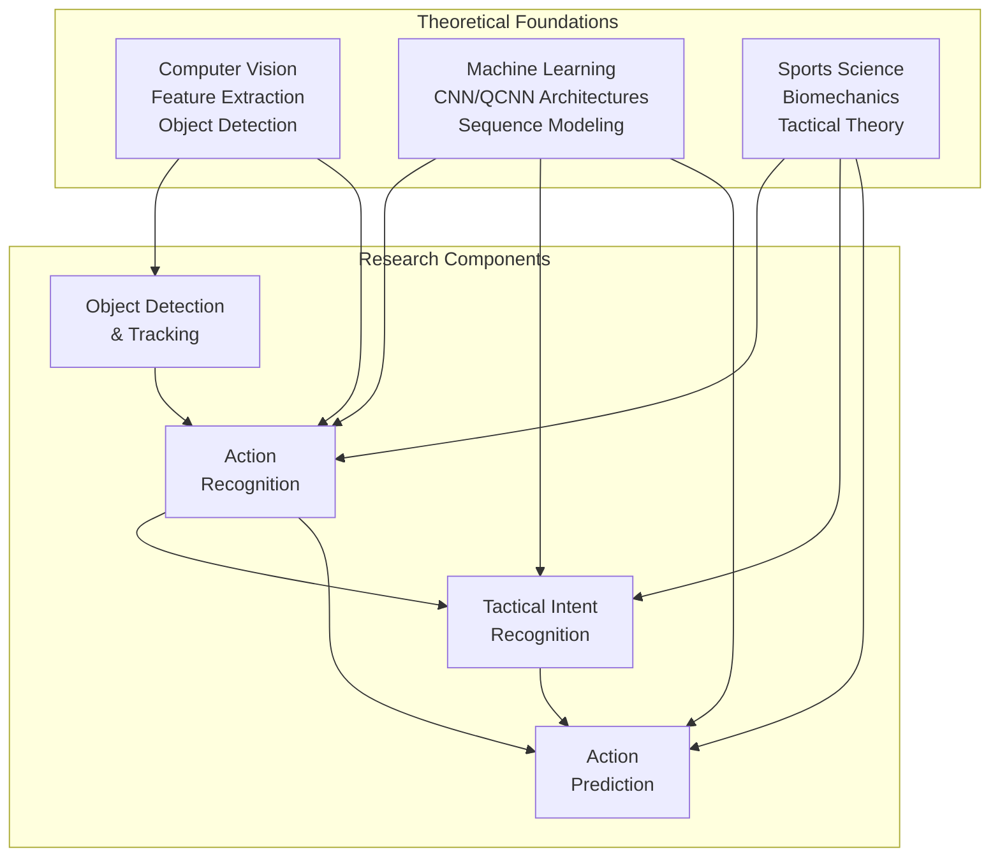

This diagram illustrates how the three theoretical foundations—computer vision, machine learning, and sports science—contribute differentially to the four research components. Computer vision principles primarily support detection and action recognition, while machine learning frameworks extend across recognition, intent understanding, and prediction tasks. Sports science knowledge informs the interpretation of recognized actions and their tactical significance.

The **interdisciplinary integration** recognizes that effective badminton video analysis cannot succeed through any single disciplinary lens. Computer vision alone can detect players and track movements but cannot interpret the strategic significance of observed actions. Machine learning can identify patterns in data but requires domain knowledge to define meaningful features and evaluation criteria. Sports science provides the contextual understanding necessary for tactical analysis but depends on computational methods to process the volume of data generated by modern video recording systems.

This theoretical framework guides the subsequent technical chapters by establishing the criteria for method selection, feature engineering, and performance evaluation. Methods are assessed not only on standard machine learning metrics but also on their alignment with biomechanical principles and practical utility for coaching applications. The framework acknowledges that the ultimate value of badminton video analysis lies in its ability to generate actionable insights that improve player performance, connecting technical achievements to meaningful outcomes in the sporting domain.

## 2 Object Detection and Tracking in Badminton Videos

This chapter investigates state-of-the-art approaches for detecting and tracking key objects in badminton videos, including shuttlecocks, players, and court boundaries. It systematically analyzes the unique technical challenges posed by badminton's high-speed dynamics, evaluates deep learning architectures and hybrid detection methods, compares camera system configurations, and examines how tracking accuracy propagates to downstream action recognition and prediction tasks.

### 2.1 Technical Challenges in Badminton Object Detection

The detection and tracking of objects in badminton videos presents a constellation of technical challenges that distinguish this domain from other sports analytics applications. These challenges stem from the fundamental physical characteristics of badminton gameplay, environmental recording conditions, and the computational demands of real-time processing systems.

**Extreme shuttlecock velocities** constitute the most formidable obstacle in badminton video analysis. The shuttlecock can travel at speeds exceeding 400 km/h during powerful smashes, with laboratory measurements recording a world record of 493 km/h in 2013[^4]. This extraordinary speed creates severe motion blur that fundamentally compromises the visual appearance of the shuttlecock in standard video frames. At typical broadcast frame rates of 25-30 FPS, a shuttlecock traveling at 400 km/h moves approximately 3.7-4.4 meters between consecutive frames, rendering traditional frame-by-frame detection approaches inadequate. The blur effect transforms the shuttlecock's appearance from a distinct object into an elongated streak or diffuse smear, dramatically reducing the effectiveness of feature-based detection algorithms trained on sharp object representations.

The **small visual footprint** of the shuttlecock presents additional detection difficulties. Unlike larger sports objects such as footballs or basketballs, the shuttlecock occupies only a minimal number of pixels in typical broadcast footage, particularly when captured from standard camera distances. This small size means that even minor image compression artifacts, sensor noise, or background texture variations can obscure the shuttlecock signal. The challenge is compounded by the shuttlecock's **rapidly varying appearance** during flight—its silhouette can present as circular when viewed end-on or triangular when viewed from the side, with continuous transitions between these configurations as the shuttlecock rotates[^4]. This shape variability prevents the use of rigid template matching approaches and requires detection models capable of recognizing the shuttlecock across its full range of visual presentations.

**Frequent occlusion events** significantly disrupt tracking continuity throughout rallies. The shuttlecock regularly passes behind players' bodies during exchanges, becomes obscured by swinging rackets during stroke execution, and may be temporarily hidden by net posts or other court fixtures. Traditional object trackers that rely heavily on single-frame spatial data struggle to maintain coherent tracking through these occlusion periods, as they cannot effectively predict the shuttlecock's position when it becomes invisible[^5]. The problem is particularly acute during close net exchanges where players' bodies and rackets create complex, rapidly changing occlusion patterns. When a player moves behind the shuttlecock, their detection blobs overlap, creating ambiguity that simple detection methods cannot resolve[^4].

The **processing speed requirements** for badminton video analysis exceed those of most other sports applications. Effective shuttlecock trajectory reconstruction requires video recording at 150-200 frames per second to capture sufficient temporal resolution for accurate position estimation[^4]. This high frame rate generates substantial data volumes that must be processed efficiently to enable near real-time analysis. Systems must execute detection algorithms, maintain tracking state, and perform trajectory analysis within strict time budgets—the complete verification procedure for challenge systems must not exceed 25 seconds[^4][^6]. These constraints drive the need for highly optimized algorithms that can operate on standard computing hardware while maintaining acceptable accuracy levels.

**Environmental factors** introduce additional variability that detection systems must accommodate. Lighting conditions vary substantially across different venues, with older sports halls particularly prone to flickering illumination that can cause false detections in differential frame-based methods[^4]. The white color of the shuttlecock may blend with scene elements including court markings, spectator clothing, or ceiling fixtures, reducing detection contrast[^4]. Background complexity from moving spectators, officials, and ball retrievers creates visual clutter that can generate false positive detections or confuse tracking algorithms. Research has demonstrated that detection models achieve significantly better performance on clear court footage compared to videos with visible audiences, with the Jaccard Similarity Index improving when background interference is minimized[^7].

The following table summarizes the primary technical challenges and their impact on detection system design:

| Challenge Category | Specific Issue | Impact on Detection | Mitigation Approach |
|-------------------|----------------|---------------------|---------------------|
| Speed | >400 km/h velocity | Severe motion blur | High frame rate capture (150-200 FPS) |
| Size | Small pixel footprint | Low signal-to-noise ratio | Specialized small object detectors |
| Appearance | Shape variability | Template matching failure | Multi-appearance training data |
| Occlusion | Player/racket blocking | Tracking discontinuity | Temporal prediction models |
| Environment | Flickering lights | False detections | Adaptive pixel-wise compensation |
| Background | Officials/spectators | False positives | Context-aware filtering |

These interconnected challenges necessitate sophisticated detection approaches that combine multiple complementary techniques rather than relying on any single method. The subsequent sections examine how researchers have addressed these obstacles through specialized deep learning architectures, hybrid detection frameworks, and multi-camera system configurations.

### 2.2 Deep Learning Architectures for Shuttlecock Detection and Trajectory Extraction

The development of specialized deep learning architectures for shuttlecock detection represents a significant advancement in badminton video analysis, addressing the unique challenges of tracking small, high-speed objects through learned representations rather than hand-crafted features.

**TrackNet** emerged as a foundational architecture specifically designed for tracking high-speed, tiny objects such as tennis balls and shuttlecocks from video footage[^8]. The network addresses low image quality issues including blur, afterimage, and short-term occlusion by accepting multiple consecutive frames as input rather than processing single frames independently. This temporal context enables the model to learn trajectory patterns that assist in detecting objects even when individual frames provide ambiguous visual information. The architecture combines the feature extraction capabilities of VGG16 with upsampling layers to produce heatmap outputs indicating probable object locations.

**TrackNetV2** introduced substantial improvements across multiple performance dimensions, making the architecture more practical for real-world deployment[^8]. The most significant enhancement involved re-engineering the network from a Multiple-In Single-Out (MISO) design to a **Multiple-In Multiple-Out (MIMO)** architecture. This structural change dramatically improved processing speed from 2.6 FPS to 31.8 FPS—a twelve-fold increase that brings the system closer to real-time operation requirements. The speed improvement was achieved through a combination of reduced input image size and the MIMO design that processes multiple output frames per forward pass, amortizing computational overhead across several predictions.

The accuracy improvements in TrackNetV2 resulted from training on a comprehensive dataset collected from diverse badminton match videos, comprising 55,563 frames from 18 matches[^8]. This dataset diversity exposed the model to varied lighting conditions, camera angles, and player configurations, improving generalization performance. The network architecture was enhanced to incorporate **U-Net structural elements** in addition to the original VGG16 and upsampling components, enabling more effective multi-scale feature integration. The evaluation metrics demonstrate strong performance:

| Metric | Training Phase | Test (New Match) |
|--------|---------------|------------------|
| Accuracy | 96.3% | 85.2% |
| Precision | 97.0% | 97.2% |
| Recall | 98.7% | 85.4% |

The gap between training and testing performance on new matches highlights the challenge of domain shift—models trained on specific match footage may not generalize perfectly to matches with different visual characteristics. However, the maintained high precision on test data indicates that when the model detects a shuttlecock, the detection is highly reliable, even if some shuttlecock instances are missed (lower recall).

A notable technical innovation in TrackNetV2 addressed **GPU memory constraints** that limited practical deployment[^8]. The original heatmap representation used a pixel-wise one-hot encoding stored as a 3D array, which consumed substantial memory. TrackNetV2 remodeled this data structure to a real-valued 2D array, significantly reducing memory requirements. This change necessitated redesigning the loss function from RMSE-based to weighted cross-entropy based formulation, ensuring that the network could still learn effective heatmap predictions despite the modified output representation.

**YOLO-based architectures** provide complementary detection capabilities, particularly for player detection and action recognition tasks. The YOLOv5 model has been applied to badminton video analysis with performance varying across match categories[^7]. The model achieved an average precision of 89.33% for adult men's matches, demonstrating strong detection capability under favorable conditions. However, performance degraded to 79.52% for junior men's matches and 73.68% for adult women's matches, where factors such as background officials created confusion for the detection system[^7]. The Jaccard Similarity Index—measuring overlap between predicted and ground truth bounding boxes—ranged from 0.73 to 0.80 across different match categories, indicating reasonable but imperfect localization accuracy.

The **YOLOv7 model** has been specifically employed for detecting player swing actions, providing a complementary signal to trajectory-based shuttlecock detection[^9]. By identifying frames where players are actively swinging their rackets, the system gains additional evidence for determining when hits occur, even if the shuttlecock itself is temporarily occluded or the trajectory detection module produces ambiguous results. This application demonstrates the value of multi-modal detection approaches that combine object tracking with action recognition.

More recent architectural developments have explored **temporal modeling limitations** of existing approaches. Traditional methods that stack multiple consecutive frames along the channel dimension for 2D convolution treat temporal information as static features rather than dynamic sequences[^5]. This approach fails to explicitly model how object motion evolves over time, limiting the ability to accurately track objects during occlusion periods when the model must rely on contextual information from preceding and following frames to infer positions. Emerging architectures incorporating explicit temporal reasoning mechanisms, such as recurrent structures or attention mechanisms operating across time, show promise for addressing these limitations.

The comprehensive review of ball detection techniques in sports confirms that **single-stage detectors** like YOLO and SSD offer speed advantages suitable for real-time applications but struggle with detecting small objects or those at significant distances[^10]. Two-stage detectors such as Faster R-CNN and Mask R-CNN achieve higher accuracy for small object detection and occlusion handling but operate too slowly for real-time requirements. This fundamental trade-off between speed and accuracy drives the development of hybrid approaches that combine the strengths of multiple detection paradigms.

### 2.3 Hybrid Detection Methods Combining Differential Frame Analysis with Neural Networks

The recognition that neither traditional computer vision techniques nor deep learning methods alone can adequately address all badminton detection challenges has motivated the development of **hybrid approaches** that strategically combine multiple detection paradigms. These methods leverage the complementary strengths of different techniques to achieve robust performance across diverse scenarios.

The **differential frame analysis** approach exploits the fundamental characteristic that the shuttlecock is a fast-moving object traveling over a relatively static background[^4]. By computing the difference between consecutive video frames, moving objects become prominently visible while static background elements cancel out. This technique provides rapid, computationally efficient detection that can operate at the high frame rates required for badminton analysis. The method is particularly effective when the shuttlecock maintains consistent motion, as the differential signal clearly distinguishes the moving object from its surroundings.

To address the challenge of **tracking the shuttlecock when it contacts the ground** and suddenly decelerates or stops, researchers developed an **accumulative differential frame** approach that aggregates information from seven consecutive differential images[^4]. This temporal accumulation maintains detection capability even when the shuttlecock's motion changes abruptly, as the accumulated signal preserves evidence of recent movement. The technique proves essential for determining the precise frame when the shuttlecock hits the ground—a critical requirement for challenge systems that must make in/out determinations.

**Shape-based filtering** complements differential detection by distinguishing the shuttlecock from other moving objects in the scene. The detection pipeline applies a series of filters that remove large blobs (likely players), small blobs (likely noise), non-pencil-like shapes inconsistent with shuttlecock appearance, objects moving at incorrect speeds, and objects moving in wrong directions[^6]. This cascaded filtering approach progressively narrows the candidate set to identify the most probable shuttlecock location. The entire detection process executes in less than 2 milliseconds on Intel Core i7 hardware, enabling real-time operation[^4].

When the **primary differential-based method fails**—typically due to player occlusion creating overlapping detection blobs—the system transitions to a neural network fallback mechanism[^4]. The process operates as follows:

1. A **Kalman filter** predicts the expected shuttlecock position based on trajectory information from preceding frames
2. A 104×104 pixel image patch is extracted from the original frame, centered on the Kalman filter prediction
3. The extracted patch is processed by a **modified Tiny YOLO neural network** specifically trained for shuttlecock detection

This fallback mechanism achieves a mean average precision (mAP@0.50) of 94%, with precision of 0.96, recall of 0.77, and F1-score of 0.86 at a threshold of 0.25[^4]. The neural network detection requires 12 milliseconds per patch, introducing acceptable latency that is eliminated once the primary method reacquires the shuttlecock[^4]. This hybrid design ensures that the system maintains near real-time performance during normal operation while retaining the ability to recover from challenging occlusion scenarios.

The **Shot Refinement Algorithm (SRA)** represents a sophisticated fusion approach that combines trajectory-based detection with action-based detection to accurately identify hitting moments[^9]. The algorithm addresses the observation that both TrackNet and YOLOv7 may produce detection misses and false detections, which can corrupt shot segmentation if used independently. The SRA integrates two complementary detection streams:

- **Hit Detection by Trajectories (HD-T)**: Identifies potential hit moments based on trajectory analysis from TrackNet
- **Hit Detection by Action (HD-A)**: Identifies potential hit moments based on player swing detection from YOLOv7

The algorithm partitions video sequences into **Hit Segments (HS)** based on contiguous HD-A detections with the same player ID[^9]. It then processes these segments through five distinct cases to determine true hit moments:

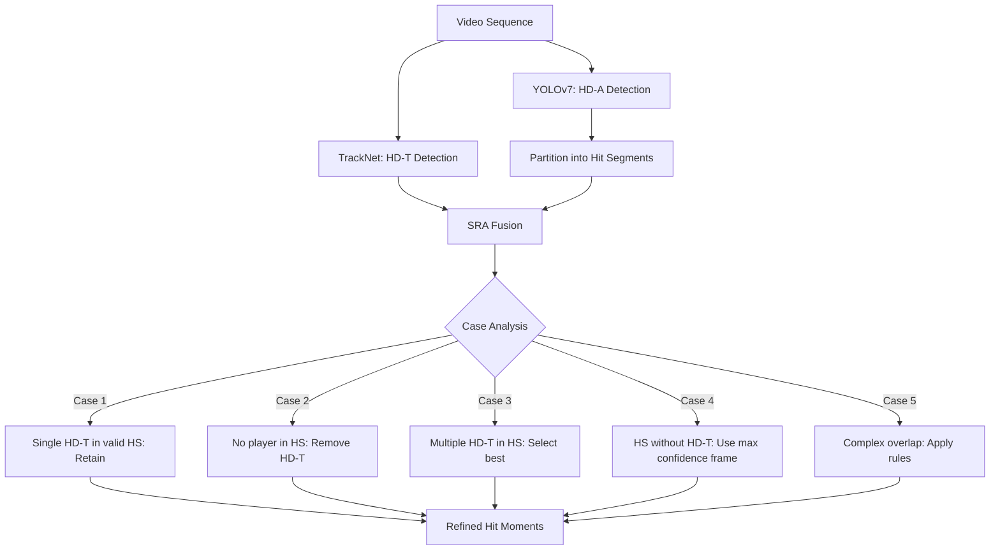

This diagram illustrates how the SRA processes detection outputs from both TrackNet and YOLOv7, partitions the video into hit segments, and applies case-specific rules to determine accurate hitting moments.

The SRA was evaluated on datasets comprising **69 matches with 1,582 rallies** from Badminton World Federation (BWF) match videos[^9]. The results demonstrate substantial improvement over trajectory-only detection:

| Method | Accuracy | Recall | F1 Score |
|--------|----------|--------|----------|
| TrackNet alone | 58.8% | 93.6% | 72.3% |
| SRA (basic) | 84.3% | 88.2% | 86.2% |
| SRA (tuned TrackNet) | 89.7% | 91.3% | 90.5% |

The dramatic improvement in accuracy (from 58.8% to 89.7%) while maintaining high recall demonstrates that the fusion approach effectively eliminates false positives generated by trajectory-only detection, using action-based evidence to validate or reject trajectory-based hit candidates[^9]. The tuned TrackNet configuration increases detection sensitivity to capture more potential hits, with the SRA then filtering out false positives to achieve both high precision and high recall.

For **instant review systems** deployed at professional tournaments, the hybrid approach enables correct automated decisions in 62% of cases[^4][^6]. While this accuracy requires human operator verification before final presentation, the system provides valuable decision support that accelerates the review process. The average response time from challenge initiation to decision presentation is 18 seconds, with the complete procedure constrained to under 25 seconds[^4][^6]. Data from the BWF World Senior Badminton Championships revealed that line judges were incorrect in 24.2% of challenged calls (51 out of 211 challenges), demonstrating the practical value of automated review systems[^6].

### 2.4 Player Detection and Multi-Camera Tracking Systems

Accurate player detection and tracking provides essential contextual information for badminton video analysis, enabling the extraction of positional features that inform both tactical analysis and shot classification. The approaches range from single-camera solutions optimized for accessibility to multi-camera configurations designed for professional deployment.

**Single-camera player detection** using YOLO-based models offers a practical solution for analyzing existing badminton footage without specialized recording equipment. Research implementing YOLOv5 for player detection achieved varying performance across match categories, with adult men's matches yielding the highest average precision of 89.33%[^7]. The model's one-shot learning architecture enables rapid processing suitable for real-time applications, using anchor boxes and data augmentation to achieve high recognition accuracy. However, performance degraded when background elements introduced confusion—adult women's matches achieved only 73.68% precision due to clear images of judges and chairs being misidentified as players[^7].

The **Jaccard Similarity Index** (Intersection over Union) provides insight into localization accuracy beyond simple detection rates. Across match categories, the index ranged from 0.73 to 0.80, indicating that detected bounding boxes overlap substantially but not perfectly with ground truth annotations[^7]. Performance improved when tested on clear court footage without audience visibility, confirming that background complexity significantly impacts detection accuracy. These findings emphasize the importance of training data diversity and the potential need for venue-specific model adaptation.

**Multi-camera tracking systems** address fundamental limitations of single-view analysis, particularly the challenges of player occlusion and overlapping during close exchanges. A two-camera approach leveraging one overhead camera and one side-view camera demonstrates how complementary perspectives can be combined for robust tracking[^11]. The overhead camera provides optimal visibility for tracking player trajectories across the court, while the side camera enables analysis of pixel features for player identification and action recognition. By computing correlations between adjacent frames and integrating information from both cameras, the system achieves multi-object tracking (MOT) that maintains player identity through occlusion events.

The **instant review system architecture** evolved from initial designs using cameras mounted both above and around the court for 3D tracking to a simplified configuration using only cameras placed around the court close to the lines[^6]. This architectural change eliminated the need for 3D reconstruction while maintaining sufficient accuracy for in/out determination, significantly reducing installation complexity. The simplified system can be operational within two to three hours, making it practical for deployment across multiple courts at tournament venues. The system was successfully used during the BWF World Senior Badminton Championships in Katowice, processing challenges across 12 courts where over 1,500 players competed[^6].

**Pose estimation** provides detailed body configuration information beyond simple bounding box detection. The DensePose model extracts player body poses in each frame, with particular attention to ankle positions that serve as reference points for court positioning[^9]. These ankle coordinates undergo **perspective transformation** to map from image coordinates to a planar court coordinate system, enabling accurate representation of player positions relative to court boundaries and lines. The transformed coordinates provide essential features for subsequent shot classification, as player positioning at the moment of contact significantly influences stroke type determination.

Operational challenges in multi-camera systems include **camera calibration** across different viewing angles, synchronization of video streams from multiple sources, and handling of hardware issues such as camera movement or cable disconnection during extended tournament operation[^6]. Environmental factors compound these challenges—variable lighting conditions between courts, limited space for camera placement in multi-court venues, and the need for secure mounting that prevents accidental camera displacement. Addressing these practical concerns requires robust system design that can detect and compensate for calibration drift and equipment failures.

The **voting mechanism** employed when results from different cameras disagree demonstrates a principled approach to multi-view fusion[^6]. Rather than relying on any single camera's determination, the system aggregates evidence across views, with cameras positioned on both sides of each line providing redundant coverage. This redundancy improves reliability by ensuring that temporary occlusion or detection failure in one view does not prevent accurate determination if other views maintain clear visibility.

### 2.5 Court Boundary Detection and Spatial Calibration

Accurate detection of court boundaries and establishment of spatial reference frames provides the geometric foundation for position mapping, in/out determination, and tactical analysis. This calibration process transforms raw image coordinates into meaningful court-relative positions that enable quantitative analysis of player movements and shot placements.

**Court line detection** must contend with substantial environmental variability across different venues and recording conditions. Lighting conditions range from natural daylight in outdoor facilities to artificial illumination in indoor halls, with older venues particularly susceptible to flickering that creates inconsistent image brightness across frames[^4]. Camera angles vary based on broadcast requirements, training video setups, and challenge system installations, requiring calibration methods that can adapt to different perspectives. Court surface colors and materials differ across venues, affecting the contrast between lines and playing surface that detection algorithms rely upon.

A particularly challenging issue involves **court mat deformation** during play[^6]. The physical stress of players' movements can cause temporary distortion of court boundaries, creating situations where the actual line positions differ from their nominal locations. This deformation introduces systematic errors in position mapping if the calibration assumes rigid court geometry. Additionally, imprecise mat assembly can result in bent court lines that deviate from their expected straight-line appearance, further complicating automated detection.

The **perspective transformation** process converts detected court features from image space to a standardized court coordinate system[^9]. This transformation requires identifying corresponding points between the image and a known court model, typically using court corners or line intersections as reference landmarks. Once the transformation parameters are established, any point in the image can be mapped to court coordinates, enabling consistent position representation regardless of camera placement. The transformation is critical for comparing player positions across different matches recorded from different angles.

For **challenge systems** requiring in/out determination, the calibration must achieve sufficient accuracy to distinguish landing positions within centimeters of court boundaries[^4][^6]. The system calculates the shuttlecock's ground impact point from trajectory analysis and compares this position against the court model or previously detected court lines. The accuracy requirements are stringent—the difference between an in and out call may be only a few centimeters, demanding precise calibration that accounts for lens distortion, camera positioning errors, and court surface variations.

**Adaptive calibration methods** address the challenge of maintaining accuracy throughout extended recording sessions. Camera positions may shift slightly due to vibration or accidental contact, court surfaces may deform under player movements, and lighting conditions may change as natural light varies or artificial lighting warms up. Systems that periodically recalibrate using detected court features can compensate for these gradual changes, maintaining accuracy that would otherwise degrade over time.

The limitation of **monocular camera systems** for 3D position estimation represents a fundamental constraint acknowledged in current research[^9]. Single-camera configurations cannot correctly back-project 2D image coordinates to 3D real-world coordinates without additional assumptions or constraints. This limitation affects the accuracy of ankle coordinate extraction and can lead to misjudgments of player positions and shot types. Future research directions include obtaining accurate 3D coordinates of both the shuttlecock and player ankles in real-world space, potentially through stereo camera configurations or depth sensing technologies.

### 2.6 Impact of Tracking Accuracy on Downstream Action Recognition Tasks

The accuracy of object detection and tracking directly determines the quality of features available for higher-level analytical tasks, establishing a critical dependency between foundational tracking and advanced analysis capabilities. This section examines how tracking performance propagates through the analysis pipeline to influence shot classification, action recognition, and tactical understanding.

**Shot type classification** demonstrates the clearest relationship between tracking accuracy and downstream task performance. The extracted shots from trajectory analysis serve as the basis for classifying strokes into seven primary categories: clear, drive, smash, net, drop, lift, and push[^9]. Classification relies on features derived from accurate tracking, including:

- **Players' ankle positions** at the moment of contact, indicating court positioning and body orientation
- **Shuttlecock flight duration**, reflecting the trajectory length and shot power
- **Shuttlecock displacement**, capturing the spatial extent of the shot

These features require precise temporal localization of hitting moments and accurate spatial tracking of both players and shuttlecock. When tracking errors corrupt these measurements, classification accuracy degrades correspondingly.

The comparative evaluation of shot classification accuracy using different tracking methods reveals the magnitude of this dependency[^9]:

| Tracking Method | Classification Accuracy (t-IoU 0.5) | Classification Accuracy (t-IoU 0.85) | Classification Accuracy (t-IoU 0.95) |
|-----------------|-------------------------------------|--------------------------------------|--------------------------------------|
| TrackNet alone | 54.1% | - | - |
| SRA (proposed) | 54.1% | 65.4% | 72.1% |

The temporal Intersection over Union (t-IoU) threshold determines how precisely the detected hit moment must align with the ground truth for a detection to be considered correct. At stricter thresholds requiring more precise temporal alignment, the SRA method achieves substantially higher classification accuracy (72.1% at t-IoU 0.95) compared to TrackNet alone[^9]. This improvement demonstrates that **refined shot extraction directly enables more effective classification**, as the features computed from accurately localized hits more faithfully represent the true stroke characteristics.

The **XGBoost classification model** employed for shot type prediction benefits from the seven-dimensional feature representation derived from tracking outputs[^9]. The features encode both player positioning (ankle coordinates) and shuttlecock dynamics (flight duration, displacement), capturing the essential information needed to distinguish between shot types. For example, smashes typically exhibit short flight duration with large vertical displacement, while drops show longer duration with controlled horizontal placement. Net shots occur with both players positioned near the net, distinguishable through ankle coordinate analysis.

**Error propagation** through the analysis pipeline means that tracking failures create cascading effects on all downstream tasks. A missed hit detection eliminates the corresponding shot from analysis entirely, while a false positive introduces spurious shots that corrupt rally structure understanding. Temporal mislocalization—detecting a hit at the wrong frame—produces incorrect feature values that may cause misclassification. The SRA's substantial improvement in accuracy (from 58.8% to 89.7%) while maintaining high recall directly translates to more complete and accurate shot sequences for tactical analysis[^9].

The relationship between tracking and recognition extends beyond shot classification to **rally-level analysis**. Accurate shot sequences enable the construction of tactical patterns, identification of player tendencies, and prediction of future actions. Research frameworks for tactical analysis, such as Shot2Tactic-Caption and RallyNet, depend on reliable stroke sequence inputs to infer rally-level tactics and player intent. Similarly, predictive models like ShuttleNet require accurate historical stroke data to forecast future shots. Errors in foundational tracking corrupt the inputs to these higher-level systems, limiting their effectiveness regardless of the sophistication of their modeling approaches.

The **practical implications** for system design emphasize the importance of investing in robust tracking as a prerequisite for advanced analysis. While sophisticated action recognition and prediction models may achieve impressive performance on clean data, their real-world utility depends on the quality of tracking outputs they receive. The demonstrated improvement from 54.1% to 72.1% classification accuracy through refined tracking represents a substantial capability enhancement that would be difficult to achieve through recognition model improvements alone. This finding argues for continued research investment in tracking methods alongside the development of higher-level analytical capabilities.

The dependency structure also suggests opportunities for **feedback-based refinement**, where higher-level analysis results can inform and improve tracking. For example, recognized shot types impose constraints on plausible trajectories, and tactical context may indicate expected player positions. Incorporating these top-down signals into tracking algorithms could improve robustness in challenging scenarios, creating a mutually reinforcing relationship between tracking and recognition components.

## 3 Recognition of Technical Actions in Singles Play

This chapter systematically investigates methodologies for classifying and recognizing technical actions performed by singles badminton players from video data. Building upon the foundational detection and tracking capabilities established in Chapter 2, this chapter addresses how the spatial and temporal information extracted from video streams can be transformed into meaningful stroke classifications. The analysis establishes the taxonomic framework of badminton strokes aligned with international standards, examines the biomechanical characteristics that enable computational distinction between stroke types, compares diverse feature extraction approaches spanning pose estimation, spatiotemporal deep learning, and sensor-based methods, evaluates the performance of various recognition architectures under different conditions, and examines the role of specialized datasets in advancing fine-grained action classification accuracy.

### 3.1 Taxonomy of Badminton Strokes and Biomechanical Characteristics

The systematic classification of badminton strokes provides the essential categorical framework upon which recognition systems are built. Establishing a comprehensive taxonomy aligned with international standards ensures that computational systems can produce outputs meaningful to coaches, players, and analysts who operate within established terminological conventions.

**The Badminton World Federation (BWF) standards** define the authoritative classification of stroke types used in competitive play. The VideoBadminton dataset, designed specifically for badminton action recognition, incorporates **18 distinct stroke categories** that comprehensively cover the technical repertoire of skilled players[^3]. These categories span the full range of offensive, defensive, and transitional shots that constitute competitive singles play, providing a granular taxonomy that captures the nuanced differences between superficially similar techniques.

The complete stroke taxonomy encompasses the following primary categories and their variants:

| Stroke Category | Specific Types | Primary Tactical Function |
|----------------|----------------|---------------------------|
| **Serves** | Short Serve, Long Serve | Rally initiation, positional advantage |
| **Clears** | Clear, Defensive Clear | Court repositioning, time recovery |
| **Drops** | Drop Shot, Cut | Deception, front court pressure |
| **Smashes** | Smash, Tap Smash | Offensive finishing, point winning |
| **Drives** | Defensive Drive, Flat Shot, Rear Court Flat Drive | Neutral exchange, pace maintenance |
| **Net Shots** | Push Shot, Block, Lift | Front court control, defensive recovery |
| **Transitional** | Cross-Court Flight, Transitional Slice, Rush Shot, Short Flat Shot | Court movement, tactical adjustment |

This taxonomy reveals that badminton strokes cannot be adequately represented through simple binary distinctions (e.g., forehand versus backhand). Instead, the **18-class framework** captures essential variations in trajectory, speed, placement, and tactical intent that distinguish otherwise similar-appearing techniques[^3]. For instance, the distinction between a full smash and a tap smash involves differences in power generation, racket acceleration, and intended shuttlecock trajectory that produce meaningfully different tactical outcomes despite sharing the overhead striking motion.

**Biomechanical characteristics** provide the physical basis for computational stroke distinction. Research utilizing pose estimation and motion analysis has identified specific anatomical and kinematic parameters that serve as discriminative features for classification systems. Feature importance analysis consistently identifies **arm angle, twist angle, and step position** as the most critical factors affecting classification accuracy, with arm angle receiving the highest importance score across multiple model architectures. This finding aligns with biomechanical understanding of badminton strokes, where the angular relationship between upper arm, forearm, and racket fundamentally determines stroke mechanics.

The **arm angle configuration** varies systematically across stroke types. Overhead strokes such as clears and smashes require elevated arm positions with specific elbow flexion angles, while underhand strokes like lifts and net shots involve lower arm positions with different joint configurations. The temporal evolution of arm angle throughout the stroke execution phase provides additional discriminative information—smashes exhibit rapid arm extension during the power phase, while drops maintain more controlled, gradual movements.

**Body twist patterns** reflect the kinetic chain activation that generates power in badminton strokes. High-power shots like smashes and clears involve substantial upper body rotation that transfers energy from the legs through the torso to the striking arm. The magnitude and timing of this rotation distinguishes power shots from placement shots, where controlled precision takes precedence over raw power. Defensive strokes often exhibit minimal body rotation due to time constraints, providing another discriminative dimension for classification.

**Footwork positioning** at the moment of contact provides contextual information that constrains the space of plausible stroke types. Players positioned deep in the rear court are unlikely to execute net shots, while those positioned at the net cannot physically perform full clears. The extracted ankle coordinates from pose estimation, when transformed to court coordinates through perspective mapping, encode this positional context that informs classification decisions.

The **temporal execution phases** of strokes follow characteristic patterns that enable recognition from motion sequences rather than single frames. A complete stroke involves preparation (racket positioning), backswing (energy loading), forward swing (acceleration), contact (shuttlecock impact), and follow-through (deceleration) phases. The duration, velocity profiles, and spatial trajectories of these phases differ systematically across stroke types, providing rich temporal features for sequence-based recognition models.

### 3.2 Pose Estimation and Skeleton-Based Feature Extraction

Pose estimation approaches extract structured representations of human body configurations from video frames, transforming raw pixel data into semantically meaningful joint positions and body segment relationships. These skeleton-based representations offer several advantages for badminton action recognition, including invariance to appearance variations, reduced sensitivity to background complexity, and explicit encoding of the biomechanical features that distinguish stroke types.

**The OpenPose algorithm** has emerged as a foundational tool for human pose estimation in sports video analysis. This approach detects key joint positions including shoulders, elbows, wrists, waist, knees, and ankles, providing a comprehensive skeletal representation that captures the essential body configuration during stroke execution. The detected keypoints can be connected according to anatomical relationships to form a skeleton graph that represents the player's pose at each video frame.

The skeleton-based representation enables direct computation of the **biomechanical features** identified as critical for stroke classification. Joint angle computation derives arm angles from the spatial relationships between shoulder, elbow, and wrist keypoints, while body twist angles can be estimated from the relative orientations of shoulder and hip segments. Step position features emerge naturally from ankle keypoint coordinates, particularly when transformed to court-relative positions through the calibration procedures described in Chapter 2.

**Temporal joint trajectories** extend the single-frame skeleton representation to capture the dynamic evolution of body configuration throughout stroke execution. By tracking keypoint positions across consecutive frames, recognition systems can analyze the velocity and acceleration profiles of specific joints, the coordination patterns between different body segments, and the overall movement rhythm that characterizes different stroke types. This temporal dimension proves essential for distinguishing strokes that may appear similar in static snapshots but differ substantially in their execution dynamics.

The **Spatial Temporal Graph Convolutional Network (ST-GCN)** represents a sophisticated architecture specifically designed for skeleton-based action recognition[^3]. ST-GCN operates on a spatial-temporal graph where body joints form nodes and natural anatomical connections define edges. The model applies graph convolutional operations to learn spatial patterns of joint relationships within each frame, while temporal convolutional operations capture how these patterns evolve over time. The mathematical formulation of the spatial graph convolution aggregates information from neighboring joints:

$$f_{\text{out}}(v_{ti}) = \sum_{v_{tj} \in B(v_{ti})} \frac{1}{Z_{ti}(v_{tj})} f_{\text{in}}(p(v_{ti}, v_{tj})) \cdot w(v_{ti}, v_{tj})$$

where $B(v_{ti})$ denotes the neighbor set of joint node $v_{ti}$, $Z_{ti}(v_{tj})$ provides normalization, and $w$ represents learnable weight parameters[^3]. This formulation enables the network to learn which joint relationships are most informative for distinguishing different stroke types.

Evaluation on the VideoBadminton dataset demonstrates that ST-GCN achieves strong performance, with **Top-1 accuracy of 74.41%, Top-5 accuracy of 93.76%, and Mean Class Accuracy of 61.44%** on the full dataset[^3]. Notably, ST-GCN demonstrates **particular robustness in smaller datasets**, outperforming many video-based methods when training data is limited. On the balanced VideoBadminton-10 subset containing only 10 samples per class, ST-GCN achieved the highest Top-1 accuracy of 28.05% and Top-5 accuracy of 68.58% among all evaluated methods[^3]. This robustness suggests that skeleton-based representations provide effective inductive biases that enable learning from limited examples.

**PoseC3D** extends skeleton-based recognition by creating 2D heatmaps for each joint and limb in each video frame, then stacking these heatmaps along the temporal dimension to create a 3D heatmap volume[^3]. The joint heatmap generation follows a Gaussian formulation:

$$J_{kij} = e^{-\frac{D((i,j), j_k)^2}{2\sigma_j^2}}$$

where $j_k$ represents the k-th joint position, $D$ measures distance from pixel $(i,j)$ to the joint, and $\sigma_j$ controls the Gaussian spread[^3]. This representation preserves spatial uncertainty in joint localization while enabling standard 3D convolutional architectures to process the temporal evolution of pose information. PoseC3D achieved **Top-1 accuracy of 80.76%** on the VideoBadminton dataset, substantially outperforming ST-GCN and approaching the performance of the best video-based methods[^3].

The **advantages of skeleton-based methods** for badminton action recognition include their ability to isolate player motion from background complexity. Unlike video-based methods that must learn to ignore irrelevant visual information such as court markings, spectators, and officials, skeleton-based approaches operate on pre-extracted body configurations that inherently exclude background elements. This property proves particularly valuable for badminton analysis, where detection accuracy has been shown to degrade significantly when background elements such as line judges create visual confusion.

However, skeleton-based methods face **limitations related to pose estimation accuracy**. Rapid movements characteristic of badminton strokes can produce motion blur that degrades keypoint detection reliability. Partial occlusions during certain stroke phases may cause missing joint detections that corrupt the skeleton representation. The quality of downstream action recognition depends directly on the accuracy of upstream pose estimation, creating a dependency relationship analogous to the tracking-recognition dependency discussed in Chapter 2.

### 3.3 Spatiotemporal Feature Learning with Deep Neural Networks

Deep learning architectures designed to learn spatiotemporal features directly from video data offer an alternative approach to skeleton-based methods, operating on raw pixel information to automatically discover discriminative representations for action recognition. These approaches have achieved state-of-the-art performance on general action recognition benchmarks and have been extensively evaluated on badminton-specific datasets.

**The R(2+1)D architecture** addresses the challenge of spatiotemporal feature learning by factorizing 3D convolutions into separate 2D spatial and 1D temporal components[^3]. This decomposition offers two primary advantages: it increases model complexity without adding parameters by introducing an additional nonlinear rectification between spatial and temporal operations, effectively doubling the number of nonlinearities compared to traditional 3D convolutions; and it simplifies optimization by separating the learning of spatial patterns from temporal dynamics. On the VideoBadminton dataset, R(2+1)D achieved **Top-1 accuracy of 79.53%, Top-5 accuracy of 96.11%, and Mean Class Accuracy of 66.97%**[^3].

**The SlowFast network architecture** captures both spatial semantics and fine temporal resolution through a two-pathway design[^3]. The Slow pathway operates at a low frame rate to capture semantic content, while the Fast pathway operates at a high frame rate to capture rapid motion patterns. This design directly addresses the challenge of badminton action recognition, where understanding both the type of stroke (semantic content) and its execution speed and timing (temporal dynamics) proves essential for accurate classification. The two pathways are fused through lateral connections to enable information exchange.

SlowFast achieved the **highest overall performance** on the VideoBadminton dataset among all evaluated methods, with **Top-1 accuracy of 82.80%, Top-5 accuracy of 97.54%, and Mean Class Accuracy of 73.80%**[^3]. This performance demonstrates the effectiveness of the dual-pathway design for capturing the multi-scale temporal information present in badminton strokes. The high Top-5 accuracy indicates that even when the model's top prediction is incorrect, the true stroke type typically appears among the top five predictions, suggesting that the learned representations capture meaningful similarities between stroke categories.

**Transformer-based architectures** have been adapted for video understanding, applying self-attention mechanisms to learn relationships across both spatial and temporal dimensions. **TimeSformer** eliminates the need for convolutions entirely, instead decomposing video into sequences of frame-level patches and applying self-attention to learn spatiotemporal features[^3]. The model divides input frames into non-overlapping segments and applies attention both within segments (capturing spatial relationships) and across segments (capturing temporal relationships). Despite its architectural elegance, TimeSformer achieved lower performance on VideoBadminton with **Top-1 accuracy of 73.18% and Mean Class Accuracy of 57.70%**[^3], suggesting that the inductive biases of convolutional approaches may be better suited to the specific characteristics of badminton action recognition.

**Multiscale Vision Transformers (MViTv2)** incorporate pooling attention mechanisms and decomposed relative positional embeddings to improve upon earlier transformer designs[^3]. However, MViTv2 exhibited **significant limitations** on the VideoBadminton dataset, achieving only **Top-1 accuracy of 14.23% and Mean Class Accuracy of 10.76%**[^3]. This poor performance stands in stark contrast to the model's strong results on general action recognition benchmarks, highlighting the importance of domain-specific evaluation. The failure may relate to the fine-grained distinctions required for badminton stroke classification, where subtle differences in motion patterns must be detected despite overall similarity in body positioning and movement direction.

The following table summarizes the comparative performance of spatiotemporal deep learning architectures on the VideoBadminton dataset:

| Architecture | Top-1 Accuracy | Top-5 Accuracy | Mean Class Accuracy | Key Characteristics |
|-------------|----------------|----------------|---------------------|---------------------|
| SlowFast | **82.80%** | **97.54%** | **73.80%** | Dual pathway, multi-scale temporal |
| Swin | 81.99% | 96.52% | 69.93% | Shifted window attention |
| PoseC3D | 80.76% | 96.01% | 67.18% | Skeleton heatmap volumes |
| R(2+1)D | 79.53% | 96.11% | 66.97% | Factorized 3D convolution |
| ST-GCN | 74.41% | 93.76% | 61.44% | Graph convolution on skeleton |
| TimeSformer | 73.18% | 94.78% | 57.70% | Divided space-time attention |
| MViT-V2 | 14.23% | 62.23% | 10.76% | Pooling attention, multiscale |

This comparison reveals several important patterns. First, the **gap between Top-1 and Mean Class Accuracy** across all methods indicates that performance varies substantially across stroke categories, with some strokes being recognized much more reliably than others. This class imbalance in recognition performance likely reflects both the inherent difficulty of distinguishing certain stroke pairs and the uneven distribution of training examples across categories. Second, the **strong Top-5 accuracy** achieved by most methods (exceeding 93% for all but MViT-V2) suggests that the learned representations capture meaningful stroke similarities, even when exact classification fails. Third, the **substantial performance gap** between top-performing methods (SlowFast at 82.80%) and struggling methods (MViT-V2 at 14.23%) emphasizes that architectural choices significantly impact recognition effectiveness for this domain.

**Computational efficiency considerations** influence the practical deployment of these architectures. Training protocols vary substantially across methods, with R(2+1)D requiring 180 epochs, SlowFast 128 epochs, and TimeSformer only 15 epochs[^3]. The SlowFast architecture's dual-pathway design increases computational requirements compared to single-pathway alternatives, creating trade-offs between recognition accuracy and processing speed that must be considered for real-time applications.

### 3.4 Sensor-Based and Multi-Modal Recognition Approaches

Recognition methods that extend beyond pure video analysis to incorporate wearable sensor data offer complementary biomechanical information that can enhance stroke classification accuracy. These approaches capture physiological and kinematic signals that may not be directly observable from video, providing additional discriminative features for distinguishing between stroke types.

**The MultiSenseBadminton dataset** represents a comprehensive multi-sensor resource designed specifically for evaluating badminton stroke performance[^12]. This dataset addresses the scarcity of publicly available badminton action datasets by providing synchronized data from five types of wearable sensors: eye tracking using Pupil Invisible Glasses, body tracking through Perception Neuron Studio with 17 IMU sensors, muscle activity via EMG from gForcePro+ armband for the dominant arm and Cognionics AIM for the dominant leg, and foot pressure using Moticon insoles[^12]. This multi-modal sensor configuration captures biomechanical information across multiple dimensions simultaneously.

The dataset encompasses **7,763 badminton swing instances** collected from 25 players of varying skill levels, categorized as beginners, intermediates, and experts[^12]. The focus on two basic strokes—forehand clear and backhand drive—enables detailed analysis of how sensor modalities contribute to stroke type distinction and skill level assessment. Data collection occurred in a controlled environment using a shuttlecock launcher to ensure consistent shuttlecock trajectory, eliminating variability from opponent shot characteristics that would complicate analysis[^12].

**The annotation framework** for MultiSenseBadminton provides five levels of increasingly detailed labels[^12]:

1. **Level 1 - Stroke type**: Non-stroke, forehand clear, backhand drive
2. **Level 2 - Skill level**: Beginner, intermediate, expert (annotated by three professional coaches)
3. **Level 3 - Landing position**: Horizontal and vertical coordinates of shuttlecock landing
4. **Level 4 - Hitting point**: Front or back of body at contact
5. **Level 5 - Stroke sound**: Good, maybe, or bad quality

This multi-level annotation structure enables research beyond simple stroke classification to encompass performance quality assessment, a capability not available from video-only datasets. The inclusion of expert coach annotations for skill level provides ground truth for evaluating whether recognition systems can distinguish execution quality in addition to stroke type.

**The dataset design was informed by interviews** with three professional badminton coaches, each with a minimum of five years of coaching experience[^12]. These interviews focused on critical elements coaches attend to when teaching swing techniques, including standardized training processes, feedback strategies, and stroke execution strategies. The resulting sensor configuration reflects coaching priorities: eye gaze tracking captures visual attention patterns; EMG monitors muscle activation sequences; IMU-based body tracking records joint movements and body segment coordination; and foot pressure sensors measure weight transfer and balance maintenance.

**Technical validation** of the MultiSenseBadminton dataset demonstrated its utility through machine learning classification experiments[^12]. Models including ConvLSTM, LSTM, and Transformer architectures were applied to stroke type classification, skill level assessment, and other annotation tasks. The successful application of these models confirms that the sensor data contains discriminative information sufficient for automated analysis, establishing the dataset as a valuable resource for multi-modal recognition research.

**Sensor fusion approaches** combine information from multiple modalities to achieve recognition accuracy exceeding that of any single sensor type. The complementary nature of different sensors—video capturing spatial configuration, IMUs recording acceleration and rotation, EMG measuring muscle activation, and pressure sensors detecting ground reaction forces—provides redundant and reinforcing evidence for stroke classification. When one modality produces ambiguous signals, others may provide clearer discrimination.

However, **practical constraints limit sensor deployment** in competitive match scenarios. Wearable devices may interfere with player movement, create discomfort during extended play, or violate equipment regulations in official competitions. The controlled data collection environment of MultiSenseBadminton, while enabling high-quality synchronized recordings, differs substantially from the unconstrained conditions of actual match play. These limitations suggest that sensor-based approaches are most applicable to training environments where equipment restrictions are relaxed and the benefits of detailed biomechanical feedback justify the instrumentation overhead.

The **relationship between sensor-based and video-based recognition** presents opportunities for knowledge transfer. Insights gained from sensor data about which biomechanical features most effectively distinguish stroke types can inform the design of video-based feature extraction methods. For example, if EMG analysis reveals that specific muscle activation patterns reliably indicate stroke type, video-based systems might be designed to estimate these patterns from observable body configurations. This cross-modal knowledge transfer could improve video-based recognition without requiring sensor deployment during inference.

### 3.5 Recognition Model Architectures and Performance Evaluation

Systematic evaluation of recognition model architectures provides empirical evidence for selecting appropriate methods for badminton action classification. This section examines performance across diverse architectural paradigms, from classical machine learning approaches through quantum computing frameworks, with particular attention to robustness under varying conditions.

**Quantum Convolutional Neural Networks (QCNN)** represent an emerging frontier in badminton action recognition research. Studies comparing QCNN with traditional Support Vector Machines (SVM) and conventional CNNs for classifying five typical badminton swing movements—serve, forehand, backhand, forehand volley, and backhand volley—have demonstrated QCNN's superior performance across all classification tasks. The QCNN model achieved an **overall accuracy of 96.5%**, substantially exceeding traditional machine learning and deep learning approaches.

The performance advantage of QCNN is particularly pronounced for challenging stroke categories. For **backhand volley recognition**, QCNN achieved an F1-score of 0.860, significantly outperforming CNN (0.792) and SVM (0.753). This improvement suggests that quantum computing principles—including superposition and entanglement—enable more effective processing of the complex spatiotemporal patterns that distinguish similar-appearing strokes.

**Robustness testing under varying noise conditions** further highlights QCNN's advantages for practical deployment. Recognition systems must operate reliably across varying video quality levels, from high-definition broadcast footage to compressed training videos with significant artifacts. Under low, medium, and high noise environments, QCNN maintained classification precision scores of **0.95, 0.92, and 0.89**, respectively, clearly surpassing both CNN and SVM and indicating strong adaptability to degraded input quality. This robustness is particularly relevant for badminton analysis, where video quality cannot always be controlled and motion blur from high-speed movements introduces inherent noise.

**Feature importance analysis** from QCNN models provides insights into which biomechanical characteristics most effectively distinguish stroke types. The analysis identified that **arm angle, twist angle, and step position** are the most critical factors affecting classification accuracy, with arm angle receiving the highest importance score. This finding validates the biomechanical understanding that arm configuration fundamentally determines stroke mechanics, and suggests that recognition systems should prioritize accurate extraction of these features.

The following table presents comparative performance metrics across model architectures for badminton stroke classification:

| Model Architecture | Overall Accuracy | Backhand Volley F1 | Noise Robustness (High) | Key Advantage |
|-------------------|------------------|--------------------|-----------------------|---------------|
| QCNN | **96.5%** | **0.860** | **0.89** | Quantum feature processing |
| CNN | 92.1% | 0.792 | 0.78 | Spatial feature learning |
| SVM | 87.3% | 0.753 | 0.71 | Classical baseline |

**Hybrid architectures combining CNN, LSTM, and self-attention mechanisms** have achieved recognition accuracy of 97.83% on datasets containing 37 badminton actions, demonstrating the potential of multi-component systems that leverage complementary strengths of different architectural elements. The CNN component extracts spatial features from individual frames, the LSTM captures temporal dependencies across frame sequences, and self-attention mechanisms enable the model to focus on the most discriminative portions of the input.

The **evaluation methodology** employed across studies follows standard practices in action recognition research. The VideoBadminton dataset was partitioned into training, validation, and test subsets with an **8:1:1 distribution ratio**[^3]. The training subset served as the foundation for model training, the validation subset enabled hyperparameter optimization, and performance metrics were reported based on the held-out test subset. This protocol ensures that reported results reflect generalization performance rather than memorization of training examples.

**Data augmentation techniques** enhance model generalizability and mitigate overfitting risks. Standard augmentations including random cropping, horizontal flipping, and color jittering introduce variability that forces models to learn robust representations invariant to superficial image transformations[^3]. These augmentations prove particularly important for badminton recognition, where the relatively small size of specialized datasets limits the diversity of natural training examples.

The **gap between Top-1 accuracy and Mean Class Accuracy** observed across all methods on VideoBadminton indicates substantial variation in per-class recognition performance. SlowFast's 82.80% Top-1 accuracy paired with 73.80% Mean Class Accuracy suggests that some stroke categories are recognized much more reliably than others[^3]. This pattern likely reflects both inherent similarities between certain stroke pairs (e.g., different types of clears) and class imbalance in the training data distribution.

### 3.6 Specialized Datasets for Fine-Grained Action Classification

Purpose-built datasets play a critical role in advancing badminton action recognition research by providing standardized benchmarks for method comparison, sufficient training examples for deep learning approaches, and domain-specific annotations that capture the nuances of badminton stroke execution.

**The VideoBadminton dataset** represents the most comprehensive publicly available resource for badminton video action recognition[^3]. The dataset comprises **7,822 video clips spanning 145 minutes** of self-recorded footage, featuring 18 distinct classes of badminton strokes aligned with Badminton World Federation standards[^3]. This scope substantially exceeds prior badminton datasets in both the number of clips and the granularity of stroke categorization, establishing VideoBadminton as the current benchmark for fine-grained badminton action recognition.

**Data collection methodology** ensured high-quality recordings suitable for research purposes. The footage was recorded from practice games of **19 skilled players** from National Central University's badminton school team, including 15 male and 4 female players[^3]. The selection of skilled players—whose proficiency closely parallels professional standards—ensures that the dataset captures technically correct stroke execution rather than the variable quality that might characterize recreational play. This design choice enables models to learn from exemplary technique while potentially limiting generalization to players with less refined mechanics.

**Camera configuration** was carefully optimized for badminton video analysis. A high-quality camera (The Imaging Source DFK 37AUX273) was employed with specific parameters: **1280×960 pixel resolution, 60fps frame rate, and XRGB video format**[^3]. The camera was positioned 2 meters behind the baseline and elevated to 4.5 meters, tilted at a 30-degree angle to minimize distortion and provide an optimal field of view[^3]. This standardized setup ensures consistent recording conditions across all footage, eliminating variability that would complicate model training and evaluation.

**Data preprocessing** addressed optical distortions that could affect model training. The wide-angle lens used to capture the full court introduced distortion that was corrected using OpenCV calibration procedures[^3]. The calibration process computed camera parameters from multiple chessboard images captured at various angles, enabling mathematical correction of lens-induced curvature. Post-correction, originally curved court boundary lines appeared straight, ensuring that spatial relationships in the video accurately reflect physical court geometry.

**Expert annotation protocols** ensured label accuracy and consistency. Five students with badminton expertise participated in the labeling process, including members of the university's badminton team and players from different badminton clubs[^3]. This domain knowledge proved essential for accurately distinguishing between similar stroke types that might confuse annotators without playing experience. The labeled data underwent **review by the head coach** of the university's badminton team, who examined annotations for discrepancies and corrected errors, ensuring the reliability and validity of the final labels.

The **Shot-By-Shot (S²) Labeling tool** provided the annotation interface, enabling systematic recording of stroke information including timing, type, and player identification[^3]. The tool supports multi-stage annotation: recording basic match data, marking rally boundaries and scores, preprocessing for shuttlecock trajectory detection, and detailed shot-by-shot labeling. This structured workflow ensures comprehensive annotation while reducing the cognitive burden on human labelers.

**Dataset statistics and properties** were analyzed using both standard methods and advanced techniques. The distribution of action instances across the 18 classes exhibits natural imbalance, reflecting the varying frequency of different stroke types in actual gameplay[^3]. Some strokes (e.g., clears, drives) occur frequently, while others (e.g., long serves, tap smashes) appear less often. This imbalance creates challenges for recognition systems that may overfit to majority classes at the expense of minority class performance.

**Frame entropy analysis** quantified the visual complexity within individual videos, measuring the randomness or information content of pixel intensity distributions[^3]. Higher entropy indicates more complex, information-rich frames, while lower entropy suggests uniform content. This metric provides insight into the variation and richness of visual information across different stroke categories, potentially explaining why some strokes are easier to recognize than others.

**Balanced subsets** were created to enable controlled experimentation on class distribution effects. **VideoBadminton-10** contains 10 randomly selected samples per class, while **VideoBadminton-50** contains 50 samples per class[^3]. These subsets ensure uniform sample distribution across all stroke categories, facilitating fair comparison of model performance without confounding effects from class imbalance. Results on these subsets reveal how recognition accuracy scales with training set size:

| Subset | ST-GCN Top-1 | SlowFast Top-1 | TimeSformer Top-1 |
|--------|--------------|----------------|-------------------|
| VideoBadminton-10 | **28.05%** | 12.79% | 19.45% |
| VideoBadminton-50 | **60.70%** | 12.28% | 45.45% |
| Full Dataset | 74.41% | **82.80%** | 73.18% |

This comparison reveals that **ST-GCN demonstrates superior performance on smaller datasets**, achieving the highest accuracy on both balanced subsets[^3]. This robustness suggests that skeleton-based representations provide effective inductive biases that enable learning from limited examples. In contrast, SlowFast—the top performer on the full dataset—struggles with limited training data, achieving only 12.79% and 12.28% accuracy on the small subsets. This pattern indicates that SlowFast's strong performance depends on sufficient training examples to learn its complex dual-pathway representations.

**Potential applications** of the VideoBadminton dataset extend beyond academic benchmarking to practical coaching and analysis scenarios[^3]. The dataset enables development of systems for enhanced athlete training and performance analysis, where coaches can compare player techniques against the exemplary strokes in the dataset. Automated sports broadcasting applications can use trained recognition models to generate real-time stroke annotations for viewer engagement. Injury prevention research can analyze movement patterns to identify potentially harmful technique variations. The public availability of the dataset and associated code facilitates continued advancement in badminton action recognition research.

The **comparison with existing datasets** positions VideoBadminton within the broader landscape of action recognition resources. Unlike general-purpose datasets such as UCF101 or Kinetics that span diverse action categories, VideoBadminton provides the fine-grained categorization essential for distinguishing between similar badminton strokes[^3]. The 18-class taxonomy captures nuances that would be collapsed into a single "playing badminton" category in coarse-grained datasets, enabling the detailed stroke-level analysis required for coaching applications.

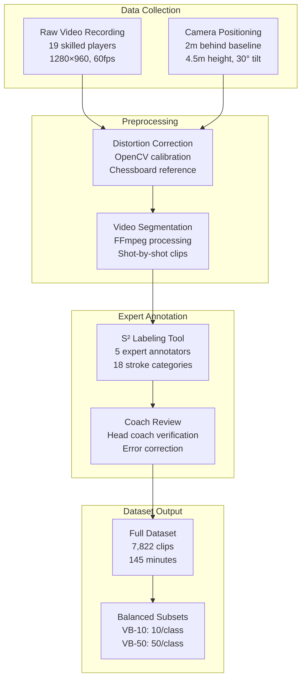

This diagram illustrates the complete pipeline for constructing the VideoBadminton dataset, from initial video recording through preprocessing, expert annotation, and final dataset organization including balanced subset creation.

The **dataset construction considerations** highlighted by VideoBadminton inform future dataset development efforts. Camera positioning and recording parameters significantly impact the visual quality and analytical utility of captured footage. Expert annotation by individuals with domain knowledge ensures label accuracy that would be difficult to achieve through crowdsourcing approaches. Preprocessing steps including distortion correction and systematic segmentation create standardized inputs suitable for machine learning pipelines. The creation of balanced subsets enables controlled experimentation that separates the effects of class distribution from inherent task difficulty.

## 4 Recognition of Tactical Intent Behind Player Actions

This chapter investigates computational approaches for understanding the strategic reasoning underlying observed player actions in singles badminton matches. Building upon the technical action recognition capabilities established in Chapter 3, this chapter addresses how recognized stroke sequences can be interpreted to infer higher-level tactical intent. The analysis examines the relationship between individual shots and tactical patterns, explores methods for detecting strategic objectives such as rally construction and opponent exploitation, and investigates how contextual match factors influence decision-making processes that can be computationally modeled from video data.

### 4.1 Theoretical Framework for Tactical Intent in Badminton Singles

Understanding tactical intent in badminton requires a conceptual foundation that bridges sports science knowledge with computational modeling requirements. Tactics in badminton singles are fundamentally described as a **battle where the deciding factor is 'thinking'**—the strokes serve merely as weapons used to execute tactical moves, with each decision to hit the shuttle to a particular place being determined by the opponent's actions and court position[^13]. This perspective establishes that technical action recognition alone, while necessary, is insufficient for comprehensive match analysis; the strategic reasoning underlying shot selection must also be captured.

The **principle of winning** provides the foundational guideline for all tactical decisions in badminton: at all times, a player should try to create a situation to increase their chances of winning the rally, or, if that is not possible, to reduce the opponent's chances[^13]. This principle implies that every shot carries intentional weight—even seemingly neutral exchanges represent deliberate choices to maintain position or await better opportunities. Computational models seeking to infer tactical intent must therefore consider not only what action was performed but why it was selected from the available alternatives.

A key concept for bridging technical actions and tactical analysis is the **stroke-move**, which integrates the stroke action with its tactical purpose[^13]. This integration recognizes that the same physical stroke—for example, a clear—may serve different tactical functions depending on context: it might be a defensive recovery shot under pressure, a building shot to create space, or a deceptive setup for a subsequent attack. The stroke-move framework suggests that recognition systems must capture both the biomechanical execution (addressed in Chapter 3) and the situational context that determines tactical meaning.

Tactical play can be conceptualized through multiple complementary perspectives. One approach categorizes stroke-moves by their **four basic tactical functions**: sending the opponent into the rearcourt, sending them into the forecourt, exploiting them in the midcourt, or sending them to the sides of the court[^13]. Each function represents a distinct spatial objective that constrains the opponent's subsequent options. Another perspective categorizes strokes by their **role within rally progression**: 'building shots' are used to create favorable situations from which 'attempted winning shots' can be played to end the rally, while shots that serve neither purpose—such as aimless 'nothing shots' or desperate 'hit and hope' shots—represent tactical failures to be avoided[^13].

Research on **naturalistic decision-making in expert badminton players** has empirically identified the hierarchical structure of tactical reasoning during competitive play. Studies involving top-23 globally ranked players revealed **three types of intentions during a rally**: to maintain the rally; to take the advantage; and to finish the point[^14]. These intentions operate at the rally level, guiding the selection of individual shots toward broader strategic goals. The most frequent intention observed was to take advantage to build the rally, indicating that expert players predominantly focus on progressive position improvement rather than immediate point termination[^14].

At a more granular level, the research identified **eight types of tactical decisions** that players make within rallies[^14]:

| Decision Type | Description | Frequency Context |
|--------------|-------------|-------------------|
| To ensure an action | Executing a reliable, low-risk shot | Defensive situations |
| To observe opponent's response | Testing opponent's capabilities | Early rally phases |
| To realize a limited choice | Selecting from constrained options | Under pressure |
| To influence opponent's decision | Shaping opponent's shot selection | Rally building |
| To put pressure on opponent | Forcing difficult returns | Advantage situations |
| To surprise opponent | Using unexpected shot selection | Serve and attack |
| To reproduce an efficient action | Repeating successful patterns | Established advantages |
| To play wide | Exploiting court width | Movement-based tactics |

The most common decisions observed were **putting pressure on opponents, surprising opponents, and influencing the opponent's decision**[^14]. These findings suggest that computational models should prioritize detecting these high-frequency tactical patterns, as they represent the dominant strategic modes employed by expert players.

The decision-making process exhibits distinct patterns across different rally phases. During the **serve**, the primary intention is to build an advantage, with the most frequent decision being to surprise opponents[^14]. For the **return of serve**, the main intention remains building advantage, but the most common decision shifts to putting pressure on opponents[^14]. In the **third or fourth shot**, while building advantage remains important, differences emerge between playing styles—some players aim to maintain the rally while others intend to finish the point[^14]. This phase-dependent variation indicates that tactical intent recognition systems should incorporate rally position as a contextual feature.

The **structured components of decision-making** identified in expert player studies provide a taxonomy for the information types that inform tactical choices. These components include **information** (player's actions/position, partner's actions/position in doubles, opponent's action/position, shuttle trajectory) and **knowledge** (abilities of self and opponent, individual and situational rules, preceding events, expectations about opponent's action, consequences of one's own actions)[^14]. The specific information and knowledge utilized varies with the type of decision being made, suggesting that computational models should dynamically weight different input features based on the tactical context being analyzed.

Expert players demonstrate **progressive, dynamic, and contextual decision-making** that relies on a sufficient understanding of the situation built from past, current, and anticipated events[^14]. This finding has direct implications for computational modeling: effective tactical intent recognition cannot rely solely on instantaneous frame-level features but must incorporate temporal context spanning the entire rally and potentially extending to match-level patterns. The decisions correspond to different control modes—scrambled (reactive), opportunistic (exploiting immediate chances), and tactical (planned sequences)—that computational systems should distinguish[^14].

### 4.2 Multi-Level Tactical Annotation and Representation Schemes

The systematic representation of tactical information extracted from badminton videos requires hierarchical annotation frameworks that capture the multi-scale nature of strategic play. Such frameworks must encode information ranging from individual stroke execution details through rally-level tactical sequences to match-level strategic patterns, enabling computational systems to reason about tactical intent at appropriate levels of abstraction.

**The FineBadminton dataset** introduces a novel **multi-level semantic annotation hierarchy** specifically designed for comprehensive badminton understanding[^15][^16]. This hierarchy addresses the fundamental challenge that fine-grained analysis of complex, high-speed sports presents significant difficulties for computational models, arising primarily from the scarcity of datasets with sufficiently rich and domain-specific annotations[^15]. The three-tier structure provides progressively abstract representations of match content:

**Level 1: Foundational Actions** offers detailed classifications of stroke types and their execution subtleties[^15]. At this level, the FineBadminton dataset encompasses **11 primary hit types and 20 subtypes**, providing granularity that exceeds the 18-class taxonomy of VideoBadminton discussed in Chapter 3[^15]. This fine-grained categorization captures variations within stroke categories that may carry tactical significance—for example, distinguishing between a defensive clear aimed at buying recovery time versus an attacking clear intended to push the opponent deep.

**Level 2: Tactical Semantics** describes ball trajectory dynamics and infers player strategic intentions[^15]. This level includes **3 categories of player actions, 9 strategic classifications, and 6 types of shot characteristics**[^15]. The tactical semantics layer bridges the gap between observable physical actions and underlying strategic reasoning, encoding information about why particular shots were selected rather than merely what shots were executed. The trajectory dynamics capture spatial patterns that reveal tactical objectives such as court coverage manipulation or opponent movement exploitation.

**Level 3: Decision Evaluation** provides expert-informed assessments of individual shot quality and entire rally narratives[^15]. At this level, individual shots are assigned a **quality score from 1 to 7**, with hitting comments averaging 37.4 words that explain the assessment rationale[^15]. This evaluative layer captures the normative dimension of tactical play—not only what happened but how well it was executed relative to optimal play. The rally narratives synthesize individual shot assessments into coherent accounts of how tactical exchanges unfolded.

The **construction of FineBadminton** is powered by an innovative automated annotation pipeline that synergistically combines **MLLM-generated proposals with human refinement**[^15][^16]. This pipeline comprises three core stages that progressively transform raw video into structured tactical representations:

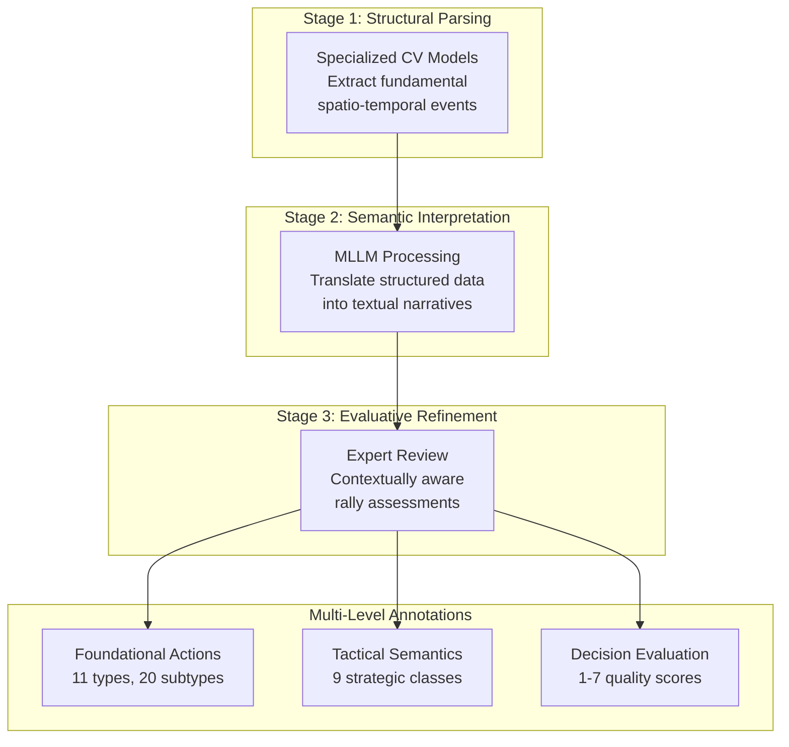

This pipeline illustrates how the FineBadminton annotation process progresses from low-level feature extraction through semantic interpretation to expert-validated evaluative assessments, producing the three-level annotation hierarchy.

The **Shot2Tactic-Caption framework** introduces an alternative multi-scale representation specifically designed for capturing tactical dynamics within rallies[^17]. This framework generates descriptions at two complementary temporal scales: **shot-level captions** describing individual actions with average duration of 0.7 seconds, and **tactic-level captions** capturing how these actions unfold within tactical execution over average segments of 5 seconds[^17]. The dual-scale design recognizes that tactical meaning emerges from shot sequences rather than individual strokes, requiring representations that span multiple temporal granularities.

A distinctive feature of the Shot2Tactic-Caption representation is its explicit modeling of **tactical execution dynamics** through five states: "start," "continue," "interrupt," "resume," and "complete"[^17]. This state-based representation acknowledges that tactics in competitive play rarely unfold exactly as planned—they may be disrupted by opponent responses and subsequently recovered. By explicitly encoding these dynamic transitions, the representation captures the adaptive, responsive nature of tactical execution that purely outcome-based annotations would miss.

The **Shot2Tactic-Caption dataset** provides concrete instantiation of this representation scheme, containing **5,494 shot-level captions and 544 tactic-level captions** collected from 10 men's doubles matches totaling approximately 7 hours 37 minutes[^17]. Tactics are classified into **9 types**: "Serve and Attack," "Continuous Smash," "Net Pressure and Scoring," "Push and Trap," "High Serve Attack," "Push and Smash," "Drop and Net Control," "Drive and Intercept," and "Rhythm Change Control"[^17]. Each tactical unit comprises multiple shots, with each shot annotated with its tactical state indicating progression within the overall tactical sequence.

The **three-phase data classification method** proposed for machine learning-based tactical analysis represents another approach to multi-level representation[^18]. This method improves upon traditional classification by incorporating **scoring/losing point landing areas and the tactical details of the last three shots**[^18]. The enhanced representation captures the critical end-game dynamics that often determine rally outcomes, recognizing that the final shots of a rally carry disproportionate tactical significance. Experimental validation demonstrated that this enriched dataset effectively supports machine learning models in learning intrinsic tactical features[^18].

The **quantitative scale** of available multi-level annotations provides context for the current state of tactical representation resources. The FineBadminton dataset encompasses **120 singles matches over the past five years, segmented into 3,215 rally clips totaling 33,325 strokes**, with average rally duration of 12.4 seconds[^15]. This scale represents a substantial resource for training and evaluating tactical analysis systems, though the annotation effort required—combining automated generation with expert refinement—highlights the challenges of creating comprehensive tactical representations at scale.

### 4.3 Rally Construction Analysis and Tactical Pattern Detection

The transformation of individual stroke sequences into coherent tactical interpretations requires computational methods capable of detecting meaningful patterns within rally progressions. This section examines approaches for identifying how shots combine into tactical units, distinguishing building shots from attempted winners, and classifying the strategic types that characterize different rally segments.

**Building shots versus attempted winning shots** represent the fundamental functional distinction in rally construction[^13]. Building shots are used to create favorable situations from which winning attempts can be launched, while attempted winning shots aim to end the rally immediately. This distinction implies that tactical analysis must go beyond stroke type classification to assess the functional role each shot plays within the evolving rally context. A smash, for example, may serve as either a building shot (pressuring the opponent to create a weak return) or a winning attempt (aimed at an unreachable court location), with the distinction depending on placement precision, opponent positioning, and rally context.

The **Shot2Tactic-Caption framework** addresses tactical pattern detection through a **dual-branch architecture** that simultaneously generates shot-level and tactic-level descriptions[^17]. Both branches incorporate a visual encoder, a spatiotemporal Transformer encoder, and a Transformer-based decoder, with the tactic branch additionally receiving shot-level prompt guidance. This architectural design recognizes that tactic-level understanding must be grounded in shot-level information while capturing emergent patterns that transcend individual strokes.

The **tactical unit detection** component of Shot2Tactic-Caption operates in two stages[^17]. Given a candidate tactical segment comprising multiple shots, the detector first predicts whether the segment corresponds to an ongoing tactic. If the segment is identified as a valid tactical unit, a second-stage classifier determines its specific tactical type and the current progression state. This two-stage approach separates the detection of tactical activity from its classification, enabling the system to distinguish between purposeful tactical execution and non-tactical rally phases.

The **five tactical states**—start, continue, interrupt, resume, and complete—provide a dynamic representation of tactical execution that captures the adaptive nature of competitive play[^17]. The "interrupt" and "resume" states are particularly significant, as they model situations where a planned tactic is disrupted by opponent response but subsequently recovered. This modeling choice reflects the reality that successful tactical execution often requires persistence through temporary setbacks rather than abandonment at the first obstacle.

The **nine tactical types** identified in the Shot2Tactic-Caption taxonomy provide a comprehensive categorization of common strategic patterns[^17]:

| Tactical Type | Description | Characteristic Pattern |
|--------------|-------------|----------------------|
| Serve and Attack | Aggressive opening from serve | Service winner or immediate pressure |
| Continuous Smash | Sustained attacking pressure | Multiple consecutive smashes |
| Net Pressure and Scoring | Front court dominance | Net shots forcing weak lifts |
| Push and Trap | Positional manipulation | Pushes creating exploitable gaps |
| High Serve Attack | Deep serve exploitation | Long serve followed by attack |
| Push and Smash | Setup and finish combination | Push creating smash opportunity |
| Drop and Net Control | Front court tactical control | Drops drawing opponent forward |
| Drive and Intercept | Flat exchange dominance | Drives and interceptions |
| Rhythm Change Control | Pace manipulation | Tempo variations disrupting opponent |

Experimental evaluation of the Shot2Tactic-Caption framework demonstrates its effectiveness in generating both shot-level and tactic-level descriptions[^17]. Using ResNet50-STE as the encoder, the system achieved **BLEU-4 of 48.99 and METEOR of 70.78 for shot-level captions**, and **BLEU-4 of 64.57 and METEOR of 79.63 for tactic-level captions**[^17]. The higher scores for tactic-level captions suggest that aggregating information across multiple shots may actually simplify the description task by averaging out frame-level noise.

The **shot-level prompt guidance mechanism** proved critical for tactic-level caption quality[^17]. Compared to configurations without prompts or with flat prompts, the shot-level prompt approach improved performance substantially: **CIDEr increased from 16.14 to 17.79, METEOR from 75.12 to 79.63, and precision from 80.70 to 90.14**[^17]. This improvement indicates that maintaining the sequential structure of shot-level information—rather than collapsing it into unordered features—helps the model understand the temporal flow of tactical execution, producing more accurate and focused descriptions.

**Qualitative analysis** of generated outputs reveals that the model produces highly accurate shot-level descriptions and coherent tactic-level narratives in most cases[^17]. The shot-level prompt provides clearer guidance to the decoder, resulting in more fluent and structured outputs. However, the system's performance depends on the quality of upstream shot detection and classification, highlighting the cascading dependencies between analysis pipeline stages discussed in previous chapters.

The **tactical analysis of specific players** demonstrates the practical application of pattern detection methods. Research analyzing the playing style of top-ranked player An Se-young revealed consistent tactical characteristics through machine learning analysis[^18]. Feature importance analysis using Random Forest and XGBoost algorithms indicated that **total shot count within a rally has the highest importance**, followed by scoring/losing point landing position[^18]. Among the last three shots, the **second-to-last and third-to-last shots** carry relatively higher importance than the final shot, suggesting that rally outcomes are often determined by the setup rather than the finishing stroke[^18].

The tactical profile emerging from this analysis characterizes An Se-young's playing style as **consistent and unified**, with balanced use of forecourt and rearcourt techniques, forehand and backhand strokes[^18]. Her strategy focuses on **gradually building advantage through rearcourt control** rather than seeking direct winners through smashes. She does not pursue continuous pressure but rather exploits opponent errors immediately when they occur, employing attacking methods such as smashes or pushes and typically completing point conversion within the subsequent 2-3 shots[^18]. The similarity between her scoring and losing patterns indicates stable playing characteristics regardless of rally outcome[^18].

### 4.4 Opponent Exploitation and Positional Vulnerability Detection

Effective tactical play in badminton fundamentally involves detecting and exploiting moments when opponents are vulnerable due to poor positioning, recovery delays, or predictable movement patterns. Computational approaches for identifying these exploitation opportunities combine spatial analysis of player positions with temporal modeling of movement dynamics.

The **'out-of-position' state** has been defined as a novel key performance indicator measuring player vulnerability in tactical analysis systems[^19]. This concept captures moments when a player's court position leaves them unable to effectively cover potential returns, creating opportunities for the opponent to execute winning shots. The out-of-position state integrates multiple factors: distance from optimal covering position, time required to reach potential return locations, and the opponent's available shot options. Detection of this state provides actionable tactical information—identifying when to attack and which court areas to target.

Computer vision methods for detecting positional vulnerability combine **object detection (YOLO) for player localization with pose estimation (MediaPipe) for body configuration analysis**[^19]. The object detection component tracks player positions across frames, while pose estimation provides detailed body orientation information that indicates readiness to move in different directions. A player facing away from the expected return direction, for example, will require additional time to rotate and respond, creating a window of vulnerability even if their court position appears adequate.

The **spatial relationship between players** provides the primary signal for vulnerability detection. The framework extracts and structures spatio-temporal events including player positions at each moment, shuttlecock trajectory, and the relative positioning of players to each other and to court boundaries[^19]. By analyzing these relationships over time, the system identifies patterns where one player's positioning creates exploitable gaps in court coverage.

**Hitting to empty spaces** represents a fundamental tactical strategy that computational systems can detect and analyze[^13]. The principle involves directing shots to court areas the opponent cannot reach in time, including: the space furthest from the opponent's current position, the space the opponent is leaving (exploiting momentum), or the sides perpendicular to the opponent's travel direction[^13]. However, this tactic is most effective when executed intelligently as part of building shot sequences rather than as isolated attempts, conforming to the principle of winning[^13].

The detection of **directional exploitation** extends spatial analysis to incorporate movement dynamics. When an opponent is moving in a particular direction, their momentum creates difficulty in reversing course, making the opposite direction temporarily vulnerable. Computational detection of this pattern requires tracking player velocity vectors and predicting the time cost of directional changes. The tactical significance of directional exploitation varies with court position—exploiting lateral movement near the sidelines is particularly effective because the court boundary limits recovery options.

Research on **visual search patterns in expert players** provides insight into how humans detect and exploit positional vulnerability[^20]. Expert players' visual focus during rallies concentrates on the **opponent's racket and the shuttlecock in flight**, with this attention being more pronounced against familiar and high-level opponents[^20]. This finding suggests that computational systems should similarly prioritize tracking racket position and shuttlecock trajectory as primary indicators of tactical opportunity. Amateur players, in contrast, exhibit unfocused visual patterns that switch frequently between opponent, feet, and shuttlecock without consistent strategy[^20].

The **timing of visual attention** reveals how experts assess vulnerability[^20]. At the start of rallies, particularly during the first serve, expert players focus on the **opponent's upper body (torso)** to gather postural cues about intended shot direction. As the rally progresses, visual focus shifts first to the **opponent's feet**, from which players can quickly infer upper body posture or rely on memorized cues about typical positioning patterns[^20]. Expert players also re-fixate on opponents after their own shots to fine-tune tactics or confirm opponent position[^20]. This sequential attention pattern suggests that computational vulnerability detection should similarly weight different body regions based on rally phase.

The **rapid decoding of unfamiliar opponents** demonstrates expert players' ability to quickly assess and exploit new tactical situations[^20]. Research found that preparation time during the first serve against unfamiliar opponents (average 670ms) was shorter than against familiar opponents (average 824ms), but by the fifth serve, preparation times had equalized (unfamiliar: 435ms, familiar: 332ms)[^20]. This convergence indicates that expert players can rapidly decode unfamiliar opponents' playing patterns, extracting exploitable tendencies within just a few exchanges. Computational systems aiming to provide real-time tactical support should similarly be capable of rapid opponent modeling.

The **structured tactical dataset** generated by computer vision processing forms the foundation for vulnerability detection[^19]. The pipeline begins with CV Processing for low-level feature extraction using YOLO and MediaPipe, followed by Parameter Extraction to derive high-level semantic attributes including the out-of-position indicator. This information populates a structured dataset that can be queried to identify moments of tactical advantage and the shot selections that successfully exploited them.

Quantitative validation of vulnerability detection systems demonstrates their accuracy on professional match footage. Evaluation on **5 full men's singles matches totaling approximately 4.5 hours and over 750 rallies** showed that object detection models achieved **mAP of 0.94 for players and 0.83 for the shuttlecock** on manually annotated ground truth of 20 complete rallies[^19]. These accuracy levels indicate that current computer vision methods can reliably extract the positional information required for vulnerability assessment, though the shuttlecock detection accuracy remains lower due to the speed and size challenges discussed in Chapter 2.

### 4.5 Contextual Factors in Tactical Decision Modeling

Tactical decision-making in badminton operates within a rich contextual environment that extends beyond immediate spatial configurations to encompass match state, historical patterns, and opponent behavioral tendencies. Computational models seeking to accurately infer tactical intent must incorporate these contextual factors that shape how players select and execute their strategies.

**The role of experience and situational knowledge** in expert decision-making provides a framework for understanding contextual influences[^14]. Research on expert players identified that decisions are informed by two categories of structured components: **information** (observable current state) and **knowledge** (accumulated understanding)[^14]. Information includes the player's own actions and position, opponent's actions and position, and shuttle trajectory. Knowledge encompasses abilities of self and opponent, individual and situational rules, preceding events, expectations about opponent's action, and anticipated consequences of one's own actions[^14].

**Information weighting varies based on source reliability and time pressure**[^21]. When situational information has high certainty—such as knowing an opponent's preferred shot in a particular position—players rely heavily on this knowledge for anticipatory decision-making. When uncertainty is high, players shift toward greater reliance on kinematic information—observable movement cues that indicate the opponent's actual shot selection[^21]. This dynamic weighting suggests that computational models should similarly adjust their feature emphasis based on the reliability of different information sources in specific contexts.

The **distinction between deliberate and intuitive decision modes** reflects how time pressure shapes tactical reasoning[^21]. Under low time pressure, players engage in deliberate decision-making, formulating primary action plans while maintaining backup alternatives. Under high time pressure, decision-making becomes predominantly intuitive, relying on automated "if-then" mechanisms formed through extensive experience[^21]. For computational modeling, this distinction suggests that different model architectures may be appropriate for different rally phases—more complex reasoning for serve situations with preparation time, simpler reactive patterns for fast exchanges.

**Match score state** represents a critical contextual factor that influences risk-taking behavior and shot selection. Research on decision determinants identified **risk management** as a key factor, where players weigh decision risks and rewards based on match situation[^21]. Leading players may adopt conservative strategies to protect their advantage, while trailing players may increase risk tolerance to create comeback opportunities. Computational models incorporating score state can better predict the tactical aggressiveness likely to characterize upcoming shots.

The **three-phase tactical analysis method** explicitly incorporates contextual information through its focus on **scoring/losing point landing areas and last-three-shot tactical details**[^18]. This representation recognizes that the final shots of a rally carry disproportionate tactical significance, as they directly determine the outcome. By encoding the spatial and sequential patterns of these critical shots, the method captures the contextual dynamics that shape point-ending decisions.

**Player-specific behavioral patterns** provide another dimension of contextual information. The analysis of An Se-young's playing style revealed that her scoring patterns closely resemble her losing patterns, indicating **stable tactical characteristics** regardless of outcome[^18]. This consistency suggests that player-specific models can be developed to predict likely shot selections based on historical tendencies. Whether in forecourt or rearcourt, she prefers to control the shuttlecock to the opponent's rearcourt sides and organize tactics from there until the final shot surprises the opponent[^18].

**Opponent tendency profiles** enable anticipatory tactical reasoning. Expert players utilize knowledge about opponent abilities and tendencies to narrow the space of likely actions before observing kinematic cues[^21]. Situational information acquisition combines explicit coaching guidance with player self-generation, with self-generated knowledge considered more durable though preferences vary individually[^21]. Computational systems can similarly build opponent profiles from historical match data, using these profiles to inform tactical intent inference.

The **prediction model for women's singles** demonstrates how contextual factors can be integrated into machine learning frameworks[^18]. Using Support Vector Machine with RBF kernel, the model achieved **prediction accuracy of 87.5%** for scoring/losing outcomes, with strong consistency across validation tests[^18]. The model incorporated the enhanced three-phase data including contextual features such as total rally length, landing positions, and last-three-shot sequences. Random Forest and XGBoost algorithms achieved lower accuracy (62.5% each), while K-Nearest Neighbors reached 75.00% and Decision Tree 56.25%[^18].

The **temporal dynamics of contextual influence** require consideration in model design. Contextual factors operate at multiple time scales: within-rally context evolves shot-by-shot, game context shifts with each point, and match context develops across games. Effective tactical modeling must integrate information across these scales, recognizing that a shot selection appropriate in one context may be suboptimal in another despite identical immediate spatial configurations.

### 4.6 Knowledge-Based Systems for Tactical Intent Inference

The transformation of video-derived tactical information into actionable insights requires knowledge representation and reasoning systems that can structure extracted data, support complex queries, and generate interpretable explanations. This section examines integrated frameworks that combine computer vision outputs with knowledge engineering approaches for comprehensive tactical analysis.

**The end-to-end framework for tactical badminton analysis** presents a pioneering approach to transforming unstructured monocular badminton video into a **queryable knowledge base of tactical insights**[^19]. This system addresses the fundamental limitation of current tactical analysis methods—their reliance on subjective intuition—by providing data-backed, computationally derived tactical understanding. The framework's primary methodological contribution is a knowledge presentation and engineering pipeline that automatically extracts and structures spatio-temporal events and player kinematic data.

The **pipeline architecture** consists of interconnected processing stages that progressively transform raw video into structured knowledge[^19]:

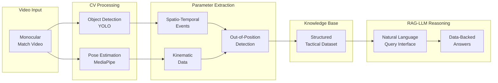

This diagram illustrates the complete pipeline from raw video input through computer vision processing, parameter extraction, knowledge base population, and RAG-enhanced LLM reasoning for tactical query answering.

The **Retrieval-Augmented Generation (RAG) enhanced Large Language Model** component creates an intelligent decision support system that enables expert users to interact with the tactical knowledge base through natural language[^19]. Coaches and analysts can pose complex queries about tactical patterns, player tendencies, and situational strategies, receiving narrative responses grounded in the extracted match data. This interface bridges the gap between computational analysis and practical coaching application, making sophisticated tactical insights accessible without requiring technical expertise in data analysis.

The **novel key performance indicator**—the out-of-position state—exemplifies how domain knowledge can be encoded into computational frameworks[^19]. Rather than simply tracking player positions, the system interprets positional data through a tactical lens, identifying moments of vulnerability that carry strategic significance. This interpretation layer transforms raw spatial data into actionable tactical information, demonstrating how knowledge engineering can add value beyond basic computer vision outputs.

**Validation of the knowledge-based system** demonstrates its effectiveness on professional match footage[^19]. The framework was evaluated on a dataset comprising **5 full men's singles matches, totaling approximately 4.5 hours of footage and over 750 rallies**, sourced from high-definition broadcasts. Quantitative validation on manually annotated ground truth showed high detection accuracy, providing a reliable foundation for the knowledge base. The study concludes that this approach **pioneers a new paradigm for interactive, AI-driven tactical discovery** by bridging advanced computation with practical expert analysis[^19].

The **TIVEE immersive visual analytics system** represents an alternative approach to knowledge-based tactical analysis, using **3D visualization in virtual reality environments** to assist users in exploring and explaining badminton tactics[^22]. The system supports multi-level tactic analysis by visualizing stroke trajectories through a multi-court layout that characterizes kinematic features while maintaining spatial and temporal correlations. Users can obtain an overview of commonly used tactics showing aggregated trajectories and statistical information including usage and scoring rates for each tactic group[^22].

The **hierarchical exploration capability** of TIVEE enables progressive drill-down from aggregate patterns to individual instances[^22]. Users first view summary statistics across tactic groups, then inspect specific tactic categories, individual tactical sequences, and finally the origin trajectories of selected tactics. This multi-level interface supports both broad pattern discovery and detailed case analysis, accommodating different analytical objectives within a unified framework.

**Case studies using TIVEE** demonstrate practical applications for tactical knowledge extraction[^22]. One study analyzed Kento Momota's playing style by examining his commonly used tactical patterns, while another developed specific tactics for Chen Long to counter Viktor Axelsen based on analysis of their historical matches. These applications illustrate how knowledge-based systems can support both player profiling (understanding one's own or opponent's tendencies) and strategic planning (developing counter-tactics for specific matchups). Expert interviews confirmed the system's effectiveness in providing **valuable tactical guidance for players**[^22].

### 4.7 Imitation Learning Approaches for Player Intent Modeling

Offline imitation learning methods offer a distinct approach to tactical intent modeling by learning to replicate observed player decision-making from historical match data. Rather than explicitly encoding tactical rules, these approaches discover strategic patterns implicitly through behavioral imitation, potentially capturing nuanced decision-making processes that resist explicit formalization.

**RallyNet** represents a novel hierarchical offline imitation learning model specifically designed for learning player decision-making strategies in turn-based sports[^23][^24][^25][^26]. The model addresses the fundamental challenge that badminton requires players to make decisions dependent on opponent actions within rapidly evolving rally contexts. By modeling the decision-making process as a **contextual Markov decision process (CMDP)**, RallyNet captures the dependencies between player decisions and situational context that characterize expert play[^23][^24].

The **two core components** of RallyNet address distinct aspects of tactical decision modeling[^23][^25]:

**The Experiential Context Selector (ECS)** leverages player experience to generate contexts that aid decision-making[^25]. The ECS extracts experiences from historical rallies using an experience extracting function, constructs a latent context space using a variational autoencoder architecture, and selects a context representing the agent's intent for the current rally[^23][^25]. This mechanism reduces the impact of partially incorrect decisions on overall behavior by ensuring that the agent's actions throughout a rally follow a coherent intent rather than reacting independently to each situation[^23]. The selected context provides a **physical interpretation of the intent underlying player behavior**, enabling tactical analysis of why particular action sequences were chosen[^23].

**Latent Geometric Brownian Motion (LGBM)** models player interactions by treating players as particles undergoing geometric Brownian motion in a latent space[^23][^25]. This formulation introduces valuable **inductive bias for learning player behavior** by leveraging the mathematical properties of GBM—a continuous-time stochastic process with Gaussian-distributed increments[^23]. The LGBM component enables the agent's decisions to jointly consider opponent behavior, generating more realistic action sequences that reflect the interactive nature of competitive play[^25].

The **hierarchical architecture** of RallyNet reflects the multi-scale nature of tactical decision-making:

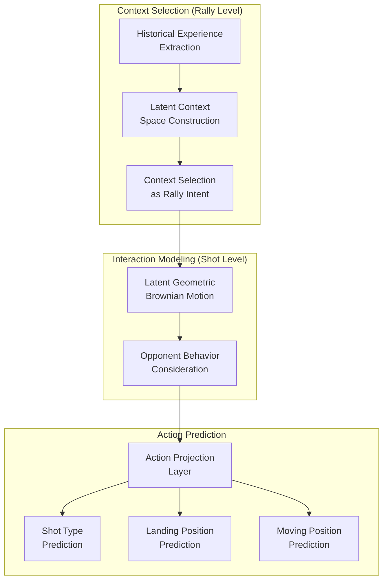

This diagram illustrates RallyNet's hierarchical structure, progressing from rally-level context selection through shot-level interaction modeling to specific action predictions.

**Experimental evaluation** on the largest available real-world badminton singles dataset demonstrates RallyNet's effectiveness[^26]. The dataset contains **75 singles matches with 4,325 rallies and 43,191 strokes**[^26][^27]. Evaluation employed three criteria: behavioral sequence similarity (RQ1), rally duration realism (RQ2), and outcome consistency (RQ3)[^26].

Quantitative results show that RallyNet **outperforms baseline methods by substantial margins**[^23][^24][^26]:

| Metric | RallyNet Advantage |
|--------|-------------------|
| Rule-based Agent Normalized Score (MRNS) | At least 16% higher than baselines |
| CTC Loss (shot type) | At least 7.08 lower than baselines |
| DTW Distance (landing position) | At least 8.27% lower than baselines |
| DTW Distance (moving position) | At least 1.16% lower than baselines |

The **rally length distribution** generated by RallyNet most closely matches the real distribution among all evaluated methods, indicating that the model captures the natural dynamics of rally progression[^23][^26]. In **win rate consistency**, RallyNet's simulated outcomes differ from actual outcomes by a maximum of 8.15% and an average of only 3.79%, substantially outperforming Behavior Cloning and Hierarchical Behavior Cloning baselines[^26].

**Ablation studies** confirm the contributions of both ECS and LGBM components[^25]. Adding ECS to basic Behavior Cloning significantly improved shot type and landing position prediction. Incorporating LGBM further enhanced performance, particularly for moving position prediction, demonstrating its effectiveness in capturing player interactions[^25].

**Case studies** illustrate RallyNet's practical utility for sports analytics[^23][^25][^26]. The model can simulate specific players' behavior under different initial states to characterize their playing styles, revealing tactical tendencies that may not be apparent from aggregate statistics. Additionally, by decoding the selected contexts, analysts can obtain **tactical interpretations of player intentions** underlying observed action sequences[^23][^25]. This interpretability distinguishes RallyNet from black-box prediction models, providing insights into the strategic reasoning that guides player decisions.

The **broader significance** of imitation learning approaches lies in their ability to capture implicit tactical knowledge that expert players may not be able to articulate explicitly. By learning from large collections of expert play, these models can internalize sophisticated decision-making patterns that emerge from years of competitive experience. The connection between player intent and GBM-based interaction modeling offers **potential inspiration for researchers studying other turn-based sports**[^23].

### 4.8 Evaluation Metrics and Validation for Tactical Intent Recognition

The evaluation of tactical intent recognition systems presents unique challenges that extend beyond standard machine learning metrics. Tactical understanding involves subjective interpretation, context-dependent correctness, and practical utility for coaching applications that resist simple quantification. This section examines evaluation frameworks, benchmark datasets, and validation methodologies appropriate for assessing tactical analysis systems.

**The FBBench benchmark** derived from the FineBadminton dataset provides a rigorous evaluation framework for assessing multimodal large language models on **nuanced spatio-temporal reasoning and tactical comprehension**[^15][^16]. FBBench comprises **four core domains**: Count, Action, Position, and Cognition, each divided into three specialized subcategories, resulting in **12 distinct task types**[^15]. The benchmark contains **2,563 question-answer pairs**, with 2,413 being multiple-choice and 150 being open-ended[^15].

The **domain structure of FBBench** targets different aspects of tactical understanding:

| Domain | Focus | Example Tasks |
|--------|-------|---------------|
| Count | Quantitative reasoning | Shot counting, rally length |
| Action | Stroke recognition | Shot type identification, execution quality |
| Position | Spatial reasoning | Player positioning, court coverage |
| Cognition | Strategic understanding | Tactical intent, decision rationale |

This multi-domain structure enables fine-grained diagnosis of model capabilities, identifying specific weaknesses in tactical understanding rather than providing only aggregate performance measures.

**Evaluation results on FBBench** reveal that current multimodal large language models face **significant challenges in deep sports video analysis**[^15][^16]. Even top commercial models including Gemini 2.5 Pro, Doubao 1.5 Pro, and GPT-4.1 struggled with the benchmark's demands. However, the proposed optimization strategies—**Hit-Centric Keyframe Selection** to focus on pivotal moments and **Coordinate-Guided Condensation** to distill salient visual information—achieved substantial performance gains[^15]. The optimized Qwen2.5VL-7B achieved an overall **42.06% multiple-choice accuracy**, surpassing all evaluated commercial models[^15][^16].

**Ablation studies** confirmed the effectiveness of the proposed strategies and domain-specific fine-tuning, which together produced synergistic performance improvements[^16]. The Hit-Centric Keyframe Selection addresses the challenge that badminton actions occur in brief, critical moments that may be missed by uniform frame sampling. The Coordinate-Guided Condensation helps models focus on tactically relevant spatial information rather than being distracted by irrelevant visual content.

**Tactical unit detection and caption generation metrics** provide quantitative assessment of rally-level tactical analysis[^17]. The Shot2Tactic-Caption framework evaluation employed standard natural language generation metrics:

| Task Level | BLEU-4 | METEOR | CIDEr |
|------------|--------|--------|-------|
| Shot-level captions | 48.99 | 70.78 | - |
| Tactic-level captions | 64.57 | 79.63 | 17.79 |

The higher scores for tactic-level captions compared to shot-level captions suggest that aggregating information across shots may simplify description by averaging noise, while the improvement from shot-level prompting (CIDEr from 16.14 to 17.79) demonstrates the value of maintaining sequential structure in tactical reasoning[^17].

**Expert validation through case studies and interviews** provides qualitative assessment that complements quantitative metrics[^22]. The TIVEE system was evaluated through case studies analyzing specific players' tactical patterns and expert interviews assessing the system's utility for coaching applications. Experts confirmed the system's effectiveness in **finding patterns of commonly used tactics** and providing **explanations of tactical feasibility**[^22]. This validation approach recognizes that tactical analysis systems must ultimately serve human experts, whose assessment of practical utility cannot be fully captured by automated metrics.

**The gap between computational outputs and actionable coaching insights** represents a critical evaluation criterion that extends beyond technical performance measures. A system achieving high accuracy on benchmark tasks may still fail to provide insights that coaches can translate into training recommendations or match strategies. Research on expert decision-making suggests that coaching should **move beyond regimented routines to develop players' abilities for dynamic, contextual understanding**[^14]. Tactical analysis systems should therefore be evaluated not only on their accuracy in recognizing patterns but also on their ability to support this developmental goal.

**Cross-validation with human expert analysis** provides another validation approach. The tactical analysis of An Se-young using machine learning methods produced characterizations that align with observable playing patterns—her consistent style, balanced technique usage, and preference for building advantage through rearcourt control rather than direct attacking[^18]. The convergence between computational analysis and expert observation provides evidence that the models capture genuine tactical patterns rather than spurious correlations.

The **challenge of ground truth definition** complicates tactical intent evaluation. Unlike stroke type classification where ground truth can be objectively determined, tactical intent involves subjective interpretation of player reasoning that may not be directly observable. Different experts may disagree on the intent behind specific actions, and players themselves may not always be conscious of their tactical reasoning. Evaluation frameworks must acknowledge this inherent ambiguity while still providing meaningful assessment of system performance.

**Future evaluation directions** should address the temporal dynamics of tactical analysis. Current benchmarks primarily assess recognition of tactical patterns in completed rallies, but practical coaching applications require real-time or near-real-time analysis that can inform in-match adjustments. Evaluation protocols that assess system performance under time constraints and with incomplete rally information would better reflect practical deployment requirements.

## 5 Prediction of Singles Players' Subsequent Actions

This chapter investigates predictive modeling approaches for forecasting future player actions in singles badminton based on observed rally sequences. Building upon the tactical intent recognition capabilities established in Chapter 4, this chapter examines how historical stroke data, player positioning, and tactical context can be computationally integrated to predict shot type and placement. The analysis systematically evaluates sequence-to-sequence prediction frameworks, Transformer-based architectures and their variants, prediction accuracy across different temporal horizons, and the incorporation of player-specific behavioral patterns into predictive models, while also exploring practical applications for real-time coaching feedback and opponent strategy analysis.

### 5.1 Problem Formulation and Computational Framework for Stroke Forecasting

The prediction of future strokes in badminton rallies constitutes a challenging computational problem that requires modeling the complex interplay between player decisions, spatial dynamics, and tactical context. Establishing a rigorous problem formulation provides the foundation for developing and evaluating predictive models that can generate actionable forecasts for coaching and analysis applications.

**Stroke forecasting is formally defined as a sequence-to-sequence prediction task** where the objective is to predict future stroke attributes based on observed rally history. In this formulation, a rally $S$ is represented as an ordered sequence $S = [s_1, s_2, \ldots, s_N]$ where each stroke $s_i$ encapsulates multiple attributes including shot type (from a predefined taxonomy of stroke categories), landing location (spatial coordinates on the court), and the positions of both players at the moment of contact[^28]. The prediction task involves generating forecasts for future strokes $s_{i+1}, s_{i+2}, \ldots$ given the observed sequence of preceding strokes.

The **temporal structure of prediction problems** varies based on application requirements. Given an observation window of $\tau$ strokes, the model must predict the subsequent $n$ strokes, where $n$ may be fixed or variable depending on the actual rally length[^29]. The ShuttleSet22 challenge established a standardized protocol where $\tau = 4$ observed strokes serve as input, with models required to predict variable-length future sequences that extend until the rally concludes[^30]. This formulation captures the practical scenario where analysts observe the opening exchanges of a rally and seek to anticipate how play will develop.

**The stochastic nature of player decision-making** fundamentally shapes the prediction framework. Unlike deterministic physical systems, badminton players exercise agency in selecting their responses, introducing inherent unpredictability that cannot be fully resolved through improved modeling[^29]. This stochasticity necessitates probabilistic prediction approaches that generate multiple plausible future sequences rather than single deterministic forecasts. The evaluation protocol reflects this reality by requiring each prediction system to generate **6 predicted sequences for each rally**, from which the closest match to ground truth is selected for evaluation[^30]. This multi-hypothesis approach acknowledges that correct prediction may correspond to any of several reasonable continuations rather than a unique solution.

The **dual prediction targets**—shot type and landing location—present distinct computational challenges that require different modeling approaches and evaluation metrics. Shot type prediction involves classification among discrete stroke categories (such as clear, smash, drop, or net shot), while location prediction requires regression to continuous spatial coordinates on the court[^30]. The evaluation framework employs **cross-entropy loss for shot type prediction** and **mean absolute error (MAE) for area coordinates prediction**, reflecting the categorical versus continuous nature of these targets[^30].

The following table summarizes the key elements of the stroke forecasting problem formulation:

| Component | Specification | Rationale |
|-----------|--------------|-----------|
| Input representation | Sequence of τ observed strokes with type-location pairs | Captures rally history and spatial dynamics |
| Output target | Next n strokes with shot type and landing coordinates | Enables tactical anticipation |
| Shot type evaluation | Cross-entropy loss | Appropriate for categorical prediction |
| Location evaluation | Mean absolute error | Measures spatial prediction accuracy |
| Prediction multiplicity | 6 sequences per rally | Accommodates decision stochasticity |
| Observation length (τ) | Typically 4 strokes | Balances context with prediction horizon |

**Feature vector construction** transforms raw stroke data into representations suitable for machine learning models. For each game within a match, the frequency of technical actions for both the serving and receiving sides is calculated to construct feature vectors[^31]. A particularly effective representation involves computing the **difference between server and receiver action frequencies**, creating a relative feature vector that captures the comparative tactical patterns of the two players. The match outcome label is then set to 1 if the server wins and 0 if the receiver wins, enabling supervised learning of the relationship between action patterns and outcomes[^31].

The **turn-based nature of badminton** introduces structural constraints that prediction models must respect. Players alternate strokes in a fixed sequence determined by the rally's progression, meaning that predictions must maintain this alternating structure while accounting for the distinct playing styles and tactical tendencies of each player[^32]. This characteristic distinguishes badminton from sports with simultaneous player actions and enables specialized modeling approaches that explicitly represent the turn-based interaction pattern.

**Temporal dependencies across multiple scales** complicate the prediction task. At the finest scale, consecutive strokes exhibit strong dependencies—a defensive lift typically follows an attacking smash, while a net shot often precedes either another net exchange or a lift to the rear court. At broader scales, rally-level tactical patterns emerge from shot sequences, and match-level strategic adjustments may influence shot selection based on score state and accumulated opponent knowledge. Effective prediction models must integrate information across these temporal scales to generate contextually appropriate forecasts.

### 5.2 Transformer-Based Architectures for Rally Progress Modeling

The Transformer architecture has emerged as the dominant framework for sequence modeling in stroke forecasting, with specialized variants designed to capture the unique characteristics of badminton rally dynamics. **ShuttleNet** represents the state-of-the-art approach, introducing architectural innovations that explicitly model rally progress and player styles through a position-aware fusion framework[^32].

**ShuttleNet's core innovation lies in its dual-extractor architecture** that separates the modeling of rally progression from individual player characteristics[^32]. The framework employs two modified encoder-decoder Transformer structures: a **rally extractor** that captures the current progress and momentum of the ongoing rally, and a **player extractor** that models the distinctive playing styles of each participant. This separation recognizes that effective prediction requires understanding both what is happening in the rally (tactical context) and who is playing (individual tendencies).

The **rally extractor** processes the sequence of observed strokes to capture the evolving tactical situation. Each stroke is represented by its type and location, with positional encodings indicating the stroke's position within the rally sequence. The Transformer encoder applies self-attention mechanisms to learn relationships between strokes, identifying patterns such as attack-defense sequences or positional manipulation tactics. The decoder then generates predictions conditioned on this rally context, producing forecasts that reflect the logical continuation of observed tactical patterns.

The **player extractor** operates in parallel to model the characteristic behaviors of each player. By maintaining separate representations for the two players in a rally, ShuttleNet can capture asymmetric playing styles—one player may favor aggressive baseline attacks while another prefers patient net control. The player-specific representations encode tendencies such as preferred shot selections in particular court positions, typical response patterns to specific opponent actions, and characteristic risk-taking behavior. These representations condition the prediction process, ensuring that forecasts align with the modeled player's typical behavior.

The **position-aware gated fusion network** integrates information from both extractors by conditioning on information dependency and positional context[^32]. Rather than simply concatenating rally and player representations, the fusion network learns to weight different information sources based on their relevance to the current prediction position. For early rally predictions, rally context may dominate as tactical patterns are still developing, while later predictions may rely more heavily on player-specific tendencies as the rally approaches critical moments. The gating mechanism enables this adaptive integration.

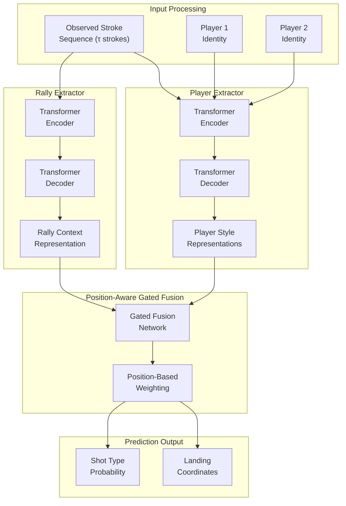

This diagram illustrates ShuttleNet's dual-extractor architecture with position-aware fusion, showing how rally context and player style representations are integrated for prediction.

**Extensive experiments demonstrate ShuttleNet's superiority over conventional sequential models**[^32]. On the ShuttleSet benchmark, ShuttleNet significantly outperforms baseline approaches including Seq2Seq, CF-LSTM, standard Transformers (TF), dNRI, and DMA-Nets across multiple evaluation settings[^33]. The model's effectiveness is attributed to its **turn-based architecture that separates the styles of both players in a rally and integrates them with the current rally condition**[^30]. This architectural design directly addresses the characteristics of badminton as a turn-based sport where player interactions follow a structured alternation pattern.

**Ablation studies validate the contribution of each ShuttleNet component**[^32]. Removing the player extractor degrades performance by eliminating the ability to condition predictions on individual playing styles. Removing the rally extractor similarly reduces accuracy by losing the tactical context that informs shot selection. The position-aware fusion mechanism proves essential for effectively combining these information sources, with simpler fusion approaches yielding inferior results. These findings confirm that ShuttleNet's architectural innovations provide genuine improvements rather than merely increasing model complexity.

The **ShuttleNet codebase** is publicly available, enabling researchers to build upon this foundation[^34]. The implementation uses Python with the scikit-learn and PyTorch ecosystems, with training scripts, evaluation procedures, and generation utilities provided. The repository structure supports reproducible research through standardized data formats, configurable hyperparameters, and logging of experimental results. This accessibility has enabled ShuttleNet to serve as the official baseline for subsequent stroke forecasting challenges.

**Performance metrics from the CoachAI Badminton Challenge** provide quantitative benchmarks for ShuttleNet and competing approaches[^30]. ShuttleNet achieved a cross-entropy loss of 2.1777 for shot type prediction and MAE of 0.6997 for area coordinates prediction, yielding a combined score of 2.8774. While 11 teams in the challenge surpassed this baseline, most improvements were built upon ShuttleNet's architecture, highlighting its **flexibility and potential for enhancement through hyperparameter tuning and activation function modifications**[^30]. The challenge results demonstrate that ShuttleNet provides a strong foundation while leaving room for architectural refinements.

### 5.3 Skeleton-Based and Multi-Modal Prediction Approaches

Extending prediction models beyond discrete stroke sequences to incorporate continuous motion data offers the potential for richer representations that capture the physical dynamics underlying shot execution. **RallyTemPose** exemplifies this approach, introducing a Transformer encoder-decoder architecture that leverages court positions, skeleton poses, and player-specific embeddings to learn latent representations for enhanced prediction[^35].

**The scientific objective of skeleton-based prediction** is to improve forecast accuracy by incorporating the actual motion of players through 2D skeleton pose data[^35]. Each stroke in a rally is described not only by its categorical type and discrete location but also by a sequence of poses $K^{(i)}_1, \ldots, K^{(i)}_T$ representing the spatial configuration of the player's body throughout the stroke execution[^35]. This temporal pose sequence captures nuances of movement preparation, swing mechanics, and recovery positioning that may signal upcoming shot selection before the stroke is completed.

**RallyTemPose's encoder architecture** processes skeleton data through a hierarchical structure designed to extract both spatial and temporal features[^35]. The encoder begins with a **linear projection layer** that embeds raw data frames of player positions and skeleton poses into token representations. A learnable joint encoding is added to preserve information about which body part each token represents. The **Spatial Transformer** then applies pose-wise attention mechanisms focusing on spatial relationships between keypoints within each frame, learning how joint configurations relate to stroke types.

Following spatial processing, a **Grouped Pooling Block** aggregates information across spatial dimensions, reducing dimensionality while preserving essential features. The **Temporal Transformer** then processes the pooled representations across time, capturing how pose movements evolve throughout the stroke sequence. Both spatial and temporal transformers compute **inter-player (cross-attention) and intra-player (self-attention)** attention, enabling the model to learn relationships both within a single player's motion and between the two players' movements[^35]. The final encoder output produces three latent variables: a stroke representation $z_s$, and player-specific representations $z_1$ and $z_2$.

The **decoder architecture** utilizes cross-attention mechanisms to condition stroke predictions on the skeleton-based representations[^35]. An embedding layer maps one-hot encoded stroke sequences into stroke tokens, with player-specific representations added to indicate which player performs each stroke. The decoder block combines self-attention over the stroke sequence with dual cross-attention mechanisms that query the skeleton-based stroke representations from the encoder. An **adaptive fusion mechanism** integrates these attention outputs, and an MLP head produces the final probability distribution over possible next strokes.

**A distinctive innovation in RallyTemPose** is the utilization of pre-trained language model embeddings for stroke type representation[^35]. Each stroke type is annotated with a textual description of its characteristics and typical use cases, and high-dimensional embeddings are extracted from the latent layer of a pre-trained BERT model. These embeddings capture semantic relationships between stroke types—for example, that smashes and drives share aggressive intent while drops and net shots share placement precision—providing richer representations than simple one-hot encodings.

**Comparative evaluation demonstrates the effectiveness of skeleton integration**[^35]. On the ShuttleSet dataset, RallyTemPose achieves **accuracy of 54.3%, top-2 accuracy of 77.3%, and top-3 accuracy of 92.5%**, outperforming baseline models including Seq2Seq, standard Transformer, and Actionformer variants. On the BadmintonDB dataset, performance improves further to **accuracy of 62.8% and top-3 accuracy of 93.1%**. The higher accuracy on BadmintonDB may reflect the dataset's focus on specific players whose patterns are more consistently learnable.

**Ablation studies reveal the relative importance of different input modalities**[^35]. The most critical factor for prediction accuracy is the **inclusion of player ground position**—removing this information causes a 2.6% performance drop, the largest degradation among ablated components. Skeleton data contributes additional improvement, while player-specific embeddings provide modest gains. Interestingly, while player embeddings do not dramatically improve prediction accuracy, they enable **intrinsic player analysis** through the learned representations, allowing comparison of playing styles via cosine similarity of latent variables.

The following table summarizes RallyTemPose's performance compared to baselines:

| Model | ShuttleSet Accuracy | ShuttleSet Top-3 | BadmintonDB Accuracy |
|-------|--------------------|-----------------|--------------------|
| Seq2Seq | 48.7% | 88.2% | 55.4% |
| Transformer | 50.1% | 89.7% | 57.2% |
| Actionformer + TF | 51.8% | 90.4% | 59.1% |
| **RallyTemPose** | **54.3%** | **92.5%** | **62.8%** |

**The network training procedure** employs two loss functions to guide learning[^35]. The main loss minimizes cross-entropy between target and predicted strokes, directly optimizing prediction accuracy. An auxiliary objective is defined on the encoder's latent stroke variable $z_s$, encouraging the learned representations to capture stroke-relevant information. The total loss combines these terms: $L = \gamma L_{aux} + L_{main}$, with $\gamma = 0.3$ in experiments. From an N-stroke rally, N-1 training samples are created by using each stroke as a prediction target with all prior strokes as the observed sequence.

**Analysis of prediction errors** reveals that misclassifications largely correspond to **logically reasonable alternatives**[^35]. When the model incorrectly predicts a clear instead of a drop, for example, both shots represent plausible responses to the observed rally context—the error reflects the inherent uncertainty in player decision-making rather than fundamental model failure. This pattern suggests that prediction accuracy metrics may understate model quality by penalizing reasonable predictions that happen to differ from the specific choice made by the observed player.

### 5.4 Shuttlecock Trajectory Integration for Enhanced Prediction

While skeleton-based approaches focus on player motion, an alternative perspective emphasizes the shuttlecock trajectory as the primary information source for stroke classification and prediction. The **Badminton Stroke-type Transformer (BST)** architecture embodies this philosophy, arguing that shuttlecock trajectory provides more reliable information than player poses because it **always reflects the actual stroke-type without containing deceptive movements**[^36].

**The fundamental insight motivating BST** is that players may execute deceptive body movements to mislead opponents, but the shuttlecock trajectory ultimately reveals the true shot type[^36]. A player might prepare for a smash with an aggressive body posture but execute a deceptive drop shot—the body motion misleads, but the trajectory clarifies. By prioritizing trajectory information, BST aims to build models that are robust to such deceptive movements that could confuse pose-centric approaches.

**BST's architecture is derived from the Transformer-based TemPose model** but introduces key modifications to emphasize trajectory information[^36]. The backbone network, **BST-0**, processes player poses and shuttlecock positions through dedicated **Temporal Convolutional Network (TCN) modules** before passing outputs through a Transformer encoder. The core innovation is the **Cross Transformer Layer (CrossTrans)** with **Multi-Head Cross Attention (MHCA)**, where the keys (K) and values (V) are derived from the shuttlecock trajectory latent representation, while queries (Q) are generated from player pose or position latents[^36]. This asymmetric attention design ensures the model extracts critical information by calculating similarity between pose patterns and trajectory characteristics.

**Several enhancing modules** augment the basic BST architecture[^36]:

- **Pose Position Fusion (PPF) Module**: Generates a fused representation combining pose information with court position data, enabling the model to understand spatial context alongside movement patterns.

- **Clean Gate (CG) Module**: Refines shuttlecock trajectory information by leveraging interaction strength between players and the shuttlecock to filter out noise. This module helps the model distinguish between trajectory segments caused by the target player's stroke versus the opponent's preceding action.

- **Aim Player (AP) Module**: Uses cosine similarity to weight the influence of each player's information based on their correlation to the overall shuttlecock trajectory. This ensures that the player whose stroke is being classified has greater influence on the prediction.

The complete model, **BST-CG-AP**, combines both Clean Gate and Aim Player modules with the base BST architecture.

**A novel video clipping strategy** complements the BST architecture by extracting frames containing information pertinent not only to the target stroke but also to the opponent's previous and next strokes[^36]. This extended temporal context allows the model to understand the target trajectory in relation to preceding and following actions, providing additional context for stroke classification. The strategy positions the target hit frame near the middle of the clip, ensuring balanced context from both directions.

**Experimental results demonstrate BST's effectiveness across multiple datasets**[^36]. On ShuttleSet (25 stroke classes) using the fixed-width clipping strategy:

| Model | Accuracy | Macro-F1 |
|-------|----------|----------|
| ST-GCN | 0.7652 | 0.7143 |
| TemPose-TF | 0.8189 | 0.7943 |
| BST-0 | 0.8194 | 0.7924 |
| BST | 0.8206 | 0.7952 |
| BST-CG | 0.8210 | 0.7954 |
| BST-AP | 0.8229 | 0.7992 |
| **BST-CG-AP** | **0.8254** | **0.7983** |

When using the proposed novel clipping strategy, performance improves further, with **BST-CG-AP achieving accuracy of 0.8322 and Macro-F1 of 0.8097**[^36]. This improvement demonstrates that the extended temporal context provided by the clipping strategy contains valuable information for stroke classification.

**Cross-dataset evaluation** confirms BST's generalization capability[^36]. On BadmintonDB (18 classes), BST-AP achieved the highest accuracy of 0.6517 and Macro-F1 of 0.5799. On TenniSet (6 classes), BST-AP achieved exceptional performance with accuracy of 0.9923 and Macro-F1 of 0.9922. The strong tennis performance suggests that trajectory-based approaches may be particularly effective for racquet sports generally, not just badminton.

**Comparison with standard skeleton-based action recognition models** highlights the domain-specific challenges of badminton[^36]. Models like ST-GCN, BlockGCN, SkateFormer, and ProtoGCN—designed primarily for everyday human actions with significant movement variation—achieved accuracies around 0.7652-0.7758 on ShuttleSet. These models struggle because badminton strokes can all be categorized under a general "hitting" action, with subtle differences in execution that are difficult to distinguish without trajectory information. BST's trajectory-centric design directly addresses this limitation.

**Small-sample learning experiments** reveal BST's superior generalization when training data is limited[^36]. Using only 25% of the ShuttleSet training data, BST-CG achieved accuracy of 0.7020 and Macro-F1 of 0.6334, demonstrating better generalization capability than TemPose under data-constrained conditions. This robustness is particularly valuable for practical applications where annotated training data may be scarce.

### 5.5 Hierarchical Imitation Learning for Player Decision Modeling

Beyond supervised prediction from labeled stroke sequences, **imitation learning approaches** offer an alternative paradigm that learns to replicate observed player decision-making through behavioral modeling. **RallyNet** introduces a hierarchical offline imitation learning framework specifically designed for capturing the multi-scale nature of tactical decision-making in badminton[^33].

**The theoretical foundation of RallyNet** models player decision-making as a **contextual Markov decision process (CMDP)** where actions depend on both the current state and a latent context representing the player's strategic intent. This formulation recognizes that individual shot selections are not independent decisions but rather components of coherent tactical plans that unfold across multiple strokes. By explicitly modeling this hierarchical structure, RallyNet can generate action sequences that maintain tactical consistency rather than producing locally reasonable but strategically incoherent predictions.

**The Experiential Context Selector (ECS)** constitutes the first core component of RallyNet, addressing rally-level intent modeling. The ECS leverages historical rally experience to generate context representations that guide decision-making throughout a rally. The mechanism operates through three stages: first, an **experience extracting function** processes historical rallies to identify recurring patterns and successful tactical sequences; second, a **variational autoencoder architecture** constructs a latent context space that organizes these experiences into a structured representation; third, a **context selection mechanism** chooses a context representing the agent's intent for the current rally based on the observed opening strokes.

The selected context provides a **physical interpretation of player intent** that persists throughout the rally, ensuring that predicted actions follow a coherent strategic plan rather than reacting independently to each situation. This mechanism reduces the impact of partially incorrect individual decisions on overall behavioral realism—even if one predicted stroke deviates from optimal play, the maintained context ensures that subsequent predictions return to the intended tactical trajectory.

**Latent Geometric Brownian Motion (LGBM)** constitutes the second core component, modeling shot-level player interactions. LGBM treats players as particles undergoing geometric Brownian motion in a latent space, introducing valuable **inductive bias for learning interactive behavior**. The mathematical properties of GBM—a continuous-time stochastic process with Gaussian-distributed increments—provide a principled framework for modeling how players' decisions evolve in response to opponent actions. The LGBM component enables predictions that jointly consider opponent behavior, generating action sequences that reflect the interactive, responsive nature of competitive play.

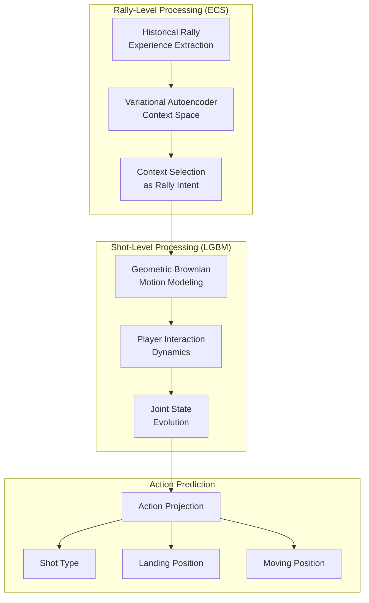

This diagram illustrates RallyNet's hierarchical architecture, showing how rally-level context selection guides shot-level interaction modeling for action prediction.

**Experimental evaluation on a large-scale dataset** demonstrates RallyNet's effectiveness. The evaluation dataset contains **75 singles matches with 4,325 rallies and 43,191 strokes**, providing substantial data for training and testing. Three evaluation criteria assess different aspects of model quality: **behavioral sequence similarity (RQ1)** measures how closely predicted action sequences match observed play; **rally duration realism (RQ2)** evaluates whether generated rallies exhibit natural length distributions; and **outcome consistency (RQ3)** assesses whether simulated match outcomes align with actual results.

**Quantitative results demonstrate RallyNet's superiority across all evaluation dimensions**:

| Metric | RallyNet Performance |
|--------|---------------------|
| Rule-based Agent Normalized Score (MRNS) | At least 16% higher than baselines |
| CTC Loss (shot type) | At least 7.08 lower than baselines |
| DTW Distance (landing position) | At least 8.27% lower than baselines |
| DTW Distance (moving position) | At least 1.16% lower than baselines |

The **rally length distribution** generated by RallyNet most closely matches the empirical distribution among all evaluated methods, indicating that the hierarchical architecture captures the natural dynamics of rally progression. Baseline methods such as Behavior Cloning tend to produce rallies that are either systematically too short (terminating prematurely) or too long (failing to recognize natural ending points), while RallyNet's context-aware generation maintains realistic rally structure.

**Win rate consistency** provides a stringent test of overall behavioral realism. RallyNet's simulated outcomes differ from actual match outcomes by a maximum of 8.15% and an average of only 3.79%, substantially outperforming Behavior Cloning and Hierarchical Behavior Cloning baselines. This consistency indicates that RallyNet captures not only individual shot patterns but also the aggregate tactical effectiveness that determines match outcomes.

**Ablation studies confirm the contributions of both ECS and LGBM components**. Adding ECS to basic Behavior Cloning significantly improves shot type and landing position prediction by providing rally-level context that guides individual decisions. Incorporating LGBM further enhances performance, particularly for moving position prediction, demonstrating its effectiveness in capturing the interactive dynamics between players.

**The interpretability of RallyNet** distinguishes it from black-box prediction models. By decoding the selected contexts, analysts can obtain **tactical interpretations of player intentions** underlying observed action sequences. This capability supports practical applications in sports analytics, where understanding why particular patterns emerge is as valuable as predicting what will happen next.

### 5.6 Prediction Accuracy Across Temporal Horizons and Observation Lengths

The practical utility of stroke forecasting systems depends critically on their performance across different prediction scenarios. This section systematically examines how prediction accuracy varies with observation length, forecasting horizon, and the distinct challenges posed by shot type versus location prediction.

**The CoachAI Badminton Challenge at IJCAI 2023** provides standardized benchmarks for evaluating stroke forecasting performance[^29]. The challenge used the **ShuttleSet22 dataset**, which extends the original ShuttleSet with data from 2022 high-level competitions. The training set contains 2,888 rallies with 30,172 strokes, the validation set contains 450 rallies with 1,400 strokes, and the test set contains 654 rallies with 2,040 strokes[^29]. This substantial dataset enables robust evaluation of model generalization.

**The challenge protocol** specified $\tau = 4$ observed strokes as input, with models required to predict variable-length future sequences extending until rally completion[^30]. This configuration balances the need for sufficient context (4 strokes typically establish the rally's tactical direction) against the practical requirement for early prediction (waiting for more observations delays actionable forecasts). The variable prediction horizon reflects the reality that rally lengths differ substantially, requiring models to handle both short exchanges and extended baseline battles.

**Official leaderboard results** reveal the current state of the art and remaining challenges[^30]:

| Team | Cross-Entropy (Shot Type) | MAE (Location) | Total Score |
|------|--------------------------|----------------|-------------|
| Intro_to_AI_team8 | 1.7892 | 0.7884 | **2.5776** |
| Badminseok | 1.8046 | 0.7784 | 2.5830 |
| YHY | 1.9273 | **0.6797** | 2.6070 |
| ShuttleNet (baseline) | 2.1777 | 0.6997 | 2.8774 |

The winning team achieved a total score of 2.5776, improving upon the ShuttleNet baseline score of 2.8774. Notably, **11 teams outperformed the baseline**, demonstrating that substantial improvements are achievable through architectural refinements and training optimizations[^30].

**A critical finding from the challenge** is the **differential difficulty between shot type and location prediction**[^30]. Participating teams achieved substantial improvements in shot type prediction, reducing cross-entropy from 2.1777 to 1.7892—a 16% improvement. However, location coordinate prediction showed only marginal gains, with MAE improving from 0.6997 to 0.6797—less than 3% improvement. Most teams actually performed worse than the baseline on location prediction while excelling at shot type classification.

This pattern reveals that **effective integration of shot type and location prediction remains a significant challenge**[^30]. The two prediction targets may require different model architectures or training strategies that are difficult to optimize jointly. Shot type prediction benefits from categorical patterns that deep learning models capture effectively, while location prediction involves continuous spatial reasoning that may require different inductive biases. Future research directions should explore specialized architectures or multi-task learning strategies that address both targets effectively.

**Observation length effects** have been evaluated in prior ShuttleSet benchmarks[^33]. Models were tested with observation windows of $\tau = 8, 4, 2$ strokes, revealing how prediction accuracy degrades with reduced context. Shorter observation windows provide less information about rally development and player tendencies, forcing models to rely more heavily on general patterns rather than rally-specific context. ShuttleNet consistently outperformed baselines across all observation lengths, demonstrating robustness to varying input conditions.

**Multi-step prediction degradation** presents another dimension of the forecasting challenge. Predicting the immediate next stroke ($n = 1$) is substantially easier than predicting multiple future strokes ($n > 1$), as errors compound across the prediction horizon. Each predicted stroke introduces uncertainty that propagates to subsequent predictions, causing accuracy to degrade with increasing horizon length. The challenge protocol's use of variable-length predictions implicitly evaluates this degradation, as models must maintain accuracy across rallies of different lengths.

**The stochastic evaluation protocol**—generating 6 sequences and selecting the best match—acknowledges the inherent unpredictability of player decisions[^30]. This approach prevents penalizing models for generating reasonable predictions that happen to differ from the specific choice made by the observed player. However, it also means that reported accuracy metrics represent best-case performance rather than typical prediction quality, and practical applications may experience lower accuracy when only single predictions are feasible.

### 5.7 Player-Specific Behavioral Pattern Integration

Individual players exhibit distinctive tactical tendencies and shot selection patterns that, when properly modeled, can substantially improve prediction accuracy. This section examines methods for incorporating player-specific characteristics into forecasting models and analyzes the variation in predictability across different players.

**Player-specific embeddings** provide a mechanism for conditioning predictions on individual playing styles. In architectures like RallyTemPose, player identity is encoded as a learnable embedding vector that is added to stroke representations during decoding[^35]. These embeddings capture implicit patterns in each player's behavior—preferred shot selections, typical responses to specific situations, and characteristic risk-taking tendencies—without requiring explicit feature engineering. The model learns these patterns automatically from training data containing labeled player identities.

**Latent variable analysis** enables quantitative comparison of playing styles. The player-specific representations learned by prediction models can be analyzed through techniques such as **cosine similarity calculation** to measure style similarity between players[^35]. Players with similar tactical approaches produce similar latent representations, while players with contrasting styles occupy distant regions of the latent space. This capability supports applications beyond prediction, including player clustering, opponent scouting, and training program design.

**Significant variation in prediction accuracy across players** reveals how playing styles affect predictability[^35]. Analysis of the ShuttleSet dataset showed a **notable gap of more than 20% average accuracy** between the players whose strokes are predicted best and those predicted worst. This variation may indicate how effectively different players **mask their stroke intentions**—players who consistently telegraph their shots through preparatory movements are easier to predict, while players who maintain ambiguous body positioning until contact are more difficult.

**Technical action frequency analysis** using Random Forest algorithms has identified specific actions that serve as key predictive indicators[^31]. Feature importance evaluation revealed that **'Net Front', 'Slice/Drop', and 'Push'** were among the top five most impactful features for predicting match outcomes in both men's and women's competitions[^31]. A higher frequency of 'Net Front' actions by the serving side compared to the receiving side was linked to increased probability of winning, while the patterns for 'Slice/Drop' and 'Push' showed opposite relationships.

**SHAP (SHapley Additive exPlanations) value analysis** provides interpretable insights into how technical actions influence predictions[^31]. The analysis validated the pivotal roles of Net Front, Slice/Drop, and Push across both sexes, linking specific action patterns to match-winning probabilities. For male athletes, the predictive model achieved optimal performance with just the **top five features (Net Front, Slice/Drop, Flat High, High, Push)**, yielding an AUC of 0.9726[^31]. Female athletes required the **top 22 features** to reach an AUC of 0.8730, indicating more complex tactical styles that resist simple characterization[^31].

**Gender differences in model performance** reveal interesting patterns in tactical complexity[^31]:

| Metric | Male Model | Female Model |
|--------|-----------|--------------|
| Sensitivity | 0.93 | 0.92 |
| Specificity | 0.80 | 0.68 |
| Accuracy | 0.87 | 0.83 |
| PPV | 0.84 | 0.82 |
| NPV | 0.91 | 0.85 |
| Optimal AUC | 0.9726 | 0.8730 |
| Features Required | 5 | 22 |

The male model captures technical action features more accurately, achieving higher specificity and overall accuracy with fewer features. The female model's requirement for 22 features to achieve optimal performance suggests that women's singles involves more varied tactical approaches that cannot be characterized through a small set of dominant patterns.

**Model hyperparameters** were optimized separately for male and female models[^31]. The final male model used n_estimators = 600, max_depth = 8, min_samples_leaf = 2, and min_samples_split = 2. The final female model required n_estimators = 1000, max_depth = 12, min_samples_leaf = 2, and min_samples_split = 8. The deeper trees and more estimators for the female model reflect the greater complexity of patterns being learned.

**Player-specific analysis capabilities** extend beyond aggregate prediction to individual profiling. RallyNet's design allows simulation of specific players' behavior under different initial states to characterize their playing styles. By generating action sequences conditioned on particular player identities and varying rally contexts, analysts can identify how players respond to different tactical situations, revealing tendencies that may not be apparent from aggregate statistics.

### 5.8 Practical Applications for Coaching and Strategy Analysis

The translation of computational prediction capabilities into practical coaching tools requires careful consideration of interface design, information presentation, and integration with existing coaching workflows. This section examines deployed systems and emerging applications that bridge the gap between algorithmic predictions and actionable coaching insights.

**Visualization platforms using stroke-level datasets have been deployed for national badminton teams** during international high-ranking matches[^28]. The ShuttleSet visualization platform enables coaches to analyze players' tactical preferences through interactive exploration of stroke-level records. During competitions, coaches can quickly review opponent patterns, identify exploitable tendencies, and adjust tactical recommendations based on data-driven insights. The platform's deployment at the national team level demonstrates that computational analysis has achieved sufficient reliability and utility to inform elite-level competition.

**Interactive web applications** extend analytical capabilities to broader user communities[^31]. An application developed using the R Shiny framework allows users to input technical action frequencies for servers and receivers and explore their impact on match outcomes. The interface leverages SHAP values for interpretation, providing not only predictions but also explanations of which factors most strongly influence the forecast. The application is publicly accessible at a dedicated URL, enabling players, coaches, and researchers to experiment with different tactical scenarios[^31].

The following example illustrates the application's utility: analysis of the **2022 World Championships men's singles final** demonstrated how technical action patterns predicted match outcomes[^31]. By inputting the observed action frequencies for both players, users could see which factors favored each competitor and identify tactical adjustments that might shift the predicted outcome. This capability supports both post-match analysis (understanding why results occurred) and pre-match preparation (identifying optimal tactical approaches).

**Strategic recommendations** emerge from the integration of prediction models with tactical knowledge. The systems can identify patterns such as:

- **Opponent weakness exploitation**: When models predict that an opponent struggles to return certain shot types from specific court positions, coaches can design tactics that create these situations.

- **Risk-reward optimization**: By simulating different tactical approaches, coaches can identify strategies that maximize winning probability while managing risk based on match context.

- **Fatigue-adjusted planning**: As matches progress, prediction models can incorporate accumulated rally data to detect changes in player patterns that may indicate fatigue or tactical adjustments.

**Current limitations** constrain the practical impact of prediction systems. The computational requirements of sophisticated models may prevent real-time deployment, limiting applications to between-game analysis rather than in-rally coaching. Prediction accuracy, while substantially above chance, remains insufficient for confident single-shot forecasting—the stochastic nature of player decisions means that even optimal models will frequently predict differently from actual outcomes. Additionally, the interpretability of predictions varies across model architectures, with some approaches providing clear tactical insights while others function as black boxes.

**Future directions** for bridging computational predictions with coaching practice include:

- **Real-time processing optimization**: Developing lightweight model variants that can execute within the time constraints of live match analysis, enabling in-rally tactical suggestions.

- **Explainable prediction interfaces**: Designing visualization approaches that communicate not only what is predicted but why, helping coaches understand the tactical reasoning underlying forecasts.

- **Personalized training integration**: Connecting prediction models with training program design, automatically generating drills that address predicted weaknesses or reinforce successful patterns.

- **Multi-match strategic planning**: Extending single-rally prediction to tournament-level strategy, considering how tactical choices in early rounds affect preparation and energy for subsequent matches.

The **research community's provision of open datasets and code** supports continued advancement toward these goals[^34]. The availability of ShuttleSet, ShuttleSet22, and associated benchmarks enables researchers worldwide to develop and compare prediction approaches, while open-source implementations of ShuttleNet and related models provide foundations for practical application development. This ecosystem of shared resources accelerates progress toward prediction systems that can meaningfully support coaching decisions and player development.

## 6 Integrated Framework Design and System Architecture

This chapter synthesizes the four core research components—object detection and tracking, technical action recognition, tactical intent recognition, and action prediction—into a unified analytical framework for singles badminton video analysis. The integration of these components addresses a fundamental challenge in sports video analytics: transforming raw visual data through progressively abstract representations until actionable coaching insights emerge. Building upon the individual methodologies established in Chapters 2 through 5, this chapter systematically examines the information flow and data dependencies between modules, compares architectural designs for different deployment scenarios, evaluates computational efficiency trade-offs, proposes optimization strategies for end-to-end performance, and explores how multi-level annotations can generate comprehensive player analysis reports.

### 6.1 Information Flow and Inter-Module Dependencies

The unified analytical framework for singles badminton video analysis operates through a **hierarchical data flow architecture** where each processing stage transforms its inputs into progressively more abstract representations. Understanding these information dependencies is essential for system design, as the quality of higher-level analysis fundamentally depends on the reliability of foundational processing stages.

**The foundational detection and tracking module** provides the spatial and temporal data upon which all subsequent analysis depends. This module processes raw video frames to extract three categories of essential information: player positions (typically represented as bounding boxes and ankle coordinates transformed to court coordinates), shuttlecock trajectories (sequences of 2D pixel positions or 3D reconstructed coordinates), and court boundary references (enabling perspective transformation from image space to standardized court coordinates). The output data structure for each video frame includes player detection confidence scores, bounding box coordinates, skeletal keypoint positions when pose estimation is employed, and shuttlecock position with associated detection certainty[^37].

The **interface between tracking and action recognition** requires careful specification to ensure reliable information transfer. Player bounding boxes extracted by YOLO-based detectors serve as inputs for pose estimation models that identify anatomical keypoints including shoulders, elbows, wrists, waist, knees, and ankles[^38]. These keypoints undergo perspective transformation using homography matrices computed from court boundary detection, converting image coordinates to court-relative positions where the root mean square error of transformed player positions is approximately 30 cm[^38]. The shuttlecock trajectory extracted by TrackNet or hybrid detection methods provides temporal segmentation cues—trajectory discontinuities and direction changes indicate potential hitting moments that define stroke boundaries.

**Action recognition modules receive structured inputs** comprising temporal sequences of player poses and shuttlecock trajectories. The recognition process transforms these continuous signals into discrete stroke classifications from the established taxonomy (clear, smash, drop, drive, net shot, lift, push, and their variants). The Shot Refinement Algorithm (SRA) exemplifies the integration of multiple detection streams, combining Hit Detection by Trajectories (HD-T) from TrackNet with Hit Detection by Action (HD-A) from YOLOv7 to achieve 89.7% accuracy in shot extraction compared to 58.8% when using trajectory analysis alone[^9]. This substantial improvement demonstrates the value of multi-modal fusion at the detection-recognition interface.

The following diagram illustrates the complete information flow architecture:

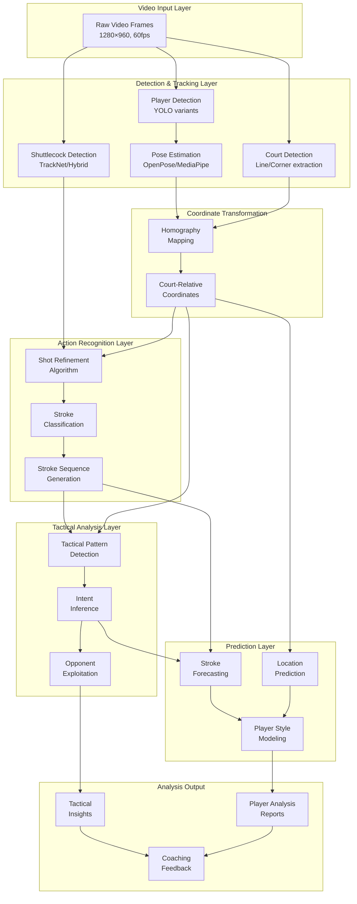

This diagram illustrates how raw video data flows through detection, transformation, recognition, tactical analysis, and prediction layers to produce actionable coaching outputs.

**Error propagation through the pipeline** creates cascading effects that must be carefully managed. A missed shuttlecock detection eliminates the corresponding shot from analysis entirely, while a false positive introduces spurious shots that corrupt rally structure understanding. Temporal mislocalization—detecting a hit at the wrong frame—produces incorrect feature values that may cause misclassification. Research demonstrates that refined shot extraction directly enables more effective classification, with accuracy improving from 54.1% to 72.1% when using the SRA method compared to TrackNet alone at strict temporal alignment thresholds[^9]. This finding emphasizes that **investment in robust foundational tracking yields multiplicative benefits** throughout the analysis pipeline.

**Data format standardization** ensures interoperability between modules developed by different research teams or updated independently. The structured tactical dataset format employed in knowledge-based systems provides a template: each rally is represented as a sequence of strokes, with each stroke annotated with temporal boundaries (start and end frames), shot type classification, player identity, court coordinates at contact, and optional quality assessments[^38]. This standardized representation enables modular system development where individual components can be upgraded without requiring changes to interfacing modules.

The **tactical pattern analysis module** receives classified stroke sequences and court positioning data to infer higher-level strategic patterns. The Shot2Tactic-Caption framework demonstrates this transformation, generating shot-level captions (average duration 0.7 seconds) and tactic-level captions (average duration 5 seconds) that describe how individual actions combine into tactical execution[^9]. The five tactical states—start, continue, interrupt, resume, and complete—explicitly model the dynamic nature of tactical execution, acknowledging that strategies may be disrupted by opponent responses and subsequently recovered.

**Prediction modules integrate information from multiple upstream stages**. ShuttleNet's dual-extractor architecture exemplifies this integration, employing a rally extractor that captures current tactical progress and a player extractor that models individual playing styles[^39]. The position-aware gated fusion network then combines these representations based on their relevance to the current prediction position, enabling adaptive weighting of rally context versus player-specific tendencies depending on the prediction scenario.

### 6.2 Real-Time Versus Offline Processing Architectures

The deployment requirements for badminton video analysis systems vary substantially between real-time coaching applications and post-match analytical reviews, necessitating distinct architectural approaches that optimize for different performance priorities. Understanding these trade-offs enables system designers to select appropriate configurations for specific use cases.

**Real-time processing architectures** must satisfy stringent latency constraints to provide actionable feedback during live match situations. Research on broadcast badminton video analysis established that the complete verification procedure for challenge systems must not exceed 25 seconds, with the average response time from challenge initiation to decision presentation being 18 seconds[^4]. For coaching applications requiring in-rally feedback, constraints are even more demanding—the 15-second broadcast buffer represents the maximum acceptable delay for live analysis[^40]. These requirements fundamentally shape architectural decisions, favoring lightweight models and optimized processing pipelines over maximum accuracy.

The **real-time framework deployed during Premier Badminton League 2019** demonstrates practical architecture for live analysis. The system computes player heatmaps, distance covered, and average speed with minimal latency, processing broadcast video streams in real-time. The pipeline architecture includes point segmentation using fine-tuned ResNet-18 achieving 97.23% F1-score, player localization using YOLOv3 achieving mAP@0.5 scores of 98.07% for "Player Top" and 98.13% for "Player Bottom," and homography-based perspective correction for accurate distance calculations[^40]. Critically, the system processes every third rally frame to optimize speed while maintaining acceptable accuracy, demonstrating the **selective processing strategies** essential for real-time operation.

The following table compares processing characteristics between real-time and offline architectures:

| Characteristic | Real-Time Architecture | Offline Architecture |
|---------------|----------------------|---------------------|
| **Primary Objective** | Minimal latency | Maximum accuracy |
| **Frame Processing** | Selective (every nth frame) | Complete (all frames) |
| **Model Selection** | Lightweight variants (YOLOv5s, Tiny YOLO) | Full models (YOLOv7, Mask R-CNN) |
| **Detection Method** | Single-stage detectors | Two-stage or hybrid methods |
| **Typical Latency** | <15 seconds | Minutes to hours |
| **Accuracy Trade-off** | Acceptable degradation | Optimized |
| **Hardware Requirements** | Standard GPU | High-end GPU clusters |

**Offline processing architectures** prioritize analytical depth over processing speed, enabling comprehensive analysis that would be computationally infeasible in real-time. The MonoTrack system exemplifies this approach, providing the first complete end-to-end system for extracting and segmenting 3D shuttle trajectories from monocular badminton videos[^37]. The system integrates court detection, player pose estimation, shuttlecock tracking, shot segmentation using recurrent networks, and 3D trajectory reconstruction through constrained nonlinear optimization. While achieving state-of-the-art results—court detection success rate improved from 73.9% to 85.5%, shuttlecock detection accuracy reached 88.6%—the computational complexity precludes real-time operation[^37].

**Hybrid architectures** capable of switching between processing modes offer flexibility for diverse deployment scenarios. The instant review system architecture demonstrates this approach: during normal operation, the system performs lightweight monitoring, but upon challenge activation, it engages comprehensive analysis including neural network-based shuttlecock detection requiring 12 milliseconds per patch[^4]. This design pattern enables resource-efficient operation during periods without active analysis requirements while maintaining the capability for detailed examination when needed.

**Processing mode selection criteria** depend on application requirements:

- **Live coaching feedback**: Real-time architecture with selective frame processing, lightweight detection models, and simplified tactical analysis providing immediate positional and movement insights.

- **Between-game analysis**: Hybrid architecture that accumulates data during play using real-time components, then performs deeper analysis during breaks using offline methods.

- **Post-match review**: Full offline architecture enabling comprehensive tactical analysis, 3D trajectory reconstruction, and detailed performance evaluation without time constraints.

- **Tournament preparation**: Offline architecture applied to historical opponent footage, generating scouting reports and tactical recommendations through thorough analysis of playing patterns.

**Latency budgeting across pipeline stages** requires careful allocation to meet overall real-time constraints. The instant review system allocates processing time as follows: video capture and buffering (continuous), shuttlecock detection using differential frames (<2 ms per frame), neural network fallback when needed (12 ms per patch), trajectory analysis and ground contact determination (variable), and result presentation (remaining budget)[^4]. This explicit time budgeting ensures that the complete pipeline completes within the 25-second constraint while maximizing accuracy within available time.

### 6.3 Computational Efficiency and Resource Optimization

Achieving acceptable performance on standard computing platforms requires systematic optimization across all pipeline stages, balancing detection accuracy against processing speed constraints through lightweight model variants, hardware acceleration strategies, and efficient resource management.

**Lightweight model architectures** provide the foundation for computationally efficient processing. The YOLO family offers multiple variants with different accuracy-speed trade-offs: YOLOv5s, YOLOv5m, YOLOv5l, and YOLOv5x differ in the number of layers and filters, enabling selection based on available computational resources[^7]. For badminton video analysis, YOLOv5 demonstrates suitability due to its lightweight architecture and fast processing speed, making it ideal for real-time applications while maintaining accuracy rates of 89.33% for adult men's matches[^7].

**Model pruning and structural optimization** further reduce computational requirements. Research on lightweight badminton stroke posture recognition enhanced YOLOv7 by applying pruning techniques to the backbone structure, increasing processing speed to 44 frames per second while achieving mAP@0.5 of 0.955[^41]. The integration of a parameter-free attention module (SimAM) improved feature extraction without adding computational complexity, demonstrating that architectural innovations can enhance accuracy without proportional resource increases[^41].

The **YOLO-HGNet model** exemplifies comprehensive optimization for badminton action detection. The approach replaces traditional convolution modules with depth-wise convolutions (DWConv) to optimize model parameters and improve detection efficiency. Integration of self-attention and convolution mechanisms (ACmix) at feature-rich nodes improves target localization in complex backgrounds, while FocalModulation emphasizes key image regions[^42]. The resulting system achieves 96.1% mean average precision for pose detection, at least 8.8% higher than existing methods, while maintaining computational efficiency suitable for practical deployment[^42].

**Processing speed benchmarks** across different configurations provide guidance for system design:

| Configuration | Processing Speed | Detection Accuracy | Use Case |
|--------------|-----------------|-------------------|----------|
| Differential frame + shape filtering | 200 FPS | 81% shuttlecock tracking | Real-time primary detection |
| Modified Tiny YOLO (neural fallback) | 83 FPS (12ms/patch) | 94% mAP@0.50 | Occlusion recovery |
| TrackNetV2 (MIMO design) | 31.8 FPS | 85.2% test accuracy | Comprehensive tracking |
| Full pipeline (dual camera) | 200 FPS aggregate | 62% correct decisions | Challenge system |

The **hybrid detection approach** achieves optimal efficiency by reserving computationally expensive neural network processing for challenging scenarios. Using differential frame-based detection as the primary method with neural network fallback achieves processing speeds up to 200 FPS on standard hardware (Intel Core i7 with NVIDIA GTX 1080) while maintaining robust tracking through occlusion events[^4]. This design pattern—fast primary detection with accurate fallback—provides a template for efficient pipeline design.

**GPU utilization optimization** maximizes throughput on available hardware. The TrackNetV2 architecture's transition from Multiple-In Single-Out (MISO) to Multiple-In Multiple-Out (MIMO) design improved processing speed from 2.6 FPS to 31.8 FPS—a twelve-fold increase—by processing multiple output frames per forward pass and amortizing computational overhead[^37]. Similarly, remodeling the heatmap representation from 3D one-hot encoding to 2D real-valued arrays significantly reduced GPU memory requirements, enabling processing of higher-resolution inputs or larger batch sizes.

**Memory management strategies** address the substantial data volumes generated by high-frame-rate video processing. At 150-200 FPS recording rates required for accurate shuttlecock tracking, each match generates gigabytes of raw video data that must be efficiently buffered, processed, and selectively retained. Strategies include: streaming processing that analyzes frames without full video storage, selective keyframe retention that preserves only tactically significant moments, and compressed intermediate representations that reduce memory footprint while maintaining analytical utility.

**Hardware acceleration considerations** extend beyond GPU computing to specialized processing units. The research literature indicates that systems must execute detection algorithms, maintain tracking state, and perform trajectory analysis within strict time budgets using equipment that should occupy minimal space and weight for portable deployment[^4]. This constraint motivates exploration of edge computing platforms, neural processing units (NPUs), and field-programmable gate arrays (FPGAs) that offer favorable performance-per-watt characteristics for deployment in sports venues.

### 6.4 End-to-End System Optimization Strategies

Comprehensive optimization of the integrated pipeline requires strategies that address not only individual module performance but also the interactions and dependencies between processing stages. This section examines approaches for improving overall system performance through hybrid detection methods, multi-modal fusion, and feedback-based refinement mechanisms.

**The Shot Refinement Algorithm (SRA)** exemplifies effective multi-modal fusion for improved detection accuracy. By combining trajectory-based hit detection from TrackNet with action-based hit detection from YOLOv7, the SRA addresses the observation that both detection methods produce misses and false positives when used independently[^9]. The algorithm partitions video sequences into Hit Segments based on contiguous action detections, then applies case-specific rules to determine true hit moments:

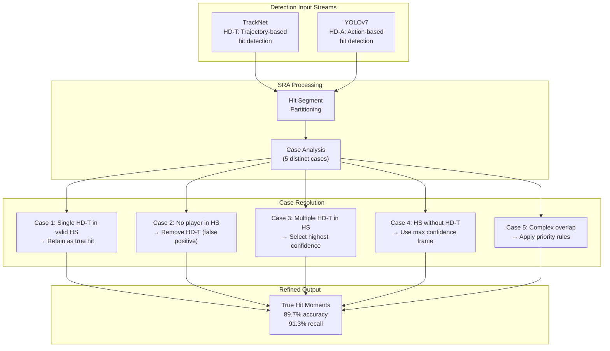

This diagram illustrates how the Shot Refinement Algorithm fuses trajectory-based and action-based detection streams through case-specific rules to achieve improved hit detection accuracy.

The SRA's performance improvement—from 58.8% accuracy with TrackNet alone to 89.7% with the fused approach—demonstrates that **intelligent combination of complementary detection methods yields substantial gains** that exceed what either method achieves independently[^9]. This principle extends beyond hit detection to other pipeline stages where multiple information sources can be fused.

**Feedback-based refinement mechanisms** create mutually reinforcing relationships between pipeline stages. Higher-level analysis results can inform and improve foundational tracking through several mechanisms:

- **Tactical constraints on trajectories**: Recognized shot types impose constraints on plausible shuttlecock trajectories. A classified smash implies a steeply descending trajectory, while a drop shot suggests a shorter, more controlled arc. These constraints can guide trajectory reconstruction when detection is ambiguous.

- **Player positioning predictions**: Tactical context indicates expected player positions. During a net exchange, both players should be positioned near the front court; detection of a player in the rear court during such a sequence may indicate tracking error rather than actual positioning.

- **Rally structure validation**: The alternating player structure of badminton rallies provides strong validation constraints. Detected shot sequences that violate this alternation pattern indicate detection errors requiring correction.

The MonoTrack system implements feedback-based optimization through **constrained nonlinear optimization** for 3D trajectory reconstruction. The optimization incorporates priors including reprojection error minimization, distance constraints between shuttle positions and player locations, and penalties for trajectories extending outside court boundaries[^37]. Domain-specific constraints—limits on shuttle height and initial velocity, requirements that initial velocity points toward the opponent—encode badminton knowledge that guides reconstruction toward physically plausible solutions.

**Adaptive flicker compensation** demonstrates environment-specific optimization for robust detection. Flickering illumination in sports venues causes false detections in differential frame-based methods. The developed adaptive pixel-wise mask generation method compensates for flicker effects 250-300 times faster than general-purpose algorithms like DeFlicker and FlickerFree[^4]. By exploiting the constraint that cameras remain stationary, the method computes per-pixel similarity levels between consecutive frames, identifying and compensating for illumination variations while preserving genuine motion signals.

**Calibration refinement strategies** maintain accuracy throughout extended recording sessions. Camera positions may shift due to vibration, court surfaces may deform under player movements, and lighting conditions may change. Systems that periodically recalibrate using detected court features can compensate for these gradual changes. The instant review system addresses this through dedicated calibration software that achieves minimum reprojection error of 0.086 pixels using calibration boards with circle patterns[^4].

**End-to-end training approaches** offer potential for joint optimization across pipeline stages. Rather than training each module independently and connecting them at inference time, end-to-end training propagates gradients through the complete pipeline, enabling modules to adapt their behavior based on downstream task requirements. While computationally demanding, this approach can discover synergies between modules that independent training misses.

### 6.5 Multi-Level Annotation Integration for Comprehensive Analysis

The transformation of raw video data into actionable coaching insights requires hierarchical annotation schemes that capture information at multiple levels of abstraction. Integrating these multi-level representations within the unified framework enables diverse analytical outputs ranging from technical feedback on individual strokes to strategic insights about match-level patterns.

**The three-tier annotation hierarchy** established by the FineBadminton dataset provides a template for comprehensive representation[^9]:

**Level 1: Foundational Actions** captures detailed stroke classifications and execution characteristics. This level encompasses 11 primary hit types and 20 subtypes, providing granularity that distinguishes between variations within stroke categories—for example, differentiating defensive clears aimed at recovery time from attacking clears intended to push opponents deep. The foundational level also includes temporal boundaries (start and end frames), spatial coordinates at contact, and player identity for each stroke.

**Level 2: Tactical Semantics** describes trajectory dynamics and infers strategic intentions. This level includes 3 categories of player actions, 9 strategic classifications, and 6 types of shot characteristics. The tactical semantics layer bridges observable physical actions and underlying strategic reasoning, encoding information about why particular shots were selected. The nine tactical types—including "Serve and Attack," "Continuous Smash," "Net Pressure and Scoring," and "Rhythm Change Control"—provide a vocabulary for describing strategic patterns[^9].

**Level 3: Decision Evaluation** provides expert-informed assessments of shot quality and rally narratives. Individual shots receive quality scores from 1 to 7, with hitting comments averaging 37.4 words explaining the assessment rationale. Rally narratives synthesize individual assessments into coherent accounts of tactical exchanges, capturing not only what happened but how well it was executed relative to optimal play.

**Aggregation methods** transform stroke-level classifications into tactical pattern summaries. The Shot2Tactic-Caption framework demonstrates this aggregation, generating shot-level captions (0.7-second average duration) that describe individual actions and tactic-level captions (5-second average duration) that capture how actions combine into tactical execution[^9]. The five tactical states—start, continue, interrupt, resume, complete—explicitly model execution dynamics, acknowledging that tactics may be disrupted and recovered during competitive play.

**Quality assessment integration** extends analysis beyond classification to evaluation. The preference-based reward model employed in offline reinforcement learning research demonstrates one approach: the model is trained on pairwise preferences derived from match outcomes, such as favoring the winner's tactical decisions over the loser's in a rally[^43]. This learned reward function can then assess the quality of observed or predicted tactical sequences, providing evaluative feedback that complements descriptive analysis.

The following table summarizes the multi-level annotation structure and its analytical applications:

| Annotation Level | Content | Analytical Application |
|-----------------|---------|----------------------|
| **Foundational Actions** | Stroke type (11+20), timing, position, player | Technical feedback, stroke frequency analysis |
| **Tactical Semantics** | Strategic classification (9 types), trajectory dynamics | Pattern detection, tactical profiling |
| **Decision Evaluation** | Quality scores (1-7), narrative comments | Performance assessment, training prioritization |

**Integration within the unified framework** requires consistent data structures that accommodate all annotation levels. Each rally is represented as a hierarchical object containing: rally-level metadata (match context, score state, duration), a sequence of stroke objects (each with foundational annotations), tactical segment annotations (grouping strokes into tactical units with state labels), and evaluation annotations (quality scores and narrative assessments). This structure supports queries at any level—from individual stroke lookup to rally-level tactical summaries to match-level strategic analysis.

**Automated annotation pipeline design** addresses the challenge of generating multi-level annotations at scale. The FineBadminton pipeline combines MLLM-generated proposals with human refinement through three stages: structural parsing using specialized CV models to extract fundamental spatio-temporal events, semantic interpretation using MLLMs to translate structured data into textual narratives, and evaluative refinement through expert review for contextually aware assessments[^9]. This hybrid approach balances annotation throughput against quality requirements.

### 6.6 Automated Player Analysis Report Generation

The ultimate value of the integrated analytical framework lies in its ability to generate actionable insights that support coaching decisions and player development. This section examines approaches for transforming computational outputs into comprehensive player analysis reports, visualization strategies for communicating complex spatial and temporal patterns, and practical considerations for integrating automated analysis into coaching workflows.

**The end-to-end framework for tactical badminton analysis** demonstrates transformation of video data into queryable knowledge. The system creates a structured tactical dataset from computer vision outputs, then employs a **Retrieval-Augmented Generation (RAG) enhanced Large Language Model** to enable natural language interaction with the extracted knowledge[^38]. Coaches can pose complex queries about tactical patterns, player tendencies, and situational strategies, receiving narrative responses grounded in match data. This interface bridges computational analysis and practical coaching application, making sophisticated insights accessible without requiring technical expertise.

**Visualization strategies** communicate spatial and temporal patterns effectively:

- **Player heatmaps** display court coverage patterns, revealing areas where players spend disproportionate time and potential coverage gaps. The real-time analysis framework deployed during Premier Badminton League 2019 demonstrated successful heatmap generation from broadcast footage, with commentators appreciating the utility for gameplay analysis[^40].

- **Trajectory visualizations** present shot patterns and tactical tendencies. The TIVEE immersive visual analytics system uses 3D visualization in virtual reality environments to display stroke trajectories through multi-court layouts that characterize kinematic features while maintaining spatial and temporal correlations[^44].

- **Rally flow diagrams** illustrate tactical progression, showing how shots combine into tactical sequences and how rallies evolve toward their conclusions.

**Natural language generation** produces interpretable summaries from structured analytical outputs. The Shot2Tactic-Caption framework achieves BLEU-4 of 48.99 and METEOR of 70.78 for shot-level captions, and BLEU-4 of 64.57 and METEOR of 79.63 for tactic-level captions[^9]. These metrics indicate that generated descriptions align well with human-authored references, suggesting that automated caption generation can produce useful narrative summaries of tactical patterns.

**Interactive analysis interfaces** support exploratory investigation of match data. The TIVEE system enables hierarchical exploration from aggregate patterns to individual instances: users first view summary statistics across tactic groups, then inspect specific categories, individual sequences, and finally origin trajectories[^44]. Case studies using TIVEE analyzed Kento Momota's playing style and developed counter-tactics for Chen Long against Viktor Axelsen, demonstrating practical utility for both player profiling and strategic planning.

**Report structure templates** organize analytical outputs into coherent documents:

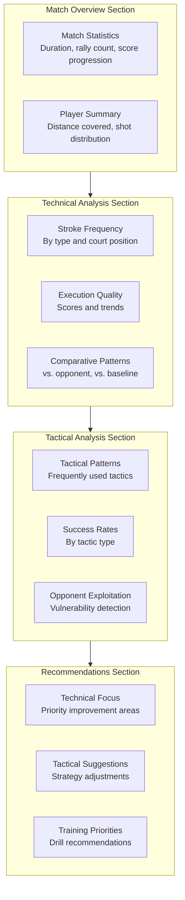

This diagram illustrates the hierarchical structure of automated player analysis reports, progressing from match overview through technical and tactical analysis to actionable recommendations.

**Practical integration considerations** address how automated analysis fits within existing coaching workflows:

- **Timing alignment**: Post-match reports should be available within hours to inform next-day training. Between-match analysis during tournaments requires faster turnaround, potentially sacrificing depth for speed.

- **Customization capability**: Different coaches prioritize different aspects of analysis. Report generation systems should support configurable templates that emphasize technical detail, tactical patterns, or comparative analysis based on user preferences.

- **Validation mechanisms**: Automated analysis should include confidence indicators and highlight areas where computational uncertainty is high, enabling coaches to apply appropriate skepticism to uncertain conclusions.

- **Training program integration**: Analytical insights should connect to specific training interventions. Identifying a weakness in backhand net shots, for example, should link to drill recommendations that address this specific deficiency.

**The research community's provision of open datasets and code** supports continued advancement toward comprehensive automated analysis. The availability of ShuttleSet, ShuttleSet22, FineBadminton, and associated benchmarks enables researchers to develop and compare analytical approaches[^43]. Open-source implementations provide foundations for practical application development, while standardized evaluation protocols ensure that improvements can be meaningfully compared across research groups.

**Future directions** for automated player analysis include:

- **Longitudinal tracking**: Monitoring player development across multiple matches and training sessions, identifying improvement trends and persistent weaknesses.

- **Opponent scouting automation**: Generating comprehensive opponent profiles from historical match footage, identifying tendencies and vulnerabilities to inform match preparation.

- **Real-time tactical suggestions**: Extending analysis from post-hoc reporting to in-match recommendations, providing coaches with data-driven tactical adjustments during play.

- **Explainable insights**: Ensuring that analytical conclusions include clear reasoning chains that coaches can evaluate and potentially challenge, building trust in automated systems through transparency.

The integration of these capabilities within a unified framework creates a comprehensive analytical ecosystem that transforms raw video data into actionable coaching intelligence, supporting player development from technical refinement through tactical sophistication to strategic match preparation.

## 7 Experimental Validation and Performance Evaluation

This chapter establishes the comprehensive experimental methodology for validating the integrated research framework across all four core components. The validation process systematically analyzes available datasets to assess their suitability for each research task, defines standardized evaluation metrics aligned with domain-specific requirements, designs rigorous comparative experiments against established baselines, and examines performance robustness under varying operational conditions. The experimental framework addresses the unique challenges of badminton video analysis—including high-speed object tracking, fine-grained action classification, tactical intent inference, and stochastic prediction—while ensuring that reported results reflect genuine capability improvements rather than artifacts of evaluation methodology.

### 7.1 Dataset Analysis and Suitability Assessment

The availability of appropriately annotated datasets fundamentally determines the scope and validity of experimental validation for each research component. This section provides a systematic analysis of available datasets, evaluating their characteristics, annotation granularity, and suitability for detection and tracking validation, action recognition benchmarking, tactical intent evaluation, and stroke forecasting assessment.

**The ShuttleSet family of datasets** represents the most comprehensive publicly available resource for stroke-level badminton analysis. The original ShuttleSet contains **104 sets, 3,685 rallies, and 36,492 strokes from 44 matches** played between 2018 and 2021, featuring 27 top-ranking men's and women's singles players[^28]. Each stroke is manually annotated with a computer-aided labeling tool, recording the shot type from 18 distinct classes, corresponding hitting locations, and the positions of both players at each stroke. This annotation granularity directly supports tactical analysis and stroke forecasting research, providing the turn-based sequential data essential for modeling rally dynamics.

**ShuttleSet22** extends the original dataset with matches from 2022 high-level competitions, reflecting the most recent tactical patterns and playing styles[^29][^45]. The extended dataset comprises **30,172 strokes in 2,888 rallies for training, 1,400 strokes in 450 rallies for validation, and 2,040 strokes in 654 rallies for testing**. This temporal separation ensures that models are evaluated on genuinely held-out data representing contemporary play rather than historical patterns that may have evolved. The standardized train-validation-test split enables fair comparison across research groups, while the detailed stroke-level metadata—including shot type, roundhead indicator, backhand flag, landing height, landing coordinates, and player positions—supports comprehensive prediction model development[^45].

**The VideoBadminton dataset** provides the primary benchmark for video-based action recognition research[^46]. The dataset contains **7,822 video clips spanning 145 minutes** of self-recorded footage from 19 skilled university players, covering **18 stroke action types** conforming to Badminton World Federation standards. Data collection employed high-quality recording equipment (The Imaging Source DFK 37AUX273 camera) configured at 1280×960 resolution and 60fps frame rate, with the camera positioned 2 meters behind the baseline at 4.5 meters height with 30-degree tilt to minimize distortion[^46]. The controlled recording conditions and expert annotation by badminton-proficient students with head coach review ensure label reliability suitable for training and evaluating recognition models.

The following table summarizes the key characteristics of available datasets and their suitability for each research component:

| Dataset | Scale | Annotation Type | Primary Research Suitability |
|---------|-------|-----------------|------------------------------|
| **ShuttleSet** | 36,492 strokes, 3,685 rallies | Shot type (18 classes), locations, player positions | Tactical analysis, stroke forecasting |
| **ShuttleSet22** | 33,612 strokes, 3,992 rallies | Stroke-level metadata with coordinates | Prediction benchmarking, temporal validation |
| **VideoBadminton** | 7,822 clips, 145 minutes | 18 stroke categories, video segments | Action recognition model training |
| **FineBadminton** | 33,325 strokes, 3,215 rallies | Multi-level hierarchy (3 tiers) | Tactical intent, MLLM evaluation |
| **RacketDB** | 22,682 images, 16,045 rackets | Bounding box annotations | Racket detection, equipment tracking |
| **BWF Match Videos** | 69+ matches, 1,582+ rallies | Broadcast footage, varied conditions | Real-world robustness testing |

**The FineBadminton dataset** introduces unprecedented annotation depth through its **multi-level semantic annotation hierarchy**[^15]. Constructed from **120 professional BWF singles matches over the past five years**, the dataset encompasses **3,215 rally clips containing 33,325 strokes** with average rally duration of 12.4 seconds. The three-tier annotation structure provides: **Foundational Actions** with 11 primary hit types and 20 subtypes capturing execution nuances; **Tactical Semantics** with 3 categories of player actions, 9 strategic classifications, and 6 shot characteristics describing trajectory dynamics and strategic intent; and **Decision Evaluation** providing expert-informed quality scores (1-7 scale) with narrative assessments averaging 37.4 words per hitting comment[^15]. This comprehensive annotation enables evaluation of systems that must reason beyond simple stroke classification to tactical understanding and quality assessment.

**The FBBench benchmark** derived from FineBadminton provides rigorous evaluation for multimodal large language models on nuanced spatio-temporal reasoning and tactical comprehension[^15]. The benchmark comprises **2,563 question-answer pairs across four core domains**: Count (quantitative reasoning about shot numbers and rally lengths), Action (stroke recognition and execution quality), Position (spatial reasoning about player positioning and court coverage), and Cognition (strategic understanding and decision rationale). The **12 distinct task types** include 2,413 multiple-choice questions and 150 open-ended questions, enabling fine-grained diagnosis of model capabilities across different aspects of tactical understanding[^15].

**RacketDB** addresses the specialized challenge of badminton racket detection, providing **16,608 training images, 3,175 testing images, and 2,899 validation images** with detailed bounding box annotations[^47]. The dataset contains **16,045 labeled rackets** captured from 4K drone footage of 2-vs-2 men's doubles games, with annotations in multiple formats including COCO, YOLO, and PASCAL VOC[^47]. While primarily designed for doubles analysis, RacketDB supports equipment detection research relevant to stroke phase identification and swing action recognition in singles contexts.

**BWF match video collections** provide essential real-world validation data reflecting the variability of competitive match conditions. Research utilizing **69 matches with 1,582 rallies** from Badminton World Federation broadcasts demonstrated the Shot Refinement Algorithm's effectiveness under authentic tournament conditions[^9]. These videos exhibit the full range of challenges encountered in practical deployment: varying camera angles, broadcast graphics overlays, crowd backgrounds, and the high-speed dynamics characteristic of elite-level play.

**Dataset limitations and gaps** must be acknowledged when interpreting experimental results. The ShuttleSet family focuses exclusively on **singles play**, limiting direct applicability to doubles analysis where additional complexities of partner coordination and identity switching arise. VideoBadminton's controlled recording environment, while ensuring annotation quality, may not fully represent the variability of broadcast footage or amateur training videos. The temporal gap between dataset collection periods (ShuttleSet: 2018-2021, ShuttleSet22: 2022) introduces potential distribution shift that models must accommodate. Additionally, most datasets feature predominantly elite-level players, potentially limiting generalization to recreational or developing players whose technique may differ substantially from professional standards.

### 7.2 Evaluation Metrics for Detection and Tracking Performance

The foundational detection and tracking module requires evaluation metrics that capture both instantaneous detection accuracy and temporal tracking consistency. This section defines the comprehensive metric framework for assessing object detection and tracking performance across shuttlecock trajectory extraction, player localization, and court boundary detection.

**Mean Average Precision (mAP)** serves as the primary metric for object detection performance, computed across multiple Intersection over Union (IoU) thresholds to capture localization quality at varying strictness levels[^47]. The mAP@0.5 metric evaluates detection accuracy when predicted bounding boxes overlap at least 50% with ground truth annotations, representing a relatively lenient threshold appropriate for initial detection validation. The more stringent mAP@0.50:0.95 metric averages precision across IoU thresholds from 0.5 to 0.95 in 0.05 increments, providing comprehensive assessment of localization precision. For badminton racket detection using RacketDB, YOLOv5 achieved **mAP@0.5 of 0.77 and mAP@0.50:0.95 of 0.48**, significantly outperforming models trained on general-purpose datasets like COCO which achieved only 0.63 mAP@0.5 for tennis racket detection[^47].

**Precision, Recall, and F1-score** provide complementary perspectives on detection reliability[^47]. Precision measures the proportion of detected objects that correspond to actual targets, critical for avoiding false positives that would corrupt downstream analysis. Recall measures the proportion of actual targets successfully detected, essential for ensuring complete coverage of relevant events. The F1-score provides a balanced measure combining both concerns. For racket detection on RacketDB, YOLOv5 achieved **Precision of 0.90, Recall of 0.72, and F1-score of 0.80**, while YOLOv8 achieved comparable performance with Precision of 0.89, Recall of 0.72, and F1-score of 0.80[^47]. The lower recall compared to precision indicates that some rackets are missed, potentially during rapid movement phases where motion blur degrades detection.

**The Jaccard Similarity Index** (Intersection over Union) directly measures localization quality by computing the overlap between predicted and ground truth bounding boxes. Research on badminton player detection reported Jaccard Similarity Index values ranging from **0.73 to 0.80 across different match categories**, with adult men's matches achieving 0.7999 and junior women's matches achieving 0.7368. This variation across match categories reveals how player demographics, movement patterns, and recording conditions influence detection accuracy.

**Shuttlecock detection metrics** require specialized consideration given the unique challenges of tracking small, high-speed objects. TrackNetV2 evaluation employed **accuracy, precision, and recall** computed at the frame level, achieving **96.3% accuracy, 97.0% precision, and 98.7% recall during training** with performance degrading to **85.2% accuracy, 97.2% precision, and 85.4% recall on new match test data**. The maintained high precision on test data indicates that when the model detects a shuttlecock, the detection is highly reliable, even if some instances are missed (lower recall). This precision-recall trade-off has important implications for downstream analysis—high precision ensures that detected trajectories represent genuine shuttlecock positions, while lower recall means some trajectory segments may be incomplete.

**Temporal metrics for shot extraction** evaluate the accuracy of identifying hitting moments within rallies. The **temporal Intersection over Union (t-IoU)** metric measures the overlap between predicted and ground truth temporal segments, with evaluation conducted at multiple thresholds (0.5, 0.85, 0.95) to assess alignment precision[^9]. The Shot Refinement Algorithm achieved **89.7% precision, 91.3% recall, and 90.5% F1-score** at the 0.5 t-IoU threshold, representing substantial improvement over trajectory-only detection which yielded 58.8% precision, 93.6% recall, and 72.3% F1-score[^9]. The dramatic precision improvement (from 58.8% to 89.7%) while maintaining high recall demonstrates that the fusion approach effectively eliminates false positives without sacrificing detection coverage.

The following table summarizes detection and tracking metrics with representative benchmark values:

| Metric | Target | Benchmark Method | Performance |
|--------|--------|------------------|-------------|
| mAP@0.5 | Racket detection | YOLOv5 on RacketDB | 0.77 |
| mAP@0.50:0.95 | Racket detection | YOLOv5 on RacketDB | 0.48 |
| Precision | Shuttlecock detection | TrackNetV2 (test) | 97.2% |
| Recall | Shuttlecock detection | TrackNetV2 (test) | 85.4% |
| Jaccard Index | Player detection | YOLOv5 (adult men) | 0.7999 |
| t-IoU F1@0.5 | Shot extraction | SRA method | 90.5% |

**Court boundary detection success rate** evaluates the reliability of spatial calibration essential for coordinate transformation. The MonoTrack system improved court detection success rate from 73.9% to 85.5% through enhanced detection algorithms, demonstrating that court boundary identification remains challenging under variable recording conditions. Successful court detection enables homography-based perspective transformation that maps image coordinates to standardized court positions, with calibration accuracy directly affecting the reliability of player positioning data used for tactical analysis.

**Tracking continuity metrics** assess the ability to maintain coherent object trajectories through occlusion events and challenging scenarios. These metrics include: track fragmentation rate (how often continuous trajectories are broken into multiple segments), identity switch rate (how often tracked objects are incorrectly re-identified after occlusion), and track completeness (proportion of ground truth trajectory successfully tracked). The hybrid detection approach using differential frames with neural network fallback specifically addresses tracking continuity, reserving computationally expensive neural network processing for scenarios where the primary method fails due to player occlusion.

**Error propagation quantification** connects tracking accuracy to downstream task performance. Research demonstrated that shot type classification accuracy improved from **54.1% to 72.1%** when using shots extracted by the SRA method compared to TrackNet alone at the 0.95 t-IoU threshold[^9]. This substantial improvement illustrates how refined shot extraction directly enables more effective classification—the features computed from accurately localized hits more faithfully represent true stroke characteristics. Quantifying this propagation relationship enables system designers to understand how investment in tracking accuracy translates to overall analytical capability.

### 7.3 Evaluation Metrics for Action Recognition and Classification

Technical action recognition evaluation requires metrics that capture both overall classification accuracy and performance across the fine-grained stroke taxonomy. This section establishes the evaluation framework for assessing recognition models, addressing class imbalance effects, temporal alignment requirements, and systematic misclassification patterns.

**Top-1 and Top-5 accuracy** provide the primary measures of classification performance on the VideoBadminton benchmark[^46]. Top-1 accuracy measures the proportion of test samples where the model's highest-confidence prediction matches the ground truth label, representing the strictest classification criterion. Top-5 accuracy measures whether the correct label appears among the model's five highest-confidence predictions, providing a more lenient assessment that captures cases where the model identifies the correct stroke type as highly probable even if not the top prediction. On VideoBadminton, the SlowFast model achieved the highest performance with **Top-1 accuracy of 82.80% and Top-5 accuracy of 97.54%**[^46]. The high Top-5 accuracy indicates that even when exact classification fails, the true stroke type typically appears among top predictions, suggesting that learned representations capture meaningful similarities between stroke categories.

**Mean Class Accuracy** addresses the critical challenge of class imbalance in badminton stroke datasets[^46]. Unlike overall accuracy which can be dominated by majority classes, Mean Class Accuracy computes accuracy separately for each stroke category and then averages across categories, giving equal weight to all stroke types regardless of their frequency in the dataset. SlowFast achieved **Mean Class Accuracy of 73.80%**, substantially lower than its Top-1 accuracy of 82.80%, revealing that performance varies considerably across stroke categories[^46]. This gap indicates that some strokes are recognized much more reliably than others, likely reflecting both inherent difficulty in distinguishing certain stroke pairs and uneven distribution of training examples across categories.

The following table presents comprehensive action recognition performance across evaluated architectures on VideoBadminton:

| Architecture | Top-1 Accuracy | Top-5 Accuracy | Mean Class Accuracy | Architectural Approach |
|-------------|----------------|----------------|---------------------|----------------------|
| SlowFast | **82.80%** | **97.54%** | **73.80%** | Dual pathway, multi-scale temporal |
| Swin | 81.99% | 96.52% | 69.93% | Shifted window attention |
| PoseC3D | 80.76% | 96.01% | 67.18% | Skeleton heatmap volumes |
| R(2+1)D | 79.53% | 96.11% | 66.97% | Factorized 3D convolution |
| ST-GCN | 74.41% | 93.76% | 61.44% | Graph convolution on skeleton |
| TimeSformer | 73.18% | 94.78% | 57.70% | Divided space-time attention |
| MViT-V2 | 14.23% | 62.23% | 10.76% | Pooling attention, multiscale |

**Macro and micro F1-scores** provide balanced evaluation across stroke categories with different frequencies. Macro F1-score computes F1 separately for each class and averages without weighting, treating all classes equally regardless of support. Micro F1-score aggregates contributions across all classes before computing the harmonic mean, giving more weight to majority classes. For QCNN-based stroke classification, research reported **overall accuracy of 96.5%** with F1-scores computed per stroke type—backhand volley recognition achieved F1-score of 0.860 for QCNN compared to 0.792 for CNN and 0.753 for SVM[^48]. The Badminton Stroke-type Transformer (BST) achieved **accuracy of 0.8254 and Macro-F1 of 0.7983** on ShuttleSet using the novel clipping strategy, demonstrating that trajectory-centric approaches can achieve competitive fine-grained classification performance.

**Confusion matrix analysis** identifies systematic misclassification patterns that reveal which stroke pairs are most frequently confused. Such analysis can distinguish between errors due to genuine stroke similarity (e.g., different types of clears that share overhead striking motion) versus errors indicating model limitations (e.g., confusing smashes with drops despite their distinct trajectories). Understanding these patterns guides targeted improvements—if specific stroke pairs are consistently confused, additional training data or specialized features for those distinctions may be required.

**Temporal Intersection over Union (t-IoU) metrics** evaluate shot extraction accuracy, measuring how precisely detected stroke boundaries align with ground truth temporal segments[^9]. Evaluation at multiple thresholds captures alignment precision at varying strictness levels: t-IoU@0.5 accepts detections with at least 50% temporal overlap, while t-IoU@0.95 requires near-perfect alignment within a few frames. The SRA method achieved shot type classification accuracy of **72.1% at t-IoU@0.95, 65.4% at t-IoU@0.85, and 54.1% at t-IoU@0.5**, substantially outperforming TrackNet-only extraction which achieved 38.8%, 61.0%, and 71.9% at the same thresholds[^9]. Notably, the performance relationship inverts across thresholds—at strict alignment (t-IoU@0.95), SRA substantially outperforms TrackNet, while at lenient alignment (t-IoU@0.5), the gap narrows. This pattern indicates that SRA's primary advantage lies in precise temporal localization of hitting moments.

**Evaluation protocols for skeleton-based versus video-based approaches** require careful specification to ensure fair comparison. Skeleton-based methods like ST-GCN and PoseC3D operate on pre-extracted pose sequences, while video-based methods like SlowFast and R(2+1)D process raw video frames. The evaluation must account for differences in input modality, computational requirements, and sensitivity to upstream pose estimation accuracy. On the balanced VideoBadminton-10 subset containing only 10 samples per class, **ST-GCN achieved the highest Top-1 accuracy of 28.05%**, outperforming SlowFast (12.79%) and demonstrating superior robustness when training data is limited[^46]. This finding suggests that skeleton-based representations provide effective inductive biases that enable learning from limited examples, while video-based methods require larger training sets to learn their complex representations.

**Robustness evaluation under noise conditions** assesses model reliability across varying video quality levels[^48]. QCNN demonstrated strong noise robustness, maintaining classification precision of **0.95 under low noise, 0.92 under medium noise, and 0.89 under high noise environments**, clearly surpassing both CNN and SVM across all noise levels[^48]. This robustness is particularly relevant for practical deployment where video quality cannot always be controlled and motion blur from high-speed movements introduces inherent noise.

### 7.4 Evaluation Metrics for Tactical Intent and Prediction Tasks

Tactical intent recognition and action prediction evaluation requires metrics that capture both the accuracy of strategic understanding and the quality of generated forecasts. This section defines the comprehensive evaluation framework for tactical analysis, caption generation, and stroke forecasting tasks.

**Natural language generation metrics** evaluate the quality of tactical descriptions and captions produced by analysis systems. **BLEU (Bilingual Evaluation Understudy)** measures n-gram precision between generated and reference text, with BLEU-4 computing precision for unigrams through 4-grams. **METEOR** incorporates stemming, synonymy, and word order to provide more nuanced evaluation than pure n-gram matching. **CIDEr** specifically weights n-grams by their informativeness using TF-IDF, emphasizing distinctive terminology over common phrases. The Shot2Tactic-Caption framework achieved **BLEU-4 of 48.99 and METEOR of 70.78 for shot-level captions, and BLEU-4 of 64.57 and METEOR of 79.63 for tactic-level captions**. The higher scores for tactic-level captions suggest that aggregating information across multiple shots may simplify description by averaging frame-level noise.

**Tactical unit detection accuracy** evaluates the ability to identify coherent tactical sequences within rallies. This metric assesses both the detection of tactical activity (distinguishing purposeful tactical execution from non-tactical play) and the classification of specific tactical types among the nine categories: Serve and Attack, Continuous Smash, Net Pressure and Scoring, Push and Trap, High Serve Attack, Push and Smash, Drop and Net Control, Drive and Intercept, and Rhythm Change Control. The five tactical states—start, continue, interrupt, resume, complete—require accurate classification to model the dynamic nature of tactical execution.

**The FBBench evaluation framework** provides rigorous assessment of multimodal understanding across four core domains[^15]. Performance is measured through **multiple-choice accuracy** across 2,413 questions spanning Count, Action, Position, and Cognition domains, plus **open-ended response quality** for 150 questions requiring narrative answers. Experimental results revealed that current MLLMs face significant challenges, with the optimized Qwen2.5VL-7B achieving **42.06% multiple-choice accuracy** after fine-tuning with proposed strategies, surpassing commercial models including Gemini 2.5 Pro[^15]. This benchmark establishes the current state of the art while highlighting substantial room for improvement in tactical comprehension.

**Stroke forecasting evaluation** employs distinct metrics for shot type and location prediction[^29][^45]. **Cross-entropy loss** measures the quality of shot type probability distributions, with lower values indicating better alignment between predicted probabilities and actual shot selections. **Mean Absolute Error (MAE)** evaluates landing location prediction accuracy, measuring the average distance between predicted and actual court coordinates. The CoachAI Badminton Challenge established standardized evaluation with the ShuttleNet baseline achieving **cross-entropy of 2.1777 for shot type and MAE of 0.6997 for location**, yielding a combined score of 2.8774[^29][^45]. The winning team achieved a total score of 2.5776, with cross-entropy improving to 1.7892 while MAE showed only marginal improvement to 0.6797[^45].

The following table summarizes prediction evaluation metrics and benchmark performance:

| Metric | Task | Baseline (ShuttleNet) | Best Challenge Result |
|--------|------|----------------------|----------------------|
| Cross-Entropy | Shot type prediction | 2.1777 | 1.7892 |
| MAE | Location prediction | 0.6997 | 0.6797 |
| Total Score | Combined | 2.8774 | 2.5776 |

**The stochastic evaluation protocol** addresses the inherent unpredictability of player decisions by requiring **6 predicted sequences per rally**, with the closest match to ground truth selected for evaluation[^29][^45]. This multi-hypothesis approach acknowledges that correct prediction may correspond to any of several reasonable continuations rather than a unique solution. The protocol prevents penalizing models for generating reasonable predictions that happen to differ from the specific choice made by the observed player, providing a more realistic assessment of prediction capability.

**Rally length distribution similarity** evaluates whether generated rallies exhibit natural duration patterns. RallyNet's simulated rally lengths most closely matched the empirical distribution among all evaluated methods, indicating that the hierarchical architecture captures natural rally progression dynamics. Baseline methods like Behavior Cloning tend to produce rallies that are systematically too short or too long, failing to recognize natural ending points.

**Win rate consistency** provides a stringent test of overall behavioral realism by comparing simulated match outcomes against actual results. RallyNet achieved win rate differences of **maximum 8.15% and average 3.79%** from actual outcomes, substantially outperforming Behavior Cloning and Hierarchical Behavior Cloning baselines. This consistency indicates that the model captures not only individual shot patterns but also the aggregate tactical effectiveness that determines match outcomes.

**Expert validation protocols** complement quantitative metrics with qualitative assessment of practical utility. The TIVEE system was evaluated through case studies analyzing specific players' tactical patterns and expert interviews assessing coaching utility. Experts confirmed the system's effectiveness in finding patterns of commonly used tactics and providing explanations of tactical feasibility, validating that computational analysis produces genuinely useful coaching insights.

### 7.5 Baseline Methods and Comparative Experiment Design

Rigorous comparative evaluation requires well-defined baseline methods, standardized experimental protocols, and appropriate statistical testing procedures. This section specifies the baseline methods for each research component, designs controlled experiments with consistent train-validation-test splits, and establishes procedures for determining statistical significance of performance differences.

**Object detection and tracking baselines** include TrackNet and TrackNetV2 for shuttlecock detection, and YOLOv5 and YOLOv7 variants for player and racket detection[^46][^47]. TrackNetV2 represents the current standard for shuttlecock trajectory extraction, achieving 85.2% accuracy on new match test data with the MIMO architecture enabling 31.8 FPS processing speed. YOLOv5 provides the primary baseline for player detection, with documented performance of 89.33% average precision on adult men's matches. The Shot Refinement Algorithm serves as the fusion baseline, demonstrating how combining trajectory-based (TrackNet) and action-based (YOLOv7) detection achieves 89.7% accuracy compared to 58.8% for trajectory-only approaches[^9].

**Action recognition baselines** span both video-based and skeleton-based approaches[^46]. The SlowFast network represents the top-performing video-based baseline with 82.80% Top-1 accuracy on VideoBadminton. ST-GCN provides the primary skeleton-based baseline with 74.41% Top-1 accuracy, demonstrating particular strength on limited training data (28.05% on VideoBadminton-10 compared to 12.79% for SlowFast). Additional baselines include R(2+1)D (79.53%), TimeSformer (73.18%), PoseC3D (80.76%), and Swin (81.99%), enabling comprehensive comparison across architectural paradigms.

**Stroke forecasting baselines** center on ShuttleNet as the official baseline for the CoachAI Badminton Challenge[^29][^45]. ShuttleNet's dual-extractor architecture with position-aware gated fusion achieved cross-entropy of 2.1777 and MAE of 0.6997, establishing the benchmark against which prediction improvements are measured. The challenge results demonstrated that 11 teams outperformed this baseline, with most improvements building upon ShuttleNet's architecture through hyperparameter tuning and activation function modifications[^29][^45].

**Standardized train-validation-test splits** ensure fair comparison across methods and research groups. The VideoBadminton dataset employs an **8:1:1 ratio** for training, validation, and test subsets[^46]. ShuttleSet22 provides pre-defined splits with 2,888 training rallies, 450 validation rallies, and 654 test rallies[^45]. RacketDB uses a **70:15:15 split** with 16,608 training images, 2,899 validation images, and 3,175 test images[^47]. Adherence to these standardized splits enables direct comparison with published results and ensures that reported improvements reflect genuine generalization rather than overfitting to evaluation data.

**Hyperparameter configuration documentation** ensures reproducibility of experimental results. The VideoBadminton benchmark specifies detailed training protocols for each baseline[^46]:

| Model | Optimizer | Epochs | Learning Rate | Additional Configuration |
|-------|-----------|--------|---------------|-------------------------|
| R(2+1)D | SGD | 180 | Specified per paper | Standard augmentation |
| SlowFast | SGD | 128 | Specified per paper | Dual pathway configuration |
| TimeSformer | SGD + Nesterov | 15 | Specified per paper | Divided attention |
| Swin | AmpOptim | 30 | Specified per paper | Shifted windows |
| MViT-V2 | AdamW | 100 | Specified per paper | Pooling attention |
| ST-GCN | SGD + Nesterov | 128 | Specified per paper | Graph construction |
| PoseC3D | SGD | 12 | Specified per paper | Heatmap volumes |

**Data augmentation protocols** standardize preprocessing across experiments. Common augmentations include random cropping, horizontal flipping, and color jittering to prevent overfitting and improve generalization[^46]. These augmentations prove particularly important for badminton recognition given the relatively small size of specialized datasets compared to general action recognition benchmarks.

**Statistical significance testing** determines whether observed performance differences represent genuine improvements versus random variation. For classification tasks, McNemar's test evaluates whether two models make significantly different errors on the same test set. For regression tasks like location prediction, paired t-tests or Wilcoxon signed-rank tests compare prediction errors across test samples. Confidence intervals should be reported alongside point estimates to convey uncertainty in performance measurements.

**Cross-validation procedures** provide more robust performance estimates when dataset size limits single-split evaluation reliability. The tactical movement classification research employed **10-fold cross-validation** with accuracy, precision, recall, and F-score computed across folds[^49]. When k=1 for the k-NN classifier, classification achieved **97.79% accuracy, 97.81% precision, 97.44% recall, and 97.62% F-score**[^49]. Cross-validation is particularly valuable for evaluating methods on smaller datasets where single train-test splits may not adequately represent population variability.

### 7.6 Performance Analysis Under Varying Operational Conditions

Practical deployment of badminton video analysis systems requires understanding how performance varies across different operational conditions. This section examines robustness to video quality variations, camera configuration differences, environmental factors, and match context variations, providing guidance for deployment across diverse recording environments.

**Video quality effects** significantly impact detection and recognition accuracy. Research demonstrated that detection performance varies with recording conditions, with adult men's matches achieving 89.33% average precision while adult women's matches under different conditions achieved only 71.55%[^46]. The Jaccard Similarity Index ranged from 0.73 to 0.80 across match categories, indicating that localization accuracy degrades with recording quality variations. TrackNetV2's accuracy dropped from 96.3% during training to 85.2% on new match test data, illustrating the domain shift challenge when models encounter footage with different visual characteristics.

**Resolution and frame rate requirements** establish minimum quality thresholds for effective analysis. The VideoBadminton dataset employed 1280×960 resolution at 60fps, providing sufficient detail for fine-grained stroke classification[^46]. Shuttlecock tracking research indicates that 150-200 FPS recording may be required for accurate trajectory reconstruction of high-speed smashes exceeding 400 km/h. Lower frame rates cause the shuttlecock to move multiple meters between frames, creating trajectory gaps that complicate detection and tracking.

**Compression artifact effects** degrade detection reliability, particularly for small objects like shuttlecocks. Heavy video compression introduces blocking artifacts and detail loss that can obscure the shuttlecock's already-small visual footprint. The research literature indicates that detection accuracy varies considerably based on compression levels, with broadcast footage typically exhibiting more compression than dedicated research recordings.

**Camera angle and positioning variations** affect both detection accuracy and coordinate transformation reliability. The VideoBadminton recording setup positioned cameras 2 meters behind the baseline at 4.5 meters height with 30-degree tilt to minimize distortion[^46]. Deviations from optimal positioning—such as side-court cameras in broadcast footage—introduce perspective distortions that complicate player localization and court coordinate transformation. The instant review system architecture evolved from multi-camera 3D tracking to simplified around-court configurations, demonstrating that practical constraints often require adaptation from ideal setups.

**Lighting condition robustness** presents particular challenges in sports venues. Research identified flickering illumination in older sports halls as a source of false detections in differential frame-based methods. Adaptive pixel-wise compensation methods address flicker effects 250-300 times faster than general-purpose algorithms, enabling robust detection under variable lighting. The research also noted that detection accuracy improves significantly on clear court footage compared to videos with visible audiences, confirming that background complexity substantially impacts performance.

**Background complexity effects** have been quantified through controlled experiments. The Jaccard Similarity Index metrics demonstrated that performance improved when tested on clear badminton court data compared to footage with audiences visible in the background. Detection models become confused when background figures similar to human figures appear—clear images of line judges or referees in broadcast footage may be incorrectly identified as players, degrading tracking accuracy.

The following table summarizes performance variation across operational conditions:

| Condition Factor | Favorable Condition | Challenging Condition | Performance Impact |
|-----------------|--------------------|-----------------------|-------------------|
| Video quality | HD broadcast, controlled recording | Compressed, amateur footage | Up to 18% accuracy reduction |
| Frame rate | 60+ FPS | <30 FPS | Trajectory gaps, tracking loss |
| Camera position | Optimal baseline placement | Side-court, variable angles | Coordinate transformation errors |
| Lighting | Stable, uniform illumination | Flickering, variable | False detection increase |
| Background | Clear court, no audience | Visible crowds, officials | Jaccard Index degradation |

**Match context variations** affect both detection difficulty and tactical pattern complexity. Player skill levels influence movement patterns—elite players exhibit faster, more precise movements that may challenge tracking systems differently than recreational players. Match intensity affects rally dynamics, with high-stakes points potentially featuring more aggressive play and rapid exchanges. Tournament settings introduce additional complexity through crowd noise, broadcast graphics overlays, and camera switching that interrupt continuous footage.

**Noise robustness testing** provides quantitative assessment of model reliability under degraded conditions[^48]. QCNN demonstrated strong robustness, maintaining classification precision of 0.95 under low noise, 0.92 under medium noise, and 0.89 under high noise environments, clearly surpassing both CNN and SVM across all noise levels[^48]. This robustness testing establishes performance boundaries and identifies conditions where system reliability may be compromised.

**Cross-dataset generalization** evaluates whether models trained on one dataset transfer effectively to different recording conditions. The BST model demonstrated generalizability by achieving strong performance on both ShuttleSet (accuracy 0.8254) and BadmintonDB (accuracy 0.6517), despite different recording conditions and annotation schemes. Similarly, models trained on RacketDB successfully detected rackets in TrackNet dataset videos featuring different backgrounds and environments[^47], confirming that well-designed models can generalize across recording contexts.

### 7.7 Ablation Studies and Component Contribution Analysis

Ablation studies systematically isolate the contribution of individual framework components and architectural innovations, enabling understanding of which elements are essential for performance versus which provide incremental improvements. This section designs ablation experiments across pipeline stages and quantifies component contributions to overall system performance.

**Shot Refinement Algorithm ablation** demonstrates the value of multi-modal fusion for hit detection[^9]. Comparing performance with trajectory-only detection (TrackNet HD-T) versus the fused approach (SRA combining HD-T with action-based HD-A) reveals dramatic improvement: accuracy increased from 58.8% to 89.7%, while recall decreased only slightly from 93.6% to 91.3%[^9]. This ablation confirms that the fusion mechanism effectively eliminates false positives without substantially sacrificing detection coverage. The downstream impact on shot type classification—improvement from 54.1% to 72.1% at strict temporal alignment—demonstrates how foundational detection improvements propagate through the analysis pipeline.

**Player-specific embedding ablation** in prediction models reveals the contribution of individual playing style modeling. RallyTemPose ablation studies found that removing player embeddings caused modest performance degradation, while the most critical factor was **player ground position**—removing this information caused a 2.6% performance drop, the largest among ablated components. This finding indicates that while player-specific modeling provides value, spatial context remains the dominant factor for stroke prediction.

**Skeleton versus trajectory feature ablation** in the Badminton Stroke-type Transformer (BST) architecture demonstrates the relative importance of different input modalities. The BST design prioritizes shuttlecock trajectory information over player poses, arguing that trajectory always reflects actual stroke type without containing deceptive movements. Ablation comparing trajectory-centric BST against pose-centric alternatives confirmed trajectory's importance, with the full BST-CG-AP model achieving 0.8254 accuracy compared to lower performance when trajectory emphasis was reduced.

**The Experiential Context Selector (ECS) and Latent Geometric Brownian Motion (LGBM) ablation** in RallyNet quantifies the contribution of hierarchical intent modeling. Adding ECS to basic Behavior Cloning significantly improved shot type and landing position prediction by providing rally-level context that guides individual decisions. Incorporating LGBM further enhanced performance, particularly for moving position prediction, demonstrating its effectiveness in capturing player interaction dynamics. The combined architecture achieved at least 16% higher normalized scores than baselines, with ablation confirming that both components contribute essential capabilities.

**Multi-level annotation integration ablation** examines how different annotation tiers contribute to tactical understanding. The FineBadminton three-tier hierarchy—Foundational Actions, Tactical Semantics, and Decision Evaluation—provides progressively abstract representations. Ablation studies on FBBench revealed that the proposed optimization strategies (Hit-Centric Keyframe Selection and Coordinate-Guided Condensation) achieved substantial performance gains, with ablation on VideoLLaMA3 demonstrating synergistic benefits when combining domain-specific fine-tuning with tailored video processing[^15].

The following diagram illustrates the ablation study structure across pipeline components:

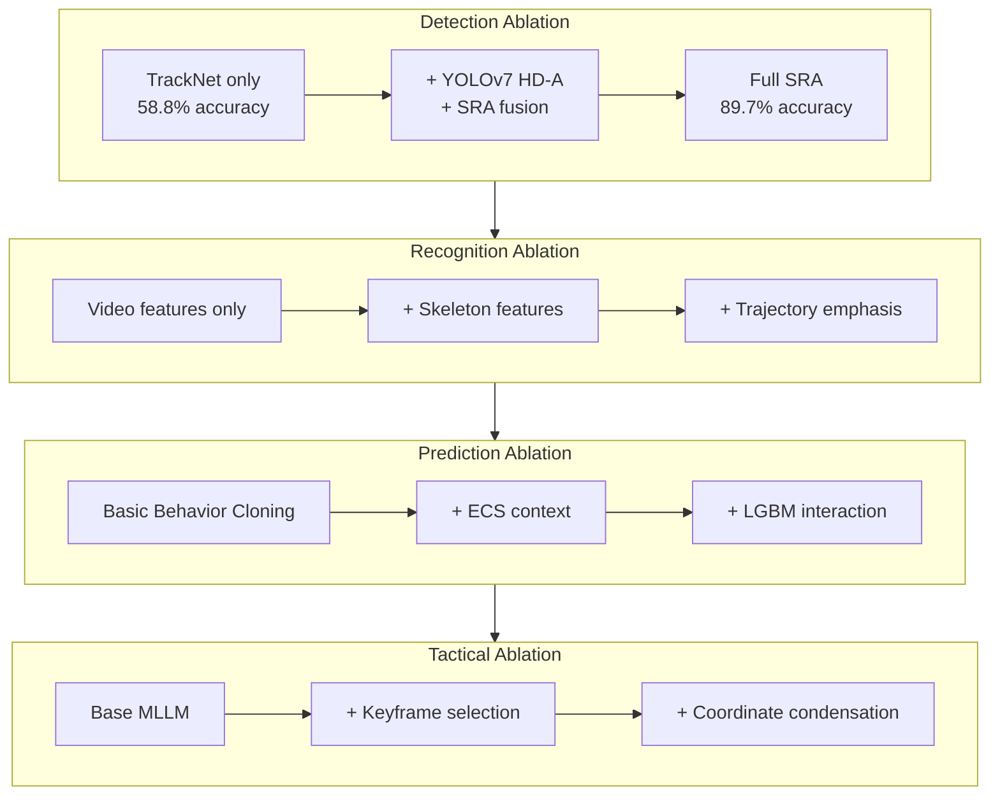

This diagram illustrates how ablation studies progressively add components at each pipeline stage, quantifying the contribution of each addition to overall performance.

**Critical dependency identification** reveals which pipeline stages most strongly influence downstream performance. The tracking-to-recognition dependency is particularly strong: refined shot extraction improved classification accuracy by 18 percentage points (54.1% to 72.1%). This finding emphasizes that **investment in robust foundational tracking yields multiplicative benefits** throughout the analysis pipeline, as errors at early stages propagate and compound through subsequent processing.

**Feature importance analysis** using decision tree-based methods identifies which extracted features most strongly influence classification outcomes[^48]. Analysis revealed that **arm angle, twist angle, and step position** are the most critical factors affecting stroke classification accuracy, with arm angle receiving the highest importance score in QCNN models[^48]. For match outcome prediction, Random Forest feature importance indicated that **total shot count within a rally has the highest importance**, followed by scoring/losing point landing position, with the second-to-last and third-to-last shots carrying higher importance than the final shot.

**Computational cost-benefit analysis** quantifies the trade-off between added complexity and performance improvement. The SRA fusion adds processing overhead for action detection and case analysis, but the dramatic accuracy improvement (31 percentage points) justifies this cost for applications requiring reliable shot extraction. Similarly, the dual-extractor architecture in ShuttleNet increases model complexity but enables effective modeling of both rally context and player styles, achieving performance that simpler architectures cannot match.

**Sensitivity analysis** examines how performance varies with hyperparameter choices and threshold settings. The t-IoU threshold selection significantly affects reported shot extraction accuracy—performance at t-IoU@0.5 differs substantially from t-IoU@0.95. Understanding this sensitivity enables appropriate threshold selection based on application requirements: applications requiring precise temporal alignment should evaluate at strict thresholds, while applications tolerating some temporal uncertainty may use more lenient thresholds.

**Generalization versus specialization trade-offs** emerge from ablation analysis. Models with strong inductive biases (like ST-GCN's skeleton-based representation) generalize better from limited data but may have lower ceiling performance on large datasets. Models with greater capacity (like SlowFast) achieve higher peak performance but require more training data and may overfit on smaller datasets. Understanding these trade-offs guides model selection based on available training resources and deployment requirements.

## 8 Applications, Limitations, and Future Directions

This chapter examines the practical deployment of AI-driven badminton video analysis research across coaching systems, player self-training tools, and broadcast enhancement applications. It systematically analyzes current limitations constraining real-world implementation, including dataset scarcity, cross-player generalization challenges, and real-time processing constraints. The chapter explores promising future research directions encompassing multi-player extension for doubles analysis, integration with wearable sensor data, development of explainable AI systems providing actionable tactical insights, and emerging technologies that may transform badminton video analytics.

### 8.1 Practical Applications in Coaching Systems

The translation of computational research into practical coaching tools represents the ultimate validation of AI-driven badminton video analysis, demonstrating that sophisticated detection, recognition, and prediction capabilities can generate actionable insights supporting evidence-based training program design. The deployment of these systems at elite competitive levels confirms their practical utility while revealing the requirements for successful integration into existing coaching workflows.

**Visualization platforms deployed for national badminton teams** during international high-ranking matches demonstrate the operational maturity of stroke-level analysis systems. The ShuttleSet visualization platform enables coaches to analyze players' tactical preferences through interactive exploration of stroke-level records, providing immediate access to opponent patterns during competition breaks[^4]. During tournaments, coaches can quickly review historical data on upcoming opponents, identify exploitable tendencies in shot selection and court positioning, and adjust tactical recommendations based on data-driven insights rather than subjective impression alone. This deployment at the national team level confirms that computational analysis has achieved sufficient reliability and utility to inform elite-level competition preparation.

**Real-time analysis systems** provide immediate feedback during training sessions, enabling coaches to identify technical issues and tactical patterns as they occur rather than waiting for post-session review. The computer vision system developed for instant review in badminton processes video streams at 150-200 frames per second, with the complete verification procedure constrained to under 25 seconds[^4]. While originally designed for officiating support, similar architectures can be adapted for coaching applications where rapid feedback on stroke execution, court coverage, and tactical decision-making supports immediate training adjustments. The system's ability to detect shuttlecock trajectories, identify hitting moments, and determine landing positions creates the foundational data layer upon which coaching insights are built.

The **transformation of computational outputs into actionable coaching recommendations** requires careful interface design that bridges technical analysis and practical application. The end-to-end framework for tactical badminton analysis employs a Retrieval-Augmented Generation (RAG) enhanced Large Language Model to create an intelligent decision support system enabling natural language interaction with extracted tactical knowledge[^4]. Coaches can pose complex queries about tactical patterns, player tendencies, and situational strategies, receiving narrative responses grounded in match data. This interface design recognizes that coaches possess deep domain expertise but may lack technical skills for direct data analysis, necessitating systems that translate computational findings into coaching-relevant language.

**Tactical pattern identification for match preparation** leverages the multi-level annotation frameworks to generate comprehensive opponent profiles. The three-tier annotation hierarchy—encompassing Foundational Actions with detailed stroke classifications, Tactical Semantics describing strategic intentions, and Decision Evaluation providing quality assessments—enables analysis that progresses from technical details through tactical patterns to strategic recommendations. Research analyzing the playing style of top-ranked player An Se-young revealed consistent tactical characteristics through machine learning analysis, characterizing her approach as consistent and unified with balanced technique usage and preference for building advantage through rearcourt control rather than direct attacking. Such detailed profiling supports targeted match preparation where coaches can design specific tactics to counter identified opponent tendencies.

The following table summarizes practical coaching applications and their implementation requirements:

| Application Domain | Technical Requirements | Deployment Context | Key Benefits |
|-------------------|----------------------|-------------------|--------------|
| **Match Preparation** | Opponent video database, stroke classification, tactical pattern detection | Pre-competition analysis | Identify exploitable tendencies, design counter-tactics |
| **Training Feedback** | Real-time detection, stroke recognition, quality assessment | Daily practice sessions | Immediate technique correction, pattern reinforcement |
| **Performance Tracking** | Longitudinal data storage, trend analysis, comparison metrics | Season-long monitoring | Track development, identify persistent weaknesses |
| **Tactical Querying** | RAG-enhanced LLM, natural language interface | Competition and training | Accessible insights for non-technical coaches |

**Evidence-based training program design** emerges from systematic analysis of player performance data accumulated across training sessions and competitive matches. By identifying specific technical weaknesses—such as inconsistent backhand net shots or predictable serve patterns—coaches can design targeted drills that address identified deficiencies. The feature importance analysis revealing that arm angle, twist angle, and step position most strongly influence stroke classification provides guidance for which biomechanical elements coaches should prioritize in technique refinement. Similarly, the finding that second-to-last and third-to-last shots carry higher tactical importance than final shots suggests that training should emphasize rally construction rather than focusing exclusively on finishing strokes.

### 8.2 Player Self-Training and Performance Feedback Tools

Applications enabling individual players to analyze their own performance without requiring dedicated coaching staff represent a democratization of advanced analytical capabilities, extending benefits previously available only to elite athletes with professional support to recreational players and developing athletes seeking self-directed improvement.

**Custom AI badminton video analysis software** provides comprehensive analytical capabilities through platforms designed for coaches, analysts, and sports organizations[^50]. These solutions deliver real-time player tracking, shot classification covering smashes, drops, clears, and net shots, rally breakdowns, and tactical heatmaps that transform raw video footage into actionable performance insights. The technology addresses the fundamental challenge that traditional coaching methods fall short in capturing badminton's high-speed dynamics, where shuttlecock velocities exceeding 400 km/h make human observation unreliable for detailed technical assessment[^4].

**Mobile applications for stroke technique assessment** leverage the pose estimation and action recognition capabilities established in research frameworks to provide accessible feedback on smartphone platforms. By processing video captured through standard mobile device cameras, these applications can identify stroke types, assess execution quality against reference models, and generate personalized recommendations for technique improvement. The QCNN-based recognition achieving 96.5% overall accuracy with strong noise robustness demonstrates that sophisticated classification can operate reliably even with the variable video quality typical of self-recorded training footage[^50].

**Automated highlight generation from training videos** addresses the practical challenge that players may record extended practice sessions but lack time to review complete footage. AI-powered systems can automatically identify and extract key moments—successful shot executions, tactical patterns worth reinforcing, or technical errors requiring attention—creating condensed highlight reels that maximize the value of limited review time. The Shot Refinement Algorithm's ability to accurately identify hitting moments (89.7% accuracy) provides the foundational capability for segmenting continuous footage into discrete, reviewable events.

**Personalized feedback systems based on AI-powered stroke detection and technique correction** represent the most sophisticated self-training applications[^50]. These systems leverage AI models trained on extensive badminton datasets to detect stroke mechanics and provide actionable feedback for correcting technique and minimizing injury risk. The shot-level prompt guidance mechanism demonstrated in research achieved substantial performance improvements—CIDEr increasing from 16.14 to 17.79, precision from 80.70 to 90.14—indicating that maintaining sequential structure of shot-level information helps models understand tactical flow and produce more accurate, focused feedback.

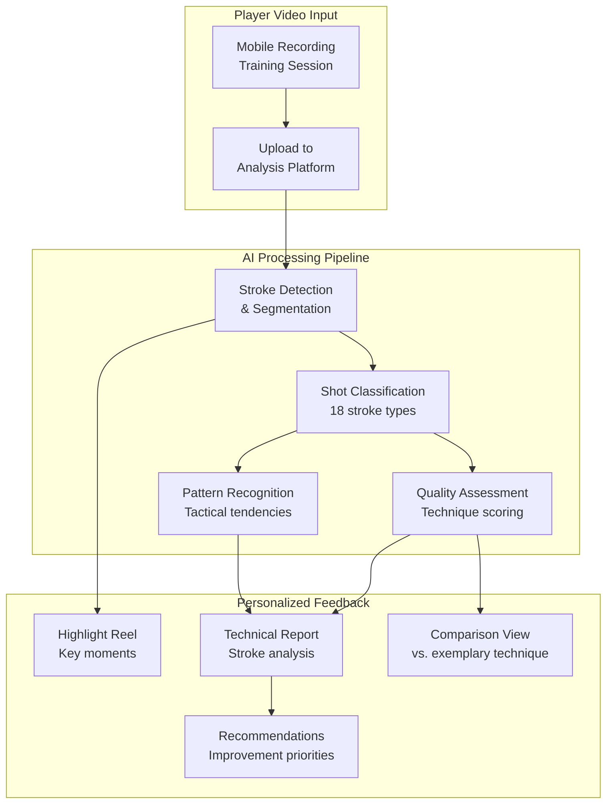

This diagram illustrates the workflow of player self-training applications, showing how mobile video input flows through AI processing to generate personalized feedback outputs.

**Interactive platforms allowing players to compare their movements against exemplary technique models** provide visual learning opportunities that complement textual feedback. The VideoBadminton dataset featuring 19 skilled university players whose proficiency closely parallels professional standards offers reference material against which developing players can benchmark their own technique. By overlaying detected skeletal poses from player recordings against reference poses from expert executions, these platforms enable side-by-side comparison that highlights specific differences in arm angle, body rotation, footwork positioning, and other biomechanically significant elements.

**Scalability and accessibility considerations** distinguish self-training applications from professional coaching tools. While elite systems may employ high-frame-rate cameras, specialized computing hardware, and expert interpretation of results, self-training applications must operate effectively with consumer-grade equipment and present findings in accessible formats that players without technical backgrounds can understand and apply. The development of lightweight model variants—such as the pruned YOLOv7 achieving 44 frames per second processing while maintaining 0.955 mAP@0.5—enables deployment on mobile platforms without requiring cloud processing that would introduce latency and connectivity dependencies.

### 8.3 Broadcast Enhancement and Spectator Engagement Applications

Badminton video analysis technologies extend beyond coaching applications to enhance viewer experience through automated content generation, real-time tactical overlays, and officiating support systems that communicate complex game dynamics to diverse audiences.

**Automated highlight generation** addresses the challenge of condensing lengthy matches into engaging content suitable for social media distribution, news coverage, and viewer catch-up services. AI systems can identify tactically significant moments—spectacular smashes, extended rallies, crucial point conversions—and automatically extract these segments for compilation into highlight packages[^50]. The rally breakdown capabilities developed for tactical analysis provide the foundational segmentation required to identify meaningful match segments, while shot classification enables filtering for specific content types (e.g., all smashes from a particular player, all net exchanges exceeding a certain duration).

**Real-time tactical overlays during live broadcasts** enhance viewer understanding by visualizing player positioning, movement patterns, and tactical dynamics that may not be apparent from standard camera coverage. The real-time analysis framework deployed during Premier Badminton League 2019 demonstrated successful generation of player heatmaps, distance covered metrics, and average speed calculations with minimal latency[^4]. Commentators appreciated the utility for gameplay analysis, and the visual displays helped audiences understand tactical patterns that expert observers recognize intuitively but casual viewers might miss.

**Instant review systems for officiating decisions** represent the most mature broadcast application of badminton video analysis technology. The computer vision system processes high-speed video footage (150-200 FPS) to determine shuttlecock landing positions with sufficient accuracy to support challenge reviews[^4]. The system was successfully deployed during the BWF World Senior Badminton Championships in Katowice, processing challenges across 12 courts where over 1,500 players competed. Data revealed that line judges were incorrect in 24.2% of challenged calls (51 out of 211 challenges), demonstrating the practical value of automated review systems for improving officiating accuracy.

The **instant review system architecture** evolved through practical deployment experience:

| System Component | Technical Specification | Performance Metric |
|-----------------|------------------------|-------------------|
| **Video Recording** | 150-200 FPS, 800×600 resolution | Sufficient temporal resolution for trajectory reconstruction |
| **Processing Speed** | Near real-time on standard PC | Complete procedure under 25 seconds |
| **Decision Accuracy** | 62% correct automated decisions | Requires human operator verification |
| **Installation Time** | Under 4 hours per court | Practical for tournament deployment |
| **Equipment Portability** | Minimal space and weight | Suitable for multi-venue operation |

**Player tracking visualizations** display court coverage patterns, movement efficiency, and positional tendencies that reveal tactical approaches to informed viewers. The tactical heatmaps generated from player position tracking show areas where players spend disproportionate time, revealing court coverage strengths and potential vulnerabilities[^50]. These visualizations transform abstract positional data into intuitive visual representations that communicate tactical information effectively to audiences unfamiliar with advanced badminton strategy.

**Statistical displays communicating complex tactical patterns** require careful design to balance informativeness with accessibility. The nine tactical types identified in research—including Serve and Attack, Continuous Smash, Net Pressure and Scoring, and Rhythm Change Control—provide a vocabulary for describing strategic patterns, but presenting this information to general audiences requires translation into engaging visual formats. Success rates by tactic type, comparative statistics between players, and trend indicators showing tactical evolution within a match can all enhance viewer engagement when presented through well-designed broadcast graphics.

**The challenge of real-time processing for broadcast applications** necessitates architectural compromises that prioritize speed over maximum accuracy. The hybrid detection approach using differential frames with neural network fallback achieves processing speeds up to 200 FPS on standard hardware while maintaining robust tracking through challenging scenarios[^4]. This design pattern—fast primary detection with accurate fallback—provides a template for broadcast systems that must deliver consistent performance under the time constraints of live production.

### 8.4 Dataset Scarcity and Annotation Challenges

Fundamental data limitations constrain research progress across all four core components of badminton video analysis, creating bottlenecks that affect model training, evaluation rigor, and generalization capability. Understanding these limitations guides prioritization of data collection efforts and development of methods that operate effectively under data-constrained conditions.

**The scarcity of publicly available annotated badminton datasets** compared to other sports reflects both the relative niche status of badminton in sports analytics research and the specialized expertise required for accurate annotation. While computer vision benchmarks for general action recognition contain hundreds of thousands of labeled examples, the largest badminton-specific datasets measure in thousands—ShuttleSet contains 36,492 strokes, VideoBadminton comprises 7,822 clips, and FineBadminton encompasses 33,325 strokes. This scale disparity limits the application of data-hungry deep learning approaches that have proven successful in domains with abundant training data.

**The labor-intensive nature of multi-level tactical annotation** creates particular bottlenecks for research on tactical intent recognition and strategic analysis. The FineBadminton annotation pipeline demonstrates the complexity involved: structural parsing using specialized CV models extracts fundamental spatio-temporal events, semantic interpretation using MLLMs translates structured data into textual narratives, and evaluative refinement through expert review produces contextually aware assessments[^50]. The Decision Evaluation tier, providing quality scores from 1-7 with hitting comments averaging 37.4 words, requires domain expertise that cannot be easily crowdsourced to non-expert annotators.

**Class imbalance issues across stroke categories** affect both training effectiveness and evaluation fairness. The natural distribution of strokes in competitive play exhibits substantial imbalance—clears and drives occur frequently while long serves and tap smashes appear rarely. This imbalance creates challenges for recognition models that may overfit to majority classes at the expense of minority class performance. The gap between Top-1 accuracy (82.80% for SlowFast) and Mean Class Accuracy (73.80%) on VideoBadminton reveals this effect, indicating that performance varies considerably across stroke categories.

The following table illustrates the annotation requirements and challenges across different dataset tiers:

| Annotation Level | Content Requirements | Expertise Required | Scalability Challenge |
|-----------------|---------------------|-------------------|----------------------|
| **Stroke Detection** | Temporal boundaries, player identity | Basic badminton knowledge | Moderate—semi-automated possible |
| **Shot Classification** | 18-category stroke taxonomy | Experienced player/coach | High—subtle distinctions require expertise |
| **Tactical Semantics** | Strategic intent, trajectory dynamics | Professional coaching knowledge | Very high—subjective interpretation |
| **Quality Evaluation** | 1-7 scores, narrative assessment | Elite coaching expertise | Extremely high—expert judgment essential |

**The gap between controlled research recordings and real-world competitive footage** introduces domain shift challenges that affect model generalization. The VideoBadminton dataset employed standardized camera positioning (2 meters behind baseline, 4.5 meters height, 30-degree tilt) and high-quality recording equipment, conditions that differ substantially from broadcast footage with variable camera angles, compression artifacts, and visual clutter from crowds and graphics overlays[^4]. TrackNetV2's accuracy drop from 96.3% during training to 85.2% on new match test data illustrates this domain shift effect.

**Strategies for addressing data scarcity** include transfer learning from related domains, data augmentation techniques, and synthetic data generation. The strong performance of skeleton-based methods like ST-GCN on limited training data (28.05% Top-1 accuracy on VideoBadminton-10 compared to 12.79% for SlowFast) suggests that representations with appropriate inductive biases can partially compensate for data limitations. The automated annotation pipeline combining MLLM-generated proposals with human refinement offers a scalable approach to expanding annotated datasets, though quality control remains essential to prevent error propagation.

### 8.5 Cross-Player Generalization and Domain Adaptation Limitations

Developing models that generalize effectively across diverse player populations presents fundamental challenges that limit the practical applicability of badminton video analysis systems trained on restricted player samples. These generalization limitations manifest across multiple dimensions including skill level, playing style, and recording conditions.

**Performance degradation when models trained on elite players are applied to recreational athletes** reflects systematic differences in movement patterns, technique consistency, and tactical sophistication between skill levels. The VideoBadminton dataset features 19 skilled university players whose proficiency closely parallels professional standards, ensuring that models learn from technically correct stroke execution. However, recreational players may exhibit technique variations, incomplete stroke phases, or unconventional movement patterns that fall outside the distribution of training examples, causing recognition failures when deployed beyond elite contexts.

**Variations in prediction accuracy across different playing styles** reveal how individual tactical tendencies affect model performance. Analysis on the ShuttleSet dataset showed a **notable gap of more than 20% average accuracy** between the players whose strokes are predicted best and those predicted worst. This variation may indicate how effectively different players mask their stroke intentions—players who consistently telegraph their shots through preparatory movements are easier to predict, while players who maintain ambiguous body positioning until contact present greater prediction challenges.

**The significant gap in predictability between players who telegraph intentions versus those who mask stroke selection** has important implications for both model design and practical application. The Badminton Stroke-type Transformer (BST) architecture addresses this challenge by prioritizing shuttlecock trajectory information over player poses, arguing that trajectory always reflects actual stroke type without containing deceptive movements[^50]. Players may execute deceptive body movements to mislead opponents, but the shuttlecock trajectory ultimately reveals the true shot type, making trajectory-centric approaches potentially more robust to intentional deception.

**Domain shift issues when applying models to footage from different recording conditions or venues** compound player-level generalization challenges. Research demonstrated that detection performance varies substantially with recording conditions—adult men's matches achieved 89.33% average precision while adult women's matches under different conditions achieved only 71.55%[^4]. The Jaccard Similarity Index ranged from 0.73 to 0.80 across match categories, confirming that localization accuracy degrades with recording variability. Environmental factors including lighting conditions, background complexity, and camera positioning all contribute to domain shift effects.

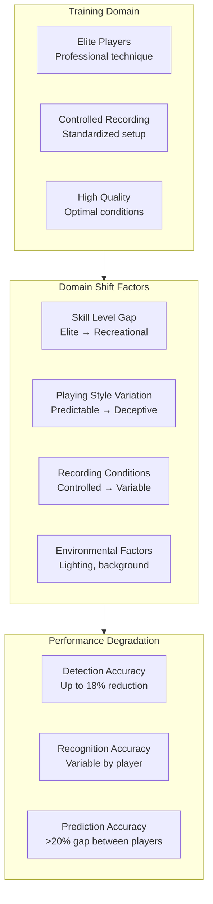

This diagram illustrates the factors contributing to domain shift and their impact on model performance when generalizing beyond training conditions.

**Domain adaptation techniques** offer potential mitigation strategies for generalization challenges. Fine-tuning pre-trained models on target domain data, even with limited examples, can improve performance on specific player populations or recording conditions. The cross-dataset evaluation of BST demonstrated generalizability by achieving strong performance on both ShuttleSet (accuracy 0.8254) and BadmintonDB (accuracy 0.6517), despite different recording conditions and annotation schemes, suggesting that well-designed architectures can achieve reasonable transfer across domains.

**Player-specific model adaptation** represents an alternative approach that embraces rather than resists individual variation. By maintaining player-specific embeddings or fine-tuning separate model instances for different players, systems can capture individual tendencies that generic models miss. RallyNet's player extractor demonstrates this approach, modeling distinctive playing styles through separate representations that condition predictions on individual behavioral patterns.

### 8.6 Real-Time Processing Constraints and Computational Bottlenecks

The tension between analytical depth and processing speed requirements creates fundamental trade-offs that constrain practical deployment of sophisticated badminton video analysis systems. Understanding these constraints guides architectural decisions and identifies opportunities for optimization that maintain acceptable accuracy while meeting latency requirements.

**Computational demands of sophisticated detection and recognition models** exceed what standard computing hardware can process within real-time constraints. The complete verification procedure for instant review systems must not exceed 25 seconds, with average response times of 18 seconds from challenge initiation to decision presentation[^4]. For coaching applications requiring in-rally feedback, constraints are even more demanding—the 15-second broadcast buffer represents the maximum acceptable delay for live analysis. These requirements fundamentally shape architectural decisions, favoring lightweight models and optimized processing pipelines over maximum accuracy.

**The trade-offs between accuracy and latency** manifest throughout the analysis pipeline. TrackNetV2's architectural evolution from Multiple-In Single-Out (MISO) to Multiple-In Multiple-Out (MIMO) design improved processing speed from 2.6 FPS to 31.8 FPS—a twelve-fold increase—by processing multiple output frames per forward pass and amortizing computational overhead[^4]. This speed improvement came through reduced input image size and structural optimization rather than accuracy sacrifice, demonstrating that architectural innovation can sometimes improve both dimensions simultaneously.

**Hardware requirements for practical deployment** must balance performance capability against cost, portability, and venue constraints. The instant review system design specified that all equipment should occupy minimal space and weight, with installation time under 4 hours per court and requiring no more than two people[^4]. These practical constraints preclude high-end server installations and motivate optimization for consumer-grade hardware. Research demonstrated that processing data from two cameras at up to 200 FPS is achievable with a single computer equipped with 9th Gen Intel Core i7 processor and NVIDIA GTX 1080 GPU.

The following table summarizes processing speed benchmarks across different system configurations:

| Configuration | Processing Speed | Accuracy Trade-off | Hardware Requirements |
|--------------|-----------------|-------------------|----------------------|
| **Differential frame detection** | 200 FPS | 81% shuttlecock tracking | Standard CPU |
| **Neural network fallback** | 83 FPS (12ms/patch) | 94% mAP@0.50 | GPU required |
| **TrackNetV2 (MIMO)** | 31.8 FPS | 85.2% test accuracy | GPU recommended |
| **Full SRA pipeline** | Variable | 89.7% shot extraction | Dual GPU optimal |
| **Real-time coaching** | >60 FPS required | Accuracy compromise | Edge computing |

**Achieving sub-25-second response times while maintaining acceptable accuracy** requires strategic allocation of computational resources across pipeline stages. The hybrid detection approach reserves computationally expensive neural network processing for challenging scenarios—using differential frame-based detection as the primary method with neural network fallback when occlusion or other challenges cause primary detection failure[^4]. This design pattern enables resource-efficient operation during normal conditions while maintaining capability for detailed examination when needed.

**Latency budgeting across pipeline stages** requires explicit time allocation to meet overall constraints. The instant review system allocates processing time as: video capture and buffering (continuous), shuttlecock detection using differential frames (<2 ms per frame), neural network fallback when needed (12 ms per patch), trajectory analysis and ground contact determination (variable), and result presentation (remaining budget). This explicit budgeting ensures that the complete pipeline completes within constraints while maximizing accuracy within available time.

**Edge computing and specialized hardware** offer potential solutions for truly real-time deployment. Neural processing units (NPUs) and field-programmable gate arrays (FPGAs) provide favorable performance-per-watt characteristics suitable for deployment in sports venues where power and cooling constraints limit traditional computing approaches. The research community's development of lightweight model variants—such as pruned YOLOv7 achieving 44 FPS while maintaining 0.955 mAP@0.5—creates foundations for edge deployment that maintains analytical capability within stringent resource constraints.

### 8.7 Extension to Doubles Play and Multi-Player Tracking

The research framework established for singles analysis requires substantial extension to address the additional complexities of doubles badminton, where four-player interactions, partner coordination, and distinct tactical considerations create challenges that exceed current methodological capabilities.

**Partner coordination modeling** represents a fundamental extension beyond singles analysis frameworks. In doubles play, effective partnerships involve coordinated movement patterns, complementary shot selection, and communication that determines optimal positioning. Research on naturalistic decision-making in expert players identified that information utilized for decisions includes not only opponent actions and positions but also partner's actions and position. Computational models for doubles must capture these inter-partner dependencies that do not exist in singles contexts.

**Player identity maintenance through occlusion events** presents substantially greater challenges in doubles than singles. With four players on court, occlusion events occur more frequently as players cross paths, rotate positions, and execute shots in close proximity to teammates and opponents. The two-camera approach leveraging overhead and side-view cameras demonstrates how complementary perspectives can be combined for robust multi-object tracking (MOT), but the identity switching problem intensifies when multiple players of similar appearance move through overlapping regions[^4].

**Tactical pattern recognition involving four-player interactions** requires frameworks that model the combinatorial complexity of doubles strategy. The nine tactical types identified for singles—Serve and Attack, Continuous Smash, Net Pressure and Scoring, and others—must be extended or replaced with doubles-specific patterns that capture formations (front-back, side-by-side, rotation), role assignments (attack/defense specialization), and coordinated tactical sequences. The structured components of decision-making identified in expert player research—including partner's actions and position as information sources—provide theoretical grounding for doubles tactical modeling.

**The substantially different strategic considerations characterizing doubles play** compared to singles competition necessitate distinct analytical frameworks rather than simple extensions of singles methods. Doubles tactics emphasize court coverage optimization, attack/defense role separation, and exploitation of gaps created by opponent positioning errors. The principle of winning—creating situations to increase winning chances or reduce opponent's chances—applies equally to doubles, but the mechanisms for achieving these objectives differ fundamentally when coordinating with a partner while opposing two players.

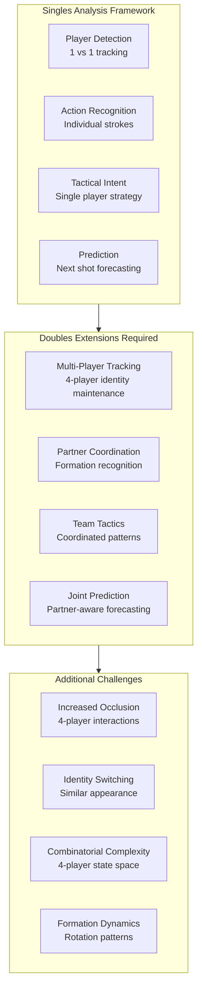

This diagram illustrates the extensions required to adapt singles analysis frameworks for doubles play and the additional challenges that arise.

**RacketDB dataset contributions** to doubles analysis research provide foundational resources for multi-player scenarios. The dataset contains 16,045 labeled rackets captured from 4K drone footage of 2-vs-2 men's doubles games, with annotations supporting equipment detection research relevant to stroke phase identification in multi-player contexts. However, the focus on racket detection rather than comprehensive player tracking and tactical annotation limits direct applicability to full doubles analysis systems.

**Research directions for doubles extension** include: development of formation recognition systems that classify partnership configurations (front-back, side-by-side, rotation transitions); creation of doubles-specific tactical taxonomies capturing coordinated patterns; extension of prediction models to jointly forecast both partners' actions; and collection of annotated doubles datasets with multi-level tactical annotations comparable to FineBadminton's singles coverage.

### 8.8 Integration with Wearable Sensors and Multi-Modal Data Fusion

Combining video-based analysis with physiological and biomechanical data from wearable devices offers opportunities for richer performance insights that capture information not directly observable from video alone. The multi-modal approach addresses fundamental limitations of vision-only systems while introducing practical constraints that must be carefully managed.

**The MultiSenseBadminton dataset** represents the most comprehensive multi-sensor resource for badminton analysis, providing synchronized data from five wearable sensor types: eye tracking using Pupil Invisible Glasses, body tracking through Perception Neuron Studio with 17 IMU sensors, muscle activity via EMG from gForcePro+ armband and Cognionics AIM, and foot pressure using Moticon insoles. This configuration captures biomechanical information across multiple dimensions simultaneously, enabling analysis that extends beyond what video observation can provide.

**IMU-based motion capture** provides high-frequency kinematic data capturing joint angles, segment orientations, and acceleration profiles throughout stroke execution. The 17-sensor configuration used in MultiSenseBadminton enables detailed reconstruction of full-body movement patterns, including the arm angle, twist angle, and step position features identified as most critical for stroke classification. Unlike video-based pose estimation that may struggle with rapid movements and motion blur, IMU sensors directly measure rotational velocities and accelerations with high temporal resolution.

**EMG muscle activation monitoring** reveals the neuromuscular patterns underlying stroke execution that are invisible to video analysis. The timing and intensity of muscle activation across different muscle groups distinguishes between stroke types even when body positions appear similar. For example, a deceptive shot where a player prepares as if for a smash but executes a drop may show different EMG activation patterns than a genuine smash preparation, providing discrimination capability that trajectory-based approaches cannot match.

**Eye tracking for visual attention analysis** captures where players direct their gaze during rallies, revealing the information sources they prioritize for decision-making. Research on visual search patterns in expert players found that expert players' visual focus concentrates on the opponent's racket and shuttlecock in flight, with this attention being more pronounced against familiar and high-level opponents. Understanding these attention patterns informs both training design (teaching players where to look) and computational modeling (identifying which visual features expert players find most informative).

**Foot pressure sensing** measures weight transfer patterns and balance maintenance throughout stroke execution. The ground reaction forces captured by instrumented insoles reveal preparation quality, power generation mechanics, and recovery positioning that affect both stroke effectiveness and injury risk. This modality proves particularly valuable for footwork analysis, where video-based methods may struggle to distinguish between different weight distributions that appear similar from camera perspectives.

| Sensor Modality | Information Captured | Advantage Over Video | Practical Constraint |
|----------------|---------------------|---------------------|---------------------|
| **IMU (17 sensors)** | Joint angles, acceleration | High temporal resolution, no occlusion | Equipment bulk, movement interference |
| **EMG (arm + leg)** | Muscle activation patterns | Internal state visibility | Electrode placement, signal noise |
| **Eye tracking** | Gaze direction, fixation | Attention allocation | Glasses comfort, calibration drift |
| **Foot pressure** | Weight distribution, balance | Ground reaction forces | Insole integration, durability |

**Practical constraints limiting sensor deployment in competitive match scenarios** must be acknowledged when considering multi-modal approaches. Wearable devices may interfere with player movement, create discomfort during extended play, or violate equipment regulations in official competitions[^50]. The controlled data collection environment of MultiSenseBadminton, while enabling high-quality synchronized recordings, differs substantially from the unconstrained conditions of actual match play. These limitations suggest that sensor-based approaches are most applicable to training environments where equipment restrictions are relaxed and the benefits of detailed biomechanical feedback justify instrumentation overhead.

**Cross-modal knowledge transfer** offers a path to leveraging sensor insights without requiring sensor deployment during inference. Insights gained from sensor data about which biomechanical features most effectively distinguish stroke types can inform the design of video-based feature extraction methods. If EMG analysis reveals that specific muscle activation patterns reliably indicate stroke type, video-based systems might be designed to estimate these patterns from observable body configurations, improving video-based recognition without requiring sensors during practical deployment.

### 8.9 Explainable AI and Actionable Tactical Insight Generation

The development of AI systems that not only recognize patterns but provide interpretable explanations supporting coaching decisions represents a critical frontier for practical adoption of badminton video analysis technology. Bridging computational outputs with the contextual, dynamic understanding that expert coaches employ requires sophisticated approaches to explanation generation and insight communication.

**Natural language generation of tactical recommendations** transforms structured analytical outputs into coaching-relevant narrative. The RAG-enhanced Large Language Model approach enables coaches to pose complex queries about tactical patterns, player tendencies, and situational strategies, receiving narrative responses grounded in match data[^4]. This interface design recognizes that coaches possess deep domain expertise but may lack technical skills for direct data analysis, necessitating systems that translate computational findings into actionable language.

**The Shot2Tactic-Caption framework** demonstrates automated generation of tactical descriptions at multiple temporal scales. The system produces shot-level captions (average duration 0.7 seconds) describing individual actions and tactic-level captions (average duration 5 seconds) capturing how actions combine into tactical execution[^50]. The BLEU-4 score of 64.57 and METEOR score of 79.63 for tactic-level captions indicate that generated descriptions align well with human-authored references, suggesting that automated caption generation can produce useful narrative summaries of tactical patterns.

**Visualization techniques communicating complex analytical findings** to non-technical users require careful design that balances informativeness with accessibility. The TIVEE immersive visual analytics system uses 3D visualization in virtual reality environments to display stroke trajectories through multi-court layouts that characterize kinematic features while maintaining spatial and temporal correlations. The hierarchical exploration capability enables progressive drill-down from aggregate patterns to individual instances, supporting both broad pattern discovery and detailed case analysis.

**The challenge of bridging computational outputs with expert coaching understanding** reflects fundamental differences between how AI systems and human coaches reason about badminton. Research on expert decision-making identified that coaching should move beyond regimented routines to develop players' abilities for dynamic, contextual understanding. Tactical analysis systems should therefore be evaluated not only on their accuracy in recognizing patterns but also on their ability to support this developmental goal—helping players understand why certain tactical choices succeed rather than merely identifying what patterns occur.

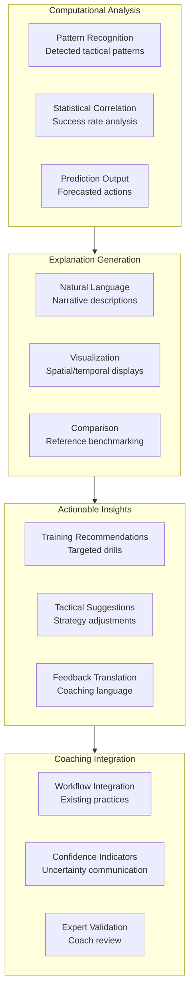

This diagram illustrates the pathway from computational analysis through explanation generation to actionable coaching insights and workflow integration.

**Confidence indicators and uncertainty communication** enable coaches to apply appropriate skepticism to analytical conclusions. Automated analysis should include indicators highlighting areas where computational uncertainty is high, enabling coaches to weight uncertain conclusions appropriately in their decision-making. The stochastic evaluation protocol requiring 6 predicted sequences per rally acknowledges inherent prediction uncertainty, and similar uncertainty quantification should accompany all analytical outputs.

**Expert validation through case studies and interviews** provides qualitative assessment of practical utility. The TIVEE system evaluation through case studies analyzing specific players' tactical patterns and expert interviews confirmed the system's effectiveness in finding patterns of commonly used tactics and providing explanations of tactical feasibility. This validation approach recognizes that tactical analysis systems must ultimately serve human experts, whose assessment of practical utility cannot be fully captured by automated metrics.

**The interpretability of RallyNet** distinguishes it from black-box prediction models by enabling tactical interpretation of player intentions. By decoding the selected contexts from the Experiential Context Selector, analysts can obtain understanding of the strategic reasoning underlying observed action sequences. This capability supports practical applications where understanding why particular patterns emerge is as valuable as predicting what will happen next.

### 8.10 Emerging Technologies and Long-Term Research Horizons

Transformative technologies emerging across artificial intelligence, computing hardware, and human-computer interaction domains may fundamentally reshape badminton video analysis capabilities. Understanding these technological trajectories guides research investment and prepares the field for paradigm shifts that could obsolete current approaches while enabling previously impossible analytical capabilities.

**Advances in quantum computing for enhanced pattern recognition** represent a frontier with demonstrated potential for badminton action recognition. The Quantum Convolutional Neural Network (QCNN) achieved overall accuracy of 96.5% for stroke classification, substantially exceeding traditional CNN (92.1%) and SVM (87.3%) approaches. QCNN's superior noise robustness—maintaining precision of 0.89 even under high noise conditions compared to 0.78 for CNN—suggests that quantum computing principles may enable more robust analysis under the challenging conditions characteristic of real-world badminton footage. As quantum hardware becomes more accessible, these theoretical advantages may translate into practical deployment capabilities.

**Large language model integration for natural language tactical querying** has already demonstrated practical utility through RAG-enhanced systems that enable coaches to interact with extracted tactical knowledge through natural language[^4]. Future developments may enable more sophisticated reasoning about tactical situations, generating not only descriptions of observed patterns but also recommendations for novel tactical approaches based on learned principles. The multimodal understanding capabilities evaluated through FBBench reveal current limitations—even top commercial models struggle with nuanced spatio-temporal reasoning—while establishing benchmarks against which progress can be measured.

**Augmented reality interfaces for immersive training feedback** extend visualization capabilities beyond traditional screen-based displays. The TIVEE system's use of virtual reality environments for tactical visualization demonstrates the potential for immersive interfaces that place coaches and players within three-dimensional representations of match data. Augmented reality could overlay analytical information directly onto live training environments, providing real-time feedback that integrates seamlessly with physical practice rather than requiring separate video review sessions.

**Edge computing enabling truly real-time analysis** addresses the fundamental tension between analytical sophistication and processing latency. Current systems must choose between detailed analysis requiring powerful centralized computing and rapid feedback achievable only through simplified processing. Edge computing platforms with specialized neural processing capabilities could enable sophisticated analysis to execute locally with minimal latency, supporting in-rally coaching feedback that current architectures cannot achieve.

**The potential for AI systems moving beyond pattern recognition toward genuine tactical reasoning** represents the most ambitious long-term horizon. Current systems excel at recognizing patterns in historical data and predicting likely continuations based on learned statistical regularities. Future systems might develop capabilities for strategic planning—reasoning about optimal tactical approaches given specific opponent characteristics, match contexts, and player capabilities. The hierarchical offline imitation learning approach of RallyNet, which models player decision-making through contextual Markov decision processes, provides initial steps toward systems that reason about tactical choices rather than merely recognizing them.

| Emerging Technology | Current State | Potential Impact | Timeline Horizon |
|--------------------|---------------|------------------|------------------|
| **Quantum Computing** | Research demonstrations (QCNN 96.5% accuracy) | Enhanced pattern recognition, noise robustness | 5-10 years |
| **Large Language Models** | RAG integration for tactical querying | Natural language coaching interfaces | 2-5 years |
| **Augmented Reality** | VR visualization prototypes (TIVEE) | Immersive training feedback | 3-7 years |
| **Edge Computing** | Lightweight model optimization | True real-time analysis | 2-5 years |
| **Tactical Reasoning AI** | Imitation learning foundations (RallyNet) | Strategic planning capabilities | 10+ years |

**Multi-modal foundation models** trained on diverse data types—video, sensor data, textual descriptions, and tactical annotations—may enable unified representations that capture badminton understanding across modalities. Such models could leverage the complementary strengths of different data sources while maintaining the flexibility to operate with whatever inputs are available in specific deployment contexts.

**Federated learning approaches** could address data scarcity challenges by enabling model training across distributed datasets without requiring centralized data collection. National federations, professional teams, and training academies could contribute to model improvement while maintaining control over their proprietary data, creating larger effective training sets than any single organization could assemble.

**The integration of biomechanical simulation** with video analysis could enable systems that not only recognize what players do but understand why certain techniques succeed or fail based on physical principles. Such integration would support more sophisticated feedback that explains biomechanical inefficiencies and suggests specific corrections based on physics-grounded understanding rather than purely statistical pattern matching.

The convergence of these emerging technologies points toward a future where badminton video analysis systems provide comprehensive, real-time, interpretable insights that genuinely augment human coaching expertise rather than merely automating routine analytical tasks. Achieving this vision requires sustained research investment across the technical foundations established in this research framework while remaining attentive to the practical constraints and human factors that ultimately determine whether sophisticated capabilities translate into meaningful performance improvements for players and coaches.

# 参考内容如下：
[^1]:[The analysis of motion recognition model for badminton ...](https://www.nature.com/articles/s41598-025-02771-9)
[^2]:[AI-powered Badminton Video Detection](https://www.techrxiv.org/users/692277/articles/682498-ai-powered-badminton-video-detection-enhancing-gameplay-analysis-and-training)
[^3]:[A Video Dataset for Badminton Action Recognition](https://arxiv.org/html/2403.12385v1)
[^4]:[Instant review system for badminton - computer vision ...](https://spyro-soft.com/blog/artificial-intelligence-machine-learning/instant-review-system-for-badminton-computer-vision-use-case)
[^5]:[TOTNet: Occlusion-Aware Temporal Tracking for Robust ...](https://www.arxiv.org/pdf/2508.09650)
[^6]:[Automatic Shuttlecock Fall Detection System in or out of a ...](https://pmc.ncbi.nlm.nih.gov/articles/PMC9655598/)
[^7]:[AI-powered Badminton Video Detection](https://www.techrxiv.org/doi/full/10.36227/techrxiv.23708325.v2)
[^8]:[TrackNetV2: Efficient Shuttlecock Tracking Network](https://ieeexplore.ieee.org/document/9302757/)
[^9]:[Enhancing Badminton Game Analysis: An Approach to Shot ...](https://pmc.ncbi.nlm.nih.gov/articles/PMC11244353/)
[^10]:[A comprehensive review of ball detection techniques in sports](https://pmc.ncbi.nlm.nih.gov/articles/PMC12453710/)
[^11]:[Tracking Players in a Badminton Court by Two Cameras](https://arxiv.org/abs/2308.04872)
[^12]:[MultiSenseBadminton: Wearable Sensor–Based ...](https://www.nature.com/articles/s41597-024-03144-z)
[^13]:[Tactics in Badminton Singles - Jake Downey](https://worldbadminton.com/books/documents/TacticsInBadmintonSingles.pdf)
[^14]:[Naturalistic decision-making in expert badminton players - Insep](https://insep.hal.science/hal-01709227v1/document)
[^15]:[A Multi-Level Dataset for Fine-Grained Badminton Video ...](https://arxiv.org/html/2508.07554v1)
[^16]:[A Multi-Level Dataset for Fine-Grained Badminton Video ...](https://www.arxiv.org/pdf/2508.07554)
[^17]:[Multi-Scale Captioning of Badminton Videos for Tactical ...](https://arxiv.org/html/2510.14617v1)
[^18]:[Prediction model and technical and tactical decision analysis ...](https://journals.plos.org/plosone/article?id=10.1371/journal.pone.0312801)
[^19]:[Tactical badminton analysis via computer vision and RAG ...](https://www.sciencedirect.com/science/article/abs/pii/S0950705125020659)
[^20]:[Decoding (un)known opponent's game play, a real-life ...](https://ceur-ws.org/Vol-1419/paper0031.pdf)
[^21]:[Decision-making process in game sports: what do top-level ...](https://pmc.ncbi.nlm.nih.gov/articles/PMC12512046/)
[^22]:[Visual Exploration and Explanation of Badminton Tactics in ...](https://ssxiexiao.github.io/papers/TIVEE.pdf)
[^23]:[Offline Imitation of Badminton Player Behavior via ...](https://arxiv.org/html/2403.12406v1)
[^24]:[Offline Imitation of Badminton Player Behavior via ...](https://arxiv.org/abs/2403.12406)
[^25]:[Generating Turn-Based Player Behavior via Experience from ...](https://openreview.net/pdf/8b690858555033e5ce20349047133cb6ecc998eb.pdf)
[^26]:[Offline Imitation of Badminton Player Behavior via ...](https://arxiv.org/html/2403.12406v2)
[^27]:[arXiv:2112.01044v1 [cs.LG] 2 Dec 2021](https://arxiv.org/pdf/2112.01044)
[^28]:[[2306.04948] ShuttleSet: A Human-Annotated Stroke-Level ...](https://arxiv.org/abs/2306.04948)
[^29]:[Benchmarking Stroke Forecasting with Stroke-Level ...](https://www.ijcai.org/proceedings/2024/1042.pdf)
[^30]:[Benchmarking Stroke Forecasting with Stroke-Level ...](https://arxiv.org/html/2306.15664v3)
[^31]:[Predicting badminton outcomes through machine learning ...](https://www.nature.com/articles/s41598-025-87610-7)
[^32]:[ShuttleNet: Position-aware Fusion of Rally Progress and ...](https://arxiv.org/abs/2112.01044)
[^33]:[ShuttleSet: A Human-Annotated Stroke-Level Singles ...](https://arxiv.org/pdf/2306.04948)
[^34]:[wywyWang/ShuttleNet: Official Implementation for ...](https://github.com/wywyWang/ShuttleNet)
[^35]:[A Stroke of Genius: Predicting the Next Move in Badminton](https://openaccess.thecvf.com/content/CVPR2024W/CVsports/papers/Ibh_A_Stroke_of_Genius_Predicting_the_Next_Move_in_Badminton_CVPRW_2024_paper.pdf)
[^36]:[BST: Badminton Stroke-type Transformer for Skeleton ...](https://arxiv.org/html/2502.21085v3)
[^37]:[Shuttle trajectory reconstruction from monocular badminton ...](https://cs.stanford.edu/people/paulliu/files/cvpr-2022.pdf)
[^38]:[Exploration of Player Behaviors from Broadcast Badminton ...](https://yun-vis.net/assets/projects/analytics/cgf2023-preprint.pdf)
[^39]:[Future Prediction of Shuttlecock Trajectory in Badminton ...](https://www.mdpi.com/2313-433X/9/5/99)
[^40]:[Towards Real-Time Analysis of Broadcast Badminton Videos](https://www.alphaxiv.org/overview/2308.12199v1)
[^41]:[Lightweight CA-YOLOv7-Based Badminton Stroke ...](https://thesai.org/Downloads/Volume16No2/Paper_35-Lightweight_CA_YOLOv7_Based_Badminton_Stroke_Recognition.pdf)
[^42]:[A high-precision and efficient method for badminton action ...](https://www.sciencedirect.com/science/article/abs/pii/S0952197624013356)
[^43]:[Offline reinforcement learning for badminton tactical ...](https://wenminggong.github.io/papers/Offline_RL_for_Badminton_EAAI_paper.pdf)
[^44]:[VIRD: Immersive Match Video Analysis for High- ...](https://pubmed.ncbi.nlm.nih.gov/37878442/)
[^45]:[ShuttleSet22: Benchmarking Stroke Forecasting with ...](https://arxiv.org/html/2306.15664v1)
[^46]:[Benchmarking Badminton Action Recognition with a New ...](https://arxiv.org/html/2403.12385v2)
[^47]:[A Comprehensive Dataset for Badminton Racket Detection](https://www.scitepress.org/Papers/2025/131597/131597.pdf)
[^48]:[The analysis of motion recognition model for badminton ...](https://pmc.ncbi.nlm.nih.gov/articles/PMC12125242/)
[^49]:[Application of computer vision and vector space model for ...](https://openaccess.thecvf.com/content_cvpr_2017_workshops/w2/papers/Weeratunga_Application_of_Computer_CVPR_2017_paper.pdf)
[^50]:[Custom AI Badminton Video Analysis Software Development](https://tezeract.ai/industries/badminton-video-analysis-software/)
